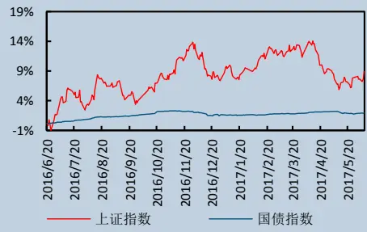
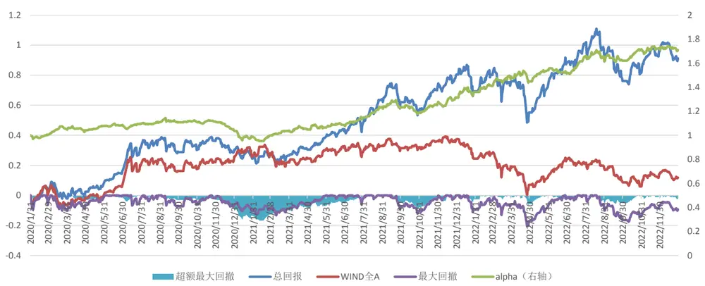
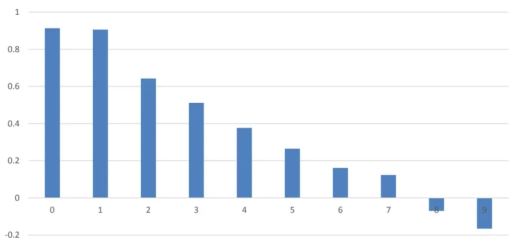
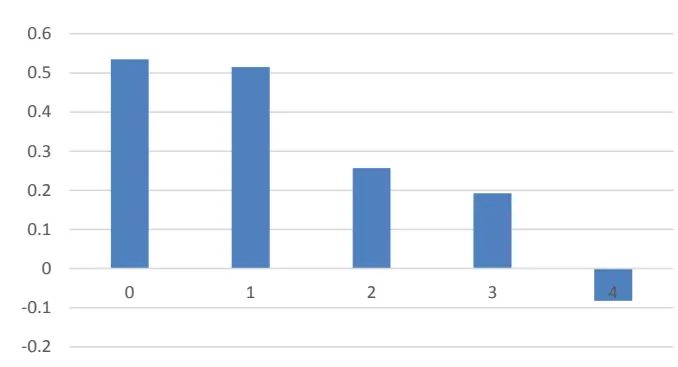
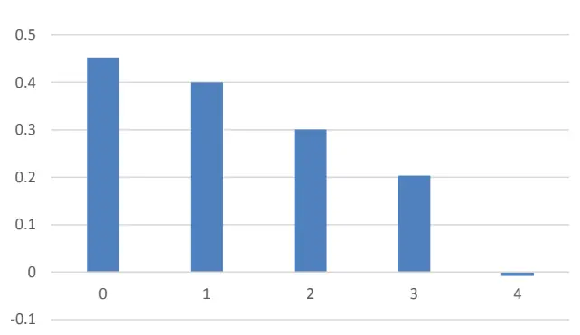
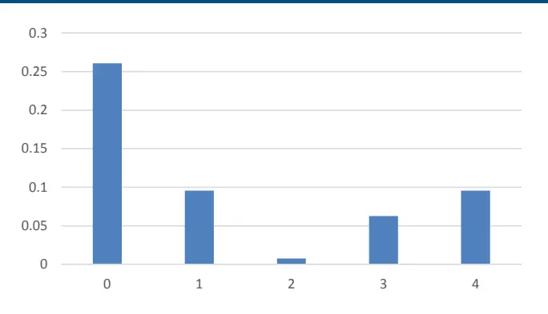

证券研究报告·金融工程深度

# “逐鹿”Alpha 专题报告（十三）

——基于openFE 的基本面因子挖掘框架

## 核心观点

本文介绍了一种基于 openFE 的基本面因子挖掘方法，将三大报表的数据以及基础算子之间按照一定的结构进行排列组合，构建出 70 万个不同风格类型的因子，再利用 openFE 的两步筛选法，筛选出不同风格类型下表现最好的合成因子。对比因子的表现，动量，市值，行业为最重要的因子，其次估值及成长因子表现较好，质量因子在 A股的表现较为一般。利用构造的合成因子以及基础因子，训练月频的选股模型，模型在回测区间内，全市场内选股的年化超额为 21%，夏普比率为 1.19。

## 主要内容

## 简介

本文我们将 openFE 框架应用于基本面因子挖掘，不同于DeepLOB 和 AlphaZero ， openFE 是 一 种 基 于 枚 举 法 的Expand-And-Reduce 框架，能够高效的检验大量因子（>106）

## OpenFE

openFE 生成的因子结构较为简单，可解释性较好，因此非常适合用于基本面因子挖掘。本文采用三大表中的数据作为基础特征，在此基础上构建合成因子，通过进一步筛选，保留表现较好的因子作为新的 alpha 因子。OpenFE 是一个基于枚举法的Expand-And-Reduce 框架，首先通过基础特征以及算子的排列组合构建所有可能的因子。而后通过一个两步的筛选步骤，对因子进行筛选。

## 合成因子

通过 openFE 的两步筛选，保留各风格重要性最高的 10 个因子。从各类风格因子的平均重要性可以看出，价值因子的重要性最高，其次为成长因子，质量因子的平均重要性最低。在基础因子中，动量，市值以及行业是表现最好的三个因子

## 因子回测

利用 10 个基础因子以及 50 个合成因子，构建选股模型。策略的表现较为稳定，过去不到 3 年的时间累计收益达到 91.2%,，累计超额收益达到 79.4%，年化超额收益 21%，夏普比率为 1.19

# 金融工程研究

丁鲁明

dingluming@csc.com.cn

021-68821623

SAC 编号:s1440515020001

王超

wangchaodcq@csc.com.cn

SAC 编号:S1440522120002

发布日期： 2023 年 02 月 17 日

## 市场表现

## 相关研究报告

## 一、简介

因子挖掘是金融工程的一个重要方向，它试图从海量的金融数据中提取有价值的信息，并将其应用于投资组合的管理。通过对因子的定义、评估和组合，因子投资策略试图实现长期的超额收益。

常见的因子包括价值、动量、规模、质量和波动率。因子挖掘需要大量的数据收集和预处理、因子评估和回测，还需要统计学和计算机科学的技能。

在实际应用中，因子挖掘可以与机器学习、统计学和计算机科学相结合，以提高因子投资的效率和准确性。因子挖掘的成功与否取决于因子的选择和组合，以及因子评估的准确性。

总之，因子挖掘是一种有前途的金融工程方向，具有广泛的应用前景和潜力。

--chatGPT

以上因子挖掘的介绍生成自chatGPT，随着机器学习尤其是深度学习的发展，各类应用早已深入日常生活，在量化投资领域，也有了较为成熟的应用。

在之前的系列报告中，我们介绍过深度学习模型 DeepLOB 和基于进化算法的 AlphaZero，DeepLOB 通过巧妙设计数据结构以及网络结构，使得每一层生成的因子具有一定的经济学意义，AlphaZero 是基于进化算法的因子挖掘框架，两者分别代表了深度学习以及启发式算法在因子挖掘中的应用。本文我们将 openFE 框架应用于基本面因子挖掘，不同与以上两种方法，openFE 是一种基于枚举法的 Expand-And-Reduce 框架，能够高效的检验大量因子（>106）。

三种方法分别代表了深度学习，启发式算法以及枚举法在因子挖掘中的应用，深度学习法的优点在于效率较好且样本内效果最好，缺点是生成的因子无法解释且要求算子可导。启发式算法效率介于枚举法和深度学习之间，能够生成批量因子，因子解释性一般，无法保证找到全局最优。枚举法是一种暴力算法，一般生成的因子形式都较为简单，可解释性较好，生成因子数量较多，导致逐一检验时效率较低，因此需要对因子检验的效率进行优化。

表 1:因子挖掘方法

|  | 深度学习 | 启发式 | 枚举法 |
| --- | --- | --- | --- |
| 代表算法 | DeepLOB | GP, AlphaZero | Alpha360,openFE |
| 单次生成因子数量 | 10⁰-101 | >103 | >104 |
| 适合场景 | 中高频因子 | 中频 | 中低频 |
| 因子复杂度 | >10阶 | <10阶 | <5阶 |
| 可解释性 | 最差 | 一般 | 最好 |
| 样本内效果 | 最好 | 较好 | 较好 |
| 算子要求 | 严格（可导） | 无 | 无 |
| 效率 | 最快 | 较快 | 最慢 |

资料来源：中信建投证券

## 二、OpenFE

不同于 AlphaZero 用于量价因子挖掘，openFE 生成的因子结构较为简单，可解释性较好，因此非常适合用于基本面因子挖掘。本文采用三大报表中的数据作为基础特征，在此基础上构建合成因子，通过 openFE 进一步筛选，保留表现较好的因子作为新的合成因子。

OpenFE 是一个基于枚举法的 Expand-And-Reduce 框架，首先通过基础特征以及算子的排列组合构建具有一定结构的风格因子。而后通过两步的筛选步骤，对因子进行筛选，保留最终特征重要性最高的因子。

## 2.1 因子 Expand

基础特征采用三大报表中的数据（资产负债表，损益表，现金流量表），其中资产负债表为时点数据，损益表和现金流量表为时期数据，我们将损益表和现金流量表中的数据均转为季频数据。

三大报表中的字段共计有 100 多，大部分字段缺失值较多，对于缺失值大于 10%的字段，予以剔除。利用剩下的所有字段训练一个 LGBM 模型，保留每张报表内重要性排名前 15 的因子。在这些因子的基础上，再加入市值，行业，动量（过去一个月收益率）三个对股票收益解释度非常高的因子。共计 45 个基础特征以及 3 个额外添加的特征。

为使得因子具有较好的可解释性，采用一些较为简单的算子，包括四则运算（+，-，*，/）、同比算子（YOY）、环比算子（QOQ）、以及横截面排序算子（CSRank）。

如果采用暴力方式进行排列组合，即使是简单的二阶因子，以上因子以及算子能够组合出~109 个因子，难以进行处理。

不同类型的风格因子往往具有一定的结构特征，例如常见的 PE,PB,PS 等估值因子均为简单的一阶因子，分子端净利润/净资产/主营业务收入来自三大报表，分母端为总市值。在构造估值类合成因子时，我们将其扩展为二阶因子，具体做法为分子端的单因子改为 a±b 的形式，其中 a，b∈损益表/现金流量表/资产负债表，分母端为总市值，当 a=b，且算子为+时，此二阶因子等价于 PE。

同理，借鉴资产负债率，ROE，净利润现金比率，PE，净利润同比增长率等因子结构，本文构建了杠杆因子，收益因子，质量因子，估值因子，成长因子共 5 类风格因子，因子结构如下表所示。因子均为二阶因子（不考虑 CSRank），总因子数量~70 万左右。

表 2:风格因子结构

| 风格 | 因子结构 | 说明 |
| --- | --- | --- |
| 杠杆因子 | CSRANK((a±b)/(c±d)) | a,b,c,d∈资产负债表 |
| 收益因子 | CSRANK((a±b)/(c±d)) | a,b ∈损益表 c,d∈资产负债表 |
| 质量因子 | CSRANK((a±b)/(c±d)) | a,b ∈损益表 c,d∈现金流量表 |
| 估值因子 | CSRANK((a±b)/market_value) | a,b ∈损益表/现金流量表/资产负债表 |
| 成长因子 | CSRANK(x*f(a)±y*f(b)) | a,b ∈损益表/现金流量表/资产负债表, f ∈ QOQ/YOY, x,y ∈ [0,5] |

资料来源：中信建投证券

## 2.2 因子 Reduce

原始的 70 万因子逐一检验效率较低，openFE 采用两步的筛选方法，极大的提高了筛选效率。在第一步筛选中，采用了 successive halving（连续二分法）进行单因子检验。具体做法是首先采用部分小样本，对每一类风格的所有因子进行单因子模型 LGBM 的训练，计算特征的模型表现。下一轮增加样本数量，保留第一次训练中表现较好的部分因子，再此进行训练，以此类推，不断增加样本数量，减少因子数量，直至用全样本训练，得到最终筛选的因子列表。

表 3: 连续二分法

| Iterations | 0 | 1 | 2 |  | n |
| --- | --- | --- | --- | --- | --- |
| Features | 1 | 1/2 | 1/4 | … | 1/2ⁿ |
| Data | 1/2ⁿ | 1/2ⁿ-1 | 1/2n-2 | … | 1 |

资料来源：中信建投证券

经过第一轮的单因子筛选后，保留约 1/16 的因子，此时因子数量依旧较多(>103),为了进一步筛选因子，且剔除因子间的相关性问题，第二轮用所有保留的合成因子以及原始的 48 个基础特征进行多因子模型 LGBM 的训练，最终利用 LGBM 输出所有因子的重要性排序。

LGBM 在计算特征重要性时有两种方式，分别为 gain 和 split，其中 gain 是通过计算总的 gini 增益来得到特征重要性，split 是计算模型中特征出现的次数来计算得到特征重要性，本文采用 gain 来计算特征重要性。

在利用 LGBM 进行训练时，openFE 采用 feature boosing 的方法计算因子的边际贡献，即首先利用基础特征计算模型的预测值 y1以及效果 metric1，将 y1作为新的训练的初始值，用新因子训练得到 y2和 metric2，新因子的边际贡献为 metric2 -metric1。

## 三、合成因子

通过 openFE 的两步筛选，保留各风格重要性最高的 10 个因子。最终的因子列表为：

表 4:因子列表

| 风格 | 因子 CSRank(((3*年初未分配利润_qoq)+(2*净利润(不含少数股东损益)_yoy)),公告日期) |
| --- | --- |
| 成长因子 | CSRank(((2*营业利润_yoy)+(3*净利润(不含少数股东损益)_yoy)),公告日期) |
|  | CSRank(((3*净利润(含少数股东损益)_yoy)+(2*年初未分配利润_qoq)),公告日期) |
|  | CSRank(((3*营业总收入_yoy)+(2*净利润(含少数股东损益)_yoy)),公告日期) |
|  | CSRank(((4*年初未分配利润_qoq)+(1*营业收入_yoy)),公告日期) |
|  | CSRank(((1*资本公积金_qoq)+(4*股东权益合计(含少数股东权益)_qoq)),公告日期) |
|  | CSRank(((0*投资活动产生的现金流量净额_yoy)+(5*股东权益合计(不含少数股东权益)_qoq)),公告日期) |
| 价值因子 | CSRank(((0*投资活动现金流出小计_yoy)+(5*股东权益合计(不含少数股东权益)_qoq)),公告日期) CSRank(((净利润(不含少数股东损益)+减:管理费用)/总市值),公告日期) |
|  | CSRank(((净利润(不含少数股东损益)+减:营业税金及附加)/总市值),公告日期) |
|  | CSRank(((所得税+净利润(不含少数股东损益))/总市值),公告日期) |
|  | CSRank(((购建固定资产、无形资产和其他长期资产支付的现金-投资活动现金流出小计)/总市值),公告日期) |
|  | CSRank(((净利润(含少数股东损益)+减:管理费用)/总市值),公告日期) |
|  | CSRank(((净利润(含少数股东损益)-减:财务费用)/总市值),公告日期) CSRank(((净利润(不含少数股东损益)-所得税)/总市值),公告日期) |
| 盈利因子 | CSRank(((营业利润+减:管理费用)/总市值),公告日期) CSRank(((净利润(含少数股东损益)+净利润(不含少数股东损益))/(股本+股东权益合计(含少数股东权益))),公告日期) CSRank(((所得税-净利润(不含少数股东损益))/(其他应收款(合计)(元）-股东权益合计(不含少数股东权益))),公告日期) CSRank(((所得税-营业利润)/(股东权益合计(含少数股东权益)-资本公积金)),公告日期) CSRank(((加:营业外收入-综合收益总额(母公司))/(股东权益合计(不含少数股东权益)-资本公积金)),公告日期) CSRank(((营业利润-所得税)/(其他应收款(合计)(元）-股东权益合计(不含少数股东权益))),公告日期) |
| 质量因子 | CSRank(((净利润(不含少数股东损益)+减:营业税金及附加)/(年初未分配利润+股本)),公告日期) CSRank(((净利润(不含少数股东损益)+加:营业外收入)/(年初未分配利润+递延所得税资产)),公告日期) CSRank(((减:财务费用-净利润(含少数股东损益))/(应交税费+股东权益合计(不含少数股东权益))),公告日期) CSRank(((利润总额+减:销售费用)/(预付款项+股本)),公告日期) CSRank(((利润总额-减:财务费用)/(期末现金及现金等价物余额+购建固定资产、无形资产和其他长期资产支付的现金)),公告日 期) CSRank(((减:管理费用-营业利润)/(支付的各项税费+支付的各项税费)),公告日期) CSRank(((减:销售费用+营业利润)/(购建固定资产、无形资产和其他长期资产支付的现金+经营活动现金流入小计)),公告日期) CSRank(((净利润(不含少数股东损益)-加:营业外收入)/(经营活动现金流入小计+期末现金及现金等价物余额)),公告日期) |
|  | CSRank(((减:销售费用+营业利润)/(投资活动现金流出小计+经营活动现金流入小计)),公告日期) CSRank(((所得税-加:营业外收入)/(经营活动现金流入小计+收到其他与经营活动有关的现金)).公告日期 |
|  | CSRank(((股东权益合计(不含少数股东权益)-股东权益合计(含少数股东权益))/(年初未分配利润-盈余公积金)),公告日期) |
|  | CSRank(((股东权益合计(含少数股东权益)-股东权益合计(不含少数股东权益))/(年初未分配利润-预付款项)),公告日期) CSRank(((股本-盈余公积金)/(应交税费+递延所得税资产)),公告日期) |
|  | CSRank(((应收票据及应收账款-其他应收款(合计)（元）)/(其他应收款(合计)（元）-应收账款)),公告日期) |
| 杠杆因子 | CSRank(((应收账款-应收票据及应收账款)/(其他应收款(合计)(元）+年初未分配利润)),公告日期) |
|  | CSRank(((应收账款-应收票据及应收账款)/(股东权益合计(含少数股东权益)+非流动负债合计)),公告日期) |
|  | CSRank(((应收账款-应收票据及应收账款)/(股本+盈余公积金)),公告日期) |
|  | CSRank(((应收票据及应收账款-应收账款)/(应交税费+应交税费)),公告日期) |
|  | CSRank(((股本+其他应收款(合计)（元）)/(应交税费+应交税费)),公告日期) |
|  | CSRank(((预付款项+其他应收款(合计)（元）)/(应交税费+应交税费)),公告日期) |

资料来源：WIND,中信建投证券

各类风格因子的平均重要性如下图所示，可以看出，价值因子的重要性最高，其次为成长因子，质量因子的平均重要性最低。

表 5:特征重要性

| 风格 | 平均特征重要性 |
| --- | --- |
| 成长因子 | 20.65 |
| 价值因子 | 43.13 |
| 盈利因子 | 12.67 |
| 质量因子 | 7.09 |
| 杠杆因子 | 16.14 |

资料来源：WIND.中信建投证券

除了合成因子外，同样在原始的 48 个因子中，筛选出表现最好的 10 个基础因子。其中动量，市值以及行业是表现最好的三个因子。

表 6:基础因子

| 动量 |
| --- |
| 总市值 |
| 行业 |
| 净利润(不含少数股东损益) |
| 净利润(含少数股东损益) |
| 营业利润 |
| 应交税费 |
| 股本 |
| 股东权益合计(含少数股东权益) |

资料来源：中信建投证券

## 四、因子回测

利用以上 个基础因子以及 个合成因子，构建选股模型。具体做法是从 年 月 日至 年12 月 31 日，每月滚动训练 LGBM 模型，模型的输入为过去 10 年的月频因子，预测目标为未来一个月收益率。训练集长度为 9 年，测试集为 1 年，按照时间先后进行切分。股票池为全 A 股票，剔除其中的次新股，ST 股，涨跌停股票以及流动性过低的股票（日成交金额<500 万或者换手率<0.02%）。每次调仓等权买入得分最高的 400只股票。

最终策略的表现如下图所示：

图 1:策略回测

数据来源：WIND,中信建投证券

策略的表现较为稳定，过去不到 3 年的时间累计收益达到 91.2%,，累计超额收益达到 79.4%。策略的具体表现如下表所示：

表 7:策略收益统计

| 年化收益 | 24.91% |
| --- | --- |
| 年化波动率 | 0.22 |
| 超额收益 | 21.00% |
| 最大回撤 | 20.52% |
| 超额最大回撤 | 16.79% |
| SHARP | 1.19 |

资料来源：WIND.中信建投证券

分年度来看, 在过去 3 年均能取得正向超额收益。其中 21 年和 22 年策略的表现较为突出，超额收益均超过 20%。

表 8:策略分年度表现

|  | 策略收益 | 基准收益 | 超额收益 |
| --- | --- | --- | --- |
| 2020 | 30.46% | 25.93% | 4.53% |
| 2021 | 38.35% | 9.17% | 29.18% |
| 2022 | 5.95% | -18.66% | 24.61% |
| 全样本 | 24.90% | 3.91% | 21.00% |

资料来源：WIND，中信建投证券

从因子的分组收益率可以看出，因子单调性较好，且多头组收益显著。

图 2:全市场分组收益率

数据来源：WIND,中信建投证券

随着每次训练的样本区间发生变化，模型的特征重要性排序也会随之发生变化。对比 2020 年1 月以及 2022年 月两次模型的特征重要性排序，动量，市值，行业均为最重要的因子，其次是估值因子和成长因子。在所有的基础因子中，应交税费在两次模型中的表现较好。在 2020 年 1 月，大部分因子均为成长因子和估值因子，在 2022年 11月，杠杆因子，盈利因子的数量有所增加。

表 9:2020年 1月模型特征重要性

| 因子 | 特征重要性 |
| --- | --- |
| 动量 | 554.9311 |
| 总市值 | 551.4998 |
| 行业 | 126.5345 |
| CSRank(((净利润(不含少数股东损益)+减:管理费用)/总市值)，公告日期) | 100.9464 |
| CSRank(((购建固定资产、无形资产和其他长期资产支付的现金-投资活动现金流出小 67.66701 计)/总市值),公告日期) |  |
| CSRank(((3*年初未分配利润 qoq)+(2*净利润(不含少数股东损益) yoy))，公告日 | 46.696 |
| 期) CSRank(((2*营业利润 yoy)+(3*净利润(不含少数股东损益) yoy))，公告日期) |  |
| CSRank(((净利润(含少数股东损益)-减:财务费用)/总市值)，公告日期) | 45.19587 41.97246 |
| CSRank(((1*营业收入 yoy)+(4*股东权益合计(含少数股东权益) qoq)),公告日期) |  |
| CSRank(((净利润(不含少数股东损益)+减:营业税金及附加)/总市值)，公告日期) | 38.14553 31.46621 |
|  | 金融工程深度报告 |
| CSRank(((利润总额+减:销售费用)/(预付款项+股本))，公告日期) | 30.16986 |
| CSRank(((3*净利润(含少数股东损益) yoy)+(2*年初未分配利润 qoq))，公告日期) | 27.39219 |
| CSRank(((所得税+净利润(不含少数股东损益))/总市值)，公告日期) | 24.42552 |
| CSRank(((支付的各项税费-利润总额)/总市值)，公告日期) | 23.28922 |
| 应交税费 | 21.25723 |
| CSRank(((应收账款-应收款项 bil1)/(股东权益合计(含少数股东权益)+非流动负债 | 21.23617 |
| 合计))，公告日期) CSRank(((净利润(不含少数股东损益)-所得税)/总市值)，公告日期) |  |
| CSRank(((2*综合收益总额_yoy)+(3*营业利润_yoy))，公告日期) | 21.21183 |
| CSRank(((营业利润+减:管理费用)/总市值)，公告日期) | 20.67419 |
| CSRank(((3*营业总收入 yoy)+(2*净利润(含少数股东损益) yoy))，公告日期) | 19.24797 |
|  | 19.22003 |

资料来源：WIND,中信建投证券

表 10:2022年 11月模型特征重要性

| 因子 | 特征重要性 |
| --- | --- |
| 动量 | 738.9559 |
| 总市值 | 570.1334 |
| 行业 | 143.0807 |
| CSRank(((2*营业利润 yoy)+(3*净利润(不含少数股东损益) yoy))，公告日期) | 90.99839 |
| CSRank(((净利润(不含少数股东损益)+减:管理费用)/总市值)，公告日期) | 89.36953 |
| CSRank(((支付的各项税费-利润总额)/总市值),公告日期) | 71.65799 |
| CSRank(((净利润(不含少数股东损益)-所得税)/总市值)，公告日期) | 61.53252 |
| CSRank(((营业利润+支付给职工以及为职工支付的现金)/总市值)，公告日期) | 59.40558 |
| CSRank(((1*营业收入_yoy)+(4*股东权益合计(含少数股东权益)_qoq))，公告日期) CSRank(((购建固定资产、无形资产和其他长期资产支付的现金-投资活动现金流出小 | 58.81578 |
| 计)/总市值),公告日期) | 53.06516 |
| CSRank(((2*综合收益总额_yoy)+(3*营业利润_yoy))，公告日期) | 48.85803 |
| CSRank(((净利润(含少数股东损益)-减:财务费用)/总市值)，公告日期) | 46.8735 |
| CSRank(((3*营业总收入 yoy)+(2*净利润(含少数股东损益) yoy))，公告日期) | 41.77611 |
| CSRank(((3*年初未分配利润_qoq)+(2*净利润(不含少数股东损益)_yoy))，公告日 期) | 41.55366 |
| 应交税费 | 36.3623 |
| CSRank(((利润总额+减:销售费用)/(预付款项+股本)),公告日期) | 35.92298 |
| CSRank(((应收票据及应收账款-其他应收款(合计)（元）)/(其他应收款(合计)（元） | 30.44938 |
| 应收账款))，公告日期) CSRank(((净利润(含少数股东损益)+净利润(不含少数股东损益))/(股本+股东权益 |  |
| 合计(含少数股东权益)))，公告日期) | 29.18334 |
| 股东权益合计(含少数股东权益) | 23.66685 |

资料来源：WIND,中信建投证券

将训练好的模型应用于不同的指数成分股中进行预测，策略的表现会出现明显的分化，在中证 500 和中证1000 中，模型表现较好，而在沪深 300 中，模型表现一般。

图 3:中证 1000分组收益率

数据来源：WIND,中信建投证券

图 4:中证 500分组收益率

数据来源：WIND.中信建投证券

图 5:沪深 300 分组收益率

数据来源：WIND，中信建投证券

## 五、总结及讨论

本文介绍了一种基于 openFE 的基本面因子挖掘方法，将三大报表的数据以及基础算子之间按照一定的结构进行排列组合，构建出不同风格类型的因子共计约 70 万个，再利用 openFE 的两步筛选法，筛选出不同风格类型下表现最好的合成因子。对比因子的表现，动量，市值，行业为最重要的因子，其次估值及成长因子表现较好，质量因子在 A 股的表现较为一般。

利用构造的合成因子以及基础因子，训练月频的选股模型，模型在回测区间内，在全市场内选股的年化超额为 21%，夏普比率为 1.19，年化超额收益 21%，夏普比率为 1.19。

应用到不同的指数成分股，会出现一定的分化，策略在中证 500 以及中证 1000 内表现较好。在沪深 300 中

表现一般。

后续的改进方向包括：

1）启发式算法与 openFE 的结合，用启发式算法生成结构相对复杂且表现更好的因子。

2）在基本的财务数据基础之上加入衍生数据，提高基础数据的有效性，使得生成因子的效果更好。

3）分行业、指数进行因子挖掘，构建行业/指数基本面因子。

## 六、风险分析

openFE 挖掘出的基本面因子是基于历史统计结果的展示，未来有可能发生风格切换导致因子失效的风险。模型运行存在一定的随机性，初始化随机数种子会对结果产生影响，单次运行结果可能会有一定偏差。历史数据的区间选择会对结果产生一定的影响。模型参数的不同会影响最终结果。模型对计算资源要求较高，运算量不足会导致结果存在一定的欠拟合风险。本文所有模型结果均来自历史数据，模型存在统计误差，不保证模型未来的有效性，对投资不构成任何建议。

## 分析师介绍

## 丁鲁明

同济大学金融数学硕士，中国准精算师，中信建投证券研究所执行总经理，金融工程团队、大类资产配置与基金研究团队首席分析师，中信建投证券基金投顾业务决策委员会成员。具备 14 年证券从业经历，创立国内“量化基本面”投研体系，继承并深入研究经济经典长波体系中的康波周期理论并积极应用于实务，多次对资本市场重大趋势及拐点给出精准预判。荣获多项荣誉。

## 王超

南京大学粒子物理博士，曾担任基金公司研究员，券商研究员，有丰富的研究和投资经验，2021 年加入中信建投证券研究所，主要负责量化多因子选股。

## 研究助理

## 评级说明

| 投资评级标准 |  | 评级 | 说明 |
| --- | --- | --- | --- |
| 报告中投资建议涉及的评级标准为报告发布日后6个月内的相对市场表现，也即报告发布日后的6个月内公司股价（或行业指数）相对同期相关证券市场代表性指数的涨跌幅作为基准。A股市场以沪深300指数作为基准；新三板市场以三板成指为基准；香港市场以恒生指数作为基准；美国市场以标普500指数为基准。 | 股票评级 | 买入 | 相对涨幅15%以上 |
|  |  | 增持 | 相对涨幅 5%—15% |
|  |  | 中性 | 相对涨幅-5%—5%之间 |
|  |  | 减持 | 相对跌幅 5%—15% |
|  |  | 卖出 | 相对跌幅15%以上 |
|  | 行业评级 | 强于大市 | 相对涨幅10%以上 |
|  |  | 中性 | 相对涨幅-10-10%之间 |
|  |  | 弱于大市 | 相对跌幅 10%以上 |

## 分析师声明

本报告署名分析师在此声明：（i）以勤勉的职业态度、专业审慎的研究方法，使用合法合规的信息，独立、客观地出具本报告,结论不受任何第三方的授意或影响。（ii）本人不曾因，不因，也将不会因本报告中的具体推荐意见或观点而直接或间接收到任何形式的补偿。

## 法律主体说明

本报告由中信建投证券股份有限公司及/或其附属机构（以下合称“中信建投”）制作，由中信建投证券股份有限公司在中华人民共和国（仅为本报告目的，不包括香港、澳门、台湾）提供。中信建投证券股份有限公司具有中国证监会许可的投资咨询业务资格，本报告署名分析师所持中国证券业协会授予的证券投资咨询执业资格证书编号已披露在报告首页。

在遵守适用的法律法规情况下，本报告亦可能由中信建投（国际）证券有限公司在香港提供。本报告作者所持香港证监会牌照的中央编号已披露在报告首页。

## 一般性声明

本报告由中信建投制作。发送本报告不构成任何合同或承诺的基础，不因接收者收到本报告而视其为中信建投客户。

本报告的信息均来源于中信建投认为可靠的公开资料，但中信建投对这些信息的准确性及完整性不作任何保证。本报告所载观点、评估和预测仅反映本报告出具日该分析师的判断，该等观点、评估和预测可能在不发出通知的情况下有所变更，亦有可能因使用不同假设和标准或者采用不同分析方法而与中信建投其他部门、人员口头或书面表达的意见不同或相反。本报告所引证券或其他金融工具的过往业绩不代表其未来表现。报告中所含任何具有预测性质的内容皆基于相应的假设条件，而任何假设条件都可能随时发生变化并影响实际投资收益。中信建投不承诺、不保证本报告所含具有预测性质的内容必然得以实现。

本报告内容的全部或部分均不构成投资建议。本报告所包含的观点、建议并未考虑报告接收人在财务状况、投资目的、风险偏好等方面的具体情况，报告接收者应当独立评估本报告所含信息，基于自身投资目标、需求、市场机会、风险及其他因素自主做出决策并自行承担投资风险。中信建投建议所有投资者应就任何潜在投资向其税务、会计或法律顾问咨询。不论报告接收者是否根据本报告做出投资决策，中信建投都不对该等投资决策提供任何形式的担保，亦不以任何形式分享投资收益或者分担投资损失。中信建投不对使用本报告所产生的任何直接或间接损失承担责任。

在法律法规及监管规定允许的范围内，中信建投可能持有并交易本报告中所提公司的股份或其他财产权益，也可能在过去 12 个月、目前或者将来为本报告中所提公司提供或者争取为其提供投资银行、做市交易、财务顾问或其他金融服务。本报告内容真实、准确、完整地反映了署名分析师的观点，分析师的薪酬无论过去、现在或未来都不会直接或间接与其所撰写报告中的具体观点相联系，分析师亦不会因撰写本报告而获取不当利益。

本报告为中信建投所有。未经中信建投事先书面许可，任何机构和/或个人不得以任何形式转发、翻版、复制、发布或引用本报告全部或部分内容，亦不得从未经中信建投书面授权的任何机构、个人或其运营的媒体平台接收、翻版、复制或引用本报告全部或部分内容。版权所有，违者必究。

## 中信建投证券研究发展部

## 中信建投（国际）

北京

东城区朝内大街2号凯恒中心B

上海

深圳

上海浦东新区浦东南路528号南塔 2106 室

座 12 层

香港

电话：（8610） 8513-0588

中环交易广场2期18 楼

电话：（8621） 6882-1600

福田区益田路 6003 号荣超商务中心B座 22 层

电话：（852）3465-5600

联系人：李祉瑶

邮箱：lizhiyao@csc.com.cn

电话：（86755）8252-1369

联系人：翁起帆

邮箱：wengqifan@csc.com.cn

联系人：曹莹

邮箱：caoying@csc.com.cn

联系人：刘泓麟

邮箱：charleneliu@csci.hk