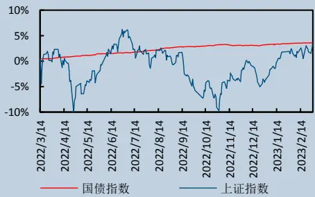
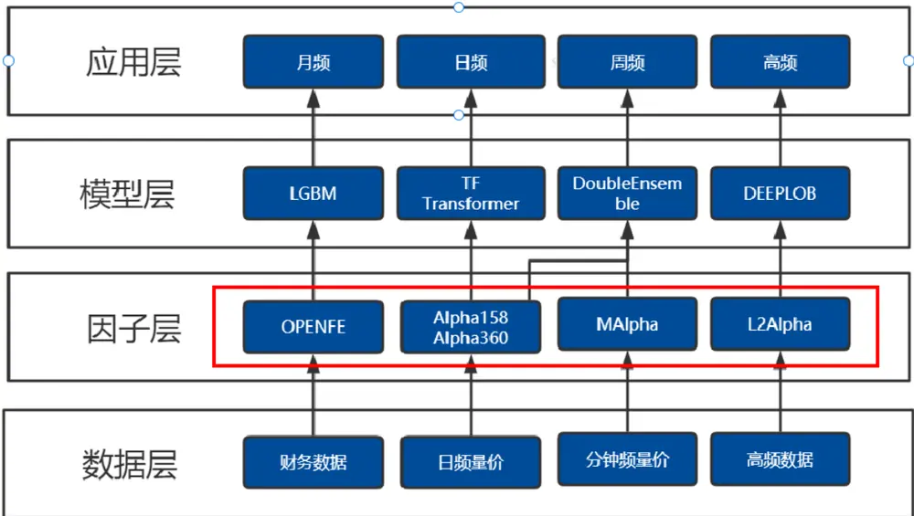
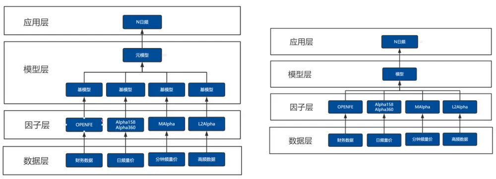
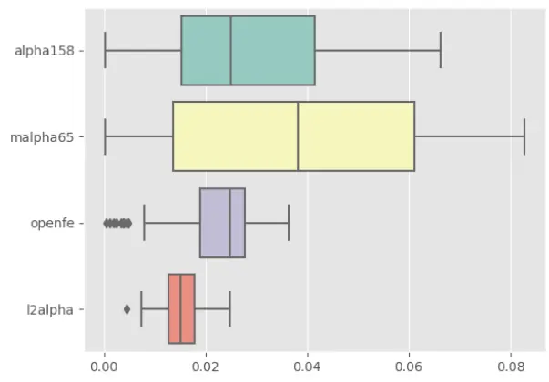
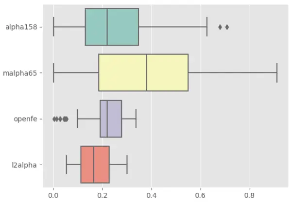
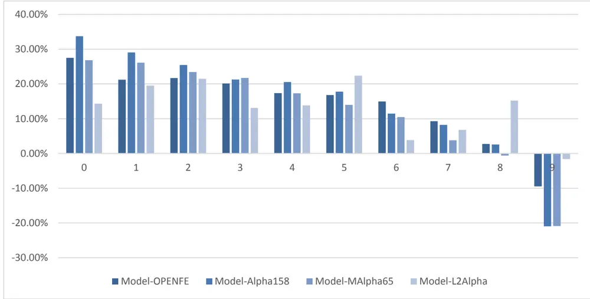
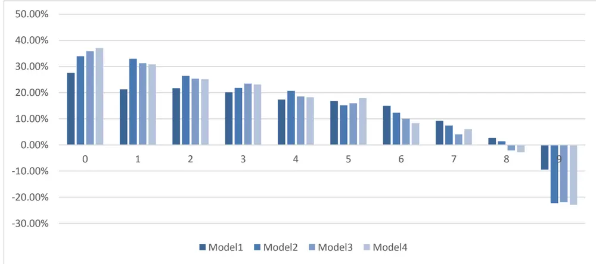
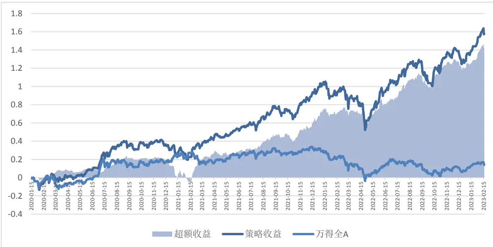
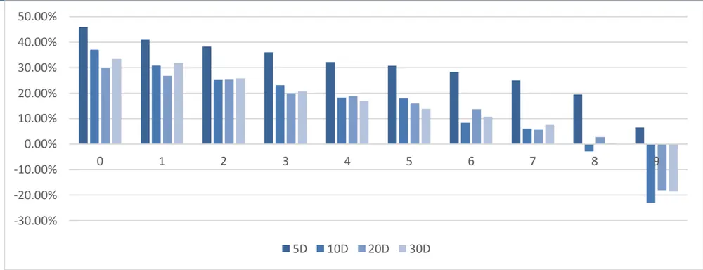

证券研究报告·金融工程深度

# 逐鹿”Alpha 专题报告（十四）

——基本面因子与量价因子融合模型

## 核心观点

本文将我们通过不同因子挖掘方法构建的因子进行融合，包括基本面因子 OPENFE，日频量价因子 ALPHA158，分钟频降频因子MALPHA65 以及高频降频因子 L2ALPHA，采用因子融合的方式进行融合，模型选择基于 GBDT 的 LIGHTGBM。结果表明，随着因子维度的拓展，模型收益会有显著提升，同时因子带来的边际贡献会越来越小。在不同模型频率之下，因子的重要性会发生变化，频率越低，基本面因子的边际重要性会随之提高。

## 主要内容

## 简介

本文我们尝试将不同类型数据进行融合，包括基本面因子OPENFE，日频量价因子 ALPHA158 ，分钟频降频因子MALPHA65 以及高频降频因子 L2ALPHA，将所有因子进行标准化处理后使用 LGBM 进行预测，相比于单一模型，能够有效提高模型的收益率。

## 因子介绍

分 别 对 四 类 因 子 OPENFE,ALPHA158,MALPHA65 以 及L2ALPHA 的定义以及挖掘方法进行介绍

## 模型介绍

我们以 OPENFE 基本面因子为基础，依次在 LGBM 模型中加入Alpha158，MAlpha65 以及 L2Alpha 因子，将不同类型的因子进行融合，测试模型的表现。结果表明，将不同类型的因子融入统一模型，相比于单一类型的因子输入，多类型因子输入能够提升模型的整体表现

## 风险分析

本报告中所有数据结果是基于历史统计结果的展示，未来有可能发生风格切换导致因子失效的风险。模型运行存在一定的随机性，初始化随机数种子会对结果产生影响，单次运行结果可能会有一定偏差。历史数据的区间选择会对结果产生一定的影响。模型参数的不同会影响最终结果。模型对计算资源要求较高，运算量不足会导致结果存在一定的欠拟合风险。本文所有模型结果均来自历史数据，模型存在统计误差，不保证模型未来的有效性，对投资不构成任何建议

# 金融工程研究

丁鲁明

dingluming@csc.com.cn

021-68821623

SAC 编号:s1440515020001

王超

wangchaodcq@csc.com.cn

SAC 编号:S1440522120002

发布日期： 2023 年 05 月 30 日

## 市场表现

## 相关研究报告

【中信建投金融工程】:“逐鹿”Alpha
2023-02-17专题报告（十三） ——基于 openFE的基本面因子挖掘框架【中信建投金融工程】:“逐鹿”Alpha专题报告（十二）——AlphaZero：基
2022-12-14于 AutoML-Zero 的高频数据低频化因子挖掘框架

## 一、简介

在逐鹿系列报告中，我们曾经详细的介绍了基于不同方法论的因子挖掘方案，包括深度学习法，启发式，以及枚举法用于高频订单簿、分钟频量价、日频量价以及月频基本面因子挖掘。

不同类型的因子特点不一，我们分别独立构建了 DeepLOB、Double Ensemble、Temporal Fusion Transformer、LGBM 等模型用于不同频率的组合构建。

图 1:中信建投逐鹿研究框架

数据来源：中信建投证券

本文我们尝试将不同类型数据进行融合，传统融合方式有两种，一种是模型融合，主要是采用 stacking 的方式，将不同基模型的预测结果输入元模型，得到最终的预测结果。这种方法的优点在于各模型之间相对独立，可以根据不同类型的数据采用不同的模型。缺点在于模型训练效率较低，且由于是两层训练，对于训练所需数据量要求较大。

第二种方法是因子融合，将因子进行处理后使用一个统一模型进行预测，通过模型自行调节各因子权重，能够较为高效的构建模型框架。

本文采用因子融合的方式对数据进行融合。

数据来源：中信建投证券

图 2:模型融合

图 3:因子融合
数据来源：中信建投证券

## 二、因子介绍

在逐鹿系列报告中，我们曾经详细的介绍了基于不同方法论的因子挖掘方案，具体因子的构建流程不再赘述，本文仅对采用的因子列表进行展示。

## 2.1 OPENFE 基本面因子

OpenFE 是一个基于枚举法的 Expand-And-Reduce 框架，首先通过基础特征以及算子的排列组合构建具有一定结构的风格因子。而后通过两步的筛选步骤，对因子进行筛选，保留最终特征重要性最高的因子。

在构建基本面因子时，我们基于一定的先验知识，将三大报表的数据以及基础算子之间按照一定的结构进行枚举，构建出五种不同风格类型的因子共计约 70 万个，再利用 openFE 的两步验证框架，筛选出不同风格类型下表现最好的合成因子，最终保留 60 个基本面因子。

最终的因子列表如下表所示：

表 1:OPENFE 基本面因子列表

| 风格 | 因子 |
| --- | --- |
| 成长因子 | CSRank(((3*年初未分配利润_qoq)+(2*净利润(不含少数股东损益)_yoy)),公告日期) CSRank(((1*营业收入_yoy)+(4*股东权益合计(含少数股东权益)_qoq)),公告日期) CSRank(((2*营业利润_yoy)+(3*净利润(不含少数股东损益)_yoy)),公告日期) CSRank(((3*净利润(含少数股东损益)_yoy)+(2*年初未分配利润_qoq)),公告日期) |

请参阅最后一页的重要声明

CSRank(((0*投资活动现金流出小计_yoy)+(5*股东权益合计(不含少数股东权益)_qoq)),公告日期)

|  |  | CSRank(((净利润(不含少数股东损益)+减:管理费用)/总市值).公告日期) |
| --- | --- | --- |
| 价值因子 | CSRank(((净利润(不含少数股东损益)+减:营业税金及附加)/总市值).公告日期 |  |
|  | CSRank(((所得税+净利润(不含少数股东损益))/总市值).公告日期 |  |
|  | CSRank(((购建固定资产、无形资产和其他长期资产支付的现金-投资活动现金流出小计)/总市值).公告日期) |  |
|  | CSRank(((净利润(含少数股东损益)+减:管理费用)/总市值).公告日期) |  |
|  | CSRank(((净利润(含少数股东损益)-减:财务费用)/总市值),公告日期) |  |
|  | CSRank(((净利润(不含少数股东损益)-所得税)/总市值).公告日期) |  |
|  | CSRank(((营业利润+支付给职工以及为职工支付的现金)/总市值).公告日期) |  |
|  | CSRank(((支付的各项税费-利润总额)/总市值),公告日期) |  |
|  | CSRank(((营业利润+减:管理费用)/总市值),公告日期) |  |
|  | CSRank(((净利润(含少数股东损益)+净利润(不含少数股东损益))/(股本+股东权益合计(含少数股东权益))),公告日期) |  |
|  | CSRank(((所得税-净利润(不含少数股东损益))/(其他应收款(合计)(元）-股东权益合计(不含少数股东权益))),公告日期) |  |
|  | CSRank(((所得税-营业利润)/(股东权益合计(含少数股东权益)-资本公积金)).公告日期) |  |
|  | CSRank(((加:营业外收入-综合收益总额(母公司))/(股东权益合计(不含少数股东权益)-资本公积金)),公告日期) |  |
|  | CSRank(((营业利润-所得税)/(其他应收款(合计)(元）-股东权益合计(不含少数股东权益))),公告日期) CSRank(((所得税-营业利润)/(股本+盈余公积金)),公告日期) |  |
|  | CSRank(((净利润(不含少数股东损益)+减:营业税金及附加)/(年初未分配利润+股本)),公告日期) |  |
|  | CSRank(((净利润(不含少数股东损益)+加:营业外收入)/(年初未分配利润+递延所得税资产)),公告日期) |  |
|  | CSRank(((减:财务费用-净利润(含少数股东损益))/(应交税费+股东权益合计(不含少数股东权益))).公告日期) |  |
|  | CSRank(((利润总额+减:销售费用)/(预付款项+股本)),公告日期) |  |
|  | CSRank(((利润总额-减:财务费用)/(期末现金及现金等价物余额+购建固定资产、无形资产和其他长期资产支付的现金)),公告日 |  |
|  | 期) |  |
|  | CSRank(((减:管理费用-营业利润)/(支付的各项税费+支付的各项税费)),公告日期) |  |
| 质量因子 | CSRank(((减:销售费用+营业利润)/(购建固定资产、无形资产和其他长期资产支付的现金+经营活动现金流入小计)).公告日期) |  |
|  | CSRank(((净利润(不含少数股东损益)-加:营业外收入)/(经营活动现金流入小计+期末现金及现金等价物余额)),公告日期) |  |
|  | CSRank(((加:营业外收入-利润总额)/(期末现金及现金等价物余额-投资活动产生的现金流量净额)),公告日期) |  |
|  | CSRank(((减:财务费用-利润总额)/(现金及现金等价物净增加额-期末现金及现金等价物余额)).公告日期) |  |
|  | CSRank(((所得税+营业利润)/(支付的各项税费+支付给职工以及为职工支付的现金)).公告日期) CSRank(((所得税-减:财务费用)/(现金及现金等价物净增加额-期末现金及现金等价物余额)),公告日期) |  |
| 杠杆因子 | CSRank(((股东权益合计(不含少数股东权益)-股东权益合计(含少数股东权益))/(年初未分配利润-盈余公积金)),公告日期) |  |
|  | CSRank(((股东权益合计(含少数股东权益)-股东权益合计(不含少数股东权益))/(年初未分配利润-预付款项)),公告日期) |  |
|  | CSRank(((股本-盈余公积金)/(应交税费+递延所得税资产)),公告日期) |  |
|  | CSRank(((应收票据及应收账款-其他应收款(合计)（元）)/(其他应收款(合计)（元）-应收账款)),公告日期) |  |
|  | CSRank(((应收账款-应收票据及应收账款)/(其他应收款(合计)（元）+年初未分配利润)).公告日期) |  |
|  | CSRank(((应收账款-应收票据及应收账款)/(股东权益合计(含少数股东权益)+非流动负债合计)),公告日期) |  |
|  | CSRank(((应收账款-应收票据及应收账款)/(股本+盈余公积金)),公告日期) |  |
|  | CSRank(((应收票据及应收账款-应收账款)/(应交税费+应交税费)).公告日期 |  |

请参阅最后一页的重要声明

资料来源：中信建投证券

## 2.2 Alpha158 日频因子

QLIB 是微软亚洲研究院开发的量化投资框架，包括数据存储，因子构建，模型训练，策略回测，结果分析等模块。

在构建因子时，QLIB 通过表达式计算以及缓存系统，能够极大的提高因子生成的效率，在 QLIB 默认的框架中，包含有两套标准的因子库，分别是 Alpha158 和 Alpha360。两者均是基于日频量价指标构建的因子库。其中 Alpha360 是通过枚举法合成的因子，Alpha158 的构造方式更接近与传统的技术指标。

Alpha158 的具体定义如下表所示：

表 2: Alpha158 因子列表

| 因子名称 | 定义 |
| --- | --- |
| KMID | ($close-$open)/$open |
| KLEN | ($high-$low)/$open |
| KMID2 | ($close-$open)/($high-$low+1e-12) |
| KUP | ($high-Greater($open, $close))/$open |
| KUP2 | ($high-Greater($open, $close))/($high-$low+1e-12) |
| KLOW | (Less($open, $close)-$low)/$open |
| KLOW2 | (Less($open, $close)-$low)/($high-$low+1e-12) |
| KSFT | (2*$close-$high-$low)/$open |
| KSFT2 | (2*$close-$high-$low)/($high-$low+1e-12) |
| OPENO | $open/$open |
| HIGHO | $high/$open |
| LOW0 | $low/$open |
| VWAP0 | $vwap/$open |
| ROC%d | Ref($close, %d)/$close |
| MA%d | Mean($close, %d)/$close |
| STD%d | Std($close, %d)/$close |
| BETA%d | Slope($close, %d)/$close |
| RSQR%d | Rsquare($close, %d) |
| RESI%d | Resi($close, %d)/$close |
| MAX%d | Max($high, %d)/$close |
| MIN%d | Min($low, %d)/$close |
| QTLU%d | Quantile($close, %d, 0.8)/$close |
| QTLD%d | Quantile($close, %d, 0.2)/$close |

| RANK%d | Rank($close, %d) |
| --- | --- |
| RSV%d | ($close-Min($low, %d))/(Max($high, %d)-Min($low, %d)+1e-12) |
| IMAX%d | IdxMax($high, %d)/%d |
| IMIN%d | IdxMin($low, %d)/%d |
| IMXD%d | (IdxMax($high, %d)-IdxMin($low, %d))/%d |
| CORR%d | Corr($close, Log($volume+1), %d) |
| CORD%d | Corr($close/Ref($close,1), Log($volume/Ref($volume, 1)+1), %d) |
| CNTP%d | Mean($close>Ref($close, 1), %d) |
| CNTN%d | Mean($close<Ref($close, 1), %d) |
| CNTD%d | Mean($close>Ref($close, 1), %d)-Mean($close<Ref($close, 1), %d) |
| SUMP%d | Sum(Greater($close-Ref($close, 1), 0), %d)/(Sum(Abs($close-Ref($close, 1)), %d)+1e-12) |
| SUMN%d | Sum(Greater(Ref($close, 1)-$close, 0), %d)/(Sum(Abs($close-Ref($close, 1)), %d)+1e-12) |
| SUMD%d | (Sum(Greater($close-Ref($close, 1), 0), %d)-Sum(Greater(Ref($close, 1)-$close, 0), %d))/(Sum(Abs($close-Ref($close, 1)), %d)+1e-12) |
| VMA%d | Mean($volume, %d)/($volume+1e-12) |
| VSTD%d | Std($volume, %d)/($volume+1e-12) |
| WVMA% | Std(Abs($close/Ref($close, 1)-1)*$volume, %d)/(Mean(Abs($close/Ref($close, 1)-1)*$volume, %d)+1e-12) |
| d VSUMP% | Sum(Greater($volume-Ref($volume, 1), 0), %d)/(Sum(Abs($volume-Ref($volume, 1)), %d)+1e-12) |
| d VSUMN |  |
| %d VSUMD | Sum(Greater(Ref($volume, 1)-$volume, 0), % d)/(Sum(Abs($volume-Ref($volume, 1)), %d)+1e-12) (Sum(Greater($volume-Ref($volume, 1), 0), %d)-Sum(Greater(Ref($volume, 1)-$volume, 0), %d))/(Sum(Abs($volume-Ref($volume, |

WIND, QLIB,

其中参数%d 的取值范围为 5，10，20，30，60。Alpha158 从动量，波动率，流动性等各个维度刻画了股票的中长期变化。

## 2.3 MAlpha65 分钟频因子

中信建投 MAlpha65 是我们结合 QLIB 算子以及分钟量价数据，通过考察因子的有效性和相关性，最终生成的 65 个基于分钟频量价降频到日频的因子。通过 MAlpha65，能够有效的刻画股票的日内形态。

因子列表如下：

表 3:CSCMalpha65 因子列表

| 因子名称 | 定义 |
| --- | --- |
| malpha0 | mean(close)/last(close) |
| malpha1 | mean(volume)/last(volume) |

| malpha2 | std(close)/last(close) |
| --- | --- |
| malpha3 | std(volume)/last(volume) |
| malpha4 | max(close)/last(close) |
| malpha5 | max(volume)/last(volume) |
| malpha6 | min(close)/last(close) |
| malpha7 | min(volume)/last(volume) |
| malpha8 | median(close)/last(close) |
| malpha9 | median(volume)/last(volume) |
| malpha10 | mean(open/close-1) |
| malpha11 | mean(high/low-1) |
| malpha12 | mean(close/delay(close,1)) |
| malpha13 | std(open/close-1) |
| malpha14 | std(high/low-1) |
| malpha15 | std(close/delay(close,1)) |
| malpha16 | max(open/close-1) |
| malpha17 | max(high/low-1) |
| malpha18 | max(close/delay(close,1)) |
| malpha19 | min(open/close-1) |
| malpha20 | min(high/low-1) |
| malpha21 | min(close/delay(close,1)) |
| malpha22 | median(open/close-1) |
| malpha23 | median(high/low-1) |
| malpha24 | median(close/delay(close,1)) |
| malpha25 | idxmax(open/close-1) |
| malpha26 | idxmax(high/low-1) |
| malpha27 | idxmax(close/delay(close,1)) |
| malpha28 | idxmin(open/close-1) |
| malpha29 | idxmin(high/low-1) |
| malpha30 | idxmin(close/delay(close,1)) |
| malpha31 | rank(open/close-1) |
| malpha32 | rank(high/low-1) |
| malpha33 | rank(close/delay(close,1)) |
| malpha34 | slope(open/close-1) |
| malpha35 | slope(high/low-1) |
| malpha36 | slope(close/delay(close,1)) |
| malpha37 | rsquare(open/close-1) |
| malpha38 | rsquare(high/low-1) |
| malpha39 |  |
| malpha40 | rsquare(close/delay(close,1)) resi(open/close-1) |

| malpha41 | resi(high/low-1) |
| --- | --- |
| malpha42 | resi(close/delay(close,1)) |
| malpha43 | idxmax(close) |
| malpha44 | idxmax(volume) |
| malpha45 | idxmin(close) |
| malpha46 | idxmin(volume) |
| malpha47 | rank(close) |
| malpha48 | rank(volume) |
| malpha49 | slope(close) |
| malpha50 | slope(volume) |
| malpha51 | rsquare(close) |
| malpha52 | rsquare(volume) |
| malpha53 | resi(close) |
| malpha54 | resi(volume) |
| malpha55 | corr(open, volume) |
| malpha56 | corr(high, volume) |
| malpha57 | corr(low, volume) |
| malpha58 | corr(close, volume) |
| malpha59 | interval_sum(volume, 0, 30)/interval_sum(volume, 0, 180) |
| malpha60 | interval_sum(volume, 30, 60)/interval_sum(volume, 0, 180) |
| malpha61 | interval_sum(volume, 60, 90)/interval_sum(volume, 0, 180) |
| malpha62 | interval_sum(volume, 90, 120)/interval_sum(volume, 0, 180) |
| malpha63 | interval_sum(volume, 120, 150)/interval_sum(volume, 0, 180) |
| malpha64 | interval_sum(volume, 150, 180)/interval_sum(volume, 0, 180) |

QLIB,WIND,

## 2.4 L2alpha 高频因子

L2 的因子计算方式主要是通过区分逐笔成交的金额大小、方向以及主被动来对成交进行划分，不同类型的交易行为背后所包含的信息有所不同。本文我们总共加入了 4 个 L2 的高频低频化后的因子。

表 4: L2alpha 因子列表

| 因子名称 | 定义 |
| --- | --- |
| l2alpha0 | 主动性买入成交金额占总成交金额的比例 |
| l2alpha1 | 主动性卖出成交金额占总成交金额的比例 |
| l2alpha2 | 大单买入成交金额占总成交金额的比例 |
| l2alpha3 | 大单卖出成交金额占总成交金额的比例 |

资料来源：WIND，中信建投证券

## 三、模型介绍

在之前的报告中，我们分别展示过用不同类型的因子构建的策略表现，本报告中，我们以 OPENFE 基本面因子为基础，依次加入 Alpha158，MAlpha65 以及 L2Alpha 因子，将不同类型的因子进行融合，测试模型的表现。

为了平衡基本面与量价因子的有效性，首先测试 10 日频模型的整体表现。对于 10 日模型，仅包含单日信息的高频低频化因子预测能力有限，为了提高因子的预测能力，通常有两种方式，第一种方式是采用时间序列模型融入因子的历史信息提高预测能力，第二种是将因子进行时序上的处理，本文我们采用第二种方式，对malpha65 和 l2alpha 分别进行 10 日平均和 10 日标准差处理。最终所有因子数量共计 356 个。

## 3.1 单因子 ICIR

分别对因子进行 IC 和 ICIR 检验。在样本内因子的表现如下图所示。四类因子中 malpha65 无论是中位数还是最大值均较为突出，alpha158 以及 openfe 因子中位数较为接近。l2alpha 因子由于数量较少，结果不具有太强的统计学意义。

图 4:IC绝对值分布

数据来源：WIND,中信建投证券

图 5:ICIR 分布

数据来源：WIND，中信建投证券

## 3.2 模型收益率

与之前 OPENFE 模型一致，采用滚动训练的方式。从 2020 年 1 月 1 日至 2023 年 2 月 28 日，每十日滚动训练 LGBM 模型，模型的输入为过去 200 期的因子，预测目标为未来一期收益率。训练集长度为 180 期，测试集为 20 期，按照时间先后进行切分。股票池为全 A 股票，剔除其中的次新股，ST 股，涨跌停股票以及流动性过低的股票（日成交金额<500 万或者换手率<0.02%）。

对于单一类型的输入，分别将 4 类因子作为模型输入，预测未来 10 日收益率，模型在样本外的分组收益率如下图所示。

其中，用 Alpha158 作为输入的模型表现最为突出，其次是 OPENFE 以及 MAlpha65。

图 4:单类型模型分组年化收益率

数据来源：WIND.中信建投证券

我们尝试在 OPENFE 的基础上，不断在加入其他类型的因子，在融入更多因子之后，模型的表现会有较大的提升。

不同模型所对应的输入为：

Model1: OPENFE

Model2: OPENFE+Alpha158

Model3: OPENFE+Alpha158+MAlpha65

Model4: OPENFE+Alpha158+MAlpha65+L2Alpha

图 5:复合因子模型分组年化收益率

数据来源：WIND,中信建投证券

将4类因子作为输入的Model4表现最好，对比单一类型输入的Model1，多头组的年化收益提升了大约10%，空头组的收益也降低了超过 10%。

Model4 的回测净值曲线如下图所示，其中年化收益率 35.57%为费前收益率，在 3‰的交易成本下，费后预估的年化收益率为 31%左右。

图 6:Model4 策略净值曲线

数据来源：WIND，中信建投证券

表 5: Model4 策略统计

| 年化收益率 | 年化波动率 | Sharpe | Alpha | 最大回撤 | 换手率 |
| --- | --- | --- | --- | --- | --- |
| 35.57% | 19.84% | 1.72 | 32.01% | -25.90% | 14.9 |

资料来源：WIND，中信建投证券

## 3.3 因子重要性

根据模型输出的因子重要性，

表 6:因子重要性排序

| 因子 | 重要性 |
| --- | --- |
| sector_ticker | 40174.07 |
| malpha54mean10 | 483.71 |
| malpha48mean10 | 460.58 |
| malpha6std10 | 362.36 |
| malpha6mean10 | 287.86 |
| malpha13std10 | 265.99 |
| VMA60 | 241.90 |
| malpha29mean10 | 186.36 |
| pct | 173.12 |
| malpha0mean10 | 170.79 |
| MIN60 | 166.71 |
| malpha19std10 | 159.41 |
| malpha63mean10 | 153.10 |
| mv | 136.07 |
| MAX60 | 131.89 |
| malpha48std10 | 113.81 |
| openfe37 | 106.68 |
| RSQR10 | 98.64 |
| MA60 | 91.67 |
| QTLU60 | 83.47 |
| malpha55mean10 | 70.60 |
| malpha58std10 | 70.40 |
| CORR10 | 70.36 |
| malpha40std10 | 67.87 |
| malpha12mean10 | 64.18 |

| KLOW | 58.66 |
| --- | --- |
| CORD30 | 58.03 |
| malpha61mean10 | 56.30 |
| malpha53std10 | 51.30 |
| malpha24mean10 | 50.85 |

资料来源：WIND,中信建投证券

## 3.4 其他频率

10 日频的模型能够平衡基本面因子与量价因子之间的关系，在其它频率下（5 天，10 天，20 天，30 天），采用相同的 Model4 处理方式，模型能够自行调节各因子的重要性，同样也能够取得优异的表现。

需要注意的是，由于在 20 天和 30 天频率下，历史数据不足 200 期，因此，当频率为 20 天和 30 天时，训练集的数据量分别为 100 期和 66 期。

图 8:不同频率年化收益率

数据来源：WIND，中信建投证券

随着频率降低，多头组的费前年化收益率随之降低，综合考虑交易成本的情况下，不同频率的年化收益差别不大。

在不同频率的周期下，模型会自行调节因子重要性，不同频率下因子的重要性排序如下表所示：

表 7:因子重要性变化

| 5D | 10D | 20D | 30D |
| --- | --- | --- | --- |
| sector_ticker | sector_ticker | sector_ticker | sector_ticker |
| pct | malpha54mean10 | malpha6mean10 | malpha54mean10 |

| malpha54mean10 | malpha48mean10 | malpha48mean10 | malpha48mean10 |
| --- | --- | --- | --- |
| malpha48mean10 | malpha6std10 | malpha54mean10 | malpha6mean10 |
| VMA60 | malpha6mean10 | malpha13std10 | mv |
| malphaOmean10 | malpha13std10 | pct | malpha29mean10 |
| malpha19std10 | VMA60 | malpha29mean10 | malpha6std10 |
| MIN60 | malpha29mean10 | MIN60 | malpha63mean10 |
| malpha6mean10 | pct | mv | openfe37 |
| MAX60 | malphaOmean10 | malpha6std10 | malpha19std10 |
| malpha6std10 | MIN60 | MAX60 | LOW0 |
| RANK5 | malpha19std10 | malpha63mean10 | malpha40std10 |
| malpha8mean10 | malpha63mean10 | malpha58std10 | CORR20 |
| MA60 | mv | openfe37 | QTLU60 |
| KLOW | MAX60 | malpha48std10 | malpha19mean10 |
| LOW0 | malpha48std10 | malpha53mean10 | MIN60 |
| QTLD5 | openfe37 | malphaOmean10 | pct |
| malpha63mean10 | RSQR10 | CORR10 | MA60 |
| malpha12mean10 | MA60 | malpha21mean10 | malpha36mean10 |
| malpha13std10 | QTLU60 | CORD30 | malpha53std10 |
| malpha58std10 | malpha55mean10 | QTLU60 | malpha50std10 |
| mv | malpha58std10 | malpha40std10 | malpha48std10 |
| malpha55mean10 | CORR10 | malpha19std10 |  |
| CORD30 |  |  | STD60 |
| KLEN | malpha40std10 | KLEN | malpha12mean10 |
| malpha50std10 | malpha12mean10 | CORR30 | malphaOmean10 VSUMD60 |
| VMA10 | KLOW | VMA60 | VMA60 |
| QTLU5 | CORD30 | VSUMD60 | malpha55std10 |
|  | malpha61mean10 malpha53std10 | l2alpha2mean10 | MAX60 |
| MAX20 VWAP0 | malpha24mean10 | openfe42 RSQR20 | malpha8mean10 |

资料来源：中信建投证券

可以看出，整体上因子以分钟频量价因子为主，基本面因子占比较低。行业因子的重要性最高。

随着频率变低（5D->30D），基本面因子 openfe37（（营业利润 + 支付给职工以及为职工支付的现金）/总市值）的排名不断提升

## 四、结论

将不同类型的因子融入统一模型，相比于单一类型的因子输入，多类型因子输入能够提升模型的整体表现。

从各类因子的重要性来看，行业分类重要性突出，分钟数据的重要性较高。基本面因子重要性较低，随着频率降低，基本面因子的表现有相对提升。

对于模型超参的搜索，本文未做任何优化，仅使用统一的参数进行训练，为了提升模型的表现，可以使用AutoML的工具对超参进行优化（HPO）。

## 风险分析

本报告中所有数据结果是基于历史统计结果的展示，未来有可能发生风格切换导致因子失效的风险。模型运行存在一定的随机性，初始化随机数种子会对结果产生影响，单次运行结果可能会有一定偏差。历史数据的区间选择会对结果产生一定的影响。模型参数的不同会影响最终结果。模型对计算资源要求较高，运算量不足会导致结果存在一定的欠拟合风险。本文所有模型结果均来自历史数据，模型存在统计误差，不保证模型未来的有效性，对投资不构成任何建议。

## 分析师介绍

## 丁鲁明

同济大学金融数学硕士，中国准精算师，中信建投证券研究所执行总经理，金融工程团队、大类资产配置与基金研究团队首席分析师，中信建投证券基金投顾业务决策委员会成员。具备 14 年证券从业经历，创立国内“量化基本面”投研体系，继承并深入研究经济经典长波体系中的康波周期理论并积极应用于实务，多次对资本市场重大趋势及拐点给出精准预判。荣获多项荣誉。

## 王超

南京大学粒子物理博士，曾担任基金公司研究员，券商研究员，有丰富的研究和投资经验，2021 年加入中信建投证券研究所，主要负责机器学习及量化多因子选股。

## 评级说明

| 投资评级标准 |  | 评级 | 说明 |
| --- | --- | --- | --- |
| 报告中投资建议涉及的评级标准为报告发布日后6个月内的相对市场表现，也即报告发布日后的6个月内公司股价（或行业指数）相对同期相关证券市场代表性指数的涨跌幅作为基准。A股市场以沪深300指数作为基准；新三板市场以三板成指为基准；香港市场以恒生指数作为基准；美国市场以标普500指数为基准。 | 股票评级 | 买入 | 相对涨幅15%以上 |
|  |  | 增持 | 相对涨幅 5%—15% |
|  |  | 中性 | 相对涨幅-5%—5%之间 |
|  |  | 减持 | 相对跌幅 5%—15% |
|  |  | 卖出 | 相对跌幅15%以上 |
|  | 行业评级 | 强于大市 | 相对涨幅10%以上 |
|  |  | 中性 | 相对涨幅-10-10%之间 |
|  |  | 弱于大市 | 相对跌幅 10%以上 |

## 分析师声明

本报告署名分析师在此声明：（i）以勤勉的职业态度、专业审慎的研究方法，使用合法合规的信息，独立、客观地出具本报告, 结论不受任何第三方的授意或影响。（ii）本人不曾因，不因，也将不会因本报告中的具体推荐意见或观点而直接或间接收到任何形式的补偿。

## 法律主体说明

本报告由中信建投证券股份有限公司及/或其附属机构（以下合称“中信建投”）制作，由中信建投证券股份有限公司在中华人民共和国（仅为本报告目的，不包括香港、澳门、台湾）提供。中信建投证券股份有限公司具有中国证监会许可的投资咨询业务资格，本报告署名分析师所持中国证券业协会授予的证券投资咨询执业资格证书编号已披露在报告首页。

在遵守适用的法律法规情况下，本报告亦可能由中信建投（国际）证券有限公司在香港提供。本报告作者所持香港证监会牌照的中央编号已披露在报告首页。

## 一般性声明

本报告由中信建投制作。发送本报告不构成任何合同或承诺的基础，不因接收者收到本报告而视其为中信建投客户。

本报告的信息均来源于中信建投认为可靠的公开资料，但中信建投对这些信息的准确性及完整性不作任何保证。本报告所载观点、评估和预测仅反映本报告出具日该分析师的判断，该等观点、评估和预测可能在不发出通知的情况下有所变更，亦有可能因使用不同假设和标准或者采用不同分析方法而与中信建投其他部门、人员口头或书面表达的意见不同或相反。本报告所引证券或其他金融工具的过往业绩不代表其未来表现。报告中所含任何具有预测性质的内容皆基于相应的假设条件，而任何假设条件都可能随时发生变化并影响实际投资收益。中信建投不承诺、不保证本报告所含具有预测性质的内容必然得以实现。

本报告内容的全部或部分均不构成投资建议。本报告所包含的观点、建议并未考虑报告接收人在财务状况、投资目的、风险偏好等方面的具体情况，报告接收者应当独立评估本报告所含信息，基于自身投资目标、需求、市场机会、风险及其他因素自主做出决策并自行承担投资风险。中信建投建议所有投资者应就任何潜在投资向其税务、会计或法律顾问咨询。不论报告接收者是否根据本报告做出投资决策，中信建投都不对该等投资决策提供任何形式的担保，亦不以任何形式分享投资收益或者分担投资损失。中信建投不对使用本报告所产生的任何直接或间接损失承担责任。

在法律法规及监管规定允许的范围内，中信建投可能持有并交易本报告中所提公司的股份或其他财产权益，也可能在过去 12 个月、目前或者将来为本报告中所提公司提供或者争取为其提供投资银行、做市交易、财务顾问或其他金融服务。本报告内容真实、准确、完整地反映了署名分析师的观点，分析师的薪酬无论过去、现在或未来都不会直接或间接与其所撰写报告中的具体观点相联系，分析师亦不会因撰写本报告而获取不当利益。

本报告为中信建投所有。未经中信建投事先书面许可，任何机构和/或个人不得以任何形式转发、翻版、复制、发布或引用本报告全部或部分内容，亦不得从未经中信建投书面授权的任何机构、个人或其运营的媒体平台接收、翻版、复制或引用本报告全部或部分内容。版权所有，违者必究。

## 中信建投证券研究发展部

## 中信建投（国际）

北京

东城区朝内大街2号凯恒中心B座 12 层

电话：（8610） 8513-0588

上海

联系人：李祉瑶

邮箱：lizhiyao@csc.com.cn

上海浦东新区浦东南路528号南塔 2106 室

电话：（8621） 6882-1600

深圳

联系人：翁起帆

邮箱：wengqifan@csc.com.cn

香港

福田区福中三路与鹏程一路交汇处广电金融中心35 楼

电话：（86755）8252-1369

中环交易广场2期18 楼

联系人：曹莹

电话：（852）3465-5600

邮箱：caoying@csc.com.cn

联系人：刘泓麟

邮箱：charleneliu@csci.hk