# 证券研究报告•金融工程动态

# “逐鹿”Alpha专题报告（十五）：基于领域知识生成的基本面因子挖掘框架

分析师：丁鲁明

dingluming@csc.com.cn

SAC 编号：S1440515020001

分析师：王超

wangchaodcq@csc.com.cn

SAC 编号： S1440522120002

发布日期：2023年7月23日

本报告由中信建投证券股份有限公司在中华人民共和国（仅为本报告目的，不包括香港、澳门、台湾）提供。在遵守适用的法律法规情况下，本报告亦可能由中信建投（国际）证券有限公司在香港提供。
同时请务必阅读正文之后的免责条款和声明。

## 因子挖掘算法

表1：因子挖掘算法

|  | 深度学习 | 启发式 | 枚举式 |
| --- | --- | --- | --- |
| 代表算法 | RNN,CNN,TRSNSFORME R | GP, ALPHAZERO | Alpha360,OPENFE |
| 单次生成因子数量 | 10⁰-101 | >10³ | >10⁴ |
| 因子复杂度 | >10阶 | <10阶 | <5阶 |
| 可解释性 | 最差 | 一般 | 最好 |
| 样本内效果 | 最好 | 较好 | 较好 |
| 算子要求 | 严格（可导） | 无 | 无 |
| 效率 | 最快 | 较快 | 最慢 |

资料来源：中信建投

## 因子挖掘框架（Expand & Reduce）

图1：因子挖掘框架
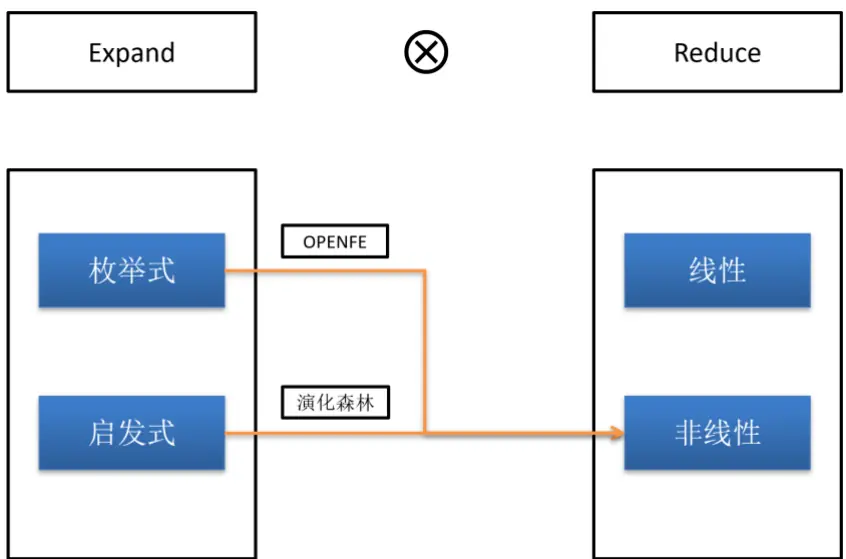
资料来源：中信建投

## 因子挖掘

100个因子和5个算子构建三层因子，因子空间大小： ~1020（1008*57 ）

无法遍历全因子空间。

枚举法：需要一定的先验知识决定因子的结构进行遍历

启发式：只能搜索相对较小的子空间，随机影响较大，结构复杂容易过拟合

## 领域知识（domain knowledge）

领域知识（专家知识）是经过长期的观察，研究，总结、归纳得到的相关行业的先验信息

瓜农判断好瓜： 色泽、根蒂、 敲声等， 将这些特征输入机器学习模型能够有效提高模型效果。

## 因子挖掘的领域知识：

结合进化算法的思想，每一个因子都是一个个体，个体是由基因和结构决定的。

PE: 基因(P,E), 结构(/)

因子挖掘的领域知识是对于因子构成以及结构的理解。

优秀的因子是由优秀的基因和结构组成。

## 领域知识生成

判断好瓜：

1. 选择不同色泽、根蒂、 敲声的西瓜，进行大量检验，归纳总结好瓜的共性

2. 让多个瓜农分别挑选适当数量的好瓜之后，总结这些瓜的特点

## 判断因子：

1. 构造大量不同类型因子，对因子进行检验，归纳有效性较高的因子共性

2. 获取有效性较高的因子集合，归纳总结这些因子的共性。

传统方法无法高效批量获取有效因子，启发式算法能够沿着最优化路径不断进化，相对快速的批量寻找到有效因子

## 因子挖掘框架（E&R生成领域知识）

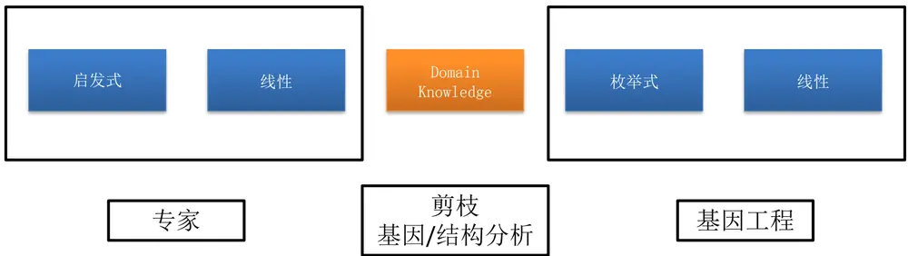

利用启发式算法（遗传规划）作为专家生成适应度较高的种群，分析种群内个体的基因以及结构。得到优秀个体的先验信息。

再利用这些信息，结合枚举法批量产生类似的因子进行分析，筛选最终效果较好且相关性较低的个体。

## 基础数据

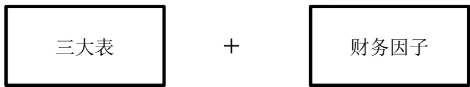

三大表：剔除缺失值大于10%的指标

财务因子： 常用的基本面因子，包括财务指标，财务比率，

成长指标包含有一定的先验信息。

来源WIND ASHAREFINANCIALINDICATOR

共计150+因子

训练集区间： 2010-2019年

采样频率：10日

IC计算周期： 20日

图2： ASHAREFINANCIALINDICATOR

| 112 | 非营业利润/利润总额 | S_FA_NOPTOEBT | NUMBER(20,4) | 88%06 | % |
| --- | --- | --- | --- | --- | --- |
| 114 | 货币资金/流动负债 | S_FA CASHTOLIQDEBT | NUMBER(20,4) | 93% | % |
| 116 | 营业利润/流动负债 | S FA_OPTOLIQDEBT | NUMBER(20,4) | 94% | % |
| 117 | 营业利润/负债合计 | S_FA_OPTODEBT | NUMBER(20,4) | 96% | % |
| 118 | 年化投入资本回报率 18221 | S_FA_ROIC_YEARLY | NUMBER(20,4) | 95% | % |
| 119 | 固定资产合计周转率 | S_FA_TOT_FATURN | NUMBER(20,4) | 96% | 次 |
| 120 | 利润总额/营业收入 | S_FA_PROFITTOOP | NUMBER(20,4) | 99% | % |
| 121 | 单季度,经营活动净收益 | S_QFA_OPERATEINCOME | NUMBER(20,4) | 81% | 元 |
| 122 | 单季度.价值变动净收益 | S_QFA_INVESTINCOME | NUMBER(20,4) | 65% | 元 |
| 123 | 单季度，扣除非经常损益后的净利润 | S_QFA_DEDUCTEDPROFIT | NUMBER(20,4) | 74% | 元 |
| 124 | 单季度，每股收益 | S_QFA_EPS | NUMBER(24,6) | 79% | 元 |
| 125 | 单季度，销售净利率 | S_QFA_NETPROFITMARGIN | NUMBER(20,4) | 81% | % |
| 126 | 单季度，销售毛利率 | S_QFA_GROSSPROFITMARGIN | NUMBER(20,4) | 79% | % |
| 127 | 单季度.销售期间费用率 | S_QFA_EXPENSETOSALES DF | NUMBER(20,4) | 79% | %,(销售... |
| 128 | 单季度.净利润/营业总收入 | S_QFA_PROFITTOGR | NUMBER(20,4) | 81% | % |
| 129 | 单季度，销售费用/营业总收入 | S_QFA_SALEEXPENSETOGR | NUMBER(20,4) | 77% | % |
| 130 | 单季度.管理费用/营业总收入 | S QFA ADMINEXPENSETOGR | NUMBER(20,4) | 80% | % |
| 131 | 单季度财务费用/营业总收入 | S_ QFA_FINAEXPENSETOGR | NUMBER(20,4) | 79% | % |
| 132 | 单季度.资产减值损失/营业总收入 | S_QFA_IMPAIRTOGR_TTM | NUMBER(20,4) | 59% | % |
| 133 | 单季度.营业总成本/营业总收入 | S_QFA_GCTOGR | NUMBER(20,4) | 79% | % |
| 134 | 单季度.营业利润/营业总收入 | S_QFA_OPTOGR | NUMBER(20,4) | 81% | % |
| 135 | 单季度，净资产收益率 | S_QFA_ROE | NUMBER(24,6) | 80% | % |
| 136 | 单季度.净资产收益率(扣除非经常损益) | S_QFA_ROE_DEDUCTED | NUMBER(24,6) | 73% | % |
| 137 | 单季度总资产净利润 | S_QFA_ROA | NUMBER(20,4) | 81% | % |
| 138 | 单季度.经营活动争收益/利润总额 | S_QFA_OPERATEINCOMETOEBT | NUMBER(20,4) | 67% | % |
| 139 | 单季度.价值变动净收益/利润总额 | S_QFA_INVESTINCOMETOEBT | NUMBER(20,4) | 54% | % |
| 140 | 单季度扣除非经常损益后的净利润/净利润 | S QFA DEDUCTEDPROFITTOPROFIT | NUMBER(20,4) | 60% | % |
| 141 | 单季度，销售商品提供劳务收到的现金/营业收入 | S_QFA_SALESCASHINTOOR | NUMBER(20,4) | 77% | % |
| 142 | 单季度.经营活动产生的现金流量净额/营业收入 | S_QFA_OCFTOSALES | NUMBER(20,4) | 79% | % |
| 143 | 单季度，经营活动产生的现金流量净额/经营活动净收益 | S_QFA_OCFTOOR | NUMBER(20,4) | 59% | % |
| 144 | 同比增长率-基本每股收益(%) | S_FA_YOYEPS_BASIC | NUMBER(20,4) | 80% | % |
| 145 | 同比增长率-稀释每股收益(%) | S_FA_YOYEPS_DILUTED | NUMBER(20,4) | 73% | % |
| 146 | 同比增长率-每股经营活动产生的现金流量净额(%) | S_FA_YOYOCFPS | NUMBER(20,4) | 84% | % |
| 147 | 同比增长率-营业利润(%) | S_FA_YOYOP | NUMBER(20,4) | 90% | % |
| 148 | 同比增长率-利润总额(%) | S_FA_YOYEBT | NUMBER(20,4) | 91% | % |

资料来源：WIND，中信建投

## 遗传规划-个体及种群

个体：基础数据和算子构成的树结构

种群：个体集合，初代种群为随机生成

算子： +，-，/

量纲：基础数据中包括两类数据，量纲为元的简单财务指标以及无量纲的财务比率指标，不同量纲之间的计算要求如下，最终生成的因子为无量纲因子。

表2：算子

| 算子 | 解释 | 量纲 |
| --- | --- | --- |
| add(m1, m2) | m1+m2 | 输入相同量纲，输出不改变量纲 |
| subtract(m1, m2) | m1-m2 | 输入相同量纲，输出不改变量纲 |
| protecteddiv(m1, m2) | m1/m2 | 输入相同量纲，输出无量纲 |

资料来源：中信建投

图3： 个体结构
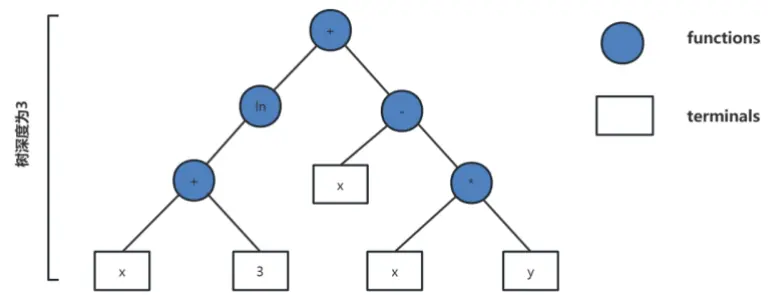
资料来源：WIND，中信建投

## 遗传规划-种群进化

适应度：评价个体的标准, IC（未来20日相关性）

筛选：锦标赛法

变异：个体变异，交叉变异，复制

图4： 交叉变异
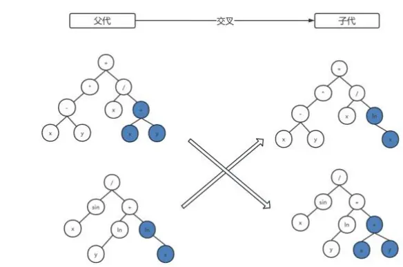
资料来源：中信建投

图5： 个体变异
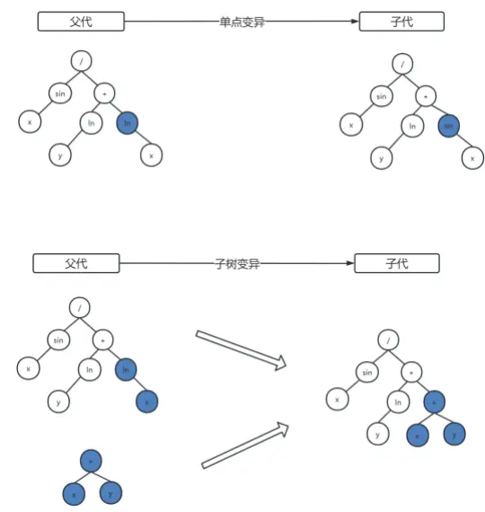
资料来源：中信建投

## 遗传规划-进化流程

提高广度，减少深度：

- 种群个体数量： 2500

- 进化轮数： 10

运行次数： 10次（不同随机种子）

因子类型： 基本面因子（不包含市值）， 估值因子（分母为市值）

~400000个因子，记录因子结构以及IC

图6： 进化流程
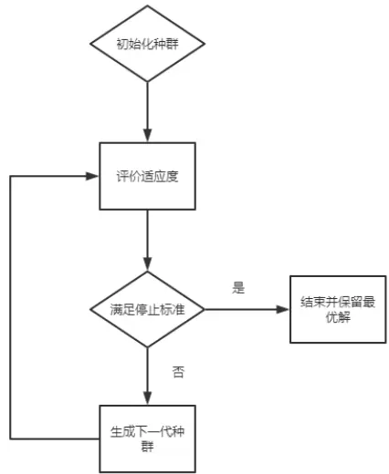
资料来源：中信建投

## 分析个体-领域知识

分析种群中的优秀个体的结构及基因组成，寻找共性：

- 筛选适应度较高的个体（基本面0.04， 估值0.05）

- 对个体进行递归剪枝，剔除无效基因，保留高度不超过4的个体

- 分析个体（树结构）的结构以及基因

- 结构：

- 基因：

- 统计所有基因片段出现的频率，筛选频率较高的基因

- 统计所有的结构

剪枝算法：
A/A->1
A/1->A
A-A->0
A±0->A
A±B->A(A>>B)

'protectedDiv(protectedDiv(add(ARG168, subtract(add(add(ARG168, subtract(add(ARG168, add(ARG168, add(ARG168, subtract(ARG100, ARG102)))), ARG170)), ARG168), ARG170)), ARG67), add(protectedDiv(ARG16 add(ARG40, ARG34)), add(ARG114, add(add(protectedDiv(ARG16, add(ARG40, ARG34)), add(ARG114, add(ARG143, add(ARG92, ARG128)))), ARG70))))

'protectedDiv(protectedDiv(ARG100, ARG67), add(protectedDiv(ARG16, add(ARG40, ARG34)), add(ARG114, add(add(protectedDiv(ARG16, add(ARG40, ARG34)), add(ARG114, add(ARG143, ARG128))), ARG70))))

图7： 基因结构
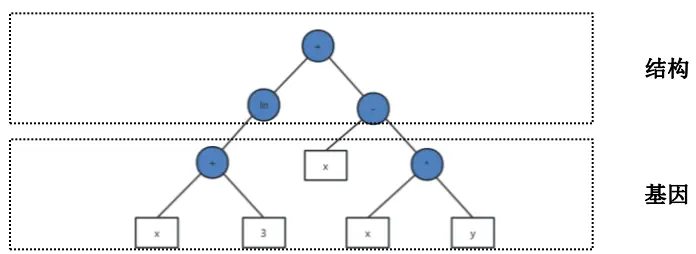
资料来源：中信建投

## 分析个体-基本面因子结果

表3： 基本面因子基因

| 基因 | 高度 |
| --- | --- |
| s_qfa_yoynetprofit | 0 |
| s_qfa_yoyprofit | 0 |
| s_qfa_yoyop | 0 |
| s_fa_yoy_equity | 0 |
| s_fa_roa2_yearly | 0 |
| s_fa_longdebttoworkingcapital | 0 |
| s_qfa_gctogr | 0 |
| s_qfa_roa | 0 |
| tot_oper_rev | 0 |
| s_qfa_saleexpensetogr | 0 |
| subtract(s_qfa_yoyprofit, s_fa_yoy_equity) | 1 |
| add(s_qfa_yoynetprofit, s_qfa_roa) | 1 |
| add(s_fa_salescashintoor, | 1 |
| s_fa_longdebttoworkingcapital) |  |
| subtract(s_qfa_roe, s_qfa_yoynetprofit) add(s_qfa_saleexpensetogr,s_qfa_yoynetprofit) | 1 1 |

资料来源：WIND，中信建投

图8： 基本面因子结构
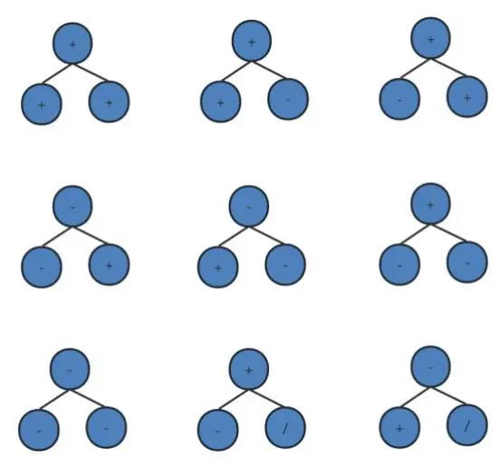
资料来源：中信建投

等效五种结构

## 分析个体-基本面因子结果

表4： 基本面因子基因分析

| 基因 | 解释 |
| --- | --- |
| s_qfa_yoynetprofit | 单季度.归属母公司股东的净利润同比增长率(%) |
| s_qfa_yoyprofit | 单季度.净利润同比增长率(%) |
| s_qfa_yoyop | 单季度.营业利润同比增长率(%) |
| s_fa_yoy_equity | 净资产(同比增长率) |
| s_fa_roa2_yearly | 年化总资产报酬率 |
| s_fa_longdebttoworkingcapital | 长期债务与营运资金比率 |
| s_qfa_gctogr | 单季度.营业总成本/营业总收入 |
| s_qfa_roa | 单季度.总资产净利润 |
| tot_oper_rev | 营业总收入 |
| s_qfa_saleexpensetogr | 单季度.销售费用/营业总收入 |
| subtract(s_qfa_yoyprofit, s_fa_yoy_equity) | 单季度.归属母公司股东的净利润同比增长率(%) -净资产(同比增长率) |
| add(s_qfa_yoynetprofit, s_qfa_roa) | 单季度.归属母公司股东的净利润同比增长率(%)+单季度.总资产净利润 |
| add(s_fa_salescashintoor, s_fa_longdebttoworkingcapital) | 销售商品提供劳务收到的现金/营业收入+长期债务与营运资金比率 |
| subtract(s_qfa_roe, s_qfa_yoynetprofit) | 单季度.净资产收益率-单季度.归属母公司股东的净利润同比增长率(%) |
| add(s_qfa_saleexpensetogr,s_qfa_yoynetprofit) | 单季度.销售费用/营业总收入+单季度.归属母公司股东的净利润同比增长率(%) |

资料来源：WIND，中信建投

## 分析个体-估值因子结果

表5： 估值因子基因

| 基因 | 高度 |
| --- | --- |
| cash_pay_dist_dpcp_int_exp | 0 |
| net_cash_flows_oper_act | 0 |
| cash_pay_beh_empl | 0 |
| net_profit_excl_min_int_inc | 0 |
| net_profit_incl_min_int_inc | 0 |
| tot_profit | 0 |
| oper_profit | 0 |
| surplus_rsrv | 0 |
| cap_stk | 0 |
| empl_ben_payable subtract(cash_pay_beh_empl, | 0 |
| net_profit_incl_min_int_inc) | 1 |
| add(net_cash_flows_oper_act, tot_profit) | 1 |
| add(net_profit_incl_min_int_inc, | 1 |
| net_profit_excl_min_int_inc) |  |
| add(net_profit_incl_min_int_inc, tot_profit) add(net_profit_incl_min_int_inc, empl_ben_payable) | 1 1 |

资料来源：WIND，中信建投

图9： 估值因子结构
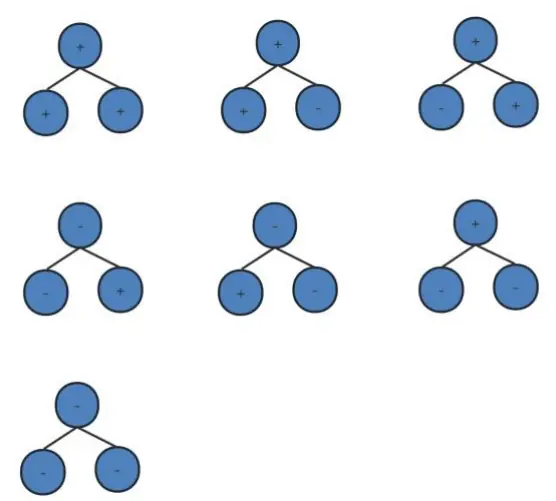
资料来源：中信建投

等效四种结构

## 分析个体-估值因子结果

表6： 估值因子基因分析

| 基因 | 解释 |
| --- | --- |
| cash_pay_dist_dpcp_int_exp | 分配股利、利润或偿付利息支付的现金 |
| net_cash_flows_oper_act | 经营活动产生的现金流量净额 |
| cash_pay_beh_empl | 支付给职工以及为职工支付的现金 |
| net_profit_excl_min_int_inc | 净利润(不含少数股东损益) |
| net_profit_incl_min_int_inc | 净利润(含少数股东损益) |
| tot_profit | 利润总额 |
| oper_profit | 营业利润 |
| surplus_rsrv | 盈余公积金 |
| cap_stk | 股本 |
| empl_ben_payable | 应付职工薪酬 |
| subtract(cash_pay_beh_empl, net_profit_incl_min_int_inc) | 支付给职工以及为职工支付的现金 -净利润(含少数股东损益) |
| add(net_cash_flows_oper_act, tot_profit) | 经营活动产生的现金流量净额+利润总额 |
| add(net_profit_incl_min_int_inc, net_profit_excl_min_int_inc) | 净利润(含少数股东损益)+净利润(不含少数股东损益) |
| add(net profit incl min int inc, tot profit) | 净利润(不含少数股东损益) |
| add(net_profit_incl_min_int_inc, empl_ben_payable) | +利润总额 |

资料来源：WIND，中信建投

## 因子生成-枚举法

基于有效的基因和结构，遍历所有可能的因子（深度不超过3），154*5 + 154*4~450000

计算因子IC（周期-20日，采样频率-1日，训练集样本2010-2019年）

筛选IC较高的因子

遍历所有因子组合，计算两两相关性，相关性过高时，剔除IC较低的一个。

图10： 因子生成
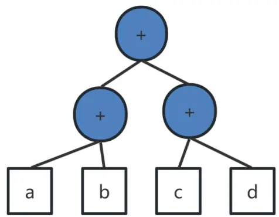
资料来源：中信建投

## 基本面因子一

图11：基本面因子一多空净值
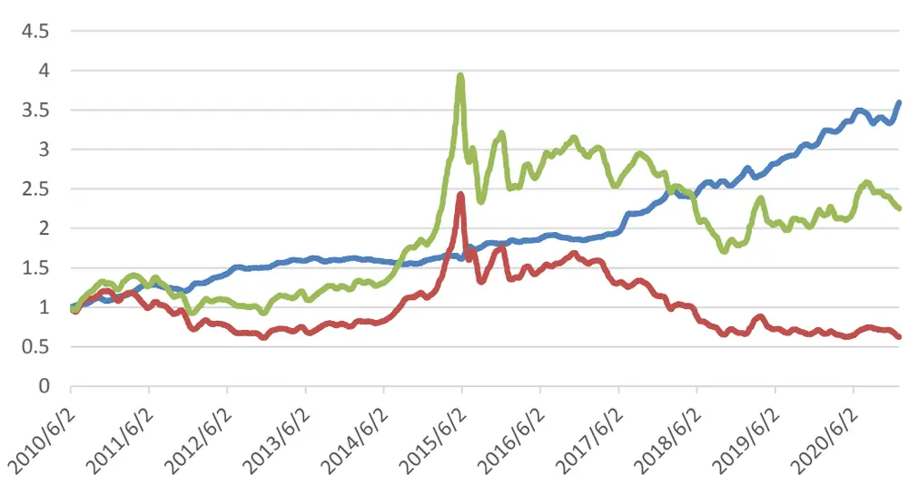
资料来源：WIND，中信建投

表7：基本面因子一收益

|  | LS | S | L |
| --- | --- | --- | --- |
| 2011/12/31 | 15.37% | -34.11% | -23.94% |
| 2012/12/31 | 18.08% | -1.57% | 16.27% |
| 2013/12/31 | 5.72% | 6.69% | 12.82% |
| 2014/12/31 | -1.07% | 51.30% | 49.70% |
| 2015/12/31 | 13.15% | 25.13% | 41.86% |
| 2016/12/31 | 2.26% | 9.19% | 11.66% |
| 2017/12/31 | 28.22% | -27.73% | -7.29% |
| 2018/12/31 | 11.99% | -40.39% | -33.16% |
| 2019/12/31 | 18.33% | 3.01% | 22.03% |
| 2020/12/31 | 14.08% | -10.73% | 1.88% |

资料来源：WIND，中信建投
s_qfa_yoyprofit - s_fa_yoy_equity + s_qfa_yoyop – (s_qfa_saleexpensetogr + s_qfa_yoynetprofit)/s_fa_roa2_yearly

## 基本面因子二

图12：基本面因子二多空净值
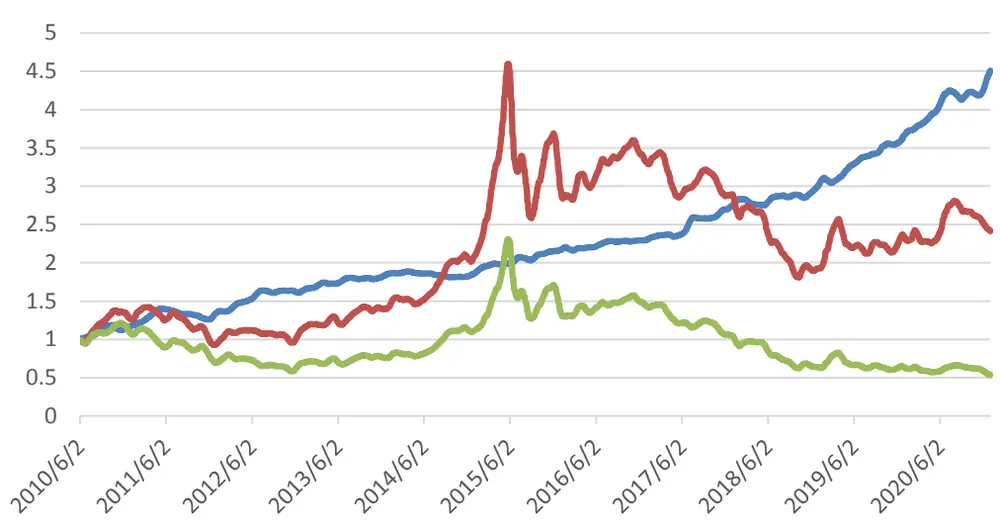
资料来源：WIND，中信建投

表8：基本面因子二收益

|  | LS | S | L |
| --- | --- | --- | --- |
| 2011/12/31 | 15.38% | -26.11% | -36.01% |
| 2012/12/31 | 21.29% | 21.26% | -0.09% |
| 2013/12/31 | 13.49% | 24.62% | 9.79% |
| 2014/12/31 | 0.24% | 47.37% | 47.01% |
| 2015/12/31 | 16.45% | 42.64% | 22.52% |
| 2016/12/31 | 6.23% | 11.44% | 4.91% |
| 2017/12/31 | 19.38% | -12.68% | -26.88% |
| 2018/12/31 | 9.22% | -33.43% | -39.10% |
| 2019/12/31 | 22.09% | 21.27% | -0.74% |
| 2020/12/31 | 23.05% | 3.27% | -16.10% |

资料来源：WIND，中信建投

s_fa_yoy_equity + s_fa_finaexpensetogr + s_fa_finaexpensetogr – (s_qfa_saleexpensetogr + s_qfa_yoynetprofit) / (s_fa_salescashintoor + s_fa_longdebttoworkingcapital)

## 基本面因子三

图13：基本面因子三多空净值
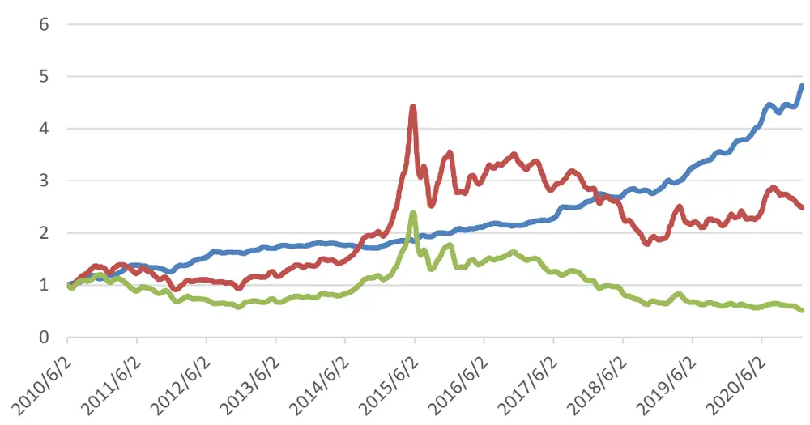
资料来源：WIND，中信建投

表9：基本面因子三收益

|  | LS | S | L |
| --- | --- | --- | --- |
| 2011/12/31 | 16.80% | -25.85% | -36.57% |
| 2012/12/31 | 20.07% | 20.19% | 0.05% |
| 2013/12/31 | 10.39% | 24.09% | 12.38% |
| 2014/12/31 | -1.88% | 45.23% | 47.99% |
| 2015/12/31 | 15.57% | 44.78% | 25.21% |
| 2016/12/31 | 5.67% | 11.75% | 5.75% |
| 2017/12/31 | 22.71% | -11.80% | -28.15% |
| 2018/12/31 | 8.89% | -33.76% | -39.23% |
| 2019/12/31 | 26.52% | 23.27% | -2.65% |
| 2020/12/31 | 32.27% | 6.48% | -19.53% |

资料来源：WIND，中信建投

s_qfa_yoyprofit - s_fa_yoy_equity + s_qfa_yoyop – (s_qfa_saleexpensetogr + s_qfa_yoynetprofit)/s_fa_roa2_yearly

## 基本面因子四

图14：基本面因子四多空净值
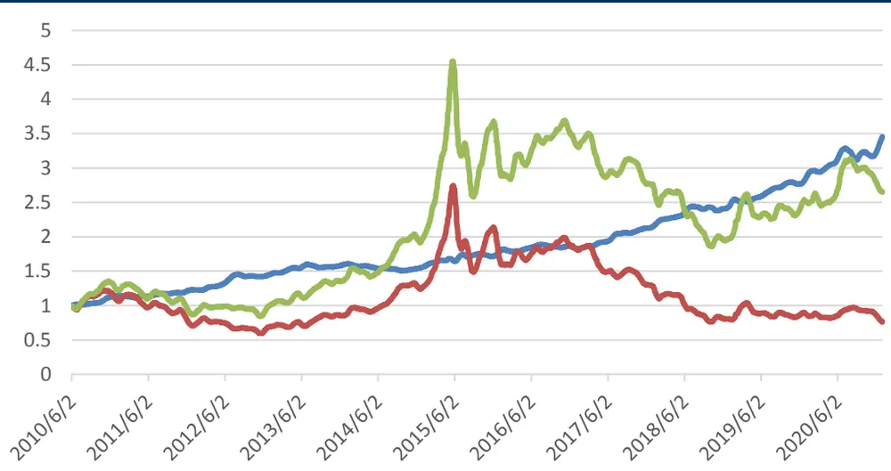
资料来源：WIND，中信建投

表10：基本面因子四收益

|  | LS | S | L |
| --- | --- | --- | --- |
| 2011/12/31 | 7.70% | -34.84% | -29.79% |
| 2012/12/31 | 18.11% | -2.04% | 15.74% |
| 2013/12/31 | 10.45% | 26.03% | 39.23% |
| 2014/12/31 | -2.70% | 45.88% | 41.96% |
| 2015/12/31 | 14.27% | 32.29% | 51.36% |
| 2016/12/31 | 2.53% | 8.40% | 11.15% |
| 2017/12/31 | 17.17% | -29.32% | -17.16% |
| 2018/12/31 | 13.66% | -37.27% | -28.65% |
| 2019/12/31 | 16.86% | 9.01% | 27.44% |
| 2020/12/31 | 21.44% | -13.43% | 5.17% |

资料来源：WIND，中信建投

s_qfa_yoyop - s_qfa_gctogr – s_qfa_yoyprofit / s_fa_longdebttoworkingcapital

## 基本面因子五

图15：基本面因子五多空净值
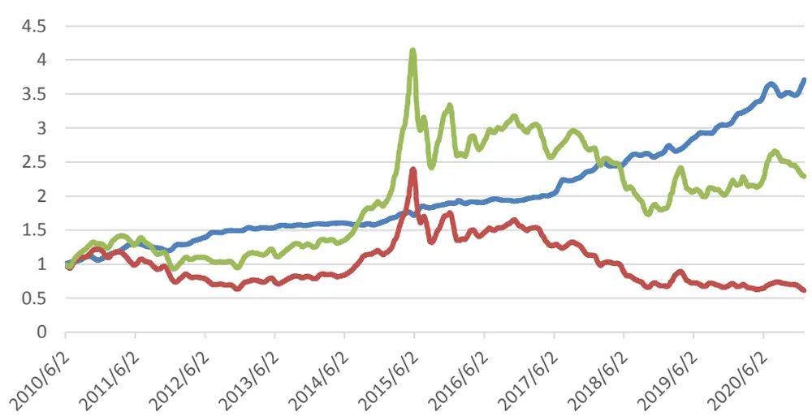
资料来源：WIND，中信建投

表11：基本面因子五收益

|  | LS | S | L |
| --- | --- | --- | --- |
| 2011/12/31 | 14.49% | -33.61% | -23.95% |
| 2012/12/31 | 18.93% | 0.04% | 19.02% |
| 2013/12/31 | 4.64% | 6.70% | 11.67% |
| 2014/12/31 | 2.62% | 47.84% | 51.72% |
| 2015/12/31 | 16.07% | 22.62% | 42.40% |
| 2016/12/31 | 2.80% | 6.00% | 8.97% |
| 2017/12/31 | 23.08% | -25.60% | -8.38% |
| 2018/12/31 | 10.59% | -39.32% | -32.84% |
| 2019/12/31 | 18.28% | 2.44% | 21.26% |
| 2020/12/31 | 18.21% | -12.36% | 3.61% |

资料来源：WIND，中信建投
s_qfa_yoyop + s_qfa_saleexpensetogr + s_qfa_yoynetprofit - s_fa_yoy_equity - s_fa_finaexpensetogr

## 基本面因子六

图16：基本面因子六多空净值
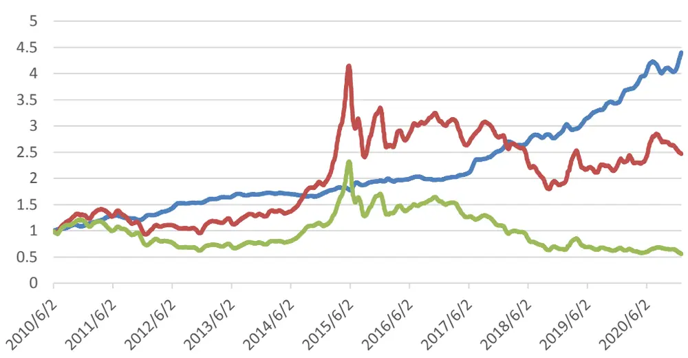
资料来源：WIND，中信建投

表12：基本面因子六收益

|  | LS | S | L |
| --- | --- | --- | --- |
| 2011/12/31 | 14.57% | -23.67% | -33.41% |
| 2012/12/31 | 21.98% | 20.17% | -1.51% |
| 2013/12/31 | 8.80% | 12.60% | 3.48% |
| 2014/12/31 | 0.76% | 50.92% | 49.78% |
| 2015/12/31 | 12.17% | 40.62% | 25.26% |
| 2016/12/31 | 2.24% | 11.31% | 8.86% |
| 2017/12/31 | 29.40% | -6.54% | -27.82% |
| 2018/12/31 | 12.66% | -32.62% | -40.26% |
| 2019/12/31 | 23.01% | 23.69% | 0.45% |
| 2020/12/31 | 23.45% | 4.91% | -15.07% |

资料来源：WIND，中信建投
s_fa_yoy_equity + s_fa_finaexpensetogr + s_fa_finaexpensetogr – s_fa_salescashintoor -s_fa_longdebttoworkingcapital - s_qfa_yoyop

## 估值因子一

图17：估值因子一多空净值
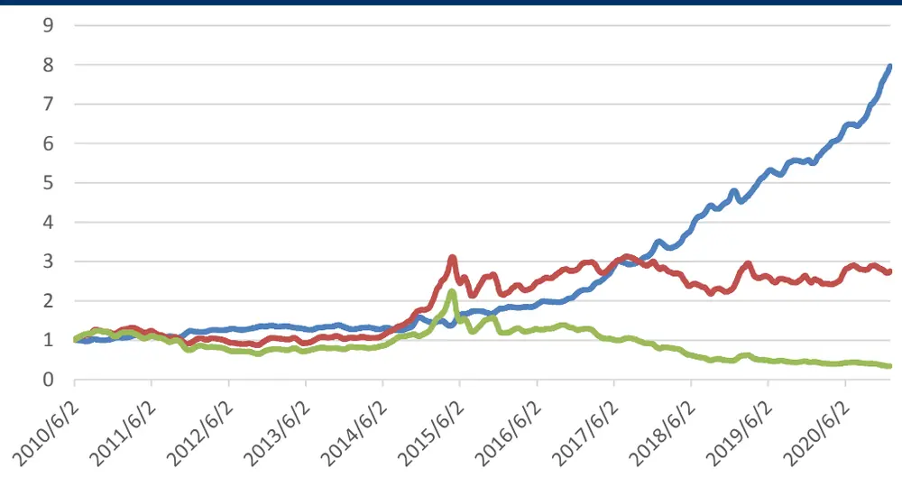
资料来源：WIND，中信建投

表13：估值因子一收益

|  | LS | S | L |
| --- | --- | --- | --- |
| 2011/12/31 | 13.83% | -17.21% | -27.39% |
| 2012/12/31 | 12.49% | 3.99% | -7.58% |
| 2013/12/31 | -6.08% | 0.69% | 7.19% |
| 2014/12/31 | 15.16% | 68.04% | 45.81% |
| 2015/12/31 | 22.63% | 20.65% | -2.17% |
| 2016/12/31 | 25.08% | 35.31% | 8.13% |
| 2017/12/31 | 54.83% | -4.15% | -38.20% |
| 2018/12/31 | 36.09% | -13.14% | -36.29% |
| 2019/12/31 | 15.06% | 2.64% | -10.92% |
| 2020/12/31 | 44.94% | 9.91% | -24.22% |

资料来源：WIND，中信建投

(cash_pay_dist_dpcp_int_exp - net_profit_incl_min_int_inc - net_profit_excl_min_int_inc - surplus_rsrv - cash_pay_beh_empl) / s_val_mv

(分配股利、利润或偿付利息支付的现金 - 净利润(含少数股东损益) - 净利润(不含少数股东损益) -盈余公积金 –支付给职工以及为职工支付的现金) / 总市值

## 估值因子二

图18：估值因子二多空净值
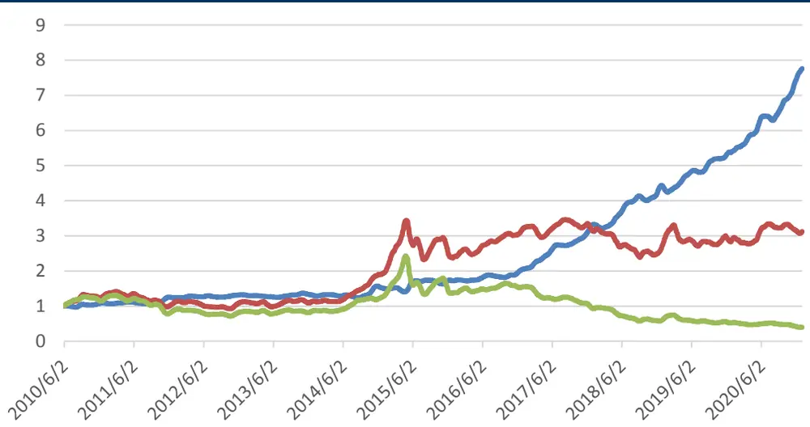
资料来源：WIND，中信建投

表14：估值因子二收益

|  | LS | S | L |
| --- | --- | --- | --- |
| 2011/12/31 | 14.05% | -16.24% | -26.68% |
| 2012/12/31 | 6.64% | 1.84% | -4.51% |
| 2013/12/31 | -1.55% | 1.10% | 2.69% |
| 2014/12/31 | 15.69% | 70.38% | 47.19% |
| 2015/12/31 | 14.43% | 23.09% | 6.98% |
| 2016/12/31 | 19.22% | 34.30% | 12.60% |
| 2017/12/31 | 61.99% | -2.37% | -39.83% |
| 2018/12/31 | 33.22% | -13.50% | -35.17% |
| 2019/12/31 | 22.05% | 6.94% | -12.48% |
| 2020/12/31 | 43.54% | 7.76% | -24.98% |

资料来源：WIND，中信建投

(net_profit_excl_min_int_inc + cash_pay_beh_empl) / s_val_mv

## 总结及展望

利用不同设置的遗传规划算法快速生成因子挖掘的领域知识

根据领域知识，结合枚举法批量产生相关因子

对因子进行有效性检验和相关性检验，保留效果较好的因子。

Todo：

提高物种多样性

因子结构 + Graph Embedding

## 风险提示

本报告中所有数据结果是基于历史统计结果的展示，未来有可能发生风格切换导致因子失效的风险。模型运行存在一定的随机性，初始化随机数种子会对结果产生影响，单次运行结果可能会有一定偏差。历史数据的区间选择会对结果产生一定的影响。模型参数的不同会影响最终结果。模型对计算资源要求较高，运算量不足会导致结果存在一定的欠拟合风险。本文所有模型结果均来自历史数据，模型存在统计误差，不保证模型未来的有效性，对投资不构成任何建议。

## 分析师介绍

丁鲁明：同资产配置与组成员。13并积极应用知。多次荣金研究团证券从业，实务，多首席分析创立国内对资本市精算师，现信建投证券基本面”投趋势及拐点中信建投证券研金投顾业务决策体系，继承并深发展部执行总经员会成员，上海研究经济经典长券交易所定期体系中的康波交流理论1。9第4、2012水球最最佳分析师2009第1、2013第1等；Wind金牌分析师2018年第2、2019年第2等、2020年第4等。

王 超：南京大学粒子物理博士，曾担任基金公司研究员，券商研究员，有丰富的研究和投资经验，2021年加入中信建投，主要负责量化多因子选股。

## 评级说明

| 投资评级标准 |  | 评级 | 说明 |
| --- | --- | --- | --- |
| 报告中投资建议涉及的评级标准为报告发布日后6个月内的相对市场表现，也即报告发布日后的6个月内公司股价（或行业指数）相对同期相关证券市场代表性指数的涨跌幅作为基准。A股市场以沪深300指数作为基准；新三板市场以三板成指为基准；香港市场以恒生指数作为基准；美国市场以标普500指数为基准。 | 股票评级 | 买入 | 相对涨幅15%以上 |
|  |  | 增持 | 相对涨幅5%—15% |
|  |  | 中性 | 相对涨幅-5%—5%之间 |
|  |  | 减持 | 相对跌幅5%—15% |
|  |  | 卖出 | 相对跌幅15%以上 |
|  | 行业评级 | 强于大市 | 相对涨幅10%以上 |
|  |  | 中性 | 相对涨幅-10-10%之间 |
|  |  | 弱于大市 | 相对跌幅10%以上 |

## 分析师声明

本报告署名分析师在此声明：（i）以勤勉的职业态度、专业审慎的研究方法，使用合法合规的信息，独立、客观地出具本报告, 结论不受任何第三方的授意或影响。（ii）本人不曾因，不因，也将不会因本报告中的具体推荐意见或观点而直接或间接收到任何形式的补偿。

## 法律主体说明

本报告由中信建投证券股份有限公司及/或其附属机构（以下合称“中信建投”）制作，由中信建投证券股份有限公司在中华人民共和国（仅为本报告目的，不包括香港、澳门、台湾）提供。中信建投证券股份有限公司具有中国证监会许可的投资咨询业务资格，本报告署名分析师所持中国证券业协会授予的证券投资咨询执业资格证书编号已披露在报告首页。

在遵守适用的法律法规情况下，本报告亦可能由中信建投（国际）证券有限公司在香港提供。本报告作者所持香港证监会牌照的中央编号已披露在报告首页。

## 一般性声明

本报告由中信建投制作。发送本报告不构成任何合同或承诺的基础，不因接收者收到本报告而视其为中信建投客户。

出具日该分析师的判断，该等观点、评估和预测可能在不发出通知的情况下有所变更，亦有可能因使用不同假设和标准或者采用不同分析方法而与中信建投其他部门、人员口头或书面表达的意见不同或相反。本报告所引证券或其他金融工具的过往业绩不代表其未来表现。报告中所含任何具有预测性质的内容皆基于相应的假设条件，而任何假设条件都可能随时发生变化并影响实际投资收益。中信建投不承诺、不保证本报告所含具有预测性质的内容必然得以实现。

本报告内容的全部或部分均不构成投资建议。本报告所包含的观点、建议并未考虑报告接收人在财务状况、投资目的、风险偏好等方面的具体情况，报告接收者何潜在投资向其税务、会计或法律顾问咨询。不论报告接收者是否根据本报告做出投资决策，中信建投都不对该等投资决策提供任何形式的担保，亦不以任何形应当独立评估本报告所含信息，基于自身投资目标、需求、市场机会、风险及其他因素自主做出决策并自行承担投资风险。中信建投建议所有投资者应就任式分享投资收益或者分担投资损失。中信建投不对使用本报告所产生的任何直接或间接损失承担责任。

在法律法规及监管规定允许的范围内，中信建投可能持有并交易本报告中所提公司的股份或其他财产权益，也可能在过去12个月、目前或者将来为本报告中所提公司提供或者争取为其提供投资银行、做市交易、财务顾问或其他金融服务。本报告内容真实、准确、完整地反映了署名分析师的观点，分析师的薪酬无论过去、现在或未来都不会直接或间接与其所撰写报告中的具体观点相联系，分析师亦不会因撰写本报告而获取不当利益。

本报告为中信建投所有。未经中信建投事先书面许可，任何机构和/或个人不得以任何形式转发、翻版、复制、发布或引用本报告全部或部分内容，亦不得从未经中信建投书面授权的任何机构、个人或其运营的媒体平台接收、翻版、复制或引用本报告全部或部分内容。版权所有，违者必究。

## 中信建投证券研究发展部

北京

东城区朝内大街2号凯恒中心B座12层

电话：(8610) 8513-0588

联系人：李祉瑶

邮箱：lizhiyao@csc.com.cn

上海

浦东新区浦东南路528号南塔2103室

电话：(8621) 6882-1612

联系人：翁起帆

邮箱：wengqifan@csc.com.cn

深圳

福田区福中三路与鹏程一路交汇处广电金融中心35楼

电话：（86755）8252-1369

联系人：曹莹

邮箱：caoying@csc.com.cn

## 中信建投（国际）

香港中环交易广场2期18楼

电话：（852）3465-5600

联系人：刘泓麟

邮箱：charleneliu@csci.hk