# 证券研究报告•金融工程专题报告

# “逐鹿”Alpha专题报告（十六）：基于GraphEmbedding的行业因子向量化

分析师：丁鲁明dingluming@csc.com.cnSAC编号：S1440515020001

分析师：王超wangchaodcq@csc.com.cnSAC 编号：S1440522120002

发布日期：2023年9月5日

## 核心观点

传统方法在处理行业因子信息时通常采用one-hot将行业转变为哑变量进行处理（对于某些特殊模型，可以采用category变量）。这两者均无法表示行业之间的内在关联关系。且哑变量为稀疏矩阵，信息密度较低，增加了计算开销。

本文利用行业相关性矩阵构建图结构，采用Graph Embedding的算法Node2vec将行业因子进行向量化处理，得到的行业因子能够有效的包括行业内在相关性。


## 提纲

Graph Embedding介绍

## 行业Embedding

## Graph Embedding介绍

## Embedding

嵌入（Embedding）是指一个数学结构经映射包含到另一个结构中。某个物件X称为嵌入到另一个物件Y中，是指有一个保持结构的单射f: X→Y，这个映射f就给出了一个嵌入

万物皆可Embedding（word embdding、item embedding、graph embedding）

经典的Word Embedding算法包括： Word2vec、 GloVe、FastText等

大语言Embedding模型 ： BERT、EloMo、GPT等

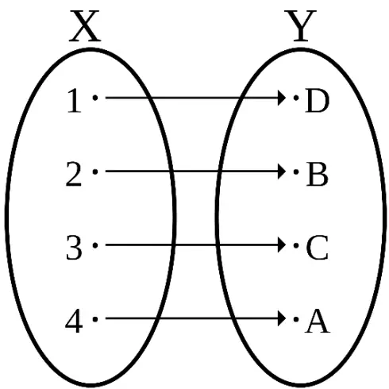

## One-hot

独热编码（one-hot）：用N位状态寄存器来对N个状态进行编码

在NLP中，将单词转换为独热向量

缺点：

- 维数灾难

- 语义鸿沟

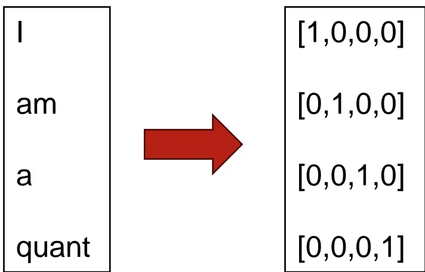

## Word2vec

Word2vec: 将单词转换为连续向量

基于连续向量，计算单词相似度：

model.most_similar(‘贵州茅台’)：

('洋河股份', 0.9215401411056519)

('酒鬼酒', 0.9041466116905212)

('600519', 0.899872362613678)

('海天味业', 0.8987340331077576)

('口子窖', 0.8912389874458313)

('顺鑫农业', 0.8851066827774048)

('五粮液', 0.8838584423065186)

('老白干酒', 0.8835573196411133)

('山西汾酒', 0.8828251361846924)

('古井贡酒', 0.8824747204780579)

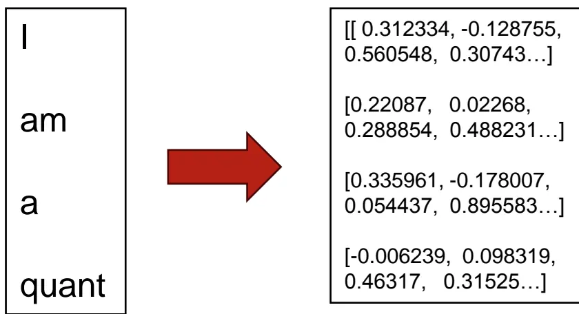

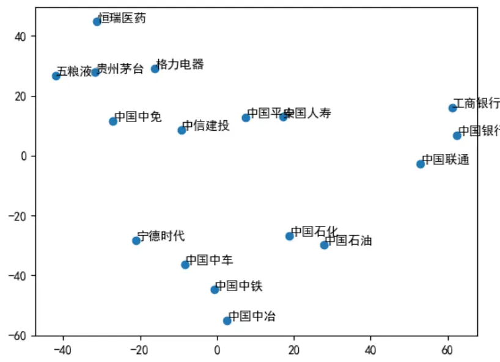

资料来源：中信建投

## Graph Embedding

图数据结构用来表达物体之间的关联关系

图的定义：

$$
G=\textbf{ ( }V,E\textbf{ ) }
$$

V代表顶点集合，E代表边

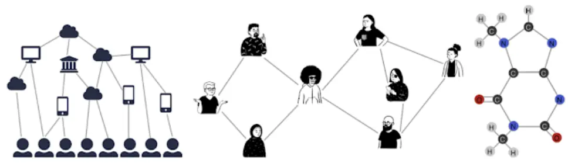

邻接矩阵：

$$
A_{ij}=\left\{\begin{aligned}{1}&{{}\quad if\{v_{i},v_{j}\}\in V\;and\;i\neq j,}\\{0}&{{}\quad otherwise}\\\end{aligned}\right.
$$

常见的图嵌入算法包括DeepWalk, LINE, Node2Vec, SDNE, Struct2Vec, GraphSAGE等

图算法能够有效的计算节点之间的关系

图嵌入（Graph Embedding）和图神经网络（Graph Neural Network, GNN）两者互相关联，embedding生成的向量可以作为GNN的输入，同时某些embedding需要用到GNN的算法。

## DeepWalk

在图中采用随机游走生成结点序列，利用Word2Vec（SkipGram）算法进行无监督训练，生成embedding结果

```powershell
Algorithm 1 DEEPWALK(G, w, d, γ, t)
Input: graph G(V, E)
window size w
embedding size d
walks per vertex γ
walk length t
Output: matrix of vertex representations $\Phi\in\mathbb{R}^{|V|\times d}$
1: Initialization: Sample Φ from U|V|×d
2: Build a binary Tree T from V
3: for i = 0 to γ do
4: O = Shuffle(V)
5: for each $v_{i}\in\mathcal{O}$ do
6: Wvi = RandomWalk(G, vi,t)
7: SkipGram(Φ, Wvi, w)
8: end for
9: end for
```
资料来源：DeepWalk: online learning of social representations, 中信建投
优点：算法简单高效

缺点：没有考虑边的属性，无法跳出有向图中出度为0的节点

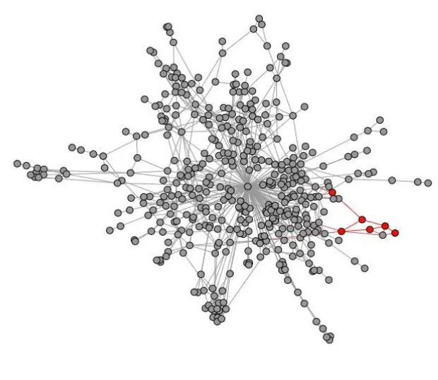
(a) Random walk generation.

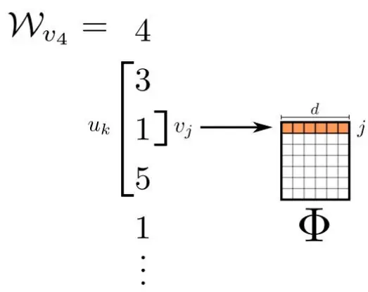
(b) Representation mapping.
资料来源：DeepWalk: online learning of social representations,中信建投

## Node2Vec

Node2vec是在DeepWalk的基础上，引入参数p和q，将随机游走序列调节为宽度优先搜索和深度优先搜索的序列生成

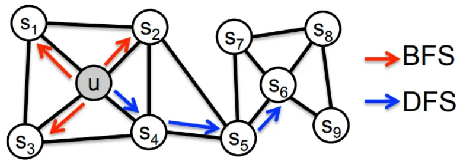
Figure 1: BFS and DFS search strategies from node u (k = 3).

$$
P(c_{i}=x\mid c_{i-1}=v)=\begin{cases}{\frac{\pi_{vx}}{Z}}&{\operatorname{if}\left(v,x\right)\in E}\\{0}&{\operatorname{otherwise}}\\\end{cases}
$$

$$
\alpha_{pq}(t,x)=\begin{cases}{\frac{1}{p}}&{\operatorname{if}d_{tx}=0,}\\{1}&{\operatorname{if}d_{tx}=1,}\\{\frac{1}{q}}&{\operatorname{if}d_{tx}=2.}\\\end{cases}
$$

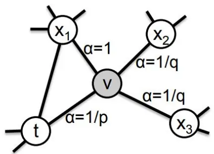

资料来源： node2vec: Scalable Feature Learning for Networks, 中信建投

优点：可以学习同质图和同构图结构

缺点：超参p，q需要调节

$$
\pi_{vx}=\alpha_{pq}(t,x)\cdot w_{vx}
$$

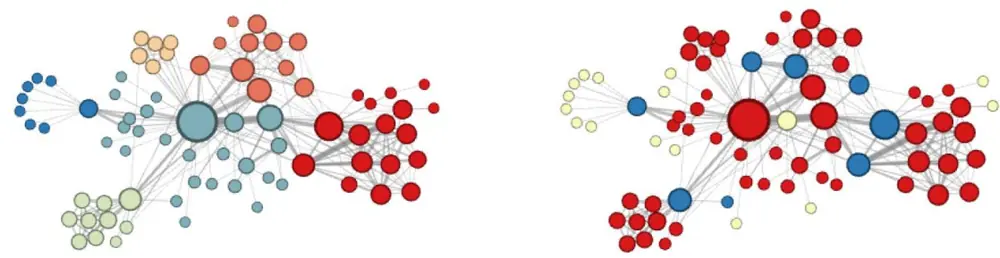
资料来源： node2vec: Scalable Feature Learning for Networks, 中信建投

## 行业Embedding

## 行业因子

传统方法在处理行业因子信息时通常采用one-hot将行业转变为哑变量进行处理（对于某些特殊模型，可以采用category变量）

两者均无法表示行业之间的内在关联关系

且哑变量为稀疏矩阵，信息密度较低，增加了计算开销

## 行业因子Word Embedding

直接采用Word Embedding提取行业名称的向量

能够反映行业之间的关系，但与二级市场的行业关系存在一定的区别，此关系主要来文本资料，映射到二级市场会发生一定的改变

单次训练，无法回测

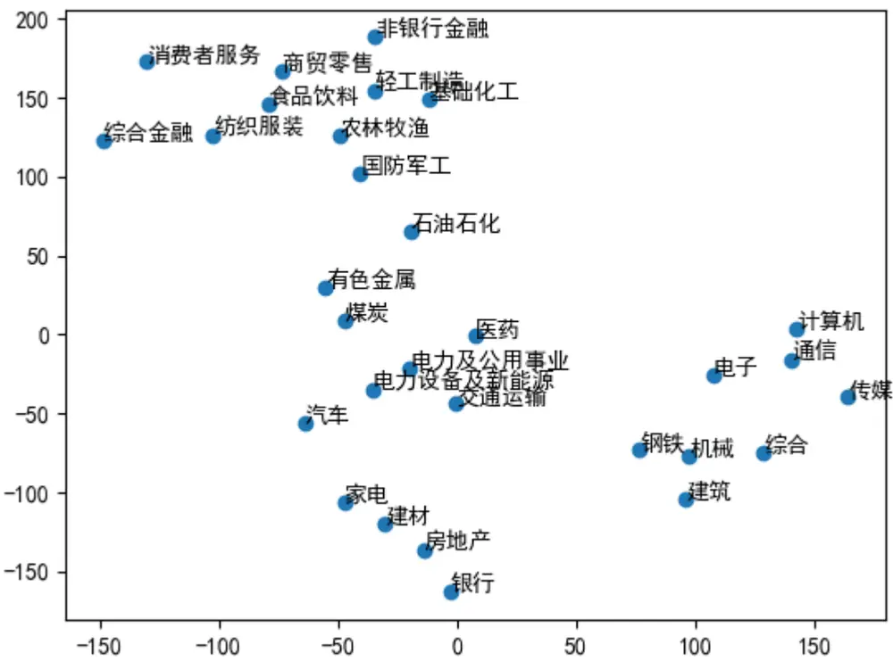
资料来源：中信建投

## Node2Vec

构造有权完全无向图，指数收益率相关性矩阵作为邻接矩阵

节点为行业，边为行业之间的相关性

使用Node2vec 对行业因子进行embedding

Node2vec

walk_length: 10

num_walks: 1e6

window_size: 5

embed_size: 30

每个行业均可用30维向量表示，利用TSNE将向量压缩到2维可视化展示

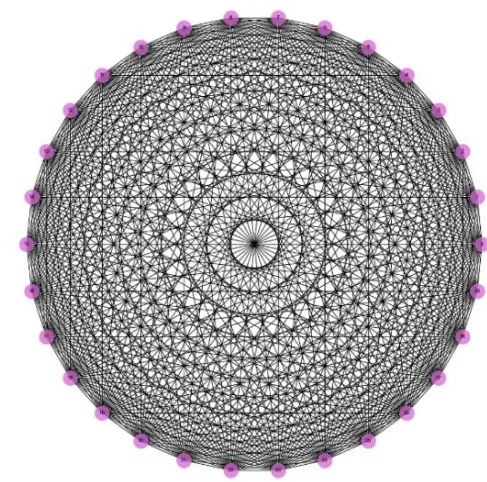

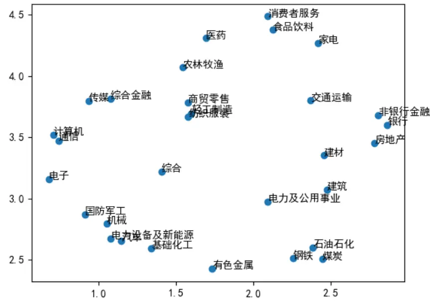
资料来源：WIND，中信建投

## 讨论

## 讨论

相比于行业哑变量，行业graph embedding向量信息密度更高，且向量之间内在的包含了行业之间的相关性关系。

Embedding向量可以作为各类机器学习和深度学习模型的输入，更好的提高预测效果。

## 风险提示

- 本报告中所有数据结果是基于历史统计结果的展示，未来有可能发生风格切换导致因子失效的风险。模型运行存在一定的随机性，初始化随机数种子会对结果产生影响，单次运行结果可能会有一定偏差。历史数据的区间选择会对结果产生一定的影响。模型参数的不同会影响最终结果。模型对计算资源要求较高，运算量不足会导致结果存在一定的欠拟合风险。本文所有模型结果均来自历史数据，模型存在统计误差，不保证模型未来的有效性，对投资不构成任何建议。


## 行业因子Graph Embedding

| 0.053 -0.005 -0.192 | -0.077 0.168 0.019 0.039 0.101 0.056 -0.036 -0.076 | -0.014 -0.082 -0.172 -0.110 -0.059 0.043 -0.153 | -0.227 -0.153 -0.077 0.038 0.060 -0.023 -0.057 | -0.008 -0.068 -0.160 0.157 0.018 -0.159 0.064 | 5 0.019 0.007 0.110 -0.154 -0.027 0.220 |  | 0.019 -0.084 -0.097 0.015 -0.101 | 0.012 0.043 0.088 -0.178 | 10 -0.094 -0.052 -0.020 0.022 | 11 -0.098 -0.009 0.070 0.077 | 12 0.156 0.099 0.158 0.062 | 13 0.036 0.126 -0.125 0.040 | 14 15 0.108 0.106 -0.019 -0.058 0.150 -0.008 0.088 -0.177 | 16 -0.047 0.136 0.191 0.176 | 17 0.088 0.153 0.079 0.032 0.107 | 18 0.058 0.117 -0.109 0.084 -0.099 | 19 -0.080 -0.226 -0.132 -0.051 -0.146 0.035 | 20 0.158 -0.031 -0.112 -0.044 0.123 0.133 | 21 -0.173 -0.127 0.037 -0.212 0.004 -0.208 | 22 -0.092 -0.249 -0.071 -0.011 -0.226 0.134 | 23 0.095 -0.055 -0.117 -0.022 -0.044 0.152 -0.115 | 24 0.064 0.045 -0.082 -0.109 0.052 -0.049 0.175 | 25 0.053 0.056 -0.021 -0.019 -0.068 -0.002 | 0.165 0.284 0.023 0.149 0.137 0.009 | 27 0.020 -0.029 0.070 0.052 0.097 0.015 | 28 0.136 -0.038 -0.013 -0.038 -0.081 -0.152 |  |  |  |
| --- | --- | --- | --- | --- | --- | --- | --- | --- | --- | --- | --- | --- | --- | --- | --- | --- | --- | --- | --- | --- | --- | --- | --- | --- | --- | --- | --- | --- | --- |
| 9 10 | -0.007 0.030 -0.028 -0.225 0.118 -0.034 | 0.028 -0.020 -0.066 -0.031 0.198 | -0.006 -0.170 0.032 0.167 | -0.047 -0.062 0.000 -0.123 -0.136 0.009 0.101 -0.246 | 0.012 0.009 0.029 0.019 -0.030 | -0.093 -0.146 0.139 0.149 0.143 | -0.054 -0.042 0.157 0.161 -0.021 | 0.133 -0.081 -0.021 -0.047 -0.208 | -0.173 -0.189 0.131 -0.081 -0.113 | -0.023 -0.015 -0.116 -0.035 0.012 | -0.130 0.055 0.045 0.052 0.007 | -0.015 -0.204 -0.020 0.250 0.197 | 0.074 -0.056 -0.009 -0.171 -0.038 | -0.133 -0.021 -0.070 0.136 0.094 | -0.054 -0.030 -0.204 -0.105 -0.066 | -0.028 -0.062 -0.070 -0.003 0.028 0.040 0.025 -0.123 0.104 -0.142 -0.304 | 0.048 -0.120 -0.007 -0.027 -0.031 -0.212 | -0.091 -0.089 0.063 0.050 0.013 -0.065 | -0.022 -0.034 0.172 -0.013 -0.003 0.021 | -0.144 0.045 0.049 0.084 0.014 -0.018 | -0.031 0.112 0.016 0.008 -0.052 0.022 | 0.025 0.007 0.024 0.007 0.013 |  | 0.071 0.092 0.150 -0.019 | -0.023 0.196 0.112 -0.067 0.073 | -0.004 0.159 0.039 0.137 -0.043 | 0.093 -0.101 0.085 -0.102 0.085 | -0.371 -0.372 -0.312 -0.309 -0.311 | -0.182 -0.022 0.001 -0.094 |
| 11 12 | -0.055 -0.043 -0.008 0.124 -0.002 | 0.035 -0.026 -0.091 | -0.199 0.012 -0.076 | -0.089 0.059 0.008 0.096 | -0.053 -0.034 -0.097 0.091 | 0.031 0.183 0.098 0.252 | 0.158 -0.070 -0.014 | -0.190 -0.228 0.091 | 0.029 0.101 0.021 | -0.020 0.091 0.029 0.099 | 0.009 0.012 -0.022 0.035 | 0.055 0.059 -0.016 | -0.011 0.091 -0.026 0.117 | 0.039 0.213 0.129 0.045 | 0.044 -0.011 -0.015 0.114 | 0.080 -0.088 -0.018 -0.054 0.190 | -0.043 0.082 -0.220 0.104 -0.125 | -0.194 0.207 0.076 | 0.074 0.007 0.162 | 0.071 -0.114 0.168 | 0.027 -0.160 0.022 |  | 0.066 0.010 | -0.104 -0.004 -0.061 | -0.128 -0.042 0.204 | 0.065 -0.035 0.144 -0.009 0.036 | 0.192 -0.026 0.134 0.096 0.022 0.268 | -0.054 -0.086 -0.198 -0.246 0.075 0.148 | -0.260 -0.326 -0.222 |
| 2 13 14 15 16 | -0.061 -0.044 -052 0.210 | 0.161 0.131 | -0.05 | 0.064 | -0.149 -0.094 | 0.072 | -0.043 -0.104 -0.029 | 0.031 -0.019 0.055 | -0.150 0.084 0.030 | -0.003 -0.015 | -0.053 -0.042 | -0.061 -0.165 0.042 | 0.105 -0.177 | 0.065 0.133 | -0.146 0.034 | 0.071 0.029 0.069 | -0.053 | 0.129 | 0.133 | 0.022 | 0.150 |  | -0.031 -0.055 0.122 | 0.008 0.002 0.059 0.054 | 0.062 0.075 |  |  |  | -0339 |
|  | -0.098 | -0.183 0.003 0.038 -0.098 | 0.046 0.162 | 0.093 0.001 | -0.016 | -0.034 0.097 | 0.080 | -0.062 | -0.028 | 0.143 | 0.021 | -0.026 | 0.040 | 0.007 -0.003 | 0.183 0.188 | -0.043 | 0.159 -0.089 | -0.064 0.227 | 0.074 0.079 0.045 | 0.036 0.091 | -0.011 0.066 |  |  |  | 0.204 0.064 0.081 | 0.077 0.015 |  | -0.162 | -0.256 -0.353 |
| 17 18 | 0.052 0.107 | 0.069 | 0.059 | 0.001 | -0.003 -0.215 | 0.180 | -0.042 0.167 | 0.073 | -0.059 -0.006 | 0.140 0.152 | -0.076 | -0.080 | 0.174 -0.044 | -0.027 | 0.085 | -0.061 0.078 | -0.063 | 0.146 0.040 | -0.031 | 0.184 0.026 | 0.066 -0.073 | 0.199 0.140 -0.001 | -0.086 |  | -0.006 | 0.035 -0.049 | 0.100 0.070 | 0.051 0.154 | -0.399 |
| 19 | -0.040 -0.084 -0.187 | 0.018 | -0.021 -0.014 | -0.119 0.152 | 0.132 | -0.003 -0.125 | -0.040 | -0.011 0.138 | 0.086 | -0.025 | -0.098 | 0.044 -0.159 | -0.026 | 0.105 | -0.007 | 0.100 | 0.093 0.107 | 0.005 | 0.042 | 0.058 | -0.008 | -0.074 | -0.181 |  |  |  | -0.067 | -0.056 | -0.407 |
| 20 | 0.076 0.086 | 0.120 | 0.056 | 0.173 | 0.214 | 0.028 | 0.093 | 0.005 | 0.055 | -0.075 | -0.083 -0.073 | -0.111 | 0.172 -0.094 0.046 | -0.072 | -0.049 | 0.118 | 0.051 | 0.041 | -0.034 | -0.004 | -0.036 | -0.104 | -0.033 | 0.038 |  | 0.277 | 0.034 | 0.046 | -0.371 |
| 21 22 | 0.125 0.111 | 0.113 | -0.033 | 0.045 | -0.016 | -0.178 | -0.068 | 0.134 | 0.086 | 0.079 | -0.063 | -0.164 | -0.078 | -0.038 | -0.120 | 0.035 0.040 | 0.038 | 0.086 | 0.122 -0.177 | 0.057 | 0.012 | -0.159 | -0.132 0.130 | 0.000 |  | 0.242 0.285 | 0.147 | -0.006 | -0.338 |
| 23 | -0.090 0.076 | 0.101 | -0.006 | -0.038 | 0.002 | 0.016 | 0.045 | 0.174 | 0.064 | -0.009 | 0.197 | -0.083 | -0.059 0.163 | -0.088 0.041 | 0.058 -0.001 | 0.000 | 0.056 |  |  |  |  | 0.023 | 0.141 | -0.052 -0.011 |  |  | -0.035 | -0.178 | -0.306 |
| 24 | -0.104 -0.103 | 0.143 -0.028 | 0.072 | -0.063 | 0.002 | 191 | -0.099 | -0.341 | 0.060 | -0.002 |  |  | 0.104 | -0.035 | -0.070 | -0.033 | -0.060 | 0.021 0.138 |  | 0.092 | -0.082 0.056 | 0.050 | 0.077 | -0.199 |  | 0.058 0.177 | 0.073 0.172 | 0.020 -0.011 | -0.343 |
| 25 | -0.078 -0.128 | 0.113 | -0.022 | -0.020 | -0.131 | E | -0.022 | -0.082 | 0.072 | -0.032 | -0.093 0.049 | 0.015 0.108 | -0.189 | 0.025 | -0.003 | 0.110 | -0.099 | -0.039 | -0.101 -0.115 | -0.003 -0.172 | 0.188 | 0.119 | 0.082 | -0.093 0.044 |  | 0.104 | 0.169 0.197 | -0.137 -0.061 | -0.270 |
| 26 27 | -0.040 0.001 | 0.074 | 0.006 | 0.21212 | -0.04 |  | 0.254 | -0.196 | 0.056 | 0.087 | -0.213 | 0.102 | -0.148 -0.050 0.030 -0.103 | -0.038 | 0.035 | 0.082 -0.033 | -0220 | 0.033 0.182 | -0.174 -0.113 | -0.028 | 0.108 | 0.028 0.052 | 0.178 0.016 |  |  | -0.004 -0.059 | -0.056 | -0.147 | -03328 |
| 28 | -0.123 -0.007 -0.212 -0.114 | 0.074 0.028 | 0.020 -0.027 | 0.025 | 0.043 |  | -0.062 0.069 | -0.119 -0.073 | 0.094 0.023 | -0.201 0.025 | -0.082 -0.012 | 0.091 -0.194 | -0.058 -0.262 0.058 | 0.054 -0.091 | 0.109 0.158 | 0.028 | -0.031 | -0.047 | 0.030 | -0.059 -0.129 | -0.009 -0.249 | 0.177 | 0.042 |  | 0.035 -0.135 | -0.030 | 0.063 | -0.137 | -0.278 |
| 29 -0.110 | -0.074 0.067 | 0.051 | 0.263 | 0.053 | 0.062 | 0.127 | 0.101 | 0.090 | 0.085 | -0.054 | -0.136 | 0.014 | -0.127 | 0.069 | 0.054 | -0.046 | -0.185 | -0.125 | 0.026 | -0.248 | -0.060 | -0.067 | -0.007 | -0.004 |  | 0.195 | -0.043 | -0.060 | -0.265 |

资料来源：WIND，中信建投

## 行业因子PCA

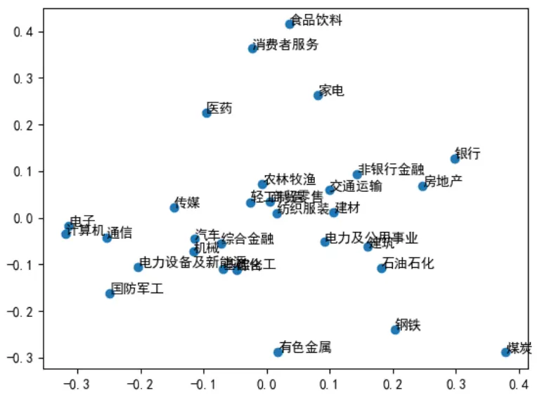
资料来源：WIND，中信建投

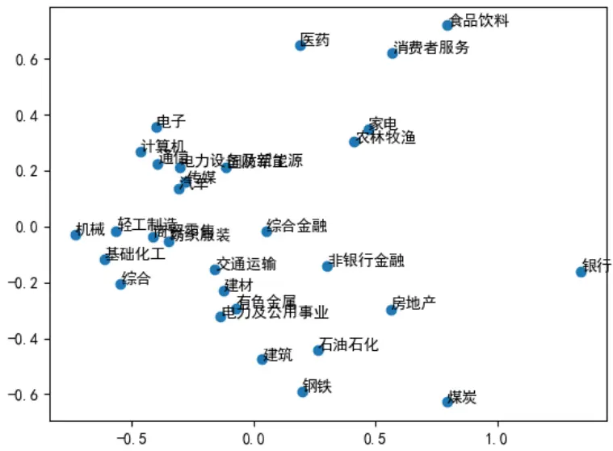

## 分析师介绍

丁鲁明：基金研究团创立国内“重大趋势及第4、2012分析本面”出精学硕士，中国准，中信建投证券投研体系，继承预判，对资产配2014 3金投顾业务决策委员会成深入研究经济经典长波体与经济周期运行具备深刻球最佳析师2009第、，上海证券交易所定期专家交流组成员。中的康波周期理论并积极应用于实务，解与认知。多次荣获团队荣誉：新财富；Wind金分析师20 13年证券次对资本佳分析师年第20。

王 超：南京大学粒子物理博士，曾担任基金公司研究员，券商研究员，有丰富的研究和投资经验，2021年加入中信建投，主要负责量化多因子选股。

## 评级说明

| 投资评级标准 |  | 评级 | 说明 |
| --- | --- | --- | --- |
| 报告中投资建议涉及的评级标准为报告发布日后6个月内的相对市场表现，也即报告发布日后的6个月内公司股价（或行业指数）相对同期相关证券市场代表性指数的涨跌幅作为基准。A股市场以沪深300指数作为基准；新三板市场以三板成指为基准；香港市场以恒生指数作为基准；美国市场以标普500指数为基准。 | 股票评级 | 买入增持 |  |
|  |  | 中性 | 相对涨幅-5%—5%之间 |
|  |  | 减持卖出 | 相对跌幅5%—15% |
|  |  |  | 相对跌幅15%以上 |
|  | 行业评级 | 强于大市 | 相对涨幅10%以上 |
|  |  | 中性 | 相对涨幅-10-10%之间 |
|  |  | 弱于大市 | 相对跌幅10%以上 |

## 分析师声明

本报告署名分析师在此声明：（i）以勤勉的职业态度、专业审慎的研究方法，使用合法合规的信息，独立、客观地出具本报告, 结论不受任何第三方的授意或影响。（ii）本人不曾因，不因，也将不会因本报告中的具体推荐意见或观点而直接或间接收到任何形式的补偿。

## 法律主体说明

本报告由中信建投证券股份有限公司及/或其附属机构（以下合称“中信建投”）制作，由中信建投证券股份有限公司在中华人民共和国（仅为本报告目的，不包括香港、澳门、台湾）提供。中信建投证券股份有限公司具有中国证监会许可的投资咨询业务资格，本报告署名分析师所持中国证券业协会授予的证券投资咨询执业资格证书编号已披露在报告首页。

在遵守适用的法律法规情况下，本报告亦可能由中信建投（国际）证券有限公司在香港提供。本报告作者所持香港证监会牌照的中央编号已披露在报告首页。

## 一般性声明

本报告由中信建投制作。发送本报告不构成任何合同或承诺的基础，不因接收者收到本报告而视其为中信建投客户。

本报告的信息均来源于中信建投认为可靠的公开资料，但中信建投对这些信息的准确性及完整性不作任何保证。本报告所载观点、评估和预测仅反映本报告出具日该分析师的判断，该等观点、评估和预测可能在不发出通知的情况下有所变更，亦有可能因使用不同假设和标准或者采用不同分析方法而与中信建投其他部门、人员口头或书面表达的意见不同或相反。本报告所引证券或其他金融工具的过往业绩不代表其未来表现。报告中所含任何具有预测性质的内容皆基于相应的假设条件，而任何假设条件都可能随时发生变化并影响实际投资收益。中信建投不承诺、不保证本报告所含具有预测性质的内容必然得以实现。

本报告内容的全部或部分均不构成投资建议。本报告所包含的观点、建议并未考虑报告接收人在财务状况、投资目的、风险偏好等方面的具体情况，报告接收者应当独立评估本报告所含信息，基于自身投资目标、需求、市场机会、风险及其他因素自主做出决策并自行承担投资风险。中信建投建议所有投资者应就任何潜在投资向其税务、会计或法律顾问咨询。不论报告接收者是否根据本报告做出投资决策，中信建投都不对该等投资决策提供任何形式的担保，亦不以任何形式分享投资收益或者分担投资损失。中信建投不对使用本报告所产生的任何直接或间接损失承担责任。

在法律法规及监管规定允许的范围内，中信建投可能持有并交易本报告中所提公司的股份或其他财产权益，也可能在过去12个月、目前或者将来为本报告中所提公司提供或者争取为其提供投资银行、做市交易、财务顾问或其他金融服务。本报告内容真实、准确、完整地反映了署名分析师的观点，分析师的薪酬无论过去、现在或未来都不会直接或间接与其所撰写报告中的具体观点相联系，分析师亦不会因撰写本报告而获取不当利益。

本报告为中信建投所有。未经中信建投事先书面许可，任何机构和/或个人不得以任何形式转发、翻版、复制、发布或引用本报告全部或部分内容，亦不得从未经中信建投书面授权的任何机构、个人或其运营的媒体平台接收、翻版、复制或引用本报告全部或部分内容。版权所有，违者必究。

## 中信建投证券研究发展部

东城区朝内大街2号凯恒中心B

电话：(8610) 8513-0588

联系人：李祉瑶

浦东新区浦东南路528号南塔2103室
电话：(8621) 6882-1612
联系人：翁起帆
邮箱：wengqifan@csc.com.cn

电话：（86755）8252-1369

## 中信建投（国际）

电话：（852）3465-5600