# 证券研究报告•金融工程专题报告

# “逐鹿”Alpha专题报告（十七）：基于TiDE及其改进的因子融合模型

分析师：丁鲁明dingluming@csc.com.cnSAC编号：S1440515020001

分析师：王超wangchaodcq@csc.com.cnSAC 编号：S1440522120002

发布日期：2023年10月24日

## 核心观点

随着transformer结构近年来在自然语言处理（NLP）和计算机视觉领域大放异彩，在时间序列预测的问题上，各类基于transformer的模型也层出不穷，如Informer， Temporal Fusion Transformer, PatchTST等，均取得了较好的结果。

在2022年的论文“Are Transformers Effective for Time Series Forecasting?”中，作者提出了一种简单的MLP结构LTSF-Linear，结果表明，Linear模型在许多数据集上均能超越现有的transformer模型。随后，基于MLP的时序模型不断提出，包括哈工大/华为的MTS-Mixers以及谷歌的TSMixer，TiDE等。

本文我们尝试将TiDE模型应用于选股，结果表明，原始的TiDE模型并不适合股票收益率的预测，通过在原始的TiDE模型中加入GRU encoder结构，我们提出了TiDGE模型，能够提高模型表现。

## 提纲

TiDE模型介绍

03

## 行业Embedding

## TiDE模型介绍

## Transformer

自从GOOGLE在2017年的经典论文Attention is All You Need中提出Transformer架构以来，在各类NLP任务中，Transformer取得了巨大的成功。不仅如此，在计算机视觉领域，Transformer也逐渐占据主流。

Transformer的模型结构如右图所示，整个Transformer结果可以分为左边的encoder部分以及右边的decoder部分，两者均是基于N个multi-head attention模块构建而成，区别在于在encoder部分，所有输入均为已知，因此采用并行计算，而在decoder部分，信息是按顺序推理得到，因此采用的是所谓masked multi-head attention，是一种顺序串联的结果。

Attention具有排序不变性的特点，即改变输入的顺利并不会改变最终的计算结果，为了加入输入的位置信息，在原始Transformer中需要单独进行位置编码（positional encoding）的操作。

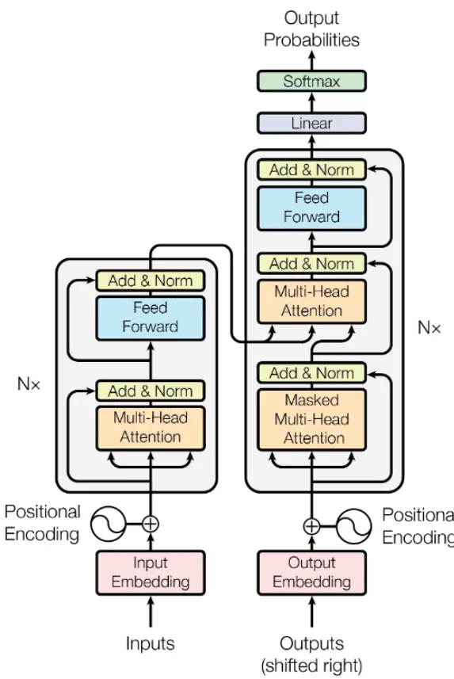
Figure 1: The Transformer - model architecture.
资料来源：Attention Is Al1 You Need，中信建投

## Transformer

在时间序列问题中，基于Transformer的模型也不断被提出。包括Informer，Temporal Fusion Transformer,PatchTST等，也取得了较好的结果。

在逐鹿系列报告中，我们也曾将Temporal Fusion Transformer应用于选股领域。TFT模型最大的特点在于Encoder部分采用了LSTM结构，能够更好的处理因子的时序信息。

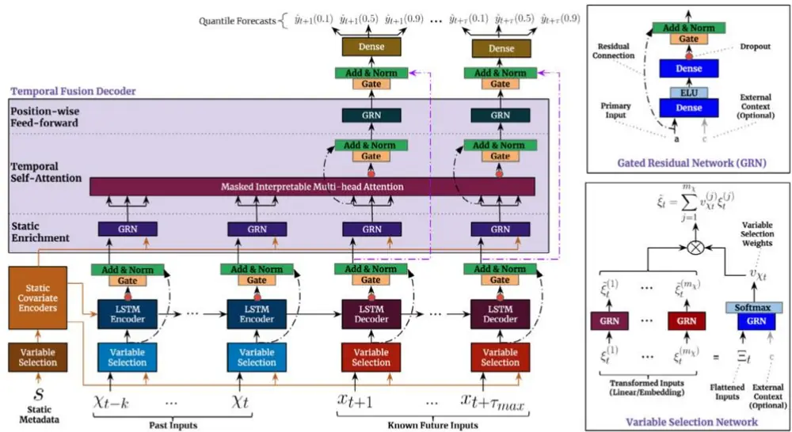
Fig. 2. TFT architecture. TFT inputs static metadata, time-varying past inputs and time-varying a priori known future inputs. Variable Selection is used for judicious selection of the most salient features based on the input. Gated Residual Network blocks enable efficient information flow with skip connections and gating layers. Time-dependent processing is based on LSTMs for local processing, and multi-head attention for integrating information from any time step

资料来源： Temporal Fusion Transformers for interpretable multi-horizon time series forecasting, 中信建投

## LTSF-Linear

在2022年的论文“Are Transformers Effectivefor Time Series Forecasting?”中，作者提出了一种简单的MLP结构LTSF-Linear。通过在不同数据集上的对比表明，Linear模型在大多数问题上均能取得SOTA的结果。

基于此，后续出现了许多MLP结构的时序模型，其中具有代表性的模型为华为的MTS-Mixers以及google的TSMixer,TiDE等。

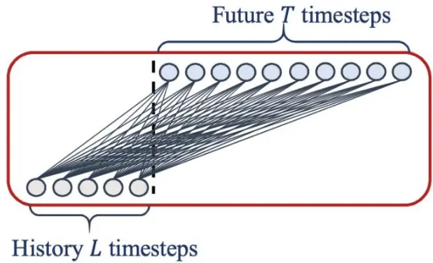
Figure 2: Illustration of the basic linear model.
资料来源：Are Transformers Effective for Time Series Forecasting，中信建投

| Datasets | ETTh1&ETTh2 | ETTm1 &ETTm2 | Traffic | Electricity | Exchange-Rate | Weather | ILI |
| --- | --- | --- | --- | --- | --- | --- | --- |
| Variates | 7 | 7 | 862 | 321 | 8 | 21 | 7 |
| Timesteps | 17,420 | 69,680 | 17,544 | 26,304 | 7,588 | 52,696 | 966 |
| Granularity | 1hour | 5min | 1hour | 1hour | 1day | 10min | 1week |

Table 1. The statistics of the nine popular datasets for the LTSF problem.

| Methods |  | IMP. |  | Linear* |  | NLinear* |  | DLinear* |  | FEDformer |  | Autoformer Informer |  | Pyraformer* |  | LogTrans |  | Repeat* |  |
| --- | --- | --- | --- | --- | --- | --- | --- | --- | --- | --- | --- | --- | --- | --- | --- | --- | --- | --- | --- |
|  | Metric | MSE | MSE MAE |  | MSE MAE | MSE | MAE | MSE | MAE | MSE | MAE | MSE | MAE | MSE | MAE | MSE | MAE | MSE | MAE |
| Eleicity | 96 27.40% 192 | 0.140 | 0.237 | 0.141 | 0.237 | 0.140 | 0.237 | 0.193 | 0.308 | 0.201 | 0.317 | 0.274 | 0.368 | 0.386 | 0.449 | 0.258 | 0.357 | 1.588 | 0.946 |
|  | 23.88% | 0.153 0.169 | 0.250 0.268 | 0.154 | 0.248 | 0.153 0.169 | 0.249 | 0.201 0.214 | 0.315 | 0.222 0.231 | 0.334 | 0.296 | 0.386 | 0.386 | 0.443 | 0.266 | 0.368 | 1.595 | 0.950 0.961 |
|  | 336 21.02% 720 17.47% | 0.203 | 0.301 | 0.171 0.210 | 0.265 0.297 | 0.203 | 0.267 0.301 | 0.246 | 0.329 0.355 | 0.254 | 0.338 0.361 | 0.300 0.373 | 0.394 0.439 | 0.378 0.376 | 0.443 0.445 | 0.280 0.283 | 0.380 0.376 | 1.617 | 0.975 |
| 96 | 45.27% | 0.082 | 0.207 | 0.089 | 0.208 | 0.081 | 0.203 | 0.148 | 0.278 | 0.197 | 0.323 | 0.847 | 0.752 | 0.376 | 1.105 | 0.968 | 0.812 | 1.647 0.081 | 0.196 |
|  | 192 42.06% | 0.167 | 0.304 | 0.180 | 0.300 | 0.157 | 0.293 | 0.271 | 0.380 | 0.300 | 0.369 | 1.204 | 0.895 | 1.748 | 1.151 | 1.040 | 0.851 | 0.167 | 0.289 |
| xchaange | 336 33.69% | 0.328 | 0.432 | 0.331 | 0.415 | 0.305 | 0.414 | 0.460 | 0.500 | 0.509 | 0.524 | 1.672 | 1.036 | 1.874 | 1.172 | 1.659 | 1.081 | 0.305 | 0.396 |
| 720 | 46.19% | 0.964 | 0.750 | 1.033 | 0.780 | 0.643 | 0.601 | 1.195 | 0.841 | 1.447 | 0.941 | 2.478 | 1.310 | 1.943 | 1.206 | 1.941 | 1.127 | 0.823 | 0.681 |
| 96 | 30.15% | 0.410 | 0.282 | 0.410 | 0.279 | 0.410 | 0.282 | 0.587 | 0.366 | 0.613 | 0.388 | 0.719 | 0.391 | 2.085 | 0.468 | 0.684 | 0.384 | 2.723 | 1.079 |
| Taiec 192 | 29.96% | 0.423 | 0.287 | 0.423 | 0.284 | 0.423 | 0.287 | 0.604 | 0.373 | 0.616 | 0.382 | 0.696 | 0.379 | 0.867 | 0.467 | 0.685 | 0.390 | 2.756 | 1.087 |
| 336 | 29.95% | 0.436 | 0.295 | 0.435 | 0.290 | 0.436 | 0.296 | 0.621 | 0.383 | 0.622 | 0.337 | 0.777 | 0.420 | 0.869 | 0.469 | 0.734 | 0.408 | 2.791 | 1.095 |
| 720 | 25.87% | 0.466 | 0.315 | 0.464 | 0.307 | 0.466 | 0.315 | 0.626 | 0.382 | 0.660 | 0.408 | 0.864 | 0.472 | 0.881 | 0.473 | 0.717 | 0.396 | 2.811 | 1.097 |
| Weather 96 192 | 18.89% | 0.176 0.218 | 0.236 | 0.182 | 0.232 | 0.176 | 0.237 | 0.217 | 0.296 | 0.266 | 0.336 | 0.300 | 0.384 | 0.896 | 0.556 | 0.458 | 0.490 | 0.259 | 0.254 |
| 336 | 21.01% | 0.262 | 0.276 0.312 | 0.225 0.271 | 0.269 0.301 | 0.220 0.265 | 0.282 0.319 | 0.276 0.339 | 0.336 | 0.307 | 0.367 | 0.598 | 0.544 | 0.622 | 0.624 | 0.658 | 0.589 | 0.309 | 0.292 |
| 720 | 22.71% 19.85% | 0.326 | 0.365 | 0.338 | 0.348 | 0.323 | 0.362 | 0.403 | 0.380 | 0.359 | 0.395 | 0.578 | 0.523 | 0.739 | 0.753 | 0.797 | 0.652 | 0.377 | 0.338 |
| 24 | 47.86% | 1.947 | 0.985 | 1.683 | 0.858 | 2.215 | 1.081 | 3.228 | 0.428 1.260 | 0.419 3.483 | 0.428 | 1.059 | 0.741 | 1.004 | 0.934 | 0.869 | 0.675 | 0.465 | 0.394 |
| u 36 | 36.43% | 2.182 | 1.036 | 1.703 | 0.859 | 1.963 | 0.963 | 2.679 | 1.080 | 3.103 | 1.287 1.148 | 5.764 4.755 | 1.677 1.467 | 1.420 7.394 | 2.012 | 4.480 | 1.444 | 6.587 7.130 | 1.701 1.884 |
| 48 | 34.43% | 2.256 | 1.060 | 1.719 | 0.884 | 2.130 | 1.024 | 2.622 | 1.078 | 2.669 | 1.085 | 4.763 | 1.469 | 7.551 | 2.031 2.057 | 4.799 4.800 | 1.467 1.468 | 6.575 | 1.798 |
| 60 | 34.33% | 2.390 | 1.104 | 1.819 | 0.917 | 2.368 | 1.096 | 2.857 | 1.157 | 2.770 | 1.125 | 5.264 | 1.564 | 7.662 | 2.100 | 5.278 | 1.560 | 5.893 | 1.677 |
| 96 192 | 0.80% | 0.375 | 0.397 | 0.374 | 0.394 | 0.375 | 0.399 | 0.376 | 0.419 | 0.449 | 0.459 | 0.865 | 0.713 | 0.664 | 0.612 | 0.878 | 0.740 | 1.295 | 0.713 |

Table 2. Multivariate long-term forecasting errors in terms of MSE and MAE, the lower the better. Among them, ILI dataset is with forecasting horizon T ∈ {24, 36, 48, 60}. For the others, T ∈ {96, 192, 336, 720}. Repeat repeats the last value in the look-back window The best results are highlighted in bold and the best results of Transformers are highlighted with a underline. Accordingly, IMP. is the best result of linear models compared to the results of Transformer-based solutions.
资料来源：Are Transformers Effective for Time Series Forecasting， 中信建投

在2023年google的论文Long-term Forecastingwith TiDE: Time-series Dense Encoder中提出了基于MLP的TiDE模型。

与google之前的模型Temporal FusionTransformer相类似，在TiDE中，作者也将三种不同类型的变量作为输入，分别为静态变量，过去已知变量，未来已知协变量。

三种变量经过拼接之后进入线性的Encoder和Decoder结构，最终与已知变量的残差求和得到最终的预测结果。

整体结构比较简洁，具有很高的时间和空间效率。

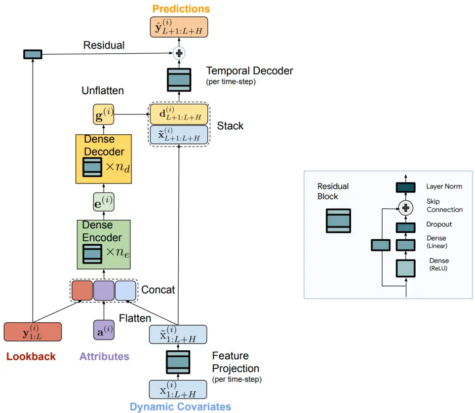
Figure 1: Overview of TiDE architecture. The dynamic covariates per time-point are mapped to a lower dimensional space using a feature projection step. Then the encoder combines the look-back along with the projected covariates with the static attributes to form an encoding. The decoder maps this encoding to a vector per time-step in the horizon. Then a temporal decoder combines this vector (per time-step) with the projected features of that time-step in the horizon to form the final predictions. We also add a global linear residual connection from the look-back to the horizon.

资料来源：Long-term Forecasting with TiDE: Time-series Dense Encoder， 中信建投

## 与其他模型相比，TiDE在大多数数据集上能够取得最好的结果。

| Models |  | TiDE |  | PatchTST/64 |  | N-HiTS |  | DLinear |  | FEDformer |  | Autoformer |  | Informer |  | Pyraformer |  | LogTrans |  |
| --- | --- | --- | --- | --- | --- | --- | --- | --- | --- | --- | --- | --- | --- | --- | --- | --- | --- | --- | --- |
| Metric |  | MSE 0.166 | MAE | MSE | MAE | MSE | MAE | MSE | MAE | MSE | MAE | MSE | MAE | MSE | MAE | MSE | MAE | MSE | MAE |
|  | 96 |  | 0.222 | 0.149 | 0.198 | 0.158 | 0.195 0.247 | 0.176 0.220 | 0.237 | 0.238 | 0.314 | 0.249 | 0.329 | 0.354 | 0.405 | 0.896 | 0.556 | 0.458 | 0.490 |
| Weter | 192 0.209 | 0.263 0.301 |  | 0.194 | 0.241 | 0.211 |  |  | 0.282 | 0.275 | 0.329 | 0.325 | 0.370 | 0.419 | 0.434 | 0.622 | 0.624 | 0.658 | 0.589 |
|  | 336 720 | 0.254 0.313 | 0.340 | 0.245 0.314 | 0.282 0.334 | 0.274 0.401 | 0.300 0.413 | 0.265 0.323 | 0.319 0.362 | 0.339 0.389 | 0.377 0.409 | 0.351 0.415 | 0.391 0.426 | 0.583 0.916 | 0.543 0.705 | 0.739 1.004 | 0.753 0.934 | 0.797 0.869 | 0.652 0.675 |
|  | 96 0.336 | 0.253 |  | 0.360 | 0.249 | 0.402 | 0.282 | 0.410 | 0.282 | 0.576 | 0.359 | 0.597 | 0.371 | 0.733 | 0.410 | 2.085 | 0.468 | 0.684 | 0.384 |
| Tiaahe | 192 0.346 | 0.257 |  | 0.379 | 0.256 | 0.420 | 0.297 | 0.423 | 0.287 | 0.610 | 0.380 | 0.607 | 0.382 | 0.777 | 0.435 | 0.867 | 0.467 | 0.685 | 0.390 |
|  | 336 0.355 | 0.260 |  | 0.392 | 0.264 | 0.448 | 0.313 | 0.436 | 0.296 | 0.608 | 0.375 | 0.623 | 0.387 | 0.776 | 0.434 | 0.869 | 0.469 | 0.734 | 0.408 |
|  |  | 0.386 | 0.273 | 0.432 | 0.286 | 0.539 | 0.353 | 0.466 | 0.315 | 0.621 | 0.375 | 0.639 | 0.395 | 0.827 |  |  |  |  | 0.396 |
|  | 720 |  | 0.229 | 0.129 | 0.222 |  |  |  |  |  |  |  |  |  | 0.466 | 0.881 | 0.473 | 0.717 |  |
|  | 96 | 0.132 | 0.243 |  |  | 0.147 | 0.249 | 0.140 | 0.237 | 0.186 | 0.302 | 0.196 | 0.313 | 0.304 | 0.393 | 0.386 | 0.449 | 0.258 | 0.357 |
|  | 192 | 0.147 |  | 0.147 | 0.240 | 0.167 | 0.269 | 0.153 | 0.249 | 0.197 | 0.311 | 0.211 | 0.324 | 0.327 | 0.417 | 0.386 | 0.443 | 0.266 | 0.368 |
| BEerity | 336 | 0.161 | 0.261 | 0.163 | 0.259 | 0.186 | 0.290 | 0.169 | 0.267 | 0.213 | 0.328 | 0.214 | 0.327 | 0.333 | 0.422 | 0.378 | 0.443 | 0.280 | 0.380 |
|  | 720 | 0.196 | 0.294 | 0.197 | 0.290 | 0.243 | 0.340 | 0.203 | 0.301 | 0.233 | 0.344 | 0.236 | 0.342 | 0.351 | 0.427 | 0.376 | 0.445 | 0.283 | 0.376 |
|  | 96 | 0.375 | 0.398 | 0.379 | 0.401 | 0.378 | 0.393 | 0.375 | 0.399 | 0.376 | 0.415 | 0.435 | 0.446 | 0.941 | 0.769 | 0.664 | 0.612 | 0.878 | 0.740 |
|  | 192 | 0.412 | 0.422 | 0.413 | 0.429 | 0.427 | 0.436 | 0.412 | 0.420 | 0.423 | 0.446 | 0.456 | 0.457 | 1.007 | 0.786 | 0.790 | 0.681 | 1.037 | 0.824 |
| ET51 | 336 | 0.435 | 0.433 | 0.435 | 0.436 | 0.458 | 0.484 | 0.439 | 0.443 | 0.444 | 0.462 | 0.486 | 0.487 | 1.038 | 0.784 | 0.891 | 0.738 | 1.238 | 0.932 |
|  | 720 | 0.454 | 0.465 | 0.446 | 0.464 | 0.472 | 0.561 | 0.501 | 0.490 | 0.469 | 0.492 | 0.515 | 0.517 | 1.144 | 0.857 | 0.963 | 0.782 | 1.135 | 0.852 |
|  | 96 | 0.270 | 0.336 | 0.274 | 0.337 | 0.274 | 0.345 | 0.289 | 0.353 | 0.332 | 0.374 | 0.332 | 0.368 | 1.549 | 0.952 | 0.645 | 0.597 | 2.116 | 1.197 |
|  | 192 | 0.332 | 0.380 | 0.338 | 0.376 | 0.353 | 0.401 | 0.383 | 0.418 | 0.407 | 0.446 | 0.426 | 0.434 | 3.792 | 1.542 | 0.788 | 0.683 | 4.315 | 1.635 |
| ET52 | 336 | 0.360 | 0.407 | 0.363 | 0.397 | 0.382 | 0.425 | 0.448 | 0.465 | 0.400 | 0.447 | 0.477 | 0.479 | 4.215 | 1.642 | 0.907 | 0.747 | 1.124 | 1.604 |

Table 2: Multivariate long-term forecasting results with our model. T ∈ {96, 192, 336, 720} for all datasets. The best results including the ones that cannot be statistically distinguished from the best mean numbers are in bold. We calculate standard error intervals for our method over 5 runs. The rest of the numbers are taken from the results from (Nie et al., 2022)¹. All metrics are reported on standard normalized datasets We provide the standard errors for our method in Table 5 in Appendix B

资料来源：Long-term Forecasting with TiDE: Time-series Dense Encoder，中信建投

## TiDE应用及改进

## 特征选择

静态变量： Graph Embedding行业因子（10维）

过去已知变量： Alpha158 + MAlpha65 + 市值因子

未来已知协变量： DayOfWeek, DayOfMonth, DayOfYear, WeekOfYear, MonthOfYear

为了减小特征维度，提高训练效率，利用XGBOOST筛选重要性较高的过去已知因子。最终分别保留25个Alpha158因子以及25个Malpha因子。

对过去已知变量进行截面归一化处理。

## 样本介绍

股票池： 全A

训练集：2016年-2020年（54个月训练，6个月验证）

测试集：2021年-

滚动频率： 42天

时间序列长度L： 10天

预测周期H： 1天

预测目标T： 未来T天收益率

## 滚动训练

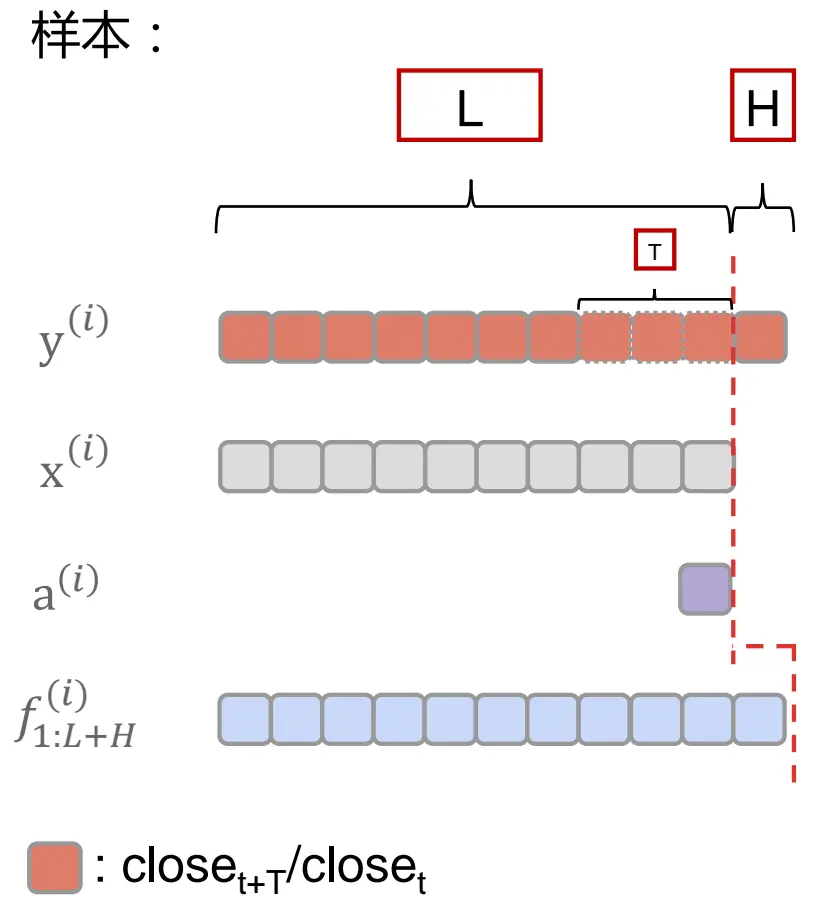
资料来源：中信建投

## 滚动训练：

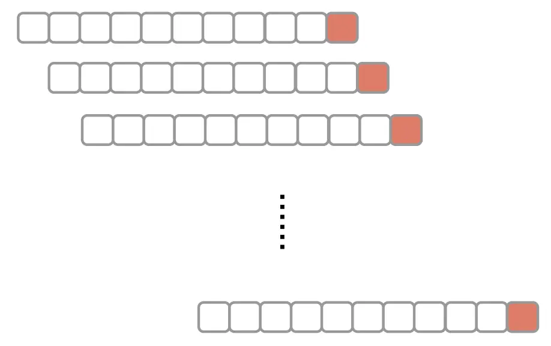

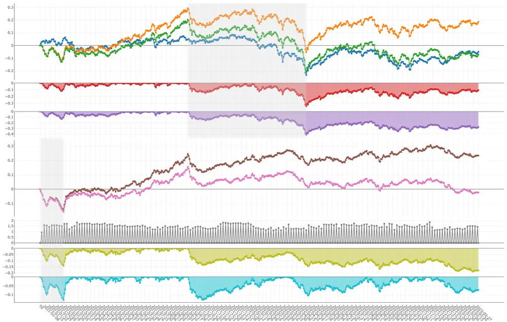
资料来源：中信建投

在考虑交易费用后，原始的TiDE模型并没有明显的超额收益。

## TiDGE

Attention与MLP结构均具有排序不变性，在Transformer和TiDE中，为了保留时序信息，分别采用了位置编码和时间变量的方式加入时序信息，但是这些方法均不能很好的处理时序信息。

在之前的TFT模型中，作者采用了LSTM作为Encoder，能够很好的提高模型的时序信息处理能力，借鉴TFT的思路，我们在TiDE中同样加入LSTM/GRU单元，增加模型的时序信息处理能力。

由于我们的标签为未来T天的收益率，在将y作为输入特征时，需截取L-T的时间长度。其中L为时间序列长度，T为预测周期长度。

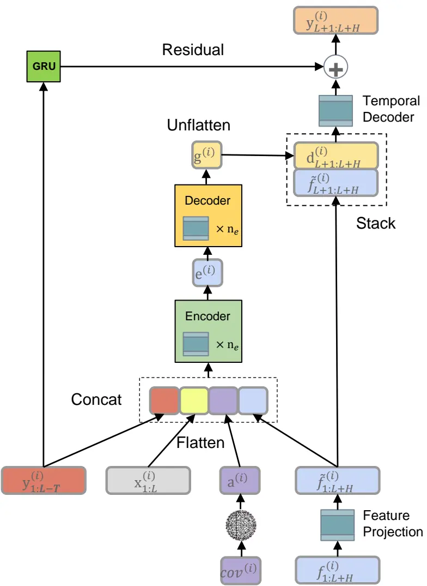
资料来源：中信建投

## TiDGE模型参数

Encoder layers： 2

Encoder output size： 64

Decoder layers： 2

Decoder output size: 8

GRU Encoder size： 32

GRU Encoder layers： 2

Loss function： MSE

Optimizer： adam

资料来源：中信建投

## TiDGE

## 回测参数：

TopK： 400

Ndrop： N

频率： T日频

回测区间：2021年-2023年2月

股票范围： 全A

基准： 中证全指

成交价格： 第二日收盘价

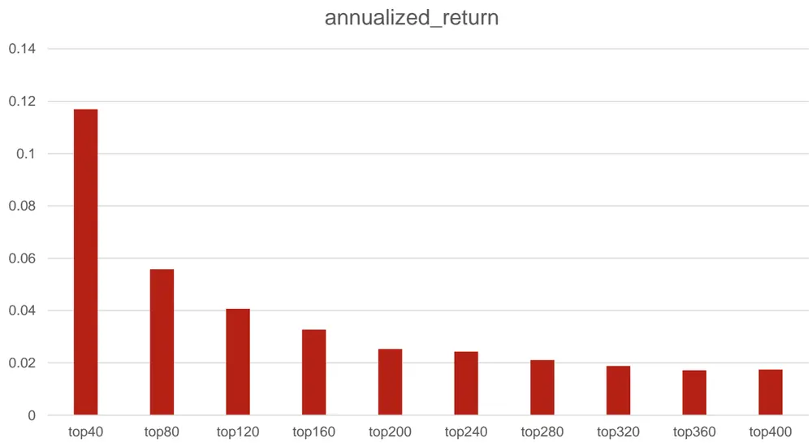
资料来源：WIND，中信建投

## Top400Drop40-3日频率

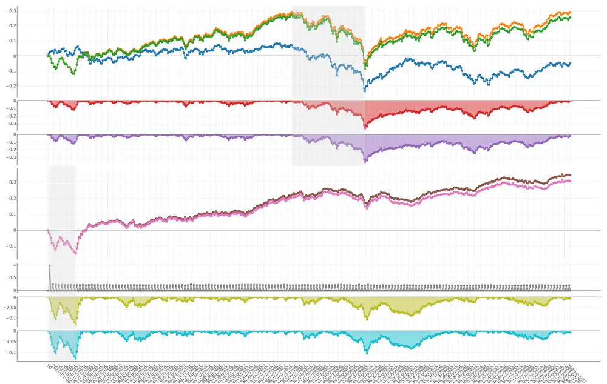
资料来源：WIND，中信建投

| 年化收益 | 11.69% |
| --- | --- |
| 年化波动率 | 0.2 |
| 最大回撤 | 36.19% |
| alpha | 13.92% |
| 超额最大回撤 | 13.00% |
| 超额信息比率 | 1.22 |
| 换手率 | 8.68 |

## Top400Drop40-5日频率

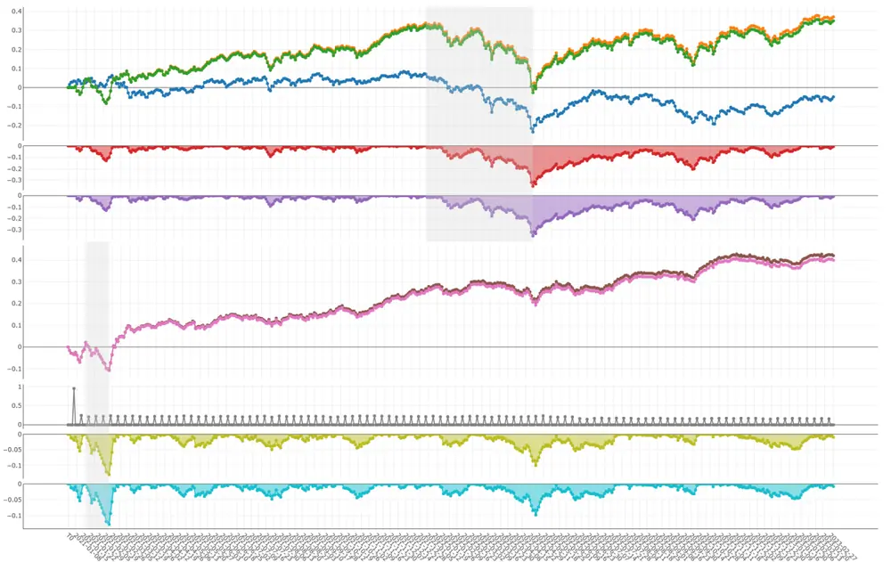
资料来源：WIND，中信建投

| 年化收益 | 15.99% |
| --- | --- |
| 年化波动率 | 0.21 |
| 最大回撤 | 35.48% |
| alpha | 18.21% |
| 超额最大回撤 | 12.91% |
| 超额信息比率 | 1.47 |
| 换手率 | 5.18 |

本文将静态行业变量，过去已知变量，未来已知协变量用于股票收益率预测。

原始的TiDE模型直接用于选股时效果一般，通过加入GRU单元，能够提升模型表现。

## 风险提示

- 本报告中所有数据结果是基于历史统计结果的展示，未来有可能发生风格切换导致因子失效的风险。模型运行存在一定的随机性，初始化随机数种子会对结果产生影响，单次运行结果可能会有一定偏差。历史数据的区间选择会对结果产生一定的影响。模型参数的不同会影响最终结果。模型对计算资源要求较高，运算量不足会导致结果存在一定的欠拟合风险。本文所有模型结果均来自历史数据，模型存在统计误差，不保证模型未来的有效性，对投资不构成任何建议。

## TiDGE模型参数

Encoder layers： 2

Encoder output size： 64

Decoder layers： 2

Decoder output size: 8

GRU Encoder size： 32

GRU Encoder layers： 2

Loss function： MSE

Optimizer： adam

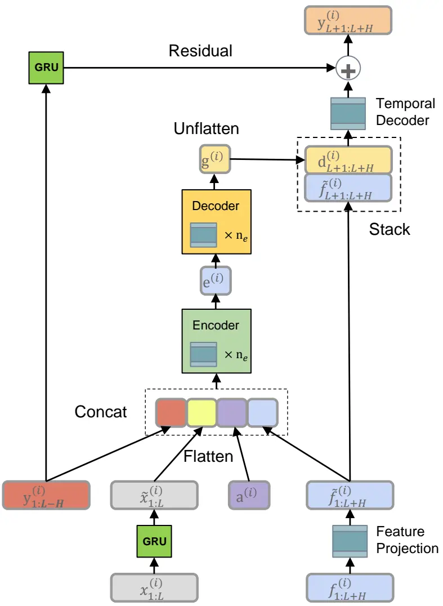
资料来源：中信建投

## 分析师介绍

丁鲁明：基金研究团创立国内“重大趋势及第4、2012分析本面”出精学硕士，中国准，中信建投证券投研体系，继承预判，对资产配2014 3金投顾业务决策委员会成深入研究经济经典长波体与经济周期运行具备深刻球最佳析师2009第、，上海证券交易所定期专家交流组成员。中的康波周期理论并积极应用于实务，解与认知。多次荣获团队荣誉：新财富；Wind金分析师20 13年证券次对资本佳分析师年第20。

王 超：南京大学粒子物理博士，曾担任基金公司研究员，券商研究员，有丰富的研究和投资经验，2021年加入中信建投，主要负责量化多因子选股。

## 评级说明

| 投资评级标准 |  | 评级 | 说明 |
| --- | --- | --- | --- |
| 报告中投资建议涉及的评级标准为报告发布日后6个月内的相对市场表现，也即报告发布日后的6个月内公司股价（或行业指数）相对同期相关证券市场代表性指数的涨跌幅作为基准。A股市场以沪深300指数作为基准；新三板市场以三板成指为基准；香港市场以恒生指数作为基准；美国市场以标普500指数为基准。 | 股票评级 | 买入增持 |  |
|  |  | 中性 | 相对涨幅-5%—5%之间 |
|  |  | 减持卖出 | 相对跌幅5%—15% |
|  |  |  | 相对跌幅15%以上 |
|  | 行业评级 | 强于大市 | 相对涨幅10%以上 |
|  |  | 中性 | 相对涨幅-10-10%之间 |
|  |  | 弱于大市 | 相对跌幅10%以上 |

## 分析师声明

本报告署名分析师在此声明：（i）以勤勉的职业态度、专业审慎的研究方法，使用合法合规的信息，独立、客观地出具本报告, 结论不受任何第三方的授意或影响。（ii）本人不曾因，不因，也将不会因本报告中的具体推荐意见或观点而直接或间接收到任何形式的补偿。

## 法律主体说明

本报告由中信建投证券股份有限公司及/或其附属机构（以下合称“中信建投”）制作，由中信建投证券股份有限公司在中华人民共和国（仅为本报告目的，不包括香港、澳门、台湾）提供。中信建投证券股份有限公司具有中国证监会许可的投资咨询业务资格，本报告署名分析师所持中国证券业协会授予的证券投资咨询执业资格证书编号已披露在报告首页。

在遵守适用的法律法规情况下，本报告亦可能由中信建投（国际）证券有限公司在香港提供。本报告作者所持香港证监会牌照的中央编号已披露在报告首页。

## 一般性声明

本报告由中信建投制作。发送本报告不构成任何合同或承诺的基础，不因接收者收到本报告而视其为中信建投客户。

本报告的信息均来源于中信建投认为可靠的公开资料，但中信建投对这些信息的准确性及完整性不作任何保证。本报告所载观点、评估和预测仅反映本报告出具日该分析师的判断，该等观点、评估和预测可能在不发出通知的情况下有所变更，亦有可能因使用不同假设和标准或者采用不同分析方法而与中信建投其他部门、人员口头或书面表达的意见不同或相反。本报告所引证券或其他金融工具的过往业绩不代表其未来表现。报告中所含任何具有预测性质的内容皆基于相应的假设条件，而任何假设条件都可能随时发生变化并影响实际投资收益。中信建投不承诺、不保证本报告所含具有预测性质的内容必然得以实现。

本报告内容的全部或部分均不构成投资建议。本报告所包含的观点、建议并未考虑报告接收人在财务状况、投资目的、风险偏好等方面的具体情况，报告接收者应当独立评估本报告所含信息，基于自身投资目标、需求、市场机会、风险及其他因素自主做出决策并自行承担投资风险。中信建投建议所有投资者应就任何潜在投资向其税务、会计或法律顾问咨询。不论报告接收者是否根据本报告做出投资决策，中信建投都不对该等投资决策提供任何形式的担保，亦不以任何形式分享投资收益或者分担投资损失。中信建投不对使用本报告所产生的任何直接或间接损失承担责任。

在法律法规及监管规定允许的范围内，中信建投可能持有并交易本报告中所提公司的股份或其他财产权益，也可能在过去12个月、目前或者将来为本报告中所提公司提供或者争取为其提供投资银行、做市交易、财务顾问或其他金融服务。本报告内容真实、准确、完整地反映了署名分析师的观点，分析师的薪酬无论过去、现在或未来都不会直接或间接与其所撰写报告中的具体观点相联系，分析师亦不会因撰写本报告而获取不当利益。

本报告为中信建投所有。未经中信建投事先书面许可，任何机构和/或个人不得以任何形式转发、翻版、复制、发布或引用本报告全部或部分内容，亦不得从未经中信建投书面授权的任何机构、个人或其运营的媒体平台接收、翻版、复制或引用本报告全部或部分内容。版权所有，违者必究。

## 中信建投证券研究发展部

东城区朝内大街2号凯恒中心B

电话：(8610) 8513-0588

联系人：李祉瑶

浦东新区浦东南路528号南塔2103室
电话：(8621) 6882-1612
联系人：翁起帆
邮箱：wengqifan@csc.com.cn

电话：（86755）8252-1369

## 中信建投（国际）

电话：（852）3465-5600