## 证券研究报告•金融工程专题报告

## “逐鹿”Alpha专题报告（十八）：Model Zoo

分析师：丁鲁明dingluming@csc.com.cnSAC编号：S1440515020001

分析师：王超wangchaodcq@csc.com.cnSAC 编号：S1440522120002

发布日期：2023年11月26日

## 核心观点

时间序列模型从最初的基于统计学的模型一直发展到如今的机器学习模型，在机器学习模型中，又从一开始的经典机器学习模型，发展到深度学习模型，直到最新的预训练时间序列大模型。模型的复杂程度不断提高，处理信息的能力也不断提高，在传统领域，自然模型效果也不断提高。

本文我们采用alpha360因子作为输出，测试了不同模型的表现，包括各类截面模型，LSTM,GRU,DA-RNN,TCN,和以Transformer为基础的各类Xformer模型以及基于MLP的时序模型Dlinear，TiDE等。

结果表明，在因子结构较为简单时，时序模型相比截面模型有明显优势，其中RNN，TCN与原始Transformer结果较好，复杂Xformer没有明显效果。

因子结构复杂且数量更多时，RNN，TCN，Transformer模型表现均有所提升，其中Transformer以及GRU效果最好。

## 提纲

01

模型结果

03

More tests

时间序列是按照一定的时间间隔排列的一组数据。

时间序列预测是通过对这些时间序列的分析，从中发现和揭示现象发展变化的规律，并将这些知识和信息用于预测。

在气象，交通，水利，电力，互联网，金融等领域都有广泛应用。

时间序列模型从最初的基于统计学的模型一直发展到如今的机器学习模型，在机器学习模型中，又从一开始的经典机器学习模型，发展到深度学习模型，直到最新的预训练时间序列大模型。

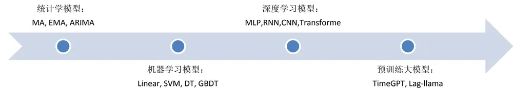
资料来源：中信建投

模型的复杂程度不断提高，处理信息的能力也不断提高，在传统领域，自然模型效果也不断提高。

在金融市场，由于数据类型与传统数据类型存在明显差异，主要表现为，数据量少，信噪比低，特征漂移等，导致时序模型表现与传统领域的模型表现存在明显差异。

## Model Zoo

## 截面模型：

Linear，CATBOOST，LGBM， DoubleEnsemble， MLP

时序模型：

RNN类： LSTM， GRU， DA-RNN

CNN类： TCN

Transformer类： Transformer， Informer， Autoformer，PatchTST， iTransformer

MLP类： Dlinear， TiDE， TiDGE

## 训练参数

训练集: 2016-2019

验证集： 2020

测试集： 2021-2023.2

股票池： 全A

因子： alpha360（截面模型1*360， 时序模型6*60）

预测目标： $\mathsf{Close}_{\mathsf{T}+5}/\mathsf{Close}_{\mathsf{T}+1}=1$

## 模型结果

因子： Alpha360

Ndrop： 400

## 截面模型

| Model Name | Paper | Type | IC | ICIR | Annualized Return | Information Ratio | Max Drawdown | Alpha | Information Ratio(alpha ) | Max Drawdown( alpha) |
| --- | --- | --- | --- | --- | --- | --- | --- | --- | --- | --- |
| Linear | LINK | LINEAR | 0.07515 | 4.30512 | 6.84% | 0.45324 | 27.61% | 10.36% | 0.83945 | 12.79% |
| CATBOOS T | LINK | TREE | 0.07899 | 4.86365 | 9.65% | 0.57736 | 30.68% | 13.46% | 1.62153 | 12.30% |
| LGBM | LINK | TREE | 0.07497 | 4.44188 | 7.20% | 0.45381 | 32.82% | 11.03% | 0.89911 | 12.91% |
| DoubleEns emble | LINK | TREE | 0.07555 | 4.30537 | 6.13% | 0.39556 | 34.53% | 10.00% | 0.78544 | 14.05% |
| MLP | LINK | MLP | 0.07093 | 6.27798 | 13.44% | 0.83009 | 20.08% | 17.02% | 1.44013 | 10.59% |

资料来源：WIND，中信建投

## 时序模型

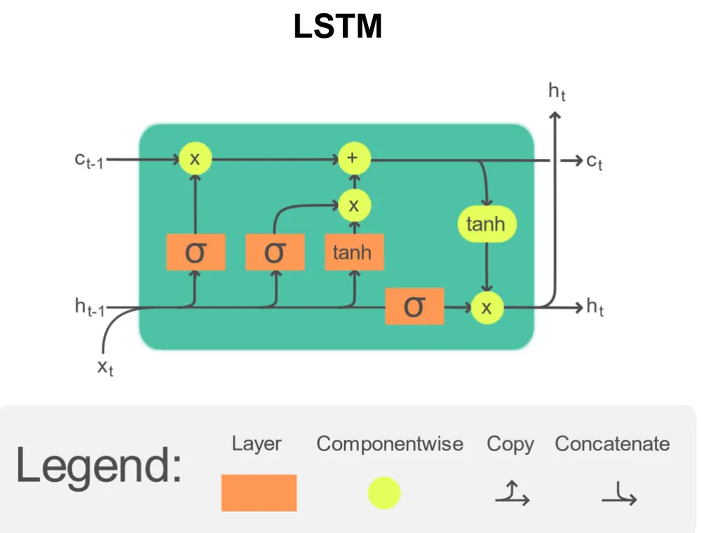

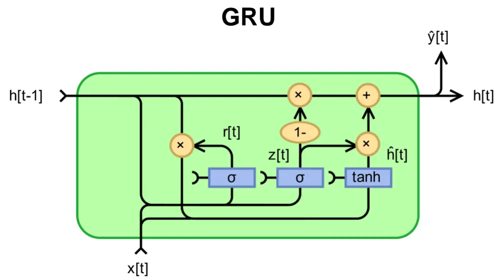
资料来源： Empirical Evaluation of Gated Recurrent Neural Networks on Sequence Modeling, 中信建投

优点：能够有效的提取时序信息缺点：训练效率慢，难以构建深度网络结构

## LSTM

| Model Name | LSTM |
| --- | --- |
| Type | RNN |
| IC | 0.0913 |
| ICIR | 7.4762 |
| Annualized Return | 17.93% |
| Information Ratio | 0.96 |
| Max Drawdown | 29.32% |
| Alpha | 22.01% |
| Information Ratio(alpha) | 1.69 |
| Max Drawdown(alpha) | 12.28% |

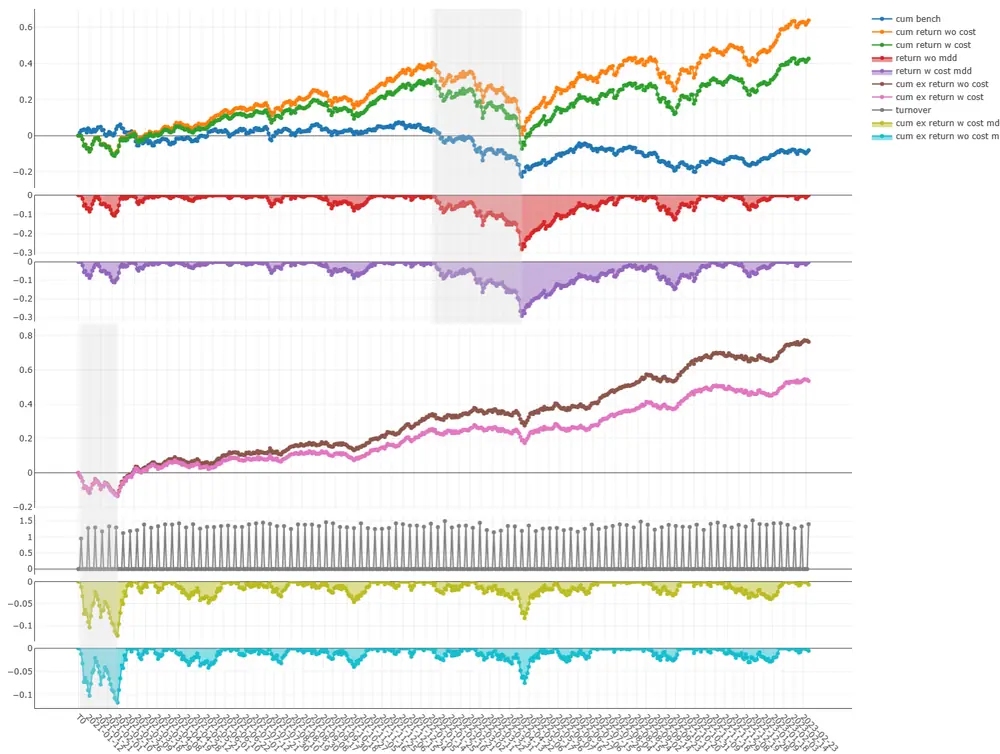

| Model Name | GRU |
| --- | --- |
| Type | RNN |
| IC | 0.0791 |
| ICIR | 7.8283 |
| Annualized Return | 22.11% |
| Information Ratio | 1.22 |
| Max Drawdown | 24.93% |
| Alpha | 26.20% |
| Information Ratio(alpha) | 2.17 |
| Max Drawdown(alpha) | 9.15% |

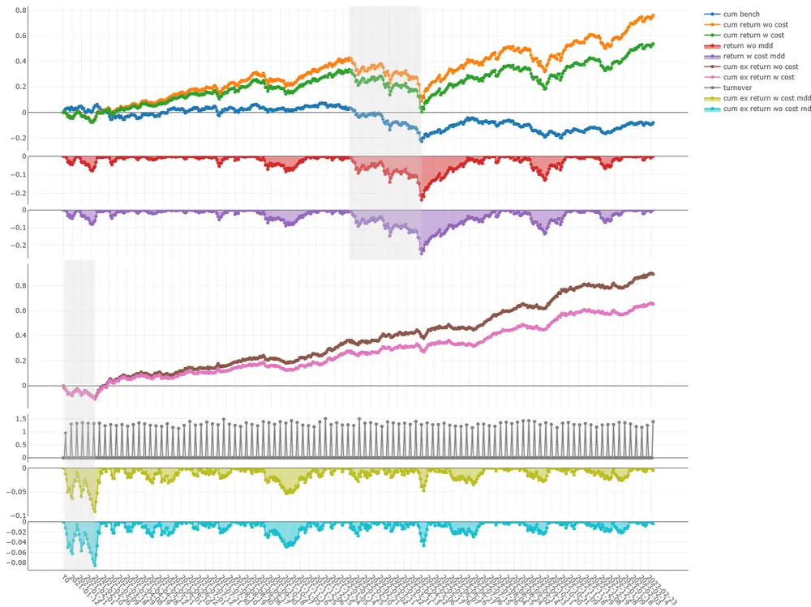

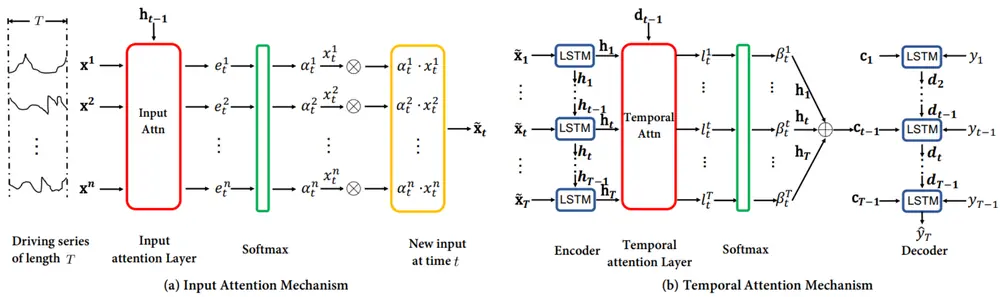
资料来源： A Dual-Stage Attention-Based Recurrent Neural Network for Time Series Prediction, 中信建投

Encoder-decoder结构，encoder部分通过attention机制自适应地对输入特征加权，在decoder中利用LSTM提取隐含特征的时序信息

| Model Name | DA-RNN |
| --- | --- |
| Type | RNN |
| IC | 0.0946 |
| ICIR | 8.2899 |
| Annualized Return | 22.17% |
| Information Ratio | 1.19 |
| Max Drawdown | 26.22% |
| Alpha | 26.31% |
| Information Ratio(alpha) | 2.11 |
| Max Drawdown(alpha) | 9.20% |

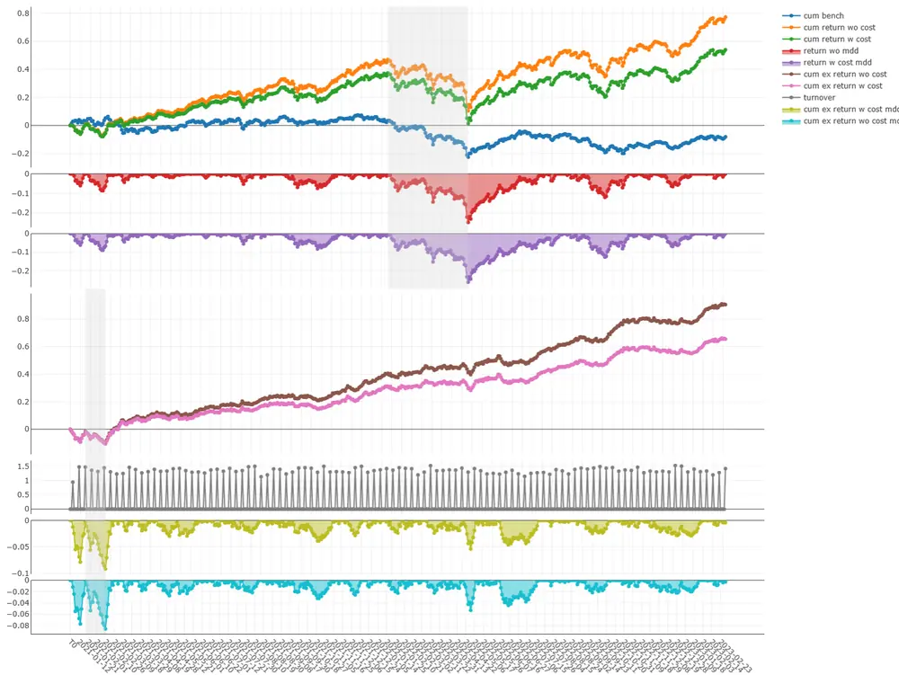

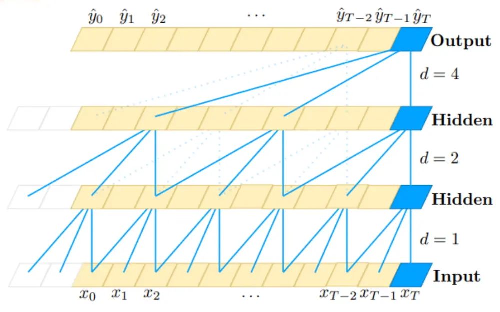
(a)

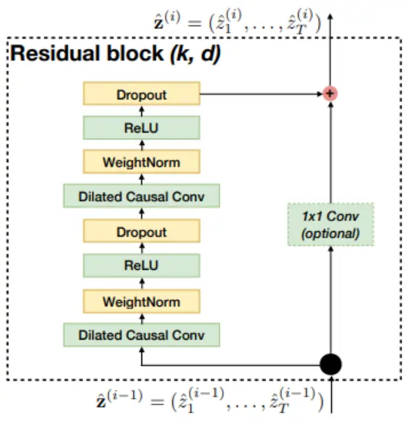
(b)

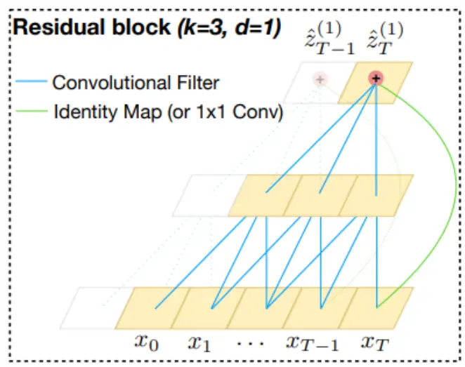
(c)
资料来源： An Empirical Evaluation of Generic Convolutional and Recurrent Networks for Sequence Modeling, 中信建投
空洞卷积(dilated convolution)，扩大感受野

| Model Name | TCN |
| --- | --- |
| Type | CNN |
| IC | 0.0911 |
| ICIR | 7.5706 |
| Annualized Return | 16.95% |
| Information Ratio | 0.95 |
| Max Drawdown | 26.44% |
| Alpha | 20.92% |
| Information Ratio(alpha) | 1.70 |
| Max Drawdown(alpha) | 10.09% |

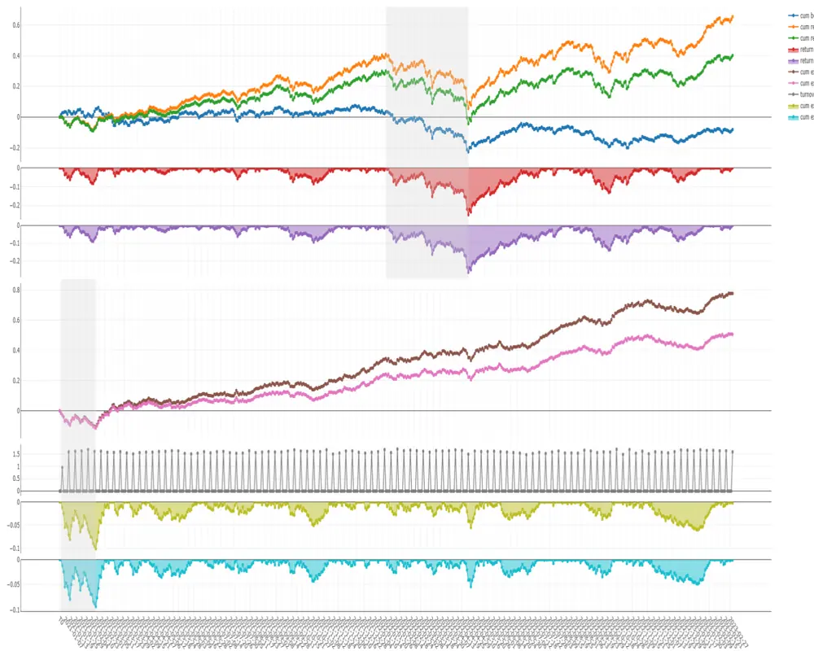

自注意力机制，矩阵并行运算

位置编码

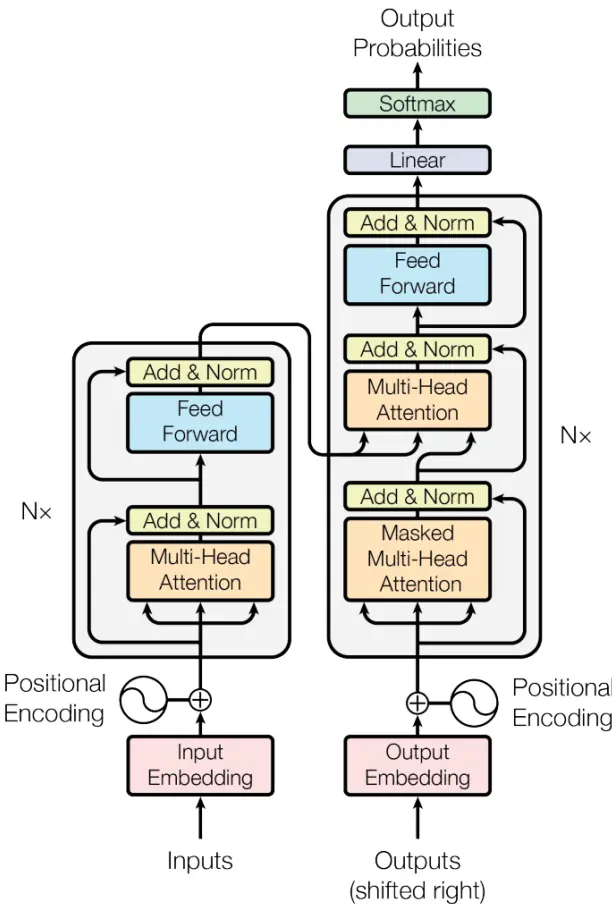
Figure 1: The Transformer - model architecture.

| Model Name | Transformer |
| --- | --- |
| Type | TRANS+CNN |
| IC | 0.0894 |
| ICIR | 6.9455 |
| Annualized Return | 18.27% |
| Information Ratio | 1.02 |
| Max Drawdown | 25.98% |
| Alpha | 22.05% |
| Information Ratio(alpha) | 1.66 |
| Max Drawdown(alpha) | 11.42% |

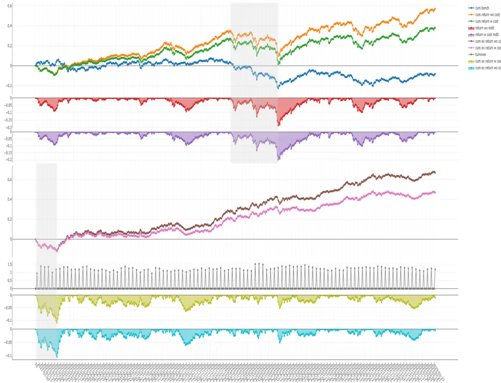

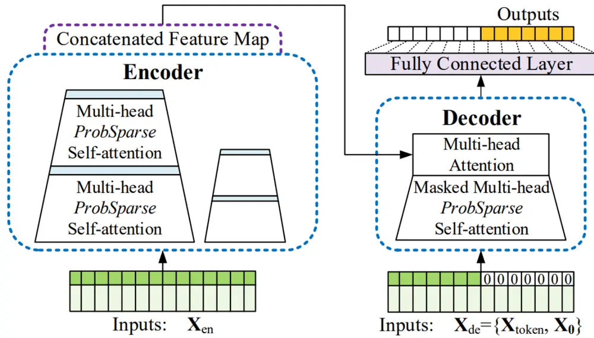
资料来源： Informer: Beyond Efficient Transformer for Long Sequence Time-Series Forecasting, 中信建投

## Informer

| Model Name | Informer |
| --- | --- |
| Type | TRANS+CNN |
| IC | 0.0070 |
| ICIR | 1.6943 |
| Annualized Return | 3.93% |
| Information Ratio | 0.31 |
| Max Drawdown | 28.63% |
| Alpha | 7.59% |
| Information Ratio(alpha) | 0.76 |
| Max Drawdown(alpha) | 13.03% |

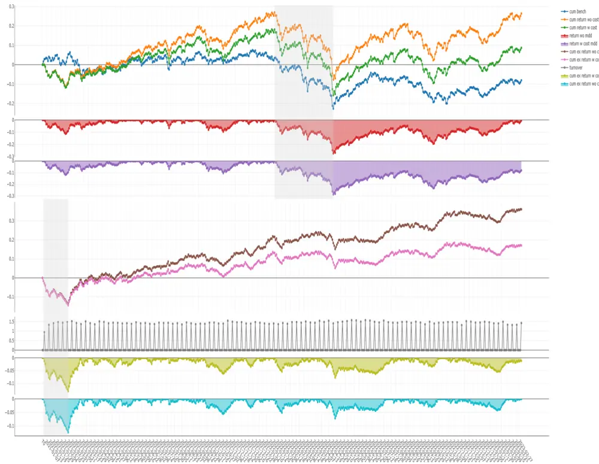

## Autoformer

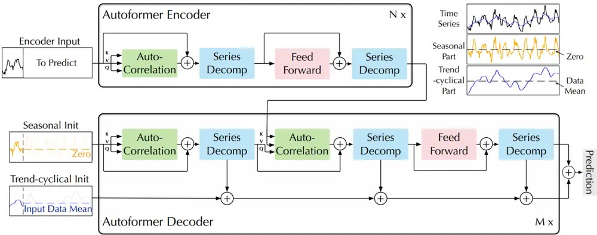
资料来源： Autoformer: Decomposition Transformers with Auto-Correlation for Long-Term Series Forecasting, 中信建投

序列分解： 捕捉趋势+周期

自相关机制：高效、序列级连接

## Autoformer

| Model Name | Autoformer |
| --- | --- |
| Type | TRANS |
| IC | 0.0498 |
| ICIR | 4.3631 |
| Annualized Return | 9.99% |
| Information Ratio | 0.66 |
| Max Drawdown | 24.41% |
| Alpha | 13.34% |
| Information Ratio(alpha) | 1.13 |
| Max Drawdown(alpha) | 11.77% |

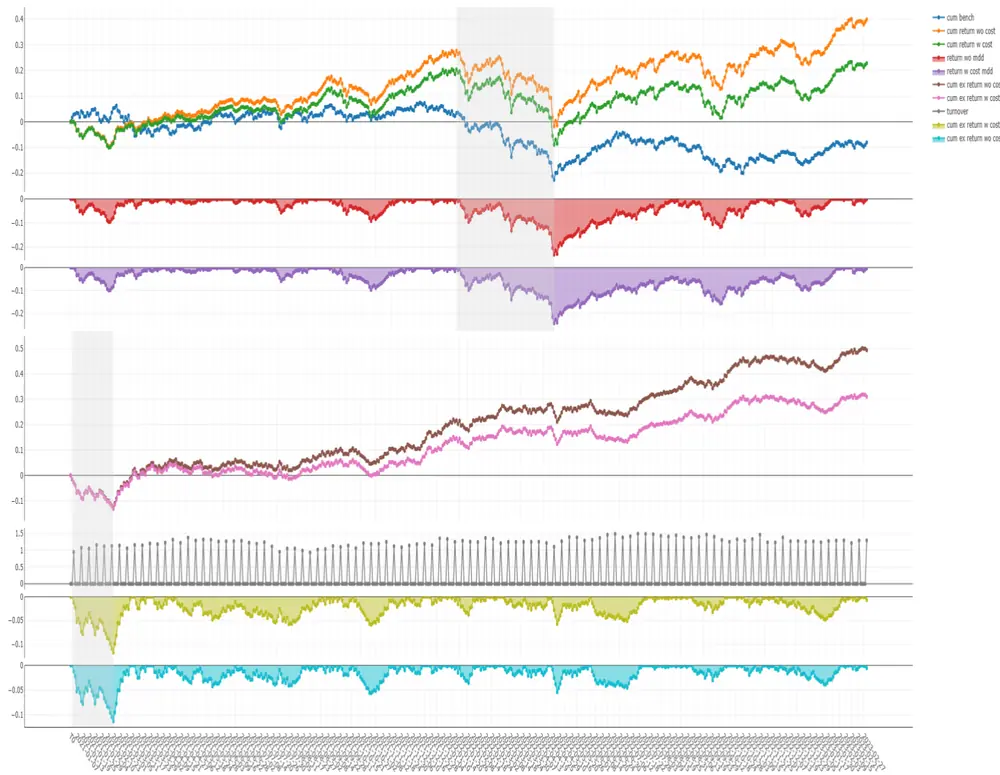

资料来源： A TIME SERIES IS WORTH 64 WORDS: LONG-TERM FORECASTING WITH TRANSFORMERS, 中信建投

## PatchTST

独立通道：减少噪音特征的影响，减少过拟合

Patching：提高计算效率，更好提取时序的局部信息

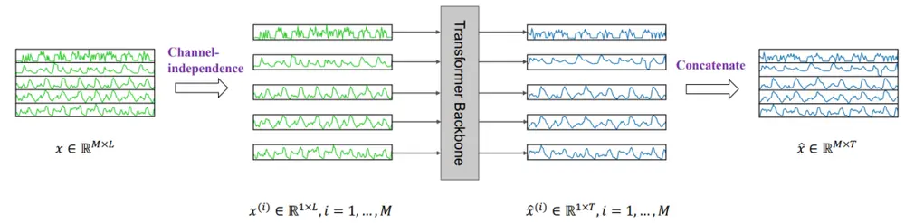
(a) PatchTST Model Overview

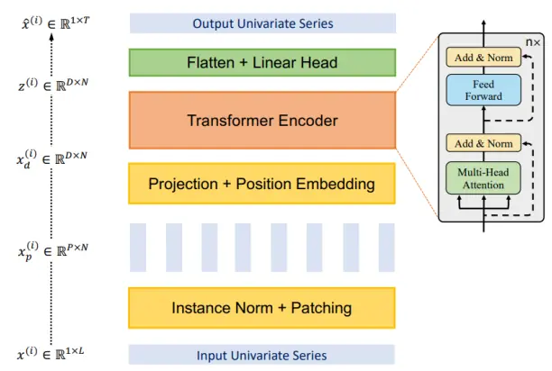
(b) Transformer Backbone (Supervised)

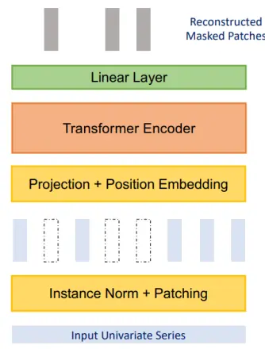
(c) Transformer Backbone (Self-supervised)

## PatchTST

| Model Name | PatchTST |
| --- | --- |
| Type | TRANS |
| IC | 0.0050 |
| ICIR | 0.8258 |
| Annualized Return | 3.96% |
| Information Ratio | 0.31 |
| Max Drawdown | 27.72% |
| Alpha | 7.58% |
| Information Ratio(alpha) | 0.76 |
| Max Drawdown(alpha) | 11.17% |

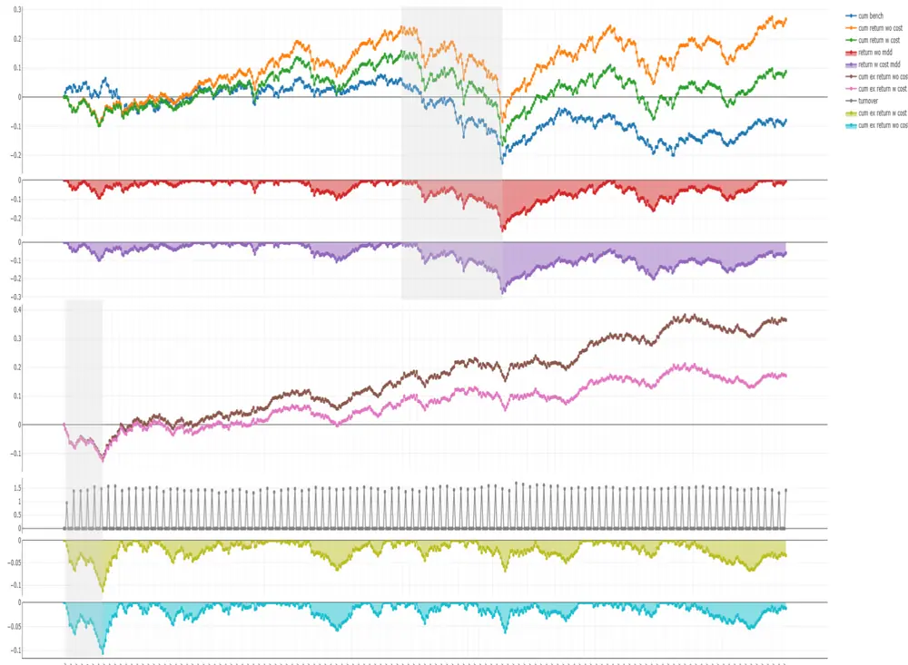
资料来源：WIND，中信建投

## iTransformer

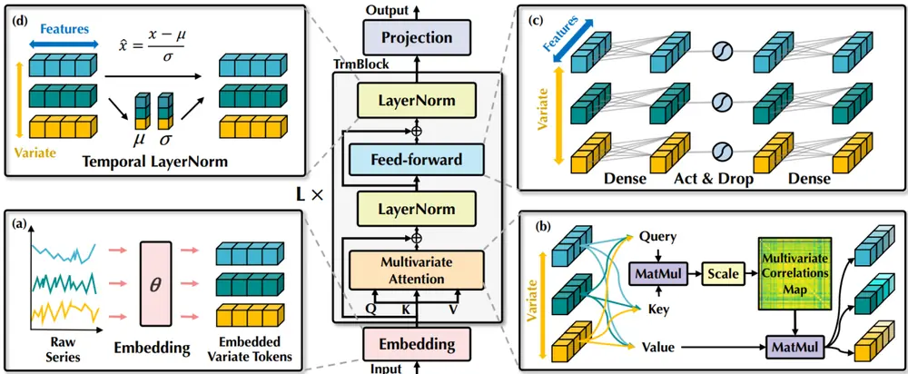
资料来源： ITRANSFORMER: INVERTED TRANSFORMERS ARE EFFECTIVE FOR TIME SERIES FORECASTING，中信建投

每个点emb作为token -》每个特征emb作为token

## iTransformer

| Model Name | iTransformer |
| --- | --- |
| Type | TRANS |
| IC | 0.0465 |
| ICIR | 2.8073 |
| Annualized Return | 9.20% |
| Information Ratio | 0.63 |
| Max Drawdown | 21.66% |
| Alpha | 12.38% |
| Information Ratio(alpha) | 1.04 |
| Max Drawdown(alpha) | 12.12% |

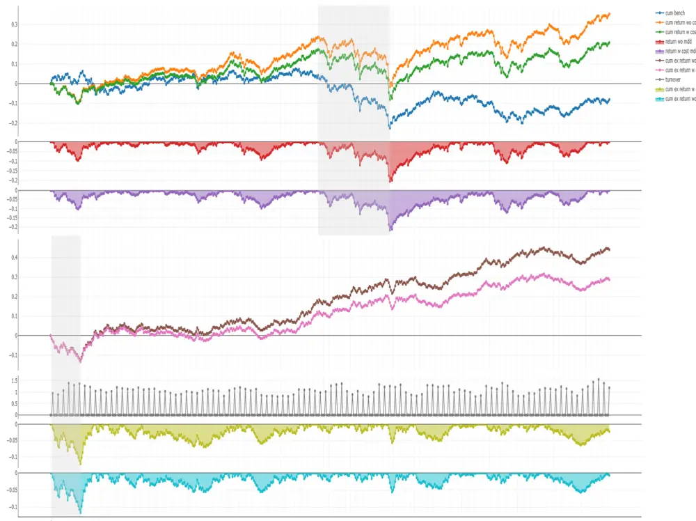
资料来源：WIND，中信建投

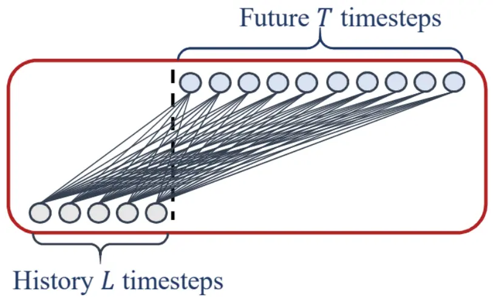
Figure 2. Illustration of the basic linear model.
资料来源：Are Transformers Effective for Time Series Forecasting?， 中信建投

单层MLP

序列分解： 捕捉趋势+周期

| Model Name | DLinear |
| --- | --- |
| Type | MLP |
| IC | 0.0625 |
| ICIR | 3.4757 |
| Annualized Return | 13.90% |
| Information Ratio | 0.93 |
| Max Drawdown | 20.35% |
| Alpha | 17.11% |
| Information Ratio(alpha) | 1.40 |
| Max Drawdown(alpha) | 9.80% |

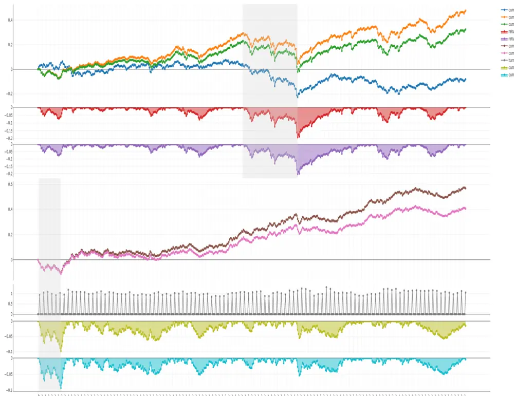
资料来源：WIND，中信建投

## TiDE

MLP Encoder+Decoder

过去已知变量+静态变量+未来已知协变量

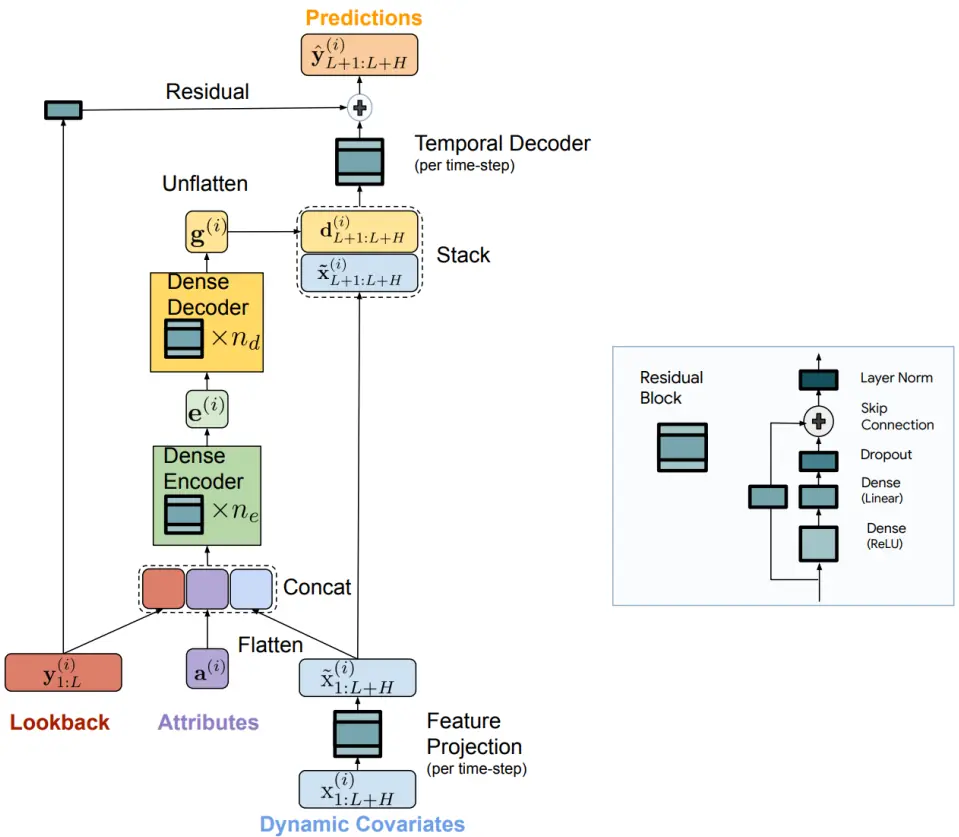
Figure 1: Overview of TiDE architecture. The dynamic covariates per time-point are mapped to a lower dimensional space using a feature projection step. Then the encoder combines the look-back along with the projected covariates with the static attributes to form an encoding. The decoder maps this encoding to a vector per time-step in the horizon. Then a temporal decoder combines this vector (per time-step) with the projected features of that time-step in the horizon to form the final predictions. We also add a global linear residual connection from the look-back to the horizon.

资料来源：Long-term Forecasting with TiDE: Time-series Dense Encoder， 中信建投

## TiDE

| Model Name | TiDE |
| --- | --- |
| Type | MLP |
| IC | -0.0447 |
| ICIR | -2.3969 |
| Annualized Return | -16.25% |
| Information Ratio | -0.61 |
| Max Drawdown | 43.30% |
| Alpha | -12.94% |
| Information Ratio(alpha) | -0.74 |
| Max Drawdown(alpha) | 34.66% |

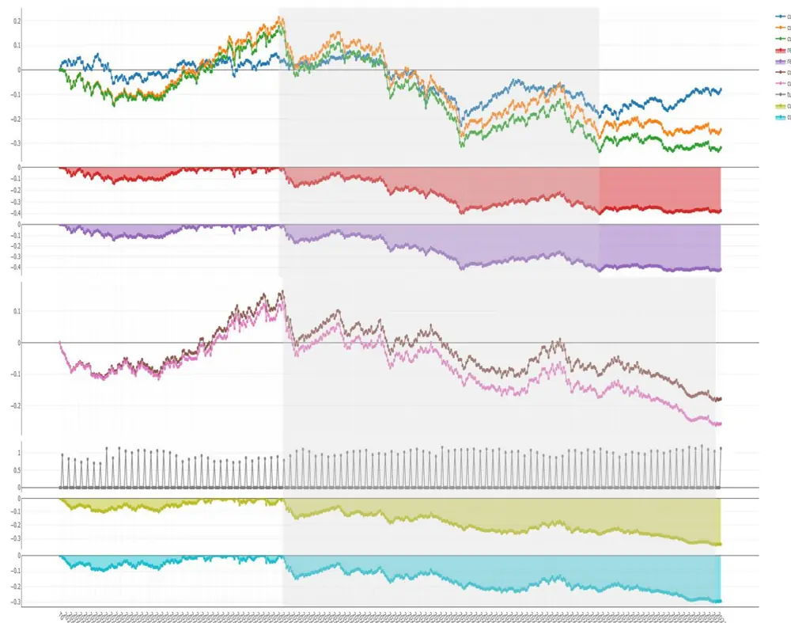
资料来源：WIND，中信建投

## TiDGE

TiDE + GRU Encoder

过去已知变量+静态变量+未来已知协变量

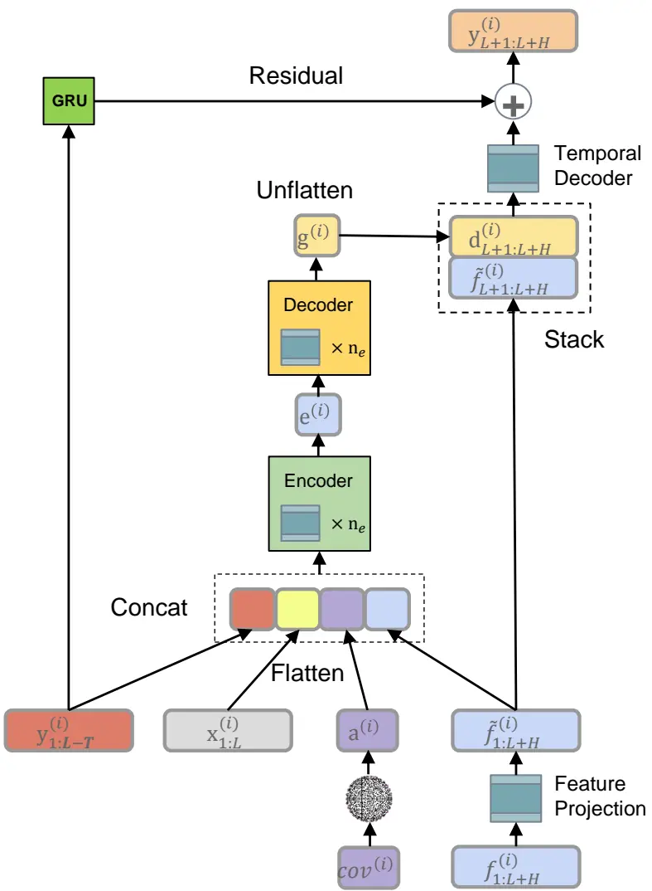
资料来源：中信建投

## TiDGE

| Model Name | TiDGE |
| --- | --- |
| Type | RNN+MLP |
| IC | 0.0470 |
| ICIR | 3.8388 |
| Annualized Return | 2.13% |
| Information Ratio | 0.21 |
| Max Drawdown | 33.73% |
| Alpha | 5.86% |
| Information Ratio(alpha) | 0.55 |
| Max Drawdown(alpha) | 12.41% |

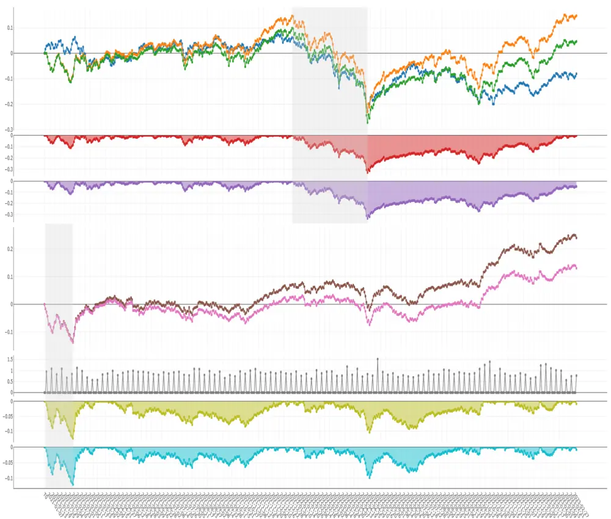
资料来源：WIND，中信建投

## More Tests

因子： Alpha360

Ndrop： 40

| Model Name | GRU |
| --- | --- |
| Type | RNN |
| IC | 0.0791 |
| ICIR | 7.8283 |
| Annualized Return | 25.68% |
| Information Ratio | 1.39 |
| Max Drawdown | 22.01% |
| Alpha | 29.86% |
| Information Ratio(alpha) | 2.51 |
| Max Drawdown(alpha) | 9.71% |

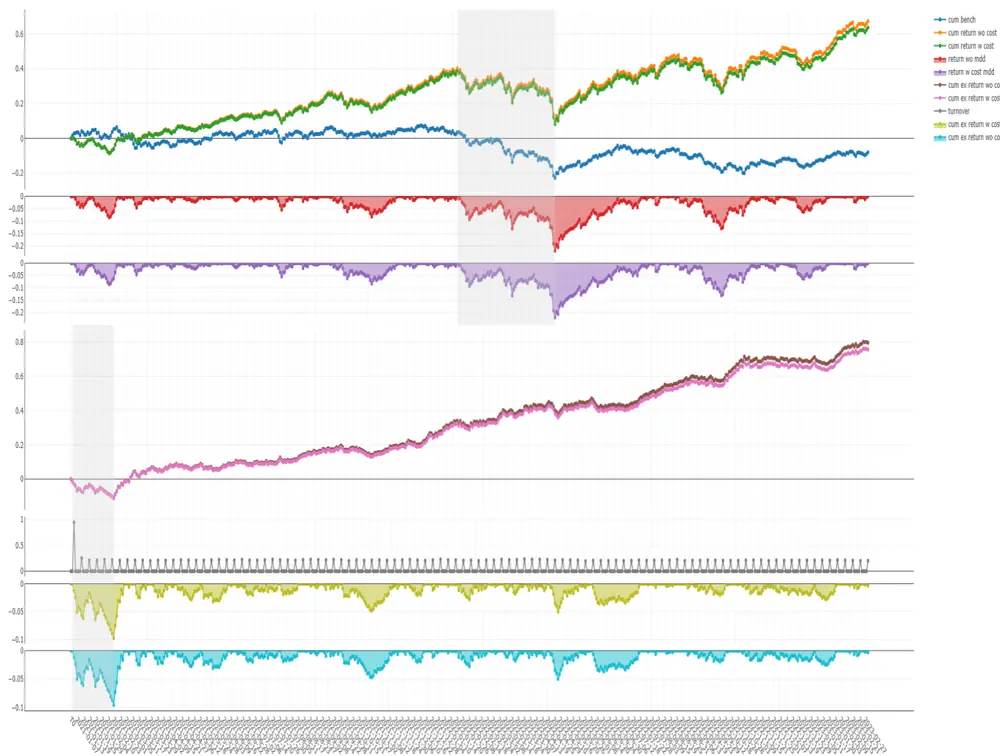
资料来源：WIND，中信建投

| Model Name | DA-RNN |
| --- | --- |
| Type | RNN+MLP |
| IC | 0.0946 |
| ICIR | 8.2899 |
| Annualized Return | 23.14% |
| Information Ratio | 1.23 |
| Max Drawdown | 24.97% |
| Alpha | 27.36% |
| Information Ratio(alpha) | 2.24 |
| Max Drawdown(alpha) | 9.60% |

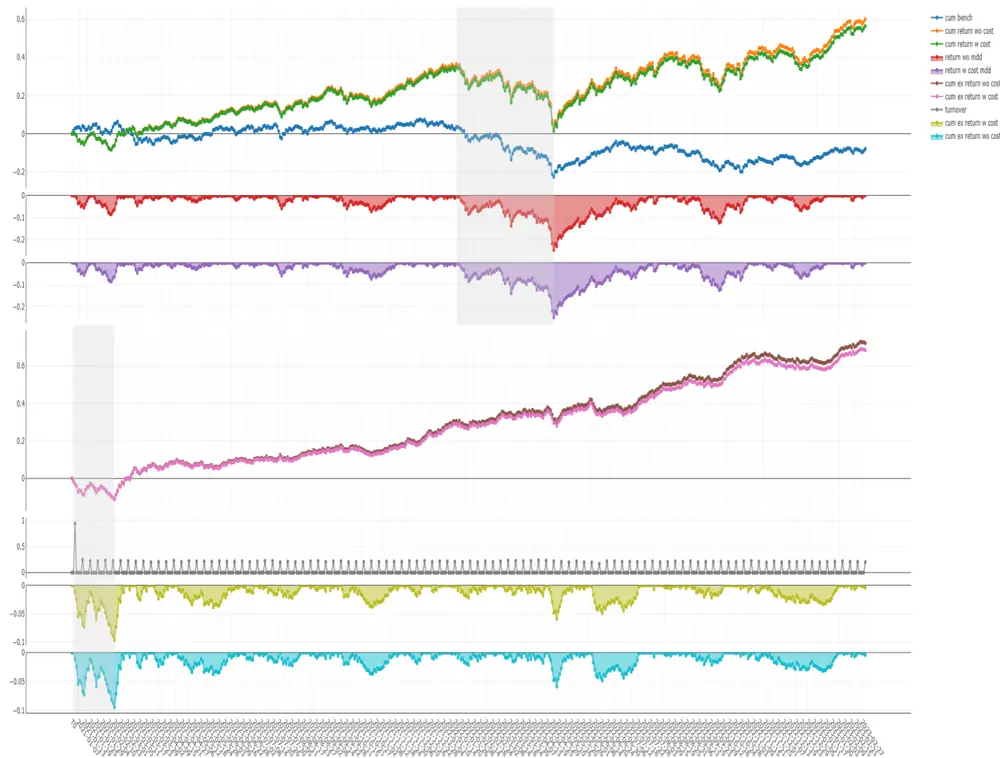
资料来源：WIND，中信建投

| Model Name | TCN |
| --- | --- |
| Type | CNN |
| IC | 0.0911 |
| ICIR | 7.5706 |
| Annualized Return | 26.60% |
| Information Ratio | 1.39 |
| Max Drawdown | 25.25% |
| Alpha | 30.92% |
| Information Ratio(alpha) | 2.37 |
| Max Drawdown(alpha) | 10.56% |

| Model Name | Transformer |
| --- | --- |
| Type | TRANS |
| IC | 0.0917 |
| ICIR | 7.5023 |
| Annualized Return | 32.12% |
| Information Ratio | 1.56 |
| Max Drawdown | 21.86% |
| Alpha | 36.34% |
| Information Ratio(alpha) | 2.27 |
| Max Drawdown(alpha) | 12.35% |

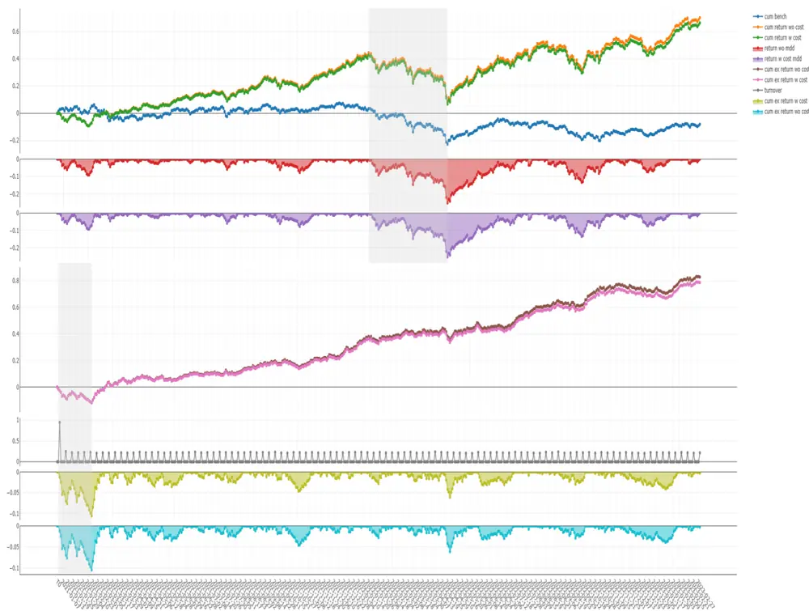
资料来源：WIND，中信建投

因子：Alpha158(筛选25个因子+市值因子）

Ndrop： 400

| Model Name | GRU |
| --- | --- |
| Type | RNN |
| IC | 0.0955 |
| ICIR | 8.5981 |
| Annualized Return | 27.73% |
| Information Ratio | 1.31 |
| Max Drawdown | 27.10% |
| Alpha | 32.10% |
| Information Ratio(alpha) | 2.03 |
| Max Drawdown(alpha) | 12.98% |

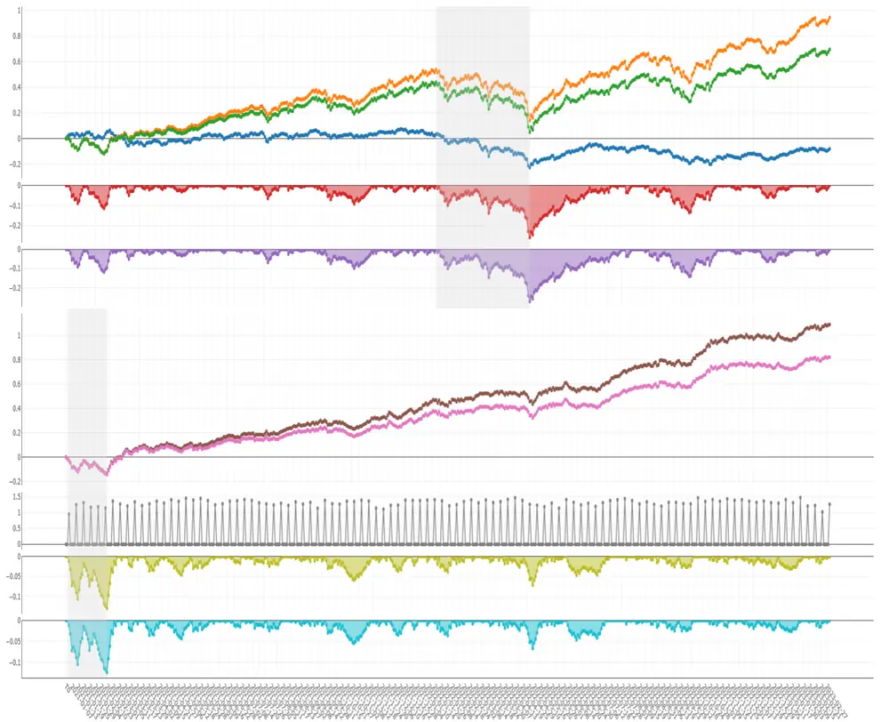

## DA-RNN

| Model Name | DA-RNN |
| --- | --- |
| Type | RNN+MLP |
| IC | 0.1010 |
| ICIR | 8.3104 |
| Annualized Return | 27.39% |
| Information Ratio | 1.32 |
| Max Drawdown | 27.97% |
| Alpha | 31.70% |
| Information Ratio(alpha) | 2.03 |
| Max Drawdown(alpha) | 13.37% |

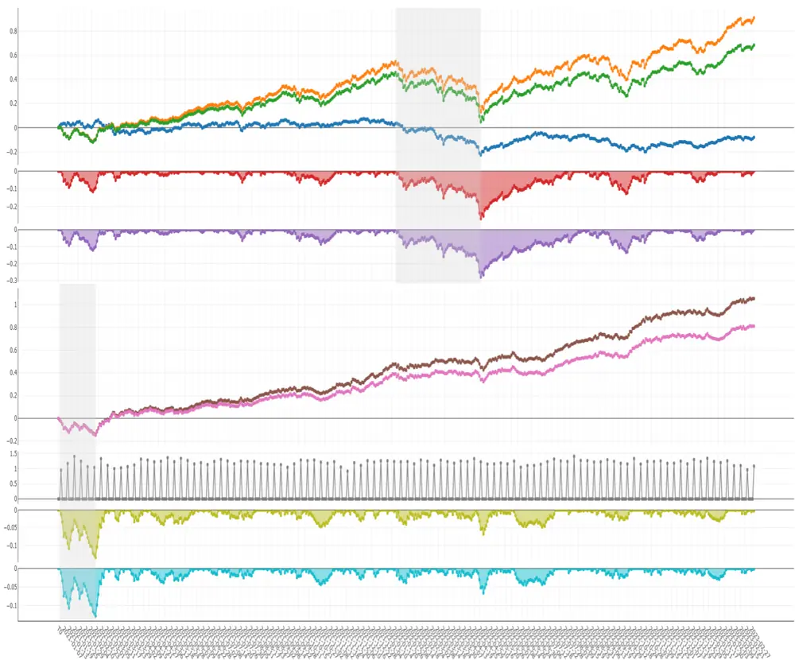

资料来源：WIND，中信建投

| Model Name | TCN |
| --- | --- |
| Type | CNN |
| IC | 0.0895 |
| ICIR | 8.2774 |
| Annualized Return | 21.36% |
| Information Ratio | 1.12 |
| Max Drawdown | 26.38% |
| Alpha | 25.54% |
| Information Ratio(alpha) | 1.96 |
| Max Drawdown(alpha) | 10.00% |

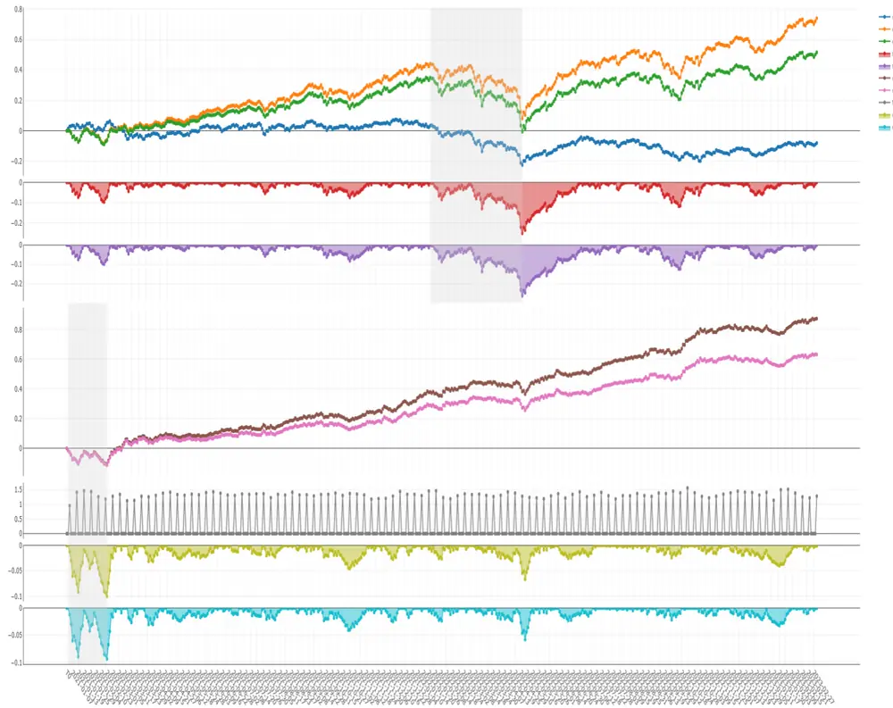

| Model Name | Transformer |
| --- | --- |
| Type | TRANS |
| IC | 0.0917 |
| ICIR | 7.5023 |
| Annualized Return | 28.53% |
| Information Ratio | 1.43 |
| Max Drawdown | 23.91% |
| Alpha | 32.68% |
| Information Ratio(alpha) | 2.16 |
| Max Drawdown(alpha) | 11.60% |

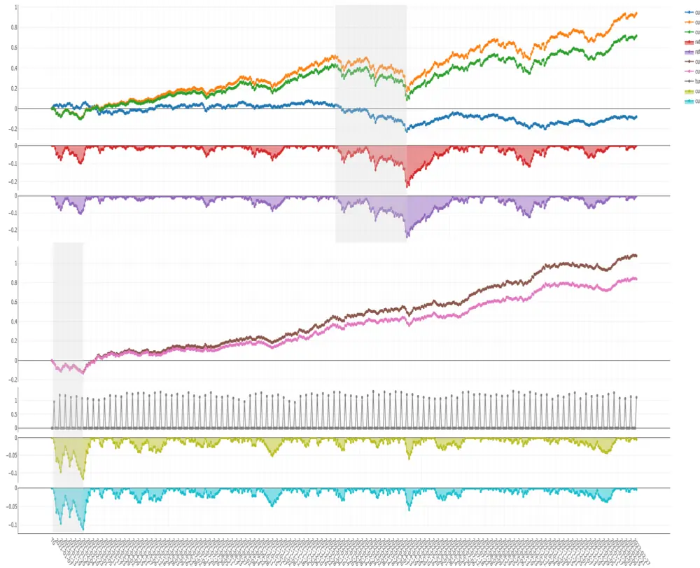

因子：Alpha158(筛选25个因子+市值因子）

Ndrop： 40

| Model Name | GRU |
| --- | --- |
| Type | RNN |
| IC | 0.0955 |
| ICIR | 8.5981 |
| Annualized Return | 34.31% |
| Information Ratio | 1.53 |
| Max Drawdown | 23.45% |
| Alpha | 38.86% |
| Information Ratio(alpha) | 2.25 |
| Max Drawdown(alpha) | 13.94% |

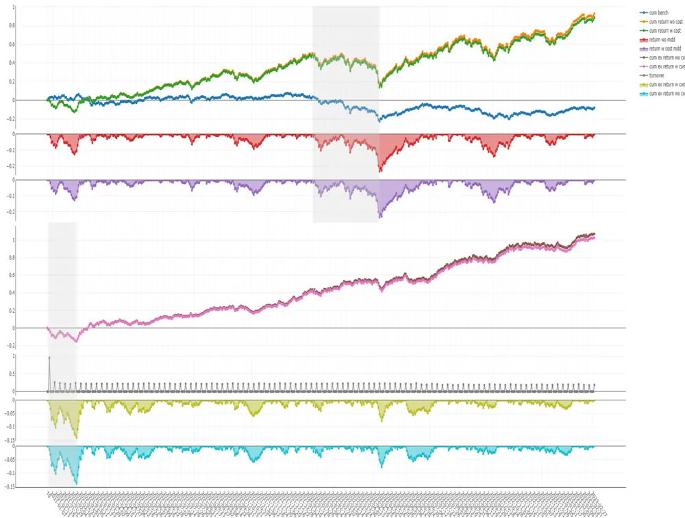
资料来源：WIND，中信建投

## DA-RNN

| Model Name | DA-RNN |
| --- | --- |
| Type | RNN+MLP |
| IC | 0.1010 |
| ICIR | 8.3104 |
| Annualized Return | 30.64% |
| Information Ratio | 1.45 |
| Max Drawdown | 23.08% |
| Alpha | 34.96% |
| Information Ratio(alpha) | 2.15 |
| Max Drawdown(alpha) | 13.23% |

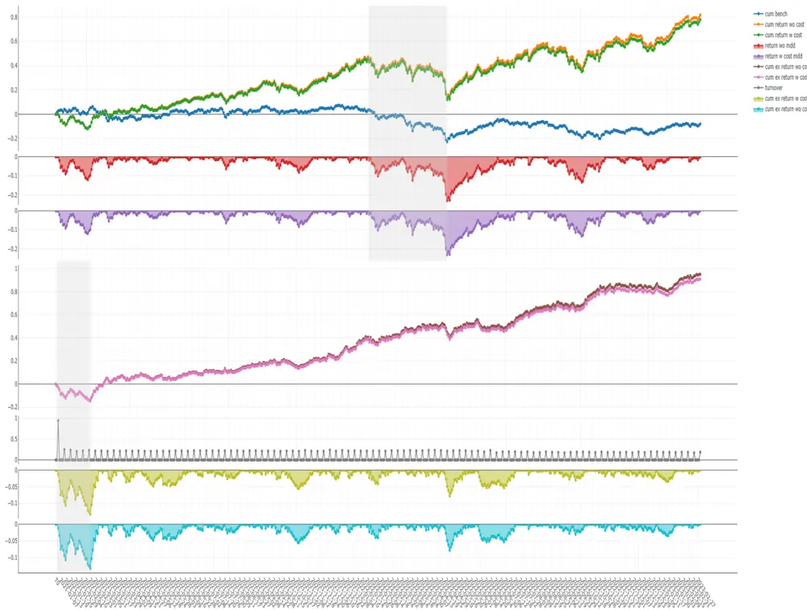
资料来源：WIND，中信建投

| Model Name | TCN |
| --- | --- |
| Type | CNN |
| IC | 0.0895 |
| ICIR | 8.2774 |
| Annualized Return | 23.69% |
| Information Ratio | 1.26 |
| Max Drawdown | 22.58% |
| Alpha | 27.91% |
| Information Ratio(alpha) | 2.28 |
| Max Drawdown(alpha) | 8.86% |

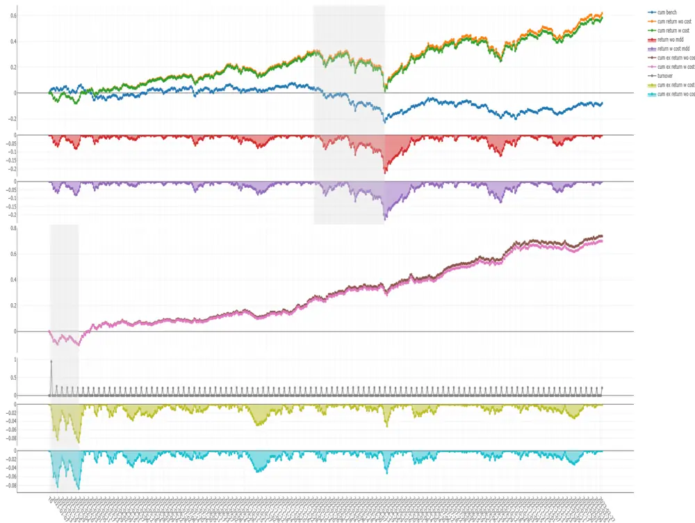

| Model Name | Transformer |
| --- | --- |
| Type | TRANS |
| IC | 0.0917 |
| ICIR | 7.5023 |
| Annualized Return | 32.12% |
| Information Ratio | 1.56 |
| Max Drawdown | 21.86% |
| Alpha | 36.34% |
| Information Ratio(alpha) | 2.27 |
| Max Drawdown(alpha) | 12.35% |

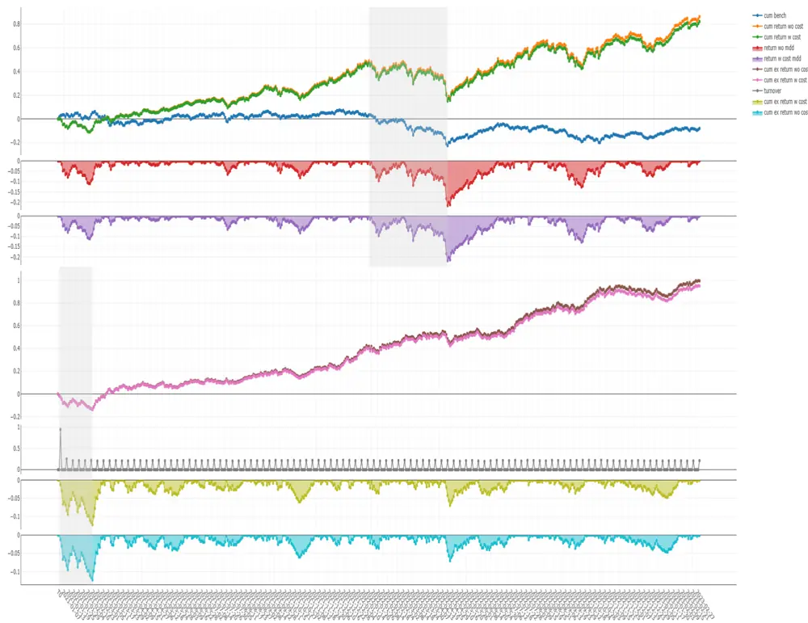
资料来源：WIND，中信建投

DDG-DA

## Meta Learning

学习时序数据的概念漂移
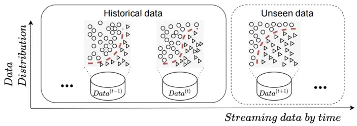
Figure 1: An example of concept drifts on streaming data. Triangle and circle represent two classes of data. Data comes like a stream. The data distribution changes over time.

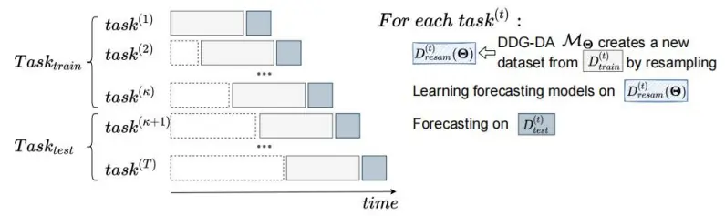
Figure 3: Training data (historical data) and test data (recent unseen data) change over time; the objective of each task is to improve the forecasting performance on test data.

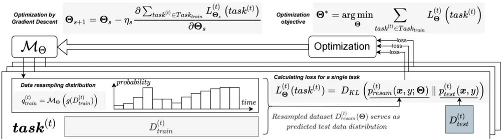
Figure 4: The learning process of DDG-DA; DDG-DA $\mathcal{M}_{\Theta}$ learns to guide the training process of forecasting model by generating dataset $D_{resam}^{(t)}(\Theta)$ resampled from $D_{train}^{(t)}$ with probability $q_{train}^{(t)}.q_{train}^{(t)}$ is the resampling probability given by $\mathcal{M}_{\Theta}$ at timestamp t.

## DDG-DA(Linear)

| Model Name | DDG-DA(Linear) |
| --- | --- |
| Type | LINEAR |
| IC | 0.1258 |
| ICIR | 6.7511 |
| Annualized Return | 10.94% |
| Information Ratio | 0.69 |
| Max Drawdown | 27.82% |
| Alpha | 14.33% |
| Information Ratio(alpha) | 1.12 |
| Max Drawdown(alpha) | 12.62% |

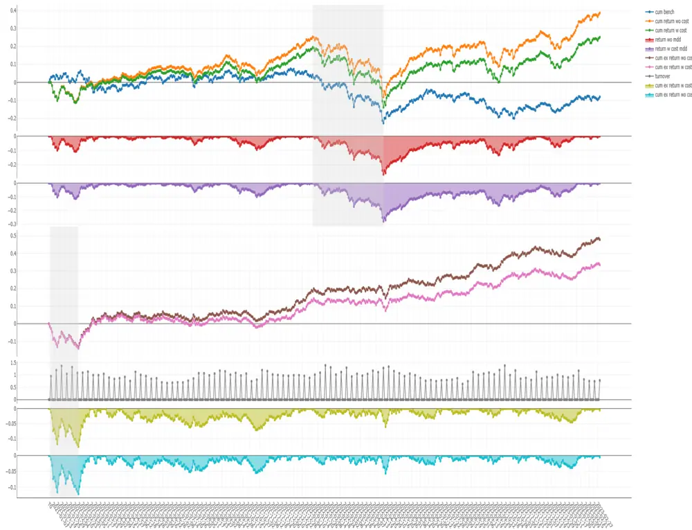

## 结果及讨论

## 信号相关性

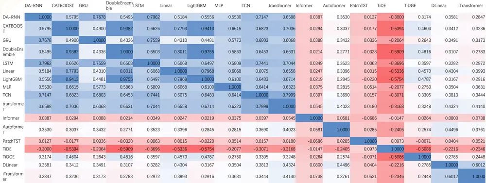
资料来源：WIND，中信建投

结果-Alpha360Top400Drop400

| Model Name | LSTM | GRU | DA-RNN | TCN | Transfor mer | Localfor mer | Informer | Autoform er | PatchTS T | iTransfor mer | DLinear | TiDE | TiDGE |
| --- | --- | --- | --- | --- | --- | --- | --- | --- | --- | --- | --- | --- | --- |
| Type | RNN | RNN | RNN+ML P | CNN | TRANS | TRANS | TRANS | TRANS | TRANS | TRANS | MLP | MLP | RNN+ML P |
| IC | 0.0913 | 0.0791 | 0.0946 | 0.0911 | 0.0894 | 0.0907 | 0.0070 | 0.0498 | 0.0050 | 0.0465 | 0.0625 | -0.0447 | 0.0470 |
| ICIR Annualiz | 7.4762 | 7.8283 | 8.2899 | 7.5706 | 6.9455 | 6.4798 | 1.6943 | 4.3631 | 0.8258 | 2.8073 | 3.4757 | -2.3969 | 3.8388 |
| ed Return | 17.93% | 22.11% | 22.17% | 16.95% | 18.27% | 17.55% | 3.93% | 9.99% | 3.96% | 9.20% | 13.90% | -16.25% | 2.13% |
| Informati on Ratio Max | 0.96 | 1.22 | 1.19 | 0.95 | 1.02 | 1.01 | 0.31 | 0.66 | 0.31 | 0.63 | 0.93 | -0.61 | 0.21 |
| Drawdow n | 29.32% | 24.93% | 26.22% | 26.44% | 25.98% | 25.91% | 28.63% | 24.41% | 27.72% | 21.66% | 20.35% | 43.30% | 33.73% |
| Alpha Informati | 22.01% | 26.20% | 26.31% | 20.92% | 22.05% | 21.24% | 7.59% | 13.34% | 7.58% | 12.38% | 17.11% | -12.94% | 5.86% |
| on Ratio(alp ha) | 1.69 | 2.17 | 2.11 | 1.70 | 1.66 | 1.62 | 0.76 | 1.13 | 0.76 | 1.04 | 1.40 | -0.74 | 0.55 |
| Max Drawdow n(alpha) | 12.28% | 9.15% | 9.20% | 10.09% | 11.42% | 10.72% | 13.03% | 11.77% | 11.17% | 12.12% | 9.80% | 34.66% | 12.41% |

资料来源：WIND，中信建投

## 结果-Alpha360Top400Drop40

| Model Name | GRU | DA-RNN | TCN | Transformer |
| --- | --- | --- | --- | --- |
| Type | RNN | RNN+MLP | CNN | TRANS |
| IC | 0.0791 | 0.0946 | 0.0911 | 0.0894 |
| ICIR | 7.8283 | 8.2899 | 7.5706 | 6.9455 |
| Annualized Return | 25.68% | 23.14% | 26.60% | 30.33% |
| Information Ratio | 1.39 | 1.23 | 1.39 | 1.56 |
| Max Drawdown | 22.01% | 24.97% | 25.25% | 22.99% |
| Alpha | 29.86% | 27.36% | 30.92% | 34.43% |
| Information Ratio(alpha) | 2.51 | 2.24 | 2.37 | 2.35 |
| Max Drawdown(alpha) | 9.71% | 9.60% | 10.56% | 11.17% |

资料来源：WIND，中信建投

## 结果-Alpha158Top400Drop400

| Model Name | GRU | DA-RNN | TCN | Transformer |
| --- | --- | --- | --- | --- |
| Type | RNN | RNN+MLP | CNN | TRANS |
| IC | 0.0955 | 0.1010 | 0.0895 | 0.0917 |
| ICIR | 8.5981 | 8.3104 | 8.2774 | 7.5023 |
| Annualized Return | 27.73% | 27.39% | 21.36% | 28.53% |
| Information Ratio | 1.31 | 1.32 | 1.12 | 1.43 |
| Max Drawdown | 27.10% | 27.97% | 26.38% | 23.91% |
| Alpha | 32.10% | 31.70% | 25.54% | 32.68% |
| Information Ratio(alpha) | 2.03 | 2.03 | 1.96 | 2.16 |
| Max Drawdown(alpha) | 12.98% | 13.37% | 10.00% | 11.60% |

资料来源：WIND，中信建投

## 结果-Alpha158Top400Drop40

| Model Name | GRU | DA-RNN | TCN | Transformer |
| --- | --- | --- | --- | --- |
| Type | RNN | RNN+MLP | CNN | TRANS |
| IC | 0.0955 | 0.1010 | 0.0895 | 0.0917 |
| ICIR | 8.5981 | 8.3104 | 8.2774 | 7.5023 |
| Annualized Return | 34.31% | 30.64% | 23.69% | 32.12% |
| Information Ratio | 1.53 | 1.45 | 1.26 | 1.56 |
| Max Drawdown | 23.45% | 23.08% | 22.58% | 21.86% |
| Alpha | 38.86% | 34.96% | 27.91% | 36.34% |
| Information Ratio(alpha) | 2.25 | 2.15 | 2.28 | 2.27 |
| Max Drawdown(alpha) | 13.94% | 13.23% | 8.86% | 12.35% |

资料来源：WIND，中信建投

## 结论

在因子结构较为简单时，时序模型相比截面模型有明显优势，其中RNN，TCN与原始Transformer结果较好，复杂Xformer没有明显效果。

因子结构复杂且数量更多时，RNN，TCN，Transformer模型表现均有所提升，其中Transformer以及GRU效果最好。

Todo：

提升模型表现： 集成学习/元学习

提升模型广度：图模型/自监督预训练时序模型

## 风险提示

- 本报告中所有数据结果是基于历史统计结果的展示，未来有可能发生风格切换导致因子失效的风险。模型运行存在一定的随机性，初始化随机数种子会对结果产生影响，单次运行结果可能会有一定偏差。历史数据的区间选择会对结果产生一定的影响。模型参数的不同会影响最终结果。模型对计算资源要求较高，运算量不足会导致结果存在一定的欠拟合风险。本文所有模型结果均来自历史数据，模型存在统计误差，不保证模型未来的有效性，对投资不构成任何建议。

|  | 截面模型 | 时序模型 |
| --- | --- | --- |
| 数据 | [1, M*T] OR [1,M] | [M, T] |
| 时序信息 | 无时序信息 排序不变性 | 有时序信息 排序影响结果 |
| 代表算法 | 回归模型，树模型， MLP | RNN, CNN, Transformer，MLP |

资料来源：中信建投

## 分析师介绍

丁鲁明：基金研究团创立国内“重大趋势及第4、2012分析本面”出精学硕士，中国准，中信建投证券投研体系，继承预判，对资产配2014 3金投顾业务决策委员会成深入研究经济经典长波体与经济周期运行具备深刻球最佳析师2009第、，上海证券交易所定期专家交流组成员。中的康波周期理论并积极应用于实务，解与认知。多次荣获团队荣誉：新财富；Wind金分析师20 13年证券次对资本佳分析师年第20。

王 超：南京大学粒子物理博士，曾担任基金公司研究员，券商研究员，有丰富的研究和投资经验，2021年加入中信建投，主要负责量化多因子选股。

## 评级说明

| 投资评级标准 |  | 评级 | 说明 |
| --- | --- | --- | --- |
| 报告中投资建议涉及的评级标准为报告发布日后6个月内的相对市场表现，也即报告发布日后的6个月内公司股价（或行业指数）相对同期相关证券市场代表性指数的涨跌幅作为基准。A股市场以沪深300指数作为基准；新三板市场以三板成指为基准；香港市场以恒生指数作为基准；美国市场以标普500指数为基准。 | 股票评级 | 买入增持 |  |
|  |  | 中性 | 相对涨幅-5%—5%之间 |
|  |  | 减持卖出 | 相对跌幅5%—15% |
|  |  |  | 相对跌幅15%以上 |
|  | 行业评级 | 强于大市 | 相对涨幅10%以上 |
|  |  | 中性 | 相对涨幅-10-10%之间 |
|  |  | 弱于大市 | 相对跌幅10%以上 |

## 分析师声明

本报告署名分析师在此声明：（i）以勤勉的职业态度、专业审慎的研究方法，使用合法合规的信息，独立、客观地出具本报告, 结论不受任何第三方的授意或影响。（ii）本人不曾因，不因，也将不会因本报告中的具体推荐意见或观点而直接或间接收到任何形式的补偿。

## 法律主体说明

本报告由中信建投证券股份有限公司及/或其附属机构（以下合称“中信建投”）制作，由中信建投证券股份有限公司在中华人民共和国（仅为本报告目的，不包括香港、澳门、台湾）提供。中信建投证券股份有限公司具有中国证监会许可的投资咨询业务资格，本报告署名分析师所持中国证券业协会授予的证券投资咨询执业资格证书编号已披露在报告首页。

在遵守适用的法律法规情况下，本报告亦可能由中信建投（国际）证券有限公司在香港提供。本报告作者所持香港证监会牌照的中央编号已披露在报告首页。

## 一般性声明

本报告由中信建投制作。发送本报告不构成任何合同或承诺的基础，不因接收者收到本报告而视其为中信建投客户。

本报告的信息均来源于中信建投认为可靠的公开资料，但中信建投对这些信息的准确性及完整性不作任何保证。本报告所载观点、评估和预测仅反映本报告出具日该分析师的判断，该等观点、评估和预测可能在不发出通知的情况下有所变更，亦有可能因使用不同假设和标准或者采用不同分析方法而与中信建投其他部门、人员口头或书面表达的意见不同或相反。本报告所引证券或其他金融工具的过往业绩不代表其未来表现。报告中所含任何具有预测性质的内容皆基于相应的假设条件，而任何假设条件都可能随时发生变化并影响实际投资收益。中信建投不承诺、不保证本报告所含具有预测性质的内容必然得以实现。

本报告内容的全部或部分均不构成投资建议。本报告所包含的观点、建议并未考虑报告接收人在财务状况、投资目的、风险偏好等方面的具体情况，报告接收者应当独立评估本报告所含信息，基于自身投资目标、需求、市场机会、风险及其他因素自主做出决策并自行承担投资风险。中信建投建议所有投资者应就任何潜在投资向其税务、会计或法律顾问咨询。不论报告接收者是否根据本报告做出投资决策，中信建投都不对该等投资决策提供任何形式的担保，亦不以任何形式分享投资收益或者分担投资损失。中信建投不对使用本报告所产生的任何直接或间接损失承担责任。

在法律法规及监管规定允许的范围内，中信建投可能持有并交易本报告中所提公司的股份或其他财产权益，也可能在过去12个月、目前或者将来为本报告中所提公司提供或者争取为其提供投资银行、做市交易、财务顾问或其他金融服务。本报告内容真实、准确、完整地反映了署名分析师的观点，分析师的薪酬无论过去、现在或未来都不会直接或间接与其所撰写报告中的具体观点相联系，分析师亦不会因撰写本报告而获取不当利益。

本报告为中信建投所有。未经中信建投事先书面许可，任何机构和/或个人不得以任何形式转发、翻版、复制、发布或引用本报告全部或部分内容，亦不得从未经中信建投书面授权的任何机构、个人或其运营的媒体平台接收、翻版、复制或引用本报告全部或部分内容。版权所有，违者必究。

## 中信建投证券研究发展部

东城区朝内大街2号凯恒中心B

电话：(8610) 8513-0588

联系人：李祉瑶

浦东新区浦东南路528号南塔2103室
电话：(8621) 6882-1612
联系人：翁起帆
邮箱：wengqifan@csc.com.cn

电话：（86755）8252-1369

## 中信建投（国际）

电话：（852）3465-5600