证券研究报告·金融工程深度

# “逐鹿”Alpha 专题报告（十九）

# ——Factor Zoo I

## 核心观点

本文是 Factor Zoo 系列报告的开篇之作。批量构建了振幅、标准差、高阶矩、成交占比、流动性、动量、量价相关性、极值位置等八大类上千个日内因子，通过优化因子框架，能够高效灵活的挖掘以及检验因子，最终在各大类因子中筛选出八个表现较好的因子，对其进行进一步分析表明，因子间相关性较低，且与传统的 Barra 风格因子也不存在明显相关性。

## 主要内容

## 简介

本文是 Factor Zoo 系列报告的开篇之作。Factor Zoo 旨在深入剖析各类投资因子的表现特征，继承并扩展了我们先前 Model Zoo系列的研究范畴。在这两大系列的研讨中，我们致力于对广泛的模型与因子进行细致的考察与大规模的检验，力求提炼出宝贵的经验规律，从而为未来因子与模型的创新发展奠定坚实的基础。

## 框架

为了与 Model Zoo 框架保持一致，确保后续模型运行的连贯性，Factor Zoo 底层框架同样基于 QLIB 实现，并进行了一系列的拓展，结合我们之前系列因子挖掘的算法，能够在单机上实现灵活高效的大批量因子挖掘以及检验。

## 算子

为了高效率地构建大量因子，本研究采取了算子化的策略。通过将算子与数据相结合，我们可以基于精细化的逻辑来构建因子，从而提高了因子生成的自动化和灵活性。为了进一步提升因子计算的灵活性和适应性，我们引入了一系列元算子。这些元算子是更高层次的抽象，它们可以对基础算子进行组合和封装，从而创造出更加复杂和定制化的计算逻辑。

## 因子

为了方便理解因子含义，我们将因子分为以下几类：振幅、标准差、高阶矩、成交占比、流动性、动量、量价相关性、极值位置。

因子计算采用 2016 年至 2023 年全市场 A股分钟量价数据，所有因子均降频为日频，滚动计算周频 IC 均值，IC 的 t 值，sign(IC)大于 0 占比，sign(IC)大于 0.04 占比，ICIR，分组收益率以及首尾组收益率差。

# 金融工程研究

## 丁鲁明

dingluming@csc.com.cn

021-68821623

SAC 编号:S1440515020001

王超

wangchaodcq@csc.com.cn

SAC 编号:S1440522120002

发布日期： 2024 年 03 月 10 日

## 市场表现

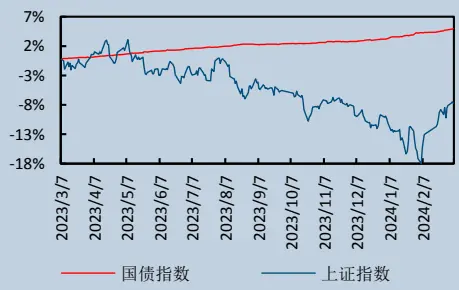

## 相关研究报告

## 一、简介

本文是 Factor Zoo 系列报告的开篇之作。Factor Zoo 旨在深入剖析各类投资因子的表现特征，继承并扩展了我们先前 Model Zoo 系列的研究范畴。在这两大系列的研讨中，我们致力于对广泛的模型与因子进行细致的考察与大规模的检验，力求提炼出宝贵的经验规律，从而为未来因子与模型的创新发展奠定坚实的基础。

在先前的报告系列中，我们已经探究了众多因子挖掘的技术与方法。这些包括但不限于基于枚举法的OPENFE，以启发式算法为核心的 AlphaZero，以及将启发式与枚举法相结合、并融合领域知识的因子挖掘算法，皆适用于多种类型因子挖掘的具体场景。

在 Factor Zoo 报告系列的首篇文章中，我们特别集中探讨日内量价因子的相关信息。通过构建并分析众多日内量价因子，我们旨在揭示不同类型因子的表现差异，并归纳出日内量价因子的核心规律与显著特征。

## 二、框架

为了与 Model Zoo 框架保持一致，确保后续模型运行的连贯性，Factor Zoo 底层框架同样基于 QLIB 实现，并进行了一系列的拓展，结合我们之前系列因子挖掘的算法，能够在单机上实现灵活高效的大批量因子挖掘以及检验。

图 1: 因子挖掘框架
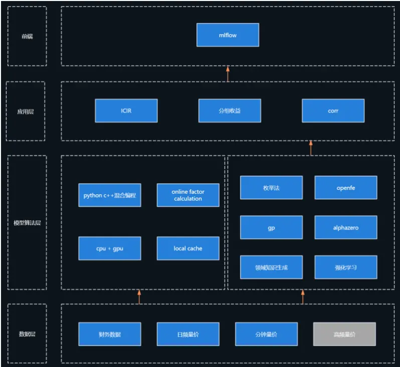
数据来源：中信建投证券

在 Factor Zoo 的数据层，我们主要关注财务数据和量价数据。量价数据进一步细分为日频量价、分钟量价和高频 level2 数据。本文我们的研究重点放在基于分钟量价数据构建的因子上。

进入模型算法层，为了进一步提升因子计算的效率，在 Qlib 已有的高效计算基础上，我们实施了一系列拓展：

1） Python/C++混合编程：虽然 Python 语言极富灵活性，但在计算效率方面相对较弱，尤其是在处理高频因子时，其时间效率并不理想。针对一些计算效率不高的算子，我们采用 C++进行加速，大幅提升了运算效率。在之前的高频 level2 因子测试中，通过 Python/C++混合编程方式，我们将单只股票因子的单核计算效率从约 100 秒提升至约 1 秒。目前全市场股票 8 年分钟频因子的数据读取加计算平均在 25秒左右。

2） 在线因子计算：为了在保障高效计算的同时，确保任一时间节点都可进行回测，我们采纳了在线因子计算的策略。例如，假设我们要计算每 K 分钟线收盘价的平均值，传统计算方法为 $\mathrm{E_k}=\mathrm{sum(c1,c2,\cdots)}$ ck)/k，其计算效率为 O(n)。若所有时刻的因子值，则总计算效率为 O(nL)。在线计算采用递推式计算$\mathrm{E_{k}=E_{k-1}+(c_{k}-c_{0})_{k}}$ /k，单次计算效率为 O(1)，总计算效率为 O(L)，与传统方法相比，效率提升了 n倍，且每个时刻的因子值均可用于回测。

3） CPU 与 GPU 的结合使用：对于通信开销较小、以矩阵计算为主的任务，GPU 相较于 CPU 能极大提升运 算效率。我们根据因子计算的特点，巧妙选择使用 CPU 或 GPU。在日频因子的计算上，我们优选GPU；而在分钟频因子的计算上，则倾向于使用 CPU。

4） 本地缓存（Local cache）：在批量计算因子时，复合因子的子结构往往需要重复利用。若每次都重新计算，则会造成大量计算资源的浪费。因此，我们在计算过程中对某些子结构进行缓存，避免数据重复读取及计算，从而有效地提高了因子计算的效率。

在因子挖掘的过程中，我们采纳了多种方法，包括枚举法、OPENFE、遗传规划（GP）、AlphaZero、领域知识生成以及强化学习等多元化方法。更多关于这些方法的详细信息，可以参考“逐鹿”系列的先前文章。

Factor Zoo 的宗旨在于提供高质量的输入，以辅助后续的因子构建和模型开发工作。因此，在设计因子时，我们避免因子过于复杂化，从而可能导致因子缺乏可解释性。本文在构建因子的过程中，着重遵循逻辑性原则，通过批量生成不同类型的因子，致力于揭示因子结构的内在规律与特性。

对于生成的因子需要进一步检验，单因子检验主要采用 ICIR，分组收益以及因子相关性进行筛选。最后再通过 mlflow进行前端展示。

## 三、算子

为了高效率地构建大量因子，本研究采取了算子化的策略。通过将算子与数据相结合，我们可以基于精细化的逻辑来构建因子，从而提高了因子生成的自动化和灵活性。在这一过程中，算子充当了构建因子的基本构件，它们将原始数据转换为具有意义的因子。本文使用到的算子包括：

表 1: 算子

| 算子 | 参数 | 解释 |
| --- | --- | --- |
| Ref | feature, N | feature 平移 N |
| Mean | feature, N | N 个 feature 平均值 |
| Sum | feature, N | N个 feature 和 |
| Std | feature, N | N 个 feature 标准差 |
| UpStd | feature, N | N 个 feature 上行标准差 |
| DownStd | feature, N | N 个 feature 下行标准差 |
| Var | feature, N | N 个 feature 方差 |
| Skew | feature, N | N 个 feature 偏度 |
| Kurt | feature, N | N个 feature 峰度 |
| Peak | feature, N | N 个 feature 极大值个数 |
| Max | feature, N | N个 feature 最大值 |
| IdxMax | feature, N | N 个 feature 最大值位置 |
| Min | feature, N | N个 feature 最小值 |
| IdxMin | feature, N | N 个 feature 最小值位置 |
| Med | feature, N | N个 feature 中位数 |
| Mad | feature, N | N 个 feature 平均绝对偏差 |
| Rank | feature, N | 当前值在 N 个 feature 中排序 |
| Slope | feature, N | N 个 feature 对坐标轴回归后的系数 |
| Rsquare | feature, N | N 个 feature 对坐标轴回归后的 R2 |
| Resi | feature, N | N 个 feature 对坐标轴回归后的残差 |
| Corr | feature1, feature2, N | N 个 feature1,feature2 的相关系数 |

资料来源：QLIB,中信建投证券

上述提到的所有算子被设计为滚动（Rolling）型算子，这些算子采取滚动计算的方法，能够连续地对数据进行处理而不会改变原始数据的时间间隔。这种计算方式使得算子能够在保持时间序列数据结构不变的同时，提取出关键的趋势和模式。

为了进一步提升因子计算的灵活性和适应性，我们引入了一系列元算子。这些元算子是更高层次的抽象，

它们可以对基础算子进行组合和封装，从而创造出更加复杂和定制化的计算逻辑。

通过这些元算子，研究者可以利用算子组合构建出更加复杂、个性化的因子，这些因子可以更精确地描述市场行为，增强投资策略的有效性和鲁棒性。此外，元算子的使用简化了构建过程，让研究者能够专注于策略的逻辑和性能，而不是编程细节。

## 表 2:元算子

| 算子 | 参数 | 解释 |
| --- | --- | --- |
| Partial | feature, freq, func, start_id, end_id | 每 freq 对 feature 取 start_id 至 end_id 区间内的 func 聚合值 |
| PartialRatio | feature, freq, func, start_id, end_id | 每 freq 对 feature 取 start_id 至 end_id 区间内的 func 聚合值，计算占比 |
| DownResample | feature, freq, idx/func | 每 freq 对 feature 取 idx 或者 func 的聚合值 |

资料来源：QLIB,中信建投证券

举例说明，假设要计算日内分钟线收盘价的平均值并将其降为日频，通过 DownResample，有以下三种方式实现：

1) DownResample(Mean($close, 240), 240, ‘last’)

2) DownResample(Mean($close, 240), 240, 239)

3) DownResample($close, 240, ‘mean’)

上述因子中，$close 代表底层原始分钟线收盘价数据，240 代表目标降频频率为日频（240 分钟），‘last与因子 2 中的 239 等价，均代表取 240 个值中的最后一个值。因子 3 直接取 240 个分钟线收盘价的均价。

显而易见，元算子的引入极大地提升了因子组合的灵活性和多样性。这种增强不仅限于简单的因子计算，而且还扩展到了因子的时间维度和应用范围。通过这些元算子，我们不再受限于静态的分析框架或单一的时间频率，反而能够灵活构建满足特定分析需求的因子。

例如，我们可以设计元算子来构建任意 分钟的频率因子或者取日内任意时刻的因子值，这意味着无论是短期的交易策略还是长期的投资决策，因子都可以被精确地调整以适应不同的时间框架。使得时间序列分析更加精细和及时，为捕捉市场机会提供了强有力的工具。

## 四、因子

因子计算采用 2016 年至 2023 年全市场 A 股分钟量价数据，所有因子均降频为日频，滚动计算周频 IC 均值，IC的 t 值，sign(IC)大于 0 占比，sign(IC)大于 0.04 占比，ICIR，分组收益率以及首尾组收益率差。

在进行因子计算时，我们必须谨慎处理那些带有量纲的因子。因为这类因子很可能与股价或者成交量存在强烈的相关性，这样的关联有时会误导我们，使我们陷入幸存者偏差的陷阱，或者引入了未来函数，从而破坏了模型的预测能力和有效性。

为了规避这些问题，并且提升因子的可解释性，本文所有因子均进行了无量纲处理。这种处理方式确保了因子值的可比性，无论是在跨时间还是跨资产的分析中，都能够公平地进行比较。

为了方便理解因子含义，我们将因子分为以下几类：振幅、标准差、高阶矩、成交占比、流动性、动量、量价相关性、极值位置。

## 4.1 振幅

振幅类因子一的核心在于计算不同交易频率下，以及在各个特定时点上的最高价与最低价之间的比值。经过比较分析，我们可以明显观察到日内振幅与未来收益之间存在一种显著的负向相关性。在一天的不同时间段中，上午时段测得的因子有效性显著优于下午时段，而在开盘与收盘时段得出的因子效力亦明显优于午间时段。

值得特别指出的是，随着频率的逐步降低，即时间间隔的增加，因子的信息系数（IC）绝对值呈逐渐增长之势。当频率降至 240 分钟，即转换为日频时，因子的信息系数（IC）绝对值达到其最大值，数值为-0.0706。这一结果揭示了在更长的时间尺度上，振幅与未来收益的负相关性更加显著，因此，该因子在日频层面上可能为市场参与者提供了更强的预测信号。

振幅类因子二包括三类因子，分别是日内价格的中位数/平均绝对偏差与收盘价的比值，或者日内最后一个价格在全天的排序值。其中表现最好的因子为最高价平均绝对偏差与收盘价的比值。

因子的详细信息参考附录。

图 2: 十分钟频振幅因子 IC
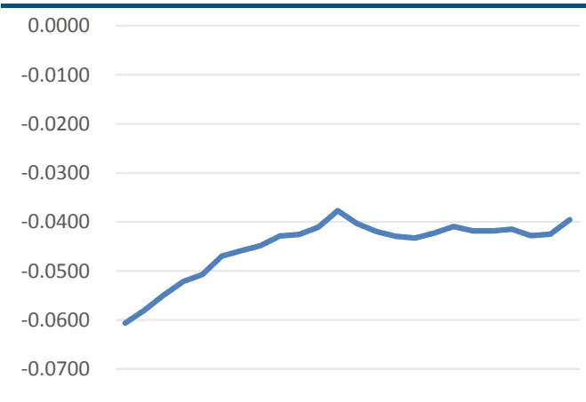
数据来源：WIND,中信建投证券

图 3: 十五分钟频振幅因子 IC
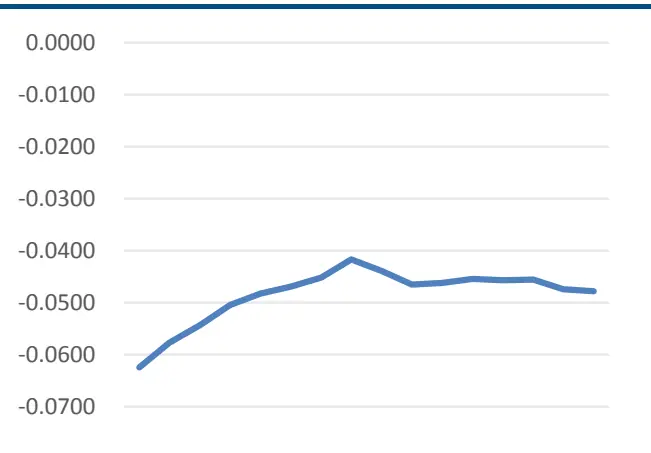
数据来源：WIND，中信建投证券

图 4: 二十分钟频振幅因子 IC
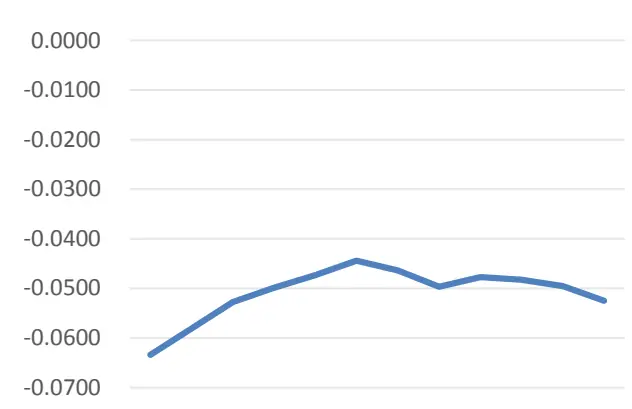
数据来源：WIND,中信建投证券

图 5: 三十分钟频振幅因子 IC
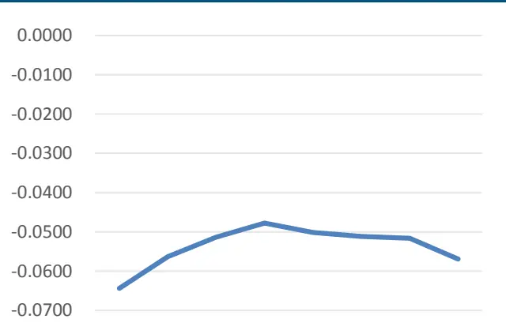
数据来源：WIND，中信建投证券

图 6: 四十分钟频振幅因子 IC
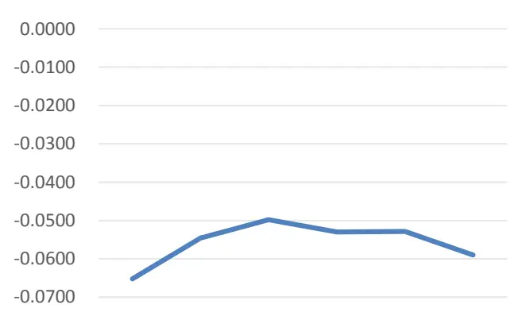
数据来源：WIND,中信建投证券

图 7: 六十分钟频振幅因子 IC
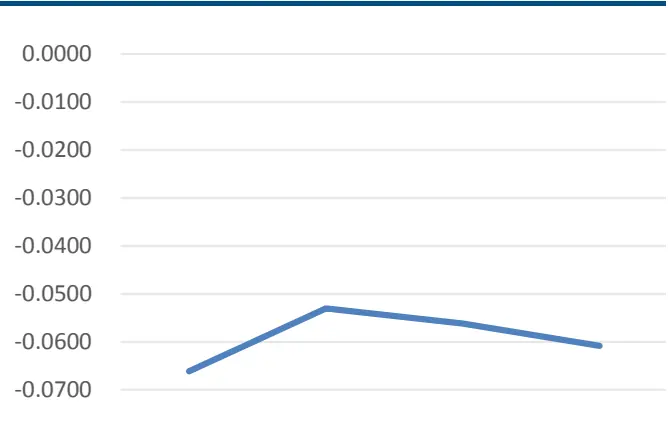
数据来源：WIND,中信建投证券

图 8: 九十分钟频振幅因子 IC
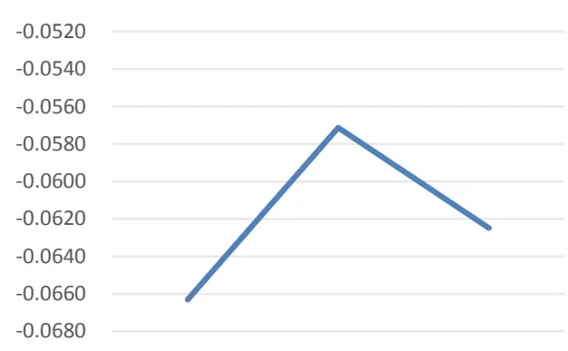
数据来源：WIND，中信建投证券

图 9: 一百二十分钟频振幅因子 IC
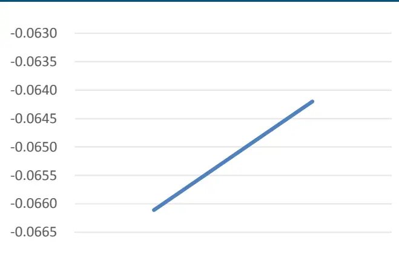
数据来源：WIND，中信建投证券

## 4.2 标准差

标准差类因子主要是指日内收益率的标准差，通过计算不同频率收益率的标准差/上行标准差/下行标准差得到。

通过详细的对比分析，我们可以观察到，在三种标准差计算方法中，上行标准差的整体有效性优于传统标准差，而传统标准差又优于下行标准差。这表明标准差的计算方式对因子的性能有显著影响。

特别值得注意的是，上行和下行标准差的极值点通常出现在三分钟收益率的标准差因子上，这揭示了在短期内收益率的波动对因子有效性的重要性，而传统标准差因子的极值点大致出现在八分钟的收益率附近。

当我们深入探讨信息系数（IC）变化趋势时，可以发现三类因子都呈现了一个类似的模式：起初经历一个下降趋势，随后又逐渐上升。在这三种因子中，传统标准差因子在上升阶段的幅度相对较为平缓，这或许表明它能够提供一种相对稳定的预测性表现。

从这些发现中，我们可以得出结论：不同的波动率计算方法对因子有效性的影响是差异化的，而且每种方法都有其在特定时间尺度上的优势。因此，在构建预测模型时，选择适当的波动率计算方法对于增强因子的预测能力和稳定性至关重要。

图 10: 不同频率收益率下行波动率因子 IC
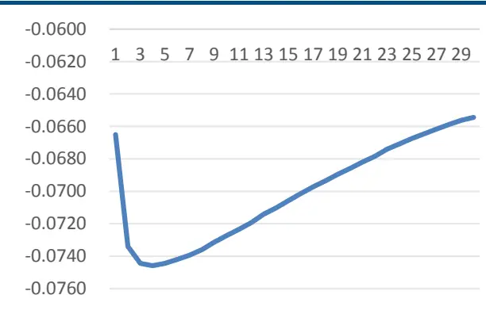
数据来源：WIND,中信建投证券

图 11: 不同频率收益率上行波动率因子 IC
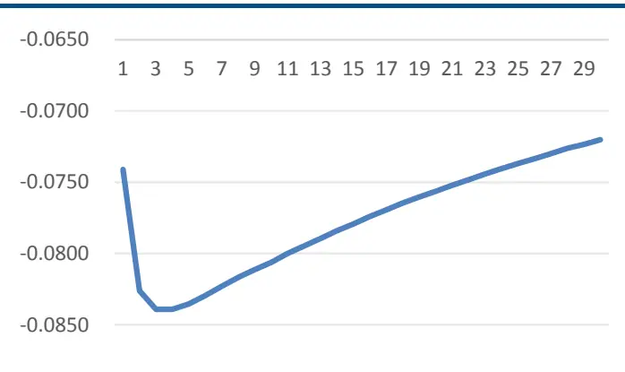
数据来源：WIND，中信建投证券

图 12: 不同频率收益率波动率因子 IC
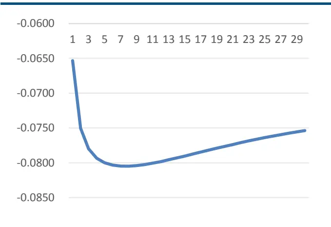
数据来源：WIND,中信建投证券

## 4.3 高阶矩

高阶矩因子着重于计算各种频率下收益率的偏度与峰度。在对这些因子的信息系数（IC）进行细致对比之后，我们发现峰度类因子的 IC 显著优越于偏度类因子。而且峰度因子在频率变化过程中显示出一种先降后升的有效性变化趋势，其 IC值的极致表现出现在以 4 分钟为周期计算的收益率峰度上。

图 13: 不同频率收益率偏度因子 IC
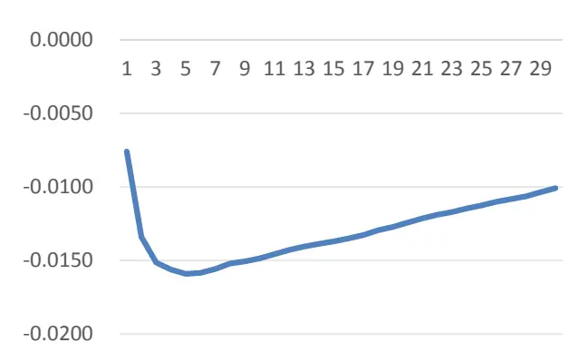
数据来源：WIND，中信建投证券

图 14: 不同频率收益率峰度因子 IC
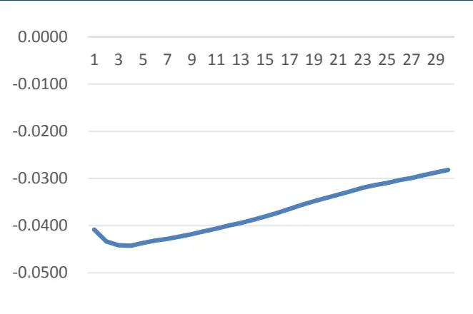
数据来源：WIND，中信建投证券

## 4.4 成交占比

成交占比因子反映了日内不同时间段内的成交笔数、成交量或成交金额占全日总量的比重。

通过对成交笔数占比的分析观察，我们可以发现，在 30 分钟和 5 分钟的测量频率下，该因子都展现出倒 U型的结构特征，即在中午时段，成交占比与未来收益之间呈现出显著的正相关性。然而，在 30 分钟频率下测得的因子中，尾盘时段的成交占比并未显示出明显的预测效力；而在 5 分钟频率下，尾盘成交占比因子与未来收益率之间却表现出了明显的负相关性。

成交量占比因子在表现上与成交笔数占比因子类似，同样呈现倒 U 型结构，但在 30 分钟和 5 分钟的频率下，尾盘成交占比的表现出现了明显的差异。与成交笔数占比因子的不同之处在于，成交量占比因子在 5 分钟频率下的对称性较好，但总体而言，其有效性不如成交笔数占比因子。

至于成交金额占比因子，其表现趋势与成交量占比因子相似，这进一步验证了在不同时间段内市场成交特性的一致性。

这些发现对于理解市场日内交易活动的动态变化以及预测未来市场走势具有重要的意义。它们能够为交易者提供在何时加入或退出市场的参考信息，并为量化交易模型的构建提供实证依据，进而在金融市场中把握更精准的投资时机。

图 15: 30分钟频成交笔数占比 IC
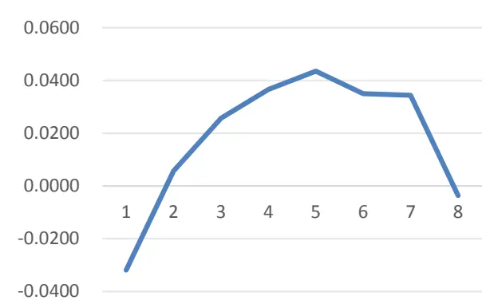
数据来源：WIND，中信建投证券
金融工程深度报告

图 16: 5分钟频成交笔数占比 IC
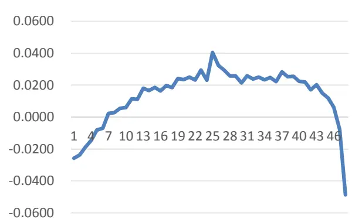
数据来源：WIND,中信建投证券

图 17: 30分钟频成交量占比 IC
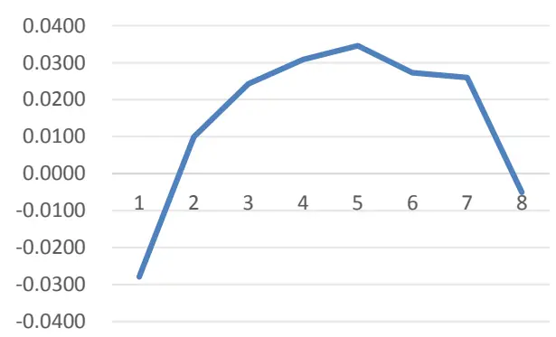
数据来源：WIND,中信建投证券

图 18: 5 分钟频成交量占比 IC
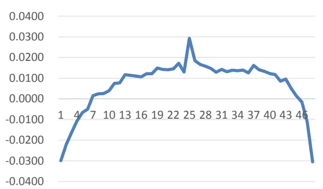
数据来源：WIND，中信建投证券

图 19: 5分钟频成交金额占比 IC
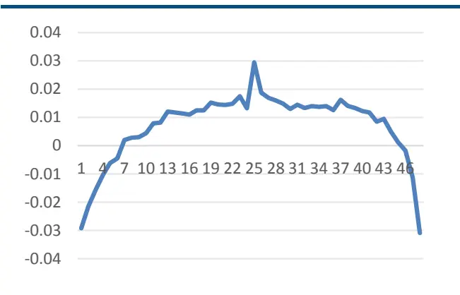
数据来源：WIND,中信建投证券

## 4.5 流动性因子

成交占比因子仅揭示了个股日内的成交分布特征，而未能充分考虑到不同股票之间流动性的差异。为了弥补这一缺陷，我们在成交占比因子的基础上构建了日内流动性因子，该因子专门分析了各个时间段内的自由流通换手率。具体的构建方法是将日内成交量占比因子与当日股票的自由流通换手率相结合。

从分析结果来看，流动性因子在性能上显著超越了仅考虑成交占比的因子，其增量信息主要源自于自由流通换手率因子本身，这一因子的信息系数（IC）均值达到了-0.0854。在日内的多个流动性因子中，尾盘流动性因子的表现尤其突出，其效果超过了原有的成交占比因子。

此项研究为我们提供了更为深入的洞见，即在考察股票日内交易特性时，引入流动性维度是至关重要的。流动性因子的引入不仅丰富了我们对市场交易行为的认识，而且为投资决策提供了更为精确的指导，特别是在涉及到预测市场短期走势和制定日内交易策略时。

图 20: 30分钟频流动性因子 IC
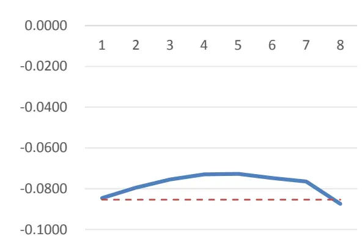
数据来源：WIND，中信建投证券

图 21: 5分钟频流动性因子 IC
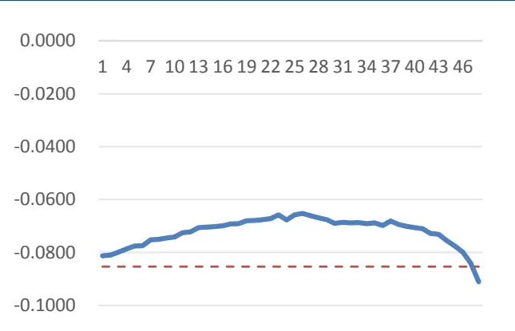
数据来源：WIND，中信建投证券

## 4.6 动量

日内动量的构建方式有两种：一是通过不同时间区间内股价变动的回归斜率来计算；二是依据不同时间频率收益率的最大及最小值来计算。

对于不同时间频率下的斜率因子的信息系数（IC）分布进行分析发现，除了在尾盘阶段外，全天其他时间段的斜率因子均未显示出显著的预测能力。然而，在尾盘时段，斜率因子与未来收益率呈现出明确的负相关性。值得注意的是，随着测量频率的降低，该预测效应逐渐减弱。

就收益率极值因子的表现而言，我们观察到收益率的最大值与未来收益率之间存在负相关关系，而收益率的最小值则与未来收益率呈现正相关性。在比较两种极值因子的信息系数时，收益率最小值因子的整体表现优于收益率最大值因子。具体的 IC分布分析显示，收益率最大值因子的信息系数极值出现在 4 分钟收益率上，而收益率最小值因子的信息系数极值则出现在约 7 分钟的收益率上。

图 22: 10 分钟频斜率因子 IC
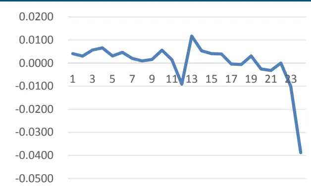
数据来源：WIND,中信建投证券
金融工程深度报告

图 23: 15 分钟频斜率因子 IC
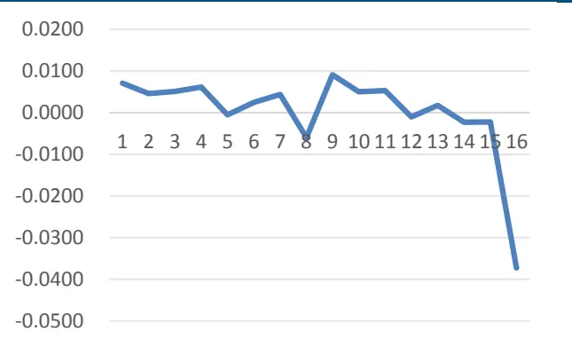
数据来源：WIND，中信建投证券

图 24: 20 分钟频斜率因子 IC
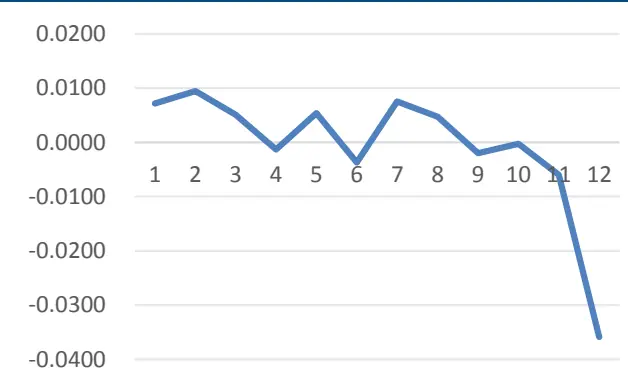
数据来源：WIND，中信建投证券

图 25: 30 分钟频斜率因子 IC
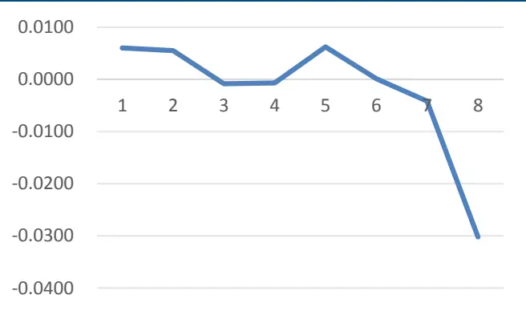
数据来源：WIND，中信建投证券

图 26: 40 分钟频斜率因子 IC
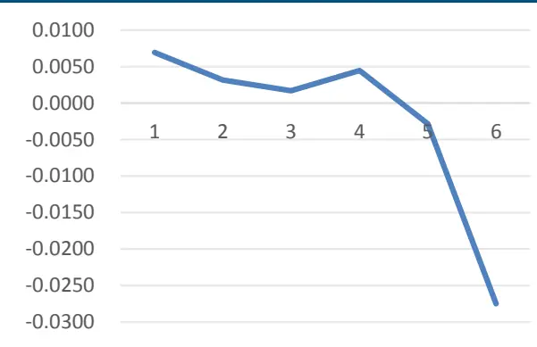
数据来源：WIND,中信建投证券
金融工程深度报告

图 27: 60 分钟频斜率因子 IC
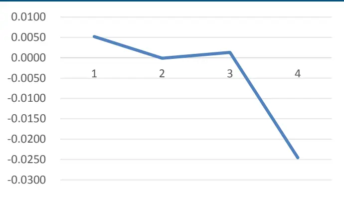
数据来源：WIND，中信建投证券

图 28: 90 分钟频斜率因子 IC
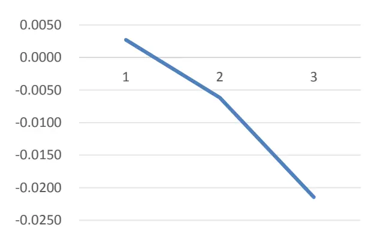
数据来源：WIND.中信建投证券

图 29: 120 分钟频斜率因子 IC
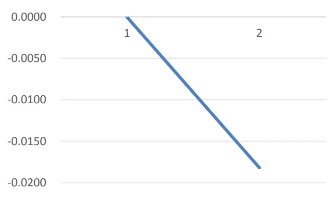
数据来源：WIND,中信建投证券

图 30: 不同频率收益率最大值因子 IC
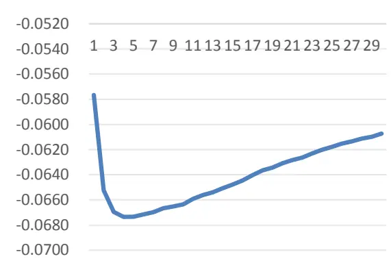
数据来源：WIND，中信建投证券

图 31: 不同频率收益率最小值因子 IC
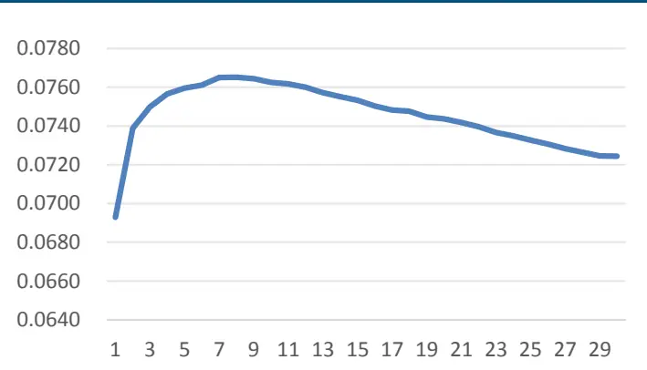
数据来源：WIND,中信建投证券

## 4.7 量价相关性

量价相关性因子专门分析了在不同时间段内，股价与成交量的同步相关性以及它们之间的领先或滞后相关性。在考察此类因子时，需特别注意尾盘集合竞价期间会出现的成交量为零的情况，这一现象可能对量价因子的精确度及最终分析结果带来显著影响。鉴于此，我们在计算量价相关性因子时，统一排除了最后 3 分钟的数据，以提高因子的准确性。

在同步量价相关性因子的分析中，我们发现，以全天 237 根分钟 K 线构建的因子，其表现优于其他任何特定时间段内量价相关性的表现。此外，量价相关性因子也显示出比单纯股价相关性因子更为出色的效能。在各量价相关性因子中，最高价与成交量的相关性因子展现了最佳的表现。在不同时间段划分的量价相关性因子中，开盘与尾盘的相关性因子在预测能力上胜过了其他时间段的相关性因子。

对于领先滞后量价相关性因子的研究表明，滞后一期的因子总体上优于其他时间单位的因子。具体来说，滞后价格相关性因子的效果超过了滞后成交量相关性因子。在所有考察的因子中，滞后一期的最高价与成交量相关性因子的表现最为突出，超越了同步最高价与成交量的相关性因子。

图 32: 同步量价相关性因子 IC
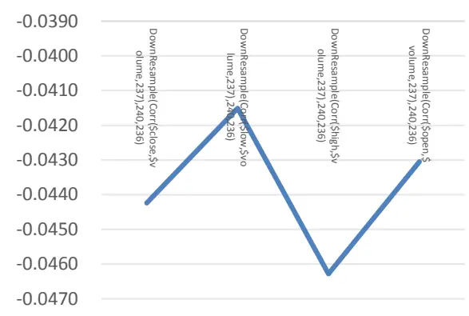
数据来源：WIND，中信建投证券
金融工程深度报告

图 33: 同步价格相关性因子 IC
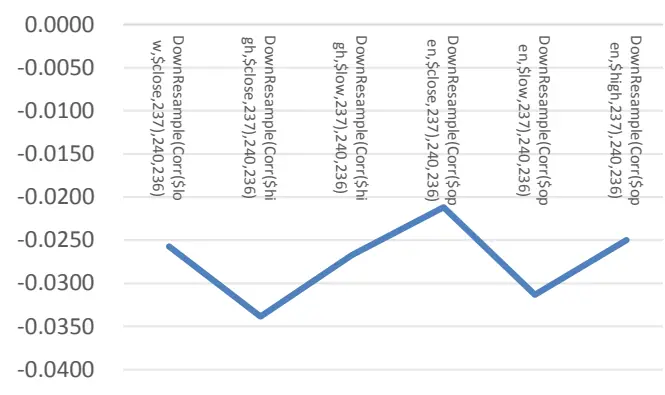
数据来源：WIND，中信建投证券

图 34: 30分钟频同步收盘价成交量相关性因子 IC
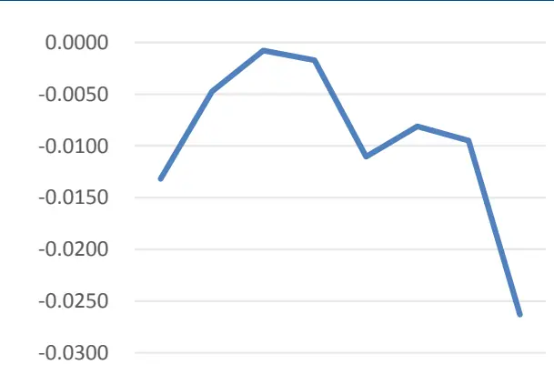
数据来源：WIND,中信建投证券

图 35: 30分钟频同步最低价成交量相关性因子 IC
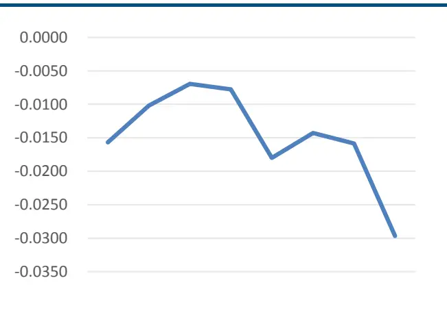
数据来源：WIND,中信建投证券

图 36: 30分钟频同步最高价成交量相关性因子 IC
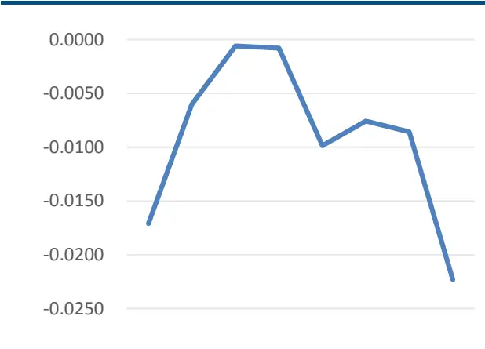
数据来源：WIND，中信建投证券
金融工程深度报告

图 37: 30分钟频同步开盘价成交量相关性因子 IC
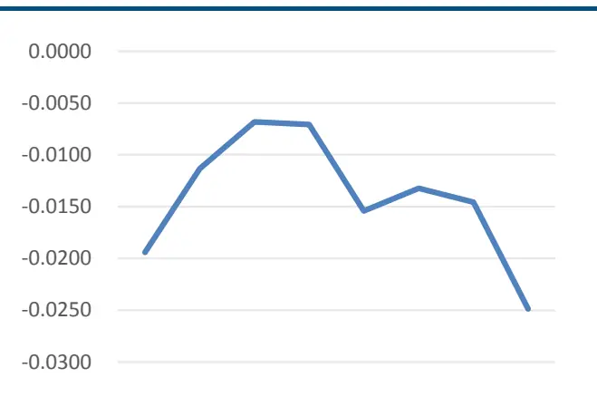
数据来源：WIND,中信建投证券

图 38: 收盘价与滞后 N期成交量相关性因子 IC
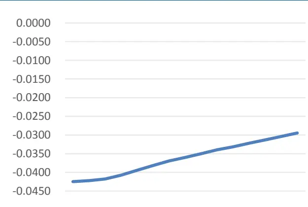
数据来源：WIND,中信建投证券

图 39: 滞后 N期收盘价与成交量相关性因子 IC
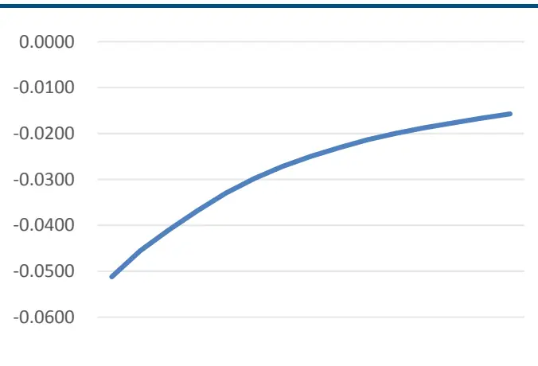
数据来源：WIND,中信建投证券

图 40: 最高价与滞后 N期成交量相关性因子 IC
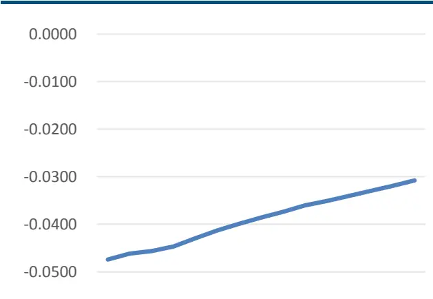
数据来源：WIND，中信建投证券
金融工程深度报告

图 41: 滞后 N期最高价与成交量相关性因子 IC
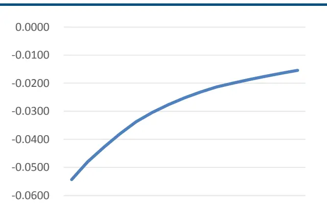
数据来源：WIND,中信建投证券

图 42: 最低价与滞后 N 期成交量相关性因子 IC
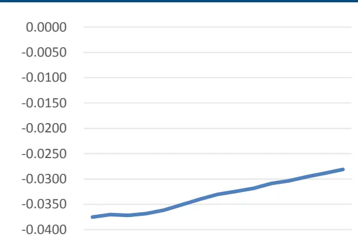
数据来源：WIND,中信建投证券

图 43: 滞后 N 期最低价与成交量相关性因子 IC
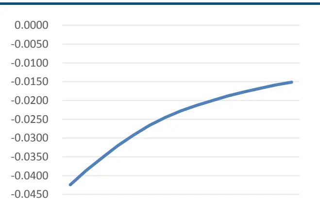
数据来源：WIND，中信建投证券

图 44: 开盘价与滞后 N期成交量相关性因子 IC
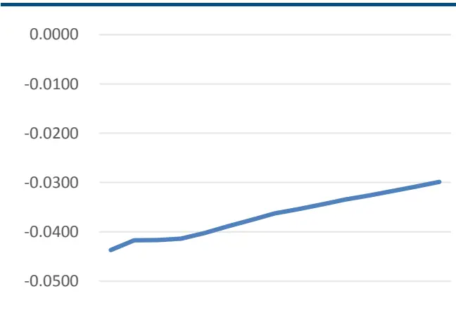
数据来源：WIND，中信建投证券

图 45: 滞后 N期开盘价与成交量相关性因子 IC
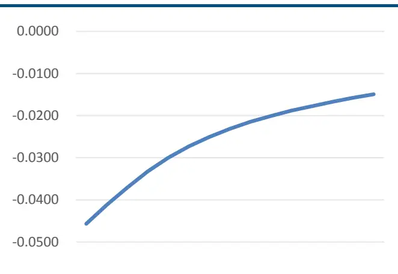
数据来源：WIND,中信建投证券

## 4.8 极值位置

极值位置因子包括日内最高点，最低点的位置因子以及日内股价峰值的个数。

通过对比可以看出，在极值位置因子中，股价最大值，最小值的位置并没有显著的预测能力，日内极值点的个数与未来收益存在明显的正相关性。

表 3:极值位置因子

|  | ic_mea | icir | long-sh | signi | signi | t | Grou | Grou | Grou | Grou | Grou |
| --- | --- | --- | --- | --- | --- | --- | --- | --- | --- | --- | --- |
|  | n |  | ort | c0 | c004 |  | p1 | p2 | p3 | p4 | p5 |
| DownResample((IdxMax($close,240) | -0.018 |  |  |  |  |  | -0.24 | 0.05 | 0.17 | 0.14 | 0.00 |
| -IdxMin($close,240)),240,"last") | 9 | 1.36 | -0.24% | 57% | 40% | -8.43 | % | % | % | % | % |
| DownResample((IdxMax($low,240)-I | -0.018 |  |  |  |  |  | -0.24 | 0.04 | 0.16 | 0.16 | 0.01 |
| dxMin($low,240)),240,"last") | 8 | 1.36 | -0.25% | 57% | 40% | -8.41 | % | % | % | % | % |
| DownResample((IdxMax($high,240)- | -0.018 |  |  |  |  |  | -0.24 | 0.08 | 0.18 | 0.11 | -0.01 |
| IdxMin($high,240)),240,"last") | 5 | 1.32 | -0.23% | 57% | 39% | -8.17 | % | % | % | % | % |
| DownResample((IdxMax($open,240)- | -0.018 |  |  |  |  |  | -0.23 | 0.06 | 0.17 | 0.14 | -0.01 |
| IdxMin($open,240)),240,"last") | 0 | 1.29 | -0.22% | 57% | 39% | -7.97 | % | % | % | % | % |
| DownResample(IdxMin($close,240),2 |  |  |  |  |  |  | -0.01 | 0.00 | -0.01 | -0.04 | 0.18 |
| 40,"last") | 0.0099 | 0.67 | -0.19% | 53% | 36% | 4.17 | % | % | % | % | % |
| DownResample(IdxMin($low,240),24 |  |  |  |  |  |  | -0.01 | -0.02 | 0.00 | 0.01 | 0.14 |
| 0,"last") | 0.0070 | 0.49 | -0.16% | 52% | 34% | 3.03 | % | % | % | % | % |
| DownResample(IdxMin($high,240),2 |  |  |  |  |  |  | -0.03 | 0.01 | -0.01 | -0.06 | 0.21 |
| 40,"last") | 0.0087 | 0.57 | -0.24% | 52% | 36% | 3.56 | % | % | % | % | % |

| DownResample(IdxMin($open,240),2 |  |  |  |  |  |  |  | -0.02 -0.01 | -0.01 | -0.03 | 0.19 |
| --- | --- | --- | --- | --- | --- | --- | --- | --- | --- | --- | --- |
| 40,"last") | 0.0073 | 0.50 | -0.21% | 52% | 35% | 3.08 | % | % | % | % | % |
| DownResample(IdxMax($close,240), | -0.015 |  |  |  |  |  | -0.22 | 0.02 | 0.05 | 0.06 | 0.22 |
| 240,"last") | 2 | 1.21 | -0.44% | 58% | 39% | -7.53 | % | % | % | % | % |
| DownResample(IdxMax($low,240),2 | -0.014 |  |  |  |  |  | -0.23 | 0.03 | 0.05 | 0.05 | 0.23 |
| 40,"last") | 2 | 1.10 | -0.46% | 56% | 38% | -6.85 | % | % | % | % | % |
| DownResample(IdxMax($high,240),2 | -0.017 |  |  |  |  |  | -0.22 | 0.02 | 0.06 | 0.14 | 0.13 |
| 40,"last") | 8 | 1.44 | -0.35% | 59% | 39% | -8.93 | % | % | % | % | % |
| DownResample(IdxMax($open,240),2 | -0.015 |  |  |  |  |  | -0.21 | 0.02 | 0.05 | 0.09 | 0.17 |
| 40,"last") | 4 | 1.22 | -0.38% | 58% | 39% | -7.59 | % | % | % | % | % |
| DownResample(Peak(0-$close,240),2 | -0.043 |  |  |  |  |  | -0.25 | -0.16 | -0.02 | 0.09 | 0.46 |
| 40,"last") | 3 | 2.10 | -0.71% | 61% | 50% | -13.01 | % | % | % | % | % |
| DownResample(Peak($close,240),240 | -0.046 |  |  |  |  |  | -0.27 | -0.16 | -0.02 | 0.09 | 0.48 |
| ,"last") | 5 | 2.26 | -0.75% | 62% | 52% | -14.04 | % | ％ | % | % | % |

资料来源：WIND,中信建投证券

## 五、因子收益率及相关性分析

通过以上的因子分析，我们筛选出以下几个各类中表现最好的因子，因子 IC 绝对值从 0.04 到 0.09 不等，通过因子间的 spearman 相关性和他们与传统 Barra 风格因子的相关性分析可以看出，不同类型因子间相关性较低，且与传统的 Barra 风格因子没有明显相关性。

## 表 4:优选因子

|  | ic_mean | icir | long-sh | signi | signic0 | t | Grou | Grou | Grou | Grou | Grou |
| --- | --- | --- | --- | --- | --- | --- | --- | --- | --- | --- | --- |
|  |  |  | ort | c0 | 04 |  | pl | p2 | p3 | p4 | p5 |
| DownResample(Max($high,240)/Min( |  |  |  |  |  |  | -0.39 | 0.01 | 0.09 | 0.10 | 0.30 |
| $low,240)-1,240,239) | -0.0706 | 3.46 | -0.68% | 71% | 61% | -21.44 | % | % | % | % | % |
| DownResample(Mad($high,240)/$clo |  |  |  |  |  |  | -0.35 | 0.00 | 0.07 | 0.08 | 0.32 |
| se,240,"last") | -0.0583 | 2.92 | -0.67% | 68% | 58% | -18.12 | % | % | % | % | % |
| DownResample(UpStd($close/Ref($cl |  |  |  |  |  |  | -0.54 | 0.00 | 0.12 | 0.15 | 0.45 |
| ose,4)-1,240),240,"last") | -0.0839 | 5.22 | -0.99% | 77% | 67% | -32.41 | % | % | % | % | % |
| DownResample(Kurt($close/Ref($clo |  |  |  |  |  |  | 0.00 | -0.08 | 0.00 | 0.07 | 0.13 |
| se,4)-1,240),240,"last") | -0.0442 | 3.69 | -0.12% | 74% | 56% | -22.91 | % | % | % | % | % |
| PartialRatio($num_trades,240,"sum",2 |  |  |  |  |  |  | -0.37 | -0.15 | 0.01 | 0.14 | 0.38 |
| 35,240) | -0.0487 | 5.30 | -0.76% | 78% | 57% | -30.77 | % | % | % | % | % |
| PartialRatio($volume,240,"sum",235, |  |  |  |  |  |  | -0.67 | 0.02 | 0.13 | 0.17 | 0.47 |
| 240)*$s_dq_freeturnover | -0.0911 | 4.89 | -1.15% | 75% | 66% | -30.32 | % | % | % | % | % |
| DownResample(Corr(Ref($high,1),$v | -0.0544 | 5.00 | -0.96% | 79% | 60% | -31.04 | -0.50 | -0.06 | 0.06 | 0.13 | 0.46 |

| olume,237),240,236) |  |  |  |  |  |  | % | % | % 0.09 | % 0.01 | % -0.58 |  |
| --- | --- | --- | --- | --- | --- | --- | --- | --- | --- | --- | --- | --- |
| DownResample(Min($close/Ref($clos |  |  |  |  |  | 0.48 |  |  |  |  |  | 0.12 |
| e,7)-1,240),240,"last") | 0.0765 | 4.03 | 1.06% | 74% | 63% | 25.01 | % | % | % | % | % |  |
| DownResample(Peak($close,240),240 |  |  |  |  |  |  | -0.27 | -0.16 | -0.02 | 0.09 | 0.48 |  |
| ,"last") | -0.0465 | 2.26 | -0.75% | 62% | 52% | -14.04 | % | % | % | % | % |  |

资料来源：WIND,中信建投证券

图 46: DownResample(Max($high,240)/Min($low,240)-1,240,239)收益率
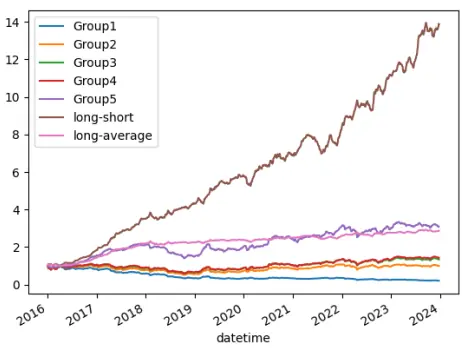
数据来源：WIND,中信建投证券

图 47: DownResample(Mad($high,240)/$close,240,"last")收 益率
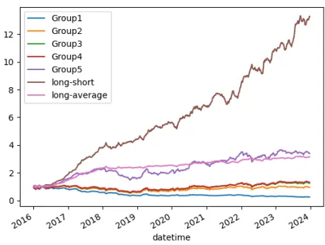
数据来源：WIND,中信建投证券

图 48: DownResample(UpStd($close/Ref($close,4)-1,240),240,”last”)收益率
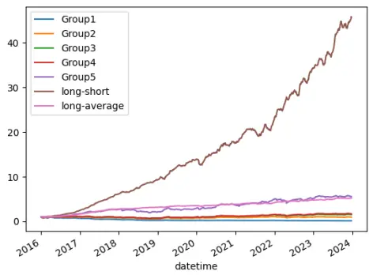
图 49: DownResample(Kurt($close/Ref($close,4)-1,240),240,”last”)收益率
数据来源：WIND,中信建投证券

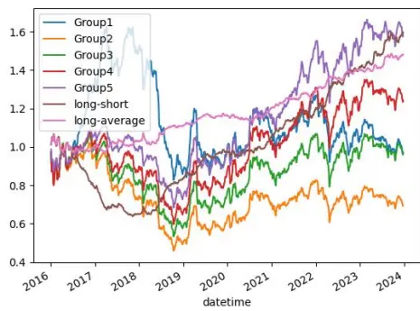
数据来源：WIND,中信建投证券

图 50: PartialRatio($num_trades,240,"sum",235,240)收益 率
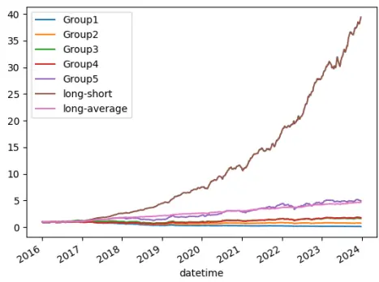
数据来源：WIND,中信建投证券

图 51: PartialRatio($volume,240,"sum",235,240)*$s_dq_freeturnover 收益 率
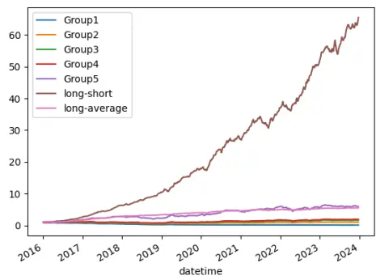
数据来源：WIND,中信建投证券

图 52: DownResample(Corr(Ref($high,1),$volume,237),240,236)收益率
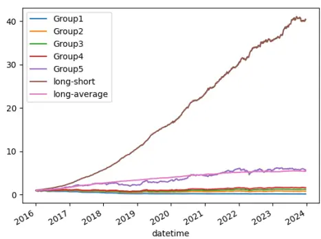
数据来源：WIND,中信建投证券

图 53: DownResample(Min($close/Ref($close,7)-1,240),240,"last") 收益率
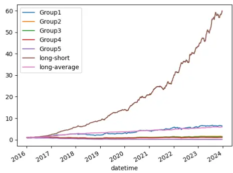
数据来源：WIND，中信建投证券

图 54: DownResample(Peak($close,240),240,"last")收益率
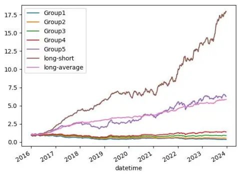
数据来源：WIND,中信建投证券

图 55:因子间 spearman 相关性

|  | ax($high, | DownRes DownRes DownRes DownRes PartialRa DownRes DownRes DownRes PartialRa ample(M ample(M ample(U ample(Ku ad($high, |  |  |  |  |  |  |  | ample(Co ample(Pe ample(Mi tio($volu me, 240, "sum", 235, 240)*$s dq_freet | size | liquidity | nlsize | resvol | btop | earningsy leverage ield | moment um | beta growth |  |
| --- | --- | --- | --- | --- | --- | --- | --- | --- | --- | --- | --- | --- | --- | --- | --- | --- | --- | --- | --- |
|  |  | 240)/ 240) / Min($low $close, , 240)-1, 240, 240, 239) "last") | pStd($clo se/ Ref($clos e, 4)-1, | rt($close Ref($clos | tio($num _trades, 240, "sum", 235, 240) | rr(Ref($hi gh, 1), $volume, 237), | iak($close n($close/ , 240), Ref($clos 240, e,7)- "last") |  |  |  |  |  |  |  |  |  |  |  |  |
|  |  | DownResample(Mad($high, 240) / $close, 240, "last") 0.854043 0.727572 0.608073 | 240), 240, "last") | e, 4)-1, 240), 240, "last") |  | 240,236) |  | 1,240),24 0,"last") urnover |  |  |  |  |  |  |  |  |  |  |  |
|  |  |  | DownResample(Max($high, 240) / Min($low, 240)-1, 240, 239) | 1 0.854043 0.727572 0.337593 0.337177 0.11078 0.435706 -0.67693 0.501237 -0.02003 0.38098 -0.04224 0.381414 |  |  |  |  |  |  |  | 1 0.608073 0.210364 0.3571990.099083 0.425296 -0.56942 0.44085 0.006579 0.387354 -004961 0.294521 1 0.483067 0.276086 0.107348 0.335411 -0.55292 0.371329 -0.03037 0.346061 -0.04041 0.314309 |  | -0.80503 -026727 | -020963 |  | -023161 -012115 0.192727 0.259441 0.124595 -011305 0.172404 0.25605 0.16957 |  |  |
| DownResample(UpStd($close / Ref($close, 4)-1, 240), 240, "last") DownResample(Kurt($close / Ref($close, 4)-1, 240), 240, "last") |  |  | 0.387593 0.210364 0.483067 0.387177 0.357199 0.276086 0.127745 |  |  |  | 1 0.127745 0.128381 0.138991 |  |  |  | 0.44467 0.177126 -0.05666 0.152749 0.09059 0.148929 | 1 0.142059 0.490017 -0.31985 0.850137 0.473801 0.282833 -018252 0.16875 -0. |  |  | 包85215 | 2613 |  | -015353 -008426 -008617 0.017024 0.100675 0.04219 | -013547 0.19957 0.185367 0.136363 |
| PartialRatio($num_trades, 240, "sum", 235, 240) DownResample(Corr(Ref($high, 1), $volume, 237), 240, 236) |  | 0.11078 0.099083 0.107348 0.128381 0.142059 |  |  |  |  |  |  | 1 0.097686 -014545 0.149585 0.018659 0.071463 -0.01157 0.040784 -0.02867 -0.01407 -0.00127 0.012837 0.080025 0.006804 |  |  |  |  |  |  |  |  |  | 05918 0.042684 0.148038 0.229204 0.206475 0.060328 |
| DownResample(Peak($close, 240), 240, "last") |  | 0.435706 0.425296 0.335411 0.138991 0.490017 0.097686 -0.57693 -0.56942 055292 014467 -081985 -014545 038584 |  |  |  |  |  |  |  |  |  |  |  |  |  |  |  | 1 038584 0.324748 0.339014 0.237443 -016649 0.228315 -0.34333 .2688 -015191 0.233389 0.270051 0.181269 |  |
| DownResample(Min($close/Ref($close,7)-1,240),240,"last") |  | 0.501237 0.444085 0.371329 0.177126 0.850137 0.149585 0.3247480.41812 |  |  |  |  |  | 1 |  |  | 1 0.185772 0.425755 -010428 0.139318 0.018841 0.092916 0.139851 0.16782 0.19013 0.006799 |  |  |  |  |  |  | 0.41812 0.038924 -034555 0.025381 -0.81564 0.288753 0.213974 0.099326 -017763 -020404 -011535 |  |
| PartialRatio($volume, 240, "sum", 235, 240)*$s_dq_freeturnover |  | -0.02003 0.006579 -003037 -005666 0.473801 0.018659 0.339014 0.038924 0.185772 |  |  |  |  |  |  |  |  |  |  |  |  |  |  |  | 1 -0125774 053495 -0.05798 0.029369 0.084034 0.194866 0.133289 -0.04282 0.18663 |  |
| size liquidity |  | 0.38098 0.387354 0.346061 0.152749 0.282833 0.071463 0.287443 -0.84555 0.425755 -0.25774 -0.04224 -0.04961 -0.04041 0.019059 -018252 -0.01157 -016649 0.025381 -010428 -0.53495 0.026348 |  |  |  |  |  |  |  |  |  |  |  |  |  |  |  | 1 0.026348 0.499205 -086552 -028883 -024587 0.159048 0.436178 0.14323 |  |
| nlsize |  | 0.331414 0.294521 0.314309 0.18929 0.16875 0.040784 0.228315 -0.31564 0.189318 -0.05798 0.499205 -0.03439 |  |  |  |  |  |  |  |  |  |  | 1 -003439 1 | -0.01284 |  | -0.02 -0.02433 |  | -0.0793 -0.05992 -010909 |  |
| resvol |  | 包30503 -026727 口35215 -0 |  |  | 15353 -005918 -0.02867 -034333 0.288753 0.018841 0.029369 36552 |  |  |  |  |  |  | -0.01284 | 包86824 | 086824 1 |  | -028865-015204 0.53393 0.312739 |  | -0.05034 0.426707 0.184709 | -d18925 -d20113 -d19884 |
| btop | -023161 -020963 |  | .2613 -008426 0.042684 -0.01407 |  |  |  |  |  |  |  | .2688 0.213974 0.092916 0.0B4034-028883 | -0.02 | -0.28865 0.53393 |  |  | 1 0.535037 | -012625 |  | -021261 -0.02203 |
| earningsyield | -0 | 012115 -011305 -013547 -008617 0.148038 -0.00127 -015191 0.099326 0.139851 0.194866 -24587 -0.02433 0.192727 0.172404 0.19957 0.017024 0.229204 0.012837 0.233389 -017763 0.16782 0.183289 0.159048 |  |  |  |  |  |  |  |  |  |  | -d15204 0.312739 0.535037 |  |  |  | 1 -0.01546 |  | -d16897 0.015207 |
| leverage |  | 0.259441 0.25605 0.135367 0.1ρ0675 0.206475 0.030025 0.270051 -020404 0.19013 -0.04282 0.436178 -005992 0.426707 -020113 -021261 -d16897 |  |  |  |  |  |  |  |  |  |  | .0793 -0.05034 | -d18925 -0 |  | 2625 -0.01546 | -0.05356 | 1 | -005356 0.051459 1 0.145771 |
| momentum beta |  | 0.124595 0.16957 0.136363 0.04219 0.060328 0.006804 0.181269 -011535 0.06799 0.108663 0.14323 -010909 0.184709 -019884 -0.02203 0.015207 0.01459 0.145771 |  |  |  |  |  |  |  |  |  |  |  |  |  |  |  |  | 1 |
| growth |  |  |  |  |  |  |  |  |  |  |  |  |  |  |  |  |  |  |  |

数据来源：WIND，中信建投证券

## 六、总结

本文是 Factor Zoo 系列报告的开篇之作。主要批量构建了振幅、标准差、高阶矩、成交占比、流动性、动量、量价相关性、极值位置等几大类上千个日内因子，通过优化因子框架，能够高效灵活的挖掘以及检验因子，最终在各大类因子中筛选出八个表现较好的因子，对其进行进一步分析表明，整体因子间相关性较低，且与传统的 Barra 风格因子也不存在明显相关性。

## 七、附录

表 5:振幅类因子一

|  | ic_mean | icir | long-sh | signi | signi | t | Grou |  | Grou Grou | Grou | Grou |
| --- | --- | --- | --- | --- | --- | --- | --- | --- | --- | --- | --- |
|  |  |  | ort | c0 | c004 |  | pl | p2 | p3 | p4 | p5 |
| DownResample(Max($high,10)/ |  |  |  |  |  |  | -0.32 | -0.01 | 0.07 | 0.08 | 0.31 |
| Min($low,10)-1,240,9) | -0.0607 | 3.35 | -0.63% | 70% | 58% | -20.76 | % | % | % | % | % |
| DownResample(Max($high,10)/ |  |  |  |  |  |  | -0.37 | 0.00 | 0.06 | 0.08 | 0.34 |
| Min($low,10)-1,240,19) | -0.0580 | 3.27 | -0.71% | 71% | 58% | -20.32 | % | % | % | % | % |
| DownResample(Max($high,10)/ |  |  |  |  |  |  | -0.35 | -0.01 | 0.05 | 0.07 | 0.35 |
| Min($low,10)-1,240,29) | -0.0550 | 3.18 | -0.70% | 69% | 57% | -19.72 | % | % | % | % | % |
| DownResample(Max($high,10)/ |  |  |  |  |  |  | -0.33 | -0.01 | 0.06 | 0.07 | 0.34 |
| Min($low,10)-1,240,39) | -0.0521 | 3.05 | -0.67% | 70% | 56% | -18.93 | % | % | % | % | % |
| DownResample(Max($high,10)/ |  |  |  |  |  |  | -0.33 | 0.00 | 0.06 | 0.06 | 0.34 |
| Min($low,10)-1,240,49) | -0.0507 | 3.08 | -0.67% | 70% | 55% | -19.09 | % | % | % | % | % |
|  |  |  |  |  |  |  | -0.31 | 0.00 | 0.06 | 0.04 | 0.33 |
| DownResample(Max($high,10)/ | -0.0470 | 2.88 | -0.65% | 68% | 55% |  | % | % | % | % | % |
| Min($low,10)-1,240,59) |  |  |  |  |  | -17.88 |  |  |  |  |  |
| DownResample(Max($high,10)/ | -0.0459 | 2.82 | -0.63% | 68% | 53% |  | -0.30 | 0.00 | 0.05 | 0.04 | 0.33 |
| Min($low,10)-1,240,69) |  |  |  |  |  | -17.47 | % | % | % | % | % |
| DownResample(Max($high,10)/ |  |  |  |  |  |  | -0.30 | 0.00 | 0.05 | 0.04 | 0.34 |
| Min($low,10)-1,240,79) | -0.0449 | 2.84 | -0.63% | 68% | 54% | -17.62 | % | % | % | % | % |
| DownResample(Max($high,10)/ |  |  |  |  |  |  | -0.29 | 0.00 | 0.04 | 0.03 | 0.33 |
| Min($low,10)-1,240,89) | -0.0429 | 2.73 | -0.62% | 69% | 52% | -16.92 | % | % | % | % | % |
| DownResample(Max($high,10)/ |  |  |  |  |  |  | -0.28 | 0.00 | 0.04 | 0.03 | 0.33 |
| Min($low,10)-1,240,99) | -0.0426 | 2.72 | -0.62% | 68% | 53% | -16.88 | % | % | % | % | % |
| DownResample(Max($high,10)/ |  |  |  |  |  |  | -0.28 | 0.00 | 0.04 | 0.03 | 0.33 |
| Min($low,10)-1,240,109) | -0.0411 | 2.70 | -0.61% | 69% | 52% | -16.74 | % | % | % | % | % |
| DownResample(Max($high,10)/ |  |  |  |  |  |  | -0.26 | 0.01 | 0.04 | 0.02 | 0.32 |
| Min($low,10)-1,240,119) | -0.0377 | 2.53 | -0.58% | 68% | 51% | -15.71 | % | % | % | % | % |
| DownResample(Max($high,10)/ |  |  |  |  |  |  | -0.26 | 0.00 | 0.04 | 0.03 | 0.32 |
| Min($low,10)-1,240,129) | -0.0403 | 2.67 | -0.58% | 68% | 52% | -16.58 | % | % | % | % | % |
| DownResample(Max($high,10)/ |  |  |  |  |  |  | -0.30 | 0.01 | 0.05 | 0.03 | 0.33 |
| Min($low,10)-1,240,139) | -0.0419 | 2.79 | -0.63% | 69% | 53% | -17.33 | % | % | % | % | % |
| DownResample(Max($high,10)/ |  |  |  |  |  |  | -0.31 | 0.01 | 0.05 | 0.04 | 0.33 |
| Min($low,10)-1,240,149) | -0.0430 | 2.85 | -0.64% | 69% | 53% | -17.66 | % | % | % | % | % |
| DownResample(Max($high,10)/ |  |  |  |  |  |  | -0.31 | 0.01 | 0.06 | 0.04 | 0.33 |
| Min($low,10)-1,240,159) | -0.0433 | 2.82 | -0.64% | 70% | 53% | -17.50 | % | % | % | % | % |

金融工程深度报告

| DownResample(Max($high,10)/ |  |  |  |  |  |  | 0.02 | 0.05 | 0.04 | 0.32 |  |
| --- | --- | --- | --- | --- | --- | --- | --- | --- | --- | --- | --- |
| Min($low,10)-1,240,179) | -0.0410 | 2.77 | -0.62% | 69% 52% | -17.17 |  | % | % | % | % |  |
| DownResample(Max($high,10)/ |  |  |  |  |  |  | -0.31 | 0.02 | 0.06 | 0.04 | 0.31 |
| Min($low,10)-1,240,189) | -0.0418 | 2.74 | -0.63% | 69% | 52% | -17.01 | % | % | % | % | % |
| DownResample(Max($high,10)/ |  |  |  |  |  |  | -0.32 | 0.02 | 0.05 | 0.04 | 0.32 |
| Min($low,10)-1,240,199) | -0.0418 | 2.78 | -0.64% | 69% | 53% | -17.25 |  | % | % | % | % |
| DownResample(Max($high,10)/ |  |  |  |  |  |  | -0.33 | 0.02 | 0.06 | 0.04 | 0.32 |
| Min($low,10)-1,240,209) | -0.0415 | 2.77 | -0.65% | 69% | 52% | -17.16 |  | % | % | % | % |
| DownResample(Max($high,10)/ |  |  |  |  |  |  | -0.34 | 0.03 | 0.07 | 0.05 | 0.31 |
| Min($low,10)-1,240,219) | -0.0428 | 2.83 | -0.65% | 70% | 53% | -17.53 | % | % | % | % | % |
| DownResample(Max($high,10)/ |  |  |  |  |  |  | -0.37 | 0.04 | 0.07 | 0.06 | 0.32 |
| Min($low,10)-1,240,229) | -0.0425 | 2.96 | -0.68% | 71% | 53% | -18.37 | % | % | % | % | % |
| DownResample(Max($high,10)/ |  |  |  |  |  |  | -0.36 | 0.05 | 0.08 | 0.05 | 0.30 |
| Min($low,10)-1,240,239) | -0.0396 | 3.22 | -0.66% | 73% | 51% | -19.95 | % | % | % | % | % |
| DownResample(Max($high,15)/ |  |  |  |  |  |  | -0.33 | -0.01 | 0.07 | 0.09 | 0.31 |
| Min($low,15)-1,240,14) | -0.0625 | 3.40 | -0.64% | 71% | 58% | -21.09 | % | % | % | % | % |
| DownResample(Max($high,15)/ |  |  |  |  |  |  | -0.36 | -0.01 | 0.07 | 0.08 | 0.34 |
| Min($low,15)-1,240,29) | -0.0577 | 3.18 | -0.71% | 69% | 57% | -19.72 | % | % | % | % | % |
| DownResample(Max($high,15)/ |  |  |  |  |  |  | -0.35 | 0.00 | 0.06 | 0.07 | 0.34 |
| Min($low,15)-1,240,44) | -0.0544 | 3.08 | -0.69% | 69% | 57% | -19.10 | % | % | % | % | % |
| DownResample(Max($high,15)/ Min($low,15)-1,240,59) |  |  | -0.67% | 69% |  |  | -0.33 | 0.01 | 0.05 | 0.06 | 0.34 |
| DownResample(Max($high,15)/ | -0.0504 | 2.95 |  |  | 55% | -18.29 | % | % | % | % 0.05 | % 0.33 |
| Min($low,15)-1,240,74) | -0.0483 | 2.84 | -0.64% | 68% | 54% | -17.63 | -0.31 % | 0.00 % | 0.05 % | % | % |
| DownResample(Max($high,15)/ |  |  |  |  |  |  | -0.31 | 0.00 | 0.05 | 0.05 | 0.33 |
| Min($low,15)-1,240,89) | -0.0469 | 2.83 | -0.65% | 68% | 54% | -17.55 | % | % | % | % | % |
| DownResample(Max($high,15)/ |  |  |  |  |  |  | -0.30 | 0.00 | 0.05 | 0.05 | 0.33 |
| Min($low,15)-1,240,104) | -0.0452 | 2.75 | -0.63% | 68% | 53% | -17.08 | % | % | % | % | % |
| DownResample(Max($high,15)/ |  |  |  |  |  |  | -0.29 | 0.01 | 0.04 | 0.04 | 0.32 |
| Min($low,15)-1,240,119) | -0.0417 | 2.61 | -0.60% | 68% | 52% | -16.18 | % | % | % | % | % |
| DownResample(Max($high,15)/ |  |  |  |  |  |  | -0.29 | 0.00 | 0.05 | 0.04 | 0.32 |
| Min($low,15)-1,240,134) | -0.0439 | 2.75 | -0.61% | 69% | 53% | -17.03 | % | % | % | % | % |
| DownResample(Max($high,15)/ |  |  |  |  |  |  | -0.33 | 0.01 | 0.05 | 0.05 | 0.33 |
| Min($low,15)-1,240,149) | -0.0465 | 2.91 | -0.67% | 70% | 55% | -18.05 | % | % | % | % | % |
| DownResample(Max($high,15)/ |  |  |  |  |  |  | -0.33 | 0.02 | 0.05 | 0.05 | 0.33 |
| Min($low,15)-1,240,164) | -0.0462 | 2.84 | -0.66% | 70% | 54% | -17.63 | % | % | % | % | % |

金融工程深度报告

| DownResample(Max($high,15)/ |  |  |  |  |  |  | 0.03 | 0.07 | 0.06 | 0.33 |  |
| --- | --- | --- | --- | --- | --- | --- | --- | --- | --- | --- | --- |
| Min($low,15)-1,240,209) | -0.0456 | 2.87 | -0.68% | 69% 54% | -17.80 |  | % | % | % | % |  |
| DownResample(Max($high,15)/ |  |  |  |  |  |  | -0.38 | 0.03 | 0.08 | 0.06 | 0.32 |
| Min($low,15)-1,240,224) | -0.0475 | 2.99 | -0.70% | 70% | 55% | -18.55 | % | % | % | % | % |
| DownResample(Max($high,15)/ |  |  |  |  |  |  | -0.42 | 0.04 | 0.10 | 0.07 | 0.32 |
| Min($low,15)-1,240,239) | -0.0478 | 3.52 | -0.74% | 73% | 56% | -21.82 |  | % | % | % | % |
| DownResample(Max($high,20)/ |  |  |  |  |  |  | -0.34 | -0.01 | 0.07 | 0.09 | 0.31 |
| Min($low,20)-1,240,19) | -0.0634 | 3.40 | -0.64% | 71% | 58% | -21.12 |  | % | % | % | % |
| DownResample(Max($high,20)/ |  |  |  |  |  |  | -0.35 | -0.01 | 0.06 | 0.08 | 0.34 |
| Min($low,20)-1,240,39) | -0.0581 | 3.18 | -0.69% | 70% | 58% | -19.73 | % | % | % | % | % |
| DownResample(Max($high,20)/ |  |  |  |  |  |  | -0.34 | 0.00 | 0.05 | 0.07 | 0.34 |
| Min($low,20)-1,240,59) | -0.0528 | 3.00 | -0.68% | 69% | 56% | -18.59 | % | % | % | % | % |
| DownResample(Max($high,20)/ |  |  |  |  |  |  | -0.33 | 0.00 | 0.04 | 0.06 | 0.33 |
| Min($low,20)-1,240,79) | -0.0499 | 2.86 | -0.66% | 68% | 55% | -17.77 | % | % | % | % | % |
| DownResample(Max($high,20)/ |  |  |  |  |  |  | -0.31 | 0.00 | 0.05 | 0.05 | 0.33 |
| Min($low,20)-1,240,99) | -0.0473 | 2.77 | -0.64% | 68% | 54% | -17.20 | % | % | % | % | % |
| DownResample(Max($high,20)/ |  |  |  |  |  |  | -0.30 | 0.01 | 0.05 | 0.04 | 0.32 |
| Min($low,20)-1,240,119) | -0.0444 | 2.67 | -0.62% | 68% | 53% | -16.54 | % | % | % | % | % |
| DownResample(Max($high,20)/ |  |  |  |  |  |  | -0.31 | 0.01 | 0.06 | 0.05 | 0.32 |
| Min($low,20)-1,240,139) | -0.0464 | 2.81 | -0.64% | 69% | 54% | -17.43 | % | % | % | % | % |
| DownResample(Max($high,20)/ |  |  |  |  |  |  | -0.35 | 0.01 | 0.06 | 0.06 | 0.34 |
| Min($low,20)-1,240,159) DownResample(Max($high,20)/ | -0.0497 | 2.97 | -0.69% | 70% | 56% | -18.42 | % | % | % | % | % |
| Min($low,20)-1,240,179) |  | 2.91 | -0.68% | 70% |  |  | -0.35 | 0.02 | 0.07 | 0.06 | 0.33 |
| DownResample(Max($high,20)/ | -0.0477 |  |  |  | 54% | -18.05 | % | % | % | % 0.06 | % 0.32 |
| Min($low,20)-1,240,199) | -0.0482 | 2.89 | -0.69% | 69% | 54% | -17.94 | -0.36 | 0.02 % | 0.07 % | % | % |
| DownResample(Max($high,20)/ |  |  |  |  |  |  | % | 0.03 | 0.08 | 0.07 | 0.32 |
| Min($low,20)-1,240,219) | -0.0495 | 3.00 | -0.71% | 70% | 55% | -18.58 | -0.38 | % | % | % | % |
| DownResample(Max($high,20)/ |  |  |  |  |  |  | % | 0.04 | 0.10 | 0.09 | 0.33 |
| Min($low,20)-1,240,239) |  | 3.58 | -0.78% | 73% | 57% |  | -0.45 |  | % | % | % |
| DownResample(Max($high,30)/ | -0.0525 |  |  |  |  | -22.19 | % | % | 0.07 | 0.10 | 0.30 |
| Min($low,30)-1,240,29) |  |  | -0.65% | 71% |  |  | -0.34 | -0.02 | % | % | % |
|  | -0.0644 | 3.40 |  |  | 59% | -21.10 | % | % | 0.06 | 0.08 | 0.34 |
| DownResample(Max($high,30)/ Min($low,30)-1,240,59) |  | 3.07 | -0.70% | 68% |  |  | -0.36 | 0.00 |  | % | % |
|  | -0.0563 |  |  |  | 57% | -19.05 | % | % | % | 0.06 | 0.34 |
| DownResample(Max($high,30)/ Min($low,30)-1,240,89) |  |  | -0.68% | 68% | 55% |  | -0.34 | 0.00 % | 0.05 % | % | % |

| DownResample(Max($high,30)/ |  |  |  |  |  |  | -0.37 | 0.01 0.07 | 0.07 | 0.33 |
| --- | --- | --- | --- | --- | --- | --- | --- | --- | --- | --- |
| Min($low,30)-1,240,179) | -0.0511 | 2.96 | -0.70% | 69% | 55% | -18.36 | % | % | % | % |
| DownResample(Max($high,30)/ |  |  |  |  |  | -0.39 | 0.03 | 0.08 | 0.07 | 0.33 |
| Min($low,30)-1,240,209) | -0.0516 | 2.97 | -0.72% | 69% 55% | -18.41 | % | % | % | % | % |
| DownResample(Max($high,30)/ |  |  |  |  |  | -0.47 | 0.05 | 0.10 | 0.10 | 0.34 |
| Min($low,30)-1,240,239) | -0.0569 | 3.54 | -0.81% | 72% 58% | -21.96 | % | % | % | % | % |
| DownResample(Max($high,40)/ |  |  |  |  |  | -0.35 | -0.01 | 0.07 | 0.10 | 0.30 |
| Min($low,40)-1,240,39) | -0.0652 | 3.41 | -0.65% | 71% 59% | -21.15 | % | % | % | % | % |
| DownResample(Max($high,40)/ |  |  |  |  |  | -0.34 | -0.01 | 0.06 | 0.07 | 0.34 |
| Min($low,40)-1,240,79) | -0.0546 | 2.94 | -0.68% | 68% 56% | -18.24 | % | % | % | % | % |
| DownResample(Max($high,40)/ |  |  |  |  |  | -0.32 | -0.01 | 0.06 | 0.06 | 0.33 |
| Min($low,40)-1,240,119) | -0.0498 | 2.76 | -0.65% | 68% 55% | -17.12 | % | % | % | % | % |
| DownResample(Max($high,40)/ |  |  |  |  |  | -0.37 | 0.01 | 0.07 | 0.07 | 0.33 |
| Min($low,40)-1,240,159) | -0.0530 | 2.96 | -0.70% | 69% 56% | -18.38 | % | % | % | % | % |
| DownResample(Max($high,40)/ |  |  |  |  |  | -0.39 | 0.02 | 0.08 | 0.07 | 0.33 |
| Min($low,40)-1,240,199) | -0.0529 | 2.98 | -0.72% | 69% | 56% -18.49 | % | % | % | % | % |
| DownResample(Max($high,40)/ |  |  |  |  |  | -0.47 | 0.04 | 0.10 | 0.10 | 0.35 |
| Min($low,40)-1,240,239) | -0.0590 | 3.50 | -0.82% | 72% | 59% -21.73 | % | % | % | % | % |
| DownResample(Max($high,60)/ |  |  |  |  |  | -0.35 | -0.01 | 0.08 | 0.10 | 0.30 |
| Min($low,60)-1,240,59) | -0.0662 | 3.42 | -0.65% | 71% | -21.24 | % | % | % | % | % |
| DownResample(Max($high,60)/ |  |  |  |  |  | -0.34 | 0.00 | 0.06 | 0.07 | 0.34 |
| Min($low,60)-1,240,119) | -0.0531 | 2.83 | -0.67% | 68% | 56% -17.55 |  | % | % | % | % |
| DownResample(Max($high,60)/ |  |  |  |  |  | -0.39 | 0.01 | 0.08 | 0.08 | 0.34 |
| Min($low,60)-1,240,179) | -0.0562 | 3.06 | -0.74% | 70% | 57% | -18.96 % | % |  |  | % |
| DownResample(Max($high,60)/ |  |  |  |  |  |  | -0.48 0.04 |  | 0.10 0.09 | 0.35 |
| Min($low,60)-1,240,239) | -0.0609 | 3.40 | -0.83% | 71% | 58% |  |  |  |  | % |
| DownResample(Max($high,90)/ |  |  |  |  |  | -21.12 | -0.35 |  | % 0.07 | % 0.30 |
| Min($low,90)-1,240,89) |  |  |  |  |  |  | -0.01 |  |  | 0.10 |
|  | -0.0663 | 3.39 | -0.65% | 71% | 60% | -21.01 |  |  | % | % 0.34 |
| DownResample(Max($high,90)/ |  |  |  |  |  |  | -0.39 0.01 |  | 0.08 % | 0.08 |
| Min($low,90)-1,240,179) | -0.0571 | 2.99 | -0.73% | 69% | 57% | -18.54 |  |  |  | % |
| DownResample(Max($high,90)/ |  |  |  |  |  | -0.47 | 0.04 |  | 0.10 | 0.10 0.36 |
| Min($low,90)-1,240,239) | -0.0625 | 3.35 | -0.83% | 70% | 59% | -20.79 % | % |  | % | % |
| DownResample(Max($high,120)/ |  |  |  |  |  | -0.35 | -0.01 |  | 0.08 | 0.10 0.30 |
| Min($low,120)-1,240,119) | -0.0661 | 3.35 | -0.65% | 71% | 59% | -20.76 | % |  |  | % |
| DownResample(Max($high,120)/ |  |  |  |  |  |  | -0.47 0.03 |  | 0.10 | 0.10 0.36 |
| Min($low,120)-1,240,239) | -0.0642 | 3.35 | -0.82% | 70% | 59% | -20.81 |  |  | % | % |
| DownResample(Max($high,240)/ |  |  |  |  |  |  | -0.39 | 0.01 | 0.09 | 0.10 0.30 |

资料来源：WIND，中信建投证券

表 6: 振幅类因子二

|  | ic_mean | icir | long-sh | signi | signic | t | Grou | Grou | Grou | Grou | Grou |
| --- | --- | --- | --- | --- | --- | --- | --- | --- | --- | --- | --- |
|  |  |  | ort | c0 | 004 |  | pl | p2 | p3 | p4 | p5 |
| DownResample(Med($close, 240)/$close,240,"last") | 0.0433 | 2.78 | 0.61% | 67% | 50% |  | 0.13 % | 0.22 % | 0.18 % | 0.09 % | -0.49 |
| DownResample(Med($low,2 |  |  |  |  |  | 17.22 | 0.15 | 0.23 |  | 0.07 | % -0.49 |
| 40)/$close,240,"last") | 0.0449 | 2.90 | 0.64% | 68% | 51% | 17.99 | % | % | 0.18 % | % | % |
| DownResample(Med($high,2 |  |  |  |  |  |  |  |  |  | 0.10 | -0.47 |
| 40)/$close,240,"last") | 0.0415 | 2.65 | 0.58% | 66% | 49% | 16.45 | 0.11 % | 0.20 % | 0.18 % | % | % |
| DownResample(Med($open, |  |  |  |  |  |  |  |  |  | 0.09 |  |
| 240)/$close,240,"last") | 0.0433 | 2.77 | 0.60% | 67% | 50% | 17.19 | 0.13 % | 0.21 % | 0.18 % | % | -0.48 % |
| DownResample(Mad($close, |  |  |  |  |  |  |  |  | 0.07 | 0.08 | 0.31 |
| 240)/$close,240,"last") | -0.0568 | 2.85 | -0.65% | 68% | 58% | -17.68 | -0.34 % | 0.00 % | % | % | % |
| DownResample(Mad($low,2 |  |  |  |  |  |  | -0.33 |  | 0.07 | 0.07 | 0.30 |
| 40)/$close,240,"last") | -0.0555 | 2.78 | -0.63% | 68% | 57% | -17.22 | % | 0.01 % | % | % | % |
| DownResample(Mad($high,2 |  |  |  |  |  |  | -0.35 | 0.00 | 0.07 | 0.08 | 0.32 |
| 40)/$close,240,"last") | -0.0583 | 2.92 | -0.67% | 68% | 58% | -18.12 | % | % | % | % | % |
| DownResample(Mad($open, |  |  |  |  |  |  | -0.34 | 0.00 | 0.07 | 0.08 | 0.31 |
| 240)/$close,240,"last") | -0.0569 | 2.85 | -0.65% | 68% | 58% | -17.69 | % | % | % | % | % |
| DownResample(Rank($close |  |  |  |  |  |  | -0.40 | 0.03 | 0.15 | 0.19 | 0.15 |
| ,240),240,"last") | -0.0396 | 2.87 | -0.55% | 66% | 48% | -17.79 | % | % | % | % | % |
| DownResample(Rank($low,2 |  |  |  |  |  |  | -0.39 | 0.04 | 0.15 | 0.18 | 0.14 |
| 40),240,"last") | -0.0378 | 2.75 | -0.54% | 66% | 48% | -17.08 | % | % | % | % | % |
| DownResample(Rank($high, |  |  |  |  |  |  | -0.38 | 0.05 | 0.16 | 0.18 | 0.12 |
| 240),240,"last") | -0.0351 | 2.54 | -0.50% | 64% | 46% | -15.77 | % | % | % | % | % |
| DownResample(Rank($open, |  |  |  |  |  |  | -0.37 | 0.05 | 0.15 | 0.17 | 0.12 |
| 240),240,"last") | -0.0332 | 2.44 | -0.48% | 64% | 45% | -15.11 | % | % | % | % | % |

资料来源：WIND,中信建投证券

表 7:标准差因子

|  | ic_mean | icir | long-shor | signi | signic0 | t | Grou | Grou | Grou | Grou | Grou |
| --- | --- | --- | --- | --- | --- | --- | --- | --- | --- | --- | --- |
|  |  |  | t | c0 | 04 |  | pl | p2 | p3 | p4 | p5 |
| DownResample(DownStd($close/ |  |  |  |  |  |  | -0.47 | -0.01 | 0.07 | 0.10 | 0.04 |
| Ref($close,30)-1,240),240,'last') | -0.0654 | 3.58 | -0.51% | 71% | 59% | -22.22 | % | % | % | % | % |
| DownResample(DownStd($close/ |  |  |  |  |  |  | -0.48 | -0.01 | 0.07 | 0.10 | 0.04 |
| Ref($close,29)-1,240),240,'last') | -0.0656 | 3.59 | -0.51% | 71% | 59% | -22.28 | % | % | % | % | % |
| DownResample(DownStd($close/ |  |  |  |  |  |  | -0.48 | -0.01 | 0.07 | 0.10 | 0.04 |
| Ref($close,28)-1,240),240,'last') | -0.0659 | 3.60 | -0.51% | 71% | 59% | -22.36 | % | % | % | % | % |

| DownResample(DownStd($close/ |  |  |  |  |  |  | -0.48 -0.01 | 0.07 % | 0.10 % | 0.04 % |  |
| --- | --- | --- | --- | --- | --- | --- | --- | --- | --- | --- | --- |
| Ref($close,27)-1,240),240,'last') | -0.0662 | 3.62 | -0.52% | 71% | 59% -22.43 | % |  |  |  |  | % |
| DownResample(DownStd($close/ |  |  |  |  |  |  | -0.48 | -0.01 | 0.07 | 0.10 | 0.04 |
| Ref($close,26)-1,240),240,'last') | -0.0665 | 3.63 | -0.52% | 71% | 59% | -22.53 | % | % | % | % | % |
| DownResample(DownStd($close/ |  |  |  |  |  |  | -0.48 | -0.01 | 0.07 | 0.10 | 0.04 |
| Ref($close,25)-1,240),240,'last') | -0.0668 | 3.65 | -0.52% | 71% | 60% | -22.62 | % | % | % | % | % |
| DownResample(DownStd($close/ |  |  |  |  |  |  | -0.48 | -0.01 | 0.07 | 0.10 | 0.04 |
| Ref($close,24)-1,240),240,'last') | -0.0671 | 3.66 | -0.52% | 71% | 60% | -22.73 | % | % | % | % | % |
| DownResample(DownStd($close/ |  |  |  |  |  |  | -0.49 | -0.01 | 0.07 | 0.10 | 0.04 |
| Ref($close,23)-1,240),240,'last') | -0.0674 | 3.68 | -0.53% | 71% | 60% | -22.82 | % | % | % | % | % |
| DownResample(DownStd($close/ |  |  |  |  |  |  | -0.49 | -0.01 | 0.07 | 0.11 | 0.04 |
| Ref($close,22)-1,240),240,'last') | -0.0678 | 3.70 | -0.53% | 71% | 60% | -22.96 | % | % | % | % | % |
| DownResample(DownStd($close/ |  |  |  |  |  |  | -0.49 | -0.01 | 0.07 | 0.11 | 0.04 |
| Ref($close,21)-1,240),240,'last') | -0.0682 | 3.72 | -0.53% | 71% | 60% | -23.08 | % | % | % | % | % |
| DownResample(DownStd($close/ |  |  |  |  |  |  | -0.50 | -0.01 | 0.07 | 0.11 |  |
| Ref($close,20)-1,240),240,'last') | -0.0686 | 3.74 | -0.54% | 71% | 60% | -23.21 | % | % | % | % | 0.04 |
|  |  |  |  |  |  |  | -0.50 | -0.01 | 0.08 | 0.11 | % |
| DownResample(DownStd($close/ Ref($close,19)-1,240),240,'last') | -0.0690 | 3.76 | -0.54% | 71% | 60% | -23.33 | % | % | % | % | 0.04 |
|  |  |  |  |  |  |  |  | -0.01 | 0.08 |  | % |
| DownResample(DownStd($close/ Ref($close,18)-1,240),240,'last') | -0.0694 | 3.78 | -0.54% | 71% | 60% | -23.45 | -0.50 % | % | % | 0.11 % | 0.04 |
| DownResample(DownStd($close/ |  |  |  |  |  |  | -0.50 | -0.01 | 0.08 | 0.11 | % |
| Ref($close,17)-1,240),240,'last') | -0.0697 | 3.80 | -0.55% | 71% | 60% | -23.55 | % | % | % | % | 0.04 % |
| DownResample(DownStd($close/ |  |  |  |  |  |  | -0.51 | -0.01 | 0.08 | 0.11 | 0.05 |
| Ref($close,16)-1,240),240,'last') | -0.0701 | 3.82 | -0.55% | 71% | 60% | -23.69 | % | % | % | % | % |
| DownResample(DownStd($close/ |  |  |  |  |  |  | -0.51 | -0.01 | 0.08 | 0.11 | 0.05 |
| Ref($close,15)-1,240),240,'last') | -0.0706 | 3.84 | -0.56% | 72% | 60% | -23.84 | % | % | % | % | % |
| DownResample(DownStd($close/ |  |  |  |  |  |  | -0.51 | -0.01 | 0.08 | 0.11 | 0.05 |
| Ref($close,14)-1,240),240,'last') | -0.0710 | 3.87 | -0.56% | 71% | 61% | -23.98 | % | % | % | % | % |
| DownResample(DownStd($close/ |  |  |  |  |  |  | -0.52 | -0.01 | 0.08 | 0.11 | 0.05 |
| Ref($close,13)-1,240),240,'last') | -0.0714 | 3.89 | -0.56% | 72% | 60% | -24.13 | % | % | % | % |  |
| DownResample(DownStd($close/ |  |  |  |  |  |  |  | -0.01 | 0.08 |  | % |
| Ref($close,12)-1,240),240,'last') | -0.0719 | 3.92 | -0.57% | 72% | 61% |  | -0.52 |  |  | 0.11 | 0.05 |
|  |  |  |  |  |  | -24.32 | % | % | % | % | % |
| DownResample(DownStd($close/ | -0.0723 | 3.95 | -0.57% | 72% | 61% |  | -0.52 | -0.01 | 0.08 | 0.11 | 0.05 |
| Ref($close,11)-1,240),240,'last') |  |  |  |  |  | -24.48 | % -0.52 | % 0.00 | % 0.08 | % 0.12 | % 0.05 |

金融工程深度报告

| DownResample(DownStd($close/ |  |  |  |  |  |  | 0.00 | 0.09 | 0.12 | 0.05 |  |
| --- | --- | --- | --- | --- | --- | --- | --- | --- | --- | --- | --- |
| Ref($close,7)-1,240),240,'last') | -0.0739 | 4.04 | -0.58% | 73% | 61% | -25.06 | % | % | % | % |  |
| DownResample(DownStd($close/ |  |  |  |  |  |  | -0.53 | 0.00 | 0.09 | 0.11 | 0.05 |
| Ref($close,6)-1,240),240,'last') | -0.0742 | 4.06 | -0.58% | 73% | 62% | -25.17 | % | % | % | % | % |
| DownResample(DownStd($close/ |  |  |  |  |  |  | -0.53 | 0.00 | 0.09 | 0.12 | 0.05 |
| Ref($close,5)-1,240),240,'last') | -0.0744 | 4.07 | -0.58% | 73% | 62% | -25.26 | % | % | % | % | % |
| DownResample(DownStd($close/ |  |  |  |  |  |  | -0.53 | 0.00 | 0.09 | 0.12 | 0.05 |
| Ref($close,4)-1,240),240,'last') | -0.0746 | 4.09 | -0.58% | 73% | 61% | -25.36 | % | % | % | % | % |
| DownResample(DownStd($close/ |  |  |  |  |  |  | -0.53 | 0.00 | 0.09 | 0.12 | 0.05 |
| Ref($close,3)-1,240),240,'last') | -0.0744 | 4.10 | -0.58% | 72% | 61% | -25.43 | % | % | % | % | % |
| DownResample(DownStd($close/ |  |  |  |  |  |  | -0.53 | 0.00 | 0.10 | 0.11 | 0.05 |
| Ref($close,2)-1,240),240,'last') | -0.0734 | 4.09 | -0.58% | 72% | 61% | -25.35 | % | % | % | % | % |
| DownResample(DownStd($close/ |  |  |  |  |  |  | -0.48 | 0.00 | 0.08 | 0.09 | 0.03 |
| Ref($close,1)-1,240),240,'last') | -0.0665 | 3.83 | -0.51% | 71% | 59% | -23.75 | % | % | % | % | % |
| DownResample(UpStd($close/Re |  |  |  |  |  |  | -0.47 | -0.01 | 0.11 | 0.14 | 0.40 |
| f($close,30)-1,240),240,'last') | -0.0720 | 4.75 | -0.87% | 76% | 63% | -29.46 | % | % | % | % | % |
| DownResample(UpStd($close/Re |  |  |  |  |  |  | -0.47 | -0.01 | 0.11 | 0.14 | 0.41 |
| f($close,29)-1,240),240,'last') | -0.0723 | 4.77 | -0.87% | 76% | 63% | -29.58 | % | % | % | % | % |
| DownResample(UpStd($close/Re |  |  |  |  |  |  | -0.47 | -0.01 | 0.11 | 0.14 | 0.41 |
| f($close,28)-1,240),240,'last') | -0.0726 | 4.78 | -0.87% | 76% | 63% | -29.68 | % | % | % | % | % |
| DownResample(UpStd($close/Re |  |  |  |  |  |  | -0.47 | -0.01 | 0.11 | 0.14 | 0.41 |
| f($close,27)-1,240),240,'last') | -0.0730 | 4.81 | -0.88% | 76% | 64% | -29.83 | % | % | % | % | % |
| DownResample(UpStd($close/Re |  |  |  |  |  |  | -0.47 | -0.01 | 0.11 | 0.14 | 0.41 |
| f($close,26)-1,240),240,'last') | -0.0734 | 4.83 | -0.88% | 76% | 64% | -29.97 | % | % | % | % | % |
| DownResample(UpStd($close/Re |  |  |  |  |  |  | -0.47 | -0.01 | 0.11 | 0.14 | 0.41 |
| f($close,25)-1,240),240,'last') | -0.0737 | 4.85 | -0.88% | 76% | 64% | -30.09 | % | % | % | % | % |
| DownResample(UpStd($close/Re |  |  |  |  |  |  | -0.47 | -0.01 | 0.11 | 0.14 | 0.42 |
| f($close,24)-1,240),240,'last') | -0.0740 | 4.87 | -0.89% | 76% | 64% | -30.22 | % | % | % | % | % |
| DownResample(UpStd($close/Re |  |  |  |  |  |  | -0.48 | -0.01 | 0.11 | 0.14 | 0.41 |
| f($close,23)-1,240),240,'last') | -0.0744 | 4.89 | -0.88% | 76% | 64% | -30.35 | % | % | % | % | % |
| DownResample(UpStd($close/Re |  |  |  |  |  |  | -0.48 | -0.01 | 0.11 | 0.14 | 0.42 |
| f($close,22)-1,240),240,'last') | -0.0748 | 4.91 | -0.90% | 76% | 64% | -30.48 | % | % | % | % | % |
| DownResample(UpStd($close/Re |  |  |  |  |  |  | -0.48 | -0.01 | 0.11 | 0.14 | 0.41 |
| f($close,21)-1,240),240,'last') | -0.0752 | 4.93 | -0.90% | 77% | 64% | -30.61 | % | % | % | % | % |
| DownResample(UpStd($close/Re |  |  |  |  |  |  | -0.49 | -0.01 | 0.11 | 0.14 | 0.42 |

| DownResample(UpStd($close/Re |  |  |  |  |  |  | -0.01 | 0.12 | 0.14 | 0.42 |  |
| --- | --- | --- | --- | --- | --- | --- | --- | --- | --- | --- | --- |
| f($close,17)-1,240),240,'last') | -0.0769 | 5.02 | -0.92% | 77% | 65% | -31.17 | % | % | % | % |  |
| DownResample(UpStd($close/Re |  |  |  |  |  |  | -0.50 | -0.01 | 0.12 | 0.14 | 0.42 |
| f($close,16)-1,240),240,'last') | -0.0774 | 5.05 | -0.92% | 77% | 65% | -31.31 | % | % | % | % | % |
| DownResample(UpStd($close/Re |  |  |  |  |  |  | -0.50 | -0.01 | 0.12 | 0.14 | 0.43 |
| f($close,15)-1,240),240,'last') | -0.0779 | 5.07 | -0.93% | 77% | 65% | -31.46 | % | % | % | % | % |
| DownResample(UpStd($close/Re |  |  |  |  |  |  | -0.50 | -0.01 | 0.12 | 0.14 | 0.43 |
| f($close,14)-1,240),240,'last') | -0.0784 | 5.09 | -0.93% | 77% | 65% | -31.58 | % | % | % | % | % |
| DownResample(UpStd($close/Re |  |  |  |  |  |  | -0.51 | -0.01 | 0.12 | 0.14 | 0.43 |
| f($close,13)-1,240),240,'last') | -0.0790 | 5.12 | -0.93% | 77% | 66% | -31.73 | % | % | % | % | % |
| DownResample(UpStd($close/Re |  |  |  |  |  |  | -0.51 | -0.01 | 0.12 | 0.14 | 0.43 |
| f($close,12)-1,240),240,'last') | -0.0795 | 5.14 | -0.94% | 77% | 66% | -31.87 | % | % | % | % | % |
| DownResample(UpStd($close/Re |  |  |  |  |  |  | -0.52 | -0.01 | 0.12 | 0.14 | 0.43 |
| f($close,11)-1,240),240,'last') | -0.0800 | 5.16 | -0.94% | 77% | 66% | -32.02 | % | % | % | % | % |
| DownResample(UpStd($close/Re |  |  |  |  |  |  | -0.52 | -0.01 | 0.12 | 0.15 | 0.44 |
| f($close,10)-1,240),240,'last') | -0.0806 | 5.19 | -0.96% | 77% | 66% | -32.20 | % | % | % | % | % |
| DownResample(UpStd($close/Re |  |  |  |  |  |  | -0.52 | -0.01 | 0.12 | 0.15 | 0.43 |
| f($close,9)-1,240),240,'last') | -0.0811 | 5.21 | -0.96% | 77% | 66% | -32.31 | % | % | % | % | % |
| DownResample(UpStd($close/Re |  |  |  |  |  |  | -0.53 | 0.00 | 0.12 | 0.15 | 0.43 |
| f($close,8)-1,240),240,'last') | -0.0817 | 5.22 | -0.96% | 77% | 67% | -32.41 |  | % | % | % | % |
| DownResample(UpStd($close/Re |  |  |  |  |  |  | % -0.53 | 0.00 | 0.11 | 0.15 | 0.43 |
| f($close,7)-1,240),240,'last') | -0.0823 | 5.24 | -0.97% | 77% | 67% | -32.50 | % | % | % | % | % |
| DownResample(UpStd($close/Re |  |  |  |  |  |  | -0.54 | 0.00 | 0.11 | 0.15 | 0.45 |
| f($close,6)-1,240),240,'last') | -0.0829 | 5.25 | -0.98% | 77% | 67% | -32.55 | % | % | % | % | % |
| DownResample(UpStd($close/Re |  |  |  |  |  |  | -0.54 | 0.00 | 0.11 | 0.15 | 0.44 |
| f($close,5)-1,240),240,'last') | -0.0835 | 5.24 | -0.98% | 77% | 67% | -32.53 | % | % | % | % | % |
| DownResample(UpStd($close/Re f($close,4)-1,240),240,'last') |  |  |  |  |  |  | -0.54 | 0.00 | 0.12 | 0.15 | 0.45 |
|  | -0.0839 | 5.22 | -0.99% | 77% | 67% | -32.41 | % | % | % | % | % |
| DownResample(UpStd($close/Re |  |  |  |  |  |  | -0.54 | 0.00 | 0.12 | 0.15 | 0.45 |
| f($close,3)-1,240),240,'last') | -0.0839 | 5.17 | -0.99% | 77% | 67% | -32.10 | % | % | % | % | % |
| DownResample(UpStd($close/Re |  |  |  |  |  |  | -0.54 | 0.00 | 0.11 | 0.14 | 0.45 |
| f($close,2)-1,240),240,'last') | -0.0826 | 5.06 | -0.99% | 76% | 66% | -31.42 | % | % | % | % | % |
| DownResample(UpStd($close/Re |  |  |  |  |  |  | -0.48 | 0.01 | 0.09 | 0.12 | 0.44 |
| f($close,1)-1,240),240,'last') | -0.0741 | 4.61 | -0.92% | 75% | 63% | -28.58 | % | % | % | % | % |
| DownResample(Std($close/Ref($ |  |  |  |  |  |  | -0.21 | -0.01 | 0.11 | 0.14 | 0.07 % |

| DownResample(Std($close/Ref($ |  |  |  |  |  |  | -0.01 | 0.12 | 0.15 | 0.07 |  |
| --- | --- | --- | --- | --- | --- | --- | --- | --- | --- | --- | --- |
| close,27)-1,240),240,'last') | -0.0760 | 3.82 | -0.28% | 73% | 63% | -23.72 | % | % | % | % |  |
| DownResample(Std($close/Ref($ |  |  |  |  |  |  | -0.21 | 0.00 | 0.11 | 0.15 | 0.07 |
| close,26)-1,240),240,'last') | -0.0762 | 3.83 | -0.28% | 73% | 63% | -23.77 | % | % | % | % | % |
| DownResample(Std($close/Ref($ |  |  |  |  |  |  | -0.21 | 0.00 | 0.11 | 0.15 | 0.07 |
| close,25)-1,240),240,'last') | -0.0764 | 3.84 | -0.29% | 73% | 64% | -23.83 | % | % | % | % | % |
| DownResample(Std($close/Ref($ |  |  |  |  |  |  | -0.22 | 0.00 | 0.12 | 0.15 | 0.07 |
| close,24)-1,240),240,'last') | -0.0766 | 3.85 | -0.29% | 73% | 64% | -23.89 | % | % | % | % | % |
| DownResample(Std($close/Ref($ |  |  |  |  |  |  | -0.22 | 0.00 | 0.12 | 0.15 | 0.07 |
| close,23)-1,240),240,"last') | -0.0769 | 3.86 | -0.29% | 73% | 64% | -23.95 | % | % | % | % | % |
| DownResample(Std($close/Ref($ |  |  |  |  |  |  | -0.22 | 0.00 | 0.12 | 0.15 | 0.07 |
| close,22)-1,240),240,'last') | -0.0771 | 3.87 | -0.29% | 73% | 64% | -24.02 | % | % | % | % | % |
| DownResample(Std($close/Ref($ |  |  |  |  |  |  | -0.22 | 0.00 | 0.12 | 0.15 | 0.07 |
| close,21)-1,240),240,'last') | -0.0774 | 3.88 | -0.29% | 73% | 64% | -24.09 | % | % | % | % | % |
| DownResample(Std($close/Ref($ |  |  |  |  |  |  | -0.23 | 0.00 | 0.12 | 0.15 | 0.07 |
| close,20)-1,240),240,'last') | -0.0776 | 3.90 | -0.30% | 73% | 64% | -24.17 | % | % | % | % | % |
| DownResample(Std($close/Ref($ |  |  |  |  |  |  | -0.23 | 0.00 | 0.12 | 0.15 | 0.07 |
| close,19)-1,240),240,'last') | -0.0779 | 3.91 | -0.30% | 73% | 64% | -24.23 | % | % | % | % | % |
| DownResample(Std($close/Ref($ |  |  |  |  |  |  | -0.23 | 0.00 | 0.12 | 0.15 | 0.08 |
| close,18)-1,240),240,'last') | -0.0782 | 3.92 | -0.30% | 73% | 64% | -24.31 | % | % | % | % | % |
| DownResample(Std($close/Ref($ |  |  |  |  |  |  | -0.23 | 0.00 | 0.12 | 0.15 | 0.08 |
| close,17)-1,240),240,'last') | -0.0785 | 3.93 | -0.31% | 73% | 64% | -24.38 | % | % | % | % | % |
| DownResample(Std($close/Ref($ |  |  |  |  |  |  | -0.23 | 0.00 | 0.12 | 0.15 | 0.07 |
| close,16)-1,240),240,'last') | -0.0788 | 3.94 | -0.31% | 73% | 64% | -24.46 | % | % | % | % | % |
| DownResample(Std($close/Ref($ close,15)-1,240),240,'last') |  |  | -0.31% |  |  |  | -0.24 | 0.01 | 0.12 | 0.15 | 0.08 |
| DownResample(Std($close/Ref($ | -0.0790 | 3.95 |  | 74% | 64% | -24.54 | % | % | % | % | % |
| close,14)-1,240),240,'last') |  |  |  |  |  |  | -0.24 | 0.01 | 0.12 | 0.15 | 0.07 |
| DownResample(Std($close/Ref($ | -0.0793 | 3.97 | -0.31% | 74% | 64% | -24.61 | % | % | % | % | % |
|  |  |  |  |  |  |  | -0.24 | 0.01 | 0.12 | 0.15 | 0.07 |
| close,13)-1,240),240,'last') | -0.0796 | 3.98 | -0.31% | 74% | 64% | -24.69 | % | % | % | % | % |
| DownResample(Std($close/Ref($ |  |  |  |  |  |  | -0.24 | 0.01 | 0.12 | 0.16 | 0.07 |
| close,12)-1,240),240,'last') | -0.0798 | 3.99 | -0.31% | 74% | 64% | -24.77 | % | % | % | % | % |
| DownResample(Std($close/Ref($ |  |  |  |  |  |  | -0.24 | 0.01 | 0.13 | 0.16 | 0.07 |
| close,11)-1,240),240,'last') | -0.0801 | 4.01 | -0.32% | 74% | 64% | -24.85 | % | % | % | % | % |
| DownResample(Std($close/Ref($ |  |  |  |  |  |  | -0.25 | 0.01 | 0.13 | 0.16 | 0.07 % |

| DownResample(Std($close/Ref($ |  |  |  |  |  |  |  | -0.25 0.02 | 0.13 | 0.15 | 0.07 |
| --- | --- | --- | --- | --- | --- | --- | --- | --- | --- | --- | --- |
| close,7)-1,240),240,'last') | -0.0805 | 4.05 | -0.32% | 75% | 64% | -25.13 | % | % | % | % | % |
| DownResample(Std($close/Ref($ |  |  |  |  |  |  | -0.25 | 0.02 | 0.14 | 0.15 | 0.06 |
| close,6)-1,240),240,'last') | -0.0803 | 4.05 | -0.31% | 75% | 65% | -25.15 | % | % | % | % | % |
| DownResample(Std($close/Ref($ |  |  |  |  |  |  | -0.25 | 0.02 | 0.14 | 0.15 | 0.06 |
| close,5)-1,240),240,'last') | -0.0800 | 4.05 | -0.32% | 75% | 65% | -25.15 | % | % | % | % | % |
| DownResample(Std($close/Ref($ |  |  |  |  |  |  | -0.25 | 0.02 | 0.14 | 0.15 | 0.06 |
| close,4)-1,240),240,'last') | -0.0793 | 4.05 | -0.31% | 75% | 65% | -25.11 | % | % | % | % | % |
| DownResample(Std($close/Ref($ |  |  |  |  |  |  | -0.25 | 0.03 | 0.14 | 0.14 | 0.05 |
| close,3)-1,240),240,'last') | -0.0780 | 4.03 | -0.30% | 75% | 65% | -24.99 | % | % | % | % | % |
| DownResample(Std($close/Ref($ |  |  |  |  |  |  | -0.23 | 0.04 | 0.14 | 0.13 | 0.04 |
| close,2)-1,240),240,'last') | -0.0751 | 3.98 | -0.27% | 75% | 64% | -24.68 | % | % | % | % | % |
| DownResample(Std($close/Ref($ |  |  |  |  |  |  | -0.17 | 0.05 | 0.12 | 0.11 | 0.01 |
| close,1)-1,240),240,'last') | -0.0653 | 3.74 | -0.18% | 75% | 61% | -23.22 | % | % | % | % | % |

资料来源：WIND,中信建投证券

表 8:高阶矩因子

|  | ic_mean | icir | long-shor | signi | signic0 | t | Grou | Grou | Grou | Grou | Grou |
| --- | --- | --- | --- | --- | --- | --- | --- | --- | --- | --- | --- |
|  |  |  | t | c0 | 04 |  | p1 | p2 | p3 | p4 | p5 |
| DownResample(Skew($close/Ref($ |  |  |  |  |  |  | 0.17 | 0.00 | 0.12 | 0.09 | -0.23 |
| close,1)-1,240),240,'last') | -0.0076 | 0.68 | 0.40% | 56% | 34% | -4.20 | % | % | % | % | % |
| DownResample(Skew($close/Ref($ |  |  |  |  |  |  | 0.13 | 0.00 | 0.10 | 0.12 | -0.21 |
| close,2)-1,240),240,'last') | -0.0134 | 1.12 | 0.34% | 58% | 37% | -6.95 | % | % | % | % | % |
| DownResample(Skew($close/Ref($ |  |  |  |  |  |  | 0.12 | -0.01 | 0.11 | 0.12 | -0.20 |
| close,3)-1,240),240,'last') | -0.0151 | 1.24 | 0.32% | 59% | 38% | -7.67 | % | % | % | % | % |
| DownResample(Skew($close/Ref($ |  |  |  |  |  |  | 0.12 | -0.01 | 0.11 | 0.13 | -0.21 |
| close,4)-1,240),240,'last') | -0.0156 | 1.26 | 0.32% | 59% | 38% | -7.83 | % | % | % | % | % |
| DownResample(Skew($close/Ref($ |  |  |  |  |  |  | 0.11 | 0.00 | 0.11 | 0.13 | -0.21 |
| close,5)-1,240),240,'last') | -0.0159 | 1.27 | 0.32% | 58% | 38% | -7.89 | % | % | % | % | % |
| DownResample(Skew($close/Ref($ |  |  |  |  |  |  | 0.11 | 0.00 | 0.11 | 0.13 | -0.21 |
| close,6)-1,240),240,'last') | -0.0158 | 1.26 | 0.32% | 58% | 38% | -7.79 | % | % | % | % | % |
| DownResample(Skew($close/Ref($ |  |  |  |  |  |  | 0.11 | -0.01 | 0.11 | 0.12 | -0.21 |
| close,7)-1,240),240,'last') | -0.0156 | 1.23 | 0.32% | 58% | 38% | -7.65 | % | % | % | % | % |
| DownResample(Skew($close/Ref($ |  |  |  |  |  |  | 0.12 | 0.00 | 0.11 | 0.13 | -0.21 |
| close,8)-1,240),240,'last') | -0.0152 | 1.21 | 0.32% | 58% | 37% | -7.48 | % | % | % | % | % |
| DownResample(Skew($close/Ref($ |  |  |  |  |  |  | 0.12 | 0.00 | 0.10 | 0.13 | -0.21 |
| close,9)-1,240),240,'last') | -0.0151 | 1.20 | 0.33% | 58% | 37% | -7.41 | % | % | % | % | % |

金融工程深度报告

| DownResample(Skew($close/Ref($ |  |  |  |  |  |  | -0.01 | 0.10 | 0.13 | -0.21 |  |
| --- | --- | --- | --- | --- | --- | --- | --- | --- | --- | --- | --- |
| close,10)-1,240),240,'last') | -0.0149 | 1.18 | 0.33% | 58% | 38% | -7.33 | % | % | % | % |  |
| DownResample(Skew($close/Ref($ |  |  |  |  |  |  | 0.13 | -0.01 | 0.10 | 0.12 | -0.21 |
| close,11)-1,240),240,'last') | -0.0146 | 1.16 | 0.33% | 58% | 37% | -7.21 | % | % | % | % | % |
| DownResample(Skew($close/Ref($ |  |  |  |  |  |  | 0.13 | -0.01 | 0.10 | 0.12 | -0.21 |
| close,12)-1,240),240,'last') | -0.0143 | 1.14 | 0.34% | 57% | 37% | -7.10 | % | % | % | % | % |
| DownResample(Skew($close/Ref($ |  |  |  |  |  |  | 0.14 | -0.01 | 0.10 | 0.13 | -0.21 |
| close,13)-1,240),240,'last') | -0.0141 | 1.13 | 0.35% | 58% | 37% | -7.00 | % | % | % | % | % |
| DownResample(Skew($close/Ref($ |  |  |  |  |  |  | 0.14 | -0.01 | 0.09 | 0.13 | -0.21 |
| close,14)-1,240),240,'last') | -0.0139 | 1.12 | 0.35% | 57% | 37% | -6.92 | % | % | % | % | % |
| DownResample(Skew($close/Ref($ |  |  |  |  |  |  | 0.14 | -0.02 | 0.09 | 0.13 | -0.21 |
| close,15)-1,240),240,"last') | -0.0137 | 1.10 | 0.35% | 57% | 36% | -6.85 | % | % | % | % | % |
| DownResample(Skew($close/Ref($ |  |  |  |  |  |  | 0.14 | -0.02 | 0.10 | 0.12 | -0.21 |
| close,16)-1,240),240,'last') | -0.0135 | 1.09 | 0.35% | 57% | 36% | -6.77 | % | % | % | % | % |
| DownResample(Skew($close/Ref($ close,17)-1,240),240,'last') |  |  |  |  |  |  | 0.15 | -0.02 | 0.10 | 0.12 | -0.21 |
| DownResample(Skew($close/Ref($ | -0.0133 | 1.08 | 0.36% | 57% | 36% | -6.67 | % | % | % | % | % |
| close,18)-1,240),240,'last') | -0.0129 | 1.05 | 0.36% | 57% | 35% | -6.53 | 0.15 % | -0.02 % | 0.10 % | 0.12 % | -0.21 % |
| DownResample(Skew($close/Ref($ |  |  |  |  |  |  | 0.15 | -0.02 | 0.10 | 0.12 | -0.21 |
| close,19)-1,240),240,'last') | -0.0127 | 1.04 | 0.36% | 57% | 35% | -6.43 | % | % | % | % | % |
| DownResample(Skew($close/Ref($ |  |  |  |  |  |  | 0.16 | -0.02 | 0.09 | 0.12 | -0.21 |
| close,20)-1,240),240,'last') DownResample(Skew($close/Ref($ | -0.0124 | 1.02 | 0.37% | 57% | 35% | -6.30 | % | % | % | % | % |
| close,21)-1,240),240,'last') |  | 0.99 | 0.37% | 57% | 35% |  | 0.16 | -0.03 % | 0.09 | 0.12 % | -0.21 |
| DownResample(Skew($close/Ref($ | -0.0121 |  |  |  |  | -6.17 | % 0.16 | -0.03 | % 0.09 | 0.12 | % -0.21 |
| close,22)-1,240),240,"last') | -0.0119 | 0.98 | 0.38% | 57% | 35% | -6.08 | % | % | % | % | % |
| DownResample(Skew($close/Ref($ |  |  |  |  |  |  | 0.17 | -0.03 | 0.10 | 0.11 | -0.21 |
| close,23)-1,240),240,'last') | -0.0117 | 0.97 | 0.38% | 56% | 35% | -5.99 | % | % | % | % | % |
| DownResample(Skew($close/Ref($ |  |  |  |  |  |  | 0.17 | -0.03 | 0.09 | 0.11 | -0.21 |
| close,24)-1,240),240,'last') | -0.0115 | 0.95 | 0.38% | 56% | 34% | -5.90 | % | % | % | % | % |
| DownResample(Skew($close/Ref($ |  |  |  |  |  |  | 0.17 | -0.03 | 0.09 | 0.11 | -0.21 |
| close,25)-1,240),240,'last') | -0.0113 | 0.94 | 0.38% | 56% | 34% | -5.82 | % | % | % | % | % |
| DownResample(Skew($close/Ref($ |  |  |  |  |  |  | 0.17 | -0.02 | 0.08 | 0.11 | -0.21 |
| close,26)-1,240),240,'last') | -0.0110 | 0.92 | 0.38% | 56% | 34% | -5.71 | % | % | % | % | % |
| DownResample(Skew($close/Ref($ |  |  |  |  |  |  | 0.17 | -0.03 | 0.08 | 0.11 | -0.21 |
| close,27)-1,240),240,'last') | -0.0108 | 0.91 | 0.38% | 56% | 34% | -5.65 | % | % | % | % | % |
| DownResample(Skew($close/Ref($ |  |  |  |  |  |  | 0.18 | -0.02 | 0.08 | 0.11 | -0.21 |

| DownResample(Skew($close/Ref($ |  |  |  |  |  |  | -0.03 | 0.08 | 0.10 | -0.21 |  |
| --- | --- | --- | --- | --- | --- | --- | --- | --- | --- | --- | --- |
| close,30)-1,240),240,'last') | -0.0101 | 0.86 | 0.39% | 55% | 34% | -5.32 | % | % | % | % |  |
| DownResample(Kurt($close/Ref($c |  |  |  |  |  |  | 0.03 | -0.09 | -0.01 | 0.06 | 0.13 |
| lose,1)-1,240),240,'last') | -0.0408 | 2.86 | -0.11% | 69% | 53% | -17.72 |  | % | % | % | % |
| DownResample(Kurt($close/Ref($c |  |  |  |  |  |  | 0.02 | -0.09 | -0.01 | 0.07 | 0.13 |
| lose,2)-1,240),240,'last') | -0.0434 | 3.34 | -0.11% | 72% | 55% | -20.73 |  | % | % | % | % |
| DownResample(Kurt($close/Ref($c |  |  |  |  |  |  | 0.01 | -0.09 | 0.00 | 0.07 | 0.13 |
| lose,3)-1,240),240,'last') | -0.0441 | 3.56 | -0.12% | 74% | 56% | -22.12 |  | % | % | % | % |
| DownResample(Kurt($close/Ref($c |  |  |  |  |  |  | 0.00 | -0.08 | 0.00 | 0.07 | 0.13 |
| lose,4)-1,240),240,'last') | -0.0442 | 3.69 | -0.12% | 74% | 56% | -22.91 | % | % | % | % | % |
| DownResample(Kurt($close/Ref($c |  |  |  |  |  |  | 0.00 | -0.08 | 0.01 | 0.07 | 0.12 |
| lose,5)-1,240),240,'last') | -0.0437 | 3.73 | -0.12% | 74% | 56% | -23.14 | % | % | % | % | % |
| DownResample(Kurt($close/Ref($c |  |  |  |  |  |  | 0.00 | -0.08 | 0.01 | 0.06 | 0.12 |
| lose,6)-1,240),240,'last') | -0.0432 | 3.74 | -0.12% | 75% | 56% | -23.20 | % | % | % | % | % |
| DownResample(Kurt($close/Ref($c |  |  |  |  |  |  | 0.00 | -0.08 | 0.02 | 0.07 | 0.11 |
| lose,7)-1,240),240,'last') | -0.0428 | 3.75 | -0.11% | 74% | 55% | -23.25 | % | % | % | % | % |
| DownResample(Kurt($close/Ref($c |  |  |  |  |  |  | 0.01 | -0.09 | 0.02 | 0.07 | 0.11 |
| lose,8)-1,240),240,'last') | -0.0423 | 3.74 | -0.11% | 74% | 55% | -23.23 | % | % | % | % | % |
| DownResample(Kurt($close/Ref($c |  |  |  |  |  |  | 0.01 | -0.07 | 0.01 | 0.07 | 0.11 |
| lose,9)-1,240),240,'last') | -0.0418 | 3.74 | -0.11% | 74% | 55% | -23.18 | % | % | % | % | % |
| DownResample(Kurt($close/Ref($c lose,10)-1,240),240,'last') |  | 3.72 | -0.10% |  |  |  | 0.01 | -0.08 | 0.01 | 0.07 | 0.11 |
| DownResample(Kurt($close/Ref($c | -0.0412 |  |  | 74% | 55% | -23.06 | % | % | % | % | % |
| lose,11)-1,240),240,'last') |  | 3.69 | -0.10% | 74% |  |  | 0.01 | -0.08 | 0.01 | 0.06 % | 0.11 |
| DownResample(Kurt($close/Ref($c | -0.0406 |  |  |  | 55% | -22.90 | % | % | % |  | % |
|  |  |  | -0.10% | 74% |  |  | 0.01 | -0.07 | 0.01 | 0.06 | 0.11 |
| lose,12)-1,240),240,'last') | -0.0400 | 3.66 |  |  | 54% | -22.73 | % | % | % | % | % |
| DownResample(Kurt($close/Ref($c |  |  |  |  |  |  | 0.02 | -0.07 | 0.01 | 0.07 | 0.11 |
| lose,13)-1,240),240,'last') | -0.0394 | 3.64 | -0.09% | 74% | 54% | -22.59 | % | % | % | % | % |
| DownResample(Kurt($close/Ref($c |  |  |  |  |  |  | 0.02 | -0.08 | 0.01 | 0.06 | 0.10 |
| lose,14)-1,240),240,'last') | -0.0388 | 3.61 | -0.08% | 74% | 53% | -22.38 | % | % | % | % | % |
| DownResample(Kurt($close/Ref($c |  |  |  |  |  |  | 0.02 | -0.08 | 0.01 | 0.06 | 0.10 |
| lose,15)-1,240),240,'last') | -0.0381 | 3.56 | -0.08% | 74% | 53% | -22.11 | % | % | % | % | % |
| DownResample(Kurt($close/Ref($c |  |  |  |  |  |  | 0.03 | -0.07 | 0.00 | 0.06 | 0.10 |
| lose,16)-1,240),240,'last') | -0.0373 | 3.51 | -0.07% | 74% | 52% | -21.80 | % | % | % | % | % |
| DownResample(Kurt($close/Ref($c |  |  |  |  |  |  | 0.03 | -0.07 | 0.00 | 0.06 | 0.10 |

金融工程深度报告

| DownResample(Kurt($close/Ref($c |  |  |  |  |  |  |  | 0.04 | -0.07 0.00 | 0.05 |  | 0.09 |
| --- | --- | --- | --- | --- | --- | --- | --- | --- | --- | --- | --- | --- |
| lose,20)-1,240),240,'last') | -0.0342 | 3.27 | -0.04% | 73% | 50% | -20.32 |  | % | % | % | % | % |
| DownResample(Kurt($close/Ref($c |  |  |  |  |  |  | 0.04 | -0.06 |  | 0.00 | 0.05 | 0.08 |
| lose,21)-1,240),240,'last') | -0.0334 | 3.21 | -0.04% | 72% | 50% | -19.94 | % |  | % | % | % | % |
| DownResample(Kurt($close/Ref($c |  |  |  |  |  |  | 0.05 |  | -0.06 | 0.01 | 0.04 | 0.08 |
| lose,22)-1,240),240,'last') | -0.0327 | 3.16 | -0.04% | 72% | 49% | -19.59 | % |  | % | % | % | % |
| DownResample(Kurt($close/Ref($c |  |  |  |  |  |  | 0.05 |  | -0.06 | 0.00 | 0.05 | 0.08 |
| lose,23)-1,240),240,'last') | -0.0320 | 3.10 | -0.03% | 72% | 49% | -19.24 | % |  | % | % | % | % |
| DownResample(Kurt($close/Ref($c |  |  |  |  |  |  |  | 0.05 | -0.06 | 0.00 | 0.05 | 0.07 |
| lose,24)-1,240),240,'last') | -0.0314 | 3.06 | -0.02% | 71% | 49% |  | -18.98 | % | % | % | % | % |
| DownResample(Kurt($close/Ref($c |  |  |  |  |  |  |  | 0.05 | -0.06 | 0.00 | 0.05 | 0.07 |
| lose,25)-1,240),240,'last') | -0.0309 | 3.03 | -0.02% | 71% | 48% |  | -18.80 | % | % | % | % | % |
| DownResample(Kurt($close/Ref($c |  |  |  |  |  |  |  | 0.06 | -0.06 | 0.00 | 0.05 | 0.07 |
| lose,26)-1,240),240,'last') | -0.0303 | 2.99 | -0.01% | 71% | 48% |  | -18.55 | % | % | % | % | % |
| DownResample(Kurt($close/Ref($c |  |  |  |  |  |  |  | 0.06 | -0.05 | 0.00 | 0.05 | 0.06 |
| lose,27)-1,240),240,'last') | -0.0299 | 2.96 | -0.01% | 71% | 47% |  | -18.33 | % | % | % | % | % |
| DownResample(Kurt($close/Ref($c |  |  |  |  |  |  |  | 0.06 | -0.05 | 0.01 | 0.05 | 0.06 |
| lose,28)-1,240),240,'last') | -0.0293 | 2.91 | -0.01% | 71% | 47% |  | -18.05 | % | % | % | % | % |
| DownResample(Kurt($close/Ref($c |  |  |  |  |  |  |  | 0.06 | -0.05 | 0.01 | 0.04 | 0.06 |
| lose,29)-1,240),240,'last') | -0.0287 | 2.86 | 0.00% | 71% | 46% |  | -17.74 | % | % | % | % | % |
| DownResample(Kurt($close/Ref($c |  |  |  |  |  |  |  | 0.06 | -0.05 | 0.01 | 0.05 | 0.06 |
| lose,30)-1,240),240,'last') | -0.0282 | 2.82 | 0.00% | 71% | 45% |  | -17.47 | % | % | % | % | % |

资料来源：WIND，中信建投证券

表 9:成交笔数占比因子

|  | ic_mean | icir | long- short | signic0 | signic0 04 | t | Group | Group | Group | Group |  | Group |
| --- | --- | --- | --- | --- | --- | --- | --- | --- | --- | --- | --- | --- |
| PartialRatio($num_trade |  |  | -0.76 |  |  |  | 1 -0.37 | -0.15 |  | 3 0.01 | 4 0.14 | 5 0.38 |
| s,240,"sum",235,240) | -0.0487 | 5.30 | % | 78% | 57% | -30.77 | % | % |  |  | % | % |
| PartialRatio($num_trade |  |  | -0.37 |  |  |  | -0.13 | -0.07 |  | -0.04 | 0.02 | 0.24 |
| s,240,"sum",230,235) | -0.0078 | 0.91 | % | 56% | 28% | -5.30 | % | % |  |  | % | % |
| PartialRatio($num_trade |  |  | -0.22 |  |  |  | -0.06 | -0.03 |  | % -0.04 | -0.03 | 0.16 |
| s,240,"sum",225,230) | 0.0061 | 0.83 | % | 53% | 22% | 4.84 | % | % |  | % | % | % |
| PartialRatio($num_trade |  |  | -0.13 |  |  |  | -0.02 | 0.01 |  | -0.02 | -0.08 | 0.12 |
| s,240,"sum",220,225) | 0.0119 | 1.75 | % | 60% | 25% | 10.13 | % | % |  | % | % | % |
| PartialRatio($num_trade |  |  | -0.09 |  |  |  | 0.01 | 0.02 |  | -0.03 | -0.08 | 0.09 |
| s,240,"sum",215,220) | 0.0150 | 2.31 | % | 63% | 27% | 13.38 | % |  |  | % | % | % |

| PartialRatio($num_trade | -0.02 |  |  |  |  |  | 0.03 | 0.04 | -0.02 | -0.09 | 0.05 |
| --- | --- | --- | --- | --- | --- | --- | --- | --- | --- | --- | --- |
| s,240,"sum",210,215) | 0.0203 | 3.10 | % | 70% | 33% | 17.99 | % | % | % | % | % |
| PartialRatio($num_trade |  |  | -0.10 |  |  |  | 0.00 | 0.02 | -0.02 | -0.09 | 0.10 |
| s,240,"sum",205,210) | 0.0171 | 2.55 |  | 66% | 30% | 14.77 | % | % | % | % | % |
| PartialRatio($num_trade |  |  | -0.01 |  |  |  | 0.04 | 0.04 | -0.02 | -0.09 | 0.05 |
| s,240,"sum",200,205) | 0.0220 | 3.38 | % | 71% | 33% | 19.58 | % | % | % | % | % |
| PartialRatio($num_trade |  |  | -0.01 |  |  |  | 0.04 | 0.04 | -0.01 | -0.10 | 0.05 |
| s,240,"sum",195,200) | 0.0224 | 3.35 | % | 70% | 33% | 19.42 | % | % | % | % | % |
| PartialRatio($num_trade |  |  | 0.05 |  |  |  | 0.06 | 0.05 | -0.02 | -0.10 | 0.01 |
| s,240,"sum",190,195) | 0.0256 | 3.93 | % | 73% | 36% | 22.79 | % | % | % | % | % |
| PartialRatio($num_trade s,240,"sum",185,190) | 0.0253 | 3.81 | 0.04 |  |  |  | 0.06 | 0.05 | 0.00 | -0.11 | 0.02 |
| PartialRatio($num_trade |  |  | % 0.11 | 71% | 36% | 22.09 | % 0.08 | % 0.07 | % -0.01 | % -0.11 | % -0.02 |
| s,240,"sum",180,185) | 0.0283 | 4.21 | % | 74% | 39% | 24.44 | % | % | % | % | % |
| PartialRatio($num_trade |  |  | 0.00 |  |  |  | 0.04 | 0.04 | -0.01 | -0.09 | 0.04 |
| s,240,"sum",175,180) | 0.0222 | 3.30 | % | 69% | 34% | 19.13 | % | % | % | % | % |
| PartialRatio($num_trade |  |  | 0.05 |  |  |  | 0.06 | 0.06 | -0.01 | -0.10 | 0.01 |
| s,240,"sum",170,175) PartialRatio($num_trade | 0.0248 | 3.73 | % 0.03 | 71% | 36% | 21.61 | % 0.05 | % 0.06 | % -0.01 | % -0.10 | % 0.02 |
| s,240,"sum",165,170) | 0.0234 | 3.48 | % | 71% | 34% | 20.19 | % | % | % | % | % |
| PartialRatio($num_trade s,240,"sum",160,165) | 0.0250 | 3.79 | 0.07 % | 71% | 36% | 21.98 | 0.07 % | 0.06 % | -0.01 % | -0.11 % | 0.00 % |
| PartialRatio($num_trade s,240,"sum",155,160) | 0.0238 | 3.65 | 0.06 % |  |  |  | 0.06 % | 0.05 % | -0.01 % | -0.10 % | 0.01 % |
| PartialRatio($num_trade |  |  | 0.11 | 70% | 35% | 21.17 | 0.08 | 0.07 | 0.00 | -0.10 | -0.04 |
| s,240,"sum",150,155) | 0.0259 | 3.82 | % | 72% | 37% | 22.14 | % | % | % | % | % |
| PartialRatio($num_trade s,240,"sum",145,150) | 0.0213 |  | 0.01 |  |  |  | 0.03 | 0.05 | 0.00 | -0.09 | 0.02 % |
| PartialRatio($num_trade |  | 3.24 | % | 68% | 32% | 18.78 | % | % | % | % |  |
| s,240,"sum",140,145) |  |  | 0.09 |  |  |  | 0.08 | 0.07 | 0.00 | -0.11 | -0.02 |
|  | 0.0258 | 3.75 | % | 72% | 37% | 21.75 | % | % | % | % | % |
| PartialRatio($num_trade |  |  | 0.09 |  |  |  | 0.08 | 0.07 | -0.01 | -0.12 | -0.01 |
| s,240,"sum",135,140) | 0.0258 | 3.74 | % | 71% | 36% | 21.72 | % | % | % | % | % |
| PartialRatio($num_trade |  |  | 0.16 |  |  |  | 0.11 | 0.08 | 0.00 | -0.12 | -0.05 |
| s,240,"sum",130,135) | 0.0294 | 4.07 | % | 73% | 40% |  | % | % | % | % | % |
|  |  |  |  |  |  | 23.61 |  |  |  |  |  |
| PartialRatio($num_trade |  |  | 0.20 |  |  |  | 0.14 | 0.09 | -0.01 | -0.14 | -0.07 |
| s,240,"sum",125,130) | 0.0324 | 4.34 | % | 74% | 44% | 25.19 | % | % | % | % | % |
| PartialRatio($num_trade |  |  | 0.44 |  |  |  | 0.19 | 0.13 | 0.05 | -0.10 | -0.25 |
| s,240,"sum",120,125) | 0.0405 | 4.69 | % | 75% | 49% | 27.19 | % | % | % | % | % |

| PartialRatio($num_trade | 0.15 |  |  |  |  |  | 0.09 | 0.07 | 0.01 | -0.10 | -0.05 |
| --- | --- | --- | --- | --- | --- | --- | --- | --- | --- | --- | --- |
| s,240,"sum",110,115) | 0.0295 | 4.16 | % | 73% | 41% | 24.12 | % | % | % | % | % |
| PartialRatio($num_trade |  |  | 0.05 |  |  |  | 0.06 | 0.06 | -0.01 | -0.11 | 0.01 |
| s,240,"sum",105,110) | 0.0232 | 3.28 | % | 68% | 35% | 19.04 | % | % | % | % | % |
| PartialRatio($num_trade |  |  | 0.09 |  |  |  | 0.09 | 0.07 | -0.01 | -0.12 | 0.00 |
| s,240,"sum",100,105) | 0.0250 | 3.58 | % | 70% | 37% | 20.77 | % | % | % | % | % |
| PartialRatio($num_trade |  |  | 0.08 |  |  |  | 0.08 | 0.06 | -0.01 | -0.11 | 0.00 |
| s,240,"sum",95,100) | 0.0235 | 3.35 | % | 68% | 35% | 19.43 | % | % | % | % | % |
| PartialRatio($num_trade s,240,"sum",90,95) |  |  | 0.10 |  |  |  | 0.08 | 0.06 | 0.00 | -0.12 | -0.02 |
| PartialRatio($num_trade | 0.0242 | 3.44 | % -0.01 | 69% | 37% | 19.93 | % 0.04 | % 0.04 | % -0.01 | % -0.10 | % 0.05 |
| s,240,"sum",85,90) | 0.0184 | 2.66 | % | 66% | 31% | 15.41 | % | % | % | % | % |
| PartialRatio($num_trade s,240,"sum",80,85) |  |  | 0.04 |  |  |  | 0.06 | 0.05 | -0.01 | -0.10 | 0.02 |
| PartialRatio($num_trade | 0.0198 | 2.92 | % 0.00 | 66% | 33% | 16.96 | % 0.04 | % 0.05 | % -0.02 | % -0.09 | % 0.04 |
| s,240,"sum",75,80) PartialRatio($num_trade | 0.0163 | 2.44 | % | 63% | 29% | 14.16 | % 0.06 | % 0.06 | % 0.00 | % -0.11 | % 0.01 |
| s,240,"sum",70,75) | 0.0186 | 2.76 | 0.05 % | 65% | 32% | 16.03 | % | % | % | % | % |
| PartialRatio($num_trade s,240,"sum",65,70) | 0.0166 | 2.54 | 0.04 % | 64% |  |  | 0.06 % | 0.05 % | -0.02 % | -0.09 % | 0.02 % |
| PartialRatio($num_trade |  |  | 0.09 |  | 29% | 14.76 | 0.07 | 0.05 | 0.00 | -0.10 | -0.02 |
| s,240,"sum",60,65) PartialRatio($num_trade | 0.0181 | 2.59 | % -0.02 | 66% | 32% | 15.01 | % 0.03 | % 0.03 | % -0.01 | % -0.08 | % 0.05 |
| s,240,"sum",55,60) PartialRatio($num_trade | 0.0112 | 1.72 | % | 60% | 24% | 10.01 | % | % | % | % -0.08 | % |
| s,240,"sum",50,55) | 0.0115 | 1.76 | 0.01 % | 60% | 25% | 10.21 | 0.03 % | 0.04 % | -0.01 % | % | 0.03 % |
| PartialRatio($num_trade s,240,"sum",45,50) | 0.0059 | 0.93 | -0.04 |  |  |  | 0.01 | 0.02 % | -0.02 % | -0.07 % | 0.06 % |
| PartialRatio($num_trade |  |  | % -0.03 | 55% | 21% | 5.39 | % 0.02 | 0.03 | -0.01 | -0.07 | 0.04 |
| s,240,"sum",40,45) | 0.0055 | 0.80 | % | 55% | 21% | 4.63 | % | % | % | % | % |
| PartialRatio($num_trade |  |  | -0.04 |  |  |  | 0.01 | 0.02 | -0.01 | -0.05 | 0.05 |
| s,240,"sum",35,40) | 0.0028 | 0.42 | % | 52% | 19% | 2.44 | % | % | % | % | % |
| PartialRatio($num_trade |  |  | 0.00 |  |  |  | 0.03 | 0.02 | -0.01 | -0.05 | 0.03 |
| s,240,"sum",30,35) | 0.0023 | 0.33 | % | 52% | 21% | 1.92 | % | % | % | % | % |
| PartialRatio($num_trade |  |  | -0.15 |  |  |  | -0.07 | 0.01 | -0.01 | -0.01 | 0.08 |
| s,240,"sum",25,30) | -0.0070 | 1.00 | % | 55% | 23% | -5.82 | % | % | % | % | % |
| PartialRatio($num_trade |  |  | -0.12 |  |  |  | -0.06 | 0.00 | 0.00 | -0.01 | 0.07 |
| s,240,"sum",20,25) | -0.0081 | 1.08 | % | 57% | 26% | -6.26 | % | % | % | % | % |
| PartialRatio($num_trade |  |  | -0.14 |  |  |  | -0.07 | -0.01 | 0.00 | 0.03 | 0.06 |
| s,240,"sum",15,20) | -0.0145 | 1.88 | % | 61% | 31% | -10.91 | % | % | % |  |  |

| PartialRatio($num_trade | -0.12 |  |  |  |  |  |  | -0.08 -0.02 | 0.03 | 0.04 | 0.04 |
| --- | --- | --- | --- | --- | --- | --- | --- | --- | --- | --- | --- |
| s,240,"sum",10,15) | -0.0188 | 2.31 | % | 64% | 35% | -13.40 | % | % | % | % | % |
| PartialRatio($num_trade |  |  | -0.10 |  |  |  | -0.08 | -0.01 | 0.04 | 0.03 | 0.02 |
| s,240,"sum",5,10) | -0.0238 | 2.70 | % | 67% | 40% | -15.65 | % | % | % | % | % |
| PartialRatio($num_trade |  |  | -0.06 |  |  |  | -0.06 | 0.02 | 0.04 | 0.04 | 0.00 |
| s,240,"sum",0,5) | -0.0258 | 2.76 | % | 66% | 41% | -15.99 | % | % | % | % | % |
| PartialRatio($num_trade |  |  | 0.11 |  |  |  | 0.01 | 0.09 | 0.05 | -0.04 | -0.10 |
| s,240,"sum",180,210) | 0.0344 | 4.29 | % | 76% | 47% | 24.88 | % | % | % | % | % |
| PartialRatio($num_trade |  |  | 0.16 |  |  |  | 0.03 | 0.11 | 0.05 | -0.04 | -0.13 |
| s,240,"sum",150,180) | 0.0350 | 4.36 | % | 74% | 46% | 25.32 | % | % | % | % | % |
| PartialRatio($num_trade |  |  | 0.14 |  |  |  | 0.03 | 0.08 | 0.05 | -0.05 | -0.10 |
| s,240,"sum",60,90) | 0.0258 | 3.32 | % | 69% | 39% | 19.29 | % | % | % | % | % |
| PartialRatio($num_trade |  |  | 0.00 |  |  |  | -0.02 | 0.04 | 0.03 | -0.02 | -0.02 |
| s,240,"sum",30,60) | 0.0057 | 0.74 | % | 54% | 25% | 4.26 | % | % | % | % | % |
| PartialRatio($num_trade |  |  | -0.38 |  |  |  | -0.19 | -0.03 | 0.02 | 0.03 | 0.19 |
| s,240,"sum",210,240) | -0.0036 | -0.38 | % | 54% | 29% | -2.21 | % | % | % | % | % |
| PartialRatio($num_trade |  |  | 0.35 |  |  |  | 0.11 | 0.14 | 0.06 | -0.05 | -0.24 |
| s,240,"sum",120,150) | 0.0435 | 4.96 | % | 77% | 52% | 28.75 | % | % | % | % | % |
| PartialRatio($num_trade |  |  | 0.24 |  |  |  | 0.06 | 0.10 | 0.06 | -0.04 | -0.17 |
| s,240,"sum",90,120) | 0.0366 | 4.41 | % | 74% | 48% | 25.61 | % | % | % | % | % |
| PartialRatio($num_trade |  |  | -0.10 |  |  |  | -0.10 | 0.01 | 0.06 | 0.07 | -0.01 |
| s,240,"sum",0,30) | -0.0319 | -3.25 | % | 70% | 45% | -18.85 | % | % | % | % | % |

资料来源：WIND,中信建投证券

表 10:成交笔数占比因子

|  | ic_mea | icir | long-sho | signic | signi | t | Group | Group | Group | Group | Group |
| --- | --- | --- | --- | --- | --- | --- | --- | --- | --- | --- | --- |
|  | n |  | rt | 0 | c004 |  | 1 | 2 | 3 | 4 | 5 |
| PartialRatio($volume,240,"sum",23 | -0.030 |  |  |  |  |  | -0.21 | -0.11 | -0.02 |  |  |
| 5,240) | 5 | 3.59 | -0.57% | 71% | 44% | -22.24 | % | % | % | 0.08% | 0.36% |
| PartialRatio($volume,240,"sum",23 | -0.011 |  |  |  |  |  | -0.10 | -0.08 | -0.06 |  |  |
| 0,235) | 1 | 1.49 | -0.41% | 59% | 28% | -9.21 | % | % | % | 0.02% | 0.31% |
| PartialRatio($volume,240,"sum",22 | -0.001 |  |  |  |  |  | -0.04 | -0.05 | -0.06 | -0.02 |  |
| 5,230) | 6 | 0.24 | -0.32% | 53% | 17% | -1.48 | % | % | % | % | 0.28% |
| PartialRatio($volume,240,"sum",22 |  |  |  |  |  |  | -0.02 | -0.04 | -0.06 | -0.04 |  |
| 0,225) | 0.0013 | 0.20 | -0.28% | 50% | 17% | 1.23 | % | % | % | % | 0.26% |
| PartialRatio($volume,240,"sum",21 |  |  |  |  |  |  |  | -0.02 | -0.06 | -0.06 |  |
| 5,220) | 0.0050 | 0.79 | -0.24% | 53% | 19% | 4.90 | 0.00% | % | % | % | 0.24% |
| PartialRatio($volume,240,"sum",21 | 0.0095 | 1.51 | -0.20% | 59% | 22% | 9.39 | 0.01% | -0.01 | -0.05 | -0.07 | 0.21% |

| 0,215) |  |  |  |  |  |  |  | % | % |  |
| --- | --- | --- | --- | --- | --- | --- | --- | --- | --- | --- |
| PartialRatio($volume,240,"sum",20 |  |  |  |  |  |  | -0.02 | -0.05 |  | -0.08 |
| 5,210) | 0.0085 | 1.38 | -0.22% | 58% 21% | 8.58 |  | 0.02% % | % |  | 0.23% |
| PartialRatio($volume,240,"sum",20 |  |  |  |  |  |  |  | -0.05 | -0.08 |  |
| 0,205) | 0.0117 | 1.93 | -0.18% | 61% 24% | 11.95 | 0.03% | 0.00% | % | % | 0.22% |
| PartialRatio($volume,240,"sum",19 |  |  |  |  |  |  |  | -0.06 | -0.08 |  |
| 5,200) | 0.0122 | 2.03 | -0.17% | 62% 23% | 12.58 | 0.04% | 0.00% | % | % | 0.21% |
| PartialRatio($volume,240,"sum",19 |  |  |  |  |  |  |  | -0.05 | -0.09 |  |
| 0,195) | 0.0132 | 2.23 | -0.15% | 63% 25% | 13.81 |  | 0.04% 0.01% | % | % | 0.19% |
| PartialRatio($volume,240,"sum",18 |  |  |  |  |  |  |  | -0.05 | -0.08 |  |
| 5,190) | 0.0140 | 2.31 | -0.13% | 61% 26% | 14.31 |  | 0.05% 0.01% | % | % | 0.18% |
| PartialRatio($volume,240,"sum",18 |  |  |  |  |  |  |  | -0.04 | -0.10 |  |
| 0,185) | 0.0162 | 2.60 | -0.10% | 63% 28% |  | 16.09 | 0.07% 0.01% | % | % | 0.17% |
| PartialRatio($volume,240,"sum",17 |  |  |  |  |  |  |  | -0.05 | -0.09 |  |
| 5,180) | 0.0125 | 2.10 | -0.15% | 61% 24% |  | 13.02 | 0.05% 0.01% | % | % | 0.20% |
| PartialRatio($volume,240,"sum",17 |  |  |  |  |  |  |  | -0.04 | -0.10 |  |
| 0,175) | 0.0139 | 2.24 | -0.13% | 62% | 26% | 13.87 | 0.05% 0.01% | % | % | 0.18% |
| PartialRatio($volume,240,"sum",16 |  |  |  |  |  |  |  | -0.05 | -0.10 |  |
| 5,170) | 0.0136 | 2.16 | -0.13% | 62% 26% |  | 13.43 | 0.06% 0.01% | % | % | 0.18% |
| PartialRatio($volume,240,"sum",16 |  |  |  |  |  |  |  | -0.04 | -0.10 |  |
| 0,165) | 0.0138 | 2.23 | -0.12% | 63% 27% | 13.81 |  | 0.05% 0.02% | % | % | 0.17% |
| PartialRatio($volume,240,"sum",15 |  |  |  |  |  |  |  | -0.05 | -0.09 |  |
| 5,160) | 0.0131 | 2.16 | -0.13% | 63% | 24% | 13.39 | 0.05% 0.01% | % | % | 0.18% |
| PartialRatio($volume,240,"sum",15 |  |  |  |  |  |  |  | -0.04 | -0.09 |  |
| 0,155) | 0.0143 | 2.27 | -0.09% | 63% | 25% | 14.09 | 0.06% 0.02% | % | % | 0.15% |
| PartialRatio($volume,240,"sum",14 |  |  | -0.12% | 62% |  |  |  | -0.03 | -0.09 % | 0.17% |
| 5,150) | 0.0128 | 2.12 |  |  | 23% | 13.13 | 0.05% 0.02% | % |  |  |
| PartialRatio($volume,240,"sum",14 |  |  | -0.09% | 63% |  |  |  | -0.05 | -0.10 |  |
| 0,145) | 0.0147 | 2.32 |  |  | 26% | 14.37 | 0.06% 0.04% | % | % -0.11 | 0.15% |
| PartialRatio($volume,240,"sum",13 5,140) |  | 2.49 | -0.06% | 63% | 28% |  |  | -0.04 |  | 0.15% |
|  | 0.0157 |  |  |  |  | 15.44 | 0.08% 0.03% | % |  |  |
| PartialRatio($volume,240,"sum",13 0,135) | 0.0167 | 2.54 | -0.05% | 64% | 29% | 15.78 | 0.09% 0.03% | -0.04 % | -0.11 % | 0.14% |
| PartialRatio($volume,240,"sum",12 |  |  |  |  |  |  |  | -0.04 | -0.12 |  |
| 5,130) | 0.0185 | 2.75 | 0.00% | 66% | 32% | 17.06 | 0.12% 0.04% | % | % | 0.12% |
| PartialRatio($volume,240,"sum",12 |  |  |  |  |  |  |  |  | -0.11 | -0.08 |
| 0,125) | 0.0293 | 4.07 | 0.29% | 71% | 41% | 25.22 | 0.22% 0.08% | 0.00% | % | % |
| PartialRatio($volume,240,"sum",11 |  |  |  |  |  |  |  | -0.06 | -0.11 |  |
| 5,120) | 0.0129 | 2.08 | -0.11% | 62% | 25% | 12.88 | 0.08% 0.01% | % | % | 0.19% |

| 0,115) |  |  |  |  |  |  |  |  | % |  |
| --- | --- | --- | --- | --- | --- | --- | --- | --- | --- | --- |
| PartialRatio($volume,240,"sum",10 |  |  |  |  |  |  |  | -0.05 |  | -0.11 |
| 5,110) | 0.0145 | 2.30 | -0.09% 61% | 27% | 14.24 | 0.08% | 0.02% | % |  | 0.17% |
| PartialRatio($volume,240,"sum",10 |  |  |  |  |  |  |  | -0.04 | -0.12 |  |
| 0,105) | 0.0141 | 2.22 | -0.08% 62% | 27% | 13.77 | 0.09% | 0.01% | % | % | 0.17% |
| PartialRatio($volume,240,"sum",95 |  |  |  |  |  |  |  | -0.06 | -0.11 |  |
| ,100) | 0.0142 | 2.22 | -0.09% | 63% 27% | 13.78 | 0.09% | 0.02% | % | % | 0.18% |
| PartialRatio($volume,240,"sum",90 |  |  |  |  |  |  |  | -0.05 | -0.10 |  |
| ,95) | 0.0149 | 2.26 | -0.06% | 62% 28% | 14.01 | 0.08% | 0.03% | % | % | 0.15% |
| PartialRatio($volume,240,"sum",85 |  |  |  |  |  |  |  | -0.05 | -0.10 |  |
| ,90) | 0.0121 | 1.91 | -0.11% | 62% 26% | 11.83 | 0.07% | 0.01% | % | % | 0.18% |
| PartialRatio($volume,240,"sum",80 |  |  |  |  |  |  |  | -0.05 | -0.09 |  |
| ,85) | 0.0121 | 1.91 | -0.10% | 61% 26% |  | 11.84 | 0.07% 0.02% | % | % | 0.17% |
| PartialRatio($volume,240,"sum",75 |  |  |  |  |  |  |  | -0.05 | -0.08 |  |
| ,80) | 0.0106 | 1.71 | -0.10% | 59% 24% |  | 10.61 | 0.07% 0.01% | % | % | 0.16% |
| PartialRatio($volume,240,"sum",70 |  |  |  |  |  |  |  | -0.04 | -0.10 |  |
| ,75) | 0.0110 | 1.75 | -0.08% | 60% 25% |  | 10.88 | 0.08% 0.01% | % | % | 0.16% |
| PartialRatio($volume,240,"sum",65 |  |  |  |  |  |  |  | -0.05 | -0.10 |  |
| ,70) | 0.0113 | 1.83 | -0.06% | 60% 24% |  | 11.35 0.09% | 0.01% | % | % | 0.15% |
| PartialRatio($volume,240,"sum",60 |  |  |  |  |  |  |  | -0.04 | -0.10 |  |
| ,65) | 0.0116 | 1.74 | -0.05% | 59% 26% |  | 10.76 0.09% | 0.02% | % | % | 0.14% |
| PartialRatio($volume,240,"sum",55 |  |  |  |  |  |  |  | -0.05 | -0.09 |  |
| ,60) | 0.0077 | 1.24 | -0.09% | 57% | 22% | 7.69 | 0.07% 0.01% | % |  | 0.16% |
| PartialRatio($volume,240,"sum",50 |  |  |  |  |  |  |  | -0.03 | -0.09 |  |
| ,55) | 0.0075 | 1.13 | -0.07% | 56% | 22% | 7.03 0.07% | 0.01% | % |  | 0.15% |
| PartialRatio($volume,240,"sum",45 |  |  |  |  |  |  |  | -0.05 | -0.06 |  |
| ,50) | 0.0040 | 0.62 | -0.09% | 54% | 20% | 3.84 0.06% | 0.00% | % |  | 0.15% |
| PartialRatio($volume,240,"sum",40 |  |  |  |  |  |  |  | -0.04 | -0.06 |  |
| ,45) | 0.0025 | 0.38 | -0.09% | 53% | 19% | 2.33 0.05% | 0.01% | % | -0.06 | 0.14% |
| PartialRatio($volume,240,"sum",35 ,40) | 0.0024 |  | -0.06% | 52% | 20% | 2.20 |  | -0.04 |  | 0.13% |
| PartialRatio($volume,240,"sum",30 |  | 0.35 |  |  |  |  | 0.07% 0.01% | % |  |  |
| ,35) | 0.0015 | 0.22 | -0.03% | 52% | 19% | 1.36 0.08% | 0.00% | -0.04 % | -0.05 | 0.11% |
| PartialRatio($volume,240,"sum",25 | -0.005 |  |  |  |  |  |  |  |  |  |
| ,30) |  |  | -0.13% | 53% 22% |  |  | -0.02 | -0.03 | -0.02 | 0.15% |
| PartialRatio($volume,240,"sum",20 | 0 | 0.72 |  |  |  | -4.45 0.02% | % -0.01 | % -0.02 | -0.01 |  |
| ,25) | -0.006 |  |  |  |  | -5.65 | % | % |  | 0.13% |
| PartialRatio($volume,240,"sum",15 | 7 | 0.91 | -0.11% | 55% | 25% |  | 0.02% |  |  |  |
| ,20) | -0.010 | 1.42 | -0.09% | 59% | 29% | -8.83 0.03% | -0.03 % | -0.02 % | 0.01% | 0.11% |

| ,15) | 3 |  |  |  |  |  |  |  |  |  |  |
| --- | --- | --- | --- | --- | --- | --- | --- | --- | --- | --- | --- |
| PartialRatio($volume,240,"sum",5, | -0.022 |  |  |  |  |  | -0.02 |  |  |  |  |
| 10) | 2 | 2.51 | -0.03% | 65% | 39% | -15.59 | 0.02% | % | 0.02% | 0.03% | 0.05% |
| PartialRatio($volume,240,"sum",0, | -0.030 |  |  |  |  |  |  |  |  |  |  |
| 5) | 0 | 3.14 | -0.01% | 69% | 45% | -19.46 | 0.03% | 0.00% | 0.04% | 0.04% | 0.04% |
| PartialRatio($volume,240,"sum",18 |  |  |  |  |  |  |  |  |  | -0.04 |  |
| 0,210) | 0.0260 | 3.51 | -0.05% | 71% | 39% | 21.79 | 0.01% | 0.05% | 0.02% | % | 0.06% |
| PartialRatio($volume,240,"sum",15 |  |  |  |  |  |  |  |  |  | -0.04 |  |
| 0,180) | 0.0273 | 3.64 | 0.01% | 71% | 38% | 22.60 | 0.03% | 0.07% | 0.02% | % | 0.02% |
| PartialRatio($volume,240,"sum",60 |  |  |  |  |  |  |  |  |  | -0.04 |  |
| ,90) | 0.0243 | 3.34 | 0.08% | 69% | 35% | 20.71 | 0.07% | 0.07% | 0.02% | % | 0.00% |
| PartialRatio($volume,240,"sum",30 |  |  |  |  |  |  |  |  |  | -0.02 |  |
| ,60) | 0.0099 | 1.30 | 0.03% | 58% | 26% | 8.04 | 0.06% | 0.04% | 0.01% | % | 0.03% |
| PartialRatio($volume,240,"sum",21 | -0.005 | -0.5 |  |  |  |  | -0.17 | -0.02 |  |  |  |
| 0,240) | 0 | 6 | -0.43% | 55% | 29% | -3.50 | % | % | 0.01% | 0.03% | 0.26% |
| PartialRatio($volume,240,"sum",12 |  |  |  |  |  |  |  |  |  | -0.05 | -0.11 |
| 0,150) | 0.0346 | 4.34 | 0.22% | 74% | 46% | 26.95 | 0.11% | 0.11% | 0.05% | % | % |
| PartialRatio($volume,240,"sum",90 |  |  |  |  |  |  |  |  |  | -0.05 | -0.03 |
| ,120) | 0.0308 | 4.12 | 0.12% | 73% | 41% | 25.53 | 0.09% | 0.08% | 0.02% | % | % |
| PartialRatio($volume,240,"sum",0, | -0.027 | -2.8 |  |  |  |  |  |  |  |  | -0.01 |
| 30) | 9 | 6 | 0.05% | 67% | 43% | -17.75 | 0.05% | 0.00% | 0.05% | 0.05% | % |

资料来源：WIND，中信建投证券

表 11:成交金额占比因子

|  | ic_mea | icir | long-sh | signi | signic0 | t | Grou | Grou | Grou |  | Grou | Group |
| --- | --- | --- | --- | --- | --- | --- | --- | --- | --- | --- | --- | --- |
|  | n |  | ort | c0 | 04 |  | p1 |  | p2 | p3 | p4 | 5 |
| PartialRatio($total_turnover,240," | -0.030 |  |  |  |  |  | -0.22 | -0.11 |  | -0.02 | 0.08 | 0.37 |
| sum",235,240) | 9 | 3.63 | -0.58% | 71% | 44% | -22.53 | % | % |  |  | % | % |
| PartialRatio($total_turnover,240," | -0.011 |  |  |  |  |  | -0.10 | -0.08 |  | -0.05 | 0.02 | 0.31 |
| sum",230,235) | 4 | 1.52 | -0.41% | 60% | 28% | -9.44 | % | % |  |  | % | % |
| PartialRatio($total_turnover,240," | -0.001 |  |  |  |  |  | -0.05 | -0.06 |  | -0.06 | -0.01 | 0.28 |
| sum",225,230) | 8 | 0.26 | -0.32% | 54% | 17% | -1.63 | % | % |  | % | % | % |
| PartialRatio($total_turnover,240," |  |  |  |  |  |  | -0.02 | -0.04 |  | -0.06 | -0.04 | 0.27 |
| sum",220,225) | 0.0012 | 0.18 | -0.29% | 50% | 16% | 1.13 | % | % |  | % | % | % |
| PartialRatio($total_turnover,240," |  |  |  |  |  |  | 0.00 | -0.02 |  | -0.06 | -0.06 | 0.25 |
| sum",215,220) | 0.0049 | 0.78 | -0.25% | 53% | 19% | 4.82 | % | % |  | % | % | % |
| PartialRatio($total_turnover,240," |  |  |  |  |  |  | 0.01 | -0.01 |  | -0.04 | -0.07 | 0.22 |
| sum",210,215) | 0.0095 | 1.50 | -0.21% | 59% | 22% | 9.33 | % |  |  | % | % | % |

| PartialRatio($total_turnover,240," |  |  |  |  |  |  | -0.02 | -0.05 | -0.07 | 0.23 |  |
| --- | --- | --- | --- | --- | --- | --- | --- | --- | --- | --- | --- |
| sum",205,210) | 0.0085 | 1.38 | -0.21% | 58% | 21% | 8.53 | % | % | % | % | % |
| PartialRatio($total_turnover,240," |  |  |  |  |  |  | 0.03 | 0.00 | -0.05 | -0.08 | 0.21 |
| sum",200,205) | 0.0117 | 1.92 | -0.18% | 61% | 24% | 11.93 | % | % | % | % | % |
| PartialRatio($total_turnover,240," |  |  |  |  |  |  | 0.04 | 0.00 | -0.06 | -0.08 | 0.21 |
| sum",195,200) | 0.0122 | 2.03 | -0.17% | 62% | 23% | 12.59 | % | % | % | % | % |
| PartialRatio($total_turnover,240," |  |  |  |  |  |  | 0.04 | 0.01 | -0.05 | -0.09 | 0.19 |
| sum",190,195) | 0.0133 | 2.24 | -0.16% | 63% | 25% | 13.86 | % | % | % | % | % |
| PartialRatio($total_turnover,240," |  |  |  |  |  |  | 0.05 | 0.01 | -0.05 | -0.09 | 0.18 |
| sum",185,190) | 0.0141 | 2.32 | -0.13% | 61% | 26% | 14.38 | % | % | % | % | % |
| PartialRatio($total_turnover,240," |  |  |  |  |  |  | 0.07 | 0.01 | -0.04 | -0.10 | 0.17 |
| sum",180,185) | 0.0163 | 2.61 | -0.10% | 63% | 28% | 16.16 | % | % | % | % | % |
| PartialRatio($total_turnover,240," |  |  |  |  |  |  | 0.05 | 0.01 | -0.05 | -0.09 | 0.19 |
| sum",175,180) | 0.0126 | 2.11 | -0.15% | 61% | 24% | 13.10 | % | % | % | % | % |
| PartialRatio($total_turnover,240," |  |  |  |  |  |  | 0.05 | 0.01 | -0.04 | -0.10 | 0.18 |
| sum",170,175) | 0.0140 | 2.25 | -0.13% | 63% | 26% | 13.98 | % | % | % | % | % |
| PartialRatio($total_turnover,240," |  |  |  |  |  |  | 0.06 | 0.01 | -0.05 | -0.10 | 0.18 |
| sum",165,170) | 0.0137 | 2.19 | -0.12% | 62% | 26% | 13.56 | % | % | % | % | % |
| PartialRatio($total_turnover,240," |  |  |  |  |  |  | 0.05 | 0.02 | -0.04 | -0.10 | 0.17 |
| sum",160,165) | 0.0140 | 2.25 | -0.12% | 63% | 27% | 13.95 | % | % | % | % | % |
| PartialRatio($total_turnover,240," |  |  |  |  |  |  | 0.05 | 0.01 | -0.05 | -0.09 | 0.18 |
| sum",155,160) | 0.0133 | 2.18 | -0.13% | 64% | 24% | 13.53 | % | % | % | % | % |
| PartialRatio($total_turnover,240," |  |  |  |  |  |  | 0.06 | 0.02 | -0.04 | -0.09 | 0.15 |
| sum",150,155) | 0.0145 | 2.30 | -0.09% | 63% | 26% | 14.24 | % | % | % | % | % |
| PartialRatio($total_turnover,240," |  |  |  |  |  |  | 0.05 | 0.02 | -0.03 | -0.09 | 0.16 |
| sum",145,150) | 0.0130 | 2.15 | -0.11% | 62% | 24% | 13.31 | % | % | % | % | % |
| PartialRatio($total_turnover,240," |  |  |  |  |  |  | 0.06 | 0.04 | -0.04 | -0.10 | 0.14 |
| sum",140,145) | 0.0149 | 2.34 | -0.08% | 63% | 27% | 14.54 | % | % | % | % | % |
| PartialRatio($total_turnover,240," |  |  |  |  |  |  | 0.09 | 0.03 | -0.04 | -0.11 | 0.14 |
| sum",135,140) | 0.0160 | 2.52 | -0.06% | 63% | 28% | 15.62 | % | % | % | % | % |
| PartialRatio($total_turnover,240," |  |  |  |  |  |  | 0.09 | 0.03 | -0.04 | -0.11 | 0.13 |
| sum",130,135) | 0.0169 | 2.57 | -0.04% | 64% | 30% | 15.95 | % | % | % | % | % |
| PartialRatio($total_turnover,240," |  |  |  |  |  |  | 0.12 | 0.04 | -0.04 | -0.12 | 0.12 |
| sum",125,130) | 0.0187 | 2.78 | 0.00% | 66% | 32% | 17.23 | % | % | % | % | % |
| PartialRatio($total_turnover,240," |  |  |  |  |  |  | 0.22 | 0.08 | 0.00 | -0.11 | -0.08 % |

| PartialRatio($total_turnover,240," |  |  |  |  |  |  | 0.02 | -0.04 | -0.11 | 0.16 |  |
| --- | --- | --- | --- | --- | --- | --- | --- | --- | --- | --- | --- |
| sum",105,110) | 0.0148 | 2.34 | -0.09% | 62% | 28% | 14.52 | % | % | % | % | % |
| PartialRatio($total_turnover,240," |  |  |  |  |  |  | 0.09 | 0.01 | -0.04 | -0.12 | 0.16 |
| sum",100,105) | 0.0144 | 2.27 | -0.08% | 62% | 27% | 14.06 | % | % | % | % | % |
| PartialRatio($total_turnover,240," |  |  |  |  |  |  | 0.09 | 0.02 | -0.06 | -0.10 | 0.16 |
| sum",95,100) | 0.0146 | 2.27 | -0.07% | 63% | 27% | 14.08 | % | % | % | % | % |
| PartialRatio($total_turnover,240," |  |  |  |  |  |  | 0.09 | 0.03 | -0.05 | -0.10 | 0.14 |
| sum",90,95) | 0.0153 | 2.31 | -0.06% | 62% | 29% | 14.31 | % | % | % | % | % |
| PartialRatio($total_turnover,240," |  |  |  |  |  |  | 0.07 | 0.01 | -0.05 | -0.10 | 0.17 |
| sum",85,90) | 0.0125 | 1.96 | -0.10% | 62% | 26% | 12.15 | % | % | % | % | % |
| PartialRatio($total_turnover,240," |  |  |  |  |  |  | 0.07 | 0.02 | -0.05 | -0.09 | 0.16 |
| sum",80,85) | 0.0125 | 1.96 | -0.09% | 62% | 26% | 12.17 | % | % | % | % | % |
| PartialRatio($total_turnover,240," |  |  |  |  |  |  | 0.07 | 0.01 | -0.05 | -0.08 | 0.16 |
| sum",75,80) | 0.0110 | 1.77 | -0.09% | 59% | 24% | 10.96 | % | % | % | % | % |
| PartialRatio($total_turnover,240," |  |  |  |  |  |  | 0.08 | 0.01 | -0.04 | -0.10 | 0.15 |
| sum",70,75) | 0.0114 | 1.81 | -0.07% | 60% | 25% | 11.24 | % | % | % | % | % |
| PartialRatio($total_turnover,240," |  |  |  |  |  |  | 0.09 | 0.01 | -0.04 | -0.09 | 0.14 |
| sum",65,70) | 0.0117 | 1.89 | -0.05% | 60% | 25% | 11.73 | % | % | % | % | % |
| PartialRatio($total_turnover,240," |  |  |  |  |  |  | 0.09 | 0.02 | -0.04 | -0.10 | 0.13 |
| sum",60,65) | 0.0121 | 1.79 | -0.04% | 60% | 27% | 11.11 | % | % | % | % | % |
| PartialRatio($total_turnover,240," |  |  |  |  |  |  | 0.07 | 0.02 | -0.06 | -0.08 | 0.16 |
| sum",55,60) | 0.0082 | 1.30 | -0.09% | 57% | 22% | 8.08 | % | % | % | % | % |
| PartialRatio($total_turnover,240," |  |  |  |  |  |  | 0.07 | 0.01 | -0.03 | -0.09 | 0.14 |
| sum",50,55) | 0.0079 | 1.20 | -0.07% | 56% | 22% | 7.42 | % | % | % | % | % |
| PartialRatio($total_turnover,240," |  |  |  |  |  |  | 0.06 | 0.00 | -0.05 | -0.06 | 0.15 |
| sum",45,50) | 0.0044 | 0.69 | -0.08% | 54% | 20% | 4.27 | % | % | % | % | % |
| PartialRatio($total_turnover,240," |  |  |  |  |  |  | 0.06 | 0.01 | -0.04 | -0.06 | 0.13 |
| sum",40,45) | 0.0030 | 0.44 | -0.08% | 54% | 20% | 2.76 | % | % | % | % | % |
| PartialRatio($total_turnover,240," |  |  |  |  |  |  | 0.07 | 0.01 | -0.04 | -0.05 | 0.12 |
| sum",35,40) | 0.0028 | 0.43 | -0.06% | 52% | 20% | 2.64 | % | % | % | % | % |
| PartialRatio($total_turnover,240," |  |  |  |  |  |  | 0.08 | -0.01 | -0.03 | -0.05 | 0.11 |
| sum",30,35) | 0.0020 | 0.29 | -0.03% | 52% | 20% | 1.80 | % | % | % | % | % |
| PartialRatio($total_turnover,240," | -0.004 |  |  |  |  |  | 0.02 | -0.01 | -0.03 | -0.02 | 0.14 |
| sum",25,30) | 5 | 0.64 | -0.12% | 53% | 22% | -3.98 | % | % | % | % | % |
| PartialRatio($total_turnover,240," | -0.006 |  |  |  |  |  | 0.02 | -0.01 | -0.02 | -0.01 | 0.12 % |

| PartialRatio($total_turnover,240," sum",5,10) | -0.021 |  |  |  |  |  | 0.02 | -0.02 | 0.03 | 0.03 | 0.05 |
| --- | --- | --- | --- | --- | --- | --- | --- | --- | --- | --- | --- |
|  | 5 | 2.42 | -0.03% | 65% | 39% | -15.01 | % | % | % | % | % |
| PartialRatio($total_turnover,240," | -0.029 |  |  |  |  |  | 0.03 | 0.00 | 0.04 | 0.04 | 0.03 |
| sum",0,5) | 3 | 3.05 | 0.00% | 68% | 45% | -18.91 | % | % | % | % | % |

资料来源：WIND.中信建投证券

表 12:流动性因子

|  | ic_mean | icir | long-sh | signi | signic0 | t | Grou | Grou | Grou | Grou | Grou |
| --- | --- | --- | --- | --- | --- | --- | --- | --- | --- | --- | --- |
| $s_dq_freeturnover |  |  | ort | c0 | 04 |  | p1 -0.60 | p2 0.05 | p3 0.14 | p4 0.16 | p5 0.39 |
|  | -0.0854 | 3.62 | -0.99% | 71% | 62% | -22.45 | % | % | % | % | % |
| PartialRatio($volume,240,"sum", |  |  |  |  |  |  | -0.67 | 0.02 | 0.13 | 0.17 | 0.47 |
| 235,240)*$s_dq_freeturnover | -0.0911 | 4.89 | -1.15% | 75% | 66% | -30.32 | % | % | % | % | % |
| PartialRatio($volume,240,"sum", |  |  |  |  |  |  | -0.63 | 0.02 | 0.12 | 0.15 | 0.46 |
| 230,235)*$s_dq_freeturnover | -0.0841 | 4.40 | -1.09% | 73% | 63% | -27.27 | % | % | % | % | % |
| PartialRatio($volume,240,"sum", |  |  |  |  |  |  | -0.59 | 0.02 | 0.10 | 0.14 | 0.47 |
| 225,230)*$s_dq_freeturnover | -0.0798 | 4.35 | -1.06% | 74% | 62% | -26.97 | % | % | % | % | % |
| PartialRatio($volume,240,"sum", |  |  |  |  |  |  | -0.56 | 0.01 | 0.10 | 0.12 | 0.46 |
| 220,225)*$s_dq_freeturnover | -0.0776 | 4.28 | -1.02% | 73% | 62% | -26.57 | % | % | % | % | % |
| PartialRatio($volume,240,"sum", |  |  |  |  |  |  | -0.54 | 0.00 | 0.09 | 0.12 | 0.46 |
| 215,220)*$s_dq_freeturnover | -0.0755 | 4.27 | -0.99% | 73% | 62% | -26.46 | % | % | % | % | % |
| PartialRatio($volume,240,"sum", |  |  |  |  |  |  | -0.52 | 0.00 | 0.08 | 0.11 | 0.46 |
| 210,215)*$s_dq_freeturnover | -0.0732 | 4.13 | -0.98% | 73% | 61% | -25.61 | % | % | % | % | % |
| PartialRatio($volume,240,"sum", |  |  |  |  |  |  | -0.52 | -0.01 | 0.08 | 0.10 | 0.47 |
| 205,210)*$s_dq_freeturnover | -0.0728 | 4.21 | -0.98% | 73% | 61% | -26.10 | % | % | % | % | % |
| PartialRatio($volume,240,"sum", |  |  |  |  |  |  | -0.50 | -0.01 | 0.08 | 0.11 | 0.46 |
| 200,205)*$s_dq_freeturnover | -0.0710 | 4.10 | -0.96% | 73% | 60% | -25.43 | % | % | % | % | % |
| PartialRatio($volume,240,"sum", |  |  |  |  |  |  | -0.49 | -0.01 | 0.06 | 0.11 | 0.47 |
| 195,200)*$s_dq_freeturnover | -0.0706 | 4.11 | -0.96% | 73% | 61% | -25.51 | % | % | % | % | % |
| PartialRatio($volume,240,"sum", |  |  |  |  |  |  | -0.49 | -0.01 | 0.07 | 0.10 | 0.46 |
| 190,195)*$s_dq_freeturnover | -0.0701 | 4.08 | -0.95% | 72% | 61% | -25.29 | % | % | % | % | % |
| PartialRatio($volume,240,"sum", |  |  |  |  |  |  | -0.48 | -0.01 | 0.06 | 0.10 | 0.46 |
| 185,190)*$s_dq_freeturnover | -0.0694 | 4.04 | -0.94% | 72% | 60% | -25.02 | % | % | % | % | % |
| PartialRatio($volume,240,"sum", |  |  |  |  |  |  | -0.47 | -0.01 | 0.07 | 0.10 | 0.44 |
| 180,185)*$s_dq_freeturnover | -0.0681 | 3.94 | -0.92% | 71% | 60% | -24.44 | % | % | % | % | % |
| PartialRatio($volume,240,"sum", |  |  |  |  |  |  | -0.48 | -0.02 | 0.07 | 0.10 | 0.46 |
| 175,180)*$s_dq_freeturnover | -0.0698 | 4.13 | -0.94% | 73% | 60% | -25.63 | % | % | % | % | % |
| PartialRatio($volume,240,"sum", | -0.0688 | 4.03 | -0.93% | 72% | 60% | -24.98 | -0.47 | -0.01 | 0.06 | 0.10 | 0.46 |

| 170,175)*$s_dq_freeturnover |  |  |  |  |  |  |  | % | % | % | % |
| --- | --- | --- | --- | --- | --- | --- | --- | --- | --- | --- | --- |
| PartialRatio($volume,240,"sum", |  |  |  |  |  |  | -0.47 | -0.02 | 0.06 | 0.10 | 0.45 |
| 165,170)*$s_dq_freeturnover | -0.0691 | 4.05 | -0.92% | 73% | 60% | -25.09 | % | % | % | % | % |
| PartialRatio($volume,240,"sum", |  |  |  |  |  |  | -0.47 | -0.02 | 0.06 | 0.09 | 0.45 |
| 160,165)*$s_dq_freeturnover | -0.0687 | 3.99 | -0.92% | 72% | 60% | -24.77 |  | % | % | % | % |
| PartialRatio($volume,240,"sum", |  |  |  |  |  |  | -0.46 | -0.02 | 0.07 | 0.10 | 0.45 |
| 155,160)*$s_dq_freeturnover | -0.0688 | 4.01 | -0.91% | 72% | 60% | -24.85 | % | % | % | % | % |
| PartialRatio($volume,240,"sum", |  |  |  |  |  |  | -0.46 | -0.02 | 0.06 | 0.10 | 0.45 |
| 150,155)*$s_dq_freeturnover | -0.0686 | 3.96 | -0.91% | 72% | 60% | -24.58 | % | % | % | % | % |
| PartialRatio($volume,240,"sum", |  |  |  |  |  |  | -0.47 | -0.02 | 0.06 | 0.10 | 0.45 |
| 145,150)*$s_dq_freeturnover | -0.0690 | 4.02 | -0.92% | 72% | 61% | -24.96 | % | % | % | % | % |
| PartialRatio($volume,240,"sum", |  |  |  |  |  |  | -0.45 | -0.02 | 0.07 | 0.09 | 0.44 |
| 140,145)*$s_dq_freeturnover | -0.0676 | 3.92 | -0.89% | 72% | 59% | -24.30 | % | % | % | % | % |
| PartialRatio($volume,240,"sum", |  |  |  |  |  |  | -0.45 | -0.01 | 0.06 | 0.10 | 0.43 |
| 135,140)*$s_dq_freeturnover | -0.0669 | 3.93 | -0.88% | 72% | 59% | -24.40 | % | % | % | % | % |
| PartialRatio($volume,240,"sum", |  |  |  |  |  |  | -0.44 | -0.01 | 0.06 | 0.10 | 0.43 |
| 130,135)*$s_dq_freeturnover | -0.0661 | 3.88 | -0.87% | 72% | 59% | -24.07 | % | % | % | % | % |
| PartialRatio($volume,240,"sum", |  |  |  |  |  |  | -0.43 | -0.02 | 0.07 | 0.09 | 0.42 |
| 125,130)*$s_dq_freeturnover | -0.0652 | 3.92 | -0.85% | 72% | 59% | -24.29 | % | % | % | % | % |
| PartialRatio($volume,240,"sum", |  |  |  |  |  |  | -0.42 | -0.01 | 0.07 | 0.10 | 0.39 |
| 120,125)*$s_dq_freeturnover | -0.0658 | 3.90 | -0.80% | 72% | 59% | -24.18 | % | % | % | % | % |
| PartialRatio($volume,240,"sum", |  |  |  |  |  |  | -0.46 | -0.02 | 0.06 | 0.10 | 0.45 |
| 115,120)*$s_dq_freeturnover | -0.0677 | 4.05 | -0.90% | 72% | 61% | -25.10 | % | % | % | % | % |
| PartialRatio($volume,240,"sum", |  |  |  |  |  |  | -0.45 | -0.02 | 0.06 | 0.09 | 0.43 |
| 110,115)*$s_dq_freeturnover | -0.0658 | 3.90 | -0.88% | 71% | 60% | -24.19 | % | % | % | % | % |
| PartialRatio($volume,240,"sum", |  |  |  |  |  |  | -0.46 | -0.01 | 0.06 | 0.09 | 0.45 |
| 105,110)*$s_dq_freeturnover | -0.0672 | 3.98 | -0.90% | 72% | 60% | -24.68 | % | % | % | % | % |
| PartialRatio($volume,240,"sum", |  |  |  |  |  |  | -0.45 | -0.01 | 0.06 | 0.09 | 0.44 |
| 100,105)*$s_dq_freeturnover | -0.0676 | 3.99 | -0.90% | 72% | 60% | -24.76 | % | % | % | % | % |
| PartialRatio($volume,240,"sum", |  |  |  |  |  |  | -0.45 | -0.02 | 0.07 | 0.09 | 0.44 |
| 95,100)*$s_dq_freeturnover | -0.0679 | 3.99 | -0.90% | 72% | 60% | -24.73 | % | % | % | % | % |
| PartialRatio($volume,240,"sum", |  |  |  |  |  |  | -0.45 | -0.02 | 0.07 | 0.09 | 0.44 |
| 90,95)*$s_dq_freeturnover | -0.0680 | 3.90 | -0.89% | 72% | 61% | -24.17 | % | % | % | % | % |
| PartialRatio($volume,240,"sum", |  |  |  |  |  |  | -0.47 | -0.02 | 0.07 | 0.11 | 0.44 |
| 85,90)*$s_dq_freeturnover | -0.0691 | 3.98 | -0.91% | 72% | 61% | -24.69 | % | % | % | % | % |

| 70,75)*$s_dq_freeturnover |  |  |  |  |  |  |  | % | % | % | % |
| --- | --- | --- | --- | --- | --- | --- | --- | --- | --- | --- | --- |
| PartialRatio($volume,240,"sum", |  |  |  |  |  |  | -0.47 | -0.01 | 0.07 | 0.10 | 0.43 |
| 65,70)*$s_dq_freeturnover | -0.0704 | 3.96 | -0.90% | 72% | 61% | -24.58 | % | % | % | % | % |
| PartialRatio($volume,240,"sum", |  |  |  |  |  |  | -0.47 | -0.01 | 0.08 | 0.10 | 0.43 |
| 60,65)*$s_dq_freeturnover | -0.0706 | 3.91 | -0.90% | 72% | 60% | -24.24 | % | % | % | % | % |
| PartialRatio($volume,240,"sum", |  |  |  |  |  |  | -0.48 | -0.01 | 0.08 | 0.11 | 0.43 |
| 55,60)*$s_dq_freeturnover | -0.0722 | 4.05 | -0.91% | 73% | 61% | -25.14 | % | % | % | % | % |
| PartialRatio($volume,240,"sum", |  |  |  |  |  |  | -0.49 | 0.00 | 0.07 | 0.12 | 0.42 |
| 50,55)*$s_dq_freeturnover | -0.0725 | 4.01 | -0.91% | 73% | 62% | -24.88 | % | % | % | % | % |
| PartialRatio($volume,240,"sum", |  |  |  |  |  |  | -0.50 | -0.01 | 0.09 | 0.12 | 0.42 |
| 45,50)*$s_dq_freeturnover | -0.0741 | 4.09 | -0.92% | 73% | 62% | -25.36 | % | % | % | % | % |
| PartialRatio($volume,240,"sum", |  |  |  |  |  |  | -0.50 | 0.00 | 0.09 | 0.12 | 0.42 |
| 40,45)*$s_dq_freeturnover | -0.0745 | 4.04 | -0.92% | 73% | 61% | -25.09 | % | % | % | % | % |
| PartialRatio($volume,240,"sum", |  |  |  |  |  |  | -0.50 | 0.01 | 0.09 | 0.12 | 0.42 |
| 35,40)*$s_dq_freeturnover | -0.0751 | 4.02 | -0.92% | 73% | 60% | -24.96 | % | % | % | % | % |
| PartialRatio($volume,240,"sum", |  |  |  |  |  |  | -0.50 | 0.01 | 0.10 | 0.12 | 0.40 |
| 30,35)*$s_dq_freeturnover | -0.0752 | 4.01 | -0.90% | 73% | 62% | -24.86 | % | % | % | % | % |
| PartialRatio($volume,240,"sum", |  |  |  |  |  |  | -0.52 | 0.00 | 0.10 | 0.13 | 0.41 |
| 25,30)*$s_dq_freeturnover | -0.0775 | 4.12 | -0.92% | 73% | 62% | -25.57 | % | % | % | % | % |
| PartialRatio($volume,240,"sum", |  |  |  |  |  |  | -0.52 | 0.01 | 0.11 | 0.12 | 0.40 |
| 20,25)*$s_dq_freeturnover | -0.0776 | 4.07 | -0.92% | 73% | 62% | -25.26 | % | % | % | % | % |
| PartialRatio($volume,240,"sum", |  |  |  |  |  |  | -0.53 | 0.02 | 0.11 | 0.14 | 0.39 |
| 15,20)*$s_dq_freeturnover | -0.0786 | 4.11 | -0.92% | 73% | 62% | -25.50 | % | % | % | % | % |
| PartialRatio($volume,240,"sum", |  |  |  |  |  |  | -0.54 | 0.02 | 0.12 | 0.14 | 0.37 |
| 10,15)*$s_dq_freeturnover | -0.0799 | 4.15 | -0.91% | 73% | 62% | -25.74 | % | % | % | % | % |
| PartialRatio($volume,240,"sum", |  |  |  |  |  |  | -0.54 | 0.03 | 0.13 | 0.15 | 0.36 |
| 5,10)*$s_dq_freeturnover | -0.0810 | 4.15 | -0.90% | 73% | 62% | -25.74 | % | % | % | % | % |
| PartialRatio($volume,240,"sum", |  |  |  |  |  |  | -0.52 | 0.06 | 0.16 | 0.16 | 0.30 |
| 0,5)*$s_dq_freeturnover | -0.0813 | 4.24 | -0.82% | 73% | 63% | -26.32 | % | % | % | % | % |
| PartialRatio($volume,240,"sum", |  |  |  |  |  |  | -0.65 | 0.03 | 0.13 | 0.15 | 0.46 |
| 210,240)*$s_dq_freeturnover | -0.0874 | 4.39 | -1.10% | 74% | 63% | -27.19 | % | % | % | % | % |
| PartialRatio($volume,240,"sum", |  |  |  |  |  |  | -0.50 | 0.02 | 0.09 | 0.11 | 0.40 |
| 120,150)*$s_dq_freeturnover | -0.0727 | 3.80 | -0.90% | 71% | 60% | -23.56 | % | % | % | % | % |
| PartialRatio($volume,240,"sum", |  |  |  |  |  |  | -0.50 | 0.01 | 0.09 | 0.12 | 0.41 |
| 90,120)*$s_dq_freeturnover | -0.0730 | 3.80 | -0.91% | 71% | 61% | -23.60 | % | % | % | % | % |

金融工程深度报告

| 150,180)*$s_dq_freeturnover |  |  |  |  |  |  |  | % | % | % | % % |
| --- | --- | --- | --- | --- | --- | --- | --- | --- | --- | --- | --- |
| PartialRatio($volume,240,"sum", |  |  |  |  |  |  | -0.51 | 0.01 | 0.10 | 0.11 | 0.42 |
| 60,90)*$s_dq_freeturnover | -0.0755 | 3.84 | -0.93% | 72% | 61% | -23.84 | % | % | % | % | % |
| PartialRatio($volume,240,"sum", |  |  |  |  |  |  | -0.54 | 0.02 | 0.11 | 0.13 | 0.41 |
| 30,60)*$s_dq_freeturnover | -0.0795 | 3.96 | -0.95% | 72% | 62% | -24.57 | % | % | % | % | % |

资料来源：WIND,中信建投证券

表 13:斜率因子

|  | ic_mea | icir | long-sh | signi | signic0 | t | Gro | Gro | Gro | Gro | Grou |
| --- | --- | --- | --- | --- | --- | --- | --- | --- | --- | --- | --- |
|  | n |  | ort | c0 | 04 |  | up1 | up2 | up3 | up4 | p5 |
| DownResample(Slope($close,240),240,23 |  |  |  |  |  |  | -0.3 | 0.19 | 0.24 | 0.15 | -0.1 |
| 9)/Partial($close,240,"mean",0,240) | -0.0171 | 0.94 | -0.19% | 54% | 40% | -5.83 | 2% | % | % | % | 4% |
| DownResample(Slope($close,120),240,23 |  |  |  |  |  |  | -0.4 | 0.18 | 0.24 | 0.19 | -0.0 |
| 9)/Partial($close,240,"mean",120,240) | -0.0182 | 1.10 | -0.31% | 57% | 40% | -6.85 | 0% | % | % | % | 9% |
| DownResample(Slope($close,120),240,11 |  |  |  |  |  |  | -0.1 | 0.22 | 0.24 | 0.09 | -0.2 |
| 9)/Partial($close,240,"mean",0,120) | 0.0000 | 0.00 | 0.07% | 50% | 34% | -0.01 | 7% | % | % | % | 5% |
| DownResample(Slope($close,90),240,239 |  |  |  |  |  |  | -0.4 | 0.17 | 0.23 | 0.22 | -0.0 |
| )/Partial($close,240,"mean",150,240) | -0.0215 | 1.33 | -0.36% | 59% | 41% | -8.23 | 2% | % | % | % | 7% |
| DownResample(Slope($close,90),240,179 |  |  |  |  |  |  | -0.2 | 0.17 | 0.23 | 0.15 | -0.1 |
| )/Partial($close,240,"mean",90,180) | -0.0062 | 0.38 | -0.09% | 52% | 36% | -2.35 | 6% | % | % | % | 6% |
| DownResample(Slope($close,90),240,89)/ |  |  |  |  |  |  | -0.1 | 0.22 | 0.25 | 0.09 | -0.2 |
| Partial($close,240,"mean",0,90) | 0.0027 | 0.17 | 0.11% | 51% | 35% | 1.04 | 7% | % | % | % | 7% |
| DownResample(Slope($close,60),240,239 |  |  |  |  |  |  | -0.4 | 0.13 | 0.23 | 0.24 | -0.0 |
| )/Partial($close,240,"mean",180,240) | -0.0246 | 1.58 | -0.40% | 60% | 41% | -9.82 | 4% | % | % | % | 4% |
| DownResample(Slope($close,60),240,179 |  |  |  |  |  |  | -0.2 | 0.21 | 0.25 | 0.13 | -0.2 |
| )/Partial($close,240,"mean",120,180) | 0.0013 | 0.09 | -0.03% | 52% | 33% | 0.54 | 4% | % | % | % | 2% |
| DownResample(Slope($close,60),240,119 |  |  |  |  |  |  | -0.1 | 0.17 | 0.21 | 0.12 | -0.1 |
| )/Partial($close,240,"mean",60,120) | -0.0001 | 0.01 | -0.01% | 49% | 32% | -0.04 | 9% | % | % | % | 8% |
| DownResample(Slope($close,60),240,59)/ |  |  |  |  |  |  | -0.1 | 0.22 | 0.26 | 0.10 | -0.3 |
| Partial($close,240,"mean",0,60) | 0.0052 | 0.33 | 0.14% | 52% | 35% | 2.05 | 6% | % | % | % | 0% |
| DownResample(Slope($close,40),240,239 |  |  |  |  |  |  | -0.4 | 0.10 | 0.24 | 0.26 | -0.0 |
| )/Partial($close,240,"mean",200,240) | -0.0275 | 1.92 | -0.43% | 64% | 42% | -11.94 | 5% | % | % | % | 2% |
| DownResample(Slope($close,40),240,199 |  |  |  |  |  |  | -0.2 | 0.19 | 0.21 | 0.15 | -0.1 |
| )/Partial($close,240,"mean",160,200) | -0.0028 | 0.19 | -0.06% | 51% | 32% | -1.16 | 4% | % | % | % | 8% |
| DownResample(Slope($close,40),240,159 |  |  |  |  |  |  | -0.2 | 0.19 | 0.22 | 0.14 | -0.2 |
| )/Partial($close,240,"mean",120,160) | 0.0045 | 0.30 | 0.04% | 52% | 34% | 1.89 | 0% | % | % | % | 4% |

| DownResample(Slope($close,40),240,119 |  |  |  |  |  |  | 0.15 | 0.20 | 0.12 | -0.1 |  |
| --- | --- | --- | --- | --- | --- | --- | --- | --- | --- | --- | --- |
| )/Partial($close,240,"mean",80,120) | 0.0017 | 0.11 | 0.01% | 52% | 34% | 0.68 | 6% | % | % | % | 8% |
| DownResample(Slope($close,40),240,79)/ |  |  |  |  |  |  | -0.1 | 0.20 | 0.22 | 0.11 | -0.2 |
| Partial($close,240,"mean",40,80) | 0.0032 | 0.21 | 0.05% | 52% | 35% | 1.31 | 8% | % | % | % | 3% |
| DownResample(Slope($close,40),240,39)/ |  |  |  |  |  |  | -0.1 | 0.21 | 0.28 | 0.10 | -0.3 |
| Partial($close,240,"mean",0,40) | 0.0069 | 0.45 | 0.15% | 54% | 35% | 2.78 | 6% | % | % | % | 0% |
| DownResample(Slope($close,30),240,239 |  |  |  |  |  |  | -0.4 | 0.09 | 0.26 | 0.28 | -0.0 |
| )/Partial($close,240,"mean",210,240) | -0.0302 | 2.26 | -0.43% | 66% | 43% | -14.00 | 6% | % | % | % | 3% |
| DownResample(Slope($close,30),240,209 |  |  |  |  |  |  | -0.2 | 0.16 | 0.20 | 0.16 | -0.1 |
| )/Partial($close,240,"mean",180,210) | -0.0042 | 0.28 | -0.08% | 52% | 33% | -1.76 | 4% | % | % | % | 6% |
| DownResample(Slope($close,30),240,179 |  |  |  |  |  |  | -0.2 | 0.18 | 0.23 | 0.12 | -0.2 |
| )/Partial($close,240,"mean",150,180) | 0.0001 | 0.01 | -0.02% | 52% | 31% | 0.06 | 2% | % | % | % | 0% |
| DownResample(Slope($close,30),240,149 |  |  |  | 53% |  |  | -0.1 | 0.20 | 0.23 | 0.13 | -0.2 |
| )/Partial($close,240,"mean",120,150) | 0.0062 | 0.44 | 0.09% |  | 33% | 2.74 | 7% | % | % | % | 6% |
| DownResample(Slope($close,30),240,119 )/Partial($close,240,"mean",90,120) | -0.0007 | 0.05 | -0.03% | 49% | 32% | -0.29 | -0.1 8% | 0.15 % | 0.18 % | 0.13 % | -0.1 |
| DownResample(Slope($close,30),240,89)/ |  |  |  |  |  |  | -0.1 | 0.17 | 0.21 | 0.13 | 6% -0.2 |
| Partial($close,240,"mean",60,90) | -0.0008 | 0.06 | 0.00% | 49% | 33% | -0.34 | 9% | % | % | % | 0% |
| DownResample(Slope($close,30),240,59)/ |  |  |  |  |  |  | -0.1 | 0.21 | 0.24 | 0.09 | -0.2 |
| Partial($close,240,"mean",30,60) | 0.0055 | 0.38 | 0.08% | 52% | 33% | 2.37 | 7% | % | % | % | 5% |
| DownResample(Slope($close,30),240,29)/ Partial($close,240,"mean",0,30) | 0.0060 | 0.40 | 0.13% | 53% | 35% | 2.46 | -0.1 | 0.21 % | 0.28 % | 0.12 % | -0.3 |
| DownResample(Slope($close,20),240,239 |  |  |  |  |  |  | 8% -0.5 | 0.06 | 0.25 | 0.30 | 0% 0.01 |
| )/Partial($close,240,"mean",220,240) | -0.0359 | 3.05 | -0.51% | 72% | 46% | -18.95 | 0% | % | % | % | % |
| DownResample(Slope($close,20),240,219 )/Partial($close,240,"mean",200,220) |  | 0.42 | -0.13% | 53% |  |  | -0.2 | 0.13 | 0.23 | 0.19 | -0.1 |
| DownResample(Slope($close,20),240,199 | -0.0060 |  |  |  | 32% | -2.62 | 8% | % | % 0.18 | % | 4% |
| )/Partial($close,240,"mean",180,200) | -0.0002 | 0.02 | 0.00% | 51% | 32% | -0.10 | -0.2 0% | 0.19 % | % | 0.14 % | -0.2 0% |
| DownResample(Slope($close,20),240,179 |  |  |  |  |  |  | -0.2 | 0.18 | 0.22 | 0.13 | -0.1 |
| )/Partial($close,240,"mean",160,180) | -0.0020 | 0.15 | -0.05% | 50% | 30% | -0.90 | 2% | % | % | % | 8% |
| DownResample(Slope($close,20),240,159 |  |  |  |  |  |  | -0.1 | 0.18 | 0.23 | 0.12 | -0.2 |
| )/Partial($close,240,"mean",140,160) | 0.0047 | 0.35 | 0.03% | 53% | 32% | 2.17 | 9% | % | % | % | 2% |
| DownResample(Slope($close,20),240,139 |  |  |  |  |  |  | -0.1 | 0.21 | 0.27 | 0.09 | -0.2 |
| )/Partial($close,240,"mean",120,140) | 0.0076 | 0.58 | 0.11% | 55% | 31% | 3.58 | 6% | % | % | % | 7% |
| DownResample(Slope($close,20),240,119 |  |  |  |  |  |  | -0.2 | 0.12 | 0.19 | 0.17 | -0.1 |
| )/Partial($close,240,"mean",100,120) | -0.0037 | 0.26 | -0.05% | 51% | 32% | -1.62 | 0% | % | % | % | 5% |
| DownResample(Slope($close,20),240,99)/ |  |  |  |  |  |  | -0.1 | 0.17 | 0.20 | 0.13 | -0.2 |
| Partial($close,240,"mean",80,100) | 0.0054 | 0.39 | 0.07% | 53% | 33% | 2.42 | 5% | % | % | % | 2% |
| DownResample(Slope($close,20),240,79)/ |  |  |  |  |  |  | -0.1 | 0.15 | 0.21 | 0.13 | -0.1 |

| DownResample(Slope($close,20),240,59)/ |  |  |  |  |  |  | -0.1 0.20 | 0.23 % | 0.12 % | -0.2 5% |  |
| --- | --- | --- | --- | --- | --- | --- | --- | --- | --- | --- | --- |
| Partial($close,240,"mean",40,60) | 0.0051 | 0.36 | 0.08% | 52% | 33% 2.25 | 7% |  |  |  |  | % |
| DownResample(Slope($close,20),240,39)/ |  |  |  |  |  |  | -0.1 | 0.21 | 0.23 | 0.08 | -0.2 |
| Partial($close,240,"mean",20,40) | 0.0095 | 0.67 | 0.14% | 54% | 34% | 4.18 | 3% | % | % | % | 7% |
| DownResample(Slope($close,20),240,19)/ |  |  |  |  |  |  | -0.1 | 0.20 | 0.28 | 0.11 | -0.3 |
| Partial($close,240,"mean",0,20) | 0.0072 | 0.50 | 0.13% | 54% | 34% | 3.09 | 7% | % | % | % | 0% |
| DownResample(Slope($close,15),240,239 |  |  |  |  |  |  | -0.5 | 0.06 | 0.25 | 0.30 | 0.01 |
| )/Partial($close,240,"mean",225,240) | -0.0373 | 3.57 | -0.51% | 75% | 47% | -22.14 | 0% | % | % | % | % |
| DownResample(Slope($close,15),240,224 |  |  |  |  |  |  | -0.2 | 0.17 | 0.22 | 0.17 | -0.1 |
| )/Partial($close,240,"mean",210,225) | -0.0022 | 0.16 | -0.07% | 50% | 29% | -1.01 | 5% | % | % | % | 8% |
| DownResample(Slope($close,15),240,209 |  |  |  |  |  |  | -0.2 | 0.17 | 0.20 | 0.15 | -0.1 |
| )/Partial($close,240,"mean",195,210) | -0.0023 | 0.17 | -0.07% | 50% | 29% | -1.05 | 4% | % | % | % | 7% |
| DownResample(Slope($close,15),240,194 |  | 0.12 | 0.03% | 51% | 31% |  | -0.1 | 0.18 | 0.20 | 0.13 | -0.2 |
| )/Partial($close,240,"mean",180,195) | 0.0017 |  |  |  |  | 0.76 | 8% | % | % | % | 1% |
| DownResample(Slope($close,15),240,179 )/Partial($close,240,"mean",165,180) | -0.0010 | 0.08 | -0.02% | 51% | 29% | -0.49 | -0.2 1% | 0.16 % | 0.21 % | 0.15 | -0.2 |
| DownResample(Slope($close,15),240,164 |  |  |  |  |  |  | -0.1 | 0.19 | 0.21 | % 0.12 | 0% -0.2 |
| )/Partial($close,240,"mean",150,165) | 0.0053 | 0.40 | 0.06% | 53% | 31% | 2.45 | 7% | % | % | % | 3% |
| DownResample(Slope($close,15),240,149 |  |  |  |  |  |  | -0.1 | 0.17 | 0.23 | 0.13 | -0.2 |
| )/Partial($close,240,"mean",135,150) DownResample(Slope($close,15),240,134 | 0.0051 | 0.39 | 0.03% | 51% | 31% | 2.42 | 9% | % | % | % | 2% |
| )/Partial($close,240,"mean",120,135) | 0.0091 | 0.73 | 0.14% | 57% | 31% | 4.53 | -0.1 4% | 0.20 % | 0.27 % | 0.08 % | -0.2 8% |
| DownResample(Slope($close,15),240,119 )/Partial($close,240,"mean",105,120) |  |  |  |  |  |  | -0.2 | 0.12 | 0.18 | 0.18 | -0.1 |
| DownResample(Slope($close,15),240,104 | -0.0060 | 0.44 | -0.09% | 53% | 31% | -2.75 | 2% -0.1 | % 0.17 | % 0.20 | % 0.12 | 3% -0.2 |
| )/Partial($close,240,"mean",90,105) | 0.0044 | 0.32 | 0.05% | 53% | 31% | 2.01 | 6% | % | % | % | 1% |
| DownResample(Slope($close,15),240,89)/ Partial($close,240,"mean",75,90) | 0.0025 | 0.18 | 0.04% | 51% | 32% | 1.11 | -0.1 7% | 0.17 % | 0.21 % | 0.13 % | -0.2 |
| DownResample(Slope($close,15),240,74)/ |  |  |  |  |  |  | -0.1 | 0.15 | 0.21 | 0.13 | 1% -0.1 |
| Partial($close,240,"mean",60,75) | -0.0005 | 0.04 | 0.01% | 49% | 31% | -0.22 | 8% | % | % | % | 9% |
| DownResample(Slope($close,15),240,59)/ Partial($close,240,"mean",45,60) | 0.0062 | 0.45 | 0.08% | 54% | 33% |  | -0.1 | 0.20 | 0.23 | 0.11 | -0.2 |
| DownResample(Slope($close,15),240,44)/ |  |  |  |  |  | 2.81 | 6% -0.1 | % 0.20 | % 0.21 | % 0.12 | 4% -0.2 |
| Partial($close,240,"mean",30,45) | 0.0051 | 0.37 | 0.09% | 51% | 32% | 2.32 | 6% | % | % | % | 5% |
| DownResample(Slope($close,15),240,29)/ |  |  |  |  |  |  | -0.1 | 0.19 | 0.25 | 0.13 | -0.2 |
| Partial($close,240,"mean",15,30) | 0.0046 | 0.33 | 0.05% | 52% | 33% | 2.06 | 9% | % | % | % | 5% |
| DownResample(Slope($close,15),240,14)/ |  |  |  |  |  |  | -0.1 | 0.19 | 0.29 | 0.11 | -0.3 |
| Partial($close,240,"mean",0,15) | 0.0071 | 0.51 | 0.15% | 53% | 33% | 3.19 | 6% | % | % | % | 1% |
| DownResample(Slope($close,10),240,239 |  |  |  |  |  |  | -0.4 | 0.00 | 0.24 | 0.35 | 0.02 |
|  |  |  |  |  |  | -27.96 | 8% | % | % | % | % |

| DownResample(Slope($close,10),240,229 |  |  |  |  |  |  | -0.3 | 0.15 | 0.25 | 0.19 -0.1 |
| --- | --- | --- | --- | --- | --- | --- | --- | --- | --- | --- |
| )/Partial($close,240,"mean",220,230) | -0.0101 | 0.90 | -0.14% | 55% | 28% | -5.58 | 0% | % | % % | 6% |
| DownResample(Slope($close,10),240,219 |  |  |  |  |  | -0.2 | 0.15 | 0.22 | 0.15 | -0.1 |
| )/Partial($close,240,"mean",210,220) | 0.0000 | 0.00 -0.03% | 50% | 28% | 0.00 | 2% | % | % | % | 9% |
| DownResample(Slope($close,10),240,209 |  |  |  |  |  | -0.2 | 0.15 | 0.22 | 0.16 | -0.1 |
| )/Partial($close,240,"mean",200,210) | -0.0032 | 0.26 -0.08% | 51% | 27% | -1.60 | 4% | % | % | % | 6% |
| DownResample(Slope($close,10),240,199 |  |  |  |  |  | -0.2 | 0.14 | 0.22 | 0.16 | -0.1 |
| )/Partial($close,240,"mean",190,200) | -0.0026 0.20 | -0.04% | 52% | 29% | -1.25 | 2% | % | % | % | 8% |
| DownResample(Slope($close,10),240,189 |  |  |  |  |  | -0.1 | 0.17 | 0.22 | 0.13 | -0.2 |
| )/Partial($close,240,"mean",180,190) | 0.0031 | 0.24 0.05% | 51% | 30% | 1.47 | 7% | % 0.15 | % | % | 2% |
| DownResample(Slope($close,10),240,179 |  | 0.05 -0.01% | 51% | 26% | -0.33 | -0.2 2% | % | 0.25 % | 0.14 % | -0.2 |
| )/Partial($close,240,"mean",170,180) | -0.0007 |  |  |  |  | -0.2 | 0.16 | 0.23 | 0.14 | 0% |
| DownResample(Slope($close,10),240,169 )/Partial($close,240,"mean",160,170) | -0.0004 | 0.04 | -0.01% | 51% 27% | -0.22 | 0% | % | % | % | -0.1 9% |
| DownResample(Slope($close,10),240,159 |  |  |  |  |  | -0.1 | 0.17 | 0.22 | 0.12 | -0.2 |
| )/Partial($close,240,"mean",150,160) | 0.0039 | 0.31 | 0.04% | 52% | 29% 1.90 | 7% | % | % | % | 1% |
| DownResample(Slope($close,10),240,149 |  | 0.34 | 0.03% | 51% | 29% 2.14 | -0.1 | 0.16 % | 0.24 | 0.12 % | -0.2 |
| )/Partial($close,240,"mean",140,150) DownResample(Slope($close,10),240,139 | 0.0041 |  |  |  |  | 8% -0.1 | 0.18 | % 0.26 | 0.11 | 1% -0.2 |
| )/Partial($close,240,"mean",130,140) | 0.0053 | 0.46 | 0.06% | 53% | 28% 2.85 | 8% | % | % | % | 4% |
| DownResample(Slope($close,10),240,129 )/Partial($close,240,"mean",120,130) | 0.0117 | 1.03 | 0.17% | 60% | 32% 6.40 | -0.1 3% | 0.20 % | 0.29 % | 0.06 % | -0.3 0% |
| DownResample(Slope($close,10),240,119 )/Partial($close,240,"mean",110,120) |  | 0.76 |  | 54% | 31% | -0.2 | % | 0.08 0.21 | 0.20 | -0.1 |
| DownResample(Slope($close,10),240,109 | -0.0091 |  | -0.13% |  |  | -4.70 5% -0.1 |  | % 0.14 | % 0.22 0.13 | 2% -0.1 |
| )/Partial($close,240,"mean",100,110) DownResample(Slope($close,10),240,99)/ | 0.0014 | 0.12 | 0.00% | 51% | 29% 0.72 | 8% -0.1 | % 0.17 | % 0.24 | % 0.09 | 8% -0.2 |
| Partial($close,240,"mean",90,100) | 0.0056 | 0.45 | 0.06% | 53% | 30% | 2.78 6% |  | % | % % | 1% |
| DownResample(Slope($close,10),240,89)/ Partial($close,240,"mean",80,90) | 0.0016 | 0.12 | 0.01% | 51% | 28% 0.77 | -0.1 9% |  | 0.16 0.21 % % | 0.14 % | -0.2 0% |
| DownResample(Slope($close,10),240,79)/ |  |  |  |  |  | -0.1 |  | 0.16 | 0.22 0.14 | -0.2 |
| Partial($close,240,"mean",70,80) DownResample(Slope($close,10),240,69)/ | 0.0009 | 0.07 | 0.01% | 51% | 29% 0.44 | 9% -0.1 | % | 0.16 0.22 | % % 0.12 | 0% -0.2 |
| Partial($close,240,"mean",60,70) | 0.0020 | 0.16 | 0.03% | 52% | 29% | 0.99 | 7% | % | % % | 0% |
| DownResample(Slope($close,10),240,59)/ |  |  |  |  |  |  | -0.1 | 0.19 | 0.22 0.13 | -0.2 |
| Partial($close,240,"mean",50,60) | 0.0047 | 0.36 | 0.06% | 54% | 31% | 2.24 | 7% | % | % % | 3% |
| DownResample(Slope($close,10),240,49)/ |  |  |  |  |  | -0.1 |  | 0.16 | 0.23 0.13 | -0.2 |
| Partial($close,240,"mean",40,50) | 0.0031 | 0.25 | 0.06% | 50% | 30% 1.52 | 7% |  | % | % % | 3% |
| DownResample(Slope($close,10),240,39)/ |  |  |  |  |  |  | -0.1 | 0.20 | 0.22 0.11 | -0.2 |
| Partial($close,240,"mean",30,40) | 0.0066 | 0.50 | 0.09% | 52% | 32% | 3.10 | 6% | % | % % | 5% |

| DownResample(Slope($close,10),240,29)/ |  |  |  |  |  |  |  | -0.1 | 0.19 | 0.23 | 0.12 | -0.2 |
| --- | --- | --- | --- | --- | --- | --- | --- | --- | --- | --- | --- | --- |
| Partial($close,240,"mean",20,30) | 0.0057 | 0.43 | 0.07% | 52% | 32% | 2.66 | 8% |  | % | % | % | 5% |
| DownResample(Slope($close,10),240,19)/ |  |  |  |  |  |  | -0.2 | 0.19 | 0.25 | 0.12 | -0.2 |  |
| Partial($close,240,"mean",10,20) | 0.0030 | 0.22 | 0.03% | 52% | 32% | 1.38 | 0% | % | % | % | 3% |  |
| DownResample(Slope($close,10),240,9)/P |  |  |  |  |  |  | -0.1 | 0.16 | 0.28 | 0.14 | -0.2 |  |
| artial($close,240,"mean",0,10) | 0.0041 | 0.30 | 0.10% | 53% | 33% | 1.86 | 7% | % | % | % | 8% |  |

资料来源：WIND,中信建投证券

表 14:收益率极值

|  | ic_mean | icir | long-sh | signi | signic0 |  | t | Grou | Grou | Grou | Grou | Grou |
| --- | --- | --- | --- | --- | --- | --- | --- | --- | --- | --- | --- | --- |
|  |  |  |  | ort c0 | 04 |  |  | pl | p2 | p3 | p4 |  |
| DownResample(Min($close/Re |  |  |  |  |  |  | 0.49 | 0.10 | 0.08 | -0.01 | p5 -0.53 |  |
| f($close,30)-1,240),240,"last") | 0.0725 | 3.61 | 1.02% | 72% | 61% | 22.41 | % | % | % | % | % |  |
| DownResample(Min($close/Re |  |  |  |  |  |  | 0.49 | 0.10 | 0.08 | -0.01 | -0.53 |  |
| f($close,29)-1,240),240,"last") | 0.0725 | 3.62 | 1.02% | 72% | 62% | 22.44 | % | % | % | % | % |  |
| DownResample(Min($close/Re |  |  |  |  |  |  | 0.49 | 0.10 | 0.08 | -0.01 | -0.54 |  |
| f($close,28)-1,240),240,"last") | 0.0727 | 3.63 | 1.02% | 72% | 62% | 22.50 | % | % | % | % | % |  |
| DownResample(Min($close/Re |  |  |  |  |  |  | 0.49 | 0.10 | 0.08 | -0.01 | -0.54 |  |
| f($close,27)-1,240),240,"last") | 0.0728 | 3.64 | 1.02% | 72% | 62% | 22.58 | % | % | % | % | % |  |
| DownResample(Min($close/Re |  |  |  |  |  |  | 0.49 | 0.10 | 0.09 | -0.01 | -0.54 |  |
| f($close,26)-1,240),240,"last") | 0.0731 | 3.65 | 1.03% | 72% | 62% | 22.68 | % | % | % | % | % |  |
| DownResample(Min($close/Re |  |  |  |  |  |  | 0.49 | 0.11 | 0.08 | 0.00 | -0.54 |  |
| f($close,25)-1,240),240,"last") | 0.0733 | 3.67 | 1.03% | 72% | 62% | 22.78 | % | % | % | % | % |  |
| DownResample(Min($close/Re |  |  |  |  |  |  | 0.49 | 0.11 | 0.09 | -0.01 | -0.54 |  |
| f($close,24)-1,240),240,"last") | 0.0735 | 3.69 | 1.03% | 72% | 62% | 22.86 | % | % | % | % | % |  |
| DownResample(Min($close/Re |  |  |  |  |  |  | 0.49 | 0.11 | 0.09 | 0.00 |  |  |
| f($close,23)-1,240),240,"last") | 0.0737 | 3.70 | 1.03% | 72% | 62% | 22.94 | % |  | % | % | -0.54 |  |
| DownResample(Min($close/Re |  |  |  |  |  |  | 0.49 | % |  |  | % |  |
| f($close,22)-1,240),240,"last") | 0.0740 | 3.72 | 1.04% | 72% | 62% | 23.07 |  | 0.11 | 0.08 | 0.00 | -0.55 |  |
| DownResample(Min($close/Re |  |  |  |  |  |  | % | % | % | % | % |  |
| f($close,21)-1,240),240,"last") | 0.0742 | 3.74 | 1.04% | 73% | 62% |  | 0.49 | 0.11 | 0.08 | 0.00 | -0.55 |  |
| DownResample(Min($close/Re |  |  |  |  |  | 23.18 | % | % | % | % | % |  |
| f($close,20)-1,240),240,"last") | 0.0744 | 3.75 | 1.04% | 73% | 62% |  | 0.49 | 0.11 | 0.08 | 0.00 | -0.55 |  |
| DownResample(Min($close/Re |  |  |  |  |  | 23.28 | % | % | % | % | % |  |
|  | 0.0745 | 3.76 | 1.04% |  |  |  | 0.49 | 0.11 | 0.08 | 0.00 | -0.55 |  |
| f($close,19)-1,240),240,"last") |  |  |  | 73% | 62% | 23.35 | % | % | % | % | % |  |
| DownResample(Min($close/Re |  | 3.79 |  |  |  |  | 0.49 | 0.12 | 0.09 | -0.01 | -0.55 |  |
| f($close,18)-1,240),240,"last") | 0.0748 |  | 1.04% | 73% | 62% | 23.50 | % | % | % | % | % |  |
| DownResample(Min($close/Re | 0.0748 | 3.79 | 1.04% | 73% | 62% | 23.54 | 0.49 | 0.11 | 0.09 | 0.00 | -0.56 |  |

| f($close,17)-1,240),240,"last") |  |  |  |  |  | % |  | % | % | % | % |
| --- | --- | --- | --- | --- | --- | --- | --- | --- | --- | --- | --- |
| DownResample(Min($close/Re |  |  |  |  |  |  | 0.49 | 0.12 | 0.09 | 0.00 | -0.56 |
| f($close,16)-1,240),240,"last") | 0.0750 | 3.81 | 1.04% | 73% | 63% | 23.66 | % | % | % | % | % |
| DownResample(Min($close/Re |  |  |  |  |  |  | 0.49 | 0.12 | 0.09 | -0.01 | -0.56 |
| f($close,15)-1,240),240,"last") | 0.0753 | 3.84 | 1.05% | 73% | 63% | 23.82 | % | % | % | % | % |
| DownResample(Min($close/Re |  |  |  |  |  |  | 0.49 | 0.12 | 0.09 | 0.00 | -0.56 |
| f($close,14)-1,240),240,"last") | 0.0755 | 3.86 | 1.05% | 73% | 62% | 23.92 | % | % | % | % | % |
| DownResample(Min($close/Re |  |  |  |  |  |  | 0.49 | 0.12 | 0.09 | 0.00 | -0.56 |
| f($close,13)-1,240),240,"last") | 0.0757 | 3.88 | 1.05% | 73% | 63% | 24.06 | % | % | % | % | % |
| DownResample(Min($close/Re |  |  |  |  |  |  | 0.49 | 0.12 | 0.09 | 0.00 | -0.56 |
| f($close,12)-1,240),240,"last") | 0.0760 | 3.91 | 1.05% | 74% | 63% | 24.24 | % | % | % | % | % |
| DownResample(Min($close/Re |  |  |  |  |  |  | 0.49 | 0.11 | 0.09 | 0.00 | -0.56 |
| f($close,11)-1,240),240,"last") | 0.0762 | 3.93 | 1.05% | 74% | 63% | 24.41 | % | % | % | % | % |
| DownResample(Min($close/Re |  |  |  |  |  |  | 0.49 | 0.12 | 0.09 | 0.00 | -0.57 |
| f($close,10)-1,240),240,"last") | 0.0763 | 3.96 | 1.05% | 74% | 63% | 24.56 | % | % | % | % | % |
| DownResample(Min($close/Re |  |  |  |  |  |  | 0.49 | 0.13 | 0.09 | 0.00 | -0.57 |
| f($close,9)-1,240),240,"last") | 0.0764 | 3.98 | 1.05% | 74% | 63% | 24.71 | % | % | % | % | % |
| DownResample(Min($close/Re |  |  |  |  |  |  | 0.49 | 0.13 | 0.09 | 0.01 | -0.57 |
| f($close,8)-1,240),240,"last") | 0.0765 | 4.01 | 1.06% | 74% | 63% | 24.88 | % | % | % | % | % |
| DownResample(Min($close/Re |  |  |  |  |  |  | 0.48 | 0.12 | 0.09 | 0.01 | -0.58 |
| f($close,7)-1,240),240,"last") | 0.0765 | 4.03 | 1.06% | 74% | 63% | 25.01 | % | % | % | % | % |
| DownResample(Min($close/Re |  |  |  |  |  |  | 0.48 | 0.12 | 0.09 | 0.01 | -0.57 |
| f($close,6)-1,240),240,"last") | 0.0761 | 4.04 | 1.05% | 74% | 63% | 25.04 | % | % | % | % | % |
| DownResample(Min($close/Re |  |  |  |  |  |  | 0.48 | 0.12 | 0.09 | 0.01 | -0.57 |
| f($close,5)-1,240),240,"last") | 0.0760 | 4.06 | 1.05% | 75% | 63% | 25.18 | % | % | % | % | % |
| DownResample(Min($close/Re |  |  |  |  |  |  | 0.48 | 0.11 | 0.09 | 0.01 | -0.56 |
| f($close,4)-1,240),240,"last") | 0.0757 | 4.08 | 1.05% | 75% | 64% | 25.32 | % | % | % | % | % |
| DownResample(Min($close/Re |  |  |  |  |  |  | 0.48 | 0.12 | 0.10 | 0.00 | -0.56 |
| f($close,3)-1,240),240,"last") | 0.0750 | 4.11 | 1.04% | 75% | 64% | 25.50 | % | % | % | % | % |
| DownResample(Min($close/Re |  |  |  |  |  |  | 0.47 | 0.12 | 0.10 | 0.01 | -0.56 |
| f($close,2)-1,240),240,"last") | 0.0739 | 4.16 | 1.03% | 76% | 64% | 25.82 | % | % | % | % | % |
| DownResample(Min($close/Re |  |  |  |  |  |  | 0.46 | 0.09 | 0.10 | 0.01 | -0.53 |
| f($close,1)-1,240),240,"last") | 0.0693 | 4.12 | 0.99% | 76% | 64% | 25.59 | % | % | % | % | % |
| DownResample(Max($close/Re |  |  |  |  |  |  | -0.08 | 0.00 | 0.12 | 0.13 | -0.04 |
| f($close,30)-1,240),240,"last") | -0.0607 | 3.42 | -0.04% | 71% | 59% | -21.22 | % | % | % | % | % |

金融工程深度报告

| f($close,27)-1,240),240,"last") |  |  |  |  |  | % |  | % | % | % | % |
| --- | --- | --- | --- | --- | --- | --- | --- | --- | --- | --- | --- |
| DownResample(Max($close/Re |  |  |  |  |  |  | -0.09 | 0.01 | 0.11 | 0.13 | -0.04 |
| f($close,26)-1,240),240,"last") | -0.0615 | 3.47 | -0.05% | 71% | 59% | -21.55 | % | % | % | % | % |
| DownResample(Max($close/Re |  |  |  |  |  |  | -0.09 | 0.00 | 0.12 | 0.13 | -0.03 |
| f($close,25)-1,240),240,"last") | -0.0618 | 3.49 | -0.05% | 71% | 60% | -21.66 | % | % | % | % | % |
| DownResample(Max($close/Re |  |  |  |  |  |  | -0.09 | 0.00 | 0.11 | 0.13 | -0.04 |
| f($close,24)-1,240),240,"last") | -0.0620 | 3.50 | -0.05% | 72% | 60% | -21.72 | % | % | % | % | % |
| DownResample(Max($close/Re |  |  |  |  |  |  | -0.09 | 0.00 | 0.11 | 0.13 | -0.04 |
| f($close,23)-1,240),240,"last") | -0.0623 | 3.52 | -0.05% | 72% | 60% | -21.83 | % | % | % | % | % |
| DownResample(Max($close/Re |  |  |  |  |  |  | -0.09 | 0.00 | 0.11 | 0.14 | -0.03 |
| f($close,22)-1,240),240,"last") | -0.0626 | 3.54 | -0.06% | 72% | 60% | -21.95 | % | % | % | % | % |
| DownResample(Max($close/Re |  |  |  |  |  |  | -0.09 | 0.00 | 0.12 | 0.13 | -0.03 |
| f($close,21)-1,240),240,"last") | -0.0628 | 3.55 | -0.06% | 72% | 60% | -22.03 | % | % | % | % | % |
| DownResample(Max($close/Re |  |  |  |  |  |  | -0.09 | 0.00 | 0.12 | 0.13 | -0.03 |
| f($close,20)-1,240),240,"last") | -0.0631 | 3.57 | -0.06% | 72% | 60% | -22.13 | % | % | % | % | % |
| DownResample(Max($close/Re |  |  |  |  |  |  | -0.09 | 0.00 | 0.12 | 0.13 | -0.03 |
| f($close,19)-1,240),240,"last") | -0.0634 | 3.59 | -0.07% | 72% | 60% | -22.27 | % | % | % | % | % |
| DownResample(Max($close/Re |  |  |  |  |  |  | -0.09 | 0.00 | 0.11 | 0.13 | -0.03 |
| f($close,18)-1,240),240,"last") | -0.0637 | 3.60 | -0.07% | 72% | 60% | -22.35 | % | % | % | % | % |
| DownResample(Max($close/Re |  |  |  |  |  |  | -0.10 | 0.00 | 0.12 | 0.13 | -0.03 |
| f($close,17)-1,240),240,"last") | -0.0640 | 3.63 | -0.07% | 72% | 60% | -22.50 | % | % | % | % | % |
| DownResample(Max($close/Re |  |  |  |  |  |  | -0.10 | 0.00 | 0.12 | 0.13 | -0.02 |
| f($close,16)-1,240),240,"last") | -0.0645 | 3.66 | -0.09% | 72% | 60% | -22.68 | % | % | % | % | % |
| DownResample(Max($close/Re |  |  |  |  |  |  | -0.10 | 0.00 | 0.11 | 0.13 | -0.02 |
| f($close,15)-1,240),240,"last") | -0.0648 | 3.68 | -0.08% | 72% | 61% | -22.81 | % | % | % | % | % |
| DownResample(Max($close/Re |  |  |  |  |  |  | -0.11 | 0.00 | 0.12 | 0.13 | -0.02 |
| f($close,14)-1,240),240,"last") | -0.0651 | 3.69 | -0.09% | 72% | 60% | -22.89 | % | % | % | % | % |
| DownResample(Max($close/Re |  |  |  |  |  |  | -0.11 | 0.00 | 0.11 | 0.14 | -0.02 |
| f($close,13)-1,240),240,"last") | -0.0654 | 3.71 | -0.09% | 72% | 61% | -23.02 | % | % | % | % | % |
| DownResample(Max($close/Re |  |  |  |  |  |  | -0.11 | 0.01 | 0.11 | 0.13 | -0.01 |
| f($close,12)-1,240),240,"last") | -0.0656 | 3.72 | -0.10% | 72% | 61% | -23.09 | % | % | % | % | % |
| DownResample(Max($close/Re |  |  |  |  |  |  | -0.12 | 0.00 | 0.12 | 0.14 | -0.02 |
| f($close,11)-1,240),240,"last") | -0.0659 | 3.74 | -0.10% | 73% | 61% | -23.21 | % | % | % | % | % |
| DownResample(Max($close/Re |  |  |  |  |  |  | -0.12 | 0.00 | 0.12 | 0.13 | -0.01 |
| f($close,10)-1,240),240,"last") | -0.0664 | 3.77 | -0.11% | 73% | 61% | -23.42 | % | % | % | % | % |

| f($close,7)-1,240),240,"last") |  |  |  |  |  |  | % | % | % | % | % |
| --- | --- | --- | --- | --- | --- | --- | --- | --- | --- | --- | --- |
| DownResample(Max($close/Re |  |  |  |  |  |  | -0.12 | 0.00 | 0.11 | 0.14 | -0.01 |
| f($close,6)-1,240),240,"last") | -0.0672 | 3.84 | -0.11% | 73% | 61% | -23.82 | % | % | % | % | % |
| DownResample(Max($close/Re |  |  |  |  |  |  | -0.12 | 0.00 | 0.11 | 0.14 | -0.01 |
| f($close,5)-1,240),240,"last") | -0.0673 | 3.85 | -0.12% | 73% | 61% | -23.88 | % | % | % | % | % |
| DownResample(Max($close/Re |  |  |  |  |  |  | -0.12 | -0.01 | 0.11 | 0.14 | 0.00 |
| f($close,4)-1,240),240,"last") | -0.0674 | 3.85 | -0.12% | 74% | 62% | -23.89 | % | % | % | % | % |
| DownResample(Max($close/Re |  |  |  |  |  |  | -0.12 | -0.01 | 0.11 | 0.14 | 0.00 |
| f($close,3)-1,240),240,"last") | -0.0670 | 3.83 | -0.12% | 74% | 61% | -23.76 | % | % | % | % | % |
| DownResample(Max($close/Re |  |  |  |  |  |  | -0.11 | 0.00 | 0.11 | 0.13 | 0.00 |
| f($close,2)-1,240),240,"last") | -0.0652 | 3.76 | -0.11% | 74% | 61% | -23.31 | % | % | % | % | % |
| DownResample(Max($close/Re |  |  |  |  |  |  | -0.06 | 0.00 | 0.09 | 0.11 | -0.02 |
| f($close,1)-1,240),240,"last") | -0.0577 | 3.43 | -0.04% | 72% | 60% | -21.30 | % | % | % | % | % |

资料来源：WIND，中信建投证券

表 15:同步量价相关性

|  | ic_me | icir | long-sh | signi | signic0 | t | Grou | Grou | Grou | Grou | Grou |
| --- | --- | --- | --- | --- | --- | --- | --- | --- | --- | --- | --- |
|  | an |  | ort | c0 | 04 |  | pl | p2 | p3 | p4 | p5 |
| DownResample(Corr($close,$volume,30) | -0.026 | 2.9 |  |  |  | -18. | -0.41 | 0.04 | 0.12 | 0.13 | -0.03 |
| ,240,236) | 3 | 1 | -0.37% | 67% | 39% | 05 | % | % | % | % | % |
| DownResample(Corr($low,$volume,30), | -0.029 | 3.4 |  |  |  | -21. | -0.43 | 0.03 | 0.11 | 0.13 | 0.01 |
| 240,236) | 7 | 2 | -0.43% | 69% | 43% | 22 | % | % | % | % | % |
| DownResample(Corr($high,$volume,30), | -0.022 | 2.4 |  |  |  | -15. | -0.39 | 0.04 | 0.12 | 0.14 | -0.06 |
| 240,236) | 3 | 7 | -0.33% | 64% | 37% | 31 | % | % | % | % | % |
| DownResample(Corr($open,$volume,30) | -0.024 | 2.9 |  |  |  | -18. | -0.40 | 0.04 | 0.11 | 0.13 | -0.02 |
| ,240,236) | 9 | 4 | -0.38% | 69% | 39% | 22 | % | % | % | % | % |
| DownResample(Corr($close,$volume,30) | -0.009 | 1.1 |  |  |  | -7.1 | -0.22 | 0.05 | 0.07 | 0.04 | -0.10 |
| ,240,209) | 5 | 5 | -0.13% | 55% | 28% | 3 | % | % | % | % | % |
| DownResample(Corr($low,$volume,30), | -0.015 | 2.0 |  |  |  | -12. | -0.25 | 0.02 | 0.06 | 0.05 | -0.03 |
| 240,209) | 9 | 4 | -0.22% | 61% | 31% | 68 | % | % | % | % | % |
| DownResample(Corr($high,$volume,30), | -0.008 | 1.0 |  |  |  | -6.7 | -0.22 | 0.04 | 0.07 | 0.05 | -0.09 |
| 240,209) | 6 | 9 | -0.13% | 55% | 26% | 3 | % | % | % | % | % |
| DownResample(Corr($open,$volume,30) | -0.014 | 2.1 |  |  |  | -13. | -0.25 | 0.02 | 0.05 | 0.05 | -0.04 |
| ,240,209) | 6 | 0 | -0.21% | 62% | 27% | 01 | % | % | % | % | % |
| DownResample(Corr($close,$volume,30) | -0.008 | 0.9 |  |  |  | -6.1 | -0.21 | 0.04 | 0.05 | 0.03 | -0.11 |
| ,240,179) | 1 | 9 | -0.10% | 56% | 27% | 5 | % | % | % | % | % |

| DownResample(Corr($low,$volume,30), | -0.014 | 1.8 |  |  |  | -11. | -0.24 | 0.02 | 0.05 | 0.03 | -0.05 |
| --- | --- | --- | --- | --- | --- | --- | --- | --- | --- | --- | --- |
| 240,179) | 3 | 6 | -0.19% | 62% | 30% | 51 | % |  | % % | % | % |
| DownResample(Corr($high,$volume,30), | -0.007 | 0.9 |  |  |  | -6.0 | -0.21 | 0.04 | 0.06 | 0.02 | -0.11 |
| 240,179) | 6 | 7 | -0.10% | 56% | 25% | 3 | % | % | % | % | % |
| DownResample(Corr($open,$volume,30) | -0.013 | 1.9 |  |  |  | -12. | -0.23 | 0.01 | 0.05 | 0.03 | -0.05 |
| ,240,179) | 2 | 6 | -0.18% | 61% | 27% | 17 | % | % | % | % | % |
| DownResample(Corr($close,$volume,30) | -0.011 | 1.3 |  |  |  | -8.1 | -0.20 | 0.03 | 0.04 | 0.02 | -0.09 |
| ,240,149) | 1 | 1 | -0.12% | 58% | 31% | 2 | % | % | % | % | % |
| DownResample(Corr($low,$volume,30), | -0.018 | 2.2 |  |  |  | -14. | -0.25 | 0.01 | 0.03 | 0.03 | -0.02 |
| 240,149) | 0 | 8 | -0.22% | 64% | 34% | 17 | % | % | % | % | % |
| DownResample(Corr($high,$volume,30), | -0.009 | 1.2 |  |  |  | -7.7 | -0.21 | 0.03 | 0.05 | 0.01 | -0.09 |
| 240,149) | 9 | 4 | -0.12% | 58% | 29% | 2 | % | % | % | % | % |
| DownResample(Corr($open,$volume,30) | -0.015 | 2.1 |  |  |  | -13. | -0.23 | 0.00 | 0.03 | 0.03 | -0.03 |
| ,240,149) | 4 | 9 | -0.20% | 63% | 30% | 61 | % | % | % | % | % |
| DownResample(Corr($close,$volume,30) | -0.001 | 0.2 |  |  |  | -1.2 | -0.13 | 0.03 | 0.04 | 0.00 | -0.14 |
| ,240,119) | 7 | 0 | 0.01% | 51% | 25% | 6 | % | % | % | % | % |
| DownResample(Corr($low,$volume,30), | -0.007 | 0.9 |  |  |  | -6.1 | -0.17 | 0.02 | 0.03 | 0.00 | -0.08 |
| 240,119) | 8 | 9 | -0.08% | 56% | 27% | 4 | % | % | % | % | % |
| DownResample(Corr($high,$volume,30), 240,119) | -0.000 | 0.1 |  |  |  | -0.6 | -0.13 | 0.04 | 0.04 | 0.00 | -0.14 |
| DownResample(Corr($open,$volume,30) | 8 | 0 | 0.01% | 50% | 23% | 2 | % | % | % | % | % |
| ,240,119) | -0.007 | 1.0 |  |  |  | -6.5 | -0.16 | 0.01 | 0.03 | 0.01 | -0.08 |
| DownResample(Corr($close,$volume,30) | 1 | 5 | -0.08% | 57% | 23% | 0 | % | % | % | % | % |
| ,240,89) | -0.000 | 0.0 |  |  |  | -0.5 | -0.13 | 0.05 | 0.04 | 0.00 | -0.15 |
| DownResample(Corr($low,$volume,30), | 8 | 9 | 0.02% | 50% | 25% | 6 | % | % | % | % | % |
| 240,89) | -0.007 | 0.8 |  |  |  | -5.4 | -0.16 | 0.01 | 0.03 | 0.01 | -0.09 |
| DownResample(Corr($high,$volume,30), | 0 | 7 | -0.06% | 56% | 27% | 0 | % | % | % | % | % |
| 240,89) | -0.000 | 0.0 |  |  |  | -0.4 | -0.13 | 0.04 | 0.05 | 0.00 | -0.16 |
| DownResample(Corr($open,$volume,30) | 6 | 7 | 0.02% | 50% | 23% | 5 | % | % | % | % | % |
| ,240,89) | -0.006 | 0.9 |  | 55% | 24% | -6.1 6 | -0.16 % | 0.01 % | 0.03 % | 0.01 % | -0.09 % |
| DownResample(Corr($close,$volume,30) | 8 -0.004 | 9 | -0.07% |  |  | -3.3 | -0.16 | 0.04 | 0.05 | 0.02 | -0.13 |
| ,240,59) | 8 | 0.5 4 | -0.03% | 53% | 28% |  | % | % | % | % | % |
| DownResample(Corr($low,$volume,30), | -0.010 | 1.2 |  |  |  | 2 -7.6 | -0.19 | 0.01 | 0.04 | 0.03 | -0.08 |
| 240,59) | 2 | 4 | -0.11% | 58% | 29% | 7 | % | % | % | % | % |
| DownResample(Corr($high,$volume,30), | -0.006 | 0.7 |  |  |  | -4.4 | -0.18 | 0.03 | 0.06 | 0.02 | -0.12 |
| 240,59) | 0 |  | -0.06% | 54% | 27% | 4 | % | % | % | % | % |

| DownResample(Corr($low,$volume,30), | -0.015 | 2.0 |  |  |  | -12. | -0.18 | -0.01 | 0.02 | 0.03 | -0.01 |
| --- | --- | --- | --- | --- | --- | --- | --- | --- | --- | --- | --- |
| 240,29) DownResample(Corr($high,$volume,30), | 7 | 8 | -0.18% | 61% | 31% | 88 | % | % | % | % | % |
| 240,29) | -0.017 | 2.2 6 |  | 64% |  | -14. | -0.21 | -0.01 | 0.03 | 0.02 | -0.02 % |
| DownResample(Corr($open,$volume,30) | 1 -0.019 |  | -0.19% |  | 31% | 03 | % | % | % | % |  |
| ,240,29) | 4 | 2.5 |  | 65% |  | -15. 58 | -0.22 | -0.02 | 0.03 | 0.03 | 0.02 |
| DownResample(Corr($low,$close,237),2 |  | 1 | -0.24% |  | 34% |  | % | % | % | % 0.01 | % |
| 40,236) | -0.025 7 | 1.6 |  | 61% |  | -10. 45 | -0.12 | -0.06 | -0.02 |  | 0.03 |
| DownResample(Corr($high,$close,237),2 | -0.033 | 8 | -0.15% |  | 47% |  | % | % | % | % 0.02 | % |
| 40,236) | 9 | 2.2 | -0.17% | 64% |  | -13. 66 | -0.13 | -0.08 | -0.02 | % | 0.04 |
| DownResample(Corr($high,$low,237),24 |  | 0 |  |  | 50% |  | % | % | % |  | % |
| 0,236) | -0.026 7 | 1.9 | -0.14% | 63% |  | -12. 15 | -0.11 % | -0.06 % | -0.02 % | 0.00 % | 0.02 % |
| DownResample(Corr($open,$close,237), | -0.021 | 6 |  |  | 47% | -8.9 | -0.08 | -0.05 | -0.02 | -0.02 | 0.01 |
| 240,236) | 2 | 1.4 4 | -0.08% | 60% | 44% | 5 | % | % | % | % | % |
| DownResample(Corr($open,$low,237),2 | -0.031 | 2.0 |  |  |  | -12. | -0.10 | -0.07 | -0.01 | 0.01 | 0.03 |
| 40,236) | 3 | 9 | -0.13% | 64% | 49% | 97 | % | % | % | % | % |
| DownResample(Corr($open,$high,237),2 | -0.025 | 1.6 |  |  |  | -10. | -0.13 | -0.05 | -0.03 | 0.00 | 0.03 |
| 40,236) | 0 | 8 | -0.16% | 62% | 46% | 40 | % | % | % | % | % |
| DownResample(Corr($close,$volume,23 | -0.044 | 4.1 |  |  |  | -25. | -0.40 | -0.04 | 0.08 | 0.10 | 0.08 |
| 7),240,236) | 2 | 8 | -0.48% | 75% | 53% | 95 | % | % | % | % | % |
| DownResample(Corr($low,$volume,237) | -0.041 | 3.9 |  |  |  | -24. | -0.39 | -0.03 | 0.08 | 0.10 | 0.09 |
| ,240,236) | 5 | 7 | -0.47% | 74% | 52% | 61 | % | % | % | % | % |
| DownResample(Corr($high,$volume,237 | -0.046 |  |  |  |  | -27. |  |  |  | 0.12 | 0.09 |
| ),240,236) |  | 4.3 | -0.51% | 75% |  | 15 | -0.42 % | -0.04 % | 0.08 % | % | % |
| DownResample(Corr($open,$volume,237 | 3 | 8 |  |  | 54% |  |  | -0.04 | 0.08 | 0.12 | 0.09 |
|  | -0.043 | 4.0 |  |  |  | -25. | -0.41 |  |  | % | % |
| ),240,236) | 1 | 3 | -0.50% | 74% | 53% | 03 | % | % | % |  |  |

资料来源：中信建投证券

表 16: 领先滞后量价相关性

|  | ic_mean | icir | long-sh | signic0 | signic0 | t | Grou | Grou | Grou | Grou | Grou |
| --- | --- | --- | --- | --- | --- | --- | --- | --- | --- | --- | --- |
|  |  |  | ort |  | 04 |  | pl | p2 | p3 | p4 | p5 |
| DownResample(Corr(Ref($close, |  |  |  |  |  |  | -0.34 | 0.03 | 0.09 | 0.11 | 0.23 |
| 15),$volume,237),240,236) | -0.0157 | 1.29 | -0.56% | 60% | 38% | -8.02 | % | % | % | % | % |
| DownResample(Corr(Ref($low,1 |  |  |  |  |  |  | -0.33 | 0.03 | 0.11 | 0.11 | 0.22 |
| 5),$volume,237),240,236) | -0.0151 | 1.25 | -0.55% | 60% | 38% | -7.73 | % | % | % | % | % |
| DownResample(Corr(Ref($high,1 |  |  |  |  |  |  | -0.33 | 0.02 | 0.09 | 0.10 | 0.23 |
| 5),$volume,237),240,236) | -0.0154 | 1.27 | -0.56% | 59% | 38% | -7.85 | % | % | % | % | % |

| DownResample(Corr(Ref($open, |  |  |  |  |  |  | 0.03 | 0.11 | 0.11 | 0.22 |  |
| --- | --- | --- | --- | --- | --- | --- | --- | --- | --- | --- | --- |
| 15),$volume,237),240,236) | -0.0149 | 1.22 | -0.55% | 59% | 38% | -7.60 | % | % | % | % | % |
| DownResample(Corr($close,Ref( |  |  |  |  |  |  | -0.26 | -0.04 | 0.06 | 0.08 | 0.00 |
| $volume,15),237),240,236) | -0.0295 | 2.77 | -0.26% | 68% | 45% | -17.17 | % | % | % | % | % |
| DownResample(Corr($low,Ref($ |  |  |  |  |  |  | -0.26 | -0.03 | 0.06 | 0.08 | -0.02 |
| volume,15),237),240,236) | -0.0281 | 2.65 | -0.24% | 67% | 43% | -16.43 | % | % | % | % | % |
| DownResample(Corr($high,Ref($ |  |  |  |  |  |  | -0.27 | -0.05 | 0.05 | 0.08 | 0.01 |
| volume,15),237),240,236) | -0.0308 | 2.89 | -0.27% | 69% | 45% | -17.92 | % | % | % | % | % |
| DownResample(Corr($open,Ref( |  |  |  |  |  |  | -0.26 | -0.04 | 0.05 | 0.08 | 0.00 |
| $volume,15),237),240,236) | -0.0299 | 2.81 | -0.26% | 69% | 45% | -17.43 | % | % | % | % | % |
| DownResample(Corr(Ref($close, |  |  |  |  |  |  | -0.34 | 0.03 | 0.09 | 0.10 | 0.23 |
| 14),$volume,237),240,236) | -0.0167 | 1.37 | -0.58% | 60% | 39% | -8.53 | % | % | % | % | % |
| DownResample(Corr(Ref($low,1 |  |  |  |  |  |  | -0.34 | 0.04 | 0.11 | 0.11 | 0.22 |
| 4),$volume,237),240,236) | -0.0159 | 1.31 | -0.56% | 60% | 39% | -8.14 | % | % | % | % | % |
| DownResample(Corr(Ref($high,1 |  |  |  |  |  |  | -0.34 | 0.02 | 0.09 | 0.10 | 0.23 |
| 4),$volume,237),240,236) | -0.0164 | 1.35 | -0.57% | 60% | 39% | -8.38 | % | % | % | % | % |
| DownResample(Corr(Ref($open, |  |  |  |  |  |  | -0.34 | 0.03 | 0.10 | 0.11 | 0.23 |
| 14),$volume,237),240,236) | -0.0158 | 1.30 | -0.56% | 60% | 38% | -8.04 | % | % | % | % | % |
| DownResample(Corr($close,Ref( |  |  |  |  |  |  | -0.27 | -0.04 | 0.06 | 0.08 | 0.00 |
| $volume,14),237),240,236) | -0.0304 | 2.85 | -0.27% | 69% | 45% | -17.70 | % | % | % | % | % |
| DownResample(Corr($low,Ref($ |  |  |  |  |  |  | -0.27 | -0.03 | 0.06 | 0.09 | -0.01 |
| volume,14),237),240,236) | -0.0289 | 2.72 | -0.26% | 68% | 45% | -16.85 | % | % | % | % | % |
| DownResample(Corr($high,Ref($ |  |  |  |  |  |  | -0.28 | -0.05 | 0.05 | 0.08 | 0.01 |
| volume,14),237),240,236) | -0.0319 | 3.00 | -0.29% | 70% | 46% | -18.60 | % | % | % | % | % |
| DownResample(Corr($open,Ref( |  |  |  |  |  |  | -0.28 | -0.04 | 0.06 | 0.09 | 0.00 |
| $volume,14),237),240,236) | -0.0309 | 2.90 | -0.28% | 69% | 45% | -17.97 | % | % | % | % | % |
| DownResample(Corr(Ref($close, |  |  |  |  |  |  | -0.35 | 0.03 | 0.09 | 0.10 | 0.24 |
| 13),$volume,237),240,236) | -0.0177 | 1.46 | -0.59% | 61% | 39% | -9.06 | % | % | % | % | % |
| DownResample(Corr(Ref($low,1 |  |  |  |  |  |  | -0.35 | 0.04 | 0.10 | 0.11 | 0.23 |
| 3),$volume,237),240,236) | -0.0168 | 1.39 | -0.58% | 60% | 39% | -8.62 | % | % | % | % | % |
| DownResample(Corr(Ref($high,1 |  |  |  |  |  |  | -0.34 | 0.02 | 0.09 | 0.10 | 0.24 |
| 3),$volume,237),240,236) | -0.0175 | 1.44 | -0.59% | 61% | 39% | -8.96 | % | % | % | % | % |
| DownResample(Corr(Ref($open, |  |  |  |  |  |  | -0.34 | 0.03 | 0.10 | 0.11 | 0.24 |
| 13),$volume,237),240,236) | -0.0167 | 1.38 | -0.58% | 60% | 39% | -8.55 | % | % | % | % | % |
| DownResample(Corr($close,Ref( |  |  |  |  |  |  | -0.28 | -0.04 | 0.06 | 0.09 | 0.00 |

| DownResample(Corr($open,Ref( |  |  |  |  |  |  | -0.04 | 0.06 | 0.09 | 0.00 |  |
| --- | --- | --- | --- | --- | --- | --- | --- | --- | --- | --- | --- |
| $volume,13),237),240,236) | -0.0317 | 2.98 | -0.28% | 70% | 46% | -18.46 | % | % | % | % | % |
| DownResample(Corr(Ref($close, |  |  |  |  |  |  | -0.35 | 0.03 | 0.09 | 0.11 | 0.25 |
| 12),$volume,237),240,236) | -0.0187 | 1.55 | -0.60% | 62% | 40% | -9.65 | % | % | % | % | % |
| DownResample(Corr(Ref($low,1 |  |  |  |  |  |  | -0.35 | 0.03 | 0.10 | 0.11 | 0.24 |
| 2),$volume,237),240,236) | -0.0177 | 1.47 | -0.59% | 61% | 39% | -9.13 | % | % | % | % | % |
| DownResample(Corr(Ref($high,1 |  |  |  |  |  |  | -0.35 | 0.03 | 0.09 | 0.10 | 0.26 |
| 2),$volume,237),240,236) | -0.0187 | 1.55 | -0.61% | 61% | 40% | -9.59 | % | % | % | % | % |
| DownResample(Corr(Ref($open, |  |  |  |  |  |  | -0.35 | 0.03 | 0.10 | 0.10 | 0.25 |
| 12),$volume,237),240,236) | -0.0177 | 1.47 | -0.59% | 61% | 39% | -9.09 | % | % | % | % | % |
| DownResample(Corr($close,Ref( |  |  |  |  |  |  | -0.29 | -0.04 | 0.06 | 0.10 | 0.01 |
| $volume,12),237),240,236) | -0.0322 | 3.01 | -0.29% | 70% | 46% | -18.68 | % | % | % | % | % |
| DownResample(Corr($low,Ref($ |  |  |  |  |  |  | -0.28 | -0.04 | 0.07 | 0.09 | -0.01 |
| volume,12),237),240,236) | -0.0304 | 2.85 | -0.27% | 69% | 46% | -17.65 | % | % | % | % | % |
| DownResample(Corr($high,Ref($ |  |  |  |  |  |  | -0.30 | -0.05 | 0.06 | 0.09 | 0.02 |
| volume,12),237),240,236) | -0.0340 | 3.19 | -0.32% | 71% | 47% | -19.77 | % | % | % | % | % |
| DownResample(Corr($open,Ref( |  |  |  |  |  |  | -0.29 | -0.05 | 0.06 | 0.09 | 0.01 |
| $volume,12),237),240,236) | -0.0327 | 3.06 | -0.30% | 70% | 47% | -18.94 | % | % | % | % | % |
| DownResample(Corr(Ref($close, |  |  |  |  |  |  | -0.36 | 0.02 | 0.09 | 0.10 | 0.26 |
| 11),$volume,237),240,236) | -0.0200 | 1.67 | -0.62% | 62% | 41% | -10.33 | % | % | % | % | % |
| DownResample(Corr(Ref($low,1 |  |  |  |  |  |  | -0.36 | 0.03 | 0.10 | 0.11 | 0.25 |
| 1),$volume,237),240,236) | -0.0188 | 1.57 | -0.60% | 61% | 40% | -9.73 | % | % | % | % | % |
| DownResample(Corr(Ref($high,1 |  |  |  |  |  |  | -0.36 | 0.02 | 0.08 | 0.10 | 0.27 |
| 1),$volume,237),240,236) | -0.0200 | 1.66 | -0.62% | 62% | 40% | -10.28 | % | % | % | % | % |
| DownResample(Corr(Ref($open, |  |  |  |  |  |  | -0.35 | 0.03 | 0.10 | 0.11 | 0.25 |
| 11),$volume,237),240,236) | -0.0188 | 1.56 | -0.61% | 61% | 40% | -9.69 | % | % | % | % | % |
| DownResample(Corr($close,Ref( |  |  |  |  |  |  | -0.30 | -0.04 | 0.06 | 0.10 | 0.01 |
| $volume,11),237),240,236) |  | 3.10 | -0.31% | 70% | 47% | -19.23 |  | % | % | % |  |
|  | -0.0332 |  |  |  |  |  | % |  |  | 0.09 | % |
| DownResample(Corr($low,Ref($ volume,11),237),240,236) |  |  | -0.29% | 69% | 46% | -17.95 | -0.29 | -0.03 | 0.06 |  | 0.00 |
| DownResample(Corr($high,Ref($ | -0.0309 | 2.90 |  |  |  |  | % | % | % | % | % |
| volume,11),237),240,236) |  |  |  | 71% | 48% |  | -0.30 | -0.05 | 0.06 | 0.10 | 0.03 |
|  | -0.0351 | 3.29 | -0.33% |  |  | -20.40 | % | % | % | % 0.09 | % 0.02 |
| DownResample(Corr($open,Ref( $volume,11),237),240,236) |  |  | -0.31% |  | 47% |  | -0.30 | -0.05 % | 0.06 % | % | % |
| DownResample(Corr(Ref($close, | -0.0334 | 3.13 |  | 70% |  | -19.40 | % | 0.02 | 0.08 | 0.10 | 0.27 |

| DownResample(Corr(Ref($open, |  |  |  |  |  |  |  | 0.03 | 0.09 | 0.11 | 0.26 |
| --- | --- | --- | --- | --- | --- | --- | --- | --- | --- | --- | --- |
| 10),$volume,237),240,236) | -0.0201 | 1.67 | -0.62% | 62% | 41% | -10.39 | % | % | % | % | % |
| DownResample(Corr($close,Ref( |  |  |  |  |  |  | -0.30 | -0.04 | 0.06 | 0.10 | 0.02 |
| $volume,10),237),240,236) | -0.0340 | 3.17 | -0.32% | 70% | 47% | -19.69 | % | % | % | % | % |
| DownResample(Corr($low,Ref($ |  |  |  |  |  |  | -0.29 | -0.03 | 0.06 | 0.09 | 0.01 |
| volume,10),237),240,236) | -0.0318 | 2.99 | -0.30% | 69% | 47% | -18.52 | % | % | % | % | % |
| DownResample(Corr($high,Ref($ |  |  |  |  |  |  | -0.31 | -0.05 | 0.05 | 0.10 | 0.03 |
| volume,10),237),240,236) | -0.0360 | 3.37 | -0.34% | 71% | 48% | -20.92 | % | % | % | % | % |
| DownResample(Corr($open,Ref( |  |  |  |  |  |  | -0.30 | -0.05 | 0.06 | 0.10 | 0.02 |
| $volume,10),237),240,236) | -0.0345 | 3.22 | -0.33% | 71% | 48% | -20.00 | % | % | % | % | % |
| DownResample(Corr(Ref($close, |  |  |  |  |  |  | -0.37 | 0.01 | 0.08 | 0.10 | 0.28 |
| 9),$volume,237),240,236) | -0.0230 | 1.94 | -0.66% | 64% | 43% | -12.05 | % | % | % | % | % |
| DownResample(Corr(Ref($low,9 |  |  |  |  |  |  | -0.37 | 0.02 | 0.10 | 0.11 | 0.27 |
| ),$volume,237),240,236) | -0.0213 | 1.80 | -0.64% | 63% | 42% | -11.15 | % | % | % | % | % |
| DownResample(Corr(Ref($high,9 |  |  |  |  |  |  | -0.37 | 0.01 | 0.08 | 0.10 | 0.29 |
| ),$volume,237),240,236) | -0.0231 | 1.94 | -0.66% | 64% | 43% | -12.04 | % | % | % | % | % |
| DownResample(Corr(Ref($open, |  |  |  |  |  |  | -0.36 | 0.02 | 0.10 | 0.10 | 0.28 |
| 9),$volume,237),240,236) | -0.0215 | 1.80 | -0.64% | 63% | 42% | -11.16 | % | % | % | % | % |
| DownResample(Corr($close,Ref( |  |  |  |  |  |  | -0.31 | -0.04 | 0.06 | 0.10 | 0.03 |
| $volume,9),237),240,236) | -0.0350 | 3.28 | -0.34% | 70% | 48% | -20.33 | % | % | % | % | % |
| DownResample(Corr($low,Ref($ |  |  |  |  |  |  | -0.30 | -0.03 | 0.06 | 0.10 | 0.01 |
| volume,9),237),240,236) | -0.0325 | 3.05 | -0.31% | 69% | 47% | -18.91 | % | % | % | % | % |
| DownResample(Corr($high,Ref($ |  |  |  |  |  |  | -0.32 | -0.05 | 0.05 | 0.11 | 0.04 |
| volume,9),237),240,236) | -0.0374 | 3.50 | -0.36% | 72% | 49% | -21.71 | % | % | % | % | % |
| DownResample(Corr($open,Ref( |  |  |  |  |  |  | -0.31 | -0.04 | 0.05 | 0.10 | 0.03 |
| $volume,9),237),240,236) | -0.0354 | 3.32 | -0.34% | 71% | 48% | -20.56 | % | % | % | % | % |
| DownResample(Corr(Ref($close, |  |  |  |  |  |  | -0.38 | 0.01 | 0.08 | 0.10 | 0.30 |
| 8),$volume,237),240,236) | -0.0249 | 2.12 | -0.68% | 64% | 44% | -13.14 | % | % | % | % | % |
| DownResample(Corr(Ref($low,8 |  |  |  |  |  |  | -0.37 | 0.02 | 0.10 | 0.11 | 0.28 |
| ),$volume,237),240,236) | -0.0228 | 1.94 | -0.65% | 63% | 43% | -12.01 | % | % | % | % | % |
| DownResample(Corr(Ref($high,8 |  |  |  |  |  |  | -0.38 | 0.00 | 0.08 | 0.10 | 0.30 |
| ),$volume,237),240,236) | -0.0252 | 2.13 | -0.68% | 64% | 44% | -13.20 | % | % | % | % | % |
| DownResample(Corr(Ref($open, |  |  |  |  |  |  | -0.37 | 0.02 | 0.09 | 0.11 | 0.29 |
| 8),$volume,237),240,236) | -0.0231 | 1.95 | -0.66% | 64% | 43% | -12.10 | % | % | % | % | % |
| DownResample(Corr($close,Ref( |  |  |  |  |  |  | -0.32 | -0.05 | 0.06 | 0.10 | 0.03 |

| DownResample(Corr($open,Ref( |  |  |  |  |  |  | -0.05 | 0.07 | 0.10 | 0.03 |  |
| --- | --- | --- | --- | --- | --- | --- | --- | --- | --- | --- | --- |
| $volume,8),237),240,236) | -0.0362 | 3.40 | -0.35% | 71% | 49% | -21.05 | % | % | % | % |  |
| DownResample(Corr(Ref($close, |  |  |  |  |  |  | -0.39 | 0.00 | 0.08 | 0.10 | 0.32 |
| 7),$volume,237),240,236) | -0.0272 | 2.32 | -0.70% | 66% | 45% | -14.41 | % | % | % | % | % |
| DownResample(Corr(Ref($low,7 |  |  |  |  |  |  | -0.37 | 0.01 | 0.09 | 0.10 | 0.30 |
| ),$volume,237),240,236) | -0.0245 | 2.10 | -0.67% | 64% | 44% | -13.03 | % | % | % | % | % |
| DownResample(Corr(Ref($high,7 |  |  |  |  |  |  | -0.39 | 0.00 | 0.08 | 0.10 | 0.32 |
| ),$volume,237),240,236) | -0.0276 | 2.35 | -0.70% | 66% | 46% | -14.57 | % | % | % | % | % |
| DownResample(Corr(Ref($open, |  |  |  |  |  |  | -0.38 | 0.01 | 0.09 | 0.10 | 0.30 |
| 7),$volume,237),240,236) | -0.0251 | 2.13 | -0.68% | 64% | 44% | -13.19 | % | % | % | % | % |
| DownResample(Corr($close,Ref( |  |  |  |  |  |  | -0.33 | -0.04 | 0.06 | 0.10 | 0.04 |
| $volume,7),237),240,236) | -0.0369 | 3.46 | -0.37% | 71% | 49% | -21.46 | % | % | % | % | % |
| DownResample(Corr($low,Ref($ |  |  |  |  |  |  | -0.31 | -0.04 | 0.07 | 0.10 | 0.02 |
| volume,7),237),240,236) | -0.0340 | 3.19 | -0.33% | 69% | 47% | -19.74 | % | % | % | % | % |
| DownResample(Corr($high,Ref($ |  |  |  |  |  |  | -0.34 | -0.06 | 0.06 | 0.11 | 0.05 |
| volume,7),237),240,236) | -0.0399 | 3.73 | -0.39% | 73% | 50% | -23.14 | % | % | % | % | % |
| DownResample(Corr($open,Ref( |  |  |  |  |  |  | -0.33 | -0.04 | 0.06 | 0.10 | 0.04 |
| $volume,7),237),240,236) | -0.0376 | 3.51 | -0.37% | 71% | 50% | -21.74 | % | % | % | % | % |
| DownResample(Corr(Ref($close, |  |  |  |  |  |  | -0.40 | 0.00 | 0.08 | 0.10 | 0.33 |
| 6),$volume,237),240,236) | -0.0298 | 2.57 | -0.73% | 67% | 47% | -15.96 | % | % | % | % | % |
| DownResample(Corr(Ref($low,6 |  |  |  |  |  |  | -0.38 | 0.01 | 0.09 | 0.10 | 0.31 |
| ),$volume,237),240,236) | -0.0267 | 2.30 | -0.70% | 65% | 45% | -14.26 | % | % | % | % | % |
| DownResample(Corr(Ref($high,6 |  |  |  |  |  |  | -0.39 | -0.01 | 0.08 | 0.10 | 0.34 |
| ),$volume,237),240,236) | -0.0304 | 2.60 | -0.73% | 67% | 47% | -16.15 | % | % | % | % | % |
| DownResample(Corr(Ref($open, |  |  |  |  |  |  | -0.39 | 0.01 | 0.09 | 0.10 | 0.32 |
| 6),$volume,237),240,236) | -0.0273 | 2.33 | -0.70% | 66% | 45% | -14.47 | % | % | % | % | % |
| DownResample(Corr($close,Ref( |  |  |  |  |  |  | -0.34 | -0.05 | 0.06 | 0.11 | 0.04 |
| $volume,6),237),240,236) | -0.0382 | 3.57 | -0.38% | 71% | 50% | -22.16 | % | % | % | % | % |
| DownResample(Corr($low,Ref($ |  |  |  |  |  |  | -0.32 | -0.03 | 0.07 | 0.10 | 0.03 |
| volume,6),237),240,236) | -0.0351 | 3.29 | -0.35% | 70% | 48% | -20.42 | % | % | % | % | % |
| DownResample(Corr($high,Ref($ |  |  |  |  |  |  | -0.35 | -0.05 | 0.06 | 0.12 | 0.06 |
| volume,6),237),240,236) | -0.0413 | 3.86 | -0.41% | 73% | 52% | -23.94 | % | % | % | % | % |
| DownResample(Corr($open,Ref( |  |  |  |  |  |  | -0.34 | -0.04 | 0.06 | 0.11 | 0.05 |
| $volume,6),237),240,236) | -0.0389 | 3.64 | -0.39% | 72% | 50% | -22.55 | % | % | % | % | % |
| DownResample(Corr(Ref($close, |  |  |  |  |  |  | -0.41 | -0.01 | 0.07 | 0.10 | 0.35 |

| DownResample(Corr(Ref($open, |  |  |  |  |  |  |  | 0.00 | 0.08 | 0.11 | 0.33 |
| --- | --- | --- | --- | --- | --- | --- | --- | --- | --- | --- | --- |
| 5),$volume,237),240,236) | -0.0300 | 2.58 | -0.73% | 67% | 47% | -16.03 | % | % | % | % | % |
| DownResample(Corr($close,Ref( |  |  |  |  |  |  | -0.35 | -0.04 | 0.06 | 0.11 | 0.05 |
| $volume,5),237),240,236) | -0.0395 | 3.70 | -0.40% | 72% | 50% | -22.93 | % | % | % | % | % |
| DownResample(Corr($low,Ref($ |  |  |  |  |  |  | -0.33 | -0.04 | 0.07 | 0.10 | 0.04 |
| volume,5),237),240,236) | -0.0362 | 3.40 | -0.37% | 70% | 49% | -21.11 | % | % | % | % | % |
| DownResample(Corr($high,Ref($ |  |  |  |  |  |  | -0.37 | -0.06 | 0.06 | 0.12 | 0.07 |
| volume,5),237),240,236) | -0.0429 | 4.02 | -0.43% | 74% | 52% | -24.95 | % | % | % | % | % |
| DownResample(Corr($open,Ref( |  |  |  |  |  |  | -0.35 | -0.05 | 0.06 | 0.11 | 0.06 |
| $volume,5),237),240,236) | -0.0403 | 3.78 | -0.41% | 73% | 51% | -23.42 | % | % | % | % | % |
| DownResample(Corr(Ref($close, |  |  |  |  |  |  | -0.43 | -0.02 | 0.06 | 0.11 | 0.37 |
| 4),$volume,237),240,236) | -0.0369 | 3.26 | -0.80% | 71% | 49% | -20.20 | % | % | % | % | % |
| DownResample(Corr(Ref($low,4 |  |  |  |  |  |  | -0.40 | -0.01 | 0.08 | 0.11 | 0.35 |
| ),$volume,237),240,236) | -0.0320 | 2.82 | -0.75% | 68% | 47% | -17.50 | % | % | % | % | % |
| DownResample(Corr(Ref($high,4 |  |  |  |  |  |  | -0.43 | -0.02 | 0.07 | 0.11 | 0.38 |
| ),$volume,237),240,236) | -0.0380 | 3.33 | -0.81% | 72% | 50% | -20.65 | % | % | % | % | % |
| DownResample(Corr(Ref($open, |  |  |  |  |  |  | -0.41 | 0.00 | 0.08 | 0.11 | 0.35 |
| 4),$volume,237),240,236) | -0.0332 | 2.89 | -0.77% | 69% | 48% | -17.95 | % | % | % | % | % |
| DownResample(Corr($close,Ref( |  |  |  |  |  |  | -0.36 | -0.05 | 0.07 | 0.11 | 0.06 |
| $volume,4),237),240,236) | -0.0408 | 3.83 | -0.42% | 73% | 52% | -23.77 | % | % | % | % | % |
| DownResample(Corr($low,Ref($ |  |  |  |  |  |  | -0.34 | -0.04 | 0.07 | 0.10 | 0.04 |
| volume,4),237),240,236) | -0.0369 | 3.47 | -0.38% | 71% | 49% | -21.52 | % | % | % | % | % |
| DownResample(Corr($high,Ref($ |  |  |  |  |  |  | -0.38 | -0.06 | 0.06 | 0.12 | 0.08 |
| volume,4),237),240,236) | -0.0447 | 4.20 | -0.46% | 75% | 53% | -26.05 | % | % | % | % | % |
| DownResample(Corr($open,Ref( |  |  |  |  |  |  | -0.36 | -0.05 | 0.07 | 0.11 | 0.06 |
| $volume,4),237),240,236) | -0.0414 | 3.89 | -0.43% | 73% | 52% | -24.09 | % | % | % | % | % |
| DownResample(Corr(Ref($close, |  |  |  |  |  |  | -0.44 | -0.03 | 0.06 | 0.12 | 0.39 |
| 3),$volume,237),240,236) | -0.0410 | 3.67 | -0.84% | 73% | 51% | -22.78 | % | % | % | % | % |
| DownResample(Corr(Ref($low,3 |  |  |  |  |  |  | -0.42 | -0.01 | 0.07 | 0.11 | 0.37 |
| ),$volume,237),240,236) | -0.0353 | 3.15 | -0.78% | 70% | 48% | -19.53 | % | % | % | % | % |
| DownResample(Corr(Ref($high,3 |  |  |  |  |  |  | -0.45 | -0.03 | 0.06 | 0.12 | 0.40 |
| ),$volume,237),240,236) | -0.0428 | 3.80 | -0.85% | 74% | 53% | -23.59 | % | % | % | % | % |
| DownResample(Corr(Ref($open, |  |  |  |  |  |  | -0.42 | -0.02 | 0.07 | 0.11 | 0.38 |
| 3),$volume,237),240,236) | -0.0371 | 3.27 | -0.80% | 71% | 49% | -20.28 | % | % | % | % | % |
| DownResample(Corr($close,Ref( |  |  |  |  |  |  | -0.37 | -0.05 | 0.07 | 0.11 | 0.07 |

| DownResample(Corr($open,Ref( |  |  |  |  |  |  |  | -0.05 | 0.07 | 0.11 | 0.07 |
| --- | --- | --- | --- | --- | --- | --- | --- | --- | --- | --- | --- |
| $volume,3),237),240,236) | -0.0417 | 3.93 | -0.43% | 73% | 52% | -24.37 | % | % | % | % | % |
| DownResample(Corr(Ref($close, |  |  |  |  |  |  | -0.46 | -0.04 | 0.06 | 0.12 | 0.42 |
| 2),$volume,237),240,236) | -0.0455 | 4.14 | -0.87% | 75% | 54% | -25.71 | % | % | % | % | % |
| DownResample(Corr(Ref($low,2 |  |  |  |  |  |  | -0.43 | -0.02 | 0.06 | 0.12 | 0.38 |
| ),$volume,237),240,236) | -0.0387 | 3.51 | -0.81% | 72% | 50% | -21.75 | % | % | % | % | % |
| DownResample(Corr(Ref($high,2 |  |  |  |  |  |  | -0.47 | -0.05 | 0.05 | 0.13 | 0.43 |
| ),$volume,237),240,236) | -0.0480 | 4.33 | -0.89% | 77% | 56% | -26.86 | % | % | % | % | % |
| DownResample(Corr(Ref($open, |  |  |  |  |  |  | -0.44 | -0.03 | 0.07 | 0.12 | 0.39 |
| 2),$volume,237),240,236) | -0.0412 | 3.69 | -0.83% | 73% | 52% | -22.88 | % | % | % | % | % |
| DownResample(Corr($close,Ref( |  |  |  |  |  |  | -0.38 | -0.04 | 0.07 | 0.11 | 0.07 |
| $volume,2),237),240,236) | -0.0422 | 3.96 | -0.45% | 73% | 53% | -24.54 | % | % | % | % | % |
| DownResample(Corr($low,Ref($ |  |  |  |  |  |  | -0.35 | -0.03 | 0.08 | 0.10 | 0.04 |
| volume,2),237),240,236) | -0.0370 | 3.48 | -0.39% | 71% | 50% | -21.57 | % | % | % | % | % |
| DownResample(Corr($high,Ref($ |  |  |  |  |  |  | -0.40 | -0.05 | 0.07 | 0.12 | 0.09 |
| volume,2),237),240,236) | -0.0462 | 4.33 | -0.49% | 75% | 55% | -26.88 | % | % | % | % | % |
| DownResample(Corr($open,Ref( |  |  |  |  |  |  | -0.37 | -0.04 | 0.08 | 0.10 | 0.07 |
| $volume,2),237),240,236) | -0.0417 | 3.92 | -0.44% | 73% | 52% | -24.31 | % | % | % | % | % |
| DownResample(Corr(Ref($close, |  |  |  |  |  |  | -0.48 | -0.05 | 0.06 | 0.13 | 0.45 |
| 1),$volume,237),240,236) | -0.0512 | 4.76 | -0.93% | 77% | 58% | -29.56 | % | % | % | % | % |
| DownResample(Corr(Ref($low,1 |  |  |  |  |  |  | -0.44 | -0.03 | 0.07 | 0.11 | 0.40 |
| ),$volume,237),240,236) | -0.0424 | 3.92 | -0.84% | 74% | 52% | -24.33 | % | % | % | % | % |
| DownResample(Corr(Ref($high,1 |  |  |  |  |  |  | -0.50 | -0.06 | 0.06 | 0.13 | 0.46 |
| ),$volume,237),240,236) | -0.0544 | 5.00 | -0.96% | 79% | 60% | -31.04 | % | % | % | % | % |
| DownResample(Corr(Ref($open, |  |  |  |  |  |  | -0.46 | -0.04 | 0.07 | 0.12 | 0.41 |
| 1),$volume,237),240,236) | -0.0457 | 4.16 | -0.87% | 75% | 54% | -25.78 | % | % | % | % | % |
| DownResample(Corr($close,Ref( |  |  |  |  |  |  | -0.39 | -0.04 | 0.08 | 0.11 | 0.07 |
| $volume,1),237),240,236) | -0.0425 | 3.96 | -0.46% | 74% | 52% | -24.56 | % | % | % | % | % |
| DownResample(Corr($low,Ref($ |  |  |  |  |  |  | -0.35 | -0.03 | 0.08 | 0.10 | 0.05 |
| volume,1),237),240,236) | -0.0375 | 3.51 | -0.40% | 71% | 51% | -21.77 | % | % | % | % | % |
| DownResample(Corr($high,Ref($ |  |  |  |  |  |  | -0.41 | -0.05 | 0.08 | 0.12 | 0.09 |
| volume,1),237),240,236) | -0.0474 | 4.44 | -0.51% | 76% | 55% | -27.53 | % | % | % | % | % |
| DownResample(Corr($open,Ref( |  |  |  |  |  |  | -0.39 | -0.04 | 0.07 | 0.11 | 0.08 |
| $volume,1),237),240,236) | -0.0437 | 4.09 | -0.47% | 74% | 53% | -25.33 | % | % | % | % | % |

资料来源：WIND,中信建投证券

## 风险分析

本报告中所有数据结果是基于历史统计结果的展示，未来有可能发生风格切换导致因子失效的风险。模型运行存在一定的随机性，初始化随机数种子会对结果产生影响，单次运行结果可能会有一定偏差。历史数据的区间选择会对结果产生一定的影响。模型参数的不同会影响最终结果。模型对计算资源要求较高，运算量不足会导致结果存在一定的欠拟合风险。本文所有模型结果均来自历史数据，模型存在统计误差，不保证模型未来的有效性，对投资不构成任何建议。

## 分析师介绍

## 丁鲁明

同济大学金融数学硕士，中国准精算师，现任中信建投证券研究发展部执行总经理，金融工程团队、大类资产配置与基金研究团队首席分析师，中信建投证券基金投顾业务决策委员会成员，具备 14 年证券从业经历。

## 王超

南京大学粒子物理博士，曾担任基金公司研究员，券商研究员，有丰富的研究和投资经验，2021 年加入中信建投证券研究所，主要负责量化多因子选股。

## 评级说明

| 投资评级标准 |  | 评级 | 说明 |
| --- | --- | --- | --- |
| 报告中投资建议涉及的评级标准为报告发布日后6个月内的相对市场表现，也即报告发布日后的6个月内公司股价（或行业指数）相对同期相关证券市场代表性指数的涨跌幅作为基准。A股市场以沪深300指数作为基准；新三板市场以三板成指为基准；香港市场以恒生指数作为基准；美国市场以标普500 指数为基准。 | 股票评级 | 买入 | 相对涨幅15%以上 |
|  |  | 增持 | 相对涨幅 5%—15% |
|  |  | 中性 | 相对涨幅-5%—5%之间 |
|  |  | 减持 | 相对跌幅 5%—15% |
|  |  | 卖出 | 相对跌幅15%以上 |
|  | 行业评级 | 强于大市 | 相对涨幅10%以上 |
|  |  | 中性 | 相对涨幅-10-10%之间 |
|  |  | 弱于大市 | 相对跌幅 10%以上 |

## 分析师声明

本报告署名分析师在此声明：（i）以勤勉的职业态度、专业审慎的研究方法，使用合法合规的信息，独立、客观地出具本报告, 结论不受任何第三方的授意或影响。（ii）本人不曾因，不因，也将不会因本报告中的具体推荐意见或观点而直接或间接收到任何形式的补偿。

## 法律主体说明

本报告由中信建投证券股份有限公司及/或其附属机构（以下合称“中信建投”）制作，由中信建投证券股份有限公司在中华人民共和国（仅为本报告目的，不包括香港、澳门、台湾）提供。中信建投证券股份有限公司具有中国证监会许可的投资咨询业务资格，本报告署名分析师所持中国证券业协会授予的证券投资咨询执业资格证书编号已披露在报告首页。

在遵守适用的法律法规情况下，本报告亦可能由中信建投（国际）证券有限公司在香港提供。本报告作者所持香港证监会牌照的中央编号已披露在报告首页。

## 一般性声明

本报告由中信建投制作。发送本报告不构成任何合同或承诺的基础，不因接收者收到本报告而视其为中信建投客户。

本报告的信息均来源于中信建投认为可靠的公开资料，但中信建投对这些信息的准确性及完整性不作任何保证。本报告所载观点、评估和预测仅反映本报告出具日该分析师的判断，该等观点、评估和预测可能在不发出通知的情况下有所变更，亦有可能因使用不同假设和标准或者采用不同分析方法而与中信建投其他部门、人员口头或书面表达的意见不同或相反。本报告所引证券或其他金融工具的过往业绩不代表其未来表现。报告中所含任何具有预测性质的内容皆基于相应的假设条件，而任何假设条件都可能随时发生变化并影响实际投资收益。中信建投不承诺、不保证本报告所含具有预测性质的内容必然得以实现。

本报告内容的全部或部分均不构成投资建议。本报告所包含的观点、建议并未考虑报告接收人在财务状况、投资目的、风险偏好等方面的具体情况，报告接收者应当独立评估本报告所含信息，基于自身投资目标、需求、市场机会、风险及其他因素自主做出决策并自行承担投资风险。中信建投建议所有投资者应就任何潜在投资向其税务、会计或法律顾问咨询。不论报告接收者是否根据本报告做出投资决策，中信建投都不对该等投资决策提供任何形式的担保，亦不以任何形式分享投资收益或者分担投资损失。中信建投不对使用本报告所产生的任何直接或间接损失承担责任。

在法律法规及监管规定允许的范围内，中信建投可能持有并交易本报告中所提公司的股份或其他财产权益，也可能在过去 12 个月、目前或者将来为本报告中所提公司提供或者争取为其提供投资银行、做市交易、财务顾问或其他金融服务。本报告内容真实、准确、完整地反映了署名分析师的观点，分析师的薪酬无论过去、现在或未来都不会直接或间接与其所撰写报告中的具体观点相联系，分析师亦不会因撰写本报告而获取不当利益。

本报告为中信建投所有。未经中信建投事先书面许可，任何机构和/或个人不得以任何形式转发、翻版、复制、发布或引用本报告全部或部分内容，亦不得从未经中信建投书面授权的任何机构、个人或其运营的媒体平台接收、翻版、复制或引用本报告全部或部分内容。版权所有，违者必究。

## 中信建投证券研究发展部

北京

东城区朝内大街2号凯恒中心B座 12 层

电话：（8610） 8513-0588

联系人：李祉瑶

邮箱：lizhiyao@csc.com.cn

上海

上海浦东新区浦东南路528号南塔 2103 室

电话：（8621） 6882-1600

联系人：翁起帆

邮箱：wengqifan@csc.com.cn

## 中信建投（国际）

深圳

福田区福中三路与鹏程一路交汇处广电金融中心35 楼

联系人：曹莹

电话：（86755）8252-1369

邮箱：caoying@csc.com.cn

香港

中环交易广场2期18 楼

电话：（852）3465-5600

联系人：刘泓麟

邮箱：charleneliu@csci.hk