证券研究报告·金融工程深度

# “逐鹿”Alpha 专题报告（二十）

——基于数亿新闻上下文的本地 RAG 系统用于市场择时及行业轮动

## 核心观点

本研究通过融合新闻数据与先进的大型语言模型，构建了一个本地化的 RAG 系统。该系统充分利用了大型语言模型在文本总结、分析和推理方面的强大能力，并结合市场新闻和状态信息，以实现对一系列复杂下游任务的有效处理。我们依据大型语言模型生成的预测信号，进一步设计并实施了三种策略：市场择时策略、行业轮动策略以及行业轮动+择时的复合策略，三个策略展现出了卓越的表现。

## 主要内容

## 简介

本文中，我们探索了将新闻数据与大型语言模型相结合的可能性，构建了一个本地化的 RAG 系统。该系统依托于大型语言模型的深度分析能力，对新闻数据进行综合处理和分析。

## 数据

财经新闻数据是金融市场分析和决策的重要基础，提供了市场动态、宏观经济指标、公司业绩等多方面的关键信息。各大财经网站每日均会产生大量的新闻文本数据，为了进一步聚合分析这些数据，需要对新闻文本做一系列处理。

## RAG

RAG 的主要优势在于其能够提高答案的准确性和相关性。通过引用外部知识库中的信息，RAG 可以提供更准确的回答，增加用户信任。此外，RAG 便于知识更新和引入特定领域知识，有效解决了知识更新的问题。RAG 还可以根据特定领域进行定制，为特定领域提供知识支持。

## RAG 用于市场分析

传统投资领域的专业人士每日肩负着分析庞杂新闻资讯的重任，这一过程不仅要求投资者具备深厚的专业知识和丰富的实践经验，还需要投入大量的时间和精力进行细致的研读与分析。通过利用大型语言模型（LLM）的先进数据分析和推理能力，结合本地化的检索增强生成（RAG）系统，我们能够高效地执行这一任务。投资者可以根据个性化需求，指导 LLM 对新闻资讯进行深度分析，并生成相应的分析结果。在本研究中，我们运用 LLM 对市场趋势进行预测，并制定相应的市场择时和行业轮动策略。

# 金融工程研究

姚紫薇

yaoziwei@csc.com.cn

SAC 编号: S1440524040001

王超

wangchaodcq@csc.com.cn

SAC 编号:S1440522120002

发布日期： 2024 年 04 月 12 日

## 市场表现

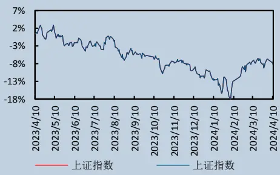

## 相关研究报告

## 一、简介

财经新闻数据构成了金融市场分析和决策的坚实基础，它涵盖了市场动态、宏观经济指标、公司业绩等多维度的关键信息，成为主动投资管理中不可或缺的决策参考。在量化投资的实践中，传统的结构化数据分析方法虽然广泛应用，但面对新闻数据中的非结构化信息，传统算法如情感分析和关联分析等往往只能捕捉到信息的一部分，无法全面挖掘和利用新闻数据的全部价值。

随着大型语言模型技术的兴起，其在金融领域的应用潜力逐渐被挖掘和实现。这些模型以其卓越的文本分析和理解能力，为非结构化信息的处理提供了新的解决方案。本文中，我们探索了将新闻数据与大型语言模型相结合的可能性，构建了一个本地化的 RAG（Retrieval-Augmented Generation）系统。该系统依托于大型语言模型的深度分析能力，对新闻数据进行综合处理和分析。

进一步地，我们利用大型语言模型预测的信号，构建了行业轮动和市场择时策略。实证结果显示，结合大型语言模型的分析能力所制定的策略，取得了显著优于基准的表现。这一成果不仅突显了大型语言模型在金融决策中的潜在价值，也为量化投资领域提供了新的研究路径和实践方法。

本地化 RAG（Retrieval-Augmented Generation）系统的实施，为执行多样化的下游任务提供了强有力的支持。其中，预测信号的生成仅仅是其众多功能中的一项。传统的、需要大量人力资源并繁琐复杂的任务，现在可以高效地交由大型语言模型来处理。随着技术的进步和模型能力的提升，大型语言模型的应用预计将广泛渗透至各个行业领域，成为推动行业发展、提高工作效率和创新决策过程的关键力量。在未来，我们可以预见大型语言模型将在各行各业发挥更加深入和广泛的作用，引领行业变革，开创智能化工作的新篇章。

## 二、数据

财经新闻数据是金融市场分析和决策的重要基础，提供了市场动态、宏观经济指标、公司业绩等多方面的关键信息。各大财经网站每日均会产生大量的新闻文本数据，为了进一步聚合分析这些数据，需要对新闻文本做一系列处理。

## 2.1 数据简介

本研究利用聚源数据汇总的各大财经媒体发布的新闻数据。为确保分析数据的新颖性，避免其已被广泛应用于大型模型训练，本研究选取了 2023 年及以后，主流财经网站发布的新闻文本数据进行分析。数据集总计包含超过 50 万条新闻样本，日均新闻样本数量的中位数达到 1061 条。就单条新闻的字段长度而言，中位数为 519字，平均值为 826 字；最长的新闻报道包含超过 10 万字，而最短的仅含 11 字。此数据集的广度与深度，为本研究提供了一个丰富的信息源，以支撑后续的分析与探讨。

图 1:新闻数据样例

| ID InfoType | InfoPublDate | MediaCode | Media | Category |  |  | Content | Writer | Author | ObjectCode | AreaCod |
| --- | --- | --- | --- | --- | --- | --- | --- | --- | --- | --- | --- |
| 567070174643 | 2017-12-20 00:00:00.0 | 120 | 聚源数据 | 71 | 今日要闻1220 | 一、宏观【央行】四季度，企业家宏观更多 |  |  |  | 1000 | 142 |
| 567075986789 | 2017-12-20 00:00:00.0 | 120 | 聚源数据 | 61 | 晨会汇编1220 | 一、宏观 | 此前公布的11月经济数据显示，环保等更多 |  |  | 1000 | 142 |
| 567054922845 | 2017-12-20 00:00:00.0 | 2 | 证券时报 | 52 | 下游备货需求支撑沪胶上涨 | 12月12日泰国当局准备启动—项总金额186亿泰铢的更多 |  | 华泰期货 陈莉 |  | 3110 | 142 |
| 567052387495 | 2017-12-20 00:00:00.0 | 1 | 中国证券报 | 52 | 黄金多头需多加警惕 | 因投资者提前消化了美联储加息预期，上周金价在美联储宣更多 |  | 美创蠢裕 杨艺 |  | 3130 | 7 |
| 567093278115 | 2017-12-20 00:00:00.0 | 99 | 金融界 | 51 | 用黄金对冲市场长尾风险 | 里克·拉凯尔:从长期衡量,对冲策略对投资者来说是很重要的更多 |  |  |  | 3130 | 142 |
| 567090716087 | 2017-12-20 00:00:00.0 | 99 | 生意社 | 51 | 华安期货：贵金属前期多单谨慎持有 | 生意社12月20日讯 | 【市场分析】:隔夜第三季度更多 | 华安期货 |  | 3130 | 7 |
| 567090734931 | 2017-12-20 00:00:00.0 | 99 | 生意社 | 51 | 国信期货：税改表决在即 金银走势谨慎 | 生意社12月20日讯 | 周二外盘金银走弱细约金主更多 | 国信期货 |  | 3130 | 7 |
| 567078813256 | 2017-12-20 00:00:00.0 | 146 | FX168 | 51 | 世界黄金协会:买入黄金作为战略对冲吧！ | FX168财经报社(香港)讯世界黄金协会投资研究主管胡更多 |  |  |  | 3130 | 7 |
| 567077049891 | 2017-12-20 00:00:00.0 | 99 | 中国经济网 | 51 | 黄金价格不温不火金饰消费需求预期平淡 | 对于全球黄金珠宝的需求驱动因素有两种一种是黄金的价格，更多 |  |  |  | 3130 | 142 |
| 567071589105 | 2017-12-20 00:00:00.0 | 146 | FX168 | 51 | 【现货黄金收盘】美税改法案一波三折黄金徘回不前陷盘整 | FX168财经报社(香港)讯现货黄金周二(12月19日更多 |  |  |  | 3130 | 7 |
| 567069212687 | 2017-12-20 00:00:00.0 | 146 | FX168 | 51 | 技术分析顾:黄金面临进一步反弹风险创指1270.36阳力区更多 | FX168财经报社(香港)讯 FXTechstrateg更多 |  |  |  | 3130 | 7 |
| 567069227700 | 2017-12-20 00:00:00.0 | 146 | FX168 | 51 | 黄金日内交易分析随机波动显示超买预期下跌 | FX168财经报社(香港)讯，资讯网站Economies更多 |  |  |  | 3130 | 7 |
| 567050361798 | 2017-12-20 00:00:00.0 | 1 | 中国证券报 | 51 | 博时基金王祥：黄金短期压力犹在 | 上周黄金市场表现继续被美国的两件大事——美联储加息和更多 |  | 姜沁诗 |  | 3130 | 7 |
| 567046180653 | 2017-12-20 00:00:00.0 | 38 | 每日经济新闻 | 51 | 朱昂此特币一年涨20倍?别只见投资者吃肉忘了投机客“跳楼更多 |  |  | 朱昂 |  | 3120 | 7 |
| 567052235197 | 2017-12-20 00:00:00.0 | 1 | 中国证券报 | 51 | 陕西苹果产业热盼苹果期货上市 | 苹果期货将于12月22日在郑商所上市,这对产量位居全更多 |  | 马爽 |  | 3110 | 142 |
| 567052342010 | 2017-12-20 00:00:00.0 |  | 中国证券报 | 51 | 沪镍短期存在支撑 | 12月7日以来,沪镍结束持续了一个月的跌势,企稳反弹更多 |  | 张利静 |  | 3130 | 142 |
| 567052279182 | 2017-12-20 00:00:00.0 | 1 | 中国证券报 | 51 | 海南琼中天胶“保险+期货”完成理赔 | 12月15日下午海南琼中县政府在琼中县委政府大楼6更多 |  | 马爽 |  | 3110 | 142 |
| 567052308928 | 2017-12-20 00:00:00.0 | 1 | 中国证券报 | 51 | 大商所银期合作多点开花 | 2017年，大商所继续鼓励期货公司会员与以银行为代表更多 |  | 马爽 |  | 2345 | 142 |
| 567052209329 | 2017-12-20 00:00:00.01 |  | 中国证券报 | 51 | 天然气涨价引爆农资行情农产品投资布局机会几何 | 随着气温降低,农资市场进入淡季,但今年的化肥市场却出更多 |  | 张利静 |  | 3110 | 142 |
| 567098904685 | 2017-12-20 00:00:00.0 | 19 | 中国证券网 | 50 | 国债期货收涨10年期债主力合约涨0.03% | 中国证券网讯12月20日.国债期货收盘上涨10年期债更多 |  |  |  | 3153 | 142 |
| 567099151678 | 2017-12-20 00:00:00.0 | 14 | 和讯 | 50 | 有色齐飘红沪铝反超郑醇焦炭跌幅扩大逾2% | 和讯期货消息周三(12月20日)商品市场午后仍波澜不惊更多 |  |  |  | 3100 | 142 |
| 567098883352 | 2017-12-20 00:00:00.0 | 158 | 证券时报网 | 50 | 国债期货小幅收高十年期主力合约涨0.03% | 证券时报网12月20日讯 | 周三(12月20日).更多 |  |  | 3153 | 142 |
| 567097820519 | 2017-12-20 00:00:00.0 | 158 | 证券时报网 | 50 | 商品期货收盘涨跌互现焦炭跌超2% | 证券时报网12月20日讯 | 周三(12月20日),更多 |  |  | 3100 | 142 |
| 567093214714 | 2017-12-20 00:00:00.0 | 99 | 金融界 | 50 | 央行黄金透明化的遗产 | 德国2017年“黄金回家”运动完结的遗产，将在未来长期影更多 |  |  |  |  | 1 |
| 567093252860 |  | 2017-12-20 00:00:00.0 99 | 金融界 | 50 |  |  |  |  |  | 3130 3130 | 142 |

数据来源：聚源数据，中信建投证券

## 2.2 数据清洗

在汇总的新闻数据库中，不同的财经媒体偶尔会发布相同的新闻信息，为避免后续查询到相同的内容，首先需要对文本进行去重处理。本文采用 SimHash算法对文本进行去重。

SimHash 是 google 于 2007 年发布的一篇论文《Detecting Near-duplicates for web crawling》中提出的算法，被应用在 Google 搜索引擎网页去重的工作之中。该算法的核心思想是将高维的特征向量映射到一个低维的二进制签名中，通过比较两个文本的二进制签名来确定它们的相似性。

算法的具体流程为：

1.分词与特征提取：首先对文本进行分词，提取关键词作为特征向量。

2.特征加权：对提取出的关键词进行加权处理，常用的权重计算方法包括词频（TF）和逆文档频率（IDF）。

3.哈希降维：使用哈希函数将每个特征转换为二进制的哈希值，通常为固定位数，如 64 位。

4.加权向量合并：将所有特征的加权哈希值合并成一个向量，并进行加权求和。

5.降维得到签名：对合并后的向量进行降维处理，根据每个维度的和是否大于 0 来确定最终的二进制签名，大于 0 则为 1，否则为 0。

6.相似度判断：通过比较两个文本的 SimHash签名的海明距离（即不同位数的个数）来判断它们的相似度。

海明距离越小，文本越相似。

以以下三个新闻文本为例，分别计算三个文本间的海明距离，对于不同样本，如果海明距离小于 3，则认为是重复样本。

S1: 美团抢占香港市场!KeeTa 来了

S2: 打工人利好!上海租赁住房又有新动作!

S3: 神舟十六号计划近日择机实施发射 船箭组合体转运至发射区

表 1:新闻文本海明距离

|  | S1 | S2 | S3 |
| --- | --- | --- | --- |
| S1 | 0 | 30 | 33 |
| S2 | 30 | 0 | 29 |
| S3 | 33 | 29 | 0 |

资料来源：聚源数据，中信建投证券

其他的清洗步骤包括：去除特殊符号，剔除太长或者太短的新闻文本，剔除非专业新闻媒体信息等。最终得到了 44 万条不重复的新闻文本数据，总文本长度约为 4.3 亿字段。

## 三、RAG

虽然目前大模型对于长上下文的推理效率不断提高，但是依然难以一次性处理上述上亿长度的文本数据，如果采用重新预训练大模型或者微调模型的方式，训练成本会急剧增加。对于具体方案的采用可以参考下图：

图 2:大模型方案决策流程
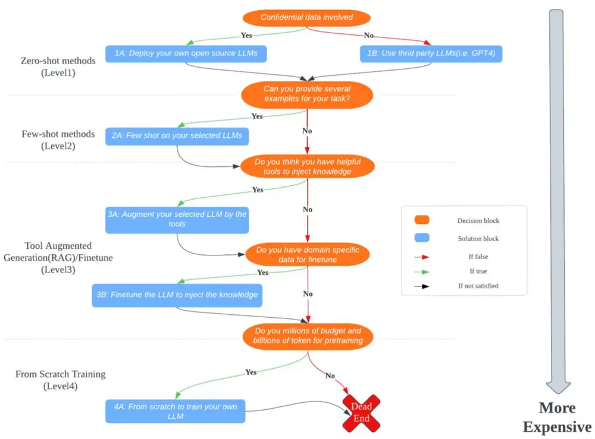
Large Language Models in Finance: A Survey

在综合效率和成本考量之后，本文采用 RAG 框架分析新闻文本数据。检索增强生成（Retrieval-AugmentedGeneration，简称 RAG）是一种结合了信息检索和文本生成的技术，旨在提升大型语言模型（Large LanguageModels，简称 LLMs）的性能和输出的准确性。RAG 通过从外部知识库检索相关信息，辅助 LLMs 生成更准确、更丰富的回答，同时减少模型幻觉的问题。

RAG 的核心在于两个组件：信息检索（Retrieve）和文本生成（Generate）。在接收到用户的查询后，RAG首先使用检索组件在大型的知识库或文档集合中搜索与问题相关的信息。这一过程类似于人在图书馆中查找相关书籍以回答某个问题。检索到的信息随后被用作文本生成组件的输入，该组件负责根据检索到的信息生成一个连贯、准确的回答。

图 3:RAG 架构
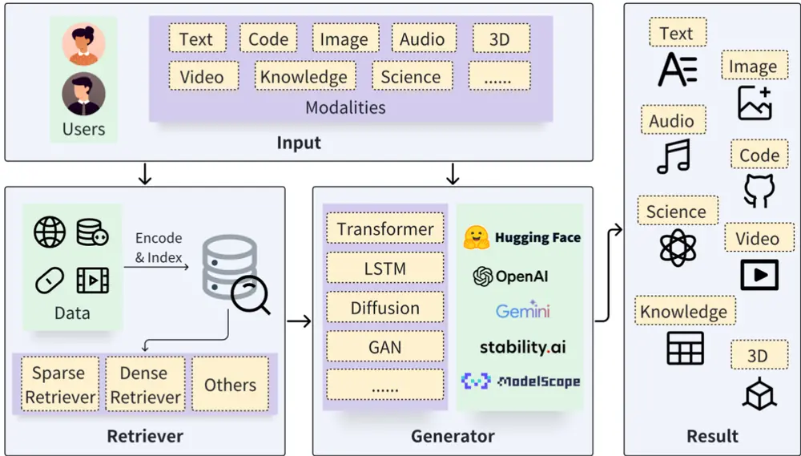
Fig. 1. A generic RAG architecture. The users’ queries, which may be different modality, serve as input to both the retriever and the generator. The retriever searches for relevant data sources in storage, while the generator interacts with the retrieval results and ultimately produces results of various modalities.
Retrieval-Augmented Generation for AI-Generated Content: A Survey

RAG 的主要优势在于其能够提高答案的准确性和相关性。通过引用外部知识库中的信息，RAG 可以提供更准确的回答，增加用户信任。此外，RAG 便于知识更新和引入特定领域知识，有效解决了知识更新的问题。RAG 还可以根据特定领域进行定制，为特定领域提供知识支持。

在检索增强生成（Retrieval-Augmented Generation, RAG）框架的领域内，LangChain 和 LlamaIndex 是两个广受推崇的技术解决方案，它们均旨在为大型语言模型（Large Language Models, LLMs）的应用开发提供支持。这两个框架均装备了一系列高级组件和工具，用以增强开发者构建复杂应用的能力。

在本研究中，我们将重点探讨利用 LangChain框架中的组件来开发一个本地化的 RAG 系统。该系统旨在结合 LangChain 的灵活性和高效性，以实现对 LLMs 的优化利用，并提升其在财经新闻分析场景中的性能。通过精心选择和集成 LangChain 所提供的功能模块，我们期望该本地化 RAG 系统能够更好地适应特定的数据处理需求，同时保持与现有技术的兼容性和扩展性。

## 3.1 信息检索-向量数据库

为了便于后续检索，首先需要将新闻文本数据存储于向量数据库。向量数据库专门设计用于存储和处理向量数据，这些向量通常是由文本、图像、音频和视频等非结构化数据通过机器学习模型、词嵌入或特征提取技术转换而来。与传统数据库不同，向量数据库的核心优势在于其能够高效地进行高维向量相似性检索，非常适用于机器学习和人工智能应用中，如图片识别、自然语言处理、推荐系统等。

在传统的字符串匹配方法中，检索过程依赖于对文本内容的精确匹配，这在处理大量数据时往往会遇到性能瓶颈，并且难以准确捕捉文本的语义信息。然而，向量空间模型通过将文本转换为数值向量，不仅能够有效地降低计算复杂度，提高检索效率，而且还能够通过计算向量之间的相似度来实现基于语义的检索。

图 4:数据索引
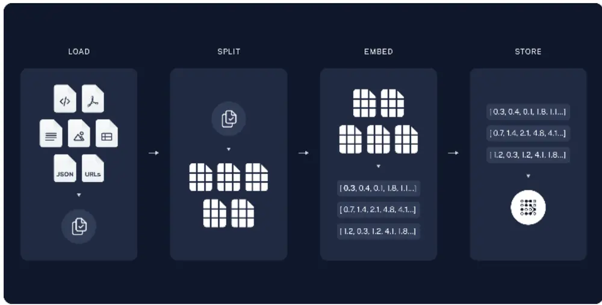
Langchain

向量数据库的主要特点包括高度可扩展性、高效的相似性搜索能力和对高维数据的支持。它们使用称为“近似最近邻”(Approximate Nearest Neighbor, ANN)搜索的搜索技术，这包括哈希和基于图的搜索等方法，以实现快速准确的相似性检索。

目前市面上存在多种向量数据库产品和开源项目，例如 Chroma、Pinecone、Weaviate、Faiss 和 Qdrant 等，它们各自提供了不同的功能和特性，以满足不同应用场景的需求。随着人工智能和机器学习技术的不断进步，向量数据库在数据检索、处理和分析方面的作用将变得越来越重要，它们有望在各个领域提供更复杂、更高效、更个性化的解决方案。

本文采用 Milvus 数据库，Milvus 是一款开源的向量数据库，专为海量特征向量的相似性搜索而设计。它基于异构众核计算框架，能够在有限的计算资源下实现高效能和低成本的搜索，支持十亿级别的向量搜索仅需毫秒级响应。

图 5:milvus 数据库
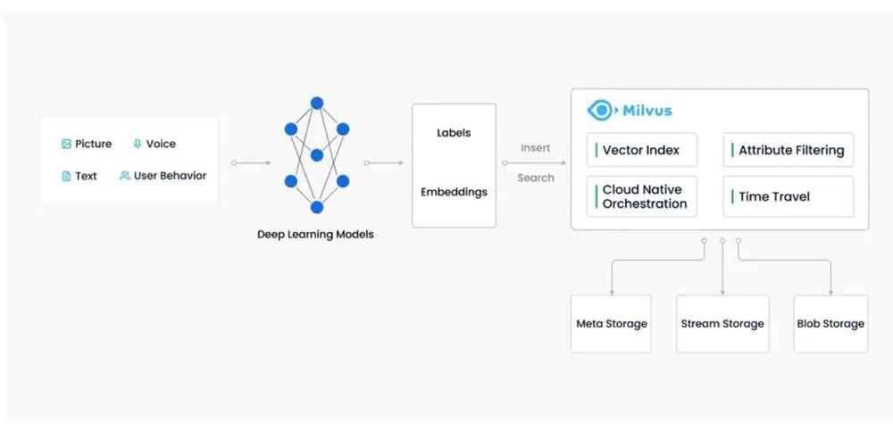
数据来源：milvus，中信建投证券

数据导入流程主要包括以下几个步骤：

## 3.1.1 文本切分

首先加载原始数据，Langchain 提供了一系列数据加载工具，包括 WEB、PDF、JSON、CSV 等各种结构和非结构化数据。我们将清洗之后的新闻文本数据加载。

加载完成后需要对文本进行切分，切分的主要目的是为了提高检索效率，增强检索的准确性，为后续大模型提供输入，提高大模型对于信息的理解。常用的文本切分方式包括句子切分、词语切分、短语切分、基于规则切分、基于模型切分等。Langchain 的 TextSplitter 中提供了许多函数用于切分数据，本文采用默认的RecursiveCharacterTextSplitter 对新闻数据进行切分。RecursiveCharacterTextSplitter（递归字符文本分割器），会通过不同的符号递归地分割文档，同时兼顾文本的长度以及重叠部分的长度。默认使用“\n\n” ,"\n" ," ",""这四个特殊字符进行切分。

我们将子文本长度设为 500，最终原始 4.3 亿字段的文本切分为了 94 万个子文本。切分后的子文本具体样例如下所示，可以看出，经过切分之后的子文本依然保持了较好的结构以及完整的信息。

## 图 6:子文本样例

新型工业化发展潜力巨大。以工业互联网为例，目前已应用于 45 个国民经济大类，2022 年产业规模超万亿元。从实践来看，以工业互联网赋能产业发展，有利于推动实体经济实现数字化转型，并通过生产方式、经营模式的重塑，使企业实现降本、提质、增效，进一步激活实体经济发展活力。

海尔集团从 2007 年开始探索工业互联网，于 2017 年正式推出卡奥斯工业互联网平台。现在，卡奥斯工业互联网平台已经链接企业 90 万家，服务企业 8 万多家。

通过一线走访调研，周云杰发现我国工业数据的应用仍处于中低端水平，自主可控能力不强，主要存在三个方面的问题：一是“大而不强”，数据很多，但被有效挖掘和利用的比例不高。二是“全而不优”，在资源配置与系统实现价值增值方面，多数平台的数据分析处理能力还有待提高。三是“广而不通”，从平台间数据互联互通的角度看，数据壁垒林立，平台间数据流通阻力较大。

数据来源：聚源数据，中信建投证券

## 3.1.2 文本嵌入

文本嵌入（Embedding）是指将文本映射为嵌入向量的过程。通过嵌入向量，能够完成多种自然语言任务，包括语义相似度，文本聚类，文本分类，信息检索，问答系统，自然语言理解，翻译等。

文本嵌入模型一般采用预训练模型，也可根据实际任务进行微调。常用的中文预训练 embedding 模型有OpenAI 的 text-embedding-ada-002，MOKA 的 m3e，阿里的 gte，智源的 bge 等，各模型的表现可参考 Huggingface的 MTEB Chinese leaderboard。本文采用目前中文模型中表现最好 acge_text_embedding 模型，模型来自于合合信息技术团队，模型输出维度为 1792 维。

图 7: MTEB Chinese leaderboard

| Rank | Model | Model Size(MillionParameters) | MemoryUsage(GB,fp32) | Embedding | Max A | Average(35 | ClassificationAverage (9datasets) | ClusteringAverage (4△ | PairClassification | RerankinAverage |
| --- | --- | --- | --- | --- | --- | --- | --- | --- | --- | --- |
|  |  |  |  | Dimensions | Tokens | datasets) |  | datasets) | Average (2datasets) | (4datasets |
|  | acge_text_embedding | 326 | 1.21 | 1792 | 1024 | 69.07 | 72.75 | 58.7 | 87.84 | 67.98 |
|  | QpenSearch-text-hybrid |  |  | 1792 | 512 | 68.71 | 71.74 | 53.75 | 88.1 | 68.27 |
|  | stella-mr1-large-zh-v3.5-17924 | 326 | 1.21 | 1792 | 512 | 68.55 | 71.56 | 54.32 | 88.08 | 68.45 |
|  | stella-large-zh-v3-1792d | 325 | 1.21 | 1792 | 512 | 68.48 | 71.5 | 53.9 | 88.1 | 68.26 |
|  | IYun-large-zh | 326 | 1.21 | 1024 | 1024 | 68.44 | 71.68 | 54.4 | 86.7 | 68.66 |
|  | Baichuan-text-embedding |  |  | 1024 | 512 | 68.34 | 72.84 | 56.88 | 82.32 | 69.67 |
|  | stella-base-zh-v3-1792d | 102 | 0.38 | 1792 | 1024 | 67.96 | 71.12 | 53.3 | 87.93 | 67.84 |
|  | Dmeta-embedding-zh | 103 | 0.38 | 768 | 1024 | 67.51 | 70 | 50.96 | 88.92 | 67.17 |
| 9 | xiaobu-embedding | 326 | 1.21 | 1024 | 512 | 67.28 | 71.2 | 54.62 | 85.3 | 67.34 |
|  | alime-embedding-large-zh | 326 | 1.21 | 1024 | 512 | 67.17 | 71.35 | 54 | 84.34 | 67.61 |

Huggingface, MTEB: Massive Text Embedding Benchmark,

## 3.1.2 向量数据库

将 94 万个子文本进行 Embedding,最终得到 94 万个 1792 维的向量。为了便于向量检索以及更新维护，我们将这些向量存入向量数据库 Milvus，同时建立索引。

图 8:Milvus 数据库

| id | content | embedding |
| --- | --- | --- |
| 202301100572 | 刘永好提出了三点期望，一是开放产业链场景... | [0.939434289932251,-0.39178070425987244,0.70019221305... |
| 202301171441 | 中科智云CEO魏宏峰表示：“本轮融资获得国... | [0.4511127471923828,-0.34871649742126465,0.0341370254... 石 |
| 202301301015 | 中联重科塔机也尽显冠军风采，近200台车辆.. | [-0.5770382881164551,-0.6579735279083252,0.1708573251... 石 |
| 202302140958 | 发展目标方面，无锡明确，到2025年，4个地... | [-0.47468364238739014,-1.1363041400909424,0.643926739.. |
| 202302140959 | 据介绍，接下来，无锡将从聚力“点上突破”、... | [-0.39946335554122925,-1.2588121891021729,0.755948603... |
| 202302180179 | “腾讯与英雄体育创始团队有着超过10年的合... | [0.15596646070480347,-0.3445884585380554,0.6469076871... |
| 202302282390 | 国务院发展研究中心研究员龙海波认为，近年... | [-0.02081798017024994,-0.99114799499512,1.389866590... |
| 202303022719 | 49.40.47月/202249-1.26月202250.20.6 ... | [0.13812440633773804,-0.07461628317832947,-0.61001300... 石 |
| 202303022721 | 第三、需要充足的资金资源支撑。5G专网需要... | [-0.08412420749664307,-0.7554672360420227,0.392598509... 石 |
| 202303030506 | 《“十四五“机器人产业发展规划》指明了行业... | [0.04108317196369171,-0.9005208015441895,0.8228790760... |
| 202303070249 | 李毛还建议，制定科技创新扶持保障条款，进... | [-0.15385347604751587,-1.3535751104354858,0.644967615... 石 |
| 202303070250 | 林孝发表示，我国“5G+工业互联网“蓬勃发展... | [-0.38023823499679565,-1.5089430809020996,0.531789422... 石 |
| 202303281500 | 达闵机器人研发总监梁聪慧则表示，要不计成... | [-0.33609819412231445,-0.8049595355987549,0.270133137... 石 |
| 202303300386 | 王江平表示，中国制造业现在正处于从内部资... | [0.05631847679615021,-0.6416276097297668,0.4433850347... |
| 202303311410 | “数字经济下半场是和实体经济相融合的，特别.. | [0.2195495218038559,-0.9360710382461548,1.01595330238... |
| 202304140654 | 还是以卫浴行业的九牧为例，在数智化加持下... | [-0.02033466100692749,-0.49046623706817627,0.57840633... 石 |

数据来源：聚源数据，中信建投证券

在进行文本数据分析的过程中，内积计算作为一种有效的数学工具，能够用于量化文本向量之间的相似性，从而实现相关新闻文本数据的精确提取。以内积为基础的相似度评估方法，通过计算两个向量的点积并将其与各自模长的乘积进行比较。

以 2024 年 3 月 29 日关于贵州茅台的新闻报道为例，在预先构建的向量数据库中高效地检索出与该主题相关的新闻数据。

图 9:新闻检索

| id | score | content |
| --- | --- | --- |
| 202403291387 0 | 250.16969299316406 | 公司酒标业务主要产品为茅台(1935)、贵州茅台酒(癸卯免年)、贵州茅台王子酒(癸卯免年)、茅台醇系列酒、习酒系列酒、舍得系列酒、国台系列酒等产品品牌。2023年，公司酒标整体订单量 |
| 202403291420 0 | 237.42054748535156 | 会上，茅台集团党委副书记、工会主席、监事会主席游亚林总结了推动茅台发展的三点精髓：第一品质是茅台的制胜法宝，要确保每一瓶酒品质如一，时问的沉淀、空问的孕育、工法的坚守缺 |
| 202403292301 0 | 200.41099548339844 | 富邑葡萄酒集团方面对《证券日报》记者称，接下来，集团将开始逐步扩大在中国的高端奢华系列中澳大利亚葡萄酒的产品布局，并将增加对本地的销售和市场营销的资源投入。与此同时，公 |
| 202403291421 石 | 196.8500518798828 | 财经作家、《茅台传》作者吴晓波在主题演讲环节，分享了他在创作《茅台传》过程中的观察和思考。吴晓波表示，企业和人一样，需要在快与慢之问做出选择。而茅台集团与自己过去关注的 |
| 202403291778 0 | 182.07830810546875 | 2024-03-29发布：《聚合力解难题让“多彩“更“多产“上交所会同多部门走进贵州上市公司》自国务院召开部署走访上市公司工作、推动上市公司高质量发展全国视频会议以来，沪市公司的走访调 |
| 202403292204 0 | 178.45327758789062 | 为进一步优化供应网络布局，2023年公司旗下库尔勒酒厂罐装生产线竣工，该酒厂总产能将达每年15万千升。万州酒厂在2023年末复产，有效支持了市场需求的增长。佛山酒厂建设进展顺利， |
| 202403292611 0 | 172.80343627929688 | 在2024年3月21日发布年度新品“青的奖“中，公司旗下重庆精酿白啤、风花雪月桃花味低醇啤酒和布鲁克林皮尔森均获得2023年度“青酌奖"，体现了业内对重啤股份产品的高度认可。2024年初： |
| 202403292310 0 | 168.6273193359375 | 佛山酒厂建设进展顺利，预计在2024年第二季度投产，年产能将达到50万千升，年产值约20亿元，在供应广东市场的同时，辐射华南周边市场，大幅降低物流运输费用，更好满足粤港澳大湾 |

数据来源：聚源数据，中信建投证券

## 3.2 文本生成

通过将用户的查询问题与检索得到的相关信息进行有效整合构建出提示词（prompt），我们可以为大型语言模型提供明确且有针对性的输入。这种方法引导模型进行更为深入的分析、全面总结以及逻辑推理，从而显著降低了模型产生错误或偏差（即“幻视”）的可能性，并有效提升了模型在处理复杂问题时的表现和准确性。

图 10:文本生成
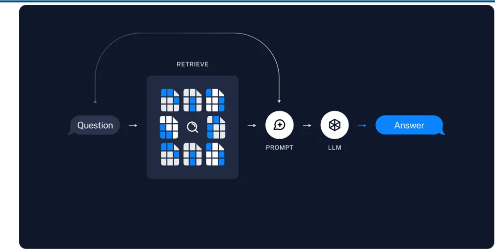
Langchain,

## 3.2.1 大模型部署

相较于商业性质的人工智能模型，开源大型语言模型展现出了更高的灵活性和可定制性。在遵守相应的许可协议的前提下，开发者和研究者可以对开源模型进行深入的再加工和优化，以适应特定的应用场景和需求。

这种灵活性使得开源大模型能够被有效地整合进各种下游任务中，例如自然语言处理、机器翻译、情感分析等。通过对模型结构、训练数据集或优化算法的调整，开发者可以根据具体任务的特点和挑战，提升模型的性能和准确度。

随着模型参数的增加，以及新技术的提出，大模型的表现不断提高，在 Huggingface 的 leaderboard 中，大模型的表现不断逼近甚至超越人类水平。

图 11:大模型平均表现变化
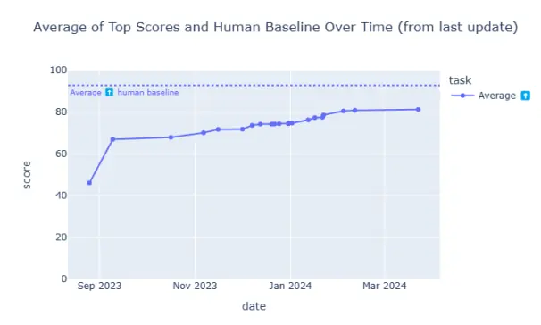
数据来源：

图 12:子任务得分最高的大模型表现变化
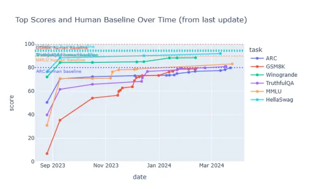
https://huggingface.co/spaces/HuggingFaceH4/open_llm_leaderboard ，中信建投证券
数据来源：
https://huggingface.co/spaces/HuggingFaceH4/open_llm_leaderboard ，中信建投证券

目前在 leaderboard 上排名靠前的大模型如下图所示：

图 13:Open LLM Leaderboard
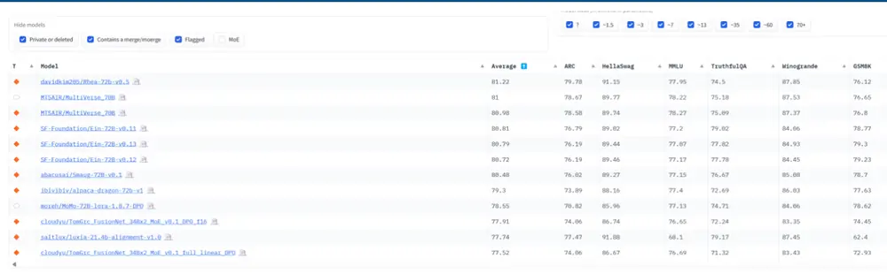
https://huggingface.co/spaces/HuggingFaceH4/open_llm_leaderboard

为了促进大语言模型（LLM）的本地化部署，本研究选用了 ollama 框架作为技术支撑。ollama 框架是一个支持跨平台的开源解决方案，专门设计用于通过 Docker 容器技术进行 LLMs 的部署与维护，从而显著降低了部署大型语言模型的技术门槛。

该框架内置了一系列广泛使用的 LLM 模型，如 Llama2、Gemma、Mistral、Mixtral、Qwen 及 Yi 等，此外，ollama 还支持通过 Modelfile 文件来管理和执行本地下载的 LLM 模型，为用户提供了更高的灵活性和自主性。

其中 Mixtral 模型是由 Mistral AI 公司开发的一种先进的人工智能模型，该模型的设计旨在提高处理效率和准确度，同时降低计算成本。Mixtral-8x7B 是基于 Mistral 7B 的 MoE（Mixture of Experts）模型，它通过引入MoE 结构来进一步提升性能。MoE 结构的核心思想是将一个大型网络分解为多个专家（Experts），每个专家负责处理特定类型的任务或数据。在实际应用中，根据输入数据的特性，通过一个门控机制（Gate）来选择性激活相应的专家进行计算，这样可以提高模型的专注度和效率。

结合各种前端框架，ollama 框架使得调用和集成各类大型语言模型变得异常简便。通过这种方式，用户可以轻松构建出功能强大的自然语言处理应用。

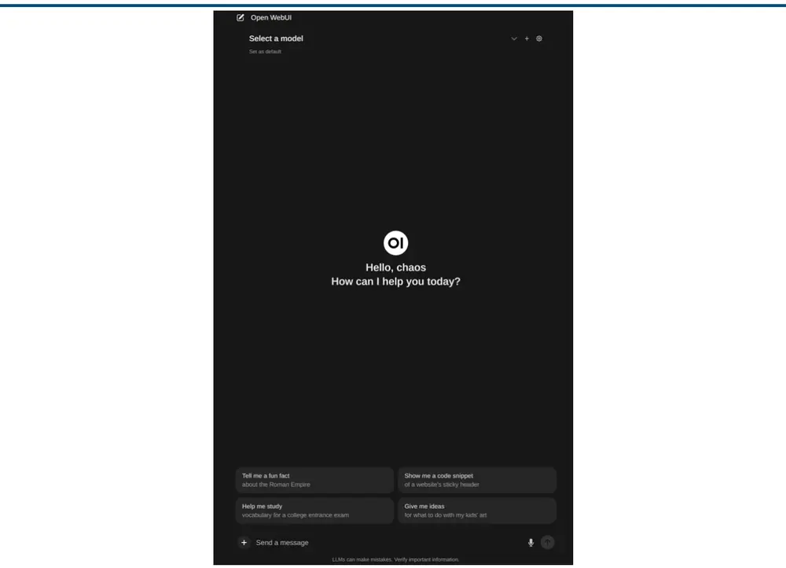
图 14: OLLMA + Open WebUI 前端页面
金融工程深度报告
OLLAMA,

open-webui 结合 ollama 也可以实现简单的 RAG 功能，用户可以通过前台或者后台上传相关文档，交给 LLM模型进行分析。

同时，本地化部署大模型后可以支持 API 调用，兼容 OpenAI 的函数接口，可以将 API 和插件和软件相结合，提供更加丰富的使用场景。

图 15:手机端调用 OLLAMA API
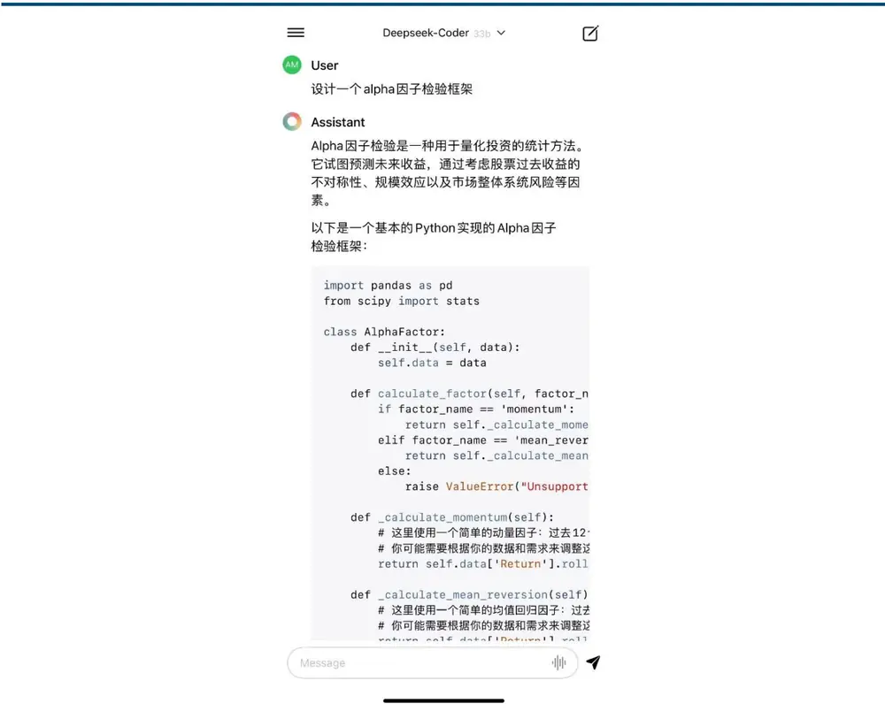
数据来源：OLLAMA，中信建投证券

## 3.2.2 文本生成

在部署大型语言模型（LLM）之后，系统将能够依据用户提出的问题，并结合向量数据库中存储的相关信息，生成精准的提示词。随后，这些提示词将被用于引导 LLM 生成相应的答案。

为了确保模型管理的高效性和便捷性，我们使用 Langchain 提供的 LLMs 接口。Langchain 的接口不仅支持对本地模型的便捷管理，而且通过其强大的接口功能，我们同样能够轻松地调用包括 GPT、Moonshot 等在内的商业大模型。这种灵活性极大地丰富了我们对不同模型资源的访问能力，同时也为后续的模型集成和应用开发提供了坚实的基础。

以科技行业 2024 年 3 月 29 日新闻为例，要求 LLM 将查询得到的相关新闻进行总结，得到以下结果：

1.科技金融是未来金融发展的重要方向，建设银行在深圳成立了科技金融创新中心，将加快推进科技金融业

务的创新和发展。

2.5G-A是 5G 向 6G 发展的关键阶段，具备更高速率、更大连接、更低时延等特点。运营商作为 5G-A策源地将协同产业链，不断引领关键技术导入并打造标杆应用，5G-A商用化落地或增厚新兴业务收入。无线主设备、天线、射频等设备厂商也将迎来新成长空间。

3.随着 AI 在各领域的应用延伸，手机、服务器、PC 中 DRAM 和 NAND 单机平均搭载容量均有成长，三星、SK 海力士及美光全面调升上半年稼动率。受益于价格的持续回暖，以及 HBM 和 DDR5 等高端产品的需求增长，存储芯片板块上下游公司有望充分受益。

4.科东软件与英特尔在工业 AI 机器人领域展示了双方的合作成果，这也是对未来工业生产智能化的一次大胆预见。随着汽车走向端到端智能驾驶，行业最终向 AI 定义汽车的方向演进，单车也更接近一个通用 AgentAI，随着未来世界模型的接入将成为通用机器人落地的首个场景。

可以看出，文本中虽然不一定包含有科技相关的文本，但是通过语义检索以及分析，LLM 依然成功的总结出了当日科技相关的新闻。

## 四、RAG用于市场分析

传统投资领域的专业人士每日肩负着分析庞杂新闻资讯的重任，旨在从中甄别出对市场趋势具有重大影响力的信息。这一过程不仅要求投资者具备深厚的专业知识和丰富的实践经验，还需要投入大量的时间和精力进行细致的研读与分析。

通过利用大型语言模型（LLM）的先进数据分析和推理能力，结合本地化的检索增强生成（RAG）系统，我们能够高效地执行这一任务。投资者可以根据个性化需求，指导 对新闻资讯进行深度分析，并生成相应的分析结果。在本研究中，我们运用 LLM 对市场趋势进行预测，并制定相应的市场择时和行业轮动策略。

为确保所分析的信息的新颖性，避免使用已用于模型训练的数据，本研究选取了 2023 年之后的新闻数据进行周频市场预测。

在使用 LLM 进行预测时，我们构建了一个模拟资深分析师的代理（Agent），该代理专门负责分析新闻数据和市场状况，并预测市场的未来走势，同时按照既定格式输出分析结果。为减少模型输出的不确定性，我们将温度参数（temperature）设为 0，同时设置 top_k 为 1，确保每次预测的唯一性。

## 4.1 LLM 市场择时

在进行市场未来趋势预测的过程中，我们向代理模型提供了包含过去一周内市场关键新闻资讯及历史表现数据的详尽信息集，以便模型能够基于这些信息生成对未来一周市场走势的预测分析。

在对不同模型的预测能力进行评估时，我们选择了包括 qwen:14b、Mixtral 8x7B、GPT-3.5-Turbo 以及 GPT-4-Turbo-Preview在内的多种模型进行测试。然而，在实际应用中，Gemma、Llama2 等其他模型未能按照预定要求输出有效结果，导致无法进行有效的比较分析。

对于上证综指未来一周涨跌幅进行预测，按照预测信号进行多空择时，最终策略的费前净值如下：

图 16: LLM 上证综指多空择时净值
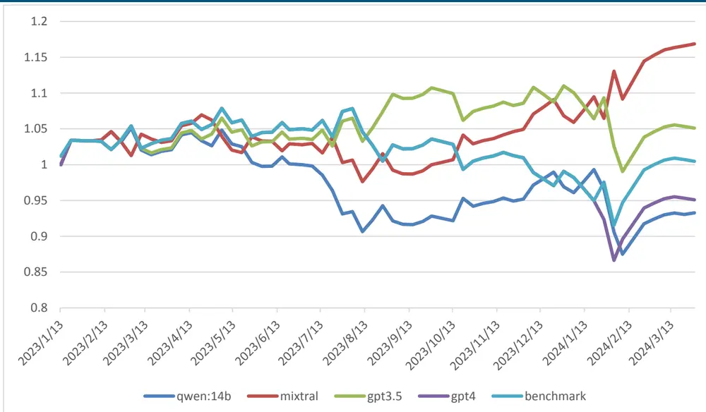
数据来源：聚源数据，中信建投证券

图 17:LLM 上证综指多头择时净值
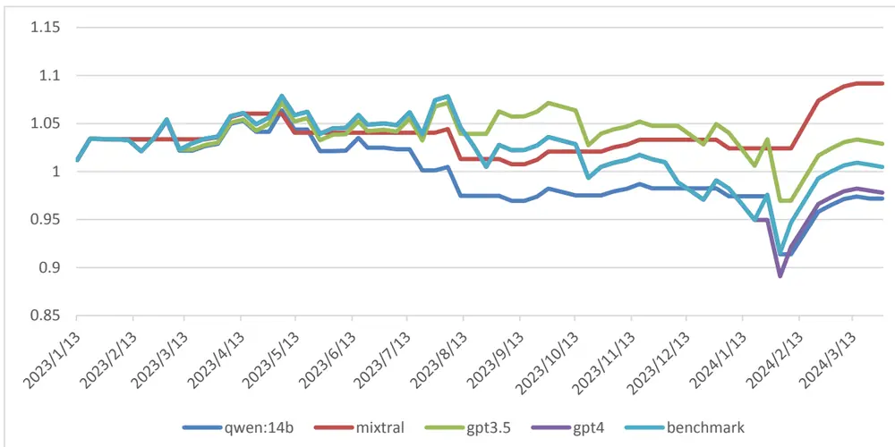
数据来源：聚源数据，中信建投证券

图 18: LLM 上证综指空头择时净值
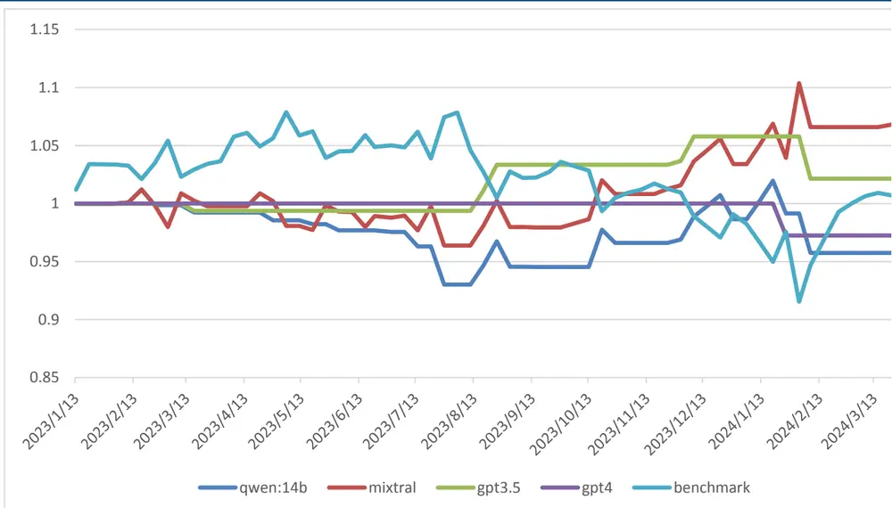
数据来源：聚源数据，中信建投证券

表 2:LLM 多空择时策略表现

|  | 多空年化 收益 | 基准年化 收益 | IR | 最大回撤 | 基准最大 回撤 | 多头年化 收益 | 空头年化 收益 | 准确率 |
| --- | --- | --- | --- | --- | --- | --- | --- | --- |
| qwen:14b | -5.38% | 0.38% | -0.41 | 17.63% | 16.33% | -2.25% | -3.23% | 52.46% |
| mixtral | 13.49% | 0.38% | 1.03 | 9.32% | 16.33% | 7.33% | 5.64% | 60.66% |
| gpt3.5 | 4.08% | 0.38% | 0.31 | 11.96% | 16.33% | 2.31% | 1.72% | 59.02% |
| gpt4 | -3.92% | 0.38% | -0.30 | 21.23% | 16.33% | -1.77% | -2.20% | 54.10% |

资料来源：聚源数据，中信建投证券

从各模型对比可以看出，表现最好的是 mixtral，其次是 gpt3.5, gpt4 以及 qwen:14b 表现较为一般。其中mixtral 的 alpha 达到 13%，择时准确率为 60.66%。

## 4.2 LLM 行业轮动

同样，我们也可以结合新闻数据以及市场状态，要求 LLM 输出推荐行业。具体步骤为：首先在数据库检索过去一周重要的市场新闻。其次将新闻信息和过去一周市场表现结合在一起，要求 LLM 根据这些信息预测未来一周表现最好的五个行业，根据预测信号构建等权组合，周频进行调仓，采用 mixtral 8*7b 模型，基准为 30 个行业等权组合，最终策略费前表现如下：

图 19:LLM 行业推荐
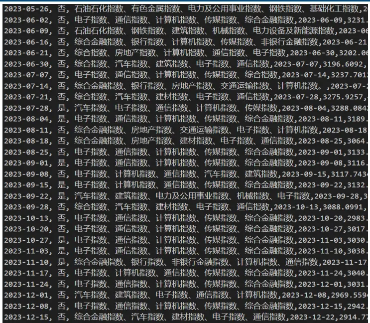
数据来源：聚源数据，中信建投证券

图 20:LLM 行业轮动策略净值
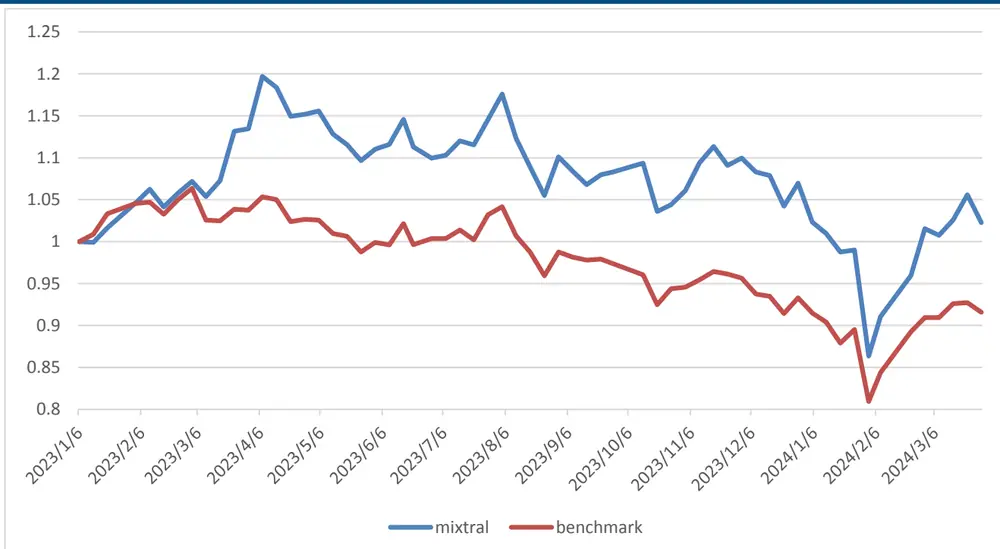
数据来源：聚源数据，中信建投证券

表 3:LLM 行业轮动策略表现

|  | 年化收益 | 最大回撤 | 年化波动率 | IR |
| --- | --- | --- | --- | --- |
| mixtral | 1.81% | 33.33% | 0.22 | 0.08 |
| benchmark | -6.74% | 25.42% | 0.16 | -0.42 |

资料来源：聚源数据，中信建投证券

相较于基准，LLM 行业轮动策略的 alpha 为 8.5%，明显超越基准表现。

## 4.3 LLM行业轮动+择时

将 LLM 行业择时与 LLM 行业轮动进行叠加，构建多头行业轮动择时组合，策略的费前表现如下：

图 21: LLM 行业轮动+择时策略净值
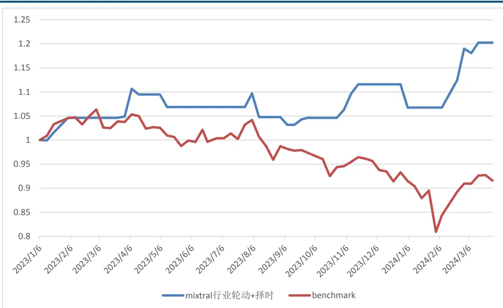
数据来源：聚源数据，中信建投证券

表 4:LLM 行业轮动+择时策略表现

|  | 年化收益 | 最大回撤 | 年化波动率 |
| --- | --- | --- | --- |
| mixtral | 16.20% | 7.51% | 0.12 |
| benchmark | -6.74% | 25.42% | 0.16 |

资料来源：聚源数据，中信建投证券

LLM 行业轮动+择时策略，相较于基准年化 alpha 达到了 22.9%，最大回撤也有明显改善。

## 五、总结

本研究通过融合新闻数据与先进的大型语言模型，成功构建了一个本地化的 RAG（Retrieval-AugmentedGeneration）系统。该系统充分利用了大型语言模型在文本总结、分析和推理方面的强大能力，并结合市场新闻和状态信息，以实现对一系列复杂下游任务的有效处理。

在本研究中，我们依据大型语言模型生成的预测信号，进一步设计并实施了三种策略：市场择时策略、行业轮动策略以及综合行业轮动与市场择时的复合策略。通过对这些策略的实证分析，我们发现 RAG 系统在实际应用中展现出了卓越的性能。

## 风险分析

本报告中所有数据结果是基于历史统计结果的展示，未来有可能发生风格切换导致因子失效的风险。模型运行存在一定的随机性，初始化随机数种子会对结果产生影响，单次运行结果可能会有一定偏差。历史数据的区间选择会对结果产生一定的影响。模型参数的不同会影响最终结果。模型对计算资源要求较高，运算量不足会导致结果存在一定的欠拟合风险。本文所有模型结果均来自历史数据，模型存在统计误差，不保证模型未来的有效性，对投资不构成任何建议。

## 分析师介绍

## 姚紫薇

金融工程及基金研究首席分析师。上海财经大学管理学硕士，厦门大学统计学学士，在基金研究、资产配置、产品设计、财富管理等领域均有长期深入研究。曾担任招商证券基金评价业务负责人，多次获得“新财富”金融工程方向前三（团队核心成员）。

## 王超

南京大学粒子物理博士，曾担任基金公司研究员，券商研究员，有丰富的研究和投资经验，2021 年加入中信建投证券研究所，主要负责量化多因子选股。

## 评级说明

| 投资评级标准 |  | 评级 | 说明 |
| --- | --- | --- | --- |
| 报告中投资建议涉及的评级标准为报告发布日后6个月内的相对市场表现，也即报告发布日后的6个月内公司股价（或行业指数）相对同期相关证券市场代表性指数的涨跌幅作为基准。A股市场以沪深300指数作为基准；新三板市场以三板成指为基准；香港市场以恒生指数作为基准；美国市场以标普500指数为基准。 | 股票评级 | 买入 | 相对涨幅15%以上 |
|  |  | 增持 | 相对涨幅 5%—15% |
|  |  | 中性 | 相对涨幅-5%—5%之间 |
|  |  | 减持 | 相对跌幅 5%—15% |
|  |  | 卖出 | 相对跌幅15%以上 |
|  | 行业评级 | 强于大市 | 相对涨幅10%以上 |
|  |  | 中性 | 相对涨幅-10-10%之间 |
|  |  | 弱于大市 | 相对跌幅 10%以上 |

## 分析师声明

本报告署名分析师在此声明：（i）以勤勉的职业态度、专业审慎的研究方法，使用合法合规的信息，独立、客观地出具本报告, 结论不受任何第三方的授意或影响。（ii）本人不曾因，不因，也将不会因本报告中的具体推荐意见或观点而直接或间接收到任何形式的补偿。

## 法律主体说明

本报告由中信建投证券股份有限公司及/或其附属机构（以下合称“中信建投”）制作，由中信建投证券股份有限公司在中华人民共和国（仅为本报告目的，不包括香港、澳门、台湾）提供。中信建投证券股份有限公司具有中国证监会许可的投资咨询业务资格，本报告署名分析师所持中国证券业协会授予的证券投资咨询执业资格证书编号已披露在报告首页。

在遵守适用的法律法规情况下，本报告亦可能由中信建投（国际）证券有限公司在香港提供。本报告作者所持香港证监会牌照的中央编号已披露在报告首页。

## 一般性声明

本报告由中信建投制作。发送本报告不构成任何合同或承诺的基础，不因接收者收到本报告而视其为中信建投客户。

本报告的信息均来源于中信建投认为可靠的公开资料，但中信建投对这些信息的准确性及完整性不作任何保证。本报告所载观点、评估和预测仅反映本报告出具日该分析师的判断，该等观点、评估和预测可能在不发出通知的情况下有所变更，亦有可能因使用不同假设和标准或者采用不同分析方法而与中信建投其他部门、人员口头或书面表达的意见不同或相反。本报告所引证券或其他金融工具的过往业绩不代表其未来表现。报告中所含任何具有预测性质的内容皆基于相应的假设条件，而任何假设条件都可能随时发生变化并影响实际投资收益。中信建投不承诺、不保证本报告所含具有预测性质的内容必然得以实现。

本报告内容的全部或部分均不构成投资建议。本报告所包含的观点、建议并未考虑报告接收人在财务状况、投资目的、风险偏好等方面的具体情况，报告接收者应当独立评估本报告所含信息，基于自身投资目标、需求、市场机会、风险及其他因素自主做出决策并自行承担投资风险。中信建投建议所有投资者应就任何潜在投资向其税务、会计或法律顾问咨询。不论报告接收者是否根据本报告做出投资决策，中信建投都不对该等投资决策提供任何形式的担保，亦不以任何形式分享投资收益或者分担投资损失。中信建投不对使用本报告所产生的任何直接或间接损失承担责任。

在法律法规及监管规定允许的范围内，中信建投可能持有并交易本报告中所提公司的股份或其他财产权益，也可能在过去 12 个月、目前或者将来为本报告中所提公司提供或者争取为其提供投资银行、做市交易、财务顾问或其他金融服务。本报告内容真实、准确、完整地反映了署名分析师的观点，分析师的薪酬无论过去、现在或未来都不会直接或间接与其所撰写报告中的具体观点相联系，分析师亦不会因撰写本报告而获取不当利益。

本报告为中信建投所有。未经中信建投事先书面许可，任何机构和/或个人不得以任何形式转发、翻版、复制、发布或引用本报告全部或部分内容，亦不得从未经中信建投书面授权的任何机构、个人或其运营的媒体平台接收、翻版、复制或引用本报告全部或部分内容。版权所有，违者必究。

## 中信建投证券研究发展部

北京

东城区朝内大街2号凯恒中心B座 12 层

电话：（8610） 8513-0588

联系人：李祉瑶

邮箱：lizhiyao@csc.com.cn

上海

上海浦东新区浦东南路528号南塔 2103 室

电话：（8621） 6882-1600

联系人：翁起帆

邮箱：wengqifan@csc.com.cn

## 中信建投（国际）

深圳

福田区福中三路与鹏程一路交汇处广电金融中心35 楼

联系人：曹莹

电话：（86755）8252-1369

邮箱：caoying@csc.com.cn

香港

中环交易广场2期18 楼

电话：（852）3465-5600

联系人：刘泓麟

邮箱：charleneliu@csci.hk