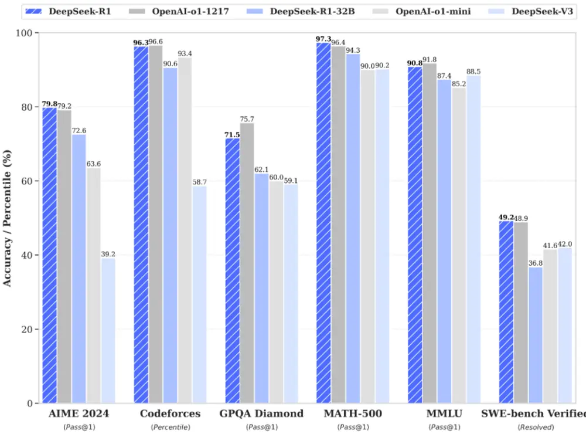
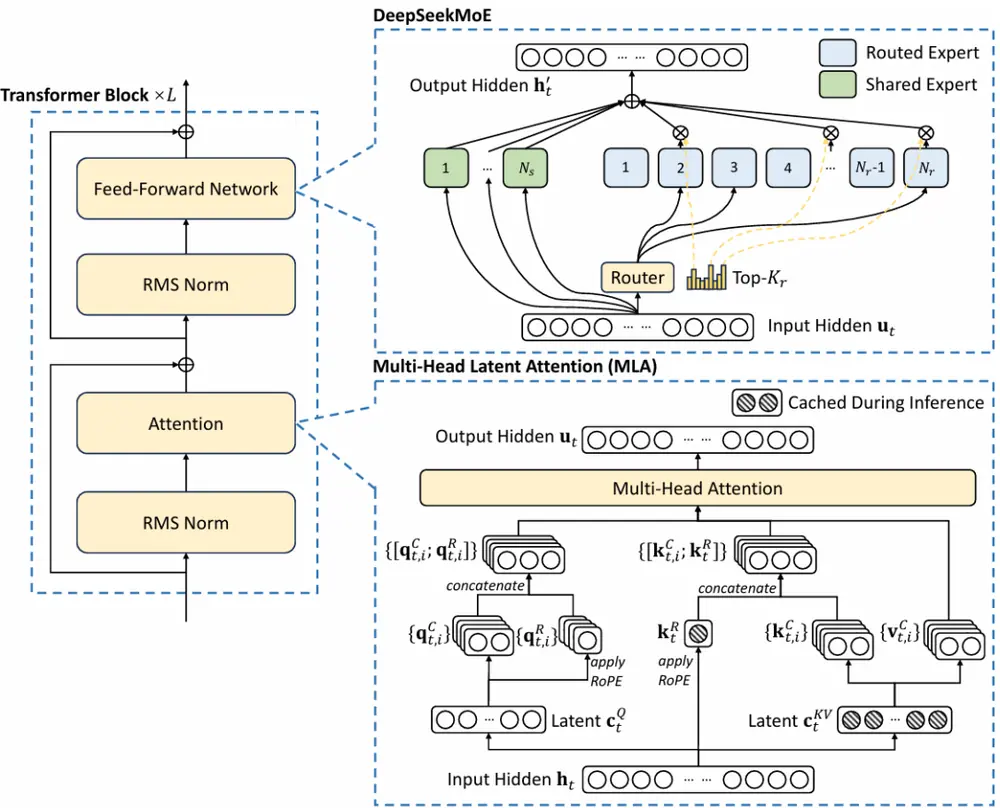
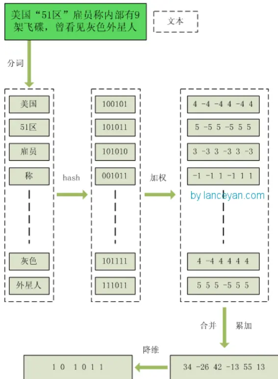
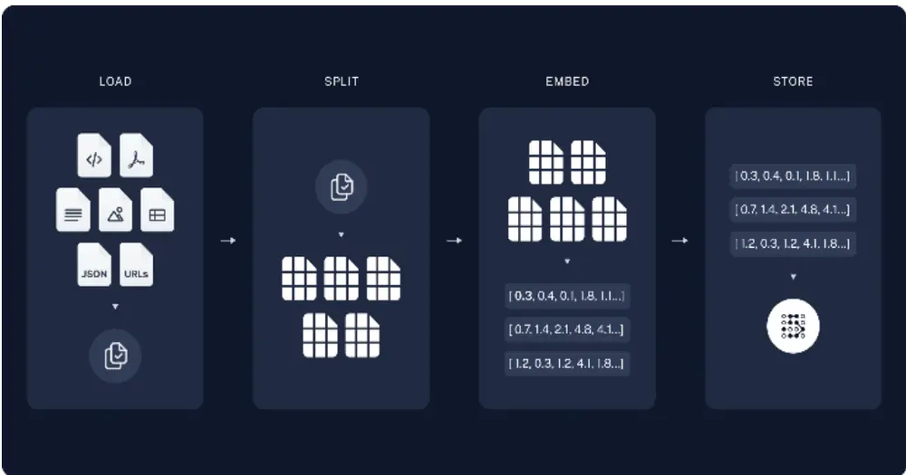
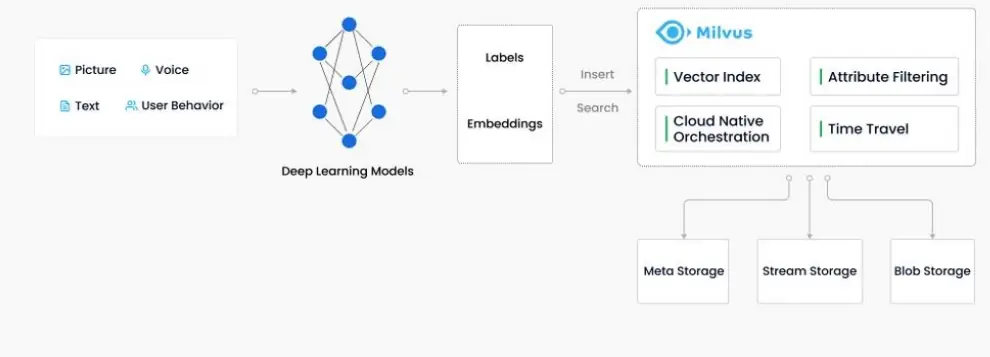
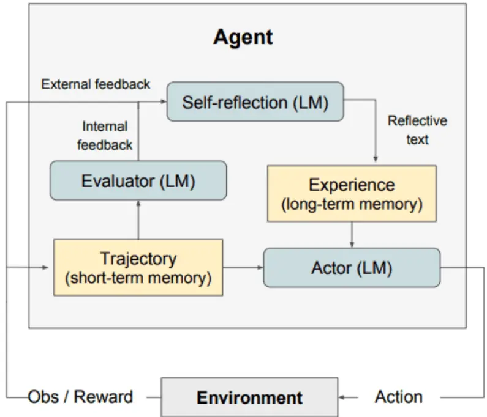
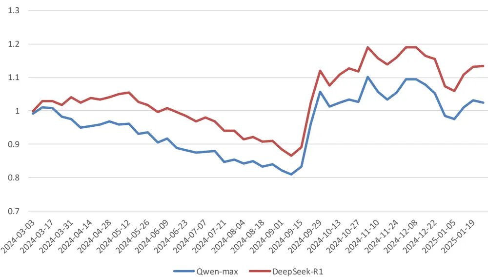
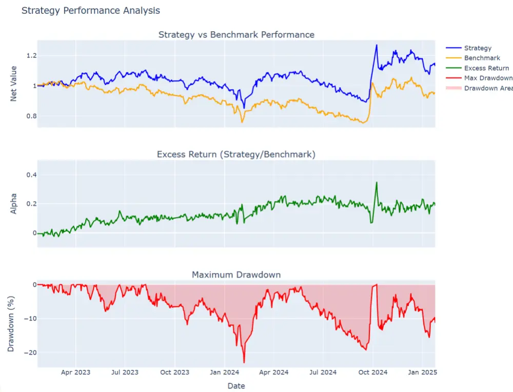
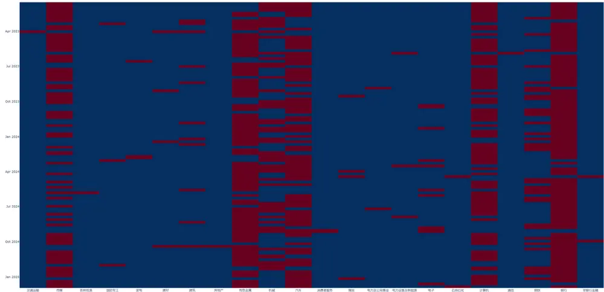

# 证券研究报告•金融工程专题报告

## “逐鹿”Alpha专题报告（二十五）：DeepSeek+RAG行业轮动策略

分析师：姚紫薇yaoziwei@csc.com.cnSAC编号：S144052404000

分析师：王超wangchaodcq@csc.com.cnSAC 编号：S1440522120002

发布日期：2025年2月25日

## 提纲

## DeepSeek

## RAG

结果分析

## PART1

## DeepSeek

## DeepSeek-R1：强大的推理能力

| Model | #Total Params | #Activated Params |  | Context Length |  | Download |
| --- | --- | --- | --- | --- | --- | --- |
|  |  |  | 37B | 128K | 回 |  |
| Zero | 671B |  |  |  |  | HuggingFace 2 |
| DeepSeek-R1 | 671B | 37B |  | 128K |  | HuggingFace |
|  | AIME 2024 | AIME 2024 | MATH- 500 | GPQA Diamond | LiveCodeBench CodeForces pass@1 | rating |
| GPT-4o-0513 | pass@1 9.3 | cons@64 13.4 | pass@1 74.6 | pass@1 49.9 | 32.9 | 759.0 |
| Claude-3.5-Sonnet-1022 | 16.0 | 26.7 | 78.3 | 65.0 | 38.9 | 717.0 |
| o1-mini | 63.6 | 80.0 | 90.0 | 60.0 | 53.8 | 1820.0 |
| QwQ-32B | 44.0 | 60.0 | 90.6 | 54.5 | 41.9 | 1316.0 |
| DeepSeek-R1-Distill-Qwen-1.5B | 28.9 | 52.7 | 83.9 | 33.8 | 16.9 | 954.0 |
| DeepSeek-R1-Distill-Qwen-7B | 55.5 | 83.3 | 92.8 | 49.1 | 37.6 | 1189.0 |
| DeepSeek-R1-Distill-Qwen-14B | 69.7 | 80.0 | 93.9 | 59.1 | 53.1 | 1481.0 |
| DeepSeek-R1-Distill-Qwen-32B | 72.6 | 83.3 | 94.3 | 62.1 | 57.2 | 1691.0 |
| DeepSeek-R1-Distill-Llama-8B | 50.4 | 80.0 | 89.1 | 49.0 | 39.6 | 1205.0 |
| DeepSeek-R1-Distill-Llama-70B | 70.0 | 86.7 | 94.5 | 65.2 | 57.5 | 1633.0 |

DeepSeek-R1 在后训练阶段大规模使用了强化学习技术，在仅有极少标注数据的情况下，极大提升了模型推理能力。在数学、代码、自然语言推理等任务上，性能比肩 OpenAI o1 正式版。

## Pretraing

Multi-Head Latent Attention (MLA) 通过低秩联合压缩技术，显著减少了推理时的键值缓存和训练时的激活内存，同时保持了与标准多头注意力机制相当的性能。MLA 的核心在于对键、值和查询矩阵进行低秩压缩，并通过旋转位置编码引入位置信息，从而在高效推理的同时捕捉输入序列中的复杂特征。

MOE（Mixture of Experts，专家混合）旨在通过多个专家（Experts）模型的协同工作来提高计算效率和模型性能。在 MOE 结构中，不是所有的专家都参与计算，而是通过一个门控机制来选择少数几个专家进行推理或训练

Figure 2 | Illustration of the architecture of DeepSeek-V2. MLA ensures efficient inference by significantly reducing the KV cache for generation, and DeepSeekMoE enables training strong models at an economical cost through the sparse architecture.

纯强化学习方案（DeepSeek-R1-Zero）存在结果可读性差、语言混合等问题

基于DeepSeek-V3-Base，使用少量的标记文本（数千个）进行冷启动SFT（DeepSeek-R1）

数据格式: |special_token|<reasoning_process>|special_token|

reasoning_process 为CoT推理过程

summary 为最终推理结果

DeepSeek-R1在后续RL训练中引入了语言一致性奖励（ V2, V2.5时存在中英混杂的问题）

## Reasoning-oriented Reinforcement Learning

利用GroupRelative Policy Optimization (GRPO) 进行训练。

奖励函数：

- 准确性奖励: 准确性奖励模型评估响应是否正确。例如，在具有确定结果的数学问题中，模型需要以指定的格式（例如，在框内）提供最终答案，从而能够可靠地通过基于规则的验证来检查正确性。同样，对于LeetCode问题，可以使用编译器根据预定义的测试用例生成反馈。

- 格式奖励: 除了准确性奖励模型，还采用了一种格式奖励模型，它强制模型将思考过程放在 <think> 和 </think> 标签之间

A conversation between User and Assistant. The user asks a question, and the Assistant solves it. The assistant first thinks about the reasoning process in the mind and then provides the user with the answer. The reasoning process and answer are enclosed within <think> </think> and <answer> </answer> tags, respectively, i.e., <think> reasoning process here </think> <answer> answer here </answer>. User: prompt. Assistant:

Table 1 | Template for DeepSeek-R1-Zero. prompt will be replaced with the specific reasoning question during training当面向推理的RL收敛时，利用模型生成后续轮的SFT数据，这一阶段包括来自其他领域的数据，以增强模型在写作、角色扮演和其他通用任务中的能力。

推理数据： 60万非推理数据： 20万

最后，为了进一步使模型与人类偏好保持一致，DeepSeek实施了一个次级强化学习阶段，旨在提高模型的帮助性和无害性，同时完善其推理能力。

## PART2

## RAG

## 数据

技术指标囊括了短期动量、中期动量、MACD（异同移动平均线）、RSI（相对强弱指数），以及布林带等技术指标

研报数据采用东方财富网发布的策略研究报告摘要，摘要格式统一、篇幅适中，有效规避了冗长文本处理的问题

新闻数据集采用聚源新闻数据库，汇聚了来自主流财经网站的新闻资源，涵盖了超过500,000条精心筛选的财经新闻文章。包含了市场动态、宏观经济指标、公司业绩等多方面的关键信息。经过清洗，切分,embedding之后存入向量数据库。

## 新闻

财经新闻数据是金融市场分析和决策的重要基础，提供了市场动态、宏观经济指标、公司业绩等多方面的关键信息。

本研究利用2023年以后聚源数据汇总的各大财经媒体发布的新闻数据。

数据集总计包含超过50万条新闻样本，日均新闻样本数量的中位数达到1061条。就单条新闻的字段长度而言，中位数为519字，平均值为826字；最长的新闻报道包含超过10万字，而最短的仅含11字

| ID | InfoType | InfoPublDate | MediaCode | Media | Category | InfoTitle | Content | Writer | Author | ObjectCode | AreaCode |
| --- | --- | --- | --- | --- | --- | --- | --- | --- | --- | --- | --- |
| 567070174643 |  | 2017-12-20 00:00:00.0 120 | 聚源数据 |  | 今日要闻1220 |  | 一、宏观【央行】四季度，企业家宏观更多 |  |  | 1000 | 142 |
| 567075986789 |  | 2017-12-20 00:00:00.0 120 |  | 聚源数据 | 61 | 晨会汇编1220 | 一、宏观 此前公布的11月经济数据显示，环保等更多 |  |  | 1000 | 142 |
| 567054922845 |  | 2017-12-20 00:00:00.0 2 | 证券时报 |  | 下游备货需求支撑沪胶上涨 |  | 12月12日泰国当局准备启动一项总金额186亿泰铢的更多 | 华泰期货 | 陈莉 | 3110 | 142 |
| 567052387495 |  | 2017-12-20 00:00:00.0 1 |  | 中国证券报 | 黄金多头需多加警惕 |  | 因投资者提前消化了美联储加息预期，上周金价在美联储宣更多 | 美创鑫裕 |  | 3130 | 7 |
| 567093278115 |  | 2017-12-20 00:00:00.0 99 | 金融界 |  | 用黄金对冲市场长尾风险 |  | 里克拉凯尔:从长期衡量,对冲策略对投资者来说是很重要的更多 |  |  | 3130 | 142 |
| 567090716087 |  | 2017-12-20 00:00:00.0 99 | 生意社 | 51 | 华安期货：贵金属前期多单谨慎持有 | 生意社12月20日讯 | 【市场分析】：隔夜第三季度更多 | 华安期货 |  | 3130 | 7 |
| 567090734931 |  | 2017-12-20 00:00:00.0 99 | 生意社 | 51 | 国信期货税改表决在即金银走势译情 | 生意社12月20日讯 | 周二外盘金银走调组约金主更多 | 国信期货 |  | 3130 | 7 |
| 567078813256 |  | 2017-12-20 00:00:00.0 146 | FX168 | 51 | 世界黄金协会:买入黄金作为战略对冲吧 | FX168财经报社(香港)讯世界黄金协会投资研究主管胡更多 |  |  |  | 3130 | 7 |
| 567077049891 |  | 2017-12-20 00:00:00.0 99 | 中国经济网 | 51 |  | 对于全球菌金珠宝的需求驱动因素有两种一种是黄金的价格，更多 |  |  |  | 3130 | 142 |
| 567071589105 |  | 2017-12-20 00:00:00.0 146 | FX168 | 51 | 【现货黄金收盘】美税改法案一波三折黄金徘徊不前陷盘整 | FX168财经报社(香港)讯现货黄金周二(12月19日更多 |  |  |  | 3130 | 7 |
| 567069212687 |  | 2017-12-20 00:00:00.0 146 | FX168 | 51 | 技术分析师:黄金面临进一步反弹风险创指1270.36阻力区更多 | FX168财经报社(香港)讯 FXTechstrateg更多 |  |  |  | 3130 | 7 |
| 567069227700 | 2017-12-20 00:00:00.0 | 146 | FX168 | 51 | 黄金日内交易分析：随机波动显示超买预期下跌 | FX168财经报社(香港)讯资讯网站Economies更多 |  |  |  | 3130 | 7 |
| 567050361798 | 2017-12-20 00:00:00.0 | 1 | 中国证券报 | 51 | 博时基金王祥：黄金短期压力犹在 | 上周黄金市场表现继续被美国的两件大事——美联储加息和更多 |  | 姜沁诗 |  | 3130 | 7 |
| 567046180653 | 2017-12-20 00:00:00.0 | 38 | 每日经济新闻 | 51 | 朱品比特币一年涨20倍?别只见投资者吃肉忘了投机客“跳楼更多 | 在即将过去的2017年,如果要问全球投资回报率最高的资产更多 |  | 朱昂 |  | 3120 | 7 |
| 567052235197 | 2017-12-20 00:00:00.0 | 1 | 中国证券报 | 51 | 陕西苹果产业热酚苹果期货上市 | 苹果期货将于12月22日在郑商所上市,这对产量位居全更多 |  | 马爽 |  | 3110 | 142 |
| 567052342010 | 2017-12-20 00:00:00.0 | 1 | 中国证券报 | 51 | 沪镍短期存在支撑 | 12月7日以来,沪镍结束持续了一个月的跌势,企稳反弹更多 |  | 张利静 |  | 3130 | 142 |
| 567052279182 | 2017-12-20 00:00:00.0 | 1 | 中国证券报 | 51 | 海南琼中天胶“保险+期货”完成理赔 | 12月15日下午,海南琼中县政府在琼中县委政府大楼6更多 |  | 马爽 |  | 3110 | 142 |
| 567052308928 |  | 2017-12-20 00:00:00.0 1 | 中国证券报 | 51 | 大商所银期合作多点开花 | 2017年，大商所继续鼓励期货公司会员与以银行为代表更多 |  | 马爽 |  | 2345 | 142 |
| 567052209329 | 2017-12-20 00:00:00.0 | 1 | 中国证券报 | 51 | 天然气涨价引爆农资行情农产品投资布局机会几何 | 随着气温降低农资市场进入淡季,但今年的化肥市场却出更多 |  | 张利静 |  | 3110 | 142 |
| 567098904685 | 2017-12-20 00:00:00.0 | 19 | 中国证券网 | 50 | 国债期货收涨10年期债主力合约涨0.03% | 中国证券网讯12月20日国债期货收盘上涨10年期债更多 |  |  |  | 3153 | 142 |
| 567099151678 | 2017-12-20 00:00:00.0 | 14 | 和讯 | 50 | 有色齐飘红沪铝反超郑醇焦炭跌幅扩大逾2% | 和讯期货消息周三(12月20日)商品市场午后仍波澜不惊更多 |  |  |  | 3100 | 142 |
| 567098883352 | 2017-12-20 00:00:00.0 | 158 | 证券时报网 | 50 | 国债期货小幅收高十年期主力合约涨0.03% | 证券时报网12月20日讯 | 周三(12月20日),更多 |  |  | 3153 | 142 |
| 567097820519 | 2017-12-20 00:00:00.0 | 158 | 证券时报网 | 50 | 商品期货收盘涨跌互现焦炭跌超2% | 证券时报网12月20日讯 | 周三(12月20日),更多 |  |  | 3100 | 142 |
| 567093214714 | 2017-12-20 00:00:00.0 | 99 | 金融界 | 50 | 央行黄金透明化的遗产 | 德国2017年“黄金回家”运动完结的遗产，将在未来长期影更多 |  |  |  | 3130 | 7 |
| 567093252860 |  | 2017-12-20 00:00:00.0 99 | 金融界 | 50 |  | 上周(12月11日至15日)美联储按照预期调高了利率,从更多 |  |  |  | 3130 | 142 |

## 数据清洗

特殊字符，无效文本清洗

Simhash-新闻去重

S1:美团抢占香港市场!KeeTa来了

S2:打工人利好!上海租赁住房又有新动作!

S3:神舟十六号计划近日择机实施发射船箭组合体转运至发射区

|  | S1 | S2 | S3 |
| --- | --- | --- | --- |
| S1 | 0 | 30 | 33 |
| S2 | 30 | 0 | 29 |
| S3 | 33 | 29 | 0 |

## 数据切分

数据接口： Langchain提供了一系列数据加载工具，包括WEB、PDF、JSON、CSV等各种结构和非结构化数据

数据切分：包括句子切分、词语切分、短语切分、基于规则切分、基于模型切分等

RecursiveCharacterTextSplitter：通过不同的符号递归地分割文档，同时兼顾文本的长度以及重叠部分的长度。子文本长度设为500，最终文本切分为了>100万个子文本

## 文本嵌入

Embedding: 文本转化为向量，采用开源中文embedding模型acge_text_embedding，模型来自于合合信息技术团队，模型输出维度为1792维

| Rank▲ | Mode1 | Model Size(Million | MemoryUsage | Embedding | Max▲ | Average | Classification | ClusteringAverage (4datasets) | PairClassificationAverage (2datasets) | RerankingAverage |
| --- | --- | --- | --- | --- | --- | --- | --- | --- | --- | --- |
|  |  | Parameters) | (GB,fp32) | Dimensions | Tokens |  |  |  |  |  |
|  |  |  |  |  |  | datasets) | datasets) |  |  | (4 |
|  |  |  |  |  |  |  |  |  |  | datasets |
| 1 | acge_text_embedding | 326 | 1.21 | 1792 | 1024 | 69.07 | 72.75 | 58.7 | 87.84 | 67.98 |
| 2 | OpenSearch-text-hybrid |  |  | 1792 | 512 | 68.71 | 71.74 | 53.75 | 88.1 | 68.27 |
| 34 | stella-mr1-large-zh-v3.5-1792D | 326 | 1.21 | 1792 | 512 | 68.55 | 71.56 | 54.32 | 88.08 | 68.45 |
|  | stella-large-zh-v3-1792d | 325 | 1.21 | 1792 | 512 | 68.48 | 71.5 | 53.9 | 88.1 | 68.26 |
| 5 | IYun-large-zh | 326 | 1.21 | 1024 | 1024 | 68.44 | 71.68 | 54.4 | 86.7 | 68.66 |
| 6 | Baichuan-text-embedding |  |  | 1024 | 512 | 68.34 | 72.84 | 56.88 | 82.32 | 69.67 |
| 7 | stella-base-zh-v3-1792d | 102 | 0.38 | 1792 | 1024 | 67.96 | 71.12 | 53.3 | 87.93 | 67.84 |
| 8 | Dmeta-embedding-zh | 103 | 0.38 | 768 | 1024 | 67.51 | 70 | 50.96 | 88.92 | 67.17 |
| 9 | xiaobu-embedding | 326 | 1.21 | 1024 | 512 | 67.28 | 71.2 | 54.62 | 85.3 | 67.34 |
| 104 |  |  |  |  |  |  |  |  |  |  |
|  |  |  |  |  |  |  |  |  |  | ▶ |

## 向量数据库

为了便于后续检索，首先需要将新闻文本数据存储于向量数据库。向量数据库专门设计用于存储和处理向量数据，这些向量通常是由文本、图像、音频和视频等非结构化数据通过机器学习模型、词嵌入或特征提取技术转换而来。

传统文本检索方法：字符串匹配， 效率低下，同义词无法匹配向量检索：文本/图片/音视频转为向量，建立索引，高效检索，语义检索

Milvus数据库，开向量数据库，专为海量特征向量的相似性搜索而设计。它基于异构众核计算框架，能够在有限的计算资源下实现高效能和低成本的搜索，支持十亿级别的向量搜索仅需毫秒级响应

## 语义检索

将100多万个子文本进行Embedding,最终得到每个文本对应1792维的向量。为了便于向量检索以及更新维护，我们将这些向量存入向量数据库Milvus，同时建立索引

以2024年3月29日关于贵州茅台的新闻报道为例，在预先构建的向量数据库中高效地检索出与该主题相关的新闻数据。

| id | content | embedding |
| --- | --- | --- |
| 202301100572 | 刘永好提出了三点期望，一是开放产业链场景... | [0.939434289932251,-0.39178070425987244,0.70019221305... |
| 202301171441 | 中科智云CEO魏宏峰表示：“本轮融资获得国... | [0.4511127471923828,-0.34871649742126465,0.0341370254... |
| 202301301015 | 中联重科塔机也尽显冠军风采，近200台车辆... | .0.577038288164551,-0.65797352790832,0.1708573251... |
| 202302140958 | 发展目标方面，无锡明确，到2025年，4个地... | [-0.47468364238739014,-1.1363041400909424,0.643926739. |
| 202302140959 | 据介绍，接下来，无锡将从聚力“点上突破”、.. | [-0.39946335554122925,-1.2588121891021729,0.755948603... |
| 202302180179 | “腾讯与英雄体育创始团队有着超过10年的合... | [0.15596646070480347,-0.3445884585380554,0.6469076871... |
| 202302282390 | 国务院发展研究中心研究员龙海波认为，近年... | [-0.02081798017024994,-0.9449114799499512,1.389866590.. |
| 202303022719 | 49.40.47月/202249-1.26月202250.20.6 | [0.13812440633773804,-0.07461628317832947,-0.61001300.. |
| 202303022721 | 第三、需要充足的资金资源支撑。5G专网需要.. | [-0.08412420749664307,-0.7554672360420227,0.392598509.. |
| 202303030506 | 《“十四五机器人产业发展规划》指明了行业... | [0.04108317196369171,-0.9005208015441895,0.8228790760... |
| 202303070249 | 李毛还建议，制定科技创新扶持保障条款，进... | [-0.15385347604751587,-1.353575104354858,0.64967615... |
| 202303070250 | 林孝发表示，我国“5G+工业互联网“蓬勃发展... | [-0.38023823499679565,-1.5089430809020996,0.531789422.. |
| 202303281500 | 达阅机器人研发总监梁聪慧则表示，要不计成... | [-0.33609819412231445,-0.8049595355987549,0.270133137.. |
| 202303300386 | 王江平表示，中国制造业现在正处于从内部资... | [0.05631847679615021,-0.6416276097297668,0.4433850347... |
| 202303311410 | “数宇经济下半场是和实体经济相融合的，特别... | [0.2195495218038559,-0.9360710382461548,1.01595330238... |
| 202304140654 | 还是以卫浴行业的九牧为例，在数智化加持下... | [-0.02033466100692749,-0.49046623706817627,0.57840633... |

| id | score | content |
| --- | --- | --- |
| 202403291387 0 | 250.16969299316406 | 公司酒标业务主要产品为茅台(1935)、贵州茅台酒(癸卯免年)、贵州茅台王子酒(癸卯免年)、茅台醉系列酒、习酒系列酒、舍得系列酒、国台系列酒等产品品牌。2023年，公司酒标整体订单量增 |
| 202403291420 石 | 237.42054748535156 | 会上，茅台集团党委副书记、工会主席、监事会主席游亚林总结了推动茅台发展的三点精髓：第一品质是茅台的制胜法宝，要确保每一瓶酒品质如一，时问的沉淀、空问的孕育、工法的坚守缺 |
| 202403292301 0 | 200.41099548339844 | 富邑葡萄酒集团方面对《证券日报》记者称，接下来，集团将开始逐步扩大在中国的高端著华系列中澳大利亚葡萄酒的产品布局，并将增加对本地的销售和市场营销的资源投入。与此同时，公 |
| 202403291421 石 | 196.8500518798828 | 财经作家、 《茅台传》作者吴晓波在主题演讲环节，分享了他在创作《茅台传》过程中的观察和思考。吴晓波表示，企业和人一样，需要在快与慢之问做出选择。而茅台集团与自己过去关注的 |
| 202403291778 0 | 182.07830810546875 | 2024-03-29发布：《聚合力解难题让“多彩“更“多产*上交所会同多部门走进贵州上市公司》自国务院召开部署走访上市公司工作、推动上市公司高质量发展全国视频会议以来，沪市公司的走访调 |
| 202403292204 0 | 178.45327758789062 | 为进一步优化供应网络布局，2023年公司旗下库尔勒酒厂罐装生产线竣工，该酒厂总产能将达每年15万千升。万州酒厂在2023年末复产，有效支持了市场需求的增长。佛山酒厂建设进展顺利， |
| 202403292611 0 | 172.80343627929688 | 在2024年3月21日发布年度新品·青酌奖“中，公司旗下重庆精酿白啤、风花雪月桃花味低醇啤酒和布鲁克林皮尔森均获得2023年度“青酌奖”，体现了业内对重啤股份产品的高度认可。2024年初， |
| 202403292310 0 | 168.6273193359375 | 佛山酒厂建设进展顺利，预计在2024年第二季度投产，年产能将达到50万千升，年产值约20亿元，在供应广东市场的同时，辐射华南周边市场，大幅降低物流运输费用，更好满足粤港澳大湾区 |

资料来源：milvus，中信建投

## 自我反省（self-reflection）

## 大模型自我反省 是一种通过语言反馈强化语言代理人模型目我反省是一种通过语言反馈强化语言代理

（Language-based Agents）的框架。它将环境中的反馈（无论是自由形式的语言还是标量）转化为语言反馈（即自我反思），并将其作为上下文提供给语言模型代理（LLM Agent），以帮助代理从过去的错误中快速学习，从而在许多高级任务中提高性能。

在本框架中，我们将大模型上轮预测的结果告知给大模型，让其对推荐结果进行分析反思，提高短期推理逻辑能力。

## PART3

## 结果分析

## 提示词

System:你是一个资深的策略分析师，能够从相关信息中分析未来股票市场的走势

User :

{self_reflection_info}

请根据以下信息对行业的表现进行预测，给出你认为未来{FREQ}内涨幅最大的五个行业。只使用以下信息进行分析，行业只能从以下列表选择：{SECTOR_NAMES}, 行业对应的指数代码为:{SECTOR_MAP}，最终只给出行业代码。

### 市场表现：

{market_info}

### 研报信息：{reports}

### 新闻信息：{news}

## 推理内容

好的，我现在需要根据用户提供的市场表现、研报信息和新闻信息，预测未来一周内涨幅最大的五个行业。首先，我需要回顾用户之前推荐的行业表现，并分析当前的市场数据。

用户之前推荐的行业是银行、有色金属、钢铁、计算机、传媒，但他们的上期排名分别为30、3、5、4、22。显然，银行上次表现最差，但有色金属和钢铁表现较好。这可能意味着之前的推荐逻辑在银行方面出现了偏差，需要重新评估。

接下来，我需要仔细分析当前各行业的技术指标和基本面情况。首先看市场表现中的各个行业数据，比如指数点位、均线、RSI、MACD等。同时结合研报中的宏观经济分析，比如GDP增速、消费恢复情况、制造业投资、房地产疲软、基建投资等，以及政策动向，如降息预期、财政政策等。

从研报信息来看，四季度GDP增速略低于预期，消费恢复缓慢，房地产投资继续疲软，但基建投资有所回升。货币政策方面，央行保持流动性合理充裕，降息预期落空，但未来仍有降息可能。此外，美元走强对人民币汇率形成压力，可能影响出口相关行业。

新闻信息中提到的政策重点包括稳市场、稳信心，以及央企市值管理、房地产政策优化等。这可能对金融、基建相关行业有利。同时，地方两会召开，各省份的经济目标可能对相关区域板块产生影响。

接下来，我需要筛选出技术面表现较好且有基本面支撑的行业。例如：

1. 银行：虽然上期排名30，但近期表现强劲，过去一周涨幅2.33%，RSI为61.45，处于较高水平，MACD为正，可能继续受益于政策支持和低估值修复。

2. 有色金属：RSI 52.35，MACD指标显示正值，且近期制造业投资回升，可能带动需求。

3. 钢铁：过去一周涨幅1.19%，RSI中性，MACD柱状图转正，基建投资增加可能利好。

4. 计算机：近期涨幅2.17%，RSI 51，MACD hist转正，政策支持科技发展。

5. 传媒：涨幅1.84%，RSI 51.15，可能受益于消费恢复和寒假档期。

此外，考虑政策支持的行业如基建相关的建筑、建材，但它们的近期表现较弱。同时，注意风险提示中的国际局势和国内需求不足的问题，可能影响出口和消费相关行业。

综合以上分析，未来一周可能表现较好的行业是银行（政策支持、技术面强）、有色金属（制造业需求）、钢铁（基建投资）、计算机（科技政策）、传媒（消费复苏）。需要注意银行虽然上期表现差，但近期数据好转，可能有反弹机会。

## 推理结果

"行业代码": "CI005021.WI",

"行业名称": "银行",

"推荐原因": "银行板块近期表现强劲，过去一周涨幅2.33%，RSI达61.45显示超买动能，MACD持续正向扩张，叠加政策端对金融稳定的重视及降准释放流动性，估值修复空间显著。

"行业代码": "CI005003.WI",

"行业名称": "有色金属",

"推荐原因": "有色金属RSI 52.35处于中性偏强区间，MACD柱状图持续扩大，制造业投资韧性及全球通胀预期回升推动工业金属需求，叠加美元震荡下大宗商品价格支撑。

"行业代码": "CI005005.WI",

"行业名称": "钢铁",

"推荐原因": "钢铁指数突破布林带上轨，MACD柱状图转正，基建投资增速上行及地产政策边际放松预期提振需求，低库存背景下补库周期或启动。"

"行业代码": "CI005027.WI",

"行业名称": "计算机",

"推荐原因": "计算机指数近期涨幅2.17%，MACD出现底背离信号，政策强调科技自主可控及数字经济布局，叠加年报季业绩预期改善，技术面与政策共振。"

"行业代码": "CI005028.WI",

"行业名称": "传媒",

"推荐原因": "传媒板块RSI 51.15突破中性线，寒假档票房催化及AI应用场景落地预期升温，叠加超跌反弹动能，短期存在估值修复机会。"

## 模型对比

对比Qwen2.5-Max（通义千问系列效果最好的模型）， DeepSeek-R1具有显著优势。

## 策略设置

每周将中信行业指数技术指标，市场重要新闻，以及策略研报信息交由大模型进行分析，将上周预测结果输入大模型进行自我反省

根据以上信息输出本周推荐的五个行业代码

利用5个行业指数构建等权组合，下一个交易日交易，基准为30个行业等权

| 年化收益夏普比率最大回撤周胜率 |  |  |  |  |  |
| --- | --- | --- | --- | --- | --- |
| 策略 | 10.94% | 0.44 | 23.14% | 59.61% | 月胜率 60.86% |
| 基准 | -0.76% | -0.03 | 26.87% | – |  |

资料来源：Wind，中信建投

建投证券 SECURITIES

## 策略设置

过去两年推荐行业主要集中在传媒，有色金属，机械，汽车，计算机，银行，均为涨幅较好的行业平均单次换手率为36%，年化换手率为18.72倍。

## 风险提示

本报告中所有数据结果是基于历史统计结果的展示，未来有可能发生风格切换导致因子失效的风险。模型运行存在一定的随机性，初始化随机数种子会对结果产生影响，单次运行结果可能会有一定偏差。历史数据的区间选择会对结果产生一定的影响。模型参数的不同会影响最终结果。模型对计算资源要求较高，运算量不足会导致结果存在一定的欠拟合风险。本文所有模型结果均来自历史数据，模型存在统计误差，不保证模型未来的有效性，对投资不构成任何建议。

## 分析师介绍

王 超：南京大学粒子物理博士，曾担任基金公司研究员，券商研究员，有丰富的研究和投资经验，2021年加入中信建投，主要负责量化多因子选股。

## 评级说明

| 投资评级标准 |  | 评级 | 说明 |
| --- | --- | --- | --- |
| 报告中投资建议涉及的评级标准为报告发布日后6个月内的相对市场表现，也即报告发布日后的6个月内公司股价（或行业指数）相对同期相关证券市场代表性指数的涨跌幅作为基准。A股市场以沪深300指数作为基准；新三板市场以三板成指为基准；香港市场以恒生指数作为基准；美国市场以标普500指数为基准。 | 股票评级 | 买入 | 相对涨幅15%以上 |
|  |  | 增持 | 相对涨幅5%—15% |
|  |  | 中性 | 相对涨幅-5%—5%之间 |
|  |  | 减持 | 相对跌幅5%—15% |
|  |  | 卖出 | 相对跌幅15%以上 |
|  | 行业评级 | 强于大市中性 | 相对涨幅10%以上 |
|  |  |  | 相对涨幅-10-10%之间 |
|  |  | 弱于大市 | 相对跌幅10%以上 |

## 分析师声明

本报告署名分析师在此声明：（i）以勤勉的职业态度、专业审慎的研究方法，使用合法合规的信息，独立、客观地出具本报告, 结论不受任何第三方的授意或影响。（ii）本人不曾因，不因，也将不会因本报告中的具体推荐意见或观点而直接或间接收到任何形式的补偿。

## 法律主体说明

本报告由中信建投证券股份有限公司及/或其附属机构（以下合称“中信建投”）制作，由中信建投证券股份有限公司在中华人民共和国（仅为本报告目的，不包括香港、澳门、台湾）提供。中信建投证券股份有限公司具有中国证监会许可的投资咨询业务资格，本报告署名分析师所持中国证券业协会授予的证券投资咨询执业资格证书编号已披露在报告首页。

在遵守适用的法律法规情况下，本报告亦可能由中信建投（国际）证券有限公司在香港提供。本报告作者所持香港证监会牌照的中央编号已披露在报告首页。

## 一般性声明

本报告由中信建投制作。发送本报告不构成任何合同或承诺的基础，不因接收者收到本报告而视其为中信建投客户。

本报告的信息均来源于中信建投认为可靠的公开资料，但中信建投对这些信息的准确性及完整性不作任何保证。本报告所载观点、评估和预测仅反映本报告出具日该分析师的判断，该等观点、评估和预测可能在不发出通知的情况下有所变更，亦有可能因使用不同假设和标准或者采用不同分析方法而与中信建投其他部门、人员口头或书面表达的意见不同或相反。本报告所引证券或其他金融工具的过往业绩不代表其未来表现。报告中所含任何具有预测性质的内容皆基于相应的假设条件，而任何假设条件都可能随时发生变化并影响实际投资收益。中信建投不承诺、不保证本报告所含具有预测性质的内容必然得以实现。

本报告内容的全部或部分均不构成投资建议。本报告所包含的观点、建议并未考虑报告接收人在财务状况、投资目的、风险偏好等方面的具体情况，报告接收者应当独立评估本报告所含信息，基于自身投资目标、需求、市场机会、风险及其他因素自主做出决策并自行承担投资风险。中信建投建议所有投资者应就任何潜在投资向其税务、会计或法律顾问咨询。不论报告接收者是否根据本报告做出投资决策，中信建投都不对该等投资决策提供任何形式的担保，亦不以任何形式分享投资收益或者分担投资损失。中信建投不对使用本报告所产生的任何直接或间接损失承担责任。

在法律法规及监管规定允许的范围内，中信建投可能持有并交易本报告中所提公司的股份或其他财产权益，也可能在过去12个月、目前或者将来为本报告中所提公司提供或者争取为其提供投资银行、做市交易、财务顾问或其他金融服务。本报告内容真实、准确、完整地反映了署名分析师的观点，分析师的薪酬无论过去、现在或未来都不会直接或间接与其所撰写报告中的具体观点相联系，分析师亦不会因撰写本报告而获取不当利益。

本报告为中信建投所有。未经中信建投事先书面许可，任何机构和/或个人不得以任何形式转发、翻版、复制、发布或引用本报告全部或部分内容，亦不得从未经中信建投书面授权的任何机构、个人或其运营的媒体平台接收、翻版、复制或引用本报告全部或部分内容。版权所有，违者必究。

## 中信建投证券研究发展部

浦东新区浦东南路528号南塔2103室
电话：(8621) 6882-1600
联系人：翁起帆
邮箱：wengqifan@csc.com.cn

## 中信建投（国际）

深圳香港
福田区福中三路与鹏程一路交汇处广电金融中心中环交易广场2期18楼
35楼
电话：（86755）8252-1369电话：（852）3465-5600
联系人：曹莹联系人：刘泓麟
邮箱：caoying@csc.com.cn邮箱：charleneliu@csci.hk