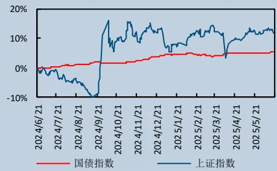
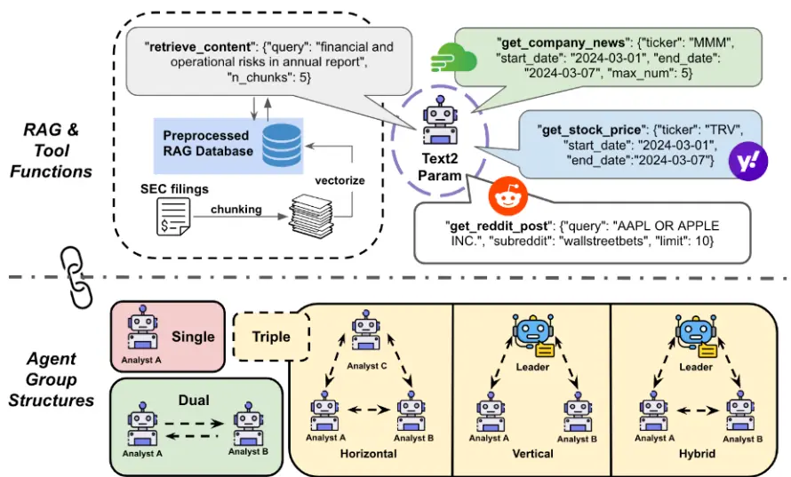
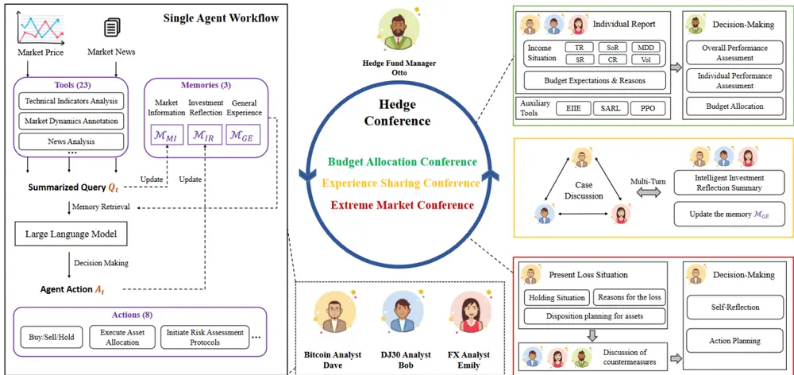
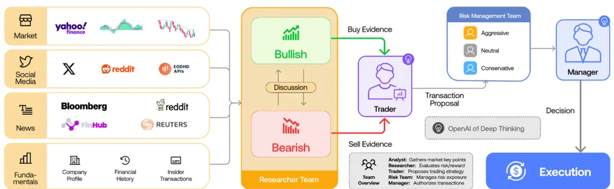
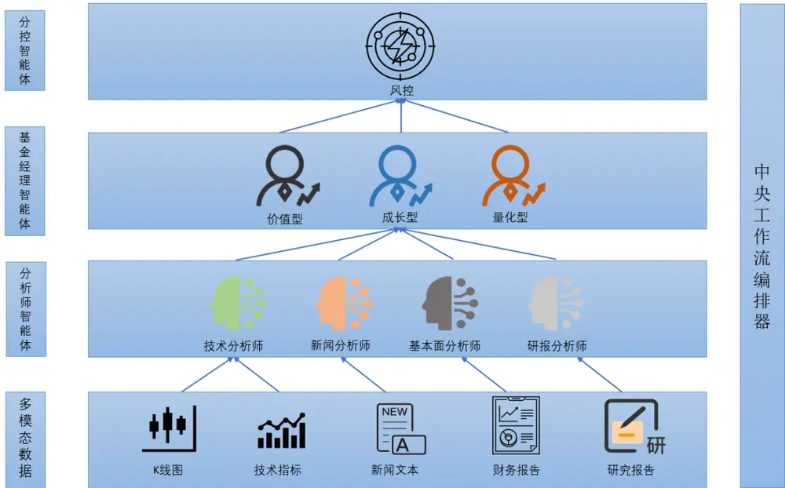
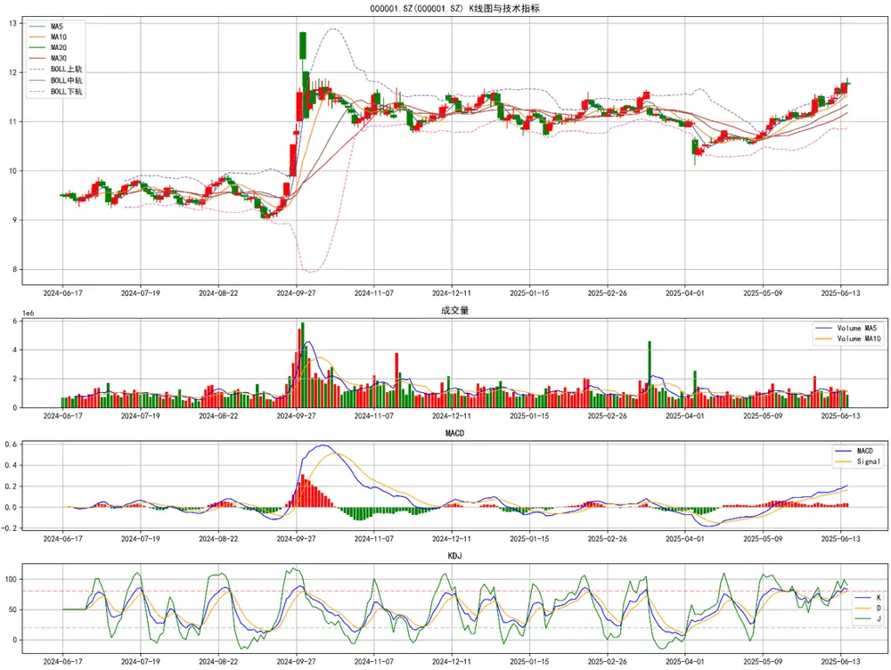

证券研究报告·金融工程深度

# “逐鹿”Alpha专题报告（二十七）

# ——多智能体投资决策框架

## 核心观点

本文构建了一个包含分析师，基金经理，风控官的全流程，多智能体投资决策框架，它通过模拟一个高效、理性且纪律严明的投研组织，通过分析 K 线图像，技术指标，新闻文本，财务报告，研究报告等多模态信息，生成投资建议，为投资决策提供了强大的技术支持。通过此框架，能够快速生成全面的投资分析报告，结果不仅包含不同类型智能体的研究观点，还包含了多种类型的量化指标。

## 主要内容

## 简介

本文主要介绍一个基于多智能体（Multi-Agent）系统的投资决策框架。该框架通过高度模拟化的方式，构建了一个由分析师、投资经理和风控官组成的 AI 智能体团队，旨在应对现代金融市场日益增长的复杂性、数据冗余及高频变化。该框架的核心优势体现在其精密的角色分工、多维度的分析视角、风格化的策略生成、以及独立的闭环风险监控机制上。整个系统由一个中央工作流编排器（Orchestrator）进行高效驱动，实现了从多模态数据输入、并行深度分析、多元策略整合、到最终风险审核的自动化无缝衔接。

## 多智能体投资决策框架

结合相关的工作，本文我们构建了一个模拟真实投研团队的、自成体系的多智能体框架。该投资决策框架的设计理念源于对真实投资公司运作模式的深度抽象。输入的数据包括 K 线图像，技术指标，新闻文本，财务报告 PDF，研究报告等多模态数据，系统的核心由三大层次、共计八种类型的 AI 智能体构成，并通过一个中央工作流编排器 (orchestrator) 进行统一的生命周期管理和任务调度。

本文构建了一个包含分析师，基金经理，风控官的全流程，多智能体投资决策框架，它通过模拟一个高效、理性且纪律严明的投研组织，通过分析 K 线图像，技术指标，新闻文本，财务报告PDF，研究报告等多模态信息，生成投资建议，为投资决策提供了强大的技术支持。通过此框架，能够快速生成全面的投资分析报告，结果不仅包含不同类型智能体的研究观点，还包含了多种类型的量化指标。

# 金融工程研究

姚紫薇

yaoziwei@csc.com.cn

SAC 编号: S1440524040001

王超

wangchaodcq@csc.com.cn

SAC 编号:S1440522120002

发布日期： 2025 年 06 月 23 日

## 市场表现

## 相关研究报告

## 一、简介

本文主要介绍一个基于多智能体（Multi-Agent）系统的投资决策框架。该框架通过高度模拟化的方式，构建了一个由分析师、投资经理和风控官组成的AI智能体团队，旨在应对现代金融市场日益增长的复杂性、数据冗余及高频变化。

该框架的核心优势体现在其精密的角色分工、多维度的分析视角、风格化的策略生成、以及独立的闭环风险监控机制上。整个系统由一个中央工作流编排器（ ）进行高效驱动，实现了从多模态数据输入、并行深度分析、多元策略整合、到最终风险审核的自动化无缝衔接。

在数据层面，我们不仅采用了传统的新闻，研报，技术指标等文本数据，还融入了 K 线图，公司财务报告PDF 等多模态数据，提供了更加全面且丰富的信息。技术架构上，该框架采用异步并发处理，显著提升了分析效率；其模块化的设计和可动态配置的大语言模型（LLM）接口，则赋予了系统极高的灵活性和可扩展性。

我们认为，这种高度结构化、自动化和智能化的多智能体系统，不仅是对传统投资研究方法的颠覆性升级，更代表了未来资产管理领域技术演进的核心方向。它能够在提升 Alpha 收益、降低运营成本和强化风险控制三个层面为投资机构创造显著的商业价值。

## 二、相关工作

在之前的系列报告《“逐鹿” 专题报告（二十）——基于数亿新闻上下文的本地 系统用于市场择时及行业轮动》《“逐鹿” 专题报告（二十一）——基于新闻、研报、财务、技术指标的大模型个股分析框架初探》《“逐鹿”Alpha 专题报告（二十五）——DeepSeek+RAG行业轮动策略》我们曾经介绍过如何使用单一智能体结合各类信息对金融市场进行分析。虽然单一智能体能够对资产进行分析并提供有价值的见解，但在实际应用中，单一智能体在处理多元数据时，可能会因为信息过载、模型偏差或数据维度不足而难以达到最优的分析效果。为了进一步提升市场分析和预测的准确性和鲁棒性，我们考虑引入多智能体系统（Multi-AgentSystem, MAS）来协同处理复杂的金融市场数据。

关于多智能体在金融领域的应用，目前的研究和实践已经取得了显著进展。多智能体系统通过多个智能体的协同合作，能够更高效地处理复杂多变的金融市场数据，克服单一智能体的局限性。

在论文[1]中，作者提出了一种新颖的多智能体协作系统，旨在增强金融投资研究中的决策能力。该系统引入了可配置大小的智能体组和协作结构，以利用不同智能体组的优势。通过使用次优组合策略，系统能够动态适应不同的市场条件和投资场景，优化不同任务的性能。研究重点关注基本面、市场情绪和风险分析三个子任务，分析了 2023年道琼斯指数中30 家公司的 SEC 10-K表格。研究结果表明，多智能体协作系统在复杂金融环境中比传统单智能体模型具有更高的准确性、效率和适应性。

图 1:多智能体协作框架

Figure 1: Overview of proposed multi-agent collaboration framework with unified RAG & tool function calling.
Enhancing InvestmentAnalysis: OptimizingAI-Agent Collaboration in Financial Research

在论文[2]中探讨了多智能体系统（MAS）在协作投资策略设计中的应用。MAS 由自主和协作的智能体组成，提供了解决现代金融决策复杂性的转型框架。 能够实现去中心化、自适应和高效的智能体协作，模拟人类投资团队的综合决策过程。这些系统集成了先进的算法，如强化学习和分布式优化，通过利用多样化的数据源和适应不断变化的市场条件来增强投资策略。文章讨论了MAS在投资组合管理、交易策略优化和风险评估方面的应用，并强调了其在促进透明度、效率和可扩展性方面的潜力。

论文[3]介绍了一种创新的多智能体系统 HedgeAgents，旨在通过“对冲”策略增强系统稳健性。在该平衡系统中，设计了一系列对冲智能体，包括一个中央基金经理和多个专门从事不同金融资产类别的对冲专家。这些智能体利用大语言模型（LLM）的认知能力进行决策，并通过三种类型的会议进行协调。由于 LLM 的强大理解能力，HedgeAgents 在三年内实现了较高的总回报率。

图 2:HedgeAgents

Figure 3: Our HedgeAgents comprise 3 hedging agents and 1 manager. Each agent is equipped with 23 tools and possesses 3 types of memory to execute 8 actions. Furthermore, collaboration among multiple agents can be categorized into three types of conferences: budget allocation, experience sharing, and extreme market conference.
HedgeAgents: A Balanced-aware Multi-agent Financial Trading System

TradingAgents[4]通过多个由大型语言模型（LLM）驱动的智能体，模拟专业交易公司的运作流程。这些智能体具有不同的角色和职责，包括基本面分析师、情绪分析师、技术分析师、交易员、研究员和风险管理团队。通过结构化的沟通和辩论，这些智能体协同工作，优化交易策略。

图 3: TradingAgents

Fig. 1: TradingAgents Overall Framework Organization. I. ANALYSTs TEAM: Four analysts concurrently gather relevant market information. II. RESEARCH TEAM: The team discusses and evaluates the collected data. III. TRADER: Based on the researchers' analysis, the trader makes the trading decision. IV. RisK MANAGEMENT TEAM: Risk guardians assess the decision against current market conditions to mitigate risks. V. FUND MANAGER: The fund manager approves and executes the trade.
TradingAgents:Multi-Agents LLM Financial Trading Framework

## 三、多智能体投资决策框架

结合相关的工作，本文我们构建了一个模拟真实投研团队的、自成体系的多智能体框架。该投资决策框架的设计理念源于对真实投资公司运作模式的深度抽象。输入的数据包括 K 线图像，技术指标，新闻文本，财务报告PDF，研究报告等多模态数据，系统的核心由三大层次、共计八种类型的AI智能体构成，并通过一个中央工作流编排器 进行统一的生命周期管理和任务调度。

图 4:多智能体投资决策框架

数据来源：中信建投证券

## 3.1 多模态数据

与真实研究相同，在进行金融分析时，我们采用全面的多模态数据。包括 线图像，技术指标，新闻文本，上市公司财务报告以及券商分析师研究报告。每一类数据均由对应的专业分析师进行分析。

其中 K 线图采用近一年的行情数据生成，同时在 K 线图中加入均线，成交量，布林带，MACD 以及 KDJ等信息，便于AI进行全面的分析。

图 5:K线图

数据来源：WIND，中信建投证券

对于技术指标，我们利用 TA-LIB 计算常见的 MA,MACD,KDJ,RSI,BOLL,VOL,BIAS 等指标，将其整合成一段文本输入给LLM。

财务报告我们直接从上交所以及新闻数据与研报数据与之前类似，对新闻数据我们采用向量数据库进行处理以及存储，便于高效的语义检索。研报数据来自公开的研报摘要信息，对其进行整合。最后我们通过巨潮网下载公司历史的财务报告，以上便是我们分析的数据基础。

## 3.2 分析师智能体

分析层是整个决策流程的基石，负责将庞杂的原始数据转化为结构化的、富有洞察的分析观点。本文中我们构建了四类智能体：技术分析师，新闻分析师，基本面分析师以及研报分析师，分别处理 K 线和技术指标，新闻文本，财务报告以及券商研究报告。

## 3.2.1 技术分析师

技术分析师运用经典的量价分析理论，用以识别图表形态（如头肩顶/底、双重顶/底），并解读关键技术指标。为了能够同时处理 K线图以及技术指标的文本信息，需要使用多模态大模型，目前常用的多模态大模型包括 GPT-4o，Gemini-2.5 系列，Claude 系列，QWEN-VL/QWEN-QVQ 系列等。

这里我们采用 QWEN-VL-MAX 进行分析。通义千问 VL-Max（qwen-vl-max），即通义千问超大规模视觉语言模型。相比增强版，再次提升视觉推理能力和指令遵循能力，提供更高的视觉感知和认知水平。在更多复杂任务上提供最佳的性能。

图片信息可以通过图像URL或者本地文件的方式传入API中，传入本地图像时，如果采用OpenAISDK或HTTP方式时，需要将本地文件编码为 Base64 格式后再传入；使用阿里的DashScopeSDK时，直接传入本地文件的路径即可。

## 图 6:图像分析

from openai import OpenAI 
import os 
import base64 
def encode_image(image_path): 
with open(image path, "rb") as image file: 
return base64.b64encode(image_file.read()).decode("utf-8") 
base64_image = encode_image("xxx/eagle.png") 
client = OpenAI( 
api_key=os.getenv('DASHSCOPE_API_KEY'), 
completion = client.chat.completions.create( 
messages=[ 
) 
print(completion.choices[0].message.content)
数据来源：阿里云百炼，中信建投证券

结合 K线图像以及技术指标，智能体能够从中提取人类分析师关注的视觉模式以及关键的形态信息，生成一份包含趋势判断、关键价位、指标解读和成交量分析的核心观点。

## 图 7:技术分析师

## 技术分析师分析

分析日期:2025-06-19T16:25:05.179920

置信度: 0.85

## 、 核心发现

- 股价在近期呈现上升趋势，突破多个均线压力位。

- MACD指标显示多头市场，但动能有所减弱。

- RSI指标处于高位，接近超买区域，需警惕回调风险。

- KDI指标出现死叉，短期可能有调整需求

trend_direction: 上升

support_levels: [11.405, 11.254]...

resistance_levels: [11.898771735031302, 12.0]...

technical_indicators:{'RSI':'RSI6为67.21，RSI12为62.63，RSI24为68.11，均处于较高水平，接近超买区域，表明市场情绪较为乐观，但也存在回调风险。'，'MACD':'MACD值为0.2058，信号线为0.1802，柱状图为0.0256，显示多头市场，但柱状图较短，动能有所减弱。''yolume':'成交量在近期有所放大，表明市场活跃度增加，但需关注是否能持续放量以支撑股价进一...

从K线图上看，股价近期连续上涨，突破了MA5、MA10、MA20等多条均线，显示出较强的上升趋势。MACD指标的DIFF线和DEA线均在零轴上方，且形成金叉，表明当前处于多头市场。然而，MACD柱状图较短，动能有所减弱。RSI指标在60以上，接近超买区域，市场情绪较为乐观，但也存在回调风险。KDI指标中的K线和D线形成死叉，J线向下，短期可能有调整需求。布林带方面，股价接近上轨，表明短期内可能面临压力。成交量在近期有所放大，表明市场活跃度增加，但需关注是否能持续放量以支撑股价进一步上涨

- RSI指标接近超买区域，存在回调风险

- KDI指标出现死叉，短期可能有调整需求

- MACD柱状图较短，动能有所减弱，需警惕上涨动力不足。

平安银行股价近期呈现上升趋势，技术指标显示多头市场，但动能有所减弱，且存在超买和调整风险。投资者需密切关注成交量变化和市场情绪，防范潜在回调风险。

WIND, QWEN,

## 3.2.2 新闻分析师

新闻分析师扮演着舆情监控专家的角色。它通过情绪分析，量化市场对特定公司的看法是积极、消极还是中性，并能识别和提取可能驱动股价的关键事件，如并购重组、高管变动、新品发布等。

新闻分析师智能体采用 Deepseek-chat 即 deepseek-v3 模型，Deepseek-v3 是一个混合专家（MoE）语言模型，具有总计6710亿个参数，每个 token 激活 370亿个参数。该模型在 14.8万亿个多样且高质量的tokens 上进行了预训练，并通过监督微调和强化学习阶段进一步优化。

利用上市公司最新的新闻数据，新闻分析师最终输出一份关于当前个股情绪、关键舆情催化剂和潜在公关

风险的摘要。

## 图 8:新闻分析师

- 平安银行参与的银行ETF近期表现强劲，创下近3月规模新高

- 央行政策利好和陆家嘴论坛对银行板块产生积极影响

- 平安银行的营销活动(存款送LABUBU盲盒)在多地推广但西安地区已下线

- 银行板块整体受到机构看好，被认为盈利价值被低估

news sentiment: F面

impact_level: 中

time_horizon: 短期至中期

market_reaction:银行ETF连续上涨，显示市场对银行板块的乐观情绪

credibility:高(来自官方公告和主流媒体报道）

1. 银行ETF的强劲表现反映了市场对银行板块的整体看好，平安银行作为重要成分股将受益：2)央行政策和行业论坛为银行板块提供了政策支持：3)营销活动显示平安银行在零售业务上的创新尝试，但活动下线可能影响短期客户流量：4)机构观点支持银行股的估值修复逻辑

- 营销活动下线可能影响短期零售存款增长

- 银行板块整体估值修复的持续性存在不确定性

- 宏观经济环境变化可能影响银行业绩

平安银行短期受益于银行板块整体走强和政策利好，中期需关注其零售业务发展和资产质量

## 💼建议

- 短期可关注银行板块整体走势带来的交易机会

- 跟踪平安银行零售业务创新举措的实际效果

- 关注即将发布的银行业绩报告和资产质量指标

数据来源：聚源，DeepSeek，中信建投证券

## 3.2.3 基本面分析师

基本面分析师专注于挖掘公司的内在价值。其分析核心围绕上市公司的财务报告展开。原始的上市公司公告为PDF文件，利用大模型分析PDF文档时，通常有两种方案，一是使用专门的 PDF 解析库，从 PDF 中提取文本内容。这些库可以处理文本层，并尝试保持原始文档的结构。再将文本内容交由大模型进行分析。但是此方法提取出的文本可能包含格式错误、多余的空格、页眉页脚、页码、不完整的句子，表格数据提取错误，无法分析图片内容，以及无法理解文档布局等缺陷。

另外一种方式是采用多模态大模型，多模态模型可以直接“看到”PDF 中的图片、图表、表格布局等视觉元素并从中提取信息，同时也能理解 PDF 的页面布局，例如识别标题、段落、列表、表格的位置和关系，这对于结构化信息提取至关重要。其缺点在于处理信息过多时容易出现幻觉，对模型能力要求较高。

from google import genai 
from google.genai import types 
import pathlib 
import httpx 
client = genai.Client() 
# Retrieve and encode the PDF byte 
filepath = pathlib.Path('file.pdf') 
prompt = "Summarize this document" 
response = client.models.generate_content( 
model="gemini-2.5-flash", 
contents=[ 
types.Part.from_bytes( 
data=filepath.read_bytes(), 
mime_type='application/pdf'. 
prompt]) 
print(response.text)
数据来源：Gemini，中信建投证券

本文我们采用 Gemini-2.5-Flash 直接处理 PDF 文档数据，Gemini-2.5-Flash 是 Google 推出的最新高效、低成本且具备强大推理能力的 AI 模型。支持 100 万个 token 的上下文窗口，最高支持 1000 页长文档输入，并且支持支持原生多模态输入，对于 PDF文件，Gemini 能够直接理解文档中的文本和图片内容。

支持本地文档或者 输入，采用本地文档输入时，将文档路径填入 参数中即可。

## 图 9:PDF 分析

利用上市公司的财务报告，智能体最终生成一份关于公司财务状况、竞争优势、成长潜力和估值水平的深度观点。

## 图 10:基本面分析师

## 基本面分析师分析

分析日期:2025-06-19T16:23:51.508521

置信度：0.90

- 营收与净利润承压：2024年营业收入同比下降10.9%，归母净利润同比下降4.2%，主要受净息差收窄和资产结构调整影响，但非利息净收入实现显著增长，部分对冲了利息净收入的下滑。

- 资产质量面临结构性挑战：整体不良贷款率保持1.06%稳定，但企业贷款和个人贷款不良率均有所上升，特别是房地产业不良率大幅攀升，拨备覆盖率有所下降，显示资产质量仍面临压力。

- 战略转型与效率提升：银行坚定执行“零售做强、对公做精、同业做专”战略，并通过数字化转型有效控制了业务及管理费用，成本收入比优化，提升了经营效率。

- 资本充足率稳健：核心一级资本充足率、一级资本充足率和资本充足率均符合监管要求，显示银行风险抵补能力良好，为未来发展奠定基础

- 业务结构优化：个人贷款余额有所下降，但住房按揭贷款增长，同时企业贷款实现较好增长，尤其是科技企业和绿色贷款增长显著，业务结构持续向优质资产倾斜。

revenue_growth:2024年营业收入为1,466.95亿元，较2023年的1,646.99亿元下降10.9%。其中，利息净收入同比下降20.8%至934.27亿元，而非利息净收入同比增长14.0%至532.68亿元，显示收入结构有所调整。

profit_growth:2024年归属于本行股东的净利润为445.08亿元，较2023年的464.55亿元下降4.2%。净息差从2.38%下降至1.87%，收窄51个基点，对利润增长构成主要压力，平均总资产收益率和加权平均净资产收益率均有所下降

asset quality:不良贷款率维持在1.06%，与上年末持平，然而，拨备覆盖率从277.63%下降至250.71%，不良贷款生成率从1.71%上升至1.80%。企业贷款不良率上升0.07个百分点至0.70%，个人贷款不良率上升0.02个百分点至1.39%。尤其值得关注的是房地产业不良率从0.86%大幅上升至1.79%，制造业不良率也显著上升。

financial ratios:成本收入比从27.90%优化至27.66%，显示经营效率提升。核心一级资本充足率9.12%(2023年9.22%)，一级资本充足率10.69%(2023年10.90%)，资本充足率13.11%(2023年13.43%)，均略有下降但仍满足监管要求。

cash_flow:经营活动产生的现金流量净额为633.36亿元，同比减少31.5%，主要受交易目的金融资产和中央银行借款现金流出增加影响。投资活动现金流出增加，筹资活动现金流量由净流入转为净流出，主要是发行同业存单收到的现金流入减少

business model:平安银行定位于“中国最卓越、全球领先的智能化零售银行”，通过深化零售、对公、同业三大业务板块的经营策略，并积极践行科技金融、绿色金融、普惠金融、养老金融、数字金融“五篇大文章”，构建“客群+产品+政策+生态”经营体系，实现全面、多层次的金融服务。

competitive advantage:作为平安集团的子公司，银行拥有显著的“综合金融”优势，能够借助集团生态系统进行客户交叉销售和资源协同。此外，银行在“科技赋能”方面投入巨大，持续推进数字化经营和管理，提升客户体验和运营效率，形成差异化竞争力。

平安银行2024年业绩表现出营收和净利润的双重压力，这与宏观经济下行，市场利率走低以及银行主动调整资产结构(如压降高风险零售资产)密切相关。净息差的大幅收容是导致利息净收入下滑的核心原因，尽管如此，非利息净收入特别是投资收益的强劲增长，部分缓解了整体营收压力，在资产质量方面，虽然整体不良率持平，但结构性风险凸显，特别是房地产和制造业贷款不良率的上升，以及拨备覆盖率的下降，表明银行仍需加强风险管理和资产处置。值得肯定的是，银行在成本控制和数字化转型方面取得了进展，成本收入比下降，提升了经营效率。同时，资本充足率维持在健康水平，为应对潜在风险和支持未来业务发展提供了缓冲。业务策略上，银行坚持零售、对公、同业的均衡发展，并积极响应国家战略，加大对实体经济重点领域的支持，这有助于构建更健康的资产负债结构

- 净息差持续收窄：在LPR下调和存款利率市场化改革背景下，银行净息差仍面临下行压力，可能进一步侵蚀盈利空间

- 房地产及相关产业风险：房地产业不良贷款率显著上升，若房地产市场持续承压，可能导致银行资产质量进一步恶化、并增加信用减值损失

- 个人贷款质量承压：部分个人客户还款能力持续承压，可能导致个人贷款不良率继续上升，影响零售业务盈利能力

- 宏观经济不确定性：经济结构性差异和外部环境变化可能导致企业和个人客户还款能力波动，增加银行整体信用风险。

- 市场竞争加剧：银行业面临激烈的同业竞争和金融科技公司的冲击，可能影响客户获取、业务拓展和盈利能力

平安银行2024年业绩面临挑战，营收和净利润均出现下滑，主要源于净息差收窄和资产结构调整。尽管如此，银行在非息收入，成本控制和资本充足率方面表现稳健，并积极推进战略转型和业务结构优化、资产质量虽整体稳定，但房地产和制造业等特定领域的风险需持续关注，考虑到银行在风险管理方面的审慎态度和持续的数字化投入，其长期发展潜力依然存在，但短期内盈利能力将继续受到宏观环境和行业趋势的影响

## 建议

- 长期关注银行在净息差管理方面的策略及成效，特别是如何通过负债成本优化和资产结构调整来缓解息差压力。

- 密切跟踪房地产及相关行业风险演变，评估其对银行资产质量的潜在影响，以及银行不良资产处置和化解的进展。

- 关注零售业务转型效果，特别是个人贷款结构调整和新客群拓展对业务增长和风险控制的贡献

- 评估非利息净收入的可持续性，特别是投资收益和公允价值变动损益的波动性，以及手续费收入的恢复情况

- 审慎评估宏观经济政策和行业发展趋势，特别是对制造业、科技金融和绿色金融等重点支持领域信贷投放的质量和效益

数据来源：巨潮，Gemini，中信建投证券

## 3.2.4 研报分析师

研报分析师通过分析总结来自券商的研究报告，来把握市场对于公司的整体预期。

研报分析师采用 GPT-4.1，GPT-4.1 在各个方面都优于 GPT-4o，尤其在编程和指令理解方面有显著提升。而且GPT-4.1还支持更大的上下文窗口：100 万个 token，并具备更强的长文本理解能力。

利用最新的公司研究报告，研报分析师综合提炼研报中的主流观点、关键分歧点以及盈利预测的变动趋势。生成一份详尽的分析报告。

## 图 11:研报分析师

## 研报分析师分析

分析日期:2025-06-19T16:24:33.759727

置信度: 0.85

- 平安银行2025年一季度营收同比下降13.1%，净利润同比下降5.6%，营收降幅扩大主要受其他非息收入（特别是公允价值变动损益)拖累。

- 单季净息差（NIM)环比显著回升13bp至1.83%，主要得益于负债成本的持续优化（存款付息率环比下降10bp)和资产端收益率下行放缓（贷款收益率环比上升9bp)。这是本次业绩报告中的一个积极亮点。

- 资产结构调整持续推进，一季度新增贷款主要依赖对公业务(增长757.32亿元)，而零售贷款有所减少（减少381.22亿元)，显示公司主动调整风险偏好。

- 资产质量保持稳定，不良贷款率环比持平于1.06%，关注类贷款占比环比下降15bp。零售贷款不良率延续改善趋势(环比下降7bp)，而对公贷款不良率略有上升(环比上升9bp)，整体资产质量仍在夯实。

- 拨备覆盖率略有下降至236.53%(环比下降14.18个百分点)，但仍处于较高水平，风险抵补能力充足。

- 财富管理手续费收入同比降幅趋缓（-8.2%），其中财富管理手续费收入同比实现正增长（+12.5%），私行客户数量保持良好增长势头（+7.9%），显示非息业务的结构性亮点和转型成效。

各研报分析逻辑清晰，均围绕平安银行2025年一季报数据展开，重点关注营收构成、净息差变化、资产负债结构调整，资产质量及非息收入表现。报告普遍认为公司在经济承压期积极调整业务结构，优化资产质量，尤其在零售业务风险偏好调整后，资产质量改善趋势明显。净息差的环比回升是本次报告的亮点，反映了负债成本优化的成效。尽管营收短期承压，但盈利质量和长期转型潜力受到关注。报告通过量化数据和同比/环比分析，揭示了公司经营的边际变化和未来趋势。

- 宏观经济下行超预期，可能导致银行经营压力加大，信贷需求疲软，资产质量恶化。

- 金融监管政策发生重大变化，例如进一步的让利实体经济要求，可能影响银行净息差和盈利能力。

- 房地产领域风险集中暴露，若风险蔓延超出预期，可能对银行资产质量造成冲击

- 公司经营转型不及预期，若资产结构调整未能有效提升盈利能力或风险抵御能力，可能影响长期发展。

- 债券市场发生异常波动，可能影响银行的投资收益，进而拖累非息收入表现。

平安银行2025年一季度业绩表现符合市场预期，营收和净利润增速均有所放缓。然而，其积极的结构调整策略开始显现成效，尤其体现在净息差的环比显著回升和零售贷款资产质量的改善。尽管其他非息收入受公允价值变动影响短期承压，但核心净利息收入降幅收窄，手续费收入降幅趋缓，显示出业务韧性。公司在经济低谷期致力于做实资产质量、调优客群，为未来的稳健持续发展奠定基础。多数机构对其维持积极的投资评级，认为其长期转型潜力值得关注，尤其是其背靠集团的综合金融优势。

## 💼建议

- 投资者应持续关注平安银行后续财报中净息差的持续性改善，及其负债成本优化的进展，这对于银行盈利能力至关重要。

- 密切跟踪公司资产结构调整的深度和广度，尤其是对公业务的信贷投放质量和零售业务转型过程中客户结构和风险偏好的变化。

- 警惕宏观经济下行、房地产风险等外部不确定性因素对银行资产质量和盈利能力可能带来的潜在冲击。

- 考虑到各机构对2025年净利润预测存在一定分歧（尤其是国海证券的预测较为乐观)，建议投资者综合评估不同预测，并关注公司后续的业绩指引和管理层展望。

- 对于长期投资者，可以关注公司在“经济低谷期修炼内功”的战略执行情况，及其在科技与综合金融方面的集团优势能否转化为核心竞争力。

数据来源：东方财富，GPT，中信建投证券

## 3.3 基金经理智能体

决策层由三类代表不同投资哲学的基金经理智能体组成。它们是分析结果的 消费者 和投资策略的 生产者"，负责将所有分析师们提供的研究观点加工成具体的、可执行的投资建议。本文中我们构建了三类基金经理智能体：成长型基金经理，价值型基金经理以及量化基金经理。

## 3.3.1 价值型基金经理

价值型基金经理偏好具有稳定盈利历史、强大品牌护城河、低负债和持续分红能力的成熟企业。它会重点采纳基本面分析师的低估值信号，并对新闻分析师报告的短期负面情绪持审慎态度，认为这可能是买入良机。其核心是寻找价格显著低于其内在价值的优质公司，即寻找具备足够"安全边际"的投资标的。

价值型基金经理智能体在 模型的基础上，融合了 个分析师智能体的研究观点，最终给出投资建议。

图 12:价值型基金经理

## 价值型基金经理

操作建议：买入↓

目标价格: 13.83元↓

置信水平： 0.80↓

建议仓位：15.0%↓

持有期限:12-24个月

平安银行当前估值(2025EPB约0.47x-0.48x)明显偏低，显著低于其内在价值，提供了充足的安全边际。尽管2024年营收和净利润受净息差收窄影响面临压力，但2025年一季度净息差环比显著回升13bp，显示出负债成本优化和盈利能力企稳的积极信号。公司坚定执行“零售做强、对公做精、同业做专”战略，并通过数字化转型提升经营效率，成本收入比持续优化、作为平安集团的核心金融机构，其拥有强大的“综合金融”护城河和科技赋能优势，能够实现客户交叉销售和资源协同。资产质量保持稳定，拨备覆盖率充足，风险抵补能力良好。在当前宏观经济逐步企稳的背景下，银行板块整体估值有望修复，平安银行作为其中的优质标的具备长期投资价值

## 关键催化剂

- 净息差持续改善，盈利能力稳步回升

- 宏观经济企稳复苏，信贷需求提振

- 房地产等存量风险有效化解，资产质量进一步夯实

- 财富管理等非息收入持续增长，优化收入结构

- 市场风险偏好提升，银行板块估值修复

- 净息差受LPR下调和存款利率市场化影响持续承压

- 房地产及相关产业风险超预期，导致资产质量恶化

- 宏观经济下行压力超出预期，影响信贷需求和客户还款能力

- 个人贷款质量承压，零售业务不良率可能反弹

- 金融监管政策进一步要求银行让利实体经济，影响盈利空间

- 股价达到或超过目标价格，估值回归合理区间

- 公司基本面出现重大恶化，如资产质量急剧下降，盈利能力持续萎缩目无改善迹象

- 宏观经济环境或行业政策发生重大不利变化，严重影响银行经营

- 发现具备更高安全边际和更优增长潜力的投资标的

数据来源：Gemini，中信建投证券

## 3.3.2 成长型基金经理

成长型基金经理高度关注新兴行业和技术创新。它会优先采纳基本面分析师关于高增长率的结论，并积极

寻找新闻分析师报告中能验证其成长逻辑的催化剂（如市场份额扩大、新产品成功等）。对于技术分析师的短期回调信号，它可能视为增持机会。专注于投资那些处于高速发展阶段、营收和利润增长迅猛的公司。

成长型基金经理在Qwen-plus 模型的基础上，融合了 4个分析师智能体的研究观点，最终给出投资建议。

## 图 13:成长型基金经理

## 成长型基金经理

操作建议：持有↓

目标价格： 13.32元↓

置信水平： 0.75↓

建议仓位：15.0%↓

持有期限: 6-18个月

平安银行作为中国领先的智能化零售银行，吊然在2024年和2025年一季度面临营收和净利润的下滑压力，但其在净息差管理，资产质量优化和数字化转型方面展现出积极进展，银行通过调整资产结构，优化负债成本，显示出一定的经营韧性。此外，其背靠平安集团的综合金融优势和在科技赋能方面的投入，为其长期发展提供了差异化竞争力。

## 关键催化剂

- 净息差环比显著回升13bp至1.83%，负债成本优化成效显现

- 零售贷款不良率改善，资产质量整体稳定

- 财富管理手续费收入同比实现正增长，显示非息业务的结构性亮点

- 净息差持续收窄可能进一步侵蚀盈利空间

- 房地产及相关产业风险可能导致资产质量恶化

- 宏观经济不确定性增加信用风险

- 净息差持续下滑，超出市场预期

- 资产质量显著恶化，不良率大幅上升

- 宏观经济环境恶化，影响银行业绩

数据来源：Qwen，中信建投证券

## 3.3.3 量化基金经理

量化基金经理以量化策略为投资依据，它对技术分析师和市场数据的依赖性最强。可能会忽略分析师的主观观点，是一个纯粹的数据驱动决策者。它不关心公司的故事或质地，只相信模型和数据。

量化基金经理采用Deepseek-chat 模型，融合了 4 个分析师智能体的研究观点，最终给出投资建议。

## 图 14:量化基金经理

## 量化型基金经理

操作建议：持有↓

目标价格： 13.8元↓

置信水平： 0.80↓

建议仓位： 10.0%↓

持有期限: 3-6个月

量化模型分析结果表明平安银行当前估值合理，短期内技术指标显示多头市场，但需警惕回调风险；长期来看，公司基本面稳健，具有转型潜力。关键催化剂

- 净息差环比改善

- 资产质量逐步夯实

- 政策利好及板块估值修复

- 房地产相关风险可能影响资产质量

- 宏观经济不确定性对银行业绩的潜在冲击

- 技术指标显示超买和调整需求

- 股价跌破关键支撑位12.50元

- RSI指标进入超卖区域

- 市场情绪显著恶化

Deepseek

## 3.4 风控智能体

风控层是整个系统的"首席风险官"和"合规官"，由一位独立的"风控官"智能体担当，为整个自动化流程提供至关重要的安全保障。风控官会对投资建议进行全面的风险分析，包括市场风险，流动性风险，信用风险以及操作风险。

风控智能体基于 GPT-4.1 实现，确保了系统的决策不仅追求高收益，更是在一个纪律严明、风险可控的框架内运行，有效防止了自动化系统可能出现的极端行为。

## 图 15:风控智能体

## ⚠风险评估

评估人：风控官↓

评估日期：2025-06-19T16:26:05.697240

整体风险评级：中

风险评分：6.5/10

## 各类风险分析

## 市场风险

- 等级： 中等

- 风险因素:价格波动，市场情绪

- 缓解措施:设置止损，分散投资

## 流动性风险

- 等级：低

- 风险因素:成交量充足

- 缓解措施:监控流动性指标

## 信用风险

- 等级： 低

- 风险因素:财务状况良好

- 缓解措施:持续监控财务指标

## 操作风险

- 等级：低

- 风险因素: 标准化流程

- 缓解措施:严格执行交易流程

## 风险缓解建议

- 建议设置止损线

- 建议分散投资

## 合规状态

合规状态： 通过↓

审批状态:✅ 已审批

## 风控意见

基于基金经理投资建议和风险评估模型，平安银行整体风险评级为中等，市场风险和市场情绪可能对股价造成波动，建议设定止损线和分散投资以降低风险。同时，平安银行的流动性风险较低，财务状况良好，操作风险和合规风险也相对较低。综合考虑，建议投资者谨慎评估风险和收益，制定合理的投资策略。

数据来源：GPT，中信建投证券

## 3.5 工作流编排器

上述投资决策智能体框架采用模块化的设计理念， 所有模块的运行由中央工作流编排器负责调度。通过此工作流编排器，不仅能够实现通用的投资分析过程，也能够根据具体需求进行调整，例如增加智能体（宏观/行业分析师智能体，消费基金经理），调整大模型类型等等，只需在工作流编排器中配置相应的config 文件即可。

金融工程深度报告

使得系统具备较好的维护性以及扩展性。

将所有智能体的观点进行综合整理，系统会生成一份完整的投资分析报告，包含 Json/markdown/word/pdf等多类型格式输出，便于不同场景下的应用。

## 图 16:多智能体分析报告

## 股票分析报告 - 平安银行 (000001.SZ)

## 报告概览

报告类型:股票分析报告

生成时间: 2025-06-23T16:52:11.114796

分析系统: FinAgent多智能体分析系统

版本: 1.0.0

## 股票基本信息

| 项目 | 数值 |
| --- | --- |
| 股票代码 | 000001.SZ |
| 股票名称 | 平安银行 |
| 交易市场 | A股 |

## 多维度分析结果

技术分析师 分析

分析日期:2025-06-23T16:51:17.314241

置信度： 0.85

Q 核心发现

·股价近期呈现上升趋势，突破多个均线阻力位。

数据来源：中信建投证券

在多智能体分析报告中，不仅罗列了每个智能体的主观观点，还包含置信度，趋势预测，支持位，阻力位，情感分析，影响度，预测区间，市场反应，信用度，操作建议，目标价，建议仓位，风险等级等量化指标，可以用于量化分析策略。

## 四、总结与展望

本文构建了一个包含分析师，基金经理，风控官的全流程，多智能体投资决策框架，它通过模拟一个高效、理性且纪律严明的投研组织，通过分析 K线图像，技术指标，新闻文本，财务报告 PDF，研究报告等多模态信息，生成投资建议，为投资决策提供了强大的技术支持。通过此框架，能够快速生成全面的投资分析报告，结果不仅包含不同类型智能体的研究观点，还包含了多种类型的量化指标。

## 未来展望与挑战:

智能体进化: 未来可以引入更多专业角色，如宏观策略分析师（负责分析利率、通胀等）、行业分析师、甚至ESG分析师，使决策依据更加全面。

人机协同: 探索人类专家与智能体团队的最佳协作模式。人类专家的经验和直觉，可以作为顶层策略指导或在关键决策点上进行干预。

持续学习与适应: 理想的系统应该能够从历史决策的成败中学习，动态调整其模型和策略，以适应不断变化的市场风格。

## 五、参考文献

[1] X. Han, N. Wang, S. Che, H. Yang, K. Zhang 和 S. X. Xu, 《Enhancing Investment Analysis: OptimizingAI-Agent Collaboration in Financial Research 》 , 2024 年 11 月 7 日 , arXiv: arXiv:2411.04788. doi:10.48550/arXiv.2411.04788.

[2] 《 Multi-Agent Systems for Collaborative Investment Strategy Design 》, Research Gate. 2025 年 6 月 20 日. https://www.researchgate.net/publication/387523155_Multi-Agent_Systems_for_Collaborative_Investment_Strategy_D esign

[3] X. Li, Y. Zeng, X. Xing, J. Xu 和 X. Xu, 《HedgeAgents: A Balanced-aware Mu lti-agent Financial TradingSystem》, 2025 年 2 月 17 日, arXiv: arXiv:2502.13165. doi: 10.48550/arXiv.2502.13165.

[4] Y. Xiao, E. Sun, D. Luo 和 W. Wang, 《Trad ingAgents: Multi-Agents LLM Financial Trad ing Framework》, 2024年 12 月 28 日, arXiv: arXiv:2412.20138. doi: 10.48550/arXiv.2412.20138.

## 风险分析

本报告中所有数据结果是基于历史统计结果的展示，未来有可能发生风格切换导致因子失效的风险。模型运行存在一定的随机性，初始化随机数种子会对结果产生影响，单次运行结果可能会有一定偏差。历史数据的区间选择会对结果产生一定的影响。模型参数的不同会影响最终结果。模型对计算资源要求较高，运算量不足会导致结果存在一定的欠拟合风险。本文所有模型结果均来自历史数据，模型存在统计误差，不保证模型未来的有效性，对投资不构成任何建议。

金融工程深度报告

## 分析师介绍

## 姚紫薇

金融工程及基金研究首席分析师。上海财经大学管理学硕士，厦门大学统计学学士，在基金研究、资产配置、产品设计、财富管理等领域均有长期深入研究。曾担任招商证券基金评价业务负责人，多次获得“新财富”金融工程方向前三（团队核心成员）

## 王 超：

南京大学粒子物理博士，曾担任基金公司研究员，券商研究员，有丰富的研究和投资经验，2021年加入中信建投，主要负责量化多因子选股。

## 评级说明

| 投资评级标准 |  | 评级 | 说明 |
| --- | --- | --- | --- |
| 报告中投资建议涉及的评级标准为报告发布日后6个月内的相对市场表现，也即报告发布日后的6个月内公司股价（或行业指数）相对同期相关证券市场代表性指数的涨跌幅作为基准。A股市场以沪深300指数作为基准；新三板市场以三板成指为基准；香港市场以恒生指数作为基准；美国市场以标普500指数为基准。 | 股票评级 | 买入 | 相对涨幅15%以上 |
|  |  | 增持 | 相对涨幅 5%—15% |
|  |  | 中性 | 相对涨幅-5%—5%之间 |
|  |  | 减持 | 相对跌幅 5%—15% |
|  |  | 卖出 | 相对跌幅15%以上 |
|  | 行业评级 | 强于大市 | 相对涨幅10%以上 |
|  |  | 中性 | 相对涨幅-10-10%之间 |
|  |  | 弱于大市 | 相对跌幅10%以上 |

## 分析师声明

本报告署名分析师在此声明：（i）以勤勉的职业态度、专业审慎的研究方法，使用合法合规的信息，独立、客观地出具本报告, 结论不受任何第三方的授意或影响。（ii）本人不曾因，不因，也将不会因本报告中的具体推荐意见或观点而直接或间接收到任何形式的补偿。

## 法律主体说明

本报告由中信建投证券股份有限公司及或其附属机构（以下合称“中信建投”）制作，由中信建投证券股份有限公司在中华人民共和国（仅为本报告目的，不包括香港、澳门、台湾）提供。中信建投证券股份有限公司具有中国证监会许可的投资咨询业务资格，本报告署名分析师所持中国证券业协会授予的证券投资咨询执业资格证书编号已披露在报告首页。

在遵守适用的法律法规情况下，本报告亦可能由中信建投（国际）证券有限公司在香港提供。本报告作者所持香港证监会牌照的中央编号已披露在报告首页。

## 一般性声明

本报告由中信建投制作。发送本报告不构成任何合同或承诺的基础，不因接收者收到本报告而视其为中信建投客户。

本报告的信息均来源于中信建投认为可靠的公开资料，但中信建投对这些信息的准确性及完整性不作任何保证。本报告所载观点、评估和预测仅反映本报告出具日该分析师的判断，该等观点、评估和预测可能在不发出通知的情况下有所变更，亦有可能因使用不同假设和标准或者采用不同分析方法而与中信建投其他部门、人员口头或书面表达的意见不同或相反。本报告所引证券或其他金融工具的过往业绩不代表其未来表现。报告中所含任何具有预测性质的内容皆基于相应的假设条件，而任何假设条件都可能随时发生变化并影响实际投资收益。中信建投不承诺、不保证本报告所含具有预测性质的内容必然得以实现。

本报告内容的全部或部分均不构成投资建议。本报告所包含的观点、建议并未考虑报告接收人在财务状况、投资目的、风险偏好等方面的具体情况，报告接收者应当独立评估本报告所含信息，基于自身投资目标、需求、市场机会、风险及其他因素自主做出决策并自行承担投资风险。中信建投建议所有投资者应就任何潜在投资向其税务、会计或法律顾问咨询。不论报告接收者是否根据本报告做出投资决策，中信建投都不对该等投资决策提供任何形式的担保，亦不以任何形式分享投资收益或者分担投资损失。中信建投不对使用本报告所产生的任何直接或间接损失承担责任。

在法律法规及监管规定允许的范围内，中信建投可能持有并交易本报告中所提公司的股份或其他财产权益，也可能在过去 12 个月、目前或者将来为本报告中所提公司提供或者争取为其提供投资银行、做市交易、财务顾问或其他金融服务。本报告内容真实、准确、完整地反映了署名分析师的观点，分析师的薪酬无论过去、现在或未来都不会直接或间接与其所撰写报告中的具体观点相联系，分析师亦不会因撰写本报告而获取不当利益。

本报告为中信建投所有。未经中信建投事先书面许可，任何机构和/或个人不得以任何形式转发、翻版、复制、发布或引用本报告全部或部分内容，亦不得从未经中信建投书面授权的任何机构、个人或其运营的媒体平台接收、翻版、复制或引用本报告全部或部分内容。版权所有，违者必究。

## 中信建投证券研究发展部

北京

朝阳区景辉街16 号院 1号楼18层

电话：（8610） 56135088

联系人：李祉瑶

邮箱：lizhiyao@csc.com.cn

上海

上海浦东新区浦东南路528号南塔 2103 室

电话：（8621） 6882-1600

联系人：翁起帆

邮箱：wengqifan@csc.com.cn

深圳

福田区福中三路与鹏程一路交汇处广电金融中心 35楼

电话：（86755）8252-1369

联系人：曹莹

## 中信建投（国际）

邮箱：caoying@csc.com.cn

香港

中环交易广场 2 期18楼

电话：（852）3465-5600

联系人：刘泓麟

邮箱：charleneliu@csci.hk