证券研究报告·金融工程深度

# “逐鹿”Alpha专题报告（二十八）

# ——分钟因子模型

## 核心观点

本文通过对A 股市场日内微观结构的分析，我们成功构建了一个基于分钟因子模型的隔夜交易策略。策略采用集成学习，融合了LightGBM 在截面数据上的优势和我们自研的 pegformer 模型在时间序列上的强大捕捉能力。在2022年至2025年 7 月的样本外测试中，该策略表现出卓越的盈利能力和稳健性。预测因子 IC均值达到0.087，信息比率高达 9.136。在千 2的交易成本假设下，策略能实现超过64.15%的年化超额收益和 3.53的夏普比率。

## 主要内容

## 简介

本文在分钟频率上构建预测因子，并结合股票的日内交易模式与微观结构特征，利用机器学习算法训练端到端的分钟频预测模型。

## 日内股价形态特征

A 股市场呈现一个显著的日内特征：上下午交易时段的趋势存在明显差异。上午时段，股价整体呈现稳步上升趋势，尤其在开盘后半小时内拉升最为迅猛。下午时段，股价则转为震荡下行，尾盘出现拉升。

## 因子构建

本文使用Alpha158与 Factor Zoo 分钟频因子集。根据特征重要性排序，筛选出排名前20的因子作为模型的最终输入。

## 模型

为了充分利用数据特性，在模型架构上，我们采用集成策略。融合了两种互补的模型：一是经典的 LightGBM，通过滚动训练的方式使其动态适应市场变化；二是 pegformer，通过增量学习提高训练效率。将两个模型的预测信号进行集成，生成最终的交易决策。

## 结果

在样本外测试中，预测因子 IC 均值达到 0.087，信息比率高达9.136。在千 2 的交易成本假设下，策略能实现超过 64.15%的年化超额收益和 3.53的夏普比率，即使在较高的交易成本压力测试下，依然能取得显著的超额收益。

# 金融工程研究

姚紫薇

yaoziwei@csc.com.cn

SAC 编号: S1440524040001

王超

wangchaodcq@csc.com.cn

SAC 编号:S1440522120002

发布日期： 2025 年 09 月 05 日

## 市场表现

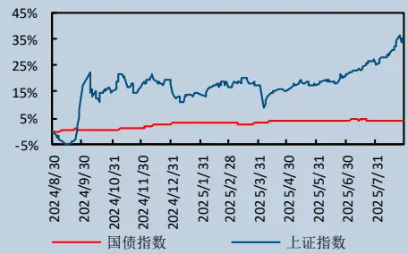

## 相关研究报告

## 一、简介

在先前的Factor Zoo 与Model Zoo 研究框架中，我们分析了将分钟级数据降频至日线级别进行Alpha 因子挖掘，并在此基础上对比了各类机器学习模型的表现。本文将在此基础上进行深化：我们将直接在分钟频率上构建预测因子，并结合股票的日内交易模式与微观结构特征，利用机器学习算法训练端到端的分钟频预测模型。

通过对A 股市场日内价格进行分析，其中我们发现“尾盘买入-隔日开盘卖出”的隔夜策略存在显著且持续的超额收益。为精确捕捉此效应，我们设计了一个分钟频率的机器学习交易模型。

在特征工程阶段，我们整合了Factor Zoo 分钟频因子与Alpha158因子，构成了一个高维的初始特征集。随后，我们利用树模型的特征重要性对其进行评估筛选，提取最具预测力的核心因子。

在模型架构上，我们采用了一种集成策略。融合了两种互补的模型：一是经典的 LightGBM，我们通过滚动训练的方式使其动态适应市场变化；二是一个创新的深度学习模型pegformer，其采用“Patch Embedding + GRU+ Transformer”的结构，旨在高效捕捉时间序列的局部与全局依赖关系，并通过增量学习提高训练效率。最终，我们将两个模型的预测信号进行集成，生成最终的交易决策。

结果表明，在中证 1000 指数成分股为交易标的的测试中，该分钟频隔夜模型取得了显著且稳健的Alpha 收益。

## 二、日内股价形态特征

在构建分钟频因子模型之前，我们必须解决一个核心的优化问题：如何在现实的交易约束下，确定最优的预测周期与持仓频率。一方面，过于高频的预测与交易虽能捕捉市场的瞬时机会，但由此产生的高昂交易成本极有可能吞噬策略的 Alpha 收益。另一方面，若持仓周期过长，源自高频数据的短期预测信号则会因快速衰减而失效，导致模型难以发挥其信息优势。为找到最佳平衡点，我们首先对股价的日内形态进行深入的统计分析，旨在识别出最具预测价值和交易性价比的时间窗口。

以A 股市场最具代表性的沪深300指数为研究对象，我们选取了其 2016年至 2022年间的全部成分股，并基于分钟频价格数据进行分析。为实现标准化比较，我们将各股票当日的分钟价格均以其开盘价进行归一化处理。通过计算所有样本在每分钟的平均价格，最终得到了一幅清晰的A 股市场典型日内价格形态图：

图 1:日内股价形态
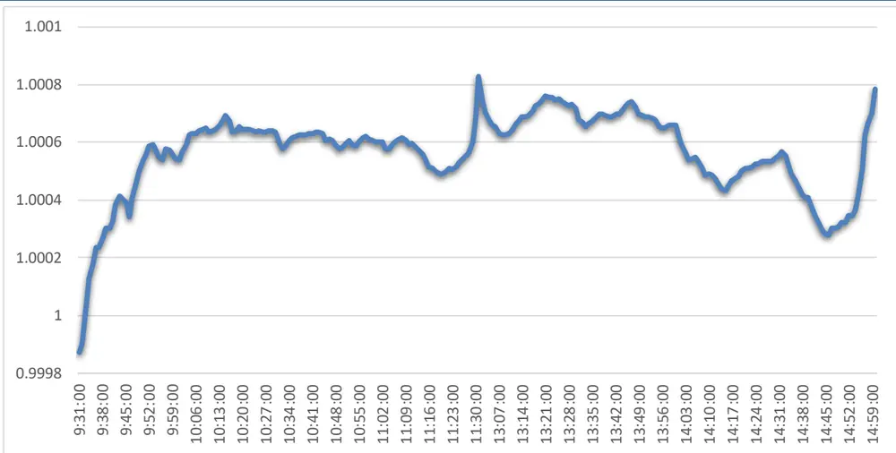
ricequant,

如图所示，从中可以明显看出，A 股市场呈现一个显著的特征：上下午交易时段的趋势存在明显差异。

- 上午时段，股价整体呈现稳步上升趋势，尤其在开盘后半小时内拉升最为迅猛。价格的日内高点通常出现在10点15分，此时的平均价格为 1.000691。

下午时段，股价则转为震荡下行。日内低点往往出现在 点 分，平均价格为 。值得注意的是，在临近收盘的最后 15 分钟，股价常呈现一轮拉升行情。此外，午间休市前后价格会出现显著的波动。

在不同的市场状态，不同的成分股内，股价的斜率有可能会有所区别，但是整体的形态大致保持一致。基于此形态特征，我们可以采取两种交易方式：

- 日内交易策略：若在上午高点卖出，下午低点买入，持仓大约 180 分钟，可获得的平均收益为~4.1bp(1.000691 - 1.000281)。

隔夜交易策略：若在尾盘买入并持有至次日开盘后卖出，持仓的交易时间大约为 60 分钟，不考虑隔夜涨跌影响，理论平均收益为~11.9bp (尾盘 1.000785 与下午低点之差 + 次日上午高点与开盘价之差)。

显然，在不考虑隔夜涨跌的情况下，隔夜交易策略持有时间更短，收益更高。而且隔夜交易也能完美避开A 股日内交易的限制，无需融券做空或者持有底仓。

但是此简单的隔夜交易无法覆盖实际的交易手续费，而且并未考虑隔夜涨跌带来的影响，长期来看， 股隔夜涨跌收益率平均为负，以沪深 指数为例， 年，指数整体收益率为 ，而如果只考虑日内收益，其累计收益率为 215.47%，平均每日收益率为 7.34bp, 隔夜累计收益率为-67.10%，平均每日收益率为-6.34bp。

图 2:沪深 300 日内累计净值
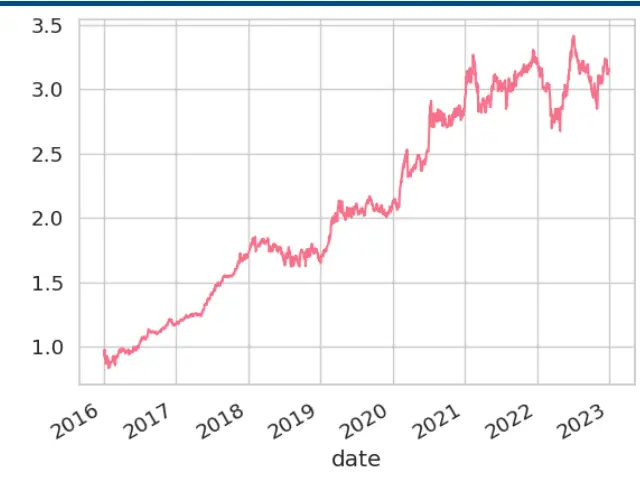
ricequant,

图 3:沪深 300 隔夜累计净值
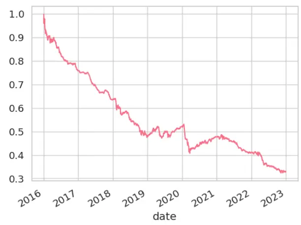
ricequant,

为了有效提升整体收益，我们必须在择时的基础上叠加选股因子。为此，我们构建一个基于机器学习的60分钟频率预测模型。通过个股选择来增强策略的收益，使其具备在真实市场中盈利的能力。

## 三、因子构建

## 3.1 Alpha158 因子

Alpha158 与 Alpha360 是 Qlib 中默认的两套因子计算方法：

- Alpha360 采用枚举法的构建方法，它基于六个基础特征——开盘价、最高价、最低价、收盘价、成交均价及成交量。对这六个特征进行归一化处理，并分别回溯过去 60 个交易日的数据，从而生成最终的因子列表。

- Alpha158 借鉴了一系列经典的量价因子构建思想，其结构设计更加复杂（见下表）。该因子集通过引入一个时间跨度参数d（短期取值[1-5]，中长期取值[5, 10, 20, 30, 60]），从动量、波动率、流动性等多个维度，深度刻画了股价的短中长期动态特征。

表 1:Alpha158 因子列表

| 因子名称 | 定义 |
| --- | --- |
| KMID | ($close-$open)/$open |
| KLEN | ($high-$low)/$open |
| KMID2 | ($close-$open)/($high-$low+1e-12) |
| KUP | ($high-Greater($open,$close))/$open |
| KUP2 | ($high-Greater($open,$close))/($high-$1ow+1e-12) |
| KLOW | (Less($open, $close)-$low)/$open |
| KLOW2 | (Less($open, $close)-$low)/($high-$low+1e-12) |
| KSFT | (2*$close-$high-$low)/$open |
| KSFT2 | (2*$close-$high-$low)/($high-$low+1e-12) |
| OPEN%d | Ref($open, %d)/$close |
| HIGH%d | Ref($high, %d)/$close |
| LOW%d | Ref($1ow, %d)/$close |
| VWAP%d | Ref($vwap, %d)/$close |
| VOLUME%d | Ref($volume, %d)/($volume+1e-12) |
| ROC%d | Ref($close, %d)/$close |
| MA%d | Mean($close, %d)/$close |
| STD%d | Std($close, %d)/$close |
| BETA%d | Slope($close, %d)/$close |
| RSQR%d | Rsquare($close, %d) |
| RESI%d | Resi($close, %d)/$close |
| MAX%d | Max($high, %d)/$close |
| MIN%d | Min($1ow, %d)/$close |
| QTLU%d | Quantile($close, %d, 0.8)/$close |
| QTLD%d | Quantile($close, %d, 0.2)/$close |
| RANK%d | Rank($close, %d) |
| RSV%d | ($close-Min($1ow, %d))/(Max($high, %d)-Min($1ow, %d)+1e-12) |
| IMAX%d | IdxMax($high, %d)/%d |
| IMIN%d | IdxMin($1ow, %d)/%d |
| IMXD%d | (IdxMax($high, %d)-IdxMin($1ow, %d))/%d |
| CORR%d | Corr($close, Log($volume+1), %d) |
| CORD%d | Corr($close/Ref($close,1), Log($volume/Ref($volume, 1)+1), %d) |
| CNTP%d | Mean($close>Ref($close, 1), %d) |
|  | Mean($close<Ref($close, 1), %d) |
| CNTN%d |  |
| CNTD%d | Mean($close>Ref($close, 1), %d)-Mean($close<Ref($close, 1), %d) |
| SUMP%d SUMN%d | Sum(Greater($close-Ref($close, 1), 0), %d)/(Sum(Abs($close-Ref($close, 1)), %d)+1e-12) |

SUMD%d (Sum(Greater($close-Ref($close, 1), 0), %d)-Sum(Greater(Ref($close, 1)-$close, 0), %d))/(Sum(Abs($close-Ref($close, 1)), %d)+1e-12)

| VMA%d | Mean($volume, %d)/($volume+1e-12) |
| --- | --- |
| VSTD%d | Std($volume, %d)/($volume+1e-12) |
| WVMA%d | Std(Abs($close/Ref($close, 1)-1)*$volume, %d)/(Mean(Abs($close/Ref($close, 1)-1)*$volume, %d)+1e-12) |
| VSUMP%d | Sum(Greater($volume-Ref($volume, 1), 0), %d)/(Sum(Abs($volume-Ref($volume, 1)), %d)+1e-12) |
| VSUMN%d | Sum(Greater(Ref($volume, 1)-$volume, 0), %d)/(Sum(Abs($volume-Ref($volume, 1)), %d)+1e-12) |
| VSUMD%d | (Sum(Greater($volume-Ref($volume, 1), 0), %d)-Sum(Greater(Ref($volume, 1)-$volume, 0), %d))/(Sum(Abs($volume-Ref($volume, 1)), %d)+1e-12) |

资料来源：Qlib，中信建投证券

我们此前的研究结果表明，Alpha158 作为机器学习模型的特征输入，其预测效果优于Alpha360。因此，为了追求更优的模型性能，我们在此次研究中继续采用Alpha158作为基础因子构造方式。

图 4:Alpha360 模型效果

| Model Name | GRU | DA-RNN | TCN | Transformer |
| --- | --- | --- | --- | --- |
| Type | RNN | RNN+Attn | CNN | Attn |
| IC | 0.0791 | 0.0946 | 0.0911 | 0.0894 |
| ICIR | 7.8283 | 8.2899 | 7.5706 | 6.9455 |
| Annualized Return | 25.68% | 23.14% | 26.60% | 30.33% |
| Information Ratio | 1.39 | 1.23 | 1.39 | 1.56 |
| Max Drawdown | 22.01% | 24.97% | 25.25% | 22.99% |
| Alpha | 29.86% | 27.36% | 30.92% | 34.43% |
| Information Ratio(alpha) | 2.51 | 2.24 | 2.37 | 2.35 |
| Max Drawdown(alpha) | 9.71% | 9.60% | 10.56% | 11.17% |

数据来源：WIND，中信建投证券

图 5: Alpha158 模型效果

| Model Name | GRU | DA-RNN | TCN | Transformer |
| --- | --- | --- | --- | --- |
| Type | RNN | RNN+Attn | CNN | Attn |
| IC | 0.0955 | 0.1010 | 0.0895 | 0.0917 |
| ICIR | 8.5981 | 8.3104 | 8.2774 | 7.5023 |
| Annualized Return | 34.31% | 30.64% | 23.69% | 32.12% |
| Information Ratio | 1.53 | 1.45 | 1.26 | 1.56 |
| Max Drawdown | 23.45% | 23.08% | 22.58% | 21.86% |
| Alpha | 38.86% | 34.96% | 27.91% | 36.34% |
| Information Ratio(alpha) | 2.25 | 2.15 | 2.28 | 2.27 |
| Max Drawdown(alpha) | 13.94% | 13.23% | 8.86% | 12.35% |

数据来源：WIND，中信建投证券

## 3.2 Factor Zoo 因子

在我们的Factor Zoo 系列研究中，我们曾从振幅、标准差、高阶矩、成交占比、流动性、动量、量价相关性、极值位置等多个维度构建了数千个因子。在对每类因子的日内规律进行深入分析后，我们最终筛选出了一批预测效果好且相关性低的有效因子。

需要注意的是，原始 Factor Zoo 在构建的最后一步是将因子降频为日频数据，其筛选标准也着眼于对 5日收益率的预测效果。但得益于我们底层架构的灵活性，绝大多数因子（部分统计类因子除外）只需移除其最后的降频步骤，便可以还原为它们最原始的分钟频序列，从而直接应用于我们的分钟频模型中。

表 2: Factor Zoo 优选因子列表

|  | ic_mean | icir | long-short | signic0 | signic004 | t | Group1 | Group2 | Group3 | Group4 | Group5 |
| --- | --- | --- | --- | --- | --- | --- | --- | --- | --- | --- | --- |
| DownResample(Max($high,240)/Min($low,240)- |  |  |  |  |  |  |  |  |  |  |  |
| 1,240,239) | -0.0706 | 3.46 | -0.68% | 71% | 61% | -21.44 | -0.39% | 0.01% | 0.09% | 0.10% | 0.30% |
| DownResample(Mad($high,240)/$close,240,"last' |  |  |  |  |  |  |  |  |  |  |  |
| ) | -0.0583 | 2.92 | -0.67% | 68% | 58% | -18.12 | -0.35% | 0.00% | 0.07% | 0.08% | 0.32% |
| DownResample(UpStd($close/Ref($close,4)-1,24 |  |  |  |  |  |  |  |  |  |  |  |
| 0),240,"last") | -0.0839 | 5.22 | -0.99% | 77% | 67% | -32.41 | -0.54% | 0.00% | 0.12% | 0.15% | 0.45% |
| DownResample(Kurt($close/Ref($close,4)-1,240), |  |  |  |  |  |  |  |  |  |  |  |
| 240,"last") | -0.0442 | 3.69 | -0.12% | 74% | 56% | -22.91 | 0.00% | -0.08% | 0.00% | 0.07% | 0.13% |
| PartialRatio($num_trades,240,"sum",235,240) | -0.0487 | 5.30 | -0.76% | 78% | 57% | -30.77 | -0.37% | -0.15% | 0.01% | 0.14% | 0.38% |
| PartialRatio($volume,240,"sum",235,240)*$s_dq |  |  |  |  |  |  |  |  |  |  |  |
| freeturnover | -0.0911 | 4.89 | -1.15% | 75% | 66% | -30.32 | -0.67% | 0.02% | 0.13% | 0.17% | 0.47% |
| DownResample(Corr(Ref($high,1),$volume,237), |  |  |  |  |  |  |  |  |  |  |  |
| 240,236) | -0.0544 | 5.00 | -0.96% | 79% | 60% | -31.04 | -0.50% | -0.06% | 0.06% | 0.13% | 0.46% |
| DownResample(Min($close/Ref($close,7)-1,240), |  |  |  |  |  |  |  |  |  |  |  |
| 240,"last") | 0.0765 | 4.03 | 1.06% | 74% | 63% | 25.01 | 0.48% | 0.12% | 0.09% | 0.01% | -0.58% |
| DownResample(Peak($close,240),240,"last") | -0.0465 | 2.26 | -0.75% | 62% | 52% | -14.04 | -0.27% | -0.16% | -0.02% | 0.09% | 0.48% |

资料来源：WIND，中信建投证券

最终筛选保留的因子为：Max($high, 240) / Min($low, 240)-1、Mad($high, 240) / $close、UpStd($close /Ref($close, 4)-1, 240)、Kurt($close / Ref($close, 4)-1, 240)、Corr(Ref($high, 1), $volu me, 237)、Peak($close, 240)、Min($close/Ref($close,7)-1,240)。

以 UpStd($close / Ref($close, 4)-1, 240)为例，其日内表现特点以及因子的分组收益如下图所示：

图 6: 不同频率收益率上行波动率因子 IC
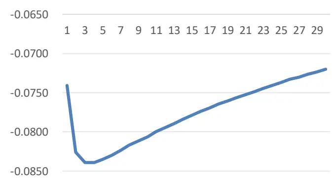
数据来源：WIND.中信建投证券

图 7: UpStd($close / Ref($close, 4)-1, 240)分组收益
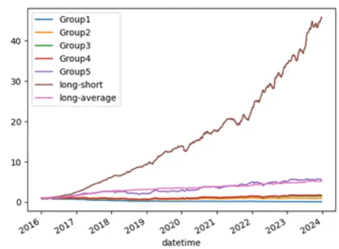
数据来源：WIND,中信建投证券

## 3.3 因子筛选

由于Alpha158因子数量较多，若将其与FactorZoo 因子全部作为模型输入，将导致过高的内存占用和缓慢的训练速度，这一计算效率问题在训练时序深度学习模型时尤为严峻。为此，我们首先进行因子筛选。

我们采用基于树模型的特征重要性来进行筛选。具体而言，我们在训练集上构建完整的Alpha158 与 FactorZoo 分钟频因子集，然后使用 LightGBM 模型进行训练，预测目标为未来60 分钟的收益率。根据模型输出的特征重要性排序，我们筛选出排名前 20的因子作为下一阶段模型的最终输入。

下表展示了经过特征重要性筛选后的最终因子排名。从表中可以清晰地看出， 系列因子占据了重要性排名的前列，其表现整体上优于 中的因子。一个非常有趣的现象是，尽管我们最初构建因子库的目标是预测周线级别的收益，但这些因子在剔出降频算子后，在分钟频率的模型中依然展现出了强大的预测力，这充分说明了它们在不同时间尺度上的普适性和有效性。

表 3:筛选因子列表

| Min($close/Ref($close,7)-1,240) |
| --- |
| Peak($close,240) |
| Corr(Ref($high, 1),$volume, 237) |
| Max($high, 240)/Min($low, 240)-1 |
| UpStd($close /Ref($close,4)-1,240) |
| Kurt($close / Ref($close, 4)-1, 240) |
| CORR60 |
| Mad($high, 240)/$close |
| CORD60 |
| WVMA60 |
| RSV60 |
| CORR30 |
| CNTP60 |
| MAX60 |
| IMXD60 |
| CNTN60 |
| STD60 |
| KLEN |
| CORR20 |
| MIN60 |

资料来源：中信建投证券

## 四、模型

为了充分利用数据特性，在模型架构上，我们采用了一种集成策略。融合了两种互补的模型：一是经典的LightGBM，通过滚动训练的方式使其动态适应市场变化；二是一个创新的深度学习模型pegformer，其采用“PatchEmbedding + GRU + Transformer”的结构，旨在高效捕捉时间序列的局部与全局依赖关系，并通过增量学习提高训练效率。最终，我们将两个模型的预测信号进行集成，生成最终的交易决策。

对于模型的训练数据，我们采用上文筛选出的 20 个分钟频率因子作为输入特征，预测目标设定为未来 60分钟的收益率。我们的数据集划分如下：初始训练集覆盖 年至 年，验证集为 年全年。在初始训练之后，模型将通过滚动训练或在线学习的机制持续更新，以生成动态的预测结果。

至于股票池的选择，为了平衡波动性和流动性，我们以中证 1000 指数的成分股作为本次研究的标的。

## 4.1 整体框架：集成学习

金融市场数据同时具备两种显著特性：

截面特征：在同一时刻，不同股票的因子表现存在差异，这些因子间的非线性关系和交互作用是预测未来收益的关键。

时序特征：单一股票的历史数据序列中，蕴含着动量、反转、波动率聚集等重要的动态模式。

传统的机器学习模型（如树模型）擅长处理截面特征，但难以捕捉长程的时间依赖性；而像 RNN,Transformer等深度学习模型则精于时序分析，但可能忽略因子间的复杂交互。因此，我们的集成框架旨在结合两者的长处，通过融合它们的预测信号，生成一个更全面、更鲁棒的最终决策。

## 4.2 LightGBM

LightGBM 是一款高效的梯度提升决策树（GDBT）框架，是处理表格化数据的经典模型之一。它以训练速度快、内存占用低和预测精度高而著称，非常适合处理大规模的因子数据。在我们的框架中，LightGBM 主要负责深度挖掘因子在截面上的非线性关系。它能有效识别在特定市场环境下，哪些因子组合对股票的短期收益最具预测力。

为了让模型能够动态适应市场风格切换，我们采用滚动训练的方式，初始训练集为 2016-2020 年，验证集为2021年，滚动间隔为 1年。为避免过拟合，模型超参采用 QLIB LightGBM 模型的默认超参，不做任何调整。

## 4.3 pegformer

为了有效捕捉金融时间序列中复杂的动态依赖关系，我们设计了 pegformer 的新型深度学习架构。该模型的核心结构为 Patch Embedding + GRU + Transformer。

图 8:pegformer backbone
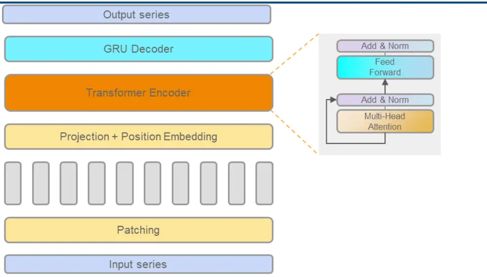
数据来源：中信建投证券

## 4.3.1 pegformer 模型结构

pegformer模型结构如上图所示，核心框架主要由三部分组成：

1. Patch Embedding： 传统的时序模型通常逐个时间步（例如，逐分钟）处理数据，这在处理高频长序列时计算成本极高。借鉴计算机视觉领域的 Vision Transformer（ViT）思想，我们将输入的长时序数据切分为若干个连续且不重叠的 片段（ ） 。每个片段（例如， 分钟的数据）通过一个共享的嵌入层被映射成一个高维向量。此举不仅大幅缩短了输入序列的长度，降低了后续模块的计算复杂度，还能让模型在初始阶段就捕捉到如“10 分钟内 V型反转”之类的局部形态特征。

2. 第二层引入了 Transformer 的编码器模块。其核心的自注意力机制（Self-Attention）能够评估序列中所有片段之间的相互重要性，无论它们相距多远。这使得pegformer能够捕捉到全局范围内的长程依赖关系。例如，模型可以发现今天开盘第一个小时的某个模式，与下午收盘前的走势存在着关键的、非线性的关联。这是传统 RNN难以企及的。

3. GRU 通过其循环结构，能够有效捕捉数据片段之间的有序演化关系，从而将时间上的前后依赖信息隐式地编码到其输出中。这种对时序性的聚焦，与Transformer的全局视角形成了完美的互补。

pegformer 专注于从股票的历史序列中提取深层的时间模式，包括传统模型难以捕捉的局部形态和全局长程依赖。

## 4.3.2 pegformer 模型设置

模型的输入数据结构为三维格式 (b, t, f)，其中 b 是批处理大小，t 是时间序列长度，我们设定为 240（即每个预测点都基于过去240分钟的信息），f 是特征数量，即筛选后的20 个因子。

在正式训练之前，我们首先采用小样本对模型超参进行快速优化，优化框架使用 optuna, 优化参数包括：patch 长度，patch 滚动间隔，transformer 层数，特征长度，多头数目等。

图 9:optuna 超参优化
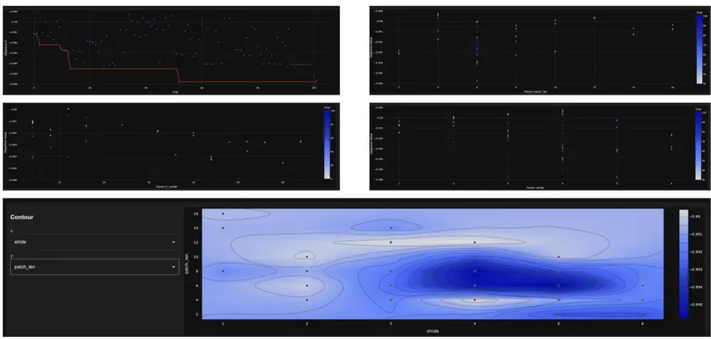
ricequant,

## 4.3.3 增量学习

与截面模型相比，时序深度学习模型对计算资源的需求更高。因此，为了平衡预测效果与训练效率，我们采用了一种基于增量学习的滚动更新策略。增量学习的核心是让模型能从新数据中持续学习，而非完全重头训练，从而在动态变化的环境中保持知识的连贯性。

具体来说，我们首先在初始训练集上训练一个耗时较长的基础模型。之后，每年使用新增的全年数据对模型进行一次全量微调，生成用于未来预测的新模型。

在微调技术上，我们选择全量微调（更新所有参数），因为经过测试对比，其效果优于只更新部分参数的局部微调。这主要归功于每次滚动训练时充足的年度样本量，足以确保全量参数能够收敛到新的最优状态。为防止模型在微调时出现灾难性遗忘，我们将学习率设置为初始学习率的十分之一，以保证新旧知识的平稳融合。

图 10:增量学习
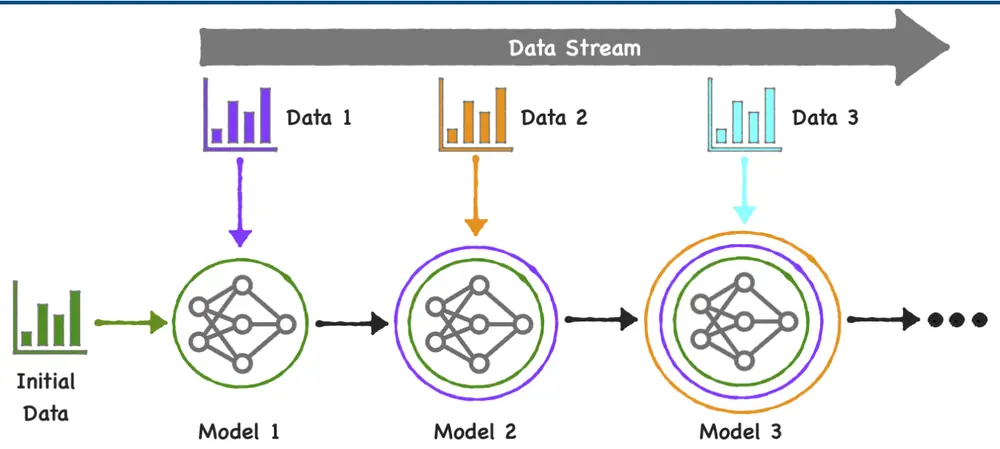
数据来源：mathworks，中信建投证券

## 五、结果

## 5.1 因子分析

我们将 LightGBM 与pegformer的预测结果进行等权相加，以得到最终的综合预测信号。该信号包含了每分钟对未来一小时收益的预测，但如此高频率的交易在实操中难以实现。

需要注意的一点是，如我们在第二章的分析中所指出的，最优的交易模式应为“14:45 买入，次日 10:46卖出”。考虑到实际交易中，模型计算与下单执行均需要时间，为了增加操作的容错空间，我们最终采用 14:40时刻生成的预测信号来指导当日的交易，确保交易的可执行性。

最终合成的因子在样本外（2022-2025.7）IC 均值为 0.087，IR 为 9.136。因子累计 IC 趋势稳定，如下图所示：

图 11:因子累计 IC
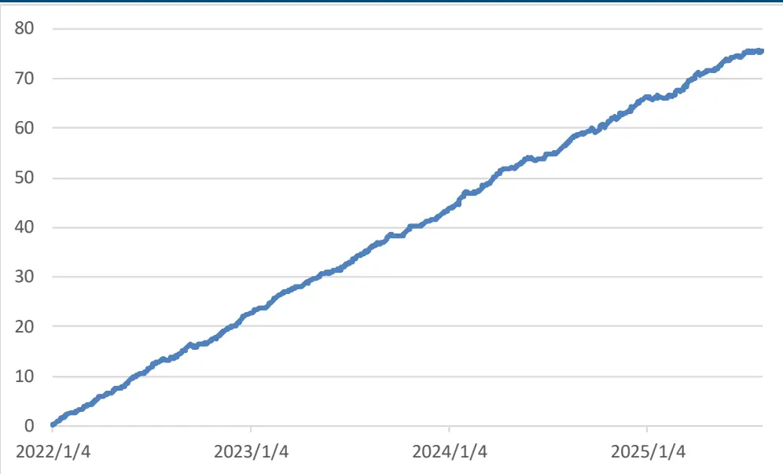
ricequant,

因子的分组表现如下图所示，可以看出，因子整体多空收益较为均衡，不存在空头占优的情况，且分组单调性较好。

图 12:因子分组累计净值
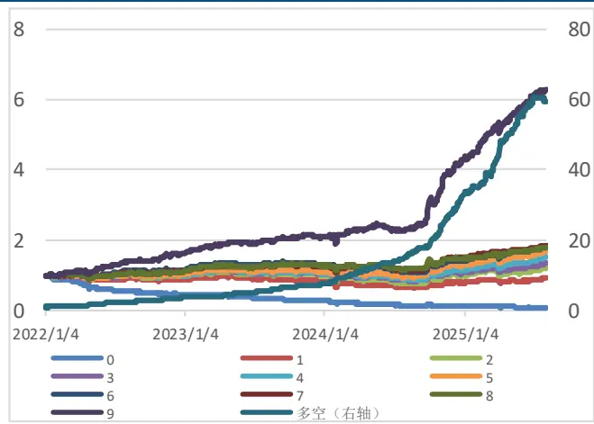
ricequant,

图 13:因子分组平均收益
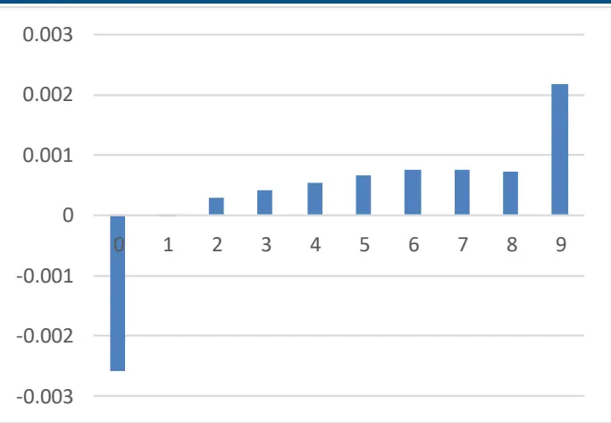
ricequant,

## 5.2 策略回测

通过14点40预测得到的信号，我们构建隔夜交易策略，策略具体设置为：

回测区间： 2022.1-2025.7

买入价格： 当日 14:41 - 14:50 区间的 VWAP

卖出价格： 次日 10:11 - 10:20 区间的 VWAP

持仓规则： 等权买入中证1000成分股内得分最高的 50只股票

手续费： 双边千二

基准： 中证1000

策略的最终回测净值曲线如下图所示。从图中可以观察到，策略整体表现非常突出，夏普达到了 ，实现了持续稳健的收益增长。尤其值得注意的是，在市场环境迥异的 2022 年和 2024 年，该策略均取得了显著的超额收益。

图 14:回测结果
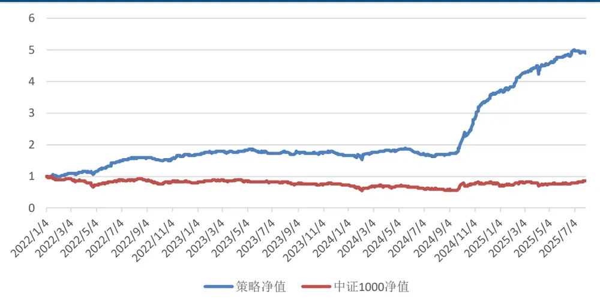
ricequant,

策略具体表现：

表 4:策略表现

|  | 年化收益率 | 年化波动率 | 夏普比率 | 最大回撤 | 超额信息比率 |
| --- | --- | --- | --- | --- | --- |
| 策略 | 59.23% | 16.75% | 3.5355 | -17.95% | 2.2153 |
| 基准 | -4.92% | 25.74% | -0.1910 | -46.22% | / |

ricequant,

策略分年度表现：

表 5:策略分年度表现

| 策略 | 基准 超额 |
| --- | --- |
| 2022 67.35% | -21.56% 88.91% |
| 2023 -1.34% | -9.62% 8.29% |
| 118.53% |  |
| 2024 2025 34.26% | 4.97% 113.55% 15.89% 18.37% |

ricequant,

鉴于本策略的日度调仓模式，其年化换手率高达 250 倍，这表明策略的最终表现对交易成本高度敏感。为了评估其在更严苛交易环境下的稳健性，我们进行了一次压力测试，将交易手续费标准由双边千分之二上调至千分之三。即便如此，策略的年化收益率仍能达到 ，夏普比率为 。将手续费上调至千四，策略依然能跑赢基准，这表明该策略其盈利能力足以承受较高的交易摩擦。

## 六、结论

本文通过对A 股市场日内微观结构的分析，我们成功构建了一个基于分钟因子模型的隔夜交易策略。策略采用集成学习，融合了 LightGBM 在截面数据上的优势和我们自研的pegformer模型在时间序列上的强大捕捉能力。在 年至 年 月的样本外测试中，该策略表现出卓越的盈利能力和稳健性。预测因子 均值达到0.087，信息比率高达 9.136。在千 2的交易成本假设下，策略能实现超过 64.15%的年化超额收益和 3.53的夏普比率，即使在较高的交易成本压力测试下，依然能取得显著的超额收益。

## 风险分析

本报告中所有数据结果是基于历史统计结果的展示，未来有可能发生风格切换导致因子失效的风险。模型运行存在一定的随机性，初始化随机数种子会对结果产生影响，单次运行结果可能会有一定偏差。历史数据的区间选择会对结果产生一定的影响。模型参数的不同会影响最终结果。模型对计算资源要求较高，运算量不足会导致结果存在一定的欠拟合风险。本文所有模型结果均来自历史数据，模型存在统计误差，不保证模型未来的有效性，对投资不构成任何建议。

## 分析师介绍

## 姚紫薇

金融工程及基金研究团队首席分析师，上海财经大学硕士，厦门大学统计学与数据科学系行业导师、中证报金牛奖专家评委。历任兴业证券金融工程分析师、招商证券基金评价业务负责人， 年加入中信建投研究发展部，深耕基金研究、资产配置、财富管理、数字化建设、大模型应用等领域，主导开发招商证券研基实验室、中信建投智研多资产配置+平台（网址：https://fund.csc.com.cn）。多次获得团队荣誉，获得 2020年新财富最佳分析师金融工程方向第 3名，2021 年新财富最佳分析师金融工程方向第2名。

## 王 超：

南京大学粒子物理博士，曾担任基金公司研究员，券商研究员，有丰富的研究和投资经验，2021年加入中信建投，主要负责量化多因子选股。

## 评级说明

| 投资评级标准 |  | 评级 | 说明 |
| --- | --- | --- | --- |
| 报告中投资建议涉及的评级标准为报告发布日后6个月内的相对市场表现，也即报告发布日后的6个月内公司股价（或行业指数）相对同期相关证券市场代表性指数的涨跌幅作为基准。A股市场以沪深300指数作为基准；新三板市场以三板成指为基准；香港市场以恒生指数作为基准；美国市场以标普500指数为基准。 | 股票评级 | 买入 | 相对涨幅15%以上 |
|  |  | 增持 | 相对涨幅 5%—15% |
|  |  | 中性 | 相对涨幅-5%—5%之间 |
|  |  | 减持 | 相对跌幅 5%—15% |
|  |  | 卖出 | 相对跌幅15%以上 |
|  | 行业评级 | 强于大市 | 相对涨幅10%以上 |
|  |  | 中性 | 相对涨幅-10-10%之间 |
|  |  | 弱于大市 | 相对跌幅10%以上 |

## 分析师声明

本报告署名分析师在此声明：（i）以勤勉的职业态度、专业审慎的研究方法，使用合法合规的信息，独立、客观地出具本报告, 结论不受任何第三方的授意或影响。（ii）本人不曾因，不因，也将不会因本报告中的具体推荐意见或观点而直接或间接收到任何形式的补偿。

## 法律主体说明

本报告由中信建投证券股份有限公司及/或其附属机构（以下合称“中信建投”）制作，由中信建投证券股份有限公司在中华人民共和国（仅为本报告目的，不包括香港、澳门、台湾）提供。中信建投证券股份有限公司具有中国证监会许可的投资咨询业务资格，本报告署名分析师所持中国证券业协会授予的证券投资咨询执业资格证书编号已披露在报告首页。

在遵守适用的法律法规情况下，本报告亦可能由中信建投（国际）证券有限公司在香港提供。本报告作者所持香港证监会牌照的中央编号已披露在报告首页。

## 一般性声明

本报告由中信建投制作。发送本报告不构成任何合同或承诺的基础，不因接收者收到本报告而视其为中信建投客户。

本报告的信息均来源于中信建投认为可靠的公开资料，但中信建投对这些信息的准确性及完整性不作任何保证。本报告所载观点、评估和预测仅反映本报告出具日该分析师的判断，该等观点、评估和预测可能在不发出通知的情况下有所变更，亦有可能因使用不同假设和标准或者采用不同分析方法而与中信建投其他部门、人员口头或书面表达的意见不同或相反。本报告所引证券或其他金融工具的过往业绩不代表其未来表现。报告中所含任何具有预测性质的内容皆基于相应的假设条件，而任何假设条件都可能随时发生变化并影响实际投资收益。中信建投不承诺、不保证本报告所含具有预测性质的内容必然得以实现。

本报告内容的全部或部分均不构成投资建议。本报告所包含的观点、建议并未考虑报告接收人在财务状况、投资目的、风险偏好等方面的具体情况，报告接收者应当独立评估本报告所含信息，基于自身投资目标、需求、市场机会、风险及其他因素自主做出决策并自行承担投资风险。中信建投建议所有投资者应就任何潜在投资向其税务、会计或法律顾问咨询。不论报告接收者是否根据本报告做出投资决策，中信建投都不对该等投资决策提供任何形式的担保，亦不以任何形式分享投资收益或者分担投资损失。中信建投不对使用本报告所产生的任何直接或间接损失承担责任。

在法律法规及监管规定允许的范围内，中信建投可能持有并交易本报告中所提公司的股份或其他财产权益，也可能在过去 个月、目前或者将来为本报告中所提公司提供或者争取为其提供投资银行、做市交易、财务顾问或其他金融服务。本报告内容真实、准确、完整地反映了署名分析师的观点，分析师的薪酬无论过去、现在或未来都不会直接或间接与其所撰写报告中的具体观点相联系，分析师亦不会因撰写本报告而获取不当利益。

本报告为中信建投所有。未经中信建投事先书面许可，任何机构和/或个人不得以任何形式转发、翻版、复制、发布或引用本报告全部或部分内容，亦不得从未经中信建投书面授权的任何机构、个人或其运营的媒体平台接收、翻版、复制或引用本报告全部或部分内容。版权所有，违者必究。

## 中信建投证券研究发展部

北京

朝阳区景辉街16 号院 1号楼18层

电话：（8610） 56135088

联系人：李祉瑶

邮箱：lizhiyao@csc.com.cn

上海

上海浦东新区浦东南路528号南塔 2103 室

电话：（8621） 6882-1600

联系人：翁起帆

邮箱：wengqifan@csc.com.cn

深圳

福田区福中三路与鹏程一路交汇处广电金融中心 35楼

## 中信建投（国际）

联系人：曹莹

电话：（86755）8252-1369

邮箱：caoying@csc.com.cn

香港

中环交易广场 2 期18楼

电话：（852）3465-5600

联系人：刘泓麟

邮箱：charleneliu@csci.hk