证券研究报告·金融工程深度

# “逐鹿”Alpha专题报告（三十）

# ——量价X 基本面因子挖掘统一框架

## 核心观点

本文建立了一套较为完整的方法体系：以点时一致性作为数据基础，以变量语义组织作为研究前提，通过受约束的候选生成控制表达空间，借助多目标函数完成候选评估，并以冗余控制与因子库准入保证研究质量，最终通过持续跟踪和分层归档实现研究资产的系统化管理。依此路径，因子研究不再停留于一次性回测，而能够形成可持续积累、可复盘、可迭代的 Alpha 研究生产体系。

## 主要内容

## 简介

本文构建了一套量价与基本面因子的联合挖掘框架，本文将市场行为与公司质量放在同一框架下进行刻画：前者负责识别定价方向和交易时点，后者负责提供价值锚和基本面约束。二者结合后，不仅能够缓解单一量价因子的高噪声问题，也能弥补单一基本面因子交易敏感度不足的缺陷，从而更容易挖掘出兼具经济解释、市场确认和样本外稳健性的优质因子。

## 框架

综合来看，本研究的因子挖掘算法可以概括为一条连续的研究闭环：以量纲和语义约束定义可解释搜索空间，强类型表达式树和经济模板生成候选结构，历史有效因子和 反馈形成热启动种子，以结构化简和形式去重提高候选质量，GP 加 LLM 提升因子表现，预筛控制计算成本，全样本复核确认统计有效性，再通过 Pareto 排序和 IC 序列相关性筛选完成 active 因子库沉淀。

## 结果

在本文中，我们采用基础的日频量价信息，三大财务报表，以及WIND的金融指标表等基础数据，数据起始日期设定为2016 年1月 1日，因子预测目标为未来 5日的收益率，分别在中证 500和沪深300内进行测试。

## 结论

本文的核心结论是：基本面与量价因子挖掘的关键，并不在于两类变量的简单组合，而在于将"企业经营变化"与"市场定价确认"统一为一个可经横截面检验的定价模型。

# 金融工程研究

## 姚紫薇

yaoziwei@csc.com.cn

SAC 编号: S1440524040001

SFC 编号: BXU265

## 王超

wangchaodcq@csc.com.cn

SAC 编号:S1440522120002

发布日期： 2026 年 06 月 15 日

## 市场表现

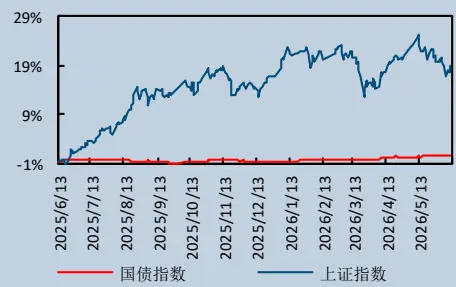

## 相关研究报告

## 图目录

## 一、简介

在之前的Factor Zoo 系列报告中我们分别介绍过量价因子与基本面因子挖掘的方法，传统量价因子挖掘主要从价格动量、波动率、成交活跃度和资金行为中提取市场定价信息，优势在于更新频率高、对市场状态变化反应快，但也容易受到短期情绪、风格切换和交易拥挤的影响；基本面因子挖掘则更多刻画企业估值水平、盈利能力、现金流质量、资产负债结构和成长持续性，能够从公司内在价值出发提供更稳定的中长期解释，但在交易时点和市场确认上往往相对滞后。

如何高质量地将量价因子与基本面因子进行融合，一直是量化研究中的核心难题之一。其关键挑战在于两类数据的频率不一致：量价信号多为日度、分钟级甚至高频，反映的是即时博弈与市场定价过程；基本面信号通常为季频或月频，更多体现企业的中长期价值状态，二者在更新节奏和噪声结构上天然不匹配。其次，经济学解释框架不同，量价因子更偏市场行为与流动性溢价，基本面因子则强调盈利质量与财务韧性。

以经典低波红利因子为例，从定义来看，低波红利是“高股息率”与“低波动率”的量价+基本面因子组合。深入分析我们会发现，它并不是两个标签的简单拼接。高股息率背后对应的是盈利能力、现金流、资本开支纪律和分红政策；低波动率背后对应的是市场风险偏好、机构持仓结构和资金定价习惯。当这两类信息同时出现时，市场往往在交易一种更深层的东西，即“稳定性资产”。

借鉴低波红利因子的构建思想，再结合我们之前的因子挖掘框架，本文构建了一套量价与基本面因子的联合挖掘框架，本文将市场行为与公司质量放在同一框架下进行刻画：前者负责识别定价方向和交易时点，后者负责提供价值锚和基本面约束。二者结合后，不仅能够缓解单一量价因子的高噪声问题，也能弥补单一基本面因子交易敏感度不足的缺陷，从而更容易挖掘出兼具经济解释、市场确认和样本外稳健性的优质因子。

图 1:量价与基本面因子挖掘
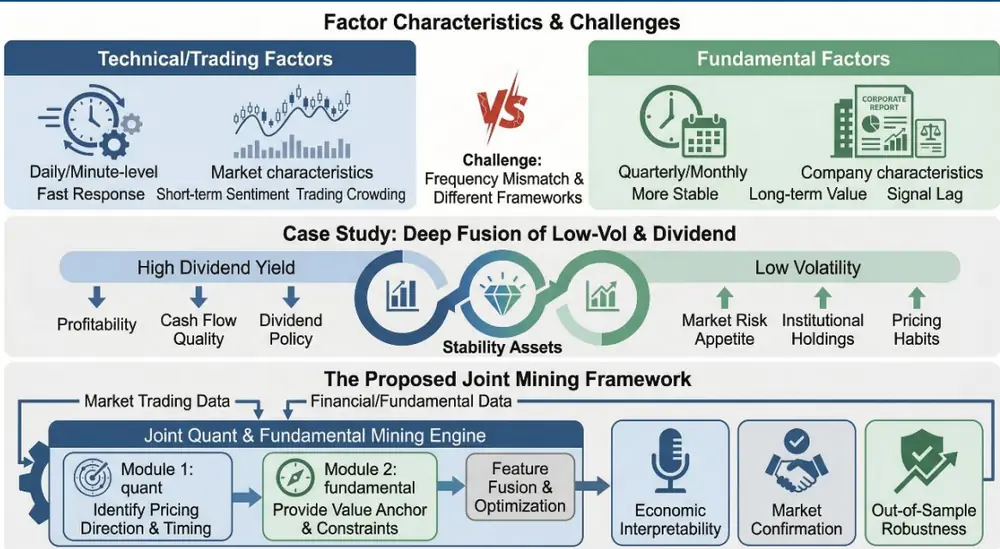
Nano Banana 2

## 二、背景

传统量化研究多从单一风格因子出发，量价因子和基本面因子分别形成了较成熟的研究体系。量价因子凭借数据频率高、反馈直接、可交易性强，在动量、反转、波动率、换手率、量价相关等方向上积累了大量成果；基本面因子则围绕估值水平、盈利能力、资产质量、现金流、资本结构和成长持续性，构建了具有较强经济解释的长期选股框架。

但单因子的局限性同样明显。量价因子虽然反应快，却天然带有较强的短期噪声属性，容易受到事件冲击、市场情绪和拥挤交易影响；基本面因子虽然稳定，但在财报披露间隔期内常常存在“慢半拍”问题，难以提供足够明确的交易时点。更进一步，在风格切换较快或市场波动加剧的环境中，单一维度因子更容易出现失效或衰减。

因此，市场实践越来越清楚地表明，真正高质量的选股体系必须同时回答两个问题：

第一，什么样的公司值得买入；

第二，什么时点适合买入。

前者更多由基本面决定，后者更多由量价决定。量价与基本面的融合，本质上是把“价值判断”与“定价确认”放入同一套研究逻辑中，使研究框架既能够识别企业层面的经营变化，也能够判断这种变化是否、以及何时被市场有效定价。

在此背景下，因子研究长期面临两个进一步需要解决的核心难点。其一，研究逻辑与工程执行之间往往存在明显断层。研究者可以提出“现金流改善将带来重估”或“盈利质量提升会强化相对收益”这样的经济命题，但在进入实证阶段后，往往会遇到数据时点不一致、字段口径复杂、信号组合失控、评价标准单一以及结果难以复用等问题。其二，传统因子研究通常以单一表达式或单次回测为终点，缺乏统一的因子筛选、沉淀与跟踪机制，导致研究成果难以形成持续积累。

本报告所要解决的，正是上述问题。该框架并不将因子挖掘局限于“表达式生成”这一单点，而是试图建立一条完整的研究生产线：首先解决数据进入研究体系时的时点一致性与结构组织问题；随后在受约束的表达空间内生成候选因子；再通过多维评估标准完成预筛选和完整评估；最后将通过门槛的因子沉淀为可持续更新的 Alpha 因子库。

## 三、方法论

## 3.1 框架介绍

融合基本面以及量价因子存在以下三大难点：

## 1. 数据频率不一致

量价数据是典型日频信息，甚至高频；基本面数据则主要是季频或月频。若直接拼接，容易导致时间错配和未来函数问题。因此，混合因子研究的第一步，不是设计公式，而是完成时间尺度统一。一个合理的做法是：以公告时点为核心，把财务指标先转换为逐日可用的信息，再进入日频选股流程。传统在构建基本面因子时，通常是根据发布日期将因子转换为固定频率，或者在所有公告发布完成后在固定日期构建因子，这两种方法限制了基本面因子挖掘方法的多样性和有效性。

## 2. 经济含义不同

量价信号描述的是市场交易行为，更多反映博弈、流动性和预期变化；基本面信号描述的是企业经营质量，更多反映盈利、现金流和资本结构。若两类信号没有清晰分工，复合因子就会失去解释力。实践中，市场端更适合承担“时点确认”和“交易约束”，基本面端更适合承担“价值锚”和“质量约束”。

## 3. 候选空间膨胀

一旦允许量价与基本面自由组合，表达式数量会迅速增长，若没有分层筛选和冗余约束，研究成本会被候选空间吞噬。因此，大规模混合因子研究必须是“分阶段验证”，而不是“一次性全量精评”。

为了解决以上问题，我们构建了统一因子挖掘框架，本框架并不将因子挖掘局限于“表达式生成”这一单点，而是试图建立一条完整的研究生产线：首先解决数据进入研究体系时的时点一致性与结构组织问题；随后在受约束的表达空间内生成候选因子；再通过多维评估标准完成预筛选和完整评估；最后将通过门槛的因子沉淀为可持续更新的 Alpha 因子库。

从整体结构看，该框架大体由五个层级构成：数据层、表达层、搜索层、评估层和资产化层。

第一，数据层负责处理不同数据源的组织方式与时点一致性问题。量价数据具有连续、规则、日频化的特征，适合直接展开为宽表结构；季度财务和基本面数据则带有公告日、报告期和非连续更新特征，需要以公告时点为基础进行安全对齐。该框架将财务信息按实际可获知时间投射到交易日序列，避免将未来信息提前用于历史时点，是其研究有效性的前提之一。

第二，表达层负责限定候选因子的经济边界。框架并非在完全开放的表达空间中无约束搜索，而是通过字段分类、量纲边界和结构限制，避免无意义组合的泛滥。换言之，研究的出发点不是“可生成多少表达式”，而是“生成的表达式是否具有明确经济含义”。

第三，搜索层承担候选因子的具体生成任务。框架当前主要包含三条主线：量价因子挖掘、基本面与量价混合因子挖掘、纯基本面因子挖掘。三条主线共同构成较为完整的研究覆盖面，既能够发现交易型信号，也能沉淀具备较强经济解释的结构化因子。

第四，评估层并不依赖单一收益指标，而是同时考察 IC、换手、覆盖度、稳定性、相关性和复杂度等多项维度。其意义在于，研究目标不再局限于统计显著性，而是进一步接近可交易性与可组合性要求。

第五，资产化层将通过筛选的候选因子沉淀到 Alpha 因子库，并保留历史归档、IC 序列和明细验证结果。由此，研究结果能够从单次回测产出，转化为可持续跟踪的研究资产，为后续专题深化和样本外检验提供基础。

图 2:框架结构
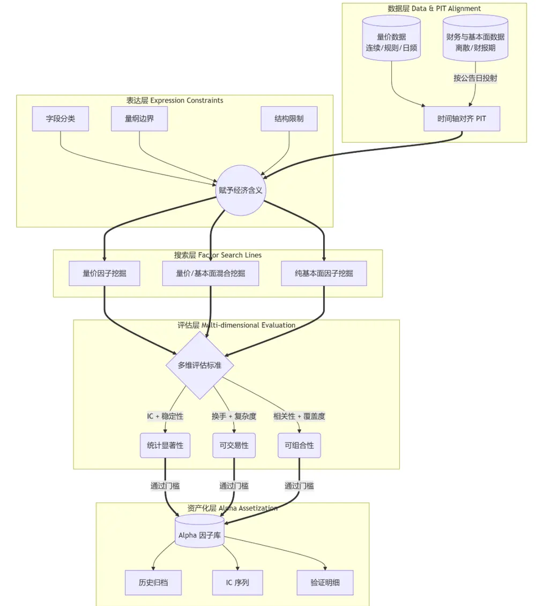
数据来源：中信建投证券

## 3.2 算子介绍

在本框架中，算子并不是泛化意义上的数学函数集合，而是一组已经纳入表达式解析、量纲校验、候选生成和因子评估流程的可执行变换工具。字段提供原始信息，算子决定信息以何种方式被提取和组合。若没有算子层，行情字段只能停留在价格、成交量和成交额的原始状态，财务字段也只能停留在会计科目或静态财务比率；通过算子变换后，这些字段才能进一步表达横截面位置、时序变化、波动状态、趋势稳定性、财务增长、市场确认和风险暴露。

当前框架的算子体系可以分为五类：基础算术、横截面算子、单变量时序算子、双变量时序关系算子、基本面衍生算子。需要说明的是，不同主线对算子的开放程度并不完全相同。量价与混合因子主线使用的算子更丰富，尤其依赖日频时序和双变量关系算子；纯基本面主线更强调同比、环比、TTM 和财务变量之间的稳健组合；LLM 生成的候选表达式也受到算子白名单约束，其作用是提出可执行假设，而不是绕开框架原有约束。

## 3.2.1 基础算子

基础算术算子构成表达式组合的底层语言，包括一元取负、加法、减法、乘法和除法。其研究作用主要是完成信号方向调整、正负贡献合成、比例关系构造和惩罚项扣减。例如，在混合因子中，基本面质量项与市场确认项通常以加法形式合成，杠杆压力、资本开支压力或波动风险则常以减法形式进入表达式。除法则常用于构造相对强弱、均线偏离、成交额放大倍数或财务覆盖率。

除了常见的四则运算外，我们进一步引入了稳健组合算子。这类算子当前主要包括 safe_div、spread、geom_mean、harm_mean、abs 和 log。

表 1:基础算子

| 算子 | 主要含义 | 典型研究用途 |
| --- | --- | --- |
| safe_div(x,y) | 带分母保护的比值结构 | 构造现金流覆盖、估值相对值、成交放大倍数等，降低极端分母导致的异 常值 |
| spread(x,y) | 两个变量差异的归一化表达 | 比较质量与风险、盈利与资本开支、短期与长期趋势之间的相对强弱 |
| geom_mean(x,y) | 几何平均 | 强调两个正向信号共同较强，适合盈利质量、现金流质量和市场确认的联 合表达 |
| harm_mean(x,y) | 调和平均 | 对短板更敏感，适合要求多个条件均衡成立的质量类结构 |
| abs(x) | 绝对值变换 | 处理幅度、偏离程度或风险强度 |
| log(x) | 对数变换 | 压缩市值、成交额、规模类变量的偏态分布 |

资料来源：中信建投证券

## 3.2.2 截面算子

横截面算子用于回答“同一交易日内，个股相对其他股票处于什么位置”。当前主链路中最核心的横截面算子是 rank 和 zscore。二者都用于将不同量纲的变量转化为可比较的截面信号，但侧重点有所不同。

rank(x) 将变量转化为横截面排序或分位状态，强调相对位置，对极端值不敏感，适合处理分布偏态较强的财务指标、成交指标和价格偏离指标。例如，成交额相对均值的放大倍数经过 rank 处理后，不再强调某只股票具体放大多少倍，而是强调其在全市场中处于多高的资金参与度分位。

zscore(x) 将变量转化为横截面标准分，保留了相对强弱的连续幅度，适合最终统一信号量纲，或将多个已经具备可比性的子信号合成为综合得分。在混合因子模板中，常见结构是先对基本面腿和量价腿分别做 rank，再在外层用 zscore 统一总信号。这种处理方式能够减少量纲差异对组合的干扰，使因子更接近横截面选股模型所需要的可比较得分。

## 3.2.3 单变量时序算子

单变量时序算子主要服务于量价因子和混合因子中的市场确认指标。其作用是从单个字段自身的历史序列中提取趋势、波动、相对位置、变化速度和稳定性。当前已经支持的主要单变量时序算子如下：

## 表 2:单变量时序算子

| 算子 | 研究含义 | 典型用途 |
| --- | --- | --- |
| ts_mean(x,n) | 过去n 期滚动均值 | 构造均线、成交均值、平滑基准 |
| ts_std(x,n) | 过去 n 期滚动标准差 | 衡量波动率、风险状态或不确定性 |
| ts_sum(x,n) | 过去n 期滚动求和 | 刻画阶段累计成交、累计资金参与或流量累积 |
| ts_delay(x,n) | 滞后n期取值 | 构造延迟比较、历史基准和避免时点混淆 |
| asof(x,n) | 按滞后窗口取可得值 | 用于低频数据或财务数据的时点对齐语义 |
| ts_delta(x,n) | 当前值相对n期前的差值 | 衡量绝对变化幅度 |
| ts_pct(x,n) | 当前值相对n期前的变化率 | 衡量价格、成交或指标的相对变化速度 |
| ts_max(x,n) | 过去n 期最高值 | 刻画突破、接近阶段高点或上方空间 |
| ts_min(x,n) | 过去n 期最低值 | 刻画回撤、低位修复或下方支撑 |
| ts_rank(x,n) | 当前值在过去n期中的相对位置 | 刻画时序分位、反转位置或拥挤程度 |
| ema(x,n) | 指数移动平均 | 更强调近期信息的趋势平滑 |
| ts_slope(x,n) | 单变量滚动线性趋势斜率 | 衡量趋势方向和趋势速度 |
| ts_resi(x,n) | 当前值相对滚动趋势线的残差 | 衡量偏离趋势的异常程度 |
| ts_rsquare(x,n) | 滚动趋势拟合优度 | 衡量趋势是否稳定、是否具有线性持续性 |

资料来源：中信建投证券

时序算子使变量能够从“静态价格或成交”转化为更丰富的市场状态。例如，close/ts_mean(close,20) 表达价格相对中期均线的位置，amount/ts_mean(amount,20) 表达成交参与度是否放大，ts_std(close,20)/close 表达价格波动率，ts_slope(close,20) 表达趋势方向，ts_rsquare(close,20) 则表达趋势是否稳定。相比单纯使用价格涨跌，时序算子能够更细致地区分趋势确认、波动压缩、突破状态和短期拥挤。

## 3.2.4 双变量时序算子

除单变量时序变换外，框架还支持双变量时序关系算子，用于刻画两个变量在滚动窗口内的联动关系。当前主要包括 ts_corr、ts_beta、ts_regression_slope、ts_regression_resi 和 ts_regression_rsquare。

ts_corr(x,y,n) 衡量两个变量在过去 n 期内的滚动相关性，适合研究价格与成交额是否同向变化、价格与开盘价关系是否稳定、量价行为是否形成一致性确认。ts_beta(x,y,n) 和 ts_regression_slope(x,y,n) 本质上都用于刻画一个变量相对另一个变量的滚动斜率关系，可用于表示价格对成交变化、收盘价对开盘价或其他市场状态变量的敏感度。ts_regression_resi(x,y,n) 则关注当前值相对双变量回归关系的偏离，适合刻画异常定价或短期背离。ts_regression_rsquare(x,y,n) 衡量这种关系的稳定程度，能够辅助判断某种市场联动是否具有一致性。

这类算子的引入，使市场确认指标不再局限于单一趋势或波动，而可以进一步刻画“价格变化是否伴随资金参与”“成交放大是否真正转化为价格确认”“当前走势是否偏离正常量价关系”。这对于中短周期因子尤为重要，因为许多短期 Alpha 并不来自基本面本身，而来自基本面变化被资金逐步确认的过程。

## 3.2.5 基本面衍生算子

基本面数据的特殊性在于披露频率低、报告期不连续，且不同财务科目的经济含义差异较大。因此，框架并未对财务字段无差别套用所有日频时序算子，而是优先提供更符合财务研究习惯的衍生算子，主要包括 yoy、 qoq 和 ttm。

yoy(x) 表示同比变化，用于衡量企业经营状态相对去年同期的改善或恶化。它适合收入、利润、现金流和部分费用类字段，能够弱化季节性影响，是成长类和盈利改善类因子的基础变换。qoq(x) 表示环比变化，用于观察最近一期相对上一期的边际变化，更适合捕捉短期经营拐点。ttm(x) 表示最近四期滚动口径，主要用于收入、利润、现金流、费用等流量类科目，使低频财务数据更接近连续经营状态，而不是单季波动。

这些基本面衍生算子使框架能够围绕“水平、变化和持续性”三个层面组织财务信息。静态财务比率回答公司当前质量如何，yoy 和 qoq 回答质量是否正在改善，ttm 则帮助判断这种改善是否具备连续性。与量价时序算子相比，基本面衍生算子的窗口和含义更贴近财务报告制度，能够避免把日频交易语言机械套用到季度财务数据上。

需要注意的是，基本面衍生算子并非对所有字段都无条件开放。我们会根据字段来源和字段性质判断是否适合生成同比、环比或 TTM 口径。例如，利润表和现金流量表中的流量类字段更适合 TTM，部分财务指标也可以扩展为 TTM 或增长口径；而某些静态比率或资产负债表时点类字段，则更需要谨慎处理。

此外我们还支持外层中性化算子，主要包括 size_neutralize 和 industry_neutralize。这类算子并不用于生成新的经济变量，而是用于控制因子可能隐含的规模暴露或行业暴露，使最终信号更接近个股特异性 Alpha。

size_neutralize 用于剔除或弱化因子对市值规模的线性依赖。对于 A 股市场而言，许多财务质量、流动性和趋势信号都可能天然带有市值偏向。如果不做处理，因子表现可能部分来自大盘/小盘风格，而非表达式本身的选股信息。industry_neutralize 则用于在行业层面进行相对化处理，避免某些因子只是捕捉了行业景气或行业财务结构差异。

中性化算子在结构上受到严格限制：它们只能出现在表达式最外层，不能嵌套使用，也不能出现在表达式中间。其原因在于，中性化本质上是对最终信号做风险暴露处理，而不是普通变量变换。若允许在表达式内部随意嵌套中性化，因子含义会变得难以解释，也会显著增加结果复核难度。因此，我们将中性化定位为“最终信号的风险控制层”，而不是候选结构自由组合的一部分。

## 3.3 因子生成

成熟的因子研究并不是简单的数据挖掘，而是将其放入企业研究和市场研究的逻辑框架中。为了实现更具经济学含义的因子构造，我们首先对数据进行多维度的定义。

## 3.3.1 量纲

不同量纲之间的数据如果随意组合，往往会产生大量无效甚至误导性的因子表达式。其根本原因在于，因子表达式虽然在数学形式上可以完成计算，但并不必然具备清晰的经济含义。例如，将价格字段与利润字段直接相加，或将成交量与资产负债率直接相减，所得结果很难对应任何可解释的企业经营状态或市场定价行为。这类表达式即使在样本内偶然取得较高 IC，也更可能来自噪声拟合、极端值干扰或特定样本结构，而不是稳定的风险补偿或行为定价逻辑。因此，我们对数据进行量纲的定义用于后续合成的约束。使得合成的因子更具备可解释性。

首先对于行情数据中的开盘价、最高价、最低价、收盘价、均价、前收盘价、复权价格等字段，框架统一赋予价格量纲。这类变量本质上刻画股票在某一交易时点或交易区间内的价格水平，适合用于构造收益率、价格相对位置、均线偏离、趋势斜率、回撤幅度和波动结构等特征。其次，成交量、成交额、换手率等交易活跃度变量不应与价格变量混为一类。成交量代表股份成交数量，成交额代表交易金额，换手率则是成交活跃度的比例化表达。它们更多用于刻画市场参与度、交易拥挤度和资金关注程度。虽然成交额在数值上包含价格与成交量的共同信息，但在因子语义上更接近资金流动强度，而不是价格水平本身。

财务数据也需要根据经济含义划分量纲。利润、收入、资产、负债、现金流等字段属于货币量纲，通常用于构造规模、质量、覆盖率和资本结构类指标；毛利率、净利率、 、 、资产负债率等字段属于比率量纲，适合进行横截面排序、时序变化和同类指标之间的比较；同比增速、环比增速等字段属于增长量纲，主要用于刻画经营改善或恶化的方向与幅度。不同财务量纲之间并非完全不可组合，但必须通过合理的经济结构完成转换。例如，经营现金流除以营业收入可以表示收入现金含量，净利润除以净资产可以表示权益资本回报，而现金与短期负债的比值可以表示短期偿债安全边际。尽管市值也具有货币单位的量纲，但将其与营收等货币单位的数据直接进行加法或减法运算显然是不合适的。因此，我们会为这两类数据设置不同的量纲，并仅允许它们之间进行除法运算。这种处理方式确保了计算的准确性和合理性。

经过横截面排序、标准化、中性化或分位数变换后的变量，会从原始量纲转化为得分量纲。得分量纲的特点是已经弱化了原始单位，主要表达股票在横截面中的相对位置。因此，得分变量之间可以进行更灵活的组合，例如质量得分与趋势得分相加、现金流得分与波动惩罚项相减等。

## 3.3.2 语义

底层数据除了存在量纲差异之外，其背后的经济语义也并不相同。即便两个字段同属同一量纲，也不意味着它们可以在因子生成中承担相同角色。例如，毛利率和资产负债率都属于比率类指标，但二者所刻画的企业特征完全不同：毛利率主要反映企业产品竞争力、成本控制能力和盈利能力，资产负债率则更多反映资本结构、财务杠杆以及偿债安全边际。若仅依据量纲判断变量是否可组合，而忽略其经济语义差异，仍然可能生成大量逻辑含混、解释困难的因子表达式。

因此，在量纲约束之外，本文进一步引入经济语义分类。我们按照变量在企业研究和市场研究中的实际含义，将底层字段划分为盈利能力、成长性、现金流质量、资产质量、偿债能力、资本结构、营运效率、资本开支、股东回报、估值水平以及量价确认等若干类别。这样的分类并不是为了做简单标签管理，而是为了在因子生成阶段明确每类变量所回答的经济问题，进而约束变量之间的组合方式。通过语义分类，因子生成过程可以从“数值可计算”进一步提升到“经济可解释”。

盈利能力变量主要用于刻画企业当前经营模式的赚钱能力，典型字段包括毛利率、营业利润率、净利率、、 、 等。这类变量回答的是“企业能否在既定资产和资本投入下创造足够利润”。在因子生成中，盈利能力变量通常可以作为质量因子的核心腿，也可以与估值变量结合，形成“盈利质量相对价格是否被低估”的结构；还可以与趋势变量结合，判断市场是否正在确认盈利能力较强公司的重估过程。需要注意的是，盈利能力并不等同于利润规模。利润规模更容易受到公司体量影响，而盈利能力强调的是单位资产、单位资本或单位收入所带来的回报效率。

成长性变量主要用于刻画企业经营扩张和盈利改善的方向，典型字段包括营业收入同比增速、归母净利润同比增速、扣非净利润增速、经营利润增速、总资产增速、净资产增速等。这类变量回答的是“企业的经营状态是在改善还是恶化”。成长性变量适合用于构造盈利修复、收入扩张和景气改善类因子，但在使用时需要区分高质量成长与低质量扩张。单纯收入增长并不必然带来股东价值提升，如果增长伴随现金流恶化、应收账款上升或杠杆扩张，其投资含义可能明显下降。因此，成长性变量通常需要与现金流质量、盈利能力或资产质量变量共同使用。

现金流质量变量主要用于判断利润是否具备真实现金支撑，典型字段包括经营活动现金流净额、自由现金流、经营现金流占营业收入比例、经营现金流占净利润比例、现金流负债覆盖率、销售商品提供劳务收到的现金等。这类变量回答的是“账面利润是否能够转化为真实现金流”。在 股市场中，利润质量差异往往会带来显著的估值分化，因此现金流质量是基本面因子中非常重要的一类语义域。与盈利能力变量相比，现金流质量更强调稳健性和可持续性；与成长性变量相比，它更强调增长是否真实、是否具备可兑现基础。

资产质量变量主要用于刻画资产结构的稳健性和潜在减值风险，典型字段包括应收账款占收入比例、存货占资产比例、商誉占净资产比例、固定资产占比、资产减值损失、坏账准备、预付款项、其他应收款等。这类变量回答的是“企业资产负债表中是否隐藏了经营风险”。资产质量变量通常不是直接刻画收益弹性的变量，而是更多承担风险识别和负面过滤功能。例如，应收账款快速扩张但现金回款没有同步改善，可能意味着收入确认质量下降；商誉占比较高且盈利能力下滑，可能意味着未来存在减值压力。因而在因子生成中，资产质量变量常与盈利增长、现金流或估值变量组合，用于区分真实改善与报表扩张。

偿债能力与流动性安全变量主要用于衡量企业短期和中长期债务压力，典型字段包括流动比率、速动比率、现金比率、资产负债率、有息负债率、经营现金流对流动负债覆盖率、利息保障倍数等。这类变量回答的是“企业是否具备足够的财务安全边际”。在市场波动加大、信用环境收紧或风险偏好下降的阶段，偿债能力因子往往更容易获得定价权。其在因子生成中的常见用法，是与价格回撤、波动压缩或成交确认变量结合，识别“基本面安全边际较高且市场风险偏好正在修复”的标的。

资本结构变量主要用于描述企业融资方式和财务杠杆特征，典型字段包括总负债、短期借款、长期借款、应付债券、有息负债、所有者权益、资本公积、留存收益等。这类变量与偿债能力存在联系，但研究侧重点不同。偿债能力关注企业是否能偿还债务，资本结构更关注企业如何使用债务和权益资本，以及这种融资结构是否会放大利润波动。高杠杆并不一定意味着低质量，但在盈利下行或现金流恶化阶段，高杠杆会放大基本面风险；而在景气上行阶段，适度杠杆也可能提升权益回报。因此，资本结构变量通常需要与盈利周期、现金流状态和行业属性共同解释。

营运效率变量主要用于衡量企业资产使用效率和经营周转能力，典型字段包括总资产周转率、存货周转率、应收账款周转率、固定资产周转率、营业周期、现金转换周期等。这类变量回答的是“企业是否能够高效使用资产创造收入和现金流”。营运效率改善通常意味着经营管理质量提升，也可能意味着行业需求恢复或渠道库存压力下降。在因子生成中，营运效率变量适合与成长性变量结合，用于识别“收入增长并非依赖低效扩张，而是伴随资产使用效率提升”的公司。

资本开支与再投资变量主要用于刻画企业扩张意愿、产能投放和未来成长投入，典型字段包括购建固定资产支付的现金、资本开支、在建工程、研发费用、研发投入强度、固定资产增长率等。这类变量回答的是“企业是否正在为未来增长投入资源，以及投入是否具备回报潜力”。资本开支本身没有绝对好坏，关键取决于所处行业周期和企业盈利能力。在景气上行期，合理资本开支可能意味着未来产能释放；在需求疲弱或现金流紧张阶段，过度资本开支则可能形成财务压力。因此，这类变量往往需要与 ROIC、现金流和价格确认变量共同使用。

股东回报变量主要用于刻画企业对股东资本的分配意愿和资本纪律，典型字段包括分红率、股息率、回购金额、每股收益、每股净资产、留存收益变化等。这类变量回答的是“企业是否愿意并能够将经营成果回馈给股东”。股东回报变量在低波红利、稳定价值和防御型策略中具有重要意义，但也需要区分真实高质量回报与由于股价下跌被动抬升的高股息率。因此，这类变量通常需要与盈利稳定性、现金流覆盖和负债约束共同判断。

估值变量主要用于刻画市场价格相对于企业基本面的高低，典型字段包括 PE、PB、PS、PCF、EV/EBITDA、股息率以及市值相对收入、利润、现金流、净资产的比值结构。这类变量回答的是“当前市场价格是否充分反映了企业经营质量和成长预期”。估值变量本身通常不是独立的买入理由，低估值可能代表安全边际，也可能代表基本面恶化的合理折价；高估值可能意味着泡沫，也可能意味着市场对高质量成长的定价。因此，估值变量最适合与盈利质量、成长持续性和量价确认变量结合，形成“质量相对价格”“增长相对估值”或“估值修复确认”等结构。

总体来看，基本面变量的语义分类，使因子生成从“字段组合”转向“经济命题组合”。盈利能力回答企业是否赚钱，成长性回答企业是否改善，现金流质量回答利润是否真实，资产质量回答报表是否稳健，偿债能力回答风险是否可控，资本结构回答杠杆如何影响收益弹性，营运效率回答资产是否被有效利用，资本开支回答未来增长是否有投入基础，股东回报回答企业是否具备资本纪律，估值水平回答市场定价是否合理。只有在这些语义关系被明确后，基本面因子和混合因子的生成才不会停留在形式上的自动化，而能够真正服务于可解释、可验证、可复用的因子研究框架。

## 3.3.3 路径

本文并非采用无限制的搜索空间进行因子挖掘，原因在于，无边界枚举只会在数量上制造繁荣，却无法保证经济含义、统计稳健性和样本外可复现性。一个有效的生成器，并不应以表达式总量为目标，而应以在可解释约束下发现尽可能多的独立信号为目标。

本文采用的候选生成框架可以概括为三条路径。第一条是量价主导路径，利用价格、成交量、成交额等市场变量，通过时序变换与横截面比较生成候选信号。第二条是基本面主导路径，以财务指标之间的比率关系、增长关系和约束关系为基础，生成具有较强经济解释的结构化候选。第三条是混合路径，即围绕某一经济主题，将基本面变量作为核心指标，将市场变量作为确认指标，两者相辅相成形成更接近真实研究命题的候选空间。

在生成机制上，我们采用的是一种受限的结构搜索思想。候选表达式被视为在特定语法和量纲约束下生成的对象，而非任意字段的无限组合。换言之，变量并不是在完全自由的运算空间中被拼接，而是在预先定义的结构模板中被组合。这里最关键的两个约束分别是“量纲一致性”和“角色一致性”。量纲一致性保证原始财务比率、价格变量、成交量变量和经过排序或标准化之后的横截面得分不会被无意义地混合；角色一致性则保证变量是在其经济角色允许的范围内参与组合，例如基本面主线用于描述经营状态，市场指标用于确认或惩罚，而不是彼此相互替代。

这一方法的优势在于，搜索仍然是丰富的，但不会失控。研究员并不是在一个无限大的数学空间中碰运气，而是在一个受经济逻辑约束的表达空间中寻找最优候选。由此得到的表达式即便复杂，也更容易被解释为一个研究命题，而非偶然拟合的数学结果。

## 3.3.4 模板

混合因子是本文方法论的核心。为了避免“混合”沦为概念性描述，必须明确其内部模型结构。

从模型角度看，一个成熟的混合因子通常可以写成：

$$
f_{i,t}=g\big(F_{i,t},M_{i,t},P_{i,t}\big)
$$

其中， $F_{i,t}$ 表示基本面主线变量，用于刻画企业经营状态； $M_{i,t}$ 表示市场确认变量，用于刻画当前市场是否开始定价该经营变化； $P_{i,t}$ 表示惩罚或过滤变量组，用于抑制高风险、拥挤或失真结构。函数 g 则对应不同的组合方式，例如增强、确认、惩罚、筛选或非线性聚合。

这一框架的关键，不在数学形式本身，而在模型逻辑。研究员首先要明确主题。例如研究主题若是“现金流质量修复”，那么 $F_{i,t}$ 应当主要围绕经营现金流与利润匹配程度、现金流与债务覆盖关系、营运效率或增长改善展开； $M_{i,t}$ 则应优先引入反映趋势确认、成交活跃度和波动压缩的市场状态变量； $P_{i,t}$ 可以进一步引入高杠杆、异常高波动或过度拥挤作为惩罚。

例如我们可以构建一个基础的现金流量质量修复因子模板：

$$
\mathsf{zscore}(((\mathsf{rank}(\mathsf{amounUts\_mean}(\mathsf{amount\_20}))\quad+\mathsf{rank}(\mathsf{cashflow\_to\_profit}))\cdot\mathsf{rank}(\mathsf{capex\_to\_assets})))
$$

后续可以基于此因子模板进一步改进因子结构。

混合因子的本质并不是简单的在财务数据基础上加一个量价结构，而是将企业研究和交易研究用一个统一的模型对象表达出来。若没有这一层算法逻辑，所谓混合因子最终往往只是把几类变量简单相加，无法形成真正稳定的研究结果。

## 3.4 因子进化

在完成数据量纲定义、经济语义分类和候选表达式生成之后，因子挖掘进入真正的算法环节。本章所讨论的“算法”，并不只是用某种优化器在历史样本上寻找最高 IC 表达式，而是一个完整的研究生产过程：先在可解释的经济空间内定义搜索边界，再以受约束的方式扩展候选结构，随后通过分阶段评估压缩候选池，并最终把具有预测能力、交易可用性和独立信息增量的因子沉淀为可持续跟踪的研究资产。

这一定位决定了框架不宜把目标函数简单写成“最大化样本内 $\mathbf{I}\mathbf{C}^{\prime\prime}$ 。在实际研究中，样本内 IC 较高但换手过高、表达式过深、字段含义混乱或与已有因子高度重合的候选，并不具备稳定的投资价值。相反，真正值得保留的因子通常是在预测能力、稳健性、可解释性、低冗余和可交易性之间取得相对均衡。因此，本文采用的是“受约束搜索、反馈迭代、两阶段评估、多目标排序、相关性入库”的组合式算法框架。

## 3.4.1 优化问题定义

从形式上看，可以将全部数学表达式构成的空间记为 S。如果不加约束，S 的规模极大，且其中大部分表达式虽可计算，却缺乏经济意义。例如，价格与负债率直接相加、现金流绝对额与换手率直接相乘、短期波动率与单季利润金额直接比较，都可能在数值层面产生结果，但难以形成稳定的研究解释。因而，框架首先将可搜索空间压缩为一个受约束子集：

$$
\mathcal{S}^{*}=\{e\in S:D(e)=D^{*},C_{dim}(e)=1,C_{sem}(e)=1,C_{time}(e)=1,K(e)\leq K_{max}\}
$$

其中， $D(e)$ 表示表达式输出量纲， $D^{*}$ 表示目标量纲； $C_{dim}(e)$ 表示量纲约束是否通过， $C_{sem}(e)$ 表示经济语义约束是否通过， $C_{time}(e)$ 表示时间可用性和信息披露约束是否通过， $K(e)$ 表示表达式复杂度。该定义的核心含义是，因子挖掘并不是在所有可能公式中寻找最优点，而是在满足金融逻辑、数据可得性和执行约束的表达式集合内寻找有效结构。

对于任一候选表达式e，其在股票i、交易日t上生成因子值 $f_{i,t}^{e}$ ，并用于预测未来H日收益 $r_{i,t}^{H}$ 。因此，算法目标可以理解为在S∗中筛选一个因子集合A，使其不仅具备横截面预测能力，还能保持较低交易摩擦、较强解释清晰度和较低同质化程度。用多目标形式表示，候选评价不再是单一标量，而是：

$$
\operatorname*{m}_{e\in S^{*}}(IC(e),-Turnover(e),-Complexity(e),-Redundancy(e),Robustness(e))
$$

上述目标之间存在天然冲突。提高表达式复杂度可能改善样本内拟合，但会削弱可解释性和样本外稳定性；降低换手率有利于交易落地，但可能牺牲短周期反应速度；强调独立性有助于组合增量，却可能放弃部分单体 IC较高的相似因子。正因为如此，框架采用多目标筛选，而不是用固定权重把所有指标强行合成一个总分。

## 3.4.2 候选结构搜索

量价主线和混合主线的主体搜索方法，可以概括为强类型表达式树搜索。候选因子被表示为树状结构：叶子节点是行情字段、财务字段、行业或市值等控制变量，内部节点是横截面排序、标准化、时序均值、变化率、波动率、回归斜率、条件过滤以及加减乘除等算子。树状结构的优势在于，它既能够表达非线性关系和多层交互，也便于对每一层输入输出进行约束。

所谓强类型，并不是单纯的编程概念，而是研究逻辑在算法层面的体现。每一类字段和算子都对应特定量纲和语义。价格字段可以生成收益率、均线偏离、趋势强度和波动结构；成交字段可以刻画市场参与度、流动性变化和交易拥挤度；财务字段则更适合表达盈利能力、现金流质量、资产效率、资本结构和成长持续性。只有当上下游变量在量纲与语义上相容时，表达式才允许继续扩展。

这种机制使算法在生成阶段就排除了大量无效组合。以混合因子为例，基本面变量通常负责定义“公司质量或经营状态”，量价变量则负责确认“市场是否开始定价”。因此，框架更倾向于搜索“基本面主线 + 市场确认指标 风险过滤项”的结构，而不是让财务变量与行情变量在同一层级任意拼接。这样的约束并不会削弱探索能力，反而提高了搜索密度，使计算资源更多集中于具有可解释潜力的区域。

经济模板进一步强化了这一点。模板并不是固定公式，而是对研究主题、字段角色和结构边界的抽象描述。例如，盈利质量模板关注利润能否被现金流验证，资本纪律模板关注扩张投入是否带来回报，流动性安全模板关注短期偿债压力和资金覆盖能力，趋势确认模板关注价格相对位置与成交参与度是否同步改善。算法在模板范围内可以自由生成变体，但其生成方向始终围绕明确的经济假设展开。

因此，本框架中的搜索过程更接近“带有研究先验的结构化探索”，而不是无约束的公式随机组合。遗传规划中的初始化、变异和交叉机制仍然存在，但其作用是在既定研究边界内扩展表达式形态：初始化负责生成满足约束的基础候选，变异负责替换字段、调整窗口或改变局部算子，交叉负责把两个候选的有效子结构重新组合。最终保留下来的不是数学形式最复杂的表达式，而是在经济主题内表现出统计潜力的候选结构。

图 2:遗传规划变异和交叉机制
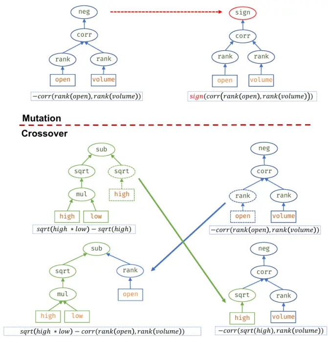
数据来源：中信建投证券

## 3.4.3 热启动与 LLM 迭代

完全从随机候选开始搜索，往往会带来两个问题：一是有效候选比例较低，计算资源大量消耗在低质量表达式上；二是搜索结果容易在不同主题之间漂移，难以形成连续研究线索。为提升搜索效率，框架引入种子热启动机制，即在候选池生成之初纳入已有有效因子、人工研究模板、历史表现较好的结构片段以及外部研究假设。

种子机制的价值在于，它把历史研究积累转化为下一轮搜索的起点。若某类结构在过去样本中表现较好，算法不应简单重复同一表达式，而应围绕其经济内核寻找变体。例如，若“经营现金流改善叠加成交额放大”的结构有效，下一轮搜索可以尝试替换现金流口径、改变市场确认窗口、加入波动压缩过滤，或在不同股票池中调整财务腿与量价腿的权重。这样，因子挖掘不再是彼此孤立的多轮随机实验，而是围绕有效主题持续演化。

在此基础上，框架进一步引入了最小可行版本的 反馈迭代机制。其基本思路是：每一轮挖掘结束后，系统将上一轮候选的表现摘要转化为结构化反馈，包括高 IC 因子的共同特征、高换手候选的问题、与 active 库高度相关的冗余模式、复杂度较高但贡献有限的结构，以及不同股票池之间的表现差异。 并不直接决定因子是否入库，而是根据这些反馈生成下一轮候选假设和种子表达式，再由原有约束与评估体系进行严格过滤。

这一设计实际上构成了“挖掘—评估—复盘—再生成”的闭环。若上一轮结果显示某些高 IC 因子主要来自同一量价结构，LLM 反馈会倾向于保留其有效经济主题，但要求更换市场确认变量或财务语义腿，以降低同质化；若候选整体换手偏高，反馈会倾向于引入更平滑的时序窗口、低频确认信号或基本面锚定项；若某些表达式复杂度过高但并未带来明显增量，反馈会推动表达式向更简洁的结构收敛；若某一股票池长期新增因子不足，则反馈会优先提示改变主题方向，而不是继续重复已有模板。

需要强调的是， 在该框架中的角色是“研究助理”和“假设生成器”，而不是最终的优化器。其生成内容必须经过字段白名单、量纲约束、语义约束、表达式合法性、复杂度限制和样本评估等多重检验。换言之，LLM 提供的是更有方向感的搜索种子，真正决定候选是否有效的，仍然是后续统计检验和因子库管理规则。这样既可以利用大模型在归纳历史结果、提出结构变体方面的优势，又避免把不可验证的语言推理直接转化为投资结论。

## 3.4.4 结构化简与形式去冗余

由于因子挖掘存在较高淘汰率，框架通常不会只生成与目标数量相等的候选，而是先构建超采样候选池。候选池规模由目标因子数、搜索轮数、超采样比例和候选上限共同决定。其目的并不是追求表达式数量本身，而是为后续预筛选和多目标排序保留足够的结构多样性。若候选数量过少，最终筛选容易退化为按 简单排序，难以兼顾换手、稳健性和独立性。

不过，候选池扩容必须与去冗余同步进行。大量表达式可能只是表面形式不同，本质信号相近。例如，重复排序、常数缩放、无意义嵌套、可抵消的算子组合、等价比值或仅更换外层标准化方式的表达式，都可能制造“候选丰富”的错觉。框架在进入统计评估前先进行表达式化简、合法性检查和等价结构识别，尽可能剔除形式冗余。

这一阶段处理的是“结构冗余”，而不是“预测冗余”。结构冗余可以通过表达式规则和语义检查提前压缩；预测冗余则需要在完整评估后，通过因子值相关性、IC 序列相关性或与 active 库的表现相关性来进一步判断。二者分层处理的意义在于，前者提高计算效率，后者保证最终因子库的信息密度。

## 3.5 因子筛选

## 3.5.1 两阶段评估

候选池形成后，若直接对所有表达式进行全样本评估，计算成本会迅速上升，尤其是在全市场股票池、长历史窗口和混合因子场景下更为明显。因此，框架采用两阶段评估机制：第一阶段在代表性样本上快速预筛，第二阶段在完整股票池和完整时间窗口中复核。

预筛阶段通过采样计算因子IC，关注候选是否具备基础横截面预测能力。预筛阶段并不承担最终结论功能，而是用较低成本剔除明显无效的表达式，并保留高于最终目标数量的候选缓冲区。这样可以避免短样本波动导致潜在有效结构被过早淘汰，也能控制完整评估阶段的计算规模。

完整评估阶段则更加接近正式研究检验。除平均 外，还需要考察日度 序列稳定性、覆盖率、换手率、表达式复杂度、与已有因子的相似度，以及必要时的分组收益、多空收益和风险暴露。换手率用于刻画信号排序在时间上的变化速度，复杂度用于约束表达式过拟合和解释成本，冗余度用于衡量候选是否提供新增信息。一个候选即便单体 IC 较高，如果日度表现高度不稳定、换手过高、结构难以解释或与已有 active 因子高度重合，也不应直接进入最终因子库。

从研究流程看，两阶段评估的作用类似于“初筛”和“尽调”。预筛解决的是大规模候选中的效率问题，完整评估解决的是候选能否经得起正式检验的问题。二者结合，能够在控制计算成本的同时，降低因短期噪声或单一指标造成的误判。

## 3.5.2 多目标排序

完成全样本复核后，候选因子进入多目标排序环节。框架不采用单一 IC 排名，原因在于因子质量并不只由预测强度决定。对投资组合而言，低换手意味着更低交易摩擦，低复杂度意味着更强可解释性和更低过拟合风险，低冗余意味着更高组合增量，而稳健性则决定因子能否跨时间、跨股票池和跨市场状态持续发挥作用

候选表达式e的适应度向量可以表示为：

$$
F(e)=(IC(e),-Turnover(e),-Complexity(e),-Redundancy(e),Robustness(e))
$$

若某一候选在所有目标上均不差于另一候选，且至少一个目标更优，则前者支配后者。所有未被其他候选支配的表达式构成第一层 Pareto 前沿；剔除第一层后，再对剩余候选重复该过程，形成后续层级。Pareto 排序的优势在于，它避免了人为设定权重对结果的过度主导。不同市场阶段、不同股票池和不同产品约束下，研究者对 IC、换手、独立性和可解释性的偏好可能不同，而 Pareto 前沿保留的是多维意义上的有效候选集合。

在同一 Pareto 层内部，框架进一步使用拥挤距离刻画候选在适应度空间中的分布稀疏程度。拥挤距离较高，意味着该候选代表的结构相对稀缺，有助于保持候选池多样性；拥挤距离较低，则说明该区域已经存在多个相似候选，继续保留的边际信息有限。通过 Pareto 层级与拥挤距离结合，最终排序不只偏向高分候选，也能避免结果集中于少数高度相似的表达式族。

这一机制对于混合因子尤其重要。基本面与量价交互结构天然容易在某些有效主题附近聚集，例如现金流确认、盈利改善、波动压缩和成交放大。如果只按 IC 排名，最终候选可能被同一主题反复占据；引入多目标排序后，框架能够在保留强信号的同时，为不同经济主题和不同市场确认方式留下空间。

## 3.5.3 因子入库

多目标排序得到的是候选优先级，但候选是否能够成为 因子，还需要通过入库筛选。入库阶段首先考察绝对 IC 是否达到最低门槛。之所以关注绝对 IC，是因为因子方向可以通过符号统一处理，而预测强度本身才是核心。未达到门槛的候选可进入历史记录，用于后续复盘或主题分析，但不应占用 active 因子库容量。

对于通过基础门槛的候选，框架进一步比较其日度 IC 序列与 active 库中已有因子的相关性。若相关性过高，说明两者在预测收益的时间表现上高度同步，可能共享相同信息来源或暴露于同一市场状态。此时，即使新候选单体表现不错，其组合增量也可能有限。若新候选在 、稳定性和换手等方面明显优于已有因子，则可以替换原 active 因子；否则，应将其归入历史库，而不是简单扩充 active 数量。

这一机制使因子库管理从“积累高分表达式”转向“维护有效信息集合”。成熟的 alpha 库不应以数量为主要目标，而应追求有效性、稳定性与独立性的平衡。尤其在多轮自动挖掘后，若缺乏 序列相关性控制，active 库很容易被同一类信号的变体填满，导致后续组合构建看似因子数量充足，实则信息来源单一。通过入库去冗余，框架能够将研究产出沉淀为更高信息密度的 alpha 资产。

综合来看，本研究的因子挖掘算法可以概括为一条连续的研究闭环：以量纲和语义约束定义可解释搜索空间，强类型表达式树和经济模板生成候选结构，历史有效因子和 反馈形成热启动种子，以结构化简和形式去重提高候选质量，GP 加 LLM 提升因子表现，预筛控制计算成本，全样本复核确认统计有效性，再通过 Pareto排序和 IC 序列相关性筛选完成 active 因子库沉淀。

## 四、结果

在本文中，我们采用基础的日频量价信息，三大财务报表，以及WIND的金融指标（financial indicator）表等基础数据，数据起始日期设定为 2016 年 1月 1 日，因子预测目标为未来 5日的收益率，分别在中证500 和沪深300内进行测试。

## 4.1 中证 500

以中证500为例，在对最终的因子经过严格的有效性和相关性筛选之后，部分因子的表现为：

因子一：zscore(rd_expense_intensity)-zscore(amount)

因子解释：研发费用标准化 – 成交额标准化

因子一表明在中证500 成分股内，高研发投入、但市场关注度低（交易不活跃）的股票未来表现较好

因子 IC：0.051

多头组年化超额：9.41%

图 4:因子一 IC
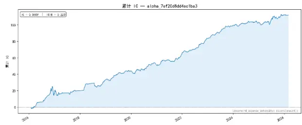
数据来源：WIND.中信建投证券

图 5:因子一分组收益
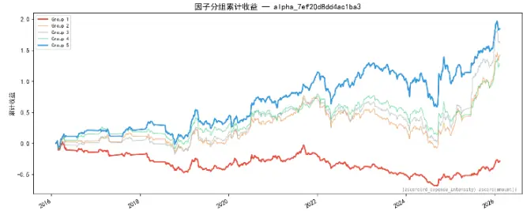
数据来源：WIND，中信建投证券

因子二：(rank(amount)+ts_std((rank(oper_rev_ttm__yoy)*zscore(s_fa_yoyebt)),30))

因子解释：流动性排名 + 营收与利润双成长的时序波动性

因子二表明在中证 500 成分股内，低流动性 + 低成长波动 即被市场忽视、且基本面成长信号稳定的公司，表现较好，本质上是 "冷门稳定成长股" 的短期反转/价值修复逻辑

因子 IC：-0.060

多头组年化超额：8.69%

图 6:因子二 IC
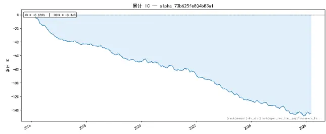
数据来源：WIND,中信建投证券

图 7:因子二分组收益
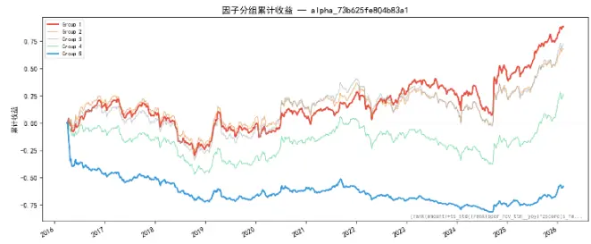
数据来源：WIND,中信建投证券

因子三：

geom_mean((harm_mean(rank(s_fa_cogstosales),rank(s_fa_ocftoshortdebt))+rank(s_qfa_yoynetprofit)),zscore((close -l ow)))

因子解释： (rank(成本率)与rank(偿债能力)的平均 + rank(净利润增速) ) 与 日内动量 的平均

因子三表明在中证500 成分股内，（成本率+偿债能力+利润增速）偏低、同时价格动量（close-low）偏弱的股票未来表现较好，本质是 低质量股的短期反转 效应

因子 IC：-0.045

多头组年化超额：10.43%

图 8:因子三 IC

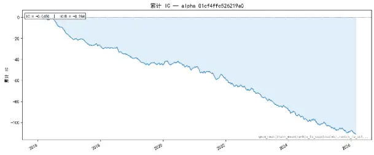
数据来源：WIND,中信建投证券

图 9:因子三分组收益
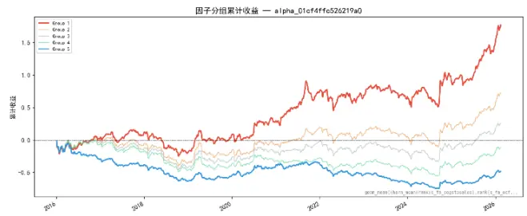
数据来源：WIND，中信建投证券

## 4.2 沪深 300

以沪深300为例，在对最终的因子经过严格的有效性和相关性筛选之后，部分因子的表现为：

因子一： zscore((geom_mean(rank((-rank(ts_pct(close,5)))),rank(operating_cf_margin_ttm))*rank(safe_div(ts_sum(amount,40),t s_std(amount,40)))))

因子解释：短期反转与现金流质量平均值 * 流动性稳定性

因子一表明在沪深 300 成分股内，近 5 日下跌 + 现金流质量高 + 流动性稳定的股票未来表现较好，本质是一个 "质量股短期反转"因子

因子 IC：0.0437

多头组年化超额：6.87%

图 10:因子一 IC
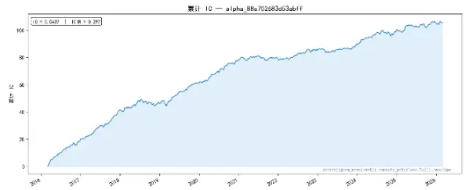
数据来源：WIND，中信建投证券

图 11:因子一分组收益
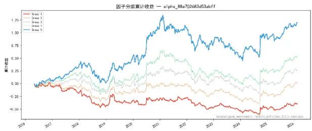
数据来源：WIND,中信建投证券
因子解释：资本开支强度与最低价 5 日时序百分位平均值的 300日平均值

因子二：zscore(ts_mean(harm_mean(rank(capex_to_operating_cf_ttm),ts_rank(lo w,5)),300))

因子二表明在沪深 300 成分股内，长期维持"高投资+股价有支撑"的公司，未来 5 日有正超额。本质上是 "市场认可的增长型投资" 信号 — 公司在持续烧钱扩业务，但股价始终没有崩（市场给予了正面定价），说明投资方向被认可，未来可能有产出兑现。

因子 IC：0.038

多头组年化超额：9.15%

图 12:因子二 IC
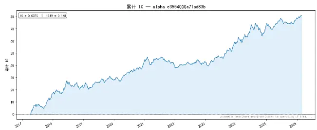
数据来源：WIND,中信建投证券

图 13:因子二分组收益
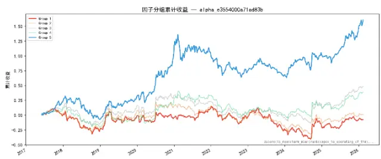
数据来源：WIND，中信建投证券

本文的核心目标在于挖掘具有增量信息的 Alpha 因子。后续研究中，我们将把本轮挖掘产生的新 Alpha 因子与历史 Alpha 因子库进行融合，在此基础上构建选股组合。在此之前，本文先以本次挖掘得到的 5 个沪深300 Alpha 因子为例，采用线性等权方式进行因子合成，并据此构建因子选股组合。

股票池：沪深300

调仓周期：周频

持仓数量：60只

回测区间：2020-2026.2

## 图 14:组合回测

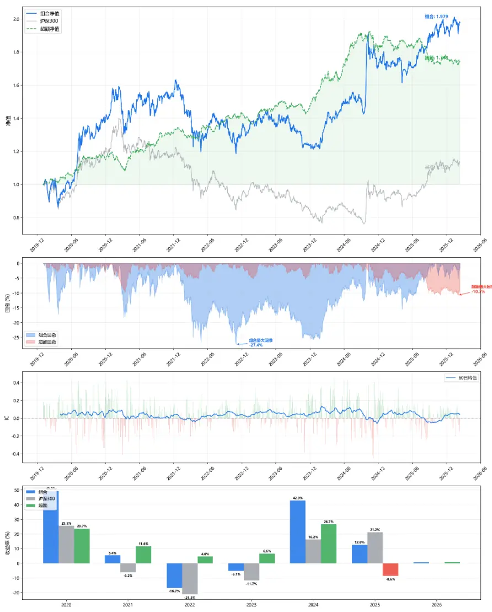
数据来源：Wind，中信建投证券

组合绩效：

表 3:组合绩效

| 指标 | 组合 | 沪深300 基准 | 超额 |
| --- | --- | --- | --- |
| 年化收益 | 12.30% | 2.18% | 9.90% |
| 年化波动 | 19.79% | 18.84% | 7.98% |
| Sharpe | 0.69 | 0.21 | 1.21 |
| 最大回撤 | -27.35% | -45.60% | -10.74% |

资料来源：Wind，中信建投证券

表 4:分年度表现

| 指标 | 组合 | 沪深300 基准 | 超额 |
| --- | --- | --- | --- |
| 2020 | +49.23% | +25.51% | +23.72% |
| 2021 | +5.42% | -6.21% | +11.63% |
| 2022 | -16.67% | -21.27% | +4.60% |
| 2023 | -5.13% | -11.75% | +6.62% |
| 2024 | +42.89% | +16.20% | +26.69% |
| 2025 | +12.62% | +21.19% | -8.57% |
| 2026.2 | +0.76% | -0.08% | +0.84% |

资料来源：Wind，中信建投证券

## 五、总结

本文的核心结论是：基本面与量价因子挖掘的关键，并不在于两类变量的简单组合，而在于将"企业经营变化"与"市场定价确认"统一为一个可经横截面检验的定价模型。

围绕这一命题，本文建立了一套较为完整的方法体系：以点时一致性作为数据基础，以变量语义组织作为研究前提，通过受约束的候选生成控制表达空间，借助多目标函数完成候选评估，并以冗余控制与因子库准入保证研究质量，最终通过持续跟踪和分层归档实现研究资产的系统化管理。依此路径，因子研究不再停留于一次性回测，而能够形成可持续积累、可复盘、可迭代的 Alpha 研究生产体系。

## 风险分析

本报告中所有数据结果是基于历史统计结果的展示，未来有可能发生风格切换导致因子失效的风险。模型运行存在一定的随机性，初始化随机数种子会对结果产生影响，单次运行结果可能会有一定偏差。历史数据的区间选择会对结果产生一定的影响。模型参数的不同会影响最终结果。模型对计算资源要求较高，运算量不足会导致结果存在一定的欠拟合风险。本文所有模型结果均来自历史数据，模型存在统计误差，不保证模型未来的有效性，对投资不构成任何建议。

## 分析师介绍

## 姚紫薇

金融工程及基金研究首席分析师。上海财经大学管理学硕士，厦门大学统计学学士，在基金研究、资产配置、产品设计、财富管理等领域均有长期深入研究。曾担任招商证券基金评价业务负责人，多次获得“新财富”金融工程方向前三（团队核心成员）

## 王 超：

南京大学粒子物理博士，曾担任基金公司研究员，券商研究员，有丰富的研究和投资经验，2021年加入中信建投，主要负责量化多因子选股。

## 评级说明

| 投资评级标准 |  | 评级 | 说明 |
| --- | --- | --- | --- |
| 报告中投资建议涉及的评级标准为报告发布日后6个月内的相对市场表现，也即报告发布日后的6个月内公司股价（或行业指数）相对同期相关证券市场代表性指数的涨跌幅作为基准。A股市场以沪深300指数作为基准；新三板市场以三板成指为基准；香港市场以恒生指数作为基准；美国市场以标普500指数为基准。 | 股票评级 | 买入 | 相对涨幅15%以上 |
|  |  | 增持 | 相对涨幅 5%—15% |
|  |  | 中性 | 相对涨幅-5%—5%之间 |
|  |  | 减持 | 相对跌幅 5%—15% |
|  |  | 卖出 | 相对跌幅15%以上 |
|  | 行业评级 | 强于大市 | 相对涨幅10%以上 |
|  |  | 中性 | 相对涨幅-10-10%之间 |
|  |  | 弱于大市 | 相对跌幅10%以上 |

## 分析师声明

本报告署名分析师在此声明：（i）以勤勉的职业态度、专业审慎的研究方法，使用合法合规的信息，独立、客观地出具本报告, 结论不受任何第三方的授意或影响。（ii）本人不曾因，不因，也将不会因本报告中的具体推荐意见或观点而直接或间接收到任何形式的补偿。

## 法律主体说明

本报告由中信建投证券股份有限公司及或其附属机构（以下合称“中信建投”）制作，由中信建投证券股份有限公司在中华人民共和国（仅为本报告目的，不包括香港、澳门、台湾）提供。中信建投证券股份有限公司具有中国证监会许可的投资咨询业务资格，本报告署名分析师所持中国证券业协会授予的证券投资咨询执业资格证书编号已披露在报告首页。

在遵守适用的法律法规情况下，本报告亦可能由中信建投（国际）证券有限公司在香港提供。本报告作者所持香港证监会牌照的中央编号已披露在报告首页。

## 一般性声明

本报告由中信建投制作。发送本报告不构成任何合同或承诺的基础，不因接收者收到本报告而视其为中信建投客户。

本报告的信息均来源于中信建投认为可靠的公开资料，但中信建投对这些信息的准确性及完整性不作任何保证。本报告所载观点、评估和预测仅反映本报告出具日该分析师的判断，该等观点、评估和预测可能在不发出通知的情况下有所变更，亦有可能因使用不同假设和标准或者采用不同分析方法而与中信建投其他部门、人员口头或书面表达的意见不同或相反。本报告所引证券或其他金融工具的过往业绩不代表其未来表现。报告中所含任何具有预测性质的内容皆基于相应的假设条件，而任何假设条件都可能随时发生变化并影响实际投资收益。中信建投不承诺、不保证本报告所含具有预测性质的内容必然得以实现。

本报告内容的全部或部分均不构成投资建议。本报告所包含的观点、建议并未考虑报告接收人在财务状况、投资目的、风险偏好等方面的具体情况，报告接收者应当独立评估本报告所含信息，基于自身投资目标、需求、市场机会、风险及其他因素自主做出决策并自行承担投资风险。中信建投建议所有投资者应就任何潜在投资向其税务、会计或法律顾问咨询。不论报告接收者是否根据本报告做出投资决策，中信建投都不对该等投资决策提供任何形式的担保，亦不以任何形式分享投资收益或者分担投资损失。中信建投不对使用本报告所产生的任何直接或间接损失承担责任。

在法律法规及监管规定允许的范围内，中信建投可能持有并交易本报告中所提公司的股份或其他财产权益，也可能在过去 12 个月、目前或者将来为本报告中所提公司提供或者争取为其提供投资银行、做市交易、财务顾问或其他金融服务。本报告内容真实、准确、完整地反映了署名分析师的观点，分析师的薪酬无论过去、现在或未来都不会直接或间接与其所撰写报告中的具体观点相联系，分析师亦不会因撰写本报告而获取不当利益。

本报告为中信建投所有。未经中信建投事先书面许可，任何机构和/或个人不得以任何形式转发、翻版、复制、发布或引用本报告全部或部分内容，亦不得从未经中信建投书面授权的任何机构、个人或其运营的媒体平台接收、翻版、复制或引用本报告全部或部分内容。版权所有，违者必究。

## 中信建投证券研究发展部

北京

朝阳区景辉街16 号院 1号楼18层

电话：（8610） 56135088

联系人：李祉瑶

邮箱：lizhiyao@csc.com.cn

上海

上海浦东新区浦东南路528号南塔 2103 室

电话：（8621） 6882-1600

联系人：翁起帆

邮箱：wengqifan@csc.com.cn

深圳

福田区福中三路与鹏程一路交汇处广电金融中心 35楼

电话：（86755）8252-1369

联系人：曹莹

## 中信建投（国际）

邮箱：caoying@csc.com.cn

香港

中环交易广场 2 期18楼

电话：（852）3465-5600

联系人：刘泓麟

邮箱：charleneliu@csci.hk