量化策略

# 量化多因子系列（1）：QQC 综合质量因子与指数增强应用

## 资金与监管双重影响下，公司质量的重要性进一步提升

外资流入带来结构变化：优质公司持续获得关注。随着外资的持续流入和外资占比的逐渐提升，外资的持股偏好也将进一步地影响 A股的市场风格。通过北上资金持仓的风格分析可以发现外资对于优质公司的偏好是较为明显的。同时，随着近年来投资者结构逐渐优化和机构化进程的加速，公司基本面质量的重要性将进一步凸显。

退市新规出台，促进上市公司质量优化。2020 年 12月 31 日，沪深交易所正式发布新修订的《上海证券交易所股票上市规则》、《深圳证券交易所股票上市规则》等退市制度改革文件。新规主要内容是进一步优化上市企业质量标准，缩短退市流程，加大退市力度。此次退市机制改革强化将优胜劣汰机制从而进一步优化市场资源配置，完善国内资本市场结构。投资者将更为关注企业经营质量，公司基本面质量的重要性有望进一步提升。

## 六大维度构建 QQC（Quantified Quality Composite）综合质量因子

将公司基本面质量分解为六个维度。根据 Gordon 成长模型拆解，并结合我们对于公司基本面质量的理解，将质量因子梳理为盈利能力、成长能力、盈余质量、营运效率、安全性、公司治理 6个大类。并进一步地在每一类别中分别寻找样本内具有显著预测能力且稳定性较好的细分因子。

QQC 综合质量因子：六大类因子等权加权减少过拟合。6 大类因子之间的相关性均处在相对较低的水平，其中公司治理因子与其他大类的质量因子直接相关性均低于 0.2。同时为了降低过拟合的程度，通过等权加权的方式将六大类因子结合为综合质量因子 QQC。

QQC 因子各样本空间内均有较强预测能力，样本外表现出色。QQC 因子在不同样本空间内均具有较强的预测能力，因子在全市场的 IC_IR 高达0.87；在中证 500 样本内 IC 高达 5.67%，多空组合的夏普比率达到 2.18。QQC 因子在样本外（2019-01-01 至 2020-12-31）的月度平均 IC 达到 5.84%，月度胜率高达 87.5%，样本外表现同样相当出色。

基于 QQC的沪深 300指数增强模型：超额稳定，样本外年化超额 15%沪深 300 指数增强的难点所在：行业与个股偏离度大，有效因子少。行业权重和个股权重的较高偏离度，以及成分股内较为有限的有效因子数量，是沪深 300指数增强模型构建中较为棘手的问题。

基于 QQC 因子的沪深 300 增强：超额稳定，样本外表现出色。采用估值因子、动量因子、换手率因子、一致预期等因子与 QQC 因子一同作为模型底层因子构建沪深 300 增强组合。组合年化超额收益 10.47%，跟踪误差 3.37%，信息比 3.11。组合自 2011 年至今每年度均跑赢沪深 300指数，月度胜率接近 80%，相对基准的最大回撤仅为 3.9%。

样本外（2019-01-01 至 2020-12-31）年化超额收益为 15.02%，跟踪误差3.65%，信息比 4.11。2020 年全年，组合累计收益 46.58%，跑赢沪深 300指数 19.37 个百分点。

分析员刘均伟SAC 执证编号：S0080520120002junwei.liu@cicc.com.cn

分析员王汉锋，CFASAC 执证编号：S0080513080002SFC CE Ref：AND454hanfeng.wang@cicc.com.cn

## 1. 资金与监管双重影响下，公司质量的重要性进一步提升

## 外资流入带来结构变化：优质公司持续获得关注

近年来外资的持续流入对 A 股市场风格产生了逐渐的影响。在 2016-2020 的五年间，北向资金净流入近1.2万亿元，同时，外资持股市值占 A股流通市值比例从1.7%上升至4.8%（提升 3.1个百分点），占比提升接近两倍。随着外资的持续流入和外资占比的逐渐提升，外资的持股偏好也将进一步地影响 A股的市场风格。

图表1：2016年以来北向资金持续流入
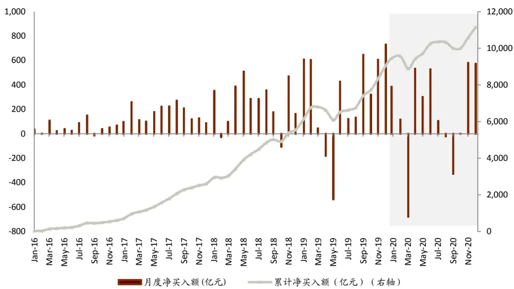
2016-01-01 2020-12-31

我们整理了北上资金 2020 年全年净流入最多的 20 只个股，从个股层面上直观的来看，北上资金更为青睐的是各个行业领域内的龙头公司，以及具有稳定发展前景的公司。

从具体的盈利指标上看，北上资金 2020 年净流入排名前 20 的个股的平均 ROE 水平高于沪深 300的平均 ROE水平，并且显著的高于全体 A股的 ROE 水平。通过 ROE水平可以比较直接的证明外资对于优质公司的偏好是较为明显的。

图表2：北上资金净流入排名前20的个股（2020年）

| 代码 | 名称 | 凈流入（亿元） | 中信一级行业 代码 |  | 名称 | 净流入（亿元） | 中信一级行业 |
| --- | --- | --- | --- | --- | --- | --- | --- |
| 300750.SZ | 宁德时代 | 159.79 | 电力设备及新能源 | 002594.SZ | 比亚迪 | 37.68 | 汽车 |
| 000651.SZ | 格力电器 | 156.73 | 家电 | 600031.SH | 三一重工 | 37.49 | 机械 |
| 601012.SH | 隆基股份 | 83.11 | 电力设备及新能源 | 000725.SZ | 京东方A | 35.27 | 电子 |
| 000333.SZ | 美的集团 | 69.74 | 家电 | 600887.SH | 伊利股份 | 34.47 | 食品饮料 |
| 300760.SZ | 迈瑞医疗 | 66.51 | 医药 | 603259.SH | 药明康德 | 31.60 | 医药 |
| 300059.SZ | 东方财富 | 66.27 | 计算机 | 000100.SZ | TCL科技 | 29.14 | 电子 |
| 600276.SH | 恒瑞医药 | 51.57 | 医药 | 600519.SH | 贵州茅台 | 26.91 | 食品饮料 |
| 002475.SZ | 立讯精密 | 44.08 | 电子 | 000002.SZ | 万科A | 26.41 | 房地产 |
| 600570.SH | 恒生电子 | 41.50 | 计算机 | 600036.SH | 招商银行 | 25.38 | 银行 |
| 000001.SZ | 平安银行 | 41.29 | 银行 | 601668.SH | 中国建筑 | 24.22 | 建筑 |

2020-01-01 2020-12-31

图表3：北上资金偏好高ROE个股
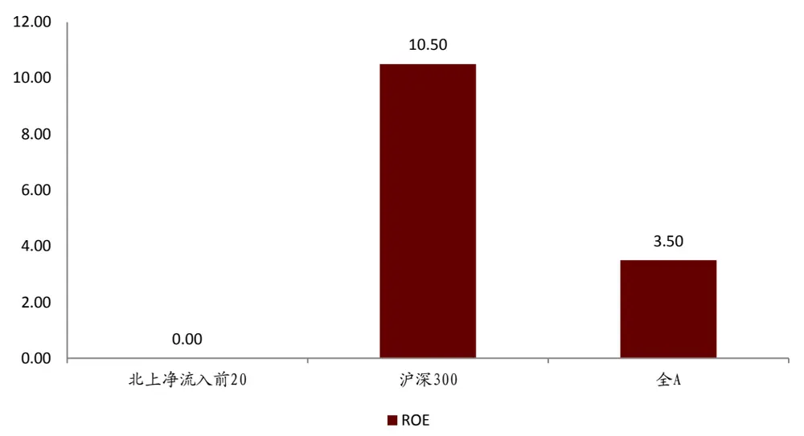
资料来源：万得资讯，中金公司研究部，截止2020-09-30

进一步的，将北上资金持仓占比大于 1%的个股作为北上资金的股票组合，并对该组合的风格因子暴露度进行计算。下图为北上资金持股组合在所选取因子上的暴露程度，其中前 9 个因子为参照 Barra 模型构建 9个常见因子，第 10 个为 ROE 因子。由此可见，北上资金更偏向于低 Beta、大市值、高动量及高估值的股票，同时在 ROE上有非常明显的正向暴露。

图表4：北上资金持股组合的风格因子暴露度
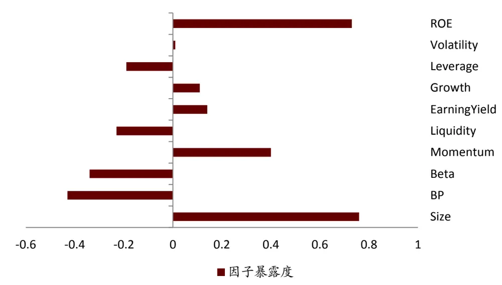
资料来源：万得资讯，中金公司研究部，截止2020-12-31

在外资持仓占比不断提升的同时，A 股的投资者结构也在逐渐发生变化。在过去较长的一段时间内，投资者结构失衡是 A 股长期震荡的重要原因之一，中小散户的非理性因素助推了股市波动性。近年来，投资者结构逐渐优化，机构投资者发展较快，从近期爆款公募基金频发也可见一斑。我们认为外资流入的影响加上机构化进程的加速，将使得公司基本面质量的重要性进一步凸显。

## 退市新规出台，促进上市公司质量优化

2020 年 12 月 31 日，沪深交易所正式发布新修订的《上海证券交易所股票上市规则》、《深圳证券交易所股票上市规则》，及《上海证券交易所科创板股票上市规则》和《深圳证券交易所创业板股票上市规则》等退市制度改革文件 。

此次上交所与深交所的退市新规主要内容是进一步优化上市企业质量标准，缩短退市流程，加大退市力度。内容包括以下几点：

- 完善退市指标，提高指标针对性：将退市指标分为交易类、财务类、规范类和重大违法类四大类。

- 造假违法指标量化，增加限制减持：在保留原欺诈发行、重大信息披露违法、五大安全等重大违法强制退市标准的前提下，将重大财务造假指标量化。

- 缩短退市时间，提高退市效率：取消暂停上市和恢复上市环节；退市整理期由 30 个交易日缩短为 15 个交易日。

伴随着退市新规的落地，质量较差的企业将被淘汰出局。此次退市机制改革强化优胜劣汰机制从而进一步优化市场资源配置，完善国内资本市场结构。

投资者应将更关注企业经营本身，公司基本面质量的重要性进一步提升。新规要求企业管理人需更加注重企业持续经营的能力，调整企业的发展战略。未来投资者也将重点关注经营稳定和业绩预增的企业。

下文中我们将着重从量化多因子的角度出发，构造多维度的量化综合质量因子 QQC（Quantified Quality Composite），并展示其应用于指数增强策略的实际效果。

## 2. 质量因子定义及细分类别

在定义我们的综合质量因子之前，首先可以从定性的角度来描述一个优质的公司：

- 盈利能力强且具有稳定的盈利能力；

- 成长能力强且具有稳定的成长能力；

- 财务情况稳定，流动性好，资本结构合理；

- 运营效率高，周转能力强；

- 公司治理情况优良，等等。

在上述条件满足的情况下，则可以认为这个公司的整体质量较高。学术界在研究中也有很多中对于质量指标定义方式的探讨和实践。例如，Asness（2017）通过对 Gordon 成长模型的分解，来定义质量因子。原始的 Gordon 成长模型为：

$$
\mathrm{Price}=\frac{dividend}{required\ return-growth}\#(1)
$$

利用净资产 B（Book Value）来缩放价格, 使其在一段时间内和横截面上更加稳定。等式两边同时除以净资产 B：

$$
\frac{\mathrm{P}}{\mathrm{B}}=\frac{\frac{profit}{B}{*\frac{dividend}{profit}}}{requiredreturn-growth}\#(2)
$$

等式（2）则可以理解为：

$$
\frac{\mathrm{P}}{\mathrm{B}}=\frac{profitability*payout\_ratio}{requiredreturn-growth}\#(3)
$$

等式右侧的四个部分就是对于公司质量定义的四个基础组成部分，其中，Profitability 为盈利能力，可以由 ROE、ROA、毛利率在内的多个盈利能力指标表示；payout_ratio 表示股东所得红利在总利润中的占比，主要用来衡量公司管理层对于股东的友好程度；growth为成长能力，可以由不同的成长因子来评价；required return 则可以用来反映公司的稳定性或者安全性，因为要求回报率越高的公司，自然风险越大。

图表5: Gordon 成长模型分解后的四大组成部分
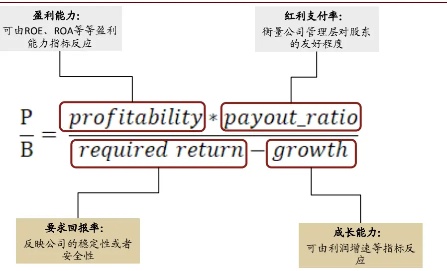
资料来源：中金公司研究部

根据上述分析，并结合我们对于公司基本面质量的理解，我们将质量因子梳理为盈利能力、成长能力、盈余质量、营运效率、安全性、公司治理这 6个大类，如下图所示：

图表6：质量因子细分类别（6大类）
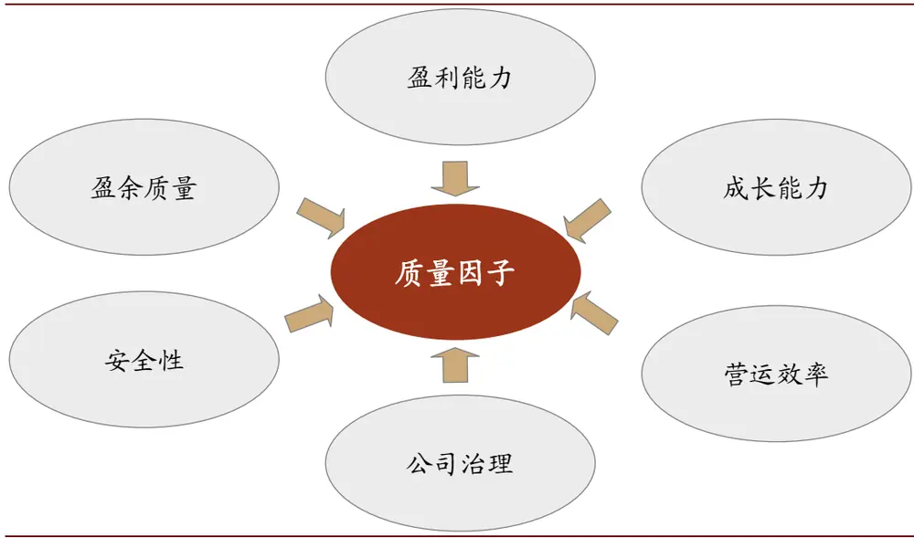
资料来源：中金公司研究部

## 3. 常用质量因子单因子表现

首先我们分别对盈利能力、成长能力、盈余质量、营运效率、安全性、公司治理这 6 个大类质量指标中的单因子进行全面的测试，并在每个大类中挑选满足一定筛选条件（IC大于 2%，IR 大于 0.3，tstats大于 3）的因子来构成大类复合因子（注：若某一大类的因子表现均不满足上述条件，则挑选 IC_IR 表现较好的具有代表性的此类因子作为基础因子）。为了降低过拟合的程度，下文中的因子测试时间段均为 2009-01-01 至 2018-12-31的样本内时间，并将 2019-01-01 至 2020-12-31 作为样本外检验综合因子的预测能力和选股能力。

## 盈利能力（Profitability）

盈利能力可以说是质量因子中最重要也最受关注的一类指标，不同的人对于盈利能力的衡量标准也会略有不同。例如上文提到的 Asness（2017）在定义 QmJ（Quality minus Junk）因子时对于盈利能力方面的指标采用了 6 个指标等权相加的方式来打分，6 个指标分别为：总资产毛利率（GPOA）、ROE、ROA、经营现金流/总资产（CFOA）、毛利率（GMAR）、净利润现金占比（ACC）。

公司利润表中直接反映公司赚钱能力的项目包括毛利润、营业利润、净利润，这三项中使用最广泛的净利润一般被认为可以比较全面的反映该公司在剔除费用项之后的盈利情况。但是在一些行业中（例如消费类行业）毛利润指标会具有超越净利润的选股能力。营业利润相关因子的预测能力也常常优于净利润类因子。学术界和业界也对毛利润和营业利润的优势有不少的分析，因此这三个利润类的指标可以说是各有千秋，我们在盈利能力类因子中会较为全面的对涉及这三类利润指标的因子做测试。

在筛选盈利能力因子时，我们将首先对盈利能力方面的因子做全面的测试，测试的盈利能力因子明细及其构造方式说明如下表所示。

7: Profitability

| 指标名称 | 指标简称 | 计算方式 |
| --- | --- | --- |
| 毛利率 | GPM | 毛利/营业收入 |
| 净利率 | NPM | 净利润/营业收入 |
| 净资产收益率 | ROE | 净利润/净资产 |
| 总资产收益率 | ROA | 净利润/总资产 |
| 投入资本收益率 | ROIC | 净利润/投入资本 |
| 经营收益占比 | 0ItoEBT | 经营活动净收益/利润总额 |
| 营业利润率 | OPM | 营业利润/营业总收入 |
| 总资产毛利率 | GPOA | 毛利/总资产 |
| 经营现金流/总资产 | CFOA | 经营现金流净额/总资产 |

资料来源：中金公司研究部

8: Profitability

|  | IC mean | IC std | IR | IC positive per | LongShortreturn | Turnover | Mono Score | LongShort Sharpe | : Factor Return | Return tstat |
| --- | --- | --- | --- | --- | --- | --- | --- | --- | --- | --- |
| CFOA | 2.01% | 4.32% | 0.47 | 62% | 3.50% | 10% | 2.3 | 0.76 | 0.18% | 4.74 |
| ROE | 1.92% | 8.38% | 0.23 | 56% | 0.29% | 7% | 0 | -0.09 | 0.17% | 2.51 |
| ROIC | 1.92% | 7.93% | 0.24 | 55% | 0.01% | 7% | -0.32 | -0.19 | 0.16% | 2.41 |
| GPOA | 1.47% | 7.51% | 0.20 | 56% | 1.30% | 6% | 0.91 | 0.25 | 0.17% | 2.36 |
| ROA | 1.53% | 9.45% | 0.16 | 54% | -0.30% | 7% | -1 | -0.01 | 0.14% | 1.89 |
| OltoEBT_TTM | 0.71% | 5.44% | 0.13 | 53% | 0.90% | 8% | 1.4 | 0.23 | 0.06% | 1.34 |
| GPM | 0.88% | 7.08% | 0.12 | 52% | 0.70% | 5% | 1.18 | 0.16 | 0.08% | 1.26 |
| NPM | 0.91% | 8.03% | 0.11 | 56% | -1.20% | 6% | 3.21 | -0.15 | 0.08% | 1.19 |
| OPM | 0.60% | 7.14% | 0.08 | 55% | 0.20% | 4% | 0.6 | 0.06 | 0.07% | 0.9 |

2009-01-01 2018-12-31

经营现金流/总资产（CFOA）具有相对较高的预测能力，其因子 IC_IR 高达 0.47。同时，ROE 和 ROIC 的 IC_IR 也超过 0.2。结合上述测试结果，并考虑到 ROE 和 ROIC 指标是使用率较高的盈利能力类指标，我们将 CFOA、ROE、ROIC 作为盈利能力类因子的子指标，并等权加权后得到盈利能力类因子的复合因子（Profitability）。

## 成长能力（Growth）

成长因子是量化多因子体系中的一类很重要的风格因子，同时也是投资者关注度较高的一类因子。因为从投资的最根本目的出发，具有成长潜力或者发展潜力较大的公司才会更有可能给投资者带来更多回报，投资者也会更愿意为高成长的公司支付较高的股价。

在成长因子的构造方式上，我们将对每一个增速类（同比增速、环比增速）因子均使用与分母值回归取残差的处理方式，来减小前期值对增速因子分布上的影响。

同时，引入几个较为创新的成长因子构造方式（以净利润 NP为例）：

## 加速度指标：NP_Acc

加速度指标的计算方法是：利用连续 N 个季度的单季利润，对期数的二次方程进行回归，取二次项系数作为业绩增长加速度的代理变量，回归公式如下：

$$
\mathrm{NP_{t}}=\alpha\times\mathrm{t}^{2}+\beta\times\mathrm{t}+\mathrm{c}
$$

其中，NP为单季度利润，t为季度数，α为上市公司业绩增长加速度的代理变量，α越高，表示业绩增长的加速度越高。该指标的计算涉及到一个参数 N，依据参数敏感性的测试结果，在后续的测试中均取相对稳健的 N=8。

## 稳健增速指标：NP_Stable

稳健增速指标刻画的是过去一段时间内业绩增速的稳定性，当指标值比较高的时候，表示过去一段时间内上市公司的业绩保持了稳定增长的态势。它的计算方式是用过去 N期的利润增速均值除以利润增速标准差。在后续的测试中，我们依然取 N=8这一参数，即用过去两年的利润增速数据计算该指标。

## 稳健加速度指标：NP_SD

稳健加速度指标则是稳健增速指标的一阶差分。

## 业绩趋势因子：QPT

业绩趋势模型采用分层筛选的方式实现，首先依据业绩增速指标筛选增速较高的三分之一的股票作为基础股票池；再依据业绩增长加速度指标在基础股票池中筛选三分之一的股票作为最终持仓。我们将该模型进行因子化同样考虑分层打分的方式：

首先，依据业绩增速指标将全市场股票均分成三组，给每组股票打分，增速最高一组得分为 3，增速最低一组得分为 1，中间一组得分为 2；

其次，每一组内依据业绩增长加速度指标进行打分（标准分法），加速度越高得分也越高；

- 最后，将两步骤的得分相加为每只股票的最终得分。

我们运用业绩预告数据（净利润下限）降低财务公告数据的滞后性后，在构造月频的业绩趋势因子时，需每月对业绩数据进行更新；当同时存在不同类型的业绩报告时，优先级次序依据其准确性确定，即：定期报告>业绩快报>业绩预告。

结合上述新增成长类因子，和盈利能力指标的变动类因子，我们将成长能力的大类因子梳理如下：

9: Growth

| 指标名称 | 指标简称 | 指标名称 | 指标简称 |
| --- | --- | --- | --- |
| 经营现金流/总资产变动 | CFOAD | 营业利润增速（单季度同比） | OP_Q_YOY |
| 毛利率变动 | GPMD | 营业利润增速（单季度环比） | OP_QOQ |
| 总资产毛利率变动 | GPOAD | 营业利润稳健加速度 | OP_SD |
| 净利润加速度 | NP_Acc | 营业利润稳健增速 | OP_Stable |
| 净利润增速（单季度同比） | NP_Q_YOY | 营业利润增速（TTM同比） | OP_YOY |
| 净利润增速（单季度环比） | NP_QOQ | 营业收入稳健加速度 | OR_SD |
| 净利润稳健加速度 | NP_SD | 营业收入稳健增速 | OR_Stable |
| 净利润稳健增速 | NP_Stable | 营业收入增速（TTM同比） | OR_YOY |
| 净利润增速（TTM同比） | NP_YOY | ROA变动 | ROAD |
| 净利率变动 | NPMD | ROE变动 | ROED |
| 业绩趋势因子 | QPT | 投入资本收益率变动 | ROICD |

资料来源：中金公司研究部

10: Growth

|  | IC mean | IC std | IR | positive per | Long_Short Return | Turnover | Mono score | Long_Short Sharpe | Factor Return | Return tstat |
| --- | --- | --- | --- | --- | --- | --- | --- | --- | --- | --- |
| OP_SD | 2.55% | 3.19% | 0.73 | 75% | 9.60% | 18% | 2.06 | 2.95 | 0.19% | 7.81 |
| NP_Acc | 2.77% | 3.90% | 0.71 | 78% | 9.80% | 18% | 1.84 | 2.62 | 0.25% | 7.83 |
| OP_Q_YOY | 3.51% | 5.14% | 0.68 | 78% | 10.50% | 16% | 1.39 | 2.47 | 0.26% | 6.01 |
| NP_SD | 2.38% | 3.50% | 0.68 | 73% | 9.10% | 18% | 2.1 | 2.82 | 0.19% | 6.64 |
| QPT | 3.44% | 6.02% | 0.57 | 75% | 9.33% | 16% | 1.63 | 2.53 | 0.23% | 6.23 |
| NP_Q_YOY | 3.55% | 5.61% | 0.63 | 74% | 10.30% | 15% | 1.54 | 2.41 | 0.25% | 5.18 |
| OP_YOY | 3.01% | 5.67% | 0.53 | 70% | 7.80% | 12% | 1.35 | 1.78 | 0.21% | 4.36 |
| OP_QOQ | 1.60% | 3.15% | 0.51 | 71% | 4.80% | 21% | 2.28 | 1.56 | 0.11% | 4.63 |
| NP_QOQ | 1.80% | 3.56% | 0.51 | 68% | 5.70% | 21% | 1.89 | 1.81 | 0.14% | 5.24 |
| NP_YOY | 3.01% | 6.16% | 0.49 | 69% | 7.90% | 12% | 1.66 | 1.76 | 0.20% | 3.8 |
| OR_SD | 1.54% | 3.48% | 0.44 | 69% | 5.60% | 17% | 1.47 | 1.8 | 0.12% | 4.94 |
| CFOAD | 1.17% | 2.66% | 0.44 | 66% | 3.30% | 15% | 1.73 | 1.16 | 0.10% | 4.54 |
| OR_YOY | 2.42% | 6.50% | 0.37 | 63% | 6.60% | 11% | 2.05 | 1.38 | 0.18% | 3.42 |
| GPMD | 1.14% | 3.16% | 0.36 | 62% | 3.00% | 12% | 2.57 | 0.97 | 0.08% | 2.89 |
| ROICD | 1.45% | 4.05% | 0.36 | 61% | 3.80% | 13% | 1.55 | 1.07 | 0.09% | 2.75 |
| GPOAD | 1.43% | 4.27% | 0.34 | 66% | 4.80% | 12% | 2 | 1.37 | 0.11% | 3.26 |
| ROED | 1.47% | 4.74% | 0.31 | 62% | 5.30% | 12% | 2.95 | 1.34 | 0.11% | 2.88 |
| NPMD | 1.19% | 4.01% | 0.3 | 63% | 2.40% | 12% | 3.33 | 0.67 | 0.07% | 2.17 |
| ROAD | 1.17% | 4.43% | 0.26 | 63% | 3.80% | 12% | 3.21 | 1.01 | 0.09% | 2.36 |
| OR_Stable | 1.51% | 6.83% | 0.22 | 59% | 1.90% | 7% | 2.9 | 0.38 | 0.18% | 2.88 |
| NP_Stable | 1.61% | 7.36% | 0.22 | 58% | 2.00% | 9% | -2.58 | 0.39 | 0.19% | 2.87 |
| OP_Stable | 1.42% | 6.98% | 0.2 | 57% | 1.00% | 9% | 9.5 | 0.21 | 0.17% | 2.7 |

2009-01-01 2018-12-31

综合考虑收入成长能力和收入增速稳定性的因子营业收入稳健加速度因子（OP_SD）具有较高的预测能力，其因子 IC_IR 高达 0.73，多空组合的 Sharpe 比率高达 2.95，单调性得分也超过 2。同时，成长能力因子中 IC 均值最高的因子分别为：营业利润增速（单季度同比）OP_Q_YOY、净利润增速（单季度同比）NP_Q_YOY、业绩趋势因子（QPT）。

## 营运效率（Operation）

营运效率是指公司运用资产的效率或者有效程度，可以反映公司资金的周转状况。营运效率的高低取决于企业营运状况的好坏及管理水平的高低。例如，存货周转率、总资产周转率都是很常用的用来衡量公司营运效率的指标，在此基础上我们也将上述指标的变动指标作为因子进行了测试，尝试从营运效率改善的角度寻找具有更好预测能力的营运效率因子。

产能利用率提升因子（OCFA，Operation Cost on Fixed Assets）的因子是我们采用创新基本面因子挖掘框架挖掘出来的具有较强预测能力的营运效率类因子，其具体的构造方式为，营业总成本在固定资产上滚动回归取最近一期残差，具体的：

$$
Total\_Operation\_Cost=\beta_{\alpha}+\beta_{X}*Fixed\_Assets+\varepsilon
$$

这里我们采用残差项ε来表征产能利用率的提升。

结合上述新增的产能利用率因子，我们将营运效率的大类因子梳理如下：

11: Operation

| 指标名称 | 指标简称 | 计算方式 |
| --- | --- | --- |
| 存货周转率 | INVT | 营业成本/平均存货余额 |
| 存货周转率变动 | INVTD | 当期存货周转率- 上期存货周转率 |
| 应收周转率 | RAT | 营业收入/（应收账款+应收票据） |
| 应收周转率变动 | RATD | 当期应收周转率 - 上期应收周转率 |
| 总资产周转率 | AT | 营业收入/总资产 |
| 总资产周转率变动 | ATD | 当期总资产周转率- 上期总资产周转率 |
| 产能利用率提升 | OCFA | 营业总成本在固定资产上滚动回归取最近一期残差 |

资料来源：中金公司研究部

12: Operation

|  | IC mean | IC std | IR | IC positive per | LongShort return | Turnover | Mono Score | LongShort Sharpe | Factor Return | Return tstat |
| --- | --- | --- | --- | --- | --- | --- | --- | --- | --- | --- |
| ATD | 2.15% | 3.90% | 0.55 | 71% | 7.20% | 13% | 1.62 | 2.07 | 0.16% | 4.73 |
| OCFA | 1.73% | 3.33% | 0.52 | 72% | 7.10% | 23% | 4.23 | 2.18 | 0.14% | 5.07 |
| RATD | 1.22% | 3.00% | 0.41 | 65% | 4.10% | 12% | 1 | 1.41 | 0.06% | 3.34 |
| INVTD | 0.97% | 2.73% | 0.36 | 62% | 3.40% | 13% | 1.43 | 1.19 | 0.06% | 3.12 |
| AT | 1.26% | 4.59% | 0.27 | 61% | 2.30% | 7% | 2.07 | 0.58 | 0.14% | 3.18 |
| RAT | 0.59% | 5.00% | 0.12 | 57% | -1.30% | 6% | 1.17 | -0.22 | 0.06% | 1.1 |
| INVT | 0.23% | 4.39% | 0.05 | 51% | -0.80% | 6% | -0.44 | -0.21 | 0.03% | 0.86 |

2009-01-01 2018-12-31

总资产周转率变动指标 ATD 的各项表现均优于其他营运效率因子，IC_IR 达到 0.55，多空年化收益 7.20%，多空组合的 Sharpe 比率也达到 2.07，该因子的预测能力和稳定性均较好。OCFA 因子 IC_IR 表现较好，且与其他常用因子相关性较低，因此，我们将满足入选条件（IC 大于 2%，IR 大于 0.3，tstats 大于 3）的因子 ATD 和创新基本面因子 OCFA 作为营运效率类因子的子指标。

## 盈余质量（Accrual）

盈余质量类指标能够为投资者提供关于上市公司的盈余信息，如果上市公司进行了盈余操纵或管理，那么其财报盈余向投资者传递的信息质量往往较差；较差的盈余信息不利于我们合理地对公司的未来业绩做出预测，因此对上市公司盈余质量好坏的评价具有重要的意义。

应计利润的定义通常为：

$$
\begin{array}{rcl}{\int_{\pm}^{\infty}{\hat{x}}^{+}+\hat{x}^{+}\vert\hat{x}\vert\hat{x}\vert}&{=}&{\stackrel{}{\mapsto}\underline{{\hat{x}}}\underline{{\hat{x}}}\hat{x}\hat{x}\enspace-\enspace\stackrel{\hat{\varkappa}\hat{x}}{\mapsto}\hat{\mapsto\mapsto}\iota\pm\hat{y}\vert\hat{x}\hat{\mapsto}\hat{\varphi}\hat{\mapsto}\hat{\varphi}\hat{\mapsto\varphi}\hat{\varphi}}\end{array}
$$

同时，为了使得不同规模的公司的该项指标能够进行横向比较，我们采用将应计利润除以营业利润作为应计利润占比指标，来作为盈余质量指标的一种构建方式，明显的，该指标数值越大，标的盈余质量越差。因为现金利润来源于当期经营净现金流的增加；而应计利润则更多反映对未来现金流的确认，应计利润中存在较大的利润操纵空间，从而导致应计利润持续性较差，拥有较高应计利润的公司未来盈余往往会出现下滑。所以基于以上的逻辑，应计利润占比越大的公司，盈余质量越差。

13: Accrual

| 指标名称 | 指标简称 | 计算方式 |
| --- | --- | --- |
| 应计利润占比 | APR | 应计利润/ 营业利润 |
| 应计利润占比变动 | APRD | 当期应计利润占比-上期应计利润占比 |
| 收现比 | CSR | 销售商品提供劳务收到的现金/营业收入 |
| 收现比变动 | CSRD | 当期收现比 - 上期收现比 |

资料来源：中金公司研究部

14: Accrual

|  | IC mean | IC std | IR | IC positive per | LongShort return | Turnover | Mono Score | LongShort Sharpe | Factor Return | Return tstat |
| --- | --- | --- | --- | --- | --- | --- | --- | --- | --- | --- |
| CSR | 0.69% | 2.90% | 0.24 | 66% | 0.80% | 8% | 1.33 | 0.3 | 0.07% | 2.69 |
| CSRD | 0.07% | 2.48% | 0.03 | 48% | -0.10% | 15% | -1 | -0.03 | 0.03% | 1.75 |
| APRD | -0.33% | 2.37% | -0.14 | 45% | -0.60% | 15% | 0.4 | -0.2 | -0.02% | -0.9 |
| APR | -1.23% | 2.91% | -0.42 | 39% | -1.50% | 11% | 0.9 | -0.49 | -0.06% | -2.62 |

2009-01-01 2018-12-31

我们同时构造了收现比因子（CSR）来衡量公司主营业务收入背后现金流量的支持程度。该指标越高，说明公司收入的变现能力越强。反之，说明公司当前账面收入高，而实际现金收入低，有很大一部分形成了应收账款，这时可以认为公司的整体盈余质量较低。

上述测试的盈余质量因子整体预测能力相对较弱，其中，应计利润占比（APR）因子的负向预测能力相对较强，IC均值为-1.23%，IC_IR 达到-0.42。因此在盈余质量方面的因子中，选择 APR作为基础因子。

## 安全性（Safety）

Asness（2017）在定义 QmJ 因子时对于安全性方面的指标给予了较高的权重，文章认为前文公式（3）中的必要报酬率（required return）是比较难以定义的或者说学术界对其定义方式的争议仍然较大。因此文章采用了一种更为通俗的方式来定义安全性（safety），其主要关注的指标包括：低 beta，低波动，杠杆率，信用风险等等。

由于beta和股价波动这些指标更多的反映来自市场内的投资者行为对股价所产生的影响，其与公司本身的质量的相关性是否较高我们认为有待验证。同时，考虑到 A 股与海外成熟市场的参与者结构差异，散户占比较大的 A 股市场上个股的价格波动更容易受到公司本身质地意外的因素影响，因此我们暂未将 beta 和波动率因子纳入安全性因子中测试。这里我们讨论的安全性将主要从公司的经营杠杆等方面考虑：

15: Safety

| 指标名称 | 指标简称 | 计算方式 |
| --- | --- | --- |
| 现金流动负债比率 | CCR | 经营净现金流/流动负债 |
| 现金流动负债比率变动 | CCRD | 当期现金流动负债比率 - 现金流动负债比率 |
| 现金比率 | CR | (现金+交易性金融资产)/流动负债 |
| 现金比率变动 | CRD | 当期现金比率 - 上期现金比率 |
| 流动比率 | CUR | 流动资产/流动负债 |
| 流动比率变动 | CURD | 当期流动比率 - 上期流动比率 |
| 资产负债率变动 | DAD | 当期资产负债率- 上期资产负债率 |
| 资产负债率 | Debt_Asset | 总负债/总资产 |
| 产权比率 | DTE | 总负债/归母股东权益 |
| 产权比率变动 | DTED | 档期产权比率-上期产权比率 |
| 速动比率 | QR | (流动资产 - 存货 - 1年内到期的非流动资产 -待摊费用-预付款)/流动负债 |
| 速动比率变动 | QRD | 当期速动比率 - 上期速动比率 |

资料来源：中金公司研究部

16: Safety

|  | IC mean | IC std | IR | IC positive per | LongShort return | Turnover | Mono Score | LongShort Sharpe | Factor Return | Return tstat |
| --- | --- | --- | --- | --- | --- | --- | --- | --- | --- | --- |
| CCRD | 1.09% | 2.47% | 0.43 | 65% | 3.10% | 16% | 1.29 | 1.11 | 0.08% | 3.83 |
| CCR | 1.53% | 3.95% | 0.39 | 68% | 1.80% | 13% | 2.45 | 0.47 | 0.13% | 3.73 |
| DAD | 1.02% | 3.31% | 0.31 | 62% | 4.30% | 14% | 3.77 | 1.25 | 0.10% | 3.35 |
| DTED | 0.60% | 2.86% | 0.21 | 56% | 3.10% | 12% | 2.33 | 0.98 | 0.04% | 1.9 |
| DTE | 0.30% | 6.01% | 0.05 | 53% | -0.50% | 6% | -0.23 | -0.04 | -0.01% | -0.1 |
| Debt_Asset | 0.24% | 7.89% | 0.03 | 53% | -0.50% | 6% | -0.18 | -0.05 | 0.01% | 0.15 |
| QR | -0.62% | 7.00% | -0.09 | 50% | 1.10% | 6% | 9 | 0.2 | -0.02% | -0.23 |
| CUR | -0.69% | 6.94% | -0.1 | 48% | 0.60% | 6% | 0.57 | 0.13 | -0.03% | -0.38 |
| CR | -0.73% | 6.99% | -0.1 | 50% | 0.40% | 6% | 0.12 | 0.09 | -0.02% | -0.34 |
| QRD | -0.78% | 4.23% | -0.18 | 45% | -4.70% | 13% | 3.06 | -1.25 | -0.07% | -2.07 |
| CRD | -0.79% | 4.15% | -0.19 | 48% | -5.10% | 13% | 3.35 | -1.37 | -0.09% | -2.3 |
| CURD | -1.03% | 4.27% | -0.24 | 45% | -5.30% | 13% | 2.77 | -1.44 | -0.09% | -2.48 |

2009-01-01 2018-12-31

上述测试的安全性因子整体预测能力不高，其中，现金流动负债比率（CCR）因子具有较好的预测能力，IC 均值为 1.53%，IC_IR 达到 0.39，因子收益均值为 0.13%，月度胜率 68%。因此我们在安全性方面的因子中，选择现金流动负债比率 CCR 作为基础因子。

## 公司治理（Governance）

公司治理也是一个较为重要的评判上市公司经营质量的指标，通俗理解只有公司治理能够影响公司股票价格和股票收益，从而产生治理溢价，投资者才能通过比较上市公司的治理水平选择配置在未来可能获得更高溢价的股票。

本文采用股权结构与股东权利、董事会构成、管理层激励、信息披露与合规、激励约束机制等多维度衡量公司的治理水平。具体的指标和权重设置如下表所示：

17: Governance

| 细分类别 | 指标代码 | 因子描述 | 指标方向 | 权重 |
| --- | --- | --- | --- | --- |
| 股权结构与股东 | Mc_percent | 流通股占比 | + | 1 |
| 管理层薪酬及持股 | Mana_income | 管理层薪酬（前十） | + | 1 |
|  | Mana_share_num | 管理层持股数量 | + | 1 |
| 信息披露与合规 | Deal_Method | 受证监会、交易所等处罚情况 | - | -1 |
| 激励机制 | Stock_Incentive | 是否实施股权激励 | + | 1 |

资料来源：中金公司研究部

在简单加权的方法下，将流通股占比、管理层薪酬、管理层持股数量、受证监会、交易所等处罚情况、是否实施股权激励这 5 大指标根据方向调整等权相加结合成为公司治理因子（Governance）。

18: Governance

|  | Governance（公司治理因子） |
| --- | --- |
| IC mean | 2.79% |
| IC std | 5.66% |
| IR | 0.49 |
| IC positive per | 70% |
| Long_Short_return | 2.30% |
| Turnover | 9% |
| Mono_score | 0.31 |
| Long_Short_sharpe | 0.14 |
| Factor Return | 0.23% |
| Factor Return tstat | 4.92 |

2009-01-01 2018-12-31

公司治理因子的整体表现尚可，IC均值为2.79%，IC_IR达到0.49，因子收益均值为0.23%，而多空收益表现一般，单调性得分较低，因子的收益稳定性相对较弱。

## 4. QQC 综合质量因子

## 六大类因子综合表现：样本内成长因子优势明显

为了构造一个全面且综合的质量因子，我们首先将上文整理的 6 大类指标按照大类内因子等权加权的方式构造 6 个大类因子，并比较他们的因子表现以及相关性。可以看到上面整理的这 6 类质量指标的整体预测能力和收益稳定性仍存在较大的差异，其中成长能力指标的 IC 和 IC_IR 均显著高于其他 5 类指标，而盈利能力指标的表现则相对较弱：

图表19：六大类质量因子测试结果

|  | IC mean | IC std | IR | IC positive per | LongShort return | Turnover | Mono Score | LongShort Sharpe | Factor Return | Return tstat |
| --- | --- | --- | --- | --- | --- | --- | --- | --- | --- | --- |
| 盈利能力 | 1.67% | 6.20% | 0.27 | 56% | 5.10% | 13% | 1.8 | 0.81 | 0.15% | 3.11 |
| 成长能力 | 3.39% | 4.61% | 0.74 | 76% | 11.60% | 18% | 2.02 | 2.88 | 0.28% | 7.46 |
| 营运效率 | 2.21% | 3.80% | 0.58 | 73% | 8.00% | 22% | 2.9 | 2.31 | 0.18% | 5.62 |
| 盈余质量 | 1.02% | 2.92% | 0.35 | 59% | 3.11% | 12% | 0.95 | 0.52 | 0.07% | 2.68 |
| 安全性 | 1.51% | 4.01% | 0.38 | 68% | 4.98% | 13% | 2.17 | 0.69 | 0.13% | 3.85 |
| 公司治理 | 2.79% | 5.66% | 0.49 | 70% | 2.30% | 9% | 0.31 | 0.14 | 0.23% | 4.92 |

2009-01-01 2018-12-31

从 IC 序列的相关性矩阵来看，6 大类质量因子之间的相关性均处在相对较低的水平，其中，公司治理因子与其他大类的质量因子直接相关性均较低，而营运效率与成长能力之间的相关性为 0.6，相对较高。

图表20：六大类质量因子IC序列相关性矩阵

|  | 盈利能力 | 成长能力 | 营运效率 | 盈余质量 | 安全性 | 公司治理 |
| --- | --- | --- | --- | --- | --- | --- |
| 盈利能力 | 1 | 0.29 | 0.44 | 0.03 | 0.48 | 0.15 |
| 成长能力 | 0.29 | 1 | 0.6 | 0.12 | 0.36 | 0.19 |
| 营运效率 | 0.44 | 0.6 | 1 | 0.09 | 0.27 | 0.07 |
| 盈余质量 | 0.03 | 0.12 | 0.09 | 1 | 0.46 | 0.27 |
| 安全性 | 0.48 | 0.36 | 0.27 | 0.46 | 1 | 0.04 |
| 公司治理 | 0.15 | 0.19 | 0.07 | 0.27 | 0.04 | 1 |

2009-01-01 2018-12-31

因此，在将上文梳理完成的盈利能力、成长能力、盈余质量、营运效率、安全性、公司治理这 6个大类质量指标综合为一个综合的质量因子时，可以考虑的加权方式主要包括：等权加权，IC加权，IC_IR 加权等等

## 不同加权方式对比：等权加权减少过拟合

等权加权是最为直观的加权方式，其优点在于逻辑直观，减少参数优化过程，从而减小过拟的概率。但 IC 加权和 IC_IR 加权也是较为常用的因子合成方法，这两种加权方式下可以比较有效的提高预测能力较高的因子的权重占比，从而提高合成因子的预测能力。因此我们主要比较了下述三种因子加权方式：

21: QQC

| 定义 |  | 参数说明 |
| --- | --- | --- |
| EW_QQC | 等权质量因子 | 6大类因子等权相加 |
| ICW_QQC | IC加权质量因子 | 滚动历史12个月IC加权 |
| IRW_QQC | IC_IR加权质量因子 | 滚动历史12个月IC_IR加权 |

资料来源：中金公司研究部

下表给出了不同加权方式下的综合质量因子表现统计，由于 IC 加权或者 IC_IR 加权均需要滚动历史 12个月的 IC数据，因此因子测试的起始时间统一为了 2010-01-01.

图表22：不同加权方式下QQC 因子测试结果

|  | IC mean | IC std | IR | IC positive per | LongShort Return | Turnover | Mono Score | LongShort Sharpe | Factor Return | Return tstat |
| --- | --- | --- | --- | --- | --- | --- | --- | --- | --- | --- |
| EW_QQC | 4.51% | 5.17% | 0.87 | 83% | 11.10% | 16% | 2.73 | 1.78 | 0.39% | 8.27 |
| ICW_QQC | 4.53% | 5.32% | 0.85 | 81% | 12.30% | 18% | 2.34 | 1.59 | 0.37% | 7.5 |
| IRW_QQC | 4.67% | 5.43% | 0.86 | 81% | 12.80% | 16% | 2.59 | 1.5 | 0.41% | 8.41 |

2010-01-01 2018-12-31

IC_IR 加权方式下得到的综合质量因子 IRW_QQC 的 IC_IR 表现最优，但多空组合的夏普比率 1.50 却略低于其他两种组合方式。同时，考虑到 IC_IR 加权方法下，成长能力因子的权重会显著高于其余因子，因此综合质量因子会更多的暴露在成长风格上，一旦成长风格出现回撤时，整体质量因子也会遭遇较大回撤。

而等权加权方式下的 QQC因子在 IC 或者 IC_IR 的表现上与另外两种加权方式下的因子差异并不明显，并且等权相加的方式逻辑更为直观，省去了滚动计算 IC 或者 IC_IR 的时间区间长度的参数优化过程，一定程度上避免了样本内的过拟概率。

## QQC 因子各样本空间内均有较强预测能力，样本外表现同样出色

基于以上的分析，我们定义等权加权方式下的EW_QQC因子为综合质量因子，命名为QQC（Quantified Quality Composite）。

该因子在中证全指、中证 500、沪深 300 不同样本空间内，均具有较强的预测能力，因子的 IC 均高于 3%，IC_IR 均大于 0.5。其中，QQC 在全市场的 IC_IR 高达 0.87；在中证 500样本内的表现也较为出色，因子 IC 高达 5.67%，因子平均收益也达到 0.48%，多空组合的夏普比率达到 2.18。

图表23: QQC 因子在不同样本内的测试结果

|  | IC mean | IC std | IR | IC positive per | LongShort Return | Turnover | Mono Score | LongShort Sharpe | Factor Return | Return tstat |
| --- | --- | --- | --- | --- | --- | --- | --- | --- | --- | --- |
| 全市场 | 4.51% | 5.17% | 0.87 | 83% | 11.10% | 16% | 2.73 | 1.78 | 0.39% | 8.27 |
| 中证500 | 5.67% | 6.89% | 0.82 | 77% | 15.80% | 16% | 2.13 | 2.18 | 0.48% | 7.33 |
| 沪深300 | 3.84% | 6.76% | 0.57 | 71% | 14.70% | 17% | 3.89 | 1.62 | 0.34% | 6.37 |

2010-01-01 2018-12-31

QQC 因子在样本外同样具有显著的预测能力，样本内和样本外的表现均十分出色。从因子 IC 来看，QQC 因子在样本外区间（2019-01-01 至 2020-12-31）的月度平均 IC 达到 5.84%，样本外月度胜率高达 87.5%，样本外表现甚至优于样本内测试结果。这一结果也一定程度上归功于我们采取的等权加权方式，减小了过拟合导致样本外表现下滑的概率。

24: QQC IC
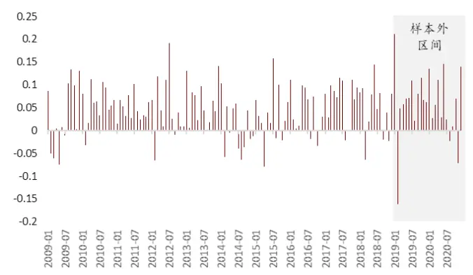
2009-01-01 2020-12-31

25: QQC
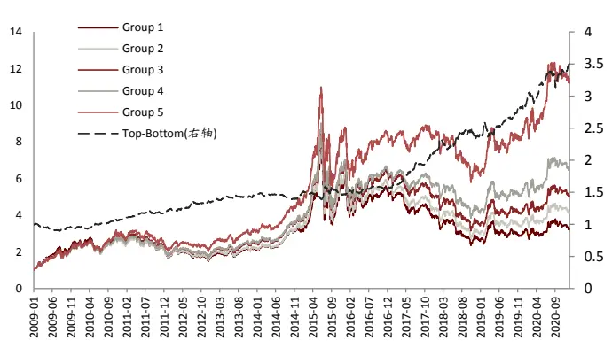
2009-01-01 2020-12-31

## 5. QQC 应用于指数增强：沪深 300增强样本外年化超额 15个百分点

## 沪深 300 指数增强：难度较大，基本面指标更有效

在各类宽基指数的指数增强模型中，沪深 300 指数增强模型是关注度较高但同时难度也较高的模型。近几年来沪深 300 指数的相对强势的表现，和沪深 300 股指期货贴水较小的优势，是导致沪深 300 指数增强策略关注度上升的主要原因。

同时，采用量化多因子手段构建沪深 300 指数增强组合是比较具有难度的，我们总结沪深 300 指数增强的难点主要包括：

## 行业分布不均衡，个股权重差异大

将沪深 300 与中证 500 这两个指数的成分股行业分布做一个统计，可以发现沪深 300 内的 300 只股票行业分布更为不均衡，其中食品饮料行业、银行行业与非银金融行业的权重占比较高：

26: 300 %
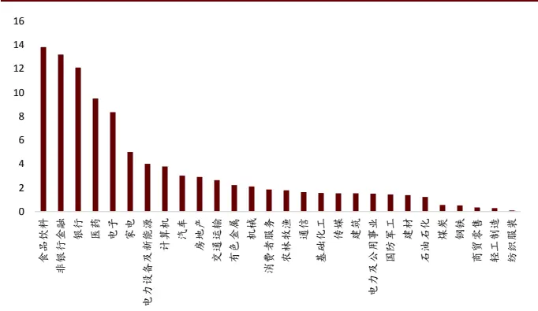
资料来源：万得资讯，中金公司研究部，样本时间：2020/12/31

27: 500 %
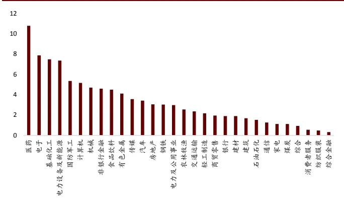
资料来源：万得资讯，中金公司研究部，样本时间：2020/12/31

通常在分析沪深 300 指数成分股时，前面提到的行业分布偏离度高的问题是比较容易关注到的信息。但如果仔细观察分析沪深 300指数成分中的个股权重，就可以发现沪深 300的个股权重也存在很大的分布偏离。

图表28：沪深300权重股及所属行业

| 代码 | 名称 | 权重（%） | 中信一级行业 |
| --- | --- | --- | --- |
| 600519.SH | 贵州茅台 | 5.12 | 食品饮料 |
| 601318.SH | 中国平安 | 4.80 | 非银行金融 |
| 000858.SZ | 五粮液 | 2.89 | 食品饮料 |
| 600036.SH | 招商银行 | 2.77 | 银行 |
| 000333.SZ | 美的集团 | 2.47 | 家电 |
| 600276.SH | 恒瑞医药 | 2.12 | 医药 |
| 601166.SH | 兴业银行 | 1.55 | 银行 |
| 000651.SZ | 格力电器 | 1.52 | 家电 |
| 601888.SH | 中国中免 | 1.41 | 消费者服务 |
| 600887.SH | 伊利股份 | 1.38 | 食品饮料 |
| 600030.SH | 中信证券 | 1.28 | 非银行金融 |
| 601012.SH | 隆基股份 | 1.24 | 电力设备及新能源 |
| 002475.SZ | 立讯精密 | 1.20 | 电子 |
| 300059.SZ | 东方财富 | 1.09 | 计算机 |
| 600031.SH | 三一重工 | 1.06 | 机械 |

2020-12-31

将沪深 300 内权重大于 1%的个股作为权重股，则可以发现，截止 2020 年 12 月 31 日，占沪深 300 成份个股 1/20的 15 只权重股，权重之和已达到 31.88%。

## 有效因子数量少，且大部分为基本面因子

沪深 300指数增强较为困难另外一个重要原因在于：沪深 300 内的有效因子数量较少。

我们以因子库中，包括估值因子，规模因子，成长因子，质量因子，杠杆因子，动量因子，波动因子，技术因子，流动性因子，情绪类因子等共 10 大类 200 个细分因子为例，测试这些因子在沪深 300 成分股内的预测能力和选股能力。以 IC 绝对值大于 3%，IC_IR绝对值大于 0.3 为标准，沪深 300 成分股内，满足上述标准的具有一定选股能力的因子个数仅有 20 个，有效因子占比只有 10%，如下图所示：

图表29:不同样本空间内有效因子类型及占比
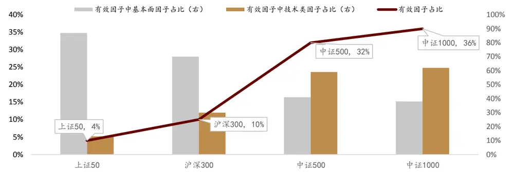
2010-01-01 2018-12-31

沪深 300 内的有效因子中以基本面类型的因子为主，基本面因子的占比超过 65%。而这一特征与中证 500 或者中证 1000 是截然相反的。

## 基于 QQC的沪深 300指数增强：样本外表现出色，年化超额 15%

基于前文的分析，我们发现沪深 300 中基本面相关的因子更具有超额收益能力，同时沪深 300 成分股的行业偏离和个股偏离都较为严重，我们构造了基于 QQC综合质量因子的沪深 300指数增强模型，模型的具体设置如下：

因子选择：选择包括估值因子、动量因子、换手率因子、一致预期类因子在内的沪深 300内较为有效的因子，与 QQC 因子一同作为模型底层因子。

图表30：基于QQC 的沪深300 指数增强模型因子明细

| Factor Code | 名称 | 权重限制 |
| --- | --- | --- |
| BP_LR | BP |  |
| Momentum_24M | 24个月收益率 | 一 |
| VA_FC_1M | 1个月换手率 | 一 |
| DP | DP | 一 |
| EEP | 一致预期EP | 一 |
| EEChange_3M | 一致预期净利润3个月变动 | 一 |
| QQC | QQC | 大于等于50% |

资料来源：中金公司研究部

因子权重设置： 滚动 24 个月 IC_IR（QQC 因子的权重若小于 50%，将其调整至 50%，其他因子再做归一化处理）

组合优化及参数设置：

（1）成分股内选股

（2）约束行业偏离度不超过 5%；

（3）约束市值因子暴露度不超过 5%；

（4）约束个股权重相对沪深300成分股原始权重的偏离度不超过1个百分点（绝对值）；

（5）月度调仓，费率假设为单边 0.3%

（6）样本内 2011-01-01 至 2018-12-31，样本外为 2019-01-01 至 2020-12-31

模型表现： 组合年化超额收益为 10.47%，跟踪误差 3.37%，信息比 3.11。组合自 2011年至今每年度均跑赢沪深 300 指数，月度胜率接近 80%，相对基准的最大回撤仅为 3.9%。

样本外（2019-01-01 至 2020-12-31）组合年化超额收益为 15.02%，跟踪误差 3.65%，信息比 4.11。2020 年全年，组合累计收益 46.58%，跑赢沪深 300 指数 19.37 个百分点，表现相当出色。

31: QQC 300
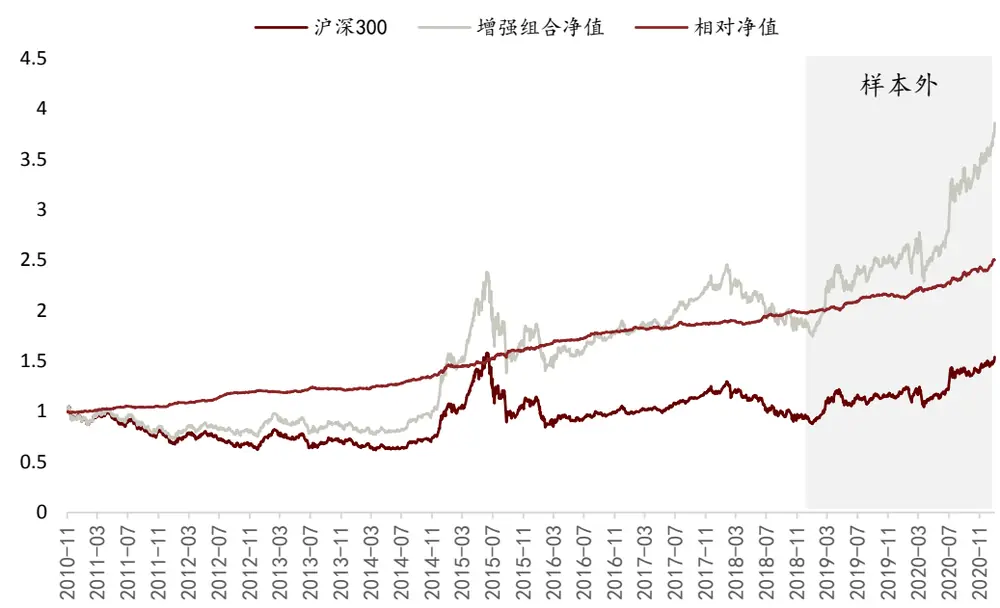
2011/01/01 2020/12/31

图表32: QQC 因子在不同样本内的测试结果

|  | 月度胜率 | 年化超额收益率 | 相对收益波动率 | 信息比 | 相对最大回撤 |
| --- | --- | --- | --- | --- | --- |
| 2011 | 83% | 7.39% | 2.83% | 2.61 | -1.69% |
| 2012 | 75% | 11.29% | 2.72% | 4.15 | -0.80% |
| 2013 | 42% | 1.73% | 2.73% | 0.63 | -2.62% |
| 2014 | 100% | 18.93% | 3.85% | 4.92 | -1.33% |
| 2015 | 83% | 12.45% | 5.01% | 2.48 | -2.46% |
| 2016 | 100% | 9.95% | 2.58% | 3.86 | -0.65% |
| 2017 | 67% | 6.53% | 2.86% | 2.28 | -1.87% |
| 2018 | 75% | 5.87% | 2.65% | 2.21 | -2.03% |
| 2019 | 75% | 9.27% | 2.75% | 3.37 | -3.85% |
| 2020 | 92% | 19.37% | 4.71% | 4.11 | -3.40% |
| Summary | 79% | 10.47% | 3.37% | 3.11 | -3.94% |

2011-01-01 2020-12-31

综上，采用基于QQC因子的沪深300指数增强模型样本内外均具有稳定的超额收益能力。我们的模型为了减少权重股收益波动对模型的表现的影响并提高超额收益的稳定性，在QQC 因子结合多因子打分的基础上，结合优化器对最终持仓组合的行业暴露、市值暴露和个股权重偏离度进行约束。

基于 QQC综合质量因子的沪深 300增强组合具有稳定的超额收益，组合年化超额收益为10.47%，跟踪误差 3.37%，信息比 3.11。组合自 2011 年至今每年度均跑赢沪深 300 指数，月度胜率接近 80%，相对最大回撤仅为 3.9%。2020 年全年，组合累计收益 46.58%，跑赢沪深 300指数 19.37 个百分点，表现相当出色。

# 法律声明

一般声明

本报告由中国国际金融股份有限公司（已具备中国证监会批复的证券投资咨询业务资格）制作。本报告中的信息均来源于我们认为可靠的已公开资料，但中国国际金融股份有限公司及其关联机构（以下统称“中金公司”）对这些信息的准确性及完整性不作任何保证。本报告中的信息、意见等均仅供投资者参考之用，不构成对买卖任何证券或其他金融工具的出价或征价或提供任何投资决策建议的服务。该等信息、意见并未考虑到获取本报告人员的具体投资目的、财务状况以及特定需求，在任何时候均不构成对任何人的个人推荐或投资操作性建议。投资者应当对本报告中的信息和意见进行独立评估，自主审慎做出决策并自行承担风险。投资者在依据本报告涉及的内容进行任何决策前，应同时考量各自的投资目的、财务状况和特定需求，并就相关决策咨询专业顾问的意见对依据或者使用本报告所造成的一切后果，中金公司及/或其关联人员均不承担任何责任。

本报告所载的意见、评估及预测仅为本报告出具日的观点和判断，相关证券或金融工具的价格、价值及收益亦可能会波动。该等意见、评估及预测无需通知即可随时更改。在不同时期，中金公司可能会发出与本报告所载意见、评估及预测不一致的研究报告。

本报告署名分析师可能会不时与中金公司的客户、销售交易人员、其他业务人员或在本报告中针对可能对本报告所涉及的标的证券或其他金融工具的市场价格产生短期影响的催化剂或事件进行交易策略的讨论。这种短期影响的分析可能与分析师已发布的关于相关证券或其他金融工具的目标价、评级、估值、预测等观点相反或不一致，相关的交易策略不同于且也不影响分析师关于其所研究标的证券或其他金融工具的基本面评级或评分。

中金公司的销售人员、交易人员以及其他专业人士可能会依据不同假设和标准、采用不同的分析方法而口头或书面发表与本报告意见及建议不一致的市场评论和/或交易观点。中金公司没有将此意见及建议向报告所有接收者进行更新的义务。中金公司的资产管理部门、自营部门以及其他投资业务部门可能独立做出与本报告中的意见不一致的投资决策。

除非另行说明，本报告中所引用的关于业绩的数据代表过往表现。过往的业绩表现亦不应作为日后回报的预示。我们不承诺也不保证，任何所预示的回报会得以实现。
分析中所做的预测可能是基于相应的假设。任何假设的变化可能会显著地影响所预测的回报。

本报告提供给某接收人是基于该接收人被认为有能力独立评估投资风险并就投资决策能行使独立判断。投资的独立判断是指，投资决策是投资者自身基于对潜在投资的目标、需求、机会、风险、市场因素及其他投资考虑而独立做出的。

本报告由受香港证券和期货委员会监管的中国国际金融香港证券有限公司（“中金香港”）于香港提供。香港的投资者若有任何关于中金公司研究报告的问题请直接联系中金香港的销售交易代表。本报告作者所持香港证监会牌照的牌照编号已披露在报告首页的作者姓名旁。

本报告由受新加坡金融管理局监管的中国国际金融（新加坡）有限公司 (“中金新加坡”) 于新加坡向符合新加坡《证券期货法》定义下的认可投资者及/或机构投资者提供。提供本报告于此类投资者, 有关财务顾问将无需根据新加坡之《财务顾问法》第 36 条就任何利益及/或其代表就任何证券利益进行披露。有关本报告之任何查询，在新加坡获得本报告的人员可联系中金新加坡销售交易代表。

本报告由受金融服务监管局监管的中国国际金融（英国）有限公司（“中金英国”）于英国提供。本报告有关的投资和服务仅向符合《2000 年金融服务和市场法 2005年（金融推介）令》第 19（5）条、38 条、47 条以及 49 条规定的人士提供。本报告并未打算提供给零售客户使用。在其他欧洲经济区国家，本报告向被其本国认定为专业投资者（或相当性质）的人士提供。

本报告将依据其他国家或地区的法律法规和监管要求于该国家或地区提供。

## 特别声明

在法律许可的情况下，中金公司可能与本报告中提及公司正在建立或争取建立业务关系或服务关系。因此，投资者应当考虑到中金公司及/或其相关人员可能存在影响本报告观点客观性的潜在利益冲突。

与本报告所含具体公司相关的披露信息请访 https://research.cicc.com/footer/disclosures，亦可参见近期已发布的关于该等公司的具体研究报告。

中金研究基本评级体系说明：

分析师采用相对评级体系，股票评级分为跑赢行业、中性、跑输行业（定义见下文）。

除了股票评级外，中金公司对覆盖行业的未来市场表现提供行业评级观点，行业评级分为超配、标配、低配（定义见下文）。

我们在此提醒您，中金公司对研究覆盖的股票不提供买入、卖出评级。跑赢行业、跑输行业不等同于买入、卖出。投资者应仔细阅读中金公司研究报告中的所有评级定义。请投资者仔细阅读研究报告全文，以获取比较完整的观点与信息，不应仅仅依靠评级来推断结论。在任何情形下，评级（或研究观点）都不应被视为或作为投资建议。投资者买卖证券或其他金融产品的决定应基于自身实际具体情况（比如当前的持仓结构）及其他需要考虑的因素。

## 股票评级定义：

跑赢行业（OUTPERFORM）：未来 6~12 个月，分析师预计个股表现超过同期其所属的中金行业指数；

- 中性（NEUTRAL）：未来 6~12 个月，分析师预计个股表现与同期其所属的中金行业指数相比持平；

- 跑输行业（UNDERPERFORM）：未来 6~12 个月，分析师预计个股表现不及同期其所属的中金行业指数。

## 行业评级定义：

- 超配（OVERWEIGHT）：未来 6~12 个月，分析师预计某行业会跑赢大盘 10%以上；

- 标配（EQUAL-WEIGHT）：未来 6~12 个月，分析师预计某行业表现与大盘的关系在-10%与 10%之间；

低配（UNDERWEIGHT）：未来 6~12 个月，分析师预计某行业会跑输大盘 10%以上。

研究报告评级分布可从https://research.cicc.com/footer/disclosures 获悉。

本报告的版权仅为中金公司所有，未经书面许可任何机构和个人不得以任何形式转发、翻版、复制、刊登、发表或引用。

V190624

中国国际金融股份有限公司
中国北京建国门外大街1号国贸写字楼2座28层 | 邮编：100004
电话： (+86-10) 6505 1166
传真： (+86-10) 6505 1156

## 美国

CICC US Securities, Inc 32th Floor, 280 Park Avenue New York, NY 10017, USA Tel: (+1-646) 7948 800 Fax: (+1-646) 7948 801

## 新加坡

China International Capital Corporation (Singapore) Pte. Limited 
6 Battery Road,#33-01 
Singapore 049909 
Tel: (+65) 6572 1999 
Fax: (+65) 6327 1278

## 上海

中国国际金融股份有限公司上海分公司中国国际金融股份有限公司上海分公司

上海市浦东新区陆家嘴环路1233号
汇亚大厦32层
邮编：200120
电话：(86-21) 5879-6226
传真：(86-21) 5888-8976

## 英国

China International Capital Corporation (UK) Limited 
25th Floor, 125 Old Broad Street 
London EC2N 1AR, United Kingdom 
Tel: (+44-20) 7367 5718 
Fax: (+44-20) 7367 5719

## 香港

中国国际金融（香港）有限公司

香港中环港景街 1 号国际金融中心第一期29楼电话：(852) 2872-2000传真：(852) 2872-2100

## 深圳

中国国际金融股份有限公司深圳分公司
深圳市福田区益田路5033号
平安金融中心72层
邮编：518048
电话：(86-755) 8319-5000
传真：(86-755) 8319-9229