量化策略

# 量化多因子系列（2）：非线性假设下的情景分析因子模型

传统量化多因子模型往往在全市场范围内对股票统一进行打分，而很少考虑个股之间的基本面情况差异和因子在不同风格股票池内的适用性差异。基于情景分析法（Contextual Modeling Strategy）的多因子模型则可以弥补传统多因子模型的不足。

## 多因子模型中的情景分析法

基于非线性假设的情景分析方法。传统的因子检验方法无论是回归法还是相关系数检验法，均含有默认的假设即因子对股票收益的影响是线性的。然而实际投资过程中我们会发现不同板块、不同风格的股票往往存在不同的投资逻辑，也就是说因子对于股票收益的预测能力是非线性的。

情景特征（Contextual Feature）的定义。区分不同情景分析模型的核心在于情景特征的定义。情景特征的定义方式包括：风格因子特征、板块特征、企业生命周期特征和统计聚类特征等。

## 情景分析因子模型的构建流程

情景分析模型的构建可以主要分为三个步骤：选定 Alpha 因子、选定情景特征、确定因子加权方式。其中情景特征的筛选和检验是模型的关键。

情景特征因子的检验框架。合适的情景特征因子应该具有逻辑清晰、稳定性好、 覆盖度高、区分度高的特点。而为了检验所选特征是否显著影响因子的预测能力，可以通过双样本 T 检验、组合收益测试和Fama-MacBeth 回归检验来进行测试。

## A股情景特征：规模、流动性和估值特征有效性较高

Fama-MacBeth 回归测试表明规模特征、盈利特征和估值特征具有较高的显著性，双样本 T检验的结果显示规模特征和盈利特征在分股票池内的IC 具有显著的差异。组合收益测试中则是规模特征、估值特征和流动性特征较为有效，整体上看，规模、流动性和估值特征是 A股市场有效性和显著性较高的特征因子。

## 基于情景分析因子模型的选股组合：收益稳定性提升

全市场多头组合：收益能力较好，稳定性显著提升。基于流动性特征的全市场组合的收益能力较强，除了可以长期稳定的战胜沪深 300和中证500 这两大宽基指数以外，组合相对于市场上的主动权益基金经理的表现也是有较明显优势的。

中证 500 增强组合：年化收益提高 2.5个百分点。与原始的最优化 IR组合相比，基于流动性特征的情景因子中证 500 增强组合在 2017、2018和 2020 年有比较明显的收益提升。组合的年化超额收益由原先 15.84%提升至 18.38%，提升 2.5 个百分点，信息比也由 2.73 提升至 3.02。

分析员周萧潇SAC 执证编号：S0080521010006xiaoxiao.zhou@cicc.com.cn

分析员刘均伟SAC 执证编号：S0080520120002SFC CE Ref：BQR365junwei.liu@cicc.com.cn

分析员王汉锋，CFASAC 执证编号：S0080513080002SFC CE Ref：AND454hanfeng.wang@cicc.com.cn

## 相关研究报告

## 量化策略 | 量化多因子系列（1）：QQC 综合质量因子与指数增强应用 (2021.01.14)

## 多因子模型中的情景分析法（Contextual Modeling Strategy）

因子的最优组合方式一直是量化多因子模型中最主要的研究内容之一。传统多因子模型往往是在全市场范围内对所有股票一视同仁地进行打分，而很少考虑个股之间的基本面情况差异和因子在不同风格股票池里的适用性差异。基于情景分析法的多因子模型（Contextual Modeling Strategy）则可以一定程度上弥补传统多因子模型的不足。

## 为什么要采用情景分析因子模型？

情景分析因子模型的概念最初来自于 Sloan[2001]等人的学术研究，情景分析法（Contextual Modeling Strategy）可以理解为针对不同的股票池内因子的有效性差异的研究方法。

对于因子进行情景分析其实包含了一个重要的理念，即认为因子对股票的收益影响并非是线性的。而传统的因子检验方法，无论是回归法还是相关系数检验方法，均含有默认的假设即因子对股票收益的影响是线性的。然而实际投资过程中我们会发现不同板块、不同风格的股票往往存在不同的投资逻辑。例如，海外的研究表明动量因子的收益在高成长和低成长的股票池内具有非常明显的差异，在高成长的股票池内动量因子具有明显更高的预测能力。因此，情景分析因子模型背后的理念基础是更符合真实市场特征的。

年的市场风格极端分化的行情下，国内的传统量化多因子模型大多遭遇了不小幅度的回撤，也正是从 2017 年下半年人们开始普遍关心和探讨因子择时模型。我们也在 2018年开始对因子择时进行了一系列的研究，包括基于因子估值差和拥挤度的因子择时、基于机器学习模型（例如 SVM 支持向量机）的因子择时和基于宏观和市场基本面的估值因子择时等等。海外学术界和业界对于因子择时的探讨也由来已久并且成果丰富，例如Barroso, Santa-Clara （2015）和 Daniel, Moskowitz（2016）分别对动量因子的择时进行了研究；Asness, Friedman, Krail, Liew（2000）对估值因子的择时进行了探讨；Chen, De Bondt（2004）风格动量在因子复合中的应用进行了研究。

但针对因子预测能力的非线性特征这一点，学术界和业界的讨论并不算丰富。Sorensen，Hua 和 Qian（2005）的研究表明，在不同维度的情景（Context）下（例如，高估值/低估值，高成长/低成长，高波动/低波动）最优的因子组合方式也有显著变化。他们认为在风险调整的基础上，使用基于情景特征的因子加权方法构建的因子组合优于静态加权的因子组合。

## 传统因子模型的局限性&情景分析因子模型的优势

首先我们以估值因子近期的回撤为例，来说明传统因子分析框架的局限性。我们知道 A股市场上 2018 年以来估值因子的收益表现出现了较大幅度且较长时间的连续回撤。以市盈率倒数（EP_TTM）因子为例，可以看到 2018 年以后的因子 IC 和因子多空收益表现均出现的大幅的下滑。

但假设我们按照市值将股票池分为大市值和小市值两组，分别在两个组内测试估值因子（EP_TTM）的表现，会发现估值因子在小市值股票池内长期有比较稳定的超额收益，而在大市值股票池内的多空收益表现与全市场类似，2018年以后的回撤幅度甚至大于全市场内多空收益的回撤幅度。

图表1：估值因子分组收益与多空收益序列
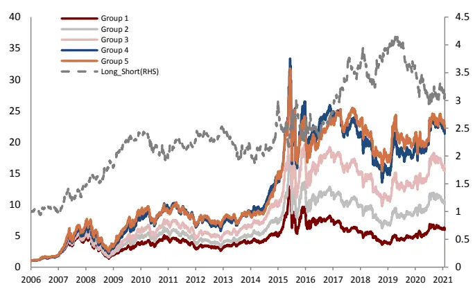
Wind 2006-01-01 2021-01-31

图表2：估值因子在大/小市值分组内的多空收益序列
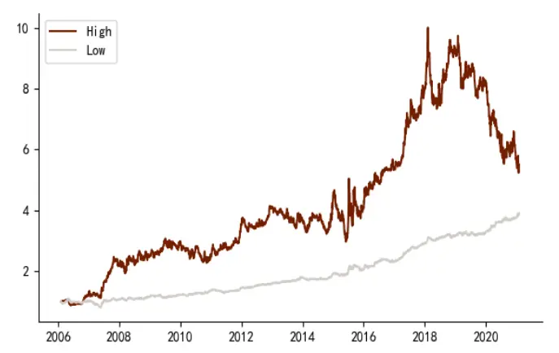
Wind 2006-01-01 2021-01-31

## 哪些模型属于情景分析因子模型？

上文中我们以成长因子和估值因子的例子直观的展示了情景分析因子模型的优势。但值得一提的是，除了基于风格因子的情景划分方式以外，还有一些因子分析方法也可以归类为情景分析因子模型。

区分不同情景分析因子模型的核心在于情景特征（Contextual Feature）的定义。我们认为情景特征主要有以下几种定义方式：

3 Contextual Feature
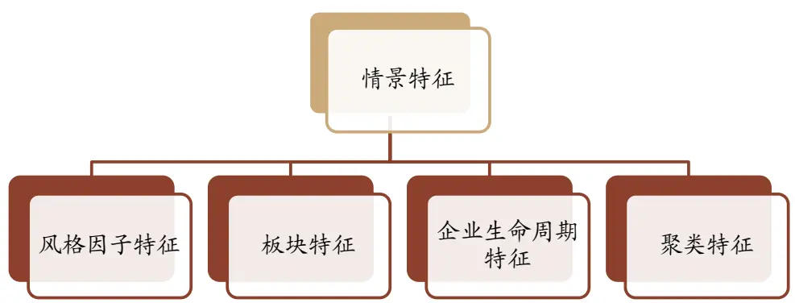
资料来源：中金公司研究部

具体来说：

- 风格因子特征：例如，高估值/低估值，高成长/低成长，高波动/低波动 不同股票池内的因子测试。

- 板块特征：基于板块分类，不推荐用行业分类因为行业内个股数量少，因子测试的统计意义较弱。

- 企业生命周期特征：按照初创期、成长期、成熟期和衰退期对上市公司进行分类，

- 统计聚类特征：基于统计方法（例如 K-means）对个股进行分类，我们会在后续报告中对这种方法以及情景分析的应用效果做具体的探讨。

本文我们重点关注的是情景分析因子模型在 A 股的应用效果，我们将详细探讨情景特征的定义、特征的选取和有效性检验，并最终构建基于情景分析的因子选股组合。

## 情景分析因子模型的构建流程和理论基础

从模型的构建流程上来看，情景分析模型可以主要分为三步：选定 Alpha 因子、选定情景特征、确定加权方式。

图表4：情景分析模型的构建流程
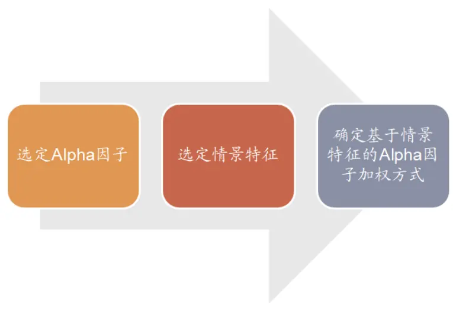
资料来源：中金公司研究部

第一步选定 Alpha 因子是需要较多的基于因子挖掘、因子优化等前期的研究积累和测试才能完成的一个步骤。因子挖掘和因子优化涉及众多的方法，我们在《量化多因子系列（1）：QQC 综合质量因子与指数增强应用》报告中做了部分的介绍，而本文我们暂时不会将重点放在因子的挖掘和优化上，而是更多的关注情景分析因子模型这个方法的构建原理和应用效果。

## 情景特征（Contextual Feature）的检验框架

在应用情景分析模型时，选择哪些因子作为情景特征（Contextual Feature）因子是相当重要的一个环节。情景特征因子是用来作为股票池划分的标准的，其有效性必定会对最后模型整体的有效性产生显著的影响。我们认为，一个合适的情景特征因子应该有以下的特点：

- 逻辑清晰：例如采用规模因子作为特征，就可以区分大小市值的股票。而假如采用一些复杂的技术因子作为特征，就很难在逻辑上解释其区分出来的股票的意义所在

- 稳定性好：一个合适的特征因子不应该具有很高的换手率

## 覆盖度高：覆盖度过低的因子作为特征，会导致测试结果的样本偏差过大

- 区分度高：为了检验给定的特征是否显著影响因子的预测能力，我们可以通过双样本T 检验、组合收益测试和 Fama-MacBeth 回归检验来进行测试：

首先，假设给定特征因子 F，将股票池分成两个小股票池 $.U_{H}$ 和 $U_{L}$ ，其中 $U_{H}$ 的因子 F值高于中位数， $U_{L}$ 的 F 值小于中位数。对于任意 Alpha 因子 A，我们可以计算得到因子 A在 $U_{H}$ 和 $U_{L}$ 内的分别的 IC值，即 $IC_{H}$ 和 $IC_{L}$

- 双样本 T检验： $IC_{H}$ 和 $\imath IC_{L}$ 的双样本 T检验，即 $IC_{H}$ 与 $IC_{L}$ 的差显著不等于 0。

- 组合收益测试：在 $U_{H}$ 和 $U_{L}$ 中分别构建基于因子 A 的多空组合（分十组），通过分析多空收益的 Sharpe 等指标检验特征因子的有效性。

## Fama-MacBeth 回归检验：

为了检验给定特征是否影响 Alpha 因子对个股收益的预测能力，我们在预测模型中纳入一个虚拟变量 $D_{feature}$ ，如果股票的在特征因子上的暴露度大于中位数则$D_{feature}$ 为 1，否则为 0。在每个时间点 t,我们计算下述回归方程：

$$
ret_{t+1}=b_{0}+b_{1}*factor_{t}+b_{2}*D_{feature}+b_{3}*factor_{t}*D_{feature}
$$

其中， $b_{3}$ 代表所选特征对因子预测能力的影响，这样通过月度的 Fama-MacBeth 回归我们可以得到 $b_{3}$ 的时间序列并且检验 $-b_{3}$ 的显著性。

图表5：情景特征因子的选取和检验流程
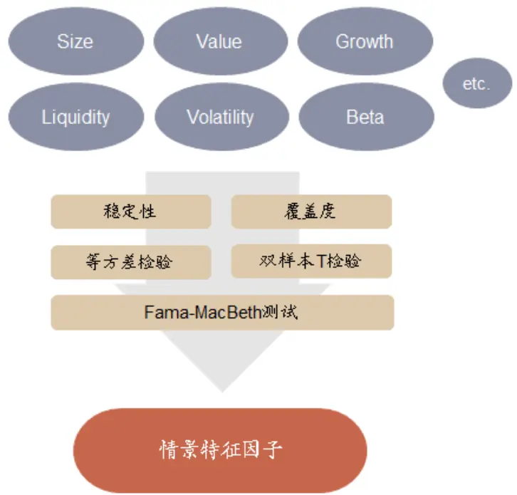
资料来源：中金公司研究部

## 情景分析因子模型下因子最优权重的确定

在确定了情景特征因子后，我们就可以根据所选的特征将股票池划分为若干个子集，通过分别测试各个子集内 Alpha 因子的有效性后，确定各个子集内的因子最优权重，分别在各个子集内对因子加权得到复合因子并最终得到全市场股票的复合得分。

图表6：情景分析因子模型构建流程
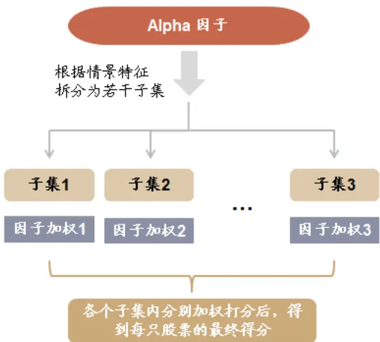
资料来源：中金公司研究部

## 因子最优权重的计算：理论基础

首先，我们采取情景分析模型的最根本的原因就是基于 Alpha 因子预测能力的非线性特征。因此从理论上来说，针对不同的股票池采用不同的因子加权方式，就应该可以获取整体上更为有效的选股预测能力。那么怎样确定不同股票池内各个 Alpha 因子的最优权重，并计算得到全市场股票的最终得分，就是模型中比较关键的问题。

## 单个 Alpha 因子的情形

我们首先以单因子的情形举例说明情景分析因子模型的基本原理。假定我们有一个特征，并根据它将股票池分为高低两部分，同时假设有一个单一的 Alpha 因子。那么如果这个Alpha 因子在高低两个股票池中表现不一样，最终整体上这个 Alpha因子表现会如何呢？

首先，根据 Qian1对于超额收益的定义，股票在截面上的超额收益可以表示为：

$$
\alpha_{t}=\sum_{i=1}^{N}w_{i}r_{i}=\lambda^{-1}\sum_{i=1}^{N}F_{i}R_{i},
$$

其中 $F_{i}$ 为风险调整后的预测因子， $R_{i}$ 代表风险调整后的收益率，N 是股票数量；λ是风险偏好参数。根据情景特征将全市场股票分为高低两个分组后，上式可以改写为：

$$
\alpha_{t}=\lambda^{-1}\sum_{i=1}^{N}F_{i}R_{i}=\lambda^{-1}\sum_{i\in H}F_{i}R+\lambda^{-1}\sum_{i\in L}F_{i}R_{i}
$$

采用 IC 来表示：

$$
N\cdot ICdis(F)dis(R)=\frac{N}{2}\times IC_{H}dis(F_{H})dis(R_{H})+\frac{N}{2}\times IC_{L}dis(F_{L})dis(R_{L})
$$

我们可以假设所有预测因子和收益率的离散度是相同的，那么就可以得到：

$$
IC=\frac{1}{2}\times IC_{H}+\frac{1}{2}\times IC_{L}
$$

IC 均值除以 IC 标准差就得到总体的 IR：

$$
IR=\frac{\overline{{IC_{H}}}+\overline{{IC_{L}}}}{\sqrt{\sigma_{H}^{2}+\sigma_{L}^{2}+2\rho_{H,L}\sigma_{H}\sigma_{L}}},
$$

假设因子仅在高分组内有预测能力，而在低分组内完全没有预测能力即 $\overline{{IC_{L}}}=0$ ，那么很自然的：

$$
IR=\frac{\overline{{IC_{H}}}}{\sqrt{\sigma_{H}^{2}+\sigma_{L}^{2}+2\rho_{H,L}\sigma_{H}\sigma_{L}}},
$$

如果 IC间的相关性为正，因子的整体 IR将会小于高分组内因子的 IR，即：

$$
IR<IR_{H}=\frac{\overline{{IC_{H}}}}{\sigma_{H}}
$$

以具体的数字为例，如果 $\overline{{IC_{H}}}=0.1,\quad\sigma_{H}=\sigma_{L}=0.1,\quad\rho_{H,L}=0.2$ ，那么高分组内的 IR 值$IR_{H}=1$ ，但是因子整体的 IR仅有 0.6。

上面的例子表明，假设一个因子在低分组中没有预测能力时，对于整体股票池来说它的贡献就是负面的，继续在全市场股票池内使用这个因子会导致整体预测能力的下降。

## 基于情景特征划分的因子最优权重

我们进一步的讨论关于不同特征分组内的因子最优权重计算的问题，这里我们用 $v_{H}和v_{L}$ 表示因子在高分组和低分组内的权重，那么可知总体 IR 为：

$$
\mathit{IR}=\frac{v_{H}\overline{{IC_{H}}}+v_{L}\overline{{IC_{L}}}}{\sqrt{v_{H}^{2}\sigma_{H}^{2}+v_{L}^{2}\sigma_{L}^{2}+2\rho_{H,L}\sigma_{H}\sigma_{L}}},
$$

最优权重则可以求解为：

$$
\begin{array}{r}{\left(\begin{matrix}{\dot{v_{H}}}\\{\dot{v_{L}}}\end{matrix}\right)\propto\left(\begin{matrix}{\cfrac{\overline{{IC_{H}}}}{\sigma_{H}^{2}}-\rho_{H,L}}&{\cfrac{\overline{{IC_{L}}}}{\sigma_{H}\sigma_{L}}}\\{\cfrac{\overline{{IC_{L}}}}{\sigma_{L}^{2}}-\rho_{H,L}}&{\cfrac{\overline{{IC_{H}}}}{\sigma_{H}\sigma_{L}}}\end{matrix}\right)}\end{array}
$$

那么假设我们有M个因子，权重则为 $\boldsymbol{v}=(\boldsymbol{v}_{H},\boldsymbol{v}_{L})=(v_{1,H},v_{2,H},\cdots,v_{M,H},v_{1,L},v_{2,L},\cdots,v_{M,L})$ IC 向量为:

$$
\overline{IC}=(\overline{IC_{H}},\overline{IC_{L}})=(\overline{IC_{1,H}},\overline{IC_{2,H}},\cdots,\overline{IC_{M,H}},\overline{IC_{1,L}},\overline{IC_{2,L}},\cdots,\overline{IC_{M,L}})'
$$

复合 IR可以表示为：

$$
\mathit{IR}=\frac{\boldsymbol{v}^{\prime}\cdot\overline{{\boldsymbol{IC}}}}{\sqrt{\boldsymbol{v}^{\prime}\cdot\boldsymbol{\Sigma}_{IC}\cdot\boldsymbol{v}}}
$$

最优权重则可以由下式给出：

$$
\dot{\boldsymbol{v}}\propto\boldsymbol{\Sigma}_{IC}^{-1}\cdot\overline{{IC}}
$$

其中，IC 协方差矩阵 $\Sigma_{IC}是$ 一个 $2M\times2M$ 的矩阵。

## A股情景特征：规模、流动性和估值特征有效性较高

## A股情景特征的选取

根据前文的分析，一个合适的情景特征因子应该具有逻辑清晰、稳定性好、 覆盖度高、区分度高的特点。由于区分度的具体情况需要通过测试结果来分析，因此我们首先根据基础逻辑、稳定性和覆盖度，初步筛选出 A股的情景特征因子如下：

图表7：A 股情景特征因子

| 特征因子 | 因子名 | 因子构造 |
| --- | --- | --- |
| 盈利 | Profit | 过去三年 ROE_TTM |
| 成长 | Growth | OP_SD, NP_SD 等权 |
| 估值 | Cheapness | BP_LR |
| 规模 | Size | Ln_MC |
| 流动性 | Liquidity | VSTD_1M, VSTD_3M, VSTD_6M等权 |

资料来源：中金公司研究部

- 盈利特征：为了体现公司的稳健的盈利能力特征，我们选取过去三年的平均 ROE作为盈利特征因子。

- 成长特征：考虑到特征因子需要具有较好的稳定性，采用历史 8 个季度数据计算的稳健加速度成长指标，分别使用净利润和营业利润计算并等权合成。

- 估值特征：采用估值因子中稳定性较高的市净率因子。

- 规模特征：选取市值对数因子。

- 流动性特征：流动性是比较重要的股票交易性特征，为了降低因子的换手，这里选择六个月的成交额/收益率波动因子（VSTD_6M）。

## 情景特征有效性检验

我们选择包含质量、动量、换手率、一致预期这几个大类的 Alpha 因子作为测试对象。由于不同的投资者偏好使用的 Alpha 因子是各不相同的，各个类型因子中也存在很多不同的因子构造方式和不同的处理细节，这里为了更有重点的展示情景分析方法的应用效果，就仅以下表中的 5个 Alpha 因子作为测试对象。

其中质量因子为前期报告《量化多因子系列（1）：QQC 综合质量因子与指数增强应用》中的 QQC因子，预期类的因子中包含预期估值（一致预期 EP）和预期调整（一致预期净利润 3 个月调整和一致预期营业利润 3 个月调整）；动量因子采用的是 24 个月收益率减去最近 1个月收益率和 12个月收益率减去最近 1个月收益率；换手率使用的是最近 1 个月、3个月和 6个月的换手率等权复合。

8 Alpha

| A1pha 因子 | 因子名 | 因子构造 |
| --- | --- | --- |
| 质量 | Quality | QQC |
| 预期估值 | Con_Value | EEP |
| 预期调整 | Con_Change | EEChange_3M, EOPchange_3M等权 |
| 动量 | Momentum | Momentum_12M-1M, Momentum_24M-1M 等权 |
| 换手 | Turnover | VA_FC_1M,VA_FC_3M, VA_FC_6M等权 |

资料来源：中金公司研究部

为了检验特征因子的有效性，我们就分别将上述五个 Alpha 因子在不同特征分组下的表现进行下面的三种测试：Fama-MacBeth 回归测试、双样本 T检验和组合收益测试。

## Fama-MacBeth 回归检验

Fama-MacBeth 回归检验可以用来测试给定的特征是否显著的影响 Alpha因子对个股收益的预测能力。我们在上文中已经具体阐述了回归方程的构建方式和检验标准。下表为公式:

$$
ret_{t+1}=b_{0}+b_{1}*factor_{t}+b_{2}*D_{feature}+b_{3}*factor_{t}*D_{feature}
$$

中 $b_{3}$ 的均值以及 T检验的结果：

9 Fama-MacBeth

| A1pha 因子 Quality |  | Con_Value |  | Turnover |  | Con_Change |  | Momentum |  |
| --- | --- | --- | --- | --- | --- | --- | --- | --- | --- |
| 特征因子 | Mean | T-stats | Mean | T-stats | Mean | T-stats | Mean T-stats | Mean | T-stats |
| Growth | 0.0003 | 0.73 | 0.0013 | 2.10 | 0.0002 | 0.38 | 0.0013 2.15 | 0.0008 | 1.33 |
| Cheapness | -0.0013 | -2.47 | -0.0029 | -3.89 | 0.0013 | 1.42 -0.0015 | -2.33 | -0.0011 | -1.07 |
| Size | 0.0021 | 3.44 | 0.0026 | 2.51 | 0.0004 | 0.42 0.0012 | 1.85 | 0.0015 | 2.00 |
| Liquidity | 0.0018 | 3.45 | 0.0024 | 2.88 | -0.0010 | -1.23 -0.0005 | -0.77 | -0.0005 | -0.71 |
| Profit | 0.0010 | 1.83 | 0.0018 | 1.28 | 0.0022 | 2.94 | 0.0027 3.35 | 0.0015 | 2.29 |

2006-01-01 2021-01-31

## 从上述结果来看：

- 规模特征、盈利特征有效性较高：规模特征对于质量因子、预期估值因子和动量因子都具有较高的区分度；盈利特征对于换手率因子、预期调整因子和动量因子具有较高的区分度。

- 预期估值因子受情景特征因子的影响最明显：我们观察到，预期估值因子在 5 个特征中的 4 个特征下都具有较高的区分度和显著性，预期估值因子比较容易受到成长特征、估值特征、规模特征和流动性特征的影响。

## 双样本 T检验

对于每一个情景特征，我们计算出各个 Alpha 因子在特征高低两个不同股票池内的 IC 值时间序列，然后分别计算两个股票池内 IC值的均值及方差，并对这两个部分的 IC值进行双样本 t 检验，结果如下：

10 Growth Alpha

| IC_H |  | IC_L | IC_STD_H | IC_STD_L | T-stats | P-value |
| --- | --- | --- | --- | --- | --- | --- |
| Quality | 0.04 |  |  |  |  |  |
|  |  | 0.04 | 0.06 | 0.06 | 0.20 | 0.841 |
| Con_Value | 0.05 | 0.04 | 0.09 | 0.08 | 1.01 | 0.313 |
| Turnover | -0.09 | -0.10 | 0.10 | 0.10 | 0.89 | 0.373 |
| Con_Change | 0.04 | 0.02 | 0.06 | 0.05 | 1.95 | 0.053 |
| Momentum | -0.02 | -0.02 | 0.11 | 0.10 | -0.11 | 0.910 |

2006-01-01 2021-01-31

11 Cheapness Alpha

| IC_H IC_STD_L T-stats |  | IC_L IC_STD_H |  |  |  | P-value |
| --- | --- | --- | --- | --- | --- | --- |
| Quality | 0.04 | 0.04 | 0.06 | 0.07 | -0.23 | 0.818 |
| Con_Value | 0.03 | 0.05 | 0.09 | 0.09 | -1.48 | 0.140 |
| Turnover | -0.09 | -0.10 | 0.09 | 0.11 | 0.75 | 0.451 |
| Con_Change | 0.03 | 0.04 | 0.05 | 0.06 | -1.23 | 0.219 |
| Momentum | -0.01 | -0.01 | 0.10 | 0.10 | 0.26 | 0.795 |

2006-01-01 2021-01-31

12 Size Alpha

| IC_H IC_L |  | IC_STD_H IC_STD_L | T-stats P-value |
| --- | --- | --- | --- |
| Quality | 0.05 0.04 | 0.07 0.07 | 0.74 0.458 |
| Con_ValueTurnover | 0.06 0.04 | 0.10 0.09 | 2.28 0.023 |
|  | -0.08 -0.12 | 0.11 0.10 | 3.73 0.000 |
| Con_ChangeMomentum | 0.04 0.03 | 0.06 0.06 | 1.46 0.145 |
|  | -0.02 -0.02 | 0.11 0.11 | -0.04 0.970 |

2006-01-01 2021-01-31

13 Liquidity Alpha
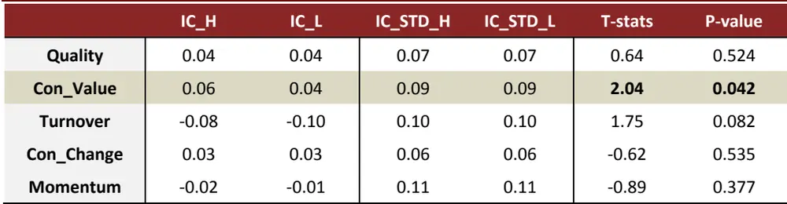
2006-01-01 2021-01-31

14 Profit Alpha

| IC_H IC_L |  | IC_STD_H IC_STD_L |  |  | T-stats | P-value |
| --- | --- | --- | --- | --- | --- | --- |
| Quality | 0.04 | 0.04 | 0.06 | 0.06 | 0.13 | 0.900 |
| Con_Value | 0.05 | 0.04 | 0.10 | 0.07 | 1.43 | 0.152 |
| Turnover | -0.08 | -0.11 | 0.10 | 0.10 | 2.92 | 0.004 |
| Con_Change | 0.04 | 0.02 | 0.07 | 0.05 | 2.41 | 0.017 |
| Momentum | -0.02 | -0.03 | 0.10 | 0.11 | 0.67 | 0.503 |

2006-01-01 2021-01-31

综合上面的测试，我们发现规模特征对预期估值和换手率因子都具有显著的区分度，尤其是换手率因子，在规模特征分组下换手率因子的 IC 序列双样本 T检验的 p 值几乎接近0。

而估值特征的测试结果与 Fama-MacBeth 则略有出入，在双样本 t检验下估值特征对 5 个Alpha 因子都不具有显著的区分度。

## 情景特征分组收益测试

上述的测试结果中我们发现，规模特征、盈利特征和估值特征在 Fama-MacBeth 回归测试的结果中对三个 Alpha 因子都具有较高的区分度和显著性；而双样本 T 检验的结果显示规模特征和盈利特征在分股票池内的 IC 具有显著的差异。因此我们这里主要展示了不同Alpha 因子在这三个特征下的分情景多空收益表现：

规模特征（Size）

在规模特征分组下，换手率因子和质量因子具有显著的收益区分度，其中，低换手因子在小市值股票池内表现明显由于大市值分组，而质量因子在大市值股票池内的表现明显优于小市值股票池内的表现。

同时值得注意的是，预期估值因子在小市值股票池内长期有比较稳定的超额收益，而在大市值股票池内的多空收益 2018 年以来出现了大幅度的回撤。

15 Con_Value Size分组下的表现
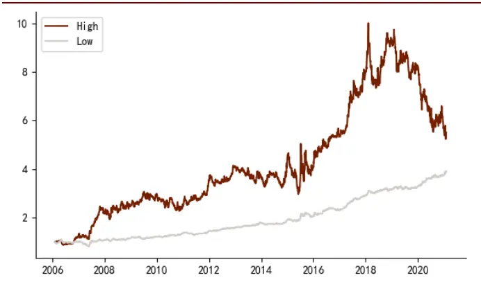
Wind 2006-01-01 2021-01-31

16 Turnover Size组下的表现
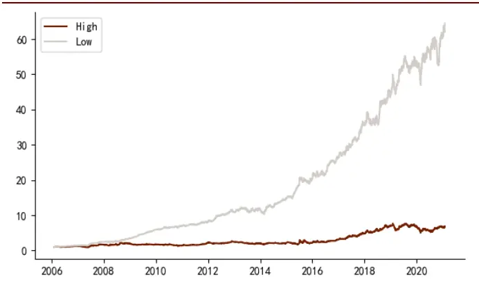
Wind 2006-01-01 2021-01-31

17 Con_Change Size分组下的表现
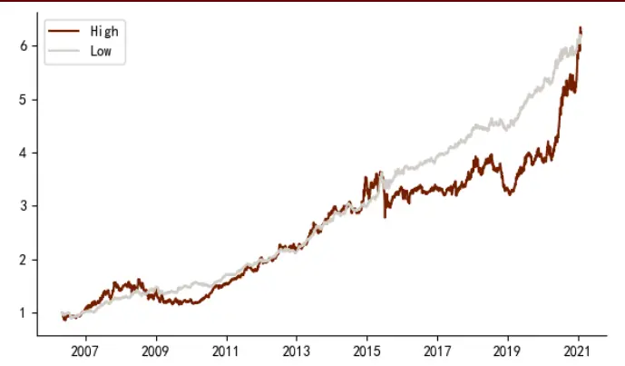
Wind 2006-01-01 2021-01-31

18 Momentum Size组下的表现
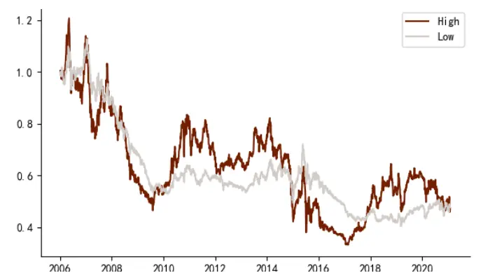
Wind 2006-01-01 2021-01-31

图表19：质量因子（QQC）因子在规模特征（Size）分组下的表现
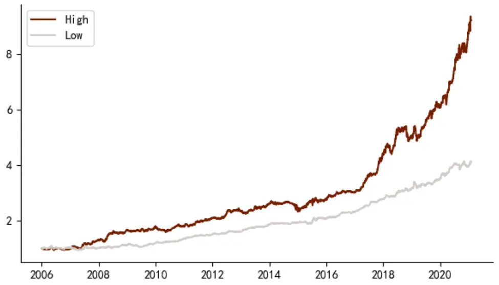
Wind 2006-01-01 2021-01-31

## 盈利特征（Profit）

在特征分组测试的结果来看，盈利特征仅对预期估值因子（Con_Value）因子有一定的区分度。在盈利能力较低的股票池中，预期估值因子长期具有比较稳定的收益能力；而在盈利能力较高的股票池中，预期估值因子的多空收益稳定性较差，尤其是 2018 年以来收益出现了大幅度的回撤。

20 Con_Value Profit 分组下的表现
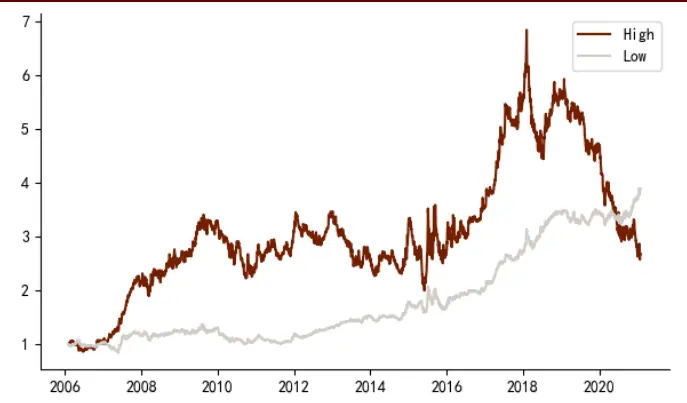
Wind 2006-01-01 2021-01-31

21 Turnover Profit分组下的表现
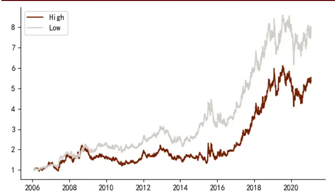
Wind 2006-01-01 2021-01-31

22 Con_Change Profit分组下的表现
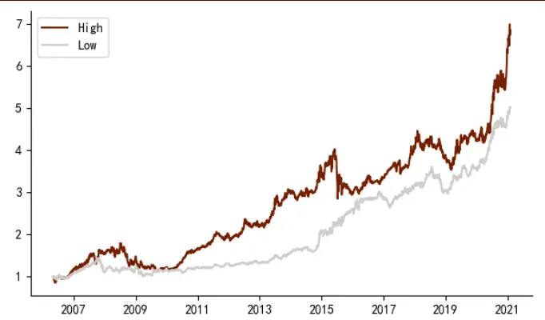
Wind 2006-01-01 2021-01-31

23 Momentum Profit分组下的表现
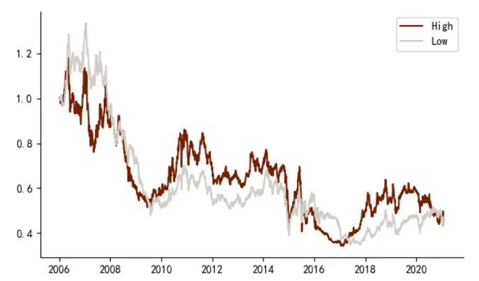
Wind 2006-01-01 2021-01-31

图表24：质量因子（QQC）因子在盈利特征（Profit）分组下的表现
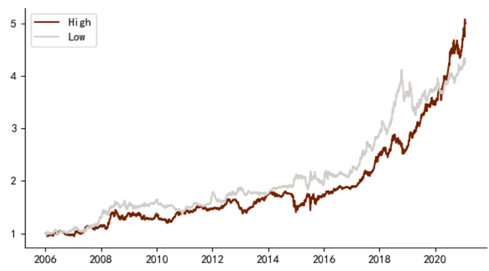
Wind 2006-01-01 2021-01-31

## 估值特征（Cheapness）

由于我们以 BP_LR 市净率倒数因子作为估值特征的定义方式，因此估值特征划分的高组（High）为低估值股票池，低组（Low）为高估值股票池。

质量因子和换手率因子在高估值的股票池中都有相当出色的表现，多空收益显著的优于其在低估值股票池中的表现。说明在估值偏高的股票池中，高质量的公司和低换手率的公司具有更强的相对优势。

分析师预期调整因子（Con_Change）也在高估值股票池中有更强的预测能力，且 2020年以来多空收益提升迅速。

25 Quality Cheapness 分组下的表现
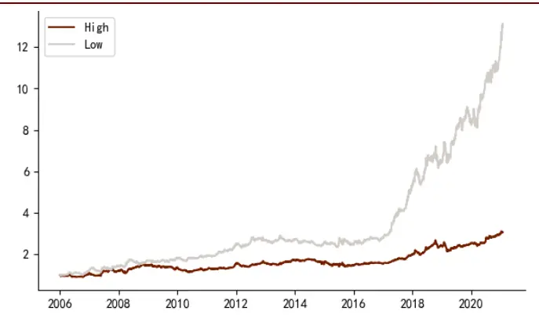
Wind 2006-01-01 2021-01-31

26 Turnover Cheapness分组下的表现
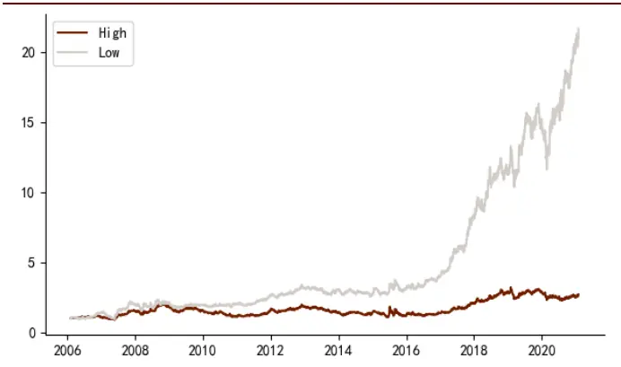
Wind 2006-01-01 2021-01-31

27 Con_Change Cheapness
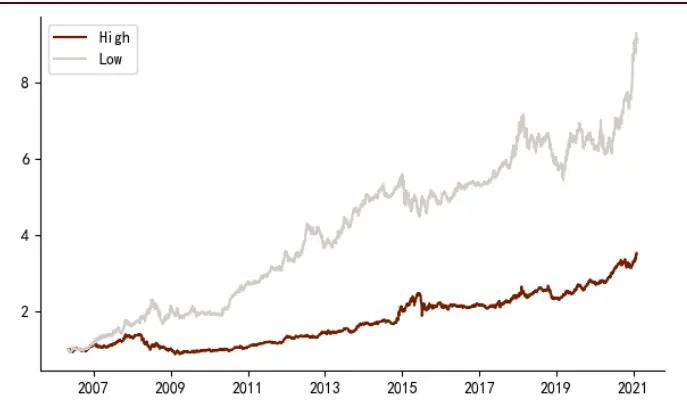
Wind 2006-01-01 2021-01-31

28 Momentum Cheapness分组下的表现
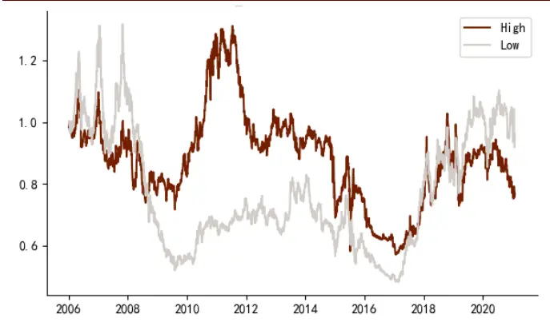
Wind 2006-01-01 2021-01-31

## 基于情景分析因子模型的选股组合：收益稳定性提升

全市场多头组合：收益能力较好，稳定性显著提升

这里我们首先基于情景分析方法构建一个全市场的选股组合，构建全市场组合的主要原因包括以下几点：首先，上文提出的情景分析因子测试框架是基于情景特征分组后组合内因子表现的差异性的，为了保证分组后组内因子测试的有效性和显著性，我们均只采用情景特征在全市场范围内进行高和低两分组的测试；其次，本文更多的是从方法论上引入情景分析因子模型的框架，从全市场选股的角度构建组合并与常用的因子加权方法（例如等权加权、IC 加权、IC_IR 加权等）作为对比可能可以更直观的观察出模型的优势或者缺点。

同时，假设我们需要在一些主要指数成分股范围内进行测试，那么规模特征（Size）就很可能失去其在全市场范围内的区分度和有效性，而规模特征在全市场是一个稳定性较好且区分度明显和特征，后面的测试中我们也能看到基于规模特征构建的全市场组合收益能力的提升还是相对较为明显的。

考虑到动量在 A 股市场的收益能力并不稳定，我们在这里全市场组合中将仅采用除了动量因子以外的 4 个 Alpha 因子，即质量因子（Quality）、预期估值（Con_Value）、预期调整（Con_Change）和换手率（Turnover）。

根据前文的三类检验结果，我们将对于上述 Alpha 因子有显著区分度的有效特征梳理如下：

29 Alpha

| A1pha 因子 | 因子名 | 有效特征 |
| --- | --- | --- |
| 质量 | Quality | 估值、规模、流动性 |
| 预期估值 | Con_Value | 规模、流动性 |
| 预期调整 | Con_Change | 成长、估值 |
| 换手 | Turnover | 规模、估值 |

资料来源：中金公司研究部

我们选择最优化 IR 加权的因子赋权方式作为基准组合。前文我们已经详细解释了基于情景特征模型的因子最优权重的计算方式，同样也是基于最优化 IR的理念基础，或者说也可以理解为是最优化 IR方法在情景分析因子模型框架下的进一步衍生。

具体的组合构建方式和参数设置如下：

## 调仓周期：

1) 情景特征股票池更新频率：半年度

2) Alpha 因子更新频率：月度

3) 组合调仓周期：月度

## 持仓数量：200 只

- 交易费率：单边 0.2%

- 因子权重：基于前文给出的情景特征划分下的最优化 IR 方法，最优因子权重向量由下式给出

$$
\dot{\boldsymbol{v}}\propto\boldsymbol{\Sigma}_{IC}^{-1}\cdot\overline{{IC}}
$$

IC 的计算时间窗口为滚动 12 个月（此处未对因子权重可能出现的负向情形做特别处理）

根据前文的梳理我们发现规模特征、估值特征和流动性特征的有效性较高。但从全市场多头组合的结果来看，基于流动性特征和成长特征的组合具有更强的收益表现。

图表30：基于流动性特征的情景因子全市场选股组合收益较高
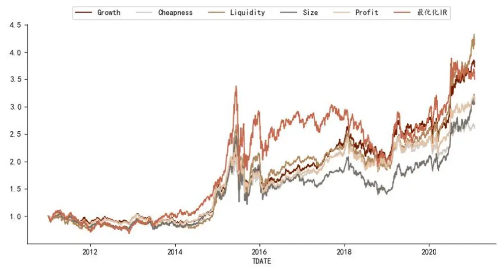
Wind 2011-01-01 2021-01-31

图表31：基于流动性特征的情景因子全市场选股组合均战胜其他主要基准
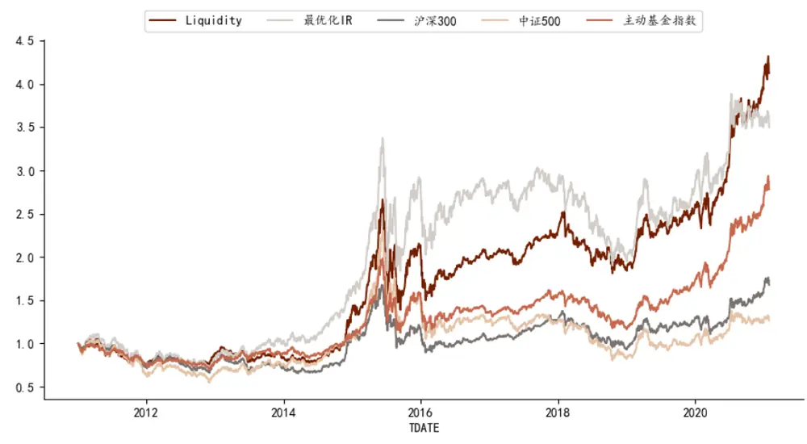
Wind 2011-01-01 2021-01-31

由上图可见，基于流动性特征的全市场组合的收益能力是比较稳健的，除了可以长期稳定的战胜沪深 300 和中证 500 这两大宽基指数以外，组合相对于市场上的主动权益基金经理的表现也是有较明显优势的。我们以偏股混合型基金指数（885001.WI）作为代表市场上主动权益基金经理平均表现的基准指数，可以发现基于流动性特征的全市场多头组合也可以长期稳健的战胜该基准。

图表32：基于情景特征的因子全市场选股组合表现

| 年化收益 |  | 年化波动 夏普比 | 最大回撤 |
| --- | --- | --- | --- |
| Growth | 14.49% | 20.66% 0.70 | -34.51% |
| Cheapness | 10.34% | 20.69% 0.50 | -35.71% |
| Liquidity | 15.68% | 24.91% 0.63 | -47.90% |
| Size | 12.13% | 25.61% 0.47 | -50.77% |
| Profit | 12.34% | 20.58% 0.60 | -37.10% |
| 沪深300 | 5.50% | 23.00% 0.24 | -46.70% |
| 中证500 | 2.45% | 26.40% 0.09 | -65.30% |

Wind 2011-01-01 2021-01-31

基于流动性特征和成长特征的因子组合具有较强的收益能力，而基于估值特征和成长特征的因子组合具有较强的抗风险能力（收益波动较低且回撤相对较小）。

## 中证 500 增强组合：年化收益提高 2.5个百分点

结合上面的测试结果，我们考虑将情景分析的因子模型构造方法应用于指数增强组合构建时，将重点尝试其在中证 500 指数增强上的应用效果，其主要的原因是中证 500 的成分股在规模、流动性、成长等风格上更贴近全市场，成分股的风格均衡性要优于沪深 300指数。

情景分析因子模型应用在中证 500 增强的具体构建流程和参数设置如下：

## 调仓周期：

1) 情景特征股票池更新频率：半年度

2) Alpha 因子更新频率：月度

3) 组合调仓周期：月度

## 组合优化设置：

1) 行业偏离度上限 5%

2) 市值因子暴露度上限 5%

3) 个股权重上限 1.5%

4) 中证 500成分股权重之和不小于 80%

## 交易费率：单边 0.2%

由于我们在构建增强组合的过程中加入了行业、市值暴露和成分股的限制，组合在收益表现上于基准指数会更为接。同时我们也观察到，在 2017 年以前采用基于情景分析的因子模型和原始的最优化 IR 模型的收益表现几乎没有差异，而 2017 年之后，情景分析因子模型的相对优势就有所展现。

整体上看，采用情景分析因子模型可以获得年化 2.5个百分点左右的增强收益表现。2017年之前，情景因子模型与原组合收益表现几乎无异，而主要的超额收益来自于 2017 年以后。

33 Liquidity IR
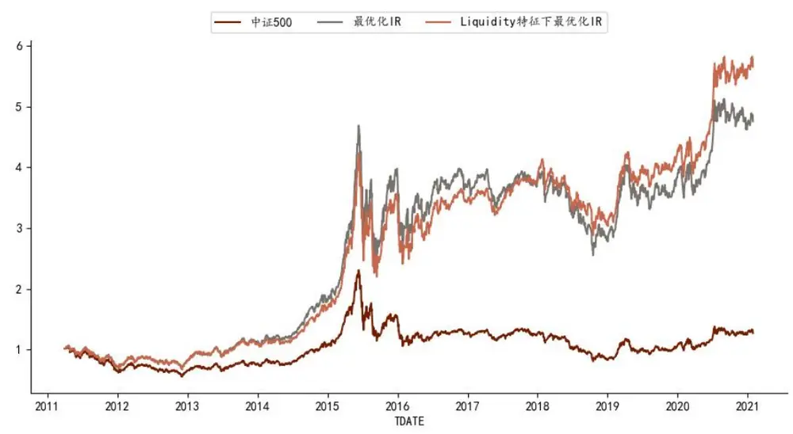
Wind 2011-01-01 2021-01-31

34 Liquidity IR 500

|  | 月度胜率 | 年化超额收益率 | 相对收益波动率 | 信息比率 | 相对最大回撤 |
| --- | --- | --- | --- | --- | --- |
| 2011 | 78% | 15.57% | 3.57% | 4.36 | -1.75% |
| 2012 | 83% | 13.44% | 4.84% | 2.78 | -2.10% |
| 2013 | 67% | 14.31% | 5.88% | 2.43 | -2.77% |
| 2014 | 58% | 8.61% | 4.63% | 1.86 | -3.70% |
| 2015 | 92% | 49.57% | 8.72% | 5.69 | -5.32% |
| 2016 | 92% | 23.06% | 5.82% | 3.96 | -4.38% |
| 2017 | 58% | 10.02% | 6.47% | 1.55 | -5.55% |
| 2018 | 75% | 19.74% | 9.16% | 2.16 | -9.25% |
| 2019 | 75% | 11.02% | 5.21% | 2.11 | -4.92% |
| 2020 | 75% | 13.36% | 6.48% | 2.06 | -6.61% |
| 2021-01 | 100% | 30.89% | 6.55% | 4.71 | -0.74% |
| Summary | 75% | 18.38% | 6.07% | 3.02 | -9.25% |

Wind 2011-01-01 2021-01-31

图表35：全市场最优化IR的中证500增强分年度表现

|  | 月度胜率 | 年化超额收益 | 相对收益波动 | 信息比 | 相对最大回撤 |
| --- | --- | --- | --- | --- | --- |
| 2011 | 78% | 14.28% | 3.76% | 3.80 | -1.95% |
| 2012 | 92% | 13.63% | 4.34% | 3.14 | -2.11% |
| 2013 | 83% | 18.24% | 4.75% | 3.84 | -1.85% |
| 2014 | 75% | 14.06% | 5.19% | 2.71 | -3.98% |
| 2015 | 92% | 55.06% | 9.19% | 5.99 | -5.84% |
| 2016 | 75% | 17.95% | 6.46% | 2.78 | -3.71% |
| 2017 | 50% | 1.12% | 4.59% | 0.24 | -4.15% |
| 2018 | 75% | 12.65% | 5.28% | 2.40 | -3.48% |
| 2019 | 67% | 7.84% | 6.47% | 1.21 | -4.91% |
| 2020 | 58% | 5.83% | 5.91% | 0.99 | -5.88% |
| 2021-01 | 100% | 27.81% | 8.80% | 3.16 | -1.77% |
| Summary | 75% | 15.84% | 5.80% | 2.73 | -7.03% |

Wind 2011-01-01 2021-01-31

分年度来看，基于流动性特征的情景因子模型在 2017、2018 和 2020 年有比较明显的相对优势，相对于原始的最优化 IR 模型有较为明显的收益提升。组合的信息比也相比原始最优化 IR组合有较为明显的提升，由 2.73提升至 3.02。

同时值得注意的是，采用情景分析因子模型也提高了组合整体的换手率，组合换手率由原先的月均 52%提升至了 58%。

# 法律声明

一般声明

本报告由中国国际金融股份有限公司（已具备中国证监会批复的证券投资咨询业务资格）制作。本报告中的信息均来源于我们认为可靠的已公开资料，但中国国际金融股份有限公司及其关联机构（以下统称“中金公司”）对这些信息的准确性及完整性不作任何保证。本报告中的信息、意见等均仅供投资者参考之用，不构成对买卖任何证券或其他金融工具的出价或征价或提供任何投资决策建议的服务。该等信息、意见并未考虑到获取本报告人员的具体投资目的、财务状况以及特定需求，在任何时候均不构成对任何人的个人推荐或投资操作性建议。投资者应当对本报告中的信息和意见进行独立评估，自主审慎做出决策并自行承担风险。投资者在依据本报告涉及的内容进行任何决策前，应同时考量各自的投资目的、财务状况和特定需求，并就相关决策咨询专业顾问的意见对依据或者使用本报告所造成的一切后果，中金公司及/或其关联人员均不承担任何责任。

本报告所载的意见、评估及预测仅为本报告出具日的观点和判断，相关证券或金融工具的价格、价值及收益亦可能会波动。该等意见、评估及预测无需通知即可随时更改。在不同时期，中金公司可能会发出与本报告所载意见、评估及预测不一致的研究报告。

本报告署名分析师可能会不时与中金公司的客户、销售交易人员、其他业务人员或在本报告中针对可能对本报告所涉及的标的证券或其他金融工具的市场价格产生短期影响的催化剂或事件进行交易策略的讨论。这种短期影响的分析可能与分析师已发布的关于相关证券或其他金融工具的目标价、评级、估值、预测等观点相反或不一致，相关的交易策略不同于且也不影响分析师关于其所研究标的证券或其他金融工具的基本面评级或评分。

中金公司的销售人员、交易人员以及其他专业人士可能会依据不同假设和标准、采用不同的分析方法而口头或书面发表与本报告意见及建议不一致的市场评论和/或交易观点。中金公司没有将此意见及建议向报告所有接收者进行更新的义务。中金公司的资产管理部门、自营部门以及其他投资业务部门可能独立做出与本报告中的意见不一致的投资决策。

除非另行说明，本报告中所引用的关于业绩的数据代表过往表现。过往的业绩表现亦不应作为日后回报的预示。我们不承诺也不保证，任何所预示的回报会得以实现。
分析中所做的预测可能是基于相应的假设。任何假设的变化可能会显著地影响所预测的回报。

本报告提供给某接收人是基于该接收人被认为有能力独立评估投资风险并就投资决策能行使独立判断。投资的独立判断是指，投资决策是投资者自身基于对潜在投资的目标、需求、机会、风险、市场因素及其他投资考虑而独立做出的。

本报告由受香港证券和期货委员会监管的中国国际金融香港证券有限公司（“中金香港”）于香港提供。香港的投资者若有任何关于中金公司研究报告的问题请直接联系中金香港的销售交易代表。本报告作者所持香港证监会牌照的牌照编号已披露在报告首页的作者姓名旁。

本报告由受新加坡金融管理局监管的中国国际金融（新加坡）有限公司 (“中金新加坡”) 于新加坡向符合新加坡《证券期货法》定义下的认可投资者及/或机构投资者提供。提供本报告于此类投资者, 有关财务顾问将无需根据新加坡之《财务顾问法》第 36 条就任何利益及/或其代表就任何证券利益进行披露。有关本报告之任何查询，在新加坡获得本报告的人员可联系中金新加坡销售交易代表。

本报告由受金融服务监管局监管的中国国际金融（英国）有限公司（“中金英国”）于英国提供。本报告有关的投资和服务仅向符合《2000 年金融服务和市场法 2005年（金融推介）令》第 19（5）条、38 条、47 条以及 49 条规定的人士提供。本报告并未打算提供给零售客户使用。在其他欧洲经济区国家，本报告向被其本国认定为专业投资者（或相当性质）的人士提供。

本报告将依据其他国家或地区的法律法规和监管要求于该国家或地区提供。

## 特别声明

在法律许可的情况下，中金公司可能与本报告中提及公司正在建立或争取建立业务关系或服务关系。因此，投资者应当考虑到中金公司及/或其相关人员可能存在影响本报告观点客观性的潜在利益冲突。

与本报告所含具体公司相关的披露信息请访 https://research.cicc.com/footer/disclosures，亦可参见近期已发布的关于该等公司的具体研究报告。

中金研究基本评级体系说明：

分析师采用相对评级体系，股票评级分为跑赢行业、中性、跑输行业（定义见下文）。

除了股票评级外，中金公司对覆盖行业的未来市场表现提供行业评级观点，行业评级分为超配、标配、低配（定义见下文）。

我们在此提醒您，中金公司对研究覆盖的股票不提供买入、卖出评级。跑赢行业、跑输行业不等同于买入、卖出。投资者应仔细阅读中金公司研究报告中的所有评级定义。请投资者仔细阅读研究报告全文，以获取比较完整的观点与信息，不应仅仅依靠评级来推断结论。在任何情形下，评级（或研究观点）都不应被视为或作为投资建议。投资者买卖证券或其他金融产品的决定应基于自身实际具体情况（比如当前的持仓结构）及其他需要考虑的因素。

## 股票评级定义：

跑赢行业（OUTPERFORM）：未来 6~12 个月，分析师预计个股表现超过同期其所属的中金行业指数；

- 中性（NEUTRAL）：未来 6~12 个月，分析师预计个股表现与同期其所属的中金行业指数相比持平；

- 跑输行业（UNDERPERFORM）：未来 6~12 个月，分析师预计个股表现不及同期其所属的中金行业指数。

## 行业评级定义：

- 超配（OVERWEIGHT）：未来 6~12 个月，分析师预计某行业会跑赢大盘 10%以上；

- 标配（EQUAL-WEIGHT）：未来 6~12 个月，分析师预计某行业表现与大盘的关系在-10%与 10%之间；

低配（UNDERWEIGHT）：未来 6~12 个月，分析师预计某行业会跑输大盘 10%以上。

研究报告评级分布可从https://research.cicc.com/footer/disclosures 获悉。

本报告的版权仅为中金公司所有，未经书面许可任何机构和个人不得以任何形式转发、翻版、复制、刊登、发表或引用。

V190624

中国国际金融股份有限公司
中国北京建国门外大街1号国贸写字楼2座28层 | 邮编：100004
电话： (+86-10) 6505 1166
传真： (+86-10) 6505 1156

## 美国

CICC US Securities, Inc 32th Floor, 280 Park Avenue New York, NY 10017, USA Tel: (+1-646) 7948 800 Fax: (+1-646) 7948 801

## 新加坡

China International Capital Corporation (Singapore) Pte. Limited 
6 Battery Road,#33-01 
Singapore 049909 
Tel: (+65) 6572 1999 
Fax: (+65) 6327 1278

## 上海

中国国际金融股份有限公司上海分公司中国国际金融股份有限公司上海分公司

上海市浦东新区陆家嘴环路1233号
汇亚大厦32层
邮编：200120
电话：(86-21) 5879-6226
传真：(86-21) 5888-8976

## 英国

China International Capital Corporation (UK) Limited 
25th Floor, 125 Old Broad Street 
London EC2N 1AR, United Kingdom 
Tel: (+44-20) 7367 5718 
Fax: (+44-20) 7367 5719

## 香港

中国国际金融（香港）有限公司

香港中环港景街 1 号国际金融中心第一期29楼电话：(852) 2872-2000传真：(852) 2872-2100

## 深圳

中国国际金融股份有限公司深圳分公司
深圳市福田区益田路5033号
平安金融中心72层
邮编：518048
电话：(86-755) 8319-5000
传真：(86-755) 8319-9229