量化策略

# 量化多因子系列（3）：如何捕捉成长与价值的风格轮动？

2017 年以来市场风格的大幅切换给很多投资者尤其是量化投资者带来的不小的困扰。从 2017 年小市值风格失效和白马龙头强势表现，到 2019年至 2020 年上半年的估值风格失效和机构抱团行情，再到 2021年 2 月底的估值风格强势回归。在风格的如此大幅度切换的状态下，无论是主动权益投资者还是量化投资者都面临了较大的挑战。本文就主要针对价值与成长风格的收益相对强弱建立预测模型，尝试通过市场情绪、因子拥挤度、金融环境和经济环境这四大类指标，构建成长与价值的风格轮动策略。

与现有的风格指数相比，采用中金量化风格因子计算得到的成长风格和价值风格的收益表现对比结果与我们的直观认知更为贴合。整体上来看，成长风格长期收益优于价值风格，而价值风格会阶段性的体现出收益上的相对优势。

测试框架：结合 Granger 检验、Spearman 相关性分析以及四类指标事件化测试结果，综合考察各类指标对风格收益的预测能力。

## 市场情绪：多维刻画情绪与风格切换的相关性

我们从多个维度刻画市场参与者的情绪变化，机构调研偏好、新增投资者数量、风格强势股占比和北上资金偏好变化这四个指标均对成长/价值风格收益均具有预测能力。

## 因子拥挤度：与风格收益有较显著相关

通过因子拥挤度指标来衡量因子的当前是否拥挤。当拥挤度较高时则需躲避此类可能失效的因子。拥挤度指标对成长/价值风格收益也具有显著的预测能力。

## 金融环境：期限利差收敛时价值风格占优

期限利差收敛时价值风格占优，利差收敛时成长板块相对优势减弱，此价值更具有性价比；M2 与 M1 的增速差反映经济景气度，M2-M1 指标与成长/估值因子收益具有较显著的负面相关性。

## 经济环境：经济现状与风格收益有一定相关

从相关性上来看，社融增速和 PMI 与成长/价值风格收益呈现负相关，而 CPI-PPI 剪刀差则与成长/价值风格收益呈现一定的正相关。

## 综合指标：强势风格预测胜率可达 85%

综合指标与成长/价值风格收益相关性显著。综合指标与后三个月的成长/价值风格收益的相关系数超过 0.30，p-value低于 0.001，显著性较高。

基于成长/价值风格择时信号的策略调仓胜率为 85%，月度胜率为 64%。回测期间（2011 年 1 月 1 日至 2021 年 4 月 30 日）累计超额成长组合227.71ppt，共调仓 7 次，平均每 1.4 年发出一次调仓信号，较低的信号频率对组合换手率的影响较低。

分析员周萧潇SAC 执证编号：S0080521010006SFC CE Ref：BRA090xiaoxiao.zhou@cicc.com.cn

分析员刘均伟SAC 执证编号：S0080520120002SFC CE Ref：BQR365junwei.liu@cicc.com.cn

分析员王汉锋，CFASAC 执证编号：S0080513080002SFC CE Ref：AND454hanfeng.wang@cicc.com.cn

## 相关研究报告

量化策略 | 量化多因子系列（2）：非线性假设下的情景分析因子模型 (2021.02.28)

量化策略 | 量化多因子系列（1）：QQC 综合质量因子与指数增强应用 (2021.01.14)

## 成长风格与价值风格：孰强孰弱？

2017 年以来市场风格的大幅切换给很多投资者尤其是量化投资者带来的不小的困扰。从2017 年小市值风格失效和白马龙头强势表现，到 2019年至 2020 年上半年的估值风格失效和机构抱团行情，再到 2021 年 2 月底的估值风格强势回归。在风格的如此大幅度切换的状态下，无论是主动权益投资者还是量化投资者都面临了较大的挑战。

价值风格和成长风格的相对强弱，是市场风格判断中的核心问题。本文就主要针对价值与成长风格的收益相对强弱建立预测模型，尝试通过市场情绪、因子拥挤度、金融环境和经济环境这四大类指标，构建成长与价值的风格轮动模型。

## 如何定义成长与价值的风格收益

在构建成长与价值风格轮动策略之前，首先需要解决的一个问题是：成长风格和价值风格的收益如何准确描述和定义？

因为主动投资者和量化投资者在定义成长与价值时往往时存在一些分歧的。主动投资者更倾向于从行业和板块的属性角度，定义属性偏成长的行业板块例如消费和计算机为成长风格，属性偏防御的行业板块例如金融和周期为价值风格；而量化投资者更多的使用成长和价值因子，从因子收益的角度来评价风格的收益表现，同时量化角度的因子收益在计算时也大部分会采用行业中性的方式将行业因素剔除。

我们认为，采用行业板块来定义风格存在无法准确描述风格在微观下的区分度的问题，同一板块内的公司也存在成长潜力和估值水平上的较大的差异，因此简单的用行业板块来作为风格划分是不太合理的。

因此，我们将主要对比两种风格收益的定义方式：一是采用现有的风格指数，二是采用风格因子并计算因子收益。

## 成长风格指数与价值风格指数

目前市场上主流的风格指数中，国证成长和国证价值指数相对而言定义方式比较合理，国证成长和国证价值指数的历史走势如下图所示：

图表1：国证成长和国证价值指数走势对比
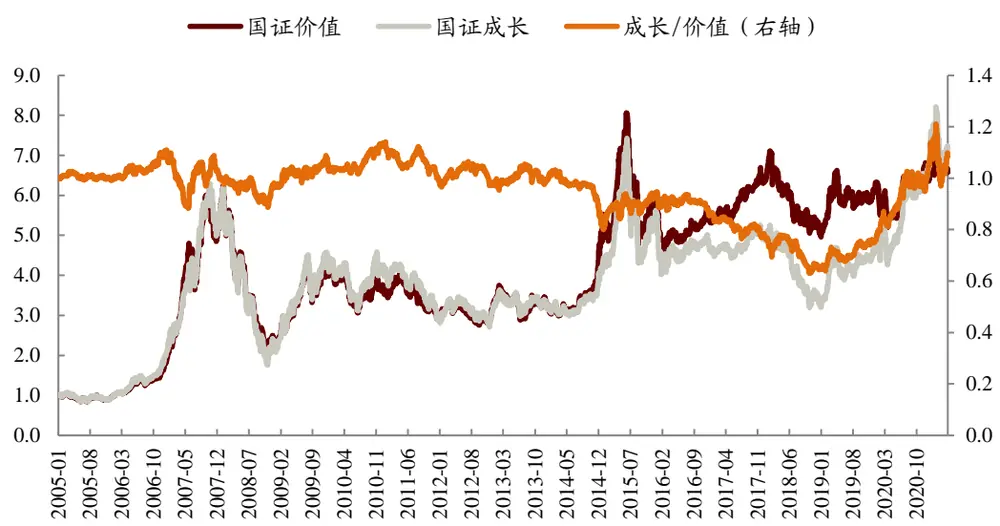
资料来源：Wind，中金公司研究部

从国证成长指数和国证价值指数的走势来看，价值指数在 2011 年至 2019 年是长期稳定的战胜成长指数的，仅仅在 2019 年以后，成长指数才大幅跑赢了价值指数。这一结果与我们的直观认知存在差异（例如2013年至2016年的市场风格整体偏向成长，尤其是 2015年底至 2016 年，成长股的优势应当是较为明显的），其原因则主要是指数编制时基础股票池的覆盖范围较小带来的。

国证成长与国证价值指数的编制方法主要有以下几点：

- 选样空间：均以国证 1000 指数样本股为样本空间

国证 1000 指数：最近半年日均总市值排名前 1000 的股票

- 价值因子与成长因子变量数值：

- 成长因子有三个变量：主营业务收入增长率、净利润增长率和净资产增长率

- 价值因子有四个变量：每股收益与价格比率、每股经营性现金流与价格比率、股息收益率、每股净资产与价格比率。

- 指数选样：均选择得分最高的 332 只股票作为初始样本股。

## 成长因子与价值因子收益

因此为了更准确的描述成长风格与价值风格的收益表现，我们将采用计算风格因子收益的方式来做进一步尝试。

图表2：成长和价值风格因子收益对比
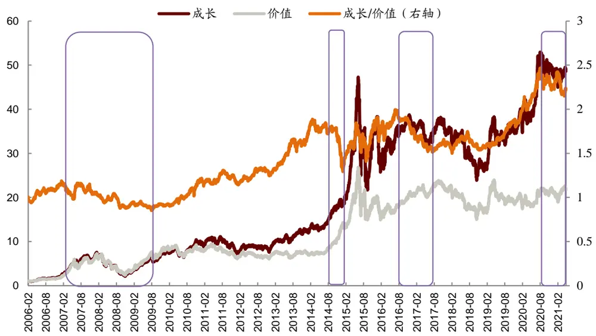
资料来源：Wind，中金公司研究部

成长与价值风格因子及因子收益计算方式：

- 选样空间：剔除 STPT、停牌以及上市半年内股票。

- 价值因子与成长因子定义：

成长因子（Growth）：净利润单季度同比增速(NP_Q_YOY)、营业利润稳健加速度(OP_SD)、业绩趋势因子(QPT)

价值因子（Value）：每股收益与价格比率(EP_TTM)、股息收益率(DP)、每股净资产与价格比率(BP_LR)

- 因子收益计算：因子排名前 10%的个股根据因子值加权计算收益

上图可见，采用中金量化风格因子计算得到的成长和价值的收益表现对比结果与我们的直观认知更为贴合。2010 年至 2014 年上半年成长风格具有较为明显的优势，2014 年底价值风格出现了一波较为强势的反弹，而后成长风格再次占据优势，直到 2017 年价值风格再次获得一波强势的超额，2018 年至 2020 年上半年风格再度切回成长并且成长风格收益大幅战胜价值风格，2020 年下半年至今则是价值风格相对更优。

整体上来看，成长风格长期收益显著的优于价值风格，价值风格会阶段性的体现出收益上的相对优势（例如 2007 年至 2009 年，2014 年末，2017 年）。

因此，如果可以在几次价值风格占优的阶段成功的配置到价值风格上，则风格轮动的策略就可以认为是比较成功的。

## 测试框架：多维衡量指标对风格轮动的预测能力

我们从市场情绪、因子拥挤度、金融环境和经济环境四大类指标入手，寻找可以用来预测成长/价值风格收益的有效指标。候选指标与未来不同风格收益之间的预测效果和逻辑关系都是我们重点考察的内容，假设指标背后的理由不充分或者逻辑不合理，数据挖掘所造成的风险就会太大。

为了筛选出能够“有效”预测价值成长风格切换的指标，我们构造如下的测试系统：

图表3：测试框架多维衡量
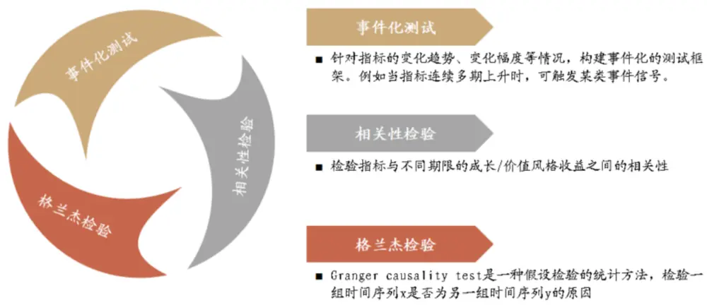
资料来源：中金公司研究部

## 事件化测试

通常在测试指标有效性时，最简单的方式就是检验指标和预测值在时间序列上的相关性。但考虑到我们的数据频率较低，且不同指标的基础逻辑和使用方法往往存在差异，因此简单的观察相关性并不足以辨别指标是否对风格收益具有预测能力。

指标事件化的测试方法则是一种较好的补充，通过变化趋势、变动幅度和近期高/低位等指标，可以更全面的了解一个指标对于风格收益的影响能力。具体的，我们定义了以下事件：

变化趋势（Trend）：观察指标值是否连续 N 期上升/下降，参数包括连续上升/下降 1期、3 期、6期，分别代表数据短期、中期、长期的变化趋势。

累计变化（Rolling）：观察指标累计变动的幅度。当滚动标准化后的指标过去一段时间加总数据突破某个界限时，触发信号。时间长度参数包括 3、6 和 12 个月。

变动幅度（Extent）：观察指标变动幅度。通过当期指标值相对于上期指标值的变化幅度构建指标大幅上升/下降事件。我们对上升/下降超过 1%至 20%之间的不同阈值都会进行测试。

近期高/低位（Z）：观察指标近期是否触及高位/低位。在时间序列上计算指标值滚动一段时间的标准分（Z-score），通过对标准分设定不同阈值，构建指标值近期高低位。

图表4：事件化测试指标构造方法

| 事件名 | 解释 |
| --- | --- |
| Trend | 当因子值连续多个月上升或下降时 |
| Rolling | 当滚动标准化后的因子过去一年加总数据突破某个界限时 |
| Extent | 当因子值与上月的环比变动超过某个界限时 |
| Z | 当滚动标准化后的因子向上或向下突破某个界限时 |

资料来源：Wind，中金公司研究部

## 相关性检验

我们在相关性检验中会全面的测试指标与预测值在未来不同的时间区间内的相关系数。若指标值与未来的风格收益具有显著的相关关系，且不同期限的相关性较为稳定，则我们认为该指标具有一定的预测作用。

以市场集中度因子为例：

图表5：相关性检验结果示例

| 时间段 | rho | p-value |
| --- | --- | --- |
| 当月 | -0.376 | 0.004 |
| 次月当月 | -0.186 | 0.166 |
| 2 个月后当月 | 0.035 | 0.799 |
| 3个月后当月 | -0.138 | 0.314 |
| 4个月后当月 | -0.197 | 0.152 |
| 5个月后当月 | -0.082 | 0.561 |
| 6个月后当月 | -0.004 | 0.978 |
| 后1个月 | -0.196 | 0.139 |
| 后2个月 | -0.196 | 0.139 |
| 后3个月 | -0.156 | 0.243 |
| 后6个月 | -0.233 | 0.079 |

资料来源：Wind，中金公司研究部

可以看出月频的市场集中度因子与未来几个月的成长相对价值的超额收益有较为显著的正向相关关系，其中与后三个月的收益在 5%的显著性水平下是相关的，说明市场集中度越大时，后续成长大概率跑赢价值。

## Granger 格兰杰检验

Granger 检验是 Clive W. J. Granger 提出的用于检验经济变量之间因果关系的方法，其统计学本质上是对平稳时间序列数据一种预测。Granger 检验是一种假设检验的统计方法，检验一组时间序列 x 是否为另一组时间序列 y 的原因。它的基础是回归分析当中的自回归模型。回归分析通常只能得出不同变量间的同期相关性；自回归模型只能得出同一变量前后期 的相关性；但诺贝尔经济学奖得主 Clive Granger 于 1969 年论证，在自回归模型中透过一系列的检验进而揭示不同变量之间的时间落差相关性是可行的。

在时间序列情形下，两个经济变量 X、Y之间的 Granger 因果关系定义为：若在包含了变量 X、Y的过去信息的条件下，对变量 Y的预测效果要优于只单独由 Y的过去信息对 Y进行的预测效果，即变量 X 有助于解释变量 Y 的将来变化，则认为变量 X 是引致变量 Y 的Granger 原因。

进行 Granger 检验的一个前提条件是时间序列必须具有平稳性，否则可能会出现虚假回归问题。因此在进行 Granger 因果关系检验之前首先应对各指标时间序列的平稳性进行单位根检验。

在本项检验中，我们首先从因子池中筛选出平稳的时间序列，对其与成长/价值的超额收益序列进行 Granger 检验，滞后项阶数选取为 1-5 阶，如果检验结果中存在 5%意义上显著的结果，我们认为因子通过该项检验。

## 指标筛选机制

我们认为 Granger 检验由于其检验本身具有一定的限制，得到 Granger 检验显著往往意味着因子值对成长/价值收益序列有较强的预测作用，所以我们认为满足 Granger 检验显著的因子即通过筛选；

若因子值序列不平稳或Granger检验本身不显著，我们则分析spearman相关性分析、trend、rolling、z、extent 四项事件分析中如果有三个及以上的事件分析/相关性分析显著，即通过筛选。

图表6：针对单指标的测试与筛选框架
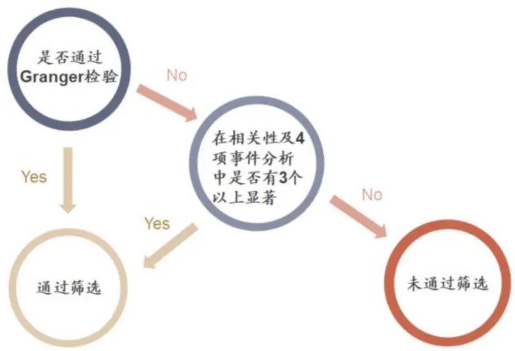
资料来源：中金公司研究部

下文中我们将主要梳理市场情绪、因子拥挤度、金融环境和经济环境这四大类指标中，符合逻辑且通过筛选的单指标的指标构建逻辑和构建方法。对于各个大类指标中其余的未通过筛选的指标，我们将不再做深入的探讨。

## 市场情绪：多维刻画情绪与风格切换的相关性

通过筛选的市场情绪类指标测试结果如下表所示，我们将在后文具体分析每类指标的逻辑与构造细节：

图表7：市场情绪类指标测试结果

| 指标代码 | 指标名 | 方向 | Trend | Rolling | Extent | Z | Correlation | Granger |
| --- | --- | --- | --- | --- | --- | --- | --- | --- |
| GMV_S | 风格强势股占比 | 1 |  | √ |  | √ |  | √ |
| Survey_relative_value | 机构调研估值偏好 | -1 |  | √ |  | √ | √ |  |
| New_inv_num | 新增投资者数量 | -1 | √ | √ | √ | √ | √ | √ |
| LGT_relative_value | 北上资金估值偏好 | -1 | √ |  | √ | √ | √ |  |

资料来源：Wind，中金公司研究部

## 机构调研偏好：机构偏好变化对风格收益有一定预测能力

机构投资者的管理规模在过去的两年内出现了大幅的提升，机构抱团股的行情则进一步证明机构投资者的偏好是具有趋同的效应的。而机构投资者在进行投资决策之前，尤其是在进行重要的调整决策前，是比较倾向于通过调研的手段来获取深度的关于上市公司的信息的。从机构进行的调研行为出发则可以捕捉到机构投资者当前的关注领域和关注方向。

下图统计了 2013 年以来的机构投资者月度调研数据，从被调研的公司数量来看，尽管存在显著的季节效应，但月度被调研的公司总数基本维持在 400-1000 上下。从参与调研的机构数量来看，近两年机构数量有较为明显的上升。

图表8：月度机构调研数量统计
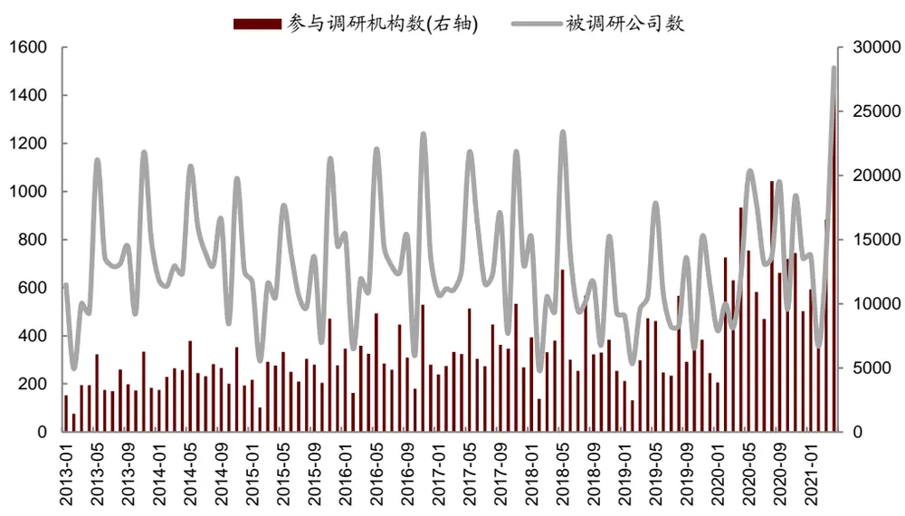
资料来源：Wind，中金公司研究部

为了将机构调研的信息运用到成长/价值风格轮动的策略中，我们考虑通过统计过去一段时间内机构调研的个股的风格属性作为一个指标，测试其对于成长/价值风格收益的预测能力。

## V观察机构调研估值偏好（Survey_relative_value）变化

具体的，在每个月底计算当月所有被调研的上市公司估值中位数处于全市场公司估值指标的分位数水平(此处估值因子采用前文定义的价值因子 Value)。

图表9：被调研机构的估值分位数
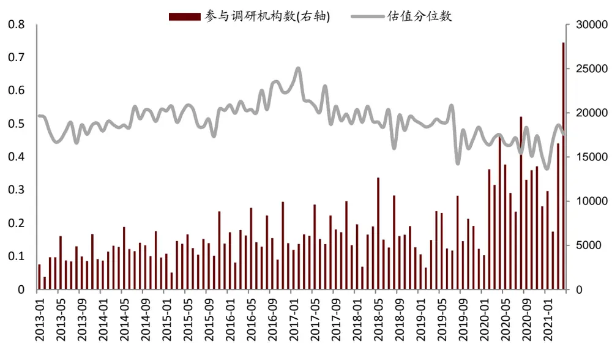
资料来源：Wind，中金公司研究部

从图表 7 的测试结果来看，机构调研股票的估值分位数越高，后期价值风格收益表现更好，且指标在相关性检验和两项事件化测试中均具有显著的表现。

## 新增投资者数量：反映散户投资者情绪

上面我们从调研的行为出发，从机构投资者的行为偏好来观察其对市场风格的影响。另一方面，考虑到 A 股的散户投资者占比相比于海外成熟市场仍然在相对高位，散户投资的情绪变化也会对市场的风格变化产生较为明显的影响。

由于新增股票开户数量反映了投资者信心，同时也是新增资金的代理变量，所以新增开户数的变动往往预示着股市未来的发展动向。市场的走向同时也决定了资金的流动变化，向好的股市会迅速形成财富效应，吸引场外投资者开户入市，新资金的介入又会进一步推动股市走强。因此新增投资者数量是一个常用的市场情绪代理变量，也是一个市场择时的常用指标。

考虑到与机构投资者相比，散户投资者会相对更偏好市值偏小成长性较好的风格的股票，因此当散户入市速度加快时，市场风格也很有可能会相对更偏向于成长风格。我们从指标角度验证这一猜测。

从图表 7 的测试结果来看，新增投资者数量与成长/价值风格收益具有较高的相关性，Granger 检验也表现为显著。因此的确当散户入市速度加快时，市场风格更偏向于成长风格。

图表10：新增投资者数量与成长/价值风格收益
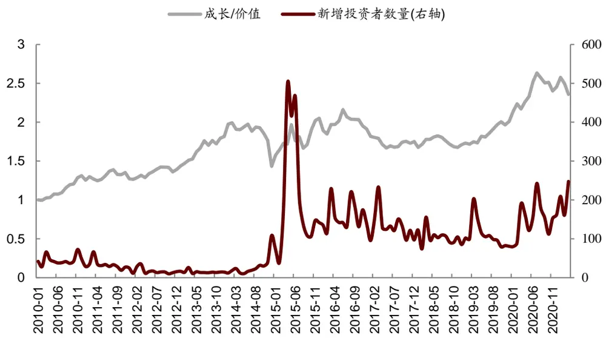
资料来源：Wind，中金公司研究部

## 风格强势股占比：反映风格的情绪动量

另一种反应市场参与者对不同风格的股票的看好程度和参与程度的指标是强势股占比指标。风格强势股占比指标是用某一风格的股票内目前处于股价强势阶段的个股的占比来计算的。如果某一个风格的股票内处于股价强势阶段的个股占比越高，说明市场参与者当前对于该风格的股票的情绪越高涨，基于情绪动量的角度，该风格后续的收益表现也应较好。

## 风格强势股占比（GMV_S）指标：

具体的，在每个月底分别计算成长股票池和价值股票池内，股价超过 20 日均线的个股数量占比。

- 计算（成长强势股占比-价值强势股占比）得到风格强势股占比（GMV_S）指标

从图表 7的测试结果来看，风格强势股占比与成长/价值风格在指标事件化测试中显著性较高，Granger 检验也表现为显著。因此，风格的情绪动量是一个较有效的预测指标。

图表11：成长风格与价值风格强势股占比
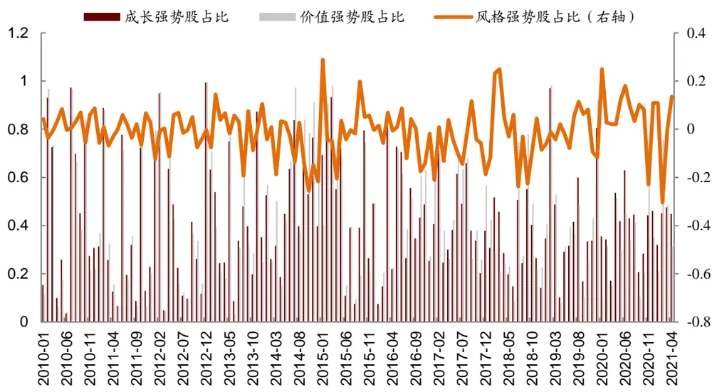
资料来源：Wind，中金公司研究部

## 北上资金偏好变化：与成长/价值风格收益有较强相关

从市场整体资金面上来看，近年来外资的进入是对 A 股持有者结构影响较大的因素。从目前A股的外资流入趋势来看，截止2021年4月底，底外资持有A股规模约1.9万亿元，与 A 股公募基金、保险公司形成三足鼎立之势。

考虑到 MSCI 权重上升等因素带来的外资长期加速流入的趋势，我们预计外资在 A 股的占比会进一步提升，外资的持股偏好也势必会很大程度上影响 A股的市场风格。

考虑到外资整体的资金流入情况的明细数据比较难以获取，我们这里将主要参考陆股通的北上资金流入数据，观察北上资金流入及其持股偏好与 A 股成长/价值风格收益之间的相关性。

- 北上资金估值偏好（LGT_relative_value）指标计算方法:

- 每月底计算每只个股的北上资金月度环比持仓变动幅度（LGT_r）

- 计算当前个股的估值分位数（value_quantile）

- 北上资金估值偏好指标则可以表示为：

$$
LGT_{-}relative_{-}value\ =\ \sum_{i=1}^{N}LGT_{-}r_{i}\ *\ (value_{-}quantile_{i}-0.5)
$$

其中，N代表截面上的个股总数

图表12：北上资金估值偏好与成长/价值风格收益相关性较显著
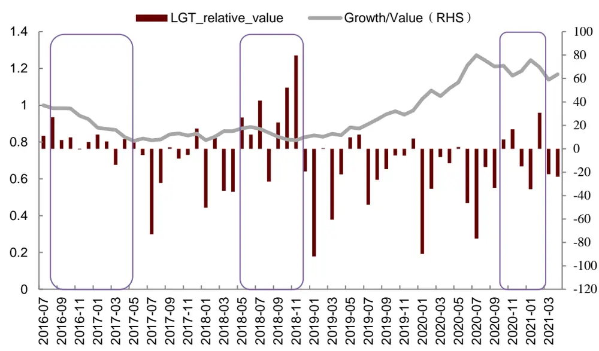
资料来源：Wind，中金公司研究部

从图表 7 的测试结果来看，外资的持股偏好的确显著地影响 A 股的市场风格，北上资金估值偏好指标与成长/价值风格收益具有较高的相关性。

## 因子拥挤度：与风格收益有较显著相关

## 拥挤度：从因子层面反应风格交易的集中程度

## 因子拥挤度的定义

当因子被集中的应用时其效果往往会受到影响，甚至失效。因此我们通常可以通过因子拥挤度指标来衡量因子是否已经被广泛的使用，或者因子的使用目前是否拥挤。因子拥挤度指标常用来对因子的收益做择时，当拥挤度较高时则需躲避此类可能失效的因子。

包括 MSCI 在内的一些机构对因子拥挤度都给出了各自的定义方式，结合他们的定义方式和 A股现状，我们定义以下四个维度组成的因子拥挤度指标：

13: Factor Crowding

| 指标名称 | 指标含义 |
| --- | --- |
| 因子离散度 | top 组合与 bottom 组合中股票收益率的离散度 |
| 因子组内相关性 | top 组合与 bottom 组合的组内股票收益相关系数 |
| 因子收益动量 | top 组合收益 |
| 因子收益波动 | top 组合收益的波动率 |

资料来源：中金公司研究部

## 因子离散度：

因子离散度的计算方式为：因子 top 组合中股票收益率的离散度，收益均与市场收益做了中性化处理。

其主要用来反映因子 top 组合内的股票的收益表现是否类似，如果一个因子的离散度显著上升，则很有可能表示因子组合内部结构发生的较大的变化，这也往往是由于突然的买入或者卖出行为导致的。所以拥挤的因子相比不拥挤的因子的离散度往往更高。

## 因子组内相关性：

因子组内相关性的计算方法：因子 top组合内股票的相关系数。

组内相关系数的计算方法：对 top 组内（假设共 n 只股票）的每一只股票，分别计算其中性化后的收益率与 top 组内剔除这只股票的其他股票收益率之间的相关系数（均取过去 60 个交易日的收益率），n 个相关系数求均值得到因子组内相关性。组内相关系数越高，说明因子越拥挤。

## 因子收益波动：

因子收益波动的计算方法：top 组合内股票收益的波动率。收益均与市场收益做了中性化处理。

与离散度的逻辑类似，因子 top 组合内股票收益波动越大，往往说明因子越拥挤。而与离散度不同的是，波动率的计算是时间序列上的，而离散度的计算是横截面上的。

## 因子收益动量：

因子收益动量的计算方法：因子top组合最近12个月的累计超额收益，基准为全A等权。历史收益越好的因子，关注的投资者越多，就越有可能变得拥挤。因此因子收益动量越高，代表因子拥挤的可能性越高。

将上述四个维度的因子拥挤度评价指标标准化后等权相加，得到综合的因子拥挤度指标（Factor Crowding）。我们以市值因子（Size）为例，统计因子拥挤度指标等分三组下，因子未来出现大于等于 15%回撤的概率。由下图可见，因子拥挤度较高时，其未来出现大幅回撤的概率也明显较高。

图表14：因子拥挤度分类下，市值因子出现大于等于15%回撤的概率
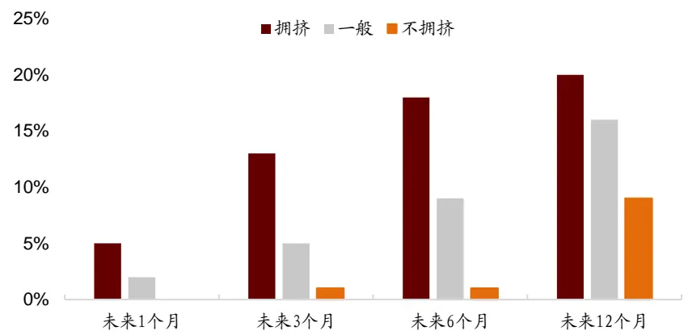
资料来源：Wind，中金公司研究部

根据因子拥挤度评价指标，就可以给出成长（Growth）与价值（Value）因子的历史拥挤度时间序列。从拥挤度的指标来看，成长因子的拥挤度整体上仍然处于较低的水平，而价值因子的拥挤度自 2019 年以来出现了较大幅度的波动，2021 年 2 月的拥挤度更是达到了历史高点。

15 Growth Value
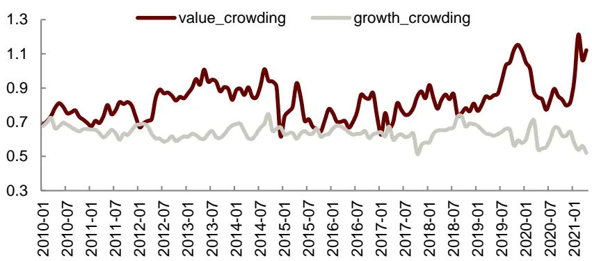
资料来源：Wind，中金公司研究部

## 拥挤度变化方向与风格收益强弱的相关性较强

拥挤度指标测试结果如下表所示：

图表16：拥挤度指标测试结果

| 指标代码 | 指标名 | 方向 | Trend | Rolling | Extent | Z | Correlation | Granger |
| --- | --- | --- | --- | --- | --- | --- | --- | --- |
| Growth_Crowding | 成长因子拥挤度 | -1 |  | √ | √ | √ |  | √ |
| Value_Crowding | 价值因子拥挤度 | 1 |  | √ |  | √ | √ | √ |

资料来源：Wind，中金公司研究部

拥挤度的指标逻辑与测试结果是较为吻合的，其逻辑也比较直观：即成长因子拥挤度越高，后期成长/价值风格收益下降；价值因子拥挤度越高，后期成长/价值风格收益提升。同时，两个拥挤度指标的 Granger 检验都是显著的，说明拥挤度指标与风格收益的预测能力较强。

## 金融环境：期限利差收敛时价值风格占优

金融环境（Financial Conditions）是反映特定市场中金融稳定性的指标，包括货币供应量的增长、期限利差以及信用利差等度量标准。通过筛选的金融环境指标测试结果如下表所示：

图表17：金融环境指标测试结果

| 指标代码 | 指标名 | 方向 | Trend | Rolling | Extent | Z | Correlation | Granger |
| --- | --- | --- | --- | --- | --- | --- | --- | --- |
| Term-spread | 期限利差 | 1 |  | √ | √ | √ | √ |  |
| M2-M1 | M2 增速-M1 增速 | -1 |  |  |  | √ | √ | √ |

资料来源：Wind，中金公司研究部

## 期限利差：期限利差收敛时价值风格占优

从经济增长、通胀预期对企业盈利预期和货币政策预期的影响来分析，有两种情形：

第一种情形下 10 年期国债到期收益率和 1年期国债到期收益率同时上行，但 1 年期国债到期收益率上行速度更快，此时经济复苏但货币政策有所收紧，因此对于前期高估值、盈利具有相对优势的成长板块而言，估值承压的同时盈利相对优势在减弱，此时价值更具有性价比；

第二种情形下 10 年期国债到期收益率和 1 年期国债到期收益率同时下行，但 10 年期国债到期收益率下行速度更快，此时经济悲观但货币政策没有进一步放松，因此对于估值更不敏感的价值占优。

图表18：期限利差走势图
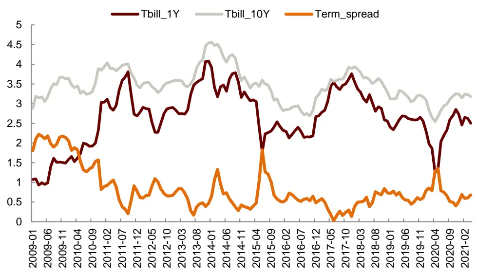
资料来源：Wind，中金公司研究部

## 货币供应量：M2与 M1的增速差反映经济景气度

反映货币政策的 M2-M1 指标，与成长/估值因子收益具有较显著的负面相关性。

在货币供应的各个层次中，狭义货币供应量 M1 是流通中的现金加上各单位在银行的活期存款；广义货币供应量 M2，是指 M1加上各单位在银行的定期存款、居民在银行的储蓄存款、证券客户保证金。在一般情况下，M1和 M2增速应当保持平衡，也就是在收入增加、货币供应量扩大的环境下，企业的活期存款和定期存款是同步增加的。

如果 M1增速大于 M2，意味着企业的活期存款增速大于定期存款增速，企业和居民交易活跃，微观主体盈利能力较强，经济景气度上升。如果 M1 增速小于 M2，表明企业和居民选择将资金以定期的形式存在银行，微观个体盈利能力下降，经济运行回落。

图表 19：M2 与 M1 的增速差指标走势
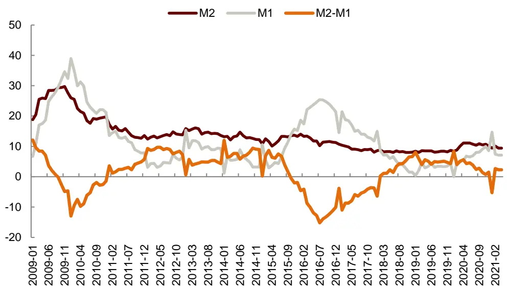
资料来源：Wind，中金公司研究部

M2-M1 指标反映了经济景气度和市场情绪的变化，当 M2-M1 下降时，经济景气度处于提升的状态，更为利好成长风格的股票。这也与我们的测试结果相互验证。

## 经济环境：经济现状与风格收益有一定相关

## 宏观经济环境指标：PMI、社融增速等有一定相关性

经济环境指标（Economic Conditions）主要衡量了经济是否健全、经济增长速度、经济稳定性等方面的信息，我们测试了包括 GDP 同比增长率、CPI 同比增长率，PPI同比增长率，规模以上工业增加值同比增长率，消费者信心指数、投资者信心指数、PMI、社消总额、社会融资规模增速等指标，其中对成长/价值风格收益相对强弱有较显著预测能力的为以下三个指标。

图表20：经济环境指标测试结果

| 指标代码 | 指标名 | 方向 | Trend | Rolling | Extent | Z | Correlation | Granger |
| --- | --- | --- | --- | --- | --- | --- | --- | --- |
| TSF | 社融规模同比增速 | -1 | √ | √ | √ |  |  |  |
| CPI-PPI | CPI 同比-PPI 同比 | 1 |  | √ |  | √ | √ | √ |
| PMI | PMI | -1 | √ | √ |  | √ | √ |  |

资料来源：Wind，中金公司研究部

从结果来看，社融增速与 PMI 指标未通过 Granger 检验。从相关性上来看，社融增速和PMI 与成长/价值风格收益呈现负相关，而 CPI-PPI 剪刀差则与成长/价值风格收益呈现一定的正相关。

## 社融增速和 PMI同比增速：更前瞻反映经济现状

考虑 PMI对市场风格的影响，由于工业 PMI或者 PMI 在手订单等数据与周期行业或上游行业的景气度相关性更强，所以价值股受 PMI 的影响会更直观和显著；并且当 PMI 不及预期时，为了使经济在恢复中达到更高水平均衡，市场往往预期流动性暂不具备收紧条件，而作为利率敏感型的成长股受流动性影响更大，因此 PMI指标与成长/价值风格收益呈现一定的负相关关系。

社融增速是指一定时期末实体经济从金融体系获得的资金余额。可以认为是某段时间全社会融资总量，代表经济冷热的晴雨表，融资的方式包括贷款，股票，债券等。社融同比增长一定程度体现了这段时间居民的投资和消费的欲望。

## CPI-PPI 剪刀差：剪刀差扩大利好成长风格

CPI-PPI 剪刀差可以理解为企业的潜在利润，如果 CPI 与 PPI 之差扩大，说明企业产成品价格的上涨幅度大于原材料价格的上涨幅度。相较于周期股这样的价值风格股票，CPI 和 PPI 的剪刀差扩大更有利于中下游企业盈利的改善，相对更利好成长风格的股票。

值得注意的是，大部分情况下我们会发现宏观因子在短期对风格收益的预测能力并不显著。但当预测周期拉长到半年甚至一年的长区间时，一些宏观指标的预测能力会有较为明显的提升。

## 综合指标：强势风格预测胜率可达 85%

## 复合大类指标：均有显著预测能力

我们将测试结果显著性较高的指标汇总如下，共有基于市场情绪、拥挤度、经济环境和金融环境的四大类 11个细分指标。

图表21：成长/价值风格轮动的有效指标明细汇总

| 指标类型 | 指标代码 | 指标名 | 方向 |
| --- | --- | --- | --- |
| 市场情绪 Market_sentiment | GMV_S | 风格强势股占比 | 1 |
|  | Survey_relative_value | 机构调研估值偏好 | -1 |
|  | New_inv_num | 新增投资者数量 | -1 |
|  | LGT_relative_value | 北上资金估值偏好 | -1 |
| 拥挤度 Factor_crowding | Growth_Crowding | 成长因子拥挤度 | -1 |
| 经济环境 | Value_Crowding | 价值因子拥挤度 | 1 |
|  | TSF | 社融规模同比增速 | -1 |
|  | CPI-PPI | CPI 同比-PPI 同比 | 1 |
| Economic_condition 金融环境 | PMI | PMI 同比 | -1 |
|  | Term-spread | 期限利差 | 1 |
| Financial_condition | M2-M1 | M2 增速-M1 增速 | -1 |

资料来源：Wind，中金公司研究部

首先，根据细分指标复合得到 4 个大类指标，大类指标的复合方法如下：

V时间序列 z-score 标准化：

- 复合前，单个细分指标均做滚动 8期的时间序列 z-score 标准化处理。

- 等权相加得到复合指标：

- 将标准化处理后的指标等权相加合成大类复合指标。

图表22：4大类复合指标均对成长/价值风格具有预测能力

| 指标类型 | 方向 | Trend | Rolling | Extent | Z | Correlation | Granger |
| --- | --- | --- | --- | --- | --- | --- | --- |
| 市场情绪 Market_sentiment拥挤度 Factor_crowding经济环境 Economic_condition金融环境 Financial_condition | 1 |  | √ |  | √ | √ | √ |
|  | 1 |  | √ |  | √ |  | √ |
|  | 1 | √ | √ | √ | √ | √ |  |
|  | 1 | √ | √ |  | √ | √ | √ |

资料来源：Wind，中金公司研究部

## 四大类复合指标均有预测能力

从结果来看，四大类指标均具有较为显著的预测能力，其中市场情绪、因子拥挤度和金融环境指标都可以通过 Granger 检验，经济环境大类指标也在四个事件测试中具有显著的表现。

## 综合指标：与成长/价值风格收益相关性显著

综合指标的构建同样采取等权加权的方式，四大类复合指标等权加权得到的综合指标具有较显著的预测能力。由下表可见，综合指标与后三个月的成长/价值风格收益的相关系数超过 0.3，p-value 低于 0.0007，显著性极高。

图表23：综合指标相关性检验结果

| 时间段 | rho | p-value |
| --- | --- | --- |
| 当月 | 0.2681 | 0.0026 |
| 次月当月 | 0.2363 | 0.0085 |
| 2 个月后当月 | 0.2093 | 0.0207 |
| 3个月后当月 | 0.0850 | 0.3540 |
| 4个月后当月 | 0.1300 | 0.1571 |
| 5个月后当月 | -0.1213 | 0.1887 |
| 6个月后当月 | 0.0651 | 0.4836 |
| 后1个月 | 0.2279 | 0.0109 |
| 后2个月 | 0.2919 | 0.0010 |
| 后3个月 | 0.3009 | 0.0007 |
| 后6个月 | 0.2537 | 0.0045 |

资料来源：Wind，中金公司研究部

同时，Granger 检验的结果也表明综合指标与成长/价值风格收益的因果关系是显著的，1阶、2阶、3 阶滞后期下均有显著的表现。

基于上述方法计算所得综合指标，我们分别构建了 0-1 择时策略和仓位调整策略两种不同的轮动策略。

## 以 0-1择时信号构建轮动策略：

- 首先，同样对综合指标进行时间序列上的标准化处理（滚动 8个月）

假设开平仓阈值为 k，指标值高于 k时持有成长风格组合，指标值跌破-k 时持有价值风格组合

经过参数敏感性测试，当 k取值处于 0.3 至 0.6区间时，轮动策略均可以获得较为稳定的相对成长组合和价值组合的超额收益。最终，我们选择 k=0.5 作为策略的开平仓阈值。

基于成长/价值风格择时信号的策略（2011 年 1 月 1 日至 2021 年 4 月 30 日）年化收益为22.65%，累计超额成长组合 227.71ppt,累计超额价值组合 478.76ppt。

风格择时策略调仓胜率为 85%（即每次调仓收益为期间强势风格的收益的概率），月度胜率为 64%（即当月持有收益较高的风格的概率）。

回测期间（2011 年 1 月 1 日至 2021 年 4 月 30 日）共调仓 7 次，平均每 1.4 年发出一次调仓信号，信号频率较低，对组合换手率的影响较低。

图表24：基于成长/价值风格择时信号的策略净值表现（k=0.5）
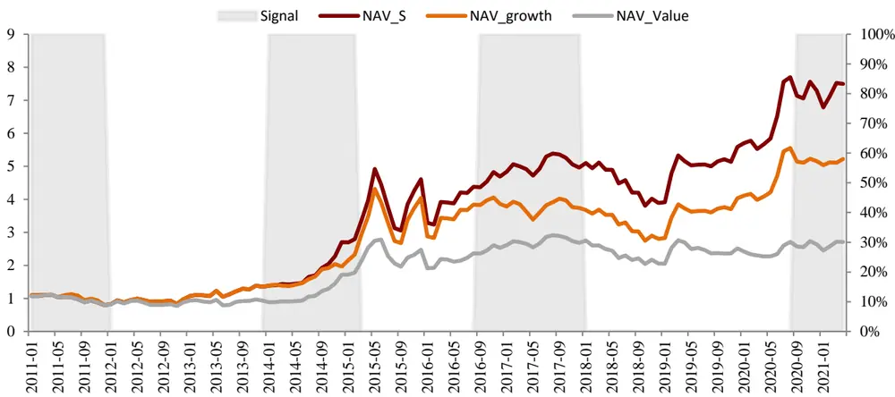
资料来源：Wind，中金公司研究部

## 根据指标值构建仓位调整策略:

首先，同样对综合指标进行时间序列上的标准化处理（滚动 8个月），得到指标序列 x

月度调仓，根据指标值给定当月成长组合与价值组合的仓位占比。设成长组合的仓位占比为 p，则价值组合的占比为（1-p），权重 p的计算方法如下：

$$
p_{i}={\frac{\operatorname*{max}(x)-x_{i}}{\operatorname*{max}(x)-\operatorname*{min}(x)}}
$$

基于成长/价值风格轮动仓位调整的策略（2011 年 1月 1 日至 2021 年 4月 30 日）年化收益为 20.24%，累计超额成长组合 98.98ppt,累计超额价值组合 342.49ppt。

图表25：基于成长/价值风格轮动仓位调整的策略净值表现
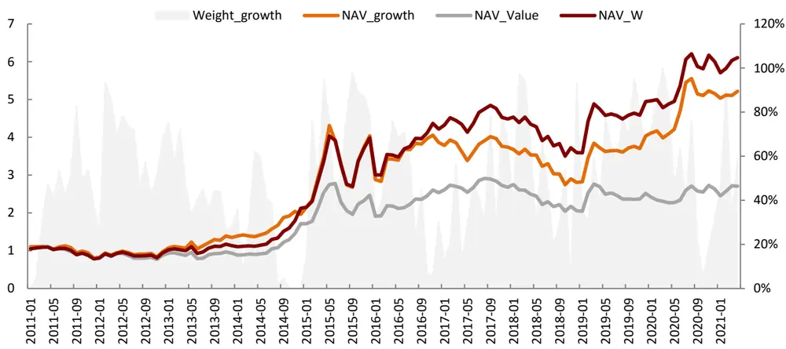
资料来源：Wind，中金公司研究部

# 法律声明

一般声明

本报告由中国国际金融股份有限公司（已具备中国证监会批复的证券投资咨询业务资格）制作。本报告中的信息均来源于我们认为可靠的已公开资料，但中国国际金融股份有限公司及其关联机构（以下统称“中金公司”）对这些信息的准确性及完整性不作任何保证。本报告中的信息、意见等均仅供投资者参考之用，不构成对买卖任何证券或其他金融工具的出价或征价或提供任何投资决策建议的服务。该等信息、意见并未考虑到获取本报告人员的具体投资目的、财务状况以及特定需求，在任何时候均不构成对任何人的个人推荐或投资操作性建议。投资者应当对本报告中的信息和意见进行独立评估，自主审慎做出决策并自行承担风险。投资者在依据本报告涉及的内容进行任何决策前，应同时考量各自的投资目的、财务状况和特定需求，并就相关决策咨询专业顾问的意见对依据或者使用本报告所造成的一切后果，中金公司及/或其关联人员均不承担任何责任。

本报告所载的意见、评估及预测仅为本报告出具日的观点和判断，相关证券或金融工具的价格、价值及收益亦可能会波动。该等意见、评估及预测无需通知即可随时更改。在不同时期，中金公司可能会发出与本报告所载意见、评估及预测不一致的研究报告。

本报告署名分析师可能会不时与中金公司的客户、销售交易人员、其他业务人员或在本报告中针对可能对本报告所涉及的标的证券或其他金融工具的市场价格产生短期影响的催化剂或事件进行交易策略的讨论。这种短期影响的分析可能与分析师已发布的关于相关证券或其他金融工具的目标价、评级、估值、预测等观点相反或不一致，相关的交易策略不同于且也不影响分析师关于其所研究标的证券或其他金融工具的基本面评级或评分。

中金公司的销售人员、交易人员以及其他专业人士可能会依据不同假设和标准、采用不同的分析方法而口头或书面发表与本报告意见及建议不一致的市场评论和/或交易观点。中金公司没有将此意见及建议向报告所有接收者进行更新的义务。中金公司的资产管理部门、自营部门以及其他投资业务部门可能独立做出与本报告中的意见不一致的投资决策。

除非另行说明，本报告中所引用的关于业绩的数据代表过往表现。过往的业绩表现亦不应作为日后回报的预示。我们不承诺也不保证，任何所预示的回报会得以实现。
分析中所做的预测可能是基于相应的假设。任何假设的变化可能会显著地影响所预测的回报。

本报告提供给某接收人是基于该接收人被认为有能力独立评估投资风险并就投资决策能行使独立判断。投资的独立判断是指，投资决策是投资者自身基于对潜在投资的目标、需求、机会、风险、市场因素及其他投资考虑而独立做出的。

本报告由受香港证券和期货委员会监管的中国国际金融香港证券有限公司（“中金香港”）于香港提供。香港的投资者若有任何关于中金公司研究报告的问题请直接联系中金香港的销售交易代表。本报告作者所持香港证监会牌照的牌照编号已披露在报告首页的作者姓名旁。

本报告由受新加坡金融管理局监管的中国国际金融（新加坡）有限公司 (“中金新加坡”) 于新加坡向符合新加坡《证券期货法》定义下的认可投资者及/或机构投资者提供。提供本报告于此类投资者, 有关财务顾问将无需根据新加坡之《财务顾问法》第 36 条就任何利益及/或其代表就任何证券利益进行披露。有关本报告之任何查询，在新加坡获得本报告的人员可联系中金新加坡销售交易代表。

本报告由受金融服务监管局监管的中国国际金融（英国）有限公司（“中金英国”）于英国提供。本报告有关的投资和服务仅向符合《2000 年金融服务和市场法 2005年（金融推介）令》第 19（5）条、38 条、47 条以及 49 条规定的人士提供。本报告并未打算提供给零售客户使用。在其他欧洲经济区国家，本报告向被其本国认定为专业投资者（或相当性质）的人士提供。

本报告将依据其他国家或地区的法律法规和监管要求于该国家或地区提供。

## 特别声明

在法律许可的情况下，中金公司可能与本报告中提及公司正在建立或争取建立业务关系或服务关系。因此，投资者应当考虑到中金公司及/或其相关人员可能存在影响本报告观点客观性的潜在利益冲突。

与本报告所含具体公司相关的披露信息请访 https://research.cicc.com/footer/disclosures，亦可参见近期已发布的关于该等公司的具体研究报告。

中金研究基本评级体系说明：

分析师采用相对评级体系，股票评级分为跑赢行业、中性、跑输行业（定义见下文）。

除了股票评级外，中金公司对覆盖行业的未来市场表现提供行业评级观点，行业评级分为超配、标配、低配（定义见下文）。

我们在此提醒您，中金公司对研究覆盖的股票不提供买入、卖出评级。跑赢行业、跑输行业不等同于买入、卖出。投资者应仔细阅读中金公司研究报告中的所有评级定义。请投资者仔细阅读研究报告全文，以获取比较完整的观点与信息，不应仅仅依靠评级来推断结论。在任何情形下，评级（或研究观点）都不应被视为或作为投资建议。投资者买卖证券或其他金融产品的决定应基于自身实际具体情况（比如当前的持仓结构）及其他需要考虑的因素。

## 股票评级定义：

跑赢行业（OUTPERFORM）：未来 6~12 个月，分析师预计个股表现超过同期其所属的中金行业指数；

- 中性（NEUTRAL）：未来 6~12 个月，分析师预计个股表现与同期其所属的中金行业指数相比持平；

- 跑输行业（UNDERPERFORM）：未来 6~12 个月，分析师预计个股表现不及同期其所属的中金行业指数。

## 行业评级定义：

- 超配（OVERWEIGHT）：未来 6~12 个月，分析师预计某行业会跑赢大盘 10%以上；

标配（EQUAL-WEIGHT）：未来 6~12 个月，分析师预计某行业表现与大盘的关系在-10%与 10%之间；

低配（UNDERWEIGHT）：未来 6~12 个月，分析师预计某行业会跑输大盘 10%以上。

研究报告评级分布可从https://research.cicc.com/footer/disclosures 获悉。

本报告的版权仅为中金公司所有，未经书面许可任何机构和个人不得以任何形式转发、翻版、复制、刊登、发表或引用。

V190624 编辑：赵静

中国国际金融股份有限公司
中国北京建国门外大街1号国贸写字楼2座28层 | 邮编：100004
电话： (+86-10) 6505 1166
传真： (+86-10) 6505 1156

## 美国

CICC US Securities, Inc 32th Floor, 280 Park Avenue New York, NY 10017, USA Tel: (+1-646) 7948 800 Fax: (+1-646) 7948 801

## 新加坡

China International Capital Corporation (Singapore) Pte. Limited 
6 Battery Road,#33-01 
Singapore 049909 
Tel: (+65) 6572 1999 
Fax: (+65) 6327 1278

## 上海

中国国际金融股份有限公司上海分公司中国国际金融股份有限公司上海分公司

上海市浦东新区陆家嘴环路1233号
汇亚大厦32层
邮编：200120
电话：(86-21) 5879-6226
传真：(86-21) 5888-8976

## 英国

China International Capital Corporation (UK) Limited 
25th Floor, 125 Old Broad Street 
London EC2N 1AR, United Kingdom 
Tel: (+44-20) 7367 5718 
Fax: (+44-20) 7367 5719

## 香港

中国国际金融（香港）有限公司

香港中环港景街 1 号国际金融中心第一期29楼电话：(852) 2872-2000传真：(852) 2872-2100

## 深圳

中国国际金融股份有限公司深圳分公司
深圳市福田区益田路5033号
平安金融中心72层
邮编：518048
电话：(86-755) 8319-5000
传真：(86-755) 8319-9229