# 量化多因子系列(4)：风格轮动模型与主动&被动量化产品的结合

周萧源
SAC执证编号：S0080521010006SFC CE Ref BRA090
xiaoxiao.zhouicicc.com.cn
古翔
SAC执证编号：S0080521000010
SFC CE Ref BRE496
xiang.guallcicc.com.cn
刘均伟
SAC 执证编号：S0080520120002
SFC CE Ref:  BOR365
iunwei.liu@cicc.com.cn

在《量化多因子系列(3)：如何捕捉成长与价值的风格轮动？》报告中，我们针对价值与成长风格收益的相对强弱建立了预测模型，通过市场情绪、因子拥挤度、金融环境和经济环境这四大类指标构建成长与价值的风格轮动策略。在阈值为0.5的开平仓策略下，模型自2011年以来共调仓7次，调仓胜率达85%，可以较为准确地捕捉成长与价值的风格切换。本文进一步对风格轮动模型在主动与被动两类产品上的实际应用落地效果进行测试，从结果来看，无论是应用于被动指数产品还是主动量化策略，成长/价值风格轮动模型均可以带来较优秀的收益表现提升。

基于上证50ETF与创业板ETF的轮动模型表现出色：回测期年化收益超29%

阈值开平仓策略：收益表现出色。阈值开平仓策略回测期（2012年1月1日-2021年6月4日）年化收益29%，超额基准（沪深300指数）的年化收益率为19%，信息比为1.00。阈值开平仓策略可以显著的战胜两个底层指数ETF，也可以显著的跑赢相对均衡的沪深300指数。

仓位调整策略：收益稳定性提升。仓位调整策略回测期2012年1月1日-2021年6月4日）年化收益28%，超额基准（沪深300指数）的年化收益率为18%，信息比为0.92。与阈值开平仓策略相比，仓位调整策略整体收益略低，但2020年以来收益表现更为出色。

基于基本面量化选股策略的轮动模型表现出色：回测期年化收益超33%

阈值开平仓策略：调仓频率低，增强效果明显。阈值开平仓策略回测期（2011年2月28日-2021年6月4日）年化收益33.1%，而成长选股策略的期间年化收益为30.2%，价值选股策略的期间年化收益为20.4%，阈值开平仓策略可以显著的战胜成长选股策略。且模型整体调仓频率较低，回测期内仅发出7次调仓信号。

仓位调整策略：优化模型下策略收益稳定性提升。仓位调整策略回测期2011年2月28日-2021年6月4日）年化收益32.8%，而成长选股策略的期间年化收益为30.2%，价值选般策略的期间年化收益为20.4%，仓位调整策略可以显著的战胜成长选股策略。与阈值开平仓策略相比，仓位调整策略年化波动较低，回测期内夏普比表现更为出色。

风格轮动模型最新观点：当前(2021年6月1日）指标偏向成长风格

当前风格轮动模型四大类综合指标（市场情绪、因子拥挤度、金融环境和经济环境)得分均为正且超过0.15，其中金融环境得分最高为0.27，从金融环境的角度更为看好成长风格。同时，成长/价值轮动综合指标值也从5月的-0.15提升到0.20，指标提升幅度较为显著，模型整体的观点较为偏向成长。

在《量化多因子系列(3)：如何捕捉成长与价值的风格轮动？》报告中，我们针对价值与成长风格收益的相对强弱建立了预测模型，通过市场情绪、因子拥挤度、金融环境和经济环境这四大类指标构建成长与价值的风格轮动策略。在阈值为0.5的开平仓策略下，模型自2011年以来共调仓7次，调仓胜率达85%，可以较为准确地捕捉成长与价值的风格切换。

风格轮动报告给出的综合指标用来预测成长与价值风格切换具有较为出色的效果，因此我们希望通过进一步的测试来检验模型的实际应用效果。本文中我们就进一步地对风格轮动模型在主动与被动两类产品上的实际应用落地效果进行测试，从结果来看，无论是应用于被动指数产品还是主动量化策略，成长/价值风格轮动模型均可以带来较优秀的收益表现提升。

## 风格轮动应用于被动指数产品：收益表现出色

在被动指数产品的选择上，我们主要考虑采用跟踪ETF数量和规模都相对较大的几个主流宽基指数作为备选，包括上证50、沪深300中证500.中证1000和创业板指。

首先，统计上述几个主流宽基指数在成长与价值风格上的暴露情况（成长和价值风格因子的定义均沿用报告《量化多因子系列(3)：如何捕捉成长与价值的风格轮动？》中的定义方式)，以及跟踪各自指数的ETF产品最新总规模：

图表1：主流宽基指数在成长与价值风格上的暴露度及相关ETF产品总规模气泡图
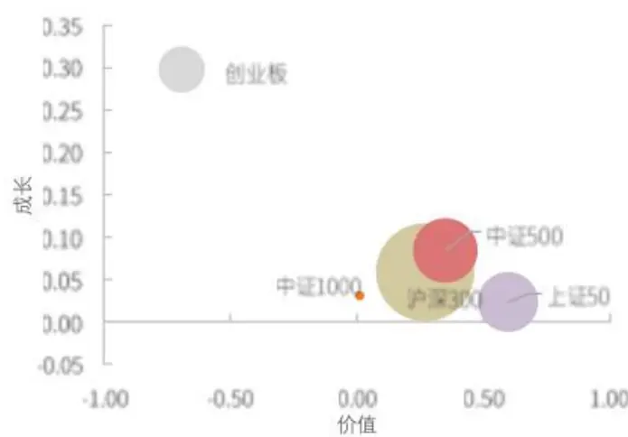
资料来源：万得资讯。中金公司研究部，注：气泡大小代表相关ETF总规模（截止于2021-06-11)

图表2：主流宽基指数在成长与价值风格上的暴露度及相关ETF产品总规模统计

|  | 价值 | 成长 | 总规模(亿元) |
| --- | --- | --- | --- |
| 上证50 | 0.60 | 0.02 | 463.30 |
| 沪深300 | 0.27 | 0.06 | 1236.46 |
| 中证500 | 0.35 | 0.08 | 536.91 |
| 中证1000 | 0.01 | 0.03 | 11.18 |
| 创业板指 | -0.69 | 0.30 | 276.81 |

资料来源：万得资讯。中金公司研究部，注：气泡大小代表相关ETF总规模（数止于2021-06-11)

首先，从上述主流宽基指数的风格暴露来看，创业板指具有最为显著的成长风格正向暴露和价值风格负向暴露。上证50指数则具有最为显著的价值风格正向暴露。而沪深300、中证500和中证1000则具有较小的正向成长风格暴露，价值风格的暴露度也低于上证50指数。

因此从基准指数来看，创业板指和上证50指数是比较合适的选择。现存的上证50ETF和创业板ETF共22只，如下表所示：

图表3:上证50ETF与创业板ETF的最新规模与成立日期

| 证券代码 | 基金名称 | 基金规模-亿元 | 成立日期 |
| --- | --- | --- | --- |
| 510050.SH | 华夏上证50ETF | 443.83 | 2004-12-30 |
| 510680.SH | 万家上证50ETF | 0.48 | 2013-10-31 |
| 510710.SH | 博时上证50ETF | 5.63 | 2015-05-27 |
| 510800.SH | 建信上证50ETF | 4.60 | 2017-12-22 |
| 510600.SH | 申万菱信上证50ETF | 0.66 | 2018-09-03 |
| 510850.SH | 工银上证50ETF | 2.03 | 2018-12-07 |
| 510100.SH | 易方达上证50ETF | 4.16 | 2019-09-06 |
| 510860.SH | 兴业上证50ETF | 1.91 | 2020-11-13 |
| 159908.SZ | 博时创业板ETF | 3.68 | 2011-06-10 |
| 159915.SZ | 易方达创业板ETF | 171.25 | 2011-09-20 |
| 159948.SZ | 南方创业板ETF | 24.57 | 2016-05-13 |
| 159952.SZ | 广发创业板ETF | 21.05 | 2017-04-25 |
| 159955.SZ | 嘉实创业板ETF | 0.41 | 2017-07-14 |
| 159957.SZ | 华夏创业板ETF | 2.86 | 2017-12-08 |
| 159958.SZ | 工银瑞信创业板ETF | 3.32 | 2017-12-25 |
| 159956.SZ | 建信创业板ETF | 0.78 | 2018-02-06 |
| 159964.SZ | 平安创业板ETF | 3.67 | 2019-03-15 |
| 159971.SZ | 富国创业板ETF | 0.15 | 2019-06-11 |
| 159977.SZ | 天弘创业板ETF | 43.07 | 2019-09-12 |
| 159810.SZ | 浦银安盛创业板ETF | 0.32 | 2020-06-12 |
| 159808.SZ | 融通创业板ETF | 1.40 | 2020-08-05 |
| 159821.SZ | 中银证券创业板ETF | 0.28 | 2020-09-29 |

资料来源：万得资讯。中金公司研究部（截止于2021-06-11)

综合考虑产品的成立日期的规模，华夏上证50ETF和易方达创业板ETF分别是成立较早同时规模较大的产品，因此后文我们将选用这两个ETF作为被动型产品的轮动测试标的。

## 基于上证50ETF与创业板ETF的轮动模型表现出色：回测期年化收益超29%

阈值开平仓策略：收益表现出色

在报告《量化多因子系列(3)：如何捕捉成长与价值的风格轮动？》的报告中，我们已经介绍了阈值开平仓策略的构建方式与阈值选取结果：

假设开平仓阈值为k，指标值高于k时持有成长风格组合，指标值跌破k时持有价值风格组合。经过参数敏感性测试，当k取值处于0.3至0.6区间时，轮动策略均可以获得较为稳定的相对成长组合和价值组合的超额收益。最终，我们选择k=0.5作为策略的开平仓阈值。

图表4：阈值开平仓策略净值走势及持仓标的
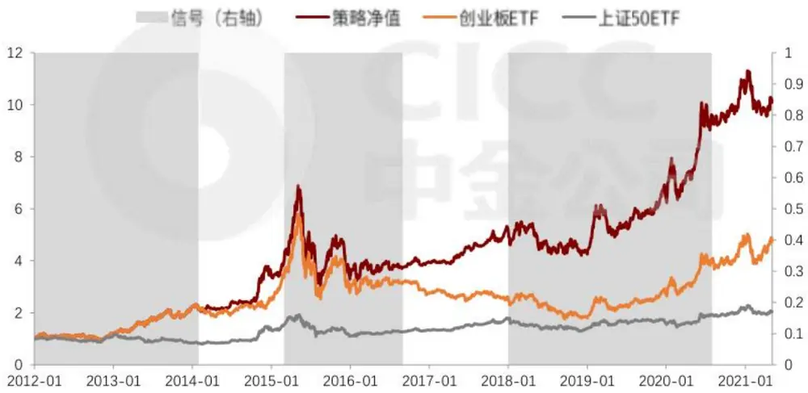
资料来源：万得资讯、中金公司研究部《截止于2021-06-04）

图表5:间值开平仓策略分年度收益统计（基准为沪深300指数）

|  | 月度胜率 | 年化收益 | 年化波动 | 年化超额收益 | 相对收益波动 | 信息比 | 最大回撤 | 相对最大回撤 |
| --- | --- | --- | --- | --- | --- | --- | --- | --- |
| 2012 | 42% | 11% | 25% | 8% | 15% | 0.54 | -25% | -18% |
| 2013 | 83% | 87%6 | 31% | 101% | 28% | 3.62 | -15% | -16% |
| 2014 | 57% | 89% | 24% | 23% | 13% | 1.76 | -12% | -8% |
| 2015 | 58% | 22% | 53% | 20% | 34% | 0.58 | -56% | -31% |
| 2016 | 50% | -10% | 32% | -4% | 18% | -0.24 | -24% | -15% |
| 2017 | 50% | 25% | 11% | 3% | 7% | 0.39 | -8% | -4% |
| 2018 | 58% | -12% | 27% | 22% | 16% | 1.34 | -22% | -13% |
| 2019 | 67% | 49% | 26% | 7% 14% |  | 0.50 | -20% | -16% |
| 2020 | 58% | 64% | 29% | 30% 15% |  | 2.00 | -20% | -8% |
| 2021-06 | 50% | -2% | 22% | -3% | 6% | -0.44 | -16% | -4% |
| Summary | 58% | 29% | 30% | 19% | 19% | 1.00 | -56% | -31% |

资料来源：万得资讯。中金公司研究部（截止于2021-06-04）

阈值开平仓策略回测期(2012年1月1日-2021年6月4日）年化收益29%，超额基准(沪深300指数)的年化收益率为19%，信息比为1.00。阈值开平仓策略可以显著的战胜两个底层指数ETF，也可以显著的跑赢相对均衡的沪深300指数。

## 仓位调整策略：优化模型下策略收益稳定性提升

我们在报告《量化多因子系列(3)：如何捕捉成长与价值的风格轮动？》的报告中构建的仓位调整策略的基础上进行了一定的优化，考虑到原仓位调整模型换手较高，我们将模型做了如下的优化：

设成长组合的仓位占比为p，则价值组合的占比为(1-p)：

1)给定阈值为k，指标值高于k时p等于1(即全仓持有成长组合)，指标值低于-k时p等于0(即全仓持有价值组合）

2) 当指标值x介于(-k，k)时，根据指标值给定当月成长组合与价值组合的仓位占比。权重p的计算方法如下：

$$
p_{i}=\frac{k+x_{i}}{2k}
$$

在阈值k取值为0.4时，仓位调整策略表现较好，具体的表现如下所示：

图表6:仓位调整策略净值走势及创业板ETF权重
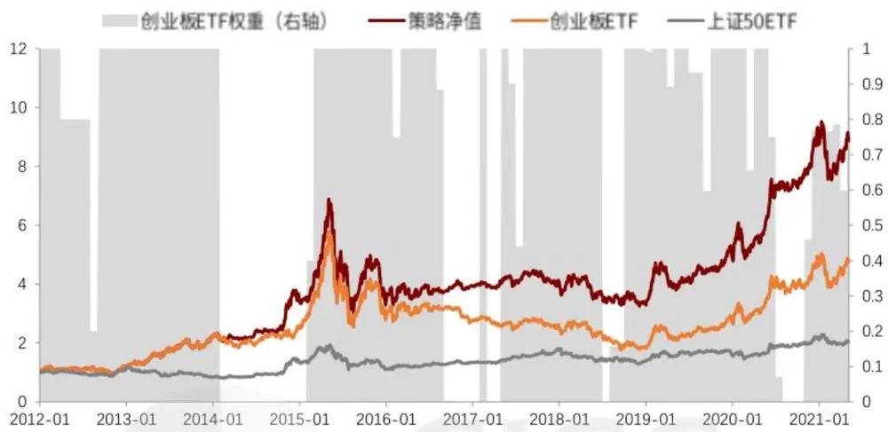
资料来源：万得资讯。中金公图研究部（数止于2021-06-04)

图表7：仓位调整策略分年度收益统计（基准为沪深300指数）

|  | 月度胜率 | 年化收益 | 年化波动 | 年化超额收益 | 相对收益波动信息比 |  | 最大回徽 | 相对最大回撤 |
| --- | --- | --- | --- | --- | --- | --- | --- | --- |
| 2012 | 42% | 11% | 25% | 8% | 15% | 0.54 | -25% | -18% |
| 2013 | 83% | 87% | 31% | 101% | 28% | 3.62 | -15% | -16% |
| 2014 | 67% | 89% | 24% | 23% | 13% | 1.76 | -12% | -8% |
| 2015 | 58% | 22% | 53% | 20% | 34% | 0.58 | -56% | -31% |
| 2016 | 50% | -10% | 31% | 5% | 16% | -0.29 | -23% | -12% |
| 2017 | 33% | 5% | 14% | -14% | 12% | -1.13 | -10% | -16% |
| 2018 | 58% | -18% | 27% | 13% | 17% | 0.79 | -24% | -13% |
| 2019 | 67% | 48% | 26% | 6% | 14% | 0.46 | -20% | -16% |
| 2020 | 67% | 75% | 27% | 38% | 13% | 3.06 | -20% | -8% |
| 2021 | 67% | 11% | 28% | 15% | 11% | 1.30 | -21% | -9% |
| Summary | 59% | 28% | 30% | 18% | 19% | 0.92 | -56% | -34% |

资料来源：万得资讯。中金公司研究部（截止于2021-06-04）

仓位调整策略回测期(2012年1月1日-2021年6月4日)年化收益28%，超额基准（沪深300指数)的年化收益率为18%，信息比为0.92。仓位调整策略可以显著的战胜两个底层指数ETF，也可以显著的跑赢相对均衡的沪深300指数。与阈值开平仓策略相比，仓位调整策略整体收益略低，但2020年以来收益表现更为出色。

## 风格轮动应用于主动量化选股策略：增强效果较好

将轮动模型的结果应用于前期开发的成长选股模型(“成长趋势共振策略”）与价值选股模型(“价值股优选策略”)，风格轮动模型与两个选股模型的构建方式在后文中会做简要回顾。

基于基本面量化选股策略的轮动模型表现出色：回测期年化收益超33%

阈值开平仓策略：调仓频率低，增强效果明显

采用与前文一致的阈值进行开平仓策略的测试：

图表8：阈值开平仓策略净值走势及持仓风格
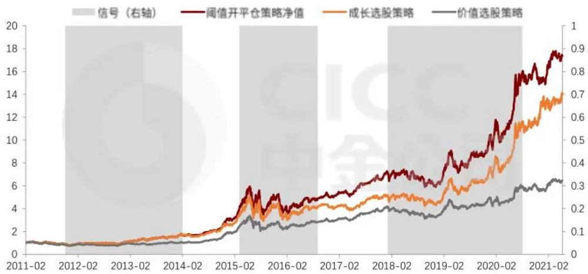
资料来源：万得资讯、中金公绍研究部《截止于2021-06-04）

图表9：阈值开平仓策略分年度收益统计（基准为沪深300指数）

|  | 月度胜率 | 年化收益 | 年化波动 | 年化超额收益 | 相对收益波动 信息比 | 最大回撤 | 相对最大回撤 |
| --- | --- | --- | --- | --- | --- | --- | --- |
| 2011 | 64% | -24%6 | 25% | 13% | 12% 1.07 | -31% | -7% |
| 2012 | 67% | 28% | 24% | 16% | 12% 1.39 | -16% | -11% |
| 2013 | 83% | 60% | 25% | 73% | 17% 4.31 | -14% | -8% |
| 2014 | 83% | 95% | 21% | 26% | 11% 2.31 | -10% | -8% |
| 2015 | 92% | 69% | 52% | 67% | 28% 2.39 | -42% | -22% |
| 2016 | 75% | 7% | 34% | 14% | 18% 0.79 | -27% | -12% |
| 2017 | 50% | 34% | 14% | 11% | 9% 1.24 | -10% | -5% |
| 2018 | 67% | -14% | 24%6 | 18% | 13% 1.43 | -21% | -10% |
| 2019 | 67% | 57% | 25% | 13% | 14% 0.90 | -21% | -11% |
| 2020 | 67% | 62% | 30% | 29% | 17% 1.71 | -17% | -14% |
| 2021 | 33% | 36% | 16% | 26% | 24% 1.11 | -5% | -10% |
| Summary 70% |  | 33% | 29% | 27% | 16% 1.65 | -42% | -22% |

资料来源：万得资讯。中金公司研究部（截止于2021-06-04)

阈值开平仓策略回测期(2011年2月28日-2021年6月4日）年化收益33.1%，而成长选股策略的期间年化收益为30.2%，价值选股策略的期间年化收益为20.4%，阈值开平仓策略可以显著的战胜成长选股策略。且模型整体调仓频率较低，回测期内仅发出7次调仓信号。HHA

仓位调整策略：优化模型下策略收益稳定性提升同样的，采用与前文一致的仓位调整策略进行测试：

图表10：仓位调整策略净值走势及成长策略权重
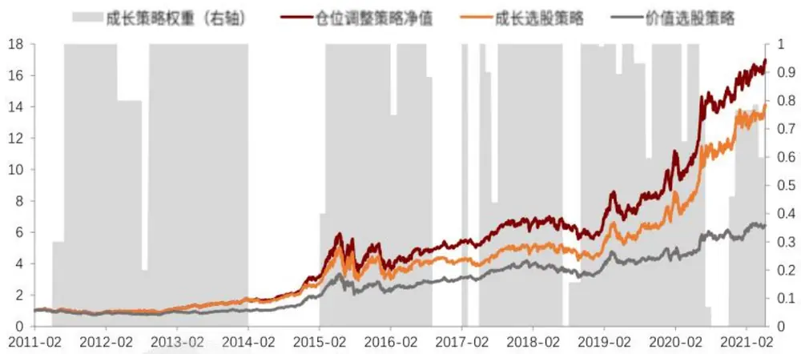
资料来源：万得资讯、中金公绍研究部（数止于2021-06-04)

图表11：仓位调整策略分年度收益统计（基准为沪深300指数）

|  | 月度胜率 | 年化收益 | 年化波动 | 年化超额收益 | 相对收益波动 | 信息比 | 最大回撤相 | 对最大回撤 |
| --- | --- | --- | --- | --- | --- | --- | --- | --- |
| 2011 | 64% -24% |  | 25% | 13% | 12% | 1.07 | -31% | -7% |
| 2012 | 67% | 28% | 24% | 16% | 12% | 1.39 | -16% | -11% |
| 2013 | 83% 60% |  | 25% | 73% | 17% 4.31 |  | -14% | -8% |
| 2014 | 83% | 95% | 21% | 26% | 11% 2.31 |  | -10% | -8% |
| 2015 | 92% 69% |  | 52% | 67% | 28% 2.39 |  | -42% | -22% |
| 2016 | 75% 7% |  | 33% | 14% | 17% 0.85 |  | -26% | -11% |
| 2017 | 50% 33% |  | 15% | 9% | 11% 0.87 |  | -10% | -8% |
| 2018 | 67% | -17% | 24% | 13% | 13% 1.03 |  | -21% | -9% |
| 2019 | 67% | 58% | 25% | 13% | 14% 0.98 |  | -21% | -11% |
| 2020 | 75% | 69% | 28% | 34% | 15% 2.23 |  | -17% | -8% |
| 2021 | 33% | 27% | 20% | 19% | 18% 1.06 |  | -7% | -7% |
| Summary | 71% 33% |  | 28% | 27% | 16% 1.68 |  | -42% | -22% |

资料来源：万得资讯。中金公司研究部（截止于2021-06-04)

仓位调整策略回测期(2011年2月28日-2021年6月4日)年化收益32.8%，而成长选股策略的期间年化收益为30.2%，价值选股策略的期间年化收益为20.4%，仓位调整策略可以显著的战胜成长选股策略。与阈值开平仓策略相比，仓位调整策略年化波动较低，回测期内夏普比表现更为出色。

风格轮动模型及最新观点:4大维度捕捉成长/价值风格 切换

成长/价值风格轮动模型：当前(2021年6月1日）指标偏向成长风格

## 模型简介

我们在报告《量化多因子系列(3)：如何捕捉成长与价值的风格轮动？》的报告中，针对价值与成长风格的收益相对强弱建立预测模型，通过市场情绪、因子拥挤度、金融环境和经济环境这四大类指标构建成长与价值的风格轮动策略。

图表12:四大维度指标构建风格轮动模型
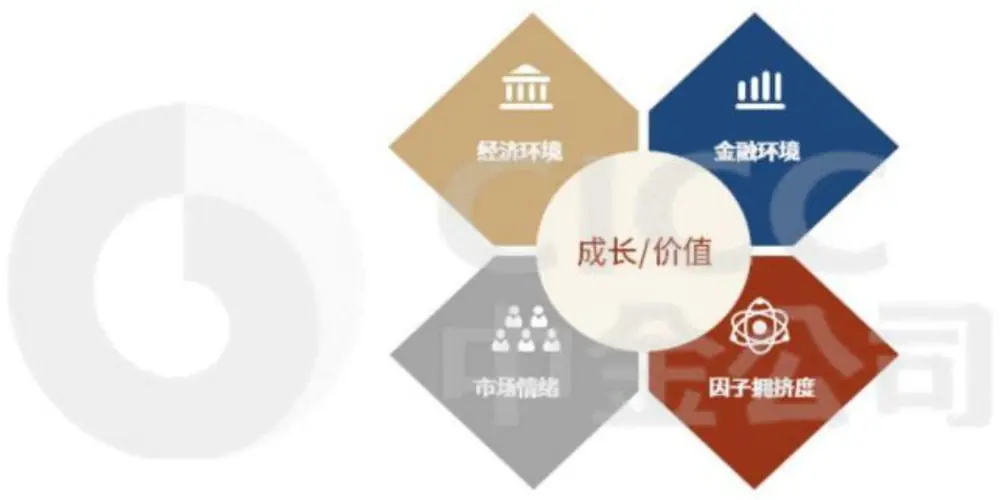
资料来源：中金公司研究部

各大类指标中通过基于事件化测试、相关性检验和Granger测试搭建的单指标筛选框架的指标包括以下：

## 市场情绪：

从多个维度刻画市场参与者的情绪变化，机构调研偏好、新增投资者数量、风格强势股占比和北上资金偏好变化这四个指标均对成长/价值风格收益均具有预测能力。

## 因子拥挤度：

通过因子拥挤度指标来衡量因子的当前是否拥挤。当拥挤度较高时则需躲避此类可能失效的因子。拥挤度指标对成长/价值风格收益具有显著的预测能力。

## 金融环境：

期限利差、M2与M1的增速差与成长/估值因子收益具有较显著的相关性。

## 经济环境：

CPI-PPI剪刀差则与成长/价值风格收益呈现一定的正相关。

图表13:通过指标筛选标准的四大类11个细分指标

| 指标类型 | 指标代码 | 指标名 | 方向 |
| --- | --- | --- | --- |
| 市场情绪 Market_sentiment | GMV_S | 风格强势股占比 | 1 |
|  | Survey_relative_value | 机构调研估值偏好 | -1 |
|  | New_inv_num | 新增投资者数量 | -1 |
|  | LGT_relative_value | 北上资金估值偏好 | -1 |
| 拥挤座 Factor_crowding | Growth_Crowding | 成长因子拥挤度 | -1 |
|  | Value_Crowding | 价值因子拥挤度 | 1 |
| 经济环境 Economic_condition | TSF | 社融规模同比增速 | -1 |
|  | CPI-PPI | CPI同比-PPI同比 | 1 |
|  | PMI | PMI同比 | -1 |
| 金融环境 Financial_condition | Term-spread | 期限利差 | 1 |
|  | M2-M1 | M2增速-M1增速 | -1 |

资料来源：万得资讯、中金公司研究部

更多模型构建细节请参考报告《僵化多因子系列(3)：如何捕捉成长与价值的风格轮动？》最新观点

当前（2021-06-01)，成长/价值轮动综合指标值为0.20，观点偏向成长。

图表14：当前11个细分指标值（标准化后）（2021-06-01）
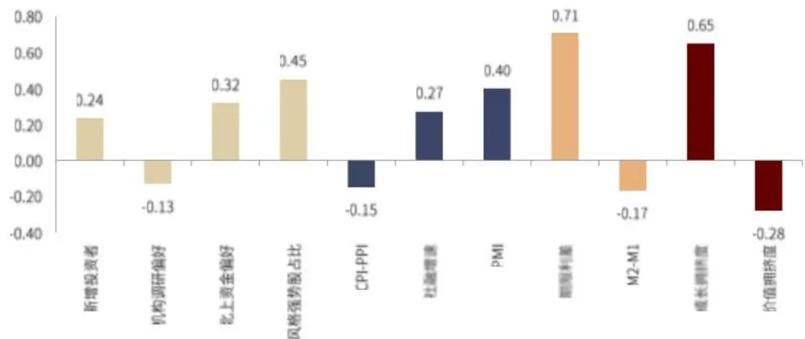
资料来源：万得资讯、中金公司研究部：

图表15:大类指标及综合指标值(2021-06-01)

|  | 综合得分 |
| --- | --- |
| 情绪 | 0.17 |
| 经济环境 | 0.17 |
| 金融环境 | 0.27 |
| 拥挤度 | 0.18 |
| 综合指标 | 0.20 |

资料来源：万得责讯、中金公司研究部（数止于2021-0531）

当前(2021-06-01)，四大类综合指标得分均为正且超过0.15，其中，金融环境得分最高为0.27，从金融环境的角度更为看好成长风格。同时，成长/价值轮动综合指标值也从5月的-0.15提升到0.20，指标提升幅度较为显著，整体的观点也较为偏向成长。

## 附录：主动量化选股模型构建成长策略与价值策略

主动量化选股策略旨在实现主动权益投资理念和量化工具的结合，通过量化的方式筛选符合主动权益投资逻辑的个股，构建选股组合。目前，我们分别构建了成长趋势共振和价值股优选两个主动量化选股模型，本章对组合近期的收益表现进行跟踪。

## 成长趋势共振选股策略：今年以来收益率达12.8%

我们在报告《基本面量化系列(3)：业绩成长是否具有延续性》的报告中，对“上市公司的业绩成长具有一定的延续性”这一逻辑基础进行了验证。基于这一逻辑，成长趋势共振选股模型的构建主要分为以下三个步骤：

业绩加速增长基础池：在全市场范围内，筛选TTM归母净利润环比增速排名前三分之一的股票，并在其中进一步筛选加速度指标排名前50%且加速度绝对值大于0的股票作为基础池。

规避非经常性因素带来的风险：非经常性因素对于公司业绩增长的延续性影响较大，因此，在基础池内，我们进一步筛选扣非利润占比大于50%、近一年未发生股权融资事件、偿债能力指标大于-1的公司作为待选股票池。结合报告《基本面量化系列(4)：精确刻画业绩的加速增长趋势》的研究成果，我们将业绩分布季节性较为明显的个股剔除。出于稳健性考虑，我们将ROE大于0.01、过去半年日均成交额全市场排名前90%、剔除ST股也加入筛选标准。

- 叠加分析师预期和技术面信息增厚收益：在待选股票池内，依据改进动量因子、分析师一致预期调整因子、分析师一致预期业绩增速因子进行排序打分，并等权加总为综合得分，取综合排名靠前的股票作为最终持仓。

图表16：成长趋势共振选股策略实施步骤

## 成长趋势共振选股模型

## 业绩加速增长基础池

全市场范围内

TTM归母净利润环比增速排名前三分之一

上述条件基础上，加速度指标排名前50%且加速度大于0

## 待选股票池

基础池范围内

扣非利润占比大于50%

近一年未发生股权融资事件

偿债能力指标大于-1

ROE大于0.01

过去半年日均成交额全市场排名前90%

剔除ST股

## 最终持仓

剔除业绩分布季节性明显的

待选股票池范围内

依据改进动量因子、分析师致预期调整因子、分析师致预期增速因子等权综合打分，取综合得分排名前30的股票

资料来源：万得资讯、中金公司研究部

策略表现：2009年1月1日以来，成长趋势共振选股策略年化收益率达37.2%，以偏股混合型基金指数为基准，年化超额收益率达22.0%。今年以来收益率为12.8%，超额基准7.0ppt(截止于2021-05-31)。

图表17：成长趋势共振选股策略收益表现
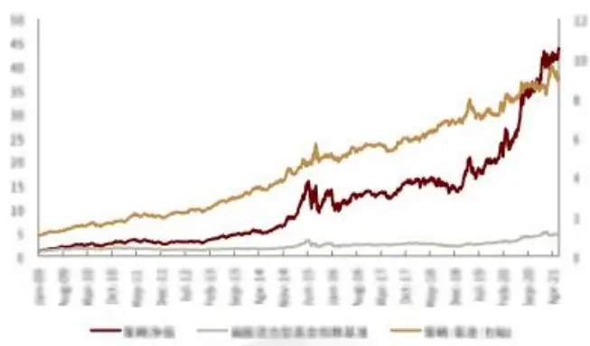
资料来源：万得资讯，朝阳永线，中金公出研究部（数止于2021-05-31）

图表18：成长趋势共振选股策略收益表现(2021年以来)
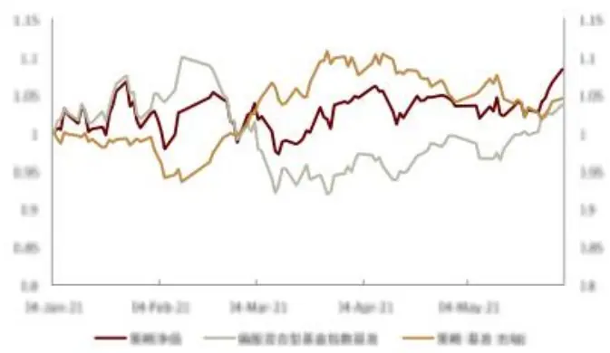
资料来源：万得资讯，朝阳永续，中金公司研究部（数止于2021-05-31）

图表19：成长趋势共振选股策略分年度收益统计

| 年份 | 年化收益本 | 年化波动率 | 年化超版收 益本 | 相对收益波 动本 | 信息比率 | 相对最大日 2 | 月度置 |  | u名 | 基金总数 |
| --- | --- | --- | --- | --- | --- | --- | --- | --- | --- | --- |
| 2009 | 151.4% | 33.9% | 57.3% | 15.2% | 1.77 | 6.7% | 100.0% | -15.3% | 1 | 234 |
| 2010 | 23.7% | 31.3% | 19.7% | 14.1% | 1.40 | 12.7% | 66.7% | 27.2% | 17 | 279 |
| 2011 | 15.6% | 26.5% | 11.7% | 12.8% | 0.91 | 11.1% | 58.3% | 30.9% | 13 | 330 |
| 2012 | 24.8% | 24.3% | 21.6% | 11.5% | 1.88 | -7.4% | 75.0% | -16.4% | 5 | 386 |
| 2013 | 59.7% | 25.4% | 42.2% | 11.4% | 1.69 | 3.9% | 91.7% | 13.8% | 11 | 442 |
| 2014 | 58.1% | 24.7% | 38.4% | 12.2% | 3.16 | 5.7% | 83.3% | -14.8% | 13 | 468 |
| 2015 | 73.2% | 51.8% | 24.9% | 19.8% | 1.26 | 15.5% | 66.7% | 42.5% | 109 | 507 |
| 2016 | -7.3% | 34.8% | 9.4% | 11.4% | 0.83 | -7.1% | 58.3% | 31.7% | 146 | 626 |
| 2017 | 24.9% | 16.4% | 9.4% | 8.1% | 1.16 | .7.5% | 58.3% | 11.4% | 231 | 688 |
| 2018 | 14.8% | 25.3% | 13.4% | 10.4% | 1.28 | -4.4% | 75.0% | 20.9% | 57 | 785 |
| 2019 | 56.4% | 25.2% | 1.6% | 11.9% | 0.63 | 12.9% | 50.0% | 21.4% | 383 | 925 |
| 2020 | 30.0% | 31.1% | 21.7% | 13.8% | 1.57 | 6.4% | 66.7% | 16.8% | 256 | 1138 |
| 2021 | 12.8% | 23.7% | 1.0% | 17.0% | 0.99 | -8.3% | 80.0% | 8.9% | 260 | 1546 |
| 总体 | 37.2% | 30.2% | 22.0% | 13.2% | 1.68 | 15.5% | 71.1% | 42.5% |  |  |

资料来源：万得责讯，朝阳永续，中金公司研究部（截止于2021-05-31：2021年收益率为实际收益率）

图表 20:成长趋势共振选股策略最新持仓名单(2021-05-06)

| 投票代码 | 股票 名称 | 行业 | 股票代码 | 股票 名称 | 业 |
| --- | --- | --- | --- | --- | --- |
| 601928.SH | 凤凰传媒 | 传媒 | 601699.SH | 跳安环能 | 煤炭 |
| 601311.SH | 路论股份 | 电力设备及新能源 | 501001.SH | 图控理业 | 煤炭 |
| 002106.5Z | 巢宝高科 | 电子 | 603035.SH | 星热汽饰 | 汽车 |
| 002139.5Z | 拓邦股份 | 电子 | 002521.SZ | 齐峰新材 | 轻工制造 |
| 601339.5H | 百隆东方 | 结织服装 | 002345.5Z | 潮宏基 | 商贸零售 |
| 000898.5Z | 鞍钢股份 | 驯铁 | 300755.5Z | 华数酒行 | 商贸零售 |
| 000959.5Z | 首铜股份 | 铜铁 | 300146.5Z | 消能信健 | 食品饮料 |
| 601882.SH | 海天精工 | 机械 | 000799.5Z | 酒鬼酒 | 食品饮料 |
| 002430.SZ | 杭氧股份 | 机械 | 300463.5Z | 迈克生物 | 医药 |
| 002812.5Z | 固建股份 | 基础化工 | 603260.SH | 合盛硅业 | 有色金属 |
| 002145.5Z | 中核钛白 | 基础化工 | 600549.SH | 厦门构业 | 有色金属 |
| 300458.5Z | 全志科技 | 计算机 | 600362.SH | 江西铜业 | 有色金属 |
| 002088.5Z | 鲁阳节能 | 建材 |  |  |  |
| 000012.5Z | 南坡A | 建材 |  |  |  |
| 603466.5H | 风语筑 | 建筑 |  |  |  |

资构来源：万得责讯，朝阳永续，中金公司研究部（注：已程据公司限制名单进行调整，最新一期于2021-0506调仓）

## 价值股优选策略：今年以来收益率达14.7%

我们在《基本面量化系列(1)：如何看待价值股的“价值”》报告中，探讨了价值股的相对优势，并认为价值股的相对优势主要在于下行风险较小、回撒较小，比较适合稳健型投资者。因此，在构建价值股优选策略过程中，我们也是强调突出下行风险小的特性，具体实施过程如下：

- 基础池：依据中信一级行业分类，每个行业分别筛选PB-ROE因子值较小的三分之一股票，作为价值股的基础池。

优选持仓：在基础池内，将龙头指标、平均股息率分位数、稳健成长指标分位数等权相加，得到综合得分，筛选综合得分排名靠前的股票作为最终持仓。

策略表现：2009年5月5日以来，价值股优选策略年化收益率达22.4%，以价值股基础池为基准，年化超额收益率为6.0%。今年以来收益率达14.7%，超额基准9.1ppt（截止于2021-05-31)。

图表21：价值股优选策略收益表现
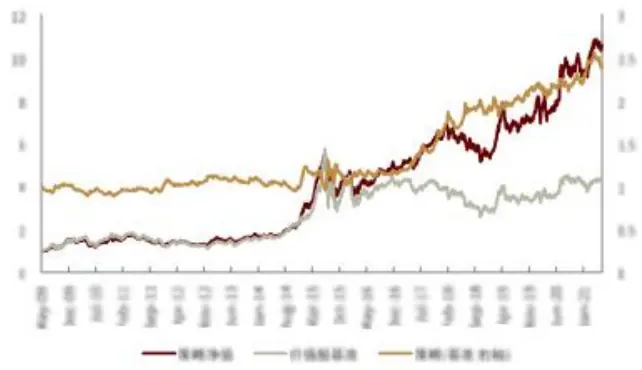
资料来源：万得贵讯。中金公司研究制（截止于2021-05-31）

图表22：价值股优选策略收益表现 (2021年以来)
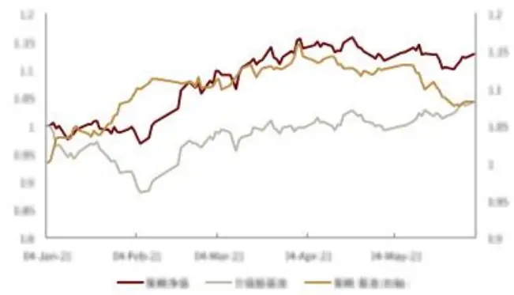
遗料来源：万得资讯。中金公司研究部（截止于2021-05-31)

图表23:价值股优选策略分年度收益统计

|  | 年化表益率 | 年化流动率 | 年化服收 品率 | 相对收益波 | 下行流动率 | 索程话比率 | 星大日 | 预期相对历史高点 | VaR | ES |
| --- | --- | --- | --- | --- | --- | --- | --- | --- | --- | --- |
| 2009 | 90.7% | 29.4% | 1.9% | 8.7% | 21.0% | 3.29 | 15.2% | 2.9% | 2.9% | 4.4% |
| 2010 | 0.6% | 25.4% | 9.8% | 8.4% | 19.2% | 0.20 | 24.7% | 9.0% | 2.6% | 3.9% |
| 2011 | -18.4% | 21.5% | 10.4% | 7.5% | 16.1% | 4.12 | 29.6% | 11.3% | 2.3% | 3.1% |
| 2012 | 16.9% | 20.3% | 7.7% | 8.8% | 13.0% | 1.36 | 18.2% | -7.7% | -1.8% | 2.5% |
| 2013 | 17.7% | 20.4% | 5.2% | 8.6% | 14.4% | 1.21 | 15.3% | 4.9% | 2.0% | 2.9% |
| 2014 | 82.3% | 18.6% | 12.1% | 11.3% | 10.6% | 5.82 | -7.5% | 2.4% | -1.5% | 2.1% |
| 2015 | 53.1% | 43.7% | 19.9% | 23.3% | 31.9% | 1.64 | 39.3% | 13.2% | 5.2% | 7.0% |
| 2016 | 3.4% | 25.0% | 1.7% | 12.0% | 19.6% | 0.33 | 22.9% | 4.8% | 2.3% | 4.4% |
| 2017 | 36.1% | 13.9% | 44.7% | 10.2% | 1.0% | 3.54 | 9.6% | 2.0% | 1.2% | 1.7% |
| 2018 | -16.6% | 21.1% | 15.5% | 10.7% | 16.4% | 0.95 | 25.7% | 12.5% | 2.2% | 3.4% |
| 2019 | 46.7% | 20.0% | 11.9% | 10.5% | 13.0% | 3.10 | 17.6% | 8.3% | -1.5% | 2.6% |
| 2020 | 18.9% | 24.3% | 1.2% | 10.3% | 17.3% | 1.17 | 15.6% | 5.3% | 2.4% | 3.6% |
| 2021 | 14.7% | 16.5% | 9.1% | 9.8% | .7% | 3.82 | -4.9% | -1.5% | 1.4% | 1.7% |
| 总体 | 22.4% | 24.3% | 6.0% | 11.6% | 17.4% | 1.33 | 39.3% | 10.8% | 2.3% | 3.8% |

资料来源：万得贵讯，中金公司研究都（截止于2021-05-31；2021年收益率为实际收益率）

图表24:价值股优选策略最新持仓名单(2021-06-01)

|  | 股票名称 | 行业 | 股票代码 | 名 | 行业 |
| --- | --- | --- | --- | --- | --- |
| 600757.SH | 长江传媒 | 传媒 | 601668.SH | 中国建筑 | 建筑 |
| 601928.SH | 凤凰传媒 | 传媒 | 600057.SH | 厦门象屿 | 交通运输 |
| 600461.SH | 洪城环境 | 电力及公用事业 | 601000.SH | 唐山港 | 交通运输 |
| 600642.SH | 申能股份 | 电力及公用事业 | 601006.5H | 大秦铁路 | 交通运输 |
| 601126.5H | 四方股份 | 电力设备及断 能源 | 601598.SH | 中国外道 | 交通运输 |
| 603365.SH | 水星家纺 | 纺织服装 | 600985.SH | 淮北矿业 | 煤炭 |
| 000932.5Z | 华菱铜铁 | 铜铁 | 000048.SZ | 京基智农 | 农林牧渔 |
| 600019.SH | 宝铜股份 | 驯铁 | 000581.SZ | 威孚高料 | 汽车 |
| 600782.SH | 新铜股份 | 铜铁 | 600741.SH | 华城汽车 | 汽车 |
| 600582.5H | 天地科技 | 机械 | 600210.SH | 紫江企业 | 轻工制造 |
| 600761.SH | 安徽合力 | 机械 | 600308.SH | 华泰股份 | 轻工制造 |
| 000830.5Z | 鲁西化工 | 基础化工 | 002737.SZ | 樊花药业 | 医药 |
| 600873.SH | 梅花生物 | 基础化工 | 603858.SH | 参长制药 | 医药 |
| 600585.5H | 海螺水泥 | 建材 |  |  |  |
| 600801.5H | 华新水泥 | 建材 |  |  |  |

资料来源：万得资讯，中金公司研究部《注：已相据公司限制名单进行调整。最新一期于2021-06-01调仓）

## 法律声明

一般声明

本报告由中国国际金融股份有限公司（已具备中国证监会批复的证券投资咨询业务资格》制作。本报告中的信息均来源于我们认为可靠的已公开资料，但中国国际金题股份有限公司及其关联机构（以下统称“中金公司”）对这些信息的准确性及完整性不作任何保证。本报告中的信息、意见等均仅供投资者参考之用，不构成对买卖任何证券或其他金融工具的出价或征价或提供任何投资决策建议的服务。该等信息、意见并未考虑到获取本报告人员的具体投资目的、财务状况以及特定需求，在任何时候均不构成对任何人的个人推荐成投资操作性建议。投资者应当对本报告中的信息和意见进行独立评估，自主审慎做出决策并自行承担风险。投资者在依据本报告涉及的内容进行任何决策前，应同时考量各自的投资目的、财务状况和特定需求，并就相关决策咨询专业顾问的量见对依驱或者使用本报告所造成的一切后果，中金公司及/成其关联人员均不承担任伺责任。

本报告所载的意见、评估及预测仅为本报告出具日的观点和判断。相关证券或金融工具的价格、价值及收益亦可能会波动，该等意见、评估及预测无需通知即罚随时更改。在不同时期，中金公司可能会发出与本报告所载意见、评估及预测不一致的研究报告。

本报告著名分析师可能会不时与中金公司的客户、销售交易人员、其他业务人员成在本服告中针对可能对本报告所涉及的标的证券成其他金融工具的市场价格产生短期影响的催化剂或事件进行交易策略的讨论。这种短期影响的分析可能与分析师已发布的关于相关证券或其他金融工具的目标价、评级、估值、预测等观点相反或不一数，相关的交易策略不同于且也不影响分析师关于其所研究标的证券成其他金融工具的基本面评级或评分。

中金公司的销售人员、交易人员以及其他专业人士可能会依据不同假设和标准、采用不同的分析方法而口头成书面发表与本报告意见及建议不一数的市场评论和/或交暑观点。中金公司没有将此意见及建议向报告所有接收者进行更新的义务。中金公司的资产管理部门、自营部门以及其他投资业务部门可能独立储出与本报告中的意见不一数的投资决集。

除非另行说明。本报告中所引用的关于业绩的数据代表过往表现。过往的业绩表现亦不应作为日后圆报的预示。我们不承诺也不保证，任何所预示的圆报会得以实现。
分析中所做的预测可能是基于相应的假设。任何假设的变化可能会量著地影响所预测的回报。

本报告提供给某接收入是基于该接收人被认为有能力独立评估投资风险并就投资决集能行使独立判断。投资的独立判断是指，投资决跟是投资者自身基于对潜在投资的目标、需求、机会、风险、市场因素及其他疫资考虑而独立储出的。

本报告由受香港证券和期货委员会监管的中国国际金融香港证券有限公司（中金香港”）于香港提供。香港的授资者若有任何关于中金公司研究报告的问题请直接联系中金香港的销售交易代表。本报告作者所持香港证监会牌照的牌照编号已披露在报告首页的作者姓名旁。

本报告由受新加坡金融管理局监管的中国国际金融（新加坡）有限公司（“中金新加坡”）于新加坡向符合新加坡《证券期货法》定义下的认可投资者及/成机构投资者提供。提供本报告于此类投资者，有关财务顾问将无需根据新加坡之（财务顾问法》第36条就任何利益及/或其代表就任何证券利益进行披露。有关本报告之任何查询，在新加较获得本报告的人员可联系中金新加坡销售交易代表。

本报告由受金融服务监管局监管约中国国际金融（英国）有限公司（“中金英国”）于英国提供。本报告有关的投资和服务仅向符合2000年全融服务和市场法2005年(金融推介》令》第19（5)条、38条、47条以及49条规定的人士提供。本报告并未打算提供给零售客户使用。在其他欧洲经济区国家，本报告向被其本国认定为专业投资者（或相当性质）的人士提供。

本报告将依据其他国家或地区的法律法规和监管要求于该国家或地区提供

## 特别声明

在法律许可的情况下，中金公司可能与本报告中提及公司正在建立成争取建立业务关系成服务关系。因此，投资者应当考虑到中金公司及/成其相关人员可能存在影响本报告观点客观性的潜在利益冲突。

与本报告所含具体公司相关的披露息请访https://research.cicc.com/footer/disclosures.存可参见近期已发布约关于该等公司的具体研究服告。

中金研究基本评级体系说明：

分析师采用相对评级体系，股票评级分为跑赢行业、中性、跑输行业（定义见下文）。

除了般票评级外，中金公司时置盖行业的未来市场表现提供行业评级规点。行业评级分为超配、标配、低配（定义见下文》。

我们在此提醒您，中金公司对研究覆基的股票不提供买入、卖出评级。跑赢行业、跑输行业不等同于买入、卖出。投资者应仔细阀读中金公司研究报告中的所有评级定义。请投资者仔细阅读研究服告全文，以获取比较完整的观点与信息，不应仅仅依靠评级来维断结论。在任何腈形下，评级（或研究观点都不应被视为或作为投资建议。投资者买卖证券成其他金题产品的决定应基于自身实际具体情况（比如当前的持仓结构》及其继需要考虑约因素。

## 股票评级定义：

·距赢行业(OUTPERFORM)：未来6-12个月，分析师预计个股表现超过同期其所属的中金行业指数

·中性(NEUTRAL)：未来6~12个月，分析师预计个股表理与同期其所属的中金行业指数相比持平；

·跑输行业(UNDERPERFORM)：未来6-12个月，分析师预计个股表现不及同期其所属的中金行业指数

## 行业评级定义：

·超配（OVERWEIGHT)：未来6-12个月，分析间预计某行业会跑赢大盘10%以上：

标配（EQUAL-WEIGHT）：未来6-12个月，分析师预计案行业表现与大盘的关系在-10%与10%之间；

- 低配(UNDERWEIGH1）：未来5-12个月，分析频预计某行业会跑输大盘10%以上。

研究报告评级分布可从https://research.cicc.com/footer/disclosures获悉。

本报告的版权仅为中金公司所有，未经书面许可任何机构和个人不得以任何形式转发、翻版、复制、刊登、发表成引用。

中国北京建国门外大街1号国贸写字楼2座28层|邮编：100004

## 美国

CICC US Securities, Inc 32ndFloor, 280 Park Avenue New York, NY 10017, USA Tel: (+1-646)7948 800 Fax: (+1-646) 7948 801

## 新加坡

China International Capital Corporation 
(Singapore) Pte. Limited 
6 Battery Road, #33-01 
Singapore 049909 
Tel: (+65) 6572 1999 
Fax: (+65) 6327 1278

## 上海

中国国际金融股份有限公司上海分公司
上海市浦东新区陆家嘴环路1233号
汇亚大厦32层
邮编：200120
电话：(86-21)5879-6226
传真：(86-21)5888-8976

## 英国

China International Capital Corporation (UK) 
Limited 
25th Floor, 125 Old Broad Street 
London EC2N 1AR, United Kingdom 
Tel: (+44 -20)7367 5718 
Fax: (+44-20) 73675719

## 香港

中国国际金融（香港）有限公司香港中环港景街1号国际金融中心第一期29楼电话：(852)2872-2000传真：(852)2872-2100

深圳
中国国际金融股份有限公司深圳分公司
深圳市福田区益田路5033号
平安金融中心72层
邮编：518048
电话：(86-755)8319-5000
传真：(86-755)8319-9229