# 量化多因子系列(5)：基本面因子手册

周蕭潇

SAC 执证编号：S0080521010006

SFC CE Ref: BRA090

xiaoxiao.zhou@cicc.com.cn

古翔

SAC 执证编号：S0080521010010

SFC CE Ref: BRE496

xiang.gu@cicc.com.cn

刘均伟

SAC 执证编号：S0080520120002

SFC CE Ref: BQR365

junwei.liu@cicc.com.cn

本文为量化基本面因子的参考手册，汇集了常用基本面因子以及中金研究量化策略团队自主开发的创新基本面因子。作为量化多因子中最为重要的因子类型之一，基本面因子长期以来都是投资者关注的重点。基本面因子以财务数据和股东数据为基础构建，是基本面研究和量化研究的有机结合，基于基本面因子构建的量化选股模型也具有逻辑清晰易懂的优势。近年来，投资者对于基本面因子的关注度不降反升，各类创新的基本面因子模型也不断涌现。

我们将基本面因子划分为盈利能力、成长能力、营运效率、盈余质量、安全性因子、公司治理、估值因子、分析师因子、股东和规模因子共10大类因子，也尝试构建了各类因子的复合因子，从多个维度测试和梳理各类基本面因子的收益预测能力和选股收益表现，供投资者参考。

## 1）盈利能力因子

CFOA因子选股能力表现良好。相较于其他盈利能力因子，全部资产现金回收率因子（CFOA）在不同选股域中有效性均较为显著，体现其对收益率较强的预测能力。同时，CFOA因子的多头组合在全市场具有较高的年化收益和较低的超额最大回撤，选股收益表现也同样较为优秀。

## 2）成长能力因子

多数成长能力因子有效性较好。在全市场中，多数成长能力因子的IC检验有效性较为显著，其中业绩趋势因子（QPT)和标准化预期外净利润因子（NP_SUE1）在不同选股域中具有较强的收益预测能力。全市场中，QPT因子的IC均值为4.13%，IC_IR高达0.91；NP_SUE1因子的IC均值为3.47%，IC_IR达到0.74。

## 3）营运效率因子

ATD、GPMD、OCFA和OPMD因子选股能力良好。在全市场、沪深300和中证500中，资产周转率变动因子（ATD）、毛利率变动因子(GPMD）、产能利用率提升因子(OCFA）和营业利润率变动因子（OPMD）的多头组合均有较强的年化收益表现，选股能力整体表现较为优异。

## 4）盈余质量因子

APR_TTM因子在中小市值股票的有效性较强。相较于其他盈余质量因子，应计利润占比因子（APR_TTM）在全市场和中证500中表现良好，但在沪深300中表现相对较弱，反映该因子在大市值股票的有效性偏弱。

## 5）安全性因子

CCR因子有效性较为显著。现金流动负债比率因子（CCR）在不同选股域中具有较强的收益预测能力，同时，该因子在全市场和中证500中有良好的收益表现和单调性，体现CCR因子的有效性和选股能力。

## 6）公司治理因子

TOP_MANA_INCOME因子在公司治理因子有效性检验中表现良好。高管薪酬因子(TOP_MANA_INCOME）在全市场和中证500中有效性较为显著。全市场中TOP_MANA_INCOME因子的IC均值为2.05%，IC_IR为0.61。

## 7）估值因子

半数估值因子具有较强的单调性。在全市场中，市净率倒数因子（BP_LR)、股息率因子（DP)、市盈率倒数因子(EP_TTM)、经营现金流市值比因子(OCFP_TTM)和市销率倒数因子(SP_TTM)具有较强的单调性，其中DP、EP_TTM和OCFP_TTM因子在不同选股域中均有较为良好的单调性表现。

## 8）分析师因子

CAFR因子选股能力突出。在不同选股域中，一致性修正因子(CAFR)的多头组合均有较高的超额收益。同时，该因子在分组回测中具有较强的单调性，选股能力整体表现在基本面因子中较为出色。

## 9）股东因子

HN_z和Ln_IH因子有效性较为显著。相较于其他股东因子，股东数目时序标准分数因子（HN_z）和持仓机构个数因子(Ln_IH)具有较为显著的收益预测能力，且两个因子的多头组合年化收益表现良好，具有较强的单调性。

## 10）规模因子

Ln_MC因子在全市场有效性检验中表现较为出色。大多数规模因子的IC检验有效性表现欠佳，总市值对数因子(Ln_MC)在全市场有效性检验中表现较为出色，但在宽基指数范围内表现相对较弱。

## 11）复合因子

复合因子选股能力整体较强。我们构建的基本面复合因子的多头组合均有较强的年化收益表现，其中综合成长因子(Growth)和综合质量因子（QQC）的多头组合具有较高的年化收益和较低的超额最大回撤，选股能力表现优异。

风险提示：本篇报告基于市场历史收益表现测试基本面因子的有效性，无法确保基本面因子样本外表现。

量化策略|基本面量化系列（7）：如何提高预期修正信息的利用效率？(2022.02.27)

- 市场策略|量化多因子系列（4）：风格轮动模型与主动&被动量化产品的结合(2021.06.15)

- 量化策略|量化多因子系列（3）：如何捕提成长与价值的风格轮动？(2021.05.15)

- 量化策略|量化多因子系列（2）：非线性假设下的情景分析因子模型(2021.02.28)

- 量化策略量化多因子系列（1）：QQC综合质量因子与指数增强应用(2021.01.14)

更多作者及其他信息请见文末披露页

## 基本面因子综述

## 基本面因子：基本面和量化研究的有机结合

基本面因子受到投资者广泛关注。基本面因子以财务数据和股东数据为基础构建，是基本面研究和量化研究的有机结合，基于基本面因子构建的量化选股模型也具有逻辑清晰易懂的优势。作为量化多因子中最为重要的因子类型之一，基本面因子长期以来都是投资者关注的重点。近年来，投资者对于基本面因子的关注度不降反升，各类创新的基本面因子模型也不断涌现。本文将对基本面因子进行测试，梳理多种基本面因子过去十几年间的有效性和选股能力，为投资者提供参考。

本文对10类基本面因子进行有效性检验。我们将基本面因子划分为10大类，分别为盈利能力、成长能力、营运效率、盈余质量、安全性因子、公司治理、估值因子、分析师因子、股东和规模因子。同时，我们根据上述分类汇总7个复合因子，对共计105个基本面因子进行有效性检验。

图表1：基本面因子分类
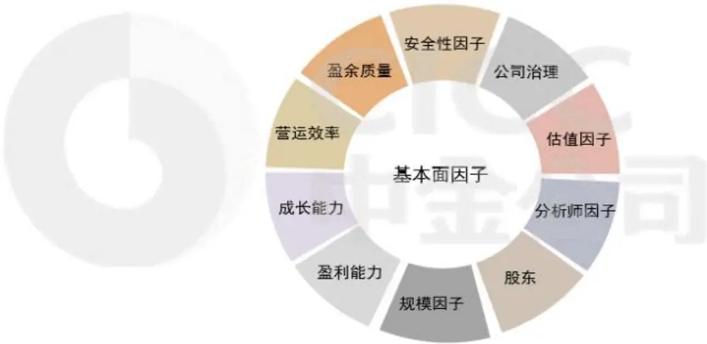
资料来源：中金公司研究部

## 因子测试框架

本文对基本面因子进行IC检验和分组回测检验，展示不同因子的有效性水平。我们将对各类因子在全市场、沪深300和中证500进行IC检验与分组回测检验，分析不同因子收益率预测的稳定性、单调性和有效性，并展示个别因子的分行业IC表现和多头收益表现。其中因子测试框架如下：

测试区间：2010.01.04-2022.04.01

股票池：全市场、沪深300和中证500中剔除ST、停牌、一字板和上市未满一年股票

频率：月度

A分组回测组数：按照因子值由小到大的顺序等分为10组

## 因子有效性评价标准

使用多种指标展示因子的有效性水平。在IC 检验中，我们使用IC 均值、ICIR 等指标展示因子暴露与下期收益率的秩相关性，反映因子对收益率的预测能力。在分组回测中，使用多头年化收益率、多头年化超额收益率、多头超额最大回撤等指标展示多头组合的选股能力；其中我们用较为创新的方式对单调性进行计算，即测算分组回测的组数序号与对应组合年化收益率的秩相关系数，该绝对数值越接近于1，则因子单调性越显著。

图表2：有效性检验指标含义

| 因子有效性检验 | 指标计算方法 | 指标含义 |
| --- | --- | --- |
| IC 均值 | IC 序列均值 | 检验因子的预测能力 |
| IC_IRt 值 | IC 序列均值 / IC标准差 | 检验因子预测能力的稳定性 |
|  | IC 序列 t 统计值 | 检验因子预测能力的显著性 |
| 多头年化收益率 | 分组回测中多头组合的年化收益率 | 检验因子多头组合的选股能力 |
| 多头年化超额收益率 | 分组回测中多头组合相较基准指数的超额收益 | 检验因子多头组合的超额收益能力 |
| 多头超额最大回辙 | 分组回测中多头组合相较基准指数的最大回撒 | 检验因子多头组合的收益稳定性 |
| 多头平均换手率单调性 | 分组回测中多头组合的平均换手率 | 检验因子换手率水平 |
|  | 分组回测中组数序号与对应组合年化收益的相关系数 | 检验因子单调性 |

资料来源：中金公司研究部

下文中我们将分别对10大类因子的测试结果进行展示，各因子的含义及详细计算方法统一在附录中做展示。

## 盈利能力

## CFOA因子在全市场中选股能力良好

盈利能力因子反映上市公司获取利润的能力，本节将对10个盈利能力因子进行有效性检验。

CFOA和ROE_TTM因子在盈利能力因子有效性检验中表现较为出色。相较于其他盈利能力因子，CFOA和ROE TTM因子在不同选股域中均有较强的收益预测能力。全市场中，CFOA因子的IC 均值为 2.21%，IC_IR为 0.48；ROE_TTM因子的IC 均值为 2.78%，IC_IR为 0.37;沪深 300 中，CFOA 因子的 IC 均值为 2.57%，IC_IR 为 0.24；ROE_TTM 因子的 IC 均值为3.22%，IC_IR为 0.23;中证 500 中，CFOA 因子的IC 均值为 2.92%,IC_IR 为 0.41;ROE_TTM因子的IC均值为3.36%，IC_IR为 0.33。

CFOA因子在全市场中选股能力良好。全市场中，CFOA因子的多头组合实现了较高的年化收益和较低的超额最大回撤，体现CFOA因子在全市场的选股能力。在沪深300和中证500中，TOEZ因子的选股能力良好，多头组合年化收益表现较为出色。

图表3：盈利能力因子全市场有效性检验

| 因子代码 | IC 均值 | IC_IR | P(IC>0) | P(IC>0.02) | P(IC<0) | P(IC<-0.02) | t值 | 多头年化收 益率 | 多头年化超 额收益率 | 多头超额最 大回撤 | 多头平均换 手率 | 单调性 |
| --- | --- | --- | --- | --- | --- | --- | --- | --- | --- | --- | --- | --- |
| CFOA | 2.21% | 0.48 | 68.71% | 50.34% | 31.29% | 16.33% | 5.79 | 12.04% | 2.24% | -12.28% | 17.68% | 0.93 |
| CFOAD | 0.90% | 0.34 | 66.67% | 33.33% | 33.33% | 14.29% | 4.14 | 9.04% | -0.17% | -12.66% | 24.31% | 0.82 |
| ROA_TTM | 2.56% | 0.31 | 61.22% | 51.70% | 38.78% | 31.29% | 3.72 | 9.36% | -0.13% | -20.92% | 14.31% | 0.85 |
| ROAD | 1.63% | 0.36 | 65.99% | 44.90% | 34.01% | 23.13% | 4.36 | 8.49% | -0.54% | -16.71% | 21.79% | 0.78 |
| ROE_TTM | 2.78% | 0.37 | 63.27% | 54.42% | 36.73% | 32.65% | 4.44 | 9.07% | -0.52% | -25.58% | 15.94% | 0.88 |
| ROED | 1.91% | 0.40 | 68.03% | 50.34% | 31.97% | 19.73% | 4.90 | 8.68% | -0.43% | -18.73% | 21.39% | 0.78 |
| ROIC_TTM | 2.51% | 0.33 | 61.22% | 53.74% | 38.78% | 29.93% | 4.05 | 8.84% | -0.71% | -27.83% | 14.95% | 0.79 |
| ROICD | 1.73% | 0.39 | 65.99% | 49.66% | 34.01% | 21.77% | 4.68 | 9.77% | 0.60% | -14.92% | 21.91% | 0.88 |
| TOE | 1.07% | 0.22 | 56.46% | 42.86% | 43.54% | 27.21% | 2.61 | 9.13% | -0.50% | -23.93% | 12.52% | 0.61 |
| TOE_Z | 0.74% | 0.22 | 55.94% | 37.06% | 44.06% | 21.68% | 2.60 | 11.70% | 1.90% | -11.05% | 20.19% | 0.67 |

资料来源：万得资讯，中金公司研究部（样本期：2010-01-04至2022-04-01）
注：基准指数为万得全A（等权）指数（8841388.WI）；TOE_Z样本期为2010-05-04 至2022-04-01

图表4：盈利能力因子沪深 300 有效性检验

| 因子代码 | IC 均值 | IC_IR | P(IC>0) | P(IC>0.02) | P(IC<0) | P(IC<-0.02) | t值 | 多头年化收 益率 | 多头年化超 额收益率 | 多头超额最 大回撤 | 多头平均换 手率 | 单调性 |
| --- | --- | --- | --- | --- | --- | --- | --- | --- | --- | --- | --- | --- |
| CFOA | 2.57% | 0.24 | 54.42% | 48.98% | 45.58% | 38.78% | 2.95 | 6.30% | 5.90% | -23.52% | 16.64% | 0.76 |
| CFOAD | 0.80% | 0.11 | 55.78% | 44.22% | 44.22% | 34.01% | 1.31 | 5.68% | 5.82% | -18.22% | 25.56% | 0.36 |
| ROA_TTM | 3.20% | 0.23 | 58.50% | 51.70% | 41.50% | 36.73% | 2.79 | 6.07% | 5.43% | -29.30% | 13.70% | 0.77 |
| ROAD | 0.96% | 0.11 | 57.14% | 48.30% | 42.86% | 34.69% | 1.32 | 3.23% | 3.27% | -22.98% | 23.50% | 0.55 |
| ROE_TTM | 3.22% | 0.23 | 54.42% | 53.06% | 45.58% | 39.46% | 2.78 | 6.22% | 5.69% | -30.60% | 14.99% | 0.90 |
| ROED | 1.68% | 0.18 | 57.14% | 46.94% | 42.86% | 32.65% | 2.24 | 4.93% | 4.96% | -14.39% | 23.64% | 0.68 |
| ROIC_TTM | 3.06% | 0.19 | 57.14% | 54.42% | 42.86% | 40.14% | 2.35 | 5.92% | 5.33% | -29.91% | 16.74% | 0.71 |
| ROICD | 1.24% | 0.12 | 59.86% | 47.62% | 40.14% | 33.33% | 1.50 | 6.74% | 6.66% | -18.16% | 24.08% | 0.70 |
| TOE | 2.04% | 0.18 | 57.82% | 50.34% | 42.18% | 35.37% | 2.19 | 5.98% | 5.48% | -11.37% | 12.89% | 0.64 |
| TOE_Z | 2.12% | 0.29 | 62.24% | 51.05% | 37.76% | 30.07% | 3.45 | 10.70% | 9.44% | -9.79% | 19.73% | 0.84 |

资料来源：万得资讯，中金公司研究部（样本期：2010-01-04至2022-04-01）
注：基准指数为300等权（000984.CSI)；TOE_Z样本期为 2010-05-04 至 2022-04-01

图表 5：盈利能力因子中证500 有效性检验

| 因子代码 | IC 均值 | IC_IR | P(IC>0) | P(IC>0.02) | P(IC<0) | P(IC<-0.02) | t值 | 多头年化收 益率 | 多头年化超 额收益率 | 多头超额最 大回撤 | 多头平均换 手率 | 单调性 |
| --- | --- | --- | --- | --- | --- | --- | --- | --- | --- | --- | --- | --- |
| CFOA | 2.92% | 0.41 | 68.71% | 58.50% | 31.29% | 25.17% | 4.99 | 8.49% | 4.67% | -14.03% | 18.43% | 0.89 |
| CFOAD | 1.43% | 0.29 | 61.90% | 44.90% | 38.10% | 25.17% | 3.47 | 6.33% | 2.84% | -12.95% | 25.61% | 0.87 |
| ROA_TTM | 3.32% | 0.33 | 61.90% | 55.10% | 38.10% | 31.29% | 3.95 | 8.66% | 4.73% | -17.98% | 15.43% | 0.81 |
| ROAD | 1.76% | 0.24 | 55.10% | 42.86% | 44.90% | 27.21% | 2.95 | 6.48% | 3.11% | -16.45% | 23.90% | 0.67 |
| ROE_TTM | 3.36% | 0.33 | 61.22% | 55.10% | 38.78% | 34.69% | 4.03 | 8.00% | 4.07% | -15.70% | 17.17% | 0.83 |
| ROED | 2.34% | 0.30 | 63.27% | 54.42% | 36.73% | 26.53% | 3.65 | 7.79% | 4.43% | -14.61% | 24.66% | 0.76 |
| ROIC_TTM | 3.04% | 0.30 | 59.18% | 55.10% | 40.82% | 34.01% | 3.61 | 7.65% | 3.71% | -18.82% | 15.77% | 0.87 |
| ROICD | 1.95% | 0.26 | 59.18% | 48.30% | 40.82% | 29.25% | 3.17 | 7.12% | 3.75% | -15.07% | 24.13% | 0.77 |
| TOE | 1.52% | 0.21 | 61.22% | 47.62% | 38.78% | 31.29% | 2.56 | 6.61% | 2.81% | -22.76% | 14.09% | 0.61 |
| TOE_Z | 1.14% | 0.18 | 57.34% | 48.95% | 42.66% | 31.47% | 2.21 | 10.84% | 7.04% | -11.12% | 21.37% | 0.43 |

资料来源：万得资讯，中金公司研究部（样本期：2010-01-04至2022-04-01）
注：基准指数为 500 等权（399982.SZ）；TOE_Z样本期为 2010-05-04 至2022-04-01

图表6：盈利能力因子全市场IC值表现
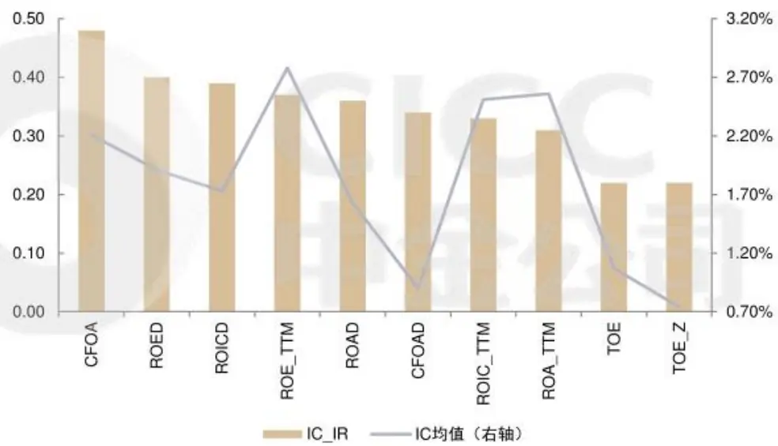
注：TOE_Z样本期为 2010-05-04 至 2022-04-01
资料来源：万得资讯，中金公司研究部（样本期：2010-01-04至2022-04-01）

图表 7：盈利能力因子沪深 300 IC 值表现
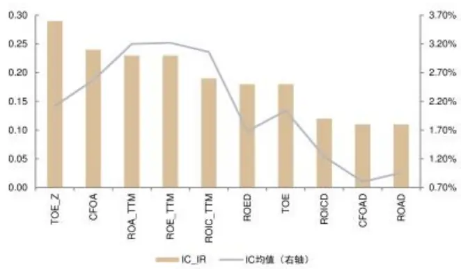
资料来源：万得资讯，中金公司研究部（样本期：2010-01-04至2022-04-01）注：TOE_Z样本期为 2010-05-04 至 2022-04-01

图表 8：盈利能力因子中证 500 IC 值表现
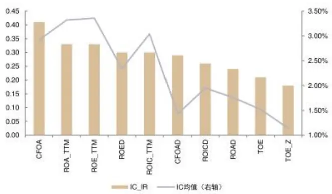
资料来源：万得资讯，中金公司研究部（样本期：2010-01-04至2022-04-01）注：TOE_Z样本期为 2010-05-04 至 2022-04-01

图表9：盈利能力因子相关性表现

|  | CFOA | CFOAD | ROA_TTM | ROAD | ROE_TTM | ROED | ROIC_TTM | ROICD | TOE | TOE_Z |
| --- | --- | --- | --- | --- | --- | --- | --- | --- | --- | --- |
| CFOA | 1.00 | 0.55 | 0.34 | 0.12 | 0.29 | 0.11 | 0.34 | 0.12 | 0.16 | 0.07 |
| CFOAD | 0.55 | 1.00 | 0.00 | 0.14 | 0.01 | 0.13 | 0.02 | 0.16 | 0.04 | 0.09 |
| ROA_TTM | 0.34 | 0.00 | 1.00 | 0.40 | 0.89 | 0.38 | 0.90 | 0.36 | 0.12 | 0.05 |
| ROAD | 0.12 | 0.14 | 0.40 | 1.00 | 0.43 | 0.92 | 0.40 | 0.91 | 0.10 | 0.20 |
| ROE_TTM | 0.29 | 0.01 | 0.89 | 0.43 | 1.00 | 0.46 | 0.92 | 0.41 | 0.27 | 0.07 |
| ROED | 0.11 | 0.13 | 0.38 | 0.92 | 0.46 | 1.00 | 0.41 | 0.91 | 0.08 | 0.21 |
| ROIC_TTM | 0.34 | 0.02 | 0.90 | 0.40 | 0.92 | 0.41 | 1.00 | 0.43 | 0.28 | 0.08 |
| ROICD | 0.12 | 0.16 | 0.36 | 0.91 | 0.41 | 0.91 | 0.43 | 1.00 | 0.10 | 0.24 |
| TOE | 0.16 | 0.04 | 0.12 | 0.10 | 0.27 | 0.08 | 0.28 | 0.10 | 1.00 | 0.33 |
| TOE_Z | 0.07 | 0.09 | 0.05 | 0.20 | 0.07 | 0.21 | 0.08 | 0.24 | 0.33 | 1.00 |

资料来源：万得资讯，中金公司研究部（样本期：2009-12-31至2022-03-31）
注：TOE_Z样本期为 2010-04-30 至 2022-03-31

## 推荐关注 CFOA 和 ROE_TTM 因子

CFOA因子在机械行业有效性较强。CFOA因子在机械、食品饮料和医药行业有效性较强，其中 CFOA因子在机械行业的IC_IR 达到 0.40，IC 均值为 3.77%。ROE_TTM因子在汽车、电子和计算机行业有效性表现良好，其在汽车行业的IC_IR为0.28，IC均值为3.66%。

图表 10：CFOA 因子分行业 IC 值表现
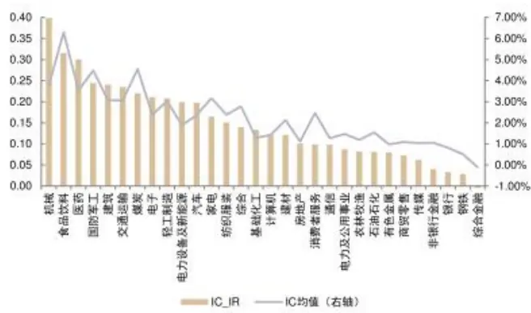
资料来源：万得资讯，中金公司研究部（样本期：2010-01-04至2022-04-01）

图表 11：ROE_TTM 因子分行业 IC 值表现
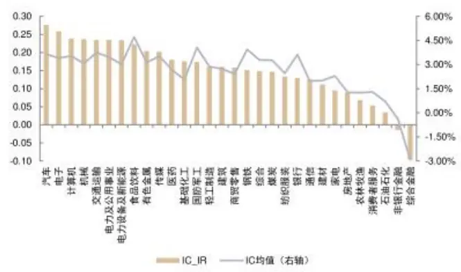
资料来源：万得资讯，中金公司研究部（样本期：2010-01-04至2022-04-01）

TOEZ因子多头组合近一年的超额收益波动相对较小。全市场中，CFOA因子近五年的多头组合具有较强的年化收益表现，然而近一年该组合的相对净值呈下滑趋势。TOEZ因子近一年在全市场的超额收益波动相对较小，且该因子在沪深300和中证500的多头组合相对净值整体表现较为优异。

图表12：CFOA 因子全市场多头收益走势
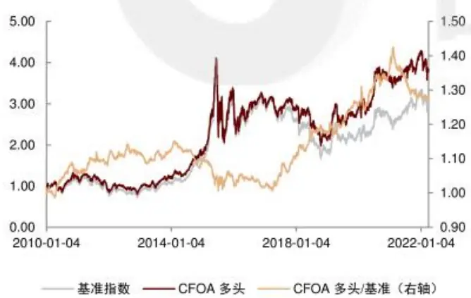
资料来源：万得资讯，中金公司研究部（数据截至2022-04-01）注：基准指数为万得全A（等权）指数（8841388.WI）

图表13：TOE_Z因子全市场多头收益走势
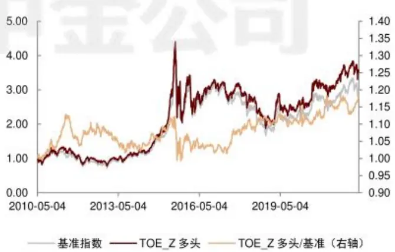
资料来源：万得资讯，中金公司研究部（数据截至2022-04-01）注：基准指数为万得全A（等权）指数（8841388.WI）

图表 14:ROICD 因子沪深 300 多头收益走势
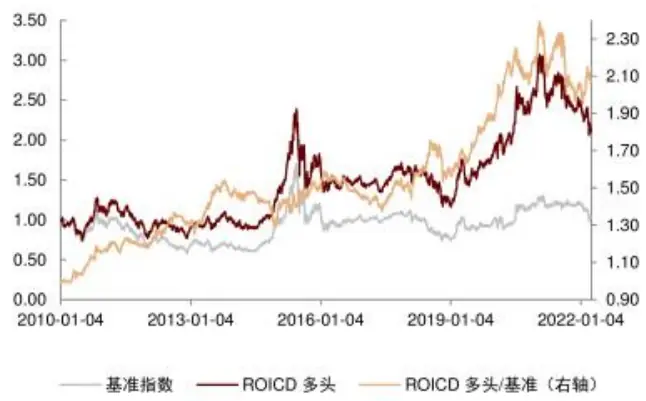
资料来源：万得资讯，中金公司研究部（数据截至2022-04-01）注：基准指数为300等权(000984.CSI)

图表 15:TOE_Z 因子沪深 300 多头收益走势
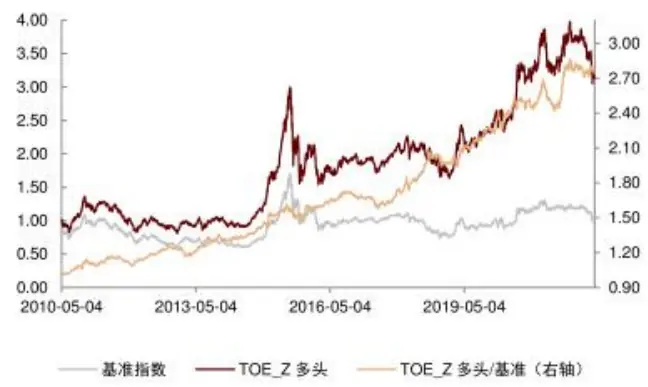
资料来源：万得资讯，中金公司研究部（数据截至2022-04-01）注：基准指数为300等权（000984.CSI）

图表 16：ROA_TTM 因子中证 500 多头收益走势
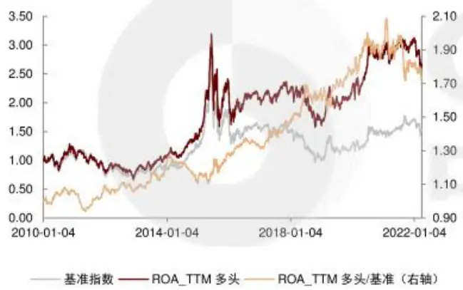
资料来源：万得资讯，中金公司研究部（数据截至2022-04-01）注：基准指数为500等权（399982.SZ）

图表 17：TOE_Z 因子中证 500 多头收益走势
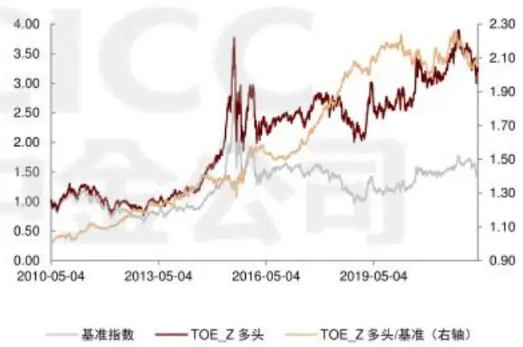
资料来源：万得资讯，中金公司研究部（数据截至2022-04-01）注：基准指数为500等权（399982.SZ）

## 成长能力

## 多数成长能力因子在全市场中有效性良好

成长能力因子反映上市公司的扩展经营的能力，本节将对26个成长能力因子进行有效性检验。

多数成长能力因子在全市场中有效性良好。在全市场中，多数成长能力因子的IC检验有效性较为显著，其中QPT和NP_SUE1因子在不同选股域中均有较强的收益预测能力。全市场中，QPT因子的IC均值为4.13%，IC_IR 为 0.91；NP_SUE1 因子的IC 均值为 3.47%，IC_IR为0.74。沪深 300 中，QPT因子的IC均值为 4.45%，IC_IR 为 0.51；NP_SUE1因子的IC 均值为 4.40%,IC_IR为0.49。中证500中，QPT因子的IC均值为4.48%,IC_IR为0.64;NP_SUE1因子的IC 均值为 3.78%，IC_IR为 0.55。

QPT、NP_SUE0和NP_SUE1因子选股能力较为优异。在不同选股域中，QPT、NP_SUE0和NP_SUE1因子的多头组合均有良好的年化收益表现。同时，三个因子在分组回测中具有较强的单调性，选股能力整体表现较为优异。

图表18：成长能力因子全市场有效性检验

| 因子代码 | IC 均值 | IC_IR | P(IC>0) | P(IC>0.02) | P(IC<0) | P(IC<-0.02) |  | 多头年化收多头年化超多头超额最多头平均换 益率 | 额收益率 | 大回撇 | 手率 | 单调性 |
| --- | --- | --- | --- | --- | --- | --- | --- | --- | --- | --- | --- | --- |
| EPS_Diluted_Q_YOY | 3.14% | 0.62 | 73.47% | 60.54% | 26.53% | 12.24% | 7.52 | 13.69% | 4.32% | -9.64% | 25.73% | 0.93 |
| EPS_Q_YOY | 3.15% | 0.63 | 73.47% | 59.86% | 26.53% | 8.84% | 7.60 | 13.68% | 4.29% | -8.95% | 25.65% | 0.93 |
| EPS_YOY | 1.96% | 0.43 | 68.71% | 48.98% | 31.29% | 19.05% | 5.26 | 9.00% | -0.05% | -19.79% | 20.53% | 0.82 |
| LPNP | 2.93% | 0.67 | 75.51% | 60.54% | 24.49% | 13.61% | 8.09 | 15.17% | 5.40% | -9.89% | 32.51% | 1.00 |
| NP_Deducted_YOY | 1.79% | 0.37 | 65.99% | 49.66% | 34.01% | 20.41% | 4.44 | 8.09% | -0.88% | -20.78% | 20.52% | 0.77 |
| NP_Q_YOY | 3.51% | 0.60 | 71.43% | 60.54% | 28.57% | 17.69% | 7.30 | 14.67% | 5.21% | -9.24% | 24.90% | 0.95 |
| NP_QOQ | 1.59% | 0.43 | 61.90% | 47.62% | 38.10% | 17.01% | 5.18 | 10.60% | 1.42% | -13.02% | 29.23% | 0.88 |
| NP_SD | 0.88% | 0.25 | 59.86% | 40.14% | 40.14% | 21.77% | 3.03 | 8.29% | -0.76% | -23.33% | 26.57% | 0.65 |
| NP_SUEO | 4.36% | 0.66 | 75.51% | 63.27% | 24.49% | 18.37% | 7.95 | 17.60% | 7.48% | -12.03% | 22.61% | 0.99 |
| NP_SUE1 | 3.47% | 0.74 | 77.55% | 66.67% | 22.45% | 13.61% | 9.00 | 19.75% | 9.60% | -7.77% | 25.99% | 1.00 |
| NP_YOY | 1.94% | 0.36 | 62.59% | 51.70% | 37.41% | 23.13% | 4.34 | 7.76% | -1.20% | -25.02% | 20.45% | 0.73 |
| NP_Z | 3.39% | 0.60 | 73.47% | 59.18% | 26.53% | 14.97% | 7.32 | 17.40% | 7.48% | -11.44% | 33.46% | 1.00 |
| OCF_Q_YOY | 0.94% | 0.40 | 64.63% | 29.93% | 35.37% | 9.52% | 4.87 | 10.36% | 1.04% | -15.85% | 27.97% | 0.94 |
| OCF_YOY | 1.37% | 0.46 | 68.71% | 42.18% | 31.29% | 10.88% | 5.55 | 9.75% | 0.51% | -14.98% | 24.84% | 0.77 |
| OP_Q_YOY | 3.53% | 0.64 | 74.83% | 64.63% | 25.17% | 15.65% | 7.76 | 14.16% | 4.77% | -9.21% | 25.82% | 0.98 |
| OP_QOQ | 1.56% | 0.45 | 63.95% | 46.26% | 36.05% | 15.65% | 5.40 | 10.68% | 1.48% | -15.24% | 29.29% | 0.95 |
| OP_SD | 1.01% | 0.30 | 62.59% | 38.10% | 37.41% | 19.05% | 3.69 | 8.12% | -0.86% | -25.45% | 26.34% | 0.72 |
| OP_YOY | 1.79% | 0.35 | 65.99% | 48.98% | 34.01% | 23.81% | 4.20 | 8.45% | -0.53% | -22.04% | 20.52% | 0.79 |
| OP_Z | 3.39% | 0.61 | 73.47% | 59.18% | 26.53% | 14.97% | 7.34 | 17.42% | 7.50% | -11.48% | 33.45% | 1.00 |
| OR_Q_YOY | 2.88% | 0.50 | 72.11% | 59.18% | 27.89% | 21.77% | 6.02 | 11.92% | 2.60% | -12.17% | 22.07% | 0.96 |
| OR_YOY | 1.81% | 0.31 | 59.86% | 53.06% | 40.14% | 27.21% | 3.70 | 9.85% | 0.63% | -15.39% | 17.39% | 0.84 |
| OT_Z | 1.10% | 0.39 | 67.13% | 41.96% | 32.87% | 14.69% | 4.63 | 11.17% | 1.37% | -21.13% | 25.59% | 0.93 |
| PTCF_Z | 1.18% | 0.39 | 67.13% | 44.06% | 32.87% | 13.29% | 4.68 | 11.18% | 1.38% | -15.92% | 27.14% | 0.89 |
| QPT | 4.13% | 0.91 | 82.31% | 72.79% | 17.69% | 8.84% | 11.09 | 18.68% | 8.79% | -10.51% | 32.69% | 1.00 |
| ROE_YOY | 1.99% | 0.41 | 67.35% | 50.34% | 32.65% | 21.09% | 4.94 | 8.93% | -0.08% | -22.66% | 20.46% | 0.79 |
| TA_YOY | 1.51% | 0.36 | 63.95% | 42.86% | 36.05% | 18.37% | 4.36 | 11.21% | 1.85% | -12.61% | 21.42% | 0.90 |

资料来源：万得资讯，中金公司研究部（样本期：2010-01-04至2022-04-01）
注：基准指数为万得全A（等权）指数（8841388.WI），OT_Z与PTCF_Z样本期为2010-05-04至2022-04-01

图表19：成长能力因子沪深300有效性检验

| 因子代码 | IC均值 | IC_IR | P(IC>0) | P(IC>0.02) | P(IC<0) | P(IC<-0.02) | t值 | 多头年化收多头年化超多头超额量 益率 | 额收益率 | 大回撤 | 多头平均换 手率 | 单调性 |
| --- | --- | --- | --- | --- | --- | --- | --- | --- | --- | --- | --- | --- |
| EPS_Diluted_Q_YOY | 2.99% | 0.30 | 62.59% | 53.06% | 37.41% | 29.93% | 3.68 | 7.13% | 7.36% | -16.03% | 26.28% | 0.95 |
| EPS_Q_YOY | 2.84% | 0.30 | 63.95% | 50.34% | 36.05% | 26.53% | 3.62 | 6.81% | 7.02% | -13.21% | 26.38% | 0.93 |
| EPS_YOY | 1.77% | 0.18 | 57.82% | 52.38% | 42.18% | 36.05% | 2.22 | 3.81% | 3.99% | -10.57% | 21.05% | 0.59 |
| LPNP | 2.57% | 0.30 | 63.95% | 53.74% | 36.05% | 27.21% | 3.62 | 8.18% | 7.89% | -10.30% | 33.29% | 0.95 |
| NP_Deducted_YOY | 2.22% | 0.23 | 58.50% | 53.06% | 41.50% | 34.01% | 2.76 | 3.61% | 3.68% | -20.35% | 20.61% | 0.78 |
| NP_Q_YOY | 3.79% | 0.38 | 65.31% | 56.46% | 34.69% | 27.89% | 4.57 | 7.82% | 8.08% | -15.87% | 25.09% | 0.93 |
| NP_QOQ | 2.26% | 0.32 | 63.95% | 51.02% | 36.05% | 28.57% | 3.82 | 5.72% | 5.80% | -11.45% | 28.83% | 0.73 |
| NP_SD | 1.37% | 0.18 | 59.18% | 45.58% | 40.82% | 31.97% | 2.23 | 1.15% | 1.20% | -14.93% | 27.08% | 0.28 |
| NP_SUEO | 4.82% | 0.42 | 66.67% | 61.90% | 33.33% | 25.17% | 5.08 | 12.59% | 12.08% | -24.30% | 21.58% | 0.94 |
| NP_SUE1 | 4.40% | 0.49 | 71.43% | 61.90% | 28.57% | 23.81% | 5.89 | 13.13% | 12.84% | -12.21% | 25.93% | 0.87 |
| NP_YOY | 1.96% | 0.19 | 57.14% | 51.02% | 42.86% | 36.73% | 2.32 | 3.77% | 3.89% | -13.49% | 20.68% | 0.81 |
| NP_Z | 3.51% | 0.34 | 66.67% | 57.14% | 33.33% | 28.57% | 4.08 | 10.54% | 10.17% | -16.98% | 34.86% | 0.90 |
| OCF_Q_YOY | 0.97% | 0.15 | 55.10% | 44.90% | 44.90% | 33.33% | 1.86 | 3.97% | 3.76% | -18.65% | 28.39% | 0.42 |
| OCF_YOY | 0.86% | 0.11 | 57.82% | 46.94% | 42.18% | 34.01% | 1.38 | 1.89% | 1.77% | -21.40% | 24.13% | 0.71 |
| OP_Q_YOY | 3.54% | 0.36 | 61.90% | 55.78% | 38.10% | 29.93% | 4.37 | 7.10% | 7.29% | -19.27% | 25.92% | 0.94 |
| OP_QOQ | 2.19% | 0.30 | 60.54% | 52.38% | 39.46% | 29.25% | 3.63 | 4.17% | 4.32% | -13.06% | 29.50% | 0.83 |
| OP_SD | 1.48% | 0.19 | 59.18% | 50.34% | 40.82% | 32.65% | 2.36 | 2.47% | 2.56% | -11.54% | 26.22% | 0.55 |
| OP_YOY | 2.36% | 0.23 | 59.18% | 54.42% | 40.82% | 36.05% | 2.80 | 2.74% | 2.84% | -16.17% | 20.98% | 0.79 |
| OP_Z | 3.54% | 0.34 | 66.67% | 57.14% | 33.33% | 27.21% | 4.11 | 10.44% | 10.07% | -17.16% | 34.86% | 0.96 |
| OR_Q_YOY | 3.27% | 0.33 | 64.63% | 57.14% | 35.37% | 25.17% | 4.05 | 8.77% | 8.90% | -19.84% | 22.85% | 0.92 |
| OR_YOY | 2.00% | 0.21 | 57.82% | 51.02% | 42.18% | 35.37% | 2.51 | 1.72% | 1.65% | -20.08% | 18.42% | 0.70 |
| OT_Z | 1.87% | 0.31 | 58.04% | 46.85% | 41.96% | 29.37% | 3.66 | 7.94% | 6.57% | -12.63% | 24.55% | 0.87 |
| PTCF_Z | 2.42% | 0.32 | 63.64% | 53.85% | 36.36% | 26.57% | 3.82 | 10.62% | 9.33% | -8.98% | 27.62% | 0.88 |
| QPT | 4.45% | 0.51 | 70.07% | 61.90% | 29.93% | 24.49% | 6.20 | 12.46% | 12.49% | -9.23% | 32.99% | 0.93 |
| ROE_YOY | 1.94% | 0.22 | 57.82% | 53.74% | 42.18% | 31.97% | 2.66 | 3.73% | 3.90% | -14.34% | 20.89% | 0.76 |
| TA_YOY | 2.24% | 0.25 | 61.90% | 55.78% | 38.10% | 31.29% | 3.08 | 5.97% | 5.97% | -15.77% | 20.74% | 0.77 |

资料来源：万得资讯，中金公司研究部（样本期：2010-01-04至2022-04-01）
注：基准指数为300等权（000984.CSI），OT_Z与PTCF_Z样本期为2010-05-04至2022-04-01

图表 20：成长能力因子中证500有效性检验

| 因子代码 | IC 均值 | IC_IR | P(IC>0) | P(IC>0.02) | P(IC<0) | P(IC<-0.02) | t值 | 多头年化收 益率 | 多头年化超 额收益率 | 多头超额最 多头平均换 大回道 | 手车 | 单调性 |
| --- | --- | --- | --- | --- | --- | --- | --- | --- | --- | --- | --- | --- |
| EPS_Diluted_Q_YOY | 3.84% | 0.51 | 69.39% | 59.86% | 30.61% | 22.45% | 6.18 | 10.14% | 6.82% | -10.82% | 27.24% | 0.94 |
| EPS_Q_YOY | 3.77% | 0.51 | 69.39% | 58.50% | 30.61% | 22.45% | 6.14 | 9.96% | 6.63% | -9.73% | 27.15% | 0.95 |
| EPS_YOY | 2.00% | 0.28 | 60.54% | 51.70% | 39.46% | 28.57% | 3.35 | 5.79% | 2.57% | -18.29% | 22.20% | 0.81 |
| LPNP | 3.55% | 0.54 | 73.47% | 59.86% | 26.53% | 16.33% | 6.55 | 10.91% | 7.36% | -10.26% | 34.38% | 0.99 |
| NP_Deducted_YOY | 2.37% | 0.32 | 65.31% | 51.70% | 34.69% | 25.85% | 3.90 | 6.31% | 3.13% | -13.25% | 22.30% | 0.75 |
| NP_Q_YOY | 4.22% | 0.51 | 69.39% | 59.18% | 30.61% | 25.17% | 6.14 | 10.64% | 7.28% | -10.08% | 26.61% | 0.83 |
| NP_QOQ | 2.37% | 0.39 | 70.75% | 54.42% | 29.25% | 23.13% | 4.73 | 8.21% | 4.83% | -8.26% | 30.80% | 0.72 |
| NP_SD | 1.49% | 0.28 | 57.82% | 46.94% | 42.18% | 27.89% | 3.39 | 2.23% | -0.95% | -23.71% | 28.19% | 0.61 |
| NP_SUEO | 4.76% | 0.56 | 74.15% | 65.99% | 25.85% | 19.73% | 6.75 | 16.05% | 12.07% | -10.48% | 23.92% | 1.00 |
| NP_SUE1 | 3.78% | 0.55 | 70.75% | 61.90% | 29.25% | 19.73% | 6.70 | 16.10% | 12.34% | -10.27% | 27.29% | 0.98 |
| NP_YOY | 2.15% | 0.29 | 59.86% | 49.66% | 40.14% | 28.57% | 3.50 | 5.67% | 2.46% | -20.33% | 22.06% | 0.66 |
| NP_Z | 3.94% | 0.49 | 68.03% | 61.90% | 31.97% | 23.13% | 5.92 | 14.91% | 11.19% | -11.56% | 34.92% | 0.92 |
| OCF_Q_YOY | 0.83% | 0.17 | 53.74% | 39.46% | 46.26% | 26.53% | 2.04 | 4.85% | 1.53% | -23.89% | 29.13% | 0.52 |
| OCF_YOY | 1.38% | 0.27 | 57.82% | 44.90% | 42.18% | 29.25% | 3.33 | 7.49% | 4.06% | -8.65% | 26.23% | 0.83 |
| OP_Q_YOY | 4.10% | 0.50 | 67.35% | 62.59% | 32.65% | 24.49% | 6.10 | 8.96% | 5.70% | -13.67% | 27.91% | 0.95 |
| OP_QOQ | 2.09% | 0.36 | 68.71% | 52.38% | 31.29% | 24.49% | 4.42 | 8.15% | 4.87% | -10.65% | 30.81% | 0.72 |
| OP_SD | 1.15% | 0.23 | 57.82% | 42.18% | 42.18% | 23.13% | 2.80 | 2.17% | -1.00% | -25.18% | 27.84% | 0.48 |
| OP_YOY | 2.46% | 0.34 | 65.31% | 55.78% | 34.69% | 27.21% | 4.07 | 6.01% | 2.89% | -13.67% | 22.03% | 0.64 |
| OP_Z | 3.94% | 0.49 | 68.03% | 61.22% | 31.97% | 23.13% | 5.93 | 14.86% | 11.14% | -11.56% | 34.94% | 0.94 |
| OR_Q_YOY | 3.18% | 0.47 | 68.71% | 57.82% | 31.29% | 22.45% | 5.71 | 6.90% | 3.47% | -13.98% | 23.84% | 0.84 |
| OR_YOY | 1.92% | 0.28 | 63.27% | 52.38% | 36.73% | 30.61% | 3.39 | 6.76% | 3.38% | -10.59% | 19.43% | 0.84 |
| OT_Z | 0.71% | 0.14 | 51.05% | 38.46% | 48.95% | 34.97% | 1.65 | 11.62% | 7.90% | -15.52% | 27.06% | 0.48 |
| PTCF_Z | 1.02% | 0.18 | 52.45% | 39.86% | 47.55% | 30.77% | 2.13 | 8.73% | 4.99% | -10.12% | 28.72% | 0.56 |
| QPT | 4.48% | 0.64 | 74.83% | 63.27% | 25.17% | 14.97% | 7.79 | 16.02% | 12.45% | -8.87% | 34.41% | 0.98 |
| ROE_YOY | 2.23% | 0.32 | 60.54% | 52.38% | 39.46% | 26.53% | 3.86 | 5.77% | 2.54% | -22.09% | 21.57% | 0.78 |
| TA_YOY | 1.52% | 0.28 | 58.50% | 46.26% | 41.50% | 26.53% | 3.38 | 7.76% | 4.18% | -11.10% | 21.90% | 0.77 |

资料来源：万得资讯，中金公司研究部（样本期：2010-01-04至2022-04-01）
注：基准指数为500等权（399982.SZ），OT_Z与PTCF_Z样本期为2010-05-04至2022-04-01

图表21：成长能力因子全市场IC 值表现
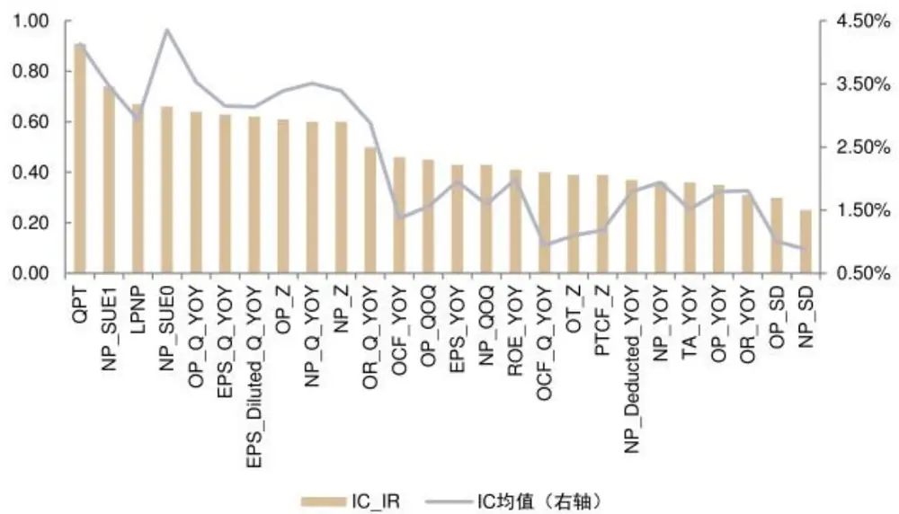
资料来源：万得资讯，中金公司研究部（样本期：2010-01-04至2022-04-01）
注：OT_Z与PTCF_Z样本期为2010-05-04至2022-04-01

图表 22：成长能力因子沪深 300 IC 值表现
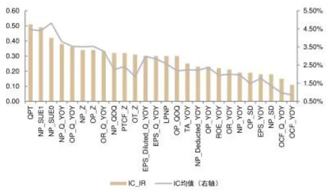
资料来源：万得资讯，中金公司研究部（样本期：2010-01-04至2022-04-01）注：OT_Z 与 PTCF_Z 样本期为 2010-05-04 至2022-04-01

图表 23：成长能力因子中证 500 IC 值表现
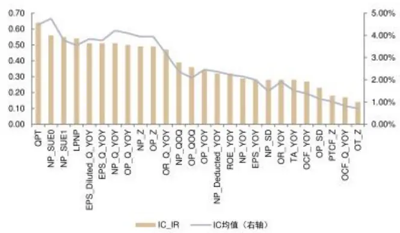
资料来源：万得资讯，中金公司研究部（样本期：2010-01-04至2022-04-01）注：OT_Z 与 PTCF_Z 样本期为 2010-05-04 至 2022-04-01

图表24：成长能力因子相关性表现

| E | PS_DilEPS_Outed_O |  | EPS_Y | LPNP | NP Deducted_ | NP_O | NP_0O | NP_SD | NP_SU N | P_SU | NP_YO | NP_Z | OCF_Q | OCF_Y | OP_O | OP_QO | OP_SD | OP_YO | OP_Z | OR_Q | OR_YO | OT_Z | PTCF_Z | QPT | ROE_Y | TA_YOY |
| --- | --- | --- | --- | --- | --- | --- | --- | --- | --- | --- | --- | --- | --- | --- | --- | --- | --- | --- | --- | --- | --- | --- | --- | --- | --- | --- |
|  | YOY_YOY |  | OY | LANP | YOY | VOY | 0 | NP_80 | ED | E1 | Y |  | _YOY | OY | YOY | 0 | OF_SD | Y |  | YOY | Y |  | FRUP |  | OY | TALTO |
| EPS_Diuted_Q_YOY | 1.00 | 1.00 | 0.25 | 0.38 | 0.13 | 0.90 | 0.34 | 0.11 | 0.57 | 0.55 | 0.23 | 0.46 | 0.07 | 0.04 | 0.78 | 0.30 | 0.08 | 0.18 | 0.48 | 0.32 | 0.20 | 0.15 | 0.13 | 0.42 | 0.23 | 0.08 |
| EPS_Q_YOY | 1.00 | 1.00 | 0.25 | 0.38 | 0.13 | 0.90 | 0.34 | a.11 | 0.57 | 0.55 | 0.23 | 0.46 | 0.07 | 0.04 | 0.78 | 0.30 | 0.08 | 0.18 | 0.46 | 0.32 | 0.20 | 0.15 | 0.13 | 0.42 | 0.23 | 0.07 |
| EPS_YOY | 0.25 | 0.25 | 1.00 | 0.13 | 0.51 | 0.25 | 0.04 | 0.15 | 027 | 0.15 | 0.97 | 0.18 | 0.02 | 0.06 | 0.23 | 0.04 | 0.14 | 0.65 | 0.18 | 0.14 | 0.18 | 0.04 | 0.08 | 0.07 | 0.96 | 0.08 |
| LPNP | 0.38 | 0.38 | 0.13 | 1.00 | 0.12 | 0.42 | 0.42 | 0.07 | 0.52 | 0.50 | 0.14 | 0.75 | 0.06 | 0.03 | 0.40 | 0.41 | 0.05 | 0.12 | .0.75 | 0.19 | 0.10 | 0.11 | 0.09 | 0.41 | 0.13 | 0.09 |
|  |  |  |  |  |  |  | 0.02 | 0.12 | 0.25 | 0.12 | 0.56 | 0.17 | 0.01 | 0.06 | 0.17 | 0.02 | 0.14 | 0.81 | 0.17 | 0.14 | 0.19 | 0.04 | 0.07 | 0.06 | 0.52 | 0.09 |
| NP_Q_YOY | 0.50 | .0.00 | 0.25 | 0.42 | 0.17 | 1.00 | 0.35 | 0.14 | 0.66 | 0.61 | 0.27 | 0.50 | 0.0B | 0.06 | 0.96 | 0.31 | 0.10 | 0.22 | 0.50 | 0.38 | 0.23 | 0.16 | 0.15 | 0.45 | 0.26 | 0.11 |
| NP_QOQ | 0:34 | 0.34 | 0.04 | 0.42 | 0.02 | 0.35 | 1.00 | 0.03 | 0.28 | 0.34 | 0.05 | 0.49 | 0.05 | 0.00 | 0.31 | 0.84 | 0.02 | 0.04 | 0.49 | 0.11 | 0.03 | 0.07 | 0.01 | 0.25 | 0.05 | 0.06 |
| NP_SD | 0.31 | 0.11 | 0.15 | 0.07 | 0.12 | 0.14 | 0.03 | 1.00 | 0.16 | 0.07 | 0.16 | 0.10 | 0.01 | 0.03 | 0.13 | 0.03 | 0.66 | 0.14 | 0.10 | 0.08 | 0.09 | 0.03 | 0.00 | 0.02 | 0.16 | 0.03 |
| NP_SUE0 | 0.57 | 0.57 | 0.27 | 0.52 | 0.25 | 0.66 | 0.28 | 0.16 | 1.00 | 0.80 | 0.31 | 0.64 | 0.06 | 0.06 | 0.50 | 0.25 | 0.14 | 0.27 | 0.64 | 0.36 | 0.25 | 0.16 | 0.15 | 0.47 | 0.28 | 0.15 |
| NP_SUE1 | 0.55 | 0.55 | 0.15 | 0.50 | 0.12 | 0.61 | 0.34 | 0.07 | 0.80 | 1.00 | 0.16 | 0.58 | 0.09 | 0.02 | 0.55 | 0.30 | 0.06 | 0.14 | 0.58 | 0.29 | 0.09 | 020 | 0.14 | 0.60 | 0.15 | 0.00 |
| NP_YOY | 0.23 | 0.23 | 0.97 | 0.14 | 0.56 | 0.27 | 0.05 | 0.16 | 0.31 | 0.16 | 1.00 | 0.21 | 0.01 | 0.07 | 0.25 | 0.04 | 0.15 | 0.69 | 0.21 | 0.18 | 0.25 | 0.04 | 0.09 | 0.07 | 0.95 | 0.13 |
| NP_Z | 0.46 | 0.46 | 0.18 | 0.75 | 0.17 | 0.50 | 0.49 | 0.10 | 0.64 | 0.58 | 0.21 | 1.00 | 0.07 | 0.00 | 0.47 | 0.45 | 0.09 | 0.19 | 1.00 | 0.25 | 0.19 | 0.14 | 0.13 | 0.47 | 0.19 | 0.14 |
| OCF_O_YOY | 0.07 | 0.07 | 0.02 | 0.06 | 0.01 | 0.08 | 0.05 | 0.01 | 0.08 | 0.09 | 0.01 | 0.07 | 1.00 | 0.12 | 0.08 | 0.04 | 0.01 | 0.01 | 0.07 | 0.05 | 0.02 | 0.06 | 0.00 | 0.07 | 0.02 | -0.02 |
| OCF_YOY | 0.04 | 0.04 | 0.05 | 0.03 | 0.05 | 0.05 | 0.02 | 0.03 | 0.06 | 0.02 | 0.07 | 0.05 | 0.12 | 1.00 | 0.05 | 002 | 0.02 | 0.06 | 0.06 | 0.03 | 0.05 | 0.02 | 0.00 | 0.01 | 0.06 | 0.02 |
| OP_GOQ | 0.30 | 0.30 | 0.04 | 0.41 | 0.02 | 0.31 | 0.84 | 0.03 | 0.25 | 0.30 | 0.04 | 0.46 | 0.04 | 0.02 | 0.35 | 1.00 | 0.03 | 0.03 | 0.48 | 0.12 | 0.03 | 0.07 | 0.00 | 0.23 | 0.04 | 0.06 |
| OP_SD | 0.08 | 0.08 | 0.14 | 0.06 | 0.14 | 0.10 | 0.02 | 0.66 | 0.14 | 0.06 | 0.15 | 0.09 | 0.01 | 0.02 | 0.11 | 0.03 | 1.00 | 0.17 | 0.09 | 0.08 | 0.08 | 0.02 | 0.04 | 0.02 | 0.15 | 0.02 |
| OP_YOY | 0.18 | 0.18 | 0.85 | 0.12 | 0.61 | 0.22 | 0.04 | 0.14 | 027 | 0.14 | 0.69 | 0.19 | 0.01 | 0.06 | 0.23 | 0.03 | 0.17 | 1.00 | 0.19 | 0.16 | 0.24 | 0.04 | 0.08 | 0.06 | 0.65 | 0.12 |
| OP_Z | 0.46 | 0.46 | 0.18 | 0.75 | 0.17 | 0.50 | 0.49 | 0.10 | 0.64 | 0.58 | 0.21 | 1.00 | 0.07 | 0.05 | 0.47 | 0.45 | 0.09 | 0.19 | 1.00 | 0.25 | 0.19 | 0.14 | 0.13 | 0.47 | 0.19 | 0.14 |
| OR_YOY | 0.20 | 0.20 | 0.18 | 0.10 | 0.19 | 0.23 | 0.03 | 0.09 | 0.25 | 0.09 | 0.25 | 0.19 | 0.02 | 0.06 | 0.24 | 0.03 | 0.08 | 0.24 | 0.19 | 0.59 | 1.00 | 0.11 | 0.14 | 0.02 | 0.19 | 0.24 |
| OT_ZPTCF_Z |  |  |  |  |  |  |  |  |  |  |  |  |  |  |  |  |  |  |  |  |  |  |  |  |  |  |
|  | 0.13 | 0.13 | 0.08 | 0.09 | 0.07 | 0.15 | 0.01 | 0.05 | 0.15 | 0.14 | 0.09 | 0.13 | 0.00 | 0.02 | 0.15 | 0.00 | 0.04 | 0.00 | 0.13 | 0.18 | 0.14 | 0.31 | 1.00 | 0.10 | 0.09 | 0.06 |
| GPTROE_YOY | 0.42 | 0.42 | 0.07 | 0.41 | 0.06 | 0.45 | 0.25 | 0.02 | 0.47 | 0.60 | 0.07 | 0.47 | 0.07 | 0.01 | 0.40 | 0.23 | 0.02 | 0.06 | 0.47 | 0.20 | 0.02 | 0.13 | 0.10 | 1.00 | 0.06 | 0.05 |
|  | 0.23 | 0.23 | 0.95 | 0.13 | 0.52 | 0.26 | 0.05 | 0.16 | 0.28 | 0.16 | 0.85 | 0.19 | 0.02 | 0.06 | 0.24 | 0.04 | 0.15 | 0.65 | 0.19 | 0.15 | 0.19 | 0.04 | 0.09 | 0.05 | 1.00 | 0.06 |
| TA_YOY | 0.08 .0.07 |  | 0.05 | 0.09 | 0.09 | 0.11 | 0.06 | 0.03 | 0.15 | 0.08 | 0.13 | 0.14 | -0.02 | 0.02 | 0.10 | 0.06 | 0.02 | 0.12 | 0.14 | 0.23 | 0.24 | 0.05 | 0.06 | 0.05 | 0.05 | 1.00 |

资料来源：万得资讯，中金公司研究部（样本期：2009-12-31至2022-03-31）注：OT_Z与PTCF_Z样本期为 2010-04-30 至2022-03-31

## 推荐关注 LPNP、NP_SUE1、OP_Q_YOY 和 QPT因子

LPNP、NP SUE1和QPT因子在电力设备及新能源行业有效性较强。LPNP因子在基础化工、电力设备及新能源和机械行业有效性较强，其中LPNP因子在基础化工行业的IC_IR达到0.39，IC均值为4.29%。NP_SUE1因子在医药、电力设备及新能源和机械行业有效性表现良好，其在医药行业的IC_IR为0.53，IC均值为4.68%。OP_Q_YOY因子在机械、医药和计算机行业表现出色，其在机械行业的IC_IR为0.52，IC均值为5.00%。QPT因子在电力设备及新能源、电子和基础化工行业表现较为出色，其在电力设备及新能源行业的IC_IR 为0.52，IC 均值为6.49%。

图表 25：LPNP 因子分行业 IC 值表现
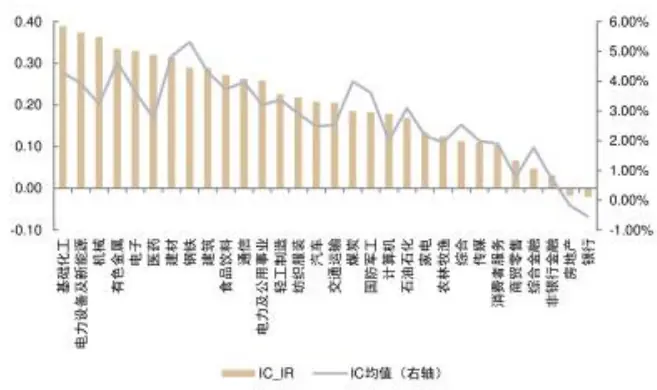
资料来源：万得资讯，中金公司研究部（样本期：2010-01-04至2022-04-01）

图表 26：NP_SUE1 因子分行业 IC 值表现
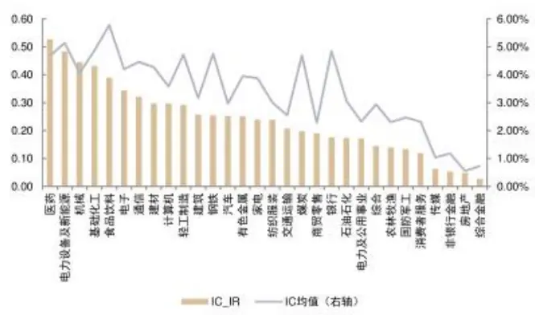
资料来源：万得资讯，中金公司研究部（样本期：2010-01-04至2022-04-01）

图表 27：OP_Q_YOY 因子分行业 IC 值表现
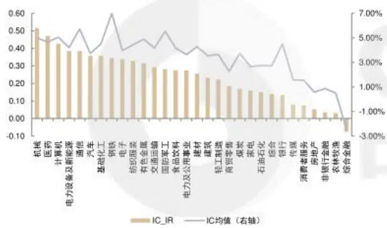
资料来源：万得资讯，中金公司研究部（样本期：2010-01-04至2022-04-01）

图表 28：QPT 因子分行业 IC 值表现
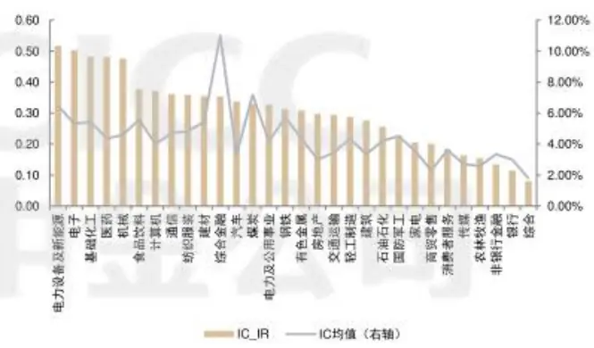
资料来源：万得资讯，中金公司研究部（样本期：2010-01-04至2022-04-01）

NP_SUE1 和 QPT 因子的多头组合表现优异。NP_SUE1 和 QPT 因子的多头组合在不同选股域中均有良好的年化收益表现，且相对净值走势稳中有升。其中QPT因子的多头组合在2022年以来具有较为稳定的表现，其相对净值走势没有大幅下滑。

图表 29：NP_SUE1 因子全市场多头收益走势
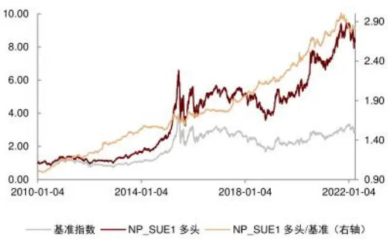
资料来源：万得资讯，中金公司研究部（数据戴至2022-04-01）注：基准指数为万得全A（等权）指数（8841388.WI）

图表30：QPT 因子全市场多头收益走势
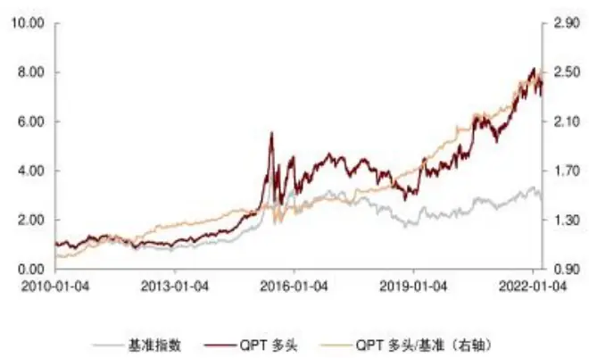
资料来源：万得资讯，中金公司研究部（数据截至2022-04-01）注：基准指数为万得全A（等权）指数（8841388.WI）

图表 31：NP_SUE1 因子沪深 300 多头收益走势
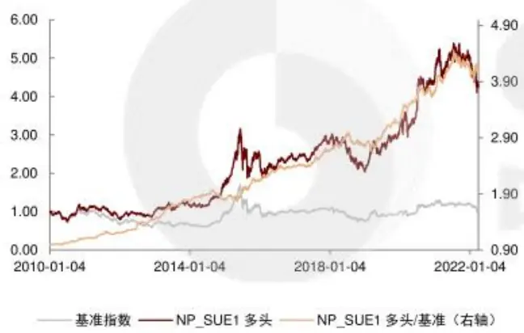
资料来源：万得资讯，中金公司研究部（数据截至2022-04-01）注：基准指数为300等权（000984.CSI)

图表 32：QPT 因子沪深 300 多头收益走势
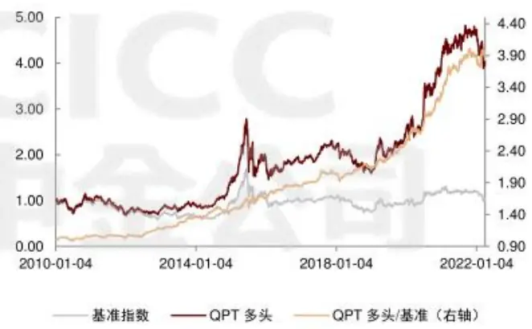
资料来源：万得资讯，中金公司研究部（数据截至2022-04-01）注：基准指数为300等权(000984.CSI)

图表 33：NP_SUE1 因子中证 500 多头收益走势
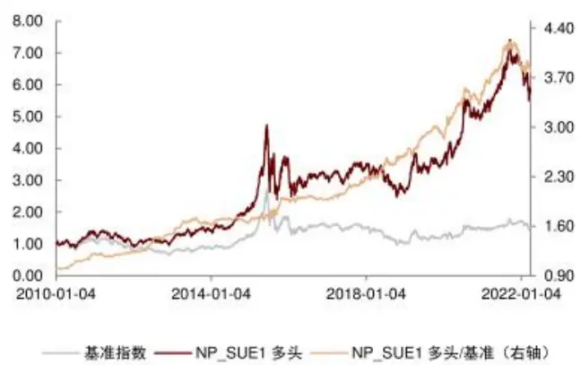
资料来源：万得资讯，中金公司研究部（数据截至2022-04-01）注：基准指数为500等权（399982.SZ）

图表 34：QPT 因子中证 500 多头收益走势
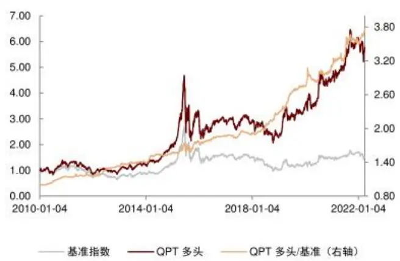
资料来源：万得资讯，中金公司研究部（数据截至2022-04-01）注：基准指数为500等权（399982.SZ）

## 营运效率

## ATD、GPMD、OCFA 和OPMD 因子选股能力良好

营运效率因子反映上市公司生产经营活动中运用资产的有效程度，体现公司的营运状况，本节将对12个营运效率因子进行有效性检验。

GPMD和OPMD因子在全市场中有效性较为出色。我们将营运效率因子在全市场、沪深300和中证500进行IC有效性检验，并将结果记录如下。由图表可知，相较于其他营运效率因子，GPMD 和 OPMD 因子在全市场有效性表现较为出色，在沪深 300和中证 500 中也有较强的收益预测能力。全市场中，GPMD因子的IC均值为2.23%，IC_IR为0.63；OPMD因子的IC均值为 2.80%，IC_IR为 0.63。

ATD、GPMD、OCFA和OPMD 因子选股能力良好。在不同选股域中，ATD、GPMD、OCFA和OPMD因子的多头组合均有较高的年化收益表现和较低的超额最大回撤。上述四个因子在分组回测中具有较强的单调性，选股能力整体表现较为优异。

图表35：营运效率因子全市场有效性检验

| 因子代码 | IC 均值 | IC_IR | P(IC>0) | P(IC>0.02) | P(IC<0) | P(IC<-0.02) | t值 | 多头年化收多头年化超多头超额最多头平均换 益率 | 额收益率 | 大回撤 | 手率 | 单调性 |
| --- | --- | --- | --- | --- | --- | --- | --- | --- | --- | --- | --- | --- |
| AT | 1.49% | 0.33 | 63.27% | 46.94% | 36.73% | 23.81% | 4.03 | 10.99% | 1.40% | -14.93% | 12.26% | 0.90 |
| ATD | 1.87% | 0.46 | 65.99% | 53.74% | 34.01% | 20.41% | 5.59 | 11.06% | 1.76% | -11.35% | 22.10% | 0.94 |
| GPMD | 2.23% | 0.63 | 72.79% | 55.10% | 27.21% | 9.52% | 7.61 | 11.83% | 2.51% | -15.62% | 23.58% | 0.94 |
| INVT | 0.48% | 0.11 | 54.42% | 40.14% | 45.58% | 27.21% | 1.36 | 9.04% | -0.16% | -15.39% | 11.99% | 0.31 |
| INVTD | 0.91% | 0.22 | 59.86% | 40.82% | 40.14% | 22.45% | 2.71 | 8.36% | -0.82% | -20.59% | 25.64% | 0.52 |
| NPM_TTM | 2.03% | 0.29 | 61.22% | 53.74% | 38.78% | 28.57% | 3.46 | 8.34% | -0.93% | -17.62% | 12.44% | 0.78 |
| OCFA | 1.57% | 0.51 | 70.07% | 45.58% | 29.93% | 14.97% | 6.18 | 11.37% | 1.92% | -11.54% | 33.11% | 0.92 |
| OPM_TTM | 2.25% | 0.32 | 62.59% | 51.02% | 37.41% | 28.57% | 3.94 | 8.62% | -0.74% | -17.45% | 12.38% | 0.66 |
| OPMD | 2.80% | 0.63 | 76.87% | 57.14% | 23.13% | 10.88% | 7.59 | 12.10% | 2.78% | -10.14% | 23.73% | 0.93 |
| OPtoGR_TTM | 1.87% | 0.31 | 57.14% | 48.98% | 42.86% | 28.57% | 3.73 | 7.72% | -1.42% | -20.38% | 14.58% | 0.52 |
| RAT | 0.61% | 0.11 | 53.06% | 41.50% | 46.94% | 34.01% | 1.34 | 8.56% | -0.78% | -27.15% | 11.78% | 0.39 |
| RATD | 0.30% | 0.12 | 55.78% | 23.81% | 44.22% | 17.01% | 1.44 | 8.54% | -1.09% | -28.58% | 24.81% | 0.09 |

资料来源：万得资讯，中金公司研究部（样本期：2010-01-04至2022-04-01）
注：基准指数为万得全A（等权）指数（8841388.WI）

图表 36：营运效率因子沪深 300 有效性检验

| 因子代码 | IC均值 | IC_IR | P(IC>0) | P(IC>0.02) | P(IC<0) | P(IC<-0.02) | t值 | 多头年化收多头年化超 益率 | 额收益率 | 多头超额最 大回 | 多头平均换 手率 | 单调性 |
| --- | --- | --- | --- | --- | --- | --- | --- | --- | --- | --- | --- | --- |
| AT | 1.93% | 0.21 | 57.14% | 51.02% | 42.86% | 39.46% | 2.58 | 3.78% | 3.27% | -22.05% | 11.43% | 0.79 |
| ATD | 1.82% | 0.22 | 61.90% | 53.74% | 38.10% | 29.93% | 2.65 | 9.17% | 9.18% | -14.38% | 22.39% | 0.52 |
| GPMD | 2.34% | 0.27 | 64.63% | 57.82% | 35.37% | 29.93% | 3.30 | 6.03% | 6.09% | -15.59% | 24.02% | 0.83 |
| INVT | -0.34% | -0.04 | 49.66% | 38.78% | 50.34% | 40.82% | -0.46 | 3.03% | 3.14% | -30.90% | 21.85% | -0.28 |
| INVTD | 0.22% | 0.03 | 50.34% | 42.86% | 49.66% | 42.18% | 0.30 | 6.44% | 6.31% | -22.89% | 26.63% | 0.15 |
| NPM_TTM | 1.59% | 0.16 | 55.10% | 53.06% | 44.90% | 40.82% | 1.89 | 1.75% | 1.29% | -22.13% | 11.72% | 0.47 |
| OCFA | 1.22% | 0.18 | 54.42% | 46.94% | 45.58% | 34.69% | 2.13 | 4.65% | 4.37% | -16.22% | 34.67% | 0.68 |
| OPM_TTM | 1.81% | 0.18 | 55.78% | 51.70% | 44.22% | 36.73% | 2.17 | 1.86% | 1.34% | -25.29% | 11.35% | 0.38 |
| OPMD | 2.39% | 0.27 | 59.18% | 52.38% | 40.82% | 31.97% | 3.23 | 5.19% | 5.33% | -12.35% | 24.34% | 0.85 |
| OPtoGR_TTM | 1.72% | 0.18 | 59.18% | 51.70% | 40.82% | 32.65% | 2.22 | 1.05% | 0.68% | -21.53% | 12.93% | 0.22 |
| RAT | -0.40% | -0.05 | 46.26% | 40.14% | 53.74% | 46.26% | -0.55 | 0.94% | 0.92% | -18.82% | 20.60% | 0.07 |
| RATD | -0.08% | -0.01 | 45.58% | 34.69% | 54.42% | 42.86% | -0.17 | 1.83% | 1.44% | -18.72% | 34.32% | -0.30 |

资料来源：万得资讯，中金公司研究部（样本期：2010-01-04至2022-04-01）
注：基准指数为300等权（000984.CSI）

图表37：营运效率因子中证 500 有效性检验

| 因子代码 | IC均值 | IC_IR | P(IC>0) | P(IC>0.02) | P(IC<0) | P(IC<-0.02) | t值 | 多头年化收多头年化超 益率 额收益率 | 多头超额最 大回撤 |  | 多头平均换 单调性 手率 |
| --- | --- | --- | --- | --- | --- | --- | --- | --- | --- | --- | --- |
| AT | 1.82% | 0.26 | 58.50% | 45.58% | 41.50% | 27.21% | 3.17 | 5.60% 1.95% | -14.34% | 13.96% | 0.78 |
| ATD | 1.68% | 0.27 | 61.22% | 47.62% | 38.78% | 27.21% | 3.30 | 6.18% | 2.81% -11.99% | 23.30% | 0.81 |
| GPMD | 2.60% | 0.40 | 68.03% | 56.46% | 31.97% | 21.77% | 4.88 | 8.76% | 5.45% -15.46% | 24.48% | 0.95 |
| INVT | 0.57% | 0.09 | 55.78% | 39.46% | 44.22% | 33.33% | 1.10 | 5.79% | 2.41% -13.15% | 13.60% | 0.42 |
| INVTD | 0.55% | 0.09 | 55.78% | 43.54% | 44.22% | 31.29% | 1.04 | 4.61% | 1.24% -16.35% | 27.76% | 0.25 |
| NPM_TTM | 2.68% | 0.35 | 64.63% | 55.10% | 35.37% | 27.21% | 4.20 | 4.97% | 1.38% -23.03% | 13.29% | 0.62 |
| OCFA | 1.52% | 0.23 | 60.54% | 48.30% | 39.46% | 31.29% | 2.82 | 8.06% | 4.59% -15.83% | 35.22% | 0.78 |
| OPM_TTM | 2.83% | 0.37 | 62.59% | 54.42% | 37.41% | 25.17% | 4.51 | 6.26% | 2.57% -20.09% | 13.33% | 0.77 |
| OPMD | 3.33% | 0.48 | 65.99% | 57.82% | 34.01% | 21.77% | 5.82 | 9.83% | 6.45% -10.77% | 25.42% | 0.85 |
| OPtoGR_TTM | 2.23% | 0.33 | 61.22% | 51.02% | 38.78% | 28.57% | 4.02 | 3.33% | -0.14% -19.00% | 14.63% | 0.22 |
| RAT | 0.42% | 0.05 | 51.70% | 42.86% | 48.30% | 40.14% | 0.65 | 5.08% | 1.50% -18.74% | 13.76% | 0.56 |
| RATD | 0.31% | 0.07 | 51.02% | 34.01% | 48.98% | 30.61% | 0.81 | 5.77% | 2.04% -18.60% | 27.51% | 0.09 |

资料来源：万得资讯，中金公司研究部（样本期：2010-01-04至2022-04-01）
注：基准指数为500等权（399982.SZ）

图表 38：营运效率因子全市场IC 值表现
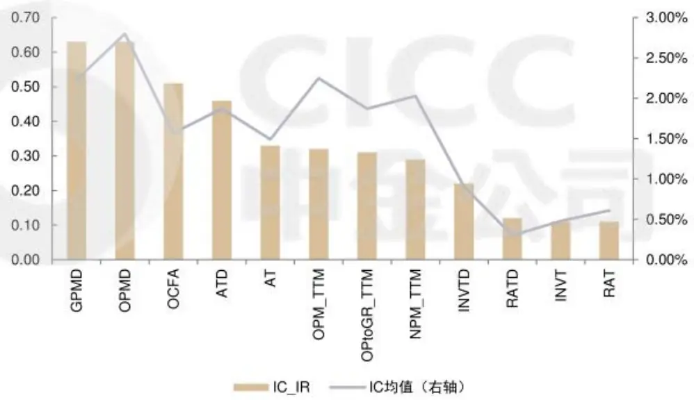
资料来源：万得资讯，中金公司研究部（样本期：2010-01-04至2022-04-01）

图表 39:营运效率因子沪深 300 IC 值表现
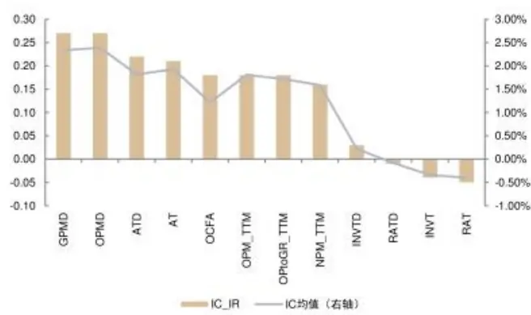
资料来源：万得资讯，中金公司研究部（样本期：2010-01-04至2022-04-01）

图表 40：营运效率因子中证 500 IC 值表现
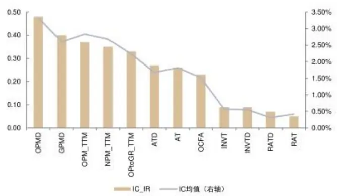
资料来源：万得资讯，中金公司研究部（样本期：2010-01-04至2022-04-01）

图表41：营运效率因子相关性表现

| AT | AT | ATD GPMD |  | INVT | INVTD | NPM_TTM | OCFA | OPM_TTM | OPMD | OPtoGR_TTM | RAT | RATD |
| --- | --- | --- | --- | --- | --- | --- | --- | --- | --- | --- | --- | --- |
|  | 1.00 | 0.18 | 0.01 | 0.44 | 0.17 | -0.17 | 0.17 | 0.13 | 0.08 | -0.01 | 0.27 | -0.02 |
| ATD | 0.18 | 1.00 | -0.01 | 0.07 | 0.07 | -0.04 | 0.21 | 0.03 | 0.16 | -0.02 | 0.06 | 0.17 |
| GPMD | 0.01 | -0.01 | 1.00 | -0.02 | -0.03 | 0.02 | -0.10 | 0.03 | 0.49 | -0.02 | 0.01 | 0.00 |
| INVT | 0.44 | 0.07 | -0.02 | 1:00 | 0.34 | -0.09 | 0.11 | -0.07 | 0.03 | 0.03 | 0.20 | -0.03 |
| INVTD | 0.17 | 0.07 | -0.03 | 0.34 | 1.00 | -0.03 | 0.12 | -0.03 | 0.02 | 0.01 | 0.06 | -0.01 |
| NPM_TTM | -0.17 | -0.04 | 0.02 | -0.09 | -0.03 | 1.00 | 0.06 | 0.92 | 0.10 | 0.64 | 0.01 | 0.00 |
| OCFA | 0.17 | 0.21 | -0.10 | 0.11 | 0.12 | 0.06 | 1.00 | 0.07 | 0.00 | 0.05 | 0.01 | -0.02 |
| OPM_TTM | -0.13 | -0.03 | 0.03 | -0.07 | -0.03 | 0.92 | 0.07 | 1.00 | 0.11 | 0.70 | 0.03 | 0.00 |
| OPMD | 0.08 | 0.16 | 0.49 | 0.03 | 0.02 | 0.10 | 0.00 | 0.11 | 1.00 | 0.08 | 0.03 | 0.06 |
| OPtoGR_TTM | -0.01 | -0.02 | -0.02 | 0.03 | 0.01 | 0.64 | 0.05 | 0.70 | 0.08 | 1.00 | 0.04 | 0.00 |
| RAT | 0.27 | 0.06 | 0.01 | 0.20 | 0.06 | 0.01 | 0.01 | 0.03 | 0.03 | 0.04 | 1.00 | 0.05 |
| RATD | -0.02 | 0.17 | 0.00 | -0.03 | -0.01 | 0.00 | -0.02 | 0.00 | 0.06 | 0.00 | 0.05 | 1.00 |

资料来源：万得资讯，中金公司研究部（样本期：2009-12-31至2022-03-31）

## 推荐关注 ATD、OCFA 和 OPMD 因子

ATD和OPMD因子在机械行业有效性较强。ATD因子在机械、通信和电力设备及新能源行业有效性较强，其中 ATD 因子在机械行业的IC IR 达到 0.33，IC 均值为 3.59%。OCFA 因子在电力设备及新能源、综合金融和建材行业有效性表现良好，其在电力设备及新能源行业的IC_IR为0.31，IC均值为3.58%。OPMD因子在计算机、机械和医药行业表现出色，其在计算机行业的IC_IR为 0.44，IC均值为 4.68%。

图表 42：ATD 因子分行业 IC 值表现
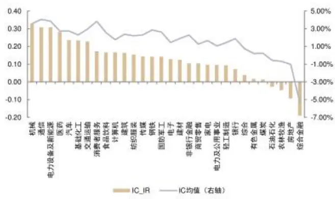
资料来源：万得资讯，中金公司研究部（样本期：2010-01-04至2022-04-01）

图表 43：OCFA 因子分行业 IC 值表现
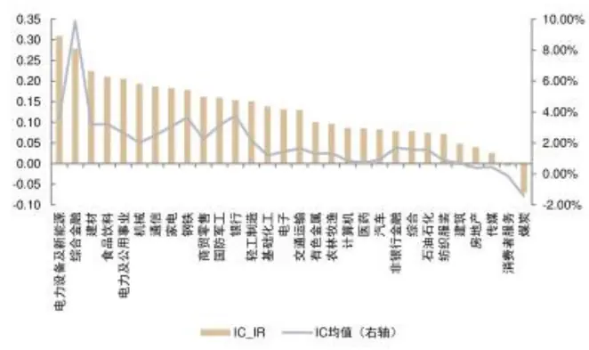
资料来源：万得资讯，中金公司研究部（样本期：2010-01-04至2022-04-01）

图表 44：OPMD 因子分行业 IC 值表现
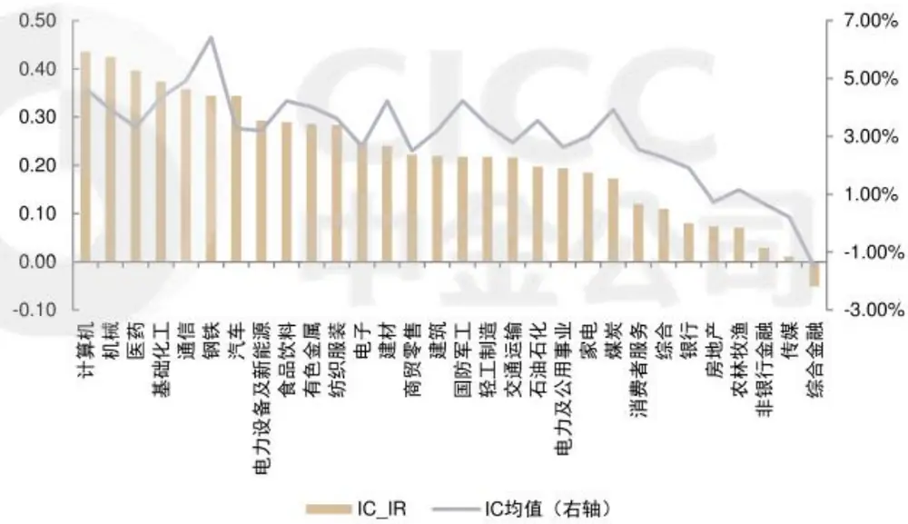
资料来源：万得资讯，中金公司研究部（样本期：2010-01-04至2022-04-01）

OPMD 因子和 GPMD 因子近五年的净值表现均略优于基准指数。全市场中，OPMD 因子和GPMD因子近五年的净值表现均略优于基准指数，但整体走势与基准指数相近。在沪深300和中证500中，部分营运效率因子多头组合的相对净值表现良好，但在近一年有较大回撤。

图表 45：OPMD 因子全市场多头收益走势
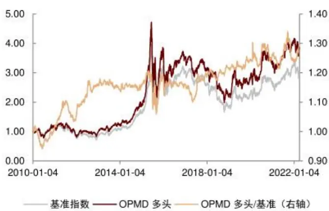
资料来源：万得资讯，中金公司研究部（数据截至2022-04-01）注：基准指数为万得全A（等权）指数（8841388.WI）

图表46：GPMD因子全市场多头收益走势
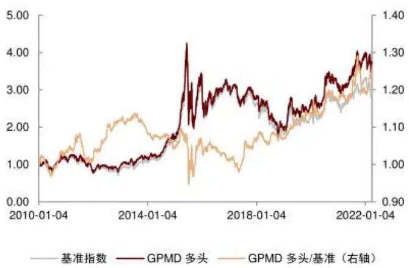
资料来源：万得资讯，中金公司研究部（数据截至2022-04-01）注：基准指数为万得全A（等权）指数（8841388.WI）

图表 47：ATD 因子沪深 300多头收益走势
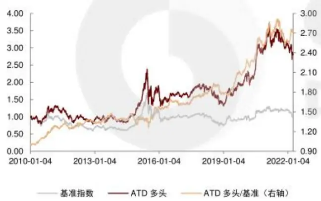
资料来源：万得资讯，中金公司研究部（数据截至2022-04-01）注：基准指数为300等权（000984.CSI）

图表 48：INVTD 因子沪深 300 多头收益走势
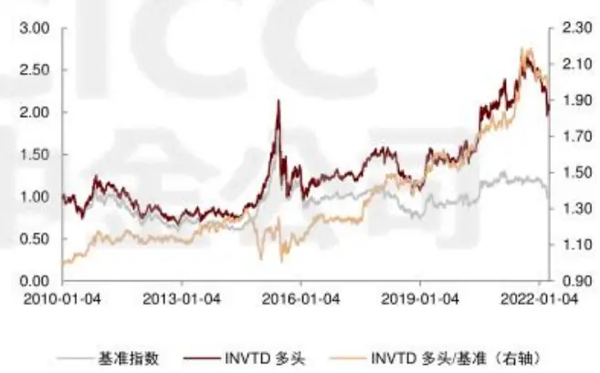
资料来源：万得资讯，中金公司研究部（数据截至2022-04-01）注：基准指数为300等权（000984.CSI）

图表 49：OPMD 因子中证 500 多头收益走势
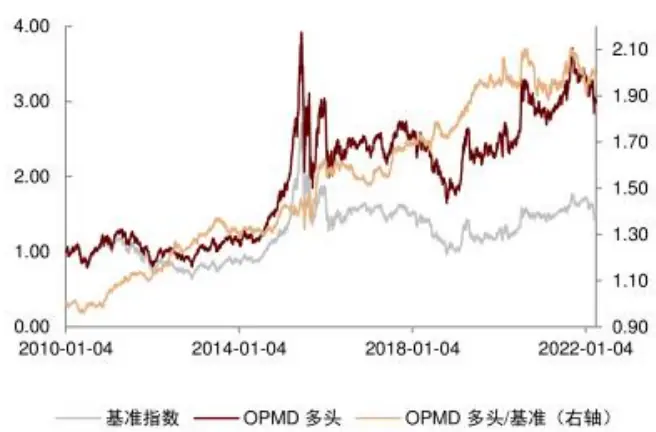
资料来源：万得资讯，中金公司研究部（数据截至2022-04-01）注：基准指数为 500等权（399982.SZ)

图表 50：GPMD 因子中证 500 多头收益走势
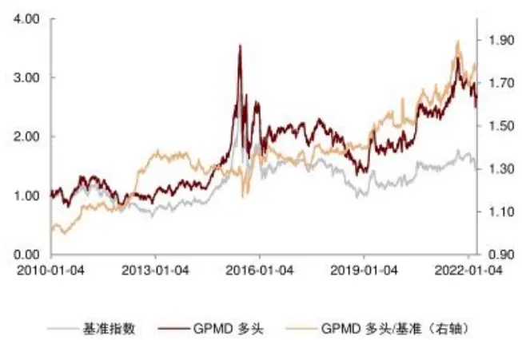
资料来源：万得资讯，中金公司研究部（数据截至2022-04-01）注：基准指数为500等权（399982.SZ）

## 盈余质量

## APR_TTM因子在盈余质量因子有效性检验中表现较优

盈余质量因子反映上市公司的盈利能力，本节将对4个盈余质量因子进行有效性检验。

APR_TTM因子在盈余质量因子有效性检验中表现较优。相较于其他盈余质量因子，APR_TTM因子在全市场和中证500中表现良好，但在沪深300表现相对较弱，反映该因子在大市值股票的有效性偏弱。全市场中，APR_TTM因子的IC均值为-1.24%，IC_IR为-0.41；中证500中，APR_TTM因子的IC 均值为-1.59%，IC_IR为-0.27。

APR_TTM 因子具有较强的单调性。与其他盈余质量因子相比，APR_TTM 因子在不同选股域中均有较强的单调性，因子值较低的组合收益表现大体优于因子值偏高的组合。

图表51：盈余质量因子全市场有效性检验

| 因子代码 | IC 均值 | IC_IR | P(IC>0) | P(IC>0.02) | P(IC<0) | P(IC<-0.02) | t值 | 多头年化收 益率 | 多头年化超 额收益率 | 多头超额最 大回撤 | 多头平均换 手率 | 单调性 |
| --- | --- | --- | --- | --- | --- | --- | --- | --- | --- | --- | --- | --- |
| APR_TTM | -1.24% | -0.41 | 34.69% | 14.97% | 65.31% | 40.82% | -4.97 | 10.22% | 0.95% | -19.25% | 20.23% | -0.84 |
| APRD | -0.21% | -0.10 | 46.26% | 13.61% | 53.74% | 21.09% | -1.17 | 8.98% | -0.10% | -24.60% | 25.45% | -0.36 |
| CSR | 0.62% | 0.11 | 58.50% | 38.10% | 41.50% | 27.89% | 1.35 | 9.25% | 0.19% | -15.24% | 14.29% | 0.55 |
| CSRD | -0.09% | -0.03 | 49.66% | 27.89% | 50.34% | 27.89% | -0.35 | 10.64% | 1.53% | -19.46% | 26.84% | -0.31 |

资料来源：万得资讯，中金公司研究部（样本期：2010-01-04至2022-04-01）注：基准指数为万得全A（等权）指数（8841388.WI）

图表 52：盈余质量因子沪深 300 有效性检验

| 因子代码 | IC 均值 | IC_IR | P(IC>0) | P(IC>0.02) | P(IC<0) | P(IC<-0.02) | t值 | 益率 | 多头年化收多头年化超 额收益率 | 多头超额最多头平均换 大回撤 | 手率 | 单调性 |
| --- | --- | --- | --- | --- | --- | --- | --- | --- | --- | --- | --- | --- |
| APR_TTM | -0.66% | -0.08 | 44.90% | 36.73% | 55.10% | 44.90% | -1.00 | 3.32% | 3.11% | -15.54% | 26.40% | -0.55 |
| APRD | 0.15% | 0.02 | 52.38% | 38.10% | 47.62% | 40.14% | 0.28 | 1.66% | 1.56% | -18.56% | 24.14% | 0.01 |
| CSR | 0.93% | 0.12 | 54.42% | 43.54% | 45.58% | 34.69% | 1.49 | 2.11% | 1.64% | -27.00% | 14.97% | 0.33 |
| CSRD | 0.62% | 0.08 | 52.38% | 44.22% | 47.62% | 37.41% | 1.01 | 3.28% | 2.94% | -23.45% | 27.49% | 0.41 |

资料来源：万得资讯，中金公司研究部（样本期：2010-01-04至2022-04-01）注：基准指数为 300 等权（000984.CSI）

图表 53：盈余质量因子中证 500 有效性检验

| 因子代码 | IC均值 | IC_IR | P(IC>0) | P(IC>0.02) | P(IC<0) | P(IC<-0.02) | t值 | 多头年化收 益率 | 多头年化超 额收益率 | 多头超额最 大回撤 | 多头平均换 手串 | 单调性 |
| --- | --- | --- | --- | --- | --- | --- | --- | --- | --- | --- | --- | --- |
| APR_TTM | -1.59% | -0.27 | 41.50% | 28.57% | 58.50% | 50.34% | -3.30 | 5.00% | 1.68% | -13.65% | 24.40% | -0.78 |
| APRD | -0.40% | -0.08 | 43.54% | 31.97% | 56.46% | 36.73% | -0.96 | 5.21% | 1.91% | -15.58% | 30.55% | -0.37 |
| CSR | 0.73% | 0.10 | 56.46% | 44.22% | 43.54% | 34.01% | 1.27 | 5.48% | 2.07% | -17.48% | 14.56% | 0.36 |
| CSRD | 0.17% | 0.03 | 45.58% | 33.33% | 54.42% | 33.33% | 0.40 | 5.34% | 1.87% | -18.42% | 28.02% | -0.03 |

资料来源：万得资讯，中金公司研究部（样本期：2010-01-04至2022-04-01）
注：基准指数为500等权（399982.SZ）

图表 54：盈余质量因子全市场IC 值表现
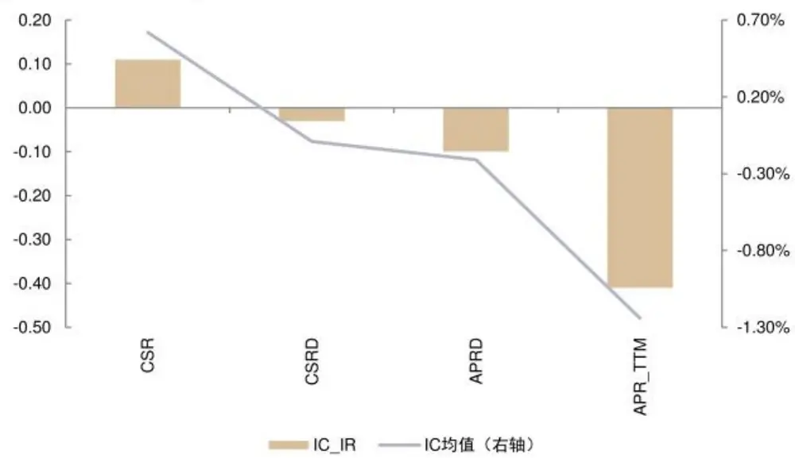
资料来源：万得资讯，中金公司研究部（样本期：2010-01-04至2022-04-01）

图表 55：盈余质量因子沪深 300 IC 值表现
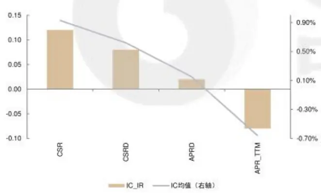
资料来源：万得资讯，中金公司研究部（样本期：2010-01-04至2022-04-01）

图表 56：盈余质量因子中证 500 IC 值表现
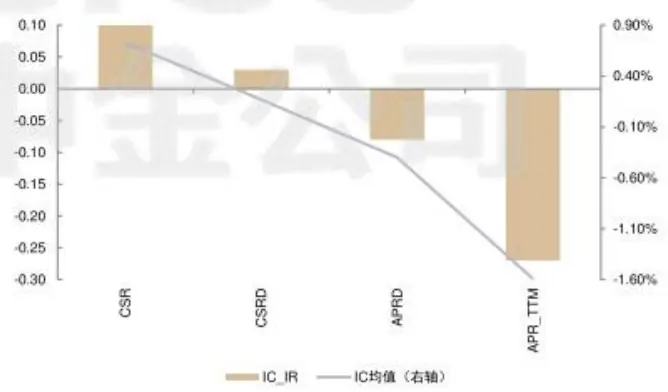
资料来源：万得资讯，中金公司研究部（样本期：2010-01-04至2022-04-01）

图表57：盈余质量因子相关性表现

|  |  | APR_TTM | APRD | CSR | CSRD |  |  |
| --- | --- | --- | --- | --- | --- | --- | --- |
| APR_TTM |  |  |  |  |  |  |  |
|  | rM |  |  |  |  |  |  |
|  |  |  |  | 1.00 | 0.60 | -0.03 | -0.04 |
| APRDCSRCSRD |  | 0.60 | 1.00 | 0.00 | -0.02 |  |  |
|  |  | -0.03 | 0.00 | 1.00 | 0.11 |  |  |
|  |  | -0.04 | -0.02 | 0.11 | 1.00 |  |  |

资料来源：万得资讯，中金公司研究部（样本期：2009-12-31至2022-03-31）

## 盈余质量因子多头组合整体表现欠佳

APR_TTM因子在机械行业有效性较强。APR_TTM因子在机械、医药和食品饮料行业有效性较强，其在机械行业的IC_IR 为-0.39，IC 均值为-3.00%。而APR_TTM因子在传媒、银行和交通运输行业有效性相对偏弱。

图表 58：APR_TTM 因子分行业 IC 值表现
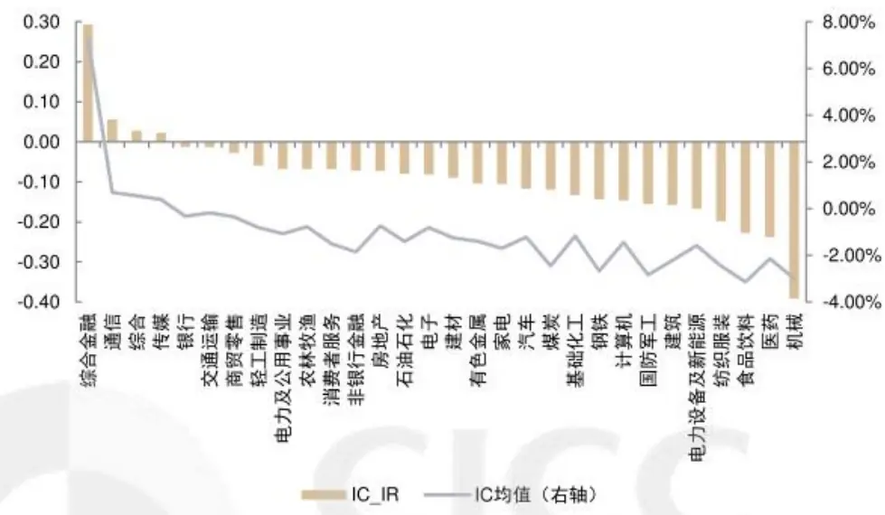
资料来源：万得资讯，中金公司研究部（样本期：2010-01-04至2022-04-01）

盈余质量因子多头组合整体表现欠佳。在不同选股域中选出年化收益表现较优的盈余质量因子，其多头组合的相对净值均有较大幅度的波动，且净值走势整体与基准指数相近，无显著超额回报。因此，盈余质量因子多头组合整体表现欠佳。

图表 59：APR_TTM 因子全市场多头收益走势
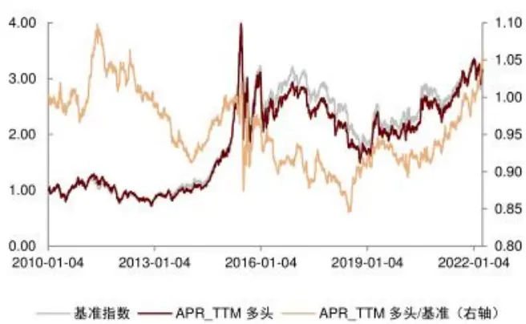
资料来源：万得资讯，中金公司研究部（数据截至2022-04-01）注：基准指数为万得全A（等权）指数（8841388.WI）

图表 60：CSRD 因子全市场多头收益走势
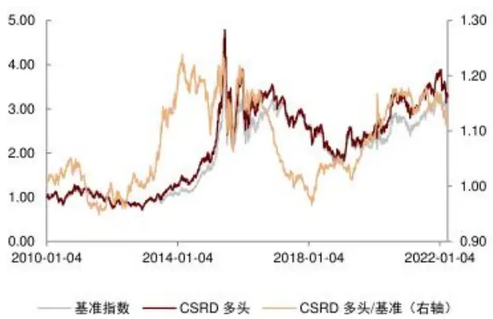
资料来源：万得资讯，中金公司研究部（数据截至2022-04-01）注：基准指数为万得全A（等权）指数（8841388.WI）

图表 61：APR_TTM 因子沪深 300 多头收益走势
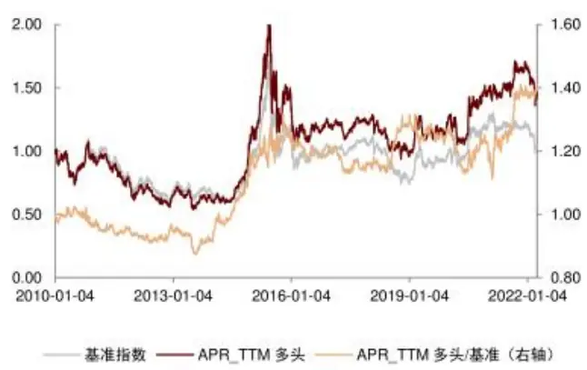
资料来源：万得资讯，中金公司研究部（数据截至2022-04-01）注：基准指数为300等权（000984.CSI）

图表 62：CSRD 因子沪深 300 多头收益走势
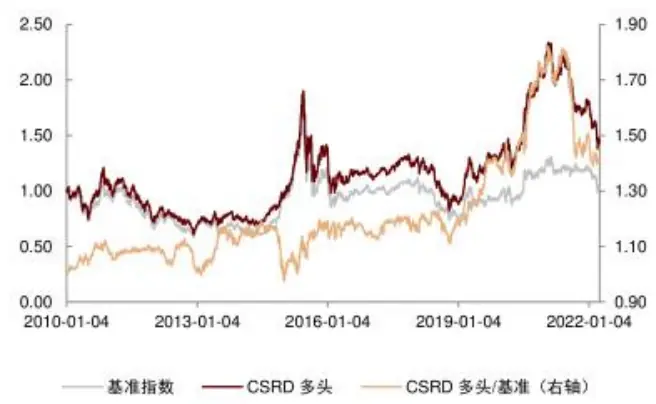
资料来源：万得资讯，中金公司研究部（数据截至2022-04-01）注：基准指数为300等权（000984.CSI）

图表 63：CSR 因子中证 500 多头收益走势
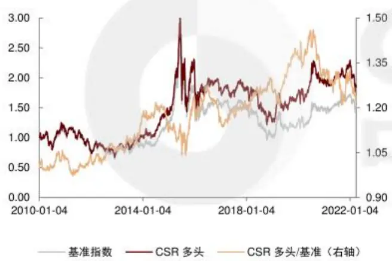
资料来源：万得资讯，中金公司研究部（数据截至2022-04-01）注：基准指数为500等权（399982.SZ）

图表 64：CSRD 因子中证 500 多头收益走势
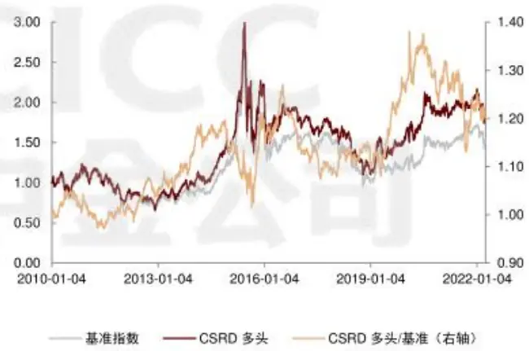
资料来源：万得资讯，中金公司研究部（数据截至2022-04-01）注：基准指数为500等权（399982.SZ）

## 安全性因子

## CCR 和 DAD 因子有效性较为显著

安全性因子反映上市公司的经营杠杆信息，本节将对10个安全性因子进行有效性检验。

CCR和DAD因子在安全性因子有效性检验中表现较为出色。相较于其他安全性因子，CCR和DAD因子在全市场和沪深300中均有较强的收益预测能力。全市场中，CCR因子的IC均值为1.47%，IC_IR 为 0.39；DAD 因子的IC均值为 0.88%，IC_IR 为 0.30。沪深 300 中，CCR因子的IC均值为1.77%，IC_IR为 0.20；DAD因子的IC均值为1.75%，IC_IR为0.28。

CCR 和DAD 因子在全市场具有较强的单调性。与其他安全性因子相比，CCR 和 DAD 因子在全市场中均具有较强的单调性，因子值较高的组合收益表现大体优于因子值偏低的组合。

图表65：安全性因子全市场有效性检验

| 因子代码 | IC 均值 | IC_IR | P(IC>0) | P(IC>0.02) | P(IC<0) | P(IC<-0.02) | t值 | 多头年化收多头年化超 益率 | 额收益率 | 多头超额最 多头平均换 大回撤 | 手率 | 单调性 |
| --- | --- | --- | --- | --- | --- | --- | --- | --- | --- | --- | --- | --- |
| CCR | 1.47% | 0.39 | 68.03% | 42.86% | 31.97% | 17.01% | 4.69 | 11.72% | 2.18% | -17.03% | 18.42% | 0.85 |
| CCRD | 0.33% | 0.14 | 55.78% | 23.81% | 44.22% | 14.97% | 1.72 | 10.35% | 1.14% | -13.36% | 26.05% | 0.37 |
| CUR | 0.19% | 0.03 | 55.10% | 40.82% | 44.90% | 32.65% | 0.37 | 8.80% | -0.19% | -23.19% | 13.34% | -0.01 |
| CURD | -0.19% | -0.07 | 48.98% | 23.13% | 51.02% | 24.49% | -0.79 | 12.36% | 3.05% | -13.09% | 27.15% | -0.18 |
| DAD | 0.88% | 0.30 | 61.22% | 34.69% | 38.78% | 18.37% | 3.61 | 10.95% | 1.65% | -12.82% | 23.44% | 0.76 |
| Debt_Asset | -0.49% | -0.07 | 46.94% | 34.01% | 53.06% | 40.82% | -0.82 | 8.01% | -1.00% | -19.82% | 15.13% | -0.37 |
| DTE | -0.28% | -0.04 | 48.30% | 34.69% | 51.70% | 40.82% | -0.54 | 5.98% | -3.17% | -34.36% | 13.25% | 0.02 |
| DTED | 0.12% | 0.04 | 49.66% | 25.17% | 50.34% | 19.73% | 0.46 | 8.81% | -0.59% | -22.09% | 24.98% | 0.25 |
| QR | 0.25% | 0.04 | 55.10% | 40.82% | 44.90% | 31.97% | 0.48 | 8.77% | -0.24% | -22.41% | 12.98% | 0.03 |
| QRD | -0.02% | -0.01 | 50.34% | 28.57% | 49.66% | 27.21% | -0.06 | 11.54% | 2.36% | -14.02% | 27.01% | -0.14 |

资料来源：万得资讯，中金公司研究部（样本期：2010-01-04至2022-04-01）注：基准指数为万得全A（等权）指数（8841388.WI）

图表 66：安全性因子沪深 300 有效性检验

| 因子代码 | IC 均值 | IC_IR | P(IC>0) | P(IC>0.02) | P(IC<0) | P(IC<-0.02) |  | 多头年化收 多头年化超多头超额最 多头平均换 益率 | 额收益率 | 大回撤 | 手事 | 单调性 |
| --- | --- | --- | --- | --- | --- | --- | --- | --- | --- | --- | --- | --- |
| CCR | 1.77% | 0.20 | 53.74% | 46.94% | 46.26% | 36.05% | 2.44 | 3.84% | 3.33% | -23.56% | 18.31% | 0.47 |
| CCRD | 0.16% | 0.02 | 51.70% | 39.46% | 48.30% | 36.73% | 0.29 | 2.23% | 1.95% | -26.84% | 26.25% | 0.22 |
| CUR | 0.45% | 0.06 | 52.38% | 40.82% | 47.62% | 37.41% | 0.70 | 1.61% | 1.22% | -29.30% | 12.67% | -0.01 |
| CURD | -0.21% | -0.03 | 52.38% | 42.18% | 47.62% | 35.37% | -0.37 | 4.44% | 4.33% | -23.41% | 34.88% | 0.02 |
| DAD | 1.75% | 0.28 | 61.90% | 48.98% | 38.10% | 30.61% | 3.39 | 5.19% | 5.27% | -15.48% | 24.51% | 0.72 |
| Debt_Asset | -0.79% | -0.09 | 46.94% | 40.14% | 53.06% | 46.26% | -1.03 | 0.35% | -0.05% | -26.42% | 19.68% | -0.10 |
| DTE | -0.79% | -0.07 | 44.22% | 40.14% | 55.78% | 50.34% | -0.91 | -0.10% | -0.47% | -22.72% | 18.98% | -0.13 |
| DTED | 0.41% | 0.05 | 51.02% | 44.22% | 48.98% | 38.78% | 0.64 | 5.39% | 5.17% | -16.27% | 27.37% | 0.15 |
| QR | 0.86% | 0.11 | 53.74% | 38.10% | 46.26% | 29.93% | 1.36 | 0.42% | 0.11% | -29.59% | 12.88% | 0.09 |
| QRD | 0.75% | 0.10 | 58.50% | 46.94% | 41.50% | 35.37% | 1.19 | 2.09% | 1.82% | -23.63% | 27.11% | 0.52 |

资料来源：万得资讯，中金公司研究部（样本期：2010-01-04至2022-04-01）
注：基准指数为300 等权（000984.CSI）

图表 67：安全性因子中证 500 有效性检验

| 因子代码 | IC 均值 | IC_IR | P(IC>0) | P(IC>0.02) | P(IC<0) | P(IC<-0.02) | t值 | 多头年化收多头年化超 多头超额最 多头平均换 益率 | 额收益率 | 大回撤 | 手率 | 单调性 |
| --- | --- | --- | --- | --- | --- | --- | --- | --- | --- | --- | --- | --- |
| CCR | 1.83% | 0.31 | 65.31% | 48.98% | 34.69% | 24.49% | 3.72 | 8.01% | 4.25% | -15.01% | 19.48% | 0.85 |
| CCRD | 0.60% | 0.12 | 51.70% | 38.78% | 48.30% | 30.61% | 1.46 | 9.44% | 5.76% | -10.07% | 26.97% | 0.38 |
| CUR | 0.41% | 0.06 | 52.38% | 42.18% | 47.62% | 34.01% | 0.67 | 7.07% | 3.59% | -15.39% | 12.73% | 0.35 |
| CURD | 0.01% | 0.00 | 43.54% | 37.41% | 56.46% | 32.65% | 0.03 | 6.44% | 2.97% | -20.81% | 26.86% | 0.07 |
| DAD | 0.56% | 0.11 | 48.30% | 40.82% | 51.70% | 32.65% | 1.32 | 6.55% | 3.03% | -16.55% | 24.57% | 0.33 |
| Debt_Asset | -0.82% | -0.11 | 44.22% | 34.69% | 55.78% | 45.58% | -1.29 | 5.54% | 2.09% | -17.56% | 18.67% | -0.41 |
| DTE | -0.76% | -0.10 | 44.90% | 32.65% | 55.10% | 46.94% | -1.23 | 3.42% | -0.05% | -14.00% | 17.47% | -0.37 |
| DTED | -0.32% | -0.06 | 50.34% | 30.61% | 49.66% | 36.73% | -0.76 | 4.71% | 1.27% | -12.57% | 31.52% | -0.15 |
| QR | 0.35% | 0.05 | 53.74% | 42.18% | 46.26% | 34.01% | 0.58 | 7.09% | 3.68% | -17.90% | 12.71% | 0.10 |
| QRD | 0.17% | 0.04 | 50.34% | 36.73% | 49.66% | 30.61% | 0.43 | 7.94% | 4.43% | -15.70% | 26.99% | 0.12 |

资料来源：万得资讯，中金公司研究部（样本期：2010-01-04至2022-04-01）
注：基准指数为500等权（399982.SZ）

图表68：安全性因子全市场IC 值表现
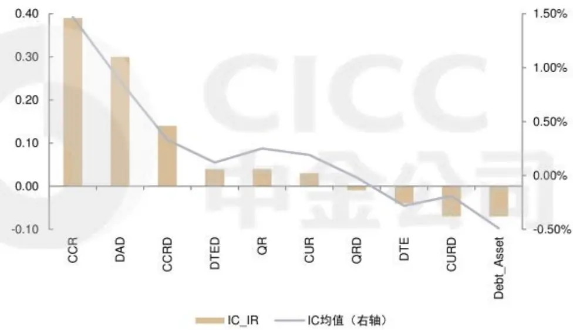
资料来源：万得资讯，中金公司研究部（样本期：2010-01-04至2022-04-01）

图表 69：安全性因子沪深 300 IC 值表现
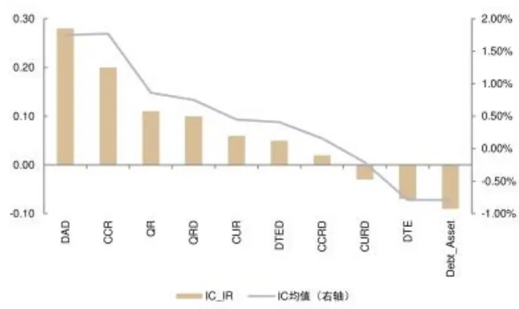
资料来源：万得资讯，中金公司研究部（样本期：2010-01-04至2022-04-01）

图表 70：安全性因子中证 500 IC 值表现
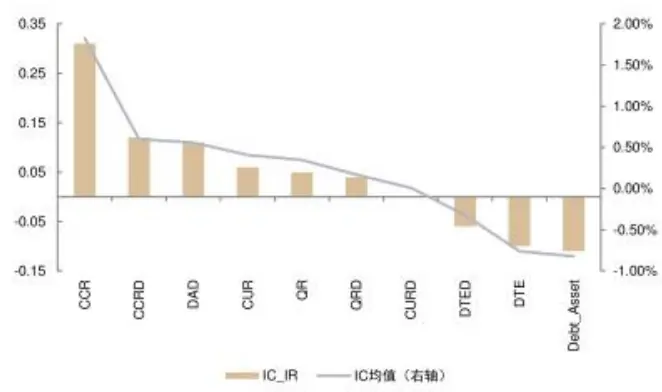
资料来源：万得资讯，中金公司研究部（样本期：2010-01-04至2022-04-01）

图表71：安全性因子相关性表现

|  | CCR | CCRD | CUR | CURD | DAD | Debt_Asset | DTE | DTED | QR | QRD |
| --- | --- | --- | --- | --- | --- | --- | --- | --- | --- | --- |
| CCR | 1.00 | 0.31 | 0.08 | 0.00 | -0.06 | -0.12 | -0.10 | -0.04 | 0.11 | 0.05 |
| CCRD | 0.31 | 1.00 | 0.01 | 0.16 | -0.03 | 0.00 | 0.00 | -0.09 | 0.01 | 0.19 |
| CUR | 0.08 | 0.01 | 1.00 | 0.15 | -0.16 | -0.77 | -0.63 | -0.14 | 0.96 | 0.13 |
| CURD | 0.00 | 0.16 | 0.15 | 1.00 | -0.20 | -0.09 | -0.07 | -0.38 | 0.15 | 0.93 |
| DAD | -0.06 | -0.03 | -0.16 | -0.20 | 1.00 | 0.23 | 0.18 | 0.35 | -0.16 | -0.18 |
| Debt_Asset | -0.12 | 0.00 | -0.77 | -0.09 | 0.23 | 1.00 | 0.93 | 0.19 | -0.77 | -0.07 |
| DTE | -0.10 | 0.00 | -0.63 | -0.07 | 0.18 | 0.93 | 1.00 | 0.20 | -0.62 | -0.05 |
| DTED | -0.04 | -0.09 | -0.14 | -0.38 | 0.35 | 0.19 | 0.20 | 1.00 | -0.14 | -0.33 |
| QR | 0.11 | 0.01 | 0.96 | 0.15 | -0.16 | -0.77 | -0.62 | -0.14 | 1.00 | 0.14 |
| QRD | 0.05 | 0.19 | 0.13 | 0.93 | -0.18 | -0.07 | -0.05 | -0.33 | 0.14 | 1.00 |

资料来源：万得资讯，中金公司研究部（样本期：2009-12-31至2022-03-31）

## 推荐关注 CCR 和 DAD 因子

DAD因子在电力设备及新能源行业有效性较强。DAD因子在电力设备及新能源、消费者服务和通信行业有效性较强，其中DAD因子在电力设备及新能源行业的IC_IR达到0.33，IC均值为3.25%。CCR因子在机械、食品饮料和医药行业有效性表现良好，其在机械行业的IC_IR为0.28，IC均值为 2.59%。

图表 72：CCR 因子分行业 IC 值表现
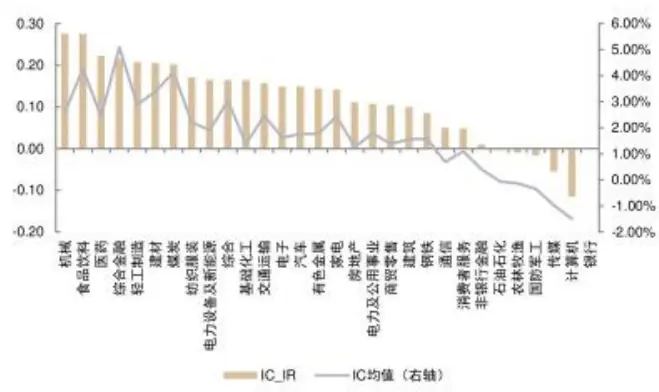
资料来源：万得资讯，中金公司研究部（样本期：2010-01-04至2022-04-01）

图表 73：DAD 因子分行业 IC 值表现
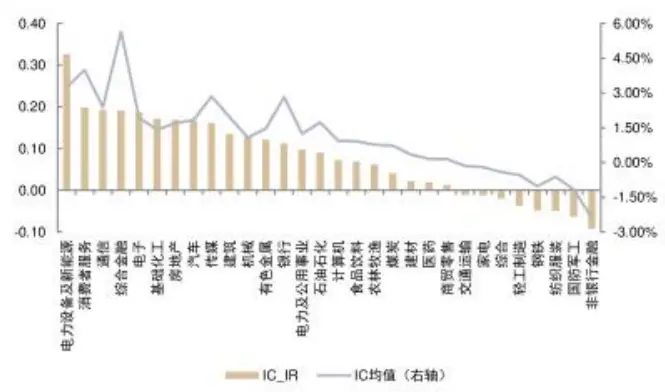
资料来源：万得资讯，中金公司研究部（样本期：2010-01-04至2022-04-01）

CURD 和 CCR 因子全市场的多头组合表现略优于基准指数。全市场中，CURD 和 CCR 因子近五年的净值表现略优于基准指数，但总体与基准指数走势相近。在中证500中，CCRD因子的多头组合相对收益表现较为平稳，且在2022年没有大幅回撤。

图表 74：CURD 因子全市场多头收益走势
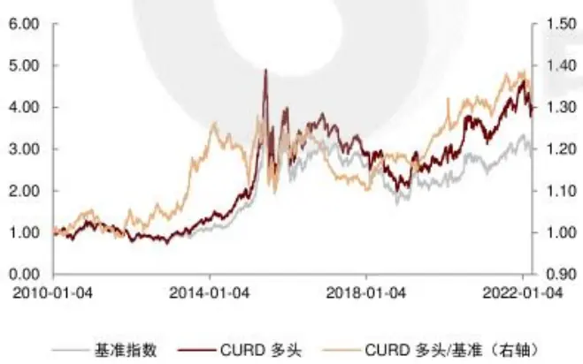
资料来源：万得资讯，中金公司研究部（数据截至2022-04-01）注：基准指数为万得全A（等权）指数（8841388.WI）

图表 75：CCR 因子全市场多头收益走势
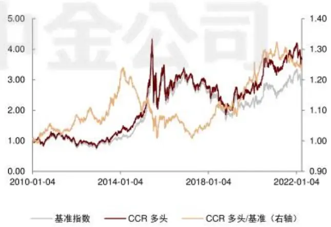
资料来源：万得资讯，中金公司研究部（数据截至2022-04-01）注：基准指数为万得全A（等权）指数（8841388.WI）

图表 76：DTED 因子沪深 300 多头收益走势
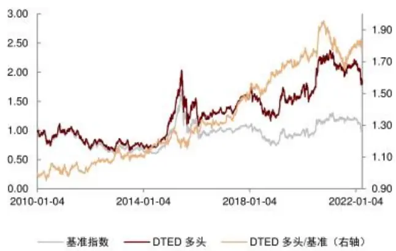
资料来源：万得资讯，中金公司研究部（数据截至2022-04-01）注：基准指数为300等权（000984.CSI）

图表 77：DAD 因子沪深 300 多头收益走势
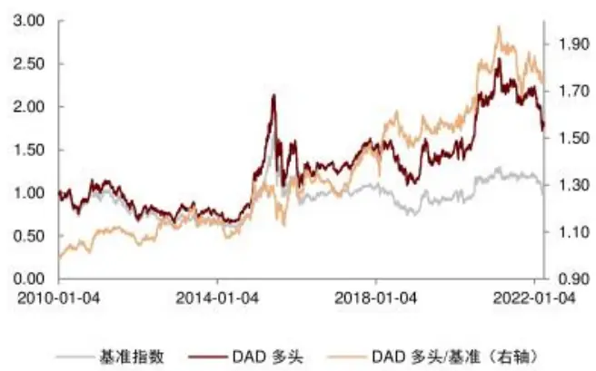
资料来源：万得资讯，中金公司研究部（数据截至2022-04-01）注：基准指数为300等权（000984.CSI）

图表 78：CCRD 因子中证 500 多头收益走势
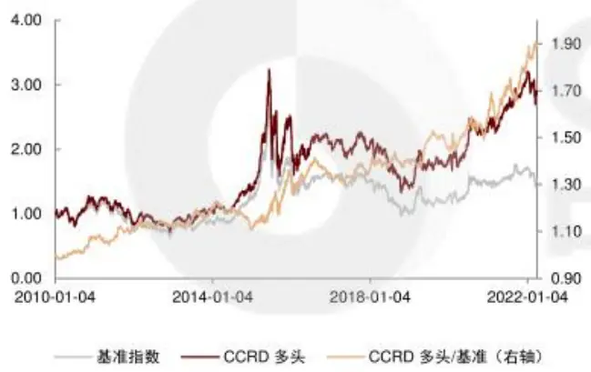
资料来源：万得资讯，中金公司研究部（数据截至2022-04-01）注：基准指数为500等权（399982.SZ）

图表 79：CCR 因子中证 500 多头收益走势
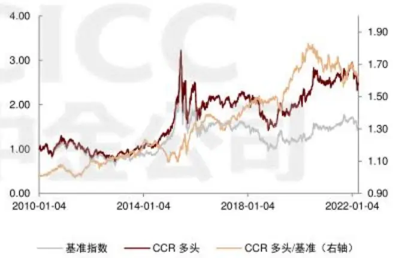
资料来源：万得资讯，中金公司研究部（数据截至2022-04-01）注：基准指数为500等权（399982.SZ）

## 公司治理因子

## TOP_MANA_INCOME 因子有效性良好

公司治理因子反映上市公司的经营质量，本节将对3个公司治理因子进行有效性检验。

TOP_MANA_INCOME因子在公司治理因子有效性检验中表现良好。相较于其他公司治理因子，TOP_MANA_INCOME因子在全市场和中证500 中有较强的收益预测能力，Comp_opt因子在沪深300中有效性表现良好。全市场中，TOP_MANA_INCOME因子的IC均值为2.05%，IC_IR为 0.61；中证 500 中，该因子的IC 均值为 2.45%，IC_IR为 0.50。沪深 300 中，Comp_opt 因子的IC均值为 2.20%，IC_IR为 0.28。

DPR_TTM因子在全市场中选股能力较为优异。全市场中，DPR_TTM 因子的多头组合实现了较高的年化收益和较低的超额最大回撤，同时该因子单调性表现良好，体现DPRTTM因子在全市场较为优异的选股能力。

图表80：公司治理因子全市场有效性检验

| 因子代码 | IC 均值 | IC_IR | P(IC>0) | P(IC>0.02) | P(IC<0) | P(IC<-0.02) | t值 | 多头年化收多头年化超 益率 | 额收益率 | 多头超额最多头平均换 大回撤 | 手率 | 单调性 |
| --- | --- | --- | --- | --- | --- | --- | --- | --- | --- | --- | --- | --- |
| Comp_opt | 1.35% | 0.22 | 55.10% | 45.58% | 44.90% | 29.93% | 2.61 | 10.22% | 0.59% | -19.74% | 12.17% | 0.42 |
| DPR_TTM | 0.94% | 0.23 | 63.27% | 41.50% | 36.73% | 23.13% | 2.80 | 11.79% | 2.34% | -10.07% | 15.18% | 0.90 |
| TOP_MANA_INCOME | 2.05% | 0.61 | 71.43% | 51.02% | 28.57% | 11.56% | 7.41 | 9.37% | -0.17% | -23.16% | 11.82% | 0.71 |

资料来源：万得资讯，中金公司研究部（样本期：2010-01-04至2022-04-01）注：基准指数为万得全A（等权）指数（8841388.W1）

图表 81：公司治理因子沪深 300 有效性检验

| 因子代码 | IC 均值 | IC_IR | P(IC>0) | P(IC>0.02) | P(IC<0) | P(IC<-0.02) | t值 | 多头年化收 益率 | 多头年化超 额收益率 | 多头超额最 大回撤 | 多头平均换 手率 | 单调性 |
| --- | --- | --- | --- | --- | --- | --- | --- | --- | --- | --- | --- | --- |
| Comp_opt | 2.20% | 0.28 | 59.86% | 54.42% | 40.14% | 31.97% | 3.37 | 4.80% | 4.65% | -22.83% | 13.42% | 0.66 |
| DPR_TTM | 1.55% | 0.20 | 58.50% | 50.34% | 41.50% | 31.29% | 2.40 | 4.63% | 4.58% | -14.32% | 16.25% | 0.76 |
| TOP_MANA_INCOME | 1.92% | 0.23 | 61.22% | 49.66% | 38.78% | 30.61% | 2.78 | 6.04% | 6.03% | -24.33% | 14.40% | 0.36 |

资料来源：万得资讯，中金公司研究部（样本期：2010-01-04至2022-04-01）注：基准指数为300等权（000984.CSI）

图表 82：公司治理因子中证 500 有效性检验

| 因子代码 | IC 均值 | IC_IR | P(IC>0) | P(IC>0.02) | P(IC<0) | P(IC<-0.02) | t值 | 多头年化收 多头年化超 益率 | 额收益率 | 多头超额最多头平均换 大回撤 | 手率 | 单调性 |
| --- | --- | --- | --- | --- | --- | --- | --- | --- | --- | --- | --- | --- |
| Comp_opt | 1.95% | 0.36 | 63.95% | 51.02% | 36.05% | 23.13% | 4.36 | 9.03% | 5.40% | -9.66% | 13.44% | 0.68 |
| DPR_TTM | 1.03% | 0.16 | 53.74% | 43.54% | 46.26% | 26.53% | 1.93 | 9.85% | 6.22% | -14.04% | 16.56% | 0.54 |
| TOP_MANA_INCOME | 2.45% | 0.50 | 70.07% | 53.74% | 29.93% | 15.65% | 6.04 | 6.99% | 3.33% | -7.68% | 13.70% | 0.95 |

资料来源：万得资讯，中金公司研究部（样本期：2010-01-04至2022-04-01）
注：基准指数为500等权（399982.SZ)

图表 83：公司治理因子全市场IC 值表现
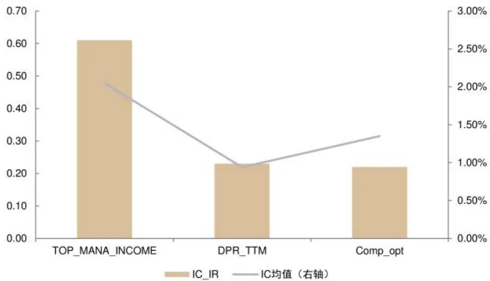
资料来源：万得资讯，中金公司研究部（样本期：2010-01-04至2022-04-01）

图表 84：公司治理因子沪深 300 IC 值表现
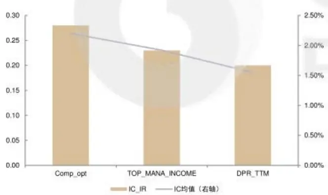
资料来源：万得资讯，中金公司研究部（样本期：2010-01-04至2022-04-01）

图表 85：公司治理因子中证 500 IC 值表现
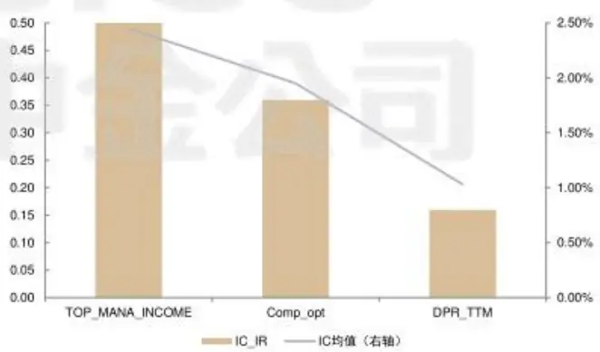
资料来源：万得资讯，中金公司研究部（样本期：2010-01-04至2022-04-01）

图表86：公司治理因子相关性表现

| Comp_optDPR_TTMTOP_MANA_INCOME | Comp_opt | DPR_TTM | TOP_MANA_INCOME |  |  |  |
| --- | --- | --- | --- | --- | --- | --- |
|  |  |  |  | 1.00 | 0.01 | 0.69 |
|  |  |  |  | 0.01 | 1.00 | 0.03 |
|  | 0.69 | 0.03 | 1.00 |  |  |  |

资料来源：万得资讯，中金公司研究部（样本期：2009-12-31至2022-03-31）

## 推荐关注 TOP_MANA_INCOME 因子

TOP_MANA_INCOME因子在农林牧渔行业有效性较强。TOP_MANA_INCOME因子在农林牧渔、钢铁和综合金融行业有效性较强，其中TOP_MANA_INCOME因子在农林牧渔行业的IC_IR达到0.33，IC均值为4.21%。该因子在家电、银行和电力及公用事业行业的有效性相对欠佳。

图表 87：TOP_MANA_INCOME 因子分行业 IC 值表现
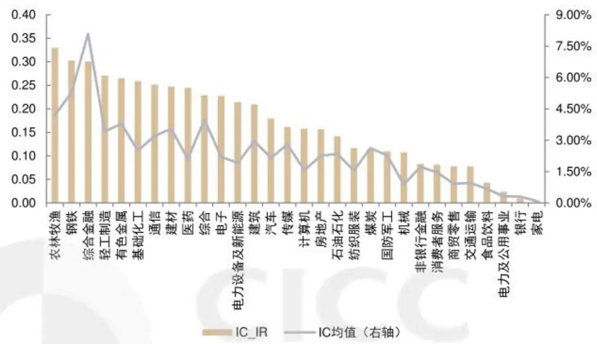
资料来源：万得资讯，中金公司研究部（样本期：2010-01-04至2022-04-01）

DPR_TTM因子全市场的多头组合表现略优于基准指数。全市场中，DPR_TTM因子近五年的净值表现略优于基准指数，但总体与基准指数走势相近。TOP MANA INCOME因子在沪深300整体表现良好，且2022年以来多头组合相对净值走势没有大幅回撤。

图表 88：DPR_TTM 因子全市场多头收益走势
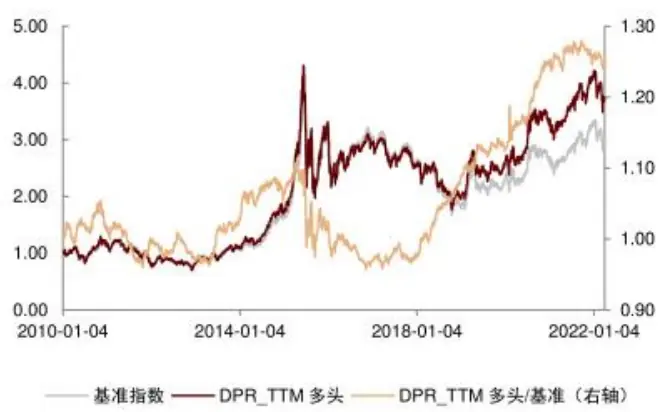
资料来源：万得资讯，中金公司研究部（数据截至2022-04-01）注：基准指数为万得全A（等权）指数（8841388.WI）

图表 89：Comp_opt 因子全市场多头收益走势
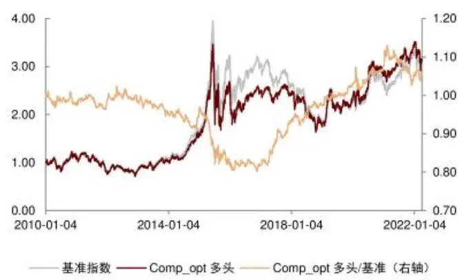
资料来源：万得资讯，中金公司研究部（数据截至2022-04-01）注：基准指数为万得全A（等权）指数（8841388.WI）

图表 90：TOP_MANA_INCOME 因子沪深 300 多头收益走势
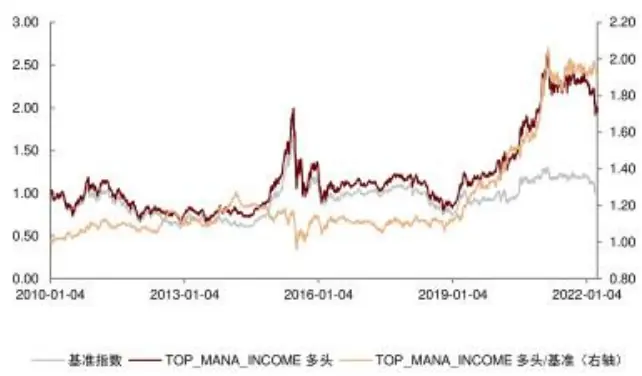
资料来源：万得资讯，中金公司研究部（数据截至2022-04-01）注：基准指数为300等权（000984.CSI）

图表 91：Comp_opt 因子沪深 300 多头收益走势
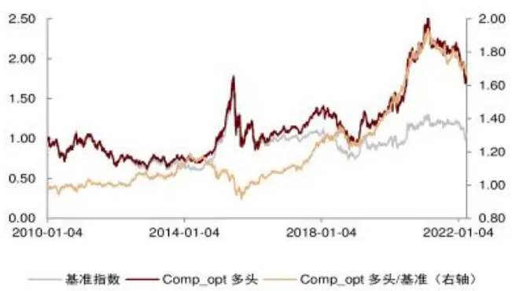
资料来源：万得资讯，中金公司研究部（数据截至2022-04-01）注：基准指数为300等权（000984.CSI）

图表 92：DPR_TTM 因子中证 500 多头收益走势
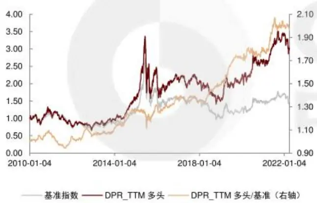
资料来源：万得资讯，中金公司研究部（数据截至2022-04-01）注：基准指数为500等权（399982.SZ)

图表 93：Comp_opt 因子中证 500 多头收益走势
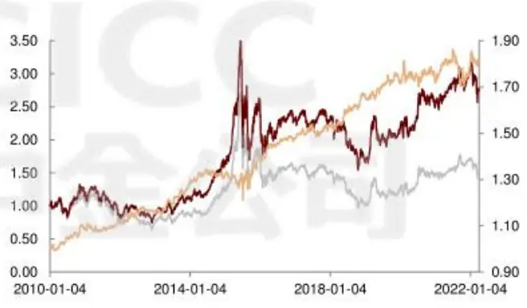
资料来源：万得资讯，中金公司研究部（数据截至2022-04-01）注：基准指数为500等权（399982.SZ）

## 估值因子

## 半数估值因子在全市场中具有较强的单调性

估值因子反映上市公司的股票价值信息，本节将对9个估值因子进行有效性检验。

DP和EP_TTM因子在估值因子有效性检验中表现较为出色。相较于其他估值因子，DP和EP_TTM因子在不同选股域中均有较强的收益预测能力。全市场中，DP因子的IC均值为3.80%，IC_IR为0.60；EP_TTM因子的IC均值为4.53%，IC_IR为0.56。沪深 300 中，DP因子的IC均值为 3.82%，IC_IR为 0.29；EP_TTM 因子的IC 均值为 4.18%，IC_IR 为 0.27。中证 500中，DP 因子的IC 均值为4.04%，IC_IR为 0.45；EP_TTM因子的IC 均值为 4.91%，IC_IR为0.47。

半数估值因子在全市场分组回测中具有较强的单调性。在全市场中，BP_LR、DP、EP_TTM、OCFPTTM和 SPTTM因子具有较强的单调性，因子值较高的组合收益表现大体优于因子值偏低的组合。其中，DP、EP_TTM和OCFP_TTM因子在不同选股域中均有较为良好的单调性表现。

图表94：估值因子全市场有效性检验

| 因子代码 | IC 均值 | IC_IR | P(IC>0) | P(IC>0.02) | P(IC<0) | P(IC<-0.02) |  | 多头年化收 益率 | 多头年化超 额收益率 | 多头超额最 大回撤 | 多头平均换 手率 | 单调性 |
| --- | --- | --- | --- | --- | --- | --- | --- | --- | --- | --- | --- | --- |
| BP_LR | 4.12% | 0.38 | 60.54% | 51.02% | 39.46% | 33.33% | 4.60 | 12.07% | 1.88% | -22.20% | 16.96% | 0.94 |
| DP | 3.80% | 0.60 | 70.07% | 60.54% | 29.93% | 18.37% | 7.32 | 12.95% | 2.90% | -11.92% | 17.82% | 0.89 |
| EP_TTM | 4.53% | 0.56 | 68.71% | 59.18% | 31.29% | 21.77% | 6.76 | 10.90% | 0.78% | -27.21% | 19.44% | 0.92 |
| EV2EBITDA | -1.42% | -0.16 | 44.90% | 38.78% | 55.10% | 48.30% | -1.98 | 6.84% | -1.92% | -27.38% | 19.69% | -0.26 |
| FCFP_TTM | 0.94% | 0.27 | 59.86% | 37.41% | 40.14% | 17.01% | 3.32 | 10.71% | 0.87% | -21.10% | 19.56% | 0.59 |
| NCFP_TTM | 0.34% | 0.11 | 56.46% | 31.97% | 43.54% | 19.05% | 1.31 | 10.71% | 0.87% | -14.46% | 24.13% | 0.24 |
| OCFP_TTM | 3.18% | 0.53 | 68.71% | 56.46% | 31.29% | 20.41% | 6.39 | 11.14% | 1.38% | -22.04% | 20.36% | 0.94 |
| PEG_TTM | 1.33% | 0.30 | 59.86% | 40.82% | 40.14% | 25.17% | 3.59 | 7.74% | -1.16% | -25.25% | 26.02% | 0.54 |
| SP_TTM | 2.51% | 0.26 | 57.14% | 48.98% | 42.86% | 34.01% | 3.21 | 12.27% | 2.46% | -15.69% | 13.29% | 0.88 |

资料来源：万得资讯，中金公司研究部（样本期：2010-01-04至2022-04-01）
注：基准指数为万得全A（等权）指数（8841388.WI）

图表 95：估值因子沪深 300 有效性检验

| 因子代码 | IC 均值 | IC_IR | P(IC>0) | P(IC>0.02) | P(IC<0) | P(IC<-0.02) | t值 | 多头年化收 益率 | 多头年化超 额收益率 | 多头超额最 大回道 | 多头平均换 手率 | 单调性 |
| --- | --- | --- | --- | --- | --- | --- | --- | --- | --- | --- | --- | --- |
| BP_LR | 2.04% | 0.11 | 51.70% | 48.30% | 48.30% | 45.58% | 1.33 | 5.89% | 5.23% | -36.00% | 19.27% | 0.42 |
| DP | 3.82% | 0.29 | 58.50% | 51.02% | 41.50% | 34.69% | 3.51 | 5.68% | 5.10% | -13.74% | 23.27% | 0.73 |
| EP_TTM | 4.18% | 0.27 | 59.18% | 53.06% | 40.82% | 36.05% | 3.23 | 4.71% | 4.25% | -22.65% | 23.23% | 0.75 |
| EV2EBITDA | -0.23% | -0.02 | 47.62% | 43.54% | 52.38% | 43.54% | -0.23 | 2.14% | 2.02% | -16.07% | 25.32% | -0.12 |
| FCFP_TTM | 2.86% | 0.34 | 62.59% | 57.14% | 37.41% | 31.97% | 4.12 | 7.54% | 7.07% | -24.45% | 21.76% | 0.81 |
| NCFP_TTM | 2.13% | 0.30 | 62.59% | 53.74% | 37.41% | 27.21% | 3.62 | 7.69% | 7.15% | -16.82% | 24.33% | 0.73 |
| OCFP_TTM | 2.48% | 0.22 | 59.86% | 55.10% | 40.14% | 34.01% | 2.62 | 4.38% | 4.07% | -20.19% | 23.24% | 0.73 |
| PEG_TTM | -0.07% | -0.01 | 48.30% | 41.50% | 51.70% | 43.54% | -0.10 | -0.24% | -0.25% | -28.09% | 33.41% | -0.14 |
| SP_TTM | 1.19% | 0.08 | 53.06% | 46.94% | 46.94% | 39.46% | 0.96 | 5.59% | 5.21% | -26.71% | 15.15% | 0.16 |

资料来源：万得资讯，中金公司研究部（样本期：2010-01-04至2022-04-01）
注：基准指数为300等权（000984.CSI）

图表96：估值因子中证 500 有效性检验

| 因子代码 | IC 均值 | IC_IR | P(IC>0) | P(IC>0.02) | P(IC<0) | P(IC<-0.02) | t值 | 多头年化收 益率 | 多头年化超 额收益率 | 多头超额最 大回撤 | 多头平均换 手率 | 单调性 |
| --- | --- | --- | --- | --- | --- | --- | --- | --- | --- | --- | --- | --- |
| BP_LR | 3.36% | 0.23 | 55.10% | 48.30% | 44.90% | 38.78% | 2.85 | 8.80% | 4.95% | -23.88% | 18.83% | 0.78 |
| DP | 4.04% | 0.45 | 66.67% | 61.90% | 33.33% | 27.21% | 5.43 | 10.03% | 6.12% | -26.69% | 19.32% | 0.93 |
| EP_TTM | 4.91% | 0.47 | 65.31% | 57.82% | 34.69% | 29.25% | 5.75 | 8.92% | 5.09% | -16.78% | 21.39% | 0.83 |
| EV2EBITDA | -2.08% | -0.24 | 40.14% | 31.97% | 59.86% | 49.66% | -2.97 | 3.64% | 0.67% | -26.54% | 24.04% | -0.52 |
| FCFP_TTM | 1.12% | 0.20 | 57.14% | 38.10% | 42.86% | 27.21% | 2.41 | 5.87% | 2.19% | -19.23% | 20.77% | 0.60 |
| NCFP_TTM | 0.45% | 0.09 | 53.74% | 40.14% | 46.26% | 32.65% | 1.11 | 7.51% | 3.80% | -20.36% | 25.01% | 0.28 |
| OCFP_TTM | 3.46% | 0.42 | 68.71% | 60.54% | 31.29% | 25.17% | 5.08 | 9.75% | 6.21% | -15.74% | 22.30% | 0.95 |
| PEG_TTM | 1.31% | 0.22 | 57.82% | 43.54% | 42.18% | 29.93% | 2.63 | 3.22% | 0.00% | -21.90% | 26.40% | 0.44 |
| SP_TTM | 1.74% | 0.16 | 53.06% | 46.94% | 46.94% | 40.82% | 1.94 | 7.56% | 3.91% | -17.12% | 15.37% | 0.65 |

资料来源：万得资讯，中金公司研究部（样本期：2010-01-04至2022-04-01）
注：基准指数为500等权（399982.SZ）

图表 97：估值因子全市场IC 值表现
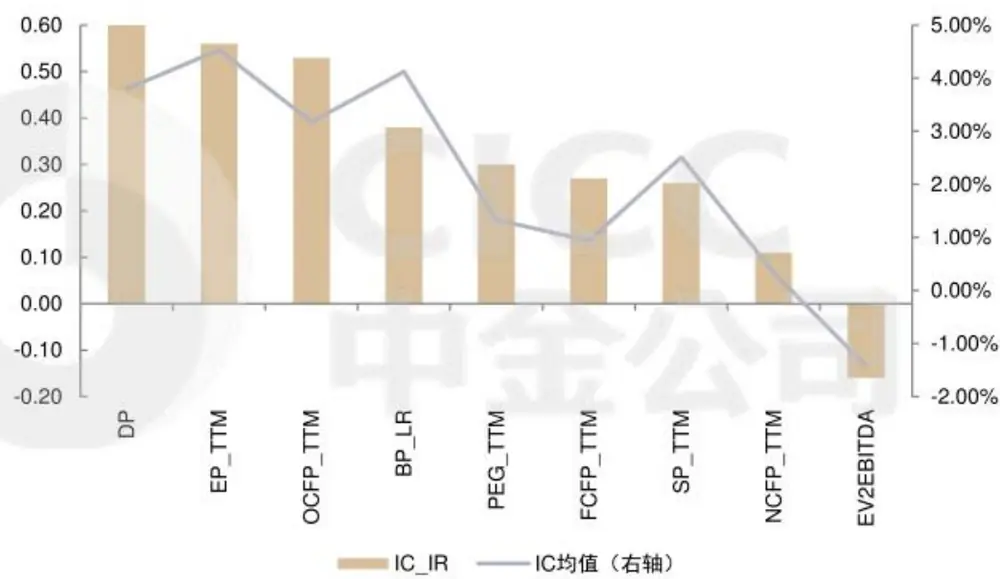
资料来源：万得资讯，中金公司研究部（样本期：2010-01-04至2022-04-01）

图表 98：估值因子沪深 300 IC 值表现
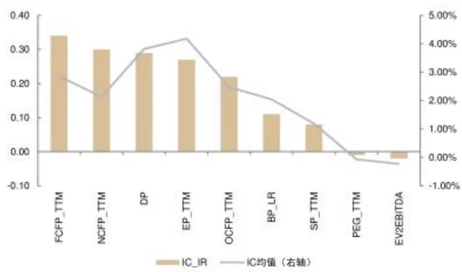
资料来源：万得资讯，中金公司研究部（样本期：2010-01-04至2022-04-01）

图表 99：估值因子中证 500 IC 值表现
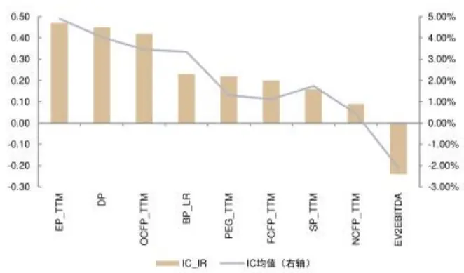
资料来源：万得资讯，中金公司研究部（样本期：2010-01-04至2022-04-01）

图表100：估值因子相关性表现

|  | BP_LR | DP | EP_TTM | EV2EBITDA | FCFP_TTM | NCFP_TTM | OCFP_TTM | PEG_TTM | SP_TTM |
| --- | --- | --- | --- | --- | --- | --- | --- | --- | --- |
| BP_LR | 1.00 | 0.31 | 0.33 | -0.22 | -0.04 | -0.01 | 0.32 | -0.05 | 0.49 |
| DP | 0.31 | 1.00 | 0.48 | -0.16 | 0.09 | -0.02 | 0.25 | 0.03 | 0.19 |
| EP_TTM | 0.33 | 0.48 | 1.00 | -0.20 | 0.07 | 0.10 | 0.30 | 0.13 | 0.27 |
| EV2EBITDA | -0.22 | -0.16 | -0.20 | 1.00 | -0.02 | 0.01 | -0.21 | -0.01 | -0.27 |
| FCFP_TTM | -0.04 | 0.09 | 0.07 | -0.02 | 1.00 | 0.20 | 0.37 | 0.02 | 0.02 |
| NCFP_TTM | -0.01 | -0.02 | 0.10 | 0.01 | 0.20 | 1.00 | 0.13 | 0.05 | 0.00 |
| OCFP_TTM | 0.32 | 0.25 | 0.30 | -0.21 | 0.37 | 0.13 | 1.00 | 0.01 | 0.37 |
| PEG_TTM | -0.05 | 0.03 | 0.13 | -0.01 | 0.02 | 0.05 | 0.01 | 1.00 | -0.02 |
| SP_TTM | 0.49 | 0.19 | 0.27 | -0.27 | 0.02 | 0.00 | 0.37 | -0.02 | 1.00 |

资料来源：万得资讯，中金公司研究部（样本期：2009-12-31至2022-03-31）

## 推荐关注 DP、EP_TTM 和 OCFP_TTM 因子

DP、EP_TTM和OCFP_TTM因子在机械行业有效性较强。DP因子在机械、有色金属和轻工制造行业有效性较强，其中 DP因子在机械行业的IC_IR 达到0.54，IC 均值为4.94%。EP_TTM因子在计算机、机械和有色金属行业有效性表现良好，其在计算机行业的IC_IR为0.48，IC均值为6.32%。OCFP_TTM因子在机械、食品饮料和电力设备及新能源行业表现出色，其在机械行业的IC_IR 为 0.56，IC均值为5.46%。

图表 101：DP 因子分行业 IC 值表现
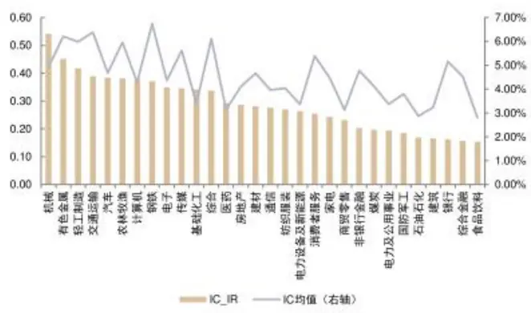
资料来源：万得资讯，中金公司研究部（样本期：2010-01-04至2022-04-01）

图表 102：EP_TTM 因子分行业 IC 值表现
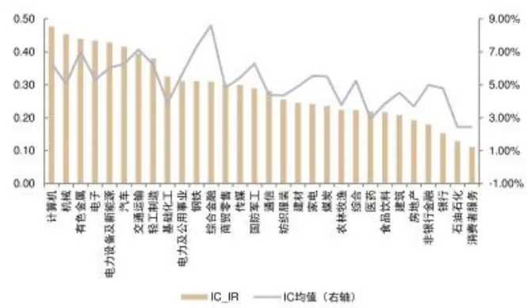
资料来源：万得资讯，中金公司研究部（样本期：2010-01-04至2022-04-01）

图表 103：OCFP_TTM 因子分行业 IC 值表现
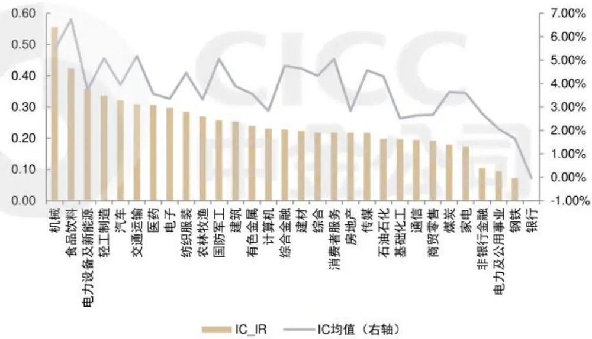
资料来源：万得资讯，中金公司研究部（样本期：2010-01-04至2022-04-01）

DP 和 SP_TTM因子全市场的多头组合表现略优于基准指数。全市场中，DP因子和 SP_TTM因子近五年的净值表现略优于基准指数，但总体与基准指数走势相近。在沪深300和中证500中，部分估值因子多头组合的相对净值整体表现良好，但在2020年有较大回撤。

图表104：DP因子全市场多头收益走势
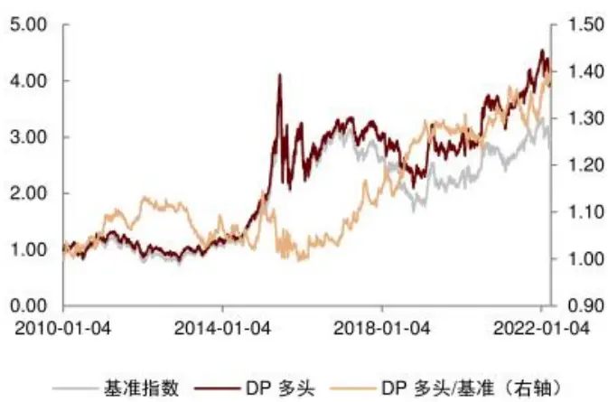
资料来源：万得资讯，中金公司研究部（数据截至2022-04-01）注：基准指数为万得全A（等权）指数（8841388.WI）

图表105：SP_TTM 因子全市场多头收益走势
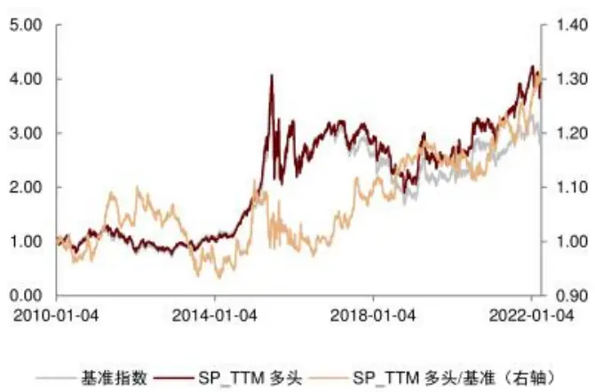
资料来源：万得资讯，中金公司研究部（数据截至2022-04-01）注：基准指数为万得全A（等权）指数（8841388.WI）

图表 106：FCFP_TTM 因子沪深 300 多头收益走势
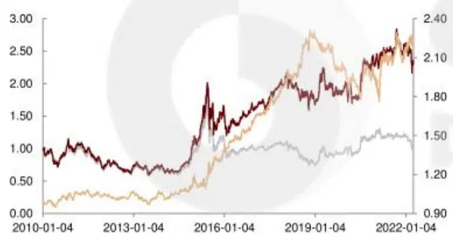
资料来源：万得资讯，中金公司研究部（数据截至2022-04-01）注：基准指数为300等权（000984.CSI）

图表 107：NCFP_TTM 因子沪深 300 多头收益走势
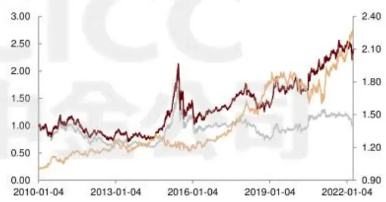
资料来源：万得资讯，中金公司研究部（数据截至2022-04-01）注：基准指数为300等权（000984.CSI）

图表 108：DP 因子中证 500 多头收益走势
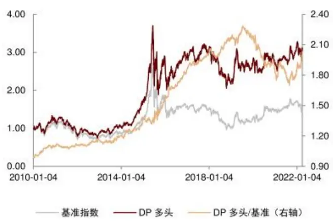
资料来源：万得资讯，中金公司研究部（数据截至2022-04-01）注：基准指数为 500等权（399982.SZ)

图表 109：OCFP_TTM 因子中证 500 多头收益走势
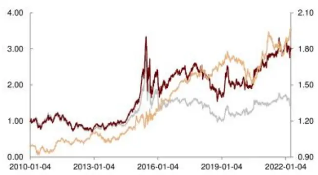
基准指数—OCFP_TTM多头OCFP_TTM多头/基准（右轴）
资料来源：万得资讯，中金公司研究部（数据截至2022-04-01）注：基准指数为500等权（399982.SZ）

## 分析师因子

## CAFR因子选股能力突出

分析师因子反映分析师对上市公司的盈利预期，本节将对16个分析师因子进行有效性检验。

多数分析师因子在全市场和中证500的覆盖率偏低。相较于其他类别的基本面因子，多数分析师因子在全市场和中证500的覆盖率偏低，如CAFR因子，其在全市场的平均覆盖率只有31.58%，在中证500的平均覆盖率为45.92%。

图表110：分析师因子覆盖率

| 因子代码 | 全市场平均覆盖率 | 沪深300平均覆盖率 | 中证500平均覆盖率 |
| --- | --- | --- | --- |
| CAFR | 31.58% | 78.29% | 45.92% |
| EEChange_1M | 60.86% | 91.44% | 78.14% |
| EEChange_3M | 56.91% | 90.41% | 75.71% |
| EEP | 94.41% | 96.86% | 96.04% |
| EEPSChange_1M | 60.86% | 91.44% | 78.14% |
| EEPSChange_3M | 56.42% | 90.38% | 75.67% |
| EINS_75D | 53.45% | 87.46% | 68.46% |
| EOPChange_1M | 57.10% | 89.76% | 74.08% |
| EOPChange_3M | 53.02% | 88.57% | 71.34% |
| FORE_Eaming | 64.39% | 93.52% | 81.20% |
| FORE_EPS | 64.39% | 93.52% | 81.20% |
| FORE_OP | 60.64% | 91.97% | 77.29% |
| RatingChange_1M | 51.03% | 87.60% | 68.50% |
| RatingChange_3M | 45.97% | 86.04% | 64.34% |
| RPP_75D | 93.47% | 96.82% | 96.04% |
| TargetReturm | 80.36% | 96.41% | 92.39% |

资料来源：朝阳永续，万得资讯，中金公司研究部（样本期：2009-12-31至2022-03-31）

CAFR、EEP和RPP_75D 因子在分析师因子有效性检验中表现较为出色。相较于其他分析师因子，CAFR、EEP和RPP_75D因子在不同选股域中均有较强的收益预测能力。在全市场中，CAFR 因子的IC 均值为 4.28%,IC_IR为 0.58;EEP因子的IC 均值为 4.56%，IC_IR 为 0.62;RPP_75D 因子的IC 均值为 4.76%，IC_IR为 0.66。

CAFR因子选股能力突出。在不同选股域中，CAFR因子的多头组合均有较高的年化收益表现和较低的超额最大回撤。同时，该因子在分组回测中具有较强的单调性，选股能力整体表现在基本面因子中较为优异。

图表111：分析师因子全市场有效性检验

| 因子代码 | IC 均值 | IC_IR | P(IC>0) | P(IC>0.02) | P(IC<0) | P(IC<-0.02) | t值 | 多头年化收 益率 | 多头年化超 额收益率 | 多头超额最 大回撤 | 多头平均换 手率 | 单调性 |
| --- | --- | --- | --- | --- | --- | --- | --- | --- | --- | --- | --- | --- |
| CAFR | 4.28% | 0.58 | 73.47% | 62.59% | 26.53% | 17.69% | 7.04 | 23.73% | 12.90% | -14.48% | 43.04% | 0.96 |
| EEChange_1M | 1.45% | 0.39 | 68.03% | 44.90% | 31.97% | 17.01% | 4.74 | 13.48% | 3.98% | -12.18% | 89.17% | 0.84 |
| EEChange_3M | 2.81% | 0.54 | 69.39% | 57.82% | 30.61% | 15.65% | 6.61 | 17.30% | 7.53% | -13.23% | 54.48% | 0.99 |
| EEP | 4.56% | 0.62 | 74.15% | 61.22% | 25.85% | 17.69% | 7.49 | 13.52% | 3.44% | -17.55% | 23.45% | 1.00 |
| EEPSChange__1M | 1.55% | 0.41 | 69.39% | 44.22% | 30.61% | 17.01% | 5.03 | 13.61% | 4.07% | -11.75% | 89.27% | 0.90 |
| EEPSChange_3M | 2.59% | 0.54 | 71.43% | 56.46% | 28.57% | 14.29% | 6.53 | 17.91% | 8.06% | -12.84% | 55.10% | 0.96 |
| EINS_75D | 3.17% | 0.38 | 65.31% | 51.70% | 34.69% | 28.57% | 4.65 | 11.37% | 1.44% | -31.83% | 40.21% | 0.90 |
| EOPChange_1M | 1.33% | 0.31 | 62.59% | 36.73% | 37.41% | 17.01% | 3.76 | 12.21% | 2.72% | -14.00% | 89.92% | 0.88 |
| EOPChange_3M | 2.43% | 0.51 | 74.15% | 55.78% | 25.85% | 14.97% | 6.14 | 14.81% | 5.23% | -17.46% | 55.62% | 0.99 |
| FORE_Earning | 3.45% | 0.39 | 64.63% | 59.86% | 35.37% | 27.89% | 4.74 | 8.99% | -0.78% | -26.93% | 23.44% | 0.54 |
| FORE_EPS | 2.99% | 0.35 | 62.59% | 54.42% | 37.41% | 27.21% | 4.25 | 13.54% | 3.05% | -30.06% | 17.81% | 0.98 |
| FORE_OP | 1.61% | 0.17 | 55.10% | 46.94% | 44.90% | 40.14% | 2.01 | 9.49% | -0.13% | -27.49% | 16.90% | 0.44 |
| RatingChange_1M | 0.82% | 0.29 | 59.86% | 35.37% | 40.14% | 15.65% | 3.51 | 11.36% | 1.78% | -15.91% | 94.56% | 0.71 |
| RatingChange_3M | 0.80% | 0.21 | 57.82% | 33.33% | 42.18% | 18.37% | 2.55 | 11.34% | 1.89% | -14.25% | 69.57% | 0.77 |
| RPP_75D | 4.76% | 0.66 | 75.51% | 66.67% | 24.49% | 18.37% | 8.06 | 12.63% | 2.49% | -31.84% | 31.73% | 0.84 |
| TargetReturn | 2.88% | 0.44 | 64.63% | 50.34% | 35.37% | 23.81% | 5.30 | 12.42% | 3.29% | -23.69% | 26.75% | 0.98 |

资料来源：朝阳永续，万得资讯，中金公司研究部（样本期：2010-01-04至2022-04-01）
注：基准指数为万得全A（等权）指数（8841388.WI）

图表 112：分析师因子沪深300有效性检验

| 因子代码 | IC均值 | IC_IR | P(IC>0) | P(IC>0.02) | P(IC<0) | P(IC<-0.02) | t值 | 多头年化收多头年化超 益率 | 额收益率 | 多头超额景 大回撤 | 多头平均换 手率 | 单调性 |
| --- | --- | --- | --- | --- | --- | --- | --- | --- | --- | --- | --- | --- |
| CAFR | 4.16% | 0.38 | 65.31% | 59.18% | 34.69% | 28.57% | 4.64 | 14.25% | 14.05% | -10.24% | 41.92% | 0.95 |
| EEChange_1M | 1.67% | 0.22 | 63.27% | 46.94% | 36.73% | 23.13% | 2.62 | 2.06% | 2.20% | -14.26% | 87.98% | 0.59 |
| EEChange_3M | 2.55% | 0.25 | 59.86% | 53.74% | 40.14% | 31.97% | 3.06 | 6.65% | 6.93% | -14.39% | 54.27% | 0.83 |
| EEP | 5.20% | 0.30 | 61.90% | 56.46% | 38.10% | 34.69% | 3.64 | 7.93% | 7.48% | -29.33% | 26.16% | 0.81 |
| EEPSChange_1M | 1.80% | 0.23 | 65.31% | 51.70% | 34.69% | 25.85% | 2.75 | 3.79% | 3.97% | -12.73% | 87.64% | 0.79 |
| EEPSChange_3M | 2.86% | 0.30 | 63.95% | 56.46% | 36.05% | 25.85% | 3.65 | 8.68% | 8.94% | -15.66% | 55.09% | 0.76 |
| EINS_75D | 3.92% | 0.33 | 62.59% | 51.70% | 37.41% | 29.93% | 3.95 | 3.74% | 3.47% | -16.46% | 46.19% | 0.81 |
| EOPChange_1M | 1.48% | 0.20 | 63.27% | 49.66% | 36.73% | 28.57% | 2.42 | 2.10% | 2.16% | -21.42% | 90.00% | 0.53 |
| EOPChange_3M | 2.35% | 0.28 | 61.22% | 51.70% | 38.78% | 31.97% | 3.33 | 3.82% | 4.08% | -17.09% | 57.36% | 0.83 |
| FORE_Earning | 2.10% | 0.20 | 58.50% | 46.94% | 41.50% | 33.33% | 2.46 | 2.29% | 2.41% | -21.08% | 29.36% | 0.53 |
| FORE_EPS | 4.30% | 0.31 | 61.22% | 55.78% | 38.78% | 34.69% | 3.80 | 9.08% | 8.50% | -25.07% | 19.74% | 0.82 |
| FORE_OP | 1.67% | 0.19 | 57.14% | 51.02% | 42.86% | 31.29% | 2.30 | 3.85% | 3.89% | -18.68% | 21.60% | 0.36 |
| RatingChange_1M | 0.02% | 0.00 | 48.98% | 34.01% | 51.02% | 38.10% | 0.04 | 0.85% | 0.76% | -21.49% | 94.50% | 0.07 |
| RatingChange_3M | 0.44% | 0.06 | 54.42% | 44.22% | 45.58% | 37.41% | 0.75 | 5.00% | 4.88% | -11.31% | 72.35% | 0.15 |
| RPP_75D | 4.20% | 0.29 | 55.10% | 49.66% | 44.90% | 36.73% | 3.49 | 6.66% | 6.22% | -20.40% | 36.01% | 0.98 |
| TargetReturn | 2.98% | 0.26 | 57.14% | 51.02% | 42.86% | 32.65% | 3.19 | 2.83% | 2.90% | -35.53% | 41.00% | 0.73 |

资料来源：朝阳永续，万得资讯，中金公司研究部（样本期：2010-01-04至2022-04-01）
注：基准指数为300 等权（000984.CSI）

图表113：分析师因子中证 500 有效性检验

| 因子代码 | IC 均值 | IC_IR | P(IC>0) | P(IC>0.02) | P(IC<0) | P(IC<-0.02) | t值 | 多头年化收 多头年化超 益率 | 额收益率 | 多头超额最 大回撤 | 多头平均换 手率 | 单调性 |
| --- | --- | --- | --- | --- | --- | --- | --- | --- | --- | --- | --- | --- |
| CAFR | 3.94% | 0.40 | 67.35% | 59.86% | 32.65% | 27.21% | 4.90 | 21.10% | 17.11% | -14.61% | 43.18% | 0.98 |
| EEChange_1M | 1.37% | 0.24 | 62.59% | 46.94% | 37.41% | 26.53% | 2.91 | 10.08% | 6.65% | -10.13% | 89.32% | 0.85 |
| EEChange_3M | 2.56% | 0.34 | 68.03% | 52.38% | 31.97% | 23.81% | 4.14 | 11.63% | 8.25% | -12.72% | 55.94% | 0.84 |
| EEP | 4.12% | 0.36 | 63.27% | 57.82% | 36.73% | 29.93% | 4.34 | 7.69% | 3.94% | -28.70% | 24.71% | 0.90 |
| EEPSChange_1M | 1.36% | 0.24 | 58.50% | 48.98% | 41.50% | 26.53% | 2.93 | 10.79% | 7.36% | -11.19% | 89.27% | 0.78 |
| EEPSChange_3M | 2.42% | 0.33 | 65.99% | 53.06% | 34.01% | 26.53% | 3.98 | 11.34% | 7.99% | -13.40% | 56.13% | 0.95 |
| EINS_75D | 3.62% | 0.37 | 64.63% | 57.82% | 35.37% | 31.29% | 4.51 | 11.71% | 7.79% | -18.37% | 43.13% | 0.92 |
| EOPChange_1M | 1.14% | 0.18 | 54.42% | 43.54% | 45.58% | 31.29% | 2.18 | 7.01% | 3.66% | -11.10% | 90.43% | 0.62 |
| EOPChange_3M | 2.16% | 0.34 | 66.67% | 52.38% | 33.33% | 23.81% | 4.09 | 9.45% | 6.04% | -13.18% | 56.44% | 0.87 |
| FORE_Earning | 3.85% | 0.31 | 60.54% | 53.06% | 39.46% | 36.05% | 3.72 | 9.70% | 5.81% | -20.05% | 25.32% | 0.84 |
| FORE_EPS | 3.58% | 0.34 | 59.86% | 55.10% | 40.14% | 28.57% | 4.12 | 13.81% | 9.53% | -15.47% | 18.81% | 0.95 |
| FORE_OP | 1.39% | 0.12 | 50.34% | 46.94% | 49.66% | 42.86% | 1.47 | 7.86% | 4.15% | -13.30% | 19.43% | 0.56 |
| RatingChange_1M | 0.74% | 0.14 | 53.74% | 38.78% | 46.26% | 25.85% | 1.68 | 10.67% | 7.10% | -9.70% | 94.77% | 0.64 |
| RatingChange_3M | 0.21% | 0.04 | 49.66% | 34.01% | 50.34% | 34.01% | 0.45 | 3.94% | 0.66% | -14.51% | 71.43% | -0.09 |
| RPP_75D | 4.21% | 0.46 | 65.31% | 60.54% | 34.69% | 24.49% | 5.56 | 12.85% | 8.92% | -18.96% | 36.50% | 0.99 |
| TargetRetumn | 2.37% | 0.27 | 61.90% | 52.38% | 38.10% | 31.29% | 3.27 | 3.53% | 0.39% | 41.74% | 29.61% | 0.58 |

资料来源：朝阳永续，万得资讯，中金公司研究部（样本期：2010-01-04至2022-04-01）
注：基准指数为500等权（399982.SZ）

图表114：分析师因子全市场IC 值表现
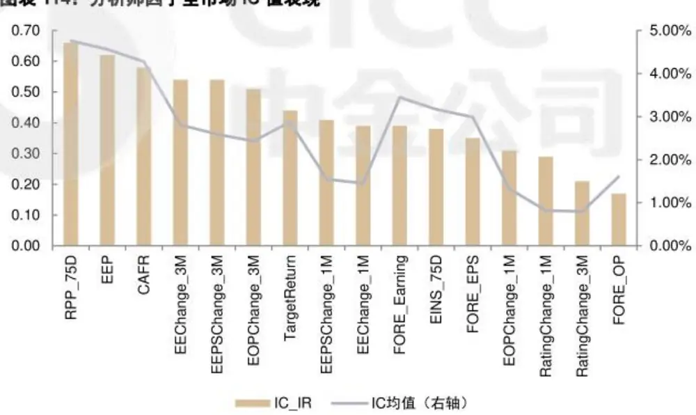
资料来源：朝阳永续，万得资讯，中金公司研究部（样本期：2010-01-04至2022-04-01）

图表 115：分析师因子沪深 300 IC 值表现
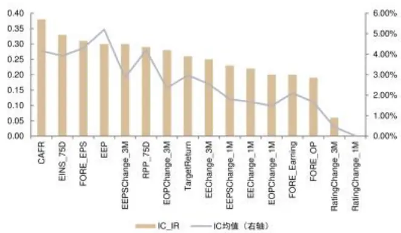
资料来源：朝阳永续，万得资讯，中金公司研究部（样本期：2010-01-04至2022-04-01)

图表 116：分析师因子中证 500 IC 值表现
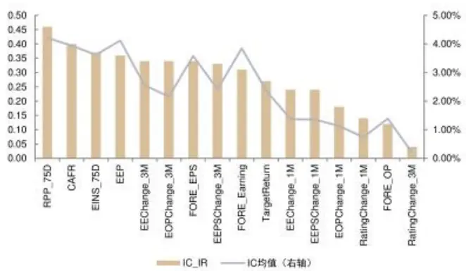
资料来源：朝阳永续，万得资讯，中金公司研究部（样本期：2010-01-04至2022-04-01)

图表117：分析师因子相关性表现

|  | CAFR | M | M | EEP | EEPSChange 1M | EEPSChange 3M | EINS_75D | EOPChange_E1M | OPChange_ F3M | ORE_Earning | FORE_EPS | FORE_OP | RatingChange 1M | RatingChang 3M | RPP_75D | TargetReturn |
| --- | --- | --- | --- | --- | --- | --- | --- | --- | --- | --- | --- | --- | --- | --- | --- | --- |
| CAFR | 1.00 | 0.22 | 0.44 | 0.02 | 0:20 | 0.36 | 0.13 | 0.10 | 0.26 | 0.03 | 0.18 | 0.04 | 0.02 | 0.06 | 0.15 | -0.02 |
| EEChange_1M | 0.22 | 1.00 | 0.49 | 0.05 | 0.92 | 0.43 | 0.03 | 0.25 | 0.22 | 0.05 | 0.07 | 0.01 | 0.16 | 0.12 | 0.03 | 0.00 |
| EEP | 0.02 | 0.05 | 0.10 | 1.00 | 0.06 | 0.12 | 0.08 | 0.01 | 0.01 | 075 | 0.39 | 0.35 | 0.01 | 0.01 | 0.10 | 0.13 |
| EEPSChange_1M | 020 | 0.92 | 0.46 | 0.06 | 1.00 | 0.48 | 0.01 | 0.24 | 0.20 | 0.05 | 0.07 | 0.00 | 0.15 | 0.11 | 0.02 | 0.00 |
| EEPSChange_3M | 0.36 | 0.43 | 0.89 | 0.12 | 0.48 | 1.00 | 0.05 | 0.16 | 0.37 | 0.10 | 0.14 | 0.01 | 0.07 | 0.18 | 0.05 | -0.01 |
| EINS_75D | 0.13 | 0.03 | 0.08 | 0.08 | 0.01 | 0.05 | 1.00 | 0.00 | 0.07 | 0.08 | 0.32 | 0.02 | 0.00 | 0.01 | 0.81 | 0.01 |
| EOPChange_1M | 0.10 | 0.25 | 0.19 | 0.01 | 0.24 | 0.16 | 0.00 | 1.00 | 0.41 | 0.01 | 0.04 | 0.02 | 0.07 | 0.06 | 0.01 | 0.00 |
| EOPChange_3M | 0.26 | 0.22 | 0.44 | 0.01 | 0.20 | 0.37 | 0.07 | 0.41 | 1.00 | 0.01 | 0.10 | 0.01 | 0.04 | 0.12 | 0.07 | 0.01 |
| FORE_Earning | 0.03 | 0.05 | 0.09 | 0.76 | 0.05 | 0.10 | 0.08 | 0.01 | 0.01 | 1.00 | 0.34 | 0.42 | 0.01 | 0.01 | 0.07 | 0.15 |
| FORE_ EPS | 0.18 | 0.07 | 0.15 | 0.39 | 0.07 | 0.14 | 0.32 | 0.04 | 0.10 | 0.34 | 1.00 | -0.00 | 0.01 | 0.02 | 0.31 | 0.02 |
| FORE_OPRatingChange_1M | 0.04 | 0.01 | 0.02 | 0.36 | 0.00 | 0.01 | 0.02 | 0.02 | 0.01 | 0.42 | -0.02 | 1.00 | 0.00 | 0.00 | -0.03 | 0.09 |
|  | 0.02 | 0.16 | 0.07 | 0.01 | 0.15 | 0.07 | 0.00 | 0.07 | 0.04 | 0.01 | 0.01 |  |  |  |  |  |
| RatingChange_3M | 0.06 | 0.12 | 0.19 | 0.01 | 0.11 | 0.18 | 0:01 | 0.06 | 0.12 | 0.01 | 0.02 | 0.00 | 0.49 | 1.00 | 0.03 | 0.01 |
| RPP_75DTargetReturn | 0.15 | 0.03 | 0.08 | 0.10 | 0.02 | 0.05 | 0.81 | 0.01 | 0.07 | 0.07 | 0.31 | 0.00 | 0.00 | 0.00 | 1.00 | 0.00 |
|  | 0.02 | 0.00 | 0.01 | 0.13 | 0.00 | -0.01 | -0.01 | 0.00 | -0.01 | 0.15 | 0.02 | 0.09 | 0.01 | 0.01 | 0.00 | 1.00 |

资料来源：朝阳永续，万得资讯，中金公司研究部（样本期：2009-12-31至2022-03-31）

## 推荐关注CAFR、EEP和 RPP_75D 因子

CAFR、EEP 和 RPP 75D因子在机械行业有效性较强。CAFR 因子在机械、医药和建筑行业有效性较强，其中 CAFR 因子在机械行业的IC_IR达到 0.49，IC 均值为 8.04%。EEP 因子在机械、电力设备及新能源和交通运输行业有效性表现良好，其在机械行业的ICIR为0.50，IC均值为5.62%。RPP75D因子在机械、基础化工和电力设备及新能源行业表现出色，其在机械行业的IC IR 为 0.62，IC 均值为 7.92%。

图表 118：CAFR 因子分行业 IC 值表现
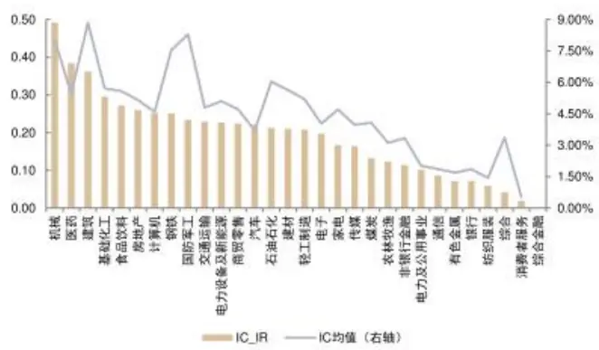
资料来源：朝阳永续，万得资讯，中金公司研究部（样本期：2010-01-04至2022-04-01)

图表 119：EEP 因子分行业 IC 值表现
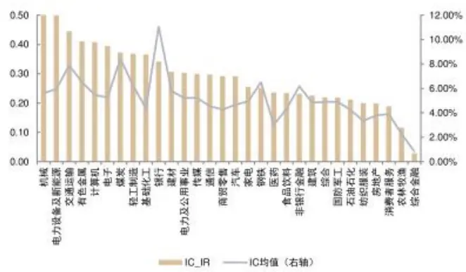
资料来源：朝阳永续，万得资讯，中金公司研究部（样本期：2010-01-04至2022-04-01)

图表 120：RPP_75D 因子分行业IC 值表现
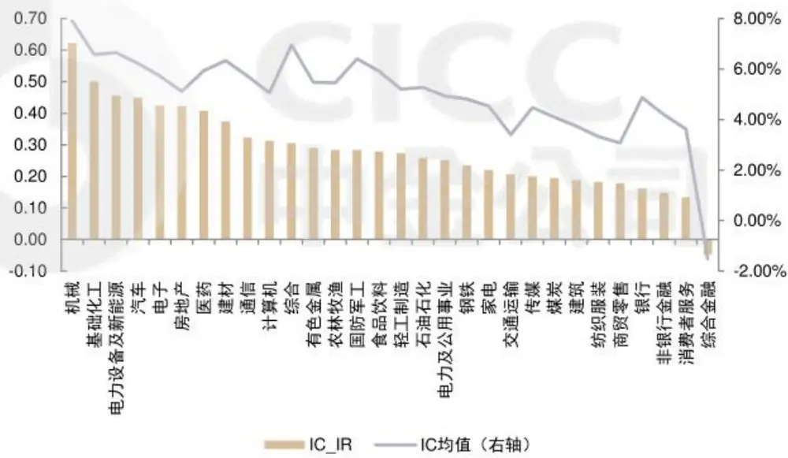
资料来源：朝阳永续，万得资讯，中金公司研究部（样本期：2010-01-04至2022-04-01）

CAFR因子多头组合整体表现出色。在不同选股域中，CAFR 因子的多头组合整体具有较高的年化收益，同时该组合的相对净值走势较为平稳，呈现上升趋势。但2022年以来，该因子的多头组合稍有回撤，净值有所下滑。

图表 121：CAFR 因子全市场多头收益走势
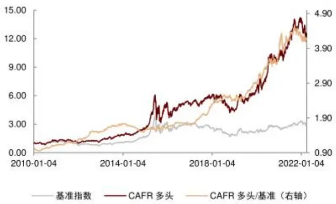
资料来源：朝阳永续，万得资讯，中金公司研究部（数据截至2022-04-01）注：基准指数为万得全A（等权）指数（8841388.WI）

图表 122：EEPSChange_3M 因子全市场多头收益走势
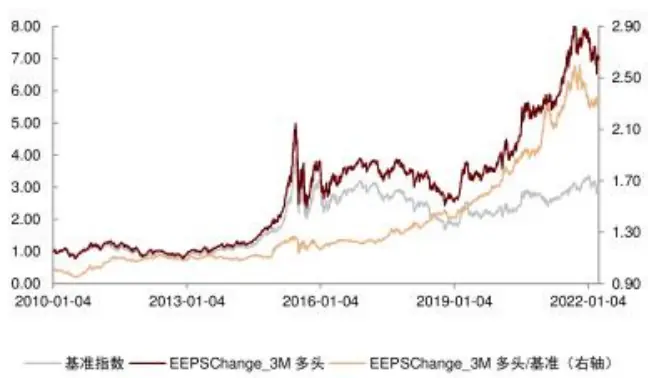
资料来源：朝阳永续，万得资讯，中金公司研究部（数据截至2022-04-01）注：基准指数为万得全A（等权）指数（8841388.WI）

图表 123：CAFR 因子沪深 300 多头收益走势
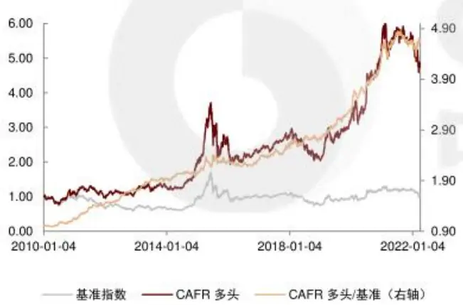
资料来源：朝阳永续，万得资讯，中金公司研究部（数据截至2022-04-01）注：基准指数为300等权（000984.CSI）

图表 124：FORE_EPS 因子沪深 300 多头收益走势
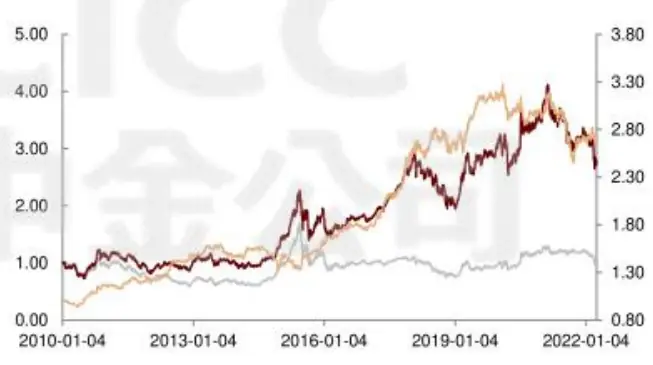
资料来源：朝阳永续，万得资讯，中金公司研究部（数据截至2022-04-01）注：基准指数为300等权（000984.CSI）

图表 125：CAFR 因子中证 500 多头收益走势
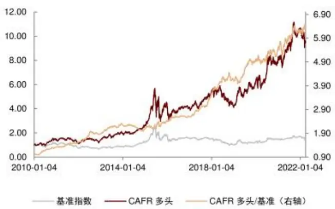
资料来源：朝阳永续，万得资讯，中金公司研究部（数据截至2022-04-01）注：基准指数为500等权（399982.SZ)

图表 126：FORE_EPS 因子中证 500多头收益走势
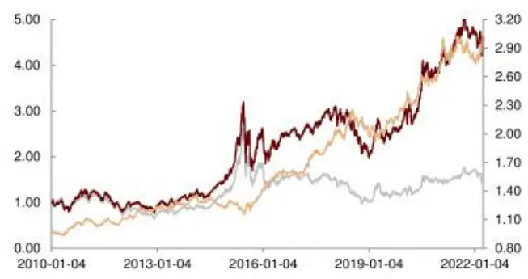
资料来源：朝阳永续，万得资讯，中金公司研究部（数据截至2022-04-01）注：基准指数为500等权(399982.SZ)

## 股东

## HN_z和Ln_IH 因子选股能力整体表现优异

股东因子反映上市公司的股东信息，本节将对4个股东因子进行有效性检验。

HN z 和 Ln_IH 因子在股东因子有效性检验中表现较为出色。相较于其他股东因子，HN z 和Ln_IH在不同选股域中均有较强的收益预测能力。全市场中，HN_z因子的IC均值为3.37%，IC_IR为0.53；Ln_IH因子的IC 均值为 2.52%，IC_IR 为0.44；沪深300 中，HN_z因子的IC均值为 2.70%，IC_IR为0.25；Ln_IH因子的IC均值为4.11%，IC_IR为0.30；中证500中，HN_z因子的IC均值为3.61%,IC_IR为0.47;Ln_IH因子的IC均值为3.23%,IC_IR为0.38。

HN_z和Ln_IH因子选股能力整体表现优异。在不同选股域中，HN_z和Ln_IH因子的多头组合均有较为出色的年化收益表现。同时，两个因子在分组回测中具有较强的单调性，选股能力整体表现优异。

图表127：股东因子全市场有效性检验

| 因子代码 | IC均值 | IC_IR | P(IC>0) | P(IC>0.02) | P(IC<0) | P(IC<-0.02) | t值 | 多头年化收 多头年化超 益率 | 额收益率 | 多头超额最 多头平均换 大回撤 | 手率 | 单调性 |
| --- | --- | --- | --- | --- | --- | --- | --- | --- | --- | --- | --- | --- |
| HN_z | 3.37% | 0.53 | 70.07% | 59.85% | 29.93% | 18.98% | 6.24 | 11.21% | 2.40% | -15.11% | 32.34% | 0.99 |
| IHN_diff | 1.50% | 0.26 | 59.86% | 46.26% | 40.14% | 25.17% | 3.16 | 10.31% | 1.00% | -12.92% | 39.03% | 0.60 |
| LHRD | 0.52% | 0.09 | 57.82% | 40.14% | 42.18% | 29.25% | 1.10 | 8.34% | -1.25% | -40.23% | 12.30% | 0.50 |
| Ln_IH | 2.52% | 0.44 | 62.59% | 52.38% | 37.41% | 22.45% | 5.40 | 12.75% | 2.89% | -20.76% | 30.48% | 0.98 |

资料来源：万得资讯，中金公司研究部（样本期：2010-01-04至2022-04-01）注：基准指数为万得全A（等权）指数（8841388.WI），HN_z样本期为2010-11-01至2022-04-01

图表 128：股东因子沪深300 有效性检验

| 因子代码 | IC均值 | IC_IR | P(IC>0) | P(IC>0.02) | P(IC<0) | P(IC<-0.02) | t值 | 益率 | 多头年化收多头年化超多头超额最多头平均换 额收益率 | 大回撤 | 手率 | 单调性 |
| --- | --- | --- | --- | --- | --- | --- | --- | --- | --- | --- | --- | --- |
| HN_z | 2.70% | 0.25 | 59.12% | 51.82% | 40.88% | 32.85% | 2.98 | 5.57% | 5.98% | -11.10% | 30.42% | 0.89 |
| IHN_diff | 1.09% | 0.09 | 53.74% | 47.62% | 46.26% | 38.10% | 1.15 | 3.99% | 3.89% | -14.33% | 41.03% | 0.68 |
| LHRD | -0.36% | -0.03 | 45.58% | 40.82% | 54.42% | 46.26% | -0.39 | 2.38% | 2.15% | -28.67% | 34.24% | 0.13 |
| Ln_IH | 4.11% | 0.30 | 59.86% | 51.02% | 40.14% | 34.69% | 3.60 | 4.58% | 4.19% | -26.27% | 26.49% | 0.87 |

资料来源：万得资讯，中金公司研究部（样本期：2010-01-04至2022-04-01）注：基准指数为 300等权（000984.CSI)，HN_z样本期为 2010-11-01 至2022-04-01

图表 129：股东因子中证 500 有效性检验

| 因子代码 | IC 均值 | IC_IR | P(IC>0) | P(IC>0.02) | P(IC<0) | P(IC<-0.02) | t值 | 多头年化收 益率 | 多头年化超 额收益率 | 多头超额最 大回撤 | 多头平均换 手率 | 单调性 |
| --- | --- | --- | --- | --- | --- | --- | --- | --- | --- | --- | --- | --- |
| HN_z | 3.61% | 0.47 | 70.07% | 62.77% | 29.93% | 21.17% | 5.53 | 9.30% | 7.01% | -20.21% | 33.41% | 0.95 |
| IHN_diff | 1.68% | 0.16 | 58.50% | 44.90% | 41.50% | 33.33% | 1.93 | 8.55% | 5.03% | -12.79% | 43.16% | 0.55 |
| LHRD | 0.50% | 0.05 | 48.98% | 42.86% | 51.02% | 40.82% | 0.62 | 4.95% | 1.53% | -47.45% | 13.82% | 0.18 |
| Ln_IH | 3.23% | 0.38 | 63.95% | 53.06% | 36.05% | 24.49% | 4.59 | 11.30% | 7.66% | -14.69% | 36.45% | 0.93 |

资料来源：万得资讯，中金公司研究部（样本期：2010-01-04至2022-04-01）注：基准指数为500等权（399982.SZ），HN_z样本期为2010-11-01至2022-04-01

资料来源：万得资讯，中金公司研究部（样本期：2010-01-04至2022-04-01）注：HN_z样本期为2010-11-01 至 2022-04-01

图表 130：股东因子全市场IC 值表现
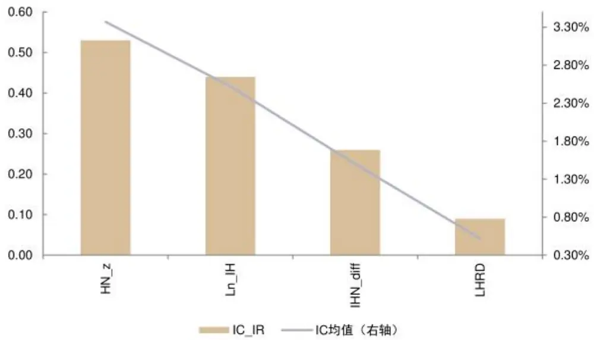

图表 131：股东因子沪深 300 IC 值表现
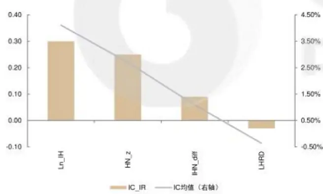
资料来源：万得资讯，中金公司研究部（样本期：2010-01-04至2022-04-01）注：HN_z样本期为2010-11-01至2022-04-01

图表 132：股东因子中证500 IC 值表现
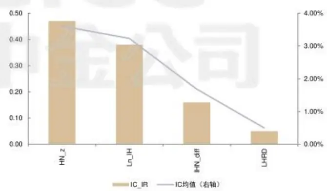
资料来源：万得资讯，中金公司研究部（样本期：2010-01-04至2022-04-01）注：HN_z样本期为2010-11-01至2022-04-01

图表133：股东因子相关性表现

|  | HN_z | IHN_diff | LHRD | Ln_IH |
| --- | --- | --- | --- | --- |
| HN_z | 1.00 | -0.07 | 0.01 | 0.02 |
| IHN_diff | -0.07 | 1.00 | -0.02 | -0.07 |
| LHRDLn_IH | 0.01 | -0.02 | 1.00 | -0.06 |
|  | 0.02 | -0.07 | -0.06 | 1.00 |

资料来源：万得资讯，中金公司研究部（样本期：2009-12-31至2022-03-31）注：HN_z样本期为 2010-10-29 至 2022-03-31

## 推荐关注 HN_z 和 Ln_IH 因子

HN_z和Ln_IH因子在房地产行业有效性较强。HN_z 因子在综合金融、房地产和传媒行业有效性较强，其中HN_z因子在综合金融行业的IC_IR达到0.48，IC 均值为15.69%。Ln_IH因子在交通运输、房地产和传媒行业有效性表现良好，其在交通运输行业的IC_IR为0.33，IC均值为4.13%。

图表 134：HN_z 因子分行业 IC 值表现
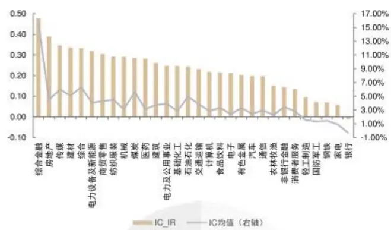
资料来源：万得资讯，中金公司研究部（样本期：2010-11-01至2022-04-01）

图表 135:Ln_IH 因子分行业 IC 值表现
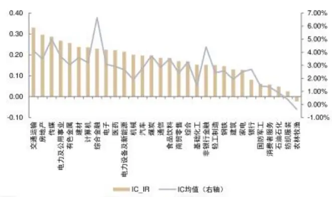
资料来源：万得资讯，中金公司研究部（样本期：2010-01-04至2022-04-01）

HN_z因子多头组合近五年的净值走势稳中有升。全市场中，LnIH因子多头组合超额收益波动相对较大，近一年的相对净值呈下滑趋势。而HN_z因子多头组合近五年的净值走势稳中有升，超额收益波动整体较为平缓。

图表 136：Ln_IH因子全市场多头收益走势
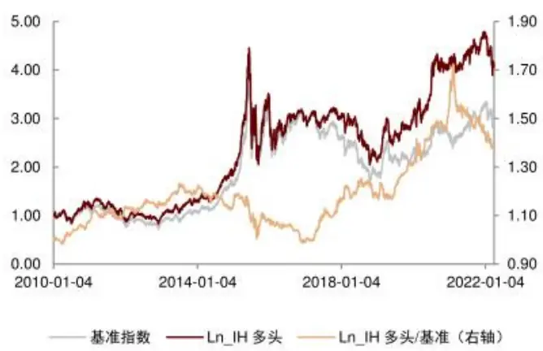
资料来源：万得资讯，中金公司研究部（数据截至2022-04-01）注：基准指数为万得全A（等权）指数（8841388.WI）

图表137：HN_z因子全市场多头收益走势
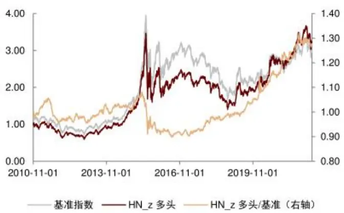
资料来源：万得资讯，中金公司研究部（数据截至2022-04-01）注：基准指数为万得全A（等权）指数（8841388.WI）

图表 138：Ln_IH 因子沪深 300 多头收益走势
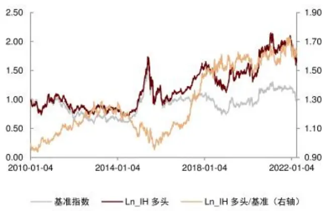
资料来源：万得资讯，中金公司研究部（数据截至2022-04-01）注：基准指数为 300等权（000984.CSI）

图表 139：HN_z因子沪深 300 多头收益走势
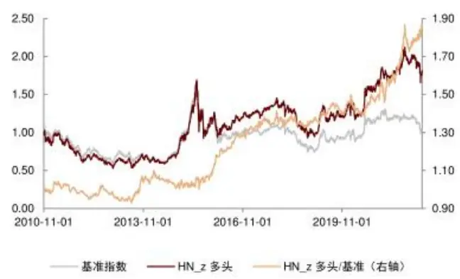
资料来源：万得资讯，中金公司研究部（数据截至2022-04-01）注：基准指数为300等权（000984.CSI）

图表 140：Ln_IH 因子中证 500 多头收益走势
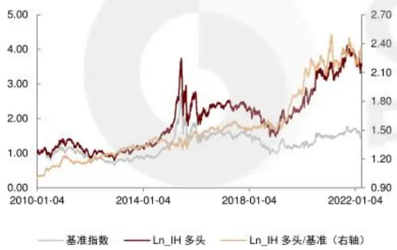
资料来源：万得资讯，中金公司研究部（数据截至2022-04-01）注：基准指数为500 等权（399982.SZ)

图表 141：HN_z因子中证 500 多头收益走势
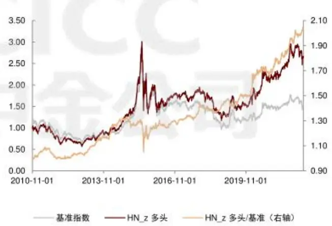
资料来源：万得资讯，中金公司研究部（数据截至2022-04-01）注：基准指数为500等权（399982.SZ）

资料来源：万得资讯，中金公司研究部（样本期：2010-01-04至2022-04-01）注：基准指数为300等权（000984.CSI）

## 规模因子

## Ln_MC因子在全市场有效性检验中表现较为出色

规模因子反映上市公司的股票市值信息，本节将对5个规模因子进行有效性检验。

Ln_MC因子在全市场有效性检验中表现较为出色。大多数规模因子的IC检验有效性表现欠佳，Ln_MC因子在全市场有效性检验中表现良好，但在宽基指数范围内表现相对较弱。全市场中，Ln_MC 因子的IC 均值为-2.82%，IC_IR 为-0.56。

Ln_FC 和 Ln_MC 因子在全市场中选股能力良好。在全市场中，Ln_FC 和 Ln_MC 因子的多头组合均有较高的年化收益表现和较低的超额最大回撤。同时，两个因子在分组回测中具有较强的单调性，在全市场的选股能力整体表现优异。

图表142：规模因子全市场有效性检验

| 因子代码 | IC均值 | IC_IR | P(IC>0) | P(IC>0.02) | P(IC<0) | P(IC<-0.02) | t值 | 多头年化收 益率 | 多头年化超 额收益率 | 多头超额最 大回盖 | 多头平均换 手率 | 单调性 |
| --- | --- | --- | --- | --- | --- | --- | --- | --- | --- | --- | --- | --- |
| FC | -1.23% | -0.14 | 41.50% | 34.69% | 58.50% | 46.94% | -1.66 | 4.88% | -4.13% | -39.80% | 17.17% | -0.50 |
| FC_MC | 0.21% | 0.03 | 47.62% | 38.78% | 52.38% | 41.50% | 0.37 | 8.65% | -0.33% | -28.08% | 15.97% | -0.66 |
| Ln_FC | -1.41% | -0.19 | 44.22% | 30.61% | 55.78% | 48.30% | -2.26 | 11.52% | 2.08% | -9.44% | 18.18% | -0.90 |
| Ln_MC | -2.82% | -0.56 | 27.21% | 17.69% | 72.79% | 61.22% | -6.84 | 11.11% | 1.47% | -12.04% | 25.21% | -0.93 |
| MC | -1.00% | -0.14 | 46.26% | 37.41% | 53.74% | 39.46% | -1.69 | 5.29% | -4.28% | -50.48% | 58.62% | -0.39 |

资料来源：万得资讯，中金公司研究部（样本期：2010-01-04至2022-04-01）注：基准指数为万得全A（等权）指数（8841388.WI）

图表 143：规模因子沪深 300 有效性检验

| 因子代码 | IC 均值 | IC_IR | P(IC>0) | P(IC>0.02) | P(IC<0) | P(IC<-0.02) | t值 | 多头年化收 益率 | 多头年化超 额收益率 | 多头超额量 大回撒 | 多头平均换 手事 | 单调性 |
| --- | --- | --- | --- | --- | --- | --- | --- | --- | --- | --- | --- | --- |
| FC | 1.02% | 0.08 | 50.34% | 43.54% | 49.66% | 44.22% | 1.01 | 2.96% | 2.79% | -26.43% | 25.06% | 0.59 |
| FC_MC | 0.93% | 0.13 | 58.50% | 44.90% | 41.50% | 33.33% | 1.53 | 2.91% | 2.97% | -15.95% | 17.70% | 0.35 |
| Ln_FC | 1.31% | 0.09 | 53.74% | 48.30% | 46.26% | 38.10% | 1.09 | 5.65% | 4.92% | -21.68% | 15.97% | 0.67 |
| Ln_MC | 1.15% | 0.07 | 51.70% | 49.66% | 48.30% | 42.18% | 0.85 | 4.49% | 3.83% | -23.78% | 22.49% | 0.67 |
| MC | 0.12% | 0.01 | 53.06% | 44.90% | 46.94% | 41.50% | 0.11 | 4.01% | -3.99% | -43.13% | 68.71% | 0.19 |

图表144：规模因子中证 500 有效性检验

| 因子代码 | IC 均值 | IC_IR | P(IC>0) | P(IC>0.02) | P(IC<0) | P(IC<-0.02) | t值 | 益率 | 多头年化收 多头年化超 多头超额最 多头平均换 额收益率 | 大回撤 | 手率 | 单调性 |
| --- | --- | --- | --- | --- | --- | --- | --- | --- | --- | --- | --- | --- |
| FC | -0.21% | -0.04 | 47.62% | 33.33% | 52.38% | 33.33% | -0.46 | 4.23% | 0.62% | -17.53% | 20.93% | -0.32 |
| FC_MC | 0.52% | 0.08 | 55.10% | 41.50% | 44.90% | 37.41% | 0.96 | 8.14% | 5.11% | -14.69% | 17.77% | -0.03 |
| Ln_FC | 0.71% | 0.08 | 56.46% | 45.58% | 43.54% | 36.05% | 1.03 | 5.90% | 2.84% | -14.41% | 23.31% | 0.35 |
| Ln_MC | 0.96% | 0.09 | 53.06% | 48.30% | 46.94% | 38.10% | 1.13 | 3.60% | 0.41% | -23.82% | 29.69% | 0.26 |
| MC | -1.38% | -0.16 | 45.58% | 31.97% | 54.42% | 44.22% | -1.96 | 4.47% | 0.94% | -33.45% | 65.33% | -0.62 |

资料来源：万得资讯，中金公司研究部（样本期：2010-01-04 至2022-04-01）
注：基准指数为500等权（399982.SZ）

图表145：规模因子全市场IC 值表现
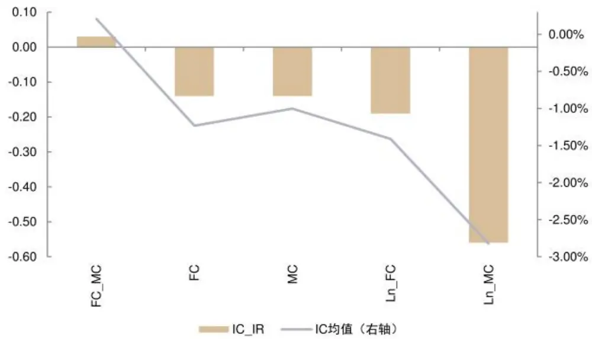
资料来源：万得资讯，中金公司研究部（样本期：2010-01-04至2022-04-01）

图表 146：规模因子沪深 300IC 值表现
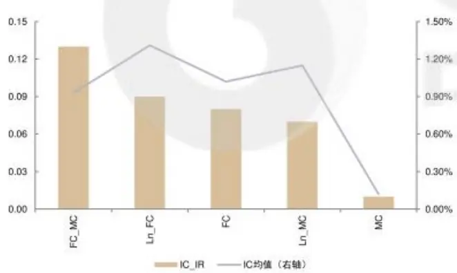
资料来源：万得资讯，中金公司研究部（样本期：2010-01-04至2022-04-01）

图表 147：规模因子中证 500 IC 值表现
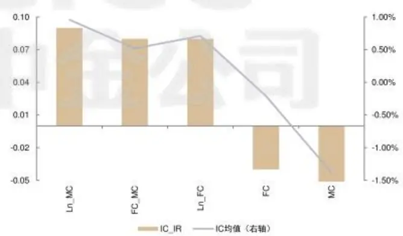
资料来源：万得资讯，中金公司研究部（样本期：2010-01-04至2022-04-01）

图表148：规模因子相关性表现

| FC |  | FC_MC | Ln_FC | Ln_MC | MC |
| --- | --- | --- | --- | --- | --- |
| FCFC_MC | 1.00 | 0.81 | 0.82 | 0.11 | 0.01 |
|  | 0.81 | 1.00 | 0.83 | -0.04 | -0.01 |
| Ln_FC | 0.82 | 0.83 | 1.00 | 0.44 | 0.00 |
| Ln_MC | 0.11 | -0.04 | 0.44 | 1.00 | 0.03 |
| MC | 0.01 | -0.01 | 0.00 | 0.03 | 1.00 |

资料来源：万得资讯，中金公司研究部（样本期：2009-12-31至2022-03-31）

## 推荐关注 Ln_MC 因子

Ln_MC 因子在基础化工行业有效性较强。Ln_MC 因子在基础化工、轻工制造和机械行业的有效性较强，其中Ln_MC因子在基础化工行业的IC_IR达到-0.56，IC均值为-6.05%。而Ln_MC因子在有色金属、银行和非银行金额行业的有效性相对偏弱。

图表 149：Ln_MC 因子分行业 IC 值表现
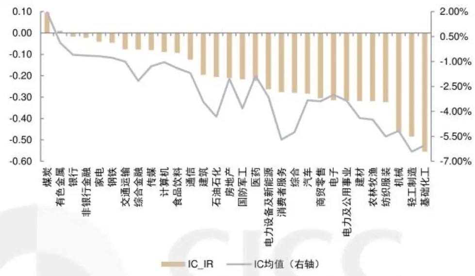
资料来源：万得资讯，中金公司研究部（样本期：2010-01-04至2022-04-01）

近五年 Ln_FC 和Ln_MC 因子多头组合表现略有改善。全市场中，近五年 Ln_FC和 Ln_MC因子多头组合收益表现相较前期有所改善，相对净值整体呈上升趋势。但近一年Ln_FC因子的多头组合相对净值具有较大回撤，部分规模因子多头组合在不同选股域的相对净值均有较大震荡。

图表150：Ln_FC 因子全市场多头收益走势
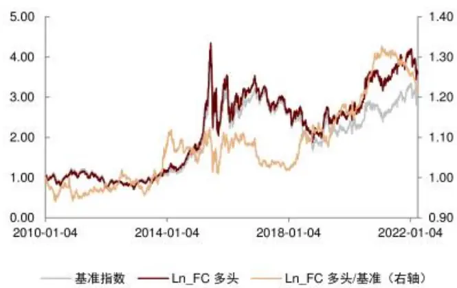
资料来源：万得资讯，中金公司研究部（数据截至2022-04-01）注：基准指数为万得全A（等权）指数（8841388.WI）

图表151：Ln_MC 因子全市场多头收益走势
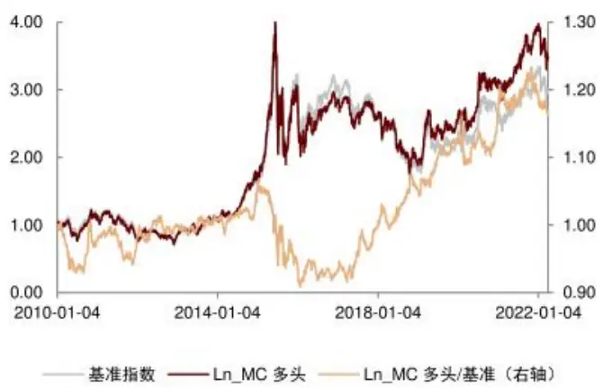
资料来源：万得资讯，中金公司研究部（数据截至2022-04-01）注：基准指数为万得全A（等权）指数（8841388.WI）

图表 152：Ln_FC 因子沪深 300 多头收益走势
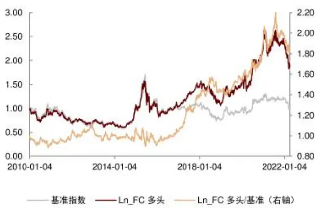
资料来源：万得资讯，中金公司研究部（数据截至2022-04-01）注：基准指数为 300等权（000984.CSI）

图表 153：Ln_MC 因子沪深 300 多头收益走势
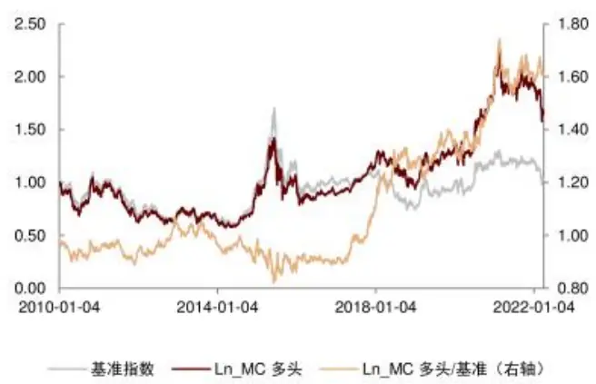
资料来源：万得资讯，中金公司研究部（数据截至2022-04-01）注：基准指数为 300等权（000984.CSI）

图表 154：FC_MC 因子中证 500 多头收益走势
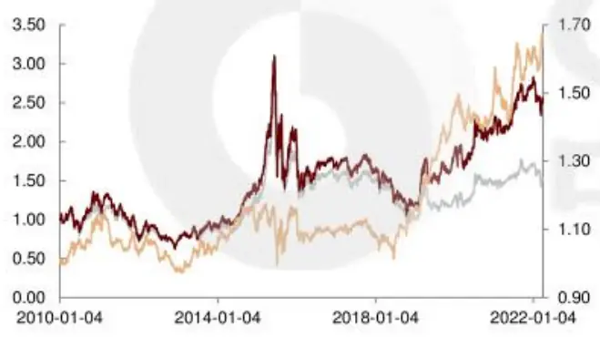
基准指数FC_MC 多头FC_MC 多头/基准（右轴）
资料来源：万得资讯，中金公司研究部（数据截至2022-04-01）注：基准指数为500 等权（399982.SZ)

图表 155：Ln_FC 因子中证 500 多头收益走势
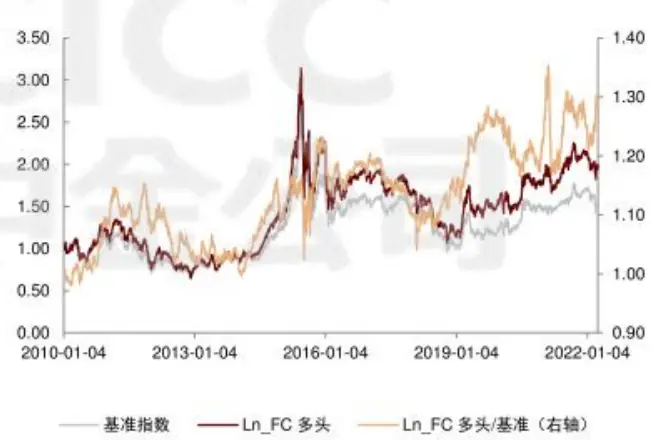
资料来源：万得资讯，中金公司研究部（数据截至2022-04-01）注：基准指数为500等权（399982.SZ）

## 复合因子

## 复合因子选股能力整体较强

复合因子是上述部分因子的加权指标，综合反映了上市公司信息，详细构建过程请参考报告《量化多因子系列（1)：QQC综合质量因子与指数增强应用》。本节将对7个复合因子进行有效性检验。

Growth 和 QQC 因子在复合因子有效性检验中表现较为优异。相较于其他复合因子，Growth和 QQC 因子在不同选股域中均有较强的收益预测能力。全市场中，Growth 因子的IC 均值为3.75%，IC_IR 为 0.63；QQC 因子的IC 均值为 3.92%，IC_IR为 0.67。沪深 300 中，Growth因子的IC均值为 3.66%，IC_IR 为 0.34；QQC 因子的IC均值为 3.90%，IC_IR为 0.37。中证500 中，Growth 因子的IC 均值为 4.34%， IC_IR 为 0.50; QQC 因子的 IC 均值为 4.80%，IC_IR为0.61。

复合因子选股能力整体较强。在不同选股域中，复合因子的多头组合均有较强的年化收益表现，多头年化超额收益率均大于0，体现复合因子整体较强的选股能力。其中Growth和QQC因子的多头组合具有较高的年化收益和较低的超额最大回撤，选股能力较为优异。

图表156：复合因子全市场有效性检验

| 因子代码 | IC均值 | IC_IR | P(IC>0) | P(IC>0.02) | P(IC<0) | P(IC<-0.02) | t值 | 多头年化收多头年化超 多头超额最多头平均换 益率 | 额收益率 | 大回撤 | 手率 | 单调性 |
| --- | --- | --- | --- | --- | --- | --- | --- | --- | --- | --- | --- | --- |
| Acc | 1.25% | 0.42 | 65.99% | 39.46% | 34.01% | 13.61% | 5.12 | 10.15% | 0.87% | -19.48% | 19.30% | 0.85 |
| Comp_opt | 1.35% | 0.22 | 55.10% | 45.58% | 44.90% | 29.93% | 2.61 | 10.22% | 0.59% | -19.74% | 12.17% | 0.42 |
| Growth | 3.75% | 0.63 | 74.15% | 61.90% | 25.85% | 15.65% | 7.60 | 17.66% | 8.00% | -10.08% | 29.10% | 0.99 |
| Opt | 2.12% | 0.56 | 71.43% | 53.74% | 28.57% | 16.33% | 6.73 | 12.71% | 3.24% | -10.65% | 29.24% | 0.96 |
| Profit | 3.03% | 0.49 | 66.67% | 54.42% | 33.33% | 17.69% | 5.91 | 11.71% | 2.00% | -17.77% | 19.55% | 0.98 |
| QQC | 3.92% | 0.67 | 75.51% | 63.27% | 24.49% | 14.29% | 8.18 | 16.78% | 6.85% | -8.23% | 24.53% | 1.00 |
| Safe | 1.43% | 0.40 | 68.03% | 44.22% | 31.97% | 14.97% | 4.80 | 11.51% | 1.99% | -18.19% | 18.30% | 0.84 |

资料来源：万得资讯，中金公司研究部（样本期：2010-01-04至2022-04-01）
注：基准指数为万得全A（等权）指数（8841388.WI）

图表 157：复合因子沪深 300 有效性检验

| 因子代码 | IC 均值 | IC_IR | P(IC>0) | P(IC>0.02) | P(IC<0) | P(IC<-0.02) | t值 | 益率 | 多头年化收 多头年化超 多头超额最 多头平均换 额收益率 | 大回撤 | 手率 | 单调性 |
| --- | --- | --- | --- | --- | --- | --- | --- | --- | --- | --- | --- | --- |
| Acc | 0.65% | 0.08 | 55.78% | 44.22% | 44.22% | 36.73% | 1.01 | 2.98% | 2.88% | -16.96% | 19.17% | 0.37 |
| Comp_opt | 2.20% | 0.28 | 59.86% | 54.42% | 40.14% | 31.97% | 3.37 | 4.80% | 4.65% | -22.83% | 13.42% | 0.66 |
| Growth | 3.66% | 0.34 | 64.63% | 58.50% | 35.37% | 27.89% | 4.12 | 13.96% | 14.08% | -15.11% | 30.36% | 0.85 |
| Opt | 1.80% | 0.25 | 59.86% | 45.58% | 40.14% | 32.65% | 3.05 | 7.33% | 7.12% | -15.89% | 31.37% | 0.90 |
| Profit | 3.54% | 0.28 | 58.50% | 56.46% | 41.50% | 35.37% | 3.40 | 7.44% | 7.10% | -27.29% | 18.53% | 0.92 |
| QQc | 3.90% | 0.37 | 65.99% | 59.86% | 34.01% | 31.97% | 4.44 | 9.64% | 9.36% | -18.72% | 24.42% | 0.79 |
| Safe | 1.49% | 0.18 | 55.78% | 42.86% | 44.22% | 37.41% | 2.22 | 3.83% | 3.30% | -21.51% | 17.08% | 0.37 |

资料来源：万得资讯，中金公司研究部（样本期：2010-01-04至2022-04-01）
注：基准指数为 300等权（000984.CSI）

图表 158：复合因子中证 500 有效性检验

| 因子代码 | IC 均值 | IC_IR | P(IC>0) | P(IC>0.02) | P(IC<0) | P(IC<-0.02) | t值 | 多头年化收多头年化超 益率 | 额收益率 | 多头超额量 大回撤 | 多头平均换 手率 | 单调性 |
| --- | --- | --- | --- | --- | --- | --- | --- | --- | --- | --- | --- | --- |
| Acc | 1.58% | 0.27 | 59.86% | 50.34% | 40.14% | 28.57% | 3.30 | 5.91% | 2.56% | -13.69% | 20.77% | 0.56 |
| Comp_opt | 1.95% | 0.36 | 63.95% | 51.02% | 36.05% | 23.13% | 4.36 | 9.03% | 5.40% | -9.66% | 13.44% | 0.68 |
| Growth | 4.34% | 0.50 | 72.79% | 61.22% | 27.21% | 21.77% | 6.08 | 15.30% | 11.81% | -14.44% | 31.03% | 0.94 |
| Opt | 2.18% | 0.35 | 61.90% | 48.30% | 38.10% | 25.17% | 4.19 | 8.82% | 5.40% | -14.22% | 31.00% | 0.92 |
| Profit | 3.79% | 0.42 | 66.67% | 61.22% | 33.33% | 26.53% | 5.14 | 9.39% | 5.59% | -15.52% | 21.25% | 0.96 |
| QQC | 4.80% | 0.61 | 72.79% | 66.67% | 27.21% | 20.41% | 7.46 | 14.04% | 10.33% | -10.62% | 25.59% | 0.99 |
| Safe | 1.76% | 0.30 | 65.99% | 46.26% | 34.01% | 23.81% | 3.67 | 7.54% | 3.83% | -14.99% | 19.47% | 0.82 |

资料来源：万得资讯，中金公司研究部（样本期：2010-01-04至2022-04-01）
注：基准指数为500等权（399982.SZ）

图表 159：复合因子全市场IC 值表现
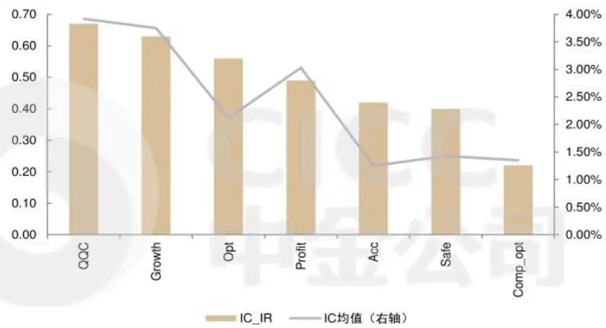
资料来源：万得资讯，中金公司研究部（样本期：2010-01-04至2022-04-01）

图表 160：复合因子沪深 300IC 值表现
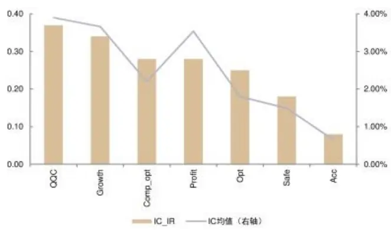
资料来源：万得资讯，中金公司研究部（样本期：2010-01-04至2022-04-01）

图表 161：复合因子中证 500IC 值表现
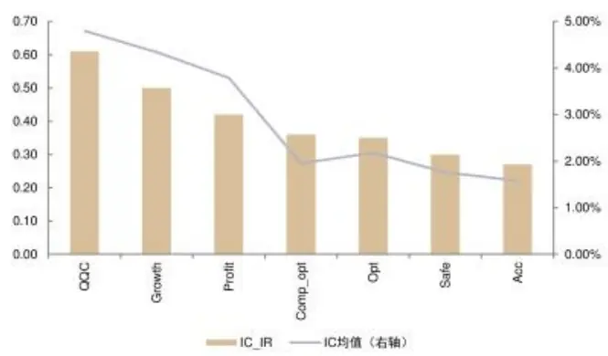
资料来源：万得资讯，中金公司研究部（样本期：2010-01-04至2022-04-01）

图表162：复合因子相关性表现

| Acc | Acc | Comp_opt | Growth | Opt | Profit | QQC | Safe |
| --- | --- | --- | --- | --- | --- | --- | --- |
|  | 1.00 | 0.04 | 0.04 | 0.01 | 0.28 | 0.53 | 0.25 |
| Comp_optGrowth | 0.04 | 1.00 | -0.05 | 0.02 | -0.02 | 0.32 | 0.01 |
|  | 0.04 | -0.05 | 1.00 | 0.28 | 0.27 | 0.53 | 0.11 |
| OptProfit | 0.01 | 0.02 | 0.28 | 1.00 | 0.13 | 0.49 | 0.04 |
|  | 0.28 | -0.02 | 0.27 | 0.13 | 1.00 | 0.65 | 0.36 |
| QQCSafe | 0.53 | 0.32 | 0.53 | 0.49 | 0.65 | 1.00 | 0.57 |
|  | 0.25 | 0.01 | 0.11 | 0.04 | 0.36 | 0.57 | 1.00 |

资料来源：万得资讯，中金公司研究部（样本期：2009-12-31至2022-03-31）

## 推荐关注 Growth 和 QQC 因子

Growth 和 QQC 因子多头组合整体表现出色。全市场中，Growth 和 QQC 因子的多头组合整体具有较高的年化收益，同时组合的相对净值走势较为平稳，呈现上升趋势。在沪深300和中证500中，Growth和QQC因子多头组合的相对净值大体表现良好，但近一年来均有较大回撤。

图表 163：Growth 因子全市场多头收益走势
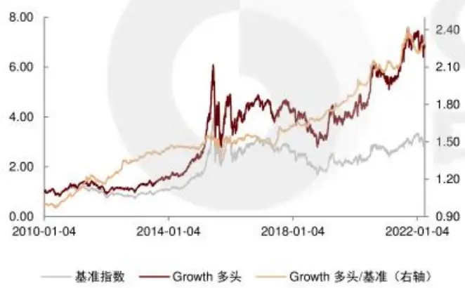
资料来源：万得资讯，中金公司研究部（数据截至2022-04-01）注：基准指数为万得全A（等权）指数（8841388.WI）

图表164：QQC 因子全市场多头收益走势
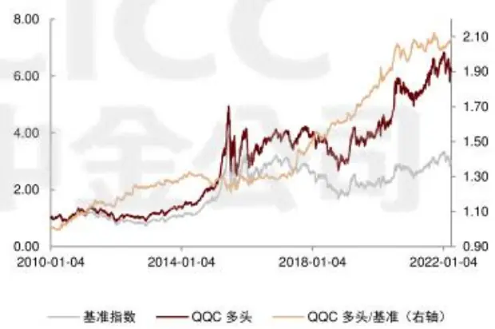
资料来源：万得资讯，中金公司研究部（数据截至2022-04-01）注：基准指数为万得全A（等权）指数（8841388.WI）

图表 165：Growth 因子沪深 300 多头收益走势
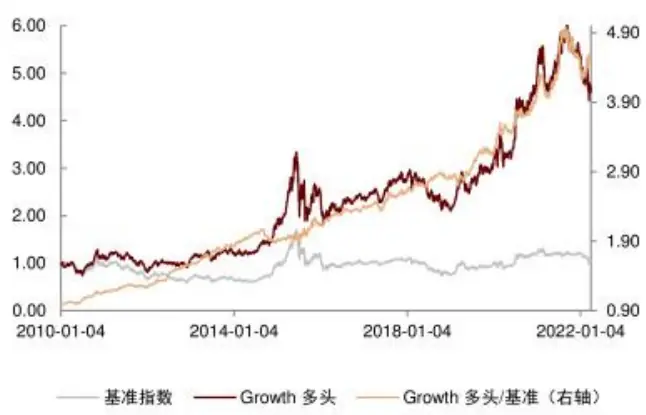
资料来源：万得资讯，中金公司研究部（数据截至2022-04-01）注：基准指数为300等权（000984.CSI）

图表 166：QQC因子沪深 300 多头收益走势
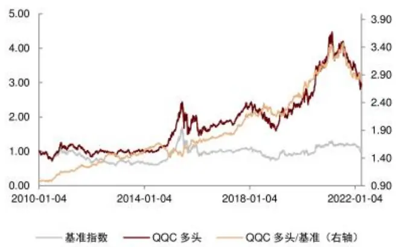
资料来源：万得资讯，中金公司研究部（数据截至2022-04-01）注：基准指数为300等权（000984.CSI）

图表 167：Growth 因子中证 500 多头收益走势
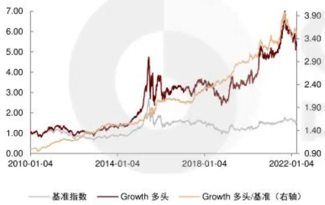
资料来源：万得资讯，中金公司研究部（数据截至2022-04-01）注：基准指数为500等权（399982.SZ）

图表 168：QQC 因子中证 500 多头收益走势
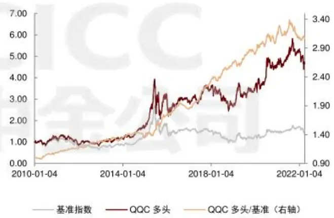
资料来源：万得资讯，中金公司研究部（数据截至2022-04-01）注：基准指数为500等权（399982.SZ）

## 附录

图表169：因子含义

| 因子类别 | 因子名称 | 因子含义 | 因子计算公式 |
| --- | --- | --- | --- |
| 盈利能力 | CFOA | 全部资产现金回收率 TTM | 经营现金流净额TTM/总资产 |
| 盈利能力 | CFOAD | 全部资产现金回收率变动 | 当期全部资产现金回收率 TTM-上期全部资产现金回收率 TTM |
| 盈利能力 | ROA_TTM | 资产回报率TTM | 净利润TTM/总资产 |
| 盈利能力 | ROAD | 资产回报率变动 | 当期资产回报率 TTM-上期资产回报率 TTM |
| 盈利能力 | ROE_TTM | 净资产收益率 TTM | 净利润 TTM/净资产 |
| 盈利能力 | ROED | 净资产收益率变动 | 当期净资产收益率 TTM-上期净资产收益率 TTM |
| 盈利能力 | ROIC_TTM | 资本回报率 TTM | 息前税后经营利润TTM/投入资本 |
| 盈利能力 | ROICD | 资本回报率变动 | 当期资本回报率 TTM- 上期资本回报率 TTM |
| 盈利能力 | TOE | 应交税费占比 | (当期应交税费-上年同期应交税费+缴纳税费现金流TTM)/净资产 |
| 盈利能力 | TOE_Z | 应交税费占比的标准分数 | (应交税费占比-均值)/标准差 |
| 成长因子 | EPS_Diluted_Q_YOY | 稀释EPS增速（单季度同比） | (本季度稀释EPS-去年同季度稀释EPS)/去年同季度稀释EPS |
| 成长因子 | EPS_Q_YOY | EPS增速（单季度同比） | (本季度EPS-去年同季度EPS)/去年同季度EPS |
| 成长因子 | EPS_YOY | EPS增速（TTM同比） | (当期EPS TTM -去年同期EPS TTM)/去年同期EPS TTM |
| 成长因子 | LPNP | 线性提纯净利润因子 | 净利润对营业外收入与支付给职工以及为职工支付的现金取滚动回归残差 |
| 成长因子 | NP_Deducted_YOY | 扣非净利润增速（TTM同比） | (当期扣非净利润 TTM-去年同期扣非净利润TTM)/去年同期扣非净利润TTM |
| 成长因子 | NP_Q_YOY | 净利润增速（单季度同比） | (本季度净利润-去年同季度净利润)/去年同季度净利润 |
| 成长因子 | NP_QOQ | 净利润增速（单季度环比） | (本季度净利润-上季度净利润)/上季度净利润 |
| 成长因子 | NP_SD | 净利润稳键加速度 | 净利润稳健增速的一阶差分 |
| 成长因子 | NP_SUE0 | 标准化预期外净利润（不带漂移项） | (实际净利润·预期净利润)/预期标准差（模型不带漂移项） |
| 成长因子 | NP_SUE1 | 标准化预期外净利润（带漂移项） | (实际净利润·预期净利润)/预期标准差（模型带漂移项） |
| 成长因子 | NP_YOY | 净利润增速（TTM同比） | (当期净利润TTM·去年同期净利润TTM)/去年同期净利润TTM |
| 成长因子 | NP_Z | 净利润增速标准分数 | (净利润增速·均值)/标准差 |
| 成长因子 | OCF_Q_YOY | 经营现金流增速（单季度同比） | (本季度经营现金流·去年同季度经营现金流)/去年同季度经营现金流 |
| 成长因子 | OCF_YOY | 经营现金流增速（TTM同比） | (当期经营现金流 TTM-去年同期经营现金流TTM)/去年同期经营现金流 TTM |
| 成长因子 | OP_Q_YOY | 营业利润增速（单季度同比） | (本季度营业利润-去年同季度营业利润)/去年同季度营业利润 |
| 成长因子 | OP_QOQ | 营业利润增速（单季度环比） | (本季度营业利润-上季度营业利润)/上季度营业利润 |
| 成长因子 | OP_SD | 营业利润稳健加速度 | 营业利润稳健增速的一阶差分 |
| 成长因子 | OP_YOY | 营业利润增速（TTM同比） | (当期营业利润 TTM-去年同期营业利润 TTM)/去年同期营业利润 TTM |
| 成长因子 | OP_Z | 营业利润增速标准分数 | (营业利润增速-均值)/标准差 |
| 成长因子 | OR_Q_YOY | 营业收入增速（单季度同比） | (本季度营业收入-去年同季度营业收入)/去年同季度营业收入 |
| 成长因子 | OR_YOY | 营业收入增速（TTM同比） | (当期营业收入TTM-去年同期营业收入TTM)/去年同期营业收入TTM |
| 成长因子 | OT_Z | 经营税TTM环比增速的标准分数 | (经营税TTM环比增速-均值)/标准差 |
| 成长因子 | PTCF_Z | 缴纳税费的现金流TTM环比增速的标准分数 | (缴纳税费的现金流TTM环比增速·均值)/标准差 |
| 成长因子 | QPT | 业绩趋势因子 | 业绩增速与加速度的分层打分 |
| 成长因子 | ROE_YOY | ROE增速（TTM同比） | (当期ROE TTM- 去年同期ROE TTM)/ 去年同期ROE TTM |
| 成长因子 | TA_YOY | 总资产增速 | (当期总资产·去年同期总资产)/去年同期总资产 |
| 营运效率 | AT | 资产周转率TTM | 营业收入TTM/平均总资产 |
| 营运效率 | ATD | 资产周转率变动 | 当期资产周转率 TTM-上期资产周转率 TTM |
| 营运效率 | GPMD | 毛利率变动 | 当期毛利率 TTM-上期毛利率 TTM |
| 营运效率 | INVT | 存货周转率 TTM | 营业成本 TTM/存货平均余额 |
| 营运效率 | INVTD | 存货周转率变动 | 当期存货周转率 TTM-上期存货周转率 TTM |
| 营运效率 | NPM_TTM | 净利率 TTM | 净利润TTM/营业收入TTM |
| 营运效率 | OCFA | 产能利用率提升 | 最近一期营业总成本在固定资产上滚动回归残差 |
| 营运效率 | OPM_TTM | 营业利润率 TTM | 营业利润 TTM/营业收入 TTM |
| 营运效率 | OPMD | 营业利润率变动 | 当期营业利润率-上期营业利润率 |
| 营运效率 | OPtoGR_TTM | 营业利润比毛利润 | 营业利润 TTM/毛利润 TTM |
| 营运效率 | RAT | 应收周转率 TTM | 营业收入TTM/(平均应收账款 +平均应收票据) |
| 营运效率 | RATD | 应收周转率变动 | 当期应收周转率-上期应收周转率 |
| 盈余质量 | APR_TTM | 应计利润占比 | 应计利润 TTM/营业利润 TTM |
| 盈余质量 | APRD | 应计利润占比变动 | 当期应计利润占比-上期应计利润占比 |
| 盈余质量 | CSR | 现金比率 | 现金及现金等价资产/流动负债 |
| 盈余质量 | CSRD | 现金比率变动 | 当期现金比率·上期现金比率 |
| 安全性因子 | CCR | 现金流动负债比率 | 经营净现金流/流动负债 |
| 安全性因子 | CCRD | 现金流动负债比率变动 | 当期现金流动负债比率·上期现金流动负债比率 |
| 安全性因子 | CUR | 流动比率 | 流动资产/流动负债 |
| 安全性因子 | CURD | 流动比率变动 | 当期流动比率-上期流动比率 |
| 安全性因子 | DAD | 资产负债率变动 | 当期资产负债率-上期资产负债率 |
| 安全性因子 | Debt_Asset | 资产负债比 | 总负债/总资产 |
| 安全性因子 | DTE | 产权比率 | 总负债/归母股东权益 |
| 安全性因子 | DTED | 产权比率变动 | 当期产权比率-上期产权比率 |
| 安全性因子 | QR | 速动比率 |  |
|  |  |  | (流动资产-存货-1年内到期的非流动资产-待摊费用-预付款)/流动负债 |
| 公司治理 | Comp_opt | 公司治理因子 | 流通股占比、管理层薪酬、管理层持股数量、处罚情况和是否股权激励五大指标根据方向调整等权相加 |
| 公司治理 | DPR_TTM | 股利支付率 | 现金分红总额/净利润 |
| 公司治理 | TOP_MANA_INCOME | 前十位高管薪酬总和 | 前十位高管薪酬总和 |
| 估值因子 | BP_LR | 市净率倒数 | 最新财报净资产/总市值 |
| 估值因子 | DP | 股息率 | 分红TTM/总市值 |
| 估值因子 | EP_TTM | 市盈率倒数 | 净利润TTM/总市值 |
| 估值因子 | EV2EBITDA | 企业价值倍数 | 总市值/EBITDA TTM |
| 估值因子 | FCFP_TTM | 自由现金流 TTM 比总市值 | 自由现金流TTM/总市值 |
| 估值因子 | NCFP_TTM | 净现金流TTM比总市值 | 净现金流 TTM/总市值 |
| 估值因子 | OCFP TTM | 经营性现金流 TTM 比总市值 | 经营性现金流 TTM/总市值 |
| 估值因子 | PEG_TTM | 市盈率相对盈利增长率 | PE TTM/(净利润增长率·100) |
| 估值因子 | SP_TTM | 市销率倒数 | 营业收入 TTM/总市值 |
| 分析师因子 | CAFR | 一致性修正因子 | 分析师预期修正平均值/分析师预期修正标准差 |
| 分析师因子 | EEChange_1M | 一致预期净利润一个月变化率 | (当期一致预期净利润·前一个月一致预期净利润)/前一个月一致预期净利润 |
| 分析师因子 | EEChange_3M | 一致预期净利润三个月变化率 | (当期一致预期净利润·前三个月一致预期净利润)/前三个月一致预期净利润 |
| 分析师因子 | EEP | 一致预期EP | 一致预期EP |
| 分析师因子 | EEPSChange_1M | 一致预期EPS一个月变化 | 当期一致预期EPS-前一个月一致预期EPS |
| 分析师因子 | EEPSChange_3M | 一致预期EPS三个月变化 | 当期一致预期EPS·前三个月一致预期EPS |
| 分析师因子 | EINS_75D | 75日内预测机构数 | 75日内预测机构数 |
| 分析师因子 分析师因子 | EOPChange_1M | 一致预期营业收入一个月变化 | 当期一致预期营业收入-前一个月一致预期营业收入 |
|  | EOPChange_3M | 一致预期营业收入三个月变化 | 当期一致预期营业收入-前三个月一致预期营业收入 |
| 分析师因子 | FORE_Eaming | 一致预期净利润 | 一致预期净利润 |
| 分析师因子 | FORE_EPS | 一致预期EPS | 一致预期EPS |
| 分析师因子 | FORE_OP | 一致预期营业收入 | 一致预期营业收入 |
| 分析师因子 | RatingChange_1M | 评级一个月变化 | 当期评级-前一个月评级 |
| 分析师因子 | RatingChange_3M | 评级三个月变化 | 当期评级·前三个月评级 |
| 分析师因子 | RPP_75D | 75日内预测报告数量 | 75日内预测报告数量 |
| 分析师因子 | TargetRetum | 一致预期收益率 | (一致预期目标价/收盘价)-1 |
| 股东 | HN_z | 股东数目时序标准分数 | (股东数目-均值)/标准差 |
| 股东 | IHN_diff | 持仓机构个数变化 | 当期持仓机构个数-上期持仓机构个数 |
| 股东 | LHRD | 十大股东占比分散度 | 十大股东各自持仓占比为样本计算标准差 |
| 股东 规模因子 | Ln_H | 持仓机构个数 | 持仓机构个数 |
|  | FC | 流通市值 | 流通市值 |
| 规模因子 | FC_MC | 流通市值比总市值 | 流通市值/总市值 |
| 规模因子 | Ln_FC | 流通市值对数 | 流通市值对数 |
| 规模因子 规模因子 | Ln_MC | 总市值对数 | 总市值对数 |
|  | MC | 总市值 | 总市值 |
| 复合因子 | Acc | 净利润成长加速度 | APR为基础因子计算 |
| 复合因子 | Comp_opt | 公司治理因子 | 流通股占比、管理层薪酬、管理层持股数量、处罚情况和是否股权激励五大指标根据方向调整等权相加 |
| 复合因子 | Growth | 综合成长因子 | OP_SD、QPT和 NP_Q_YOY因子等权相加 |
| 复合因子 | Opt | 综合营运效率因子 | ATD 和 OCFA 因子等权相加 |
| 复合因子 | Profit | 综合盈利因子 | CFOA、ROE 和 ROIC 因子等权相加 |
| 复合因子 | QQc | 综合质量因子 | 其他六种复合因子等权相加 |
| 复合因子 | Safe | 综合安全性因子 | CCR为基础因子计算 |

资料来源：中金公司研究部

周蕭潇
SAC 执证编号：S0080521010006
SFC CE Ref: BRA090
xiaoxiao.zhou@cicc.com.cn

王汉锋

SFC CE Ref: AND454

SAC 执证编号：S0080513080002

hanfeng.wang@cicc.com.cn

## 作者信息

古翔
SAC 执证编号：S0080521010010
SFC CE Ref: BRE496
xiang.gu@cicc.com.cn
刘均伟
SAC 执证编号：S0080520120002
SFC CE Ref: BQR365
junwei.liu@cicc.com.cn

## CICC中金公司

## 法律声明

一般声明

本报告由中国国际金融股份有限公司（已具备中国证监会批复的证券投资咨询业务资格）制作。本报告中的信息均来源干我们认为可靠的已公开资料，但中国国际金融股份有限公司及其关联机构（以下统称“中金公司”）对这些信息的准确性及完整性不作任何保证。本报告中的信息、意见等均仅供投资者参考之用，不构成对买卖任何证券或其他金融工具的出价或征价或提供任何投资决策建议的服务。该等信息、意见并未考虑到获取本报告人员的具体投资目的、财务状况以及特定需求，在任何时候均不构成对任何人的个人推荐或投资操作性建议。投资者应当对本报告中的信息和意见进行独立评估，自主审慎做出决策并自行承担风险。投资者在依据本报告涉及的内容进行任何决策前，应同时考量各自的投资目的、财务状况和特定需求，并就相关决策咨询专业顾问的意见对依据或者使用本报告所造成的一切后果，中金公司及/或其关联人员均不承担任何责任。

本报告所载的意见、评估及预测仅为本报告出具日的观点和判断，相关证券或金融工具的价格、价值及收益亦可能会波动。该等意见、评估及预测无需通知即可随时更改。在不同时期，中金公司可能会发出与本报告所载意见、评估及预测不一致的研究报告。

本报告署名分析师可能会不时与中金公司的客户、销售交易人员、其他业务人员或在本报告中针对可能对本报告所涉及的标的证券或其他金融工具的市场价格产生短期影响的催化剂或事件进行交易策略的讨论。这种短期影响的分析可能与分析师已发布的关于相关证券或其他金融工具的目标价、评级、估值、预测等观点相反或不一致，相关的交易策略不同于且也不影响分析师关于其所研究标的证券或其他金融工具的基本面评级或评分。

中金公司的销售人员、交易人员以及其他专业人士可能会依据不同假设和标准、采用不同的分析方法而口头或书面发表与本报告意见及建议不一致的市场评论和/或交易观点。中金公司没有将此意见及建议向报告所有接收者进行更新的义务。中金公司的资产管理部门、自营部门以及其他投资业务部门可能独立做出与本报告中的意见不一致的投资决策。

除非另行说明，本报告中所引用的关于业绩的数据代表过往表现。过往的业绩表现亦不应作为日后回报的预示。我们不承诺也不保证，任何所预示的回报会得以实现。
分析中所做的预测可能是基于相应的假设。任何假设的变化可能会显著地影响所预测的回报。

本报告提供给某接收人是基于该接收人被认为有能力独立评估投资风险并就投资决策能行使独立判断。投资的独立判断是指，投资决策是投资者自身基于对潜在投资的目标、需求、机会、风险、市场因素及其他投资考虑而独立做出的。

本报告由受香港证券和期货委员会监管的中国国际金融香港证券有限公司（“中金香港”）于香港提供。香港的投资者若有任何关于中金公司研究报告的问题请直接联系中金香港的销售交易代表。本报告作者所持香港证监会牌照的牌照编号已披露在报告首页的作者姓名旁。

本报告由受新加坡金融管理局监管的中国国际金融（新加坡）有限公司（“中金新加坡”）于新加坡向符合新加坡《证券期货法》定义下的认可投资者及/或机构投资者提供。提供本报告于此类投资者，有关财务顾问将无需根据新加坡之《财务顾问法》第36 条就任何利益及/或其代表就任何证券利益进行披露。有关本报告之任何查询，在新加坡获得本报告的人员可联系中金新加坡销售交易代表。

本报告由受金融服务监管局监管的中国国际金融（英国）有限公司（“中金英国”）于英国提供。本报告有关的投资和服务仅向符合《2000年金融服务和市场法2005年(金融推介）令》第19（5）条、38条、47条以及49条规定的人士提供。本报告并未打算提供给零售客户使用。在其他欧洲经济区国家，本报告向被其本国认定为专业投资者（或相当性质）的人士提供。

本报告由中国国际金融日本株式会社（“中金日本”）于日本提供，中金日本是在日本关东财务局（日本关东财务局长（金商）第3235号）注册并受日本法律监管的金融机构。本报告有关的投资和服务仅向符合日本《金融商品交易法》第2条31项所规定的专业投资者提供。本报告并未打算提供给日本非专业投资者使用。

本报告将依据其他国家或地区的法律法规和监管要求于该国家或地区提供。

## 特别声明

在法律许可的情况下，中金公司可能与本报告中提及公司正在建立或争取建立业务关系或服务关系。因此，投资者应当考虑到中金公司及/或其相关人员可能存在影响本报告观点客观性的潜在利益冲突。

与本报告所含具体公司相关的披露信息请访https://research.cicc.com/footer/disclosures，亦可参见近期已发布的关于该等公司的具体研究报告。

中金研究基本评级体系说明：

分析师采用相对评级体系，股票评级分为跑赢行业、中性、跑输行业（定义见下文）。

除了股票评级外，中金公司对覆盖行业的未来市场表现提供行业评级观点，行业评级分为超配、标配、低配（定义见下文）。

我们在此提醒您，中金公司对研究覆盖的股票不提供买入、卖出评级。跑赢行业、跑输行业不等同于买入、卖出。投资者应仔细阅读中金公司研究报告中的所有评级定义。请投资者仔细阅读研究报告全文，以获取比较完整的观点与信息，不应仅仅依靠评级来推断结论。在任何情形下，评级（或研究观点）都不应被视为或作为投资建议。投资者买卖证券或其他金融产品的决定应基于自身实际具体情况（比如当前的持仓结构）及其他需要考虑的因素。

## 股票评级定义：

·跑赢行业(OUTPERFORM)：未来6~12个月，分析师预计个股表现超过同期其所属的中金行业指数；

·中性（NEUTRAL）：未来6~12个月，分析师预计个股表现与同期其所属的中金行业指数相比持平

跑输行业（UNDERPERFORM)：未来6~12个月，分析师预计个股表现不及同期其所属的中金行业指数。

## 行业评级定义：

超配（OVERWEIGHT）：未来6~12个月，分析师预计某行业会跑赢大盘10%以上；

- 标配（EQUAL-WEIGHT）：未来6~12个月，分析师预计某行业表现与大盘的关系在-10%与10%之间；

- 低配(UNDERWEIGHT)：未来6~12个月，分析师预计某行业会跑输大盘10%以上。

研究报告评级分布可从https://research.cicc.com/footer/disclosures 获悉。

本报告的版权仅为中金公司所有，未经书面许可任何机构和个人不得以任何形式转发、翻版、复制、刊登、发表或引用。

V190624 编辑：金灿

## CICC中金公司

## 北京

中国国际金融股份有限公司中国北京建国门外大街1号国贸写字楼2座28层邮编：100004电话：(86-10)6505 1166传真：(86-10) 6505 1156

## 深圳

中国国际金融股份有限公司深圳分公司
深圳市福田区益田路5033号
平安金融中心72层
邮编：518048
电话：(86-755)8319-5000
传真：(86-755)8319-9229

## 东京

中国国际金融日本株式会社
100-0005東京都千代田区丸の内3丁目2番3
号丸の内二重橋ビル21階
Tel: (+813) 3201 6388
Fax: (+813)3201 6389

## 纽约

CICC US Securities, Inc 32nd Floor, 280 Park Avenue New York, NY 10017, USA Tel: (+1-646) 7948 800 Fax: (+1-646) 7948 801

## 伦敦

China International Capital Corporation (UK) 
Limited 
25th Floor, 125 Old Broad Street 
London EC2N 1AR, United Kingdom 
Tel: (+44-20) 7367 5718 
Fax: (+44-20) 7367 5719

## 上海

中国国际金融股份有限公司上海分公司
上海市浦东新区陆家嘴环路1233号
汇亚大厦32层
邮编：200120
电话：(86-21)5879-6226
传真：(86-21)5888-8976

## 香港

中国国际金融（香港）有限公司香港中环港景街1号国际金融中心第一期29 楼电话：(852)2872-2000传真：(852)2872-2100

## 旧金山

CICC US Securities, Inc. San Francisco Branch 
Office 
One Embarcadero Center, Suite 2350, 
San Francisco, CA 94111, USA 
Tel: (+1) 415 493 4120 
Fax: (+1) 628 203 8514

## 新加坡

China International Capital Corporation 
(Singapore) Pte. Limited 
6 Battery Road, #33-01 
Singapore 049909 
Tel: (+65) 6572 1999 
Fax: (+65) 6327 1278

## 法兰克福

China International Capital Corporation (Europe) 
GmbH 
Neue Mainzer Straße 52-58, 60311 
Frankfurt a.M, Germany 
Tel: (+49-69) 24437 3560