# 量化多因子系列（6)：关于动量，你所希望了解的那些事

胡骥聪
SAC 执证编号：S0080521010007
SFC CE Ref: BRF083
jicong.hu@cicc.com.cn

SAC 执证编号：S0080520120002

本篇报告针对截面动量类型因子进行研究。对该类因子为何能够存在的底层逻辑、其收益来源、以及影响其效果的关键因素一一展开讨论。并分析在何时何地动量因子会更多地体现出“动量”或“反转”的特征。在此基础上，进一步给出动量类型因子的开发范式供业界研究者参考。

## 动量研究：底层逻辑、收益来源、以及影响其效果的关键因素

1)市场行使价格发现功能时，市场与投资者面临的实际约束为动量因子提供了收益空间。动量类因子的收益来源既包含风险溢价补偿，也包含行为偏差造成的错误定价。

2)交易的投资者结构是影响动量因子方向的重要因素。理性投资者的交易行为特征，提供了风险溢价补偿的“动量”收益。而非理性投资者的交易行为特征，以不同的行为偏差方式，既提供了“反转”收益，也为“动量”收益提供来源。因此，当价格的变动主要由机构投资者主导时，动量特征更明显；而如果价格变动主要由散户投资者主导时，反转效应更强烈。

3)一年动量的收益部分来源于风险补偿，且该风险主要是业绩基本面风险；而一个月动量的收益主要来自投资者行为偏差造成的错误定价。

4)截面分域中，动量特征在高机构覆盖、大市值、低波动、高价值的股票池中更明显：而反转效果在低覆盖、小市值、高波动、低流动性、低价值的股票池内更为显著。时序分域中，当市场处于下跌、低波动时期；风格处于大盘占优、成长占优的时期时，动量类因子倾向释放更多的“动量”特征；而当市场与上涨、高波动时期；风格处于小盘占优、价值占优的时期时，动量类因子倾向释放更多的“反转”特征。

## 动量类因子的开发路径：权重序列是核心变量。

动量因子的构建可以拆解为一种历史收益率序列向量与一种权重序列向量的内积。从逻辑推导入手的动量因子挖掘，其核心在于给出一种逻辑猜想，能够利用某些股票特征，判断出在某些时刻或某些场景的股票交易中，其投资者交易占比是更偏向机构还是个人。并把该猜想以权重序列的形式表达出来。而从机器暴力挖掘入手的动量因子开发，其核心在于利用算法不断优化寻找更理想的权重序列。

通过尝试对A股中的动量类因子进行改进与测试，“反转”逻辑因子中我们较为推荐一个月振幅调整动量因子与一个月日内动量因子。而“动量”逻辑因子里更为推荐业绩公告前隔夜动量、业绩公告跳空动量等因子。

## 动量类型风格观点展望：反转逻辑的因子效果会逐步减弱。

长期来看，随着A股市场越来越规范，机构投资者交易占比逐渐提升。A股的动量特征会越来越明显，而反转效果将逐步削弱。

对近期的观点，考虑到当下我们对未来市场涨跌的择时观点尚显悲观，成长/价值风格轮动模型更看好成长风格。我们认为近期“动量”特征会更明显，而“反转”效应会比以往更弱。推荐投资者提高“动量”逻辑因子权重，降低“反转”逻辑因子权重。

## 更多作者及其他信息请见文末披露页

## 动量的故事：底层逻辑、收益来源、与影响因素

Momentum动量因子，确切地说，“截面动量”因子，作为常见的选股因子，因其通俗简单的定义方式与长盛不衰的有效性，广为业界投资者熟知与应用。

传统动量因子的构造方式很简单：只需计算标的在过去某一个时间区间内的收益率，作为因子值即可。其中最广为使用的两个动量类因子，一个是以标的过去一个月收益率计算的“一个月动量”因子，公式为： $P_{T}/P_{T-1}-1$ ，我们不妨将其记为MOM_1M；另一个是以标的过去1年排除最近一个月的区间内收益率计算的“一年动量”因子，公式为： $P_{T-1}/P_{T-12}-1$ ，我们不妨将其记为MOM_1Y。

实际上，一个月动量因子MOM1M，在股票市场中，尤其是A股市场中，往往是以“反转因子”的身份被投资者们运用。也就是说，上个月收益率相对较高的股票，往往在次月表现更为糟糕。从字面含义上，“反转”与“动量”是相反的意思，动量表达趋势延续、强者恒强；而反转意味着趋势颠倒、强弱易位。然而，我们认为动量与反转从本质上表达的底层逻辑是同一个维度的，仅在不同情况下以不同的方向体现在市场中。本篇报告中，我们将“反转”因子与“动量”因子均归为动量类型因子一并讨论，并针对其底层逻辑展开辩证，分析动量类型因子的形成原因与收益来源。在此基础上，进一步给出动量类型因子的开发范式。

## 截面动量因子的收益来自哪里？

构造方式简单的1个月动量因子（负向）在A股有较为明显的alpha收益，1年动量因子在海外成熟市场也长期有效。海内外投资者都很关心的一个问题是：为什么这么简单的因子能够长期有效，或者说它的收益来源是哪里？

针对这个问题，学界与业界的研究者已经有很多深入研究，给出的解释基本可以分为两个方向：行为金融学解释，与风险补偿解释。

## 图表1：解释动量类型因子收益来源的各类研究方向

## 风险补偿解释

过去的高收益率意味着更高的股息增长率风险，从而要求股票在未来有更高的回报作为补偿。相关文献如《RationalMomentum Effects》等

新信息带有不确定性，对这种不确定性需要风险补偿，并导致风险溢价以自相关的形式下降。相关文献如《NewsEvents, Information Acquisition, andSerial Correlation》等

- 其它风险补偿解释...

资料来源：中金公司研究部

## 行为偏差解释

- 反应不足与反应过度。相关文献如《Residual momentum in Japan》， 《AUnified Theory of Underreaction,Momentum Trading, and Overreactionin Asset Markets》， 《CompetingTheories of Financial Anomalies》等

过度自信与自利归因。相关文献如《A theory of overconfidence, selfattribution, and security market underand over-reactions》， 《Stock Price Patterns when Overconfident Traders Underestimate their Competition》等。

- 其它行为偏差解释...

总的来说，行为金融学解释强调非理性投资者的行为偏差，造成股价的错误定价，从而使得动量类型因子具有alpha收益：风险补偿解释则强调动量特征实际表征了某种或多种风险特征.投资者承担该类风险因此而获得的风险溢价补偿。为了更进一步探究动量类型因子的真实收益来源，我们不妨先对这两类收益来源的特征做一个剖析。

理论上，如果某些收益是由于行为偏差造成的错误定价造成的。那么当越来越多的投资者意识到该行为偏差会产生这样的超额收益，整个市场会从两个方面对该类alpha收益造成损伤：一是投资者自身避免或减少自己的该类非理性投资行为对自己投资造成的损失。这样的行为会导致市场整体的错误定价程度减小；二是会有越来越多的投资者从该类错误定价中捕捉套利机会，从而造成该类alpha收益的衰减越来越快。因此除非有明显的阻止套利行为的机制，对于行为金融学解释中行为偏差造成的alpha收益，我们应该能观察到该类alpha，会随着越来越广为人知与市场制度的成熟，其收益或预测能力逐渐削弱。

而对于风险补偿造成的alpha收益，只要该类风险本身逻辑没有出现本质变化，那么这类alpha并不会像行为偏差类alpha那样，随着市场成熟与广为人知而逐渐弱化。但随着该风险溢价水平的高低波动，其alpha收益也会在不同时期呈现出周期性波动的特征。

因此，在后续的研究中，我们可以观察动量类型因子的预测能力及收益水平在时间序列上的变化特征，来推测验证其收益来源。但首先，我们不妨先讲一个动量的“故事”。

## 为什么会有“动量”与“反转”，它们是怎么出现的？

价格，是反映市场（所有投资者）对标的物的价值预期博弈的结果。任何新信息的产生，都会改变投资者对标的物的价值预期，从而在价格改变中得到体现。举一个简单的例子：

“在一个理想的完美市场里，有一个公司的股票价格为100。这时候有关该公司的一个新信息进入市场，这个新信息表明该公司最近由于成功改进生产线，从而提高了盈利与成长水平，该利好信息价值当前价格下10%的股票涨幅。因此市场迅速消化该信息，并将其通过交易反应到股票价格上，该公司的股票价格涨为110。”

这个理想化的例子是“有效市场假说”的一个典型案例。但在现实世界里，上述例子中有太多隐含的强假设无法成立，最重要的两条包括：

1. 市场上的投资者并不会同时得到这个消息并做出反应，甚至可能有些投资者完全不知道该消息，而以其它理由在进行交易；

2. 对该消息的解读与消息价值的判断因人而异，并没有一个上帝视角给出所谓“该消息价值对应当前股票价格10%的涨幅”这样的标准答案。

由于上述两个现实约束的存在，更可能发生的情景是：当一个消息进入市场后，

第一个阶段，市场上有大量未接受到该信息的投资者时，标的买卖双方造成的买卖供需关系并不会显著到立即把价格推向其应当达到的位置，故价格不会迅速变化到其应该到达的纳入信息后合理价格(reasonable priced-in price)，也就是产生了所谓的“反应不足”。

第二个阶段，市场上越来越多的投资者接触到了该信息并做出反应，价格逐渐被推至合理价格附近。但由于后入市场的投资者中有一部分因为各种各样的原因（后文我们将针对这些原因讨论)，错误或过分估计了该信息价值，从而将该股票价格再进一步推离了合理价格，也就是产生了所谓的“反应过度”。

第三个阶段，市场的投资者捕捉到第二阶段后半阶段产生的过度反应带来的盈利空间，通

过交易获取超额收益的同时，将股票价格再度往合理价格处推动。

上述情景中第二阶段与第三阶段实际中可能来回多次发生，而整个流程本质上就是市场价格发现的过程。在这个过程中，第一阶段的价格发现与第二阶段的泡沫产生都给“动量”提供了发生的土壤，而第三阶段的价格发现受益于第二阶段的泡沫，又给“反转”收益提供了来源。

图表2:价格发现过程中产生“动量”与“反转”的情景土壤
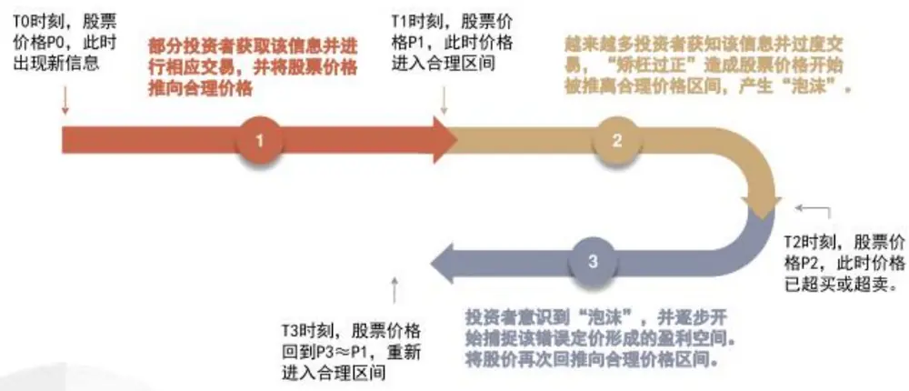
资料来源：中金公司研究部

从单个个股的价格发现流过程中，我们探讨了“动量”与“反转”的收益情景，第一阶段、第二阶段提供“动量”，第三阶段提供“反转”。但站在截面因子的角度，并没有给出清晰的解释，来解决为什么有些动量类型因子是“反转”特征，例如A股中的1个月动量；而有的因子却是“动量”特征，例如美股中的1年动量。接下来，我们继续这个动量的“故事”，尝试给上述问题一个答案。

## 什么因素决定了因子方向以“动量”呈现，还是“反转”示人?

在之前分析“动量”与“反转”是怎么出现的过程中，我们是站在市场整体的角度，考虑它面临的实际约束与随之而来产生的价格发现过程。但要分析为什么某个动量类型因子的特征是其中一个而不是另一个，则需要我们先站在投资者的视角，去重新再审视这个价格发现的过程。

作为一个投资者，在其视角里，面前的这个过程更为复杂，面对的约束也更多，包括但不限于：

1. 该投资者很难知道或者干脆不知道这个新信息是什么时候首次进入市场的。换句话说，当其获得这个信息时，此时股票价格是100，但他并不知道这个信息是在股价95的时候首次进入市场的，还是当股价还在90的时候就已经进入市场了。

2. 该投资者很难确定或者干脆无法确定其是第几个知道这个信息的。换句话说，当他获得这个信息时，可能只有20%的投资者在这之前了解该信息并进行相应交易，也有可能已经有80%的投资者早就了解该信息并进行相应交易了。

3.该投资者能不能较好的估计出该信息的实际价值。换句话说，这个信息到底是值50%的涨幅，还是只值5%的涨幅。

4.该投资者能不能较好的估计市场其它投资者对该信息的价值预期。换句话说，这个信息在整个市场看来可能值多少。

以上4点对于投资者而言是非常关键的投资决策依据，本质上第1个与第2个约束，约束的都是投资者对自身在该信息上“时间定位”的认知；而第3个与第4个约束，约束的都是投资者对自身在该信息上“预期价值定位”的认知。它们可以独自或共同决定投资者眼中的“预期差”的方向与大小。

假设某个投资者可以站在上帝视角，完美地克服上述4个约束。那么他的投资逻辑将非常清晰：

在“时间定位”上，如果该投资者知道自己的排序位置靠前，那么他可以判断目前是属于价格发现的第一阶段，从而会选择追动量。而如果该投资者得知自己的排序位置靠中间，那么他可以基于自身风险偏好水平与其它信息决定，是否参与第二阶段过度交易带来的动量交易机会。而如果该投资者发现自己的排序位置已经很靠后，那么他应当选择参与捕捉价格发现过程中第三阶段带来的反转收益。

在“预期价格定位”上，即使投资者不考虑“时间定位”的因素，他也可以基于自己对该信息的价值估计，与市场一致预期的价值估计的大小对比来选择投资行为方式。如果该投资者了解到他自己对该信息的估价低于市场一致预期所给出的信息价值，那么则应该选择以“动量”的方式进入市场；反之则应该做“反转”。

回到现实中，没有投资者可以拥有上帝视角，因此所有投资者都必须处理上述约束带来的投资困境。然而不同投资者在应对上述约束时的处理方式与处理能力却是有着巨大的差异。

按照处理方式的维度，我们可以将投资者区分为“理性投资者”与“非理性投资者”。按照处理能力的维度，我们可以将投资者区分为“信息优势投资者”与“信息劣势投资者”。

我们先阐述理性投资者的处理路径，无论这个理性投资者是否具有信息优势，即具有获取大量一手信息并具有扎实的信息处理与解读能力。他都会审慎地考虑自己面临的约束处境。评估自己在“时间定位”与“预期价值定位”上的优劣势与确定性程度。

在此基础上，如果这个理性投资者恰好也具有信息优势，那么他将能更准确地评估他的约束处境与对应的位置，同时有更大概率能在较早的时间点领先市场其它投资者获取新信息并展开相应交易。这些将带来两个明显的投资优势：一个是更高的确定性，一个是更多的投资机会。这两个优势会使得投资者倾向于采用一种更稳健的投资方式：“我仅在我认为相对足够安全的时候才下注”。所以该类投资者往往更多地交易一些在他们视角里，价值很高，确定性很强，且自己能较早入场的信息。这意味着他们交易的股票此时大概率正处于消化该信息的第一阶段，且这个阶段持续时间会比较久。不难看出，机构权益基金经理，尤其是其中的“价值投资”践行者，往往是该类投资者的主要组成部分。

而如果这个理性投资者并不具有信息优势，他不像上述具有信息优势的投资者那样具备高确定性的个股投资机会。那么该类投资者往往会采用提高独立投资次数的方式来弥补确定性低（胜率不够高）的劣势。通过对其它信息的挖掘与解读，尝试捕捉动量或反转机会的特征，从而通过构建因子组合来获取收益。没错，实施因子投资的量化交易者正是该类型投资者的重要成员。而本篇报告也正是从方方面面来对动量与反转特征进行研究。

最后对于非理性投资者，他们的投资方式某种意义上来说更偏“激进”，是产生大量行为偏差的群体。在获得新信息后。很多非理性投资者并不会考虑该信息在他获知时是否已经早在价格中price-in了，而是凭着对该信息的直观理解与感觉直接进入市场交易。这些“过度自信”的行为偏差交易，往往成为造就价格发现过程中第二阶段后期泡沫的资金来源。同时，该类投资者往往也是“处置效应”的主要群体，过早地抛售浮盈的股票将纸面盈利落袋为安，同时不愿意卖出纸面亏损的股票止损。整体上，大量的个人散户投资者是组成该类投资者的主要成员。

图表3：不同类型投资者及对应交易行为特征
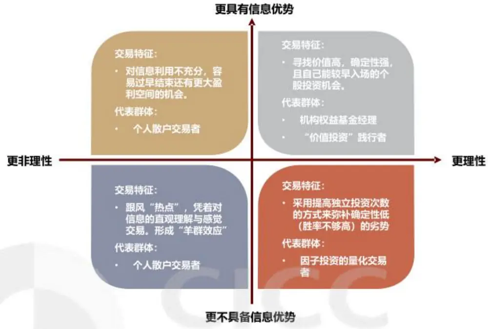
资料来源：中金公司研究部

在分析完上述不同投资者的行为模式，我们总结不同投资者的投资行为会如何对动量与反转产生影响：

第一类投资者，理性且具有信息优势的投资者群体，他们的交易行为往往创造出适合动量投资的场景。且该交易行为本质是基于投资者对信息的理性判断而做出，那么实际上该动量场景的产生是依赖于该类投资者做出投资判断背后所对应的风险暴露。

第二类投资者，理性但不具有信息优势的投资者群体，他们的交易行为在价格发现的第一阶段与第三阶段均只有加速该阶段的价格发现作用，但并不会额外产生动量或者反转的场景。但在价格发现的第二阶段中，该类投资者会尝试从泡沫扩大的过程中获取动量收益，一定程度上可能会扩大后续反转的场景空间。

第三类投资者，非理性投资者群体，他们的交易行为既会因为“过度自信”与“羊群效应”等行为偏差提供反转投资的场景，也会因为“处置效应”等行为偏差提供动量交易的场景。同时容易看出，该类投资者产生动量类型因子收益空间的原因基本是基于行为金融学上的原因。

综上，我们可以做出如下几个推断：

1. 交易的投资者结构会影响股票的动量类型特征。理性投资者交易占比越高，该股票未来“动量”特征越显著，反之“反转”特征越显著。

2. 理性投资者交易带来的“动量”特征更偏风险补偿解释，而非理性投资者带来的“动量”与“反转”特征收益均主要来自行为偏差。这意味着，负向动量类型因子（“反转”类)

更容易出现因子信息衰减的现象，而正向动量类型因子（“动量”类）由于其收益来源有很一部分来自风险补偿，未来该类因子将有相对更稳定的收益。

“故事”讲到这里，我们需要用实际数据去验证“故事”是否符合实际情况，能否对市场上的一些问题给出合理的解答。

## 同样的因子，为什么在美股是动量，在A股是反转？

海外成熟市场，尤其是美国股票市场，一年动量（MOM1Y）是一个显著正向的因子，但同样的因子在A股却是以负向的反转呈现出来。我们以2005年到2022年4月的数据测试一年动量因子分别在美股、港股与A股上的效果，其IC均值分别为4.2%，4.0%与-1.6%。实际上，不仅仅是一年动量，一个月动量（MOM_1M）也是在A股市场有更浓重的反转特征，一个月动量因子在美股、港股与A股上的IC均值分别为-1.1%，-1.8%与-6.3%。

图表4：一个月动量（MOM_1M）在不同市场股票上的累计IC 对比
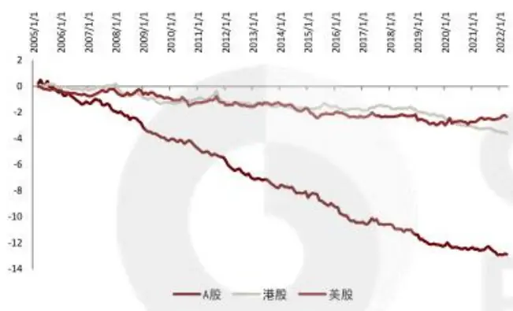
资料来源：万得资讯，中金公司研究部（样本期：2005-01-04至2022-04-30）

图表5：一年动量（MOM_1Y）在不同市场股票上的累计 IC 对比
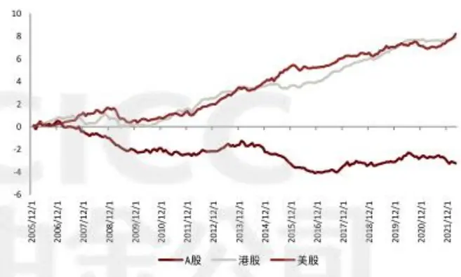
资料来源：万得资讯，中金公司研究部（样本期：2005-01-04至2022-04-30）

图表6：主流动量因子在不同市场股票上的IC统计

| 样本个数 |  |  | IC均值 | IC标准差 | ICIF绝对值 | IC>0比例 | IC>0.02比例 | IC<0比例 | IC<-0.02比例 | t值 |
| --- | --- | --- | --- | --- | --- | --- | --- | --- | --- | --- |
| 一年动量 MOM_1Y | A股 | 196 | -1.6% | 15.0% | 0.11 | 46.4% | 38.8% | 53.6% | 49.5% | -1.53 |
|  | 港股 | 196 | 4.0% | 11.3% | 0.36 | 71.9% | 65.3% | 28.1% | 21.9% | 4.97 |
|  | 美股 | 196 | 4.2% | 13.5% | 0.31 | 65.8% | 58.7% | 34.2% | 27.6% | 4.34 |
| 一个月动量 MOM_1M | A股 | 206 | -6.3% | 15.1% | 0.41 | 34.0% | 27.7% | 66.0% | 61.2% | -5.93 |
|  | 港股 | 207 | -1.8% | 10.1% | 0.17 | 44.0% | 30.0% | 56.0% | 47.3% | -2.51 |
|  | 美股 | 206 | -1.1% | 12.0% | 0.10 | 47.1% | 40.8% | 52.9% | 41.7% | -1.37 |

资料来源：万得资讯，中金公司研究部（样本期：2005-01-04至2022-04-30）

会出现这样的差异，一个很重要的原因正是我们在上一节阐述的投资者结构的差异。相比美股与港股，A股市场中代表第一类投资者群体的机构交易者的交易占比更少，而代表第三类投资者群体的个人散户交易者的交易占比更高。在2007年到2017年期间，A股市场中每年都有超过8成的交易金额是由个人散户投资者完成，机构投资者成交额占比不到20%（上交所从2018年起不再公布该数据)，而港股在2015年至2020年期间，每年个人散户投资者交易占比不超过3成。

即使在A股内部，如果我们观察每年机构投资者交易占比与当年一年动量因子的IC均值，可以发现他们之间的高度正相关性，以2007年-2017年的数据，一年动量因子的IC年度均值与机构投资者交易占比的相关系数高达0.86。

图表7：A 股内不同投资者交易占比
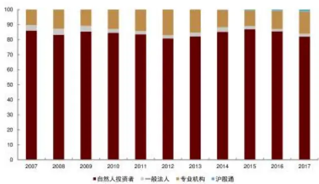
资料来源：上交所，中金公司研究部

图表8：A股一年动量因子预测能力与市场内机构投资者交易占比高度正相关
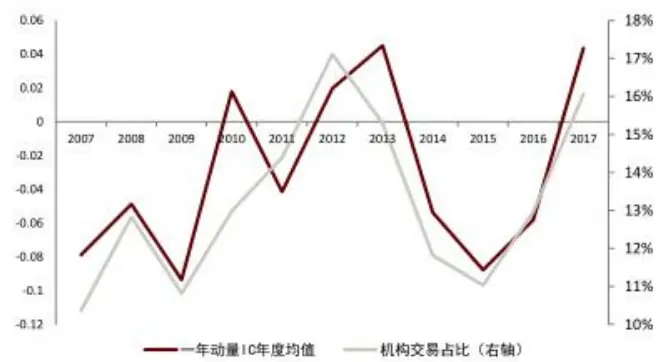
资料来源：万得资讯，上交所，中金公司研究部

## 同样的投资者结构，为什么1年动量方向与1个月动量方向不一样？

如果说上述通过对同一种因子构造下不同市场或不同时期因子效果的比较，印证了动量类型因子最终呈现的方向与程度受参与交易的投资者结构影响。那么在同一个市场里，投资者结构基本不变的情况，为什么1年动量的效果与1个月动量的效果差异如此巨大？这个效果差异说明光凭投资者结构还无法完全解释不同时间段下收益率构造的动量因子间的收益来源差异。我们继续尝试从其它角度进行补充。

在之前探讨不同类型投资者的投资行为及对动量类型特征的影响的过程中，我们提到了动量类因子的收益来源既有是风险补偿的部分，也有来自行为金融学的部分。不同构造下的动量类型因子很可能其收益来源并不一致。

从之前不同市场的动量类因子统计特征容易看出，无论是美股、港股、还是A股，一年动量比一个月动量都体现出更偏“动量”的特征，而一个月动量即使在机构交易占比很高的美股与港股，仍然以负向的“反转”为主。因此我们不妨先猜测，一年动量因子有更大一部分收益来自于第一类投资者交易带来的风险补偿，而一个月动量因子更大一部分收益来自行为偏差。要验证这个猜测，我们需要找到一年动量因子对应的风险补偿是什么？以及一个月动量因子所应当带有的行为偏差收益特征。

## 一年动量因子对应的风险补偿是业绩基本面风险

一般我们说动量因子，这里的动量是默认为“价格”动量，即以过去的价格变动程度来体现的动量特征。沿循“过去的数据变化会延续到未来表现”的动量内核，除了用资产价格这个维度来表征动量以外，从基本面维度与分析师维度也可以相应刻画“基本面动量”与发“分析师动量”。我们分别确定两个因子来表征上述两个维度的动量。

一个经典主流的“基本面动量”因子是基于盈余公告后价格漂移效应(PEAD）逻辑的SUE(Standard Unexpected Earning)因子，其构建方式为：

$$
SUE_{T}=(Earning_{T}\mathrm{~-~}\mathbb{E}(Earning_{T}))/\sigma
$$

其中，Earningτ表示第 T期的实际净利润，E(Earningτ)表示第 T期的预期净利润，σ表示过去8期的盈利预期差标准差。

同样，对于“分析师动量”，我们用经典的一致预期净利润调整因子来表征，其构建方式为：

$$
EER_{T}=(EarningForecast_{T}-EarningForecast_{T-3})/EarningForecast_{T-3}
$$

其中，EarningForecastr表示第T期的分析师一致预期净利润。

计算基本面动量与一年动量在每个截面的因子相关性，其相关系数在2005年-2022年之间大部分分布在0.1到0.3之间，平均相关系数为0.18。说明一年动量与基本面动量涵盖了很多共同信息。而通过比较上期基本面动量、当期基本面动量、下期基本面动量分别与一年动量的因子截面相关系数，结合基本面动量与价格动量不同的底层数据来源，可以进一步推测是一年动量捕捉到了基本面动量里的信息，而不是反过来基本面动量反映一年动量。

同样，我们可以将上述操作在基本面动量与一个月动量之间进行研究。结果显示，一个月动量与基本面动量之间的相关性远远低于一年动量与基本面动量之间的关系。而虽然一年动量与分析师动量的相关性也高于一个月动量与分析师动量的相关性，但它们的显著程度均较低。

因此，我们可以说一年动量中有一部分来自业绩基本面带来的动量收益，这部分动量收益很大概率是源自业绩风险补偿。而一个月动量在这个维度上的动量收益则较少。

图表9:价格动量与其它维度动量的因子截面相关系数均值
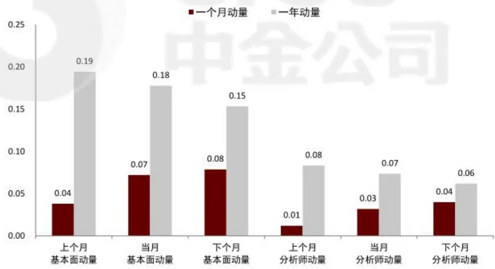
资料来源：万得资讯，中金公司研究部（样本期：2005-01-04至2022-04-30）

图表10：一个月动量（MOM_1M）与其它维度动量的截面因子相关系数
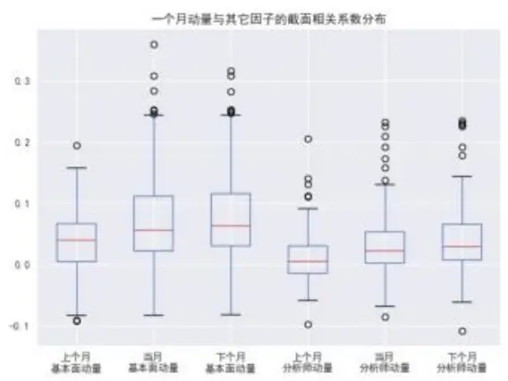
资料来源：万得资讯，中金公司研究部（样本期：2005-01-04至2022-04-30）

图表11：一年动量（MOM_1Y）与其它维度动量的截面因子相关系数
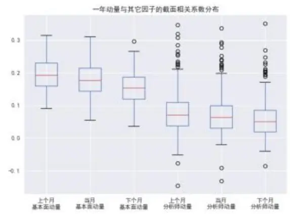
资料来源：万得资讯，中金公司研究部（样本期：2005-01-04至2022-04-30）

## 一个月动量因子有明显行为偏差收益特征—“有效性衰减”

为了验证一个月动量因子的收益来源是否很大程度上来自行为偏差，我们以近1年、近3年、近5年、近10年、以及自2005年至今的全样本数据分别测试不同市场一年动量因子与一个月动量因子的预测能力。

港股的一个月动量并未观察到单调的“有效性衰减”特征，但在A股与美股，一个月动量的IC均值体现出明显的“反转”衰减的现象。作为对比，一年动量因子无论在哪个市场里IC均值均没有往某个方向单边变化的趋势。

由此可知，A股市场的一个月动量在历史上具有大量由行为偏差带来的“反转”收益。

图表12：一个月动量（MOM_1M）在不同市场里IC均值的变化趋势
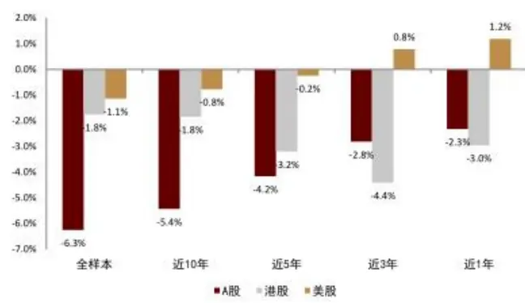
资料来源：万得资讯，中金公司研究部（样本期：2005-01-04至2022-04-30）

图表13:一年动量（MOM_1Y）在不同市场里IC均值的变化趋势
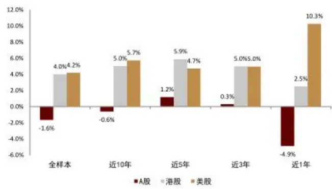
资料来源：万得资讯，中金公司研究部（样本期：2005-01-04至2022-04-30）

至此，我们似乎已经解释了为什么一个月动量与一年动量的方向或程度有这么大的差别：因子收益来源差异。一年动量有更多的业绩风险补偿收益，而一个月动量有更多的行为偏差收益。

## 什么场景看“动量”，什么时候看“反转”？

分析过动量类因子的收益来源与逻辑后，以此为切入点，我们继续讨论在什么场景下动量因子会更偏正向，或者说会有更明显的“动量”特征；在什么时候动量因子会偏负向，也就是有更明显的“反转”特征。

## 截面分域视角

按照我们在前面小节的推论：机构投资者交易占比更高的场景“动量”特征更强，散户投资者交易占比更高的时候“反转”特征更强。我们先寻找有哪些股票特征，它们一定程度上与投资者结构有一定相关性。

在A股市场中，可以较简单找到的符合上述条件的股票特征包括：

1.研究报告覆盖度：覆盖度更高的股票，机构投资者参与交易的占比更高：而对于覆盖度低甚至完全没有覆盖的公司，这些股票的交易者散户交易占比更高。

2. 市值大小：由于资金容量与流动性限制，机构投资者不太会参与很小市值公司的交易。而龙头公司的股票交易往往有更多机构投资者参与。

3. 波动大小：短期剧烈波动的股票往往表明该股票近期有较高的交易热度，同时带有一定程度的低流动性，该类股票往往机构投资者参与程度比较低。

4. 流动性大小：流动性过低的股票，机构投资者往往难以参与，该类股票的交易者大部分由散户交易者构成。

5. 价值程度：价值风格的股票更受价值投资者关注与偏好，该类股票噪音交易者占比相对其它股票大概率会更低。

针对上述每一个股票特征，我们将全市场股票按该特征分成高、中、低三个股票池，分别测试动量类因子在其中的有效性。具体的股票池切分方式如下：

对于研究报告覆盖度特征，我们根据最近3个月的卖方报告覆盖数量，将完全无覆盖的公司划为一档，记为低覆盖池，在有覆盖的公司中，按照覆盖数量的中位数，将低于中位数的所有公司划为中覆盖池，将高于中位数的所有公司划为高覆盖池。

对于市值、波动、流动性、价值特征，均按照最近一期的该特征因子，将所有公司进行分位数排序，将分位数在[0,30%]范围的股票划为低特征池，分位数在[30%，70%]范围的股票划为中特征池，分位数在[70%，100%]范围的股票划为高特征池。

测试结果基本也验证了上述逻辑。除了流动性特征分域下没有显示出很好的单调性以外，其它特征分域下，一个月动量于一年动量都展现出了与逻辑预期相符的预测能力变化。其中一年动量在高覆盖、大市值、低波动、高价值的股票池能均显示出了正向动量预测能力。相对的，一个月动量的反转效果在低覆盖、小市值、高波动、低流动性、低价值的股票池能均更为显著。

图表14：不同程度卖方报告覆盖股票池内，动量因子的IC均值表现
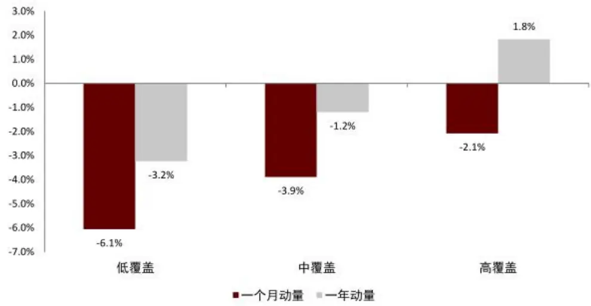
资料来源：万得资讯，中金公司研究部（样本期：2005-01-04至2022-04-30）

图表15：不同程度市值的股票池内，动量因子的IC均值表现对比
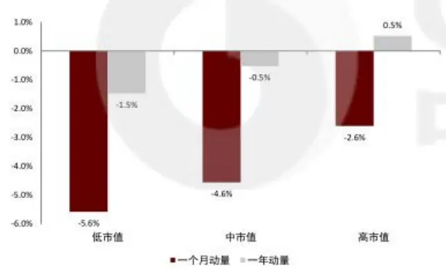
资料来源：万得资讯，中金公司研究部（样本期：2005-01-04至2022-04-30）

图表16：不同程度波动的股票池内，动量因子的IC均值表现对比
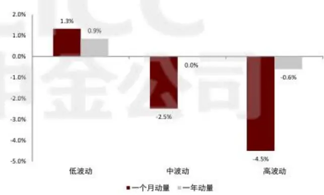
资料来源：万得资讯，中金公司研究部（样本期：2005-01-04至2022-04-30）

图表17：不同程度流动性的股票池内，动量因子的IC 均值表现对比
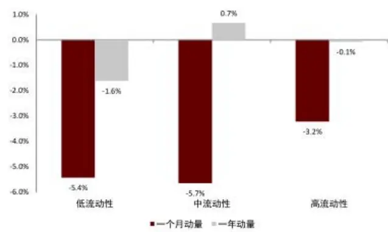
资料来源：万得资讯，中金公司研究部（样本期：2005-01-04至2022-04-30）

图表18：不同程度价值的股票池内，动量因子的IC均值表现对比
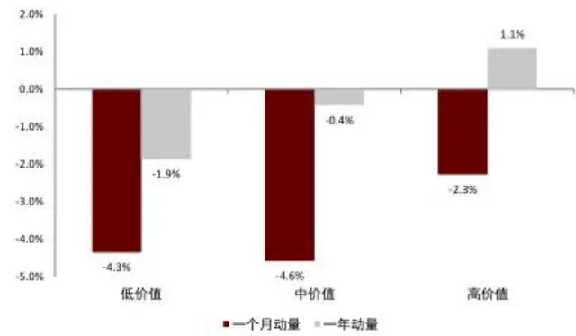
资料来源：万得资讯，中金公司研究部（样本期：2005-01-04至2022-04-30）

在验证了动量类因子在上述不同特征域下的表现逻辑与效果后，我们可以进一步解答下面这个问题。

## 为什么A股市场里，行业呈现动量现象而股票呈现反转现象？

在A股市场中，同样的动量因子在行业体系里多以正向动量呈现，而在股票体系下以负向反转著称。统计一个月动量因子，其在中信一级行业、中信二级行业、中信三级行业、股票上的IC均值单调地以4.0%、1.8%、-0.6%、-6.3%依次递减。同样，一年动量因子也有类似的方向变化。

造成这个现象的其中一个原因，是行业指数的构建基本上都是按市值加权的方式编制。例如中信行业体系的指数以自由流通市值加权的方式编制。这就造成每个行业指数的价格变动均更多地取决于该行业内的大市值龙头股。某种意义上，可以把中信行业一级行业体系当成30个大股票构成的股票池，因此相比于整个A股股票池，行业间的“动量”特征会更显著。

除了上述原因，其它诸如行业内部更多细分产业链拉长了信息传导长度，更多地股票选择加剧了反应不足的程度等等，都对一定程度上扩大了行业间的动量特征。在这些因素共同影响下，形成了我们现在观察到的行业动量现状。

图表19:一个月动量（MOM_1M）在不同行业级别与股票上的累计IC对比
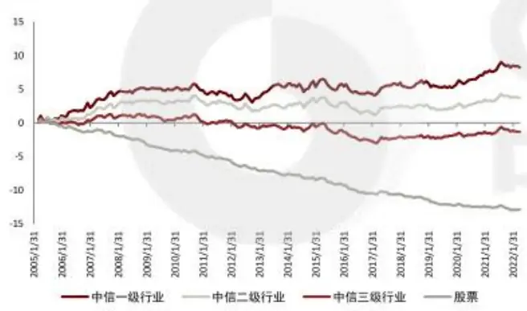
资料来源：万得资讯，中金公司研究部（样本期：2005-01-04至2022-04-30）

图表20：一年动量（MOM_1Y）在不同行业级别与股票上的累计IC 对比
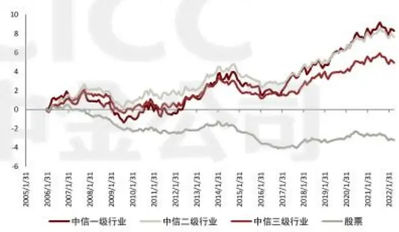
资料来源：万得资讯，中金公司研究部（样本期：2005-01-04至2022-04-30）

图表21：一个月动量（MOM_1M）在不同行业级别与股票上的IC统计

|  | 样本个数 | IC均值 | IC标准差 | ICIR绝对值 | IC>0比例 | IC>0.02比例 | IC<0比例 | IC<-0.02比例 | t值 |
| --- | --- | --- | --- | --- | --- | --- | --- | --- | --- |
| 中信一级行业 | 206 | 4.0% | 32.4% | 0.12 | 55.3% | 51.9% | 44.7% | 42.2% | 1.77 |
| 中信二级行业 | 206 | 1.8% | 26.7% | 0.07 | 51.9% | 50.0% | 48.1% | 45.6% | 0.97 |
| 中信三级行业 | 206 | -0.6% | 22.3% | 0.03 | 48.5% | 44.2% | 51.5% | 47.6% | -0.41 |
| 股票 | 206 | -6.3% | 15.1% | 0.41 | 34.0% | 27.7% | 66.0% | 61.2% | -5.93 |

资料来源：万得资讯，中金公司研究部（样本期：2005-01-04至2022-04-30）

图表22：一年动量（MOM_1Y）在不同行业级别与股票上的IC统计

|  | 样本个数 | IC均值 | IC标准差 | ICIR绝对值 | IC>0比例 | IC>0.02比例 | IC<0比例 | IC<-0.02比例 | t值 |
| --- | --- | --- | --- | --- | --- | --- | --- | --- | --- |
| 中信一级行业 | 196 | 4.2% | 33.5% | 0.13 | 54.8% | 50.0% | 45.2% | 43.4% | 1.77 |
| 中信二级行业 | 196 | 3.9% | 26.1% | 0.15 | 56.1% | 53.1% | 43.9% | 41.3% | 2.09 |
| 中信三级行业 | 196 | 2.5% | 23.8% | 0.11 | 55.6% | 50.5% | 44.4% | 40.3% | 1.48 |
| 股票 | 196 | -1.6% | 15.0% | 0.11 | 46.4% | 38.8% | 53.6% | 49.5% | -1.53 |

资料来源：万得资讯，中金公司研究部（样本期：2005-01-04至2022-04-30）

## 时序分域视角

除了截面维度的分域，站在时序角度我们也关心在什么时候动量特征会更明显一些，而又在什么时候反转特征会更为显著。

对于市场状态，我们尝试以市场牛熊与市场波动两个维度分别尝试进行分域，其中：

市场涨跌将按照2005年至2022年4月期间的中证全指指数月度涨跌幅符号，将每个月份划为市场上涨或者市场下跌状态。同时根据当月与上月的市场涨跌状态确定当月属于涨转跌、涨跌不变、还是跌转涨的状态。

市场波动将按照2005年至2022年4月期间的中证全指指数每个月内日度涨跌幅计算标准差作为当月波动率大小，并根据所有月份的波动率大小的中位数为界线，将所有月份划分为低波动状态或高波动状态。同时根据当月与上月的市场波动状态确定当月属于波动降级、波动不变、还是波动升级的状态。

对于风格状态，我们尝试以大小盘风格与成长/价值风格两个维度分别尝试进行分域，其中：

大小盘风格中，我们以沪深300指数月度收益率作为大盘收益率，以中证1000指数月度收益率作为小盘收益率。通过比较大盘收益与小盘收益的大小，确定每个月份是属于大盘风格还是小盘风格。同时根据当月与上月的大小盘风格状态确定当月属于风格从大盘切向小盘、风格不变、还是风格从小盘切向大盘的状态。

成长/价值风格中，我们以成长因子多头组合的月度收益率作为成长风格收益率，以价值因子多头组合的月度收益率作为价值风格收益率。通过比较成长风格收益与价值风格收益的大小，确定每个月份是属于成长风格还是价值风格。同时根据当月与上月的成长/价值风格状态确定当月属于风格从成长切向价值、风格不变、还是风格从价值切向成长的状态。

测试结果显示，市场处于下跌、低波动时期；风格处于大盘占优、成长占优的时期时，动量类因子倾向释放更多的“动量”特征；而当市场与上涨、高波动时期；风格处于小盘占优、价值占优的时期时，动量类因子倾向释放更多的“反转”特征。

同时可以发现一些有趣的现象是，当风格发生切换时，动量类因子往往会表现出明显的“反转”特征，而在风格延续时，动量类因子往往会比平常体现出更多“动量”特征。

因此站在因子择时的角度，我们应该在高波动的牛市，及小盘价值风格的市场下，提高反转逻辑的动量因子权重；而在波动小的熊市，及大盘成长风格的市场下，提高动量逻辑的动量因子权重。

图表23：一个月动量（MOM_1M）在不同时序分域上的IC统计

|  | 样本个数 | IC均值 | IC标准差 | ICIR绝对值 | IC>0比例 | IC>0.02比例 | IC<0比例 | IC<-0.02比例 | t值 |
| --- | --- | --- | --- | --- | --- | --- | --- | --- | --- |
| 市场状态：下跌 | 87 | -2.8% | 14.7% | 0.19 | 42.5% | 37.9% | 52.9% | 57.5% | -1.79 |
| 市场状态：上涨 | 119 | -8.8% | 15.0% | 0.58 | 27.7% | 20.2% | 67.2% | 72.3% | -6.37 |
| 市场切换：涨转跌 | 47 | -3.4% | 13.8% | 0.24 | 40.4% | 38.3% | 55.3% | 59.6% | -1.68 |
| 市场切换：不变 | 113 | -4.6% | 15.8% | 0.29 | 41.6% | 31.0% | 54.9% | 58.4% | -3.08 |
| 市场切换：跌转涨 | 46 | -13.3% | 12.8% | 1.04 | 8.7% | 8.7% | 82.6% | 91.3% | -7.07 |
| 市场状态：低波动 | 103 | -4.9% | 14.0% | 0.35 | 41.7% | 32.0% | 53.4% | 58.3% | -3.56 |
| 市场状态：高波动 | 103 | -7.6% | 16.2% | 0.47 | 26.2% | 23.3% | 68.9% | 73.8% | -4.77 |
| 市场切换：波动下降 | 28 | -8.7% | 13.7% | 0.63 | 25.0% | 17.9% | 71.4% | 75.0% | -3.35 |
| 市场切换：不变 | 150 | -6.4% | 15.2% | 0.42 | 35.3% | 28.0% | 58.7% | 64.7% | -5.15 |
| 市场切换：波动上升 | 28 | -3.0% | 16.0% | 0.19 | 35.7% | 35.7% | 64.3% | 64.3% | -1.00 |
| 风格状态：小盘风格 | 107 | -9.0% | 15.9% | 0.56 | 29.0% | 24.3% | 68.2% | 71.0% | -5.83 |
| 风格状态：大盘风格 | 99 | -3.3% | 13.7% | 0.24 | 39.4% | 31.3% | 53.5% | 60.6% | -2.40 |
| 风格切换：大盘转小盘 | 48 | -18.0% | 13.9% | 1.29 | 8.3% | 4.2% | 89.6% | 91.7% | -8.93 |
| 风格切换：不变 | 109 | -0.4% | 13.6% | 0.03 | 49.5% | 43.1% | 45.0% | 50.5% | -0.32 |
| 风格切换：小盘转大盘 | 49 | -7.8% | 12.4% | 0.63 | 24.5% | 16.3% | 69.4% | 75.5% | -4.38 |
| 风格状态：价值风格 | 77 | -7.5% | 13.6% | 0.55 | 28.6% | 22.1% | 66.2% | 71.4% | -4.84 |
| 风格状态：成长风格 | 118 | -5.7% | 14.8% | 0.39 | 36.4% | 30.5% | 59.3% | 63.6% | -4.19 |
| 风格切换：成长转价值 | 46 | -12.3% | 11.7% | 1.05 | 10.9% | 4.3% | 82.6% | 89.1% | -7.14 |
| 风格切换：不变 | 102 | -1.6% | 13.1% | 0.12 | 50.0% | 43.1% | 46.1% | 50.0% | -1.22 |
| 风格切换：价值转成长 | 46 | -10.6% | 15.5% | 0.69 | 19.6% | 15.2% | 76.1% | 80.4% | -4.66 |

资料来源：万得资讯，中金公司研究部（样本期：2005-01-04至2022-04-30）

图表24：一年动量（MOM_1Y）在不同时序分域上的IC统计

|  | 样本个数 | IC均值 | IC标准差 | ICIR绝对值 | IC>0比例 | IC>0.02比例 | IC<0比例 | IC<-0.02比例 | 值 |
| --- | --- | --- | --- | --- | --- | --- | --- | --- | --- |
| 市场状态：下跌 | 81 | -1.0% | 15.2% | 0.07 | 46.9% | 42.0% | 48.1% | 53.1% | -0.62 |
| 市场状态：上涨 | 115 | -2.1% | 15.0% | 0.14 | 46.1% | 36.5% | 50.4% | 53.9% | -1.48 |
| 市场切换：涨转跌 | 44 | -0.8% | 14.6% | 0.05 | 50.0% | 43.2% | 45.5% | 50.0% | -0.35 |
| 市场切换：不变 | 109 | -3.6% | 15.7% | 0.23 | 38.5% | 33.0% | 56.9% | 61.5% | -2.40 |
| 市场切换：跌转涨 | 43 | 2.4% | 13.1% | 0.19 | 62.8% | 48.8% | 34.9% | 37.2% | 1.22 |
| 市场状态：低波动 | 98 | 0.8% | 15.4% | 0.05 | 56.1% | 49.0% | 39.8% | 43.9% | 0.51 |
| 市场状态：高波动 | 98 | -4.1% | 14.3% | 0.29 | 36.7% | 28.6% | 59.2% | 63.3% | -2.82 |
| 市场切换：波动下降 | 25 | -5.1% | 16.3% | 0.31 | 48.0% | 36.0% | 52.0% | 52.0% | -1.57 |
| 市场切换：不变 | 145 | -0.9% | 14.6% | 0.06 | 46.2% | 40.0% | 48.3% | 53.8% | -0.76 |
| 市场切换：波动上升 | 26 | -2.4% | 16.3% | 0.14 | 46.2% | 34.6% | 53.8% | 53.8% | -0.74 |
| 风格状态：小盘风格 | 103 | -2.6% | 14.9% | 0.18 | 44.7% | 34.0% | 52.4% | 55.3% | -1.79 |
| 风格状态：大盘风格 | 93 | -0.6% | 15.2% | 0.04 | 48.4% | 44.1% | 46.2% | 51.6% | -0.35 |
| 风格切换：大盘转小盘 | 45 | -3.0% | 15.1% | 0.20 | 46.7% | 33.3% | 51.1% | 53.3% | -1.34 |
| 风格切换：不变 | 106 | -0.9% | 15.1% | 0.06 | 46.2% | 39.6% | 49.1% | 53.8% | -0.63 |
| 风格切换：小盘转大盘 | 45 | -2.0% | 15.1% | 0.13 | 46.7% | 42.2% | 48.9% | 53.3% | -0.88 |
| 风格状态：价值风格 | 77 | -8.9% | 13.1% | 0.68 | 23.4% | 19.5% | 70.1% | 76.6% | -5.96 |
| 风格状态：成长风格 | 118 | 3.0% | 14.4% | 0.21 | 61.0% | 50.8% | 36.4% | 39.0% | 2.26 |
| 风格切换：成长转价值 | 46 | -10.5% | 13.2% | 0.80 | 21.7% | 17.4% | 73.9% | 78.3% | -5.41 |
| 风格切换：不变 | 102 | -0.1% | 13.5% | 0.01 | 48.0% | 43.1% | 47.1% | 52.0% | -0.11 |
| 风格切换：价值转成长 | 46 | 4.3% | 16.0% | 0.27 | 67.4% | 50.0% | 30.4% | 32.6% | 1.80 |

资料来源：万得资讯，中金公司研究部（样本期：2005-01-04至2022-04-30）

## 动量类因子开发指南

加深对动量收益来源、预测能力、及底层逻辑的理解，有助于我们对该类因子的开发与改进。
该章节我们将针对动量类因子构建的方式进行剖析，并给出一种动量因子挖掘范式。

## 动量类因子计算结构拆解

动量类因子的构建本质上是“尝试从历史上的资产价格变化中，找到具有对资产未来收益预测能力的部分”。因此自然地，大部分我们熟知的动量类因子的计算公式中都能看到各式各样的资产收益率数据。不同的因子公式大部分的差异源自具体使用的是哪部分收益率数据。例如一个月动量使用的是T-20日至T日间的收益率，而一年动量使用的是T-240日至T-20日间的收益率。

我们可以把上述动量类因子算式结构归纳成，某一股票i在某一时点T的动量因子值计算公式为股票i一种历史收益率序列向量与一种权重序列向量的内积（点乘）：

$$
momentum_{T}^{i}=return_{-}series_{T}^{i}\cdot weig\rlap/{\hat{h}}{t}_{-}mask_{-}series_{T}^{i}
$$

其中：

momentum 表示股票i在时刻T的动量因子值；

- return_series表示股票i在时刻T可见的历史日度收益率序列；

weight_mask_seriesi表示股票i在时刻T的针对return_seriesi 的权重序列，长度与return_series—致。

即动量类因子的公式可以拆解为两项序列的内积：收益率项return_series与权重项weight_mask_series。

分别以一个月动量与一年动量举例，

一个月动量（MOM_1M）的收益率项为 $[r_{T-240}^{c},~r_{T-239}^{c},\ldots,r_{T-21}^{c},~r_{T-20}^{c},\ldots,r_{T-1}^{c}]$ ，这里 rf 表示按收盘价对前收盘价的方式计算的日度收益率；而一个月动量的权重序列为长度为240的序列 $[0,\ 0,\ldots,0,\ 1,\ldots,1]$ ，其中前220个元素均为0，后20个元素均为1。

一年动量（MOM_1Y）的收益率项同样为 $[r_{T-240}^{c},r_{T-239}^{c},\ldots,r_{T-21}^{c},r_{T-20}^{c},\ldots,r_{T-1}^{c}]$ ，与一个月动量的收益率项一致；但一年动量的权重序列为长度为240的序列 $[1,\ 1,\ldots,1,\ 0,\ldots,0]$ ，其中前220个元素均为1，最后20个元素均为0。

在将动量类因子算式拆解成两项模块后，对动量因子的开发就转化为对两项模块的挖掘与探索。其中收益率项维度上可供展开的空间不大，一般可供利用的收益率仅有收盘收益率、开盘收益率、均价收益率、日内收益率、隔夜收益率等这几项。因此，动量因子的探索空间主要集中在权重序列上。

图表25：不同收益率项中收益率元素的计算方式

| 收益率项 | 收盘收益率 | 开盘收益率 | 均价收益率 | 日内收益率 | 隔夜收益率 |
| --- | --- | --- | --- | --- | --- |
| 计算方式 | Closeτ/Closer-1-1 | Openτ/Openτ-1-1 | Vwapτ/Vwapτ-1-1 | $Close_{T}/Open_{T}-1$ | $Open_{T}/Close_{T-1}-1$ |

资料来源：中金公司研究部

权重序列，进一步可以分为两类：静态权重序列(staticmask）与动态权重序列（dynamicmask)。

静态权重序列中所有元素都是事先固定好的确定值。像之前我们举例的一年动量与一个月动量，它们的权重序列中每一个元素的值与时刻T与股票i无关。无论是计算哪个时刻哪个股票的一个月动量因子值，它的权重序列最后20个元素都是确定的1，而其它元素都是确定的0。

静态权重序列中的元素不仅仅可以是0或1，可以是任何固定的实数值。业界投资者们在早年开发的大部分动量类因子都可以归在静态权重序列这一类中。例如：

结合一年动量与一个月反转的因子，其权重序列为 $[1,\ 1,\ldots,1,-1,\ldots,-1]$ ，前220个元素为1，后20个元素为-1;

使用线性递减赋权方式计算的一个月反转的因子，其权重序列为 $[0,\ 0,\ldots,0,0.05,\ldots,0.95,$ 1]，前220个元素为0，从倒数第20个元素0.05起，每次递增0.05直到最后一个元素为1；

使用指数递减赋权方式计算的一个月反转的因子，其权重序列为 $[0,\ 0,\ldots,0,\alpha^{19},\ldots,\alpha^{1}$ 1]，前220个元素为0，最后20个元素则从 $\alpha^{19},\alpha^{18}$ ，一直到 $\alpha^{1},\alpha^{0}$ ，这里α是小于1的参数，根据投资者自行事先确定。

由于大部分静态序列下的因子效果长期来看相比于主流的一个月动量与一年动量并没有明显的差异或改善。因此近几年业界对动量类因子的挖掘尝试更偏向于构造不同的动态权重序列。

动态权重序列中的个个元素并非一成不变的固定值，而是取决于股票i在时刻T时的其它数据信息。换句话说，动态权重序列是其它数据信息的函数。这里其它数据信息可以是各种跟该股票相关的时间序列。例如：

剔除涨跌停收益的一年动量因子，其权重序列为 $[m_{T-239},\ m_{T-238},\dots,m_{T-20},0,\dots,0]$ ，其中 $m_{t}$ 根据股票在t日的涨跌停状态取值，若非涨跌停则取值1，否则取值0。

日内波动调整的一个月反转因子，其权重序列为 $[0,\ 0,\ldots,0,\ m_{T-19},\ldots,m_{T}]$ ，其中，最后20 个因素 $m_{t}$ 根据股票在t日的日内波动率大小取值，若t日的股票日内波动率高于[T-19,T区间股票日内波动率样本的80%分位数则取值1，若低于20%分位数则取值-1，其余情况取值0。

可以看出，动态权重序列的构建可以利用一切与股票相关的时间序列信息。挖掘动量类因子的空间大多聚集于此。站在因子开发者的角度，开发动量类因子的路径此时有两类：

一是从逻辑推导入手，尝试寻找能区分动量强弱的股票特征。例如，按照我们第一章节所阐述的动量逻辑，机构投资者的交易行为更容易产生动量，散户投资者的交易行为更容易产生反转，那我们需要做的是判断每一天的收益率更多是由机构投资者交易主导造成的，还是散户交易者主导造成的。在无法获取直接的投资者结构数据的情况，进一步我们需要思考可以通过哪些股票特征变相判断出某个交易日的投资者交易占比是更偏向机构还是个人呢？如果认为日内波动率越高，散户投资者交易占比大概率更高，那么就可以用日内波动率这个数据来构建动态权重序列，进而构建相应的动量类因子。如果认为财报披露日前后，机构投资者交易占比会大概率上升，那么我们也可以用财报披露日期这个数据来构建动态权重序列，进而构建相应动量类因子。

V二是从机器暴力挖掘入手。例如在遗传规划挖掘因子的算法中，主流通用的做法是直接生成完整的因子算式，并直接计算因子的IC均值或ICIR作为算法中的适应度度量，针对动量类因子的挖掘，可以转变为遗传规划挖掘动态权重序列而不是直接挖掘完整的因子算式，形成的动态权重序列通过内积与收益率项形成完整的因子后，再计算因子的IC均值或其它统计项作为算法中的适应度度量。这样就可以将遗传规划算法聚焦在仅挖掘动量类因子信息上。

图表26：逻辑推导方式下的动量类因子开发路径示例

判断每一天的收益率更多是由机构投资者交易主导造成的，还是散户交易者主导造成的。

逻辑猜想一：日内波动率越高，散户投资者交易占比越高。

逻辑猜想二：财报披露日前后， 机构投资者交易占比会大概率 上升

根据动态蒙板，配合相应收益率序列，构建相应动量类因子。

☑机构投资者的交易行为更容易产生动量

散户投资者的交易行为 更容易产生反转

可以通过哪些股票特征变相判断出某个交易日的投资者交易占比是更偏向机构还是个人？

根绝相应数据数据构建动态蒙板

资料来源：中金公司研究部

图表27：机器暴力挖掘方式下的动量类因子开发路径示例

1. 基于各类底层股票特征，随机生成动态蒙板函数，构造大量不同的动态蒙板样本。

4.基于适应度，通过交叉、变异、或剪枝等繁衍操作，生成下一代动态蒙板样本，并继续循环

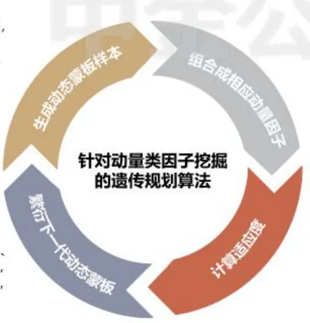
资料来源：中金公司研究部

2. 将样本中所有的动态蒙板分别与收益率数据进行内积点乘，计算出每个蒙板对应的实际动量类因子

3.对动量类因子进行有效性测试，用例如IC均值、ICIR绝对值或者多空信息比例等数据作为因子对应蒙板的适应度得分。

## 动量类因子的构建与测试

拆解动量类因子的开发路径，尤其是从逻辑角度入手的方式里，可以看出动量类因子结构中的核心部件就是反映逻辑核心的权重序列。这一节我们给出一些从逻辑推导得出的动量类因子构造并测试其在A股中的选股效果。

## 普通动量

- 一个月普通动量（mmt_normal_M）

逻辑：最近一个月的收益率更多体现了散户投资者对于近期信息的过度反映。

收益率项：收盘收益率。

权重序列： $[0,\ 0,\ldots,0,\ 1,\ldots,1]$ ，其中前220个元素均为 $^{0,}$ 最后20个元素均为1。

- 一年普通动量（mmt_normal_A）

逻辑：最近一年除去最近一个月的收益率一定程度从价格信息体现了公司的业绩能力。
收益率项：收盘收益率。

权重序列： $[1,\ 1,\ldots,1,\ 0,\ldots,0]$ ，其中前220个元素均为1，最后20个元素均为 $0.$

## 夏普动量

- 一年夏普动量（mmt_sharpe_A）

逻辑：最近一年除去最近一个月的收益率一定程度从价格信息体现了公司的业绩能力。而收益率波动越低的股票，说明该股票交易中散户投资者参与的程度可能越低，动量延续概率越高。

收益率项：收盘收益率。

权重序列： $[m^{i},~m^{i},\ldots,m^{i},~0,\ldots,0]$ ，其中前220个元素均为 $m^{i}$ ，最后20个元素均为$0\circ\textit{ m }^{i}$ 表示股票i在前220交易日的波动率的倒数。

## 隔夜动量

- 一个月隔夜动量（mmt_overnight_M）

逻辑：收益率中隔夜涨跌幅可能蕴含与日度收益率不同的信息特征，业界认为A股中隔夜收益率包含日度收益率中的“动量”成份。

收益率项：隔夜收益率。

权重序列： $[0,\ 0,\ldots,0,\ 1,\ldots,1]$ ，其中前220个元素均为 $^{0,}$ 最后20个元素均为1。

一年隔夜动量（mmt_overnight_A）

逻辑：收益率中隔夜涨跌幅可能蕴含与日度收益率不同的信息特征，业界认为A股中隔夜收益率包含日度收益率中的“动量”成份。

收益率项：隔夜收益率。

权重序列： $[1,\ 1,\ldots,1,\ 0,\ldots,0]$ ，其中前220个元素均为1，最后20个元素均为 $0_{\circ}$

## 日内动量

- 一个月日内动量（mmt_intraday_M）

逻辑：收益率中日内涨跌幅可能蕴含与日度收益率不同的信息特征，业界认为A股中日内收益率包含日度收益率中的“反转”成份。

收益率项：日内收益率。

权重序列： $[0,\ 0,\ldots,0,\ 1,\ldots,1]$ ，其中前220个元素均为 $^{0,}$ 最后20个元素均为1。

- 一年日内动量（mmt_intraday_A）

逻辑：收益率中日内涨跌幅可能蕴含与日度收益率不同的信息特征，业界认为A股中日内收益率包含日度收益率中的“反转”成份。

权重序列： $[1,\ 1,\ldots,1,\ 0,\ldots,0]$ ，其中前220个元素均为1，最后20个元素均为 $0.$

## 去涨跌停动量

## 一年去涨跌停动量（mmt_off_limit_A）

逻辑：涨跌停具有强烈的吸引市场关注的能力，更容易造成“羊群效应”的产生。同时A股打板策略的流行，也使得涨跌停收益中容纳了太多的“泡沫”收益。去掉该部分能提高因子中的“动量”成份。

收益率项：收盘收益率。

权重序列： $[m_{T-239},\ m_{T-238},\ldots,m_{T-20},0,\ldots,0]$ ，其中 $m_{t}$ 根据股票在t日的涨跌停状态取值，若非涨跌停则取值1，否则取值0。

## 路径调整动量

## 一年路径调整动量（mmt_route_A）

逻辑：涨跌路径的定义为收益率区间内，每日收益率绝对值的总和。一个股票的涨跌路径长度越大，表明达到该总收益率的波动越大，噪音交易的占比可能越高，该股票的“动量”特征就越弱。因此该逻辑与夏普动量类似，将涨跌路径作为分母对动量因子进行调整时，能加强因子的“动量”预测性。

收益率项：收盘收益率。

权重序列： $[m^{i},~m^{i},\ldots,m^{i},~0,\ldots,0]$ ，其中前220个元素均为 $m^{i}$ ，最后20个元素均为0。 $m^{i}$ 表示股票i在前220交易日中所有日度收益率绝对值的总和的倒数。

## 振幅调整动量

## 一个月振幅调整动量（mmt_range_M）

逻辑：对于每一个股票，振幅较大的交易日相比振幅较小的交易日，个人投资者交易占比可能更高，因此振幅越大的交易日收益率可能更偏“反转”，而振幅越小的交易日收益率可能更偏“动量”。30

收益率项：收盘收益率。

权重序列： $\left[0,\ 0,\ldots,0,m_{T-19},\ldots,m_{T}\right]$ ，其中前220个元素均为0，最后20个因素 $m_{t}$ 根据股票在t日的日度振幅大小取值，若t日的股票日度振幅高于[T-19,T] 区间股票日度振幅样本的80%分位数则取值1，若低于20%分位数则取值-1，其余情况取值0。

## 一年振幅调整动量（mmt_range_A）

逻辑：对于每一个股票，振幅较大的交易日相比振幅较小的交易日，个人投资者交易占比可能更高，因此振幅越大的交易日收益率可能更偏“反转”，而振幅越小的交易日收益率可能更偏“动量”。

收益率项：收盘收益率。

权重序列： $[m_{T-239},\ m_{T-238},\dots,m_{T-20},m_{T-19},\dots,m_{T}]$ ，其中 $m_{t}$ 根据股票在t日的日度振幅大小取值，若t日的股票日度振幅高于[T-239，T] 区间股票日度振幅样本的80%分位数则取值-1，若低于20%分位数则取值1，其余情况取值0。

## 业绩公告期动量

- 业绩公告期动量（mmt_report_period）

逻辑：业绩披露日前后，机构投资者交易占比会大概率上升，该段时期的收益率有较强的“动量”特征。

收益率项：收盘超额收益率（股票收盘收益率-市场收盘收益率）。

权重序列： $[m_{T-239},\ m_{T-238},\dots,m_{T-20},m_{T-19},\dots,m_{T}]$ ，其中，假设t日为 [T-239,T-1]区间内股票最近一个业绩报告日，则权重序列中， $m_{t-1},\ m_{t},\ m_{t+1}$ 取值1，其余所有元素取值0。

## 业绩公告前隔夜动量

业绩公告期动量（mmt_report_overnight_M）

逻辑：业绩披露前，部分投资者可能事先获知业绩信息，因此在业绩披露前的一段时间，该股票的知情交易占比可能上升。该短时间的收益率中“动量”特征会更显著。

收益率项：隔夜收益率。

权重序列： $[m_{T-239},\ m_{T-238},\dots,m_{T-20},m_{T-19},\dots,m_{T}]$ ，其中，假设t日为[T-220,T]区间内股票最近一个业绩报告日，则权重序列中， $m_{t-19},\ m_{t-18},\dots,\ m_{t}$ 这连续20个元素取值1，其余所有元素取值0。

## 业绩跳开动量

- 业绩公告期动量（mmt_report_jump）

逻辑：业绩披露后的第一个交易日的跳开方向与幅度，体现了该股票的业绩超预期的方向与幅度，该类有效信息有较强的“动量”特征。

收益率项：隔夜超额收益率（股票隔夜收益率一市场隔夜收益率）。

权重序列： $[m_{T-239},\ m_{T-238},\ldots,m_{T-20},m_{T-19},\ldots,m_{T}]$ ，其中，假设t日为 [T-239，T-1]区间内股票最近一个业绩报告日，则权重序列中 $m_{t+1}$ 取值1，其余所有元素取值0。

图表28：各类动量因子改进尝试及对应因子代码

| 动量因子名称 | 因子代码 |
| --- | --- |
| 基础动量 | mmt_normal_M, mmt_normal_A |
| 夏普动量 | mmt_sharpe_A |
| 隔夜动量 | mmt_overnight_M, mmt_overnight _A |
| 日内动量 | mmt_intraday_M, mmt_intraday_A |
| 去涨跌停动量 | mmt_off_limit_A |
| 路径调整动量 | mmt_route_A |
| 振幅调整动量 | mmt_range_M, mmt_range_A |
| 业绩公告期动量 | mmt_report_period |
| 业绩公告前隔夜动量 | mmt_report_overnight_M |
| 业绩公告跳空动量 | mmt_report_jump |

资料来源：中金公司研究部

针对上述动量类因子，我们以2010年1月至2022年4月的股票数据进行因子有效性测试。
因子值计算时默认进行市值与行业中性化。

以一个月基础动量（mmt_nomral_M）的预测能力作为反转逻辑因子的表现基准，一年基础动量（mmt_normal_A）的预测能力作为动量逻辑因子的表现基准。测试结果显示，反转逻辑因子中，一个月振幅调整动量与一个月日内动量无论在全市场范围、中证500成分股、还是沪深300成分股范围内，均具有不错且超过一个月基础动量因子的预测能力。一个月振幅调整动量在全市场的IC 均值-6.9%，ICIR绝对值高达1.04。在中证500与沪深 300内，其ICIR绝对值亦分别达到0.71与0.48。

而动量逻辑因子中，不同股票池内有效因子略有差异。在全市场及中证500内，业绩公告前隔夜动量、业绩公告跳空动量、一年振幅调整动量、一年隔夜动量因子具有不错且远超一年基础动量的预测能力；而在沪深300池内，一年基础动量本身具有一定动量效果，在此基础上仍有更好效果的因子包括一年隔夜动量、去涨跌停动量、路径调整动量因子。

不得不指出，即使上述因子中不少改进方式的确增强了动量或反转因子的整体预测能力，预测能力主要集中在空头部分的现象仍未得到显著改善。以反转较强的一个月振幅调整动量因子与动量效果好的业绩公告前隔夜动量因子为例，它们的多空组合均有不错的收益能力，但多头的超额收益无论是收益水平还是稳定性都不尽人意。

图表29：全市场内不同动量因子的预测能力统计

|  | 样本个数 | IC均值 | IC标准差 | ICIR绝对值 | IC>0比例 | IC>0.02比例 | IC<0比例 | IC<-0.02比例 | t值 |
| --- | --- | --- | --- | --- | --- | --- | --- | --- | --- |
| mmt_range_M | 146 | -6.9% | 6.7% | 1.04 | 14.4% | 10.3% | 85.6% | 78.1% | -12.51 |
| mmt_intraday_M | 146 | -7.3% | 9.1% | 0.81 | 20.5% | 13.7% | 79.5% | 73.3% | -9.74 |
| mmt_report_overnight | 146 | 3.4% | 4.3% | 0.81 | 80.8% | 65.1% | 19.2% | 11.0% | 9.74 |
| mmt_report_jump | 146 | 2.0% | 2.6% | 0.78 | 77.4% | 54.8% | 22.6% | 6.8% | 9.38 |
| mmt_range_A | 146 | 4.4% | 6.5% | 0.68 | 78.1% | 63.7% | 21.9% | 12.3% | 8.16 |
| mmt_overnight_M | 146 | 3.1% | 4.9% | 0.64 | 76.0% | 63.0% | 24.0% | 14.4% | 7.69 |
| mmt_normal_M | 146 | -6.3% | 9.9% | 0.63 | 28.8% | 20.5% | 71.2% | 65.1% | -7.63 |
| mmt_overnight_A | 146 | 2.9% | 4.9% | 0.59 | 74.0% | 59.6% | 26.0% | 14.4% | 7.09 |
| mmt_route_M | 146 | -4.9% | 9.8% | 0.50 | 30.8% | 25.3% | 69.2% | 61.0% | -6.08 |
| mmt_sharpe_M | 146 | -4.9% | 10.0% | 0.49 | 32.2% | 26.0% | 67.8% | 61.0% | -5.93 |
| mmt_report_period | 146 | 1.8% | 4.8% | 0.36 | 65.1% | 47.3% | 34.9% | 19.2% | 4.41 |
| mmt_intraday_A | 146 | -2.5% | 7.9% | 0.31 | 35.6% | 30.8% | 64.4% | 54.8% | -3.79 |
| mmt_off_limit_A | 146 | 2.7% | 8.7% | 0.31 | 63.7% | 54.1% | 36.3% | 29.5% | 3.78 |
| mmt_off_limit_M | 146 | -2.4% | 9.2% | 0.26 | 40.4% | 30.8% | 59.6% | 51.4% | -3.14 |
| mmt_route_A | 146 | 2.0% | 8.6% | 0.23 | 59.6% | 51.4% | 40.4% | 31.5% | 2.79 |
| mmt_sharpe_A | 146 | -0.7% | 9.8% | 0.07 | 52.7% | 41.8% | 47.3% | 41.8% | -0.85 |
| mmt_normal_A | 146 | -0.2% | 10.1% | 0.02 | 52.1% | 45.2% | 47.9% | 41.1% | -0.18 |

资料来源：万得资讯，中金公司研究部（样本期：2010-01-01至2022-04-30）

图表30：中证500内不同动量因子的预测能力统计

|  | 样本个数 | IC均值 | IC标准差 | ICIR绝对值 | IC>0比例 | IC>0.02比例 | IC<0比例 | IC<-0.02比例 | t值 |
| --- | --- | --- | --- | --- | --- | --- | --- | --- | --- |
| mmt_range_M | 146 | -5.2% | 7.3% | 0.71 | 21.2% | 13.7% | 78.8% | 68.5% | -8.55 |
| mmt_intraday_M | 146 | -5.5% | 9.1% | 0.60 | 30.1% | 19.9% | 69.9% | 66.4% | -7.26 |
| mmt_range_A | 146 | 3.7% | 6.3% | 0.59 | 76.7% | 64.4% | 23.3% | 14.4% | 7.13 |
| mmt_report_jump | 146 | 2.3% | 4.4% | 0.52 | 71.2% | 56.2% | 28.8% | 21.2% | 6.31 |
| mmt_report_overnight | 146 | 3.2% | 6.2% | 0.52 | 71.2% | 55.5% | 28.8% | 18.5% | 6.24 |
| mmt_overnight_A | 146 | 2.9% | 5.7% | 0.50 | 71.2% | 57.5% | 28.8% | 19.9% | 6.09 |
| mmt_normal_M | 146 | -4.4% | 10.6% | 0.42 | 35.6% | 25.3% | 64.4% | 57.5% | -5.03 |
| mmt_report_period | 146 | 2.5% | 6.4% | 0.39 | 67.1% | 55.5% | 32.9% | 23.3% | 4.68 |
| mmt_overnight_M | 146 | 2.5% | 6.7% | 0.37 | 68.5% | 54.8% | 31.5% | 21.9% | 4.48 |
| mmt_sharpe_M | 146 | -3.6% | 9.9% | 0.36 | 36.3% | 27.4% | 63.7% | 55.5% | -4.37 |
| mmt_route_M | 146 | -3.3% | 9.5% | 0.35 | 37.0% | 29.5% | 63.0% | 54.1% | -4.21 |
| mmt_off_limit_A | 146 | 2.9% | 8.3% | 0.35 | 62.3% | 53.4% | 37.7% | 28.8% | 4.19 |
| mmt_route_A | 146 | 2.4% | 8.3% | 0.29 | 61.6% | 47.3% | 38.4% | 28.8% | 3.53 |
| mmt_off_lim it_M | 146 | -2.4% | 9.2% | 0.26 | 39.7% | 28.8% | 60.3% | 51.4% | -3.18 |
| mmt_intraday_A | 146 | -1.5% | 7.4% | 0.20 | 39.7% | 34.2% | 60.3% | 52.1% | -2.44 |
| mmt_normal_A | 146 | 1.0% | 9.2% | 0.10 | 52.1% | 43.2% | 47.9% | 39.0% | 1.25 |
| mmt_sharpe_A | 146 | 0.8% | 9.2% | 0.09 | 49.3% | 43.8% | 50.7% | 35.6% | 1.05 |

资料来源：万得资讯，中金公司研究部（样本期：2010-01-01至2022-04-30）

图表31：沪深300内不同动量因子的预测能力统计

|  | 样本个数 | IC均值 | IC标准差 | ICIR绝对值 | IC>0比例 | IC>0.02比例 | IC<0比例 | IC<-0.02比例 | t值 |
| --- | --- | --- | --- | --- | --- | --- | --- | --- | --- |
| mmt_range_M | 146 | -3.7% | 7.8% | 0.48 | 32.9% | 24.0% | 67.1% | 60.3% | -5.76 |
| mmt_intraday_M | 146 | -3.9% | 9.9% | 0.40 | 32.2% | 28.1% | 67.8% | 57.5% | -4.80 |
| mmt_normal_M | 146 | -3.7% | 10.2% | 0.36 | 37.7% | 30.1% | 62.3% | 52.7% | -4.38 |
| mmt_overnight_A | 146 | 2.2% | 6.1% | 0.35 | 61.6% | 48.6% | 38.4% | 22.6% | 4.28 |
| mmt_off_limit_A | 146 | 3.6% | 10.7% | 0.34 | 60.3% | 55.5% | 39.7% | 30.1% | 4.09 |
| mmt_route_A | 146 | 3.3% | 10.5% | 0.32 | 62.3% | 55.5% | 37.7% | 31.5% | 3.81 |
| mmt_sharpe_M | 146 | -2.7% | 9.6% | 0.28 | 41.1% | 34.2% | 58.9% | 52.7% | -3.37 |
| mmt_report_period | 146 | 1.7% | 6.3% | 0.27 | 55.5% | 45.2% | 44.5% | 29.5% | 3.31 |
| mmt_route_M | 146 | -2.3% | 9.2% | 0.25 | 40.4% | 33.6% | 59.6% | 51.4% | -2.98 |
| mmt_off_limit_M | 146 | -2.3% | 10.3% | 0.22 | 41.8% | 34.2% | 58.2% | 49.3% | -2.70 |
| mmt_normal_A | 146 | 2.4% | 11.1% | 0.22 | 58.2% | 53.4% | 41.8% | 36.3% | 2.66 |
| mmt_range_A | 146 | 1.6% | 7.7% | 0.21 | 58.9% | 47.9% | 41.1% | 34.2% | 2.54 |
| mmt_report_overnight | 146 | 1.4% | 7.2% | 0.20 | 56.2% | 48.6% | 43.8% | 34.9% | 2.40 |
| mmt_sharpe_A | 146 | 2.1% | 10.9% | 0.19 | 58.9% | 47.9% | 41.1% | 32.9% | 2.29 |
| mmt_report_jump | 146 | 0.9% | 6.3% | 0.14 | 58.2% | 41.8% | 41.8% | 27.4% | 1.68 |
| mmt_overnight_M | 146 | 0.7% | 6.7% | 0.11 | 57.5% | 43.8% | 42.5% | 31.5% | 1.30 |
| mmt_intraday_A | 146 | 0.5% | 9.0% | 0.05 | 53.4% | 43.8% | 46.6% | 38.4% | 0.61 |

资料来源：万得资讯，中金公司研究部（样本期：2010-01-01至2022-04-30）

图表32：一个月振幅调整动量因子多空净值
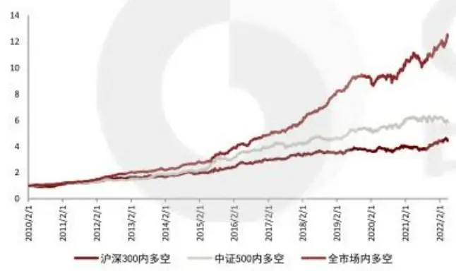
资料来源：万得资讯，中金公司研究部（样本期：2010-01-01至2022-04-30）

图表33：一个月振幅调整动量因子多头超额净值
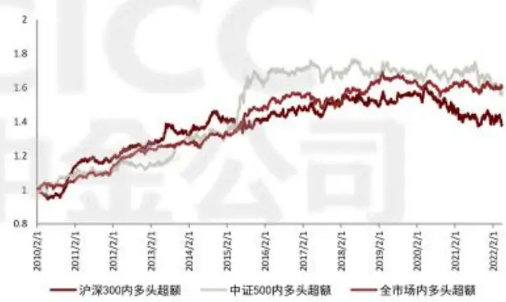
资料来源：万得资讯，中金公司研究部（样本期：2010-01-01至2022-04-30）

图表34：业绩公告前隔夜动量因子多空净值
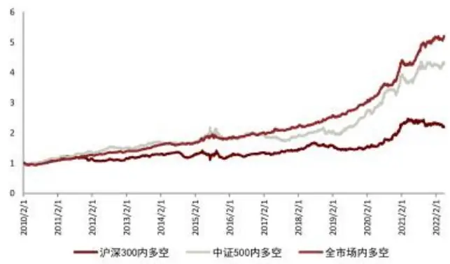
资料来源：万得资讯，中金公司研究部（样本期：2010-01-01至2022-04-30）

图表35：业绩公告前隔夜动量因子多头超额净值
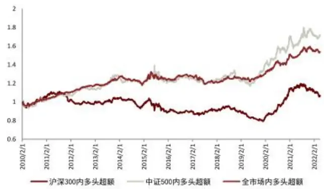
资料来源：万得资讯，中金公司研究部（样本期：2010-01-01至2022-04-30）

## 总结与观点展望

## 主要结论

本篇报告针对截面动量类型因子进行研究。对该类因子为何能够存在的底层逻辑、其收益来源、影响其效果的关键因素一一展开讨论。并分析在何时何地动量因子会更多地体现出“动量”或“反转”的特征。在此基础上，进一步给出动量类型因子的开发范式供业界研究者参考。报告整体结论如下：

市场行使价格发现功能时，市场与投资者面临的实际约束为动量因子提供了收益空间。动量类因子的收益来源既包含风险溢价补偿，也包含行为偏差造成的错误定价。

交易的投资者结构是影响动量因子方向的重要因素。理性投资者的交易行为特征，提供了风险溢价补偿的“动量”收益。而非理性投资者的交易行为特征，以不同的行为偏差方式，既提供了“反转”收益，也为“动量”收益提供来源。因此，当价格的变动主要由机构投资者主导时，动量特征更明显；而如果价格变动主要由散户投资者主导时，反转效应更强烈。

一年动量的收益部分来源于风险补偿，且该风险主要是业绩基本面风险；而一个月动量的收益主要来自投资者行为偏差造成的错误定价。

截面分域中，动量特征在高机构覆盖、大市值、低波动、高价值的股票池中更明显；而反转效果在低覆盖、小市值、高波动、低流动性、低价值的股票池内更为显著。时序分域中，当市场处于下跌、低波动时期；风格处于大盘占优、成长占优的时期时，动量类因子倾向释放更多的“动量”特征；而当市场与上涨、高波动时期；风格处于小盘占优、价值占优的时期时，动量类因子倾向释放更多的“反转”特征。

动量因子的构建可以拆解为一种历史收益率序列向量与一种权重序列向量的内积。从逻辑推导入手的动量因子挖掘，其核心在于给出一种逻辑猜想，通过某些股票特征能判断出何时何地的股票交易中，其投资者交易占比是更偏向机构还是个人。并把该猜想以权重序列的形式表达出来。从机器暴力挖掘的角度入手，其核心在于利用算法不断优化寻找更理想的权重序列。

在A股的动量类型因子中，“反转”逻辑较为推荐一个月振幅调整动量与一个月日内动量因子。“动量”逻辑较为推荐业绩公告前隔夜动量、业绩公告跳空动量等因子。

## 观点展望

长期来看，随着A股市场越来越规范，机构投资者交易占比逐渐提升。A股的动量特征会越来越明显，而反转效果将逐步削弱。

而对近期的观点，考虑到当下我们对未来市场涨跌的择时观点尚显悲观，成长/价值风格轮动模型更看好成长风格。我们认为近期“动量”特征会更明显，而“反转”效应会比以往更弱。

## 作者信息

胡骥聪
SAC 执证编号：S0080521010007
SFC CE Ref: BRF083
jicong.hu@cicc.com.cn

## 王汉锋

SAC 执证编号：S0080513080002SFC CE Ref: AND454hanfeng.wang@cicc.com.cn

周蕭潇
SAC 执证编号：S0080521010006
SFC CE Ref: BRA090
xiaoxiao.zhou@cicc.com.cn
刘均伟
SAC 执证编号：S0080520120002
SFC CE Ref: BQR365
junwei.liu@cicc.com.cn

## 法律声明

一般声明

本报告由中国国际金融股份有限公司（已具备中国证监会批复的证券投资咨询业务资格）制作。本报告中的信息均来源干我们认为可靠的已公开资料，但中国国际金融股份有限公司及其关联机构（以下统称“中金公司”）对这些信息的准确性及完整性不作任何保证。本报告中的信息、意见等均仅供投资者参考之用，不构成对买卖任何证券或其他金融工具的出价或征价或提供任何投资决策建议的服务。该等信息、意见并未考虑到获取本报告人员的具体投资目的、财务状况以及特定需求，在任何时候均不构成对任何人的个人推荐或投资操作性建议。投资者应当对本报告中的信息和意见进行独立评估，自主审慎做出决策并自行承担风险。投资者在依据本报告涉及的内容进行任何决策前，应同时考量各自的投资目的、财务状况和特定需求，并就相关决策咨询专业顾问的意见对依据或者使用本报告所造成的一切后果，中金公司及/或其关联人员均不承担任何责任。

本报告所载的意见、评估及预测仅为本报告出具日的观点和判断，相关证券或金融工具的价格、价值及收益亦可能会波动。该等意见、评估及预测无需通知即可随时更改。在不同时期，中金公司可能会发出与本报告所载意见、评估及预测不一致的研究报告。

本报告署名分析师可能会不时与中金公司的客户、销售交易人员、其他业务人员或在本报告中针对可能对本报告所涉及的标的证券或其他金融工具的市场价格产生短期影响的催化剂或事件进行交易策略的讨论。这种短期影响的分析可能与分析师已发布的关于相关证券或其他金融工具的目标价、评级、估值、预测等观点相反或不一致，相关的交易策略不同于且也不影响分析师关于其所研究标的证券或其他金融工具的基本面评级或评分。

中金公司的销售人员、交易人员以及其他专业人士可能会依据不同假设和标准、采用不同的分析方法而口头或书面发表与本报告意见及建议不一致的市场评论和/或交易观点。中金公司没有将此意见及建议向报告所有接收者进行更新的义务。中金公司的资产管理部门、自营部门以及其他投资业务部门可能独立做出与本报告中的意见不一致的投资决策。

除非另行说明，本报告中所引用的关于业绩的数据代表过往表现。过往的业绩表现亦不应作为日后回报的预示。我们不承诺也不保证，任何所预示的回报会得以实现。
分析中所做的预测可能是基于相应的假设。任何假设的变化可能会显著地影响所预测的回报。

本报告提供给某接收人是基于该接收人被认为有能力独立评估投资风险并就投资决策能行使独立判断。投资的独立判断是指，投资决策是投资者自身基于对潜在投资的目标、需求、机会、风险、市场因素及其他投资考虑而独立做出的。

本报告由受香港证券和期货委员会监管的中国国际金融香港证券有限公司（“中金香港”）于香港提供。香港的投资者若有任何关于中金公司研究报告的问题请直接联系中金香港的销售交易代表。本报告作者所持香港证监会牌照的牌照编号已披露在报告首页的作者姓名旁。

本报告由受新加坡金融管理局监管的中国国际金融（新加坡）有限公司（“中金新加坡”）于新加坡向符合新加坡《证券期货法》定义下的认可投资者及/或机构投资者提供。提供本报告于此类投资者，有关财务顾问将无需根据新加坡之《财务顾问法》第36 条就任何利益及/或其代表就任何证券利益进行披露。有关本报告之任何查询，在新加坡获得本报告的人员可联系中金新加坡销售交易代表。

本报告由受金融服务监管局监管的中国国际金融（英国）有限公司（“中金英国”）于英国提供。本报告有关的投资和服务仅向符合《2000年金融服务和市场法2005年(金融推介）令》第19（5）条、38条、47条以及49条规定的人士提供。本报告并未打算提供给零售客户使用。在其他欧洲经济区国家，本报告向被其本国认定为专业投资者（或相当性质）的人士提供。

本报告由中国国际金融日本株式会社（“中金日本”）于日本提供，中金日本是在日本关东财务局（日本关东财务局长（金商）第3235号）注册并受日本法律监管的金融机构。本报告有关的投资和服务仅向符合日本《金融商品交易法》第2条31项所规定的专业投资者提供。本报告并未打算提供给日本非专业投资者使用。

本报告将依据其他国家或地区的法律法规和监管要求于该国家或地区提供。

## 特别声明

在法律许可的情况下，中金公司可能与本报告中提及公司正在建立或争取建立业务关系或服务关系。因此，投资者应当考虑到中金公司及/或其相关人员可能存在影响本报告观点客观性的潜在利益冲突。

与本报告所含具体公司相关的披露信息请访https://research.cicc.com/footer/disclosures，亦可参见近期已发布的关于该等公司的具体研究报告。

中金研究基本评级体系说明：

分析师采用相对评级体系，股票评级分为跑赢行业、中性、跑输行业（定义见下文）。

除了股票评级外，中金公司对覆盖行业的未来市场表现提供行业评级观点，行业评级分为超配、标配、低配（定义见下文）。

我们在此提醒您，中金公司对研究覆盖的股票不提供买入、卖出评级。跑赢行业、跑输行业不等同于买入、卖出。投资者应仔细阅读中金公司研究报告中的所有评级定义。请投资者仔细阅读研究报告全文，以获取比较完整的观点与信息，不应仅仅依靠评级来推断结论。在任何情形下，评级（或研究观点）都不应被视为或作为投资建议。投资者买卖证券或其他金融产品的决定应基于自身实际具体情况（比如当前的持仓结构）及其他需要考虑的因素。

## 股票评级定义：

·跑赢行业(OUTPERFORM)：未来6~12个月，分析师预计个股表现超过同期其所属的中金行业指数：

·中性（NEUTRAL）：未来6~12个月，分析师预计个股表现与同期其所属的中金行业指数相比持平

跑输行业（UNDERPERFORM)：未来6~12个月，分析师预计个股表现不及同期其所属的中金行业指数。

## 行业评级定义：

超配（OVERWEIGHT）：未来6~12个月，分析师预计某行业会跑赢大盘10%以上；

- 标配（EQUAL-WEIGHT）：未来6~12个月，分析师预计某行业表现与大盘的关系在-10%与10%之间；

- 低配（UNDERWEIGHT）：未来6~12个月，分析师预计某行业会跑输大盘10%以上。

研究报告评级分布可从https://research.cicc.com/footer/disclosures 获悉。

本报告的版权仅为中金公司所有，未经书面许可任何机构和个人不得以任何形式转发、翻版、复制、刊登、发表或引用。

V190624

## 北京

中国国际金融股份有限公司中国北京建国门外大街1号国贸写字楼2座28层邮编：100004电话：(86-10) 6505 1166传真：(86-10) 6505 1156

## 深圳

中国国际金融股份有限公司深圳分公司
深圳市福田区益田路5033号
平安金融中心72层
邮编：518048
电话：(86-755)8319-5000
传真：(86-755)8319-9229

## 东京

中国国际金融日本株式会社
100-0005東京都千代田区丸の内3丁目2番3
号丸の内二重橋ビル21階
Tel: (+813) 3201 6388
Fax: (+813) 3201 6389

## 纽约

CICC US Securities, Inc 32nd Floor, 280 Park Avenue New York, NY 10017, USA Tel: (+1-646) 7948 800 Fax: (+1-646) 7948 801

## 伦敦

China International Capital Corporation (UK) 
Limited 
25th Floor, 125 Old Broad Street 
London EC2N 1AR, United Kingdom 
Tel: (+44-20) 7367 5718 
Fax: (+44-20) 7367 5719

## 上海

中国国际金融股份有限公司上海分公司
上海市浦东新区陆家嘴环路1233号
汇亚大厦32层
邮编：200120
电话：(86-21)5879-6226
传真：(86-21)5888-8976

## 香港

中国国际金融（香港）有限公司香港中环港景街1号国际金融中心第一期29楼电话：(852)2872-2000传真：(852)2872-2100

## 旧金山

CICC US Securities, Inc. San Francisco Branch 
Office 
One Embarcadero Center, Suite 2350, 
San Francisco, CA 94111, USA 
Tel: (+1) 415 493 4120 
Fax: (+1) 628 203 8514

## 新加坡

China International Capital Corporation 
(Singapore) Pte. Limited 
6 Battery Road, #33-01 
Singapore 049909 
Tel: (+65) 6572 1999 
Fax: (+65) 6327 1278

## 法兰克福

China International Capital Corporation (Europe) 
GmbH 
Neue Mainzer Straße 52-58, 60311 
Frankfurt a.M, Germany 
Tel: (+49-69) 24437 3560