# 量化多因子系列（7)：价量因子手册

古翔

SAC 执证编号：S0080521010010

SFC CE Ref: BRE496

xiang.gu@cicc.com.cn

周萧潇

SAC 执证编号：S0080521010006

SFC CE Ref: BRA090

xiaoxiao.zhou@cicc.com.cn

刘均伟

SAC 执证编号：S0080520120002

SFC CE Ref: BQR365

junwei.liu@cicc.com.cn

本篇报告为低频价量因子的参考手册，汇集了常用的价量因子以及中金研究量化策略团队开发的创新性因子。价量因子是以股票的交易价格、成交量以及资金的流向等数据为基础构建的，刻画的是各类投资者的交易行为。本篇报告为中金公司研究部金融工程团队的第二篇量化因子手册报告，不同于“基本面因子手册”中利用基本面数据构建的因子，价量因子的优势在于数据的可得性、及时性较强，能够较为及时地捕捉到市场的最新动态；它的劣势在于换手率通常较高，因子逻辑易受投资者结构、交易规则变化的影响。

我们依据价量因子的构建方式及核心逻辑将其划分为8大类，分别为动量&反转、流动性、波动率、量价相关性、筹码分布、资金流、北向资金、融资融券因子，并构建了各类因子的复合因子，检验各类因子的有效性，尝试分析其主要收益来源，供投资者参考。

## 1）动量&反转

我们将动量&反转因子分为4小类:隔夜动量、报告期动量、月度反转和年度动量因子。隔夜动量因子(mmt_overnight_A)全市场范围内有效性较好，IC_IR达0.63，但沪深300范围内有效性一般；报告期动量（mmt_report_period)、年度动量因子（mmt_offlimit_A）IC_IR表现不算亮眼，但在沪深300范围内具有较好的多头选股能力；月度反转因子整体有效性较强，尤其是mmt_range_M因子，在所有选股域中均有较好的表现。

## 2）波动率

我们相对推荐振幅的标准差因子，如vol_highlow_std、vol_upshadow_std和vol_w_downshadow_std等。同时，对比不同周期的振幅标准差因子的IC均值和多头组合收益表现，我们发现其选股能力未有显著差异，但长周期（6个月）的波动率因子多头组合换手率明显低于短周期（1个月）的波动率因子。考虑换手成本的情况下，长周期的振幅标准差因子性价比更高。

## 3）流动性

换手率因子与价格弹性因子均值得关注，其中，换手率标准差因子（liq_turn_std_6M）在沪深300、中证500、中证1000范围内的IC_IR分别为-0.39、-0.70、-0.81，表现均较好。同时，虽然价格弹性因子（liq_vstd_1M、liq_shortcut_avg_1M）有效性不如换手率因子，但考虑到其与换手率因子仅有弱相关关系，构建流动性的大类因子时，价格弹性类因子亦值得考虑。

## 4）量价相关性

量能领先阶段往往是信息扩散的初期，量能领先因子（corr_ret_turn_post_1M）与未来收益正相关，全市场IC_IR为0.52，在沪深300、中证1000范围内亦有不俗的表现；量价同步阶段往往是信息扩散的中后期，量价同步因子(corr_ret_turnd_1M、corr_price_turn_1M)与未来收益负相关，全市场IC_IR可达-1.00，总体表现较好，在不同选股范围内均具有较强的选股能力。

## 5）筹码分布

筹码分布旨在刻画股票持有人的持仓成本分布情况，我们据此构建了筹码分布的均值、标准差、偏度、峰度等因子，以及不同盈亏水平的筹码占比因子。该类因子在沪深300和中证500范围内因子IC表现较弱，在全市场、中证1000范围内才具有一定的选股效果，IC_IR的绝对值大概可以达到0.40左右。

## 6）资金流向

资金流因子反映了不同类型资金流向的信息，该类因子的核心思路是捕捉“聪明资金”的流向，采取跟随策略，以期获得基本面改善带来的超额收益。从因子有效性角度来看，大单买入因子（buy_shift_dist_1）具有正向预测能力，全市场IC_IR达0.78；小单主动买入因子（act_buy_shift_dist_s)具有负向的预测效果，全市场IC_IR为-0.46。这一结果与直观理解相近，大单更多表征较为理性的机构观点，而小单则主要代表相对非理性的观点。此外，开盘资金流入因子(inflow_shift_dist_open_1）在沪深 300、中证500、中证1000范围内也具有较强的选股效果，多头组合年化超额收益分别为6.1%、8.6%、8.8%，分组单调性也较好，亦值得关注。

## 7）北向资金流

北向持仓占比因子总体有效性较好，全市场中，north_hold_prop因子的IC均值为3.5%,IC_IR为0.60;north_hold_prefer因子的IC均值为3.8%，IC_IR为0.69，但从多头组合的相对净值表现来看，北向持仓因子在2021年以来选股能力有所回落。北向持仓变化因子（north_hold_prefer_It_chg)单调性一般，但多头组合表现较好，沪深 300、中证500、中证1000范围内的多头组合均有10%以上的年化超额收益率。

## 8）融资融券

融资融券因子在全市场范围单调性欠佳，且有效性一般。只有少数融资融券因子在全选股域表现出一定的分组单调性，大多数融资融券因子在沪深300、中证500和中证1000的IC_IR表现都较为一般。从因子的预测方向来看，无论是融资因子还是融券因子，均表现为负面的预测效果，即融资买入（或融券卖出）占比越高，未来收益表现越弱。

## 9）价量复合因子

大部分价量复合因子之间相关性较低，具有较强的选股能力。价量复合因子大多分组单调性较好，沪深300范围内推荐关注量价相关性因子、北向持仓变化因子；中小市值范围内则推荐关注换手率因子、反转因子；此外，资金流因子虽然IC_IR表现在价量因子中表现不算突出，但考虑到它与动量、波动率、流动性因子相关性均较低，仍可作为有效的增量信息加入多因子模型中使用。

风险提示：本篇报告基于市场历史收益表现测试价量因子的有效性，无法确保价量因子样本外的收益表现。

量化策略|量化多因子系列（6）：关于动量，你所希望了解的那些事(2022.06.04)

- 量化策略|量化多因子系列（5）：基本面因子手册(2022.04.26)

- 市场策略|量化多因子系列（4）：风格轮动模型与主动&被动量化产品的结合（2021.06.15)

- 量化策略|量化多因子系列（3）：如何捕捉成长与价值的风格轮动？(2021.05.15)

## 更多作者及其他信息请见文末披露页

量化策略量化多因子系列（2）：非线性假设下的情景分析因子模型(2021.02.28)

## 价量因子综述

## 价量因子：捕捉市场的最新动态

价量因子是以股票的交易价格、成交量以及资金的流向等数据为基础构建的，刻画的是各类投资者的交易行为。与基本面因子相比，价量因子的优势在于数据的可得性、及时性较强，能够较为及时地捕捉到市场的最新动态；它的劣势在于换手率通常较高，因子逻辑易受投资者结构、交易规则变化的影响。依据基础数据的频率划分，价量因子又可分为高频价量因子和低频价量因子，本篇报告聚焦于低频价量因子的梳理。

我们认为，价量因子的收益来源主要有三方面，一是通过捕捉由于噪音交易者反映过度（或反应不足）造成的错误定价所带来的投资机会；二是追随“聪明资金”，获取基本面改善带来的超额收益；三是承担了特定的风险，获得风险补偿收益。

图表1：价量因子收益来源
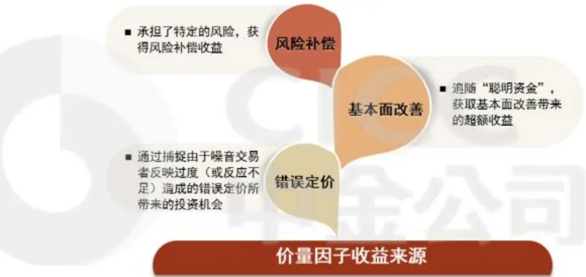
资料来源：中金公司研究部

本文依据价量因子的构建方式将其划分为8大类，分别为动量&反转、流动性、波动率、量价相关性、筹码分布、资金流、北向资金、融资融券因子。我们将依次检验各类因子的有效性，并尝试分析其主要收益来源。

图表2：价量因子分类

资料来源：中金公司研究部

## 因子测试框架

本文对基本面因子进行IC检验和分组回测检验，展示不同因子的有效性水平。我们将对各类因子在全市场、沪深300、中证500和中证1000进行IC检验与分组回测检验，分析不同因子收益率预测的稳定性、单调性和有效性，并展示个别因子的分行业IC表现和多头收益表现。其中因子测试框架如下：

测试区间：2010.01.04-2022.07.01（中证1000范围内测试从2014.11.01开始）

股票池：全市场、沪深300和中证500中剔除ST、停牌、一字板和上市未满一年股票

频率：月度

分组回测组数：按照因子值由小到大的顺序等分为10组

## 因子有效性评价标准

使用多种指标展示因子的有效性水平。在IC 检验中，我们使用IC 均值、IC_IR 等指标展示因子暴露与下期收益率的秩相关性，反映因子对收益率的预测能力。在分组回测中，使用多头年化收益率、多头年化超额收益率、多头超额最大回撤等指标展示多头组合的选股能力；其中我们用较为创新的方式对单调性进行计算，即测算分组回测的组数序号与对应组合年化收益率的秩相关系数，该绝对数值越接近于1，则因子单调性越显著。

图表3：有效性检验指标含义

| 因子有效性检验 | 指标计算方法 | 指标含义 |
| --- | --- | --- |
| IC 均值 | IC 序列均值 | 检验因子的预测能力 |
| IC_IRt值 | IC 序列均值 /IC标准差 | 检验因子预测能力的稳定性 |
|  | IC 序列 t 统计值 | 检验因子预测能力的显著性 |
| 多头年化收益率 | 分组回测中多头组合的年化收益率 | 检验因子多头组合的选胶能力 |
| 多头年化超额收益率 | 分组回测中多头组合相较基准指数的超额收益 | 检验因子多头组合的超额收益能力 |
| 多头超额最大回撤 | 分组回测中多头组合相较基准指数的最大回撒 | 检验因子多头组合的收益稳定性 |
| 多头平均换手率单调性 | 分组回测中多头组合的平均换手率 | 检验因子换手率水平 |
|  | 分组回测中组数序号与对应组合年化收益相关系数的绝对值 | 检验因子单调性 |

资料来源：中金公司研究部

## 动量&反转

## 隔夜涨幅表现为动量，日内涨幅表现为反转

动量&反转因子通常由过去一段时间的特定类型的涨跌幅构造，其因子收益一方面可能来源于非理性投资者的行为偏差造成的错误定价，另一方面也可能来源于承担特定风险获得的风险补偿（参考中金公司研究报告《量化多因子系列(6)：关于动量，你所希望了解的那些事》)。本节，我们将对23个不同构建方式下的动量&反转因子进行有效性检验。

图表4：动量&反转类因子构建方式

| 因子代码 | 因子名称 | 因子计算公式 |
| --- | --- | --- |
| mmt_normal_M | 1个月收益率 | 过去1个月的收益率 |
| mmt_normal_A | 1年收益率 | 过去12个月的收益率-过去1个月收益率 |
| mmt_avg_M | 相对均价的1个月收益率 | 当期收盘价/过去20个交易日均价 |
| mmt_avg_A | 相对均价的1年收益率 | 1个月前的收盘价/过去1年的均价 |
| mmt_intraday_M | 1个月日内动量 | 过去一个月的日内涨跌幅之和 |
| mmt_intraday_A | 1年日内动量 | 过去一年的日内涨跌幅之和-过去一个月日内涨跌幅之和 |
| mmt_overnight_M | 1个月隔夜动量 | 过去1个月内，隔夜涨跌幅之和 |
| mmt_overnight_A | 1年隔夜动量 | 过去一年的隔夜涨跌幅之和-过去一个月隔夜涨跌幅之和 |
| mmt_off_limit_A | 1年去涨跌停动量 | 除去涨跌停状态外，过去1年的收盘涨跌幅-过去1个月的收盘涨跌幅 |
| mmt_off_limit_M | 1个月去涨跌停动量 | 除去涨跌停状态外，过去1个月的收盘涨跌幅 |
| mmt_range_M | 1个月振幅调整动量 | 过去1个月内，振幅大的前20%的收盘收益率-振幅小的后20%的收盘收益率 |
| mmt_range_A | 1年振幅调整动量 | 过去1年内，振幅大的前20%的收盘收益率·振幅小的后20%的收盘收益率 |
| mmt_route_M | 1个月路径调整动量 | 过去1个月内收益率/过去1个月内日度涨跌幅绝对值之和 |
| mmt_route_A | 1年路径调整动量 | 过去1年内收益率/过去1年内日度涨跌幅绝对值之和 |
| mmt_discrete_M | 1个月信息离散度动量 | 过去1个月内，上涨天数占比-下跌天数占比 |
| mmt_discrete_A | 1年信息离散度动量 | 过去1年内，上涨天数占比-下跌天数占比 |
| mmt_ sec_rank_M | 1个月横截面rank动量 | 每日计算个股日收益在横截面的排名，取过去20个交易日排名均值 |
| mmt_sec_rank_A | 1年横截面rank动量 | 每日计算个股日收益在横截面的排名，取过去1年排名均值 |
| mmt_time_rank_M | 1个月时序rank动量 | 每日计算个股价格在时序（1年内）的排名，取过去20个交易日排名均值 |
| mmt_report_ovemight | 业绩公告前隔夜动量 | 最近一个业绩公告日的前一个月的隔夜收益率之和 |
| mmt_report_jump | 业绩跳开动量 | 最近一个业绩公告日的下一交易日隔夜超额收益率 |
| mmt_report_period | 业绩期动量 | 业绩公告前一交易日至后一交易日 |
| mmt_highest_days_A | 近1年最高价日期距今的天数 |  |

资料来源：中金公司研究部

mmt_intraday_M、mmt_range_M 和 mmt_report_overnight 因子在绝大多数选股域中有效性良好。我们将动量&反转因子在全市场、沪深300、中证500和中证1000分别进行有效性检验，基于因子的相关性统计，大致将动量&反转因子分为以下四类：隔夜动量、报告期动量、月度反转和年度动量因子。

隔夜动量因子包括 mmt_overnight_A、mmt_overnight_M 和 mmt_report_overnight 因子。mmt_report_overnight因子在全市场范围内表现较为出色，在中证500和中证1000中也有较强的收益预测能力，且单调性良好。但在沪深300中，隔夜动量因子均表现较为普通，说明该类因子在大市值股票的有效性偏弱。全市场中，mmt_report_overnight因子的IC 均值为 2.9%，IC_IR 为 0.73。

报告期动量因子指的是与报告期前后涨跌幅相关的因子，如：mmt_report_jump_open、mmt_report_period等。大部分报告期动量因子在全市场、中证500、中证1000范围内表现良好，互相之间相关性较低；沪深 300 范围内可关注 mmt_report_period 因子，即业绩公告日前后两天内涨跌幅因子，年化超额收益率可达9.1%。

月度反转因子指的是一个月涨跌幅因子及其衍生因子，该类因子在全市场范围内彼此相关性较高。其中，mmt_intraday_M因子在全市场、中证500和中证1000中收益预测能力和单调性较好，但在沪深300中表现相对较弱。而mmt_range_M因子在所有选股域中均表现优良。全市场中，mmt_intraday_M因子的IC均值为-6.8%，IC_IR为-0.77;mmt_range_M因子的IC 均值为-6.8%，IC_IR 为-1.03。

年度动量因子主要指年度涨跌幅因子及其衍生因子，该类因子与反转、隔夜动量、报告期动量因子的相关性均较低，包括mmt_normal_A、mmt_off_limit_A等。经过测试，我们认为mmt_off limit A因子值得关注，该因子在沪深 300、中证 500、中证 1000范围内因子有效性均较好，尤其多头超额收益表现突出。

综合来看，mmt_range_M因子整体表现优异。在不同选股域中，mmt_range_M因子均有着较强的预测能力和良好的单调性，在其他因子均表现较弱的沪深300中选股能力也较为优异。

图表5：动量&反转因子在全市场范围内的有效性检验结果

| 因子 | IC均值 | IC_IR | P(IC<0) | P(IC<-0.02) | P(IC>0) | P(IC>0.02) | 值 | 多头年化收多头年化超多头超额最多头平均换 益率 | 额收益 | 大回数 | 手车 | 单调性 |
| --- | --- | --- | --- | --- | --- | --- | --- | --- | --- | --- | --- | --- |
| mmt_avg_A | -1.1% | -0.11 | 53.3% | 44.0% | 46.7% | 37.3% | -1.33 | 3.6% | -5.0% | -48.9% | 24.0% | 0.03 |
| mmt_avg_M | -6.5% | -0.58 | 70.7% | 65.3% | 29.3% | 19.3% | -7.14 | 13.0% | 4.3% | -11.8% | 76.3% | 0.83 |
| mmt_discrete_A | -0.5% | -0.07 | 51.3% | 40.7% | 48.7% | 35.3% | -0.89 | 7.7% | -1.3% | -24.8% | 30.6% | 0.14 |
| mmt_discrete_M | -2.0% | -0.29 | 65.3% | 50.0% | 34.7% | 26.0% | 3.55 | 8.5% | -0.4% | -15.3% | 88.7% | 0.67 |
| mmt_highest_days_A | 1.3% | 0.17 | 45.3% | 32.0% | 54.7% | 45.3% | 2.02 | 9.2% | -0.1% | -21.1% | 44.1% | 0.07 |
| mmt_intraday_A | -2.3% | -0.28 | 62.0% | 52.7% | 38.0% | 30.7% | 3.43 | 6.8% | -1.8% | -24.0% | 32.7% | 0.42 |
| mmt_intraday_M | -6.8% | -0.77 | 81.3% | 72.7% | 18.7% | 15.3% | -9.46 | 14.6% | 5.6% | -9.4% | 88.8% | 0.84 |
| mmt_normal_A | -0.3% | -0.03 | 50.0% | 40.0% | 50.0% | 41.3% | -0.36 | 2.4% | -5.9% | -54.6% | 37.3% | 0.37 |
| mmt_normal_M | -6.2% | -0.63 | 76.7% | 67.3% | 23.3% | 16.7% | -7.77 | 12.5% | 3.8% | -11.1% | 89.8% | 0.81 |
| mmt_off_limit_A | 2.5% | 0.29 | 40.0% | 28.0% | 60.0% | 53.3% | 3.57 | 11.3% | 2.3% | -20.3% | 32.6% | 0.88 |
| mmt_off_limit_M | -2.1% | -0.23 | 56.0% | 46.7% | 44.0% | 32.0% | -2.80 | 6.3% | -1.8% | -36.5% | 87.2% | 0.52 |
| mmt_overnight_A | 3.0% | 0.63 | 28.7% | 16.0% | 71.3% | 55.3% | 7.73 | 10.5% | 1.7% | -9.3% | 27.1% | 0.84 |
| mmt_ovemight_M | 2.4% | 0.50 | 29.3% | 18.0% | 70.7% | 56.0% | 6.14 | 6.8% | -1.6% | -23.6% | 84.8% | 0.59 |
| mmt_range_A | -4.8% | -0.70 | 78.7% | 69.3% | 21.3% | 13.3% | -8.62 | 12.8% | 3.8% | -5.8% | 34.8% | 0.85 |
| mmt_range_M | -6.8% | -1.03 | 87.3% | 76.0% | 12.7% | 8.0% | -12.60 | 13.7% | 4.8% | -8.4% | 89.2% | 0.90 |
| mmt_report_jump_low | 1.7% | 0.43 | 30.7% | 18.7% | 69.3% | 50.0% | 5.26 | 9.0% | 0.3% | -12.2% | 46.4% | 0.76 |
| mmt_report_jump_open | 1.6% | 0.56 | 26.7% | 10.0% | 73.3% | 47.3% | 6.88 | 9.8% | 1.1% | -8.5% | 43.1% | 0.81 |
| mmt_report_overnight | 2.9% | 0.73 | 25.3% | 12.7% | 74.7% | 59.3% | 8.92 | 11.8% | 3.0% | -8.6% | 42.0% | 0.88 |
| mmt_report_period | 1.4% | 0.29 | 38.7% | 22.0% | 61.3% | 46.7% | 3.52 | 8.9% | 0.4% | -13.4% | 43.5% | 0.85 |
| mmt_route_A | -0.6% | -0.06 | 52.7% | 40.7% | 47.3% | 40.0% | -0.71 | 3.7% | -5.1% | -47.3% | 37.1% | 0.45 |
| mmt_route_M | -4.9% | -0.52 | 69.3% | 62.7% | 30.7% | 20.7% | -6.43 | 9.1% | 0.1% | -16.0% | 90.6% | 0.72 |
| mmt_sec_rank_A | 2.2% | 0.24 | 40.7% | 32.0% | 59.3% | 52.7% | 2.92 | 10.9% | 2.0% | -18.4% | 34.1% | 0.86 |
| mmt_sec_rank_M | -2.3% | -0.24 | 56.0% | 48.0% | 44.0% | 33.3% | -2.90 | 8.4% | 0.0% | -21.0% | 88.8% | 0.65 |
| mmt_time_rank_M | -4.1% | -0.51 | 70.7% | 60.7% | 29.3% | 21.3% | -6.22 | 10.2% | 1.3% | -13.1% | 89.1% | 0.78 |

资料来源：Wind，中金公司研究部（注：统计时间为2010-01-01至2022-06-30；超额收益的比较基准为全市场等权指数）

图表6：全市场范围内表现相对较好的动量&反转因子之间的相关性统计

|  | M | ay M | al M | M | ank M |  |  |  |  |  |  |  |  |  |  |
| --- | --- | --- | --- | --- | --- | --- | --- | --- | --- | --- | --- | --- | --- | --- | --- |
|  |  |  |  |  |  |  |  |  |  |  |  |  |  |  | period |
| mmt_avg_M | 1.00 | 0.71 | 0.82 | 0.51 | 0.62 | 0.78 | 0.05 | 0.07 | 0.09 0.13 0.09 |  |  | 0.04 | 0.04 | 0.09 | 0.20 |
| mmt_intraday_M | 0.71 | 1.00 | 0.81 | 0.62 | 0.67 | 0.78 | -0.37 | -0.01 | -0.01 | 0.01 | 0.15 | -0.09 | 0.04 | 0.12 | 0.11 |
| mmt_normal_M | 0.82 | 0.81 | 1.00 | 0.56 | 0.79 | 0.93 | 0.13 | -0.05 | 0.00 | 0.02 | 0.07 | 0.01 | 0.03 | 0.08 | 0.14 |
| mmt_range_M | 0.51 | 0.62 | 0.56 | 1.00 | 0.31 | 0.55 | -0.16 | 0.03 | -0.03 | -0.03 | 0.25 | -0.05 | -0.02 | -0.05 | 0.07 |
| mmt_time_rank_M | 0.62 | 0.67 | 0.79 | 0.31 | 1.00 | 0.81 | 0.10 | -0.24 | 0.18 | -0.19 | -0.02 | 0.01 | 0.02 | 0.06 | 0.10 |
| mmt_route_M | 0.78 | 0.78 | 0.93 | 0.55 | 0.81 | 1.00 | 0.11 | -0.03 | 0.01 | 0.03 | 0.07 | 0.01 | 0.03 | 0.07 | 0.14 |
| mmt_overnight_M | 0.05 | 0.37 | 0.13 | -0.16 | 0.10 | 0.11 | 1.00 | -0.07 | 0.02 | 0.01 | 0.15 | 0.18 | 0.13 | 0.38 | 0.04 |
| mmt_normal_A | 0.07 | -0.01 | -0.05 | 0.03 | 0.24 | -0.03 | -0.07 | 1.00 | 0.61 | 0.66 | 0.41 | 0.06 | 0.01 | 0.00 | 0.09 |
| mmt_off_limit_A | 0.09 | -0.01 | 0.00 | -0.03 | 0.18 | 0.01 | 0.02 | 0.61 | 1.00 | 0.68 | 0.17 | 0.01 | 0.04 | 0.04 | 0.10 |
| mmt_sec_rank_A | 0.13 | 0.01 | 0.02 | -0.03 | 0.19 | 0.03 | 0.01 | 0.66 | 0.68 | 1.00 | -0.04 | 0.17 | 0.04 | 0.07 | 0.10 |
| mmt_range_A | 0.09 | 0.15 | 0.07 | 0.25 | 0.02 | 0.07 | -0.15 | 0.41 | 0.17 | -0.04 | 1:00 | -0.36 | -0.03 | -0.13 | 0.03 |
| mmt_overnight_A | 0.04 | 0.08 | 0.01 | -0.05 | 0.01 | 0.01 | 0.18 | 0.06 | 0.01 | 0.17 | 0.36 | 1.00 | 0.08 | 0.30 | 0.04 |
| mmt_report_jump_open | 0.04 | -0.04 | 0.03 | -0.02 | 0.02 | 0.03 | 0.13 | 0.01 | 0.04 | 0.04 | -0.03 | 0.08 | 1.00 | 0.07 | 0.17 |
| mmt_report_overnight | 0.09 | 0.12 | 0.08 | -0.05 | 0.06 | 0.07 | 0.38 | 0.00 | 0.04 | 0.07 | -0.13 | 0.30 | 0.07 | 1.00 | 0.13 |
| mmt_report_period | 0.20 | 0.11 | 0.14 | 0.07 | 0.10 | 0.14 | 0.04 | 0.09 | 0.10 | 0.10 | 0.03 | 0.04 | 0.17 | 0.13 | 1.00 |

资料来源：Wind，中金公司研究部（注：统计时间为2010-01-01至2022-06-30）

图表7：动量&反转因子在沪深300 范围内的有效性检验结果

| 因子 | IC均值 | IC_IR | P(IC<0) | P(IC<-0.02) | P(IC>0) | P(IC>0.02) | 值 | 益率 | 多头年化收多头年化超多头超额最多头平均换 额收益 | 大回撤 | 手率 | 单调性 |
| --- | --- | --- | --- | --- | --- | --- | --- | --- | --- | --- | --- | --- |
| mmt_avg_A | 1.9% | 0.12 | 44.0% | 39.3% | 56.0% | 50.0% | 1.53 | 11.7% | 11.5% | -21.5% | 27.4% | 0.80 |
| mmt_avg_M | -3.6% | -0.25 | 60.0% | 56.0% | 40.0% | 37.3% | -3.04 | 6.2% | 6.0% | -18.6% | 75.1% | 0.83 |
| mmt_discrete_A | 1.2% | 0.09 | 46.7% | 40.0% | 53.3% | 46.7% | 1.13 | 6.9% | 6.5% | -23.6% | 30.5% | 0.72 |
| mmt_discrete_M | -1.4% | -0.14 | 56.0% | 46.7% | 44.0% | 34.0% | -1.69 | 1.9% | 1.3% | -21.2% | 88.0% | 0.61 |
| mmt_highest_days_A | -0.5% | -0.04 | 50.7% | 40.0% | 49.3% | 42.7% | -0.51 | 2.1% | 1.5% | -23.0% | 42.1% | 0.36 |
| mmt_intraday_A | 0.4% | 0.03 | 49.3% | 40.7% | 50.7% | 44.0% | 0.39 | 5.6% | 5.5% | -18.4% | 28.9% | 0.86 |
| mmt_intraday_M | -3.5% | -0.27 | 62.7% | 57.3% | 37.3% | 33.3% | -3.34 | 4.6% | 4.3% | -20.0% | 88.3% | 0.78 |
| mmt_normal_A | 2.3% | 0.16 | 42.7% | 35.3% | 57.3% | 47.3% | 1.90 | 13.7% | 13.5% | -17.8% | 35.7% | 0.77 |
| mmt_normal_M | 3.8% | -0.30 | 62.7% | 58.0% | 37.3% | 32.0% | -3.62 | 7.3% | 7.1% | -17.9% | 88.7% | 0.89 |
| mmt_off_limit_A | 3.7% | 0.25 | 36.7% | 33.3% | 63.3% | 56.0% | 3.06 | 13.0% | 12.7% | -18.8% | 32.5% | 0.94 |
| mmt_off_limit_M | -2.2% | -0.17 | 56.0% | 50.0% | 44.0% | 35.3% | -2.14 | 3.3% | 3.1% | -18.8% | 88.1% | 0.76 |
| mmt_overnight_A | 2.5% | 0.27 | 40.0% | 32.7% | 60.0% | 51.3% | 3.34 | 3.9% | 3.6% | -18.0% | 25.5% | 0.53 |
| mmt_ovemight_M | -0.3% | -0.04 | 51.3% | 43.3% | 48.7% | 41.3% | -0.43 | 4.2% | 4.1% | -14.5% | 78.4% | 0.75 |
| mmt_range_A | -2.2% | -0.22 | 58.0% | 52.0% | 42.0% | 34.7% | 2.67 | 1.3% | 0.8% | -22.5% | 35.9% | 0.04 |
| mmt_range_M | -3.9% | -0.40 | 64.7% | 56.0% | 35.3% | 29.3% | -4.90 | 7.3% | 7.1% | -14.5% | 88.2% | 0.80 |
| mmt_report_jump_low | 1.4% | 0.18 | 46.0% | 36.7% | 54.0% | 47.3% | 2.23 | 5.6% | 5.2% | -18.4% | 45.3% | 0.70 |
| mmt_report_jump_open | 0.6% | 0.09 | 44.7% | 32.7% | 55.3% | 44.0% | 1.09 | 4.7% | 4.4% | -14.5% | 42.7% | 0.61 |
| mmt_report_overnight | 1.2% | 0.13 | 44.0% | 38.7% | 56.0% | 47.3% | 1.65 | 5.9% | 5.7% | -18.2% | 41.8% | 0.66 |
| mmt_report_period | 2.1% | 0.26 | 37.3% | 29.3% | 62.7% | 54.7% | 3.16 | 9.3% | 9.1% | -20.6% | 44.2% | 0.77 |
| mmt_route_A | 2.7% | 0.18 | 42.0% | 36.0% | 58.0% | 50.7% | 2.23 | 14.3% | 13.9% | -15.3% | 35.8% | 0.84 |
| mmt_route_M | -2.5% | -0.20 | 59.3% | 55.3% | 40.7% | 34.7% | -2.45 | 0.5% | -0.1% | -28.3% | 89.3% | 0.54 |
| mmt_sec_rank_A | 3.7% | 0.25 | 38.0% | 30.7% | 62.0% | 54.0% | 3.12 | 12.0% | 11.8% | -23.7% | 32.4% | 0.94 |
| mmt_sec_rank_M | -1.4% | -0.12 | 56.0% | 48.0% | 44.0% | 39.3% | -1.44 | 4.3% | 3.9% | -20.5% | 88.7% | 0.69 |
| mmt_time_rank_M | -3.3% | -0.29 | 64.0% | 54.0% | 36.0% | 30.0% | -3.52 | 6.3% | 5.7% | -15.1% | 89.0% | 0.85 |

资料来源：Wind，中金公司研究部（注：统计时间为2010-01-01至2022-06-30；超额收益的比较基准为沪深300等权指数000984.CSI）

图表8：动量&反转因子在中证500范围内的有效性检验结果

| 因子 | IC均值 | IC_IR | P(IC<0) | P(IC<-0.02) | P(IC>0) | P(IC>0.02) | 值 益率 | 多头年化收多头年化超多头超额最多头平均换 | 额收益 | 大回撤 | 手率 | 单调性 |
| --- | --- | --- | --- | --- | --- | --- | --- | --- | --- | --- | --- | --- |
| mmt_avg_A | -1.2% | -0.09 | 54.0% | 49.3% | 46.0% | 42.0% | -1.10 | 2.1% | -1.0% | -33.7% | 26.8% | 0.26 |
| mmt_avg_M | -4.7% | -0.36 | 63.3% | 56.7% | 36.7% | 33.3% | -4.39 | 7.3% | 4.2% | -17.2% | 76.8% | 0.87 |
| mmt_discrete_A | -0.5% | -0.05 | 52.7% | 41.3% | 47.3% | 36.7% | -0.58 | 4.0% | 0.5% | -35.5% | 31.5% | 0.08 |
| mmt_discrete_M | -1.1% | -0.13 | 50.7% | 42.7% | 49.3% | 36.0% | -1.64 | 4.9% | 1.4% | -15.4% | 89.1% | 0.20 |
| mmt_highest_days_A | 0.2% | 0.02 | 48.0% | 41.3% | 52.0% | 40.7% | 0.19 | 4.7% | 1.3% | -20.9% | 46.8% | 0.46 |
| mmt_intraday_A | -1.9% | -0.19 | 62.0% | 48.0% | 38.0% | 34.0% | -2.28 | 4.1% | 0.9% | -23.8% | 34.3% | 0.51 |
| mmt_intraday_M | -5.2% | -0.50 | 70.0% | 62.0% | 30.0% | 24.0% | -6.07 | 7.3% | 4.1% | -13.1% | 88.0% | 0.84 |
| mmt_normal_A | 0.0% | 0.00 | 54.7% | 49.3% | 45.3% | 39.3% | -0.03 | -0.7% | -3.6% | -47.1% | 39.9% | 0.37 |
| mmt_normal_M | -4.4% | -0.37 | 60.7% | 57.3% | 39.3% | 30.0% | -4.56 | 6.6% | 3.5% | -15.7% | 89.4% | 0.85 |
| mmt_off_limit_A | 1.9% | 0.16 | 48.7% | 44.0% | 51.3% | 49.3% | 1.98 | 9.0% | 5.6% | -28.1% | 33.8% | 0.74 |
| mmt_off_limit_M | -1.8% | -0.16 | 59.3% | 48.7% | 40.7% | 36.0% | -2.01 | 3.2% | 0.2% | -24.5% | 88.1% | 0.36 |
| mmt_overnight_A | 3.0% | 0.46 | 26.7% | 22.7% | 73.3% | 58.7% | 5.59 | 7.5% | 4.1% | -14.2% | 27.6% | 0.86 |
| mmt_overnight_M | 2.3% | 0.36 | 37.3% | 29.3% | 62.7% | 51.3% | 4.39 | 6.1% | 2.8% | -15.5% | 84.3% | 0.61 |
| mmt_range_A | -4.1% | -0.46 | 70.7% | 60.0% | 29.3% | 22.7% | 5.67 | 7.4% | 4.1% | -19.1% | 36.0% | 0.77 |
| mmt_range_M | -5.2% | -0.64 | 73.3% | 68.7% | 26.7% | 17.3% | -7.89 | 9.4% | 6.2% | -12.4% | 89.1% | 0.90 |
| mmt_report_jump_low | 1.8% | 0.32 | 32.0% | 20.7% | 68.0% | 52.7% | 3.97 | 7.6% | 4.3% | -11.1% | 45.3% | 0.82 |
| mmt_report_jump_open | 1.6% | 0.32 | 37.3% | 26.0% | 62.7% | 47.3% | 3.87 | 5.8% | 2.5% | -10.7% | 43.2% | 0.77 |
| mmt_report_overnight | 2.8% | 0.44 | 34.0% | 22.7% | 66.0% | 52.0% | 5.41 | 10.2% | 6.9% | -10.4% | 42.2% | 0.90 |
| mmt_report_period | 2.1% | 0.31 | 39.3% | 25.3% | 60.7% | 50.0% | 3.81 | 8.2% | 5.1% | -11.3% | 43.8% | 0.91 |
| mmt_route_A | -0.3% | -0.02 | 54.0% | 46.7% | 46.0% | 40.7% | -0.27 | 3.8% | 0.5% | 32.7% | 40.2% | 0.46 |
| mmt_route_M | -3.4% | -0.30 | 61.3% | 56.0% | 38.7% | 28.0% | -3.70 | 3.7% | 0.3% | -20.5% | 90.9% | 0.65 |
| mmt_sec_rank_A | 1.4% | 0.12 | 48.0% | 41.3% | 52.0% | 44.0% | 1.41 | 7.5% | 4.1% | -30.3% | 35.1% | 0.51 |
| mmt_sec_rank_M | -1.6% | -0.14 | 53.3% | 48.0% | 46.7% | 38.0% | -1.69 | 2.1% | -1.0% | -28.8% | 88.6% | 0.28 |
| mmt_time_rank_M | -2.8% | -0.29 | 61.3% | 48.7% | 38.7% | 31.3% | -3.53 | 4.1% | 0.8% | -23.0% | 88.6% | 0.67 |

资料来源：Wind，中金公司研究部（注：统计时间为2010-01-01至2022-06-30；超额收益的比较基准为中证500等权指数000982.SH）

图表9：动量&反转因子在中证1000范围内的有效性检验结果

| 因子 | IC均值 | IC_IR | P(IC<0) | P(IC<-0.02) | P(IC>0) | P(IC>0.02) | 值 | 益率 | 额收益 | 多头年化收多头年化超多头超额最多头平均换 大回撤 | 手率 | 单调性 |
| --- | --- | --- | --- | --- | --- | --- | --- | --- | --- | --- | --- | --- |
| mmt_avg_A | -1.2% | -0.10 | 59.8% | 52.2% | 40.2% | 35.9% | -0.97 | 1.4% | 0.7% | -28.8% | 29.3% | 0.08 |
| mmt_avg_M | -5.9% | -0.48 | 66.3% | 60.9% | 33.7% | 25.0% | -4.56 | 9.0% | 8.6% | -13.7% | 76.6% | 0.78 |
| mmt_discrete_A | -0.9% | -0.11 | 59.8% | 46.7% | 40.2% | 32.6% | -1.05 | 7.3% | 6.0% | -20.6% | 33.0% | 0.21 |
| mmt_discrete_M | -3.1% | -0.39 | 65.2% | 51.1% | 34.8% | 22.8% | -3.78 | 7.9% | 6.8% | -16.9% | 88.5% | 0.76 |
| mmt_highest_days_A | 1.6% | 0.20 | 40.2% | 32.6% | 59.8% | 47.8% | 1.96 | 6.0% | 5.0% | -12.6% | 47.7% | 0.46 |
| mmt_intraday_A | -2.6% | -0.30 | 64.1% | 58.7% | 35.9% | 30.4% | -2.83 | 4.4% | 3.4% | -23.7% | 35.2% | 0.52 |
| mmt_intraday_M | -6.8% | -0.69 | 73.9% | 67.4% | 26.1% | 16.3% | -6.60 | 14.0% | 13.3% | -11.4% | 88.3% | 0.84 |
| mmt_normal_A | -0.1% | -0.01 | 52.2% | 46.7% | 47.8% | 42.4% | -0.08 | -1.4% | -2.0% | -35.6% | 41.7% | 0.51 |
| mmt_normal_M | -6.1% | -0.53 | 70.7% | 62.0% | 29.3% | 27.2% | -5.11 | 8.2% | 7.7% | -12.4% | 89.1% | 0.76 |
| mmt_off_limit_A | 2.7% | 0.27 | 40.2% | 33.7% | 59.8% | 53.3% | 2.58 | 11.8% | 11.0% | -14.9% | 34.6% | 0.79 |
| mmt_off_limit_M | -1.4% | -0.14 | 48.9% | 44.6% | 51.1% | 44.6% | -1.35 | 1.9% | 1.4% | -28.7% | 86.2% | 0.42 |
| mmt_overnight_A | 3.7% | 0.62 | 27.2% | 17.4% | 72.8% | 57.6% | 5.92 | 8.4% | 7.6% | -11.8% | 29.6% | 0.85 |
| mmt_overnight_M | 2.2% | 0.38 | 31.5% | 25.0% | 68.5% | 52.2% | 3.65 | 3.1% | 2.5% | -17.5% | 85.5% | 0.53 |
| mmt_range_A | -4.8% | -0.64 | 71.7% | 63.0% | 28.3% | 21.7% | -6.18 | 11.1% | 10.1% | -14.1% | 36.9% | 0.82 |
| mmt_range_M | -5.8% | -0.81 | 78.3% | 66.3% | 21.7% | 13.0% | -7.78 | 7.3% | 6.7% | -12.0% | 88.7% | 0.78 |
| mmt_report_jump_low | 1.9% | 0.37 | 35.9% | 22.8% | 64.1% | 45.7% | 3.54 | 4.5% | 3.7% | -14.0% | 48.8% | 0.36 |
| mmt_report_jump_open | 1.3% | 0.28 | 33.7% | 20.7% | 66.3% | 44.6% | 2.69 | 5.0% | 4.3% | -12.9% | 46.2% | 0.46 |
| mmt_report_overnight | 3.3% | 0.59 | 26.1% | 14.1% | 73.9% | 58.7% | 5.69 | 8.3% | 7.7% | -15.3% | 44.4% | 0.85 |
| mmt_report_period | 2.0% | 0.31 | 38.0% | 27.2% | 62.0% | 51.1% | 2.94 | 8.1% | 7.5% | -11.4% | 45.4% | 0.89 |
| mmt_route_A | -0.5% | -0.04 | 54.3% | 47.8% | 45.7% | 41.3% | -0.42 | 1.8% | 0.7% | -27.7% | 41.4% | 0.64 |
| mmt_route_M | -5.1% | -0.48 | 67.4% | 62.0% | 32.6% | 29.3% | -4.57 | 5.2% | 4.0% | -20.0% | 90.4% | 0.71 |
| mmt_sec_rank_A | 2.4% | 0.23 | 43.5% | 37.0% | 56.5% | 48.9% | 2.21 | 9.9% | 9.1% | -10.3% | 36.0% | 0.82 |
| mmt_sec_rank_M | -2.6% | -0.23 | 53.3% | 47.8% | 46.7% | 40.2% | -2.23 | 5.8% | 5.1% | -19.7% | 88.4% | 0.69 |
| mmt_time_rank_M | -4.4% | -0.50 | 70.7% | 57.6% | 29.3% | 21.7% | -4.76 | 6.9% | 5.9% | -15.1% | 88.8% | 0.75 |

资料来源：Wind，中金公司研究部（注：统计时间为2014-11-01至2022-06-30；超额收益的比较基准为中证1000指数000852.SH）

## mmt_offlimit_A因子在沪深 300 中单调性良好且多头收益显著

沪深300范围内，mmt_range_M、mmt_offlimit_A因子分组表现较好。如下图所示，mmt_range_M、mmt_offlimit_A因子多头组合显著跑赢基准，空头组合显著跑输基准，分组单调性也相对较好，具有较强的选股能力；mmt_report_period则多头表现相对较好，但2020年下半年以来多头组合相对净值有所回撤；mmt_overnight_A因子的有效性则更多来源于空头组合。

图表10：沪深300范围内表现较好的动量&反转因子多头组合相对净值
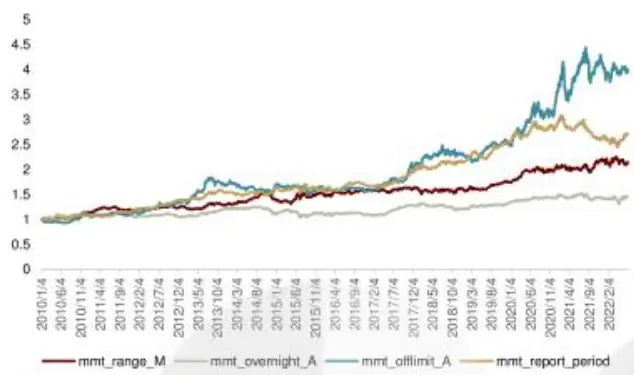
资料来源：Wind，中金公司研究部
注：1）统计时间为2010-01-01至2022-06-30；2）相对净值的比较基准为沪深300 等权指数 000984.CSI

图表11：沪深300范围内表现较好的动量&反转因子分组年化超额收益统计
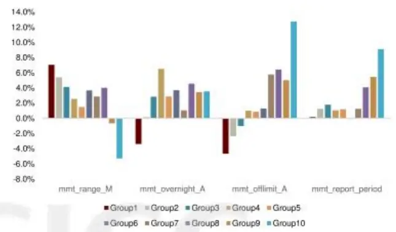
资料来源：Wind，中金公司研究部
注：1）统计时间为2010-01-01至2022-06-30；2）超额收益的比较基准为沪深300等权指数 000984.CSl；3）Group1 为因子值最小一组，Group10 为因子值最大一组

中证 500 范围内，mmt_range_M、mmt_report_overnight 因子分组表现较好，但多头组合2021年9月以来均有所回撇。两个因子均多头组合显著跑赢基准，空头组合显著跑输基准，且单调性较为良好；mmt_report_overnight因子的多空头表现均较为良好，而mmt_range_M因子的有效性更多来源于空头。

图表12：中证500范围内表现较好的动量&反转因子多头组合相对净值
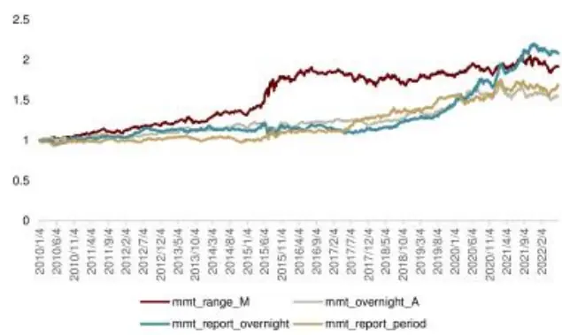
资料来源：Wind，中金公司研究部
注：1）统计时间为2010-01-01至2022-06-30；2）相对净值的比较基准为中证500 等权指数 000982.SH

图表13：中证500范围内表现较好的动量&反转因子分组年化超额收益统计
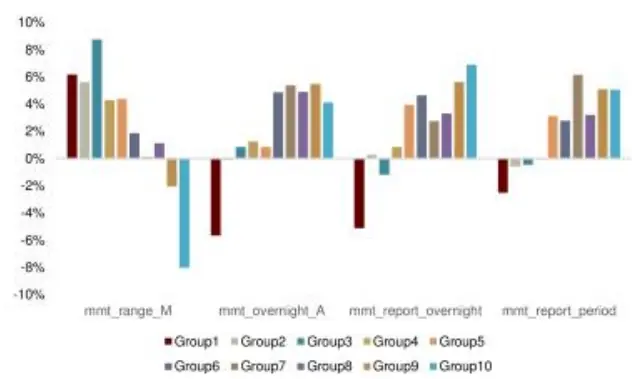
资料来源：Wind，中金公司研究部
注：1）统计时间为2010-01-01至2022-06-30；2）超额收益的比较基准为中证500等权指数000982.SH；3）Group1 为因子值最小一组，Group10为因子值最大一组

中证1000范围内，mmt_intraday_M因子分组表现较好。其多头组合显著跑赢基准，空头组合显著跑输基准，单调性良好，且空头贡献较为突出。mmt_range_M因子的空头贡献较大，但整体单调性较差，分组超额收益呈现倒U形。

图表14：中证1000 范围内表现较好的动量&反转因子多头组合相对净值
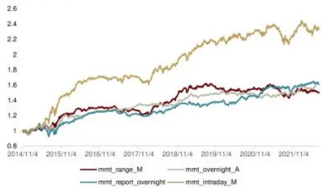
资料来源：Wind，中金公司研究部
注：1）统计时间为2014-11-01至2022-06-30；2）相对净值的比较基准为中证1000 等权指数 000852.SH

图表15：中证1000范围内表现较好的动量&反转因子分组年化超额收益统计
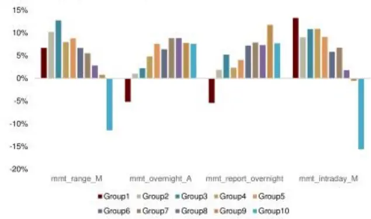
资料来源：Wind，中金公司研究部
注：1）统计时间为2014-11-01至2022-06-30；2）超额收益的比较基准为中证1000 指数 000852.SH；3）Group1为因子值最小一组，Group10 为因子值最大一组

## 波动率

## 长期波动率因子换手率较低，性价比凸显

波动率因子刻画了股票价格或股票收益在过去一段时间的不确定性程度，高波动率通常反映其不确定性程度较高，未来收益表现可能相对较弱。本节基于传统的收益波动、振幅因子进行改进，尝试构建了39个波动率因子，并对其进行了有效性检验。

图表16：波动率因子构建方式

| 因子代码 因子名称 因子计算公式 |  |  |  |  |  |  |  |  |  |
| --- | --- | --- | --- | --- | --- | --- | --- | --- | --- |
| vol_std_1M 1个月波动率 过去1个月（日收益率）的标准差 |  |  |  |  |  |  |  |  |  |
| vol_std_3M 3个月波动率 |  |  | 过去3个月（日收益率）的标准差 |  |  |  |  |  |  |
| vol_std_6M 6个月波动率 |  |  | 过去6个月（日收益率）的标准差 |  |  |  |  |  |  |
| vol_down_std_1M 1个月下行波动率 过去1个月（调整日收益率 |  |  | ）的标准差，其中，调整日收益率指涨跌幅小于0的日收益率 |  |  |  |  |  |  |
| vol_down_std_3M 3个月下行波动率 过去3个月（调整日收益率）的标准差，其中，调整日收益率指涨跌幅小于0的日收益率 |  |  |  |  |  |  |  |  |  |
| vol_down_std_ 6M 6个月下行波动率 过去6个月（调整日收益率）的标准差，其中，调整日收益率指涨跌幅小于0的日收益率 |  |  |  |  |  |  |  |  |  |
| vol_up_std_1M 1个月上行波动率 过去1个月（调整日收益率）的标准差，其中，调整日收益率指涨跌幅大于0的日收益率 |  |  |  |  |  |  |  |  |  |
| vol_up_std_3M 3个月上行波动率 过去3个月（调整日收益率）的标准差，其中，调整日收益率指涨跌幅大于0的日收益率 |  |  |  |  |  |  |  |  |  |
| vol_up_std_6M 6个月上行波动率 过去6个月（调整日收益率）的标准差，其中，调整日收益率指涨跌幅大于0的日收益率 |  |  |  |  |  |  |  |  |  |
| vol_highlow_avg_1M | 1个月日内振幅 |  | 过去1个月（最高价/最低价）的均值 |  |  |  |  |  |  |
| vol_highlow_avg_3M | 3个月日内振幅 |  | 过去3个月（最高价/最低价）的均值 |  |  |  |  |  |  |
| vol_highlow_avg_6M | 6个月日内振幅 |  | 过去6个月（最高价/最低价） |  |  | 的均值 |  |  |  |
| vol_highlow_std_1M | 1个月日内振幅标准差 |  | 过去1个月（最高价/最低价）的 |  |  | 标准差 |  |  |  |
| vol_highlow_std_3M | 3个月日内振幅标准差 |  | 过去3个月（最 |  | 高价/最低价）的 | 标准差 |  |  |  |
| vol_highlow_std_6M | 6个月日内振幅标准差 过去6个月（最 |  |  |  | 高价/最低价）的 | 标准差 |  |  |  |
| vol_upshadow_avg_1M | 1个月上影线均值 | 标准化上影线因子过去1个月的均值；其中 |  |  | ，标准化上影线= | （最高价-max(开盘价，收盘价））/最高价 |  |  |  |
| vol_upshadow_avg_3M | 3个月上影线均值 标准化上影线因子过去3个月的均值：其中， |  |  |  | 标准化上影线= | （最高价-max(开盘价，收盘价））/最高价 |  |  |  |
| vol_upshadow_avg_6M | 6个月上影线均值 标准化上影线因子过去6个月的均值；其中， |  |  |  | 标准化上影线= | （最高价-max(开盘价，收盘价））/最高价 |  |  |  |
| vol_upshadow_std_1M | 1个月上影线标准差 标准化上影线因子过去1个月的标准差 |  |  | ；其中 | ，标准化上影线 | =（最高价-max(开盘价，收盘价））/最高价 |  |  |  |
| vol_upshadow_std_3M | 3个月上影线标准差 标准化上影线因子过去3个月的标准差 |  |  | ；其中 | ，标准化上影线 | =（最高价-max(开盘价，收盘价））/最高价 |  |  |  |
| vol_upshadow_std_6M | 6个月上影线标准差 标准化上影线因子过去6个月的标准差 |  |  | ；其中 | ，标准化上影线 | =（最高价-max(开盘价，收盘价））/最高价 |  |  |  |
| vol_downshadow_avg_1M | 1个月下影线均值 标准化下影线因子过去1个月的均值 |  |  | ；其中， | 标准化下影线= | （min(开盘价，收盘价）-最低价）/最低价 |  |  |  |
| vol_downshadow_avg_3M | 3个月下影线均值 标准化下影线因子过去3个月的均值 |  |  | ；其中， | 标准化下影线= | （min(开盘价，收盘价）-最低价）/最低价 |  |  |  |
| vol_downshadow_avg_6M | 6个月下影线均值 标准化下影线因子过去6个月的均值 |  |  | ；其中， | 标准化下影线= | （min(开盘价，收盘价）-最低价）/最低价 |  |  |  |
| vol_downshadow_std_1M | 1个月下影线标准差 标准化下影线因子过去1个月的标准差 |  |  | ；其中 | ，标准化下影线 | =（min(开盘价，收盘价）-最低价）/最低价 |  |  |  |
| vol_downshadow_std_3M | 3个月下影线标准差 标准化下影线因子过去3个月的标准差 |  |  | ；其中 | ，标准化下影线 | =（min(开盘价，收盘价）-最低价）/最低价 |  |  |  |
| vol_downshadow_std_6M | 6个月下影线标准差 标准化下影线因子过去6个月的标准差 |  |  | ；其中 | ，标准化下影线 | =（min(开盘价，收盘价）-最低价）/最低价 |  |  |  |
| vol_w_downshadow_avg_1M | 1个月威廉下影线均值 威廉下影线因子过去1个月 |  |  | 的均值 | ，其中，威廉下影 | 线=（收盘价-最低价）/最低价 |  |  |  |
| vol_w_downshadow_avg_3M | 3个月威廉下影线均值 威廉下影线因子过去3个月 |  |  | 的均值 | ，其中，威廉下影 | 线= | （收盘价-最低价）/最低价 |  |  |
| vol_w_downshadow_avg_6M | 6个月威廉下影线均值 威廉下影线因子过去6个月 |  |  | 的均值 | ，其中，威廉下影 | 线= | （收盘价-最低价）/最低价 |  |  |
| vol_w_downshadow_std_1M 1个月威廉下影线标准差 威廉下影线因子过去1个月的 |  |  |  | 标准差 | ，其中，威廉下 | 影线 | =（收盘价- | 最低价） | /最低价 |
| vol_w_ downshadow_std_3M 3个月威廉下影线标准差 威廉下影线因子过去3个月的 |  |  |  | 标准差 | ，其中，威廉下影线= |  | （收盘价 | -最低价） | /最低价 |
| vol_w_downshadow_std_6M 6个月威廉下影线标准差 威廉下影线因子过去6个月的 |  |  |  | 标准差 | ，其中，威廉下 | 影线= | （收盘价 | -最低价） | /最低价 |
| vol_w_upshadow_avg_1M 1个月威廉上影线均值 威廉上影线因子过去1个月 |  |  |  | 的均值 | ，其中，威廉上影线=（ |  | 最高价- | 收盘价）/最高价 |  |
| vol_w_upshadow_avg_3M 3个月威廉上影线均值 威廉上影线因子过去3个月 |  |  |  | 的均值 | ，其中，威廉上影线=（ |  | 最高价- | 收盘价）/最高价 |  |
| vol_w_upshadow_avg_6M 6个月威廉上影线均值 威廉上影线因子过去6个月的均值 |  |  |  |  | ，其中，威廉上影线=（ |  | 最高价-收盘价）/最高价 |  |  |
| vol_w_upshadow_std_1M 1个月威廉上影线标准差 威廉上影线因子过去1个月的标准差 |  |  |  |  | ，其中，威廉上影线=（最高价-收盘价）/最高价 |  |  |  |  |
| vol_w_upshadow_std_3M 3个月威廉上影线标准差 威廉上影线因子过去3个月的标准差 |  |  |  |  | ，其中，威廉上影线=（最高价-收盘价）/最高价 |  |  |  |  |
| vol_w_upshadow_std_6M 6个月威廉上影线标准差 威廉上影线因子过去6个月的标准差 |  |  |  |  | ，其中，威廉上影线=（最高价-收盘价）/最高价 |  |  |  |  |

资料来源：中金公司研究部

vol_highlow_std_3M、vol_upshadow_std_6M 和 vol_w_downshadow_std_3M 因子在大部分市场中有效性良好。从相关性统计来看，上述波动率因子互相之间的相关性均较高，因而我们基于因子的构建方式，大致将上述因子分为收益波动率因子和振幅因子。

收益波动率因子包括传统的波动率因子、上行波动率因子、下行波动率因子。对比收益波动率因子表现，不难看出，上行波动率因子有效性优于传统波动率因子、下行波动率因子，全市场IC IR可达-0.79，IC 均值可达-7.9%；不同周期的波动率因子表现对比来看，短周期（1个月）波动率因子有效性更强一些，但多头组合换手率也显著高于长周期（6个月）的波动率因子。

振幅因子考虑了最低价到最高价的振幅、上影线、下影线、威廉上影线、威廉下影线的均值和标准差。总体来看，振幅、影线标准差因子的有效性略好于均值因子，其中，vol_highlow_std、vol_upshadow_std 和 vol_w_downshadow_std 因子在不同范围内表现均较为突出，有效性与单调性良好，多头选股组合表现优于收益波动率因子；中小市值范围内（中证500、中证1000）的有效性显著优于大市值范围（沪深300）。

综上所述，我们相对推荐振幅的标准差因子，如 vol highlow std、vol upshadowstd 和vol_w_downshadow_std 等。同时，对比不同周期的振幅标准差因子的IC 均值和多头组合收益表现，我们发现其选股能力未有显著差异，但长周期（6个月）的波动率因子多头组合换手率明显低于短周期（1个月）的波动率因子。考虑换手成本的情况下，长周期的振幅标准差因子性价比更高。

图表17：波动率因子在全市场范围内的有效性检验结果

| 因子 | IC均值 | IC_IR | P(IC<0) | P(IC<-0.02) | P(IC>0) | P(IC>0.02) | 准 | 多头年化收多头年化超多头超额量多头平均换 益率 额收益 | 大回撤 |  | 单调性 手率 |
| --- | --- | --- | --- | --- | --- | --- | --- | --- | --- | --- | --- |
| vol_std_1M | -6.9% | -0.56 | 71.3% | 67.3% | 28.7% | 25.3% | -6.85 | 9.7% -0.5% | -22.1% | 65.8% | -0.60 |
| vol_std_3M | -6.9% | -0.51 | 69.3% | 64.7% | 30.7% | 28.0% | -6.30 | 11.5% 1.2% | -14.1% | 38.7% | -0.74 |
| vol_std_6M | -6.3% | -0.47 | 68.0% | 62.7% | 32.0% | 28.7% | -5.71 | 11.5% | 1.2% -14.8% | 26.9% | -0.74 |
| vol_up_std_1M | -7.9% | -0.79 | 80.0% | 74.7% | 20.0% | 13.3% | -9.65 | 11.0% | 1.1% -16.4% | 76.5% | -0.73 |
| vol_up_std_3M | -7.8% | -0.69 | 74.7% | 70.0% | 25.3% | 20.7% | -8.50 | 13.0% 2.8% | -11.0% | 45.3% | -0.81 |
| vol_up_std_6M | -7.0% | -0.59 | 71.3% | 66.7% | 28.7% | 25.3% | -7.22 | 13.0% 2.8% | -13.5% | 30.8% | -0.82 |
| vol_down_std_1M | -3.2% | -0.26 | 60.7% | 54.7% | 39.3% | 32.0% | -3.24 | 6.7% 3.1% | -39.8% | 72.8% | -0.03 |
| vol_down_std_3M | -4.2% | -0.30 | 61.3% | 58.0% | 38.7% | 31.3% | -3.71 | 9.0% -1.2% | -23.9% | 42.3% | -0.48 |
| vol_down_std_6M | -4.4% | -0.32 | 62.0% | 59.3% | 38.0% | 29.3% | -3.92 | 9.0% | -1.1% -25.1% | 28.4% | -0.54 |
| vol_highlow_avg_1M | -7.0% | -0.56 | 68.7% | 65.3% | 31.3% | 24.0% | -6.81 | 9.4% | -0.6% -19.9% | 58.3% | -0.62 |
| vol_highlow_avg_3M | -6.1% | -0.48 | 66.0% | 62.0% | 34.0% | 28.0% | -5.85 | 8.4% | -1.3% -21.8% | 36.0% | -0.65 |
| vol_highlow_avg_6M | -5.2% | -0.42 | 68.0% | 61.3% | 32.0% | 29.3% | -5.19 | 9.6% | -0.1% -15.5% | 25.0% | -0.71 |
| vol_highlow_std_1M | -7.3% | -0.75 | 80.0% | 74.0% | 20.0% | 16.0% | -9.13 | 12.8% | 2.8% -10.4% | 74.3% | -0.82 |
| vol_highlow_std_3M | -7.2% | -0.65 | 76.7% | 68.7% | 23.3% | 20.0% | -7.95 | 14.7% | 4.4% -9.8% | 44.0% | -0.89 |
| vol_highlow_std_6M | -6.6% | -0.59 | 72.0% | 68.7% | 28.0% | 24.0% | -7.17 | 13.7% | 3.4% -14.1% | 29.3% | -0.89 |
| vol_upshadow_avg_1M | -6.0% | -0.59 | 74.7% | 64.0% | 25.3% | 21.3% | -7.19 | 10.4% | 0.6% -13.9% | 71.3% | -0.67 |
| vol_upshadow_avg_3M | -5.5% | -0.50 | 66.7% | 60.7% | 33.3% | 26.7% | -6.07 | 9.1% | -0.6% -20.8% | 42.1% | -0.61 |
| vol_upshadow_avg_6M | -4.8% | -0.43 | 67.3% | 58.7% | 32.7% | 29.3% | -5.25 | 8.8% | -0.7% -20.1% | 28.3% | -0.60 |
| vol_upshadow_std_1M | -7.0% | -0.77 | 81.3% | 74.0% | 18.7% | 14.0% | -9.46 | 13.8% | 3.8% -8.8% | 74.6% | -0.84 |
| vol_upshadow_std_3M | -6.6% | -0.64 | 74.7% | 67.3% | 25.3% | 20.0% | -7.87 | 13.8% | 3.7% -8.4% | 45.2% | -0.79 |
| vol_upshadow_std_6M | -6.0% | -0.57 | 71.3% | 63.3% | 28.7% | 24.0% | -6.99 | 12.3% | 2.3% -9.5% | 30.7% | -0.75 |
| vol_downshadow_avg_1M | -5.7% | -0.62 | 74.0% | 66.7% | 26.0% | 18.7% | -7.63 | 10.7% | 1.0% -12.4% | 70.4% | -0.77 |
| vol_downshadow_avg__3M | -4.9% | -0.49 | 67.3% | 60.7% | 32.7% | 24.7% | -5.94 | 9.6% | 0.1% -13.6% | 40.3% | -0.73 |
| vol_downshadow_avg_6M | -4.1% | -0.41 | 64.0% | 58.7% | 36.0% | 28.7% | -5.00 | 9.6% | 0.2% -14.7% | 27.0% | -0.77 |
| vol_downshadow_std_1M | -5.2% | -0.55 | 72.7% | 64.7% | 27.3% | 22.7% | -6.73 | 12.0% | 2.2% -8.1% | 72.6% | -0.82 |
| vol_downshadow_std_3M | -4.9% | -0.47 | 67.3% | 62.0% | 32.7% | 23.3% | -5.72 | 11.9% | 2.1% -10.2% | 42.1% | -0.89 |
| vol_downshadow_std_6M | -4.5% | -0.42 | 66.0% | 58.0% | 34.0% | 30.0% | -5.13 | 11.8% | 2.0% -9.6% | 28.5% | -0.87 |
| vol_w_upshadow_avg_1M vol_w_upshadow_avg_3M | -4.5% | -0.34 | 64.0% | 58.7% | 36.0% | 32.7% | -4.16 | 7.1% | -2.8% | -35.1% 63.1% | -0.22 |
| vol_w_upshadow_avg_.6M | -4.6% | -0.34 | 64.7% | 58.7% | 35.3% | 31.3% | -4.12 | 8.2% | -1.7% | -27.5% 37.4% | -0.47 |
| vol_w_upshadow_std_1M | -4.3% | -0.33 | 64.7% | 57.3% | 35.3% | 28.7% | -4.04 | 8.3% | -1.4% | -24.3% 25.2% | -0.58 |
|  | -4.2% | -0.36 | 66.7% | 60.0% | 33.3% | 30.7% | -4.39 | 8.0% | -2.0% | -30.0% 70.8% | -0.29 |
| vol_w_upshadow_std_3M vol_w_upshadow_std_6M | -4.8% | -0.37 | 67.3% | 59.3% | 32.7% | 29.3% | -4.50 | 9.7% | -0.6% | -19.7% 41.3% | -0.58 |
|  | -4.8% | -0.36 | 66.7% | 58.7% | 33.3% | 29.3% | -4.43 | 10.0% | -0.3% | -20.9% 27.4% | -0.59 |
| vol_w_downishadow_avg_1M | -7.8% | -0.72 | 80.0% | 70.0% | 20.0% | 16.0% | 8.83 | 10.8% | 1.0% -0.1% -12.6% | -12.6% 67.0% 39.7% | -0.69 -0.71 |

资料来源：Wind，中金公司研究部（注：统计时间为2010-01-01至2022-06-30；超额收益的比较基准为全市场等权指数）

图表18：全市场范围内表现相对较好的波动率因子之间的相关性统计
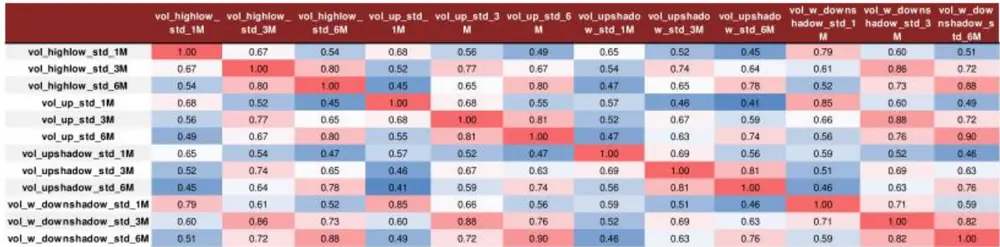
资料来源：Wind，中金公司研究部（注：统计时间为2010-01-01至2022-06-30）

图表19：波动率因子在沪深300范围内的有效性检验结果

| 因子 | IC均值 | IC_IR | P(IC<0) | P(IC<-0.02) | P(IC>0) | P(IC>0.02) | 值 | 多头年化收多头年化超多头超额最多头平均换 益率 额收益 |  | 大回道 | 手率 | 单调性 |
| --- | --- | --- | --- | --- | --- | --- | --- | --- | --- | --- | --- | --- |
| vol_std_1M | -3.3% | -0.23 | 62.0% | 56.7% | 38.0% | 34.0% | -2.77 | 3.0% | 1.2% | -27.0% | 59.7% | -0.17 |
| vol_std_3M | -3.5% | -0.22 | 62.0% | 55.3% | 38.0% | 30.0% | -2.75 | 1.2% | -0.6% | -29.2% | 34.1% | -0.08 |
| vol_std_6M | -3.5% | -0.22 | 60.7% | 54.7% | 39.3% | 32.7% | -2.69 | 2.1% | 0.2% | -35.3% | 23.9% | -0.20 |
| vol_up_std_1M | -3.9% | -0.29 | 62.0% | 54.7% | 38.0% | 30.7% | -3.57 | 2.7% | 1.3% | -21.6% | 72.2% | -0.46 |
| vol_up_std_3M | -4.5% | -0.31 | 60.7% | 56.7% | 39.3% | 32.7% | -3.77 | 2.5% | 1.0% | -20.4% | 41.1% | -0.51 |
| vol_up_std_6M | -4.2% | -0.29 | 60.7% | 56.0% | 39.3% | 34.7% | -3.52 | 3.7% | 2.1% | -25.9% | 27.8% | -0.46 |
| vol_down_std_1M | -1.5% | -0.11 | 57.3% | 51.3% | 42.7% | 39.3% | -1.34 | 2.7% | 1.1% | -19.4% | 68.1% | 0.63 |
| vol_down_std_3M | -1.9% | -0.12 | 60.0% | 58.0% | 40.0% | 33.3% | -1.45 | 1.4% | -0.5% | -26.5% | 36.9% | 0.62 |
| vol_down_std_6M | -2.6% | 0.15 | 58.7% | 55.3% | 41.3% | 35.3% | -1.89 | 1.8% | -0.1% | -34.2% | 24.8% | 0.10 |
| vol_highlow_avg_1M | 3.3% | -0.23 | 57.3% | 52.0% | 42.7% | 34.0% | -2.78 | 2.7% | 1.1% | -23.4% | 50.9% | -0.09 |
| vol_highlow_avg_3M | 3.3% | -0.22 | 60.0% | 54.7% | 40.0% | 35.3% | -2.74 | 1.1% | -0.4% | -27.3% | 30.5% | -0.11 |
| vol_highlow_avg_6M | -2.8% | -0.19 | 57.3% | 52.0% | 42.7% | 34.7% | -2.29 | 1.5% | -0.1% | -35.0% | 20.9% | 0.00 |
| vol_highlow_std_1M | 4.0% | -0.32 | 63.3% | 57.3% | 36.7% | 31.3% | -3.88 | 6.2% | 4.7% | -16.9% | 69.9% | -0.74 |
| vol_highlow_std_3M | -4.5% | -0.33 | 62.7% | 56.0% | 37.3% | 32.7% | -4.04 | 4.5% | 2.9% | -19.6% | 41.2% | -0.54 |
| vol_highlow_std_6M | -4.8% | -0.35 | 62.0% | 55.3% | 38.0% | 34.7% | -4.27 | 6.7% | 5.0% | -19.4% | 28.1% | -0.68 |
| vol_upshadow_avg_1M | -3.0% | -0.23 | 58.0% | 52.0% | 42.0% | 36.7% | -2.83 | 2.5% | 1.2% | -15.9% | 64.5% | -0.05 |
| vol_upshadow_avg_3M | -2.9% | -0.22 | 55.3% | 47.3% | 44.7% | 35.3% | -2.70 | 0.1% | -1.3% | -23.2% | 37.0% | 0.11 |
| vol_upshadow_avg_6M | -2.5% | -0.18 | 58.0% | 49.3% | 42.0% | 36.7% | -2.26 | -0.2% | -1.6% | -30.9% | 24.0% | 0.21 |
| vol_upshadow_std_1M | -4.0% | -0.34 | 60.0% | 52.0% | 40.0% | 31.3% | -4.13 | 4.6% | 3.3% | -15.0% | 70.4% | -0.68 |
| vol_upshadow_std_3M | -3.8% | -0.30 | 57.3% | 55.3% | 42.7% | 36.7% | -3.68 | 4.6% | 3.2% | -18.6% | 41.6% | -0.51 |
| vol_upshadow_std_6M | -3.7% | -0.29 | 60.7% | 53.3% | 39.3% | 35.3% | -3.57 | 4.8% | 3.4% | -17.9% | 28.9% | -0.33 |
| vol_downshadow_avg_1M |  | 2.4% -0.19 | 52.7% | 48.0% | 47.3% | 40.7% | -2.39 | 3.1% | 1.8% | -20.1% | 62.5% | -0.16 |
| vol_downshadow_avg__.3M | .2.6% | -0.20 | 57.3% | 50.0% | 42.7% | 37.3% | -2.41 | 3.6% | 2.2% | -21.7% | 34.7% | -0.06 |
| vol_downshadow_avg_6M | .2.1% | -0.16 | 55.3% | 51.3% | 44.7% | 40.7% | -1.90 | 4.0% | 2.6% | -23.3% | 22.3% | 0.10 |
| vol_downshadow_std_1M | -2.0% | -0.17 | 50.0% | 42.7% | 50.0% | 39.3% | -2.10 | 4.9% | 3.5% | -17.1% | 66.7% | -0.16 |
| vol_downshadow_std_3M | -2.7% | -0.20 | 57.3% | 51.3% | 42.7% | 34.7% | -2.43 | 5.2% | 3.7% | -20.8% | 38.2% | -0.42 |
| vol_downshadow_std_6M | -2.9% | -0.22 | 58.7% | 54.7% | 41.3% | 34.7% | -2.65 | 6.1% | 4.5% | -17.9% | 24.9% | -0.50 |
| vol_w_upshadow_avg_1M | -2.4% | -0.16 | 53.3% | 49.3% | 46.7% | 41.3% | -1.98 | 1.9% | 0.1% | -22.7% | 54.2% | 0.42 |
| vol_w_upshadow_avg_3M vol_w_upshadow_avg_6M | -2.6% | -0.16 | 58.0% | 52.0% | 42.0% | 34.7% | -2.02 | 0.5% | -1.3% | -26.7% | 30.6% | 0.22 |
|  | -2.5% | -0.16 | 60.7% | 52.0% | 39.3% | 36.0% | -1.94 | 0.3% | -1.4% | -34.4% | 21.0% | 0.04 |
| vol_w_upshadow_std_1M | -2.5% | -0.18 | 56.0% | 52.0% | 44.0% | 34.7% | -2.26 | 4.9% | 3.1% | -18.2% | 63.9% | -0.06 |
| vol_w_upshadow_std_3M | -2.7% 3.2% | -0.18 | 62.0% | 54.0% 56.7% | 38.0% 39.3% | 34.7% 32.7% | -2.18 -2.56 | 2.2% 3.8% | 0.4% 1.9% | -26.3% -27.4% | 35.4% 23.6% | 0.03 -0.22 |

资料来源：Wind，中金公司研究部（注：统计时间为2010-01-01至2022-06-30；超额收益的比较基准为沪深300等权指数 000984.CSI）

图表 20：波动率因子在中证 500范围内的有效性检验结果

| 因子 | IC均值 | IC_IR | P(IC<0) | P(IC<-0.02) | P(IC>0) | P(IC>0.02) | 值 | 益率 | 多头年化收多头年化超多头超额最多头平均换 额收益 | 大回撇 | 手率 | 单调性 |
| --- | --- | --- | --- | --- | --- | --- | --- | --- | --- | --- | --- | --- |
| vol_std_1M | -5.3% | -0.41 | 65.3% | 62.0% | 34.7% | 29.3% | -5.05 | 7.5% | 3.1% | -16.3% | 66.0% | -0.67 |
| vol_std_3M | -5.8% | -0.42 | 66.7% | 63.3% | 33.3% | 28.7% | -5.17 | 9.1% | 4.6% | -11.3% | 39.2% | -0.76 |
| vol_std_6M | -5.3% | -0.39 | 68.0% | 62.7% | 32.0% | 29.3% | -4.82 | 8.6% | 4.2% | -13.1% | 27.7% | -0.73 |
| vol_up_std_1M | -5.9% | -0.54 | 68.7% | 60.7% | 31.3% | 24.7% | -6.65 | 7.3% | 3.3% | -17.3% | 77.0% | -0.74 |
| vol_up_std_3M | -6.3% | -0.52 | 70.7% | 62.7% | 29.3% | 24.7% | -6.41 | 8.9% | 4.6% | -15.8% | 46.0% | -0.72 |
| vol_up_std_6M | -5.8% | -0.48 | 68.7% | 64.7% | 31.3% | 26.0% | -5.89 | 9.0% | 4.8% | -15.7% | 31.8% | -0.83 |
| vol_down_std_1M | .2.7% | -0.21 | 65.3% | 59.3% | 34.7% | 32.0% | -2.61 | 6.0% | 1.7% | -25.2% | 72.7% | 0.18 |
| vol_down_std_3M | -3.9% | -0.27 | 66.0% | 62.0% | 34.0% | 30.7% | 3.36 | 7.4% | 2.8% | -22.5% | 42.8% | -0.64 |
| vol_down_std_6M | -4.1% | -0.28 | 65.3% | 60.0% | 34.7% | 30.0% | -3.45 | 6.5% | 2.0% | -21.8% | 28.8% | -0.65 |
| vol_highlow_avg_1M | -5.7% | -0.44 | 67.3% | 59.3% | 32.7% | 28.0% | -5.37 | 6.0% | 1.8% | -21.2% | 58.3% | -0.56 |
| vol_highlow_avg_3M | -5.3% | -0.40 | 65.3% | 60.0% | 34.7% | 26.7% | -4.86 | 6.5% | 2.3% | -16.6% | 35.3% | -0.69 |
| vol_highlow_avg_6M | -4.5% | -0.34 | 64.0% | 60.7% | 36.0% | 30.0% | -4.20 | 6.9% | 2.7% | -15.6% | 25.0% | -0.63 |
| vol_highlow_std_1M | -5.8% | -0.52 | 70.7% | 67.3% | 29.3% | 22.7% | -6.42 | 8.7% | 4.5% | -12.0% | 74.0% | -0.87 |
| vol_highlow_std_3M | -6.4% | -0.53 | 71.3% | 66.0% | 28.7% | 24.0% | -6.55 | 12.2% | 7.8% | -11.2% | 44.3% | -0.86 |
| vol_highlow_std_6M | -5.7% | -0.50 | 70.7% | 64.7% | 29.3% | 27.3% | -6.10 | 10.2% | 6.0% | -13.3% | 30.3% | -0.90 |
| vol_upshadow_avg_1M | -5.0% | -0.45 | 69.3% | 62.0% | 30.7% | 24.0% | 5.55 | 5.0% | 0.9% | -25.8% | 69.7% | -0.55 |
| vol_upshadow_avg_3M | -4.7% | -0.39 | 64.7% | 60.7% | 35.3% | 31.3% | -4.77 | 5.2% | 1.1% | -31.7% | 40.9% | -0.50 |
| vol_upshadow_avg_6M | -4.0% | -0.33 | 64.7% | 55.3% | 35.3% | 30.7% | -4.03 | 5.3% | 1.2% | -25.3% | 28.5% | -0.53 |
| vol_upshadow_std_1M | -5.5% | -0.56 | 74.0% | 66.0% | 26.0% | 21.3% | -6.85 | 8.4% | 4.3% | -15.8% | 74.1% | -0.78 |
| vol_upshadow_std_3M | -5.8% | -0.54 | 72.7% | 65.3% | 27.3% | 21.3% | 6.55 | 9.0% | 4.9% | -17.9% | 43.9% | -0.74 |
| vol_upshadow_std_6M | -5.2% | -0.48 | 67.3% | 64.7% | 32.7% | 26.7% | -5.88 | 7.8% | 3.6% | -16.8% | 30.8% | -0.74 |
| vol_downshadow_avg_1M | -4.7% | -0.44 | 74.7% | 61.3% | 25.3% | 22.0% | -5.43 | 5.3% | 1.4% | -19.1% | 69.5% | -0.61 |
| vol_downshadow_avg__3M | -4.1% | -0.37 | 68.0% | 60.0% | 32.0% | 27.3% | -4.55 | 6.8% | 2.9% | -15.7% | 39.7% | -0.56 |
| vol_downshadow_avg_6M | -3.6% | -0.31 | 65.3% | 58.0% | 34.7% | 30.0% | -3.80 | 6.0% | 2.1% | -24.9% | 26.2% | -0.64 |
| vol_downshadow_std_1M | -4.5% | -0.43 | 70.0% | 65.3% | 30.0% | 26.0% | 5.26 | 6.7% | 2.8% | -20.1% | 72.3% | -0.68 |
| vol_downshadow_std_3M | -4.4% | -0.39 | 65.3% | 58.7% | 34.7% | 30.7% | -4.78 | 8.0% | 4.0% | -13.1% | 41.8% | -0.84 |
| vol_downshadow_std_6M vol_w_upshadow_avg_1M | -4.3% | -0.37 | 65.3% | 60.0% | 34.7% | 28.7% | -4.53 | 8.3% | 4.3% | -12.8% | 28.0% | -0.83 |
| vol_w_upshadow_avg_3M | -4.0% | -0.29 | 65.3% | 58.7% | 34.7% | 29.3% | -3.58 | 3.6% | -0.6% | -29.4% | 62.4% | -0.07 |
| vol_w_upshadow_avg_6M | -4.1% | -0.29 | 64.7% | 58.7% | 35.3% | 32.0% | -3.56 | 6.9% | 2.6% | -17.9% | 36.5% | -0.40 |
| vol_w_upshadow_std_1M | -3.7% | -0.27 | 64.0% | 56.7% | 36.0% | 32.0% | -3.31 | 6.0% | 1.8% | -21.8% | 25.3% | -0.50 |
| vol_w_upshadow_std_3M | -3.4% | -0.27 | 65.3% | 60.0% | 34.7% | 28.7% | 3.32 | 5.8% | 1.4% | -17.2% | 70.5% | -0.20 |
| vol_w_upshadow_std_6M | -4.4% -4.1% | -0.32 -0.30 | 67.3% | 62.0% 60.7% | 32.7% 35.3% | 28.7% 30.0% | -3.94 -3.72 | 7.3% 7.5% | 2.8% 3.1% | -18.1% -17.4% | 41.2% 28.4% | -0.63 -0.61 |

资料来源：Wind，中金公司研究部（注：统计时间为2010-01-01至2022-06-30；超额收益的比较基准为中证500等权指数000982.SH）

图表21：波动率因子在中证1000范围内的有效性检验结果

| 因子 | IC均值 | IC_IR | P(IC<0) | P(IC<-0.02) | P(IC>0) | P(IC>0.02) | t值 | 多头年化收多头年化超多头超额最多头平均换 益率 额收益 |  | 大回道 | 手车 | 单调性 |
| --- | --- | --- | --- | --- | --- | --- | --- | --- | --- | --- | --- | --- |
| vol_std_1M | -7.2% | -0.55 | 73.9% | 70.7% | 26.1% | 21.7% | -5.29 | 5.5% | 3.2% | -15.7% | 66.8% | -0.54 |
| vol_std_3M | -7.7% | -0.57 | 72.8% | 69.6% | 27.2% | 23.9% | -5.51 | 9.2% | 6.9% | -13.2% | 41.9% | -0.74 |
| vol_std_6M | -7.1% | -0.54 | 70.7% | 67.4% | 29.3% | 26.1% | -5.15 | 9.7% | 7.4% | -14.3% | 29.8% | -0.71 |
| vol_up_std_1M | -7.7% | -0.73 | 76.1% | 72.8% | 23.9% | 15.2% | -7.02 | 7.7% | 5.7% | -12.8% | 76.4% | -0.70 |
| vol_up_std_3M | -8.2% | -0.72 | 77.2% | 71.7% | 22.8% | 20.7% | -6.89 | 8.6% | 6.6% | -14.0% | 48.0% | -0.78 |
| vol_up_std_6M | -7.6% | -0.64 | 73.9% | 69.6% | 26.1% | 21.7% | -6.17 | 9.2% | 7.2% | -14.5% | 33.4% | -0.81 |
| vol_down_std_1M | -3.8% | -0.29 | 67.4% | 62.0% | 32.6% | 28.3% | -2.74 | 2.2% | 0.1% | -23.9% | 73.5% | 0.15 |
| vol_down_std_3M | -5.4% | -0.39 | 67.4% | 64.1% | 32.6% | 26.1% | -3.76 | 6.0% | 3.7% | -17.6% | 44.8% | -0.44 |
| vol_down_std_6M | -5.6% | -0.40 | 67.4% | 66.3% | 32.6% | 28.3% | -3.82 | 5.8% | 3.5% | -15.7% | 31.7% | -0.55 |
| vol_highlow_avg_1M | -7.4% | -0.57 | 72.8% | 69.6% | 27.2% | 25.0% | -5.43 | 7.4% | 5.3% | -13.6% | 60.9% | -0.68 |
| vol_highlow_avg_3M | -6.5% | -0.52 | 71.7% | 69.6% | 28.3% | 26.1% | -4.97 | 6.2% | 4.3% | -14.1% | 38.9% | -0.60 |
| vol_highlow_avg_6M | -5.7% | -0.48 | 69.6% | 65.2% | 30.4% | 25.0% | -4.56 | 5.0% | 3.3% | -16.7% | 27.9% | -0.61 |
| vol_highlow_std_1M | -7.8% | -0.75 | 79.3% | 73.9% | 20.7% | 15.2% | -7.17 | 9.0% | 7.1% | -14.1% | 74.3% | -0.78 |
| vol_highlow_std_3M | -8.1% | -0.73 | 76.1% | 71.7% | 23.9% | 14.1% | -6.99 | 11.9% | 9.9% | -13.0% | 45.9% | -0.91 |
| vol_highlow_std_6M | -7.4% | -0.65 | 75.0% | 69.6% | 25.0% | 20.7% | -6.28 | 11.4% | 9.5% | -14.8% | 31.5% | -0.91 |
| vol_upshadow_avg_1M | -6.2% | -0.57 | 73.9% | 68.5% | 26.1% | 23.9% | -5.50 | 7.1% | 5.3% | -14.2% | 71.6% | -0.67 |
| vol_upshadow_avg_3M | -5.7% | -0.50 | 71.7% | 64.1% | 28.3% | 22.8% | -4.83 | 6.0% | 4.1% | -15.1% | 43.8% | -0.48 |
| vol_upshadow_avg_6M | -5.0% | -0.44 | 66.3% | 64.1% | 33.7% | 27.2% | -4.25 | 3.0% | 1.3% | -21.9% | 30.4% | -0.43 |
| vol_upshadow_std_1M | -7.8% | -0.79 | 79.3% | 75.0% | 20.7% | 17.4% | -7.56 | 10.1% | 8.3% | -13.0% | 73.7% | -0.80 |
| vol_upshadow_std_3M | -7.5% | -0.68 | 77.2% | 72.8% | 22.8% | 21.7% | -6.50 | 11.0% | 9.0% | -12.3% | 46.6% | -0.76 |
| vol_upshadow_std_6M | -6.8% | -0.60 | 73.9% | 69.6% | 26.1% | 22.8% | -5.74 | 9.4% | 7.5% | -14.8% | 32.6% | -0.71 |
| vol_downshadow_avg_1M | -6.2% | -0.59 | 70.7% | 62.0% | 29.3% | 20.7% | -5.62 | 6.8% | 5.1% | -13.9% | 71.2% | -0.81 |
| vol_downshadow_avg_3M | -5.2% | -0.49 | 67.4% | 59.8% | 32.6% | 28.3% | -4.74 | 4.7% | 3.1% | -15.5% | 41.9% | -0.67 |
| vol_downshadow_avg_6M vol_downshadow_std_1M | -4.4% | -0.43 | 68.5% | 63.0% | 31.5% | 27.2% | -4.12 | 5.1% | 3.6% | -16.1% | 28.9% | -0.63 |
|  | -5.8% | -0.54 | 70.7% | 60.9% | 29.3% | 23.9% | -5.17 | 10.6% | 8.7% | -11.6% | 72.9% | -0.84 |
| vol_downshadow_std_3M | 5.4% | -0.49 | 71.7% | 64.1% | 28.3% | 22.8% | -4.66 | 9.8% | 7.9% | -13.0% | 43.6% | -0.81 |
| vol_downshadow_std_6M | -5.1% | -0.46 | 69.6% | 63.0% | 30.4% | 25.0% | -4.40 | 9.9% | 8.0% | -12.7% | 31.4% | -0.78 |
| vol_w_upshadow_avg_1M vol_w_upshadow_avg_3M | -4.9% | -0.34 | 69.6% | 62.0% | 30.4% | 28.3% | 3.29 | 4.4% | 2.3% | -18.8% | 64.1% | -0.11 |
| vol_w_upshadow_avg_6M | -5.2% | -0.38 | 67.4% | 64.1% | 32.6% | 28.3% | -3.65 | 4.6% | 2.5% | -18.8% | 39.5% | -0.32 |
| vol_w_upshadow_std_1M | -4.8% | -0.37 | 64.1% | 60.9% | 35.9% | 30.4% | -3.59 | 3.7% | 1.9% | -20.9% | 28.2% | -0.41 |
| vol_w_upshadow_std_3M | -5.2% -6.1% | -0.41 | 71.7% | 65.2% | 28.3% | 26.1% | -3.89 | 4.2% | 2.0% | -16.4% | 71.3% | -0.31 |
| vol_w_upshadow_std_6M | -5.9% | -0.46 -0.45 | 71.7% | 69.6% 66.3% | 28.3% 29.3% | 28.3% 25.0% | -4.44 -4.34 | 8.6% 6.1% | 6.2% 3.9% | -15.9% -14.4% | 44.1% 30.8% | -0.61 -0.63 |

资料来源：Wind，中金公司研究部（注：统计时间为2014-11-01至2022-06-30；超额收益的比较基准为中证1000指数000852.SH）

## 中证500范围内振幅标准差因子分组多空表现较好

沪深300 范围内，vol_highlow_std_1M、vol_highlow_std_6M、vol_upshadow_std_6M和 vol_w_downshadow_std_6M因子分组单调性普通。如下图所示，4 个因子多头组合显著跑赢基准，空头组合则显著跑输基准。4个因子的多头相对净值走势相近，也是其因子相关性偏高的一种体现。

图表22：沪深300范围内表现较好的波动率因子多头组合相对净值
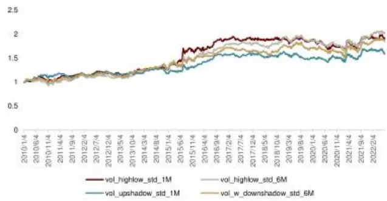
资料来源：Wind，中金公司研究部
注：1）统计时间为2010-01-01至2022-06-30；2）相对净值的比较基准为沪深300 等权指数 000984.CSI

图表23：沪深300范围内表现较好的波动率因子分组年化超额收益统计
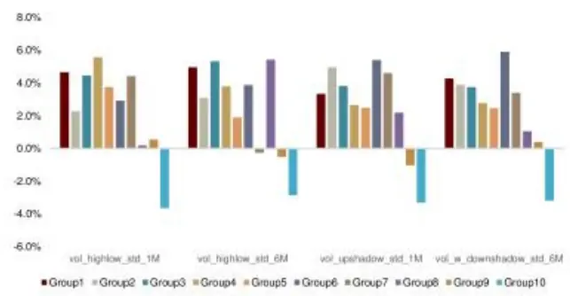
资料来源：Wind，中金公司研究部
注：1）统计时间为2010-01-01至2022-06-30；2）超额收益的比较基准为沪深300等权指数 000984.CSI；3）Group1 为因子值最小一组，Group10 为因子值最大一组

中证 500 范围内，vol_highlow_std_3M因子分组表现良好，单调性较优。vol_highlow_std_3M、vol_upshadow_std_3M 和 vol_w_downshadow_std_3M 因子的空头组合显著跑输基准，多头组合跑赢基准，单调性较高，相对来说，空头贡献更大。

图表24：中证500范围内表现较好的波动率因子多头组合相对净值
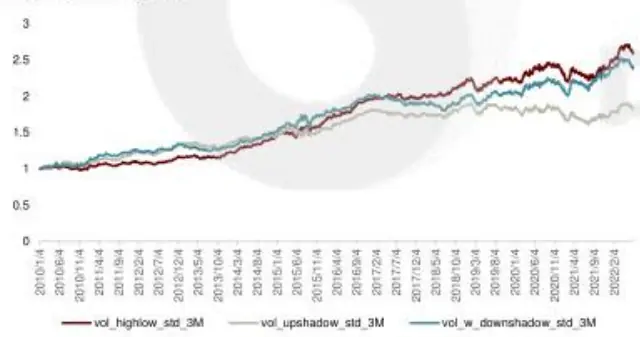
资料来源：Wind，中金公司研究部
注：1）统计时间为2010-01-01至2022-06-30；2）相对净值的比较基准为中证500 等权指数 000982.SH

图表25：中证500范围内表现较好的波动率因子分组年化超额收益统计
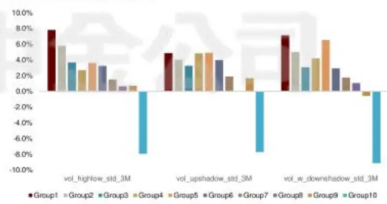
资料来源：Wind，中金公司研究部
注：1）统计时间为2010-01-01至2022-06-30；2）超额收益的比较基准为中证500等权指数 000982.SH；3）Group1为因子值最小一组，Group10为因子值最大一组

中证1000 范围内，vol_highlow_std_3M、vol_upshadow_std_3M 等因子空头贡献相对较多。振幅标准差因子空头组合均显著跑输基准，贡献了大部分超额收益；虽然多头组合也能跑赢基准，但Group1-5区分度相对较小，但单调性表现一般。

图表26：中证1000范围内表现较好的波动率因子多头组合相对净值
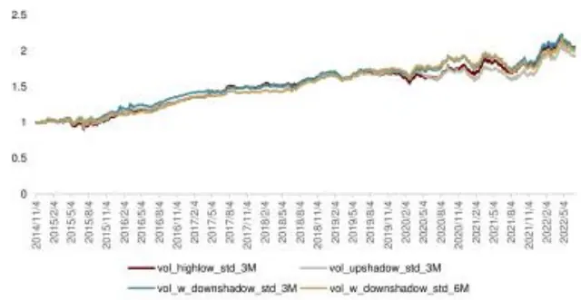
资料来源：Wind，中金公司研究部
注：1）统计时间为2014-11-01至2022-06-30；2）相对净值的比较基准为中证1000 等权指数 000852.SH

图表27：中证1000范围内表现较好的波动率因子分组年化超额收益统计
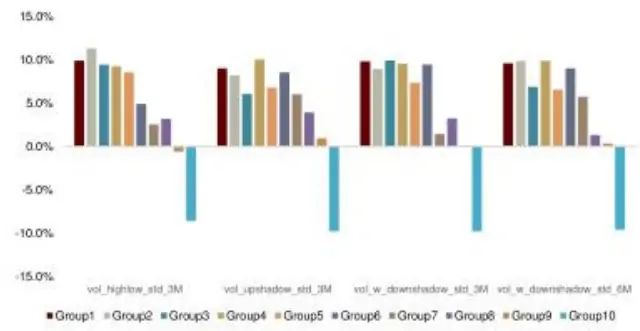
资料来源：Wind，中金公司研究部
注：1）统计时间为2014-11-01至2022-06-30；2）超额收益的比较基准为中证1000 指数 000852.SH；3) Group1 为因子值最小一组，Group10 为因子值最大一组

## 流动性

## 换手率因子与价格弹性因子均值得关注

流动性刻画股票交易所需要的时间和成本，一般来说，流动性较差的个股通常有更高的预期收益，这是对流动性风险的风险补偿。因此，流动性因子通常表现为流动性越低，未来收益越高的特征(也会被称为为非流动性因子)。高频的流动性因子，可以通过价差宽度、价格深度来刻画流动性，而中低频的流动性因子则主要观察换手率或价格弹性。本节基于换手率、价格弹性构建了21个流动性因子，并对其进行有效性检验。

图表 28：流动性因子构建方式

| 因子代码 | 因子名称 | 因子计算公式 |  |
| --- | --- | --- | --- |
| liq_turn_avg__1M | 1个月换手率 | 1个月换手率的均值 |  |
| liq_turn_avg_3M | 3个月换手率 | 3个月换手率的均值 |  |
| liq_turn_avg_6M | 6个月换手率 |  | 6个月换手率的均值 |
| liq_turn_std_1M | 1个月换手率标准差 |  | 1个月换手率的标准差 |
| liq_turn_std_3M | 3个月换手率标准差 |  | 3个月换手率的标准差 |
| liq_turn_std_6M | 6个月换手率标准差 |  | 6个月换手率的标准差 |
| liq_vstd_1M | 1个月成交波动比 |  | 1个月成交额/过去1个月收益率标准差 |
| liq_vstd_3M | 3个月成交波动比 |  | 3个月成交额/过去3个月收益率标准差 |
| liq_vstd_6M | 6个月成交波动比 |  | 6个月成交额/过去6个月收益率标准差 |
| liq_amihud_avg_1M | 1个月Amihud非流动因子 |  | 过去1个月（日收益率/成交额)的平均值 |
| liq_amihud_avg_3M | 3个月Amihud非流动因子 |  | 过去3个月(日收益率\|成交额)的平均值 |
| liq_amihud_avg_6M | 6个月Amihud非流动因子 |  | 过去6个月(日收益率/成交额)的平均值 |
| liq_amihud_std_1M | 1个月Amihud非流动因子标准差 |  | 过去1个月（日收益率/成交额)的标准差 |
| liq_amihud_std_3M | 3个月Amihud非流动因子标准差 |  | 过去3个月(日收益率/成交额)的标准差 |
| liq_amihud_std_6M | 6个月Amihud非流动因子标准差 |  | 过去6个月（日收益率/成交额)的标准差 |
| liq_shortcut_avg_1M | 1个月最短路径非流动因子 | 过去1个月（日K线最短路径/成交额）的平均值；日K线最短路径=2”（最高价-最低价）-开盘价-收盘价 |  |
| liq_shortcut_avg_3M | 3个月最短路径非流动因子 | 过去3个月（日K线最短路径/成交额）的平均值；日K线最短路径=2*（最高价-最低价）-开盘价-收盘价 |  |
| liq_shortcut_avg_6M | 6个月最短路径非流动因子 | 过去6个月（日K线最短路径/成交额）的平均值；日K线最短路径=2*（最高价-最低价）-开盘价-收盘价 |  |
| liq_shortcut_std_1M | 1个月最短路径非流动因子标准差 | 过去1个月（日K线最短路径/成交额）的标准差；日K线最短路径=2°（最高价-最低价）-开盘价-收盘价 |  |
| liq_shortcut_std_3M | 3个月最短路径非流动因子标准差 | 过去3个月（日K线最短路径/成交额）的标准差；日K线最短路径=2*（最高价-最低价）-开盘价-收盘价 |  |
| liq_shortcut_std_6M | 6个月最短路径非流动因子标准差 |  | 过去6个月（日K线最短路径/成交额）的标准差；日K线最短路径=2*（最高价-最低价）-开盘价-收盘价 |

资料来源：中金公司研究部

从相关性角度来看，换手率因子、成交波动比因子、amihud非流动因子、最短路径非流动因子之间均有0.3-0.4的弱相关性；结合因子的构建逻辑，我们大致将流动性因子分为两类：换手率因子、价格弹性因子。

换手率因子是用不同区间的换手率均值和标准差构建的，从相关性统计结果来看，换手率均值与标准差因子的相关性较高，一定程度说明换手率因子既含有流动性方面的信息，也含有部分波动率方面的信息。比较换手率均值因子和标准差因子，不难看出，换手率标准差因子(liq_turn_std_6M）有效性相对较高；在中证 500、中证 1000内的有效性显著优于沪深 300范围。

价格弹性因子包括Amihud非流动性因子、最短路径非流动因子、成交波动比因子。在全市场范围内，上述三类因子IC_IR差异不大，绝对值均可达0.6以上，从多头收益表现来看，则是Amihud非流动性因子表现相对较好，年化超额可达9.4%。沪深300范围内相对推荐最短路径非流动性因子；中证500、中证1000指数范围内则是liq_vstd因子表现相对较好。

总体来看，换手率标准差因子在不同范围内表现均较好，值得推荐。同时，由于价格弹性因子与换手率因子仅有弱相关关系，构建流动性的大类因子时，价格弹性类因子亦值得考虑。

图表29：流动性因子在全市场范围内的有效性检验结果

| 因子 | IC均值 | IC_IR | P(IC<0) | P(IC<-0.02) | P(IC>0) | P(IC>0.02) | 值 | 多头年化收多头年化超多头超额最多头平均换 益率 | 额收益 大回撤 |  | 手率 | 单调性 |
| --- | --- | --- | --- | --- | --- | --- | --- | --- | --- | --- | --- | --- |
| liq_tumn_avg_1M | -8.1% | -0.79 | 75.3% | 70.0% | 24.7% | 18.0% | -9.66 | 16.9% | 7.0% | -4.9% | 45.5% | 0.86 |
| liq_turn_avg_3M | -6.8% | -0.68 | 71.3% | 66.7% | 28.7% | 22.0% | -8.32 | 16.4% | 6.6% | -6.4% | 30.0% | 0.92 |
| liq_turn_avg_6M | -5.9% | -0.61 | 68.7% | 63.3% | 31.3% | 24.0% | -7.45 | 16.6% | 6.9% | -4.8% | 22.3% | 0.92 |
| liq_turn_std_1M | -9.3% | -1.06 | 85.3% | 80.0% | 14.7% | 10.0% | -12.98 | 20.5% | 10.6% | -3.8% | 60.0% | 0.92 |
| liq_tum_std_3M | -8.0% | -0.88 | 79.3% | 72.0% | 20.7% | 15.3% | -10.84 | 19.8% | 9.9% | -5.0% | 36.2% | 0.95 |
| liq_tum_std_6M | -6.9% | -0.77 | 76.0% | 68.7% | 24.0% | 18.0% | -9.39 | 19.2% | 9.3% | -5.4% | 25.0% | 0.94 |
| liq_vstd_1M | -5.0% | -0.65 | 78.0% | 66.0% | 22.0% | 16.0% | -7.96 | 10.2% | 0.3% | -18.8% | 34.7% | 0.64 |
| liq_vstd_3M | -3.5% | -0.43 | 72.0% | 60.7% | 28.0% | 20.0% | -5.30 | 9.4% | -0.3% | -19.9% | 23.2% | 0.59 |
| liq_vstd_6M | -2.5% | -0.31 | 68.0% | 55.3% | 32.0% | 23.3% | -3.75 | 8.5% | -1.1% | -23.3% | 18.7% | 0.51 |
| liq_amihud_avg_1M | 5.5% | 0.66 | 22.0% | 16.7% | 78.0% | 67.3% | 8.08 | 19.3% | 9.4% | -10.6% | 44.9% | 0.93 |
| liq__amihud_avg_3M | 4.1% | 0.50 | 28.0% | 20.7% | 72.0% | 64.0% | 6.07 | 17.8% | 8.0% | -11.6% | 28.0% | 0.94 |
| liq_amihud_avg_6M | 2.8% | 0.35 | 34.7% | 24.7% | 65.3% | 56.7% | 4.24 | 16.0% | 6.4% | -11.8% | 20.8% | 0.91 |
| liq_amihud_std_1M | 4.8% | 0.59 | 26.0% | 20.0% | 74.0% | 66.7% | 7.23 | 16.2% | 6.6% | -12.3% | 50.3% | 0.96 |
| liq_amihud_std_3M | 3.1% | 0.40 | 30.0% | 24.7% | 70.0% | 57.3% | 4.92 | 15.6% | 6.1% | -9.8% | 32.6% | 0.94 |
| liq_amihud_std_6M | 1.6% | 0.22 | 41.3% | 32.0% | 58.7% | 49.3% | 2.69 | 12.9% | 3.7% | -9.6% | 23.9% | 0.88 |
| liq_shortcut_avg_1M | 4.4% | 0.60 | 27.3% | 20.0% | 72.7% | 66.0% | 7.33 | 14.3% | 4.5% | -11.2% | 26.6% | 0.96 |
| liq_shortcut_avg_3M | 3.5% | 0.48 | 29.3% | 23.3% | 70.7% | 62.0% | 5.82 | 12.9% | 3.2% | -11.6% | 16.9% | 0.95 |
| liq_shortcut_avg_6M | 2.8% | 0.40 | 33.3% | 26.0% | 66.7% | 60.0% | 4.95 | 11.8% | 2.4% | -12.5% | 12.8% | 0.92 |
| liq_shortcut_std_1M | 3.3% | 0.45 | 28.0% | 22.0% | 72.0% | 61.3% | 5.55 | 12.1% | 2.4% | -13.3% | 35.3% | 0.93 |
| liq__shortcut_std_3M | 2.6% | 0.36 | 33.3% | 25.3% | 66.7% | 58.7% | 4.41 | 11.4% | 1.9% | -13.5% | 21.5% | 0.94 |
| liq__shortcut_std_6M | 2.0% | 0.30 | 36.7% | 27.3% | 63.3% | 53.3% | 3.65 | 11.2% | 1.8% | -11.1% | 15.6% | 0.93 |

资料来源：Wind，中金公司研究部（注：统计时间为2010-01-01至2022-06-30；超额收益的比较基准为全市场等权指数）

图表30：全市场范围内表现相对较好的流动性因子之间的相关性统计

| lig lum_avg liq_tum_ang lit_lum_avg liq_lur_snd_liq_lum std_lis lum_ald | 1M | 2M | SM | 1H | 3M | OM |  |  | lig vaid_il liq vald 3M lq vad GM | eva IM | ava 3M | inp ca | d IM | ad 3M | 68 | avg 1M | avg 3M | ang SM | lu_wihud liq amltud llq_amihud liq mmihud liq_amthud liq_amihud liq_shorlout lu_shorieul liy_shortcut liq_shorlout lis_shorteut liy shortcul sd 1M |  | d3M |
| --- | --- | --- | --- | --- | --- | --- | --- | --- | --- | --- | --- | --- | --- | --- | --- | --- | --- | --- | --- | --- | --- |
| lig_turn_ovg_1M | 1.00 | 0.88 | 0.79 | 电的9 | 0.82 | 0.35 | 0.52 | 0.44 | 0.30 | 0.40 |  | 4.29 | 0.44 | 0.81 | 0.21 | 0.35 |  | 0.28 | 0.28 | 4:31 | 0.28 0.21 |
| liq_tur_avg_3M | 0.08 | 1.00 | 0.91 | 0.72 | L.ES | a. | 0.43 | D.51 | 8.40 | 0.46 | -a44 | 4.35 | D.40 | an | 4.26 | -0.31 | 0.12 | 4.27 | 4.31 | 0.29 | -0.24 |
| liatarn_arvg sM | 0.79 | 0.91 | 100 | 0.6 | a77 | 0.88 | 0.42 | 0.47 | 0.47 | 0.40 | 4.43 | 4.39 | -0.38 | 0.87 | 0.30 | -027 | 0.29 | 4.20 | 427 | 0.89 | 027 |
| liq_lur_atd_1M | 0.80 | 0.72 | D.64 | 1.00 | an | 0.6 | 0.42 | 0.32 | 0.26 | 0.38 | 4.27 | 0.19 | -0.31 | 0.20 | 0.12 | .0.31 | -0.25 | 0.16 | 0.24 | an9 | 4.15 |
| liq tsm_as_ 3M | 0.80 | 0.89 | 0.77 | 0.77 | 1.00 | 0.85 | 0.41 | 0.41 | 0.33 | 0.38 | 4.88 | 423 | -0.34 | 0.24 | 0.14 | -0.31 | -0.29 | 0.28 | 427 | 0.23 | 4.10 |
| liq_tumn_s0_6M | 0.75 | 0.84 | 0.8 | 0.87 | 0.86 | 1.00 | 0.38 | 0.40 | 0.39 | 0.34 | 4.8s | 427 | 031 | 0.29 | 0.16 | 0.28 | 0.29 | 0.20 | 0.26 | 0.25 | 0.22 |
| liq_vad_1M | 0.52 | 0.48 | 0.42 | 0.42 | 0.41 | 0.28 | 1:00 | D.83 | 0.02 | -0.57 | 4.4 | 4.2 | -0.52 | 0.42 | 0.04 | -0.31 | 0.34 | 0.30 | 4.3 | an | 0.20 |
| liq_vend_3M | 0.44 | 0.51 | 0.47 | 0.32 | 0.41 | 0.40 | 0.89 | 100 | $89 | 0.51 | 416 | 400 | -0.50 | c4 | 4.40 | -0.36 | -0.37 | 0.34 | 4.37 | 0.37 | 0.34 |
| 1q_vand_oM | 0.30 | 0.42 | 0.47 | 0.26 | 0.33 | 0.30 | 0.52 | 0.91 | 1.00 | -0.40 | 4.55 | 450 | -0.47 | 0.40 | 0.4E | -0.31 | 0.30 | 4.36 | 2.34 | 037 | 0.26 |
| lq_amihud_wvg_M | 0.48 | -0.49 | 4.40 | 0.38 | 0.38 | 0.34 | 057 | 413 | 0.40 | 1.00 | 0.87 | 0.79 | 0.94 | 0.80 | 0.68 | 0.45 | 0.42 | 0.37 | 0.49 | 0.43 | 038 |
| lq_omihud_ovg_3M | 0.38 | 0.44 | 0.0 | 42 | 0.33 | 0.33 | 0.41 | 4.50 | 0.5 | 0.87 | 1.00 | 0.90 | 0.84 | 0.86 | 0:81 | 0.41 | 0.44 | 0.41 | 0.44 | 0.48 | 0.44 |
| liq_amihud_weg_.M | 0.29 | -8.35 | 4.3 | 0.19 | 0.23 | 0.27 | -0.42 | 450 | 0.5E | 0.78 | 0.90 | 1.00 | 0.75 | au | 0.81 | 0.36 | 0.40 | 0.42 | 0.39 | 0.44 | 0.47 |
| liq_anihud_end_1M | 0.44 | 0.40 | 4.38 | 0.30 | 0.M | 0.31 | 0.51 | 400 | 0.40 | 0.94 | 0.84 | 4.75 | 1.00 | 0.81 | 0.09 | 0.42 | 0.39 | 0.36 | 0.43 | 0.42 | 0.30 |
| 1q_amihat_snd_3M | 0.31 | -0.37 | 4.37 | 4.20 | a.24 | -0.28 | 0.42 | 4.40 | 0.40 | 0.80 | 0.06 | 0.00 | 0.81 | 1.00 | 0.34 | 0.35 | 0.30 | 0.37 | 0.40 | 0.48 | 0.42 |
| lq_amihud_ent_M | -0.21 | -0.26 | 4.30 | 0.12 | 0.1 | -0.16 | -0.34 | 0.40 | 4.4 | 0.68 | 0.81 | 0.83 | 0.69 | 0.84 | 1.00 | 0.30 | 0.33 | 0.30 | 0.33 | 0.39 | 4.45 |
| lio_shortout_avg_1M | 0.36 | 0.31 | 42 | 0.81 | 0.51 | 0.28 | 0:38 | 4.36 | 0.30 | 0.45 | 0.41 | 0.36 | 0.42 | 0.36 | 0.:30 | 1:00 | 0. | 4.9 | 0.95 | 0.51 | 0.6 |
|  | 0.28 | 0.32 | 4.29 | 025 | 4.29 | 0.29 |  |  |  |  |  |  |  |  |  |  |  |  | 0.92 | a.w | 0:00 |
| liq_shorteut_avg_308 | 0.23 | -0.27 | 4.89 | 0.18 | 0.21 | 0.77 | 0.34 | 437 | 03 | 0.42 | 0.44 | 0.40 | 0.39 | 0.30 | 0.30 | 0.00 | 1.00 | 0.87 | 0.89 | 0.86 | 480 |
| liq_shortzut_avg._cat | 0.31 | -0.31 | 421 | -0.24 | 4.27 |  | -0.30 | 4.34 | 0.36 | 0.37 | 0.41 | 0.40 | 0.35 | 0.30 | 0.36 | 0.9 | a8 0.m | 1.00 2m | 1.00 | a.0 | 0.8 |

资料来源：Wind，中金公司研究部（注：统计时间为2010-01-01至2022-06-30）

图表31：流动性因子在沪深300范围内的有效性检验结果

| 因子 | IC均值 | IC_IR | P(IC<0) | P(IC<-0.02) | P(IC>0) | P(IC>0.02) | 值 | 多头年化收多头年化超多头超额最多头平均换 益率 额收益 |  | 大回撇 | 手率 | 单调性 |
| --- | --- | --- | --- | --- | --- | --- | --- | --- | --- | --- | --- | --- |
| liq_tum_avg_1M | -2.7% | -0.27 | 60.0% | 54.7% | 40.0% | 31.3% | -3.28 | 2.3% | 1.7% | -17.8% | 43.6% | 0.53 |
| liq_tum_avg_3M | -2.6% | -0.27 | 57.3% | 51.3% | 42.7% | 32.7% | -3.30 | 0.2% | -0.4% | -22.4% | 27.7% | 0.48 |
| liq_tum_avg_6M | -2.4% | -0.25 | 58.7% | 50.7% | 41.3% | 31.3% | -3.11 | 0.5% | 0.0% | -27.7% | 21.0% | 0.46 |
| liq_tum_std_1M | -3.2% | -0.33 | 62.0% | 56.0% | 38.0% | 29.3% | -4.04 | 3.0% | 2.4% | -21.3% | 57.3% | 0.56 |
| liq_tum_std_3M | -3.7% | -0.38 | 63.3% | 58.0% | 36.7% | 28.7% | -4.70 | 1.9% | 1.5% | -24.7% | 34.6% | 0.59 |
| liq_turn_std_6M | -3.6% | -0.39 | 64.7% | 58.7% | 35.3% | 26.7% | -4.74 | 4.8% | 4.4% | -17.7% | 24.9% | 0.62 |
| liq_vstd_1M | -1.0% | -0.09 | 53.3% | 45.3% | 46.7% | 39.3% | -1.14 | -0.7% | -1.5% | -25.6% | 36.8% | 0.10 |
| liq_vstd_3M | -0.3% | -0.03 | 53.3% | 42.0% | 46.7% | 40.7% | -0.31 | 0.5% | -0.4% | -21.0% | 24.5% | 0.15 |
| liq_vstd_6M | -0.3% | -0.03 | 51.3% | 45.3% | 48.7% | 39.3% | -0.38 | -1.7% | -2.5% | -33.2% | 19.4% | 0.04 |
| liq_amihud_avg_1M | 0.6% | 0.04 | 42.0% | 38.7% | 58.0% | 51.3% | 0.49 | 1.4% | 0.5% | -31.9% | 25.1% | 0.38 |
| liq_amihud_avg_3M | 0.3% | 0.02 | 44.7% | 40.7% | 55.3% | 48.0% | 0.21 | 3.6% | 2.6% | -22.7% | 18.4% | 0.24 |
| liq_amihud_avg_6M | 0.2% | 0.01 | 43.3% | 43.3% | 56.7% | 50.7% | 0.18 | 3.5% | 2.5% | -27.1% | 16.0% | 0.38 |
| liq_amihud_std_1M | 0.6% | 0.04 | 41.3% | 38.0% | 58.7% | 52.0% | 0.48 | 0.8% | -0.1% | -31.4% | 27.8% | 0.32 |
| liq_amihud_std_3M | 0.2% | 0.01 | 45.3% | 44.7% | 54.7% | 48.0% | 0.13 | 3.6% | 2.7% | -24.6% | 21.4% | 0.27 |
| liq_amihud_std_6M | 0.2% | 0.02 | 46.0% | 42.7% | 54.0% | 50.0% | 0.19 | 3.0% | 2.1% | -24.2% | 17.8% | 0.23 |
| liq_shortcut_avg_1M | 3.2% | 0.27 | 39.3% | 34.0% | 60.7% | 52.0% | 3.36 | 8.7% | 7.6% | -17.8% | 19.5% | 0.83 |
| liq_shortcut_avg_3M | 3.0% | 0.25 | 42.0% | 37.3% | 58.0% | 52.7% | 3.10 | 9.0% | 7.9% | -16.7% | 13.1% | 0.88 |
| liq_shortcut_avg_6M | 2.7% | 0.23 | 41.3% | 35.3% | 58.7% | 49.3% | 2.85 | 7.9% | 6.8% | -18.9% | 10.8% | 0.65 |
| liq_shortcut_std_1M | 3.0% | 0.25 | 40.7% | 35.3% | 59.3% | 51.3% | 3.03 | 8.7% | 7.5% | -17.7% | 28.0% | 0.80 |
| liq_shortcut_std_3M | 2.6% | 0.22 | 45.3% | 38.7% | 54.7% | 50.7% | 2.65 | 7.6% | 6.5% | -17.9% | 17.2% | 0.81 |
| liq_shortcut_std_6M | 2.2% | 0.18 | 45.3% | 37.3% | 54.7% | 48.0% | 2.24 | 7.4% | 6.2% | -18.5% | 12.9% | 0.87 |

资料来源：Wind，中金公司研究部（注：统计时间为2010-01-01至2022-06-30；超额收益的比较基准为沪深300等权指数000984.CSI）

图表 32：流动性因子在中证500范围内的有效性检验结果

| 因子 | IC均值 | IC_IR | P(IC<0) | P(IC<-0.02) | P(IC>0) | P(IC>0.02) 值 | 多头年化收多头年化超多头超额景多头平均换 益率 | 额收益 | 大回道 |  | 手率 | 单调性 |
| --- | --- | --- | --- | --- | --- | --- | --- | --- | --- | --- | --- | --- |
| liq_tum_avg_1M | -6.5% | -0.66 | 73.3% | 69.3% | 26.7% | 22.0% | -8.07 | 7.9% | 4.1% | -16.4% | 45.5% | 0.84 |
| liq_turn_avg_3M | -5.6% | -0.59 | 72.7% | 68.0% | 27.3% | 24.0% | -7.27 | 10.1% | 6.3% | -16.8% | 29.8% | 0.84 |
| liq_tum_avg_6M | -4.9% | -0.54 | 70.0% | 62.7% | 30.0% | 22.0% | -6.58 | 10.2% | 6.4% | -12.6% | 22.5% | 0.85 |
| liq_turn_std_1M | -7.3% | -0.81 | 80.7% | 72.7% | 19.3% | 14.7% | -9.94 | 9.3% | 5.6% | -14.4% | 59.6% | 0.84 |
| liq_turn_std_3M | -6.6% | -0.73 | 77.3% | 69.3% | 22.7% | 19.3% | -8.90 | 10.4% | 6.7% | -16.4% | 36.3% | 0.89 |
| liq_turn_std_6M | -6.0% | -0.70 | 78.7% | 71.3% | 21.3% | 18.0% | -8.60 | 12.3% | 8.6% | -12.8% | 26.1% | 0.91 |
| liq_vstd_1M | -5.2% | -0.47 | 65.3% | 59.3% | 34.7% | 26.7% | -5.73 | 8.4% | 4.3% | -14.1% | 39.7% | 0.76 |
| liq_vstd_3M | -4.1% | -0.37 | 63.3% | 58.0% | 36.7% | 30.7% | -4.49 | 8.8% | 4.6% | -11.7% | 26.5% | 0.84 |
| liq_vstd_6M | -3.4% | -0.31 | 63.3% | 58.0% | 36.7% | 32.0% | -3.74 | 7.7% | 3.5% | -16.5% | 21.1% | 0.85 |
| liq_amihud_avg_1M | 2.4% | 0.23 | 37.3% | 32.7% | 62.7% | 54.7% | 2.76 | 9.5% | 5.6% | -12.5% | 43.5% | 0.86 |
| liq_amihud_avg_3M | 1.7% | 0.16 | 43.3% | 34.7% | 56.7% | 52.0% | 1.92 | 8.3% | 4.5% | -16.8% | 28.8% | 0.86 |
| liq_amihud_avg_6M | 1.0% | 0.09 | 41.3% | 36.7% | 58.7% | 51.3% | 1.10 | 8.9% | 5.1% | -16.1% | 23.5% | 0.89 |
| liq_amihud_std_1M | 2.3% | 0.21 | 39.3% | 34.0% | 60.7% | 53.3% | 2.58 | 9.2% | 5.3% | -12.6% | 47.7% | 0.88 |
| liq_amihud_std_3M | 1.2% | 0.11 | 43.3% | 37.3% | 56.7% | 51.3% | 1.33 | 8.5% | 4.8% | -16.1% | 32.8% | 0.81 |
| liq_amihud_std_6M | 0.1% | 0.01 | 43.3% | 39.3% | 56.7% | 46.0% | 0.15 | 7.5% | 3.8% | -17.3% | 25.9% | 0.75 |
| liq_shortcut_avg_1M | 2.9% | 0.36 | 34.7% | 25.3% | 65.3% | 54.7% | 4.38 | 7.1% | 3.1% | -19.7% | 24.8% | 0.80 |
| liq_shortcut_avg_3M | 2.4% | 0.31 | 38.0% | 28.0% | 62.0% | 52.7% | 3.76 | 6.7% | 2.7% | -15.0% | 16.2% | 0.82 |
| liq_shortcut_avg_6M | 2.0% | 0.26 | 39.3% | 28.7% | 60.7% | 52.7% | 3.23 | 5.7% | 1.8% | -14.9% | 13.1% | 0.72 |
| liq__shortcut_std_1M | 2.3% | 0.28 | 38.7% | 30.7% | 61.3% | 52.7% | 3.39 | 6.3% | 2.4% | -18.2% | 33.0% | 0.76 |
| liq_shortcut_std_3M | 1.8% | 0.23 | 42.0% | 32.0% | 58.0% | 49.3% | 2.79 | 6.7% | 2.7% | -16.0% | 20.6% | 0.76 |
| liq_shortcut_std_6M | 1.4% | 0.18 | 41.3% | 33.3% | 58.7% | 51.3% | 2.15 | 5.1% | 1.2% | -18.4% | 15.9% | 0.62 |

资料来源：Wind，中金公司研究部（注：统计时间为2010-01-01至2022-06-30；超额收益的比较基准为中证500等权指数000982.SH）

图表 33：流动性因子在中证1000 范围内的有效性检验结果

| 因子 | IC均值 | IC_IR | P(IC<0) | P(IC<-0.02) | P(IC>0) | P(IC>0.02) | t值 益率 | 多头年化收多头年化超多头超额最多头平均换 额收益 | 大回撤 |  | 手车 | 单调性 |
| --- | --- | --- | --- | --- | --- | --- | --- | --- | --- | --- | --- | --- |
| liq_turn_avg_1M | -8.9% | -0.82 | 79.3% | 75.0% | 20.7% | 14.1% | -7.82 | 12.4% | 10.7% | -9.3% | 46.6% | 0.87 |
| liq_turn_avg_3M | -7.9% | -0.76 | 76.1% | 70.7% | 23.9% | 15.2% | -7.26 | 13.3% | 11.6% | -9.5% | 33.0% | 0.93 |
| liq_tum_avg_6M | -7.0% | -0.72 | 78.3% | 68.5% | 21.7% | 19.6% | -6.86 | 13.8% | 12.2% | -9.1% | 25.4% | 0.96 |
| liq_turn_std_1M | -9.8% | -1.01 | 85.9% | 80.4% | 14.1% | 8.7% | -9.70 | 13.4% | 11.9% | -10.5% | 60.7% | 0.86 |
| liq_turn_std_3M | -9.0% | -0.90 | 83.7% | 77.2% | 16.3% | 14.1% | -8.65 | 17.1% | 15.5% | -11.1% | 38.3% | 0.94 |
| liq_turn_std_6M | -8.0% | -0.81 | 81.5% | 72.8% | 18.5% | 13.0% | -7.82 | 17.9% | 16.3% | -10.4% | 27.5% | 0.96 |
| liq_vstd_1M | -6.2% | -0.62 | 75.0% | 69.6% | 25.0% | 20.7% | -5.96 | 10.7% | 8.8% | -12.6% | 40.9% | 0.77 |
| liq_vstd_3M | -4.6% | -0.46 | 75.0% | 63.0% | 25.0% | 23.9% | -4.37 | 9.7% | 7.8% | -12.7% | 29.0% | 0.78 |
| liq_vstd_6M | -3.5% | -0.34 | 64.1% | 58.7% | 35.9% | 21.7% | -3.28 | 6.9% | 5.1% | -16.1% | 24.8% | 0.76 |
| liq_amihud_avg_1M | 3.9% | 0.44 | 31.5% | 23.9% | 68.5% | 66.3% | 4.27 | 7.3% | 5.8% | -22.5% | 48.8% | 0.81 |
| liq_amihud_avg_3M | 2.7% | 0.32 | 33.7% | 21.7% | 66.3% | 57.6% | 3.05 | 9.0% | 7.6% | -18.6% | 32.5% | 0.85 |
| liq_amihud_avg_6M | 1.6% | 0.19 | 40.2% | 32.6% | 59.8% | 52.2% | 1.80 | 7.0% | 5.8% | -17.9% | 26.0% | 0.76 |
| liq_amihud_std_1M | 3.3% | 0.38 | 30.4% | 25.0% | 69.6% | 63.0% | 3.64 | 5.8% | 4.4% | -23.7% | 56.2% | 0.72 |
| liq_amihud_std_3M | 1.4% | 0.18 | 35.9% | 27.2% | 64.1% | 47.8% | 1.72 | 3.5% | 2.3% | -23.2% | 37.9% | 0.53 |
| liq_amihud_std_6M | -0.2% | -0.02 | 46.7% | 37.0% | 53.3% | 40.2% | -0.21 | 2.8% | 1.9% | -24.8% | 29.3% | 0.20 |
| liq_shortcut_avg_1M | 3.6% | 0.47 | 32.6% | 25.0% | 67.4% | 58.7% | 4.52 | 10.7% | 9.2% | -14.9% | 27.6% | 0.92 |
| liq_shortcut_avg_3M | 2.8% | 0.36 | 37.0% | 28.3% | 63.0% | 56.5% | 3.49 | 8.0% | 6.7% | -16.5% | 18.7% | 0.83 |
| liq_shortcut_avg_6M | 2.3% | 0.29 | 38.0% | 30.4% | 62.0% | 56.5% | 2.80 | 8.8% | 7.5% | -14.0% | 15.2% | 0.89 |
| liq_shortcut_std_1M | 2.8% | 0.37 | 34.8% | 26.1% | 65.2% | 55.4% | 3.56 | 9.3% | 7.8% | -15.6% | 36.7% | 0.93 |
| liq_shortcut_std_3M | 2.0% | 0.26 | 39.1% | 33.7% | 60.9% | 52.2% | 2.50 | 7.1% | 5.7% | -14.1% | 22.8% | 0.87 |
| liq_shortcut_std_6M | 1.4% | 0.19 | 41.3% | 32.6% | 58.7% | 48.9% | 1.80 | 5.7% | 4.4% | -13.9% | 18.0% | 0.68 |

资料来源：Wind，中金公司研究部（注：统计时间为2014-11-01至2022-06-30；超额收益的比较基准为中证1000指数000852.SH）

## liq_turn_std_6M因子在中证500和中证1000 中分组收益表现良好

沪深300范围内，最短路径非流动性因子多头收益显著跑赢基准，但近两年相对净值出现回撤。如下图所示，我们展示了最短路径非流动性因子和换手率因子在沪深300内的分组收益表现，不难看出，最短路径非流动性因子分组单调性相对较好，多头组合显著跑赢基准，但近两年相对净值出现回撤；而换手率因子的有效性更多由空头端贡献，即：高换手率组合长期将跑输基准。

图表 34：沪深300 范围内表现较好的流动性因子多头组合相对净值
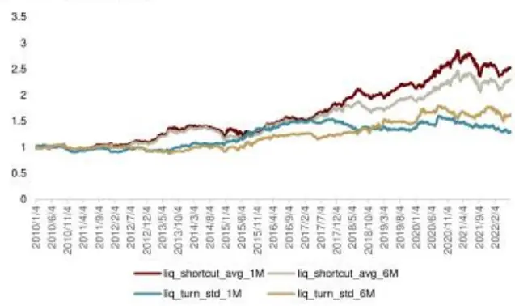
资料来源：Wind，中金公司研究部
注：1）统计时间为2010-01-01至2022-06-30；2）相对净值的比较基准为沪深300 等权指数 000984.CSI

图表 35：沪深300 范围内表现较好的流动性因子分组年化超额收益统计
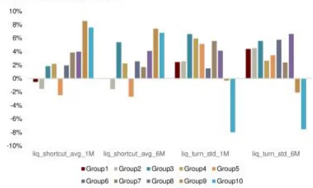
资料来源：Wind，中金公司研究部
注：1）统计时间为2010-01-01至2022-06-30：2）超额收益的比较基准为沪深300 等权指数 000984.CSl；3）Group1 为因子值最小一组，Group10 为因子值最大一组

中证500范围内，liq_turn_std_6M因子分组单调性较好。如下图所示，liq_turn_avg_6M因子单调性相对较好，多头组合显著跑赢基准，空头组合显著跑输基准；而最短路径因子和成交波动比因子的有效性则更多来源于空头组合的贡献。

图表 36：中证500范围内表现较好的流动性因子多头组合相对净值
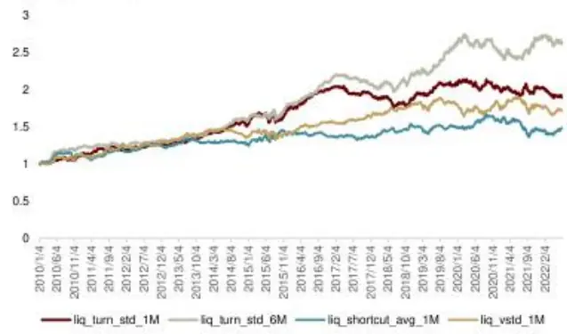
资料来源：Wind，中金公司研究部
注：1）统计时间为2010-01-01至2022-06-30；2）相对净值的比较基准为中证500 等权指数 000982.SH

图表37：中证500范围内表现较好的流动性因子分组年化超额收益统计
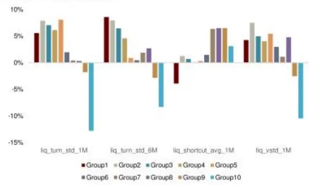
资料来源：Wind，中金公司研究部
注：1）统计时间为2010-01-01至2022-06-30；2）超额收益的比较基准为中证500 等权指数 000982.SH；3）Group1为因子值最小一组，Group10为因子值最大一组

中证1000范围内，liq_turn_std_6M 分组单调性较好，多头组合显著跑赢基准，超额收益相对稳定。价格弹性类因子在中证1000范围内的有效性更多来源于空头的贡献，多头组合区分度相对较低。

图表38：中证1000范围内表现较好的流动性因子多头组合相对净值
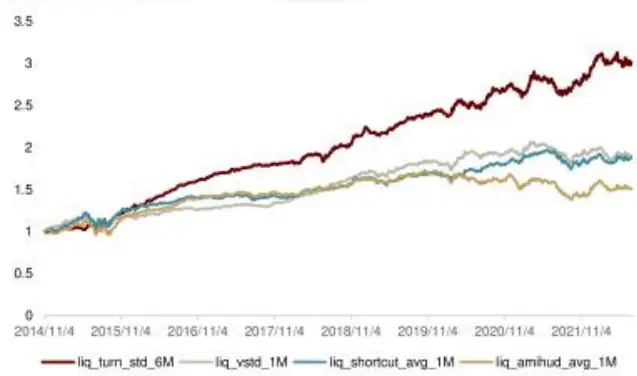
资料来源：Wind，中金公司研究部
注：1）统计时间为2014-11-01至2022-06-30；2）相对净值的比较基准为中证1000 等权指数 000852.SH

图表 39：中证1000 范围内表现较好的流动性因子分组年化超额收益统计
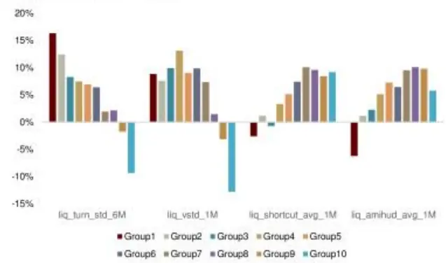
资料来源：Wind，中金公司研究部
注：1）统计时间为2014-11-01至2022-06-30；2）超额收益的比较基准为中证1000 指数 000852.SH；3）Group1 为因子值最小一组，Group10 为因子值最大一组

## 量价相关性

## 量能领先因子具有正向预测能力

量价相关性因子刻画股票换手率与价格（或收益率）背离、同向程度。该类因子的有效性可从信息扩散理论的角度理解：信息扩散初期的特征应是量能领先于价格，此时量的变化主要由小部分理性交易者主导；而到信息扩散中期时，量价基本同步；到信息扩散末期时，更多成交可能来源于“羊群效应”的非理性行为。本节，我们计算了换手率与价格（及其一阶变化）的相关性因子，遍历了量能领先、价格领先以及量价同步三种情形，并对这些因子进行了有效性检验。

图表40：量价相关性因子构建方式

| 因子代码 | 因子名称 | 因子计算公式 |
| --- | --- | --- |
| corr price turn_1M | 换手率与价格相关性因子（量价同步） | 过去20个交易日，t日换手率与t日价格的相关系数 |
| corr_price_turn_post_1M | 换手率与价格相关性因子（量领先一期） | 过去20个交易日，t日换手率与t+1日价格的相关系数 |
| corr_price_turn_prior_1M | 换手率与价格相关性因子（价领先一期） | 过去20个交易日，t日换手率与t-1日价格的相关系数 |
| corr_ret_turn_1M | 换手率与收益率相关性因子（量价同步） | 过去20个交易日，t日换手率与t日收益率的相关系数 |
| corr_ret_turn_post_1M | 换手率与收益率相关性因子（量领先一期） | 过去20个交易日，t日换手率与t+1日收益率的相关系数 |
| corr_ret_turn_prior_1M | 换手率与收益率相关性因子（价领先一期） | 过去20个交易日，t日换手率与t-1日收益率的相关系数 |
| corr_ret_turnd_1M | 换手率变动与收益率相关性因子（量价同步） | 过去20个交易日，t日换手率的变动与t日收益率的相关系数 |
| corr_ret_turnd_post_1M | 换手率变动与收益率相关性因子（量领先一期） | 过去20个交易日，1日换手率的变动与t+1日收益率的相关系数 |
| corr_ret_tumnd_prior_1M | 换手率变动与收益率相关性因子（价领先一期） | 过去20个交易日，t日换手率的变动与t-1日收益率的相关系数 |

资料来源：中金公司研究部

基于相关性统计，大致将量价相关性分布因子分为以下三类：价格相关因子、量能领先因子和量价同步因子。

价格相关因子指的是换手率与价格的相关性因子，包括价格领先、价格滞后、量价同步三种情形。从相关性统计结果来看，三种情形下的价格相关因子之间的相关系数均较高。从因子有效性考虑，量价同步情形下，换手率与价格的相关性因子（corr_price_turn_1M）表现较好。全市场范围内，corr_price_turn_1M因子的IC均值为-6.1%，IC_IR为-1.00。

量能领先因子是收益率与换手率（及其变动）的相关性因子，包括corr_ret_turn_post_1M和 corr_ret_turnd_post_1M，量能领先因子较高时，应处于信息扩散的初期，对股价未来收益表现具有正向的预测能力。corr_ret_turn_post_1M因子在全市场、沪深300、中证1000范围内表现均较好，全市场范围内，IC均值为2.3%，IC_IR达0.52。

量价同步因子亦为收益率与换手率（及其变动）的相关性因子，包括量价同步和收益率领先两种情形(由于两种情形的因子相关性较高，故而合并为一类)。量价同步因子较高时，按信息扩散理论理解，应处于信息扩散的后期，此时对股票未来的收益表现具有负向的预测效果。其中，corr_ret_turnd_1M因子在不同选股范围内表现均较为突出，全市场内IC均值达-6.1%，IC_IR为-1.07。

综上所述，corr_ret_turnd_1M（量价同步因子）和corr_price_turn_1M（价格相关因子）总体表现较好，在不同选股范围内均具有较强的选股能力；同时，corr_ret_turn_post_1M（量能领先因子）在沪深300、中证1000范围内亦有不俗的表现，值得关注。

图表41：量价相关性因子在全市场范围内的有效性检验结果

| 因子 | IC均值 | IC_IR | P(IC<0) | P(IC<-0.02) | P(IC>0) | P(IC>0.02) | t值 | 多头年化收多头年化超 益率 | 额收益 | 多头超额最 大圆道 | 多头平均换 手率 | 单调性 |
| --- | --- | --- | --- | --- | --- | --- | --- | --- | --- | --- | --- | --- |
| corr_price_turn_1M | -6.1% | -1.00 | 84.0% | 76.0% | 16.0% | 11.3% | -12.25 | 15.6% | 6.0% | -13.5% | 85.1% | 0.93 |
| corr_price_turn_post_1M | -4.3% | -0.78 | 78.0% | 68.0% | 22.0% | 16.0% | -9.54 | 14.0% | 4.6% | -13.8% | 87.1% | 0.93 |
| corr_price_turn_prior_1M | -3.7% | -0.62 | 73.3% | 66.0% | 26.7% | 18.7% | -7.63 | 13.4% | 4.0% | -14.3% | 86.0% | 0.87 |
| corr_ret_turn_1M | -3.9% | -0.72 | 78.0% | 62.7% | 22.0% | 12.7% | -8.85 | 12.4% | 3.1% | -10.5% | 89.9% | 0.97 |
| corr_ret_turn_post_1M | 2.3% | 0.52 | 30.0% | 16.0% | 70.0% | 54.7% | 6.33 | 12.3% | 3.2% | -10.1% | 88.0% | 0.97 |
| corr_ret_turn_prior_1M | -4.7% | -0.79 | 79.3% | 71.3% | 20.7% | 11.3% | -9.66 | 13.5% | 3.9% | -9.7% | 87.7% | 0.93 |
| corr_ret_turnd_1M | -6.1% | -1.07 | 87.3% | 78.7% | 12.7% | 8.7% | -13.14 | 15.5% | 5.9% | -7.7% | 88.3% | 0.91 |
| corr_ret_turnd_post_1M | 0.0% | 0.00 | 51.3% | 25.3% | 48.7% | 26.7% | -0.04 | 7.9% | -0.9% | -18.3% | 89.1% | 0.33 |
| corr_ret_turnd_prior_1M | -0.7% | -0.15 | 50.7% | 39.3% | 49.3% | 26.7% | -1.88 | 7.1% | -1.8% | -23.9% | 86.7% | 0.44 |

资料来源：Wind，中金公司研究部（注：统计时间为2010-01-01至2022-06-30；超额收益的比较基准为全市场等权指数）

图表42：全市场范围内量价相关性因子之间的相关性统计

|  | corr_price_tur |  |  |  |  |  |  | corr ret turn |  |
| --- | --- | --- | --- | --- | --- | --- | --- | --- | --- |
|  | n_1M | n post_1M | n prior_1M | post_1M | post_1M | 1M | 1M | prior_1M | prior_1M |
| corr_price_turn_1M | 1.00 | 0.82 | 0.79 | -0.21 | 0.05 | 0.29 | 0.49 | 0.37 | 0.06 |
| corr_price_turn_post_1M | 0.82 | 1.00 | 0.66 | 0.18 | 0.32 | 0.26 | 0.22 | 0.33 | 0.05 |
| corr_price_turn_prior_1M | 0.79 | 0.66 | 1.00 | -0.17 | 0.01 | -0.16 | 0.09 | 0.23 | 0.38 |
| corr_ret_turn_post_1M | -0.21 | 0.18 | -0.17 | 1.00 | 0.54 | 0.12 | -0.47 | 0.05 | -0.08 |
| corr_ret_turnd_post_1M | 0.05 | 0.32 | 0.01 | 0.54 | 1.00 | 0.12 | -0.18 | 0.16 | 0.03 |
| corr_ret_turn_1M | 0.29 | 0.26 | -0.16 | 0.12 | 0.12 | 1.00 | 0.72 | 0.41 | -0.59 |
| corr_ret_turnd_1M | 0.49 | 0.22 | 0.09 | -0.47 | -0.18 | 0.72 | 1.00 | 0.39 | -0.35 |
| corr_ret_turn_prior_1M | 0.37 | 0.33 | 0.23 | 0.05 | 0.16 | 0.41 | 0.39 | 1.00 | 0.39 |
| corr_ret_turnd_prior_1M | 0.06 | 0.05 | 0.38 | -0.08 | 0.03 | -0.59 | -0.35 | 0.39 | 1.00 |

资料来源：Wind，中金公司研究部（注：统计时间为2010-01-01至2022-06-30）

图表43：量价相关性因子在沪深300 范围内的有效性检验结果

| 因子 | IC均值 | IC_IR | P(IC<0) | P(IC<-0.02) | P(IC>0) | P(IC>0.02) | t值 | 多头年化收多头年化鲤 益率 | 额收益 | 多头超额最 大回推 | 多头平均换 手车 | 单调性 |
| --- | --- | --- | --- | --- | --- | --- | --- | --- | --- | --- | --- | --- |
| corr_price_turn_1M | -4.3% | -0.44 | 65.3% | 60.0% | 34.7% | 30.0% | -5.45 | 10.5% | 9.8% | -22.7% | 84.9% | 0.94 |
| corr_price_turn_post_1M | -2.8% | -0.28 | 62.0% | 56.7% | 38.0% | 29.3% | -3.41 | 7.6% | 7.1% | -19.2% | 86.4% | 0.89 |
| corr_price_turn_prior_1M | -2.7% | -0.28 | 60.7% | 53.3% | 39.3% | 33.3% | -3.46 | 9.4% | 8.7% | -21.7% | 85.8% | 0.72 |
| corr_ret_turn_1M | -2.8% | -0.29 | 63.3% | 58.0% | 36.7% | 30.0% | -3.54 | 9.2% | 8.5% | -17.6% | 90.3% | 0.81 |
| corr_ret_turn_post_1M | 2.9% | 0.34 | 36.0% | 32.7% | 64.0% | 56.7% | 4.12 | 9.0% | 8.2% | -15.9% | 87.6% | 0.90 |
| corr_ret_turn_prior_1M | -3.2% | -0.33 | 64.0% | 57.3% | 36.0% | 27.3% | -4.08 | 7.4% | 6.6% | -20.6% | 86.9% | 0.79 |
| corr_ret_turnd_1M | -4.8% | -0.46 | 68.0% | 64.0% | 32.0% | 26.0% | -5.66 | 10.3% | 9.5% | -21.1% | 88.2% | 0.95 |
| corr_ret_turnd_post_1M | 1.0% | 0.14 | 47.3% | 38.7% | 52.7% | 45.3% | 1.66 | 5.1% | 4.5% | -16.5% | 88.7% | 0.62 |
| corr_ret_turnd_prior_1M | 0.3% | 0.04 | 48.0% | 38.7% | 52.0% | 40.7% | 0.44 | 2.4% | 1.9% | -13.6% | 89.3% | 0.19 |

资料来源：Wind，中金公司研究部（注：统计时间为2010-01-01至2022-06-30；超额收益的比较基准为沪深300等权指数000984.CSI）

图表44：量价相关性因子在中证500范围内的有效性检验结果

| 因子 | IC均值 | IC_IR | P(IC<0) | P(IC<-0.02) | P(IC>0) | P(IC>0.02) | t值 | 多头年化收多头年化超 益率 | 额收益 | 多头超额最 大国盖 | 多头平均换 手率 | 单调性 |
| --- | --- | --- | --- | --- | --- | --- | --- | --- | --- | --- | --- | --- |
| corr_price_turn_1M | -4.2% | -0.53 | 68.0% | 60.7% | 32.0% | 26.0% | -6.48 | 6.8% | 3.1% | -23.3% | 84.4% | 0.83 |
| corr_price_turn_post_1M | -3.2% | -0.43 | 67.3% | 59.3% | 32.7% | 24.7% | -5.26 | 6.7% | 3.1% | -16.6% | 85.8% | 0.84 |
| corr_price_turn_prior_1M | -2.2% | -0.28 | 62.7% | 53.3% | 37.3% | 31.3% | -3.41 | 6.7% | 3.1% | -30.5% | 85.5% | 0.76 |
| corr_ret_turn_1M | -3.3% | -0.48 | 67.3% | 56.7% | 32.7% | 20.0% | -5.94 | 9.2% | 5.5% | -9.7% | 89.7% | 0.88 |
| corr_ret_turn_post_1M | 1.0% | 0.17 | 42.7% | 31.3% | 57.3% | 43.3% | 2.06 | 7.6% | 4.1% | -14.8% | 87.9% | 0.61 |
| corr_ret_turn_prior_1M | -3.7% | -0.51 | 70.7% | 57.3% | 29.3% | 20.7% | -6.28 | 7.1% | 3.3% | -15.9% | 87.1% | 0.88 |
| corr_ret_turnd_1M | -4.5% | -0.61 | 72.0% | 64.0% | 28.0% | 16.7% | -7.52 | 8.2% | 4.4% | -11.5% | 87.8% | 0.77 |
| corr_ret_turnd_post_1M | -0.3% | -0.05 | 50.0% | 36.7% | 50.0% | 33.3% | -0.67 | 6.0% | 2.5% | -14.5% | 88.5% | 0.57 |
| corr_ret_turnd_prior_1M | -0.2% | -0.04 | 50.0% | 36.0% | 50.0% | 38.0% | -0.44 | 2.2% | -1.4% | -32.2% | 86.5% | 0.21 |

资料来源：Wind，中金公司研究部（注：统计时间为2010-01-01至2022-06-30；超额收益的比较基准为中证500等权指数000982.SH）

图表45：量价相关性因子在中证1000范围内的有效性检验结果

| 园子 | IC均值 | IC_IR | P(IC<0) | P(IC<-0.02) | P(IC>0) | P(IC>0.02) | 值 益率 | 多头年化收多头年化超 | 多头超额录 额收益 | 大回缴 | 多头平均换 手率 | 单调性 |
| --- | --- | --- | --- | --- | --- | --- | --- | --- | --- | --- | --- | --- |
| corr_price_turn_1M | -5.6% | -0.73 | 76.1% | 67.4% | 23.9% | 15.2% | -6.97 | 11.9% | 10.7% | -12.2% | 85.0% | 0.87 |
| corr_price_turn_post_1M | -3.6% | -0.51 | 71.7% | 55.4% | 28.3% | 20.7% | -4.85 | 11.6% | 10.4% | -14.6% | 87.1% | 0.88 |
| corr_price_turn_prior_1M | -4.1% | -0.56 | 69.6% | 60.9% | 30.4% | 20.7% | -5.41 | 9.1% | 8.0% | -15.4% | 86.1% | 0.84 |
| corr_ret_turn_1M | -2.8% | -0.45 | 67.4% | 58.7% | 32.6% | 20.7% | -4.33 | 7.2% | 6.0% | -14.4% | 89.3% | 0.78 |
| corr_ret_turn_post_1M | 2.5% | 0.46 | 34.8% | 21.7% | 65.2% | 51.1% | 4.37 | 7.6% | 6.7% | -13.4% | 87.2% | 0.86 |
| corr_ret_turn_prior_1M | -4.9% | -0.69 | 76.1% | 67.4% | 23.9% | 16.3% | -6.58 | 10.4% | 9.0% | -15.9% | 87.3% | 0.90 |
| corr_ret_turnd_1M | -5.0% | -0.79 | 80.4% | 66.3% | 19.6% | 10.9% | -7.56 | 9.1% | 8.0% | -16.8% | 87.2% | 0.78 |
| corr_ret_turnd_post_1M | 0.6% | 0.12 | 43.5% | 27.2% | 56.5% | 38.0% | 1.20 | 5.0% | 4.0% | -10.7% | 89.1% | 0.40 |
| corr_ret_turnd_prior_1M | -2.1% | -0.36 | 63.0% | 56.5% | 37.0% | 26.1% | -3.49 | 5.7% | 4.5% | -12.5% | 86.6% | 0.64 |

资料来源：Wind，中金公司研究部（注：统计时间为2014-11-01至2022-06-30；超额收益的比较基准为中证1000指数000852.SH）

## corr_price_turn_1M因子在沪深 300 中多头收益显著且单调性良好

沪深 300 范围内，corr_price_turn_1M 和 corr_ret_turnd_1M 因子分组表现较好。如下图所示，二者多头组合显著跑赢基准，空头组合则显著跑输基准，单调性良好；corr_price_turn_1M因子的多头收益较显著；corr_ret_turn_post_1M因子的多头亦显著跑赢基准，但这三个因子的多头相对净值均在2021上半年间出现了阶段性回撤，须警惕该类因子阶段性失效的风险。

图表46：沪深300范围内表现较好的量价相关性因子多头组合相对净值
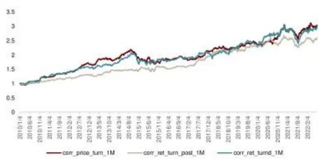
资料来源：Wind，中金公司研究部
注：1）统计时间为2010-01-01至2022-06-30；2）相对净值的比较基准为沪深300 等权指数 000984.CSI

图表47：沪深300范围内表现较好的量价相关性因子分组年化超额收益统计
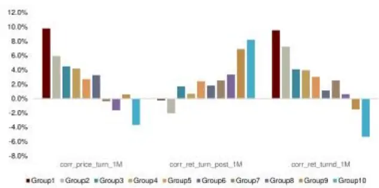
资料来源：Wind，中金公司研究部
注：1）统计时间为2010-01-01至2022-06-30；2）超额收益的比较基准为沪深300 等权指数 000984.CSl；3)Group1 为因子值最小一组，Group10为因子值最大一组

中证 500 范围内，corr_price_turn_1M、corr_ret_turn_prior_1M 和 corr_ret_turnd_1M因子近年多头表现欠佳。3个因子的空头组合显著跑输基准，但多头组合表现欠佳，单调性较差，整体呈现右偏的倒U型。corr_price_turn_1M因子多头相对净值自2014年8月起有明显回撤。

图表48：中证500范围内表现较好的量价相关性因子多头组合相对净值
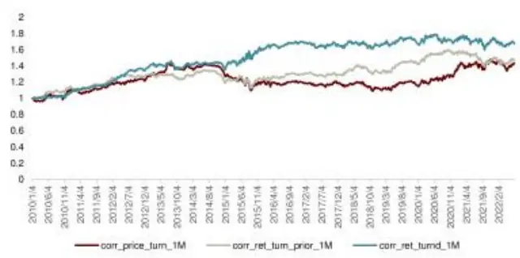
资料来源：Wind，中金公司研究部
注：1）统计时间为2010-01-01至2022-06-30；2）相对净值的比较基准为中证500 等权指数 000982.SH

图表49：中证500范围内表现较好的量价相关性因子分组年化超额收益统计
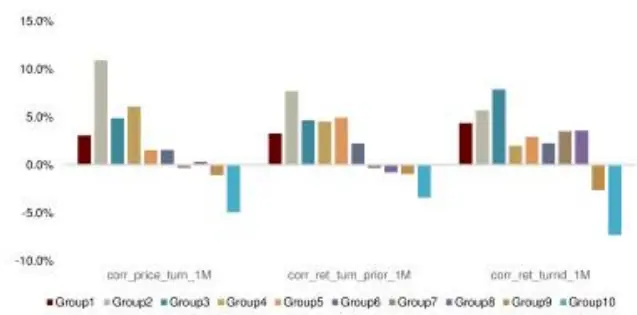
资料来源：Wind，中金公司研究部
注：1）统计时间为2010-01-01至2022-06-30；2）超额收益的比较基准为中证500等权指数 000982.SH；3）Group1 为因子值最小一组，Group10 为因子值最大一组

中证 1000 范围内，corr_price_turn_1M分组收益单调性相对较好。corr_price_turn_1M、corr_ret_turn_prior_1M 和 corr_ret_turnd_1M因子空头组合均显著跑输基准，多头组合亦可跑赢基准，但 corr_ret_turn_prior_1M 和corr_ret_turnd_1M因子分组单调性相对较差；而corr_ret_turn_post_1M因子则是多头组合相对较好，空头组合表现一般。

图表50：中证1000范围内表现较好的量价相关性因子多头组合相对净值
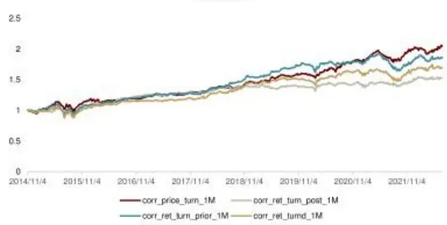
资料来源：Wind，中金公司研究部
注：1）统计时间为2014-11-01至2022-06-30；2）相对净值的比较基准为中证1000 等权指数 000852.SH

图表51：中证1000范围内表现较好的量价相关性因子分组年化超额收益统计
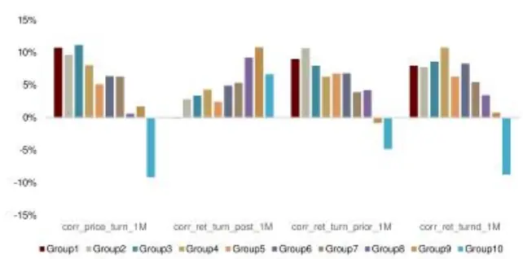
资料来源：Wind，中金公司研究部
注：1）统计时间为2014-11-01至2022-06-30；2）超额收益的比较基准为中证1000 指数 000852.SH；3）Group1为因子值最小一组，Group10 为因子值最大一组

## 筹码分布

## 筹码分布因子选股有效性一般

筹码分布旨在刻画股票持有人的持仓成本分布情况，我们据此构建了筹码分布的均值、标准差、偏度、峰度等因子，以及不同盈亏水平的筹码占比因子，并检验了这些因子在不同选股范围内的有效性。

图表52：筹码分布因子构建方式

| 因子代码 | 因子名称 | 因子计算公式 |
| --- | --- | --- |
| distribution_ret_avg | 筹码平均收益因子 | 各筹码收益率的平均数 |
| distribution_ret_std | 筹码标准差因子 | 各筹码收益率的标准差 |
| distribution_ret_skew | 筹码偏度因子 | 各筹码收益率的偏度统计量 |
| distribution_ret_kurt | 筹码峰度因子 | 各筹码收益率从的峰度统计量 |
| distribution_max_prob_ret | 最大筹码收益率因子 | 占比最大的筹码区间的收益率 |
| distribution_bal | 盈亏平衡筹码占比因子 | -2%至2%收益率的筹码占比 |
| distribution_profit_1 | 大幅盈利筹码占比因子 | 10%以上收益率的筹码占比 |
| distribution_profit_s | 小幅盈利筹码占比因子 | 2%至10%收益率的筹码占比 |
| distribution_loss_s | 小幅亏损筹码占比因子 | -2%至-10%收益率的筹码占比 |
| distribution_loss_ | 大幅亏损筹码占比因子 | -10%以下收益率的筹码占比 |

资料来源：中金公司研究部

基于相关性统计，我们大致将筹码分布因子分为以下两类：筹码分布形状因子和筹码占比因子。

筹码分布形状因子包括描述分布的二到四阶标准矩相关因子，即标准差、偏度与峰度。值得注意的是，distribution_ret avg因子尽管是一阶矩，但由于其与分布占比因子的相关度更高，所以归类于筹码分布占比因子。筹码分布形状因子的有效性均逊于筹码分布占比因子。尽管宽基指数范围内多头超额收益表现尚可，但综合其预测稳定性来看，仍表现欠佳。

筹码占比因子包括 distribution_max_prob_ret、distribution_ret_avg 以及不同盈亏水平的筹码占比因子。从因子的预测方向来看，更多表现为反转的含义，即：股票持有人平均收益越高（或盈利筹码占比越高)，未来收益表现越弱；而亏损筹码占比越高，未来收益表现越强。从因子有效性角度来看，distribution_loss_I和 distribution_ret_avg 因子表现相对较好，但仅在全市场和中证1000范围内具有一定的收益预测能力和单调性。

因此，筹码分布因子在沪深300和中证500范围内因子IC表现较弱，在全市场、中证1000范围内才具有一定的选股效果，IC_IR的绝对值大概可以达到0.4左右。

图表53：筹码分布因子在全市场范围内的有效性检验结果

| 因子 | IC均值 | IC_IR | P(IC<0) | P(IC<-0.02) | P(IC>0) | P(IC>0.02) | t值 | 多头年化收多头年化超 益率 | 额收益 | 多头超额最 多头平均换 大回撤 | 手车 | 单调性 |
| --- | --- | --- | --- | --- | --- | --- | --- | --- | --- | --- | --- | --- |
| distribution_bal | -2.2% | -0.33 | 60.7% | 48.0% | 39.3% | 24.0% | -4.10 | 7.1% | -1.4% | -34.1% | 81.1% | 0.51 |
| distribution_loss_I | 4.0% | 0.41 | 33.3% | 24.0% | 66.7% | 54.7% | 5.02 | 10.2% | 1.1% | -23.4% | 63.2% | 0.60 |
| distribution_loss_s | -1.4% | -0.19 | 58.0% | 46.7% | 42.0% | 31.3% | -2.31 | 6.7% | -1.8% | -34.1% | 80.8% | 0.63 |
| distribution_max_prob_ret | -3.2% | -0.38 | 65.3% | 54.7% | 34.7% | 28.0% | -4.66 | 11.0% | 2.1% | -20.6% | 60.2% | 0.83 |
| distribution_proft_l | -2.1% | -0.25 | 59.3% | 50.0% | 40.7% | 34.0% | -3.10 | 4.4% | -4.3% | -43.7% | 53.5% | 0.15 |
| distribution_profit_s | -1.5% | -0.19 | 56.7% | 48.0% | 43.3% | 34.7% | -2.36 | 5.0% | -3.5% | -38.3% | 76.3% | 0.26 |
| distribution_ret_avg | -4.1% | -0.38 | 63.3% | 52.7% | 36.7% | 30.7% | -4.61 | 9.7% | 0.6% | -20.1% | 47.0% | 0.76 |
| distribution_ret_kurt | 1.0% | 0.13 | 48.7% | 35.3% | 51.3% | 41.3% | 1.63 | 8.1% | -0.9% | -41.7% | 25.6% | 0.54 |
| distribution_ret_skew | 0.9% | 0.12 | 44.7% | 37.3% | 55.3% | 46.7% | 1.42 | 9.5% | 0.2% | -45.7% | 30.6% | 0.59 |
| distribution_ret_std | 2.1% | 0.26 | 46.0% | 36.0% | 54.0% | 46.7% | 3.23 | 9.3% | 0.3% | -37.9% | 31.1% | 0.69 |

资料来源：Wind，中金公司研究部（注：统计时间为2010-01-01至2022-06-30）

图表54：全市场范围内筹码分布因子之间的相关性统计
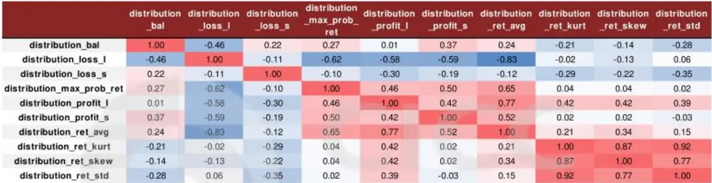
资料来源：Wind，中金公司研究部（注：统计时间为2010-01-01至2022-06-30）

图表55：筹码分布因子在沪深300范围内的有效性检验结果

| 因子 | IC均值 | IC_IR | P(IC<0) | P(IC<-0.02) | P(IC>0) | P(IC>0.02) | t值 | 益率 | 多头年化收多头年化超多头超额最多头平均换 额收益 | 大回道 | 手率 | 单调性 |
| --- | --- | --- | --- | --- | --- | --- | --- | --- | --- | --- | --- | --- |
| distribution_bal | -0.6% | -0.06 | 52.7% | 46.7% | 47.3% | 39.3% | -0.76 | 1.5% | 1.1% | -24.5% | 74.9% | 0.31 |
| distribution_loss_l | 0.4% | 0.03 | 46.7% | 43.3% | 53.3% | 46.0% | 0.31 | 0.7% | 0.1% | -36.4% | 55.5% | 0.45 |
| distribution_loss_s | -1.8% | -0.16 | 54.7% | 46.0% | 45.3% | 40.0% | -1.99 | 3.7% | 3.2% | -27.0% | 72.3% | 0.79 |
| distribution_max_prob_ret | -0.5% | -0.04 | 52.0% | 44.0% | 48.0% | 40.7% | -0.49 | 2.3% | 1.9% | -33.2% | 49.0% | 0.10 |
| distribution_profit_l | 1.0% | 0.08 | 46.7% | 44.0% | 53.3% | 46.7% | 0.95 | -0.6% | -1.2% | -36.8% | 60.0% | 0.60 |
| distribution_profit_s | 0.2% | 0.02 | 51.3% | 46.0% | 48.7% | 44.7% | 0.25 | 0.8% | 0.1% | -20.3% | 73.6% | 0.28 |
| distribution_ret_avg | 0.1% | 0.00 | 50.7% | 47.3% | 49.3% | 46.7% | 0.05 | 7.0% | 6.0% | -39.1% | 38.9% | 0.60 |
| distribution_ret_kurt | 1.6% | 0.13 | 41.3% | 37.3% | 58.7% | 50.0% | 1.63 | 6.7% | 6.1% | -32.5% | 22.2% | 0.90 |
| distribution_ret_skew | 1.7% | 0.14 | 45.3% | 38.0% | 54.7% | 49.3% | 1.67 | 8.5% | 7.6% | -29.9% | 26.2% | 0.70 |
| distribution_ret_std | 2.1% | 0.17 | 42.0% | 37.3% | 58.0% | 51.3% | 2.14 | 12.0% | 11.3% | -23.3% | 25.3% | 0.90 |

资料来源：Wind，中金公司研究部（注：统计时间为2010-01-01至2022-06-30；超额收益的比较基准为沪深300等权指数000984.CSI）

图表56：筹码分布因子在中证 500范围内的有效性检验结果

| 因子 | IC均值 | IC_IR | P(IC<0) | P(IC<-0.02) | P(IC>0) | P(IC>0.02) | t值 | 多头年化收多头年化超 益率 | 额收益 | 多头超额最 多头平均换 大回数 | 手车 | 单调性 |
| --- | --- | --- | --- | --- | --- | --- | --- | --- | --- | --- | --- | --- |
| distribution_bal | -1.1% | -0.13 | 54.0% | 44.0% | 46.0% | 34.7% | -1.64 | 4.5% | 1.2% | -19.3% | 80.9% | 0.31 |
| distribution_loss_1 | 3.0% | 0.25 | 40.7% | 32.0% | 59.3% | 54.7% | 3.05 | 7.4% | 3.9% | -30.5% | 62.5% | 0.44 |
| distribution_loss_s | -1.8% | -0.20 | 58.7% | 52.7% | 41.3% | 34.7% | -2.43 | 7.1% | 3.8% | -27.7% | 78.6% | 0.87 |
| distribution_max_prob_ret | -2.4% | -0.23 | 58.0% | 48.0% | 42.0% | 38.7% | -2.84 | 5.0% | 1.8% | -33.2% | 60.6% | 0.73 |
| distribution_proft_l | -1.1% | -0.10 | 51.3% | 42.7% | 48.7% | 41.3% | -1.27 | 3.0% | -0.4% | -24.7% | 58.0% | 0.70 |
| distribution_profit_s | -0.4% | -0.04 | 48.7% | 40.7% | 51.3% | 44.0% | -0.50 | 1.7% | -1.5% | -34.6% | 75.5% | 0.28 |
| distribution_ret_avg | -3.2% | -0.23 | 55.3% | 50.0% | 44.7% | 37.3% | -2.85 | 6.3% | 3.0% | -23.8% | 49.4% | 0.76 |
| distribution_ret_kurt | 0.4% | 0.04 | 50.7% | 36.0% | 49.3% | 40.7% | 0.52 | 6.9% | 3.4% | -34.3% | 25.6% | 0.64 |
| distribution_ret_skew | 1.0% | 0.10 | 46.0% | 36.0% | 54.0% | 45.3% | 1.20 | 10.1% | 6.4% | -44.7% | 31.5% | 0.74 |
| distribution_ret_std | 1.3% | 0.13 | 46.7% | 40.0% | 53.3% | 43.3% | 1.56 | 8.4% | 4.9% | -32.9% | 30.7% | 0.77 |

资料来源：Wind，中金公司研究部（注：统计时间为2010-01-01至2022-06-30；超额收益的比较基准为中证500等权指数000982.SH）

图表57：筹码分布因子在中证1000 范围内的有效性检验结果

| 因子 | IC均值 | IC_IR | P(IC<0) | P(IC<-0.02) | P(IC>0) | P(IC>0.02) | t值 | 益率 | 多头年化收多头年化超多头超额最多头平均换 额收益 | 大回歉 | 手车 | 单调性 |
| --- | --- | --- | --- | --- | --- | --- | --- | --- | --- | --- | --- | --- |
| distribution_bal | -1.5% | -0.20 | 57.6% | 44.6% | 42.4% | 34.8% | -1.97 | 1.1% | 0.4% | -23.2% | 81.7% | 0.24 |
| distribution_loss_1 | 4.2% | 0.39 | 30.4% | 28.3% | 69.6% | 57.6% | 3.79 | 6.7% | 5.6% | -24.1% | 67.7% | 0.70 |
| distribution_loss_s | -0.9% | -0.10 | 53.3% | 42.4% | 46.7% | 34.8% | -0.99 | 0.2% | -0.5% | -28.1% | 81.9% | 0.20 |
| distribution_max_prob_ret | -3.0% | -0.33 | 62.0% | 54.3% | 38.0% | 28.3% | -3.15 | 6.8% | 6.0% | -23.8% | 64.9% | 0.71 |
| distribution_profit_l | -1.8% | -0.23 | 55.4% | 41.3% | 44.6% | 32.6% | -2.16 | 1.7% | 0.7% | -23.3% | 60.4% | 0.02 |
| distribution_profit_s | -1.0% | -0.12 | 54.3% | 48.9% | 45.7% | 39.1% | -1.12 | -1.2% | -2.0% | -33.0% | 77.9% | 0.02 |
| distribution_ret_avg | -4.3% | -0.39 | 64.1% | 53.3% | 35.9% | 28.3% | -3.73 | 9.3% | B.3% | -17.1% | 55.2% | 0.84 |
| distribution_ret_kurt | 1.6% | 0.18 | 47.8% | 35.9% | 52.2% | 40.2% | 1.72 | 6.2% | 5.4% | -22.2% | 29.9% | 0.74 |
| distribution_ret_skew | 1.5% | 0.16 | 46.7% | 38.0% | 53.3% | 45.7% | 1.57 | 8.3% | 7.2% | -21.8% | 36.4% | 0.78 |
| distribution_ret_std | 2.4% | 0.27 | 43.5% | 29.3% | 56.5% | 46.7% | 2.61 | 8.7% | 7.9% | -17.9% | 36.9% | 0.74 |

资料来源：Wind，中金公司研究部（注：统计时间为2014-11-01至2022-06-30；超额收益的比较基准为中证1000指数000852.SH）

## distribution_ret_std 因子多头组合在沪深300内具有一定的超额收益

沪深300范围内，distribution_ret_std因子分组单调性尚可。如下图所示，该因子多头组合显著跑赢基准，空头组合则跑输基准，因子有效性大多来源于多头组合。但结合IC_IR为0.17以及相对净值的走势来看，需注意该因子的多头贡献是阶段性而非长期稳定的。

图表 58：沪深300范围内表现较好的筹码分布因子多头组合相对净值
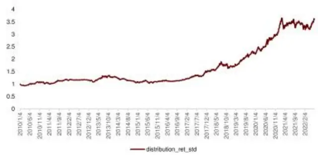
资料来源：Wind，中金公司研究部
注：1）统计时间为2010-01-01至2022-06-30；2）相对净值的比较基准为沪深300 等权指数 000984.CSI

图表 59：沪深 300范围内表现较好的筹码分布因子分组年化超额收益统计
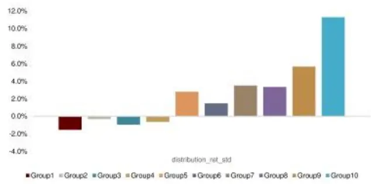
资料来源：Wind，中金公司研究部
注：1)统计时间为2010-01-01至2022-06-30：2）超额收益的比较基准为沪深300 等权指数 000984.CSl；3）Group1 为因子值最小一组，Group10 为因子值最大一组

中证500范围内，distribution_loss_1因子分组表现欠佳，且多头组合自2019年以来有所回撇。该因子的空头显著跑输基准，多头组合表现一般，且分组单调性不佳。

图表60：中证500 范围内表现较好的筹码分布因子多头组合相对净值
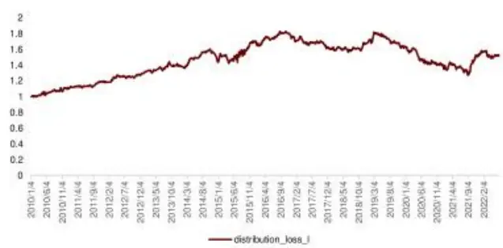
资料来源：Wind，中金公司研究部
注：1）统计时间为2010-01-01至2022-06-30；2）相对净值的比较基准为中证500 等权指数 000982.S

图表61：中证500范围内表现较好的筹码分布因子分组年化超额收益统计
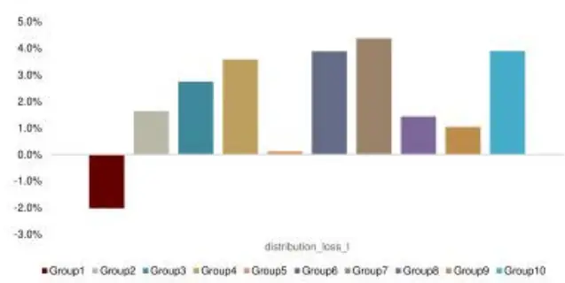
资料来源：Wind，中金公司研究部
注：1）统计时间为2010-01-01至2022-06-30；2）超额收益的比较基准为中证500等权指数000982.SH；3）Group1为因子值最小一组，Group10为因子值最大一组

中证1000范围内，distribution_ret_avg 因子分组表现较好。distribution_ret_avg和distributionloss因子的空头均显著跑输基准，多头组合表现一般。自2019年以来，2个因子的多头净值均有不同程度的回撤。

图表62：中证1000 范围内表现较好的筹码分布因子多头组合相对净值
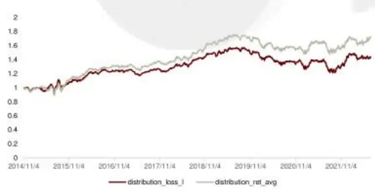
资料来源：Wind，中金公司研究部
注：1）统计时间为2014-11-01至2022-06-30；2）相对净值的比较基准为中证1000 等权指数 000852.SH

图表63：中证1000范围内表现较好的筹码分布因子分组年化超额收益统计
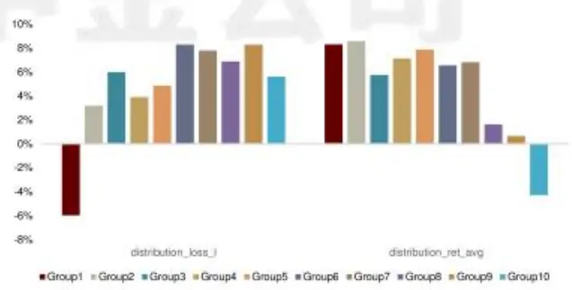
资料来源：Wind，中金公司研究部
注：1）统计时间为2014-11-01至2022-06-30；2）超额收益的比较基准为中证1000 指数 000852.SH；3）Group1为因子值最小一组，Group10为因子值最大一组

## 资金流向

## 开盘资金流入和大单买入因子在全市场范围内有效性较为突出

资金流因子反映了不同类型资金流向的信息，该类因子的核心思路是捕捉“聪明资金”的流向，采取跟随策略，以期获得基本面改善带来的超额收益。我们利用Wind所整理的日度资金流数据，构建了32个资金流因子，并进行有效性检验。

图表64：资金流因子构建方式

| 因子代码 | 因子名称 | 因子计算公式 |
| --- | --- | --- |
| act_buy__prop | 主动买入占比因子 | 过去20个交易日（净流入金额）之和/过去20个交易日成交额之和 |
| act_buy_shift_dist | 主动买入的位移路程比因子 | 过去20个交易日（净流入金额）之和/过去20个交易日净流入金额之和 |
| act_buy_prop_xl | 超大单主动买入占比因子 | 过去20个交易日（超大单主动买入金额·超大单主动卖出金额）之和/过去20个交易日成交额之和 |
| act_buy_shift_dist_x | 超大单主动买入的位移路程比因子 | 过去20个交易日（超大单主动买入金额-超大单主动卖出金额）之和/过去20个交易日超大单主动买入金额-超大单主动卖出金额\|之和 |
| act_buy_prop_ | 大单主动买入占比因子 | 过去20个交易日（大单主动买入金额-大单主动卖出金额）之和/过去20个交易日成交额之和 |
| act_buy_shiřt_dist_l | 大单主动买入的位移路程比因子 | 过去20个交易日（大单主动买入金额·大单主动卖出金额〉之和/过去20个交易日大单主动买入金额·大单主动卖出金额\|之和 |
| act_buy__prop_m | 中单主动买入占比因子 | 过去20个交易日（中单主动买入金额-中单主动卖出会额）之和/过去20个交易日成交额之和 |
| act_buy_shift_dist_m | 中单主动买入的位移路程比因子 | 过去20个交易日（中单主动买入金额-中单主动卖出金额）之和/过去20个交易日中单主动买入金额-中单主动卖出金额\|之和 |
| act_buy_prop_s | 小单主动买入占比园子 | 过去20个交易目（小单主动买入金额·小单主动卖出会额）之和/过去20个交易目成交额之和 |
| act_buy_shift_ dist_s | 小单主动买入的位移路程比因子 | 过去20个交易日（小单主动买入金额-小单主动卖出金额）之和/过去20个交易日小单主动买入金额-小单主动卖出金额\|之和 |
| buy__prop_xl | 超大单买入占比因子 | 过去20个交易日（超大单买入金额-超大单卖出金额）之和/过去20个交易日成交额之和 |
| buy_shift_dist_xl | 超大单买入的位移路程比因子 | 过去20个交易日（超大单买入金额·超大单卖出金额）之和/过去20个交易日超大单主动买入金额·超大单主动卖出金额\|之和 |
| buy_prop_1 | 大单买入占比因子 | 过去20个交易日（大单买入金额-大单卖出金额）之和/过去20个交易日成交额之和 |
| buy_shift_dist_l | 大单买入的位移路程比因子 | 过去20个交易日（大单买入金额-大单卖出金额）之和/过去20个交易日\|大单主动买入金额-大单主动卖出金翻\|之和 |
| buy_prop_m | 中单买入占比因子 | 过去20个交易日（中单买入金额-中单卖出金额）之和/过去20个交易日成交额之和 |
| buy_shift_dist_m buy_prop_s | 中单买入的位移路程比园子 | 过去20个交员日（中单买入金额·中单卖出金额）之和/过去20个交易日\|中单主动买入金额·中单主动卖出金额\|之和 |
| buy_shift_dist_s | 小单买入占比因子 | 过去20个交易日（小单买入金额-小单卖出金额）之和/过去20个交易日成交额之和 |
| inflow_prop_open | 小单买入的位移路程比因子 | 过去20个交易日（小单买入金额-小单卖出金额）之和/过去20个交易日\|小单主动买入金额-小单主动卖出金额\|之和 |
| inflow_shift_dist_open | 开盘资金流入金额占比因子 | 过去20个交易目（开盘资金流入金额/当目成交额）的平均数 |
| inflow_rate_open | 开盘资金流入金额的位移路程比因子 | 过去20个交易日（开盘资金流入金额）之和/过去20个交易日开盘资金流入金额\|之和 |
| amount_prop_open | 开盘资金流入率因子 | 过去20个交易日开盘资金流入率的平均数 |
| inflow_prop_open_ | 开盘成交额占比占比因子 | 过去20个交易日（开盘成交额/当日成交额）的平均数 |
|  | 大单开盘资金流入金额占比因子 大单开盘资金流入率因子 | 过去20个交易目（大单开盘资金流入金额/当日成交额）的平均数 |
| inflow_rate_open_ |  | 过去20个交易日大单开盘资会流入率的平均数 |
| inflow_shift_dist_open_ | 大单开盘资金流入金额的位移路程比因子 | 过去20个交易日（大单开盘资金流入金额）之和/过去20个交易日大单开盘资会流入金额之和 |
| inflow_prop_close | 尾盘资金流入金颖占比园子 | 过去20个交易日（尾盘资会流入金额/当日成交额）的平均数 |
| inflow_shift_dist_close | 尾盘资金流入金额的位移路程比因子 | 过去20个交易日（尾盘资金流入金额）之和/过去20个交易日尾盘资金流入金额\|之和 |
| inflow_rate_close amount_prop_close | 尾盘资金流入率因子 | 过去20个交易日尾盘资金流入率的平均数 |
| inflow_prop_close_! | 尾盘成交颠占比占比因子 | 过去20个交易目（尾盘成交额/当日成交额）的平均数 |
| inflow_rate_close_l | 大单尾盘资金流入金额占比因子 | 过去20个交易日（大单尾盘资金流入金额/当日成交额）的平均数 |
|  | 大单尾盘资金流入率因子 | 过去20个交易日大单尾盘资会流入率的平均数 |
| inflow_shift_dist_close_ | 大单尾盘资金流入金额的位移路程比因子 | 过去20个交易日（大单尾盘资金流入金额）之和/过去20个交易日大单尾盘资金流入金额\|之和 |

资料来源：中金公司研究部

我们基于相关性统计以及因子构建逻辑，大致将资金流因子分为以下两类：大小单资金流向因子、开盘/尾盘资金流向因子。

大小单资金流向因子指的是基于wind定义的超大单、大单、中单、小单所构建的资金流向因子，其中，超大单指的是单笔100万元以上的订单；大单指单笔20-100万元的订单；中单指的是4-20万元的订单；小单指的是4万元以下的订单。从订单总金额来看，绝大部分订单属于大单和小单，超大单和中单的数量都相对较少。从因子有效性角度来看，大单买入因子（buy_shift_dist_I）具有正向预测能力，全市场IC_IR达0.78；小单主动买入因子(act_buy_shift_dist_s）具有负向的预测效果，全市场IC_IR为-0.46。这一结果与直观理解相近，大单更多表征较为理性的机构观点，而小单则主要代表相对非理性的观点。但超大单买入因子（buy_shift_dist_xl）方向则与直观理解存在差异，全市场范围内IC_IR为-0.58，表明超大单买入越多，未来收益表现越弱。

开盘/尾盘资金流向因子指的是上午10点前和下午14点30后的资金流向所构建的因子。从因子有效性角度来看，上午10点前的资金流向因子有效性优于下午14点30后的资金流向因子。尤其可关注开盘大单买入因子(inflow_shift_dist_open_I)，该因子在全市场、沪深300、中证500、中证1000范围内选股有效性均较强，分组单调性也较好。

综上所述，我们认为开盘大单买入因子（inflow_shift_dist_open_I)、大单买入因子(buy_shift_dist_I)、小单主动买入因子（act_buy_shift_dist_s）在大部分选股域表现均较好，值得关注。

图表65：资金流因子在全市场范围内的有效性检验结果

| 因子 | IC均值 | IC_IR | P(IC<0) | P(IC<-0.02) | P(IC>0) | P(IC>0.02) | t值 | 多头年化收多头年化超 益率 | 额收益 | 多头超额最 大回道 | 多头平均换 手车 | 单调性 |
| --- | --- | --- | --- | --- | --- | --- | --- | --- | --- | --- | --- | --- |
| act_buy_prop | -1.1% | -0.16 | 59.2% | 44.0% | 40.8% | 32.8% | -1.79 | 10.7% | -2.4% | -28.2% | 83.8% | 0.09 |
| act_buy_prop_l | 0.5% | 0.08 | 42.5% | 30.1% | 57.5% | 43.4% | 0.89 | 17.0% | 2.7% | -12.2% | 75.3% | 0.81 |
| act_buy_prop_m | -1.1% | -0.18 | 58.4% | 46.9% | 41.6% | 31.9% | -1.95 | 14.0% | 0.1% | -17.5% | 79.0% | 0.33 |
| act_buy_prop_s | -1.8% | -0.36 | 64.6% | 45.1% | 35.4% | 23.9% | -3.86 | 18.3% | 3.7% | -9.1% | 77.3% | 0.55 |
| act_buy_prop_xl | -0.4% | -0.07 | 54.9% | 36.3% | 45.1% | 31.9% | -0.78 | 8.4% | -4.5% | -34.4% | 80.9% | 0.13 |
| act_buy_shift_dist | 0.4% | 0.06 | 50.4% | 35.4% | 49.6% | 42.5% | 0.61 | 9.8% | -3.3% | -37.5% | 75.7% | 0.42 |
| act_buy_shift_dist_l | 2.6% | 0.39 | 32.7% | 19.5% | 67.3% | 54.9% | 4.19 | 16.0% | 1.7% | -12.5% | 75.6% | 0.89 |
| act_buy_shift_dist_m | 0.8% | 0.15 | 46.9% | 31.9% | 53.1% | 35.4% | 1.61 | 15.4% | 1.6% | -14.7% | 77.6% | 0.76 |
| act_buy_shift_dist_s | -2.6% | -0.46 | 64.6% | 53.1% | 35.4% | 22.1% | -4.90 | 15.7% | 1.5% | -13.7% | 81.6% | 0.75 |
| act_buy_shift_dist_xl | -0.5% | -0.10 | 52.2% | 34.5% | 47.8% | 31.0% | -1.03 | 15.9% | 2.4% | -14.6% | 83.5% | 0.27 |
| amount_prop_close | 0.5% | 0.11 | 46.9% | 25.7% | 53.1% | 30.1% | 1.12 | 11.4% | -2.0% | -20.0% | 78.8% | 0.07 |
| amount_prop_open | -3.0% | -0.47 | 62.8% | 54.0% | 37.2% | 21.2% | -4.95 | 16.1% | 1.2% | -17.6% | 51.2% | 0.77 |
| buy_prop_! | 2.3% | 0.42 | 33.6% | 22.1% | 66.4% | 52.2% | 4.51 | 19.3% | 4.9% | -9.3% | 78.1% | 0.93 |
| buy_prop_m | 1.7% | 0.44 | 31.9% | 21.2% | 68.1% | 49.6% | 4.66 | 18.3% | 4.4% | -6.2% | 79.0% | 0.83 |
| buy_prop_s | -0.6% | -0.09 | 54.9% | 46.9% | 45.1% | 34.5% | -0.92 | 17.1% | 3.1% | -17.2% | 79.2% | 0.89 |
| buy_prop_xl | -2.7% | -0.56 | 69.9% | 55.8% | 30.1% | 16.8% | -6.00 | 11.5% | -1.5% | -16.8% | 81.2% | 0.61 |
| buy_shift_dist_ | 4.7% | 0.78 | 21.2% | 13.3% | 78.8% | 68.1% | 8.29 | 18.4% | 4.0% | -10.2% | 78.8% | 0.89 |
| buy_shift_dist_m | 1.9% | 0.49 | 31.0% | 20.4% | 69.0% | 53.1% | 5.19 | 15.2% | 1.9% | -5.3% | 80.9% | 0.82 |
| buy_shift_dist_s | -1.3% | -0.20 | 58.4% | 46.9% | 41.6% | 26.5% | -2.14 | 16.6% | 2.6% | -18.9% | 79.2% | 0.89 |
| buy_shift_dist_xl | -2.8% | -0.58 | 72.6% | 56.6% | 27.4% | 15.0% | -6.18 | 20.3% | 6.4% | -7.2% | 83.7% | 0.90 |
| inflow_prop_close | -0.4% | -0.07 | 52.2% | 36.3% | 47.8% | 35.4% | -0.75 | 13.8% | -0.2% | -22.1% | 84.0% | 0.01 |
| inflow_prop_close_ | -1.3% | -0.27 | 61.1% | 38.1% | 38.9% | 23.0% | -2.86 | 15.7% | 2.3% | -10.3% | 83.8% | 0.72 |
| inflow_prop_open | 1.5% | 0.30 | 38.9% | 25.7% | 61.1% | 52.2% | 3.20 | 18.6% | 3.9% | -10.0% | 77.8% | 0.93 |
| inflow_prop_open_I | 1.8% | 0.34 | 38.1% | 22.1% | 61.9% | 46.0% | 3.56 | 13.6% | 0.1% | -12.8% | 80.0% | 0.83 |
| inflow_rate_close | 0.0% | -0.01 | 49.6% | 35.4% | 50.4% | 39.8% | -0.08 | 12.0% | -1.8% | -29.3% | 84.1% | 0.24 |
| inflow_rate_close_1 | -1.3% | -0.27 | 61.1% | 38.1% | 38.9% | 23.9% | -2.85 | 15.1% | 1.8% | -9.8% | 83.3% | 0.74 |
| inflow_rate_open | 1.2% | 0.19 | 38.1% | 31.9% | 61.9% | 45.1% | 2.00 | 20.3% | 5.4% | -5.5% | 80.0% | 0.97 |
| inflow_rate_open_l | 1.7% | 0.33 | 39.8% | 23.0% | 60.2% | 48.7% | 3.49 | 13.7% | 0.2% | -13.2% | 79.8% | 0.83 |
| inflow_shift_dist_close | 0.0% | 0.01 | 46.9% | 28.3% | 53.1% | 36.3% | 0.08 | 11.0% | -3.0% | -29.8% | 78.4% | 0.11 |
| inflow_shift_dist_close_1 | -0.7% | -0.14 | 50.4% | 38.9% | 49.6% | 26.5% | -1.49 | 13.1% | 0.3% | -11.0% | 87.1% | 0.53 |
| inflow_shift_dist_open | 1.6% | 0.31 | 36.3% | 27.4% | 63.7% | 48.7% | 3.34 | 17.2% | 2.6% | -8.4% | 80.8% | 0.93 |
| inflow_shift_dist_open_l | 2.3% | 0.41 | 34.5% | 20.4% | 65.5% | 52.2% | 4.41 | 17.1% | 3.2% | -10.5% | 81.1% | 0.91 |

资料来源：Wind，中金公司研究部（注：统计时间为2012-02-01至2022-06-30；超额收益的比较基准为全市场等权指数）

图表66：全市场范围内表现相对较好的资金流因子之间的相关性统计

|  | act_buy_prop_ act_buy_shif act buy eift 5 | dis | dis | buy_prap_! | buy_shit_dist | buy_prop_m | buy_sthit_die | buy_prop_xl | buy_shit_dist_ amount_prop_ inflow prop_o infiow_rate_op inflow_shin_di | oper |  | en | si_ope | inflow prop_o inflow_rate_op pen_l |  | inflow_shit_d _open_1 |
| --- | --- | --- | --- | --- | --- | --- | --- | --- | --- | --- | --- | --- | --- | --- | --- | --- |
| act_buy_prop_s | 1.00 | 0.86 | -0.04 | -0.35 | -0.35 | -0.08 | -0.00 | -0.24 | 0.21 | 0.05 | 0.29 | 0.34 | 0.28 | 0.23 | -0.23 | -0.27 |
| act_buy_shift_dist_s | 0.96 | 1.00 | -0.04 | -0.36 | 0.37 | -0.05 | -0.04 | 0.26 | 0.23 | 0.01 | 0.27 | 0.33 | 0.26 | 0.24 | 0.24 | 0.28 |
| act_buy_shift_dist_ | -0.04 | .0.04 | 1.00 | 0.65 | 0.68 | 0.14 | 0.13 | 0.15 | 0.14 | 0.05 | 0.34 | 0.38 | 0.47 | 0.32 | 0.32 | 0.:38 |
| buy_prop. | -0.35 | 0.5 | 0.85 | 1.00 | 0.52 | 0.22 | -0.20 | 0.11 | 0.12 | a.01 | 0.11 | 0.14 | 0.18 | 0.43 | 0.40 | 0.50 |
| buy_shit_dit_ | 0.35 | 0.37 | 0.68 | 0.82 | 1.00 | -0.20 | -0.18 | 0.10 | 0.10 | 0.05 | 0.10 | 0.11 | 0.18 | 0.42 | 0.42 | 0.52 |
| buy_prop_m | 0.08 | -0.06 | -0.14 | 0.22 | 0.20 | 1.00 | 0.97 | 0.40 | 0.37 | -0.01 | 0.03 | -0.04 | 0.03 | 0.26 | 0.26 | -0.28 |
| buy_shift_dist_m | -0.06 | -0.04 | -0.13 | -0.20 | -0.18 | 0.97 | 1.00 | -0.44 | an | a.m | am | -0.04 | 0.m | 0.29 | -0.25 | 0.27 |
| buy_prop_at | -0.24 | -0.26 | 0.15 | 0.11 | 0.10 | 0.43 | 044 | 1.00 | 0.93 | 0.03 | 0.05 | 0.03 | 0.09 | 0.36 | 0.35 | 0.41 |
| buy_shif_dint_xl | -0.21 | -0.23 | 0.14 | 0.12 | 0.10 | -0.37 | 0.30 | 0.90 | 1.00 | 0.02 | 0.05 | 0.07 | 0.09 | 032 | 0.35 | 0.38 |
| amount_prop_open | 0.01 | 0.01 | 0.06 | -0.01 | -0.05 | -0.01 | -0.02 | 0.03 | 0.02 | 1.00 | 0.41 | -0.03 | 0.15 | 0.05 | 0.35 | 0.06 |
| inflow_prop_open | 0.29 | 0.27 | 0.34 | 0.11 | 0.10 | 0.m | -0.0 | 0.05 | 0.05 | -0.41 | 1.00 | 0.80 | a.no | a.33 | 0.34 | 0.19 |
| inflow_rate_open | 0.36 | 0.30 | 0.38 | 0.14 | 0.11 | -0.04 | -0.06 | 0.08 | 0.07 | 0.03 | 0.00 | 1.00 | 0.77 | 0.19 | 0.19 | 0.18 |
| inflow_shit_dist_open | 0.28 | 0.26 | 0.47 | 0.18 | 0.18 | 0.03 | 0.03 | 0.09 | 0.09 | 0.16 | 0.00 | 0.77 | 100 | 0.26 | 0.27 | 0.28 |
| inflow_prop_open_1 | .0.25 | -0.26 | 0.32 | 0.43 | 0.42 | -0.2 | -0.25 | 0.38 | 0.32 | 036 | 0.33 | 0.19 | 0.28 | 1.00 | 0.90 | d.78 |
| inflom_rate_open_J | -0.23 | -0.24 | 0.32 | 0.43 | 0.42 | -0.20 | -0.25 | 0.35 | 0.31 | -0.30 | 0.34 | 0.19 | 0.27 | 0.99 | 1.00 | 0.77 |
| inflow_shit_diet_open_1 | -0.27 | -0.28 | 0.39 | 0.50 | 0.52 | -0.20 | -027 | 0.41 | 0.38 | -0.06 | 0.19 | 0.18 | 0.28 | 0.78 | 0.77 | 100 |

资料来源：Wind，中金公司研究部（注：统计时间为2012-02-01至2022-06-30）

图表67：资金流因子在沪深300范围内的有效性检验结果

| 因子 | IC均值 | IC_IR | P(IC<0) | P(IC<-0.02) | P(IC>0) | P(IC>0.02) | t值 | 多头年化收多头年化超 益率 | 额收益 | 多头超额最 大回盖 | 多头平均换 手率 | 单调性 |
| --- | --- | --- | --- | --- | --- | --- | --- | --- | --- | --- | --- | --- |
| act_buy_prop | 0.3% | 0.03 | 48.0% | 41.6% | 52.0% | 44.8% | 0.30 | 10.0% | 5.4% | -19.6% | 79.3% | 0.65 |
| act_buy__prop_! | 0.8% | 0.08 | 46.0% | 37.2% | 54.0% | 46.0% | 0.83 | 10.5% | 5.9% | -14.8% | 80.2% | 0.82 |
| act_buy_prop_m | 0.7% | 0.08 | 44.2% | 37.2% | 55.8% | 46.9% | 0.82 | 7.7% | 3.2% | -18.4% | 78.6% | 0.74 |
| act_buy_prop_.s | -1.3% | -0.14 | 54.9% | 47.8% | 45.1% | 37.2% | -1.49 | 10.4% | 5.3% | -14.2% | 75.8% | 0.50 |
| act_buy_prop_xl | 0.6% | 0.05 | 47.8% | 39.8% | 52.2% | 46.9% | 0.56 | 7.8% | 3.4% | -24.2% | 78.9% | 0.51 |
| act_buy_shif_dist | 0.6% | 0.05 | 46.9% | 41.6% | 53.1% | 46.9% | 0.54 | 8.5% | 4.2% | -18.1% | 80.0% | 0.67 |
| act_buy_shift_dist_ | 1.1% | 0.10 | 46.9% | 37.2% | 53.1% | 46.9% | 1.07 | 12.2% | 7.6% | -11.0% | 79.8% | 0.81 |
| act_buy_shift_dist_m | 0.5% | 0.05 | 45.1% | 35.4% | 54.9% | 42.5% | 0.57 | 9.5% | 5.3% | -18.0% | 79.1% | 0.74 |
| act_buy_shift_dist_s | -2.5% | -0.24 | 60.2% | 49.6% | 39.8% | 32.7% | -2.56 | 11.1% | 6.1% | -11.4% | 78.5% | 0.65 |
| act_buy_shift_dist_xl | 1.0% | 0.08 | 47.8% | 40.7% | 52.2% | 46.0% | 0.85 | 8.0% | 3.7% | -18.4% | 79.5% | 0.58 |
| amount_prop_close | -0.4% | -0.05 | 54.0% | 41.6% | 46.0% | 32.7% | -0.49 | 7.3% | 2.6% | -15.6% | 72.1% | 0.27 |
| amount_prop_open | -2.5% | -0.25 | 62.8% | 53.1% | 37.2% | 32.7% | -2.65 | 9.0% | 3.7% | -23.9% | 47.2% | 0.63 |
| buy_prop_! | 2.0% | 0.24 | 38.1% | 30.1% | 61.9% | 54.0% | 2.58 | 13.7% | 8.6% | -13.2% | 78.0% | 0.83 |
| buy_prop_m | 0.0% | 0.00 | 49.6% | 43.4% | 50.4% | 40.7% | 0.04 | 7.0% | 2.5% | -21.8% | 81.7% | 0.25 |
| buy_prop_s | -2.0% | -0.19 | 57.5% | 51.3% | 42.5% | 35.4% | -1.98 | 12.3% | 7.5% | -14.1% | 79.2% | 0.61 |
| buy_prop_xl | 0.9% | 0.08 | 48.7% | 45.1% | 51.3% | 49.6% | 0.83 | 5.5% | 0.9% | -19.6% | 79.1% | 0.54 |
| buy_shift_dist_1 | 3.2% | 0.34 | 31.0% | 28.3% | 69.0% | 54.9% | 3.63 | 14.4% | 9.4% | -10.2% | 79.7% | 0.80 |
| buy_shift_dist_m | -0.7% | -0.06 | 50.4% | 45.1% | 49.6% | 41.6% | -0.64 | 9.3% | 4.5% | -13.6% | 79.7% | 0.40 |
| buy_shift_dist_s | -1.8% | -0.16 | 56.6% | 48.7% | 43.4% | 36.3% | -1.72 | 14.2% | 9.2% | -14.8% | 78.6% | 0.64 |
| buy_shift_dist_xl | 0.8% | 0.07 | 46.0% | 42.5% | 54.0% | 46.9% | 0.78 | 4.6% | 0.2% | -19.9% | 80.1% | 0.44 |
| inflow_prop_close | -0.1% | -0.01 | 48.7% | 38.9% | 51.3% | 45.1% | -0.13 | 6.3% | 1.0% | -20.5% | 81.3% | 0.32 |
| inflow_prop_close_ | 0.3% | 0.03 | 49.6% | 39.8% | 50.4% | 41.6% | 0.28 | 4.5% | -0.1% | -21.9% | 77.7% | 0.21 |
| inflow_prop__open | 1.6% | 0.16 | 42.5% | 33.6% | 57.5% | 52.2% | 1.72 | 11.4% | 6.1% | -26.1% | 77.9% | 0.81 |
| inflow_prop_open_I | 2.9% | 0.27 | 40.7% | 31.0% | 59.3% | 53.1% | 2.92 | 12.1% | 7.3% | -9.6% | 77.2% | 0.83 |
| inflow_rate_close | -0.2% | -0.02 | 46.9% | 36.3% | 53.1% | 46.9% | -0.18 | 8.2% | 2.8% | -18.0% | 82.2% | 0.15 |
| inflow_rate_close_1 | 0.3% | 0.02 | 49.6% | 39.8% | 50.4% | 41.6% | 0.26 | 4.5% | -0.1% | -22.5% | 77.5% | 0.21 |
| inflow_rate_open | 1.8% | 0.16 | 38.9% | 29.2% | 61.1% | 50.4% | 1.74 | 13.3% | 7.9% | -14.0% | 78.2% | 0.74 |
| inflow_rate_open_I | 2.9% | 0.27 | 38.9% | 30.1% | 61.1% | 54.0% | 2.88 | 12.0% | 7.2% | -10.0% | 76.9% | 0.82 |
| inflow_shift_dist_close | -0.6% | -0.06 | 45.1% | 39.8% | 54.9% | 42.5% | -0.64 | 7.7% | 2.6% | -15.7% | 86.2% | 0.17 |
| inflow_shift_dist_close_l | 0.4% | 0.04 | 49.6% | 42.5% | 50.4% | 46.9% | 0.39 | 7.8% | 3.2% | -16.0% | 81.4% | 0.36 |
| inflow_shift_dist_open | 1.6% | 0.16 | 41.6% | 36.3% | 58.4% | 51.3% | 1.69 | 12.7% | 7.7% | -12.5% | 80.7% | 0.83 |
| inflow_shift_dist_open_ | 3.1% | 0.28 | 37.2% | 34.5% | 62.8% | 55.8% | 2.99 | 10.8% | 6.1% | -11.5% | 79.5% | 0.84 |

资料来源：Wind，中金公司研究部（注：统计时间为2012-02-01至2022-06-30；超额收益的比较基准为沪深300等权指数000984.CSI）

图表68：资金流因子在中证 500范围内的有效性检验结果

| 因子 | IC均值 | IC_IR | P(IC<0) | P(IC<-0.02) | P(IC>0) | P(IC>0.02) | t值 | 益率 | 多头年化收多头年化超多头超额最多头平均换 额收益 | 大回道 | 手车 | 单调性 |
| --- | --- | --- | --- | --- | --- | --- | --- | --- | --- | --- | --- | --- |
| act_buy_prop | -0.8% | -0.09 | 56.0% | 40.0% | 44.0% | 35.2% | -1.03 | 5.4% | -1.6% | -27.3% | 84.0% | 0.18 |
| act_buy__prop_! | 0.6% | 0.07 | 46.0% | 34.5% | 54.0% | 41.6% | 0.69 | 13.2% | 5.3% | -12.1% | 78.8% | 0.85 |
| act_buy_prop_m | -0.6% | -0.09 | 51.3% | 41.6% | 48.7% | 38.1% | -0.92 | 8.0% | 0.3% | -20.3% | 77.5% | 0.33 |
| act_buy_prop_.s | -1.4% | -0.23 | 57.5% | 44.2% | 42.5% | 30.1% | -2.49 | 13.1% | 5.0% | -11.2% | 77.5% | 0.85 |
| act_buy_prop_xl | 0.1% | 0.01 | 46.9% | 38.1% | 53.1% | 38.1% | 0.13 | 7.1% | -0.1% | -25.1% | 76.1% | 0.36 |
| act_buy_shift_dist | 0.1% | 0.01 | 47.8% | 38.1% | 52.2% | 39.8% | 0.14 | 7.3% | 0.3% | -26.5% | 78.2% | 0.44 |
| act_buy_shift_dist_ | 2.2% | 0.25 | 36.3% | 31.0% | 63.7% | 51.3% | 2.70 | 13.6% | 5.8% | -11.8% | 78.7% | 0.89 |
| act_buy_shift_dist_m | -0.1% | -0.02 | 50.4% | 40.7% | 49.6% | 41.6% | -0.21 | 8.3% | 1.0% | -13.9% | 82.7% | 0.39 |
| act_buy_shift_dist_s | -2.4% | -0.35 | 63.7% | 52.2% | 36.3% | 23.9% | -3.68 | 13.1% | 5.3% | -10.9% | 81.2% | 0.87 |
| act_buy_shift_dist_xl | -0.2% | -0.03 | 48.7% | 41.6% | 51.3% | 37.2% | -0.35 | 9.0% | 1.8% | -15.9% | 86.2% | 0.19 |
| amount_prop_close | 0.8% | 0.14 | 45.1% | 31.0% | 54.9% | 38.1% | 1.46 | 7.9% | 0.4% | -21.3% | 78.9% | 0.04 |
| amount_prop_open | -1.6% | -0.23 | 61.1% | 46.0% | 38.9% | 28.3% | -2.40 | 10.1% | 1.7% | -18.0% | 51.2% | 0.22 |
| buy_prop_! | 2.3% | 0.32 | 35.4% | 24.8% | 64.6% | 48.7% | 3.39 | 15.9% | 7.9% | -10.6% | 79.1% | 0.93 |
| buy_prop_m | 0.9% | 0.16 | 46.0% | 31.0% | 54.0% | 34.5% | 1.68 | 10.1% | 2.9% | -12.9% | 80.8% | 0.34 |
| buy_prop_s | -1.6% | -0.19 | 56.6% | 45.1% | 43.4% | 33.6% | -2.00 | 13.7% | 6.0% | -14.1% | 79.7% | 0.80 |
| buy_prop_xl | -0.6% | -0.09 | 50.4% | 40.7% | 49.6% | 37.2% | -0.96 | 7.2% | 0.4% | -17.2% | 82.8% | 0.09 |
| buy_shift_dist_1 | 4.2% | 0.58 | 32.7% | 20.4% | 67.3% | 60.2% | 6.16 | 16.3% | 8.4% | -8.4% | 79.1% | 0.90 |
| buy_shift_dist_m | 0.3% | 0.06 | 52.2% | 31.9% | 47.8% | 33.6% | 0.60 | 7.5% | 0.8% | -15.1% | 82.7% | 0.10 |
| buy_shift_dist_s | -1.8% | -0.23 | 58.4% | 46.0% | 41.6% | 27.4% | -2.45 | 14.2% | 6.5% | -13.4% | 79.4% | 0.87 |
| buy_shift_dist_xl | -0.8% | -0.12 | 53.1% | 40.7% | 46.9% | 39.8% | -1.26 | 6.7% | -0.1% | -24.7% | 86.2% | 0.06 |
| inflow_prop_close | -0.1% | -0.02 | 53.1% | 42.5% | 46.9% | 35.4% | -0.17 | 6.9% | -0.8% | -34.3% | 84.2% | 0.06 |
| inflow_prop_close_ | -0.8% | -0.12 | 54.0% | 39.8% | 46.0% | 38.1% | -1.27 | 10.6% | 3.4% | -18.7% | 83.2% | 0.42 |
| inflow_prop__open | 1.2% | 0.18 | 37.2% | 30.1% | 62.8% | 52.2% | 1.89 | 12.7% | 4.5% | -11.8% | 78.0% | 0.88 |
| inflow_prop_open_I | 2.7% | 0.37 | 37.2% | 30.1% | 62.8% | 51.3% | 3.96 | 12.8% | 5.2% | -12.6% | 79.1% | 0.87 |
| inflow_rate_close | 0.1% | 0.02 | 53.1% | 40.7% | 46.9% | 36.3% | 0.18 | 6.2% | -1.9% | -27.9% | 76.4% | 0.01 |
| inflow_rate_close_1 | -0.8% | -0.12 | 54.9% | 40.7% | 45.1% | 38.1% | -1.30 | 10.0% | 2.9% | -19.1% | 82.6% | 0.44 |
| inflow_rate_open | 1.1% | 0.13 | 42.5% | 33.6% | 57.5% | 48.7% | 1.38 | 13.2% | 5.1% | -12.7% | 79.8% | 0.93 |
| inflow_rate_open_I | 2.6% | 0.37 | 37.2% | 28.3% | 62.8% | 52.2% | 3.90 | 12.4% | 4.9% | -13.3% | 78.8% | 0.87 |
| inflow_shift_dist_close | -0.1% | -0.01 | 49.6% | 36.3% | 50.4% | 40.7% | -0.10 | 7.0% | -0.4% | -22.0% | 86.3% | 0.03 |
| inflow_shift_dist_close_l | -0.8% | -0.12 | 53.1% | 40.7% | 46.9% | 31.9% | -1.23 | 8.1% | 1.4% | -19.1% | 86.3% | 0.47 |
| inflow_shift_dist_open | 1.7% | 0.23 | 39.8% | 27.4% | 60.2% | 52.2% | 2.43 | 15.8% | 7.6% | -9.9% | 81.5% | 0.92 |
| inflow_shift_dist_open_ | 3.1% | 0.43 | 36.3% | 26.5% | 63.7% | 54.9% | 4.55 | 16.4% | 8.6% | -9.6% | 80.6% | 0.89 |

资料来源：Wind，中金公司研究部（注：统计时间为2012-02-01至2022-06-30；超额收益的比较基准为中证500等权指数000982.SH）

图表69：资金流因子在中证1000范围内的有效性检验结果

| 因子 | IC均值 | IC_IR | P(IC<0) | P(IC<-0.02) | P(IC>0) | P(IC>0.02) | 值 | 益车 | 多头年化收多头年化超多头超额录多头平均换 频收益 | 大国道 | 手率 | 单调性 |
| --- | --- | --- | --- | --- | --- | --- | --- | --- | --- | --- | --- | --- |
| act_buy_prop | -1.2% | -0.16 | 57.6% | 38.0% | 42.4% | 28.3% | -1.51 | 3.5% | 1.9% | -23.9% | 83.5% | 0.13 |
| act_buy_prop_l | -0.5% | -0.06 | 50.0% | 37.0% | 50.0% | 43.5% | -0.60 | 5.2% | 3.8% | -27.1% | 82.5% | 0.69 |
| act_buy_prop_m | -1.0% | -0.14 | 48.9% | 45.7% | 51.1% | 35.9% | -1.32 | 4.7% | 3.1% | -24.1% | 79.3% | 0.24 |
| act_buy_prop_s | -1.7% | -0.26 | 62.0% | 48.9% | 38.0% | 26.1% | -2.64 | 10.5% | 8.6% | -14.7% | 77.4% | 0.45 |
| act_buy_prop_xl | -0.3% | -0.06 | 47.8% | 38.0% | 52.2% | 38.0% | -0.59 | 1.5% | 0.5% | -30.2% | 81.5% | 0.09 |
| act_buy_shift_dist | 0.1% | 0.01 | 45.7% | 33.7% | 54.3% | 43.5% | 0.13 | 3.9% | 2.4% | -18.8% | 75.3% | 0.32 |
| act_buy_shift_dist_l | 2.0% | 0.25 | 35.9% | 32.6% | 64.1% | 54.3% | 2.38 | 7.9% | 6.1% | -9.2% | 75.1% | 0.73 |
| act_buy_shift_dist_m | 0.3% | 0.04 | 48.9% | 40.2% | 51.1% | 40.2% | 0.38 | 6.8% | 5.8% | -14.6% | 77.5% | 0.47 |
| act_buy_shift_dist_s | -2.9% | -0.42 | 67.4% | 57.6% | 32.6% | 23.9% | -4.03 | 9.9% | 8.2% | -11.1% | 82.2% | 0.73 |
| act_buy_shift_dist_xl | -0.6% | -0.11 | 48.9% | 38.0% | 51.1% | 30.4% | -1.10 | 4.3% | 3.2% | -16.4% | 85.7% | 0.11 |
| amount_prop_close | 0.9% | 0.16 | 41.3% | 22.8% | 58.7% | 41.3% | 1.50 | 4.3% | 3.3% | -16.6% | 76.8% | 0.04 |
| amount__prop_open | -2.0% | -0.30 | 66.3% | 50.0% | 33.7% | 20.7% | -2.88 | 3.8% | 1.9% | -16.2% | 49.9% | 0.24 |
| buy_prop_! | 2.0% | 0.28 | 38.0% | 30.4% | 62.0% | 54.3% | 2.72 | 11.6% | 9.7% | -9.1% | 77.2% | 0.86 |
| buy_prop_m | 1.9% | 0.39 | 38.0% | 19.6% | 62.0% | 54.3% | 3.76 | 10.4% | 9.0% | -12.5% | 78.9% | 0.69 |
| buy_prop_s | -1.0% | -0.11 | 54.3% | 48.9% | 45.7% | 37.0% | -1.09 | 8.5% | 6.7% | -11.9% | 78.7% | 0.81 |
| buy__prop_xl | -2.3% | -0.41 | 67.4% | 51.1% | 32.6% | 23.9% | -3.93 | 5.3% | 4.1% | -23.7% | 82.0% | 0.56 |
| buy_shift_dist_l | 4.8% | 0.63 | 28.3% | 23.9% | 71.7% | 67.4% | 6.00 | 10.6% | 8.8% | -7.7% | 77.4% | 0.90 |
| buy_shift_dist_m | 1.9% | 0.38 | 32.6% | 21.7% | 67.4% | 50.0% | 3.63 | 7.6% | 6.6% | -16.2% | 81.3% | 0.70 |
| buy_shift_dist_s | -1.6% | -0.19 | 59.8% | 54.3% | 40.2% | 33.7% | -1.85 | 8.9% | 7.2% | -9.5% | 78.3% | 0.86 |
| buy_shift_dist_xl | -2.6% | -0.43 | 66.3% | 54.3% | 33.7% | 22.8% | -4.15 | 7.9% | 6.6% | -18.1% | 86.7% | 0.83 |
| inflow_prop_close | -0.6% | -0.09 | 47.8% | 40.2% | 52.2% | 38.0% | -0.86 | 7.3% | 5.9% | -21.7% | 84.0% | 0.01 |
| inflow_prop_close_1 | -1.3% | -0.23 | 57.6% | 43.5% | 42.4% | 27.2% | -2.17 | 9.7% | 8.5% | -14.1% | 84.3% | 0.51 |
| inflow_prop_open | 1.9% | 0.31 | 28.3% | 22.8% | 71.7% | 52.2% | 2.97 | 12.4% | 11.0% | -12.7% | 77.4% | 0.93 |
| inflow_prop_open_1 | 1.9% | 0.26 | 38.0% | 30.4% | 62.0% | 51.1% | 2.54 | 8.5% | 7.1% | -13.6% | 79.2% | 0.87 |
| inflow_rate_close | -0.2% | -0.04 | 45.7% | 35.9% | 54.3% | 41.3% | -0.34 | 5.6% | 4.3% | -21.9% | 84.6% | 0.16 |
| inflow_rate_close_! | -1.3% | -0.23 | 58.7% | 42.4% | 41.3% | 26.1% | -2.19 | 9.7% | 8.4% | -15.2% | 84.3% | 0.52 |
| inflow_rate_open | 1.5% | 0.20 | 41.3% | 32.6% | 58.7% | 46.7% | 1.94 | 14.6% | 13.3% | -9.9% | 80.4% | 0.92 |
| inflow_rate_open_I | 1.9% | 0.27 | 39.1% | 30.4% | 60.9% | 50.0% | 2.55 | 8.4% | 6.9% | -13.7% | 79.1% | 0.87 |
| inflow_shift_dist_close | -0.1% | -0.02 | 44.6% | 40.2% | 55.4% | 41.3% | -0.20 | 3.2% | 24% | -14.9% | 87.3% | 0.05 |
| inflow_shift_dist_close_ | -0.6% | -0.10 | 53.3% | 37.0% | 46.7% | 33.7% | -0.94 | 6.4% | 5.6% | -12.8% | 87.5% | 0.18 |
| inflow_shift_dist_open | 1.9% | 0.31 | 35.9% | 28.3% | 64.1% | 56.5% | 2.96 | 11.9% | 10.6% | -7.6% | 80.7% | 0.91 |
| inflow_shift_dist_open_l | 2.5% | 0.33 | 34.8% | 29.3% | 65.2% | 56.5% | 3.20 | 10.3% | 8.8% | -9.4% | 80.1% | 0.89 |

资料来源：Wind，中金公司研究部（注：统计时间为2014-11-01至2022-06-30；超额收益的比较基准为中证1000指数000852.SH）

## buy_shift_dist_I因子多头组合在各个宽基指数范围内均有显著超额收益

沪深300范围内，资金流因子多头组合长期可贡献超额收益，如：buy_shift_dist_I和inflow_rate_open_I。但从多头组合相对净值表现来看，该类因子仍存在阶段性失效的可能，如2018-2019年，该因子相对净值基本跑平，无明显超额收益。

图表70：沪深300范围内表现较好的资金流因子多头组合相对净值
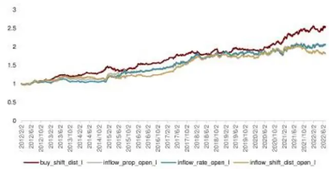
资料来源：Wind，中金公司研究部

注：1）统计时间为2012-02-01至2022-06-30；2）相对净值的比较基准为沪深300 等权指数 000984.CSI

图表71：沪深300范围内表现较好的资金流因子分组年化超额收益统计
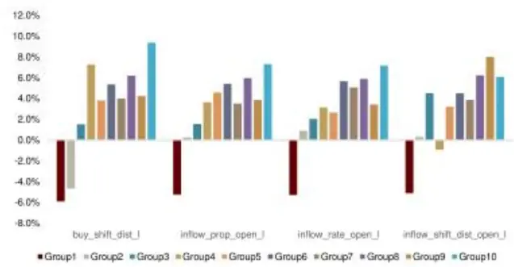
资料来源：Wind，中金公司研究部
注：1）统计时间为2012-02-01至2022-06-30；2）超额收益的比较基准为沪深300 等权指数 000984.CSI；3）Group1 为因子值最小一组，Group10 为因子值最大一组

中证500 范围内，buy_shift_dist_I和inflow_shift_dist_open_l因子的多头组合显著跑赢基准，具有较好的选股能力。而inflow_prop_open_I和inflow_rate_open_I因子则分组收益的单调性相对较差。

图表72：中证500范围内表现较好的资金流因子多头组合相对净值
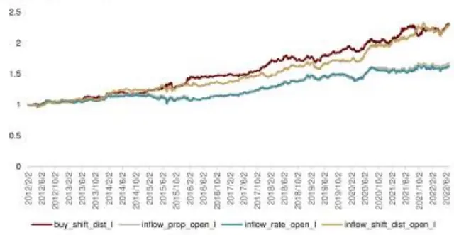
资料来源：Wind，中金公司研究部
注：1）统计时间为2012-02-01至2022-06-30；2）相对净值的比较基准为中证500 等权指数 000982.SH

图表73：中证500范围内表现较好的资金流因子分组年化超额收益统计
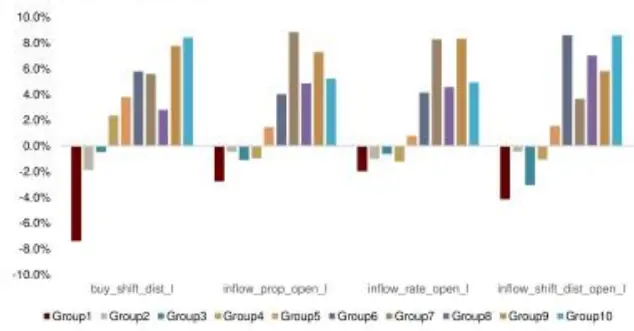
资料来源：Wind，中金公司研究部
注：1）统计时间为2012-02-01至2022-06-30；2）超额收益的比较基准为中证500等权指数 000982.SH；3）Group1为因子值最小一组，Group10 为因子值最大一组

中证1000范围内，推荐关注inflow_shift_dist_open因子。该因子分组单调性相对较好，多头组合显著跑赢基准，多头组合相对净值较为稳健。

图表74：中证1000范围内表现较好的资金流因子多头组合相对净值
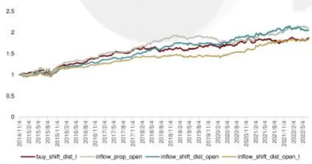
资料来源：Wind，中金公司研究部
注：1）统计时间为2014-11-01至2022-06-30；2）相对净值的比较基准为中证1000 等权指数 000852.SH

图表75：中证1000范围内表现较好的资金流因子分组年化超额收益统计
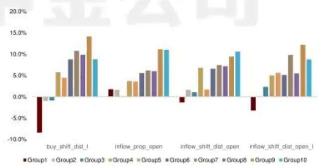
资料来源：Wind，中金公司研究部
注：1）统计时间为2014-11-01至2022-06-30；2）超额收益的比较基准为中证1000 指数 000852.SH；3）Group1为因子值最小一组，Group10为因子值最大一组

## 北向资金流

## north_hold_prop 和north_hold_prefer_lt_chg因子全市场有效性较好

北向资金流因子主要刻画陆股通的持仓偏好情况，该类因子的有效性须建立在陆股通通道的投资者多为理性投资者的基础上，通过跟随“聪明资金”获取额外收益。我们利用陆股通持仓信息构建了9个北向资金流因子，并进行了有效性检验。

图表76：北向资金流因子构建方式

| 因子代码 | 因子名称 | 因子计算公式 |
| --- | --- | --- |
| north_hold_prop | 北向持仓占比因子 | 当日陆股通持仓量/当日流通股本 |
| north_hold_prop_st_chg | 北向持仓占比短期变动因子 | 当日北向持仓占比-过去20个交易日北向持仓占比的均值 |
| north_excess_hold_st | 北向短期超额增持因子 | 当期陆股通持仓量·VWAP/(20个交易日前陆般通持仓量“VWAP+1)·过去20个交易日的涨跌幅 |
| north_inflow_shift_dist | 北向流入的位移路程比因子 | 过去20个交易日（北向单日净流入）之和/过去20个交易日北向单日净流入\|之和；其中。北向单日净流入-当日陆股通持仓量/复权因子- 上日陆股通持仓量/复权因子 |
| north_trade_prop | 北向交易占比因子 | (当期陆股通持仓量“VWAP-20个交易日前陆股通持仓量*VWAP)/20日成交额之和 |
| north_hold_prop_It_chg | 北向持仓占比长期变动因子 | 当日北向持仓占比·过去60个交易日北向持仓占比的均值 |
| north_hold_prefer | 北向持仓偏好因子 | 当期北向持仓市值/当期北向持仓的所有股票市值 |
| north_hold_prefer_st_chg | 北向持仓偏好短期变动因子 | 当期北向持仓偏好因子·过去20个交易日北向持仓偏好因子的均值 |
| north_hold_prefer_it_chg | 北向持仓偏好长期变动因子 | 当期北向持仓偏好因子-过去60个交易日北向持仓偏好因子的均值 |

资料来源：中金公司研究部

north_hold_prop 和north_hold_prefer_It_chg 因子在全市场范围内表现较为优异。我们基于相关性统计，大致将北向资金流因子分为以下两类：持仓占比和持仓变化因子。

持仓占比因子包括仅涉及静态比例的4个因子。north_hold_prop因子在全选股域都表现较为突出，有效性和单调性优良，同时有不俗的选股能力；north_hold_prefer因子在全市场、中证500 和中证 1000 中也表现较好，虽然预测收益能力略逊 north_hold_prop 因子，但是其有效性、单调性和预测能力均优于其他静态占比因子。全市场中，north_hold_prop因子的IC 均值为3.5%，IC_IR为 0.60；north_hold_prefer因子的IC 均值为 3.8%，IC_IR为0.69。

持仓变化因子包括涉及短/长期变动或增持的5个因子。其中，north_hold_prefer_It_chg因子在全选股域都有着较优异的表现。相较于静态占比因子而言，north_hold_prefer_It_chg因子在各选股域中的单调性都略逊一筹，但选股能力在多数选股域中都更好。north_hold_prefer_st_chg 因子在沪深 300 范围内表现较为突出，有着优良的预测能力和较好的有效性，美中不足的是单调性略逊。全市场中，north_hold_prefer_It_chg因子的IC均值为 2.3%，IC_IR 为 0.66；沪深 300 中，north_hold_prefer_st_chg 因子的IC 均值为3.3%，IC_IR为 0.44。

北向持仓占比因子单调性良好，北向持仓变化因子选股能力较强。在各选股域，动态变化因子的多头超额收益相对更高，说明其选股能力较强，但单调性要略逊于静态占比因子。

图表77：北向资金流因子在全市场范围内的有效性检验结果

| 因子 | IC均值 | IC_IR | P(IC<0) | P(IC<-0.02) | P(IC>0) | P(IC>0.02) | t值 | 多头年化收多头年化超 益率 | 额收益 | 多头超额最 大回撒 | 多头平均换 手率 | 单调性 |
| --- | --- | --- | --- | --- | --- | --- | --- | --- | --- | --- | --- | --- |
| north_excess_hold_st | 1.9% | 0.60 | 31.0% | 11.3% | 69.0% | 52.1% | 5.02 | 2.1% | -0.5% | -12.9% | B1.3% | 0.62 |
| north_hold_preter | 3.8% | 0.69 | 29.6% | 15.5% | 70.4% | 63.4% | 5.83 | 8.2% | 5.5% | -14.9% | 23.8% | 0.96 |
| north_hold_prefer_It_chg | 0.4% | 0.08 | 48.6% | 28.6% | 51.4% | 37.1% | 0.71 | 12.7% | 9.8% | -24.8% | 55.8% | 0.42 |
| north_hold_prefer_st_chg | 0.0% | 0.01 | 54.3% | 28.6% | 45.7% | 28.6% | 0.07 | 8.6% | 5.1% | -29.8% | 73.5% | 0.11 |
| north_hold_prop | 3.5% | 0.60 | 31.4% | 17.1% | 68.6% | 55.7% | 5.02 | 9.9% | 7.1% | -21.4% | 22.9% | 0.97 |
| north_hold_prop_It_chg | 2.3% | 0.66 | 25.7% | 11.4% | 74.3% | 50.0% | 5.49 | 10.0% | 7.7% | -17.0% | 57.9% | 0.86 |
| north_hold_prop_st_chg | 1.7% | 0.59 | 28.6% | 10.0% | 71.4% | 44.3% | 4.94 | 7.3% | 4.3% | -19.1% | 76.6% | 0.63 |
| north_inflow_shift_dist | 1.0% | 0.31 | 38.6% | 15.7% | 61.4% | 40.0% | 2.57 | 7.2% | 4.0% | -9.0% | 69.7% | 0.54 |
| north_trade_prop | 0.6% | 0.11 | 51.4% | 31.4% | 48.6% | 37.1% | 0.91 | 10.8% | 7.0% | -22.0% | 73.9% | 0.46 |

资料来源：Wind，中金公司研究部（注：统计时间为2016-07-01至2022-06-30；超额收益的比较基准为全市场等权指数）

图表78：全市场范围内北向资金流因子之间的相关性统计
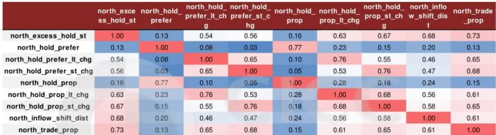
资料来源：Wind，中金公司研究部（注：统计时间为2016-07-01至2022-06-30）

图表79：北向资金流因子在沪深300 范围内的有效性检验结果

| 因子 | IC均值 | IC_IR | P(IC<0) | P(IC<-0.02) | P(IC>0) | P(IC>0.02) | t值 | 多头年化收多头年化超 益率 | 额收益 | 多头超额量 大回道 | 多头平均换 手车 | 单调性 |
| --- | --- | --- | --- | --- | --- | --- | --- | --- | --- | --- | --- | --- |
| north_excess_hold_st | 2.6% | 0.31 | 46.5% | 35.2% | 53.5% | 46.5% | 2.64 | 9.0% | 7.0% | -7.6% | 80.9% | 0.80 |
| north_hold_prefer | 1.1% | 0.10 | 43.7% | 39.4% | 56.3% | 42.3% | 0.80 | 5.3% | 3.2% | -20.2% | 25.5% | 0.27 |
| north_hold_prefer_It_chg | 1.1% | 0.12 | 45.7% | 37.1% | 54.3% | 48.6% | 1.00 | 13.8% | 12.2% | -16.4% | 71.0% | 0.49 |
| north_hokd_prefer_st_chg | 1.0% | 0.11 | 48.6% | 40.0% | 51.4% | 42.9% | 0.93 | 11.0% | 8.8% | -12.0% | 85.8% | 0.22 |
| north_hold_prop | 4.7% | 0.39 | 34.3% | 31.4% | 65.7% | 62.9% | 3.29 | 9.8% | 7.7% | -11.7% | 24.1% | 0.84 |
| north_hold_prop_It_chg | 4.1% | 0.46 | 30.0% | 25.7% | 70.0% | 60.0% | 3.81 | 12.4% | 10.8% | -10.0% | 60.7% | 0.77 |
| north_hold_prop_st_chg | 3.3% | 0.44 | 37.1% | 20.0% | 62.9% | 51.4% | 3.69 | 13.7% | 11.6% | -10.1% | 79.2% | 0.65 |
| north_inflow_shift_dist | 2.4% | 0.31 | 34.3% | 22.9% | 65.7% | 45.7% | 2.60 | 9.1% | 6.8% | -12.2% | 79.9% | 0.66 |
| north_trade_prop | 1.0% | 0.09 | 47.1% | 37.1% | 52.9% | 44.3% | 0.79 | 9.2% | 6.7% | -20.8% | 81.1% | 0.36 |

资料来源：Wind，中金公司研究部（注：统计时间为2016-07-01至2022-06-30；超额收益的比较基准为沪深300等权指数000984.CSI）

图表80：北向资金流因子在中证500范围内的有效性检验结果

| 因子 | IC均值 | IC_IR | P(IC<0) | P(IC<-0.02) | P(IC>0) | P(IC>0.02) | t值 | 多头年化收多头年化超 益率 | 额收益 | 多头超额最 大回撒 | 多头平均换 手率 | 单调性 |
| --- | --- | --- | --- | --- | --- | --- | --- | --- | --- | --- | --- | --- |
| north_excess_hold_st | 2.1% | 0.37 | 36.6% | 23.9% | 63.4% | 50.7% | 3.15 | 3.0% | 3.0% | -12.8% | 85.2% | 0.64 |
| north_hold_preter | 3.8% | 0.39 | 39.4% | 33.8% | 60.6% | 53.5% | 3.28 | 6.5% | 6.3% | -8.7% | 28.2% | 0.86 |
| north_hold_prefer_It_chg | 0.8% | 0.10 | 38.6% | 28.6% | 61.4% | 47.1% | 0.86 | 9.1% | 9.4% | -13.2% | 62.3% | 0.53 |
| north_hold_prefer_st_chg | 0.0% | -0.01 | 42.9% | 25.7% | 57.1% | 42.9% | -0.06 | 4.9% | 4.7% | -7.8% | 79.3% | 0.22 |
| north_hold_prop | 3.8% | 0.47 | 35.7% | 31.4% | 64.3% | 58.6% | 3.91 | 8.5% | 8.2% | -10.7% | 25.6% | 0.93 |
| north_hold_prop_It_chg | 2.5% | 0.40 | 28.6% | 17.1% | 71.4% | 55.7% | 3.38 | 10.3% | 10.7% | -7.4% | 62.7% | 0.73 |
| north_hold_prop_st_chg | 0.8% | 0.15 | 37.1% | 27.1% | 62.9% | 48.6% | 1.22 | 2.7% | 2.6% | -13.5% | 80.4% | 0.35 |
| north_inflow_shift_dist | 1.4% | 0.27 | 41.4% | 27.1% | 58.6% | 45.7% | 2.22 | 4.4% | 3.8% | -12.0% | 78.7% | 0.68 |
| north_trade_prop | 0.3% | 0.04 | 48.6% | 34.3% | 51.4% | 41.4% | 0.31 | 7.7% | 6.9% | -11.8% | 78.2% | 0.33 |

资料来源：Wind，中金公司研究部（注：统计时间为2016-07-01至2022-06-30；超额收益的比较基准为中证500等权指数000982.SH）

图表81：北向资金流因子在中证1000范围内的有效性检验结果

| 因子 | IC均值 | IC_IR | P(IC<0) | P(IC<-0.02) | P(IC>0) | P(IC>0.02) | 值 | 多头年化收多头年化超 益车 | 颤收益 | 多头超额最 大回盖 | 多头平均换 手串 | 单调性 |
| --- | --- | --- | --- | --- | --- | --- | --- | --- | --- | --- | --- | --- |
| north_excess_hold_st | 1.5% | 0.30 | 39.4% | 23.9% | 60.6% | 45.1% | 2.51 | 0.4% | 3.9% | -8.2% | 85.4% | 0.54 |
| north_hold_prefer | 4.0% | 0.59 | 26.8% | 21.1% | 73.2% | 60.6% | 4.99 | 8.4% | 12.7% | -9.8% | 25.0% | 0.95 |
| north_hold_prefer_It_chg | -0.3% | -0.05 | 47.1% | 42.9% | 52.9% | 38.6% | -0.44 | 2.3% | 6.4% | -11.8% | 51.7% | 0.09 |
| north_hold_prefer_st_chg | -0.2% | -0.04 | 50.0% | 35.7% | 50.0% | 31.4% | -0.34 | 2.5% | 6.1% | -9.5% | 76.2% | 0.18 |
| north_hold_prop | 3.2% | 0.52 | 28.6% | 18.6% | 71.4% | 58.6% | 4.38 | 6.9% | 11.1% | -11.1% | 26.0% | 0.94 |
| north_hold_prop_It_chg | 1.5% | 0.31 | 37.1% | 25.7% | 62.9% | 44.3% | 2.55 | 6.3% | 10.7% | -6.1% | 61.1% | 0.64 |
| north_hold_prop_st_chg | 1.2% | 0.27 | 47.1% | 25.7% | 52.9% | 41.4% | 2.22 | 5.7% | 9.4% | -6.1% | 78.2% | 0.38 |
| north_inflow_shift_dist | 0.7% | 0.15 | 45.7% | 24.3% | 54.3% | 41.4% | 1.22 | 3.3% | 6.5% | -10.5% | 73.4% | 0.31 |
| north_trade_prop | 0.4% | 0.06 | 48.6% | 34.3% | 51.4% | 38.6% | 0.53 | 7.0% | 10.2% | -8.7% | 74.7% | 0.23 |

资料来源：Wind，中金公司研究部（注：统计时间为2016-07-01至2022-06-30；超额收益的比较基准为中证1000指数000852.SH）

## 北向持仓变化因子在小市值股票范围内可持续贡献超额收益

沪深300范围内，北向资金因子2020年以前多头组合表现较好，但2020年以来，超额收益波动较大。north_hold_prop、north_hold_prefer_It_chg 和 north_hold_prefer_st_chg 因子多头组合均可跑赢基准，但多头超额收益均逊于因子值第二大的组合。从多头组合相对净值走势来看，近年来存在有效性有明显下滑。

图表82：沪深300范围内表现较好的北向资金流因子多头组合相对净值
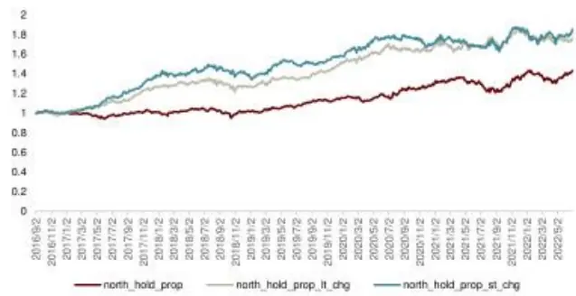
资料来源：Wind，中金公司研究部
注：1）统计时间为2016-09-01至2022-06-30；2）相对净值的比较基准为沪深300 等权指数 000984.CSI

图表83：沪深300范围内表现较好的北向资金流因子分组年化超额收益统计
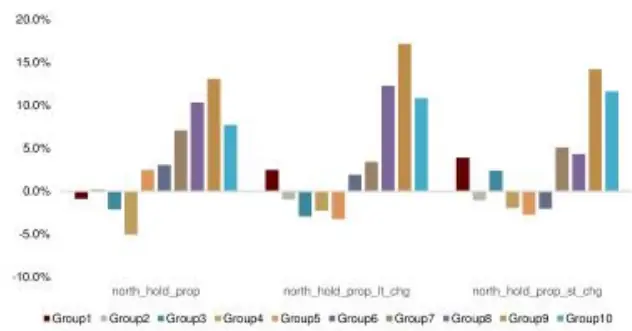
资料来源：Wind，中金公司研究部
注：1）统计时间为2016-07-01至2022-06-30；2）超额收益的比较基准为沪深300等权指数 000984.CSl；3）Group1为因子值最小一组，Group10为因子值最大一组

中证500 范围内，north_hold_prop_It_chg因子多头组合可持续跑赢基准。如下图所示，北向资金因子在中证500范围内的选股能力略优于沪深300范围，尤其是持仓变动因子，统计期内年化超额收益率可达10%。

图表84：中证500范围内表现较好的北向资金流因子多头组合相对净值
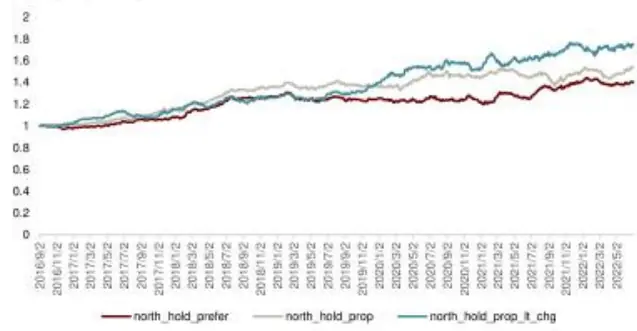
资料来源：Wind，中金公司研究部
注：1）统计时间为2016-09-01至2022-06-30；2）相对净值的比较基准为中证500 等权指数 000982.SH

图表85：中证500范围内表现较好的北向资金流因子分组年化超额收益统计
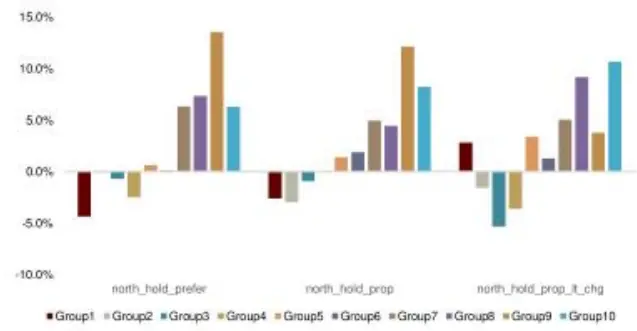
资料来源：Wind，中金公司研究部
注：1）统计时间为2016-07-01 至 2022-06-30；2）超额收益的比较基准为中证500等权指数 000982.SH；3）Group1为因子值最小一组，Group10 为因子值最大一组

中证1000范围内，北向持仓占比因子多头组合收益表现总体较好，但从2021年以来的表现来看，北向持仓变动因子持续性更强。North_hold_prefer、north_hold_prop因子的多头组合年化超额收益率均较高，但2021年以来多头组合相对净值基本跑平；而north_hold_prefer_It_chg因子多头组合则在2021年后依然有持续的超额收益表现。1

图表86：中证1000范围内表现较好的北向资金流因子多头组合相对净值
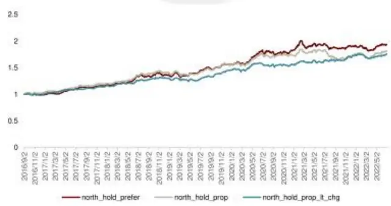
资料来源：Wind，中金公司研究部
注：1）统计时间为2016-09-01至2022-06-30；2）相对净值的比较基准为中证1000 等权指数 000852.SH

图表87：中证1000范围内表现较好的北向资金流因子分组年化超额收益统计
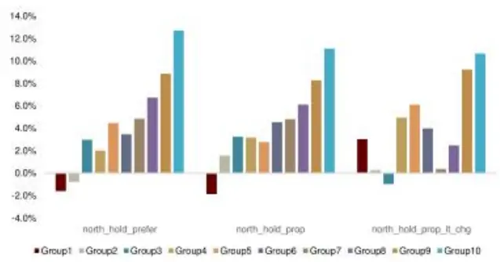
资料来源：Wind，中金公司研究部

注：1）统计时间为2016-07-01至2022-06-30；2）超额收益的比较基准为中证1000 指数 000852.SH；3）Group1 为因子值最小一组，Group10为因子值最大一组

## 融资融券

## 融资融券因子有效性表现一般，单调性欠佳

融资融券因子反映融资融券市场交易活跃程度和资金流向。我们利用融资融券信息构建了12个融资融券类因子，并进行了有效性检验。

图表88：融资融券类因子构建方式

| 因子代码 | 因子名称 | 因子计算公式 |
| --- | --- | --- |
| margin_buy_money_prop | 融资买入占比因子 | 过去20个交易日融资买入额之和/过去20个交易日成交额之和 |
| net_margin_buy_money_prop | 净融资买入占比因子 | (过去20个交易日融资买入额之和·过去20个交易日融资偿还额之和）/过去20个交易日成交额之和 |
| net_margin_buy_money_shift_dist | 净融资买入的位移路程比因子 | 过去20个交易日（融资买入额·融资偿还额）之和/过去20个交易日融资买入额·融资偿还额\|之和 |
| margin_money_bal_grow th | 融资余额增长率因子 | 当期融资余额占比·20个交易日前融资余额占比 |
| margin_money_eg | 融资超额增长率因子 | 当期融资余额/（20个交易日前融资余额+1）·过去20个交易日涨跌幅 |
| margin_money_bal_prop | 融资余额占比因子 | 当期融资余额/流通市值 |
| margin_sel_sec_prop | 融券卖出占比因子 | 过去20个交易日（融券卖出量“VWAP)之和/过去20个交易日成交额之和 |
| net_margin_sell_sec_prop | 净融券卖出占比因子 | 过去20个交易日（融券卖出量·融券偿还量）"VWAP之和/过去20个交易日成交额之和 |
| net_margin_sel_sec_shift_dist | 净融券卖出的位移路程比因子 | 过去20个交易日（融券卖出量·融券偿还量）之和/过去20个交易日融券卖出量·融券偿还量\|之和 |
| margin_sec_bal_grow th | 融券余额增长率因子 | 当期融券余额占比·20个交易日前融券余额占比 |
| mergin_sec_eg | 融券越额增长率因子 | 当期融券余额/（20个交易日前融券余额+1）·过去20个交易日涨跌幅 |
| margin_sec_bal_prop | 融券余额占比因子 | 当期融券余额/流通市值 |

资料来源：中金公司研究部

margin_money_bal_prop 和 margin_sec_bal_growth 因子在中证 500 和中证 1000 中相较而言表现尚可。我们基于相关性统计，大致将融资融券因子分为以下两类：融资因子和融券因子。

融资因子包括所有与融资相关的6个因子。相较于其他融资融券因子而言，margin_money_bal_prop因子在全选股域的单调性较好，且有着平衡的有效性和预测能力表现。其余融资因子的单调性较差，且在全市场范围中收益预测能力不佳。全市场中，margin_money_bal_prop因子的IC 均值为-2.7%，IC_IR为-0.37。

融券因子包括所有与融券相关的 6 个因子。margin_sec_bal_growth 因子在中证 500 和中证1000范围内有着较好的收益预测能力，且有效性和单调性也优于其他融券因子。在沪深300中，net_margin_sell_sec_shift_dist因子有着较好的选股能力，但值得注意的是其稳定性和单调性一般。相比融资因子，融券因子虽然有效性较弱，但是在大部分选股域中单调性较好。中证500中，margin_sec_bal_growth因子的IC 均值为-1.8%，IC_IR为-0.27；沪深 300中，net_margin_sell_sec_shift_dist 因子的IC 均值为-1.5%，IC_IR 为-0.18。

总体而言，融资融券因子在全市场范围单调性欠佳，且有效性一般。只有少数融资融券因子在全选股域表现出一定的分组单调性，大多数融资融券因子在沪深300、中证500和中证1000的IC_IR表现都较为一般。从因子的预测方向来看，无论是融资因子还是融券因子，均表现为负面的预测效果，即融资买入（或融券卖出）占比越高，未来收益表现越弱。

图表89：融资融券因子在全市场范围内的有效性检验结果

| 因子 | IC均值 | IC_IR | P(IC<0) | P(IC<-0.02) | P(IC>0) | P(IC>0.02) | t值 | 益率 | 多头年化收多头年化超多头超额量多头平均换 额收益 | 大回盖 | 手率 | 单调性 |
| --- | --- | --- | --- | --- | --- | --- | --- | --- | --- | --- | --- | --- |
| margin_buy_money_prop | -0.1% | -0.02 | 52.2% | 40.7% | 47.8% | 38.1% | -0.18 | 5.1% | -4.5% | -49.9% | 50.6% | 0.22 |
| margin_money_bal_grow th | 0.4% | 0.06 | 47.8% | 33.6% | 52.2% | 35.4% | 0.64 | 3.0% | -5.0% | -51.3% | 82.0% | 0.35 |
| margin_money_bal_prop | -2.7% | -0.37 | 68.1% | 54.0% | 31.9% | 26.5% | -3.94 | 8.5% | -0.4% | -38.0% | 26.2% | 0.73 |
| margin_money_eg | 0.6% | 0.09 | 51.3% | 34.5% | 48.7% | 38.9% | 0.96 | 4.9% | -4.2% | -53.8% | 85.2% | 0.40 |
| margin_sec_bal_grow th | -1.1% | -0.25 | 54.0% | 37.2% | 46.0% | 26.5% | -2.65 | 6.5% | -2.8% | -39.2% | 82.7% | 0.47 |
| margin_sec_bal_prop | -1.9% | -0.41 | 61.1% | 47.8% | 38.9% | 25.7% | -4.32 | 3.5% | -5.4% | -57.0% | 40.5% | 0.18 |
| margin_sec_eg | -1.2% | -0.27 | 60.2% | 46.0% | 39.8% | 21.2% | -2.84 | 7.6% | -1.6% | -45.5% | 74.9% | 0.45 |
| margin_sell_sec_prop | 0.3% | 0.04 | 45.1% | 39.8% | 54.9% | 36.3% | 0.41 | 4.8% | -4.5% | -50.1% | 45.1% | 0.02 |
| net_margin_buy_money_prop | -1.9% | -0.34 | 62.8% | 44.2% | 37.2% | 23.9% | -3.57 | 6.8% | -2.8% | -40.7% | 81.9% | 0.34 |
| net_margin_buy_money_shift_dist | -2.2% | -0.38 | 62.8% | 46.0% | 37.2% | 23.9% | -4.00 | 5.3% | -4.2% | -47.4% | 84.5% | 0.55 |
| net_margin_sel_sec_prop | -0.5% | -0.11 | 46.0% | 31.9% | 54.0% | 30.1% | -1.13 | 6.9% | -2.9% | .48.7% | 83.8% | 0.61 |
| net_margin_sell_sec_shift_dist | -1.1% | -0.20 | 60.2% | 38.9% | 39.8% | 25.7% | -2.15 | 9.1% | -0.5% | -48.5% | 87.5% | 0.25 |

资料来源：Wind，中金公司研究部（注：统计时间为2010-04-01至2022-06-30；超额收益的比较基准为全市场等权指数）

图表90：全市场范围内融资融券因子之间的相关性统计

|  | margin_buy margin_mo margin_mo |  |  | margin_secmargin_mo |  |  |  | mcaninicoll | net_marginnet_margin |  | net_margin net_margin |  |
| --- | --- | --- | --- | --- | --- | --- | --- | --- | --- | --- | --- | --- |
|  | _money_pr ney_bal_gro nop wth |  | ey_bal_prop | ney_eg | _bal_growth | _bal_prop | _.eg | _sec_prop | buy_mone _buy_money prop y_shift_dist |  |  |  |
|  |  |  |  |  |  |  |  |  |  |  | rop hift_dist |  |
| margin_buy_money_prop | 1.00 | 0.15 | 0.49 | 0.16 | 0.01 | 0.06 | 0.03 | 0.01 | 0.16 0.19 |  | 0.00 0.00 |  |
| margin_money_bal_growth | 0.15 | 1.00 | 0.07 | 0.84 | -0.01 | -0.02 | -0.02 | -0.04 | 0.50 0.51 |  | -0.02 | -0.02 |
| margin_money_bal_prop | 0.49 | 0.07 | 1.00 | 0.04 | -0.01 | 0.18 | 0.04 | 0.07 | -0.08 -0.07 |  | -0.02 | -0.02 |
| margin_money_eg | 0.16 | 0.84 | 0.04 | 1.00 | 0.03 | -0.03 | -0.03 | -0.05 | 0.59 0.63 |  | -0.03 | -0.03 |
| margin_sec_bal_growth | 0.01 | -0.01 | -0.01 | -0.03 | 1.00 | 0.21 | 0.67 | 0.07 | 0.08 0.09 |  | 0.89 | 0.79 |
| margin_sec_bal_prop | 0.06 | -0.02 | 0.18 | -0.03 | 0.21 | 1.00 | 0.30 | 0.58 | 0.01 0.00 |  | 0.20 | 0.22 |
| margin_sec_eg | 0.03 | -0.02 | 0.04 | -0.03 | 0.67 | 0.30 | 1.00 | 0.16 | 0.06 0.06 |  | 0.65 | 0.79 |
| margin_sell_sec_prop | 0.01 | -0.04 | 0.07 | -0.05 | 0.07 | 0.58 | 0.16 | 1.00 | -0.10 -0.11 |  | 0.09 | 0.11 |
| net_margin_buy_money_prop | 0.16 | 0.50 | -0.08 | 0.59 | 0.08 | 0.01 | 0.06 | -0.10 | 1.00 | 0.95 | 0.07 | 0.09 |
| net_margin_buy_money_shift_dist | 0.19 | 0.51 | -0.07 | 0.63 | 0.09 | 0.00 | 0.06 | -0.11 | 0.95 | 1.00 | 0.07 | 0.09 |
| net_margin_sell_sec_prop | 0.00 | -0.02 | -0.02 | -0.03 | 0.89 | 0.20 | 0.65 | 0.09 | 0.07 0.07 |  | 1.00 | 0.80 |
| net_margin_sell_sec_shift_dist | 0.00 | -0.02 | -0.02 | -0.03 | 0.79 | 0.22 | 0.79 | 0.11 | 0.09 0.09 |  | 0.80 | 1.00 |

资料来源：Wind，中金公司研究部（注：统计时间为2010-04-01至2022-06-30）

图表91：融资融券因子在沪深300范围内的有效性检验结果

| 因子 | IC均值 | IC_IR | P(IC<0) | P(IC<-0.02) | P(IC>0) | P(IC>0.02) | t值 | 多头年化收多头年化超 益率 | 额收益 | 多头超额最 大回道 | 多头平均换 手率 | 单调性 |
| --- | --- | --- | --- | --- | --- | --- | --- | --- | --- | --- | --- | --- |
| margin_buy_money_prop | -1.9% | -0.16 | 54.0% | 45.1% | 46.0% | 39.8% | -1.68 | 5.6% | 3.6% | -25.0% | 48.5% | 0.35 |
| margin_money_bal_growth | -0.1% | -0.01 | 49.6% | 41.6% | 50.4% | 42.5% | -0.12 | -0.4% | -1.4% | -35.0% | 83.6% | 0.02 |
| margin_money_bal_prop | -2.1% | -0.29 | 61.9% | 49.6% | 38.1% | 29.2% | -3.10 | 5.2% | 4.6% | -19.9% | 24.5% | 0.56 |
| margin_money_eg | 0.5% | 0.05 | 42.5% | 35.4% | 57.5% | 46.0% | 0.57 | 5.9% | 4.5% | -20.5% | 85.6% | 0.26 |
| margin_sec_bal_grow th | -1.5% | -0.19 | 59.3% | 46.0% | 40.7% | 31.0% | -2.00 | 5.8% | 4.6% | -14.2% | 85.3% | 0.76 |
| margin_sec_bal_prop | -1.6% | -0.13 | 60.2% | 53.1% | 39.8% | 37.2% | -1.37 | 5.0% | 3.7% | -15.1% | 36.6% | 0.17 |
| margin_sec_eg | -1.6% | -0.20 | 56.6% | 47.8% | 43.4% | 31.9% | -2.13 | 7.6% | 5.8% | -19.3% | 88.4% | 0.65 |
| margin_sell_sec_prop | 0.1% | 0.01 | 50.4% | 44.2% | 49.6% | 35.4% | 0.16 | 2.7% | 1.4% | -26.2% | 49.0% | 0.13 |
| net_margin_buy_money_prop | -0.7% | -0.09 | 51.3% | 38.9% | 48.7% | 31.0% | -0.97 | 4.2% | 2.4% | -17.0% | 80.7% | 0.08 |
| net_margin_buy_money_shift_dist | -1.0% | -0.13 | 54.0% | 43.4% | 46.0% | 31.0% | -1.38 | 3.5% | 1.8% | -14.4% | 84.4% | 0.15 |
| net_margin_sell _sec_prop | -1.5% | -0.20 | 56.6% | 46.9% | 43.4% | 31.0% | -2.12 | 7.2% | 5.4% | -10.6% | 87.8% | 0.74 |
| net_margin_sell_sec_shift_dist | -1.5% | -0.18 | 54.0% | 48.7% | 46.0% | 31.9% | -1.96 | 10.2% | 8.5% | -13.5% | 89.5% | 0.58 |

资料来源：Wind，中金公司研究部（注：统计时间为2010-04-01至2022-06-30；超额收益的比较基准为沪深300等权指数 000984.CSI）

图表92：融资融券因子在中证 500 范围内的有效性检验结果

| 因子 | IC均值 | IC_IR | P(IC<0) | P(IC<-0.02) | P(IC>0) | P(IC>0.02) | t值 | 多头年化收多头年化超 益率 | 额收益 | 多头超额最多头平均换 大回撤 | 手率 | 单调性 |
| --- | --- | --- | --- | --- | --- | --- | --- | --- | --- | --- | --- | --- |
| margin_buy_money_prop | -1.2% | -0.13 | 60.2% | 46.0% | 39.8% | 27.4% | -1.39 | 9.3% | 1.0% | -27.7% | 50.2% | 0.14 |
| margin_money_bal_grow th | -0.2% | -0.02 | 55.8% | 41.6% | 44.2% | 36.3% | -0.24 | 6.4% | 0.1% | -24.1% | 85.8% | 0.00 |
| margin_money_bal_prop | -3.8% | -0.38 | 67.3% | 61.1% | 32.7% | 27.4% | -4.03 | 12.7% | 4.5% | -21.3% | 26.5% | 0.76 |
| margin_money_eg | -0.1% | -0.01 | 49.6% | 38.9% | 50.4% | 38.1% | -0.12 | 8.6% | 1.7% | -36.9% | 85.5% | 0.04 |
| margin_sec_bal_growth | -1.8% | -0.27 | 62.8% | 49.6% | 37.2% | 25.7% | -2.92 | 11.8% | 5.1% | -11.3% | 84.3% | 0.71 |
| margin_sec_bal_prop | -1.6% | -0.20 | 57.5% | 44.2% | 42.5% | 31.9% | -2.15 | 9.7% | 2.0% | -34.7% | 44.1% | 0.50 |
| margin_sec_eg | -0.7% | -0.10 | 54.9% | 39.8% | 45.1% | 33.6% | -1.09 | 10.5% | 3.7% | -16.6% | 82.9% | 0.13 |
| margin_sell_sec_prop | 1.4% | 0.14 | 45.1% | 40.7% | 54.9% | 50.4% | 1.49 | 11.1% | 3.4% | -20.9% | 46.4% | 0.07 |
| net_margin_buy_money_prop | -1.6% | -0.20 | 55.8% | 45.1% | 44.2% | 34.5% | -2.16 | 9.6% | 1.8% | -27.8% | 82.3% | 0.16 |
| net_margin_buy_money_shift_dist | -2.3% | -0.28 | 56.6% | 49.6% | 43.4% | 32.7% | -2.95 | 10.2% | 2.4% | -23.9% | 84.8% | 0.41 |
| net_margin_seli_sec_prop | -0.8% | -0.11 | 52.2% | 42.5% | 47.8% | 34.5% | -1.14 | 15.5% | 7.2% | -13.0% | 85.3% | 0.39 |
| net_margin_sell_sec_shift_dist | -0.1% | -0.01 | 47.8% | 37.2% | 52.2% | 35.4% | -0.12 | 10.2% | 2.5% | -27.1% | 87.5% | 0.57 |

资料来源：Wind，中金公司研究部（注：统计时间为2010-04-01至2022-06-30；超额收益的比较基准为中证500等权指数 000982.SH）

图表93：融资融券因子在中证1000范围内的有效性检验结果

| 因子 | IC均值 | IC_IR | P(IC<0) | P(IC<-0.02) | P(IC>0) | P(IC>0.02) | 值 | 多头年化收多头年化超 益率 | 额收益 | 多头超额最 大回 | 多头平均换 手车 | 单调性 |
| --- | --- | --- | --- | --- | --- | --- | --- | --- | --- | --- | --- | --- |
| margin_buy_money_prop | 1.6% | 0.19 | 46.7% | 33.7% | 53.3% | 44.6% | 1.80 | 9.4% | 8.8% | -19.6% | 51.0% | 0.64 |
| margin_money_bal_grow th | 1.9% | 0.19 | 50.0% | 38.0% | 50.0% | 41.3% | 1.83 | 3.1% | 2.9% | -23.2% | 86.1% | 0.39 |
| margin_money_bal_prop | -2.1% | -0.19 | 57.6% | 47.8% | 42.4% | 35.9% | -1.80 | 11.2% | 9.6% | -20.0% | 24.0% | 0.66 |
| margin_money_eg | 1.9% | 0.21 | 41.3% | 34.8% | 58.7% | 47.8% | 2.04 | 4.6% | 3.9% | -24.2% | 83.9% | 0.45 |
| margin_sec_bal_growth | -2.2% | -0.34 | 64.1% | 58.7% | 35.9% | 28.3% | -3.22 | 5.7% | 5.2% | -28.9% | 80.7% | 0.51 |
| margin_sec_bal_prop | -2.1% | -0.22 | 60.9% | 54.3% | 39.1% | 27.2% | -2.15 | -0.1% | -0.7% | -35.1% | 40.8% | 0.25 |
| margin_sec_eg | -1.7% | -0.23 | 56.5% | 46.7% | 43.5% | 29.3% | -2.23 | 3.9% | 3.1% | -24.7% | 72.6% | 0.18 |
| margin_seil_sec_prop | 1.2% | 0.12 | 51.1% | 38.0% | 48.9% | 39.1% | 1.18 | 5.5% | 4.8% | -31.0% | 42.1% | 0.53 |
| net_margin_buy_money_prop | -3.0% | -0.31 | 60.9% | 54.3% | 39.1% | 31.5% | -2.97 | 10.7% | 9.3% | -21.1% | 81.6% | 0.58 |
| net_margin_buy_money_shift_dist | -2.9% | -0.33 | 62.0% | 54.3% | 38.0% | 28.3% | -3.16 | 5.7% | 4.6% | -19.9% | 85.4% | 0.51 |
| net_margin_sell_sec_prop | -1.4% | -0.19 | 50.0% | 42.4% | 50.0% | 38.0% | -1.81 | 3.9% | 2.8% | -25.5% | 81.6% | 0.39 |
| net_margin_sell_sec_shift_dist | -1.4% | -0.15 | 55.4% | 50.0% | 44.6% | 38.0% | -1.42 | 1.7% | 0.7% | -28.2% | 85.2% | 0.11 |

资料来源：Wind，中金公司研究部（注：统计时间为2014-11-01至2022-06-30；超额收益的比较基准为中证1000指数000852.SH）

## 融资融券因子分组单调性欠佳，多头组合收益不稳定

总体来看，融资融券因子多头组合收益表现不够稳定，分组单调性欠佳。融资余额占比因子(margin_money_bal_prop)在沪深 300、中证 500、中证1000指数范围内，长期均可跑赢基准，但从多头组合的相对净值来看，均呈现阶段性失效的情况，并且分组单调性不佳，说明该因子的选股能力不够稳定，受风格影响较大。

图表94：沪深 300范围内表现较好的融资融券因子多头组合相对净值
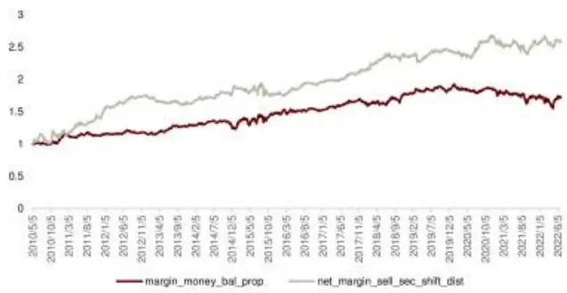
资料来源：Wind，中金公司研究部
注：1）统计时间为2010-05-01至2022-06-30；2）相对净值的比较基准为沪深300 等权指数 000984.CSI

图表95：沪深300 范围内表现较好的融资融券因子分组年化超额收益统计
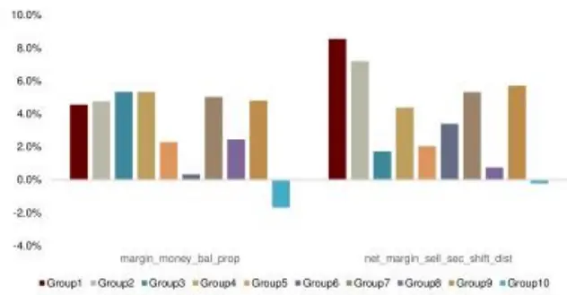
资料来源：Wind，中金公司研究部
注：1）统计时间为2010-04-01至2022-06-30；2）超额收益的比较基准为沪深300 等权指数 000984.CSl；3）Group1 为因子值最小一组，Group10 为因子值最大一组

图表 96：中证500 范围内表现较好的融资融券因子多头组合相对净值
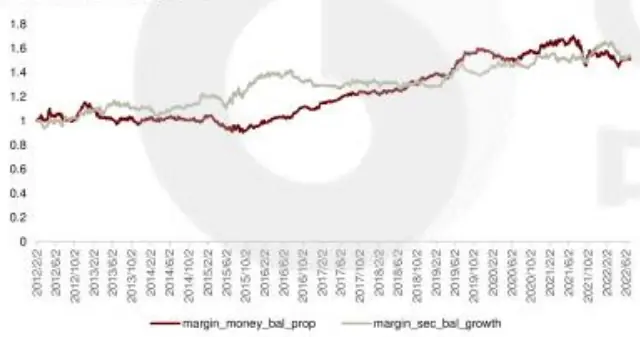
资料来源：Wind，中金公司研究部
注：1）统计时间为2012-02-01至2022-06-30；2）相对净值的比较基准为中证500 等权指数 000982.SH

图表 97：中证500 范围内表现较好的融资融券因子分组年化超额收益统计
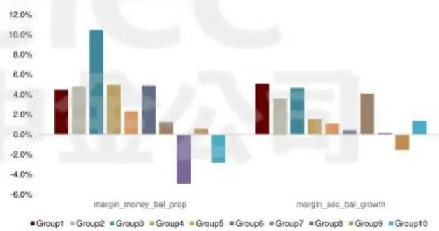

## 资料来源：Wind，中金公司研究部

注：1）统计时间为2010-04-01至2022-06-30；2）超额收益的比较基准为中证500等权指数 000982.SH；3）Group1为因子值最小一组，Group10为因子值最大一组

图表98：中证1000范围内表现较好的融资融券因子多头组合相对净值
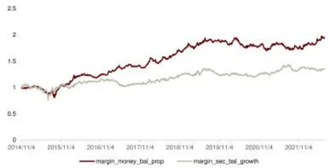
资料来源：Wind，中金公司研究部
注：1）统计时间为2014-11-01至2022-06-30；2）相对净值的比较基准为中证1000 等权指数 000852.SH

图表99：中证1000 范围内表现较好的融资融券因子分组年化超额收益统计
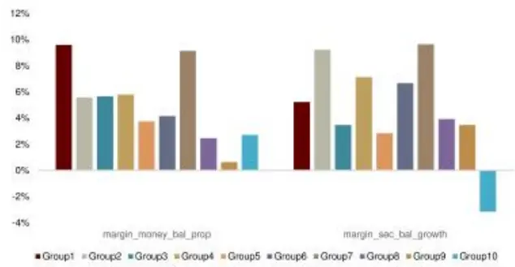
资料来源：Wind，中金公司研究部

注：1）统计时间为2014-11-01至2022-06-30；2）超额收益的比较基准为中证1000 指数 000852.SH；3) Group1 为因子值最小一组，Group10 为因子值最大一组

## 价量复合因子

## 大部分价量复合因子之间相关性较低

我们取前文分析的各类因子中，选股效果较好的因子，按同类型因子等权合成的方式，构建了12个复合因子。复合因子的具体构建方式如下表所示，复合因子合成过程中，我们对因子的方向进行了调整，使各个复合因子均与下期收益率正相关。

图表100：价量复合因子构建方式

| 复合因子 | 因子 | 因子权重 |
| --- | --- | --- |
| 动量-隔夜 | mmt_overnight_A | 50.00% |
| 动量-隔夜 | mmt_report_overnight | 50.00% |
| 动量-报告期 | mmt_report_jump_open | 50.00% |
| 动量-报告期 | mmt_report_period | 50.00% |
| 动量-年动量 | mmt_off_limit_A | 100.00% |
| 反转 | mmt_intraday_M | 50.00% |
| 反转 | mmt_range_M | 50.00% |
| 波动率 | vol_highlow_std_6M | 25.00% |
| 波动率 | vol_up_std_6M | 25.00% |
| 波动率 | vol_upshadow_std_6M | 25.00% |
| 波动率 | vol_w_downshadow_std_6M | 25.00% |
| 流动性-换手率 | liq_turn_std_6M | 100.00% |
| 流动性-价格弹性 | liq_shortcut_avg_1M | 50.00% |
| 流动性-价格弹性 | liq_vstd_1M | 50.00% |
| 资金流-大小单流向 | buy_shift_dist_I | 50.00% |
| 资金流-大小单流向 | act_buy_shift_dist_s | 50.00% |
| 资金流-开盘流向 | inflow_rate_open | 16.67% |
| 资金流-开盘流向 | inflow_prop_open | 16.67% |
| 资金流-开盘流向 | inflow_shift_dist_open | 16.67% |
| 资金流-开盘流向 | inflow_shift_dist_open_I | 50.00% |
| 北向-持仓占比 | north_hold_prefer | 50.00% |
| 北向-持仓占比 | north_hold_prop | 50.00% |
| 北向-持仓变化 | north_hold_prop_It_chg | 50.00% |
| 北向-持仓变化 | north_hold_prop_st_chg | 50.00% |
| 量价相关性 | corr_ret_turnd_1M | 33.33% |
| 量价相关性 | corr_price_turn_1M | 33.33% |
| 量价相关性 | corr_ret_turn_post_1M | 33.33% |

资料来源：中金公司研究部

大部分复合因子之间的相关性较弱。我们统计了各类复合因子之间的相关性系数，如下表所示。绝大部分复合因子之间相关系数在0.25以下，仅流动性-换手率因子分别与波动率因子、流动性-价格弹性因子之间相关系数较高，说明流动性-换手率因子既含有波动率方面的信息，又包含了流动性方面的信息，相较而言，换手率因子与波动率因子的相关性更高一些。除此之外，量价相关性因子与反转因子具有弱相关性，相关系数0.38。

图表101：全市场范围内复合因子之间的相关性统计
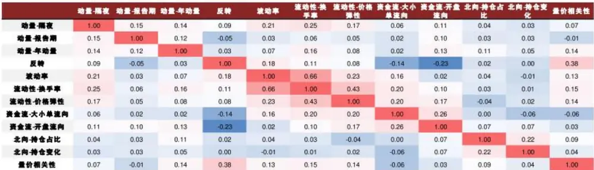
资料来源：Wind，中金公司研究部（注：统计时间为2016-09-02至2022-06-30）

## 价量复合因子选股能力较强，推荐关注量价相关性因子

我们在上述因子有效性检验框架下测试了价量复合因子在不同选股范围内的有效性情况，如下图所示。

价量复合因子大多分组单调性较好，但部分因子的预测能力主要由空头部分贡献，多头组合超额收益相对较低。如下表所示，价量复合因子的单调性指标大多在0.85以上，部分因子分组单调性、IC_IR表现均较好，但多头年化超额表现相对较弱，如：波动率因子等，这类因子的预测能力主要由空头部分贡献。

沪深300范围内推荐关注量价相关性因子、北向持仓变化因子。沪深300范围内，量价相关性因子、北向持仓变化因子的ICIR分别为0.50、0.49，IC均值分别为5.1%、4.0%，并且多头年化超额表现均较好。其中，量价相关性因子多头组合超额收益的最大回撤相对较高，应用时亦须警惕阶段性失效的风险。

中小市值范围内则推荐关注换手率因子、反转因子。中证1000范围内，换手率因子、反转因子的IC_IR分别为0.81、0.78，IC均值分别为8.0%、6.9%，多头组合年化超额收益亦有较好的表现。资金流因子虽然ICIR表现在价量因子中表现不算突出，但考虑到它与动量、波动率、流动性因子相关性均较低，仍可作为有效的增量信息加入多因子模型中使用。

图表102：复合因子在全市场范围内的有效性检验结果

| 复合因子 | IC均值 | IC_IR | P(IC<0) | P(IC<-0.02) | P(IC>0) | P(IC>0.02) | 值 | 多头年化收多头年化超多头超额最多头平均换 益率 | 额收益 | 大回道 | 手率 | 单调性 |
| --- | --- | --- | --- | --- | --- | --- | --- | --- | --- | --- | --- | --- |
| 动量隔夜 | 3.6% | 0.75 | 25.3% | 16.0% | 74.7% | 65.3% | 9.16 | 11.5% | 2.8% | -11.1% | 37.7% | 0.88 |
| 动量-报告期 | 2.0% | 0.47 | 28.7% | 18.0% | 71.3% | 50.0% | 5.75 | 10.7% | 2.1% | -10.7% | 44.0% | 0.95 |
| 动量-年动量 | 2.5% | 0.29 | 40.7% | 28.0% | 59.3% | 53.3% | 3.57 | 11.2% | 2.3% | -20.3% | 32.6% | 0.89 |
| 反转 | 7.5% | 0.92 | 16.0% | 10.7% | 84.0% | 75.3% | 11.26 | 15.7% | 6.7% | -9.1% | 89.4% | 0.87 |
| 波动率 | 7.2% | 0.59 | 30.0% | 24.0% | 70.0% | 68.0% | 7.28 | 13.0% | 2.8% | -16.5% | 28.0% | 0.83 |
| 流动性-换手率 | 6.9% | 0.77 | 24.0% | 18.0% | 76.0% | 68.7% | 9.39 | 19.1% | 9.3% | -5.4% | 25.2% | 0.95 |
| 流动性-价格弹性 | 5.8% | 0.68 | 23.3% | 18.7% | 76.7% | 70.7% | 8.38 | 14.7% | 4.8% | -12.6% | 29.6% | 0.82 |
| 资金流-大小单流向 | 4.1% | 0.66 | 26.5% | 15.9% | 73.5% | 62.8% | 7.05 | 19.8% | 4.9% | -10.3% | 79.3% | 0.90 |
| 资金流-开盘流向 | 2.3% | 0.40 | 34.5% | 23.9% | 65.5% | 49.6% | 4.21 | 18.3% | 3.9% | -9.7% | 79.2% | 0.98 |
| 北向特仓占比 | 2.4% | 0.57 | 27.8% | 18.1% | 72.2% | 55.6% | 4.82 | 9.5% | 6.8% | -19.0% | 20.7% | 0.78 |
| 北向-持仓变化 | 1.2% | 0.39 | 31.4% | 14.3% | 68.6% | 44.3% | 3.29 | 9.0% | 6.6% | -19.2% | 61.2% | 0.55 |
| 量价相关性 | 5.9% | 1.00 | 18.7% | 9.3% | 81.3% | 76.0% | 12.28 | 17.5% | 7.8% | -9.2% | 85.3% | 0.96 |

资料来源：Wind，中金公司研究部（注：统计时间为2010-04-01至2022-06-30；超额收益的比较基准为全市场等权指数）

图表103：复合因子在沪深300范围内的有效性检验结果

| 复合因子 | IC均值 | IC_IR | P(IC<0) | P(IC<-0.02) | P(IC>0) | P(IC>0.02) | t准值 | 多头年化收多头年化超多头超额最多头平均换 益率 | 额收益 | 大回道 | 手率 | 单调性 |
| --- | --- | --- | --- | --- | --- | --- | --- | --- | --- | --- | --- | --- |
| 动量-隔夜 | 2.4% | 0.26 | 41.3% | 29.3% | 58.7% | 49.3% | 3.18 | 6.9% | 6.7% | -18.6% | 36.8% | 0.61 |
| 动量-报告期 | 1.7% | 0.22 | 38.7% | 31.3% | 61.3% | 52.7% | 2.65 | 9.3% | 9.1% | -17.1% | 43.8% | 0.66 |
| 动量-年动量 | 3.7% | 0.25 | 36.7% | 33.3% | 63.3% | 56.0% | 3.06 | 12.9% | 12.7% | -18.8% | 32.5% | 0.94 |
| 反转 | 4.2% | 0.36 | 36.7% | 32.0% | 63.3% | 55.3% | 4.44 | 7.9% | 7.8% | -13.0% | 88.1% | 0.84 |
| 波动率 | 4.6% | 0.32 | 38.0% | 33.3% | 62.0% | 60.0% | 3.90 | 5.5% | 3.9% | 21.7% | 25.6% | 0.56 |
| 流动性-换手率 | 3.6% | 0.39 | 35.3% | 26.7% | 64.7% | 58.7% | 4.74 | 4.6% | 4.3% | -17.7% | 25.0% | 0.63 |
| 流动性-价格弹性 | 3.0% | 0.25 | 39.3% | 32.0% | 60.7% | 56.7% | 3.05 | 6.4% | 5.4% | -21.1% | 28.8% | 0.76 |
| 资金流-大小单流向 | 3.5% | 0.33 | 38.9% | 31.0% | 61.1% | 55.8% | 3.54 | 12.3% | 7.3% | -11.2% | 78.1% | 0.89 |
| 资金流-开盘流向 | 2.8% | 0.24 | 39.8% | 31.0% | 60.2% | 50.4% | 2.58 | 12.0% | 7.5% | -12.9% | 78.8% | 0.93 |
| 北向持仓占比 | 4.0% | 0.38 | 34.7% | 27.8% | 65.3% | 59.7% | 3.25 | 7.3% | 5.3% | -12.4% | 22.6% | 0.88 |
| 北向持仓变化 | 4.0% | 0.49 | 31.4% | 24.3% | 68.6% | 57.1% | 4.13 | 17.2% | 15.7% | -8.8% | 73.3% | 0.70 |
| 量价相关性 | 5.1% | 0.50 | 32.7% | 24.7% | 67.3% | 60.0% | 6.18 | 11.5% | 10.7% | -23.2% | 85.0% | 0.93 |

资料来源：Wind，中金公司研究部（注：统计时间为2010-04-01至2022-06-30；超额收益的比较基准为沪深300等权指数000984.CSI）

图表104：复合因子在中证500范围内的有效性检验结果

| 复合因子 | IC均值 | IC_IR | P(IC<0) | P(IC<-0.02) | P(IC>0) | P(IC>0.02) | t值 益率 | 多头年化收多头年化超多头超额最多头平均换 | 额收益 | 大回撤 | 手串 | 单调性 |
| --- | --- | --- | --- | --- | --- | --- | --- | --- | --- | --- | --- | --- |
| 动量-隔夜 | 3.6% | 0.52 | 28.7% | 16.7% | 71.3% | 58.7% | 6.32 | 9.1% | 5.8% | -11.8% | 37.0% | 0.90 |
| 动量-报告期 | 2.2% | 0.36 | 42.0% | 26.0% | 58.0% | 52.0% | 4.35 | 7.9% | 4.7% | -11.4% | 43.5% | 0.92 |
| 动量-年动量 | 1.9% | 0.16 | 48.7% | 44.0% | 51.3% | 49.3% | 1.98 | 8.9% | 5.6% | -28.1% | 33.9% | 0.75 |
| 反转 | 5.7% | 0.59 | 24.7% | 20.7% | 75.3% | 66.0% | 7.21 | 9.8% | 6.6% | -10.5% | 89.3% | 0.93 |
| 波动率 | 6.2% | 0.51 | 30.7% | 26.0% | 69.3% | 66.7% | 6.20 | 9.2% | 5.0% | -14.8% | 29.5% | 0.80 |
| 流动性-换手率 | 6.0% | 0.70 | 21.3% | 18.0% | 78.7% | 71.3% | 8.60 | 12.2% | 8.5% | -12.9% | 26.3% | 0.91 |
| 流动性-价格弹性 | 5.0% | 0.49 | 30.0% | 24.0% | 70.0% | 64.0% | 5.98 | 7.5% | 3.5% | -17.7% | 29.7% | 0.72 |
| 资金流-大小单流向 | 3.8% | 0.53 | 30.1% | 22.1% | 69.9% | 63.7% | 5.64 | 15.8% | 7.6% | -10.8% | 79.8% | 0.82 |
| 资金流-开盘流向 | 2.8% | 0.35 | 34.5% | 28.3% | 65.5% | 54.9% | 3.69 | 18.1% | 10.0% | -8.8% | 77.8% | 0.94 |
| 北向持仓占比 | 3.9% | 0.42 | 37.5% | 31.9% | 62.5% | 55.6% | 3.56 | 10.2% | 9.9% | -6.8% | 24.3% | 0.92 |
| 北向持仓变化 | 1.7% | 0.29 | 32.9% | 27.1% | 67.1% | 54.3% | 2.39 | 5.0% | 5.4% | -11.0% | 73.2% | 0.70 |
| 量价相关性 | 4.0% | 0.53 | 32.7% | 22.7% | 67.3% | 60.7% | 6.46 | 8.6% | 4.9% | -13.4% | 85.1% | 0.91 |

资料来源：Wind，中金公司研究部（注：统计时间为2010-04-01至2022-06-30；超额收益的比较基准为中证500等权指数000982.SH）

图表105：复合因子在中证1000范围内的有效性检验结果

| 复合因子 | IC均值 | IC_IR | P(IC<0) | P(IC<-0.02) | P(IC>0) | P(IC>0.02) | 值 益率 | 多头年化收多头年化超 额收益 |  | 多头超额最多头平均换 大回 | 手率 | 单调性 |
| --- | --- | --- | --- | --- | --- | --- | --- | --- | --- | --- | --- | --- |
| 动量-隔夜 | 4.3% | 0.70 | 28.3% | 13.0% | 71.7% | 57.6% | 6.71 | 10.1% | 9.3% | -12.1% | 40.3% | 0.86 |
| 动量-报告期 | 2.3% | 0.37 | 37.0% | 25.0% | 63.0% | 50.0% | 3.58 | 7.5% | 6.9% | -11.2% | 46.6% | 0.85 |
| 动量-年动量 | 2.7% | 0.27 | 40.2% | 33.7% | 59.8% | 53.3% | 2.58 | 11.8% | 11.0% | -14.9% | 34.6% | 0.79 |
| 反转 | 6.9% | 0.78 | 26.1% | 14.1% | 73.9% | 72.8% | 7.44 | 12.6% | 11.9% | -14.2% | 89.6% | 0.81 |
| 波动率 | 7.9% | 0.65 | 26.1% | 22.8% | 73.9% | 72.8% | 6.25 | 9.8% | 7.8% | -15.0% | 30.2% | 0.82 |
| 流动性-换手率 | 8.0% | 0.81 | 18.5% | 13.0% | 81.5% | 72.8% | 7.82 | 17.9% | 16.3% | -10.3% | 27.5% | 0.95 |
| 流动性-价格弹性 | 5.8% | 0.64 | 27.2% | 17.4% | 72.8% | 69.6% | 6.11 | 11.3% | 9.7% | -15.7% | 30.4% | 0.85 |
| 资金流-大小单流向 | 4.3% | 0.56 | 22.8% | 20.7% | 77.2% | 70.7% | 5.40 | 12.0% | 10.1% | -8.8% | 78.7% | 0.88 |
| 资金流-开盘流向 | 2.6% | 0.34 | 34.8% | 28.3% | 65.2% | 54.3% | 3.30 | 12.8% | 11.3% | -6.2% | 78.4% | 0.96 |
| 北向-持仓占比 | 2.8% | 0.52 | 34.7% | 20.8% | 65.3% | 59.7% | 4.38 | 5.7% | 10.0% | -13.0% | 25.3% | 0.74 |
| 北向持仓变化 | 1.2% | 0.29 | 40.0% | 22.9% | 60.0% | 41.4% | 2.43 | 5.6% | 10.0% | -5.3% | 69.7% | 0.44 |
| 量价相关性 | 5.2% | 0.74 | 21.7% | 16.3% | 78.3% | 69.6% | 7.06 | 12.9% | 11.7% | -13.4% | 85.3% | 0.91 |

资料来源：Wind，中金公司研究部（注：统计时间为2014-11-01至2022-06-30；超额收益的比较基准为中证1000指数000852.SH）

## 作者信息

古翔
SAC 执证编号：S0080521010010
SFC CE Ref: BRE496
xiang.gu@cicc.com.cn

## 王汉锋

SAC 执证编号：S0080513080002SFC CE Ref: AND454hanfeng.wang@cicc.com.cn

周蕭潇
SAC 执证编号：S0080521010006
SFC CE Ref: BRA090
xiaoxiao.zhou@cicc.com.cn
刘均伟
SAC 执证编号：S0080520120002
SFC CE Ref: BQR365
junwei.liu@cicc.com.cn

## 法律声明

一般声明

本报告由中国国际金融股份有限公司（已具备中国证监会批复的证券投资咨询业务资格）制作。本报告中的信息均来源干我们认为可靠的已公开资料，但中国国际金融股份有限公司及其关联机构（以下统称“中金公司”）对这些信息的准确性及完整性不作任何保证。本报告中的信息、意见等均仅供投资者参考之用，不构成对买卖任何证券或其他金融工具的出价或征价或提供任何投资决策建议的服务。该等信息、意见并未考虑到获取本报告人员的具体投资目的、财务状况以及特定需求，在任何时候均不构成对任何人的个人推荐或投资操作性建议。投资者应当对本报告中的信息和意见进行独立评估，自主审慎做出决策并自行承担风险。投资者在依据本报告涉及的内容进行任何决策前，应同时考量各自的投资目的、财务状况和特定需求，并就相关决策咨询专业顾问的意见对依据或者使用本报告所造成的一切后果，中金公司及/或其关联人员均不承担任何责任。

本报告所载的意见、评估及预测仅为本报告出具日的观点和判断，相关证券或金融工具的价格、价值及收益亦可能会波动。该等意见、评估及预测无需通知即可随时更改。在不同时期，中金公司可能会发出与本报告所载意见、评估及预测不一致的研究报告。

本报告署名分析师可能会不时与中金公司的客户、销售交易人员、其他业务人员或在本报告中针对可能对本报告所涉及的标的证券或其他金融工具的市场价格产生短期影响的催化剂或事件进行交易策略的讨论。这种短期影响的分析可能与分析师已发布的关于相关证券或其他金融工具的目标价、评级、估值、预测等观点相反或不一致，相关的交易策略不同于且也不影响分析师关于其所研究标的证券或其他金融工具的基本面评级或评分。

中金公司的销售人员、交易人员以及其他专业人士可能会依据不同假设和标准、采用不同的分析方法而口头或书面发表与本报告意见及建议不一致的市场评论和/或交易观点。中金公司没有将此意见及建议向报告所有接收者进行更新的义务。中金公司的资产管理部门、自营部门以及其他投资业务部门可能独立做出与本报告中的意见不一致的投资决策。

除非另行说明，本报告中所引用的关于业绩的数据代表过往表现。过往的业绩表现亦不应作为日后回报的预示。我们不承诺也不保证，任何所预示的回报会得以实现。
分析中所做的预测可能是基于相应的假设。任何假设的变化可能会显著地影响所预测的回报。

本报告提供给某接收人是基于该接收人被认为有能力独立评估投资风险并就投资决策能行使独立判断。投资的独立判断是指，投资决策是投资者自身基于对潜在投资的目标、需求、机会、风险、市场因素及其他投资考虑而独立做出的。

本报告由受香港证券和期货委员会监管的中国国际金融香港证券有限公司（“中金香港”）于香港提供。香港的投资者若有任何关于中金公司研究报告的问题请直接联系中金香港的销售交易代表。本报告作者所持香港证监会牌照的牌照编号已披露在报告首页的作者姓名旁。

本报告由受新加坡金融管理局监管的中国国际金融（新加坡）有限公司（“中金新加坡”）于新加坡向符合新加坡《证券期货法》定义下的认可投资者及/或机构投资者提供。提供本报告于此类投资者，有关财务顾问将无需根据新加坡之《财务顾问法》第36 条就任何利益及/或其代表就任何证券利益进行披露。有关本报告之任何查询，在新加坡获得本报告的人员可联系中金新加坡销售交易代表。

本报告由受金融服务监管局监管的中国国际金融（英国）有限公司（“中金英国”）于英国提供。本报告有关的投资和服务仅向符合《2000年金融服务和市场法2005年(金融推介）令》第19（5）条、38条、47条以及49条规定的人士提供。本报告并未打算提供给零售客户使用。在其他欧洲经济区国家，本报告向被其本国认定为专业投资者（或相当性质）的人士提供。

本报告由中国国际金融日本株式会社（“中金日本”）于日本提供，中金日本是在日本关东财务局（日本关东财务局长（金商）第3235号）注册并受日本法律监管的金融机构。本报告有关的投资和服务仅向符合日本《金融商品交易法》第2条31项所规定的专业投资者提供。本报告并未打算提供给日本非专业投资者使用。

本报告将依据其他国家或地区的法律法规和监管要求于该国家或地区提供。

## 特别声明

在法律许可的情况下，中金公司可能与本报告中提及公司正在建立或争取建立业务关系或服务关系。因此，投资者应当考虑到中金公司及/或其相关人员可能存在影响本报告观点客观性的潜在利益冲突。

与本报告所含具体公司相关的披露信息请访https://research.cicc.com/footer/disclosures，亦可参见近期已发布的关于该等公司的具体研究报告。

中金研究基本评级体系说明：

分析师采用相对评级体系，股票评级分为跑赢行业、中性、跑输行业（定义见下文）。

除了股票评级外，中金公司对覆盖行业的未来市场表现提供行业评级观点，行业评级分为超配、标配、低配（定义见下文）。

我们在此提醒您，中金公司对研究覆盖的股票不提供买入、卖出评级。跑赢行业、跑输行业不等同于买入、卖出。投资者应仔细阅读中金公司研究报告中的所有评级定义。请投资者仔细阅读研究报告全文，以获取比较完整的观点与信息，不应仅仅依靠评级来推断结论。在任何情形下，评级（或研究观点）都不应被视为或作为投资建议。投资者买卖证券或其他金融产品的决定应基于自身实际具体情况（比如当前的持仓结构）及其他需要考虑的因素。

## 股票评级定义：

·跑赢行业(OUTPERFORM)：未来6~12个月，分析师预计个股表现超过同期其所属的中金行业指数；

·中性（NEUTRAL）：未来6~12个月，分析师预计个股表现与同期其所属的中金行业指数相比持平

跑输行业（UNDERPERFORM)：未来6~12个月，分析师预计个股表现不及同期其所属的中金行业指数。

## 行业评级定义：

超配（OVERWEIGHT）：未来6~12个月，分析师预计某行业会跑赢大盘10%以上；

- 标配（EQUAL-WEIGHT）：未来6~12个月，分析师预计某行业表现与大盘的关系在-10%与10%之间；

- 低配（UNDERWEIGHT）：未来6~12个月，分析师预计某行业会跑输大盘10%以上。

研究报告评级分布可从https://research.cicc.com/footer/disclosures 获悉。

本报告的版权仅为中金公司所有，未经书面许可任何机构和个人不得以任何形式转发、翻版、复制、刊登、发表或引用。

V190624 编辑：张莹

## 北京

中国国际金融股份有限公司中国北京建国门外大街1号国贸写字楼2座 28层邮编：100004电话：(86-10) 6505 1166传真：(86-10) 6505 1156

## 深圳

中国国际金融股份有限公司深圳分公司
深圳市福田区益田路5033号
平安金融中心72层
邮编：518048
电话：(86-755)8319-5000
传真：(86-755)8319-9229

## 东京

中国国际金融日本株式会社
100-0005東京都千代田区丸の内3丁目2番3
号丸の内二重橋ビル21階
Tel: (+813) 3201 6388
Fax: (+813) 3201 6389

## 纽约

CICC US Securities, Inc 32nd Floor, 280 Park Avenue New York, NY 10017, USA Tel: (+1-646) 7948 800 Fax: (+1-646) 7948 801

## 伦敦

China International Capital Corporation (UK) 
Limited 
25th Floor, 125 Old Broad Street 
London EC2N 1AR, United Kingdom 
Tel: (+44-20) 7367 5718 
Fax: (+44-20) 7367 5719

## 上海

中国国际金融股份有限公司上海分公司
上海市浦东新区陆家嘴环路1233号
汇亚大厦32层
邮编：200120
电话：(86-21)5879-6226
传真：(86-21)5888-8976

## 香港

中国国际金融（香港）有限公司香港中环港景街1号国际金融中心第一期29 楼电话：(852)2872-2000传真：(852)2872-2100

## 旧金山

CICC US Securities, Inc. San Francisco Branch 
Office 
One Embarcadero Center, Suite 2350, 
San Francisco, CA 94111, USA 
Tel: (+1) 415 493 4120 
Fax: (+1) 628 203 8514

## 新加坡

China International Capital Corporation 
(Singapore) Pte. Limited 
6 Battery Road, #33-01 
Singapore 049909 
Tel: (+65) 6572 1999 
Fax: (+65)6327 1278

## 法兰克福

China International Capital Corporation (Europe) 
GmbH 
Neue Mainzer Straße 52-58, 60311 
Frankfurt a.M, Germany 
Tel: (+49-69) 24437 3560