# 量化多因子系列（8）：供应链如何实现动量传导？

古翔

SAC 执证编号：S0080521010010

SFC CE Ref: BRE496

xiang.gu@cicc.com.cn

周萧潇

SAC 执证编号：S0080521010006

SFC CE Ref: BRA090

xiaoxiao.zhou@cicc.com.cn

供应链动量溢出从何而来：源自投资者的有限关注

利用供应链动量溢出捕捉隐含在供应链关系中的增量信息。供应链数据属于低频数据，如果应用供应链关系直接构建选股因子则会降低数据应用效率，不如将供应链关系作为枢纽，引入更高频的信息构建新因子：而动量因子则满足高频信息的条件，能较为及时的捕捉市场最新动态。供应链动量溢出研究有效的将供应链数据和动量因子相结合，用以捕捉隐含在供应链关系中的增量信息。

供应链动量溢出源自投资者的有限关注。我们在《量化多因子系列（6）：关于动量，你所希望了解的那些事》中对公司自身动量类因子的收益来源进行了分析，并指出风险溢价补偿和行为偏差造成的错误定价均会为投资者提供动量收益。而在供应链动量溢出中，增量信息会通过供应链关系进行传导，主流观点认为供应链动量溢出源自投资者的有限关注。

供应链动量传导的信息相对隐晦，经济价值易被低估。供应商和客户之间的关联较为紧密，供应链中的相关信息会对公司造成一定影响。然而不同于基本面因子能直观的展示公司自身的收益、经营和管理等信息，供应链动量的信息较为隐晦，尤其是分析师覆盖度较低的企业，供应链动量信号的经济价值容易被低估，为我们构建和应用供应链动量溢出因子提供一定机遇。

## 供应链动量差因子的开发：动量溢出效率、动量来源和动量类型

构建供应链动量差因子，用供应链动量溢出效应改进动量因子。供应链动量溢出源自投资者的有限关注，而在A股市场中，使用目标公司的供应商或客户动量所构建的供应链动量因子表现欠佳。因此，我们构建供应链动量差因子，即供应商或客户的动量减去公司自身动量，引入供应链中的增量信息，用供应链动量溢出效应改进动量因子。

利用主要客户数据构建一个月普通、日内、振幅调整的客户动量差因子。供应链动量差因子具有多种类型，需要对时间、权重和动量种类进行筛选，因此我们对供应链动量差因子进行动量溢出效率、动量来源和动量类型三方面的测试。测试后我们得到以下三个结果：首先，一个月的供应链动量溢出表现突出，优于一天、一周、两周的短期动量和两个月至一年的长期动量；第二，动量溢出大多来源于主要供应链关系；第三，普通、日内、振幅调整的供应链动量差因子表现更加有效，同时客户传导的供应链动量溢出效果更加显著。因此，我们利用主要客户数据构建一个月普通、日内、振幅调整的客户动量差因子，测试三种供应链动量差因子的选股能力。

## 供应链动量差因子选股能力有所提升

供应链动量差因子提供一定增量信息。我们从供应链动量差因子的构建方式可以知道，供应链动量差等于供应商的客户动量与自身动量的差值，因此该因子与公司自身动量因子可能具有一定程度的相关性。我们用客户动量对供应商自身动量回归后取残差，构建供应链动量差残差因子，供应链动量差残差因子在全市场和中证1000范围内有较好的有效性表现，反映供应链动量差因子为市场提供了一定的增量信息。

三种供应链动量差因子的多头选股能力均优于动量因子。三种供应链动量差因子在全市场和中证1000范围中均有较为出色的表现，其中mmt_range_M的供应链动量差因子在全市场的IC均值达到4.87%，ICIR为1.10。此外，我们对三种供应链动量差因子和供应商自身动量因子进行全市场的分组回测检验，结果表明供应链动量差因子的单调性表现良好，且多头组合收益均较强于动量因子，体现供应链动量差因子良好的选股能力。

风险提示：本篇报告基于市场历史收益，探究供应链动量差因子的有效性表现，无法确保因子样本外收益表现。

量化策略量化多因子系列（7）：价量因子手册(2022.08.06)

- 量化策略|量化多因子系列（6）：关于动量，你所希望了解的那些事(2022.06.04)

更多作者及其他信息请见文末披露页

## 供应链动量溢出从何而来

## 供应链动量溢出：源自投资者的有限关注

如何利用供应链数据进行投资。上市公司每年在半年报和年报中会披露其供应链关系，如标的公司的主要供应商或客户、应付账款或应收账款对象以及关联交易对象等等，而供应链关系描述了公司之间的业务联系，隐含一定的增量信息，如何利用供应链数据进行投资的问题逐渐引起投资者的关注。

利用供应链动量溢出捕捉隐含在供应链关系中的增量信息。供应链数据属于低频数据，如果应用供应链关系直接构建选股因子则会降低数据应用效率，不如将供应链关系作为枢纽，引入更高频的信息构建新因子；而动量因子则满足高频信息的条件，能较为及时的捕捉市场最新动态。供应链动量溢出研究有效的将供应链数据和动量因子相结合，用以捕捉隐含在供应链关系中的增量信息。

图表1：供应链动量溢出研究
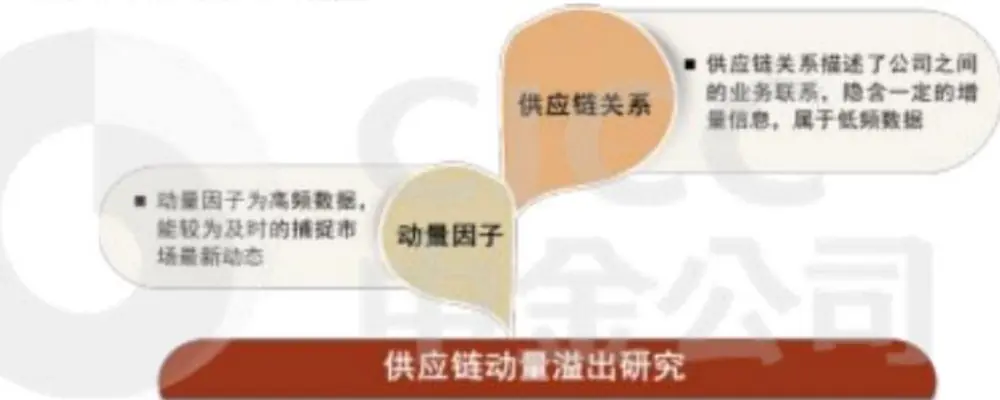
资料来源：中金公司研究部

供应链动量溢出备受学界关注。国外对供应链动量溢出已有多年的研究，(Cohen andFrazzini,2008）认为客户公司的股票收益会影响供应商未来的股票收益。近年来学界也持续对供应链动量溢出的形式进行创新性研究，(Huanget al.,2022)发现投资者对客户公司的连续信息反应不足，而具有相同累积回报的离散信息则很快被供应商的价格吸收。(Bozok and Özyildirim，2022）则认为客户公司的动量溢出与公司中心度有关，高中心度的公司会吸引投资者的关注，使得动量溢出效果有所下降。

供应链动量溢出源自投资者的有限关注。我们在《量化多因子系列(6)：关于动量，你所希望了解的那些事》中对公司自身动量类因子的收益来源进行了分析，并指出风险溢价补偿和行为偏差造成的错误定价均会为投资者提供动量收益。而在供应链动量溢出中，增量信息会通过供应链关系进行传导，主流观点认为供应链动量溢出源自投资者的有限关注。

供应链动量传导的信息相对隐晦，经济价值易被低估。供应商和客户之间的关联较为紧密，供应链中的相关信息会对公司造成一定影响。然而不同于基本面因子能直观的展示公司自身的收益、经营和管理等信息，供应链动量的信息较为隐晦，尤其是分析师覆盖度较低的企业，供应链动量信号的经济价值容易被低估，为我们构建和应用供应链动量溢出因子提供一定机遇。

图表2：构建供应链动量溢出因子逻辑
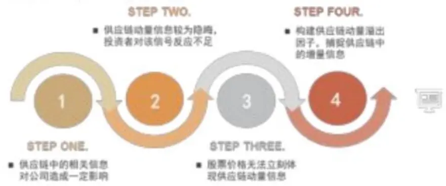
资料来源：中金公司研究部

## 供应链数据面面观

供应链数据来自上市公司和发债公司的披露报告。我们将使用ChinaScope的供应链数据对A股市场的供应链动量溢出进行测试，ChinaScope中供应链数据来自上市公司和发债公司的披露报告，频率为半年度，包含公司对应的主要供应商和客户、应付、预付、应收、预收账款的交易对象、关联交易对象以及单项金额重大并同时计提坏账准备的欠款方。供应链关系中的金额为销售额、采购额、应收账款和其他应收款的坏账金额、以及应付、预付、应收、预收账款期末余额。

图表3：供应链动量数据来源
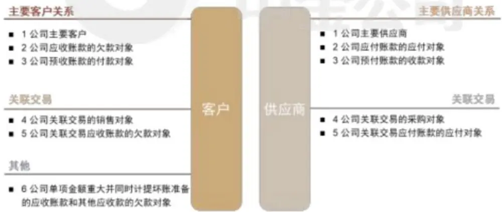
资料来源：ChinaScope，中金公司研究部

供应链数据的来源大多为主要交易对手和关联交易。我们筛选客户和供应商均为A股上市公司的股票，并对供应链关系的来源进行统计。由于部分供应链关系有多种来源，因此本文将统计A股公司供应链关系的主要来源，根据主要交易对手>关联交易>其他的重要程度进行筛选。由下图可知，供应链数据大多为主要交易对手信息披露和关联交易披露，且近期关联交易的供应链数据量有所上升。

机械行业的供应商数据大多源自主要交易对手。分行业来看，机械、计算机的供应商数据，和电力及公用事业、汽车的客户数据大多来自主要交易对手。此外，基础化工、汽车的供应商数据，以及医药、电子等行业的客户数据多数源自关联交易。

图表4：A股上市公司供应链数据主要来源
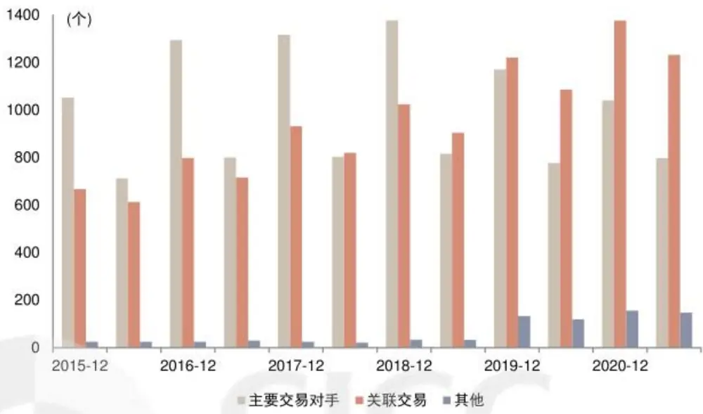
资料来源：ChinaScope，中金公司研究部，报告期为2015-12-31至2021-06-30

图表 5：A 股供应商所在行业的供应链数据主要来源
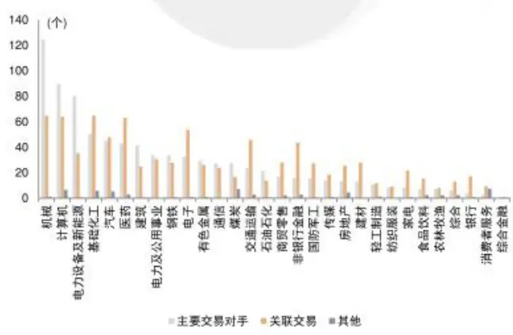
资料来源：ChinaScope，中金公司研究部，报告期为2015-12-31至2021-06-30

图表6：A股客户所在行业的供应链数据主要来源
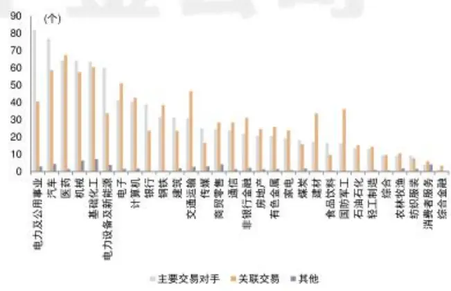
资料来源：ChinaScope，中金公司研究部，报告期为2015-12-31至2021-06-30

供应链数据大多由非上市机构组成。ChinaScope中供应链数据的公司种类有五部分，分别为A股上市公司、其他交易所上市公司、非上市机构、自然人以及无效数据，其中无效数据在ChinaScope中以空值的形式存在，即上市公司没有披露其供应商、客户的具体信息，如公司只披露了前五名销售客户的金额总和。由下图可知，在A股供应商的客户种类和A股客户的供应商种类中，非上市机构均为其主要组成部分，平均占比超过90%。

图表7：A 股供应商的客户分布
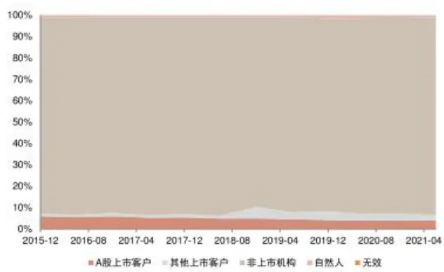
资料来源：ChinaScope，中金公司研究部，报告期为2015-12-31 至2021-06-30

图表8：A股客户的供应商分布
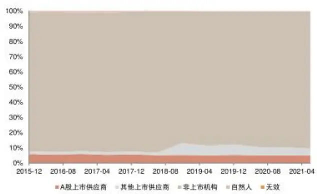
资料来源：ChinaScope，中金公司研究部，报告期为2015-12-31 至 2021-06-30

A股公司的上市供应商（客户）数量占比有所下滑。我们测试了每只A股上市公司所披露的A股上市供应商（客户）个数与供应商（客户）总数的比值，并计算A股上市供应商（客户）占比的平均值如下。如下图所示，A股上市供应商和客户的平均比值有所下滑，公司的供应链关系更多由非A股上市公司组成；分行业来看，银行、非银行金融和综合金融的A股上市供应链平均比值在行业中居于高位。

图表9：A股公司的上市供应商（客户）占比平均值
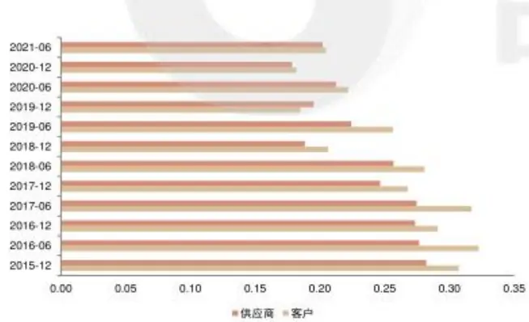
资料来源：ChinaScope，中金公司研究部，报告期为2015-12-31 至2021-06-30

图表10：分行业 A 股公司的上市供应商（客户）占比平均值
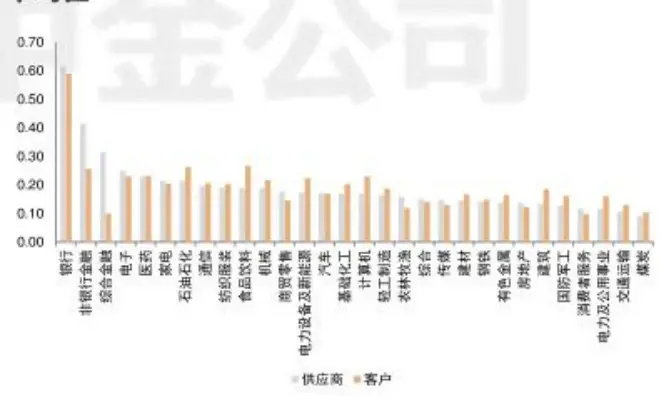
资料来源：ChinaScope，中金公司研究部，报告期为 2015-12-31 至2021-06-30

## 拓展A股供应链数据的覆盖度：引入第二层供应链关系

客户传导和供应商传导的覆盖度存在区别。每个公司可能存在多家客户和供应商，因此供应链数据覆盖度的测算分为客户传导和供应商传导两种方式。如下图所示，对于供应商传导的动量溢出，动量由供应商传导至客户，则需要用客户个数代表供应链覆盖度；反之，对于客户传导的动量溢出，动量由客户传导至供应商，此时覆盖度需要关注供应商公司的个数。

图表11：客户传导和供应商传导的覆盖度
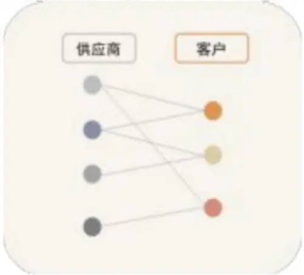
资料来源：中金公司研究部

A股供应链的覆盖度相对偏低。本节测试A股供应链的覆盖度，即供应商和客户均为A股上市公司。由下图所示，供应链关系的覆盖度相对偏低，样本期间供应商和客户的平均覆盖度分别为1213和1203，最新一期的覆盖度分别为1333和1282。同时，年底披露的供应链覆盖度要高于年中披露的供应链数据，且年底和年中披露的覆盖度均在稳步上升，但整体而言覆盖率没有较大提升。分行业来看，机械、基础化工和医药的覆盖度较高，其中机械行业的供应商和客户在样本期间的平均覆盖度分别为115和85：钢铁、煤炭和非银行金融的覆盖率较高，其中钢铁行业的供应商和客户在样本期间的平均覆盖率分别为59.28%和57.53%。

图表 12：A 股上市公司覆盖度
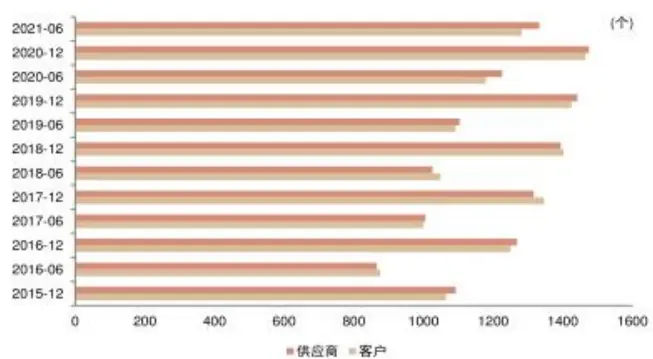

图表 13：分行业 A 股上市公司覆盖度
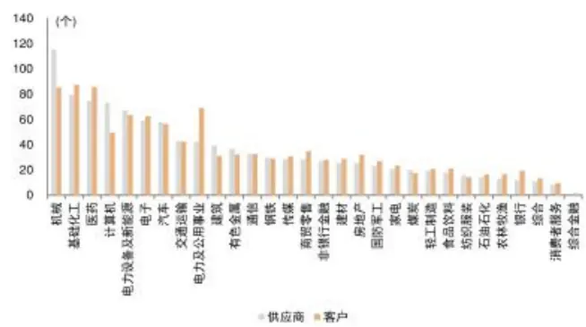

图表 14：A 股上市公司覆盖率
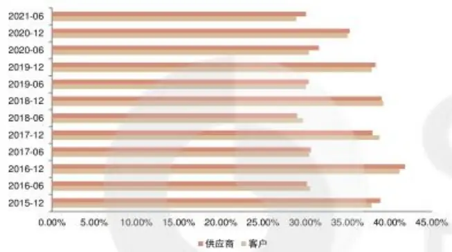

图表 15：分行业 A 股上市公司覆盖率
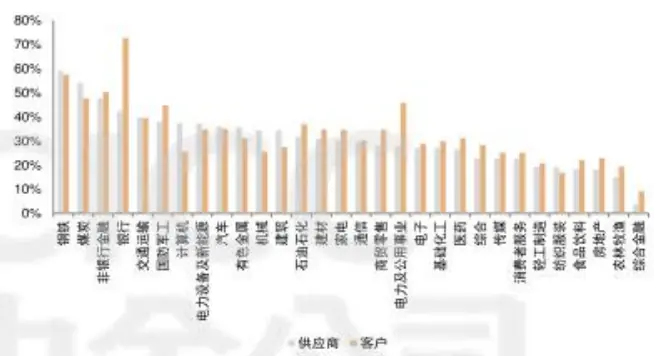
资料来源：ChinaScope，中金公司研究部，报告期为2015-12-31至2021-06-30

引入第二层供应链关系拓展A股供应链覆盖度。A股供应链数据的覆盖度整体偏低，为提升供应链因子的覆盖度，我们将引入第二层供应链关系拓展A股供应链覆盖度。由下图可知，当供应链中的客户1与供应商2为同一上市公司、非上市公司或自然人时，我们将选择供应商1与客户2构建新的供应链关系，由此引入第二层供应链数据。

图表16：引入第二层供应链关系

资料来源：中金公司研究部

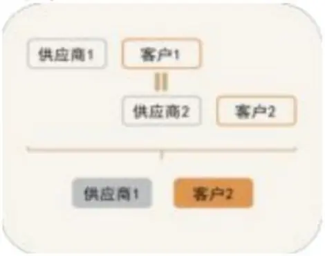

排除供应商和客户完全相同的第二层供应链关系。在用上述方法拓展第二层供应链关系时，我们会遇到新供应链关系中供应商与客户完全相同的情况。如下图所示，在使用2017年中报披露的供应链关系进行拓展时，若母公司和子公司存在关联交易，则很有可能在拓展第二层供应链关系后出现供应商与客户为同一公司的现象，因此需要排除供应商和客户完全相同的第二层供应链关系。

图表17：第二层供应链关系中供应商与客户为同一公司
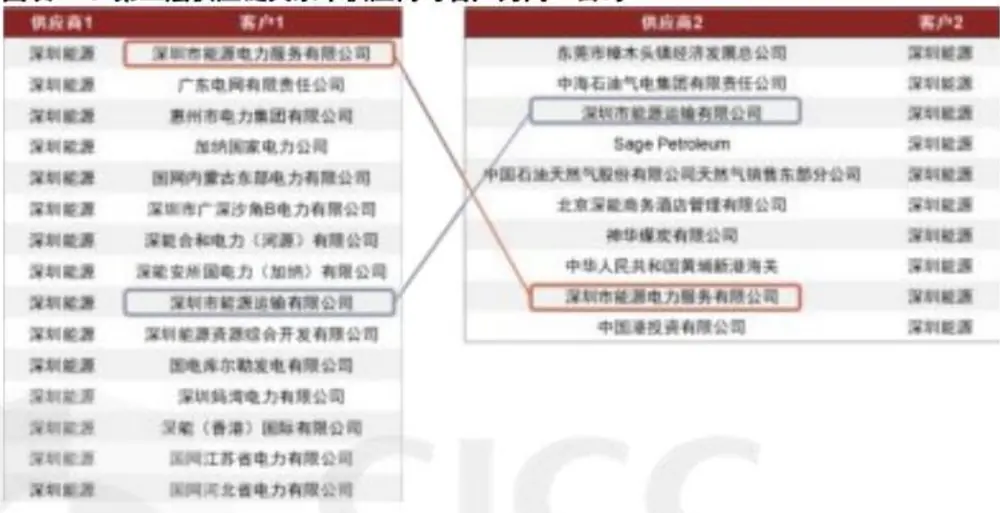
资料来源：ChinaScope，中金公司研究部

引入第二层供应链关系有效提升供应链覆盖度。由下图所示，供应链覆盖度在引入第二层供应链关系后得到提升，样本期间供应商和客户的平均覆盖度分别为1963和1926，最新一期的覆盖度分别为2167和2081，覆盖率达到47.01%和48.95%。分行业来看，机械、基础化工和计算机的覆盖度较高，其中机械行业的供应商和客户在样本期间的平均覆盖度分别为177和138；钢铁、煤炭和国防军工的覆盖率较高，其中钢铁行业供应商和客户的平均覆盖率分别为83.39%和 78.66%。

图表18：A 股上市公司拓展后覆盖度
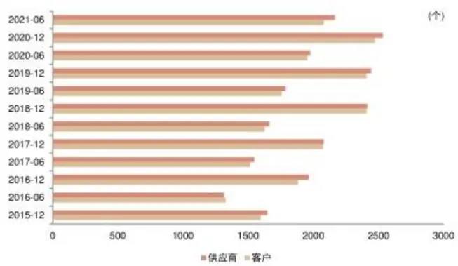

图表19：分行业 A 股上市公司拓展后覆盖度
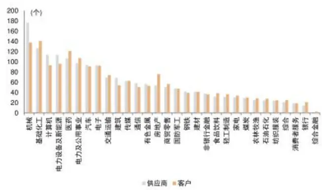

图表 20：A 股上市公司拓展后覆盖率
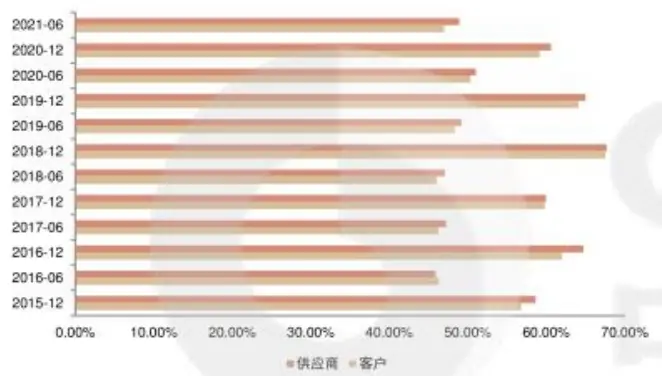

图表 21：分行业 A 股上市公司拓展后覆盖率
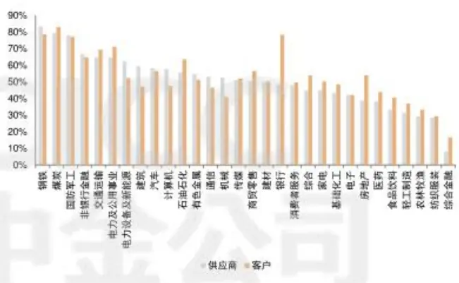
资料来源：ChinaScope，中金公司研究部，报告期为2015-12-31 至2021-06-30

年报供应链数据较为完备。相较于中报供应链数据，年报数据相对较为充足。因此在后文构建因子时，若中报没有供应链信息，则使用上一年年报披露的供应链关系计算因子。

优先考虑原供应链关系，使用主要供应链研究动量溢出。(Huang et al.，2022)在研究供应链动量溢出时，发现使用公司最大客户信息和所有客户信息最终的研究结果相似，因此该论文重点研究目标公司最大客户对该公司的影响。在后文的分析中，如果没有特殊说明，我们大多使用公司的最大客户或供应商来研究动量溢出效应。在确定目标公司的最大客户或供应商时，我们会优先从原供应链关系中进行筛选。

## 供应链动量差因子的测试与开发

## 供应链动量差因子的测试：动量溢出效率、动量来源和动量类型

构建供应链动量差因子，用供应链动量溢出效应改进动量因子。我们在前文讨论了供应链动量溢出源自投资者的有限关注，而在A股市场中，使用目标公司的供应商或客户动量所构建的供应链动量因子表现欠佳，下图展示了一个月普通供应链动量因子的有效性检验结果，其IC有效性整体表现较弱。因此，我们构建供应链动量差因子，即供应商或客户的动量减去公司自身动量，引入供应链中的增量信息，用供应链动量溢出效应改进动量因子。

图表 22：供应链动量因子IC 有效性表现欠佳

|  | 范围 | IC均值 | IC_IR | P(IC>0) | P(IC>0.02) | P(IC<0) | P(IC<-0.02) | t值 | 样本数 |
| --- | --- | --- | --- | --- | --- | --- | --- | --- | --- |
| 供应商传导 | 全市场 | -0.06% | -0.02 | 48.61% | 23.61% | 51.39% | 25.00% | -0.19 | 72 |
|  | 沪深300 | 0.56% | 0.07 | 51.39% | 36.11% | 48.61% | 36.11% | 0.62 | 72 |
|  | 中证500 | 0.30% | 0.05 | 56.94% | 36.11% | 43.06% | 33.33% | 0.46 | 72 |
|  | 中证1000 | -0.29% | -0.07 | 44.44% | 33.33% | 55.56% | 34.72% | -0.60 | 72 |
| 客户传导 | 全市场 | 0.26% | 0.09 | 51.39% | 30.56% | 48.61% | 22.22% | 0.74 | 72 |
|  | 沪源300 | 0.38% | 0.05 | 55.56% | 45.83% | 44.44% | 34.72% | 0.40 | 72 |
|  | 中证500 | 0.61% | 0.12 | 63.89% | 43.06% | 36.11% | 29.17% | 1.01 | 72 |
|  | 中证1000 | 0.69% | 0.15 | 52.78% | 33.33% | 47.22% | 23.61% | 1.28 | 72 |

资料来源：ChinaScope，Wind，中金公司研究部，样本期为2016-04-30至2022-04-29

图表 23：供应链动量差因子构建
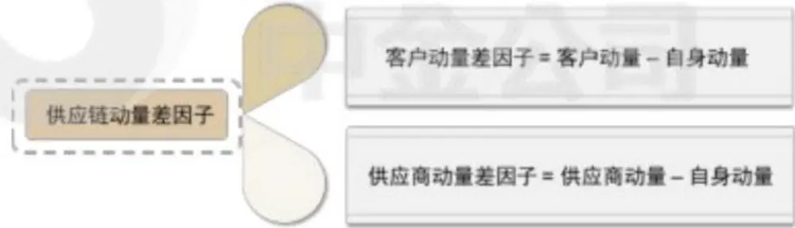
资料来源：中金公司研究部

研究供应链动量溢出的溢出效率、动量来源和动量类型。供应链动量差因子具有多种类型，需要对时间、权重和动量种类进行筛选，即要研究供应链动量溢出的溢出效率、动量来源和动量类型，从而构建有效的供应链动量差因子。

图表24：研究供应链动量溢出的溢出效率、动量来源和动量类型
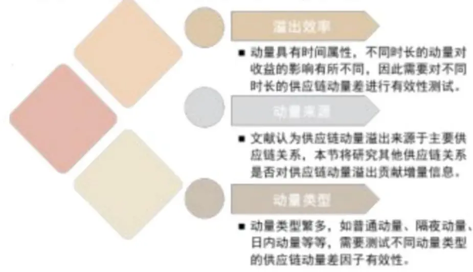
资料来源：中金公司研究部

## 动量溢出效率：一个月的供应链动量差对未来收益预测能力较强

过去一个月的供应链动量差因子有效性较为显著。我们使用唯一主要供应商（客户）的普通动量构建供应链动量差因子，其中普通动量即股票过去一段时间的收益率，从而探讨不同周期下供应链动量差因子对下一个月股票收益的预测能力。由下图可知，一个月的供应商动量差因子有效性表现良好，优于其他周期的有效性表现，其IC均值为3.87%，ICIR为0.67。

图表 25：不同月度供应商动量差因子IC 有效性表现

|  | IC均值 | IC_IR | P(IC>0) | P(IC>0.02) | P(IC<0) | P(IC<-0.02) | t值 | 样本数 |
| --- | --- | --- | --- | --- | --- | --- | --- | --- |
| 1M | 3.87% | 0.67 | 76.39% | 58.33% | 23.61% | 13.89% | 5.67 | 72 |
| 2M | 3.42% | 0.54 | 66.67% | 63.89% | 33.33% | 20.83% | 4.55 | 72 |
| 3M | 3.03% | 0.49 | 72.22% | 58.33% | 27.78% | 25.00% | 4.19 | 72 |
| 4M | 2.73% | 0.43 | 69.44% | 62.50% | 30.56% | 25.00% | 3.64 | 72 |
| 5M | 2.39% | 0.37 | 68.06% | 54.17% | 31.94% | 25.00% | 3.17 | 72 |
| 6M | 2.17% | 0.33 | 62.50% | 54.17% | 37.50% | 27.78% | 2.81 | 72 |
| 7M | 2.23% | 0.34 | 62.50% | 55.56% | 37.50% | 31.94% | 2.85 | 72 |
| 8M | 2.38% | 0.34 | 63.89% | 55.56% | 36.11% | 27.78% | 2.85 | 72 |
| 9M | 2.29% | 0.33 | 62.50% | 48.61% | 37.50% | 26.39% | 2.77 | 72 |
| 10M | 2.20% | 0.31 | 62.50% | 54.17% | 37.50% | 30.56% | 2.62 | 72 |
| 11M | 1.83% | 0.26 | 61.11% | 52.78% | 38.89% | 29.17% | 2.19 | 72 |
| 12M | 1.76% | 0.25 | 61.11% | 48.61% | 38.89% | 31.94% | 2.10 | 72 |

资料来源：ChinaScope，Wind，中金公司研究部，样本期为2016-04-30 至2022-04-29

图表26：不同月度供应商动量差因子IC值表现
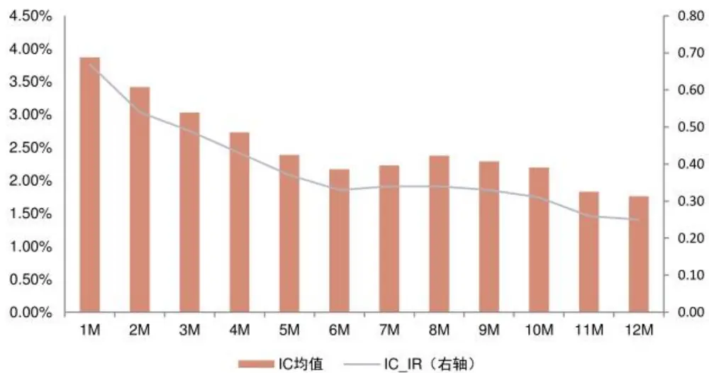
资料来源：ChinaScope，Wind，中金公司研究部，样本期为2016-04-30至2022-04-29

一个月客户动量差因子对未来收益预测能力较强。同供应商动量差因子，一个月的客户动量差因子也展示出较强的有效性。此外，一个月客户动量差因子的IC有效性表现要较优于供应商动量差因子，其IC均值为 4.10%，ICIR为0.66。

图表27：不同月度客户动量差因子IC 有效性表现

|  | IC均值 | IC_IR | P(IC>0) | P(IC>0.02) | P(IC<0) | P(IC<-0.02) | t值 | 样本数 |
| --- | --- | --- | --- | --- | --- | --- | --- | --- |
| 1M | 4.10% | 0.66 | 76.39% | 59.72% | 23.61% | 16.67% | 5.57 | 72 |
| 2M | 3.56% | 0.49 | 69.44% | 52.78% | 30.56% | 18.06% | 4.18 | 72 |
| 3M | 3.05% | 0.45 | 65.28% | 55.56% | 34.72% | 19.44% | 3.82 | 72 |
| 4M | 2.82% | 0.41 | 61.11% | 52.78% | 38.89% | 26.39% | 3.49 | 72 |
| 5M | 2.57% | 0.36 | 59.72% | 48.61% | 40.28% | 27.78% | 3.09 | 72 |
| 6M | 2.34% | 0.32 | 59.72% | 48.61% | 40.28% | 30.56% | 2.72 | 72 |
| 7M | 2.19% | 0.30 | 61.11% | 50.00% | 38.89% | 29.17% | 2.53 | 72 |
| 8M | 2.11% | 0.28 | 59.72% | 50.00% | 40.28% | 29.17% | 2.37 | 72 |
| 9M | 2.14% | 0.29 | 61.11% | 44.44% | 38.89% | 31.94% | 2.42 | 72 |
| 10M | 1.99% | 0.27 | 65.28% | 44.44% | 34.72% | 30.56% | 2.26 | 72 |
| 11M | 1.82% | 0.25 | 63.89% | 43.06% | 36.11% | 29.17% | 2.13 | 72 |
| 12M | 1.62% | 0.22 | 59.72% | 44.44% | 40.28% | 31.94% | 1.89 | 72 |

资料来源：ChinaScope，Wind，中金公司研究部，样本期为 2016-04-30 至 2022-04-29

图表 28：不同月度客户动量差因子IC值表现
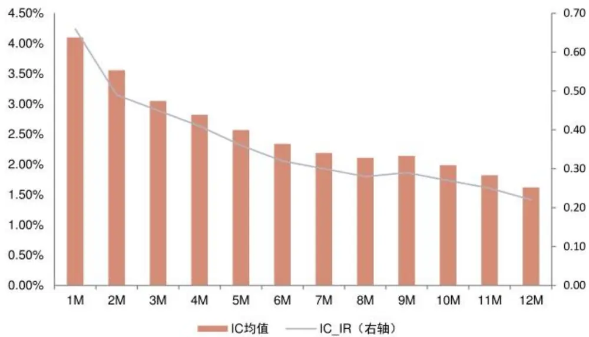
资料来源：ChinaScope，Wind，中金公司研究部，样本期为2016-04-30至 2022-04-29

相对高频的供应链动量差有效性偏弱。上文测试了不同月度周期对下一个月股票收益的预测能力，我们得到一个月的供应链动量差因子的表现较为出色。如下图所示，我们对相对高频的供应链动量差进行检验，即测试一天、一周、两周的供应链动量差对下一天、一周、两周股票收益的预测能力。在全市场、沪深300、中证500和中证1000市场中，两周的供应链动量差有效性表现相对较强。而在全市场范围内，一个月供应链动量差对下一个月的预测能力要优于两周供应链动量差的表现，因此我们得到相对高频的供应链动量差的有效性表现偏弱，一个月的供应链动量差对未来收益预测能力较强。

图表 29：短期不同时长供应商动量差因子IC 有效性表现

|  | 时长 | IC均值 | IC_IR | P(IC>0) | P(IC>0.02) | P(IC<0) | P(IC<-0.02) | t值 | 样本数 |
| --- | --- | --- | --- | --- | --- | --- | --- | --- | --- |
| 全市场 | 1天 | 1.61% | 0.29 | 60.69% | 46.53% | 39.31% | 25.07% | 10.88 | 1440 |
|  | 1周 | 2.17% | 0.38 | 66.32% | 51.39% | 33.68% | 24.65% | 6.43 | 288 |
|  | 2周 | 3.01% | 0.54 | 72.92% | 56.25% | 27.08% | 17.36% | 6.52 | 144 |
| 沪深300 | 1天 | 0.73% | 0.07 | 53.75% | 45.49% | 46.25% | 37.15% | 2.82 | 1440 |
|  | 1周 | 0.38% | 0.04 | 48.26% | 40.62% | 51.74% | 42.71% | 0.66 | 288 |
|  | 2周 | 0.13% | 0.01 | 52.78% | 45.14% | 47.22% | 40.28% | 0.17 | 144 |
| 中证500 | 1天 | 1.04% | 0.13 | 55.56% | 43.40% | 44.44% | 34.72% | 4.94 | 1440 |
|  | 1周 | 0.83% | 0.10 | 55.21% | 43.40% | 44.79% | 36.46% | 1.76 | 288 |
|  | 2周 | 2.04% | 0.28 | 63.19% | 53.47% | 36.81% | 29.86% | 3.35 | 144 |
| 中证1000 | 1天 | 1.70% | 0.24 | 59.31% | 48.26% | 40.69% | 30.07% | 9.08 | 1440 |
|  | 1周 | 2.43% | 0.33 | 63.54% | 53.47% | 36.46% | 27.78% | 5.52 | 288 |
|  | 2周 | 3.45% | 0.51 | 68.06% | 59.03% | 31.94% | 25.69% | 6.06 | 144 |

资料来源：ChinaScope，Wind，中金公司研究部，样本期为2016-04-30 至2022-04-29

图表 30：短期不同时长客户动量差因子IC 有效性表现

|  | 时长 | IC均值 | IC_IR | P(IC>0) | P(IC>0.02) | P(IC<0) | P(IC<-0.02) | t值 | 样本数 |
| --- | --- | --- | --- | --- | --- | --- | --- | --- | --- |
| 全市场 | 1天 | 1.61% | 0.28 | 60.76% | 47.92% | 39.24% | 25.14% | 10.74 | 1440 |
|  | 1周 | 2.28% | 0.37 | 63.89% | 52.78% | 36.11% | 25.69% | 6.24 | 288 |
|  | 2周 | 2.95% | 0.53 | 74.31% | 60.42% | 25.69% | 15.97% | 6.31 | 144 |
| 沪深300 | 1天 | 0.84% | 0.08 | 52.36% | 44.31% | 47.64% | 38.61% | 3.18 | 1440 |
|  | 1周 | 0.73% | 0.07 | 54.86% | 48.26% | 45.14% | 38.54% | 1.22 | 288 |
|  | 2周 | 1.38% | 0.13 | 59.03% | 51.39% | 40.97% | 33.33% | 1.62 | 144 |
| 中证500 | 1天 | 0.92% | 0.12 | 55.83% | 45.00% | 44.17% | 34.24% | 4.38 | 1440 |
|  | 1周 | 1.40% | 0.17 | 56.94% | 48.96% | 43.06% | 35.42% | 2.83 | 288 |
|  | 2周 | 1.39% | 0.16 | 60.42% | 52.78% | 39.58% | 31.94% | 1.96 | 144 |
| 中证1000 | 1天 | 1.63% | 0.23 | 60.00% | 47.78% | 40.00% | 29.86% | 8.73 | 1440 |
|  | 1周 | 2.65% | 0.36 | 63.89% | 53.47% | 36.11% | 25.69% | 6.07 | 288 |
|  | 2周 | 3.22% | 0.49 | 69.44% | 56.94% | 30.56% | 17.36% | 5.89 | 144 |

资料来源：ChinaScope，Wind，中金公司研究部，样本期为 2016-04-30 至 2022-04-29

## 动量来源：完整供应链与主要供应链的动量溢出效果相近

中心度体现公司在供应链中的重要程度。衡量中心度最简单的方法是计算供应商（客户）的客户（供应商）数量。（Bozok and Özyildirim，2022）在文章中列出了三种计算中心度的方法，并在研究中认为客户中心度越大，投资者的关注度越低，从而引发更显著的客户动量溢出。

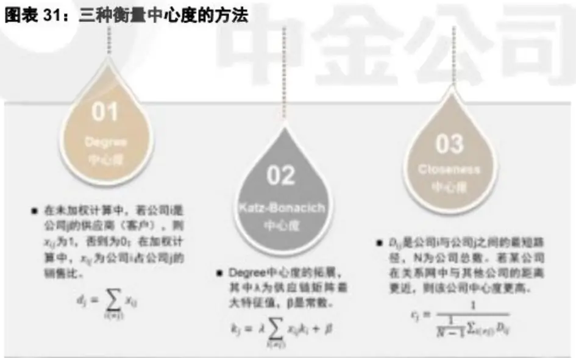
资料来源： Bozok I, Özyildirim S, 2022. Firm centrality and limited attention[J]. International Review of Economics & Finance, 中金公司研究部

构建等权供应链和中心度加权供应链动量差因子。我们在上文的测试中假设供应链动量差来源于主要供应链关系，并使用最大供应商或客户对供应链动量差的溢出效率进行测试。本节将建立等权和中心度加权供应链动量差因子，探讨动量来源是否源自主要供应链关系。

构建两种中心度加权的供应链动量差因子。我们沿用（Bozok and Özyildirim，2022)的方式计算Degree中心度，即测算每一期供应商（客户）的客户（供应商）数量，该中心度的计算方式更加简洁直观。在计算供应商（客户）的加权动量时，我们采取两种加权方法，即中心度加权和中心度倒数加权，从而探讨中心度对动量溢出影响的方向。

完整供应链动量溢出与主要供应链效果相近。由下图可知，引入完整供应链后因子有效性得到些许提升，但总体来看完整供应链与主要供应链的动量溢出效果相近。同时，中心度加权的供应链动量溢出总体优于中心度倒数加权，因此可知公司的供应商（客户）中心度越大，其影响力越强，会为公司带来较为显著的动量溢出。总体而言，供应链动量溢出主要来源于最大供应商（客户），因此在后文的测试中我们继续使用主要供应商（客户）计算供应链动量差因子。

图表32：不同权重下供应商动量差因子IC 有效性表现

|  | 权重类型 | IC均值 | IC_IR | P(IC>0) | P(IC>0.02) | P(IC<0) | P(IC<-0.02) | t值 | 样本数 |
| --- | --- | --- | --- | --- | --- | --- | --- | --- | --- |
| 全市场 | 最大供应商 | 3.87% | 0.67 | 76.39% | 58.33% | 23.61% | 13.89% | 5.67 | 72 |
|  | 等权 | 4.10% | 0.60 | 75.00% | 61.11% | 25.00% | 13.89% | 5.08 | 72 |
|  | 中心度加权 | 4.03% | 0.59 | 70.83% | 61.11% | 29.17% | 13.89% | 5.05 | 72 |
|  | 中心度倒数加权 | 3.89% | 0.59 | 72.22% | 56.94% | 27.78% | 13.89% | 5.03 | 72 |
| 沪深300 | 最大供应商 | 1.77% | 0.19 | 59.72% | 52.78% | 40.28% | 30.56% | 1.58 | 72 |
|  | 等权 | 1.64% | 0.14 | 52.78% | 47.22% | 47.22% | 43.06% | 1.21 | 72 |
|  | 中心度加权 | 1.57% | 0.14 | 51.39% | 44.44% | 48.61% | 37.50% | 1.17 | 72 |
|  | 中心度倒数加权 | 1.42% | 0.14 | 51.39% | 45.83% | 48.61% | 44.44% | 1.15 | 72 |
| 中证500 | 最大供应商 | 2.08% | 0.28 | 65.28% | 51.39% | 34.72% | 25.00% | 2.37 | 72 |
|  | 等权 | 1.95% | 0.22 | 59.72% | 54.17% | 40.28% | 34.72% | 1.85 | 72 |
|  | 中心度加权 | 1.65% | 0.19 | 56.94% | 51.39% | 43.06% | 38.89% | 1.61 | 72 |
|  | 中心度倒数加权 | 2.25% | 0.26 | 58.33% | 56.94% | 41.67% | 31.94% | 2.22 | 72 |
| 中证1000 | 最大供应商 | 3.65% | 0.47 | 68.06% | 52.78% | 31.94% | 19.44% | 4.00 | 72 |
|  | 等权 | 4.09% | 0.49 | 72.22% | 56.94% | 27.78% | 19.44% | 4.17 | 72 |
|  | 中心度加权 | 4.19% | 0.51 | 68.06% | 62.50% | 31.94% | 22.22% | 4.34 | 72 |
|  | 中心度倒数加权 | 3.67% | 0.45 | 73.61% | 54.17% | 26.39% | 20.83% | 3.85 | 72 |

资料来源：ChinaScope，Wind，中金公司研究部，样本期为2016-04-30至2022-04-29

图表33：不同权重下客户动量差因子IC 有效性表现

|  | 权重类型 | IC均值 | IC_IR | P(IC>0) | P(IC>0.02) | P(IC<0) | P(IC<-0.02) | t值 | 样本数 |
| --- | --- | --- | --- | --- | --- | --- | --- | --- | --- |
| 全市场 | 最大客户 | 4.10% | 0.66 | 76.39% | 59.72% | 23.61% | 16.67% | 5.57 | 72 |
|  | 等权 | 4.36% | 0.62 | 73.61% | 62.50% | 26.39% | 16.67% | 5.23 | 72 |
|  | 中心度加权 | 4.31% | 0.61 | 77.78% | 59.72% | 22.22% | 16.67% | 5.22 | 72 |
|  | 中心度倒数加权 | 4.23% | 0.62 | 72.22% | 63.89% | 27.78% | 16.67% | 5.28 | 72 |
| 沪深300 | 最大客户 | 2.31% | 0.24 | 58.33% | 51.39% | 41.67% | 37.50% | 2.04 | 72 |
|  | 等权 | 1.38% | 0.12 | 55.56% | 45.83% | 44.44% | 38.89% | 1.05 | 72 |
|  | 中心度加权 | 1.81% | 0.17 | 51.39% | 45.83% | 48.61% | 40.28% | 1.40 | 72 |
|  | 中心度倒数加权 | 1.22% | 0.11 | 55.56% | 51.39% | 44.44% | 41.67% | 0.97 | 72 |
| 中证500 | 最大客户 | 1.76% | 0.22 | 55.56% | 44.44% | 44.44% | 34.72% | 1.90 | 72 |
|  | 等权 | 1.06% | 0.12 | 50.00% | 41.67% | 50.00% | 36.11% | 1.04 | 72 |
|  | 中心度加权 | 0.87% | 0.1 | 54.17% | 43.06% | 45.83% | 38.89% | 0.86 | 72 |
|  | 中心度倒数加权 | 1.62% | 0.19 | 55.56% | 47.22% | 44.44% | 36.11% | 1.59 | 72 |
| 中证1000 | 最大客户 | 4.22% | 0.54 | 63.89% | 56.94% | 36.11% | 22.22% | 4.60 | 72 |
|  | 等权 | 4.73% | 0.56 | 69.44% | 62.50% | 30.56% | 20.83% | 4.74 | 72 |
|  | 中心度加权 | 4.71% | 0.55 | 68.06% | 61.11% | 31.94% | 22.22% | 4.71 | 72 |
|  | 中心度倒数加权 | 4.51% | 0.55 | 69.44% | 61.11% | 30.56% | 22.22% | 4.69 | 72 |

资料来源：ChinaScope，Wind，中金公司研究部，样本期为 2016-04-30 至 2022-04-29

## 动量类型：普通、日内、振幅调整的客户动量差因子表现良好

我们在《量化多因子系列(7)：价量因子手册》介绍了不同种类的动量类因子，并测试了动量类因子的有效性。在上文的测试中我们对供应商（客户）的普通动量与自身公司普通动量的差值进行检测，而本节将使用不同类型的供应链动量差，寻找哪些种类的供应链动量差具有较为出色的有效性表现。

图表34：不同类型动量计算公式

| 因子代码 | 因子名称 | 因子计算公式 |
| --- | --- | --- |
| mmt_normal_M | 1个月收益率 | 过去1个月的收益率 |
| mmt_normal_A | 1年收益率 | 过去12个月的收益率-过去1个月收益率 |
| mmt_avg_M | 相对均价的1个月收益率 | 当期收盘价/过去20个交易日均价 |
| mmt_avg_A | 相对均价的1年收益率 | 1个月前的收盘价/过去1年的均价 |
| mmt_intraday_M | 1个月日内动量 | 过去一个月的日内涨跌幅之和 |
| mmt_intraday_A | 1年日内动量 | 过去一年的日内涨跌幅之和-过去一个月日内涨跌幅之和 |
| mmt_overnight_M | 1个月隔夜动量 | 过去1个月内，隔夜涨跌幅之和 |
| mmt_overnight_A | 1年隔夜动量 | 过去1年内，隔夜涨跌幅之和 |
| mmt_off_limit_A | 1年去涨跌停动量 | 除去涨跌停状态外，过去1年的收盘涨跌幅-过去1个月的收盘涨跌幅 |
| mmt_off_limit_M | 1个月去涨跌停动量 | 除去涨跌停状态外，过去1个月的收盘涨跌幅 |
| mmt_range_M | 1个月振幅调整动量 | 过去1个月内，振幅大的前20%的收盘收益率-振幅小的后20%的收盘收益率 |
| mmt_range_A | 1年振幅调整动量 | 过去1年内，振幅大的前20%的收盘收益率-振幅小的后20%的收盘收益率 |
| mmt_route_M | 1个月路径调整动量 | 过去1个月内收益率/过去1个月内日度涨跌幅绝对值之和 |
| mmt_route_A | 1年路径调整动量 | 过去1年内收益率/过去1年内日度涨跌幅绝对值之和 |
| mmt_discrete_M | 1个月信息离散度动量 | 过去1个月内，上涨天数占比-下跌天数占比 |
| mmt_discrete_A | 1年信息离散度动量 | 过去1年内，上涨天数占比-下跌天数占比 |
| mmt_sec_rank_M | 1个月横截面rank动量 | 每日计算个股日收益在横截面的排名，取过去20个交易日排名均值 |
| mmt_sec_rank_A | 1年横截面rank动量 | 每日计算个股日收益在横截面的排名，取过去1年排名均值 |
| mmt_time_rank_M | 1个月时序rank动量 | 每日计算个股价格在时序（1年内）的排名，取过去20个交易日排名均值 |
| mmt_report_overnight | 业绩公告前隔夜动量 | 最近一个业绩公告日的前一个月的隔夜收益率之和 |
| mmt_report_period | 业绩期动量 | 业绩公告前一交易日至后一交易日 |

资料来源：中金公司研究部

普通、日内、振幅调整的供应商动量差因子对下一期股票的预测能力较为显著。部分种类的供应商动量差因子的IC有效性表现良好，普通、日内、振幅调整的供应商动量差因子对下一期股票的预测能力较为显著。其中一个月日内供应商动量差因子在全市场范围内表现较为出色，其IC 均值为 4.25%，ICIR 达到 0.76。

图表 35：不同类型供应商动量差因子IC 有效性表现

|  | IC均值 | IC_IR | P(IC>0) | P(IC>0.02) | P(IC<0) | P(IC<-0.02) | t值 | 样本数 |
| --- | --- | --- | --- | --- | --- | --- | --- | --- |
| mmt_normal_M | 3.87% | 0.67 | 76.39% | 58.33% | 23.61% | 13.89% | 5.67 | 72 |
| mmt_normal_A | 0.37% | 0.06 | 54.17% | 40.28% | 45.83% | 38.89% | 0.48 | 72 |
| mmt_avg_M | 3.43% | 0.52 | 69.44% | 56.94% | 30.56% | 19.44% | 4.44 | 72 |
| mmt_avg_A | 1.26% | 0.18 | 55.56% | 45.83% | 44.44% | 30.56% | 1.55 | 72 |
| mmt_intraday_M | 4.25% | 0.76 | 76.39% | 69.44% | 23.61% | 16.67% | 6.43 | 72 |
| mmt_intraday_A | 1.55% | 0.28 | 61.11% | 51.39% | 38.89% | 27.78% | 2.36 | 72 |
| mmt_overnight_M | -1.17% | -0.34 | 34.72% | 16.67% | 65.28% | 38.89% | -2.87 | 72 |
| mmt_overnight_A | -1.89% | -0.55 | 27.78% | 12.50% | 72.22% | 51.39% | -4.68 | 72 |
| mmt_off_limit_A | -1.99% | -0.33 | 33.33% | 27.78% | 66.67% | 54.17% | -2.80 | 72 |
| mmt_off_limit_M | 0.67% | 0.11 | 51.39% | 40.28% | 48.61% | 33.33% | 0.91 | 72 |
| mmt_range_M | 4.07% | 0.89 | 80.56% | 70.83% | 19.44% | 11.11% | 7.56 | 72 |
| mmt_range_A | 3.46% | 0.69 | 75.00% | 58.33% | 25.00% | 13.89% | 5.85 | 72 |
| mmt_route_M | 2.77% | 0.47 | 66.67% | 52.78% | 33.33% | 20.83% | 3.97 | 72 |
| mmt_route_A | 0.51% | 0.08 | 54.17% | 37.50% | 45.83% | 37.50% | 0.71 | 72 |
| mmt_discrete_M | 1.38% | 0.30 | 69.44% | 37.50% | 30.56% | 22.22% | 2.51 | 72 |
| mmt_discrete_A | -0.26% | -0.06 | 47.22% | 33.33% | 52.78% | 38.89% | -0.47 | 72 |
| mmt_sec_rank_M | 1.09% | 0.19 | 56.94% | 40.28% | 43.06% | 30.56% | 1.60 | 72 |
| mmt_sec_rank_A | -2.54% | -0.42 | 33.33% | 19.44% | 66.67% | 51.39% | -3.59 | 72 |
| mmt_time_rank_M | 2.46% | 0.46 | 69.44% | 54.17% | 30.56% | 20.83% | 3.90 | 72 |
| mmt_report_overnight | -1.95% | -0.56 | 27.78% | 11.11% | 72.22% | 45.83% | -4.74 | 72 |
| mmt_report_period | -1.57% | -0.44 | 33.33% | 13.89% | 66.67% | 44.44% | -3.70 | 72 |

资料来源：ChinaScope，Wind，中金公司研究部，样本期为2016-04-30至2022-04-29

图表 36：不同类型供应商动量差因子IC 值表现
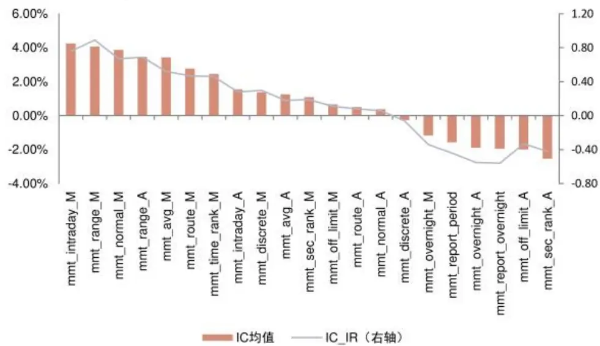
资料来源：ChinaScope，Wind，中金公司研究部，样本期为 2016-04-30 至2022-04-29

客户动量差因子表现整体优于供应商动量差因子。整体而言，供应链中客户的动量溢出强于供应商，因子有效性表现大多有所提升。此外，一个月普通、日内、振幅调整的客户动量差因子表现良好，在全市场范围内一个月振幅调整的客户动量差因子的IC均值为4.87%，ICIR达到1.10。

图表 37：不同类型客户动量差因子IC 有效性表现

|  | IC均值 | IC_IR | P(IC>0) | P(IC>0.02) | P(IC<0) | P(IC<-0.02) | t值 | 样本数 |
| --- | --- | --- | --- | --- | --- | --- | --- | --- |
| mmt_normal_M | 4.10% | 0.66 | 76.39% | 59.72% | 23.61% | 16.67% | 5.57 | 72 |
| mmt_normal_A | 0.28% | 0.04 | 52.78% | 36.11% | 47.22% | 36.11% | 0.36 | 72 |
| mmt_avg_M | 3.61% | 0.50 | 65.28% | 55.56% | 34.72% | 20.83% | 4.21 | 72 |
| mmt_avg_A | 1.13% | 0.17 | 61.11% | 43.06% | 38.89% | 31.94% | 1.44 | 72 |
| mmt_intraday_M | 4.75% | 0.83 | 83.33% | 66.67% | 16.67% | 16.67% | 7.05 | 72 |
| mmt_intraday_A | 1.87% | 0.33 | 59.72% | 48.61% | 40.28% | 20.83% | 2.79 | 72 |
| mmt_overnight_M | -1.67% | -0.52 | 31.94% | 9.72% | 68.06% | 44.44% | -4.45 | 72 |
| mmt_overnight_A | -2.62% | -0.68 | 22.22% | 13.89% | 77.78% | 62.50% | -5.76 | 72 |
| mmt_off_limit_A | -2.27% | -0.39 | 31.94% | 20.83% | 68.06% | 51.39% | -3.28 | 72 |
| mmt_off_limit_M | 0.70% | 0.12 | 54.17% | 33.33% | 45.83% | 30.56% | 0.98 | 72 |
| mmt_range_M | 4.87% | 1.10 | 87.50% | 72.22% | 12.50% | 5.56% | 9.37 | 72 |
| mmt_range_A | 4.07% | 0.81 | 79.17% | 66.67% | 20.83% | 12.50% | 6.91 | 72 |
| mmt_route_M | 2.84% | 0.45 | 68.06% | 50.00% | 31.94% | 18.06% | 3.84 | 72 |
| mmt_route_A | 0.34% | 0.05 | 55.56% | 36.11% | 44.44% | 37.50% | 0.46 | 72 |
| mmt_discrete_M | 1.22% | 0.26 | 65.28% | 41.67% | 34.72% | 23.61% | 2.20 | 72 |
| mmt_discrete_A | -0.63% | -0.14 | 45.83% | 20.83% | 54.17% | 43.06% | -1.20 | 72 |
| mmt_sec_rank_M | 1.00% | 0.17 | 51.39% | 44.44% | 48.61% | 30.56% | 1.42 | 72 |
| mmt_sec_rank_A | -2.79% | -0.47 | 34.72% | 19.44% | 65.28% | 58.33% | -3.98 | 72 |
| mmt_time_rank_M | 2.45% | 0.45 | 65.28% | 59.72% | 34.72% | 19.44% | 3.85 | 72 |
| mmt_report_overnight | -2.28% | -0.68 | 22.22% | 11.11% | 77.78% | 47.22% | -5.79 | 72 |
| mmt_report_period | -0.93% | -0.25 | 37.50% | 23.61% | 62.50% | 38.89% | -2.10 | 72 |

资料来源：ChinaScope，Wind，中金公司研究部，样本期为 2016-04-30 至 2022-04-29

图表 38：不同类型客户动量差因子IC值表现
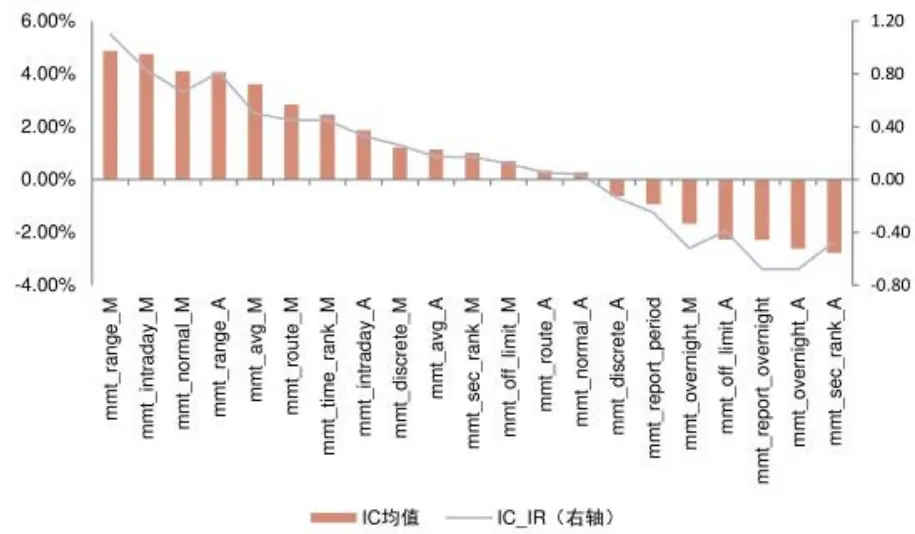
资料来源：ChinaScope，Wind，中金公司研究部，样本期为 2016-04-30 至 2022-04-29

## 供应链动量差因子选股能力相较自身动量因子有所提升

构建供应链动量差因子：利用主要客户数据构建一个月普通、日内、振幅调整的客户动量差因子

供应链动量溢出在小市值股票范围内表现良好。由上文的测试可知，供应链动量溢出在全市场和中证1000范围内有效性较为显著，而在沪深300和中证500范围内表现欠佳，因此供应链动量差因子在小市值股票的溢出效应较为显著。

利用主要客户数据构建一个月普通、日内、振幅调整的客户动量差因子。我们对供应链动量差因子进行动量溢出效率、动量来源和动量类型三方面的测试，测试后我们得到以下三个结果：首先，一个月的供应链动量溢出表现突出，优于一天、一周、两周的短期动量和两个月至一年的长期动量；第二，动量溢出大多来源于主要供应链关系；第三，普通、日内、振幅调整的供应链动量差因子表现更加有效，同时客户传导的供应链动量溢出效果更加显著。

图表39：供应链动量差因子的开发
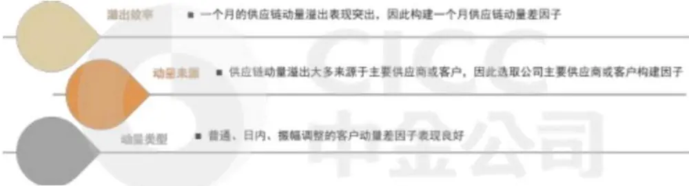
资料来源：中金公司研究部

供应链动量差因子：小市值范围内表现良好，供应链动量溢出在电力及公用事业行业较为显著

三种供应链动量差因子在全市场和中证1000市场表现出色。由上文可知，我们利用主要客户数据构建一个月普通、日内和振幅调整的三种供应链动量差因子。三种因子在分析师覆盖较低的中证1000市场中表现出色，而在沪深300和中证500范围内表现不足，进一步体现供应链动量溢出源自于投资者的有限关注。其中mmt_range_M的供应链动量差因子在全市场的IC均值达到4.87%，ICIR为1.10；在中证1000范围内的IC均值为4.89%，ICIR为0.83。

图表40：三种供应链动量差因子的有效性表现

|  | 范围 | IC均值 | IC_IR | P(IC>0) | P(IC>0.02) | P(IC<0) | P(IC<-0.02) |  | 样本数 | 多头年化收 益率 | 多头年化超额 收益率 | 大回 | 单调性 |
| --- | --- | --- | --- | --- | --- | --- | --- | --- | --- | --- | --- | --- | --- |
| mmt_normal_M | 全市场 | 4.10% | 0.66 | 76.39% | 59.72% | 23.61% | 16.67% | 5.57 | 72 | 4.74% | 6.13% | 5.48% | 0.90 |
|  | 沪源300 | 2.31% | 0.24 | 58.33% | 51.39% | 41.67% | 37.50% | 2.04 | 72 | 6.33% | 6.30% | -14.34% | 0.65 |
|  | 中证500 | 1.76% | 0.22 | 55.56% | 44.44% | 44.44% | 34.72% | 1.90 | 72 | 4.01% | 5.92% | -9.21% | 0.47 |
|  | 中证1000 | 4.22% | 0.54 | 63.89% | 56.94% | 36.11% | 22.22% | 4.60 | 72 | 0.41% | 7.58% | -9.44% | 0.87 |
| mmt_intraday_M | 全市场 | 4.75% | 0.83 | 83.33% | 66.67% | 16.67% | 16.67% | 7.05 | 72 | 5.95% | 7.29% | 4.69% | 0.84 |
|  | 沪源300 | 1.66% | 0.18 | 51.39% | 45.83% | 48.61% | 36.11% | 1.52 | 72 | 10.24% | 10.21% | 6.85% | 0.50 |
|  | 中证500 | 2.35% | 0.32 | 62.50% | 43.06% | 37.50% | 30.56% | 2.68 | 72 | 4.35% | 6.22% | -7.70% | 0.15 |
|  | 中证1000 | 4.79% | 0.63 | 69.44% | 59.72% | 30.56% | 20.83% | 5.35 | 72 | 1.79% | 8.92% | -8.46% | 0.89 |
| mmt_range_M | 全市场 | 4.87% | 1.10 | 87.50% | 72.22% | 12.50% | 5.56% | 9.37 | 72 | 4.24% | 5.56% | 4.60% | 0.96 |
|  | 沪源300 | 1.59% | 0.18 | 54.17% | 47.22% | 45.83% | 34.72% | 1.51 | 72 | 4.64% | 4.57% | -8.65% | 0.45 |
|  | 中证500 | 2.98% | 0.45 | 69.44% | 56.94% | 30.56% | 20.83% | 3.82 | 72 | 3.63% | 5.53% | -9.02% | 0.68 |
|  | 中证1000 | 4.89% | 0.83 | 79.17% | 63.89% | 20.83% | 8.33% | 7.04 | 72 | 0.97% | 8.13% | -8.43% | 0.78 |

资料来源：ChinaScope，Wind，中金公司研究部，样本期为2016-04-30 至2022-04-29
基准指数为万得全A（等权）指数（8841388.WI）、300等权（000984.CSI）、500等权（399982.SZ）、中证1000（000852.SH）

电力及公用事业行业的供应链动量溢出表现良好。分行业来看，三种供应链动量差因子在电力及公用事业行业均对下一期股票收益有较强的预测能力。其中，mmt_normal_M在电力及公用事业行业的供应链动量差因子的IC均值为 7.61%，ICIR为 0.48；mmt_intraday_M的供应链动量差因子在电力及公用事业行业实现8.26%的IC均值，ICIR达到0.53；mmt_range_M在电力及公用事业行业的供应链动量差因子的IC均值达到7.75%，ICIR为0.58。

图表 41：mmt_normal_M供应链动量差因子全市场分行业IC 有效性表现
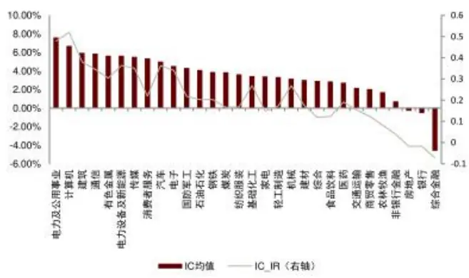

图表 42：mmt_intraday_M 供应链动量差因子全市场分行业IC 有效性表现
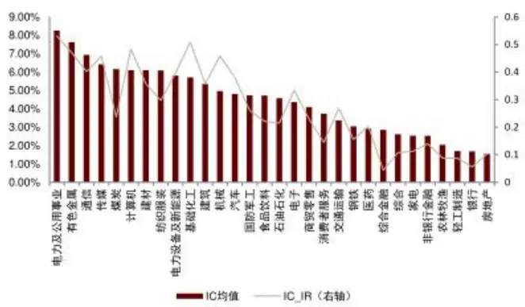

图表43：mmt_range_M供应链动量差因子全市场分行业 IC 有效性表现
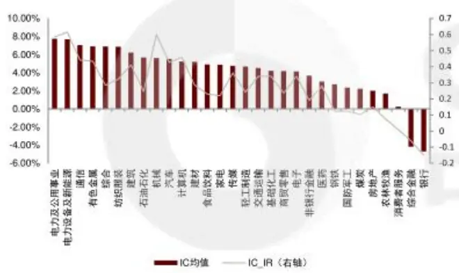

资料来源：ChinaScope，Wind，中金公司研究部，样本期为 2016-04-30 至 2022-04-29

## 供应链动量差因子与自身动量因子的差异：提供增量信息，选股能力有所提升

供应链动量差因子提供一定增量信息。我们从供应链动量差因子的构建方式可以知道，供应链动量差为供应商的客户公司动量与自身动量的差值，因此该因子可能与公司自身动量因子具有一定程度的相关性。我们用客户动量对供应商自身的动量回归后取残差，构建供应链动量差残差因子。由下图可知，供应链动量差残差因子在全市场和中证1000范围内有较好的有效性表现，反映供应链动量差因子为市场提供了一定的增量信息。

图表44：供应链动量差残差因子IC 有效性表现

|  | 范围 | IC均值 | IC_IR | P(IC>0) | P(IC>0.02) | P(IC<0) | P(IC<-0.02) | t值 | 样本数 |
| --- | --- | --- | --- | --- | --- | --- | --- | --- | --- |
| mmt_normal_M | 全市场 | 0.85% | 0.30 | 68.06% | 29.17% | 31.94% | 15.28% | 2.52 | 72 |
|  | 沪深300 | 0.71% | 0.09 | 58.33% | 48.61% | 41.67% | 30.56% | 0.79 | 72 |
|  | 中证500 | 0.73% | 0.15 | 59.72% | 44.44% | 40.28% | 27.78% | 1.24 | 72 |
|  | 中证1000 | 1.17% | 0.26 | 59.72% | 34.72% | 40.28% | 22.22% | 2.20 | 72 |
| mmt_intraday_M | 全市场 | 0.84% | 0.33 | 63.89% | 29.17% | 36.11% | 13.89% | 2.78 | 72 |
|  | 沪深300 | 0.25% | 0.04 | 50.00% | 38.89% | 50.00% | 38.89% | 0.31 | 72 |
|  | 中证500 | 0.82% | 0.18 | 59.72% | 41.67% | 40.28% | 29.17% | 1.50 | 72 |
|  | 中证1000 | 1.32% | 0.30 | 61.11% | 38.89% | 38.89% | 22.22% | 2.54 | 72 |
| mmt_range_M | 全市场 | 0.69% | 0.28 | 66.67% | 29.17% | 33.33% | 12.50% | 2.36 | 72 |
|  | 沪深300 | -0.16% | -0.02 | 50.00% | 33.33% | 50.00% | 41.67% | -0.18 | 72 |
|  | 中证500 | 0.98% | 0.19 | 56.94% | 40.28% | 43.06% | 27.78% | 1.61 | 72 |
|  | 中证1000 | 0.83% | 0.18 | 54.17% | 40.28% | 45.83% | 33.33% | 1.54 | 72 |

资料来源：ChinaScope，Wind，中金公司研究部，样本期为 2016-04-30 至 2022-04-29

供应链动量差因子的选股能力有所提升。我们对供应商的三种供应链动量差因子和自身动量因子进行组数为十的分组回测，由于供应链数据覆盖度有一定程度的损失，下文动量因子的覆盖度也会有所下降。由于供应链动量差因子呈现“动量”特征，而一个月动量因子具有“反转”表现，因此两种因子的多头组合分别为第十组和第一组。总体而言，供应链动量差因子的选股能力有所提升，多空组合的净值表现更加稳定。

mmt_normal_M供应链动量差因子单调性表现良好。在全市场的分组回测中，mmt normal M供应链动量差因子的单调性为0.9，具有较强的单调性表现，能够选出收益较高的多头组合，且该因子的多空组合净值走势较为平稳。此外，供应链动量差因子的多头组合表现优于动量因子，其年化收益率为4.74%，超额最大回撤为-5.48%。

图表45：mmt_normal_M供应链动量差因子与自身动量因子全市场分组回测统计值

|  | 组数 | 年化收益率 | 年化波动率 | 年化超额收 相对收益波 益率 | 动率 | 夏普比率 | 信息比率 | 最大回撤 | 超额最大 回撤 | VaR | ES | 下行波动率 | 索提诺比率 |  |
| --- | --- | --- | --- | --- | --- | --- | --- | --- | --- | --- | --- | --- | --- | --- |
| 供应链动量 差因子 | 1 | -10.50% | 25.30% | -9.21% | 8.89% | -0.31 | -1.04 | -58.26% | -44.00% | -2.71% | -4.17% | 19.37% | -40.60% |  |
|  | 2 | -0.97% | 22.60% | 0.09% | 4.69% | 0.07 | 0.02 | -47.00% | -8.89% | -2.40% | -3.73% | 17.22% | 9.27% |  |
|  | 3 | 1.68% | 21.89% | 2.63% | 4.16% | 0.19 | 0.63 | -44.45% | -5.48% | -2.24% | -3.64% | 16.63% | 24.54% |  |
|  | 4 | -0.98% | 21.51% | -0.13% | 4.10% | 0.06 | -0.03 | -47.71% | -10.41% | -2.26% | -3.63% | 16.54% | 8.18% |  |
|  | 5 | 0.70% | 21.67% | 1.60% | 4.03% | 0.14 | 0.40 | -44.49% | -5.62% | -2.25% | -3.64% | 16.62% | 18.47% |  |
|  | 6 | 1.48% | 21.80% | 2.41% | 4.08% | 0.18 | 0.59 | -42.65% | -8.31% | -2.21% | 3.65% | 16.63% | 23.22% |  |
|  | 7 | 2.23% | 21.96% | 3.21% | 4.10% | 0.21 | 0.78 | -45.42% | -7.24% | -2.24% | -3.64% | 16.70% | 27.78% |  |
|  | 8 | 3.27% | 22.16% | 4.30% | 4.09% | 0.26 | 1.05 | -42.03% | -6.78% | -2.27% | -3.68% | 16.85% | 33.81% |  |
|  | 9 10 | 3.70% | 22.88% | 4.91% | 4.12% | 0.27 | 1.19 | -44.08% | -5.58% | -2.40% | -3.78% | 17.34% | 36.20% |  |
|  |  | 4.74% | 23.69% | 6.13% | 4.53% | 0.31 | 1.36 | -45.54% | -5.48% | -2.44% | -3.90% | 17.94% | 41.56% |  |
|  | 动量因子 | 1 | 0.70% | 24.80% | 2.24% | 6.08% | 0.15 | 0.37 | -48.67% | -13.41% | -2.62% | -4.05% | 18.77% | 20.21% |
| 2 |  | 3.33% | 23.17% | 4.58% | 4.56% | 0.26 | 1.00 | -41.93% | -7.22% | -2.46% | -3.84% | 17.61% | 33.98% |  |
| 3 |  | 3.14% | 22.35% | 4.21% | 4.21% | 0.25 | 1.00 | -44.87% | -8.00% | -2.32% | -3.71% | 16.95% | 33.10% |  |
| 4 |  | 5.84% | 21.56% | 6.74% | 4.35% | 0.37 | 1.55 | 42.85% | -6.27% | -2.20% | -3.55% | 16.34% | 49.08% |  |
| 5 |  | 3.99% | 21.46% | 4.85% | 4.37% | 0.29 | 1.11 | -42.03% | -5.65% | -2.18% | -3.60% | 16.36% | 38.11% |  |
| 6 |  | 2.76% | 21.43% | 3.60% | 4.53% | 0.23 | 0.79 | -44.87% | -7.55% | -2.20% | -3.57% | 16.31% | 30.86% |  |
| 7 |  | 1.77% | 21.59% | 2.65% | 4.19% | 0.19 | 0.63 | -46.12% | -6.13% | -2.23% | -3.64% | 16.52% | 24.83% |  |
| 8 |  | 0.98% | 22.10% | 1.94% | 4.77% | 0.16 | 0.41 | -42.19% | -8.03% | -2.27% | -3.67% | 16.84% | 20.40% |  |
| 9 |  | -1.58% | 22.88% | -0.55% | 6.31% | 0.05 | -0.09 | -44.79% | -10.35% | -2.39% | -3.81% | 17.43% | 5.98% |  |
| 10 |  | -14.80% | 26.33% | -13.48% | 10.53% | -0.48 | -1.28 | -65.21% | -57.59% | -2.81% | 4.26% | 20.14% | -62.19% |  |

资料来源：ChinaScope，Wind，中金公司研究部，样本期为2016-05-03 至 2022-05-05
注：基准指数为万得全A（等权）指数（8841388.WI）

图表 46:mmt_normal_M 供应链动量差因子分组回测
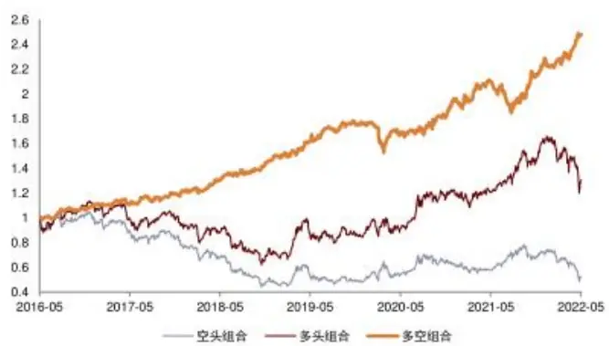
资料来源：ChinaScope，Wind，中金公司研究部，样本期为 2016-05-03 至 2022-05-05

图表 47：mmt_normal_M 动量因子分组回测
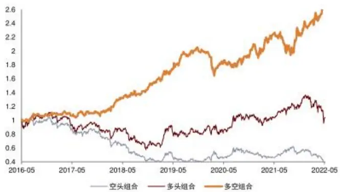

mmt_intraday_M供应链动量差因子多头组合表现优异。与mmt normal M 供应链动量差因子的表现相似，mmt_intraday_M供应链动量差因子的多头组合也优于动量因子，多空组合净值走势更加平稳，体现供应链动量差因子较为出色的选股能力，该因子多头组合的年化收益率为5.95%，超额最大回撤为-4.69%。

图表 48：mmt_intraday_M 供应链动量差因子与自身动量因子全市场分组回测统计值

|  | 组数 | 年化收益率 | 年化波动率 | 年化超额收 相对收益波 益率 | 动率 | 夏普比率 | 信息比率 | 最大回撤 | 超额最大 回撤 | VaR | ES | 下行波动率 | 索提诺比率 |  |
| --- | --- | --- | --- | --- | --- | --- | --- | --- | --- | --- | --- | --- | --- | --- |
| 供应链动量 差因子 | 1 | -11.96% | 25.13% | -10.66% | 8.07% | -0.38 | -1.32 | -58.61% | -48.68% | -2.74% | -4.16% | 19.37% | -49.29% |  |
|  | 2 | -2.10% | 22.75% | -1.02% | 4.67% | 0.02 | -0.22 | -51.35% | -15.84% | -2.41% | -3.77% | 17.39% | 2.79% |  |
|  | 3 | -0.99% | 21.98% | -0.04% | 4.18% | 0.07 | -0.01 | -45.53% | -8.27% | -2.29% | -3.69% | 16.83% | 8.57% |  |
|  | 4 | 1.32% | 21.92% | 2.27% | 4.21% | 0.17 | 0.54 | -48.21% | -6.39% | -2.27% | -3.65% | 16.68% | 22.35% |  |
|  | 5 | 3.74% | 21.51% | 4.63% | 4.08% | 0.28 | 1.13 | -39.74% | -5.56% | -2.18% | -3.55% | 16.28% | 36.89% |  |
|  | 6 | 1.59% | 21.71% | 2.50% | 4.18% | 0.18 | 0.60 | -40.97% | -7.54% | -2.23% | -3.65% | 16.61% | 23.83% |  |
|  | 7 | 2.46% | 21.87% | 3.42% | 3.90% | 0.22 | 0.88 | -44.43% | -6.64% | -2.28% | -3.65% | 16.67% | 29.03% |  |
|  | 8 | 0.73% | 22.37% | 1.79% | 4.06% | 0.15 | 0.44 | -46.18% | -8.12% | -2.27% | -3.73% | 17.10% | 19.03% |  |
|  | 9 | 4.92% | 22.65% | 6.09% | 3.95% | 0.33 | 1.54 | -45.27% | -5.72% | -2.35% | -3.77% | 17.21% | 42.93% |  |
|  | 10 | 5.95% | 23.31% | 7.29% | 4.27% | 0.37 | 1.71 | -41.75% | -4.69% | -2.44% | -3.80% | 17.56% | 48.54% |  |
|  | 动量因子 | 1 | 3.32% | 24.36% | 4.81% | 5.67% | 0.26 | 0.85 | -44.79% | -9.66% | -2.59% | -3.96% | 18.39% | 34.02% |
| 2 |  | 5.25% | 22.89% | 6.47% | 4.25% | 0.34 | 1.52 | -41.62% | -6.55% | -2.38% | -3.81% | 17.34% | 44.72% |  |
| 3 |  | 3.84% | 22.18% | 4.88% | 4.11% | 0.28 | 1.19 | .45.78% | -6.38% | -2.29% | -3.68% | 16.90% | 36.98% |  |
| 4 |  | 4.07% | 21.62% | 4.98% | 4.34% | 0.29 | 1.15 | -44.58% | -6.14% | -2.17% | -3.62% | 16.46% | 38.58% |  |
| 5 |  | 2.92% | 21.38% | 3.76% | 4.32% | 0.24 | 0.87 | -41.97% | -7.29% | -2.22% | -3.53% | 16.19% | 32.00% |  |
| 6 |  | 2.93% | 21.43% | 3.78% | 4.49% | 0.24 | 0.84 | -41.69% | -7.19% | -2.21% | -3.57% | 16.33% | 31.88% |  |
| 7 |  | 4.65% | 21.58% | 5.55% | 4.40% | 0.32 | 1.26 | -42.59% | -6.35% | -2.22% | -3.60% | 16.37% | 42.12% |  |
| 8 |  | 0.30% | 22.17% | 1.28% | 4.70% | 0.13 | 0.27 | -46.42% | -8.13% | -2.28% | -3.71% | 16.94% | 16.43% |  |
| 9 |  | -3.59% | 23.24% | -2.47% | 5.81% | -0.04 | -0.43 | -48.00% | -16.30% | -2.42% | -3.85% | 17.71% | -5.28% |  |
| 10 |  | -16.83% | 26.29% | -15.49% | 9.86% | -0.57 | -1.57 | -69.31% | -62.82% | -2.89% | -4.33% | 20.31% | -73.53% |  |

资料来源：ChinaScope，Wind，中金公司研究部，样本期为 2016-05-03 至 2022-05-05
注：基准指数为万得全A（等权）指数（8841388.WI）

图表49：mmt_intraday_M供应链动量差因子分组回测
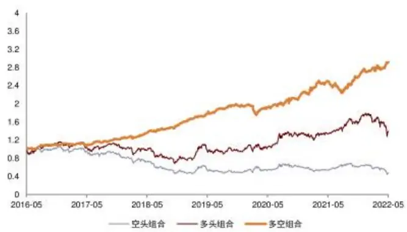
资料来源：ChinaScope，Wind，中金公司研究部，样本期为2016-05-03 至 2022-05-05

图表 50：mmt_intraday_M动量因子分组回测
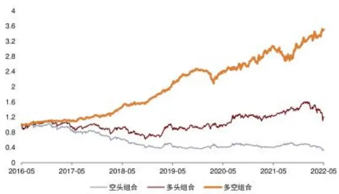

mmt_range_M 供应链动量差因子具有较好的单调性表现。mmt_range_M供应链动量差因子的单调性表现良好，因子值偏高的组合具有更强的收益表现。三种供应链动量差因子的多头选股能力均较强于动量因子，其中mmt_range_M供应链动量差因子多头组合的年化收益率为4.24%，超额最大回撤为-4.60%。

图表 51：mmt_range_M供应链动量差因子与自身动量因子全市场分组回测统计值

|  |  | 年化收益率 组数 | 年化波动率 | 年化超额收 相对收益波 益率 | 动率 | 夏普比率 | 信息比率 | 最大回撤 | 超额最大 回撤 | VaR | ES | 下行波动率 | 索提诺比率 |
| --- | --- | --- | --- | --- | --- | --- | --- | --- | --- | --- | --- | --- | --- |
| 供应链动量 差因子 | 1 | -10.78% | 25.24% | -9.38% | 7.13% | -0.32 | -1.31 | -60.87% | -44.42% | -2.76% | -4.13% | 19.38% | -42.26% |
|  | 2 | -3.97% | 22.92% | -2.87% | 4.66% | -0.06 | -0.62 | -50.11% | -18.94% | -2.44% | -3.79% | 17.47% | -8.06% |
|  | 3 | -0.90% | 22.00% | 0.06% | 4.04% | 0.07 | 0.01 | -46.78% | -10.73% | -2.30% | -3.69% | 16.83% | 9.15% |
|  | 4 | 2.14% | 21.80% | 3.08% | 4.08% | 0.21 | 0.75 | -43.58% | -5.61% | -2.25% | 3.66% | 16.66% | 27.08% |
|  | 5 | 1.46% | 21.65% | 2.36% | 4.11% | 0.18 | 0.57 | -44.63% | -6.65% | -2.27% | -3.62% | 16.54% | 23.04% |
|  | 6 | 2.94% | 21.69% | 3.86% | 4.14% | 0.24 | 0.93 | -41.62% | -8.51% | -2.20% | -3.61% | 16.52% | 31.88% |
|  | 7 | 2.80% | 21.80% | 3.76% | 3.88% | 0.24 | 0.97 | -42.84% | -7.23% | -2.23% | -3.66% | 16.65% | 31.01% |
|  | 8 | 3.47% | 22.01% | 4.47% | 3.88% | 0.27 | 1.15 | -41.99% | -7.17% | -2.28% | -3.66% | 16.77% | 34.89% |
|  | 9 | 4.27% | 22.43% | 5.39% | 3.79% | 0.30 | 1.42 | -43.71% | -4.45% | -2.39% | -3.72% | 17.05% | 39.40% |
|  | 10 | 4.24% | 23.34% | 5.56% | 4.26% | 0.30 | 1.31 | -43.49% | -4.60% | -2.44% | -3.84% | 17.68% | 39.04% |
| 动量因子 | 1 | 1.86% | 24.26% | 3.35% | 4.97% | 0.20 | 0.67 | -45.68% | -9.19% | -2.62% | -4.00% | 18.48% | 26.05% |
|  | 2 | 5.59% | 22.54% | 6.75% | 3.97% | 0.36 | 1.70 | -41.64% | -6.90% | -2.48% | -3.76% | 17.17% | 46.64% |
|  | 3 | 5.40% | 21.86% | 6.38% | 4.19% | 0.35 | 1.52 | -43.00% | -5.51% | -2.23% | -3.64% | 16.60% | 46.18% |
|  | 4 | 4.57% | 21.30% | 5.41% | 4.42% | 0.32 | 1.22 | -41.77% | -7.08% | -2.14% | -3.57% | 16.20% | 41.74% |
|  | 5 | 4.27% | 21.07% | 5.05% | 4.37% | 0.30 | 1.16 | -41.72% | -5.20% | -2.06% | -3.54% | 16.00% | 40.15% |
|  | 6 | 2.99% | 21.06% | 3.76% | 4.30% | 0.25 | 0.87 | -41.46% | -6.90% | -2.11% | 3.51% | 16.03% | 32.31% |
|  | 7 | -0.11% | 21.62% | 0.76% | 4.19% | 0.10 | 0.18 | -44.47% | -8.51% | -2.21% | -3.59% | 16.51% | 13.61% |
|  | 8 | 1.13% | 22.23% | 2.14% | 4.46% | 0.16 | 0.48 | -42.01% | -7.19% | -2.29% | -3.66% | 16.82% | 21.47% |
|  | 9 | -4.16% | 23.47% | .2.97% | 5.33% | -0.06 | -0.56 | -51.52% | -20.81% | -2.48% | -3.88% | 17.90% | -8.24% |
|  | 10 | -14.76% | 26.70% | -13.20% | 8.78% | -0.46 | -1.50 | -64.79% | -56.69% | -2.95% | -4.38% | 20.58% | -60.08% |

资料来源：ChinaScope，Wind，中金公司研究部，样本期为 2016-05-03 至 2022-05-05
注：基准指数为万得全A（等权）指数（8841388.WI）

图表 52:mmt_range_M 供应链动量差因子分组回测
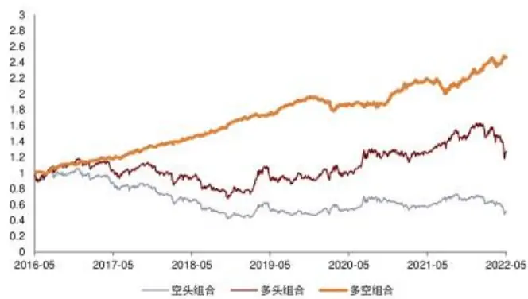
资料来源：ChinaScope，Wind，中金公司研究部，样本期为 2016-05-03 至 2022-05-05

图表 53：mmt_range_M 动量因子分组回测
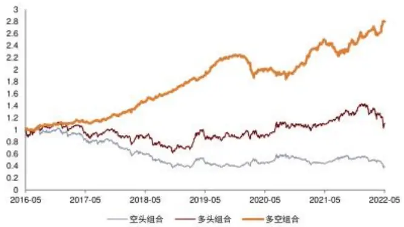

## 作者信息

## 古翔口翔

SAC 执证编号：S0080521010010
SFC CE Ref: BRE496
xiang.gu@cicc.com.cn

## 刘均伟

SAC 执证编号：S0080520120002
SFC CE Ref: BQR365
junwei.liu@cicc.com.cn
曹钰婕
SAC 执证编号：S0080122030141
yujie.cao@cicc.com.cn
王汉锋
SAC 执证编号：S0080513080002
SFC CE Ref: AND454
hanfeng.wang@cicc.com.cn
周蕭潇
SAC 执证编号：S0080521010006
SFC CE Ref: BRA090
xiaoxiao.zhou@cicc.com.cn

# 法律声明

一般声明

本报告由中国国际金融股份有限公司（已具备中国证监会批复的证券投资咨询业务资格）制作。本报告中的信息均来源干我们认为可靠的已公开资料，但中国国际金融股份有限公司及其关联机构（以下统称“中金公司”）对这些信息的准确性及完整性不作任何保证。本报告中的信息、意见等均仅供投资者参考之用，不构成对买卖任何证券或其他金融工具的出价或征价或提供任何投资决策建议的服务。该等信息、意见并未考虑到获取本报告人员的具体投资目的、财务状况以及特定需求，在任何时候均不构成对任何人的个人推荐或投资操作性建议。投资者应当对本报告中的信息和意见进行独立评估，自主审慎做出决策并自行承担风险。投资者在依据本报告涉及的内容进行任何决策前，应同时考量各自的投资目的、财务状况和特定需求，并就相关决策咨询专业顾问的意见对依据或者使用本报告所造成的一切后果，中金公司及/或其关联人员均不承担任何责任。

本报告所载的意见、评估及预测仅为本报告出具日的观点和判断，相关证券或金融工具的价格、价值及收益亦可能会波动。该等意见、评估及预测无需通知即可随时更改。在不同时期，中金公司可能会发出与本报告所载意见、评估及预测不一致的研究报告。

本报告署名分析师可能会不时与中金公司的客户、销售交易人员、其他业务人员或在本报告中针对可能对本报告所涉及的标的证券或其他金融工具的市场价格产生短期影响的催化剂或事件进行交易策略的讨论。这种短期影响的分析可能与分析师已发布的关于相关证券或其他金融工具的目标价、评级、估值、预测等观点相反或不一致，相关的交易策略不同于且也不影响分析师关于其所研究标的证券或其他金融工具的基本面评级或评分。

中金公司的销售人员、交易人员以及其他专业人士可能会依据不同假设和标准、采用不同的分析方法而口头或书面发表与本报告意见及建议不一致的市场评论和/或交易观点。中金公司没有将此意见及建议向报告所有接收者进行更新的义务。中金公司的资产管理部门、自营部门以及其他投资业务部门可能独立做出与本报告中的意见不一致的投资决策。

除非另行说明，本报告中所引用的关于业绩的数据代表过往表现。过往的业绩表现亦不应作为日后回报的预示。我们不承诺也不保证，任何所预示的回报会得以实现。
分析中所做的预测可能是基于相应的假设。任何假设的变化可能会显著地影响所预测的回报。

本报告提供给某接收人是基于该接收人被认为有能力独立评估投资风险并就投资决策能行使独立判断。投资的独立判断是指，投资决策是投资者自身基于对潜在投资的目标、需求、机会、风险、市场因素及其他投资考虑而独立做出的。

本报告由受香港证券及期货事务监察委员会监管的中国国际金融香港证券有限公司（“中金香港”）于香港提供。香港的投资者若有任何关于中金公司研究报告的问题请直接联系中金香港的销售交易代表。本报告作者所持香港证监会牌照的牌照编号已披露在报告首页的作者姓名旁。

本报告由受新加坡金融管理局监管的中国国际金融（新加坡）有限公司（“中金新加坡”）于新加坡向符合新加坡《证券期货法》定义下的合格投资者及/或机构投资者提供。本报告无意也不应直接或间接地分发或传递给新加坡的任何其他人。提供本报告于合格投资者及/或机构投资者，有关财务顾问将无需根据新加坡之《财务顾问法》第45条就任何利益及/或其代表就任何证券利益进行披露。有关本报告之任何查询，在新加坡获得本报告的人员可联系中金新加坡持牌代表。

本报告由受金融行为监管局监管的中国国际金融（英国）有限公司（“中金英国”）于英国提供。本报告有关的投资和服务仅向符合《2000年金融服务和市场法2005年(金融推介）令》第19（5）条、38条、47条以及49条规定的人士提供。本报告并未打算提供给零售客户使用。在其他欧洲经济区国家，本报告向被其本国认定为专业投资者（或相当性质）的人士提供。

本报告由中国国际金融日本株式会社（“中金日本”）于日本提供，中金日本是在日本关东财务局（日本关东财务局长（金商）第3235号）注册并受日本法律监管的金融机构。本报告有关的投资和服务仅向符合日本《金融商品交易法》第2条31项所规定的专业投资者提供。本报告并未打算提供给日本非专业投资者使用。

本报告将依据其他国家或地区的法律法规和监管要求于该国家或地区提供。

## 特别声明

在法律许可的情况下，中金公司可能与本报告中提及公司正在建立或争取建立业务关系或服务关系。因此，投资者应当考虑到中金公司及/或其相关人员可能存在影响本报告观点客观性的潜在利益冲突。

与本报告所含具体公司相关的披露信息请访问https://research.cicc.com/footer/disclosures，亦可参见近期已发布的关于该等公司的具体研究报告。

中金研究基本评级体系说明：

分析师采用相对评级体系，股票评级分为跑赢行业、中性、跑输行业（定义见下文）。

除了股票评级外，中金公司对覆盖行业的未来市场表现提供行业评级观点，行业评级分为超配、标配、低配（定义见下文）。

我们在此提醒您，中金公司对研究覆盖的股票不提供买入、卖出评级。跑赢行业、跑输行业不等同于买入、卖出。投资者应仔细阅读中金公司研究报告中的所有评级定义。请投资者仔细阅读研究报告全文，以获取比较完整的观点与信息，不应仅仅依靠评级来推断结论。在任何情形下，评级（或研究观点）都不应被视为或作为投资建议。投资者买卖证券或其他金融产品的决定应基于自身实际具体情况（比如当前的持仓结构）及其他需要考虑的因素。

## 股票评级定义：

·跑赢行业(OUTPERFORM)：未来6~12个月，分析师预计个股表现超过同期其所属的中金行业指数：

·中性（NEUTRAL）：未来6~12个月，分析师预计个股表现与同期其所属的中金行业指数相比持平

跑输行业（UNDERPERFORM)：未来6~12个月，分析师预计个股表现不及同期其所属的中金行业指数。

## 行业评级定义：

超配（OVERWEIGHT）：未来6~12个月，分析师预计某行业会跑赢大盘10%以上；

- 标配（EQUAL-WEIGHT）：未来6~12个月，分析师预计某行业表现与大盘的关系在-10%与10%之间；

- 低配（UNDERWEIGHT）：未来6~12个月，分析师预计某行业会跑输大盘10%以上。

研究报告评级分布可从https://research.cicc.com/footer/disclosures 获悉。

本报告的版权仅为中金公司所有，未经书面许可任何机构和个人不得以任何形式转发、翻版、复制、刊登、发表或引用。

V190624 编辑：赵静

## 北京

中国国际金融股份有限公司中国北京建国门外大街1号国贸写字楼2座28层邮编：100004电话：(86-10)6505 1166传真：(86-10) 6505 1156

## 深圳

中国国际金融股份有限公司深圳分公司
深圳市福田区益田路5033号
平安金融中心72层
邮编：518048
电话：(86-755)8319-5000
传真：(86-755)8319-9229

## 东京

中国国际金融日本株式会社
100-0005東京都千代田区丸の内3丁目2番3
号丸の内二重橋ビル21階
Tel: (+813) 3201 6388
Fax: (+813)3201 6389

## 纽约

CICC US Securities, Inc 32nd Floor, 280 Park Avenue New York, NY 10017, USA Tel: (+1-646) 7948 800 Fax: (+1-646) 7948 801

## 伦敦

China International Capital Corporation (UK) 
Limited 
25th Floor, 125 Old Broad Street 
London EC2N 1AR, United Kingdom 
Tel: (+44-20) 7367 5718 
Fax: (+44-20) 7367 5719

## 上海

中国国际金融股份有限公司上海分公司
上海市浦东新区陆家嘴环路1233号
汇亚大厦32层
邮编：200120
电话：(86-21)5879-6226
传真：(86-21)5888-8976

## 香港

中国国际金融（香港）有限公司香港中环港景街1号国际金融中心第一期29楼电话：(852)2872-2000传真：(852)2872-2100

## 旧金山

CICC US Securities, Inc. San Francisco Branch 
Office 
One Embarcadero Center, Suite 2350, 
San Francisco, CA 94111, USA 
Tel: (+1) 415 493 4120 
Fax: (+1) 628 203 8514

## 新加坡

China International Capital Corporation 
(Singapore) Pte. Limited 
6 Battery Road, #33-01 
Singapore 049909 
Tel: (+65) 6572 1999 
Fax: (+65) 6327 1278

## 法兰克福

China International Capital Corporation (Europe) 
GmbH 
Neue Mainzer Straße 52-58, 60311 
Frankfurt a.M, Germany 
Tel: (+49-69) 24437 3560