# 量化多因子系列（9）：宽基指数增强2.0 体系

周萧潇

SAC 执证编号：S0080521010006

SFC CE Ref: BRA090

xiaoxiao.zhou@cicc.com.cn

古翔
SAC 执证编号：S0080521010010
SFC CE Ref: BRE496
xiang.gu@cicc.com.cn

指数增强策略是在对标的指数进行有效跟踪基础上，以追求超越基准指数回报为目的的量化策略，是量化选股研究领域中的一个重要研究方向。作为量化行业最具优势的赛道之一，指数增强策略可以较为充分的体现量化的系统性和规则性的优势，在选定的市场Beta风格上相对稳健地提供额外的Alpha收益，也因而受到较多投资者和资金方的青睐。

各类宽基指数中，沪深300、中证500、中证1000指数增强是关注度较高的策略类型。本篇报告将主要着眼于三大宽基的指数增强策略优化，从不同宽基指数的特征入手，深入分析并测试适用于不同宽基指数的量化选股增强方案，并最终给出沪深300、中证500、中证1000指数增强策略的模型建议。

## 影响量化增强策略收益的核心要素

主动管理基本定律表明选股模型的信息比是由信息系数（IC）和投资宽度（Breadth)的平方根共同决定。对于量化投资来说，投资宽度越广，市场投资机会越多的时候，更容易获取较好的收益表现。因而量化因子有效性、有效因子数量、选股域大小、主动研究覆盖深度等因素，都是影响量化增强策略收益的关键因素。

## 沪深 300 指数增强：权重股约束+选股域扩展

1）沪深300指数增强的难点：行业和个股集中度高、成分股风格一致性弱、有效因子数量少。从成分股个股权重的基尼系数来看，沪深300的个股权重集中度明显较高。沪深300指数在成长和价值风格上的暴露度的离散度也较高，离散度越大指数的风格稳定性越弱，也进一步导致因子和模型的失效可能性上升。此外，沪深300指数的行业分布和风格的显著变化也对模型的适应性提出了更高的要求。

2）沪深300指数增强2.0：在QQC沪深300增强模型的基础上，基于对指数风格变化，行业分布变化和市场外部环境变化的分析，我们对模型的因子选择、个股约束和成分股占比约束做了相应的调整，构成沪深300指数增强2.0模型。优化后的模型相对原始模型的近期表现有所提升，2021年全年超额收益由1.90%提升至9.36%，2022年年化超额由 4.50%提升至 11.31%。

## 中证500和1000指数增强：情景分析因子模型有效性较稳定

1）中证500和1000指数特点：相似特征。相较于沪深300指数而言，中证500和1000指数的多个维度特征均较为接近：行业和个股集中度较低、风格一致性较高、有效因子数量较多。且两个指数在选股宽度上更具有优势，因此均可以考虑使用情景分析因子模型对两者构建增强策略。

2）基于情景分析因子模型的中证500指数增强：采用流动性特征分组后再对因子进行权重优化的情景特征因子模型，应用于中证500指数增强。基于情景分析因子模型的中证500增强组合在全样本范围内年化超额收益为18.23%，信息比3.31。样本外（2021-01-01）跟踪以来，组合在2021年全年跑赢基准17.09%，2022年年化超额14.65%，样本外收益表现与样本内基本保持一致。

3）基于情景分析因子模型的中证1000指数增强：同样采用流动性特征分组后的情景特征因子模型，并纳入前期梳理的价量新因子，构建中证1000指数增强。基于情景分析因子模型的中证1000增强组合在全样本范围内年化超额收益为 22.92%，信息比 3.94。

- 量化策略|量化多因子系列（7）：价量因子手册(2022.08.06)

- 量化策略|量化多因子系列（5）：基本面因子手册(2022.04.26)

- 量化策略|量化多因子系列（2）：非线性假设下的情景分析因子模型(2021.02.28)

- 量化策略|量化多因子系列（1）：QQC综合质量因子与指数增强应用(2021.01.14)

更多作者及其他信息请见文末披露页

## 三大宽基指数的量化增强难度如何？

作为量化行业最具优势的赛道之一，指数增强策略可以较为充分的体现量化的系统性和规则性的优势，在选定的市场Beta风格上相对稳健地提供额外的Alpha收益，也因而受到较多投资者和资金方的青睐。各类宽基指数中，沪深300、中证500、中证1000指数增强是关注度较高的策略类型。本文中我们将主要着眼于三大宽基的指数增强策略优化，从不同宽基指数的特征入手，深入分析并测试适用于不同宽基指数的量化选股增强方案或优化方案，并最终给出沪深300、中证500、中证1000指数增强策略的模型建议。

而在详细展开讨论不同宽基指数增强策略模型细节之前，我们认为很有必要对不同宽基指数的特征做一些前期的讨论。这将有助于我们对不同指数的特点和其对应的增强难点有所认知，并更有针对性的进行因子的选择和增强模型的优化和测试。

## 影响量化增强策略收益的核心要素

Grinold(1989)提出的主动管理基本定律(Fundamental Law of Active Management)表明，选股模型的信息比（IR）由信息系数（IC）和投资宽度（Breadth）的平方根共同决定。

$$
\mathsf{IR}=\mathsf{IC}\ast\sqrt{Breadth}
$$

因此从信息比率角度衡量一个投资策略的优劣，主要取决于选股能力和投资宽度，也可以理解为投资的“深度”和“宽度”。对于量化投资来说，投资宽度越广，市场投资机会越多的时候，更容易获取较好的收益表现。量化投资更擅长通过投资宽度的比较优势来产生超额收益。而主动投资更擅长的是通过投资深度（公司研究、产业链研究等）带来收益。

卖方行业研究对不同上市公司和其所在行业的紧密跟踪和深入挖掘，就体现了主动投资研究的“深度”。量化因子选股策略则更多地体现出投资研究的“宽度”，通过广泛的因子挖掘和测试，从基本面的角度或价量技术面的角度出发，筛选出收益率和胜率具有稳定优势的公司股票池，并构建组合。因而因子有效性、有效因子数量、选股域大小、主动研究覆盖深度等因素，都是影响量化增强策略收益的关键因素。

图表1：不同宽基指数成分股的卖方分析师覆盖度
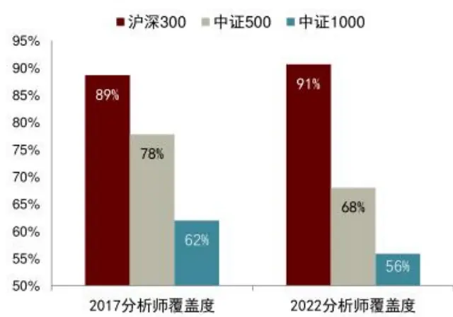
资料来源：Wind，中金公司研究部，截止2022-07-31

图表2：因子在不同宽基指数内的有效性差异
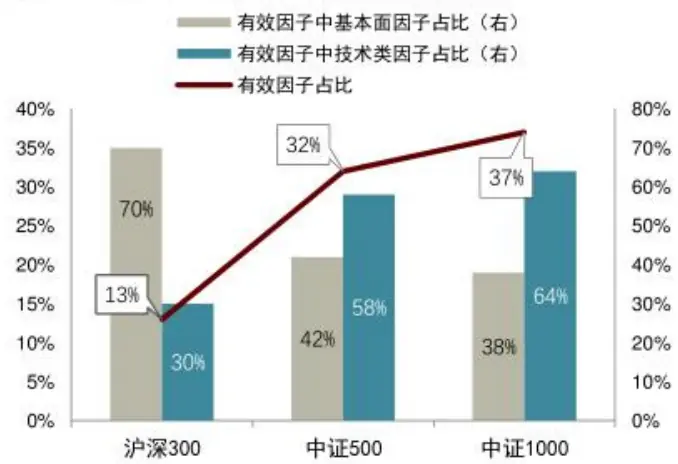
资料来源：Wind，中金公司研究部

## 沪深300指数的主动研究覆盖和深度更有优势

我们通过统计三大宽基指数成分股的卖方分析师覆盖度，来观察主动投资研究对不同指数成份的研究覆盖情况。可以明显观察到，卖方行业分析师在沪深300指数上的研究覆盖显著高于中证500和中证1000，无论是近期还是5年前，沪深300内公司均有约90%是被卖方行业研究深度覆盖的。与此同时，中证500和中证1000指数的卖方覆盖度显著低于沪深300指数，且近期相比5年前的覆盖度有所降低，中证500公司的覆盖度由78%降低至68%。

## 中证1000指数成分股内有效量化因子的占比较高

以中金量化因子库中包括基本面因子1和价量因子²在内的共18大类300多个细分因子为例。测试这些因子在主流宽基指数成分股内的预测能力和选股能力。以IC绝对值大于3%，IC_IR绝对值大于0.3为标准，中证1000指数成分股内，满足上述标准的因子数量占比高达37%，为三个宽基指数中有效因子占比最高的指数。中证1000内的有效因子中以价量技术类型的因子为主，占比超过64%，这一比例也显著高与中证500指数的58%，沪深300指数的30%。

## 沪深 300 指数增强：三大难点

结合前文的分析和我们的观察，我们认为使用量化的方法进行沪深300指数增强的难度往往在于以下几点的特征：行业和个股的高集中度、成分股风格的低一致性、较少的有效因子数量。

## 行业和个股集中度高

截止2022年7月31日，沪深300指数成分股的行业中，权重超过5%的行业仅6个，且这12个行业的权重之和接近六成，高达59%，可见沪深300内行业的权重集中度较高。

图表3：不同宽基指数的个股权重基尼系数
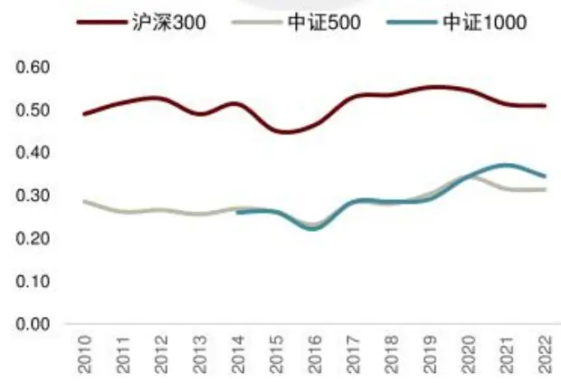
资料来源：Wind，中金公司研究部

图表4：不同宽基指数的主动基金持仓集中度
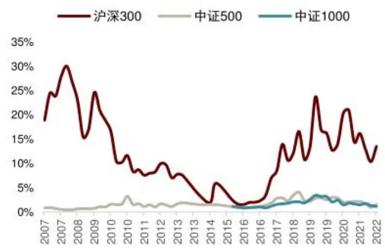
资料来源：Wind，中金公司研究部

## 沪深300指数在个股层面的集中度也同样表现出与中证500和中证1000的显著差异：

从成分股个股权重的基尼系数来看，我们发现沪深300的个股权重基尼系数明显高与另外两个指数，而中证500和中证1000的基尼系数则较为接近。基尼系数是经济学中衡量贫富差距的重要指标，通过衡量实际洛伦兹曲线与理论洛伦兹曲线的累计差异，可以有效反映当前财富分配相较于完全平等社会的偏离。基尼系数最大为“1”，最小等于“0”。基尼系数越接近0表明越是趋向平等。相似的，使用基尼系数可以有效衡量个股权重的不平衡情况。

从成分股基金持仓的集中度来看，我们发现主动型基金在沪深300的持仓集中度也在大部分时间内显著高与另外两个指数。我们将市场上的偏股型基金作为一个整体，将他们持有个股的权重之和作为度量基金持仓集中度的指标。

## 成分股风格一致性弱

与中证500和中证1000相比，沪深300指数成分股的风格一致性也相对较弱。就以成长和价值这两大主流风格因子为例，沪深300指数在成长和价值风格因子的暴露度的波动明显高于中证500和中证1000。我们以离散度作为度量指数风格一致性的反面指标，离散度越大则表明指数的风格稳定性越弱，风格漂移的情况越容易发生，也进一步导致因子和模型的失效可能性上升。

图表5：不同宽基指数内的风格一致性

|  | 成长风格暴露离散度 | 价值风格暴露离散度 |
| --- | --- | --- |
| 沪深300 | 1.28 | 1.33 |
| 中证500 | 0.57 | 1.25 |
| 中证1000 | 0.86 | 1.18 |

资料来源：Wind，中金公司研究部

## 有效因子数量少

由图表2可见，沪深300内进行因子测试时，仅有13%的因子具有显著的预测能力，沪深300内的有效因子数量显著低于中证500和中证1000指数。同时，沪深300内的有效因子中以基本面类型的因子为主，占比约70%。

## 中证500 与中证1000 指数增强：相似特征

与沪深300指数相比，中证500和中证1000指数在行业分布、个股权重集中度、风格一致性和因子有效性上的特征是更为接近的。

具体来说我们也可以进一步总结为以下的三方面特征：

个股集中度较低：由图表3和图表4可见，无论是从成分股个股权重的基尼系数观察个股权重集中度，还是从主动基金持仓来观察成分股被基金持有的集中度，都可以发现中证500和中证1000指数的表现非常相似。

风格一致性较高：仍然以宽基指数在成长风格和价值风格的暴露程度为例，我们可以看到中证500和中证1000指数在成长和价值风格上的暴露度波动较小，在价值风格上更是具有非常接近的暴露度表现。

图表6：宽基指数成长风格暴露度
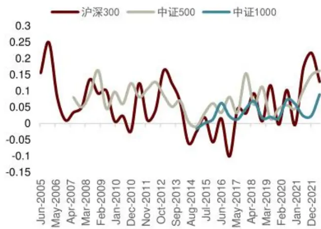
资料来源：Wind，中金公司研究部

图表7：宽基指数价值风格暴露度
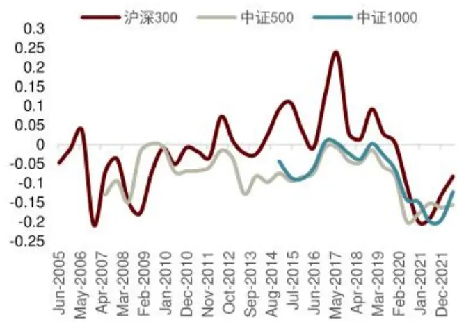
资料来源：Wind，中金公司研究部

## 有效因子数量较多：由图表2可见，

结束上述几个特征，同时考虑到中证500和中证1000指数的成分股数量显著高与沪深300指数，在决定选股策略有效性的“宽度”维度上也更具有优势，因此，我们认为中证500和中证1000指数增强策略的收益空间将整体上高与沪深300指数，且可以采用较为统一的模型框架对这两个指数进行量化选股增强策略的开发和构建。

## 沪深 300 增强

沪深300指数作为A 股市场最具代表性且关注度最高的指数之一，其成分股代表着A股市场中质地优良的大盘龙头公司。因此市场上的投资者广泛地将沪深300指数作为投资的标杆或者基准。前文中我们提到沪深300指数增强模型构建可能会遇到的难点，解释了采用量化策略进行沪深300增强的超额收益空间大概率弱于中证500和中证1000指数的原因。

进一步的，在指数增强策略的运行过程中我们也发现沪深300增强策略较容易出现阶段性表现不佳的情况，尤其是近2年来，模型有效性的波动出现较明显放大的趋势。因此，我们将首先尝试分析模型有效性波动加大的背后原因，再而对沪深300增强模型的优化方式进行讨论，并给出优化后的沪深300增强模型。

## 指数的行业分布与风格暴露呈现变化趋势

## 行业分布：金融行业权重减半，电新占比快速上升

沪深300指数的行业分布在过去的10多年里出现了显著的变化，其中最为明显的就是银行的权重占比从20%的高位下滑至近期的10%-11%，权重几乎降至高峰时期的一半；非银行业的权重也由17-18年时期的18%的高峰降至近期的7%。

与之相对应的，电力设备与新能源行业权重在2020年以后快速上升，由2020年初的2%快速上升至近期的13%，一跃成为沪深300指数成份的第一大权重行业。同时，电子和医药行业的权重也在最近5年中保持稳定的上升趋势。

图表 8：沪深300 主要行业分布历年变化（%）
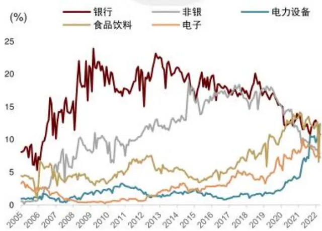
资料来源：Wind，中金公司研究部

图表9：沪深300最新一期前六大行业权重分布
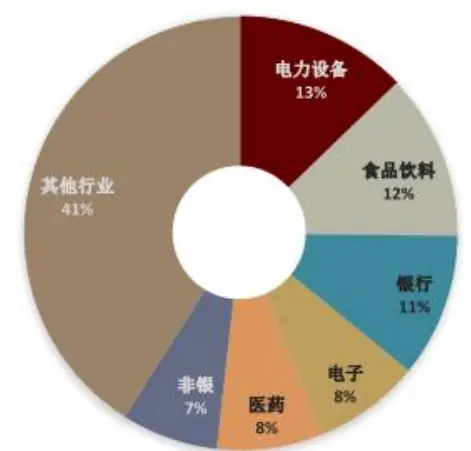
资料来源：Wind，中金公司研究部

## 指数风格：17年以来逐渐偏向成长风格

沪深300指数在两大主流风格成长和价值风格上的暴露度也呈现明显的变化，过去十年中，沪深300指数的成长风格暴露度先“降”后“升”，2017年之前沪深300指数在成长风格上的暴露度波动下降，而2017年之后指数的成长属性有所增强。价值风格维度则于成长相反，呈现先“升”后“降”的趋势，且2017年以来指数在价值风格方面的暴露度波动有所加大。

图表10：沪深 300指数风格暴露变化
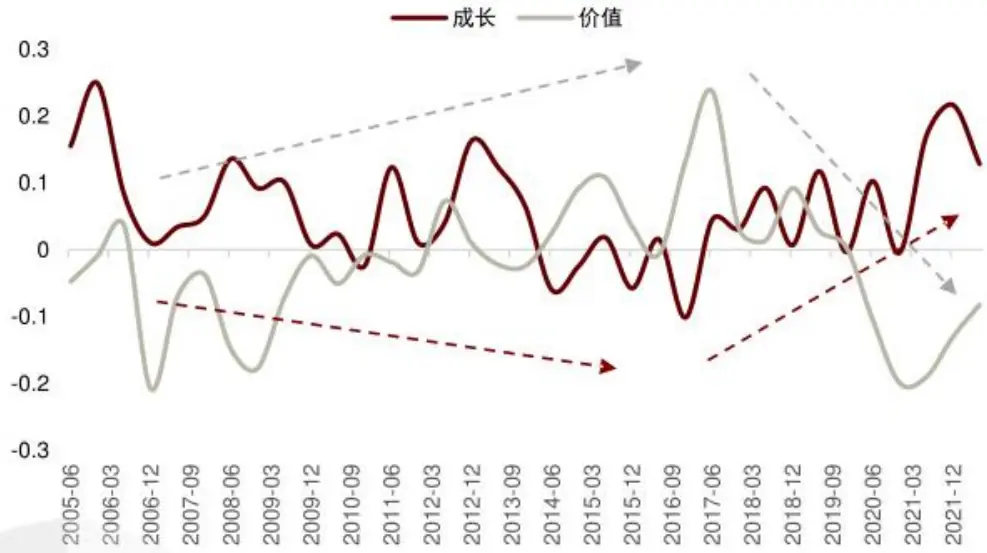
资料来源：Wind，中金公司研究部

## Alpha因子：因子有效性的变化同样明显

我们展示了历史上在沪深300成份内具有较高有效性的因子分年度表现，包括QQC（综合质量因子）、成长因子、公司治理因子、低波动、低流动性因子等等，从分年度的表现来看就可以比较明显的观察出近年来因子有效性的变化是较为显著的。

图表 11：沪深 300 内主流 Alpha 大类因子的月度 IC 均值

|  | 公司治理 | 分红 | QQC | 成长 | 动量 | 运营效率 | 盈利能力 | 安全性 | 低波动 | 低流动性 |
| --- | --- | --- | --- | --- | --- | --- | --- | --- | --- | --- |
| 2006 | 0.92% | 2.01% | 5.76% | 4.84% | 2.87% | 3.32% | 5.51% | 4.90% | 5.02% | 1.40% |
| 2007 | 1.88% | 3.12% | 3.19% | 3.35% | -3.29% | 4.27% | 1.01% | -1.64% | 1.76% | -0.83% |
| 2008 | 3.18% | 3.99% | 3.45% | 3.95% | -5.12% | 3.17% | -0.50% | 1.53% | 6.01% | 4.03% |
| 2009 | 6.09% | -1.35% | 3.97% | 2.33% | -3.98% | -0.85% | 1.54% | 2.77% | -6.64% | 1.27% |
| 2010 | 0.25% | 1.95% | 4.18% | 6.24% | 2.78% | 2.89% | 3.38% | -1.57% | -1.41% | 1.87% |
| 2011 | 1.80% | 2.80% | 4.79% | 3.95% | -2.70% | 2.30% | 4.20% | 2.76% | 6.46% | -1.61% |
| 2012 | 1.37% | 1.21% | 4.31% | 6.26% | -1.00% | 1.30% | 3.48% | -0.40% | 2.28% | -1.18% |
| 2013 | 1.80% | 0.75% | 4.33% | 6.91% | 2.96% | 3.06% | 2.23% | 0.54% | 4.60% | 1.78% |
| 2014 | 1.06% | 7.66% | 0.48% | -0.57% | -9.87% | 1.51% | -1.67% | 0.75% | 8.47% | 1.72% |
| 2015 | 1.49% | 5.55% | 2.99% | 3.71% | -4.35% | 1.87% | 2.41% | -1.18% | 2.19% | 0.36% |
| 2016 | 2.84% | 7.97% | 3.05% | 3.29% | -6.60% | -0.46% | 2.11% | 1.88% | 8.51% | 2.29% |
| 2017 | 4.21% | 3.71% | 5.92% | 3.43% | 3.61% | 1.35% | 7.25% | 2.90% | 3.90% | 0.24% |
| 2018 | -2.60% | 5.68% | 2.05% | 3.08% | -0.47% | 2.02% | 1.30% | 2.07% | 3.64% | 1.51% |
| 2019 | 4.64% | 0.56% | 6.60% | 4.89% | 5.43% | 1.29% | 6.52% | 4.14% | -1.78% | -3.95% |
| 2020 | 1.93% | -2.92% | 4.74% | 3.99% | 6.52% | 4.19% | 4.83% | 0.84% | -1.76% | -1.54% |
| 2021 | 0.84% | 3.10% | -1.51% 0.09% |  | -3.90% | -1.93% | -2.41% | -3.10% | 3.01% | 0.08% |
| 2022 | 0.24% | 4.09% | 1.79% -0.48% |  | -1.85% | 1.18% | 2.11% | 3.24% | 2.14% | -0.28% |

资料来源：Wind，中金公司研究部，截止2022-07-31

尤其是2017年以来，可以较为明显的划分为两个阶段：

2017-2020：这一阶段因子在沪深300内的表现就与2014至2016年差异明显，盈利能力、质量因子、公司治理因子和动量因子表现大幅提升，而分红和低波动因子在沪深300内预测能力出现下滑。

2021至今：这一阶段因子表现又出现了较大的转变，盈利、成长、治理、动量因子回撤明显，分红和低波动因子体现出相对优势。

行业分布和风格的显著变化对量化因子模型的适应性都提出了更高的要求，一方面，因子的筛选和使用的过程中，需要尽量综合考虑指数本身特征变化可能带来的因子有效性变化，可能需要更加动态的对因子和权重进行调整；另一方面，指数成份的快速变化也使得控制组合跟踪误差的难度同步增大。

## 增强模型改进：权重股约束+选股域扩展

## 基于 QQC 的沪深 300增强：2021Q3 以来超额出现回撤

在报告《量化多因子系列（1）：QQC综合质量因子与指数增强应用》中，我们搭建了基于QQC综合质量因子的沪深300指数增强模型。采用包括估值因子、动量因子、换手率因子、一致预期类因子在内的沪深300内较为有效的因子，与QQC因子一同作为模型底层因子，同时选股范围限制在沪深300内，在控制了行业和市值偏离以及个股权重偏离度后，构建了沪深300 指数增强组合（下文简称为 QQC 沪深 300增强)。

QQC 沪深300增强组合优化及主要参数设置：

（1）沪深300成分股内选股；

(2)约束行业偏离度不超过5%；约束市值因子暴露度不超过5%;

(3)约束个股权重相对沪深300成分股原始权重的偏离度不超过1个百分点（绝对值)。

图表 12：QQC 沪深 300 增强模型样本内表现
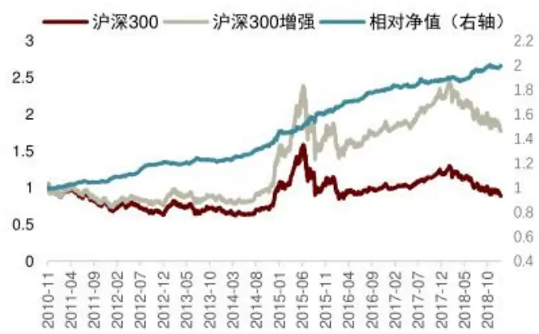
资料来源：Wind，中金公司研究部，注：样本内为20110101-20181231

图表 13：QQC 沪深 300 增强模型样本外表现
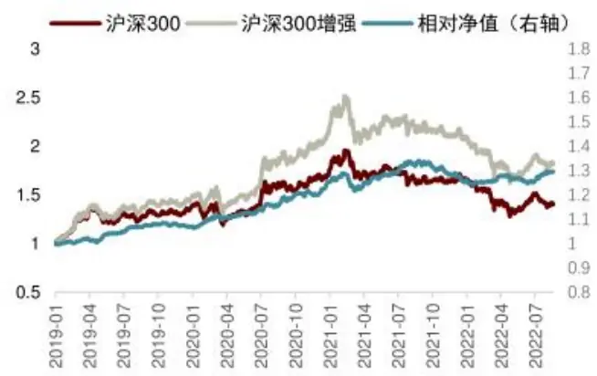
资料来源：Wind，中金公司研究部，注：样本外为20190101-20220731

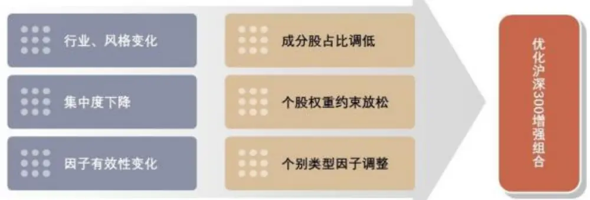
图表 15：沪深 300 指数增强模型优化思路
资料来源：中金公司研究部

图表 14：QQC 沪深 300 增强样本内与样本外分年度表现

|  | 月度胜率 | 年化超额收益率 | 相对收益波动率 | 信息比 | 相对最大回撤 |
| --- | --- | --- | --- | --- | --- |
| 2011 | 83% | 7.39% | 2.83% | 2.61 | -1.69% |
| 2012 | 75% | 11.29% | 2.72% | 4.15 | -0.80% |
| 2013 | 42% | 1.73% | 2.73% | 0.63 | -2.62% |
| 2014 | 100% | 18.93% | 3.85% 4.92 |  | -1.33% |
| 2015 | 83% | 12.45% | 5.01% 2.48 |  | -2.46% |
| 2016 | 100% | 9.95% | 2.58% | 3.86 | -0.65% |
| 2017 | 67% | 6.53% | 2.86% | 2.28 | -1.87% |
| 2018 | 75% | 5.87% | 2.65% 2.21 |  | -2.03% |
| 2019 | 75% | 9.27% | 2.75% | 3.37 | -3.85% |
| 2020 | 92% | 19.37% | 4.71% | 4.11 | -3.40% |
| 2021 | 50% | 1.90% | 3.79% | 0.50 | -5.33% |
| 2022 | 63% | 4.50% | 2.90% 1.55 |  | -2.53% |
| Summary | 77% | 9.77% | 3.43% 2.85 |  | -5.33% |

资料来源：Wind，中金公司研究部，注：样本内为20110101-20181231，样本外为20190101-20220731，2022年为年化表现

组合在样本外表现整体上来看与样本内表现基本匹配，样本外年化超额收益为10.08%，跟踪误差3.54%，样本外信息比2.84。但是在2021年的三季度和四季度，组合的超额收益遇到较大幅度的回撤，2021年8月至12月累计跑输基准超过5个百分点，将上半年的超额收益几乎全部吐回，最终2021年全年仅获得了1.90%的超额。

## 权重股约束+选股域扩展：适应市场环境的变化

针对前文分析的沪深300指数本身的在行业分布、风格暴露和集中度等方面近期的变化情况，和前期QQC沪深300指数增强模型的跟踪情况，我们考虑对沪深300指数增强模型在成分股占比、个股权重约束等方面进行一些有针对性的调整，并进行了相应的测试。

具体来看，我们对沪深300模型的因子选择、个股约束和成分股占比约束做了相应的基于逻辑的调整。值得一提的是，我们此处进行的各项调整都更大程度依赖于我们对指数风格变化，行业分布变化和市场外部环境变化的分析，并针对性的做出一些调整，以此保证模型的逻辑严谨性，并降低过拟合程度。

因子选择：因子层面我们基本沿用了QQC沪深300增强模型的因子类型和权重配置方法。仅在两个细分因子的选择上做了略微的调整，基于我们近期发布的两个因子手册《基本面因子手册》和《价量因子手册》，将沪深300内多头收益和单调性表现更为出色的流动性因子liq_turn_std_6M和估值因子OCFP_TTM加入模型，替换了原先的换手率因子VA_FC_1M和DP。

图表 16：沪深 300 增强模型 2.0因子明细

| Factor Code | 名称 | 权重限制 |
| --- | --- | --- |
| BP_LR | BP |  |
| Momentum_24M | 24个月收益率 |  |
| OCFP_TTM | 经营净现金流/总市值 |  |
| liq_turn_std_6M | 6个月换手率标准差 |  |
| EEP | 一致预期EP |  |
| EEChange_3M QQC | 一致预期净利润3个月变动 QQC |  |

资料来源：Wind，中金公司研究部

成分股占比：由于沪深300指数的风格变化，其成长属性呈现上升趋势，价值属性有所下降，同时成分股的集中度也出现一定程度降低，我们认为QQC沪深300增强模型中选股仅限于沪深300成分股的约束已经显得过于严格。适当放宽成分股占比的约束或许有助于选股 Alpha 的获取。

在沪深300 增强模型2.0中，我们将成分股占比降至不小于 80%。

个股权重约束：在原始模型中，我们为了更好的控制相对波动，以及组合相对沪深300权重股的收益偏离度，在个股权重层面做了较严格的约束。即所有组合内个股权重相对指数原始成分股的权重偏离不超过1%（绝对值)。考虑到沪深300的集中度下降的趋势，以及市场的市值扩散趋势，我们对这一约束也做了放松的处理。

在沪深300增强模型2.0中，指数权重股（权重高于1%）的个股权重相对原始权重偏离不超过1%（绝对值)，非权重股的个股权重上限提高至 2%。

优化后的沪深300增强2.0模型，在2021年和2022年表现出相对原始模型的较大优势。2021年全年超额收益从1.90%提升至9.36%，2022年年化超额由4.50%提升至11.31%。但值得注意的是，由于我们对模型的成分股约束和个股权重约束有所放松，回测期内模型的跟踪误差相比 QQC沪深300增强有所上升，跟踪误差由3.43%上升至4.34%。信息比则由2.85下降至2.44。

图表 17：沪深 300 增强模型 2.0 回测净值表现
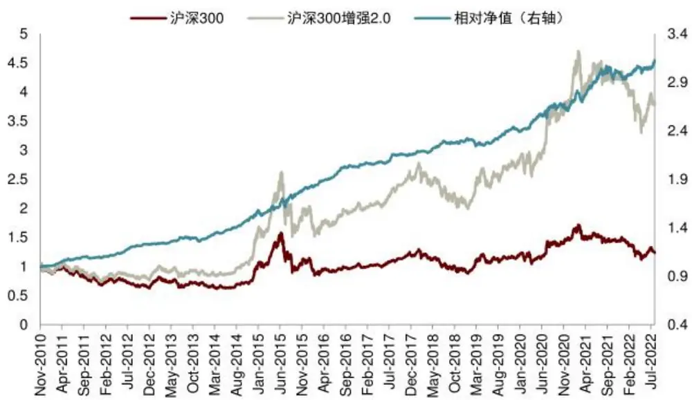
资料来源：Wind，中金公司研究部，注：测试期为20101001-20220731

图表18：沪深300增强 2.0 模型样本内与样本外分年度表现

|  | 月度胜率 | 年化超额收益率 | 相对收益波动率 | 信息比 | 相对最大回撤 |
| --- | --- | --- | --- | --- | --- |
| 2010 | 50% | 4.54% | 3.12% | 1.45 | -0.66% |
| 2011 | 83% | 8.24% | 3.60% | 2.29 | -2.13% |
| 2012 | 83% | 13.45% | 2.76% | 4.88 | -0.96% |
| 2013 | 92% | 4.42% | 3.57% | 1.24 | -3.74% |
| 2014 | 100% | 23.30% | 4.17% | 5.58 | -1.16% |
| 2015 | 92% | 16.42% | 6.89% | 2.38 | -5.52% |
| 2016 | 83% | 12.79% | 2.91% | 4.39 | -1.09% |
| 2017 | 67% | 5.18% | 2.51% | 2.06 | -1.14% |
| 2018 | 83% | 7.64% | 2.87% | 2.66 | -1.44% |
| 2019 | 75% | 3.57% | 3.20% | 1.12 | -3.27% |
| 2020 | 75% | 13.63% | 5.96% | 2.28 | -2.99% |
| 2021 | 67% | 9.36% | 6.25% | 1.50 | -4.70% |
| 2022 | 86% | 11.31% | 4.84% | 2.34 | -2.51% |
| Summary | 82% | 10.57% | 4.34% | 2.44 | -5.52% |

资料来源：Wind，中金公司研究部，注：测试期为20101001-20220731，2022年为年化表现

## 中证500增强与中证1000增强

## 情景分析模型：利用特征划分下因子的有效性差异

在报告《量化多因子系列(2)：非线性假设下的情景分析因子模型》中，我们阐释了情景分析因子模型的概念，情景分析法(Contextual Modeling Strategy)即为针对不同的股票池内因子的有效性差异的研究方法。

对因子进行情景分析其实包含了一个重要的理念，即认为因子对股票的收益影响并非是线性的。传统的因子检验方法，无论是回归法还是相关系数检验方法，均含有默认的假设即因子对股票收益的影响是线性的。然而实际投资过程中我们会发现不同特征、不同风格的股票往往存在不同的投资逻辑，其中的因子有效性也常常存在差异。

图表19：情景特征因子的选取和检验流程
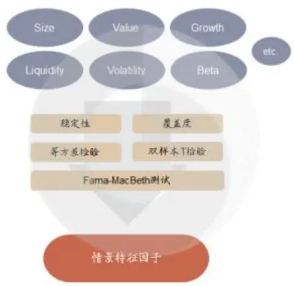
资料来源：中金公司研究部

图表20：情景分析因子模型构建流程
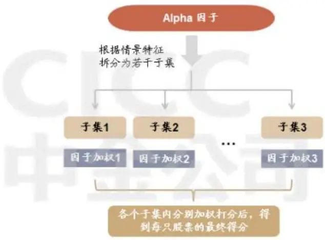
资料来源：中金公司研究部

针对因子在不同特征股票池内选股能力的差异这一现象，我们提出了采用特征分组（或分域）后再做因子权重优化的情景特征因子模型。情景特征(contextualfeature）的筛选和情景特征因子模型的构建流程如上图所示，情景分析因子模型的构建流程主要分为：选定alpha因子、选定情景特征、确定因子加权方式。

流动性特征在Fama-MacBeth测试、双样本T检验等检验中，均获得了较高的显著性，并且流动性特征划分下的常用alpha因子的有效性也的确呈现出显著的差异。如下图所示，动量因子（mmt_range_M）在低流动性的股票池内具有较强的多空收益表现，而在高流动性的股票池内2017年以后多空收益表现较弱。估值因子(BPLR)则同样在低流动性的股票池内具有较强预测能力，而在高流动性股票池内的回撤非常明显。

图表21：流动性分域下的动量因子多空收益
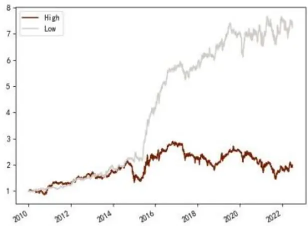
资料来源：Wind，中金公司研究部

图表22：流动性分域下的估值因子多空收益
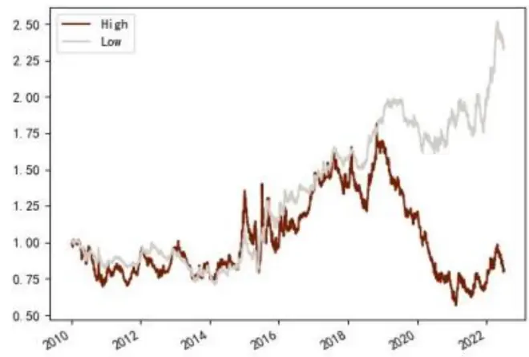
资料来源：Wind，中金公司研究部

将情景分析的因子模型构造方法应用于指数增强组合构建时，将重点尝试其在中证500指数和中证1000指数增强上的应用效果，其主要的原因是中证500和中证1000的成分股在规模、流动性、成长等风格上更贴近全市场，成分股的风格均衡性要优于沪深300指数。

## 基于情景分析因子模型的中证500 增强

我们在报告《量化多因子系列(2)：非线性假设下的情景分析因子模型》中基于流动性特征分域因子优化的方法，构建了中证500指数增强模型，并从2021年1月1日开始样本外跟踪。情景分析因子模型应用在中证500增强的具体构建流程和参数设置如下：

## 特征选择：流动性特征

## 调仓周期：

1) 情景特征股票池更新频率：半年度

2) Alpha 因子更新频率：月度

3) 组合调仓周期：月度

## 组合优化设置：

1) 行业偏离度上限 5%

2) 市值因子暴露度上限 5%

3) 个股权重上限 1.5%

4) 中证 500 成分股权重之和不小于 80%

## 交易费率：单边0.2%

因子权重的设置上，我们在《量化多因子系列(2)：非线性假设下的情景分析因子模型》中详细阐述了基于特征分域后的因子权重最优化IC_IR方法。针对中证500增强模型，我们采用滚动24期滚动最优化IC_IR赋予因子权重，将特征分组后的不同股票池内的Alpha 因子同时进行最大化ICIR，进而将优化后的因子权重作为不同特征选股域内的因子权重。

图表 23：中证500 增强因子明细

| Factor Code | 名称 |
| --- | --- |
| Momentum_24M | 24个月收益率 |
| Momentum_1M | 1个月收益率 |
| STD_1M | 1个月收益波动 |
| Tumover_1M | 1个月换手率 |
| OPT | 业绩趋势因子 |
| ATD | 周转率改善 |
| DP_O_YOY | 营业利润环比 |
| NP_SD | 净利润稳健增速 |
| CCR | 现金流动负债比 |
| CFOA | 经营现金流/总资产 |
| BP_LR | BP |
| DP | DP |
| EEP | 一致预期EP |
| EEChange_3M | 一致预期净利润3个月变动 |
| OCFA | 产能利用率提升 |

资料来源：Wind，中金公司研究部

图表 24：中证 500 增强模型样本内表现
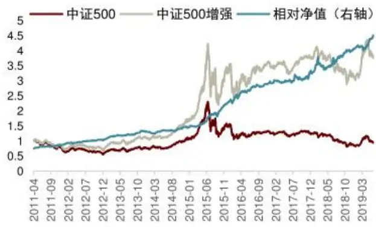
资料来源：Wind，中金公司研究部，注：样本内为20110401-20201231

图表 25：中证 500 增强模型样本外表现
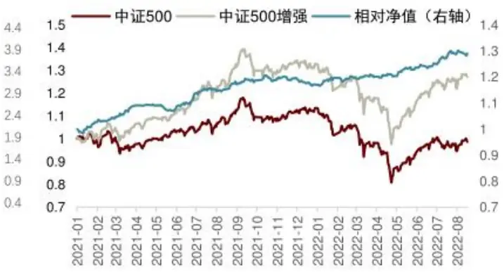
资料来源：Wind，中金公司研究部，注：样本外为20210101-20220731

图表 26：中证500 增强样本内与样本外分年度表现

|  | 月度胜率 | 年化超额收益率 | 相对收益波动率 | 信息比率 | 相对最大回撇 |
| --- | --- | --- | --- | --- | --- |
| 2011 | 78% | 15.57% | 3.57% | 4.36 | -1.75% |
| 2012 | 83% | 13.44% | 4.84% | 2.78 | -2.10% |
| 2013 | 67% | 14.31% | 5.88% | 2.43 | -2.77% |
| 2014 | 58% | 8.61% | 4.63% | 1.86 | -3.70% |
| 2015 | 92% | 49.57% | 8.72% | 5.69 | -5.32% |
| 2016 | 92% | 23.06% | 5.82% | 3.96 | -4.38% |
| 2017 | 58% | 10.02% | 6.47% | 1.55 | -5.55% |
| 2018 | 75% | 19.74% | 9.16% | 2.16 | -9.25% |
| 2019 | 75% | 11.02% | 5.21% | 2.11 | -4.92% |
| 2020 | 75% | 13.36% | 6.48% | 2.06 | -6.61% |
| 2021 | 83% | 17.09% | 5.35% | 3.19 | -3.95% |
| 2022 | 75% | 14.65% | 4.53% | 3.23 | -2.55% |
| Summary | 75% | 18.23% | 5.87% | 3.11 | -9.25% |

资料来源：Wind，中金公司研究部，注：样本内为20110401-20201231，样本外为20210101-20220731

基于情景分析因子模型的中证500增强组合在全样本范围内年化超额收益为18.23%，信息比3.31。样本外（2021-01-01）跟踪以来，组合在2021年全年跑赢基准17.09%，2022年年化超额14.65%，样本外收益表现与样本内基本保持一致。

在2021年下半年市场风格快速切换的情形下，组合仍然可以较好的跟踪基准指数，也表明情景分析因子模型的特征分域后因子优化的方法可以较好的应对类似2021年下半年的市场风格切换。

## 基于情景分析因子模型的中证1000增强

2022年7月22日中证1000股指期货和期权衍生品的推出上市，为市场带来了新的对冲工具，市场对于对标中证1000指数的增强策略的需求也显著上升。在前文分析了三个宽基指数的风格偏离、持仓集中度、行业分布等维度的信息后，我们发现中证500指数与中证1000指数在各个维度的特征的相似程度都较高，而中证1000在选股宽度上相对中证500具有进一步的优势。因此我们认为情景分析的因子优化框架在中证1000增强中也具有不错的效果。

针对中证1000增强模型，我们采用滚动18期滚动最优化IC_IR赋予因子权重，将特征分组后的不同股票池内的Alpha因子同时进行最大化IC_IR，进而将优化后的因子权重作为不同特征选股域内的因子权重。

具体测试过程中，情景分析因子模型应用在中证1000增强的构建流程和参数设置如下：

特征选择：流动性特征

## 调仓周期：

1) 情景特征股票池更新频率：半年度

2) Alpha 因子更新频率：月度

3) 组合调仓周期：月度

## 组合优化设置：

1) 行业偏离度上限 5%

2) 市值因子暴露度上限 5%

3) 个股权重上限 0.75%

## 交易费率：单边0.2%

4) 中证 1000成分股权重之和不小于 80%

图表27：中证1000 增强因子明细

| Factor Code | 名称 | 因子类别 |
| --- | --- | --- |
| mmt_range_M | 1个月振幅调整动量 | 价量 |
| buy_shift_dist_l | 大单买入的位移路程比 | 价量 |
| vol_highlow_std_1M | 1个月日内振幅标准差 | 价量 |
| liq_tum_std_6M | 6个月换手率标准差 | 价量 |
| mmt_report_overnight | 业绩公告前隔夜动量 | 价量 |
| liq_shortcut_avg_1M | 1个月最短路径非流动 | 价量 |
| corr_price_turn_post_1M | 换手率与价格相关性因子（量领先一期） | 价量 |
| TURNOVER_3M | 3个月换手率 | 价量 |
| EEChange_3M | 一致预期净利润3个月变动 | 分析师 |
| EEP | 一致预期EP | 分析师 |
| CFOA | 经营现金流总资产 | 基本面 |
| ROED | 净资产收益率变动 | 基本面 |
| OCFA | 产能利用率提升 | 基本面 |
| QPT | 业绩趋势因子 | 基本面 |
| NP_Z | 净利润增速标准分数 | 基本面 |

资料来源：Wind，中金公司研究部

图表 28：中证 1000 增强模型样本内表现
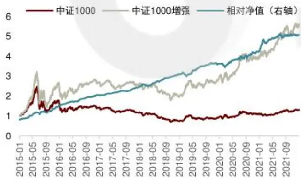
资料来源：Wind，中金公司研究部，注：样本内为20150101-20211231

图表 29：中证1000 增强模型样本外表现
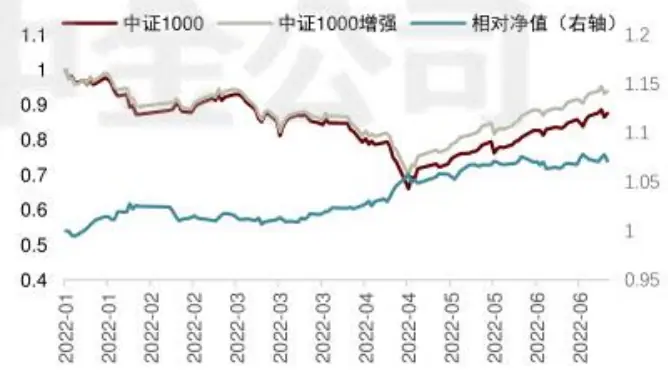
资料来源：Wind，中金公司研究部，注：样本内为20220101-20220731

图表30：中证1000 增强样本内与样本外分年度表现

|  | 月度胜率 | 年化超额收益率 | 相对收益波动率 | 信息比 | 相对最大回辙 |
| --- | --- | --- | --- | --- | --- |
| 2015 | 92% | 54.32% | 8.76% | 6.20 | -7.05% |
| 2016 | 100% | 27.09% | 3.84% | 7.06 | -1.55% |
| 2017 | 92% | 16.63% | 3.47% | 4.79 | -1.12% |
| 2018 | 92% | 21.52% | 4.12% | 5.23 | -2.92% |
| 2019 | 83% | 15.52% | 5.03% | 3.08 | -5.22% |
| 2020 | 83% | 15.00% | 7.32% | 2.05 | -5.27% |
| 2021 | 75% | 18.58% | 6.28% | 2.96 | -3.80% |
| 2022 | 83% | 15.10% | 5.19% | 2.91 | -2.07% |
| Summary 88% |  | 22.92% | 5.82% | 3.94 | -7.05% |

资料来源：Wind，中金公司研究部，注：样本内为20150101-20211231，样本外为20220101-20220731

基于情景分析因子模型的中证1000增强组合在全样本范围内年化超额收益为22.92%，信息比3.94。样本外（2022-01-01）以来，组合在2022年年化超额15.10%，样本外收益表现略弱于样本内。

此处我们展示了基于情景分析因子模型的中证1000指数增强，而假设不采用流动性特征的情景分析因子模型构建组合，在其他优化和约束条件不变的情况下，增强的效果回测来看会弱于上述模型。尤其在回测期内的2021年仅能获得低于5%的超额收益，2021年下半年风格切换会导致模型的较大幅回撤。因此，我们最终较为推荐的1000增强模型，仍是本节展示的基于流动性特征分域的情景分析因子模型。这一结果也印证了我们的判断，即中证500和中证1000指数增强可以采用较为统一的框架构建增强策略。

## 周蕭潇

SAC 执证编号：S0080521010006

SFC CE Ref: BRA090

xiaoxiao.zhou@cicc.com.cn

## 王汉锋

SAC 执证编号：S0080513080002

SFC CE Ref: AND454

hanfeng.wang@cicc.com.cn

## 作者信息

刘均伟
SAC 执证编号：S0080520120002
SFC CE Ref: BQR365
junwei.liu@cicc.com.cn
古翔
SAC 执证编号：S0080521010010
SFC CE Ref: BRE496
xiang.gu@cicc.com.cn

# 法律声明

一般声明

本报告由中国国际金融股份有限公司（已具备中国证监会批复的证券投资咨询业务资格）制作。本报告中的信息均来源干我们认为可靠的已公开资料，但中国国际金融股份有限公司及其关联机构（以下统称“中金公司”）对这些信息的准确性及完整性不作任何保证。本报告中的信息、意见等均仅供投资者参考之用，不构成对买卖任何证券或其他金融工具的出价或征价或提供任何投资决策建议的服务。该等信息、意见并未考虑到获取本报告人员的具体投资目的、财务状况以及特定需求，在任何时候均不构成对任何人的个人推荐或投资操作性建议。投资者应当对本报告中的信息和意见进行独立评估，自主审慎做出决策并自行承担风险。投资者在依据本报告涉及的内容进行任何决策前，应同时考量各自的投资目的、财务状况和特定需求，并就相关决策咨询专业顾问的意见对依据或者使用本报告所造成的一切后果，中金公司及/或其关联人员均不承担任何责任。

本报告所载的意见、评估及预测仅为本报告出具日的观点和判断，相关证券或金融工具的价格、价值及收益亦可能会波动。该等意见、评估及预测无需通知即可随时更改。在不同时期，中金公司可能会发出与本报告所载意见、评估及预测不一致的研究报告。

本报告署名分析师可能会不时与中金公司的客户、销售交易人员、其他业务人员或在本报告中针对可能对本报告所涉及的标的证券或其他金融工具的市场价格产生短期影响的催化剂或事件进行交易策略的讨论。这种短期影响的分析可能与分析师已发布的关于相关证券或其他金融工具的目标价、评级、估值、预测等观点相反或不一致，相关的交易策略不同于且也不影响分析师关于其所研究标的证券或其他金融工具的基本面评级或评分。

中金公司的销售人员、交易人员以及其他专业人士可能会依据不同假设和标准、采用不同的分析方法而口头或书面发表与本报告意见及建议不一致的市场评论和/或交易观点。中金公司没有将此意见及建议向报告所有接收者进行更新的义务。中金公司的资产管理部门、自营部门以及其他投资业务部门可能独立做出与本报告中的意见不一致的投资决策。

除非另行说明，本报告中所引用的关于业绩的数据代表过往表现。过往的业绩表现亦不应作为日后回报的预示。我们不承诺也不保证，任何所预示的回报会得以实现。
分析中所做的预测可能是基于相应的假设。任何假设的变化可能会显著地影响所预测的回报。

本报告提供给某接收人是基于该接收人被认为有能力独立评估投资风险并就投资决策能行使独立判断。投资的独立判断是指，投资决策是投资者自身基于对潜在投资的目标、需求、机会、风险、市场因素及其他投资考虑而独立做出的。

本报告由受香港证券及期货事务监察委员会监管的中国国际金融香港证券有限公司（“中金香港”）于香港提供。香港的投资者若有任何关于中金公司研究报告的问题请直接联系中金香港的销售交易代表。本报告作者所持香港证监会牌照的牌照编号已披露在报告首页的作者姓名旁。

本报告由受新加坡金融管理局监管的中国国际金融（新加坡）有限公司（“中金新加坡”）于新加坡向符合新加坡《证券期货法》定义下的合格投资者及/或机构投资者提供。本报告无意也不应直接或间接地分发或传递给新加坡的任何其他人。提供本报告于合格投资者及/或机构投资者，有关财务顾问将无需根据新加坡之《财务顾问法》第45条就任何利益及/或其代表就任何证券利益进行披露。有关本报告之任何查询，在新加坡获得本报告的人员可联系中金新加坡持牌代表。

本报告由受金融行为监管局监管的中国国际金融（英国）有限公司（“中金英国”）于英国提供。本报告有关的投资和服务仅向符合《2000年金融服务和市场法2005年(金融推介）令》第19（5）条、38条、47条以及49条规定的人士提供。本报告并未打算提供给零售客户使用。在其他欧洲经济区国家，本报告向被其本国认定为专业投资者（或相当性质）的人士提供。

本报告由中国国际金融日本株式会社（“中金日本”）于日本提供，中金日本是在日本关东财务局（日本关东财务局长（金商）第3235号）注册并受日本法律监管的金融机构。本报告有关的投资和服务仅向符合日本《金融商品交易法》第2条31项所规定的专业投资者提供。本报告并未打算提供给日本非专业投资者使用。

本报告将依据其他国家或地区的法律法规和监管要求于该国家或地区提供。

## 特别声明

在法律许可的情况下，中金公司可能与本报告中提及公司正在建立或争取建立业务关系或服务关系。因此，投资者应当考虑到中金公司及/或其相关人员可能存在影响本报告观点客观性的潜在利益冲突。

与本报告所含具体公司相关的披露信息请访问https://research.cicc.com/footer/disclosures，亦可参见近期已发布的关于该等公司的具体研究报告。

中金研究基本评级体系说明：

分析师采用相对评级体系，股票评级分为跑赢行业、中性、跑输行业（定义见下文）。

除了股票评级外，中金公司对覆盖行业的未来市场表现提供行业评级观点，行业评级分为超配、标配、低配（定义见下文）。

我们在此提醒您，中金公司对研究覆盖的股票不提供买入、卖出评级。跑赢行业、跑输行业不等同于买入、卖出。投资者应仔细阅读中金公司研究报告中的所有评级定义。请投资者仔细阅读研究报告全文，以获取比较完整的观点与信息，不应仅仅依靠评级来推断结论。在任何情形下，评级（或研究观点）都不应被视为或作为投资建议。投资者买卖证券或其他金融产品的决定应基于自身实际具体情况（比如当前的持仓结构）及其他需要考虑的因素。

## 股票评级定义：

·跑赢行业(OUTPERFORM)：未来6~12个月，分析师预计个股表现超过同期其所属的中金行业指数；

·中性（NEUTRAL）：未来6~12个月，分析师预计个股表现与同期其所属的中金行业指数相比持平

跑输行业（UNDERPERFORM)：未来6~12个月，分析师预计个股表现不及同期其所属的中金行业指数。

## 行业评级定义：

超配（OVERWEIGHT）：未来6~12个月，分析师预计某行业会跑赢大盘10%以上；

- 标配（EQUAL-WEIGHT）：未来6~12个月，分析师预计某行业表现与大盘的关系在-10%与10%之间；

- 低配（UNDERWEIGHT）：未来6~12个月，分析师预计某行业会跑输大盘10%以上。

研究报告评级分布可从https://research.cicc.com/footer/disclosures 获悉。

本报告的版权仅为中金公司所有，未经书面许可任何机构和个人不得以任何形式转发、翻版、复制、刊登、发表或引用。

V190624 编辑：张莹

## 北京

中国国际金融股份有限公司中国北京建国门外大街1号国贸写字楼2座 28层邮编：100004电话：(86-10) 6505 1166传真：(86-10) 6505 1156

## 深圳

中国国际金融股份有限公司深圳分公司
深圳市福田区益田路5033号
平安金融中心72层
邮编：518048
电话：(86-755)8319-5000
传真：(86-755)8319-9229

## 东京

中国国际金融日本株式会社
100-0005東京都千代田区丸の内3丁目2番3
号丸の内二重橋ビル21階
Tel: (+813) 3201 6388
Fax: (+813) 3201 6389

## 纽约

CICC US Securities, Inc 32nd Floor, 280 Park Avenue New York, NY 10017, USA Tel: (+1-646) 7948 800 Fax: (+1-646) 7948 801

## 伦敦

China International Capital Corporation (UK) 
Limited 
25th Floor, 125 Old Broad Street 
London EC2N 1AR, United Kingdom 
Tel: (+44-20) 7367 5718 
Fax: (+44-20) 7367 5719

## 上海

中国国际金融股份有限公司上海分公司
上海市浦东新区陆家嘴环路1233号
汇亚大厦32层
邮编：200120
电话：(86-21)5879-6226
传真：(86-21)5888-8976

## 香港

中国国际金融（香港）有限公司香港中环港景街1号国际金融中心第一期29 楼电话：(852)2872-2000传真：(852)2872-2100

## 旧金山

CICC US Securities, Inc. San Francisco Branch 
Office 
One Embarcadero Center, Suite 2350, 
San Francisco, CA 94111, USA 
Tel: (+1) 415 493 4120 
Fax: (+1) 628 203 8514

## 新加坡

China International Capital Corporation 
(Singapore) Pte. Limited 
6 Battery Road, #33-01 
Singapore 049909 
Tel: (+65) 6572 1999 
Fax: (+65) 6327 1278

## 法兰克福

China International Capital Corporation (Europe) 
GmbH 
Neue Mainzer Straße 52-58, 60311 
Frankfurt a.M, Germany 
Tel: (+49-69) 24437 3560