# 量化多因子系列（10）：港股因子初探

陈宜筠 联系人
SAC 执证编号：S0080122080368
yiyun.chen@cicc.com.cn

周萧潇分析员分析员

SAC 执证编号：S0080521010006SFC CE Ref: BRA090xiaoxiao.zhou@cicc.com.cn

刘均伟 分析员

SAC 执证编号：S0080520120002
SFC CE Ref: BQR365
junwei.liu@cicc.com.cn

本文作为中金港股量化策略系列初篇，将从港股市场特征分析入手，多维度比较港股与A股市场特征的差异，进而调整并构建港股量化因子框架。在此框架基础上，我们选取了中金量化基本面因子和价量因子中较为常见的13大类，包括动量&反转因子、波动率因子、盈利能力因子、估值因子等，共70个因子。根据港股数据特征，我们对因子构建方式进行了差异化调整，分别在恒生综指和恒生港股通范围内进行了系统化的因子测试。

整体而言，在港股市场中，价量因子的有效性及选股能力较强，而基本面因子的信息有效性偏弱、单调性较差。价量因子中的信息及时、规范、不存在显著个股披露差异，使其因子存在显著的超额获取能力。基本面因子表现较弱，其原因可能包括选股域内公司质量较好，使得财务指标的区分度不高；且港股中的机构投资者占比较高，基本面信息被充分交易，因此有效性较弱。

与A股市场相比，港股市场因子整体有效性和预测能力较弱。由于港股市场较为成熟、多空机制完善，且投资者中散户占比较低，使得市场存在的错误定价与股价的非理性波动空间更小，超额收益的获得难度更高。因此，从绝对数值上判断，港股因子的预测有效性和超额收益获取能力要低于A股中对应的因子。

价量因子中，年度动量因子预测能力和多头表现突出，波动率因子的有效性较好。而基本面因子中，估值因子整体有效性优秀，营运效率和盈余质量因子中也存在表现较优的因子。

## 价量因子

1）动量&反转因子：年度动量因子的多头选股能力是本文测试各类因子中整体表现最为优异的，且单调性十分良好。相对均价的1年收益率因子（mmt_avg_A）和1年收益率因子（mmt_normal_A）表现较为突出，在各选股域中选股能力和稳定性良好，预测能力和单调性优异。

2）波动率因子：低波因子的预测稳定性较好，超额获取能力尚可。3个月威廉上影线标准差因子

(vol_w_upshadow_std_3M)在2个选股域中的表现均衡较优，且空头收益显著。在恒生综指范围内，3个月日内振幅标准差因子（vol_highlow_std_3M)也有着不俗的表现。

3）流动性因子：流动性因子的有效性和单调性表现略逊，但换手率较低。在恒生综指范围内换手率因子的单调性和预测能力略好；而在恒生港股通范围内则是Amihud因子表现稍佳，但单调性不佳。

4）价量相关性因子：不同领先滞后阶数的价量相关性因子在不同市场的表现差异较大，换手率整体偏高。在恒生综指范围内，推荐关注价领先一期的换手率与价格相关性因子（corr_price_turn_prior_1M)，其整体表现较为平衡优秀；而在恒生港股通范围内，整体价量相关性因子单调性略逊。

## 基本面因子

1）盈利能力因子：全部资产现金回收率TTM（CFOA_TTM）在各选股域中预测能力和稳定性优异，且换手率很低，性价比较高，推荐关注。而除该因子以外，大部分盈利能力因子的单调性较差，有效性和多头收益能力普通。

2）估值因子：估值因子整体预测稳定性和有效性良好，且在恒生综指范围内单调性较好。其中，经营性现金流比总市值因子(OCFPTTM）在2个选股域中有着稳定有效的预测能力。

3）成长能力因子：成长能力因子在港股市场中整体的有效性和收益预测能力普通，且单调性不佳。在恒生综指范围内，表现略好的是净利润TTM增速因子(NPD)，但其单调性和选股能力仍偏弱。

4)营运效率因子：此类中的利润率变动因子在港股市场中表现出色，有效性和收益预测能力均较为突出。推荐关注净利率变动因子（NPMD）和营业利润率变动因子（OPMD），均有着较为平衡的有效性、收益预测能力及换手率。

5）盈余质量因子：应计利润占比因子（APR_TTM）的整体有效性和单调性较好，值得关注。其余因子则表现各异。
此类因子在港股和A股市场中的表现相近。

6）规模因子：规模因子在港股市场中有效性普通，单调性很差。无论是其有效性、预测能力、抑或是单调性均劣于A股市场中的规模因子表现。规模因子的有效性较弱也侧面说明了港股并无非常稳定明显的市值效应。其中表现略好的是总市值因子(MC)，但其单调性普通。

7）分析师因子：分析师因子的单调性和有效性较弱，其中，一致预期营业收入三个月变化率（EOPChange_3M）的选股能力稍好。但目前测试的分析师因子受限于Wind港股一致预期的数据，数据质量仍待提升。

8）公司治理因子：股利支付率因子（DPR_TTM）在恒生综指中有效性较好，而股利支付率变动因子（DPRD）在恒生港股通范围内选股能力较好。

更多作者及其他信息请见文末披露页

## 港股与 A股市场异同

## 引言

港股与A股市场存在众多机制与特征上的差异，使得两者的投资逻辑不尽然相同。因此，我们尝试将量化研究思路拓宽覆盖港股市场，并着眼于比较两地市场间的异同，从而总结适用于港股市场的投资逻辑。

本文作为我们团队的港股市场初探，将从港股市场特征分析入手，从多维度比较港股与A股市场存在的差异，从而调整并构建港股因子测试框架。在此框架基础上，我们选取了中金基本面因子1和价量因子²中较为普遍使用的因子，并根据港股数据特征对因子构建方式进行了差异化调整，再加以测试与总结。

## 港股与 A 股市场机制对比

我们将从交易机制、信息披露制度、上市机制、退市机制和卖空机制方面逐一对比港股与A股市场存在的异同之处，从而构建适用于港股市场的回测框架，并有的放矢地调整部分因子的构建方式。

## 交易机制

港交所的交易机制相较于上交所和深交所有一定差异，此处我们以上交所与港交所间对比为例。

交易时间：两市的具体交易时间段差异如图表1所示。此外，港交所在部分节假日前并不延续早市与午市交易；且港交所在极端天气下会实施特殊交易安排。由于两所交易日数量大体相同，所以我们仍沿用每月20个交易日的假设。

图表1：上交所与港交所交易时间对比

| 细项 | 上交所 | 港交所 |
| --- | --- | --- |
| 交易日法定假日开市集合竞价 | 周一到周五（法定假日除外） | 周一到周五（法定假日除外） |
|  | 11天 | 13天 |
|  | 09:15-09:25 | 9:00-9:30 |
| 早市时段 | 09:30-11:30 | 9:30-12:00 |
| 午市时段尾市集合竞价 | 13:00-14:57 | 13:00-16:00 |
|  | 14:57-15:00 | 16:00-16:10 |

资料来源：上海证券交易所，香港交易所，中金公司研究部

交易方式：港交所与上交所均实施开盘和尾盘集合竞价，其余交易时间连续竞价的交易模式。

交易币种：A股与沪股通为以人民币报价及交易；港股为以港币报价及交易；港股通为以港币报价，以人民币交易。

交易制度细项：见图表2。

图表2：上交所与港交所交易制度细项对比

| 细项 | 上交所 | 港交所 |
| --- | --- | --- |
| 价格最小变动单位 | 0.01元人民币 | 取决于该股票价格 |
|  | 普通股票与基金涨跌幅限制10% (除新股上市首日以外) | 不存在涨跌幅限制 |
| 涨跌幅限制 交易异常停牌 | 风险警示股票和未完成股权改革的股票 涨跌幅限制 5% | 停牌由股票发行公司申请 |
| 日内回转 | 上交所可决定停牌 不允许（除ETF、债券、权证外） | 允许 |
| 报价显示 | 上涨红色、下跌绿色 | 上涨绿色、下跌红色 |
| 第三方存管制度 | 采取 | 不采取 |

资料来源：上海证券交易所，香港交易所，中金公司研究部

## 信息披露制度

港股市场与A股市场的显著差异之一在于其信息披露制度的不同。信息披露包括发行人在股票发行阶段的信息披露以及公司上市后的持续信息披露。

上市阶段信息披露：申请上市信息披露文件审核机关相应均为证券交易所，无实质性不同。

定期财报信息披露：港股相较于A股，总体披露要求更为宽松、自由度更大、强制披露信息更少（图表3)。其中，报告期自行决定使得港股不同公司在同年同一时点的信息披露程度不同；该规定也导致了存在个别公司因报告期调整而部分时间段未有财报信息覆盖，后文我们将详细介绍对于此类数据的处理方式；此外，不要求强制披露季报使得港股的财报数据更新频率低于A股市场，从而导致基于财报构建的基本面因子更为低频。

图表3：A 股与港股财报披露制度对比

| 细项 | A股 | 港股 |
| --- | --- | --- |
| 强制要求披露报告 | 年报、半年报、季报 | 年报、半年报 |
| 会计准则 | 中国企业会计准则 | 国际报告准则 |
| 报告期 | 1月1日-12月31日 | 由公司自行决定 |
| 年报披露时间 | 年报报告期末4个月内 年报：4月30日前 | 年报报告期末4个月内 |
| 中报披露时间 | 中报报告期末2个月内 | 中报报告期末3个月内 |
| 季报披露时间 | 中报：8月31日前 |  |
|  | 季报报告期末1个月内 |  |
|  | 一季报：4月30日前 | 无 |
| 高管薪酬披露 | 三季报：10月31日前 强制披露 | 建议披露 |

资料来源：上海证券交易所，香港交易所，中金公司研究部

ESG信息披露：与财报信息的情况相反，港股在ESG信息披露要求上相较于A股更为严苛(图表4)。自2020年7月开始，港交所要求公司在财年结束后5个月内发布ESG报告；除强制披露信息以外，其余信息则是实行“不遵守就解释”准则（ComplyorExplain)。

图表 4：A 股与港股 ESG 信息披露制度对比

| 细项 | A股 | 港股 |
| --- | --- | --- |
| ESG 报告披露 | 自愿披露 | 强制披露 |
| ESG 信息披露 | 部分信息强制披露 | 信息分为”强制披露"和“不遵守就解释”两类 |
| 监督机构 | 中国证券监督管理委员会 | 港交所 |

资料来源：上海证券交易所，香港交易所，中金公司研究部

## 上市机制

港交所设有三套财务标准，分别是盈利测试、市值/收入测试、市值/收入/现金流测试，预上市企业可根据自身财务状况三者选其一。其中，盈利测试部分是从2022年1月1日起，由“最近一个财政年度不低于2000万港元；及前两个财政年度累计不低于3000万港元（三年累计盈利不低于5000万港元)”调整提升为“最近一个财政年度不低于3500万港元；及前两个财政年度累计不低于4500万港元（三年累计盈利不低于8000万港元）”。

相较而言，港交所的上市条件灵活性更高。尤其是在盈利测试要求未做调整之前，港股上市条件相较于A股更为宽松。上市制度较为严苛会致使周期类公司占比较高，在财务数据较好的高点更易符合上市要求；但上市制度较为宽松也会导致上市公司的质量良莠不齐，也为后文中的港股中的仙股存在埋下了伏笔。

## 图表5：上交所与港交所上市条件对比

## 港交所

· 盈利测试：最近三个会计年度利润不少于8000万港元（最近一年利润不少于3500万港元，前两年累计利润不少于4500万港元），上市时在市值的利润不少于2亿港元；

- 市值/收益测试：上市时市值达到至少40亿港元，最近一个经审计的财政年度的收入至少为5亿港元；

·市值/收益/现金流量测试：上市时市值达到至少20亿港元，最近一个经审计的财政年度的收入至少为5亿港元，前三个财政年度经营业务的现金流入总额至少为1亿港元；

- 新申请人的市值及其在证券上市时公众持有的股份至少为5000万港元；

- 公众持股必须至少占发行人已发行股本的25%；

- 至少有300名公众股东持有相关证券，三名公众股东持股比例最高不得超过证券上市时公众持股比例的50%;

- 交易所规定的其他条件。

资料来源：上海证券交易所，香港交易所，中金公司研究部

## 上交所

· 股票已公开发行；

- 具备健全且运行良好的组织机构；

- 具有持续经营能力；

·最近3个会计年度净利润均为正数且累计超过人民币3000万元；

- 最近3个会计年度经营活动产生的现金流量净额累计超过人民币5000万元；

- 发行前股本总额不少于人民币3000万元，发行后股本总额不少于人民币5000万元；

· 公开发行的股份达到公司股份总数的25%以上；公司股本总额超过人民币4亿元的，公开发行股份的比例达到10%以上；

- 最近3个会计年度财务会计报告均被出具无保留意见审计报告；

· 主营业务近三年内无重大变化；

- 董事和高管近三年内无重大变化、实际控制人无重大变更；

- 交易所规定的其他条件。

## 退市机制

A股市场的退市条件较为量化清晰，且围绕企业关键财务指标制定；而港股的退市条件则较为模糊，不针对财务指标设有量化标准，而是围绕公众持有股本总额和遵守上市规则等制定。此外，港股的退市流程相较于A股而言更为冗长，也导致了存在部分处于退市流程中、流动性差的股票即仙股的存在。

退市条件：A股以上交所为例，沪市的强制退市分为交易类强制退市、财务类强制退市、规范类强制退市和重大违法类强制退市等四类情形。港股的停牌退市要求则不比清晰细分的A股退市条件，条件较少且较为模糊，香港证监会和港交所对于退市企业的判断有较大自主判断权利。港交所可指令证券短暂停牌/停牌/除牌的情况包括³：

交易所认为公众人士所持有的证券数量不足；

或交易所认为发行人所经营的业务不符合《上市规则》第13.24条规定；

或交易所认为发行人或其业务不再适合上市。

图表6：上交所规定的强制退市情形
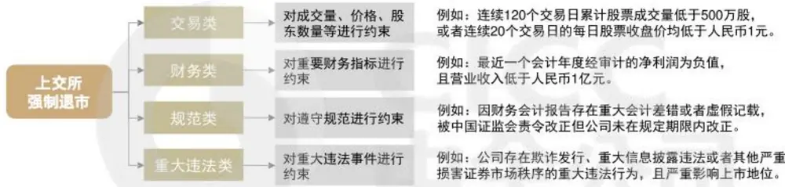
资料来源：上海证券交易所，中金公司研究部

退市流程：A股由沪深交易所于2020年末颁布退市新规4，优化加速退市流程，包括取消暂停上市环节、针对不同的退市类型分别设计退市流程、加强退市过程中的投资者保护等。而相较于A股畅通简明、常态化且持续优化的退市渠道与流程，港股的退市流程更为冗长。具体程序如图表7所示。

图表7：港交所规定的除牌程序
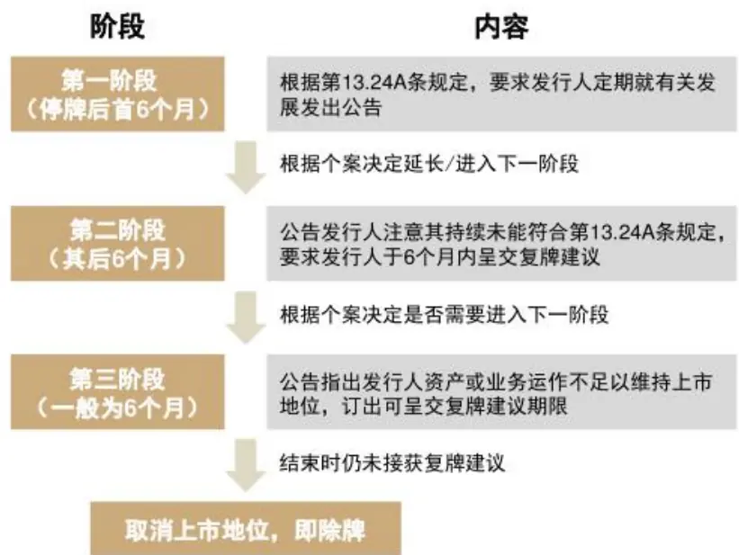
资料来源：香港交易所，中金公司研究部

## 卖空机制

除比较以上机制异同之外，港股与A股的卖空机制差异较大。A股的卖空机制较为有限，仅主要包括股指期货做空和融券两种，且设有资金门槛限制；港股的卖空机制则更为完善、覆盖度更广，且做空的相关管控在全球成熟金融市场中也较为严格。做空交易在港股市场中也是主要流动性来源之一。

港股的卖空限制包括5：

限制卖空证券的范围：港交所规定仅部分证券可进行卖空，避免市值过低或流动性差的股票收到空头力量的影响。

涨停规则(UptickRule)：卖空只能以不低于当时最佳卖出价的价格进行，防止股价下跌时卖空打压价格。

A严禁“非上市证券”的“裸卖空”：由于“裸卖空”可能在短时间内虚增证券数量，对市场稳定造成较大扰动，港交所要求交易参与者在卖空前已经借入证券，即在卖空前拥有一项即时可行使而不附有条件的权利。

港股的卖空机制较为成熟，针对港股市场特色也设有相应卖空限制，从而帮助港股市场提高流动性，使得证券价格更有效反应信息和价值。除此以外，港股的卖空机制也给予投资者更丰富的投资手段，提升了空头收益的重要性和可行性。因此，我们在后文的因子表现回测中也选择使用了多空净值曲线进行展示。

## 港市主要指数

香港证券市场的指数中，由恒指服务有限公司编制的恒生系列指数是最为被广泛引用以反映港股市场表现的指数。恒生系列中较为常用的指数包括恒生指数、恒生综合指数、恒生科技指数、恒生中国企业指数（又名H股指数）和恒生大/中/小型股指数等。下图介绍了较具代表性的香港指数。

图表8：港股较具代表性指数介绍
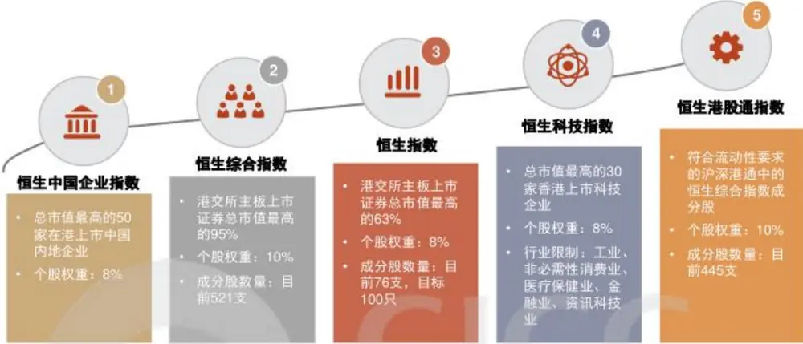
资料来源：恒生指数有限公司官网，中金公司研究部注：成分股统计截至2022-12-29

基于指数的成分股均衡程度以及其知名度，本文选取恒生综指和恒生港股通指数作为测试因子的基准。恒生综合指数包含了恒生大/中/小型股指数，分别涵盖恒生综合指数成份股总市值的首 80%、紧接的 15%及最后的 5%。

恒生综合指数成分股也是港股通成分股的先决条件之一。因此，港股通与恒生综指的成分股重合度很高，也可以近似视为恒生综指的子集。

图表9：港股主要市值指数成分股数量变化
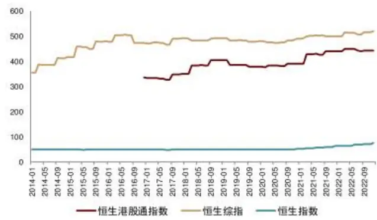
资料来源：Wind，中金公司研究部

图表10：两大指数与恒生综指成分股重合比例
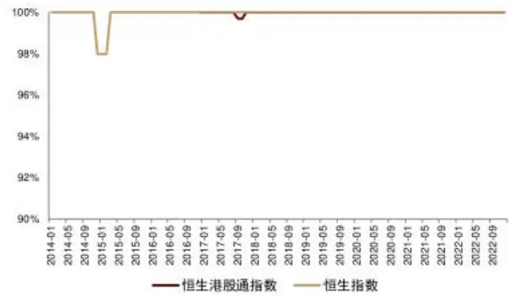
资料来源：Wind，中金公司研究部
注：重合比例=目标指数与恒生综指成分股重合数量/目标指数成分股个数

我们对上述两个指数的市值及行业分布进行分析。此处的选股域中已根据后文筛选仙股的方法剔除了流动性较差的仙股，使其特征分析更贴合后文的因子回测框架。从行业分布中可以看出，恒生综指与恒生港股通的成分股行业分布大体类似，这也是因为后者可视为前者的子集。2个选股域中，占比前三的行业的均为可选消费、医疗保健和房地产行业，基本占比在15%左右。整体而言，2个选股域中的传统行业占比偏高，科技属性及新兴行业的占比略低。

图表11：恒生综指成分股行业分布
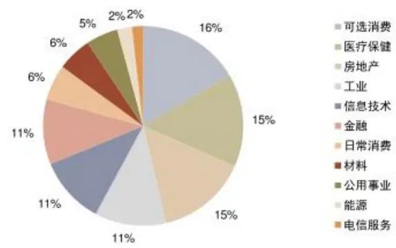
资料来源：Wind，中金公司研究部
注：统计截至2022-12-30，成分股已剔除仙股、退市、上市不满一年股票

图表12：恒生港股通成分股行业分布
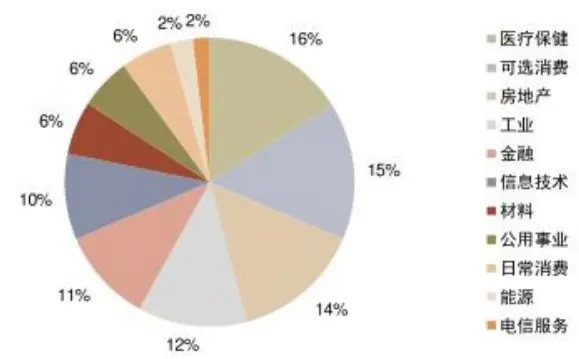
资料来源：Wind，中金公司研究部
注：统计截至2022-12-30，成分股已剔除仙股、退市、上市不满一年股票

我们将指数成分股根据市值降序排列，并统计每100名市值区间成分股的市值占比。从下图可以看出，无论是恒生综指还是恒生港股通，市值分布右偏，市值前100的公司均占较高比例的总市值，约80%左右。而市值200名开外的公司整体所占市值仅在10%左右，恒生港股通中大市值公司集中度更高。

图表13：恒生综指成分股市值分布
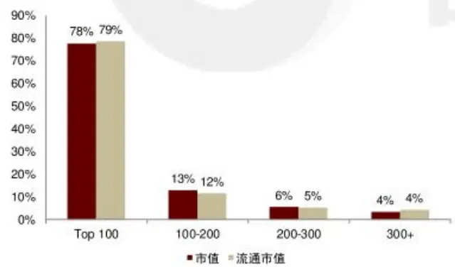
资料来源：Wind，中金公司研究部

图表14：恒生港股通成分股市值分布
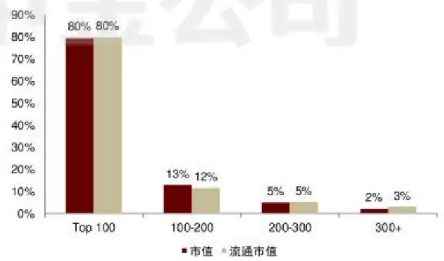
资料来源：Wind，中金公司研究部
注：统计截至2022-12-30，成分股已剔除仙股、退市、上市不满一年股票
注：统计截至2022-12-30，成分股已剔除仙股、退市、上市不满一年股票

尽管2个指数成分股的市值分布右偏，但与港股全市场相比，恒生综指仍偏向于大市值风格。下图展示了恒生综指成分股和港股全市场的市值分位数。以总市值为例，恒生综指内的市值最小值仍大于港股全市场的市值中位数，且恒生综指内的市值25%分位数也远大于全市场的市值75%分位数。这说明恒生综指的市值整体在港股全市场范围内偏中大盘。由于恒生港股通可视为恒生综指的子集，在此我们不再赘述。

图表15：恒生综指与全市场总市值分布对比
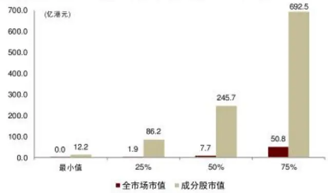
资料来源：Wind，中金公司研究部
注：统计截至2022-12-30，成分股已剔除仙股、退市、上市不满一年股票

图表16：恒生综指与全市场流通市值分布对比
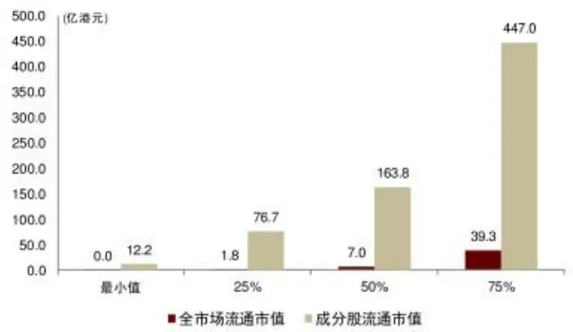
资料来源：Wind，中金公司研究部
注：统计截至2022-12-30，成分股已剔除仙股、退市、上市不满一年股票

## 港市的特殊存在—仙股

港股市场中存在一类特有的股票，它们价格低、流动性差、成交量低；且这类股票的股价大多低于1港元，只能以港分作为计价单位，因此也被称为仙股一即cent股的音译。由于仙股的流动性低、可交易性差，不适合被纳入股票池，因此在理解港股市场背景的过程中，很重要的一环在于如何识别并剔除这些仙股。

## 仙股特征

仙股的部分明显特征包括：股价长期低于1港元、成交量低、市值较小。下图可以看到在港股市场中收盘价低于1港元的股票占比近年基本稳定在50%以上，收盘价低于0.1港元的股票在2020年到2022年间年均占比约10%。如此大量低价且可交易性较低的股票存在于港市之中，也印证了对于此类仙股处理的重要性。

图表17：股价较低股票年均数量与比例
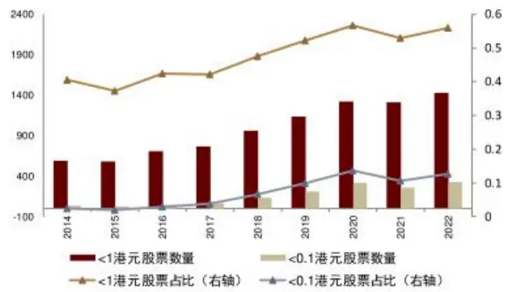
资料来源：Wind，中金公司研究部
注：总股票数量统计剔除退市、合并、SPAC和聆讯阶段股票

图表18：发行价格低于1港元股票比例
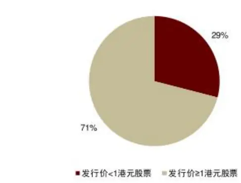
资料来源：Wind，中金公司研究部

## 仙股成因

上市机制自由度较大。港股上市要求的灵活度较高，上市流程较短，使得公司能以较快速度上市，可能存在公司质量参差的问题；同时港交所对最低上市价格仅为0.01港元，使得部分公司的发行价格在发行伊始即低于1港元。

港股退市要求中无对最低价格的硬性规定。港交所仅要求公司符合上市规则中的条例，即0.01港元。

A港股退市程序复杂冗长。图表20中展示的港股退市机制各阶段时间较长，且部分阶段视情况可延长。整体港股退市效率较为低下，使得存在很多仙股仍滞留在市场之中。

港股不设有涨跌停限制。无跌停限制使得部分股票股价可能一路暴跌至1港元以下。

流动性差的股票无人关注，进入恶性循环。如上文所说，港股资金集中于部分优质股，而其余质量普通、市值小、流动性差的公司则关注度较低，研报覆盖也较少。机构投资者出于资金量和投资决策质量的考虑，会倾向于远离该类深度分析少且流动性差的仙股，从而导致仙股陷入恶性循环。

## 筛选仙股

基于上述特点，我们构建了筛选仙股的综合条件。筛选目标是尽可能多寻找出价格低、流动性差，且该状态较为持续稳定的股票，并将其剔除出股票池。综合考虑敏感性测试结果和筛选条件的支撑逻辑后，设置的仙股筛选条件如下：

滚动1个月收盘均价<1港元，且市值<10亿港元。使用滚动均值而非单时点收盘价将筛选出相对长区间内股价很低的股票，排除一定的股价波动性影响。在此基础上，筛选市值较小股票将进一步缩小范围，更可能筛选出流动性较差、更易受操控影响的低质量仙股。

或滚动1个月收盘均价<1港元，且滚动1个月成交额均值位于市场最低20%。在股价筛选条件上，我们进一步刻画仙股成交不活跃的特征。在此使用成交额而非成交量，可以涵盖股价和成交量双重信息。当股价较长期偏低，且成交相较市场较不活跃的情况下，这些股票将被视为低质量仙股。

下图展示了通过以上条件筛选出的仙股（简称筛选后）与仅以单时点收盘价<1港元筛选的仙股（简称筛选前）数量对比。可以看出，从数量上而言，筛选后的仙股占筛选前的仙股比例均值为80%左右，说明筛选条件并未过度保留股价较低的股票。在此基础上，筛选后的仙股成交额占全市场成交额的比例基本小于1%，仅为筛选前的相应比例的25%不到。因此基本达成了尽可能寻找价格和流动性低的仙股的目标。

图表19：筛选前后仙股数量对比
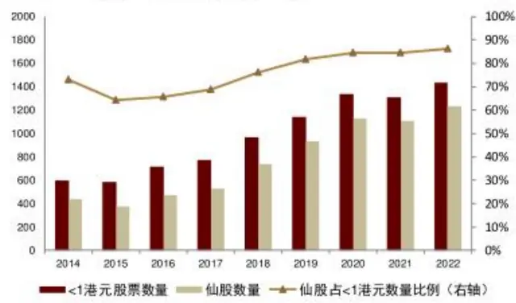
资料来源：Wind，中金公司研究部

图表20：筛选前后仙股成交额占比对比
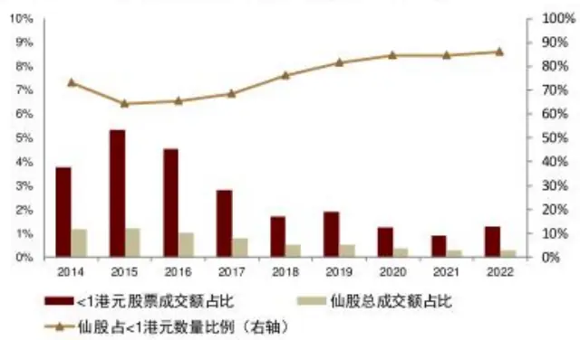
资料来源：Wind，中金公司研究部

## 港股因子测试综述

在原有的A股回测框架基础上，我们根据上述港股市场特征，对于数据处理、因子选取和回测框架分别进行对应调整。

## 数据处理

由于港股财务数据披露制度自由度较大，财务数据的规范性和可比性较低。因此，我们对财务数据以及其他数据处理进行了以下细节调整：

不对公司设定的报告期进行筛选：港交所允许公司自行决定报告期，使得港股不同公司在同年同一时点的信息披露程度不同。在以往的港股因子研究中，出于可比性和便捷度考虑，可能仅使用报告期为1月1日至12月31日的港股数据。我们选择不硬性筛选公司设定的报告期，而是通过对数据的年化处理(TTM)，使其不受不同定期报告的影响，从而容纳更多样本信息。

使用季报、中报和年报数据：由于港股不强制要求披露季报，所以以往研究中可能仅使用强制披露的中报和年报数据，而忽略披露度参差的季报。我们从数据最新可得性出发，在公司披露季报的情况下使用最新年化（TTM）后的季度数据；当公司不披露季报的情况，则使用最新可得数据，即上期可得中报或年报信息。在同一截面上的增量信息均有TTM处理，而存量信息则不受定期报告规则差异的影响，这使得在保证数据截面可比的同时，能涵盖最新可得信息，保证了数据的及时性。

增量数据年化（TTM）处理：保证了不同报告期的增量数据的可比性。举例而言，2017年3季度的TTM数据=2017年3季度数据+2016年年报数据-2016年3季度数据。一季报和中报TTM数据同理，年报则直接保留披露数据。

报告期调整处理：上文中提到，港股存在个别因报告期调整而部分时间无财务数据覆盖的情况。譬如，当期中报覆盖2011年1月1日到2011年6月30日，当期年报覆盖2010年7月1日到2011年6月30日，而下期年报经过报告期调整后，覆盖2012年1月1日到2012年12月31日。因此，2011年7月至12月的数据无财报覆盖。针对这样报告期调整的情况，我们秉承着使用最新信息的原则，优先使用报告期调整前的年报数据，而在无财报覆盖的区间则沿用上期年报信息。

重复公司代码处理：港股由于制度原因，存在多个股票代码对应同一公司代码的情况。我们在初步处理因子时，剔除了聆讯代码、退市和合并以及因转为人民币计价而重复存在的公司股票，使得公司代码与wind代码一一对应，不受时点影响。

货币统一处理：港股中存在个别股票为美元或人民币计价。尽管非港元计价股票并不在我们选取的基准指数成分股内，但出于统一性考虑，我们选择将所有股票根据当月即期汇率转化为港元单位。

## 因子选取

作为港股因子初探，我们综合选取了中金基本面因子6和价量因子7中较为常见的因子。我们共选取了13大类，共70个因子。选取的过程中遵循三个原则：构建因子所需数据在港股中可得，因子构建方式简明常用，且该因子在A股市场回测表现相对较好。

在因子回望区间的选择上，不同于A股因子手册中测试了分别测试了1、3、6个月回望区间的构造方式，本文主要选用了3个月作为回望区间长度，在综合考虑换手率和预测表现平衡的同时，也精简了测试因子的个数。

其中，基本面因子分为盈利能力、成长、安全性、估值、营运效率、盈余质量、公司治理、规模、分析师预期因子9大类，共44个因子；价量因子分为动量&反转、波动率、流动性、价量相关性因子4大类，共26个因子。

图表21：本文测试因子分类
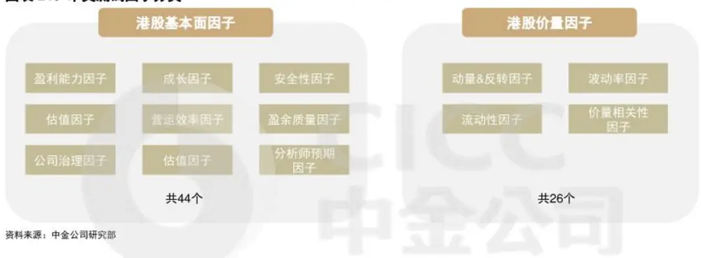

## 回测框架

本文将对港股市场中的价量和基本面因子进行IC检验和分组回测检验，展示不同因子的有效性水平。我们将对各类因子在恒生综合指数和恒生港股通指数范围内进行IC检验与分组回测检验，分析不同因子收益率预测的稳定性、单调性和有效性，并展示个别因子的分行业IC表现和多头收益表现。

其中因子测试框架如下：

测试区间：2010-01-04至2023-01-03（恒生港股通内测试从2016-12-30开始）

股票池：恒生综合指数、恒生港股通指数成分股，并剔除停牌、退市、上市未满一年股票以及流动性较差的仙股（详见上文筛选仙股部分）

频率：月度

中性化：对数市值、wind一级行业分类

分组回测组数：按照因子值由小到大的顺序等分为10组

## 因子有效性评价标准

使用多种指标展示因子的有效性水平。在IC 检验中，我们使用IC均值、ICIR 等指标展示因子暴露与下期收益率的秩相关性，反映因子对收益率的预测能力。在分组回测中，使用多头年化收益率、多头年化超额收益率、多头超额最大回撤等指标展示多头组合的选股能力；其中我们用较为创新的方式对单调性进行计算，即测算分组回测的组数序号与对应组合年化收益率的秩相关系数，该绝对数值越接近于1，则因子单调性越显著。

图表 22：有效性检验指标含义

| 因子有效性检验 | 指标计算方法 | 指标含义 |
| --- | --- | --- |
| IC 均值 | IC 序列均值 | 检验因子的预测能力 |
| IC_IR | IC 序列均值 / IC 标准差 | 检验因子预测能力的稳定性 |
| t值 | IC 序列t统计值 | 检验因子预测能力的显著性 |
| 多头年化收益率 | 分组回测中多头组合的年化收益率 | 检验因子多头组合的选股能力 |
| 多头年化超额收益率 | 分组回测中多头组合相较基准指数的超额收益 | 检验因子多头组合的超额收益能力 |
| 多头超额最大回撤 | 分组回测中多头组合相较基准指数的最大回撤 | 检验因子多头组合的收益稳定性 |
| 多头平均换手率 | 分组回测中多头组合的平均换手率 | 检验因子换手率水平 |
| 单调性 | 分组回测中组数序号与对应组合年化收益相关系数的绝对值 | 检验因子单调性 |

资料来源：中金公司研究部

## 价量因子

## 动量&反转因子：有效性与单调性优良

港市较长期呈现显著动量效应

动量&反转因子衡量了不同回望区间、不同计算方式的涨跌幅，从而体现市场处于动量抑或是反转效应。本文测试了以下8种动量&反转因子，并根据回望区间长度将这些因子归为月度反转因子和年度动量因子2大类。

图表23：动量&反转因子构建方式

| 因子代码 | 因子名称 | 因子计算公式 |
| --- | --- | --- |
| mmt_normal_M | 1个月收益率 | 过去1个月的收益率 |
| mmt_normal_A | 1年收益率 | 过去12个月的收益率-过去1个月收益率 |
| mmt_avg_M | 相对均价的1个月收益率 | 当期收盘价/过去20个交易日均价 |
| mmt_avg_A | 相对均价的1年收益率 | 1个月前的收盘价/过去1年的均价 |
| mmt_intraday_M | 1个月日内动量 | 过去一个月的日内涨跌幅之和 |
| mmt_intraday_A | 1年日内动量 | 过去一年的日内涨跌幅之和-过去一个月日内涨跌幅之和 |
| mmt_overnight_M | 1个月隔夜动量 | 过去1个月内，隔夜涨跌幅之和 |
| mmt_overnight_A | 1年隔夜动量 | 过去一年的隔夜涨跌幅之和-过去一个月隔夜涨跌幅之和 |

资料来源：中金公司研究部

月度反转因子：包含基于过去1个月涨跌幅信息构造的4种因子。除隔夜动量因子(mmt_overnight_M)以外，该类因子之间相关性较高，与年度动量因子则相关性较低。而隔夜动量因子则仅与日内动量因子相关性较高。该类因子无论是在恒生综指或是港股通范围内均表现不佳，有效性、预测能力较差，单调性低。

年度动量因子：包含基于过去1年涨跌幅信息构造的4种因子。此类因子之间的相关性较高，其中1年隔夜动量因子与1年日内动量因子呈现较高负相关。该类因子在港市中表现较好，在保证有效性的同时，有优秀的超额收益预测能力。其中，相对均价的1年收益率因子（mmt_avg_A）和1年收益率因子（mmt_normal_A）在恒生综指和港股通范围内表现均较为优异。恒生综指范围内，相对均价的1年收益率因子（mmt_avg_A）的IC均值为4.15%，IC_IR为0.29，年化超额收益达到11.13%；1年收益率因子(mmt_normal_A)的IC均值为4.20%，IC_IR为0.3，年化超额收益为9.20%。除此以外，1年日内动量（mmt_intraday_A）的单调性优异，预测能力和稳定性也较为突出。

月度反转因子在A股市场中表现较为出色，但在港股市场中有效性较低。而大部分年度动量因子在A股市场中表现平平，但在港股市场中多头超额收益表现突出、选股能力稳定。其中可能的原因在于市场不同期限的动量/反转效应强度不同，且不同市场对短/中/长期的时间区间定义不同。月度因子衡量了较为短期的市场效应，年度因子则衡量了较为长期的市场效应。

港市较短期呈现反转效应，较长期呈现动量效应，且年度动量较为显著，但月度动量并不显著。但港股市场中是否存在更强的更短期或更长期的反转或动量效应，仍值得继续探究。

综合而言，相对均价的1年收益率因子（mmt_avg_A）和1年收益率因子

(mmt_normal_A)表现较为突出，推荐关注。两个因子在各选股域中选股能力和稳定性良好，预测能力和单调性优异。

图表24：动量&反转因子在恒生综指范围内的有效性检验结果

|  | IC均值 | IC_IR | P(IC>0.02) | P(IC<-0.02) | 多空年化 收益 | 多空年化 波动 | 多空夏普 比率 | 多头年化 超额 | 多头超额 最大回撤 | 多头换手 率 | 单调性 |
| --- | --- | --- | --- | --- | --- | --- | --- | --- | --- | --- | --- |
| mmt_avg_A | 4.15% | 0.29 | 57.05% | 26.17% | 20.13% | 19.90% | 1.02 | 11.13% | -31.66% | 38.23% | 0.95 |
| mmt_avg_M | -1.39% | 0.11 | 38.06% | 41.94% | 4.63% | 16.84% | 0.35 | 2.71% | -38.36% | 86.51% | 0.13 |
| mmt_intraday_A | 3.75% | 0.35 | 61.33% | 25.33% | 16.85% | 15.42% | 1.09 | 8.53% | -25.75% | 25.62% | 0.98 |
| mmt_intraday_M | -0.75% | 0.07 | 41.29% | 38.06% | -1.37% | 16.69% | 0.00 | 0.82% | -48.30% | 80.42% | 0.10 |
| mmt_normal_A | 4.20% | 0.3 | 60.42% | 29.17% | 19.32% | 19.04% | 1.02 | 9.20% | -28.28% | 31.31% | 0.95 |
| mmt_normal_M | -1.13% | 0.09 | 46.10% | 37.66% | -3.48% | 18.21% | -0.10 | 3.01% | -55.66% | 85.56% | 0.01 |
| mmt_overnight_A | -1.27% | 0.17 | 30.00% | 46.00% | 4.49% | 11.17% | 0.45 | 2.47% | -36.26% | 22.75% | 0.45 |
| mmt_overnight_M | -0.95% | 0.15 | 34.19% | 40.65% | 2.10% | 11.60% | 0.24 | 0.03% | -35.74% | 78.65% | 0.48 |

资料来源：Wind，中金公司研究部
注：统计时间为2010-01-29 至2022-12-30；超额收益的比较基准为恒生综指

图表25：动量&反转因子在恒生港股通范围内的有效性检验结果

|  | IC均值 | IC_IR | P(IC>0.02) | P(IC<-0.02) | 多空年化 收益 | 多空年化 波动 | 多空夏普 比率 | 多头年化 超额 | 多头超额 最大回撤 | 多头换手 率 | 单调性 |
| --- | --- | --- | --- | --- | --- | --- | --- | --- | --- | --- | --- |
| mmt_avg_A | 4.15% | 0.33 | 56.94% | 29.17% | 23.33% | 22.67% | 1.04 | 13.31% | -17.63% | 39.16% | 0.90 |
| mmt_avg_M | -0.51% | 0.04 | 43.06% | 37.50% | -2.14% | 18.12% | -0.03 | -1.13% | -33.67% | 87.18% | 0.09 |
| mmt_intraday_A | 3.48% | 0.36 | 56.94% | 25.00% | 15.39% | 18.01% | 0.89 | 7.82% | -15.64% | 26.84% | 0.95 |
| mmt_intraday_M | 0.05% | 0 | 51.39% | 31.94% | 6.82% | 18.18% | 0.45 | 0.78% | -31.32% | 83.37% | 0.07 |
| mmt_normal_A | 4.27% | .35 | 65.28% | 30.56% | 21.11% | 20.68% | 1.03 | 12.41% | -18.71% | 32.42% | 0.88 |
| mmt_normal_M | -1.12% | -0.09 | 52.78% | 33.33% | -3.89% | 19.41% | -0.11 | 3.34% | -44.02% | 85.82% | 0.18 |
| mmt_overnight_A | -0.67% | -0.08 | 34.72% | 41.67% | 2.35% | 13.56% | 0.24 | 1.86% | -16.52% | 24.62% | 0.31 |
| mmt_overnight_M | -1.39% | 0.21 | 29.17% | 44.44% | 3.55% | 12.92% | 0.33 | 0.58% | -19.54% | 79.66% | 0.30 |

资料来源：Wind，中金公司研究部
注：统计时间为2016-12-30 至2022-12-30；超额收益的比较基准为恒生港股通指数

图表 26：动量&反转因子恒生综指内IC 值表现
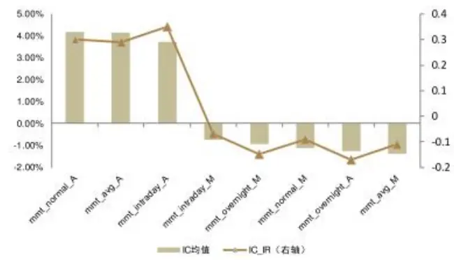
资料来源：Wind，中金公司研究部
注：1）统计时间为2010-01-29至2022-12-30；2）相对净值的比较基准为恒生综指 HSCI.HI

图表 27：动量&反转因子恒生港股通内IC 值表现
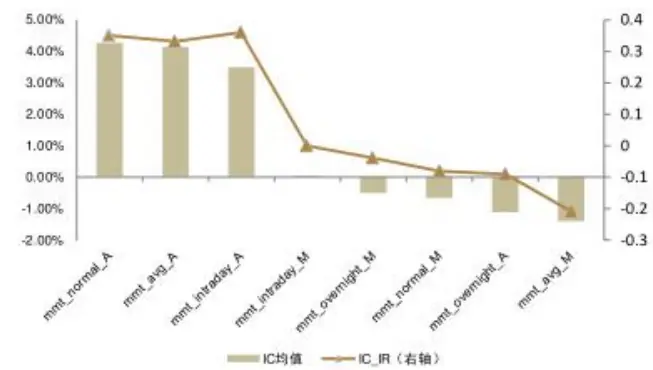
资料来源：Wind，中金公司研究部
注：1）统计时间为2016-12-30至2022-12-30；2）相对净值的比较基准为恒生港股通指数 HSHKI.HI

图表28：动量&反转因子恒生综指范围内相关性统计

| mmt_normal_M mmt_avg_M |  |  | mmt_overnightmmt_normal mmt_avg_A |  |  |  |  |  |  |  |  |
| --- | --- | --- | --- | --- | --- | --- | --- | --- | --- | --- | --- |
|  |  |  |  |  |  |  |  | M |  | mmt_intraday | mmt_overnight |
|  |  |  | M | A | Iim_avg_A |  | A |  | A |  |  |
| mmt_normal_M | 1.00 | 0.84 | 0.77 | 0.16 | 0.02 | 0.01 |  | 0.02 | -0.01 |  |  |
| mmt_avg_M | 0.84 | 1.00 | 0.65 | 0.13 | 0.04 | 0.04 |  | 0.03 | 0.00 |  |  |
| mmt_intraday_M | 0.77 | 0.65 | 1.00 | -0.47 | 0.02 | 0.02 |  | 0.16 | -0.18 |  |  |
| mmt_overnight_M | 0.16 | 0.13 | -0.47 | 1.00 | -0.01 | -0.03 |  | -0.22 | 0.26 |  |  |
| mmt_normal_A | 0.02 | 0.04 | 0.02 | -0.01 | 1.00 | 0.85 |  | 0.62 | 0.06 |  |  |
| mmt_avg_A | 0.01 | 0.04 | 0.02 | -0.03 | 0.85 | 1.00 |  | 0.56 | 0.04 |  |  |
| mmt_intraday_A | 0.02 | 0.03 | 0.16 | -0.22 | 0.62 | 0.56 |  | 1.00 | -0.67 |  |  |
| mmt_overnight_A | -0.01 | 0.00 | -0.18 | 0.26 | 0.06 | 0.04 |  | -0.67 | 1.00 |  |  |

资料来源：Wind，中金公司研究部
注：统计时间为2010-01-29至2022-12-30

## 相对均价的1年收益率因子（mmtavgA）各选股域分组单调性良好

我们挑选了上述因子中表现较好的1年日内动量因子(mmt_intraday_A)、相对均价的1年收益率因子（mmt_avg_A）和1年收益率因子（mmt_normal_A），详细展示其净值与分组收益表现。

恒生综指范围内，上述三个因子的单调性良好，但2022年11月开始均有明显回撤。三个因子的多头组合显著跑赢基准，空头组合显著跑输基准。其中，1年日内动量因子

(mmt_intraday_A）从多空净值而言，整体稳定性要优于其余两个因子。但就多空净值收益表现而言，1年收益率因子（mmt_normal_A）的表现较优。在恒生综指范围内，2022年11月以来年度动量因子均有不同程度的失效。

图表29：恒生综指范围内表现较好的动量&反转因子多空累计净值
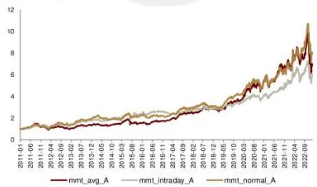
资料来源：Wind，中金公司研究部
注：1）统计时间为2011-01-03至2022-12-30；2）相对净值的比较基准为恒生综指HSCI.HI

图表30：恒生综指范围内表现较好的动量&反转因子分组年化超额收益统计
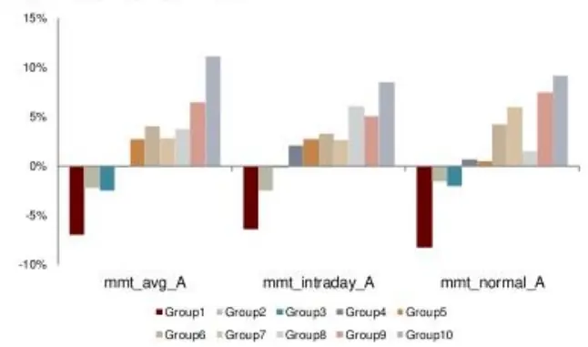
资料来源：Wind，中金公司研究部
注：1）统计时间为2011-01-03至2022-12-30；2）相对净值的比较基准为恒生综指HSCI.HI；3）Group1为因子值最小一组，Group10 为因子值最大一组

恒生港股通范围内，相对均价的1年收益率因子（mmt_avg_A）分组表现良好，空头收益显著，多头表现突出。1年日内动量因子和1年收益率因子的分组单调性尚可。从多空净值来看，相对均价的1年收益率因子的多空表现持续优于其余两个因子。恒生港股通范围内，2022年11月开始上述三个年度动量因子也都出现大幅回撤，存在不同程度的失效，但从2022年12月后半月起有小幅反弹。

图表31：恒生港股通范围内表现较好的动量&反转因子多空累计净值
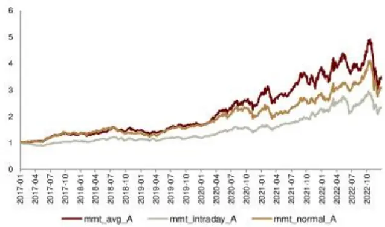
资料来源：Wind，中金公司研究部
注：1）统计时间为2017-01-03至2022-12-30；2）相对净值的比较基准为恒生港股通指数 HSHKI.HI

图表32：恒生港股通范围内表现较好的动量&反转因子分组年化超额收益统计
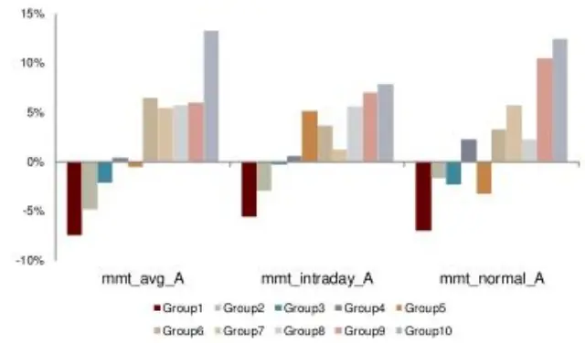
资料来源：Wind，中金公司研究部
注：1）统计时间为2017-01-03至2022-12-30；2）相对净值的比较基准为恒生港股通指数HSHKI.HI；3）Group1为因子值最小一组，Group10为因子值最大一组

## 波动率因子：有效性较好，预测能力尚可

## 波动率因子间相关性偏高，振幅波动率因子有效性较好

波动率因子计算了不同回望区间、不同计算方式的股价波动率，从而体现股价的不确定性。本文测试了以下7种不同的构建方式的波动率因子，并将这些因子归为传统波动率因子与振幅波动率因子2大类。

图表 33：波动率因子构建方式

| 因子代码 | 因子名称 | 因子计算公式 |
| --- | --- | --- |
| vol_std_3M | 3个月波动率 | 过去3个月（日收益率）的标准差 |
| vol_highlow_avg_3M | 3个月日内振幅 | 过去3个月（最高价/最低价）的均值 |
| vol_highlow_std_3M | 3个月日内振幅标准差 | 过去3个月（最高价/最低价）的标准差 |
| vol_upshadow_std_3M | 3个月上影线标准差 | 标准化上影线因子过去3个月的标准差；其中，标准化上影线=（最高价-max(开盘价，收盘价））/最高价 |
| vol_downshadow_std_3M | 3个月下影线标准差 | 标准化下影线因子过去3个月的标准差；其中，标准化下影线=（min(开盘价，收盘价）-最低价）/最低价 |
| vol_w_upshadow_std_3Mvol_w_downshadow_std_3M | 3个月威廉上影线标准 威廉上影线因子过去3个月的标准差；差 其中，威廉上影线=（最高价-收盘价）/最高价 |  |
|  | 3个月威廉下影线标准 威廉下影线因子过去3个月的标准差；差 其中，威廉下影线=（收盘价-最低价）/最低价 |  |

资料来源：中金公司研究部

传统波动率因子：包含基于收益波动率构建的3个月波动率因子（vol_std_3M)。该因子的构建方法较为基础。在恒生综指范围内，该因子选股稳定性尚可，IC_IR为-0.27，但是预测能力和单调性较弱；在恒生港股通范围内则单调性偏差。

振幅波动率因子：基于最高价与最低价信息构建的振幅和上下影线因子共6个。该类因子之间的相关性较高。在恒生综指范围内，3个月日内振幅标准差因子

(vol_highlow_std_3M) 和3个月威廉上影线标准差因子（vol_w_upshadow_std_3M)表现较好，ICIR分别为-0.35和-0.32，且单调性不错；在恒生港股通范围内，波动率因子的单调性普遍较差，其中表现尚可的是3个月下影线标准差因子

(vol_downshadow_std_3M)，IC_IR 为-0.37。整体而言，振幅波动率因子的有效性、单调性和收益预测能力要优于传统方式构建的波动率因子

波动率因子的IC均值均为负数，说明波动率与股票收益为负相关，即股票的不确定性和波动性越高，未来表现可能不佳。波动率因子整体的有效性和选股稳定性较好，多数因子的IC绝对值均值大于3%；但多头收益预测较普通，单调性在港股通范围内较差。此外，在恒生综指和港股通范围内，各波动率因子的换手率均偏低。在换手成本和有效性为主要考虑方向时，波动率因子可以纳入考量范围。这一特征与波动率因子在A股市场中的表现相似—性价比可视为波动率因子的优势之一。

总结而言，3个月威廉上影线标准差因子（vol_w_upshadow_std_3M）在2个选股域中的表现均衡较优。在恒生综指范围内，3个月日内振幅标准差因子（vol_highlow_std_3M）也有着不俗的表现。

图表34：波动率因子在恒生综指范围内的有效性检验结果

|  | IC均值 | IC_IR | P(IC>0.02) | P(IC<-0.02) | 多空年化 收益 | 多空年化 波动 | 多空夏普 比率 | 多头年化 超额 | 多头超额 录大回撇 | 多头换手 率 | 单调性 |
| --- | --- | --- | --- | --- | --- | --- | --- | --- | --- | --- | --- |
| vol downshadow std 3M | -3.49% | -0.34 | 25.97% | 54.55% | 11.93% | 16.89% | 0.75 | 3.62% | -29.05% | 33.56% | 0.79 |
| vol_highlow_avg_3M | -4.55% | -0.29 | 32.47% | 59.09% | 13.85% | 23.95% | 0.66 | 3.71% | -35.51% | 22.47% | 0.73 |
| vol_highlow_std_3M | -4.32% | -0.35 | 27.27% | 59.74% | 15.33% | 18.93% | 0.85 | 4.04% | -30.89% | 35.43% | 0.64 |
| vol_std_3M | -4.29% | -0.27 | 35.71% | 55.19% | 16.01% | 24.01% | 0.74 | 2.17% | -29.69% | 29.19% | 0.55 |
| vol_upshadow_std_3M | -3.84% | -0.32 | 29.22% | 57.79% | 12.38% | 17.55% | 0.75 | 2.15% | -35.08% | 32.83% | 0.56 |
| vol_w_downshadow_std_3M | 4.50% | -0.35 | 29.22% | 57.14% | 16.26% | 20.35% | 0.84 | 3.16% | -27.49% | 34.34% | 0.67 |
| vol_w_upshadow_std_3M | -4.46% | -0.32 | 29.22% | 59.09% | 16.82% | 21.01% | 0.85 | 4.88% | -30.96% | 31.72% | 0.89 |

资料来源：Wind，中金公司研究部
注：统计时间为2010-02-26至2022-12-30；超额收益的比较基准为恒生综指

图表35：波动率因子在恒生港股通范围内的有效性检验结果
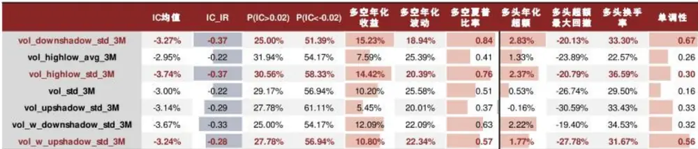
资料来源：Wind，中金公司研究部
注：统计时间为2016-12-30至2022-12-30；超额收益的比较基准为恒生港股通指数

图表 36：波动率因子恒生综指内IC 值表现
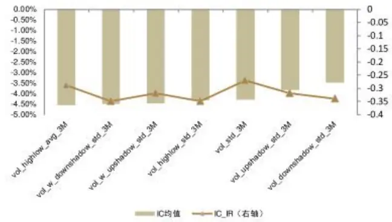
资料来源：Wind，中金公司研究部
注：1）统计时间为2010-02-26至2022-12-30；2）相对净值的比较基准为恒生综指HSCI.HI

图表 37：波动率因子恒生港股通内IC 值表现
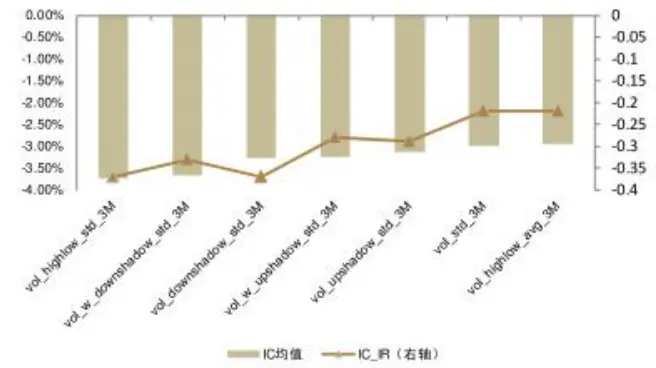
资料来源：Wind，中金公司研究部
注：1）统计时间为2016-12-30至2022-12-30；2）相对净值的比较基准为恒生港股通指数 HSHKI.HI

图表38：波动率因子恒生综指范围内相关性统计

|  | vol_std_3M | vol_highlow_a vol_highlow_s vol_upshadow vol_downshad vol_w_upshad vg_3M | td 3M | std_3M | ow_std_3M | ow_std_3M | vol_w_downs hadow_std_3 |
| --- | --- | --- | --- | --- | --- | --- | --- |
| vol_std_3M | 1.00 | 0.89 | 0.82 | 0.66 | 0.62 | 0.83 | M 0.86 |
| vol_highlow_avg_3M | 0.89 | 1.00 | 0.82 | 0.78 | 0.75 | 0.86 | 0.86 |
| vol_highlow_std_3M | 0.82 | 0.82 | 1.00 | 0.76 | 0.73 | 0.86 | 0.88 |
| vol_upshadow_std_3M | 0.66 | 0.78 | 0.76 | 1.00 | 0.62 | 0.76 | 0.67 |
| vol_downshadow_std_3M | 0.62 | 0.75 | 0.73 | 0.62 | 1.00 | 0.64 | 0.75 |
| vol_w_upshadow_std_3M | 0.83 | 0.86 | 0.86 | 0.76 | 0.64 | 1.00 | 0.72 |
| vol_w_downshadow_std_3M | 0.86 | 0.86 | 0.88 | 0.67 | 0.75 | 0.72 | 1.00 |

资料来源：Wind，中金公司研究部
注：统计时间为 2010-02-26 至2022-12-30

波动率因子空头收益突出，单调性普通，推荐关注3个月日内振幅标准差因子(vol highlow std 3M)

我们挑选了上述因子中表现较好的3个月日内振幅标准差因子(vol_highlow_std_3M)、3个月威廉上影线标准差因子(vol_w_upshadow_std_3M) 和 3个月下影线标准差因子(vol_downshadow_std_3M)，详细展示其净值与分组收益表现。

恒生综指范围内，因子空头收益十分显著，且多头收益一定程度跑赢基准，但整体单调性普通。由于因子间的高正相关性，因子的净值走势趋同，在2022年5月和2022年11月均出现了一定回撤。相较而言，3个月威廉上影线标准差因子的多空净值表现优于其余两个因子。

图表39：恒生综指范围内表现较好的波动率因子多空累计净值
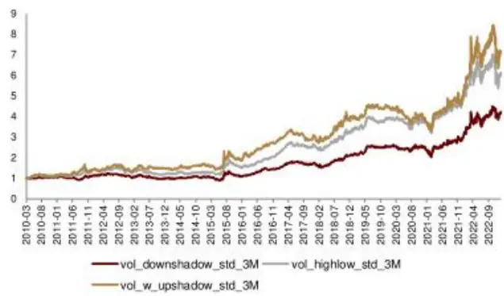
资料来源：Wind，中金公司研究部
注：1）统计时间为2010-03-01至2022-12-30；2）相对净值的比较基准为恒生综指 HSCI.HI

图表40：恒生综指范围内表现较好的波动率因子分组年化超额收益统计
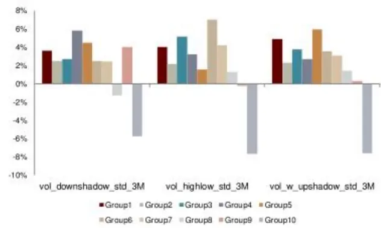
资料来源：Wind，中金公司研究部
注：1）统计时间为2010-03-01至2022-12-30；2）相对净值的比较基准为恒生港股通指数HSHKI.Hl；3)Group1 为因子值最小一组，Group10为因子值最大一组

恒生港股通范围内，因子单调性同样较差，但空头组合显著跑输基准。三个因子的多头收益都表现较为普通。因子的走势大体趋同，但是区分度要低于恒生综指范围内的因子表现。2021年年中以前，3个月下影线标准差因子的净值表现略优；但自2021年年中以后，3个月日内振幅标准差因子和3个月下影线标准差因子的表现基本重合，弥补了此前的差距。

图表41：恒生港股通范围内表现较好的波动率因子多空累计净值
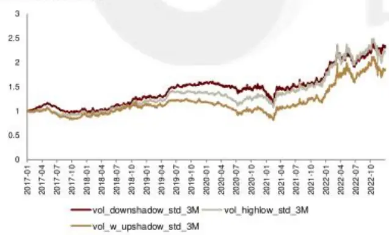
资料来源：Wind，中金公司研究部
注：1）统计时间为2017-01-03至2022-12-30；2）相对净值的比较基准为恒生港股通指数 HSHKI.HI

图表42：恒生港股通范围内表现较好的波动率因子多空累计净值
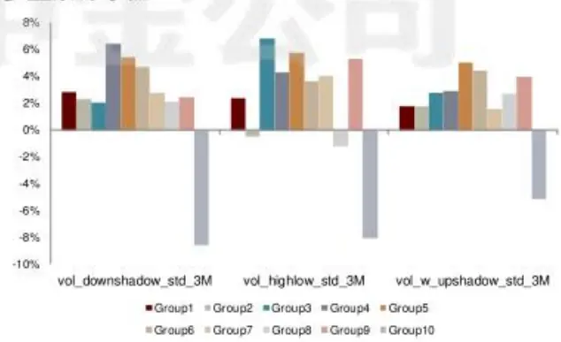
资料来源：Wind，中金公司研究部
注：1）统计时间为2017-01-03至2022-12-30；2）相对净值的比较基准为恒生港股通指数HSHKI.HI；3）Group1 为因子值最小一组，Group10为因子值最大一组

## 流动性因子：预测有效性普通

## 流动性因子有效性普通

流动性因子根据基于成交额数据计算的指标，描述了股票活动的一种性质一即股票交易的难易程度。由于流动性往往会有风险补偿，所以流动性因子可作为推动股票收益的补充因子之一。本文测试了以下5种不同的构建方式的波动率因子，并将这些因子归为换手率因子和2大类。

图表 43：流动性因子构建方式

| 因子代码 | 因子名称 | 因子计算公式 |
| --- | --- | --- |
| liq_turn_avg_3M | 3个月换手率 | 3个月换手率的均值 |
| liq_turn_std_3M | 3个月换手率标准差 | 3个月换手率的标准差 |
| liq_vstd_3M | 3个月成交波动比 3个月成交额/过去3个月收益率标准差 |  |
| liq_amihud_avg_3M | 3 个月 Amihud 非流动因子 过去3个月(日收益率\|/成交额)的平均值 |  |
| liq_amihud_std_3M | 3 个月 Amihud 非流动因子标准差 过去3个月(日收益率/成交额)的标准差 |  |

资料来源：中金公司研究部

换手率因子：包含基于换手率的均值和标准差构建的2个因子。该类因子由于所使用的源数据相同，是不同的统计描述值，其相关性颇高。在恒生综指范围内，该类因子的有效性和收益预测能力均优于收益相关流动性因子。其中，3个月换手率标准差因子(liq_turn_std_3M)在恒生综指范围内表现较好，IC 均值为-2.15%，IC_IR 为-0.17，单调性尚可，但该因子在恒生港股通范围内表现不佳。

## 收益相关流动性因子：包括基于收益和成交额构造的3个因子，例如成交波动比

(VSTD)和Amihud非流动因子。相同源数据的不同统计值因子之间为高度正相关，例如 3 个月 Amihud 非流动因子(liq_amihud_avg_3M)和 3 个月 Amihud 非流动因子标准差(liq_amihud_std_3M)；但是不同构造方法的因子间则为弱负相关，例如Amihud和VSTD因子，或换手率因子和收益相关流动性因子。该类因子的单调性、预测能力和有效性在恒生综指范围内表现较差，但相较而言在恒生港股通范围内表现稍好。在港股通范围内，3个月Amihud 非流动因子（liq_amihud_avg_3M）相对表现略优，IC 均值为-1.49%，IC_IR为-0.17。

在A股市场中，流动性因子整体有效性优秀，表现突出。这是因为流动性因子整体表现的差异也与市场特征有关。整体A股市场的流动性要优于港股市场，且流动性区分度较高。而港股市场中普遍流动性偏低的情况下，还在存在大量流动性很差的仙股。我们在测试框架中在恒生综指成分股的基础上设置了流动性限制，因此剩下的均为流动性较好的成分股，使得流动性因子的区分度较低，有效性较低。

总体而言，港股市场中流动性因子的表现普通，但换手率偏低。在恒生综指范围内换手率因子的单调性和预测能力略好；而在恒生港股通范围内则是Amihud因子表现稍佳，但单调性不佳。

图表44：流动性因子在恒生综指范围内的有效性检验结果
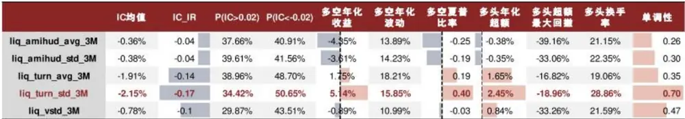
资料来源：Wind，中金公司研究部
注：统计时间为2010-02-26至2022-12-30；超额收益的比较基准为恒生综指

图表45：流动性因子在恒生港股通范围内的有效性检验结果

|  | IC均值 | IC_IR | P(IC>0.02) | P(IC<-0.02) | 多空年化 收益 | 多空年化 波动 | 多空夏普 比率 | 多头年化 超额 | 多头超额 最大回撤 | 多头换手 率 | 单调性 |
| --- | --- | --- | --- | --- | --- | --- | --- | --- | --- | --- | --- |
| liq_amihud_avg_3M | -1.49% | -0.17 | 36.11% | 44.44% | 4.99% | 13.26% | 0.43 | 3.03% | -29.11% | 23.12% | 0.43 |
| liq amihud_std 3M | -1.35% | -0.15 | 34.72% | 43.06% | 4.4-% | 13.84% | 0.38 | .34% | -32.39% | 24.92% | 0.42 |
| liq_turn_avg_3M | -0.69% | -0.06 | 38.89% | 47.22% | -8.88% | 18.99% | -0.39 | 12% | -21.42% | 18.12% | 0.42 |
| liq_turn_std_3M | -0.87% | -0.08 | 38.89% | 44.44% | -0.03% | 16.78% | 0.08 | -2.65% | -23.15% | 29.93% | 0.32 |
| liq_vstd_3M | 0.00% | 0 | 34.72% | 37.50% | 7.25% | 10.31% | 0.73 | 5.50% | -15.92% | 21.43% | 0.14 |

资料来源：Wind，中金公司研究部
注：统计时间为2016-12-30至2022-12-30；超额收益的比较基准为恒生港股通指数

图表 46：流动性因子恒生综指内IC 值表现
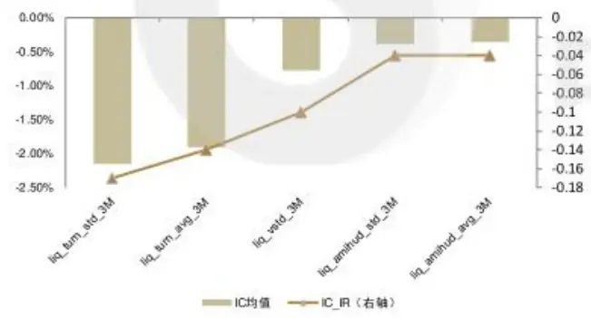
资料来源：Wind，中金公司研究部
注：1）统计时间为2010-02-26至2022-12-30；2）相对净值的比较基准为恒生综指 HSCI.HI

图表47：流动性因子恒生港股通内IC 值表现
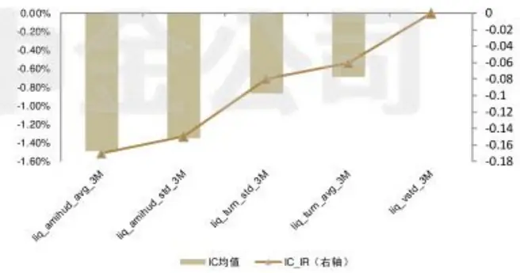
资料来源：Wind，中金公司研究部
注：1）统计时间为2016-12-30至2022-12-30；2）相对净值的比较基准为恒生港股通指数 HSHKI.HI

图表 48：流动性因子恒生综指范围内相关性统计

|  | liq_turn_avg_3M | liq_turn_std_3M | liq_vstd_3M | liq_amihud_avg_3M liq_amihud_std_3M |  |
| --- | --- | --- | --- | --- | --- |
| liq_turn_avg_3M | 1.00 | 0.89 | 0.40 | -0.49 | -0.48 |
| liq_turn_std_3M | 0.89 | 1.00 | 0.35 | -0.41 | -0.39 |
| liq_vstd_3M | 0.40 | 0.35 | 1.00 | -0.33 | -0.34 |
| liq_amihud_avg_3M | -0.49 | -0.41 | -0.33 | 1.00 | 0.97 |
| liq_amihud_std_3M | -0.48 | -0.39 | -0.34 | 0.97 | 1.00 |

资料来源：Wind，中金公司研究部
注：统计时间为2010-02-26至2022-12-30

## 流动性因子单调性不佳

在恒生综指范围内，我们挑选了3个月换手率因子（liq_turn_avg_3M）和3个月换手率标准差因子(liq_turn_std_3M)；在恒生港股通范围内，则是选择了3个月Amihud非流动因子(liq_amihud_avg_3M)和3 个月Amihud 非流动因子标准差（liq_amihud_std_3M)，详细展示其分组表现。

恒生综指范围内，两个因子的单调性均不佳。2个因子的多空头收益均表现不佳。从多空净值来看，两个因子的净值波动性很大，整体从2019年开始呈现净值下跌的态势，相较而言3个月换手率标准差因子从2017年开始略优于3个月换手率因子，多空净值从2021年起有所回升。

图表49：恒生综指范围内表现较好的流动性因子多空累计净值
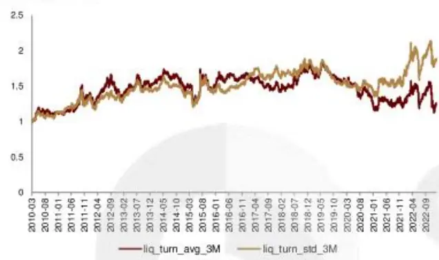
资料来源：Wind，中金公司研究部
注：1）统计时间为2010-03-01至2022-12-30；2）相对净值的比较基准为恒生综指 HSCI.HI

图表50：恒生综指范围内表现较好的流动性因子分组年化超额收益统计
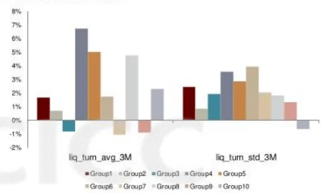
资料来源：Wind，中金公司研究部
注：1）统计时间为2010-03-01至2022-12-30；2）相对净值的比较基准为恒生港股通指数HSHKI.HI；3)Group1为因子值最小一组，Group10为因子值最大一组

在恒生港股通范围中，两个因子的分组收益单调性和净值表现都较差。两个因子的多头无显著优于基准，空头超额也并不明显，2个因子的相关性达到0.97，其净值走势也基本相同。在港股通范围内，Amihud因子从2020年年中开始失效，一直到2022年10月开始才有所好转。

图表51：恒生港股通范围内表现较好的流动性因子多空累计净值
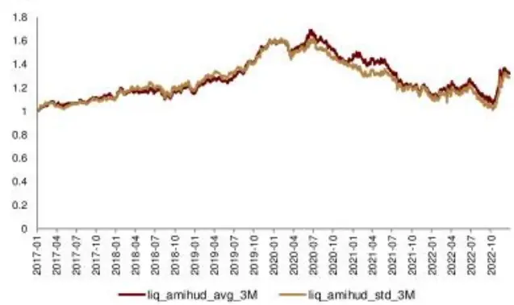
资料来源：Wind，中金公司研究部
注：1）统计时间为2017-01-03至2022-12-30；2）相对净值的比较基准为恒生港股通指数 HSHKI.HI

图表52：恒生港股通范围内表现较好的流动性因子多空累计净值
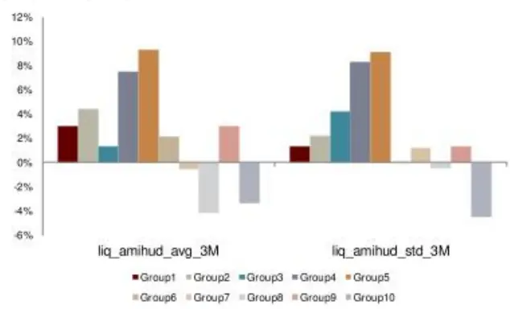
资料来源：Wind，中金公司研究部
注：1）统计时间为2017-01-03至2022-12-30；2）相对净值的比较基准为恒生港股通指数HSHKI.HI；3）Group1为因子值最小一组，Group10为因子值最大一组

## 价量相关性因子：部分因子有一定有效性和选股能力

## 价量相关性因子在恒生综指范围内有一定预测能力

价量相关性因子通过计算价格信息和成交量信息的不同滞后阶数的相关性，衡量了价与量之间的背离。其中，价信息包括价格和收益率，而量信息则以换手率及其变动为主。本文测试了以下6种不同的构建方式的波动率因子，并将这些因子归为价格相关性因子和收益相关性因子2大类。

图表53：价量相关性因子构建方式

| 因子代码 | 因子名称 | 因子计算公式 |
| --- | --- | --- |
| corr_price_turn_1Mcorr_price_turn_post_1M | 换手率与价格相关性因子(量价同步) | 过去20个交易日，t日换手率与t日价格的相关系数 |
|  | 换手率与价格相关性因子(量领先一期) | 过去20个交易日，t日换手率与t+1日价格的相关系数 |
| corr_price_turn_prior_1M | 换手率与价格相关性因子(价领先一期) | 过去 20 个交易日，t日换手率与t-1 日价格的相关系数 |
| corr_ret_turnd_1M | 换手率变动与收益率相关性因子过去20个交易日，↑日换手率的变动与t日收益率的相关系数(量价同步) |  |
| corr_ret_turnd_post_1M | 换手率变动与收益率相关性因子(量领先一期) | 过去20个交易日，t日换手率的变动与t+1日收益率的相关系数 |
| corr_ret_turnd_prior_1M | 换手率变动与收益率相关性因子过去20个交易日，t日换手率的变动与t-1日收益率的相关系数(价领先一期) |  |

资料来源：中金公司研究部

价格相关性因子：包含基于不同领先滞后阶数的价格与换手率相关性构建的3个因子。该类因子之间呈现较强的正相关性，但与收益率相关性因子的相关性偏低。在恒生综指范围内，价领先一期的换手率与价格相关性因子（corr_price_turn_prior_1M）的超额预测能力和有效性较好，年化超额为6.10%，IC_IR为-0.23；在恒生港股通范围内，价量相关性因子的单调性普遍较差，预测能力相对较好的是价领先一期的换手率与价格相关性因子(corr_price_turn_prior_1M)。

收益相关性因子：包含基于不同领先滞后阶数的收益率与换手率相关性构建的3个因子。该类因子之间的相关性为负向弱相关。在恒生综指范围内，量领先一期的换手率变动与收益率相关性因子（corr_ret_turnd_post_1M）表现较好，IC_IR为 0.3，该相关性与收益正向相关，且单调性较好；在恒生港股通范围内，不同领先滞后阶数的收益相关性因子表现差异较大，其中，量价同步的换手率变动与收益率相关性因子（corr_ret_turnd_1M）有效性和预测能力较优，IC均值为-2.37%，IC_IR为-0.29。

不同领先滞后阶数的价量相关性因子在不同市场的表现差异较大，在所测范围中并无法定性量领先或价领先抑或是同步的相关性因子占优。在港股市场中，尝试更多的领先滞后阶数与信息变体的组合不失为值得继续探究的方向。而在A股市场中，价量同步因子的表现相对优于价领先或量领先的因子。值得注意的是，无论是在港股市场还是A股市场中，价量相关性因子的换手率都偏高，可能导致一定交易成本。

## 在恒生综指范围内，推荐关注价领先一期的换手率与价格相关性因子

(corr_price_turn_prior_1M)，其整体表现较为平衡且优秀。而在恒生港股通范围内，整体价量相关性因子单调性略逊，但其中量价同步的换手率变动与收益率相关性因子(corr_ret_turnd_1M) 较好。

图表54：价量相关性因子在恒生综指范围内的有效性检验结果

|  | IC均值 | IC_IR | P(IC>0.02) P(IC<-0.02) |  | 多空年化 收益 | 多空年化 波动 | 多空夏普 比率 | 多头年化 超额 | 多头超额 最大回撤 | 多头换手 率 | 单调性 |
| --- | --- | --- | --- | --- | --- | --- | --- | --- | --- | --- | --- |
| corr_price_turn_1M | -2.24% | -0.28 | 25.81% | 49.68% | 5.90% | 10.94% | 0.58 | 3.01% | -27.73% | 87.98% | 0.65 |
| corr_price_turn_post_1M | -1.14% | -0.15 | 32.90% | 43.23% | 226% | 11.07% | 0.26 | 0.49% | -30.98% | 89.22% | 0.32 |
| corr_price_turn_prior_1M | -1.78% | -0.23 | 33.55% | 45.81% | 7.56% | 10.88% | 0.72 | 6.10% | -29.77% | 88.67% | 0.78 |
| corr_ret_turnd_1M | -2.32% | -0.29 | 30.32% | 53.55% | 5.45% | 11.23% | 0.53 | 3.91% | -20.43% | 88.13% | 0.60 |
| corr_ret_turnd_post_1M | 1.57% | 03 | 45.16% | 22.58% | 6.65% | 9.24% | 0.74 | 5.46% | -17.85% | 89.74% | 0.81 |
| corr_ret_turnd_prior_1M | 0.17% | 0.03 | 38.06% | 36.77% | 3.98% | 9.66% | -0.37 | 0.14% | -25.94% | 89.02% | 0.32 |

资料来源：Wind，中金公司研究部
注：统计时间为2010-01-29至2022-12-30；超额收益的比较基准为恒生综指

图表55：价量相关性因子在恒生港股通范围内的有效性检验结果

|  | IC均值 | IC_IR | P(IC>0.02) P(IC<-0.02) |  | 多空年化 收益 | 多空年化 波动 | 多空夏普 比率 | 多头年化 超额 | 多头超额 最大回撤 | 多头换手 车 | 单调性 |
| --- | --- | --- | --- | --- | --- | --- | --- | --- | --- | --- | --- |
| corr_price_turn_1M | -2.00% | -0.22 | 30.56% | 45.83% | 2.21% | 11.48% | 0.25 | 1.33% | -17.56% | 88.18% | 0.38 |
| corr_price_turn_post_1M | -1.37% | -0.16 | 34.72% | 47.22% | 2.49% | 11.97% | 0.27 | 1.68% | -20.63% | 89.09% | 0.19 |
| corr_price_turn_prior_1M | -1.35% | -0.15 | 36.11% | 43.06% | 2.47% | 11.53% | 0.27 | 2.46% | -22.43% | 88.43% | 0.27 |
| corr_ret_turnd_1M | -2.37% | -0.29 | 33.33% | 47.22% | 3.16% | 11.64% | 0.33 | 4.93% | -16.81% | 88.58% | 0.61 |
| corr_ret_turnd_post_1M | 0.81% | 0.15 | 44.44% | 36.11% | -2.08% | 9.85% | 0.16 | 0.96% | -18.64% | 90.54% | 0.22 |
| corr_ret_turnd_prior_1M | 0.02% | 0 | 40.28% | 43.06% | 4.18% | 10.44% | 0.36 | 0.52% | -17.54% | 89.02% | 0.33 |

资料来源：Wind，中金公司研究部
注：统计时间为2016-12-30 至2022-12-30；超额收益的比较基准为恒生港股通指数

图表 56：价量相关性因子恒生综指内IC 值表现
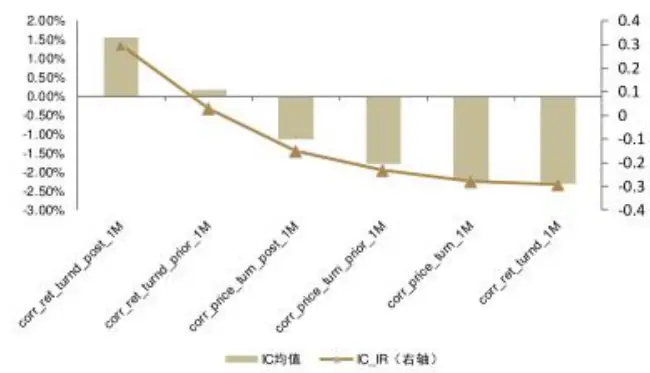
资料来源：Wind，中金公司研究部
注：1）统计时间为2010-01-29至2022-12-30；2）相对净值的比较基准为恒生综指 HSCI.HI

图表 57：价量相关性因子恒生港股通内IC 值表现
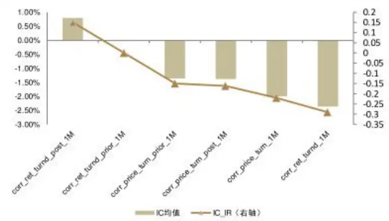
资料来源：Wind，中金公司研究部
注：1）统计时间为2016-12-30至2022-12-30；2）相对净值的比较基准为恒生港股通指数 HSHKI.HI

图表58：价量相关性因子恒生综指范围内相关性统计
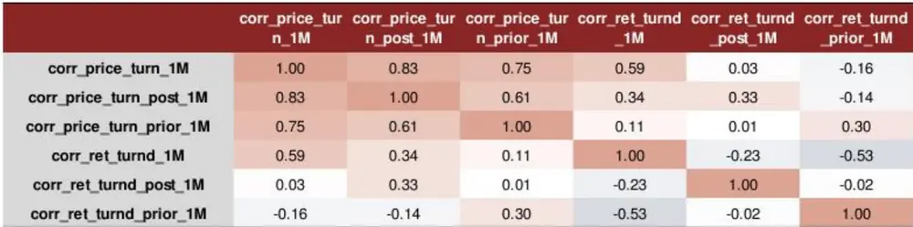
资料来源：Wind，中金公司研究部
注：统计时间为2010-01-29至2022-12-30

量领先一期的换手率变动与收益率相关性因子(corr ret turnd post1M)在恒生综指内表现较好

在恒生综指范围内，我们挑选了量价同步的换手率与价格相关性因子（corr_price_turn_1M）、价领先一期的换手率与价格相关性因子（corr_price_turn_prior_1M）和量领先一期的换手率变动与收益率相关性因子（corr_ret_turnd_post_1M)；恒生港股通范围内则是将后者替换为量价同步的换手率变动与收益率相关性因子（corr_ret_turnd_1M），详细展示其分组表现。

恒生综指范围内，量领先一期的换手率变动与收益率相关性因子的多空收益表现更优。价领先一期的换手率与价格相关性因子的多头收益显著，但空头收益与基准无明显差异。三个因子的整体单调性都较为普通。从多空收益来看，量领先一期的换手率变动与收益率相关性因子从2015年开始持续跑赢其余两个因子。但从2020年开始该因子的有效性有所下降，净值也表现出一定回撤，但其余两个因子的有效性并未从2020年开始有明显减弱，反而从2022年11月开始有显著提升。

图表59：恒生综指范围内表现较好的价量相关性因子多空累计净值
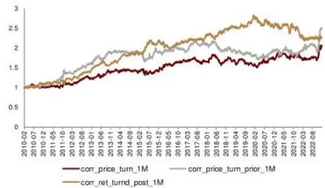
资料来源：Wind，中金公司研究部
注：1）统计时间为2010-02-01至2022-12-30；2）相对净值的比较基准为恒生综指 HSCI.HI

图表60：恒生综指范围内表现较好的价量相关性因子分组年化超额收益统计
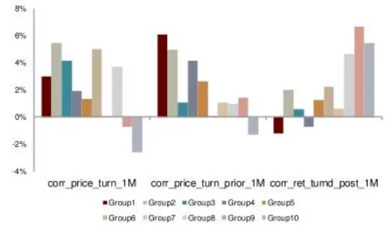
资料来源：Wind，中金公司研究部
注：1）统计时间为2010-02-01至2022-12-30；2）相对净值的比较基准为恒生港股通指数 HSHKI.HI；3)Group1 为因子值最小一组，Group10为因子值最大一组

恒生港股通范围内，两个因子的单调性和多空表现均平平。除了量价同步的换手率变动与收益率相关性因子的多头收益显著以外，其余多空头均与基准无显著差异。这也导致了三个因子的多空表现均比较普通。

图表61：恒生港股通范围内表现较好的价量相关性因子多空累计净值
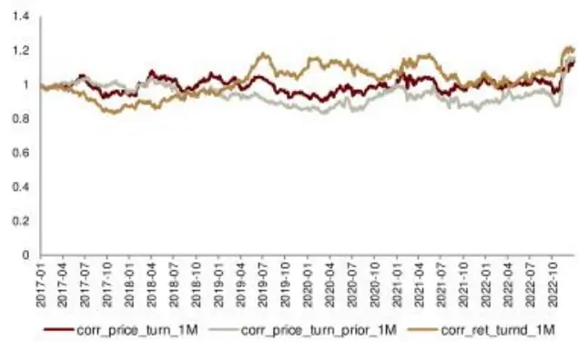
资料来源：Wind，中金公司研究部
注：1）统计时间为2017-01-03至2022-12-30；2）相对净值的比较基准为恒生港股通指数 HSHKI.HI

图表62：恒生港股通范围内表现较好的价量相关性因子多空累计净值
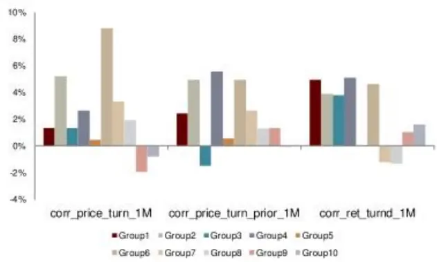
资料来源：Wind，中金公司研究部
注：1）统计时间为2017-01-03至2022-12-30；2）相对净值的比较基准为恒生港股通指数HSHKI.HI；3）Group1为因子值最小一组，Group10为因子值最大一组

## 基本面因子

## 盈利能力因子：大部分因子有效性普通，单调性较差

盈利能力因子单调性较差，但换手率偏低

盈利能力因子通过计算利润与资产的比率，衡量了公司盈利能力及其变化。本文测试了以下6个盈利能力因子，并将这些因子归为盈利比率因子和盈利比变动因子2大类。

图表 63：盈利能力因子构建方式

| 因子代码 | 因子名称 | 因子计算公式 |
| --- | --- | --- |
| CFOA_TTM | 全部资产现金回收率 TTM | 经营现金流净额TTM/总资产 |
| CFOAD | 全部资产现金回收率变动 | 当期全部资产现金回收率TTM-上期全部资产现金回收率TTM |
| ROA_TTM | 资产回报率 TTM | 净利润TTM/总资产 |
| ROAD | 资产回报率变动 | 当期资产回报率 TTM-上期资产回报率 TTM |
| ROE_TTM | 净资产收益率 TTM | 净利润TTM/净资产 |
| ROED | 净资产收益率变动 当期净资产收益率 TTM-上期净资产收益率 TTM |  |

资料来源：中金公司研究部

盈利比率因子：包括全部资产现金回收率、资产回报率和净资产收益率3个因子，其中因子分子的利润相关部分均进行了TTM处理，保证了不同季度间利润指标的可比性。该类因子之间相关性偏高，尤其是使用了相同净利润数据的ROE和ROA因子。这类因子的有效性、收益预测能力要优于盈利比变动因子，换手率也更低。在恒生综指范围中，全部资产现金回收率因子（CFOA_TTM）表现出色，IC均值为3.04%，IC_IR达到0.41；在恒生港股通范围内，该因子同样表现不俗，IC均值和IC IR分别为2.58%和0.38。此外，净资产收益率因子（ROETTM)因子在两个选股域中的表现也相对较好。

盈利比变动因子：包括当期相较上期的盈利比率差值变化的3个因子。该类因子分类中资产回报率变动因子（ROAD）和净资产收益率变动因子（ROED）相关性较高，因子间相关性主要取决于比率构建时所使用的数据。此类因子在恒生港股通范围内单调性较差，有效性逊于盈利比率因子且多头超额收益并不显著。

在港股市场中，除全部资产现金回收率因子（CFOA_TTM）以外，其他盈利能力因子的单调性较差，有效性和多头收益能力普通，优点在于其换手率较低。而在A股市场中，盈利比率因子表现更好，有效性更强。由于港股市场更为成熟，所以因子持续稳定成功预测的概率更小，有效性略低也是不出意外。值得注意的是两个市场间因子表现的相同之处，全部资产现金回收率因子和净资产收益率因子在港股和A股市场中，有效性和预测能力均表现突出。

综合而言，全部资产现金回收率TTM（CFOA_TTM）在各选股域中预测能力和稳定性优异，且换手率很低，性价比较高，推荐关注。

图表64：盈利能力因子在恒生综指范围内的有效性检验结果

|  | IC均值 | IC_IR | P(IC>0.02) | P(IC<-0.02) | 多空年化 收益 | 多空年化 波动 | 多空夏普 比率 | 多头年化 超额 | 多头超额 最大回撤 | 多头换手 率 | 单调性 |
| --- | --- | --- | --- | --- | --- | --- | --- | --- | --- | --- | --- |
| CFOAD | 0.89% | 0.14 | 41.43% | 32.86% | 1.23% | 10.69% | 0.17 | 0.51% | -45.99% | 19.19% | 0.01 |
| CFOA_TTM | 3.04% | 0.41 | 53.52% | 26.76% | 12.02% | 12.28% | 0.99 | 5.34% | -15.94% | 10.74% | 0.89 |
| ROAD | 1.07% | 0.18 | 40.71% | 33.57% | 1.50% | 11.08% | 0.19 | -1.28% | -35.49% | 18.53% | 0.14 |
| ROA_TTM | 1.53% | 0.19 | 43.66% | 37.32% | 1.93% | 13.39% | 0.21 | 0.04% | -24.27% | 9.31% | 0.02 |
| ROED | 1.05% | 0.18 | 37.86% | 35.00% | 1.23% | 11.07% | 0.17 | -1.02% | -31.63% | 18.74% | 0.20 |
| ROE_TTM | 1.64% | 0.21 | 47.89% | 34.51% | 2.30% | 12.64% | 0.24 | 1.25% | -23.02% | 10.56% | 0.19 |

资料来源：Wind，中金公司研究部
注：统计时间为2011-02-28至2022-12-30；超额收益的比较基准为恒生综指

图表65：盈利能力因子在恒生港股通范围内的有效性检验结果

|  | IC均值 | IC_IR | P(IC>0.02) | P(IC<-0.02) | 多空年化 收益 | 多空年化 波动 | 多空夏普 比率 | 多头年化 超额 | 多头超额 最大回撤 | 多头换手 率 | 单调性 |
| --- | --- | --- | --- | --- | --- | --- | --- | --- | --- | --- | --- |
| CFOAD | 0.42% | 0.07 | 36.11% | 40.28% | -6.65% | 12.31% | 0.50 | -5.20% | -36.50% | 18.49% | 0.02 |
| CFOA_TTM | 2.58% | 0.38 | 50.00% | 26.39% | 3.28% | 12.58% | 0.32 | 0.70% | -19.32% | 11.17% | 0.48 |
| ROAD | 1.00% | 0.17 | 44.44% | 37.50% | -3.44% | 12.14% | 0.23 | -3.81% | -30.57% | 17.31% | 0.24 |
| ROA_TTM | 1.61% | 0.21 | 38.89% | 36.11% | -3.46% | 14.98% | 0.16 | -1.86% | -20.73% | 8.77% | 0.14 |
| ROED | 1.14% | 0.19 | 41.67% | 30.56% | -4.61% | 11.74% | 0.34 | -3.98% | -31.88% | 18.15% | 0.05 |
| ROE_TTM | 1.82% | 0.25 | 48.61% | 29.17% | -1.24% | 13.99% | 0.02 | 1.26% | -19.51% | 9.53% | 0.01 |

资料来源：Wind，中金公司研究部
注：统计时间为2016-12-30至2022-12-30；超额收益的比较基准为恒生港股通指数

图表 66：盈利能力因子恒生综指内IC 值表现
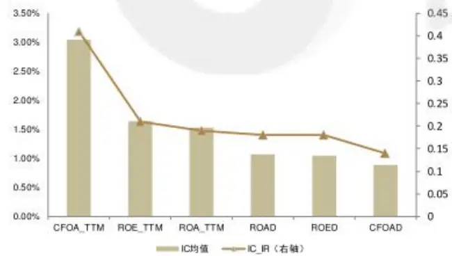
资料来源：Wind，中金公司研究部
注：1）统计时间为2011-02-28至2022-12-30；2）相对净值的比较基准为恒生综指 HSCI.HI

图表67：盈利能力因子恒生港股通内IC 值表现
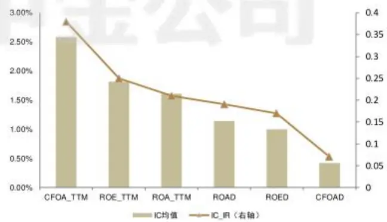
资料来源：Wind，中金公司研究部
注：1）统计时间为2016-12-30至2022-12-30；2）相对净值的比较基准为恒生港股通指数 HSHKI.HI

图表68：盈利能力因子恒生综指范围内相关性统计

|  | CFOA_TTM | ROA_TTM | ROE_TTM | CFOAD | ROAD | ROED |
| --- | --- | --- | --- | --- | --- | --- |
| CFOA_TTM | 1.00 | 0.46 | 0.40 | 0.19 | 0.06 | 0.06 |
| ROA_TTM | 0.46 | 1.00 | 0.85 | -0.01 | 0.13 | 0.15 |
| ROE_TTM | 0.40 | 0.85 | 1.00 | -0.01 | 0.13 | 0.19 |
| CFOAD | 0.19 | -0.01 | -0.01 | 1.00 | 0.29 | 0.22 |
| ROAD | 0.06 | 0.13 | 0.13 | 0.29 | 1.00 | 0.83 |
| ROED | 0.06 | 0.15 | 0.19 | 0.22 | 0.83 | 1.00 |

资料来源：Wind，中金公司研究部
注：统计时间为2011-02-28 至2022-12-30

## 全部资产现金回收率TTM因子(CFOATTM)在各选股域表现较好

我们选择了全部资产现金回收率TTM因子（CFOATTM)，详细展示其净值与分组表现。

恒生综指范围内，全部资产现金回收率TTM因子的空头收益显著，整体单调性不错。从多空净值而言，全部资产现金回收率变动因子的多空收益走势大体向上，但从2022年开始有所回撤，因子有效性有一定程度的减弱。

图表69：恒生综指范围内表现较好的盈利能力因子多空累计净值
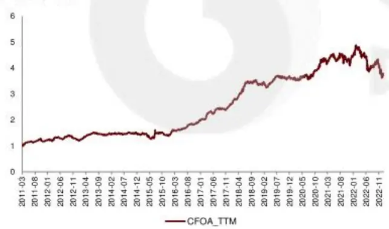
资料来源：Wind，中金公司研究部
注：1）统计时间为2011-03-01至2022-12-30；2）相对净值的比较基准为恒生综指 HSCI.HI

图表70：恒生综指范围内表现较好的盈利能力因子分组年化超额收益统计
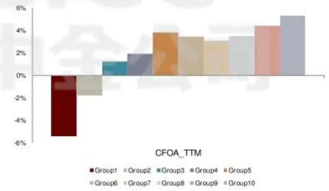
资料来源：Wind，中金公司研究部
注：1）统计时间为2011-03-01至2022-12-30；2）相对净值的比较基准为恒生综指HSCI.HI；3）Group1 为因子值最小一组，Group10 为因子值最大一组

恒生港股通范围内，全部资产现金回收率因子的单调性不佳，多空头收益均不显著。从多空净值来看，因子从期初开始呈现缓慢上涨态势，多空表现平庸，且从2022年年中开始整体多空净值呈现下跌趋势。

图表71：恒生港股通范围内表现较好的盈利能力因子多空累计净值
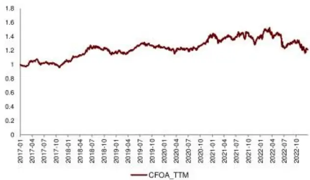
资料来源：Wind，中金公司研究部
注：1）统计时间为2017-01-03至2022-12-30；2）相对净值的比较基准为恒生港股通指数 HSHKI.HI

图表72：恒生港股通范围内表现较好的盈利能力因子分组年化超额收益统计
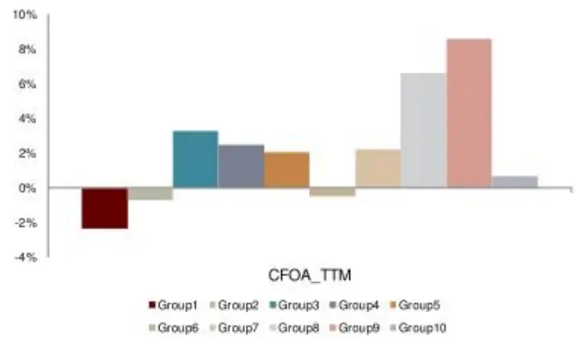
资料来源：Wind，中金公司研究部
注：1）统计时间为2017-01-03至2022-12-30；2）相对净值的比较基准为恒生港股通指数HSHKI.HI；3)Group1为因子值最小一组，Group10 为因子值最大一组

## 估值因子：有效性较好，表现较稳定

## 估值因子有效性较优

估值因子计算了各财务指标与市价的比率，衡量了股票的相对价值。本文测试了以下5种不同的估值因子。

图表 73：估值因子构建方式

| 因子代码 | 因子名称 | 因子计算公式 |
| --- | --- | --- |
| BP_LR | 市净率倒数 | 最新财报净资产/总市值 |
| EP_TTM | 市盈率倒数 | 净利润 TTM/ 总市值 |
| NCFP_TTM | 净现金流 TTM 比总市值 | 净现金流 TTM/ 总市值 |
| OCFP_TTM | 经营性现金流 TTM 比总市值 经营性现金流 TTM/ 总市值 |  |
| SP_TTM | 市销率倒数 营业收入 TTM/总市值 |  |

资料来源：中金公司研究部

恒生综指范围内，估值因子的有效性和单调性均表现较好。其中经营性现金流比总市值因子(OCFP_TTM)和市盈率倒数因子（EP_TTM）的预测稳定性较好，且选股能力较为出色，其IC_IR 分别为0.25和0.24，多头年化超额则分别为4.12%和 5.32%。

恒生港股通范围内，与现金流相关的估值因子的预测能力较强。经营性现金流比总市值因子(OCFP_TTM)的IC值为2.31%，IC_IR为 0.28，多头超额收益达到5.79%，表现突出；此外，净现金流TTM比总市值（NCFP_TTM）的表现也相对不错。在港股通范围内，现金流相关的2个估值因子的单调性要明显优于其他估值因子。

估值因子在港股市场中整体有效性良好。其中，衡量现金流和实际收益与市值之比的因子表现要优于衡量总营收或存量资金与市值之比的因子。各估值因子之间呈现弱正相关，也是由于其构建方法均使用了股票的总市值作为分母。

估值因子在A股和港股市场中的表现结论大体一致。估值因子在2个市场中共同的特征在于多数估值因子的单调性较优，且经营性现金流比总市值因子（OCFPTTM）的有效性和收益预测能力均表现突出。

综合而言，经营性现金流比总市值因子（OCFP_TTM）在2个选股域中有着稳定有效的预测能力，值得关注。

图表74：估值因子在恒生综指范围内的有效性检验结果

|  | IC均值 | IC_IR | P(IC>0.02) | P(IC<-0.02) | 多空年化 收益 | 多空年化 波动 | 多空夏普 比率 | 多头年化 超额 | 多头超额 最大回撤 | 多头换手 率 | 单调性 |
| --- | --- | --- | --- | --- | --- | --- | --- | --- | --- | --- | --- |
| BP_LR | 1.79% | 0.19 | 51.61% | 37.42% | 8.18% | 12.66% | 0.68 | 3.58% | -38.16% | 14.98% | 0.67 |
| EP_TTM | 2.16% | 0.25 | 50.32% | 33.55% | 7.51% | 11.33% | 0.70 | 4.12% | -21.34% | 18.80% | 0.61 |
| NCFP_TTM | 1.19% | 0.16 | 46.45% | 35.48% | 0.35% | 9.87% | 0.09 | 2.11% | -29.72% | 32.65% | 0.64 |
| OCFP_TTM | 1.88% | 0.24 | 52.90% | 29.68% | 6.41% | 9.95% | 0.67 | 5.32% | -19.53% | 25.91% | 0.87 |
| SP_TTM | 0.86% | 0.08 | 45.81% | 38.06% | 5.27% | 11.42% | 0.51 | 3.05% | -32.06% | 11.70% | 0.88 |

资料来源：Wind，中金公司研究部
注：统计时间为2010-01-29至2022-12-30；超额收益的比较基准为恒生综指

图表75：估值因子在恒生港股通范围内的有效性检验结果

|  | IC均值 | IC_IR | P(IC>0.02) | P(IC<-0.02) | 多空年化 收益 | 多空年化 波动 | 多空夏普 比率 | 多头年化 超额 | 多头超额 最大回撤 | 多头换手 率 | 单调性 |
| --- | --- | --- | --- | --- | --- | --- | --- | --- | --- | --- | --- |
| BP_LR | 0.67% | 0.07 | 52.78% | 40.28% | 5.35% | 13.40% | 0.46 | 0.20% | -35.07% | 14.55% | 0.03 |
| EP_TTM | 1.47% | 0.16 | 51.39% | 37.50% | 5.26% | 12.45% | 0.47 | 0.44% | -32.97% | 17.35% | 0.07 |
| NCFP_TTM | 1.37% | 0.17 | 44.44% | 34.72% | 5.64% | 10.67% | 0.57 | 4.30% | -19.09% | 36.75% | 0.64 |
| OCFP_TTM | 2.31% | 0.28 | 56.94% | 27.78% | 4.66% | 10.83% | 0.47 | 5.79% | -15.83% | 28.98% | 0.85 |
| SP_TTM | 1.02% | 0.1 | 48.61% | 37.50% | 8.97% | 11.55% | 0.80 | 2.97% | -28.29% | 10.96% | 0.39 |

资料来源：Wind，中金公司研究部
注：统计时间为2016-12-30至2022-12-30；超额收益的比较基准为恒生港股通指数

图表 76：估值因子恒生综指内IC 值表现
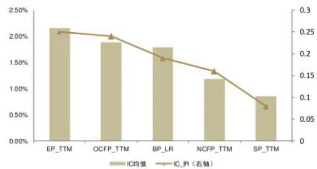
资料来源：Wind，中金公司研究部
注：1）统计时间为2010-01-29至2022-12-30；2）相对净值的比较基准为恒生综指 HSCI.HI

图表 77：估值因子恒生港股通内IC 值表现
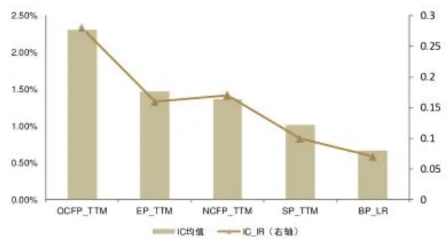
资料来源：Wind，中金公司研究部
注：1）统计时间为2016-12-30至2022-12-30；2）相对净值的比较基准为恒生港股通指数 HSHKI.HI

图表78：估值因子恒生综指范围内相关性统计

|  | BP_LR | EP_TTM | NCFP_TTM | OCFP_TTM | SP_TTM |
| --- | --- | --- | --- | --- | --- |
| BP_LR | 1.00 | 0.44 | 0.16 | 0.28 | 0.38 |
| EP_TTM | 0.44 | 1.00 | 0.16 | 0.26 | 0.29 |
| NCFP_TTM | 0.16 | 0.16 | 1.00 | 0.23 | 0.16 |
| OCFP_TTM | 0.28 | 0.26 | 0.23 | 1.00 | 0.38 |
| SP_TTM | 0.38 | 0.29 | 0.16 | 0.38 | 1.00 |

资料来源：Wind，中金公司研究部
注：统计时间为2010-01-29至2022-12-30

## 恒生综指范围内估值因子单调性较好

恒生综指范围内，我们挑选了上述因子中表现较好的市净率倒数因子(BPLR)、市盈率倒数因子（EP_TTM）和经营性现金流比总市值因子（OCFP_TTM)；恒生港股通范围内则是经营性现金流比总市值因子和净现金流比总市值因子（NCFP_TTM)，展示其净值与分组收益表现。

恒生综指范围内，上述三个因子的多空收益显著，单调性表现较好。其中，市净率倒数因子的空头收益尤为显著。从多空净值来看，市盈率倒数因子的2019年开始优于其他两个因子，其他两个因子在2019年10月至2020年年中有明显回撤。

图表79：恒生综指范围内表现较好的估值因子多空累计净值
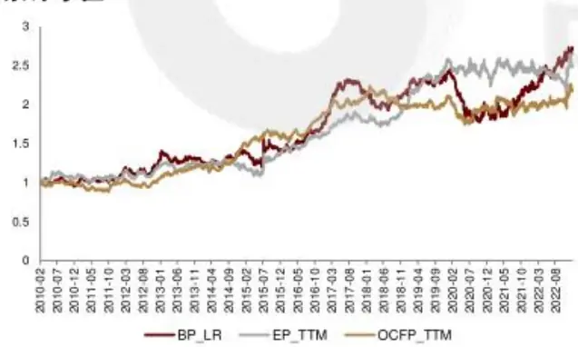
资料来源：Wind，中金公司研究部
注：1）统计时间为2010-02-01至2022-12-30；2）相对净值的比较基准为恒生综指 HSCI.HI

图表80：恒生综指范围内表现较好的估值因子分组年化超额收益统计
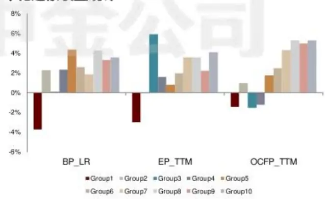
资料来源：Wind，中金公司研究部
注：1）统计时间为2010-02-01至2022-12-30；2）相对净值的比较基准为恒生综指HSCI.HI；3）Group1为因子值最小一组，Group10为因子值最大一组

恒生港股通范围内，2个因子的多头收益显著优于基准，但是空头收益并不明显。经营性现金流比总市值因子从2021年年中开始跑赢净现金流比总市值因子，但两个因子在2020年年中前的多空表现均没有显著收益。

图表81：恒生港股通范围内表现较好的估值因子多空累计净值
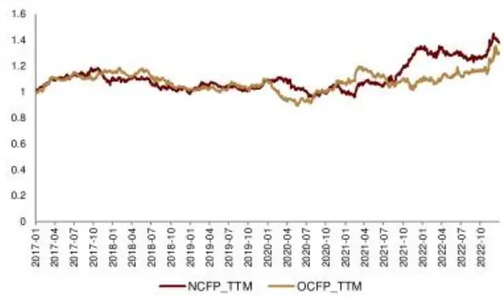
资料来源：Wind，中金公司研究部
注：1）统计时间为2017-01-03至2022-12-30；2）相对净值的比较基准为恒生港股通指数 HSHKI.HI

图表82：恒生港股通范围内表现较好的估值因子分组年化超额收益统计
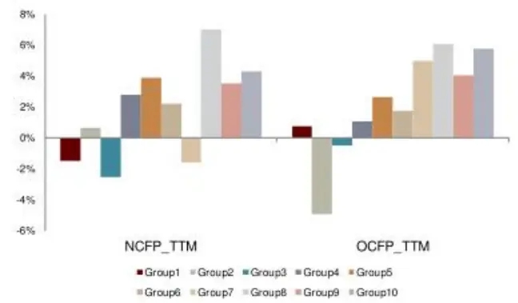
资料来源：Wind，中金公司研究部
注：1）统计时间为2017-01-03至2022-12-30；2）相对净值的比较基准为恒生港股通指数HSHKI.HI；3）Group1为因子值最小一组，Group10为因子值最大一组

## 成长能力因子：表现不佳，单调性偏弱

## 成长能力因子选股能力和单调性较弱

成长能力因子通过计算不同的盈利增长速度指标，衡量了公司的收益增长水平及经营水平变动。本文测试了以下6种成长能力因子，并根据数据类型将这些因子归为EPS增速因子和利润增速因子2大类。

图表83：成长能力因子构建方式

| 因子代码 | 因子名称 | 因子计算公式 |
| --- | --- | --- |
| DEPS_YOY | 稀释 EPS增速（同比） | (稀释EPS-去年同期稀释EPS)/去年同期稀释EPS |
| EPS_YOY | EPS增速（同比） | (EPS- 去年同期 EPS)/ 去年同期 EPS |
| NPD_YOY | 净利润TTM增速（同比） | (净利润TTM- 去年同期净利润TTM)/去年同期净利润TTM |
| OPD_YOY | 营业利润TTM增速（同比） | (营业利润TTM- 去年同期营业利润TTM)/去年同期营业利润TTM |
| NPD | 净利润 TTM 增速 | (当期净利润TTM-上期净利润TTM)/上期净利润TTM |
| OPD | 营业利润 TTM 增速 | (当期营业利润TTM- 上期营业利润TTM)/上期营业利润TTM |

资料来源：中金公司研究部

EPS增速因子：包括稀释EPS、EPS同比增速2个因子。这类因子相互间为高度正相关。该类因子在恒生综指范围的表现较为普通，有效性和收益预测能力较弱；但是在恒生港股通范围内，这类因子的预测能力较好，单调性也略优于利润增速因子，但整体单调性仍比较普通。其中，在港股通范围内，稀释EPS增速因子（DEPS_YOY）的IC均值为1.66%，ICIR为0.25，稳定性尚可。

利润增速因子：包括同比与环比的净利润增速和营业利润增速共4个因子。此类因子由于使用的数据种类和增速基期不同，所以相互间为弱相关，与EPS增速因子的相关性也呈现弱正相关。利润增速因子在恒生综指范围内的超额预测能力要略优与EPS增速因子而在恒生港股通范围内却表现不佳。其中，净利润TTM增速因子(NPD）在恒生综指范围内的IC_IR 为0.19，IC 均值为 1.37%。

成长能力因子在港股市场中整体的有效性和收益预测能力普通，且单调性不佳。使用同比方法构造的成长能力因子的换手率较低。这与A股市场中成长能力因子的优异表现有所不同。在A股市场中，盈利增速类的成长能力因子有着出色的选股能力和有效性，且单调性不错。在港股中，可以看出成长能力因子的表现随选股域的变化较大，因子选择需根据目标选股域决定。

成长能力因子的有效性偏弱，可能原因是本文选择的恒生综指和恒生港股通成分股市值偏大盘，且科技新兴行业占比略低，因此偏向于大盘价值风格，所以成长因子在此范围内表现普通；也可能是灵活的披露要求使得时间截面上存在一定程度的信息错位，使得增速成长能力因子的选股能力有所折损。

综合而言，恒生综指范围内净利润TTM增速因子（NPD）的表现尚可，而恒生港股通范围内则是EPS增速因子的表现略好。但值得注意的是，成长能力因子整体的单调性和选股能力偏弱。

图表84：成长能力因子在恒生综指范围内的有效性检验结果

|  | IC均值 | IC_IR | P(IC>0.02) | P(IC<-0.02) | 多空年化 收益 | 多空年化 波动 | 多空夏普 比率 |  | 多头年化 超额 | 多头超额 最大回撤 | 多头换手 率 | 单调性 |
| --- | --- | --- | --- | --- | --- | --- | --- | --- | --- | --- | --- | --- |
| DEPS_YOY | 0.76% | 0.12 | 46.04% | 34.53% | 0.94% | 10.17% |  | 0.14 | 0.11% | -34.15% | 13.19% | 0.49 |
| EPS_YOY | 0.83% | 0.13 | 44.60% | 33.09% | 0.78% | 10.48% |  | 0.13 | -0.92% | -33.61% | 13.90% | 0.22 |
| NPD | 1.37% | 0.19 | 46.43% | 30.00% | 5.17% | 10.39% |  | 0.54 | 1.81% | -21.99% | 22.78% | 0.61 |
| NPD_YOY | -0.45% | -0.06 | 38.68% | 44.34% | 1.82% | 11.13% |  | -0.11 | -2.72% | -46.20% | 14.23% | 0.16 |
| OPD | 0.49% | 0.07 | 38.57% | 38.57% | 1.01% | 10.85% |  | 0.15 | 0.41% | -37.67% | 21.86% | 0.25 |
| OPD_YOY | -0.04% | -0.01 | 39.62% | 43.40% | 1.04% | 11.53% |  | 0.15 | -0.84% | -44.63% | 13.19% | 0.33 |

资料来源：Wind，中金公司研究部
注：统计时间为2011-04-29至2022-12-30；超额收益的比较基准为恒生综指

图表85：成长能力因子在恒生港股通范围内的有效性检验结果

|  | IC均值 | IC_IR | P(IC>0.02) | P(IC<-0.02) | 多空年化 收益 | 多空年化 波动 | 多空夏普 比率 | 多头年化 超额 | 多头超额 最大回撤 | 多头换手 率 | 单调性 |
| --- | --- | --- | --- | --- | --- | --- | --- | --- | --- | --- | --- |
| DEPS_YOY | 1.66% | 0.25 | 45.83% | 27.78% | 4.49% | 11.24% | 0.45 | 1.72% | -23.10% | 13.56% | 0.66 |
| EPS_YOY | 1.50% | 0.22 | 43.06% | 29.17% | 0.19% | 11.77% | 0.04 | -1.74% | -25.84% | 13.95% | 0.35 |
| NPD | 1.00% | 0.13 | 45.83% | 34.72% | 3.12% | 11.08% | 0.33 | -0.31% | -25.17% | 23.33% | 0.43 |
| NPD_YOY | 0.02% | 0 | 38.89% | 31.94% | 3.31% | 12.00% | 0.33 | 0.14% | -22.66% | 14.94% | 0.09 |
| OPD | 0.33% | 0.04 | 43.06% | 40.28% | 1.21% | 12.61% | -0.03 | -0.91% | -17.38% | 22.79% | 0.28 |
| OPD_YOY | -0.40% | -0.05 | 34.72% | 48.61% | 1.14% | 12.40% | -0.03 | -2.19% | -33.74% | 13.86% | 0.36 |

资料来源：Wind，中金公司研究部
注：统计时间为2016-12-30至2022-12-30；超额收益的比较基准为恒生港股通指数

图表86：成长能力因子恒生综指内IC 值表现
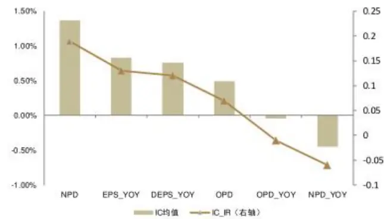
资料来源：Wind，中金公司研究部
注：1）统计时间为2011-04-29至2022-12-30；2）相对净值的比较基准为恒生综指HSCI.HI

图表 87：成长能力因子恒生港股通内IC 值表现
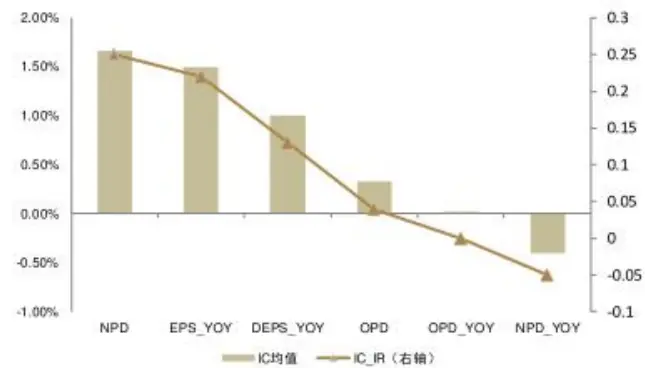
资料来源：Wind，中金公司研究部
注：1）统计时间为2016-12-30至2022-12-30；2）相对净值的比较基准为恒生港股通指数 HSHKI.HI

图表88：成长能力因子恒生综指范围内相关性统计

|  | DEPS_YOY | EPS_YOY | NPD_YOY | OPD_YOY | NPD | OPD |
| --- | --- | --- | --- | --- | --- | --- |
| DEPS_YOY | 1.00 | 0.90 | 0.46 | 0.27 | 0.40 | 0.24 |
| EPS_YOY | 0.90 | 1.00 | 0.49 | 0.28 | 0.44 | 0.26 |
| NPD_YOY | 0.46 | 0.49 | 1.00 | 0.39 | 0.39 | 0.23 |
| OPD_YOY | 0.27 | 0.28 | 0.39 | 1.00 | 0.25 | 0.42 |
| NPD | 0.40 | 0.44 | 0.39 | 0.25 | 1.00 | 0.47 |
| OPD | 0.24 | 0.26 | 0.23 | 0.42 | 0.47 | 1.00 |

资料来源：Wind，中金公司研究部
注：统计时间为2011-04-29至2022-12-30

## 净利润增速因子(NPD）在恒生综指中空头收益显著

尽管整体成长能力因子有效性普通，但在恒生综指范围内，我们仍挑选了稀释EPS增速因子(DEPS YOY)和净利润增速因子(NPD)；而在恒生港股通范围内则是稀释EPS增速因子和EPS增速因子(EPS_YOY)，详细展示其净值与分组收益表现。

恒生综指范围内，稀释EPS增速因子的单调性尚可，但空头收益不显著。而净利润增速因子则是相反，空头收益显著跑输基准，但多头收益并不明显。从多空收益而言，稀释EPS增速因子持续优于净利润增速因子，但从2021年开始成长能力因子的有效性减弱，整体多空净值呈现下降趋势。

图表89：恒生综指范围内表现较好的成长能力因子多空累计净值
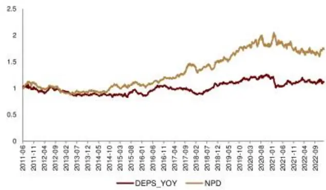
资料来源：Wind，中金公司研究部
注：1）统计时间为2011-06-01至2022-12-30；2）相对净值的比较基准为恒生综指 HSCI.HI

图表90：恒生综指范围内表现较好的成长能力因子分组年化超额收益统计
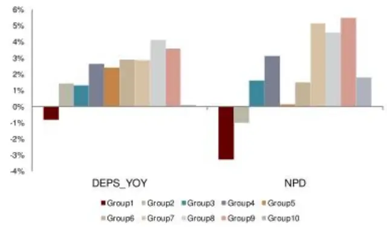
资料来源：Wind，中金公司研究部
注：1）统计时间为2011-06-01至2022-12-30；2）相对净值的比较基准为恒生综指HSCI.HI；3）Group1为因子值最小一组，Group10为因子值最大一组

恒生港股通范围内，两个因子的单调性不佳，多空收益均不显著。从分组超额收益可以看到，两个因子的多头收益与基准无显著差别，反而是次高组（Group9)有较好的超额收益。由于两者的相关性高达0.95，两个因子整体的多空净值趋势相近，均表现普通。在2021年1月到4月间出现明显回撤，但此后整体净值呈现缓慢上涨形态。

图表91：恒生港股通范围内表现较好的成长能力因子多空累计净值
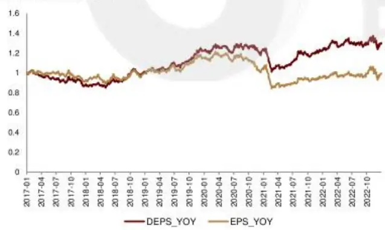
资料来源：Wind，中金公司研究部
注：1）统计时间为2017-01-03至2022-12-30；2）相对净值的比较基准为恒生港股通指数 HSHKI.HI

图表92：恒生港股通范围内表现较好的成长能力因子分组年化超额收益统计
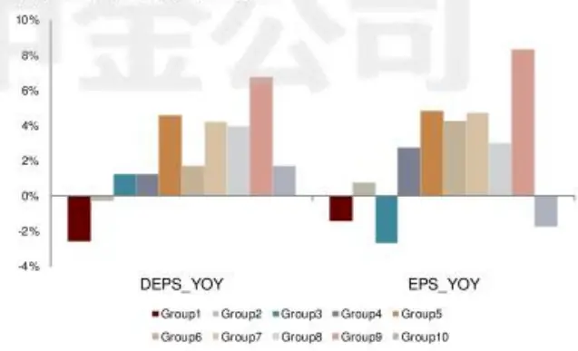
资料来源：Wind，中金公司研究部
注：1）统计时间为2017-01-03至2022-12-30；2）相对净值的比较基准为恒生港股通指数HSHKI.HI；3）Group1 为因子值最小一组，Group10 为因子值最大一组

## 营运效率因子：部分因子有一定有效性

## 利润率变动因子有效性和收益预测能力出色

营运效率因子通过计算利润占收入之比，衡量了企业将收入转化为利润的能力。本文测试了以下4种利润率因子，并根据构造方式，将这些因子归为利润率因子和利润率变动因子2大类。

图表93：营运效率因子构建方式

| 因子代码 | 因子名称 | 因子计算公式 |
| --- | --- | --- |
| NPM_TTM | 净利率 TTM | 净利润 TTM/营业收入 TTM |
| NPMD | 净利率变动 | 当期净利率-上期净利率 |
| OPM_TTM | 营业利润率 TTM | 营业利润 TTM/ 营业收入 TTM |
| OPMD | 营业利润率变动 当期营业利润率-上期营业利润率 |  |

资料来源：中金公司研究部

利润率因子：包括净利率和营业利润率2个因子。其中，利润和收入数据均进行TTM处理。2个因子呈现较强正相关，但与利润率变动因子相关性不高。此类因子在2个选股域中有效性一般，单调性和选股能力不佳。

利润率变动因子：包括净利率和营业利润率变动2个因子。因为源数据的分母相同，此类因子间也呈现弱正相关。这类因子在2个选股域中的预测表现稳定、选股能力不错，在恒生港股通范围能表现更优。在恒生综指范围内，净利率变动因子（NPMD）和营业利润率变动因子（OPMD）的IC_IR分别为0.29和0.28；在恒生港股通范围内，两者的IC_IR分别为0.31和0.38，有效性良好，且多头年化超额分别为5.18%和3.37%，在港股市场中选股能力相对不错。

利润率变动因子在港股市场中表现出色，有效性和收益预测能力均较为突出。在A 股市场中也是如此，利润率变动因子相较于对应的利润率因子，大多预测能力更强且单调性更好。营业利润率变动因子（OPMD）在A股市场中同样表现突出。

综上所述，净利率变动因子（NPMD）和营业利润率变动因子（OPMD）的有效性和收益预测能力出色，换手率也较为平衡，推荐关注。

图表94：营运效率因子在恒生综指范围内的有效性检验结果

|  | IC均值 | IC_IR | P(IC>0.02) | P(IC<-0.02) | 多空年化 收益 | 多空年化 波动 | 多空夏普 比率 | 多头年化 超额 | 多头超额 最大回撤 | 多头换手 率 | 单调性 |
| --- | --- | --- | --- | --- | --- | --- | --- | --- | --- | --- | --- |
| NPMD | 1.93% | 0.29 | 46.43% | 29.29% | 7.04% | 11.59% | 0.64 | 3.79% | -30.64% | 20.74% | 0.53 |
| NPM_TTM | 0.58% | 0.08 | 42.25% | 36.62% | 2.00% | 13.10% | 0.22 | -0.94% | -43.62% | 9.23% | 0.36 |
| OPMD | 2.01% | 0.28 | 47.86% | 30.71% | 5.70% | 11.79% | 0.53 | 0.92% | -34.59% | 22.39% | 0.60 |
| OPM_TTM | 1.51% | 0.2 | 42.96% | 30.99% | 5.61% | 12.35% | 0.50 | -0.48% | -35.65% | 8.25% | 0.16 |

资料来源：Wind，中金公司研究部
注：统计时间为2011-02-28 至2022-12-30；超额收益的比较基准为恒生综指

图表95：营运效率因子在恒生港股通范围内的有效性检验结果

|  | IC均值 | IC_IR | P(IC>0.02) | P(IC<-0.02) | 多空年化 收益 | 多空年化 波动 | 多空夏普 比率 | 多头年化 超额 | 多头超额 最大回撤 | 多头换手 率 | 单调性 |
| --- | --- | --- | --- | --- | --- | --- | --- | --- | --- | --- | --- |
| NPMD | 2.41% | 0.31 | 51.39% | 29.17% | 3.44% | 12.58% | 0.71 | 5.18% | -12.62% | 22.16% | 0.31 |
| NPM_TTM | 0.42% | 0.05 | 40.28% | 38.89% | 4.90% | 14.92% | -0.26 | -6.09% | -39.74% | 8.14% | 0.20 |
| OPMD | 3.24% | 0.38 | 54.17% | 20.83% | 12.98% | 12.85% | 1.01 | 3.37% | -17.13% | 22.45% | 0.44 |
| OPM_TTM | 1.65% | 0.2 | 43.06% | 31.94% | 3.80% | 14.59% | 0.33 | -0.58% | -19.90% | 7.97% | 0.03 |

资料来源：Wind，中金公司研究部
注：统计时间为2016-12-30至2022-12-30；超额收益的比较基准为恒生港股通指数

图表 96：营运效率因子恒生综指内IC 值表现
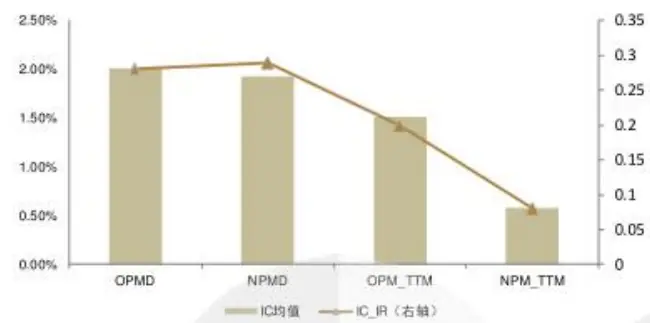
资料来源：Wind，中金公司研究部
注：1）统计时间为2011-02-28至2022-12-30；2）相对净值的比较基准为恒生综指 HSCI.HI

图表 97：营运效率因子恒生港股通内IC 值表现
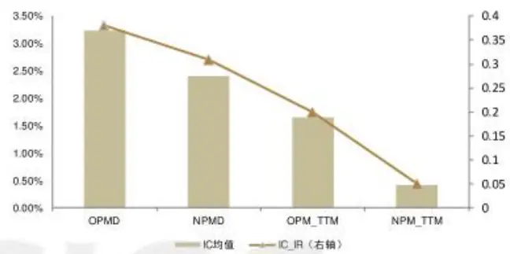
资料来源：Wind，中金公司研究部
注：1）统计时间为2016-12-30至2022-12-30；2）相对净值的比较基准为恒生港股通指数 HSHKI.HI

图表98：营运效率因子恒生综指范围内相关性统计

|  | NPM_TTM | OPM_TTM | NPMD | OPMD |
| --- | --- | --- | --- | --- |
| NPM_TTM | 1.00 | 0.69 | 0.15 | 0.02 |
| OPM_TTM | 0.69 | 1.00 | 0.02 | 0.08 |
| NPMD | 0.15 | 0.02 | 1.00 | 0.36 |
| OPMD | 0.02 | 0.08 | 0.36 | 1.00 |

资料来源：Wind，中金公司研究部
注：统计时间为2011-02-28至2022-12-30

## 利润率变动因子空头收益显著，恒生综指内单调性较好

我们挑选了上述因子中表现较好的净利率变动因子(NPMD）和营业利润率变动因子(OPMD)，详细展示其净值与分组收益表现。

恒生综指范围内，2个因子的空头收益显著跑输基准，整体单调性尚可。净利率变动因子的多头收益显著跑赢基准，但营业利润率变动因子的多头超额并不明显。因此，尽管整体走势趋同，但净利率变动因子的多空收益持续跑赢营业利润率变动因子。2个因子从2022年年中开始净值表现均出现了不同程度的回撤。

图表99：恒生综指范围内表现较好的营运效率因子多空累计净值
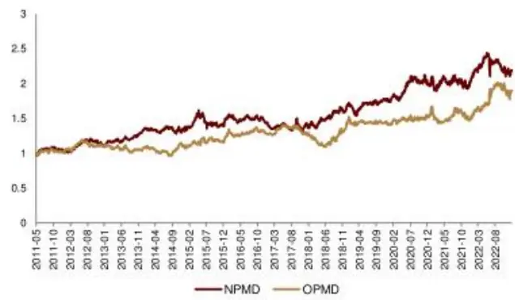
资料来源：Wind，中金公司研究部
注：1）统计时间为2011-05-03至2022-12-30；2）相对净值的比较基准为恒生综指 HSCI.HI

图表100：恒生综指范围内表现较好的营运效率因子分组年化超额收益统计
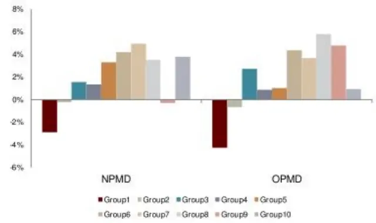
资料来源：Wind，中金公司研究部
注：1）统计时间为2011-05-03至2022-12-30；2）相对净值的比较基准为恒生综指HSCI.HI；3）Group1为因子值最小一组，Group10为因子值最大一组

恒生港股通范围内，2个因子的多空超额收益显著，但整体单调性普通。营业利润率变动因子的空头表现突出，而净利率变动因子则是多头表现较好。营业利润率变动因子的多空净值从2022年4月开始跑赢净利率变动因子。虽然2个因子在2022年年中开始均出现回撤，但营业利润率变动因子的回撤程度较小。

图表101：恒生港股通范围内表现较好的营运效率因子多空累计净值
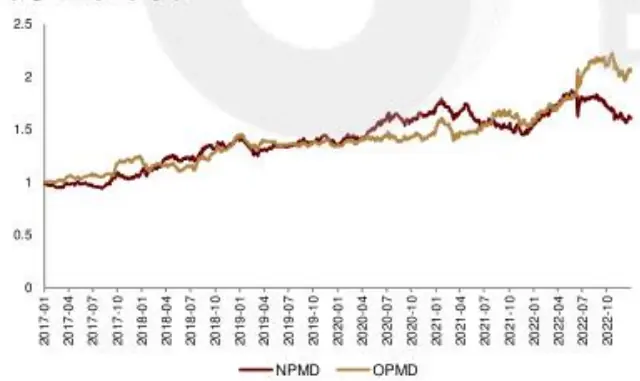
资料来源：Wind，中金公司研究部
注：1）统计时间为2017-01-03至2022-12-30；2）相对净值的比较基准为恒生港股通指数 HSHKI.HI

图表102：恒生港股通范围内表现较好的营运效率因子分组年化超额收益统计
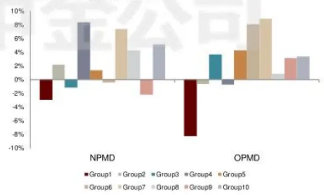
资料来源：Wind，中金公司研究部
注：1）统计时间为2017-01-03至2022-12-30；2）相对净值的比较基准为恒生港股通指数HSHKI.HI；3）Group1 为因子值最小一组，Group10 为因子值最大一组

## 盈余质量因子：部分因子预测能力较好

## 应计利润占比因子(APRTTM)有效性较优

盈余质量因子衡量了公司盈利指标及其质量。本文测试了以下4种盈余质量因子，包括应计利润占比和现金比率变动及其各自的变动因子。其中，增量利润数据均进行了TTM处理。

图表103：盈余质量因子构建方式

| 因子代码 | 因子名称 | 因子计算公式 |
| --- | --- | --- |
| APR_TTM | 应计利润占比 | 应计利润 TTM/营业利润 TTM |
| APRD | 应计利润占比变动 | 当期应计利润占比-上期应计利润占比 |
| CSR | 现金比率 | 现金及现金等价资产/流动负债 |
| CSRD | 现金比率变动 当期现金比率-上期现金比率 |  |

资料来源：中金公司研究部

使用相同数据构建的盈余质量因子弱正相关，而不同数据因子则相关性很低。在恒生综指范围内，应计利润占比因子(APRTTM）和现金比率变动因子(CSRD）有效性较好，IC IR分别为-0.19和0.21，但后者的单调性和多头表现都要逊于前者。在恒生港股通范围内，表现较优的是应计利润占比因子和现金比率因子(CSR)，IC_IR分别为-0.25和0.17，多头年化超额分别为4.02%和2.52%，但后者的单调性偏差。

盈余质量因子在港股和A股中的表现相近。应计利润占比因子的表现较好，但其余三个因子存在有效性和单调性较弱的问题。

盈余质量因子中，推荐关注应计利润占比因子（APR_TTM)。该因子在2个选股域中都有着均衡的有效性、选股能力和良好的单调性。

图表104：盈余质量因子在恒生综指范围内的有效性检验结果

|  | IC均值 | IC_IR | P(IC>0.02) | P(IC<-0.02) | 多空年化 收益 | 多空年化 波动 | 多空夏普 比率 | 多头年化 超额 | 多头超额 最大回撤 | 多头换手 率 | 单调性 |
| --- | --- | --- | --- | --- | --- | --- | --- | --- | --- | --- | --- |
| APRD | 0.29% | 0.04 | 38.57% | 40.71% | -0.32% | 9.80% | 0.02 | -0.05% | -43.10% | 20.88% | 0.02 |
| APR_TTM | -1.15% | -019 | 30.28% | 41.55% | 2.39% | 9.71% | 0.29 | 3.77% | -18.33% | 12.16% | 0.73 |
| CSR | 0.29% | 0.04 | 45.33% | 34.67% | -0.19% | 11.45% | 0.04 | 2.04% | -28.12% | 11.44% | 0.01 |
| CSRD | 1.07% | 0.21 | 40.00% | 27.59% | 5.10% | 10.05% | 0.55 | 0.54% | -28.96% | 17.51% | 0.36 |

资料来源：Wind，中金公司研究部
注：统计时间为2010-06-30至2022-12-30；超额收益的比较基准为恒生综指

图表105：盈余质量因子在恒生港股通范围内的有效性检验结果

|  | IC均值 | IC_IR | P(IC>0.02) | P(IC<-0.02) | 多空年化 收益 | 多空年化 波动 | 多空夏普 比率 | 多头年化 超额 | 多头超额 最大回撤 | 多头换手 率 | 单调性 |
| --- | --- | --- | --- | --- | --- | --- | --- | --- | --- | --- | --- |
| APRD | 0.95% | 0.12 | 41.67% | 38.89% | 2.14% | 10.46% | 0.25 | -0.22% | -20.06% | 21.98% | 0.30 |
| APR_TTM | -1.58% | -0.25 | 31.94% | 47.22% | 7.71% | 10.51% | 0.76 | 4.02% | -15.39% | 11.23% | 0.72 |
| CSR | 1.02% | 0.17 | 47.22% | 27.78% | -8.25% | 12.71% | -0.20 | 2.52% | -16.97% | 11.39% | 0.04 |
| CSRD | 0.62% | 0.15 | 34.72% | 30.56% | 3.11% | 10.14% | 0.35 | 0.16% | -27.00% | 17.42% | 0.03 |

资料来源：Wind，中金公司研究部
注：统计时间为2016-12-30至2022-12-30；超额收益的比较基准为恒生港股通指数

图表106：盈余质量因子恒生综指内IC值表现
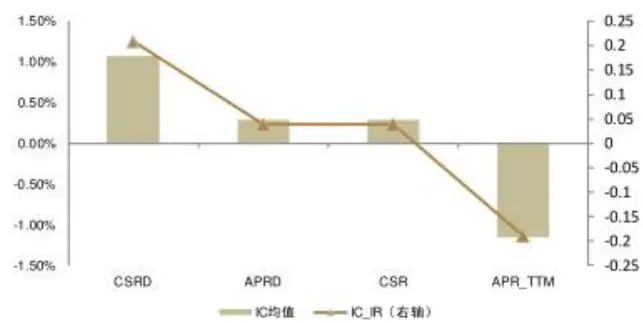
资料来源：Wind，中金公司研究部
注：1）统计时间为2010-06-30至2022-12-30；2）相对净值的比较基准为恒生综指 HSCI.HI

图表107：盈余质量因子恒生港股通内IC 值表现
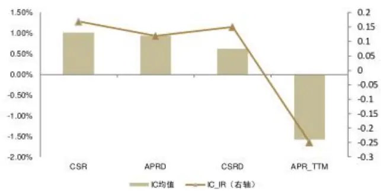
资料来源：Wind，中金公司研究部
注：1）统计时间为2016-12-30至2022-12-30；2）相对净值的比较基准为恒生港股通指数 HSHKI.HI

图表108：盈余质量因子恒生综指范围内相关性统计

|  | APR_TTM | APRD | CSR | CSRD |
| --- | --- | --- | --- | --- |
| APR_TTM | 1.00 | 0.37 | 0.05 | -0.02 |
| APRD | 0.37 | 1.00 | -0.01 | -0.01 |
| CSR | 0.05 | -0.01 | 1.00 | 0.17 |
| CSRD | -0.02 | -0.01 | 0.17 | 1.00 |

资料来源：Wind，中金公司研究部
注：统计时间为2010-06-30至2022-12-30

## 应计利润占比因子（APR TTM）多头收益显著

我们挑选了上述因子中表现较好的应计利润占比因子(APR_TTM)、现金比率变动因子(CSRD)和现金比率因子(CSR)，详细展示其净值与分组收益表现。

恒生综指范围内，应计利润占比因子的多头收益显著跑赢基准，但是空头收益并不明显，整体单调性普通。而现金比率变动因子则是相反情况，空头显著，多头不显著，单调性同样一般。从多空净值来看，应计利润占比因子在2020年年中开始跑赢现金比率变动因子，但从2021年年中开始净值有明显回撤，使现金比率变动因子净值以较稳定的涨幅后来居上。

图表109：恒生综指范围内表现较好的盈余质量因子多空累计净值
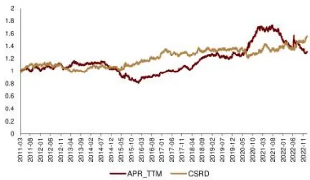
资料来源：Wind，中金公司研究部
注：1）统计时间为2011-03-01至2022-12-30；2）相对净值的比较基准为恒生综指 HSCI.HI

图表110：恒生综指范围内表现较好的盈余质量因子分组年化超额收益统计
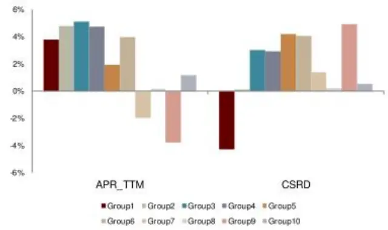
资料来源：Wind，中金公司研究部
注：1）统计时间为2011-03-01至2022-12-30；2）相对净值的比较基准为恒生综指HSCI.Hl；3）Group1为因子值最小一组，Group10为因子值最大一组

恒生港股通范围内，应计利润占比因子的多空收益显著。现金比率因子的多头稍微优于基准，但是空头却显著跑赢基准，使得其整体多空表现不佳。应计利润占比因子在2021年3月前多空净值呈现上涨态势，但此后转为下跌，说明因子出现一定程度失效。

图表111：恒生港股通范围内表现较好的盈余质量因子多空累计净值
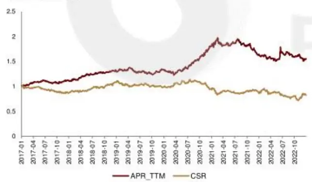
资料来源：Wind，中金公司研究部
注：1）统计时间为2017-01-03至2022-12-30；2）相对净值的比较基准为恒生港股通指数 HSHKI.HI

图表112：恒生港股通范围内表现较好的盈余质量因子分组年化超额收益统计
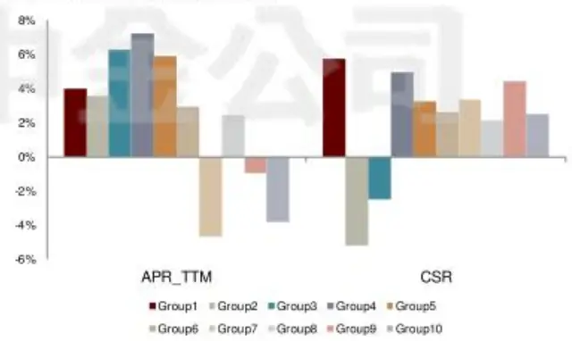
资料来源：Wind，中金公司研究部
注：1）统计时间为2017-01-03至2022-12-30；2）相对净值的比较基准为恒生港股通指数HSHKI.HI；3）Group1为因子值最小一组，Group10为因子值最大一组

## 规模因子：有效性平平，单调性偏弱

## 规模因子收益预测能力普通，单调性不佳

规模因子使用市值和流通市值信息衡量了公司的规模。本文测试了以下5种规模因子，并根据构造方式将这些因子归为普通规模因子和对数规模因子2大类。

图表113：规模因子构建方式

| 因子代码 | 因子名称 | 因子计算公式 |
| --- | --- | --- |
| FC | 流通市值 | 流通市值 |
| FC_MC | 流通市值比总市值 | 流通市值/总市值 |
| Ln_FC | 流通市值对数 | 流通市值对数 |
| Ln_MC | 总市值对数 | 总市值对数 |
| MC | 总市值 | 总市值 |

资料来源：中金公司研究部

普通规模因子：包含流通市值、总市值、流通市值比总市值3个未经对数处理的规模因子。其中，使用流通市值数据的因子均相关性很高。在恒生综指范围内，总市值因子(MC）的有效性尚可，IC_IR为-0.18；在恒生港股通范围内，总市值因子和流通市值因子（FC）的IC_IR分别为0.11和-0.22，但单调性均表现较差。

A对数规模因子：包含流动市值对数和总市值对数2个规模因子。相较而言，对数流通市值因子（Ln_FC）的有效性优于总市值对数因子（Ln_MC)，但是单调性却很差。

规模因子在港股市场中有效性普通，单调性很差。无论是其有效性、预测能力、抑或是单调性均劣于A股市场中的规模因子表现。在港股市场中，除总市值因子以外，其余规模因子均为正向，即市场更偏向于大市值股票。但由于因子的显著性较低，说明港股并无非常稳定明显的市值效应。而在A股全市场范围中，所有的规模因子均为负向，即A股存在较为明显的小市值效应。

综合而言，规模因子中相对表现略好的是总市值因子（MC），但其单调性普通。

图表114：规模因子在恒生综指范围内的有效性检验结果

|  | 多空年化IC均值 IC_IR P(IC>0.02)P(IC<-0.02)收益 |  |  |  |  |  | 多空年化 多空夏普 多头年化 多头超额 多头换手波动 比率 超额 最大回撤 率 |  |  |  | 单调性 |
| --- | --- | --- | --- | --- | --- | --- | --- | --- | --- | --- | --- |
| FC | 0.00% | 0 |  | 40.65% 40.00% | 0. | 62% | 10.93% | 0.11 | 4.47% | -12.45% 13.13% | 0.27 |
| FC_MC | 1.17% | 0.1 | 2 | 49.68% 34.19% | -$ | .11% | 10.97% | -0.23 | 2.33% | -24.30% 7.00% | 0.05 |
| Ln_FC | 1.51% | 0.1 | 5 | 49.03% 32.90% | 1. | 17% | 10.99% | -0.05 | 3.14% | -20.86% 7.90% | 0.14 |
| Ln_MC | 1.27% | 0. |  | 52.26% 35.48% | 6 | .74% | 15.75% | 0.49 | 3.01% | -25.57% 69.84% | 0.53 |
| MC | -0.97% | -0.1 | 8 | 27.10% 47.74% | 2 | .81% | 9.77% | 0.33 | 2.64% | -15.21% 16.51% | 0.42 |

资料来源：Wind，中金公司研究部
注：统计时间为2010-01-29至2022-12-30；超额收益的比较基准为恒生综指

图表115：规模因子在恒生港股通范围内的有效性检验结果

|  | IC均值 | IC_IR | P(IC>0.02) | P(IC<-0.02) | 多空年化 收益 | 多空年化 波动 | 多空夏普 比率 |  | 多头年化 超额 | 多头超额 最大回撤 | 多头换手 率 | 单调性 |
| --- | --- | --- | --- | --- | --- | --- | --- | --- | --- | --- | --- | --- |
| FC | 0.89% | 0. 1 | 41.67% | 33.33% | -0.83% | 10.50% |  | -0.03 | 3.60% | -11.43% | 14.14% | 0.26 |
| FC_MC | 1.56% | 0\|2 | 50.00% | 37.50% | -5.59% | 10.12% |  | -0.52 | -1.56% | -24.00% | 7.82% | 0.04 |
| Ln_FC | 1.78% | 0.22 | 48.61% | 34.72% | -3.94% | 9.36% |  | -0.38 | -1.11% | -21.54% | 8.96% | 0.01 |
| Ln_MC | 0.52% | 0.05 | 43.06% | 43.06% | -6.30% | 17.57% |  | -0.28 | -3.32% | -22.43% | 68.08% | 0.31 |
| MC | -1.33% | -0.22 | 27.78% | 45.83% | 4.75% | 10.32% |  | 0.50 | 1.14% | -24.90% | 16.53% | 0.32 |

资料来源：Wind，中金公司研究部
注：统计时间为2016-12-30至2022-12-30；超额收益的比较基准为恒生港股通指数

图表 116：规模因子恒生综指内IC 值表现
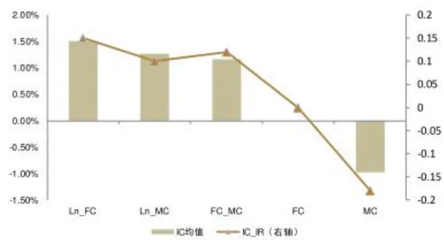
资料来源：Wind，中金公司研究部
注：1）统计时间为2010-01-29至2022-12-30；2）相对净值的比较基准为恒生综指 HSCI.HI

图表117：规模因子恒生港股通内IC 值表现
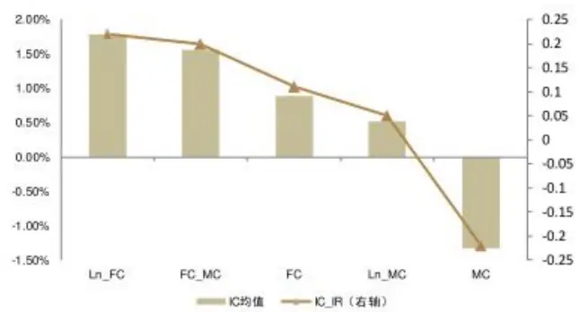
资料来源：Wind，中金公司研究部
注：1）统计时间为2016-12-30至2022-12-30；2）相对净值的比较基准为恒生港股通指数 HSHKI.HI

图表118：规模因子恒生综指范围内相关性统计

|  | FC | FC_MC | Ln_FC | Ln_MC | MC |
| --- | --- | --- | --- | --- | --- |
| FC | 1.00 | 0.71 | 0.77 | 0.00 | 0.36 |
| FC_MC | 0.71 | 1.00 | 0.95 | 0.00 | -0.06 |
| Ln_FC | 0.77 | 0.95 | 1.00 | 0.00 | -0.01 |
| Ln_MC | 0.00 | 0.00 | 0.00 | 1.00 | 0.00 |
| MC | 0.36 | -0.06 | -0.01 | 0.00 | 1.00 |

资料来源：Wind，中金公司研究部
注：统计时间为2010-01-29至2022-12-30

## 总市值对数因子（Ln MC）在恒生综指范围内空头收益显著

在恒生综指范围内，我们挑选了上述因子中表现较好的总市值对数因子（LnMC）和总市值因子(MC)；在恒生港股通范围内则是将前者替换为流通市值因子（FC)，详细展示其净值与分组收益表现。

恒生综指范围内，2个因子的空头收益显著逊于基准，多头收益较优于基准。从多空净值上来看，总市值对数因子由于其更为显著的空头收益，从2017年开始净值呈上涨趋势，但在2021年年中开始有所回撤，但仍持续优于总市值因子。

图表119：恒生综指范围内表现较好的规模因子多空累计净值
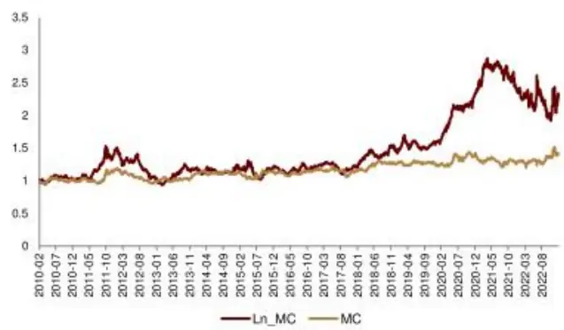
资料来源：Wind，中金公司研究部
注：1）统计时间为2010-02-01至2022-12-30；2）相对净值的比较基准为恒生综指 HSCI.HI

图表120：恒生综指范围内表现较好的规模因子分组年化超额收益统计
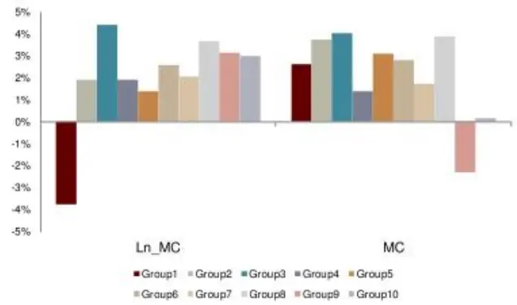
资料来源：Wind，中金公司研究部
注：1）统计时间为2010-02-01至2022-12-30；2）相对净值的比较基准为恒生综指HSCI.HI；3）Group1为因子值最小一组，Group10为因子值最大一组

恒生港股通范围内，2个因子的单调性较差。流通市值因子的多头逊于基准，而空头却优于基准；总市值因子的空头显著逊于基准，但多头收益并不明显。因此，2个因子的多空净值表现也较差。

图表121：恒生港股通范围内表现较好的规模因子多空累计净值
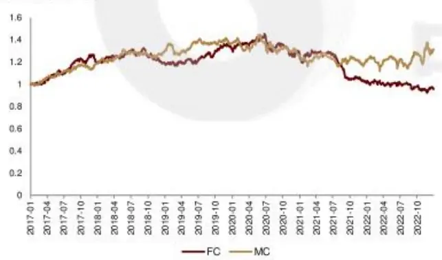
资料来源：Wind，中金公司研究部
注：1）统计时间为2017-01-03至2022-12-30；2）相对净值的比较基准为恒生港股通指数 HSHKI.HI

图表122：恒生港股通范围内表现较好的规模因子分组年化超额收益统计
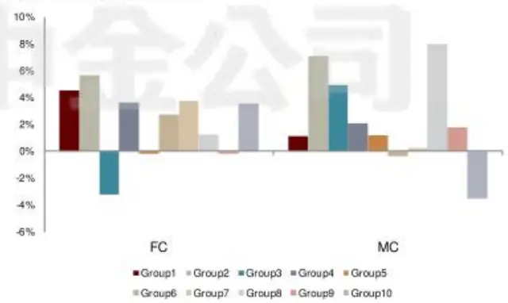
资料来源：Wind，中金公司研究部
注：1）统计时间为2017-01-03至2022-12-30；2）相对净值的比较基准为恒生港股通指数HSHKI.HI；3）Group1为因子值最小一组，Group10为因子值最大一组

## 安全性因子：大部分因子有效性不佳

## 安全性因子有效性平庸

安全性因子从偿债、变现能力和负债程度，衡量了企业的安全性。本文测试了以下6种安全性因子，并根据因子所考量的信息，将这些因子归为偿债能力因子和负债程度因子2大类。

图表123：安全性因子构建方式

| 因子代码 | 因子名称 | 因子计算公式经营净现金流/流动负债 |
| --- | --- | --- |
| CCR | 现金流动负债比率 |  |
| CCRD | 现金流动负债比率变动 | 当期现金流动负债比率-上期现金流动负债比率 |
| CUR | 流动比率 | 流动资产/流动负债当期流动比率-上期流动比率 |
| CURD | 流动比率变动 |  |
| DA | 资产负债比 | 总负债/ 总资产 |
| DAD | 资产负债率变动 当期资产负债率-上期资产负债率 |  |

资料来源：中金公司研究部

偿债能力因子：包括现金流动负债比率和流动比率和其变动共4个因子。此类因子之间的相关性较低，与负债程度因子呈现弱负相关。偿债能力因子整体而言比负债程度因子的预测稳定性和选股能力略强。其中，现金流动负债比率因子(CCR）的有效性较好，单调性普通。在恒生综指范围中，现金流动负债比率因子的IC均值为3.03%，IC_IR为0.36，多头预测能力稍显普通；在恒生港股通范围内，其单调性较弱，但IC_IR为0.32，在各测试的安全性因子中有效性最好。

负债程度因子：包括资产负债比和其变动的2个因子。此类因子之间的相关性不高，换手率不高，但整体有效性、单调性和多头预测能力稍弱。其中表现相对尚可的是在恒生综指范围下的资产负债率变动因子(DAD)，有效性和单调性不佳，但是多头年化超额达到3.31%。

安全性因子在港股市场中有效性、单调性和选股能力较普通；其中表现相对略好的是现金流动负债比率因子和资产负债率变动因子。这两点与A股市场中的安全性因子回测结论较为一致。不同的是，安全性因子在A股中的多头收益和单调性会显著高于在港股市场中的对应收益。

综合而言，现金流动负债比率因子（CCR）在各选股域中有效性较好，换手率较低，但单调性普通。

图表124：安全性因子在恒生综指范围内的有效性检验结果

|  | IC均值 | IC_IR | P(IC>0.02) | P(IC<-0.02) | 多空年化 收益 | 多空年化 波动 | 多空夏普 比率 | 多头年化 超额 | 多头超额 最大回撤 | 多头换手 率 | 单调性 |
| --- | --- | --- | --- | --- | --- | --- | --- | --- | --- | --- | --- |
| CCR | 3.03% | 0.36 | 56.34% | 26.06% | 10.75% | 12.82% | 0.86 | 2.20% | -14.89% | 10.08% | 0.68 |
| CCRD | 0.62% | 0.1 | 41.43% | 35.00% | 1.78% | 10.91% | -0.11 | 1.26% | -40.84% | 17.54% | 0.05 |
| CUR | -0.56% | -0.08 | 35.33% | 38.67% | 3.97% | 10.54% | 0.42 | 3.00% | -34.72% | 10.84% | 0.55 |
| CURD | 0.67% | 0.12 | 40.00% | 31.72% | 4.65% | 10.23% | 0.50 | 1.10% | -43.32% | 17.17% | 0.14 |
| DA | -0.20% | -0.02 | 43.05% | 41.72% | 5.22% | 12.32% | -0.37 | -2.42% | -41.43% | 8.28% | 0.24 |
| DAD | -0.54% | -0.08 | 35.81% | 39.19% | 9.24% | 11.12% | 0.85 | 3.31% | -26.13% | 19.55% | 0.22 |

资料来源：Wind，中金公司研究部
注：统计时间为2010-06-30至2022-12-30；超额收益的比较基准为恒生综指

图表125：安全性因子在恒生港股通范围内的有效性检验结果

|  | IC均值 | IC_IR | P(IC>0.02) | P(IC<-0.02) | 多空年化 收益 | 多空年化 波动 | 多空夏普 比率 | 多头年化 超额 | 多头超额 最大回撤 | 多头换手 率 | 单调性 |
| --- | --- | --- | --- | --- | --- | --- | --- | --- | --- | --- | --- |
| CCR | 2.47% | 0.32 | 52.78% | 27.78% | 5.14% | 13.33% | 0.44 | 0.94% | -19.61% | 11.04% | 0.36 |
| CCRD | -0.06% | -0.01 | 33.33% | 36.11% | 0.00% | 11.59% | 0.06 | 0.91% | -26.36% | 18.12% | 0.31 |
| CUR | -0.22% | -0.03 | 43.06% | 36.11% | 1.16% | 11.67% | 0.16 | 3.47% | -18.50% | 8.96% | 0.45 |
| CURD | 0.09% | 0.02 | 37.50% | 33.33% | 2.30% | 10.83% | 0.26 | -2.99% | -37.79% | 17.30% | 0.01 |
| DA | -0.25% | -0.03 | 41.67% | 38.89% | -9.85% | 12.16% | -0.79 | -3.81% | -30.91% | 8.16% | 0.13 |
| DAD | 0.18% | 0.03 | 40.28% | 36.11% | 6.25% | 11.66% | -0.49 | -4.6 % | -37.36% | 16.61% | 0.27 |

资料来源：Wind，中金公司研究部
注：统计时间为2016-12-30至2022-12-30；超额收益的比较基准为恒生港股通指数

图表 126：安全性因子恒生综指内IC 值表现
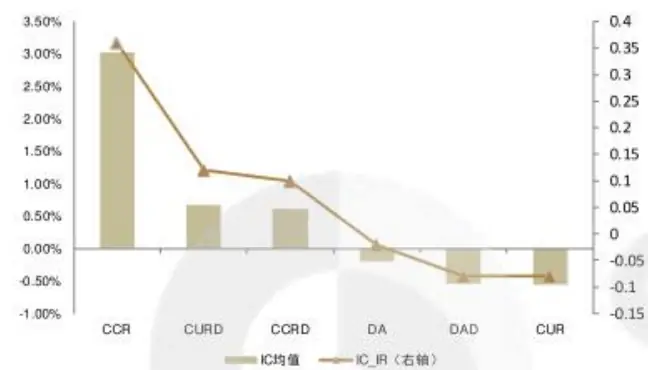
资料来源：Wind，中金公司研究部
注：1）统计时间为2010-06-30至2022-12-30；2）相对净值的比较基准为恒生综指 HSCI.HI

图表127：安全性因子恒生港股通内IC 值表现
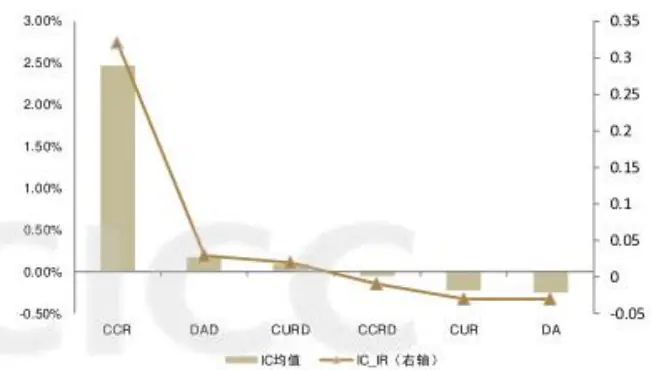
资料来源：Wind，中金公司研究部
注：1）统计时间为2016-12-30至2022-12-30；2）相对净值的比较基准为恒生港股通指数 HSHKI.HI

图表128：安全性因子恒生综指范围内相关性统计

|  | CCR | CCRD | CUR | CURD | DA | DAD |
| --- | --- | --- | --- | --- | --- | --- |
| CCRCCRD | 1.00 | 0.21 | 0.19 | 0.08 | -0.31 | -0.10 |
|  | 0.21 | 1.00 | 0.00 | 0.26 | 0.04 | -0.21 |
| CUR | 0.19 | 0.00 | 1.00 | 0.17 | -0.56 | -0.09 |
| CURD | 0.08 | 0.26 | 0.17 | 1.00 | -0.04 | -0.44 |
| DADAD | -0.31 | 0.04 | -0.56 | -0.04 | 1.00 | 0.12 |
|  | -0.10 | -0.21 | -0.09 | -0.44 | 0.12 | 1.00 |

资料来源：Wind，中金公司研究部
注：统计时间为2010-06-30至2022-12-30

现金流动负债比率因子(CCR)空头收益显著，单调性一般

我们挑选了上述因子中表现相对尚可的现金流动负债比率因子(CCR)和流动比率因子(CUR)，详细展示其净值与分组收益表现。

恒生综指范围内，现金流动负债比率因子（CCR）空头收益显著，但多头收益和单调性普通。而流动比率因子的多头收益显著优于基准，但是空头收益并不明显，单调性较差。从多空收益而言，现金流动负债比率因子从2015年年中开始持续跑赢流动比率因子，但是从2022年4月开始净值有明显回撤。

图表129：恒生综指范围内表现较好的安全性因子多空累计净值
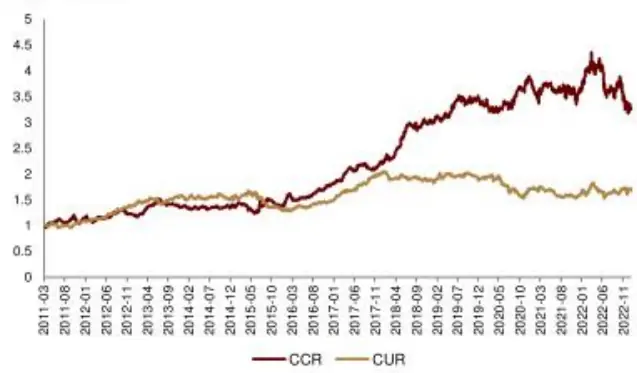
资料来源：Wind，中金公司研究部
注：1）统计时间为2011-03-01至2022-12-30；2)相对净值的比较基准为恒生综指 HSCI.HI

图表130：恒生综指范围内表现较好的安全性因子分组年化超额收益统计
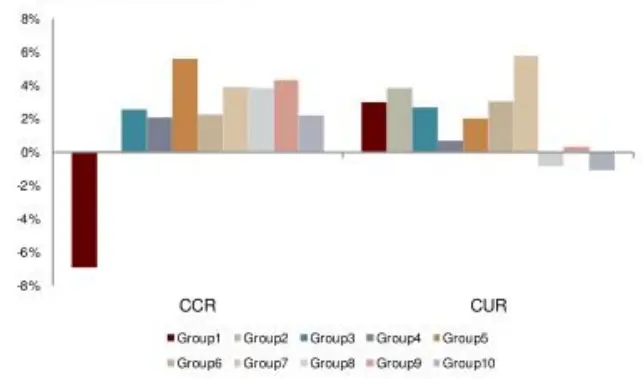
资料来源：Wind，中金公司研究部
注：1）统计时间为2011-03-01至2022-12-30；2）相对净值的比较基准为恒生综指HSCI.HI；3）Group1为因子值最小一组，Group10为因子值最大一组

恒生港股通范围内，2个因子的多头收益显著优于基准，但单调性较差。现金流动负债比率因子的空头尚且略低于基准，但流动比率因子的空头却明显高于基准。这也致使流动比率因子的多空净值表现不佳。现金流动负债比率因子的净值表现明显较优，但同样从2022年4月开始净值有明显下降趋势。

图表131：恒生港股通范围内表现较好的安全性因子多空累计净值
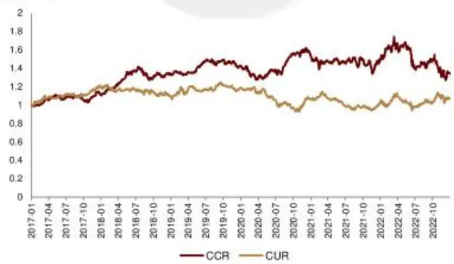
资料来源：Wind，中金公司研究部
注：1）统计时间为2017-01-03至2022-12-30；2）相对净值的比较基准为恒生港股通指数 HSHKI.HI

图表132：恒生港股通范围内表现较好的安全性因子分组年化超额收益统计
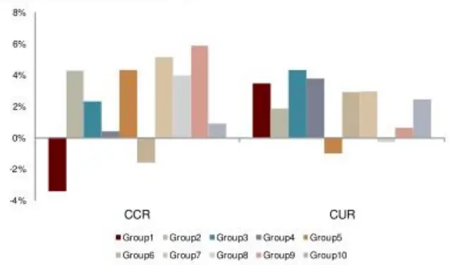
资料来源：Wind，中金公司研究部
注：1）统计时间为2017-01-03至2022-12-30；2）相对净值的比较基准为恒生港股通指数HSHKI.HI；3)Group1 为因子值最小一组，Group10为因子值最大一组

## 分析师因子：单调性和有效性较弱

## Wind一致预期因子有效性和单调性较弱

分析师因子根据分析师预期数据，体现了对于公司未来盈利数据的预测。本文测试了以下2种回望区间长度的动量&反转因子，并将这些因子归为预期因子和预期变化率因子2大类。

图表133：分析师因子构建方式

| 因子代码 | 因子名称 | 因子计算公式 |
| --- | --- | --- |
| FORE_Earning | 一致预期净利润 | 一致预期净利润(当期一致预期净利润-前三个月一致预期净利润)/前三个月一致预期净利润 |
| EEChange_3M | 一致预期净利润三个月变化率 |  |
| FORE_EPSEEPSChange_3M | 一致预期 EPS | 一致预期 EPS |
|  | 一致预期EPS三个月变化率 | (当期一致预期EPS-前三个月一致预期 EPS)/前三个月一致预期EPS |
| FORE_OP | 一致预期营业收入 | 一致预期营业收入(当期一致预期营业收入-前三个月一致预期营业收入)/前三个月一致预期营业收入 |
| EOPChange_3M | 一致预期营业收入三个月变化率 |  |

资料来源：中金公司研究部

预期因子：包括3个一致预期盈利数据的分析师因子。此类因子的之间的相关性较高，但与预期变动率因子的相关性不高。这类因子在恒生综指范围内的预测表现要优于其在恒生港股通范围中的表现。在恒生综指中，一致预期净利润因子（FORE_Earning）和一致预期营业收入因子（FOREOP）的预测稳定性相对略优，多头年化超额在2.5%左右；但在恒生港股通范围内，其有效性和选股能力有所减弱。

预期变化率因子：包括上述3个预期因子的变动率因子。该类因子间呈现较强正相关。此类因子在恒生综指范围内表现较弱，但是在恒生港股通范围内选股能力有所提升，可仍存在单调性较差的问题。在恒生港股通中，一致预期营业收入三个月变化率(EOPChange_3M)的IC_IR 为 0.15，IC 均值为 1.84%，多头年化超额达到10.20%，收益预测能力较为突出。

需要注意的是，不同于A股市场中使用的朝阳永续一致预期数据，本文中港股市场所使用的是Wind分析师一致预期数据，存在覆盖度低、算法简单的问题。该数据为报告发布时间截面上的常用统计值，例如均值/标准差/中位数等，因此会受极值影响较大；且同一预测发布时间的同一公司预测个数较少，所以此类数据仅供参考。未来我们也将继续探索更为可靠、完整、系统的分析师一致预期数据，并构建测试此类因子。

综合而言，分析师因子的单调性和有效性较弱，其中，一致预期营业收入三个月变化率(EOPChange_3M)的选股能力稍好。但目前测试的分析师因子受限于Wind 港股一致预期的数据，数据质量仍待提升。

图表134：分析师因子在恒生综指范围内的有效性检验结果

|  | IC均值 | IC_IR | P(IC>0.02) | P(IC<-0.02) | 多空年化 收益 | 多空年化 波动 | 多空夏普 比率 | 多头年化 超额 | 多头超额 最大回撤 | 多头换手 率 | 单调性 |
| --- | --- | --- | --- | --- | --- | --- | --- | --- | --- | --- | --- |
| EEChange_3M | 0.35% | 0.03 | 44.62% | 41.54% | 1.01% | 13.17% | -0.01 | 0.95% | -24.43% | 51.57% | 0.22 |
| EEPSChange_3M | 0.61% | 0.06 | 46.92% | 42.31% | 0.03% | 13.01% | 0.07 | 0.31% | -25.37% | 49.16% | 0.31 |
| EOPChange_3M | 1.45% | 0.13 | 52.03% | 33.33% | 1.26% | 16.21% | 0.16 | 2.91% | -31.61% | 46.47% | 0.60 |
| FORE_EPS | 0.47% | 0.07 | 36.81% | 33.33% | 1.07% | 11.74% | -0.03 | 1.14% | -30.51% | 8.44% | 0.08 |
| FORE_Earning | -1.10% | -0.15 | 35.42% | 40.97% | 3.39% | 10.42% | 0.37 | 2.63% | -30.47% | 11.00% | 0.49 |
| FORE_OP | -1.57% | -0.17 | 35.07% | 49.25% | 1.90% | 12.46% | 0.21 | 2.43% | -32.65% | 10.10% | 0.48 |

资料来源：Wind，中金公司研究部
注：统计时间为2010-12-31至2022-12-30；超额收益的比较基准为恒生综指

图表135：分析师因子在恒生港股通范围内的有效性检验结果

|  | IC均值 | IC_IR | P(IC>0.02) | P(IC<-0.02) | 多空年化 收益 | 多空年化 波动 | 多空夏普 比率 | 多头年化 超额 | 多头超额 最大回撤 | 多头换手 率 | 单调性 |
| --- | --- | --- | --- | --- | --- | --- | --- | --- | --- | --- | --- |
| EEChange_3M | 1.13% | 0.09 | 40.85% | 40.85% | -9.22% | 14.21% | -0.61 | .62% | -25.11% | 52.21% | 0.07 |
| EEPSChange_3M | 0.81% | 0.06 | 47.89% | 43.66% | -8.18% | 14.75% | -0.50 | 2.30% | -19.00% | 52.76% | 0.13 |
| EOPChange_3M | 1.84% | 0.15 | 50.70% | 33.80% | 2.42% | 15.87% | 0.23 | 10.20% | -13.14% | 49.18% | 0.35 |
| FORE_EPS | 0.50% | 0.1 | 37.50% | 36.11% | 3.49% | 11.08% | 0.36 | 4.40% | -18.19% | 8.94% | 0.02 |
| FORE_Earning | 0.10% | 0.01 | 36.11% | 38.89% | -2.88% | 10.45% | -0.23 | .65% | -31.94% | 8.33% | 0.13 |
| FORE_OP | -0.36% | -0.05 | 37.50% | 41.67% | -3.55% | 9.38% | -0.34 | .87% | -23.14% | 9.56% | 0.07 |

资料来源：Wind，中金公司研究部
注：统计时间为2016-12-30至2022-12-30；超额收益的比较基准为恒生港股通指数

图表 136：分析师因子恒生综指内IC值表现
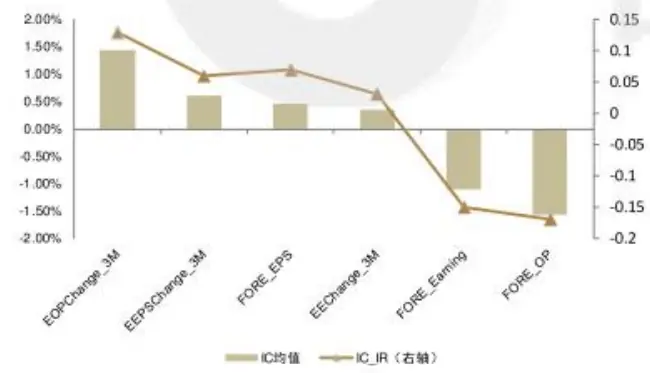
资料来源：Wind，中金公司研究部
注：1）统计时间为2010-12-31至2022-12-30；2）相对净值的比较基准为恒生综指HSCI.HI

图表137：分析师因子恒生港股通内IC 值表现
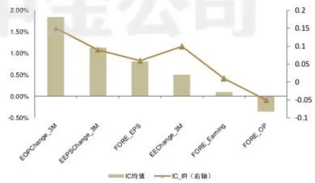
资料来源：Wind，中金公司研究部
注：1）统计时间为2016-12-30至2022-12-30；2）相对净值的比较基准为恒生港股通指数 HSHKI.HI

图表138：分析师因子恒生综指范围内相关性统计

| EEChange_3M EEPSChange_3MEOPChange_3M |  |  |  | FORE_Earning | FORE_EPS | FORE_OP |
| --- | --- | --- | --- | --- | --- | --- |
| EEChange_3M | 1.00 | 0.93 | 0.42 | 0.06 | 0.05 | 0.03 |
| EEPSChange_3M | 0.93 | 1.00 | 0.41 | 0.05 | 0.06 | 0.03 |
| EOPChange_3M | 0.42 | 0.41 | 1.00 | 0.05 | 0.06 | 0.06 |
| FORE_Earning | 0.06 | 0.05 | 0.05 | 1.00 | 0.66 | 0.71 |
| FORE_EPS | 0.05 | 0.06 | 0.06 | 0.66 | 1.00 | 0.41 |
| FORE_OP | 0.03 | 0.03 | 0.06 | 0.71 | 0.41 | 1.00 |

资料来源：Wind，中金公司研究部
注：统计时间为2010-12-31至2022-12-30；范围为全市场剔除退市、合并、SPAC和聆讯阶段后股票

## 公司治理因子：有效性表现尚可

## 股利支付率类因子有一定有效性和多头预测能力

公司治理因子主要衡量了公司的管理层结构和股利信息。本文除了下列2个股利支付率相关信息以外，也尝试构建了6个管理层的持股与薪酬分布因子。但是由于港股对于管理层和股东信息披露要求较为宽松，使得此类因子在截面上的覆盖度并没有达到回测最低标准，故不在此进行展示。

图表139：公司治理因子构建方式

| 因子代码 | 因子名称 | 因子计算公式 |
| --- | --- | --- |
| DPR_TTM | 股利支付率 | DP |
| DPRD | 股利支付率变动 | 当期股利支付率-上期股利支付率 |

资料来源：中金公司研究部

恒生综指范围内，股利支付率因子(DPRTTM)的有效性较好，ICIR为0.28，也有一定的多头选股能力，且单调性尚可、换手率较低；恒生港股通范围内，股利支付率变动因子(DPRD)虽然有效性稍逊于股利支付率因子，但是收益预测能力和单调性都优于股利支付率因子，多头年化超额为3.26%。由于该类因子与A股中测试的稍有不同，故不在此进行对比。

综合而言，股利支付率因子(DPR_TTM）在恒生综指中有效性较好，而股利支付率变动因子(DPRD)在恒生港股通范围内选股能力较好。但两个因子的单调性都表现一般，分组表现较差，空头收益并不显著，因此多空收益表现较差，故不作详细展示。

图表140：公司治理因子在恒生综指范围内的有效性检验结果

|  | IC均值 | IC_IR | P(IC>0.02) | P(IC<-0.02) | 多空年化 收益 | 多空年化 波动 | 多空夏普 比率 | 多头年化 超额 | 多头超额 最大回撤 | 多头换手 率 | 单调性 |
| --- | --- | --- | --- | --- | --- | --- | --- | --- | --- | --- | --- |
| DPRD | 0.28% | 0.05 | 35.00% | 37.14% | 3.19% | 9.27% | 0.38 | 2.32% | -19.96% | 24.08% | 0.33 |
| DPR_TTM | 2.10% | 0.27 | 53.52% | 28.17% | 1.58% | 10.73% | 0.20 | 1.64% | -26.81% | 10.91% | 0.58 |

资料来源：Wind，中金公司研究部
注：统计时间为2011-02-28至2022-12-30；超额收益的比较基准为恒生综指

图表141：公司治理因子在恒生港股通范围内的有效性检验结果

|  | IC均值 | IC_IR | P(IC>0.02) | P(IC<-0.02) | 多空年化 收益 | 多空年化 波动 | 多空夏普 比率 | 多头年化 超额 | 多头超额 最大回撤 | 多头换手 率 | 单调性 |
| --- | --- | --- | --- | --- | --- | --- | --- | --- | --- | --- | --- |
| DPRD | 0.75% | 0.12 | 36.11% | 33.33% | 3.01% | 10.39% | 0.34 | 0.09% | -18.05% | 24.90% | 0.55 |
| DPR_TTM | 1.25% | 0.17 | 50.00% | 36.11% | -0.51% | 11.70% | 0.01 | 0.70% | -17.35% | 10.55% | 0.04 |

资料来源：Wind，中金公司研究部
注：统计时间为2016-12-30至2022-12-30；超额收益的比较基准为恒生港股通指数

图表142：公司治理因子恒生综指范围内相关性统计

|  | DPR_TTM | DPRD |
| --- | --- | --- |
| DPR_TTM | 1.00 | 0.32 |
| DPRD | 0.32 | 1.00 |

资料来源：Wind，中金公司研究部
注：统计时间为2011-02-28至2022-12-30

## 总结

整体而言，在港股市场中，价量因子的有效性及选股能力较强，而基本面因子的信息有效性偏弱、单调性较差。

A价量因子中的信息及时、规范、不存在显著个股披露差异，使其因子存在显著的超额获取能力。除流动性因子以外，大部分价量因子不存在长期阶段性失效。

基本面因子表现较弱，其原因可能包括：1)选定恒生综指和恒生港股通范围内且剔除仙股后，选股域内剩余均为质量、流动性较好的公司，使得财务指标的区分度不高；2)机构和散户投资者在交易上存在非理性差异，由于港股中的机构投资者占比较高，基本面信息被充分交易，因此有效性较弱。由于上述原因，基本面因子中所含的增量alpha有限，使基本面因子大多为阶段性有效或预测表现波动较高。

与A股市场相比，港股市场因子整体有效性和预测能力较弱。由于港股市场较为成熟、多空机制完善，且投资者中散户占比较低，使得市场存在的错误定价与股价的非理性波动空间更小，超额收益的获得难度更高。因此，从绝对数值上判断，港股因子的预测有效性和超额收益获取能力要低于A股中对应的因子。但是从相对结论上，可以看到部分在A股中表现强势的因子，在港股中同样表现突出，例如波动率因子大类、盈余质量因子中的应计利润占比因子(APR TTM)、盈利因子中的全部资产现金回收率因子(CFOA TTM)等。当然也存在一些大类因子在A股中预测能力优良，但在港股中却表现平平，例如月度反转因子、流动性因子、成长因子大类等。

价量因子中，年度动量因子预测能力和多头表现突出，波动率因子的有效性较好。年度动量因子的多头选股能力是本文测试各类因子中整体表现最为优异的，且单调性十分良好。低波因子的预测稳定性较好，超额获取能力尚可。相比之下，流动性因子的有效性和单调性表现略逊；价量相关性因子的表现视选股域的选择而定，领先滞后关系并不稳定。年度动量因子中，推荐关注相对均价的1年收益率因子（mmt_avg_A）和1年收益率因子（mmt_normal_A）；波动率因子中，3个月威廉上影线标准差因子（vol_w_upshadow_std_3M）整体表现均衡。

基本面因子中，估值因子整体有效性优秀，营运效率和盈余质量因子中也存在表现较优的因子。估值因子整体预测稳定性和有效性良好，且在恒生综指范围内单调性较好。营运效率因子的整体预测能力较为稳定，且空头收益比较显著。盈余质量因子的有效性颇佳，且有一定多头选股能力。相比之下，A股市场中表现较为强势的成长能力因子在港股中的有效性与单调性却不佳，预测能力偏弱。估值因子中，推荐经营性现金流比总市值因子（OCFP_TTM)；营运效率因子中，净利率变动因子（NPMD）和营业利润率变动因子（OPMD）的性价比较高；盈余质量因子中，应计利润占比因子（APR_TTM）的有效性和选股能力良好。

基于本文对于各类因子在港股表现的初步探索与判断，未来我们将继续深耕研究表现出色的大类因子，从因子算法、构建逻辑、数据质量与覆盖度上齐头并进，继续挖掘适用于港股的alpha因子，并构建基于优秀大类因子的复合因子。

## 风险提示

本篇报告对于各类因子表现结论均基于历史数据，历史回测表现不代表未来。

## 作者信息

陈宜筠联系人 SAC 执证编号：S0080122080368 yiyun.chen@cicc.com.cn

## 王汉锋 分析员

SFC CE Ref: AND454

SAC 执证编号：S0080513080002

hanfeng.wang@cicc.com.cn

周萧潇 分析员
SAC 执证编号：S0080521010006
SFC CE Ref: BRA090
xiaoxiao.zhou@cicc.com.cn
刘均伟分析员
SAC 执证编号：S0080520120002
SFC CE Ref: BQR365
junwei.liu@cicc.com.cn

# 法律声明

一般声明

本报告由中国国际金融股份有限公司（已具备中国证监会批复的证券投资咨询业务资格）制作。本报告中的信息均来源干我们认为可靠的已公开资料，但中国国际金融股份有限公司及其关联机构（以下统称“中金公司”）对这些信息的准确性及完整性不作任何保证。本报告中的信息、意见等均仅供投资者参考之用，不构成对买卖任何证券或其他金融工具的出价或征价或提供任何投资决策建议的服务。该等信息、意见并未考虑到获取本报告人员的具体投资目的、财务状况以及特定需求，在任何时候均不构成对任何人的个人推荐或投资操作性建议。投资者应当对本报告中的信息和意见进行独立评估，自主审慎做出决策并自行承担风险。投资者在依据本报告涉及的内容进行任何决策前，应同时考量各自的投资目的、财务状况和特定需求，并就相关决策咨询专业顾问的意见对依据或者使用本报告所造成的一切后果，中金公司及/或其关联人员均不承担任何责任。

本报告所载的意见、评估及预测仅为本报告出具日的观点和判断，相关证券或金融工具的价格、价值及收益亦可能会波动。该等意见、评估及预测无需通知即可随时更改。在不同时期，中金公司可能会发出与本报告所载意见、评估及预测不一致的研究报告。

本报告署名分析师可能会不时与中金公司的客户、销售交易人员、其他业务人员或在本报告中针对可能对本报告所涉及的标的证券或其他金融工具的市场价格产生短期影响的催化剂或事件进行交易策略的讨论。这种短期影响的分析可能与分析师已发布的关于相关证券或其他金融工具的目标价、评级、估值、预测等观点相反或不一致，相关的交易策略不同于且也不影响分析师关于其所研究标的证券或其他金融工具的基本面评级或评分。

中金公司的销售人员、交易人员以及其他专业人士可能会依据不同假设和标准、采用不同的分析方法而口头或书面发表与本报告意见及建议不一致的市场评论和/或交易观点。中金公司没有将此意见及建议向报告所有接收者进行更新的义务。中金公司的资产管理部门、自营部门以及其他投资业务部门可能独立做出与本报告中的意见不一致的投资决策。

除非另行说明，本报告中所引用的关于业绩的数据代表过往表现。过往的业绩表现亦不应作为日后回报的预示。我们不承诺也不保证，任何所预示的回报会得以实现。
分析中所做的预测可能是基于相应的假设。任何假设的变化可能会显著地影响所预测的回报。

本报告提供给某接收人是基于该接收人被认为有能力独立评估投资风险并就投资决策能行使独立判断。投资的独立判断是指，投资决策是投资者自身基于对潜在投资的目标、需求、机会、风险、市场因素及其他投资考虑而独立做出的。

本报告由受香港证券及期货事务监察委员会监管的中国国际金融香港证券有限公司（“中金香港”）于香港提供。香港的投资者若有任何关于中金公司研究报告的问题请直接联系中金香港的销售交易代表。本报告作者所持香港证监会牌照的牌照编号已披露在报告首页的作者姓名旁。

本报告由受新加坡金融管理局监管的中国国际金融（新加坡）有限公司（“中金新加坡”）于新加坡向符合新加坡《证券期货法》定义下的合格投资者及/或机构投资者提供。本报告无意也不应直接或间接地分发或传递给新加坡的任何其他人。提供本报告于合格投资者及/或机构投资者，有关财务顾问将无需根据新加坡之《财务顾问法》第45条就任何利益及/或其代表就任何证券利益进行披露。有关本报告之任何查询，在新加坡获得本报告的人员可联系中金新加坡持牌代表。

本报告由受金融行为监管局监管的中国国际金融（英国）有限公司（“中金英国”）于英国提供。本报告有关的投资和服务仅向符合《2000年金融服务和市场法2005年(金融推介）令》第19（5）条、38条、47条以及49条规定的人士提供。本报告并未打算提供给零售客户使用。在其他欧洲经济区国家，本报告向被其本国认定为专业投资者（或相当性质）的人士提供。

本报告由中国国际金融日本株式会社（“中金日本”）于日本提供，中金日本是在日本关东财务局（日本关东财务局长（金商）第3235号）注册并受日本法律监管的金融机构。本报告有关的投资产品和服务仅向符合日本《金融商品交易法》第2条31项所规定的专业投资者提供。本报告并未打算提供给日本非专业投资者使用。

本报告亦由中国国际金融股份有限公司向符合日本《金融商品交易法施行令》第17条第3款第1项及《金融商品交易法》第58条第2款但书前段所规定的日本金融机构提供。在该情形下，本报告有关的投资产品和服务仅向日本受监管的金融机构提供。

本报告将依据其他国家或地区的法律法规和监管要求于该国家或地区提供。

## 特别声明

在法律许可的情况下，中金公司可能与本报告中提及公司正在建立或争取建立业务关系或服务关系。因此，投资者应当考虑到中金公司及/或其相关人员可能存在影响本报告观点客观性的潜在利益冲突。

与本报告所含具体公司相关的披露信息请访问https://research.cicc.com/footer/disclosures，亦可参见近期已发布的关于该等公司的具体研究报告。

中金研究基本评级体系说明：

分析师采用相对评级体系，股票评级分为跑赢行业、中性、跑输行业（定义见下文）。

除了股票评级外，中金公司对覆盖行业的未来市场表现提供行业评级观点，行业评级分为超配、标配、低配（定义见下文）。

我们在此提醒您，中金公司对研究覆盖的股票不提供买入、卖出评级。跑赢行业、跑输行业不等同于买入、卖出。投资者应仔细阅读中金公司研究报告中的所有评级定义。请投资者仔细阅读研究报告全文，以获取比较完整的观点与信息，不应仅仅依靠评级来推断结论。在任何情形下，评级（或研究观点）都不应被视为或作为投资建议。投资者买卖证券或其他金融产品的决定应基于自身实际具体情况（比如当前的持仓结构）及其他需要考虑的因素。

## 股票评级定义：

·跑赢行业(OUTPERFORM)：未来6~12个月，分析师预计个股表现超过同期其所属的中金行业指数；

·中性（NEUTRAL）：未来6~12个月，分析师预计个股表现与同期其所属的中金行业指数相比持平

跑输行业（UNDERPERFORM)：未来6~12个月，分析师预计个股表现不及同期其所属的中金行业指数。

## 行业评级定义：

·超配（OVERWEIGHT）：未来6~12个月，分析师预计某行业会跑赢大盘10%以上；

- 标配（EQUAL-WEIGHT）：未来6~12个月，分析师预计某行业表现与大盘的关系在-10%与10%之间；

- 低配（UNDERWEIGHT）：未来6~12个月，分析师预计某行业会跑输大盘10%以上。

研究报告评级分布可从https://research.cicc.com/footer/disclosures 获悉。

本报告的版权仅为中金公司所有，未经书面许可任何机构和个人不得以任何形式转发、翻版、复制、刊登、发表或引用。

V190624 编辑：金灿，赵静

## 北京

中国国际金融股份有限公司中国北京建国门外大街1号国贸写字楼2座28层邮编：100004电话：(86-10) 6505 1166传真：(86-10) 6505 1156

## 深圳

中国国际金融股份有限公司深圳分公司
深圳市福田区益田路5033号
平安金融中心72层
邮编：518048
电话：(86-755)8319-5000
传真：(86-755)8319-9229

## 东京

中国国际金融日本株式会社
100-0005東京都千代田区丸の内3丁目2番3
号丸の内二重橋ビル21階
Tel: (+813) 3201 6388
Fax: (+813) 3201 6389

## 纽约

CICC US Securities, Inc 32nd Floor, 280 Park Avenue New York, NY 10017, USA Tel: (+1-646) 7948 800 Fax: (+1-646) 7948 801

## 伦敦

China International Capital Corporation (UK) 
Limited 
25th Floor, 125 Old Broad Street 
London EC2N 1AR, United Kingdom 
Tel: (+44-20) 7367 5718 
Fax: (+44-20) 7367 5719

## 上海

中国国际金融股份有限公司上海分公司
上海市浦东新区陆家嘴环路1233号
汇亚大厦32层
邮编：200120
电话：(86-21)5879-6226
传真：(86-21)5888-8976

## 香港

中国国际金融（香港）有限公司香港中环港景街1号国际金融中心第一期29 楼电话：(852)2872-2000传真：(852)2872-2100

## 旧金山

CICC US Securities, Inc. San Francisco Branch 
Office 
One Embarcadero Center, Suite 2350, 
San Francisco, CA 94111, USA 
Tel: (+1) 415 493 4120 
Fax: (+1) 628 203 8514

## 新加坡

China International Capital Corporation 
(Singapore) Pte. Limited 
6 Battery Road, #33-01 
Singapore 049909 
Tel: (+65) 6572 1999 
Fax: (+65) 6327 1278

## 法兰克福

China International Capital Corporation (Europe) 
GmbH 
Neue Mainzer Straße 52-58, 60311 
Frankfurt a.M, Germany 
Tel: (+49-69) 24437 3560