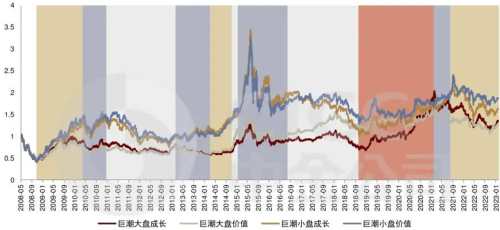
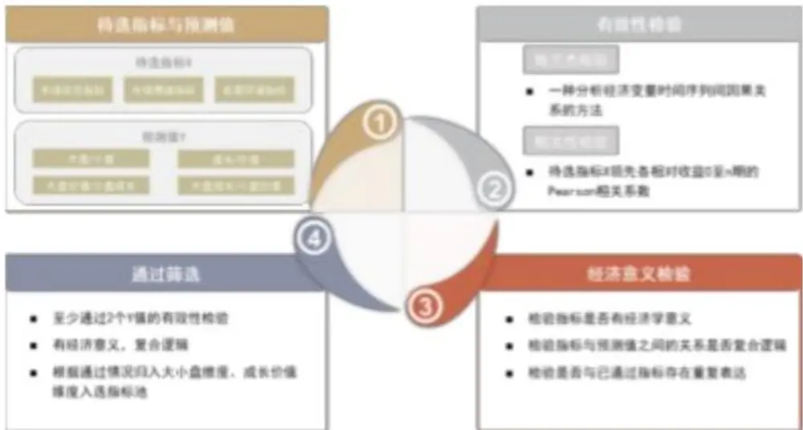
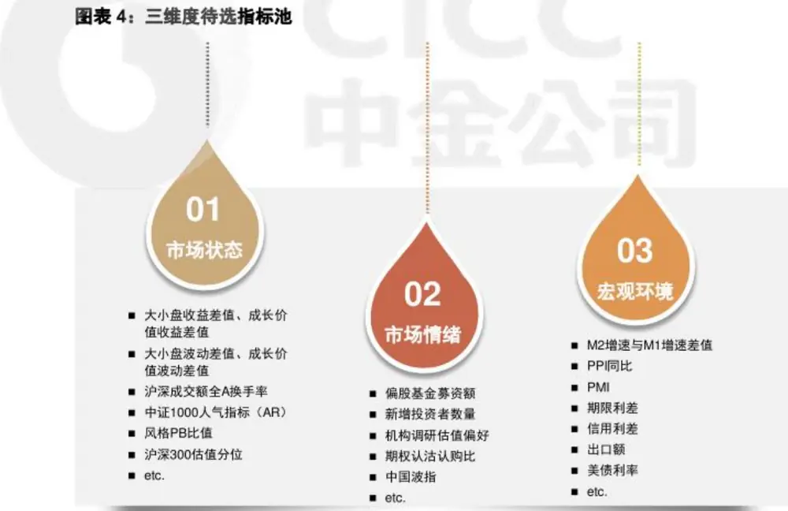
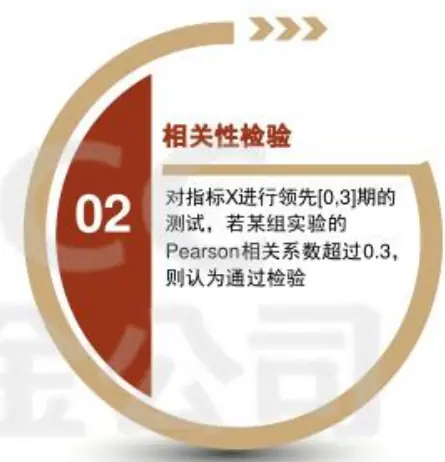
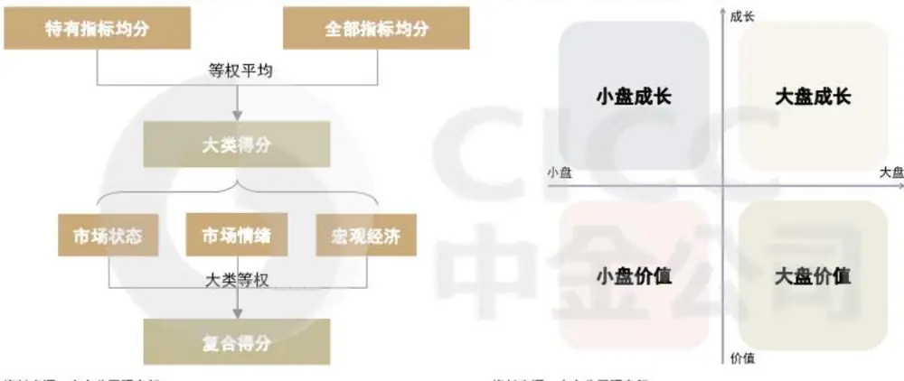
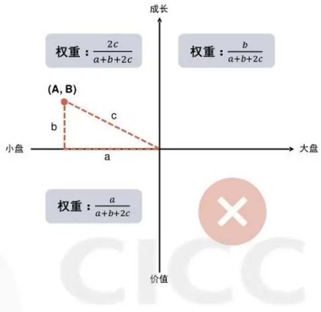
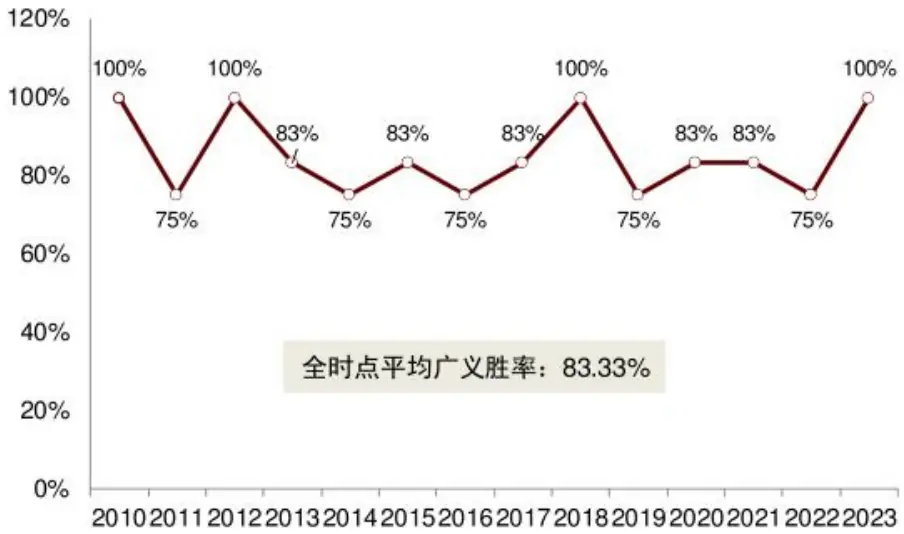
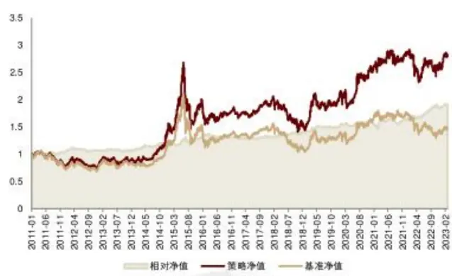
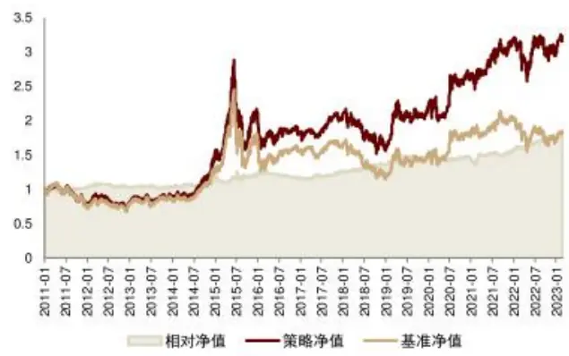

# 量化多因子系列（11）：如何捕捉四象限的风格轮动？

周萧潇 分析员

SAC 执证编号：S0080521010006

SFC CE Ref: BRA090

xiaoxiao.zhou@cicc.com.cn

古翔 分析员

SAC 执证编号：S0080521010010

SFC CE Ref: BRE496

xiang.gu@cicc.com.cn

随着近年来市场风格切换速度和程度的提升，如何捕捉A股市场中风格的切换和轮动，已然成为各类投资者均十分关注的问题。与此同时我们认为，将大盘/小盘风格与成长/价值风格结合可以实现对A股市场风格的更精准的刻画。因此我们结合风格影响因素分析和量化指标筛选方法，从宏观环境、市场情绪和市场状态这三个角度出发，构建了综合单一维度和重合维度预测指标的，大盘成长、大盘价值、小盘成长、小盘价值四象限风格轮动模型。

## 四象限风格轮动受哪些因素影响？

我们以巨潮的风格指数作为各类风格收益表现的代表，可以观察到各类风格在不同阶段内收益表现差异较大，并且存在明显的风格轮动现象。从成长/价值风格和大盘/小盘风格的影响维度来看，我们认为可能的因素包括市场情绪、市场状态（包括估值与基本面、交易状态等）、宏观环境和产业政策等方面。

## 单一维度和重合维度的有效指标筛选

从市场状态、市场情绪、宏观环境三个维度寻找有经济学意义的候选指标，采用格兰杰检验和相关性检验对指标有效性进行测试，旨在筛选出既对四象限风格收益有预测效果，且符合经济学逻辑的轮动指标，最终选出共15个指标。

1）成长/价值维度的有效指标包括：新增投资者数量、中国波指、PPI月同比和M2M1增速差等。

2）大盘/小盘维度的有效指标包括：大小盘相对换手率、全A换手率分位数、创新高个股占比、期权认沽认购比等。

3）重合指标（即对大盘/小盘和成长/价值维度均有效）包括：偏股基金募资额、期限利差等。

## 指标复合与模型构建：纳入胜率信息，坐标法确定配置仓位

使用通过显著性检验后的入选指标，我们构建了大盘/小盘和成长/价值两个维度的复合指标。除了将指标标准化和调整极性以外，我们通过叠加滚动胜率信息纳入了指标近期趋势的信息。我们认为当指标在过去一段时间内，各时点的变化趋势均符合极性预期时，当前时点的信息的重要性更高，反之亦然。回测结果表明，叠加滚动胜率信息有助于增强模型的轮动效果，且表现最为稳定的是滚动4期胜率信息。

我们进一步将所得二维复合得分指标，通过坐标法搭建四象限风格的仓位调整轮动策略：重仓推荐风格，低配相邻风格，不配相反风格。

## 四象限风格轮动模型：广义胜率83%，近5年表现出色，策略适用性较高

四象限风格轮动模型广义胜率表现较好，全时点平均广义胜率为83%。自2018年起狭义胜率也有较为突出的表现，近5年（2018年至2023年2月）平均狭义胜率为40%，2022年至今平均狭义胜率为44%。其中，狭义胜率为上月末所得的当月推荐风格与该月的实际优势风格（即对应策略月度涨跌幅表现最好）相同次数所占比例；广义胜率则被定义为当月推荐风格非该月的实际劣势风格（即对应策略月度涨跌幅表现最差）次数所占比例。

将仓位调整轮动策略应用于巨潮风格指数中，并将4个巨潮风格指数的等权平均作为基准收益。该场景下，四象限轮动策略在样本期内持续跑赢基准，分年收益除2016年以外均战胜基准。样本期内(2011-01-04至2023-03-01)，轮动策略的年化收益为9.30%，年化超额收益为5.06%。策略在我们构建的四象限风格指数1中的应用效果也较为稳定，全样本(2011-01-04至2023-03-01)年化收益为10.52%，超额收益为4.31%。轮动策略在大多数年份都能够跑赢基准收益，这也说明模型对于不同应用场景均有一定适用性。

截止2023年3月1日，模型最新推荐的风格为小盘价值风格。

- 量化策略|基本面量化系列（8）：四象限风格内应如何选股？(2022.12.15)

更多作者及其他信息请见文末披露页

## 四象限风格轮动受哪些因素影响？

## 成长/价值与大盘/小盘风格的四象限轮动

随着近年来市场风格切换速度和程度的提升，如何捕捉A股市场中风格的切换和轮动，已然成为各类投资者均十分关注的问题。与此同时我们认为，将大盘/小盘风格与成长/价值风格结合可以实现对A股市场风格的更精准的刻画。如图所示，我们以巨潮的风格指数作为各类风格收益表现的代理指数，可以观察到，各类风格在不同阶段内收益表现差异较大，并且存在明显的风格轮动现象。

图表1：四象限风格指数收益表现具有明显的轮动效应

资料来源：Wind，中金公司研究部（注：数据截至2023-02-28）

图表2：各类风格指数的历年收益统计

|  |  | 巨潮大盘成长 | 巨潮大盘价值 巨潮小盘成长 |  | 巨潮小盘价值 | 沪深300 | 中证1000 | 国证成长 | 国证价值 |
| --- | --- | --- | --- | --- | --- | --- | --- | --- | --- |
| 2011 |  | -23.5% | -10.6% | -36.0% | -32.3% | -25.0% |  | -28.4% | -18.1% |
| 2012 |  | 17.5% | 18.3% | 4.5% | 1.7% | 7.6% |  | 11.9% | 13.9% |
|  | 2013 | -11.1% | -7.0% | 20.1% | 7.7% | -7.6% |  | -1.0% | -3.0% |
|  | 2014 | 36.9% | 67.9% | 32.8% | 52.7% | 51.7% |  | 32.7% | 64.1% |
| 2015 |  | 15.1% | 0.5% | 59.6% | 30.6% | 5.6% | 76.1% | 26.9% | 8.4% |
| 2016 |  | -11.8% | -4.4% | -18.6% | -11.8% | -11.3% | -20.0% | -15.6% | -8.1% |
| 2017 |  | 14.6% | 29.3% | -11.8% | 1.4% | 21.8% | -17.4% | 6.8% | 20.6% |
| 2018 |  | -32.8% | -18.0% | -36.4% | -27.5% | -25.3% | -36.9% | -34.0% | -21.7% |
|  | 2019 | 52.3% | 26.2% | 28.8% | 14.5% | 36.1% | 25.7% | 45.3% | 23.7% |
|  | 2020 | 59.3% | 3.3% | 22.8% | 13.6% | 27.2% | 19.4% | 48.6% | 4.9% |
|  | 2021 | 0.3% | -8.3% | 23.6% | 20.5% | -5.2% | 20.5% | 5.4% | -1.4% |
| 2022 |  | -28.2% | -12.2% | -27.6% | -16.1% | -21.6% | -21.6% | -27.5% | -14.0% |
| 2023至今 |  | 7.2% | 5.5% | 10.4% | 9.4% | 6.6% | 11.5% | 7.6% 7.4% |  |

资料来源：Wind，中金公司研究部（注：2023年收益率截至2022-03-01；中证1000于2014-10-17发布）

风格轮动叠加风格内的选股策略是主动量化投资重要思路。在报告《基本面量化系列(8)：四象限风格内应如何选股？》中我们提到，运用风格轮动叠加风格内选股增强的策略思路时，投资者应对市场风格的切换将更加灵活，在市场强势风格的支持下，整体的策略收益也将有更好的表现。当然，实现这一投资思路的难点在于准确把握市场风格轮动的节奏，这方面正需要我们构建较为有效的四象限风格轮动量化模型，为风格判断提供参考依据。

## 哪些因素影响风格表现？

想要较好的捕捉成长/价值风格和大盘/小盘等个这两个维度的轮动规律，我们需要对市场中影响两个维度的风格表现的因素做到较为全面的覆盖，从成长/价值风格和大盘/小盘风格的影响维度来看，我们认为可能的因素包括下述几个方面：

市场情绪：投资者的情绪是影响成长和价值风格轮动的因素之一。当投资者对市场前景乐观时，成长股可能受到更多的关注和追捧，小盘股也可能更受投资者追捧，因为它们通常具有更高的成长潜力。而当投资者风险偏好下降时，稳定性更高的大盘价值股则更受青睐。

宏观环境：成长和价值股的轮动通常受宏观经济环境影响，例如经济增长、通胀、利率、货币政策等。例如，当经济处于复苏期或者通胀较高时，成长股可能表现更好，而当经济增长放缓或者通胀水平下降时，价值股可能表现更好。宏观经济周期也是影响大盘和小盘轮动的一个重要因素。在经济复苏期，小盘股往往表现更好，因为经济复苏提供了更多的机会，而大盘股则可能受到经济增长的限制。在经济放缓时，大盘股可能表现更好，因为它们在经济不景气时更具有稳定性。

市场状态：市场状态中包含较为丰富信息，包括基本面与估值、交易行为、市场表现等。

个股基本面：公司的财务状况、盈利能力、业务前景等基本面因素也会对成长和价值股的表现产生影响。大盘和小盘股的基本面变化也会带来投资者的关注从而导致收益表现上的差异。

微观交易行为：市场参与者的交易行为也会对风格的收益表现产生影响。例如，当成长因子的交易拥挤度快速上升时，说明市场上有大量参与者在买入高成长的股票，对应成长风格未来的收益出现反转的可能性上升。

产业政策：产业政策因素也可能影响成长和价值股的表现。例如当政府加大对技术创新和高科技产业的支持时，成长股和小盘股可能受到更多的政策红利，而当政策转向支持传统行业时，价值股则可能更受关注。

不过由于产业政策这方面的信息较难结构化，且数据频率无法统一，因此我们暂时较难以在量化风格轮动模型中纳入这部分信息。因此，后续我们将主要从宏观环境、市场情绪和市场状态这三个维度入手，寻找其中较为有效的预测指标，构建综合单一维度和重合维度预测指标的大盘成长、大盘价值、小盘成长、小盘价值四象限风格轮动模型。

## 三维度轮动指标筛选

## 指标筛选框架

我们从市场状态、市场情绪、宏观环境三个维度寻找有经济学意义的候选指标，采用格兰杰检验和相关性检验对指标有效性进行测试，旨在筛选出既对四象限风格收益有预测效果，又同时复合经济学逻辑的轮动指标。

我们希望筛选出的指标不仅对大小盘或是成长价值单一维度有预测能力，而且对两维度交互状态有一定的预测贡献。因此，在我们的检测框架中，自变量X为在市场状态、市场情绪、宏观环境大类下构建的单指标候选指标池，因变量Y分别为大盘/小盘相对收益、成长/价值相对收益、大盘价值/小盘成长相对收益以及大盘成长/小盘价值相对收益，当X对两个及以上的Y有效时，才有可能最终入选。

我们采用两种方法衡量待选指标的有效性：格兰杰检验和相关性检验。

## 格兰杰检验：

格兰杰检验是一种分析经济变量时间序列间因果关系的方法，其思想在于，在包含变量Y的过去信息的情况下，如果变量X的过去值仍然对Y的当期值有解释作用，则认为变量X是变量Y的格兰杰原因。进行格兰杰检验的一个前提条件是时间序列必须具有平稳性，否则可能会出现虚假回归问题。因此在进行检验之前通常使用ADF检验对各指标时间序列的平稳性进行单位根检验，对未通过检验的非平稳时间序列做一阶差分处理。

## 相关性检验：

在相关性检验中，我们计算待选指标X领先各相对收益0至n期的Pearson相关系数。若待选指标与相对收益间在一定领先阶数下有显著的相关关系，则认为该指标对该维度风格收益有一定的预测作用。

图表3：指标筛选框架

资料来源：中金公司研究部

## 指标筛选流程

基于我们所构建的指标筛选框架，本节主要对待选指标及框架内的筛选标准进行介绍，并对筛选结果进行梳理。

## 待选指标

我们在市场状态、市场情绪和宏观经济三个维度下构建待选指标池。

市场状态：衡量一段时间内的市场状态，捕捉市场趋势。该维度主要包括宽基指数和风格指数的收益与波动、成交与换手、估值情况和股债性价比等指标。例如，大小盘收益差值、沪深成交额、全A换手率等。

市场情绪：反应市场主要参与者的情绪观点，一定程度上可以代表当前市场的总体方向。该维度主要包括资金流向、新增投资者数、创新高个股数、机构偏好、期权认沽认购比等指标。例如，新增投资者数量、机构调研估值偏好、偏股基金募资额等。

宏观环境：把握总体经济环境和金融稳定情况。该维度主要包括衡量经济增长、经济稳定、流动性、货币政策等方面的宏观经济环境和金融环境指标。例如，M1增速同比、PPI同比、期限利差、美债利率等。此类宏观指标在进行测试时会相应进行滞后处理。

资料来源：中金公司研究部

格兰杰检验
资料来源：中金公司研究部

## 筛选结果

对于某个相对收益Y，当指标X的格兰杰检验和相关性检验通过其一，则认为该指标有效。检验通过标准如下：

格兰杰检验：对指标X进行领先1期和领先2期的测试，若两个实验中有一个通过，则认为通过格兰杰检验。

相关性检验：对指标X进行领先[0,3]期的测试，若某组实验的Pearson相关系数超过0.3，则认为通过相关性检验。

我们希望筛选出的指标不仅对大小盘或是成长价值单一维度有预测能力，而且对两维度交互状态有一定的预测贡献。所以当该指标至少对一个单维度相对收益和一个交互项（大盘价值/小盘成长或大盘成长/小盘价值）相对收益都有预测效果时，才认为通过筛选。最后，对所有通过有效性检验的指标进行经济学逻辑检查、重复意义指标剔除后，获得最终的筛选结果。

图表 5：单指标有效性筛选标准

对指标X进行领先1期和领先2期的测试，若两个实验中有一个通过，即认为通过检验

基于上述筛选流程和筛选标准，最终我们筛选出15个指标用于四象限风格预测，包括市场状态指标6个、市场情绪指标5个、宏观环境指标4个，其中3个指标对两个大小盘和成长价值单维度均有预测效果，7个指标为大小盘维度特有指标，5个指标为成长价值维度特有指标。

图表6：入选指标展示

| 指标类型 | 指标名称 | 适用类型 |
| --- | --- | --- |
| 市场状态 | 大小盘收益差值 | 重合 |
|  | 大小盘PB比值分位数 | 大小盘 |
|  | 大小盘相对换手率 | 大小盘 |
|  | 全A换手率在过去两年分位数 | 大小盘 |
|  | 中证1000人气指标(AR) | 大小盘 |
|  | 成长价值收益差值 | 成长价值 |
| 市场情绪 | 偏股基金募资额 | 重合 |
|  | 创新高个股占比 | 大小盘 |
|  | 期权认沽认购比新增投资者数量 | 大小盘 |
|  |  | 成长价值成长价值 |
|  | 中国波指 |  |
| 宏观环境 | 期限利差 | 重合 |
|  | 出口额月同比PPI月同比 | 大小盘 |
|  |  | 成长价值 |
|  | M2增速-M1增速 | 成长价值 |

资料来源：中金公司研究部

## 入选指标：单一维度与重合维度

本节将从经济意义、指标方向角度对上述15个入选指标进行详细分析。其中，部分指标对单一维度，即大小盘或成长/价值维度，有一定预测能力；还有部分指标对重合维度，即大小盘和成长/价值维度均有预测效果。我们将有效结合单一维度和重合维度的入选指标，最终对各维度风格进行打分。

## 重合类型指标

一共有15个指标入选最终的预测模型，其中有3个指标既对大小盘有预测作用，又对成长价值有预测作用。我们首先来分析这些指标的含义以及指标对这两个维度的综合影响。

图表7：重合指标极性

| 指标类型 | 指标名称 | 适用类型 | 大小盘极性 | 成长价值极性 |
| --- | --- | --- | --- | --- |
| 市场状态 | 大小盘收益差值 | 重合 | 大盘 | 价值 |
| 市场情绪 | 偏股基金募资额 | 重合 | 大盘 | 价值 |
| 宏观环境 | 期限利差 | 重合 | 小盘 | 成长 |

资料来源：中金公司研究部

## 大小盘收益差值：

此指标计算方式为沪深300指数收益减去中证1000指数收益，代表当前的市场状态。其对大小盘的影响可以视为一种动量。大小盘收益差值大，代表一段时间内的大盘收益相对小盘占优，这种趋势将会延续，大盘在未来继续占优。对于成长价值维度来说，由于沪深

300指数成分股中更多是价值股，中证1000指数成分股中成长股占多数，因此该指标也是一个价值/成长的动量指标。

## 偏股基金募资额：

此指标计算方式为偏股型基金近一周的发行份额，代表资金流向，属于市场情绪类指标。当偏股型基金发行频繁时，意味着大量资金通过机构投资者涌入股市，而机构投资者投资的更多是大盘股、价值股，因此该指标的上升可以看作是对大盘风格和价值风格持乐观态度。

## 期限利差：

该指标定义为10年期国债收益率与1年期国债收益率差值。长期利率是经济预期的反映，如果投资者预期未来经济向好，那么长端利率会上升。短期利率更多是市场流动性的反映，货币政策宽松时，市场流动性宽裕，短期利率会下降更快，反之亦然。期限利差收敛一般有以下两种情形：

第一种情形下，10年期国债到期收益率和1年期国债到期收益率同时上行，但1年期国债到期收益率上行速度更快，此时经济在复苏但货币政策有所收紧，在这种环境下大盘股会相对占优；对于成长价值维度，前期盈利具有相对优势的成长板块在估值承压的同时盈利相对优势减弱，因此价值股更具有性价比；

第二种情形下，10年期国债到期收益率和1年期国债到期收益率同时下行，但10年期国债到期收益率下行速度更快，此时经济悲观但货币政策没有进一步放松，这种情况下更不敏感的大盘、价值风格占优。

总的来说，在期限利差收敛或处于低位时，大盘、价值风格会相对占优。

## 大小盘类型指标

对于大小盘的预测，市场状态维度入选5个指标，市场情绪维度入选3个指标，宏观环境维度入选2个指标。下面的分析将不再赘述重合指标。

图表8：适用大小盘类型的指标极性

| 指标类型 | 指标名称 | 适用类型 | 大小盘极性 |
| --- | --- | --- | --- |
| 市场状态 | 大小盘收益差值 | 重合 | 大盘 |
|  | 大小盘PB比值分位数 | 大小盘 | 大盘 |
|  | 大小盘相对换手率 | 大小盘 | 小盘 |
|  | 全A换手率在过去两年分位数 | 大小盘 | 小盘 |
|  | 中证1000人气指标(AR) | 大小盘 | 小盘 |
| 市场情绪 | 偏股基金募资额 | 重合 | 大盘 |
|  | 创新高个股占比 | 大小盘 | 小盘 |
|  | 期权认沽认购比 | 大小盘 | 小盘 |
| 宏观环境 | 期限利差 | 重合 | 小盘 |
|  | 出口额月同比 | 大小盘 | 小盘 |

资料来源：中金公司研究部

市场状态维度下：

大小盘收益差值、大小盘PB比值分位数是一类动量指标，从收益和估值的角度分别给出大小盘风格相对占优的信息。此类动量趋势指标值越大，越说明大盘相对小盘占优。其中大盘用沪深300指数代表，小盘用中证1000指数代表。

大小盘相对换手率是一个反转指标，当相对换手处于高位时，大盘市场过热，市场风格会向小盘转向。其中大盘用沪深300指数代表，小盘用中证1000指数代表。

全A换手率在过去两年的分位数指标极性为负。换手率可以描述市场的活跃程度和投资者的风险偏好，换手率较高的时期往往小盘股相对表现较好。

中证1000人气指标代表市场对中证1000的多空态度，指标越大，代表小盘相对占优。人气指标以当天开盘价为基础，通过一段时期内开盘价在股价中的地位反映市场买卖人气，进一步反映投资者对该资产是否乐观。中证1000人气指标计算公式为：

$$
AR=\mathit{SUM}(High-Open,250)/SUM(Open-Low,250)
$$

市场情绪维度下：

创新高个股占比为当天创新高的个股数量占比（剔除上市5日以内的股票），极性为负。小盘股相对于大盘股的创新高概率更大，因此该指标处于高位可以看作是对小盘风格持乐观态度。

期权认沽认购比为50ETF所有看跌期权合约当日总成交量与所有看涨期权合约当日总成交量的比值，极性为负。该指标较高时，意味着市场对50ETF的看跌情绪较大，50ETF偏向于大盘股，因此该指标是一种对大盘的看空情绪。

## 宏观环境维度下：

出口额月同比处于低位时，利好小盘。出口贸易额降低会使得工业企业利润增速下降，制造业产能收缩，大市值股票走势下降，市场转向小盘股风格。同时出口额一定程度上反映海外市场对国内企业的影响，通常出口额较大的公司为大盘股，因此大盘风格会对出口额的变化更为敏感，在该指标处于低位时，小盘风格占优。

## 成长价值类型指标

对于成长价值风格的预测，市场状态维度入选2个指标，市场情绪维度入选3个指标，宏观环境维度入选3个指标。下面的分析将不再赘述重合指标。

图表9：适用成长价值类型的指标极性

| 指标类型 | 指标名称 适用类型 | 成长价值极性 |
| --- | --- | --- |
| 市场状态 | 大小盘收益差值 重合 | 价值 |
|  | 成长价值收益差值 成长价值 | 成长 |
| 市场情绪 | 偏股基金募资额 重合 | 价值 |
|  | 新增投资者数量 成长价值 | 价值 |
|  | 中国波指 成长价值 | 成长 |
| 宏观环境 | 期限利差 重合 | 成长 |
|  | PPI月同比 成长价值 | 价值 |
|  | M2增速-M1增速 成长价值 | 价值 |

资料来源：中金公司研究部

市场状态维度下：

成长价值收益差值是一个动量指标，指标较高时说明成长风格占优，并且在未来成长风格会持续占优。

市场情绪维度下：

新增投资者数量反映散户的投资情绪，是一个常用的市场情绪代理变量。与机构投资者相比，散户投资者会相对更偏好市值偏小成长性较好的风格的股票，因此当散户入市速度加快时，可能意味着成长情绪过热，未来市场会转向价值风格。

中国波指是基于50ETF期权的VIX指数，成长价值极性为正。50ETF中价值股占多，该指标较高时意味着价值股波动较大，此时投资者会更倾向于投资成长风格。

## 宏观环境维度下：

PPI月同比反映生产环节价格变化，成长价值极性为负。该指标较高时，主要原材料和工业品市场价格水平升高，企业生产供不应求，生产者利润较高，价值风格占优。当PPI月同比处于低位，甚至PPI连续下跌时，表明当前经济运行状态不佳，企业出现产能过剩现象，此时价值股很可能出现利润下降，因此成长相对价值较优。

M2增速与M1增速的差值对成长价值也有一定的判断能力，极性为正。在货币供应的各个层次中，狭义货币供应量M1是流通中的现金加企业活期存款；广义货币供应量M2，是M1加企业定期存款、居民储蓄存款和其他存款。M1反映现实购买力，M2反映现实和潜在购买力。若M2增速高于M1增速，表明企业和居民选择储蓄资金，市场流动性面临压力，微观个体盈利能力下降，经济运行回落，此时价值相对成长占优。若M2增速低于M1增速，表明企业与居民消费、投资活跃，微观主体盈利能力较强，经济景气度上升，此时成长相对价值占优。

# 轮动模型构建：纳入胜率信息，坐标法定仓位

## 复合指标构建：纳入胜率信息

使用通过显著性检验后的入选指标，我们构建了大小盘和成长/价值两个维度的复合得分指标。

图表10：四象限轮动指标复合逻辑

资料来源：中金公司研究部

除了将指标标准化和调整极性以外，我们通过叠加滚动胜率信息纳入了指标近期趋势的信息。我们认为当指标在过去一段时间内，各时点的变化趋势均符合极性预期时，当前时点的信息的重要性更高，反之亦然。过去一段时间均顺势的指标信息有所增强，而过去一段时间均方向失效的指标则信息有所削弱。回测过程中，我们尝试了纯滚动标准分以及在此基础上叠加不同回望时间区间的胜率信息。回测结果表明，叠加滚动胜率信息有助于增强模型的轮动效果，且表现最为稳定的是滚动4期胜率信息。

## 入选指标标准化

指标复合第一步是将量纲与极性不同的入选指标统一进行标准化，从而使得其得分可比且可叠加。我们根据指标经济含义，并辅以相关性检验结果的佐证，确定了大小盘和成长/价值两个维度的指标极性（见第二章）。

各指标的标准化过程结合了计算滚动标准分、加入胜率动量信息和调整极性3部分。经过对回望区间、权重调整等超参数的敏感性测试后，我们选择敏感性较低、综合表现较为稳定的参数组合。

计算各指标向前滚动6期的标准化z-score得分。该得分反映了在考虑分布均值和离散程度后，当前时点的指标数值相较于过去6个月的相对位置。

调整指标极性。其中大盘和成长在各自维度上得分为正，小盘和价值在各自维度上得分为负。具体而言，对于小盘和价值极性的指标，分别对其标准化得分乘以-1，从而调整极性方向。

## 以调整各时点指标得分权重的方式，融入向前滚动4期的胜率信息。

计算回望区间中，该指标的滚动标准化得分与极性方向相符的次数占比。例如向前滚动4期中，若调整极性后的标准化得分有3期为正，则胜率为3/4=75%。

根据0.5(1+胜率)×调整极性后标准分=最终标准分，进而调整胜率。一则能够将近期指标趋势变化的动量效应纳入考量，对顺应趋势的信息增加一定权重，对逆势信息适当降低权重；二来将调整幅度限制于[0.5,1]之前，避免因为过去一段时间内指标逆势而致使其信息权重过低，而忽略实质性拐点。

## 构建大类指标及复合得分

在构建大类指标时，我们根据指标是否为该大类特有指标进行了权重的调整（见图表11)。对于单个维度，我们分别计算了特有指标等权均分，以及特有与重合指标的大类等权均分，再对两者进行平均作为最终的大类均分。从构建意义上，该处理方法相当于在个体指标等权的基础上，对于重合指标进行降权。由于重合指标在两个维度上均有预测能力，所以控制其权重能避免在该类指标上的集中度过高。

图表11：单维度大类及最终复合指标流程

资料来源：中金公司研究部
资料来源：中金公司研究部

图表12：风格四象限示意

最终，将市场状态、市场情绪和宏观经济三个大类得分等权平均，得到单个维度的复合得分。
将两个维度的复合得分相结合，即可定位模型判断的风格在四象限中所处位置（见图表12)。

## 仓位调整轮动策略：坐标法

在确定了模型的二维得分坐标位置（大小盘维度得分，成长价值维度得分）后，即可确定模型在当前最为推荐的风格是哪在哪一个象限。假设某期模型的坐标落在小盘成长象限，这其实代表着模型是相对看好小盘且同时相对看好成长风格的，那么也就意味着，小盘价值风格和大盘成长风格也一定程度上被模型所看好。因此，我们考虑采用仓位分配的方法进行风格的配置。

将坐标映射至四象限坐标系中，记为(A，B)，我们根据该坐标及其与原点间的连线(直角边分别记为a和b，与原点连线即斜记为c）对于各风格持仓权重进行分配。轮动策略的构建思路如下：

重仓推荐风格，即坐标点所在象限风格。该风格权重为2倍斜边，归一化后权重为2c相比单倍斜边，推荐风格的权重配比更高，给予更多表达正面轮动观点的空间。a+b+2c不配置完全相反风格，即坐标点所在象限的对角线风格。如图中推荐风格为小盘成长，则不配置大盘价值。

轻配其余两个风格。与推荐风格相邻两个风格的权重分配为其相邻边的对应维度得分，即a与b，归一化后权重分别为 $\frac{a}{a+b+2c}与\frac{b}{a+b+2c}$

图表13：四象限轮动策略权重分配

资料来源：中金公司研究部

## 测试结果：广义胜率83%，策略适用性较高

我们对根据上述方式构建的四象限轮动策略在2010-04-30至2023-02-28间进行了回测。

测试结果中，广义胜率良好，全时点平均广义胜率为83%。狭义胜率自2018年起也表现较好，近5年（2018年至2023年2月）平均狭义胜率为40%，2022年至今平均狭义胜率为44%。我们将狭义胜率定义为上月末所得的当月推荐风格与该月的实际优势风格（即对应策略月度涨跌幅表现最好）相同次数所占比例；广义胜率则定义为当月推荐风格非该月的实际劣势风格（即对应策略月度涨跌幅表现最差）次数所占比例。

图表14：四象限轮动策略分年广义胜率

资料来源：Wind，中金公司研究部。注：回测期间为2010-04-30至2023-02-28；胜率计算基准为巨潮风格指数

四象限轮动模型根据我们策略的构建方式，由于我们是以不同比例配置了非劣势风格的其余三种风格（即上文所述的对角线风格象限），广义胜率对于风格配置的参考价值更高。模型在风格切换较为明显的2014、2017年等年份均有着不俗的广义胜率表现。而狭义胜率由于其风格判断过于绝对，无法涵盖推荐坐标点配置权重的信息，仅对选择重仓风格象限有一定参考价值。下图展示了2022年以来的风格推荐与对应权重。2023年3月的最新推荐持仓风格为小盘价值风格。

图表15：四象限轮动策略2022年以来风格推荐

|  | 推荐风格 | 推荐风格权重 | 优势风格 | 劣势风格 |
| --- | --- | --- | --- | --- |
| 2022-01 | 大盘价值 | 59.87% | 大盘价值 | 小盘成长 |
| 2022-02 | 大盘成长 | 61.75% | 小盘价值 | 大盘成长 |
| 2022-03 | 小盘成长 | 60.92% | 小盘价值 | 小盘成长 |
| 2022-04 | 大盘价值 | 59.74% | 大盘价值 | 小盘成长 |
| 2022-05 | 大盘成长 | 59.25% | 小盘成长 | 大盘价值 |
| 2022-06 | 小盘成长 | 65.03% | 大盘成长 | 小盘价值 |
| 2022-07 | 小盘成长 | 58.64% | 小盘成长 | 大盘成长 |
| 2022-08 | 小盘价值 | 65.15% | 大盘价值 | 小盘成长 |
| 2022-09 | 大盘价值 | 60.68% | 大盘价值 | 大盘成长 |
| 2022-10 | 大盘成长 | 58.89% | 小盘成长 | 大盘价值 |
| 2022-11 | 小盘成长 | 59.15% | 大盘价值 | 小盘成长 |
| 2022-12 | 大盘价值 | 58.95% | 大盘成长 | 小盘成长 |
| 2023-01 | 大盘成长 | 59.70% | 大盘成长 | 大盘价值 |
| 2023-02 | 小盘成长 | 58.82% | 小盘价值 | 大盘成长 |
| 2023-03 | 小盘价值 | 60.10% |  |  |

资料来源：Wind，中金公司研究部
注：展示期间为2022-01-31至2023-02-28；优势与劣势风格基于巨潮风格指数

图表16：四象限轮动策略2022年以来持仓权重

|  | 大盘成长 | 大盘价值 | 小盘成长 | 小盘价值 |
| --- | --- | --- | --- | --- |
| 2022-01 | 26.81% | 59.87% | 0.00% | 13.32% |
| 2022-02 | 61.75% | 29.65% | 8.60% | 0.00% |
| 2022-03 | 28.60% | 0.00% | 60.92% | 10.48% |
| 2022-04 | 26.52% | 59.74% | 0.00% | 13.74% |
| 2022-05 | 59.25% | 15.49% | 25.25% | 0.00% |
| 2022-06 | 32.42% | 0.00% | 65.03% | 2.55% |
| 2022-07 | 22.14% | 0.00% | 58.64% | 19.22% |
| 2022-08 | 0.00% | 32.49% | 2.37% | 65.15% |
| 2022-09 | 11.07% | 60.68% | 0.00% | 28.25% |
| 2022-10 | 58.89% | 23.85% | 17.26% | 0.00% |
| 2022-11 | 24.92% | 0.00% | 59.15% | 15.93% |
| 2022-12 | 24.14% | 58.95% | 0.00% | 16.91% |
| 2023-01 | 59.70% | 26.44% | 13.86% | 0.00% |
| 2023-02 | 17.68% | 0.00% | 58.82% | 23.50% |
| 2023-03 | 0.00% | 12.63% | 27.27% | 60.10% |

资料来源：Wind，中金公司研究部
注：展示期间为2022-01-31至2023-02-28；优势与劣势风格基于巨潮风格指数

我们分别在巨潮风格指数和我们构建的四象限风格指数²测试了四象限轮动策略。在巨潮指数中，我们将4个巨潮风格指数的等权平均作为基准收益，策略应用于巨潮风格指数可在样本期内持续跑赢基准，分年收益除2016年以外也均战胜基准。四象限轮动策略的年化收益为9.30%，年化超额收益为5.06%，信息比率为0.75。

图表17：四象限轮动策略应用于巨潮风格指数的净值表现

资料来源：Wind，中金公司研究部
注：样本期为2011-01-04至2023-03-01；基准指数为4个巨潮风格指数的等权平均

图表18：四象限轮动策略应用于巨潮风格指数的分年收益

|  | 策略收益 | 基准收益 | 超额收益 |
| --- | --- | --- | --- |
| 2011 | -24.57% | -28.26% | 3.69% |
| 2012 | 14.82% | 13.54% | 1.28% |
| 2013 | 1.91% | 0.44% | 1.47% |
| 2014 | 77.47% | 52.58% | 24.89% |
| 2015 | 16.36% | 11.30% | 5.06% |
| 2016 | -3.97% | -3.84% | -0.13% |
| 2017 | 10.64% | 9.75% | 0.89% |
| 2018 | -25.64% | -29.20% | 3.56% |
| 2019 | 43.40% | 32.80% | 10.59% |
| 2020 | 26.23% | 21.64% | 4.58% |
| 2021 | 10.58% | 4.41% | 6.16% |
| 2022 | -10.09% | -20.50% | 10.42% |
| 2023至今 | 9.43% | 6.99% | 2.45% |
| 年化收益 | 9.30% | 3.91% | 5.06% |

资料来源：Wind，中金公司研究部
注：样本期为2011-01-04至2023-03-01；基准指数为4个巨潮风格指数的等权平均；2023年收益为实际收益

我们也测试了轮动策略在我们构建的四象限风格指数中的应用，并将4个风格指数的等权平均作为基准。该股票池的划分方式如下：1）大/小盘风格划分：以中证500成分股的平均市值为标准；2）成长/价值风格划分：在大盘风格范围内，将成长指标进行标准化处理（z-score）后取平均作为成长得分，取成长得分排名40%的股票构成大盘成长风格股票池，以此类推。

在此策略的年化收益为10.52%，超额收益为4.31%，信息比率为0.70。轮动策略在大多数年份都能够跑赢基准收益，且在2014年有着较为优秀的轮动表现。由于筛选指标均以巨潮风格指数为参考，但策略在四象限风格指数上仍有不错的轮动效果，说明模型对于不同指数应用场景有一定适用性。

图表19：四象限轮动策略应用于四象限风格指数的净值表现

资料来源：Wind，中金公司研究部
注：样本期为2011-01-04至2023-03-01；基准指数为4个四象限风格指数的等权平均

图表20：四象限轮动策略应用于四象限风格指数的分年收益

|  | 策略收益 | 基准收益 | 超额收益 |
| --- | --- | --- | --- |
| 2011 | -24.65% | -26.98% | 2.33% |
| 2012 | 8.95% | 9.22% | -0.27% |
| 2013 | 9.85% | 8.73% | 1.12% |
| 2014 | 74.06% | 52.27% | 21.79% |
| 2015 | 24.05% | 22.60% | 1.44% |
| 2016 | -6.32% | -3.47% | -2.85% |
| 2017 | 14.01% | 5.64% | 8.37% |
| 2018 | -24.45% | -30.05% | 5.60% |
| 2019 | 40.46% | 31.60% | 8.86% |
| 2020 | 21.63% | 21.54% | 0.10% |
| 2021 | 19.49% | 10.71% | 8.78% |
| 2022 | -6.48% | -15.92% | 9.44% |
| 2023至今 | 7.62% | 7.14% | 0.48% |
| 年化收益 | 10.52% | 5.82% | 4.31% |

资料来源：Wind，中金公司研究部
注：样本期为2011-01-04至2023-03-01；基准指数为4个四象限风格指数的等权平均；2023年收益为实际收益

## 总结

本文将大盘/小盘风格与成长/价值风格结合，从而实现更精准定义风格的大盘成长、大盘价值、小盘成长、小盘价值的四象限风格轮动模型。

我们从市场状态、市场情绪、宏观环境三个维度寻找有经济学意义的候选指标，采用格兰杰检验和相关性检验对指标有效性进行测试。最终入选共15个指标，部分指标对单一维度有一定预测能力，而部分指标则对重合维度，即大小盘和成长/价值维度均有预测效果。我们将有效结合单一维度和重合维度的入选指标，最终对各维度风格进行打分。

成长/价值维度的有效指标：成长价值收益差值、新增投资者数量、中国波指、PPI月同比和M2增速与M1 增速的差值。

大盘/小盘维度的有效指标：大小盘PB比值分位数、大小盘相对换手率、全A换手率在过去两年的分位数、中证1000人气指标、创新高个股占比、期权认沽认购比和出口额月同比。

重合指标：大小盘收益差值、偏股基金募资额和期限利差。

使用通过显著性检验后的入选指标，我们构建了大小盘和成长/价值两个维度的复合得分指标。除了将指标标准化和调整极性以外，我们通过叠加滚动胜率信息纳入了指标近期趋势的信息。我们认为当指标在过去一段时间内，各时点的变化趋势均符合极性预期时，当前时点的信息的重要性更高，反之亦然。回测结果表明，叠加滚动胜率信息有助于增强模型的轮动效果，且表现最为稳定的是滚动4期胜率信息。

我们将所得二维复合得分指标，通过坐标法搭建四象限风格的仓位调整轮动策略：重仓推荐风格，低配相邻风格，不配相反风格。测试结果中，广义胜率（当月推荐风格非该月的实际劣势风格次数所占比例）良好，全时点平均广义胜率为83%。

我们将该轮动策略应用于巨潮风格指数中，并将4个巨潮风格指数的等权平均作为基准收益。该场景下，四象限轮动策略在样本期内持续跑赢基准，分年收益除2016年以外也均战胜基准。样本期内(2011-01-04至2023-03-01)，轮动策略的年化收益为9.30%，年化超额收益为5.06%，信息比率为 0.75。

我们也测试了轮动策略在我们构建的四象限风格指数中的应用，此策略的年化收益（2011-01-04至2023-03-01）为10.52%，超额收益为4.31%，信息比率为0.70。轮动策略在大多数年份都能够跑赢基准收益。由于筛选指标均以巨潮风格指数为参考，但策略在四象限风格指数上仍有不错的轮动效果，说明模型对于不同指数应用场景有一定适用性。

未来我们将考虑进一步拓展测试指标池，从而覆盖更全面、更多样的信息，以提高模型轮动效果；同时我们也将考虑测试不同策略频率的性价比，在模型表现与换仓成本中找到较优的平衡点，进一步提升模型的实用性。

## 附录

图表 21：完整测试指标目录

| 指标名称 | 类型 | 构建方法 |
| --- | --- | --- |
| 估值水平 | 市场状态 | 沪深300市盈率和市净率滚动5年分位数的平均值 |
| 风险溢价 | 市场状态 | 沪深300市盈率-10年期国债到期收益率，求其在过去5年的分位数 |
| 300收益率 | 市场状态 | 沪深300月收益率 |
| 300收益波动率 | 市场状态 | 沪深300月波动率 |
| 1000收益率 | 市场状态 | 中证1000月收益率 |
| 1000收益波动率 | 市场状态 | 中证1000月波动率 |
| 大小盘收益差值 | 市场状态 | 沪深300月收益率-中证1000月收益率 |
| 大小盘波动差值 | 市场状态 | 沪深300月波动率-中证1000月波动率 |
| 500收益率 | 市场状态 | 中证500月收益率 |
| 300与500收益率差值 | 市场状态 | 沪深300月收益率-中证500月收益率 |
| 300与500差值波动率 | 市场状态 | 沪深300月波动率-中证500月波动率 |
| 成长价值收益差值 | 市场状态 | (巨潮大盘成长+巨潮小盘成长）月收益率减去（巨潮大盘价值+巨潮小盘价值）月收益率 |
| 成长价值波动差值 | 市场状态 | （巨潮大盘成长+巨潮小盘成长）月波动率减去（巨潮大盘价值+巨潮小盘价值）月波动率 |
| 股债性价比 | 市场状态 | 万得全A指数股息率-10年国债到期收益率 |
| 大小盘相对换手率 | 市场状态 | 沪深300换手率与中证1000换手率的比值在过去3个月求和 |
| 大盘成长-大盘价值 | 市场状态 | 巨潮大盘成长月收益率-巨潮大盘价值月收益率 |
| 小盘成长-小盘价值 | 市场状态 | 巨潮小盘成长月收益率-巨潮小盘价值月收益率 |
| 大盘成长-小盘成长 | 市场状态 | 巨潮大盘成长月收益率-巨潮小盘成长月收益率 |
| 大盘价值-小盘价值 | 市场状态 | 巨潮大盘价值月收益率-巨潮小盘价值月收益率 |
| 大盘价值-小盘成长 | 市场状态 | 巨湖大盘价值月收益率-巨潮小盘成长月收益率 |
| 大盘成长-小盘价值 | 市场状态 | 巨潮大盘成长月收益率·巨潮小盘价值月收益率 |
| 沪深成交额 | 市场状态 | 过去一个月沪市成交额与深市成交额之和 |
| 沪深成交额在过去两年的分位数 | 市场状态 | 过去一个月沪市成交额与深市成交额之和在过去两年的分位数 |
| 全A_单季度：ROE同比增减 | 市场状态 | wind全A指数单季度ROE同比增减 |
| 全A_ROE同比增减 | 市场状态 | wind全A指数ROE同比增减 |
| 全A_ROE同比增减（TTM） | 市场状态 | wind全A指数ROE同比增减（TTM） |
| 创业板指与沪深300ROE同比差值 | 市场状态 | 创业板指数ROE同比与沪深300指数ROE同比差值 |
| 沪深300人气指标（AR） | 市场状态 | 沪深300指数sum(high-open,250)/sum(open-low, 250) |
| 中证1000人气指标（AR） | 市场状态 | 中证1000指数sum(high-open,250)/sum(open-low, 250) |
| 中证500人气指标（AR） | 市场状态 | 中证500指数sum(high-open, 250)/sum(open-low, 250) |
| 中证800人气指标（AR） | 市场状态 | 中证800指数sum(high-open, 250)/sum(open-low, 250) |
| 大盘成长人气指标（AR） | 市场状态 | 巨潮大盘成长指数sum(high-open, 250)/sum(open-low, 250) |
| 大盘价值人气指标（AR） | 市场状态 | 巨潮大盘价值指数sum(high-open,250)/sum(open-low, 250) |
| 小盘成长人气指标（AR） | 市场状态 | 巨潮小盘成长指数sum(high-open, 250)/sum(open-low, 250) |
| 小盘价值人气指标（AR） | 市场状态 | 巨潮小盘价值指数sum(high-open,250)/sum(open-low, 250) |
| 全A换手率在过去两年分位数 | 市场状态 | wind全A的换手率在过去两年分位数 |
| 大盘PB/小盘PB | 市场状态 | 沪深300指数PB/中证1000指数PB |
| 大小盘PB比值分位数 | 市场状态 | 沪深300指数PB/中证1000指数PB在过去两年分位数 |
| 大盘成长PB/大盘价值PB | 市场状态 | 巨潮大盘成长指数PB/巨潮大盘价值指数PB |
| 小盘成长PB/小盘价值PB | 市场状态 | 巨潮小盘成长指数PB/巨潮小盘价值指数PB |
| 大盘成长价值PB比值分位数 | 市场状态 | 巨潮大盘成长指数PB/巨潮大盘价值指数PB在过去两年的分位数 |
| 小盘成长价值PB比值分位数 | 市场状态 | 巨潮小盘成长指数PB/巨潮小盘价值指数PB在过去两年的分位数 |
| 新增投资者数量 | 市场情绪 | 过去一个月新增股票开户数量 |
| 北上资金估值偏好 | 市场情绪 | sum(个股的北上资金月度环比持仓变动幅度(个股当前估值分位数-0.5)) |
| 机构调研估值偏好 | 市场情绪 | 每个月底计算当月所有被调研的上市公司估值中位数处于全市场公司估 值指标的分位数水平 |
| 前后成交额差异 | 市场情绪 | 计算每日涨幅前50%股票的成交额与后50%股票的成交额的差值，除以当日总成交额，将时间序列做100期移动平 均，再求其在自身过去5年的分位数 |
| 重要股东减持 | 市场情绪 | 剔除限售股减持之后，统计近30天有重要股东减持的股票数量之和，占当前上市总公司数量的比例，然后求其在 自身过去5年分位数 |
| 偏股基金募资额 | 市场情绪 | 偏股型基金近1周的发行份额 |
| 北向资金净流入 | 市场情绪 | 北向资金近5日净流入之和 |
| 期权认沽认购比 | 市场情绪 | 50ETF所有看跌期权合约当日总成交量/所有看涨期权当日合约总成交量 |
| 融券余额增长率 | 市场情绪 | A股融券余额21日增长率-A股流通市值近21日增长率，然后将时间序列做5期移动平均，再求其在过去5年的分位数 |
| 中国波指 | 市场情绪 | 基于50ETF期权的VIX指数 |
| 创新高个股占比 | 市场情绪 | 当天创新高的个股数量占比，剔除上市5个交易日内的股票 |
| 成长因子拥挤度 | 因子拥挤度 | 成长因子离散度、组内相关性、收益波动、收益动量指标标准化后等权相加 |
| 价值因子拥挤度 | 因子拥挤度 | 价值因子离散度、组内相关性、收益波动、收益动量指标标准化后等权相加 |
| M1同比 | 宏观环境 | M1同比 |
| M2同比 | 宏观环境 | M2同比 |
| 社融规模同比 | 宏观环境 | 社融规模同比 |
| CPI月同比 | 宏观环境 | CPI月同比 |
| PPI月同比 | 宏观环境 | PPI月同比 |
| GDP季同比 | 宏观环境 | GDP季同比按月填充 |
| 月消费者信心指数 | 宏观环境 | 月消费者信心指数 |
| 货币乘数 | 宏观环境 | 货币乘数 |
| 出口额月同比 | 宏观环境 | 出口额月同比 |
| 房地产开发投资完成额累计同比 | 宏观环境 | 房地产开发投资完成额累计同比 |
| M2增速-M1增速 | 宏观环境 | M2同比减去M1同比 |
| CPI同比-PPI同比 | 宏观环境 | CPI同比减去PPI同比 |
| 剩余流动性同比 | 宏观环境 | M2同比-社融存量同比 |
| 中长期贷款余额同比 | 宏观环境 | 中长期贷款余额月同比 |
| 社消总额实际月同比 | 宏观环境 | 社消总额实际月同比 |
| PMI | 宏观环境 | PMI |
| 3个月国债收益率 | 宏观环境 | 3个月国债收益率 |
| 1年国债收益率 | 宏观环境 | 1年国债收益率 |
| 10年国债收益率 | 宏观环境 | 10年国债收益率 |
| 6个月美债收益率 | 宏观环境 | 6个月美债收益率 |
| 期限利差 | 宏观环境 | 10年国债收益率与1年国债收益率差值 |
| 信用利差 | 宏观环境 | 5年中短期票据到期收益率与5年国开债到期收益率 |

资料来源：Wind，中金公司研究部

## 作者信息

周萧潇分析员

SAC 执证编号：S0080521010006SFC CE Ref: BRA090xiaoxiao.zhou@cicc.com.cn

刘均伟分析员

SAC 执证编号：S0080520120002
SFC CE Ref: BQR365
junwei.liu@cicc.com.cn
陈宜筠 联系人
SAC 执证编号：S0080122080368
yiyun.chen@cicc.com.cn
王汉锋分析员
SAC 执证编号：S0080513080002
SFC CE Ref: AND454
hanfeng.wang@cicc.com.cn
古翔分析员
SAC 执证编号：S0080521010010
SFC CE Ref: BRE496
xiang.gu@cicc.com.cn

# CICC中金公司

# 法律声明

一般声明

本报告由中国国际金融股份有限公司（已具备中国证监会批复的证券投资咨询业务资格）制作。本报告中的信息均来源干我们认为可靠的已公开资料，但中国国际金融股份有限公司及其关联机构（以下统称“中金公司”）对这些信息的准确性及完整性不作任何保证。本报告中的信息、意见等均仅供投资者参考之用，不构成对买卖任何证券或其他金融工具的出价或征价或提供任何投资决策建议的服务。该等信息、意见并未考虑到获取本报告人员的具体投资目的、财务状况以及特定需求，在任何时候均不构成对任何人的个人推荐或投资操作性建议。投资者应当对本报告中的信息和意见进行独立评估，自主审慎做出决策并自行承担风险。投资者在依据本报告涉及的内容进行任何决策前，应同时考量各自的投资目的、财务状况和特定需求，并就相关决策咨询专业顾问的意见对依据或者使用本报告所造成的一切后果，中金公司及/或其关联人员均不承担任何责任。

本报告所载的意见、评估及预测仅为本报告出具日的观点和判断，相关证券或金融工具的价格、价值及收益亦可能会波动。该等意见、评估及预测无需通知即可随时更改。在不同时期，中金公司可能会发出与本报告所载意见、评估及预测不一致的研究报告。

本报告署名分析师可能会不时与中金公司的客户、销售交易人员、其他业务人员或在本报告中针对可能对本报告所涉及的标的证券或其他金融工具的市场价格产生短期影响的催化剂或事件进行交易策略的讨论。这种短期影响的分析可能与分析师已发布的关于相关证券或其他金融工具的目标价、评级、估值、预测等观点相反或不一致，相关的交易策略不同于且也不影响分析师关于其所研究标的证券或其他金融工具的基本面评级或评分。

中金公司的销售人员、交易人员以及其他专业人士可能会依据不同假设和标准、采用不同的分析方法而口头或书面发表与本报告意见及建议不一致的市场评论和/或交易观点。中金公司没有将此意见及建议向报告所有接收者进行更新的义务。中金公司的资产管理部门、自营部门以及其他投资业务部门可能独立做出与本报告中的意见不一致的投资决策。

除非另行说明，本报告中所引用的关于业绩的数据代表过往表现。过往的业绩表现亦不应作为日后回报的预示。我们不承诺也不保证，任何所预示的回报会得以实现。
分析中所做的预测可能是基于相应的假设。任何假设的变化可能会显著地影响所预测的回报。

本报告提供给某接收人是基于该接收人被认为有能力独立评估投资风险并就投资决策能行使独立判断。投资的独立判断是指，投资决策是投资者自身基于对潜在投资的目标、需求、机会、风险、市场因素及其他投资考虑而独立做出的。

本报告由受香港证券及期货事务监察委员会监管的中国国际金融香港证券有限公司（“中金香港”）于香港提供。香港的投资者若有任何关于中金公司研究报告的问题请直接联系中金香港的销售交易代表。本报告作者所持香港证监会牌照的牌照编号已披露在报告首页的作者姓名旁。

本报告由受新加坡金融管理局监管的中国国际金融（新加坡）有限公司（“中金新加坡”）于新加坡向符合新加坡《证券期货法》定义下的合格投资者及/或机构投资者提供。本报告无意也不应直接或间接地分发或传递给新加坡的任何其他人。提供本报告于合格投资者及/或机构投资者，有关财务顾问将无需根据新加坡之《财务顾问法》第45条就任何利益及/或其代表就任何证券利益进行披露。有关本报告之任何查询，在新加坡获得本报告的人员可联系中金新加坡持牌代表。

本报告由受金融行为监管局监管的中国国际金融（英国）有限公司（“中金英国”）于英国提供。本报告有关的投资和服务仅向符合《2000年金融服务和市场法2005年(金融推介）令》第19（5）条、38条、47条以及49条规定的人士提供。本报告并未打算提供给零售客户使用。在其他欧洲经济区国家，本报告向被其本国认定为专业投资者（或相当性质）的人士提供。

本报告由中国国际金融日本株式会社（“中金日本”）于日本提供，中金日本是在日本关东财务局（日本关东财务局长（金商）第3235号）注册并受日本法律监管的金融机构。本报告有关的投资产品和服务仅向符合日本《金融商品交易法》第2条31项所规定的专业投资者提供。本报告并未打算提供给日本非专业投资者使用。

本报告亦由中国国际金融股份有限公司向符合日本《金融商品交易法施行令》第17条第3款第1项及《金融商品交易法》第58条第2款但书前段所规定的日本金融机构提供。在该情形下，本报告有关的投资产品和服务仅向日本受监管的金融机构提供。

本报告将依据其他国家或地区的法律法规和监管要求于该国家或地区提供。

## 特别声明

在法律许可的情况下，中金公司可能与本报告中提及公司正在建立或争取建立业务关系或服务关系。因此，投资者应当考虑到中金公司及/或其相关人员可能存在影响本报告观点客观性的潜在利益冲突。

与本报告所含具体公司相关的披露信息请访问https://research.cicc.com/footer/disclosures，亦可参见近期已发布的关于该等公司的具体研究报告。

中金研究基本评级体系说明：

分析师采用相对评级体系，股票评级分为跑赢行业、中性、跑输行业（定义见下文）。

除了股票评级外，中金公司对覆盖行业的未来市场表现提供行业评级观点，行业评级分为超配、标配、低配（定义见下文）。

我们在此提醒您，中金公司对研究覆盖的股票不提供买入、卖出评级。跑赢行业、跑输行业不等同于买入、卖出。投资者应仔细阅读中金公司研究报告中的所有评级定义。请投资者仔细阅读研究报告全文，以获取比较完整的观点与信息，不应仅仅依靠评级来推断结论。在任何情形下，评级（或研究观点）都不应被视为或作为投资建议。投资者买卖证券或其他金融产品的决定应基于自身实际具体情况（比如当前的持仓结构）及其他需要考虑的因素。

## 股票评级定义：

·跑赢行业(OUTPERFORM)：未来6~12个月，分析师预计个股表现超过同期其所属的中金行业指数；

·中性（NEUTRAL）：未来6~12个月，分析师预计个股表现与同期其所属的中金行业指数相比持平

跑输行业（UNDERPERFORM)：未来6~12个月，分析师预计个股表现不及同期其所属的中金行业指数。

## 行业评级定义：

超配（OVERWEIGHT）：未来6~12个月，分析师预计某行业会跑赢大盘10%以上；

- 标配（EQUAL-WEIGHT）：未来6~12个月，分析师预计某行业表现与大盘的关系在-10%与10%之间；

- 低配（UNDERWEIGHT）：未来6~12个月，分析师预计某行业会跑输大盘10%以上。

研究报告评级分布可从https://research.cicc.com/footer/disclosures 获悉。

本报告的版权仅为中金公司所有，未经书面许可任何机构和个人不得以任何形式转发、翻版、复制、刊登、发表或引用。

V190624 编辑：张莹

## CICC中金公司

## 北京

中国国际金融股份有限公司中国北京建国门外大街1号国贸写字楼2座28层邮编：100004电话：(86-10) 6505 1166传真：(86-10) 6505 1156

## 深圳

中国国际金融股份有限公司深圳分公司
深圳市福田区益田路5033号
平安金融中心72层
邮编：518048
电话：(86-755)8319-5000
传真：(86-755)8319-9229

## 东京

中国国际金融日本株式会社
100-0005東京都千代田区丸の内3丁目2番3
号丸の内二重橋ビル21階
Tel: (+813) 3201 6388
Fax: (+813) 3201 6389

## 纽约

CICC US Securities, Inc 32nd Floor, 280 Park Avenue New York, NY 10017, USA Tel: (+1-646) 7948 800 Fax: (+1-646) 7948 801

## 伦敦

China International Capital Corporation (UK) 
Limited 
25th Floor, 125 Old Broad Street 
London EC2N 1AR, United Kingdom 
Tel: (+44-20) 7367 5718 
Fax: (+44-20) 7367 5719

## 上海

中国国际金融股份有限公司上海分公司
上海市浦东新区陆家嘴环路1233号
汇亚大厦32层
邮编：200120
电话：(86-21)5879-6226
传真：(86-21)5888-8976

## 香港

中国国际金融（香港）有限公司香港中环港景街1号国际金融中心第一期29 楼电话：(852)2872-2000传真：(852)2872-2100

## 旧金山

CICC US Securities, Inc. San Francisco Branch 
Office 
One Embarcadero Center, Suite 2350, 
San Francisco, CA 94111, USA 
Tel: (+1) 415 493 4120 
Fax: (+1) 628 203 8514

## 新加坡

China International Capital Corporation 
(Singapore) Pte. Limited 
6 Battery Road, #33-01 
Singapore 049909 
Tel: (+65) 6572 1999 
Fax: (+65) 6327 1278

## 法兰克福

China International Capital Corporation (Europe) 
GmbH 
Neue Mainzer Straße 52-58, 60311 
Frankfurt a.M, Germany 
Tel: (+49-69) 24437 3560