# 量化多因子系列（12）：高频因子手册

周萧潇 分析员

SAC 执证编号：S0080521010006

SFC CE Ref：BRA090

xiaoxiao.zhou@cicc.com.cn

郑文才 分析员

SAC 执证编号：S0080523110003

SFC CE Ref: BTF578

wencai3.zheng@cicc.com.cn

陈宜筠 联系人

SAC 执证编号：S0080122080368

SFC CE Ref: BTZ190

yiyun.chen@cicc.com.cn

本篇报告为高频价量因子的参考手册，汇集了常见的高频价量因子以及中金研究量化策略团队开发的创新性因子。高频价量因子以股票的 数据为基础，捕捉股票日内的下单和交易行为。高频因子的优势在于因子拥挤度相对较低，具有更丰富和更高维度的样本，能够刻画更精细的市场行为；它的劣势在于数据处理较繁琐低效，因子逻辑易受投资者结构、交易规则变化的影响。

我们依据价量因子的构建方式及核心逻辑人工挖掘共 大类因子，分别为：动量反转、波动性、高阶特征、流动性、量价相关性、筹码分布、拥挤度和成交行为因子，并构建各类因子的复合因子，检验各类因子在周度和月度换仓下的有效性，尝试分析其主要收益来源以供投资者参考。

测试结果显示使用高频数据构建的因子有效比例较高，在全市场范围内多个因子周度年化多空收益夏普超 5.0，多头信息比率超 3.0，因子池中近 3 成因子月度IC均值绝对值超 5%，月度ICIR超 0.65。与低频价量因子类似，高频因子表现随股票池平均市值增加有效性明显呈线性下降。

## 1）动量反转

动量反转因子包含三个细分类型：分段动量、量能动量和QRS动量因子。ICIR表现最好的因子为mmt_ols_beta_mean因子，全市场月度 达 ，月度多头超额达 ，周度多空达 ； 因子在全市场范围内表现较为出色，月度ICIR达 1，月度多头超额为 5.6%。此外，mmt_pm_m因子虽然ICIR表现稍弱，但超额收益能力较强，周度多空年化收益率 58%。沪深 300 范围内可关注mmt_top20VolumeRet_o因子，即前 20成交量k线的收益率因子。

## 2）波动性

波动率因子刻画了股票价格或股票收益在过去一段时间的不确定性程度，高波动率通常反映其不确定性程度较高，未来收益表现可能相对较弱。我们相对推荐vol_upVol_std因子，其在大部分市场中有效性良好，全市场ICIR绝对值达 1.35，IC均值-8.4%。vol_volume1min_o虽然周度多空相对较高达 44%，但稳定性稍显不足。

## 3）高阶特征

通过分钟级别价格数据计算出日内收益率的偏度与峰度，该类因子刻画日内价格分布以及快速变化的特征。其中，分钟偏度（shape_skew_m）全市场因子月度ICIR达 1.28，周度多空达 29.2%。在沪深 300 中，因子表现有所下降，其中相对表现较好的是shape_skew_std和shape_kurt_std因子，它们的ICIR均超过了 0.6，shape_skew_std因子的多空收益达到了 16%。

## 4）流动性

流动性因子包含两类：价格弹性因子和集合竞价因子。其中，1分钟Amihud因子（liq_amihud_1min_o）整体表现最好，在全市场月度ICIR为 1.02，月度和周度多空分别为 33%和 40%，换手率分别为 52.31%和 39.39%，在沪深 300 内表现稍弱。而沪深 300 选股域中，liq_closevol_z因子在周度调仓频率下ICIR为 0.21，年化多头超额收益为 5.4%，领先于其他流动性因子。

## 5）量价相关性

量价相关性因子可分为两类：价量同步因子和领先滞后因子。量能领先阶段往往是信息扩散的初期，但日内量价相关因子基本与未来收益负相关，测试结果显示corr_pvl（分钟收盘价与领先成交量相关系数）和corr_pv（分钟收盘价与成交量相关系数）总体表现较好，在多数选股范围内具有较强的选股能力，大盘股中有效性较有限。corr_pvl_std因子全市场ICIR分别为 1.09，周度年化超额收益超 46%。

## 6）筹码分布

筹码分布因子可分为以下两类：筹码分布形状因子和筹码占比因子。筹码分布旨在刻画股票持有人的持仓成本分布情

况。综合来看，筹码占比因子整体表现优于筹码分布形状因子。其中doc_vol_pdf90_std、doc_vol_pdf95_std和doc_vol_pdf90bi_std因子整体表现优异，在不同选股域中均有着较强的预测能力和良好的单调性，值得关注。其中，效果最好的为筹码分位盈亏水平因子（doc_vol_pdf90_std），全市场月度ICIR达 1.52，周度多空年化收益率 45%。

## 7）拥挤度

我们使用 快照成交量序列构建了傅里叶变换机构拥挤度指标，原理是机构拆单下单形成的周期性可以被傅里叶变换后的更显著波形振幅占比捕捉，使用周期性成交占比表征机构参与度占比。该因子在个股和行业层面表现均较为优秀。crowd_fftv20_3s_w0_std因子月度和周度ICIR分别为 1.37 和 1.38，周度多空夏普超过 5.0。在沪深 300 中因子有效性下降显著，相对较好的tv50m5_std因子月度ICIR为 0.53，多头超额 4%。

## 8）资金成交

资金成交因子可分为以下三类：交易单量资金流向因子、开盘 尾盘资金流向因子和收益率成交占比因子。资金流因子反映了不同类型资金流向的信息，该类因子的核心思路是捕捉“聪明资金”的流向，采取跟随策略，以期获得基本面改善带来的超额收益。开盘成交占比波动率因子（trade_headRatio_std）ICIR达 1.07。高收益量能占比因子（trade_top20retRatio）在全市场表现相对较为稳定，月度ICIR为 0.9 和 0.64，多空年化收益为 14%。

## 9）高频复合因子

所有复合因子均具有较强的综合选股能力。月度频率下syn_corr_o和syn_crowd_o因子在全市场选股中相对其他因子有效性较高，其中全市场范围内syn_corr_o因子有效性更强，ICIR达 1.23。周度频率下syn_crowd_o和syn_mmt_o因子表现较优。其中，syn_mmt_o因子有效性更强，ICIR为 1.1，多空收益为 64.2%。而syn_crowd_o因子的收益预测能力更佳，其多空收益达 69.9%，多头超额 11.1%，相对优于其他复合因子。

风险提示：本篇报告基于市场历史收益表现测试价量因子的有效性，无法确保价量因子样本外的收益表现。

⚫ 量化策略 | 资金结构系列（2）如何利用日内交易数据左侧预警机构成交拥挤度 (2023.05.30)

⚫ 量化策略 | 量化多因子系列（7）：价量因子手册 (2022.08.06)

⚫ 量化策略 | 量化多因子系列（6）：关于动量，你所希望了解的那些事 (2022.06.04)

⚫ 量化策略 | 市场微观结构系列（2）： 高频视角下的微观流动性与波动性 (2021.11.18)

⚫ 量化策略 | 量化择时系列（1）：金融工程视角下的技术择时艺术 (2021.01.21)

更多作者及其他信息请见文末披露页

## 价量因子综述

## 日内高频数据因子：从微观结构着眼

日内高频数据因子是以股票的日内交易价量、逐笔成交、逐笔委托以及分钟 K线等数据为基础构建的，刻画的是更细腻的交易结构和交易行为。对比低频因子，高频数据在量化选股中表现出一些明显的优势。

）信息含量丰富：高频数据具有丰富的信息含量。高频数据体量往往明显大于低频数据。对于2018 年以来的全市场 level2 数据来说，所需储存空间就可达几十 TB，这相对于日度指标来说有约至少万倍的体量差距。

）因子拥挤度低：由于高频数据结构相对复杂，处理成本较高，且信息主要来源于日内行情，由于因子开发流程相对复杂，这些因素都使得因子拥挤度相对较低。

）因子相关性低：得益于高频因子的高维度信息和丰富的数据处理方式，使用高频数据构造的因子内部相关性较低，投资者更有可能从中获得更丰富的信息增量。

图表 1：日内高频因子的相对优势
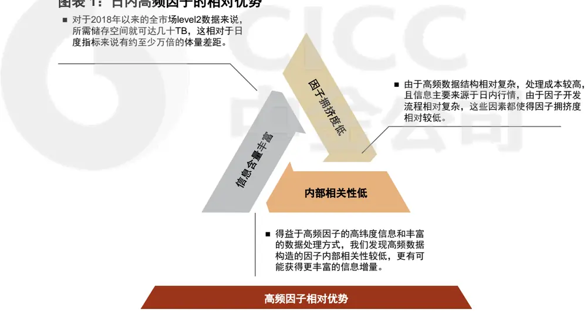
资料来源：中金公司研究部

我们认为，高频价量因子的收益来源和低频价量的收益来源有相似也有不同。相同之处在于价量因子收益来源一般有三种方式： ）是通过捕捉由于噪音交易者反映过度（或反应不足）造成的错误定价所带来的投资机会；2）是捕获特定资金行为获取超额收益；3）是承担了特定的风险，获得风险补偿收益。由于高频价量数据深入日内交易结构，还可以针对盘口细节来追踪每一笔的交易的行为和流向，使得此类信息更加具象和精准。

尽管高频数据在量化选股中具有优势，但其难点在于数据维度大且噪声高，这使得高频数据因子挖掘对信息处理能力和处理效率提出了较高的要求。因此，因子挖掘的方法主要除传统的人工通过经济学逻辑构建因子外还可以使用机器学习模型挖掘因子。

人工构建因子依赖于专业投资者的经验从高频数据中提炼出具有选股能力的特征。而机器挖掘因子则利用机器学习方法例如深度学习模型从高频数据中挖掘因子。本文主要聚焦于前者，通过收集现有文献和市场常见方法结合自身经验构造人工高频因子。

本文通过不同方法和参数构建高频因子共 9 个，依据价量因子的构建方式将其划分为 8 大类：分别为动量反转、波动性、高阶特征、流动性、量价相关性、筹码分布、拥挤度和成交行为因子。最终根据因子表现每一类构建出一个复合因子。我们将依次检验各类因子在不同处理方法、不同测试频率下的有效性，并尝试分析其主要特征，希望能够给对高频数据感兴趣的投资者提供参考。

图表 2：高频价量因子分类
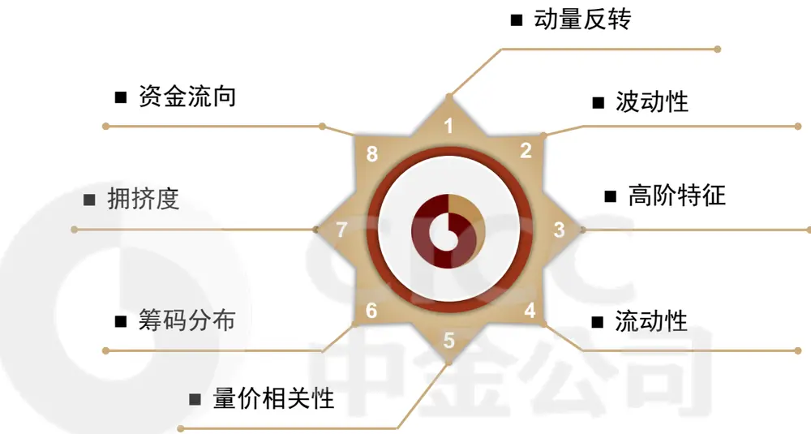
资料来源：中金公司研究部

## 股票日内高频数据结构

本文使用的日内高频数据属于 level2数据，主要包含了快照数据(含 10档盘口数据)、逐笔委托、逐笔成交数据。股票的 数据主要提供买卖 档的盘口数据及最新价等实时交易信息，而 数据则提供了更全面更细致的微观结构数据，它不仅展示了买卖双方在市场上更全面的报价和订单量（10档盘口及区间相关统计量），还包含了市场上每一笔交易指令对应的委托和成交信息，这属于颗粒度最细的数据类型；一般通过逐笔数据还可以重构订单簿从而获得任意时刻的全部买卖盘口信息。

此外我们还可以使用快照数据来合成分钟级别的 K线数据。K线数据、快照数据和逐笔数据在复杂度、数据维度和复杂度上依次上升，处理难度也逐渐增加。由于逐笔委托数据只有深交所有较长历史数据，上交所在 2021 年中才开始发布逐笔委托数据，考虑数据样本的覆盖完整度，本文逐笔数据使用以逐笔成交为主。

图表 3：高频数据主要类型
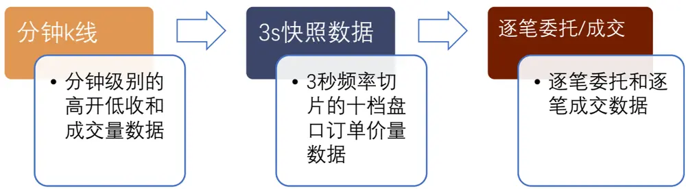
资料来源： ，中金公司研究部

图表 4：分钟 k线数据示例

| 交易日 | 股票代码 | 时刻 | 开价（元） | 高价（元） | 低价（元） | 收价（元） | 交易量（股） | 成交额（元） |
| --- | --- | --- | --- | --- | --- | --- | --- | --- |
| 2023/4/28 | 000568 | 9:30:00 | 226.8 | 228.79 | 226.8 | 228.45 | 294455 | 67077937 |
| 2023/4/28 | 000568 | 9:31:00 | 228.25 | 228.5 | 227.33 | 227.33 | 182300 | 41628335 |
| 2023/4/28 | 000568 | 9:32:00 | 227.54 | 228.4 | 227.33 | 228.3 | 75853 | 17292536 |
| 2023/4/28 | 000568 | 9:33:00 | 228.22 | 228.3 | 226.96 | 227.15 | 93790 | 21343226 |
| 2023/4/28 | 000568 | 9:34:00 | 227.34 | 228.93 | 227.34 | 228.93 | 112000 | 25583979 |

资料来源：Wind，中金公司研究部

图表 5：3s快照数据示例

| 交易日 | 股票代码 | 交易所 | 开价 (元) | 高价 (元) | 低价 (元) | 收价 (元) | 交易量 (股) | 成交额 (元) | 时刻 | 10挡买单价 (元) | 10挡买单量 (股) | 10挡卖单价 (元) | 10挡卖单量 (股) |
| --- | --- | --- | --- | --- | --- | --- | --- | --- | --- | --- | --- | --- | --- |
| 2023/4/28 | 000568 | SZ | 0 | 0 | 0 | 0 | 0 | 0 | 8:21:51 |  |  |  |  |
| 2023/4/28 | 000568 | SZ | 0 | 0 | 0 | 0 | 0 | 0 | 9:15:00 |  |  |  |  |
| 2023/4/28 | 000568 | SZ | 0 | 0 | 0 | 0 | 0 | 0 | 9:15:09 | … | … | … | … … |
| 2023/4/28 | 000568 | SZ | 0 | 0 | 0 | 0 | 0 | 0 | 9:15:27 | … | … | … | … |
| 2023/4/28 | 000568 | SZ | 0 | 0 | 0 | 0 | 0 | 0 | 9:15:45 | … | . | .. | . |

资料来源：Wind，中金公司研究部

图表 6：逐笔成交数据示例

| 交易日 | 成交编号 | 买序号 | 卖序号 | 交易所 | 股票代码 | 时刻 | 毫秒 | 价格 (元) | 成交量 (股) | 业务编号 (上交所专用) |
| --- | --- | --- | --- | --- | --- | --- | --- | --- | --- | --- |
| 2023/4/28 | 76348 | 0 | 76347 | SZ | 000568 | 9:15:00 | 580 | 0 | 100 | 0 |
| 2023/4/28 | 132705 | 104411 | 0 | SZ | 000568 | 9:15:01 | 880 | 0 | 100 | 0 |
| 2023/4/28 | 140138 | 109317 | 0 | SZ | 000568 | 9:15:02 | 170 | 0 | 100 | 0 |
| 2023/4/28 | 154226 | 34651 | 0 | SZ | 000568 | 9:15:03 | 50 | 0 | 100 | 0 |
| 2023/4/28 | 169976 | 168940 | 0 | SZ | 000568 | 9:15:13 | 60 | 0 | 100 | 0 |

资料来源： ，中金公司研究部

图表 7：逐笔委托数据示例

| 交易日 | 委托序号 | 交易所 | 股票代码 | 时刻 | 毫秒 | 价格（元） | 成交量 (股) | 委托号 (上交所专用) | 业务编号 (上交所专用) |
| --- | --- | --- | --- | --- | --- | --- | --- | --- | --- |
| 2023/4/28 | 3332 | SZ | 000568 | 9:15:00 | 40 | 228.54 | 500 | 0 | 0 |
| 2023/4/28 | 3333 | SZ | 000568 | 9:15:00 | 40 | 232.54 | 500 | 0 | 0 |
| 2023/4/28 | 3334 | SZ | 000568 | 9:15:00 | 40 | 234.54 | 500 | 0 | 0 |
| 2023/4/28 | 4140 | SZ | 000568 | 9:15:00 | 50 | 242.45 | 100 | 0 | 0 |
| 2023/4/28 | 4141 | SZ | 000568 | 9:15:00 | 50 | 247.87 | 100 | 0 | 0 |

资料来源：Wind，中金公司研究部

## 因子测试框架及评价标准

本文对高频价量因子进行 IC检验和分组回测检验，展示不同因子的有效性水平。我们将对各类因子在全市场、沪深 300、中证 500和中证 1000进行 IC检验与分组回测检验，分析不同因子收益率预测的稳定性、单调性、有效性和与其他常见因子的相关性。

由于因子值本身频率为日度频率，换仓频率为月度或周度时，需要考虑如何综合使用过去一期的日度数据，我们设置了最后一期、平均值、标准差和标准分等处理方法将日度数据聚合至每一期期末使用。具体测试参数如下：

测试区间： （中证 范围内测试从 开始，逐笔成交和逐笔委托的数据从 2018.01.01 开始，分钟 K线数据从 2013.01.01开始）。

- 股票池：全市场、沪深 300和中证 500中剔除 ST、停牌、一字板和上市未满一年股票。

- 调仓：周度与月度测试，按照下周初或月初调仓，不计算手续费。

- 分组回测组数：按照因子值由小到大的顺序等分为 10 组。

因子处理方法：每一个原始因子分别有四种处理方法。每期取最后一个有效值，后缀为“_o”；每期取当期算术平均，后缀为“_m”；每期取 z-score 标准分：“_z”；每期取当期标准差：“_std”。

使用多种指标展示因子的有效性水平。在 检验中，我们使用 均值、 绝对值等指标展示因子暴露与下期收益率的相关性，反映因子对收益率的预测能力。在分组回测中，使用多头年化收益率、多头年化超额收益率、多头超额最大回撤等指标展示多头组合的选股能力。由于 ICIR为 IC 序列的均值与标准差比值，而相关系数无多期可加性，因此周度和月度 ICIR 表现无需年化处理。

图表 8：有效性检验指标含义

| 因子有效性检验 | 指标计算方法 | 指标含义 |
| --- | --- | --- |
| IC 均值 | IC 序列均值 | 检验因子的预测能力 |
| ICIR | IC 序列均值 / IC 标准差 | 检验因子预测能力的稳定性 |
| 多空年化收益率 | 分组回测中多头组合相较空头的年化收益率 | 检验因子多空预测能力的显著性 |
| 多头年化超额收益率 | 分组回测中多头组合相较基准指数的超额收益 | 检验因子多头组合的超额收益能力 |
| 多头超额最大回撤 | 分组回测中多头组合相较基准指数的最大回撤 | 检验因子多头组合的收益稳定性 |
| 多空换手率 | 分组回测中多空组合的平均换手率 | 检验因子换手率水平 |

资料来源：Wind，中金公司研究部

## 动量反转

## QRS 分钟动量因子表现占优

动量反转因子通常由过去一段时间的特定类型的涨跌幅构造，其因子收益一方面可能来源于非理性投资者的行为偏差造成的错误定价，另一方面也可能来源于承担特定风险获得的风险补偿（参考中金公司研究报告《量化多因子系列（6）：关于动量，你所希望了解的那些事》）。本节，我们将对 个不同构建方式下的动量反转因子进行有效性检验。

动量反转因子可以分为三类：分段动量、量能动量、 动量。各类动量类别中均有表现优秀代表因子。其中分段动量指只取日内某一特定时间段的动量因子，量能动量是指只选取特点成交量下的收益率作为动量因子，QRS因子为《量化择时系列（1）：金融工程视角下的技术择时艺术》中提到使用过去一段时间 K线的最高价和最低价回归出的 beta系数和 R方的乘积，具体原理在此不做赘述。本文中我们将 QRS 应用到日内分钟 K线数据级别，计算滚动 50根分钟 线的 Q S 指标以及它的两个组成部分 方与 系数，并分别测试发现其均有显著选股效果。

图表 9：动量反转类因子构建方式

| 指标名称 | 指标代码 | 构建方法 |
| --- | --- | --- |
| 下午盘动量 | mmt_pm | 仅使用下午动量 |
| 尾盘半小时动量 | mmt_last30 | 仅使用尾盘30分钟动量 |
| 上下午盘动量差 | mmt_paratio | 上下午盘动量差 |
| 上午盘动量 | mmt_am | 仅使用上午动量 |
| 去头尾动量 | mmt_between | 使用剔除前后30分钟交易时间动量 |
| 分钟qrs指标 | mmt_ols_qrs | 50根分钟k线QRS指标 |
| 分钟qrs衍生回归R方 | mmt_ols_corr_sqaure_mean | 50根分钟k线最高与最低价相关系数平方的均值 |
| 分钟qrs衍生相关系数均值 | mmt_ols_corr_mean | 50根分钟k线最高与最低价相关系数平均值 |
| 分钟qrs衍生beta均值 | mmt_ols_beta_mean | 50根分钟k线最高与最低价回归系数均值 |
| 分钟qrs衍生beta标准分 | mmt_ols_beta_zscore_last | 50根分钟k线最高与最低价回归系数标准分 |
| 50顶量成交动量 | mmt_top50VolumeRet | 成交量最高50根k线成交量收益率动量 |
| 50底量成交动量 | mmt_bottom50VolumeRet | 最低成交量的50根k线收益率动量 |
| 20顶量成交动量 | mmt_top20VolumeRet | 成交量最高20根k线成交量收益率动量 |
| 20底量成交动量 | mmt_bottom20VolumeRet | 最低成交量的20根k线收益率动量 |

资料来源：中金公司研究部

mmt_ols_beta_mean_o、mmt_top20VolumeRet_std 和 mmt_last30_std 因子在大多数选股域中有效性良好。月度 ICIR最高的 mmt_ols_beta_mean 因子在全市场周度年化多空收益率55%，多头超额 23%；mmt_top20VolumeRet_std 的月度 IC 均值-9.52%，选股能力显著。

分段动量因子包括 mmt_last30_std、mmt_between_M 和 mmt_pm_std 等因子。mmt_last30_std 因子在全市场范围周度多空收益率 47%，在中证 500 和中证 1000 中也有较强的收益预测能力，且单调性良好。在沪深 300中，表现相对较好的 mmt_last30_z和 mmt_pm_m周度超额年化收益仅约 10%，说明该类因子在大市值股票中效果减弱。

量能动量因子指的是与成交量特征相关的动量因子。mmt_top20VolumeRet_std 全市场因子 IC 均值-9.52%，有效性显著；沪深 300 范围内可关注 mmt_top20VolumeRet_o 因子，即前 20 成交量 k线的收益率因子，周度频率下年化多空收益率可达 27%。

QRS 动量因子为日内相对强弱指标，由日度 QRS 构造方法迁移到分钟线上可得。但该类因子在内部相关性较高。mmt_qrs_o 因子在全市场、中证 500 和中证 1000中收益预测能力和单调性较好，但在沪深 300 中表现相对较弱。而其组成部分 mmt_ols_beta_mean_o因子在所有选股域中均表现优良。全市场中，mmt_qrs_o 因子的 IC均值为-8.07%，ICIR为 1.00，mmt_ols_beta_mean_o 因子的 IC 均值为-7.34%，ICIR 为 1.09，周度多空收益达 54%。

图表 10：动量反转因子在全市场范围内月度回测的有效性检验结果（ICIR>0.5）

|  | IC均值 | ICIR | 多空收益 | 多空夏普 | 多头超额 | 多头超额夏普 | 多头超额 最大回撤 | 多头超额胜率 | 换手率 |
| --- | --- | --- | --- | --- | --- | --- | --- | --- | --- |
| mmt_ols_beta_mean_o | -7.34% | 1.09 | 21.5% | 2.37 | 7.0% | 1.33 | 9.15% | 62.10% | 73.58% |
| mmt_bottom20VolumeRet_m | -3.72% | 1.03 | 13.9% | 2.28 | 2.7% | 0.74 | 8.54% | 56.45% | 81.44% |
| mmt_last30_std | -8.33% | 1.00 | 26.3% | 2.33 | 5.6% | 1.21 | 7.94% | 62.90% | 73.38% |
| mmt_ols_qrs_o | -8.07% | 1.00 | 23.5% | 2.26 | 5.6% | 1.04 | 8.90% | 59.68% | 69.45% |
| mmt_top20VolumeRet_std | -9.52% | 1.00 | 29.1% | 2.23 | 6.3% | 1.29 | 7.01% | 66.13% | 71.56% |
| mmt_ols_corr_mean_o | -7.62% | 0.92 | 20.8% | 1.95 | 6.0% | 1.12 | 10.15% | 62.90% | 68.28% |
| mmt_ols_corr_sqaure_mean_o | -7.68% | 0.92 | 20.9% | 1.96 | 6.2% | 1.16 | 9.86% | 63.71% | 67.99% |
| mmt_bottom50VolumeRet_m | -3.54% | 0.91 | 15.6% | 2.32 | 3.7% | 0.93 | 6.89% | 64.52% | 79.58% |
| mmt_top20VolumeRet_m | -6.22% | 0.90 | 21.1% | 2.27 | 2.4% | 0.70 | 11.83% | 58.06% | 85.62% |
| mmt_between_m | -6.18% | 0.86 | 26.3% | 2.69 | 4.0% | 0.91 | 9.91% | 56.45% | 86.44% |
| mmt_top50VolumeRet_std | -8.74% | 0.86 | 23.5% | 1.73 | 4.3% | 0.82 | 9.81% | 59.68% | 70.75% |
| mmt_pm_std | -8.49% | 0.84 | 24.2% | 1.85 | 3.2% | 0.60 | 10.78% | 55.65% | 70.25% |
| mmt_pm_z | -3.31% | 0.76 | 11.0% | 2.05 | 2.5% | 0.84 | 5.68% | 55.65% | 73.26% |
| mmt_ols_corr_mean_m | -7.90% | 0.76 | 24.1% | 1.79 | 5.8% | 0.90 | 12.23% | 57.26% | 40.44% |
| mmt_ols_corr_sqaure_mean_m | -7.96% | 0.76 | 24.2% | 1.79 | 5.7% | 0.87 | 12.72% | 56.45% | 40.22% |
| mmt_ols_qrs_m | -7.73% | 0.75 | 22.7% | 1.79 | 4.8% | 0.79 | 12.51% | 55.65% | 43.26% |
| mmt_top50VolumeRet_m | -5.31% | 0.74 | 17.4% | 1.80 | 2.0% | 0.52 | 14.61% | 58.06% | 86.07% |
| mmt_last30_z | -2.03% | 0.74 | 6.6% | 1.47 | 0.9% | 0.34 | 7.15% | 55.65% | 70.59% |
| mmt_between_std | -8.06% | 0.74 | 19.7% | 1.45 | 1.3% | 0.25 | 15.17% | 56.45% | 67.22% |
| mmt_ols_beta_mean_m | -7.02% | 0.72 | 19.0% | 1.69 | 2.0% | 0.37 | 16.56% | 52.42% | 50.50% |
| mmt_ols_corr_mean_std | 6.07% | 0.69 | 18.0% | 1.66 | 2.8% | 0.55 | 12.82% | 58.06% | 57.18% |
| mmt_ols_corr_sqaure_mean_std | 5.86% | 0.68 | 17.6% | 1.65 | 2.4% | 0.48 | 13.15% | 58.06% | 62.10% |
| mmt_am_std | -7.36% | 0.65 | 15.6% | 1.16 | 1.0% | 0.19 | 16.38% | 53.08% | 65.84% |
| mmt_pm_m | -4.26% | 0.63 | 19.7% | 2.29 | 1.8% | 0.36 | 22.00% | 54.84% | 83.02% |
| mmt_am_m | -4.64% | 0.60 | 15.9% | 1.46 | 0.2% | 0.06 | 17.70% | 44.62% | 85.43% |
| mmt_bottom50VolumeRet_o | -1.40% | 0.57 | 5.5% | 1.25 | 0.2% | 0.06 | 8.97% | 52.42% | 87.59% |
| mmt_bottom20VolumeRet_o | -1.30% | 0.53 | 4.2% | 1.08 | -2.5% | -0.70 | 24.51% | 39.52% | 87.18% |
| mmt_top20VolumeRet_o | -2.53% | 0.53 | 9.0% | 1.20 | -3.1% | -0.69 | 33.36% | 37.90% | 88.74% |
| mmt_last30_o | -1.97% | 0.53 | 10.1% | 1.49 | -3.1% | -0.66 | 33.05% | 42.74% | 87.73% |

资料来源：Wind，中金公司研究部（注：统计时间为 2013-01-14 至 2023-12-01；超额收益的比较基准为有效股票池等权表现）

图表 11：动量反转因子在全市场范围内周度回测的有效性检验结果（ICIR>0.5）

|  | IC均值 | ICIR | 多空收益 | 多空夏普 | 多头超额 | 多头超额夏普 | 多头超额 最大回撤 | 多头超额胜率 | 换手率 |
| --- | --- | --- | --- | --- | --- | --- | --- | --- | --- |
| mmt_ols_beta_mean_o | -6.33% | 0.89 | 54.5% | 4.70 | 22.6% | 3.34 | 5.52% | 78.46% | 69.32% |
| mmt_top20VolumeRet_std | -6.12% | 0.82 | 42.7% | 3.31 | 10.9% | 2.30 | 5.41% | 68.46% | 81.38% |
| mmt_ols_qrs_o | -6.45% | 0.77 | 46.7% | 3.92 | 14.4% | 2.43 | 5.86% | 73.08% | 64.21% |
| mmt_last30_z | -3.38% | 0.74 | 31.1% | 4.71 | 7.2% | 2.02 | 5.67% | 70.00% | 81.93% |
| mmt_top20VolumeRet_m | -5.64% | 0.73 | 38.7% | 3.23 | 4.9% | 1.02 | 11.82% | 65.38% | 86.39% |
| mmt_last30_std | -5.07% | 0.72 | 46.7% | 3.73 | 9.3% | 1.80 | 11.95% | 73.08% | 82.74% |
| mmt_last30_m | -4.36% | 0.70 | 54.3% | 5.30 | 9.0% | 1.54 | 15.36% | 61.54% | 81.97% |
| mmt_top50VolumeRet_std | -5.21% | 0.66 | 33.5% | 2.60 | 7.9% | 1.60 | 8.77% | 64.62% | 81.70% |
| mmt_ols_beta_mean_m | -5.93% | 0.64 | 38.8% | 3.13 | 6.6% | 1.12 | 20.82% | 59.23% | 52.00% |
| mmt_pm_m | -4.93% | 0.64 | 57.6% | 4.50 | 9.7% | 1.49 | 25.38% | 63.08% | 83.95% |
| mmt_ols_corr_sqaure_mean_o | -5.52% | 0.63 | 24.0% | 2.06 | 8.3% | 1.48 | 9.10% | 64.62% | 62.41% |
| mmt_ols_corr_mean_o | -5.48% | 0.63 | 23.7% | 2.02 | 8.0% | 1.42 | 8.67% | 66.92% | 62.78% |
| mmt_top50VolumeRet_m | -5.06% | 0.62 | 35.8% | 2.83 | 5.6% | 1.09 | 8.37% | 68.46% | 86.11% |
| mmt_between_m | -4.64% | 0.60 | 43.5% | 3.22 | 6.6% | 1.08 | 13.38% | 60.00% | 85.92% |
| mmt_ols_qrs_m | -6.04% | 0.59 | 40.6% | 2.90 | 8.2% | 1.33 | 14.03% | 60.77% | 44.56% |
| mmt_pm_std | -5.16% | 0.57 | 40.9% | 2.95 | 8.3% | 1.42 | 18.08% | 69.23% | 80.69% |
| mmt_ols_corr_sqaure_mean_m | -5.87% | 0.56 | 39.1% | 2.63 | 9.1% | 1.42 | 10.54% | 64.62% | 41.15% |
| mmt_ols_corr_mean_m | -5.79% | 0.55 | 38.1% | 2.57 | 8.7% | 1.35 | 11.07% | 63.08% | 41.56% |
| mmt_pm_z | -3.24% | 0.54 | 33.0% | 4.11 | 7.2% | 1.87 | 8.17% | 66.92% | 82.34% |
| mmt_ols_beta_mean_z | -2.60% | 0.54 | 12.3% | 1.96 | 1.6% | 0.50 | 9.61% | 60.00% | 77.00% |
| mmt_am_std | -4.65% | 0.51 | 24.6% | 1.86 | 5.0% | 0.91 | 18.35% | 59.54% | 79.38% |
| mmt_bottom20VolumeRet_m | -1.73% | 0.50 | 17.1% | 3.02 | 2.9% | 0.82 | 5.54% | 53.08% | 81.40% |
| mmt_top20VolumeRet_z | -3.32% | 0.50 | 23.0% | 2.67 | 5.2% | 1.33 | 7.07% | 62.31% | 82.78% |

资料来源：Wind，中金公司研究部（注：统计时间为 2013-01-14 至 2023-12-01；超额收益的比较基准为有效股票池等权表现）

图表 12：动量反转因子在不同股票池范围和不同调仓频率下 ICIR最高的 5种因子具体表现

| 股票池频率 IC均值 ICIR 多空收益 |  |  |  |  |  | 多空夏普 |  | 多头超额 | 多头超额夏普 |  | 多头超额多头超额胜率 换手率最大回撤 |  |  |  |
| --- | --- | --- | --- | --- | --- | --- | --- | --- | --- | --- | --- | --- | --- | --- |
| mmt_ols_beta_mean_o | full M -7.34% |  |  | 1.09 | 21.5% | 2.37 |  | 7.0% | 1.33 9.15% 62.10% 73.58% |  |  |  |  |  |
| mmt_bottom20VolumeRet_m | full M -3.72% |  |  | 1.03 | 13.9% | 2.28 |  | 2.7% | 0.74 |  | 8.54% 56.45% 81.44% |  |  |  |
| mmt_last30_std | full M -8.33% |  |  | 1.00 | 26.3% | 2.33 |  | 5.6% | 1.21 |  | 7.94% 62.90% 73.38% |  |  |  |
| mmt_ols_qrs_o | full M -8.07% |  |  | 1.00 | 23.5% | 2.26 |  | 5.6% | 1.04 |  | 8.90% 59.68% 69.45% |  |  |  |
| mmt_top20VolumeRet_std | full M -9.52% |  |  | 1.00 | 29.1% | 2.23 |  | 6.3% | 1.29 |  | 7.01% 66.13% 71.56% |  |  |  |
| mmt_ols_beta_mean_o | full W -6.33% |  |  | 0.89 | 54.5% | 4.70 |  | 22.6% | 3.34 |  | 5.52% 78.46% 69.32% |  |  |  |
| mmt_top20VolumeRet_std | full | W -6.12% |  | 0.82 | 42.7% | 3.31 |  | 10.9% | 2.30 |  | 5.41% 68.46% |  |  | 81.38% |
| mmt_ols_qrs_o | full | W -6.45% |  | 0.77 | 46.7% | 3.92 |  | 14.4% | 2.43 |  | 5.86% 73.08% |  |  | 64.21% |
| mmt_last30_z | full | W -3.38% |  | 0.74 | 31.1% | 4.71 |  | 7.2% | 2.02 |  | 5.67% | 70.00% |  | 81.93% |
| mmt_top20VolumeRet_m | full | W -5.64% |  | 0.73 | 38.7% | 3.23 |  | 4.9% | 1.02 |  | 11.82% | 65.38% |  | 86.39% |
| mmt_ols_beta_mean_o | 1000 | M | -6.37% | 1.02 | 16.1% | 1.51 |  | 5.3% | 0.74 |  | 19.70% | 60.55% |  | 71.83% |
| mmt_ols_qrs_o | 1000 | M | -7.40% | 1.01 | 23.1% | 1.99 |  | 6.7% | 0.93 |  | 16.76% | 64.22% |  | 68.58% |
| mmt_ols_corr_mean_o | 1000 | M | -7.25% | 0.95 | 21.0% | 2.05 |  | 5.5% | 0.92 |  | 15.66% | 64.22% |  | 68.22% |
| mmt_ols_corr_sqaure_mean_o | 1000 | M | -7.31% | 0.95 | 22.5% | 2.16 |  | 6.5% | 1.07 |  | 13.43% | 67.89% |  | 67.93% |
| mmt_last30_std | 1000 | M | -6.84% | 0.88 | 22.0% | 1.75 |  | 4.1% | 0.63 |  | 20.92% | 60.55% |  | 71.61% |
| mmt_top20VolumeRet_std | 1000 | W | -5.21% | 0.74 | 24.9% | 2.11 |  | 4.0% | 0.84 |  | 9.64% | 62.73% |  | 79.78% |
| mmt_ols_beta_mean_o | 1000 | W | -5.48% | 0.73 | 34.3% | 2.73 |  | 13.2% | 1.64 |  | 14.55% | 66.36% |  | 66.11% |
| mmt_ols_qrs_o | 1000 | W -5.82% |  | 0.71 | 35.3% | 2.73 |  | 11.2% | 1.50 |  | 10.50% | 64.55% |  | 61.85% |
| mmt_last30_std | 1000 | W | -4.42% | 0.65 | 30.5% | 2.23 |  | 3.8% | 0.53 |  | 16.76% | 60.00% |  | 81.07% |
| mmt_ols_corr_sqaure_mean_o | 1000 | W | -5.10% | 0.60 | 27.6% | 2.17 |  | 9.4% | 1.36 |  | 8.36% | 63.64% |  | 60.55% |
| mmt_ols_beta_mean_ommt_ols_qrs_o | 500 | M | -5.46% | 0.80 | 12.2% | 1.16 |  | 3.4% | 0.53 |  | 13.95% | 59.68% |  | 72.36% |
|  | 500 | M | -5.98% | 0.74 | 15.4% | 1.40 |  | 4.1% | 0.63 |  | 12.95% | 58.87% |  | 68.85% |
| mmt_last30_std | 500 | M | -5.56% | 0.68 | 13.9% | 1.17 |  | 1.8% | 0.27 |  | 22.83% | 56.45% |  | 73.18% |
| mmt_top20VolumeRet_stdmmt_ols_corr_sqaure_mean_o | 500 | M | -6.39% | 0.67 | 13.1% | 1.10 |  | 2.1% |  | 0.40 | 16.27% | 53.23% | 69.11% |  |
|  | 500 | M | -5.41% | 0.65 | 14.7% |  | 1.41 | 4.3% |  | 0.71 | 16.00% | 55.65% |  | 68.39% |
| mmt_ols_beta_mean_o | 500 | W | -4.58% | 0.59 | 23.0% |  | 1.97 | 8.3% |  | 1.21 | 16.72% | 65.38% |  | 68.03% |
| mmt_ols_qrs_o | 500 | W | -4.76% | 0.55 | 25.0% | 2.02 |  | 6.6% |  | 1.00 | 16.45% | 63.08% |  | 64.12% |
| mmt_top20VolumeRet_stdmmt_last30_mmmt_top20VolumeRet_m | 500 | W | -4.14% | 0.55 | 12.3% | 1.12 |  | 0.4% | 0.10 |  | 27.61% | 53.85% | 80.19% |  |
|  | 500 | W | -3.86% | 0.54 | 38.0% | 2.92 |  | 8.0% |  | 1.14 | 12.51% | 68.46% |  | 80.30% |
|  | 500 | W | -4.33% | 0.51 | 24.0% | 1.77 |  | 5.2% |  | 0.81 | 13.85% | 57.69% |  | 83.85% |
| mmt_last30_stdmmt_top20VolumeRet_mmmt_top20VolumeRet_stdmmt_ols_beta_mean_ommt_ols_qrs_o | 300 | M | -5.15% | 0.57 | 12.4% |  | 1.09 | 2.2% |  | 0.37 | 21.72% | 56.45% | 72.92% |  |
|  | 300 | M | -3.84% | 0.55 | 7.7% |  | 0.77 | 2.0% |  | 0.38 | 13.41% | 58.87% | 84.61% |  |
|  | 300 | M | -4.89% | 0.53 | 9.8% |  | 0.83 | 0.1% |  | 0.05 | 34.97% | 49.19% | 68.90% |  |
|  | 300 | M | -3.78% | 0.52 | 6.8% | 0.67 |  | 1.7% | 0.29 |  | 14.95% | 50.00% | 76.66% |  |
|  | 300 | M | -4.24% | 0.49 | 6.6% | 0.64 |  | 2.6% | 0.42 19.87% |  |  | 47.58% | 73.82% |  |
| mmt_last30_zmmt_last30_o | 300 | W | -3.15% | 0.45 | 24.8% | 2.38 |  | 10.8% | 1.76 8.22% |  |  | 73.85% | 80.85% |  |
|  | 300 | W -3.35% |  | 0.43 | 26.6% | 1.95 |  | 5.6% | 0.76 25.92% |  |  | 63.08% | 85.05% |  |
| mmt_last30_m | 300 | W -3.52% |  | 0.43 | 27.7% | 2.13 |  | 9.6% | 1.29 8.91% |  |  | 65.38% | 80.83% |  |
| mmt_top20VolumeRet_mmmt_pm_o | 300 | W -3.42% |  | 0.40 | 11.5% | 1.00 |  | 2.8% | 0.46 24.50% |  |  | 56.92% 83.07% |  |  |
|  | 300 | W -3.45% |  | 0.40 | 24.0% | 1.73 |  | 8.7% | 1.11 10.55% 63.08% 85.13% |  |  |  |  |  |

资料来源：Wind，中金公司研究部（注：统计时间为 2013-01-14 至 2023-12-01；超额收益的比较基准为有效股票池等权表现）

图表 13：全市场范围内表现相对较好（ICIR>0.5,且排名前 20）的动量反转因子之间的相关性统计
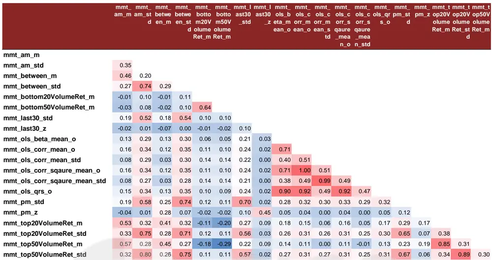
资料来源：Wind，中金公司研究部（注：统计时间为 2013-01-14 至 2023-12-01）

全市场范围内，mmt_ols_beta_mean_o、mmt_pm_m 等因子多空和多头超额表现较好，因子多头组合显著跑赢基准，空头组合显著跑输基准，且单调性较为良好。mmt_pm_m 因子周度多空年化收益率 58%，mmt_ols_beta_mean_o 的年化多头超额达 23%。

图表 14：全市场范围内表现较好的动量反转因子年化多空收益统计
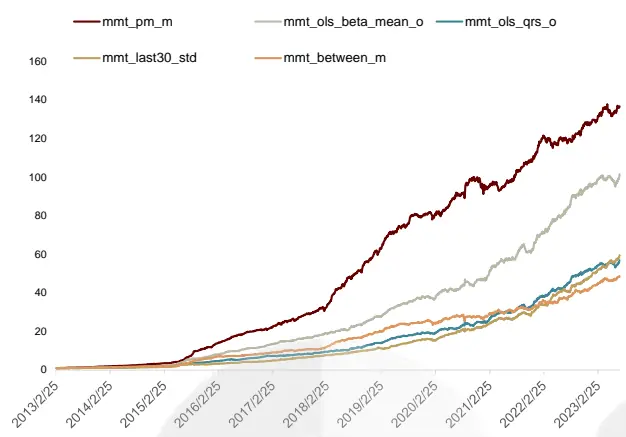

图表 15：全市场范围内表现较好的动量反转因子年化超额收益统计
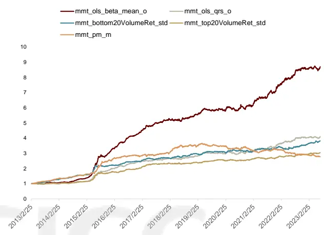

图表 16：全市场范围内表现较好的动量反转因子分组年化超额收益统计
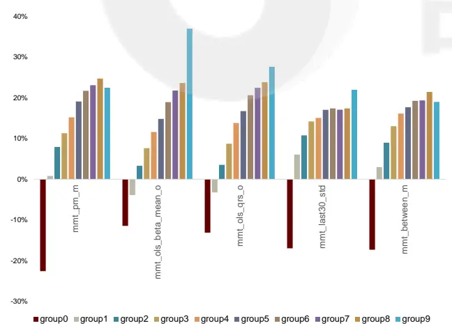
注：1）统计时间为 2013-01-14 至 2023-12-01；2）相对净值的比较基准为全市场等权
资料来源：Wind，中金公司研究部

图表 17：mmt_ols_beta_mean_o 与常见因子相关系数
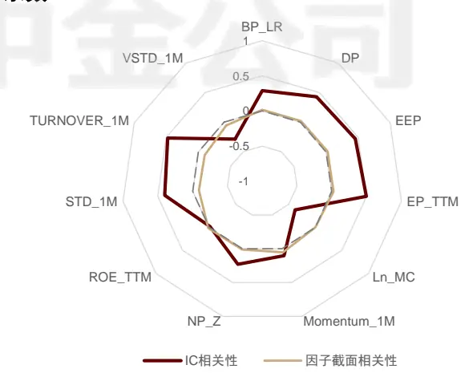
注： ）统计时间为 至 ； ）超额收益的比较基准为全市场等权；3）Group0 为因子值最小一组，Group9 为因子值最大一组资料来源：Wind，中金公司研究部

## 波动率

## 部分波动率因子表现优秀但回撤明显

波动率因子刻画了股票价格或股票收益在过去一段时间的不确定性程度，高波动率通常反映其不确定性程度较高，未来收益表现可能相对较弱。本节将传统的收益波动、振幅因子应用到日内分钟数据中，尝试构建了 7 个高频波动率因子，并对其进行了有效性检验。

图表 18：波动率因子构建方式

| 指标名称 | 指标代码 | 构建方法 |
| --- | --- | --- |
| 分钟成交量的标准差 | vol_volume1min | 日内分钟k线成交量的标准差 |
| 分钟极比的标准差 | vol_range1min | 分钟k线的最大值最小值比值的标准差 |
| 分钟收益率的标准差 | vol_return1min | 日内分钟收益率的标准差 |
| 上行波动率 | vol_upVol | 使用日内分钟级别数据，计算分钟级上行波动率 |
| 上行波动率占比 | vol_upRatio | 使用日内分钟级别数据，计算分钟级上行波动占总波动的比例 |
| 下行波动率 | vol_downVol | 使用日内分钟k线收盘数据，计算分钟级下行波动率 |
| 下行波动率占比 | vol_downRatio | 使用日内分钟级别数据，计算分钟级下行波动占总波动的比例 |

资料来源：中金公司研究部

vol_upVol_std 因子在大部分市场中有效性良好。收益波动率因子包括传统的分钟波动率因子、上行波动率因子、下行波动率因子。对比收益波动率因子表现，不难看出，上行波动率因子有效性优于分钟 k线波动率因子、下行波动率因子，全市场 ICIR 绝对值可达 1.35，IC均值可达-8.4%。

图表 19：波动性因子在全市场范围内月度回测的有效性检验结果（ICIR>0.5）

|  | IC均值 | ICIR | 多空收益 | 多空夏普 | 多头超额 | 多头超额夏普 | 多头超额最 大回撤 | 多头超额胜率 | 换手率 |
| --- | --- | --- | --- | --- | --- | --- | --- | --- | --- |
| vol_upVol_std | -8.44% | 1.35 | 26.0% | 3.03 | 8.3% | 2.05 | 4.91% | 72.58% | 72.04% |
| vol_return1min_std | -9.10% | 1.12 | 27.1% | 2.58 | 7.0% | 1.47 | 8.46% | 65.32% | 69.36% |
| vol_downVol_std | -6.57% | 0.99 | 21.3% | 2.44 | 5.9% | 1.62 | 6.06% | 66.94% | 74.35% |
| vol_rangelmin_std | -7.38% | 0.98 | 20.5% | 2.36 | 5.6% | 1.26 | 8.92% | 61.83% | 69.22% |
| vol_upVol_o | -7.85% | 0.92 | 28.3% | 2.18 | 4.8% | 0.84 | 14.51% | 50.81% | 69.00% |
| vol_return1min_o | -7.13% | 0.85 | 22.7% | 1.76 | 0.5% | 0.12 | 16.90% | 45.97% | 69.07% |
| vol_upVol_m | -8.37% | 0.79 | 23.4% | 1.72 | 4.5% | 0.77 | 11.13% | 53.23% | 50.25% |
| vol_return1min_m | -6.67% | 0.72 | 15.4% | 1.24 | 0.8% | 0.18 | 15.46% | 52.42% | 50.24% |
| vol_downVol_o | -6.49% | 0.69 | 21.2% | 1.65 | 3.0% | 0.52 | 15.74% | 50.81% | 67.42% |
| vol_rangelmin_o | -5.55% | 0.69 | 17.3% | 1.52 | 0.1% | 0.05 | 17.16% | 45.04% | 71.35% |
| vol_volumelmin_z | -3.79% | 0.66 | 10.0% | 1.68 | 1.7% | 0.55 | 8.37% | 57.26% | 61.45% |
| vol_downRatio_z | 2.70% | 0.59 | 6.7% | 1.32 | 0.5% | 0.19 | 8.76% | 54.84% | 58.56% |
| vol_rangelmin_m | -5.48% | 0.59 | 9.8% | 0.87 | -1.0% | -0.20 | 18.99% | 45.04% | 51.90% |
| vol_downVol_m | -6.52% | 0.59 | 16.1% | 1.20 | 2.7% | 0.46 | 12.85% | 49.19% | 45.86% |
| vol_volumelmin_std | -5.53% | 0.58 | 12.8% | 1.04 | -1.8% | -0.19 | 37.01% | 42.74% | 39.83% |
| vol_upVol_z | -3.05% | 0.56 | 6.7% | 1.04 | -0.2% | -0.04 | 11.20% | 50.81% | 62.87% |
| vol_volumelmin_o | -5.33% | 0.54 | 18.1% | 1.39 | -1.5% | -0.16 | 37.79% | 40.32% | 37.70% |
| vol_upRatio_z | 2.45% | 0.53 | 7.1% | 1.38 | 0.6% | 0.21 | 7.19% | 50.00% | 58.93% |

资料来源： ，中金公司研究部（注：统计时间为 至 ；超额收益的比较基准为有效股票池等权表现）

图表 20：波动性因子在全市场范围内周度回测的有效性检验结果（ICIR>0.5）

|  | IC均值 | ICIR | 多空收益 | 多空夏普 | 多头超额 | 多头超额夏普 | 多头超额 最大回撤 | 多头超额胜率 | 换手率 |
| --- | --- | --- | --- | --- | --- | --- | --- | --- | --- |
| vol_upVol_std | -6.08% | 0.92 | 34.4% | 3.23 | 6.1% | 1.49 | 8.60% | 72.31% | 81.77% |
| vol_return1min_std | -6.08% | 0.78 | 38.4% | 3.22 | 4.8% | 1.05 | 11.85% | 65.38% | 78.24% |
| vol_rangelmin_std | -5.35% | 0.76 | 30.9% | 2.98 | 4.2% | 0.98 | 8.79% | 64.39% | 77.84% |
| vol_return1min_o | -6.25% | 0.72 | 41.4% | 2.53 | 0.8% | 0.15 | 16.67% | 50.77% | 59.89% |
| vol_upVol_o | -6.47% | 0.69 | 39.5% | 2.55 | 4.4% | 0.66 | 15.18% | 48.46% | 63.28% |
| vol_volumelmin_std | -6.40% | 0.67 | 38.3% | 3.07 | 12.2% | 1.94 | 18.11% | 69.23% | 61.88% |
| vol_rangelmin_o | -5.22% | 0.63 | 27.6% | 1.93 | -1.3% | -0.17 | 20.41% | 46.97% | 61.25% |
| vol_upVol_m | -6.63% | 0.62 | 37.0% | 2.23 | 2.3% | 0.34 | 21.87% | 47.69% | 47.53% |
| vol_return1min_m | -5.77% | 0.60 | 30.1% | 1.85 | -0.6% | -0.06 | 23.40% | 46.92% | 43.45% |
| vol_volumelmin_o | -6.20% | 0.60 | 44.0% | 3.09 | 12.1% | 1.75 | 15.42% | 63.08% | 49.01% |
| vol_volumelmin_z | -3.61% | 0.56 | 21.4% | 2.51 | 2.1% | 0.53 | 9.27% | 54.62% | 68.27% |
| vol_upVol_z | -3.43% | 0.56 | 18.5% | 2.23 | 1.0% | 0.27 | 7.57% | 56.15% | 72.20% |
| vol_downVol_std | -3.73% | 0.55 | 23.1% | 2.20 | 2.1% | 0.52 | 11.43% | 56.15% | 82.36% |
| vol_downRatio_z | 2.81% | 0.53 | 17.7% | 2.42 | 2.4% | 0.64 | 12.23% | 60.77% | 70.94% |
| vol_downVol_o | -5.28% | 0.53 | 33.1% | 2.10 | 3.3% | 0.50 | 18.89% | 48.46% | 62.44% |
| vol_range1min_m | -4.99% | 0.52 | 21.8% | 1.47 | -3.4% | -0.47 | 34.93% | 44.70% | 45.59% |
| vol_volume1min_m | -5.43% | 0.52 | 35.5% | 2.59 | 10.3% | 1.50 | 17.11% | 62.31% | 41.11% |

资料来源： ，中金公司研究部（注：统计时间为 至 ；超额收益的比较基准为有效股票池等权表现）

图表 21：波动性因子在不同股票池范围和不同调仓频率下 ICIR 最高的 5种因子具体表现
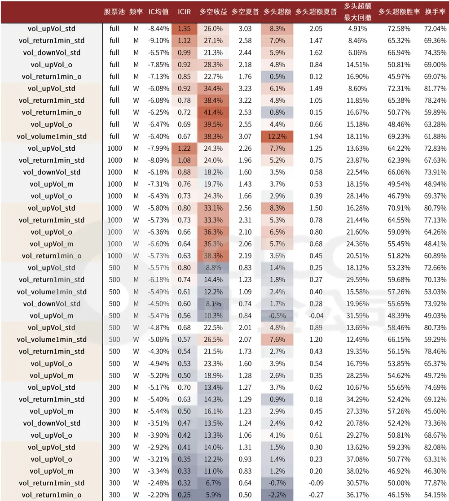
资料来源： ，中金公司研究部（注：统计时间为 至 ；超额收益的比较基准为有效股票池等权表现）

图表 22：全市场范围内表现相对较好（ C 0 ）的波动性因子之间的相关性统计
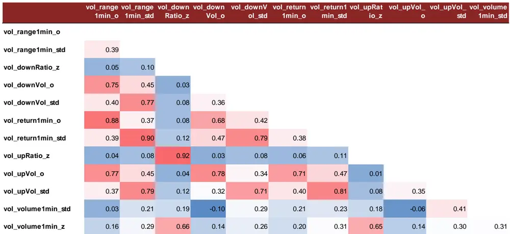
资料来源：Wind，中金公司研究部（注：统计时间为 2013-01-14 至 2023-12-01）

## 波动率优选因子周度换仓表现

全市场范围内， vol_volume1min_o 等因子多空和多头超额表现较好，且单调性较为良好，但从多空收益曲线来看稳定性不足。vol_return1min_o 因子周度多空年化收益率 41%，年化多头超额一般。周度换仓年化超额收益最高的因子为 vol_downRatio_o，多头超额 14%，稳定性也欠佳，多头稳定性较好的因子为 vol_range1min_std。

图表 23：全市场范围内表现较好的波动性因子年化多空收益统计
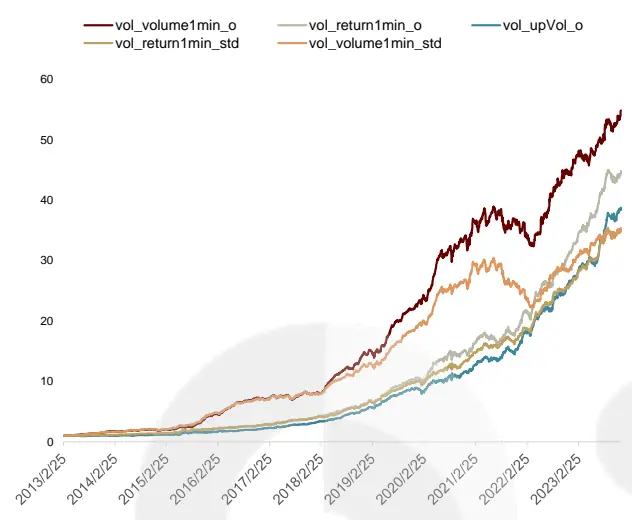

图表 24：全市场范围内表现较好的波动性因子年化超额收益统计
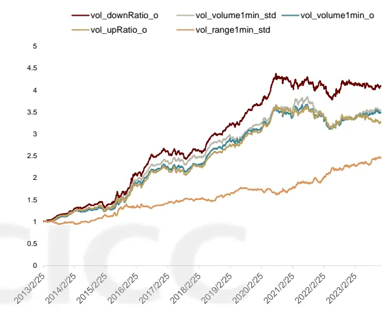
图表 26：vol_downRatio_o 与常见因子相关系数

图表 25：全市场范围内表现较好的波动性因子分组年化超额收益统计
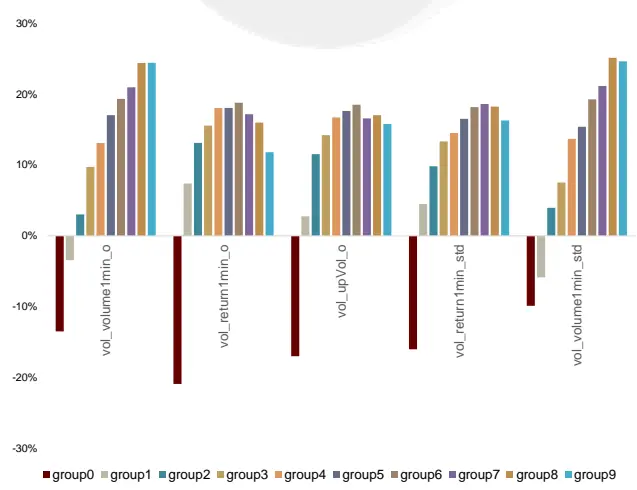
注：1）统计时间为 2013-01-14 至 2023-12-01；2）相对净值的比较基准为全市场等权
资料来源：Wind，中金公司研究部

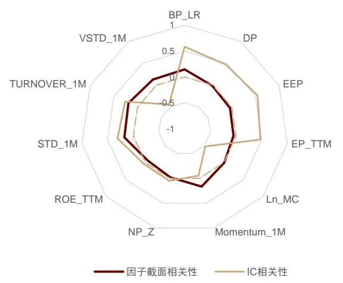
注： ）统计时间为 至 ； ）超额收益的比较基准为全市场等权；3）Group0 为因子值最小一组，Group9 为因子值最大一组资料来源： ，中金公司研究部

## 高阶特征

## 收益率偏度因子及变体各项表现稳定

高阶特征利用股票高阶矩与其未来收益建立联系，刻画日内价格分布以及快速变化的特征，能够有效反映价格的除动量和波动率这样一阶和二阶特征外更高阶的特征。本节，我们对 个不同构建方式下的高阶特征因子在多个选股域和调仓频率下进行了有效性检验，包含分钟收益率的高阶特征和分钟成交量占比的高阶特征。

图表 27：高阶特征因子构建方式

| 指标名称 | 指标代码 | 构建方法 |
| --- | --- | --- |
| 分钟收益率偏度 | shape_skew | 分钟k线收益率的偏度和峰度比值 |
| 分钟收益率峰度 | shape_kurt | 分钟k线收益率的峰度 |
| 分钟收益率峰度偏度比 | shape_skratio | 分钟k线收益率的偏度 |
| 分钟量比偏度 | shape_skewVol | 分钟k线成交量占比的偏度 |
| 分钟量比峰度 | shape_kurtVol | 分钟k线成交量占比的峰度 |
| 分钟量比峰度偏度比 | shape_skratioVo | 分钟k线成交量占比的偏度和峰度比值 |

资料来源：中金公司研究部

shape_skew_m 和 shape_skratio_m 因子在大多数选股中的表现较好。我们将高阶特征因子在全市场、沪深 300、中证 500和中证 1000分别进行月度和周度调仓的有效性检验。根据因子间的相关性统计，上述三个因子间均存在较强的相关性。

全市场范围内，shape_skew_m、shape_skew_std 和 shape_skratio_m 因子具有良好有效性，月度调仓频率下，它们的 ICIR表现均超过 1.0，且 shape_skew_m 因子的年化多空收益达到了 22.6%。在沪深 300中，因子表现有所下降，其中相对表现较好的是 shape_skew_std和 shape_kurt_std 因子，它们的 ICIR 均超过了 0.6，shape_skew_std 因子的多空收益达到了14.9%，夏普比率为 1.6。

综上所述，高阶特征因子整体有效性良好，其中 shape_skew_m 和 shape_skratio_m 因子在多个选股范围内均具有不错的预测性和稳定性，可以关注。

图表 28：高阶特征因子在全市场范围内月度回测的有效性检验结果（ICIR>0.5）

|  | IC均值 | ICIR | 多空收益 | 多空夏普 | 多头超额 | 多头超额夏普 | 多头超额 最大回撤 | 多头超额胜率 | 换手率 |
| --- | --- | --- | --- | --- | --- | --- | --- | --- | --- |
| shape_skew_m | -6.95% | 1.28 | 22.6% | 3.42 | 6.6% | 2.00 | 4.15% | 74.19% | 81.72% |
| shape_skew_std | -5.43% | 1.09 | 19.0% | 2.72 | 8.1% | 1.78 | 7.15% | 65.32% | 65.60% |
| shape_skratio_m | -6.07% | 1.03 | 17.8% | 2.41 | 3.9% | 1.12 | 5.49% | 63.71% | 80.50% |
| shape_skew_o | -3.26% | 1.02 | 7.9% | 1.48 | 0.2% | 0.08 | 11.52% | 47.58% | 88.91% |
| shape_kurt_std | -4.25% | 0.98 | 15.7% | 2.58 | 7.2% | 1.71 | 6.05% | 70.00% | 70.28% |
| shape_skratio_o | -3.04% | 0.88 | 8.4% | 1.75 | 1.1% | 0.42 | 5.76% | 54.03% | 89.57% |
| shape_skew_z | -2.66% | 0.79 | 7.5% | 1.58 | 1.6% | 0.62 | 5.20% | 54.84% | 71.77% |
| shape_kurt_z | -2.46% | 0.72 | 5.9% | 1.30 | 1.7% | 0.62 | 5.43% | 54.84% | 68.60% |
| shape_kurt_m | -4.61% | 0.67 | 17.2% | 2.14 | 7.1% | 1.27 | 9.79% | 58.46% | 51.96% |
| shape_skratioVol_std | -2.03% | 0.66 | 6.3% | 1.45 | 1.4% | 0.60 | 7.63% | 57.25% | 86.92% |
| shape_skewVol_std | -2.79% | 0.63 | 10.7% | 1.80 | 2.0% | 0.63 | 4.88% | 54.20% | 84.26% |
| shape_skratio_z | -2.09% | 0.62 | 4.5% | 0.99 | 1.3% | 0.51 | 7.52% | 50.81% | 72.36% |
| shape_skratio_std | -2.91% | 0.60 | 5.5% | 0.85 | 1.7% | 0.46 | 7.84% | 56.45% | 69.22% |
| shape_kurt_o | -2.90% | 0.55 | 9.7% | 1.38 | 3.5% | 0.75 | 11.07% | 56.15% | 69.13% |
| shape_kurtVol_std | -2.38% | 0.53 | 8.5% | 1.41 | 1.3% | 0.39 | 7.99% | 54.20% | 83.59% |
| shape_kurtVol_z | -1.60% | 0.51 | 8.6% | 1.75 | 2.2% | 0.78 | 5.54% | 60.80% | 73.77% |

资料来源：Wind，中金公司研究部（注：统计时间为 2013-01-14 至 2023-12-01；超额收益的比较基准为有效股票池等权表现）

图表 29：高阶特征因子在全市场范围内周度回测的有效性检验结果（ICIR>0.5）

|  | IC均值 | ICIR | 多空收益 | 多空夏普 | 多头超额 | 多头超额夏普 | 多头超额 最大回撤 | 多头超额胜率 | 换手率 |
| --- | --- | --- | --- | --- | --- | --- | --- | --- | --- |
| shape_skew_m | -4.86% | 1.00 | 29.2% | 3.84 | 5.1% | 1.42 | 8.22% | 70.77% | 84.96% |
| shape_skratio_m | -4.23% | 0.86 | 25.2% | 3.28 | 6.5% | 1.95 | 6.02% | 68.46% | 84.98% |
| shape_skew_std | -3.95% | 0.77 | 23.8% | 3.28 | 6.0% | 1.60 | 4.81% | 66.92% | 71.99% |
| shape_kurt_z | -2.46% | 0.68 | 15.9% | 2.94 | 3.9% | 1.34 | 6.71% | 61.54% | 78.85% |
| shape_kurt_std | -3.41% | 0.66 | 19.9% | 2.79 | 5.5% | 1.43 | 7.58% | 63.36% | 73.79% |
| shape_skew_z | -2.58% | 0.64 | 15.9% | 2.72 | 3.1% | 1.06 | 6.55% | 63.08% | 82.33% |
| shape_skew_o | -2.58% | 0.58 | 3.3% | 0.52 | -2.0% | -0.54 | 26.13% | 47.69% | 88.88% |
| shape_kurt_m | -3.73% | 0.54 | 24.3% | 2.71 | 5.7% | 1.03 | 12.22% | 62.60% | 54.00% |
| shape_skratio_o | -2.48% | 0.54 | 10.5% | 1.60 | 1.2% | 0.38 | 6.88% | 56.15% | 89.54% |
| shape_skratio_z | -2.17% | 0.51 | 10.5% | 1.81 | 3.0% | 1.03 | 5.05% | 62.31% | 82.94% |

资料来源：Wind，中金公司研究部（注：统计时间为 2013-01-14 至 2023-12-01；超额收益的比较基准为有效股票池等权表现）

图表 30：高阶特征因子在不同股票池范围和不同调仓频率下 ICIR最高的 5种因子具体表现

| 股票池频率IC均值 ICIR |  |  |  |  |  | 多头超额多空收益多空夏普多头超额多头超额夏普 多头超额胜率 换手率最大回撤 |  |  |  |  |  |  |
| --- | --- | --- | --- | --- | --- | --- | --- | --- | --- | --- | --- | --- |
| shape_skew_m |  | full M-6.95% |  |  | 1.28 | 22.6% | 3.42 | 6.6% | 2.00 4.15% 74.19% 81.72% |  |  |  |
| shape_skew_std |  | full M-5.43% |  |  | 1.09 | 19.0% | 2.72 | 8.1% | 1.78 7.15% 65.32% |  |  | 65.60% |
| shape_skratio_m |  | full M-6.07% |  |  | 1.03 | 17.8% | 2.41 | 3.9% | 1.12 5.49% 63.71% |  |  | 80.50% |
| shape_skew_o |  | full M-3.26% |  |  | 1.02 | 7.9% | 1.48 | 0.2% | 0.08 11.52% 47.58% |  |  | 88.91% |
| shape_kurt_std |  | full M-4.25% |  |  | 0.98 | 15.7% | 2.58 | 7.2% | 1.71 6.05% 70.00% |  |  | 70.28% |
| shape_skew_m |  | full W |  | -4.86% | 1.00 | 29.2% | 3.84 | 5.1% | 1.42 8.22% 70.77% |  |  | 84.96% |
| shape_skratio_m |  | full | W | -4.23% | 0.86 | 25.2% | 3.28 | 6.5% | 1.95 | 6.02% 68.46% |  | 84.98% |
| shape_skew_std |  | full | W | -3.95% | 0.77 | 23.8% | 3.28 | 6.0% | 1.60 | 4.81% 66.92% |  | 71.99% |
| shape_kurt_z |  | full | W | -2.46% | 0.68 | 15.9% | 2.94 | 3.9% | 1.34 | 6.71% 61.54% |  | 78.85% |
| shape_kurt_std |  | full | W | -3.41% | 0.66 | 19.9% | 2.79 | 5.5% | 1.43 | 7.58% 63.36% |  | 73.79% |
| shape_skew_m |  | 1000 | M | -6.16% | 1.05 | 23.1% | 2.57 | 6.4% | 1.33 | 7.47% | 64.22% | 80.12% |
| shape_skew_std |  | 1000 | M | -5.13% | 0.95 | 15.5% | 1.87 | 6.2% | 1.18 | 10.59% | 63.30% | 65.14% |
| shape_kurt_std |  | 1000 | M | -4.46% | 0.93 | 14.5% | 1.84 | 6.1% | 1.23 | 7.42% | 64.22% | 70.13% |
| shape_kurt_m |  | 1000 | M | -5.31% | 0.84 | 17.4% | 1.84 | 5.9% | 0.97 | 12.23% 55.96% |  | 52.64% |
| shape_skratio_m |  | 1000 | M | -4.88% | 0.76 | 14.2% | 1.50 | 4.2% | 0.85 | 11.89% 62.39% |  | 78.34% |
| shape_skew_m |  | 1000 | W-4 | .37% | 0.76 | 23.9% | 2.42 | 4.1% | 0.77 | 7.05% | 59.09% | 81.58% |
| shape_skew_std |  | 1000 | W- | 3.77% | 0.66 | 21.2% | 2.13 | 5.4% | 1.14 | 8.15% | 66.36% | 71.51% |
| shape_skratio_m |  | 1000 | W | -3.72% | 0.63 | 23.9% | 2.23 | 8.0% | 1.44 | 8.63% | 67.27% | 82.18% |
|  | shape_kurt_std | 1000 | W | -3.59% | 0.59 | 17.8% | 1.81 | 6.4% | 1.24 | 12.18% | 66.36% | 73.36% |
|  | shape_kurt_m | 1000 | W | -4.28% | 0.59 | 26.6% | 2.15 | 6.9% | 1.11 | 10.01% | 65.45% | 54.97% |
|  | shape_skew_m | 500 | M | -4.14% | 0.69 | 7.5% | 0.87 | 0.7% | 0.16 | 18.29% | 52.42% | 81.36% |
|  | shape_skratio_m | 500 | M | -3.56% | 0.62 | 7.8% | 0.86 | 2.4% | 0.48 | 12.09% | 55.65% | 78.20% |
|  | shape_skew_std | 500 | M | -3.76% | 0.60 | 7.0% | 0.81 | 1.7% | 0.33 | 12.07% | 49.19% | 65.04% |
|  | shape_kurt_std | 500 | M | -2.61% | 0.45 | 5.0% | 0.63 | 0.6% | 0.15 | 11.70% | 51.54% | 71.09% |
|  | shape_skratio_std | 500 | M | -2.68% | 0.42 | 6.7% | 0.78 | 1.7% | 0.34 | 11.57% | 54.03% | 65.05% |
|  | shape_skew_m | 500 | W | -3.63% | 0.61 | 17.3% | 1.78 | 1.1% | 0.22 | 20.30% | 53.85% | 82.45% |
|  | shape_skratio_m | 500 | W | -3.27% | 0.52 | 14.7% | 1.51 | 3.8% | 0.73 | 14.65% | 56.92% | 83.02% |
|  | shape_skew_std | 500 | W | -3.21% | 0.52 | 11.6% | 1.25 | 2.2% | 0.44 | 16.69% | 59.23% | 71.08% |
|  | shape_kurt_std | 500 | W | -2.84% | 0.48 | 15.9% | 1.64 | 3.8% | 0.70 | 7.60% | 61.83% | 73.91% |
|  | shape_kurt_m | 500 | W | -3.20% | 0.43 | 17.0% | 1.60 | 3.9% | 0.66 | 17.20% | 57.25% | 55.79% |
|  | shape_skew_std | 300 | M | -4.03% | 0.63 | 16.1% | 1.71 | 6.1% | 1.07 | 7.32% | 62.10% | 63.71% |
|  | shape_kurt_std | 300 | M | -3.42% | 0.60 | 6.5% | 0.74 | 4.6% | 0.81 | 7.94% | 58.46% | 70.61% |
|  | shape_kurt_m | 300 | M | -4.11% | 0.54 | 12.8% | 1.28 | 3.7% | 0.63 | 14.26% | 55.38% | 50.16% |
|  | shape_skew_m | 300 | M | -3.61% | 0.52 | 6.5% | 0.72 | 0.1% | 0.05 | 15.15% | 53.23% | 78.57% |
| shape_skratio_m |  | 300 | M | -3.14% | 0.47 | 8.2% | 0.90 | 0.1% | 0.05 | 14.72% | 50.81% | 78.49% |
| shape_skew_mshape_skratio_m |  | 300 W |  | -2.64% | 0.38 | 8.2% | 0.89 | 1.6% | 0.31 | 14.87% | 56.15% | 82.23% |
|  |  | 300 W |  | -2.30% | 0.34 | 8.9% | 0.96 | 2.8% | 0.52 | 18.79% | 55.38% | 82.50% |
| shape_kurt_mshape_kurt_stdshape_skew_std |  | 300 W |  | -2.40% | 0.32 | 12.6% | 1.19 | 4.1% | 0.66 | 15.13% 58.78% |  | 54.77% |
|  |  | 300 W |  | -1.88% | 0.29 | 10.3% | 1.06 | 2.5% | 0.45 | 14.89% 47.33% |  | 75.10% |
|  |  | 300 W |  | -1.96% | 0.28 | 10.3% | 1.09 | 3.8% | 0.70 12.68% 53.85% |  |  | 71.77% |

资料来源： ，中金公司研究部（注：统计时间为 至 ；超额收益的比较基准为有效股票池等权表现）

图表 31：全市场范围内表现相对较好（ C 0 ）的高阶特征因子之间的相关性统计
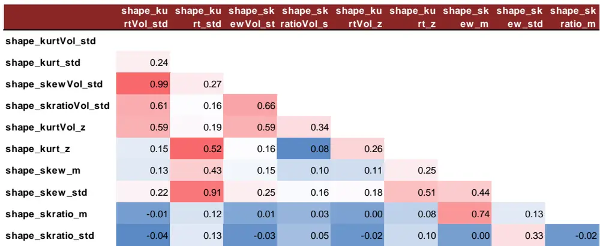
资料来源：Wind，中金公司研究部（注：统计时间为 2013-01-14 至 2023-12-01）

全市场范围内，shape_skew_m因子的多空收益跑赢基线且远超其他同类因子，具有良好的单调性，与常见因子不存在显著相关性；而 shape_skratio_m 因子的多头超额收益表现型良好，在 2020年收益水平有所放缓。所选择的 5 个表现较好的高频特征因子整体有效性较好，分组年化超额收益区分度较为明显。

图表 32：全市场范围内表现较好的高阶特征因子年化多空收益统计
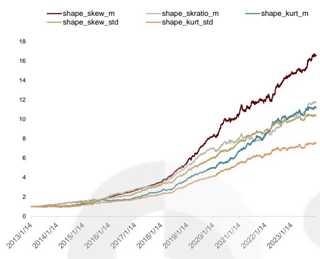
图表 34：shape_skratio_m 与常见因子相关系数

图表 33：全市场范围内表现较好的高阶特征因子年化超额收益统计
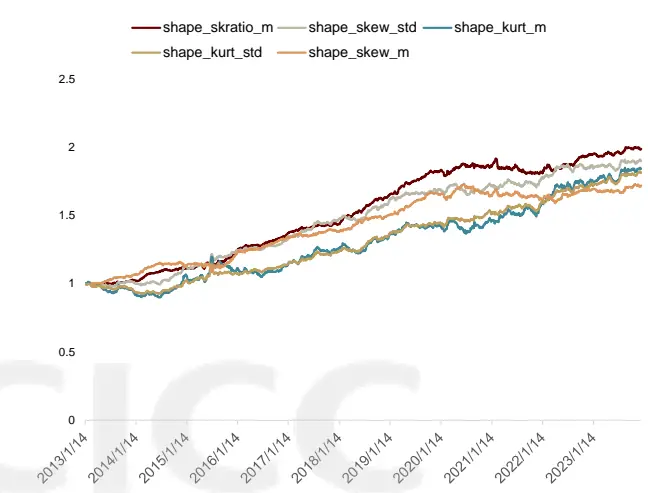

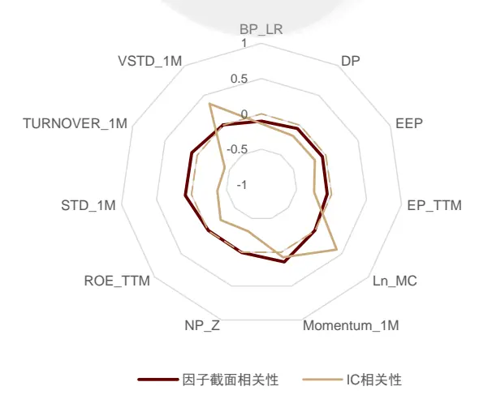
注：1）统计时间为 2013-01-14 至 2023-12-01；2）相对净值的比较基准为全市场等权
资料来源：Wind，中金公司研究部

图表 35：全市场范围内表现较好的高阶特征因子分组年化超额收益统计
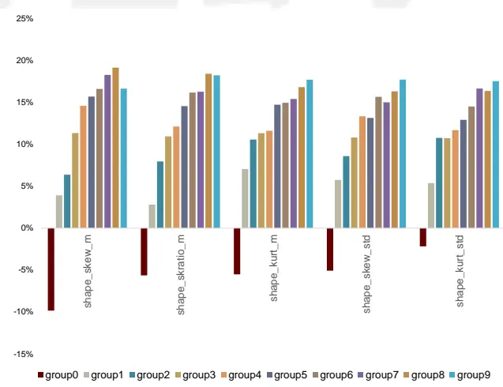
注： ）统计时间为 至 ； ）超额收益的比较基准为全市场等权；3）Group0 为因子值最小一组，Group9 为因子值最大一组资料来源： ，中金公司研究部

## 流动性

## 流动性因子低换手凸显性价比

流动性刻画股票交易所需要的时间和成本，一般来说，流动性较差的个股通常有更高的预期收益，这是对流动性风险的风险补偿。因此，流动性因子通常表现为流动性越低，未来收益越高的特征（也会被称为为非流动性因子）。本节利用价差宽度、价格深度等数据构建了 11 个高频流动性因子，并对其进行有效性检验。大多数因子的构造方法详见《市场微观结构系列（ ）：高频视角下的微观流动性与波动性》。

图表 36：流动性因子构建方式

| 指标名称 | 指标代码 | 构建方法 |
| --- | --- | --- |
| Amihud非流动性因子 | liq_amihud_1min | 使用日内分钟级别数据构建常见的Amihud非流动因子。 |
| 卖盘深度前15分钟占比 | liq_askDepthCct | 使用日内tick级别数据，计算开盘15分钟内市场卖盘深度和占交易日所有市场交易深度之和的比例，计算以 上四个深度的集中度。 |
| 盘口深度前15分钟占比 | liq_avgDepthCct | 使用日内tick级别数据，计算开盘一段时间(如15分钟)内市场平均盘口深度和占交易日所有市场交易深度 之和的比例，计算以上四个深度的集中度。 |
| 买盘深度前15分钟占比 | liq_bidDepthCct | 使用日内tick级别数据，计算开盘一段时间(如15分钟)内市场买盘深度和占交易日所有市场交易深度之和 的比例，计算以上四个深度的集中度。 |
| 集合竞价前成交量 | liq_closeprevol | 计算集合竞价前的成交量 |
| 收盘前3分钟成交量 | liq_closevol | 计算收盘前3分钟成交量 |
| 有效深度前15分钟占比 | liq_effDepthCct | 使用日内tick级别数据，计算开盘一段时间(如15分钟)内市场有效盘口深度和占交易日所有市场交易深度 之和的比例，计算以上四个深度的集中度。 |
| 开盘集合竞价成交量占比 | liq_firstCallR | 使用日内tick级别数据计算上午开盘9：25之前的集合竞价的总交易量占全天交易量的比例， |
| 收盘集合竞价成交量占比 | liq_lastCallR | 使用日内tick级别数据计算下午收盘前14：57-15：00的集合竞价的总交易量占全天交易量的比例， |
| 开盘集合竞价成交量 | liq_openvol | 计算开盘集合竞价成交量 |
| 盘口价差 | liq_spread_std | 使用日内tick级别数据计算买一价与卖一价的价差再除以买一价和卖一价的算数平均值。 |

资料来源：中金公司研究部

liq_amihud_1min_o 因子在多数选股中的表现较好。结合因子相关性和构建逻辑，我们大致将流动性因子分为两类：价格弹性因子和集合竞价因子。

价格弹性因子包括 Amihud 非流动性因子（liq_amihud_1min）、价差深度因子（如liq_avgDepthCct）和价格宽度因子（如 liq_spread）。在全市场范围内，liq_amihud_1min_o 和 liq_spread_std 相对其他流动性因子具有领先的有效性表现。在月度调仓频率下，liq_amihud_1min_o 因子的 ICIR 为 1.02，年化多空收益超过 33%，且该因子在中证 1000和中证 500的选股域中也表现良好。

集合竞价因子利用日内 tick级别数据计算不同时间段内交易量占全体交易量的比例，能够反映流动性的分布情况，包括 liq_closevol，liq_openvol 和 liq_firstCallR 等因子。其中，全市场范围内，liq_firstCallR_o 和 liq_firstCallR_m 因子在周度调仓频率下具有不错的预测性，ICIR均超过 0.70，且年化多空收益分别为 27.5%和 30.6%。沪深 300选股域中，liq_closevol_z 因子在周度调仓频率下 ICIR 为 0.21，年化多头超额收益为 5.4%，领先于其他流动性因子。

总体来看，流动性因子整体表现较好，其中 liq_amihud_1min_o 因子在多个选股域中具有较为稳定且突出的表现，值得推荐。在大盘股中，也可以关注 liq_closevol_z 因子。

图表 37：流动性因子在全市场范围内月度回测的有效性检验结果（ICIR>0.5）

|  | IC均值 | ICIR | 多空收益 | 多空夏普 | 多头超额 | 多头超额夏普 | 多头超额最 大回撤 | 多头超额胜率 | 换手率 |
| --- | --- | --- | --- | --- | --- | --- | --- | --- | --- |
| liq_amihud_1min_o | 9.11% | 1.02 | 33.4% | 2.90 | 11.2% | 2.18 | 6.95% | 77.14% | 52.31% |
| liq_spread_std | -5.24% | 0.92 | 12.0% | 1.43 | 3.7% | 0.78 | 11.40% | 53.13% | 66.07% |
| liq_firstCallR_o | -4.11% | 0.85 | 14.8% | 2.24 | 5.8% | 1.73 | 3.44% | 70.31% | 83.98% |
| liq_spread_m | -5.51% | 0.84 | 8.8% | 1.05 | 2.2% | 0.48 | 15.67% | 51.56% | 53.91% |
| liq_amihud_1min_m | 7.37% | 0.80 | 24.0% | 2.18 | 9.1% | 1.71 | 6.83% | 70.00% | 35.45% |
| liq_firstCallR_m | -5.19% | 0.75 | 15.5% | 1.72 | 4.5% | 1.22 | 4.37% | 62.50% | 72.71% |
| liq_firstCallR_std | -3.49% | 0.73 | 9.9% | 1.64 | 3.0% | 0.96 | 8.82% | 62.50% | 81.23% |
| liq_amihud_1min_std | 5.37% | 0.65 | 18.1% | 1.87 | 7.0% | 1.41 | 8.76% | 68.57% | 44.51% |
| liq_closevol_z | -3.80% | 0.60 | 10.2% | 1.38 | 0.8% | 0.24 | 6.39% | 57.81% | 60.89% |
| liq_lastCallR_o | -2.15% | 0.59 | 5.2% | 1.14 | 5.2% | 1.57 | 3.88% | 64.06% | 84.47% |
| liq_openvol_o | -5.01% | 0.55 | 10.1% | 0.78 | -2.5% | -0.28 | 32.56% | 37.50% | 48.73% |
| liq_lastCallR_m | -3.25% | 0.55 | 13.7% | 2.08 | 7.6% | 2.09 | 6.67% | 68.75% | 65.08% |
| liq_closeprevol_z | -3.74% | 0.53 | 5.7% | 0.79 | -0.7% | -0.20 | 10.53% | 51.56% | 61.66% |
| liq_closevol_o | -4.95% | 0.51 | 14.3% | 1.03 | -1.5% | -0.13 | 32.17% | 42.19% | 41.91% |
| liq_spread_z | -1.99% | 0.51 | 2.6% | 0.43 | -1.6% | -0.40 | 10.12% | 46.88% | 63.80% |

资料来源：Wind，中金公司研究部（注：统计时间为2018-01-08至2023-12-01；超额收益的比较基准为有效股票池等权表现）

图表 38：流动性因子在全市场范围内周度回测的有效性检验结果（ICIR>0.5）

|  | IC均值 | ICIR | 多空收益 | 多空夏普 | 多头超额 | 多头超额夏普 | 多头超额 最大回撤 | 多头超额胜率 | 换手率 |
| --- | --- | --- | --- | --- | --- | --- | --- | --- | --- |
| liq_firstCallR_o | -3.69% | 0.77 | 27.5% | 3.36 | 8.5% | 2.52 | 3.53% | 72.86% | 82.07% |
| liq_firstCallR_m | -4.26% | 0.74 | 30.6% | 3.03 | 7.1% | 1.84 | 6.62% | 74.29% | 73.95% |
| liq_closevol_z | -4.14% | 0.71 | 30.1% | 3.45 | 4.9% | 1.35 | 6.45% | 65.71% | 69.56% |
| liq_closevol_o | -5.80% | 0.68 | 41.8% | 3.49 | 12.0% | 2.14 | 10.51% | 74.29% | 60.16% |
| liq_openvol_o | -5.50% | 0.68 | 29.1% | 2.66 | 8.0% | 1.61 | 11.23% | 70.00% | 71.80% |
| liq_firstCallR_std | -3.03% | 0.65 | 20.5% | 2.72 | 4.3% | 1.34 | 5.28% | 61.43% | 83.40% |
| liq_closeprevol_std | -5.71% | 0.64 | 34.1% | 2.88 | 7.8% | 1.45 | 15.86% | 67.14% | 56.96% |
| liq_amihud_1min_o | 6.69% | 0.63 | 39.8% | 2.89 | 18.0% | 3.24 | 6.19% | 81.69% | 39.39% |
| liq_openvol_std | -5.11% | 0.62 | 20.7% | 2.00 | 4.3% | 0.82 | 17.09% | 62.86% | 63.08% |
| liq_openvol_m | -5.39% | 0.60 | 26.9% | 2.31 | 5.6% | 1.03 | 13.20% | 65.71% | 56.51% |
| liq_closeprevol_o | -5.49% | 0.58 | 36.5% | 2.85 | 7.5% | 1.33 | 13.68% | 60.00% | 44.50% |
| liq_closeprevol_z | -3.95% | 0.58 | 24.2% | 2.61 | 1.6% | 0.41 | 15.38% | 57.14% | 65.81% |
| liq_closevol_m | -5.37% | 0.58 | 32.5% | 2.61 | 8.1% | 1.40 | 16.21% | 64.29% | 44.60% |
| liq_closevol_std | -4.99% | 0.57 | 31.7% | 2.70 | 8.2% | 1.45 | 16.84% | 65.71% | 58.02% |
| liq_amihud_1min_z | 3.99% | 0.56 | 25.5% | 2.64 | 3.5% | 0.84 | 9.12% | 61.43% | 69.58% |
| liq_amihud_1min_m | 5.84% | 0.53 | 39.3% | 2.81 | 16.8% | 2.95 | 6.37% | 80.28% | 27.45% |
| liq_openvol_z | -2.75% | 0.53 | 19.0% | 2.41 | 1.2% | 0.35 | 9.65% | 58.57% | 71.97% |
| liq_closeprevol_m | -4.83% | 0.50 | 28.1% | 2.29 | 6.6% | 1.17 | 15.62% | 65.71% | 38.18% |

资料来源：Wind，中金公司研究部（注：统计时间为 2018-01-08 至 2023-12-01；超额收益的比较基准为有效股票池等权表现）

图表 39：流动性因子在不同股票池范围和不同调仓频率下 ICIR 最高的 5种因子具体表现
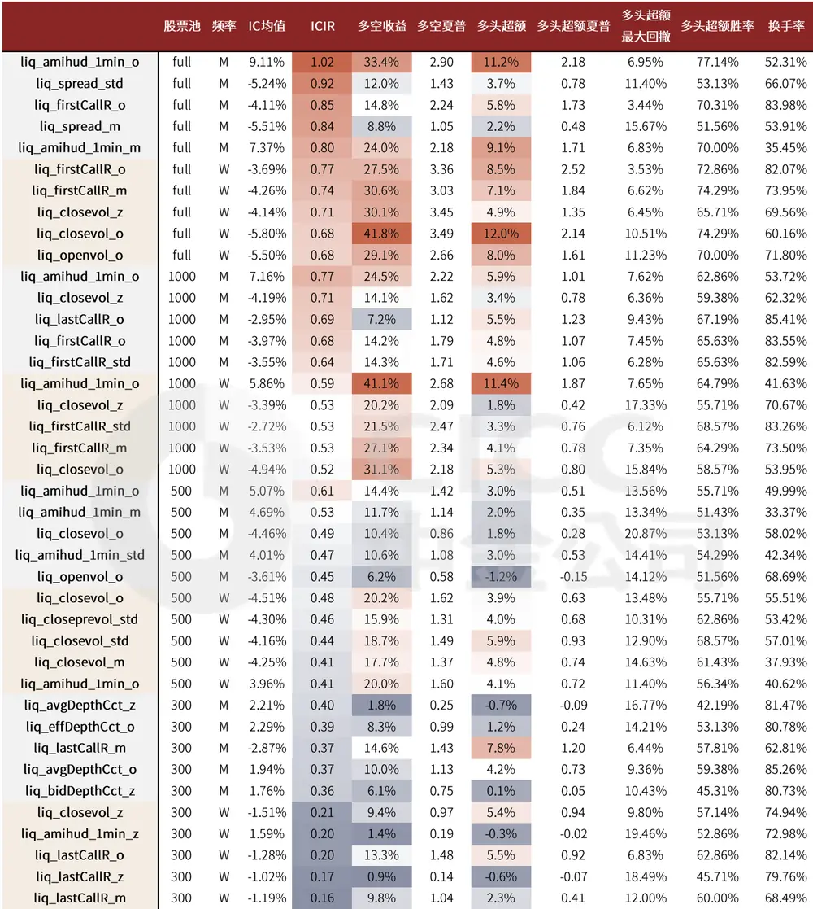
资料来源： ，中金公司研究部（注：统计时间为 至 ；超额收益的比较基准为有效股票池等权表现）

图表 ：全市场范围内表现相对较好（ ）的流动性因子之间的相关性统计
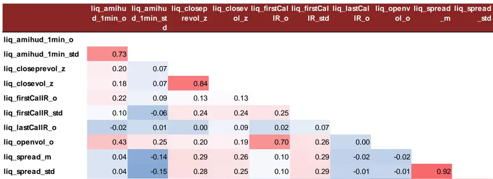
资料来源：Wind，中金公司研究部（注：统计时间为 2018-01-08 至 2023-12-01）

全市场范围内，liq_amihud_1min_o 因子具有领先的多空和多头收益，且单调性表现良好，分组年化超额收益组间区分度明晰。在常见因子相关性计算中，该因子与 Momentum_1M、DP、TURNOVER_1M、STD_1M 等因子的 IC 相关性位于 0.5 左右的水平。此外，集合竞价前的成交量（liq_closeprevol）和收盘前 3 分钟成交量（liq_closevol）相关因子在全市场中的多空收益表现良好，2021 年底出现了小幅回撤。

图表 41：全市场范围内表现较好的流动性因子年化多空收益统计
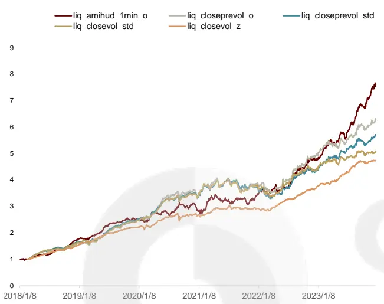
图表 43：liq_amihud_1min_o 与常见因子相关系数

图表 42：全市场范围内表现较好的流动性因子年化超额收益统计
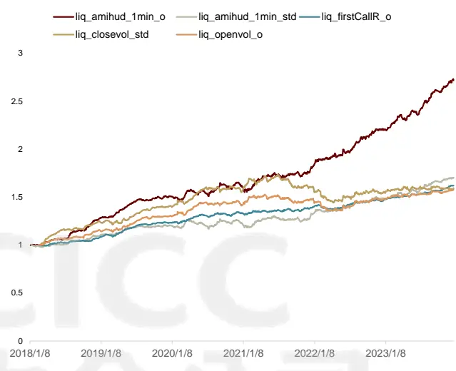

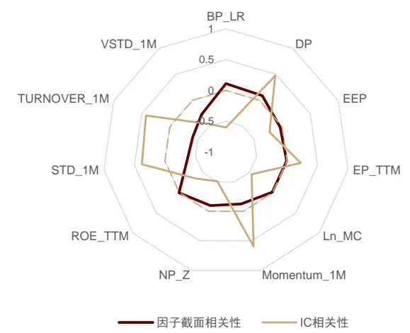
注：1）统计时间为 2018-01-08 至 2023-12-01；2）相对净值的比较基准为全市场等权
资料来源：Wind，中金公司研究部

图表 44：全市场范围内表现较好的流动性因子分组年化超额收益统计
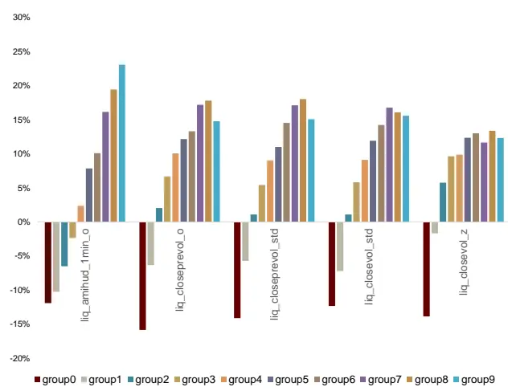
注：1）统计时间为 2018-01-08 至 2023-12-01；2）超额收益的比较基准为全市场等权；3）Group0 为因子值最小一组，Group9 为因子值最大一组资料来源：Wind，中金公司研究部

## 量价相关性

## 量能领先因子多股票池表现稳定占优

量价相关性因子刻画股票换手率与价格（或收益率）背离、同向程度。该类因子的有效性可从信息扩散理论的角度理解：信息扩散初期的特征应是量能领先于价格，此时量的变化主要由小部分理性交易者主导；而到信息扩散中期时，量价基本同步；到信息扩散末期时，更多成交可能来源于“羊群效应”的非理性行为。本节，我们将对 6 个不同构建方式下的量价相关因子进行有效性检验。

图表 45：量价相关性因子构建方式

| 指标名称 | 指标代码 | 构建方法 |
| --- | --- | --- |
| 计算分钟收益率与成交量相关系数 | corr_prv | 计算分钟收益率与成交量相关系数 |
| 分钟收益率与成交量变化率相关系数 | corr_prvr | 计算分钟收益率与成交量变化率相关系数 |
| 分钟收盘价与成交量相关系数 | corr_pv | 计算分钟收盘价与成交量相关系数 |
| 分钟收盘价与滞后成交量相关系数 | corr_pvd | 计算分钟收盘价与滞后成交量相关系数 |
| 分钟收盘价与领先成交量相关系数 | corr_pvl | 计算分钟收盘价与领先成交量相关系数 |
| 分钟收盘价与成交量变化率相关系数 | corr_pvr | 计算分钟收盘价与成交量变化率相关系数 |

资料来源：中金公司研究部

corr_pvl_std、corr_pv_std 和 corr_prv_std 因子在大多数选股中的表现较好。我们将量价相关性因子在全市场、沪深 300、中证 500和中证 1000分别进行月度和周度调仓的有效性检验。根据因子间的相关性统计，图中所示的因子相互间均存在正相关性。从因子构建逻辑出发，大致将量价相关性因子分为两类：价量同步因子和领先滞后因子。

价量同步因子指的是价格（及其变化率）与成交量（及其变化率）的同期相关系数。corr_prv_std 和 corr_prvr_std 在全市场范围内表现较好，月度频率下，corr_prv_std 的IC 均值为-5.65%，ICIR 为 1.09；corr_prvr_std 的 IC 均值为-2.88%，ICIR 为 0.64。相比之下，它们在沪深 300范围内表现均有所下降，corr_prv_std 的 ICIR为 0.47，月度频率下年化多空收益率为 12.2%，说明该类因子在大市值股票中效果有所减弱。

领先滞后因子表示的是收益率与成交量（以及变化率）的异步相关系数，我们分别测试了领先成交量或领先价格的情况。其中，corr_pvl 的变体均值和标准差表现均较为有效，月度 ICIR分别达 1.09和 1.06，前额周度年化多空超 46%，后者多头月度超额达 8%。

综上所述，corr_pvl（分钟收盘价与领先成交量相关系数）和 corr_prv（分钟收盘价与成交量同步相关系数）总体表现较好，在多数选股范围内具有较强的选股能力，大盘股中有效性较有限。

图表 46：量价相关性因子在全市场范围内月度回测的有效性检验结果

|  | IC均值 | ICIR | 多空收益 | 多空夏普 | 多头超额 | 多头超额夏普 | 多头超额 最大回撤 | 多头超额胜率 | 换手率 |
| --- | --- | --- | --- | --- | --- | --- | --- | --- | --- |
| corr_prv_std | -5.65% | 1.09 | 18.7% | 2.71 | 6.1% | 1.57 | 5.62% | 66.15% | 70.64% |
| corr_pvl_m | -7.41% | 1.09 | 23.4% | 2.49 | 2.3% | 0.63 | 13.60% | 56.45% | 86.09% |
| corr_pvl_std | -9.54% | 1.06 | 29.2% | 2.60 | 8.0% | 1.66 | 7.24% | 71.77% | 67.39% |
| corr_pv_std | -6.37% | 0.97 | 18.4% | 2.21 | 4.4% | 1.11 | 5.56% | 62.90% | 75.16% |
| corr_pv_o | -3.63% | 0.86 | 14.3% | 2.15 | 0.9% | 0.26 | 7.04% | 53.23% | 89.37% |
| corr_pvd_std | -3.11% | 0.84 | 10.1% | 2.09 | 3.6% | 1.27 | 4.76% | 65.32% | 82.34% |
| corr_pv_m | -4.49% | 0.81 | 13.4% | 1.99 | 1.0% | 0.28 | 11.24% | 57.26% | 84.79% |
| corr_prvr_std | -2.88% | 0.64 | 10.6% | 1.75 | -0.2% | -0.04 | 10.88% | 49.19% | 79.37% |
| corr_prv_m | -3.88% | 0.64 | 10.6% | 1.48 | -0.1% | 0.00 | 18.11% | 52.31% | 83.08% |
| corr_pvl_z | -2.85% | 0.63 | 5.7% | 0.99 | 0.8% | 0.26 | 7.71% | 51.61% | 74.00% |
| corr_pvl_o | -2.97% | 0.63 | 8.8% | 1.20 | -4.2% | -0.99 | 38.49% | 33.06% | 88.91% |
| corr_pv_z | -2.12% | 0.50 | 3.9% | 0.86 | 0.6% | 0.24 | 8.54% | 49.19% | 72.58% |
| corr_prv_o | -2.26% | 0.45 | 6.1% | 0.98 | -0.8% | -0.22 | 17.55% | 46.15% | 89.30% |
| corr_prv_z | -1.89% | 0.45 | 4.8% | 0.96 | 0.7% | 0.26 | 11.14% | 49.19% | 73.01% |
| corr_prvr_m | -1.74% | 0.42 | 5.6% | 1.01 | -0.7% | -0.20 | 11.79% | 44.35% | 83.88% |
| corr_prvr_z | -1.12% | 0.37 | 4.4% | 1.02 | 0.8% | 0.34 | 4.83% | 55.65% | 73.28% |
| corr_prvr_o | -1.23% | 0.37 | 4.4% | 0.81 | -1.0% | -0.28 | 16.37% | 46.77% | 89.29% |
| corr_pvr_std | 1.25% | 0.36 | 2.8% | 0.58 | 0.9% | 0.31 | 8.88% | 54.84% | 83.01% |
| corr_pvr_o | 0.76% | 0.27 | 2.0% | 0.43 | 1.0% | 0.32 | 9.14% | 53.23% | 90.14% |
| corr_pvr_z | 0.57% | 0.24 | 0.5% | 0.15 | 0.0% | 0.03 | 7.67% | 52.42% | 71.31% |
| corr_pvd_z | 0.30% | 0.12 | 0.7% | 0.20 | -0.5% | -0.21 | 8.72% | 43.55% | 69.40% |
| corr_pvd_m | 0.36% | 0.09 | -0.9% | -0.15 | -3.0% | -0.99 | 28.77% | 37.10% | 82.94% |
| corr_pvd_o | 0.25% | 0.09 | -1.2% | -0.22 | -3.3% | -1.01 | 31.98% | 38.71% | 89.62% |
| corr_pvr_m | -0.15% | 0.04 | 1.9% | 0.39 | 0.1% | 0.05 | 7.51% | 46.77% | 85.41% |

资料来源：Wind，中金公司研究部（注：统计时间为 2013-01-14 至 2023-12-01；超额收益的比较基准为有效股票池等权表现）

图表 47：量价相关性因子在全市场范围内周度回测的有效性检验结果

|  | IC均值 | ICIR | 多空收益 | 多空夏普 | 多头超额 | 多头超额夏普 | 多头超额 最大回撤 | 多头超额胜率 | 换手率 |
| --- | --- | --- | --- | --- | --- | --- | --- | --- | --- |
| corr_pvl_std | -6.18% | 0.89 | 35.1% | 3.68 | 9.3% | 2.48 | 4.55% | 75.38% | 80.05% |
| corr_pv_std | -4.33% | 0.89 | 26.3% | 3.60 | 7.7% | 2.46 | 4.51% | 80.77% | 84.99% |
| corr_pvl_m | -6.31% | 0.89 | 46.6% | 3.63 | 5.4% | 1.12 | 8.97% | 62.31% | 87.52% |
| corr_pv_m | -5.42% | 0.81 | 41.2% | 4.14 | 7.4% | 1.56 | 16.13% | 64.62% | 84.49% |
| corr_pv_o | -5.18% | 0.79 | 48.9% | 4.56 | 12.1% | 2.19 | 10.01% | 70.77% | 88.87% |
| corr_prv_std | -3.40% | 0.73 | 16.7% | 2.69 | 2.9% | 0.95 | 12.06% | 64.89% | 83.30% |
| corr_pv_z | -3.42% | 0.63 | 22.0% | 3.10 | 5.0% | 1.38 | 6.55% | 66.15% | 80.87% |
| corr_pvd_std | -1.80% | 0.62 | 12.2% | 2.58 | 2.4% | 1.08 | 6.44% | 62.31% | 87.42% |
| corr_prv_m | -4.53% | 0.62 | 27.2% | 2.80 | 3.7% | 0.91 | 17.72% | 61.07% | 84.78% |
| corr_pvl_z | -3.61% | 0.57 | 22.8% | 2.72 | 5.1% | 1.27 | 7.14% | 66.15% | 83.36% |
| corr_prv_z | -3.17% | 0.50 | 19.3% | 2.56 | 4.7% | 1.29 | 8.71% | 69.23% | 82.03% |
| corr_pvl_o | -3.18% | 0.49 | 10.9% | 1.11 | -7.4% | -1.52 | 57.88% | 24.62% | 88.59% |
| corr_prvr_m | -2.34% | 0.47 | 18.4% | 2.61 | 2.8% | 0.83 | 4.41% | 63.85% | 84.94% |
| corr_prvr_std | -1.83% | 0.45 | 14.9% | 2.39 | 1.6% | 0.54 | 8.70% | 59.23% | 86.25% |
| corr_prvr_z | -1.71% | 0.42 | 11.8% | 2.20 | 3.9% | 1.41 | 3.72% | 66.92% | 82.98% |
| corr_prv_o | -2.68% | 0.39 | 4.2% | 0.54 | -3.2% | -0.78 | 34.98% | 41.22% | 88.66% |
| corr_prvr_o | -1.31% | 0.28 | 7.3% | 1.05 | -1.7% | -0.43 | 27.04% | 45.38% | 88.73% |
| corr_pvd_o | 0.75% | 0.22 | 11.7% | 2.19 | 2.2% | 0.62 | 5.58% | 54.62% | 89.38% |
| corr_pvr_o | 0.93% | 0.22 | 6.8% | 1.07 | 2.5% | 0.63 | 9.01% | 61.54% | 89.42% |
| corr_pvr_z | 0.55% | 0.17 | 2.8% | 0.60 | -0.7% | -0.22 | 14.50% | 48.46% | 82.75% |
| corr_pvr_m | 0.59% | 0.16 | 0.2% | 0.06 | -2.2% | -0.57 | 28.03% | 49.23% | 85.58% |
| corr_pvr_std | 0.28% | 0.11 | 1.3% | 0.34 | 0.3% | 0.12 | 9.60% | 48.46% | 85.72% |
| corr_pvd_m | 0.31% | 0.09 | 2.8% | 0.56 | -2.3% | -0.68 | 23.50% | 43.08% | 84.76% |
| corr_pvd_z | 0.09% | 0.03 | -0.3% | -0.05 | -1.7% | -0.60 | 18.99% | 43.08% | 81.66% |

资料来源： ，中金公司研究部（注：统计时间为 至 ；超额收益的比较基准为有效股票池等权表现）

图表 48：量价相关性因子在不同股票池范围和不同调仓频率下 ICIR最高的 5种因子具体表现
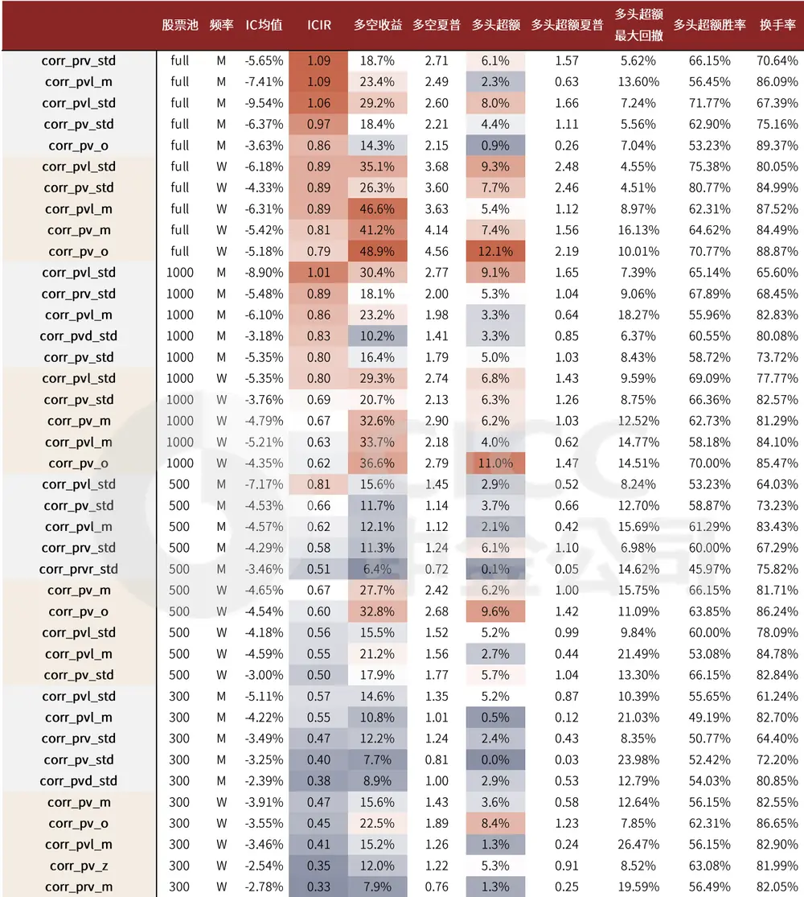
资料来源： ，中金公司研究部（注：统计时间为 至 ；超额收益的比较基准为有效股票池等权表现）

图表 49：全市场范围内表现相对较好（ICIR>0.5）的量价相关性因子之间的相关性统计
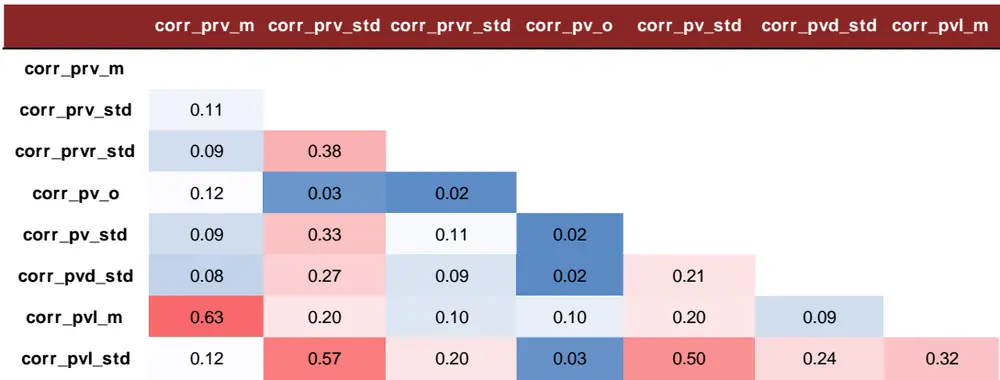
资料来源：Wind，中金公司研究部（注：统计时间为 2013-01-14 至 2023-12-01）

全市场范围内， corr_pvl_m 和 corr_pv_m 因子多空收益表现较为领先，corr_pvl_std、corr_pv_std 和 corr_pv_m 因子多头收益表现显著跑赢基线，其中 corr_pv_m 因子自 2019 年起多头超额增长趋势放缓，2022 年出现明显回撤。上述因子分组年化超额收益均具有良好单调性。corr_pvl_std 因子与常见因子均不存在显著因子截面相关性及 IC相关性。

图表 50：全市场范围内表现较好的量价相关性因子年化多空收益统计
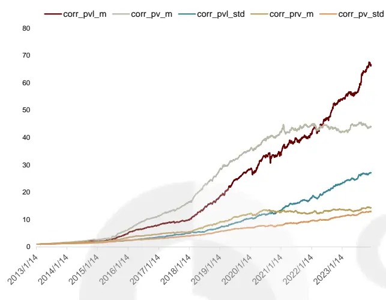
图表 52：corr_pvl_std 与常见因子相关系数

图表 51：全市场范围内表现较好的量价相关性因子年化超额收益统计
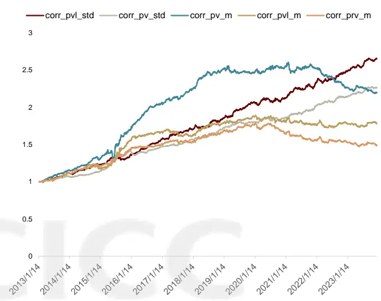

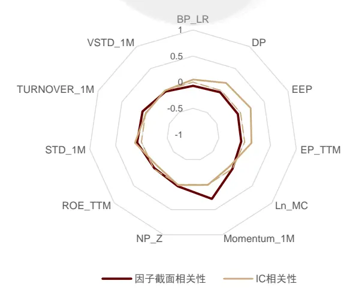
注：1）统计时间为 2013-01-14 至 2023-12-01；2）相对净值的比较基准为全市场等权
资料来源：Wind，中金公司研究部

图表 53：全市场范围内表现较好的量价相关性因子分组年化超额收益统计
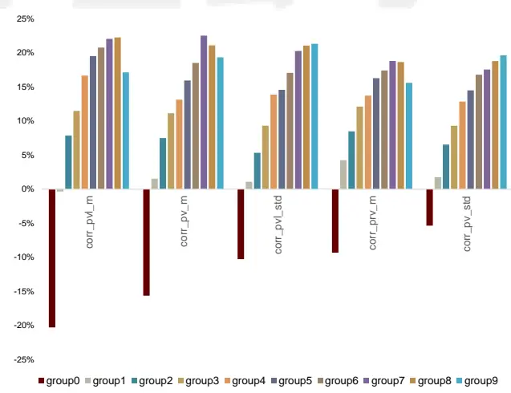
注： ）统计时间为 至 ； ）超额收益的比较基准为全市场等权；3）Group0 为因子值最小一组，Group9 为因子值最大一组资料来源： ，中金公司研究部

## 筹码分布

## 筹码占比因子选股有效性优于筹码分布形状因子

筹码分布旨在刻画股票持有人的持仓成本分布情况，我们据此构建了筹码分布的标准差、偏度、峰度等因子，以及不同盈亏水平的筹码分布共 12 个因子，并检验了这些因子在不同选股范围内的有效性。

图表 54：筹码分布因子构建方式

| 指标名称 | 指标代码 | 构建方法 |
| --- | --- | --- |
| 分钟收益率分组筹码峰度 | doc_kurt | 计算分钟级k线数据按照收益率分布成交量分布的峰度 |
| 分钟收益率分组筹码偏度 | doc_skew | 计算分钟级k线数据按照收益率分布成交量分布的偏度 |
| 分钟收益率分组收益率分组筹码标准差 | doc_std | 计算分钟级k线数据按照收益率分布成交量标准差 |
| 分钟收益率分组筹码60%占比收益率分位 | doc_vol_pdf60 | 计算分钟收益率分组筹码60%占比收益率分位 |
| 分钟收益率分组筹码70%占比收益率分位 | doc_vol_pdf70 | 计算分钟收益率分组筹码70%占比收益率分位 |
| 分钟收益率分组筹码80%占比收益率分位 | doc_vol_pdf80 | 计算分钟收益率分组筹码80%占比收益率分位 |
| 分钟收益率分组筹码90%占比收益率分位 | doc_vol_pdf90 | 计算分钟收益率分组筹码90%占比收益率分位 |
| 分钟收益率分组筹码90%占比收益率分位 | doc_vol_pdf90bi | 计算分钟收益率分组筹码双边90%占比收益率分位 |
| 分钟收益率分组筹码95%占比收益率分位 | doc_vol_pdf95 | 计算分钟收益率分组筹码95%占比收益率分位 |
| 分钟收益率分组筹码前10大占比 | doc_vol10_ratio | 计算分钟收益率分组筹码前10大占比 |
| 分钟收益率分组筹码前5大占比 | doc_vol5_ratio | 计算分钟收益率分组筹码前5大占比 |
| 分钟收益率分组筹码前50大占比 | doc_vol50_ratio | 计算分钟收益率分组筹码前50大占比 |

资料来源：中金公司研究部

doc_vol_pdf90_std、doc_vol_pdf95_std 和 doc_vol_pdf90bi_std 因子在四个选股域中均具有良好有效性。基于相关性统计，我们大致将筹码分布因子分为以下两类：筹码分布形状因子和筹码占比因子。

筹码分布形状因子包括描述分布的二到四阶标准矩相关因子，即标准差（doc_std）、偏度（doc_skew）与峰度（doc_kurt），该类因子的有效性整体弱于筹码分布占比因子。其中，doc_skew_std因子相比其他筹码分布形状因子性能优势较为明显。在全市场范围内采用月度频率的调仓方式，其 IC均值为-5.86%，ICIR 均值为 0.71；在沪深 300中，其ICIR 表现下降为 0.29。

筹码占比因子包括收益率分组筹码头部占比（例如 ）以及分组筹码占比分位数（例如 doc_vol_pdf90）两个子类。从预测方向来看，这类因子更多表现为反转的含义，且分组筹码占比分位数因子彼此间存在较高互相关性。从因子有效性角度来看，doc_vol_pdf90_std、doc_vol_pdf95_std 和 doc_vol_pdf80_std 三个因子在四个选股域中均具有相对领先的表现。以 doc_vol_pdf90_std 为例，在全市场范围内，其 ICIR表现为1.52，年化多空收益超过 28%；在沪深 300 中，其 IC 均值为-5.6%，ICIR 降为 0.83。

综合来看，筹码占比因子整体表现优于筹码分布形状因子。其中 doc_vol_pdf90_std、doc_vol_pdf95_std 和 doc_vol_pdf90bi_std 因子整体表现优异，在不同选股域中均有着较强的预测能力和良好的单调性，值得关注。

图表 55：筹码分布因子在全市场范围内月度回测的有效性检验结果（ICIR>0.5）

|  |  | IC均值 | ICIR 多空收益 多空夏普 |  |  | 多头超额 | 多头超额多头超额夏普 多头超额胜率 换手率最大回撤 |  |  |  |  |  |
| --- | --- | --- | --- | --- | --- | --- | --- | --- | --- | --- | --- | --- |
| doc_vol_pdf90_std |  | -8.86% | 1.52 | 28.3% | 3.41 | 9.8% | 2.23 5.74% 71.77% 73.74% |  |  |  |  |  |
| doc_vol_pdf95_std |  | -8.39% | 1.47 | 27.2% | 3.55 | 10.3% | 2.40 |  | 5.14% 70.97% |  | 74.14% |  |
| doc_vol_pdf90bi_std |  | -8.34% | 1.41 | 26.8% | 3.36 | 9.0% | 2.19 |  | 5.91% 72.58% |  | 73.42% |  |
| doc_vol_pdf80_std |  | -7.91% | 1.25 | 27.8% | 3.05 | 8.0% | 1.84 |  | 5.33% 72.58% |  | 73.11% |  |
| doc_vol_pdf95_o |  | -6.80% | 1.07 | 27.2% | 2.74 | 5.2% | 1.18 |  | 12.39% 62.10% |  | 80.79% |  |
| doc_vol_pdf95_m |  | -9.06% | 1.06 | 29.1% | 2.43 | 5.2% | 1.10 |  | 7.87% 59.68% |  | 63.75% |  |
| doc_vol_pdf90_m |  | -8.56% | 1.01 | 27.2% | 2.30 | 3.8% | 0.81 |  | 11.34% | 57.26% | 62.06% |  |
| doc_vol_pdf60_std |  | -6.06% | 0.97 | 21.5% | 2.27 | 5.8% | 1.07 |  | 11.58% | 57.26% | 69.71% |  |
| doc_vol_pdf90bi_o |  | -6.88% | 0.97 | 26.6% | 2.47 | 4.7% | 1.02 |  | 11.19% | 58.87% | 78.99% |  |
| doc_vol_pdf90_o |  | -6.23% | 0.97 | 26.2% | 2.62 | 4.2% | 1.00 |  | 12.77% | 57.26% | 80.41% |  |
| doc_vol_pdf90bi_m |  | -8.57% | 0.95 | 25.8% | 2.10 | 3.9% | 0.81 |  | 9.77% | 55.65% | 59.42% |  |
| doc_vol_pdf70_m |  | -7.97% | 0.89 | 27.1% | 2.11 | 3.7% | 0.73 |  | 14.35% | 54.03% | 69.34% |  |
| doc_vol_pdf80_m |  | -7.50% | 0.87 | 24.8% | 2.06 | 2.3% | 0.50 |  | 12.96% | 49.19% | 61.19% |  |
| doc_vol_pdf60_m |  | -7.54% | 0.84 | 28.3% | 2.31 | 6.5% | 1.22 |  | 11.66% | 57.26% | 68.81% |  |
|  | doc_vol_pdf80_o | -5.10% | 0.84 | 23.9% | 2.46 | 5.0% | 1.10 |  | 14.26% | 59.68% | 82.61% |  |
| doc_kurt_stddoc_vol_pdf90bi_z |  | doc_vol_pdf70_o |  | -4.22% | 0.79 | 18.3% | 2.25 |  | 4.6% | 1.05 | 8.17% |  |
|  |  | doc_vol_pdf70_std | -5.64% | 0.76 | 20.7% | 2.26 | 4.6% |  | 1.10 | 8.93% | 60.48% | 67.44% |
|  |  | doc_vol50_ratio_std | -7.28% | 0.72 | 21.2% | 1.86 | 5.1% |  | 0.88 | 11.85% | 57.26% | 45.36% |
|  |  | doc_skew_std | -5.86% | 0.71 | 16.0% | 1.49 | 3.3% | 0.75 |  | 9.46% | 58.87% | 73.32% |
|  |  | doc_vol_pdf95_z | -3.74% | 0.66 | 9.5% | 1.35 | 0.2% | 0.07 |  | 9.49% | 47.58% | 69.13% |
|  |  | doc_vol_pdf90_z | -3.61% | 0.63 | 10.7% | 1.45 | 0.3% | 0.09 |  | 11.35% | 45.97% | 68.05% |
|  |  | doc_vol_pdf60_z | -3.45% | 0.60 | 9.7% | 1.40 | 0.6% | 0.21 |  | 10.60% | 53.23% | 74.17% |
|  |  | -6.18% | 0.58 | 14.6% | 1.15 | 2.6% | 0.45 |  | 13.72% | 53.08% | 51.12% |  |
|  |  | -3.38% | 0.58 | 8.2% | 1.15 | -1.1% | -0.28 |  | 13.63% 44.35% |  | 67.19% |  |
|  |  | doc_vol_pdf80_z | -3.29% | 0.56 | 9.1% | 1.19 | -1.1% | -0.26 |  | 14.43% 48.39% 68.89% |  |  |
|  |  | doc_vol10_ratio_o | 6.57% | 0.55 | 17.2% | 1.29 | 3.5% | 0.55 |  | 16.92% | 52.42% 52.09% |  |
|  |  | doc_vol5_ratio_o | 6.39% | 0.54 | 16.8% | 1.27 | 3.1% | 0.49 |  | 17.93% | 52.42% 53.41% |  |
| doc_vol50_ratio_odoc_vol_pdf70_zdoc_std_z |  | 5.75% | 0.54 | 13.0% | 1.02 | 0.3% | 0.09 14.44% |  |  | 46.77% 56.60% |  |  |
|  |  | -3.36% | 0.54 | 7.9% | 1.05 | -1.2% | -0.30 18.63% 45.16% 71.42% |  |  |  |  |  |
|  |  | -2.71% | 0.54 | 7.4% | 1.32 | 1.8% | 0.56 9.91% 58.87% 60.64% |  |  |  |  |  |

资料来源： ，中金公司研究部（注：统计时间为 至 ）

图表 56：筹码分布因子在全市场范围内周度回测的有效性检验结果（ICIR>0.5）

|  | IC均值 | ICIR | 多空收益 | 多空夏普 | 多头超额 | 多头超额夏普 | 多头超额 最大回撤 | 多头超额胜率 | 换手率 |
| --- | --- | --- | --- | --- | --- | --- | --- | --- | --- |
| doc_vol_pdf95_std | -6.67% | 1.07 | 45.1% | 4.22 | 13.6% | 2.74 | 6.37% | 75.38% | 79.02% |
| doc_vol_pdf90_std | -6.73% | 1.06 | 48.4% | 4.25 | 14.6% | 2.67 | 7.42% | 70.77% | 72.18% |
| doc_vol_pdf80_std | -5.67% | 0.95 | 49.4% | 4.14 | 14.6% | 2.55 | 7.10% | 72.31% | 74.55% |
| doc_vol_pdf90bi_std | -5.95% | 0.94 | 44.0% | 3.95 | 11.7% | 2.38 | 5.56% | 69.23% | 77.91% |
| doc_vol_pdf95_o | -6.37% | 0.90 | 58.6% | 4.20 | 17.2% | 2.44 | 14.97% | 70.00% | 76.32% |
| doc_vol_pdf95_m | -7.35% | 0.89 | 54.4% | 3.50 | 9.5% | 1.44 | 11.22% | 58.46% | 62.85% |
| doc_vol_pdf90_m | -7.10% | 0.88 | 53.4% | 3.43 | 8.5% | 1.32 | 12.03% | 62.31% | 60.86% |
| doc_vol_pdf90_o | -6.03% | 0.85 | 54.7% | 3.83 | 15.3% | 2.22 | 13.76% | 67.69% | 75.55% |
| doc_vol_pdf90bi_o | -6.34% | 0.84 | 61.0% | 3.97 | 16.9% | 2.26 | 15.07% | 67.69% | 72.86% |
| doc_vol_pdf70_m | -6.34% | 0.84 | 50.7% | 3.34 | 11.1% | 1.78 | 10.56% | 63.85% | 72.55% |
| doc_vol_pdf80_m | -6.42% | 0.84 | 48.3% | 3.22 | 8.0% | 1.32 | 10.50% | 56.15% | 65.00% |
| doc_vol_pdf60_m | -5.62% | 0.78 | 44.1% | 3.53 | 14.4% | 2.56 | 4.73% | 73.85% | 73.63% |
| doc_vol_pdf60_std | -4.60% | 0.78 | 33.7% | 3.57 | 14.1% | 2.60 | 5.07% | 71.54% | 70.60% |
| doc_vol_pdf90bi_m | -6.71% | 0.76 | 47.7% | 2.95 | 6.9% | 1.00 | 15.26% | 59.23% | 57.46% |
| doc_vol_pdf80_o | -4.92% | 0.74 | 45.7% | 3.37 | 14.7% | 2.24 | 16.77% | 68.46% | 80.45% |
| doc_vol_pdf70_std | -4.09% | 0.65 | 34.5% | 3.37 | 10.1% | 2.01 | 8.49% | 66.92% | 79.92% |
| doc_vol_pdf95_z | -3.90% | 0.64 | 22.7% | 2.66 | 3.3% | 0.79 | 5.42% | 60.77% | 75.48% |
| doc_vol_pdf70_o | -3.76% | 0.64 | 35.4% | 3.11 | 15.0% | 2.45 | 7.37% | 70.00% | 79.06% |
| doc_vol_pdf90_z | -3.80% | 0.60 | 24.5% | 2.68 | 4.1% | 0.92 | 10.57% | 60.00% | 74.68% |
| doc_skew_std | -3.77% | 0.57 | 24.4% | 2.54 | 5.2% | 1.50 | 7.00% | 68.46% | 84.75% |
| doc_vol_pdf90bi_z | -3.35% | 0.55 | 19.5% | 2.27 | 0.9% | 0.23 | 10.32% | 50.00% | 73.93% |
| doc_vol_pdf60_z | -3.05% | 0.52 | 22.5% | 2.60 | 5.4% | 1.30 | 8.79% | 67.69% | 78.63% |
| doc_vol_pdf80_z | -3.39% | 0.52 | 22.6% | 2.46 | 2.9% | 0.71 | 11.33% | 57.69% | 78.24% |

资料来源：Wind，中金公司研究部（注：统计时间为 2013-01-14 至 2023-12-01）

图表 57：筹码分布因子在不同股票池范围和不同调仓频率下 ICIR最高的 5种因子具体表现

| 股票池频率IC均值 ICIR |  |  |  |  |  | 多头超额多空收益多空夏普多头超额多头超额夏普 多头超额胜率换手率最大回撤 |  |  |  |  |  |  |  |  |
| --- | --- | --- | --- | --- | --- | --- | --- | --- | --- | --- | --- | --- | --- | --- |
| doc_vol_pdf90_std |  | full M-8.86% |  |  | 1.52 | 28.3% | 3.41 | 9.8% | 2.23 5.74% 71.77% 73.74% |  |  |  |  |  |
| doc_vol_pdf95_std |  | full M-8.39% |  |  | 1.47 | 27.2% | 3.55 | 10.3% | 2.40 5.14% 70.97% |  |  |  | 74.14% |  |
| doc_vol_pdf90bi_std |  | full M-8.34% |  |  | 1.41 | 26.8% | 3.36 | 9.0% | 2.19 5.91% 72.58% |  |  |  | 73.42% |  |
| doc_vol_pdf80_std |  | full M-7.91% |  |  | 1.25 | 27.8% | 3.05 | 8.0% | 1.84 5.33% 72.58% |  |  |  | 73.11% |  |
| doc_vol_pdf95_o |  | full M-6.80% |  |  | 1.07 | 27.2% | 2.74 | 5.2% | 1.18 12.39% 62.10% |  |  |  | 80.79% |  |
| doc_vol_pdf95_std |  | full | W | -6.67% | 1.07 | 45.1% | 4.22 | 13.6% | 2.74 6.37% 75.38% |  |  |  | 79.02% |  |
| doc_vol_pdf90_std |  | full | W | -6.73% | 1.06 | 48.4% | 4.25 | 14.6% | 2.67 7.42% 70.77% |  |  |  | 72.18% |  |
| doc_vol_pdf80_std |  | full | W | -5.67% | 0.95 | 49.4% | 4.14 | 14.6% | 2.55 | 7.10% 72.31% |  |  | 74.55% |  |
| doc_vol_pdf90bi_std |  | full | W | -5.95% | 0.94 | 44.0% | 3.95 | 11.7% | 2.38 | 5.56% 69.23% |  |  | 77.91% |  |
| doc_vol_pdf95_o |  | full | W | -6.37% | 0.90 | 58.6% | 4.20 | 17.2% | 2.44 | 14.97% 70.00% |  |  | 76.32% |  |
| doc_vol_pdf90_std |  | 1000 | M | -7.96% | 1.24 | 24.9% | 2.48 | 6.2% | 1.10 | 9.96% 66.06% |  |  | 73.58% |  |
| doc_vol_pdf95_std |  | 1000 | M | -7.58% | 1.24 | 24.4% | 2.67 | 8.3% | 1.51 | 8.42% |  | 68.81% | 74.70% |  |
| doc_vol_pdf90bi_std |  | 1000 | M | -7.82% | 1.23 | 27.1% | 2.58 | 7.2% | 1.20 | 12.79% |  | 67.89% | 73.27% |  |
| doc_vol_pdf80_std |  | 1000 | M | -7.12% | 1.07 | 22.9% | 2.15 | 4.9% | 0.82 | 14.78% |  | 61.47% | 72.41% |  |
| doc_vol_pdf95_m |  | 1000 | M | -7.91% | 0.93 | 23.2% | 1.78 | 2.9% | 0.47 | 16.03% |  | 49.54% | 62.23% |  |
| doc_vol_pdf95_std |  | 1000 | W | -5.97% | 0.90 | 33.3% | 3.05 | 8.5% | 1.66 | 8.19% |  | 70.91% | 78.77% |  |
| doc_vol_pdf90_std |  | 1000 | W | -5.93% | 0.85 | 32.3% | 2.90 | 7.0% | 1.25 | 10.65% |  | 62.73% | 72.35% |  |
| doc_vol_pdf90bi_stddoc_vol_pdf95_m |  | 1000 | W | -5.54% | 0.80 | 33.6% | 2.87 | 6.4% | 1.18 | 11.49% |  | 64.55% | 77.90% |  |
|  |  | 1000 | W | -6.67% | 0.78 | 40.2% | 2.70 | 4.3% | 0.66 | 17.67% |  | 52.73% | 63.58% |  |
|  |  | doc_vol_pdf90bi_o | 1000 | W | -5.82% | 0.74 | 39.7% | 2.68 | 7.8% | 0.97 | 25.05% |  | 56.36% | 73.35% |
|  | doc_vol_pdf90_std | 500 | M- | 6.33% | 0.94 | 12.9% | 1.24 | 2.4% | 0.40 | 16.48% |  | 51.61% | 74.44% |  |
|  | doc_vol_pdf95_std | 500 | M- | 5.73% | 0.86 | 10.2% | 1.03 | 1.8% | 0.32 | 18.25% |  | 58.87% | 74.57% |  |
| doc_vol_pdf90bi_stddoc_vol_pdf95_m |  | 500 | M | -5.70% | 0.82 | 10.9% | 1.02 | 1.2% | 0.21 | 18.12% |  | 56.45% | 73.72% |  |
|  |  | 500 | M | -6.01% | 0.72 | 9.8% | 0.83 | -2.0% | -0.27 28.00% |  |  | 45.97% | 59.04% |  |
|  | doc_vol_pdf80_std | 500 | M | -5.07% | 0.70 | 10.8% | 1.01 | 1.5% | 0.26 15.75% |  |  | 50.81% | 72.16% |  |
|  | doc_vol_pdf90_std | 500 | W | -5.34% | 0.76 | 22.2% | 2.09 | 4.6% | 0.85 | 11.39% |  | 61.54% | 71.99% |  |
|  | doc_vol_pdf95_std | 500 | W | -5.21% | 0.74 | 21.8% | 2.16 | 6.1% | 1.16 | 10.90% |  | 64.62% | 78.16% |  |
| doc_vol_pdf90bi_std |  | 500 | W | -4.53% | 0.65 | 21.1% | 1.94 | 5.1% | 0.88 | 15.85% |  | 57.69% | 76.88% |  |
| doc_vol_pdf95_m |  | 500 | W | -5.64% | 0.64 | 27.0% | 1.98 | 3.4% | 0.50 | 22.13% |  | 53.08% | 62.16% |  |
| doc_vol_pdf80_std |  | 500 | W | -4.35% | 0.61 | 19.4% | 1.73 | 5.9% | 0.99 | 14.35% |  | 65.38% | 75.45% |  |
| doc_vol_pdf90_std |  | 300 | M | -5.60% | 0.83 | 14.1% | 1.30 | 2.5% | 0.41 | 25.26% |  | 57.26% | 73.07% |  |
| doc_vol_pdf90bi_std |  | 300 | M | -5.37% | 0.77 | 12.4% | 1.21 | 1.5% | 0.26 | 25.17% |  | 51.61% | 75.02% |  |
| doc_vol_pdf95_std |  | 300 | M | -5.33% | 0.77 | 13.0% | 1.26 | 3.5% | 0.61 | 11.20% |  | 58.06% | 75.35% |  |
| doc_vol_pdf80_std |  | 300 | M | -4.19% | 0.61 | 8.6% | 0.89 | 2.5% | 0.44 | 15.48% |  | 50.00% | 73.85% |  |
| doc_vol_pdf95_m |  | 300 | M | -4.88% | 0.53 | 11.7% | 0.94 | 0.9% | 0.16 | 27.44% |  | 55.65% | 55.09% |  |
| doc_vol_pdf90_std |  | 300 | W | -3.72% | 0.52 | 12.4% | 1.21 | 2.7% | 0.50 | 12.80% |  | 56.92% | 73.67% |  |
| doc_vol_pdf95_std |  | 300 | W | -3.57% | 0.51 | 14.0% | 1.40 | 1.6% | 0.31 | 23.34% |  | 55.38% | 78.65% |  |
| doc_vol_pdf95_mdoc_vol_pdf90bi_stddoc_vol_pdf90_m |  | 300 W |  | -3.52% | 0.42 | 9.3% | 0.81 | -1.3% | -0.16 | 34.44% 48.46% |  |  | 58.92% |  |
|  |  | 300 W |  | -2.77% | 0.40 | 8.5% | 0.84 | -0.6% | -0.06 | 23.07% 48.46% |  |  | 77.82% |  |
|  |  | 300 W |  | -3.12% | 0.37 | 8.2% | 0.70 | -1.6% | -0.21 34.98% 45.38% |  |  |  | 55.83% |  |

资料来源：Wind，中金公司研究部（注：统计时间为 2013-01-14 至 2023-12-01）

图表 58：全市场范围内表现相对较好（ICIR>0.5）的筹码分布因子之间的相关性统计

|  | _std | w_std _z | 10_ratio _º | 50_ratio _º | 50_ratio _std | 5_ratio_ o | _pdf60 m | _pdf60_s _pdf70_ td | m | _pdf70_s _pdf80_ td | m | _pdf80_s td | _pdf90_ m | _pdf90_s td | _pdf90bi _º | _pdf90bi _std o | _pdf95_ _pdf95_s td |
| --- | --- | --- | --- | --- | --- | --- | --- | --- | --- | --- | --- | --- | --- | --- | --- | --- | --- |
| doc_kurt_std | 1.00 | 0.89 | 0.14 | 0.60 | 0.51 | 0.60 | 0.46 | 0.19 | 0.38 | -0.03 | 0.19 | 0.14 | 0.28 | 0.24 | 0.21 | 0.21 | 0.18 0.20 |
| doc_skew_std | 0.89 | 1.00 | 0.14 | 0.45 0.39 | 0.48 | 0.45 | 0.35 | 0.17 | 0.31 | 0.07 | 0.21 | 0.18 | 0.27 | 0.25 | 0.18 0.07 | 0.24 0.16 | 0.22 |
| doc_std_z | 0.14 | 0.14 | 1.00 0.05 | 0.04 | 0.13 | 0.04 | 0.10 | 0.12 | 0.14 | 0.14 | 0.15 | 0.15 | 0.15 | 0.17 | 0.17 | 0.06 | 0.17 |
| doc_vol10_ratio_o | 0.60 | 0.45 | 0.05 1.00 | 0.83 | 0.59 | 0.99 | 0.49 | 0.12 | 0.36 | -0.16 | 0.12 | 0.05 | 0.21 | 0.13 | 0.08 | 0.32 | 0.09 |
| doc_vol50_ratio_o | 0.51 | 0.39 | 0.04 0.83 | 1.00 | 0.45 | 0.81 | 0.43 | 0.09 | 0.31 | -0.08 | 0.17 | 0.12 | 0.25 | 0.11 | 0.08 | 0.31 | 0.08 |
| doc_vol50_ratio_std | 0.70 | 0.48 | 0.13 | 0.59 0.45 | 1.00 | 0.58 | 0.43 | 0.17 | 0.33 | -0.12 | 0.08 | 0.12 | 0.20 | 0.22 | 0.18 | 0.14 | 0.18 |
| doc_vol5_ratio_o | 0.60 | 0.45 | 0.04 | 0.99 0.81 | 0.58 | 1.00 | 0.48 | 0.12 | 0.34 | -0.16 | 0.11 | 0.04 | 0.20 | 0.12 | 0.07 | 0.32 | 0.08 |
| doc_vol_pdf60_m | 0.46 | 0.35 | 0.10 | 0.49 0.43 | 0.43 | 0.48 | 1.00 | 0.73 | 0.76 | 0.31 | 0.57 | 0.42 | 0.58 | 0.43 | 0.34 | 0.35 | 0.34 |
| doc_vol_pdf60_std | 0.19 | 0.17 | 0.12 | 0.12 0.09 | 0.17 | 0.12 | 0.73 | 1.00 | 0.68 | 0.61 | 0.61 | 0.52 | 0.56 | 0.52 | 0.44 | 0.29 | 0.44 |
| doc_vol_pdf70_m | 0.38 | 0.31 | 0.14 | 0.36 0.31 | 0.33 | 0.34 | 0.76 | 0.68 | 1.00 | 0.56 | 0.78 | 0.53 | 0.74 | 0.54 0.44 | 0.47 | 0.40 | 0.47 |
| doc_vol_pdf70_std | -0.03 | 0.07 | 0.14 | -0.16 -0.08 | -0.12 | -0.16 | 0.31 | 0.61 | 0.56 | 1.00 | 0.75 | 0.73 | 0.64 | 0.57 | 0.55 | 0.29 | 0.51 |
| doc_vol_pdf80_m | 0.19 | 0.21 | 0.15 | 0.12 0.17 | 0.08 | 0.11 | 0.57 | 0.61 | 0.78 | 0.75 | 1.00 | 0.74 | 0.88 | 0.62 0.47 | 0.59 | 0.42 | 0.56 |
| doc_vol_pdf80_std | 0.14 | 0.18 | 0.15 | 0.05 0.12 | 0.12 | 0.04 | 0.42 | 0.52 | 0.53 | 0.73 | 0.74 | 1.00 | 0.77 | 0.73 0.39 | 0.69 | 0.34 | 0.64 |
| doc_vol_pdf90_m | 0.28 | 0.27 | 0.15 | 0.21 0.25 | 0.20 | 0.20 | 0.58 | 0.56 | 0.74 | 0.64 | 0.88 | 0.77 | 1.00 | 0.76 0.51 | 0.72 | 0.46 | 0.68 |
| doc_vol_pdf90_std | 0.24 | 0.25 | 0.17 | 0.13 0.11 | 0.22 | 0.12 | 0.43 | 0.52 | 0.54 | 0.57 | 0.62 | 0.73 | 0.76 | 1.00 0.35 | 0.89 | 0.31 | 0.84 |
| doc_vol_pdf90bi_o | 0.21 | 0.18 | 0.07 | 0.35 0.34 | 0.15 | 0.35 | 0.38 | 0.33 | 0.44 | 0.33 | 0.47 | 0.39 | 0.51 0.35 | 1.00 | 0.34 | 0.81 | 0.32 |
| doc_vol_pdf90bi_std | 0.21 | 0.24 | 0.17 | 0.08 0.08 | 0.18 | 0.07 | 0.34 | 0.44 | 0.47 | 0.55 | 0.59 | 0.69 | 0.72 | 0.89 0.34 | 1.00 | 0.29 | 0.83 |
| doc_vol_pdf95_o | 0.18 | 0.16 | 0.06 | 0.32 0.31 0.08 | 0.14 | 0.32 | 0.35 | 0.29 | 0.40 | 0.29 | 0.42 | 0.34 | 0.46 | 0.31 0.81 0.32 | 0.29 | 1.00 | 0.29 |
| doc_vol_pdf95_std | 0.20 | 0.22 | 0.17 | 0.09 | 0.18 | 0.08 | 0.34 | 0.44 | 0.47 | 0.51 | 0.56 | 0.64 | 0.68 | 0.84 | 0.83 | 0.29 | 1.00 |

资料来源： ，中金公司研究部（注：统计时间为 至 ）

全市场范围内，筹码占比因子多空头收益表现较为突出。其中，doc_vol_pdf90bi_o和doc_vol_pdf95_o 因子年化多空收益显著跑赢基线；doc_vol10_ratio_o 和 doc_vol5_ratio_o因子多头超额收益保持较快增速，其在 2015年底出现小幅回撤。从单调性的角度来看，上述因子分组年化超额收益单调性良好，组间存在显著区分度。

图表 59：全市场范围内表现较好的筹码分布因子年化多空收益统计
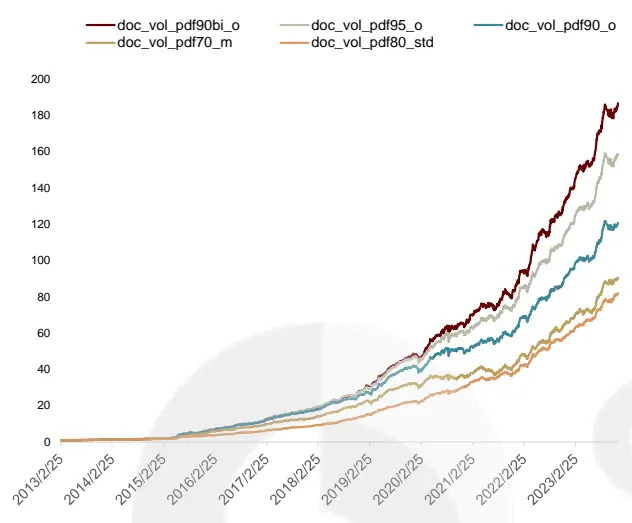

图表 60：全市场范围内表现较好的筹码分布因子年化超额收益统计
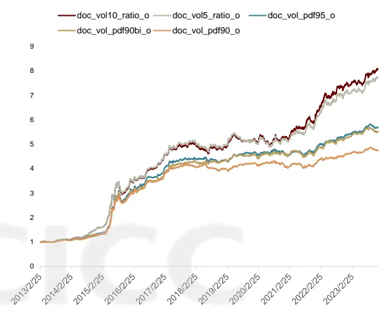

图表 61：doc_vol10_ratio_o 与常见因子相关系数
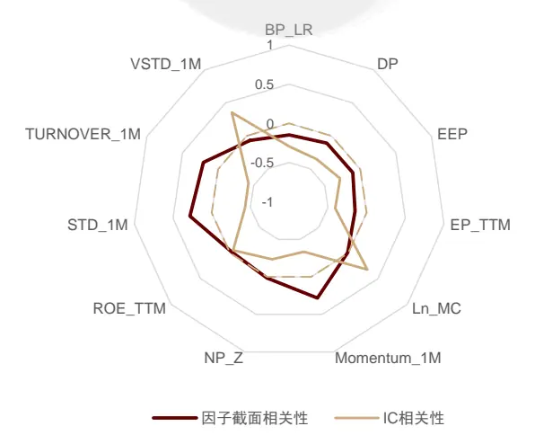
注：1）统计时间为 2013-01-14 至 2023-12-01；2）相对净值的比较基准为全市场等权
资料来源：Wind，中金公司研究部

图表 62：全市场范围内表现较好的筹码分布因子分组年化超额收益统计
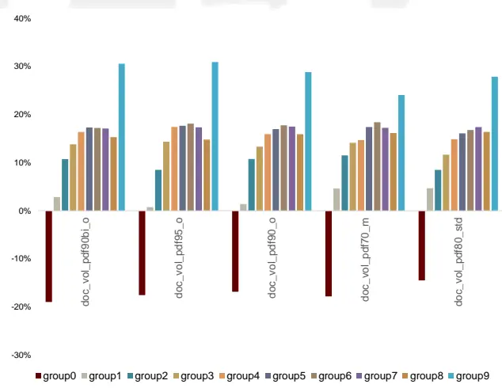
注： ）统计时间为 至 ； ）超额收益的比较基准为全市场等权；3）Group0 为因子值最小一组，Group9 为因子值最大一组资料来源： ，中金公司研究部

## 拥挤度

## 拥挤度因子在不同范围内均有良好表现

本文拥挤度因子主要来自《资金结构系列（ ）如何利用日内交易数据左侧预警机构成交拥挤度》的主要是机构投资者成交占比情况，原理是机构拆单下单形成的周期性可以被傅里叶变换后的更显著波形振幅占比捕捉，使用周期性成交占比表征机构参与度占比，该因子在个股和行业层面表现均较为优秀。该指标越高，说明股票中机构交易行为就越偏向拥挤，未来收益率下降的概率就越大。据此，我们构建了 10 个使用不同参数和方法构建的拥挤度因子，并进行有效性检验。我们对比了采用不同采样频率如 秒和 秒取样的区别，以及傅里叶变换是否补零产生的差异，发现上述两种参数对因子最终表现无显著影响。

图表 63：拥挤度因子构建方式

| 指标名称 | 指标代码 | 构建方法 |
| --- | --- | --- |
| 前10%周期占比 | crowd_fftv10 | 傅里叶变换30s快照数据fft变换后，取10%强度占比 |
| 前20%周期占比不补零 | crowd_fftv20_30s_no0 | 傅里叶变换30s快照数据和1min数据不补零 |
| 前20%周期占比补零 | crowd_fftv20_30s_w0 | 傅里叶变换30s快照数据和1min数据补零 |
| 3s快照前20%周期占比补零 | crowd_fftv20_3s_w0 | 傅里叶变换3s快照数据和1min数据补零 |
| 高频前20%周期占比 | crowd_fftv20_high | 傅里叶变换30s快照数据fft变换后，取高频20%强度占比 |
| 低频前20%周期占比 | crowd_fftv20_low | 傅里叶变换30s快照数据fft变换后，取低频20%强度占比 |
| 前5周期占比 | crowd_fftv5 | 傅里叶变换30s快照数据fft变换后，取前5强信号占比 |
| 前50周期占比 | crowd_origin_v50 | 傅里叶变换30s快照数据fft变换后，取前50强信号占比 |
| 前5到50周期占比 | crowd_fftv50m10 | 傅里叶变换30s快照数据fft变换后，取前50强剔除前5信号占比 |
| 前10到50周期占比 | crowd_fftv50m5 | 傅里叶变换30s快照数据fft变换后，取前50强剔除前10信号占比 |

资料来源：中金公司研究部

crowd_fftv50m10_std、crowd_fftv20_3s_w0_std 和 crowd_fftv50m5_std 因子在多数选股域中均具有良好有效性。基于相关性统计和因子构建方式，大致将拥挤度因子分为以下两类：常规拥挤度因子、傅里叶处理的拥挤度因子。

D常规拥挤度因子指代 crowd_origin_v50 因子，该因子相比另一类拥挤度因子在多个选股域中表现靠前。其中，crowd_origin_v50_std 因子在全市场范围月度调仓频率下的 ICIR为 1.18，年化多空超额收益超过 26%；在沪深 300同样调仓频率中，该因子有效性有所下降，IC 均值为-2.76%，ICIR 为 0.39。

傅里叶处理的拥挤度因子能够将股票交易的时间序列数据转化为频率统计数据，并筛选出显著的频率，包括 crowd_fftv50 等因子。其中，crowd_fftv20_3s_w0_std 因子在全市场和中证 1000范围内有效性较为显著，ICIR均超过 1.30，年化多空收益超过 20%。此外，crowd_fftv50m10_std 因子在全市场、中证 500 和沪深 300 在内的选股域中都具有领先于其他拥挤度因子的有效性。全市场月度调仓频率下，该因子 ICIR 为 1.30，多空收益达到 25.5%；在沪深 300 范围中，其 IC 均值为-3.51%，ICIR 为 0.54。

综上所述，crowd_fftv20_3s_w0_std 和 crowd_fftv50m10_std 因子总体表现较好，在多数选股范围内均具有较强的选股能力，值得关注。

图表 64：拥挤度因子在全市场范围内月度回测的有效性检验结果（ICIR>0.5）

|  |  | IC均值 | ICIR 多空收益 多空夏普 |  |  | 多头超额 | 多头超额多头超额夏普 多头超额胜率 换手率最大回撤 |  |  |  |  |  |  |
| --- | --- | --- | --- | --- | --- | --- | --- | --- | --- | --- | --- | --- | --- |
| crowd_fftv20_3s_w0_std |  | -5.09% | 1.37 | 20.1% | 3.46 | 5.5% | 1.95 2.61% 68.75% 81.23% |  |  |  |  |  |  |
| crowd_fftv50m10_std |  | -7.30% | 1.30 | 25.5% | 3.68 | 6.8% | 2.37 |  | 2.57% | 79.69% |  | 83.95% |  |
| crowd_fftv50m5_std |  | -7.93% | 1.27 | 25.7% | 3.71 | 7.1% | 2.32 |  | 2.70% | 75.00% |  | 82.13% |  |
| crowd_fftv20_high_o |  | 7.11% | 1.26 | 26.5% | 3.35 | 5.3% | 1.64 |  | 3.75% 73.44% |  |  | 86.11% |  |
| crowd_fftv20_30s_no0_std |  | -8.23% | 1.24 | 27.0% | 3.24 | 7.7% | 2.27 |  | 3.63% 75.00% |  |  | 80.23% |  |
| crowd_fftv20_30s_w0_std |  | -8.23% | 1.23 | 25.9% | 3.15 | 7.7% | 2.25 |  | 3.44% |  | 75.00% | 80.07% |  |
| crowd_fftv50m5_m |  | -7.15% | 1.21 | 29.3% | 3.46 | 5.2% | 1.62 |  | 8.26% |  | 68.75% | 77.09% |  |
| crowd_origin_v50_std |  | -8.59% | 1.18 | 26.1% | 3.29 | 8.0% | 2.31 |  | 3.26% |  | 76.56% | 78.73% |  |
| crowd_fftv10_std |  | -8.72% | 1.17 | 24.6% | 2.60 | 6.1% | 1.61 |  | 5.22% |  | 71.43% | 77.02% |  |
| crowd_fftv5_std |  | -8.27% | 1.16 | 24.4% | 2.47 | 6.3% | 1.61 |  | 4.83% |  | 68.75% | 76.32% |  |
| crowd_fftv20_high_std |  | -4.34% | 1.15 | 16.3% | 3.16 | 5.0% | 2.11 |  | 2.04% |  | 75.00% | 85.74% |  |
| crowd_fftv20_low_o |  | -9.31% | 1.13 | 32.4% | 3.00 | 4.2% | 0.99 |  | 6.53% |  | 57.81% | 76.35% |  |
| crowd_origin_v50_o |  | -8.09% | 1.11 | 27.5% | 2.85 | 2.5% | 0.70 |  | 5.01% |  | 54.69% 82.70% |  |  |
| crowd_fftv20_low_std |  | -7.11% | 1.11 | 21.0% | 3.02 | 7.4% | 2.23 |  | 2.98% |  | 71.88% | 79.74% |  |
| crowd_fftv50m5_o |  | -3.05% | 1.07 | 12.8% | 2.54 | -0.4% | -0.16 |  | 6.51% |  | 50.00% | 88.63% |  |
| crowd_fftv20_30s_w0_o |  | -8.20% | 1.06 | 27.2% | 2.66 | 1.5% | 0.40 |  | 5.28% |  | 50.00% | 78.02% |  |
| crowd_fftv20_30s_no0_o |  | -8.25% | 1.06 | 27.7% | 2.71 | 1.2% | 0.32 |  | 5.74% |  | 51.56% | 78.27% |  |
|  | crowd_fftv10_o | -8.43% | 1.01 | 28.1% | 2.47 | 1.3% |  | 0.31 | 7.30% |  | 50.00% | 71.37% |  |
|  | crowd_fftv20_3s_w0_o | -6.61% | 1.00 | 24.3% | 2.73 | 2.1% |  | 0.59 | 5.77% |  | 53.13% | 83.50% |  |
|  | crowd_fftv5_o | -8.03% | 0.97 | 27.4% | 2.50 | 1.2% |  | 0.29 | 9.09% |  | 51.56% | 69.06% |  |
|  | crowd_fftv20_high_m | 10.07% | 0.96 | 35.1% | 2.65 | 5.5% |  | 1.04 | 7.16% |  | 57.81% | 63.03% |  |
|  | crowd_fftv20_low_m | -10.30% | 0.94 | 33.1% | 2.46 | 4.8% |  | 0.88 | 6.48% |  | 57.81% | 49.70% |  |
|  | crowd_origin_v50_m | -9.86% | 0.91 | 31.2% | 2.36 | 4.1% | 0.75 |  | 6.92% |  | 57.81% | 54.47% |  |
|  | crowd_fftv20_30s_no0_m | -9.24% | 0.87 | 29.3% | 2.22 | 3.5% | 0.65 |  | 6.87% |  | 56.25% | 47.96% |  |
|  | crowd_fftv20_30s_w0_m | -9.15% | 0.85 | 28.7% | 2.18 | 3.3% |  | 0.60 | 7.42% |  | 53.13% | 47.46% |  |
| crowd_fftv20_3s_w0_mcrowd_fftv5_m |  | crowd_fftv10_m |  | -8.74% | 0.82 | 25.8% | 1.89 |  | 2.7% |  | 0.48 | 6.89% |  |
|  |  | -8.14% | 0.80 | 26.2% | 2.13 | 2.9% | 0.53 |  | 9.32% |  | 53.13% | 54.75% |  |
|  |  | -8.35% | 0.79 | 24.1% | 1.87 | 1.8% | 0.33 |  | 7.93% |  | 51.56% | 40.41% |  |
| crowd_fftv50m5_z |  | -2.44% | 0.69 | 7.8% | 1.51 | 1.1% | 0.44 |  | 3.63% |  | 54.69% | 82.93% |  |
| crowd_origin_v50_zcrowd_fftv20_30s_w0_z |  | crowd_fftv20_high_z |  | 4.27% | 0.66 | 11.1% | 1.33 |  | 0.9% |  | 0.27 | 8.77% |  |
|  |  | crowd_fftv20_low_z | -4.66% | 0.64 | 9.6% | 1.18 | 0.8% | 0.24 |  | 7.45% |  | 53.13% | 71.98% |
|  |  | -4.21% | 0.60 | 9.9% | 1.22 | 2.0% | 0.58 |  | 4.44% 54.69% |  |  | 73.82% |  |
|  |  | -3.99% | 0.56 | 8.6% | 1.05 | 1.3% | 0.37 |  | 6.70% 57.81% 72.79% |  |  |  |  |
|  | crowd_fftv20_30s_no0_z | -3.98% | 0.56 | 8.3% | 1.02 | 1.1% | 0.32 |  | 7.07% |  | 60.94% | 72.76% |  |
|  | crowd_fftv10_z | -3.99% | 0.55 | 7.0% | 0.89 | 1.2% | 0.35 |  | 6.62% |  | 53.13% 71.08% |  |  |
| crowd_fftv5_z |  | -3.74% | 0.52 | 5.8% | 0.75 | 0.5% | 0.17 9.76% 48.44% 70.36% |  |  |  |  |  |  |

资料来源：Wind，中金公司研究部（注：统计时间为 2018-01-08 至 2023-12-01；超额收益的比较基准为有效股票池等权表现）

图表 65：拥挤度因子在全市场范围内周度回测的有效性检验结果（ICIR>0.5）

|  | IC均值 | ICIR | 多空收益 | 多空夏普 | 多头超额 | 多头超额夏普 | 多头超额 最大回撤 | 多头超额胜率 | 换手率 |
| --- | --- | --- | --- | --- | --- | --- | --- | --- | --- |
| crowd_fftv50m10_std | -5.03% | 1.38 | 37.0% | 5.09 | 7.7% | 3.22 | 2.43% | 80.00% | 87.16% |
| crowd_fftv50m5_std | -5.65% | 1.37 | 38.1% | 5.16 | 9.3% | 3.79 | 2.01% | 87.14% | 86.41% |
| crowd_fftv20_30s_no0_std | -5.52% | 1.35 | 35.6% | 5.10 | 8.2% | 3.38 | 2.42% | 80.00% | 85.85% |
| crowd_fftv20_30s_w0_std | -5.54% | 1.35 | 35.7% | 5.03 | 9.7% | 3.75 | 2.41% | 84.29% | 85.72% |
| crowd_origin_v50_std | -5.95% | 1.33 | 35.5% | 5.05 | 9.8% | 3.63 | 2.45% | 78.57% | 84.77% |
| crowd_fftv20_low_std | -4.76% | 1.26 | 23.6% | 4.06 | 6.6% | 2.83 | 4.10% | 74.29% | 86.38% |
| crowd_fftv10_std | -5.63% | 1.19 | 38.2% | 4.93 | 9.3% | 3.24 | 2.85% | 84.51% | 84.37% |
| crowd_fftv20_3s_w0_std | -3.88% | 1.12 | 25.9% | 4.21 | 7.1% | 2.91 | 1.98% | 78.57% | 85.57% |
| crowd_fftv20_high_o | 6.60% | 1.12 | 53.9% | 5.51 | 10.9% | 3.07 | 4.77% | 78.57% | 84.15% |
| crowd_fftv20_low_o | -8.62% | 1.09 | 70.7% | 5.45 | 12.9% | 2.91 | 5.28% | 80.00% | 73.14% |
| crowd_fftv5_std | -5.27% | 1.08 | 36.4% | 4.48 | 8.1% | 2.85 | 2.62% | 81.43% | 84.50% |
| crowd_origin_v50_o | -7.57% | 1.06 | 59.0% | 5.28 | 8.0% | 2.11 | 4.54% | 72.86% | 81.22% |
| crowd_fftv20_high_m | 7.90% | 0.95 | 64.0% | 4.53 | 12.0% | 2.58 | 4.63% | 80.00% | 71.80% |
| crowd fftv20 30s no0 o | -7.43% | 0.93 | 61.0% | 4.96 | 7.3% | 1.74 | 5.11% | 70.00% | 76.27% |
| crowd_fftv50m5_o | -3.36% | 0.92 | 31.7% | 4.63 | 1.4% | 0.51 | 7.06% | 47.14% | 87.56% |
| crowd_fftv20_high_std | -2.61% | 0.92 | 15.8% | 3.39 | 4.5% | 2.19 | 2.36% | 71.43% | 88.11% |
| crowd_fftv20_30s_w0_o | -7.29% | 0.90 | 58.6% | 4.84 | 7.4% | 1.75 | 5.19% | 68.57% | 76.28% |
| crowd_fftv20_low_m | -8.67% | 0.89 | 63.3% | 4.20 | 10.9% | 2.20 | 4.78% | 75.71% | 55.26% |
| crowd_origin_v50_m | -8.04% | 0.87 | 59.5% | 4.17 | 9.3% | 1.99 | 5.16% | 77.14% | 64.04% |
| crowd_fftv10_o | -7.39% | 0.84 | 56.6% | 4.39 | 7.8% | 1.70 | 5.53% | 67.61% | 68.78% |
| crowd_fftv50m5_m | -4.70% | 0.83 | 40.4% | 4.00 | 2.6% | 0.66 | 6.59% | 57.14% | 78.68% |
| crowd_fftv20_high_z | 3.64% | 0.80 | 24.9% | 3.36 | 4.9% | 1.73 | 2.95% | 71.43% | 82.53% |
| crowd_fftv20_low_z | -4.44% | 0.79 | 28.3% | 3.40 | 5.2% | 1.50 | 3.79% | 70.00% | 76.43% |
| crowd_fftv20_30s_no0_m | -7.46% | 0.76 | 53.9% | 3.69 | 7.8% | 1.58 | 6.41% | 74.29% | 56.66% |
| crowd_fftv20_3s_w0_o | -6.05% | 0.76 | 50.7% | 4.57 | 5.4% | 1.42 | 6.05% | 62.86% | 82.20% |
| crowd_fftv5_o | -6.86% | 0.76 | 50.4% | 3.94 | 7.3% | 1.56 | 4.92% | 74.29% | 66.72% |
| crowd_origin_v50_z | -3.80% | 0.74 | 25.4% | 3.36 | 5.2% | 1.67 | 4.43% | 77.14% | 79.30% |
| crowd_fftv20_30s_w0_m | -7.35% | 0.74 | 52.5% | 3.61 | 8.2% | 1.63 | 6.47% | 75.71% | 56.58% |
| crowd_fftv50m5_z | -2.22% | 0.72 | 17.0% | 3.70 | 3.3% | 1.55 | 2.26% | 72.86% | 86.28% |
| crowd_fftv10_m | -7.19% | 0.70 | 50.3% | 3.38 | 8.2% | 1.56 | 5.34% | 71.83% | 48.76% |
| crowd_fftv20_30s_no0_z | -3.52% | 0.68 | 23.0% | 3.01 | 3.7% | 1.23 | 4.70% | 71.43% | 78.77% |
| crowd_fftv20_30s_w0_z | -3.45% | 0.66 | 21.5% | 2.83 | 3.2% | 1.05 | 5.90% | 68.57% | 78.85% |
| crowd_fftv20_3s_w0_m | -6.22% | 0.64 | 46.6% | 3.42 | 6.7% | 1.40 | 7.18% | 60.00% | 66.96% |
| crowd_fftv10_z | -3.52% | 0.64 | 21.0% | 2.69 | 2.6% | 0.83 | 6.33% | 64.29% | 76.47% |
| crowd_fftv5_m | -6.59% | 0.63 | 44.2% | 3.05 | 7.4% | 1.41 | 5.81% | 68.57% | 46.50% |
| crowd_fftv20_3s_w0_z | -2.53% | 0.58 | 18.8% | 2.69 | 1.4% | 0.55 | 6.54% | 57.14% | 82.19% |
| crowd_fftv5_z | -3.10% | 0.57 | 16.4% | 2.19 | 0.2% | 0.09 | 8.47% | 57.14% | 76.25% |

资料来源：Wind，中金公司研究部（注：统计时间为 2018-01-08 至 2023-12-01；超额收益的比较基准为有效股票池等权表现）

图表 66：拥挤度因子在不同股票池范围和不同调仓频率下 ICIR 最高的 5种因子具体表现

| 股票池频率IC均值 |  |  |  | ICIR | 多头超额多空收益多空夏普多头超额多头超额夏普 多头超额胜率换手率最大回撤 |  |  |  |  |  |  |  |  |
| --- | --- | --- | --- | --- | --- | --- | --- | --- | --- | --- | --- | --- | --- |
| crowd_fftv20_3s_w0_std | full M-5.09% |  |  | 1.37 | 20.1% | 3.46 | 5.5% | 1.95 2.61% 68.75% 81.23% |  |  |  |  |  |
| crowd_fftv50m10_std | full M |  | -7.30% | 1.30 | 25.5% | 3.68 | 6.8% | 2.37 |  | 2.57% | 79.69% |  | 83.95% |
| crowd_fftv50m5_std | full M |  | -7.93% | 1.27 | 25.7% | 3.71 | 7.1% | 2.32 |  | 2.70% 75.00% |  |  | 82.13% |
| crowd_fftv20_high_o | full M |  | 7.11% | 1.26 | 26.5% | 3.35 | 5.3% | 1.64 |  | 3.75% 73.44% |  |  | 86.11% |
| crowd_fftv20_30s_no0_std | full M |  | -8.23% | 1.24 | 27.0% | 3.24 | 7.7% | 2.27 |  | 3.63% | 75.00% |  | 80.23% |
| crowd_fftv50m10_std | full W |  | -5.03% | 1.38 | 37.0% | 5.09 | 7.7% | 3.22 |  | 2.43% | 80.00% |  | 87.16% |
| crowd_fftv50m5_std | full W |  | -5.65% | 1.37 | 38.1% | 5.16 | 9.3% | 3.79 |  | 2.01% | 87.14% |  | 86.41% |
| crowd_fftv20_30s_no0_std | full | W | -5.52% | 1.35 | 35.6% | 5.10 | 8.2% | 3.38 |  | 2.42% | 80.00% |  | 85.85% |
| crowd_fftv20_30s_w0_std | full | W | -5.54% | 1.35 | 35.7% | 5.03 | 9.7% | 3.75 |  | 2.41% |  | 84.29% | 85.72% |
| crowd_origin_v50_std | full | W | -5.95% | 1.33 | 35.5% | 5.05 | 9.8% | 3.63 |  | 2.45% |  | 78.57% | 84.77% |
| crowd_fftv20_30s_w0_std | 1000 | M | -7.51% | 1.30 | 22.9% | 2.44 | 6.6% | 1.55 |  | 4.89% | 68.75% |  | 81.60% |
| crowd_fftv5_std | 1000 | M | -7.36% | 1.26 | 23.6% | 2.25 | 8.2% | 1.74 |  | 4.22% | 67.19% |  | 78.00% |
| crowd_fftv10_std | 1000 | M | -7.83% | 1.25 | 22.4% | 2.25 | 7.3% | 1.60 |  | 4.82% | 72.86% |  | 78.54% |
| crowd_fftv20_30s_no0_std | 1000 | M | -7.53% | 1.25 | 25.2% | 2.63 | 8.5% | 1.97 |  | 3.23% | 68.75% |  | 82.07% |
| crowd_origin_v50_std | 1000 | M | -7.82% | 1.18 | 23.0% | 2.48 | 7.3% | 1.61 |  | 5.27% | 67.19% |  | 80.08% |
| crowd_origin_v50_std | 1000 | W | -5.00% | 0.99 | 31.0% | 3.70 | 8.8% | 2.23 |  | 3.65% |  | 70.00% | 84.68% |
| crowd_fftv20_30s_no0_std | 1000 | W | -4.68% | 0.98 | 33.4% | 3.92 | 9.2% | 2.43 |  | 3.91% |  | 72.86% | 85.81% |
| crowd_fftv50m5_std | 1000 | W | -4.77% | 0.97 | 34.2% | 4.03 | 7.7% | 2.09 |  | 3.13% |  | 72.86% | 85.96% |
| crowd_fftv20_30s_w0_std | 1000 | W | -4.65% | 0.97 | 31.9% | 3.78 | 8.5% | 2.24 |  | 5.42% |  | 70.00% | 85.61% |
| crowd_fftv20_low_o | 1000 | W | -7.23% | 0.91 | 50.5% | 3.88 | 5.3% |  | 1.04 | 6.99% |  | 57.14% | 73.34% |
| crowd_fftv50m10_std | 500 | M | -4.63% | 0.77 | 14.0% | 1.49 | 2.6% | 0.60 |  | 7.20% |  | 64.06% | 84.72% |
| crowd_fftv20_low_o | 500 | M | -5.60% | 0.73 | 18.2% | 1.73 | 3.0% | 0.59 |  | 8.63% |  | 54.69% | 77.28% |
| crowd_fftv50m5_std | 500 | M | -4.81% | 0.73 | 12.7% | 1.37 | 1.3% | 0.30 |  | 8.24% |  | 54.69% | 82.50% |
| crowd_fftv20_high_m | 500 | M | 6.69% | 0.69 | 17.5% | 1.41 | 3.6% | 0.66 |  | 7.15% |  | 57.81% | 63.24% |
| crowd_fftv20_30s_no0_std | 500 | M | -4.69% | 0.68 | 13.7% | 1.41 | 1.5% | 0.33 |  | 13.57% |  | 54.69% | 81.24% |
| crowd_fftv20_low_o | 500 | W | -5.61% | 0.69 | 30.3% | 2.54 | 6.1% | 1.16 |  | 10.95% |  | 64.29% | 72.84% |
| crowd_origin_v50_o | 500 | W | -5.08% | 0.68 | 27.8% | 2.45 | 4.3% | 0.87 |  | 9.69% |  | 60.00% | 80.67% |
| crowd_fftv50m5_std | 500 | W | -3.45% | 0.65 | 13.3% | 1.50 | 2.3% | 0.57 |  | 10.99% |  | 58.57% | 86.18% |
| crowd_fftv50m10_std | 500 | W | -3.13% | 0.63 | 15.6% | 1.79 | 4.0% | 0.94 |  | 4.96% |  | 61.43% | 87.33% |
| crowd_fftv20_high_o | 500 | W | 3.98% | 0.62 | 21.8% | 2.20 | 4.1% | 0.87 |  | 6.01% |  | 62.86% | 84.23% |
| crowd_fftv50m10_std | 300 | M | -3.51% | 0.54 | 13.9% | 1.48 | 4.0% | 0.75 |  | 13.68% |  | 62.50% | 85.44% |
| crowd_fftv50m5_std | 300 | M | -3.22% | 0.52 | 8.0% | 0.86 | 1.9% | 0.36 |  | 14.05% |  | 53.13% | 82.15% |
| crowd_fftv20_3s_w0_std | 300 | M | -2.70% | 0.48 | 6.9% | 0.79 | 0.3% | 0.09 |  | 18.86% |  | 54.69% | 83.15% |
| crowd_fftv10_std | 300 | M | -3.33% | 0.48 | 9.1% | 0.96 | 3.6% | 0.69 |  | 13.56% |  | 57.14% | 79.91% |
| crowd_fftv20_30s_no0_std | 300 | M | -2.77% | 0.45 | 3.1% | 0.36 | -0.2% | -0.01 |  | 19.73% |  | 40.63% | 82.41% |
| crowd_fftv50m5_std | 300 | W | -2.46% | 0.46 | 9.3% | 1.08 | 3.4% | 0.69 |  | 7.16% |  | 60.00% | 86.32% |
| crowd_fftv50m10_std | 300 | W | -2.01% | 0.39 | 9.5% | 1.11 | 1.9% | 0.40 |  | 16.79% |  | 54.29% | 87.19% |
| crowd_fftv50m5_m | 300 | W | -2.33% | 0.34 | 10.4% | 1.09 | 3.5% | 0.62 |  | 8.22% |  | 58.57% | 78.07% |
| crowd_fftv20_low_ocrowd_fftv20_30s_no0_std | 300 W |  | -2.69% | 0.32 | 12.9% | 1.23 | 1.7% | 0.32 16.83% |  |  |  | 48.57% | 69.80% |
|  | 300 W |  | -1.66% | 0.29 | 5.4% | 0.65 | 0.0% | 0.02 14.66% 52.86% |  |  |  |  | 86.27% |

资料来源：Wind，中金公司研究部（注：统计时间为2018-01-08 至2023-12-01：超额收益的比较基准为有效股票池等权表现

图表 ：全市场范围内表现相对较好（ ）的拥挤度因子之间的相关性统计

| crowd_fftv10crowd_fftv10_o |  | crowd | crowd | crowd | crowd | crowd | crowd | crowd | crowd | crowd | crowd | crowd | crowd | crowd | crowd | crowd | crowd crowd |
| --- | --- | --- | --- | --- | --- | --- | --- | --- | --- | --- | --- | --- | --- | --- | --- | --- | --- |
|  |  | fftv10 | _fftv10 | _fftv2 | _fftv20 | _fftv20 | fftv20 | _fftv20 | _fftv20 | _fftv20 | _fftv20 | _fftv20 | _fftv20 | _fftv50 | _fftv50 | _fftv50 | _fftv5_origin |
|  |  | o | _std | 0_30s | _30s_ | _30s_ | _30s_w0 | _3s_W | _3s_W | _high_ | _high_ | _low_ | _low_s | m10_s | m5_m | m5_st | stdv50_o |
|  |  |  |  | _no0_ n | o0_st | w0_o | _std | 0_o | 0_std | o | std | o | td | td |  | d |  |
|  |  |  | o | d |  |  |  |  |  |  |  |  |  |  |  |  |  |
| crowd_fftv10_std | 0.40 |  |  |  |  |  |  |  |  |  |  |  |  |  |  |  |  |
| crowd_fftv20_30s_no0_o | 0.95 | 0.37 |  |  |  |  |  |  |  |  |  |  |  |  |  |  |  |
| crowd_fftv20_30s_no0_std | 0.31 | 0.89 | 0.30 |  |  |  |  |  |  |  |  |  |  |  |  |  |  |
| crowd_fftv20_30s_w0_o | 0.94 | 0.37 | 0.96 | 0.29 |  |  |  |  |  |  |  |  |  |  |  |  |  |
| crowd_fftv20_30s_w0_std | 0.32 | 0.89 | 0.30 | 0.98 | 0.30 |  |  |  |  |  |  |  |  |  |  |  |  |
| crowd_fftv20_3s_w0_o | 0.64 | 0.25 | 0.66 | 0.19 | 0.66 | 0.20 |  |  |  |  |  |  |  |  |  |  |  |
| crowd_fftv20_3s_w0_std | 0.09 | 0.43 | 0.09 | 0.56 | 0.08 | 0.55 | 0.12 |  |  |  |  |  |  |  |  |  |  |
| crowd_fftv20_high_o | 0.53 | 0.26 | 0.57 | 0.23 | 0.57 | 0.23 | 0.46 | 0.12 |  |  |  |  |  |  |  |  |  |
| crowd_fftv20_high_std | 0.08 | 0.36 | 0.10 | 0.44 | 0.09 | 0.44 | 0.05 | 0.31 | 0.10 |  |  |  |  |  |  |  |  |
| crowd_fftv20_low_o | 0.86 | 0.39 | 0.88 | 0.33 | 0.88 | 0.33 | 0.63 | 0.14 | 0.66 | 0.13 |  |  |  |  |  |  |  |
| crowd_fftv20_low_std | 0.28 | 0.77 | 0.28 | 0.83 | 0.27 | 0.83 | 0.15 | 0.36 | 0.20 | 0.50 | 0.30 |  |  |  |  |  |  |
| crowd_fftv50m10_std | 0.25 | 0.48 | 0.26 | 0.66 | 0.25 | 0.64 | 0.18 | 0.49 | 0.21 | 0.39 | 0.29 | 0.54 |  |  |  |  |  |
| crowd_fftv50m5_m | 0.15 | 0.27 | 0.21 | 0.33 | 0.19 | 0.33 | 0.16 | 0.11 | 0.20 | 0.37 | 0.23 | 0.47 | 0.36 |  |  |  |  |
| crowd_fftv50m5_std | 0.29 | 0.56 | 0.29 | 0.78 | 0.28 | 0.75 | 0.19 | 0.49 | 0.23 | 0.44 | 0.33 | 0.68 | 0.91 | 0.45 |  |  |  |
| crowd_fftv5_std | 0.40 | 0.96 | 0.36 | 0.80 | 0.36 | 0.81 | 0.25 | 0.41 | 0.25 | 0.31 | 0.38 | 0.65 | 0.44 | 0.17 | 0.47 |  |  |
| crowd_origin_v50_o | 0.86 | 0.34 | 0.91 | 0.28 | 0.95 | 0.28 | 0.62 | 0.09 | 0.58 | 0.11 | 0.86 | 0.26 | 0.25 | 0.24 | 0.28 | 0.33 |  |
| crowd_origin_v50_std | 0.35 | 0.84 | 0.34 | 0.93 | 0.33 | 0.95 | 0.21 | 0.48 | 0.25 | 0.44 | 0.36 | 0.85 | 0.66 | 0.39 | 0.79 | 0.73 | 0.32 |

资料来源：Wind，中金公司研究部（注：统计时间为 2018-01-08 至 2023-12-01）

全市场范围内，crowd_fftv20_low_o 因子的多空和多头超额收益表现较稳定且增长速度较快，收益能力明显优于其他拥挤度因子，且具有良好的因子单调性，多空分组间收益区分度清晰。然而，该因子与 BP_LR 因子的 IC 相关性超过 0.5，与 STD_1M 和 TURNOVER_1M 因子的截面相关性接近 0.5。此外，crowd_fftv20_high_o、crowd_origin_v50_std 等因子也具有较好的多头超额收益表现。

图表 68：全市场范围内表现较好的拥挤度因子年化多空收益统计
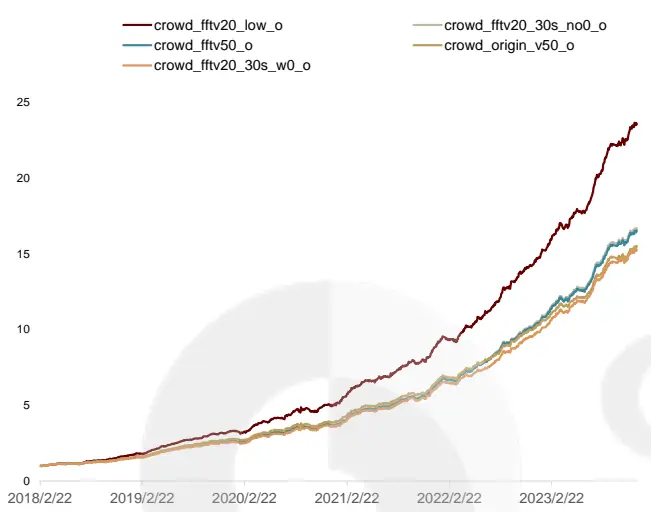

图表 69：全市场范围内表现较好的拥挤度因子年化超额收益统计
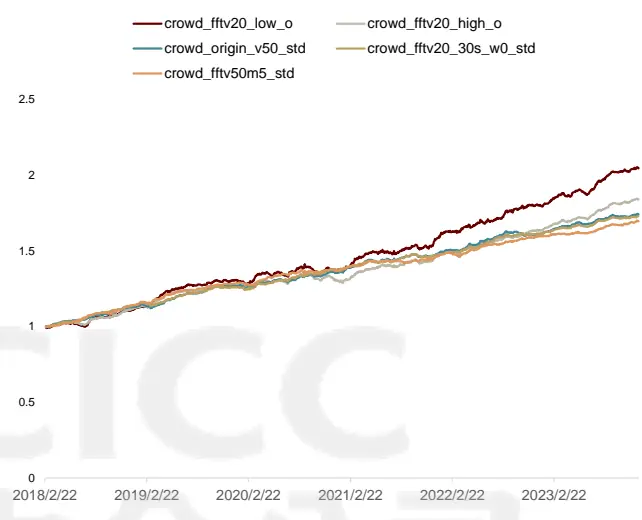

图表 70：crowd_fftv20_low_o 与常见因子相关系数
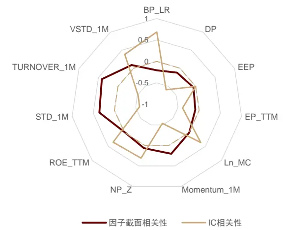
注：1）统计时间为 2018-01-08 至 2023-12-01；2）相对净值的比较基准为全市场等权
资料来源：Wind，中金公司研究部

图表 71：全市场范围内表现较好的拥挤度因子分组年化超额收益统计
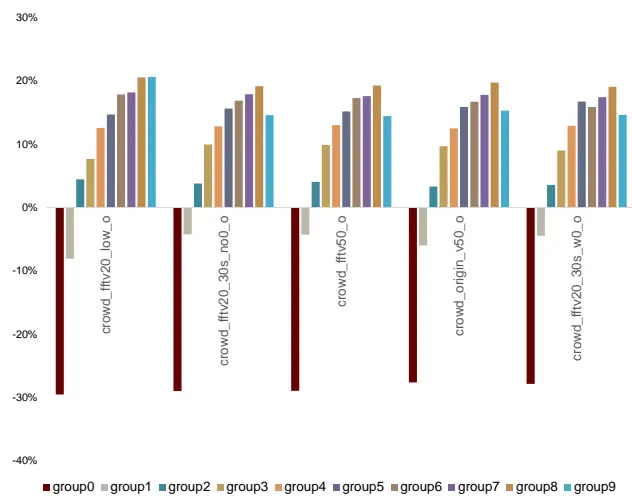
注：1）统计时间为 2013-02-22 至 2023-12-01；2）超额收益的比较基准为全市场等权；3）Group0 为因子值最小一组，Group9 为因子值最大一组资料来源：Wind，中金公司研究部

## 资金成交

## 开盘占比因子总体相对有效

资金流因子反映了不同类型资金流向的信息，该类因子的核心思路是捕捉“聪明资金”的流向，采取跟随策略，以期获得基本面改善带来的超额收益。我们利用盘口数据和 k线数据，构建了 13个资金流因子，并在不同范围内分别进行月度和周度调仓的有效性检验。

图表 72：资金流因子构建方式

| 指标名称 | 指标代码 | 构建方法 |
| --- | --- | --- |
| 开盘后盘口净委买增额占比 | trade_bidAskRatio | 以日内tick级数据计算盘口委买赠额(委托买单增加量与委托卖单增加量之差)占 成交额的比重 |
| 后20k线收益率成交占比 | trade_bottom20retRatio | 后20根K线每根的收益率乘以其成交量所占比例，得到的加权收益率之和 |
| 后50k线收益率成交占比 | trade_bottom50retRatio | 后50根K线每根的收益率乘以其成交量所占比例，得到的加权收益率之和 |
| 撤买单量占当日交易总量的占比 | trade_CBuyRatio | 当日所有撤销的买单量与当日总成交量的比例 |
| 总撤单量占当日交易总量的占比 | trade_CRatio | 当日所有撤单(包括买单和卖单)量与当日总成交量的比例 |
| 撤卖单量占当日交易总量的占比 | trade_CSellRatio | 当日所有撤销的卖单量与当日总成交量的比例 |
| 开盘成交占比 | trade_headRatio | 开盘一定时间内的成交量与当日总成交量的比例 |
| 开盘后净主买占比 | trade_netBuyRatio | 以日内逐笔数据中投资者主动买入和主动卖出的信息，计算两者的成交金额差值得 到净主动买入的金额(简称“净主买”) |
| 尾盘成交占比 | trade_tailRatio | 收盘前一定时间内的成交量与当日总成交量的比例 |
| 前20k线收益率成交占比 | trade_top20retRatio | 前20根K线中，收益率与成交量比例的均值 |
| 前50k线收益率成交占比 | trade_top50retRatio | 前50根K线中，收益率与成交量比例的均值 |
| 前20k线下跌收益率成交占比 | trade_topNeg20retRatio | 前20根K线中，收益率为负的绝对平均收益率与成交量比例的均值 |
| 前20k线上涨收益率成交占比 | trade_topPos20retRatio | 前20根K线中，收益率为正的平均收益率与成交量比例的均值 |

资料来源：中金公司研究部

trade_headRatio_std 和 trade_top20retRatio_m 因子在全市场选股中相对其他资金流向因子有效性较高。我们基于相关性统计以及因子构建逻辑，大致将资金流因子分为以下三类：交易单量资金流向因子、开盘/尾盘资金流向因子和收益率成交占比因子。

交易单量资金流向因子包括 trade_CBuyRatio、trade_Cratio 和 trade_CSellRatio 因子。从因子有效性角度来看，其整体表现不如其他两类因子。在全市场范围内，trade_CSellRatio_z 因子在月度和周度两种调仓频率下表现均相对更好，它具有正向预测能力，ICIR 表现分别为 0.40 和 0.36；在沪深 300 中，trade_CBuyRatio_z 因子相对更为有效，其在两种调仓频率下的年化多头超额分别为 3.7%和 4.7%，具有负向的预测效果。

开盘/尾盘资金流向因子指的是上午 10点前和下午 14点 30 后的资金流向所构建的因子，包括 trade_headRatio、trade_netBuyRatio 和 trade_bidAskRatio 等因子。从因子有效性角度来看，开盘资金流向因子有效性多强于尾盘资金流向因子，trade_headRatio_std 因子相比其他开盘/尾盘资金流因子在全市场的有效性表现良好，周度调仓频率下其 ICIR 为0.92，年化多空收益可达 24.9%。

收益率成交占比因子包括 trade_top20retRatio、trade_top50retRatio 等，这类因子彼此间存在较高相关性。从因子有效性角度出发，trade_top20retRatio_m 相对其他资金流向因子具有更有效的表现。在全市场范围内采取月度调仓频率，其 ICIR为 0.90，IC均值为-5.23%。

综上所述，资金流向因子中的 trade_headRatio_std 和 trade_top20retRatio_m 因子在全市场范围内较为有效。但该类因子整体选股有效性一般。

图表 73：资金流因子在全市场范围内月度回测的有效性检验结果（ICIR>0.5）

|  | IC均值 | ICIR | 多空收益 | 多空夏普 | 多头超额 | 多头超额夏普 | 多头超额 最大回撤 | 多头超额胜率 | 换手率 |
| --- | --- | --- | --- | --- | --- | --- | --- | --- | --- |
| trade_headRatio_std | -5.24% | 1.07 | 14.0% | 2.21 | 3.8% | 1.31 | 4.19% | 70.31% | 81.92% |
| trade_top20retRatio_m | -5.23% | 0.90 | 14.1% | 1.72 | 3.6% | 0.72 | 9.09% | 48.44% | 60.09% |
| trade_top20retRatio_std | -4.06% | 0.85 | 13.8% | 2.17 | 2.5% | 0.84 | 5.81% | 64.06% | 80.76% |
| trade_bidAskRatio_m | -4.12% | 0.82 | 18.8% | 2.57 | 5.6% | 1.58 | 3.92% | 72.86% | 67.60% |
| trade_top50retRatio_std | -3.37% | 0.80 | 14.2% | 2.26 | 3.2% | 1.09 | 5.65% | 68.75% | 80.95% |
| trade_bottom20retRatio_m | -4.34% | 0.78 | 14.2% | 2.08 | 4.4% | 0.89 | 8.52% | 54.69% | 52.72% |
| trade_headRatio_m | -6.00% | 0.74 | 13.4% | 1.32 | 0.7% | 0.19 | 9.59% | 57.81% | 65.29% |
| trade_bidAskRatio_z | -2.20% | 0.73 | 8.2% | 1.66 | 3.0% | 1.02 | 3.21% | 54.69% | 75.74% |
| trade_bidAskRatio_std | -2.66% | 0.59 | 8.2% | 1.24 | -1.1% | -0.27 | 14.32% | 50.00% | 63.79% |
| trade_topNeg20retRatio_o | 4.93% | 0.58 | 13.5% | 1.56 | 4.5% | 0.88 | 10.55% | 57.81% | 68.77% |
| trade_headRatio_o | -2.91% | 0.58 | 7.2% | 1.10 | -0.7% | -0.19 | 7.08% | 48.44% | 85.70% |
| trade_netBuyRatio_std | 4.67% | 0.51 | 8.8% | 0.89 | -1.4% | -0.27 | 18.35% | 42.19% | 64.89% |

资料来源：Wind，中金公司研究部（注：统计时间为 2018-01-08 至 2023-12-01；超额收益的比较基准为全市场等权指数）

图表 74：资金流因子在全市场范围内周度回测的有效性检验结果（ICIR>0.5）

|  | IC均值 | ICIR | 多空收益 | 多空夏普 | 多头超额 | 多头超额夏普 | 多头超额 最大回撤 | 多头超额胜率 | 换手率 |
| --- | --- | --- | --- | --- | --- | --- | --- | --- | --- |
| trade_headRatio_std | -3.93% | 0.92 | 24.9% | 3.84 | 5.4% | 2.21 | 2.06% | 70.00% | 86.86% |
| trade_top20retRatio_m | -4.44% | 0.71 | 23.0% | 2.61 | 1.7% | 0.42 | 11.40% | 52.86% | 70.45% |
| trade_bidAskRatio_m | -2.85% | 0.63 | 22.9% | 3.69 | 4.1% | 1.21 | 3.71% | 63.38% | 74.09% |
| trade_headRatio_m | -3.92% | 0.60 | 16.7% | 1.65 | -0.9% | -0.18 | 13.61% | 51.43% | 72.42% |
| trade_top20retRatio_o | -3.15% | 0.56 | 13.9% | 1.93 | 3.1% | 0.88 | 6.51% | 55.71% | 83.46% |
| trade_headRatio_o | -2.93% | 0.53 | 18.3% | 2.23 | -1.3% | -0.33 | 15.10% | 47.14% | 84.85% |
| trade_top20retRatio_std | -2.78% | 0.53 | 17.7% | 2.37 | 1.1% | 0.34 | 7.10% | 52.86% | 85.68% |
| trade_bidAskRatio_std | -2.07% | 0.53 | 14.7% | 2.65 | 0.0% | 0.00 | 7.42% | 47.89% | 76.98% |

资料来源：Wind，中金公司研究部（注：统计时间为 2018-01-08 至 2023-12-01；超额收益的比较基准为有效股票池等权表现）

图表 75：资金流因子在不同股票池范围和不同调仓频率下 ICIR 最高的 5种因子具体表现
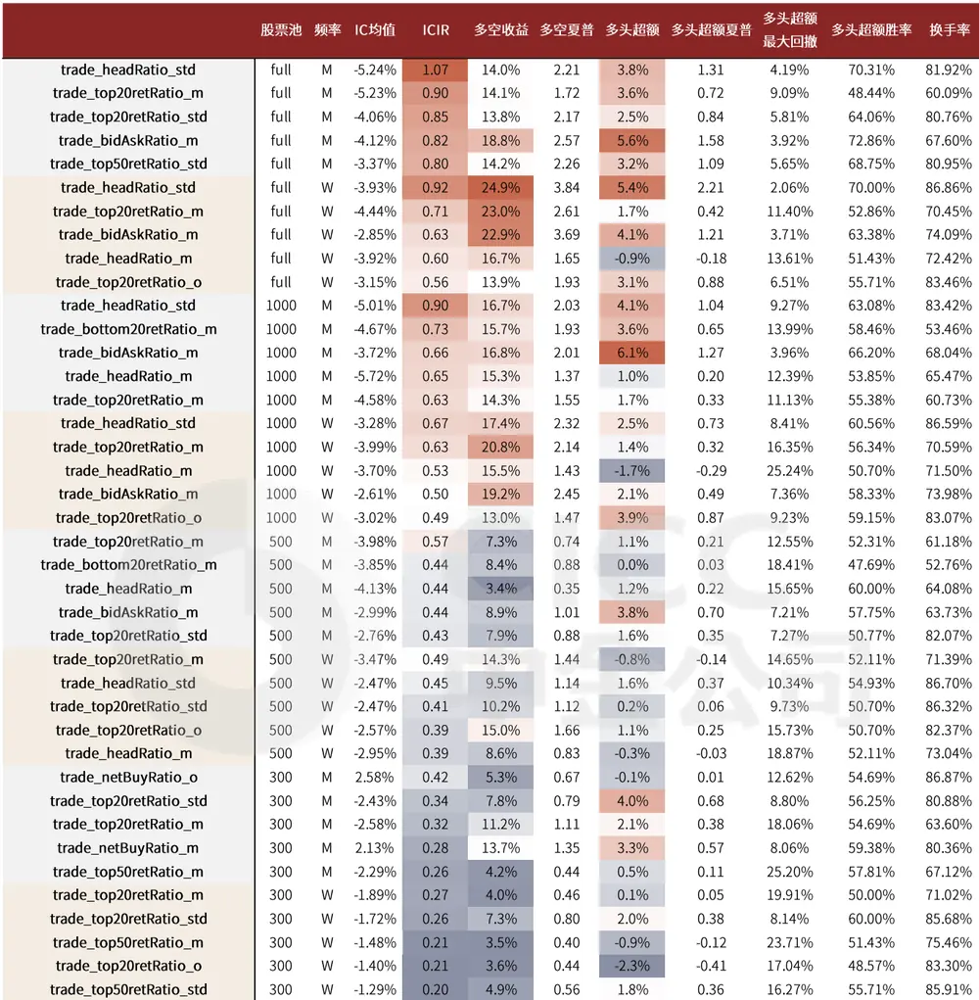
资料来源： ，中金公司研究部（注：统计时间为 至 ；超额收益的比较基准为有效股票池等权表现）

图表 ：全市场范围内表现相对较好（ ）的资金流因子之间的相关性统计

|  |  |  |  |  |  |  |  | trade_top20rtrade_top20rt |  | rade_top50r |
| --- | --- | --- | --- | --- | --- | --- | --- | --- | --- | --- |
|  |  |  |  |  |  |  | etRatio_m etRatio_std |  |  | etRatio_std |
|  |  | 0.83 |  |  |  |  |  |  |  |  |
| trade_bottom20retRatio_m | 0.37 | 0.32 |  |  |  |  |  |  |  |  |
| trade_headRatio_m | 0.16 | 0.14 | 0.21 |  |  |  |  |  |  |  |
| trade_headRatio_stdtrade_netBuyRatio_stdtrade_top20retRatio_m | 0.18 | 0.17 | 0.28 | 0.48 |  |  |  |  |  |  |
|  | 0.10 | 0.00 | 0.10 | 0.33 | 0.04 |  |  |  |  |  |
|  | 0.20 | 0.26 | 0.42 | 0.28 | 0.39 | 0.14 |  |  |  |  |
| trade_top20retRatio_std | 0.18 | 0.22 | 0.27 | 0.17 | 0.45 | -0.19 | 0.52 |  |  |  |
| trade_top50retRatio_std | 0.14 | 0.17 | 0.28 | 0.13 | 0.41 | -0.22 | 0.43 |  | 0.79 |  |
| trade_topNeg20retRatio_o | 0.08 | 0.06 | 0.21 | 0.17 | 0.10 | 0.35 | 0.27 |  | -0.03 | -0.01 |

资料来源：Wind，中金公司研究部（注：统计时间为 2018-01-08 至 2023-12-01）

全市场范围内，trade_topNeg20Ratio_o 和 trade_headRatio_std 等因子多空和多头超额表现较好，均显著跑赢基线，且单调性较为良好。然而，trade_topNeg20Ratio_o 因子与常见因子如 Momentum_1M、DP、STD3_1M、TURNOVER_1M 存在一定相关性，IC 相关性统计结果在 0.5左右的水平。

图表 77：全市场范围内表现较好的资金流因子年化多空收益统计
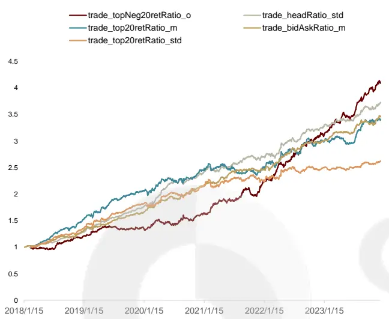

图表 78：全市场范围内表现较好的资金流因子年化超额收益统计
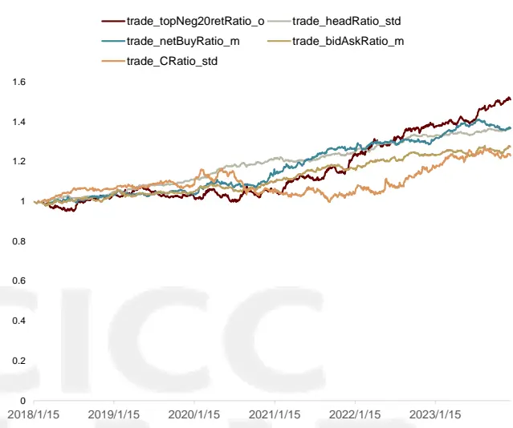

图表 79：trade_topNeg20retRatio_o 与常见因子相关系数
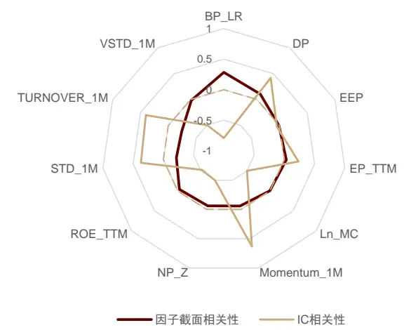
注：1）统计时间为 2018-01-08 至 2023-12-01；2）相对净值的比较基准为全市场等权
资料来源：Wind，中金公司研究部

图表 80：全市场范围内表现较好的资金流因子分组年化超额收益统计
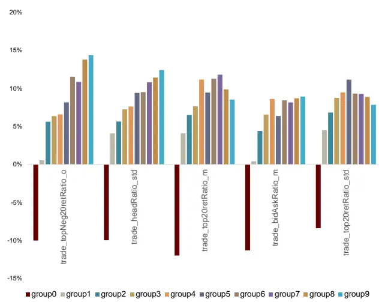
注：1）统计时间为 2018-01-08 至 2023-12-01；2）超额收益的比较基准为全市场等权； ） 为因子值最小一组， 为因子值最大一组资料来源：Wind，中金公司研究部

## 价量复合因子

## 价量复合因子兼顾收益与稳定性

我们取前文分析的各类因子中，选股效果较好的因子，按同类型因子等权合成的方式，构建了8 个复合因子。复合因子的具体构建方式如下表所示，复合因子合成过程中，我们对因子的方向进行了调整，使各个复合因子均与下期收益率正相关。

图表 81：价量复合因子构建方式

| 指标名称 指标代码 | 构建方法 |
| --- | --- |
| 波动率 | syn_vol 取波动率因子中周度综合表现前5名,进行市值和行业中性化及标准化后等权合并 |
| 下单行为 syn_trade | 取下单行为因子中周度综合表现前5名，进行市值和行业中性化及标准化后等权合并 |
| 高阶特征 | syn_shape 取高阶特征因子中周度综合表现前5名，进行市值和行业中性化及标准化后等权合并 |
| 动量反转 syn_mmt | 取动量反转因子中周度综合表现前5名，进行市值和行业中性化及标准化后等权合并 |
| 流动性 syn_liq | 取流动性因子中周度综合表现前5名,进行市值和行业中性化及标准化后等权合并 |
| 筹码分布 syn_doc | 取筹码分布因子中周度综合表现前5名,进行市值和行业中性化及标准化后等权合并 |
| 拥挤度 syn_crowd | 取拥挤度因子中周度综合表现前5名,进行市值和行业中性化及标准化后等权合并 |
| 价量相关 | syn_corr 取价量相关因子中周度综合表现前5名，进行市值和行业中性化及标准化后等权合并 |

资料来源：中金公司研究部

月度频率下 syn_corr_o 和 syn_crowd_o 因子在全市场选股中相对其他因子有效性较高，其中全市场范围内 syn_corr_o 因子有效性更强，ICIR 达 1.23。周度频率下 syn_crowd_o 和syn_mmt_o 因子表现较优。其中，syn_mmt_o 因子有效性更强，ICIR 为 1.1，多空收益为64.2%。而 syn_crowd_o 因子的收益预测能力更佳，其多空收益达 69.9%，多头超额11.1%，相对优于其他复合因子。

图表 82：价量复合因子在全市场范围内月度和周度回测的有效性检验结果

|  | 频率 | IC均值 | ICIR | 多空收益 | 多空夏普 | 多头超额 | 多头超额 夏普 | 多头超额 最大回撤 | 多头超额 胜率 | 换手率 |
| --- | --- | --- | --- | --- | --- | --- | --- | --- | --- | --- |
| syn_corr_o | W | 8.70% | 1.20 | 64.1% | 5.53 | 14.8% | 3.32 | 3.97% | 78.69% | 84.11% |
| syn_crowd_o | W | 8.59% | 0.95 | 69.9% | 4.83 | 11.1% | 2.32 | 5.42% | 70.42% | 66.69% |
| syn_doc_o | W | 7.60% | 1.05 | 46.5% | 3.25 | 3.3% | 0.69 | 6.73% | 56.34% | 68.14% |
| syn_liq_o | W | 6.78% | 0.74 | 50.4% | 3.83 | 14.9% | 2.71 | 5.84% | 74.65% | 46.41% |
| syn_mmt_o | W | 7.56% | 1.10 | 64.2% | 5.73 | 12.0% | 2.62 | 3.40% | 73.24% | 70.09% |
| syn_shape_o | W | 5.35% | 0.88 | 28.7% | 3.61 | 6.7% | 1.69 | 5.03% | 69.01% | 70.22% |
| syn_trade_o | W | 5.55% | 0.94 | 32.2% | 3.39 | 5.6% | 1.41 | 4.93% | 60.56% | 76.66% |
| syn_vol_o | W | 8.87% | 1.16 | 61.5% | 3.79 | 8.7% | 1.88 | 6.07% | 76.06% | 60.90% |
| syn_corr_o | M | 7.56% | 1.23 | 23.9% | 2.99 | 4.2% | 1.17 | 6.64% | 64.46% | 86.73% |
| syn_crowd_o | M | 9.25% | 0.98 | 30.2% | 2.45 | 2.5% | 0.57 | 6.71% | 52.86% | 71.77% |
| syn_doc_o | M | 6.90% | 0.85 | 19.8% | 1.83 | 0.6% | 0.15 | 14.05% | 51.43% | 75.67% |
| syn_liq_o | M | 6.59% | 0.68 | 21.1% | 1.54 | 2.3% | 0.37 | 19.64% | 54.29% | 43.72% |
| syn_mmt_o | M | 6.71% | 1.09 | 21.7% | 2.51 | 5.8% | 1.34 | 6.25% | 62.86% | 73.85% |
| syn_shape_o | M | 5.70% | 1.07 | 17.9% | 2.89 | 5.8% | 1.39 | 5.57% | 65.71% | 74.57% |
| syn_trade_o | M | 4.81% | 1.12 | 16.8% | 2.51 | 3.6% | 1.16 | 4.57% | 68.57% | 82.65% |
| syn_vol_o | M | 8.29% | 0.96 | 22.8% | 1.80 | 0.6% | 0.14 | 11.00% | 55.71% | 68.64% |

资料来源：Wind，中金公司研究部（注：统计时间为 2018-01-08 至 2023-12-01；超额收益的比较基准为有效股票池等权表现）

## 复合因子展示

全市场范围内，大部分复合因子单调性良好，多头稳定。综合波动率和综合筹码分布相关系数较高，可能因为筹码分布的成交量占比价差概念也能从另一种角度表征市场价格变化幅度这一概念。

图表 83：全市场范围内复合因子年化多空收益净值
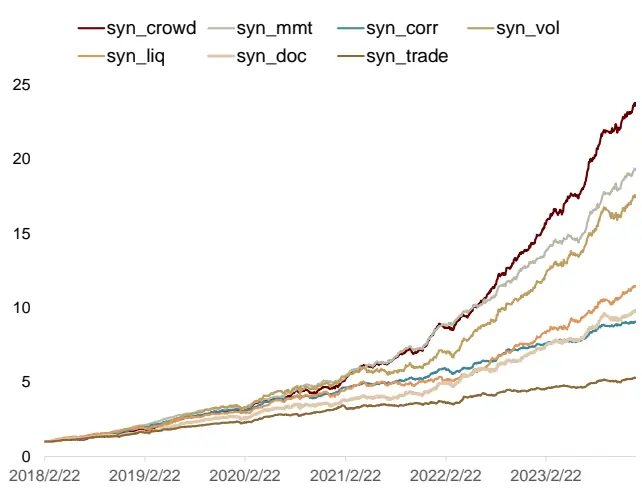
图表 85：综合因子间周频相关性

图表 84：全市场范围内价量复合因子年化超额净值
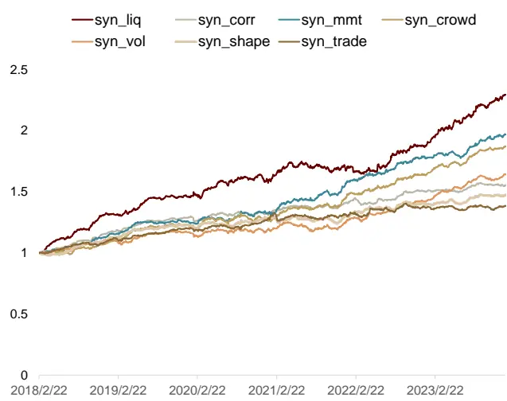

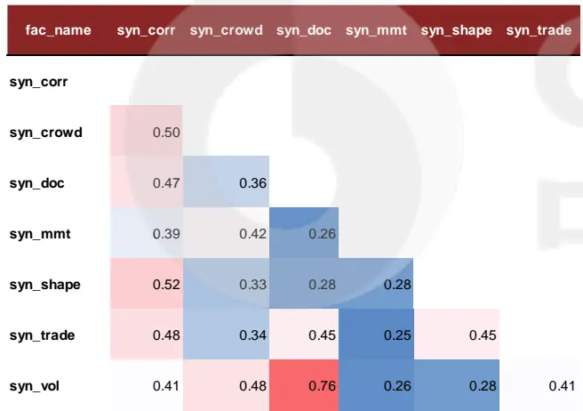
注： ）统计时间为 至 ； ）相对净值的比较基准为全市场等权
资料来源：Wind，中金公司研究部

图表 86：全市场范围内表现较好的价量复合因子分组年化超额收益统计
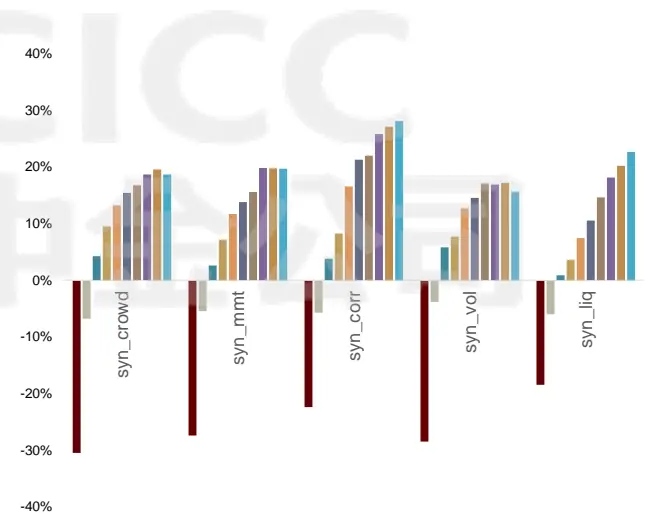
group0group1group2group3group4group5group6group7group8group9
注： ）统计时间为 至 ； ）超额收益的比较基准为全市场等权；3）Group0 为因子值最小一组，Group9 为因子值最大一组资料来源：Wind，中金公司研究部

## 附录：全范围全频率测试结果

## 动量因子

图表 87：动量反转因子在不同股票池范围和不同调仓频率下因子主要指标表现

| ICI多空 |  |  |  | M | 全市场W |  |  |  | 1000N |  |  | .000V |  |  | 500M |  |  | 500W |  |  | 300M |  | 300W |  |  |  |  |
| --- | --- | --- | --- | --- | --- | --- | --- | --- | --- | --- | --- | --- | --- | --- | --- | --- | --- | --- | --- | --- | --- | --- | --- | --- | --- | --- | --- |
|  |  |  |  | ICIR | 多空 | 超额 | ICIR | 多空 | 超额 | ICIR | 多空 | 超额 | ICIR | 多空 | 超额 | ICIR | 多空 | 超额 | ICIR | 多空 | 超额 | ICIR | 多空 | 超额 | ICIR 多空 |  | 超额 |
| mmt_ols_beta_mean_o |  | 1.09 | 22% | 7% | 0.89 | 54% | 23% | 1.02 | 16% | 5% | 0.73 | 34% | 13% | 0.80 | 12% | 3% | 0.59 | 23% | 8% | 0.52 | 7% | 2% | 0.37 37% |  | 3% |  |  |
| mmt_bottom20VolumeRet_m |  | 1.03 | 14% | 3% | 0.50 | 17% | 3% | 0.61 | 9% | 4% | 0.26 | 13% | 5% | 0.54 | 9% | 3% | 0.15 | 6% | 1% | 0.32 | 4% | 1% | 0.10 | 10% | 6% |  |  |
| mmt_last30_std |  | 1.00 | 26% | 6% | 0.72 | 47% | 9% | 0.88 | 22% | 4% | 0.65 | 31% | 4% | 0.68 | 14% | 2% | 0.49 | 20% | 3% | 0.57 | 12% | 2% | 0.33 | 33% | -1% |  |  |
| mmt_ols_qrs_o |  | 1.00 | 23% | 6% | 0.77 | 47% | 14% | 1.01 | 23% | 7% | 0.71 | 35% | 11% | 0.74 | 15% | 4% | 0.55 | 25% | 7% | 0.49 | 7% | 3% | 0.34 | 34% | 5% |  |  |
| mmt_top20VolumeRet_std |  | 1.00 | 29% | 6% | 0.82 | 43% | 11% | 0.84 | 24% | 4% | 0.74 | 25% | 4% | 0.67 | 13% | 2% | 0.55 | 12% | 0% | 0.53 | 10% | 0% | 0.31 31% |  | -1% |  |  |
|  |  | 0.92 | 21% | 6% | 0.63 | 24% | 8% | 0.95 | 21% | 5% | 0.60 | 28% | 9% | 0.65 | 15% | 4% | 0.45 | 16% | 4% | 0.44 | 9% | 3% | 0.28 28% |  | 4% |  |  |
|  |  | mmt_ols_corr_sqaure_mean_o |  | 0.92 | 21% | 6% | 0.63 | 24% | 8% | 0.95 | 23% | 6% | 0.60 | 28% | 9% | 0.65 | 15% | 4% | 0.45 | 16% | 4% | 0.44 | 7% | 2% | 0.28 28% |  | 3% |
| mmt_bottom50VolumeRet_m |  | 0.91 | 16% | 4% | 0.43 | 20% | 5% | 0.65 | 14% | 4% | 0.26 | 17% | 5% | 0.42 | 10% | 2% | 0.17 | 10% | 5% | 0.30 | 4% | 0% | 0.08 8% |  | 4% |  |  |
| mmt_top20VolumeRet_m |  | 0.90 | 21% | 2% | 0.73 | 39% | 5% | 0.69 | 20% | 3% | 0.54 | 29% | 6% | 0.49 | 10% | 0% | 0.51 | 24% | 5% | 0.55 | 8% | 2% | 0.40 40% |  | 3% |  |  |
| mmt tot ovolumn et std |  | 0.86 | 26% | 4% | 0.60 | 44% | 7% | 0.78 | 30% | 7% | 0.44 | 32% | 6% | 0.53 | 14% | 3% | 0.34 | 18% | 4% | 0.36 | 10% | 0% | 0.30 30% |  | 8% |  |  |
|  |  | 0.86 | 23% | 4% | 0.66 | 34% | 8% | 0.73 | 16% | 3% | 0.57 | 16% | 0% | 0.58 | 9% | 1% | 0.45 | 6% | -1% | 0.44 | 9% | 0% | 0.23 23% |  | -2% |  |  |
| mmt_pm_std |  | 0.84 | 24% | 3% | 0.57 | 41% | 8% | 0.73 | 18% | 2% | 0.55 | 28% | 4% | 0.62 | 13% | 0% | 0.41 | 16% | 2% | 0.45 | 10% | 0% | 0.26 26% |  | -1% |  |  |
| mm ols topm_zan_m |  | mmt_pm_z |  |  |  |  |  | 0.76 | 11% | 3% | 0.54 | 33% | 7% | 0.70 | 11% | 3% | 0.38 | 20% | 3% | 0.43 | 6% | 0% | 0.36 | 17% | 3% |  |  |
|  |  | 0.76 | 24% | 6% | 0.55 | 38% | 9% | 0.74 | 23% | 7% | 0.54 | 36% | 9% | 0.63 | 14% | 3% | 0.39 | 24% | 5% | 0.46 | 12% | 3% | 0.26 26% |  | 3% |  |  |
| mmt_ols_corr_sqaure_mean_m |  | 0.76 |  |  | 0.56 | 39% | 9% | 0.74 | 23% | 7% | 0.55 | 37% | 9% | 0.64 | 14% | 4% | 0.40 | 24% | 5% | 0.46 | 13% | 4% | 0.26 26% |  | 4% |  |  |
| mmt_top50VolumeRet_mmmt_last30_z |  | 0.75 |  |  | 0.59 | 41% | 8% | 0.75 | 20% | 6% | 0.57 | 32% | 6% | 0.62 | 13% | 3% | 0.43 | 23% | 7% | 0.44 | 11% | 2% | 0.28 28% |  | 3% |  |  |
|  |  | 0.74 | 17% | 2% | 0.62 | 36% | 6% | 0.59 | 17% | 4% | 0.46 | 25% | 6% | 0.38 | 9% | 0% | 0.42 | 16% | 4% | 0.33 | 9% | 1% | 0.3333% |  | 4% |  |  |
|  |  | 0.74 | 7% | 1% | 0.74 | 31% | 7% | 0.40 | 6% | 0% | 0.46 | 21% | 5% | 0.31 | 4% | 2% | 0.50 | 23% | 7% | 0.20 | 1% | -1% | 0.4545% |  | 11% |  |  |
| mmt_between_stdmmt_ols_beta_mean_m |  | 0.74 | 20% | 1% | 0.49 | 26% | 5% | 0.61 | 14% | 0% | 0.43 | 11% | -2% | 0.50 | 11% | 2% | 0.35 | 5% | -2% | 0.38 | 7% | -1% | 0.14 | 14% | -4% |  |  |
|  |  | 0.72 | 19% | 2% | 0.64 | 39% | 7% | 0.73 | 16% | 2% | 0.60 | 27% | 4% | 0.57 | 13% | 1% | 0.46 | 21% | 6% | 0.39 | 9% | 0% | 0.32 | 32% | 2% |  |  |
| mmt_ols_corr_mean_std |  | 0.69 | 18% | 3% | 0.45 | 20% | 3% | 0.62 | 16% | 3% | 0.44 | 17% | 3% | 0.62 | 14% | 2% | 0.29 | 11% | 3% | 0.42 | 8% | 1% | 0.25 | 25% | 5% |  |  |
|  |  | mmt_ols_corr_sqaure_mean_std |  | 0.68 | 18% | 2% | 0.44 | 18% | 2% | 0.61 | 16% | 4% | 0.43 | 13% | 2% | 0.62 | 13% | 2% | 0.29 | 9% | 1% | 0.42 | 7% | 1% | 0.24 | 24% | 5% |
| mmt_am_std |  | 0.65 | 16% | 1% | 0.51 | 25% | 5% | 0.59 | 13% | 1% | 0.43 | 9% | -3% | 0.41 | 5% | -1% | 0.34 | 4% | -2% | 0.33 | 6% | -1% | 0.1414% |  | -3% |  |  |
|  | mmt_pm_m | 0.63 | 20% | 2% | 0.64 | 58% | 10% | 0.61 | 20% | 3% | 0.48 | 42% | 7% | 0.45 | 14% | 2% | 0.46 | 34% | 8% | 0.37 | 13% | 2% | 0.3535% |  | 11% |  |  |
|  | mmt_am_m | 0.60 | 16% | 0% | 0.41 | 19% | -2% | 0.49 | 18% | 2% | 0.30 | 13% | -2% | 0.31 | 6% | -1% | 0.25 | 4% | -3% | 0.27 | 5% | -3% | 0.21 | 21% | -3% |  |  |
|  | mmt_bottom50VolumeRet_o | 0.57 | 5% | 0% | 0.39 | 15% | 1% | 0.44 | 5% | 0% | 0.22 | 10% | 2% | 0.19 | 2% | 0% | 0.09 | 7% | 2% | 0.08 | 0% | 1% | 0.18 | 18% | 8% |  |  |
|  | mmt_bottom20VolumeRet_o | 0.53 | 4% | -3% | 0.42 | 12% | -1% | 0.26 | 2% | -1% | 0.19 | 7% | 0% | 0.20 | 1% | -1% | 0.14 | 7% | 1% | 0.04 | -1% | 1% | 0.16 | 16% | 5% |  |  |
|  | mmt_top20VolumeRet_o | 0.53 | 9% | -3% | 0.37 | 9% | -9% | 0.36 | 8% | -3% | 0.27 | 4% | -8% | 0.25 | 6% | -1% | 0.32 | 11% | -1% | 0.17 | 5% | 1% | 0.2424% |  | 2% |  |  |
|  | mmt_last30_o | 0.53 | 10% | -3% | 0.49 | 31% | -3% | 0.33 | 5% | -4% | 0.31 | 19% | -5% | 0.35 | 11% | 1% | 0.46 | 31% | 4% | 0.48 | 13% | 3% | 0.4343% |  | 6% |  |  |
|  | mmt_between_z | 0.52 | 11% | 1% | 0.37 | 23% | 3% | 0.51 | 12% | 2% | 0.26 | 13% | -1% | 0.32 | 6% | 0% | 0.19 | 9% | 1% | 0.12 | 3% | -1% | 0.1414% |  | 0% |  |  |
|  | mmt_top20VolumeRet_z | 0.52 | 6% | 0% | 0.50 | 23% | 5% | 0.37 | 5% | 0% | 0.35 | 16% | 3% | 0.21 | 1% | -1% | 0.35 | 13% | 4% | 0.22 | 0% | -1% | 0.2525% |  | 5% |  |  |
| mmt_pm_ommt_paratio_stdmmt_bottom20VolumeRet_zmmt_ols_corr_sqaure_mean_zmmt_ols_beta_zscore_last_stdmmt_ols_corr_mean_zmmt_ols_qrs_zmmt_bottom50VolumeRet_stdmmt_ols_beta_mean_zmmt_top50VolumeRet_ommt_between_ommt_last30_mmmt_ols_beta_mean_stdmmt_am_zmmt_ols_beta_zscore_last_mmmt_paratio_zmmt_paratio_ommt_am_ommt_ols_beta_zscore_last_ommt_ols_beta_zscore_last_zmmt_paratio_m |  | nmt_bottom20VolumeRet_std |  |  |  |  | 0.52 | 8% | 2% | 0.48 | 23% | 13% | 0.15 | 1% | -2% | 0.21 | 5% | -1% | 0.15 | 1% | -1% | 0.15 | 5% | 2% | 0.05 |  |  |
|  |  | mmt_pm_o | 0.49 | 13% | -2% | 0.35 | 27% | -2% | 0.36 | 11% | -2% | 0.27 | 17% | -4% | 0.38 | 16% | 3% | 0.37 | 21% | 4% | 0.35 | 11% | 3% | 0.4040% |  | 9% |  |
|  |  | mmt_top50VolumeRet_z | 0.48 | 6% | 0% | 0.44 | 22% | 6% | 0.35 | 4% | 0% | 0.30 | 12% | 2% | 0.17 | 1% | 0% | 0.29 | 10% | 5% | 0.19 | 2% | 0% | 0.2121% |  | 4% |  |
|  |  | mmt_bottom50VolumeRet_z | 0.48 | 5% | 2% | 0.23 | 7% | 2% | 0.27 | 5% | 2% | 0.14 | 8% | 4% | 0.23 | 10% | 4% | 0.06 | 3% | 1% | 0.14 | 6% | 3% | 0.011% |  | -1% |  |
|  |  | mmt_ols_qrs_std | 0.47 | 6% | -4% | 0.27 | 7% | -2% | 0.41 | 7% | -4% | 0.25 | 5% | -2% | 0.50 | 9% | 0% | 0.20 | 8% | 1% | 0.37 | 8% | 1% | 0.2222% |  | 3% |  |
|  |  | 0.46 | 6% | 0% | 0.25 | 5% | 0% | 0.31 | 1% | -1% | 0.16 | 4% | 0% | 0.13 | 2% | 1% | 0.16 | 6% | 2% | 0.20 | 2% | -1% | 0.1212% |  | -1% |  |  |
|  |  | 0.45 | 4% | 1% | 0.20 | 8% | 2% | 0.21 | 3% | 2% | 0.10 | 8% | 4% | 0.32 | 7% | 4% | 0.02 | 1% | -2% | 0.04 | 1% | 1% | 0.022% |  | 1% |  |  |
|  |  | 0.45 | 5% | 1% | 0.41 | 11% | 1% | 0.39 | 2% | 0% | 0.31 | 7% | -1% | 0.31 | 2% | 0% | 0.30 | 5% | 0% | 0.20 | 5% | -1% | 0.1111% |  | -1% |  |  |
|  |  | 0.44 | 5% | 1% | 0.35 | 7% | 2% | 0.26 | 4% | 3% | 0.25 | 7% | 2% | 0.14 | 2% | 0% | 0.11 | 1% | 0% | 0.18 | 4% | 0% | 0.1616% |  | 4% |  |  |
|  |  | 0.44 | 4% | 0% | 0.40 | 11% | 1% | 0.38 | 2% | 0% | 0.30 | 7% | -1% | 0.30 | 2% | 0% | 0.29 | 5% | 0% | 0.20 | 5% | -1% | 0.1010% |  | -1% |  |  |
|  |  | 0.43 | 3% | 0% | 0.48 | 10% | 1% | 0.38 | 2% | 0% | 0.38 | 9% | 0% | 0.28 | 1% | 0% | 0.37 | 8% | 2% | 0.15 | 3% | -1% | 0.1414% |  | -2% |  |  |
|  |  | 0.42 | 5% | -1% | 0.42 | 18% | 9% | 0.15 | -2% | -3% | 0.21 | 5% | 2% | 0.12 | -1% | -4% | 0.19 | 0% | -1% | 0.14 | 0% | 0% | 0.077% |  | 3% |  |  |
|  |  | 0.40 | 4% | 0% | 0.54 | 12% | 2% | 0.35 | 2% | 0% | 0.42 | 8% | 0% | 0.23 | -2% | -1% | 0.38 | 10% | 4% | 0.08 | 4% | 2% | 0.1919% |  | 2% |  |  |
|  |  | 0.39 | 9% | -3% | 0.27 | 6% | -9% | 0.25 | 8% | -3% | 0.21 | 1% | -8% | 0.19 | 2% | -3% | 0.27 | 6% | -3% | 0.11 | 3% | 1% | 0.2222% |  | 1% |  |  |
|  |  | 0.32 | 10% | -2% | 0.17 | 9% | -7% | 0.19 | 8% | -2% | 0.15 | 4% | -6% | 0.24 | 9% | 1% | 0.13 | 10% | 1% | 0.21 | 3% | 0% | 0.1717% |  | 4% |  |  |
|  |  | 0.29 | 8% | -3% | 0.70 | 54% | 9% | 0.30 | 10% | -1% | 0.50 | 42% | 9% | 0.22 | 9% | 0% | 0.54 | 38% | 8% | 0.17 | 8% | 1% | 0.4343% |  | 10% |  |  |
|  |  | 0.29 | 1% | -6% | 0.16 | 1% | -4% | 0.25 | 3% | -5% | 0.14 | 1% | -5% | 0.32 | 4% | -2% | 0.16 | 5% | -1% | 0.27 | 7% | 1% | 0.1717% |  | 2% |  |  |
|  |  | 0.28 | 4% | -2% | 0.22 | 10% | -2% | 0.18 | 2% | -2% | 0.12 | 2% | -4% | 0.12 | 1% | -2% | 0.11 | 2% | -3% | 0.18 | 2% | -2% | 0.088% |  | -4% |  |  |
|  |  | 0.23 | 5% | 2% | 0.04 | -1% | -2% | 0.04 | 3% | 1% | 0.01 | -1% | -3% | 0.06 | 3% | 1% | 0.04 | 2% | 1% | 0.03 | 0% | 0% | 0.066% |  | 2% |  |  |
|  |  | 0.14 | 2% | 1% | 0.12 | 1% | 0% | 0.13 | 0% | 0% | 0.10 | 2% | -1% | 0.01 | 1% | 2% | 0.08 | 4% | 2% | 0.14 | 6% | 2% | 0.000% |  | -1% |  |  |
|  |  | 0.14 | 0% | -4% | 0.06 | 2% | -5% | 0.11 | 4% | -2% | 0.10 | 1% | -6% | 0.03 | 2% | -2% | 0.01 | 0% | -3% | 0.03 | -1% | -4% | 0.1010% |  | -2% |  |  |
|  |  | 0.12 | 4% | -4% | 0.00 | 8% | -9% | 0.10 | 4% | -1% | 0.00 | 13% | 0% | 0.07 | 1% | -2% | 0.01 | 8% | -2% | 0.01 | 2% | 0% | 0.011% |  | -4% |  |  |
|  |  | 0.10 | 1% | 1% | 0.08 | 3% | 2% | 0.01 | 0% | 1% | 0.04 | 4% | 2% | 0.10 | 3% | 3% | 0.01 | 2% | 1% | 0.08 | 3% | 0% | 0.011% |  | 1% |  |  |
|  |  | 0.05 | 1% | 1% | 0.02 | 1% | 0% | 0.01 | 3% | 2% | 0.00 | 1% | 0% | 0.07 | -1% | -2% | 0.03 | 1% | 1% | 0.04 | -1% | -1% | 0.088% |  | 2% |  |  |
|  |  | 0.02 | 0% | -3% | 0.17 | 1% | -3% | 0.01 | -1% | -3% | 0.11 | 0% | -3% | 0.04 | -4% | -3% | 0.13 | 4% | 0% | 0.07 | 2% | 0% | 0.1313% |  | -1% |  |  |

资料来源：Wind，中金公司研究部（注：统计时间为 2013-01-14 至 2023-12-01；超额收益的比较基准为有效股票池等权表现）

图表 88：沪深 300范围内表现较好的动量因子年化多空收益统计
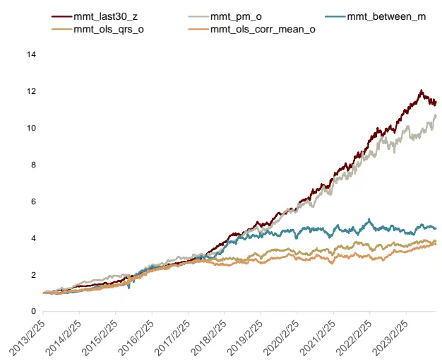
图表 90：mmt_last30_z 与常见因子相关系数

图表 89：沪深 300范围内表现较好的动量因子年化超额收益统计
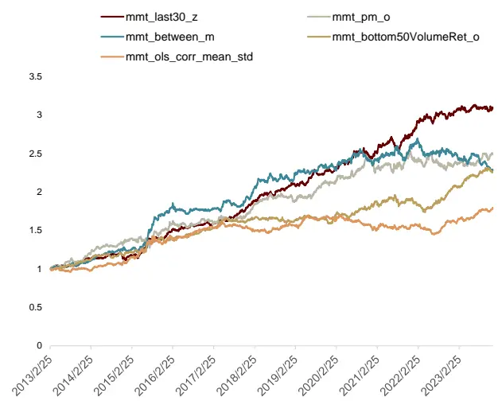

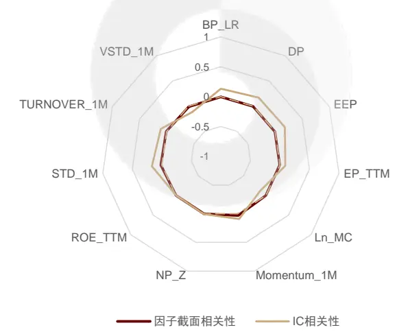
注：1）统计时间为 2013-01-14 至 2023-12-01；2）相对净值的比较基准为沪深300 等权指数 000984.CSI
资料来源：Wind，中金公司研究部

图表 91：沪深 300范围内表现较好的动量因子分组年化超额收益统计
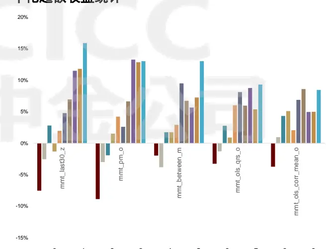
注：1）统计时间为 2013-01-14 至 2023-12-01；2）超额收益的比较基准为沪深300 等权指数 000984.CSI；3）Group0 为因子值最小一组，Group9 为因子值最大一组
资料来源：Wind，中金公司研究部

## 波动性因子

图表 92：波动性因子在不同股票池范围和不同调仓频率下因子主要指标表现

| 全市场M 全市场W 1000M |  |  |  |  |  |  |  |  |  | 1000W |  |  | 500M 500W 300M 300W |  |  |  |  |  |  |  |  |  |  |  |  |  |  |  |  |  |  |  |
| --- | --- | --- | --- | --- | --- | --- | --- | --- | --- | --- | --- | --- | --- | --- | --- | --- | --- | --- | --- | --- | --- | --- | --- | --- | --- | --- | --- | --- | --- | --- | --- | --- |
|  |  |  |  |  |  |  |  |  |  | ICIR | 多空 | 超额 | ICIR | 多空 超额 |  | ICIR | 多空 | 超额 | ICIR | 多空 | 超额 | ICIR | 多空 | 超额 | ICIR | 多空 | 超额 | ICIR | 多空 | 超额 | ICIR多空 | 超额 |
| vol_upVol_std |  | 1.35 | 26% | 8% | 0.92 | 34% | 6% | 1.22 | 24% | 8% | 0.80 | 33% | 8% | 0.80 | 9% | 1% | 0.68 | 23% | 5% | 0.70 | 13% | 4% | 0.41 | 14% | 2% |  |  |  |  |  |  |  |
| vol_return1min_std |  | 1.12 | 27% | 7% | 0.78 | 38% | 5% | 1.08 | 24% | 5% | 0.73 | 33% | 5% | 0.74 | 14% | 2% | 0.54 | 22% | 3% | 0.63 | 14% | 1% | 0.32 | 7% | -1% |  |  |  |  |  |  |  |
| vol_downVol_std |  | 0.99 | 21% | 6% | 0.55 | 23% | 2% | 0.88 | 18% | 4% | 0.56 | 25% | 3% | 0.60 | 8% | 2% | 0.38 | 12% | 0% | 0.47 | 13% | 2% | 0.21 | 6% | 3% |  |  |  |  |  |  |  |
| vol_rangelmin_std |  | 0.98 | 20% | 6% | 0.76 | 31% | 4% | 1.04 | 19% | 4% | 0.68 | 24% | 4% | 0.61 | 8% | -2% | 0.54 | 18% | 4% | 0.57 | 10% | 0% | 0.26 | 3% | -2% |  |  |  |  |  |  |  |
|  | vol_upVol_o | 0.92 | 28% | 5% | 0.69 | 40% | 4% | 0.73 | 24% | 3% | 0.66 | 36% | 6% | 0.53 | 10% | 1% | 0.53 | 23% | 4% | 0.42 | 13% | 4% | 0.35 | 12% | 1% |  |  |  |  |  |  |  |
|  | vol_return1min_o | 0.85 | 23% | 0% | 0.72 | 41% | 1% | 0.63 | 19% | 0% | 0.63 | 38% | 4% | 0.42 | 8% | 0% | 0.49 | 21% | 3% | 0.27 | 7% | 2% | 0.25 | 6% | -2% |  |  |  |  |  |  |  |
| vol_upVol_m |  | 0.79 | 23% | 4% | 0.62 | 37% | 2% | 0.76 | 20% | 4% | 0.64 | 36% | 6% | 0.56 | 10% | -1% | 0.50 | 19% | 3% | 0.50 | 16% | 3% | 0.33 | 11% | 1% |  |  |  |  |  |  |  |
|  | vol_return1min_m | 0.72 | 15% | 1% | 0.60 | 30% | -1% | 0.58 | 9% | -1% | 0.53 | 24% | 0% | 0.49 | 6% | -3% | 0.42 | 13% | -2% | 0.32 | 6% | -1% | 0.21 | 2% | -3% |  |  |  |  |  |  |  |
|  | vol_downVol_o | 0.69 | 21% | 3% | 0.53 | 33% | 3% | 0.58 | 16% | 1% | 0.55 | 32% | 5% | 0.34 | 6% | 0% | 0.40 | 17% | 2% | 0.31 | 9% | 1% | 0.23 | 6% | 1% |  |  |  |  |  |  |  |
|  | vol_rangelmin_o | 0.69 | 17% | 0% | 0.63 | 28% | -1% | 0.51 | 13% | -2% | 0.55 | 25% | 1% | 0.30 | 4% | -2% | 0.45 | 11% | 0% | 0.22 | 7% | 0% | 0.27 | 1% | -2% |  |  |  |  |  |  |  |
|  | vol_volumelmin_z | 0.66 | 10% | 2% | 0.56 | 21% | 2% | 0.62 | 7% | 1% | 0.39 | 16% | 1% | 0.39 | 5% | 1% | 0.36 | 12% | 2% | 0.20 | 2% | -1% | 0.19 | 5% | 0% |  |  |  |  |  |  |  |
|  | vol_downRatio_z | 0.59 | 7% | 1% | 0.53 | 18% | 2% | 0.50 | 7% | 0% | 0.33 | 13% | 0% | 0.41 | 5% | 0% | 0.27 | 6% | 0% | 0.22 | 3% | -1% | 0.21 | 7% | 2% |  |  |  |  |  |  |  |
|  | vol_rangelmin_m | 0.59 | 10% | -1% | 0.52 | 22% | -3% | 0.53 | 8% | -2% | 0.49 | 19% | -2% | 0.35 | 2% | -3% | 0.41 | 11% | -3% | 0.31 | 7% | 0% | 0.23 | 1% | -3% |  |  |  |  |  |  |  |
|  | vol_downVol_m | 0.59 | 16% | 3% | 0.43 | 24% | 1% | 0.56 | 12% | 3% | 0.48 | 25% | 3% | 0.41 | 5% | -2% | 0.34 | 13% | 0% | 0.38 | 10% | 1% | 0.20 | 6% | 0% |  |  |  |  |  |  |  |
|  | vol_volumelmin_std | 0.58 | 13% | -2% | 0.67 | 38% | 12% | 0.70 | 18% | 3% | 0.57 | 30% | 7% | 0.61 | 12% | 2% | 0.57 | 26% | 8% | 0.27 | 7% | 2% | 0.23 | 9% | 4% |  |  |  |  |  |  |  |
| vol_upVol_z |  | 0.56 | 7% | 0% | 0.56 | 18% | 1% | 0.44 | 5% | -2% | 0.39 | 15% | 0% | 0.24 | 2% | -2% | 0.35 | 13% | 2% | 0.16 | 3% | 0% | 0.14 | 6% | -2% |  |  |  |  |  |  |  |
| vol_volumelmin_o |  | 0.54 | 18% | -2% | 0.60 | 44% | 12% | 0.62 | 27% | 5% | 0.53 | 42% | 8% | 0.55 | 16% | 3% | 0.50 | 26% | 7% | 0.19 | 5% | 1% | 0.17 | 10% | 4% |  |  |  |  |  |  |  |
| vol_upRatio_z |  | 0.53 | 7% | 1% | 0.37 | 12% | 0% | 0.45 | 6% | 0% | 0.21 | 7% | -3% | 0.40 | 6% | 0% | 0.18 | 1% | -2% | 0.14 | 0% | -4% | 0.12 | 4% | 0% |  |  |  |  |  |  |  |
| vol_return1min_z |  | 0.46 | 5% | 0% | 0.46 | 15% | -2% | 0.34 | 2% | -4% | 0.33 | 13% | -1% | 0.22 | 4% | 0% | 0.29 | 15% | 3% | 0.07 | 4% | 0% | 0.07 | 4% | -1% |  |  |  |  |  |  |  |
|  | vol_rangelmin_z | 0.45 | 5% | 0% | 0.47 | 14% | -1% | 0.31 | 0% | -4% | 0.31 | 10% | -2% | 0.21 | 2% | -2% | 0.26 | 10% | 0% | 0.08 | 7% | 2% | 0.06 | 1% | -4% |  |  |  |  |  |  |  |
|  | vol_volumelmin_m | 0.41 | 12% | -3% | 0.52 | 35% | 10% | 0.53 | 17% | 2% | 0.46 | 34% | 7% | 0.53 | 12% | 2% | 0.45 | 24% | 7% | 0.15 | 5% | 3% | 0.14 | 7% | 2% |  |  |  |  |  |  |  |
|  | vol_downVol_z | 0.38 | 4% | -2% | 0.38 | 11% | -3% | 0.28 | 2% | -3% | 0.28 | 10% | -3% | 0.16 | 0% | -3% | 0.23 | 10% | 1% | 0.05 | 2% | -1% | 0.03 | 2% | -3% |  |  |  |  |  |  |  |
|  | vol_downRatio_o | 0.34 | 9% | 4% | 0.33 | 30% | 14% | 0.43 | 16% | 5% | 0.32 | 26% | 10% | 0.46 | 14% | 5% | 0.32 | 19% | 6% | 0.10 | 1% | 2% | 0.08 | 3% | 2% |  |  |  |  |  |  |  |
|  | vol_upRatio_o | 0.24 | 6% | 2% | 0.27 | 26% | 12% | 0.38 | 15% | 3% | 0.26 | 24% | 8% | 0.37 | 12% | 4% | 0.26 | 14% | 5% | 0.04 | 0% | -1% | 0.01 | 0% | 1% |  |  |  |  |  |  |  |
|  | vol_downRatio_m | 0.19 | 4% | 2% | 0.25 | 21% | 10% | 0.33 | 14% | 5% | 0.25 | 21% | 6% | 0.38 | 11% | 1% | 0.27 | 15% | 5% | 0.00 | 3% | 2% | 0.02 | 3% | 2% |  |  |  |  |  |  |  |
|  | vol_downRatio_std | 0.17 | 2% | 1% | 0.23 | 16% | 7% | 0.31 | 16% | 5% | 0.21 | 15% | 3% | 0.38 | 12% | 2% | 0.23 | 14% | 5% | 0.00 | -1% | 0% | 0.02 | 3% | 2% |  |  |  |  |  |  |  |
|  | vol_upRatio_m | 0.11 | 1% | 1% | 0.20 | 18% | 9% | 0.29 | 12% | 4% | 0.20 | 17% | 5% | 0.33 | 10% | 2% | 0.22 | 12% | 5% | 0.04 | 0% | 0% | 0.02 | -2% | 0% |  |  |  |  |  |  |  |
| vol_upRatio_std |  | 0.10 | -1% | 0% | 0.18 | 12% | 6% | 0.27 | 13% | 4% | 0.16 | 14% | 4% | 0.33 | 11% | 2% | 0.18 | 9% | 4% | 0.04 | -1% | -2% | 0.05 | 0% | -1% |  |  |  |  |  |  |  |

资料来源：Wind，中金公司研究部（注：统计时间为 2013-01-14 至 2023-12-01；超额收益的比较基准为有效股票池等权表现）

图表 93：沪深 300范围内表现较好的波动性因子年化多空收益统计
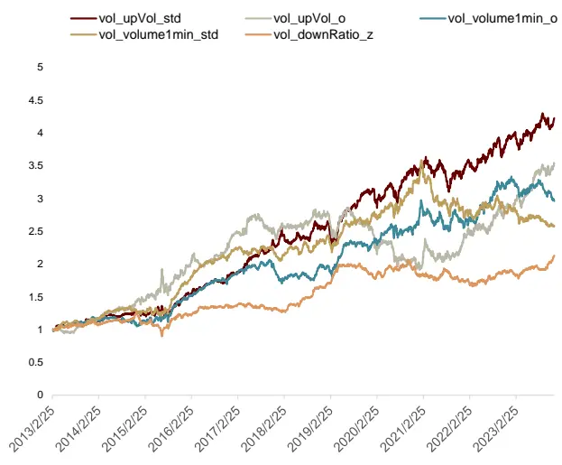
图表 95：vol_volume1min_o 与常见因子相关系数

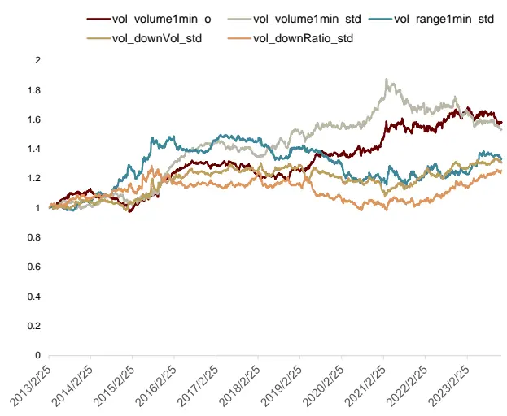

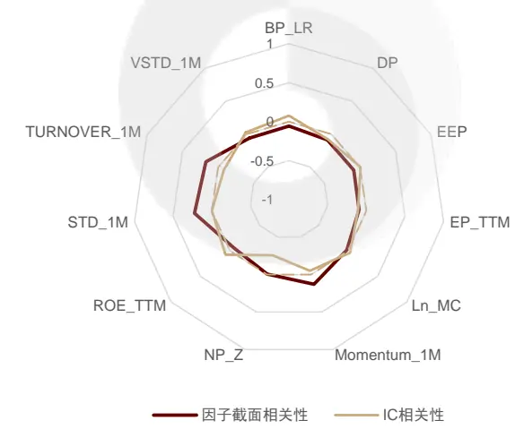
图表 94：沪深 300范围内表现较好的波动性因子年化超额收益统计
注：1）统计时间为 2013-01-14 至 2023-12-01；2）相对净值的比较基准为沪深300 等权指数 000984.CSI
资料来源：Wind，中金公司研究部

图表 96：沪深 300范围内表现较好的波动性因子分组年化超额收益统计
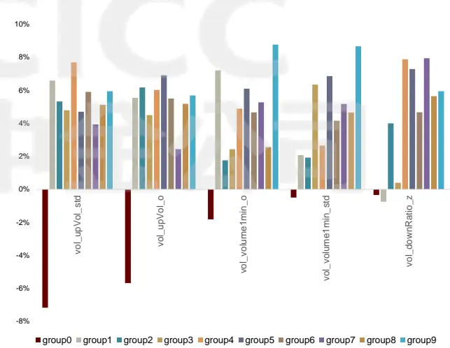
注：1）统计时间为 2013-01-14 至 2023-12-01；2）超额收益的比较基准为沪深300 等权指数 000984.CSI；3）Group0 为因子值最小一组，Group9 为因子值最大一组
资料来源：Wind，中金公司研究部

## 高阶特征因子

图表 97：高阶特征因子在不同股票池范围和不同调仓频率下因子主要指标表现

|  | 全市场M 全市场W 1000MICIR 多空超额ICIR多空超额 |  |  |  |  |  |  |  |  |  | 1000W 500M |  |  |  |  |  |  | 500W |  |  | 300M |  |  | 300W |  |  |  |  |  |  |  |  |  |  |
| --- | --- | --- | --- | --- | --- | --- | --- | --- | --- | --- | --- | --- | --- | --- | --- | --- | --- | --- | --- | --- | --- | --- | --- | --- | --- | --- | --- | --- | --- | --- | --- | --- | --- | --- |
|  |  |  |  |  |  |  |  |  |  |  | ICIR 多空 超额 |  |  | ICIR | 多空 | 超额 | ICIR | 多空 | 超额 | ICIR | 多空 | 超额 | ICIR | 多空 | 超额 | ICIR | 多空 | 超额 | ICIR | 多空 | 超额 | ICIR | 多空 | 超额 |
|  | shape_skew_m | 1.28 | 23% | 7% | 1.00 | 29% | 5% | 1.05 | 23% | 6% | 0.76 | 24% | 4% | 0.69 | 8% | 1% | 0.61 | 17% | 1% | 0.52 | 7% | 0% | 0.38 | 8% | 2% |  |  |  |  |  |  |  |  |  |
| shape_skratio_mshape_skew_o |  | shape_skew_std |  |  |  |  |  | 1.09 | 19% | 8% | 0.77 | 24% | 6% | 0.95 | 16% | 6% | 0.66 | 21% | 5% | 0.60 | 7% | 2% | 0.52 | 12% | 2% |  |  |  |  |  |  |  |  |  |
|  |  | 1.03 | 18% | 4% | 0.86 | 25% | 6% | 0.76 | 14% | 4% | 0.63 | 24% | 8% | 0.62 | 8% | 2% | 0.52 | 15% | 4% | 0.47 | 8% | 0% | 0.34 | 9% | 3% |  |  |  |  |  |  |  |  |  |
|  |  | 1.02 | 8% | 0% | 0.58 | 3% | -2% | 0.55 | 6% | -3% | 0.44 | 6% | -3% | 0.40 | 5% | 0% | 0.40 | 8% | 1% | 0.25 | 2% | -3% | 0.24 | 6% | 1% |  |  |  |  |  |  |  |  |  |
| shape_kurt_stdshape_skratio_oshape_skew_zshape_kurt_zshape_kurt_mshape_skratioVol_std |  | 0.98 | 16% | 7% | 0.66 | 20% | 6% | 0.93 | 14% | 6% | 0.59 | 18% | 6% | 0.45 | 5% | 1% | 0.48 | 16% | 4% | 0.60 | 7% | 5% | 0.29 | 10% | 2% |  |  |  |  |  |  |  |  |  |
|  |  | 0.88 | 8% | 1% | 0.54 | 10% | 1% | 0.48 | 6% | 0% | 0.39 | 9% | -1% | 0.39 | 7% | 1% | 0.37 | 8% | 1% | 0.27 | 1% | -1% | 0.24 | 3% | 1% |  |  |  |  |  |  |  |  |  |
|  |  | 0.79 | 7% | 2% | 0.64 | 16% | 3% | 0.58 | 8% | 1% | 0.44 | 14% | 4% | 0.30 | -1% | -1% | 0.35 | 5% | -1% | 0.14 | 2% | -1% | 0.19 | 2% | -2% |  |  |  |  |  |  |  |  |  |
|  |  | 0.72 | 6% | 2% | 0.68 | 16% | 4% | 0.62 | 7% | 1% | 0.46 | 14% | 3% | 0.35 | -1% | -2% | 0.37 | 8% | 1% | 0.38 | 10% | 4% | 0.14 | 5% | 1% |  |  |  |  |  |  |  |  |  |
|  |  | 0.67 | 17% | 7% | 0.54 | 24% | 6% | 0.84 | 17% | 6% | 0.59 | 27% | 7% | 0.39 | 12% | 2% | 0.43 | 17% | 4% | 0.54 | 13% | 4% | 0.32 | 13% | 4% |  |  |  |  |  |  |  |  |  |
|  |  | 0.66 | 6% | 1% | 0.15 | 5% | 2% | 0.56 | 6% | 2% | 0.14 | 1% | -1% | 0.36 | 5% | 2% | 0.06 | 1% | -1% | 0.21 | 0% | 0% | 0.05 | 0% | 0% |  |  |  |  |  |  |  |  |  |
| shape_skewVol_stdshape_skratio_zshape_skratio_stdshape_kurt_oshape_kurtVol_stdshape_kurtVol_zshape_skewVol_zshape_skratioVol_zshape_skratioVol_oshape_kurtVol_mshape_kurtVol_oshape_skewVol_oshape_skewVol_mshape_skratioVol_m |  | 0.63 | 11% | 2% | 0.47 | 12% | 3% | 0.63 | 10% | 1% | 0.39 | 11% | 1% | 0.38 | 4% | -1% | 0.26 | 7% | 0% | 0.29 | 3% | -1% | 0.17 | 4% | 0% |  |  |  |  |  |  |  |  |  |
|  |  | 0.62 | 5% | 1% | 0.51 | 10% | 3% | 0.37 | 6% | 3% | 0.37 | 11% | 4% | 0.24 | -1% | -1% | 0.31 | 7% | 2% | 0.15 | 0% | -2% | 0.16 | 3% | 0% |  |  |  |  |  |  |  |  |  |
|  |  | 0.60 | 6% | 2% | 0.34 | 1% | -2% | 0.46 | 3% | 1% | 0.22 | 0% | -2% | 0.42 | 7% | 2% | 0.23 | 0% | -2% | 0.33 | 10% | 3% | 0.07 | -4% | -4% |  |  |  |  |  |  |  |  |  |
|  |  | 0.55 | 10% | 3% | 0.44 | 10% | 4% | 0.54 | 8% | 2% | 0.46 | 13% | 6% | 0.34 | 3% | 0% | 0.32 | 7% | 2% | 0.31 | 8% | 2% | 0.23 | 10% | 3% |  |  |  |  |  |  |  |  |  |
|  |  | 0.53 | 9% | 1% | 0.38 | 9% | 1% | 0.55 | 8% | 0% | 0.33 | 9% | 0% | 0.34 | 9% | 2% | 0.23 | 10% | 2% | 0.25 | 4% | 0% | 0.15 | 5% | 2% |  |  |  |  |  |  |  |  |  |
|  |  | 0.51 | 9% | 2% | 0.42 | 14% | 2% | 0.33 | 8% | 1% | 0.30 | 12% | 1% | 0.29 | 8% | 2% | 0.21 | 9% | 3% | 0.28 | 4% | 2% | 0.12 | 1% | 1% |  |  |  |  |  |  |  |  |  |
|  |  | 0.46 | 9% | 2% | 0.46 | 17% | 3% | 0.31 | 7% | 1% | 0.33 | 12% | 1% | 0.30 | 7% | 1% | 0.23 | 9% | 3% | 0.26 | 4% | 1% | 0.14 | 4% | 2% |  |  |  |  |  |  |  |  |  |
|  |  | 0.43 | 7% | 1% | 0.43 | 14% | 2% | 0.23 | 7% | 0% | 0.27 | 11% | 1% | 0.29 | 5% | 0% | 0.21 | 4% | 0% | 0.17 | 3% | 0% | 0.10 | 2% | 1% |  |  |  |  |  |  |  |  |  |
|  |  | 0.28 | 6% | 0% | 0.27 | 0% | 1% | 0.19 | 6% | 0% | 0.27 | 7% | 1% | 0.16 | 1% | -1% | 0.14 | 8% | 3% | 0.09 | 2% | -2% | 0.08 | 4% | -1% |  |  |  |  |  |  |  |  |  |
|  |  | 0.27 | 10% | 0% | 0.30 | 12% | 0% | 0.34 | 9% | -1% | 0.28 | 18% | 2% | 0.20 | 5% | -2% | 0.20 | 9% | 0% | 0.14 | 2% | -1% | 0.14 | 6% | 0% |  |  |  |  |  |  |  |  |  |
|  |  | 0.24 | 7% | 0% | 0.28 | 3% | 1% | 0.21 | 6% | 0% | 0.29 | 8% | 1% | 0.14 | 0% | -2% | 0.15 | 7% | 2% | 0.10 | 4% | 0% | 0.10 | 5% | 0% |  |  |  |  |  |  |  |  |  |
|  |  | 0.21 | 6% | -1% | 0.27 | 3% | 1% | 0.20 | 5% | -1% | 0.30 | 10% | 1% | 0.14 | 2% | -2% | 0.17 | 8% | 2% | 0.10 | 5% | 0% | 0.11 | 9% | 2% |  |  |  |  |  |  |  |  |  |
|  |  | 0.19 | 10% | -1% | 0.28 | 12% | 0% | 0.28 | 9% | -1% | 0.28 | 19% | 2% | 0.15 | 6% | -2% | 0.20 | 12% | 0% | 0.12 | 3% | -3% | 0.14 | 6% | 1% |  |  |  |  |  |  |  |  |  |
|  |  | 0.12 | 7% | -2% | 0.26 | 10% | 0% | 0.20 | 5% | -3% | 0.24 | 16% | 0% | 0.10 | 7% | 0% | 0.19 | 10% | -1% | 0.05 | 2% | -2% | 0.10 | 4% | 0% |  |  |  |  |  |  |  |  |  |

资料来源：Wind，中金公司研究部（注：统计时间为 2013-01-14 至 2023-12-01；超额收益的比较基准为有效股票池等权表现）

图表 98：沪深 300范围内表现较好的高阶特征因子年化多空收益统计
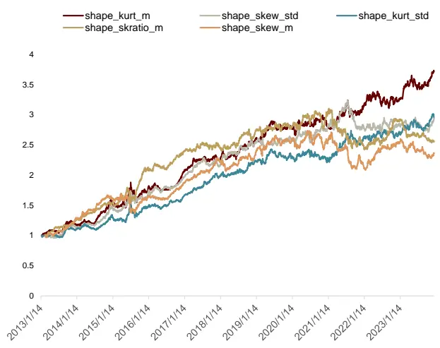
图表 100：shape_kurt_m 与常见因子相关系数

图表 99：沪深 300范围内表现较好的高阶特征因子年化超额收益统计
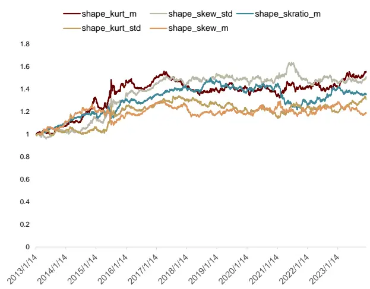

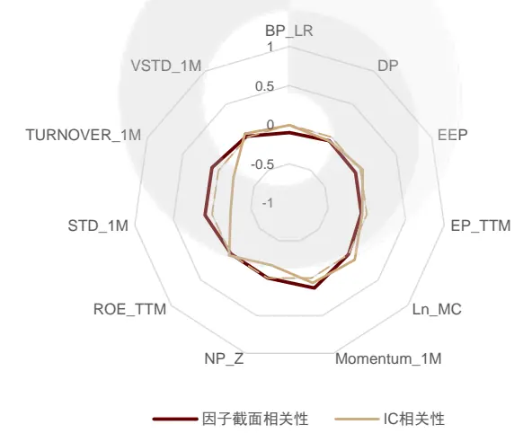
图表 101：沪深 300范围内表现较好的高阶特征因子分组年化超额收益统计
注：1）统计时间为 2013-01-14 至 2023-12-01；2）相对净值的比较基准为沪深300 等权指数 000984.CSI
资料来源：Wind，中金公司研究部

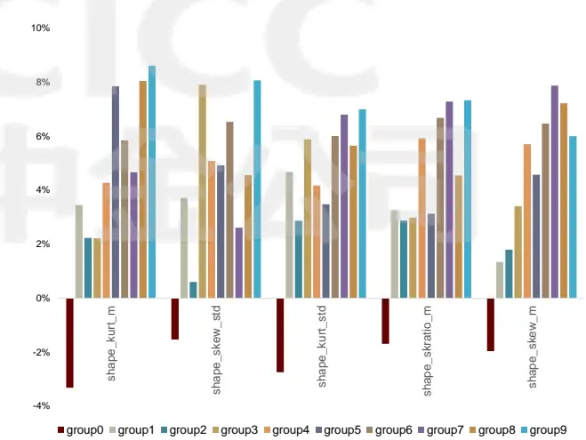
注：1）统计时间为 2013-01-14 至 2023-12-01；2）超额收益的比较基准为沪深300 等权指数 000984.CSI；3）Group0 为因子值最小一组，Group9 为因子值最大一组
资料来源：Wind，中金公司研究部

## 流动性因子

图表 102：流动性因子在不同股票池范围和不同调仓频率下因子主要指标表现

| ICI全多超额 ICIR全场超额 ICIR |  |  |  |  |  |  |  |  | 1000M | 1000V |  |  | 500M |  |  |  |  | 500W |  |  | 300M |  |  | 300W |  |  |  |  |  |  |  |  |
| --- | --- | --- | --- | --- | --- | --- | --- | --- | --- | --- | --- | --- | --- | --- | --- | --- | --- | --- | --- | --- | --- | --- | --- | --- | --- | --- | --- | --- | --- | --- | --- | --- |
|  |  |  |  |  |  |  |  |  | ICIR | 多空 超额 |  | ICIR | 多空 | 超额 | ICIR | 多空 | 超额 | ICIR | 多空 | 超额 | ICIR | 多空 | 超额 | ICIR | 多空 | 超额 | ICIR | 多空 | 超额 | ICIR | 多空 | 超额 |
| liq_amihud_1min_o |  | 1.02 | 33% | 11% | 0.63 | 40% | 18% | 0.77 | 24% | 6% | 0.59 | 41% | 11% | 0.61 | 14% | 3% | 0.41 | 20% | 4% | 0.20 | -1% | -1% | 0.00 | 3% | 3% |  |  |  |  |  |  |  |
| liq_spread_std |  | 0.92 | 12% | 4% | 0.34 | 12% | -2% | 0.59 | 3% | -2% | 0.29 | 11% | -2% | 0.25 | -4% | -6% | 0.10 | -3% | -4% | 0.12 | 1% | -1% | 0.12 | -2% | -3% |  |  |  |  |  |  |  |
| liq_firstCallR_o |  | 0.85 | 15% | 6% | 0.77 | 27% | 9% | 0.68 | 14% | 5% | 0.50 | 22% | 4% | 0.34 | 6% | 0% | 0.29 | 13% | 0% | 0.11 | 3% | 0% | 0.02 | -5% | -4% |  |  |  |  |  |  |  |
| liq_spread_m |  | 0.84 | 9% | 2% | 0.29 | 10% | -6% | 0.62 | 3% | -4% | 0.23 | 11% | -4% | 0.24 | -5% | -8% | 0.06 | -8% | -10% | 0.06 | 2% | -2% | 0.03 | -9% | -8% |  |  |  |  |  |  |  |
| liq_amihud_1min_m |  | 0.80 | 24% | 9% | 0.53 | 39% | 17% | 0.61 | 21% | 7% | 0.50 | 40% | 11% | 0.53 | 12% | 2% | 0.35 | 17% | 3% | 0.12 | -1% | -3% | 0.01 | 1% | 0% |  |  |  |  |  |  |  |
| liq_firstCallR_m |  | 0.75 | 16% | 5% | 0.74 | 31% | 7% | 0.62 | 12% | 2% | 0.53 | 27% | 4% | 0.32 | 10% | 0% | 0.36 | 13% | 2% | 0.12 | 2% | 0% | 0.02 | 0% | -1% |  |  |  |  |  |  |  |
| liq_firstCallR_std |  | 0.73 | 10% | 3% | 0.65 | 20% | 4% | 0.64 | 14% | 5% | 0.53 | 22% | 3% | 0.31 | 3% | -1% | 0.31 | 10% | 2% | 0.17 | 3% | 1% | 0.05 | 0% | -2% |  |  |  |  |  |  |  |
| liq_amihud_1min_std |  | 0.65 | 18% | 7% | 0.40 | 24% | 9% | 0.47 | 15% | 3% | 0.38 | 22% | 5% | 0.47 | 11% | 3% | 0.23 | 11% | -1% | 0.09 | -1% | -3% | 0.02 | 1% | 1% |  |  |  |  |  |  |  |
| liq_closevol_z |  | 0.60 | 10% | 1% | 0.71 | 30% | 5% | 0.71 | 14% | 3% | 0.53 | 20% | 2% | 0.28 | 3% | -3% | 0.39 | 16% | 1% | 0.22 | 3% | 0% | 0.21 | 9% | 5% |  |  |  |  |  |  |  |
| liq_lastCallR_o |  | 0.59 | 5% | 5% | 0.42 | 14% | 9% | 0.69 | 7% | 6% | 0.41 | 15% | 6% | 0.33 | 13% | 8% | 0.21 | 13% | 5% | 0.21 | 7% | 2% | 0.20 | 13% | 5% |  |  |  |  |  |  |  |
| liq_openvol_o |  | 0.55 | 10% | -2% | 0.68 | 29% | 8% | 0.54 | 13% | 1% | 0.48 | 24% | 5% | 0.45 | 6% | -1% | 0.40 | 16% | 6% | 0.04 | 2% | 1% | 0.07 | 6% | 0% |  |  |  |  |  |  |  |
| liq_lastCallR_m |  | 0.55 | 14% | 8% | 0.31 | 15% | 6% | 0.59 | 19% | 9% | 0.32 | 20% | 8% | 0.22 | 8% | 3% | 0.21 | 16% | 7% | 0.37 | 15% | 8% | 0.16 | 10% | 2% |  |  |  |  |  |  |  |
| liq_closeprevol_z |  | 0.53 | 6% | -1% | 0.58 | 24% | 2% | 0.58 | 8% | 1% | 0.39 | 16% | 1% | 0.21 | -2% | -5% | 0.33 | 13% | 1% | 0.00 | 5% | 1% | 0.13 | 0% | -2% |  |  |  |  |  |  |  |
| liq_closevol_o |  | 0.51 | 14% | -1% | 0.68 | 42% | 12% | 0.58 | 19% | 3% | 0.52 | 31% | 5% | 0.49 | 10% | 2% | 0.48 | 20% | 4% | 0.11 | 4% | 0% | 0.12 | 8% | 3% |  |  |  |  |  |  |  |
| liq_spread_z |  | 0.51 | 3% | -2% | 0.41 | 15% | 1% | 0.29 | 1% | -3% | 0.22 | 9% | 0% | 0.02 | -4% | -2% | 0.12 | 4% | -2% | 0.06 | -2% | -4% | 0.05 | 1% | 0% |  |  |  |  |  |  |  |
| liq_amihud_1min_z |  | 0.49 | 7% | 1% | 0.56 | 25% | 3% | 0.43 | 7% | 1% | 0.40 | 21% | 2% | 0.15 | -1% | -2% | 0.32 | 11% | -1% | 0.24 | 1% | -1% | 0.20 | 1% | 0% |  |  |  |  |  |  |  |
| liq_openvol_std |  | 0.48 | 7% | -2% | 0.62 | 21% | 4% | 0.56 | 11% | -1% | 0.46 | 24% | 5% | 0.42 | 5% | 0% | 0.37 | 15% | 5% | 0.12 | 8% | 3% | 0.04 | -1% | -2% |  |  |  |  |  |  |  |
| liq_openvol_m |  | 0.47 | 9% | -3% | 0.60 | 27% | 6% | 0.52 | 13% | 0% | 0.45 | 22% | 4% | 0.41 | 5% | -1% | 0.38 | 17% | 8% | 0.08 | 5% | 2% | 0.04 | 5% | 1% |  |  |  |  |  |  |  |
| liq_closeprevol_std |  | 0.45 | 11% | -3% | 0.64 | 34% | 8% | 0.52 | 12% | 0% | 0.48 | 25% | 4% | 0.44 | 5% | -2% | 0.46 | 16% | 4% | 0.03 | 8% | 3% | 0.06 | -2% | -1% |  |  |  |  |  |  |  |
| liq_openvol_zliq_closeprevol_oliq_closevol_mliq_firstCallR_zliq_closeprevol_m |  | 0.45 | 7% | 0% | 0.53 | 19% | 1% | 0.48 | 9% | 2% | 0.33 | 12% | -1% | 0.14 | 0% | -1% | 0.27 | 7% | 0% | 0.08 | 2% | -1% | 0.09 | -2% | -2% |  |  |  |  |  |  |  |
|  |  | 0.44 | 13% | -3% | 0.58 | 37% | 8% | 0.45 | 12% | -1% | 0.44 | 26% | 1% | 0.43 | 10% | 1% | 0.40 | 14% | 3% | 0.02 | 2% | 0% | 0.05 | 4% | 0% |  |  |  |  |  |  |  |
|  |  | 0.42 | 12% | -2% | 0.58 | 32% | 8% | 0.49 | 15% | 1% | 0.44 | 30% | 5% | 0.44 | 14% | 3% | 0.41 | 18% | 5% | 0.09 | 7% | 4% | 0.09 | 6% | 2% |  |  |  |  |  |  |  |
|  |  | 0.38 | 7% | 1% | 0.46 | 12% | -1% | 0.33 | 6% | 2% | 0.26 | 7% | -3% | 0.05 | 4% | 0% | 0.20 | 6% | 0% | 0.14 | -4% | -1% | 0.00 | -3% | -4% |  |  |  |  |  |  |  |
|  |  | 0.36 | 10% | -3% | 0.50 | 28% | 7% | 0.43 | 11% | 0% | 0.39 | 24% | 3% | 0.41 | 8% | 0% | 0.37 | 18% | 5% | 0.01 | -4% | -1% | 0.04 | 0% | -1% |  |  |  |  |  |  |  |
| liq_closevol_stdliq_lastCallR_zliq_bidDepthCct_mliq_lastCallR_std |  | 0.36 | 10% | -3% | 0.57 | 32% | 8% | 0.48 | 14% | 0% | 0.45 | 28% | 5% | 0.40 | 10% | 4% | 0.44 | 19% | 6% | 0.15 | 10% | 3% | 0.12 | 9% | 1% |  |  |  |  |  |  |  |
|  |  | 0.32 | 8% | 3% | 0.42 | 9% | 1% | 0.31 | 13% | 6% | 0.36 | 10% | 2% | 0.08 | 8% | 4% | 0.18 | 8% | 4% | 0.28 | 6% | 4% | 0.17 | 1% | -1% |  |  |  |  |  |  |  |
|  |  | 0.27 | 9% | 2% | 0.08 | 2% | -2% | 0.31 | 10% | 1% | 0.19 | 6% | -1% | 0.06 | -1% | -3% | 0.11 | -2% | -1% | 0.01 | 4% | 1% | 0.02 | -8% | -3% |  |  |  |  |  |  |  |
|  |  | 0.25 | -2% | 1% | 0.00 | -4% | -3% | 0.03 | -7% | -3% | 0.08 | 11% | 3% | 0.22 | -3% | -1% | 0.05 | 8% | 1% | 0.28 | 9% | 3% | 0.04 | 4% | 1% |  |  |  |  |  |  |  |
|  |  | liq_avgDepthCct_m | 0.23 | 6% | 0% | 0.03 | 1% | -4% | 0.22 | 5% | -1% | 0.13 | 3% | -3% | 0.02 | -5% | -6% | 0.04 | -8% | -6% | 0.17 | 6% | 0% | 0.07 | 8% | 2% |  |  |  |  |  |  |
|  | liq_askDepthCct_z | 0.23 | 1% | -1% | 0.02 | -3% | -4% | 0.05 | 4% | 0% | 0.12 | 6% | 2% | 0.07 | 2% | -1% | 0.04 | -1% | -1% | 0.08 | 0% | -1% | 0.06 | 2% | 1% |  |  |  |  |  |  |  |
| liq_bidDepthCct_stdliq_avgDepthCct_std |  | 0.22 | 10% | 1% | 0.08 | 5% | -1% | 0.24 | 9% | 0% | 0.17 | 6% | 0% | 0.06 | 4% | 1% | 0.12 | 0% | -1% | 0.06 | 0% | -2% | 0.05 | -3% | -3% |  |  |  |  |  |  |  |
|  |  | 0.20 | 8% | 0% | 0.01 | -5% | -7% | 0.22 | 9% | 0% | 0.03 | 4% | -3% | 0.12 | 5% | 1% | 0.01 | -3% | -1% | 0.09 | 3% | 0% | 0.07 | 0% | 0% |  |  |  |  |  |  |  |
| liq_spread_o |  | 0.20 | 4% | 0% | 0.15 | 3% | -5% | 0.00 | -4% | -7% | 0.14 | 3% | -4% | 0.14 | 7% | 1% | 0.00 | 8% | -1% | 0.00 | 2% | 0% | 0.02 | -4% | -5% |  |  |  |  |  |  |  |
|  | liq_bidDepthCct_o | 0.13 | 3% | 2% | 0.03 | -7% | -4% | 0.20 | 3% | 1% | 0.10 | -2% | -3% | 0.01 | -1% | -1% | 0.12 | -2% | -3% | 0.28 | 6% | 5% | 0.02 | -4% | -3% |  |  |  |  |  |  |  |
|  | liq_effDepthCct_o | 0.13 | 1% | 1% | 0.21 | 15% | 6% | 0.17 | 3% | -1% | 0.20 | 14% | 3% | 0.19 | 4% | 0% | 0.22 | 14% | 3% | 0.39 | 8% | 1% | 0.07 | 7% | 0% |  |  |  |  |  |  |  |
| liq_askDepthCct_std |  | 0.12 | 5% | 1% | 0.15 | 7% | -1% | 0.13 | 1% | -1% | 0.19 | 9% | 1% | 0.07 | 2% | -1% | 0.07 | 2% | -2% | 0.03 | 0% | -2% | 0.01 | 1% | 1% |  |  |  |  |  |  |  |
| liq_bidDepthCct_z |  | 0.11 | 3% | 0% | 0.14 | 6% | 0% | 0.22 | 6% | 2% | 0.15 | 5% | -1% | 0.19 | 2% | 1% | 0.08 | -3% | -2% | 0.36 | 6% | 0% | 0.03 | -6% | -4% |  |  |  |  |  |  |  |
| liq_avgDepthCct_zliq_effDepthCct_mliq_avgDepthCct_oliq_askDepthCct_o |  | 0.08 | 2% | -2% | 0.01 | -2% | -5% | 0.20 | 4% | 1% | 0.06 | 2% | -2% | 0.13 | 2% | -1% | 0.03 | -5% | -3% | 0.40 | 2% | -1% | 0.09 | 1% | 1% |  |  |  |  |  |  |  |
|  |  | 0.08 | 4% | -2% | 0.11 | 6% | -4% | 0.03 | -1% | -5% | 0.05 | 2% | -4% | 0.20 | 10% | 1% | 0.18 | 9% | -1% | 0.27 | 2% | 0% | 0.07 | 6% | 2% |  |  |  |  |  |  |  |
|  |  | 0.06 | -1% | 0% | 0.04 | 8% | 4% | 0.11 | 1% | 0% | 0.00 | 9% | 2% | 0.08 | 9% | 5% | 0.03 | 8% | 1% | 0.37 | 10% | 4% | 0.04 | 7% | 2% |  |  |  |  |  |  |  |
|  |  | 0.04 | -2% | -1% | 0.03 | 3% | 1% | 0.21 | 3% | 0% | 0.09 | 3% | 0% | 0.01 | -1% | -2% | 0.03 | 5% | 3% | 0.08 | 4% | 2% | 0.09 | 5% | 6% |  |  |  |  |  |  |  |
| liq_effDepthCct_std |  | 0.03 | -4% | -8% | 0.13 | -2% | -7% | 0.01 | 6% | -4% | 0.06 | -6% | -8% | 0.28 | 3% | 0% | 0.09 | 4% | 1% | 0.33 | 7% | -1% | 0.12 | 3% | 1% |  |  |  |  |  |  |  |
| liq_effDepthCct_z |  | 0.03 | -1% | -3% | 0.16 | 1% | -3% | 0.09 | 0% | -1% | 0.05 | -2% | -3% | 0.01 | 2% | -1% | 0.09 | 7% | 1% | 0.22 | 0% | -5% | 0.05 | -1% | -1% |  |  |  |  |  |  |  |
| liq_askDepthCct_m |  | 0.01 | -2% | -2% | 0.04 | 4% | 0% | 0.02 | 2% | -2% | 0.07 | 0% | -1% | 0.03 | 7% | 2% | 0.02 | 0% | -3% | 0.05 | 6% | 1% | 0.02 | 5% | 2% |  |  |  |  |  |  |  |

资料来源： ，中金公司研究部（注：统计时间为 至 ；超额收益的比较基准为有效股票池等权表现）

图表 103：沪深 300范围内表现较好的流动性因子年化多空收益统计
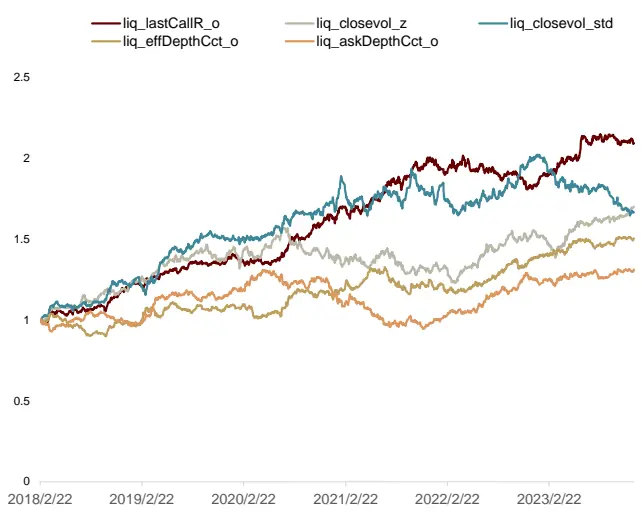
图表 105：liq_askDepthCct_o 与常见因子相关系数

图表 104：沪深 300范围内表现较好的流动性因子年化超额收益统计
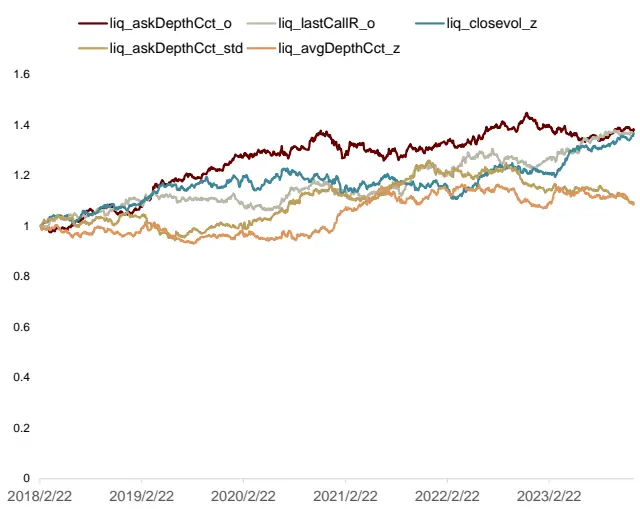
图表 106：沪深 300范围内表现较好的流动性因子分组年化超额收益统计

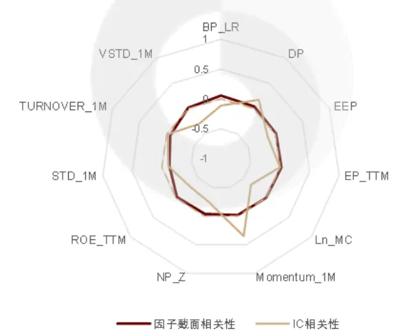
注：1）统计时间为 2018-01-08 至 2023-12-01；2）相对净值的比较基准为沪深300 等权指数 000984.CSI
资料来源：Wind，中金公司研究部

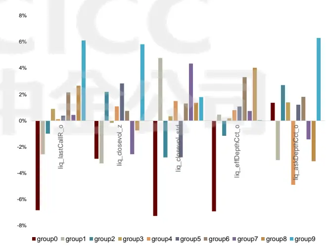
注：1）统计时间为 2018-01-08 至 2023-12-01；2）超额收益的比较基准为沪深300 等权指数 000984.CSI；3）Group0 为因子值最小一组，Group9 为因子值最大一组
资料来源：Wind，中金公司研究部

## 量价相关性因子

图表 107：量价相关性因子在不同股票池范围和不同调仓频率下因子主要指标表现
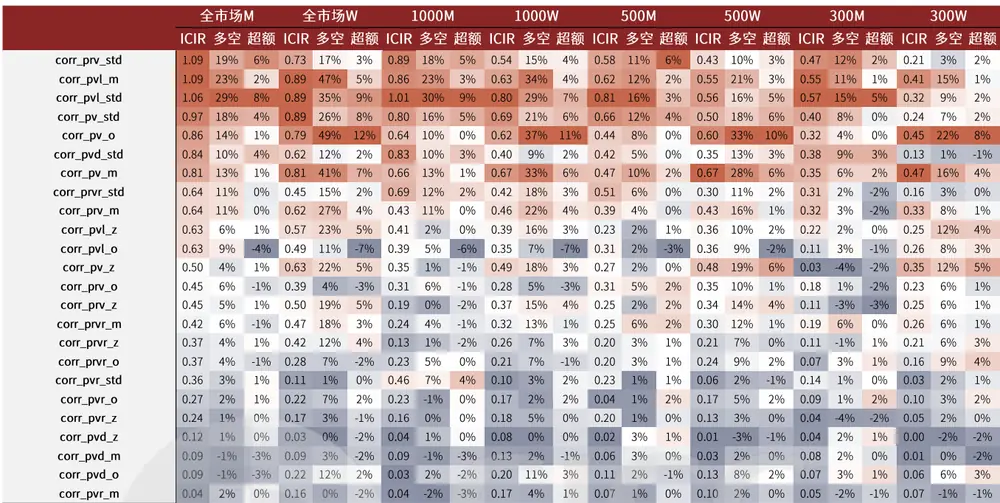
资料来源：Wind，中金公司研究部（注：统计时间为 2013-01-14 至 2023-12-01；超额收益的比较基准为有效股票池等权表现）

图表 108：沪深 300范围内表现较好的量价相关性因子年化多空收益统计
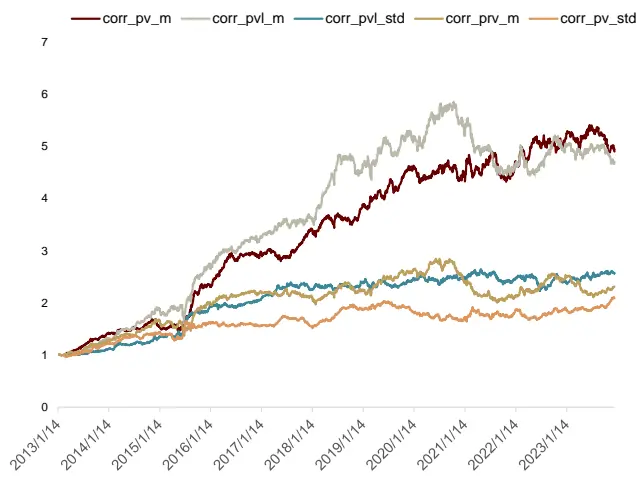
图表 110：corr_pv_m 与常见因子相关系数

图表 109：沪深 300范围内表现较好的量价相关性因子年化超额收益统计
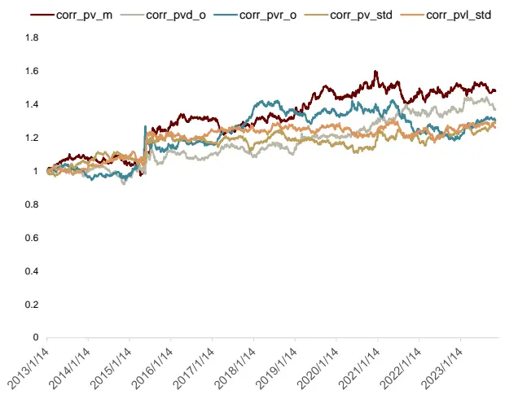

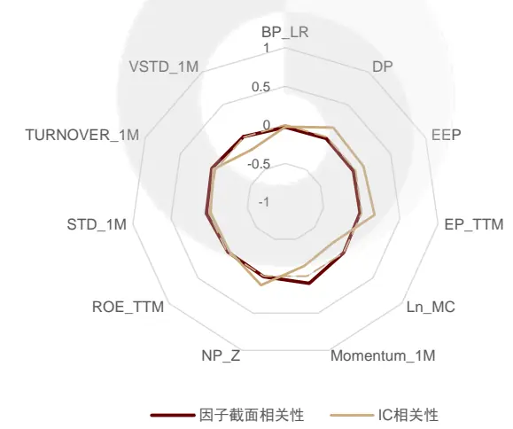
图表 111：沪深 300 范围内表现较好的量价相关性因子分组年化超额收益统计
注：1）统计时间为 2013-01-14 至 2023-12-01；2）相对净值的比较基准为沪深300 等权指数 000984.CSI
资料来源：Wind，中金公司研究部

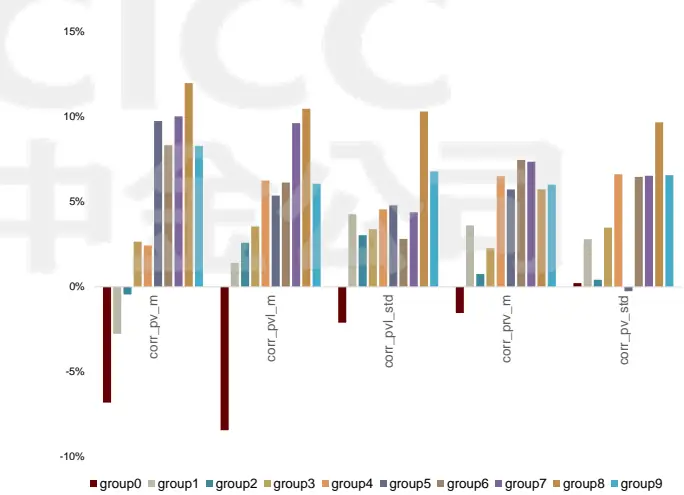
注：1）统计时间为 2013-01-14 至 2023-12-01；2）超额收益的比较基准为沪深300 等权指数 000984.CSI；3）Group0 为因子值最小一组，Group9 为因子值最大一组
资料来源：Wind，中金公司研究部

## 筹码分布因子

图表 112：筹码分布因子在不同股票池范围和不同调仓频率下因子主要指标表现

| IC额 |  |  |  |  | 全 | 市场 | N |  | .0001 |  |  | 10001 |  |  | 500M |  |  | 500V |  | 3001 |  |  |  | 300V |  |  |  |  |
| --- | --- | --- | --- | --- | --- | --- | --- | --- | --- | --- | --- | --- | --- | --- | --- | --- | --- | --- | --- | --- | --- | --- | --- | --- | --- | --- | --- | --- |
|  |  |  |  |  | ICIR | 多空 | 超额 | ICIR | 多空 | 超额 | ICIR | 多空 | 超额 | ICIR | 多空 | 超额 | ICIR | 多空 | 超额 | ICIR | 多空 | 超额 | ICIR | 多空 | 超额 | ICIR | 多空 | 超额 |
| doc_vol_pdf90_std |  | 1.52 | 28% | 10% | 1.06 | 48% | 15% | 1.24 | 25% | 6% | 0.85 | 32% | 7% | 0.94 | 13% | 2% | 0.76 | 22% | 5% | 0.83 | 14% | 2% | 0.52 | 12% | 3% |  |  |  |
| doc_vol_pdf95_std |  | 1.47 | 27% | 10% | 1.07 | 45% | 14% | 1.24 | 24% | 8% | 0.90 | 33% | 8% | 0.86 | 10% | 2% | 0.74 | 22% | 6% | 0.77 | 13% | 4% | 0.51 | 14% | 2% |  |  |  |
| doc_vol_pdf90bi_std |  | 1.41 | 27% | 9% | 0.94 | 44% | 12% | 1.23 | 27% | 7% | 0.80 | 34% | 6% | 0.82 | 11% | 1% | 0.65 | 21% | 5% | 0.77 | 12% | 1% | 0.40 | 9% | -1% |  |  |  |
| doc_vol_pdf80_std |  | 1.25 | 28% | 8% | 0.95 | 49% | 15% | 1.07 | 23% | 5% | 0.73 | 34% | 9% | 0.70 | 11% | 1% | 0.61 | 19% | 6% | 0.61 | 9% | 3% | 0.33 | 8% | 2% |  |  |  |
| doc_vol_pdf95_o |  | 1.07 | 27% | 5% | 0.90 | 59% | 17% | 0.73 | 19% | 1% | 0.72 | 35% | 7% | 0.58 | 9% | 0% | 0.61 | 25% | 5% | 0.31 | 5% | -2% | 0.36 | 7% | -1% |  |  |  |
| doc_vol_pdf95_m |  | 1.06 | 29% | 5% | 0.89 | 54% | 9% | 0.93 | 23% | 3% | 0.78 | 40% | 4% | 0.72 | 10% | -2% | 0.64 | 27% | 3% | 0.53 | 12% | 1% | 0.42 | 9% | -1% |  |  |  |
|  | doc_vol_pdf90_m | 1.01 | 27% | 4% | 0.88 | 53% | 9% | 0.84 | 21% | 1% | 0.72 | 37% | 2% | 0.66 | 7% | -2% | 0.60 | 21% | 1% | 0.48 | 12% | 0% | 0.37 | 8% | -2% |  |  |  |
|  | doc_vol_pdf60_std | 0.97 | 21% | 6% | 0.78 | 34% | 14% | 0.70 | 19% | 4% | 0.59 | 22% | 8% | 0.68 | 9% | 1% | 0.51 | 15% | 6% | 0.52 | 8% | 2% | 0.33 | 6% | 3% |  |  |  |
|  | doc_vol_pdf90bi_o | 0.97 | 27% | 5% | 0.84 | 61% | 17% | 0.67 | 19% | 1% | 0.74 | 40% | 8% | 0.49 | 9% | -1% | 0.60 | 23% | 4% | 0.34 | 7% | 1% | 0.32 | 3% | -2% |  |  |  |
|  | doc_vol_pdf90_o | 0.97 | 26% | 4% | 0.85 | 55% | 15% | 0.64 | 20% | 2% | 0.65 | 31% | 5% | 0.50 | 8% | -1% | 0.583 | 23% | 5% | 0.23 | 7% | 0% | 0.31 | 10% | 0% |  |  |  |
|  | doc_vol_pdf90bi_m | 0.95 | 26% | 4% | 0.76 | 48% | 7% | 0.84 | 20% | 2% | 0.71 | 35% | 2% | 0.64 | 10% | -2% | 0.57 | 19% | 1% | 0.47 | 10% | -1% | 0.32 | 9% | -1% |  |  |  |
|  | doc_vol_pdf70_m | 0.89 | 27% | 4% | 0.84 | 51% | 11% | 0.68 | 23% | 4% | 0.64 | 31% | 4% | 0.59 | 10% | 0% | 0.53 | 17% | 2% | 0.42 | 8% | 1% | 0.37 | 9% | 0% |  |  |  |
|  | doc_vol_pdf80_m | 0.87 | 25% | 2% | 0.84 | 48% | 8% | 0.68 | 19% | 0% | 0.62 | 31% | 1% | 0.51 | 8% | -2% | 0.51 | 18% | 1% | 0.38 | 5% | -2% | 0.31 | 9% | -1% |  |  |  |
|  | doc_vol_pdf60_m | 0.84 | 28% | 7% | 0.78 | 44% | 14% | 0.68 | 22% | 4% | 0.56 | 28% | 10% | 0.58 | 16% | 5% | 0.47 | 22% | 8% | 0.43 | 12% | 3% | 0.32 | 8% | 4% |  |  |  |
|  | doc_vol_pdf80_o | 0.84 | 24% | 5% | 0.74 | 46% | 15% | 0.62 | 15% | 1% | 0.51 | 25% | 4% | 0.40 | 8% | 1% | 0.48 | 19% | 5% | 0.25 | 6% | 1% | 0.29 | 4% | -2% |  |  |  |
|  | doc_vol_pdf70_o | 0.79 | 18% | 5% | 0.64 | 35% | 15% | 0.69 | 14% | 4% | 0.45 | 20% | 9% | 0.45 | 9% | 1% | 0.38 | 16% | 6% | 0.25 | 5% | 1% | 0.26 | 4% | -1% |  |  |  |
|  | doc_vol_pdf70_std | 0.76 | 21% | 5% | 0.65 | 35% | 10% | 0.62 | 16% | 1% | 0.47 | 23% | 6% | 0.42 | 10% | 1% | 0.42 | 16% | 4% | 0.28 | 3% | -3% | 0.28 | 4% | 1% |  |  |  |
|  | doc_vol50_ratio_std | 0.72 | 21% | 5% | 0.50 | 36% | 15% | 0.69 | 19% | 5% | 0.40 | 20% | 8% | 0.44 | 9% | 3% | 0.25 | 13% | 4% | 0.37 | 5% | 1% | 0.13 | 5% | 1% |  |  |  |
|  | doc_skew_std | 0.71 | 16% | 3% | 0.57 | 24% | 5% | 0.65 | 10% | 1% | 0.43 | 21% | 7% | 0.43 | 9% | 3% | 0.23 | 11% | 5% | 0.29 | 5% | 1% | 0.10 | -3% | -2% |  |  |  |
|  | doc_vol_pdf95_z | 0.66 | 9% | 0% | 0.64 | 23% | 3% | 0.55 | 10% | 1% | 0.45 | 17% | 1% | 0.33 | 6% | 0% | 0.39 | 15% | 4% | 0.21 | 6% | 0% | 0.21 | 7% | 0% |  |  |  |
|  | doc_vol_pdf90_z | 0.63 | 11% | 0% | 0.60 | 25% | 4% | 0.51 | 7% | -1% | 0.42 | 16% | 1% | 0.30 | 7% | 2% | 0.36 | 16% | 4% | 0.19 | 5% | -1% | 0.20 | 8% | 0% |  |  |  |
|  | doc_vol_pdf60_z | 0.60 | 10% | 1% | 0.52 | 22% | 5% | 0.42 | 6% | -2% | 0.34 | 14% | 2% | 0.34 | 5% | 1% | 0.34 | 14% | 6% | 0.16 | 3% | 0% | 0.23 | 8% | 3% |  |  |  |
|  | doc_kurt_std | 0.58 | 15% | 3% | 0.50 | 25% | 6% | 0.58 | 11% | 4% | 0.41 | 18% | 5% | 0.37 | 7% | 1% | 0.25 | 9% | 3% | 0.28 | 5% | 1% | 0.11 | -5% | -3% |  |  |  |
|  | doc_vol_pdf90bi_z | 0.58 | 8% | -1% | 0.55 | 20% | 1% | 0.47 | 7% | -2% | 0.39 | 16% | 0% | 0.25 | 5% | 1% | 0.33 | 14% | 3% | 0.15 | 4% | 0% | 0.11 | 2% | -3% |  |  |  |
|  | doc_vol_pdf80_z | 0.56 | 9% | -1% | 0.52 | 23% | 3% | 0.48 | 7% | -2% | 0.36 | 13% | 1% | 0.26 | 6% | 1% | 0.33 | 16% | 4% | 0.12 | 7% | 0% | 0.17 | 6% | 1% |  |  |  |
|  | doc_vol10_ratio_o | 0.55 | 17% | 3% | 0.39 | 45% | 21% | 0.53 | 13% | 4% | 0.35 | 27% | 12% | 0.36 | 9% | 2% | 0.25 | 15% | 7% | 0.20 | 4% | -1% | 0.12 | 0% | -1% |  |  |  |
|  | doc_vol5_ratio_o | 0.54 | 17% | 3% | 0.39 | 46% | 20% | 0.52 | 13% | 3% | 0.35 | 26% | 11% | 0.36 | 7% | 2% | 0.25 | 15% | 6% | 0.20 | 5% | 0% | 0.12 | 1% | 0% |  |  |  |
|  | doc_vol50_ratio_o | 0.54 | 13% | 0% | 0.40 | 36% | 15% | 0.52 | 13% | 4% | 0.36 | 29% | 14% | 0.30 | 9% | 4% | 0.20 | 14% | 6% | 0.14 | 6% | 1% | 0.10 | 1% | 0% |  |  |  |
|  | doc_vol_pdf70_z | 0.54 | 8% | -1% | 0.48 | 23% | 3% | 0.39 | 2% | -4% | 0.36 | 15% | 3% | 0.31 | 3% | 0% | 0.31 | 14% | 3% | 0.09 | 3% | -1% | 0.19 | 7% | 1% |  |  |  |
|  | doc_std_z | 0.54 | 7% | 2% | 0.39 | 15% | 3% | 0.55 | 8% | 3% | 0.24 | 8% | 1% | 0.22 | 0% | -2% | 0.18 | 5% | -1% | 0.12 | 3% | 1% | 0.12 | 2% | -1% |  |  |  |
|  | doc_vol10_ratio_std | 0.49 | 13% | 0% | 0.27 | 25% | 7% | 0.45 | 11% | 1% | 0.16 | 14% | 3% | 0.21 | 2% | -4% | 0.13 | 7% | 1% | 0.19 | 5% | -1% | 0.09 | 3% | -1% |  |  |  |
|  | doc_vol50_ratio_m | 0.46 | 13% | 0% | 0.38 | 33% | 14% | 0.43 | 13% | 5% | 0.34 | 21% | 9% | 0.32 | 10% | 3% | 0.23 | 16% | 7% | 0.24 | 4% | 0% | 0.11 | 2% | 1% |  |  |  |
|  | doc_vol50_ratio_z | 0.46 | 6% | -1% | 0.43 | 13% | -1% | 0.34 | 1% | -4% | 0.33 | 11% | -2% | 0.28 | 4% | 0% | 0.26 | 9% | -1% | 0.08 | 0% | -3% | 0.04 | -2% | -3% |  |  |  |
|  | doc_vol10_ratio_m | 0.41 | 15% | 3% | 0.31 | 31% | 12% | 0.36 | 12% | 6% | 0.28 | 19% | 6% | 0.28 | 10% | 3% | 0.20 | 12% | 4% | 0.22 | 4% | 0% | 0.10 | -1% | -1% |  |  |  |
| doc_vol5_ratio_mdoc_vol10_ratio_zdoc_kurt_mdoc_kurt_zdoc_vol5_ratio_stddoc_skew_zdoc_std_stddoc_std_odoc_std_mdoc_vol_pdf60_o |  | doc_skew_o |  |  |  |  | 0.41 | 5% | -1% | 0.27 | 14% | 3% | 0.36 | 5% | -1% | 0.26 | 10% | 2% | 0.25 | 5% | 1% | 0.20 | 9% | 4% | 0.18 |  |  |  |
|  |  | doc_vol5_ratio_m | 0.40 | 14% | 3% | 0.30 | 30% | 11% | 0.35 | 11% | 6% | 0.27 | 18% | 5% | 0.26 | 10% | 3% | 0.19 | 10% | 3% | 0.21 | 3% | 0% | 0.10 | -1% | -1% |  |  |
|  |  | doc_vol10_ratio_z | 0.39 | 2% | -1% | 0.32 | 6% | -3% | 0.30 | -2% | -5% | 0.25 | 5% | -3% | 0.23 | 2% | 0% | 0.25 | 7% | -1% | 0.10 | -1% | -3% | 0.02 | -6% | -5% |  |  |
|  |  | doc_kurt_o | 0.38 | 6% | -2% | 0.30 | 16% | 3% | 0.40 | 7% | 0% | 0.30 | 14% | 4% | 0.25 | 6% | 1% | 0.22 | 10% | 4% | 0.17 | 1% | -1% | 0.15 | 0% | 1% |  |  |
|  |  | doc_vol5_ratio_z | 0.37 | 2% | -1% | 0.32 | 6% | -3% | 0.29 | -2% | -4% | 0.25 | 4% | -3% | 0.23 | 2% | 0% | 0.24 | 7% | -1% | 0.08 | -1% | -3%0 | .03 | -5% | -5% |  |  |
|  |  | doc_skew_m | 0.35 | 7% | 2% | 0.18 | 2% | 0% | 0.27 | 3% | 2% | 0.17 | -1% | -2% | 0.25 | 2% | 2% | 0.14 | 2% | 0% | 0.22 | 3% | 3% | 0.09 | -3% | -1% |  |  |
|  |  | 0.34 | 7% | 2% | 0.24 | 9% | 3% | 0.32 | 4% | 3% | 0.23 | 5% | 2% | 0.23 | 2% | 1% | 0.17 | 6% | 2% | 0.23 | 3% | 1% | 0.11 | -4% | -1% |  |  |  |
|  |  | 0.33 | 1% | -1% | 0.20 | -1% | -4% | 0.25 | -2% | -3% | 0.16 | -2% | -5% | 0.21 | -2% | -2% | 0.17 | 4% | -2% | 0.07 | 0% | -3% | 0.01 | 6% | 0% |  |  |  |
|  |  | 0.28 | 11% | -1% | 0.16 | 23% | 7% | 0.32 | 11% | 0% | 0.09 | 14% | 3% | 0.14 | 2% | -3% | 0.10 | 7% | 0% | 0.12 | 3% | -3% | 0.06 | 5% | 0% |  |  |  |
|  |  | 0.27 | 0% | -1% | 0.13 | -5% | -5% | 0.21 | -3% | -3% | 0.10 | -5% | -5% | 0.15 | -2% | -2% | 0.14 | 1% | -3% | 0.06 | 0% | -2% | 0.03 | 8% | 2% |  |  |  |
|  |  | 0.21 | 3% | -4% | 0.27 | 18% | 6% | 0.40 | 11% | 2% | 0.23 | 16% | 5% | 0.32 | 7% | 2% | 0.24 | 16% | 6% | 0.07 | 6% | 2% | 0.02 | 1% | 0% |  |  |  |
|  |  | 0.11 | 4% | -3% | 0.22 | 23% | 10% | 0.29 | 10% | 3% | 0.19 | 13% | 5% | 0.25 | 7% | 2% | 0.21 | 14% | 5% | 0.04 | 5% | 2% | 0.02 | 4% | 2% |  |  |  |
|  |  | 0.07 | 0% | -4% | 0.19 | 16% | 6% | 0.26 | 9% | 4% | 0.17 | 14% | 4% | 0.24 | 7% | 2% | 0.19 | 12% | 4% | 0.00 | 2% | 0% | 0.00 | 3% | 2% |  |  |  |
|  |  | 0.01 | -3% | 1% | 0.17 | 10% | 6% | 0.07 | 1% | 0% | 0.16 | 13% | 6% | 0.02 | -4% | -3% | 0.11 | 7% | 3% | 0.14 | 3% | 0% | 0.16 | 5% | 3% |  |  |  |

资料来源： ，中金公司研究部（注：统计时间为 至 ）

图表 113：沪深 300范围内表现较好的筹码分布因子年化多空收益统计
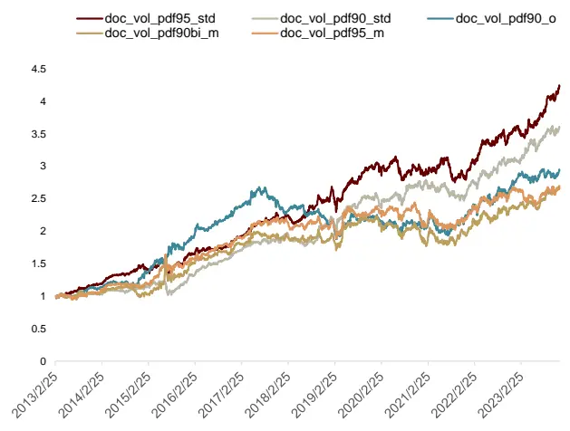

图表 115：doc_vol_pdf60_std 与常见因子相关系数
图表 114：沪深 300范围内表现较好的筹码分布因子年化超额收益统计
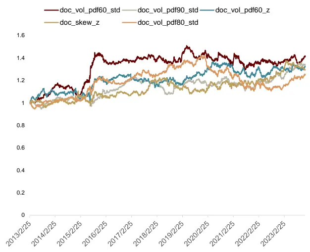

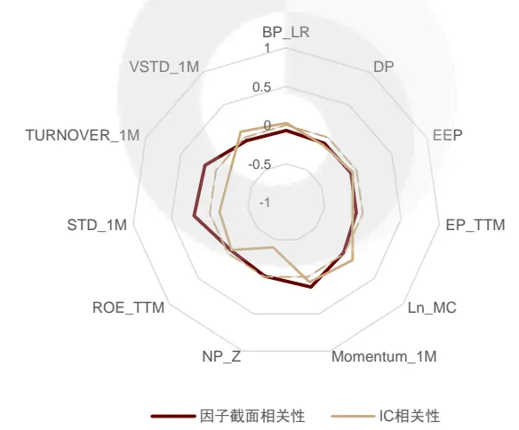
注：1）统计时间为 2013-01-14 至 2023-12-01；2）相对净值的比较基准为沪深300 等权指数 000984.CSI
资料来源：Wind，中金公司研究部

图表 116：沪深 300范围内表现较好的筹码分布因子分组年化超额收益统计
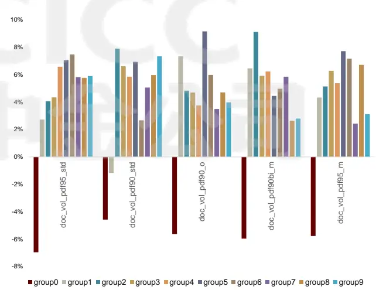
注：1）统计时间为 2013-01-14 至 2023-12-01；2）超额收益的比较基准为沪深300 等权指数 000984.CSI；3）Group0 为因子值最小一组，Group9 为因子值最大一组
资料来源：Wind，中金公司研究部

## 拥挤度因子

图表 117：拥挤度因子在不同股票池范围和不同调仓频率下因子主要指标表现

| 超额ICI空 |  |  |  |  |  |  |  | 000N |  | 1000W |  |  | 500M |  |  |  | 500W | 300N |  |  |  | 300W |  |  |  |  |  |  |  |
| --- | --- | --- | --- | --- | --- | --- | --- | --- | --- | --- | --- | --- | --- | --- | --- | --- | --- | --- | --- | --- | --- | --- | --- | --- | --- | --- | --- | --- | --- |
|  |  |  |  |  |  | ICIR | 多空 | 超额 ICIR 多空 |  |  | 超额 | ICIR | 多空 | 超额 | ICIR | 多空 | 超额 | ICIR | 多空 | 超额 | ICIR | 多空 | 超额 | ICIR 多空 |  | 超额 | ICIR | 多空 | 超额 |
| crowd_fftv20_3s_w0_std | 1.37 | 20% | 6% 1.12 |  | 26% | 7% | 0.98 | 20% | 5% | 0.75 | 23% | 4% | 0.50 | 5% | 1% | 0.40 | 6% | 1% | 0.48 | 7% | 0% | 0.18 | 2% | 0% |  |  |  |  |  |
| crowd_fftv50m10_std | 1.30 | 26% | 7% | 1.38 | 37% | 8% | 1.16 | 25% | 5% | 0.90 | 32% | 7% | 0.77 | 14% | 3% | 0.63 | 16% | 4% | 0.54 | 14% | 4% | 0.39 | 9% | 2% |  |  |  |  |  |
| crowd_fftv50m5_std | 1.27 | 26% | 7% | 1.37 | 38% | 9% | 1.11 | 23% | 5% | 0.97 | 34% | 8% | 0.73 | 13% | 1% | 0.65 | 13% | 2% | 0.52 | 8% | 2% | 0.46 | 9% | 3% |  |  |  |  |  |
| crowd_fftv20_high_o | 1.26 | 26% | 5% | 1.12 | 54% | 11% | 0.98 | 20% | 3% | 0.88 | 37% | 3% | 0.60 | 10% | 2% | 0.62 | 22% | 4% | 0.35 | 4% | 0% | 0.25 | 3% | 2% |  |  |  |  |  |
| crowd_fftv20_30s_no0_std | 1.24 | 27% | 8% | 1.35 | 36% | 8% | 1.25 | 25% | 9% | 0.98 | 33% | 9% | 0.68 | 14% | 1% | 0.58 | 9% | 4% | 0.45 | 3% | 0% | 0.29 | 5% | 0% |  |  |  |  |  |
| crowd_fftv20_30s_w0_std | 1.23 | 26% | 8% | 1.35 | 36% | 10% | 1.30 | 23% | 7% | 0.97 | 32% | 8% | 0.64 | 12% | 2% | 0.56 | 12% | 6% | 0.37 | 7% | 2% | 0.27 | 6% | 2% |  |  |  |  |  |
| crowd_fftv50m5_m | 1.21 | 29% | 5% | 0.83 | 40% | 3% | 1.03 | 25% | 4% | 0.72 | 40% | 5% | 0.51 | 12% | 0% | 0.44 | 15% | 0% | 0.32 | 9% | 0% | 0.34 | 10% | 3% |  |  |  |  |  |
| crowd_origin_v50_std | 1.18 | 26% | 8% | 1.33 | 36% | 10% | 1.18 | 23% | 7% | 0.99 | 31% | 9% | 0.58 | 9% | -1% | 0.59 | 12% | 6% | 0.39 | 10% | 5% | 0.28 | 5% | 2% |  |  |  |  |  |
| crowd_fftv10_std | 1.17 | 25% | 6% | 1.19 | 38% | 9% | 1.25 | 22% | 7% | 0.83 | 30% | 7% | 0.65 | 13% | 1% | 0.55 | 9% | 3% | 0.48 | 9% | 4% | 0.25 | 5% | 0% |  |  |  |  |  |
| crowd_fftv5_std | 1.16 | 24% | 6% | 1.08 | 36% | 8% | 1.26 | 24% | 8% | 0.75 | 27% | 6% | 0.61 | 12% | 1% | 0.49 | 11% | 3% | 0.43 | 12% | 4% | 0.21 | 7% | 3% |  |  |  |  |  |
| crowd_fftv20_high_std | 1.15 | 16% | 5% | 0.92 | 16% | 5% | 1.05 | 17% | 4% | 0.54 | 15% | 2% | 0.46 | 12% | 1% | 0.30 | 5% | 1% | 0.23 | 5% | -1% | 0.15 | 0% | 0% |  |  |  |  |  |
| crowd_fftv20_low_o | 1.13 | 32% | 4% | 1.09 | 71% | 13% | 0.93 | 26% | 4% | 0.91 | 50% | 5% | 0.73 | 18% | 3% | 0.69 | 30% | 6% | 0.37 | 9% | 3% | 0.32 | 13% | 2% |  |  |  |  |  |
| crowd_origin_v50_o | 1.11 | 27% | 3% | 1.06 | 59% | 8% | 0.95 | 20% | 2% | 0.89 | 43% | 3% | 0.65 | 14% | 4% | 0.68 | 28% | 4% | 0.35 | 6% | 0% | 0.28 | 11% | 1% |  |  |  |  |  |
| crowd_fftv20_low_std | 1.11 | 21% | 7% | 1.26 | 24% | 7% | 1.15 | 22% | 7% | 0.85 | 23% | 8% | 0.57 | 13% | 1% | 0.51 | 8% | 3% | 0.36 | 7% | 1% | 0.25 | 5% | 1% |  |  |  |  |  |
| crowd_fftv50m5_o | 1.07 | 13% | 0% | 0.92 | 32% | 1% | 0.76 | 9% | -1% | 0.71 | 26% | 1% | 0.17 | 6% | 1% | 0.36 | 9% | -3% | 0.27 | 3% | 0% | 0.27 | 17% | 7% |  |  |  |  |  |
| crowd_fftv20_30s_w0_o | 1.06 | 27% | 2% | 0.90 | 59% | 7% | 0.90 | 19% | 2% | 0.75 | 38% | 1% | 0.60 | 12% | 1% | 0.59 | 30% | 5% | 0.36 | 5% | -1% | 0.23 | 9% | 1% |  |  |  |  |  |
| crowd_fftv20_30s_no0_o | 1.06 | 28% | 1% | 0.93 | 61% | 7% | 0.90 | 19% | 1% | 0.77 | 40% | 0% | 0.60 | 15% | 3% | 0.60 | 27% | 3% | 0.33 | 2% | 0% | 0.25 | 9% | 1% |  |  |  |  |  |
| crowd_fftv10_o | 1.01 | 28% | 1% | 0.84 | 57% | 8% | 0.88 | 20% | 1% | 0.70 | 39% | 1% | 0.64 | 16% | 3% | 0.56 | 27% | 4% | 0.32 | 3% | -1% | 0.19 | 6% | 0% |  |  |  |  |  |
| crowd_fftv20_3s_w0_ocrowd_fftv5_o | 1.00 | 24% | 2% | 0.76 | 51% | 5% | 0.90 | 19% | 1% | 0.64 | 32% | -1% | 0.51 | 5% | 1% | 0.50 | 20% | 3% | 0.21 | 5% | 0% | 0.16 | 0% | -2% |  |  |  |  |  |
|  | 0.97 | 27% | 1% | 0.76 | 50% | 7% | 0.82 | 16% | 0% | 0.62 | 32% | -1% | 0.61 | 12% | 1% | 0.51 | 22% | 3% | 0.24 | -1% | -3% | 0.17 | 5% | 0% |  |  |  |  |  |
| crowd_fftv20_high_mcrowd_fftv20_low_mcrowd_origin_v50_m | 0.96 | 35% | 5% | 0.95 | 64% | 12% | 0.85 | 34% | 7% | 0.78 | 45% | 6% | 0.69 | 17% | 4% | 0.59 | 26% | 2% | 0.29 | 9% | 2% | 0.27 | 6% | 2% |  |  |  |  |  |
|  | 0.94 | 33% | 5% | 0.89 | 63% | 11% | 0.84 | 29% | 5% | 0.76 | 52% | 8% | 0.64 | 16% | 5% | 0.59 | 34% | 7% | 0.32 | 15% | 3% | 0.24 | 9% | 3% |  |  |  |  |  |
|  | 0.91 | 31% | 4% | 0.87 | 59% | 9% | 0.84 | 28% | 4% | 0.75 | 45% | 5% | 0.60 | 12% | 3% | 0.58 | 28% | 5% | 0.32 | 14% | 3% | 0.25 | 12% | 1% |  |  |  |  |  |
|  | crowd_fftv20_30s_no0_m | 0.87 | 29% | 4% | 0.76 | 54% | 8% | 0.78 | 25% | 3% | 0.65 | 44% | 4% | 0.59 | 14% | 4% | 0.50 | 25% | 3% | 0.29 | 10% | 1% | 0.20 | 10% | 2% |  |  |  |  |
|  | crowd_fftv20_30s_w0_m | 0.85 | 29% | 3% | 0.74 | 52% | 8% | 0.77 | 24% | 3% | 0.63 | 39% | 3% | 0.57 | 13% | 4% | 0.49 | 27% | 3% | 0.28 | 8% | 1% | 0.19 | 12% | 3% |  |  |  |  |
| crowd_fftv5_mcrowd_fftv50m5_zcrowd_fftv20_high_zcrowd_fftv20_low_zcrowd_origin_v50_zcrowd_fftv20_30s_w0_zcrowd_fftv20_30s_no0_zcrowd_fftv10_zcrowd_fftv20_3s_w0_zcrowd_fftv50m10_o | crowd_fftv10_m |  |  |  |  | 0.82 | 26% | 3% | 0.70 | 50% | 8% | 0.73 | 21% | 1% | 0.59 | 38% | 4% | 0.61 | 13% | 4% | 0.45 | 26% | 3% | 0.26 |  |  |  |  |  |
|  | crowd_fftv20_3s_w0_m | 0.80 | 26% | 3% | 0.64 | 47% | 7% | 0.78 | 21% | 2% | 0.56 | 37% | 4% | 0.58 | 16% | 2% | 0.43 | 20% | 3% | 0.23 | 5% | 0% | 0.13 | 4% | -1% |  |  |  |  |
|  | 0.79 | 24% | 2% | 0.63 | 44% | 7% | 0.70 | 19% | 1% | 0.52 | 32% | 2% | 0.54 | 11% | 3% | 0.41 | 21% | 1% | 0.22 | 4% | 1% | 0.13 | 5% | 1% |  |  |  |  |  |
|  | 0.69 | 8% | 1% | 0.72 | 17% | 3% | 0.66 | 5% | 1% | 0.44 | 14% | 4% | 0.19 | 3% | 0% | 0.22 | 9% | 1% | 0.14 | 0% | -5% | 0.18 | 5% | 2% |  |  |  |  |  |
|  | 0.66 | 11% | 1% | 0.80 | 25% | 5% | 0.63 | 14% | 1% | 0.54 | 19% | 4% | 0.31 | 1% | -2% | 0.39 | 11% | -1% | 0.14 | 4% | 0% | 0.14 | 4% | 0% |  |  |  |  |  |
|  | 0.64 | 10% | 1% | 0.79 | 28% | 5% | 0.65 | 13% | 2% | 0.59 | 25% | 8% | 0.25 | 0% | -2% | 0.45 | 19% | 4% | 0.23 | 0% | -2% | 0.16 | 4% | -3% |  |  |  |  |  |
|  | 0.60 | 10% | 2% | 0.74 | 25% | 5% | 0.64 | 16% | 4% | 0.56 | 20% | 6% | 0.23 | -4% | -3% | 0.43 | 14% | 3% | 0.25 | 2% | -3% | 0.14 | 4% | -1% |  |  |  |  |  |
|  | 0.56 | 9% | 1% | 0.66 | 22% | 3% | 0.59 | 12% | 3% | 0.51 | 16% | 3% | 0.20 | -2% | -5% | 0.40 | 10% | 1% | 0.23 | 2% | -1% | 0.12 | 4% | -2% |  |  |  |  |  |
|  | 0.56 | 8% | 1% | 0.68 | 23% | 4% | 0.59 | 10% | 2% | 0.51 | 18% | 5% | 0.21 | -4% | -5% | 0.39 | 8% | 0% | 0.23 | 4% | 1% | 0.14 | 6% | -1% |  |  |  |  |  |
|  | 0.55 | 7% | 1% | 0.64 | 21% | 3% | 0.57 | 12% | 3% | 0.50 | 15% | 3% | 0.21 | -2% | -3% | 0.38 | 8% | 1% | 0.19 | 3% | 0% | 0.11 | 2% | -4% |  |  |  |  |  |
|  | crowd_fftv5_z | 0.52 | 6% | 1% | 0.57 | 16% | 0% | 0.54 | 11% | 3% | 0.45 | 13% | 2% | 0.20 | -4% | -3% | 0.35 | 7% | 0% | 0.16 | 3% | 1% | 0.08 | 2% | -2% |  |  |  |  |
|  | 0.46 | 9% | 0% | 0.58 | 19% | 1% | 0.48 | 8% | 1% | 0.40 | 12% | 1% | 0.28 | 0% | -3% | 0.28 | 14% | 3% | 0.08 | 3% | -2% | 0.08 | 0% | -2% |  |  |  |  |  |
|  | 0.38 | 0% | -6% | 0.12 | -3%- | 12% | 0.28 | -2% | -6% | 0.06 | -4% | -10% | 0.20 | 1% | -2% | 0.08 | -2% | -8% | 0.00 | -2% | 0% | 0.07 | 10% | 4% |  |  |  |  |  |
| crowd_fftv50m10_mcrowd_fftv50m10_z | 0.26 | -1% | -6% | 0.10 | -2% | -9% | 0.23 | -4% | -7% | 0.09 | -6% | -11% | 0.16 | 1% | -2% | 0.05 | -2% | -8% | 0.02 | 5% | 2% | 0.08 | 5% | 2% |  |  |  |  |  |
|  | 0.25 | 0% | -1% | 0.05 | 5% | -1% | 0.16 | 3% | -1% | 0.01 | -3% | -4% | 0.10 | 0% | 0% | 0.03- | 3% | -4% | 0.02 | 0% | 0% | 0.11 | 2% | 1% |  |  |  |  |  |

资料来源：Wind，中金公司研究部（注：统计时间为 2018-01-08 至 2023-12-01；超额收益的比较基准为有效股票池等权表现）

图表 120：crowd_fftv50m5_m 与常见因子相关系数
图表 118：沪深 300范围内表现较好的拥挤度因子年化多空收益统计
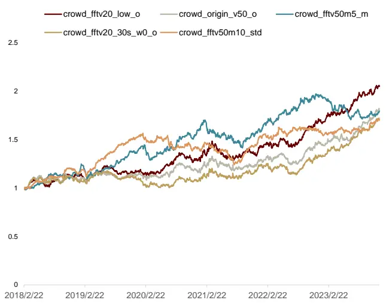

图表 119：沪深 300范围内表现较好的拥挤度因子年化超额收益统计
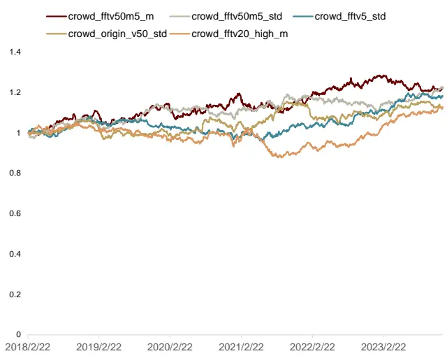
图表 121：沪深 300范围内表现较好的拥挤度因子分组年化超额收益统计

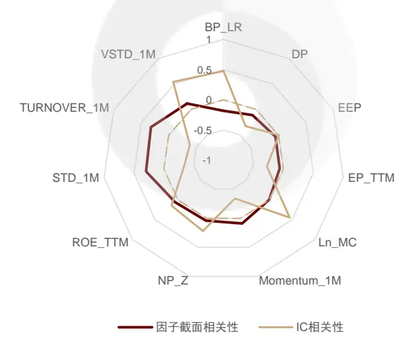
注：1）统计时间为 2018-01-08 至 2023-12-01；2）相对净值的比较基准为沪深300 等权指数 000984.CSI
资料来源：Wind，中金公司研究部

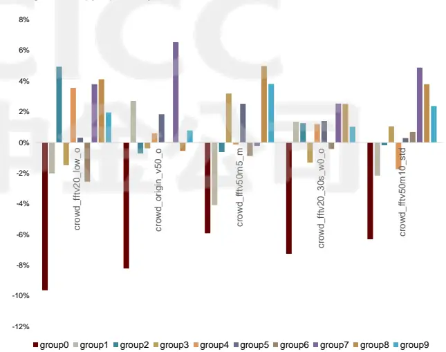
注：1）统计时间为 2018-01-08 至 2023-12-01；2）超额收益的比较基准为沪深300 等权指数 000984.CSI；3）Group0 为因子值最小一组，Group9 为因子值最大一组
资料来源：Wind，中金公司研究部

## 资金流因子

图表 122：资金流因子在不同股票池范围和不同调仓频率下因子主要指标表现

|  |  |  |  |  |  |  |  |  |  |  |  | 1000W |  | 500M |  |  |  | 500W |  | 3001 |  | 1300W |  |  |  |  |  |  |  |  |  |  |  |  |
| --- | --- | --- | --- | --- | --- | --- | --- | --- | --- | --- | --- | --- | --- | --- | --- | --- | --- | --- | --- | --- | --- | --- | --- | --- | --- | --- | --- | --- | --- | --- | --- | --- | --- | --- |
|  |  |  |  |  |  |  |  |  |  |  | ICIR | 多空 | 超额 | ICIR | 多空 | 超额 | ICIR 多空 |  | 超额 | ICIR | 多空 | 超额 | ICIR | 多空 | 超额 | ICIR | 多空 | 超额 | ICIR | 多空 | 超额 | ICIR | 多空 | 超额 |
| trade_headRatio_std |  | 1.07 | 14% | 4% | 0.92 | 25% | 5% | 0.90 | 17% | 4% | 0.67 | 17% | 3% | 0.34 | 5% | 0% | 0.45 | 10% | 2% | 0.25 | 7% | 0% | 0.16 | 3% | -1% |  |  |  |  |  |  |  |  |  |
| trade_top20retRatio_m |  | 0.90 | 14% | 4% | 0.71 | 23% | 2% | 0.63 | 14% | 2% | 0.63 | 21% | 1% | 0.57 | 7% | 1% | 0.49 | 14% | -1% | 0.32 | 11% | 2% | 0.27 | 4% | 0% |  |  |  |  |  |  |  |  |  |
| trade_top20retRatio_std |  | 0.85 | 14% | 2% | 0.53 | 18% | 1% | 0.62 | 15% | 3% | 0.45 | 14% | 2% | 0.43 | 8% | 2% | 0.41 | 10% | 0% | 0.34 | 8% | 4% | 0.26 | 7% | 2% |  |  |  |  |  |  |  |  |  |
| trade_bidAskRatio_m |  | 0.82 | 19% | 6% | 0.63 | 23% | 4% | 0.66 | 17% | 6% | 0.50 | 19% | 2% | 0.44 | 9% | 4% | 0.24 | 3% | -2% | 0.17 | 13% | 7% | 0.12 | 2% | -3% |  |  |  |  |  |  |  |  |  |
| trade_top50retRatio_std |  | 0.80 | 14% | 3% | 0.44 | 15% | 1% | 0.58 | 15% | 3% | 0.36 | 16% | 2% | 0.39 | 2% | 0% | 0.37 | 6% | 0% | 0.24 | 5% | 1% | 0.20 | 5% | 2% |  |  |  |  |  |  |  |  |  |
| trade_bottom20retRatio_m |  | 0.78 | 14% | 4% | 0.33 | 10% | 2% | 0.73 | 16% | 4% | 0.37 | 12% | 2% | 0.44 | 8% | 0% | 0.27 | 6% | 1% | 0.26 | 8% | 2% | 0.15 | 0% | -1% |  |  |  |  |  |  |  |  |  |
|  | trade_headRatio_m | 0.74 | 13% | 1% | 0.60 | 17% | -1% | 0.65 | 15% | 1% | 0.53 | 15% | -2% | 0.44 | 3% | 1% | 0.39 | 9% | 0% | 0.16 | 3% | -1% | 0.11 | -6% | -5% |  |  |  |  |  |  |  |  |  |
|  | trade_bidAskRatio_z | 0.73 | 8% | 3% | 0.44 | 11% | 3% | 0.57 | 8% | 3% | 0.31 | 11% | 2% | 0.18 | -1% | -1% | 0.12 | 1% | -2% | 0.20 | 2% | -3% | 0.06 | 3% | 1% |  |  |  |  |  |  |  |  |  |
|  | trade_bidAskRatio_std | 0.59 | 8% | -1% | 0.53 | 15% | 0% | 0.46 | 8% | 2% | 0.42 | 13% | 0% | 0.29 | 8% | 4% | 0.19 | 0% | -1% | 0.06 | 7% | 4% | 0.05 | 1% | -1% |  |  |  |  |  |  |  |  |  |
|  | trade_topNeg20retRatio_o | 0.58 | 13% | 5% | 0.43 | 27% | 7% | 0.40 | 10% | 4% | 0.30 | 14% | 2% | 0.27 | 2% | 1% | 0.15 | 3% | -1% | 0.10 | -2% | 0% | 0.02 | -1% | -2% |  |  |  |  |  |  |  |  |  |
|  | trade_headRatio_o | 0.58 | 7% | -1% | 0.53 | 18% | -1% | 0.47 | 7% | 0% | 0.41 | 15% | -1% | 0.38 | 0% | -2% | 0.25 | 4% | -4% | 0.01 | -2% | -2% | 0.02 | -1% | -4% |  |  |  |  |  |  |  |  |  |
|  | trade_netBuyRatio_std | 0.51 | 9% | -1% | 0.38 | 8% | -1% | 0.43 | 5% | -3% | 0.29 | 6% | -2% | 0.29 | -3% | -4% | 0.19 | 3% | -3% | 0.13 | 4% | -1% | 0.06 | -3% | -4% |  |  |  |  |  |  |  |  |  |
|  | trade_top20retRatio_z | 0.50 | 1% | -2% | 0.49 | 18% | 4% | 0.30 | 0% | -3% | 0.32 | 11% | 1% | 0.14 | 0% | -2% | 0.27 | 6% | 1% | 0.15 | 2% | -4% | 0.04 | -1% | -2% |  |  |  |  |  |  |  |  |  |
|  | trade_top20retRatio_o | 0.48 | 7% | 2% | 0.56 | 14% | 3% | 0.35 | 7% | 0% | 0.49 | 13% | 4% | 0.41 | 3% | 0% | 0.39 | 15% | 1% | 0.14 | 2% | -1% | 0.21 | 4% | -2% |  |  |  |  |  |  |  |  |  |
|  | trade_netBuyRatio_m | 0.41 | 14% | 6% | 0.26 | 12% | 5% | 0.40 | 12% | 5% | 0.16 | 10% | 3% | 0.27 | 7% | 0% | 0.10 | 7% | 0% | 0.28 | 14% | 3% | 0.11 | 8% | 3% |  |  |  |  |  |  |  |  |  |
|  | trade_top50retRatio_m | 0.41 | 5% | 0% | 0.37 | 12% | -1% | 0.40 | 3% | -2% | 0.37 | 14% | 1% | 0.39 | 4% | 0% | 0.34 | 5% | -2% | 0.26 | 4% | 0% | 0.21 | 4% | -1% |  |  |  |  |  |  |  |  |  |
|  | trade_bidAskRatio_o | 0.40 | 5% | 1% | 0.34 | 4% | -3% | 0.23 | 1% | -1% | 0.21 | -1% | -6% | 0.27 | -1% | -1% | 0.04 | -8% | -7% | 0.26 | 4% | 3% | 0.11 | 5% | -1% |  |  |  |  |  |  |  |  |  |
|  | trade_CSellRatio_z | 0.40 | 5% | 0% | 0.36 | 6% | -2% | 0.32 | 3% | 0% | 0.27 | 1% | -4% | 0.08 | 4% | 2% | 0.07 | 2% | -1% | 0.14 | 7% | 4% | 0.01 | -4% | -8% |  |  |  |  |  |  |  |  |  |
|  | trade_bottom20retRatio_o | 0.38 | 6% | 4% | 0.22 | 6% | 3% | 0.25 | 3% | 1% | 0.22 | 8% | 1% | 0.13 | 2% | 0% | 0.14 | 0% | -2% | 0.03 | 3% | 2% | 0.05 | -2% | -2% |  |  |  |  |  |  |  |  |  |
|  | trade_headRatio_z | 0.38 | 3% | 0% | 0.33 | 6% | -1% | 0.34 | 4% | 1% | 0.23 | 4% | -3% | 0.12 | -1% | -2% | 0.13 | 3% | -1% | 0.03 | 0% | -1% | 0.02 | 10% | 2% |  |  |  |  |  |  |  |  |  |
|  | trade_topNeg20retRatio_m | 0.37 | 8% | 3% | 0.29 | 13% | 1% | 0.25 | 2% | 2% | 0.19 | 4% | 0% | 0.19 | 3% | 0% | 0.12 | 4% | 0% | 0.10 | -3% | -2% | 0.07 | 0% | -2% |  |  |  |  |  |  |  |  |  |
|  | trade_bottom20retRatio_z | 0.37 | 5% | 2% | 0.13 | 4% | -1% | 0.39 | 7% | 3% | 0.09 | 4% | 0% | 0.17 | 5% | 0% | 0.15 | 2% | -1% | 0.03 | -1% | -3% | 0.00 | 1% | 1% |  |  |  |  |  |  |  |  |  |
|  | trade_top50retRatio_z | 0.36 | 0% | -2% | 0.36 | 14% | 3% | 0.27 | -2% | -4% | 0.22 | 6% | 0% | 0.14 | 0% | -2% | 0.21 | 4% | -2% | 0.06 | 0% | -4% | 0.04 | 3% | -1% |  |  |  |  |  |  |  |  |  |
|  | trade_tailRatio_std | 0.35 | 7% | 4% | 0.29 | 12% | 1% | 0.33 | 12% | 5% | 0.19 | 11% | 1% | 0.16 | 6% | 2% | 0.08 | 9% | 0% | 0.18 | 4% | -2% | 0.16 | 7% | -2% |  |  |  |  |  |  |  |  |  |
|  | trade_bottom50retRatio_m | 0.31 | 6% | 2% | 0.05 | 2% | 0% | 0.50 | 11% | 3% | 0.14 | 7% | 1% | 0.27 | 1% | -2% | 0.11 | 0% | -1% | 0.25 | 4% | -1% | 0.07 | -2% | 0% |  |  |  |  |  |  |  |  |  |
|  | trade_netBuyRatio_o | 0.29 | 3% | 2% | 0.09 | -2% | 1% | 0.26 | 3% | 1% | 0.05 | -4% | -3% | 0.15 | 2% | 0% | 0.07 | -2% | -2% | 0.42 | 5% | 0% | 0.11 | 5% | 0% |  |  |  |  |  |  |  |  |  |
|  | trade_CRatio_z | 0.26 | -3% | -1% | 0.22 | -3% | -3% | 0.17 | 0% | 1% | 0.14 | -3% | -4% | 0.00 | -12% | -8% | 0.11 | -9% | -5% | 0.12 | 4% | 4% | 0.05 | 17% | 7% |  |  |  |  |  |  |  |  |  |
|  | trade_netBuyRatio_z | 0.23 | 7% | 2% | 0.15 | 5% | 1% | 0.16 | 9% | 3% | 0.11 | 4% | 1% | 0.05 | 4% | 3% | 0.04 | -2% | -4% | 0.15 | 5% | 0% | 0.06 | 3% | -1% |  |  |  |  |  |  |  |  |  |
|  | trade_CBuyRatio_std | 0.19 | 10% | 5% | 0.03 | -3% | -3% | 0.39 | 11% | 4% | 0.00 | 7% | 3% | 0.27 | 9% | 3% | 0.09 | 7% | 2% | 0.12 | -2% | -3% | 0.02 | 2% | 3% |  |  |  |  |  |  |  |  |  |
|  | trade_topPos20retRatio_o | 0.15 | -2% | -2% | 0.04 | 4% | 1% | 0.00 | 8% | 2% | 0.09 | 11% | 3% | 0.11 | 4% | 3% | 0.14 | 6% | -1% | 0.08 | 4% | 0% | 0.07 | 5% | -1% |  |  |  |  |  |  |  |  |  |
|  | trade_topPos20retRatio_z | 0.14 | 5% | 0% | 0.35 | 12% | 2% | 0.17 | 9% | 2% | 0.16 | 9% | 1% | 0.00 | 3% | -1% | 0.15 | 8% | 1% | 0.23 | 8% | -2% | 0.06 | -1% | -1% |  |  |  |  |  |  |  |  |  |
|  | trade_tailRatio_z | 0.13 | -1% | -2% | 0.01 | 3% | -3% | 0.12 | -4% | -3% | 0.01 | 3% | -2% | 0.11 | -2% | -3% | 0.02 | -3% | -3% | 0.19 | 6% | 0% | 0.10 | 8% | 3% |  |  |  |  |  |  |  |  |  |
|  | trade_topPos20retRatio_std | 0.13 | 10% | 1% | 0.11 | 13% | 0% | 0.18 | 11% | 2% | 0.11 | 14% | 2% | 0.04 | 2% | -2% | 0.09 | 6% | 1% | 0.19 | 7% | 2% | 0.10 | 0% | -1% |  |  |  |  |  |  |  |  |  |
|  | trade_top50retRatio_o | 0.12 | 0% | -2% | 0.23 | 3% | -2% | 0.14 | 3% | -1% | 0.26 | 7% | 1% | 0.22 | -3% | -3% | 0.28 | 9% | 1% | 0.08 | -5% | -2% | 0.13 | -1% | -4% |  |  |  |  |  |  |  |  |  |
|  | trade_bottom50retRatio_z | 0.12 | 4% | 2% | 0.06 | 0% | -2% | 0.26 | 8% | 2% | 0.04 | 1% | -2% | 0.17 | 3% | 3% | 0.03 | -6% | -2% | 0.02 | -2% | -3% | 0.08 | 1% | 0% |  |  |  |  |  |  |  |  |  |
|  | trade_topNeg20retRatio_z | 0.12 | -3% | -3% | 0.15 | -3% | -4% | 0.02 | -3% | -5% | 0.09 | -4% | -4% | 0.10 | -4% | -4% | 0.08 | 0% | -2% | 0.08 | 3% | -2% | 0.04 | 2% | -1% |  |  |  |  |  |  |  |  |  |
|  | trade_CBuyRatio_m | 0.10 | 6% | 5% | 0.01 | -1% | 1% | 0.24 | 7% | 3% | 0.03 | 6% | 4% | 0.30 | 7% | 2% | 0.19 | 3% | 0% | 0.07 | -6% | -5% | 0.07 | 6% | 2% |  |  |  |  |  |  |  |  |  |
|  | trade_topNeg20retRatio_std | 0.09 | -7% | -9% | 0.14 | -3% | -6% | 0.01 | 14% | 2% | 0.08 | -6% | -6% | 0.09 | 2% | -2% | 0.06 | -2% | -2% | 0.03 | 0% | -2% | 0.03 | 1% | 1% |  |  |  |  |  |  |  |  |  |
|  | trade_CSellRatio_o | 0.09 | 6% | 5% | 0.03 | 2% | 3% | 0.14 | 5% | 2% | 0.01 | 4% | 2% | 0.36 | 12% | 2% | 0.20 | 6% | 0% | 0.03 | -8% | -7% | 0.03 | 6% | 3% |  |  |  |  |  |  |  |  |  |
|  | trade_bottom50retRatio_std | 0.08 | -5% | -6% | 0.06 | -4% | -6% | 0.11 | 8% | 1% | 0.02 | -7% | -8% | 0.05 | 7% | 5% | 0.07 | 4% | 4% | 0.04 | -2% | -1% | 0.01 | 4% | 3% |  |  |  |  |  |  |  |  |  |
|  | trade_CRatio_std | 0.08 | 7% | 5% | 0.00 | 7% | 4% | 0.23 | 9% | 2% | 0.06 | 8% | 3% | 0.24 | 6% | 1% | 0.12 | 6% | 4% | 0.10 | -3% | -4% | 0.02 | 3% | 1% |  |  |  |  |  |  |  |  |  |
|  | trade_bottom50retRatio_o | 0.07 | 4% | 3% | 0.09 | 4% | 3% | 0.02 | 6% | 3% | 0.04 | 0% | -2% | 0.04 | 0% | -2% | 0.08 | 5% | 1% | 0.03 | -3% | -4% | 0.02 | 4% | 1% |  |  |  |  |  |  |  |  |  |
|  | trade_tailRatio_o | 0.07 | -2% | -3% | 0.10 | -5% | -9% | 0.00 | 2% | -1% | 0.06 | -7% | -8% | 0.10 | -3% | -3% | 0.03 | -13 | %-11 | %0.25 | 11% | 2% | 0.10 | 12% | 1% |  |  |  |  |  |  |  |  |  |
|  | trade_CRatio_m | 0.07 | 5% | 5% | 0.03 | 4% | 5% | 0.16 | 6% | 3% | 0.01 | 4% | 3% | 0.29 | 8% | 2% | 0.19 | 6% | 1% | 0.05 | -5% | -4% | 0.07 | 6% | 3% |  |  |  |  |  |  |  |  |  |
|  | trade_topPos20retRatio_m | 0.06 | -3% | -5% | 0.01 | 7% | -1% | 0.10 | 11% | 3% | 0.05 | 13% | 3% | 0.11 | 5% | -2% | 0.12 | 12% | 3% | 0.05 | 8% | 3% | 0.08 | 9% | 3% |  |  |  |  |  |  |  |  |  |
|  | trade_CSellRatio_std | 0.04 | 6% | 5% | 0.04 | -1% | -1% | 0.17 | 9% | 4% | 0.04 | 7% | 3% | 0.33 | 9% | 1% | 0.15 | 9% | 3% | 0.17 | -3% | -3% | 0.02 | -2% | 0% |  |  |  |  |  |  |  |  |  |
|  | trade_CSellRatio_m | 0.03 | 5% | 5% | 0.07 | 3% | 4% | 0.08 | 5% | 3% | 0.05 | -3% | -1% | 0.31 | 6% | 2% | 0.16 | 4% | 1% | 0.06 | -4% | -4% | 0.05 | 3% | 2% |  |  |  |  |  |  |  |  |  |
|  | trade_CRatio_o | 0.03 | 5% | 5% | 0.06 | 8% | 8% | 0.14 | 5% | 2% | 0.03 | -1% | 2% | 0.32 | 11% | 2% | 0.17 | 7% | 2% | 0.04 | -8% | -7% | 0.05 | 8% | 5% |  |  |  |  |  |  |  |  |  |
| trade_tailRatio_mtrade_bottom20retRatio_std |  | 0.03 | 7% | 2% | 0.05 | -6% | -9% | 0.08 | 9% | 3% | 0.05 | -6% | -9% | 0.05 | -5% | -4% | 0.04 | -12% | -10% | 0.18 | 12% | 7% | 0.11 | 15% | 4% |  |  |  |  |  |  |  |  |  |
|  |  | rade_bottom20retRatio_std | 0.01 | -6% | -5% | 0.01 | -5% | -5% | 0.18 | 10% | 3% | 0.06 | 8% | 1% | 0.12 | 4% | 2% | 0.06 | 6% | 2% | 0.01 | -3% | -2% | 0.05 | -3% | -1% |  |  |  |  |  |  |  |  |
| trade_CBuyRatio_z |  | trade_CBuyRatio_o |  |  |  |  | 0.00 | 2% | 5% | 0.04 | 9% | 8% | 0.09 | 0% | 1% | 0.01 | 4% | 4% | 0.29 | 6% | 3% | 0.16 | 2% | 1% | 0.07 |  |  |  |  |  |  |  |  |  |
|  |  | 0.00 | -4% | -4% | 0.04 | 6% | 1% | 0.08 | 5% | -1% | 0.05 | 7% | 2% | 0.06 | 12% | 5% | 0.02 | -3% | -6% | 0.21 | 3% | 4% | 0.15 | 12% | 5% |  |  |  |  |  |  |  |  |  |

资料来源：Wind，中金公司研究部（注：统计时间为 2018-01-08 至 2023-12-01；超额收益的比较基准为有效股票池等权表现）

图表 123：沪深 300范围内表现较好的资金流因子年化多空收益统计
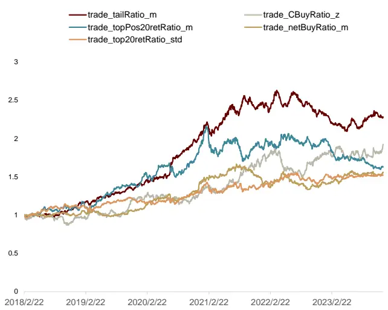
图表 125：trade_CBuyRatio_z 与常见因子相关系数

图表 124：沪深 300范围内表现较好的资金流因子年化超额收益统计
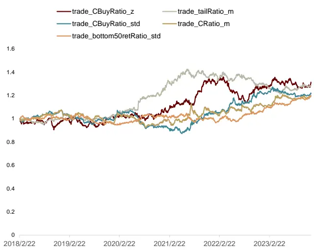

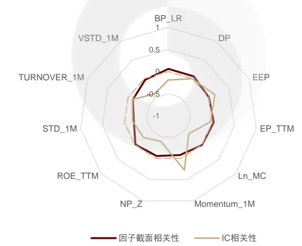
注：1）统计时间为 2018-01-08 至 2023-12-01；2）相对净值的比较基准为沪深300 等权指数 000984.CSI
资料来源：Wind，中金公司研究部

图表 126：沪深 300范围内表现较好的资金流因子分组年化超额收益统计
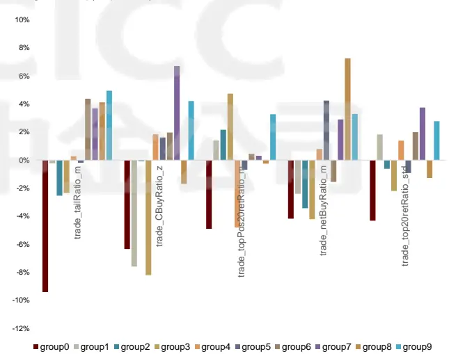
注：1）统计时间为 2018-01-08 至 2023-12-01；2）超额收益的比较基准为沪深300 等权指数 000984.CSI；3）Group0 为因子值最小一组，Group9 为因子值最大一组
资料来源：Wind，中金公司研究部

周萧潇 分析员
SAC 执证编号：S0080521010006
SFC CE Ref：BRA090
xiaoxiao.zhou@cicc.com.cn

## 胡骥聪 分析员

SAC 执证编号：S0080521010007
SFC CE Ref: BRF083
jicong.hu@cicc.com.cn

## 作者信息

郑文才 分析员
SAC 执证编号：S0080523110003
SFC CE Ref：BTF578
wencai3.zheng@cicc.com.cn

## 古翔 分析员

SAC 执证编号：S0080521010010
SFC CE Ref: BRE496
xiang.gu@cicc.com.cn
陈宜筠 联系人
SAC 执证编号：S0080122080368
SFC CE Ref：BTZ190
yiyun.chen@cicc.com.cn

## 刘均伟 分析员

SAC 执证编号：S0080520120002
SFC CE Ref: BQR365
junwei.liu@cicc.com.cn

## 法律声明

一般声明

本报告由中国国际金融股份有限公司（已具备中国证监会批复的证券投资咨询业务资格）制作。本报告中的信息均来源于我们认为可靠的已公开资料，但中国国际金融股份有限公司及其关联机构（以下统称“中金公司”）对这些信息的准确性及完整性不作任何保证。本报告中的信息、意见等均仅供投资者参考之用，不构成对买卖任何证券或其他金融工具的出价或征价或提供任何投资决策建议的服务。该等信息、意见并未考虑到获取本报告人员的具体投资目的、财务状况以及特定需求，在任何时候均不构成对任何人的个人推荐或投资操作性建议。投资者应当对本报告中的信息和意见进行独立评估，自主审慎做出决策并自行承担风险。投资者在依据本报告涉及的内容进行任何决策前，应同时考量各自的投资目的、财务状况和特定需求，并就相关决策咨询专业顾问的意见对依据或者使用本报告所造成的一切后果，中金公司及/或其关联人员均不承担任何责任。

本报告所载的意见、评估及预测仅为本报告出具日的观点和判断，相关证券或金融工具的价格、价值及收益亦可能会波动。该等意见、评估及预测无需通知即可随时更改。在不同时期，中金公司可能会发出与本报告所载意见、评估及预测不一致的研究报告。

本报告署名分析师可能会不时与中金公司的客户、销售交易人员、其他业务人员或在本报告中针对可能对本报告所涉及的标的证券或其他金融工具的市场价格产生短期影响的催化剂或事件进行交易策略的讨论。这种短期影响的分析可能与分析师已发布的关于相关证券或其他金融工具的目标价、评级、估值、预测等观点相反或不一致，相关的交易策略不同于且也不影响分析师关于其所研究标的证券或其他金融工具的基本面评级或评分。

中金公司的销售人员、交易人员以及其他专业人士可能会依据不同假设和标准、采用不同的分析方法而口头或书面发表与本报告意见及建议不一致的市场评论和/或交易观点。中金公司没有将此意见及建议向报告所有接收者进行更新的义务。中金公司的资产管理部门、自营部门以及其他投资业务部门可能独立做出与本报告中的意见不一致的投资决策。

除非另行说明，本报告中所引用的关于业绩的数据代表过往表现。过往的业绩表现亦不应作为日后回报的预示。我们不承诺也不保证，任何所预示的回报会得以实现。
分析中所做的预测可能是基于相应的假设。任何假设的变化可能会显著地影响所预测的回报。

本报告提供给某接收人是基于该接收人被认为有能力独立评估投资风险并就投资决策能行使独立判断。投资的独立判断是指，投资决策是投资者自身基于对潜在投资的目标、需求、机会、风险、市场因素及其他投资考虑而独立做出的。

本报告由受香港证券及期货事务监察委员会监管的中国国际金融香港证券有限公司（“中金香港”）于香港提供。香港的投资者若有任何关于中金公司研究报告的问题请直接联系中金香港的销售交易代表。本报告作者所持香港证监会牌照的牌照编号已披露在报告首页的作者姓名旁。

本报告由受新加坡金融管理局监管的中国国际金融（新加坡）有限公司 (“中金新加坡”) 于新加坡向符合新加坡《证券期货法》定义下的合格投资者及/或机构投资者提供。本报告无意也不应直接或间接地分发或传递给新加坡的任何其他人。提供本报告于合格投资者及/或机构投资者, 有关财务顾问将无需根据新加坡之《财务顾问法》第 45 条就任何利益及/或其代表就任何证券利益进行披露。有关本报告之任何查询，在新加坡获得本报告的人员可联系中金新加坡持牌代表。

本报告由受金融行为监管局监管的中国国际金融（英国）有限公司（“中金英国”）于英国提供。本报告有关的投资和服务仅向符合《2000 年金融服务和市场法 2005 年（金融推介）令》第 19（5）条、38 条、47 条以及 49 条规定的人士提供。本报告并未打算提供给零售客户使用。在其他欧洲经济区国家，本报告向被其本国认定为专业投资者（或相当性质）的人士提供。

本报告由中国国际金融日本株式会社（“中金日本”）于日本提供，中金日本是在日本关东财务局（日本关东财务局长（金商）第 3235 号）注册并受日本法律监管的金融机构。本报告有关的投资产品和服务仅向符合日本《金融商品交易法》第 2 条 31 项所规定的专业投资者提供。本报告并未打算提供给日本非专业投资者使用。

本报告亦由中国国际金融股份有限公司向符合日本《金融商品交易法施行令》第 17 条第 3 款第 1 项及《金融商品交易法》第 58 条第 2 款但书前段所规定的日本金融机构提供。在该情形下，本报告有关的投资产品和服务仅向日本受监管的金融机构提供。

本报告将依据其他国家或地区的法律法规和监管要求于该国家或地区提供。

## 特别声明

在法律许可的情况下，中金公司可能与本报告中提及公司正在建立或争取建立业务关系或服务关系。因此，投资者应当考虑到中金公司及/或其相关人员可能存在影响本报告观点客观性的潜在利益冲突。

与本报告所含具体公司相关的披露信息请访问 https://research.cicc.com/footer/disclosures，亦可参见近期已发布的关于该等公司的具体研究报告。

中金研究基本评级体系说明：

分析师采用相对评级体系，股票评级分为跑赢行业、中性、跑输行业（定义见下文）。

除了股票评级外，中金公司对覆盖行业的未来市场表现提供行业评级观点，行业评级分为超配、标配、低配（定义见下文）。

我们在此提醒您，中金公司对研究覆盖的股票不提供买入、卖出评级。跑赢行业、跑输行业不等同于买入、卖出。投资者应仔细阅读中金公司研究报告中的所有评级定义。请投资者仔细阅读研究报告全文，以获取比较完整的观点与信息，不应仅仅依靠评级来推断结论。在任何情形下，评级（或研究观点）都不应被视为或作为投资建议。投资者买卖证券或其他金融产品的决定应基于自身实际具体情况（比如当前的持仓结构）及其他需要考虑的因素。

## 股票评级定义：

跑赢行业（OUTPERFORM）：未来 6~12 个月，分析师预计个股表现超过同期其所属的中金行业指数；

- 中性（NEUTRAL）：未来 6~12 个月，分析师预计个股表现与同期其所属的中金行业指数相比持平；

- 跑输行业（UNDERPERFORM）：未来 6~12 个月，分析师预计个股表现不及同期其所属的中金行业指数。

## 行业评级定义：

- 超配（OVERWEIGHT）：未来 6~12 个月，分析师预计某行业会跑赢大盘 10%以上；

- 标配（EQUAL-WEIGHT）：未来 6~12 个月，分析师预计某行业表现与大盘的关系在-10%与 10%之间；

- 低配（UNDERWEIGHT）：未来 6~12 个月，分析师预计某行业会跑输大盘 10%以上。

研究报告评级分布可从https://research.cicc.com/footer/disclosures 获悉。

本报告的版权仅为中金公司所有，未经书面许可任何机构和个人不得以任何形式转发、翻版、复制、刊登、发表或引用。

V190624 编辑：樊荣

## 北京

中国国际金融股份有限公司中国北京建国门外大街1号国贸写字楼 2座28层邮编：100004电话：(86-10) 6505 1166传真：(86-10) 6505 1156

## 深圳

中国国际金融股份有限公司深圳分公司
深圳市福田区益田路 5033 号
平安金融中心 72 层
邮编：518048
电话：(86-755) 8319-5000
传真：(86-755) 8319-9229

## 东京

中国国际金融日本株式会社
〒100-0005 東京都千代田区丸の内3丁目2番3
号 丸の内二重橋ビル21階
Tel: (+813) 3201 6388
Fax: (+813) 3201 6389

## 纽约

CICC US Securities, Inc 32nd Floor, 280 Park Avenue New York, NY 10017, USA Tel: (+1-646) 7948 800 Fax: (+1-646) 7948 801

## 伦敦

China International Capital Corporation (UK) 
Limited 
25th Floor, 125 Old Broad Street 
London EC2N 1AR, United Kingdom 
Tel: (+44-20) 7367 5718 
Fax: (+44-20) 7367 5719

## 上海

中国国际金融股份有限公司上海分公司
上海市浦东新区陆家嘴环路 1233号
汇亚大厦 32 层
邮编：200120
电话：(86-21) 5879-6226
传真：(86-21) 5888-8976

## 香港

中国国际金融（香港）有限公司香港中环港景街 1号国际金融中心第一期 29楼电话：(852) 2872-2000传真：(852) 2872-2100

## 旧金山

CICC US Securities, Inc. San Francisco Branch 
Office 
One Embarcadero Center, Suite 2350, 
San Francisco, CA 94111, USA 
Tel: (+1) 415 493 4120 
Fax: (+1) 628 203 8514

## 新加坡

China International Capital Corporation 
(Singapore) Pte. Limited 
6 Battery Road, #33-01 
Singapore 049909 
Tel: (+65) 6572 1999 
Fax: (+65) 6327 1278

## 法兰克福

China International Capital Corporation (Europe) 
GmbH 
Neue Mainzer Straße 52-58, 60311 
Frankfurt a.M, Germany 
Tel: (+49-69) 24437 3560