# 多因子系列报告之一：因子测试框架

## 光大金工因子测试框架构建：

作为量化选股多因子Alpℎa模型构建环节中最重要的一部分，如何寻找具有逻辑支撑且能有效区分和预测股票收益的因子是我们本篇报告首先探讨的主要内容。

## 分期截面回归代替全体样本回归：

相比全体样本面板回归的方法，分期截面回归更有利于提高模型对因子变化趋势的捕捉。

## RLM 稳健回归法因子测试：

最小二乘法 OLS 在独立同分布正态误差的线性模型中是有效无偏估计。然而当误差服从非正态分布时，OLS 就较易给异常值 outliers 赋予较高的权重，从而导致模型结果失真。RLM 中常用的 M-estimator 方法则是采用迭代加权最小二乘估计回归系数，根据回归残差的大小确定各点的权重w ，以达到参数估计结果较为稳健的目的。

## 多重指标判断因子有效性：

首先通过分期截面RLM回归计算因子收益，再计算因子暴露与下期收益率的相关度IC 值，同时结合分层回测法检验因子单调性，构建较为综合全面的因子测试体系。

因子测试关注的指标包括因子收益序列 t值，因子累计收益率，因子测试t值，IC，IR，多空组合收益率、最大回撤、换手率等等指标

## 更全面的因子库：

估值因子（Value），规模因子（Size），成长因子（Growth），质量因子（Quality），杠杆因子（Leverage），动量因子（Momentum），波动因子（Volatility），技术因子（Technical），流动性因子（Liquidation），分析师因子（Analyst）和其他因子共 11大类108个细分因子。

## 金融工程深度

## 分析师

刘均伟 (执业证书编号：S0930517040001)

021-22169151

liujunwei@ebscn.com

## 联系人

## 周萧潇

021-22167060

zhouxiaoxiao@ebscn.com

## 1、多因子模型理论背景

根据现代金融理论的定义，投资组合获取的收益均可以分为两个部分，一部分是来自市场的收益也就是Beta，另一部分则是超出市场的收益也就是我们常说的Alpℎa。如何准确的定义和寻找股票市场中的Alpℎa一直是学术界和业界不断探索的问题，已有的模型包括资本资产定价模型 CAPM 和Fama-French 三因素模型等，而多因子模型正是基于套利定价理论（APT）而建立的更为完善的定价模型。

从模型的构建目标上看，我们可以将多因子模型分为Alpℎa模型和风险模型。以Barra 为代表的风险模型更多的用于投资组合的业绩归因，而在这篇报告中我们将首先讨论的是用于预测股票未来收益的Alpℎa模型，并将对Alpℎa模型中最关键的因子测试部分做详细介绍。

## 1.1、从 CAPM 到 APT

资本资产定价模型（CAPM）由威廉·夏普等人于 1964 年提出，CAPM 模型是在资产组合理论的基础上发展起来的：

$$
E\left(r_{p}\right)=r_{F}+\beta_{p}*\left(r_{M}-r_{F}\right)
$$

其中， $r_{p}$ 代表资产 p 的收益率， $r_{F}$ 代表无风险收益率， $r_{M}$ 代表市场基准收益率。

在 CAPM 模型的定义下，资产的收益率只与 $\beta_{p}$ 有关，这里的 $\beta_{p}$ 则定义为：$\beta_{p}=\frac{Cov(r_{p},r_{M})}{Var(r_{M})}$ ，即资产收益率与市场组合收益率之间的协方差除以市场组合收益率方差。因此我们可以将 CAPM 模型看作以市场组合为因子的单因子模型。

但随着业界对股票市场研究的深入，CAPM这样的单一因子模型已经无法很好的解释资产收益的来源。例如，Fama/French1在 1992 年提出 PB 和市值因子对股票的收益率有十分显著的影响，并且基于这个发现建立了Fama-French 三因素模型。

套利定价理论（APT）则为多因子模型提供了理论基础。APT模型用多个因子来解释资产收益，并且根据无套利原则，得到风险资产均衡收益与多个因子之间存在近似线性关系，从而将影响资产收益的因子从CAPM的单因子或Fama-French 的三因子拓展到多个因子，也就为多因子模型的发展奠定了基础。

图1：多因子模型MFM源自 APT理论

资料来源：光大证券研究所

## 1.2、基于 APT 理论的多因子模型（MFM）

股票二级市场的多因子模型也同样可以理解为将N只股票的收益率分解为M个因子的线性组合与未被因子解释的残差项。影响股票收益率的因素主要来自某一只股票相对于某一个因子的敏感度或因子暴露（factor loading），这里的因子暴露即相当于 CAPM 中的 $\beta_{p}$ 。我们将多因子模型（MFM）做如下的表示：

$$
r_{i}=\beta_{i1}*f_{1}+\beta_{i2}*f_{2}+\beta_{i3}*f_{3}+\beta_{i4}*f_{4}+\cdots+\beta_{iM}*f_{M}+\mu_{i}
$$

$$
\mathbb{R}\mathbb{P}:~r_{i}=\sum_{j=1}^{M}\beta_{ij}\ast f_{j}+\mu_{i}
$$

也可以用向量形式表示：

$$
\pmb{r}=\pmb{\beta}\pmb{f}+\pmb{\mu}
$$

其中，

$\beta_{ij}$ 表示股票 i 在因子 j 上的因子暴露（factor loading）

$f_{j}$ 表示因子收益

$\mu_{i}$ 表示股票i 的残差收益

要使上式成立，需要满足的条件包括：（1） $\mu_{i}$ 之间两两相互独立，也就是说不同股票之间收益率的相关性完全取决于式中的M个因子 $f_{j}$ 。这样的假设也使得相关矩阵Σ的计算更加简便。（2）残差收益率 $\cdot\mu_{i}$ 与各个因子间均不存在相关性。

相比较 CAPM和 Fama-French 等模型，多因子模型的优势在于它可以提供更为完整的风险暴露分析，并且分离出每个因子的影响,从而为投资决策提供更为局部和细致的分析。

## 2、多因子模型构建流程

多因子模型是个较为复杂的体系，模型的构建流程往往包括以下几个方面：首先是样本的选取，为了使得模型测试的结果更加符合实际的投资情况，我们需要对ST，PT股票以及停牌等无法买入的股票做剔除；

其次是数据的清洗，数据清洗的过程很容易被轻视或忽略，但异常值和缺失值对模型的影响往往是很显著的，在数据清洗的步骤我们需要格外的小心。

图2：光大金工多因子模型构建流程图
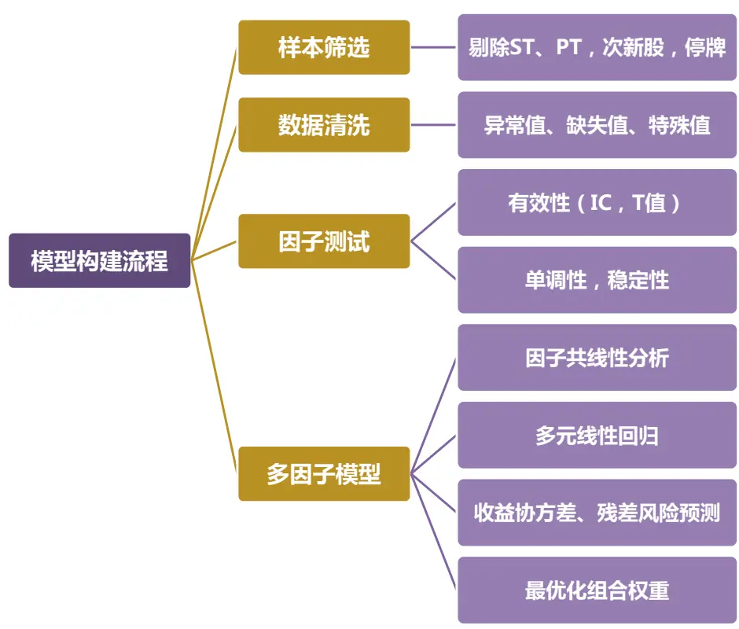
资料来源：光大证券研究所

作为多因子模型的构建中最为重要的一个步骤，单因子的挖掘和测试的框架将在下面的章节中给出详细定义。

## 3、单因子测试具体步骤

## 3.1、样本筛选

测试样本范围：全体A股

至 2017-03-01

为了使测试结果更符合投资逻辑，我们设定了三条样本筛选规则：

（1）剔除选股日的 ST/PT 股票；

（2）剔除上市不满一年的股票；

（3）剔除选股日由于停牌等原因而无法买入的股票。

## 3.2、数据清洗

数据清洗的目的是避免可能的数据错误和极端数据对测试结果产生影响，使用标准化后的数据保证最终得到的模型的稳健性。数据清洗的内容主要包括两部分，即异常值和缺失值的处理。

由于常见的3σ去极值法是基于样本服从正态分布这个假设的，但往往我们发现大部分因子值的分布都并不服从正态分布，厚尾分布的情况较为普遍。因此我们采用更加稳健的 MAD（Median Absolute Deviation 绝对中位数法）

首先计算因子值的中位数Medianf，并定义绝对中位值为：

$$
MAD=median(\left|f_{i}-Median_{f}\right|)
$$

采取与3σ法等价的方法，我们将大于 $Median_{f}+3*1.4826*MAD$ 的值或小于 ${\cdot}Median_{f}-3*1.4826*MAD$ 的值定义为异常值。在对异常值做处理时，需要根据因子的具体情况来决定是直接剔除异常值，还是将异常值设为上下限的数值，常用的方法是后者。

类似的，对缺失值的处理方式要依据缺失值的来源和逻辑解释，选取不同的操作，包括剔除或者以行业中位数替代。在单因子测试时，我们对缺失率小于 20%的因子数据用中信一级行业的中位数代替，当缺失率大于 20%时则做剔除处理。

## 3.3、因子标准化

常见的因子标准化方法包括：Z 值标准化（Z-Score），Rank 标准化，风格标准化等等。

由于 Rank 标准化后的数据会丢失原始样本的一些重要信息，这里我们仍然选择Z 值标准化来处理因子数据。

## 3.4、因子测试模型

有效的单因子首先应该具有一定的逻辑支撑，其次则是与股票收益率的相关性较为显著。多因子模型构建流程中很重要的一部分就是因子的挖掘和单因子的测试，我们的因子测试体系则是基于回归法和分层回溯法来建立的。

## 3.4.1、单因子回归模型

截面回归（Cross-Section Regression）是目前业界较常用于因子测试的方法。相比全样本面板回归（PanelData Regression）的方法，截面回归更有利于对因子变化趋势的捕捉。同时，由于全样本面板回归时样本数量往往很大，从而容易导致回归模型更容易通过显著性检验；由于我们选取的样本为全体A 股，因此在单期截面回归时样本数量均可保持在 1000 个以上，在不影响模型的有效性同时更有利于我们判断因子各项指标的优劣程度。

我们选择每期针对全体样本做一次回归，回归时因子暴露为已知变量，回归得到每期的一个因子收益值fj，在通过多期回归后我们就可以得到因子值fj的序列，也就是因子收益率序列，同时可以得到 t 值序列，也就是因子值与股票收益率相关性的t检验得到的t值。t值序列将有助于我们挑选有效因子，后文中会详细解释t值的使用方法。

进行截面回归判断每个单因子的收益情况和显著性时，需要特别关注 A股市场中一些显著影响个股收益率的因素，例如行业因素和市值因素。市值因子在过去的很长一段时间内都是A股市场上影响股票收益显著性极高的一个因子，为了能够在单因子测试时得到因子真正收益情况，我们在回归测试时对市值因子也做了剔除。

加入行业因子和市值因子后，单因子测试的回归方程如下所示：

$$
\left[\begin{array}{c}{r_{ti}}\\{\vdots}\\{r_{tn}}\end{array}\right]=\left[\begin{array}{cccc}{\beta_{t11}I_{t1u}}&{\cdots}&{I_{t1v}m_{t1m}}\\{\vdots}&{\vdots}&{\cdots}&{\vdots}\\{\beta_{tn1}I_{tnu}}&{\cdots}&{I_{tnv}m_{tnm}}\end{array}\right]\cdot\left[\begin{array}{c}{f_{ti}}\\{\vdots}\\{f_{tn}}\end{array}\right]+\left[\begin{array}{c}{\mu_{ti}}\\{\vdots}\\{\mu_{tn}}\end{array}\right]
$$

其中：

$\beta_{tiu}$ 代表股票 i 在所测试因子上的因子暴露；

$I_{tiu}$ 代表股票 i 的行业因子暴露 $(I_{tiu}$ 为哑变量（Dummy variable），即股票属于某个行业则该股票在该行业的因子暴露等于 1，在其他行业的因子暴露等于0）。此处我们将选用中信一级行业分类作为行业分类标准。

$m_{tim}$ 代表股票 i 的市值因子暴露。

## 3.4.2、回归模型选择

## （1） 最小二乘法 OLS

OLS 是最常用和最简单的方法，但该方法的缺点是 OLS 需要假设回归方程的残差均具有相同的方差，但由于股票收益率常常存在异常值，同时不同股票之间的收益率波动性也不尽相同。使用 OLS 时，异常值会对回归结果和回归测试的显著性检验带来较明显的偏差。

## （2） WLS (Weighted Least Square)

一些研究和经验表明股票价格的波动率（也就是方差）与股票的市值成负相关关系。因此以Barra 为代表的一些研究在测试时假设股票的残差收益与股票市值的平方根成反比，从而通过 WLS 将市值平方根作为残差项的回归权重。

## （3） RLM (Robust Linear Model)

Robust Regression稳健回归同样常见于单因子回归测试，RLM通过迭代的赋权回归可以有效的减小异常值（outliers）对参数估计结果有效性和稳定性的影响。

在独立同分布正态误差的线性模型中，OLS 是有效无偏估计。然而当误差服从非正态分布时，OLS 就很容易给异常值 outliers赋予较高的权重，从而导致模型结果失真。RLM中常用的 M-estimator方法则是采用迭代加权最小二乘估计回归系数，根据回归残差的大小确定各点的权重 wi，以达到稳健的目的。为减少“异常值”作用，RLM可以对不同的样本点赋予不同的权重，即对残差小的点给予较大的权重，而对残差较大的点给予较小的权重，根据残差大小确定权重，并据此建立加权的最小二乘估计，反复迭代以改进权重系数，直至权重系数的改变小于一定的允许误差(tolerance)内。

RLM中常用的M-estimator方法具体步骤如下所示：

多元回归的一般表达式为：

$$
y_{i}=\alpha+\beta_{1}x_{i1}+\beta_{2}x_{i2}+\cdots+\beta_{k}x_{ik}+\varepsilon_{i}=x_{i}^{\prime}\beta+\varepsilon_{i}
$$

当给定β的估计值为b 时，拟合的模型为：

$$
\widehat{y_{\scriptscriptstyle{l}}}=\alpha+b_{1}x_{i1}+b_{2}x_{i2}+\cdots+b_{k}x_{ik}+\varepsilon_{i}=x_{i}^{\prime}b+\varepsilon_{i}
$$

此时残差为：

$$
e_{i}=y_{i}-\widehat{y_{\imath}}
$$

M-estimation中b的估计由最小化特定的目标函数p决定：

$$
\sum_{i=1}^{n}p(e_{i})=\sum_{i=1}^{n}p(y_{i}-x_{i}^{\prime}b)
$$

其中，p 对于每一个残差给定一个目标函数。P 的性质为：

（1） 非负；

（2） p(0)=0；

（3） 对称性， $\mathrm{p(e)=}\mathrm{p(-e)}$ ；

（4） $p(e_{i})>p(e_{i}^{\prime})\nrightarrow|e_{i}|>|e_{i}^{\prime}|$

令ψ ${\boldsymbol{\mathsf{J}}}={\boldsymbol{p}}^{\prime}$ 为 p 的偏导，ψ为影响曲线。目标函数对系数 b 进行偏导，并令其等于 0，可以得到关于系数的（k+1）个等式：

$$
\sum_{i=1}^{n}\Psi(y_{i}-x_{i}^{\prime}b)x_{i}^{\prime}=0
$$

定义权重函数为： $\begin{array}{r}{\omega(e)=\Psi({\bf e})/{\bf e},}\end{array}$ 并且 $\mathfrak{so}(i)=w(ei)$

于是，系数估计的等式可改写为：

$$
\sum_{i=1}^{n}\omega_{i}(y_{i}-x_{i}^{\prime}{b})x_{i}^{\prime}=0
$$

由于权重的大小取决于残差的大小，残差的大小取决于估计的系数，而系数又取决于权重，因此我们需要一个迭代算法（iteratively reweighted least-squares,IRLS）。

（1） 选择初始的估计值 $b^{(0)}$ ,如最小二乘法得到的系数估计；

（2） 对于第 t 个迭代，根据第（t-1）次的迭代计算残差 $e_{i}^{(t-1)}$ 和对应的权重 $\omega_{i}^{(t-1)}=\omega\left[e_{i}^{(t-1)}\right]$ ;

（3） 计算新的最优系数估计：

$$
b^{(t)}=[X^{\prime}W^{(t-1)}X]^{-1}X^{\prime}W^{(t-1)}y
$$

其中，X为变量矩阵。 $\pmb{W}^{(t-1)}=diag\{\omega_{i}^{(t-1)}\}$ 是当前迭代的权重矩阵。重复（2）（3）步直至参数估计值收敛。b的渐近协方差矩阵为：

$$
\mathbf{v}(b)=\frac{E(\Psi^{2})}{[E(\Psi^{\prime})]^{2}}(\mathbf{X^{\prime}}\mathbf{X})^{-1}
$$

用∑[ψ $(e_{i})]^{2}$ 去估计 $E(\Psi^{2})$ ，[∑ $\psi^{\prime}(e_{i})/n]^{2}$ 去估计 $[E(\Psi^{\prime})]^{2}$ ，从而得到渐近的协方差矩阵：ν(b)

下面我们通过一个简单的例子来解释RLM相比OLS的优势所在：

图 3：2009.5 BP_LR 因子与下期收益率的 RLM 和 OLS 对比
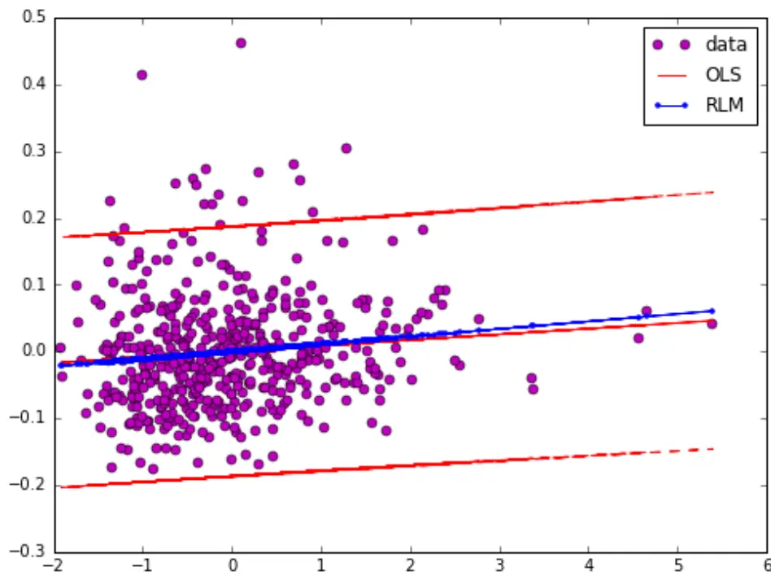
资料来源：光大证券研究所，Wind

尽管从图形上看两种回归方法得到的直线斜率差异并不明显，但是从下表的数据中可以看出，RLM 稳健回归所得fj明显大于 OLS 得到 $\hbar\Im\mathrm{f}_{\mathrm{j}}$ ，且 RLM 方法得到的fj显著的小于零（|t|>2）

表 1：RLM 与 OLS 回归效果对比

|  | 斜率（因子收益f） | BSE | T值 |
| --- | --- | --- | --- |
| OLS | 0.008 | 0.004 | 1.997 |
| RLM | 0.011 | 0.003 | 3.140 |

资料来源：光大证券研究所

由这个简单的例子可见 RLM 方法可以更好的处理异常值的影响，从而提高回归分析的有效性。因此我们在单因子测试时将采取这种更为稳健的回归方法。

## 3.5、单因子有效性检验

采用多期截面RLM回归后我们可以得到因子收益序列f，以及每一期回归假设检验 t 检验的 t 值序列，针对这两个序列我们将通过以下几个指标来判断该因子的有效性以及稳定性：

（1） 因子收益序列fi的假设检验 t 值

（2） 因子收益序列fi大于 0 的概率

（3） t 值绝对值的均值

（4） t 值绝对值大于等于 2 的概率

IC 值（信息系数）是指个股第 t期在因子 i 上的因子暴露（剔除行业与市值后）与t+ 1期的收益率的相关系数。通过计算 IC值可以有效的观察到某个因子收益率预测的稳定性和动量特征，以便在优化组合时用作筛选的指标。常见的计算 IC值方法有两种：相关系数（Pearson Correlation） 和秩相关系数（ Spearman Rank Correlation）。

由于Pearson相关系数计算时假设变量具有相等间隔以及服从正态分布，而这一假设往往与因子值和股票收益率的分布情况相左。因此我们将采用Spearman的方法计算因子暴露与下期收益率的秩相关性 IC值。类似回归法的因子测试流程，我们在计算 IC 时同样考虑剔除了行业因素与市值因素。

同样我们会得到一个IC值序列，类似的，我们将关注以下几个与 IC 值相关的指标来判断因子的有效性和预测能力：

（1） IC 值的均值

（2） IC 值的标准差

（3） IC 大于 0 的比例

（4） IC 绝对值大于 0.02 的比例

（5） IR （IR = IC 均值/IC 标准差）

由于单因子回归法所得到的因子收益值序列并不能直观的反应因子在各期的历史收益情况以及单调性，为了同时能够展示所检验因子的单调性，我们将通过分层打分回溯的方法作为补充。

在进行分层回溯法时，我们在各期期末将全市场A股按照因子值得大小分成5 等分，在分组时同样做行业中性处理，即在中信一级行业内做 5 等分组。同时为了使回溯结果具有可比性，我们在回溯测试每组的历史收益情况时采取了市值加权的方法。

## 3.5.1、单因子测试举例

我们以 BP_LR 和 TURNOVER_1M 因子为例，来展示本节提到的单因子测试流程：

## （1） RLM 回归测试

表 2：BP_LR&TURNOVER_1M 因子测试结果示例

| 指标名称 BP_LR | TURNOVER_1M |
| --- | --- |
| 因子收益序列t值 4.37 | -6.65 |
| 因子收益均值 0.53% | -0.80% |
| t>0 比例 63% | 27% |
| abs(t) 均值 4.37 | 4.84 |
| IC 均值 5.20% | -7.67% |
| IC 标准差 11.3% | 11.40% |
| IC>0 比例 65% | 23.9% |
| Abs(IC)>0.02 比例 60% | 78% |
| IR 0.46 | -0.67 |

资料来源：光大证券研究所，Wind

由上表可知，BP_LYR 因子收益序列显著的大于 0，因子收益情况较好，同时IC值高达5.20%，IR值达到0.46。与之相反，换手率因子TURNOVER_1M是一个负面因子，IC 值为-7.67%，并且显著性比BP因子更高，也就代表着换手率越高的股票，下期的收益率越低。

图 4：BP_LR 因子收益时间序列
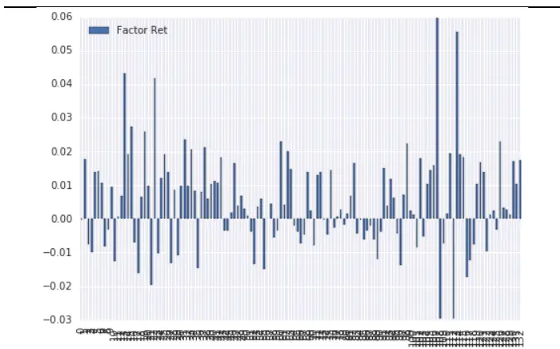
资料来源：光大证券研究所，Wind

图 5：BP_LR 因子收益分布直方图
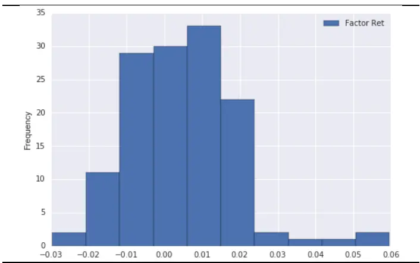
资料来源：光大证券研究所，Wind

图6：BP_LR RLM 回归因子收益t值绝对值
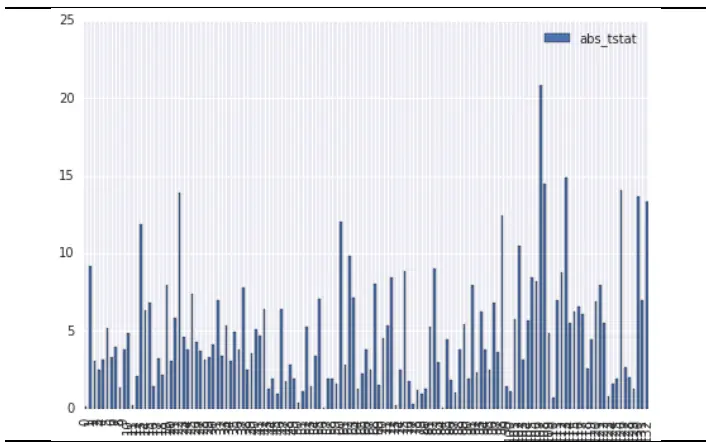
资料来源：光大证券研究所，Wind

图 7：BP_LR 因子 IC 值序列
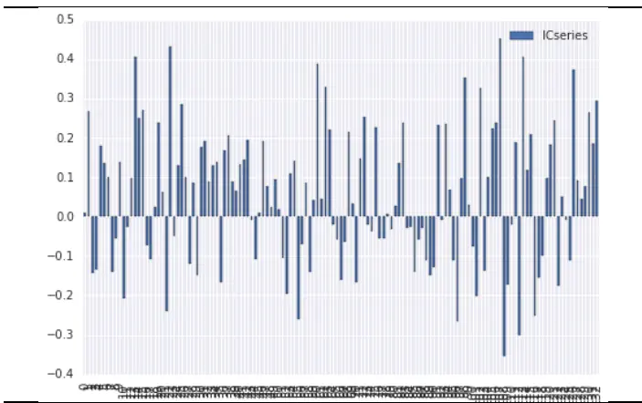
资料来源：光大证券研究所，Wind

图 8：TURNOVER_1M 因子收益时间序列
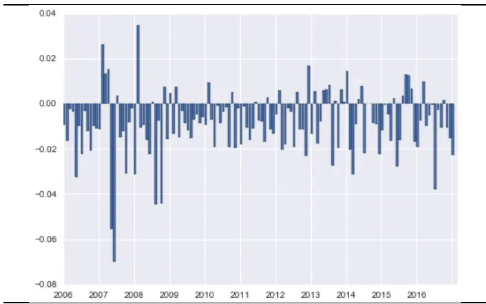
资料来源：光大证券研究所，Wind

图 9：TURNOVER_1M 因子收益分布直方图
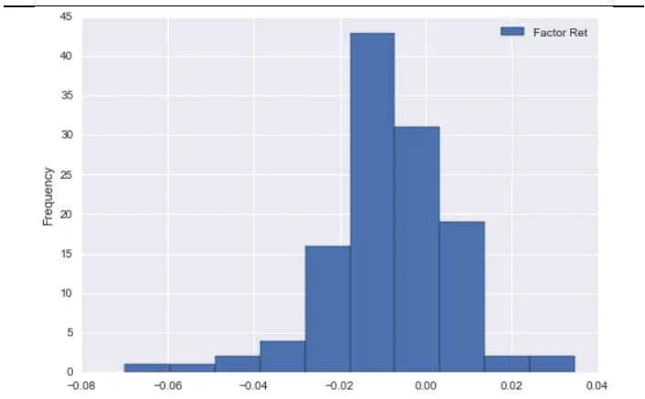
资料来源：光大证券研究所，Wind

图 10：TURNOVER_1M RLM 回归因子收益 t 值绝对值
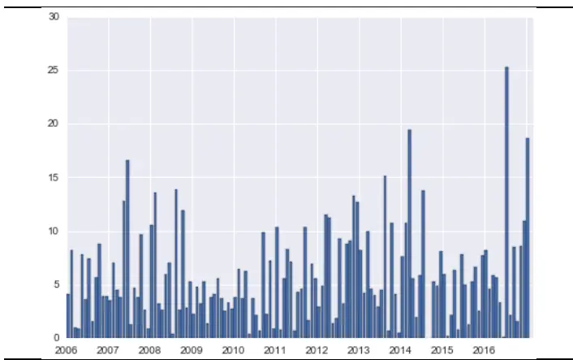
资料来源：光大证券研究所，Wind

图 11：TURNOVER_1M 因子 IC 值序列
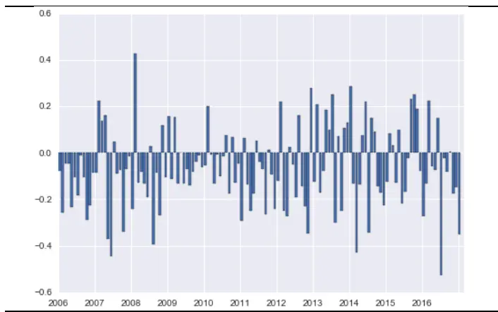
资料来源：光大证券研究所，Wind

然而，通过回归测试我们可以得到的仅是因子在各期的因子收益和因子预测能力的历史表现和变化情况，如果我们希望观察因子的单调性则唯有通过分层回溯的方法来完成。

## （2） 分层法回溯测试

由下图可见，BP_LR 因子具有很好的单调性，而 TURNOVER_1M 因子的分组1、3、4 之间没有明显差异，唯有分组2 的表现较好，而换手率最高的分组 5 明显跑输其他组别也同时跑输基准指数。因此尽管 TURNOVER_1M因子的收益非常显著，但单调性方面有着明显不足。

图 12：BP_LYR 分组回溯累计收益率曲线（市值加权）
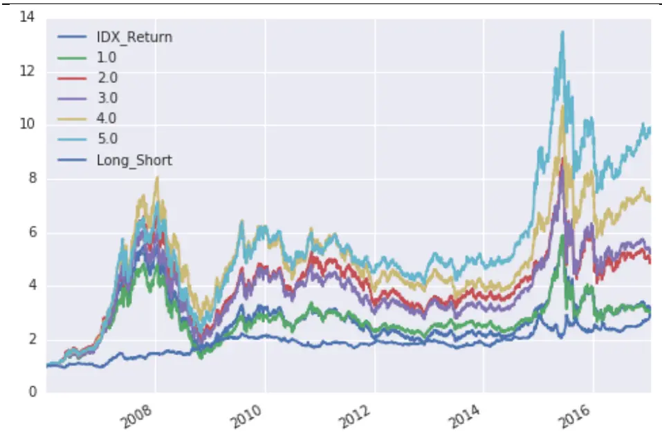
资料来源：光大证券研究所，Wind

图13：TURNOVER_1M分组回溯累计超额收益率曲线（市值加权）
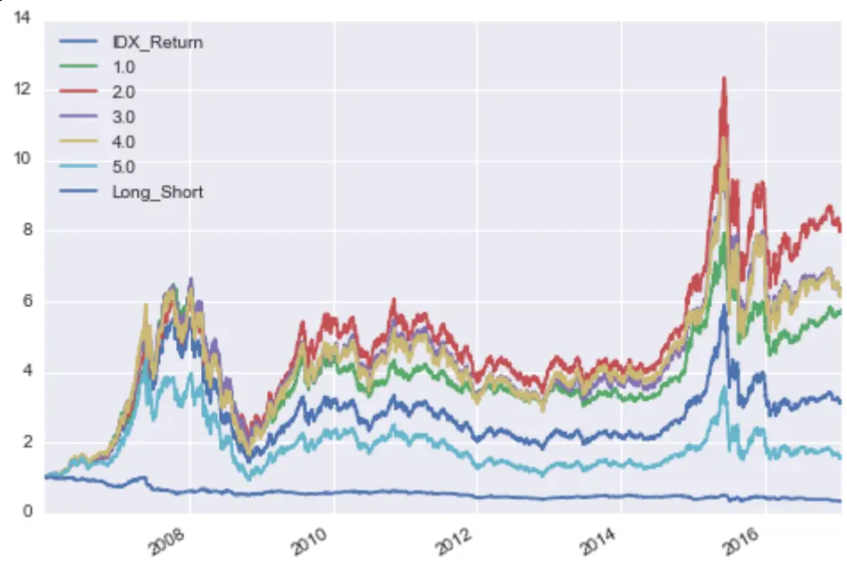
资料来源：光大证券研究所，Wind

下图的例子中我们选用的基准是中证全指指数，模型中其它可供选择的指数还包括：沪深 300，中证 500，中证 800，中证 1000。

图 14：BP_LR 分组回溯累计超额收益率曲线（市值加权）
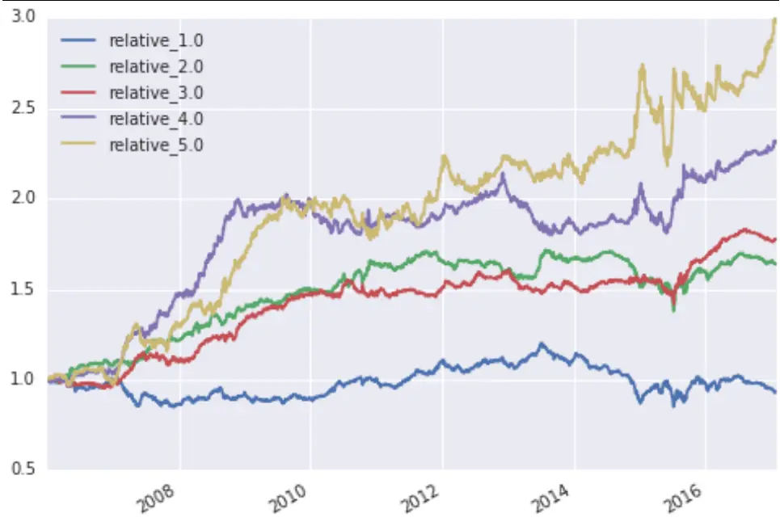
资料来源：光大证券研究所，Wind

图15：TURNOVER_1M分组回溯累计超额收益率曲线（市值加权）
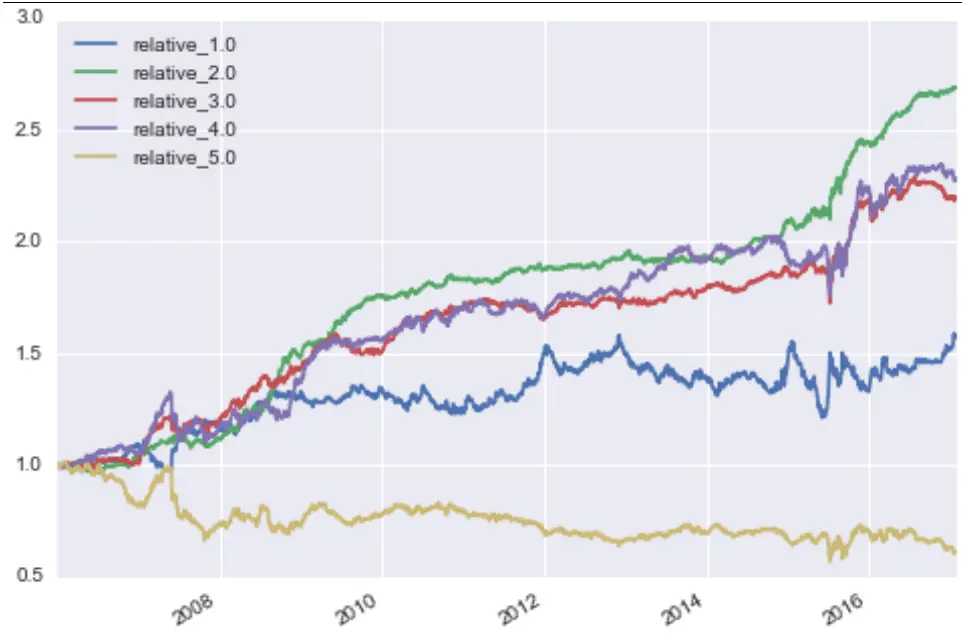
资料来源：光大证券研究所，Wind

下面的两张表则分别展示了 BP_LR 和 TURNOVER_1M 这两个因子分层打分回溯测试中 5 个分组的历史表现，同时也包含了 Top-Bottom 组的回溯结果。我们用到的衡量每组历史表现的指标包括：年化绝对收益，年化相对收益，累计绝对收益，累计相对收益，年化波动，夏普比，最大回撤，最大相对回撤，信息比等等。

表3：BP_LR分组回溯结果

|  | Group1 | Group2 | Group3 | Group4 | Group5 | Top-Bottom |
| --- | --- | --- | --- | --- | --- | --- |
| Annual_return | 11% | 16% | 17% | 20% | 24% | 10% |
| Cum_returns_final | 199% | 398% | 437% | 631% | 893% | 190% |
| Annual_volatility | 31% | 32% | 32% | 31% | 31% | 15% |
| Sharpe_ratio | 0.49 | 0.63 | 0.65 | 0.75 | 0.85 | 0.75 |
| Max_drawdown | -73% | -72% | -72% | -67% | -69% | -30% |
| Sortino_ratio | 0.66 | 0.86 | 0.88 | 1.03 | 1.17 | 1.22 |
| Tail_ratio | 0.87 | 0.87 | 0.86 | 0.90 | 0.92 | 1.23 |
| Relative_return | -1% | 5% | 6% | 8% | 11% | -10% |
| Relative_volatility | 7% | 5% | 5% | 7% | 10% | 35% |
| Information_ratio | -0.09 | 0.86 | 1.03 | 1.14 | 1.11 | -0.29 |
| Relative_MaxDD | -29% | -20% | -12% | -16% | -20% | -84% |

资料来源：光大证券研究所

表 4：TURNOVER_1M 分组回溯结果

|  | Group1 | Group2 | Group3 | Group4 | Group5 | Top-Bottom |
| --- | --- | --- | --- | --- | --- | --- |
| Annual_return | 20% | 24% | 20% | 21% | 6% | -11% |
| Cum_returns_final | 506% | 749% | 499% | 531% | 74% | -67% |
| Annual_volatility | 27% | 32% | 33% | 35% | 37% | 19% |
| Sharpe_ratio | 0.81 | 0.85 | 0.72 | 0.72 | 0.34 | -0.50 |
| Max_drawdown | -67% | -64% | -68% | -71% | -76% | -72% |
| Sortino_ratio | 1.14 | 1.17 | 0.97 | 0.97 | 0.45 | -0.64 |
| Tail_ratio | 1.00 | 0.86 | 0.87 | 0.83 | 0.81 | 0.81 |
| Relative_return | 4% | 10% | 6% | 7% | -5% | -26% |
| Relative_volatility | 9% | 5% | 6% | 8% | 11% | 26% |
| Information_ratio | 0.49 | 2.16 | 1.07 | 0.97 | -0.46 | -1.02 |
| Relative_MaxDD | -20% | -5% | -10% | -17% | -49% | -95% |

资料来源：光大证券研究所

## 3.6、从因子测试到多因子模型

在完成单个因子的测试之后，就位多因子模型的构建打下了坚实的基础。我们可以通过下面几个步骤来剔除同类因子之间的多重共线性影响，筛选出同时具有良好的单调性和预测性的有效因子，构造我们的多因子模型：

根据上文的截面回归因子测试方法，我们可以轻松的得到每个因子的因子暴露值序列和因子 IC 值序列。在研究因子间共线性时，就可以通过计算因子间IC值和因子暴露值得相关性来求证因子间的共线性。

需要注意的是，经济含义相似度较高的同类型因子往往存在明显的正相关性，在处理此类因子时，我们可以通过一些方法将因子进行合并；而如果是经济含义差异较大因子之间存在明显相关性，就需要有所取舍。

消除共线性的方法包括以下几种：

（1） 在同类因子的共线性较大的几个因子中，保留有效性最高的因子，剔除余下的因子

（2） 因子组合：方法包括等权加权，以因子收益f 为权重加权，以及PCA主成分分析法等等

（3） 暴力迭代法，即将因子两两组合暴力迭代得到表现最好的组合方法。

在对因子集做残差的异方差分析处理之后，就可以进行多元线性回归，估计每期的因子收益序列。

由于因子每期收益或多或少存在不稳定性，为保证模型的稳定性，需要对因子历史收益序列进行分析，给出下一期因子收益的合理预期值。因为很多因子存在明确的经济含义和投资逻辑，所以因子收益的方向（±号）需要进行约束。下一步我们就可以根据因子收益和每个股票的因子载荷计算出个股的预期收益率。

## 4、因子库示例：

表 5：因子库分类及因子明细表

| 大类因子 | 细分类别 | 因子代码 | 因子描述 |
| --- | --- | --- | --- |
| 财务类 | 估值因子（Value） | EP_TTM | 净利润（TTM）/总市值 |
|  |  | EP_LYR | 净利润（最新年报）/总市值 |
|  |  | BP_LR | 净资产（最新财报）/总市值 |
|  |  | SP_TTM | 营业收入_TTM/总市值 |
|  |  | SP_LYR | 营业收入（最新年报）/总市值 |
|  |  | FCFP_TTM | 自由现金流_TTM/总市值 |
|  |  | NCFP_TTM | 净现金流_TTM/总市值 |
|  |  | OCFP_TTM | 经营性现金流_TTM/总市值 |
|  |  | DP_TTM | 分红_TTM/总市值 |
|  |  | E2P_TTM | 归属母公司股东权益_TTM/总市值 |
|  |  | PEG_TTM | 市盈率相对盈利增长率 |
|  |  | EV/EBITDA | 企业价值倍数 |
|  | 规模因子（Size） | MC | 总市值(Market Cap） |
|  |  | Ln_MC | 总市值对数 |
|  |  | FC | 流通市值(Float Cap） |
|  |  | Ln_FC | 流通市值对数 |
|  |  | FC/MC | 流通市值/总市值 |
|  |  | TC | 总资产(Total Cap） |
|  |  | Ln_TC | 总资产对数 |
|  | 成长因子（Growth） | OPG_TTM | 营业收入增长率_TTM同比 |
|  |  | OPG_SQ | 营业收入增长率_单季度同比 |
|  |  | NPG_TTM | 净利润增长率_TTM 同比 |
|  |  | NPG_SQ | 净利润增长率_单季度同比 |
|  |  | GPG | 毛利增长率_TTM 同比 |
|  |  | EPSG | EPS 增长率_TTM 同比 |
|  |  | ROEG | ROE增长率_TTM 同比 |
|  |  | ROAG | ROA 增长率_TTM 同比 |
|  |  | NAPG | 每股净资产增长率 |
|  |  | TAG | 总资产增长率 |
|  |  | OCFG_SQ | 经营性现金流增长率_当季同比 |
|  |  | OCFG_TTM | 经营性现金流增长率_TTM同比 |
|  | 质量因子（Quality） | ROE | ROE |
|  |  | ROE_TTM | ROE_TTM |
|  |  | ROA | ROA |
|  |  | ROA_TTM | ROA_TTM |
|  |  | GPM | 毛利率 |
|  |  | GPM_TTM | 毛利率_TTM |
|  |  | AT | 资产周转率 |
|  |  | AT_TTM | 资产周转率_TTM |
|  |  | FAT | 固定资产周转率 |
|  |  | OPM_TTM | 营业利润率_TTM |
|  |  | DIVPR | 股利支付率 |
|  |  | DYR | 股息率 |
|  |  | NPM | 当期净利率 |
|  |  | NPM-TTM | 净利率-TTM |
|  |  | ICR | 利息覆盖率 |
|  |  | CASHR_SALES | 经营活动产生的现金流量净额/营业收入 |
|  | 杠杆因子（Leverage） | CUR | 流动比率 |
|  |  | CAR | 现金比率 |
|  |  | QR | 速动比率 |
|  |  | FIN_LEV | 总资产/普通股权益 |
|  |  | Debt_Equity | 长期负债/普通股权益 |
|  |  | MC_LEV | (市值+优先股+长期负债)/市值 |
|  |  | Asset_Liability | 资产负债比 |
| 行情类 | 动量因子（Momentum） | Momentum_1M | 最近1个月收益率 |
|  |  | Momentum_3M | 最近3个月收益率 |
|  |  | Momentum_6M | 最近6个月收益率 |
|  |  | Momentum_12M | 最近12个月收益率 |
|  |  | Momentum _24M | 过去24个月收益率 |
|  |  | Momentum _1M_Max | 过去1个月的日收益率的最大值 |
|  | 波动因子（Volatility） | HighLow_1M | 1个月最高价/最低价 |
|  |  | HighLow_3M | 3个月最高价/最低价 |
|  |  | HighLow_6M | 6个月最高价/最低价 |
|  |  | STD_1M | 过去1个月日收益率标准差 |
|  |  | STD_3M | 过去3个月日收益率标准差 |
|  |  | STD_6M | 过去6个月日收益率标准差 |
|  |  | VSTD_1M | 成交金额/波动率（1个月） |
|  |  | VSTD_2M | 成交金额/波动率（2个月） |
|  |  | VSTD_6M | 成交金额/波动率（6个月） |
|  |  | RESIDUAL_Volatility | CAMP模型残差的标准差(12M) |
|  | 技术因子(Technical) | MACD | 指数平滑移动平均线 |
|  |  | DIF | 差离值 |
|  |  | DEA | 异同平均数 |
|  |  | OBV | 能量潮 |
|  |  | ILLIQ | 非流动性因子 |
|  |  | RSI | 相对强弱指标 |
|  | 流动性因子（Liquidation） | turnover_1m | 最近一个月换手率 |
|  |  | turnover_3m | 最近三个月换手率 |
|  |  | turnover_6m | 最近六个月换手率 |
|  |  | VA_FC | 买卖循环率=日交易额/日流通市值 |
| 预期类 | 分析师因子（Analyst） | SCORE_AVRG | 平均评级 |
|  |  | RatingChange_1M | 评级变化 1M |
|  |  | RatingChange_3M | 评级变化 3M |
|  |  | FORE_EPS | 一致预期 EPS |
|  |  | EPSChange_1M | 一致预期 EPS 变化 1M |
|  |  | EPSChange_3M | 一致预期 EPS 变化 3M |
|  |  | SalesChange_1M | 一致预期营业收入变化1M |
|  |  | SalesChange_3M | 一致预期营业收入变化 3M |
|  |  | FORE_Earning | 一致预期净利润 |
|  |  | EarningChange_1M | 一致预期净利润变化率1M |
|  |  | EarningChange_3M | 一致预期净利润变化率3M |
|  |  | TargetReturn | 一致预期目标价/收盘价-1 |
|  |  | FE2MC | 预测投资回报率(Forcastearning 2 Market Capital) |
|  |  | EPSN_10D | 预测分析师人数（or报告数量）10D |
|  |  | EPSN_25D | 预测分析师人数（or报告数量）25D |
|  |  | EPSN_75D | 预测分析师人数（or报告数量）75D |
|  |  | EINS_10D | 预测机构数10D |
|  |  | EINS_25D | 预测机构数25D |
|  |  | EINS_75D | 预测机构数75D |
|  |  | EDiversity | 一致预期每股收益分歧度 |
| 其他因子 | 其他因子 | ShareCon | 股权集中度 |
|  |  | FShareCon | 流通股股权集中度 |
|  |  | Holder_avgpct | 户均持股比例 |
|  |  | Holder_avgpctchange | 户均持股比例过去一年增长率 |
|  |  | Beta | CAPM |
|  |  | MainOprCon | 主营业务集中度 |

资料来源：光大证券研究所

## 分析师声明

负责准备本报告以及撰写本报告的所有研究分析师或工作人员在此保证，本研究报告中关于任何发行商或证券所发表的观点均如实反映分析人员的个人观点。负责准备本报告的分析师获取报酬的评判因素包括研究的质量和准确性、客户的反馈、竞争性因素以及光大证券股份有限公司的整体收益。所有研究分析师或工作人员保证他们报酬的任何一部分不曾与，不与，也将不会与本报告中具体的推荐意见或观点有直接或间接的联系。

## 分析师介绍

刘均伟 金融工程首席分析师 复旦大学学士，上海财经大学硕士，10 年金融工程研究经验。现任职于光大证券研究所，研究领域为衍生品及量化投资。

## 行业及公司评级体系

买入—未来6-12 个月的投资收益率领先市场基准指数15%以上；

增持—未来 6-12 个月的投资收益率领先市场基准指数 5%至 15%；

中性—未来6-12 个月的投资收益率与市场基准指数的变动幅度相差-5%至5%；

减持—未来6-12 个月的投资收益率落后市场基准指数5%至 15%；

卖出—未来 6-12 个月的投资收益率落后市场基准指数 15%以上；

无评级—因无法获取必要的资料，或者公司面临无法预见结果的重大不确定性事件，或者其他原因，致使无法给出明确的投资评级。

市场基准指数为沪深300指数。

## 分析、估值方法的局限性说明

本报告所包含的分析基于各种假设，不同假设可能导致分析结果出现重大不同。本报告采用的各种估值方法及模型均有其局限性，估值结果不保证所涉及证券能够在该价格交易。

## 特别声明

光大证券股份有限公司（以下简称“本公司”）创建于 1996 年，系由中国光大（集团）总公司投资控股的全国性综合类股份制证券公司，是中国证监会批准的首批三家创新试点公司之一。公司经营业务许可证编号：z22831000。

公司经营范围：证券经纪；证券投资咨询；与证券交易、证券投资活动有关的财务顾问；证券承销与保荐；证券自营；为期货公司提供中间介绍业务；证券投资基金代销；融资融券业务；中国证监会批准的其他业务。此外，公司还通过全资或控股子公司开展资产管理、直接投资、期货、基金管理以及香港证券业务。

本证券研究报告由光大证券股份有限公司研究所（以下简称“光大证券研究所”）编写，以合法获得的我们相信为可靠、准确、完整的信息为基础，但不保证我们所获得的原始信息以及报告所载信息之准确性和完整性。光大证券研究所可能将不时补充、修订或更新有关信息，但不保证及时发布该等更新。

本报告根据中华人民共和国法律在中华人民共和国境内分发，仅供本公司的客户使用。

本报告中的资料、意见、预测均反映报告初次发布时光大证券研究所的判断，可能需随时进行调整。报告中的信息或所表达的意见不构成任何投资、法律、会计或税务方面的最终操作建议，本公司不就任何人依据报告中的内容而最终操作建议作出任何形式的保证和承诺。

在法律允许的情况下，本公司及其附属机构可能持有报告中提及的公司所发行证券的头寸并进行交易，也可能为这些公司提供或正在争取提供投资银行、财务顾问或金融产品等相关服务。投资者应当充分考虑本公司及本公司附属机构就报告内容可能存在的利益冲突，不应视本报告为作出投资决策的唯一参考因素。

在任何情况下，本报告中的信息或所表达的建议并不构成对任何投资人的投资建议，本公司及其附属机构（包括光大证券研究所）不对投资者买卖有关公司股份而产生的盈亏承担责任。

本公司的销售人员、交易人员和其他专业人员可能会向客户提供与本报告中观点不同的口头或书面评论或交易策略。本公司的资产管理部和投资业务部可能会作出与本报告的推荐不相一致的投资决策。本公司提醒投资者注意并理解投资证券及投资产品存在的风险，在作出投资决策前，建议投资者务必向专业人士咨询并谨慎抉择。

本报告的版权仅归本公司所有，任何机构和个人未经书面许可不得以任何形式翻版、复制、刊登、发表、篡改或者引用。

## 光大证券股份有限公司研究所 销售交易总部

上海市新闸路1508 号静安国际广场 3楼邮编 200040

总机：021-22169999 传真：021-22169114、22169134

| 销售交易总部 | 姓名 | 办公电话 | 手机 | 电子邮件 |
| --- | --- | --- | --- | --- |
| 上海 | 陈蓉 | 021-22169086 | 13801605631 | chenrong@ebscn.com |
|  | 濮维娜 | 021-62158036 | 13611990668 | puwn@ebscn.com |
|  | 胡超 | 021-22167056 | 13761102952 | huchao6@ebscn.com |
|  | 周薇薇 | 021-22169087 | 13671735383 | zhouww1@ebscn.com |
|  | 李强 | 021-22169131 | 18621590998 | liqiang88@ebscn.com |
|  | 罗德锦 | 021-22169146 | 13661875949/13609618940 | luodj@ebscn.com |
|  | 张弓 | 021-22169083 | 13918550549 | zhanggong@ebscn.com |
|  | 黄素青 | 021-22169130 | 13162521110 | huangsuqing@ebscn.com |
|  | 邢可 | 021-22167108 | 15618296961 | xingk@ebscn.com |
|  | 陈晨 | 021-22169150 | 15000608292 | chenchen66@ebscn.com |
|  | 王昕宇 | 021-22167233 | 15216717824 | wangxinyu@ebscn.com |
| 北京 | 郝辉 | 010-58452028 | 13511017986 | haohui@ebscn.com |
|  | 梁晨 | 010-58452025 | 13901184256 | liangchen@ebscn.com |
|  | 郭晓远 | 010-58452029 | 15120072716 | guoxiaoyuan@ebscn.com |
|  | 王曦 | 010-58452036 | 18610717900 | wangxi@ebscn.com |
|  | 关明雨 | 010-58452037 | 18516227399 | guanmy@ebscn.com |
|  | 张彦斌 | 010-58452026 | 15135130865 | zhangyanbin@ebscn.com |
| 深圳 | 黎晓宇 | 0755-83553559 | 13823771340 | lixy1@ebscn.com |
|  | 李潇 | 0755-83559378 | 13631517757 | lixiao1@ebscn.com |
|  | 张亦潇 | 0755-23996409 | 13725559855 | zhangyx@ebscn.com |
|  | 王渊锋 | 0755-83551458 | 18576778603 | wangyuanfeng@ebscn.com |
|  | 张靖雯 | 0755-83553249 | 18589058561 | zhangjingwen@ebscn.com |
|  | 牟俊宇 | 0755-83552459 | 13827421872 | moujy@ebscn.com |
| 国际业务 | 陶奕 | 021-22167107 | 18018609199 | taoyi@ebscn.com |
|  | 戚德文 | 021-22167111 | 18101889111 | qidw@ebscn.com |
|  | 金英光 | 021-22169085 | 13311088991 | jinyg@ebscn.com |
|  | 傅裕 | 021-22169092 | 13564655558 | fuyu@ebscn.com |