# 因子测试全集—— 多因子系列报告之二

## 光大金工因子测试框架：多指标全面测试

通过分期截面RLM回归计算因子收益，计算因子暴露与下期收益率的相关度IC值，同时结合分层回测法检验因子单调性，构建较为综合全面的因子测试体系。

因子测试中使用了包括因子收益序列 t值，因子累计收益率，因子测试t 值，IC，IR，多空组合收益率、最大回撤、换手率等等指标

## 更为全面的因子库：

涵盖了估值因子，规模因子，成长因子，质量因子，杠杆因子，动量因子，波动因子，技术因子，流动性因子，分析师因子等共 10 大类 100多个细分因子。

## 行情类因子有效性整体高于财务类因子：

行情类因子中的流动性因子、波动因子、动量因子 IC 绝对值较高且普遍具有较好的显著性，因子收益率与 IC、IR值也普遍高于财务类因子。历史IR值最高的30个因子中包含7个财务类因子、3 个分析师预期类因子、20 个行情类因子。

## 分析师预期因子值得关注：

分析师因子中的一致预期目标价（TargetReturn）、一致预期营业收入1 个月增长率（EOPChange_1M）等因子的 IC 和 IR 值较高，历史的收益率排名可进入前 20。一致预期目标价的历史 IR 为 0.63、一致预期营业收入1个月增长率历史IR为0.40。分析师预期类因子的覆盖率普遍较低，全A 平均覆盖率为 65%。

## 金融工程深度

## 分析师

刘均伟 (执业证书编号：S0930517040001)

021-22169151

liujunwei@ebscn.com

## 联系人

周萧潇

021-22167060

zhouxiaoxiao@ebscn.com

## 相关研报

《多因子系列报告之一：因子测试框架》2017-04-10

在多因子系列报告的第一篇报告中，我们构造了一个全面的基于 RLM 稳健回归的截面回归单因子测试框架，并整理了包括估值因子，规模因子，成长因子，质量因子，杠杆因子，动量因子，波动因子，技术因子，流动性因子，分析师因子等 10 个大类100 多个细分因子。

这篇报告中我们将首先给出这些大类因子的具体测试结果，深入讨论每个大类因子内的细分因子的预测性、稳定性、单调性和相关性等等指标。为下一步的因子合成与组合构建打下基础。

## 1、因子测试框架回顾

首先我们简单的回顾一下上一篇报告中的因子测试框架的主要内容，我们的多因子模型的构建流程包括以下几个方面：

## 1.1、样本筛选

测试样本范围：全体 A 股

测试样本期：2006-01-01 至 2017-04-01

为了使测试结果更符合投资逻辑，我们设定了三条样本筛选规则：

（1） 剔除选股日的 ST/PT 股票；

（2） 剔除上市不满一年的股票；

（3） 剔除选股日由于停牌等原因而无法买入的股票。

## 1.2、数据清洗

我们采用稳健的 MAD（Median Absolute Deviation 绝对中位数法）首先计算因子值的中位数Medianf，并定义绝对中位值为：

$$
MAD=median(\left|f_{i}-Median_{f}\right|)
$$

采取与 3σ法等价的方法，我们将大于 $Median_{f}+3*1.4826*MAD$ 的值或小于 $rMedian_{f}-3*1.4826*MAD$ 的值定义为异常值。

类似的，对缺失值的处理方式要依据缺失值的来源和逻辑解释，选取不同的操作，包括剔除或者以行业中位数替代。在单因子测试时，我们对缺失率小于 20%的因子数据用中信一级行业的中位数代替，当缺失率大于 20%时则做剔除处理。

## 1.3、因子标准化

常见的因子标准化方法包括：Z 值标准化（Z-Score），Rank标准化，风格标准化等等。由于 Rank 标准化后的数据会丢失原始样本的一些重要信息，这里我们仍然选择 Z 值标准化来处理因子数据。

## 1.4、因子测试模型

我们采取截面回归测试的方法，每期针对全体样本做一次回归，回归时因子暴露为已知变量，回归得到每期的一个因子收益值 ${\mathfrak{f}}_{j}$ .

进行截面回归判断每个单因子的收益情况和显著性时，需要特别关注 A股市场中一些显著影响个股收益率的因素，例如行业因素和市值因素。市值因子在过去的很长一段时间内都是A股市场上影响股票收益显著性极高的一个因子，为了能够在单因子测试时得到因子真正收益情况，我们在回归测试时对市值因子也做了剔除。

加入行业因子和市值因子后，单因子测试的回归方程如下所示：

$$
\begin{bmatrix}r_{ti}\\\vdots\\r_{tn}\end{bmatrix}=\begin{bmatrix}\beta_{t11}I_{t1u}&\cdots&I_{t1v}m_{t1m}\\\vdots&\vdots&\cdots&\vdots\\\beta_{tn1}I_{tnu}&\cdots&I_{tnv}m_{tnm}\end{bmatrix}\cdot\begin{bmatrix}f_{ti}\\\vdots\\f_{tm}\end{bmatrix}+\begin{bmatrix}\mu_{ti}\\\vdots\\\mu_{tn}\end{bmatrix}
$$

其中：

$\beta_{tiu}$ 代表股票i 在所测试因子上的因子暴露；

$I_{tiu}$ 代表股票i 的行业因子暴露 $(I_{tiu}$ 为哑变量（Dummy variable），即股票属于某个行业则该股票在该行业的因子暴露等于 1，在其他行业的因子暴露

$m_{tim}$ 代表股票 i 的市值因子暴露。

Robust Regression稳健回归常见于单因子回归测试，RLM 通过迭代的赋权回归可以有效的减小 OLS 最小二乘法中异常值（outliers）对参数估计结果有效性和稳定性的影响。详细的 RLM 回归方法的介绍请参考我们的《多因子系列报告之一：因子测试框架》。

## 1.5、因子有效性检验

采用多期截面RLM回归后我们可以得到因子收益序列f，以及每一期回归假设检验 t 检验的 t 值序列，针对这两个序列我们将通过以下几个指标来判断该因子的有效性以及稳定性：

（1） 因子收益序列fi的假设检验 t 值

（2） 因子收益序列fi大于 0 的概率

（3） t 值绝对值的均值

（4） t 值绝对值大于等于 2 的概率

IC 值（信息系数）是指个股第 t期在因子 i 上的因子暴露（剔除行业与市值后）与t+ 1期的收益率的相关系数。通过计算 IC值可以有效的观察到某个因子收益率预测的稳定性和动量特征，以便在优化组合时用作筛选的指标。

我们采用Spearman的秩相关系数方法计算因子暴露与下期收益率的相关性IC 值。类似回归法的因子测试流程，我们在计算 IC 时同样做了行业和市值中性的处理。

类似的，我们关注以下几个与 IC 值相关的指标来判断因子的有效性和预测能力：

（1） IC 值的均值

（2） IC 值的标准差

（3） IC 大于 0 的比例

（4） IC 绝对值大于 0.02 的比例

（5） IR （IR = IC 均值/IC 标准差）

为了同时能够展示所检验因子的单调性以及多空组合的收益情况，我们通过分层打分回溯的方法作为补充。进行分层回溯时，我们在各期期末将全市场A 股按照因子值大小排序分成5 等分，在分组时同样做行业中性处理，即在中信一级行业内做5 等分组，组内市值加权。

下面我们就将展示通过以上测试流程得到的各个大类因子的具体测试结果：

## 2、大类因子测试全集

## 2.1、估值因子测试结果

估值因子是一类十分重要的风格因子，估值大类因子中包括了常见的账面市值比、盈利市值比、股息率等等指标。而由于估值因子在不同行业和不同市值分组中的差异较大，测试该类因子时需要对行业和市值做中性处理。具体的中性处理方法则是我们前面提到的，以 29 个中信一级行业作为行业哑变量、市值作为市值因子变量加入到每一期的回归方程中。

下表中列出了具体的估值因子及因子描述：

表 1：估值因子明细表

| 因子代码 | 因子名称 |
| --- | --- |
| BP_LR | 净资产（最新财报）/总市值 |
| BP_TTM | 净资产_TTM/总市值 |
| DP_TTM | 分红_TTM/总市值 |
| E2P_TTM | 归属母公司股东权益/总市值 |
| EP_LYR | 净利润（最新年报）/总市值 |
| EP_TTM | 净利润（TTM）/总市值 |
| EV2EBITDA | 企业价值倍数 |
| FCFP_TTM | 自由现金流_TTM/总市值 |
| NCFP_TTM | 净现金流_TTM/总市值 |
| OCFP_TTM | 经营性现金流_TTM/总市值 |
| PEG_TTM | 市盈率相对盈利增长率 |
| SP_LYR | 营业收入（最新年报）/总市值 |
| SP_TTM | 营业收入_TTM/总市值 |

资料来源：光大证券研究所

估值因子中的BP因子正是Fama-French三因子模型中的一个重要组成部分，因此也很容易理解 BP_LR 和 BP_TTM 因子的历史收益表现和 IC 值均强于其他同类型的估值因子。下表给出了根据因子测试框架得到的动量因子的因子收益，IC 值等等测试结果：

表2：估值因子测试结果（因子收益&IC_IR）

|  | Factor Mean Return | Factor Return tstat | abs(t_value) mean | Factor t_value positive per | IC mean | IC positive per | IC std | IC > 0.02 per | IR |
| --- | --- | --- | --- | --- | --- | --- | --- | --- | --- |
| BP_LR | 0.5% | 4.32 | 4.47 | 63.7% | 5.1% | 66.7% | 10.8% | 60.0% | 0.48 |
| BP_TTM | 0.3% | 2.58 | 3.97 | 57.8% | 3.0% | 60.0% | 9.8% | 53.3% | 0.30 |
| DP_TTM | 0.3% | 4.14 | 2.24 | 60.7% | 2.1% | 60.0% | 6.9% | 51.9% | 0.31 |
| E2P_TTM | 0.5% | 4.43 | 4.39 | 61.9% | 5.0% | 65.7% | 11.0% | 56.7% | 0.46 |
| EP_LYR | 0.2% | 1.93 | 2.52 | 54.8% | 2.0% | 55.6% | 8.5% | 49.6% | 0.24 |
| EP_TTM | 0.2% | 2.00 | 3.07 | 49.6% | 2.0% | 50.4% | 9.9% | 46.7% | 0.21 |
| EV2EBITDA | -0.4% | -4.47 | 3.16 | 34.3% | -3.2% | 33.6% | 9.5% | 26.9% | -0.33 |
| FCFP_TTM | 0.0% | -0.42 | 1.03 | 47.4% | -0.1% | 48.9% | 3.3% | 27.4% | -0.03 |
| NCFP_TTM | 0.0% | -0.51 | 1.59 | 46.7% | -0.8% | 39.3% | 4.5% | 25.9% | -0.19 |
| OCFP_TTM | 0.1% | 3.10 | 1.30 | 57.0% | 1.5% | 62.2% | 4.6% | 45.2% | 0.33 |
| PEG_TTM | 0.0% | -1.18 | 0.96 | 45.0% | -0.9% | 42.7% | 5.8% | 25.2% | -0.15 |
| SP_LYR | 0.2% | 3.03 | 2.81 | 61.9% | 2.7% | 61.2% | 8.5% | 56.0% | 0.31 |

资料来源：Wind，光大证券研究所

通过累积多期截面回归得到的因子收益率序列，我们也可以更直观的观察到各个细分因子的历史收益率累积情况，比较因子之间的收益率表现。

图 1：估值因子累积收益率
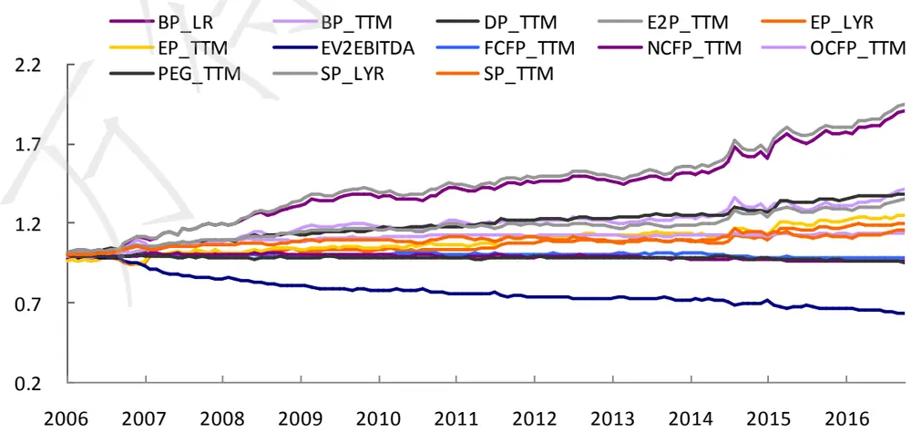
资料来源：Wind，光大证券研究所

估值因子的单调性则表现各异，其中 BP_LR 和 E2P_TTM 的单调性表现同样突出，SP_LYR和 EV2EBITDA单调性表现较好，其他因子的单调性则并不显著：

图2：估值因子测试部分结果（分组回溯年化收益率）
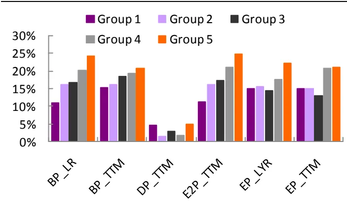
资料来源：Wind，光大证券研究所

图3：估值因子测试部分结果（分组回溯年化收益率）
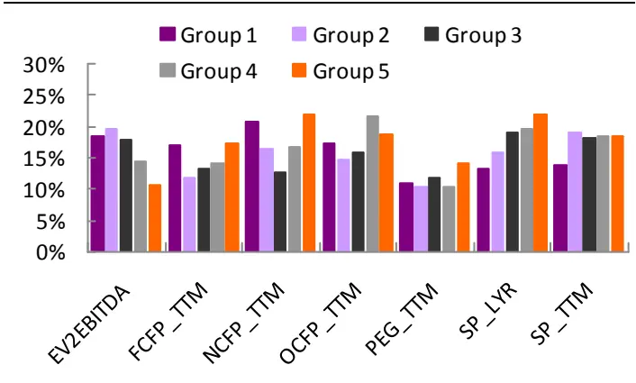
资料来源：Wind，光大证券研究所

表 3：估值因子测试结果（分层回溯年化收益率）

|  | Group 1 | Group 2 | Group 3 | Group 4 | Group 5 | Long_Short |
| --- | --- | --- | --- | --- | --- | --- |
| BP_LR | 10.9% | 16.2% | 16.8% | 20.1% | 24.0% | 10.4% |
| BP_TTM | 15.2% | 16.0% | 18.3% | 19.4% | 20.8% | 3.7% |
| DP_TTM | 4.6% | 1.5% | 2.8% | 1.6% | 4.9% | -2.1% |
| E2P_TTM | 11.3% | 16.0% | 17.2% | 21.0% | 24.7% | 10.6% |
| EP_LYR | 14.9% | 15.5% | 14.3% | 17.6% | 22.1% | 3.9% |
| EP_TTM | 15.0% | 14.9% | 13.0% | 20.8% | 21.1% | 3.2% |
| EV2EBITDA | 18.5% | 19.6% | 17.8% | 14.4% | 10.6% | -6.7% |
| FCFP_TTM | 16.9% | 11.7% | 13.3% | 14.0% | 17.2% | -0.5% |
| NCFP_TTM | 20.9% | 16.4% | 12.6% | 16.8% | 22.1% | 0.1% |
| OCFP_TTM | 17.3% | 14.7% | 16.0% | 21.7% | 18.6% | -0.1% |
| PEG_TTM | 10.9% | 10.4% | 11.7% | 10.2% | 14.2% | 2.6% |
| SP_LYR | 13.3% | 15.9% | 19.1% | 19.7% | 21.9% | 6.5% |
| SP_TTM | 14.0% | 19.1% | 18.1% | 18.4% | 18.6% | 3.1% |

资料来源：Wind，光大证券研究所

下表中展示了估值大类因子之间历史 IC 值得相关性矩阵，由此可以直观的观察出因子间的历史预测能力的相关性，相比因子绝对值的相关性检验，IC值的相关性更能反映出alpha 因子在预测时的共线性情况。

表 4：估值因子历史 IC 值相关性检验

|  | BP_LR | BP_TTM | DP_TTM | E2P_TTM | EP_LYR | EP_TTM | EV2EBITDA FCFP_TTM NCFP_TTM OCFP_TTM PEG_TTM |  |  |  |  | SP_LYR | SP_TTM |
| --- | --- | --- | --- | --- | --- | --- | --- | --- | --- | --- | --- | --- | --- |
| BP_LR | 1.00 | 0.94 | -0.14 | 0.98 | 0.29 | 0.17 | -0.74 | 0.02 | -0.23 | 0.45 | -0.10 | 0.87 | 0.83 |
| BP_TTM | 0.94 | 1.00 | -0.19 | 0.92 | 0.13 | 0.05 | -0.62 | 0.09 | -0.30 | 0.41 | -0.01 | 0.82 | 0.85 |
| DP_TTM | -0.14 | -0.19 | 1.00 | -0.07 | 0.72 | 0.77 | -0.27 | 0.21 | 0.54 | 0.39 | -0.42 | -0.10 | -0.13 |
| E2P_TTM | 0.98 | 0.92 | -0.07 | 1.00 | 0.35 | 0.24 | -0.76 | 0.03 | -0.12 | 0.46 | -0.13 | 0.87 | 0.83 |
| EP_LYR | 0.29 | 0.13 | 0.72 | 0.35 | 1.00 | 0.95 | -0.68 | 0.09 | 0.53 | 0.52 | -0.39 | 0.41 | 0.32 |
| EP_TTM | 0.17 | 0.05 | 0.77 | 0.24 | 0.95 | 1.00 | -0.63 | 0.17 | 0.56 | 0.57 | -0.40 | 0.33 | 0.26 |
| EV2EBITDA | -0.74 | -0.62 | -0.27 | -0.76 | -0.68 | -0.63 | 1.00 | -0.26 | -0.13 | -0.71 | 0.28 | -0.78 | -0.72 |
| FCFP_TTM | 0.02 | 0.09 | 0.21 | 0.03 | 0.09 | 0.17 | -0.26 | 1.00 | 0.20 | 0.64 | 0.03 | 0.02 | 0.06 |
| NCFP_TTM | -0.23 | -0.30 | 0.54 | -0.12 | 0.53 | 0.56 | -0.13 | 0.20 | 1.00 | 0.18 | -0.23 | -0.16 | -0.18 |
| OCFP_TTM | 0.45 | 0.41 | 0.39 | 0.46 | 0.52 | 0.57 | -0.71 | 0.64 | 0.18 | 1.00 | -0.18 | 0.48 | 0.47 |
| PEG_TTM | -0.10 | -0.01 | -0.42 | -0.13 | -0.39 | -0.40 | 0.28 | 0.03 | -0.23 | -0.18 | 1.00 | -0.10 | -0.03 |
| SP_LYR | 0.87 | 0.82 | -0.10 | 0.87 | 0.41 | 0.33 | -0.78 | 0.02 | -0.16 | 0.48 | -0.10 | 1.00 | 0.97 |
| SP_TTM | 0.83 | 0.85 | -0.13 | 0.83 | 0.32 | 0.26 | -0.72 | 0.06 | -0.18 | 0.47 | -0.03 | 0.97 | 1.00 |

资料来源：Wind，光大证券研究所

由上表可见，BP_LR 作为估值因子中平均收益率最高的因子，与包括SP_TTM、SP_LYR、E2P_TTM、EV2EBITDA 之间的相关性都很强。因而在筛选估值因子的时候，BP 与其他几个因子之间需要有所取舍。

## 2.2、规模因子测试结果

规模（市值）因子是A 股长期以来显著性非常高的一个因子，而除了我们常用的总市值指标以外，流通市值也是一个用来衡量股票流通规模的一个常用指标。同时，由于A股全体股票的市值分布存在较为严重的厚尾，因此也有很多研究对市值或者流通市值取自然对数，使因子值的分布更接近与正态分布。

表 5：规模因子明细表

| 因子代码 | 因子名称 |
| --- | --- |
| FC | 流通市值 |
| FC_MC | 流通市值/总市值 |
| Ln_FC | 流通市值对数 |
| Ln_MC | 总市值对数 |
| MC | 总市值 |

资料来源：光大证券研究所

首先给出根据因子测试框架得到的规模因子的因子收益，IC 值等等测试结果如下表所示。规模因子（市值因子和流通市值因子）的 IR 绝对值均高于 0.3，IC 绝对值均高于 5%，是显著性和预测能力都非常强的因子。而 FC_MC 的表现则并不显著。

表 6：规模因子测试结果（因子收益&IC_IR）

|  | Factor Mean Return | Factor Return tstat | abs(t_value) mean | Factor t_value positive per | IC mean | IC positive per | IC std | IC > 0.02 per | IR |
| --- | --- | --- | --- | --- | --- | --- | --- | --- | --- |
| FC | -0.4% | -2.36 | 6.41 | 37.0% | -5.3% | 34.1% | 16.0% | 28.9% | -0.33 |
| FC_MC | 0.1% | 1.36 | 2.69 | 54.1% | 1.2% | 56.3% | 7.2% | 43.7% | 0.16 |
| Ln_FC | -0.5% | -2.64 | 6.68 | 37.3% | -5.8% | 34.3% | 16.4% | 29.9% | -0.36 |
| Ln_MC | -0.5% | -2.94 | 6.90 | 34.8% | -6.8% | 31.9% | 16.9% | 25.2% | -0.40 |
| MC | -0.4% | -2.63 | 6.58 | 34.1% | -6.4% | 31.9% | 16.4% | 25.2% | -0.39 |

资料来源：Wind，光大证券研究所

通过累积多期截面回归得到的因子收益率序列，我们也可以更直观的观察到各个细分因子的历史收益率累积情况，比较因子之间的收益率表现。

图 4：规模因子累积收益率
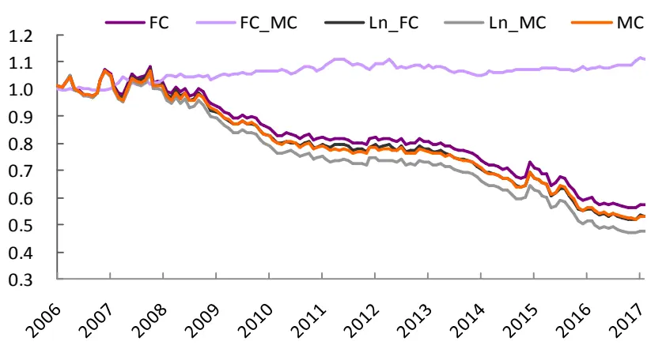
资料来源：Wind，光大证券研究所

规模因子作为一个负向的大类因子，其单调性上的表现相当出色，下图就展示了规模因子在行业中性后的分层回溯测试中五个分组的历史年化收益情况：

图 5：规模因子测试结果（分组回溯年化收益率）
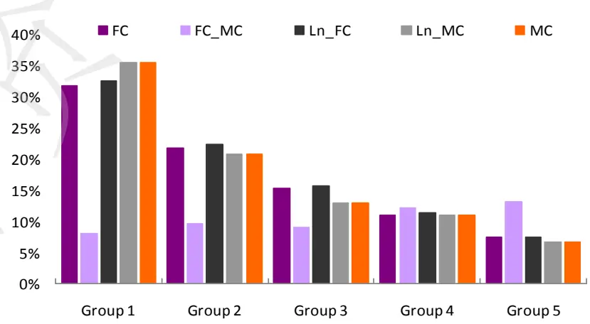
资料来源：Wind，光大证券研究所

表7：规模因子测试结果（分层回溯年化收益率）

|  | Group 1 | Group 2 | Group 3 | Group 4 | Group 5 | Long_Short |
| --- | --- | --- | --- | --- | --- | --- |
| FC | 31.8% | 21.8% | 15.3% | 11.1% | 7.4% | -20.6% |
| FC_MC | 8.0% | 9.6% | 9.1% | 12.1% | 13.1% | 5.0% |
| Ln_FC | 32.6% | 22.4% | 15.8% | 11.5% | 7.4% | -21.2% |
| Ln_MC | 35.4% | 20.8% | 12.9% | 11.0% | 6.7% | -23.5% |
| MC | 35.4% | 20.8% | 12.9% | 11.0% | 6.7% | -23.5% |

资料来源：Wind，光大证券研究所

由上表可见，规模因子整体的因子收益和 IC 值表现都非常出色，不过由于规模因子的同质性较高，我们在筛选规模因子时需要有所取舍，只能保留显著性高并且与其余因子之间共线性较弱的因子。

表8：规模因子历史 IC值相关性检验

|  | FC | FC_MC | Ln_FC | Ln_MC | MC |
| --- | --- | --- | --- | --- | --- |
| FC | 1.00 | -0.03 | 1.00 | 0.97 | 0.97 |
| FC_MC | -0.03 | 1.00 | 0.00 | -0.22 | -0.23 |
| Ln_FC | 1.00 | 0.00 | 1.00 | 0.97 | 0.96 |
| Ln_MC | 0.97 | -0.22 | 0.97 | 1.00 | 1.00 |
| MC | 0.97 | -0.23 | 0.96 | 1.00 | 1.00 |

资料来源：Wind，光大证券研究所

由于自然对数仅仅是通过因子值的变形得到的不同因子表示方式，可以发现Ln_MC与MC完全相关，同理，Ln_FC与FC的IC值序列也是完全相关的。取对数对这两个因子的预测能力和因子收益并没有十分显著的影响。

## 2.3、成长因子测试结果

成长因子是指过去一段时间内股票的各项估值指标或收益指标的增长性因子，是一类非常重要的风格因子。成长因子值较大的股票往往存在上市时间较短，公司整体业务增长潜力较大的特点，该类公司往往存在市值偏小的特征，因此在测试此类因子时，回归测试需要注意加入行业哑变量和市值因子来剔除行业和市值风格对因子测试有效性的影响。我们测试的动量因子详细列表如下：

表9：成长因子明细表

| 因子代码 | 因子名称 |
| --- | --- |
| BPG_TTM | 每股净资产增长率_TTM |
| EPSG_TTM | EPS 增长率_TTM |
| NPG_TTM | 净利润增长率_TTM |
| OPG_TTM | 营业收入增长率_TTM |
| ROAG_TTM | ROA 增长率_TTM |
| ROEG_TTM | ROE增长率_TTM |
| TAG | 总资产增长率 |
| TAG_TTM | 总资产增长率_TTM |

资料来源：光大证券研究所

下表给出的是根据因子测试框架得到的规模因子的因子收益，IC 值等等测试结果：

表10：成长因子测试结果（因子收益&IC_IR）

|  | Factor Return | Factor Return tstat | abs(t_value ) mean | Factor t_value positive per | IC mean | IC positive per | IC std | IC > 0.02 per | IR |
| --- | --- | --- | --- | --- | --- | --- | --- | --- | --- |
| BPG_TTM | 0.04% | 0.75 | 1.48 | 53.0% | 1.7% | 59.0% | 7.4% | 47.8% | 0.23 |
| EPSG_TTM | 0.00% | -0.07 | 0.86 | 47.0% | -0.2% | 54.5% | 8.7% | 44.0% | -0.03 |
| NPG_TTM | -0.12% | -2.50 | 1.10 | 32.1% | -2.1% | 32.8% | 8.0% | 24.9% | -0.28 |
| OPG_TTM | -0.17% | -3.50 | 1.50 | 38.1% | -2.8% | 35.8% | 7.6% | 26.9% | -0.37 |
| ROAG_TTM | 0.02% | 0.61 | 0.88 | 48.8% | 0.1% | 54.5% | 5.8% | 36.4% | 0.01 |
| ROEG_TTM | 0.01% | 0.45 | 1.00 | 50.4% | 0.8% | 56.4% | 6.7% | 43.6% | 0.12 |
| TAG_TTM | -0.02% | -0.78 | 1.00 | 44.0% | -0.8% | 46.3% | 9.6% | 37.3% | -0.08 |

资料来源：Wind，光大证券研究所

通过累积多期截面回归得到的因子收益率序列，我们也可以更直观的观察到各个细分因子的历史收益率累积情况，比较因子之间的收益率表现。

图 6：成长因子累积收益率
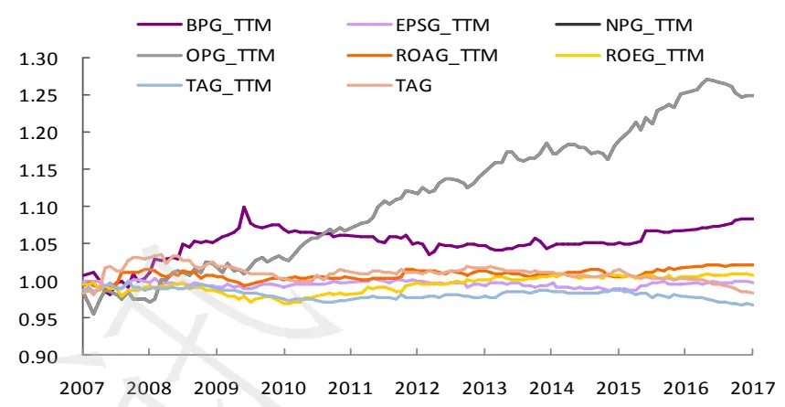
资料来源：Wind，光大证券研究所

营业收入增长率 OPG_TTM 因子的历史累积收益情况表现明细优于其他的成长类因子，其他的成长类因子的收益率基本持平。

图7：成长因子测试结果（分组回溯年化收益率）
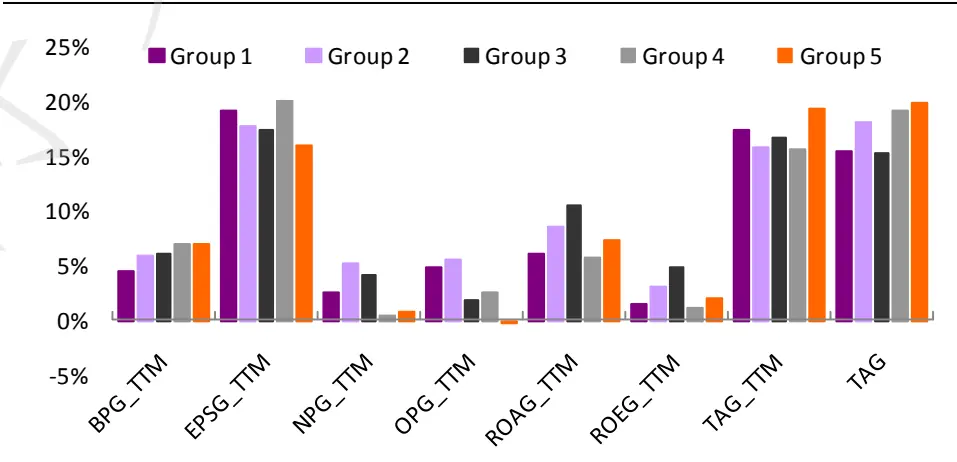
资料来源：Wind，光大证券研究所

表11：成长因子测试结果（分层回溯年化收益率）

|  | Group 1 | Group 2 | Group 3 | Group 4 | Group 5 | Long_Short |
| --- | --- | --- | --- | --- | --- | --- |
| BPG_TTM | 4.6% | 5.9% | 6.1% | 6.9% | 7.0% | 0.7% |
| EPSG_TTM | 19.2% | 17.7% | 17.5% | 20.1% | 16.0% | -2.9% |
| NPG_TTM | 2.6% | 5.3% | 4.1% | 0.5% | 0.9% | -3.3% |
| OPG_TTM | 4.9% | 5.7% | 1.8% | 2.5% | -0.2% | -5.4% |
| ROAG_TTM | 6.1% | 8.6% | 10.6% | 5.7% | 7.3% | 0.9% |
| ROEG_TTM | 1.5% | 3.1% | 5.0% | 1.2% | 2.1% | 1.0% |
| TAG_TTM | 17.4% | 15.8% | 16.7% | 15.7% | 19.3% | 1.5% |
| TAG | 15.5% | 18.2% | 15.2% | 19.2% | 19.8% | 3.6% |

资料来源：Wind，光大证券研究所

由上表可见，成长因子整体的因子收益和 IC 值表现都比较一般。我们统计了动量因子历史 IC 值序列的相关性，发现它们之间的共线性特征并不强。由于我们这里测试的都是 TTM 的增长率，因此与当季增长率相比，TTM 增长率因子表现会略有逊色。未来我们也将加入当季增长率因子来进一步优化和充实我们的因子库。

表12：成长因子历史IC值相关性检验

|  | BPG_TTM | EPSG_TTM | NPG_TTM | OPG_TTM | ROAG_TTM | ROEG_TTM | TAG_TTM | TAG |
| --- | --- | --- | --- | --- | --- | --- | --- | --- |
| BPG_TTM | 1.00 | -0.08 | -0.45 | -0.31 | -0.06 | -0.10 | 0.08 | 0.14 |
| EPSG_TTM | -0.08 | 1.00 | 0.32 | 0.25 | 0.24 | 0.10 | 0.00 | 0.03 |
| NPG_TTM | -0.45 | 0.32 | 1.00 | 0.68 | 0.16 | 0.19 | 0.32 | 0.29 |
| OPG_TTM | -0.31 | 0.25 | 0.68 | 1.00 | 0.23 | 0.12 | 0.37 | 0.38 |
| ROAG_TTM | -0.06 | 0.24 | 0.16 | 0.23 | 1.00 | 0.43 | 0.21 | 0.19 |
| ROEG_TTM | -0.10 | 0.10 | 0.19 | 0.12 | 0.43 | 1.00 | 0.09 | 0.03 |
| TAG_TTM | 0.08 | 0.00 | 0.32 | 0.37 | 0.21 | 0.09 | 1.00 | 0.62 |
| TAG | 0.14 | 0.03 | 0.29 | 0.38 | 0.19 | 0.03 | 0.62 | 1.00 |

资料来源：Wind，光大证券研究所

## 2.4、质量因子测试结果

质量因子往往代表公司整体的营运质量，这一类因子也往往与公司未来较长周期的营运情况起到一定的预测作用，同样也是一类比较重要的因子。常见的质量因子包括：资产周转率、营业利润率、总资产回报率、净资产回报率等等。我们测试的质量因子详细列表如下：

表 13：质量因子明细表

| 因子代码 | 因子名称 |
| --- | --- |
| AT | 资产周转率 |
| AT_TTM | 资产周转率_TTM |
| DPR_TTM | 股利支付率 |
| NPM | 当期净利率 |
| NPM-TTM | 净利率-TTM |
| OPM | 营业利润率 |
| OPM_TTM | 营业利润率_TTM |
| ROA | ROA |
| ROA_TTM | ROA_TTM |
| ROE | ROE |
| ROE_TTM | ROE_TTM |

资料来源：光大证券研究所

类似的，我们首先给出根据因子测试框架得到的质量因子的因子收益，IC 值等等测试结果：

表14：质量因子测试结果（因子收益&IC_IR）

|  | Factor Mean Return | Factor Return tstat | abs(t_value ) mean | Factor t_value positive per | IC mean | IC positive per | IC std | IC > 0.02 per | IR |
| --- | --- | --- | --- | --- | --- | --- | --- | --- | --- |
| AT | 0.06% | 1.36 | 1.54 | 54.1% | 0.6% | 56.3% | 5.3% | 40.7% | 0.12 |
| AT_TTM | 0.01% | 0.34 | 1.45 | 50.0% | 0.1% | 48.5% | 5.2% | 36.6% | 0.02 |
| DPR_TTM | 0.03% | 1.07 | 1.00 | 52.2% | 1.1% | 61.2% | 6.6% | 47.8% | 0.17 |
| NPM | -0.04% | -0.87 | 1.45 | 49.6% | -0.4% | 49.6% | 9.7% | 45.9% | -0.04 |
| NPM-TTM | -0.07% | -1.83 | 1.35 | 42.5% | -1.0% | 47.0% | 9.8% | 42.5% | -0.10 |
| OPM | 0.10% | 1.33 | 2.77 | 53.3% | 0.8% | 55.6% | 7.9% | 48.9% | 0.10 |
| OPM_TTM | 0.09% | 1.16 | 2.65 | 51.5% | 0.4% | 53.0% | 7.6% | 44.0% | 0.06 |
| ROA | 0.04% | 0.34 | 3.84 | 50.4% | 0.2% | 50.4% | 11.9% | 44.4% | 0.01 |
| ROA_TTM | -0.04% | -0.36 | 3.49 | 41.8% | -0.7% | 44.8% | 11.3% | 40.3% | -0.06 |
| ROE | 0.03% | 0.38 | 2.58 | 49.6% | 0.6% | 53.3% | 10.7% | 45.2% | 0.06 |
| ROE_TTM | -0.01% | -0.16 | 2.06 | 45.2% | -0.7% | 47.4% | 9.7% | 40.0% | -0.07 |

资料来源：Wind，光大证券研究所

通过累积多期截面回归得到的因子收益率序列，我们也可以更直观的观察到各个细分因子的历史收益率累积情况，比较因子之间的收益率表现。

图 8：质量因子累积收益率
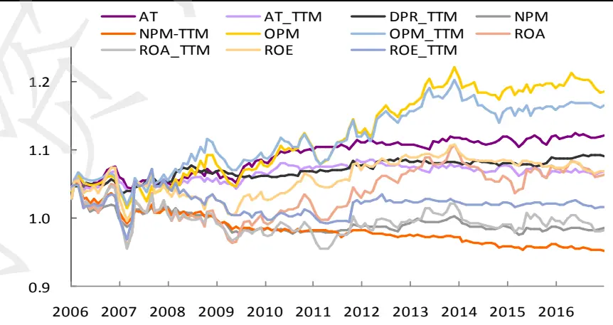
资料来源：Wind，光大证券研究所

质量因子中累计收益率较高的因子为OPM和 OPM_TTM，并且从上图已经可以观察出，除OPM、NPM以外的因子收益率走势十分类似，相关性较高。下图展示了动量因子做行业中性的分层回溯后各组的历史年化收益情况：

图9：质量因子测试结果（分组回溯年化收益率）
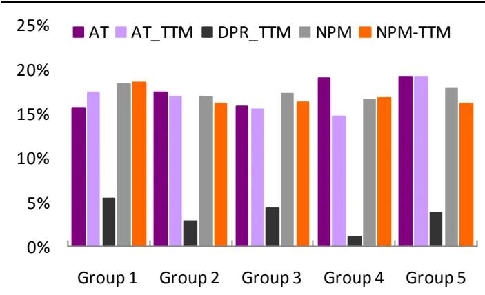
资料来源：Wind，光大证券研究所

图10：质量因子测试结果（分组回溯年化收益率）
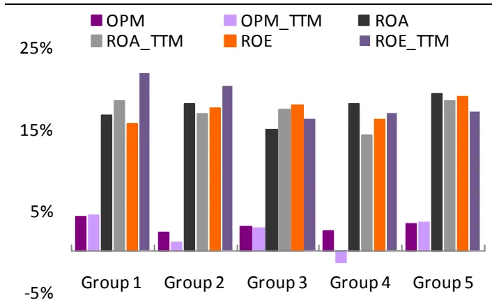
资料来源：Wind，光大证券研究所

由分层回溯的结果可见，质量因子整体的单调性不强，并且往往存在组3收益率最低，而组 1 和组 5 的收益较高的情况。例如资产周转率 AT_TTM 因子，组1 和组 5的年化收益率分别为 17.5%和 19.2%，而组 3的年化收益仅有 15.5%

表15：质量因子测试结果（分层回溯年化收益率）

|  | Group 1 | Group 2 | Group 3 | Group 4 | Group 5 | Long_Short |
| --- | --- | --- | --- | --- | --- | --- |
| AT | 15.7% | 17.5% | 15.9% | 19.1% | 19.3% | 2.0% |
| AT_TTM | 17.5% | 16.9% | 15.5% | 14.8% | 19.2% | 0.3% |
| DPR_TTM | 5.4% | 2.9% | 4.3% | 1.1% | 3.9% | -3.5% |
| NPM | 18.4% | 17.0% | 17.3% | 16.6% | 18.0% | -1.7% |
| NPM-TTM | 18.6% | 16.2% | 16.4% | 16.8% | 16.2% | -3.5% |
| OPM | 4.2% | 2.3% | 2.9% | 2.4% | 3.2% | -3.0% |
| OPM_TTM | 4.4% | 1.0% | 2.7% | -1.5% | 3.4% | -3.1% |
| ROA | 16.7% | 18.1% | 15.0% | 18.1% | 19.4% | 0.4% |
| ROA_TTM | 18.5% | 16.8% | 17.4% | 14.2% | 18.4% | -1.9% |
| ROE | 15.6% | 17.6% | 17.9% | 16.1% | 19.0% | 1.6% |
| ROE_TTM | 21.8% | 20.3% | 16.2% | 17.0% | 17.2% | -5.3% |

资料来源：Wind，光大证券研究所

由上表可见，质量因子整体的因子收益和 IC 值表现一般。我们统计了质量因子历史 IC 值序列的相关性，发现它们之间普遍存在较为显著的正相关关系。除了资产周转率AT以外的其他因子之间的IC值相关系数普遍大于0.5。

表 16：质量因子历史 IC 值相关性检验

|  | AT | AT_TTM | DPR_TTM | NPM | NPM-TTM | OPM | OPM_TTM | ROA | ROA_TTM | ROE | ROE_TTM |
| --- | --- | --- | --- | --- | --- | --- | --- | --- | --- | --- | --- |
| AT | 1.00 | 0.97 | 0.42 | 0.35 | 0.30 | 0.20 | 0.16 | 0.60 | 0.55 | 0.69 | 0.64 |
| AT_TTM | 0.97 | 1.00 | 0.38 | 0.35 | 0.31 | 0.16 | 0.13 | 0.57 | 0.55 | 0.67 | 0.64 |
| DPR_TTM | 0.42 | 0.38 | 1.00 | 0.49 | 0.43 | 0.53 | 0.51 | 0.60 | 0.58 | 0.58 | 0.51 |
| NPM | 0.35 | 0.35 | 0.49 | 1.00 | 0.87 | 0.72 | 0.72 | 0.81 | 0.81 | 0.66 | 0.62 |
| NPM-TTM | 0.30 | 0.31 | 0.43 | 0.87 | 1.00 | 0.67 | 0.65 | 0.73 | 0.76 | 0.58 | 0.55 |
| OPM | 0.20 | 0.16 | 0.53 | 0.72 | 0.67 | 1.00 | 0.97 | 0.84 | 0.83 | 0.67 | 0.65 |
| OPM_TTM | 0.16 | 0.13 | 0.51 | 0.72 | 0.65 | 0.97 | 1.00 | 0.81 | 0.83 | 0.63 | 0.61 |
| ROA | 0.60 | 0.57 | 0.60 | 0.81 | 0.73 | 0.84 | 0.81 | 1.00 | 0.98 | 0.92 | 0.87 |
| ROA_TTM | 0.55 | 0.55 | 0.58 | 0.81 | 0.76 | 0.83 | 0.83 | 0.98 | 1.00 | 0.88 | 0.87 |
| ROE | 0.69 | 0.67 | 0.58 | 0.66 | 0.58 | 0.67 | 0.63 | 0.92 | 0.88 | 1.00 | 0.89 |
| ROE_TTM | 0.64 | 0.64 | 0.51 | 0.62 | 0.55 | 0.65 | 0.61 | 0.87 | 0.87 | 0.89 | 1.00 |

资料来源：Wind，光大证券研究所

## 2.5、杠杆因子测试结果

杠杆因子是用来衡量公司整体运行的负债与权益的配比情况，如常见的资产负债比指标，常用于表示公司的债务压力和运营状况。我们测试的杠杆因子详细列表如下，需要注意的是，由于银行和非银金融行业的特殊性，在测试速动比率、流动比率这两个因子时，需要剔除银行和非银这两个行业：

表 17：杠杆因子明细表

| 因子代码 | 因子名称 |
| --- | --- |
| CCR | 现金比率 |
| CUR | 流动比率 |
| Debt_Asset | 资产负债比 |
| QR | 速动比率 |

资料来源：光大证券研究所

类似的，我们首先给出根据因子测试框架得到的动量因子的因子收益，IC 值等等测试结果：

表18：杠杆因子测试结果（因子收益&IC_IR）

|  | Factor Mean Return | Factor Return tstat | abs(t_value ) mean | Factor t_value positive per | IC mean | IC positive per | IC std | IC > 0.02 per | IR |
| --- | --- | --- | --- | --- | --- | --- | --- | --- | --- |
| CCR | -0.02% | -0.86 | 0.74 | 51.1% | 0.6% | 46.7% | 11.4% | 40.0% | 0.05 |
| CUR | 0.00% | 0.03 | 1.93 | 48.1% | -0.5% | 50.4% | 6.4% | 40.7% | -0.08 |
| Debt_Asset | -0.02% | -0.33 | 2.91 | 48.9% | -0.1% | 52.6% | 8.2% | 37.8% | -0.01 |
| QR | 0.00% | 0.00 | 1.93 | 48.1% | -0.6% | 48.9% | 6.3% | 37.0% | -0.10 |

资料来源：Wind，光大证券研究所

通过累积多期截面回归得到的因子收益率序列，我们也可以更直观的观察到各个细分因子的历史收益率累积情况，比较因子之间的收益率表现。

图 11：杠杆因子累积收益率
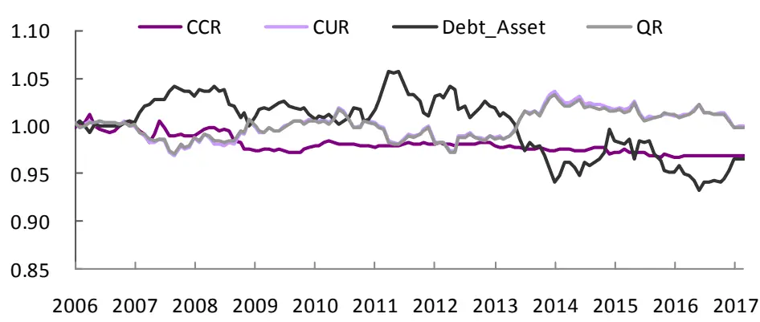
资料来源：Wind，光大证券研究所

杠杆因子的单调性表现比较一般，下表就展示了杠杆因子做行业中性的分层回溯后各组的历史年化收益情况：

图12：杠杆因子测试结果（分组回溯年化收益率）
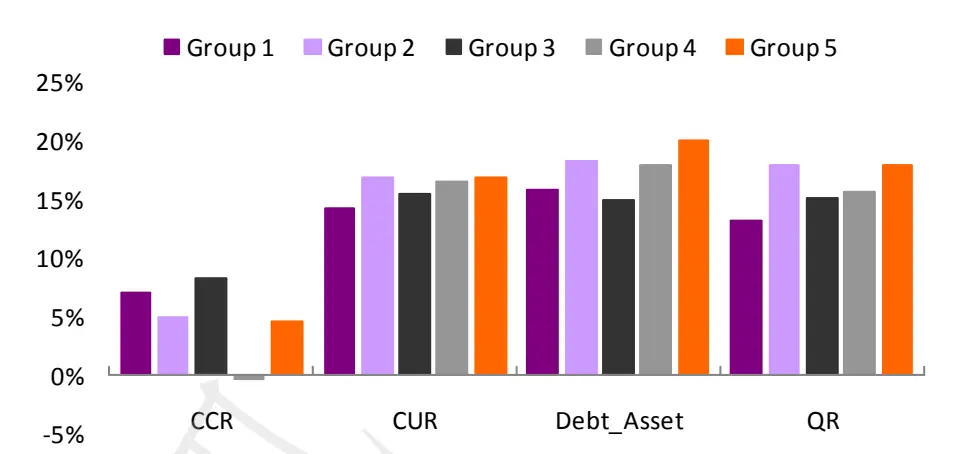
资料来源：Wind，光大证券研究所

表19：杠杆因子测试结果（分层回溯年化收益率）

|  | Group 1 | Group 2 | Group 3 | Group 4 | Group 5 | Long_Short |
| --- | --- | --- | --- | --- | --- | --- |
| CCR | 7.0% | 4.9% | 8.2% | -0.4% | 4.6% | -0.9% |
| CUR | 14.2% | 16.9% | 15.5% | 16.5% | 16.9% | 2.9% |
| Debt_Asset | 15.9% | 18.2% | 15.0% | 18.0% | 20.1% | 4.0% |
| QR | 13.1% | 18.0% | 15.1% | 15.6% | 18.0% | 4.7% |

资料来源：Wind，光大证券研究所

由上表可见，杠杆因子整体的因子收益和 IC 值表现一般，我们统计了杠杆因子历史IC 值序列的相关性，发现除了CUR与 QR之间存在较强的共线性以外，其他因子间 IC 值得共线性均比较弱。

表 20：杠杆因子历史 IC 值相关性检验

|  | CCR | CUR | Debt_Asset | QR |
| --- | --- | --- | --- | --- |
| CCR | 1.00 | -0.13 | 0.05 | -0.14 |
| CUR | -0.13 | 1.00 | -0.35 | 0.98 |
| Debt_Asset | 0.05 | -0.35 | 1.00 | -0.31 |
| QR | -0.14 | 0.98 | -0.31 | 1.00 |

资料来源：Wind，光大证券研究所

## 2.6、动量因子测试结果

动量因子是指过去一段时间内股票的收益率，是一类非常重要同时效果十分显著的风格因子。通过改变所取的时间区间的长度，可以观察到不同时长下的股票动量和反转的效应强弱。我们测试的动量因子详细列表如下：

表 21：动量因子明细表

| 因子代码 | 因子名称 |
| --- | --- |
| Momentum_1M | 最近1个月收益率 |
| Momentum_3M | 最近3个月收益率 |
| Momentum_6M | 最近6个月收益率 |
| Momentum_12M | 最近12个月收益率 |
| Momentum_24M | 最近24个月收益率 |
| Momentum_1M_Max | 最近1个月的日收益率的最大值 |

资料来源：光大证券研究所

由于动量因子的变化主要在于计算收益率的时间区间，因此也就很容易理解动量因子之间存在的较强的共线性。类似的，我们首先给出根据因子测试框架得到的动量因子的因子收益，IC值等等测试结果：

表 22：动量因子测试结果（因子收益&IC_IR）

|  | Factor Mean Return | Factor Return tstat | abs(t_value) mean | Factor t_value positive per | IC mean | IC positive per | IC std | IC > 0.02 per | IR |
| --- | --- | --- | --- | --- | --- | --- | --- | --- | --- |
| Momentum_1M | -0.92% | -8.26 | 5.39 | 21% | -7.9% | 23% | 11% | 19% | -0.75 |
| Momentum_3M | -0.88% | -6.72 | 5.60 | 22% | -7.6% | 27% | 12% | 18% | -0.62 |
| Momentum_6M | -0.76% | -6.04 | 5.13 | 27% | -6.4% | 26% | 12% | 22% | -0.55 |
| Momentum_12M | -0.60% | -4.82 | 4.96 | 30% | -5.2% | 30% | 12% | 24% | -0.44 |
| Momentum_24M | -0.59% | -4.44 | 4.75 | 30% | -5.6% | 28% | 11% | 24% | -0.50 |
| Momentum_1M_Max | -0.58% | -7.50 | 3.95 | 22% | -6.6% | 21% | 8% | 16% | -0.81 |

资料来源：Wind，光大证券研究所

通过累积多期截面回归得到的因子收益率序列，我们也可以更直观的观察到各个细分因子的历史收益率累积情况，比较因子之间的收益率表现。

图 13：动量因子累积收益率
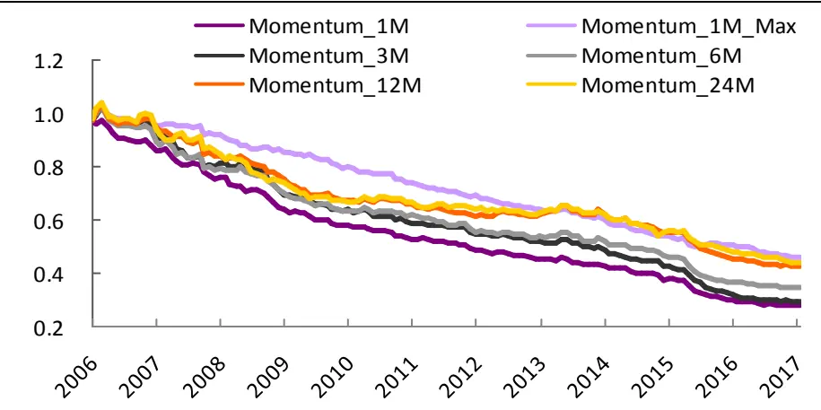
资料来源：Wind，光大证券研究所

动量因子作为一个负向的大类因子，其单调性同样表现较为出色，下表就展示了动量因子做行业中性的分层回溯后各组的历史年化收益情况：

图14：动量因子测试结果（分组回溯年化收益率）
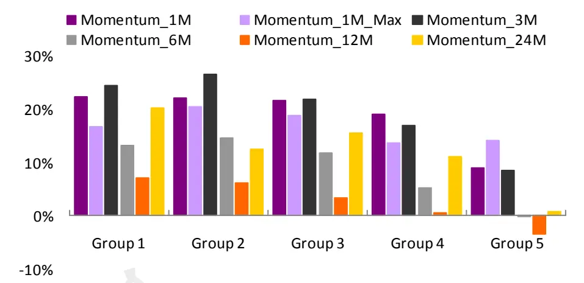
资料来源：Wind，光大证券研究所

表23：动量因子测试结果（分层回溯年化收益率）

|  | Group 1 | Group 2 | Group 3 | Group 4 | Group 5 | Long_Short |
| --- | --- | --- | --- | --- | --- | --- |
| Momentum_1M | 22.3% | 22.0% | 21.7% | 18.9% | 9.0% | -11.8% |
| Momentum_3M | 24.4% | 26.5% | 21.8% | 16.8% | 8.5% | -13.8% |
| Momentum_6M | 13.1% | 14.7% | 11.8% | 5.2% | -0.2% | -12.5% |
| Momentum_12M | 7.0% | 6.0% | 3.4% | 0.5% | -3.5% | -10.4% |
| Momentum_24M | 20.2% | 12.4% | 15.5% | 11.1% | 0.8% | -16.0% |
| Momentum_1M_Max | 16.6% | 20.5% | 18.9% | 13.7% | 14.0% | -1.2% |

资料来源：Wind，光大证券研究所

由上表可见，动量因子整体的因子收益和 IC 值表现都非常出色，不过可以预见的是，动量因子的相关性和共线性会比较强，下表中的统计也印证了这一猜测。我们统计了动量因子历史 IC 值序列的相关性，发现它们之间存在着非常强的共线性特征，也因此我们在筛选动量因子时需要有所取舍，并不能因为因子收益或IC 值明显高于其他类型的因子就纳入过多的动量因子。

表 24：动量因子历史 IC 值相关性检验

|  | Momentum_12M | Momentum_1M | Momentum_3M | Momentum_6M | Momentum_24M | Momentum_1M_Max |
| --- | --- | --- | --- | --- | --- | --- |
| Momentum_12M | 1.00 | 0.47 | 0.67 | 0.85 | 0.84 | 0.40 |
| Momentum_1M | 0.47 | 1.00 | 0.69 | 0.61 | 0.25 | 0.20 |
| Momentum_3M | 0.67 | 0.69 | 1.00 | 0.82 | 0.43 | 0.23 |
| Momentum_6M | 0.85 | 0.61 | 0.82 | 1.00 | 0.62 | 0.31 |
| Momentum_24M | 0.84 | 0.25 | 0.43 | 0.62 | 1.00 | 0.47 |
| Momentum_1M_Max | 0.40 | 0.20 | 0.23 | 0.31 | 0.47 | 1.00 |

资料来源：Wind，光大证券研究所

1 个月最高价因子与其他动量因子之间的相关性较低，而1 个月、3 个月、6个月、12 个月、24 个月的收益率因子之间的相关性均较高，其中最高的是6 个月收益率和12个月收益率，这两个因子之间IC值相关性高达 85%。

## 2.7、波动因子测试结果

波动因子是指过去一段时间内股价或成交量等等其他指标的波动情况，也是一类非常重要同时效果十分显著的风格因子。通过改变所取的时间区间的长度，可以观察到不同时长下的股票波动效应强弱。我们测试的波动因子详细列表如下：

表25：波动因子明细表

| 因子代码 | 因子名称 |
| --- | --- |
| HighLow_1M | 1个月最高价/最低价 |
| HighLow_3M | 3个月最高价/最低价 |
| HighLow_6M | 6个月最高价/最低价 |
| STD_1M | 1个月日收益率标准差 |
| STD_3M | 3个月日收益率标准差 |
| STD_6M | 6个月日收益率标准差 |
| VSTD_1M | 1个月成交量标准差 |
| VSTD_3M | 3个月成交量标准差 |
| VSTD_6M | 6个月成交量标准差 |
| Residual_Risk 7 | CAMP模型残差的标准差（12个月） |

资料来源：光大证券研究所

由于波动因子的变化主要在于计算收益率的时间区间，因此波动因子之间同样存在的较强的共线性。类似的，我们首先给出根据因子测试框架得到的动量因子的因子收益，IC 值等等测试结果：

表 26：波动因子测试结果（因子收益&IC_IR）

|  | Factor Mean Return | Factor Return tstat | abs(t_value) mean | Factor t_value positive per | IC mean | IC positive per | IC std | IC > 0.02 per | IR |
| --- | --- | --- | --- | --- | --- | --- | --- | --- | --- |
| HighLow_1M | -0.5% | -4.15 | 5.21 | 34.3% | -3.9% | 33.6% | 11.8% | 29.1% | -0.34 |
| HighLow_3M | -0.3% | -2.59 | 5.71 | 36.3% | -1.9% | 36.3% | 13.3% | 34.8% | -0.14 |
| HighLow_6M | -0.3% | -2.69 | 5.47 | 36.3% | -2.0% | 37.0% | 12.9% | 29.6% | -0.15 |
| STD_1M | -0.6% | -5.23 | 5.21 | 31.3% | -5.5% | 30.6% | 11.8% | 25.4% | -0.47 |
| STD_3M | -0.6% | -4.74 | 5.25 | 34.1% | -5.2% | 34.1% | 12.7% | 30.4% | -0.41 |
| STD_6M | -0.5% | -4.09 | 4.87 | 34.8% | -4.6% | 38.5% | 13.0% | 33.3% | -0.35 |
| VSTD_1M | -0.6% | -6.52 | 2.80 | 17.9% | -6.5% | 16.4% | 8.0% | 11.2% | -0.82 |
| VSTD_3M | -0.5% | -5.27 | 2.47 | 19.3% | -5.0% | 23.0% | 8.3% | 17.8% | -0.60 |
| VSTD_6M | -0.4% | -4.50 | 2.26 | 26.7% | -4.0% | 25.9% | 8.1% | 21.5% | -0.49 |
| Residual_Risk | -0.5% | -4.22 | 4.97 | 37.3% | -3.6% | 38.8% | 13.2% | 34.3% | -0.27 |

资料来源：Wind，光大证券研究所

通过累积多期截面回归得到的因子收益率序列，我们也可以更直观的观察到各个细分因子的历史收益率累积情况，比较因子之间的收益率表现。

图 15：波动因子累积收益率
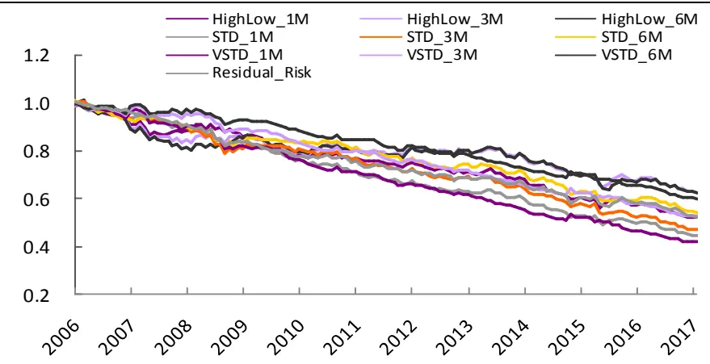
资料来源：Wind，光大证券研究所

波动因子作为一个负向的大类因子，其单调性同样表现较为出色，下表就展示了因子做行业中性的分层回溯后各组的历史年化收益情况：

图16：波动因子测试结果（分组回溯年化收益率）
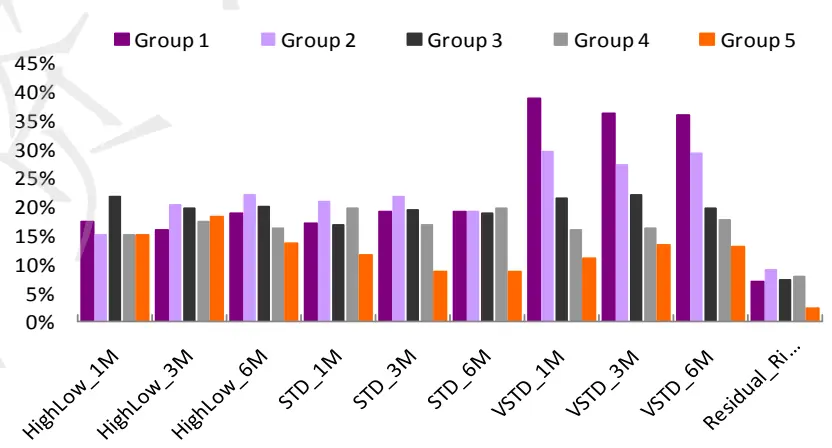
资料来源：Wind，光大证券研究所

表 27：波动因子测试结果（分层回溯年化收益率）

|  | Group 1 | Group 2 | Group 3 | Group 4 | Group 5 | Long_Short |
| --- | --- | --- | --- | --- | --- | --- |
| HighLow_1M | 17.4% | 15.2% | 21.7% | 15.0% | 15.1% | -0.4% |
| HighLow_3M | 15.9% | 20.2% | 19.7% | 17.4% | 18.2% | 3.6% |
| HighLow_6M | 18.9% | 22.2% | 20.0% | 16.2% | 13.6% | -3.0% |
| STD_1M | 17.2% | 20.8% | 16.8% | 19.6% | 11.7% | -3.1% |
| STD_3M | 19.1% | 21.9% | 19.6% | 16.9% | 8.7% | -7.2% |
| STD_6M | 19.3% | 19.1% | 18.8% | 19.8% | 8.7% | -7.2% |
| VSTD_1M | 38.8% | 29.6% | 21.5% | 15.9% | 11.2% | -20.7% |
| VSTD_3M | 36.4% | 27.4% | 22.1% | 16.1% | 13.4% | -17.7% |
| VSTD_6M | 36.1% | 29.2% | 19.8% | 17.7% | 13.2% | -17.8% |
| Residual_Risk | 7.0% | 9.1% | 7.3% | 7.8% | 2.2% | -3.4% |

资料来源：Wind，光大证券研究所

由上表可见，波动因子整体的因子收益和 IC 值表现都比较出色，而成交量标准差VSTD的三个因子单调性表现格外突出。

下表中我们统计了波动因子历史 IC 值序列的相关性，发现波动之间存在着非常强的共线性特征，也因此我们在筛选波动因子时需要有所取舍。

表28：波动因子历史IC值相关性检验

|  | HighLow_ 1M | HighLow_ 3M | HighLow_ 6M | STD_1M | STD_3M | STD_6M | VSTD_1M | VSTD_3M | VSTD_6M | Residual_Risk |
| --- | --- | --- | --- | --- | --- | --- | --- | --- | --- | --- |
| HighLow_1M | 1.00 | 0.87 | 0.79 | 0.82 | 0.79 | 0.74 | 0.35 | 0.34 | 0.29 | 0.68 |
| HighLow_3M | 0.87 | 1.00 | 0.92 | 0.85 | 0.85 | 0.78 | 0.37 | 0.38 | 0.33 | 0.71 |
| HighLow_6M | 0.79 | 0.92 | 1.00 | 0.82 | 0.84 | 0.81 | 0.35 | 0.35 | 0.32 | 0.72 |
| STD_1M | 0.82 | 0.85 | 0.82 | 1.00 | 0.94 | 0.87 | 0.43 | 0.40 | 0.33 | 0.79 |
| STD_3M | 0.79 | 0.85 | 0.84 | 0.94 | 1.00 | 0.95 | 0.41 | 0.39 | 0.33 | 0.85 |
| STD_6M | 0.74 | 0.78 | 0.81 | 0.87 | 0.95 | 1.00 | 0.36 | 0.36 | 0.32 | 0.87 |
| VSTD_1M | 0.35 | 0.37 | 0.35 | 0.43 | 0.41 | 0.36 | 1.00 | 0.95 | 0.89 | 0.20 |
| VSTD_3M | 0.34 | 0.38 | 0.35 | 0.40 | 0.39 | 0.36 | 0.95 | 1.00 | 0.97 | 0.17 |
| VSTD_6M | 0.29 | 0.33 | 0.32 | 0.33 | 0.33 | 0.32 | 0.89 | 0.97 | 1.00 | 0.12 |
| Residual_Risk | 0.68 | 0.71 | 0.72 | 0.79 | 0.85 | 0.87 | 0.20 | 0.17 | 0.12 | 1.00 |

资料来源：Wind，光大证券研究所

成交量波动率VSTD 因子与其他波动性因子之间的相关性较低，CAPM残差风险（特质波动因子）与股价标准差因子之间的相关性均较高，因此在筛选波动因子时可以考虑 VSTD 和其他波动因子合成一个大类波动因子。

## 2.8、流动性因子测试结果

流动性因子是指过去一段时间内股票的的换手率等指标，也是一类效果十分显著的因子。通过改变所取的时间区间的长度，可以观察到不同时长下的股票流动性对股价影响的效应强弱。我们测试的流动性因子详细列表如下：

表 29：流动性因子明细表

| 因子代码 | 因子名称 |
| --- | --- |
| TURNOVER_1M | 最近一个月换手率 |
| TURNOVER_3M | 最近三个月换手率 |
| TURNOVER_6M | 最近六个月换手率 |
| VA_FC_1M | 最近一个月买卖循环率 |
| VA_FC_3M | 最近三个月买卖循环率 |
| VA_FC_6M | 最近六个月买卖循环率 |

资料来源：光大证券研究所

由于动量因子的变化主要在于计算收益率的时间区间，因此也就很容易理解动量因子之间存在的较强的共线性。类似的，我们首先给出根据因子测试框架得到的动量因子的因子收益，IC值等等测试结果：

表30：流动性因子测试结果（因子收益&IC_IR）

|  | Factor Mean Return | Factor Return tstat | abs(t_value) mean | Factor t_value positive per | IC mean | IC positive per | IC std | IC > 0.02 per | IR |
| --- | --- | --- | --- | --- | --- | --- | --- | --- | --- |
| TURNOVER_1M | -0.78% | -5.90 | 5.98 | 29.6% | -6.6% | 29.6% | 13.4% | 27.4% | -0.49 |
| TURNOVER_3M | -0.56% | -4.42 | 5.58 | 34.8% | -4.6% | 35.6% | 13.3% | 31.9% | -0.34 |
| TURNOVER_6M | -0.43% | -3.54 | 5.15 | 37.8% | -3.3% | 40.0% | 12.8% | 35.6% | -0.25 |
| VA_FC_1M | -0.79% | -6.12 | 5.85 | 29.1% | -6.7% | 29.1% | 13.1% | 25.4% | -0.51 |
| VA_FC_3M | -0.61% | -4.64 | 5.64 | 33.6% | -5.0% | 34.3% | 13.5% | 31.3% | -0.38 |
| VA_FC_6M | -0.48% | -3.78 | 5.44 | 37.3% | -3.9% | 37.3% | 13.5% | 35.8% | -0.29 |

资料来源：Wind，光大证券研究所

通过累积多期截面回归得到的因子收益率序列，我们也可以更直观的观察到各个细分因子的历史收益率累积情况，比较因子之间的收益率表现。

图17：流动性因子累积收益率
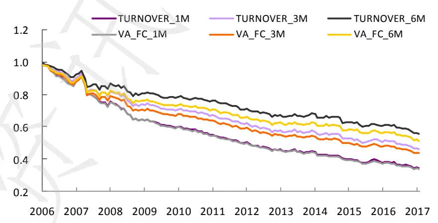
资料来源：Wind，光大证券研究所

流动性因子作为一个显著性较高的负向因子，其因子单调性却差强人意，下表就展示了流动性因子做行业中性的分层回溯后各组的历史年化收益情况：

图18：流动性因子测试结果（分组回溯年化收益率）
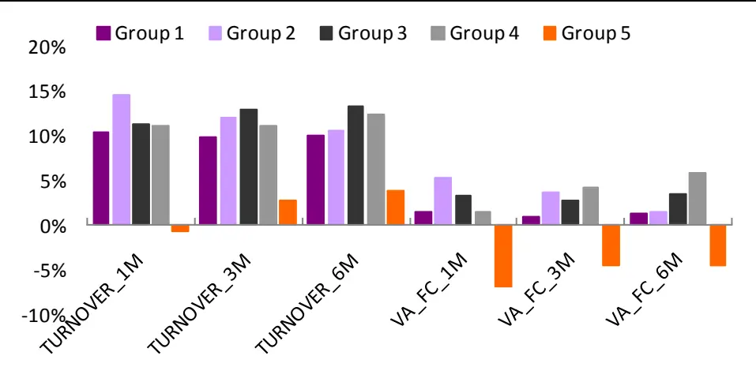
资料来源：Wind，光大证券研究所

表31：流动性因子测试结果（分层回溯年化收益率）

|  | Group 1 | Group 2 | Group 3 | Group 4 | Group 5 | Long_Short |
| --- | --- | --- | --- | --- | --- | --- |
| TURNOVER_1M | 10.3% | 14.5% | 11.3% | 11.0% | -0.7% | -8.5% |
| TURNOVER_3M | 9.8% | 12.0% | 12.9% | 11.0% | 2.8% | -4.9% |
| TURNOVER_6M | 10.0% | 10.6% | 13.3% | 12.4% | 3.8% | -4.2% |
| VA_FC_1M | 1.4% | 5.3% | 3.3% | 1.4% | -6.9% | -6.6% |
| VA_FC_3M | 0.9% | 3.7% | 2.7% | 4.1% | -4.5% | -3.8% |
| VA_FC_6M | 1.4% | 1.4% | 3.5% | 5.8% | -4.6% | -4.4% |

资料来源：Wind，光大证券研究所

由上表可见，流动性因子整体的因子收益和 IC 值表现都非常出色，单调性表现较差。同时，我们统计了流动性因子历史 IC 值序列的相关性，发现它们之间存在着非常强的共线性特征，也因此我们在筛选流动性因子时需要有所取舍。

表32：流动性因子历史 IC值相关性检验
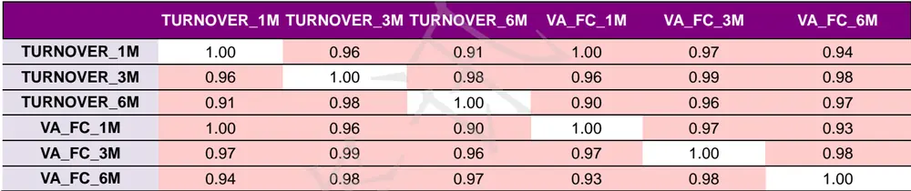
资料来源：Wind，光大证券研究所

## 2.9、技术因子测试结果

技术因子顾名思义是由技术指标构造的因子，由于技术指标数量众多，我们在这里仅仅选取了几个常见且显著性较高的因子。同时需要注意的是，由于技术指标大多数对于股票的风格偏好敏感性不强，在因子测试时就无需做风格中性的处理了。我们测试的技术因子详细列表如下：

表 33：技术因子明细表

| 因子代码 | 因子名称 |
| --- | --- |
| DEA | 异同平均数 |
| DIFF | 差离值 |
| KDJ | 随机指标 |
| MACD | 平滑移动平均线 |
| SOBV | 能量潮 |
| RSI | 相对强弱 |

资料来源：光大证券研究所

在计算上述技术指标时我们均使用默认的参数，例如计算KDJ 时的三个时间分别取9 日，3 日和 3 日。首先给出根据因子测试框架得到的技术因子的因子收益，IC 值等等测试结果：

表34：技术因子测试结果（因子收益&IC_IR）

|  | Factor Mean Return | Factor Return tstat | abs(t_value) mean | Factor t_value positive per | IC mean | IC positive per | IC std | IC > 0.02 per | IR |
| --- | --- | --- | --- | --- | --- | --- | --- | --- | --- |
| DEA | -0.2% | -1.39 | 3.55 | 38.1% | -1.8% | 36.6% | 10.8% | 29.1% | -0.17 |
| DIFF | -0.4% | -3.21 | 4.67 | 37.3% | -3.9% | 34.3% | 12.5% | 27.6% | -0.31 |
| KDJ | -0.2% | -2.21 | 3.90 | 42.2% | -2.4% | 40.7% | 10.6% | 31.9% | -0.22 |
| MACD | -0.2% | -1.43 | 4.01 | 46.7% | -2.0% | 42.2% | 11.2% | 32.6% | -0.18 |
| SOBV | -0.3% | -2.40 | 4.21 | 35.1% | -2.7% | 35.8% | 11.2% | 29.9% | -0.24 |
| RSI | -0.6% | -5.02 | 5.75 | 26.1% | -5.5% | 27.6% | 11.3% | 22.4% | -0.49 |

资料来源：Wind，光大证券研究所

通过累积多期截面回归得到的因子收益率序列，我们也可以更直观的观察到各个细分因子的历史收益率累积情况，比较因子之间的收益率表现。

图 19：技术因子累积收益率
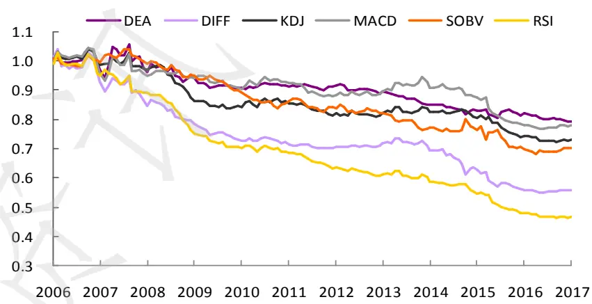
资料来源：Wind，光大证券研究所

下表展示了技术因子做行业中性的分层回溯后各组的历史年化收益情况：

图20：技术因子测试结果（分组回溯年化收益率）
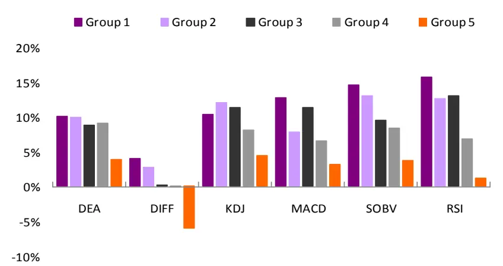
资料来源：Wind，光大证券研究所

表 35：技术因子测试结果（分层回溯年化收益率）

|  | Group 1 | Group 2 | Group 3 | Group 4 | Group 5 | Long_Short |
| --- | --- | --- | --- | --- | --- | --- |
| DEA | 10.1% | 9.9% | 8.9% | 9.0% | 3.9% | -6.4% |
| DIFF | 4.0% | 2.7% | 0.2% | 0.0% | -6.1% | -10.3% |
| KDJ | 10.4% | 12.1% | 11.4% | 8.2% | 4.4% | -6.2% |
| MACD | 12.8% | 7.8% | 11.3% | 6.6% | 3.1% | -9.3% |
| SOBV | 14.7% | 13.1% | 9.5% | 8.4% | 3.7% | -9.4% |
| RSI | 15.8% | 12.7% | 13.0% | 6.9% | 1.2% | -13.0% |

资料来源：Wind，光大证券研究所

技术因子整体的因子收益和 IC值表现较好，其中SOBV和RSI相对强弱指标的收益率最高。下表统计了技术因子历史 IC 值序列的相关性，同时我们发现 SOBV 与 RSI 的 IC 值相关系数非常接近 0，可见技术因子的选择余地更大，多个因子的组合也成为一种可能。

表36：技术因子历史IC值相关性检验

|  | DEA | DIFF | KDJ | MACD | SOBV | RSI |
| --- | --- | --- | --- | --- | --- | --- |
| DEA | 1.00 | 0.69 | 0.44 | 0.55 | 0.07 | 0.32 |
| DIFF | 0.69 | 1.00 | 0.62 | 0.69 | -0.13 | 0.54 |
| KDJ | 0.44 | 0.62 | 1.00 | 0.75 | 0.01 | 0.92 |
| MACD | 0.55 | 0.69 | 0.75 | 1.00 | -0.05 | 0.67 |
| SOBV | 0.07 | -0.13 | 0.01 | -0.05 | 1.00 | 0.06 |
| RSI | 0.32 | 0.54 | 0.92 | 0.67 | 0.06 | 1.00 |

资料来源：Wind，光大证券研究所

## 2.10、分析师因子测试结果

分析师因子，或者预期因子，是非常重要的一类直接给出市场预期和市场情绪的因子。我们利用朝阳永续数据库中的卖方一致预期数据，构建了一个基表全面的分析师预期因子库。：

表 37：分析师因子明细表

| 因子代码 | 因子名称 |
| --- | --- |
| FORE_Earning | 一致预期净利润 |
| EEChange_1M | 一致预期净利润变化率1M |
| EEChange_3M | 一致预期净利润变化率3M |
| EEP | 一致预期EP |
| EINS_10D | 预测机构数 10D |
| EINS_25D | 预测机构数 25D |
| EINS_75D | 预测机构数 75D |
| FORE_EPS | 一致预期 EPS |
| EEPSChange_1M | 一致预期 EPS 变化 1M |
| EEPSChange_3M | 一致预期 EPS 变化 3M |
| RPP_10D | 预测报告数量 10D |
| RPP_25D | 预测报告数量 25D |
| RPP_75D | 预测报告数量75D |
| FORE_OP | 一致预期营业收入 |
| EOPChange_1M | 一致预期营业收入变化1M |
| EOPChange_3M | 一致预期营业收入变化3M |
| SCORE_AVRG | 平均评级 |
| RatingChange_1M | 评级变化 1M |
| RatingChange_3M | 评级变化 3M |
| TargetReturn | 一致预期目标价/收盘价-1 |

资料来源：Wind，朝阳永续，光大证券研究所

类似的，我们首先给出根据因子测试框架得到的分析师预期因子的因子收益，IC 值等等测试结果：

表38：分析师预期因子测试结果（因子收益&IC_IR）

|  | Factor Mean Return | Factor Return tstat | abs(t_value ) mean | t_value positive per | IC mean | IC positive per | IC std | IC > 0.02 per | IR |
| --- | --- | --- | --- | --- | --- | --- | --- | --- | --- |
| EEChange_1M | 0.1% | 2.58 | 0.81 | 48.1% | 1.2% | 51.9% | 4.7% | 38.3% | 0.25 |
| EEChange_3M | 0.1% | 3.62 | 0.97 | 58.0% | 1.5% | 58.0% | 6.3% | 48.9% | 0.24 |
| EEP | 0.4% | 3.73 | 3.42 | 61.2% | 3.6% | 62.7% | 9.9% | 51.5% | 0.37 |
| EINS_10D | 0.0% | -0.70 | 1.12 | 17.0% | 0.0% | 20.0% | 3.7% | 13.3% | 0.01 |
| EINS_25D | 0.0% | 0.01 | 2.34 | 37.0% | 0.2% | 41.5% | 6.1% | 28.9% | 0.03 |
| EINS_75D | 0.2% | 1.95 | 3.78 | 51.9% | 1.1% | 49.6% | 10.2% | 43.7% | 0.11 |
| EEPSChange1M | 0.1% | 2.56 | 0.86 | 48.9% | 1.3% | 55.6% | 4.6% | 40.6% | 0.28 |
| EEPSChange3M | 0.1% | 3.40 | 0.99 | 58.8% | 1.5% | 61.1% | 6.0% | 47.3% | 0.26 |
| RPP_10D | 0.0% | -0.75 | 1.13 | 17.8% | 0.0% | 19.3% | 3.6% | 13.3% | 0.01 |
| RPP_25D | 0.0% | -0.16 | 2.33 | 37.8% | 0.2% | 40.7% | 6.0% | 28.9% | 0.03 |
| RPP_75D | 0.2% | 1.94 | 3.65 | 49.6% | 1.2% | 51.1% | 9.6% | 42.2% | 0.12 |
| FORE_Earning | 0.0% | 1.01 | 0.83 | 58.2% | 3.5% | 59.0% | 10.0% | 51.5% | 0.35 |
| FORE_EPS | 0.2% | 1.52 | 3.01 | 52.2% | 1.7% | 50.0% | 10.9% | 43.3% | 0.15 |
| FORE_OP | 0.1% | 1.85 | 0.94 | 52.2% | 2.6% | 60.4% | 8.6% | 55.2% | 0.30 |
| EOPChange_1M | 0.1% | 2.47 | 0.87 | 47.4% | 1.4% | 55.6% | 3.5% | 35.3% | 0.40 |
| EOPChange_3M | 0.1% | 2.87 | 1.10 | 55.7% | 1.6% | 58.0% | 5.1% | 42.0% | 0.31 |
| RatingChage1M | 0.1% | 3.89 | 0.91 | 64.7% | 0.9% | 63.2% | 2.7% | 35.3% | 0.35 |
| RatingChage3M | 0.1% | 3.46 | 1.17 | 59.5% | 0.8% | 56.5% | 3.3% | 35.9% | 0.25 |
| SCORE_AVRG | 0.1% | 1.95 | 2.86 | 53.7% | 1.3% | 56.7% | 7.6% | 46.3% | 0.17 |
| TargetReturn | 0.3% | 6.39 | 2.26 | 74.6% | 3.6% | 76.1% | 5.7% | 61.2% | 0.63 |

资料来源：Wind，朝阳永续，光大证券研究所

通过累积多期截面回归得到的因子收益率序列，我们也可以更直观的观察到各个细分因子的历史收益率累积情况，比较因子之间的收益率表现。

图 21：分析师预期因子累积收益率（部分）
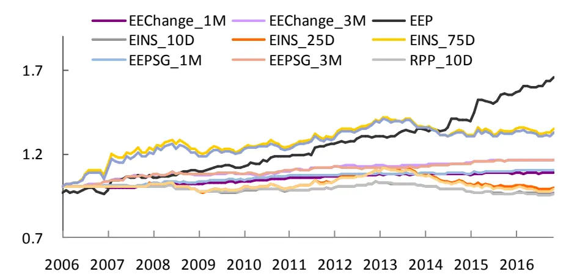
资料来源：Wind，朝阳永续，光大证券研究所

图 22：分析师预期因子累积收益率（部分）
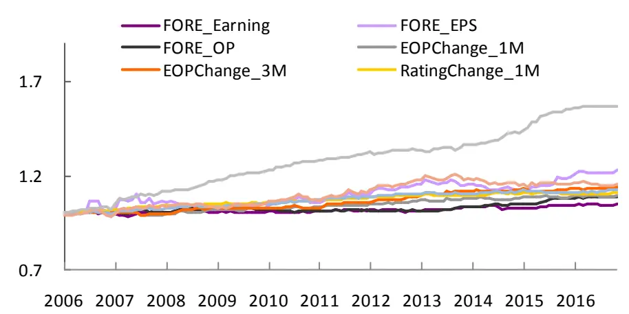
资料来源：Wind，朝阳永续，光大证券研究所

分析师预期因子大部分都是正面的因子，其单调性表现则各有千秋，下表就展示了分析师预期因子做行业中性的分层回溯后各组的历史年化收益情况：

图23：分析师因子测试结果（分组回溯年化收益率）
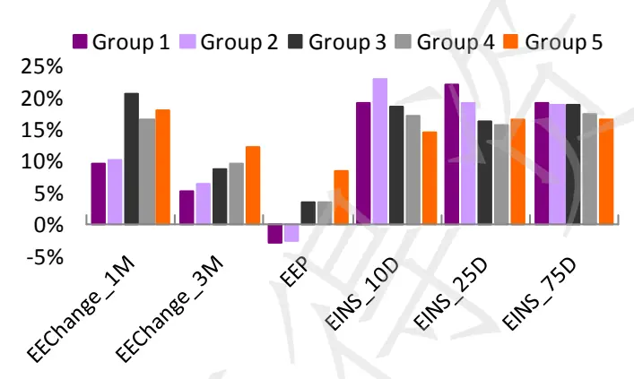
资料来源：Wind，朝阳永续，光大证券研究所

图24：分析师因子测试结果（分组回溯年化收益率）
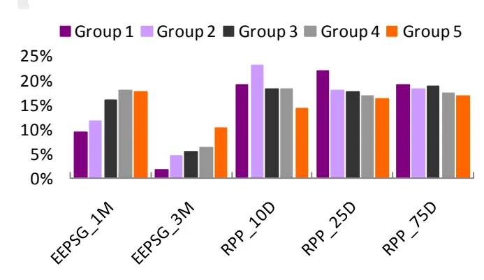
资料来源：Wind，朝阳永续，光大证券研究所

图25：分析师因子测试结果（分组回溯年化收益率）
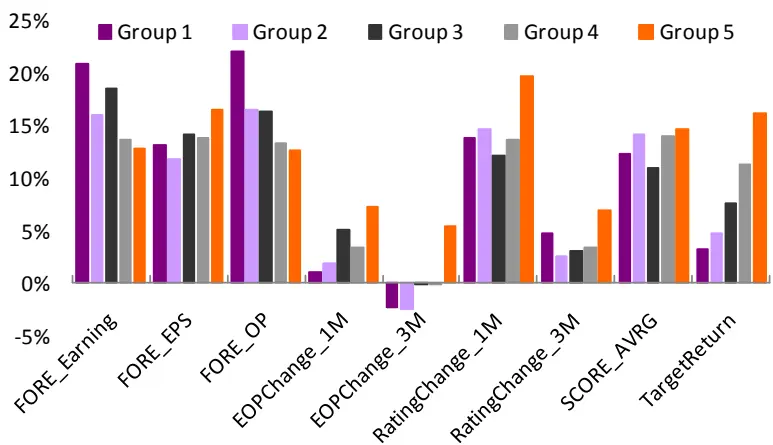
资料来源：Wind，朝阳永续，光大证券研究所

表39：分析师预期因子测试结果（分层回溯年化收益率）

|  | Group 1 | Group 2 | Group 3 | Group 4 | Group 5 | Long_Short |
| --- | --- | --- | --- | --- | --- | --- |
| EEChange_1M | 9.5% | 10.2% | 20.7% | 16.4% | 17.9% | 7.3% |
| EEChange_3M | 5.3% | 6.5% | 8.6% | 9.4% | 12.1% | 6.7% |
| EEP | -3.0% | -2.6% | 3.3% | 3.3% | 8.5% | 9.7% |
| EINS_10D | 19.1% | 22.9% | 18.7% | 17.1% | 14.6% | -5.3% |
| EINS_25D | 22.0% | 19.1% | 16.4% | 15.7% | 16.6% | -5.6% |
| EINS_75D | 19.2% | 18.9% | 18.8% | 17.5% | 16.5% | -3.9% |
| EEPSG_1M | 9.4% | 11.6% | 16.0% | 17.9% | 17.5% | 6.9% |
| EEPSG_3M | 1.8% | 4.5% | 5.5% | 6.1% | 10.3% | 8.4% |
| RPP_10D | 19.0% | 23.0% | 18.2% | 18.2% | 14.3% | -5.4% |
| RPP_25D | 22.0% | 17.9% | 17.6% | 16.8% | 16.2% | -5.9% |
| RPP_75D | 19.2% | 18.2% | 18.7% | 17.3% | 16.7% | -3.6% |
| FORE_Earning | 20.9% | 16.1% | 18.5% | 13.8% | 12.8% | -9.6% |
| FORE_EPS | 13.3% | 11.9% | 14.2% | 13.8% | 16.6% | 2.3% |
| FORE_OP | 22.2% | 16.6% | 16.5% | 13.4% | 12.7% | -10.3% |
| EOPChange_1M | 1.0% | 1.8% | 5.1% | 3.5% | 7.3% | 6.0% |
| EOPChange_3M | -2.2% | -2.4% | -0.2% | 0.0% | 5.5% | 7.8% |
| RatingChange_1M | 13.8% | 14.7% | 12.2% | 13.7% | 19.7% | 5.1% |
| RatingChange_3M | 4.8% | 2.5% | 3.0% | 3.5% | 6.9% | 1.8% |
| SCORE_AVRG | 12.3% | 14.2% | 11.1% | 14.1% | 14.6% | 1.4% |
| TargetReturn | 3.2% | 4.8% | 7.6% | 11.3% | 16.3% | 12.6% |

资料来源：Wind，朝阳永续，光大证券研究所

由上表可见，TargetReturn、EEP、EOPChange_1M 等因子的因子收益和IC 值表现都非常出色。我们统计了分析师因子历史 IC 值序列的相关性，发现它们之间的共线性相对较弱。而这其中很可能的原因是预期类的因子覆盖率较低，大部分的一致预期因子只能覆盖60-70%的全A 股票，因此IC 值的相关性较弱。

表40：分析师预期因子历史 IC值相关性检验

|  | EEChan ge_1M | EEChan ge_3M | EEP | EINS_10 EINS_25 EINS_75 D | D | D | EEPSG 1M | EEPSG 3M | RPP_10 D | RPP_25 RPP_75 D D | FORE_E arning | FORE_E PS | P | FORE_O EOPCha EOPCha RatingC RatingC | nge_1M nge_3M | hange_ | hange_ | SCORE_ | TargetR AVRG eturn |
| --- | --- | --- | --- | --- | --- | --- | --- | --- | --- | --- | --- | --- | --- | --- | --- | --- | --- | --- | --- |
| EEChange_1M | 1.00 | 0.44 | 0.20 | 0.20 | 0.26 | 0.33 | 0.92 | 0.39 | 0.19 0.25 | 0.33 | -0.24 | 0.34 | -0.30 | 0.26 | 0.30 | 0.12 | 0.23 | 0.34 | 0.10 |
| EEChange_3M | 0.44 | 1.00 | 0.22 | 0.30 | 0.40 | 0.52 | 0.47 | 0.92 0.29 | 0.39 | 0.52 | -0.30 | 0.51 | -0.41 | 0.28 | 0.63 | 0.11 | 0.32 | 0.51 | -0.13 |
| EEP | 0.20 | 0.22 | 1.00 | 0.15 | 0.28 | 0.59 | 0.09 | 0.21 | 0.14 0.27 | 0.57 | -0.49 | 0.62 | -0.51 | 0.09 | -0.04 | -0.08 | 0.08 | 0.48 | 0.43 |
| EINS_10D | 0.20 | 0.30 | 0.15 | 1.00 | 0.70 | 0.49 | 0.20 | 0.28 | 1.00 0.70 | 0.50 | -0.01 | 0.42 | -0.13 | 0.29 | 0.30 | -0.10 | -0.04 | 0.48 | 0.05 |
| EINS_25D | 0.26 | 0.40 | 0.28 | 0.70 | 1.00 | 0.74 | 0.23 | 0.32 | 0.70 1.00 | 0.75 | -0.06 | 0.61 | -0.20 | 0.23 | 0.38 | -0.09 | 0.09 | 0.77 | -0.07 |
| EINS_75D | 0.33 | 0.52 | 0.59 | 0.49 | 0.74 | 1.00 | 0.26 | 0.39 0.49 | 0.73 | 1.00 | -0.32 | 0.86 | -0.50 | 0.15 | 0.34 | -0.04 | 0.23 | 0.85 | 0.17 |
| EEPSG_1M | 0.92 | 0.47 | 0.09 | 0.20 | 0.23 | 0.26 | 1.00 | 0.46 | 0.19 0.22 | 0.25 | -0.16 | 0.26 | -0.23 | 0.23 | 0.31 | 0.12 | 0.23 | 0.29 | 0.03 |
| EEPSG_3M | 0.39 | 0.92 | 0.21 | 0.28 | 0.32 | 0.39 | 0.46 | 1.00 | 0.28 0.32 | 0.39 | -0.31 | 0.40 | -0.38 | 0.27 | 0.51 | 0.15 | 0.31 | 0.40 | -0.16 |
| RPP_10D | 0.19 | 0.29 | 0.14 | 1.00 | 0.70 | 0.49 | 0.19 | 0.28 1.00 | 0.70 | 0.49 | -0.01 | 0.42 | -0.12 | 0.28 | 0.30 | -0.10 | -0.04 | 0.48 | 0.04 |
| RPP_25D | 0.25 | 0.39 | 0.27 | 0.70 | 1.00 | 0.73 | 0.22 | 0.32 | 0.70 1.00 | 0.75 | -0.05 | 0.61 | -0.19 | 0.22 | 0.37 | -0.08 | 0.09 | 0.76 | -0.06 |
| RPP_75D | 0.33 | 0.52 | 0.57 | 0.50 | 0.75 | 1.00 | 0.25 | 0.39 | 0.49 0.75 | 1.00 | -0.28 | 0.86 | -0.47 | 0.15 | 0.35 | -0.04 | 0.22 | 0.86 | 0.16 |
| FORE_Earning | -0.24 | -0.30 | -0.49 | -0.01 | -0.06 | -0.32 | -0.16 | -0.31 -0.01 | -0.05 | -0.28 | 1.00 | -0.22 | 0.90 | 0.02 | 0.00 | -0.14 | -0.18 | -0.18 | -0.17 |
| FORE_EPS | 0.34 | 0.51 | 0.62 | 0.42 | 0.61 | 0.86 | 0.26 | 0.40 | 0.42 0.61 | 0.86 | -0.22 | 1.00 | -0.42 | 0.21 | 0.33 | 0.01 | 0.24 | 0.81 | 0.19 |
| FORE_OP | -0.30 | -0.41 | -0.51 | -0.13 | -0.20 | -0.50 | -0.23 | -0.38 -0.12 | -0.19 | -0.47 | 0.90 | -0.42 | 1.00 | -0.07 | -0.14 | -0.13 | -0.24 | -0.40 | -0.22 |
| EOPChange_1M | 0.26 | 0.28 | 0.09 | 0.29 | 0.23 | 0.15 | 0.23 | 0.27 0.28 | 0.22 | 0.15 | 0.02 | 0.21 | -0.07 | 1.00 | 0.48 | 0.15 | 0.13 | 0.18 | -0.08 |
| EOPChange_3M | 0.30 | 0.63 | -0.04 | 0.30 | 0.38 | 0.34 | 0.31 | 0.51 0.30 | 0.37 | 0.35 | 0.00 | 0.33 | -0.14 | 0.48 | 1.00 | 0.09 | 0.23 | 0.39 | -0.31 |
| RatingChange_1M | 0.12 | 0.11 | -0.08 | -0.10 | -0.09 | -0.04 | 0.12 | 0.15 -0.10 | -0.08 | -0.04 | -0.14 | 0.01 | -0.13 | 0.15 | 0.09 | 1.00 | 0.41 | -0.04 | -0.05 |
| RatingChange_3M | 0.23 | 0.32 | 0.08 | -0.04 | 0.09 | 0.23 | 0.23 | 0.31 | -0.04 0.09 | 0.22 | -0.18 | 0.24 | -0.24 | 0.13 | 0.23 | 0.41 | 1.00 | 0.32 | -0.10 |
| SCORE_AVRG | 0.34 | 0.51 | 0.48 | 0.48 | 0.77 | 0.85 | 0.29 | 0.40 | 0.48 0.76 | 0.86 | -0.18 | 0.81 | -0.40 | 0.18 | 0.39 | -0.04 | 0.32 | 1.00 | 0.10 |
| TargetReturn | 0.10 | -0.13 | 0.43 | 0.05 | -0.07 | 0.17 | 0.03 | -0.16 | 0.04 | -0.06 0.16 | -0.17 | 0.19 | -0.22 | -0.08 | -0.31 | -0.05 | -0.10 | 0.10 | 1.00 |

资料来源：Wind，朝阳永续，光大证券研究所

## 3、因子测试结果小结

## 1、 行情类因子有效性整体高于财务类因子：

行情类因子中的流动性因子、波动因子、动量因子的显著性均普遍具有很高的显著性，因子收益率与IC 值、IR 值也普遍高于财务类因子。

我们简单排序后列出了因子库中历史 IR 值最高的 30 个因子，如下表所示，30 个因子中共包含 7 个财务类因子、3 个预期类因子、20 个行情类因子：

表 41：全部因子历史 IR 值排名前 30

| Factor Mean |  | IC mean | IC std | abs(t_value) mean | IR |
| --- | --- | --- | --- | --- | --- |
| VSTD_1M | Return -0.64% |  |  |  |  |
|  |  | -0.07 | 0.08 | 2.80 | -0.82 |
| Momentum_1M_Max | -0.58% | -0.07 | 0.08 | 3.95 | -0.81 |
| Momentum_1M | -0.92% | -0.08 | 0.11 | 5.39 | -0.75 |
| TargetReturn | 0.34% | 0.04 | 0.06 | 2.26 | 0.63 |
| Momentum_3M | -0.88% | -0.08 | 0.12 | 5.60 | -0.62 |
| VSTD_3M | -0.48% | -0.05 | 0.08 | 2.47 | -0.60 |
| Momentum_6M | -0.76% | -0.06 | 0.12 | 5.13 | -0.55 |
| VA_FC_1M | -0.79% | -0.07 | 0.13 | 5.85 | -0.51 |
| Momentum_24M | -0.59% | -0.06 | 0.11 | 4.75 | -0.50 |
| VSTD_6M | -0.38% | -0.04 | 0.08 | 2.26 | -0.49 |
| TURNOVER_1M | -0.78% | -0.07 | 0.13 | 5.98 | -0.49 |
| RSI BP_LR | -0.56% 0.49% | -0.06 0.05 | 0.11 0.11 | 5.75 4.47 | -0.49 0.48 |

| STD_1M | -0.59% -0.06 0.12 5.21 -0.47 |
| --- | --- |
| E2P_TTM | 0.51% 0.05 0.11 4.39 0.46 |
| Momentum_12M | -0.60% -0.05 0.12 4.96 -0.44 |
| STD_3M | -0.56% -0.05 0.13 5.25 -0.41 |
| Ln_MC | -0.52% -0.07 0.17 6.90 -0.40 |
| EOPChange_1M | 0.07% 0.01 0.04 0.87 0.40 |
| MC | -0.44% -0.06 0.16 6.58 -0.39 |
| VA_FC_3M | -0.61% -0.05 0.13 5.64 -0.38 |
| EEP | 0.39% 0.04 0.10 3.42 0.37 |
| Ln_FC | -0.45% -0.06 0.16 6.68 -0.36 |
| FORE_Earning | 0.03% 0.04 0.10 0.83 0.35 |
| STD_6M | -0.46% -0.05 0.13 4.87 -0.35 |
| RatingChange1M | 0.08% 0.01 0.03 0.91 0.35 |
| TURNOVER_3M | -0.56% -0.05 0.13 5.58 -0.34 |
| HighLow_1M | -0.48% -0.04 0.12 5.21 -0.34 |
| FC | -0.39% -0.05 0.16 6.41 -0.33 |
| EV2EBITDA | -0.35% -0.03 0.10 3.15 -0.33 |

资料来源：Wind，朝阳永续，光大证券研究所

## 2、 分析师预期因子值得关注：

分析师因子中的一致预期目标价（TargetReturn）、一致预期营业收入 1个月增长率等等因子的 IC 和 IR 值较高，历史的收益率排名可进入前 20。

## 3、 多因子组合构建：

在多因子系列报告的第三篇报告中，我们将运用本文提供的因子测试结果，构建基于因子IC和IR的动态最优化因子权重的光大金工alpha多因子模型。

## 分析师声明

负责准备本报告以及撰写本报告的所有研究分析师或工作人员在此保证，本研究报告中关于任何发行商或证券所发表的观点均如实反映分析人员的个人观点。负责准备本报告的分析师获取报酬的评判因素包括研究的质量和准确性、客户的反馈、竞争性因素以及光大证券股份有限公司的整体收益。所有研究分析师或工作人员保证他们报酬的任何一部分不曾与，不与，也将不会与本报告中具体的推荐意见或观点有直接或间接的联系。

## 分析师介绍

刘均伟 金融工程首席分析师 复旦大学学士，上海财经大学硕士，10 年金融工程研究经验。现任职于光大证券研究所，研究领域为衍生品及量化投资。

## 行业及公司评级体系

买入—未来6-12 个月的投资收益率领先市场基准指数15%以上；

增持—未来 6-12 个月的投资收益率领先市场基准指数 5%至 15%；

中性—未来6-12 个月的投资收益率与市场基准指数的变动幅度相差-5%至5%；

减持—未来 6-12 个月的投资收益率落后市场基准指数 5%至 15%；

卖出—未来 6-12 个月的投资收益率落后市场基准指数 15%以上；

无评级—因无法获取必要的资料，或者公司面临无法预见结果的重大不确定性事件，或者其他原因，致使无法给出明确的投资评级。

市场基准指数为沪深 300指数。

## 分析、估值方法的局限性说明

本报告所包含的分析基于各种假设，不同假设可能导致分析结果出现重大不同。本报告采用的各种估值方法及模型均有其局限性，估值结果不保证所涉及证券能够在该价格交易。

## 特别声明

光大证券股份有限公司（以下简称“本公司”）创建于 1996 年，系由中国光大（集团）总公司投资控股的全国性综合类股份制证券公司，是中国证监会批准的首批三家创新试点公司之一。公司经营业务许可证编号：z22831000。

公司经营范围：证券经纪；证券投资咨询；与证券交易、证券投资活动有关的财务顾问；证券承销与保荐；证券自营；为期货公司提供中间介绍业务；证券投资基金代销；融资融券业务；中国证监会批准的其他业务。此外，公司还通过全资或控股子公司开展资产管理、直接投资、期货、基金管理以及香港证券业务。

本证券研究报告由光大证券股份有限公司研究所（以下简称“光大证券研究所”）编写，以合法获得的我们相信为可靠、准确、完整的信息为基础，但不保证我们所获得的原始信息以及报告所载信息之准确性和完整性。光大证券研究所可能将不时补充、修订或更新有关信息，但不保证及时发布该等更新。

本报告根据中华人民共和国法律在中华人民共和国境内分发，仅供本公司的客户使用。

本报告中的资料、意见、预测均反映报告初次发布时光大证券研究所的判断，可能需随时进行调整。报告中的信息或所表达的意见不构成任何投资、法律、会计或税务方面的最终操作建议，本公司不就任何人依据报告中的内容而最终操作建议作出任何形式的保证和承诺。

在法律允许的情况下，本公司及其附属机构可能持有报告中提及的公司所发行证券的头寸并进行交易，也可能为这些公司提供或正在争取提供投资银行、财务顾问或金融产品等相关服务。投资者应当充分考虑本公司及本公司附属机构就报告内容可能存在的利益冲突，不应视本报告为作出投资决策的唯一参考因素。

在任何情况下，本报告中的信息或所表达的建议并不构成对任何投资人的投资建议，本公司及其附属机构（包括光大证券研究所）不对投资者买卖有关公司股份而产生的盈亏承担责任。

本公司的销售人员、交易人员和其他专业人员可能会向客户提供与本报告中观点不同的口头或书面评论或交易策略。本公司的资产管理部和投资业务部可能会作出与本报告的推荐不相一致的投资决策。本公司提醒投资者注意并理解投资证券及投资产品存在的风险，在作出投资决策前，建议投资者务必向专业人士咨询并谨慎抉择。

本报告的版权仅归本公司所有，任何机构和个人未经书面许可不得以任何形式翻版、复制、刊登、发表、篡改或者引用。

## 光大证券股份有限公司研究所销售交易总部

上海市新闸路 1508 号静安国际广场 3 楼 邮编 200040

总机：021-22169999 传真：021-22169114、22169134

| 销售交易总部 | 姓名 | 办公电话 | 手机 | 电子邮件 |
| --- | --- | --- | --- | --- |
| 上海 | 陈蓉 | 021-22169086 | 13801605631 | chenrong@ebscn.com |
|  | 濮维娜 | 021-62158036 | 13611990668 | puwn@ebscn.com |
|  | 胡超 | 021-22167056 | 13761102952 | huchao6@ebscn.com |
|  | 周薇薇 | 021-22169087 | 13671735383 | zhouww1@ebscn.com |
|  | 李强 | 021-22169131 | 18621590998 | liqiang88@ebscn.com |
|  | 罗德锦 | 021-22169146 | 13661875949/13609618940 | luodj@ebscn.com |
|  | 张弓 | 021-22169083 | 13918550549 | zhanggong@ebscn.com |
|  | 黄素青 | 021-22169130 | 13162521110 | huangsuqing@ebscn.com |
|  | 邢可 | 021-22167108 | 15618296961 | xingk@ebscn.com |
|  | 陈晨 | 021-22169150 | 15000608292 | chenchen66@ebscn.com |
|  | 王昕宇 | 021-22167233 | 15216717824 | wangxinyu@ebscn.com |
| 北京 | 郝辉 | 010-58452028 | 13511017986 | haohui@ebscn.com |
|  | 梁晨 | 010-58452025 | 13901184256 | liangchen@ebscn.com |
|  | 郭晓远 | 010-58452029 | 15120072716 | guoxiaoyuan@ebscn.com |
|  | 王曦 | 010-58452036 | 18610717900 | wangxi@ebscn.com |
|  | 关明雨 | 010-58452037 | 18516227399 | guanmy@ebscn.com |
|  | 张彦斌 | 010-58452026 | 15135130865 | zhangyanbin@ebscn.com |
| 深圳 | 黎晓宇 | 0755-83553559 | 13823771340 | lixy1@ebscn.com |
|  | 李潇 | 0755-83559378 | 13631517757 | lixiao1@ebscn.com |
|  | 张亦潇 | 0755-23996409 | 13725559855 | zhangyx@ebscn.com |
|  | 王渊锋 | 0755-83551458 | 18576778603 | wangyuanfeng@ebscn.com |
|  | 张靖雯 | 0755-83553249 | 18589058561 | zhangjingwen@ebscn.com |
|  | 牟俊宇 | 0755-83552459 | 13827421872 | moujy@ebscn.com |
| 国际业务 | 陶奕 | 021-22167107 | 18018609199 | taoyi@ebscn.com |
|  | 戚德文 | 021-22167111 | 18101889111 | qidw@ebscn.com |
|  | 金英光 | 021-22169085 | 13311088991 | jinyg@ebscn.com |
|  | 傅裕 | 021-22169092 | 13564655558 | fuyu@ebscn.com |