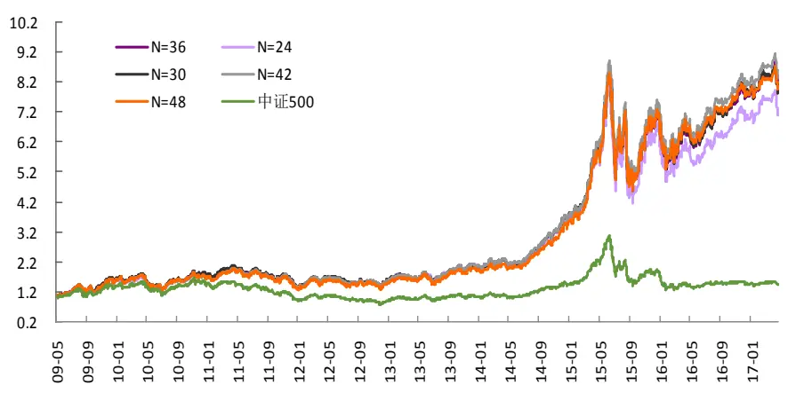
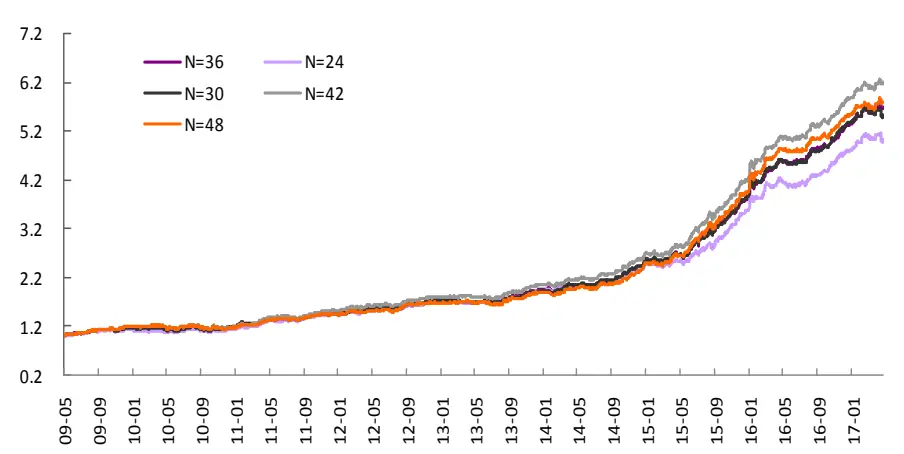
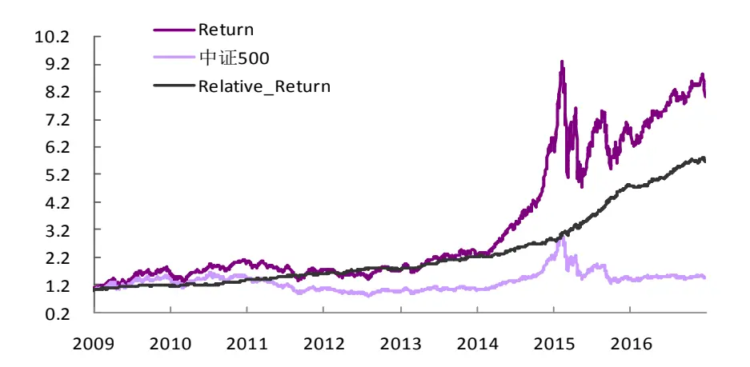
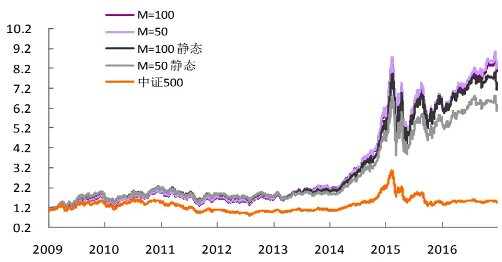
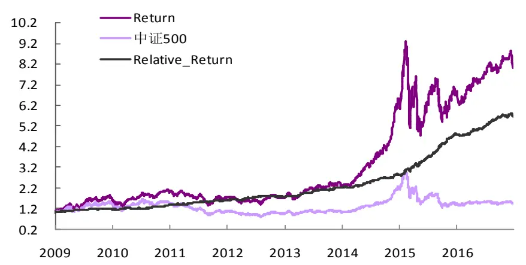

# 多因子组合“光大 Alpha 1.0”

# —— 多因子系列报告之三

## 光大金工因子测试框架：多指标全面测试

通过分期截面RLM回归计算因子收益，计算因子暴露与下期收益率的相关度IC值，同时结合分层回测法检验因子单调性，构建较为综合全面的因子测试体系。

因子测试中使用了包括因子收益序列 t值，因子累计收益率，因子测试t值，IC，IR，多空组合收益率、最大回撤、换手率等等指标

## 更为全面的因子库：

涵盖了估值因子，规模因子，成长因子，质量因子，杠杆因子，动量因子，波动因子，技术因子，流动性因子，分析师因子等共 10 大类 100多个细分因子。

## 多重指标筛选因子：

针对五大指标给因子表现打分，筛选出预测能力强，显著性高，单调性好，稳定性强的优质因子。筛选时使用的指标包括：因子收益（Factor_Ret）、因子收益显著性检验的 t 值（Factor_Ret_tvalue）、信息系数（IC）、信息比（IR）、单调性（Monotony）

## 动态最优化 IR——基于因子 IC：

在 Edward Qian《Quantitative Equity Portfolio Management》里提到的最优化单期 IR 的基础上，构建了动态调整的基于因子 IC 序列的最优化IR 组合。经参数敏感性测试，滚动 36 个月、持仓数量 150 只的等权加权组合表现最优，信息比为3.67，年化收益 31%。

经验证，动态调整模型信息比显著高于静态因子赋权模型，且等权模型表现优于复合因子得分加权模型。该篇报告是因子合成模型的初步探讨，未来我们将进一步深入挖掘能提供超额 alpha 的有效因子，优化多因子模型。

## 金融工程深度

## 分析师

刘均伟 (执业证书编号：S0930517040001)

021-22169151

liujunwei@ebscn.com

## 联系人

周萧潇

021-22167060

zhouxiaoxiao@ebscn.com

## 相关研报

《多因子系列报告之一：因子测试框架》2017-04-10

《因子测试全集——多因子系列报告之二》

2017-04-28

在多因子系列报告的前二篇报告中，我们构造了一个全面的基于 RLM 稳健回归的截面回归单因子测试框架，并整理了包括估值因子，规模因子，成长因子，质量因子，杠杆因子，动量因子，波动因子，技术因子，流动性因子，分析师因子等 11 各大类100 多个细分因子的因子收益、IC 值、单调性等等表现。

这篇报告中我们将首先按给定的标准基于前 2 篇报告的结论初步筛选因子，并且进一步构建一个基于因子 IC 的动态最优化IR多因子组合。

## 1、因子测试框架回顾

首先我们简单的回顾一下上一篇报告中的因子测试框架的主要内容，我们的多因子模型的构建流程包括以下几个方面：

## 1.1、样本筛选

测试样本范围：全体 A 股

测试样本期：2006-01-01 至 2017-04-01

为了使测试结果更符合投资逻辑，我们设定了三条样本筛选规则：

（1）剔除选股日的 ST/PT 股票；

（2）剔除上市不满一年的股票；

（3）剔除选股日由于停牌等原因而无法买入的股票。

## 1.2、数据清洗

我们采用稳健的 MAD（Median Absolute Deviation 绝对中位数法）

首先计算因子值的中位数Medianf，并定义绝对中位值为：

$$
MAD=median(\left|f_{i}-Median_{f}\right|)
$$

采取与 3σ法等价的方法，我们将大于 $Median_{f}+3*1.4826*MAD$ 的值或小于 $rMedian_{f}-3*1.4826*MAD$ 的值定义为异常值。

类似的，对缺失值的处理方式要依据缺失值的来源和逻辑解释，选取不同的操作，包括剔除或者以行业中位数替代。在单因子测试时，我们对缺失率小于 20%的因子数据用中信一级行业的中位数代替，当缺失率大于 20%时则做剔除处理。

## 1.3、因子标准化

常见的因子标准化方法包括：Z 值标准化（Z-Score），Rank标准化，风格标准化等等。由于 Rank 标准化后的数据会丢失原始样本的一些重要信息，这里我们仍然选择 Z 值标准化来处理因子数据。

## 1.4、因子测试模型

我们采取截面回归测试的方法，每期针对全体样本做一次回归，回归时因子暴露为已知变量，回归得到每期的一个因子收益值 ${\mathfrak{f}}_{j}$ .

进行截面回归判断每个单因子的收益情况和显著性时，需要特别关注 A股市场中一些显著影响个股收益率的因素，例如行业因素和市值因素。市值因子在过去的很长一段时间内都是A股市场上影响股票收益显著性极高的一个因子，为了能够在单因子测试时得到因子真正收益情况，我们在回归测试时对市值因子也做了剔除。

加入行业因子和市值因子后，单因子测试的回归方程如下所示：

$$
\begin{bmatrix}r_{ti}\\\vdots\\r_{tn}\end{bmatrix}=\begin{bmatrix}\beta_{t11}I_{t1u}&\cdots&I_{t1v}m_{t1m}\\\vdots&\vdots&\cdots&\vdots\quad\vdots\\\beta_{tn1}I_{tnu}&\cdots&I_{tnv}m_{tnm}\end{bmatrix}\cdot\begin{bmatrix}f_{ti}\\\vdots\\f_{tm}\end{bmatrix}+\begin{bmatrix}\mu_{ti}\\\vdots\\\mu_{tn}\end{bmatrix}
$$

其中：

$\beta_{tiu}$ 代表股票 i 在所测试因子上的因子暴露；

$I_{tiu}$ 代表股票i 的行业因子暴露 $(I_{tiu}$ 为哑变量（Dummy variable），即股票属于某个行业则该股票在该行业的因子暴露等于 1，在其他行业的因子暴露等于0）。此处我们将选用中信一级行业分类作为行业分类标准。

$m_{tim}$ 代表股票 i 的市值因子暴露。

Robust Regression 稳健回归常见于单因子回归测试，RLM 通过迭代的赋权回归可以有效的减小 OLS 最小二乘法中异常值（outliers）对参数估计结果有效性和稳定性的影响。详细的 RLM 回归方法的介绍请参考我们的《多因子系列报告之一：因子测试框架》。

## 1.5、因子有效性检验

采用多期截面RLM回归后我们可以得到因子收益序列f，以及每一期回归假设检验 t 检验的 t 值序列，针对这两个序列我们将通过以下几个指标来判断该因子的有效性以及稳定性：

（1） 因子收益序列fi的假设检验 t 值

（2） 因子收益序列fi大于 0 的概率

（3） t 值绝对值的均值

（4） t 值绝对值大于等于 2 的概率

IC 值（信息系数）是指个股第 t期在因子 i 上的因子暴露（剔除行业与市值后）与t+ 1期的收益率的相关系数。通过计算IC值可以有效的观察到某个因子收益率预测的稳定性和动量特征，以便在优化组合时用作筛选的指标。

我们采用Spearman的秩相关系数方法计算因子暴露与下期收益率的相关性IC 值。类似回归法的因子测试流程，我们在计算 IC 时同样做了行业和市值中性的处理。

类似的，我们关注以下几个与 IC 值相关的指标来判断因子的有效性和预测能力：

（1） IC 值的均值

（2） IC 值的标准差

（3） IC 大于 0 的比例

（4） IC 绝对值大于 0.02 的比例

（5） IR （IR = IC 均值/IC 标准差）

为了同时能够展示所检验因子的单调性以及多空组合的收益情况，我们通过分层打分回溯的方法作为补充。进行分层回溯时，我们在各期期末将全市场A 股按照因子值大小排序分成 5 等分，在分组时同样做行业中性处理，即在中信一级行业内做 5 等分组，组内市值加权。

## 2、因子的初步筛选

在《因子测试全集——多因子系列报告之二》中，我们对每一个大类因子内的细分因子都做了详尽的分析，具体测试了包括因子收益，因子收益显著性，因子 IC、IR，分层回溯收益、多空收益，历史 IC 序列相关性等等指标。具体的测试结果和指标数值请参考该篇报告。

首先，根据前期的测试结果，我们从 11 个大类因子中分别筛选出了收益率较显著，高 IC、IR 并且单调性得分较高的 44 个因子。具体的筛选标准如下表所示：

表 1：因子筛选标准明细表

| 筛选指标 | 指标说明 | 打分标准（绝对值） |
| --- | --- | --- |
| Factor_Ret | 最近60个月因子收益率均值 | >0.002 |
| Factor_Ret_tvalue | 最近60个月因子收益率t值 | >2 |
| IC | 信息系数 | >0.02 |
| IR | 信息比（基于IC） | >0.2 |
| Monotony | 单调性得分 | >2 |

资料来源：光大证券研究所，注：以上数据均为绝对值

其中，我们对单调性指标的得分计算标准做了如下的规定：

$$
\mathrm{Monotony\;Score}={\frac{\mathrm{R}_{5}-\mathrm{R}_{1}}{\mathrm{R}_{4}-\mathrm{R}_{2}}}
$$

其中， $\mathrm{R_{i}}$ 代表因子分层回溯法得到的第i组分组的年化收益率。

针对上表中5项打分标准中的每一项，满足以上打分标准则该因子在该项得分为 1，不满足则得分为 0。通过计算，5 项得分总分大于等于 3 的因子共计44个，具体的名单如下表所示：

表 2：综合打分初步筛选因子名单

|  | Factor Mean Return | Factor Return tstat | IC mean | IR | Total Score |
| --- | --- | --- | --- | --- | --- |
| BP_LR | 0.49% | 4.32 | 5.1% | 0.48 | 5 |
| B2P_TTM | 0.51% | 4.43 | 5.0% | 0.46 | 5 |
| FC | -0.39% | -2.36 | -5.3% | -0.33 | 5 |
| HighLow_1M | -0.48% | -4.15 | -3.9% | -0.34 | 5 |
| Ln_FC | -0.45% | -2.64 | -5.8% | -0.36 | 5 |
| Ln_MC | -0.52% | -2.94 | -6.8% | -0.40 | 5 |
| MC | -0.44% | -2.63 | -6.4% | -0.39 | 5 |
| Momentum_1M | -0.92% | -8.26 | -7.9% | -0.75 | 5 |
| Momentum_24M | -0.59% | -4.44 | -5.6% | -0.50 | 5 |
| Residual_Risk | -0.47% | -4.22 | -3.6% | -0.27 | 5 |
| RSI | -0.56% | -5.02 | -5.5% | -0.49 | 5 |
| STD_1M | -0.59% | -5.23 | -5.5% | -0.47 | 5 |
| STD_3M | -0.56% | -4.74 | -5.2% | -0.41 | 5 |
| TargetReturn | 0.34% | 6.39 | 3.6% | 0.63 | 5 |
| TURNOVER_1M | -0.78% | -5.90 | -6.6% | -0.49 | 5 |
| TURNOVER_3M | -0.56% | -4.42 | -4.6% | -0.34 | 5 |
| VA_FC_1M | -0.79% | -6.12 | -6.7% | -0.51 | 5 |
| VSTD_1M | -0.64% | -6.52 | -6.5% | -0.82 | 5 |
| VSTD_3M | -0.48% | -5.27 | -5.0% | -0.60 | 5 |
| DP_TTM | 0.26% | 4.14 | 2.1% | 0.31 | 4 |
| EEP | 0.39% | 3.73 | 3.6% | 0.37 | 4 |
| EV2EBITDA | -0.35% | -4.44 | -3.2% | -0.33 | 4 |
| Momentum_12M | -0.60% | -4.82 | -5.2% | -0.44 | 4 |
| Momentum_1M_Max | -0.58% | -7.50 | -6.6% | -0.81 | 4 |
| Momentum_3M | -0.88% | -6.72 | -7.6% | -0.62 | 4 |
| Momentum_6M | -0.76% | -6.04 | -6.4% | -0.55 | 4 |
| SOBV | -0.26% | -2.40 | -2.7% | -0.24 | 4 |
| SP_LYR | 0.23% | 3.03 | 2.7% | 0.31 | 4 |
| STD_6M | -0.46% | -4.09 | -4.6% | -0.35 | 4 |
| TURNOVER_6M | -0.43% | -3.54 | -3.3% | -0.25 | 4 |
| VA_FC_3M | -0.61% | -4.64 | -5.0% | -0.38 | 4 |
| VA_FC_6M | -0.48% | -3.78 | -3.9% | -0.29 | 4 |
| VSTD_6M | -0.38% | -4.50 | -4.0% | -0.49 | 4 |
| BP_TTM | 0.27% | 2.58 | 3.0% | 0.30 | 3 |
| EEChange_3M | 0.11% | 3.62 | 1.5% | 0.24 | 3 |
| EEPSChange_3M | 0.11% | 3.40 | 1.5% | 0.26 | 3 |
| EOPChange_1M | 0.07% | 2.47 | 1.4% | 0.40 | 3 |
| EOPChange_3M | 0.10% | 2.87 | 1.6% | 0.31 | 3 |
| EP_LYR | 0.15% | 1.93 | 2.0% | 0.24 | 3 |
| FORE_Earning | 0.03% | 1.01 | 3.5% | 0.35 | 3 |

| KDJ | -0.22% | -2.21 -2.4% | -0.22 3 |
| --- | --- | --- | --- |
| OPG_TTM | 0.16% | 1.70 1.6% | 0.21 3 |
| RatingChange_3M | 0.09% | 3.46 0.8% | 0.25 3 |
| OCFP_TTM | 0.10% | 3.10 1.5% | 0.33 3 |

资料来源：Wind，朝阳永续，光大证券研究所

通过以上标准筛选后我们得到细分因子共 44 个，但是由于技术面的动量和波动性这类因子历史收益和 IC 值均显著高于基本面的因子，而这个因子相互之间又具有很高的共线性，因此在处理这类因子时需要提高筛选标准，且有所取舍。

在《因子测试全集——多因子系列报告之二》中，我们对每一个大类因子内的细分因子都做了详尽的分析，具体测试了包括因子收益，因子收益显著性，因子 IC、IR，分层回溯收益、多空收益，历史 IC 序列相关性等等指标。根据这篇报告中给出的各个大类因子间的 IC 相关系数矩阵，可以进一步的在上述有效因子内筛选出显著性高且相互之间的共线性较低的因子。

例如在选择波动性因子时，我们发现表2中的波动因子占比很高，共有7 各因子最终得分超过 3 分。因此我们可以通过表中的波动因子 IC 相关系数矩阵来作为判断的依据做筛选：

表 3：波动因子历史 IC 值相关性检验

|  | HighLow 1M | HighLow 3M | HighLow 6M | STD_1M | STD_3M | STD_6M | VSTD_1M | VSTD_3M | VSTD_6M | Residual_Risk |
| --- | --- | --- | --- | --- | --- | --- | --- | --- | --- | --- |
| HighLow_1M | 1.00 | 0.87 | 0.79 | 0.82 | 0.79 | 0.74 | 0.35 | 0.34 | 0.29 | 0.68 |
| HighLow_3M | 0.87 | 1.00 | 0.92 | 0.85 | 0.85 | 0.78 | 0.37 | 0.38 | 0.33 | 0.71 |
| HighLow_6M | 0.79 | 0.92 | 1.00 | 0.82 | 0.84 | 0.81 | 0.35 | 0.35 | 0.32 | 0.72 |
| STD_1M | 0.82 | 0.85 | 0.82 | 1.00 | 0.94 | 0.87 | 0.43 | 0.40 | 0.33 | 0.79 |
| STD_3M | 0.79 | 0.85 | 0.84 | 0.94 | 1.00 | 0.95 | 0.41 | 0.39 | 0.33 | 0.85 |
| STD_6M | 0.74 | 0.78 | 0.81 | 0.87 | 0.95 | 1.00 | 0.36 | 0.36 | 0.32 | 0.87 |
| VSTD_1M | 0.35 | 0.37 | 0.35 | 0.43 | 0.41 | 0.36 | 1.00 | 0.95 | 0.89 | 0.20 |
| VSTD_3M | 0.34 | 0.38 | 0.35 | 0.40 | 0.39 | 0.36 | 0.95 | 1.00 | 0.97 | 0.17 |
| VSTD_6M | 0.29 | 0.33 | 0.32 | 0.33 | 0.33 | 0.32 | 0.89 | 0.97 | 1.00 | 0.12 |
| Residual_Risk | 0.68 | 0.71 | 0.72 | 0.79 | 0.85 | 0.87 | 0.20 | 0.17 | 0.12 | 1.00 |

资料来源：Wind，光大证券研究所

波动因子中主要可以分为两个大类：价格波动和成交量波动，因此这两个类别的波动因子之间共线性较弱，筛选时即可从两类波动因子中各自选择显著性较高的因子，或者分别将两类因子中挑选出的因子合成一个综合因子。

由于 VSTD_1M，VSTD_3M，STD_1M，STD_3M 和 Residual Risk 都具有较强的预测能力和较好的单调性，均入选了我们的初步筛选名单。这里我们首先通过简单而且直观的方式，分别从价格波动和成交量波动这两个类型中分别选取一个因子，分别选取STD_1M、VSTD_1M。

通过类似的方法进行进一步的筛选，我们得到以下收益率较高，预测能力较

强的因子：

表 4：筛选后的因子名单及历史表现

| Factor Mean Return |  | Factor Return tstat | IC mean | IR | Total _Score |
| --- | --- | --- | --- | --- | --- |
| BP_LR | 0.49% | 4.32 | 5.10% | 0.48 | 5 |
| Ln_MC | -0.52% | -2.94 | -6.80% | -0.4 | 5 |
| Momentum_1M | -0.92% | -8.26 | -7.90% | -0.75 | 5 |
| RSI | -0.56% | -5.02 | -5.50% | -0.49 | 5 |
| STD_1M | -0.59% | -5.23 | -5.50% | -0.47 | 5 |
| TargetReturn | 0.34% | 6.39 | 3.60% | 0.63 | 5 |
| VA_FC_1M | -0.79% | -6.12 | -6.70% | -0.51 | 5 |
| VSTD_1M | -0.64% | -6.52 | -6.50% | -0.82 | 5 |
| DP_TTM | 0.26% | 4.14 | 2.10% | 0.31 | 4 |
| SOBV | -0.26% | -2.4 | -2.70% | -0.24 | 4 |
| EEChange_3M | 0.11% | 3.62 | 1.50% | 0.24 | 3 |
| OCFP_TTM | 0.10% | 3.1 | 1.50% | 0.33 | 3 |

资料来源：光大证券研究所

上述入选的 12 个因子中，BP_LR, Ln_MC, Target_Return, DP_TTM,EEChange_3M, OCFP_TTM 均 可 以 看 作 为 基 本 面 类 的 因 子 ， 而Momentum_1M, RSI, STD_1M, VA_FC_1M, VSTD_1M 和 SOBV 为技术面类的因子。更细分的类别来看，BP_LR 和 OCFP_TTM 为估值类因子，DP_TTM 为质量因子，TargetReturn 和 EEChange_3M 是一致预期的成长类因子，Ln_MC 则是常见的规模因子。

由于在最优化IR 的模型中，因子 IC值时间序列之间的协方差越低，IR 的表现越好，所以检验入选因子的时通过计算这些因子 IC 值相关性矩阵我们可以发现它们之间的相关性和共线性都保持在可以接受的范围内：

表 5：入选因子的IC值相关性矩阵

|  | BP_LR | Ln_MC | Momen1M | RSI | STD_1M | TargetRet | VA_FC _1M | VSTD_1M | DP_TTM | SOBV | EEG3M | OCFP_TTM |
| --- | --- | --- | --- | --- | --- | --- | --- | --- | --- | --- | --- | --- |
| BP_LR | 1.00 | 0.00 | -0.07 | -0.36 | -0.41 | -0.04 | -0.15 | 0.31 | -0.14 | 0.41 | -0.40 | 0.45 |
| Ln_MC | 0.00 | 1.00 | 0.20 | 0.28 | -0.27 | 0.20 | -0.59 | -0.06 | 0.53 | 0.49 | 0.41 | 0.42 |
| Momen1M | -0.07 | 0.20 | 1.00 | 0.60 | -0.11 | -0.50 | -0.07 | -0.19 | 0.12 | 0.03 | 0.31 | 0.06 |
| RSI | -0.36 | 0.28 | 0.60 | 1.00 | 0.09 | -0.35 | -0.03 | -0.14 | 0.16 | 0.08 | 0.46 | 0.01 |
| STD_1M | -0.41 | -0.27 | -0.11 | 0.09 | 1.00 | -0.09 | 0.57 | 0.44 | -0.31 | -0.25 | -0.02 | -0.51 |
| TargetRet | -0.04 | 0.20 | -0.50 | -0.35 | -0.09 | 1.00 | -0.32 | -0.13 | 0.18 | 0.12 | -0.13 | 0.20 |
| VA_FC_1M | -0.15 | -0.59 | -0.07 | -0.03 | 0.57 | -0.32 | 1.00 | 0.56 | -0.46 | -0.32 | -0.25 | -0.57 |
| VSTD_1M | 0.31 | -0.06 | -0.19 | -0.14 | 0.44 | -0.13 | 0.56 | 1.00 | -0.29 | 0.28 | -0.20 | -0.06 |
| DP_TTM | -0.14 | 0.53 | 0.12 | 0.16 | -0.31 | 0.18 | -0.46 | -0.29 | 1.00 | -0.09 | 0.36 | 0.39 |
| SOBV | 0.41 | 0.49 | 0.03 | 0.08 | -0.25 | 0.12 | -0.32 | 0.28 | -0.09 | 1.00 | -0.08 | 0.49 |
| EEG3M | -0.40 | 0.41 | 0.31 | 0.46 | -0.02 | -0.13 | -0.25 | -0.20 | 0.36 | -0.08 | 1.00 | 0.09 |
| OCFP_TTM | 0.45 | 0.42 | 0.06 | 0.01 | -0.51 | 0.20 | -0.57 | -0.06 | 0.39 | 0.49 | 0.09 | 1.00 |

资料来源：光大证券研究所

## 3、因子权重的优化——基于因子 IC

这一部分中，我们将重点介绍基于 Qian 的《Quantitative Equity PortfolioManagement》1一书中所提出的基于因子 IC 序列以及IC协方差矩阵构造的最优化 IR 多因子模型。

## 3.1、因子权重优化方法简述

我们首先考虑单期的静态多因子模型，即M个因子： $(F_{1},F_{2}\ldots,F_{M})$ 因子的线性组合，假设入选的各因子权重为 $\mathbf{v}=(v_{1},v_{2},\ldots,v_{m})^{\prime}$ 。权重向量一旦确定，将不随时间变化，保持不变。而实际应用中我们更倾向于使用动态的最优化IR 方法：

为了将模型表现和实际组合应用结合，我们假设所有的因子已经通过之前两篇系列报告中介绍的因子测试框架做了中性处理。所以，复合因子是M个因子的一个线形组合：

$$
F_{c}=\sum_{i=1}^{M}v_{i}F_{i}.
$$

因子的 IR 值为因子 IC 的均值与因子 IC 的标准差的比值。因子 IR 值越高，代表因子综合考虑区分度和稳定性后效果越好。我们的优化目标便是使复合因子的信息比 IR 取到最大值。

首先，我们假设 IC 均值向量为 $\overrightarrow{IC}{=}(\overrightarrow{IC_{1}},\overrightarrow{IC_{2}},\ldots,\overrightarrow{IC_{M}})$ ‘,IC 的协方差矩阵是$\Sigma_{IC}=(\rho_{ij,IC})_{i,j=1}^{M},$ 。此时，复合 IC 的均值和标准差为：

$$
\overline{{IC_{C}}}=\frac{1}{\tau}\sum_{\mathrm{i}=1}^{M}v_{i}\overline{{IC_{\iota}}}=\frac{1}{\tau}v^{\prime}\overline{{IC}}.
$$

$$
std(IC_{C})=\frac{1}{\tau}\sqrt{\sum_{i=1}^{M}\sum_{j=1}^{M}v_{i}v_{j}\rho_{ij,IC}\sigma_{IC_{i}}\sigma_{IC_{i}}}=\frac{1}{\tau}\sqrt{v^{\prime}\Sigma_{IC}v}
$$

此时 IR 可以表示为：

$$
IR_{c}=\frac{\sum_{i=1}^{M}v_{i}\overline{IC_{i}}}{\sqrt{\sum_{i=1}^{M}\sum_{j=1}^{M}v_{i}v_{j}\rho_{ij,IC}\sigma_{IC_{i}}\sigma_{IC_{i}}}}=\frac{v^{\prime}\overline{IC}}{\sqrt{v^{\prime}\Sigma_{IC}v}}
$$

参数τ为常数

对 v 求偏导数：

$$
\frac{\partial(IR_{c})}{\partial v}=\frac{\overline{{IC}}}{\sqrt{v^{\prime}\Sigma_{IC}v}}-\frac{(v^{\prime}\overline{{IC}})\Sigma_{IC}v}{(v^{\prime}\Sigma_{IC}v)^{3/2}}
$$

令偏导为 0，我们可得到：

$$
({\pmb v}^{\prime}\Sigma_{IC}{\pmb v})\overline{{{IC}}}\;=\;({\pmb v}^{\prime}\overline{{{IC}}})\Sigma_{IC}{\pmb v}
$$

则最优化权重的解为：

$$
\pmb{v}^{*}=s\Sigma_{IC}^{-1}\overline{{IC}}
$$

代入得到最优的 IR:

$$
IR^{*}=\sqrt{\overline{{I}}\overline{{C}}^{\prime}\Sigma_{IC}^{-1}\overline{{I}}\overline{{C}}}.
$$

最优解 $.v^{*}$ 中的 s 是任意常数，可以自行选择s 使得最优权重之和为1。

可以看出，虽然这里用到的 IR 最优化问题和均值方差优化方法类似，但差异依然是很明显的。最优化 IR 时的目标函数是均值和标准差之比，并且不涉及风险厌恶系数。因此，任何常数乘以最优权重同样会是最优化结果，因为 IR 值是不受参数 s 的影响的，所以理论上我们不需要各个因子的权重之和为100%，不过在实际操作中为了符合习惯往往会设置权重和为 100%。

## 3.2、动态最优化组合 IR——基于因子 IC

考虑到市场环境变化和风格转变等原因会使得因子的有效性和 IC 值出现波动，仅仅使用静态的 IC 优化方法给定复合因子中的因子权重会容易导致组合受风格变化影响而出现较大的波动和回撤。

## 3.2.1、动态最优化的时间窗口选择

为了验证动态调整的因子权重最优化 IR 方法在稳定性上优于静态赋权的方法，我们首先基于13.1节中初步筛选的 12 个因子，构造了一个动态调整的基于IC 值的复合因子IR最优化模型，并与静态权重最优化模型、等权重模型做了对比。

动态的最优化权重模型是建立在上面我们提到的静态最优化 IR 模型的基础上的，假设每期优化因子权重时所参考的历史 IC 序列长度为 N 个月。我们首先假设组合股票数量为 M=100，手续费单边 0.3%，每月初调仓，则在不同的参数 N 下，我们得到组合表现的对比数据如下表所示

表6：动态最优化因子权重组合在不同参数 N下的表现

|  | N=24 | N=30 N=36 | N=42 | N=48 |
| --- | --- | --- | --- | --- |
| 年化收益 | 29.0% | 30.6% 31.1% | 31.7% | 30.9% |
| 年化波动 | 29.6% | 29.4% 29.7% | 29.6% | 29.5% |
| 最大回撤 | -48.3% | -47.5% -46.9% | -49.6% | -47.9% |
| 相对收益 | 23.5% 25.1% | 25.6% | 26.2% | 25.9% |
| 相对波动 | 7.6% 7.6% | 7.6% | 7.6% | 7.7% |
| 最大相对回撤 | 10.2% 9.3% | 8.9% | 9.2% | 9.0% |
| 信息比 | 3.11 3.31 | 3.39 | 3.45 | 3.35 |
| 夏普比 | 0.98 1.04 | 1.04 | 1.07 | 1.05 |
| 平均换手 | 38.0% 42.0% | 39.0% | 40.0% | 43.0% |

资料来源：光大证券研究所，注：截止 2017-04-26

在不同的参数 N 下，组合表现都相当不错，信息比在 N=42 时达到最高值，为3.45，相对中证500的最大回撤为 8.9%，平均换手率为 39%。

表7：动态最优化因子权重组合在不同参数 N下的表现（分年度）

|  | N=24 | N=30 N=36 | N=42 | N=48 | 中证500 |
| --- | --- | --- | --- | --- | --- |
| 2009 | 52.5% | 58.7% | 57.5% 54.7% | 54.7% | 36.3% |
| 2010 | 9.1% | 8.7% | 7.7% 5.8% | 6.3% | 6.7% |
| 2011 | -21.9% | -23.8% | -23.1% -20.3% | -23.7% | -38.2% |
| 2012 | 19.4% | 18.4% | 17.0% 16.9% | 14.9% | -0.8% |
| 2013 | 28.3% | 26.6% | 31.4% 32.0% | 30.9% | 15.1% |
| 2014 | 78.0% | 87.6% | 81.9% 82.5% | 83.1% | 38.1% |
| 2015 | 64.9% | 70.5% | 69.8% 77.5% | 80.5% | 16.2% |
| 2016 | 16.5% | 21.3% | 21.9% 21.3% | 22.2% | -13.3% |
| 2017 | 1.5% | -0.5% | 3.5% 2.5% | 1.6% | -2.5% |

资料来源：光大证券研究所，注：截止 2017-04-26

今年以来组合遭遇了一些回撤，但整体仍然可以稳健的跑赢中证 500 指数，N=36时组合17 年以来跑赢中证 500 达3.5%，表现较为稳定。

图1：动态最优化因子权重组合在不同参数 N下的净值表现

资料来源：Wind，光大证券研究所

N=42时组合的累计净值和相对中证500的相对收益均要略微高于N取其他值时的情形。

图2：动态最优化因子权重组合在不同参数 N下的相对中证 500表现

资料来源：Wind，光大证券研究所

下面我们就以 N=36 也就是滚动 36 个月的因子 IC 数据来计算 IR 最优下的因子权重为例，比较不同持仓数量下 M的组合表现：

## 3.2.2、持仓数量对组合表现的影响

我们同时测试了动态最优化IR的组合在不同持仓数M的参数下的净值表现，基本的假设同上，假设单边手续费为0.3%：

表8：动态最优化因子权重组合在不同参数M下的表现

| M=50 |  | M=100 M=150 M=200 |
| --- | --- | --- |
| 年化收益 | 31.4% 31.1% | 30.9% 29.8% |
| 年化波动 | 29.7% 29.7% | 29.8% 29.7% |
| 最大回撤 | -44.6% -46.9% | -48.6% -48.7% |
| 相对收益 | 25.9% 25.6% | 25.6% 24.6% |
| 相对波动 | 8.7% 7.6% | 7.0% 6.8% |
| 最大相对回撤 | -10.2% -8.9% | -5.8% -6.0% |
| 信息比 | 2.97 3.39 | 3.67 3.62 |
| 夏普比 | 1.06 1.04 | 1.04 1.00 |
| 平均换手 | 41.1% 39.0% | 43.0% 37.6% |

资料来源：光大证券研究所

我们测试了 M=50、100、150、200 下的组合表现，如上表所示，M=50 时的累积收益最高，但组合波动相对较大，导致信息比下降。而当持股数大于等于100时，组合信息比均高于 3，最高可达3.67

表9：动态最优化因子权重组合在不同参数M下的表现（分年度）

|  | M=50 | M=100 | M=150 | M=200 | 中证500 |
| --- | --- | --- | --- | --- | --- |
| 2009 | 56.0% | 57.5% | 59.8% | 56.6% | 36.3% |
| 2010 | 2.9% | 7.7% | 11.4% | 11.2% | 6.7% |
| 2011 | -24.4% | -23.1% | -23.0% | -24.0% | -38.2% |

| 2012 | 16.8% 17.0% | 16.8% 17.4% | -0.8% |
| --- | --- | --- | --- |
| 2013 | 30.1% 31.4% | 35.4% 33.5% | 15.1% |
| 2014 | 103.5% 81.9% | 75.6% 70.5% | 38.1% |
| 2015 | 75.9% 69.8% | 69.6% 75.3% | 16.2% |
| 2016 | 17.3% 21.9% | 19.3% 17.7% | -13.3% |
| 2017 | 3.1% 3.5% | 0.7% -0.3% | -2.5% |

资料来源：光大证券研究所

从最近3年的表现来看的话，M=50的激进型组合表现更好，2014 年以来的累计收益高达200%，但同时波动也会相对较大。而 M=150 和 M=200的组合相对中证500 的回撤控制在 6%左右，信息比IR则显著提升。下图展示了M=150，N=36 时的组合净值走势：

图 3：动态最优化因子权重组合在不同参数 M 下的净值走势

资料来源：光大证券研究所，Wind

## 3.2.3、动态调整权重 v.s.静态因子加权

为了证明动态的最优化 IR 赋权方法要优于静态的因子赋权法，我们以截止2016-01-01 的所有历史 IC 数据计算得到最优因子权重向量来作为回溯的因子权重。值得注意的是，这里在回溯时，2016 年以前为样本内测试，2016年之后的数据为样本外测试。

为了增加可比性，我们比较了 N=36，M=50 和 100 时，两种方法下组合的历史净值表现：

表 10：动态 v.s.静态因子赋权法对比（分年度）

|  | M=100 | M=50 | M=100 静态 M=50 静态 | 中证500 |
| --- | --- | --- | --- | --- |
| 2009 | 57.5% | 60.1% | 68.0% 68.7% | 36.3% |
| 2010 | 7.7% | 7.6% | 8.8% 7.1% | 6.7% |
| 2011 | -23.1% | -22.7% | -20.3% -20.6% | -38.2% |
| 2012 | 17.0% | 17.5% | 14.0% 19.2% | -0.8% |
| 2013 | 31.4% | 25.8% | 17.6% 8.7% | 15.1% |
| 2014 | 81.9% | 88.1% | 75.0% 65.8% | 38.1% |

| 2015 | 69.8% | 72.1% | 74.9% | 66.6% | 16.2% |
| --- | --- | --- | --- | --- | --- |
| 2016 | 21.9% | 21.1% | 23.7% | 22.1% | -13.3% |
| 2017 | 3.5% | 3.3% | -6.2% | -6.2% | -2.5% |

资料来源：光大证券研究所

可见静态的模型在样本外的 2017年以来出现较大回撤，持仓数为 50 和 100的组合在2017 年以来均出现了 6.2%的回撤，跑输中证 500达 3.7%，跑输动态组合9.7%。

表11：动态v.s.静态因子赋权法对比

| M=100 |  | M=50 | M=100 静态 | M=50 静态 |
| --- | --- | --- | --- | --- |
| 年化收益 | 31.1% | 31.4% | 29.0% | 26.3% |
| 年化波动 | 29.7% | 29.7% | 29.8% | 29.7% |
| 最大回撤 | -46.9% | -46.6% | -48.6% | -45.2% |
| 相对收益 | 25.6% | 25.9% | 23.6% | 20.8% |
| 相对波动 | 7.6% | 7.9% | 8.9% | 10.6% |
| 最大相对回撤 | -8.9% | -10.2% | -11.1% | -15.3% |
| 信息比 | 3.39 | 3.26 | 2.66 | 1.96 |
| 夏普比 | 1.04 | 1.06 | 0.97 | 0.88 |
| 平均换手 | 39.0% | 41.1% | 48.8% | 51.5% |

资料来源：光大证券研究所

从信息比可以看出，动态调整的组合表现要显著优于静态组合，我们也可以从下图中的累积净值走势中观察到这一点。

图4：动态v.s.静态因子赋权法净值走势对比

资料来源：光大证券研究所

## 3.2.4、组合内等权 v.s.复合因子得分加权

在构建每月调仓组合时，入选标的的赋权方式包括等权和按复合因子的得分加权两种方法。下面我们就讨论了这两种赋权方式对组合表现的影响。

考虑到赋权方式更有可能对持仓数较小的组合产生较大的影响，我们测试了在持仓数分别为50只和100 只时，两种赋权方式的影响（EW 为等权，SW为复合因子得分加权）：

表12：动态最优化因子权重组合在不同赋权方式下的表现

| M=100 EW |  | M=50 EW | M=100 SW | M=50 SW |
| --- | --- | --- | --- | --- |
| 年化收益 | 31.1% | 31.4% | 31.4% | 31.7% |
| 年化波动 | 29.7% | 29.7% | 29.7% | 29.7% |
| 最大回撤 | -46.9% | -46.6% | -48.6% | -45.2% |
| 相对收益 | 25.6% | 25.9% | 25.9% | 26.0% |
| 相对波动 | 7.6% | 7.9% | 7.9% | 9.5% |
| 最大相对回撤 | -8.9% | -10.2% | -8.4% | -10.7% |
| 信息比 | 3.39 | 3.26 | 3.26 | 2.73 |
| 夏普比 | 1.04 | 1.06 | 1.06 | 1.07 |
| 平均换手 | 39.0% | 41.1% | 39.0% | 41.1% |

资料来源：光大证券研究所

尽管复合因子得分加权的方法略微提高了收益率，但由于波动同时增大，导致组合的整体信息比反而出现下滑。

表 13：动态最优化因子权重组合在不同赋权方式下的表现（分年度）

|  | M=100 | M=50 | M=100 SW M=50 SW | 中证500 |
| --- | --- | --- | --- | --- |
| 2009 | 57.5% | 60.1% | 60.1% 60.9% | 36.3% |
| 2010 | 7.7% | 7.6% | 7.6% 5.0% | 6.7% |
| 2011 | -23.1% | -22.7% | -22.7% -23.5% | -38.2% |
| 2012 | 17.0% | 17.5% | 17.5% 17.5% | -0.8% |
| 2013 | 31.4% | 25.8% | 25.8% 22.5% | 15.1% |
| 2014 | 81.9% | 88.1% | 88.1% 103.3% | 38.1% |
| 2015 | 69.8% | 72.1% | 72.1% 76.6% | 16.2% |
| 2016 | 21.9% | 21.1% | 21.1% 17.5% | -13.3% |
| 2017 | 3.5% | 3.3% | 3.3% 3.1% | -2.5% |

资料来源：光大证券研究所

由于得分赋权的方法中，最高权重与最低权重的差距平均可以达到3倍，因子排名靠前的股票的个股表现会比较严重的影响组合表现，这也就导致组合整体波动加大，信息比下降明显。

## 3.3、光大多因子组合——“光大 Alpha 1.0”

综合以上各部分的讨论，我们发现在动态最优化IR的模型中，N=36，M=150的等权组合具有较高的信息比，信息比为3.67。我们将该组合命名为“光大Alpha 1.0”,在Wind的PMS 组合管理模块中搜索光大金工即可关注我们的组合。

该组合的历史表现如图，相对中证500的超额收益走势十分平稳，组合相对回撤控制的较好，

图 5：“光大 Alpha 1.0”

资料来源：光大证券研究所，Wind

最新的5月份组合名单如下表所示，表中的排序为按复合因子得分降序排列，并同时给出了各只股票的得分：

表 14：光大 Alpha 1.0 组合名单更新（2017-05-01）

| ID | STOCK_CODE | NAME | SCORE | ID | STOCK_CODE | NAME | SCORE |
| --- | --- | --- | --- | --- | --- | --- | --- |
| 1 | 601388 | 怡球资源 | 1.89 | 76 | 300305 | 裕兴股份 | 0.60 |
| 2 | 000701 | 厦门信达 | 1.74 | 77 | 600847 | 万里股份 | 0.60 |
| 3 | 300292 | 吴通控股 | 1.60 | 78 | 000422 | 湖北宜化 | 0.60 |
| 4 | 300493 | 润欣科技 | 1.55 | 79 | 000792 | 盐湖股份 | 0.60 |
| 5 | 000001 | 平安银行 | 1.54 | 80 | 300356 | 光一科技 | 0.59 |
| 6 | 000732 | 泰禾集团 | 1.35 | 81 | 000671 | 阳光城 | 0.59 |
| 7 | 601101 | 昊华能源 | 1.31 | 82 | 600891 | 秋林集团 | 0.58 |
| 8 | 300126 | 锐奇股份 | 1.21 | 83 | 000926 | 福星股份 | 0.58 |
| 9 | 300028 | 金亚科技 | 1.20 | 84 | 002336 | 人人乐 | 0.58 |
| 10 | 600396 | 金山股份 | 1.15 | 85 | 000159 | 国际实业 | 0.58 |
| 11 | 002478 | 常宝股份 | 1.13 | 86 | 600292 | 远达环保 | 0.58 |
| 12 | 002667 | 鞍重股份 | 1.10 | 87 | 600582 | 天地科技 | 0.57 |
| 13 | 600020 | 中原高速 | 1.07 | 88 | 000046 | 泛海控股 | 0.57 |
| 14 | 300399 | 京天利 | 1.07 | 89 | 601166 | 兴业银行 | 0.57 |
| 15 | 600000 | 浦发银行 | 1.05 | 90 | 601699 | 潞安环能 | 0.57 |
| 16 | 300380 | 安硕信息 | 0.96 | 91 | 000936 | 华西股份 | 0.56 |
| 17 | 601258 | 庞大集团 | 0.96 | 92 | 002435 | 长江润发 | 0.56 |
| 18 | 000157 | 中联重科 | 0.96 | 93 | 601777 | 力帆股份 | 0.56 |
| 19 | 300147 | 香雪制药 | 0.93 | 94 | 002585 | 双星新材 | 0.55 |
| 20 | 002141 | 贤丰控股 | 0.93 | 95 | 600515 | 海航基础 | 0.55 |
| 21 | 601169 | 北京银行 | 0.92 | 96 | 600246 | 万通地产 | 0.55 |
| 22 | 600269 | 赣粵高速 | 0.92 | 97 | 000990 | 诚志股份 | 0.55 |
| 23 | 000537 | 广宇发展 | 0.91 | 98 | 300079 | 数码视讯 | 0.54 |
| 24 | 002256 | 兆新股份 | 0.89 | 99 | 300287 | 飞利信 | 0.54 |
| 25 | 601211 | 国泰君安 | 0.87 | 100 | 000623 | 吉林敖东 | 0.54 |
| 26 | 000898 | 鞍钢股份 | 0.87 | 101 | 601107 | 四川成渝 | 0.54 |
| 27 | 600508 | 上海能源 | 0.87 | 102 | 600606 | 绿地控股 | 0.54 |
| 28 | 002574 | 明牌珠宝 | 0.87 | 103 | 600089 | 特变电工 | 0.54 |
| 29 | 600166 | 福田汽车 | 0.85 | 104 | 600623 | 华谊集团 | 0.54 |
| 30 | 600023 | 浙能电力 | 0.85 | 105 | 600782 | 新钢股份 | 0.54 |
| 31 | 601898 | 中煤能源 | 0.85 | 106 | 002160 | 常铝股份 | 0.53 |
| 32 | 600755 | 厦门国贸 | 0.84 | 107 | 603636 | 南威软件 | 0.53 |
| 33 | 002535 | 林州重机 | 0.83 | 108 | 600064 | 南京高科 | 0.53 |
| 34 | 600823 | 世茂股份 | 0.82 | 109 | 300139 | 晓程科技 | 0.53 |
| 35 | 000543 | 皖能电力 | 0.82 | 110 | 002096 | 南岭民爆 | 0.53 |
| 36 | 300419 | 浩丰科技 | 0.81 | 111 | 002077 | 大港股份 | 0.53 |
| 37 | 000488 | 晨鸣纸业 | 0.80 | 112 | 600303 | 曙光股份 | 0.53 |
| 38 | 600510 | 黑牡丹 | 0.79 | 113 | 300105 | 龙源技术 | 0.52 |
| 39 | 000536 | 华映科技 | 0.79 | 114 | 601318 | 中国平安 | 0.52 |
| 40 | 600376 | 首开股份 | 0.78 | 115 | 600805 | 悦达投资 | 0.52 |
| 41 | 300080 | 易成新能 | 0.77 | 116 | 000883 | 湖北能源 | 0.52 |
| 42 | 601857 | 中国石油 | 0.76 | 117 | 000539 | 粤电力A | 0.52 |
| 43 | 600348 | 阳泉煤业 | 0.75 | 118 | 002004 | 华邦健康 | 0.52 |
| 44 | 600311 | 荣华实业 | 0.74 | 119 | 002801 | 微光股份 | 0.51 |
| 45 | 002546 | 新联电子 | 0.74 | 120 | 600382 | 广东明珠 | 0.51 |
| 46 | 600090 | 同济堂 | 0.74 | 121 | 600266 | 北京城建 | 0.51 |
| 47 | 000572 | 海马汽车 | 0.72 | 122 | 000686 | 东北证券 | 0.51 |
| 48 | 600219 | 南山铝业 | 0.72 | 123 | 002024 | 苏宁云商 | 0.51 |
| 49 | 601117 | 中国化学 | 0.71 | 124 | 600362 | 江西铜业 | 0.51 |
| 50 | 600123 | 兰花科创 | 0.71 | 125 | 002541 | 鸿路钢构 | 0.51 |
| 51 | 002386 | 天原集团 | 0.70 | 126 | 000552 | 靖远煤电 | 0.50 |
| 52 | 600811 | 东方集团 | 0.69 | 127 | 600642 | 申能股份 | 0.50 |
| 53 | 600308 | 华泰股份 | 0.69 | 128 | 601006 | 大秦铁路 | 0.50 |
| 54 | 600969 | 郴电国际 | 0.69 | 129 | 601179 | 中国西电 | 0.50 |
| 55 | 000767 | 漳泽电力 | 0.68 | 130 | 600858 | 银座股份 | 0.50 |
| 56 | 600864 | 哈投股份 | 0.68 | 131 | 601666 | 平煤股份 | 0.50 |
| 57 | 601998 | 中信银行 | 0.67 | 132 | 601908 | 京运通 | 0.50 |
| 58 | 600068 | 葛洲坝 | 0.66 | 133 | 600449 | 宁夏建材 | 0.50 |
| 59 | 000626 | 远大控股 | 0.66 | 134 | 601886 | 江河集团 | 0.49 |
| 60 | 000937 | 冀中能源 | 0.65 | 135 | 000948 | 南天信息 | 0.49 |
| 61 | 600705 | 中航资本 | 0.65 | 136 | 600284 | 浦东建设 | 0.49 |
| 62 | 600036 | 招商银行 | 0.65 | 137 | 300242 | 明家联合 | 0.49 |
| 63 | 000528 | 柳工 | 0.65 | 138 | 600658 | 电子城 | 0.49 |
| 64 | 601222 | 林洋能源 | 0.64 | 139 | 000338 | 潍柴动力 | 0.48 |
| 65 | 000850 | 华茂股份 | 0.64 | 140 | 300023 | 宝德股份 | 0.48 |
| 66 | 002347 | 泰尔股份 | 0.64 | 141 | 600168 | 武汉控股 | 0.48 |
| 67 | 601339 | 百隆东方 | 0.64 | 142 | 002708 | 光洋股份 | 0.48 |
| 68 | 002309 | 中利集团 | 0.64 | 143 | 600216 | 浙江医药 | 0.48 |
| 69 | 000425 | 徐工机械 | 0.63 | 144 | 601989 | 中国重工 | 0.48 |
| 70 | 000727 | 华东科技 | 0.62 | 145 | 002193 | 山东如意 | 0.48 |
| 71 | 000839 | 中信国安 | 0.62 | 146 | 000027 | 深圳能源 | 0.47 |
| 72 | 603366 | 日出东方 | 0.62 | 147 | 601688 | 华泰证券 | 0.47 |
| 73 | 600141 | 兴发集团 | 0.61 | 148 | 601233 | 桐昆股份 | 0.47 |
| 74 | 600223 | 鲁商置业 | 0.60 | 149 | 601010 | 文峰股份 | 0.46 |
| 75 | 000863 | 三湘印象 | 0.60 | 150 | 000636 | 风华高科 | 0.46 |

资料来源：光大证券研究所

## 分析师声明

负责准备本报告以及撰写本报告的所有研究分析师或工作人员在此保证，本研究报告中关于任何发行商或证券所发表的观点均如实反映分析人员的个人观点。负责准备本报告的分析师获取报酬的评判因素包括研究的质量和准确性、客户的反馈、竞争性因素以及光大证券股份有限公司的整体收益。所有研究分析师或工作人员保证他们报酬的任何一部分不曾与，不与，也将不会与本报告中具体的推荐意见或观点有直接或间接的联系。

## 分析师介绍

刘均伟 金融工程首席分析师 复旦大学学士，上海财经大学硕士，10 年金融工程研究经验。现任职于光大证券研究所，研究领域为衍生品及量化投资。

## 行业及公司评级体系

买入—未来6-12 个月的投资收益率领先市场基准指数15%以上；

增持—未来 6-12 个月的投资收益率领先市场基准指数 5%至 15%；

中性—未来6-12 个月的投资收益率与市场基准指数的变动幅度相差-5%至5%；

减持—未来6-12 个月的投资收益率落后市场基准指数5%至 15%；

卖出—未来 6-12 个月的投资收益率落后市场基准指数 15%以上；

无评级—因无法获取必要的资料，或者公司面临无法预见结果的重大不确定性事件，或者其他原因，致使无法给出明确的投资评级。

市场基准指数为沪深 300指数。

## 分析、估值方法的局限性说明

本报告所包含的分析基于各种假设，不同假设可能导致分析结果出现重大不同。本报告采用的各种估值方法及模型均有其局限性，估值结果不保证所涉及证券能够在该价格交易。

## 特别声明

光大证券股份有限公司（以下简称“本公司”）创建于 1996 年，系由中国光大（集团）总公司投资控股的全国性综合类股份制证券公司，是中国证监会批准的首批三家创新试点公司之一。公司经营业务许可证编号：z22831000。

公司经营范围：证券经纪；证券投资咨询；与证券交易、证券投资活动有关的财务顾问；证券承销与保荐；证券自营；为期货公司提供中间介绍业务；证券投资基金代销；融资融券业务；中国证监会批准的其他业务。此外，公司还通过全资或控股子公司开展资产管理、直接投资、期货、基金管理以及香港证券业务。

本证券研究报告由光大证券股份有限公司研究所（以下简称“光大证券研究所”）编写，以合法获得的我们相信为可靠、准确、完整的信息为基础，但不保证我们所获得的原始信息以及报告所载信息之准确性和完整性。光大证券研究所可能将不时补充、修订或更新有关信息，但不保证及时发布该等更新。

本报告根据中华人民共和国法律在中华人民共和国境内分发，仅供本公司的客户使用。

本报告中的资料、意见、预测均反映报告初次发布时光大证券研究所的判断，可能需随时进行调整。报告中的信息或所表达的意见不构成任何投资、法律、会计或税务方面的最终操作建议，本公司不就任何人依据报告中的内容而最终操作建议作出任何形式的保证和承诺。

在法律允许的情况下，本公司及其附属机构可能持有报告中提及的公司所发行证券的头寸并进行交易，也可能为这些公司提供或正在争取提供投资银行、财务顾问或金融产品等相关服务。投资者应当充分考虑本公司及本公司附属机构就报告内容可能存在的利益冲突，不应视本报告为作出投资决策的唯一参考因素。

在任何情况下，本报告中的信息或所表达的建议并不构成对任何投资人的投资建议，本公司及其附属机构（包括光大证券研究所）不对投资者买卖有关公司股份而产生的盈亏承担责任。

本公司的销售人员、交易人员和其他专业人员可能会向客户提供与本报告中观点不同的口头或书面评论或交易策略。本公司的资产管理部和投资业务部可能会作出与本报告的推荐不相一致的投资决策。本公司提醒投资者注意并理解投资证券及投资产品存在的风险，在作出投资决策前，建议投资者务必向专业人士咨询并谨慎抉择。

上海市新闸路 1508
总机：021-22169999 传真：

| 销售交易总部 | 姓名 | 办公电话 | lixy1@ebscn.com |  |  |
| --- | --- | --- | --- | --- | --- |
| 上海 | 陈蓉 | 021-22169086 |  |  |  |
|  | 濮维娜 | 021-62158036 |  |  |  |
|  | 胡超 | 021-22167056 |  |  |  |
|  | 周薇薇 | 021-22169087 |  |  |  |
|  | 李强 | 021-22169131 |  |  |  |
|  | 罗德锦 | 021-22169146 |  |  |  |
|  | 张弓 | 021-22169083 |  |  |  |
|  | 黄素青 | 021-22169130 |  |  |  |
|  | 邢可 | 021-22167108 |  |  |  |
|  | 陈晨 | 021-22169150 |  |  |  |
|  | 王昕宇 | 021-22167233 |  |  |  |
| 北京 | 郝辉 | 010-58452028 |  |  |  |
|  | 梁晨 | 010-58452025 |  |  |  |
|  | 郭晓远 | 010-58452029 |  |  |  |
|  | 王曦 | 010-58452036 |  |  |  |
|  | 关明雨 | 010-58452037 |  |  |  |
|  | 张彦斌 | 010-58452026 |  |  |  |
| 深圳 | 黎晓宇 | 0755-83553559 |  |  | 13823771340 |
|  | 李潇 | 0755-83559378 | 13631517757 | lixiao1@ebscn.com |  |
|  | 张亦潇 | 0755-23996409 | 13725559855 | zhangyx@ebscn.com |  |
|  | 王渊锋 | 0755-83551458 | 18576778603 | wangyuanfeng@ebscn.com |  |
|  | 张靖雯 | 0755-83553249 | 18589058561 | zhangjingwen@ebscn.com |  |
|  | 牟俊宇 | 0755-83552459 | 13827421872 | moujy@ebscn.com |  |
| 国际业务 | 陶奕 | 021-22167107 | 18018609199 | taoyi@ebscn.com |  |
|  | 戚德文 | 021-22167111 | 18101889111 | qidw@ebscn.com |  |
|  | 金英光 | 021-22169085 | 13311088991 | jinyg@ebscn.com |  |
|  | 傅裕 | 021-22169092 | 13564655558 | fuyu@ebscn.com |  |