## 别开生面：公司治理因子详解——多因子系列报告之四

金融危机以后，公司治理已成为学术界和业界关注的热点问题。根据麦肯锡 2000 年的发布的全球投资者意向调查结果，公司治理已日益成为机构投资者评价投资决策的中心。本文从公司治理的角度出发，深入挖掘并构造了有效性较高的公司治理因子。

通过公司治理水平，前瞻配置未来高溢价股票。在现有的光大金工因子库中，成长因子净利润增长率、质量因子ROE、杠杆类因子资产负债率等指标均是公司绩效的直接反映，而公司治理水平正是这类指标变化的根源。好的公司治理即是公司控制者的决策朝着最有利于公司价值提升和增进投资者财富的方向发展。公司治理水平是业绩变化的先决条件，那么及时的捕捉这一指标的变化便能及早的对公司发展动向做出预估和判断。

- 多维度筛选公司治理影响指标。国内外已有较为成熟的公司治理指数，但数据覆盖度及连续获取存在困难。国外如标准普尔公司、世界银行、亚洲里昂证券等均先后推出了其创立的治理评价系统；我国的公司治理评价体系较有代表性的是南开大学治理研究中心 2003 年推出的南开指数（CCGINK）。我们主要从公司内部治理出发，对股权结构与股东权利、董事会构成、管理层激励、信息披露与合规、激励约束机制等多个维度出发，筛选公司治理水平的影响因素。

简单分类加权构造公司治理综合因子。对比了IC加权，IR加权等方法后，最终将简单加权法的公司治理因子作为该因子的构造方法，命名为公司治理因子（COMP_OPT）。将第一大股东持股比例、第二至十大股东持股比例、流通股占比、公司股东数量、独立董事占比、董事会委员数量、管理层薪酬、管理层持股数量、受证监会、交易所等处罚情况、是否实施股权激励这 10 大指标结合成为公司治理因子。

- 公司治理综合因子表现不俗：公司治理因子（COMP_OPT）自 2006 年至今，IR 值为 0.28，IC 均值为 0.016，因子收益的显著性检验 T 值为2.8，多空组合的年化收益约9%。

- 风险提示：测试结果均基于模型，模型存在失效的风险。

## 金融工程深度

## 分析师

刘均伟 (执业证书编号：S0930517040001)

021-22169151

liujunwei@ebscn.com

## 联系人

周萧潇

021-22167060

zhouxiaoxiao@ebscn.com

## 相关研究

《因子测试框架多因子系列报告之一》
《因子测试全集多因子系列报告之二》

《多因子组合“光大 Alpha 1.0”多因子系列报告之三》

## 1、别开生面：公司治理是潜在价值源泉

## 1.1、良好的公司治理增进公司价值

打破常规思维，挖掘关注度低的因子信息。多因子模型作为市场上主流的量化选股构建投资组合的方法，因子的选择是模型具备优良效果的基石。目前市场上的因子主要可划分为财务类、行情类和一致预期类三大类，对于此类因子的研究成果不胜枚举。只有打破常规思维的禁锢，挖掘那些关注较低的因子的隐含信息，才能在多变的市场中持续不断的获得较为稳定得超额收益。

公司治理水平影响投资者决策。金融危机以后，公司治理已成为学术界和业界关注的热点问题。根据麦肯锡2000年的发布的全球投资者意向调查结果，公司治理已日益成为机构投资者评价投资决策的中心。投资者在做出决策时将公司治理和财务指标放在几乎同等的位置。大多数投资者愿意为公司治理状况良好的企业支付溢价，其中63%的受访投资者表示他们可能会避免对治理水平差的个别企业进行投资；57%的投资者表示他们会依据治理水平,增减其持有股份。因此我们在思考，能否将这一思想应用到 A 股的投资逻辑中，从公司治理水平挖掘其价值增长的潜力。

图 1：公司治理水平与公司投资价值间正向传导关系

资料来源：光大证券研究所

## 1.2、公司治理溢价理论支撑

通俗理解只有公司治理能够影响公司股票价格和股票收益，从而产生治理溢价，投资者才能通过比较上市公司的治理水平选择配置在未来可能获得更高溢价的股票。国内外已有相关文献证明了这一逻辑的存在，南开大学公司治理研究中心用其编制的公司治理综合评价指数(CCGINK)研究发现：良好的公司治理能使公司在未来具有较高财务安全性，有利于提高公司的盈利能力，是公司产生潜在价值的源泉。①国外也早已有学者研究过，通过做多治理水平排名前十的股票同时做空排名后十的股票，在近十年的回测区间里获得了 8.5%的年化超额收益。②此外，其他学者通过自己构建公司治理指数或基于已有的划分好水平的样本数据均得出类似的结论，我们在此不再赘述。

通过公司治理水平，前瞻配置未来高溢价股票。成长因子净利润增长率、质量因子ROE、杠杆类因子资产负债率等指标均是公司绩效的直接反映，而公司治理水平正是这类指标变化的根源。好的公司治理即是公司控制者的决策朝着最有利于公司价值提升和增进投资者财富的方向发展。既然公司治理水平是业绩变化的先决条件，那么及时的捕捉这一指标的变化便能及早的对公司发展动向做出预估和判断，有利于投资者适时调整投资组合中的股票头寸，以获得更高的 alpha。

图 2：公司治理水平对于公司及投资者双线影响
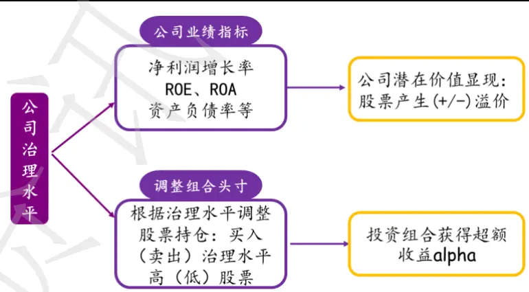
资料来源：光大证券研究所

## 1.3、细分因子选择

国内外已有较为成熟的公司治理指数，但数据覆盖度及连续获取存在困难。国外如标准普尔公司、世界银行、亚洲里昂证券等均先后推出了其创立的治理评价系统；我国的公司治理评价系统的发展较国外相对较晚，南开大学治理研究中心2003年推出的南开指数（CCGINK）。由于此类已有的公司治理指数并不包含所有 A 股上市公司数据，且其指标数据部分无法连续性获取，因此我们参考南开指数的构造及 2002 年 1 月 7 日证监会颁布的《上市公司治理准则》中的相关规定选取细分因子。

借鉴南开指数和证监会法规选择细分因子。两者主要从公司内部治理出发，均对股权结构与股东权利、董事会构成、管理层激励、信息披露与合规、激励约束机制等多维度衡量公司的治理水平。我们基于此大类划分，选择了表1 中的细分因子，后文将尝试通过指标方向对各指标打分并加权，构建公司治理因子。

表 1：公司治理细分因子

| 大类因子 | 细分类别 | 指标代码 | 因子描述 | 指标方向 |
| --- | --- | --- | --- | --- |
| 公司治理因子 | 股权结构与股东 | First_Percent | 第一大股东持股比例 | + |
|  |  | Two_Ten_Percent | 第二至十大股东持股比例 | - |
|  |  | Mc_percent | 流通股比例 | + |
|  |  | Shareholder_Number | 上市公司股东数量 | - |
|  | 董事与董事会 | Ind_director_num | 独立董事占比 | + |
|  |  | Director_num | 董事会委员数量 | + |
|  | 管理层薪酬及持股 | Mana_income | 管理层薪酬 | + |
|  |  | Mana_share_num | 管理层持股数量 | + |
|  | 信息披露与合规 | Deal_Method | 受证监会、交易所等处罚情况 | - - |
|  | 激励机制 | Stock_Incentive | 是否实施股权激励 | ++ |

资料来源：光大证券研究所

## 1.3.1、股权结构及股东规模维度

股权结构是是决定公司治理水平最主要的因素，它决定了公司控制权的分配。第一大股东持股比例越高，公司与股东利益的正相关性越高，越有利于其发挥主观积极性；然而第一大股东持股比例也不能过度高，这样易造成大股东操纵公司的行为，公司治理未必会向良好的方向发展。因此第一大股东持股比例在一定范围内与公司治理水平呈正向关系。

第二至十大股东持股比例。该指标反映了上市公司的控制权竞争与潜在竞争程度，是监督第一大股东和管理层行为的隐形机制。这类股东的持股比例越高，则意味着其更有能力争夺控制权，与第一大股东形成一种内部制衡关系。因此第二至十大股东的比例高，公司大股东之间的制衡越强，公司治理水平将同步提升。

我们以每一年度沪深 300 指数成分股中市值最小的作为大市值公司和中市值公司的分界线；以每一年度中证 500 指数成分股中市值最小的作为中市值公司与小市值公司的分界线。观察不同市值公司十年间第一大股东和第二至十大股东持股比例分布，可得到以下结论：

（1）随着上市公司总市值降低，第一大股东持股比例也随之降低；

（2）上市公司的第一大股东持股比例有逐年下降的趋势；

（3）第二至十股东持股比例在 2013 年之前，与公司总市值呈较强的正相关关系，而2013 年之后，市值越大该比例反而月底；

（4）大、中市值公司的第二至十大股东持股比例呈逐年上升趋势。

图 3：第一大股东持股比例按市值划分年度分布（中位数）
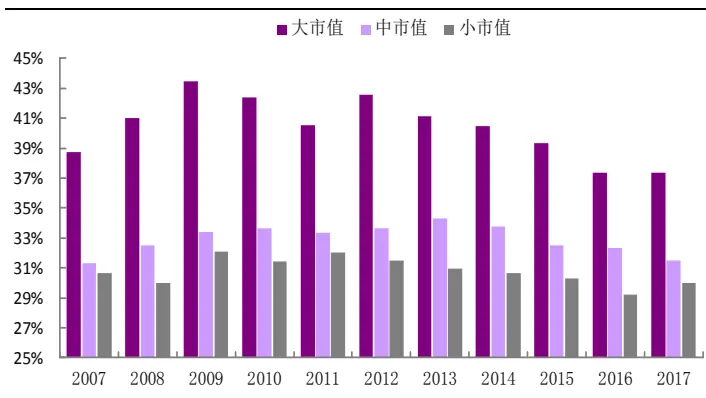
资料来源：Wind，光大证券研究所，注：截止 2017-07-20

图 4：第二至十股东持股比例按市值划分年度分布（中位数）
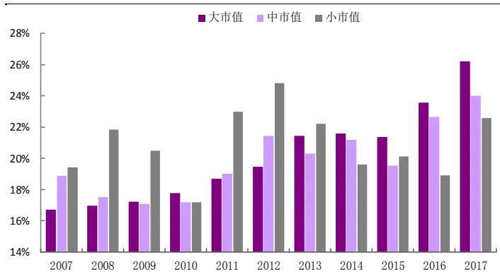
资料来源：Wind，光大证券研究所，注：截止2017-07-20

流通股比例。流通股比例可近似的代表社会投资者的持股比例，理论上讲公司股权流通性越好，公司的治理质量越高。同样根据市值对比上市公司的流通股比例，一般随着公司市值变大，其流通股比例也越高。近4 年来，流通股比例均处于较高的位置。

图 5：上市公司流通股比例按市值划分年度分布 （中位数）
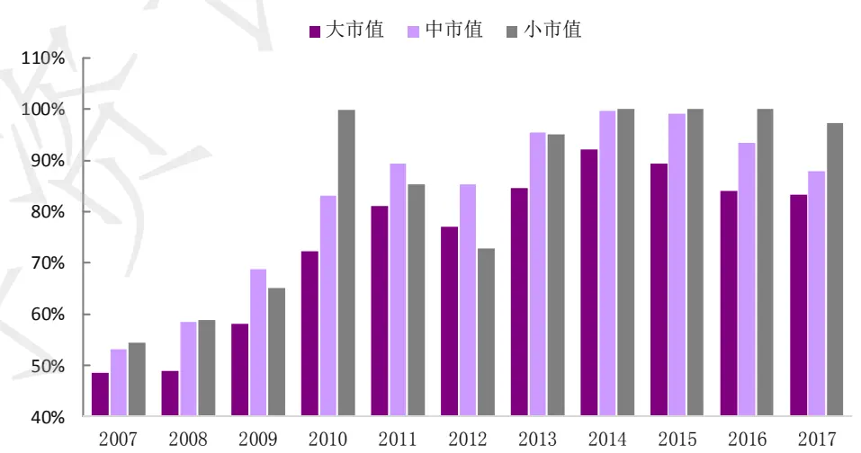
资料来源：Wind，光大证券研究所，注：截止 2017-07-20

## 1.3.2、董事会维度

董事会是公司治理的核心和枢纽，其主要职责就是对公司的经营做出决策以及对管理层进行监督，确保公司能够正常运转并促使股东的权益最大化。独立董事比例及董事会规模均会对公司治理效果产生影响。

- 董事会规模（董事会人数）。理想的董事会规模应该是既能针对公司运营做出合理决策，又能使其效率得到保障。董事会规模过大，会使决策过程中存在意见分歧的情况及概率增加，影响效率提高；另一方面，规模过小会使决策过程考虑不周全，最终结论难免有失偏颇。

以中信一级行业为划分标准，统计了29个行业上市公司董事会规模。银行业、通信业、计算机业的董事会规模整体位于前列，其他的行业之间董事会规模差异则不是十分显著。

图 6：不同行业上市公司董事会规模 （最小值/中位数/最大值）
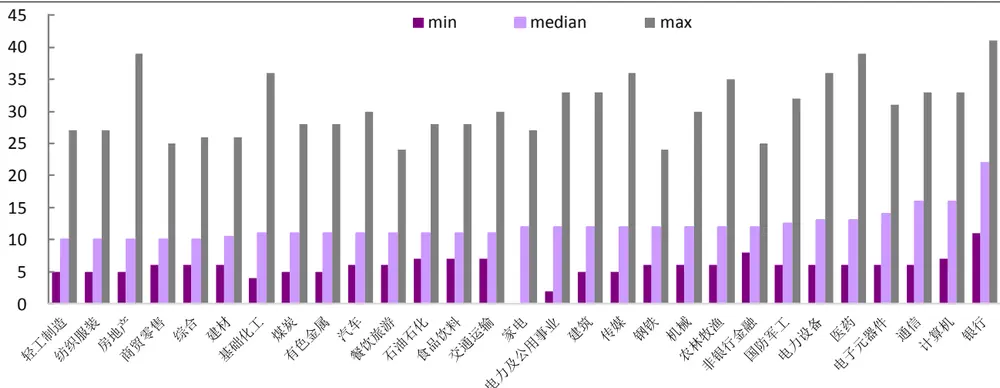
资料来源：Wind，光大证券研究所，注：数据来源为 2016 年年报

- 独立董事占比。独立董事不在公司担任除董事意外的其他职务，并与其所受聘的上市公司及其主要股东不存在可能妨碍其独立判断的董事。鉴于独立董事这种特殊的超强独立性，提高上市公司独立董事比例有利于提高董事会重大决策时的客观性，降低内部董事对于管理层的利益支持，确保中小股东的利益得到保障，有利于公司提升治理水平。

对比按照中信一级行业划分的 29 个行业的上市公司的独立董事比例，由于证监会关于独立董事有相关的制度规定，因此按照中位数统计的上市公司独立董事比例差异性并不明显，比例基本保持在 30%左右。

图 7：不同行业董事会独立董事比例（最小值/中位数/最大值）
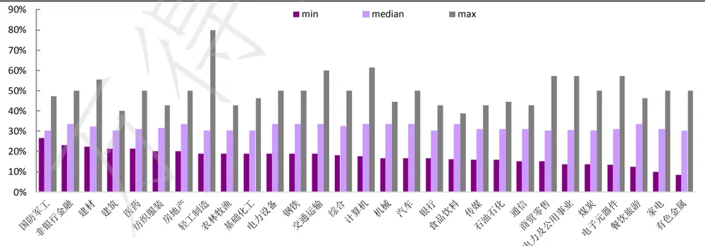
资料来源：Wind，光大证券研究所，注：数据来源为 2016年年报

## 1.3.3、信息披露与合规维度

证监会的相关法律中对上市公司信息披露有明确和详细的规定，信息披露与合规是每个公司应该履行的义务。公司披露信息的透明性、准确性、真实性和及时性等均是公司在投资者面前公信力的体现。如果上市公司财务及重大事件披露等信息存在违规情况，一方面说明其财务报告等信息可能存在误导性，另一方面投资者无法及时了解公司重大动向，公司股票未来存在异常波动的概率较大。

我们整理了 2003 年至今的 A 股上市公司信息披露违规事件的数量，从下图中发现上市公司违规事件数量呈现逐年增长的趋势，近3年来数量增长的速度有所放缓。

图 8：2003 年至 2017 年 7 月 A 股上市公司违规事件数量逐年上升
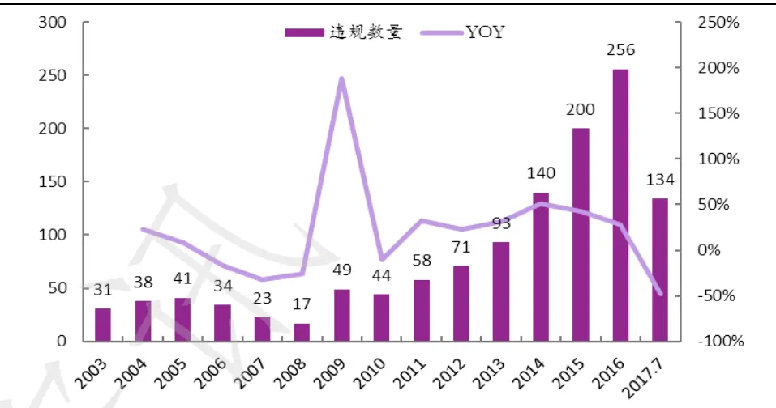
资料来源：Wind，光大证券研究所

上市公司在信息披露方面受到监管部门惩处的主要集中在公开出发和公开批评两种方式上。受到处罚的原因分别有以下五种情形：

（1）未按时披定期报告；

（2）未及时披露公司重大事项；

（3）业绩预测结果不准确或不及时；

（4）信息披露虚假或严重误导性陈述；

（5）未依法履行其他职责。

处罚事件对上市公司未来报告期业绩存在负向影响。对比公司被处罚前/中/后三个报告期公司绩效指标中位数的变化，其中净资产收益率ROE在受到处罚后的报告期有所下降；营业收入增长率则在当期下降较为明显，后一个报告期有所回升；而公司的资产负债率则从受处罚当期开始便呈现逐期升高的趋势。从财务效应、偿债能力和发展能力三方面看，处罚事件对公司存在负面影响。

图 9：2003至 2017年 A股上市处罚类型数量分布
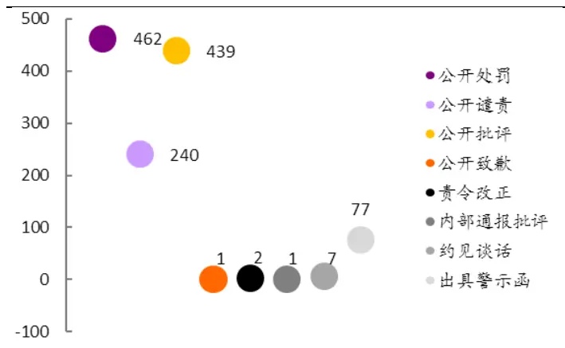
资料来源：Wind，光大证券研究所

图 10：上市公司被处罚前后 3个报告期业绩指标中位数变化
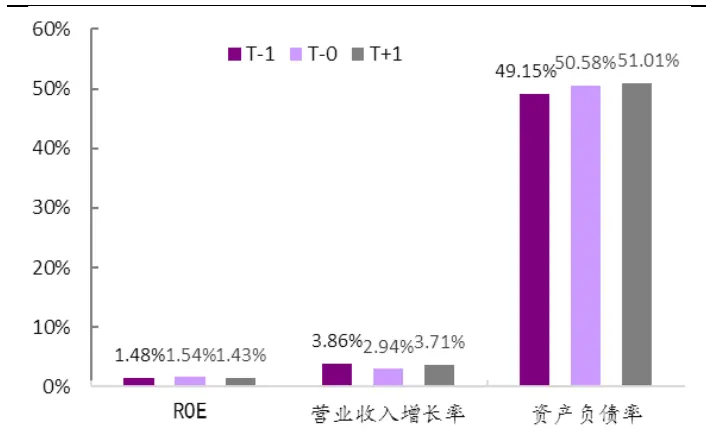
资料来源：Wind，光大证券研究所

从事件驱动的角度看，违规受罚具有较为显著的负面效应。违规受罚的负面效应主要集中在公告前120 到公告后的20 个交易日左右。公告后20个交易日的累计超额收益（CAAR）为-0.92%。这里我们所使用的基准为中信一级行业等权指数。

图11：违规事件公告前后超额收益
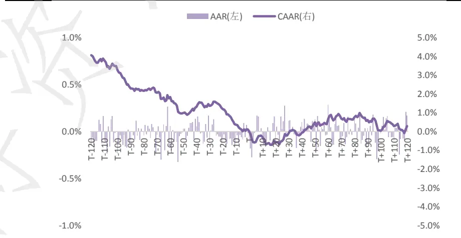
资料来源：光大证券研究所

## 1.3.4、激励约束机制维度

管理层是直接对公司进行治理的主体，要想使管理层以股东利益最大化为目标，就需要建立合理的管理层激励机制。激励的方式即将其薪酬和持股与公司的股价和业绩挂钩，这样可以降低管理层自利行为，使其能够以公司长远发展和业绩增长为重。显然管理层薪酬和持股均间接与公司治理水平呈正向影响关系。

- 不同行业的管理层薪酬存在差异。统计了29个中信一级行业上市公司管理层薪酬的中位数。观察数据的分布，非银行金融业和银行业管理层薪酬远超其他行业，而像煤炭、钢铁等传统重工业行业的管理层薪酬则居于末尾。说明管理层薪酬在不同类型行业之间的差异性还是比较显著的，我们在应用因子的过程中有必要进行行业中性处理。

图 12：金融业公司管理层薪酬中位数远超其他行业（单位：千万元）
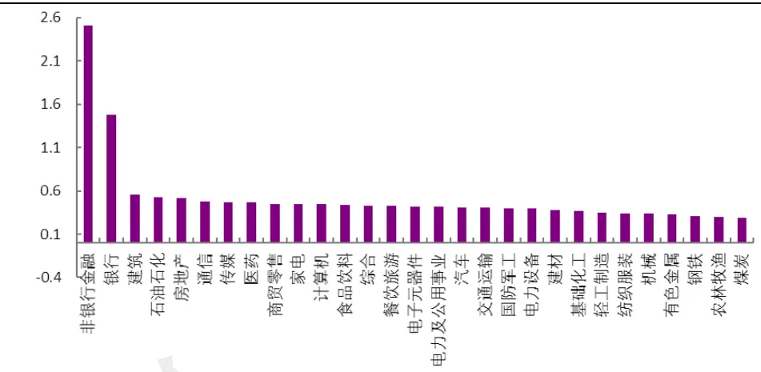
资料来源：Wind，光大证券研究所

- 股权激励计划有利于激发管理层热情，从而给公司治理带来正面影响。股权激励计划是指上市公司以本公司股票作为标的，对其董事、高管和其他员工进行的长期性激励。它不仅能将管理层利益与公司股价捆绑，提升管理层的工作积极性；还能对公司的核心员工实行相应的激励，自上而下的激发公司整体的工作热情，有利于公司的长远发展及潜在价值提升。

实施股权激励的公司数量逐年上市，中市值股票占比近 50%。2007 年至2017年7月10年间共有1496 例上市公司在不同时间发布的股权激励计划，每年发布的公司数量呈递增趋势。此外，将上市公司划分为大、中、小市值分别统计，中市值公司实施股权激励的数量占比最高，近几年已接近50%。（注：市值划分方式与上文大股东持股比例处相同）

图 13：10年来发布股权激励公司数量稳步上升
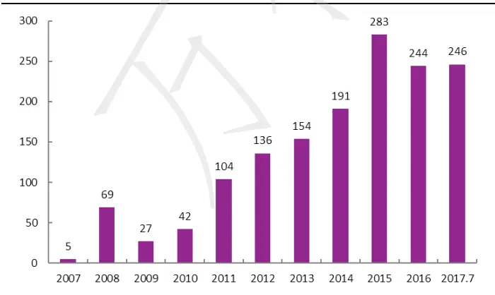
资料来源：Wind，光大证券研究所

图 14：发行股权激励计划中盘股公司数量近半数
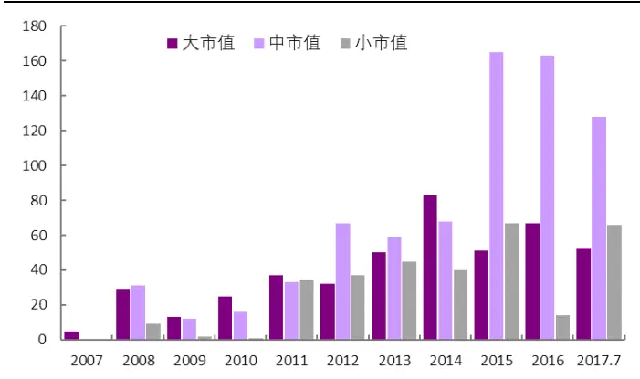
资料来源：Wind，光大证券研究所

实行股权激励的公司以 TMT 行业为主。从行业占比看，通信、计算机和传媒占其本行业比例最大。从发布数量看，计算机、机械、电子元器件行业发布股权激励计划的数量分别为 178 个、145 个、132 个，排名前三。因此在将股权激励作为一个细分因子时，做行业中性尤为重要。

图 15：实行股权激励的公司以 TMT 行业为主
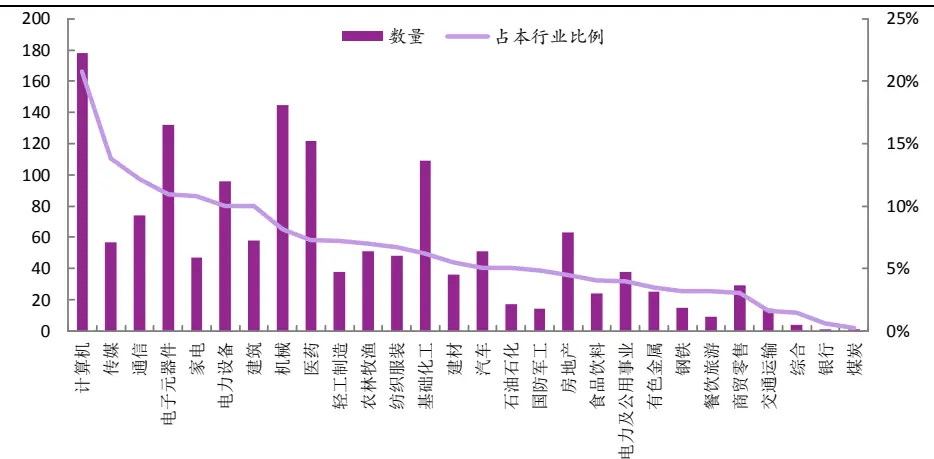
资料来源：Wind，光大证券研究所

股权激励的实施具有较为显著的正面效应。从事件驱动的角度来研究股权激励时，我们发现：股权激励实施后整体样本相对与行业等权基准的超额收益较为显著，平均90 个交易日的累计超额可达 2.5%，收益率相当可观。

图16：股权激励实施后超额收益走势
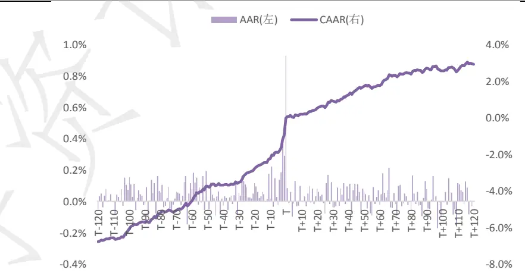
资料来源：光大证券研究所

## 1.4、单指标测试结果: 均不显著

单因子测试结果显示因子的显著性和预测能力均较弱。我们对表 1 中整理的 10 个单个细分指标分别进行了单因子测试。由于违规受罚和股权激励这两个指标发生频次过低且为布尔变量，这边略去对他们的因子测试步骤，仅测试余下的8 个指标。

在测试细分指标时，均做了行业和市值的中性化处理。原因在于这里的指标大多与公司的行业类型或者市值大小具有较强的相关性。就拿第一大股东持股比例这个指标为例，我们将该指标在 29 个中信一级行业的分布作图后可以很直观的观察出：银行业的第一大股东持股比例仅为 23%，显著低于煤炭行业的50%。因此，在测试此类指标时，十分有必要进行行业的中性化处理。

图 17：第一大股东持股比例中信一级行业分布
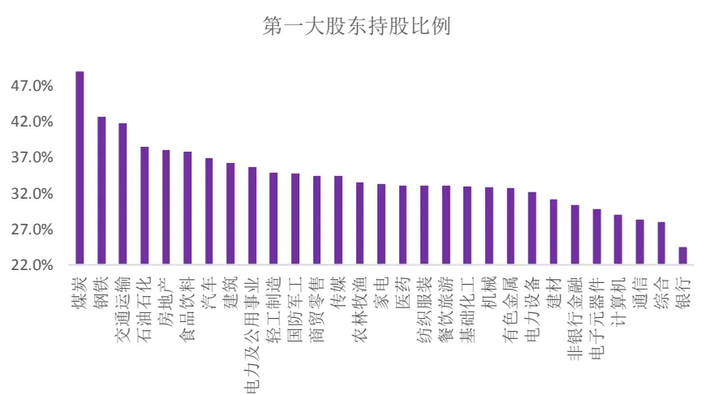
资料来源：光大证券研究所

整体看来，各个因子测试的IC值和 IR 值的绝对值均处于较小量级，反映了单个因子的显著性和预测能力不足。此外，将因子收益和 IC 值结合起来分析，第一大股东持股比例、流通市值占比、董事会规模、和管理层持股4 个因子均表现正向的预测能力，股东数量则显示出负向的预测能力，而第二至十大股东持股比例和管理层薪酬则两个指标的方向不一致，因子的稳定性较弱，可能是由于数据中离群点的影响。

因此，下文我们将尝试通过单因子加权的方式构造一个复合因子去衡量上市公司的治理水平。

表 2：公司治理因子单指标测试结果

| 指标名称 | First_Per | Two_Ten_Per | Mcap_Per | Shareholder _Num | Ind_Director _Num | Director _Num | Mana _Income | Mana_Share _Num |
| --- | --- | --- | --- | --- | --- | --- | --- | --- |
| 因子收益t值 | 1.097 | 0.159 | 1.452 | -0.271 | 1.539 | 2.239 | 1.533 | 0.455 |
| 因子收益均值 | 0.04% | 0.01% | 0.09% | -0.02% | 0.03% | 0.08% | 0.08% | 0.02% |
| t>0 比例 | 53.62% | 50.00% | 50.72% | 46.38% | 55.70% | 58.70% | 57.25% | 50.00% |
| abs(t)均值 | 1.435 | 2.967 | 2.817 | 2.577 | 1.298 | 1.598 | 1.733 | 1.57 |
| IC 均值 | 0.0033 | -0.0004 | 0.0129 | -0.0311 | 0.0046 | 0.0056 | -0.0102 | 0.013 |
| IC 标准差 | 0.065 | 0.104 | 0.084 | 0.187 | 0.053 | 0.063 | 0.114 | 0.109 |
| IC>0的比例 | 49.28% | 50.72% | 56.52% | 45.65% | 47.55% | 48.55% | 47.10% | 55.07% |
| IC>0.02 比例 | 38.41% | 45.65% | 45.65% | 39.13% | 38.13% | 39.13% | 37.68% | 47.10% |
| IR | 0.05 | -0.003 | 0.153 | -0.166 | 0.038 | 0.088 | -0.09 | 0.119 |

资料来源：光大证券研究所

## 2、扬长避短：构建公司治理综合因子

## 2.1、根据单指标测试结果，构建综合因子

从上一节中的单指标测试我们可以看出，单个指标的因子测试结果都不甚理想。其中，IR 绝对值最高的股东总数指标负向的收益相较于其他指标而言较为显著，IR达到-0.166。IR正向最为显著的是流通股占比，IR达到0.153。

同时，1.3 节中我们详细分析了股权激励和监管处罚这两个指标对公司未来经营绩效的影响方向和影响程度。由于在构造公司治理因子时，我们仍旧按照光大因子测试体系的标准，月频计算因子值并月频测试，因此股权激励和违规受罚这两类短期股价效应较为显著的指标在综合因子构造时应给予相对较高的权重。具体的权重赋予方式，我们会在随后的小节中具体阐明。

## 2.1.1、IC 加权：分组表现尚可

首先，我们尝试以表2中但指标测试结果为参考标准，将单指标测试所得IC值作为综合因子的构造权重。股权激励的得分为1，违规受罚的得分为-1。IC 加权法下的综合公司治理因子表现尚可，2006 年至今，IR 值为 0.18，IC 均值 0.011，IC 正向比例为 60%。

表3：IC加权法下的分组收益

| 1 2 3 4 5 Long_Short |  |  |  |  |  |
| --- | --- | --- | --- | --- | --- |
| annual_return | 14% 15% | 16% | 25% | 24% | 9% |
| cum_returns | 323% 387% | 431% | 1040% | 1002% | 167% |
| annual_volatility | 29% 31% | 32% | 32% | 33% | 14% |
| sharpe_ratio | 0.60 0.61 | 0.63 | 0.84 | 0.83 | 0.69 |
| max_drawdown | -71% -73% | -74% | -67% | -71% | -29% |
| sortino_ratio | 0.82 0.84 | 0.86 | 1.15 | 1.13 | 0.95 |
| Relative_return | -2.4% -0.2% | 0.7% | 8.1% | 7.8% | - |
| Relative_volatility | 8.1% 5.2% | 5.5% | 6.1% | 8.0% | - |
| Info_Ratio | -0.30 -0.04 | 0.13 | 1.32 | 0.97 | 一 |

资料来源：光大证券研究所

图 18：IC 加权法下的分组累计净值走势
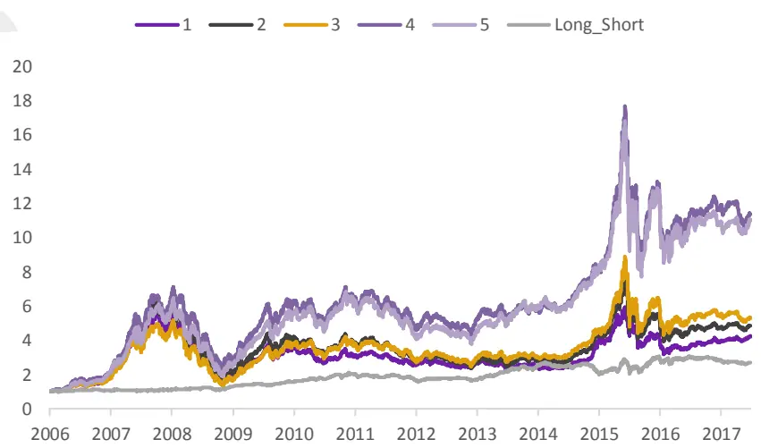
资料来源：光大证券研究所

## 2.1.2、IR加权：因子稳定性、IR值均有提升

其次，我们尝试以IR值作为综合因子的构造权重。股权激励的得分为1，违规受罚的得分为-1。IR加权法下的综合公司治理因子表现有所提升，2006年至今，IR 值为 0.23，IC 均值 0.012，IC 正向比例为 61%。

表 4：IR 加权法下的分组收益

| 1 Long_Short |  | 2 3 4 5 |  |  |  |
| --- | --- | --- | --- | --- | --- |
| annual_return | 13% | 17% 16% | 23% | 23% | 9% |
| cum_returns | 302% | 452% 437% | 857% | 895% | 158% |
| annual_volatility | 29% | 31% 32% | 33% | 33% | 13% |
| sharpe_ratio | 0.58 | 0.65 0.64 | 0.79 | 0.79 | 0.74 |
| max_drawdown | -71% | -73% -73% | -68% | -71% | -31% |
| sortino_ratio | 0.80 | 0.89 0.87 | 1.07 | 1.08 | 0.86 |
| Relative_return | -3.0% 0.8% | 0.7% | 6.5% | 7.0% | - |
| Relative_volatility | 8.9% 5.1% | 4.9% | 6.2% | 8.1% |  |
| Info_Ratio | -0.34 0.16 | 0.15 | 1.05 | 0.86 |  |

资料来源：光大证券研究所

图 19：IR 加权法下的分组累计净值走势
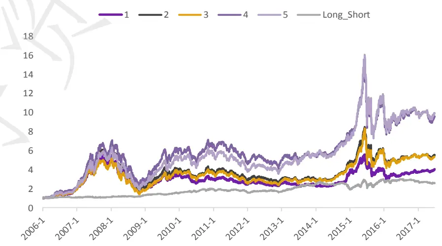
资料来源：光大证券研究所

## 2.1.3、简单分类加权：表现不俗

简单分类加权法构造的公司治理综合因子表现较好。IC 加权法与 IR 加权法的表现都不甚理想，可能的原因则在于各个单指标的测试结果显著性均较弱，那么使用不显著的IC和 IR的值来作为权重可能反而效果不佳。

这里我们简单的以因子的 IR 值方向作为因子权重的方向。具体的赋权方式如下：

表5：简单加权法的各指标打分权重

| 代码 | 名称 | 权重 |
| --- | --- | --- |
| Director_num | 董事会委员数量 | 1 |
| Deal_Method | 受证监会、交易所等处罚情况 | -5 |
| Ind_director_num | 独立董事占比 | 1 |
| Mana_share_num | 管理层持股数量 | 2 |
| Mana_income | 管理层薪酬 | 2 |
| Mc_percent | 流通股比例 | 4 |
| Shareholder_Number | 上市公司股东数量 | -1 |
| First_Percent | 第一大股东持股比例 | 1 |
| Two_Ten_Percent | 第二至十大股东持股比例 | -1 |
| Stock_Incentive | 是否实施股权激励 | 5 |

资料来源：光大证券研究所

其中，管理层持股数量与管理层薪酬的 IC 和 IR 值方向尽管不一致，但是考虑到这两个指标逻辑上具有正相关性，且单指标测试的显著性和有效性较弱，因此这里我们将其权重均设置为正 1。

股权激励和违规受罚的权重得分为5 和-5，是为了突出这两个指标的短期效应强度。

因子测试结果显示，这种加权方法下得到的公司治理因子具有很不错的收益和预测能力。

表6：公司治理因子（简单加权）单因子测试结果

|  | 公司治理因子 |
| --- | --- |
| IC > 0.02 比例 | 46.4% |
| 因子收益率均值 | 0.13% |
| 因子收益显著性 | 2.81 |
| T值 > 0 比例 | 58.7% |
| IC均值 | 0.016 |
| IC > 0 比例 | 58.7% |
| IC标准差 | 0.057 |
| 信息比 IR | 0.28 |

资料来源：光大证券研究所

图 20：公司治理因子（简单加权）IC 序列
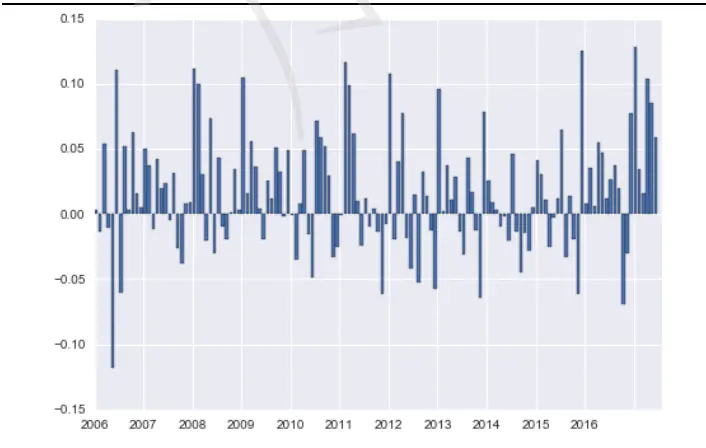
资料来源：光大证券研究所

图21：公司治理因子（简单加权）累计收益
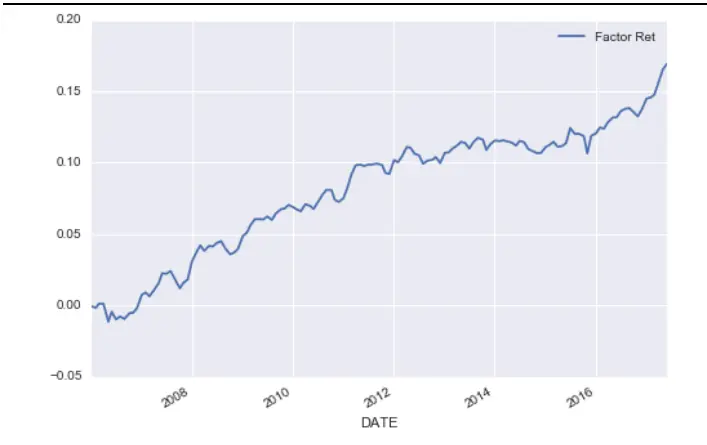
资料来源：光大证券研究所

图20可见，简单分类加权的分组效果显著优于IR和 IC加权法。

图 22：简单加权法下的分组累计净值走势
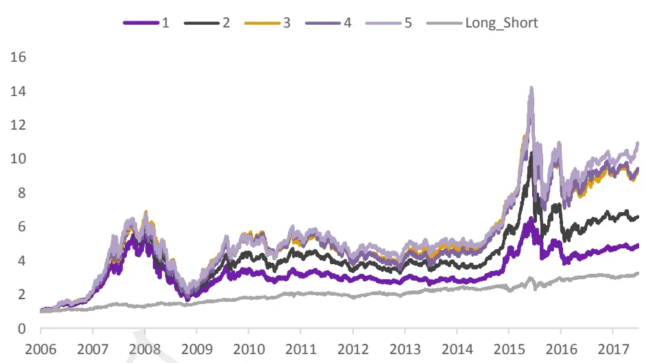
资料来源：光大证券研究所

我们最终将简单加权法的公司治理因子作为该因子的构造方法，命名为公司治理因子（COMP_OPT）。在简单加权的方法下，将第一大股东持股比例、第二至十大股东持股比例、流通股占比、公司股东数量、独立董事占比、董事会委员数量、管理层薪酬、管理层持股数量、受证监会、交易所等处罚情况、是否实施股权激励这 10 大指标结合成为公司治理因子。

公司治理因子（COMP_OPT）自 2006 年至今，IR 值达 0.28，IC 为 0.016，多空组合的年化收益约 9%。

## 分析师声明

负责准备本报告以及撰写本报告的所有研究分析师或工作人员在此保证，本研究报告中关于任何发行商或证券所发表的观点均如实反映分析人员的个人观点。负责准备本报告的分析师获取报酬的评判因素包括研究的质量和准确性、客户的反馈、竞争性因素以及光大证券股份有限公司的整体收益。所有研究分析师或工作人员保证他们报酬的任何一部分不曾与，不与，也将不会与本报告中具体的推荐意见或观点有直接或间接的联系。

## 分析师介绍

刘均伟 金融工程首席分析师，复旦大学学士，上海财经大学硕士，10 年金融工程研究经验。现任职于光大证券研究所，研究领域为衍生品及量化投资。

## 行业及公司评级体系

买入—未来6-12 个月的投资收益率领先市场基准指数15%以上；

增持—未来 6-12 个月的投资收益率领先市场基准指数 5%至 15%；

中性—未来 6-12 个月的投资收益率与市场基准指数的变动幅度相差-5%至 5%；

减持—未来 6-12 个月的投资收益率落后市场基准指数 5%至 15%；

卖出—未来6-12 个月的投资收益率落后市场基准指数15%以上；

无评级—因无法获取必要的资料，或者公司面临无法预见结果的重大不确定性事件，或者其他原因，致使无法给出明确的投资评级。

市场基准指数为沪深 300指数。

## 分析、估值方法的局限性说明

本报告所包含的分析基于各种假设，不同假设可能导致分析结果出现重大不同。本报告采用的各种估值方法及模型均有其局限性，估值结果不保证所涉及证券能够在该价格交易。

## 特别声明

光大证券股份有限公司（以下简称“本公司”）创建于 1996 年，系由中国光大（集团）总公司投资控股的全国性综合类股份制证券公司，是中国证监会批准的首批三家创新试点公司之一。公司经营业务许可证编号：z22831000。

公司经营范围：证券经纪；证券投资咨询；与证券交易、证券投资活动有关的财务顾问；证券承销与保荐；证券自营；为期货公司提供中间介绍业务；证券投资基金代销；融资融券业务；中国证监会批准的其他业务。此外，公司还通过全资或控股子公司开展资产管理、直接投资、期货、基金管理以及香港证券业务。

本证券研究报告由光大证券股份有限公司研究所（以下简称“光大证券研究所”）编写，以合法获得的我们相信为可靠、准确、完整的信息为基础，但不保证我们所获得的原始信息以及报告所载信息之准确性和完整性。光大证券研究所可能将不时补充、修订或更新有关信息，但不保证及时发布该等更新。

本报告根据中华人民共和国法律在中华人民共和国境内分发，仅供本公司的客户使用。

本报告中的资料、意见、预测均反映报告初次发布时光大证券研究所的判断，可能需随时进行调整。报告中的信息或所表达的意见不构成任何投资、法律、会计或税务方面的最终操作建议，本公司不就任何人依据报告中的内容而最终操作建议作出任何形式的保证和承诺。

在法律允许的情况下，本公司及其附属机构可能持有报告中提及的公司所发行证券的头寸并进行交易，也可能为这些公司提供或正在争取提供投资银行、财务顾问或金融产品等相关服务。投资者应当充分考虑本公司及本公司附属机构就报告内容可能存在的利益冲突，不应视本报告为作出投资决策的唯一参考因素。

在任何情况下，本报告中的信息或所表达的建议并不构成对任何投资人的投资建议，本公司及其附属机构（包括光大证券研究所）不对投资者买卖有关公司股份而产生的盈亏承担责任。

本公司的销售人员、交易人员和其他专业人员可能会向客户提供与本报告中观点不同的口头或书面评论或交易策略。本公司的资产管理部和投资业务部可能会作出与本报告的推荐不相一致的投资决策。本公司提醒投资者注意并理解投资证券及投资产品存在的风险，在作出投资决策前，建议投资者务必向专业人士咨询并谨慎抉择。

本报告的版权仅归本公司所有，任何机构和个人未经书面许可不得以任何形式翻版、复制、刊登、发表、篡改或者引用。

## 光大证券股份有限公司研究所销售交易总部

上海市新闸路 1508 号静安国际广场 3 楼 邮编 200040

总机：021-22169999 传真：021-22169114、22169134

| 销售交易总部 | 姓名 | 办公电话 | 手机 | 电子邮件 |
| --- | --- | --- | --- | --- |
| 上海 | 陈蓉 | 021-22169086 | 13801605631 | chenrong@ebscn.com |
|  | 濮维娜 | 021-62158036 | 13611990668 | puwn@ebscn.com |
|  | 胡超 | 021-22167056 | 13761102952 | huchao6@ebscn.com |
|  | 周薇薇 | 021-22169087 | 13671735383 | zhouww1@ebscn.com |
|  | 李强 | 021-22169131 | 18621590998 | liqiang88@ebscn.com |
|  | 罗德锦 | 021-22169146 | 13661875949/13609618940 | luodj@ebscn.com |
|  | 张弓 | 021-22169083 | 13918550549 | zhanggong@ebscn.com |
|  | 黄素青 | 021-22169130 | 13162521110 | huangsuqing@ebscn.com |
|  | 邢可 | 021-22167108 | 15618296961 | xingk@ebscn.com |
|  | 陈晨 | 021-22169150 | 15000608292 | chenchen66@ebscn.com |
|  | 王昕宇 | 021-22167233 | 15216717824 | wangxinyu@ebscn.com |
| 北京 | 郝辉 | 010-58452028 | 13511017986 | haohui@ebscn.com |
|  | 梁晨 | 010-58452025 | 13901184256 | liangchen@ebscn.com |
|  | 郭晓远 | 010-58452029 | 15120072716 | guoxiaoyuan@ebscn.com |
|  | 王曦 | 010-58452036 | 18610717900 | wangxi@ebscn.com |
|  | 关明雨 | 010-58452037 | 18516227399 | guanmy@ebscn.com |
|  | 张彦斌 | 010-58452026 | 15135130865 | zhangyanbin@ebscn.com |
| 深圳 | 黎晓宇 | 0755-83553559 | 13823771340 | lixy1@ebscn.com |
|  | 李潇 | 0755-83559378 | 13631517757 | lixiao1@ebscn.com |
|  | 张亦潇 | 0755-23996409 | 13725559855 | zhangyx@ebscn.com |
|  | 王渊锋 | 0755-83551458 | 18576778603 | wangyuanfeng@ebscn.com |
|  | 张靖雯 | 0755-83553249 | 18589058561 | zhangjingwen@ebscn.com |
|  | 牟俊宇 | 0755-83552459 | 13827421872 | moujy@ebscn.com |
| 国际业务 | 陶奕 | 021-22167107 | 18018609199 | taoyi@ebscn.com |
|  | 戚德文 | 021-22167111 | 18101889111 | qidw@ebscn.com |
|  | 金英光 | 021-22169085 | 13311088991 | jinyg@ebscn.com |
|  | 傅裕 | 021-22169092 | 13564655558 | fuyu@ebscn.com |