## 见微知著：成交量占比高频因子解析——多因子系列报告之五

随着定价模型的深入研究，因子的覆盖范围也不断拓宽。技术引领金融数据不断创新，市场的有效性逐渐增强，承载着更多信息的高频数据因子应运而生。在金融市场中，由于交易的连续性，信息对股票价格的影响是连续的，数据采集的频率越高，更能全面真实地刻画市场微观结构。本文从市场微观结构出发，构造了有别于低频因子的有效选股因子——集合竞价成交量占比。

集合竞价阶段是反映投资者行为信息的重要时点。我国股票的日内交易分为集合竞价阶段和连续竞价阶段，累计交易时长 4小时。开盘和收盘是一天中股市交易的最重要的阶段，开盘集合竞价阶段是隔夜信息释放的第一时点，而收盘集合竞价阶段则是日内交易信息反映的最后时点。集合竞价阶段遵从价格优先、时间优先的原则，投资者根据股票前日收盘价及其对当日股价的心理预期输入申报价格。一般而言，集合竞价阶段成交量反映了多空双方对个股开盘价格的认

价走量先行，集合竞价成交量占比因子选股能力突出。集合竞价阶段的交易数据是日内高频数据的特有部分，我们以成交量为切入点，以相对指标个股集合竞价成交量占比为日内高频指标，采用技术分析中最常用指标构造方式——简单移动平均（MA）构造开盘集合竞价成交量占比因子OCVP。同时考虑信息的时间衰减效用，引入具有时变效用的权重修正OCVP因子。经过检验OCVP因子具备良好的预测能力和单调性，其 IC均值为-5.6%，IR 绝对值为 0.83。

叠加尾盘效应的复合因子选股能力显著提升。考虑到收盘前阶段为日内信息传递到当日交易的最后时点，我们纳入收盘前5分钟成交量占比因子，通过加权方式构造复合因子 OBCVP。最优权重组合下，复合因子的预测性和单调性显著提升，IC 均值为-7%，IR 绝对值大于 1。根据因子值将股票等分 5 组的多空对冲组合 8 年年化收益为 15.10%，夏普比率达3.03，最大回撤为 10.2%。

中性化后的集合竞价成交量因子仍有选股能力。经过VSTD、市值、动量、行业中性化后的成交量占比复合因子 OBCVP 依旧表现出了不俗的预测能力和选股能力。IC平均值为-3.7%，IR 绝对值达0.79。证明集合竞价成交量占比一定程度上可以反应市场对于股票的关注程度和投资者观点的一致程度，因而该因子具有其独有的选股能力。

- 风险提示：测试结果均基于模型和历史数据，模型存在失效的风险。

## 金融工程深度

## 分析师

刘均伟 (执业证书编号：S0930517040001)

021-22169151

liujunwei@ebscn.com

## 联系人

周萧潇

021-22167060

zhouxiaoxiao@ebscn.com

## 相关研究

《因子测试框架—多因子系列报告之一》
《因子测试全集多因子系列报告之二》

《多因子组合“光大 Alpha 1.0”多因子系列报告之三》

《别开生面：公司治理因子详解多因子系列报告之四》

## 1、高频数据中探寻选股因子

## 1.1、高频数据窥见市场微观结构

高频数据承载更丰富的市场信息。随着定价模型的深入研究，因子的覆盖范围也不断拓宽。技术引领金融数据不断创新，市场的有效性也逐渐增强，承载着更多信息的高频因子应运而生。在金融市场中，由于交易的连续性，信息对股票价格的影响是连续的，数据采集的频率越高，其蕴含的信息量越丰富，则能更加全面真实的刻画市场微观结构。以 2017 年 7 月上证综指的走势为例，同时期的日线与 15 分钟线整体走势一致，而细观价格与成交量的波动，则15 分钟线更能反映交易者日内行为信息。

图 1：2017年 7月上证综指的日线与 15分钟线走势对比
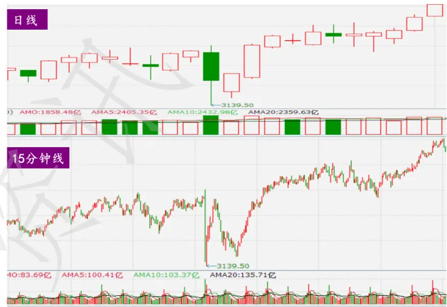
资料来源：Wind，光大证券研究所

一般而言的金融高频数据指日内交易数据，分为以下两类：（1）高频数据：以小时、分钟甚至秒为采样频率的成交量、成交额、最高价、最低价、开盘价和收盘价等；（2）超高频数据：交易过程的分笔成交数据。

本篇报告主要基于市场微观结构理论：尝试从高频数据中过滤有价值的信息，从而斩获有别于低频数据的有效选股因子——集合竞价成交量占比。（注：本文用于回测的高频数据均来源于通联数据）

## 1.2、日内交易重要时段：集合竞价阶段

沪深交易所日内交易制度差异细微。根据沪深交易所最新交易规则，每个交易日 9:15-9:25 为开盘集合竞价阶段，9:30-11:30 和 13:00-15:00 为连续竞价阶段；深交所交易制度略有差异，14:57-15:00 为尾盘集合竞价阶段。自2006 年 7 月 1 日起我国股市的集合竞价模式已由封闭式转为开放式，此时段的市场有效性和信息透明度均不同程度改变。

图 2：中国股市不同阶段交易制度示意图
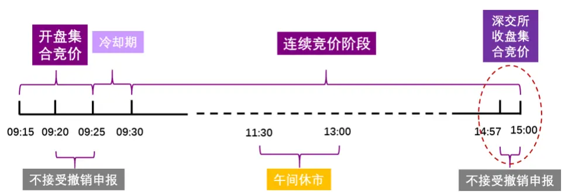
资料来源：上海/深圳证券交易所，光大证券研究所

集合竞价阶段，反映投资者行为信息的重要时点。我国股票的日内交易分为集合竞价阶段和连续竞价阶段，累计交易时长4小时，但并非所有时间的交易信息都具备参考价值。开盘和收盘是一天中股市交易的最重要的阶段，开盘集合竞价阶段是隔夜信息释放的第一时点，而收盘集合竞价阶段则是日内交易信息反映的最后时点。

集合竞价制度可以防止市场操纵，更能反映投资者对股价的认同度。集合竞价阶段遵从价格优先、时间优先的原则，投资者根据股票前日收盘价及其对当日股价的心理预期输入申报价格。一般而言，集合竞价阶段成交量反映了多空双方对个股开盘价格的认同度。

## 2、成交量占比高频因子构造

## 2.1、因子具体构造方式

价走量先行，关注集合竞价成交量占比。市场价格的有效变动必须有成交量的配合，其可谓测量证券市场活跃程度的温度计，对投资者分析主力行为提供了重要依据。下面我们将具体阐述在日内交易中重要的集合竞价阶段，如何通过高频信号加工构造适应低频调仓的成交量占比因子。

## 信号变频：高频数据转为低频信号

集合竞价阶段的交易数据是日内高频数据的特有部分，我们以成交量为切入点，以相对指标个股集合竞价成交量占比（集合竞价阶段成交量/日内总成交量）为日内高频指标，采用技术分析中最常用指标构造方式——简单移动平均（MA）构造开盘集合竞价成交量占比因子 OCVP（opening call auction volume percent），作为月初选股的指标。

$$
OCVP_{t}=\frac{1}{d}\sum_{i=1}^{d}\left(\frac{VOL_{call}}{VOL_{total}}\right)_{t-i}.
$$

其中： $VOL_{call}$ ：表示每日开盘前集合竞价阶段成交量

$VOL_{total}$ ：表示日内个股总成交量

d：表示第 t日向前移动平均的交易日个数

## 高频信息的时间效用：引入具有时变效用的权重因子

集合竞价成交量属于日内高频数据，根据信息传递过程中的衰减规律，距离指标因子计算日的时间越长其信息的时效性也会随之递减，因此我们进一步考虑引入具有时变效用的权重因子w 修正原始的 OCVP 因子。

指数移动平均（EMA）也是理想的趋势抓取工具，相比于简单移动平均，它赋予最近期信息的权重最大，也不摒弃远期信息，只是赋予呈指数式衰减的权重。

$$
TWOCVP_{t}=\sum_{i=1}^{\infty}w_{t-i}*CVP_{t-i},
$$

其中

$\begin{array}{r}{CVP_{t-i}=\left(\frac{VOL_{call}}{VOL_{total}}\right)_{t-i}}\end{array}$ ，每日集合竞价成交量占比；

α：信息的衰减强度， $\begin{array}{r}{\alpha=\frac{2}{1+d};}\end{array}$

$w_{t-i}=\frac{(1-\alpha)^{i-1}}{\sum_{i=1}^{\infty}(1-\alpha)^{i-1}}$ 为时间权重因子。

## 尾盘效应代理变量：收盘前 5 分钟成交量占比

由于沪深两市交易制度的细微差异，深圳证券交易收盘前 3分钟属于收盘集合竞价阶段，而上海证券交易所仍处于连续竞价阶段。如果开盘集几分钟则是白天交易期间累积情绪的最后释放时间，其中的交易者行为同样蕴含着额外的信息量。为了统一沪深两市，我们选择收盘前5 分钟的交易信息作为尾盘效应时段，以与OCVP 同样的方式构造收盘前成交量占比因子 BCVP（before closing volume percent）。

$$
BCVP_t=\frac{1}{d}\sum_{i=1}^{d}\left(\frac{VOL_{close}}{VOL_{total}}\right)_{t-i}
$$

其中：

$VOL_{close}$ ：表示收盘前 5 分钟内个股成交量

$VOL_{total}$ ：表示日内个股总成交量

d：表示第 t 日向前移动平均的交易日个数

## 3、OCVP 因子具备较理想的选股能力

## 3.1、因子特征分析

OCVP因子呈“尖峰、厚尾”。我们以前10 个交易日计算的 OCVP因子为例，可以看到该因子呈现出金融数据常见的“右偏、尖峰、厚尾”分布特征。在因子测试阶段这种与正态分布偏离度较大的情况下不适用3-sigma原则去极值，我们采用稳健的 MAD（绝对中位数法）去除极值更加合适。

OCVP因子与次月收益负相关性较强。对初始OCVP 因子与股票次月收益率相关性进行研究，从 2010 年至今 90 个月的相关系数均值为-0.03，相关系数小于零的比例超过 65%。据此可得初步结论：集合竞价成交量占比越低，股票次月的收益率越高，月初调仓时更倾向于配置OCVP 因子值小的组合。

图 3：OCVP因子的分布（2017年 6月的因子数据为例）
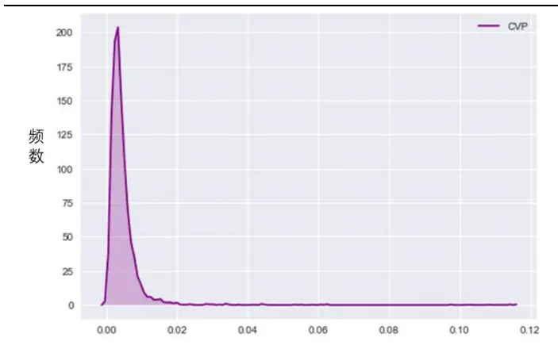
资料来源：光大证券研究所

图 4：OCVP因子与股票次月收益率呈现一定负相关性
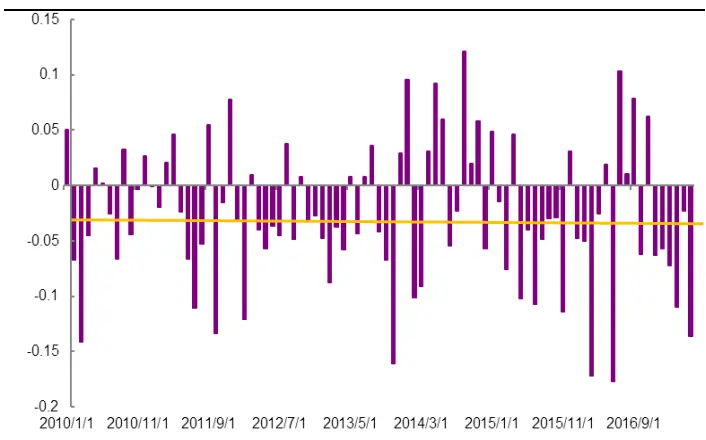
资料来源：光大证券研究所，注：2010.02.01-2017.07.31

OCVP因子存在一定的行业和市值差异性。为了排除股票所属行业、市值等外部因素的影响，需要考察因子在不同行业和市值的分布情况。我们分别以沪深300成分股、中证500 成分股中市值最小的作为大市值、中市值和小市值的分界点，OCVP 因子的中位数和平均数均存在差异，小市值的股票对应的因子值一般较小。按照中信一级行业划分，金融行业的 OCVP 因子中位数较大。综上结论我们在随后的因子有效性检验时对其做行业中性和市值中性处理。

图 5：OCVP 因子不同市值中位数与平均数
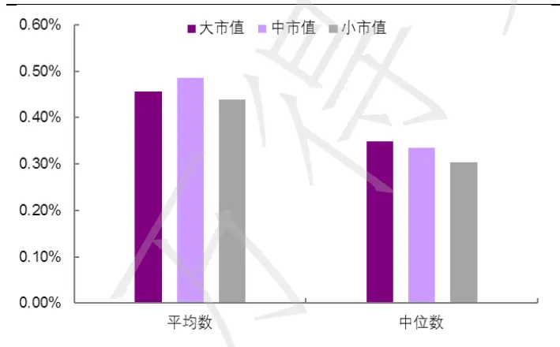
资料来源：光大证券研究所

图 6：OCVP 因子的行业分布中位数
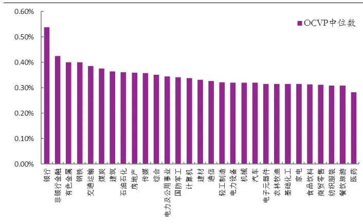
资料来源：光大证券研究所

## 3.2、OCVP 因子有效性优于 BCVP

对于因子数据的标准化处理和有效性检验我们仍沿用多因子系列报告中的方法。

- 有效性及稳定性检验：采用多期截面RLM回归后我们可以得到因子收益序列，以及每一期回归假设检验T 检验的 t 统计量序列，针对这两个序列我们通过以下几个指标来判断该因子的有效性和稳定性：

（1） 因子收益序列的假设检验t统计量值

（2） 因子收益序列大于0 的概率

（3） t 统计量绝对值的均值

（4） t 统计量绝对值大于等于 2 的概率

- 有效性及预测能力检验：我们计算行业中性与市值中性处理后的RankIC（因子值与股票次月收益率的秩相关系数），通过以下几个与IC 值相关的指标来判断因子的有效性和预测能力：

（1） IC 值的均值

（2） IC 值的标准差

（3） IC 大于 0 的比例

（4） IC 绝对值大于 0.02 的比例

（5） IR（IR = IC 均值/IC 标准差）

## 因子分组回测框架

通过因子值的排序对股票分组，根据每组股票的历史收益情况判断因子的单调性。

表 1：因子分组回测框架

|  | 因子分组回测框架 |
| --- | --- |
| 时间区间 | 2010年2月1日至2017年7月31日 |
| 股票池 | 全部 A 股(剔除选股日ST/PT股票；剔除上市不满一年的股票；剔除选股日由于停牌等因素无法买入的股票) |
| 调仓频率 | 月度调仓 |
| 分组调仓方式 | 每月最后一个交易日收盘后，根据本月所有未被剔除的股票数据计算因子值，根据因子值从小到大排序将股票等分为5组，分别计算每组股票的历史回测收益及多空组合收益。 |
| 交易费率 | 因子测试阶段暂不考虑交易费用 |

资料来源：光大证券研究所

## 3.2.1、因子数据清洗与标准化

时间轴上，个股存在停牌情形，对于包含停牌日缺失数据的移动平均需做一些限制性处理以得到更为合理的因子数据。横截面上，不同的股票之间存在个体差异性，原始的OCVP 因子在股票间的横向可比性较低，因此我们对截面因子数据做标准化处理，获得因子的相对值。

（1）缺失值处理：d 个交易日的移动平均至少有5个交易日为非缺失值；

（2）极值处理：因子的分布与正态分布偏离度较大的，不适用 3-sigma 原则去极值，我们采用稳健的 MAD（绝对中位数法）去除极值更加合适。采取与 3σ 法等价的方法，用将原始因子值调整到 3 倍绝对偏离中位数的范围内。

（3）标准化处理：通过横截面 z-score方法，以每个时间截面 t上的所有股票的为样本，分别计算其均值和标准差得到如下所示的 stand(OCVP)。此标准化方式属于因子的线性变换，并不会改变原始OCVP因子的分布特征。

$$
\mathrm{standard}(OCVP)_{jt}=\frac{OCVP_{jt}-\overline{OCVP_{t}}}{std(OCVP)_{t}}
$$

## 3.2.2、因子有效性检验

OCVP 因子的有效性、稳定性及预测能力表现良好。因子 IC 大于零的比例仅为 14.1%，说明因子与未来收益呈现较显著的负相关性；此外 IC 均值为-5.6%，IR 绝对值为 0.83，该因子的预测能力较突出。

BCVP 因子的有效性、稳定性及预测能力稍逊于 OCVP。因子 IC 大于零的比例为 36%，因子与未来收益呈现较强的负相关性；此外 IC 均值为-2.8%，IR 绝对值为0.36，该因子的预测能力相对 OCVP 较弱一筹。

表 2：OCVP 与 BCVP 因子有效性测试结果对比

| X | OCVP因子有效性测试指标 | BCVP因子有效性测试指标 |
| --- | --- | --- |
| 因子收益率均值 | -0.40% | -0.29% |
| 因子收益显著性 | -6.88 | -3.85 |
| IC 均值 | -5.6% | - 2.8% |
| IC>0 比例 | 14.1% | 36% |
| IC > 0.02 比例 | 11.2% | 27% |
| IC 标准差 | 6.7% | 7.6% |
| 信息比 IR | -0.83 | -0.36 |

资料来源：光大证券研究所

OCVP 因子具备良好的单调性，分层效应显著。我们对比因子分组回测净值及多空对冲净值，从下图可以看到，OCVP 因子的分组效果很好，随着因子值的上升，分组收益逐渐下降，分组收益区分度明显；多空组合（第一组对冲第五组）年化收益约11.50%，夏普比率为1.98，最大回撤达 19.5%。

图 7：OCVP 因子 Rank IC 序列
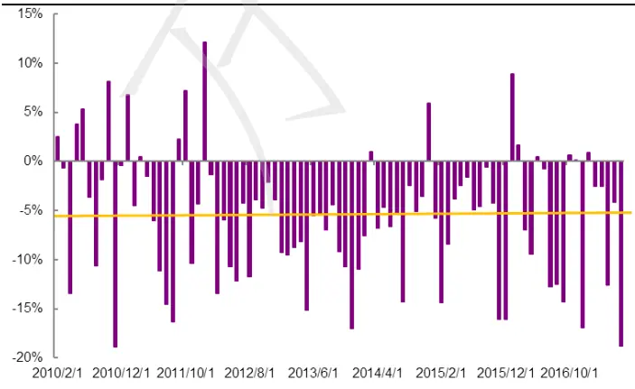
资料来源：光大证券研究所

图 8：OCVP 因子单调性显著
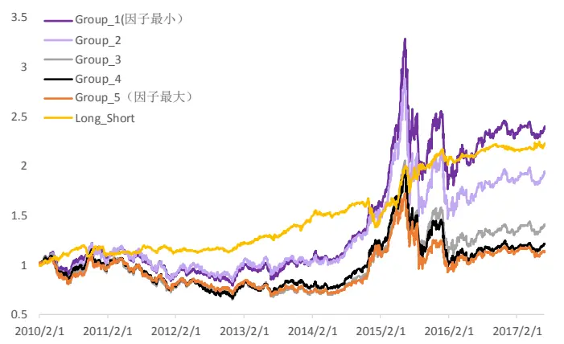
资料来源：光大证券研究所，注：2010.02.01-2017.07.31

BCVP因子单调性较差，因子值最大组显著跑输其余组别。从下图可以发现，BCVP 因子的分组效果较一般，第五组显著跑输其余组别；多空组合（第一组对冲第五组）年化收益约 12.40%，夏普比率1.12，最大回撤为14.5%。

图 9：BCVP 因子 Rank IC 序列
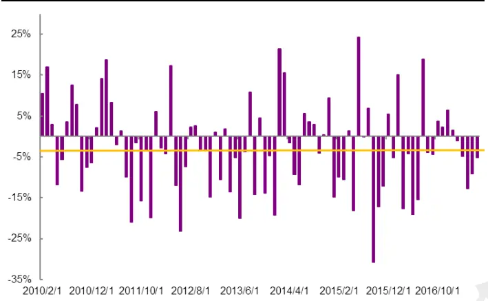
资料来源：光大证券研究所

图 10：BCVP 因子单调性尚可
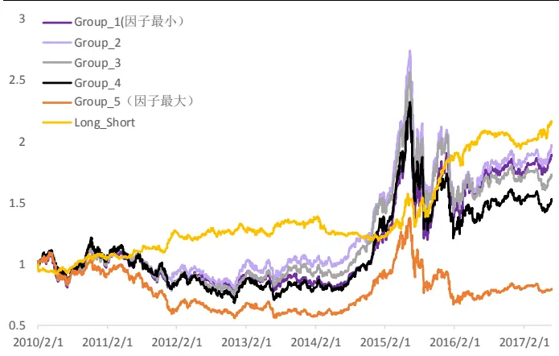
资料来源：光大证券研究所，注：2010.02.01-2017.07.31

## 3.3、成交量占比因子最优参数选择

在前文我们已阐明了成交量占比因子OCVP 和BCVP 的具体构造方式，其中涉及到参数d（前d个交易日移动平均）的选择和是否进行时间加权（TW=1:表示是，0 代表否）。下面我们将从组合的年化收益率、累积收益率、年化波动率、夏普比率和最大回撤五个维度对比参数的选择对于组合表现的影响（注：优参回测过程暂不考虑交易成本）。

## 3.3.1、回测框架建立

通过对因子的分布特征及有效性检验，我们发现 OCVP 因子和 BCVP 因子均与股票未来收益存在较强的负相关性，下面将以此为依据建立回测体系。后文的策略回测分析均基于此框架。

表3：因子选股策略回测框架

|  | 因子选股回测框架 |
| --- | --- |
| 回测时间区间 | 2010年2月1日至2017年7月31日 |
| 回测股票池 | 全部 A 股（剔除选股日ST/PT股票；剔除上市不满一年的股票；剔除选股日由于停牌等因素无法买入的股票) |
| 配置股票数量 | 100只 |
| 调仓频率 | 月度调仓 |
| 调仓方式 | 每月最后一个交易日收盘后，根据本月所有未被剔除的股票数据计算因子值，选择因子值最小的100只股票等权配置 |
| 交易费率 | 回测阶段做费率敏感性测试 |

资料来源：光大证券研究所

## 3.3.2、10 日简单移动平均 OCVP 表现突出

10 日简单移动平均 OCVP 回测效果较好。当 d=10 时，即取前十个交易日的集合竞价成交量占比计算因子值时，组合的回测效果最佳，年化收益率可达19.6%，夏普比率为1.01，最大回撤为39.6%，在 d的所有选择中最小。

表 4：因子参数测试：10 日移动平均 OCVP 因子表现突出

| 年化收益率 |  | 累积收益率 | 年化波动率 | Sharp 比 | 最大回撤 |
| --- | --- | --- | --- | --- | --- |
| d_5 | 16.7% | 205.3% | 19.8% | 0.88 | 42.1% |
| d_10 | 19.6% | 263.8% | 19.5% | 1.01 | 39.6% |
| d_15 | 17.2% | 214.5% | 19.4% | 0.91 | 40.6% |
| d_20 | 14.7% | 169.5% | 19.5% | 0.80 | 42.5% |
| d_m | 17.3% | 215.8% | 19.4% | 0.92 | 41.2% |
| d_25 | 15.4% | 181.5% | 19.3% | 0.84 | 42.8% |
| d_30 | 16.2% | 196.5% | 19.0% | 0.89 | 42.4% |
| d_35 | 14.1% | 159.0% | 19.1% | 0.79 | 42.1% |
| d_40 | 14.2% | 160.1% | 19.0% | 0.79 | 41.8% |
| d_45 | 14.1% | 159.2% | 19.1% | 0.79 | 41.8% |
| d_50 | 13.9% | 156.0% | 18.7% | 0.79 | 41.5% |
| d_55 | 14.4% | 164.7% | 18.7% | 0.81 | 41.5% |
| d_60 | 13.3% | 146.6% | 18.8% | 0.76 | 41.5% |

资料来源：光大证券研究所，注：d_m 代表一个自然月

引入时间效用权重，5 日指数移动平均 OCVP 因子表现较好。当 d=5 时，通过指数移动平均计算的集合竞价成交量占比因子，选股组合的回测效果最佳，年化收益率可达18.3%，夏普比率为 0.95，最大回撤为 42.0%；时间加权因子的最优效果略差于原始 OCVP 因子。

表5：因子参数测试：5日指数加权移动平均TWOCVP因子表现突出

|  | 年化收益率 | 累积收益率 | 年化波动率 | Sharp 比 | 最大回撤 |
| --- | --- | --- | --- | --- | --- |
| d_5 | 18.3% | 236.4% | 19.7% | 0.95 | 42.0% |
| d_10 | 16.5% | 200.7% | 19.5% | 0.88 | 41.5% |
| d_15 | 16.3% | 197.3% | 19.3% | 0.88 | 40.8% |
| d_20 | 16.2% | 196.5% | 18.9% | 0.89 | 38.9% |
| d_m | 17.0% | 210.6% | 19.5% | 0.90 | 43.1% |
| d_25 | 16.2% | 194.8% | 19.0% | 0.88 | 39.6% |
| d_30 | 16.1% | 194.4% | 19.0% | 0.88 | 40.9% |
| d_35 | 14.8% | 171.7% | 19.0% | 0.83 | 41.5% |
| d_40 | 15.0% | 174.2% | 19.0% | 0.83 | 42.3% |
| d_45 | 14.9% | 172.9% | 19.0% | 0.83 | 42.1% |
| d_50 | 15.2% | 178.7% | 18.9% | 0.85 | 41.9% |
| d_55 | 14.8% | 170.5% | 18.7% | 0.83 | 41.6% |
| d_60 | 14.1% | 158.7% | 18.6% | 0.80 | 40.9% |

资料来源：光大证券研究所，注：d_m 代表一个自然月

时间效用加权的 OCVP 因子随 d 变化单调性较好。对比不同参数 d 的组合年化收益，当d>15 个交易日时，时间加权因子选股整体的收益率有所提升，且随d 逐渐增大，收益率呈现平稳的单调递减趋势。

图 11：OCVP 因子不同参数下组合的年化收益率对比
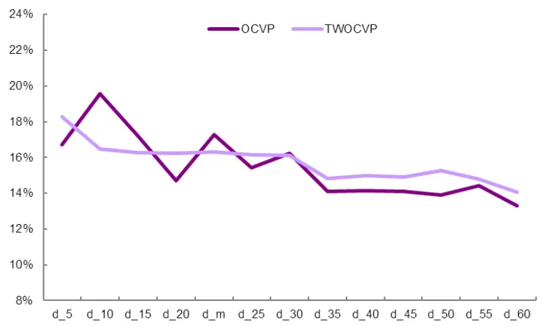
资料来源：光大证券研究所

## 3.3.3、一个自然月简单移动平均 BCVP表现较好

一个自然月简单移动平均BCVP表现突出。即取一个月收盘前5 分钟成交量占比计算因子值时，组合的回测效果最佳，年化收益率可达 20.0%，夏普比率为 0.93，最大回撤为 47.1%。与同样不加权重的 OCVP 因子相比，尽管组合的年化收益率有小幅提升，但年化波动率、最大回撤等均显著增加，进而导致夏普比率有所降低，组合风险提升。

表 6：因子参数测试：一个自然月简单移动平均 BCVP 因子表现突出

|  | 年化收益率 | 累积收益率 | 年化波动率 | Sharp 比 | 最大回撤 |
| --- | --- | --- | --- | --- | --- |
| d_5 | 17.5% | 220.8% | 22.1% | 0.84 | 47.0% |
| d_10 | 15.8% | 188.7% | 21.9% | 0.78 | 46.8% |
| d_15 | 14.3% | 163.2% | 22.1% | 0.72 | 45.2% |
| d_20 | 14.3% | 163.3% | 22.4% | 0.71 | 46.7% |
| d_m | 20.0% | 273.5% | 22.3% | 0.93 | 47.1% |
| d_25 | 15.8% | 188.2% | 22.5% | 0.77 | 45.5% |
| d_30 | 14.1% | 158.8% | 22.5% | 0.70 | 45.3% |
| d_35 | 13.5% | 149.7% | 22.8% | 0.67 | 46.6% |
| d_40 | 13.3% | 147.1% | 22.7% | 0.67 | 46.1% |
| d_45 | 11.2% | 115.0% | 22.7% | 0.58 | 46.9% |
| d_50 | 12.2% | 129.7% | 22.7% | 0.62 | 46.4% |
| d_55 | 11.8% | 123.6% | 22.7% | 0.60 | 47.5% |
| d_60 | 11.5% | 119.5% | 22.8% | 0.59 | 47.2% |

资料来源：光大证券研究所，注：d_m 代表一个自然月

引入时间加权因子后，5 日指数移动平均 BCVP 因子表现较好。当 d=5 时，通过指数移动平均计算收盘前5 分钟成交量占比计算因子值时，组合的回测效果最佳，年化收益率可达 19.6%，夏普比率为 0.93，最大回撤为 46.9%；时间加权因子的最优效果略差于OCVP 因子。

表7：因子参数测试：5日指数加权移动平均TWBCVP因子表现突出

|  | 年化收益率 | 累积收益率 | 年化波动率 | Sharp 比 | 最大回撤 |
| --- | --- | --- | --- | --- | --- |
| d_5 | 19.6% | 264.0% | 21.9% | 0.93 | 46.9% |
| d_10 | 18.3% | 236.1% | 21.8% | 0.88 | 46.1% |
| d_15 | 17.8% | 225.7% | 21.8% | 0.86 | 45.9% |
| d_20 | 16.8% | 207.7% | 22.1% | 0.82 | 46.5% |
| d_m | 16.7% | 204.7% | 19.7% | 0.88 | 44.7% |
| d_25 | 15.6% | 184.3% | 22.0% | 0.77 | 47.5% |
| d_30 | 15.3% | 179.1% | 22.2% | 0.75 | 47.2% |
| d_35 | 15.1% | 177.0% | 22.4% | 0.74 | 47.4% |
| d_40 | 14.5% | 166.2% | 22.5% | 0.71 | 47.1% |
| d_45 | 14.3% | 163.0% | 22.7% | 0.70 | 46.6% |
| d_50 | 13.4% | 147.4% | 22.6% | 0.67 | 46.6% |
| d_55 | 13.0% | 142.3% | 22.7% | 0.65 | 46.4% |
| d_60 | 13.4% | 148.4% | 22.8% | 0.67 | 46.9% |

资料来源：光大证券研究所，注：d_m 代表一个自然月

时间效用加权的BCVP因子整体提升了组合的收益率。对比不同参数 d时的组合年化收益，时间加权因子选股整体的收益率有所提升，且随d逐渐增大，收益率呈现显著的单调递减趋势。而原始的BCVP因子收益率随d 改变呈抛物线趋势，在一个自然月时年化收益达到峰值。

图 12：BCVP 因子不同参数下组合的年化收益率对比
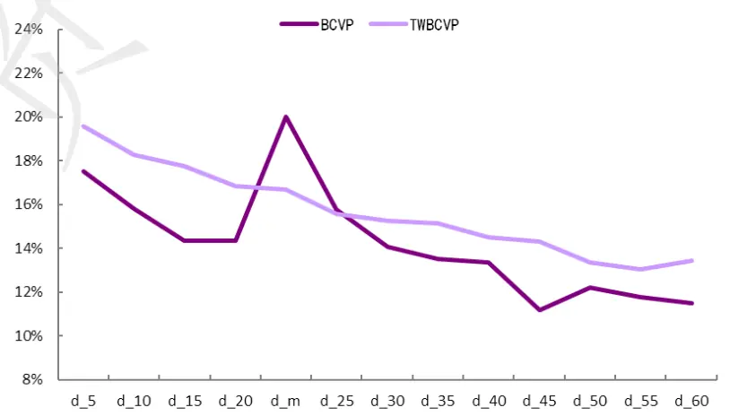
资料来源：光大证券研究所，注：2010.02.01-2017.07.31

OCVP和 BCVP因子月度选股的多头收益尚可。从2010 年至 2017 年 7 月的回测结果来看，不考虑交易成本时策略相对表现：OCVP因子选股相对于中证 500 的超额收益为 10.6%，相对波动率为 11%，信息比率达 0.97，相对回撤达 22.2%。BCVP因子选股相对于中证500的超额收益为 11.6%，相对波动率为11.1%，信息比率达 1.04，相对回撤为13.5%。BCVP因子的历史回测效果略胜于OCVP因子。

图 13：OCVP(d=10,TW=0)因和 BCVP(d=m,TW=0)因子回测净值走势
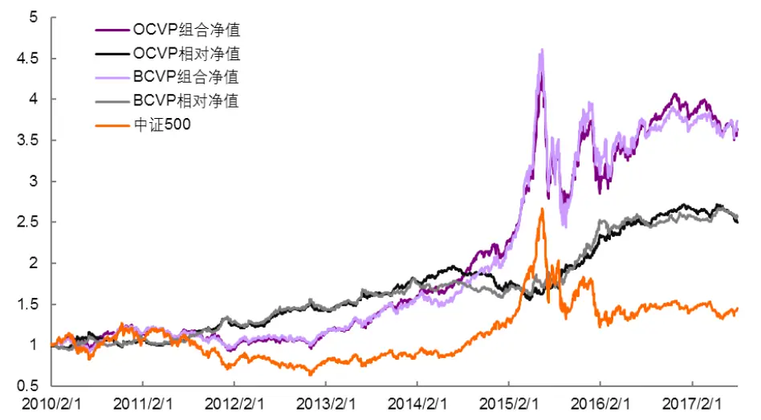
资料来源：光大证券研究所，注：2010.02.01-2017.07.31

## 4、日内交易首尾因子效应叠加

## 4.1、复合因子 OBCVP 选股能力显著提升

## 4.1.1、成交量占比复合因子构建

尽管成交量占比因子 OCVP 和 BCVP 的有效性测试各项指标均较显著，且最优参数下具有相对稳定的年化收益，但单个因子的选股年化收益率依然不够理想。OCVP代表了日内交易行为反映的第一时点，而BCVP 代表了日内交易信息及投资者情绪反映到交易行为的最后时点。如何将两个特殊时点的因子组合，提升选股能力将是本节探讨的核心问题。

图 14：OCVP 因子与 BCVP 因子效应叠加示意图
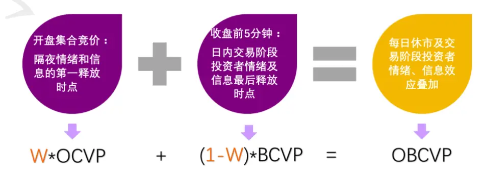
资料来源：光大证券研究所

复合多个因子最直观的方法是给因子赋予不同的权重，从 OCVP 因子和BCVP 因子的有效性检测指标和回测结果分析：OCVP因子的单调性、IC 指标和 IR 指标等均优于 BCVP，直观的感觉应赋予 OCVP 因子相对更高的权重。初步确定了组合方法后，选择哪些参数下的因子组合也尤为关键。

由于停牌的影响，不同参数下因子值缺失值的数量和位置不尽相同，因此基于因子加权的各个单因子计算方式和参数应尽量保持一致，以最大化降低缺失值的影响。结合单因子回溯的年化收益率及因子计算方式等，我们最终选定下图中星号标记的两个因子 OCVP（d=5,TW=1）和 BCVP（d=5,TW=1）作为组合因子的基础构成。

图 15：OCVP 因子与 BCVP因子不同参数下回溯年化收益率
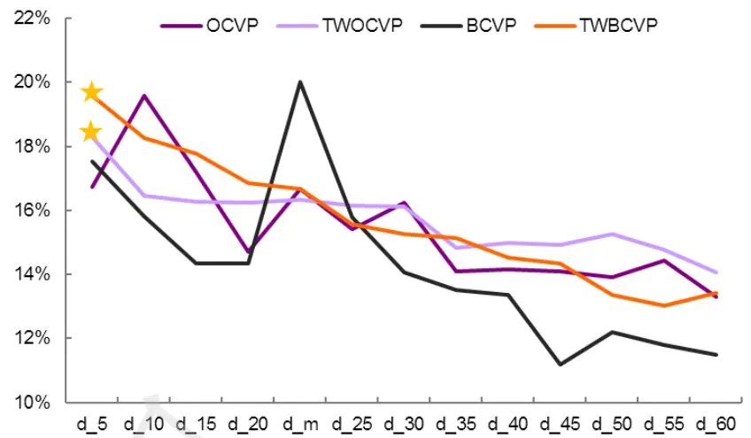
资料来源：光大证券研究所

## 4.1.2、寻找复合因子最优权重配比

为了寻找复合因子中单因子的最优权重，我们设OCVP的权重为w，则BCVP的权重即为 1-w，在[0,1]之间以 0.01 为间隔取 w，遍历所有的 w 计算 OBCVP因子选股组合的回测指标。

复合因子存在最优权重区间。从下图可看出，OCVP 的权重 w的变化与复合因子选股组合的收益率变动呈现较强的非线性性，当w在[ 0.85 , 0.93]之间时，组合的年化收益率稳定于23%以上。我们选择年化收益和夏普比率都相对最高的复合因子作为最终的高频数据成交量占比代表因子。

$$
\mathrm{OBCVP}=0.91*\mathrm{OCVP}+0.09*\mathrm{BCVP}
$$

图 16：复合因子中 OCVP的权重在[0.85, 0.93]时组合年化收益达峰值
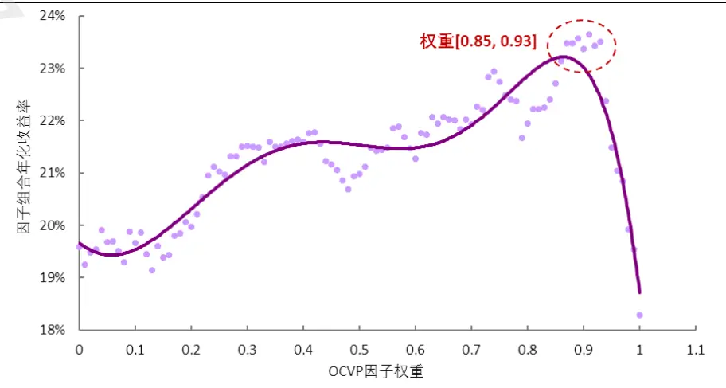
资料来源：光大证券研究所，注：2010.02.01-2017.07.31

复合后的 OBCVP 因子仍旧呈现“尖峰、厚尾”的分布特征，但由于引入 BCVP因子，其峰度较初始的 OCVP 因子有所下降，因此我们仍沿用前文的 MAD方法处理极值。

图 17：OCVP 因子、BCVP 因子及复合因子 OBCVP 分布
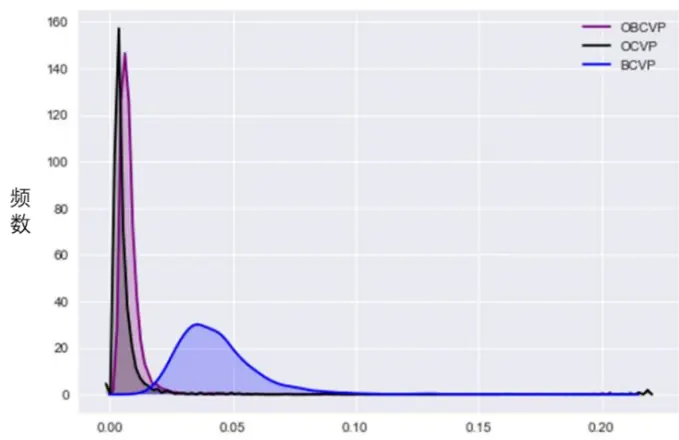
资料来源：光大证券研究所，注：以 2017 年 6 月因子数据为例

复合后的 OBCVP 因子的有效性和预测能力较单因子显著提升。因子 IC 大于零的比例仅为 15.73%，说明因子与未来收益的负相关性显著；此外 IC 均值为-7%，IR绝对值大于1，该因子的预测能力突出。

表8：OBCVP因子的有效性测试结果

| OBCVP因子测试指标值 |  |
| --- | --- |
| 因子收益率均值 | -0.55% |
| 因子收益显著性 | -7.897 |
| IC 均值 | -7.0% |
| IC>0 比例 | 15.73% |
| IC > 0.02 比例 | 9.0% |
| IC 标准差 | 6.8% |
| 信息比 IR | -1.024 |

资料来源：光大证券研究所

复合因子OBCVP分组效果进一步提升。我们同样根据因子值从小到大排序将股票后等分为 5 组，分别计算其净值曲线。从下图可以看到，OBCVP 因子的分组效果很好，分组收益区分度明显；多空组合即第一组对冲第五组年化收益约15.10%，夏普比率达 3.03，最大回撤为10.2%。

图 18：OBCVP 因子 Rank IC 序列
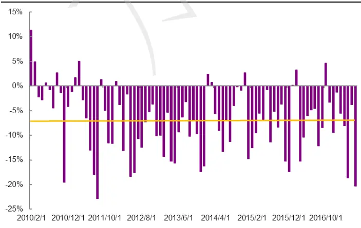
资料来源：光大证券研究所

图 19：OBCVP 因子具备良好的单调性
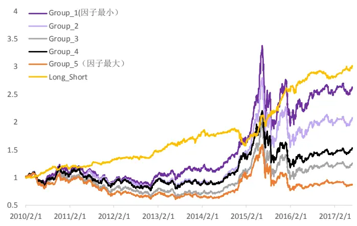
资料来源：光大证券研究所，注：2010.02.01-2017.07.31

## 4.2、OBCVP 因子选股组合收益可观

OBCVP 因子选股策略对费率变化较敏感。因子性能检验阶段的回测结果均未考虑交易成本，对比不同费用比率下的因子选股策略回测指标，我们发现由于成交量占比因子的月度换手率较高，平均换手率高达 60%，因此该因子的选股策略对费率的敏感度较高。依照前文回测框架月度调仓，每月等权配置 100 只股票，随着费率从 0.0%上升到单边 0.3%时，组合年化收益率从23.6%下降到 16.3%。

表 9：不同费率下 OBCVP 因子选股组合回测指标

|  | 年化收益率 | 累积收益率 | 年化波动率 | sharp 比率 | 最大回撤 |
| --- | --- | --- | --- | --- | --- |
| fee = 0.0% | 23.6% | 363.2% | 20.8% | 1.13 | 41.1% |
| fee = 0.1% | 21.1% | 299.5% | 20.7% | 1.03 | 41.4% |
| fee = 0.2% | 18.7% | 244.4% | 20.7% | 0.93 | 41.7% |
| fee = 0.3% | 16.3% | 196.8% | 20.7% | 0.83 | 42.0% |

资料来源：光大证券研究所，注：2010.02.01-2017.07.31，单边费率

图 20：不同费率下 OBCVP 因子选股组合与中证 500 净值走势
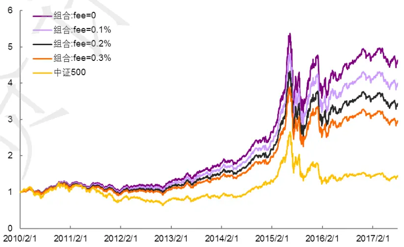
资料来源：光大证券研究所，注：2010.02.01-2017.07.31，单边费率

OBCVP 因子月度选股的多头策略收益可观。从 2010 年至 2017 年近 8 年的回测结果来看（不考虑交易成本）：

（1）策略绝对表现：年化收益率可达 23.6%，年化波动率为 20.8%，夏普比率 1.13；

（2）策略相对表现：相对于中证 500 的超额收益为 14.7%，相对波动率为10.9%，信息比率达1.35，相对回撤为13.3%，平均月胜率为 65.9%；

（3）策略分年度表现：策略在 2015 年时经历了较大的回撤，八年中有两年跑输基准，年胜率为75%，跑赢的六年平均超额收益为 20.4%，跑输的两年平均超额收益为-4.8%。

图 21：OBCVP 因子选股组合相对中证 500 净值走势
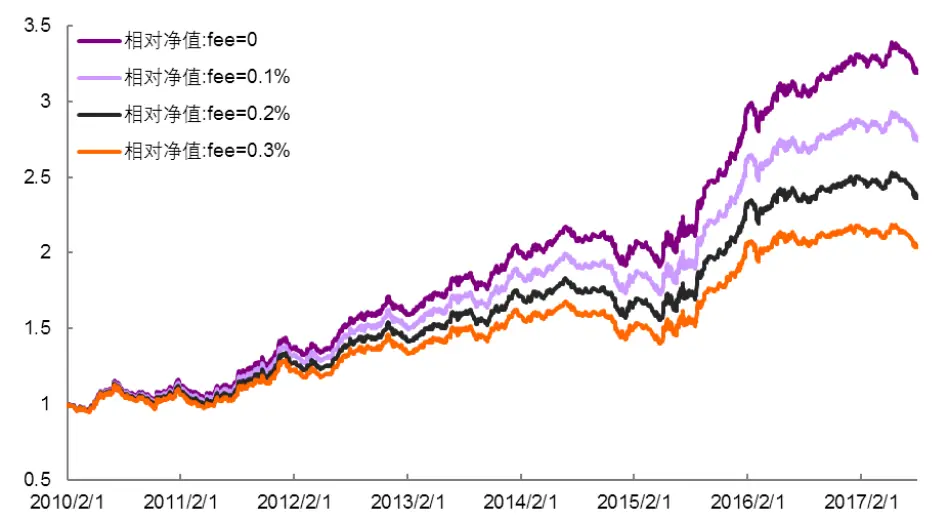
资料来源：光大证券研究所，注：2010.02.01-2017.07.31

表 10：OBCVP 因子选股组合分年度回测指标（基准:中证 500）

| 年份 | 年化收益率 | 年化波动率 | sharp 比率 | 最大回撤 | 相对收益率 | 相对波动率 | 信息比率 | 相对回撤 | 月均胜率 |
| --- | --- | --- | --- | --- | --- | --- | --- | --- | --- |
| 2010 | 30.0% | 18.1% | 1.54 | 14.6% | 8.6% | 11.9% | 0.75 | 13.2% | 50.0% |
| 2011 | -16.0% | 14.2% | -1.15 | 17.7% | 27.3% | 11.5% | 2.17 | 10.8% | 75.0% |
| 2012 | 18.1% | 16.6% | 1.08 | 10.6% | 12.6% | 9.8% | 1.26 | 8.3% | 66.7% |
| 2013 | 44.2% | 16.9% | 2.25 | 10.5% | 19.6% | 9.0% | 2.03 | 5.8% | 66.7% |
| 2014 | 36.1% | 14.3% | 2.23 | 7.9% | -3.7% | 8.3% | -0.42 | 12.1% | 58.3% |
| 2015 | 102.2% | 36.0% | 2.14 | 41.1% | 35.8% | 14.8% | 2.15 | 8.2% | 75.0% |
| 2016 | 8.3% | 22.7% | 0.47 | 18.7% | 18.7% | 9.0% | 1.94 | 6.5% | 75.0% |
| 2017 | -6.0% | 12.0% | -0.46 | 10.8% | -5.9% | 5.9% | -1.01 | 6.1% | 57.1% |
| 2010.2-2017.7 | 23.6% | 20.8% | 1.13 | 41.1% | 14.7% | 10.5% | 1.35 | 13.3% | 65.9% |

资料来源：光大证券研究所

## 5、剔除相关因子后依然具备选股能力

成交量占比复合因子OBCVP是有别于传统低频因子的新因子，我们前文已经对因子进行了有效性、稳定性及单调性测试，证明其具备良好的选股能力；也分年度分析了因子的回测效果。要完善的分析因子的选股能力是来自其内生因素，还需将其与其他常见的基于价量的技术类型因子做相关性测试。

OBCVP因子与低频的VSTD因子相关性较高。分别计算规模因子、动量因子、技术因子、波动因子及流动性因子中单因子测试显著性较高的几个因子与OBCVP因子与之间历史IC值的相关性，从下图的结果发现：OBCVP 因子与流动性因子VSTD（成交额/收益波动率）之间具有较高的正相关性。由于VSTD单因子测试效果突出，为了进一步证明OBCVP因子自身具备选股能力，我们将通过横截面回归取残差的方式，剔除了 VSTD的影响，同时剔除了市值、一个月动量、和行业因素。

$$
OBCVP_{i}=\beta_{1}*VSTD_{i}+\beta_{2}*Monmentum_{i}+\beta_{3}*MC_{i}+\beta_{4}*Industry_{i}+\varepsilon_{i}
$$

图 22：OBCVP 与其他大类因子历史 IC值相关性检验
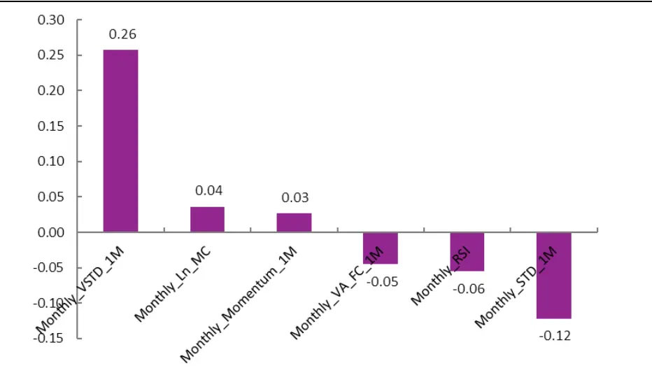
资料来源：光大证券研究所，注：2010.02.01-2017.07.31

剔除VSTD效应 OBCVP选股效果依然显著。对OBCVP因子做行业、市值中性处理并剔除 VSTD、动量影响后，因子的有效性检验等结果仍然显著，IC 大于零的比例为 13.5%，IR 绝对值达 0.79。此外因子的分组效果略有减弱，多空组合年化收益为8.71%，夏普比率达2.21。

图 23：中性化后的 OBCVP 因子 Rank IC 序列
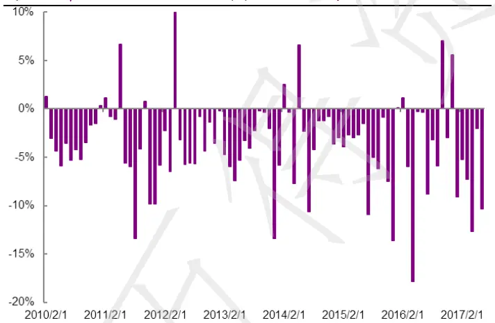
资料来源：光大证券研究所

图 24：中性化后的 OBCVP因子单调性良好
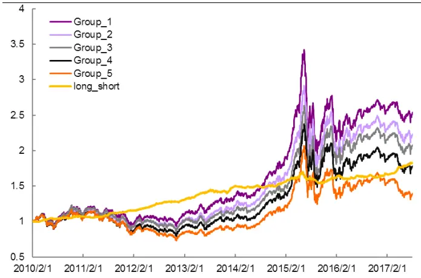
资料来源：光大证券研究所，注：2010.02.01-2017.07.31

中性化处理后 OBCVP 因子的选股效果有所下降，2010 年至今的年化收益为14.6%，组合依旧有两年跑输基准，跑输的两年相对收益率为-2.41%，中性化处理后的 OBCVP 因子选股组合波动性有了显著下降。

图 25：中性化前后 OBCVP选股组合分年度收益率对比
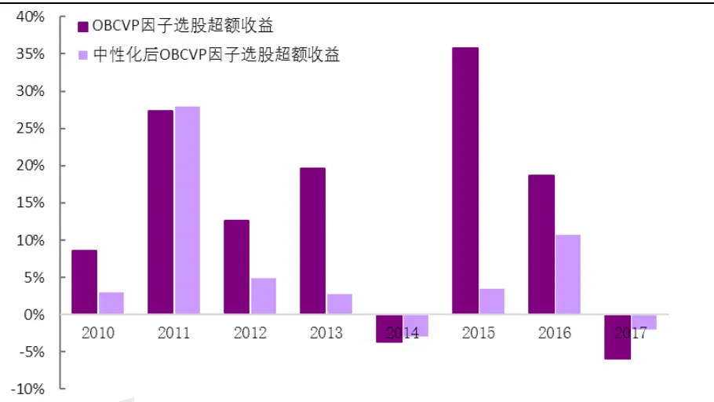
资料来源：光大证券研究所，注：2010.02.01-2017.07.31

表11：中性化后的 OBCVP因子选股组合分年度回测指标（基准:中证 500）

| 年份 | 年化收益率 | 年化波动率 | sharp 比率 | 最大回撤 | 相对收益率 | 相对波动率 | 信息比率 | 相对回撤 |
| --- | --- | --- | --- | --- | --- | --- | --- | --- |
| 2010 | 23.26% | 18.09% | 1.247 | 15.46% | 2.99% | 11.43% | 0.315 | 14.49% |
| 2011 | -15.64% | 14.43% | -1.106 | 19.18% | 27.96% | 10.85% | 2.328 | 7.25% |
| 2012 | 10.01% | 16.14% | 0.672 | 14.71% | 4.85% | 9.53% | 0.545 | 9.35% |
| 2013 | 23.75% | 17.95% | 1.278 | 11.63% | 2.80% | 9.07% | 0.350 | 10.89% |
| 2014 | 37.20% | 14.91% | 2.197 | 9.60% | -2.88% | 8.49% | -0.302 | 9.19% |
| 2015 | 53.93% | 36.21% | 1.374 | 44.33% | 3.48% | 14.22% | 0.311 | 14.82% |
| 2016 | 1.33% | 21.67% | 0.170 | 16.85% | 10.74% | 9.30% | 1.144 | 5.96% |
| 2017 | -1.98% | 11.35% | -0.119 | 8.79% | -1.95% | 5.44% | -0.334 | 4.01% |
| 2010.2-2017.7 | 14.60% | 20.71% | 0.762 | 44.33% | 6.28% | 10.31% | 0.642 | 19.93% |

资料来源：光大证券研究所

由此可见，经过VSTD、市值、动量、行业中性化后的成交量占比复合因子OBCVP 依旧表现出了不俗的预测能力和选股能力。也可以证明集合竞价成交量占比一定程度上可以反应市场对于股票的关注程度和投资者观点的一致程度，因而该因子具有其独有的选股能力。

## 分析师声明

负责准备本报告以及撰写本报告的所有研究分析师或工作人员在此保证，本研究报告中关于任何发行商或证券所发表的观点均如实反映分析人员的个人观点。负责准备本报告的分析师获取报酬的评判因素包括研究的质量和准确性、客户的反馈、竞争性因素以及光大证券股份有限公司的整体收益。所有研究分析师或工作人员保证他们报酬的任何一部分不曾与，不与，也将不会与本报告中具体的推荐意见或观点有直接或间接的联系。

## 分析师介绍

刘均伟 金融工程首席分析师，复旦大学学士，上海财经大学硕士，10 年金融工程研究经验。现任职于光大证券研究所，研究领域为衍生品及量化投资。

## 行业及公司评级体系

买入—未来6-12 个月的投资收益率领先市场基准指数15%以上；

增持—未来 6-12 个月的投资收益率领先市场基准指数 5%至 15%；

中性—未来 6-12 个月的投资收益率与市场基准指数的变动幅度相差-5%至 5%；

减持—未来 6-12 个月的投资收益率落后市场基准指数 5%至 15%；

卖出—未来6-12 个月的投资收益率落后市场基准指数15%以上；

无评级—因无法获取必要的资料，或者公司面临无法预见结果的重大不确定性事件，或者其他原因，致使无法给出明确的投资评级。

市场基准指数为沪深 300指数。

## 分析、估值方法的局限性说明

本报告所包含的分析基于各种假设，不同假设可能导致分析结果出现重大不同。本报告采用的各种估值方法及模型均有其局限性，估值结果不保证所涉及证券能够在该价格交易。

## 特别声明

光大证券股份有限公司（以下简称“本公司”）创建于 1996 年，系由中国光大（集团）总公司投资控股的全国性综合类股份制证券公司，是中国证监会批准的首批三家创新试点公司之一。公司经营业务许可证编号：z22831000。

公司经营范围：证券经纪；证券投资咨询；与证券交易、证券投资活动有关的财务顾问；证券承销与保荐；证券自营；为期货公司提供中间介绍业务；证券投资基金代销；融资融券业务；中国证监会批准的其他业务。此外，公司还通过全资或控股子公司开展资产管理、直接投资、期货、基金管理以及香港证券业务。

本证券研究报告由光大证券股份有限公司研究所（以下简称“光大证券研究所”）编写，以合法获得的我们相信为可靠、准确、完整的信息为基础，但不保证我们所获得的原始信息以及报告所载信息之准确性和完整性。光大证券研究所可能将不时补充、修订或更新有关信息，但不保证及时发布该等更新。

本报告根据中华人民共和国法律在中华人民共和国境内分发，仅供本公司的客户使用。

本报告中的资料、意见、预测均反映报告初次发布时光大证券研究所的判断，可能需随时进行调整。报告中的信息或所表达的意见不构成任何投资、法律、会计或税务方面的最终操作建议，本公司不就任何人依据报告中的内容而最终操作建议作出任何形式的保证和承诺。

在法律允许的情况下，本公司及其附属机构可能持有报告中提及的公司所发行证券的头寸并进行交易，也可能为这些公司提供或正在争取提供投资银行、财务顾问或金融产品等相关服务。投资者应当充分考虑本公司及本公司附属机构就报告内容可能存在的利益冲突，不应视本报告为作出投资决策的唯一参考因素。

在任何情况下，本报告中的信息或所表达的建议并不构成对任何投资人的投资建议，本公司及其附属机构（包括光大证券研究所）不对投资者买卖有关公司股份而产生的盈亏承担责任。

本公司的销售人员、交易人员和其他专业人员可能会向客户提供与本报告中观点不同的口头或书面评论或交易策略。本公司的资产管理部和投资业务部可能会作出与本报告的推荐不相一致的投资决策。本公司提醒投资者注意并理解投资证券及投资产品存在的风险，在作出投资决策前，建议投资者务必向专业人士咨询并谨慎抉择。

本报告的版权仅归本公司所有，任何机构和个人未经书面许可不得以任何形式翻版、复制、刊登、发表、篡改或者引用。

## 光大证券股份有限公司研究所 销售交易总部

上海市新闸路 1508 号静安国际广场 3 楼 邮编 200040

总机：021-22169999 传真：021-22169114、22169134

| 销售交易总部 | 姓名 | 办公电话 | 手机 | 电子邮件 |
| --- | --- | --- | --- | --- |
| 上海 | 陈蓉 | 021-22169086 | 13801605631 | chenrong@ebscn.com |
|  | 濮维娜 | 021-62158036 | 13611990668 | puwn@ebscn.com |
|  | 胡超 | 021-22167056 | 13761102952 | huchao6@ebscn.com |
|  | 周薇薇 | 021-22169087 | 13671735383 | zhouww1@ebscn.com |
|  | 李强 | 021-22169131 | 18621590998 | liqiang88@ebscn.com |
|  | 罗德锦 | 021-22169146 | 13661875949/13609618940 | luodj@ebscn.com |
|  | 张弓 | 021-22169083 | 13918550549 | zhanggong@ebscn.com |
|  | 黄素青 | 021-22169130 | 13162521110 | huangsuqing@ebscn.com |
|  | 王昕宇 | 021-22167233 | 15216717824 | wangxinyu@ebscn.com |
|  | 邢可 | 021-22167108 | 15618296961 | xingk@ebscn.com |
|  | 陈晨 | 021-22169150 | 15000608292 | chenchen66@ebscn.com |
| 金融同业与战略客户 | 黄怡 | 010-58452027 | 13699271001 | huangyi@ebscn.com |
|  | 周洁瑾 | 021-22169098 | 13651606678 | zhoujj@ebscn.com |
|  | 丁梅 | 021-22169416 | 13381965696 | dingmei@ebscn.com |
|  | 徐又丰 | 021-22169082 | 13917191862 | xuyf@ebscn.com |
|  | 王通 | 021-22169501 | 15821042881 | wangtong@ebscn.com |
|  | 陈樑 | 021-22169483 | 18621664486 | chenliang3@ebscn.com |
|  | 吕凌 | 010-58452035 | 15811398181 | Ivling@ebscn.com |
| 北京 | 郝辉 | 010-58452028 | 13511017986 | haohui@ebscn.com |
|  | 梁晨 | 010-58452025 | 13901184256 | liangchen@ebscn.com |
|  | 关明雨 | 010-58452037 | 18516227399 | guanmy@ebscn.com |
|  | 郭晓远 | 010-58452029 | 15120072716 | guoxiaoyuan@ebscn.com |
|  | 王曦 | 010-58452036 | 18610717900 | wangxi@ebscn.com |
|  | 张彦斌 | 010-58452040 | 18614260865 | zhangyanbin@ebscn.com |
| 国际业务 | 陶奕 | 021-22169091 | 18018609199 | taoyi@ebscn.com |
|  | 戚德文 | 021-22167111 | 18101889111 | qidw@ebscn.com |
|  | 金英光 | 021-22169085 | 13311088991 | jinyg@ebscn.com |
|  | 傅裕 | 021-22169092 | 13564655558 | fuyu@ebscn.com |
| 深圳 | 黎晓宇 | 0755-83553559 | 13823771340 | lixy1@ebscn.com |
|  | 李潇 | 0755-83559378 | 13631517757 | lixiao1@ebscn.com |
|  | 张亦潇 | 0755-23996409 | 13725559855 | zhangyx@ebscn.com |
|  | 王渊锋 | 0755-83551458 | 18576778603 | wangyuanfeng@ebscn.com |
|  | 张靖雯 | 0755-83553249 | 18589058561 | zhangjingwen@ebscn.com |
|  | 牟俊宇 | 0755-83552459 | 13827421872 | moujy@ebscn.com |
|  | 吴冕 |  | 18682306302 | wumian@ebscn.com |