# 行为金融因子：噪音交易者行为偏差——多因子系列报告之六

- 噪音交易者理论是行为金融学中的经典理论之一。行为金融学是对于现代金融理论的一个非常有效的补充，行为金融模型的一个重要假设是金融市场的参与者大多是存在认知偏差的。行为金融理论中著名的噪音理论认为噪音交易者为了追求回报的最大化，会忽视基本面相关的信息，而去把注意力集中到那些与股票价值无关、但可能影响股票价格产生非理性变动的噪音上，从而在短期内造成股价的不合理变动。

用 Behavior Error 刻画噪音交易者行为偏差。我们用行为偏差变量 BE（Behavior Error）来刻画噪音交易者的交易行为： $BE_{i}=~\beta_{i}^{C}-\beta_{i}^{B}$ ，其中， $\beta_{i}^{B}$ 为行为金融定价模型（BAPM：BehavioralAsset-PricingModel）中的 beta， $\beta_{i}^{C}$ 为资本资产定价模型CAPM中的 beta。与 CAPM模型不同的是，BAPM 允许交易者之间存在异质性，从而 BAPM 得到的 beta包含了传统beta与噪音交易导致的 beta。

利用雪球股吧的股票热度数据构建BAPM中的投资者行为指数MDI。为了构建行为金融定价模型BAPM中的投资者行为指数，我们利用雪球贴吧的股票热度数据，筛选过去一年内股民讨论热度最高的 10 只股票，组成我们的投资者行为指数MDI。实证表明，我国A 股市场的个股 $\cdot\beta_{i}^{B}$ 整体显著低于 $\cdot\beta_{i}^{C}$ ，证明我国市场尚未达到有效市场的标准。

噪音交易者行为偏差波动因子 BE_std 预测能力和选股能力较强。行为偏差波动因子 BE_std 因子在计算时长参数 m 取值小于 20 个交易日的区间内表现较好。且m取值小于 10 个交易日时的IC、IR 值上升格外明显。m=6 时因子 BE_std 的 IC 小于零的比例为 74%，因子与未来收益呈现较强的负相关性，IC 均值为-3.2%，IR值为-0.54。

中性化后的BE_std因子仍有预测能力。对行为偏差波动因子BE_std做行业、市值中性处理并剔除一个月波动 STD_1M、当期净资产/市值BP_LR 因子的影响后，因子的有效性检验等结果仍然显著，但因子收益、IC 均值均有明显下降。中性化后，IC 平均值为-1.55%，IC 大于零的比例为 21.5%，IR 绝对值达-0.49。此外因子的分组效果也有所减弱，多空组合年化收益为 6.0%，夏普比率为0.61。

- 风险提示：测试结果均基于模型和历史数据，模型存在失效的风险。

## 金融工程深度

## 分析师

刘均伟(执业证书编号：S0930517040001)

021-22169151

liujunwei@ebscn.com

## 联系人

周萧潇

021-22167060

zhouxiaoxiao@ebscn.com

## 相关研究

—多因子系列报告之一》《因子测试全集

——多因子系列报告之二》《多因子组合“光大 Alpha 1.0”

——多因子系列报告之三》《别开生面：公司治理因子详解

《见微知著：成交量占比高频因子解析——多因子系列报告之五》

## 1、噪音交易者的行为金融学解释

## 1.1、行为金融基础理论概述

行为金融学可以定义为：心理学在解释金融市场异象中的应用。

行为金融模型所允许的一个重要假设，是市场参与者在估值时是会犯错误的（即认知偏差）。行为金融学的目标则是帮助投资者认识到自己的错误，以及其他人的错误，并且理解产生错误的原因，从而帮助他们避免未来可能发生的认知偏差。

目前行为金融的学术研究领域主要覆盖的代表性问题包括：代表性偏差(representativeness bias) 、 过 度 自 信 (overconfidence) 、 赌 徒 谬 误(gambler’sfallacy)、恐慌(panic)、羊群行为(herding behaviour)、现状偏见(status quo)、生存偏差(survivorship bias)、货币幻觉(money illusion)、损失厌恶(loss aversion)、处置效应(disposition effect)、保守主义(conservatism)甚至自恋(narcissism)。

在有效市场假说中，股价的变动被认为是符合贝叶斯模型的。而行为金融框架则认为投资者的行为是会影响到股票价格的。行为金融理论与有效市场假说的主要不同点在于：

（1） 投资者并不完全理智的参照均值方差模型来进行投资决策，他们很可能受到其他因素的影响，这些因素可以包括个人偏好和其他心理因素等等；

（2） 投资者可能会追随市场风向，尽管有时候市场并不存在明显的方向；

（3） 投资者的异质性导致市场中存在不完全信息；

（4） 由于个人偏好的存在，不同的投资者会偏向于不同的投资机会；

（5） 市场并不总是有效的，套利机会可能存在，但套利机会往往与市场情绪有强相关。

因此，基于以上的几点可以看出，行为金融学是对于现代金融理论的一个非常有效的和符合逻辑的补充。

图1：行为金融学的基础理论体系
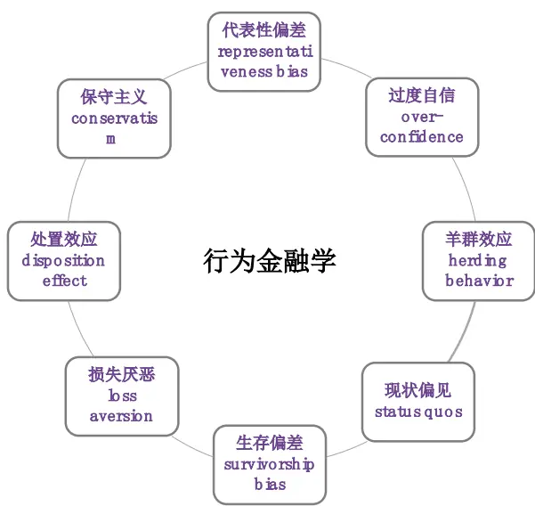
资料来源：光大证券研究所

## 1.2、噪音交易者影响股价波动

根据经典的行为金融学理论，市场参与者可以分为两类：知情交易者与噪音交易者。

噪音理论认为噪音交易者（或者“散户”）为了追求回报的最大化，会忽视基本面相关的信息，而去把注意力集中到那些与股票价值无关、但可能影响股票价格产生非理性变动的噪音上，这种行为会在短期内造成价格的不合理变动。因而导致知情交易者短期的获利降低。

行为金融学里一个非常有名的理论，叫做“噪音交易者风险”（Noise TraderRisk）。这个理论是在 90 年代由哈佛大学的 Delong 等人提出的。简单的说，就是缺乏真正信息的“噪音交易者”对于资产价格的估值会有一些偏差。在传统金融理论模型中，如果这些投资者的交易是独立的行为，最后都被两两抵消掉，因而不会对市场价格造成影响。但是 Delong 认为，真实市场上，散户们的信息是高度相关的，甚至是相互传染的。大家都努力地往一个方向交易，形成系统性的估值偏差，最终反映在市场均衡价格中。如果这种估值偏差是乐观的，市场价格就会持续上涨，如果是悲观的，就会持续下跌。

这样一来，那些知情交易者（或者机构交易者），即使知道这个价格是“错误”的或者是偏离了基本面的，在一定时段内，也很可能会追涨杀跌，引起”更牛“的牛市或者”更熊“的熊市。也正因为此，偏离基本面的”错误定价“可能一直存在在市场上，在相当长的一段时间内甚至会不断加深。也就是说，噪音交易者的行为会导致市场情绪变化，并且进一步影响股票价格。

这篇报告则是从知情交易者与噪音交易者的行为偏差角度，寻找噪音交易者导致的错误定价中带来的投资机会。本篇报告的研究是基于噪音交易者的行为与市场情绪高度相关这样一个常见的假设之上的。因此，我们将首先通过寻找合适的代理变量来描述市场上的噪音交易者行为偏差，并且尝试挖掘出噪音交易行为影响股票价格的模式和规律。

## 2、噪音交易者行为偏差因子的构造

## 2.1、用 BehaviorError 刻画噪音交易者行为偏差

如何寻找量化的指标来较好的刻画噪音交易者行为是首要问题。Ramiah andDavidson (2007) 的 论 文 中 提 出 IANM 信 息 调 整 后 的 噪 音 模 型（Information-Adjusted Noise Model）来捕捉噪音交易者与知情交易者的交易行为之间的关联，并且可以用来区分过度反应、反应不足和信息定价误差。

借鉴 Ramiah 和 Davidson 的研究成果，我们用行为偏差变量 BE（BehaviorError）来刻画噪音交易者的交易行为。首先，利用 Shefrin 和Statman （ 1994 ） 定 义 的 行 为 金 融 定 价 模 型 （ BAPM ：BehavioralAsset-PricingModel）。类似 CAPM 资本资产定价模型，BAPM模型用投资者行为指数（或者情绪指数）来刻画市场在交易者行为下的波动。

BAPM 行为金融定价模型对于 CAPM 的一个变化在于，BAPM 允许交易者之间存在异质性，从而 BAPM 得到的 beta 包含了传统 beta 与噪音交易导致的 beta。

$$
\widetilde{r_{it}}-\widetilde{r_{ft}}=\alpha_{i}+\beta_{i}^{c}\big[\widetilde{r_{mt}}-\widetilde{r_{ft}}\big]+\widetilde{\varepsilon_{it}}\#(1)
$$

其中： $\widetilde{r_{it}}$ 代表时刻 t 股票 i 的收益率， $\widetilde{r_{ft}}$ 代表时刻 t 的无风险收益， $\widetilde{r_{mt}}$ 代表时刻 t 的市场整体收益率， $\widetilde{\varepsilon_{it}}$ 为残差项， $\alpha_{i}$ 为回归方程的截距项， $\beta_{i}^{c}$ 则是CAPM 模型的 beta。

将上式略作改写，则可以得到下面包含 behavioralbeta $1\beta_{i}^{B}$ 和噪音项 $\eta_{i}$ 的回归方程:

$$
\widetilde{r_{it}}-\widetilde{r_{ft}}=\alpha_{i}+\big(\beta_{i}^{B}+\eta_{i}\big)\big[\widetilde{r_{mt}}-\widetilde{r_{ft}}\big]+\widetilde{\varepsilon_{it}}\#(2)
$$

这里的噪音项ηi则可以由 CAPM 的 beta $与$ BAPM 的 beta 的差来定义，这里我们就将它称为行为偏差 BehaviorError（BE）。行为偏差 BehaveError即为噪音交易者风险的代理变量。

$$
BE_{i}=\eta_{i}=\beta_{i}^{C}-\beta_{i}^{B}\#(3)
$$

BAPM 的 beta 则是由 Shefrin 和 Statman（1994）定义的行为金融定价模型（BAPM：BehavioralAsset-PricingModel）来计算得出的：

$$
\widetilde{r_{it}}-\widetilde{r_{ft}}=\alpha_{i}+\beta_{i}^{B}\big[\widetilde{r_{mt}}^{B}-\widetilde{r_{ft}}\big]+\widetilde{\varepsilon_{it}}\#(4)
$$

这里 $的\widetilde{r_{mt}}^{B}$ 代表t时刻“投资者行为指数”的收益率。那么对于 $\cdot\beta_{i}^{B}$ 估计的关键就在于，如何定义这里的“投资者行为指数”。同时，假设有效市场假说成立，那么E(BE) = 0也必须成立，通过计算BE的分布情况，我们就可以验证有效市场的假设在当前A 股是否成立。

参考 Ramiah 和 Davidson 的定义，他们在衡量 $\cdot\beta_{i}^{B}$ 所使用的“投资者行为指数”是MumsandDadsIndex（MDI），也就是最为受到散户投资者欢迎的股票指数，当然 A 股市场上还没有现成的类似指数可供参考，因此我们利用雪球等股吧的股票对应发帖数量来作为筛选受散户欢迎股票的参考标准。下一节中会具体解释我们的 MDI（MomsandDadsIndex）的构造方式。

## 2.2、基准投资者行为指数的选取：借鉴雪球讨论热度

利用雪球等股吧的股票热度数据，筛选一定期限内股民讨论热度最高的股票组成我们的投资者行为指数，借用MumsandDadsIndex（MDI）的命名方式，我们将该指数命名为MDI。

雪球的股吧讨论热度数据来自通联数据，数据起始日期为 2010 年，我们尝试了 2 种 MDI 的构造方式来寻找最能够有效刻画噪音交易者的行为偏差的MDI：

（1） 年度调整入选成分股，取上一年度帖子数量最高的 10 只股票，命名为 MDI_v1；

（2） 年度调整入选成分股，取上一年度帖子数量最高的、且机构总持股比例小于 50%的10 只股票入选成分股，命名为MDI_v2。

由于数据可得性上的限制，股票关注度的数据可得时间为 2010 年至今，因此后文的测试时间段都被限制在 2010 年以后，为了能够更好的与市场基准指数匹配，MDI 指数的加权方式为流通市值加权。

表 1：散户关注度指数 MDI_v1 和 MDI_v2 的成分股明细（2011 年至今）

|  | 关注度排名 | 2011 | 2012 | 2013 | 2014 | 2015 | 2016 | 2017 |
| --- | --- | --- | --- | --- | --- | --- | --- | --- |
| MDI_v1 | 1 | 中国联通 | 招商银行 | 民生银行 | 招商银行 | 中信证券 | 万科A | 格力电器 |
|  | 2 | 中国石化 | 民生银行 | 招商银行 | 中国平安 | 中国平安 | 格力电器 | 中国平安 |
|  | 3 | 万科A | 万科A | 中国平安 | 兴业银行 | 招商银行 | 比亚迪 | 招商银行 |
|  | 4 | 建设银行 | 格力电器 | 五粮液 | 浦发银行 | 兴业银行 | 招商银行 | 万科A |

敬请参阅最后一页特别声明

|  | 5 | 东方航空 | 五粮液 | 兴业银行 | 民生银行 | 浦发银行 | 三聚环保 | 比亚迪 |
| --- | --- | --- | --- | --- | --- | --- | --- | --- |
|  | 6 | 招商银行 | 中国石化 | 比亚迪 | 中信证券 | 民生银行 | 中国平安 | 三聚环保 |
|  | 7 | 工商银行 | 白云山 | 浦发银行 | 比亚迪 | 比亚迪 | 兴业银行 | 兴业银行 |
|  | 8 | 南方航空 | 酒鬼酒 | 白云山 | 万科A | 南山铝业 | 上海家化 | 乐视网 |
|  | 9 | 民生银行 | 中国平安 | 华谊兄弟 | 格力电器 | 国金证券 | 伊利股份 | 长城汽车 |
|  | 10 | 农业银行 | 比亚迪 | 万科A | 中国石化 浙江龙盛 |  | 国投电力 | 华夏幸福 |
|  | 1 | 万科A | 万科A | 民生银行 | 中国平安 | 中信证券 | 格力电器 | 格力电器 |
|  | 2 | 建设银行 | 酒鬼酒 | 比亚迪 | 浦发银行 | 中国平安 | 比亚迪 | 中国平安 |
|  | 3 | 民生银行 | 比亚迪 | 浦发银行 | 民生银行 | 浦发银行 | 中国平安 | 比亚迪 |
|  | 4 | 农业银行 | 长城汽车 | 华谊兄弟 | 中信证券 | 比亚迪 | 兴业银行 | 乐视网 |
| MDI_v2 | 5 | 中信证券 | 农业银行 | 万科A | 比亚迪 | 南山铝业 | 伊利股份 | 民生银行 |
|  | 6 | 华谊兄弟 | 交通银行 | 平安银行 | 万科A | 国金证券 | 四川双马 | 亨通光电 |
|  | 7 | 比亚迪 | 建设银行 | 中信证券 | 网宿科技 | 浙江龙盛 | 天齐锂业 | 赣锋锂业 |
|  | 8 | 交通银行 | 平安银行 | 好想你 | 华谊兄弟 | 万科A | 众和股份 | 伊利股份 |
|  | 9 | 新华保险 | 中信证券 | 交通银行 | 平安银行 | 闰土股份 | 恒生电子 | 天齐锂业 |
|  | 10 | 汉王科技 | 汤臣倍健 | 光线传媒 | 交通银行 | 大智慧 | 亨通光电 | 康得新 |

资料来源：光大证券研究所，通联数据，雪球网

下图展示了两种编制方式下的MDI指数走势与Wind 全A 指数的对比，从整体走势上看，MDI_v1与MDI_v2 的差异并不明显，同时，2017年以来的表现都相当的抢眼。

图 2：MDI_v1 和 MDI_v2 指数走势对比
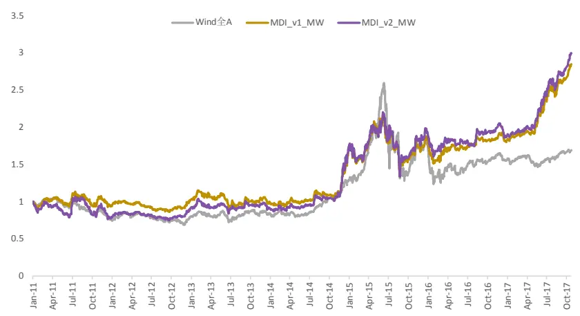
资料来源：光大证券研究所，，注：2011.01.01-2017.11.01

首先，根据噪音交易者行为偏差 BE 的定义可以初步进行一个市场有效性的测试，即检验BE的期望是否显著的不等于0。

下图展示了2010年至今全体A 股的平均 $\beta_{i}^{B}$ 与 $\beta_{i}^{C}$ 的分布情况，其中，CAPM模型中使用的市场基准指数为中证全指指数，BAPM模型中 MDI指数的构造方式分别尝试了上述两种构造方法，下图就展示了MDI_v1 和 MDI_v2 下的BAPM 的 beta 与 CAPM 的 beta 的分布情况：

图 3：BAPM_beta（MDI_v1）与 CAPM_beta 的分布
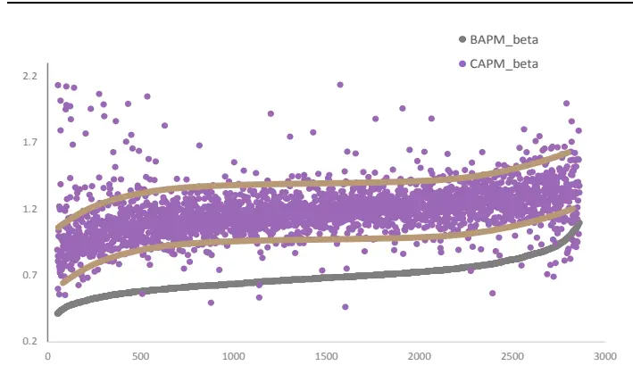
资料来源：光大证券研究所，注：2011.01.01-2017.11.01

图 4：BAPM_beta（MDI_v2）与 CAPM_beta 的分布
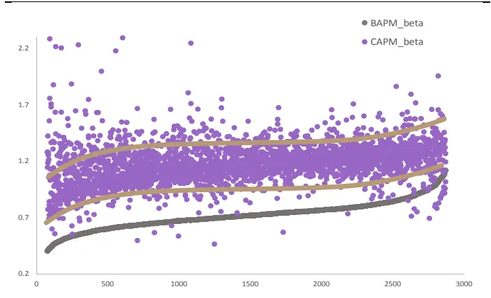
资料来源：光大证券研究所，注：2011.01.01-2017.11.01

由图3 和图4可见，MDI_v1 计算所得的 $\beta_{i}^{B}$ 与该股票相对应的 $\beta_{i}^{c}之$ 间的差异更具有趋势性，也即偏离中枢的异常值更少，因此后文中我们将统一使用MDI_v1 作为投资者行为指数MDI。

同时我们发现， $\beta_{i}^{B}$ 与 $\beta_{i}^{C}$ 之间的确存在较为显著的差异， $\beta_{i}^{B}$ 在 99%的情形下都是小于 $\cdot\beta_{i}^{C}$ 的， $\beta_{i}^{C}$ 要显著的高于 $\cdot\beta_{i}^{B}$ ，也就证明了BE 显著的不等于零，从而得出我国 A股市场的并未达到有效市场的标准的结论。

上图也显示出 A 股不同股票所对应的噪音交易者行为偏差变量 BE（即$\beta_{i}^{C}-\beta_{i}^{B})$ 也存在较为明显的差异。由于BE 也可以理解为股票对于噪音交易行为的暴露程度，因此我们认为，BE 较低的股票（或者一定时间内BE 变化程度较小的股票）拥有相对噪音交易者更小的暴露，从而可能在未来一定时间内具有较高的回报。下面一个章节，我们就将对这里的猜想做测试和验证。

## 3、噪音交易者行为偏差因子有效性测试

## 3.1、BE因子构造方式：行为偏差&行为偏差波动

首先，我们对于噪音交易行为偏差因子（BE）的定义方式有下列两种：

（1） 行为偏差变量 BE 的均值，命名为“行为偏差因子（BE_mean）”：用来刻画股票对于噪音交易行为的暴露程度：取过去 m 个交易日 BE的平均值

（2） 行为偏差变量BE的标准差，命名为“行为偏差波动因子（BE_std）”：用来刻画股票对于噪音交易行为暴露程度的变化：取过去 m 个交易日 BE 的标准差

上述定义背后的逻辑在于：

（1） 行为偏差变量 BE 的均值，可以一定程度上反应噪音交易者在过去一段时间内对于某只股票的关注程度，也就是某只股票对于噪音交易行为的暴露程度；

（2） 行为偏差变量BE的标准差，则可以用来刻画股票对于噪音交易行为的暴露程度的变化情况。如果BE_std上升，也就是说股票的噪音交易风险出现了明显的上升或者下降，这种情况往往代表噪音交易者近期对于该只股票的关注度上升。我们认为 BE_std或许可以更好的反应某只股票当前对于噪音交易的敏感程度，对于噪音交易越敏感的股票，BE_std值越大，那么很可能未来的股票收益率越低。

## 3.2、BE 因子特征分析

BE 因子存在一定的行业和市值差异性。为了排除股票所属行业、市值等外部因素的影响，需要考察因子在不同行业和市值的分布情况。我们分别以沪深300 成分股、中证500成分股中市值最小的作为大市值、中市值和小市值的分界点。BE_mean与BE_std因子的平均数均存在差异，小市值的股票对应的因子值一般较小。按照中信一级行业划分，金融行业的 BE 因子均值较小。因此我们在随后的因子有效性检验时对其做行业中性和市值中性处理。

图 5：BE_mean 因子不同市值中位数与平均数
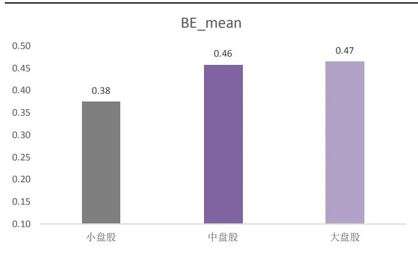
资料来源：光大证券研究所，注：此处 BE_mean 取月度平均

图 6：BE_mean 因子的行业分布中位数
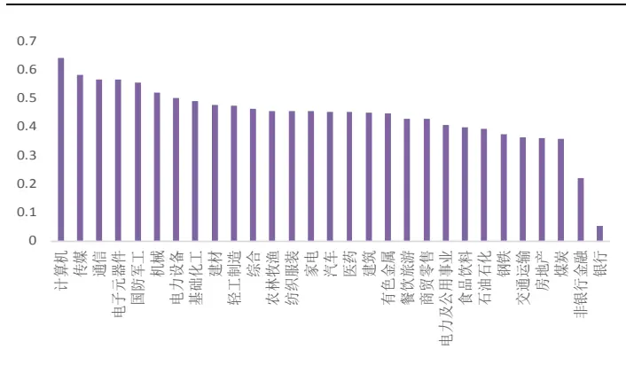
资料来源：光大证券研究所，注：此处 BE_mean 取月度平均

图 7：BE_std 因子不同市值中位数与平均数
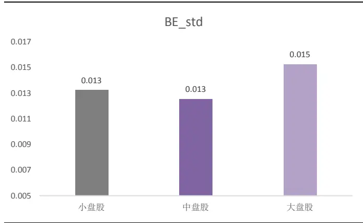
资料来源：光大证券研究所，注：此处 BE_std 取月度标准差
敬请参阅最后一页特别声明

图 8：BE_std 因子的行业分布中位数
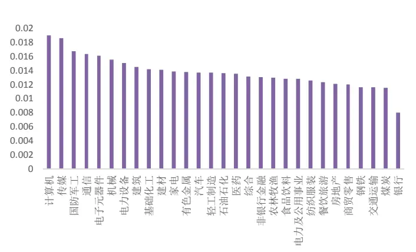
资料来源：光大证券研究所，注：此处 BE_std 取月度标准差

## 3.3、因子有效性检验

对于因子数据的标准化处理和有效性检验我们仍沿用多因子系列报告之一中的方法。

- 有效性及稳定性检验：采用多期截面RLM回归后我们可以得到因子收益序列，以及每一期回归假设检验T 检验的 t 统计量序列，针对这两个序列我们通过以下几个指标来判断该因子的有效性和稳定性：

（1）因子收益序列的假设检验 t 统计量值

（2）因子收益序列大于 0 的概率

（3）t 统计量绝对值的均值

（4）t统计量绝对值大于等于2 的概率

- 有效性及预测能力检验：我们计算行业中性与市值中性处理后的RankIC（因子值与股票次月收益率的秩相关系数），通过以下几个与IC值相关的指标来判断因子的有效性和预测能力：

（1） IC 均值

（2） IC 标准差

（3） IC 大于 0 比例

（4） IC 绝对值大于 0.02 比例

（5） IR（IR = IC 均值/IC 标准差）

## 因子分组回测框架

通过因子值的排序对股票分组，根据每组股票的历史收益情况判断因子的单调性。

表 2：因子分组回测框架

|  | 因子分组回测框架 |
| --- | --- |
| 时间区间 | 2011年1月1日至2017年11月01日 |
| 股票池 | 全部 A 股（剔除选股日ST/PT股票；剔除上市不满一年的股票；剔除选股日由于停牌等因素无法买入的股票) |
| 调仓频率 | 月度调仓 |
| 分组调仓方式 | 每月最后一个交易日收盘后，根据因子值在行业内从小到大排序将股票等分为5组，分别计算每组股票的历史回测收益及多空组合收益(行业等权，行业内市值加权)。 |
| 交易费率 | 因子测试阶段暂不考虑交易费用 |

资料来源：光大证券研究所

## 3.3.1、预测能力：行为偏差波动因子 BE_std 胜出

行为偏差因子 BE_Mean 的有效性、稳定性及预测能力表现较好。以 m 取30 日的 BE_mean 为例，因子 IC 小于零的比例为 60.0%，说明因子与未来收益呈现较为明显的负相关性；此外 IC 均值为-2.2%，IR 绝对值为 0.21，该因子的预测能力尚可。

由图 9 可见，BE_mean 的 m 取值为 20 以上时，因子的 IC 和 IR 表现都相对较好。IR 值基本稳定在-0.2 左右。因此，在利用 BE_mean 因子选股时，可适当放大m 的取值，降低换手率，提高整体组合的表现。

图 9：不同 m取值下的 BE_mean 因子 IC 值
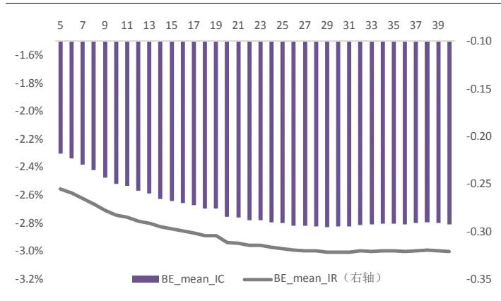
资料来源：光大证券研究所，注：2011.01.01-2017.11.01

图 10：m=30 时 BE_mean 因子的 IC 时间序列
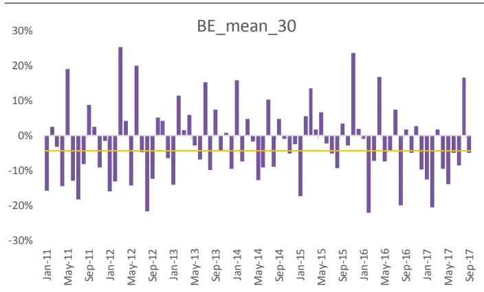
资料来源：光大证券研究所，注：2011.01.01-2017.11.01

行为偏差波动因子 BE_std 的有效性、稳定性及预测能力更强。由图 11 参数 m 的敏感性测试结果可得，BE_std 因子在 m 取值小于 20 个交易日的区间内表现较好。且值得注意的是，m 取值小于10 个交易日时的IC、IR 值上升格外明显。由于样本数量小于5个时计算得到的标准差本身意义不大，因此我们在测试时将m的下限同样设为5。

图12则是以m=6为例，可见m=6时因子BE_std的IC小于零的比例为74%，因子与未来收益呈现较强的负相关性；IC 均值为-2.9%，IR 绝对值为 0.54，可见BE_std的预测能力相对BE_mean 更胜一筹。

图 11：不同 m 取值下的 BE_std 因子 IC 值
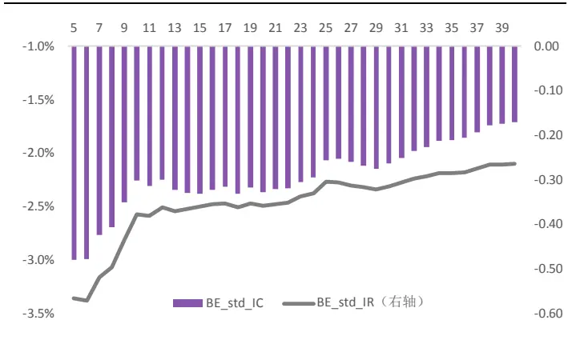
资料来源：光大证券研究所，注：2011.01.01-2017.11.01

图 12：m=6 时 BE_std 因子的 IC 时间序列
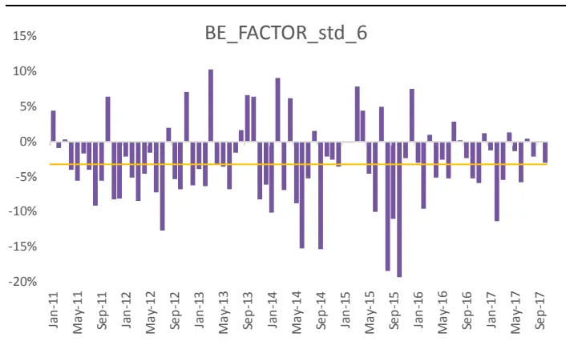
资料来源：光大证券研究所，注：2011.01.01-2017.11.01

敬请参阅最后一页特别声明

表3较为直观的对比了BE_mean_30与BE_std_6的因子有效性测试的IC、IR、显著性等等指标。

表 3：BE_mean_30 与 BE_std_6 因子有效性测试结果对比

| BE_mean_30 |  | BE_std_6 |
| --- | --- | --- |
| 因子收益率均值 | -0.25% | -0.24% |
| 因子收益显著性 | -1.88 | -4.13 |
| IC 均值 | -2.8% | - 3.2% |
| IC> 0 比例 | 37.8% | 26.4% |
| Abs\|IC\|> 0.02 比例 | 60% | 64% |
| IC 标准差 | 11.2% | 5.9% |
| 信息比 IR | -0.25 | -0.54 |

资料来源：光大证券研究所，注：2011.01.01-2017.11.01

行为偏差因子BE_mean的单调性较为一般。我们对比因子分组回测净值及多空对冲净值，从下图可以看到，BE_mean 因子的分组效果一般；多空组合（第一组对冲第五组）年化收益约 4.60%，夏普比率为 0.35，最大回撤达30.5%。

图 13：BE_mean_30因子分组测试历史收益
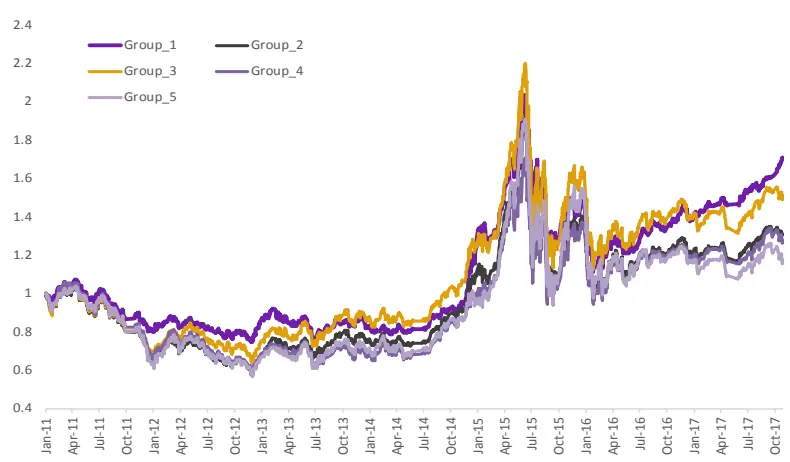
资料来源：光大证券研究所，注：2011.01.01-2017.11.01

行为偏差波动因子BE_std在单调性的表现上有较大的提升，因子值最小组显著跑赢其余组别。从下图可以发现，BE_std 因子的分组效果较好，第一组显著跑输其余组别；多空组合（第一组对冲第五组）年化收益约 7.40%，夏普比率 0.82，最大回撤为 24.9%。

图 14：BE_std_6因子分组测试历史收益
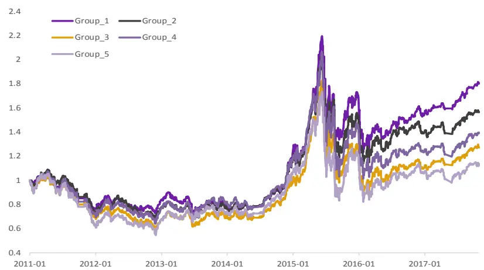
资料来源：光大证券研究所，注：2011.01.01-2017.11.01

综合上面的结论，我们发现行为偏差波动因子 BE_std 的表现整体优于行为偏差因子BE_mean的表现，无论是IC、IR还是分组后的单调性表现，BE_std均显著胜出。

这也印证了我们之前的假设：即噪音投资者的行为偏差波动情况更能够反应出股票当前对于噪音交易者风险的暴露程度的变化情况。

（1） BE_std 越小，代表股票当前对于噪音交易的暴露度变化越小，也就是说噪音交易者在近期并没有在这只股票上过多的交易，或者并没有给予该股票过多的关注。

（2） BE_std 越大，代表股票当前对于噪音交易的暴露度越高，也就是说股票的噪音交易风险出现了明显的上升或者下降，这种情况往往代表噪音交易者近期对于该只股票的关注度上升。

## 3.3.2、选股能力：行为偏差波动因子 BE_std略优

通过对因子的分布特征及有效性检验，我们发现噪音交易者行为偏差因子BE_mean 和BE_std因子均与股票未来收益存在较明显的负相关性，尽管BE_mean 的 IR 值表现不如 BE_std，但换手率却明显低于 BE_std，因此我们仍然一次测试了两种因子构造方式下的选股效果。

表 4：因子选股策略回测框架

|  | 因子选股回测框架 |
| --- | --- |
| 回测时间区间 | 2011年1月1日至2017年11月17日 |
| 回测股票池 | 全部 A 股（剔除选股日ST/PT股票；剔除上市不满一年的股票；剔除选股日由于停牌等因素无法买入的股票) |
| 配置股票数量 | 100只 |
| 调仓频率 | 月度调仓 |
| 调仓方式 | 每月最后一个交易日收盘后，根据本月所有未被剔除的股票数据计算因子值，选择因子值最小的100只股票等权配置 |
| 交易费率 | 单边 0.3% |

资料来源：光大证券研究所

由图15 可见，随着计算BE_std时使用的时长上升，因子的换手率出现较为明显的下降。m=6、18、25 时的选股组合信息比最高，分别为 1.27、1.26和1.27，我们仍然以m=6为例，在图15 中展示了该参数下的BE_std因子选股组合历史净值走势。

图 15：BE_std 因子不同参数 m 下的信息比和换手率
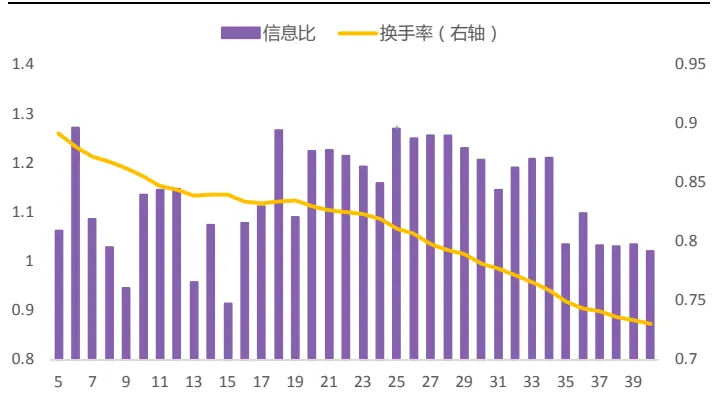
资料来源：光大证券研究所，基准为中证全指

图 16：BE_std_6因子选股组合历史净值
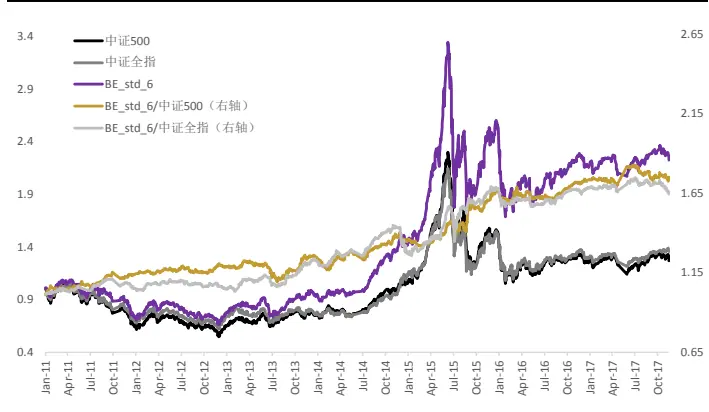
资料来源：光大证券研究所，注：2011.01.01-2017.11.17

表 5：BE_std_6因子选股收益及表现

|  | 年化收益 | 年化波动 | 夏普比例 | 最大回撤 | 相对收益 | 相对波动 | 相对最大回撤 | 信息比 |
| --- | --- | --- | --- | --- | --- | --- | --- | --- |
| 2011 | -27.90% | 20.72% | -1.48 | -32.73% | 8.37% | 4.69% | -3.71% | 1.79 |
| 2012 | 4.00% | 21.77% | 0.29 | -25.36% | -0.47% | 4.75% | -5.75% | -0.10 |
| 2013 | 23.52% | 19.64% | 1.17 | -19.80% | 16.80% | 6.60% | -6.67% | 2.55 |
| 2014 | 55.40% | 18.34% | 2.50 | -7.25% | 6.23% | 7.99% | -12.51% | 0.78 |
| 2015 | 73.69% | 46.22% | 1.43 | -47.11% | 34.61% | 12.62% | -13.62% | 2.74 |
| 2016 | -13.93% | 29.81% | -0.35 | -33.10% | 1.18% | 6.43% | -6.19% | 0.18 |
| 2017 | 9.55% | 11.64% | 0.84 | -8.86% | -1.45% | 4.49% | -3.02% | -0.32 |
| Full | 12.47% | 25.87% | 0.60 | -49.57% | 9.43% | 7.45% | -13.62% | 1.27 |

资料来源：光大证券研究所，注：截止日期 2017-11-17，基准为中证全指

BE_std 因子的选股表现尚可。以 BE_std_6 为例，该因子的累计年化收益率可达 13.27%，夏普比率为 0.60，最大回撤为 49.57%，相对基准的年化超额收益为 9.5%，相对最大回撤 13.62%出现在 2014-2015 年牛市阶段；2011-2017 年的7年中，5 年跑赢基准，2017年的相对回撤较大，跑输500指数 1.45%。

类似的，我们对BE_mean 的不同参数m下的选股效果也进行了测试，由图16 可见，BE_mean 的换手率显著低于 BE_std，并且随着计算 BE_mean时使用的时长m上升，因子的换手率出现较为明显的下降。m=30 时的选股组合信息比最高，为 0.82，我们以 m=30 为例，在图 17 中展示了该参数下的 BE_mean因子选股组合历史净值走势。

图 17：BE_mean因子不同参数 m下信息比和换手率
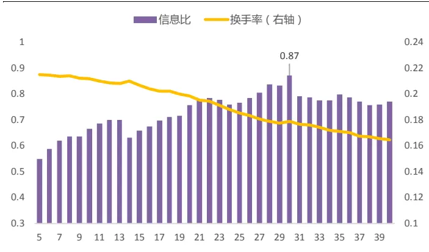
资料来源：光大证券研究所，基准为中证全指

图 18：BE_mean_30因子选股组合历史净值
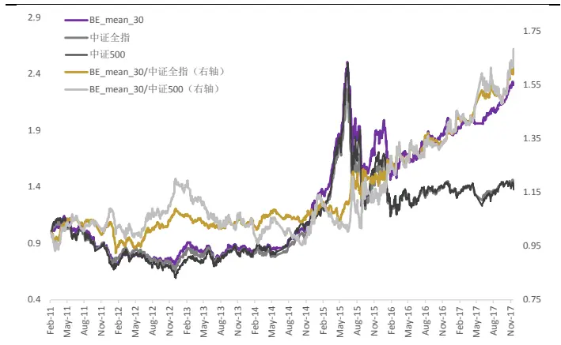
资料来源：光大证券研究所，注：2011.01.01-2017.11.17

表 6：BE_mean_30 因子选股收益及表现

|  | 年化收益 | 年化波动 | 夏普比例 | 最大回撤 | 相对收益 | 相对波动 | 相对最大回撤 | 信息比 |
| --- | --- | --- | --- | --- | --- | --- | --- | --- |
| 2011 | -24.93% | 18.61% | -1.34 | -34.23% | 6.33% | 5.69% | -4.13% | 1.11 |
| 2012 | 7.90% | 18.99% | 0.42 | -15.07% | 2.53% | 7.30% | -9.84% | 0.35 |
| 2013 | 1.57% | 18.79% | 0.08 | -19.31% | -4.09% | 5.95% | -6.03% | -0.69 |
| 2014 | 58.29% | 15.52% | 3.75 | -5.49% | 7.85% | 5.72% | -4.30% | 1.37 |
| 2015 | 42.74% | 37.71% | 1.13 | -43.30% | 6.83% | 11.42% | -7.61% | 0.60 |
| 2016 | -1.97% | 22.93% | -0.09 | -23.36% | 12.86% | 9.12% | -4.95% | 1.41 |
| 2017 | 26.09% | 8.21% | 3.04 | -3.72% | 12.05% | 7.44% | -4.14% | 1.62 |
| Full | 11.97% | 22.40% | 0.54 | -43.30% | 6.83% | 7.83% | -11.35% | 0.87 |

资料来源：光大证券研究所，注：截止日期 2017-11-17，基准为中证全指

BE_mean 因子的选股表现略逊于 BE_std。以 BE_mean_30 为例，该因子的累计年化收益率11.82%，夏普比率为0.53，最大回撤为43.3%，相对基准的年化超额收益为 5.83%，相对最大回撤 11.35%；2011-2017 年的 7 年中，6年跑赢基准，仅2013 年跑输。

因此无论从因子预测能力、稳定性、有效性，还是选股收益情况上考虑，行为偏差波动因子BE_std均更胜一筹。也就是说，从噪音交易者的行为中挖掘出来的行为偏差波动因子 BE_std 对于未来股价具有更强的预测能力。与传统的基本面类因子相比，该因子BE_std的预测能力也较为可观。

## 3.4、分市场环境因子表现：趋势行情中行为偏差因子BE_mean 预测能力下降

图18的BE_mean_30 因子 IC时间序列中可以看出，在2015年全年的这段牛市熊市转换的趋势行情中，因子 IC 值有 8 个月显著为正，出现了连续较长时间的失效。

图 19：BE_mean 因子的月度收益率时间序列
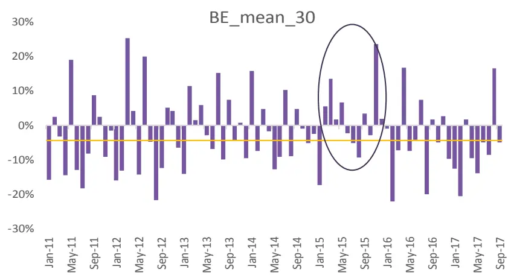
资料来源：光大证券研究所，注：2011.01.01-2017.11.01

对此的一种解释是，噪音交易者的行为偏差在趋势行情中并不具有很好的区分度，也就是说，当市场处于趋势行情中时，市场情绪极其趋同，原先的理性机构投资者一大部分也转变为噪音投资者来跟随市场情绪。因此牛熊趋势阶段的行为偏差因子BE_mean预测能力和收益表现较差。

因此我们将2011 年以来的时间，按照市场阶段做了简单的划分，来观察不同市场阶段中的噪音交易因子表现（仍然以BE_mean_30 因子为例）：

表 7：行为偏差因子 BE_mean_30 因子震荡市表现更优

|  | 指标 | 单边上涨 | 单边下跌 | 震荡市 |
| --- | --- | --- | --- | --- |
| BE_mean_30 | IC | -0.3% | -1.6% | -3.0% |
|  | IR | -0.03 | -0.14 | -0.30 |

资料来源：光大证券研究所

上述结论较好的印证了我们的假设，即当市场处于趋势行情中时，市场情绪极其趋同，原先的理性机构投资者一大部分也转变为噪音投资者来跟随市场情绪。此时，噪音交易者行为偏差因子（BE_mean）往往会失效。

表8：行为偏差波动因子BE_std_6因子熊市表现更优

|  | 指标 | 单边上涨 | 单边下跌 | 震荡市 |
| --- | --- | --- | --- | --- |
| BE_std_6 | IC | -3.1% | -5.2% | -3.1% |
|  | IR | -0.43 | -0.69 | -0.57 |

资料来源：光大证券研究所

与行为偏差因子BE_mean 的分化情况有所不同，行为偏差波动因子BE_std在熊市中表现更为出色，而牛市和震荡市的表现不分伯仲。这一现象表明，噪音交易者的情绪波动在熊市中更为剧烈，尤其是短期的行为偏差上的波动更强，或者也可以理解为噪音交易者与机构交易者情绪波动的差异更为明显，因此BE_std因子在熊市阶段预测能力更强。

## 4、因子相关性测试及中性化处理

经过前面的测试，我们发现行为偏差波动因子 BE_std 具有良好的预测能力和选股效果，要完善的分析因子的选股能力是来自其内生因素，还需将其与其他常见的基于价量的技术类型因子做相关性测试。

BE_std因子与STD_1M和BP_LR因子相关性较高。分别计算估值因子、一致预期因子、规模因子、动量因子、技术因子、波动因子中单因子测试显著性较高的几个因子与行为偏差波动因子 BE_std 之间历史 IC 值的相关性，从下图的结果发现：BE_std 因子与一个月波动（STD_1M）和当期净资产/市值（BP_LR）之间具有较高的相关性。

图 20：BE_std 与其他大类因子历史 IC值相关性检验
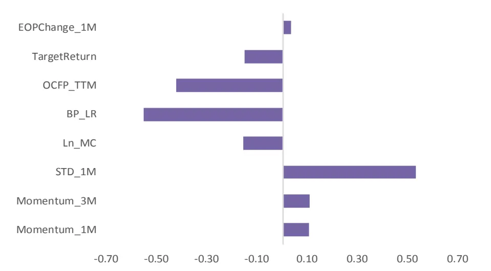
资料来源：光大证券研究所，注：2011.01.01-2017.11.01

为了进一步证明 BE_std 因子自身具备选股能力，我们将通过横截面回归取残差的方式，剔除了一个月波动（STD_1M）和当期净资产/市值（BP_LR）的影响，同时剔除了市值、一个月动量、和行业因素。

$$
\begin{array}{c}BE\_std_{i}=\beta_{1}*BP\_LR_{i}+\beta_{2}*Monmentum\_1M_{i}+\beta_{3}*STD\_1M_{i}+\beta_{4}\\*Ln\_MC_{i}+\beta_{5}*Industry_{i}+\varepsilon_{i}\end{array}
$$

中性化后的行为偏差波动因子 BE_std 依旧具有选股能力。对 BE_std 因子做行业、市值中性处理并剔除 STD_1M、BP_LR 影响后，因子的有效性检验等结果仍然显著，但因子收益、IC 均值均有明显下降。中性化后，IC 平均值为-1.55%，IC大于零的比例为21.5%，IR 绝对值达-0.49。此外因子的分组效果也有所减弱，多空组合年化收益为6.0%，夏普比率为0.61。

图 21：中性化后的 BE_std 因子 RankIC 序列
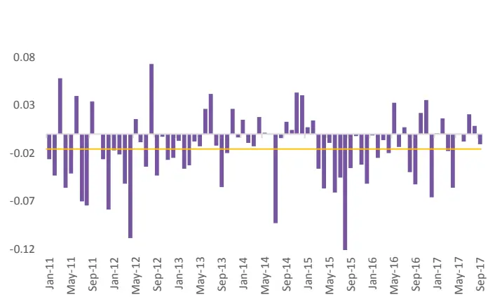
资料来源：光大证券研究所，注：2011.01.01-2017.11.01

图 22：中性化后的 BE_std 因子单调性良好
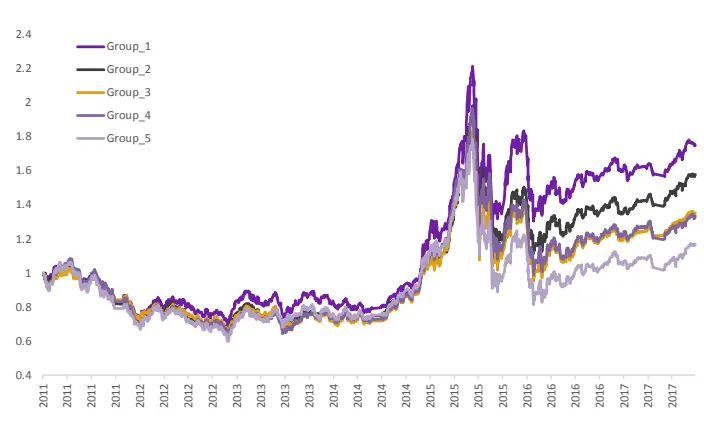
资料来源：光大证券研究所，注：2011.01.01-2017.11.01

中性化处理后BE_std因子的选股效果有所下降，2011年至今的年化收益为9.1%，组合7 年内有4 年跑输基准，2017 年以来回撤相对较大。

图 23：中性化前后 BE_std选股组合分年度收益率对比
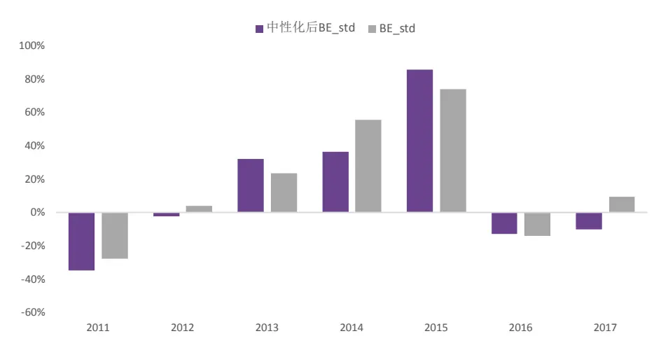
资料来源：光大证券研究所，注：2011.01.01-2017.11.17

表 9：中性化后的 BE_std因子选股收益及表现

|  | 年化收益 | 年化波动 | 夏普比例 | 最大回撤 | 相对收益 | 相对波动 | 相对最大回撤 | 信息比 |
| --- | --- | --- | --- | --- | --- | --- | --- | --- |
| 2011 | -34.71% | 23.76% | -1.68 | -38.81% | -1.31% | 6.86% | -7.04% | -0.19 |
| 2012 | -2.49% | 26.78% | 0.04 | -33.52% | -5.82% | 9.10% | -12.35% | -0.64 |
| 2013 | 32.20% | 24.51% | 1.26 | -15.02% | 26.00% | 9.95% | -4.67% | 2.61 |
| 2014 | 36.50% | 22.58% | 1.49 | -14.12% | -6.19% | 11.28% | -17.81% | -0.55 |
| 2015 | 85.70% | 51.99% | 1.45 | -56.21% | 46.70% | 18.72% | -21.80% | 2.50 |
| 2016 | -12.89% | 34.33% | -0.23 | -33.42% | 3.57% | 10.44% | -6.81% | 0.34 |
| 2017 | -10.17% | 19.74% | -0.44 | -15.65% | -18.37% | 11.39% | -13.12% | -1.61 |
| Full | 9.06% | 31.65% | 0.43 | -56.21% | 6.39% | 11.72% | -21.80% | 0.54 |

资料来源：光大证券研究所，注：截止日期 2017-11-17，基准为中证全指

由此可见，经过行业、市值中性处理并剔除 STD_1M、BP_LR 影响后，噪音交易者行为偏差波动因子 BE_std 依旧表现出了较好的预测能力。也可以证明我们定义的噪音交易者行为偏差波动 BE_std 因子的确可以作为市场中噪音交易行为对于个股收益影响的代理变量，并且具有较为不错的预测能力。

## 5、风险提示

本报告中的测试结果均基于模型和历史数据，历史数据存在不被重复验证的可能，模型存在失效的风险。

## 分析师声明

负责准备本报告以及撰写本报告的所有研究分析师或工作人员在此保证，本研究报告中关于任何发行商或证券所发表的观点均如实反映分析人员的个人观点。负责准备本报告的分析师获取报酬的评判因素包括研究的质量和准确性、客户的反馈、竞争性因素以及光大证券股份有限公司的整体收益。所有研究分析师或工作人员保证他们报酬的任何一部分不曾与，不与，也将不会与本报告中具体的推荐意见或观点有直接或间接的联系。

## 分析师介绍

刘均伟金融工程首席分析师，复旦大学学士，上海财经大学硕士，10 年金融工程研究经验。现任职于光大证券研究所，研究领域为衍生品及量化投资。

## 行业及公司评级体系

买入—未来6-12 个月的投资收益率领先市场基准指数15%以上；

增持—未来 6-12 个月的投资收益率领先市场基准指数 5%至 15%；

中性—未来6-12 个月的投资收益率与市场基准指数的变动幅度相差-5%至5%；

减持—未来6-12 个月的投资收益率落后市场基准指数5%至15%；

卖出—未来 6-12 个月的投资收益率落后市场基准指数15%以上；

无评级—因无法获取必要的资料，或者公司面临无法预见结果的重大不确定性事件，或者其他原因，致使无法给出明确的投资评级。

市场基准指数为沪深300指数。

## 分析、估值方法的局限性说明

本报告所包含的分析基于各种假设，不同假设可能导致分析结果出现重大不同。本报告采用的各种估值方法及模型均有其局限性，估值结果不保证所涉及证券能够在该价格交易。

## 特别声明

光大证券股份有限公司（以下简称“本公司”）创建于 1996 年，系由中国光大（集团）总公司投资控股的全国性综合类股份制证券公司，是中国证监会批准的首批三家创新试点公司之一。公司经营业务许可证编号：z22831000。

公司经营范围：证券经纪；证券投资咨询；与证券交易、证券投资活动有关的财务顾问；证券承销与保荐；证券自营；为期货公司提供中间介绍业务；证券投资基金代销；融资融券业务；中国证监会批准的其他业务。此外，公司还通过全资或控股子公司开展资产管理、直接投资、期货、基金管理以及香港证券业务。

本证券研究报告由光大证券股份有限公司研究所（以下简称“光大证券研究所”）编写，以合法获得的我们相信为可靠、准确、完整的信息为基础，但不保证我们所获得的原始信息以及报告所载信息之准确性和完整性。光大证券研究所可能将不时补充、修订或更新有关信息，但不保证及时发布该等更新。

本报告根据中华人民共和国法律在中华人民共和国境内分发，仅供本公司的客户使用。

本报告中的资料、意见、预测均反映报告初次发布时光大证券研究所的判断，可能需随时进行调整。报告中的信息或所表达的意见不构成任何投资、法律、会计或税务方面的最终操作建议，本公司不就任何人依据报告中的内容而最终操作建议作出任何形式的保证和承诺。

在法律允许的情况下，本公司及其附属机构可能持有报告中提及的公司所发行证券的头寸并进行交易，也可能为这些公司提供或正在争取提供投资银行、财务顾问或金融产品等相关服务。投资者应当充分考虑本公司及本公司附属机构就报告内容可能存在的利益冲突，不应视本报告为作出投资决策的唯一参考因素。

在任何情况下，本报告中的信息或所表达的建议并不构成对任何投资人的投资建议，本公司及其附属机构（包括光大证券研究所）不对投资者买卖有关公司股份而产生的盈亏承担责任。

本公司的销售人员、交易人员和其他专业人员可能会向客户提供与本报告中观点不同的口头或书面评论或交易策略。本公司的资产管理部和投资业务部可能会作出与本报告的推荐不相一致的投资决策。本公司提醒投资者注意并理解投资证券及投资产品存在的风险，在作出投资决策前，建议投资者务必向专业人士咨询并谨慎抉择。

本报告的版权仅归本公司所有，任何机构和个人未经书面许可不得以任何形式翻版、复制、刊登、发表、篡改或者引用。

## 光大证券股份有限公司研究所销售交易总部

上海市新闸路 1508 号静安国际广场 3 楼 邮编 200040

总机：021-22169999 传真：021-22169114、22169134

| 销售交易总部 | 姓名 | 办公电话 | 手机 | 电子邮件 |
| --- | --- | --- | --- | --- |
| 上海 | 陈蓉 | 021-22169086 | 13801605631 | chenrong@ebscn.com |
|  | 濮维娜 | 021-62158036 | 13611990668 | puwn@ebscn.com |
|  | 胡超 | 021-22167056 | 13761102952 | huchao6@ebscn.com |
|  | 周薇薇 | 021-22169087 | 13671735383 | zhouww1 @ebscn.com |
|  | 李强 | 021-22169131 | 18621590998 | liqiang88@ebscn.com |
|  | 罗德锦 | 021-22169146 | 13661875949/13609618940 | luodj@ebscn.com |
|  | 张弓 | 021-22169083 | 13918550549 | zhanggong@ebscn.com |
|  | 黄素青 | 021-22169130 | 13162521110 | huangsuqing@ebscn.com |
|  | 王昕宇 | 021-22167233 | 15216717824 | wangxinyu@ebscn.com |
|  | 邢可 | 021-22167108 | 15618296961 | xingk@ebscn.com |
|  | 陈晨 | 021-22169150 | 15000608292 | chenchen66@ebscn.com |
| 金融同业与战略客户 | 黄怡 | 010-58452027 | 13699271001 | huangyi@ebscn.com |
|  | 周洁瑾 | 021-22169098 | 13651606678 | zhoujj@ebscn.com |
|  | 丁梅 | 021-22169416 | 13381965696 | dingmei@ebscn.com |
|  | 徐又丰 | 021-22169082 | 13917191862 | xuyf@ebscn.com |
|  | 王通 | 021-22169501 | 15821042881 | wangtong@ebscn.com |
|  | 陈樑 | 021-22169483 | 18621664486 | chenliang3@ebscn.com |
|  | 吕凌 | 010-58452035 | 15811398181 | Ivling@ebscn.com |
| 北京 | 郝辉 | 010-58452028 | 13511017986 | haohui@ebscn.com |
|  | 梁晨 | 010-58452025 | 13901184256 | liangchen@ebscn.com |
|  | 关明雨 | 010-58452037 | 18516227399 | guanmy@ebscn.com |
|  | 郭晓远 | 010-58452029 | 15120072716 | guoxiaoyuan@ebscn.com |
|  | 王曦 | 010-58452036 | 18610717900 | wangxi@ebscn.com |
|  | 张彦斌 | 010-58452040 | 18614260865 | zhangyanbin@ebscn.com |
| 国际业务 | 陶奕 | 021-22169091 | 18018609199 | taoyi@ebscn.com |
|  | 戚德文 | 021-22167111 | 18101889111 | qidw@ebscn.com |
|  | 金英光 | 021-22169085 | 13311088991 | jinyg@ebscn.com |

敬请参阅最后一页特别声明

|  | 傅裕 | 021-22169092 | 13564655558 | fuyu@ebscn.com |
| --- | --- | --- | --- | --- |
| 深圳 | 黎晓宇 | 0755-83553559 | 13823771340 | lixy1@ebscn.com |
|  | 李潇 | 0755-83559378 | 13631517757 | lixiao1@ebscn.com |
|  | 张亦潇 | 0755-23996409 | 13725559855 | zhangyx@ebscn.com |
|  | 王渊锋 | 0755-83551458 | 18576778603 | wangyuanfeng@ebscn.com |
|  | 张靖雯 | 0755-83553249 | 18589058561 | zhangjingwen@ebscn.com |
|  | 牟俊宇 | 0755-83552459 | 13827421872 | moujy@ebscn.com |
|  | 吴冕 |  | 18682306302 | wumian@ebscn.com |