## 基于 K线最短路径构造的非流动性因子——多因子系列报告之七

随着对金融市场的研究不断深入，许许多多的因子早已被研究者与市场参与者们挖掘出来。然而近年来数据维度的不断提升，又使得我们回头重新审视那些作为股票属性代理变量的因子，它们的代理精度是否可以再次提升？选股效果能否得以再次加强？在本文中将利用高频数据的信息，构造代理精度更高的非流动性因子——K线最短路径非流动性因子。

非流动性代理变量的经典定义及对其缺陷的改进。由于大部分的非流动性度量方式都较难直接测量或获取，非流动性程度往往是通过定义一些代理变量来间接地表达。经典定义方式试图通过单位成交量对收益率的影响来刻画该股票交易的市场冲击。然而该定义往往在日内震荡行情下失效。针对这种情况，我们定义了 K线最短路径非流动性因子来对其进行改进。

K 线最短路径非流动性因子在高频下相对经典定义提升显著。通过使用更高频的 K线数据提升K 线最短路径对股票交易时市场冲击的代理精度，从而大大提升K 线最短路径非流动性因子的有效性与预测能力。同时随着数据频率的提高，K 线最短路径定义对经典定义下的非流动性因子提升程度愈加显著。比起经典的定义方式，K 线最短路径能更充分地利用高频数据新引入的信息。

- 变形定义下的K线最短路径非流动性因子选股能力优异。在尝试多种定义变形方式后，最终定义的 TS 非流动性因子选股表现最为优秀。多空收益高达 17.3%，年化波动率 11.8%，夏普比率 1.405，最大回撤 20.3%。以该因子构造的选股组合在 2010年至2017年间，年化收益 18.2%，年化波动率 24.8%，夏普比率0.8，最大回撤 48.3%，月度换手率 31.4%。相对中证全指年化收益 12.5%， 相对波动率 8.3%，相对最大回撤仅8.35%。

- 中性化后的非流动性因子仍有选股能力。在剔除掉其它类型如市值、换手、动量、波动等因子的效用后，TS 非流动性因子自身依然有良好的效果与选股能力。中性化后因子多空组合年化收益亦 5.52%，年化波动率11.76%，夏普比率0.52，最大回撤 25.95%。以中性化后因子构造的选股组合年化收益 10.1%，年化波动率 26.1%，夏普比率 0.50，最大回撤48.3%。相对中证全指年化收益 5.8%， 相对波动率 5.5%，相对最大回撤 19.3%。

- 风险提示：测试结果均基于模型和历史数据，模型存在失效的风险。

## 金融工程深度

## 分析师

刘均伟 (执业证书编号：S0930517040001)

021-22169151

liujunwei@ebscn.com

## 联系人

胡骥聪

021-22169125

hujicong@ebscn.com

## 相关研究

《因子测试框架多因子系列报告之一》
《因子测试全集

——多因子系列报告之二》《多因子组合“光大 Alpha 1.0”

多因子系列报告之三》《别开生面：公司治理因子详解

《见微知著：成交量占比高频因子解析——多因子系列报告之五》

《行为金融因子：噪音交易者行为偏差——多因子系列报告之六》

## 1、非流动性因子的经典定义

## 1.1、流动性与流动性风险

证券市场中，一笔证券交易需要同时存在买方与卖方，并就交易价格达成一致，交易才能完成。股票流动性便是指该股票的交易者在市场中能够尽早找到对手方并以一个合理的价格顺利完成交易的能力。

流动性的高低会在很多方面体现，一般而言，表现在以下 4 个方面：

1. 交易对该股票的市场冲击

2. 该股票的买卖价差

3. 等待交易成交的时长

4. 各种交易成本的大小

可以想见，如果一支股票的流动性越好，表明该股票在市场上的交易活动越活跃。单笔交易对价格的冲击、买卖价差、交易成本也越小。交易也能够相对更迅速的完成。

相应的，流动性风险即是股票因缺乏流动性而使得交易者在交易中可能支付更多交易费用的风险。市场中各种股票的流动性不一，承担的流动性风险也各异。从风险回报的角度看，一支股票承受更多的风险，其要求的市场回报也应该越高。因此我们有理由认为，假定在承受等量其它风险时，流动性越差的股票未来的收益率越高。

## 1.2、经典的非流动性代理变量及其缺陷

为了较为方便地刻画流动性风险，我们讨论股票的非流动性。亦即，非流动性越高，流动性风险越大。由于大部分的非流动性度量方式都较难直接测量或获取，因而往往是通过定义一些代理变量来间接地表达非流动性程度。一个比较经典的代理方法是：计算日收益率的绝对值与日成交量的比值，并求多日比值的平均值作为非流动性值（Amihud, JFM 2002）。该定义方式的逻辑在于试图通过单位成交量对收益率的影响，来刻画该股票交易的市场冲击。从而间接描述该股票的非流动性。

$$
ILLIQ_{t}=\frac{1}{d}\sum_{i=1}^{d}\left(\frac{|Ret|}{Volume}\right)_{t-i}\#(1).
$$

## d：表示移动平均的周期参数

以上述方式定义的非流动性因子，在海外市场的研究中已经证明是一个不错的有效 Alpha 因子。我们也在国内股市测试该因子的效果。从 IC 均值与 IR 来看，在 A 股中，该非流动性定义方式也是有效的选股因子。同时效果随使用的移动平均参数减小而增强。

在A股测试该因子时，不同于海外常用的日频调仓，我们是按照自然月的频率进行调仓。使用移动平均对日数据的因子值进行平滑操作主要基于 3点考虑：其一是为了能够在因子中融入更多天的市场信息。其二是希望通过平滑处理增加因子的稳定性。其三是借此降低换手率从而减少换仓调整时的交易成本，这点在日频调仓时显得更为重要。

表1：经典非流动性因子在 A股的测试效果（2010 – 2017）

| 移动平均参数 | 因子IC均值 | 因子IR值 |
| --- | --- | --- |
| 5 日 | 4.25% | 0.464 |
| 10日 | 3.62% | 0.386 |
| 15日 | 3.40% | 0.356 |
| 自然月 | 3.17% | 0.328 |

资料来源：光大证券研究所

经典的非流动性定义方式在较好地刻画股票市场冲击的同时，依然有一些不足之处。在该定义中，收益率的绝对值被用来表述当日所有交易对该股票的市场冲击，在最后取绝对值之前，当日收益率形成的过程是有向叠加。而分母部分的当日成交量的形成过程为无向叠加。

即如果我们假设，某只股票当天总共进行了n 比交易，则当日的收益率与交易量可以写成：

$$
\begin{aligned}Return=&\frac{1}{Class}\sum_{i=1}^{n}Pricechange_{i}\\=&\frac{1}{Class}\Big(\sum Pricechange_{Rise}-\sum Pricechange_{Fall}\Big)\ \#(2)\\&Volume=\sum_{i=1}^{n}Volume_{i}\\=&\sum Volume_{Rise}+\sum Volume_{Fall}\ \#(3)\end{aligned}
$$

$PriceChange_{Rise}$ ：表示单笔交易促成价格上涨时的价格变动

$PriceChange_{Fall}\colon$ ：表示单笔交易促成价格下跌时的价格变动（正值）

$Volume_{Rise}$ ：表示单笔交易促成价格上涨时的成交量

$Volume_{Fall}$ ：表示单笔交易促成价格下跌时的成交量

如果当日的交易处于单边上涨或单边下跌，经典定义方式可以较好地度量交易对股票价格的市场冲击；但如果遇到当日日内震荡，股票上涨时的价格变动与下跌时的价格变动方向相反从而相互抵消，而成交量却没有方向继续累加，此时经典定义方式并不能有效地度量当日该股票的交易对其价格的市场冲击，从结果上会严重低估该股票的非流动性。

图1展示了平安银行在2017年9月21日与22日两天的价格与成交量的日线数据，21 日收益率的绝对值为 22 日收益绝对值的 10 倍左右，而成交量却仅为 1.2 倍不到，按照经典定义计算，同一种平安银行股票在 21 日的非流动性是 22 日的 8 倍左右。在没有重大事件的情况下，同一只股票在连续两天的流动性相差数倍的情况是不合理的。实际上如果我们观察图2就能发现，平安银行股票在 22 日呈现明显的日内震荡行情，因此当日的交易市场冲击是无法通过当日收益率来体现的。

图1：平安银行9/21，9/22价量日线图
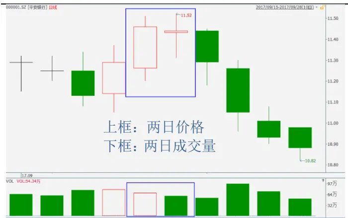
资料来源：Wind，光大证券研究所

图2：平安银行9/21，9/22价格15分钟频率图
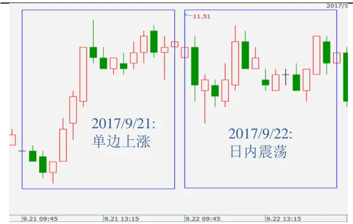
资料来源：Wind，光大证券研究所

## 2、非流动性高频因子构造

在剖析过非流动性经典定义的优劣后，我们尝试通过解决其缺点部分从而构造出新的非流动性代理变量。并充分利用高频信息提升新的代理变量的精度，构造非流动性高频因子。

## 2.1、定义新的非流动性代理变量

延续上一章节的讨论，经典定义的非流动性代理变量的缺陷在于会在日内震荡行情下失效。而终其根本失效的原因则在于，分子部分收益率的形成为有向叠加，而分母部分成交量的形成为无向叠加。叠加方式的不同，造成了经典定义有效性对于日内行情的极度依赖。

此时，可能已经很容易想到，如果能让分子与分母的叠加方式一致，将很大程度上克服经典定义遇到的难题。方式一致的情况有两种：全部变成有向叠加，或全部变成无向叠加。

在进一步描述定义的新的代理变量之前，让我们先阐述全部变成有向叠加的方式及会遇到的问题。首先，分母部分要表述造成市场冲击时所交易的单位，一般会选取成交量（或成交额）。将它们变成有向的方式则是将同期的涨跌符号赋予成交量（或成交额），即将（3）式中的加号变成减号。这样做则天然地就需要使用较高频的数据，否则无法构造出有意义的有向日成交量。

$$
SignedVolume=\sum_{i=1}^{n}SignedVolume_{i}
$$

$$
=\sum Volume_{Rise}-\sum Volume_{Fall}\approx\sum_{i=1}^{p}Sign(PriceChangle)_i*Volume_i\#(4)
$$

p：表示日内频率分段个数（例：若使用 30 分钟线频率，则将1 日分成 8 段，即 p = 8）

$$
Volume_{i}:表示日内频率下第\textsf{i}个时间段内的成交量
$$

Sign(PriceCℎange) ：表示日内频率下第 i 个时间段价格变化的方向（上涨为正号，下跌为负号）

则此时非流动性的代理变量可写成：

$$
ILLIQ_{t}=\frac{1}{d}\sum_{i=1}^{d}\left(\frac{Ret}{SignedVolume}\right)_{t-i}\#(5).
$$

实际计算中，有向成交量（SignedVolume）可以用（4）式中约等号右侧算式估计。然而这样的定义方式依然有很大问题。一般情况下，当日的收益率与有向成交量的正负号是相同的；但依然有时候收益率与有向成交量符号相反，尤其是在日内震荡严重致使有向成交量值或收益率接近零的时候。作为单位成交量下的市场冲击代理变量，出现负值显然并没有逻辑意义。然而即使我们将定义套上绝对值符号，依然也无法解决该代理变量在有向成交量接近零值时极度不稳定的情况。

综上，我们认为将分子分母全部变成有向叠加的方式并不适合。而采用无向叠加的方式则不会出现上述讨论的缺陷。也因此我们定义新的代理变量时将使用全部变成无向叠加的方式。

出现在分母位置作为交易市场冲击单位的成交量或成交额本身已经是无向叠加。而出现在分子位置体现一段时间内交易造成的市场冲击总值的部分，如何构造使其更加贴向价格变化的无向叠加是构造更有效非流动性代理变量的关键。我们考虑到实际上交易造成的市场冲击在价格上的体现应为：

$$
\sum PriceChange_{Rise}+\sum PriceChange_{Fall}\#(6)
$$

其中 $PriceChange_{Rise}$ 与 $PriceChange_{Fall}$ 都是标量，全部为正值。（6）式实际上表达的是该股票在一个时间段里价格所经历的完整路径长度。在仅有一个完整K线的情况时，且没有K线完整路径长度分布的信息下，我们能够得到的最确定的接近完整路径长度的值为股票形成该K线的最短路径长度（ShortCut），即：

$$
ShortCut=2*(High-Low)-|Open-Close|\#(7)
$$

图 3：K 线形成的完整路径与最短路径示意图
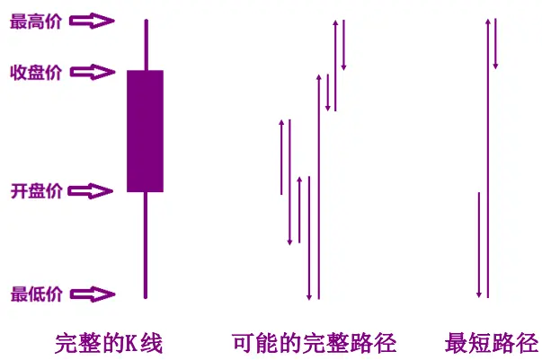
资料来源：光大证券研究所

在一根K线上，我们定义在该K 线的时间段上，非流动性的代理变量为单位成交额下的最短路径长度。若是定义在日线上取平均，即：

$$
ILLIQ_{t}=\frac{1}{d}\sum_{i=1}^{d}\left(\frac{ShortCut}{Value}\right)_{t-i}\#(8)
$$

SℎortCut：表示当日 K 线最短路径长度

Value：表示当日成交额

## 2.2、利用高频数据提高代理变量精度

从上一节K 线最短路径的定义，很容易想到，如果一根K 线能分解成频率更高的多跟K线，那么高频 K线的最短路径就更接近于完整路径。使用高频K线下，如15分钟、5分钟等，计算我们定义下的非流动性代理变量将得到更高的精度。

此时每日的 K线最短路径非流动性因子定义为：

$$
ILLIQ_{t}=\frac{1}{d}\sum_{i=1}^{d}\left(\sum_{j=1}^{p}\frac{Shortcut_{j}}{Value_{j}}\right)_{t-i}\#(9)
$$

$S{\not}lortCut_{j}$ ：表示日内频率下第j根K 线的最短路径

$Value_{j}$ ：表示日内频率下第j跟K 线内的成交额

p：表示日内频率分段个数

d：表示日间移动平均的周期参数

## 3、非流动性高频因子预测能力显著提升

本章节我们将测试基于 K 线最短路径构造的非流动性因子的选股能力，探讨在使用不同数据频率下及采用不同移动平均周期参数下，因子选股能力提升的效果与幅度。并且将其与经典的非流动性因子进行比较。同时若无特殊说明，因子值的计算都为进行过行业中性与市值中性处理后的值。

在接下来的因子测试中，我们将通过以下数据检验因子的有效性，稳定性以及对未来相对股价的预测能力：

1. 因子收益序列的假设检验t统计量值

2. 因子收益序列大于 0 的概率

3．t 统计量绝对值的均值

4．t统计量绝对值大于等于 2 的概率

5．IC 值的均值

6．IC 值的标准差

7．IC 大于 0 的比例

8．IC 绝对值大于 0.02 的比例

9．IR 的绝对值

而两种不同定义方式的非流动性因子之间的比较则主要参考两者的 IC均值与IR绝对值的大小。

## 3.1、低频下不同非流动性因子效果差异较小

在利用高频数据提升代理变量精度之前，我们首先比较在日频数据下，K 线最短路径非流动性因子与经典非流动性因子之间选股能力的差异。总体上，无论是从IC 均值还是IR绝对值的角度，两者相差不大。但观察在不同移动平均周期参数下的IC均值与IR值，可知两种因子的效果与预测能力都随着MA周期参数的减小而单调提高。而相比于K线最短路径非流动性因子，经典因子对MA参数更加敏感，随参数减小而提升的效果更加明显。在 3周及以上的 MA 周期下，K 线最短路径非流动性因子的 IR 更高；而在更小的MA 周期下，经典因子的IR 渐渐超越K 线最短路径非流动性因子。同样，在2 周及以上的MA 周期，K线最短路径非流动性因子的 IC均值更高；而在5日MA下，经典因子的IC均值超过了K线最短路径非流动性因子。

表2：K线最短路径非流动性因子在 A股的测试效果（2010 – 2017）

| 移动平均参数 | 因子IC均值 | 因子IR值 |
| --- | --- | --- |
| 5 日 | 3.96% | 0.412 |
| 10日 | 3.63% | 0.376 |
| 15日 | 3.46% | 0.356 |
| 自然月 | 3.26% | 0.336 |

资料来源：光大证券研究所

图4：经典非流动性日频因子与 K线最短路径非流动性日频因子在不同移动平均周期参数下的 IR值
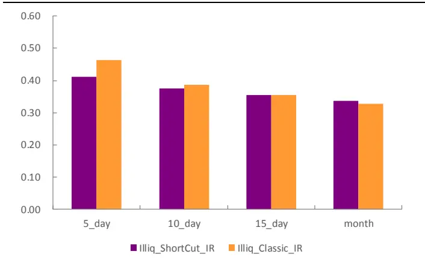
资料来源：光大证券研究所

图5：经典非流动性日频因子与 K线最短路径非流动性日频因子在不同移动平均周期参数下的 IC均值
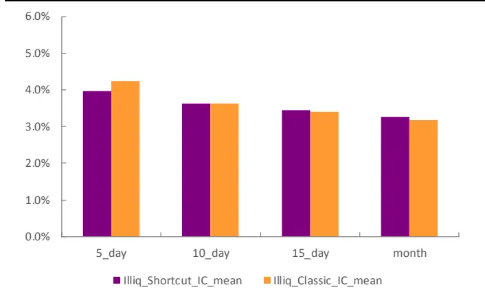
资料来源：光大证券研究所，注：2010.02.01-2017.07.31

在日频数据下，两种定义方式下的非流动性因子效果没有太大差异，甚至在5 日MA下，经典非流动性因子的预测能力反而更佳。我们认为造成这种情况的原因可能主要是由于以下两点：

1. 在日频下，即使是K 线最短路径长度，也与K 线完整路径长度大概率相差太远。即使使用 K 线最短路径的定义，对非流动性的刻画提升程度也有限。

2. 经典定义中使用的收益率，本身带有其它一些 Alpha 因子效应。利用收益率构造的因子可能会从中收益。当其它非流动性因子通过对非流动性刻画的提升带来的收益不足以覆盖收益率自身可能带来的收益时，那么可能使用它的最终效果反而不如直接使用经典非流动性因子好。

## 3.2、高频数据下因子效果差距渐现

在日频上，如果日内震荡较为严重，那么K 线最短路径并不能有效地模拟K线完整路径。从上一节的实证结果中，也的确没有超越经典非流动性因子的预测效果。

但容易想到，相比于使用日 K线，当使用的K线数据越高频，K线最短路径就越接近K 线完整路径，或者说 K线最短路径与完整路径的比值越靠近1。接下来我们试图通过使用高频数据，提升 K 线最短路径非流动性因子的预测效果。

依此使用 1 小时 K 线，30 分钟 K 线，15 分钟 K 线与 5 分钟 K 线分别计算K 线最短路径非流动性因子并测试其因子效果统计数据。实证结果验证了我们之前的分析，可以从 IC均值与IR数据得出以下结论：首先，无论在哪个频率的数据下，因子的 IC均值与IR值都是随着使用的移动平均周期参数减小而增大，在测试的几个MA参数中，使用5 日平均的效果最好。其次，因子的 IR 值无论在哪个 MA 参数下，都随着使用数据频率的增大而单调增加，且有较强的线性关系。与 IR 值类似，因子的IC 均值也基本上随数据频率的增大而增加，但单调性不如因子 IR 值，与频率的线性关系也较弱。最后，观察IC 标准差数据可以发现其与使用数据频率的负相关性，频率越高，IC 标准差越小。

表3：不同数据频率下K线最短路径非流动性因子在 A股的测试效果

| K线频率 | MA 周期 | IC 均值 | IC 标准差 | IC>0 比例 | IC>0.02 比 例 | IR值 |
| --- | --- | --- | --- | --- | --- | --- |
| 日线 | 5_day | 3.96% | 0.0961 | 73.03% | 62.92% | 0.412 |
|  | 10_day | 3.63% | 0.0967 | 71.91% | 60.67% | 0.376 |
|  | 15_day | 3.46% | 0.0972 | 70.79% | 59.55% | 0.356 |
|  | month | 3.26% | 0.0971 | 69.66% | 58.43% | 0.336 |
| 1 小时线 | 5_day | 4.49% | 0.0946 | 74.16% | 65.17% | 0.474 |
|  | 10_day | 4.15% | 0.0954 | 71.91% | 65.17% | 0.435 |
|  | 15_day | 3.93% | 0.0960 | 70.79% | 60.67% | 0.409 |
|  | month | 3.78% | 0.0963 | 70.79% | 61.80% | 0.392 |
| 30 分钟线 | 5_day | 4.59% | 0.0940 | 71.91% | 65.17% | 0.488 |
|  | 10_day | 4.24% | 0.0939 | 70.79% | 62.92% | 0.451 |
|  | 15_day | 3.94% | 0.0944 | 68.54% | 61.80% | 0.417 |
|  | month | 3.77% | 0.0949 | 69.66% |  | 0.397 |
| 15 分钟线 | 5_day | 4.74% |  |  | 60.67% |  |
|  | 10_day |  | 0.0914 | 73.03% | 67.42% | 0.518 |
|  | 15_day | 4.31% 3.89% | 0.0914 0.0913 | 70.79% 70.79% | 64.04% 62.92% | 0.471 0.426 |
|  | month | 3.70% | 0.0911 | 70.79% |  | 0.406 |
| 5 分钟线 | 5_day | 4.72% | 0.0827 | 73.03% | 59.55% 64.04% | 0.570 |
|  | 10_day | 4.32% | 0.0858 | 69.66% | 65.17% | 0.504 |
|  | 15_day | 4.08% | 0.0866 | 70.79% | 60.67% | 0.472 |
|  | month | 3.87% | 0.0859 | 68.54% | 61.80% | 0.451 |

资料来源：光大证券研究所，注：month 代表一个自然月

图6：使用不同频率 K线最短路径非流动性因子在各移动平均周期参数下的 IR值
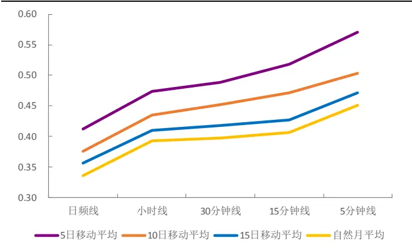
资料来源：光大证券研究所

图7：使用不同频率K线最短路径非流动性因子在各移动平均周期参数下的 IC均值
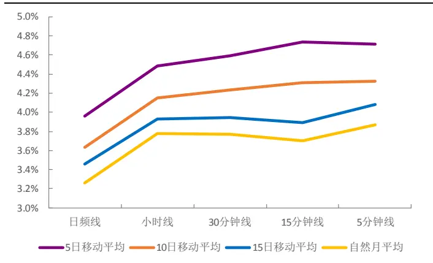
资料来源：光大证券研究所，注：2010.02.01-2017.07.31

同样的，也在高频数据上运用经典非流动性因子。虽然其 IC 均值与 IR值依然保持对MA 周期的单调性。但可以明显察觉出其对数据频率的单调性较弱。IR 值基本上还是随数据频率增加而增加，但 IC 均值则基本上与数据频率无线性关系。

表4：不同数据频率下经典非流动性因子在 A股的测试效果

| K线频率 | MA 周期 | IC 均值 | IC 标准差 | IC>0 比例 | IC>0.02 比 例 | IR值 |
| --- | --- | --- | --- | --- | --- | --- |
| 日线 | 5_day | 4.25% | 0.0917 | 69.66% | 67.42% | 0.464 |
|  | 10_day | 3.62% | 0.0939 | 70.79% | 62.92% | 0.386 |
|  | 15_day | 3.40% | 0.0956 | 68.54% | 62.92% | 0.356 |
|  | month | 3.17% | 0.0967 | 68.54% | 64.04% | 0.328 |
| 1 小时线 | 5_day | 4.12% | 0.0913 | 71.91% | 62.92% | 0.451 |
|  | 10_day | 3.82% | 0.0935 | 68.54% | 61.80% | 0.409 |
|  | 15_day | 3.63% | 0.0945 | 69.66% | 60.67% | 0.384 |
|  | month | 3.42% | 0.0953 | 70.79% | 60.67% | 0.359 |
| 30 分钟线 | 5_day | 4.19% | 0.0911 | 69.66% | 62.92% | 0.459 |
|  | 10_day | 3.80% | 0.0913 | 67.42% | 61.80% | 0.416 |
|  | 15_day | 3.55% | 0.0917 | 66.29% | 61.80% | 0.387 |
|  | month | 3.38% | 0.0922 | 67.42% | 60.67% | 0.367 |
| 15 分钟线 | 5_day | 4.18% | 0.0872 | 71.91% | 62.92% | 0.480 |
|  | 10_day | 3.71% | 0.0871 | 66.29% | 60.67% | 0.426 |
|  | 15_day | 3.27% | 0.0867 | 66.29% | 61.80% | 0.377 |
|  | month | 3.09% | 0.0861 | 68.54% | 59.55% | 0.358 |
| 5 分钟线 | 5_day | 3.77% | 0.0779 | 68.54% | 56.18% | 0.484 |
|  | 10_day | 3.45% | 0.0806 | 67.42% | 57.30% | 0.428 |
|  | 15_day | 3.35% | 0.0813 | 66.29% | 53.93% | 0.412 |
|  | month | 3.17% | 0.0803 | 65.17% | 56.18% | 0.395 |

资料来源：光大证券研究所，注：month 代表一个自然月

图8：使用不同频率经典非流动性因子在各移动平均周期参数下的 IR值
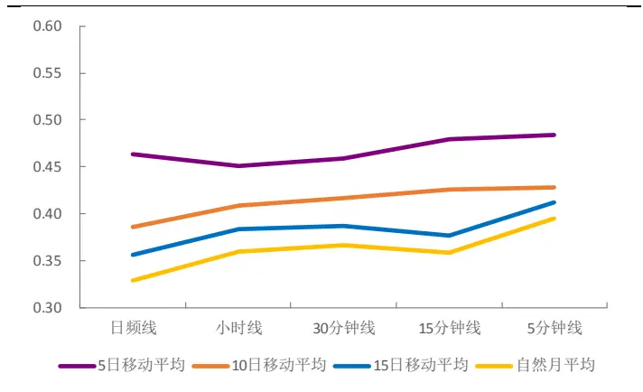
资料来源：光大证券研究所
敬请参阅最后一页特别声明

图9：使用不同频率经典非流动性因子在各移动平均周期参数下的 IC均值
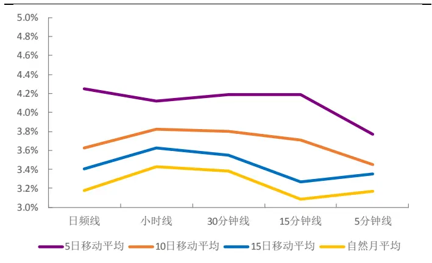
资料来源：光大证券研究所，注：2010.02.01-2017.07.31

综合以上的结论，使用5日移动平均平滑后的因子效果一直都是最好的。因而之后我们默认都通过 MA5 平滑后的因子来进行 K 线最短路径非流动性因子与经典非流动性因子的比较。如图10 与图11所示，K线最短路径非流动性因子的IC均值与IR值在小时线频率时均超过经典非流动性因子。并随着使用频率的不断提高，两种非流动性因子的IC均值与 IR 值之间的差距单调扩大。这是因为比起经典的定义方式，K 线最短路径能更充分地利用高频数据新引入的信息。

实际上，在每根K线至少包含3 次交易的情况，提高 K线的频率基本上都能够提升K线最短路径对该股票交易的市场冲击模拟精度，进而提升以此构造的非流动性因子的有效性与预测能力。可以预见，在 1 分钟的数据下，K 线最短路径非流动性因子的预测能力应该会进一步加强。这个推断鉴于对1 分钟数据的缺乏，未能够通过实证进行验证。

图10：不同频率数据下构造的5日平均经典非流动性因子与K线最短路径非流动性日频因子的 IR值
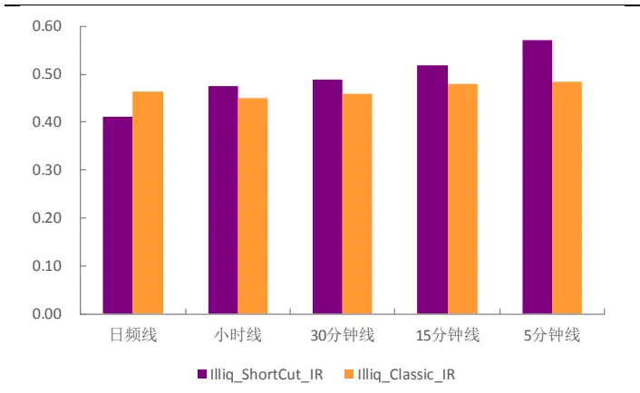
资料来源：光大证券研究所

图11：不同频率数据下构造的5日平均经典非流动性日频因子与 K线最短路径非流动性日频因子的 IC均值
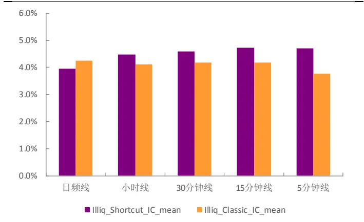
资料来源：光大证券研究所，注：2010.02.01-2017.07.31

## 3.3、K线最短路径非流动性因子其它变化的尝试

在前文通过式（9）我们已阐明了 K线最短路径非流动性因子的具体构造方式，在本节中我们研究在原有定义方式上的一些变形，看看不同变形下因子的效果。

首先，我们尝试在做移动平均的操作时采用加权移动平均的方式来替代原先使用的简单移动平均。从 IR 及 IC 均值来看，两种不同移动平均方式对因子效果影响很小。IR值上并无优劣之分，IC 均值上加权移动平均方式有微小的优势。

其次，我们尝试将式（9）中括号内部分的求和与求比的操作顺序调换，即将K 线最短路径非流动性因子定义变形为：

$$
ILLIQ_{t}=\frac{1}{d}\sum_{i=1}^{d}\left(\frac{\sum_{j=1}^{p}ShortCut_{j}}{\sum_{j=1}^{p}Value_{j}}\right)_{t-i}\#(10)
$$

从测试结果来看，原始定义与变形定义各有优劣。从IC均值的角度来说，变形定义的IC均值明显高于原始定义，表明变形定义下的因子预测性更好。但由于变形定义下IC 标准差过大，其 IR值反而不如原始定义下的因子 IR高。

在后面的章节，我们会通过回测时选股的收益表现来判断是否原始定义下或是变形定义下的K线最短路径非流动性因子更优秀。同时若非特别注明，之后回测时移动平均操作皆采用简单移动平均的方式。

图12：不同移动平均方式下的K线最短路径非流动性因子 IR 值
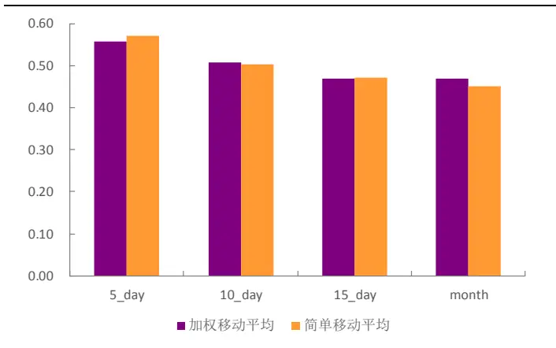
资料来源：光大证券研究所

图13：不同移动平均方式下的K线最短路径非流动性因子 IC 均值
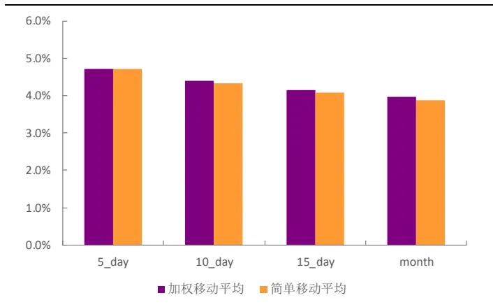
资料来源：光大证券研究所，注：2010.02.01-2017.07.31

图14：变形定义与原始定义下的K线最短路径非流动性因子 IR 值
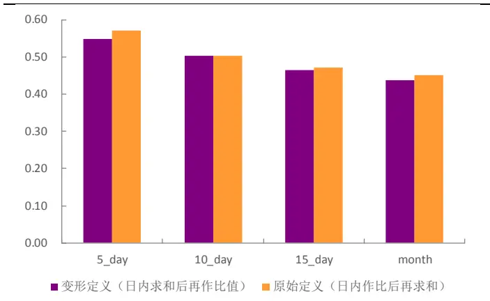
资料来源：光大证券研究所

图15：变形定义与原始定义下的K线最短路径非流动性因子 IC均值
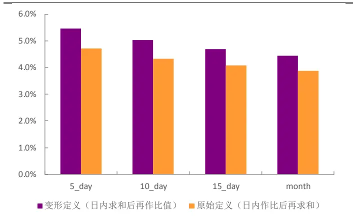
资料来源：光大证券研究所，注：2010.02.01-2017.07.31

## 4、非流动性因子选股效果

本章将主要通过因子选股的年化收益、夏普比率、最大回撤、相对基准收益等统计数据，表述非流动性因子的选股能力，并比较原始定义与变形定义下K 线最短路径非流动性因子的优劣。

回测的具体方式将沿用表5 所示的回测框架体系。并且在因子处理上会按照绝对中位数3倍标准差的标准作极值处理。

表 5：因子分组回测框架

|  | 因子分组回测框架 |
| --- | --- |
| 时间区间 | 2010年2月1日至2017年7月31日 |
| 股票池 | 全部 A 股(剔除选股日ST/PT股票；剔除上市不满一年的股票；剔除选股日由于停牌等因素无法买入的股票) |
| 调仓频率 | 月度调仓 |
| 分组调仓方式 | 每月最后一个交易日收盘后，根据本月所有未被剔除的股票数据计算因子值，根据因子值从小到大排序将股票等分为5组（行业内分组，组内市值加权)，分别计算每组股票的历史回测收益及多空组合收益。 |
| 交易费率 | 因子测试阶段暂不考虑交易费用 |

资料来源：光大证券研究所

## 4.1、K线最短路径非流动性因子选股能力优异

我们对原始定义以及变形定义下的因子分别进行分组回测。考虑到之前对因子作移动平均时，使用的周期参数越小越好的结论，我们也会同时对经过5日移动平均操作后的因子以及未作平均操作的因子分别测量它们的选股能力。

从结果上，我们发现K 线最短路径非流动性因子的选股能力优异。多空组合的年化收益普遍在10%以上，分组单调性也很明显。相较之下，变形定义下的因子选股能力比原始定义更为优秀，而未经移动平均处理的因子比采用5日平均后的因子值选股效果更强。多空数据最优秀的为变形定义下未经移动平均操作的K线最短路径非流动性因子，多空收益高达 17.3%，年化波动率 11.8%，夏普比率 1.405，最大回撤 20.3%。

表 6：不同因子算法下多空组合的统计数据

| 原始定义（MA5） |  | 原始定义 变形定义（MA5） |  | 变形定义 |
| --- | --- | --- | --- | --- |
| 年化收益 | 10.4% | 14.6% | 14.4% | 17.3% |
| 累计收益 | 102.7% | 163.8% | 160.3% | 211.2% |
| 年化波动率 | 12.3% | 12.1% | 12.4% | 11.8% |
| 夏普比率 | 0.867 | 1.188 | 1.147 | 1.405 |
| 最大回撤 | -25.5% | -19.7% | -24.7% | -20.3% |

资料来源：光大证券研究所，注： 2010.02.01-2017.07.31

在上述结果下，我们将选取变形定义下未经平均处理的非流动性因子作为我们最终的选股因子。为了之后描述方便，我们称其为 TS 非流动性因子（Transformed-Shortcut）。TS 非流动性因子 IC 均值与 IR 分别高达 6.5%与0.72。从它的选股组合分组净值可以看出其单调性也较佳。

表7：TS非流动性因子选股组合分组数据

| 1 |  | 2 | 3 4 | 5 |
| --- | --- | --- | --- | --- |
| 年化收益 | 0.4% | 4.6% 5.0% | 14.0% | 18.2% |
| 累计收益 | 2.6% | 38.1% 42.0% | 154.9% | 229.7% |
| 年化波动率 | 23.7% | 24.7% 25.7% | 24.4% | 24.8% |
| 夏普比率 | 0.135 | 0.308 0.321 | 0.661 | 0.800 |
| 最大回撤 | -49.3% | -45.4% | -48.9% -43.0% | -48.3% |
| 相对收益 | -4.8% | -0.3% | 0.4% 8.5% | 12.5% |
| 相对波动率 | 9.2% | 7.5% | 6.6% 7.7% | 8.3% |

资料来源：光大证券研究所，注：基准为中证全指

图 16：TS 非流动性因子 IC 序列
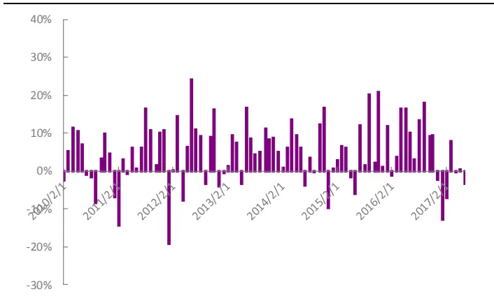
资料来源：光大证券研究所

图17：TS非流动性因子单调性良好
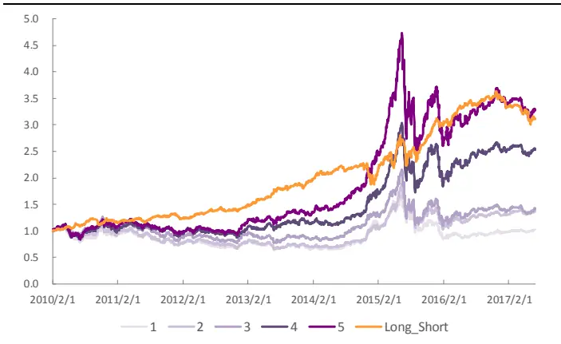
资料来源：光大证券研究所，注：2010.02.01-2017.07.31

将5组分组中的第5组作为我们的选股组合，在2010年至2017年间，年化收益18.2%，年化波动率 24.8%，夏普比率0.8，最大回撤 48.3%，月度换手率 31.4%。相对中证全指年化收益 12.5%， 相对波动率 8.3%，相对最大回撤仅 8.35%。

与其它经过移动平均操作的因子选股组合相比，除了在换手率上有所劣势（使用5 日移动平均的因子月度换手率在20%左右），其它各方面都有大幅提高。

图18：TS非流动性因子分组选股组合相对基准表现稳定
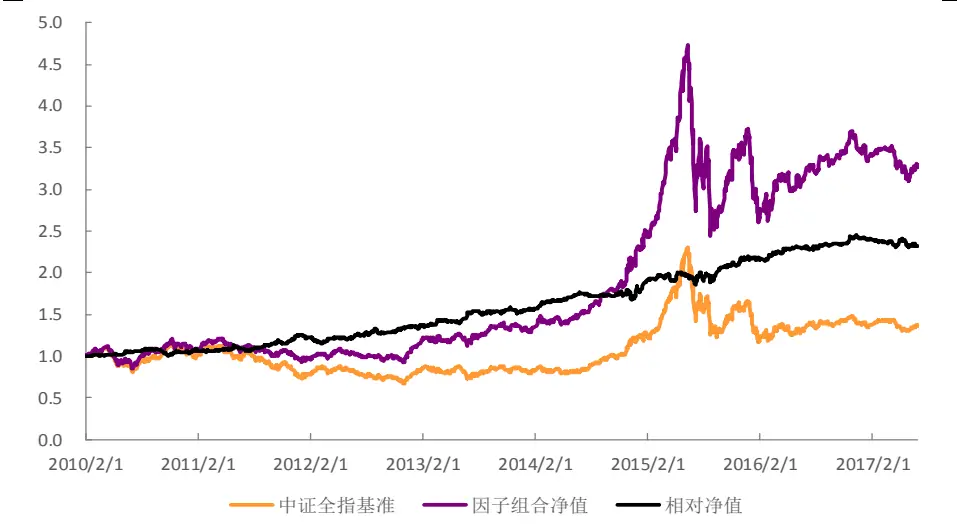
资料来源：光大证券研究所，注：2010.02.01-2017.07.31

表8：TS非流动性因子选股组合分年度回测指标（基准:中证全指）

| 年份 | 年化收益率 | 年化波动率 | 夏普比率 | 最大回撤 | 相对收益率 | 相对波动率 | 信息比率 | 相对回撤 |
| --- | --- | --- | --- | --- | --- | --- | --- | --- |
| 2010 | 15.12% | 24.62% | 0.614 | 24.85% | 5.64% | 6.10% | 0.924 | 7.79% |
| 2011 | -12.90% | 16.64% | -0.775 | 21.32% | 18.45% | 8.83% | 2.089 | 6.65% |
| 2012 | 15.31% | 17.04% | 0.899 | 15.49% | 8.40% | 8.53% | 0.985 | 8.35% |
| 2013 | 21.78% | 18.77% | 1.160 | 11.49% | 14.15% | 7.87% | 1.798 | 4.19% |
| 2014 | 57.45% | 19.09% | 3.009 | 6.95% | 17.37% | 8.82% | 1.970 | 6.40% |
| 2015 | 55.16% | 43.57% | 1.266 | 48.27% | 18.16% | 10.92% | 1.663 | 7.86% |
| 2016 | -0.98% | 26.16% | -0.037 | 22.83% | 11.36% | 6.37% | 1.783 | 2.35% |
| 2017 | -8.95% | 12.63% | -0.709 | 12.06% | -7.94% | 6.28% | -1.265 | 5.19% |
| 2010.2-2017.7 | 18.20% | 24.80% | 0.800 | 48.30% | 12.5% | 8.3% | 1.464 | 8.35% |

资料来源：光大证券研究所

在分组选股的方式下，组合选入的股票数量目前大概有 600支左右。从实际操作意义的角度看，股票数量太多。我们也测试了在等权与市值加权两种加权方式下，只挑选前100支股票构成选股组合的效果。

从整体结果上看，等权下选股组合收益更高。等权选股组合年化收益20.29%，年化波动率 23.24%，夏普比率 0.91，最大回撤 43.67%；市值加权组合年化收益 16.84%，年化波动率 21.31%，夏普比率 0.84，最大回撤43.51%。但今年由于市值因子的失效，市值加权组合在今年的表现明显优于等权组合。

图 19：TS 非流动性因子前 100 支股票选股组合表现
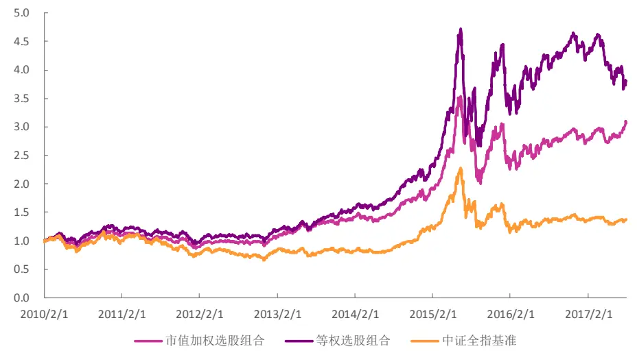
资料来源：光大证券研究所，注：2010.02.01-2017.07.31

在选股组合仅有100 支股票的情况下，组合的月度换手率较高，交易成本对组合收益的影响较大。在双边千六的成本下，等权组合的年化收益从20.29%降至 13.20%，市值加权组合的收益率从 16.84%降至 9.85%。

图 20：交易成本对前 100 支股票等权组合的影响
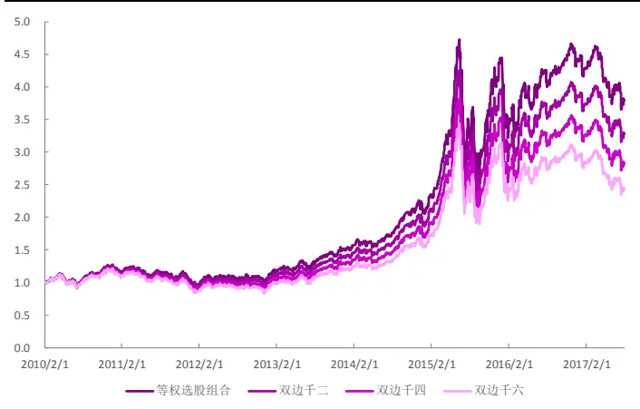
资料来源：光大证券研究所

图21：交易成本对前100支股票市值加权组合的影响
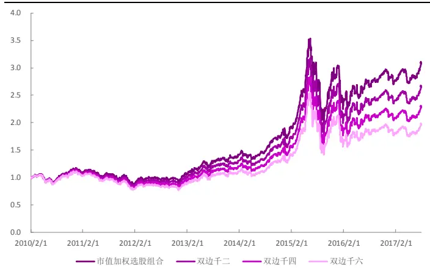
资料来源：光大证券研究所，注：2010.02.01-2017.07.31

从分年度的统计数据可以明显看出，在 2017 年不同加权方式下的因子组合表现差异巨大。

表9：不同加权方式下 TS非流动性因子前 100支选股组合在双边千六成本下的分年度回测指标

|  | 等权组合 |  |  |  | 市值加权组合 |  |  |  |
| --- | --- | --- | --- | --- | --- | --- | --- | --- |
| 年份 | 年化收益率 | 年化波动率 | 夏普比率 | 最大回撤 | 相对收益率 | 相对波动率 | 信息比率 | 相对回撤 |
| 2010 | 18.76% | 18.77% | 0.999 | 18.65% | 10.54% | 16.92% | 0.623 | 17.50% |
| 2011 | -25.42% | 14.79% | -1.719 | 24.41% | -27.86% | 12.54% | -2.222 | 25.32% |
| 2012 | 8.37% | 17.34% | 0.483 | 15.77% | 6.83% | 15.06% | 0.454 | 13.10% |
| 2013 | 26.52% | 17.32% | 1.531 | 10.77% | 25.25% | 17.60% | 1.434 | 10.28% |
| 2014 | 26.27% | 15.33% | 1.714 | 8.82% | 18.72% | 15.47% | 1.210 | 11.66% |
| 2015 | 78.83% | 40.27% | 1.958 | 44.49% | 56.77% | 37.65% | 1.508 | 44.34% |
| 2016 | -1.21% | 28.45% | -0.042 | 20.47% | -8.41% | 26.01% | -0.323 | 19.20% |
| 2017 | -31.06% | 18.11% | -1.715 | 22.50% | 10.79% | 11.64% | 0.927 | 9.63% |
| 2010.2-2017.7 | 13.20% | 23.25% | 0.651 | 44.49% | 9.85% | 21.31% | 0.548 | 44.34% |

资料来源：光大证券研究所

## 4.2、剔除相关因子后依然具备选股能力

在最后一节里，我们试图研究 TS 非流动性因子自身独有的信息含量。也就是说，TS 非流动性因子是否本身具有新增信息，还是说它的选股表现仅仅是源于其它各种已有因子的效用结合；在剔除了其它例如市值或其它因子带入的效用后，是否依然具备良好的选股能力。

为了了解有哪些已有因子与 TS 非流动性因子有较高的相关性，我们分别计算了规模因子、动量因子、技术因子、波动因子及流动性因子中单因子测试显著性较高的几个因子与 TS 非流动性因子之间历史 IC 值的相关系数。在图19 中，我们列出了一些与TS非流动性因子相关系数绝对值较高的一些因子。首先能看到，代表流动性因子的 VSTD 以及代表规模的市值因子与TS非流动性因子相关性都很强，相关系数分别为 -0.55 与 -0.34。这与大众认知观念是相一致的，小市值股票的流动性一般弱于大市值股票。而换手，动量，波动率等因子与TS非流动性因子的相关系数基本在0.1到0.15之间。

敬请参阅最后一页特别声明

图22：TS非流动性因子与其他大类因子历史 IC值的相关性绝对值大小
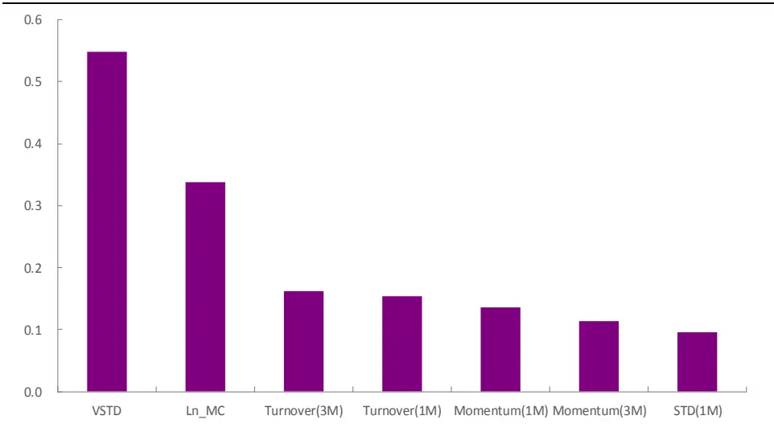
资料来源：光大证券研究所，注：2010.02.01-2017.07.31

我们将通过横截面回归取残差的方式，剔除了以上与 TS 非流动性因子有较大相关性的因子影响。其中，考虑到 VSTD 因子也属于流动性因子，测试时选择并不剔除 VSTD 因子：

$$
Illiq_{i}=\beta_{1}*MC_{i}+\beta_{2}*Momentum_{i}+\beta_{3}*Turnover_{i}+\beta_{4}*STD_{i}+\varepsilon_{i}\#(11)
$$

对 TS 非流动性因子做行业、市值中性处理并剔除换手、动量等因素的影响后，因子的有效性检验等结果有不小下降，但依然显著，IC 平均值为3.5%，，IR 值为 0.39。分组依旧有一定单调性，然而相比中性化之前，最低3组的单调性结果较差；多空组合年化收益亦有所下降为5.52%，夏普比率则大幅下降至 0.52。

图23：中性化后的TS非流动性因子 Rank IC序列
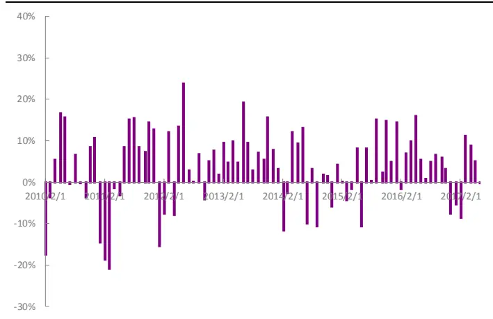
资料来源：光大证券研究所

图24：中性化后的TS非流动性因子分组单调性
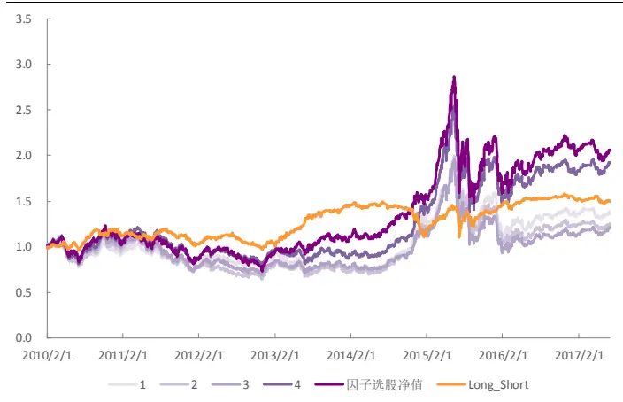
资料来源：光大证券研究所，注：2010.02.01-2017.07.31
敬请参阅最后一页特别声明

中性化处理后的 TS 非流动性因子选股能力从收益上看有不小下滑，2010 年至今的年化收益仅为 10.14%。波动也有小幅扩大，年化波动率为26.08%，夏普比率0.50。相对基准的情况在2014年大幅落后于中性化前的表现，但在其它年份比中性化之前的表现更稳定。

图25：中性化后TS非流动性分组因子最高组因子选股组合表现
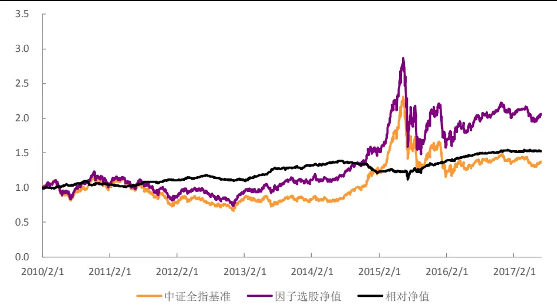
资料来源：光大证券研究所，注：2010.02.01-2017.07.31

图26：中性化前后 TS非流动性因子分组因子最高组选股组合分年度相对年化收益率对比
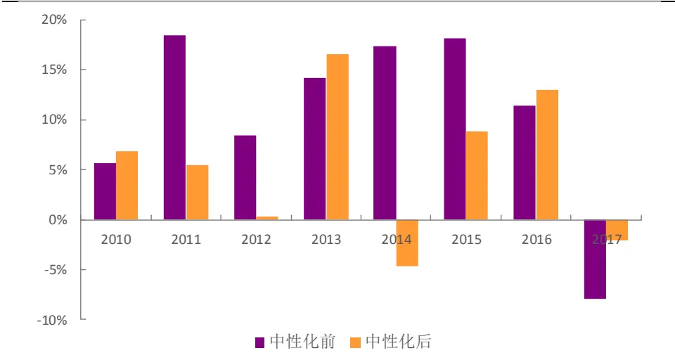
资料来源：光大证券研究所，注：2010.02.01-2017.07.31，基准为中证全指

表10：中性化后的TS非流动性因子分组因子最高组选股组合分年度回测指标（基准:中证全指）

| 年份 | 年化收益率 | 年化波动率 | 夏普比率 | 最大回撤 | 相对收益率 | 相对波动率 | 信息比率 | 相对回撤 |
| --- | --- | --- | --- | --- | --- | --- | --- | --- |
| 2010 | 16.35% | 24.73% | 0.661 | 25.06% | 6.87% | 5.14% | 1.337 | 5.88% |
| 2011 | -25.85% | 21.20% | -1.220 | 27.67% | 5.49% | 4.08% | 1.344 | 4.65% |
| 2012 | 7.25% | 21.96% | 0.330 | 26.34% | 0.34% | 3.47% | 0.098 | 7.08% |
| 2013 | 24.18% | 20.16% | 1.200 | 12.95% | 16.56% | 5.31% | 3.116 | 2.82% |
| 2014 | 35.47% | 17.89% | 1.982 | 9.09% | -4.61% | 4.73% | -0.974 | 9.93% |
| 2015 | 45.82% | 46.35% | 0.989 | 48.33% | 8.82% | 10.01% | 0.881 | 11.82% |
| 2016 | 0.67% | 28.29% | 0.024 | 22.39% | 13.00% | 4.02% | 3.231 | 1.22% |
| 2017 | -3.06% | 12.19% | -0.251 | 10.29% | -2.05% | 4.11% | -0.498 | 1.76% |
| 2010.2-2017.7 | 10.14% | 26.08% | 0.502 | 48.33% | 5.80% | 5.45% | 1.085 | 19.32% |

资料来源：光大证券研究所

综上，TS 非流动性因子在剔除其它类型因子的效应后依然有大量的独有信息，但是整体效果有较大程度地回撤。

## 5、风险提示

本报告中的测试结果均基于模型和历史数据，历史数据存在不被重复验证的可能，模型存在失效的风险。

## 分析师声明

负责准备本报告以及撰写本报告的所有研究分析师或工作人员在此保证，本研究报告中关于任何发行商或证券所发表的观点均如实反映分析人员的个人观点。负责准备本报告的分析师获取报酬的评判因素包括研究的质量和准确性、客户的反馈、竞争性因素以及光大证券股份有限公司的整体收益。所有研究分析师或工作人员保证他们报酬的任何一部分不曾与，不与，也将不会与本报告中具体的推荐意见或观点有直接或间接的联系。

## 分析师介绍

刘均伟 金融工程首席分析师，复旦大学学士，上海财经大学硕士，10 年金融工程研究经验。现任职于光大证券研究所，研究领域为衍生品及量化投资。

## 行业及公司评级体系

买入—未来6-12 个月的投资收益率领先市场基准指数15%以上；

增持—未来 6-12 个月的投资收益率领先市场基准指数 5%至 15%；

中性—未来6-12 个月的投资收益率与市场基准指数的变动幅度相差-5%至5%；

减持—未来6-12 个月的投资收益率落后市场基准指数5%至 15%；

卖出—未来 6-12 个月的投资收益率落后市场基准指数 15%以上；

无评级—因无法获取必要的资料，或者公司面临无法预见结果的重大不确定性事件，或者其他原因，致使无法给出明确的投资评级。

市场基准指数为沪深 300指数。

## 分析、估值方法的局限性说明

本报告所包含的分析基于各种假设，不同假设可能导致分析结果出现重大不同。本报告采用的各种估值方法及模型均有其局限性，估值结果不保证所涉及证券能够在该价格交易。

## 特别声明

光大证券股份有限公司（以下简称“本公司”）创建于 1996 年，系由中国光大（集团）总公司投资控股的全国性综合类股份制证券公司，是中国证监会批准的首批三家创新试点公司之一。公司经营业务许可证编号：z22831000。

公司经营范围：证券经纪；证券投资咨询；与证券交易、证券投资活动有关的财务顾问；证券承销与保荐；证券自营；为期货公司提供中间介绍业务；证券投资基金代销；融资融券业务；中国证监会批准的其他业务。此外，公司还通过全资或控股子公司开展资产管理、直接投资、期货、基金管理以及香港证券业务。

本证券研究报告由光大证券股份有限公司研究所（以下简称“光大证券研究所”）编写，以合法获得的我们相信为可靠、准确、完整的信息为基础，但不保证我们所获得的原始信息以及报告所载信息之准确性和完整性。光大证券研究所可能将不时补充、修订或更新有关信息，但不保证及时发布该等更新。

本报告根据中华人民共和国法律在中华人民共和国境内分发，仅供本公司的客户使用。

本报告中的资料、意见、预测均反映报告初次发布时光大证券研究所的判断，可能需随时进行调整。报告中的信息或所表达的意见不构成任何投资、法律、会计或税务方面的最终操作建议，本公司不就任何人依据报告中的内容而最终操作建议作出任何形式的保证和承诺。

在法律允许的情况下，本公司及其附属机构可能持有报告中提及的公司所发行证券的头寸并进行交易，也可能为这些公司提供或正在争取提供投资银行、财务顾问或金融产品等相关服务。投资者应当充分考虑本公司及本公司附属机构就报告内容可能存在的利益冲突，不应视本报告为作出投资决策的唯一参考因素。

在任何情况下，本报告中的信息或所表达的建议并不构成对任何投资人的投资建议，本公司及其附属机构（包括光大证券研究所）不对投资者买卖有关公司股份而产生的盈亏承担责任。

本公司的销售人员、交易人员和其他专业人员可能会向客户提供与本报告中观点不同的口头或书面评论或交易策略。本公司的资产管理部和投资业务部可能会作出与本报告的推荐不相一致的投资决策。本公司提醒投资者注意并理解投资证券及投资产品存在的风险，在作出投资决策前，建议投资者务必向专业人士咨询并谨慎抉择。

本报告的版权仅归本公司所有，任何机构和个人未经书面许可不得以任何形式翻版、复制、刊登、发表、篡改或者引用。

## 光大证券股份有限公司研究所销售交易总部

上海市新闸路1508 号静安国际广场 3楼邮编 200040

总机：021-22169999 传真：021-22169114、22169134

| 销售交易总部 | 姓名 | 办公电话 | 手机 | 电子邮件 |
| --- | --- | --- | --- | --- |
| 上海 | 陈蓉 | 021-22169086 | 13801605631 | chenrong@ebscn.com |
|  | 濮维娜 | 021-62158036 | 13611990668 | puwn@ebscn.com |
|  | 胡超 | 021-22167056 | 13761102952 | huchao6@ebscn.com |
|  | 周薇薇 | 021-22169087 | 13671735383 | zhouww1@ebscn.com |
|  | 李强 | 021-22169131 | 18621590998 | liqiang88@ebscn.com |
|  | 罗德锦 | 021-22169146 | 13661875949/13609618940 | luodj@ebscn.com |
|  | 张弓 | 021-22169083 | 13918550549 | zhanggong@ebscn.com |
|  | 黄素青 | 021-22169130 | 13162521110 | huangsuqing@ebscn.com |
|  | 王昕宇 | 021-22167233 | 15216717824 | wangxinyu@ebscn.com |
|  | 邢可 | 021-22167108 | 15618296961 | xingk@ebscn.com |
|  | 陈晨 | 021-22169150 | 15000608292 | chenchen66@ebscn.com |
| 金融同业与战略客户 | 黄怡 | 010-58452027 | 13699271001 | huangyi@ebscn.com |
|  | 周洁瑾 | 021-22169098 | 13651606678 | zhoujj@ebscn.com |
|  | 丁梅 | 021-22169416 | 13381965696 | dingmei@ebscn.com |
|  | 徐又丰 | 021-22169082 | 13917191862 | xuyf@ebscn.com |
|  | 王通 | 021-22169501 | 15821042881 | wangtong@ebscn.com |
|  | 陈樑 | 021-22169483 | 18621664486 | chenliang3@ebscn.com |
|  | 吕凌 | 010-58452035 | 15811398181 | Ivling@ebscn.com |
| 北京 | 郝辉 | 010-58452028 | 13511017986 | haohui@ebscn.com |
|  | 梁晨 | 010-58452025 | 13901184256 | liangchen@ebscn.com |
|  | 关明雨 | 010-58452037 | 18516227399 | guanmy@ebscn.com |
|  | 郭晓远 | 010-58452029 | 15120072716 | guoxiaoyuan@ebscn.com |
|  | 王曦 | 010-58452036 | 18610717900 | wangxi@ebscn.com |
|  | 张彦斌 | 010-58452040 | 18614260865 | zhangyanbin@ebscn.com |
| 国际业务 | 陶奕 | 021-22169091 | 18018609199 | taoyi@ebscn.com |
|  | 戚德文 | 021-22167111 | 18101889111 | qidw@ebscn.com |
|  | 金英光 | 021-22169085 | 13311088991 | jinyg@ebscn.com |
|  | 傅裕 | 021-22169092 | 13564655558 | fuyu@ebscn.com |
| 深圳 | 黎晓宇 | 0755-83553559 | 13823771340 | lixy1@ebscn.com |

敬请参阅最后一页特别声明

| 李潇 | 0755-83559378 | 13631517757 | lixiao1@ebscn.com |
| --- | --- | --- | --- |
| 张亦潇 | 0755-23996409 | 13725559855 | zhangyx@ebscn.com |
| 王渊锋 | 0755-83551458 | 18576778603 | wangyuanfeng@ebscn.com |
| 张靖雯 | 0755-83553249 | 18589058561 | zhangjingwen@ebscn.com |
| 牟俊宇 | 0755-83552459 | 13827421872 | moujy@ebscn.com |
| 吴冕 |  | 18682306302 | wumian@ebscn.com |