# 高频因子：日内分时成交量蕴藏玄机——多因子系列报告之八

多因子系列报告之五中，我们已对集合竞价阶段的成交量占比做了详尽的解析，集合竞价成交量占比因子也具有突出的选股效果。本篇报告将分时研究成交量占比，继续挖掘日内高频数据中的有效选股因子。

- 股票分时成交量呈现周期性日内模式。国外股票市场的日内成交量普遍呈“U”型周期变化，即成交量在开盘和收盘阶段比其他交易时段更高，我国股市因存在午间休市，因此在下午开盘时成交量一般会存在一个小高峰，构成一个“ W ”型。对股票日内的成交量分时研究，W 的三个峰值前后时点的成交量值得重点关注。

不同时段成交量占比因子有效性差异明显。以 5 分钟为划分频率，分时研究日内49个时段的成交量占比因子，在上午10:00之前和14:50之后，成交量占比因子与股票次月收益呈较强的负相关性；而在10:10 至 14:50 之间则呈现较强的正相关性。结合上午、下午开盘后成交量占比因子的预测方向和效果，以早盘的前30分钟成交量作为分子（含集合竞价阶段），午盘的前30分钟成交量作为分母构造成交量比值因子VR。

移动平均窗宽越小，VR因子预测能力越显著。同样采用简单移动平均(MA)和指数加权平均方式构造低频选股因子，两种加权方式构造的低频选股因子 IC 均值绝对值均高于6%，IR绝对值均大于0.5，显示出了VR因子整体良好的预测性和稳定的预测能力。

不同加权方式对比，简单平均VR更胜一筹。从因子选股组合的年化收益率、累积收益率、年化波动率、夏普比率和最大回撤五个维度对比，月度算术平均 VR 因子回测效果佳，年化收益率可达 15.5%，夏普比率为0.95，最大回撤为31.9%。同时发现移动平均窗宽越大，因子选股换手率越低，对费用的变化越不敏感。

中性化后的成交量比值VR因子仍有预测能力。经过波动、市值、流动性、行业中性化后的成交量比值 VR 因子有效性指标有所减弱，但仍旧具备一定的选股能力和预测性。IC 均值为-2.13%，IR 绝对值达 0.42，多空组合年化收益为 3.01%，夏普比率达 0.83。

- 风险提示：测试结果均基于模型和历史数据，模型存在失效的风险。

## 金融工程深度

## 分析师

刘均伟 (执业证书编号：S0930517040001)

021-22169151

liujunwei@ebscn.com

## 联系人

古翔

021-22169325

guxiang@ebscn.com

## 相关研究

——多因子系列报告之一》《因子测试全集

多因子系列报告之三》《别开生面：公司治理因子详解

《见微知著：成交量占比高频因子解析——多因子系列报告之五》

《行为金融因子：噪音交易者行为偏差——多因子系列报告之六》

《基于 K 线最短路径构造的非流动性因子——多因子系列报告之七》

## 1、成交量日内模式探索

## 1.1、关注度高的尾盘 30 分钟

近来，众多投资者关注尾盘 30 分钟的股票表现，他们认为，这一时段的高成交量是源于大量知情交易者的交易。因此，这段时间是市场信息充分反映的重要阶段，这部分成交量的高低是用以选股重要指标。

受此启发，我们计划探索股票成交量的日内模式，并利用日内分时成交量构建有效选股因子。

图 1：某股票尾盘放量拉升的日内价格走势图
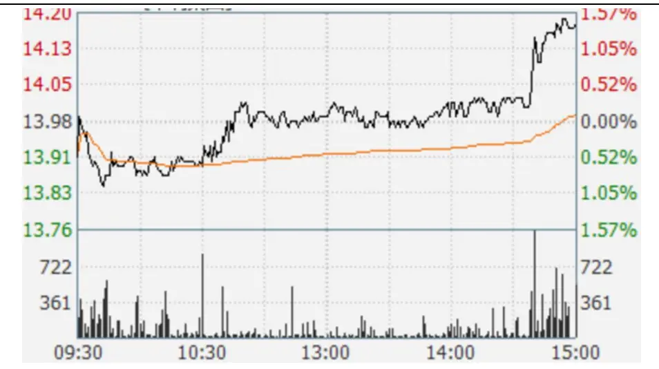
资料来源：Wind，光大证券研究所

## 1.2、日内分钟成交量呈周期性“W”型

股票分时成交量呈现周期性日内模式。国内外已有研究表明，金融市场微观结构特征变量的日内数据蕴含着丰富的动态特征。成交量的变动可作为市场流动性、市场多空情绪强度及投资者信息流动等的代理变量，在市场微观结构中发挥着重要作用。

国外股票市场的日内成交量普遍呈“U”型周期变化，即成交量在开盘和收盘阶段比其他交易时段更高，我国股市因存在午间休市，因此在下午开盘时成交量一般会存在一个小高峰，构成一个“ W ”型。对股票日内的成交量分时研究，W 的三个峰值前后时点的成交量必然是应该重点关注的。

多因子系列报告之五中，我们已对集合竞价阶段的成交量占比做了详尽的解析，集合竞价成交量占比因子具有突出的选股效果。我们将沿用集合竞价成交量占比因子的测试方法，对日内每分钟的连续竞价阶段成交量占比因子的选股效果进行测试。

图 2：上证综指日内分钟成交量呈周期性明显的“ W ”型
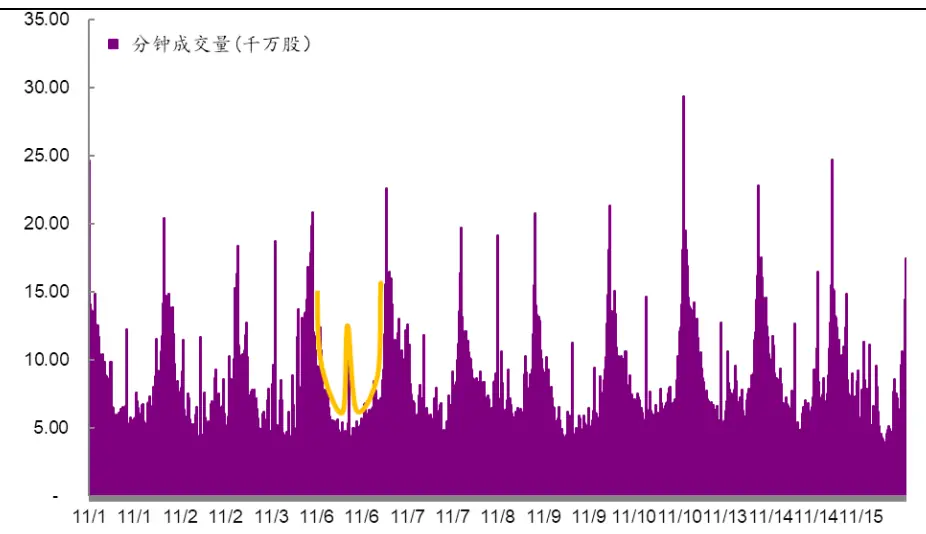
资料来源：Wind，光大证券研究所，注：2017.11.1-2017.11.15

## 1.3、5 分钟成交量占比因子预测性显著

对于因子数据的清洗和有效性检验在此前的多因子系列报告中已有详细阐述，这里仅作简单回顾。

- 绝对中位数法去极值：在因子测试阶段，由于因子本身的分布是否为正态分布无法确定，我们采用稳健的 MAD（绝对中位数法）去除极值更加合适。

- 截面标准化处理：通过横截面 z-score方法，以每个时间截面 t上的所有股票的为样本，分别计算其均值和标准差得到如下所示 stand(factor)。此标准化方式属于因子的线性变换，并不会改变原始因子的分布特征。

$$
{\mathrm{stand}}(factor)_{jt}={\frac{factor_{jt}-{\overline{{factor_{t}}}}}{std(factor)_{t}}}
$$

- 有效性及稳定性检验：采用多期截面RLM回归后我们可以得到因子收益序列，以及每一期回归假设检验T 检验的 t 统计量序列，针对这两个序列我们通过以下几个指标来判断该因子的有效性和稳定性：

（1） 因子收益序列的假设检验 t 统计量值

（2） 因子收益序列大于 0 的概率

（3） t 统计量绝对值的均值

（4） t 统计量绝对值大于等于 2 的概率

- 有效性及预测能力检验：我们计算行业中性与市值中性处理后的RankIC（因子值与股票次月收益率的秩相关系数），通过以下几个与IC 值相关的指标来判断因子的有效性和预测能力：

（1） IC 值的均值

（2） IC 值的标准差

（3） IC 大于 0 的比例

（4） IC 绝对值大于 0.02 的比例

（5） IR（IR = IC 均值/IC 标准差）

A 股市场日内交易时长总计 4 小时，以 5 分钟为间隔可划分为 48 个时间区间，纳入集合竞价阶段总计 49 个时间区间。每日每个时点成交量占比因子计算方式：

$$
vpct_{t}=\frac{Vol_{t}}{Vol_{total}}
$$

其中 $Vol_{t}$ ：表示每日个股 t-1至 t 时刻 5分钟内的成交量

$Vol_{total}$ ：表示日内个股总成交量

不同时点成交量占比因子有效性差异明显。以股票月度平均 vpct 因子为例，对各个时点的因子做有效性测试，因子对股票未来收益的预测性在早晨10:00 和下午 14:50 均出现反转情形。在上午 10:00 之前和 14:50 之后，成交量占比因子与股票下月收益呈较强的负相关性；而在 10:10至 14:50之间成交量占比因子与股票次月收益呈现较强的正相关性。

根据日内不同时段的成交量占比因子表现可以发现：尾盘 30 分钟的成交量并不具有显著的预测能力，但上午开盘时的成交量占比因子与下期收益具有显著的负相关关系；下午开盘时的成交量占比因子与下期收益具有显著正相关关系，这两点均值得关注。

图 3：日内不同时点月度平均 vcpt因子 IC均值
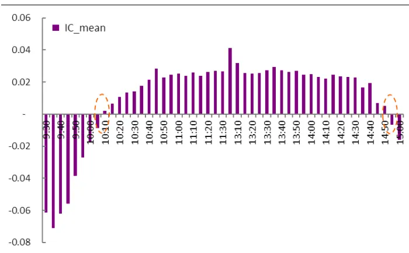
资料来源：光大证券研究所，注：2010.01.01-2017.06.30

图 4：日内不同时点月度平均 vcpt因子 IR值
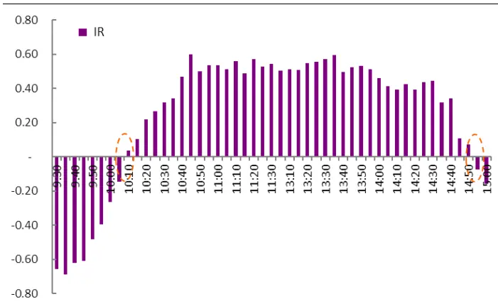
资料来源：光大证券研究所，注：2010.01.01-2017.06.30

根据传统的金融理论，上午开盘后交易量的放大可以理解为是对收盘期间新的信息的集中反映。但上午开盘与下午开盘不同的是，在我国“T+1”的证券交易制度下，上午开盘意味着当日新的交易机会的释放，而此时正是噪音交易者最容易释放情绪的时段，也许早上开盘时成交量占比因子具有显著的反转效应，正因为捕捉到了噪音交易者的交易潮。相较之下，理性交易者一般会相对均匀的分布在日内的各个时点进行交易。

图 5：噪音交易者早盘交易潮成因
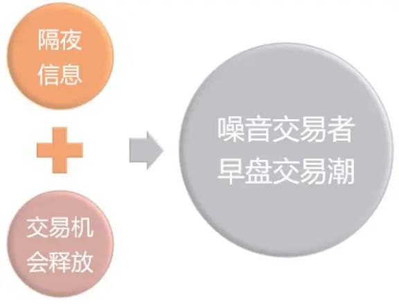
资料来源：光大证券研究所

## 2、日内成交量占比因子的构建

虽然尾盘半小时成交量不具有显著的预测能力，但上午开盘与下午开盘时段的成交量占比因子依然值得关注，后面我们将依据这一规律构造有效选股因子。

## 2.1、开盘 30 分钟成交量比值因子构造

## 基础指标：日内上下午成交量比值 VR（Volume Ratio）

分时研究，开盘30分钟成交量因子优势互补。从成交量占比因子分时研究的结果来看，上午和下午开盘30 分钟的成交量因子的预测性显著且预测方向相反。如何组合上午、下午的成交量占比因子以充分发挥每个因子的长处，以获得更有效的低频选股因子，下面我们将详细阐述。

表1：上午&下午开盘前30分钟分时段成交量占比指标测试结果

| 日内交易时间区间 | 因子收益均值 | 因子收益t值均值 | t值>0比例 | 因子收益均值绝对值 | IC 均值 | IC 标准差 | IC>0 比例 | abs(IC)>0.02 比例 | IR |
| --- | --- | --- | --- | --- | --- | --- | --- | --- | --- |
| 9:30 | -2.00% | -2.96 | 16.7% | 2.55% | -6.12% | 0.093 | 22.2% | 16.7% | -0.66 |
| 9:35 | -1.06% | -3.60 | 15.6% | 1.42% | -7.12% | 0.103 | 17.8% | 14.4% | -0.69 |
| 9:40 | -0.72% | -3.04 | 20.0% | 0.99% | -6.21% | 0.100 | 25.6% | 16.7% | -0.62 |
| 9:45 | -0.54% | -2.57 | 22.2% | 0.77% | -5.58% | 0.092 | 27.8% | 24.4% | -0.61 |
| 9:50 | -0.34% | -1.64 | 28.9% | 0.62% | -3.86% | 0.080 | 30.0% | 24.4% | -0.48 |
| 9:55 | -0.19% | -1.13 | 30.0% | 0.50% | -2.72% | 0.069 | 33.3% | 25.6% | -0.39 |
| 10:00 | -0.12% | -0.70 | 36.7% | 0.40% | -1.70% | 0.064 | 42.2% | 26.7% | -0.27 |
| 13:05 | 0.35% | 1.66 | 68.9% | 0.57% | 4.11% | 0.081 | 66.7% | 58.9% | 0.51 |
| 13:10 | 0.29% | 1.42 | 65.6% | 0.49% | 3.19% | 0.062 | 65.6% | 54.4% | 0.51 |
| 13:15 | 0.22% | 1.16 | 65.6% | 0.37% | 2.57% | 0.051 | 70.0% | 51.1% | 0.51 |
| 13:20 | 0.23% | 1.13 | 68.9% | 0.36% | 2.54% | 0.046 | 73.3% | 47.8% | 0.55 |
| 13:25 | 0.24% | 1.22 | 74.4% | 0.38% | 2.57% | 0.046 | 73.3% | 51.1% | 0.56 |
| 13:30 | 0.24% | 1.25 | 74.4% | 0.36% | 2.75% | 0.048 | 76.7% | 60.0% | 0.57 |

资料来源：Wind，光大证券研究所

以日内分时成交量占比为切入点，结合上午、下午开盘后成交量占比因子的预测方向，以上午开盘的前 30分钟成交量作为分子（含集合竞价阶段），下午开盘的前 30分钟成交量作为分母构造成交量比值因子，简记为VR（VolumeRatio）。根据成交量占比分时研究结果，上午开盘30分钟的成交量越小或者下午开盘30分钟的成交量越大，则成交量比值因子的值越小，对于股票次月收益预测的有效性将更强。同样也印证了噪音交易行为越不活跃的股票，次月股价上扬趋势概率较大。

图 6：上午&下午成交量比值因子构造
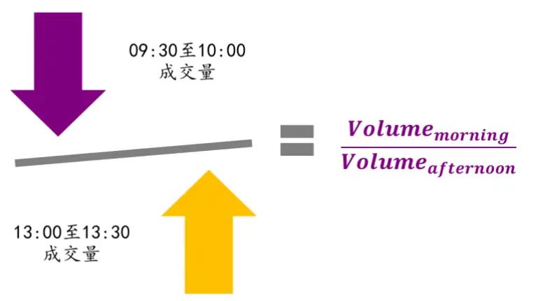
资料来源：光大证券研究所

## 选股因子的低频化处理

继续秉承高频数据，低频信号的构造原理，以每日上下午成交量占比VR为基础指标，采用与集合竞价成交量占比因子同样的变频方式简单移动平均（MA）和指数加权移动平均（EMA）分别构造选股因子，通过对比不同参数下选股因子的有效性测试指标果和选股回测效果，获得最优的成交量比值选股因子。

$$
VR_{t}=\frac{1}{d}\sum_{i=1}^{d}w_{t-i}\ast\left(\frac{Vol_{moring}}{Vol_{afternoon}}\right)_{t-i}
$$

其中

$\frac{Vol_{moring}}{Vol_{afternoon}};$ ：每日上午、下午开盘的前 30分钟成交量比值；

$$
\begin{array}{c}w_{t-i}=\{\begin{array}{cc}{\frac{(1-\alpha)^{\mathrm{i}-1}}{\sum_{i=1}^{\infty}(1-\alpha)^{\mathrm{i}-1}},}&{\frac{\mathrm{i}}{\mathrm{\#}}\frac{*}{\mathrm{\#}}\frac{*}{\mathcal{B}}\zeta\eta\eta\frac{*}{\mathrm{\#}}\lambda}\\{1,}&{\ddot{\mathrm{\#}}\lambda\stackrel{*}{\mathrm{\#}}\lambda^{\dagger}\mathrm{\#}}\end{array}\Rightarrow\mathrm{~\#~\mathbb{H}\Sigma~|\breve{H}|\frac{\dag}{\mathrm{\#}}\lambda\stackrel{*}{\mathrm{\#}}\mathbb{E}\Rightarrow\mathrm{~\mathbb{H}\Sigma~}}\\{1,}&{\mathrm{~\#~\mathbb{H}\Sigma~\not{H}\frac{\dag}{\mathrm{\#}}\lambda^{\dagger}\mathrm{\#}}}\end{array}
$$

α：信息的衰减强度， $\begin{array}{r}{\alpha=\frac{2}{1+d};}\end{array}$

d：每月最后一个交易日向前回溯移动平均的交易日个数。

- 因子计算过程的特殊值处理：每日成交量比值的计算过程涉及到除法运算，若出现分母为零的情形则用空值代替；时间轴上，个股存在停牌情形，对于d 个交易日的移动平均限定至少有5 个交易日为非空值。

## 2.2、因子特征分析

VR 因子呈“尖峰、厚尾”。我们以月度平均的 VR 因子为例，可以观察到原始的VR因子呈现明显的 “右偏、尖峰、厚尾”分布特征，因此在数据清洗阶段对因子进行截面标准化并用 MAD 法对极端值进行处理，降低离群点对计算因子收益的影响。

图 7：VR 原始因子呈“尖峰、厚尾”分布
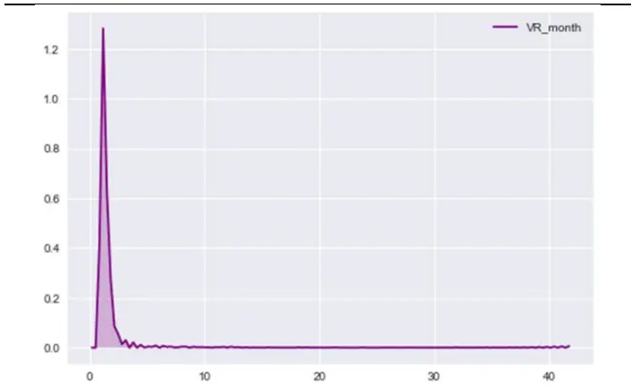
资料来源：光大证券研究所，注：2017年 6 月的因子数据为例

图 8：极值处理&截面标准化后的 VR因子分布
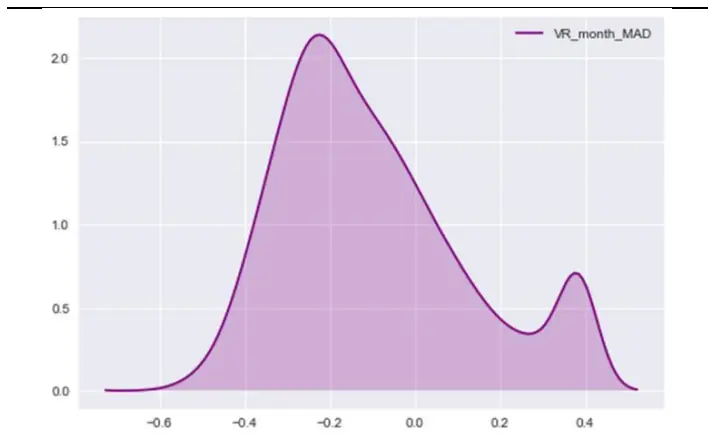
资料来源：光大证券研究所，注：2017年6月的因子数据为例

VR 因子中位数市值差异细微。为了排除股票市值等外部因素的影响，需要考察因子在不同市值的分布情况。分别以沪深300成分股、中证 500 成分股中市值最小的作为大市值、中市值和小市值的分界点，VR 因子的中位数与平均数差异较大；从因子的平均数看，股票市值越小对应的因子值越大；平均数易受极端值的影响，从更稳健的因子的中位数看，不同市值的股票间因子值差异细微。

图 9：VR 因子不同市值中位数与平均数
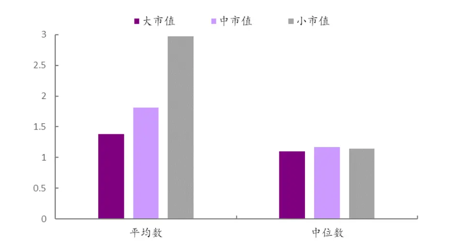
资料来源：Wind，光大证券研究所

不同行业间 VR 因子暴露中位数差异较小。将所有股票按照中信一级行业划分，有色金属行业的 VR 因子中位数最大，电子元器件行业的因子中位数最小，所有 29 个行业的因子暴露中位数均处于 1.00 和 1.25 之间，相互之间的差异较不显著。

图 10：VR 因子的行业分布中位数差异细微
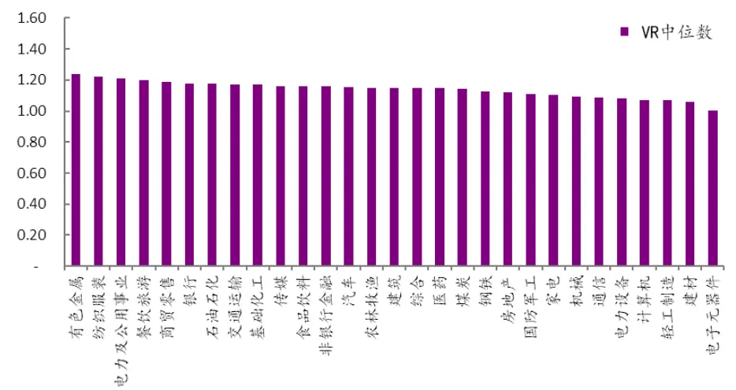
资料来源：Wind，光大证券研究所，注：使用中信一级行业

## 3、VR 因子具有较显著预测能力

## 3.1、加权方式对 VR 因子有效性影响小

VR 因子总体具有较强的显著性和预测能力。选定向前移动平均的天数为 5至 60 天，因子有效性指标测试结果如下表所示，两种加权方式构造的低频选股因子IC 均值绝对值均高于 6%，IR 绝对值均大于0.5，显示出了VR 因子整体良好的预测性和稳定的预测能力。

表2：不同窗宽的算术平均移动平均下，VR因子的有效性测试指标对比

| 向前移动平均交易日个数 | 因子收益均值 | 因子收益t值均值 | t值>0比例 | 因子收益均值绝对值 | IC 均值 | IC 标准差 | IC>0 比例 | abs(IC)>0.02 比例 | IR |
| --- | --- | --- | --- | --- | --- | --- | --- | --- | --- |
| d_5 | -2.88% | -3.14 | 18.9% | 3.63% | -6.25% | 0.072 | 17.8% | 11.1% | -0.86 |
| d_10 | -3.24% | -3.38 | 20.0% | 4.02% | -7.19% | 0.085 | 18.9% | 11.1% | -0.85 |
| d_15 | -3.70% | -3.45 | 20.0% | 4.71% | -7.61% | 0.093 | 22.2% | 16.7% | -0.82 |
| d_m | -3.44% | -3.32 | 21.1% | 4.72% | -7.10% | 0.094 | 22.2% | 18.9% | -0.75 |
| d_20 | -3.42% | -3.34 | 21.1% | 4.65% | -7.19% | 0.093 | 21.1% | 16.7% | -0.77 |
| d_25 | -3.21% | -3.26 | 24.4% | 4.68% | -6.97% | 0.099 | 24.4% | 15.6% | -0.71 |
| d_30 | -3.14% | -3.22 | 23.3% | 4.70% | -6.92% | 0.102 | 23.3% | 20.0% | -0.68 |
| d_35 | -3.42% | -3.09 | 24.4% | 5.17% | -6.71% | 0.105 | 24.4% | 20.0% | -0.64 |
| d_40 | -2.90% | -2.98 | 25.6% | 5.33% | -6.46% | 0.107 | 26.7% | 20.0% | -0.60 |
| d_45 | -2.69% | -2.96 | 26.7% | 5.48% | -6.49% | 0.110 | 26.7% | 21.1% | -0.59 |
| d_50 | -2.53% | -2.87 | 28.9% | 5.44% | -6.40% | 0.112 | 26.7% | 22.2% | -0.57 |
| d_55 | -2.50% | -2.80 | 31.1% | 5.46% | -6.30% | 0.113 | 30.0% | 22.2% | -0.56 |
| d_60 | -1.73% | -2.75 | 32.2% | 6.12% | -6.15% | 0.115 | 31.1% | 23.3% | -0.54 |

资料来源：Wind，光大证券研究所

表3：不同窗宽的指数加权移动平均下，VR因子的有效性测试指标对比

| 向前移动平均交易日个数 | 因子收益均值 | 因子收益t值均值 | t值>0比例 | 因子收益均值绝对值 | IC 均值 | IC 标准差 | IC>0 比例 | abs(IC)>0.02 比例 | IR |
| --- | --- | --- | --- | --- | --- | --- | --- | --- | --- |
| d_5 | -2.22% | -3.39 | 15.6% | 2.96% | -6.85% | 0.077 | 21.1% | 8.9% | -0.89 |
| d_10 | -2.45% | -3.73 | 18.9% | 3.09% | -7.53% | 0.087 | 21.1% | 14.4% | -0.87 |
| d_15 | -2.43% | -3.81 | 18.9% | 3.14% | -7.66% | 0.094 | 18.9% | 16.7% | -0.81 |
| d_m | -2.20% | -3.41 | 18.9% | 2.95% | -6.84% | 0.094 | 24.4% | 21.1% | -0.72 |
| d_20 | -2.25% | -3.80 | 20.0% | 3.28% | -7.62% | 0.100 | 21.1% | 18.9% | -0.76 |
| d_25 | -2.05% | -3.76 | 22.2% | 3.54% | -7.53% | 0.105 | 22.2% | 20.0% | -0.72 |
| d_30 | -1.89% | -3.72 | 22.2% | 3.76% | -7.42% | 0.108 | 22.2% | 20.0% | -0.69 |
| d_35 | -1.79% | -3.68 | 22.2% | 3.92% | -7.30% | 0.111 | 23.3% | 21.1% | -0.66 |
| d_40 | -1.74% | -3.62 | 23.3% | 4.03% | -7.18% | 0.113 | 24.4% | 20.0% | -0.63 |
| d_45 | -1.69% | -3.57 | 24.4% | 4.15% | -7.06% | 0.115 | 26.7% | 21.1% | -0.61 |
| d_50 | -1.67% | -3.51 | 25.6% | 4.28% | -6.94% | 0.117 | 27.8% | 21.1% | -0.59 |
| d_55 | -1.67% | -3.46 | 25.6% | 4.39% | -6.82% | 0.119 | 27.8% | 21.1% | -0.57 |
| d_60 | -1.68% | -3.41 | 25.6% | 4.51% | -6.71% | 0.120 | 28.9% | 21.1% | -0.56 |

资料来源：Wind，光大证券研究所

我们以每日的上午、下午开盘 30 分钟的成交量比值为基础指标，通过移动平均的方式构造低频的选股因子的过程中涉及到两个参数：分别是向前移动平均的窗宽d和移动平均过程的权重w。针对不同参数下的VR 因子，从IR的角度分析，指数加权较算术平均计算的因子的有效性略好。综合对比 IC均值、IR、和因子收益均值三个指标，向前回溯移动平均的窗宽越小，因子的有效性越高。

图 11：VR因子不同参数下 IC均值相对稳定
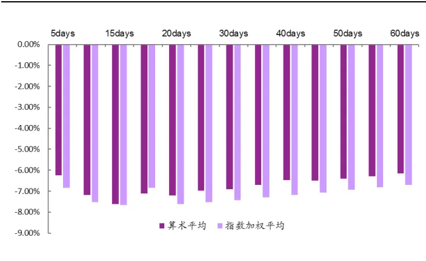
资料来源：Wind，光大证券研究所

图 12：VR因子不同参数下 IR值随着移动平均天数增加而降低
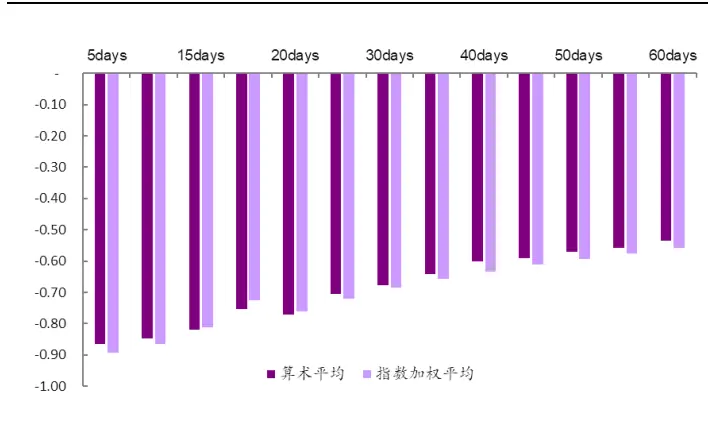
资料来源：Wind，光大证券研究所

## 3.2、月度平均 VR 因子表现突出

上一小节主要从因子的有效性和稳定性角度对比不同参数下因子的选股效果，下面我们将从组合的年化收益率、累积收益率、年化波动率、夏普比率和最大回撤五个维度对比参数的选择对于组合表现的影响（注：优参回测过程暂不考虑交易成本）。综合对比因子的理论效果与实际回测结果，确定计算VR因子的最优参数d和 w。

通过对因子的分布特征及有效性检验，可以观察到VR 因子存在负的因子收益且与股票未来收益存在较强的负相关性，下面将以此为依据建立回测体系。后文的策略回测分析均基于此框架。

表4：因子选股策略回测框架

|  | 因子选股回测框架 |
| --- | --- |
| 回测时间区间 | 2010年2月1日至2017年7月31日 |
| 回测股票池 | 全部 A 股(剔除选股日ST/PT股票；剔除上市不满一年的股票；剔除选股日由于停牌等因素无法买入的股票) |
| 配置股票数量 | 100只 |
| 调仓频率 | 月度调仓 |
| 调仓方式 | 每月最后一个交易日收盘后，根据本月所有未被剔除的股票数据计算因子值，选择因子值最小的100只股票等权配置 |
| 交易费率 | 回测阶段做费率敏感性测试 |

资料来源：光大证券研究所

月度算术平均 VR 因子回测效果较好。取月度算术平均的 VR 因子作为选股因子值时，组合的回测效果最佳，年化收益率可达15.5%，夏普比率为0.95，最大回撤为 31.9%；回溯 45 个交易日的算术平均 VR 因子选股效果略微逊色，年化收益率为 15.3%，夏普比率达 0.97；随着移动平均回溯日期增加，因子选股的换手率逐渐降低。

表5：月度算术平均VR因子回测效果较好

| 年化收益率累积收益率年化波动率 Sharp 比 最大回撤 换手率 |  |  |  |  |  |
| --- | --- | --- | --- | --- | --- |
| d_5 | 13.7% | 152.5% | 18.2% | 0.80 | 40.2% 87.9% |
| d_10 | 13.7% | 152.2% | 17.6% | 0.82 36.2% | 85.1% |
| d_15 | 14.8% | 171.6% | 17.4% 0.88 | 35.3% | 82.5% |
| d_m | 15.5% | 183.8% | 16.7% 0.95 | 31.9% | 80.0% |
| d_20 | 13.7% | 152.4% | 16.9% | 0.84 33.1% | 78.9% |
| d_25 | 14.7% | 168.5% | 16.7% | 0.90 31.7% | 73.0% |
| d_30 | 14.1% | 159.2% | 16.6% | 0.88 31.9% | 67.0% |
| d_35 | 12.7% | 137.8% | 16.5% | 0.81 31.3% | 62.0% |
| d_40 | 14.1% | 158.6% | 16.2% | 0.89 29.7% | 56.9% |
| d_45 | 15.3% | 179.6% | 16.0% | 0.97 28.8% | 53.1% |
| d_50 | 13.9% | 156.2% | 16.0% | 0.89 31.4% | 49.6% |
| d_55 | 13.2% | 145.3% | 16.1% | 0.85 31.8% | 47.1% |
| d_60 | 14.1% | 158.9% | 16.1% | 0.90 32.6% | 44.2% |

资料来源：光大证券研究所，注：d_m 代表一个自然月

25 日指数加权平均 VR 因子回测效果较好。当 d=25 时，通过指数移动平均计算的 VR 因子选股组合的回测效果最佳，年化收益率可达 14.5%，夏普比率为0.89，最大回撤为32.5%；指数加权因子的最优效果略逊于月度算术平均的。

表 6：25 日指数加权平均 VR 因子回测效果较好

| 年化收益率累积收益率年化波动率 Sharp 比 最大回撤 换手率 |  |  |  |  |  |  |
| --- | --- | --- | --- | --- | --- | --- |
| d_5 | 13.5% | 148.9% | 18.3% | 0.78 | 39.2% | 87.4% |
| d_10 | 14.0% | 158.0% | 17.6% | 0.83 | 34.7% | 83.3% |
| d_15 | 14.4% | 164.7% | 17.2% | 0.87 | 33.1% | 78.7% |
| d_m | 14.3% | 163.2% | 17.7% | 0.85 | 38.6% | 83.3% |
| d_20 | 14.5% | 166.4% | 16.9% | 0.89 | 34.0% | 73.6% |
| d_25 | 14.5% | 166.1% | 16.8% | 0.89 | 32.5% | 69.3% |
| d_30 | 13.7% | 153.4% | 16.6% | 0.86 | 32.6% | 65.1% |
| d_35 | 13.8% | 154.5% | 16.2% | 0.88 | 31.5% | 61.5% |
| d_40 | 13.9% | 156.5% | 16.2% | 0.89 | 30.9% | 58.0% |
| d_45 | 13.5% | 149.1% | 16.1% | 0.86 | 30.9% | 54.6% |
| d_50 | 13.0% | 141.2% | 16.1% | 0.84 | 31.1% | 51.7% |
| d_55 | 13.1% | 143.3% | 16.1% | 0.84 | 30.8% | 49.0% |
| d_60 | 12.8% | 138.9% | 16.2% | 0.82 | 31.7% | 46.9% |

资料来源：光大证券研究所，注：d_m 代表一个自然月

指数加权的VR因子随d变化单调性较好。对比不同参数d的组合年化收益，算术平均的因子选股组合收益率随d 的变动波动较大，无明显的趋势性；指数加权平均的 VR 因子选股组合收益率与 d 呈现凹性关系。

图 13：VR因子不同参数下组合的年化收益率对比
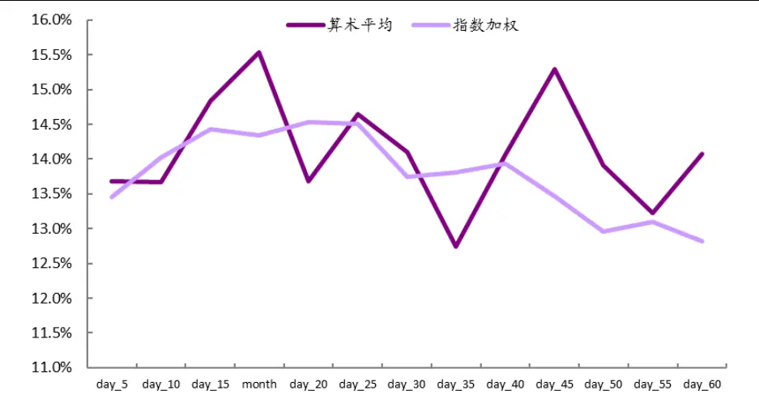
资料来源：Wind,光大证券研究所

## 3.3、VR 因子单调性较好，分组效果良好

因子暴露与股票次月收益呈现较显著的负相关性。我们选择历史回测年化收益率率最高的月度算术平均 VR 因子详细展示其有效性测试结果。观察因子的月度IC，呈现显著的负向效应，IC均值达到-7.10%，IC 大于零的比例为22.2%，IR 绝对值为0.76，因子具有良好的预测能力和显著性。

图 14：VR因子的 Rank IC序列呈现显著的负相关性
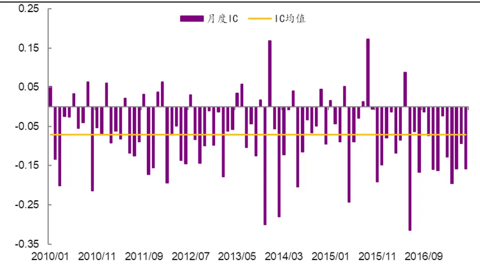
资料来源：Wind,光大证券研究所，注：2010.01.01-2017.6.30

除了有效性指标，因子的单调性和稳定性也是衡量因子选股效果的重要指标。我们建立如下表的分组回测框架，从分组选股效果角度来看因子的单调性，若单调性良好，则说明用该因子选股长期的效果具备较高的稳定性的。下表为因子分组回测阶段的框架说明。

表 7：因子分组回测框架

|  | 因子分组回测框架 |
| --- | --- |
| 时间区间 | 2010年2月1日至2017年7月31日 |
| 股票池 | 全部 A 股(剔除选股日ST/PT股票；剔除上市不满一年的股票；剔除选股日由于停牌等因素无法买入的股票) |
| 调仓频率 | 月度调仓 |
| 分组调仓方式 | 每月最后一个交易日收盘后，根据本月所有未被剔除的股票数据计算因子值，根据因子值从小到大排序将股票等分为5组，分别计算每组股票的历史回测收益及多空组合收益。 |
| 交易费率 | 因子测试阶段暂不考虑交易费用 |

资料来源：光大证券研究所

VR 因子单调性良好，分组效果良好。通过对比因子分组回测净值曲线及多空对冲净值曲线，发现月度移动平均的 VR 因子的分组效果良好，随着因子值的上升，分组收益逐渐下降，各组之间净值曲线有明显的区分度。

图 15：月度算术平均 VR因子具有良好的单调性
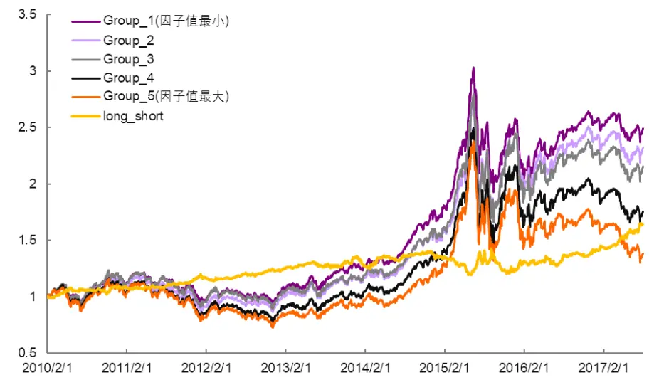
资料来源：Wind,光大证券研究所，注：2010.02.01-2017.07.31

VR 因子作为一个负向因子,随着因子值增加，组合的年化收益率越低。其中多空组合（第一组对冲第五组）年化收益约 7.1%，夏普比率为 0.88，最大回撤达 15.3%。

表 8：月度算术平均 VR 因子分层回溯测试
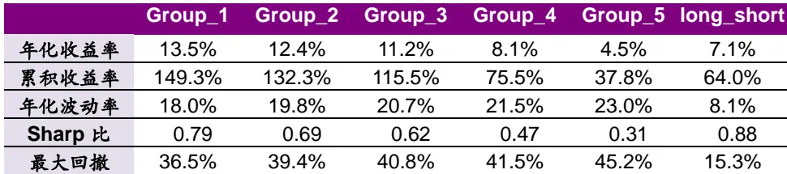
资料来源：Wind,光大证券研究所

## 3.4、剔除相关因子后仍具备预测能力

我们前文已经对因子进行了有效性、稳定性及单调性测试，证明其具备较好的选股能力。要完善的分析因子的选股效果是否来自其内生因素，还需将其与其他常用的基于价量的技术类类因子做相关性测试，如动量、成交量波动、换手率等因子。

VR因子与波动因子和流动性因子相关性高。分别计算规模因子、动量因子、技术因子、波动因子及流动性因子与 VR因子之间历史IC 值的相关性，从下图的相关性测试结果看出：VR 因子与流动性因子和波动率因子之间具有较高的正相关性。

图 16：VR因子与其他大类因子历史 IC值相关性检验
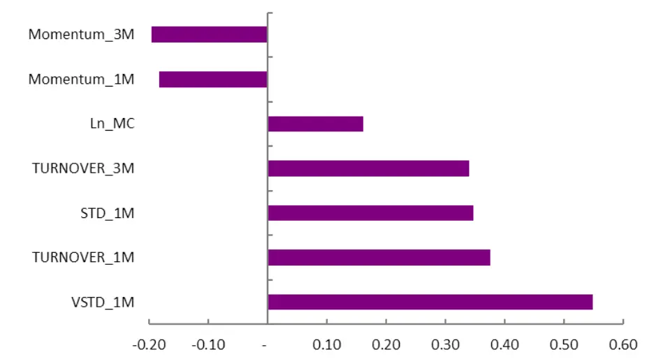
资料来源：光大证券研究所，注：2010.01.01-2017.06.30

为了进一步验证 VR 因子自身具备选股能力，我们将通过横截面回归取残差的方式，同时剔除规模、波动、流动性和行业因素的影响，对所有的因子均做截面标准化和极值处理。

$$
\begin{array}{c}{{VR_{i}=\beta_{1}*VSTD_{i}+\beta_{2}*STD_{i}+\beta_{3}*TURNOVER_{1M_{i}}+\beta_{4}*MC_{i}+}}\\{{{}}}\\{{\beta_{5}*Industry_{i}+\varepsilon_{i}}}\end{array}
$$

剔除高相关性效应 VR 依然有较高有效性。对 VR 因子中性化处理后因子的有效性检验等结果仍然显著，IC 平均值为-2.13%，IC 大于零的比例为32.22%，IR 绝对值达 0.42。此外因子的分组效果略有减弱，多空组合年化收益为3.01%，夏普比率达 0.83。

图 17：中性化后的 VR因子 Rank IC均值降低
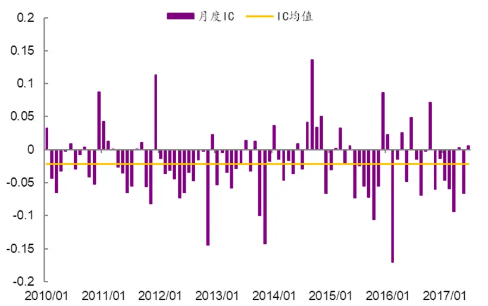
资料来源：Wind,光大证券研究所，注：2010.02.01-2017.07.31

图 18：中性化后的 VR因子单调性下降
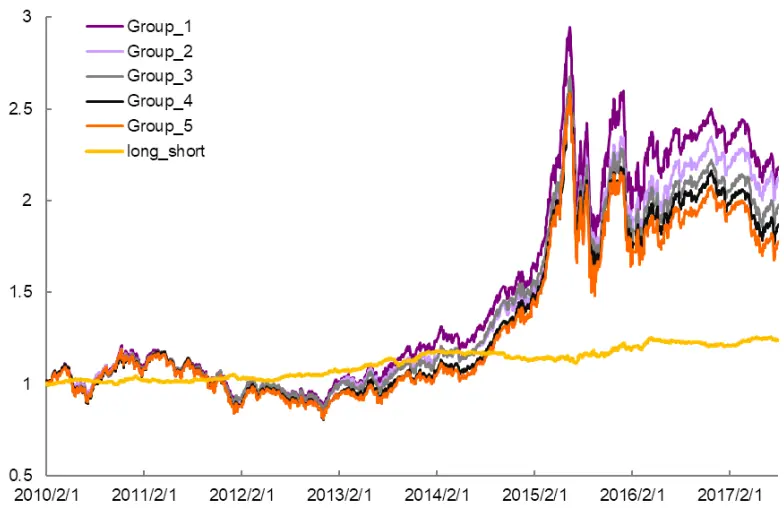
资料来源：Wind,光大证券研究所，注：2010.02.01-2017.07.31

## 3.5、冲击成本较高时，60 日移动平均 VR 因子更优

月度平均 VR 因子对费率变化较敏感。依照前文回测框架月度调仓，每月等权配置100 只股票，随着费率从 0.0%上升到单边0.3%时，月度平均VR因子选股组合年化收益率从15.5%下降到8.8%，因子换手率较高。

表 9：不同费率下 VR 因子(d=m, w=1)选股组合回测指标

|  | 年化收益率 | 累积收益率 | 年化波动率 | sharp 比率 | 最大回撤 |
| --- | --- | --- | --- | --- | --- |
| fee = 0.0% | 15.54% | 183.79% | 16.70% | 0.95 | 31.89% |
| fee = 0.1% | 13.24% | 145.47% | 16.67% | 0.83 | 32.21% |
| fee = 0.2% | 10.98% | 112.27% | 16.67% | 0.71 | 32.52% |
| fee = 0.3% | 8.77% | 83.52% | 16.69% | 0.59 | 32.84% |

资料来源：Wind,光大证券研究所，注：2010.02.01-2017.07.31，单边费率

图 19：不同费率下月度算术平均 VR因子选股组合与中证 500 净值走势
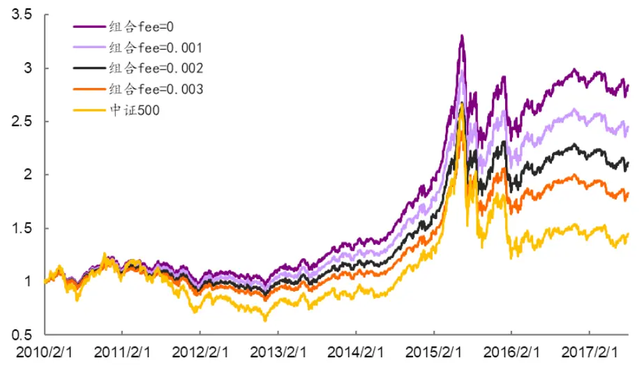
资料来源：Wind,光大证券研究所，注：2010.02.01-2017.07.31，单边费率

VR因子月度选股的多头策略收益尚可。从2010年至 2017年近8 年的回测结果来看（不考虑交易成本）：

（1）策略绝对表现：年化收益率可达 15.5%，年化波动率为 16.7%，夏普比率 0.95；

（2）策略相对表现：相对于中证 500 的超额收益为 6.0%，相对波动率为13.0%，信息比率达 0.51，相对回撤为 24.1%；

（3）策略分年度表现：策略在 2015 年时经历了较大的回撤，八年中有三年跑输基准，年胜率为62.5%，跑赢的五年平均超额收益为 10.4%，跑输的三年平均超额收益为-3.3%。

图 20：VR因子选股组合相对中证 500净值走势
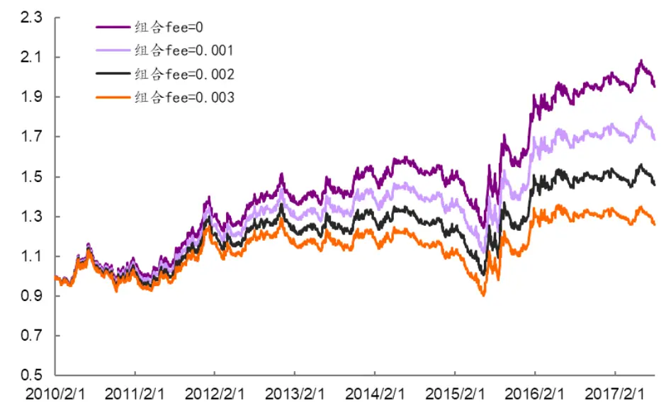
资料来源：Wind,光大证券研究所，注：2010.02.01-2017.07.31

表 10：VR 因子选股组合分年度回测指标（基准:中证 500）

| 年份 | 年化收益率 | 年化波动率 | sharp 比率 | 最大回撤 | 相对收益率 | 相对波动率 | 信息比率 | 相对回撤 |
| --- | --- | --- | --- | --- | --- | --- | --- | --- |
| 2010 | 21.9% | 15.0% | 1.40 | 13.7% | 0.9% | 14.6% | 0.13 | 17.6% |
| 2011 | -14.3% | 13.3% | -1.09 | 15.7% | 29.7% | 12.1% | 2.20 | 9.4% |
| 2012 | 5.2% | 13.8% | 0.43 | 12.8% | -0.3% | 11.7% | 0.03 | 12.9% |
| 2013 | 29.9% | 13.5% | 2.01 | 8.4% | 7.0% | 10.8% | 0.68 | 7.5% |
| 2014 | 34.8% | 11.8% | 2.58 | 5.8% | -5.1% | 9.6% | -0.49 | 10.1% |
| 2015 | 59.9% | 28.6% | 1.79 | 31.9% | 4.0% | 19.1% | 0.30 | 20.0% |
| 2016 | 6.6% | 16.5% | 0.47 | 15.8% | 14.9% | 13.3% | 1.11 | 6.6% |
| 2017 | -4.2% | 10.0% | -0.38 | 7.9% | -4.4% | 7.2% | -0.60 | 6.5% |
| 2010.2-2017.7 | 15.5% | 16.7% | 0.95 | 31.9% | 6.0% | 13.0% | 0.51 | 24.1% |

资料来源：Wind,光大证券研究所

当资产规模较大、冲击成本较高时，60日移动平均VR因子更优。对比不同参数下的 VR 因子选股的平均换手率指标，我们发现随着计算因子的移动平均天数越长，选股策略换手率越低。对比月度平均 VR 因子和 60 日移动平均 VR 因子在不同费率下的选股效果，当费率大于单边千分之一时，选股的收益率出现了反转情形，即：当投资规模较高，冲击成本较大时，60 日移动平均VR 因子的表现更优。

图 21：不同参数 VR 因子选股换手率随回溯天数增加而降低
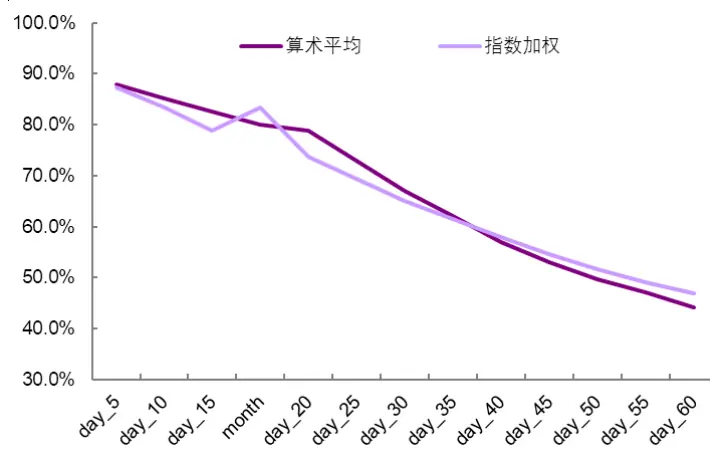
资料来源：Wind,光大证券研究所

图 22：月度平均与 60日移动平均 VR因子选股收益率对比
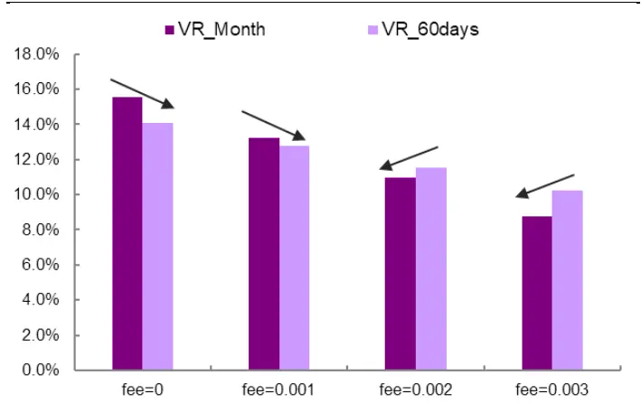
资料来源：Wind,光大证券研究所

## 风险提示

测试结果均基于模型和历史数据，由于VR 因子的有效性来源于噪音交易者早盘的交易潮，未来随着资本市场投资者结构的改善，噪音交易者数量可能逐渐减少，此时模型存在失效的风险。

## 分析师声明

负责准备本报告以及撰写本报告的所有研究分析师或工作人员在此保证，本研究报告中关于任何发行商或证券所发表的观点均如实反映分析人员的个人观点。负责准备本报告的分析师获取报酬的评判因素包括研究的质量和准确性、客户的反馈、竞争性因素以及光大证券股份有限公司的整体收益。所有研究分析师或工作人员保证他们报酬的任何一部分不曾与，不与，也将不会与本报告中具体的推荐意见或观点有直接或间接的联系。

## 分析师介绍

刘均伟 金融工程首席分析师，复旦大学学士，上海财经大学硕士，10 年金融工程研究经验。现任职于光大证券研究所，研究领域为衍生品及量化投资。

## 行业及公司评级体系

买入—未来6-12 个月的投资收益率领先市场基准指数15%以上；

增持—未来 6-12 个月的投资收益率领先市场基准指数 5%至 15%；

中性—未来6-12 个月的投资收益率与市场基准指数的变动幅度相差-5%至5%；

减持—未来6-12 个月的投资收益率落后市场基准指数5%至 15%；

卖出—未来 6-12 个月的投资收益率落后市场基准指数 15%以上；

无评级—因无法获取必要的资料，或者公司面临无法预见结果的重大不确定性事件，或者其他原因，致使无法给出明确的投资评级。

市场基准指数为沪深 300指数。

## 分析、估值方法的局限性说明

本报告所包含的分析基于各种假设，不同假设可能导致分析结果出现重大不同。本报告采用的各种估值方法及模型均有其局限性，估值结果不保证所涉及证券能够在该价格交易。

## 特别声明

光大证券股份有限公司（以下简称“本公司”）创建于 1996 年，系由中国光大（集团）总公司投资控股的全国性综合类股份制证券公司，是中国证监会批准的首批三家创新试点公司之一。公司经营业务许可证编号：z22831000。

公司经营范围：证券经纪；证券投资咨询；与证券交易、证券投资活动有关的财务顾问；证券承销与保荐；证券自营；为期货公司提供中间介绍业务；证券投资基金代销；融资融券业务；中国证监会批准的其他业务。此外，公司还通过全资或控股子公司开展资产管理、直接投资、期货、基金管理以及香港证券业务。

本证券研究报告由光大证券股份有限公司研究所（以下简称“光大证券研究所”）编写，以合法获得的我们相信为可靠、准确、完整的信息为基础，但不保证我们所获得的原始信息以及报告所载信息之准确性和完整性。光大证券研究所可能将不时补充、修订或更新有关信息，但不保证及时发布该等更新。

本报告根据中华人民共和国法律在中华人民共和国境内分发，仅供本公司的客户使用。

本报告中的资料、意见、预测均反映报告初次发布时光大证券研究所的判断，可能需随时进行调整。报告中的信息或所表达的意见不构成任何投资、法律、会计或税务方面的最终操作建议，本公司不就任何人依据报告中的内容而最终操作建议作出任何形式的保证和承诺。

在法律允许的情况下，本公司及其附属机构可能持有报告中提及的公司所发行证券的头寸并进行交易，也可能为这些公司提供或正在争取提供投资银行、财务顾问或金融产品等相关服务。投资者应当充分考虑本公司及本公司附属机构就报告内容可能存在的利益冲突，不应视本报告为作出投资决策的唯一参考因素。

在任何情况下，本报告中的信息或所表达的建议并不构成对任何投资人的投资建议，本公司及其附属机构（包括光大证券研究所）不对投资者买卖有关公司股份而产生的盈亏承担责任。

本公司的销售人员、交易人员和其他专业人员可能会向客户提供与本报告中观点不同的口头或书面评论或交易策略。本公司的资产管理部和投资业务部可能会作出与本报告的推荐不相一致的投资决策。本公司提醒投资者注意并理解投资证券及投资产品存在的风险，在作出投资决策前，建议投资者务必向专业人士咨询并谨慎抉择。

本报告的版权仅归本公司所有，任何机构和个人未经书面许可不得以任何形式翻版、复制、刊登、发表、篡改或者引用。

## 光大证券股份有限公司研究所销售交易总部

上海市新闸路1508 号静安国际广场 3楼邮编 200040

总机：021-22169999 传真：021-22169114、22169134

| 销售交易总部 | 姓名 | 办公电话 | 手机 | 电子邮件 |
| --- | --- | --- | --- | --- |
| 上海 | 陈蓉 | 021-22169086 | 13801605631 | chenrong@ebscn.com |
|  | 濮维娜 | 021-62158036 | 13611990668 | puwn@ebscn.com |
|  | 胡超 | 021-22167056 | 13761102952 | huchao6@ebscn.com |
|  | 周薇薇 | 021-22169087 | 13671735383 | zhouww1@ebscn.com |
|  | 李强 | 021-22169131 | 18621590998 | liqiang88@ebscn.com |
|  | 罗德锦 | 021-22169146 | 13661875949/13609618940 | luodj@ebscn.com |
|  | 张弓 | 021-22169083 | 13918550549 | zhanggong@ebscn.com |
|  | 黄素青 | 021-22169130 | 13162521110 | huangsuqing@ebscn.com |
|  | 邢可 | 021-22167108 | 15618296961 | xingk@ebscn.com |
|  | 陈晨 | 021-22169150 | 15000608292 | chenchen66@ebscn.com |
|  | 王昕宇 | 021-22167233 | 15216717824 | wangxinyu@ebscn.com |
| 北京 | 郝辉 | 010-58452028 | 13511017986 | haohui@ebscn.com |
|  | 梁晨 | 010-58452025 | 13901184256 | liangchen@ebscn.com |
|  | 郭晓远 | 010-58452029 | 15120072716 | guoxiaoyuan@ebscn.com |
|  | 王曦 | 010-58452036 | 18610717900 | wangxi@ebscn.com |
|  | 关明雨 | 010-58452037 | 18516227399 | guanmy@ebscn.com |
|  | 张彦斌 | 010-58452026 | 15135130865 | zhangyanbin@ebscn.com |
| 深圳 | 黎晓宇 | 0755-83553559 | 13823771340 | lixy1@ebscn.com |
|  | 李潇 | 0755-83559378 | 13631517757 | lixiao1@ebscn.com |
|  | 张亦潇 | 0755-23996409 | 13725559855 | zhangyx@ebscn.com |
|  | 王渊锋 | 0755-83551458 | 18576778603 | wangyuanfeng@ebscn.com |
|  | 张靖雯 | 0755-83553249 | 18589058561 | zhangjingwen@ebscn.com |
|  | 牟俊宇 | 0755-83552459 | 13827421872 | moujy@ebscn.com |
| 国际业务 | 陶奕 | 021-22167107 | 18018609199 | taoyi@ebscn.com |
|  | 戚德文 | 021-22167111 | 18101889111 | qidw@ebscn.com |
|  | 金英光 | 021-22169085 | 13311088991 | jinyg@ebscn.com |
|  | 傅裕 | 021-22169092 | 13564655558 | fuyu@ebscn.com |