## 一致交易因子：挖掘集体行为背后的收益——多因子系列报告之九

成交量在股票市场中是个极其重要的信息量，市场参与者不断尝试从中挖掘能够预测未来股票相对收益的新信息。在我们之前的多因子系列报告中，我们从股市特定时间段蕴含额外信息的角度构造了日内分时成交量占比因子。本篇报告将从集体交易行为模式的角度入手，继续研究蕴含在高频成交量数据中的有效选股因子。

集体一致交易行为预示交易机会。在股票信息较为透明，或没有新入信息的情况下，交易者们的交易趋向于相互独立，此时股票交易更大概率使股价上下波动，而非一致向某个方向发展。而如果一支股票在一段时间内大部分的交易属于集体一致交易行为（带有显著趋势性），那么很可能这支股票在这段时间内有新信息进入，正在经历市场消化（price-in）的过程。因此这类股票未来股价更可能产生大幅变化，为交易者创造出了交易机会。

用分钟频率交易量数据构造一致交易类因子。通过定义实体K 线，将交易日中的每根5分钟K 线划分为集体一致交易与非集体一致交易。并以集体一致交易的成交量总和与当日总成交量占比的方式构造一致交易类因子。同时根据实体 K线是上涨抑或下跌，进一步对集体一致交易量进行区分，构造了一致买入交易因子与一致卖出交易因子。

一致卖出交易因子预测能力显著。一致交易类因子预测能力随一致参数增大而单调提升。在一致参数为0.95 时，一致交易因子、一致买入交易因子与一致卖出交易因子的 IR 值都达到十分显著的水平：0.84，0.64 与0.91。综合比较IC 序列整体与近期的表现，一致卖出交易因子更具有预测能力，其 IC 均值 7.7%，IR 值为 0.91。

一致卖出交易因子选股能力优异。一致卖出交易因子分组单调性优异。组合收益随着分组因子值的上升单调提升，且区分度较为明显。多空组合表现优秀，年化收益 14.2%，夏普比率 1.91，最大回撤 11.9%。在 30日指数移动平均下的一致卖出交易因子选股组合表现较好，该因子组合的年化收益 22.0%，夏普比率为 1.09，最大回撤为 44.0%，相对中证500基准的年化超额收益为14.6%。

中性化后的一致卖出交易因子仍有选股能力。在通过横截面回归取残差的方式剔除规模、波动、流动性和行业等因素的影响后，一致卖出交易因子的有效性检验等结果虽然有明显下降，但仍然十分显著，IC 均值为2.37%， IR 绝对值达 0.60。多空组合在中性化后年化收益由 14.2%大幅下降到 4.8%。但其稳定性依然较为亮眼，年化波动 3.9%，夏普比率达 1.23，最大回撤仅 4.8%。

- 风险提示：测试结果均基于模型和历史数据，模型存在失效的风险。

## 金融工程深度

## 分析师

刘均伟 (执业证书编号：S0930517040001)

021-22169151

liujunwei@ebscn.com

## 联系人

胡骥聪

021-22169125

hujicong@ebscn.com

## 相关研究

## 《因子测试框架

多因子系列报告之一》《因子测试全集

——多因子系列报告之二》《多因子组合“光大 Alpha 1.0”

——多因子系列报告之三》《别开生面：公司治理因子详解《别开生面：公司治理因子详解

——多因子系列报告之四》

《见微知著：成交量占比高频因子解析——多因子系列报告之五》

《行为金融因子：噪音交易者行为偏差——多因子系列报告之六》

《基于 K 线最短路径构造的非流动性因子——多因子系列报告之七》

《高频因子：日内分时成交量蕴藏玄机——多因子系列报告之八》

## 1、集体一致行为

人类是社会性动物。现代社会中，每个人都并不是抽象的独立个体，而是其与所有其它人、事物连结的总和。人是社会中的成员，通过社会活动与世界产生信息交互。有些活动相互独立，而还有一些活动则是许多成员的集体一致行为产生的。大部分这种集体一致行为背后都有着或明显或隐含的利益逻辑驱动。

## 1.1、金融市场中的集体一致行为现象

金融二级市场可以认为是一个特殊的小社会，成员是所有市场参与者或交易者，而活动只有一种，即交易行为。由于不同市场参与者（成员）的可获得信息不一，不同交易者的交易行为之间的相关性实际上会在零到一之间波动。在股票信息较为透明，或者说是没有新入信息的情况下，交易者们的交易更加趋向于相互独立，此时股票交易更大概率使得股价上下波动，而非一致向某个方向发展。

但如果发生了一个事件，而且市场参与者对这个事件的反应较为一致，则在活动上的反应就只能通过交易达到，此时在市场上就能观察到较为明显的集体一致行为。其实行为金融学中也描述了许多在金融市场中的集体一致行为，比如在过度恐慌下的情绪下造成的短时间市场崩盘，是由于交易者在那段时间内动作一致——集体卖出手中的股票造成的。比如羊群效应也可以算是金融市场集体一致行为，由于没有额外确切的信息来源，不少散户是通过跟随其他他们认为的知情交易者的交易行为来作出相应的交易决策，从而形成了集体一致交易行为。

## 1.2、一致交易行为蕴含信息

我们认为在市场中的，如果出现了集体较为一致的交易行为，则这种一致交易行为背后也有着逻辑驱动。当股票在市场上被交易的时候，不同股票上集体一致交易行为的多寡蕴含了这些股票未来相对收益的信息。我们可以大胆猜测，如果一支股票在一段时间内大部分的交易属于集体一致交易行为，那么很可能这支股票在这段时间内有新信息进入，正在经历市场消化（price-in）的过程。因此这类股票未来股价更可能产生大幅变化，为交易者创造出了交易机会。

然而，大量集体一致交易的股票在未来更大概率发生的是股价大幅上涨还是大幅下跌变化。这取决于推动集体一致交易行为产生的背后逻辑到底更大部分偏向于知情者交易，还是偏向与类似行为金融学中的过度反应。在接下来的章节里，我们通过构造一类一致交易因子来尝试解答这个问题。

## 2、一致交易量因子构造

在这一章中，我们将通过利用分时成交量的数据刻画股票交易中集体一致交易量的大小，进而构造一致交易类因子。

## 2.1、集体一致交易的定义方式

在国内A股市场涨，每日有不少股票交易十分活跃。如何从中区分出集体一致的交易与相互独立的交易？从K线形态上看，如果一根K 线有较长的上影线或下影线，则表明在该段时间内，交易并非一致的。而如果该K 线的形态就是一根实体K线，而几乎没有上下影线，则有可能表明在这段时间内，各个交易的方向是一致的。这里我们说可能，是因为还存在该根K 线仅仅是开盘价与收盘价就在最高价与最低价附近，而实际在K线形成过程中股价是在上下剧烈波动的现象。这种情况下该段时间内交易者并没有一致交易。

容易想到，以上的局限可以通过利用高频数据的信息一定程度上克服。在高频K线上，出现上述实体K 线时间段内实际股价上下剧烈波动的概率会大大降低。

综合考虑到如果选取K线的频率太高，则时间段内实际交易量可能很少的情况。我们选取以 5 分钟 K 线来区分每天的一致交易与非一致交易。

从目视的角度来说，看一根K线是不是全实体K 线可以凭个人感觉。从量化的角度出发。一根K线是否是实体K 线则涉及到定义方式问题。如果严格要求实体K线必须没有丝毫影线，那么从数学表达该K 线需且仅需满足：

$$
|Close-Open|=|High-Low|\#(1)
$$

但实际上这样定义是比较苛刻的，尤其是对那些流动性高，交易较为频繁的股票而言。因为只要在K线内第一笔或最后一笔交易跟该 K线最终涨跌方向相反，那么该K线按此定义就不能算是实体K 线，即使其它所有交易都是沿着该K线最终涨跌方向成交。因此为了减少定义对某些个别交易的过重依赖。我们认为仅需K 线满足：

$$
|Close-Open|\leq\alpha\times|High-Low|\#(2)
$$

即可认为其是实体K线，其中 α 是一致参数，取值在 0 到1 之间，取1 时即变成之前所述的严格实体 K线定义。

## 2.2、利用成交量数据构造一致交易类因子

我们想知道一只股票在全天交易中，交易者们对它到底是持有相互独立不同的交易观点，还是更多地呈现趋同的集体一致交易。而这一点可以通过这两种交易的成交量大小看出。

我们定义集体一致交易的成交量占全天成交量占比的方式来构造一致交易类因子。具体的方式如下：

1. 观察一天所有5 分钟频率的 K线（若当天正常交易满 4小时，则有48 个K线样本）。

2. 按照是否符合式（2）的条件，将每个5分钟K 线样本标记为实体K 线（集体一致交易）与非实体K线（独立交易）。

3. 将所有标记为实体K 线的5 分钟 K线相应的成交量进行加总求和，得出当日该股票集体一致交易成交量。

4. 最后再将当日集体一致交易成交量除以当日总成交量计算得当日一致交易因子值。

我们将上述因子称为一致交易因子（Total Consistent Volume, 简称TCV）。结合可能采取的因子平滑操作，一致交易因子的数学表达为：

$$
TCV_{t}=\frac{1}{d}\sum_{i=1}^{d}\left(\frac{Consistent\_Volume}{Volume}\right)_{t-i}\#(3)
$$

其中：

d：表示移动平均的周期参数

Consistent_Volume：表示当日全部 5 分钟频率实体 K 线对应成交量总和

Volume：表示当日总成交量

除了观察一只股票当日所有集体一致交易成交量占比大小以外，这些集体一致交易的方向也许能够提供一些额外的信息。因此我们也尝试按照上述成交量占比的量化方式再构建了两个新的一致交易类因子：

一致买入交易因子（Positive Consistent Volume，简称 PCV）：

$$
PCV_{t}=\frac{1}{d}\sum_{i=1}^{d}\left(\frac{Consistent\_Volume_{rise}}{Volume}\right)_{t-i}\#(4)
$$

其中：

d：表示移动平均的周期参数

Consistent_Volumerise：表示当日全部上涨的 5 分钟频率实体 K 线对应成交量总和

Volume：表示当日总成交量

与一致卖出交易因子（Negative Consistent Volume，简称 NCV）：

$$
NCV_{t}=\frac{1}{d}\sum_{i=1}^{d}\left(\frac{Consistent\_Volume_{fall}}{Volume}\right)_{t-i}\#(5)
$$

其中：

d：表示移动平均的周期参数

Consistent_Volumefall：表示当日全部下跌的 5 分钟频率实体 K 线对应成交量总和

Volume：表示当日总成交量

## 3、一致交易类因子预测能力显著

对于因子数据的清洗和有效性检验，我们将沿用此前的多因子系列报告之一中的方法，这里简单概述一下数据清洗方式。

绝对中位数法去极值：在因子测试阶段，由于因子本身的分布是否为正态分布无法确定，我们采用稳健的 MAD（绝对中位数法）去除极值更加合适。

截面标准化处理：通过横截面 z-score方法，以每个时间截面 t上的所有股票的为样本，分别计算其均值和标准差得到如下所示 stand(factor)。此标准化方式属于因子的线性变换，并不会改变原始因子的分布特征。

$$
\mathrm{standard}(factor)_{jt}=\frac{factor_{jt}-\overline{factor_{t}}}{std(factor)_{t}}\#(6)
$$

有效性及稳定性检验：采用多期截面RLM回归后我们可以得到因子收益序列，以及每一期回归假设检验T 检验的 t 统计量序列，针对这两个序列我们通过以下几个指标来判断该因子的有效性和稳定性：

（1） 因子收益序列的假设检验t统计量值

（2） 因子收益序列大于 0 的概率

（3） t 统计量绝对值的均值

（4） t 统计量绝对值大于等于 2 的概率

有效性及预测能力检验：我们计算行业中性与市值中性处理后的RankIC（因子值与股票次月收益率的秩相关系数），通过以下几个与 IC 值相关的指标来判断因子的有效性和预测能力：

（1） IC 值的均值

（2） IC 值的标准差

（3） IC 大于 0 的比例

（4） IC 绝对值大于 0.02 的比例

（5） IR（IR = IC 均值/IC 标准差）

不同一致交易类因子有效性的比较，则主要参考它们的 IC 均值与IR 值的绝对值。

## 3.1、一致卖出交易因子预测能力更胜一筹

我们首先测试了三种一致交易类因子在不同一致参数下的表现。可以明显看出，无论哪种一致交易因子，在一致参数较低时效果都较差。随着一致参数不断提高，因子的IC均值与IR值都有着显著提升。在一致参数为0.95时，一致交易因子、一致买入交易因子与一致卖出交易因子的 IR 值都达到十分显著的水平：0.84，0.64 与 0.91。

表1：三种不同一致交易类因子有效性测试数据

| 一致交易因 子名称 | 一致参数 | 因子收益均 值 | 因子收益t 值均值 | t 值>0 比例 | 因子收益绝 对值均值 | IC 均值 | IC 标准差 | IC>0 比例 | \|IC\| >0.02 比例 | IR |
| --- | --- | --- | --- | --- | --- | --- | --- | --- | --- | --- |
| 一致交易因 子(TCV) | 0.7 | 0.14% | 0.66 | 56.7% | 0.51% | 1.46% | 0.097 | 57.8% | 46.7% | 0.15 |
|  | 0.75 | 0.21% | 1.10 | 64.4% | 0.51% | 2.61% | 0.088 | 64.4% | 48.9% | 0.30 |
|  | 0.8 | 0.29% | 1.54 | 66.7% | 0.54% | 3.59% | 0.086 | 66.7% | 58.9% | 0.42 |
|  | 0.85 | 0.37% | 2.00 | 71.1% | 0.58% | 4.74% | 0.088 | 66.7% | 61.1% | 0.54 |
|  | 0.9 | 0.49% | 2.61 | 78.9% | 0.64% | 6.26% | 0.088 | 78.9% | 64.4% | 0.71 |
|  | 0.95 | 0.60% | 3.18 | 85.6% | 0.73% | 7.78% | 0.092 | 83.3% | 75.6% | 0.84 |
| 一致买入交 易因子 (PCV) | 0.7 | -0.07% | -0.40 | 40.0% | 0.43% | -0.85% | 0.080 | 43.3% | 35.6% | -0.11 |
|  | 0.75 | 0.00% | 0.01 | 47.8% | 0.42% | 0.23% | 0.075 | 47.8% | 38.9% | 0.03 |
|  | 0.8 | 0.08% | 0.47 | 56.7% | 0.46% | 1.25% | 0.077 | 56.7% | 48.9% | 0.16 |
|  | 0.85 | 0.17% | 0.91 | 60.0% | 0.50% | 2.32% | 0.079 | 63.3% | 50.0% | 0.29 |
|  | 0.9 | 0.29% | 1.51 | 67.8% | 0.54% | 3.78% | 0.082 | 71.1% | 56.7% | 0.46 |
|  | 0.95 | 0.44% | 2.19 | 80.0% | 0.63% | 5.47% | 0.086 | 78.9% | 65.6% | 0.64 |
| 一致卖出交 易因子 (NCV) | 0.7 | 0.29% | 1.48 | 67.8% | 0.59% | 3.15% | 0.095 | 63.3% | 56.7% | 0.33 |
|  | 0.75 | 0.34% | 1.76 | 70.0% | 0.59% | 3.92% | 0.089 | 66.7% | 57.8% | 0.44 |
|  | 0.8 | 0.39% | 2.00 | 73.3% | 0.61% | 4.53% | 0.086 | 70.0% | 64.4% | 0.53 |
|  | 0.85 | 0.46% | 2.34 | 78.9% | 0.62% | 5.43% | 0.083 | 73.3% | 65.6% | 0.65 |
|  | 0.9 | 0.55% | 2.76 | 85.6% | 0.66% | 6.64% | 0.081 | 80.0% | 70.0% | 0.82 |
|  | 0.95 | 0.63% | 3.14 | 88.9% | 0.72% | 7.69% | 0.084 | 81.1% | 74.4% | 0.91 |

资料来源：光大证券研究所

与我们预期一样，一致交易类因子的预测能力在一致参数较高的时候较为突出。但比较有趣的是，三个一致交易类因子相较之下，一致交易因子与一致卖出交易因子的预测能力更强。而一致买入因子的 IC，IR 稍逊一筹。表明在A股市场上集体一致的交易行为中，可能卖出交易所蕴含的反转效应更为强烈。

鉴于在一致系数为0.95 时构造的因子有效性最强，之后除非特殊说明，我们默认之后说描述的因子都是以0.95 的一致系数来构造的。

图1：三种不同一致交易类因子在不同一致参数下的 IC均值比较
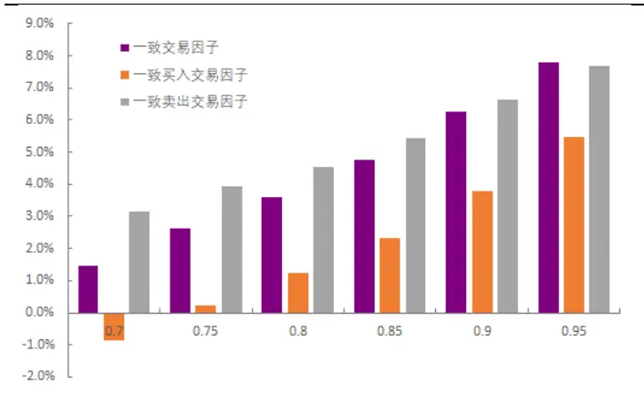
资料来源：光大证券研究所

图2：三种不同一致交易类因子在不同一致参数下的 IR值比较
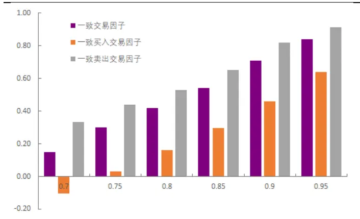
资料来源：光大证券研究所

深入观察这三种不同一致交易类因子的 IC 月度序列。一致卖出交易因子的 IC 序列稳定正向，近一年来都保持正的月度 IC，稳定性极佳。整体而言，一致交易因子的 IC 序列也体现出很好的信息量，但在最近一年内依然有两个月份呈现负的月度 IC。相较之下，一致买入交易因子的 IC 序列最为糟糕，在 2015 年以前，该因子与未来一个月的股票相对收益呈现显著正相关，但从15 年股灾那段时间开始，一致买入交易因子突然失效，在 2015.6到 2017.6 这两年间，一致买入交易因子的 IC 均值从之前的 5%下滑到 1%不到，IR也从显著的0.76 跌倒 0.14。

从最近的因子 IC 表现，依然是一致卖出交易因子更具有预测能力，而一致买入因子则基本丧失其有效性。

图 3：一致卖出交易因子 IC 月度序列
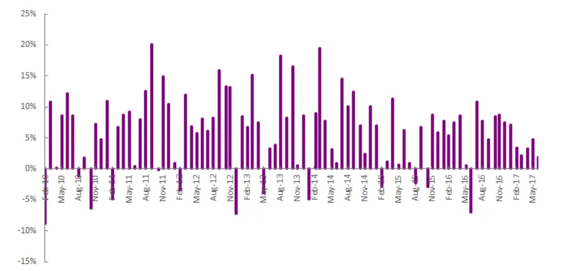
资料来源：光大证券研究所

图 4：一致交易因子 IC 月度序列
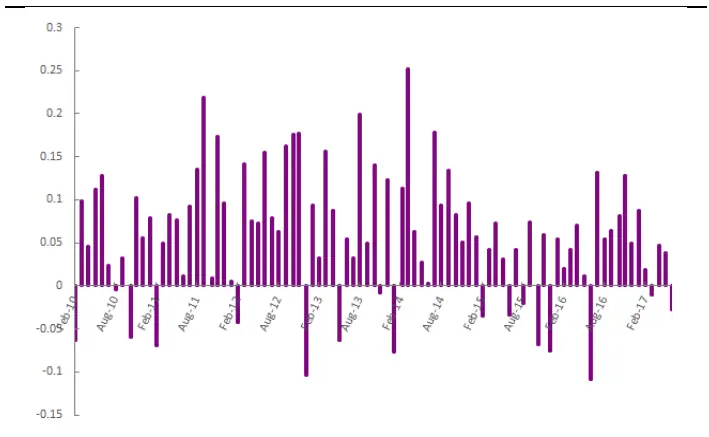
资料来源：光大证券研究所

图 5：一致买入交易因子 IC 月度序列
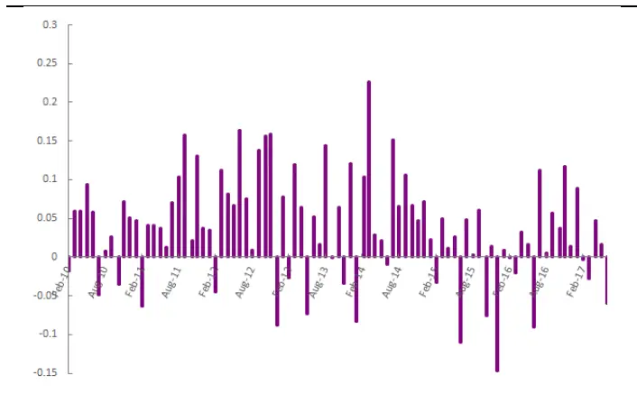
资料来源：光大证券研究所

## 3.2、一致交易类因子预测能力衰减测试

从一般经验出发，大部分的价量数据构造的技术因子信息衰减的速率都较大，我们也测试了不同预测窗口下因子的表现。从年化 IR 的数据可以看出，一致交易类因子也有较大的信息衰减速率。当日因子值预测次日相对收益的一日窗口年化 IR 基本都在 6 到 7 的水平，而当预测窗口扩大到月时，年化IR 则下降到2到3的水平。

表2：一致交易类因子在不同预测窗口下的信息衰减数据

| 一致交易因子 | 预测窗口 | IC 均值 | IC 标准差 | IC>0 比例 | \|IC\| >0.02 比例 | IR | 年化IR值 |
| --- | --- | --- | --- | --- | --- | --- | --- |
| 一致交易因子(TCV) | Month | 7.78% | 0.092 | 83.30% | 75.60% | 0.84 | 2.91 |
|  | 2Week | 6.44% | 0.092 | 74.49% | 68.37% | 0.70 | 3.44 |
|  | Week | 5.41% | 0.087 | 74.80% | 65.78% | 0.62 | 4.31 |
|  | Day | 4.09% | 0.084 | 70.53% | 62.29% | 0.49 | 7.54 |
| 致买入交易因子(PCV) | Month | 5.47% | 0.086 | 78.90% | 65.60% | 0.64 | 2.22 |
|  | 2Week | 5.31% | 0.078 | 72.45% | 63.27% | 0.68 | 3.34 |
|  | Week | 3.91% | 0.078 | 69.76% | 61.01% | 0.50 | 3.47 |
|  | Day | 3.06% | 0.076 | 67.34% | 58.38% | 0.40 | 6.19 |
| 一致卖出交易因子(NCV) | Month | 7.69% | 0.084 | 81.10% | 74.40% | 0.91 | 3.15 |
|  | 2Week | 5.51% | 0.090 | 73.98% | 69.39% | 0.61 | 3.00 |
|  | Week | 5.12% | 0.084 | 74.01% | 64.72% | 0.61 | 4.24 |
|  | Day | 3.77% | 0.084 | 68.88% | 60.97% | 0.45 | 6.92 |

资料来源： 光大证券研究所

在其后的选股组合的测试中，我们也发现调仓频率的快慢与组合的收益正相关。调仓频率越快，多空组合与选股组合的收益越高。在不计交易成本的情况下，月频调仓的选股组合年化收益在20%左右，而双周调仓的选股组合年化收益基本能提高到接近30%，而日频调仓的选股组合年化收益则能超过35%。但考虑交易成本的存在，我们认为月度调仓依然是较优选择。在下一章节里，我们将详细阐述一致卖出因子的月频选股表现。而其它频率的选股效果则不再深入研究。

## 4、一致卖出交易因子选股效果

在上一章节，我们研究了三种一致交易类因子的预测能力。从最终数据看，一致卖出交易因子的效果最好。因而在本章中将继续重点测试一致卖出交易因子的选股能力。

## 4.1、一致卖出交易因子单调性强，多空组合收益稳定

首先通过如下表的分组回测框架，测试因子的单调性与稳定性，并观察以此构建的多空组合是否能长期稳定盈利。

表3：因子分组回测框架

|  | 因子分组回测框架 |
| --- | --- |
| 时间区间 | 2010年2月1日至2017年7月31日 |
| 股票池 | 全部 A 股(剔除选股日ST/PT股票；剔除上市不满一年的股票；剔除选股日由于停牌等因素无法买入的股票) |
| 调仓频率 | 月度调仓 |
| 分组调仓方式 | 每月最后一个交易日收盘后，根据本月所有未被剔除的股票数据计算因子值，根据因子值从小到大排序将股票等分为10组，分别计算每组股票的历史回测收益及多空组合收益。 |
| 交易费率 | 因子测试阶段暂不考虑交易费用 |

资料来源：光大证券研究所

从分 10 组的净值曲线与统计数据，可以看出一致卖出因子分组单调性十分优秀。随着分组因子值的上升，组合收益单调提高，且区分度较为明显。多空组合（第十组对冲第一组）表现优异，年化收益 14.2%，夏普比率 1.91，最大回撤 11.9%。

图 6：一致卖出交易因子单调性优秀
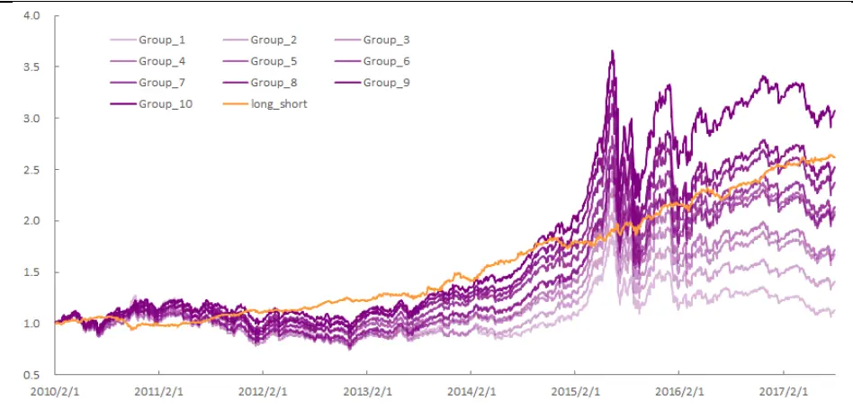
资料来源：光大证券研究所

表4：一致卖出交易因子选股组合分组数据

|  | 第一组 | 第二组 | 第三组 | 第四组 | 第五组 | 第六组 | 第七组 | 第八组 | 第九组 | 第十组 | 多空组合 |
| --- | --- | --- | --- | --- | --- | --- | --- | --- | --- | --- | --- |
| 年化收益率 | 1.8% | 4.8% | 7.4% | 7.8% | 10.7% | 10.5% | 11.1% | 12.7% | 13.7% | 16.8% | 14.2% |
| 累计收益率 | 13.5% | 40.6% | 67.5% | 71.6% | 109.0% | 105.7% | 114.0% | 137.2% | 152.2% | 207.4% | 161.6% |
| 年化波动率 | 21.3% | 20.8% | 20.6% | 20.7% | 20.5% | 20.8% | 20.4% | 20.5% | 20.7% | 20.2% | 7.1% |
| Sharpe 比率 | 0.19 | 0.33 | 0.45 | 0.47 | 0.60 | 0.58 | 0.62 | 0.69 | 0.72 | 0.87 | 1.91 |
| 最大回撤 | 42.7% | 39.5% | 40.3% | 39.9% | 39.7% | 40.9% | 40.1% | 40.8% | 42.6% | 40.1% | 11.9% |

资料来源：光大证券研究所

## 4.2、一致卖出交易因子选股能力优异

从上一节中，一致卖出交易因子优秀的稳定性与单调性得到验证，我们在本节继续测试该因子在不同移动平均窗口以及交易成本下的选股效果。并主要参考其年化收益、年化波动、夏普比率与最大回撤等数据的表现，确定其最优参的选择。

表 5：因子选股策略回测框架

|  | 因子选股回测框架 |
| --- | --- |
| 回测时间区间 | 2010年2月1日至2017年7月31日 |
| 回测股票池 | 全部 A 股(剔除选股日ST/PT股票；剔除上市不满一年的股票；剔除选股日由于停牌等因素无法买入的股票) |
| 配置股票数量 | 100只 |
| 调仓频率 | 月度调仓 |
| 调仓方式 | 每月最后一个交易日收盘后，根据本月所有未被剔除的股票数据计算因子值，选择因子值最小的100只股票等权配置 |
| 交易费率 | 回测阶段做费率敏感性测试 |

资料来源：光大证券研究所

通过简单移动平均计算月度因子值时，不同移动平均窗口下，组合收益差异不大，从5日移动平均到60日移动平均，组合年化收益差别不超过2%，夏普比率基本稳定在 0.9 以上。取 40 日平均计算因子值时组合年化收益最高，达19.5%，此时组合年化波动 20.5%，夏普比率0.97，最大回撤47.4%。

表6：不同简单移动平均参数下因子选股效果

| 移动平均窗口 | 年化收益率 | 累计收益率 | 年化波动率 | Sharpe 比率 | 最大回撤 |
| --- | --- | --- | --- | --- | --- |
| 5 | 18.7% | 239.7% | 20.1% | 0.955 | 42.4% |
| 10 | 18.8% | 242.0% | 19.8% | 0.971 | 44.7% |
| 15 | 18.7% | 240.9% | 19.6% | 0.975 | 43.3% |
| 20 | 18.0% | 226.7% | 19.8% | 0.939 | 43.4% |
| 25 | 17.6% | 217.2% | 20.2% | 0.904 | 44.4% |
| 30 | 19.0% | 245.4% | 19.9% | 0.972 | 45.0% |
| 35 | 18.4% | 234.4% | 20.3% | 0.937 | 47.1% |
| 40 | 19.5% | 256.0% | 20.5% | 0.971 | 47.4% |
| 45 | 19.1% | 247.5% | 20.7% | 0.948 | 48.4% |
| 50 | 18.9% | 243.4% | 20.9% | 0.932 | 48.4% |
| 55 | 19.1% | 247.7% | 21.0% | 0.939 | 47.4% |
| 60 | 19.3% | 251.5% | 21.2% | 0.939 | 45.0% |

资料来源：光大证券研究所

而通过指数移动平均计算月度因子值时，组合表现更为稳定，对移动平均窗口敏感性较低。从 5 日移动平均到 60 日移动平均，组合年化收益稳定在22%上下，夏普比率基本稳定在1.0 到1.1 之间。比起简单移动平均，指数移动平均有更明显的最优参范围，在25日至 35日之间时，组合的综合表现最好。此时组合处于年化收益22%，年化波动20%，夏普比率1.1，最大回撤44%的水平。

表 7：不同指数移动平均参数下因子选股效果

| 移动平均窗口 | 年化收益率 | 累计收益率 | 年化波动率 | Sharpe 比率 | 最大回撤 |
| --- | --- | --- | --- | --- | --- |
| 5 | 21.1% | 293.4% | 20.2% | 1.05 | 43.2% |
| 10 | 21.6% | 304.8% | 20.2% | 1.07 | 45.4% |
| 15 | 21.0% | 289.0% | 20.1% | 1.05 | 44.5% |
| 20 | 21.4% | 299.3% | 20.0% | 1.07 | 44.5% |
| 25 | 22.2% | 317.2% | 20.0% | 1.10 | 44.0% |
| 30 | 22.0% | 313.9% | 20.0% | 1.09 | 44.0% |
| 35 | 22.3% | 320.9% | 20.1% | 1.10 | 44.3% |
| 40 | 21.4% | 300.0% | 20.2% | 1.07 | 44.8% |
| 45 | 21.4% | 298.1% | 20.2% | 1.06 | 45.0% |
| 50 | 21.2% | 295.4% | 20.3% | 1.05 | 44.9% |
| 55 | 21.2% | 293.7% | 20.4% | 1.05 | 44.8% |
| 60 | 21.3% | 297.2% | 20.3% | 1.05 | 44.2% |

资料来源：光大证券研究所

在作过不同移动平均方式的对比后，明显得出指数移动平均计算下的月度因子值选股能力更强。这个结果也反映出因子信息衰减在因子月度化的过程中造成的影响。综合考虑以上结果，我们认为以30 日（6周）指数移动平均计算下的月度因子值进行选股最为合适。

图7：因子在不同参数下组合的年化收益率对比
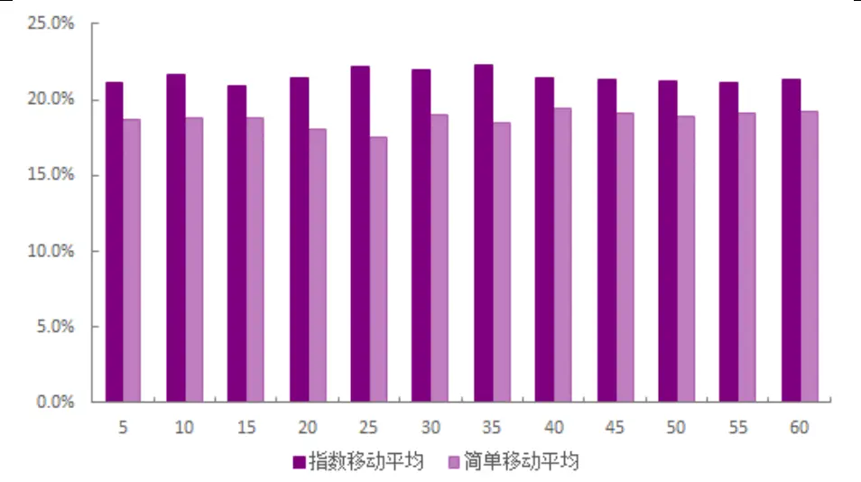
资料来源：光大证券研究所

在 30 日指数移动平均下的一致卖出交易因子选股组合表现较好，该因子组合的年化收益22.0%，夏普比率为 1.09，最大回撤为 44.0%，相对中证500 基准的年化超额收益为 14.6%，相对最大回撤 17.6%出现在 2010 年后半年，之后最大回撤基本控制在 10%以内。2010-2017年的8 年中，跑赢基准7年，基本超额都在10%以上；仅今年跑输基准，年化超额-3.4%。

图8：30日指数移动平均下的一致卖出交易因子选股组合历史净值
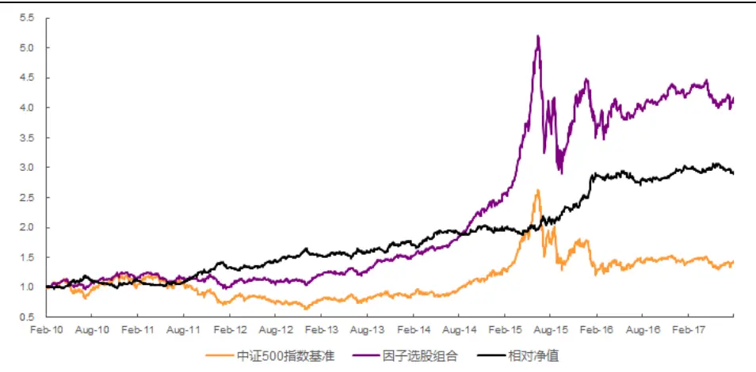
资料来源：光大证券研究所

表8：一致卖出交易因子选股组合分年度回测指标（基准:中证 500）

| 年份 | 年化收益率 | 年化波动率 | sharp 比率 | 最大回撤 | 相对收益率 | 相对波动率 | 信息比率 | 相对回撤 |
| --- | --- | --- | --- | --- | --- | --- | --- | --- |
| 2010 | 21.7% | 14.4% | 1.51 | 14.4% | 7.5% | 14.9% | 0.50 | 17.6% |
| 2011 | -13.3% | 14.4% | -0.92 | 17.1% | 27.0% | 11.2% | 2.40 | 10.4% |
| 2012 | 10.9% | 15.9% | 0.69 | 11.0% | 9.9% | 9.9% | 0.99 | 9.5% |
| 2013 | 29.1% | 12.5% | 2.32 | 9.4% | 13.2% | 11.6% | 1.13 | 5.6% |
| 2014 | 44.9% | 11.0% | 4.07 | 4.1% | 12.5% | 10.1% | 1.24 | 6.6% |
| 2015 | 67.1% | 37.3% | 1.80 | 44.0% | 25.8% | 14.3% | 1.79 | 7.6% |
| 2016 | -1.7% | 21.4% | -0.08 | 19.2% | 15.9% | 11.0% | 1.44 | 7.6% |
| 2017(至7月) | -2.1% | 10.8% | -0.19 | 11.0% | -3.4% | 6.6% | -0.51 | 5.4% |
| 2010.2-2017.7 | 22.0% | 20.0% | 1.09 | 44.0% | 14.6% | 11.7% | 1.25 | 17.56% |

资料来源：Wind,光大证券研究所

我们同时也尝试了在不同加权方式及不同交易成本的情况下，该因子选股组合的表现。整体而言，该因子换手率较高，月换手率在 65%左右。交易成本对组合收益有较显著影响。在双边 0.6%的交易成本下，等权加权与市值加权的组合年化收益都会损失大概5%左右。

表9：不同加权方式下成本对组合的影响

| 加权方式 | 交易成本 | 年化收益率 | 累计收益率 | 年化波动率 | 夏普比率 | 最大回撤 |
| --- | --- | --- | --- | --- | --- | --- |
| 等权加权 | 无成本 | 21.9% | 317.2% | 20.0% | 1.09 | 44.0% |
|  | 双边 0.2% | 20.3% | 280.2% | 20.0% | 1.03 | 44.2% |
|  | 双边 0.4% | 18.8% | 246.5% | 20.0% | 0.96 | 44.4% |
|  | 双边 0.6% | 17.3% | 215.7% | 20.0% | 0.90 | 44.6% |
| 市值加权 | 无成本 | 19.6% | 264.8% | 17.3% | 1.12 | 33.5% |
|  | 双边 0.2% | 18.1% | 231.9% | 17.3% | 1.05 | 33.8% |
|  | 双边 0.4% | 16.5% | 202.0% | 17.3% | 0.97 | 34.2% |
|  | 双边 0.6% | 15.0% | 174.7% | 17.3% | 0.89 | 34.6% |

资料来源：光大证券研究所

图9：等权加权选股组合在不同交易成本下的净值
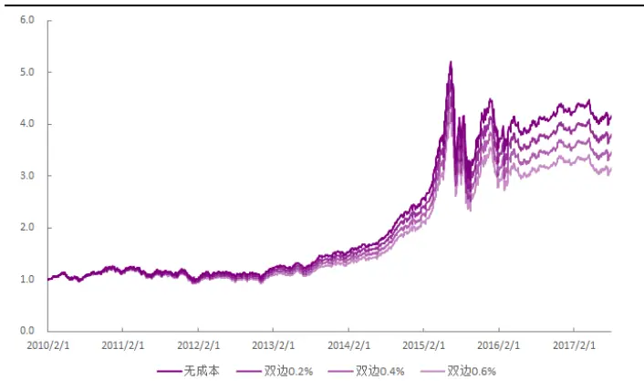
资料来源：光大证券研究所

图 10：市值加权选股组合在不同交易成本下的净值
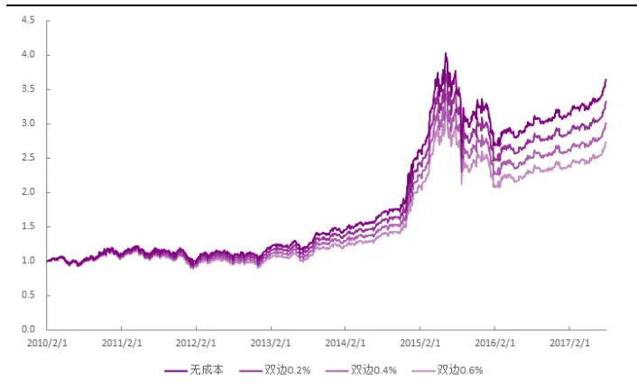
资料来源：光大证券研究所

## 4.3、剔除相关因子后依然具备选股能力

在验证过一致卖出交易因子优秀的预测能力与选股能力后，我们需要进一步分析因子的选股效果是否来自其内生因素，因而在本节中我们将其与其它常用的，主要是基于价量的技术类因子，做相关性测试，如动量、成交量波动、换手率等因子。

分别计算估值因子、规模因子、动量因子、技术因子、波动因子中单因子测试显著性较高的几个因子与一致卖出交易因子之间历史IC值的相关性。从相关性测试结果可以明显看出，一致卖出交易因子与技术因子中的波动因子、换手因子跟流动性因子都有非常高的负相关性。说明该因子会选出波动较小，换手率低，没有太多流动性的股票。同时该因子与一些基本面因子，如估值因子，运营现金流因子呈现明显正相关性。

图11：一致卖出交易因子与其他大类因子历史 IC值相关性检验
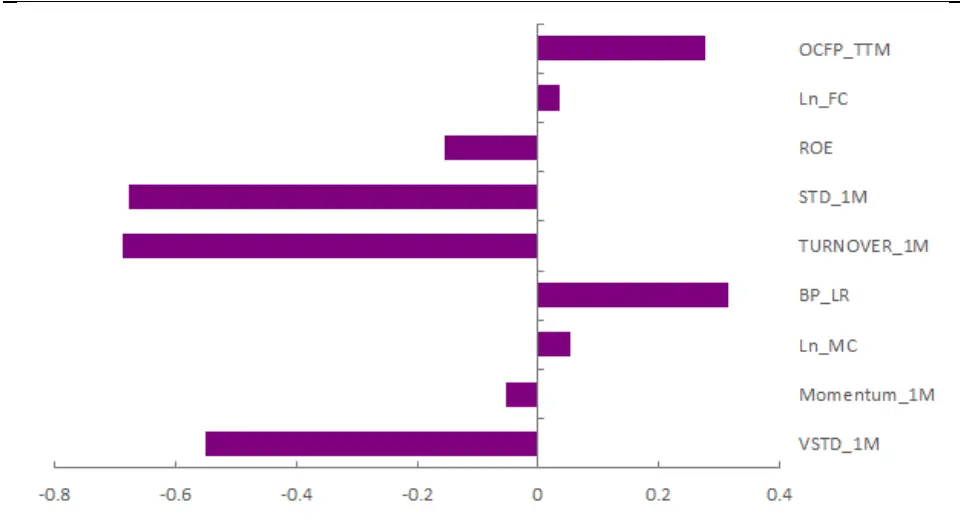
资料来源：光大证券研究所，注：2010.01.01-2017.06.3

可以想见，在与波动因子、换手因子与流动性因子有如此高的负相关性，那么在上一章节中极为优秀的预测能力极有可能大部分来自于这几个因子的贡献。为了进一步验证一致卖出交易因子自身所隐含的独有信息，我们将通过横截面回归取残差的方式，同时剔除规模、波动、流动性和行业等因素的影响，对所有的因子均做截面标准化和极值处理。

$$
\begin{array}{c}NCV_{i}=\beta_{1}*MC_{i}+\beta_{2}*Industry_{i}+\beta_{3}*TURNOVER_{1M_{i}}+\beta_{4}*STD_{i}+\\\beta_{5}*VSTD_{i}+\beta_{6}*BP_{i}+\beta_{7}*ROE_{i}+\beta_{8}*FC_{i}+\varepsilon_{i}\#(7)\end{array}
$$

在经过中性化处理后一致卖出交易因子的有效性检验等结果虽然有明显下降，但仍然十分显著，IC 平均值为2.37%， IR 绝对值达 0.60。此外因子的分组单调性有较大削弱，除了第九组与第十组以外，其余 8组基本没有什么区分度。

图 12：中性化后一致卖出交易因子 IC 月度序列
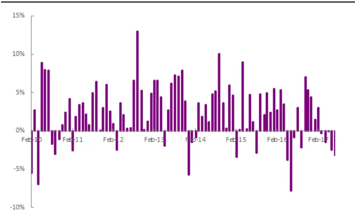
资料来源：光大证券研究所

图13：中性化后一致卖出交易因子单调性削弱
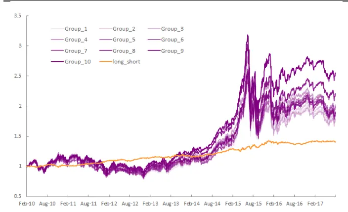
资料来源：光大证券研究所

中性化处理后一致卖出交易因子的选股能力有所下降，多空组合收益更是从中性化前的 14.2%大幅下降到 4.8%。但其稳定性依然较为亮眼，多空组合年化波动3.9%，夏普比率仍有 1.23，最大回撤仅 4.8%。

表10：中性化后一致卖出交易因子选股组合分组数据

|  | 第一组 | 第二组 | 第三组 | 第四组 | 第五组 | 第六组 | 第七组 | 第八组 | 第九组 | 第十组 | 多空组合 |
| --- | --- | --- | --- | --- | --- | --- | --- | --- | --- | --- | --- |
| 年化收益率 | 8.6% | 8.8% | 8.3% | 10.3% | 10.0% | 9.2% | 9.3% | 9.2% | 11.6% | 13.9% | 4.8% |
| 累计收益率 | 81.6% | 84.3% | 78.3% | 102.3% | 99.6% | 88.7% | 90.3% | 88.2% | 121.3% | 155.7% | 40.5% |
| 年化波动率 | 20.1% | 20.0% | 20.3% | 20.4% | 20.7% | 20.8% | 20.6% | 20.8% | 20.5% | 20.3% | 3.9% |
| Sharpe 比率 | 0.51 | 0.52 | 0.50 | 0.58 | 0.57 | 0.53 | 0.54 | 0.53 | 0.64 | 0.74 | 1.23 |
| 最大回撤 | 39.8% | 39.9% | 41.0% | 38.8% | 38.4% | 40.8% | 39.4% | 40.4% | 42.3% | 40.5% | 4.8% |

资料来源：光大证券研究所

在中性化后，组合整体依然能跑赢中证500基准。在回测区间内的 8年中，有7 年跑赢了中证500 指数基准，年胜率达87.5%。组合相对中证500基准，在回测期内年化收益 9.3%，信息比率0.9，最大回撤近18%，表现依然较为优秀。但今年以来因子表现较为糟糕，年化相对收益-10.3%。

图14：中性化后选股组合与中证 500净值比较
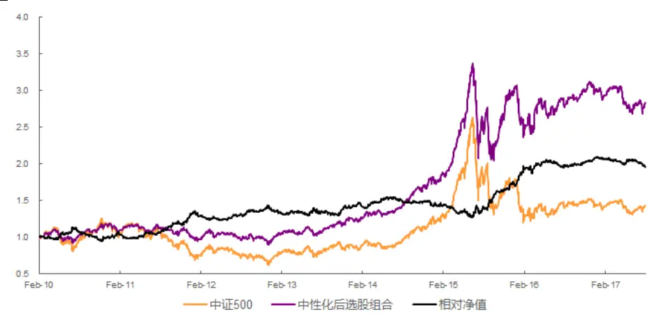
资料来源：光大证券研究所

表11：中性化后一致卖出交易因子选股组合分年度回测指标（基准:中证 500）

| 年份 | 年化收益率 | 年化波动率 | sharp 比率 | 最大回撤 | 相对收益率 | 相对波动率 | 信息比率 | 相对回撤 |
| --- | --- | --- | --- | --- | --- | --- | --- | --- |
| 2010 | 15.8% | 16.0% | 0.99 | 16.4% | 1.1% | 13.0% | 0.09 | 17.1% |
| 2011 | -12.6% | 14.4% | -0.88 | 16.1% | 27.5% | 10.3% | 2.66 | 8.8% |
| 2012 | 3.1% | 16.2% | 0.19 | 18.7% | 2.0% | 9.0% | 0.22 | 9.6% |
| 2013 | 21.7% | 13.9% | 1.56 | 10.5% | 5.5% | 10.0% | 0.55 | 7.0% |
| 2014 | 34.4% | 13.2% | 2.61 | 5.9% | 1.6% | 8.2% | 0.19 | 8.4% |
| 2015 | 60.5% | 34.7% | 1.74 | 39.2% | 20.1% | 14.0% | 1.43 | 13.2% |
| 2016 | 1.1% | 23.5% | 0.05 | 17.8% | 17.9% | 8.7% | 2.06 | 5.1% |
| 2017(至7月) | -8.6% | 13.1% | -0.66 | 12.5% | -10.3% | 5.2% | -1.96 | 5.9% |
| 2010.2-2017.7 | 15.7% | 19.8% | 0.79 | 39.2% | 9.3% | 10.3% | 0.90 | 17.79% |

资料来源：Wind,光大证券研究所

通过以上的中性化测试，可以发现虽然一致卖出因子与不少技术类因子有强相关性，但在剔除这些因子效应后依然拥有较为显著的独有信息。以此构建的选股组合也有较为突出的超额收益，可供投资者作为选股参考。

## 5、风险提示

本报告中的测试结果均基于模型和历史数据，历史数据存在不被重复验证的可能，模型存在失效的风险。

## 行业及公司评级体系

| 评级 说明 |  |
| --- | --- |
| 行 买入 | 未来6-12个月的投资收益率领先市场基准指数15%以上； |
| 增持 中性 | 未来6-12 个月的投资收益率领先市场基准指数5%至15%； |
|  | 未来6-12个月的投资收益率与市场基准指数的变动幅度相差-5%至5%； |
|  | 减持 未来6-12个月的投资收益率落后市场基准指数5%至15%； |
| 卖出 | 未来6-12个月的投资收益率落后市场基准指数15%以上； |
| 业及公司评级 | 因无法获取必要的资料，或者公司面临无法预见结果的重大不确定性事件，或者其他原因，致使无法给出明确的 无评级 投资评级。 |
| 基准指数说明：A股主板基准为沪深300指数；中小盘基准为中小板指；创业板基准为创业板指；新三板基准为新三板指数；港 股基准指数为恒生指数。 |  |

## 分析、估值方法的局限性说明

本报告所包含的分析基于各种假设，不同假设可能导致分析结果出现重大不同。本报告采用的各种估值方法及模型均有其局限性，估值结果不保证所涉及证券能够在该价格交易。

## 分析师声明

本报告署名分析师具有中国证券业协会授予的证券投资咨询执业资格并注册为证券分析师，以勤勉的职业态度、专业审慎的研究方法，使用合法合规的信息，独立、客观地出具本报告，并对本报告的内容和观点负责。负责准备本报告以及撰写本报告的所有研究分析师或工作人员在此保证，本研究报告中关于任何发行商或证券所发表的观点均如实反映分析人员的个人观点。负责准备本报告的分析师获取报酬的评判因素包括研究的质量和准确性、客户的反馈、竞争性因素以及光大证券股份有限公司的整体收益。所有研究分析师或工作人员保证他们报酬的任何一部分不曾与，不与，也将不会与本报告中具体的推荐意见或观点有直接或间接的联系。

## 特别声明

光大证券股份有限公司（以下简称“本公司”）创建于 1996 年，系由中国光大（集团）总公司投资控股的全国性综合类股份制证券公司，是中国证监会批准的首批三家创新试点公司之一。根据中国证监会核发的经营证券期货业务许可，光大证券股份有限公司的经营范围包括证券投资咨询业务。

本公司经营范围：证券经纪；证券投资咨询；与证券交易、证券投资活动有关的财务顾问；证券承销与保荐；证券自营；为期货公司提供中间介绍业务；证券投资基金代销；融资融券业务；中国证监会批准的其他业务。此外，公司还通过全资或控股子公司开展资产管理、直接投资、期货、基金管理以及香港证券业务。

本证券研究报告由光大证券股份有限公司研究所（以下简称“光大证券研究所”）编写，以合法获得的我们相信为可靠、准确、完整的信息为基础，但不保证我们所获得的原始信息以及报告所载信息之准确性和完整性。光大证券研究所可能将不时补充、修订或更新有关信息，但不保证及时发布该等更新。

本报告中的资料、意见、预测均反映报告初次发布时光大证券研究所的判断，可能需随时进行调整且不予通知。报告中的信息或所表达的意见不构成任何投资、法律、会计或税务方面的最终操作建议，本公司不就任何人依据报告中的内容而最终操作建议做出任何形式的保证和承诺。在任何情况下，本报告中的信息或所表述的意见并不构成对任何人的投资建议。客户应自主作出投资决策并自行承担投资风险。本报告中的信息或所表述的意见并未考虑到个别投资者的具体投资目的、财务状况以及特定需求。投资者应当充分考虑自身特定状况，并完整理解和使用本报告内容，不应视本报告为做出投资决策的唯一因素。对依据或者使用本报告所造成的一切后果，本公司及作者均不承担任何法律责任。

不同时期，本公司可能会撰写并发布与本报告所载信息、建议及预测不一致的报告。本公司的销售人员、交易人员和其他专业人员可能会向客户提供与本报告中观点不同的口头或书面评论或交易策略。本公司的资产管理部、自营部门以及其他投资业务部门可能会独立做出与本报告的意见或建议不相一致的投资决策。本公司提醒投资者注意并理解投资证券及投资产品存在的风险，在做出投资决策前，建议投资者务必向专业人士咨询并谨慎抉择。

在法律允许的情况下，本公司及其附属机构可能持有报告中提及的公司所发行证券的头寸并进行交易，也可能为这些公司提供或正在争取提供投资银行、财务顾问或金融产品等相关服务。投资者应当充分考虑本公司及本公司附属机构就报告内容可能存在的利益冲突，勿将本报告作为投资决策的唯一信赖依据。

本报告根据中华人民共和国法律在中华人民共和国境内分发，仅供本公司的客户使用。本公司不会因接收人收到本报告而视其为客户。本报告仅向特定客户传送，未经本公司书面授权，本研究报告的任何部分均不得以任何方式制作任何形式的拷贝、复印件或复制品，或再次分发给任何其他人，或以任何侵犯本公司版权的其他方式使用。所有本报告中使用的商标、服务标记及标记均为本公司的商标、服务标记及标记。如欲引用或转载本文内容，务必联络本公司并获得许可，并需注明出处为光大证券研究所，且不得对本文进行有悖原意的引用和删改。

## 光大证券股份有限公司

上海市新闸路1508 号静安国际广场 3楼邮编 200040

总机：021-22169999 传真：021-22169114、22169134

| 机构业务总部 | 姓名 | 办公电话 | 手机 | 电子邮件 |
| --- | --- | --- | --- | --- |
| 上海 | 徐硕 |  | 13817283600 | shuoxu@ebscn.com |
|  | 胡超 | 021-22167056 | 13761102952 | huchao6@ebscn.com |
|  | 李强 | 021-22169131 | 18621590998 | liqiang88@ebscn.com |
|  | 罗德锦 | 021-22169146 | 13661875949/13609618940 | luodj@ebscn.com |
|  | 张弓 | 021-22169083 | 13918550549 | zhanggong@ebscn.com |
|  | 丁点 | 021-22169458 | 18221129383 | dingdian@ebscn.com |
|  | 青黄素 | 021-22169130 | 13162521110 | huangsuqing@ebscn.com |
|  | 王昕宇 | 021-22167233 | 15216717824 | wangxinyu@ebscn.com |
|  | 邢可 | 021-22167108 | 15618296961 | xingk@ebscn.com |
|  | 陈晨 | 021-22169150 | 15000608292 | chenchen66@ebscn.com |
|  | 李晓琳 | 021-22169087 | 13918461216 | lixiaolin@ebscn.com |
|  | 陈蓉 | 021-22169086 | 13801605631 | chenrong@ebscn.com |
| 北京 | 郝辉 | 010-58452028 | 13511017986 | haohui@ebscn.com |
|  | 梁晨 | 010-58452025 | 13901184256 | liangchen@ebscn.com |
|  | 高菲 | 010-58452023 | 18611138411 | gaofei@ebscn.com |
|  | 关明雨 | 010-58452037 | 18516227399 | guanmy@ebscn.com |
|  | 吕凌 | 010-58452035 | 15811398181 | Ivling@ebscn.com |
|  | 郭晓远 | 010-58452029 | 15120072716 | guoxiaoyuan@ebscn.com |
|  | 张彦斌 | 010-58452026 | 15135130865 | zhangyanbin@ebscn.com |
|  | 庞舒然 | 010-58452040 | 18810659385 | pangsr@ebscn.com |
| 深圳 | 黎晓宇 | 0755-83553559 | 13823771340 | lixy1@ebscn.com |
|  | 李潇 | 0755-83559378 | 13631517757 | lixiao1@ebscn.com |
|  | 张亦潇 | 0755-23996409 | 13725559855 | zhangyx@ebscn.com |
|  | 王渊锋 | 0755-83551458 | 18576778603 | wangyuanfeng@ebscn.com |
|  | 张靖雯 | 0755-83553249 | 18589058561 | zhangjingwen@ebscn.com |
|  | 陈婕 | 0755-25310400 | 13823320604 | szchenjie@ebscn.com |
|  | 牟俊宇 | 0755-83552459 | 13827421872 | moujy@ebscn.com |
| 国际业务 | 陶奕 | 021-22169091 | 18018609199 | taoyi@ebscn.com |
|  | 梁超 |  | 15158266108 | liangc@ebscn.com |
|  | 金英光 | 021-22169085 | 13311088991 | jinyg@ebscn.com |
|  | 傅裕 | 021-22169092 | 13564655558 | fuyu@ebscn.com |
|  | 王佳 | 021-22169095 | 13761696184 | wangjia1@ebscn.com |
|  | 郑锐 | 021-22169080 | 18616663030 | zhrui@ebscn.com |
|  | 凌贺鹏 | 021-22169093 | 13003155285 | linghp@ebscn.com |
| 金融同业与战略客户 | 黄怡 | 010-58452027 | 13699271001 | huangyi@ebscn.com |
|  | 丁梅 | 021-22169416 | 13381965696 | dingmei@ebscn.com |
|  | 徐又丰 | 021-22169082 | 13917191862 | xuyf@ebscn.com |
|  | 王通 | 021-22169501 | 15821042881 | wangtong@ebscn.com |
|  | 陈樑 | 021-22169483 | 18621664486 | chenliang3@ebscn.com |
|  | 赵纪青 | 021-22167052 | 18818210886 | zhaojq@ebscn.com |
| 私募业务部 | 谭锦 | 021-22169259 | 15601695005 | tanjin@ebscn.com |
|  | 曲奇瑶 | 021-22167073 | 18516529958 | quqy@ebscn.com |
|  | 王舒 | 021-22169134 | 15869111599 | wangshu@ebscn.com |
|  | 安羚娴 | 021-22169479 | 15821276905 | anlx@ebscn.com |
|  | 戚德文 | 021-22167111 | 18101889111 | qidw@ebscn.com |
|  | 吴冕 |  | 18682306302 | wumian@ebscn.com |
|  | 吕程 | 021-22169482 | 18616981623 | lvch@ebscn.com |
|  | 李经夏 | 021-22167371 | 15221010698 | lijxia@ebscn.com |
|  | 高霆 | 021-22169148 | 15821648575 | gaoting@ebscn.com |
|  | 左贺元 | 021-22169345 | 18616732618 | zuohy@ebscn.com |
|  | 任 | 021-22167470 | 15955114285 | renzhen@ebscn.com |
|  | 俞灵杰 | 021-22169373 | 18717705991 | yulingjie@ebscn.com |