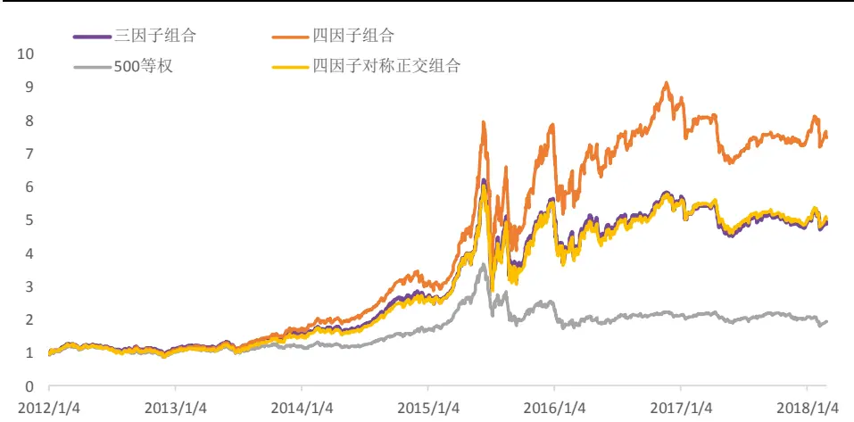
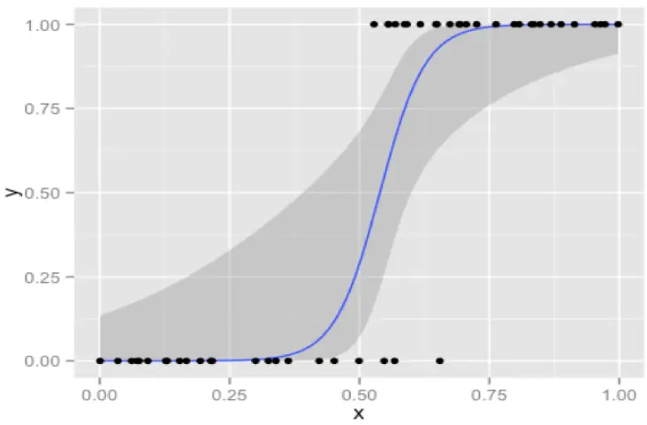
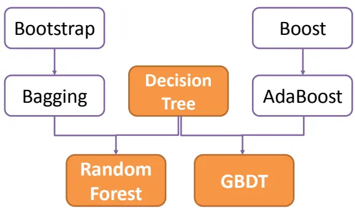
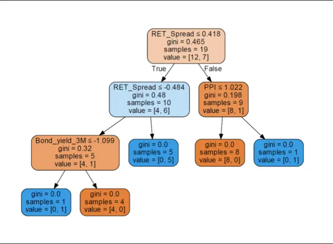
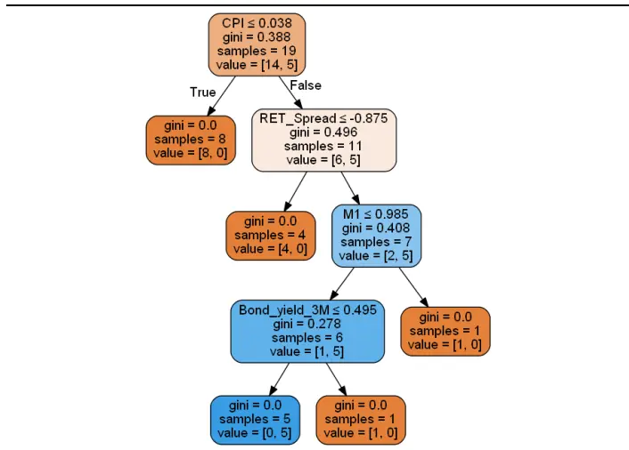
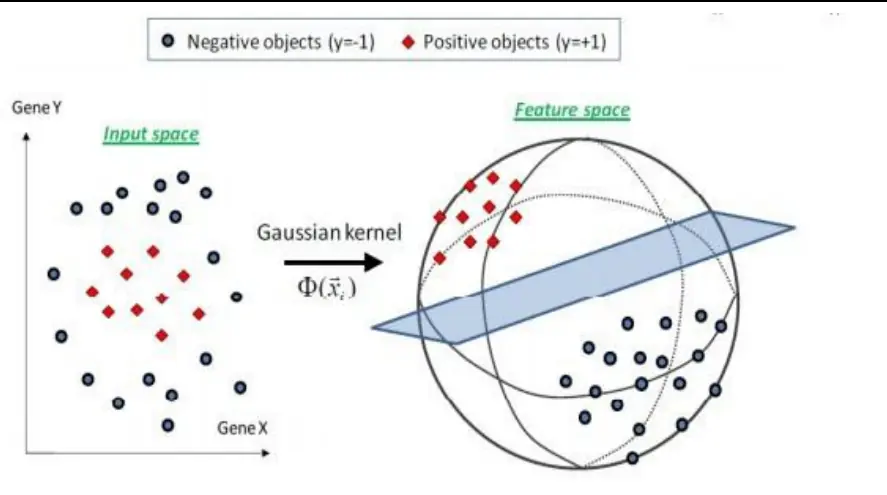
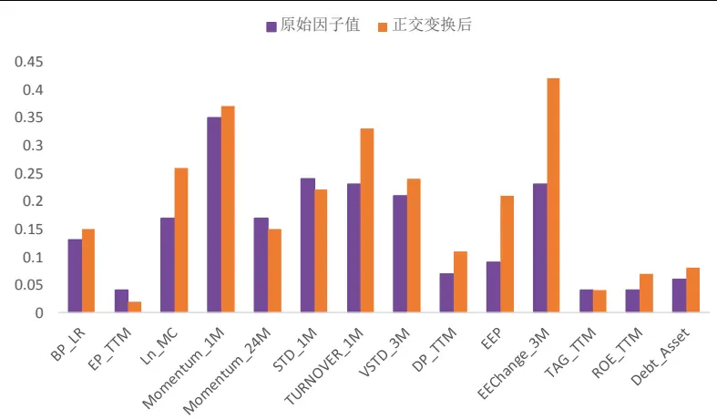
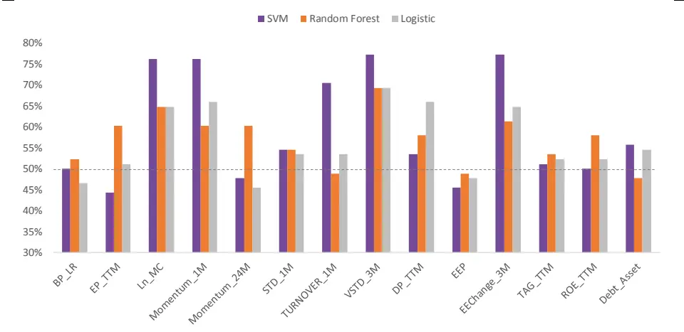
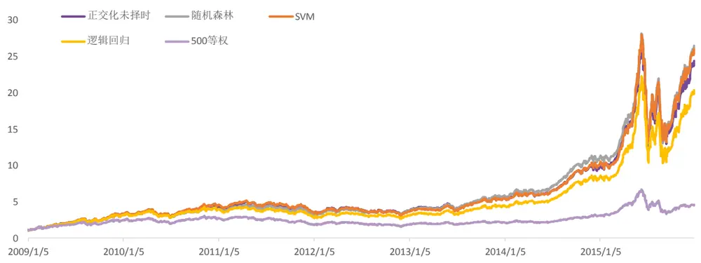
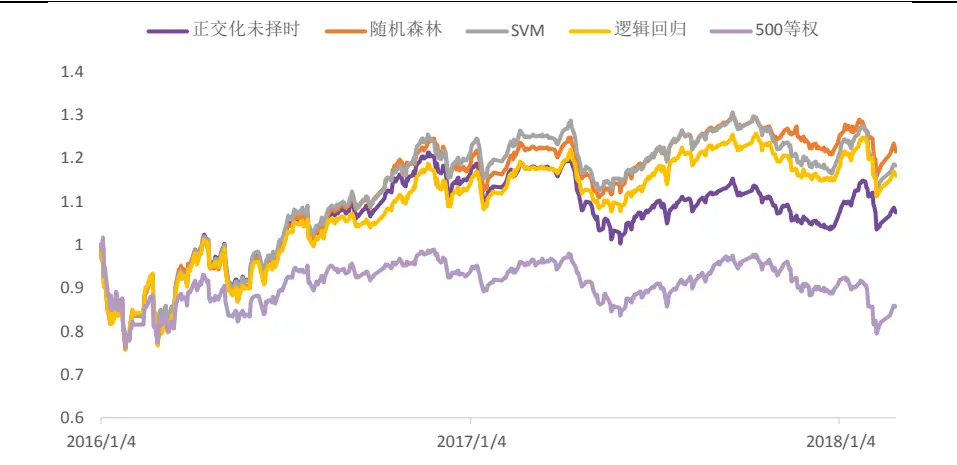

## 因子正交与择时：基于分类模型的动态权重配置——多因子系列报告之十

2017年以来，一些传统的多因子选股模型遭遇了较大回撤，其中市值、反转等因子风格转变的显著性和持续时间均超乎预期。因此，如何预测因子的有效性并进行因子权重配置的调整成为投资者关心的课题。本文在因子择时的方向上做出了尝试，首先为了保证择时模型的有效性，对所使用的因子进行对称正交变换，并选择因子收益作为衡量因子有效性的指标，然后基于宏观经济和市场状态等变量对因子收益构建分类模型预测来因子收益的方向。

因子正交化处理有效提高预测能力。我们采用对称正交方法，对因子进行正交化处理。对比施密特正交和规范正交，对称正交的优势在于正交后因子值与原始值的相似程度高于其他正交方法，且计算效率高。对因子值对称正交变换后，我们所选的外部特征变量对于因子收益的解释能力有较为显著的提升。

因子择时模型的主要类型：分类预测模型&条件期望模型。分类模型的实现方法一般为使用决策树、逻辑回归、支持向量机等模型，对未来因子收益的方向进行预测。条件期望模型则是基于一个较为严格的假设：因子收益与条件变量服从联合正态分布，而在常用的因子收益解释变量中这个假设较为难以满足。因此在本篇报告中，我们主要探讨了上述三种分类预测模型在因子择时中的应用效果。

- 从宏观经济环境、货币政策、市场状态、因子收益及衍生变量四个角度挑选因子收益预测的外部解释变量。因子的收益往往受到宏观经济环境，货币政策，市场状态变量，以及因子自身收益与波动的影响，因此我们从这四大类变量中精选了包括CPI，PPI，因子收益动量等15 个变量，作为因子择时模型的解释变量。

- 模型实证效果：支持向量机预测能力较强，随机森林样本外表现稳定。支持向量机模型能较好的处理小样本的预测，基于决策树的随机森林则具有较为清晰的逻辑，同样较为适合进行因子收益预测。从样本外预测准确率来看，支持向量机 SVM 的预测准确度更高；而从样本外因子择时组合的收益来看，随机森林表现更胜一筹。

随机森林因子收益预测模型表现最优：该模型构造的因子择时组合，样本外（2016-01-01~2018-02-28）绝对年化收益 8.8%，年化超额收益 20.8%,信息比 2.34，表现较为稳定。

风险提示：测试结果均基于模型，模型存在失效的风险。

## 金融工程深度

## 分析师

刘均伟 (执业证书编号：S0930517040001)

021-22169151

liujunwei@ebscn.com

周萧潇 (执业证书编号：S0930518010005)

021-22167060

zhouxiaoxiao@ebscn.com

## 相关研究

——多因子系列报告之一》《因子测试全集

——多因子系列报告之二》《多因子组合“光大 Alpha 1.0”

——多因子系列报告之三》《别开生面：公司治理因子详解《别开生面：公司治理因子详解

——多因子系列报告之四》

《见微知著：成交量占比高频因子解析——多因子系列报告之五》

《行为金融因子：噪音交易者行为偏差——多因子系列报告之六》

《基于 K 线最短路径构造的非流动性因子——多因子系列报告之七》

《高频因子：日内分时成交量蕴藏玄机——多因子系列报告之八》

《一致交易：挖掘集体行为背后的收益——多因子系列报告之九》

在多因子系列前三篇报告中，我们搭建了包含估值、质量、成长、规模、流动性、波动、一致预期等因子的基于最优化因子IC_IR 的多因子组合构建框架。不过自 2017年以来，一些传统的有效因子遭遇了较大回撤，其中市值、反转等因子的风格转变显著性和持续时间均超乎预期。因此，如何预测因子的有效性并进行因子权重配置的调整成为投资者关心的课题。

本文在因子择时的方向上做出了尝试，首先为了保证择时模型的有效性，我们对所使用的因子进行对称正交变换，并选择因子收益作为衡量因子有效性的指标，然后基于宏观经济变量和市场衍生变量对因子收益构建分类模型来预测因子收益的方向。

## 1、因子的正交化处理

传统的多因子模型往往采用 IC 加权、IR 加权或 IC_IR 加权的方式来确定各个因子在模型中的权重，但以上加权方式均存在一个较大的缺陷，即因子间的共线性会导致最终的多因子组合对某个风格因子重复暴露。一旦市场出现某个风格上的显著切换，该风格因子上的重复暴露会导致组合表现受到严重影响。

同时，由于因子的轮动模型中往往需要采用外部变量（例如宏观变量）来对因子收益情况进行归因和预测，如果在此过程中因子之间依然存在重复暴露的情况，对于因子轮动模型的预测准确性必然会产生影响。因此，这篇报告中我们将首先简单的讨论一下因子正交的方法和实现过程，为因子择时和轮动的模型构建打下基础。从后面的结论中可以明显看出，正交化处理后的因子收益可以更好的被所选择的外部变量解释。

## 1.1、正交化处理方法简述

正 交 化 处 理 的 常 用 模 型 包 括 ： 施 密 特 正 交（ Gram-Schmidt_Orthogonalization ）对 称 正 交（ Symmetric_Orthogonalization ）规 范 正 交（Canonical_Orthogonalization），以及主成分分析（PCA）。

其中施密特正交、对称正交、规范正交方法均不改变因子个数，对原始因子通过线性变换进行旋转后得到一组新的两两正交的因子。而主成分分析则是通过提取n 个因子间的m个两两正交的主成分（m远小于 n），来消除因子间的共线性影响。主成分分析的方法对因子数量造成了缩减，且主成分的意义并不直观，因此并不适用于因子的正交化处理。

首先简单介绍了施密特正交、对称正交、规范正交的处理方法和适用情况。

## 1、正交化处理频率：截面正交化

2、正交化原始因子值：去极值、z-score 标准化后的因子载荷（factor loading）

假设某个截面上，全市场股票数量为N，入选因子数量为 M，则截面上的因子载荷矩阵可以表示为：

$$
F_{N\times M}=\begin{bmatrix}f_{1}^{1}&\cdots&f_{1}^{M}\\\vdots&\ddots&\vdots\\f_{N}^{1}&\cdots&f_{N}^{M}\end{bmatrix}\#(1).
$$

其中，因子 m 的载荷向量可表示为：

$$
f^{m}=[f_{1}^{m},f_{2}^{m},f_{3}^{m}\cdots,f_{N}^{m}]^{\prime}\#(2)
$$

且有： ${\overline{{f^{m}}}}=0$ , $\|f^{m}\|=1$

我们希望得到一个新的列向量两两正交的正交矩阵 $.F_{N\times M}^{\perp}$ ，定义一个过渡矩阵（线性变换矩阵） $S_{M\times M}$ ，使得：

$$
F_{N\times M}^{\perp}=\;F_{N\times M}S_{M\times M}\#(3)
$$

因此，为了得到正交矩阵 $.F_{N\times M}^{\perp}$ ，我们需要首先得到 $S_{M\times M}$ ，第一步是计算 $F_{N\times M}$ 的协方差矩阵 $.\Sigma_{M\times M}$ ，并得到Overlap Matrix（重叠矩阵） $)P_{M\times M}=(N-1)\Sigma_{M\times M}.$

$$
P_{M\times M}=\begin{bmatrix}(f^1)'(f^1)&\cdots&(f^1)'(f^M)\\\vdots&\ddots&\vdots\\(f^M)'(f^1)&\cdots&(f^M)'(f^M)\end{bmatrix}\#(4).
$$

由于 $\cdot F_{N\times M}^{\perp}$ 为标准正交矩阵（Orthonormal），因此有：

$$
\begin{align*}(F_{N\times M}^{\perp})'(F_{N\times M}^{\perp})=&(F_{N\times M}S_{M\times M})'(F_{N\times M}S_{M\times M})=S_{M\times M}{}'(F_{N\times M}{}'F_{N\times M})S_{M\times M}\\&=S_{M\times M}{}'(P_{M\times M})S_{M\times M}=I_{M\times M}\#(5)\end{align*}
$$

也即：

$$
{S_{M\times M}S_{M\times M}}^{\prime}=\:P_{M\times M}^{-1}\#(6)
$$

上式（6）的通解可以表示为：

$$
S_{M\times M}=\;P_{M\times M}^{-1/2}C_{M\times M}\#(7)
$$

其中， $C_{M\times M}$ 为任意的 $证$ 交矩阵。

为了得到 $S_{M\times M}$ ，我们定义一个可以将 $\cdot P_{M\times M}$ 变换为对角矩阵形式 $D_{M\times M}$ 的正交矩阵 $.O_{M\times M}$ ，即：

$$
P_{M\times M}={O_{M\times M}D_{M\times M}O_{M\times M}}^{-1}\#(8)
$$

其中， $O_{M\times M}$ 的第 m 列向量为 $P_{M\times M}$ 的第 m 个特征向量，对角矩阵 $.D_{M\times M}$ 的对角值则是对应的特征值λ，即 $D_{mm}=\lambda_{m}(m\in[1,M])$

从而可以求得 ${\cdot}S_{M\times M}$

$$
S_{M\times M}=~{\cal O}_{M\times M}{{\cal D}_{M\times M}}^{-1/2}{{\cal O}_{M\times M}}^{\prime}C_{M\times M}\#(9)
$$

其中：

$$
{D_{M\times M}}^{-\frac{1}{2}}=\left[\begin{matrix}{1\Bigg/_{\sqrt{\lambda_{1}}}}&{\cdots}&{0}\\{\vdots}&{\ddots}&{\vdots}\\{0}&{\cdots}&{1\Bigg/_{\sqrt{\lambda_{M}}}}\\\end{matrix}\right]\#(10).
$$

这里矩阵 $.C_{M\times M}$ 的不同选择就对应了不同的正交方法，下表中统计了三种不同正交方法中对于 $\cdot C_{M\times M}$ 或者 ${\cdot}S_{M\times M}$ 的不同定义方式:

表1：不同正交方法下的 $C_{M\times M}$ 与 $S_{M\times M}$ 定义方式

| 正交方法 | $(0.5000)$ 与 $\textcircled{5}\textcircled{7}\textcircled{1}\textcircled{2}\textcircled{1}$ 定义方式 |
| --- | --- |
| 施密特正交 | $S_{M\times M}$ 为上三角矩阵 $C_{M\times M}=~O_{M\times M}D_{M\times M}^{-1/2}{O_{M\times M}}^{\prime}S_{M\times M}$ |
| 对称正交 | $C_{M\times M}=\;I_{M\times M}$ |
|  | $S_{M\times M}={O_{M\times M}}{D_{M\times M}}^{-1/2}{O_{M\times M}}^{\prime}$ $C_{M\times M}=\;O_{M\times M}$ |
| 规范正交 | $S_{M\times M}={O_{M\times M}}{D_{M\times M}}^{-1/2}$ |

资料来源：光大证券研究所

## 1.2、对称正交：更合适的因子正交方法

我们将上文中提到的三种正交方法的优缺点做了如下总结，由于各个方法的适合应用场景均有所区别，而在截面因子正交的场景下，三种正交方法的优缺点较为明显：

表2：施密特正交、对称正交、规范正交方法对比

| 正交方法 | 优点 | 缺点 | 正交顺序 |
| --- | --- | --- | --- |
| 施密特正交 |  | (1)正交顺序不固定， 正交后的表现不稳定； (2)存在不会被正交的 初始因子 | 需要确定正交顺序 |
| 对称正交 | (1)正交后因子值与原 始值的相似程度高于其 他正交方法； (2)计算效率高 |  | 不需要确定正交顺序 |
| 规范正交 |  | 正交前后因子对应关系 不稳定 | 不需要确定正交顺序 |

资料来源：光大证券研究所

由于施密特正交需要确定初始因子，并且该初始因子并不会做任何变换，因此在施密特正交中，各个因子并没有被平等对待；

规范正交中，由于该方法其实类似不降维的PCA，因此正交变换前后的因子值对应关系并不稳定。

综合考虑各正交方法的优势和劣势所在，我们选取更加高效、更大程度保留因子信息的对称正交方法。

## 1.3、对称正交降低共线性的效果显著

为了验证对称正交方法的确可以有效降低因子之间共线性对组合的收益带来的影响，我们以下列两个简单的因子组合作为举例：

（1） 三因子组合：账面市值比（BP_LR）、市值对数（Ln_MC）、一个月动量（Momentum_1M）

（2） 四因子组合：账面市值比（BP_LR）、市值对数（Ln_MC）、自由流通市值对数（Ln_FC）、一个月动量（Momentum_1M）

显然，市值对数和自由流通市值对数这两个因子具有极高的相关性，因此假设不做任何的正交化处理，上述的四因子组合必然在规模因子上出现了重复暴露的情况，进而导致组合在2017年规模因子出现大幅回撤的时候容易出现更大的回撤。

图1：对称正交可有效降低共线性对于组合表现的影响

资料来源：光大证券研究所，截止 2018-02-28

由上图可见，四因子对称正交组合的表现与三因子组合表现几乎完全一致，可见正交后的四因子组合在规模因子风格上的暴露度与三因子组合一致。而原始的未经正交的四因子组合显然在规模等因子上出现了重复的暴露，具体表现在2015年股灾后的超额表现，和2017年的较大回撤上。

表3：三因子、四因子、四因子正交组合历年收益与回撤情况对比

| 三因子组合 四因子组合 四因子对称正交组合 |  |  |  |  |  |
| --- | --- | --- | --- | --- | --- |
|  | 收益率 | 最大回撤 收益率 | 最大回撤 | 收益率 | 最大回撤 |
| 2015 | 108% | -53% 151% | -53% | 109% | -53% |
| 2016 | 12% | -25% 23% | -25% | 12% | -26% |
| 2017 | -14% | -19% -16% | -24% | -12% | -18% |
| 2018 | -1% | -12% 0% | -11% | 2% | -11% |

资料来源：光大证券研究所，截止 2018-02-28

## 2、因子择时：动态因子权重配置

自从 2017 年以来，传统的多因子选股模型遭遇了较大的回撤，市值因子的风格转变尤为明显，过去获得显著超额收益的小市值效应近期明显失效，而且随着市场对于有效因子挖掘的深入，将会侵蚀传统有效因子的盈利空间，如何预测因子的有效性已日益成为投资者关注的焦点。

## 2.1、择时模型：条件期望模型&分类预测模型

因子择时，即为因子权重的动态配置问题，通过对预期有效的因子赋予较大的权重，对预期失效的因子赋予较小的权重或剔除，提高组合收益。

因子择时模型主要可以分为两类，一类是条件期望模型。条件期望模型由Ronald Hua，Dmitri Kantsyrev 和 Edward Qian 在《Factor-Timing Model》中首次提出，该模型通过选择可能影响因子收益的条件变量，在因子收益与条件变量服从联合正态分布的假设条件下，求解出因子收益的条件期望和条件协方差阵，对最优化复合因子IR加权方式进行了改进。

另一类是分类模型。Keith L.Miller, Hong Li, Tiffany G.Zhou 和 DanielGimouridis 在《A Risk-Oriented Model For Factor Timing Decisions》中提出了决策树分类模型，预测因子IC的方向。类似的，也可以构建逻辑回归、支持向量机等分类模型，对未来因子收益的方向进行预测。

## 2.1.1、条件期望模型：联合正态分布假设难以满足

由于条件期望模型基于一个较为严格的假设：因子收益与条件变量服从联合正态分布，而实际情况中这个假设显然过于严苛。

如果在筛选变量时严格执行联合正态分布的假设，则很大一部分宏观变量（例如CPI、GPD、PPI等等）需要被舍弃，而这将很可能导致预测模型失去了蕴含有效信息的解释变量。

而下面将要介绍的分类预测模型，则不受联合正态分布的假设条件约束，因此从逻辑上讲，分类预测模型更适合作为因子收益预测模型的基础。

## 2.1.2、收益预测分类模型

常用的分类模型包括：逻辑回归（Logistic Regression）、决策树（Decision Tree）、支持向量机（Support Vector Machine）。这三者均可用于分类（其中SVM 和决策树也可以用于回归）。

## （1） 逻辑回归（Logistic Regression）

逻辑回归方法使用Sigmoid函数来归一化回归方程中的预测值Y，使Y的取值保持在（0，1）区间内，从而将分类问题映射到回归方程：

$$
\mathrm{P}(x_{1})=\frac{e^{w_{0}+w_{1}x_{1}+\cdots+w_{p}x_{p}}}{1+e^{w_{0}+w_{1}x_{1}+\cdots+w_{p}x_{p}}}
$$

因此回归方程也可以写为：

$$
\log\left({\frac{P(x)}{1-P(x)}}\right)=w_{0}+w_{1}x_{1}+\cdots+w_{p}x_{p}.
$$

逻辑回归相较于线性回归，在处理分类问题时，不易受极端值的影响，可以提高分类的准确率。

图2：逻辑回归模型的分类原理示意

资料来源：Wind，光大证券研究所

## （2） 决策树（CART）

决策树是一种基本的分类算法，呈树形结构，在分类问题中，表示基于特征对实例进行分类的过程。构建一棵决策树的关键之处在于，每一步选择哪种特征作为节点分裂的规则。其核心原则是使得节点分裂后的信息增益最大。“信息”由熵（entropy）或基尼不纯度（Gini impurity）定义，定义每步分裂的信息增益为分裂前后的熵之差。

决策树可以认为是定义在特征空间与类空间上的条件概率分布。

图 3：决策树及其提升方法

资料来源：光大证券研究所

图4为在一个回测周期内构建的决策树，由19个样本数据训练得出，它的第一层含义是当 RET_Spread 大于 0.418,且 PPI 小于等于 1.022 时，预测为 1 。

图4：CART模型示例（市值因子的预测模型可视化）

资料来源：光大证券研究所

图 5：CART 模型示例（动量因子的预测模型可视化）

资料来源：光大证券研究所

## （3） 支持向量机（SVM）

支持向量机（SVM）的基本模型是定义在特征空间上间隔最大的线性分类器。它是一种二类分类模型，对于在低维空间中线性不可分的输入变量，采用核函数将输入变量映射到高维特征空间，在这个高维空间中构造最优分类超平面。

图 6：SVM 示意图（应用高斯核函数）

资料来源：光大证券研究所

支持向量机对于解决小样本，高维数据的分类问题有较好的预测效果，本文应用非线性支持向量机，采用高斯核函数，测试模型表现。

## 2.1.3、三种分类模型方法对比

下面的表中，统计了逻辑回归、决策树、支持向量机上面提到的这三种常见分类模型的各自优点和缺点，以便我们在后续对因子轮动模型构造时，结合因子轮动择时模型的特征，选择合适的分类模型以及各自合适的处理方法。

表4：三种常见分类模型的优缺点

| 优点 缺点 |  |  |
| --- | --- | --- |
| 逻辑回归 | 可输出预测概率 | 特征变量较多时表现不佳；对于非线性分类问题的处理较困难(依赖于线性变换模型) |
| 决策树 | 决策过程很直观易理解；可以解决非线性分类问题；可以处理特征变量之间的相互关系 | 容易过拟合（可使用随机森林降低过拟概率)； |
| 支持向量机 | 可以处理特征空间较大的分类问题；可以处理特征变量之间的非线性相关性；可以用于训练集较小的情形 | 预测变量过多时运行效率较低；核函数的选择没有统一标准 |

资料来源：光大证券研究所

三种分类模型的优缺点较为显著，例如逻辑回归的较大的一个缺陷就在于，逻辑回归不能很好的解决非线性的分类问题。因此，但从模型的使用范围来看，决策树（或随机森林等基于决策树的模型）和支持向量机，会更加适合作为因子收益预测的分类模型。

敬请参阅最后一页特别声明

## 2.2、择时因子的选择及正交化

## 2.2.1、以正交因子的因子收益作为择时对象

我们在《多因子组合“光大 Alpha 1.0”— 多因子系列报告之三》中筛选出的综合得分较高的44 个因子中，从估值、质量、成长、规模、波动、换手、流动性、动量、预期因子中挑选了下述14 个常用因子作为测试对象。

表5：测试因子明细表

| 因子名称 因子描述 |  |
| --- | --- |
| BP_LR | 账面市值比(最近报告期) |
| EP_TTM | 盈利市值比(TTM) |
| Ln_MC | 市值对数 |
| Momentum_1M | 动量(1 个月) |
| Momentum_24M | 动量(24 个月) |
| STD_1M | 波动(1个月) |
| TURNOVER_1M | 换手率(1 个月) |
| VSTD_3M | 流动性(3个月) |
| DP_TTM | 股息率(TTM) |
| EEP | 一致预期 EP |
| EEChange_3M | 一致预期盈利增长率(3个月) |
| TAG_TTM | 总资产增长率(TTM) |
| ROE_TTM | 净资产回报率(TTM) |
| Debt_Asset | 资产负债比 |

资料来源：光大证券研究所

上述因子的截面因子载荷（去极值中性化处理后）相关性矩阵如下表所示，可见个别因子之间的共线性的确十分明显：

表6：入选因子截面相关系数均值

| BP_LR EP_TTM Ln_MC |  |  |  | Moment Moment um_1M | STD_1M |  | TURNO VER_1M | VSTD _3M | DP_TTM | EEP | EEChan ge_3M | TAG _TTM | ROE _TTM | Debt _Asset |
| --- | --- | --- | --- | --- | --- | --- | --- | --- | --- | --- | --- | --- | --- | --- |
|  |  | 0.32 |  |  | um_24M |  |  |  |  |  |  |  |  |  |
| BP_LR | 1.00 |  | 0.06 | -0.12 | -0.48 | -0.30 | -0.23 | 0.00 | 0.31 | 0.36 | -0.10 | -0.18 | -0.24 | 0.23 |
| EP_TTM | 0.32 | 1.00 | 0.32 | -0.07 | -0.11 | -0.27 | -0.25 | 0.22 | 0.58 | 0.69 | -0.08 | 0.08 | 0.64 | 0.09 |
| Ln_MC | 0.06 | 0.32 | 1.00 | 0.05 | 0.16 | -0.15 | -0.27 | 0.74 | 0.26 | 0.33 | 0.03 | 0.17 | 0.38 | 0.23 |
| Momentum_1M | -0.12 | -0.07 | 0.05 | 1.00 | 0.20 | 0.27 | 0.22 | -0.01 | -0.06 | -0.08 | 0.07 | 0.00 | 0.00 | -0.01 |
| Momentum_24M | -0.48 | -0.11 | 0.16 | 0.20 | 1.00 | 0.28 | 0.20 | 0.17 | -0.13 | -0.06 | 0.16 | 0.14 | 0.20 | -0.06 |
| STD_1M | -0.30 | -0.27 | -0.15 | 0.27 | 0.28 | 1.00 | 0.61 | 0.00 | -0.25 | -0.23 | 0.08 | 0.03 | -0.13 | -0.06 |
| TURNOVER_1M | -0.23 | -0.25 | -0.27 | 0.22 | 0.20 | 0.61 | 1.00 | 0.09 | -0.23 | -0.22 | 0.05 | 0.02 | -0.17 | -0.12 |
| VSTD_3M | 0.00 | 0.22 | 0.74 | -0.01 | 0.17 | 0.00 | 0.09 | 1.00 | 0.12 | 0.22 | 0.02 | 0.10 | 0.26 | 0.18 |
| DP_TTM | 0.31 | 0.58 | 0.26 | -0.06 | -0.13 | -0.25 | -0.23 | 0.12 | 1.00 | 0.44 | -0.07 | -0.02 | 0.37 | -0.01 |
| EEP | 0.36 | 0.69 | 0.33 | -0.08 | -0.06 | -0.23 | -0.22 | 0.22 | 0.44 | 1.00 | 0.14 | 0.11 | 0.42 | 0.28 |
| EEChange_3M | -0.10 | -0.08 | 0.03 | 0.07 | 0.16 | 0.08 | 0.05 | 0.02 | -0.07 | 0.14 | 1.00 | 0.00 | -0.04 | 0.02 |
| TAG_TTM | -0.18 | 0.08 | 0.17 | 0.00 | 0.14 | 0.03 | 0.02 | 0.10 | -0.02 | 0.11 | 0.00 | 1.00 | 0.23 | 0.10 |
| ROE_TTM | -0.24 | 0.64 | 0.38 | 0.00 | 0.20 -0.06 | -0.13 | -0.17 | 0.26 | 0.37 -0.01 | 0.42 | -0.04 | 0.23 | 1.00 | -0.04 |
| Debt_Asset | 0.23 | 0.09 | 0.23 | -0.01 |  | -0.06 | -0.12 | 0.18 |  | 0.28 | 0.02 | 0.10 | -0.04 | 1.00 |

资料来源：光大证券研究所

采用第一章中介绍的对称正交方法，对上述因子做截面正交化后，我们可以看到正交后的因子载荷相关性基本下降为 0：

表7：对称正交后的因子截面相关系数均值

|  | BP_LR_O | EP TTM O | Ln_MC_O | Momentum Momentum _1M_O | _24M_O | STD 1M 0 | TURNOVE VSTD R_1M_O | _3M O | DP _TTM_ 0 | EEP_O | EEChange TAG _3M_O | TTM O | ROE O | TTM Debt_Asset _0 |
| --- | --- | --- | --- | --- | --- | --- | --- | --- | --- | --- | --- | --- | --- | --- |
| BP_LR_O | 1.0E+00 | -2.1E-06 | 8.4E-07 | 1.6E-07 | -2.1E-07 | -8.5E-07 | -2.6E-06 | 1.3E-06 | -3.8E-07 | 1.0E-06 | 5.1E-08 | -1.7E-07 | 5.1E-07 | 7.2E-08 |
| EP_TTM_O | -2.1E-06 | 1.0E+00 | -1.9E-06 | -5.8E-07 | 4.6E-07 | 1.7E-06 | 5.9E-06 | -2.7E-06 | 7.1E-07 | -2.4E-06 | -5.7E-08 | 1.9E-07 | -1.0E-06 | -2.0E-07 |
| Ln_MC_O | 8.4E-07 | -1.9E-06 | 1.0E+00 | 1.2E-07 | -2.0E-07 | -8.0E-07 | 7-2.3E-06 | 1.2E-06 | -3.6E-07 | 9.3E-07 | 5.4E-08 | -1.8E-07 | 4.8E-07 | 6.0E-08 |
| Momentum_1M_O | 1.6E-07 | -5.8E-07 | 1.2E-07 | 1.0E+00 | 5.9E-09 | 3.2E-07 | -7.4E-07 | -9.3E-08 | 1.9E-07 | 3.9E-07 | -1.1E-07 | 3.7E-07 | -1.2E-07 | 9.5E-08 |
| Momentum_24M | -2.1E-07 | 4.6E-07 | -2.0E-07 | 5.9E-09 | 1.0E+00 | 2.4E-07 | 5.7E-07 | -3.3E-07 | 1.1E-07 | -2.2E-07 -2.3E-08 |  | 7.8E-08 | -1.4E-07 | -8.6E-09 |
| STD_1M_O | -8.5E-07 | 1.7E-06 | -8.0E-07 | 3.2E-07 | 2.4E-07 | 1.0E+00 | 2.1E-06 | -1.5E-06 | 6.0E-07 | -7.3E-07 | -1.7E-07 | 5.6E-07 | -6.8E-07 | 1.9E-08 |
| TURNOVER_1M_ O | -2.6E-06 | 5.9E-06 | -2.3E-06 | -7.4E-07 | 5.7E-07 | 2.1E-06 | 1.0E+00 | -3.4E-06 | 8.9E-07 | -3.0E-06 | -6.9E-08 | 2.3E-07 | -1.3E-06 | -2.5E-07 |
| VSTD_3M_O | 1.3E-06 | -2.7E-06 | 1.2E-06 |  |  |  | -9.3E-08 -3.3E-07 -1.5E-06 -3.4E-06 | 1.0E+00 | -7.0E-07 | 1.3E-06 | 1.5E-07 | -5.2E-07 | 8.5E-07 | 4.1E-08 |
| DP_TTM_O | -3.8E-07 | 7.1E-07 | -3.6E-07 | 1.9E-07 | 1.1E-07 | 6.0E-07 | 8.9E-07 -7.0E-07 |  | 1.0E+00 | -3.0E-07 | -8.9E-08 | 3.0E-07 | -3.2E-07 | 1.8E-08 |
| EEP_O | 1.0E-06 | -2.4E-06 | 9.3E-07 | 3.9E-07 |  |  | -2.2E-07-7.3E-07-3.0E-06 | 1.3E-06 -3.0E-07 |  | 1.0E+00 | 1.7E-09 | -4.6E-09 | 4.7E-07 | 1.2E-07 |
| EEChange_3M_O | 5.1E-08 | -5.7E-08 | 5.4E-08 |  |  |  | -1.1E-07 -2.3E-08 -1.7E-07 -6.9E-08 | 1.5E-07 -8.9E-08 |  | 1.7E-09 | 1.0E+00 | -1.2E-07 | 8.4E-08 | -1.8E-08 |
| TAG_TTM_O | -1.7E-07 | 1.9E-07 | -1.8E-07 | 3.7E-07 | 7.8E-08 | 5.6E-07 | 2.3E-07 | -5.2E-07 | 3.0E-07 | -4.6E-09 | -1.2E-07 | 1.0E+00 | -2.8E-07 | 6.0E-08 |
| ROE_TTM_O | 5.1E-07 | -1.0E-06 | 4.8E-07 | -1.2E-07 | 7-1.4E-07 | -6.8E-07 | -1.3E-06 | 8.5E-07 | -3.2E-07 | 4.7E-07 | 8.4E-08 | -2.8E-07 | 1.0E+00 | 1.1E-09 |
| Debt_Asset_O | 7.2E-08 | -2.0E-07 | 6.0E-08 | 9.5E-08 | -8.6E-09 | 1.9E-08 | -2.5E-07 | 4.1E-08 | 1.8E-08 | 1.2E-07 | -1.8E-08 | 6.0E-08 | 1.1E-09 | 1.0E+00 |

资料来源：光大证券研究所

以正交后的因子收益作为因子择时的目标变量：采用因子横截面回归的斜率，即因子收益来衡量因子有效性。由于因子 IC 是秩相关系数，找到影响相关系数的解释变量比较困难，而因子收益可以类比股票多空组合的收益，从中筛选出有效的解释变量的可能性更大。

值得注意的是，因子对称正交处理后的截面因子值两两正交，这一特征保证了回归法计算各个因子收益时，因子间不会出现重复暴露某一风格的情况，从而回归得到的因子收益更具有代表性，更适合作为分类预测模型的目标变量。

## 2.3、择时变量的选择

与市场整体走势的择时研究类似，因子的有效性也会随时间的变化受到一些外部变量的影响，例如宏观经济环境，货币政策，市场状态变量，以及因子自身收益与波动情况。

表8：择时特征变量初选名单

|  | 指标代码 | 指标名称 备注 |
| --- | --- | --- |
| 货币政策变量 | Tbill_3M | 3个月国债收益率 |
|  | M1 | M1 货币供应量同比增 长率 |
| 经济环境变量 | CPI | CPI 同比增长率 |
|  | PPI | PPI 同比增长率 |
|  | IND | 规模以上工业增加值 同比增长率 |
| 市场状态变量 | TS | 10 年国债到期收益率- 期限利差 1年国债到期收益率 |
|  | CS | 1年中债中短期票据到期 信用利差 收益率 - 1年国债到期收 益率 |
|  | 300_RET | 沪深 300 收益率 月度 |
|  | 1000_RET | 中证 1000 收益率 月度 |
|  | 300_STD | 沪深 300 波动率 月度 |
|  | 1000_STD | 中证 1000 波动率 月度 |
|  | RET_Spread | 大小盘收益差值 300_RET - 1000_RET |
|  | STD_Spread | 大小盘波动差值 300_STD - 1000_STD |
|  | Ret_Factor | 因子收益 6个月加权移动平均 |
| 因子收益衍生变量 Std_Factor | 因子波动 6个月加权移动平均 |  |

资料来源：光大证券研究所，Wind

如上表所示，我们选取的下述四个方面的变量作为因子收益预测的特征变量，考虑到宏观经济变量的发布滞后性，具体操作时我们对于 CPI 同比增长率，规模以上工业增加值同比增长率，M1 同比增长率做滞后一期处理：

## （1） 货币政策变量

货币政策变量主要有三个衡量指标，国家的货币政策立场（宽松或紧缩），短期利率，货币供应量。Arnott（1989）发现，M1 货币供给的百分比变化解释了某些 BARRA风险因子的收益。

我们选择 3 个月国债到期收益率，M1 货币供应量同比增长率作为货币政策变量。

## （2） 经济环境变量

经济环境变量直接衡量了经济是否健康或是否具有通货膨胀风险。

我们选择CPI同比增长率，PPI同比增长率，规模以上工业增加值同比增长率作为经济环境变量。

## （3） 市场状态变量

这个类别中的变量衡量股票或债券市场的状态。Fama 和French（1989）使用期限利差，信用利差和股息收益率解释了股票和债券收益的可预测性。Kao和Shumaker（1999）同时应用了期限利差和信用利差两个因素来预测股票市场的价值-成长风格收益。

我们选择信用利差，期限利差，沪深300、中证 1000月度收益及收益差值，沪深 300、中证 1000 月度波动率及波动率差值作为市场状态变量，其中信用利差定义为 1 年中债中短期票据到期收益率减去 1 年国债到期收益率，期限利差定义为10 年国债到期收益率减去1 年国债到期收益率。

## （4） 因子收益衍生变量

因子自身收益情况也是一类比较重要的择时变量。

我们选择因子收益和因子收益的波动作为预测因子未来有效性的变量，用滚动T个月因子收益的加权移动平均作为动量效应的衡量指标，用滚动T 个月因子收益的波动率作为因子波动情况的衡量指标（本文最终选取T=6，即基于过去6个月的历史数据）。

## 2.4、正交变换后外部变量解释能力显著提升

首先，我们验证了截面因子值对称正交变换前后，上面所述的因子择时特征变量对于因子的解释能力的确有所提升。对于不同的分类或者回归模型，理应选择各自适用的变量筛选准则，为了统一标准和简单起见，此处我们选择最常见的线性回归模型的决定系数R_square值来对外部变量的解释能力做初步比较：

由于线性回归OLS模型对于特征变量直接的共线性较为敏感，此处测试时在市场状态变量中我们只纳入了信用利差（CS），期限利差（TS），沪深300、中证1000 月度收益差值（RET_Spread），沪深300、中证1000 月度波动率差值（STD_Spread）。

表9：正交化前后特征变量对因子的解释能力显著提升

|  | 因子名称 |  | 原始因子值 正交变换后 |  |
| --- | --- | --- | --- | --- |
|  | BP_LR | 账面市值比 | 0.13 0.15 |  |
|  | EP_TTM | 盈利市值比 | 0.04 0.02 |  |
| MOMENTUM_24MSTD_1MTURNOVER_1MVSTD_3MDP_TTMEEPEECHANGE_3MTAG_TTMROE_TTMDEBT_ASSET |  | MOMLNTUM_1M | 市值对数 |  |
|  |  |  | 动量(1 个月) | 0.35 0.37 |
|  |  | 动量(24 个月) | 0.17 0.15 |  |
|  |  | 波动(1 个月) | 0.24 0.22 |  |
|  |  | 换手率(1 个月) | 0.23 0.33 |  |
|  |  | 流动性(3 个月) | 0.21 0.24 |  |
|  |  | 股息率 | 0.07 0.11 |  |
|  |  | 一致预期 EP | 0.09 0.21 |  |
|  |  | 一致预期盈利增长率 | 0.23 0.42 |  |
|  |  | 总资产增长率 | 0.04 0.04 |  |
|  |  | 净资产回报率 | 0.04 0.07 |  |
|  |  | 资产负债比 | 0.06 0.08 |  |

资料来源：光大证券研究所

由上表可见，上述因子值截面对称正交后，14 个因子中的 10 个因子的平均决定系数 R_square 有显著提升。

图 7：正交化前后特征变量对因子的解释能力有所提高

资料来源：光大证券研究所

## 2.5、SVM、Random Forest 更为稳定

因子收益的分类模型的测试主要流程和参数设置如下所示：

（1） 调仓频率：月度（每月末调仓）

（2） 训练集区间：2006-12-31 ~ 2015-12-31

（3） 测试集区间：2016-01-01 ~ 2018-02-28

（4） 换手率假设双边 0.6%

## 对于任意一个因子：

（1） 以正交化后的因子收益的加权移动平均值 w0作为基础权重（加权移动平均参数：半衰期 h，最小期数m）

（2） 滚动过去n 期的样本作为训练集，预测未来一期的因子收益方向

（3） 假设模型给出的未来一期因子收益方向预测值为 p，(p ∈ {1, −1})

（4） 假设该因子在过去 36 个月的因子收益均值的方向为 q，(q ∈ {1, −1})

## （5） 权重调整：

a) 如果 p = q，则该因子本期的权重不变；

b) 如果 p ≠ q，则该因子本期的权重调整为 w0 × z , z ∈ (0,1)，此处z 为权重调整系数

## c) 基于变量解释能力调整 z 值：

考虑到宏观经济变量和市场状态变量对于不同因子的解释能力差异较大，在运用例如逻辑回归模型时，解释能力较弱的分类模型误差较大，有必要使用一定的方法对于预测结果的应用做出改进。

这里我们尝试运用回归模型的决定系数 R_square 作为判断某个因子在该期是否参与择时的判断依据。

设置参数 r2，当滚动过去 n 期样本的平均决定系数 R_square 小于阈值 r2时，本期因子权重直接采用基础权重而不作调整，即 z = 1；当滚动过去n期样本的平均决定系数R_square大于等于阈值r2时，则该因子本期的权重调整为 w0 × z , z ∈ (0,1)

在测试决策树的预测效果时我们发现滚动过去n期的训练集选取方式，容易导致决策树模型出现过拟合，训练集预测能力极高而测试集预测能力一般。这里我们结合前文提到的决策树提升方法来降低过拟，提高模型在样本外的表现，应用相同深度的随机森林模型，作为决策树分类模型的补充。

三种分类模型的样本内优化后的最优参数选取如下表所示：

表10：三种分类模型的参数设置

| SVM Random Forest Logistic |  |  |  |  |  |
| --- | --- | --- | --- | --- | --- |
| 训练集长度n | 24 | 训练集长度n | 20 | 训练集长度n | 36 |
| 半衰期 h | 3 | 半衰期 h | 3 | 半衰期 h | 3 |
| 权重调整系数z | 0.1 | 权重调整系数z | 0.1 | 权重调整系数z | 0.2 |
| 阈值r2 | 0.05 | 阈值r2 | 0 | 阈值 r2 | 0.1 |
| 核函数 | rbf | 最大深度 | 3 |  |  |
|  |  | 决策树数量 | 20 |  |  |

资料来源：光大证券研究所

SVM预测能力较强，随机森林表现稳定，三种分类模型的样本内预测准确度如下表，其中支持向量机SVM的预测准确度高于70%的因子个数达到5个，逻辑回归的预测准确度最低：

表11：三种分类模型的样本内预测准确度

| SVM Random Forest Logistic |  |  |  |
| --- | --- | --- | --- |
| BP_LR | 50% | 52% | 47% |
| EP_TTM | 44% | 60% | 51% |
| Ln_MC | 76% | 65% | 65% |
| Momentum_1M | 76% | 60% | 66% |
| Momentum_24M | 48% | 60% | 45% |
| STD_1M | 55% | 55% | 53% |
| TURNOVER_1M | 70% | 49% | 53% |
| VSTD_3M | 77% | 69% | 69% |
| DP_TTM | 53% | 58% | 66% |
| EEP | 45% | 49% | 48% |
| EEChange_3M | 77% | 61% | 65% |
| TAG_TTM | 51% | 53% | 52% |
| ROE_TTM | 50% | 58% | 52% |
| Debt_Asset | 56% | 48% | 55% |

资料来源：光大证券研究所

图8：三种分类模型的样本内预测准确度

资料来源：光大证券研究所

样本内（2009-01-01~2015-12-31）回测效果如下表所示，可见三个因子收益分类预测模型中，随机森林和 SVM 的提升较为明显，其中随机森林（Random Forest）模型表现最佳，回测期内信息比为3.06，夏普比为1.49，年化收益高达46%。

表12：因子收益的分类预测模型效果统计

| 正交化未择时 |  | 逻辑回归 随机森林 | SVM |
| --- | --- | --- | --- |
| 年化收益 | 41% | 40% 46% | 44% |
| 年化波动 | 31% | 32% 31% | 31% |
| 最大回撤 | -53% | -54% -51% | -52% |
| 相对年化收益 | 24% | 23% 28% | 26% |
| 相对波动 | 9% | 9% 9% | 9% |
| 相对最大回撤 | -18% | -19% -17% | -17% |
| 换手率 | 45% | 53% 52% | 48% |
| 信息比 | 2.64 | 2.48 3.06 | 2.99 |
| 夏普比 | 1.32 | 1.27 1.49 | 1.40 |

资料来源：光大证券研究所，注：样本区间为 2009-01-01~2015-12-31，基准为中证 500等权

样本内回测所得各分类预测模型的净值表现如下图所示，3 个分类模型在样本内的收益表现均十分出色，年化平均跑赢中证 500 等权指数接近 30 个百分点；但逻辑回归模型净值并没有跑赢未做择时的正交化组合，这一结果也与表 11 所展示的预测准确度结论相匹配，可见逻辑回归模型在因子择时方面的表现并不如人意。其原因也很可能是因子的收益与所选外部变量构成的特征空间并非线性可分，从而逻辑回归并不适合此类分类问题。

图9：不同分类模型样本内回测净值曲线

资料来源：光大证券研究所，注：样本区间为 2009-01-01~2015-12-31

样本外（2016-01-01~2018-02-28）区间内，上述四个模型的回测效果对比如下图所示：可以明显的看出正交化未择时的模型在 2017 年 4 月中下旬开始出现了较大的回撤，这期间正是市值因子和反转因子出现风格切换的时间，因此未作择时的原始组合很容易由于过于依赖因子的历史表现而无法及时调整。

同时，从随机森林、SVM、逻辑回归这三个分类预测模型的结果来看，随机森林模型在 17 年中下旬至今的表现整体较好，信息比和夏普比都显著高于其他两个模型。

图10：不同分类模型样本外回测净值曲线

资料来源：光大证券研究所，注：样本区间为 2016-01-01~2018-02-28

结合样本内和样本外的因子收益预测分类模型的表现，我们认为上文构建的基于决策树的随机森林模型和支持向量机模型的择时效果较为稳定，其中随机森林因子收益预测模型样本外（2016-01-01~2018-02-28）绝对年化收益8.8%，年化超额收益20.8%,信息比2.34，表现较为稳定。

这里我们展示了上述两个模型在样本内和样本外回测的分年度表现：

表13：决策树（随机森林）的样本内和样本外回测分年度表现

|  | 月度胜率 | 年化收益率 | 年化波动率 | 年化超额收益 相对收益波动 |  | 信息比 | 最大回撤 | 相对最大回撤 |
| --- | --- | --- | --- | --- | --- | --- | --- | --- |
| 2009 | 83% | 208% | 36% | 28% | 6% | 4.34 | -20% | -4% |
| 2010 | 50% | 27% | 29% | 15% | 6% | 2.54 | -26% | -5% |
| 2011 | 83% | -19% | 23% | 20% | 5% | 3.93 | -30% | -3% |
| 2012 | 58% | 18% | 24% | 15% | 5% | 2.90 | -22% | -4% |
| 2013 | 83% | 58% | 24% | 34% | 7% | 4.74 | -17% | -3% |
| 2014 | 92% | 88% | 21% | 34% | 7% | 5.05 | -9% | -6% |
| 2015 | 75% | 135% | 57% | 68% | 20% | 3.42 | -52% | -17% |
| 2016 | 100% | 17% | 35% | 29% | 8% | 3.39 | -24% | -7% |
| 2017 | 50% | 3% | 12% | 7% | 8% | 0.91 | -11% | -5% |
| 2018 | 50% | -2% | 6% | 5% | 3% | 1.80 | -10% | -1% |
| Summary | 74% | 45% | 32% | 27% | 9% | 2.91 | -54% | -17% |

资料来源：光大证券研究所，注：样本区间为 2009-01-01~2018-02-28，基准为中证 500 等权

表 14：支持向量机（SVM）的样本内和样本外回测分年度表现

|  | 月度胜率 | 年化收益率 | 年化波动率 |  | 年化超额收益 相对收益波动 | 信息比率 | 最大回撤率 | 相对最大回撤 |
| --- | --- | --- | --- | --- | --- | --- | --- | --- |
| 2009 | 92% | 228% | 36% | 36% | 6% | 6.00 | -20% | -3% |
| 2010 | 67% | 33% | 28% | 20% | 6% | 3.43 | -26% | -4% |

敬请参阅最后一页特别声明

| 2011 | 58% | -19% | 24% | 21% | 5% | 3.87 | -31% | -3% |
| --- | --- | --- | --- | --- | --- | --- | --- | --- |
| 2012 | 50% | 5% | 25% | 2% | 5% | 0.38 | -28% | -4% |
| 2013 | 83% | 54% | 25% | 30% | 8% | 3.76 | -17% | -4% |
| 2014 | 83% | 82% | 21% | 29% | 7% | 4.38 | -9% | -6% |
| 2015 | 75% | 134% | 56% | 66% | 18% | 3.77 | -53% | -18% |
| 2016 | 100% | 19% | 34% | 30% | 8% | 3.90 | -24% | -5% |
| 2017 | 42% | 0% | 12% | 3% | 8% | 0.46 | -12% | -6% |
| 2018 | 50% | 0% | 5% | 7% | 3% | 2.33 | -10% | -1% |
|  |  |  | 31% |  | 9% | 2.87 |  |  |
| Summary | 70% | 44% |  | 26% |  |  | -53% | -18% |

资料来源：光大证券研究所，注：样本区间为 2009-01-01~2018-02-28，基准为中证500等权

## 3、投资建议

因子正交方法建议选择对称正交，测算表明对因子采用对称正交化处理确实能有效提高预测能力。（1）对比施密特正交和规范正交，对称正交的优势在于正交后因子值与原始值的相似程度高于其他正交方法，且计算效率高。（2）对因子值对称正交变换后，我们所选的外部特征变量对于因子收益的解释能力均有较为显著的提升。

因子择时模型建议选择基于决策树的随机森林模型或者支持向量机模型，逻辑回归模型对于处理非线性的分类问题存在不足：（1）从模型对因子收益方向的预测准确度来看，SVM预测能力较强，随机森林表现稳定，逻辑回归的预测准确度最低，其中支持向量机SVM的预测准确度高于 70%的因子个数达到 5 个，表现最为优秀。（2）从模型的净值走势来看，正交化未择时的模型在 2017 年 4 月中下旬开始出现了较大的回撤，这期间正是市值因子和反转因子出现风格切换的时间，因此未作择时的原始组合很容易由于过于依赖因子的历史表现而无法及时调整。从随机森林、SVM、逻辑回归这三个分类预测模型的结果来看，随机森林模型在 17 年中下旬至今的表现整体较好，信息比和夏普比都显著高于其他两个模型。

进一步改进的思路：对于支持向量机（SVM）模型，本文选取的是高斯核函数，由于 SVM 模型的核函数选取并没有统一的标准，因此很有可能其他核函数的选取更适合这里的因子择时场景。

## 4、风险提示

本报告中的结果均基于模型和历史数据，历史数据存在不被重复验证的可能，模型存在失效的风险。

## 行业及公司评级体系

| 评级 说明 |
| --- |
| 买入 未来6-12个月的投资收益率领先市场基准指数15%以上； |
| 增持 未来 6-12个月的投资收益率领先市场基准指数5%至15%； |
| 中性 未来6-12个月的投资收益率与市场基准指数的变动幅度相差-5%至5%； |
| 减持 未来6-12个月的投资收益率落后市场基准指数5%至15%； |
| 卖出 未来6-12个月的投资收益率落后市场基准指数15%以上； |
| 因无法获取必要的资料，或者公司面临无法预见结果的重大不确定性事件，或者其他原因，致使无法给出明确的无评级投资评级。 |

基准指数说明：A 股主板基准为沪深 300 指数；中小盘基准为中小板指；创业板基准为创业板指；新三板基准为新三板指数；港股基准指数为恒生指数。

## 分析、估值方法的局限性说明

本报告所包含的分析基于各种假设，不同假设可能导致分析结果出现重大不同。本报告采用的各种估值方法及模型均有其局限性，估值结果不保证所涉及证券能够在该价格交易。

## 分析师声明

本报告署名分析师具有中国证券业协会授予的证券投资咨询执业资格并注册为证券分析师，以勤勉的职业态度、专业审慎的研究方法，使用合法合规的信息，独立、客观地出具本报告，并对本报告的内容和观点负责。负责准备本报告以及撰写本报告的所有研究分析师或工作人员在此保证，本研究报告中关于任何发行商或证券所发表的观点均如实反映分析人员的个人观点。负责准备本报告的分析师获取报酬的评判因素包括研究的质量和准确性、客户的反馈、竞争性因素以及光大证券股份有限公司的整体收益。所有研究分析师或工作人员保证他们报酬的任何一部分不曾与，不与，也将不会与本报告中具体的推荐意见或观点有直接或间接的联系。

## 特别声明

光大证券股份有限公司（以下简称“本公司”）创建于 1996 年，系由中国光大（集团）总公司投资控股的全国性综合类股份制证券公司，是中国证监会批准的首批三家创新试点公司之一。根据中国证监会核发的经营证券期货业务许可，光大证券股份有限公司的经营范围包括证券投资咨询业务。

本公司经营范围：证券经纪；证券投资咨询；与证券交易、证券投资活动有关的财务顾问；证券承销与保荐；证券自营；为期货公司提供中间介绍业务；证券投资基金代销；融资融券业务；中国证监会批准的其他业务。此外，公司还通过全资或控股子公司开展资产管理、直接投资、期货、基金管理以及香港证券业务。

本证券研究报告由光大证券股份有限公司研究所（以下简称“光大证券研究所”）编写，以合法获得的我们相信为可靠、准确、完整的信息为基础，但不保证我们所获得的原始信息以及报告所载信息之准确性和完整性。光大证券研究所可能将不时补充、修订或更新有关信息，但不保证及时发布该等更新。

本报告中的资料、意见、预测均反映报告初次发布时光大证券研究所的判断，可能需随时进行调整且不予通知。报告中的信息或所表达的意见不构成任何投资、法律、会计或税务方面的最终操作建议，本公司不就任何人依据报告中的内容而最终操作建议做出任何形式的保证和承诺。在任何情况下，本报告中的信息或所表述的意见并不构成对任何人的投资建议。客户应自主作出投资决策并自行承担投资风险。本报告中的信息或所表述的意见并未考虑到个别投资者的具体投资目的、财务状况以及特定需求。投资者应当充分考虑自身特定状况，并完整理解和使用本报告内容，不应视本报告为做出投资决策的唯一因素。对依据或者使用本报告所造成的一切后果，本公司及作者均不承担任何法律责任。

不同时期，本公司可能会撰写并发布与本报告所载信息、建议及预测不一致的报告。本公司的销售人员、交易人员和其他专业人员可能会向客户提供与本报告中观点不同的口头或书面评论或交易策略。本公司的资产管理部、自营部门以及其他投资业务部门可能会独立做出与本报告的意见或建议不相一致的投资决策。本公司提醒投资者注意并理解投资证券及投资产品存在的风险，在做出投资决策前，建议投资者务必向专业人士咨询并谨慎抉择。

在法律允许的情况下，本公司及其附属机构可能持有报告中提及的公司所发行证券的头寸并进行交易，也可能为这些公司提供或正在争取提供投资银行、财务顾问或金融产品等相关服务。投资者应当充分考虑本公司及本公司附属机构就报告内容可能存在的利益冲突，勿将本报告作为投资决策的唯一信赖依据。

本报告根据中华人民共和国法律在中华人民共和国境内分发，仅供本公司的客户使用。本公司不会因接收人收到本报告而视其为客户。本报告仅向特定客户传送，未经本公司书面授权，本研究报告的任何部分均不得以任何方式制作任何形式的拷贝、复印件或复制品，或再次分发给任何其他人，或以任何侵犯本公司版权的其他方式使用。所有本报告中使用的商标、服务标记及标记均为本公司的商标、服务标记及标记。如欲引用或转载本文内容，务必联络本公司并获得许可，并需注明出处为光大证券研究所，且不得对本文进行有悖原意的引用和删改。

## 光大证券股份有限公司

上海市新闸路1508 号静安国际广场 3楼邮编 200040

总机：021-22169999 传真：021-22169114、22169134

| 机构业务总部 | 姓名 | 办公电话 | 手机 | 电子邮件 |
| --- | --- | --- | --- | --- |
| 上海 | 徐硕 |  | 13817283600 | shuoxu@ebscn.com |
|  | 胡超 | 021-22167056 | 13761102952 | huchao6@ebscn.com |
|  | 李强 | 021-22169131 | 18621590998 | liqiang88@ebscn.com |
|  | 罗德锦 | 021-22169146 | 13661875949/13609618940 | luodj@ebscn.com |
|  | 张弓 | 021-22169083 | 13918550549 | zhanggong@ebscn.com |
|  | 丁点 | 021-22169458 | 18221129383 | dingdian@ebscn.com |
|  | 黄素青 | 021-22169130 | 13162521110 | huangsuqing@ebscn.com |
|  | 王昕宇 | 021-22167233 | 15216717824 | wangxinyu@ebscn.com |
|  | 邢可 | 021-22167108 | 15618296961 | xingk@ebscn.com |
|  | 陈晨 | 021-22169150 | 15000608292 | chenchen66@ebscn.com |
|  | 李晓琳 | 021-22169087 | 13918461216 | lixiaolin@ebscn.com |
|  | 陈蓉 | 021-22169086 | 13801605631 | chenrong@ebscn.com |
| 北京 | 郝辉 | 010-58452028 | 13511017986 | haohui@ebscn.com |
|  | 梁晨 | 010-58452025 | 13901184256 | liangchen@ebscn.com |
|  | 高菲 | 010-58452023 | 18611138411 | gaofei@ebscn.com |
|  | 关明雨 | 010-58452037 | 18516227399 | guanmy@ebscn.com |
|  | 吕凌 | 010-58452035 | 15811398181 | Ivling@ebscn.com |
|  | 郭晓远 | 010-58452029 | 15120072716 | guoxiaoyuan@ebscn.com |
|  | 张彦斌 | 010-58452026 | 15135130865 | zhangyanbin@ebscn.com |
|  | 庞舒然 | 010-58452040 | 18810659385 | pangsr@ebscn.com |
| 深圳 | 黎晓宇 | 0755-83553559 | 13823771340 | lixy1@ebscn.com |
|  | 李潇 | 0755-83559378 | 13631517757 | lixiao1@ebscn.com |
|  | 张亦潇 | 0755-23996409 | 13725559855 | zhangyx@ebscn.com |
|  | 王渊锋 | 0755-83551458 | 18576778603 | wangyuanfeng@ebscn.com |
|  | 张靖雯 | 0755-83553249 | 18589058561 | zhangjingwen@ebscn.com |
|  | 陈婕 | 0755-25310400 | 13823320604 | szchenjie@ebscn.com |
|  | 牟俊宇 | 0755-83552459 | 13827421872 | moujy@ebscn.com |
| 国际业务 | 陶奕 | 021-22169091 | 18018609199 | taoyi@ebscn.com |
|  | 梁超 |  | 15158266108 | liangc@ebscn.com |
|  | 金英光 | 021-22169085 | 13311088991 | jinyg@ebscn.com |
|  | 傅裕 | 021-22169092 | 13564655558 | fuyu@ebscn.com |
|  | 王佳 | 021-22169095 | 13761696184 | wangjia1@ebscn.com |
|  | 郑锐 | 021-22169080 | 18616663030 | zhrui@ebscn.com |
|  | 凌贺鹏 | 021-22169093 | 13003155285 | linghp@ebscn.com |
| 金融同业与战略客户 | 黄怡 | 010-58452027 | 13699271001 | huangvi@ebscn.com |
|  | 丁梅 | 021-22169416 | 13381965696 | dingmei@ebscn.com |
|  | 徐又丰 | 021-22169082 | 13917191862 | xuyf@ebscn.com |
|  | 王通 | 021-22169501 | 15821042881 | wangtong@ebscn.com |
|  | 陈樑 | 021-22169483 | 18621664486 | chenliang3@ebscn.com |
|  | 赵纪青 | 021-22167052 | 18818210886 | zhaojq@ebscn.com |
| 私募业务部 | 谭锦 | 021-22169259 | 15601695005 | tanjin@ebscn.com |
|  | 曲奇瑶 | 021-22167073 | 18516529958 | quqy@ebscn.com |
|  | 王舒 | 021-22169134 | 15869111599 | wangshu@ebscn.com |
|  | 安羚娴 | 021-22169479 | 15821276905 | anlx@ebscn.com |
|  | 戚德文 | 021-22167111 | 18101889111 | qidw@ebscn.com |
|  | 吴冕 |  | 18682306302 | wumian@ebscn.com |
|  | 吕程 | 021-22169482 | 18616981623 | lvch@ebscn.com |
|  | 李经夏 | 021-22167371 | 15221010698 | lijxia@ebscn.com |
|  | 高霆 | 021-22169148 | 15821648575 | gaoting@ebscn.com |
|  | 左贺元 | 021-22169345 | 18616732618 | zuohy@ebscn.com |
|  | 任真 | 021-22167470 | 15955114285 | renzhen@ebscn.com |
|  | 俞灵杰 | 021-22169373 | 18717705991 | yulingjie@ebscn.com |