## 爬罗剔抉：一致预期因子分类与精选——多因子系列报告之十一

公司公告信息是量化基本面因子的主要来源，但是其缺陷也较为明显：定期财报往往滞后、公布频率太低，信息及时性较差且股价往往提前反应；而且不定期公告格式不统一，较难以量化。分析师预期数据则可以弥补上述缺陷，同时分析师覆盖上市公司并给出的盈利预测的格式较为规范，是对上市公司各方面信息的一个更为及时的反应，较容易量化且易于构造衍生因子。

- 测试五大类一致预期因子：一致预期估值、一致预期成长、一致预期调整、一致预期目标收益率、关注度。从因子 IC、IC_IR、因子收益、显著性、单调性以及多空收益等方面评价因子表现，同时关注中性化后的因子特有信息所包含的选股能力。

一致预期目标收益率因子表现较好，与反转因子相关性较高：分析师的一致预期目标价格反应的是分析师对于股票未来走势的看好程度，相对于报 告 中 给 出 的 评 级 指 标 更 加 细 化 。 一 致 预 期 目 标 收 益 率 因 子TargetReturn 在全市场的选股能力较为突出，平均 IC 为 3.83%，IR 达到 0.70，单调性得分为 2.97。沪深 300 与中证 800 内的表现相对较弱单依旧具有不俗的 IC 和 IR 表现。该因子与一个月反转因子Momentum_1M 的相关性较高，IC 相关性为-0.51.

一致预期估值因子整体优于公告因子，EPEG表现突出：一致预期PEG因子（EPEG）和一致预期EP因子（EEP）均表现出相对对应财报公告因子较大的优势。其中，EPEG 因子的提升效果最为明显，IC_IR 绝对值高达0.73，相比财报公告因子PEG_TTM的IC_IR绝对值0.44有了明显的提升。中性化处理后，EPEG因子的超额 alpha依旧稳定。

一致预期成长因子稳定性较弱：测试的两个成长因子中，一致预期营业收入增长率EOPG的表现相对较好，多空年化收益为 9.90%，但整体上看选股能力并不突出，由于因子表现稳定性较弱，历史平均 IC 值未达到2%。

一致预期调整因子 EEChange_3M 值得关注。该因子与常用基本面因子的逻辑相关性较弱，超额 alpha 较为显著。三个月一致预期净利润调整因子 EEChange_3M 的平均 IC 为 2.56%，IR 为 0.58，多空组合年化收益高达 12.7%。中性化处理后，因子的超额 alpha表现十分抢眼，IC 上升至 3.89%，IR 提高至1.01，多空组合年化收益高达 15.10%，因子稳定性和分组单调性显著提升。

风险提示：测试结果均基于模型，模型存在失效的风险。

## 金融工程深度

## 分析师

刘均伟 (执业证书编号：S0930517040001)

021-22169151

liujunwei@ebscn.com

周萧潇 (执业证书编号：S0930518010005)

021-22167060

zhouxiaoxiao@ebscn.com

## 相关研究

《因子测试框架

多因子系列报告之一》《因子测试全集

——多因子系列报告之二》《多因子组合“光大 Alpha 1.0”

《别开生面：公司治理因子详解——多因子系列报告之四》

《见微知著：成交量占比高频因子解析——多因子系列报告之五》

《行为金融因子：噪音交易者行为偏差——多因子系列报告之六》

《基于 K 线最短路径构造的非流动性因子——多因子系列报告之七》

《高频因子：日内分时成交量蕴藏玄机——多因子系列报告之八》

《一致交易：挖掘集体行为背后的收益——多因子系列报告之九》

《因子正交与择时：基于分类模型的动态权重配置——多因子系列报告之十》

本文中，我们将一致预期因子主要分为五个大类：一致预期估值、一致预期成长、一致预期调整、一致预期目标收益率、关注度，对各类一致预期因子均进行深入的挖掘和测试，从因子 IC、IC_IR、因子收益、显著性、单调性以及多空收益等方面评价因子表现，同时关注中性化后的因子特有信息所包含的选股能力。

## 1、分析师一致预期是 alpha 来源

在构建因子库时，公司公告信息是基本面因子的主要信息来源，但是使用公告数据的缺陷也较为明显：

1、定期公告（年报、季报）往往滞后性强且公布频率低，信息及时性较差且股价往往提前反应，导致构造的基本面因子时效性较差，收益能力收到影响；

2、不定期公告（例如定向增发、员工持股、股东增减持等事件公告）格式不统一，覆盖率低且不稳定，难以量化。

卖方分析师覆盖上市公司并实时跟踪调研实际上是给上市公司和投资者之间搭建了一个及时的沟通桥梁。目前市场上分析师给出的盈利预测格式均较为规范，是对上市公司各方面信息的一个更为及时且标准化的反映，因此这类预期数据较容易量化且易于构造衍生因子。

同时值得关注的是，从大量因子的单因子测试结果中我们可以很明显的观察到，基于价量的技术类因子往往拥有相比基于财报的基本面因子更高的IC、IR和显著性。其背后的逻辑很可能来自于财报基本面因子的滞后性，以及股价的提前反应。而分析师预期的数据则很有可能可以在一定程度上弥补财报数据的滞后效应，同时也从逻辑上更符合市场大部分投资者的筛选标准。

因此基于分析师一致预期来构造的因子从逻辑上来讲较为合理，我们在后文中也将深入的分析各类型的预期因子及其与同类财报因子的选股能力对比。

## 1.1、卖方报告覆盖率趋于稳定

在使用一致预期的数据之前，我们首先关注卖方分析师群体对于市场内股票的整体覆盖度，下图展示了 2006年以来，全体A股的卖方报告覆盖率（180个自然日内有卖方报告覆盖）。

2006 至 2008 年卖方报告覆盖率均低于 70%，而自 2009 年以来覆盖率出现了显著上升，最近几个年度的全体A 股整体覆盖率均维持在 80%左右。

图1：A股卖方报告覆盖率逐步稳定于 80%左右
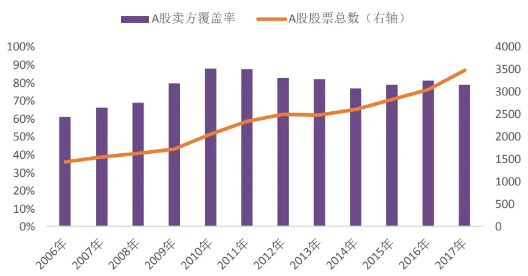
资料来源：朝阳永续、光大证券研究所

图2统计了不同宽基指数成分股的卖方覆盖率，可以观察到卖方分析师对于大市值股票的跟踪覆盖率明显更高。其中，沪深 300 成分股的覆盖率已接近100%，中证500 成分股的卖方覆盖率近年来逐步超越全市场覆盖率，2015年以来中证500 的覆盖率也已稳定于 90%左右。

图2：沪深 300内成分股覆盖率接近100%
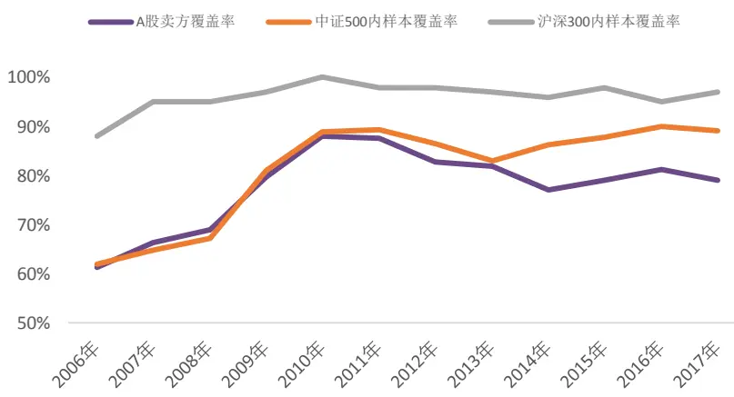
资料来源：朝阳永续、光大证券研究所

分行业来看，观察最近 5 年的行业覆盖率情况可以发现，2013 年以来中信一级行业中的银行行业卖方报告覆盖率最高，达到 100%完全覆盖；综合行业卖方报告的覆盖率最低，仅为54%。

图 3：各中信一级行业内样本卖方报告覆盖率
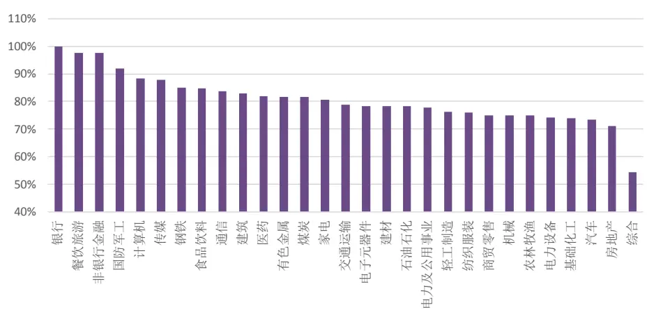
资料来源：朝阳永续、光大证券研究所

## 1.2、朝阳永续一致预期数据

由于该报告的主旨在于一致预期因子的整体梳理和测试，我们对于具体的因子生成方式和处理方式并没有做过于深入的讨论。朝阳永续对于卖方报告的收集和整理的全面性较高，尤其对于早期的卖方深度、调研、点评等类型报告的收集相比其他数据库更为全面。

报告中的一致预期净利润、一致预期营业收入、一致预期 EP 等数据均取自朝阳永续数据库。值得一提的是，朝阳永续的大部分一致预期数据处理过程采用了0-4类的分类方式，对于一些短期无覆盖的公司的一致预期数据，朝阳永续采用了沿用历史数据的方式来处理。

针对不同的数据处理分类，我们分别测试了严格、中等、宽松这三种因子采纳方式，并最终选取了宽松方式（即选取朝阳永续数据库中1 至4 类的一致预期数据作为最终因子值）。具体的朝阳永续分类方法和因子值选取方式的测试我们在附录中做了展示和举例。

## 1.3、五大类一致预期因子

对于卖方报告的应用方式可以主要分为事件策略和因子选股，事件策略主要包括评级调整、首次覆盖、多次点评等等，此类策略我们在《卖方推票事件驱动策略研究》报告中进行了深入的分析的推荐。基于卖方报告的一致预期因子构造方式则更为丰富，我们将这类因子归纳为下述五个大类：

图 4：五大类一致预期因子
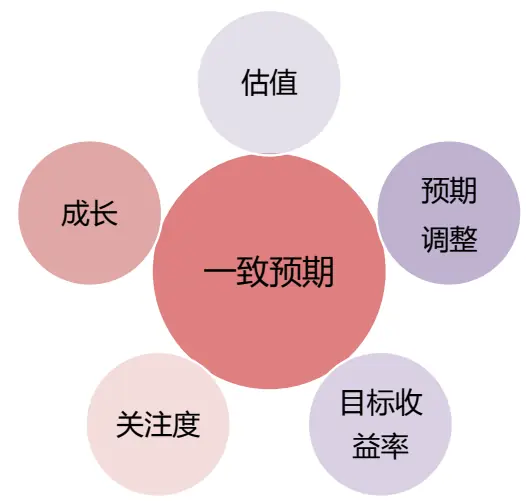
资料来源：光大证券研究所

## 1） 一致预期目标收益率（Consensus TargetReturn）

基于分析师报告中给出的目标价加权计算得到一致预期目标价，结合股票当前股价，构造一致预期目标收益率因子；

## 2）一致预期估值因子（Consensus Value）

通过一致预期净资产、一致预期净利润等数据，结合股票的实际市值或者股本，构造一致预期 EPS 等一致预期估值因子；

## 3）一致预期成长因子（Consensus Growth）

通过一致预期营业收入和一致预期净利润，结合该股票最近年度报告期公告的实际数据，构造一致预期成长因子；

## 4） 一致预期调整因子（Consensus Revision）

同样主要参考一致预期净利润和一致预期营业收入数据，调整因子主要关注分析师的行为，即分析师一致预期的上调或下调行为对于股价的影响能力；

## 5） 关注度（Market Attention）

不同股票之间的卖方覆盖度差异也可以一定程度上显示市场关注度的差异，基于每只股票的卖方报告覆盖数量，构造关注度因子。

## 2、一致预期目标收益率因子

在我们之前的多因子系列报告《多因子组合“光大 Alpha 1.0”——多因子系列报告之三》中，已经简单的展示了 TargetReturn 一致预期目标收益率因子的历史整体表现，该因子在我们的5维评价体系下得到满分 5分，是为数不多的得分5分的非价量技术类因子。因此，一致预期目标收益率因子也纳入在我们的首个多因子组合光大金工 Alpha1.0中（截止 2018 年4 月12日，该组合2018年以来累计收益 7.40%，超额中证500 指数 10.59 个百分点，表现优异，Wind 终端 PMS 中搜索“光大 Alpha（全 A150）”可实时跟踪该组合）

## 2.1、沪深 300、中证 500 内仍有选股能力

一致预期目标收益率因子的构造方式相对简单，基于分析师正式报告中的目标价信息，使用朝阳永续的一致预期目标价（后复权），每个月末计算股票现价相对于目标价的预期收益率，得到一致预期目标收益率因子。

分析师的一致预期目标价格反应的是分析师对于股票未来走势的看好程度，相对于报告中给出的评级指标更加细化。例如，同样获得买入评级的不同股票，仅仅从评级上来观察其实很难进一步区分分析师对于这些股票的看好程度，而一致预期目标价的差异则可以作为区分分析师看好程度的补充信息。

一致预期目标收益率因子TargetReturn 在全市场的选股能力较为突出，平均IC 为 3.83%，IR 达到 0.70，单调性得分为 2.97。沪深 300 与中证 800 内的表现相对较弱单依旧具有不俗的IC和 IR表现。

表1：一致预期目标收益率因子在不同样本空间内的表现差异较小

|  |  |  | 沪深300 | 中证800 |
| --- | --- | --- | --- | --- |
| Factor Mean Return | 因子收益 | 全A 0.38% | 0.33% | 0.33% |
| Factor Return tstat | 因子收益显著性 | 7.04 | 4.13 | 5.33 |
| IC mean | IC | 3.83% | 4.17% | 3.59% |
| IC positive per | IC 大于零比例 | 77% | 70% | 70% |
| IR | IR | 0.70 | 0.52 | 0.53 |
| Long_Short | 多空年化收益 | 15.60% | 13.70% | 14.60% |
| Monotonous | 单调性 | 2.97 | 2.12 | 1.53 |

资料来源：光大证券研究所

下图展示了 TargetReturn 因子在不同板块样本内的覆盖率，其中沪深 300的成分股已基本全覆盖，全市场的覆盖率则基本稳定在 85%以上。

图5：不同样本空间内一致预期目标收益率因子的覆盖率
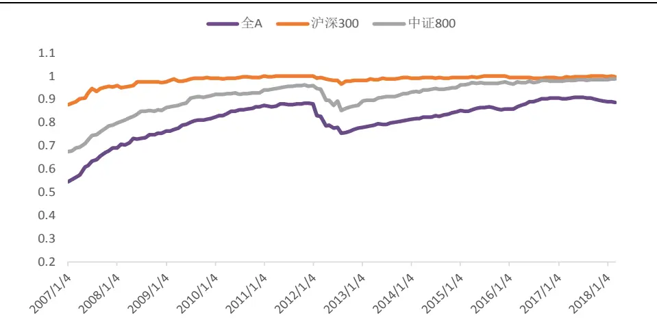
资料来源：光大证券研究所

下图分别展示了一致预期目标收益率 TargetReturn 因子在全市场和中证800 内的分组表现、多空收益净值，与月度 IC 序列的表现。可见 800 样本内，该因子的选股能力和多空收益表现均有略微下滑。

图 6：TargetReturn 在全市场的分组&多空收益
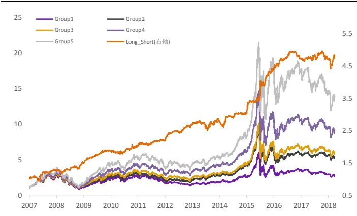
资料来源：光大证券研究所

图 7：TargetReturn 在全市场的月度 IC 序列
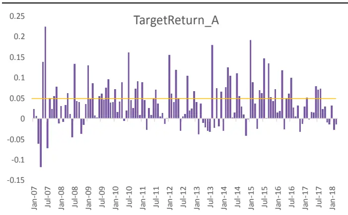
资料来源：光大证券研究所

图 8：TargetReturn 在中证 800 内的分组&多空收益
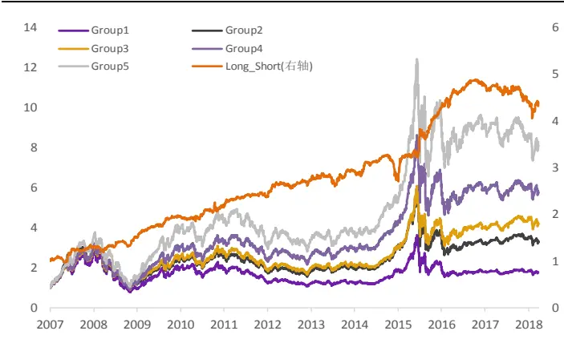
资料来源：光大证券研究所

图 9：TargetReturn 在中证 800 内的月度 IC 序列
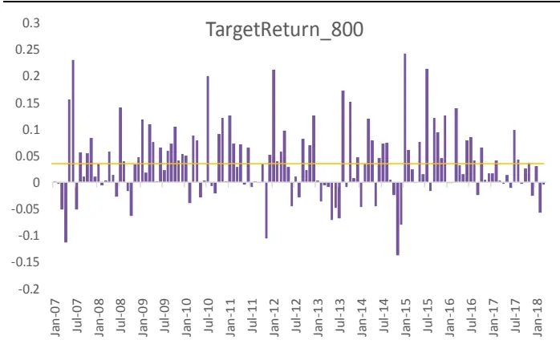
资料来源：光大证券研究所

## 2.2、TargetReturn 与反转因子较为相关

一致预期目标收益率因子的构造方式为：（复权一致预期目标价/现价-1），由于分母为股票价格，因此该因子中必然包含了市场价格中的动量或者反转因素。

通过检验 TargetReturn 因子与其他常用因子的 IC 序列相关性，可知该因子与 1 个月动量因子的相关性的确较高，IC 相关性为-0.51，也就是说一致预期目标收益率包含一定程度的反转因子风格。

图 10：TargetReturn 因子相关性检验
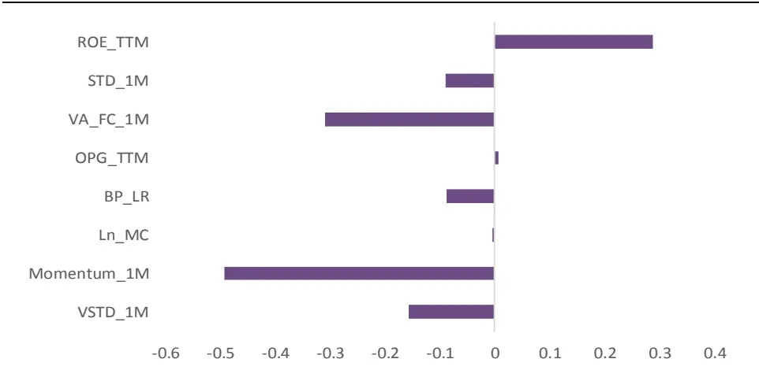
资料来源：光大证券研究所

将TargetReturn做截面回归中性化处理，与净资产收益率 ROE_TTM、波动率 STD_1M、营业收入增长率 OPG_TTM、账面市值比 BP_LR、1 个月换手率 VA_FC_1M、1 个月动量 Momentum_1M 因子截面回归取残差作为中性化后的 TargetReturn 因子 TargetReturn_Neu。

图 11：TargetReturn_Neu 月度 IC 序列
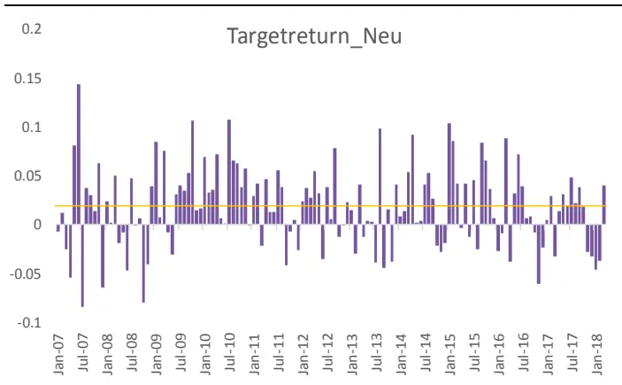
资料来源：光大证券研究所

图 12：TargetReturn_Neu 分组和多空收益净值
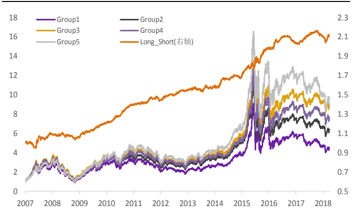
资料来源：光大证券研究所

中性化处理后，可见一致预期目标收益率因子的超额 alpha 在近期（2017年以来）出现了较为显著的回撤。

表 2：中性化后的 TargetReturn_Neu 因子 IC 显著下降

| TargetReturn_Neu TargetReturn |  |  |  |
| --- | --- | --- | --- |
| Factor Mean Return | 因子收益 | 0.21% | 0.38% |
| Factor Return tstat | 因子收益显著性 | 4.99 | 7.04 |
| IC mean | IC | 1.80% | 3.83% |
| IC positive per | IC 大于零比例 | 67% | 77% |
| IR | IR | 0.43 | 0.70 |
| Long_Short | 多空年化收益 | 7.10% | 15.60% |
| Monotonous | 单调性 | 3.12 | 2.97 |

历史上该因子中性化后的 IC 与 IC_IR 分年度的表现如下表所示，分年度来看，2009至2012 表现最佳，2014-2015 表现较好，近期回撤较为明显：

表 3：中性化后的 TargetReturn_Neu 因子分年度 IC 和 IR 表现

| IC |  | IR | IC 大于零比例 |
| --- | --- | --- | --- |
| 2007 | 0.80% | 0.13 | 50% |
| 2008 | 0.44% | 0.11 | 58% |
| 2009 | 3.09% | 0.90 | 83% |
| 2010 | 4.71% | 1.66 | 100% |
| 2011 | 1.29% | 0.45 | 67% |
| 2012 | 1.93% | 0.62 | 75% |
| 2013 | 0.12% | 0.03 | 58% |
| 2014 | 0.84% | 0.27 | 67% |
| 2015 | 4.00% | 0.89 | 75% |
| 2016 | 0.36% | 0.09 | 42% |
| 2017 | 0.69% | 0.26 | 58% |
| 2018 | -1.85% | -0.44 | 8% |

资料来源：光大证券研究所

## 3、一致预期估值因子

相比较财报公告数据的估值因子，一致预期的估值因子由于使用到了分析师给予的预测净利润、净资产等实时更新的数值，能够更为及时的反应该公司的估值变化态势，从而一致预期估值因子相比传统财报估值因子更具优势。

我们主要测试了 EBP、EPEG、EEPS、EEP 这四个一致预期估值因子。

（1） 一致预期账面市值比（EBP）

一致预期净资产/市值

（2） 一致预期 PEG（EPEG）

一致预期PE/一致预期净利润增长率，其中一致预期净利润增长率的计算方式为：（SQRT（一致预期滚动净利润/历史滚动净利润）-1）

（3） 一致预期 EPS（EEPS）

一致预期净利润/总股本

（4） 一致预期 EP（EEP）

一致预期净利润/市值

## 3.1、一致预期估值因子表现优于公告因子

一致预期PEG因子（EPEG）和一致预期EP因子（EEP）均表现出相对对应财报公告因子较大的优势。其中，EPEG 因子的提升效果最为明显，IC_IR 绝对值高达0.73，相比财报公告因子PEG_TTM的IC_IR 绝对值0.44 有了明显的提升；

表4：一致预期估值因子表现整体优于公告因子

| EBP |  |  | EPEG | EEPS | EEP |
| --- | --- | --- | --- | --- | --- |
| Factor Mean Return | 因子收益 | 0.57% | -0.27% | 0.17% | 0.48% |
| Factor Return tstat | 因子收益显著性 | 5.39 | -5.97 | 1.35 | 5.19 |
| IC mean | IC | 5.57% | -3.36% | 2.19% | 5.05% |
| IC positive per | IC 大于零比例 | 68% | 24% | 57% | 73% |
| IR | IR | 0.57 | -0.73 | 0.19 | 0.65 |
| Long_Short | 多空年化收益 | 13.80% | 10.10% | 2.70% | 8.89% |
| Monotonous | 单调性 | 2.44 | 2.30 | -4.50 | 2.26 |

| BP_TTM |  |  | PEG_TTM | EPS_TTM | EP_TTM |
| --- | --- | --- | --- | --- | --- |
| Factor Mean Return | 因子收益 | 0.53% | -0.15% | 0.11% | 0.27% |
| Factor Return tstat | 因子收益显著性 | 4.61 | -3.57 | 0.94 | 3.37 |
| IC mean | IC | 5.26% | -2.03% | 1.84% | 3.33% |
| IC positive per | IC 大于零比例 | 66% | 35% | 59% | 68% |
| IR | IR | 0.50 | -0.44 | 0.18 | 0.44 |
| Long_Short | 多空年化收益 | 13.33% | 2.50% | 6.50% | 2.50% |
| Monotonous | 单调性 | 1.95 | 0.75 | 3.12 | 1.52 |

资料来源：光大证券研究所

一致预期账面市值比（EBP）相对财报公告因子BP_TTM的提升幅度较小，且 EBP 与常用因子 BP_TTM 呈现高度相关，因此我们在一致预期的估值因子中选择EPEG进行进一步探究。

## 3.2、EPEG 不同样本内均有选股能力

一致预期估值因子因子中，EPEG的信息比表现较好，达到-0.73，下表展示了EPEG因子在不同指数成分股内的因子有效性对比。可见EPEG在全市场选股能力更强，在沪深300成分股内IC、IR有效下降但多空年化收益高达13.90%。

表5：EPEG因子在不同样本空间内的表现差异较小

| 全A |  |  | 沪深300 | 中证800 |
| --- | --- | --- | --- | --- |
| Factor Mean Return | 因子收益 | -0.27% | -0.28% | -0.27% |
| Factor Return tstat | 因子收益显著性 | -5.97 | -4.18 | -5.22 |
| IC mean | IC | -3.36% | -2.82% | -2.83% |
| IC positive per | IC 大于零比例 | 24% | 33% | 29% |
| IR | IR | -0.73 | -0.40 | -0.50 |
| Long_Short | 多空年化收益 | 10.10% | 13.90% | 10.90% |
| Monotonous | 单调性 | 2.30 | 1.98 | 2.18 |

资料来源：光大证券研究所

下图分别展示了一致预期 EPEG 因子在全市场和中证 800 内的分组表现、多空收益净值，与月度 IC 序列的表现。可见 800 样本内，该因子多空收益表现略优于全市场样本内表现。

图13：EPEG因子在全市场的分组&多空收益
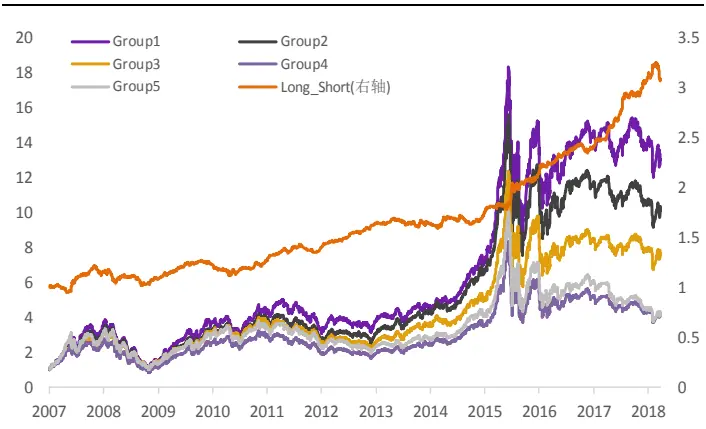
资料来源：光大证券研究所

图14：EPEG因子在全市场的月度 IC序列
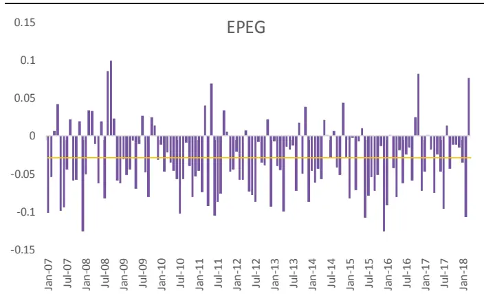
资料来源：光大证券研究所

图 15：EPEG 因子在中证 800 内的分组&多空收益
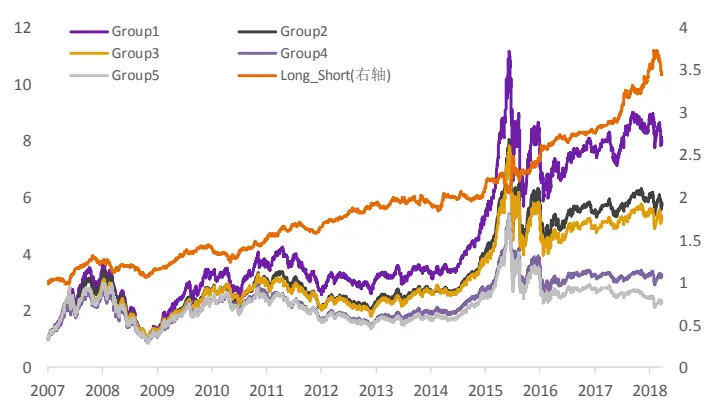
资料来源：光大证券研究所

图 16：EPEG 因子在中证 800 内的月度 IC 序列
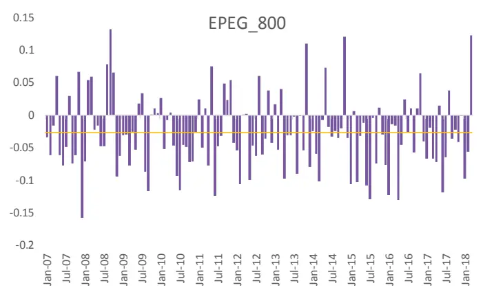
资料来源：光大证券研究所

## 3.3、EPEG 中性化后仍具超额 alpha

由该因子的计算方式：一致预期 PE/一致预期净利润增长率，可见，EPEG因子的分子与分母均使用了朝阳永续的一致预期数据，因此理论上EPEG与财报公告估值因子之间的相关性相对较小，下图展示了EPEG与常用因子之间的IC 序列相关性。

图 17：EPEG 因子的相关性检验
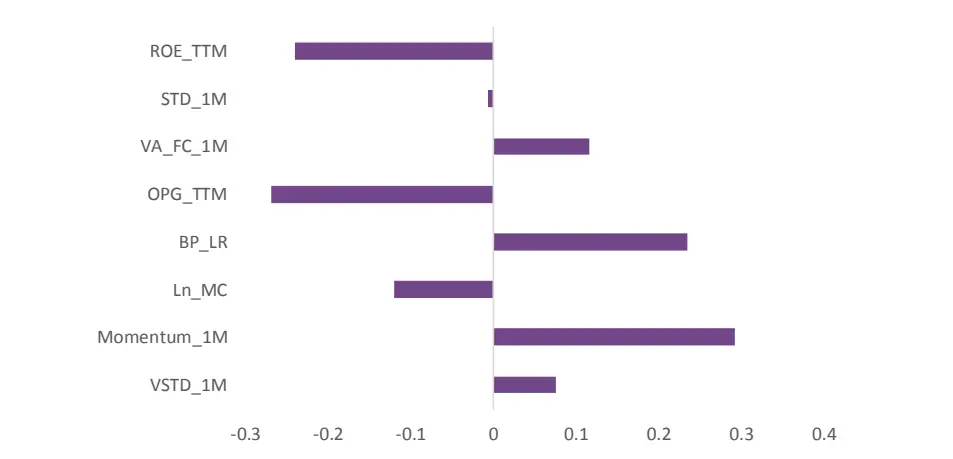
资料来源：光大证券研究所

我们将该因子同样做截面回归中性化处理，与 ROE_TTM、PEG_TTM、STD_1M、OPG_TTM、BP_LR、Momentum_1M 截面回归取残差作为中性化后的 EPEG 因子 EPEG_Neu。

图 18：EPEG 因子分组&多空收益净值
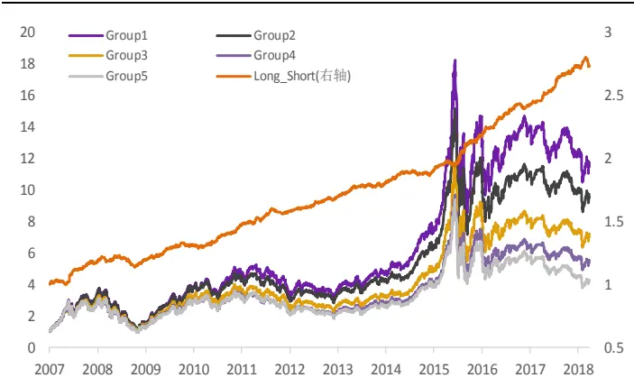
资料来源：光大证券研究所

图 19：EPEG 因子月度 IC 序列
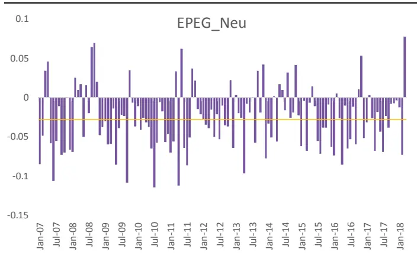
资料来源：光大证券研究所

中性化处理后，可见 EPEG 因子的超额 alpha 依旧稳定，尽管 IC 均值略有下降，但同时因子 IC 稳定性上升，因此 IR 值并未出现大幅下滑。

表 6：中性化后的 EPEG_Neu 仍有较强选股能力

| EPEG_Neu |  |  | EPEG |
| --- | --- | --- | --- |
| Factor Mean Return | 因子收益 | -0.23% | -0.27% |
| Factor Return tstat | 因子收益显著性 | -5.76 | -5.97 |
| IC mean | IC | -2.71% | -3.36% |
| IC positive per | IC 大于零比例 | 22% | 24% |
| IR | IR | -0.69 | -0.73 |
| Long_Short | 多空年化收益 | 8.80% | 10.10% |
| Monotonous | 单调性 | 1.95 | 2.30 |

资料来源：光大证券研究所

## 4、一致预期成长因子

使用财报公告数据计算公司成长性时，滞后效应会较为明显，同样的，使用分析师一致预期的净利润和营业收入等数据，我们可以得到一致预期数据相对于最近一期实际公告数据的增长率，得到一致预期成长因子：一致预期营业收入增长率EOPG和一致预期净利润增长率ENPG。

## 4.1、EOPG表现相对较好，稳定性欠佳

测试的两个成长因子中，一致预期营业收入增长率EOPG的表现相对较好，多空年化收益为9.90%，但整体上看选股能力并不突出，IC均值未达到2%。

表7：一致预期成长因子测试结果

| EOPG |  |  | ENPG |
| --- | --- | --- | --- |
| Factor Mean Return | 因子收益 | 0.19% | 0.06% |
| Factor Return tstat | 因子收益显著性 | 2.55 | 1.41 |
| IC mean | IC | 1.88% | 0.53% |
| IC positive per | IC 大于零比例 | 63% | 54% |
| IR | IR | 0.26 | 0.10 |
| Long_Short | 多空年化收益 | 9.90% | 5.10% |
| Monotonous | 单调性 | 1.82 | 2.36 |

资料来源：光大证券研究所

从下面的分组表现和月度 IC 序列也可以看出，成长因子 EOPG的表现比较不稳定，在 2009 年、2014 年、2016 年都出现了长时间的回撤。一致预期成长因子表现欠佳的主要原因很可能来自于前期净利润较低的或者为负的股票在计算因子值时容易出现极端值，计算得到的增速值容易失真。

图 20：EOPG 因子分组&多空收益净值
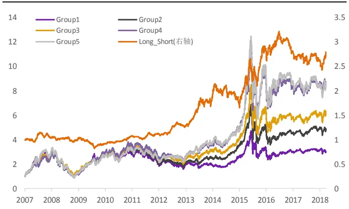
资料来源：光大证券研究所

图 21：EOPG 因子月度 IC 序列
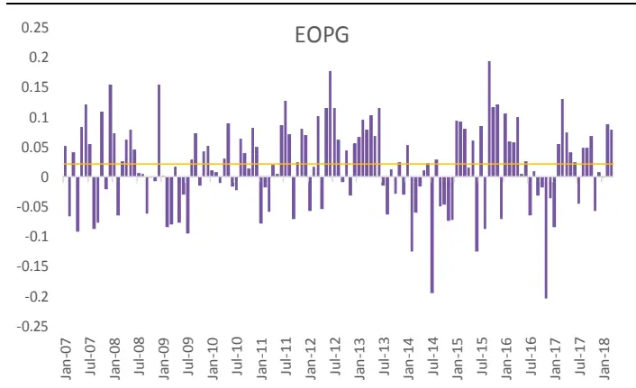
资料来源：光大证券研究所

## 4.2、一致预期成长因子较公告因子略占优势

我们同样将一致预期成长因子与之所对应的财报公告因子做对比，从下表中的结论可见，一致预期成长因子EOPG相比OPG_TTM表现略胜一筹，而ENPG则仅仅在单调性和多空年化收益上相对财报公告因子有所提升。

表 8：一致预期成长因子表现略优于公告因子

|  | EOPG | OPG_TTM | ENPG | NPG_TTM |
| --- | --- | --- | --- | --- |
| Factor Mean Return 因子收益Factor Return tstat 因子收益显著性IC mean ICIC positive per IC 大于零比例IR IRLong_Short 多空年化收益Monotonous 单调性 | 0.19% | 0.10% | 0.06% | 0.05% |
|  | 2.55 | 2.01 | 1.41 | 1.00 |
|  | 1.88% | 1.38% | 0.53% | 1.14% |
|  | 63% | 56% | 54% | 57% |
|  | 0.26 | 0.22 | 0.10 | 0.18 |
|  | 9.90% | 1.80% | 5.10% | 0.60% |
|  | 1.82 | 1.22 | 2.36 | 0.99 |

资料来源：光大证券研究所

## 5、一致预期调整因子

一致预期数据会实时根据分析师对于上市公司预期的调整而变化。因此分析师一致预期的调整因子代表着市场上的卖方分析师对于某只股票的观点改变，假设分析师在某一时段集体上调某公司的预期，往往表明该公司最近发生了重大利好，因此实时跟踪分析师的一致预期变化往往能够从中发掘好的投资机会，此类因子同样在历史上具有一定的选股能力。

我们测试了下述 4 个一致预期调整因子：

（1） 一致预期净利润调整因子（EEChange_1M、EEChange_3M）

（2） 一致预期营业收益调整因子（EOPChange_1M、EOPChange_3M）

## 5.1、调整因子 EEChange_3M 有较强超额 alpha

对比上述四个一致预期调整因子的测试结果，可见它们均具有不错的选股能力，IR 均值都超过了0.5。而从 IR 和因子收益的角度来看，三个月一致预期净利润调整因子 EEChange_3M 的表现较好，平均 IC 为 2.56%，IR 为 0.58，多空年化收益也高达12.7%。由于该类因子从逻辑上讲与常用基本面因子的逻辑均无太大相关，因此我们会重点探究该因子是否存在常用基本面因子之外的超额 alpha。

表 9：调整因子 EEChange_3M 表现不俗

| EEChange_1M |  |  | EEChange_3M | EOPChange_1M | EOPChange_3M |
| --- | --- | --- | --- | --- | --- |
| Factor Mean Return | 因子收益 | 0.20% | 0.26% | 0.16% | 0.22% |
| Factor Return tstat | 因子收益显著性 | 6.88 | 6.40 | 5.47 | 5.36 |
| IC mean | IC | 1.95% | 2.56% | 1.69% | 2.41% |
| IC positive per | IC 大于零比例 | 73% | 73% | 70% | 71% |
| IR | IR | 0.55 | 0.58 | 0.54 | 0.50 |
| Long_Short | 多空年化收益 | 10.40% | 12.70% | 7.40% | 10.60% |
| Monotonous | 单调性 | 3.22 | -2.78 | 3.67 | 1.87 |

资料来源：光大证券研究所

图 22：EEChange_3M 因子分组&多空收益净值
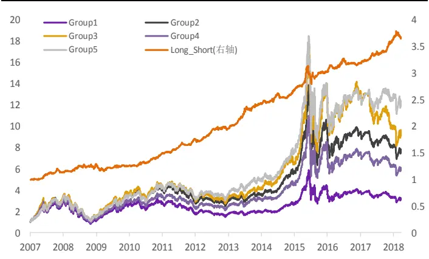
资料来源：光大证券研究所

图 23：EEChange_3M 因子月度 IC 序列
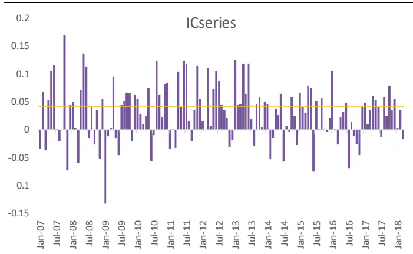
资料来源：光大证券研究所

## 5.2、EEChange_3M 中性化后表现不俗

一致预期净利润3个月变化率因子EEchange_3M在不同宽基成分股内的表现依旧稳定，我们比较了该因子在沪深300、中证800 和全A 样本内的各项指标，可见该因子在不同样本股上的选股能力均比较优秀。

表 10：EEchange_3M 因子在不同样本空间内的表现差异较小

|  |  |  | 沪深300 | 中证800 |
| --- | --- | --- | --- | --- |
| Factor Mean Return | 因子收益 | 全A 0.26% | 0.25% | 0.27% |
| Factor Return tstat | 因子收益显著性 | 6.40 | 3.98 | 5.67 |
| IC mean | IC | 2.56% | 2.78% | 3.29% |
| IC positive per | IC 大于零比例 | 73% | 64% | 70% |
| IR | IR | 0.58 | 0.37 | 0.60 |
| Long_Short | 多空年化收益 | 12.70% | 12.90% | 13.20% |
| Monotonous | 单调性 | -2.78 | 3.33 | 2.63 |

资料来源：光大证券研究所

由于该因子的计算方式中的一致预期净利润完全来自分析师的一致预期数据，因此与常见财报公告因子之间的相关性相对较小，下图展示了EEChange_3M与常用因子之间的 IC 序列相关性。

图 24：EEChange_3M 因子的相关性检验我们将该因子同样做截面回归中性化处理，与净资产收益率ROE_TTM、波动率 STD_1M、营业收入增长率 OPG_TTM、账面市值比 BP_LR、1 个月动量 Momentum_1M 因子截面回归取残差作为中性化后的 EEChange_3M因子 EEChange_3M_Neu。

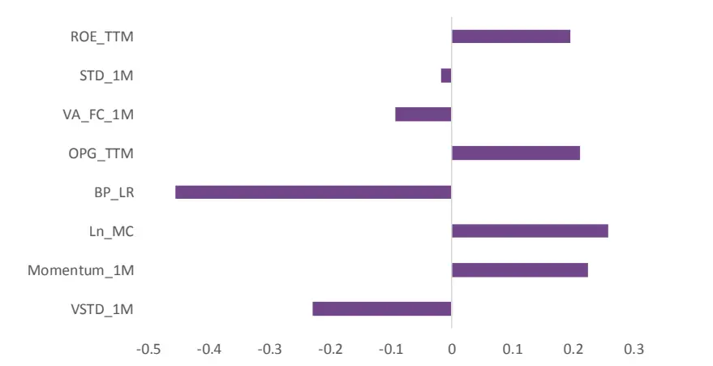
资料来源：光大证券研究所

图 25：EEChange_3M_Neu 因子分组&多空收益净值
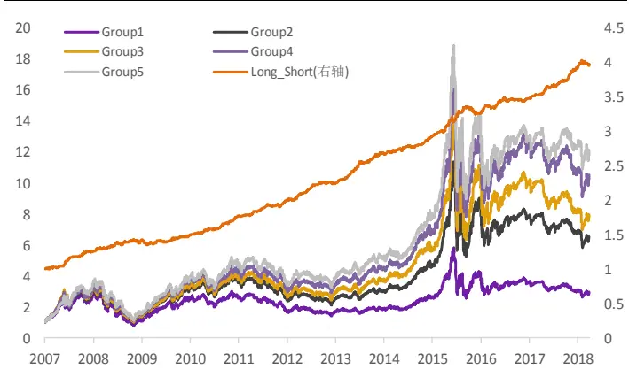
资料来源：光大证券研究所

图 26：EEChange_3M_Neu 因子月度 IC 序列
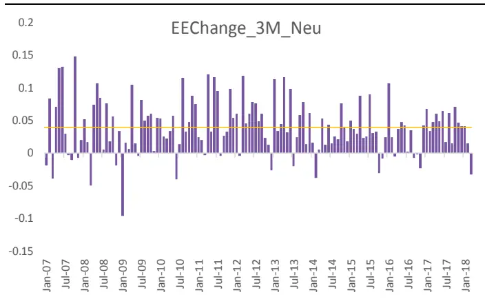
资料来源：光大证券研究所

中性化处理后， EEChange_3M 因子的超额 alpha 表现十分抢眼，IC 上升至 3.89%，IR 由原先的 0.58 提高至 1.01，多空组合年化收益高达 15.10%，因子稳定性和分组单调性显著提升。

表 11：中性化后的 EEChange_3M 稳定性显著提升

| EEChange_3M_Neu EEChange_3M |  |  |  |
| --- | --- | --- | --- |
| Factor Mean Return | 因子收益 | 0.33% | 0.26% |
| Factor Return tstat | 因子收益显著性 | 8.79 | 6.40 |
| IC mean | IC | 3.89% | 2.56% |
| IC positive per | IC 大于零比例 | 88% | 73% |
| IR | IR | 1.01 | 0.58 |
| Long_Short | 多空年化收益 | 13.50% | 12.70% |
| Monotonous | 单调性 | 3.14 | -2.78 |

## 6、关注度因子：效果较为一般

市场关注度是一个较难以量化的指标，我们这里运用卖方分析师的覆盖程度作为一个市场关注度的代理变量，测试了以下四个关注度因子：

（1） 卖方报告覆盖数因子（RPP_25D、RPP_75D）,表示一定期限内市场上发布的关于某只股票的报告总数

（2） 卖方机构覆盖数因子（EINS_25D、EINS_75D），表示一定期限内市场上发布了关于某只股票报告的机构总数

从下表可见，关注度因子的整体表现一般，尤其是体现在因子收益的显著性较低，因此此类因子并不具有显著的选股能力。

表12：关注度因子的整体表现一般

| RPP_25D |  |  | RPP_75D | EINS_25D | EINS_75D |
| --- | --- | --- | --- | --- | --- |
| Factor Mean Return | 因子收益 | 0.04% | 0.03% | 0.06% | 0.03% |
| Factor Return tstat | 因子收益显著性 | 0.97 | 1.39 | 1.24 | 1.40 |
| IC mean | IC | 1.72% | 2.28% | 1.20% | 1.30% |
| IC positive per | IC 大于零比例 | 70% | 63% | 70% | 62% |
| IR | IR | 0.19 | 0.22 | 0.16 | 0.15 |
| Long_Short | 多空年化收益 | 4.90% | 5.35% | 5.20% | 5.10% |
| Monotonous | 单调性 | 3.88 | 3.98 | 4.12 | 3.98 |

资料来源：光大证券研究所

## 7、投资建议

公司公告信息是量化基本面因子的主要来源，但是其缺陷也较为明显：定期财报往往滞后、公布频率太低，信息及时性较差且股价往往提前反应；而且不定期公告格式不统一，较难以量化。分析师预期数据则可以弥补上述缺陷，同时分析师覆盖上市公司并给出的盈利预测的格式较为规范，是对上市公司各方面信息的一个更为及时的反应，较容易量化且易于构造衍生因子。

1) 本文主要测试了五大类一致预期因子：一致预期估值、一致预期成长、一致预期调整、一致预期目标收益、关注度。从因子 IC、IC_IR、因子收益、显著性、单调性以及多空收益等方面评价因子表现，同时关注中性化后的因子特有信息所包含的选股能力。

2) 一致预期目标收益率因子表现较好，与反转因子相关性较高：分析师的一致预期目标价格反应的是分析师对于股票未来走势的看好程度，相对于报告中给出的评级指标更加细化。一致预期目标收益率因子 TargetReturn 在全市场的选股能力较为突出，平均 IC 为3.83%，IR 达到 0.70，单调性得分为 2.97。沪深 300 与中证 800内的表现相对较弱单依旧具有不俗的IC和 IR 表现。该因子与一个月反转因子 Momentum_1M 的相关性较高，IC 相关性为-0.51。

3) 一致预期估值因子整体优于公告因子，EPEG 表现突出：一致预期PEG因子（EPEG）和一致预期EP 因子（EEP）均表现出相对对应财报公告因子较大的优势。其中，EPEG 因子的提升效果最为明显，IC_IR 绝对值高达 0.73，相比财报公告因子 PEG_TTM 的 IC_IR 绝对值0.44 有了明显的提升。中性化处理后，EPEG 因子的超额 alpha依旧稳定。

4) 一致预期调整因子 EEChange_3M 值得关注。三个月一致预期净利润调整因子 EEChange_3M 的表现较好，平均 IC 为 2.56%，IR 为0.58，多空组合年化收益高达 12.7%。中性化处理后，EEChange_3M 因子的超额 alpha 表现十分抢眼，IC 上升至 3.89%，IR 提高至0.93，多空组合年化收益高达15.10%，因子稳定性和分组单调性显著提升。

## 8、风险提示

本报告中的结果均基于模型和历史数据，历史数据存在不被重复验证的可能，模型存在失效的风险。

## 9、附录

朝阳永续表中对于一致预期净利润的数据类型共分为了一下5 类，其中值为0 的是真实财务数据，其余均为估算的一致预期数据。

表13：朝阳永续一致预期净利润数据类型

| 值定义 | 说明 | 详细说明 |
| --- | --- | --- |
| 0 | 真实财务数据 | 为方便跟预期数据的同比统计，诸如EPS等指标会根据统 计日进行摊薄。 |
| 1 | 加权计算 | 90日内有5 家以上机构出具了该股的预测，严格按照朝阳 永续的一致预期算法，对机构影响力和时间影响力进行双 重加权。 |
| 2 | 手工估算 | 当预测机构数或预测时间等有效性达不到一致预期要求 时，我们进入优化估算流程。比如：预测机构数达不到要 求，如只有2家机构，则根据机构的影响力直接取影响力 大的机构的数据作为一致预期数据；再如:满足不了90 日内预测的要求，必须调取120日的预测数据，此时 90~120日的预测值必须两家以上预测值进行算术平均，平 均值作为一个有效值参与90日内的加权计算。 |
| 3 | 数据模拟 | 即统计日起的历史未有机构出具有效预测数据，因此以最 近的四个季度滚动收益或其他有效预测数据进行模拟计算 所得的数据;该预测数据只能作为指数估值时的测算数据 |
| 4 | 沿用数据 | 不能作为该股票的预测值。 即统计日起的历史6个月内未有机构出具有效预测数据， 因此沿用6个月前的一致预期数据。 |

资料来源：朝阳永续

针对不同的数据处理分类，我们以一致预期 EP 因子（EEP）为例，分别测试了严格、中等、宽松这三种因子采纳方式，来验证是否需要剔除朝阳永续一致预期数据中分类为3和 4的字段。

表14：EEP因子的三种定义方式

| 入选类别 |  |  |
| --- | --- | --- |
| EEP_L | 宽松 | 1、2、3、4 |
| EEP_M | 中等 | 1、2、4 |
| EEP_T | 严格 | 1、2 |

资料来源：光大证券研究所

三种定义下EEP 因子的测试结果中可见，不论是IC、IR或者多空年化收益上，EEP_T 的优势均比较有限。而图 27、图 28、图 29 中展示的三种定义方式下的分组多空收益则显示出 EEP_T 和 EEP_M 的单调性显著弱于EEP_L。（对于缺失值的处理方式均为使用行业中位数替代）

EEP_M和EEP_T的单调性较差的原因主要来自与过于严格的因子定义方式导致因子缺失值过多，而使用行业中位数填补之后此类缺失因子值往往被分在了5 组中的中间组第3组中，从而导致该组别的因子值失真，对分组单调性的影响较大。因此本文中取自朝阳永续数据库的因子值均采用了表 14 中的宽松方法，对于类别1、2、3、4 的数据均予以采纳。

表15：三种定义下 EEP因子选股能力差异较小

| EEP_L |  |  | EEP_M | EEP_T |
| --- | --- | --- | --- | --- |
| Factor Mean Return | 因子收益 | 0.48% | 0.51% | 0.46% |
| Factor Return tstat | 因子收益显著性 | 5.19 | 5.98 | 6.17 |
| IC mean | IC | 5.05% | 5.11% | 5.26% |
| IC positive per | IC 大于零比例 | 73% | 74% | 73% |
| IR | IR | 0.65 | 0.68 | 0.69 |
| Long_Short | 多空年化收益 | 8.89% | 9.87% | 10.02% |

资料来源：光大证券研究所

图27：EEP_L分组收益表现
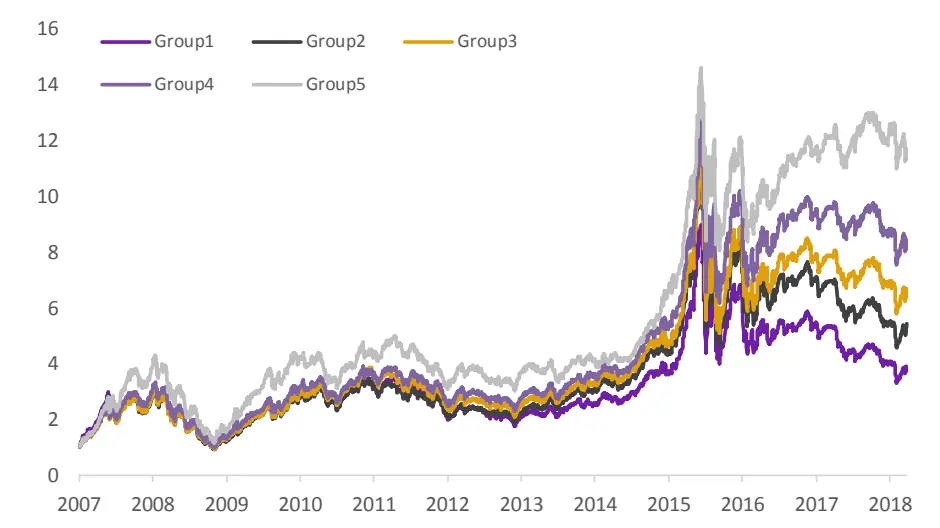

图28：EEP_M 分组收益表现
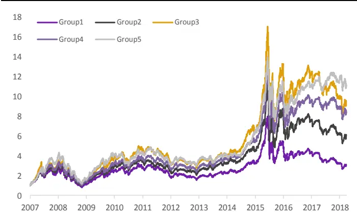
资料来源：光大证券研究所

图29：EEP_T分组收益表现
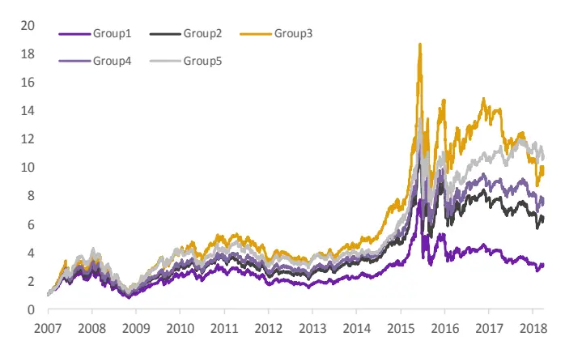
资料来源：光大证券研究所

## 行业及公司评级体系

| 评级 说明 |
| --- |
| 买入 未来6-12个月的投资收益率领先市场基准指数15%以上； |
| 增持 未来 6-12个月的投资收益率领先市场基准指数5%至15%； |
| 中性 未来6-12个月的投资收益率与市场基准指数的变动幅度相差-5%至5%； |
| 减持 未来 6-12个月的投资收益率落后市场基准指数5%至15%； |
| 卖出 未来6-12个月的投资收益率落后市场基准指数15%以上； |
| 因无法获取必要的资料，或者公司面临无法预见结果的重大不确定性事件，或者其他原因，致使无法给出明确的无评级投资评级。 |

基准指数说明：A 股主板基准为沪深 300 指数；中小盘基准为中小板指；创业板基准为创业板指；新三板基准为新三板指数；港股基准指数为恒生指数。

## 分析、估值方法的局限性说明

本报告所包含的分析基于各种假设，不同假设可能导致分析结果出现重大不同。本报告采用的各种估值方法及模型均有其局限性，估值结果不保证所涉及证券能够在该价格交易。

## 分析师声明

本报告署名分析师具有中国证券业协会授予的证券投资咨询执业资格并注册为证券分析师，以勤勉的职业态度、专业审慎的研究方法，使用合法合规的信息，独立、客观地出具本报告，并对本报告的内容和观点负责。负责准备本报告以及撰写本报告的所有研究分析师或工作人员在此保证，本研究报告中关于任何发行商或证券所发表的观点均如实反映分析人员的个人观点。负责准备本报告的分析师获取报酬的评判因素包括研究的质量和准确性、客户的反馈、竞争性因素以及光大证券股份有限公司的整体收益。所有研究分析师或工作人员保证他们报酬的任何一部分不曾与，不与，也将不会与本报告中具体的推荐意见或观点有直接或间接的联系。

## 特别声明

光大证券股份有限公司（以下简称“本公司”）创建于 1996 年，系由中国光大（集团）总公司投资控股的全国性综合类股份制证券公司，是中国证监会批准的首批三家创新试点公司之一。根据中国证监会核发的经营证券期货业务许可，光大证券股份有限公司的经营范围包括证券投资咨询业务。

本公司经营范围：证券经纪；证券投资咨询；与证券交易、证券投资活动有关的财务顾问；证券承销与保荐；证券自营；为期货公司提供中间介绍业务；证券投资基金代销；融资融券业务；中国证监会批准的其他业务。此外，公司还通过全资或控股子公司开展资产管理、直接投资、期货、基金管理以及香港证券业务。

本证券研究报告由光大证券股份有限公司研究所（以下简称“光大证券研究所”）编写，以合法获得的我们相信为可靠、准确、完整的信息为基础，但不保证我们所获得的原始信息以及报告所载信息之准确性和完整性。光大证券研究所可能将不时补充、修订或更新有关信息，但不保证及时发布该等更新。

本报告中的资料、意见、预测均反映报告初次发布时光大证券研究所的判断，可能需随时进行调整且不予通知。报告中的信息或所表达的意见不构成任何投资、法律、会计或税务方面的最终操作建议，本公司不就任何人依据报告中的内容而最终操作建议做出任何形式的保证和承诺。在任何情况下，本报告中的信息或所表述的意见并不构成对任何人的投资建议。客户应自主作出投资决策并自行承担投资风险。本报告中的信息或所表述的意见并未考虑到个别投资者的具体投资目的、财务状况以及特定需求。投资者应当充分考虑自身特定状况，并完整理解和使用本报告内容，不应视本报告为做出投资决策的唯一因素。对依据或者使用本报告所造成的一切后果，本公司及作者均不承担任何法律责任。

不同时期，本公司可能会撰写并发布与本报告所载信息、建议及预测不一致的报告。本公司的销售人员、交易人员和其他专业人员可能会向客户提供与本报告中观点不同的口头或书面评论或交易策略。本公司的资产管理部、自营部门以及其他投资业务部门可能会独立做出与本报告的意见或建议不相一致的投资决策。本公司提醒投资者注意并理解投资证券及投资产品存在的风险，在做出投资决策前，建议投资者务必向专业人士咨询并谨慎抉择。

在法律允许的情况下，本公司及其附属机构可能持有报告中提及的公司所发行证券的头寸并进行交易，也可能为这些公司提供或正在争取提供投资银行、财务顾问或金融产品等相关服务。投资者应当充分考虑本公司及本公司附属机构就报告内容可能存在的利益冲突，勿将本报告作为投资决策的唯一信赖依据。

本报告根据中华人民共和国法律在中华人民共和国境内分发，仅供本公司的客户使用。本公司不会因接收人收到本报告而视其为客户。本报告仅向特定客户传送，未经本公司书面授权，本研究报告的任何部分均不得以任何方式制作任何形式的拷贝、复印件或复制品，或再次分发给任何其他人，或以任何侵犯本公司版权的其他方式使用。所有本报告中使用的商标、服务标记及标记均为本公司的商标、服务标记及标记。如欲引用或转载本文内容，务必联络本公司并获得许可，并需注明出处为光大证券研究所，且不得对本文进行有悖原意的引用和删改。

## 光大证券股份有限公司

上海市新闸路1508 号静安国际广场 3楼邮编 200040

总机：021-22169999 传真：021-22169114、22169134

| 机构业务总部 | 姓名 | 办公电话 | 手机 | 电子邮件 |
| --- | --- | --- | --- | --- |
| 上海 | 徐硕 |  | 13817283600 | shuoxu@ebscn.com |
|  | 胡超 | 021-22167056 | 13761102952 | huchao6@ebscn.com |
|  | 李强 | 021-22169131 | 18621590998 | liqiang88@ebscn.com |
|  | 罗德锦 | 021-22169146 | 13661875949/13609618940 | luodj@ebscn.com |
|  | 张弓 | 021-22169083 | 13918550549 | zhanggong@ebscn.com |
|  | 丁点 | 021-22169458 | 18221129383 | dingdian@ebscn.com |
|  | 黄素青 | 021-22169130 | 13162521110 | huangsuqing@ebscn.com |
|  | 王昕宇 | 021-22167233 | 15216717824 | wangxinyu@ebscn.com |
|  | 邢可 | 021-22167108 | 15618296961 | xingk@ebscn.com |
|  | 陈晨 | 021-22169150 | 15000608292 | chenchen66@ebscn.com |
|  | 李晓琳 | 021-22169087 | 13918461216 | lixiaolin@ebscn.com |
|  | 陈蓉 | 021-22169086 | 13801605631 | chenrong@ebscn.com |
| 北京 | 郝辉 | 010-58452028 | 13511017986 | haohui@ebscn.com |
|  | 梁晨 | 010-58452025 | 13901184256 | liangchen@ebscn.com |
|  | 高菲 | 010-58452023 | 18611138411 | gaofei@ebscn.com |
|  | 关明雨 | 010-58452037 | 18516227399 | guanmy@ebscn.com |
|  | 吕凌 | 010-58452035 | 15811398181 | Ivling@ebscn.com |
|  | 郭晓远 | 010-58452029 | 15120072716 | guoxiaoyuan@ebscn.com |
|  | 张彦斌 | 010-58452026 | 15135130865 | zhangyanbin@ebscn.com |
|  | 庞舒然 | 010-58452040 | 18810659385 | pangsr@ebscn.com |
| 深圳 | 黎晓宇 | 0755-83553559 | 13823771340 | lixy1@ebscn.com |
|  | 李潇 | 0755-83559378 | 13631517757 | lixiao1@ebscn.com |
|  | 张亦潇 | 0755-23996409 | 13725559855 | zhangyx@ebscn.com |
|  | 王渊锋 | 0755-83551458 | 18576778603 | wangyuanfeng@ebscn.com |
|  | 张靖雯 | 0755-83553249 | 18589058561 | zhangjingwen@ebscn.com |
|  | 陈婕 | 0755-25310400 | 13823320604 | szchenjie@ebscn.com |
|  | 牟俊宇 | 0755-83552459 | 13827421872 | moujy@ebscn.com |
| 国际业务 | 陶奕 | 021-22169091 | 18018609199 | taoyi@ebscn.com |
|  | 梁超 |  | 15158266108 | liangc@ebscn.com |
|  | 金英光 | 021-22169085 | 13311088991 | jinyg@ebscn.com |
|  | 傅裕 | 021-22169092 | 13564655558 | fuyu@ebscn.com |
|  | 王佳 | 021-22169095 | 13761696184 | wangjia1@ebscn.com |
|  | 郑锐 | 021-22169080 | 18616663030 | zhrui@ebscn.com |
|  | 凌贺鹏 | 021-22169093 | 13003155285 | linghp@ebscn.com |
| 金融同业与战略客户 | 黄怡 | 010-58452027 | 13699271001 | huangvi@ebscn.com |
|  | 丁梅 | 021-22169416 | 13381965696 | dingmei@ebscn.com |
|  | 徐又丰 | 021-22169082 | 13917191862 | xuyf@ebscn.com |
|  | 王通 | 021-22169501 | 15821042881 | wangtong@ebscn.com |
|  | 陈樑 | 021-22169483 | 18621664486 | chenliang3@ebscn.com |
|  | 赵纪青 | 021-22167052 | 18818210886 | zhaojq@ebscn.com |
| 私募业务部 | 谭锦 | 021-22169259 | 15601695005 | tanjin@ebscn.com |
|  | 曲奇瑶 | 021-22167073 | 18516529958 | quqy@ebscn.com |
|  | 王舒 | 021-22169134 | 15869111599 | wangshu@ebscn.com |
|  | 安羚娴 | 021-22169479 | 15821276905 | anlx@ebscn.com |
|  | 戚德文 | 021-22167111 | 18101889111 | qidw@ebscn.com |
|  | 吴冕 |  | 18682306302 | wumian@ebscn.com |
|  | 吕程 | 021-22169482 | 18616981623 | lvch@ebscn.com |
|  | 李经夏 | 021-22167371 | 15221010698 | lijxia@ebscn.com |
|  | 高霆 | 021-22169148 | 15821648575 | gaoting@ebscn.com |
|  | 左贺元 | 021-22169345 | 18616732618 | zuohy@ebscn.com |
|  | 任真 | 021-22167470 | 15955114285 | renzhen@ebscn.com |
|  | 俞灵杰 | 021-22169373 | 18717705991 | yulingjie@ebscn.com |