## 成长因子重构与优化：稳健加速为王——多因子系列报告之十二

成长因子是一类重要的风格因子，本篇报告在因子的全面测试的基础上，尝试针对成长因子的选股能力表现特征，优化成长因子的构造方式。首先，对各类成长因子均进行深入的挖掘和测试，从因子 IC、IC_IR、因子收益、显著性、单调性、多空收益以及分行业表现等方面评价因子表现，同时关注成长因子构造方式中的优化方法，推荐成长因子中的稳健加速度因子。

- 基础成长因子的稳定性一般：基于《因子测试系列报告之一》中的各大类因子表现得分，我们可以看到成长因子的整体得分相对靠后；原有的基础成长因子中表现最好的营业利润同比增长OPG_TTM得分为3，平均IC为2.60%，信息比IR为0.41，多空年化收益仅为6.2%，单调性得分为1.46。

因子构造方式的改进思路：对于净利润 TTM同比增速因子（NPG_TTM），在分母（上期TTM净利润）接近零的情形下因子计算容易出现异常值，对因子的单调性和选股能力造成很大影响。我们的改进思路是将因子值与前期净利润回归取残差做中性化处理，剔除前期净利润极小值的影响，该改进方法对因子的选股能力和稳定性均有略微改善。

成长因子新思路：稳健增速、加速度：引入了3 个较为新颖的成长类指标，分别是加速度指标、稳健增速指标、稳健加速度指标。测试结果表明，营业利润稳健加速度因子OP_SD的多空年化收益达到8.9%，夏普比为2.85，IC 均值为 2.46%，IC_IR 高达 0.77，选股能力和单调性均表现出色。沪深300成分股样本内的选股能力相对较弱，中证800成分股样本内的表现与全市场较为接近。

- 成长因子行业间差异较明显：成长类因子在不同风格的行业间差异较大，尤其是金融与非金融大类行业间差异明显。成长类因子在消费类、制造类行业中表现优秀，在金融类行业内表现远远弱于其他行业，同比类成长因子在TMT行业中表现较好。

结合行业差异构造复合成长因子：基于每个行业中各个因子的选股能力（IC_IR、Longshort_Sharpe）以及显著性 T_value 的不同，对在某一行业内选股能力较强的因子给予较大的权重，而选股能力较差的因子给予较小的或者负向的权重，构造复合成长因子。结合多空夏普比的复合成长因子表现较好，单调性有所提升，但整体改善效果不显著。

- 风险提示：测试结果均基于模型，模型存在失效的风险。

## 金融工程深度

## 分析师

刘均伟 (执业证书编号：S0930517040001)

021-22169151

liujunwei@ebscn.com

周萧潇 (执业证书编号：S0930518010005)

021-22167060

zhouxiaoxiao@ebscn.com

## 相关研究

——多因子系列报告之一》《因子测试全集

—多因子系列报告之二》《多因子组合“光大 Alpha 1.0”

《别开生面：公司治理因子详解——多因子系列报告之四》

《见微知著：成交量占比高频因子解析——多因子系列报告之五》

《行为金融因子：噪音交易者行为偏差——多因子系列报告之六》

《基于 K 线最短路径构造的非流动性因子——多因子系列报告之七》

《高频因子：日内分时成交量蕴藏玄机——多因子系列报告之八》《一致交易：挖掘集体行为背后的收益——多因子系列报告之九》

《因子正交与择时：基于分类模型的动态权重配置——多因子系列报告之十》《爬罗剔抉：一致预期因子分类与精选多因子系列报告之十一》成长因子是一类重要的风格因子，本篇报告在因子的全面测试的基础上，尝试针对成长因子的选股能力表现特征，优化成长因子的构造方式。首先，对各类成长因子均进行深入的挖掘和测试，从因子 IC、IC_IR、因子收益、显著性、单调性、多空收益以及分行业表现等方面评价因子表现，同时关注成长因子构造方式中的优化方法，推荐成长因子中的稳健加速度因子。

## 1、成长因子是重要的风格因子

成长因子是量化多因子体系中的一类很重要的风格因子，其同时也是投资者较为关注的挑选公司的角度。因为从投资的最根本目的出发，具有成长潜力或者发展潜力较大的公司才会更有可能给投资者带来更多回报。因此成长因子的表现往往不仅为量化投资者频繁使用，同时也受到主动投资者的关注。

我们在 2017 年 4 月发布的《因子测试框架——多因子系列报告之一》中，将常用的因子梳理为十一个大类，其中可以归类为风格因子的有：

图 1：大类风格因子划分
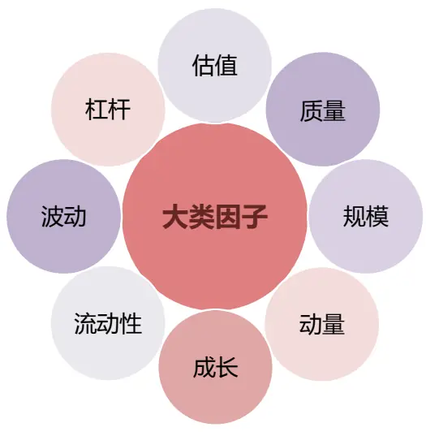
资料来源：光大证券研究所

在上一篇系列报告《爬罗剔抉：一致预期因子分类与精选——多因子系列报告之十一》中，我们从预期类因子这一类较为特殊的因子入手，梳理了一致预期数据中几个选股能力较为突出的因子（预期调整、预期PEG等等），由于分析师预期数据并非来源于公司基本面或者技术面数据，预期数据一定程度上可以认为是分析师或者市场情绪的代理变量，因此通常不会将预期因子作为风格因子来对待。

图 1 中列出的估值、质量、规模、动量、成长、流动性、波动、杠杆则是常用的风格因子，分别代表了股票在这些不同风格上的偏离情况。基于我们前期的测试结果，成长因子的收益能力和选股能力在这几大类因子中并不算突出。

## 1.1、成长因子的稳定性一般

基于《因子测试框架——多因子系列报告之一》中的各大类因子表现得分，我们可以看到成长因子的整体得分相对靠后。

由下表可见，我们跟踪的各大类因子中，基础成长因子中表现最好的OPG_TTM得分为3，平均IC为2.60%，信息比IR为0.41，多空年化收益仅为6.2%。此处测试时间区间为2007年1月1日至2018年4月30日。

表1：各大类因子中多头收益最高的因子的历史表现

| Factor Mean Factor Return |  |  |  |  | IR | LongShort Return | Sharpe |
| --- | --- | --- | --- | --- | --- | --- | --- |
|  | Return | tstat | IC mean | IC std |  |  |  |
| Momentum_1M | -0.84% | -8.22 | -7.39% | 9.66% | -0.77 | 21% | 2.05 |
| VSTD_3M | -0.68% | -4.74 | -4.81% | 8.23% | -0.58 | 25% | 2.72 |
| Ln_MC | -0.67% | -4.84 | -4.41% | 7.60% | -0.58 | 23% | 2.07 |
| STD_1M | -0.72% | -6.40 | -6.45% | 11.48% | -0.56 | 11% | 0.75 |
| BP_LR | 0.52% | 4.78 | 5.24% | 10.45% | 0.50 | 13% | 1.44 |
| OPG_TTM | 0.16% | 3.08 | 2.60% | 6.37% | 0.41 | 6.2% | 1.05 |
| ROE_TTM | 0.13% | 1.36 | 1.47% | 9.47% | 0.16 | -4.4% | -0.45 |
| Debt_Asset | 0.00% | 0.04 | 0.20% | 7.75% | 0.03 | 0.6% | 0.04 |

资料来源：光大证券研究所

我们比较了各大类因子中多头收益最高的因子的历史表现，如下图所示。可见成长因子的收益表现并不突出，多空收益表现排在规模、流动性、反转、估值、波动风格因子之后，仅仅优于质量因子、杠杆因子。这里多空收益的计算方式为因子分5 组后最高组收益减去最低组收益，多头收益则为分5 组后的最高组收益率。

图2：各大类因子中多头收益最高的因子的历史表现（多空收益）
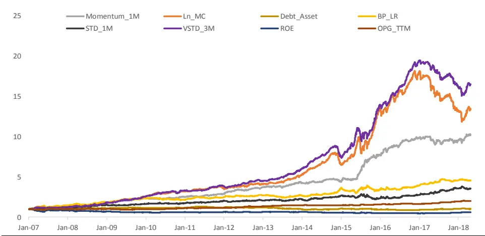
资料来源：光大证券研究所

图 3：各大类因子中多头收益最高的因子的历史表现（多头收益）
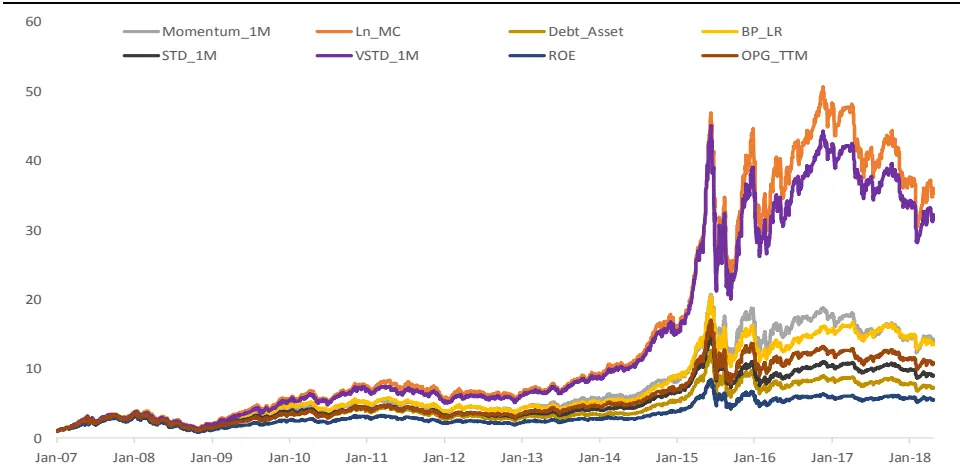
资料来源：光大证券研究所

由OPG_TTM 的IC时间序列和分组表现可见：分组测试中 3、4、5组的差异极小，整体单调性一般； IC 序列稳定性一般，在 2007-2010 年和2014-2016 年之间收益不显著。

图 4：OPG_TTM 因子月度 IC 序列
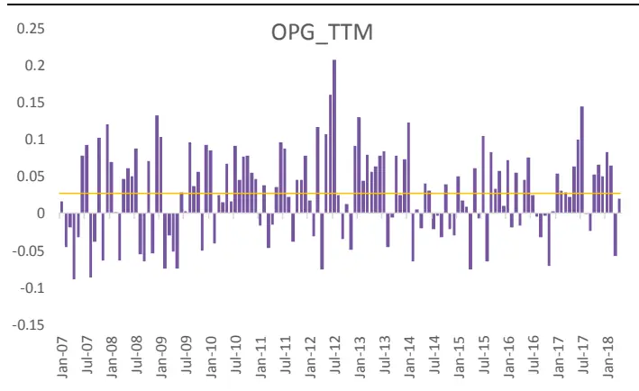
资料来源：光大证券研究所

图5：OPG_TTM因子分组及多空收益
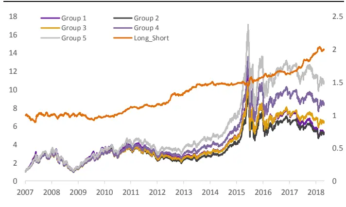
资料来源：光大证券研究所

## 2、成长因子的重构与梳理

由上面的分析可见，基础成长因子的整体稳定性一般，因此我们主要从两个两个方向尝试对成长因子的选股效果进行改进：因子计算方式的优化、新成长因子构造思路的尝试。

## 2.1、因子构造方式的改进思路：以 NPG_TTM 为例

对于净利润TTM同比增速因子（NPG_TTM），在分母（上期TTM净利润）接近零的情形下因子计算存在问题，该因子的计算公式如下所示：

$$
\mathrm{NPG_{-}TTM}=\mathrm{NP_{-}TTM_{t}/abs(NP_{-}TTM_{t-1})}
$$

上述计算方式对于上期净利润绝对值极小的股票，会计算得到异常大的增速因子值，造成异常值，对因子的单调性和选股能力造成很大影响

我们以 NPG_TTM 的测试结果为例，通过计算每期因子值与上期 TTM 净利润的相关性以及分组单调性的情况可见，净利润增速最高的一组（Group 5）所对应的上期TTM净利润中位数显著小于其他4组：

图 6：NPG_TTM 各组的因子值中位数分布
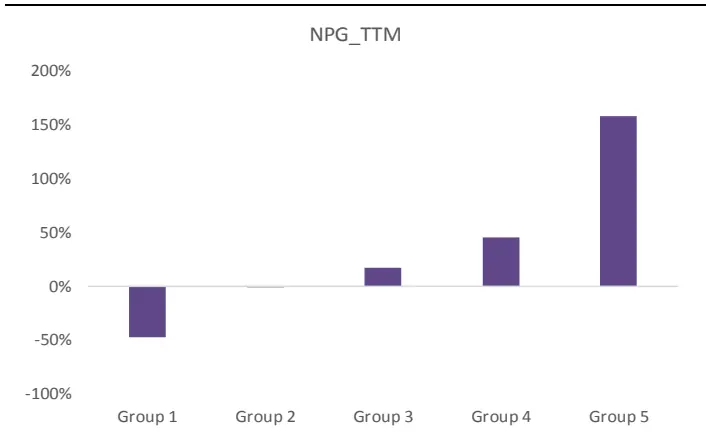
资料来源：光大证券研究所

图7：NPG_TTM各组的上期净利润中位数分布
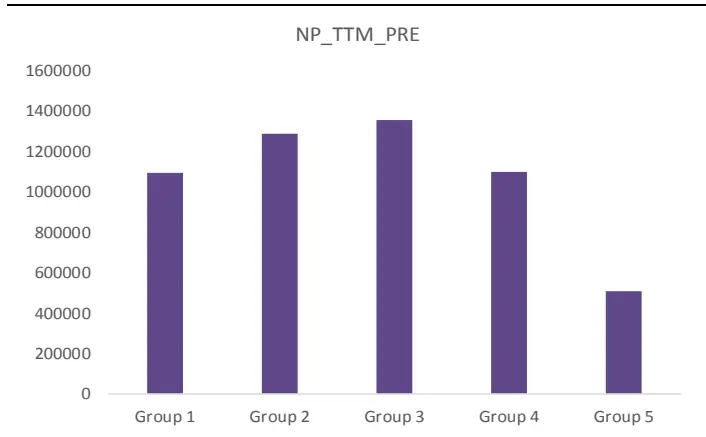
资料来源：光大证券研究所

上述结果表明，TTM 净利润增速因子值与前期净利润呈现较为明显的负相关，从而使得 NPG_TTM 最高组的股票往往由于前期净利润异常低而入选，对因子的多空表现会造成一定影响。

这里我们尝试的改进思路为：将 NPG_TTM 与上期净利润绝对值回归取残差，得到新的因子NPG_TTM_Re，剔除前期净利润的影响。

改进的净利润同比增速因子NPG_TTM_Re在选股能力上较NPG_TTM有了较为稳健的提高：IC 和IR 分别提高了0.17个百分点和 0.03。

表 2：NPG_TTM 与 NPG_TTM_Re 选股能力及预测能力对比

| 指标名称 |  | NPG_TTM | NPG_TTM_Re |
| --- | --- | --- | --- |
| Factor Mean Return | 因子收益 | 0.16% | 0.19% |
| Factor Return tstat | 因子收益显著性 | 3.08 | 3.49 |
| IC mean | IC 均值 | 2.60% | 2.77% |
| IC std | IC 标准差 | 6.37% | 6.28% |
| IC positive per | IC 大于零比例 | 65% | 65% |
| IR | IR | 0.41 | 0.44 |
| Longshort_Sharpe | 多空组合夏普比 | 1.98 | 1.80 |
| Mono | 单调性 | 1.77 | 2.02 |

资料来源：光大证券研究所

同时NPG_TTM_Re 因子值与前期净利润的相关性有了显著的降低。

图 8：NPG_TTM_Re 各组的上期净利润中位数分布
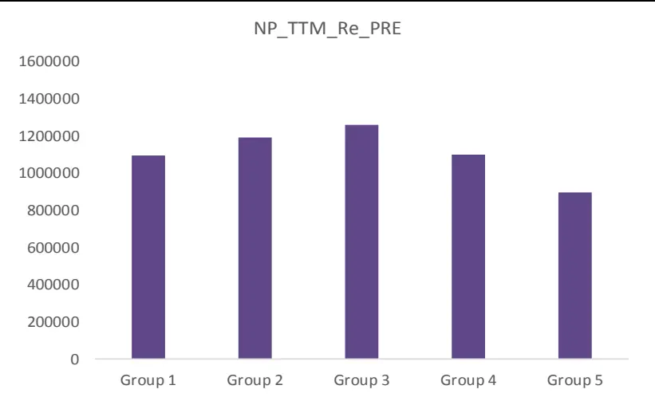
资料来源：光大证券研究所

由上述测试的结果可见，我们采取的增速因子值的改进方法尽管提升空间有限，但逻辑上较为合理且具有比较稳定的提升效果，因此在后文的因子测试时我们将默认对每一个增速类（同比增速、环比增速）因子均使用与分母值回归取残差的方式处理。

## 2.2、成长因子新思路：稳健增速、加速度

在前期的量化基本面选股报告《必需消费品：毛利、周转双轮驱动——行业基本面选股系列报告之一》中，我们引入了3 个较为新颖的成长类指标，依旧以净利润为例：

（1） 加速度指标：NP_Acc

（2） 稳健增速指标：NP_Stable

（3） 稳健加速度指标：NP_SD

其中，加速度指标的计算方法是：利用连续 N 个季度的单季利润，对期数的二次方程进行回归，取二次项系数作为业绩增长加速度的代理变量，回归公式如下：

$$
\mathrm{NP_t}=\alpha\times\mathrm{t^2}+\beta\times\mathrm{t}+\mathrm{c}
$$

其中，NP 为单季度利润，t为季度数， 为上市公司业绩增长加速度的代理变量， 越高，表示业绩增长的加速度越高。该指标的计算涉及到一个参数N，依据参数敏感性的测试结果，在后续的测试中均取相对稳健的 N=8。详细论述可见我们在2017年 12月发布的《多维度寻找高增长公司——业绩链选股策略报告》稳健增速指标刻画的是过去一段时间内业绩增速的稳定性，当指标值比较高的时候，表示过去一段时间内上市公司的业绩保持了稳定增长的态势。它的计算方式是用过去N 期的利润增速均值除以利润增速标准差。在后续的测试中，我们依然取N=8 这一参数，即用过去两年的利润增速数据计算该指标。

稳健加速度指标则是稳健增速指标的一阶差分。

## 3、成长因子测试：稳健加速为王，行业差异明显

首先简单的回顾我们在《多因子系列报告之一：因子测试框架》中搭建的光大多因子测试流程：

## 测试样本

测试范围：全体A股、沪深 300、中证800等成分股样本内

测试样本期：2009-01-01 至 2018-05-01（注：由于本文新加入的成长因子构造时需要利用历史 2 年的公告基本面数据，且 2006 年股改之前的数据可比性较低，我们在这里将成长因子的测试起始时间统一设置为 2009年）

为了使测试结果更符合投资逻辑，我们设定了三条样本筛选规则：

（1）剔除选股日的 ST/PT 股票；

（2）剔除上市不满一年的股票；

（3）剔除选股日由于停牌等原因而无法买入的股票。

## 异常值处理

采用更加稳健的 MAD（Median Absolute Deviation 绝对中位数法）

首先计算因子值的中位数 ，并定义绝对中位值为：

$$
MAD=median(\left|f_{i}-Median_{f}\right|)
$$

采取与 3 法等价的方法，我们将大于 $\cdot Median_{f}+3*1.4826*MAD$ 的值或小于 $Median_{f}-3*1.4826*MAD$ 的值定义为异常值

## 回归测试

回归测试时对市值因子和行业因子做了剔除。

加入行业因子和市值因子后，单因子测试的回归方程如下所示：

$$
\begin{bmatrix}r_{ti}\\\vdots\\r_{tn}\end{bmatrix}=\begin{bmatrix}\beta_{t11}I_{t1u}&\cdots&I_{t1v}m_{t1m}\\\vdots&\vdots&\cdots&\vdots\\\beta_{tn1}I_{tnu}&\cdots&I_{tnv}m_{tnm}\end{bmatrix}\cdot\begin{bmatrix}f_{ti}\\\vdots\\f_{tn}\end{bmatrix}+\begin{bmatrix}\mu_{ti}\\\vdots\\\mu_{tn}\end{bmatrix}
$$

其中：

$\beta_{tiu^{\prime}}$ 代表股票i 在所测试因子上的因子暴露；

$I_{tiu}$ 代表股票i 的行业因子暴露 $(I_{tiu}$ 为哑变量（Dummy variable），即股票属于某个行业则该股票在该行业的因子暴露等于 1，在其他行业的因子暴露等于0）。此处我们将选用中信一级行业分类作为行业分类标准。

$m_{tim}$ 代表股票 i 的市值因子暴露。

## 因子有效性关注指标

在检验因子选股能力和有效性时，我们关注下述几个结合回归测试和因子IC值（秩相关系数）的用来反映因子选股能力和预测能力的指标。

表3：因子测试有效性检验指标明细

| 回归测试检验指标 | IC 值指标 |
| --- | --- |
| 因子收益序列的假设检验t值 | IC 值的均值 |
| 因子收益序列大于0的概率 | IC 值的标准差 |
| t值绝对值的均值 | IC 大于 0 的比例 |
| t值绝对值大于等于 2 的概率 | IC 绝对值大于 0.02 的比例 |
|  | IR(IR = IC 均值 / IC 标准差) |

资料来源：光大证券研究所

其次，通过整合上一章中提到的两个成长因子优化思路，加入加速度、稳健增速、稳健加速度指标后，我们将扩充后的成长类因子明细整理如下表所示（注：下述同比类、环比类增速因子均通过回归分母取残差的方式做处理）：

表 4：扩充后的成长类因子明细

| 因子代码 名称 |  |
| --- | --- |
| NPG_DEDUCTED_TTMNPG_TTM | 扣非净利润增速（TTM 同比） |
|  | 净利润增速（TTM 同比） |
| EPSG_TTM | EPS 增速(TTM 同比） |
| ORG_TTM | 营业收入增速（TTM 同比） |
| OCFG_TTM | 经营性现金流增速（TTM同比） |
| OPG_TTM | 营业利润增速(TTM 同比） |
| ROEG_TTM | ROE 增速（TTM 同比） |
| TAG_TTM | 总资产增速（TTM 同比） |
| OP_Q_YOY | 营业利润增速（单季度同比） |
| OR_Q_YOY | 营业收入增速（单季度同比） |
| NP_Q_YOYOP_QOQNP_QOQNP_ACCNP_STABLENP_SDOP_ACCOP_STABLE | 净利润增速（单季度同比） |
|  | 营业利润增速（单季度环比） |
|  | 净利润增速（单季度环比） |
|  | 净利润加速度 |
|  | 净利润稳健增速 |
|  | 净利润稳健加速度 |
|  | 营业利润加速度 |
|  | 营业利润稳健增速 |
| OP_SD | 营业利润稳健加速度 |
| OR_ACC | 营业收入加速度 |
| OR_STABLE | 营业收入稳健增速 |
| OR_SD | 营业收入稳健加速度 |

资料来源：光大证券研究所

## 3.1、全市场测试：稳健加速度因子表现优秀

我们首先比较上述各类同比、环比类成长因子以及衍生因子（加速度、稳健增速、稳健加速度）在全市场的整体测试结果：

表 5：扩充后成长因子测试结果

| 因子代码 | Factor Mean Return | Factor Return tstat | IC mean | IC std | IC positive per | IR | Longshort Sharpe | Mono |
| --- | --- | --- | --- | --- | --- | --- | --- | --- |
| NPG_Deducted_TTM | 0.18% | 3.6 | 2.75% | 5.86% | 68% | 0.47 | 1.39 | 1.58 |
| NPG_TTM | 0.19% | 3.49 | 2.77% | 6.28% | 65% | 0.44 | 1.8 | 2.02 |
| EPSG_TTM | 0.19% | 3.78 | 3.10% | 6.09% | 69% | 0.51 | 1.34 | 1.35 |
| ORG_TTM | 0.18% | 3.24 | 2.30% | 6.47% | 61% | 0.36 | 1.73 | 1.89 |
| OCFG_TTM | 0.11% | 5.31 | 1.58% | 2.64% | 73% | 0.53 | 0.94 | 0.98 |
| OPG_TTM | 0.19% | 3.72 | 2.73% | 5.95% | 66% | 0.46 | 2.11 | 1.42 |
| ROEG_TTM | 0.17% | 3.7 | 2.72% | 5.33% | 70% | 0.51 | 1.39 | 1.53 |
| TAG_TTM | 0.03% | 0.45 | 0.26% | 7.01% | 54% | 0.04 | 1.75 | 1.27 |
| OP_Q_YOY | 0.25% | 5.59 | 3.37% | 5.31% | 73% | 0.63 | 1.97 | 1.32 |
| OR_Q_YOY | 0.21% | 4.31 | 2.75% | 5.93% | 67% | 0.46 | 1.54 | 1.72 |
| NP_Q_YOY | 0.24% | 4.93 | 3.43% | 5.72% | 72% | 0.60 | 1.85 | 1.43 |
| OP_QOQ | 0.10% | 3.91 | 1.45% | 3.34% | 68% | 0.43 | 1.14 | 1.98 |
| NP_QOQ | 0.12% | 4.59 | 1.65% | 3.74% | 65% | 0.44 | 1.43 | 2.51 |
| NP_Acc | 0.17% | 5.16 | 2.17% | 4.08% | 71% | 0.53 | 0.42 | 1.56 |
| NP_Stable | 0.20% | 3.01 | 1.78% | 7.26% | 58% | 0.25 | 1.28 | -2.61 |
| NP_SD | 0.20% | 6.23 | 2.28% | 3.51% | 73% | 0.65 | 2.94 | 2.07 |
| OP_Acc | 0.16% | 4.22 | 1.98% | 5.21% | 69% | 0.38 | 0.31 | 1.62 |
| OP_Stable | 0.18% | 2.85 | 1.60% | 6.86% | 58% | 0.23 | 0.19 | 2.11 |
| OP_SD | 0.19% | 7.44 | 2.46% | 3.19% | 77% | 0.77 | 2.85 | 2.01 |
| OR_Acc | 0.18% | 4.18 | 1.42% | 4.87% | 69% | 0.29 | 1.29 | 0.98 |
| OR_Stable | 0.19% | 2.94 | 1.66% | 6.78% | 60% | 0.24 | 0.34 | 1.98 |
| OR_SD | 0.12% | 4.50 | 1.43% | 3.46% | 69% | 0.41 | 1.66 | 1.63 |

资料来源：光大证券研究所

净利润稳健增速因子 NP_SD 和营业利润稳健增速因子 OP_SD 表现相当出色，其因子IC、IR、单调性以及多空收益夏普比均显著优于其他成长因子。同时净利润单季度同比 NP_Q_YOY 和营业利润单季度同比因子OP_Q_YOY 的 IC 均值最高，分别为 3.37%和 3.43%，IC_IR 均超过 0.6，表明这两个因子也具有较强的区分能力。

由此可见我们构造的稳健增速因子具有稳定的选股能力，下图中分别给出了OP_SD因子的历史IC 序列和多空净值走势，可见其收益稳定性和单调性均表现出色。OP_SD 的多空年化收益达到 8.9%，夏普比为 2.85，IC 均值为2.46%，IC_IR高达 0.77，选股能力和单调性均表现出色。

图 9：OP_SD 在全市场的分组&多空收益
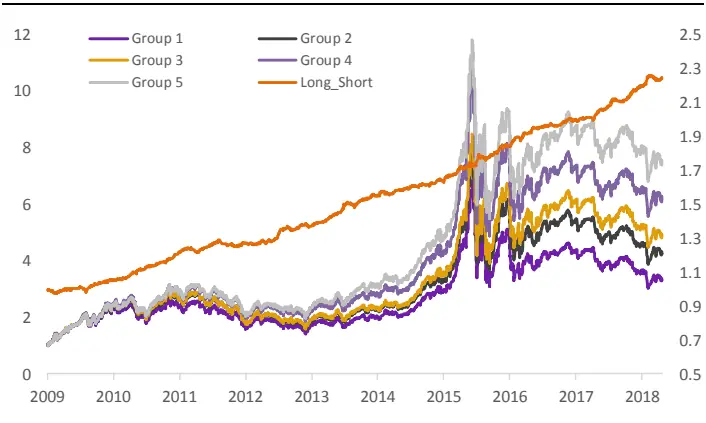
资料来源：光大证券研究所

图 10：OP_SD 在全市场的月度 IC 序列
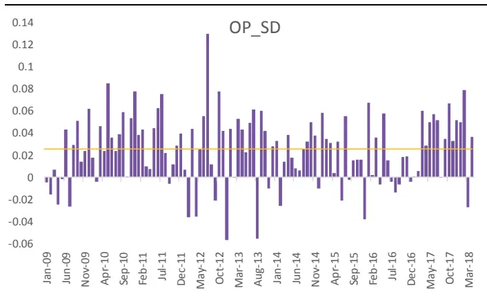
资料来源：光大证券研究所

图 11：OP_SD 因子多头组合净值和相对净值
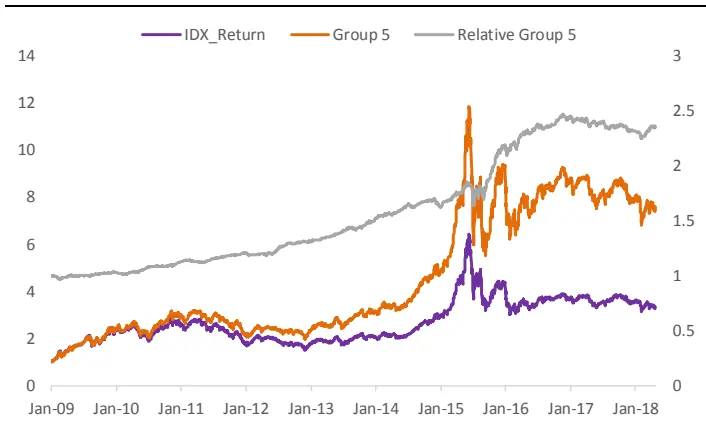
资料来源：光大证券研究所，基准为中证全指

图12：OP_SD在全市场的月度因子收益序列
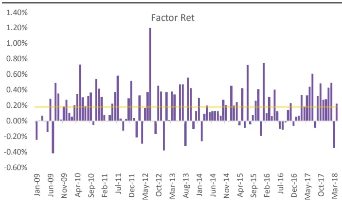
资料来源：光大证券研究所

营业利润稳健增速因子OP_SD 在沪深300 成分股样本内的表现相对较弱，中证 800 成分股样本内的表现与全市场较为接近，中证 800 成分股内的IC_IR 为 0.55，多空夏普比为 1.65。

表 6：OP_SD 因子在沪深 300 内表现较弱

| 全A |  |  | 沪深300 | 中证800 |
| --- | --- | --- | --- | --- |
| Factor Mean Return | 因子收益 | 0.19% | 0.14% | 0.20% |
| Factor Return tstat | 因子收益显著性 | 7.44 | 3.01 | 5.99 |
| IC mean | IC | 2.46% | 1.89% | 2.16% |
| IC positive per | IC 大于零比例 | 77% | 61% | 69% |
| IR | IR | 0.77 | 0.33 | 0.55 |
| LongShort_Sharpe | 多空夏普比 | 2.85 | 1.1 | 1.65 |
| Monotonous | 单调性 | 2.01 | 2.04 | 1.86 |

资料来源：光大证券研究所

## 3.2、分行业测试：制造业、消费业表现较好

通过上述初步测试结果，我们可以看到大部分成长类因子在全市场样本内绝对收益稳定性较弱，而观察成长类因子在各个大类行业间的表现发现，成长类因子在不同风格的行业间差异较大，尤其是金融与非金融行业间差异明显。

表 7：成长类因子在不同中信一级行业内表现差异较大（信息比 IR）
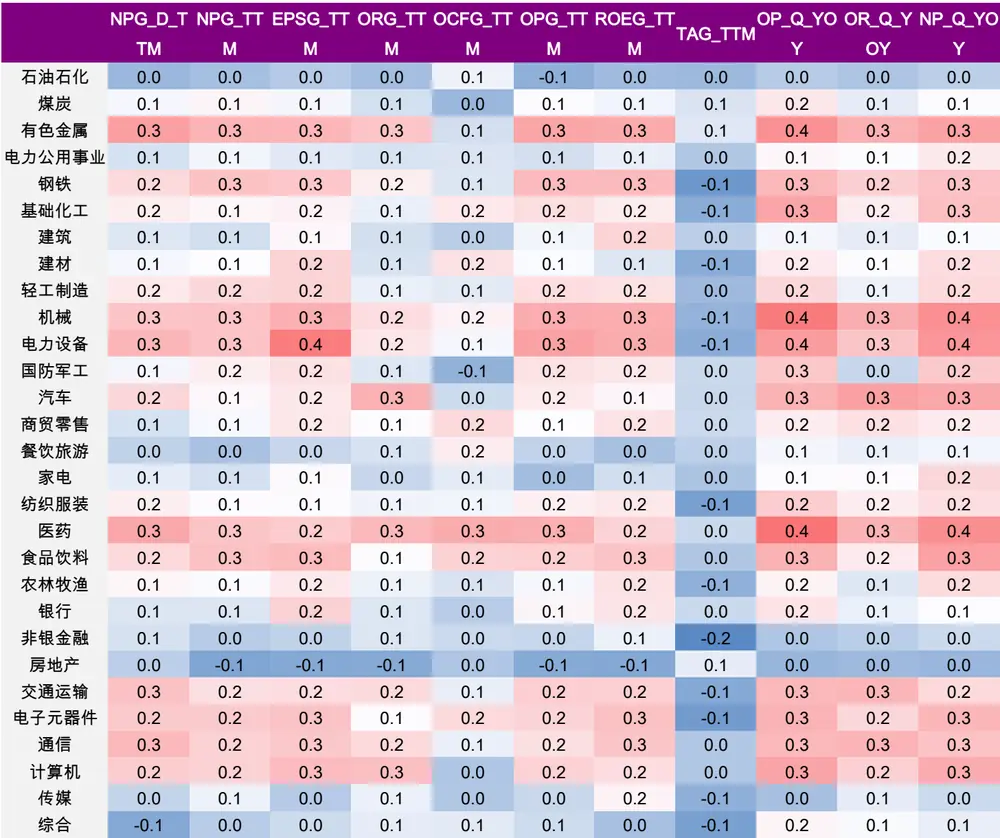
资料来源：光大证券研究所

表8：成长类因子在不同中信一级行业内表现差异较大（信息比 IR）（续）

| e e |  |  |  |  |  |  |  |  |  |  |  |
| --- | --- | --- | --- | --- | --- | --- | --- | --- | --- | --- | --- |
| 石油石化 | 0.1 | 0.0 | -0.1 | 0.1 | 0.1 | 0.0 | 0.0 | 0.1 | -0.1 | 0.0 | 0.0 |
| 煤炭 | 0.1 | 0.1 | 0.2 | 0.1 | 0.2 | 0.2 | 0.0 | 0.1 | 0.2 | 0.1 | 0.2 |
| 有色金属 | 0.2 | 0.3 | 0.2 | 0.2 | 0.4 | 0.2 | 0.2 | 0.2 | 0.2 | 0.1 | 0.1 |
| 电力及公用事业 | 0.1 | 0.1 | 0.1 | 0.2 | 0.1 | 0.1 | 0.1 | 0.1 | 0.1 | 0.1 | 0.1 |
| 钢铁 | 0.1 | 0.1 | 0.1 | 0.1 | 0.2 | 0.1 | 0.1 | 0.1 | 0.1 | 0.1 | 0.2 |
| 基础化工 | 0.3 | 0.3 | 0.3 | -0.1 | 0.3 | 0.3 | -0.1 | 0.3 | 0.3 | 0.0 | 0.1 |
| 建筑 | -0.1 | -0.1 | 0.1 | 0.1 | 0.2 | 0.1 | 0.0 | 0.1 | 0.1 | -0.1 | 0.1 |
| 建材 | 0.2 | 0.1 | 0.3 | 0.0 | 0.0 | 0.3 | 0.0 | 0.2 | 0.3 | 0.0 | 0.0 |
| 轻工制造 | 0.0 | 0.1 | 0.1 | 0.1 | 0.2 | 0.1 | 0.0 | 0.1 | 0.1 | 0.2 | 0.1 |
| 机械 | 0.2 | 0.1 | 0.3 | 0.1 | 0.5 | 0.3 | 0.1 | 0.4 | 0.3 | 0.0 | 0.2 |
| 电力设备 | 0.1 | 0.1 | 0.4 | 0.0 | 0.4 | 0.2 | 0.0 | 0.2 | 0.2 | 0.0 | 0.2 |
| 国防军工 | 0.2 | 0.2 | 0.1 | 0.2 | 0.2 | 0.1 | 0.2 | 0.1 | 0.1 | 0.1 | 0.0 |
| 汽车 | 0.2 | 0.2 | 0.3 | 0.1 | 0.3 | 0.3 | 0.0 | 0.3 | 0.3 | 0.2 | 0.1 |
| 商贸零售 | 0.1 | 0.1 | 0.2 | 0.0 | 0.2 | 0.2 | 0.0 | 0.2 | 0.2 | 0.0 | 0.1 |
| 餐饮旅游 | 0.1 | 0.1 | 0.1 | 0.1 | 0.1 | 0.1 | 0.1 | 0.2 | 0.1 | 0.0 | 0.1 |
| 家电 | 0.2 | 0.2 | 0.2 | 0.1 | 0.2 | 0.2 | 0.1 | 0.1 | 0.2 | 0.1 | 0.2 |
| 纺织服装 | 0.0 | 0.1 | 0.2 | 0.1 | 0.3 | 0.2 | 0.1 | 0.2 | 0.2 | 0.0 | 0.0 |
| 医药 | 0.1 | 0.2 | 0.4 | 0.2 | 0.3 | 0.4 | 0.2 | 0.3 | 0.4 | 0.1 | 0.2 |
| 食品饮料 | 0.1 | 0.2 | 0.2 | 0.0 | 0.3 | 0.2 | 0.0 | 0.4 | 0.2 | 0.2 | 0.1 |
| 农林牧渔 | 0.0 | 0.1 | 0.2 | 0.2 | 0.2 | 0.2 | 0.1 | 0.2 | 0.2 | 0.1 | 0.1 |
| 银行 | 0.0 | 0.0 | 0.1 | 0.0 | 0.0 | 0.1 | 0.0 | 0.0 | 0.1 | 0.0 | 0.0 |
| 非银金融 | 0.0 | 0.1 | 0.2 | 0.1 | -0.1 | 0.2 | 0.1 | -0.1 | 0.2 | 0.0 | 0.0 |
| 房地产 | 0.0 | 0.0 | 0.0 | 0.1 | -0.1 | 0.0 | 0.0 | -0.1 | 0.0 | 0.1 | -0.1 |
| 交通运输 | 0.0 | 0.0 | 0.3 | 0.2 | 0.2 | 0.3 | 0.1 | 0.1 | 0.3 | 0.1 | 0.2 |
| 电子元器件 | 0.2 | 0.2 | 0.3 | 0.1 | 0.3 | 0.3 | 0.1 | 0.2 | 0.3 | 0.2 | 0.1 |
| 通信 | 0.2 | 0.2 | 0.2 | 0.0 | 0.1 | 0.2 | 0.0 | 0.0 | 0.2 | 0.2 | 0.2 |
| 计算机 | 0.0 | 0.0 | 0.1 | 0.1 | 0.2 | 0.1 | 0.1 | 0.2 | 0.1 | 0.2 | 0.1 |
| 传媒 | 0.1 | 0.1 | 0.1 | 0.0 | 0.0 | 0.1 | -0.1 | 0.0 | 0.1 | -0.1 | 0.0 |
| 综合 | 0.1 | 0.1 | 0.1 | 0.1 | 0.0 | 0.1 | 0.0 | 0.0 | 0.1 | 0.0 | 0.1 |

资料来源：光大证券研究所

我们根据中信一级行业收益相关性矩阵，结合大众认知的行业归属，将中信一级行业按照如下的方式分为金融、周期、制造、防御、消费、TMT 这 6大类行业，并分别观察成长类因子在各大类行业内的表现。

表 9：中信一级行业风格分类

| 金融 | 周期 | 制造 | 防御 | 消费 | TMT |
| --- | --- | --- | --- | --- | --- |
| 银行 | 煤炭 | 机械 | 纺织服装 | 食品饮料 | 通信 |
| 非银金融 | 有色 | 电力设备 | 商贸零售 | 医药 | 计算机 |
| 房地产 | 钢铁 | 国防军工 | 农林牧渔 | 汽车 | 传媒 |
|  | 基础化工 | 轻工制造 | 电力及公用事业 | 家电 | 电子元器件 |
|  | 石油石化 | 建筑 | 餐饮旅游 |  |  |
|  | 建材 |  | 交通运输 |  |  |
| 综合 |  |  |  |  |  |

资料来源：光大证券研究所

按照上述行业风格的划分方式，我们统计得到各个成长因子在大类风格行业中的信息比 IR 如下，可见成长类因子在金融类行业内表现远远弱于其他行业。成长类因子在消费类、制造类行业中表现优秀，同比类成长因子在TMT行业中表现较好。

表 10：成长因子在不同风格大类因子内的表现（信息比 IR）

|  | 金融 | 周期 | 制造 | 防御 | 消费 | TMT |
| --- | --- | --- | --- | --- | --- | --- |
| NPG_Deducted_TTM | 0.05 | 0.15 | 0.19 | 0.09 | 0.21 | 0.20 |
| NPG_TTM | 0.00 | 0.16 | 0.20 | 0.10 | 0.18 | 0.20 |
| EPSG_TTM | 0.06 | 0.18 | 0.26 | 0.12 | 0.21 | 0.20 |
| ORG_TTM | 0.02 | 0.11 | 0.13 | 0.11 | 0.19 | 0.18 |
| OCFG_TTM | 0.02 | 0.10 | 0.06 | 0.12 | 0.17 | 0.08 |
| OPG_TTM | 0.04 | 0.17 | 0.24 | 0.11 | 0.17 | 0.17 |
| ROEG_TTM | 0.07 | 0.16 | 0.25 | 0.12 | 0.17 | 0.22 |
| TAG_TTM | -0.01 | -0.02 | -0.02 | -0.04 | 0.02 | -0.04 |
| OP_Q_YOY | 0.05 | 0.23 | 0.27 | 0.18 | 0.30 | 0.23 |
| OR_Q_YOY | 0.03 | 0.16 | 0.16 | 0.16 | 0.24 | 0.21 |
| NP_Q_YOYOP_QOQNP_QOQNP_AccNP_StableNP_SDOP_AccOP_StableOP_SDOR_AccOR_StableOR_SD | 0.05 | 0.21 | 0.27 | 0.17 | 0.32 | 0.23 |
|  | 0.02 | 0.16 | 0.10 | 0.07 | 0.15 | 0.10 |
|  | 0.02 | 0.16 | 0.10 | 0.09 | 0.21 | 0.13 |
|  | 0.09 | 0.15 | 0.20 | 0.16 | 0.25 | 0.17 |
|  | 0.09 | 0.09 | 0.08 | 0.11 | 0.11 | 0.05 |
|  | -0.04 | 0.21 | 0.30 | 0.17 | 0.27 | 0.16 |
|  | 0.09 | 0.16 | 0.16 | 0.16 | 0.25 | 0.17 |
|  | 0.04 | 0.04 | 0.06 | 0.07 | 0.07 | 0.01 |
|  | -0.05 | 0.16 | 0.20 | 0.15 | 0.28 | 0.10 |
|  | 0.09 | 0.15 | 0.17 | 0.16 | 0.25 | 0.17 |
|  | 0.03 | 0.05 | 0.04 | 0.06 | 0.15 | 0.12 |
|  | -0.03 | 0.10 | 0.13 | 0.12 | 0.16 | 0.12 |

资料来源：光大证券研究所

上述测试的成长因子中，大部分因子在制造业和消费行业内表现较好，同时金融类行业内表现都比较一般，因此在后面一章中我们会尝试结合成长类因子的行业差异，构造在全市场表现稳定性较好的复合成长因子。

## 4、综合成长因子：结合行业差异，取长补短

从上面一章的测试结果中可以发现，成长大类的因子在不同行业或者不同风格之间的差异较为显著。因此我们将尝试针对这一特点，将同一期限的成长因子作为一个整体，通过给予每个单独行业滚动赋权的方式，构造复合成长类因子。

## 4.1、复合成长因子构造思路

由上述测试结果可见，成长因子在不同大类行业间具有较为显著的差异，并且该差异性较为稳定。因此我们认为可以尝试构造复合成长因子，基于每个行业中各个因子的选股能力（IC_IR、Longshort_Sharpe）以及显著性 tvalue 的不同，对在某一行业选股能力较强的因子给予较大的权重，而选股能力较差的因子给予较小的或者负向的权重。

我们将复合因子的构造思路整理如下：

## （1） 复合因子 G_Composite：

针对每支股票 :

$$
\mathsf{G}\_\mathsf{Composite}_{j}=\sum_{i}^{N}w_{i}*G\_factor_{i}
$$

其中： $w_{i}$ 为第 i 个因子的权重， $\textstyle\sum w_{i}=1$ 。

$$
G_{-}factor_{i}为标准化后的第\mid 个因子值
$$

N 为基础成长因子个数

（2） $w_{i}$ 的 权 重 设 置 上 采 取 信 息 比 IC_IR 、 多 空 收 益 夏 普 比LongShort_Sharpe 结合因子收益显著性 t_value 的方式，并尝试了下述几种构造方式：

i. 复合信息比（G_Composite_v1）：

$$
w_{i}=\frac{IC\_IR_{ij}}{1/N\sum_{j}IC\_IR_{ij}}
$$

其中： $IC\_IR_{ij}$ 为因子i 在股票j所属行业内的信息比IC_IR，

## ii. 复合多空夏普比（G_Composite_v2）：

$$
w_{i}=\frac{Sharpe_{ij}}{1/N\sum_{j}Sharpe_{ij}}
$$

其中： $Sharpe_{ij}$ 为因子 i 在 股 票 j 所属行业内的 多 空 收 益 夏 普 比LongShort_Sharpe， $\mathrm{i}\in[1,\mathrm{N}]$

## iii. 复合信息比结合显著性指标（G_Composite_v3）：

$$
w_{i}=\left\{\begin{aligned}&\frac{IC\_IR_{ij}}{1/N\sum_{j}IC\_IR_{ij}}\ where\ t_{-}value_{ij}\geq v\\&\quad0\ \ \ \ \ \\\\\\\\end{�}\right.\end{aligned}
$$

其中： $:IC\_IR_{ij}$ 为因子i在股票j所属行业内的信息比IC_IR， ，为因子 i 在股票 j 所属行业内的因子收益显著性。

## iv. 复合多空夏普比结合显著性指标（G_Composite_v4）：

$$
w_{i}=\left\{\begin{matrix}\displaystyle\frac{Sharpe_{ij}}{1/N\sum_{j}Share_{ij}}&where\displaystyle t_{-}value_{ij}\geq v\\0&else\end{matrix}\right.
$$

其中： $Sharpe_{ij}$ 为 因 子 i 在 股 票 j 所 属 行 业 内 的 多 空 收 益 夏 普 比LongShort_Sharpe， ， $t\_value_{ij}$ 为因子 i 在股票 j 所属行业内的因子收益显著性。

## 4.2、基础成长因子筛选：低相关性

在构造符合因子时首先需要确定基础因子的选取标准，我们统计了成长大类因子中各个因子的IC 序列相关性，结果如表 11 所示。

由于因子的构造方式比较类似，因此有很大比例的成长类因子之间存在高度的相关性。其中，同比类的成长因子均高度相关，环比类因子之间同样高度相关，稳健增速、稳健加速度因子也有较强的相关性。

而不同计算方式下的成长因子相关性相对较弱，同时，经营性现金流同比增速（OCFG_TTM）与其他因子相关性较弱，且IC_IR 表现尚可。

表11：成长大类因子中各个因子的 IC序列相关性

| NPGD NPGEPSG ORGOCFG O |  |  |  |  |  | PG_ROEG |  | TAG | OP_Q | OR_Q NP | QOP__Q |  | NP_Q NP_Ac NP__St NP_S |  |  |  | OP_St OP_SO |  | R_St | OR_S |  |  |  |  |  |
| --- | --- | --- | --- | --- | --- | --- | --- | --- | --- | --- | --- | --- | --- | --- | --- | --- | --- | --- | --- | --- | --- | --- | --- | --- | --- |
|  |  |  |  |  |  | _TTM TTM |  | _TTM | TTM | _TTM | TTM _TTM |  | TTM | _YOY | _YOY | _YOY | OQ | OQ | C | able | D | able | D | able | D |
| NPG_D_TTM | 1.0 | 1.0 | 0.9 | 0.8 | 0.3 | 1.0 | 0.9 | 0.5 | 0.9 | 0.8 | 0.9 | 0.3 | 0.4 | 0.5 | 0.6 | 0.6 | 0.6 | 0.6 | 0.6 | 0.6 |  |  |  |  |  |
| NPG_TTM | 1.0 | 1.0 | 1.0 | 0.8 | 0.3 | 1.0 | 0.9 | 0.5 | 0.9 | 0.8 | 0.9 | 0.3 | 0.4 | 0.6 | 0.6 | 0.6 | 0.6 | 0.6 | 0.6 | 0.6 |  |  |  |  |  |
| EPSG | 0.9 | 1.0 | 1.0 | 0.7 | 0.3 | 1.0 | 1.0 | 0.4 | 0.9 | 0.7 | 0.9 | 0.3 | 0.4 | 0.6 | 0.5 | 0.6 | 0.5 | 0.6 | 0.5 | 0.6 |  |  |  |  |  |
| TTM |  |  |  |  |  |  |  |  |  |  |  |  |  |  |  |  |  |  |  |  |  |  |  |  |  |
| ORGTTM | 0.8 | 0.8 | 0.7 | 1.0 | 0.3 | 0.8 | 0.7 | 0.7 | 0.8 | 1.0 | 0.8 | 0.3 | 0.4 | 0.4 | 0.7 | 0.5 | 0.8 | 0.6 | 0.9 | 0.7 |  |  |  |  |  |
| OCFG_TTM | 0.3 | 0.3 | 0.3 | 0.3 | 1.0 | 0.3 | 0.4 | 0.0 | 0.3 | 0.3 | 0.3 | 0.1 | 0.1 | 0.2 | 0.1 | 0.3 | 0.1 | 0.3 | 0.2 | 0.2 |  |  |  |  |  |
| OPG_TTM | 1.0 | 1.0 | 1.0 | 0.8 | 0.3 | 1.0 | 0.9 | 0.5 | 0.9 | 0.8 | 0.9 | 0.3 | 0.4 | 0.5 | 0.6 | 0.6 | 0.6 | 0.6 | 0.6 | 0.6 |  |  |  |  |  |
| ROEG_TTM | 0.9 | 0.9 | 1.0 | 0.7 | 0.4 | 0.9 | 1.0 | 0.2 | 0.8 | 0.7 | 0.8 | 0.3 | 0.3 | 0.5 | 0.4 | 0.6 | 0.4 | 0.5 | 0.5 | 0.6 |  |  |  |  |  |
| TAG_TTM | 0.5 | 0.5 | 0.4 | 0.7 | 0.0 | 0.5 | 0.2 | 1.0 | 0.5 | 0.7 | 0.5 | 0.2 | 0.3 | 0.2 | 0.8 | 0.3 | 0.8 | 0.4 | 0.8 | 0.4 |  |  |  |  |  |
| OP_Q_YOY | 0.9 | 0.9 | 0.9 | 0.8 | 0.3 | 0.9 | 0.8 | 0.5 | 1.0 | 0.8 | 1.0 | 0.4 | 0.5 | 0.6 | 0.6 | 0.7 | 0.6 | 0.7 | 0.6 | 0.7 |  |  |  |  |  |
| OR_QYOY | 0.8 | 0.8 | 0.7 | 1.0 | 0.3 | 0.8 | 0.7 | 0.7 | 0.8 | 1.0 | 0.8 | 0.3 | 0.4 | 0.5 | 0.7 | 0.6 | 0.8 | 0.7 | 0.8 | 0.7 |  |  |  |  |  |
| NP_QYOY | 0.9 | 0.9 | 0.9 | 0.8 | 0.3 | 0.9 | 0.8 | 0.5 | 1.0 | 0.8 | 1.0 | 0.4 | 0.5 | 0.7 | 0.6 | 0.8 | 0.6 | 0.7 | 0.6 | 0.7 |  |  |  |  |  |
| OP_QOQ | 0.3 | 0.3 | 0.3 | 0.3 | 0.1 | 0.3 | 0.3 | 0.2 | 0.4 | 0.3 | 0.4 | 1.0 | 0.9 | 0.3 | 0.2 | 0.3 | 0.3 | 0.3 | 0.2 | 0.2 |  |  |  |  |  |
| NP_QOQ |  |  |  |  |  |  |  |  |  |  |  |  |  |  |  |  |  |  |  |  |  |  |  |  |  |
|  | 0.4 | 0.4 | 0.4 | 0.4 | 0.1 | 0.4 | 0.3 | 0.3 | 0.5 | 0.4 | 0.5 | 0.9 | 1.0 | 0.4 | 0.4 | 0.4 | 0.4 | 0.4 | 0.4 | 0.3 |  |  |  |  |  |
| NP_AcC | 0.5 | 0.6 | 0.6 | 0.4 | 0.2 | 0.5 | 0.5 | 0.2 | 0.6 | 0.5 | 0.7 | 0.3 | 0.4 | 1.0 | 0.3 | 0.5 | 0.3 | 0.4 | 0.2 | 0.3 |  |  |  |  |  |
| NP_Stable | 0.6 | 0.6 | 0.5 | 0.7 | 0.1 | 0.6 | 0.4 | 0.8 | 0.6 | 0.7 | 0.6 | 0.2 | 0.4 | 0.3 | 1.0 | 0.3 | 1.0 | 0.4 | 0.8 | 0.4 |  |  |  |  |  |
| NP_SD | 0.6 | 0.6 | 0.6 | 0.5 | 0.3 | 0.6 | 0.6 | 0.3 | 0.7 | 0.6 | 0.8 | 0.3 | 0.4 | 0.5 | 0.3 | 1.0 | 0.4 | 0.9 | 0.4 | 0.6 |  |  |  |  |  |
| OP_Stable | 0.6 | 0.6 | 0.5 | 0.8 | 0.1 | 0.6 | 0.4 | 0.8 | 0.6 | 0.8 | 0.6 | 0.3 | 0.4 | 0.3 | 1.0 | 0.4 | 1.0 | 0.5 | 0.8 | 0.4 |  |  |  |  |  |
| OP_SD | 0.6 | 0.6 | 0.6 | 0.6 | 0.3 | 0.6 | 0.5 | 0.4 | 0.7 | 0.7 | 0.7 | 0.3 | 0.4 | 0.4 | 0.4 | 0.9 | 0.5 | 1.0 | 0.5 | 0.6 |  |  |  |  |  |
| OR_Stable | 0.6 | 0.6 | 0.5 | 0.9 | 0.2 | 0.6 | 0.5 | 0.8 | 0.6 | 0.8 | 0.6 | 0.2 | 0.4 | 0.2 | 0.8 | 0.4 | 0.8 | 0.5 | 1.0 | 0.5 |  |  |  |  |  |
| OR_SD | 0.6 | 0.6 | 0.6 | 0.7 | 0.2 | 0.6 | 0.6 | 0.4 | 0.7 | 0.7 | 0.7 | 0.2 | 0.3 | 0.3 | 0.4 | 0.6 | 0.4 | 0.6 | 0.5 | 1.0 |  |  |  |  |  |

资料来源：光大证券研究所

基于上述结果，为了保证复合因子的有效性，我们挑选相关性较低的各类成长因子中 IC_IR 最高的因子：营业利润稳健增速 OP_SD、单季净利润环比增速NP_QOQ、营业利润TTM同比增速OPG_TTM、经营性现金流同比增速 OCFG_TTM 作为构造复合成长因子的基础因子。

## 4.3、复合因子：单调性较好，选股能力未显著提高

综合因子表现和因子之间的相关性分析，筛选出复合成长因子构造时的基础因子包括：营业利润稳健增速OP_SD、单季净利润环比增速NP_QOQ、营业利润TTM同比增速OPG_TTM、经营性现金流同比增速OCFG_TTM。

- 回测区间：2013-01-01 ~2018-05-20

- 滚动周期：IC_IR、LongShort_Sharpe、Tvalue 的计算均采用滚动历史48 个月的方式计算，由于OP_SD 稳健加速度因子测试起始时间为2009年，因此复合因子的测试起始时间为 2013 年。

- 参数设置: 结合因子测试显著性指标 t_value 时，参数 v 的测试范围为（0.5,2），最终v的参数选取0.8 为最优。

上述 4 种构造方式下复合成长因子的表现对比如下表所示，其中，复合多空夏普比的复合因子 Comp_G_v2 的表现相对较好，IC_IR 为 0.62，多空Sharpe 为 2.52，单调性得分 2.51。

表 12：复合成长因子测试结果

| Comp_G_v1 Comp_G_v2 Comp_G_v3 Comp_G_v4 |  |  |  |  |
| --- | --- | --- | --- | --- |
|  | 复合信息比 | 复合多空夏普 | 复合信息比显著性 复合夏普显著性 |  |
| Factor Mean Return | 0.20% | 0.11% | 0.14% | 0.05% |
| Factor Return tstat | 5.36 | 4.34 | 2.97 | 1.27 |
| IC mean | 1.52% | 1.65% | 1.85% | 1.22% |
| IC std | 2.88% | 2.66% | 4.66% | 5.08% |
| IC positive per | 70% | 78% | 69% | 59% |
| IR | 0.53 | 0.62 | 0.40 | 0.24 |
| Sharpe | 2.12 | 2.52 | 0.98 | 1.02 |
| Mono | 2.01 | 2.51 | -0.91 | 2.11 |

资料来源：光大证券研究所

由上述测试结果可见，复合因子中表现最好的Comp_G_v2 稳定性较好，但复合后的因子在大类行业上的依旧存在较为明显的差异。银行行业内因子表现有了显著改善，但非银、计算机、建筑等行业的表现有所下降，整体提升的程度不甚明显。

表13：Comp_G_v2复合成长因子分行业表现

|  | IR | Longshort_Sharpe | T_value |
| --- | --- | --- | --- |
| 通信 | 0.43 | 1.31 | 0.81 |
| 基础化工 | 0.36 | 1.41 | 0.85 |
| 电力设备 | 0.35 | 0.42 | 0.68 |
| 汽车 | 0.34 | 0.89 | 0.96 |
| 家电 | 0.32 | 0.70 | 0.76 |
| 电子元器件 | 0.32 | 1.19 | 0.87 |
| 医药 | 0.29 | 0.82 | 0.68 |
| 食品饮料 | 0.29 | 0.70 | 0.84 |
| 有色金属 | 0.24 | 0.87 | 0.86 |
| 餐饮旅游 | 0.21 | 0.44 | 0.73 |
| 交通运输 | 0.20 | 0.88 | 0.87 |
| 农林牧渔 | 0.18 | -0.06 | 0.91 |
| 传媒 | 0.18 | 0.11 | 0.85 |
| 轻工制造 | 0.16 | 0.47 | 0.84 |
| 建材 | 0.15 | 0.82 | 1.00 |
| 国防军工 | 0.15 | 0.32 | 0.71 |
| 机械 | 0.14 | 0.70 | 0.91 |
| 银行 | 0.13 | 0.32 | 0.61 |
| 钢铁 | 0.13 | 0.42 | 0.94 |
| 电力及公用事业 | 0.12 | 0.78 | 1.14 |
| 煤炭 | 0.10 | 0.07 | 0.65 |
| 综合 | 0.03 | -0.24 | 0.85 |
| 纺织服装 | 0.03 | 0.37 | 0.73 |
| 石油石化 | 0.03 | 0.02 | 0.68 |
| 商贸零售 | 0.00 | 0.05 | 0.78 |
| 房地产 | -0.01 | 0.06 | 0.87 |
| 计算机 | -0.07 | -0.23 | 0.86 |
| 建筑 | -0.13 | -0.41 | 0.83 |
| 非银金融 | -0.19 | -0.40 | 1.07 |

资料来源：光大证券研究所

将复合因子 Comp_G_v2 与成长类因子中表现最佳的营业利润稳健增速OP_SD 对比如下，复合因子 Comp_G_v2 在整体稳定性上有略微改善，分组单调性较好，然后其余各项指标均未能超越OP_SD。

表 14：复合因子 Comp_G_v2 与 OP_SD 表现对比

| OP_SD |  | Comp_G_v2 |
| --- | --- | --- |
| Factor Mean Return | 0.19% | 0.11% |
| Factor Return tstatIC meanIC stdIC positive perIR | 7.44 | 4.34 |
|  | 2.46% | 1.65% |
|  | 3.19% | 2.66% |
|  | 77% | 78% |
|  | 0.77 | 0.62 |
| Sharpe | 2.85 | 2.52 |
| Mono | 2.01 2.51 |  |

资料来源：光大证券研究所

同时，考虑到复合因子构造时为了满足回测的滚动样本数量达到一定要求，复合因子的回测起始时间较晚，起始时间为 2013 年初，因此复合因子的测试结果的显著性和代表性相对较弱，尽管因子稳定性略有提升且在某些行业上表现有改善，但我们仍然认为使用复合因子的必要性并不大。而营业利润稳健加速度因子OP_SD的整体表现更好，是更为推荐使用的成长类因子。

## 5、风险提示

本篇报告测试结果均基于量化模型，模型存在失效的风险。

## 行业及公司评级体系

| 评级 说明 |
| --- |
| 买入 未来6-12个月的投资收益率领先市场基准指数15%以上； |
| 增持 未来6-12个月的投资收益率领先市场基准指数5%至15%； |
| 中性 未来6-12个月的投资收益率与市场基准指数的变动幅度相差-5%至5%； |
| 减持 未来6-12个月的投资收益率落后市场基准指数5%至15%； |
| 卖出 未来6-12个月的投资收益率落后市场基准指数15%以上； |
| 因无法获取必要的资料，或者公司面临无法预见结果的重大不确定性事件，或者其他原因，致使无法给出明确的无评级投资评级。 |

基准指数说明：A 股主板基准为沪深 300 指数；中小盘基准为中小板指；创业板基准为创业板指；新三板基准为新三板指数；港股基准指数为恒生指数。

## 分析、估值方法的局限性说明

本报告所包含的分析基于各种假设，不同假设可能导致分析结果出现重大不同。本报告采用的各种估值方法及模型均有其局限性，估值结果不保证所涉及证券能够在该价格交易。

## 分析师声明

本报告署名分析师具有中国证券业协会授予的证券投资咨询执业资格并注册为证券分析师，以勤勉的职业态度、专业审慎的研究方法，使用合法合规的信息，独立、客观地出具本报告，并对本报告的内容和观点负责。负责准备本报告以及撰写本报告的所有研究分析师或工作人员在此保证，本研究报告中关于任何发行商或证券所发表的观点均如实反映分析人员的个人观点。负责准备本报告的分析师获取报酬的评判因素包括研究的质量和准确性、客户的反馈、竞争性因素以及光大证券股份有限公司的整体收益。所有研究分析师或工作人员保证他们报酬的任何一部分不曾与，不与，也将不会与本报告中具体的推荐意见或观点有直接或间接的联系。

## 特别声明

光大证券股份有限公司（以下简称“本公司”）创建于 1996 年，系由中国光大（集团）总公司投资控股的全国性综合类股份制证券公司，是中国证监会批准的首批三家创新试点公司之一。根据中国证监会核发的经营证券期货业务许可，光大证券股份有限公司的经营范围包括证券投资咨询业务。

本公司经营范围：证券经纪；证券投资咨询；与证券交易、证券投资活动有关的财务顾问；证券承销与保荐；证券自营；为期货公司提供中间介绍业务；证券投资基金代销；融资融券业务；中国证监会批准的其他业务。此外，公司还通过全资或控股子公司开展资产管理、直接投资、期货、基金管理以及香港证券业务。

本证券研究报告由光大证券股份有限公司研究所（以下简称“光大证券研究所”）编写，以合法获得的我们相信为可靠、准确、完整的信息为基础，但不保证我们所获得的原始信息以及报告所载信息之准确性和完整性。光大证券研究所可能将不时补充、修订或更新有关信息，但不保证及时发布该等更新。

本报告中的资料、意见、预测均反映报告初次发布时光大证券研究所的判断，可能需随时进行调整且不予通知。报告中的信息或所表达的意见不构成任何投资、法律、会计或税务方面的最终操作建议，本公司不就任何人依据报告中的内容而最终操作建议做出任何形式的保证和承诺。在任何情况下，本报告中的信息或所表述的意见并不构成对任何人的投资建议。客户应自主作出投资决策并自行承担投资风险。本报告中的信息或所表述的意见并未考虑到个别投资者的具体投资目的、财务状况以及特定需求。投资者应当充分考虑自身特定状况，并完整理解和使用本报告内容，不应视本报告为做出投资决策的唯一因素。对依据或者使用本报告所造成的一切后果，本公司及作者均不承担任何法律责任。

不同时期，本公司可能会撰写并发布与本报告所载信息、建议及预测不一致的报告。本公司的销售人员、交易人员和其他专业人员可能会向客户提供与本报告中观点不同的口头或书面评论或交易策略。本公司的资产管理部、自营部门以及其他投资业务部门可能会独立做出与本报告的意见或建议不相一致的投资决策。本公司提醒投资者注意并理解投资证券及投资产品存在的风险，在做出投资决策前，建议投资者务必向专业人士咨询并谨慎抉择。

在法律允许的情况下，本公司及其附属机构可能持有报告中提及的公司所发行证券的头寸并进行交易，也可能为这些公司提供或正在争取提供投资银行、财务顾问或金融产品等相关服务。投资者应当充分考虑本公司及本公司附属机构就报告内容可能存在的利益冲突，勿将本报告作为投资决策的唯一信赖依据。

本报告根据中华人民共和国法律在中华人民共和国境内分发，仅供本公司的客户使用。本公司不会因接收人收到本报告而视其为客户。本报告仅向特定客户传送，未经本公司书面授权，本研究报告的任何部分均不得以任何方式制作任何形式的拷贝、复印件或复制品，或再次分发给任何其他人，或以任何侵犯本公司版权的其他方式使用。所有本报告中使用的商标、服务标记及标记均为本公司的商标、服务标记及标记。如欲引用或转载本文内容，务必联络本公司并获得许可，并需注明出处为光大证券研究所，且不得对本文进行有悖原意的引用和删改。

## 光大证券股份有限公司

上海市新闸路1508 号静安国际广场 3楼邮编 200040

总机：021-22169999 传真：021-22169114、22169134

| 机构业务总部 | 姓名 | 办公电话 | 手机 | 电子邮件 |
| --- | --- | --- | --- | --- |
| 上海 | 徐硕 |  | 13817283600 | shuoxu@ebscn.com |
|  | 胡超 | 021-22167056 | 13761102952 | huchao6@ebscn.com |
|  | 李强 | 021-22169131 | 18621590998 | liqiang88@ebscn.com |
|  | 罗德锦 | 021-22169146 | 13661875949/13609618940 | luodj@ebscn.com |
|  | 张弓 | 021-22169083 | 13918550549 | zhanggong@ebscn.com |
|  | 丁点 | 021-22169458 | 18221129383 | dingdian@ebscn.com |
|  | 黄素青 | 021-22169130 | 13162521110 | huangsuqing@ebscn.com |
|  | 王昕宇 | 021-22167233 | 15216717824 | wangxinyu@ebscn.com |
|  | 邢可 | 021-22167108 | 15618296961 | xingk@ebscn.com |
|  | 陈晨 | 021-22169150 | 15000608292 | chenchen66@ebscn.com |
|  | 李晓琳 | 021-22169087 | 13918461216 | lixiaolin@ebscn.com |
|  | 陈蓉 | 021-22169086 | 13801605631 | chenrong@ebscn.com |
| 北京 | 郝辉 | 010-58452028 | 13511017986 | haohui@ebscn.com |
|  | 梁晨 | 010-58452025 | 13901184256 | liangchen@ebscn.com |
|  | 高菲 | 010-58452023 | 18611138411 | gaofei@ebscn.com |
|  | 关明雨 | 010-58452037 | 18516227399 | guanmy@ebscn.com |
|  | 吕凌 | 010-58452035 | 15811398181 | Ivling@ebscn.com |
|  | 郭晓远 | 010-58452029 | 15120072716 | guoxiaoyuan@ebscn.com |
|  | 张彦斌 | 010-58452026 | 15135130865 | zhangyanbin@ebscn.com |
|  | 庞舒然 | 010-58452040 | 18810659385 | pangsr@ebscn.com |
| 深圳 | 黎晓宇 | 0755-83553559 | 13823771340 | lixy1@ebscn.com |
|  | 李潇 | 0755-83559378 | 13631517757 | lixiao1@ebscn.com |
|  | 张亦潇 | 0755-23996409 | 13725559855 | zhangyx@ebscn.com |
|  | 王渊锋 | 0755-83551458 | 18576778603 | wangyuanfeng@ebscn.com |
|  | 张靖雯 | 0755-83553249 | 18589058561 | zhangjingwen@ebscn.com |
|  | 陈婕 | 0755-25310400 | 13823320604 | szchenjie@ebscn.com |
|  | 牟俊宇 | 0755-83552459 | 13827421872 | moujy@ebscn.com |
| 国际业务 | 陶奕 | 021-22169091 | 18018609199 | taoyi@ebscn.com |
|  | 梁超 |  | 15158266108 | liangc@ebscn.com |
|  | 金英光 | 021-22169085 | 13311088991 | jinyg@ebscn.com |
|  | 傅裕 | 021-22169092 | 13564655558 | fuyu@ebscn.com |
|  | 王佳 | 021-22169095 | 13761696184 | wangjia1@ebscn.com |
|  | 郑锐 | 021-22169080 | 18616663030 | zhrui@ebscn.com |
|  | 凌贺鹏 | 021-22169093 | 13003155285 | linghp@ebscn.com |
| 金融同业与战略客户 | 黄怡 | 010-58452027 | 13699271001 | huangvi@ebscn.com |
|  | 丁梅 | 021-22169416 | 13381965696 | dingmei@ebscn.com |
|  | 徐又丰 | 021-22169082 | 13917191862 | xuyf@ebscn.com |
|  | 王通 | 021-22169501 | 15821042881 | wangtong@ebscn.com |
|  | 陈樑 | 021-22169483 | 18621664486 | chenliang3@ebscn.com |
|  | 赵纪青 | 021-22167052 | 18818210886 | zhaojq@ebscn.com |
| 私募业务部 | 谭锦 | 021-22169259 | 15601695005 | tanjin@ebscn.com |
|  | 曲奇瑶 | 021-22167073 | 18516529958 | quqy@ebscn.com |
|  | 王舒 | 021-22169134 | 15869111599 | wangshu@ebscn.com |
|  | 安羚娴 | 021-22169479 | 15821276905 | anlx@ebscn.com |
|  | 戚德文 | 021-22167111 | 18101889111 | qidw@ebscn.com |
|  | 吴冕 |  | 18682306302 | wumian@ebscn.com |
|  | 吕程 | 021-22169482 | 18616981623 | lvch@ebscn.com |
|  | 李经夏 | 021-22167371 | 15221010698 | lijxia@ebscn.com |
|  | 高霆 | 021-22169148 | 15821648575 | gaoting@ebscn.com |
|  | 左贺元 | 021-22169345 | 18616732618 | zuohy@ebscn.com |
|  | 任真 | 021-22167470 | 15955114285 | renzhen@ebscn.com |
|  | 俞灵杰 | 021-22169373 | 18717705991 | yulingjie@ebscn.com |