## 组合优化算法探析及指数增强实证——多因子系列报告之十三

本文从组合构建的主流方法与组合优化模型主要构建方式入手，详尽的比较了各类组合构建方式的表现。同时深入的分析了马科维茨均值方差优化模型及其衍生模型在不同约束条件下的表现。最后，构造了基于光大多因子体系“光大 Alpha1.0”与“光大 Alpha2.0”的中证 500 增强组合，组合回测期内表现出色。

组合优化是投资组合构建中的重要环节：通过组合优模型以及各类优化模型中的约束条件设置，我们可以较为系统和准确地控制投资组合的预期风险暴露、换手率、个股权重等等。组合优化模型在量化投资例如指数复制或指数增强组合的构建中则尤为重要。而不仅仅对于量化投资，具有组合优化意识或者能力的主动投资者也往往更具优势。

组合构建主流方法：常用的组合构建方法包括：等权配置、市值加权、分层抽样；常用的组合优化模型则包括：均值方差优化模型 MVO 以及尤其衍生的风险平价、目标风险、ABL 模型、跟踪误差模型等等。优化模型常采用的约束条件则包括：行业中性、风险因子暴露度控制、换手率限制等。

- 基础组合构建方法效果对比：等权组合收益表现好，MVO均值方差优化模型可有效降低风险。由测试结果可见，等权组合在收益能力上表现出色，不过由于等权组合存在天然的小市值因子暴露，不能很好的控制风险，因此最大回撤和最大相对回撤均明显高于其他组合构建方式。

均值方差优化模型及其衍生优化模型效果对比：未加任何约束的均值方差优化模型（MVO基础约束）收益较高，但由于各方面的风险未做控制，信息比和回撤上的表现均不尽如人意。信息比表现最好的是MVO市值暴露约束，不过由于约束了市值这个 A 股历史长期收益较好的因子暴露度，组合整体收益也有显著下降。最大回撤控制的最好的是风险平价基础约束模型。

- 基于光大 Alpha1.0的中证500指数增强组合：2008 年至今500内选股增强组合年化收益26.2%，年化超额收益 14.2%，信息比2.5，相对波动 5.7%,最大相对回撤仅为 5.6%。2018 年至今（2018-07-31）的信息比已达 2.7。

结合光大 Alpha2.0的ABL模型中证 500指数增强组合：应用SVM因子择时模型后的 500 内增强组合表现有所提升，2009 年至今信息比为 3.0，年化超额收益为17.5%，最大相对回撤为4.1%。其中，2017年仍获取了正向4.4 个百分点的超额收益，较 Alpha1.0 组合有了较为显著的提升。2018年至今（2018-07-31）的信息比已达2.8，表现较好。

风险提示：测试结果均基于模型，模型存在失效的风险。

## 金融工程深度

## 分析师

刘均伟 (执业证书编号：S0930517040001)

021-22169151

liujunwei@ebscn.com

周萧潇 (执业证书编号：S0930518010005)

021-22167060

zhouxiaoxiao@ebscn.com

## 相关研究

《因子测试框架

——多因子系列报告之一》《因子测试全集

——多因子系列报告之二》《多因子组合“光大 Alpha 1.0”

《别开生面：公司治理因子详解——多因子系列报告之四》

《见微知著：成交量占比高频因子解析——多因子系列报告之五》

《行为金融因子：噪音交易者行为偏差——多因子系列报告之六》

《基于 K 线最短路径构造的非流动性因子——多因子系列报告之七》

《高频因子：日内分时成交量蕴藏玄机——多因子系列报告之八》

《一致交易：挖掘集体行为背后的收益——多因子系列报告之九》

《因子正交与择时：基于分类模型的动态权重配置——多因子系列报告之十》《爬罗剔抉：一致预期因子分类与精选

《成长因子重构与优化：稳健加速为王——多因子系列报告之十二》

组合优化是投资组合构建过程的一个较为重要的最终步骤，通过组合优模型以及各类优化模型中的约束条件设置，我们可以较为系统和准确地控制投资组合的预期风险暴露、换手率、个股权重等等。

组合优化模型在量化投资例如指数复制或指数增强组合的构建中则尤为重要。而不仅仅对于量化投资，具有组合优化意识或者能力的主动投资者也往往更具优势。

本文从组合构建的主流方法与组合优化模型主要构建方式入手，详尽的比较了各类组合构建方式的表现。同时深入的分析了马科维茨均值方差优化模型及其变形模型在不同约束条件下的表现。最后，构造了基于光大多因子体系“光大Alpha1.0”与“光大Alpha2.0”的中证500 增强组合，组合回测期内表现出色。

## 1、组合构建的主流方法及常用组合优化模型

组合优化是投资组合构建过程的一个较为重要的最终步骤，通过组合优模型以及各类优化模型中的约束条件设置，我们可以较为系统和准确地控制投资组合的预期风险暴露、换手率、个股权重等等。

马科维茨的均值方差优化模型（Mean-Variance Optimization）是市场上使用非常广泛的一种平衡组合预期收益和风险的优化模型，同时常用的也包括其衍生模型，例如风险平价、最小化方差、预期风险模型等等。当然，均值方差模型 MVO 的缺陷也较为明显，由于其优化结果对于输入模型的预期收益和预期波动较为敏感，不加约束的模型会出现权重的大幅偏离，我们会在后文详细分析MVO模型及其应用。

因此，尽管 MVO 依旧是最为广泛使用的优化模型，我们仍将首先梳理一下常用的组合构建方法及其优缺点。

## 1.1、等权配置

等权持有组合内的所有股票可以说是最简单并且最为传统的一种权重配置方式。但简单并不意味着等权组合的表现差，从后文的比较中我们也可以看到，等权组合的累计收益表现较好，绝对收益率上的表现明显高于 MVO 优化组合。

与我们在光大多因子组合构建时对于因子权重配置测试时候的结论类似，因子等权组合的收益率其实反倒高于复杂的最优化 IC_IR 加权方法。当然不可否认的是，等权因子组合的回撤方面的表现的确要逊色于我们最终选用的最优化IC_IR加权方法。

等权组合的缺点较为明显，由于小市值股票的权重与大市值股票保持了一致，因此等权组合会自然暴露小市值因子。同时，等权组合可能仅仅适用与纯多头产品，对于指数增强或者要求限制跟踪误差的产品就不适用了。

## 1.2、市值加权

为了弥补等权组合对于小市值风格的暴露问题，市值加权可以认为是一种较为简易的改进方法。市值加权的方法虽然可以一定程度上减小市值因子暴露，减小组合相对基准指数的跟踪误差，但由后文的测试中可见其最大的缺点就在于收益较低。

## 1.3、分层法（分层抽样）

分层法或者分组法也是一种减小投资组合在某一个风格上暴露的方法。与因子单调性测试时的方法类似，最常见的分层法就是行业分层法，例如，一个常见的处理方式就是在各个一级行业内分别按照股票的多因子得分排序，选取前10%的股票，将每个行业入选的前10%股票合集作为最终持仓标的并等权持有。

## 1.4、均值方差优化模型（MVO）及其衍生模型

常见的马科维茨均值方差优化模型MVO中的期望收益率取各类资产（个股）历史收益率分布的均值，预期风险则用收益率的方差代表，优化目标函数的常用形式是最大化投资者效用函数:

$$
\mathsf{Max}F(w)=w^{T}\mu-\lambda w^{T}\Sigma w/2
$$

其中，

λ代表风险厌恶系数；

$\ b\mathrm{\ b{w}=(\ b{w},\ b{w}_{2},\ b{\dots},\ b{w}_{n})}$ 代表待求解的各标的权重向量；

μ代表各标的预期收益率向量；

Σ代表各标的收益率的协方差矩阵。

协方差矩阵的估计：这里需要提到的是，MVO均值方差模型的一大缺陷就在于经典算法中的风险度量是由个股收益的协方差矩阵Σ表示。协方差矩阵的估计值计算时需要使用一定长度t的样本数据（时间序列），由于个股数量众多，当个股数量 n 大于样本个数 t 时，协方差矩阵会出现奇异矩阵。因此使用经典算法的 MVO 优化时对于样本协方差矩阵估计时使用的历史数据长度的要求很高。

对于上述问题，一种常用的解决方法是使用学术界常用的压缩协方差矩阵（Shrinkage-based covariance matrices）方法来解决样本协方差的不可逆的问题。其中 Ledoit and Wolf(2003)给出的基于 Shrinkage estimator 的压缩方法是较为常用的模型。

目前更加主流方法则是使用类似 Barra、Axioma 这类风险模型供应商所提供的基本面（统计面）风险模型。以更加常用的基本面风险模型为例，基本面因子风险模型通过一组公共因子的收益来描述和解释股价波动，达到了降维的目的，同时也一定程度上提高了对于个股风险估计的稳定性。

## 风险模型：基于Barra CNE5的基本面风险模型

对于每只股票i而言，Barra 基本面风险模型模型的标准线性表达式如下：

$$
r_{i}=x_{1}f_{1}+x_{2}f_{2}+\ \cdots\ +x_{k}f_{k}+\varepsilon_{i}
$$

其中，

$r_{i}$ 表示股票 i 第 t 期末的收益率；

$x_{k}$ 表示股票 i 第 t 期初在因子 k 上的因子暴露；

$f_{k}$ 表示股票i第t期末在因子 k上的收益率；

$u_{i}$ 表示股票i第t期末的特质收益率。

当一个投资组合中含有n只时，模型的矩阵形式可表达如下：

$$
{\underset{{r_{n}}}{\left[{r_{1}}\right]}}={\binom{{r_{1}}}{\lambda}}*f_{1}+{\binom{{r_{2}}}{\lambda_{2}}}*f_{2}+\cdots+{\binom{{r_{1}}}{\lambda_{2k}}}*f_{k}+{\binom{\mu_{1}}{\mu_{2}}}*f_{k}+\left[{\begin{array}{c}{{r_{1}}}\\{{r_{2}}}\\{\vdots}\\{{r_{n}}}\end{array}}\right]
$$

设投资组合中股票的权重向量为 $\mathbf{w}=(x_{1},x_{2},\cdots,x_{\mathrm{n}})^{T}$ ，则对应的组合收益率为

$$
R_{p}=\sum_{i=1}^{n}w_{i}(\sum_{k=1}^{K}x_{k}f_{ik}+u_{i})
$$

假设每只股票的公共因子收益与特质收益之间不存在相关性，且不同股票特质收益率之间也不存在相关性（即满足线性回归的基本假设），基于以上假设投资组合的风险表达式为：

$$
\sigma_{p}=\sqrt{w^{T}(X\varSigma X^{T}+\varDelta)w}
$$

其中，

Σ表示K 类公共因子收益率的协方差矩阵， $\mathsf{K}^{*}\mathsf{K}$ 维；

Δ表示投资组合内 n 只股票特质收益率之间的协方差矩阵，由于特质收益率之间不存在相关性，因此Δ是一个对角阵。

由上式可以看出：组合收益率的协方差矩阵可以由因子收益率的协方差矩阵而非组合内资产收益率的协方差矩阵刻画。

具体的风险因子模型构建方法在同期的报告《溯本求源：基于风险模型精选优质基金》中已经有了具体的阐述，在此不再赘述。

## 1.4.1、目标风险

目标风险作为MVO的常见衍生模型，也同时是组合优化中用来控制组合整体风险的常用手段，目标风险模型可以表达为：

$$
\begin{array}{c}{{\mathrm{Max}~w^{T}\mu}}\\{{\mathrm{s.t.}~w^{\prime}\Sigma w\leq Target\_Risk}}\end{array}
$$

Target_Risk 目标风险代表所希望组合保持的年化波动率。不过实际测试中的实现年化波动往往会略高于设置的目标波动率水平。

## 1.4.2、风险平价

风险平价模型是资产配置实践中常用的模型，它在平衡各类资产的风险贡献度的效果上表现出色。在资产配置 Markowitz 均值方差模型的使用中，我们发现高风险类资产的风险贡献度远远高于低风险类资产，在某类资产风险爆发时，组合将受到较大冲击。基于此，Risk Parity模型应运而生，旨在使各类资产的风险贡献度保持一致水平，实现投资组合风险结构优化。因此风险平价模型在组合优化中的实际应用也较为常见，在对整体组合的风险控制上表现出色。

## 1.4.3、Augmented Black-Litterman 模型 (ABL Model)

在报告《大类资产配置模型初探——资产配置系列报告之一》中，我们详细的讨论了Black-Litterman BL配置模型与Augmented Black-Litterman ABL模型。在BL模型中，只允许投资者对某个资产（个股）的期望收益率表达观点，而我们更容易实现的是通过多因子收益预测模型来预测个股收益，而不是直接对个股表达观点。

图 1：Black-Litterman 模型构建流程

资料来源：光大证券研究所

2009 年 Wing Chueng 提出了融合多因子体系的 Augmented Black-Litterman ABL模型，通过资产收益率对各个因子的回归，引入影响收益的因子来反映投资者观点，从而使得BL模型中的投资者观点表述更加多元化。

结合我们在《因子正交与择时：基于分类模型的动态权重配置——多因子系列报告之十》中提出的基于SVM分类预测模型的因子择时模型，可以通过因子择时观点构造我们的 ABL 优化模型。ABL 模型的构造方法和流程由于已经在《大类资产配置模型初探——资产配置系列报告之一》详细说明，我们这里只做简单的介绍。

图 2：Augmented Black-Litterman ABL 模型构建流程
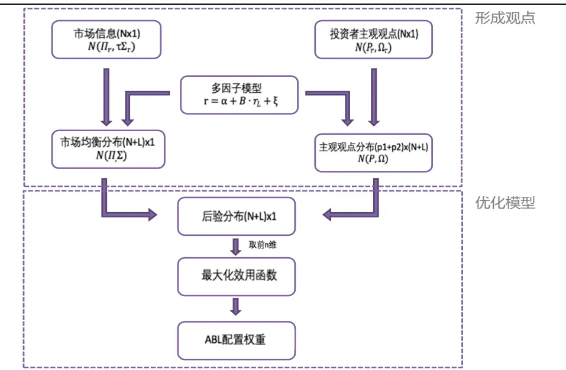
资料来源：光大证券研究所

ABL 模型在结合多因子模型的基础上对 BL模型进行了扩展，使得对因子表达观点成为可能；ABL 在以下几个方面具有明显的优势:

1) ABL 模型是以 BL 模型为基础发展起来的，因此它继承了BL 模型的全部优点。ABL模型能够将观点的不确定性很好的纳入模型，配置结果相较于传统Markowitz均值方差模型更为稳健、更符合投资者的直觉，最优权重也较均值方差模型更为分散。

2) ABL 模型极大地拓展了观点表达的自由程度，我们不仅可以对资产（个股）收益率表达观点，同时也能够对 alpha 因子的收益率表达观点，从而构建多因子投资组合的优化模型。

3) 在ABL的框架下，可以实现多种投资风格的组合。通过调整风格开关参数和风格因子预期收益率，在纯多头的限制下可以用来进行指数增强组合或被动投资组合（Smart Beta类组合）；如果在允许做空的条件下，则可进一步构建多空中性投资组合。

4) ABL 模型使得多因子风险模型与组合配置过程结合的更为合理，通过对风格因子的预期收益表达看法，我们能够在统一的、基于贝叶斯理论的框架下构建基于有效前沿的合理的投资组合，以实现对某一些特定风格因子进行暴露的目的。

ABL 模型最大的弊端在于它的配置过程不够透明，投资者无法一目了然地看到究竟是哪个主观观点在配置过程中起到了作用。投资者在输入预期观点和模型参数的时候常带有一定的误差，而这些误差就有可能在 ABL 模型内积少成多，导致配置结果偏离预期。当我们想要分析 ABL 模型配置偏离的原因时，却容易由于模型的不透明而束手无策。

## 1.5、跟踪误差模型

对于指数增强类产品或者类似目的的投资组合，跟踪误差的控制就显得尤为重要。在跟踪误差模型中，原始的MVO模型需要做一些细节上的调整：

1) 收益和风险分别使用超额收益向量和相对波动替代

2) 目标函数中的二次项可删除，避免重复限制跟踪误差

因此基于跟踪误差限制的MVO模型基础构造如下：

$$
\begin{array}{r}{\mathbb{M}\mathrm{ax}F(\omega)=\omega^{T}\mu_{active}}\\{\mathrm{s.t.}\sqrt{(w-w_{bench})^{\prime}\Sigma(w-w_{bench})}\le target\llangle{TE}}\end{array}
$$

其中：

$\mu_{active}$ 为相对基准的超额收益向量，

$w_{bench}$ 为基准指数的权重向量，

target_TE为目标跟踪误差。

跟踪误差优化模型的优点十分明显，它在指数增强类型的组合构建中起到了非常重要的作用。不过当跟踪的标的指数本身存在较为明显的缺陷（例如风格偏离）增强后的组合也依然容易保留被跟踪指数的相同偏离。

## 1.6、组合优化的常用约束条件

在组合优化的过程中，约束条件的设置往往不可避免。不同的市场环境中和不同的交易要求会需要我们设置对应的约束条件。在常用的约束条件中，一些是由于监管要求而必须设置的（例如卖空限制：个股权重必须大于等于零），这些约束也很有可能会降低组合的整体表现；而另外一些约束则有可能可以提高组合的整体表现（例如风险因子暴露的控制）。

针对不同的组合目标，约束条件的设置也是相对灵活的一个部分，我们在后文中会详细比较各类约束条件在历史上对于我们的光大 Alpha 多因子模型所产生的影响。

## 1.6.1、个股最高权重限制

在使用最基础的均值方差模型（MVO）时，如果不加任何约束条件，则模型输出的权重结果很可能会出现个别股票权重极高，而其余股票没有权重。这样的组合风险过高，并不是所希望得到的结果。因此个股的最高权重限制是比较常用的MVO优化约束条件。

另一种解决权重严重偏离结果的方法是使用稳健优化（Robust Optimization）模型，Fabozzi（2007）对各类稳健优化模型做了较为系统的整理。常见的优化器供应商例如Axioma，也可以提供稳健优化器的选项。

## 1.6.2、换手率限制

组合优化过程中是否有必要控制换手率是一个大家始终比较关心的问题。在使用一些短周期的因子或者交易信号的情况下，如果严格控制换手率有可能导致组合表现不佳；而假设组合构造逻辑偏长期，或者模型自身的alpha很强，那个适当放宽换手率的要求可能会带来较好的收益。

## 1.6.3、行业中性

行业中性是量化投资组合构造时常用的约束条件，尤其对于指数增强类组合，通过控制行业的暴露度，能够较好的提高组合的超额收益稳定性。与前文提到的行业分层抽样不同，在MVO优化中加入行业偏离度的约束条件，可以严格控制行业的暴露度，也可以适当放宽一定的偏离度，操作更为灵活。

## 1.6.4、风险因子暴露度限制

风险因子的暴露度控制也是很有必要的一个约束条件，其中最常用的就是对于市值因子的暴露度控制。尽管 A 股的小市值因子历史长期是一个收益很高的因子，但是海内外的经验都证明市值风险的控制是可以有效提高组合表现的。尤其在A股2017年的因子风格切换过程中，可以很明显的感受到控制市值风险或者其他风险因子的暴露程度是很有必要的提高组合表现的约束手段，除非基金经理具有极强的判断这类风格切换时间的能力，我们一般比较建议对市值这类显著的风险因子做较为严格的控制。

## 2、优化模型实证：基于光大 Alpha 多因子体系

我们的模型实证部分将依然基于我们前期的研究成果中给出的光大 Alpha 多因子组合。结合《多因子组合“光大Alpha 1.0”——多因子系列报告之三》和《因子正交与择时：基于分类模型的动态权重配置——多因子系列报告之十》中的研究成果，筛选出的综合得分较高的 44 个因子中，从估值、质量、成长、规模、波动、换手、流动性、动量、预期因子中挑选了下述 14 个常用因子作为测试对象。采用滚动24 期最优化IC_IR 的方式对因子赋权（截面因子对称正交处理）。

表 1：测试因子明细表

| 因子名称 因子描述 |  |
| --- | --- |
| BP_LR | 账面市值比(最近报告期) |
| EP_TTM | 盈利市值比(TTM) |
| Ln_MC | 市值对数 |
| Momentum_1M | 动量(1 个月) |
| Momentum_24M | 动量(24 个月) |
| STD_1M | 波动(1 个月) |
| TURNOVER_1M | 换手率(1 个月) |
| VSTD_3M | 流动性(3 个月) |
| DP_TTM | 股息率(TTM) |
| EEP | 一致预期 EP |
| EEChange_3M | 一致预期净利润调整(3个月) |
| TAG_TTM | 总资产增长率(TTM) |
| ROE_TTM | 净资产回报率(TTM) |
| Debt_Asset | 资产负债比 |

资料来源：光大证券研究所

我们将分别比较前文提到的几类基础的组合构建方法的表现，和 MVO 均值方差优化模型及其衍生优化模型的效果对比。第一部分比较的是几类简单的组合构建方式，但包括等权配置在内的简单组合构造方式表现并非毫无亮点。在此第二部分的主要目的是比较不同约束条件下，和不同 MVO 衍生模型的表现对比，用以总结各类约束条件适用的情况和优劣。（测试中涉及行业分类和行业权重时均采用中信一级行业及其在中证500 指数内的权重分布）

## 2.1、基础组合构建方法效果对比

首先我们将对比一下第一章中提到的几种基础组合构造方式下，不同模型的历史回测表现。为了保证几个基础构造方式的可比性，在适用MVO均值方差优化模型时，采用了最为基础的约束条件。测试的模型包括下述几类：

1） 等权

2） 市值加权

3） 行业中性（分层抽样）

4）MVO基础约束：此处的基础约束包括：

a) 权重和为 1

b) 卖空限制（即个股权重大于等于 0）

c) 个股权重不超过 5%

上述组合构造时均采用全市场选股，在计算信息比和相对收益、相对回撤时均使用中证 500 指数作为比较基准，我们主要比较上述几个基础组合构建方式的年化收益、最大回撤、信息比、最大相对回撤这几个指标：

表 2：基础组合构建方法效果对比（基于光大 Alpha 因子体系）

| 等权 |  | 市值加权 行业中性（分层抽样） MVO 基础约束 |  |
| --- | --- | --- | --- |
| 月度胜率 | 79% | 73% | 76% 76% |
| 年化收益 | 39.5% | 26.7% | 31.1% 32.9% |
| 年化波动 | 30.1% | 28.5% | 28.7% 29.8% |
| 年化超额收益 | 27.0% | 16.5% | 19.6% 20.9% |
| 相对收益波动 | 7.0% | 8.9% | 6.8% 5.9% |
| 信息比 | 3.8 | 1.9 | 2.9 3.5 |
| 最大回撤 | -52.9% | -49.0% | -51.2% -48.9% |
| 最大相对回撤 | -16.2% | -15.4% | -15.8% -12.4% |
| 夏普比 | 1.31 | 0.94 | 1.08 1.10 |

资料来源：光大证券研究所（注：回测期 2008-01-01 至 2018-07-31）

此处的因子收益预测模型依然沿用前文提到的光大 Alpha 因子模型，风险模型则采用Barra CNE5的A股基本面风险模型。

等权组合收益表现好，MVO均值方差优化模型可有效降低风险。由测试结果可见，等权组合在收益能力上表现出色，不过由于等权组合存在天然的小市值因子暴露，不能很好的控制风险，因此最大回撤和最大相对回撤均明显高于其他组合构建方式。

图3：基础组合构建方法的年化收益表现
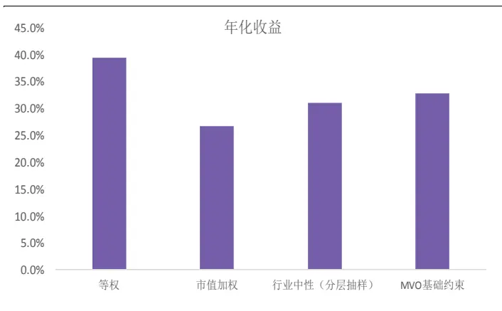
资料来源：光大证券研究所

图4：基础组合构建方法的信息比表现
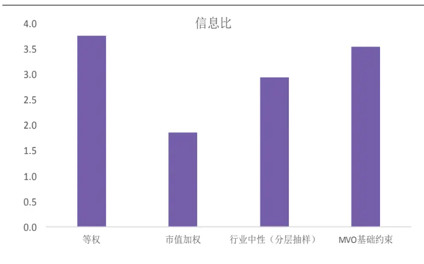
资料来源：光大证券研究所

图5：基础组合构建方法的最大回撤表现
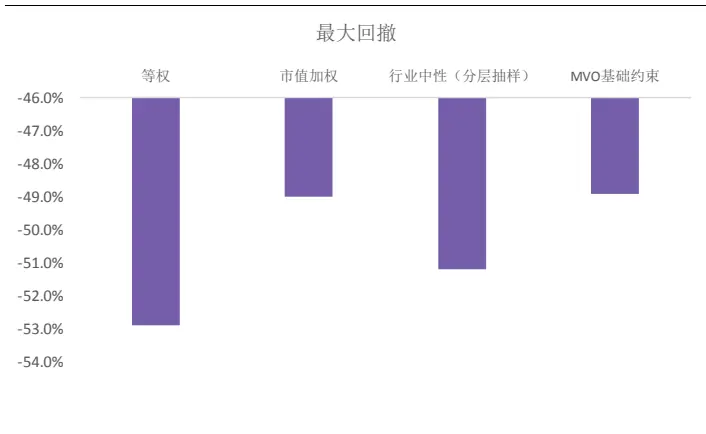
资料来源：光大证券研究所

图6：基础组合构建方法的最大相对回撤表现
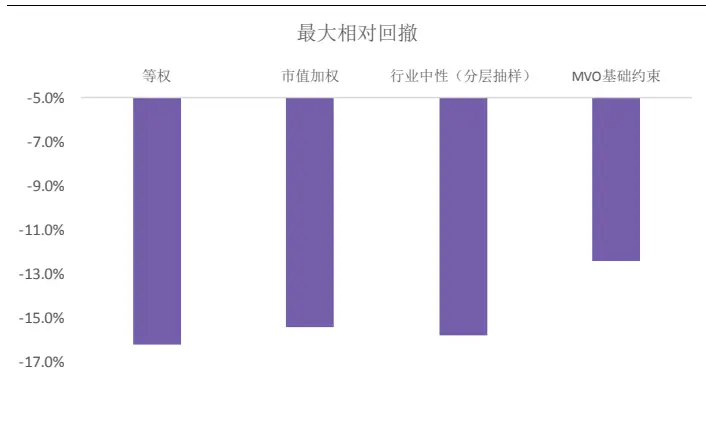
资料来源：光大证券研究所

## 2.2、均值方差优化模型及其衍生优化模型效果对比

上一节中为了比较简单组合构造方式与均值方差优化模型的特点，我们使用了最基础的MVO优化模型，可见基础模型的表现并不能令人满意。这一节中我们将深入的测试和探讨MVO优化模型在不同单个约束条件下的表现，以展示不同约束条件对组合表现的影响。

## 2.2.1、不同约束下 MVO以及衍生模型对比

首先，根据第一章内容中对于优化模型及其约束条件的梳理，分别测试基础约束下和基础约束条件结合下述单个约束条件对组合最终表现的影响：

## 1) 基础约束 MVO：

a) 权重和为 1

b) 卖空限制（即个股权重大于等于 0）

c) 个股权重不超过 5%

## 2) 行业中性 MVO（MVO 行业中性）

限制组合的中性一级行业权重与基准（中证 500 指数）的行业权重偏离度不超过1%

## 3) 风险因子暴露度 MVO（MVO 市值暴露）

这里我们仅测试最为常用的市值风险因子暴露控制。限制组合的市值因子暴露度不超过1%，即市值因子得分与基准（中证500指数）成分股的市值因子得分偏离度不超过1%

## 4) 换手率限制 MVO（MVO 换手率）

限制组合的每期单边换手率不超过15%

## 5) 基础约束风险平价（RP 基础约束）

持仓各标的（股票）风险贡献度一致

## 6) 基础约束跟踪误差（TE 基础约束）

设置目标跟踪误差为年化 5%

类似的，上述组合构造时均采用全市场选股，在计算信息比时均使用中证 500指数作为比较基准，我们主要比较上述几个基础组合构建方式的年化收益、最大回撤、信息比、最大相对回撤这几个指标。此处的因子收益预测模型依然沿用前文提到的光大Alpha因子模型，风险模型则采用Barra CNE5的A股基本面风险模型。

表 3：不同约束下 MVO 以及衍生模型对比（基于光大 Alpha 因子体系）

|  | MVO 基础约束 | MVO 行业中性 | MVO 市值暴露 | MVO 换手率 | RP 基础约束 | TE 基础约束 |
| --- | --- | --- | --- | --- | --- | --- |
| 月度胜率 | 76% | 72% | 77% | 74% | 72% | 77% |
| 年化收益 | 32.9% | 29.8% | 30.4% | 27.7% | 23.6% | 29.9% |
| 年化波动 | 29.8% | 28.9% | 27.0% | 29.7% | 24.1% | 30.4% |
| 年化超额收益 | 20.9% | 16.9% | 17.6% | 14.2% | 10.3% | 16.8% |
| 相对收益波动 | 5.9% | 5.7% | 4.8% | 6.1% | 5.2% | 5.8% |
| 信息比 | 3.5 | 3.0 | 3.7 | 2.3 | 2.0 | 2.9 |
| 最大回撤 | -48.9% | -50.1% | -46.7% | -48.3% | -45.8% | -50.4% |
| 最大相对回撤 | -12.4% | -12.3% | -10.2% | -13.4% | -10.3% | -11.4% |
| 夏普比 | 1.10 | 1.03 | 1.13 | 0.93 | 0.98 | 0.92 |

资料来源：光大证券研究所（注：回测期 2008-01-01 至 2018-07-31）

由结果可见，未加任何约束的均值方差优化模型（MVO 基础约束）收益较高，但由于各方面的风险未做控制，信息比和回撤上的表现均不尽如人意。信息比表现最好的是 MVO 市值暴露约束，不过由于约束了市值这个 A 股历史长期收益较好的因子暴露度，组合整体收益也有显著下降。最大回撤控制的最好的是风险平价基础约束模型，这也与风险平价的出发点相符，即控制组合内各个资产的风险贡献度，达到稳定整体组合表现的目的，然而风险平价模型不可避免的劣势在于其收益和信息比上的表现相对逊色。

图7：不同约束下MVO以及衍生模型年化收益表现
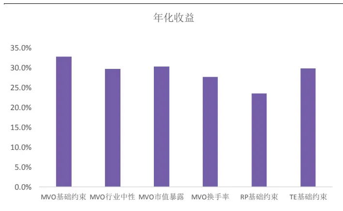
资料来源：光大证券研究所

图8：不同约束下MVO以及衍生模型信息比表现
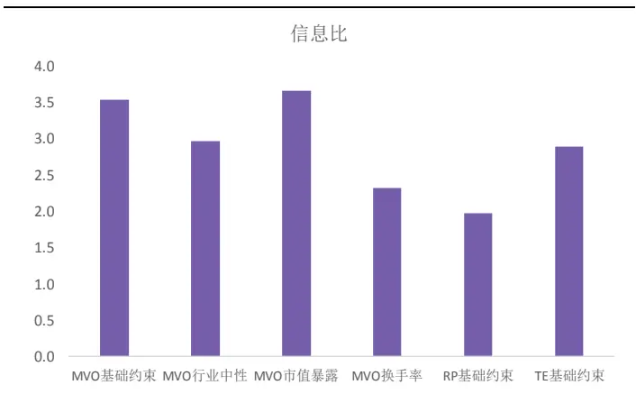
资料来源：光大证券研究所

图9：不同约束下MVO以及衍生模型最大回撤表现
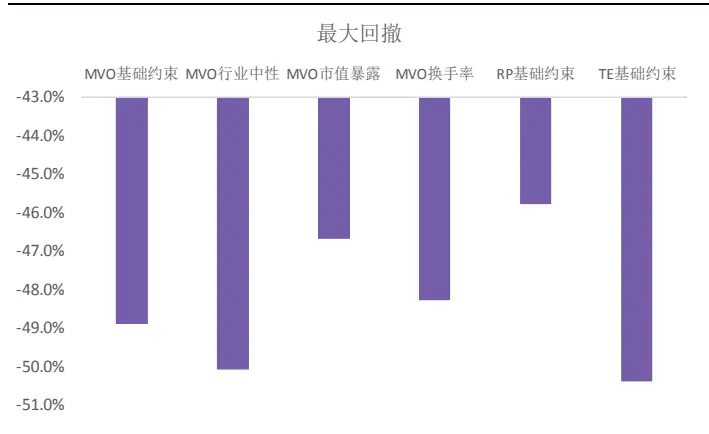
资料来源：光大证券研究所

图10：不同约束下MVO及衍生模型最大相对回撤表现
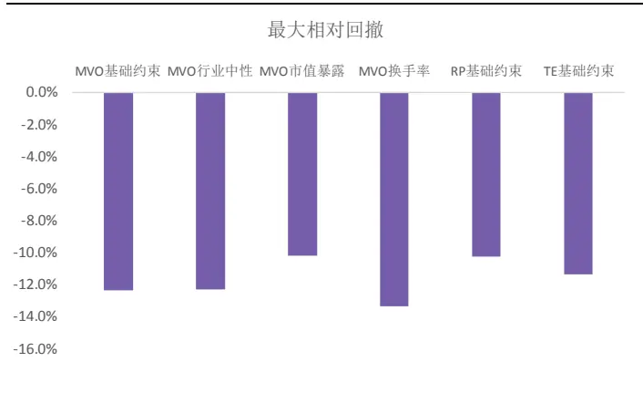
资料来源：光大证券研究所

## 2.3、基于光大 Alpha1.0 的中证 500 指数增强组合

组合优化模型在量化产品中的应用最广泛的可以说是指数增强产品，此报告中我们主要针对中证500指数的增强组合做进一步的实证测试，根据指数增强产品的常见要求，我们的中证500增强实证测试的相关参数设置如下所示：

1） 回测时间：2008-01-01 ~2018-07-31

2） 股票池：中证 500 成分股

3） 交易成本：单边千分之 3

4） 调整频率：月频

在上一节的 MVO 模型及其衍生模型的对比中可见，市值风险因子暴露控制对于组合整体信息比和回撤的表现都具有较好的提升效果。由于指数增强产品并非一味追求收益的产品，而是追求可以稳定的跑赢其基准，因此行业暴露度控制和跟踪误差控制对于指数增强类的组合来讲是十分必要的约束，在保证增强组合的稳定性和有效性上具有很重要的作用。因此我们实证的光大Alpha1.0 中证 500 增强组合采取行业中性、市值暴露控制的跟踪误差 MVO优化模型:

$$
\begin{array}{rl}&{\mathrm{Max}F(\omega)=\omega^{T}\mu_{active}}\\{\mathrm{~s.t.~}}&{\sqrt{(w-w_{bench})^{\prime}\Sigma(w-w_{bench})}\leq target_{-}TE}\\&{|\mathrm{M}(w-w_{bench})|\leq Mcap_{-}exp}\\&{|\mathrm{H}(w-w_{bench})|\leq Ind_{-}exp}\\&{0<w\leq Max_{-}weight}\\&{1^{T}w=1}\end{array}
$$

其中：

$\mu_{active}$ 为相对基准的超额收益向量， $w_{bench}$ 为基准指数的权重向量，M 为市值因子暴露度矩阵，H 为行业哑变量矩阵，target_TE为目标跟踪误差。

该模型的参数设置以及参数选取结果如下表：

表4：Alpha1.0中证 500增强组合参数选取明细

| 参数名 | 参数名 | 参数值 |
| --- | --- | --- |
| N | 组合个股数量 | 150 |
| Max_weight | 个股最大权重 | 3% |
| Ind_exp | 行业权重最大偏离度 | 1% |
| Mcap_exp | 市值因子最大暴露度 | 0.5% |
| TE | 跟踪误差 | 5% |

资料来源：光大证券研究所

在上述参数设置和约束条件下，我们得到的基于光大Alpha1.0中证500 指数增强组合表现不俗：年化收益26.2%，年化超额收益14.2%，信息比2.5，相对波动5.7%,相对最大回撤仅为5.6%。其中，2017年在大部分增强组合表现一般的时间段，仍获取了正向的超额收益。2018 年至今（2018-07-31）的信息比已达2.7，表现较好。

表 5：光大 Alpha1.0 中证 500 增强组合（500 内选股）

|  | 月度胜率 | 年化收益率 |  | 年化波动率 年化超额收益相对收益波动 |  | 信息比 | 最大回撤 | 最大相对回撤 |
| --- | --- | --- | --- | --- | --- | --- | --- | --- |
| 2008 | 75% | -47.1% | 41.8% | 10.0% | 5.8% | 1.9 | -56.2% | -5.4% |
| 2009 | 100% | 202.9% | 36.8% | 33.4% | 5.2% | 6.4 | -20.1% | -1.4% |
| 2010 | 75% | 16.2% | 28.7% | 5.6% | 5.3% | 1.1 | -29.1% | -5.6% |
| 2011 | 66% | -28.3% | 24.1% | 11.4% | 4.3% | 2.6 | -37.7% | -3.4% |
| 2012 | 83% | 9.8% | 24.9% | 6.9% | 4.0% | 1.7 | -27.5% | -1.7% |
| 2013 | 83% | 33.8% | 22.9% | 12.7% | 4.2% | 3.0 | -16.3% | -2.2% |
| 2014 | 83% | 61.9% | 19.9% | 15.9% | 4.9% | 3.2 | -9.7% | -2.2% |
| 2015 | 75% | 72.3% | 52.0% | 24.7% | 11.3% | 2.2 | -50.7% | -4.7% |
| 2016 | 100% | 7.2% | 31.1% | 20.6% | 4.6% | 4.5 | -25.9% | -1.8% |
| 2017 | 75% | -0.5% | 14.9% | 0.5% | 4.5% | 0.1 | -16.6% | -3.7% |
| 2018 | 66% | -26.9% | 23.0% | 10.1% | 3.8% | 2.7 | -18.6% | -1.9% |
| Summary | 82% | 26.2% | 30.1% | 14.2% | 5.7% | 2.5 | -56.2% | -5.6% |

资料来源：光大证券研究所（注：回测期 2008-01-01 至 2018-07-31）

该组合的净值走势与相对收益表现如下图所示：

图 11：光大 Alpha1.0 中证 500 增强组合（500 内选股）净值和相对走势
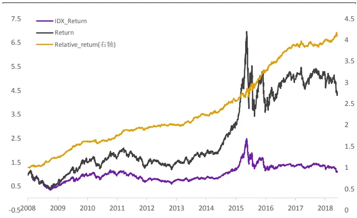
资料来源：光大证券研究所

图 12：光大 Alpha1.0 中证 500 增强组合（500 内选股）相对走势及回撤表现
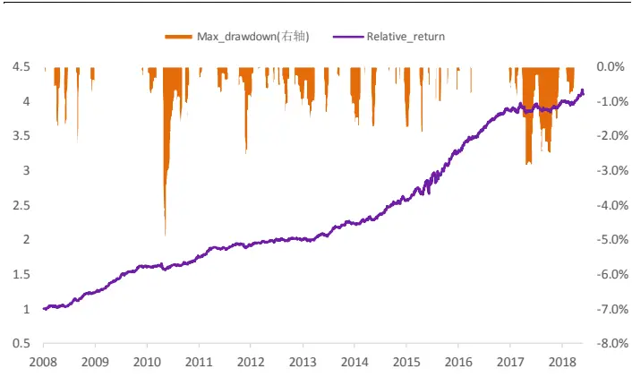
资料来源：光大证券研究所

## 2.4、结合光大 Alpha2.0 的 ABL 模型中证 500 指数增强组合

第一章中我们提到的 ABL 模型，通过个股收益多因子模型，引入影响收益的因子来反映投资者观点，从而使得BL模型中的投资者观点表述更加多元化。结合我们在《因子正交与择时：基于分类模型的动态权重配置——多因子系列报告之十》中提出的基于SVM分类模型的因子择时模型，可以通过因子择时观点构造我们的ABL优化模型。

此处对于《因子正交与择时：基于分类模型的动态权重配置——多因子系列报告之十》中的因子择时模型在 ABL 模型上的应用会有一些与原报告不同的地方，主要在于：原报告中，由 SVM分类器生成的因子收益方向预测结果，是通过将预测收益方向与历史收益方向相左的因子降低权重来达到择时目的的。而 ABL 模型中，因子收益方向的预测结果将直接作为因子观点，以观点向量的形式输入模型（具体的 ABL 模型构建流程可见附录）。

类似的，组合参数设置如下：

1） 回测时间：2009-01-01 ~2018-07-31

2）股票池：中证500成分股

3） 交易成本：单边千分之 3

4） 调整频率：月频

表 6：Alpha2.0 中证 500 增强组合参数选取明细

| 参数名 参数名 参数值 |  |
| --- | --- |
| N | 组合个股数量 150 |
| Max_weight | 个股最大权重 3% |
| Ind_exp | 行业权重最大偏离度 1% |
| Mcap_exp | 市值因子最大暴露度 0.5% |
| Conf_level | BL 模型信心值 0.5 |
| TE | 跟踪误差 5% |

资料来源：光大证券研究所

应用SVM因子择时模型后的500内增强组合表现有所提升，2009年至今信息比为3.0，年化收益29.3%，年化超额收益为17.5%，相对最大回撤为4.1%。其中，2017 年仍获取了正向4.4个百分点的超额收益，较上一节中的 Alpha1.0组合有了较为显著的提升。2018 年至今（2018-07-31）的信息比已达 2.8，表现较好。

表 7：光大 Alpha2.0 中证 500 增强组合（500 内选股）

|  | 月度胜率 | 年化收益率 | 年化波动率 | 年化超额收益相对收益波动 |  | 信息比 | 最大回撤 | 最大相对回撤 |
| --- | --- | --- | --- | --- | --- | --- | --- | --- |
| 2009 | 100% | 190.9% | 36.8% | 21.4% | 5.2% | 4.1 | -20.1% | -2.9% |
| 2010 | 75% | 15.7% | 27.8% | 5.6% | 5.0% | 1.1 | -28.2% | -3.7% |
| 2011 | 67% | -27.6% | 23.6% | 10.1% | 4.5% | 2.3 | -37.1% | -3.5% |
| 2012 | 83% | 13.1% | 24.2% | 10.3% | 4.1% | 2.5 | -25.1% | -1.8% |
| 2013 | 83% | 33.7% | 22.4% | 13.4% | 4.8% | 2.8 | -15.8% | -2.4% |
| 2014 | 83% | 65.8% | 19.3% | 20.6% | 5.1% | 4.1 | -8.3% | -2.0% |
| 2015 | 75% | 75.6% | 50.9% | 29.2% | 11.6% | 2.5 | -51.5% | -3.9% |
| 2016 | 100% | 12.1% | 30.5% | 25.3% | 4.6% | 5.5 | -25.1% | -1.0% |
| 2017 | 75% | 3.3% | 15.0% | 4.4% | 4.7% | 0.9 | -16.6% | -4.1% |
| 2018 | 50% 81% | -23.6% | 23.0% | 12.9% | 4.6% | 2.8 | -17.8% | -2.7% |
| Summary |  | 29.3% | 29.4% | 17.5% | 5.9% | 3.0 | -51.5% | -3.9% |

资料来源：光大证券研究所（注：回测期 2009-01-01 至 2018-07-31）

图 13：光大 Alpha2.0 中证 500 增强组合（500 内选股）净值和相对走势
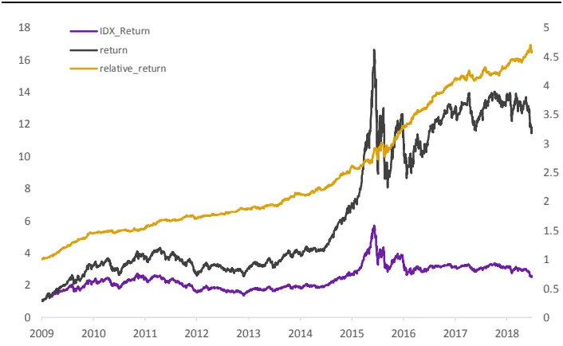
资料来源：光大证券研究所

图 14：光大 Alpha2.0 中证 500 增强组合（500 内选股）相对走势及回撤表现
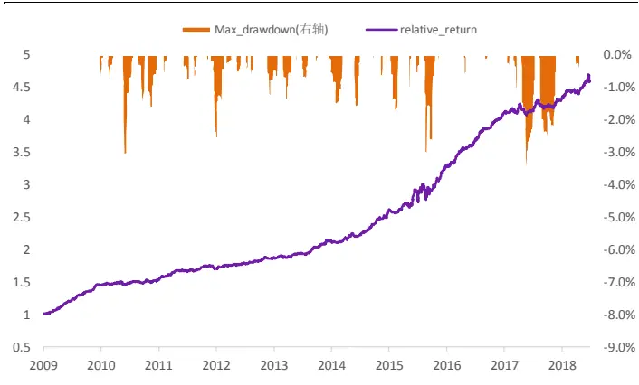
资料来源：光大证券研究所

## 3、投资建议

通过组合优模型以及各类优化模型中的约束条件设置，我们可以较为系统和准确地控制投资组合的预期风险暴露、换手率、个股权重等等。组合优化模型在量化投资例如指数复制或指数增强组合的构建中则尤为重要。而不仅仅对于量化投资，具有组合优化意识或者能力的主动投资者也往往更具优势。

从基础组合构建方法效果对比中可见：等权组合收益表现好，MVO均值方差优化模型可有效降低风险。由测试结果可见，等权组合在收益能力上表现出色，不过由于等权组合存在天然的小市值因子暴露，不能很好的控制风险，因此最大回撤和最大相对回撤均明显高于其他组合构建方式。

均值方差优化模型及其衍生优化模型效果对比：未加任何约束的均值方差优化模型（MVO基础约束）收益较高，但由于各方面的风险未做控制，信息比和回撤上的表现均不尽如人意。信息比表现最好的是MVO市值暴露约束，不过由于约束了市值这个 A 股历史长期收益较好的因子暴露度，组合整体收益也有显著下降。最大回撤控制的最好的是风险平价基础约束模型。

基于光大 Alpha1.0 的中证 500 指数增强组合：2008 年至今年化收益 26.2%，年化超额收益 14.2%，信息比 2.5，相对波动 5.7%,最大相对回撤仅为 5.6%。2018 年至今（2018-07-31）的信息比已达 2.7。

结合光大Alpha2.0的ABL模型中证 500指数增强组合：应用SVM因子择时模型后的 500 内增强组合表现有所提升，2009 年至今信息比为 3.0，年化超额收益为 17.5%，最大相对回撤为 4.1%。其中，2017 年仍获取了正向 4.4 个百分点的超额收益，较上一节中的 Alpha1.0 组合有了较为显著的提升。2018 年至今（2018-07-31）的信息比已达2.8，表现较好。

## 4、风险提示

本报告中的结果均基于模型和历史数据，历史数据存在不被重复验证的可能，模型存在失效的风险。

## 5、附录

ABL优化模型具体构造流程如下：

## 1) 构建因子模型

为了将因子观点融合到BL模型的主观观点中，首先需要利用多因子模型将资产的收益率解释为多个有效因子的线性组合，假设由N个资产与L个因子构成ABL模型，则具体的因子模型如下:

$$
\mathrm{{r}=\alpha+B\cdot r_{\mathrm{{L}}}+\xi}
$$

式中r表示资 $\dot{\mathcal{P}}$ 收益率， $\mathrm{r_{L}}$ 表示因子收益率，B为N×L的因子系数矩阵，α是常数项，而ξ是误差项。

求得资 $\dot{\mathcal{P}}$ 收益协方差矩阵:

$$
\boldsymbol{\Sigma}_{\mathrm{r}}=\mathrm{B}\boldsymbol{\Sigma}_{\mathrm{L}}\mathrm{B}^{\mathrm{T}}+\boldsymbol{\Sigma}_{\boldsymbol{\xi}}
$$

## 2) 融入 BL 模型

由上面得到的协方差矩阵，求得资产隐含均衡收益向量 $\Pi_{\mathrm{r}}=\lambda\Sigma_{\mathrm{r}}\omega_{\mathrm{m}}$ ，以及通过上述的线性因子模型和 CAPM 模型推导得到因子的隐含均衡收益$\Pi_{\mathrm{L}}=\lambda\Sigma_{\mathrm{L}}\mathbf{B}^{\mathrm{T}}\omega_{\mathrm{m}}$ ，即可求得市场隐含均衡收益矩阵Π $\mathrm{\Omega=\left(\Pi_{n}^{\Pi}\right)=\lambda\left(\begin{array}{c}{{\Sigma_{r}}}\\{{\Sigma_{L}B^{\mathrm{T}}}}\end{array}\right)\omega_{m\circ}}$ ABL模型中的后验预期收益则与BL完全相同:

$$
\mathrm{E(R)}=((\tau\Sigma)^{-1}+\mathrm{P}^{\mathrm{T}}\Omega^{-1}\mathrm{P})^{-1}((\tau\Sigma)^{-1}\Pi+\mathrm{P}^{\mathrm{T}}\Omega^{-1}\mathrm{Q}),
$$

所有的变量维数都被扩充到N+L维，且在ABL中:

$$
\Sigma=\left({\begin{array}{cc}{\Sigma_{\mathrm{r}}}&{\mathrm{B}\Sigma_{\mathrm{L}}}\\{\Sigma_{\mathrm{L}}\mathrm{B}^{\mathrm{T}}}&{\Sigma_{\mathrm{L}}}\end{array}}\right),
$$

Σ是资产收益率与因子收益率共N+L个变量的协方差矩阵。

P是ABL模型使用者需要输入的投资者主观观点，当投资者对资 $\dot{\mathcal{P}}$ 有 ${\bf{\dot{p}}}_{1}$ 个观点，对因子有 ${\mathfrak{p}}_{2}$ 个观点时，P是 $({\bf p}_{1}+{\bf p}_{2})\times(\mathrm{N+L})$ 矩阵:

$$
\mathrm{\Delta P}=\biggl(\begin{array}{cc}{\mathrm{P_{p1xN}}}&{0}\\{0}&{\mathrm{P_{p2xL}}}\end{array}\biggr),
$$

观点收益向量Q:

$$
\begin{array}{r}{\mathbf{Q}=\binom{\mathbf{Q}_{\mathrm{p1X1}}}{\mathbf{Q}_{\mathrm{p2x1}}},}\end{array}
$$

观点收益矩阵Ω:

$$
\Omega=\binom{\Omega_{\mathrm{p1xp1}}}{0}\Omega_{\mathrm{p2xp2}}\bigg),
$$

最后，截取后验预期收益向量中的前N维，也即关于资产的后验预期收益部分，代入到MVO模型中，进行优化求解，最终得到新的组合权重向量。

## 行业及公司评级体系

| 评级 说明 |  |  |
| --- | --- | --- |
| 行 | 买入 | 未来6-12个月的投资收益率领先市场基准指数15%以上； |
|  | 增持 | 未来6-12个月的投资收益率领先市场基准指数5%至15%； |
|  | 中性 | 未来6-12个月的投资收益率与市场基准指数的变动幅度相差-5%至5%； |
|  | 减持 | 未来6-12个月的投资收益率落后市场基准指数5%至15%； |
|  | 卖出 | 未来6-12个月的投资收益率落后市场基准指数15%以上； |
| 业及公司评级 | 无评级 | 因无法获取必要的资料，或者公司面临无法预见结果的重大不确定性事件，或者其他原因，致使无法给出明确的 投资评级。 |
| 基准指数说明：A股主板基准为沪深300指数；中小盘基准为中小板指；创业板基准为创业板指；新三板基准为新三板指数；港 股基准指数为恒生指数。 |  |  |

## 分析、估值方法的局限性说明

本报告所包含的分析基于各种假设，不同假设可能导致分析结果出现重大不同。本报告采用的各种估值方法及模型均有其局限性，估值结果不保证所涉及证券能够在该价格交易。

## 分析师声明

本报告署名分析师具有中国证券业协会授予的证券投资咨询执业资格并注册为证券分析师，以勤勉的职业态度、专业审慎的研究方法，使用合法合规的信息，独立、客观地出具本报告，并对本报告的内容和观点负责。负责准备本报告以及撰写本报告的所有研究分析师或工作人员在此保证，本研究报告中关于任何发行商或证券所发表的观点均如实反映分析人员的个人观点。负责准备本报告的分析师获取报酬的评判因素包括研究的质量和准确性、客户的反馈、竞争性因素以及光大证券股份有限公司的整体收益。所有研究分析师或工作人员保证他们报酬的任何一部分不曾与，不与，也将不会与本报告中具体的推荐意见或观点有直接或间接的联系。

## 特别声明

光大证券股份有限公司（以下简称“本公司”）创建于 1996 年，系由中国光大（集团）总公司投资控股的全国性综合类股份制证券公司，是中国证监会批准的首批三家创新试点公司之一。根据中国证监会核发的经营证券期货业务许可，光大证券股份有限公司的经营范围包括证券投资咨询业务。

本公司经营范围：证券经纪；证券投资咨询；与证券交易、证券投资活动有关的财务顾问；证券承销与保荐；证券自营；为期货公司提供中间介绍业务；证券投资基金代销；融资融券业务；中国证监会批准的其他业务。此外，公司还通过全资或控股子公司开展资产管理、直接投资、期货、基金管理以及香港证券业务。

本证券研究报告由光大证券股份有限公司研究所（以下简称“光大证券研究所”）编写，以合法获得的我们相信为可靠、准确、完整的信息为基础，但不保证我们所获得的原始信息以及报告所载信息之准确性和完整性。光大证券研究所可能将不时补充、修订或更新有关信息，但不保证及时发布该等更新。

本报告中的资料、意见、预测均反映报告初次发布时光大证券研究所的判断，可能需随时进行调整且不予通知。报告中的信息或所表达的意见不构成任何投资、法律、会计或税务方面的最终操作建议，本公司不就任何人依据报告中的内容而最终操作建议做出任何形式的保证和承诺。在任何情况下，本报告中的信息或所表述的意见并不构成对任何人的投资建议。客户应自主作出投资决策并自行承担投资风险。本报告中的信息或所表述的意见并未考虑到个别投资者的具体投资目的、财务状况以及特定需求。投资者应当充分考虑自身特定状况，并完整理解和使用本报告内容，不应视本报告为做出投资决策的唯一因素。对依据或者使用本报告所造成的一切后果，本公司及作者均不承担任何法律责任。

不同时期，本公司可能会撰写并发布与本报告所载信息、建议及预测不一致的报告。本公司的销售人员、交易人员和其他专业人员可能会向客户提供与本报告中观点不同的口头或书面评论或交易策略。本公司的资产管理部、自营部门以及其他投资业务部门可能会独立做出与本报告的意见或建议不相一致的投资决策。本公司提醒投资者注意并理解投资证券及投资产品存在的风险，在做出投资决策前，建议投资者务必向专业人士咨询并谨慎抉择。

在法律允许的情况下，本公司及其附属机构可能持有报告中提及的公司所发行证券的头寸并进行交易，也可能为这些公司提供或正在争取提供投资银行、财务顾问或金融产品等相关服务。投资者应当充分考虑本公司及本公司附属机构就报告内容可能存在的利益冲突，勿将本报告作为投资决策的唯一信赖依据。

本报告根据中华人民共和国法律在中华人民共和国境内分发，仅供本公司的客户使用。本公司不会因接收人收到本报告而视其为客户。本报告仅向特定客户传送，未经本公司书面授权，本研究报告的任何部分均不得以任何方式制作任何形式的拷贝、复印件或复制品，或再次分发给任何其他人，或以任何侵犯本公司版权的其他方式使用。所有本报告中使用的商标、服务标记及标记均为本公司的商标、服务标记及标记。如欲引用或转载本文内容，务必联络本公司并获得许可，并需注明出处为光大证券研究所，且不得对本文进行有悖原意的引用和删改。

## 光大证券股份有限公司

上海市新闸路1508 号静安国际广场3 楼 邮编200040

总机：021-22169999 传真：021-22169114、22169134

| 机构业务总部 | 姓名 | 办公电话 | 手机 | 电子邮件 |  |
| --- | --- | --- | --- | --- | --- |
| 上海 | 徐硕 |  | 13817283600 | shuoxu@ebscn.com |  |
|  | 李文渊 |  | 18217788607 | liwenyuan@ebscn.com |  |
|  | 李强 | 021-22169131 | 18621590998 | ligiang88@ebscn.com |  |
|  | 罗德锦 | 021-22169146 | 13661875949/13609618940 | luodj@ebscn.com |  |
|  | 张弓 | 021-22169083 | 13918550549 | zhanggong@ebscn.com |  |
|  | 黄素青 | 021-22169130 | 13162521110 | huangsuqing@ebscn.com |  |
|  | 邢可 | 021-22167108 | 15618296961 | xingk@ebscn.com |  |
|  | 李晓琳 | 021-22169087 | 13918461216 | lixiaolin@ebscn.com |  |
|  | 丁点 | 021-22169458 | 18221129383 | dingdian@ebscn.com |  |
|  | 郎珈艺 |  | 18801762801 | dingdian@ebscn.com |  |
|  | 郭永佳 |  | 13190020865 | guoyongjia@ebscn.com |  |
|  | 余鹏 | 021-22167110 | 17702167366 | yupeng88@ebscn.com |  |
| 北京 | 郝辉 | 010-58452028 | 13511017986 | haohui@ebscn.com |  |
|  | 梁晨 | 010-58452025 | 13901184256 | liangchen@ebscn.com |  |
|  | 吕凌 | 010-58452035 | 15811398181 | Ivling@ebscn.com |  |
|  | 郭晓远 | 010-58452029 | 15120072716 | guoxiaoyuan@ebscn.com |  |
|  | 张彦斌 | 010-58452026 | 15135130865 | zhangyanbin@ebscn.com |  |
|  | 庞舒然 | 010-58452040 | 18810659385 | pangsr@ebscn.com |  |
| 深圳 | 黎晓宇 | 0755-83553559 | 13823771340 | lixy1@ebscn.com |  |
|  | 李潇 | 0755-83559378 | 13631517757 | lixiao1@ebscn.com |  |
|  | 张亦潇 | 0755-23996409 | 13725559855 | zhangyx@ebscn.com |  |
|  | 王渊锋 | 0755-83551458 | 18576778603 | wangyuanfeng@ebscn.com |  |
|  | 张靖雯 | 0755-83553249 | 18589058561 | zhangjingwen@ebscn.com |  |
|  | 牟俊宇 | 0755-83552459 | 13827421872 | moujy@ebscn.com |  |
|  | 苏一耘 |  | 13828709460 | suyy@ebscn.com |  |
| 国际业务 | 陶奕 | 021-22169091 | 18018609199 | taoyi@ebscn.com | 2 |
|  | 梁超 | 021-22167068 | 15158266108 | liangc@ebscn.com |  |
|  | 金英光 | 021-22169085 | 13311088991 | jinyg@ebscn.com | m |
|  | 王佳 | 021-22169095 | 13761696184 | wangjia1@ebscn.com |  |
|  | 郑锐 | 021-22169080 | 18616663030 | zhrui@ebscn.com |  |
|  | 凌贺鹏 | 021-22169093 | 13003155285 | linghp@ebscn.com |  |
|  | 周梦颖 | 021-22169087 | 15618752262 | zhoumengying@ebscn.com |  |
| 金融同业与战略客户 | 黄怡 | 010-58452027 | 13699271001 | huangyi@ebscn.co |  |
|  | 徐又丰 | 021-22169082 | 13917191862 | xuyf@ebscn.com |  |
|  | 王通 | 021-22169501 | 15821042881 | wangtong@ebscn.com |  |
|  | 赵纪青 | 021-22167052 | 18818210886 | zhaojq@ebscn.com |  |
|  | 马明周 | 021-22167343 | 18516159056 | mamingzhou@ebscn.com |  |
| 私募业务部 | 谭锦 | 021-22169259 | 15601695005 | tanjin@ebscn.com |  |
|  | 曲奇瑶 | 021-22167073 | 18516529958 | quqy@ebscn.com |  |
|  | 王舒 | 021-22169134 | 15869111599 | wangshu@ebscn.com |  |
|  | 安羚娴 | 021-22169479 | 15821276905 | anlx@ebscn.com |  |
|  | 戚德文 | 021-22167111 | 18101889111 | qidw@ebscn.com |  |
|  | 吴冕 |  | 18682306302 | wumian@ebscn.com |  |
|  | 吕程 | 021-22169482 | 18616981623 | lvch@ebscn.com |  |
|  | 李经夏 | 021-22167371 | 15221010698 | lijxia@ebscn.com |  |
|  | 高霆 | 021-22169148 | 15821648575 | gaoting@ebscn.com |  |
|  | 左贺元 | 021-22169345 | 18616732618 | zuohy@ebscn.com |  |
|  | 任 | 021-22167470 | 15955114285 | renzhen@ebscn.com |  |
|  | 俞灵杰 | 021-22169373 | 18717705991 | yulingjie@ebscn.com |  |