## 创新基本面因子：财务数据间线性关系初窥——多因子系列报告之十四

最近两年开始，以往效果卓越的市值因子、量价类因子等都出现了有效性下滑的情况，价值投资的呼声也越来越高。愈来愈多的投资经理开始关注基本面因子。而过于简单直白的基本面因子其效果又差强人意。基于这样的现象与需求，我们开始深度研究创新基本面因子系列。尝试通过一些更深入的研究，在保留直观逻辑意义的同时，更好地提取出蕴含在基本面数据中的有效预测信息。

基本面因子有明显的优缺点。单纯使用基本面数据构造的因子往往有以下优势：更加直接的信息源，更加直观的逻辑意义，更低的换手率，以此构造的策略更大的市场容量，更慢的信息衰减速度等。而它的劣势也同样明显：传统基本面因子预测能力偏弱，存在财务造假风险，财务数据泄露风险等。

- 搭建财务数据间线性关系框架。在确定因子逻辑的前提下，利用 OLS 线性回归模型提取不同财务数据之间的线性信息。并根据逻辑，寻找合适的因子构造变量。同时，滚动回归窗口内财务数据标准化操作，以及财务数据覆盖度检验等细节处理使得该框架能更高效地研究开发新的基本面因子。

RROC 因子预测能力突出。基于营业收入与营业成本线性关系的改变反映公司运营效率改善程度的逻辑。通过回归模型最后一期残差来构造的营业能力改善（RROC）因子，有着非常突出的预测能力，IC均值 2.44%，月度 IR 值 0.66。基于该因子构造的多空组合在 2009 年至 2018 年 6 月期间年化收益12.21%，夏普比率 2.12，最大回撤8.90%。尤其是在 2017、2018年，多空年化收益逾20%，夏普比率超过3，最大回撤仅 4.72%。

中性化后 RROC 因子稳定性更进一步。通过与现有的主流因子作相关性测试，发现RROC与成长类因子 NP_YOY、市值因子与ROE 因子有强正相关性。在经过横截面回归取残差的方式剔除上述因子对RROC 因子的影响后，因子稳定性有了进一步提升，IC均值为2.25%，而 IR高达 0.82，中性化处理起到了信息提纯的作用。以中性化后RROC 因子构建的多空组合，年化收益 7.53%，夏普比率高达 2.46，最大回撤仅3.22%。

- 风险提示：测试结果均基于模型和历史数据，模型存在失效的风险。

## 金融工程深度

## 分析师

刘均伟 (执业证书编号：S0930517040001)

021-22169151

liujunwei@ebscn.com

## 联系人

胡骥聪

021-22169125

hujicong@ebscn.com

## 相关研究

## 《因子测试框架

## 多因子系列报告之一》

《因子测试全集——多因子系列报告之二》多因子系列报告之二》《多因子组合“光大 Alpha 1.0”

——多因子系列报告之三》《别开生面：公司治理因子详解——多因子系列报告之四》

《见微知著：成交量占比高频因子解析——多因子系列报告之五》

《行为金融因子：噪音交易者行为偏差——多因子系列报告之六》

《基于 K 线最短路径构造的非流动性因子——多因子系列报告之七》

《高频因子：日内分时成交量蕴藏玄机——多因子系列报告之八》

《一致交易：挖掘集体行为背后的收益——多因子系列报告之九》

《因子正交与择时：基于分类模型的动态权重配置——多因子系列报告之十》《爬罗剔抉：一致预期因子分类与精选——多因子系列报告之十一》

《成长因子重构与优化：稳健加速为王——多因子系列报告之十二》

《组合优化算法探析及指数增强实证——多因子系列报告之十三》

## 1、基本面因子的优与劣

基本面数据，顾名思义，是指描述一个公司某一方面基本情况的数据。它描述了财务状况、盈利状况、经营管理体制、人才构成等等各方面的现状。更多时候，当我们说基本面数据时，我们实际上是在特指公司报表上公布的财务数据。当我们使用这些财务数据来尝试预测各股票未来相对收益获取alpha 超额收益时，我们构建的因子便归属于基本面因子。由于基本面数据与量价数据在性质上有巨大差异，因此基本面因子与量价类因子在表现上往往很不一样。在这一章中，我们将概括基本面因子的一些主要优缺点。

## 1.1、基本面因子的优点

更加直接的信息源：不同于量价因子尝试在市场交易数据中挖掘衍生信息，基本面数据直接从该股票的公司基本情况入手。

更加直观的逻辑意义：基本面数据直接体现了公司在某个属性或方面上的具体情况，因此利用基本面数据构造的因子往往都有比较明确的逻辑意义。

更低的换手率：财务报告一年仅公布四次，因此一只股票的基本面因子一年最多改变4 次。而由于上一年年报与该年的一季报的截止日期是同一天4 月30 日，往往有时候不少公司基本面因子一年只有三个不同值。较少的因子值变化就造成基本面因子的换手往往显著低于其它类型的因子，尤其是量价因子。而低换手在构建多空组合时是很明显的优势，除了能减少交易次数与成本外，更大的好处在于它使得基本面因子对市场冲击是较小的，基于此构建的策略有更大的市场容量。

更慢的信息衰减速度：我们知道不少量价类因子的信息衰减速度是很快的，今天收盘时的信号，可能仅能覆盖之后几天的信息。这就意味着，该因子的表现对操作执行速度的要求很高，是在当日收盘调仓、还是在次日开盘调仓、亦或在一天后再调仓，可能效果会有非常大的差异。而基本面数据的改变频率低，其信号所覆盖的时间就会很长，信息衰减的速率较低，对操作执行速度的要求也很小。真正有效的基本面因子即使在发出信号后晚几天换仓，也不会有太大的损失。

## 1.2、基本面因子的缺点

传统基本面因子预测能力偏弱：由于报表信息是完全公开的，而财务数据又十分直观，因此传统单纯使用基本面数据构造的因子大多预测能力偏弱。而那些有效性强的基本面因子，占比更多的是将基本面数据与市场数据进行了一定程度的结合，如 BP 估值因子。严格意义上来说，这样的因子不能算是基本面因子，从因子的特征上来说，更偏向于用基本面数据改进的量价因子或用基本面数据改进的衍生因子等。 当然也有一些严格意义上的基本面因子表现很突出，如ROE，NP_YOY等，但总体个数并不多。

财务造假风险：由于我们的因子计算是基于报表上的财务数据，因此如果数据上不能真实反映该公司的实际情况的话，那么因子的有效性就会大打折扣。而公司从自身利益的角度来说，是完全有足够的动机来进行财务造假的操作的。而财务造假的风险大小又与对于其监管的严格程度息息相关。因此长期来看，这个缺点虽然明显，但其严重程度在未来会随着中国市场越来越完善规范而变得越来越小。

财务数据泄露风险：如果公司的重大财务数据变化在公告前就已经泄露出去，那么市场就会提前有所反映，在一定程度上影响到使用该基本面数据的因子表现。同财务造假风险一样，该问题也会随着金融体系的规范而有所改善。

## 1.3、开发能扬长避短的创新基本面因子势在必行

从以上的论述，我们已经了解到基本面数据有着直观的逻辑意义，但是像“低处的果实”（low-hanging fruit）,所有过于简单直白的基本面因子早已被广大投资者测试与使用，直接拿基本面数据作为因子的预测效果整体也并非十分优秀。

同时从最近两年开始，以往效果卓越的市值因子、量价类因子等都出现了有效性下滑的情况，价值投资的呼声也越来越高。愈来愈多的投资经理开始更加关注基本面因子。

正是由于存在这样的现象与需求，我们开始撰写创新基本面因子系列报告。尝试通过一些更深入的研究，在保留直观逻辑意义的同时，更好地提取出蕴含在基本面数据中的有效预测信息。

该篇是创新基本面系列的第一篇报告，在接下来的篇幅中，我们首先将引入财务数据之间线性关系的研究框架，接着沿用该框架实现一个非常直观的逻辑、并构建基于该逻辑的基本面因子，最后会对该因子进行一系列的有效性及稳定性测试。

## 2、财务数据之间线性关系

在该章节，我们将说明创新基本面系列的研究思路与框架。解释为什么我们从财务数据间线性关系入手，以及如何从财务数据间线性关系构思新的基本面因子。

## 2.1、不同财务数据从逻辑上存在线性关系

观察目前主流的基本面因子，可以发现它们的构造方式主要可以分成以下几大类：

1. 目前因子数目最多的一类就是单纯使用一个或多个财务的截面数据，如果只用一个财务数据，就是单纯把财务数据当作因子，比如短期负债因子就是单纯拿短期负债这个数据作为因子。如果用了多个财务数据，往往是通过一些加减乘除的运算，将多个财务数据利用起来构造一个基本面因子，比如EPS、ROA 等因子，就是将两个财务数据作比构造的。

2. 第二类就是在第一类基础上作差分。比如净利润增速因子，就是当期净利润减去上期净利润来构造。

3. 第三类是在第二类基础上作延伸，不仅仅使用两个数据点，而是利用更多时间序列上的数据来构造因子，比如光大金工在之前报告中开发的稳健加速度因子，就是拿最近8个季度的利润增速数据，计算它的均值与标准差的比值，类似计算利润增速的Sharpe 比率。

可以看出以上的因子构造方式是有一种递进关系在里面，每一类因子的构造方式都可以理解为在上一类的基础上作拓展或泛化（Generalization）。那再进一步，我们可以利用多个财务数据的时间序列的信息挖掘更深层次的信息。

这时候我们需要考虑的第一个问题是，当我们手中有多个不同财务数据的时间序列数据，我们是利用线性模型还是非线性模型处理它们？虽然非线性模型也许能更好地挖出大量潜藏在角落里alpha，但我们更希望找到的alpha因子首先有比较清晰的逻辑意义。因此在创新基本面因子系列，我们将更多利用线性模型来寻找逻辑直观的基本面因子。

财务报表中披露的财务数据总共有300个以上，这其中有许多财务数据之间是有着（或者说应该有着）鲜明的线性关系的。比如利润跟销量、收入跟成本、资产与负债等等。因此在逻辑上，利用这种不同财务数据间明显的线性关系构造的因子有较为直观的解释意义。

## 2.2、搭建财务数据间线性关系研究框架

首先，确定一个蕴含在财务数据间线性关系的经济逻辑，或者经营逻辑。

之后，当我们要研究两个或多个变量之间的线性关系时，最简单自然的想法便是使用 OLS 线性回归模型。在我们的框架里，如果我们认为基本面数据 Y 与基本面数据 A、B、C...在逻辑上有线性关系，或者 Y 的数值应当能被A、B、C...解释，那就可以构造线性回归模型：

$$
\begin{array}{r}{Funda_{Y}=\beta_{A}*Funda_{A}+\beta_{B}*Funda_{B}+\beta_{C}*Funda_{C}+\cdots+}\\{\beta_{X}*Funda_{X}+\varepsilon\#(1)\qquad}\end{array}
$$

或者，更常用的简化形式，仅考虑两个不同财务数据间的简单线性回归：

$$
Funda_{Y}=\beta_{X}*Funda_{X}+{\varepsilon}\#(2)
$$

在拟合好回归模型后，根据最开始的逻辑需要，找到可以反映或代理该逻辑的量化数据，比如是需要 $\beta_{X}$ ，还是需要拟合后的最后一期的残差 $\varepsilon_{T}$ ，还是需要变量解释程度 $R^{2}$ 等等，甚至更进一步，这些描述线性关系的统计数据在时间序列上的性质等等。

同时要说明的是，我们这样一个框架里，为了避免不同股票在回归时财务数据量级不同导致最终因子也受该量级的影响，所有的财务数据在滚动回归窗口里都是先进行标准化操作的。

最后值得一提的是，由于不少财务数据并不是所有公司都会公布，有些财务指标仅相应行业的公司才有。因此我们的研究框架中是有因子覆盖度检查的，在全市场的因子开发中，只有通过覆盖度检查该因子才会被我们采纳。

也正是因为不少行业有其独有的财务数据，我们的研究框架也除了全市场，也可以进行单行业基本面因子的开发。这些功能在我们该系列的后续报告中都将一一体现。

## 3、构建预测能力突出的 RROC 因子

基于上一章节所搭建的框架，其目的是便于我们能从不同财务数据的线性关系中挖掘出隐藏在其中的预测信息。在这一章里，我们将尝试从一个非常浅显明白的逻辑出发，构建一个基于不同财务数据间线性关系的因子，并测试其预测能力。

## 3.1、成本与收入线性关系的改变反映企业营业能力变化

对于一个企业而言，我们假设它的所有属性（员工数、工作效率、运营方式、业务项目等等）完全不变的话，那么它运营能力也是不会发生变化的。也就是说，这个企业利用资源转化成收益的效率是不会变的，如果企业之前投入 10 万元能有 15 万元收入，那么现在投入 20 万元应该能有 30 万元收入。在理想情况下，投入与产出应该符合一个完美的线性关系。

但实际上，任何企业都不会一成不变。可能一个企业因为引进或开发了新的工业技术从而变得更好；也有可能一个企业因为员工结构巨幅变动从而变得效率低下。无论是什么原因，对企业运营效率的改变都会破坏理想情况下投入与产出的线性关系。

那么如果我们能够观察到历史一段时间一个企业投入与产出的线性关系变化的方向，那么我们就可以推断出这个企业在目前正在变得更好还是变得更糟，从而预测其相应股票股价在未来一段时间的运行方向。在基本面数据中，营业收入与营业成本都是能较为理想地体现出一个公司在一段时间的投入与产出的财务数据。因此我们可以通过将多个季度的营业收入序列在同期的营业成本序列上进行 OLS 线性回归，通过当季度的残差项来判断目前营业收入与营业成本之间线性关系的改变是朝着更好还是更坏的方向发展，以及发展的幅度有多大。

为了更通俗易懂地解释以上逻辑，我们举个例子，假设在下面这张图里是一个公司最近4个季度的营业成本与营业收入数据，可以看出，除了当季度以外，在其它三个季度里，公司营业收入都是营业成本的2 倍，如果该公司没有在运营能力上发生变化的话，当季度营业成本是 10 意味着当季度营业收入应该是20，但实际上当季营业收入是25，比20 要多出5，这表明该公司在当季度改善或者提高了它的运营能力与效率，提高的幅度就是 5。因此对于这样的公司，我们更加看好其未来股价的走势。

图1：营业收入与营业成本线性关系逻辑示例图
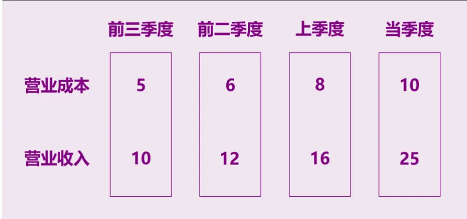
资料来源：光大证券研究所

## 3.2、构建营业能力改善（RROC）因子

在详述了营业收入与营业成本线性关系的改变如何对应公司未来股价的运行之后，我们沿着这个逻辑去构建营业能力改善（RROC）因子，它的简称 RROC 是 Residual of Revenue On Cost 的首字母缩写，体现了该因子的构造方式。

而具体的 RROC 因子构造方式，对于一支股票在某一天的因子值，其计算方式如下：

1. 获取在当天能够获得的最近N 个季度的营业收入数据，作为营业收入样本（revenue_sample），同样获取在当天能够获得的最近N个季度（或者说与营业收入样本相对应的季度）的营业成本数据，作为营业成本样本（cost_sample）。

2. 对营业收入样本与营业成本样本都做正态标准化处理，即：

$$
standard\bigl(sample_{j}\bigr)=\frac{sample_{j}-\overline{{sample}}}{std(sample)}\#(3)
$$

3. 将标准化后的营业收入样本在营业成本上进行 OLS 线性回归，即：Revenuei = βi1 ∗ Costi + βi2 + εi

其中， $i\in\{0,1,\ldots,N-1\}$ 。将回归在最近一个季度上的残差 $\varepsilon_{0}$ 作为最终RROC 在当天的因子值。

由于我们是以残差项的值作为最终的因子值，所以第二步标准化的操作还是比较必要的。因为，在营业收入与营业成本上量级更大的公司，用它们的数据拟合出来的残差在量级上同样大于其它公司，因此如果不考虑到这一点，因子值绝对值大的（多头组合与空头组合）都会更加偏向于营业量级更大的公司。

还有一处值得一提的就是，如果要计算一个公司的 RROC 因子，一个前提条件是该公司需要公布营业收入与营业成本这两个财务数据，少了这两项数据中任何一个，都会导致无法得到该公司的 RROC 因子值，从而变相地将其踢出了选股池。从 2009 年到如今，一共有 3257 只股票能计算出RROC因子，而这段时间市场上可交易的股票有接近3500只，因此有些股票的确是没法计算出 RROC 因子值的，最明显的是银行与非银金融这两个行业。银行企业全部无法计算出该因子，而非银金融也有超过 6成的公司没有该因子值。而非银金融有值的不到 4成公司中，有许多皆是从其它行业转型成非银金融行业的。

图 2：各行业（中信一级）因子计算缺失值占比及有值率
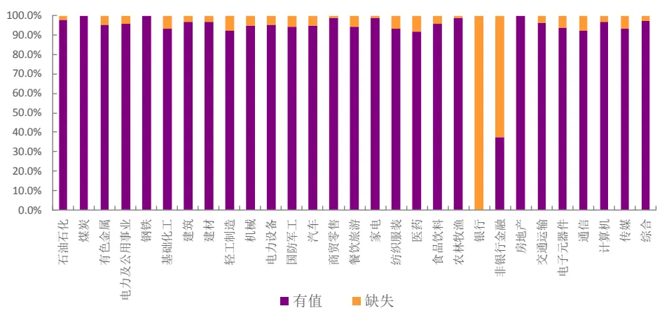
资料来源：光大证券研究所，Wind

## 3.3、RROC 因子预测效果测试

在测试因子有效性及构建多空组合之前，我们会先对因子数据进行一定程度的清洗。对于因子数据的清洗和有效性检验在此前的多因子系列报告中已有详细阐述，这里仅作简单回顾。

- 绝对中位数法去极值：在因子测试阶段，由于因子本身的分布是否为正态分布无法确定，我们采用稳健的 MAD（绝对中位数法）去除极值更加合适。

- 截面标准化处理：通过横截面 z-score方法，以每个时间截面 t上的所有股票的为样本，分别计算其均值和标准差得到如下所示 stand(factor)。此标准化方式属于因子的线性变换，并不会改变原始因子的分布特征。

$$
s\mathrm{tand}(factor)_{jt}=\frac{factor_{jt}-\overline{{factor_{t}}}}{std(factor)_{t}}\#(4)
$$

- 有效性及稳定性检验：采用多期截面RLM回归后我们可以得到因子收益序列，以及每一期回归假设检验T 检验的 t 统计量序列，针对这两个序列我们通过以下几个指标来判断该因子的有效性和稳定性：

（1） 因子收益序列的假设检验 t 统计量值

（2） 因子收益序列大于 0 的概率

（3） t 统计量绝对值的均值

（4） t 统计量绝对值大于等于 2 的概率•有效性及预测能力检验：我们计算行业中性与市值中性处理后的RankIC（因子值与股票次月收益率的秩相关系数），通过以下几个与IC 值相关的指标来判断因子的有效性和预测能力：

（1） IC 值的均值

（2） IC 值的标准差

（3） IC 大于 0 的比例

（4） IC绝对值大于 0.02 的比例

（5） IR（IR = IC 均值/IC 标准差）

由于 RROC 因子在计算中有一个参数，回归的数据个数（或者说是使用的基本面数据季度数）。因此首先我们要确定该参数的取值，以及该参数的稳定性以及敏感性程度。

我们在2009年1月至2018年6月区间内测试。从下表可以看出，RROC因子的预测能力对于使用季度数目在 4 个季度到 12 个季度之间时还是很稳定的，对于该参数的敏感程度并不高。IC均值呈现开口向下的抛物线，而 IR值则更多呈现单调下降的趋势。相对而言，季度数目在4 个到8个之间的时候因子预测性稍好，我们推测这可能意味着大部分中国上市公司的营业收入与营业成本之间在1 年到2 年内的线性关系是相对比较明显的。而在更长周期下，可能线性关系就比较薄弱了，如果想用更长周期的数据，也许使用非线性的模型也许会有不错的效果。最终考虑到季度数据的周期，我们选择参数N=8，即使用正好最近2 年的财务数据来计算RROC 因子。

表1：RROC因子在不同季度数目 N下的预测能力

| 季度数目N | IC 均值 | IC 标准差 | IC>0 比例 | IC>0.02 比例 | IR 值 |
| --- | --- | --- | --- | --- | --- |
| 4 | 2.09% | 2.74% | 81.58% | 52.63% | 0.76 |
| 5 | 2.36% | 3.23% | 79.82% | 57.89% | 0.73 |
| 6 | 2.47% | 3.45% | 79.82% | 54.39% | 0.72 |
| 7 | 2.49% | 3.46% | 78.94% | 55.26% | 0.72 |
| 8 | 2.44% | 3.68% | 73.68% | 57.89% | 0.66 |
| 9 | 2.45% | 3.87% | 77.19% | 57.02% | 0.63 |
| 10 | 2.36% | 3.93% | 73.68% | 56.14% | 0.60 |
| 11 | 2.42% | 3.97% | 72.81% | 57.89% | 0.61 |
| 12 | 2.30% | 4.02% | 71.93% | 58.77% | 0.57 |

资料来源：光大证券研究所，Wind 注：样本区间为 2009 年 1 月至 2018 年 6 月

图 3：不同参数下 IC 均值与 IR 的变化趋势
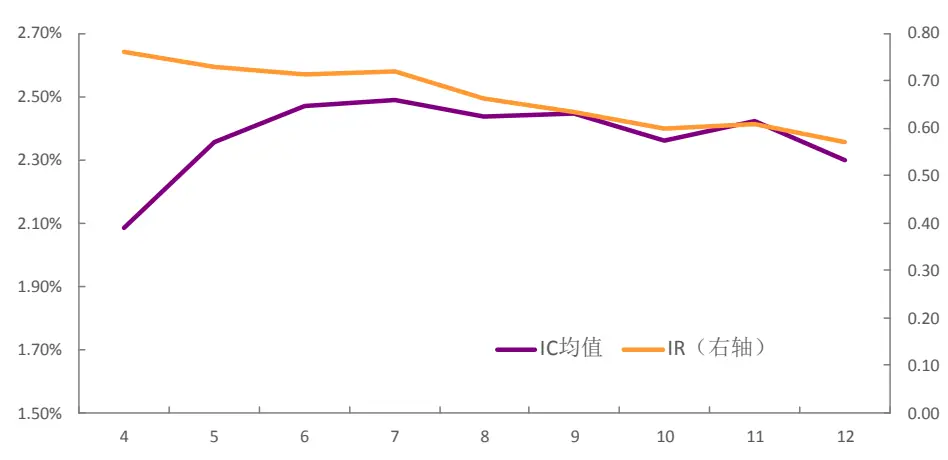
资料来源：光大证券研究所，Wind

在 N 取 8 时，RROC 因子的 IC 均值为 2.44%，IR 值为 0.66。单从该因子的月度IC均值大小来看，并不是十分突出，但其IC标准差也较小，因此IR的数值还是能让人眼前一亮，该因子预测能力的稳定性更加突出。

图 4：RROC 因子 IC 序列
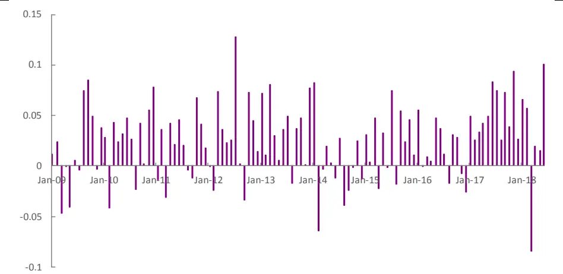
资料来源：光大证券研究所，Wind

如果我们细看在每个行业中 RROC 因子的预测能力，会发现该因子在不同行业内的表现差异较大，在建筑、商贸零售与餐饮旅游上的表现较为糟糕，IC 均值绝对值小于 0.5%，基本没有预测能力，因子在非银行金融内有8.34%的 IC，但整个历史仅 19 只非银金融股票有过因子值，缺失值占比超6 成，因此它的IC值并不能反映实际预测效果，实际上我们看因子在非银行金融的IR就能发现实际上 IC的波动性很大。除去非银行金融与银行两个对RROC因子来说较为异常行业，在剩下行业中，因子IC均值在3%以上的行业有 12 个，尤其是在建材、食品饮料这两个行业内的 IC 均值超过 4%，预测能力较强。

表 2：RROC 因子在各中信一级行业下预测能力有所差异

| 一级行业 | IC | IR | 有因子值公司数 | 缺失值占比 |
| --- | --- | --- | --- | --- |
| 石油石化 | 3.14% | 0.16 | 45 | 2.20% |
| 煤炭 | 3.44% | 0.18 | 37 | 0.00% |
| 有色金属 | 3.84% | 0.26 | 99 | 4.80% |
| 电力及公用事业 | 2.43% | 0.17 | 146 | 3.90% |
| 钢铁 | 2.34% | 0.11 | 52 | 0.00% |
| 基础化工 | 3.27% | 0.29 | 268 | 6.90% |
| 建筑 | -0.43% | -0.03 | 116 | 3.30% |
| 建材 | 4.07% | 0.26 | 86 | 3.40% |
| 轻工制造 | 3.67% | 0.24 | 95 | 7.80% |
| 机械 | 2.44% | 0.24 | 321 | 5.00% |
| 电力设备 | 2.36% | 0.19 | 146 | 4.60% |
| 国防军工 | 3.92% | 0.17 | 48 | 5.90% |
| 汽车 | 2.40% | 0.20 | 160 | 5.30% |
| 商贸零售 | 0.06% | 0.01 | 95 | 1.00% |
| 餐饮旅游 | 0.23% | 0.01 | 32 | 5.90% |
| 家电 | 3.42% | 0.19 | 73 | 1.40% |
| 纺织服装 | 1.66% | 0.12 | 81 | 6.90% |
| 医药 | 3.52% | 0.34 | 254 | 8.00% |
| 食品饮料 | 4.01% | 0.27 | 91 | 4.20% |
| 农林牧渔 | 2.18% | 0.14 | 90 | 1.10% |
| 银行 | n/a | n/a | 0 | 100.00% |
| 非银行金融 | 8.34% | 0.12 | 19 | 62.70% |
| 房地产 | 1.81% | 0.18 | 151 | 0.00% |
| 交通运输 | 2.26% | 0.16 | 100 | 3.80% |
| 电子元器件 | 3.81% | 0.35 | 195 | 6.30% |
| 通信 | 2.07% | 0.15 | 111 | 7.50% |
| 计算机 | 2.90% | 0.25 | 180 | 3.20% |
| 传媒 | 3.05% | 0.17 | 121 | 6.90% |
| 综合 | 1.68% | 0.09 | 37 | 2.60% |

资料来源：光大证券研究所，Wind

图 5：RROC 在各中信一级行业上预测能力（除银行与非银行金融）
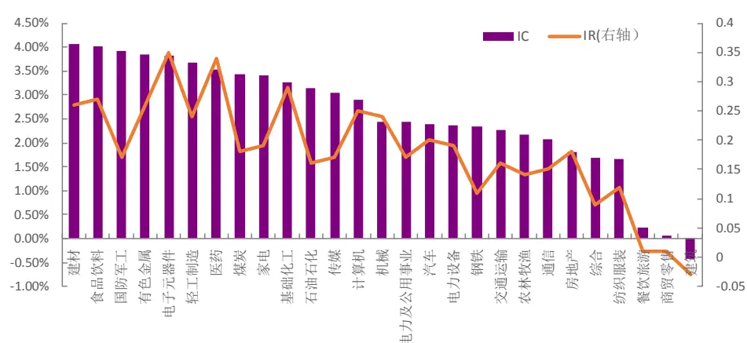
资料来源：光大证券研究所，Wind

除了有效性指标，因子的单调性和稳定性也是衡量因子选股效果的重要指标。我们建立如下表的分组回测框架，从分组选股效果角度来看因子的单调性，若单调性良好，则说明用该因子选股长期的效果具备较高的稳定性的。下表为因子分组回测阶段的框架说明。

表 3：因子分组回测框架

|  | 因子分组回测框架 |
| --- | --- |
| 时间区间 | 2009年2月1日至2018年6月30日 |
| 股票池 | 全部 A 股(剔除选股日ST/PT股票；剔除上市不满一年的股票；剔除选股日由于停牌等因素无法买入的股票) |
| 调仓频率 | 月度调仓 |
| 分组调仓方式 | 每月最后一个交易日收盘后，根据本月所有未被剔除的股票数据计算因子值，根据因子值从小到大排序将股票等分为5（或10）组，分别计算每组股票的历史回测收益及多空组合收益。 |
| 交易费率 | 因子测试阶段暂不考虑交易费用 |

资料来源：光大证券研究所

在等分5组的情况下，分组单调性十分优秀，因子越大的组合收益越大，区分程度也很显著。以第五组对冲第一组的方式构建多空组合，年化收益9.46%，年化波动仅 4.20%，最大回撤 7.80%，夏普比率高达 2.18。

在等分 10 组的情况下，分组单调性同样比较优秀，但区分程度在个别组别之间并不是很明显，稍稍弱于等分 5 组的效果。若以第十组对冲第一组的方式构建多空组合，年化收益 12.21%，年化波动5.52%，最大回撤8.90%，夏普比率高达2.12。

可以看出，在分组划分更细的情况下，多空夏普比率变化不大，但明显收益与风险都有所增加。

表 4：RROC 因子等分 5 组下分组统计数据

|  | 第一组 | 第二组 | 第三组 | 第四组 | 第五组 | 多空组合 |
| --- | --- | --- | --- | --- | --- | --- |
| 年化收益 | 10.69% | 12.94% | 15.02% | 18.20% | 21.58% | 9.46% |
| 累计收益 | 1.52 | 2.02 | 2.57 | 3.58 | 4.92 | 1.28 |
| 年化波动率 | 30.82% | 30.83% | 30.46% | 30.60% | 29.99% | 4.20% |
| 夏普比率 | 0.49 | 0.55 | 0.61 | 0.70 | 0.80 | 2.18 |
| 最大回撤 | 61.62% | 58.03% | 55.44% | 54.62% | 53.65% | 7.80% |

资料来源：光大证券研究所，Wind

表 5：RROC 因子等分 10 组下分组统计数据

|  | 第一组 | 第二组 | 第三组 | 第四组 | 第五组 | 第六组 | 第七组 | 第八组 | 第九组 | 第十组 | 多空组合 |
| --- | --- | --- | --- | --- | --- | --- | --- | --- | --- | --- | --- |
| 年化收益 | 9.57% | 11.76% | 13.43% | 12.42% | 15.30% | 14.71% | 16.57% | 19.81% | 19.57% | 23.55% | 12.21% |
| 累计收益 | 1.30 | 1.75 | 2.15 | 1.90 | 2.65 | 2.48 | 3.03 | 4.18 | 4.08 | 5.84 | 1.85 |
| 年化波动率 | 30.72% | 31.06% | 30.90% | 30.87% | 30.44% | 30.60% | 30.64% | 30.69% | 30.47% | 29.67% | 5.52% |
| 夏普比率 | 0.45 | 0.52 | 0.56 | 0.54 | 0.62 | 0.60 | 0.66 | 0.74 | 0.74 | 0.86 | 2.12 |
| 最大回撤 | 62.77% | 60.48% | 59.28% | 56.78% | 55.48% | 55.44% | 55.33% | 53.91% | 54.95% | 52.36% | 8.90% |

资料来源：光大证券研究所，Wind

图 6：RROC 因子分 5 组单调性
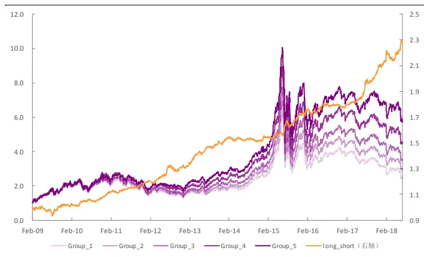
资料来源：光大证券研究所，Wind

图 7：RROC 因子分 10 组单调性
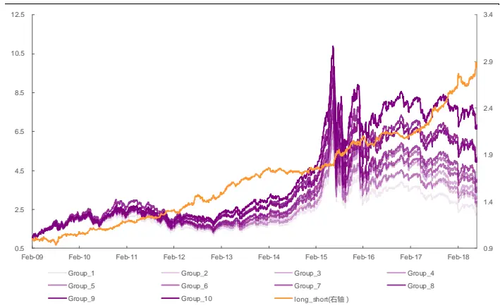
资料来源：光大证券研究所，Wind

对于多空组合，通过分年度统计的方式，我们可以清楚的看到组合在2009年有相对较大回撤，而从 2010 年开始，组合回撤都控制得很好。在分5 组情况下的多空组合，在 2010年后，最大回撤甚至再未达到过 4%。同时看出多空组合在近两年里（2017、2018）的表现极为优秀，分10组下的多空组合年化收益在这两年都超过 20%，夏普比率分别高达 4.36 与2.96。而在2009年、2014 年与2016 年组合表现平平，年化收益仅 1%到 5%左右。

表 6：多空组合分年度统计数据

| 年份 | 分5组情况下多空组合 |  |  |  | 分10组情况下多空组合 |  |  |  |
| --- | --- | --- | --- | --- | --- | --- | --- | --- |
|  | 年化收益率 | 年化波动率 | 夏普比率 | 最大回撤 | 年化收益率 | 年化波动率 | 夏普比率 | 最大回撤 |
| 2009 | 2.21% | 6.05% | 0.36 | 7.80% | 4.62% | 7.61% | 0.61 | 8.90% |
| 2010 | 8.77% | 3.62% | 2.42 | 2.03% | 13.44% | 4.79% | 2.81 | 2.22% |
| 2011 | 7.32% | 2.99% | 2.45 | 2.11% | 8.54% | 4.00% | 2.14 | 2.44% |
| 2012 | 9.26% | 4.59% | 2.02 | 3.88% | 10.72% | 5.79% | 1.85 | 5.36% |
| 2013 | 14.85% | 3.60% | 4.13 | 1.81% | 18.00% | 5.21% | 3.46 | 2.81% |
| 2014 | 1.34% | 2.94% | 0.45 | 2.77% | 1.44% | 4.13% | 0.35 | 4.58% |
| 2015 | 11.43% | 4.34% | 2.64 | 2.85% | 14.62% | 6.08% | 2.41 | 3.34% |
| 2016 | 2.68% | 3.26% | 0.82 | 3.39% | 3.11% | 4.28% | 0.73 | 5.30% |
| 2017 | 16.72% | 3.90% | 4.29 | 1.56% | 20.66% | 4.74% | 4.36 | 2.04% |
| 2018 | 15.87% | 5.38% | 2.95 | 3.55% | 20.93% | 7.06% | 2.96 | 4.72% |

资料来源：光大证券研究所，Wind

## 3.4、RROC 选股能力优秀

通过对因子的有效性与稳定性检验，可以观察到RROC 因子存在正的因子收益且与股票未来收益存在较强的正相关性，下面将以此为依据建立选股回测体系。后文的策略回测分析均基于此框架。

表 7：因子选股策略回测框架

|  | 因子选股回测框架 |
| --- | --- |
| 回测时间区间 | 2009年2月1日至2018年6月30日 |
| 回测股票池 | 全部A股或相应宽基指数成分股(剔除选股日ST/PT股票；剔除上市不满一年的股票；剔除选股日由于停牌等因素无法买入的股票) |
| 配置股票数量 | 100 只或50只 |
| 调仓频率 | 月度调仓 |
| 调仓方式 | 每月最后一个交易日收盘后，根据本月所有未被剔除的股票数据计算因子值，选择因子值最小的100只股票等权配置 |
| 交易费率 | 回测阶段做费率敏感性测试 |

资料来源：光大证券研究所

通过挑选RROC 因子值最大的 100只股票构建的选股组合，在 2009年至2018年间，年化收益 21.6%，年化波动率29.2%，夏普比率 0.82，最大回撤50.6%。相对中证500指数年化收益11.2%， 相对波动率 6.1%，夏普比率1.76，相对最大回撤仅 7.8%。

从分年度的数据来看，RROC 因子组合每年都跑赢了中证 500 指数，但在2014年与2017 年的相对表现较为糟糕，而在 2015 年组合相对基准的波动格外剧烈，显著高于其它年份。而在2018 年上半年的表现格外亮眼，无论是相对收益还是相对回撤都较优秀。

图 8：RROC 因子组合相对中证 500 基准表现
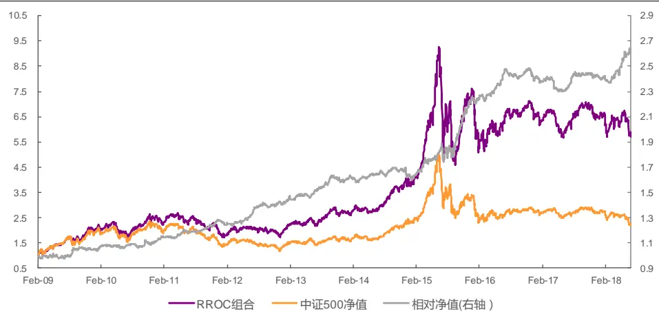
资料来源：光大证券研究所，Wind 注：交易成本按双边 0.6%计算

表 8：RROC 选股组合分年度表现

| 年份 | 年化收益率 | 年化波动率 | 夏普比率 | 最大回撤 | 相对收益率 | 相对波动率 | 信息比率 | 相对回撤 |
| --- | --- | --- | --- | --- | --- | --- | --- | --- |
| 2009 | 81.7% | 32.3% | 2.53 | 16.5% | 5.4% | 6.8% | 0.79 | 3.9% |
| 2010 | 20.9% | 26.2% | 0.80 | 28.0% | 7.4% | 5.2% | 1.43 | 3.2% |
| 2011 | -26.8% | 23.5% | -1.14 | 32.8% | 11.0% | 3.6% | 3.06 | 1.8% |
| 2012 | 14.5% | 23.2% | 0.62 | 19.2% | 11.3% | 4.6% | 2.46 | 2.6% |
| 2013 | 31.1% | 21.4% | 1.45 | 13.5% | 12.8% | 5.4% | 2.39 | 3.3% |
| 2014 | 34.5% | 19.2% | 1.80 | 10.3% | 0.4% | 5.0% | 0.08 | 5.2% |
| 2015 | 78.0% | 50.0% | 1.56 | 50.6% | 33.1% | 11.0% | 3.01 | 7.8% |
| 2016 | -7.6% | 31.4% | -0.24 | 24.8% | 7.2% | 4.6% | 1.56 | 4.2% |
| 2017 | 1.0% | 15.9% | 0.06 | 16.5% | 0.1% | 4.4% | 0.03 | 4.7% |
| 2018 | -16.2% | 24.3% | -0.67 | 15.4% | 17.6% | 5.6% | 3.13 | 2.4% |
| 全样本 | 21.6% | 29.2% | 0.82 | 50.6% | 11.2% | 6.1% | 1.76 | 7.8% |

资料来源：光大证券研究所，Wind 注：交易成本按双边 0.6%计算

换手率方面，与我们预期相符，大大低于大部分量价因子，但要高于单纯的财务数据因子，平均月度双边换手在51%，也就是说平均每个月换 1/4的股票。在 4月、8 月、10 月业绩报表公告截止日后，因子值变动较大，换手率会大大增加，在相应5 月初、9月初与11月初的换手率均值全部超过100%（双边计算），5 月初换手最高，均值达到 150%。我们认为这与4 月底会同时有去年年报与今年一季报的数据进入有关。

图 9：RROC 因子选股组合月度平均换手率
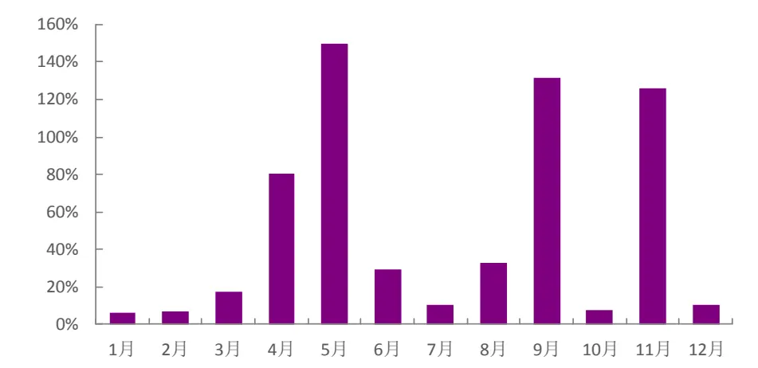
资料来源：光大证券研究所，Wind

由于换手率并不是很高，所以交易成本对组合年化收益虽有影响，但敏感程度不大。组合在双边千六的交易成本下，年化收益相比与无交易成本时稍低 2.5%。

图10：不同交易成本下RROC因子组合净值表现
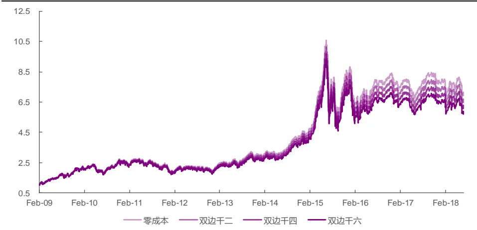
资料来源：光大证券研究所，Wind

表9：不同交易成本下RROC因子组合统计数据

|  | 零成本 | 双边千二 | 双边千四 | 双边千六 |
| --- | --- | --- | --- | --- |
| 年化收益率 | 24.1% | 23.3% | 22.4% | 21.6% |
| 累计收益率 | 6.15 | 5.71 | 5.30 | 4.91 |
| 年化波动率 | 29.2% | 29.2% | 29.2% | 29.2% |
| 夏普比率 | 0.89 | 0.86 | 0.84 | 0.82 |
| 最大回撤 | 50.3% | 50.4% | 50.5% | 50.6% |

资料来源：光大证券研究所，Wind

除了在全市场选股，我们也分别测试了在沪深300以及中证 500 内选股的情况。

在沪深300中，按因子值大小等分5组的单调性与区分程度都非常明显，以第五组对冲第一组的方式构建多空组合，年化收益 12.60%，年化波动8.63%，最大回撤 14.74%，夏普比率 1.42。可见在沪深 300 样本内，该因子依然有较强的预测能力。我们选取RROC 因子值最大的 50只股票构成选股组合。在 2009 年至 2018年间，组合年化收益12.1%，年化波动率 26.7%，夏普比率 0.56，最大回撤 47.4%。相对沪深 300 指数年化收益 5.8%， 相对波动率9.7%，夏普比率0.63，相对最大回撤16.8%。

图 11：RROC 因子沪深 300 内分组及多空表现
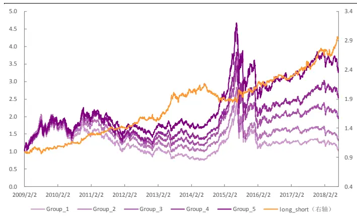
资料来源：光大证券研究所，Wind

图 12：RROC 因子沪深 300 内选股组合表现
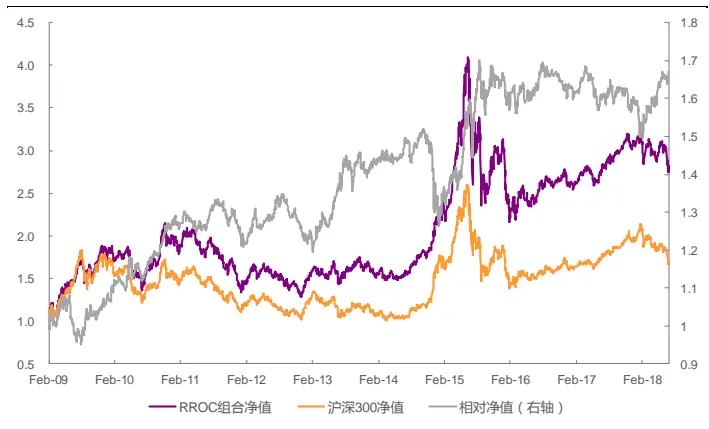
资料来源：光大证券研究所，Wind 注：双边 0.6%交易成本

从分年度数据中，可以明显看出 2014 年该因子在沪深 300 股票池中较为失效，跑输指数基准 10.6%。同时在 2011、2012、2016 与 2017 也小幅跑输指数本身，2018 年表现不错，但整体选股能力在沪深 300 内显得较为有限。这与我们预期较为一致，因为沪深 300 中有大量银行股，而 RROC因子是没法参与对银行股的预测，所以即使 RROC 因子在沪深 300 内有优秀的预测能力与多空收益，选股组合跟沪深300本身比较时依然有较大波动。当银行股表现更好的时候，RROC选股组合天然的就要跑输指数基准。

表10：RROC因子沪深300内选股组合分年度表现

| 年份 | 年化收益率 | 年化波动率 | 夏普比率 | 最大回撤 | 相对收益率 | 相对波动率 | 信息比率 | 相对回撤 |
| --- | --- | --- | --- | --- | --- | --- | --- | --- |
| 2009 | 71.0% | 33.0% | 2.15 | 20.6% | 7.5% | 11.0% | 0.68 | 11.8% |
| 2010 | 8.4% | 26.4% | 0.32 | 27.6% | 18.7% | 7.9% | 2.38 | 5.4% |
| 2011 | -29.4% | 21.9% | -1.34 | 33.5% | -3.1% | 6.1% | -0.51 | 7.0% |
| 2012 | 8.0% | 22.1% | 0.36 | 23.2% | -1.1% | 6.8% | -0.16 | 9.2% |
| 2013 | 9.3% | 20.0% | 0.46 | 15.7% | 14.9% | 9.8% | 1.52 | 6.4% |
| 2014 | 32.0% | 17.1% | 1.87 | 8.7% | -10.6% | 10.5% | -1.01 | 16.8% |
| 2015 | 40.4% | 44.9% | 0.90 | 42.4% | 27.6% | 15.4% | 1.79 | 9.5% |
| 2016 | -10.2% | 26.3% | -0.39 | 22.3% | -0.8% | 8.0% | -0.11 | 5.6% |
| 2017 | 17.8% | 11.7% | 1.53 | 8.1% | -2.1% | 6.5% | -0.32 | 7.2% |
| 2018 | -16.4% | 17.6% | -0.93 | 14.3% | 9.8% | 8.6% | 1.14 | 6.2% |
| 全样本 | 12.1% | 26.7% | 0.56 | 47.4% | 5.8% | 9.7% | 0.63 | 16.8% |

资料来源：光大证券研究所，Wind 注：交易成本按双边 0.6%计算

在中证500 中，按因子值大小等分5 组的单调性与区分程度不如在沪深300 内那么明显，但依然较为优秀。以第五组对冲第一组的方式构建多空组合，年化收益13.00%，年化波动 6.41%，最大回撤9.55%，夏普比率1.94。可见在中证 500 样本内，该因子预测能力已经较为接近在全市场中的情况。我们选取RROC因子值最大的100只股票构成选股组合。在2009年至2018年间，组合年化收益 17.7%，年化波动率 29.9%，夏普比率 0.70，最大回撤53.0%。相对中证500指数年化收益 7.9%， 相对波动率仅4.5%，夏普比率1.70，相对最大回撤仅6.4%。

图 13：RROC 因子中证 500 内分组及多空表现
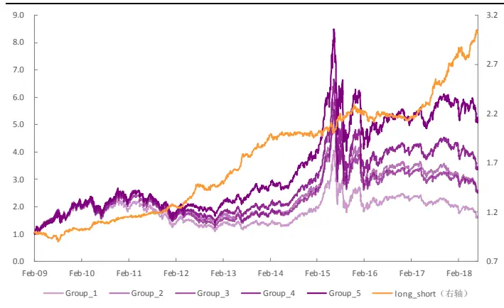
资料来源：光大证券研究所，Wind

图14：RROC因子中证 500内选股组合表现
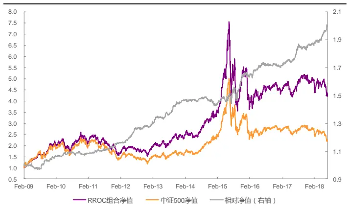
资料来源：光大证券研究所，Wind 注：双边 0.6%交易成本

通过分年度数据，可以发现在 2009 年到 2018 年 10 年里 RROC 选股组合仅在2014 年小幅跑输中证 500 基准。在最近两年（2017、2018）的表现尤为突出，信息比率皆超过 2，相对最大回撤仅在2%左右。

表 11：RROC 因子中证 500 内选股组合分年度表现

| 年份 | 年化收益率 | 年化波动率 | 夏普比率 | 最大回撤 | 相对收益率 | 相对波动率 | 信息比率 | 相对回撤 |
| --- | --- | --- | --- | --- | --- | --- | --- | --- |
| 2009 | 81.8% | 34.0% | 2.40 | 18.5% | 5.8% | 4.7% | 1.24 | 4.1% |
| 2010 | 16.0% | 28.1% | 0.57 | 27.2% | 2.6% | 3.4% | 0.75 | 2.1% |
| 2011 | -30.7% | 24.1% | -1.28 | 35.2% | 7.0% | 2.7% | 2.61 | 1.0% |
| 2012 | 13.0% | 24.0% | 0.54 | 22.7% | 9.9% | 3.1% | 3.19 | 1.2% |
| 2013 | 31.7% | 22.0% | 1.44 | 14.4% | 13.4% | 3.5% | 3.83 | 1.8% |
| 2014 | 31.8% | 19.9% | 1.60 | 12.2% | -2.3% | 3.1% | -0.73 | 4.2% |
| 2015 | 60.5% | 50.5% | 1.20 | 53.0% | 15.6% | 9.0% | 1.74 | 6.4% |
| 2016 | -12.0% | 31.6% | -0.38 | 26.4% | 2.8% | 3.6% | 0.80 | 1.9% |
| 2017 | 9.4% | 15.6% | 0.60 | 14.2% | 8.5% | 3.6% | 2.34 | 2.3% |
| 2018 | -19.6% | 23.8% | -0.82 | 16.6% | 14.3% | 4.3% | 3.33 | 1.0% |
| 全样本 | 17.7% | 29.9% | 0.70 | 53.0% | 7.9% | 4.5% | 1.70 | 6.4% |

资料来源：光大证券研究所，Wind 注：交易成本按双边 0.6%计算

## 4、RROC 因子相关性研究与提纯

我们前文已经对因子进行了有效性、稳定性及单调性测试，证明其具备较好的选股能力。在最后一个章节，我们将研究 RROC 因子的预测及选股效果是否来自其内生因素，因子是否本身具有独有信息，还是说它的预测能力与选股表现完全可以被其它各种已有因子解释；在剔除了其它例如市值或其它因子带入的效用后，是否依然具备良好的选股能力，还是说在剔除其它因子对其的影响后，从而达到信息提纯的目的，使因子的表现更加优秀。

## 4.1、RROC 因子与成长类因子高度相关

为了了解有哪些已有因子与 RROC 因子有较高的相关性，我们分别计算了规模因子、动量因子、技术因子、波动因子、成长因子及流动性因子中单因子测试显著性较高的几个因子与RROC因子之间历史IC 序列的相关系数。从下图中，可以看出与RROC因子与ROE因子、净利润增速（NP_YOY）因子、估值（BP）因子与市值（Ln_MC）因子有很强的相关性，相关系数绝对值都超过 0.3。其中，与净利润增速强正相关，相关系数高达 0.56。与市值因子的相关系数也接近 0.5，表明该因子偏向大市值的股票。技术因子中，1 个月动量与RROC呈现 0.2 左右的正相关性；波动因子以及流动性因子都与RROC呈现-0.2左右的负相关性。

图15：因子与其他大类因子历史IC值相关性检验
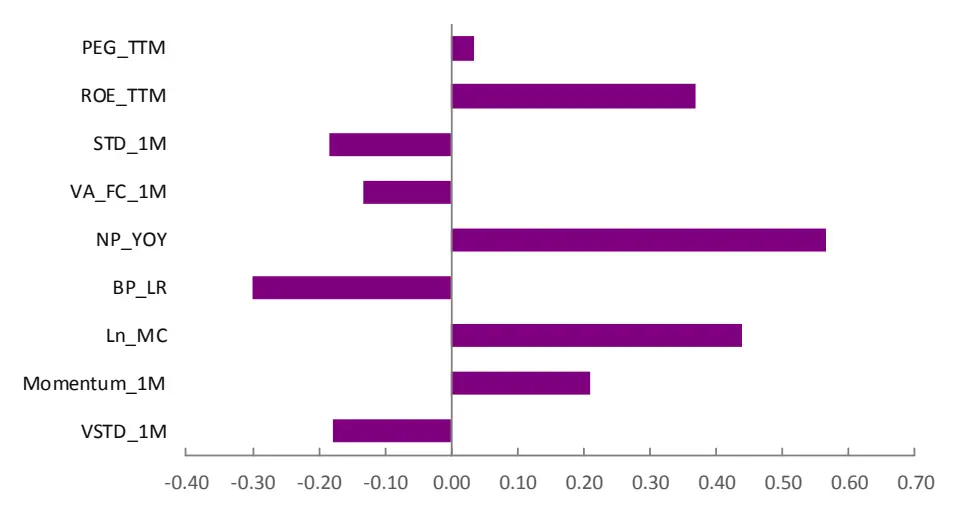
资料来源：光大证券研究所

从逻辑上看，RROC 因子属于成长类型因子。因而本质上与基于利润数据构造的相关因子会有很大的相关性。上述的相关性研究中也印证了这一点。而我们格外关注已有的两个利润增速因子与它的比较：一个是净利润增长（NP_YOY），一个是营业利润增长（OP_YOY）。RROC 因子与这两个因子的相关系数都在0.6 左右，属于强正相关。而在预测能力上，RROC 因子与利润增速因子各有优劣，RROC因子的IC标准差显著小于利润增速因子，IC 为正的比例也更大，其 IR 值也是三者中最高的，在稳定性上RROC因子有明显优势；但IC均值稍低，IC 大于0.02 的比例也未到 60%。

稳定性有如此明显的提升，我们认为有两方面的原因：

1. RROC 因子的计算是日度计算的，月末调仓。因此相比于统一在财报公布截止日调仓，因子更新的频率会更及时。

2. 更重要的一点是，在线性回归模型框架下，我们使用了多季度的数据。这使得历史单个数据点的波动对因子有效性的影响有所抑制。同时也避免了负值在求比操作中出现在分母部分的尴尬窘境。当然，数据点并不是一味地越多越好。除了太多历史久远的数据在信息时效性上有所劣势的原因外，太长时间的成本序列与收入序列之间的线性关系本身就会很弱。从之前我们对回归窗宽参数敏感性测试的结果一定程度上也验证了这一点。

同时可以看出 OP_YOY 与 NP_YOY 的 IC、IR 数据非常类似，实际上如果我们测试这两个因子的相关性会发现其相关系数高达 0.97。因此在后一节中对 RROC 因子做剔除相关因子的中性化操作时，为了尽量避免共线性的影响，我们仅会对这两个因子中的净利润增速因子做剔除。

表 12：RROC 因子与利润增速因子预测能力比较

| 因子简称 | IC 均值 | IC 标准差 | IC>0 比例 | IC>0.02 比例 | IR 值 |
| --- | --- | --- | --- | --- | --- |
| RROC | 2.44% | 3.68% | 73.68% | 57.89% | 0.66 |
| OP_YOY | 3.39% | 5.69% | 71.43% | 60.71% | 0.60 |
| NP_YOY | 3.37% | 6.18% | 70.54% | 59.82% | 0.54 |

资料来源：光大证券研究所，Wind

## 4.2、剔除相关因子后预测能力稳定性再上层楼

我们将通过横截面回归取残差的方式，同时剔除上述因子对 RROC 因子的影响，对所有的因子均做截面标准化和极值处理：

$$
\begin{array}{c}{RROC_{i}=\beta_{1}*MC_{i}+\beta_{2}*Industry_{i}+\beta_{3}*NPyoy_{i}+}\\{\beta_{4}*ROE_{i}+\cdots+\varepsilon_{i}\#(5)}\end{array}
$$

对RROC因子中性化处理后因子的有效性检验等结果仍然十分显著，IC均值为 2.25%，IC 大于零的比例为 76.58%；而 IR 高达 0.82，相比中性化处理之前的 0.66 有明显提升，说明中性化处理起到了信息提纯的作用，使得因子的稳定性得到进一步提升。

但同时，需要说明的是，在做了如上中性化后，因子的股票池再度缩减，从之前的3293 只股票，减少到 2976只，缩减比例接近10%。

表13：中性化前后RROC因子的预测能力

| 因子处理 | IC 均值 | IC 标准差 | IC>0 比例 | IC>0.02 比例 | IR 值 |
| --- | --- | --- | --- | --- | --- |
| 中性化前 | 2.44% | 3.68% | 73.68% | 57.89% | 0.66 |
| 中性化后 | 2.25% | 2.76% | 76.58% | 48.65% | 0.82 |

资料来源：光大证券研究所，Wind

图 16：中性化后 RROC 因子 IC 序列
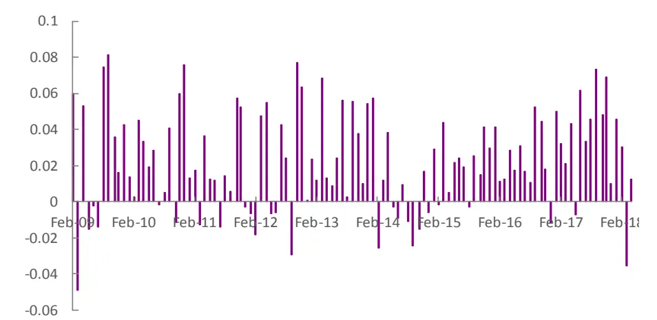
资料来源：光大证券研究所，Wind

按中性化后的RROC因子值大小等分5组，分组单调性依然十分优秀，因子越大的组合收益越大，区分程度显著。以第五组对冲第一组的方式构建多空组合，年化收益7.53%，年化波动仅 2.96%，最大回撤仅 3.22%，夏普比率高达2.46。相比于中性化之前，虽然多空年化收益有所下滑，但波动与回撤大幅减小，夏普比率也有明显提升。

表14：中性化后RROC因子等分 5组下分组统计数据

|  | 第一组 | 第二组 | 第三组 | 第四组 | 第五组 | 多空组合 |
| --- | --- | --- | --- | --- | --- | --- |
| 年化收益 | 11.62% | 13.96% | 15.75% | 16.53% | 20.21% | 7.53% |
| 累计收益 | 1.72 | 2.28 | 2.78 | 3.02 | 4.33 | 0.93 |
| 年化波动率 | 30.61% | 30.73% | 30.51% | 30.86% | 30.25% | 2.96% |
| 夏普比率 | 0.51 | 0.58 | 0.63 | 0.65 | 0.76 | 2.46 |
| 最大回撤 | 58.63% | 56.94% | 53.58% | 53.68% | 54.49% | 3.22% |

资料来源：光大证券研究所，Wind

图17：中性化后RROC因子分 5组单调性
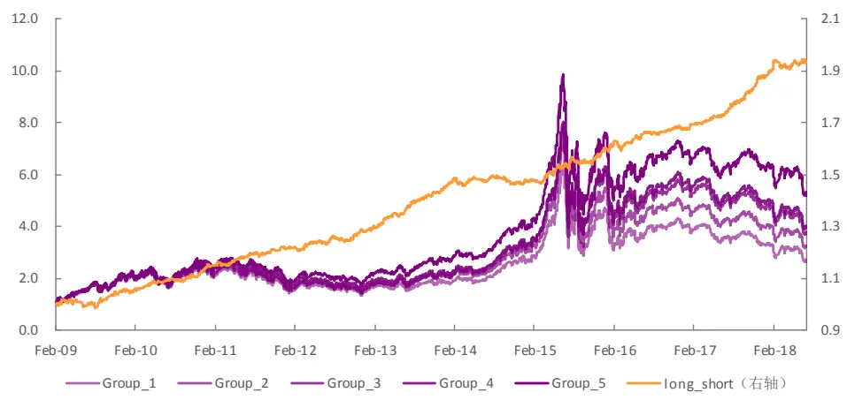
资料来源：光大证券研究所，Wind

中性化后的多空组合，依然在 2009 年有相对较大的波动与回撤。从夏普比率来看，仅2014年表现稍弱，其余年份夏普比皆超过1。2013年与2017年表现格外优秀，夏普比在 5 左右，年化收益率也在 10%以上。2018 年上半年的表现较好，最大回撤不足2%，夏普比率在2 以上。

表15：中性化后的RROC因子多空组合分年度统计数据

| 年份 | 年化收益率 | 年化波动率 | 夏普比率 | 最大回撤 |
| --- | --- | --- | --- | --- |
| 2009 | 5.57% | 4.29% | 1.30 | 3.22% |
| 2010 | 8.98% | 2.82% | 3.19 | 1.03% |
| 2011 | 5.30% | 2.52% | 2.10 | 1.49% |
| 2012 | 5.43% | 2.78% | 1.96 | 1.96% |
| 2013 | 12.67% | 2.63% | 4.82 | 1.12% |
| 2014 | 1.25% | 2.40% | 0.52 | 2.36% |
| 2015 | 8.03% | 3.38% | 2.37 | 1.62% |
| 2016 | 4.73% | 2.50% | 1.89 | 2.20% |
| 2017 | 11.24% | 2.24% | 5.02 | 0.59% |
| 2018 | 5.93% | 2.92% | 2.03 | 1.68% |

资料来源：光大证券研究所，Wind

由于中性化的过程中有剔除市值的影响，同时考虑到沪深 300 内因子覆盖度的问题，我们认为中性化后的RROC 选股组合更适合将股票池限定在中证500内。按中证500成分股中因子值最大的100只股票构建选股组合，在2009年至 2018年间，年化收益 15.5%，年化波动率 30.1%，夏普比率0.63，最大回撤53.7%。相对中证500指数年化收益6.0%，相对波动率4.5%，夏普比率1.31，相对最大回撤7.5%。

容易看出，中性化后RROC因子组合稍逊于中性化前的数据，波动变化不大，但收益还是有明显下滑，因此信息比率也有所降低。从分年度的角度来看，中性化后RROC因子依然是在2014年与2015年这两年有较大波动，而最近表现依然稳定优秀。

图18：中性化后中证500内RROC因子组合相对中证 500基准表现
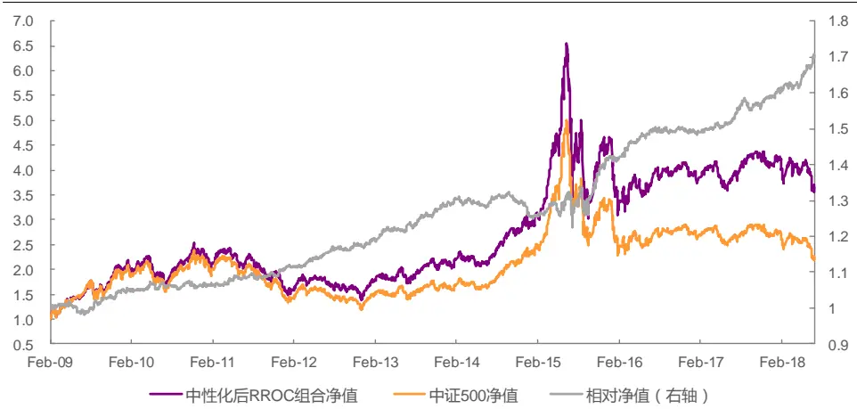
资料来源：光大证券研究所，Wind 注：交易成本按双边 0.6%计算

表16：RROC选股组合分年度表现

| 年份 | 年化收益率 | 年化波动率 | 夏普比率 | 最大回撤 | 相对收益率 | 相对波动率 | 信息比率 | 相对回撤 |
| --- | --- | --- | --- | --- | --- | --- | --- | --- |
| 2009 | 81.2% | 34.8% | 2.33 | 19.3% | 5.0% | 4.2% | 1.18 | 3.5% |
| 2010 | 15.1% | 28.5% | 0.53 | 28.4% | 1.7% | 3.4% | 0.48 | 1.9% |
| 2011 | -33.1% | 24.0% | -1.38 | 36.5% | 4.7% | 2.7% | 1.75 | 1.3% |
| 2012 | 8.8% | 24.2% | 0.36 | 26.3% | 5.7% | 2.8% | 2.02 | 1.1% |
| 2013 | 27.6% | 22.3% | 1.24 | 15.7% | 9.3% | 3.4% | 2.78 | 1.3% |
| 2014 | 31.0% | 19.9% | 1.55 | 13.0% | -3.2% | 3.1% | -1.01 | 5.3% |
| 2015 | 57.8% | 51.2% | 1.13 | 53.7% | 12.8% | 9.5% | 1.35 | 7.5% |
| 2016 | -9.7% | 31.5% | -0.31 | 26.0% | 5.2% | 3.5% | 1.46 | 1.2% |
| 2017 | 6.8% | 15.1% | 0.45 | 13.9% | 5.9% | 3.0% | 2.00 | 2.1% |
| 2018 | -19.6% | 23.7% | -0.83 | 16.9% | 14.2% | 4.1% | 3.46 | 1.2% |
| 全样本 | 15.5% | 30.1% | 0.63 | 53.7% | 6.0% | 4.5% | 1.31 | 7.5% |

资料来源：光大证券研究所，Wind 注：交易成本按双边 0.6%计算

综上，RROC 因子剔除其它类型因子的效应后仍有大量的独有信息，因子稳定性进一步增强；但是无论多空组合还是多头组合，其收益都有所下滑。

## 5、风险提示

本报告中的测试结果均基于模型和历史数据，历史数据存在不被重复验证的可能，模型存在失效的风险。

## 行业及公司评级体系

| 评级 说明 |  |
| --- | --- |
| 行 买入 | 未来6-12个月的投资收益率领先市场基准指数15%以上； |
| 增持 | 未来6-12个月的投资收益率领先市场基准指数5%至15%； |
|  | 中性 未来6-12个月的投资收益率与市场基准指数的变动幅度相差-5%至5%； |
| 减持 | 未来6-12个月的投资收益率落后市场基准指数5%至15%； |
|  | 卖出 未来6-12个月的投资收益率落后市场基准指数15%以上； |
| 业及公司评级 无评级 | 因无法获取必要的资料，或者公司面临无法预见结果的重大不确定性事件，或者其他原因，致使无法给出明确的 |
| 投资评级。 基准指数说明：A股主板基准为沪深300指数；中小盘基准为中小板指；创业板基准为创业板指；新三板基准为新三板指数；港 股基准指数为恒生指数。 |  |

## 分析、估值方法的局限性说明

本报告所包含的分析基于各种假设，不同假设可能导致分析结果出现重大不同。本报告采用的各种估值方法及模型均有其局限性，估值结果不保证所涉及证券能够在该价格交易。

## 分析师声明

本报告署名分析师具有中国证券业协会授予的证券投资咨询执业资格并注册为证券分析师，以勤勉的职业态度、专业审慎的研究方法，使用合法合规的信息，独立、客观地出具本报告，并对本报告的内容和观点负责。负责准备本报告以及撰写本报告的所有研究分析师或工作人员在此保证，本研究报告中关于任何发行商或证券所发表的观点均如实反映分析人员的个人观点。负责准备本报告的分析师获取报酬的评判因素包括研究的质量和准确性、客户的反馈、竞争性因素以及光大证券股份有限公司的整体收益。所有研究分析师或工作人员保证他们报酬的任何一部分不曾与，不与，也将不会与本报告中具体的推荐意见或观点有直接或间接的联系。

## 特别声明

光大证券股份有限公司（以下简称“本公司”）创建于 1996 年，系由中国光大（集团）总公司投资控股的全国性综合类股份制证券公司，是中国证监会批准的首批三家创新试点公司之一。根据中国证监会核发的经营证券期货业务许可，光大证券股份有限公司的经营范围包括证券投资咨询业务。

本公司经营范围：证券经纪；证券投资咨询；与证券交易、证券投资活动有关的财务顾问；证券承销与保荐；证券自营；为期货公司提供中间介绍业务；证券投资基金代销；融资融券业务；中国证监会批准的其他业务。此外，公司还通过全资或控股子公司开展资产管理、直接投资、期货、基金管理以及香港证券业务。

本证券研究报告由光大证券股份有限公司研究所（以下简称“光大证券研究所”）编写，以合法获得的我们相信为可靠、准确、完整的信息为基础，但不保证我们所获得的原始信息以及报告所载信息之准确性和完整性。光大证券研究所可能将不时补充、修订或更新有关信息，但不保证及时发布该等更新。

本报告中的资料、意见、预测均反映报告初次发布时光大证券研究所的判断，可能需随时进行调整且不予通知。报告中的信息或所表达的意见不构成任何投资、法律、会计或税务方面的最终操作建议，本公司不就任何人依据报告中的内容而最终操作建议做出任何形式的保证和承诺。在任何情况下，本报告中的信息或所表述的意见并不构成对任何人的投资建议。客户应自主作出投资决策并自行承担投资风险。本报告中的信息或所表述的意见并未考虑到个别投资者的具体投资目的、财务状况以及特定需求。投资者应当充分考虑自身特定状况，并完整理解和使用本报告内容，不应视本报告为做出投资决策的唯一因素。对依据或者使用本报告所造成的一切后果，本公司及作者均不承担任何法律责任。

不同时期，本公司可能会撰写并发布与本报告所载信息、建议及预测不一致的报告。本公司的销售人员、交易人员和其他专业人员可能会向客户提供与本报告中观点不同的口头或书面评论或交易策略。本公司的资产管理部、自营部门以及其他投资业务部门可能会独立做出与本报告的意见或建议不相一致的投资决策。本公司提醒投资者注意并理解投资证券及投资产品存在的风险，在做出投资决策前，建议投资者务必向专业人士咨询并谨慎抉择。

在法律允许的情况下，本公司及其附属机构可能持有报告中提及的公司所发行证券的头寸并进行交易，也可能为这些公司提供或正在争取提供投资银行、财务顾问或金融产品等相关服务。投资者应当充分考虑本公司及本公司附属机构就报告内容可能存在的利益冲突，勿将本报告作为投资决策的唯一信赖依据。

本报告根据中华人民共和国法律在中华人民共和国境内分发，仅供本公司的客户使用。本公司不会因接收人收到本报告而视其为客户。本报告仅向特定客户传送，未经本公司书面授权，本研究报告的任何部分均不得以任何方式制作任何形式的拷贝、复印件或复制品，或再次分发给任何其他人，或以任何侵犯本公司版权的其他方式使用。所有本报告中使用的商标、服务标记及标记均为本公司的商标、服务标记及标记。如欲引用或转载本文内容，务必联络本公司并获得许可，并需注明出处为光大证券研究所，且不得对本文进行有悖原意的引用和删改。

## 光大证券股份有限公司

上海市新闸路 1508 号静安国际广场 3 楼 邮编 200040

总机：021-22169999 传真：021-22169114、22169134

| 机构业务总部 | 姓名 | 办公电话 | 手机 | 电子邮件 |
| --- | --- | --- | --- | --- |
| 上海 | 徐硕 |  | 13817283600 | shuoxu@ebscn.com |
|  | 李文渊 |  | 18217788607 | liwenyuan@ebscn.com |
|  | 李强 | 021-22169131 | 18621590998 | liqiang88@ebscn.com |
|  | 罗德锦 | 021-22169146 | 13661875949/13609618940 | luodj@ebscn.com |
|  | 张弓 | 021-22169083 | 13918550549 | zhanggong@ebscn.com |
|  | 黄素青 | 021-22169130 | 13162521110 | huangsuqing@ebscn.com |
|  | 邢可 | 021-22167108 | 15618296961 | xingk@ebscn.com |
|  | 李晓琳 | 021-22169087 | 13918461216 | lixiaolin@ebscn.com |
|  | 丁点 | 021-22169458 | 18221129383 | dingdian@ebscn.com |
|  | 郎珈艺 |  | 18801762801 | dingdian@ebscn.com |
|  | 郭永佳 |  | 13190020865 | guoyongjia@ebscn.com |
|  | 余鹏 | 021-22167110 | 17702167366 | yupeng88@ebscn.com |
| 北京 | 郝辉 | 010-58452028 | 13511017986 | haohui@ebscn.com |
|  | 梁晨 | 010-58452025 | 13901184256 | liangchen@ebscn.com |
|  | 吕凌 | 010-58452035 | 15811398181 | Ivling@ebscn.com |
|  | 郭晓远 | 010-58452029 | 15120072716 | guoxiaoyuan@ebscn.com |
|  | 张彦斌 | 010-58452026 | 15135130865 | zhangyanbin@ebscn.com |
|  | 庞舒然 | 010-58452040 | 18810659385 | pangsr@ebscn.com |
| 深圳 | 黎晓宇 | 0755-83553559 | 13823771340 | lixy1@ebscn.com |
|  | 李潇 | 0755-83559378 | 13631517757 | lixiao1@ebscn.com |
|  | 张亦潇 | 0755-23996409 | 13725559855 | zhangyx@ebscn.com |
|  | 王渊锋 | 0755-83551458 | 18576778603 | wangyuanfeng@ebscn.com |
|  | 张靖雯 | 0755-83553249 | 18589058561 | zhangjingwen@ebscn.com |
|  | 牟俊宇 | 0755-83552459 | 13827421872 | moujy@ebscn.com |
|  | 苏一耘 |  | 13828709460 | suyy@ebscn.com |
| 国际业务 | 陶奕 | 021-22169091 | 18018609199 | taoyi@ebscn.com |
|  | 梁超 | 021-22167068 | 15158266108 | liangc@ebscn.com |
|  | 金英光 | 021-22169085 | 13311088991 | jinyg@ebscn.com |
|  | 王佳 | 021-22169095 | 13761696184 | wangjia1@ebscn.com |
|  | 郑锐 | 021-22169080 | 18616663030 | zhrui@ebscn.com |
|  | 凌贺鹏 | 021-22169093 | 13003155285 | linghp@ebscn.com |
|  | 周梦颖 | 021-22169087 | 15618752262 | zhoumengying@ebscn.com |
| 金融同业与战略客户 | 黄怡 | 010-58452027 | 13699271001 | huangyi@ebscn.com |
|  | 徐又丰 | 021-22169082 | 13917191862 | xuyf@ebscn.com |
|  | 王通 | 021-22169501 | 15821042881 | wangtong@ebscn.com |
|  | 赵纪青 | 021-22167052 | 18818210886 | zhaojq@ebscn.com |
|  | 马明周 | 021-22167343 | 18516159056 | mamingzhou@ebscn.com |
| 私募业务部 | 谭锦 | 021-22169259 | 15601695005 | tanjin@ebscn.com |
|  | 曲奇瑶 | 021-22167073 | 18516529958 | quqy@ebscn.com |
|  | 王舒 | 021-22169134 | 15869111599 | wangshu@ebscn.com |
|  | 安羚娴 | 021-22169479 | 15821276905 | anlx@ebscn.com |
|  | 戚德文 | 021-22167111 | 18101889111 | qidw@ebscn.com |
|  | 吴冕 |  | 18682306302 | wumian@ebscn.com |
|  | 吕程 | 021-22169482 | 18616981623 | Ivch@ebscn.com |
|  | 李经夏 | 021-22167371 | 15221010698 | lijxia@ebscn.com |
|  | 高霆 | 021-22169148 | 15821648575 | gaoting@ebscn.com |
|  | 左贺元 | 021-22169345 | 18616732618 | zuohy@ebscn.com |
|  | 任 | 021-22167470 | 15955114285 | renzhen@ebscn.com |
|  | 俞灵杰 | 021-22169373 | 18717705991 | yulingjie@ebscn.com |