## 创新基本面因子：提纯净利数据中的选股信息——多因子系列报告之十五

2017 年来，以往效果卓越的市值因子、量价类因子等都出现了有效性下滑的情况，价值投资的呼声也越来越高。愈来愈多的投资经理开始关注基本面因子。然而过于简单直白的基本面因子其效果又差强人意。基于这样的现象与需求，我们开始研究并推出了创新基本面因子系列报告。尝试通过一些更深入的研究，在保留直观逻辑意义的同时，更好地提取出蕴含在基本面数据中的有效预测信息。

净利润数据富含预测信息。基于净利润数据构造的不少常用因子都有不错的预测能力。但不同的构造方式下，因子预测能力对于因子值更新方式以及极值处理方式敏感程度不一。TTM 同比及 TTM 环比这些构造方式非常有必要做去极值处理。

- 利用线性研究框架提纯净利润预测信息。通过测试我们发现有近 50 个不同财务数据可以通过线性研究框架的滚动回归来构造成拥有不错预测能力的净利润相关因子。而通过对一些财务数据进行多元回归或分步回归能进一步提升净利润相关因子的预测能力。

LPNP因子预测能力突出。通过将净利润同时对营业外收入与支付给职工以及为职工支付的现金进行滚动回归取残差的方式构造了线性纯化净利润（LPNP）因子。该因子预测能力突出，月度IC均值 3.37%，月度IR值 0.87。基于该因子构造的多空组合在2009年至2018年 6月期间年化收益 11.67%，夏普比率 3.08，最大回撤 2.95%。

中性化后LPNP因子效果更强。将 LPNP因子与现有的主流风格因子作相关性测试，其与市值、ROE、动量呈现明显正相关；而与 BP估值、流动性呈现负相关。在经过横截面回归取残差的方式剔除上述因子对 LPNP因子的影响后，因子效果进一步强化，月度 IC 均值为 4.28%，而月度IR 高达 1.27，中性化处理起到了信息提纯的作用。以中性化后 LPNP因子构建的多空组合，年化收益 14.15%，夏普比率高达 3.94，最大回撤仅 3.20%。

- 风险提示：测试结果均基于模型和历史数据，模型存在失效的风险。

## 金融工程深度

## 分析师

刘均伟 (执业证书编号：S0930517040001)

021-22169151

liujunwei@ebscn.com

## 联系人

胡骥聪

021-22169125

hujicong@ebscn.com

## 相关研究

《因子测试全集——多因子系列报告之二》多因子系列报告之二》《多因子组合“光大 Alpha 1.0”

——多因子系列报告之三》《别开生面：公司治理因子详解——多因子系列报告之四》

《见微知著：成交量占比高频因子解析——多因子系列报告之五》

《行为金融因子：噪音交易者行为偏差——多因子系列报告之六》

《基于 K 线最短路径构造的非流动性因子——多因子系列报告之七》

《高频因子：日内分时成交量蕴藏玄机——多因子系列报告之八》

《一致交易：挖掘集体行为背后的收益——多因子系列报告之九》

《因子正交与择时：基于分类模型的动态权重配置 ——多因子系列报告之十》《爬罗剔抉：一致预期因子分类与精选——多因子系列报告之十一》

《成长因子重构与优化：稳健加速为王——多因子系列报告之十二》

《组合优化算法探析及指数增强实证——多因子系列报告之十三》《创新基本面因子：财务数据间线性关系初窥——多因子系列报告之十四 》

## 1、净利润是信息含量极高的财务数据

在资产负债表、利润表以及现金流量表中有各种各样的财务数据。但不同财务数据所蕴含的对于公司股价的预示能力有所不同。在这些财务数据中，利润数据往往含有非常高的股价预示信息量。

股价反映了投资者对该公司未来价值的预期。而一个公司产生的净利润越大，其价值亦越大。因此往往那些预期能有高额回报、高利润的公司其股价也更被看好。那么从直观上来说，虽然历史上的利润数据并不能与未来公司的利润划上等号，但依然有着较为显著的相关性；如何利用历史利润数据挖掘出能较好表征公司未来表现的信息便成为构造利润相关因子的一个关键所在。

## 1.1、常用的利用净利润数据构造的基本面因子

由于净利润是投资者极为关注且信息含量很高的财务数据，因此有不少利用净利润数据构造的基本面因子，比如净利润增速等等。我们测算了一些常用的不同净利润增速构造方式下的因子效果，同时也比较了我们光大金工在前几篇报告中开发的净利润加速度因子、净利润稳健增速因子与净利润稳健加速度因子在预测能力上的差异。

表1：常用净利润相关因子预测能力

| 因子名称 | IC 均值 | ICIR |
| --- | --- | --- |
| 净利润加速度 | 2.49% | 0.71 |
| 净利润 TTM 环比 | 3.59% | 0.64 |
| 净利润单季度环比 | 1.81% | 0.51 |
| 净利润稳健加速度 | 2.28% | 0.65 |
| 净利润稳健增速 | 1.78% | 0.25 |
| 净利润 TTM 同比 | 2.96% | 0.49 |

资料来源：光大证券研究所，Wind 注：计算区间为 2009 年 1 月至 2018 年 6 月

可以看出在常用的净利润相关因子中，净利润 TTM 环比因子、净利润加速度因子、净利润稳健加速度因子的预测能力较强，IC 均值皆超过 2%，同时 ICIR 皆逾 0.5。

而以上这些因子有效性的测算皆是财务报告公告截止日更新因子值，月度调仓的方式计算的 IC 及 IR。而不同的因子值更新频率下会不会大幅影响净利润相关因子的预测能力呢？我么在下一节中做了相应测试。

## 1.2、调仓频率对因子选股效果有一定影响

如果我们不是在财务报告公告截止日才更新因子值，而是日度更新因子值。在同样月度调仓计算IC及 IR的情况下，我们发现与预期相符，各个因子的预测能力都有所提升。但不同因子提升的幅度却大不相同，净利润TTM环比、净利润TTM同比与净利润稳健增速因子在预测能力上有大幅提升。

同时我们也观察到，使用同比及环比这样的因子构造方式很容易出现异常值的情况，因此对该种方式构造的因子非常有必要做去极值处理，不然会大大影响因子的预测能力。

表2：净利润相关因子在日频更新下的预测能力

| 因子名称 | 去极值处理 |  | 不做去极值处理 |  |
| --- | --- | --- | --- | --- |
|  | IC 均值 | ICIR | IC 均值 | ICIR |
| 净利润加速度 | 3.17% | 0.76 | 3.17% | 0.76 |
| 净利润 TTM 环比 | 3.63% | 0.77 | 4.22% | 0.54 |
| 净利润单季度环比 | 1.97% | 0.59 | 0.80% | 0.11 |
| 净利润稳健加速度 | 2.34% | 0.71 | 2.38% | 0.70 |
| 净利润稳健增速 | 2.28% | 0.38 | 2.38% | 0.43 |
| 净利润 TTM 同比 | 3.98% | 0.77 | 1.43% | 0.16 |

资料来源：光大证券研究所，Wind 注：计算区间为 2009 年 1 月至 2018 年 6 月

综上可以看出在日频更新的情况下，因子预测能力更强，尤其是净利润加速度、净利润 TTM 环比与净利润 TTM 同比这几种构造方式，因子 ICIR均高达0.75以上。

## 2、利用线性回归研究框架提纯净利润数据信息

在创新基本面因子系列的第一篇报告《财务数据之间线性关系初窥》中介绍了财务数据间线性关系研究框架。这里我们作简单回顾。

通过构造不同财务数据间的滚动线性回归模型：

$$
\begin{array}{c}{{Funda_{Y}=\beta_{\alpha}+\beta_{A}*Funda_{A}+\beta_{B}*Funda_{B}+\beta_{C}*Funda_{C}+\cdots+}}\\{{\beta_{X}*Funda_{X}+\varepsilon\#(1)}}\end{array}
$$

或者，更常用的简化形式，仅考虑两个不同财务数据间的简单线性回归：

$$
Funda_{Y}=\beta_{\alpha}+\beta_{X}*Funda_{X}+\varepsilon\#(2)
$$

在拟合好回归模型后，根据逻辑需要，找到可以反映或代理该逻辑的量化数据。

需要注意的是：

1. 在该研究框架中，为了避免不同股票在回归时财务数据量级不同导致最终因子也受该量级的影响，所有的财务数据在滚动回归窗口里都先进行标准化操作。

2. 由于不少财务数据并不是所有公司都会公布，有些财务指标仅相应行业的公司才有。因此我们的研究框架中是有因子覆盖度检查的，即检查历史上有该财务数据的上市企业占全部上市公司数目的比例。在全市场的因子开发中，只有通过覆盖度检查该因子才会被我们采纳。

## 2.1、多个基本面数据能对利润数据提纯作出贡献

在该篇报告里我们主要研究净利润数据的预测信息。在尝试提纯净利润数据中的信息之前，我们首先给出以下逻辑假设：净利润数据（包括其它各类财务数据）中信息可以分为对未来股价有预测能力的信息（信号）与对未来股价没有预测能力的信息（噪声）。当我们的数据或指标中信号的占比越大，其作为因子的预测能力就越强。因此实际上我们可以认为净利润数据比大部分其它财务数据更具有预测能力的原因就在于其数据本身信噪比就比大部分其它财务数据要高。在此基础上如果我们希望构建预测能力更高的因子，实际上可以理解为我们将原本信噪比就较高的净利润数据处理成信噪比更高的指标。

将信噪比处理成更高的指标往往有两种方式：

1. 第一种较为常见的，是通过对数据本身进行一定的操作，尝试直接找出信息中大概率有预测能力的信息部分。例如在第一章统计的同比、环比、稳健增速等因子的构造。

2. 另外一种则是通过找出信息中大概率是噪音项的信息部分，通过将其从原来数据中剔除的方式，增加操作后数据的信噪比。我们接下来利用线性回归研究框架来提纯净利润数据就是属于这一范畴。

我们认为在净利润数据中有不少其它财务数据决定的部分其实属于噪音项，因此找出它们对于净利润数据的贡献后，将其剔除，来提升处理后的净利润数据的预测能力。

将净利润时间序列作为 Y值，将其它一些能影响到净利润数值的财务数据作为解释变量，通过滚动线性回归的方式，我们可以找出净利润数据中大概率能被解释变量以线性方式解释的那部分，那么回归后最近一期的残差就可以认为是剔除相关噪音后更纯化的信息。

$$
Net\_Profit=\beta_{\alpha}+\beta_{X}*Funda_{X}+\varepsilon\#(3)
$$

这里需要注意的是，不少财务数据与净利润的关系更偏向于非线性的关系，那么这种噪音项我们是无法通过我们线性研究框架来处理的；我们只能找到大概率是与利润有线性关系的财务数据引入的噪音信息。

通过暴力遍历的方式，我们一一测试了每个通过覆盖度测试的财务数据作为线性关系研究框架中解释变量的结果。从 IC 与 IR 的角度，有近 50 多个财务数据似乎可以用以提纯净利润数据中的预测能力。

表3：拥有提纯净利润数据预测能力的财务数据

| 解释变量 | IC 均值 | ICIR |
| --- | --- | --- |
| 收到的税费返还 | 4.10% | 0.70 |
| 取得投资收益收到的现金 | 3.97% | 0.78 |
| 收到其他与经营活动有关的现金 | 3.90% | 0.79 |
| 处置固定资产、无形资产和其他长期资产收回的现金净额 | 3.90% | 0.70 |
| 营业外收入 | 3.89% | 0.81 |
| 非流动资产处置净损失 | 3.84% | 0.61 |
| 资产减值损失 | 3.82% | 0.70 |
| 投资活动现金流入小计 | 3.78% | 0.81 |
| 支付其他与经营活动有关的现金 | 3.74% | 0.77 |
| 经营活动产生的现金流量净额 | 3.72% | 0.77 |
| 营业外支出 | 3.67% | 0.73 |
| 财务费用 | 3.59% | 0.78 |
| 应收票据 | 3.57% | 0.80 |
| 投资净收益 | 3.51% | 0.80 |
| 购建固定资产、无形资产和其他长期资产支付的现金 | 3.48% | 0.77 |
| 其他应收款 | 3.47% | 0.81 |
| 投资活动现金流出小计 | 3.46% | 0.76 |
| 投资活动产生的现金流量净额 | 3.46% | 0.74 |
| 支付给职工以及为职工支付的现金 | 3.46% | 0.81 |
| 购买商品、接受劳务支付的现金 | 3.34% | 0.77 |
| 管理费用 | 3.30% | 0.75 |
| 预付款项 | 3.28% | 0.78 |
| 销售费用 | 3.26% | 0.73 |
| 长期待摊费用 | 3.25% | 0.76 |
| 在建工程 | 3.23% | 0.81 |
| 盈余公积金 | 3.22% | 0.83 |
| 经营活动现金流出小计 | 3.19% | 0.77 |
| 支付的各项税费 | 3.18% | 0.75 |
| 营业税金及附加 | 3.13% | 0.76 |
| 经营活动现金流入小计 | 3.13% | 0.77 |
| 非流动负债合计 | 3.06% | 0.77 |
| 存货 | 3.02% | 0.79 |
| 资本公积金 | 3.01% | 0.74 |
| 递延所得税资产 | 2.99% | 0.80 |
| 应收账款 | 2.98% | 0.80 |
| 无形资产 | 2.94% | 0.76 |
| 固定资产 | 2.92% | 0.79 |
| 长期股权投资 | 2.92% | 0.70 |
| 营业成本 | 2.90% | 0.79 |
| 少数股东权益 | 2.87% | 0.74 |
| 股东权益合计(不含少数股东权益) | 2.66% | 0.72 |
| 流动资产合计 | 2.65% | 0.71 |
| 股东权益合计(含少数股东权益) | 2.59% | 0.70 |
| 非流动资产合计 | 2.55% | 0.67 |
| 所得税 | 2.54% | 0.69 |
| 负债合计 | 2.51% | 0.70 |
| 负债及股东权益总计 | 2.48% | 0.70 |
| 未分配利润 | 2.41% | 0.66 |

资料来源：光大证券研究所，Wind 注：计算区间为 2009 年 1 月至 2018 年 6 月

但实际上，真正不同的有提纯效果的解释变量远远小于以上列表中的数据，因为上述解释变量之中有许多之间存在高共线性的情况，因此以上不少因子之间有着很高的相关性。

## 2.2、处理财务数据共线性与多元回归下的提纯效果

观察上述近 50 个净利润相关因子之间的相关系数矩阵，会发现大部分因子之间的 IC相关系数高达 0.7以上，因此单纯地把这些解释变量全部放在一起进行多元回归并不合适，因此我们首先通过聚类的方式挑选从 IC 序列角度来看大概率涵盖不同解释信息的解释变量。从聚类的树状图，我们挑选出 4 个从 IC 序列里体现出明显不同的解释变量：营业外收入 $.(Funda_{A})$ ，非流动资产处置净损失 $(Funda_{B})$ ，取得投资收益收到的现金 $(Funda_{C})$ ，处置固定资产、无形资产和其它长期资产收回的现金净额 $(Funda_{D})$ 0

$$
\begin{array}{c}{{Net\_Profit=\beta_{\alpha}+\beta_{A}*Funda_{A}+\beta_{B}*Funda_{B}+\beta_{C}*Funda_{C}+}}\\{{\beta_{D}*Funda_{D}+\varepsilon\#(4)}}\end{array}
$$

图1：按净利润相关因子 IC序列聚类的树状图
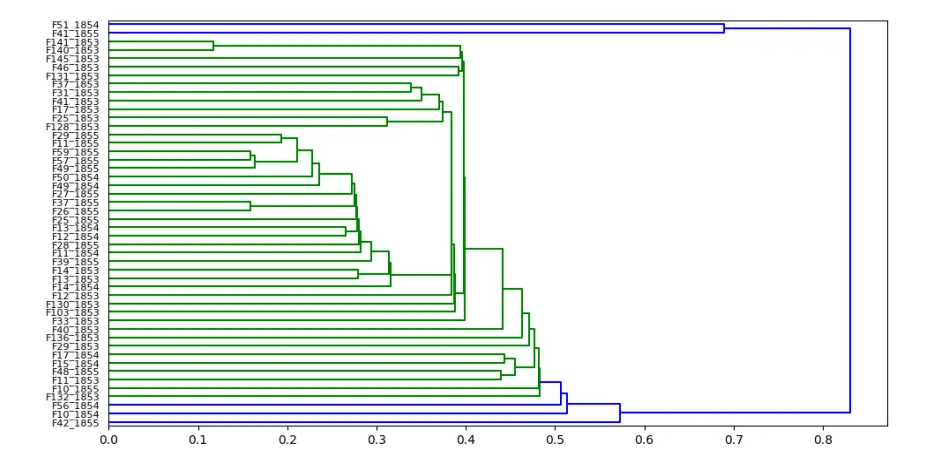
资料来源：光大证券研究所

以净利润为Y值，以营业外收入，非流动资产处置净损失，取得投资收益收到的现金，处置固定资产、无形资产和其它长期资产收回的现金净额这四个财务数据作为解释变量经行滚动线性回归并取末期残差的方式构建的因子表现并未出现提升，IC 均值 3.63%，ICIR 为 0.79。多元回归下的因子IC 与IR 均弱于仅用营业外收入作简单线性回归得到的因子。

表 4：聚类后多元线性回归下的因子预测能力并无提升

| 解释变量 | IC 均值 | ICIR |
| --- | --- | --- |
| 营业外收入 | 3.89% | 0.81 |
| 非流动资产处置净损失 | 3.84% | 0.61 |
| 取得投资收益收到的现金 | 3.97% | 0.78 |
| 处置固定资产、无形资产和其他长期资产收回的现金净额 | 3.90% | 0.70 |
| 综合以上四项 | 3.63% | 0.79 |

资料来源：光大证券研究所，Wind 注：计算区间为 2009 年 1 月至 2018 年 6 月

我们认为造成以上结果几个可能的原因：一是不同解释变量下的净利润相关因子效果不一，比如以非流动资产处置净损失为解释变量的净利润相关因子的 IR 仅 0.61。如果把它列入多项解释变量中一起回归，可能会影响到最终因子的预测能力。二是单纯的从聚类的方式区分不同解释变量对净利润的影响方式实际上效果并不一定能直观反映到构造的因子上。

所以我们接下来尝试从一些本身效果出众的净利润相关因子入手，比如IC 超过3%，IR超过0.8的那些净利润相关因子的解释变量。测试将它们组合后，放在一起进行多元回归得到的因子效果有没有提升。在小样本内进行排列组合后，我们发现将净利润在营业外收入，在建工程，支付给职工以及为职工支付的现金之间的解释变量组合上进行多元回归得到的净利润相关因子预测能力较高。综合比较 IC 均值与 ICIR，同时对营业外收入与支付给职工以及为职工支付的现金进行滚动回归取残差得到净利润相关因子预测能力最好，IC 均值 3.37%，ICIR 为 0.87。

表 5：在多元回归下部分预测效果有较明显提升的净利润相关因子

| 解释变量（多个） | IC 均值 | ICIR |
| --- | --- | --- |
| 营业外收入&支付给职工以及为职工支付的现金 | 3.37% | 0.87 |
| 营业外收入&在建工程 | 3.09% | 0.85 |
| 支付给职工以及为职工支付的现金&在建工程 | 2.81% | 0.85 |
| 营业外收入&支付给职工以及为职工支付的现金& 在建工程 | 2.77% | 0.87 |

资料来源：光大证券研究所，Wind 注：计算区间为 2009 年 1 月至 2018 年 6 月

## 2.3、分步回归的提纯效果

除了通过多元回归来达到剔除多个解释变量在净利润数据中的信息，我们还可以通过分步回归的方式来达到这个目的。即：

1. 先将净利润在一个解释变量上滚动回归，记录下末期的残差形成残差矩阵。

2. 之后将上一步得到的残差矩阵中的数据在下一个解释变量上滚动回归，记录下末期的残差形成残差矩阵。

3. 若还有下一个解释变量，则重复第 2 步；若没有其它的解释变量，就将残差矩阵作为最终的因子矩阵。

我们仅尝试了将营业外收入，盈余公积金，投资活动现金流入小计，支付给职工以及为职工支付的现金，在建工程这5 个解释变量作为首选解释变量。从测试的结果而言，仅分两步回归的情况下，仅有少许因子的预测能力得到提高，而且能提高的幅度也并非特别显著。因此我们认为分更多步回归的必要性较低。其中，预测能力提升最为明显的一些因子所用解释变量多为营业外收入、在建工程与支付给职工以及为职工支付的现金等，与多元回归时的解释变量大多重合，但效果上有所差异。ICIR最高的净利润相关因子为先回归掉营业外收入，再回归在建工程的因子，ICIR达0.91，IC均值2.98%。而同样是用营业外收入与支付给职工以及为职工支付的现金作为解释变量，多元回归与分步回归在 ICIR 上差别很小，但在 IC 均值上多元回归出的因子更胜一筹。

表6：在分步回归下部分预测效果有较明显提升的净利润相关因子

| 主解释变量 | 副解释变量 | IC 均值 | ICIR |
| --- | --- | --- | --- |
| 营业外收入 | 在建工程 | 2.98% | 0.91 |
| 营业外收入 | 其他应收款 | 2.86% | 0.87 |
| 营业外收入 | 支付给职工以及为职工支付的现金 | 2.87% | 0.87 |
| 支付给职工以及为职工支付的现金 | 营业外收入 | 2.84% | 0.87 |

资料来源：光大证券研究所，Wind 注：计算区间为 2009 年 1 月至 2018 年 6 月

通过以上多元回归与分步回归的测试，我们发现能较为有效通过线性方法提纯净利润预测能力的财务数据为营业外收入、人力成本与在建工程。这三类数据都是本身波动会比较大而同时又能直接影响到净利润的大小。而净利润中这些受营业外收入、人力成本等解释的部分实际上是没有外推性的，这一部分并不能真正展现公司未来的成长能力。因此通过回归掉这些净利润数据中没有预测能力的噪音项，得以使因子的预测能力有所提升。

## 3、构建信息提纯后的 LPNP 因子

从第二章的分析与测试，有两个净利润相关因子表现格外突出，分别是对营业外收入与支付给职工以及为职工支付的现金进行多元回归取残差（后简称多元回归净利润因子），和对营业外收入与在建工程分步回归取残差（后简称分步回归净利润因子）。在本章中，我们将更深入探讨这两种因子构造的优劣，并确定最终的线性纯化净利润因子。

## 3.1、构建线性纯化净利润（LPNP）因子

虽然从IC均值与ICIR上看多元回归净利润因子与分步回归净利润因子相差无几。但两者在覆盖度上却有着较大差异，由于在建工程的数据相对其它大部分财务数据缺失值更多，因此在不作相应数据处理的情况下有很多上市公司无法计算出分步回归净利润因子值。

图2：各行业（中信一级）分步回归净利润因子计算缺失值占比及有值率
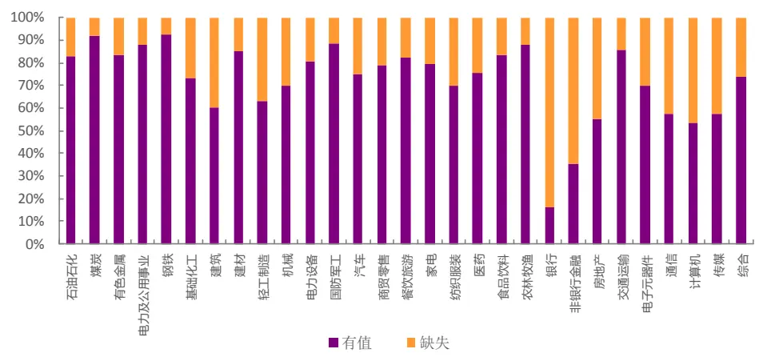
资料来源：光大证券研究所，Wind 注：计算区间为 2009 年 1 月至 2018 年 6 月

从上图可看出分步回归净利润因子值缺失占比较高，整体缺失占比近30%，尤其在银行、非银金融、房地产与计算机等行业，缺失率极高。故即使该因子ICIR超过0.9，其适用性也因覆盖度问题大打折扣。采取某些缺失值填充处理（比如填零或近期中位数等）也许能在一定程度上克服覆盖度问题，但在本报告中不再细致讨论这些问题。

图3：各行业（中信一级）多元回归净利润因子计算缺失值占比及有值率
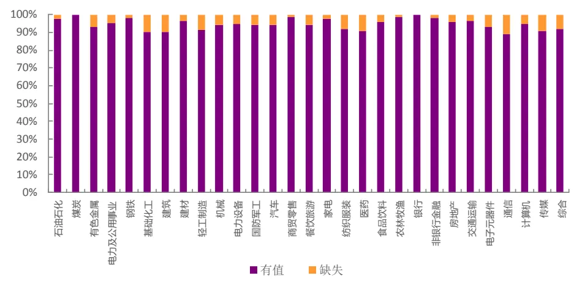
资料来源：光大证券研究所，Wind 注：计算区间为 2009 年 1 月至 2018 年 6 月

而多元回归净利润因子的覆盖度则远远好于分步回归净利润因子，整体缺失率在 6%左右，且没有任何一个行业有较大的因子值缺失率。因此，我们认为多元回归净利润因子更好，并确定其为最终的线性纯化净利润（LPNP）因子。

## 3.2、LPNP 因子预测效果测试

在测试因子有效性及构建多空组合之前，我们会先对因子数据进行一定程度的清洗。对于因子数据的清洗和有效性检验在此前的多因子系列报告中已有详细阐述，这里仅作简单回顾。

- 绝对中位数法去极值：在因子测试阶段，由于因子本身的分步是否为正态分步无法确定，我们采用稳健的 MAD（绝对中位数法）去除极值更加合适。

- 截面标准化处理：通过横截面 z-score方法，以每个时间截面t上的所有股票的为样本，分别计算其均值和标准差得到如下所示 stand(factor)。此标准化方式属于因子的线性变换，并不会改变原始因子的分步特征。

$$
s\mathrm{tand}(factor)_{jt}=\frac{factor_{jt}-\overline{{factor_{t}}}}{std(factor)_{t}}\#(5)
$$

- 有效性及预测能力检验：我们计算行业中性与市值中性处理后的RankIC（因子值与股票次月收益率的秩相关系数），通过以下几个与IC 值相关的指标来判断因子的有效性和预测能力：IC 值的均值、IC值的标准差、IC 大于0 的比例、IC 绝对值大于0.02 的比例、ICIR。

LPNP 因子的 IC 均值为 3.37%，IC 标准差为 3.87%，IR 值为 0.87。单从该因子的月度IC均值来看，预测效果较为突出，其IC标准差也相对较小，接近0.9的ICIR的数值显示因子预测能力也极为稳定。IC>0的比例接近80%，IC>0.02的比例也有三分之二。

图 4：LPNP 因子 IC 序列
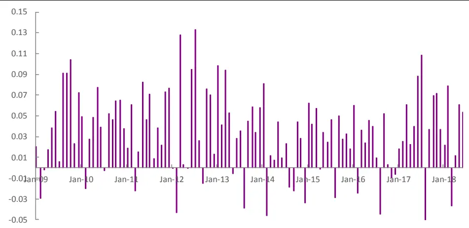
资料来源：光大证券研究所，Wind

LPNP 因子在不同行业内的预测能力差异较大，我们按中信一级行业统计了各行业下的因子预测能力，所有行业下该因子的 IC 均值皆为正向。其中，钢铁、煤炭、建材等周期板块行业以及食品饮料、汽车、家电等消费板块行业内因子预测能力较佳；而在银行、非银、房地产等金融板块行业下预测能力偏弱。

表 7：LPNP 因子在各中信一级行业下预测能力有所差异

| 一级行业 | IC | IR | 有因子值公司数 | 缺失值占比 |
| --- | --- | --- | --- | --- |
| 石油石化 | 1.37% | 0.06 | 45 | 2.17% |
| 煤炭 | 4.64% | 0.22 | 37 | 0.00% |
| 有色金属 | 4.34% | 0.28 | 97 | 6.73% |
| 电力及公用事业 | 3.14% | 0.22 | 145 | 4.61% |
| 钢铁 | 5.64% | 0.27 | 51 | 1.92% |
| 基础化工 | 4.17% | 0.38 | 260 | 9.72% |
| 建筑 | 3.09% | 0.18 | 108 | 10.00% |
| 建材 | 4.34% | 0.26 | 86 | 3.37% |
| 轻工制造 | 4.52% | 0.27 | 94 | 8.74% |
| 机械 | 3.65% | 0.34 | 319 | 5.62% |
| 电力设备 | 3.24% | 0.26 | 145 | 5.23% |
| 国防军工 | 1.63% | 0.08 | 48 | 5.88% |
| 汽车 | 4.54% | 0.37 | 159 | 5.92% |
| 商贸零售 | 1.13% | 0.10 | 95 | 1.04% |
| 餐饮旅游 | 1.67% | 0.08 | 32 | 5.88% |
| 家电 | 4.34% | 0.23 | 72 | 2.70% |
| 纺织服装 | 2.89% | 0.22 | 80 | 8.05% |
| 医药 | 3.00% | 0.29 | 250 | 9.42% |
| 食品饮料 | 5.03% | 0.39 | 91 | 4.21% |
| 农林牧渔 | 4.20% | 0.28 | 90 | 1.10% |
| 银行 | 2.29% | 0.07 | 25 | 0.00% |
| 非银行金融 | 1.20% | 0.05 | 50 | 1.96% |
| 房地产 | 1.09% | 0.11 | 145 | 3.97% |
| 交通运输 | 2.71% | 0.20 | 100 | 3.85% |
| 电子元器件 | 4.41% | 0.39 | 193 | 7.21% |
| 通信 | 3.50% | 0.22 | 107 | 10.83% |
| 计算机 | 2.96% | 0.20 | 176 | 5.38% |
| 传媒 | 1.45% | 0.07 | 118 | 9.23% |
| 综合 | 0.75% | 0.03 | 35 | 7.89% |

资料来源：光大证券研究所，Wind

图 5：LPNP 在各中信一级行业上预测能力
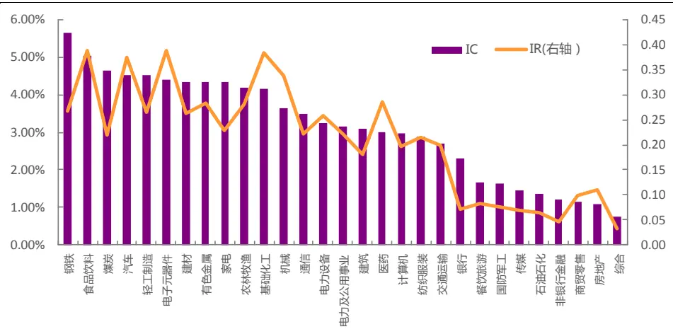
资料来源：光大证券研究所，Wind

除了有效性指标，因子的单调性和稳定性也是衡量因子选股效果的重要指标。我们建立如下表的分组回测框架，从分组选股效果角度来看因子的单调性，若单调性良好，则说明用该因子选股长期的效果具备较高的稳定性的。下表为因子分组回测阶段的框架说明。

表8：因子分组回测框架

|  | 因子分组回测框架 |
| --- | --- |
| 时间区间 | 2009年2月1日至2018年6月30日 |
| 股票池 | 全部 A 股(剔除选股日ST/PT股票；剔除上市不满一年的股票；剔除选股日由于停牌等因素无法买入的股票) |
| 调仓频率 | 月度调仓 |
| 分组调仓方式 | 每月最后一个交易日收盘后，根据本月所有未被剔除的股票数据计算因子值，根据因子值从小到大排序将股票等分为5（或10）组，分别计算每组股票的历史回测收益及多空组合收益。 |
| 交易费率 | 因子测试阶段暂不考虑交易费用 |

资料来源：光大证券研究所

在等分5组的情况下，分组单调性十分优秀，因子越大的组合收益越大，区分程度也很显著。以第五组对冲第一组的方式构建多空组合，年化收益11.67%，年化波动仅 3.60%，最大回撤 2.95%，夏普比率高达 3.08。

表9：LPNP因子等分5组下分组统计数据

|  | 第一组 | 第二组 | 第三组 | 第四组 | 第五组 | 多空组合 |
| --- | --- | --- | --- | --- | --- | --- |
| 年化收益 | 9.28% | 12.68% | 15.20% | 18.26% | 22.05% | 11.67% |
| 累计收益 | 1.24 | 1.96 | 2.62 | 3.60 | 5.12 | 1.73 |
| 年化波动率 | 30.26% | 30.22% | 30.35% | 30.24% | 30.40% | 3.60% |
| 夏普比率 | 0.45 | 0.55 | 0.62 | 0.71 | 0.81 | 3.08 |
| 最大回撤 | 60.62% | 57.79% | 54.09% | 53.50% | 53.96% | 2.95% |

资料来源：光大证券研究所，Wind

图 6：LPNP 因子分 5 组单调性优秀
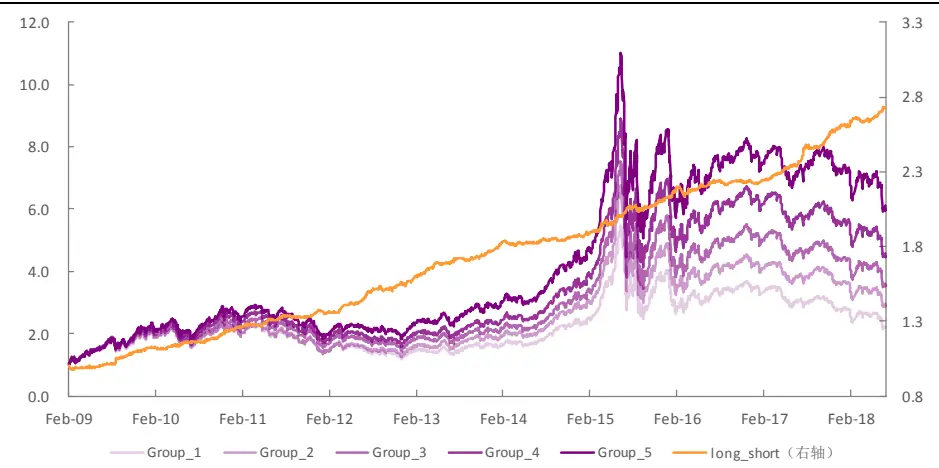
资料来源：光大证券研究所，Wind

对于多空组合，通过分年度统计的方式，可以看出组合在各个年份都有非常稳定的表现，仅2016年有相对较大回撤，但也未超过 3%。夏普比率在2014年与2016年稍低，其它年份组合夏普比皆在2.5 以上。最近2 年组合表现极为优秀，2017 年组合夏普比逾 5，回撤仅 1%出头；2018 年组合夏普比也在3 以上，波动不到 3%。

表 10：多空组合分年度统计数据

| 年份 | 年化收益率 | 年化波动率 | 夏普比率 | 最大回撤 |
| --- | --- | --- | --- | --- |
| 2009 | 12.06% | 4.52% | 2.66 | 2.09% |
| 2010 | 11.03% | 3.96% | 2.79 | 1.55% |
| 2011 | 8.79% | 3.30% | 2.67 | 1.53% |
| 2012 | 13.43% | 3.84% | 3.50 | 1.94% |
| 2013 | 13.30% | 3.29% | 4.04 | 1.35% |
| 2014 | 4.33% | 2.65% | 1.64 | 2.08% |
| 2015 | 13.21% | 4.04% | 3.27 | 1.82% |
| 2016 | 4.41% | 2.91% | 1.52 | 2.95% |
| 2017 | 15.53% | 3.05% | 5.09 | 1.17% |
| 2018 | 9.14% | 2.90% | 3.16 | 1.35% |
| 全样本 | 11.67% | 3.60% | 3.08 | 2.95% |

资料来源：光大证券研究所，Wind

## 3.3、LPNP 因子选股能力优秀

通过对因子的有效性与稳定性检验，可以观察到LPNP 因子存在正的因子收益且与股票未来收益存在较强的正相关性，下面将以此为依据建立选股回测体系。后文的策略回测分析均基于此框架。

表11：因子选股策略回测框架

|  | 因子选股回测框架 |
| --- | --- |
| 回测时间区间 | 2009年2月1日至2018年6月30日 |
| 回测股票池 | 全部A股或相应宽基指数成分股(剔除选股日ST/PT股票；剔除上市不满一年的股票；剔除选股日由于停牌等因素无法买入的股票) |
| 配置股票数量 | 100 只或 50 只 |
| 调仓频率 | 月度调仓 |
| 调仓方式 | 每月最后一个交易日收盘后，根据本月所有未被剔除的股票数据计算因子值，选择因子值最大的100只或50只股票等权配置 |
| 交易费率 | 双边 0.6% |

资料来源：光大证券研究所

通过挑选LPNP 因子值最大的 100只股票构建的选股组合，在 2009年至2018年间，年化收益22.4%，年化波动率30.6%，夏普比率 0.82，最大回撤 54.3%。相对中证 500 指数年化收益 12.4%， 相对波动率 6.3%，夏普比率1.90，相对最大回撤9.8%。

从分年度的数据来看，LPNP 因子组合在大部分年份的表现都较为优秀。但在2014 年与 2017年小幅跑输中证 500 指数；而在2014年与2015 年则有较大相对回撤。

图7：LPNP因子组合相对中证 500基准表现
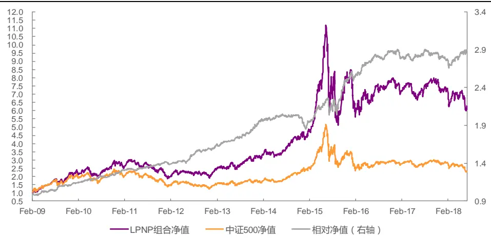
资料来源：光大证券研究所，Wind 注：交易成本按双边 0.6%计算

表 12：LPNP 选股组合分年度表现

| 年份 | 年化收益率 | 年化波动率 | 夏普比率 | 最大回撤 | 相对收益率 | 相对波动率 | 信息比率 | 相对回撤 |
| --- | --- | --- | --- | --- | --- | --- | --- | --- |
| 2009 | 90.0% | 33.8% | 2.67 | 17.4% | 13.8% | 5.4% | 2.56 | 2.3% |
| 2010 | 26.0% | 27.7% | 0.94 | 26.1% | 12.5% | 4.0% | 3.12 | 2.0% |
| 2011 | -28.8% | 24.5% | -1.17 | 34.6% | 8.9% | 3.6% | 2.48 | 2.3% |
| 2012 | 14.9% | 23.9% | 0.62 | 20.1% | 11.8% | 4.3% | 2.71 | 2.6% |
| 2013 | 39.1% | 23.2% | 1.69 | 15.3% | 20.8% | 4.9% | 4.26 | 1.6% |
| 2014 | 29.9% | 20.9% | 1.43 | 12.3% | -4.3% | 5.1% | -0.83 | 8.9% |
| 2015 | 78.7% | 52.1% | 1.51 | 54.3% | 33.7% | 12.4% | 2.72 | 9.8% |
| 2016 | -4.1% | 33.1% | -0.12 | 26.3% | 10.7% | 5.5% | 1.94 | 3.5% |
| 2017 | -2.8% | 16.1% | -0.18 | 13.8% | -3.7% | 4.6% | -0.79 | 4.9% |
| 2018 | -25.9% | 25.4% | -1.02 | 19.3% | 8.0% | 6.1% | 1.30 | 4.9% |
| 全样本 | 22.4% | 30.6% | 0.82 | 54.3% | 12.4% | 6.3% | 1.90 | 9.8% |

资料来源：光大证券研究所，Wind 注：交易成本按双边 0.6%计算

该组合换手率平均月度双边换手在67.6%，也就是说平均每个月大约换1/3 的股票，该换手虽低于大部分量价因子，但要高于单纯的财务数据因子。交易成本对组合年化收益有一定影响，但敏感程度不是很大。组合在双边千六的交易成本下，年化收益相比与无交易成本时稍低3.35%。

图8：不同交易成本下LPNP因子组合净值表现
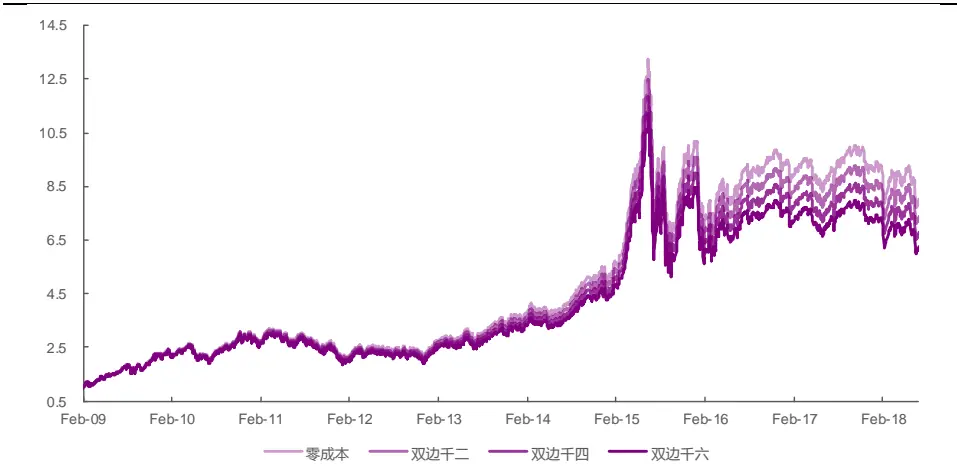
资料来源：光大证券研究所，Wind

表13：不同交易成本下LPNP因子组合统计数据

|  | 零成本 | 双边千二 | 双边千四 | 双边千六 |
| --- | --- | --- | --- | --- |
| 年化收益率 | 25.75% | 24.62% | 23.51% | 22.40% |
| 累计收益率 | 7.04 | 6.40 | 5.82 | 5.28 |
| 年化波动率 | 30.64% | 30.62% | 30.60% | 30.59% |
| 夏普比率 | 0.90 | 0.87 | 0.84 | 0.82 |
| 最大回撤 | 53.93% | 54.06% | 54.19% | 54.32% |

资料来源：光大证券研究所，Wind

除了在全市场选股，我们也分别测试了在沪深300以及中证 500 内选股的情况。

在沪深 300 中，分组单调性与区分程度效果不像在全市场内那么显著，以第五组对冲第一组的方式构建多空组合，年化收益9.15%，年化波动6.29%，最大回撤 9.28%，夏普比率 1.42。可见在沪深 300 样本内，该因子依然有较强的预测能力。我们选取 LPNP 因子值最大的 50 只股票构成选股组合。在2009年至 2018年间，组合年化收益 10.2%，年化波动率 26.9%，夏普比率 0.50，最大回撤 48.3%。相对沪深 300 指数年化收益 4.2%，相对波动率8.2%，夏普比率 0.54，相对最大回撤 15.0%。

图 9：LPNP 因子沪深 300 内分组及多空表现
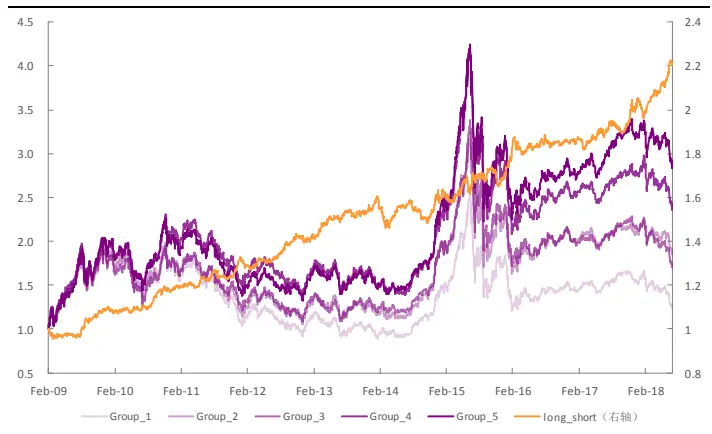
资料来源：光大证券研究所，Wind

图 10：LPNP 因子沪深 300 内选股组合表现
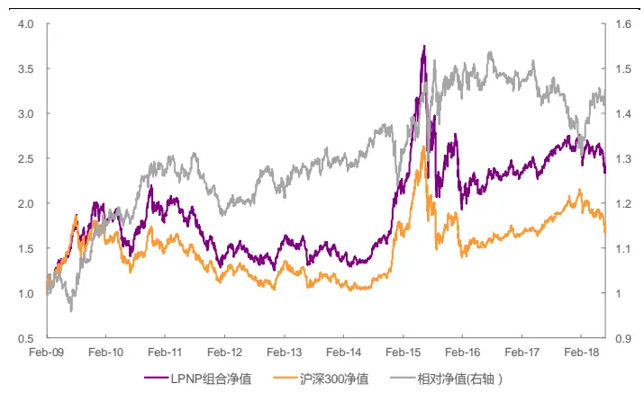
资料来源：光大证券研究所，Wind 注：双边 0.6%交易成本

从分年度数据中可以看出，该因子在沪深300股票池内的选股能力较为一般，稳定程度较低。在2011、2014与 2017 年都跑输沪深 300 指数本身。今年组合表现尚可，超额年化收益有10%以上，信息比约 1.3。

表 14：LPNP 因子沪深 300 内选股组合分年度表现

| 年份 | 年化收益率 | 年化波动率 | 夏普比率 | 最大回撤 | 相对收益率 | 相对波动率 | 信息比率 | 相对回撤 |
| --- | --- | --- | --- | --- | --- | --- | --- | --- |
| 2009 | 77.3% | 33.5% | 2.31 | 21.6% | 13.9% | 9.0% | 1.54 | 8.8% |
| 2010 | 2.4% | 27.0% | 0.09 | 29.3% | 12.7% | 7.0% | 1.81 | 3.5% |
| 2011 | -33.4% | 21.6% | -1.54 | 36.1% | -7.1% | 5.6% | -1.28 | 9.0% |
| 2012 | 12.4% | 21.6% | 0.58 | 20.7% | 3.3% | 5.2% | 0.63 | 4.7% |
| 2013 | -0.3% | 21.3% | -0.01 | 20.5% | 5.4% | 6.7% | 0.80 | 3.6% |
| 2014 | 38.3% | 19.1% | 2.00 | 10.8% | -4.3% | 6.7% | -0.64 | 9.9% |
| 2015 | 32.0% | 44.4% | 0.72 | 44.9% | 19.1% | 14.1% | 1.36 | 11.9% |
| 2016 | -9.4% | 26.2% | -0.36 | 22.4% | 0.0% | 7.8% | 0.00 | 5.6% |
| 2017 | 12.7% | 11.7% | 1.08 | 9.4% | -7.2% | 5.9% | -1.22 | 10.1% |
| 2018 | -15.7% | 18.5% | -0.85 | 15.3% | 10.5% | 8.2% | 1.29 | 6.3% |
| 全样本 | 10.2% | 26.9% | 0.50 | 48.3% | 4.2% | 8.2% | 0.54 | 15.0% |

资料来源：光大证券研究所，Wind 注：交易成本按双边 0.6%计算

在中证500 中，分组单调性与区分程度依然较为优秀。以第五组对冲第一组的方式构建多空组合，年化收益 10.92%，年化波动 5.59%，最大回撤7.41%，夏普比率1.88。我们选取LPNP因子值最大的 100 只股票构成选股组合。在 2009 年至 2018 年间，组合年化收益 17.1%，年化波动率 30.2%，夏普比率0.67，最大回撤52.2%。相对中证500指数年化收益 7.5%， 相对波动率仅4.5%，夏普比率1.63，相对最大回撤仅5.4%。

图 11：LPNP 因子中证 500 内分组及多空表现
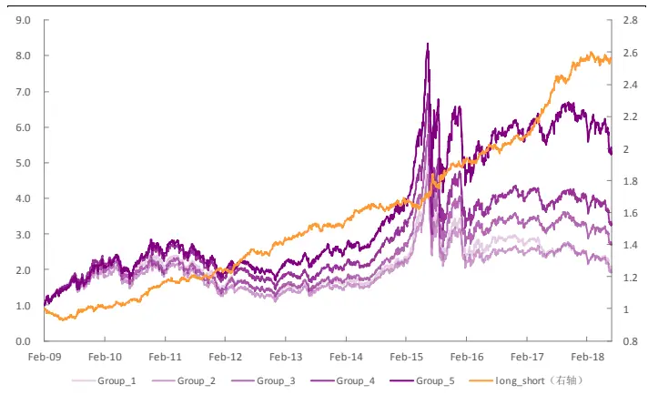
资料来源：光大证券研究所，Wind

图 12：LPNP 因子中证 500 内选股组合表现
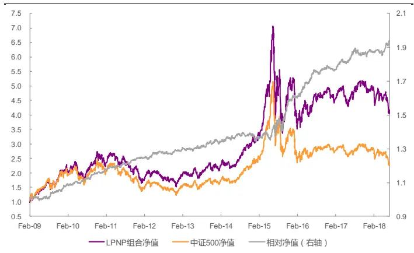
资料来源：光大证券研究所，Wind 注：双边 0.6%交易成本

通过分年度数据可以发现在2009年到2018年10年里LPNP选股组合每年都跑赢中证 500 基准。最近三年（2.06、2017、2018）的表现也较为突出，相对最大回撤皆控制在 2%左右。

表 15：LPNP 因子中证 500 内选股组合分年度表现

| 年份 | 年化收益率 | 年化波动率 | 夏普比率 | 最大回撤 | 相对收益率 | 相对波动率 | 信息比率 | 相对回撤 |
| --- | --- | --- | --- | --- | --- | --- | --- | --- |
| 2009 | 84.0% | 34.8% | 2.41 | 18.9% | 7.7% | 4.0% | 1.95 | 2.1% |
| 2010 | 20.9% | 28.9% | 0.72 | 28.2% | 7.4% | 2.9% | 2.53 | 1.4% |
| 2011 | -30.3% | 24.2% | -1.25 | 36.0% | 7.5% | 2.8% | 2.63 | 1.2% |
| 2012 | 6.3% | 24.4% | 0.26 | 27.1% | 3.2% | 2.8% | 1.11 | 1.5% |
| 2013 | 22.5% | 22.7% | 0.99 | 16.3% | 4.3% | 3.4% | 1.27 | 1.6% |
| 2014 | 34.3% | 19.8% | 1.73 | 12.0% | 0.2% | 3.5% | 0.05 | 3.5% |
| 2015 | 63.3% | 50.8% | 1.25 | 52.2% | 18.3% | 9.5% | 1.93 | 5.4% |
| 2016 | -5.4% | 32.0% | -0.17 | 26.0% | 9.4% | 3.8% | 2.48 | 1.5% |
| 2017 | 6.8% | 15.9% | 0.43 | 14.2% | 6.0% | 3.4% | 1.73 | 2.7% |
| 2018 | -28.3% | 23.1% | -1.23 | 19.1% | 5.5% | 3.1% | 1.78 | 2.0% |
| 全样本 | 17.1% | 30.2% | 0.67 | 52.2% | 7.5% | 4.5% | 1.63 | 5.4% |

资料来源：光大证券研究所，Wind 注：交易成本按双边 0.6%计算

## 4、LPNP 因子相关性研究与中性化效果

上一章节已经对因子进行了有效性、稳定性及单调性测试，证明其具备良好的选股能力。在最后一个章节，我们将研究LPNP 因子与其它主流因子的相关性；并探析在剔除了其它例如市值或其它因子带入的效用后，LPNP因子是否依然具备良好的选股能力。

## 4.1、LPNP 因子与不少主流因子有较显著相关性

为了了解有哪些已有因子与 LPNP因子有较高的相关性，我们分别计算了规模因子、动量因子、技术因子、波动因子及流动性因子中单因子测试显著性较高的几个因子与LPNP因子之间历史IC序列的相关系数。由于LPNP本身就是典型的成长因子，故这里没有测试其与其它成长因子的相关性。

从下图可以看出 LPNP 因子与 ROE 因子、市值（Ln_MC）因子与 1 个月动量有较强正相关，相关系数在 0.3 左右；而与 BP 股指因子与流动性（VSTD）因子则呈现-0.2 到-0.3 左右的负相关性。

图13：因子与其他大类因子历史IC值相关性检验
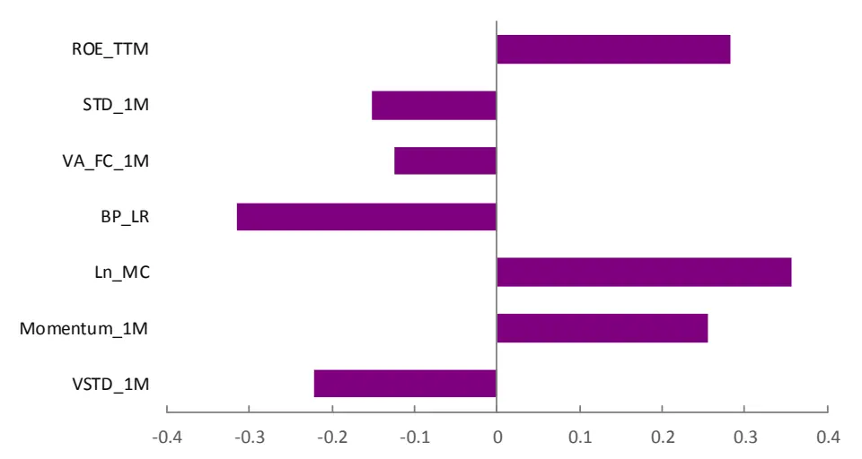
资料来源：光大证券研究所

## 4.2、剔除相关因子后预测能力再上层楼

我们将通过横截面回归取残差的方式，同时剔除上述因子对 LPNP 因子的影响，对所有的因子均做截面标准化和极值处理：

$$
\begin{array}{c}{{LPNP_{i}=\beta_{1}*MC_{i}+\beta_{2}*Industry_{i}+}}\\{{\beta_{3}*ROE_{i}+\cdots+\varepsilon_{i}\#(6)}}\end{array}
$$

对LPNP因子中性化处理后因子的有效性检验等结果仍然十分显著，IC均值为4.28%，IC大于零的比例为 91.2%；而 IR高达 1.27，相比中性化处理之前的 0.87 有明显提升，说明中性化处理起到了信息提纯的作用，使得因子的预测能力与稳定性都得到进一步提升。

表16：中性化前后LPNP因子的预测能力

| 因子处理 | IC 均值 | IC 标准差 | IC>0 比例 | IC>0.02 比例 | IR 值 |
| --- | --- | --- | --- | --- | --- |
| 中性化前 | 3.37% | 3.87% | 79.8% | 66.7% | 0.87 |
| 中性化后 | 4.28% | 3.38% | 91.2% | 75.4% | 1.27 |

资料来源：光大证券研究所，Wind

图 14：中性化后 LPNP 因子 IC 序列
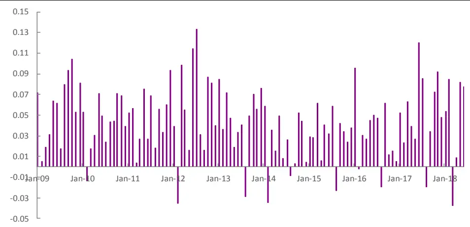
资料来源：光大证券研究所，Wind

同时比较多个净利润相关因子在经过中性化后的表现，预测能力突出的依然是中性化前效果就不错的加速度因子、TTM 环比、TTM 同比与 LPNP因子。IC均值都在4%以上，而 ICIR 方面依然是LPNP 因子优势更为明显，其它优秀的净利润相关因子 ICIR 多集中在1.1左右。

表17：净利润相关因子中性化后预测能力

| 因子名称 | IC 均值 | ICIR |
| --- | --- | --- |
| 净利润加速度 | 4.23% | 1.06 |
| 净利润 TTM 环比 | 4.53% | 1.11 |
| 净利润单季度环比 | 2.56% | 0.80 |
| 净利润稳健加速度 | 3.35% | 1.08 |
| 净利润稳健增速 | 2.21% | 0.62 |
| 净利润 TTM 同比 | 4.99% | 1.10 |
| 线性纯化净利润(LPNP） | 4.28% | 1.27 |

资料来源：光大证券研究所，Wind 注：计算区间为 2009 年 1 月至 2018 年 6 月

按中性化后的LPNP 因子值大小等分 5组，分组单调性仍十分优秀，因子越大的组合收益越大，区分程度显著。以第五组对冲第一组的方式构建多空组合，年化收益 14.15%，年化波动仅 3.38%，最大回撤仅 3.20%，夏普比率高达3.94。相比于中性化之前，无论多空年化收益还是夏普比率都有大幅上升，但波动与回撤控制稍稍弱化。

表18：中性化后LPNP因子等分 5组下分组统计数据

|  | 第一组 | 第二组 | 第三组 | 第四组 | 第五组 | 多空组合 |
| --- | --- | --- | --- | --- | --- | --- |
| 年化收益 | 7.98% | 12.39% | 14.96% | 18.50% | 23.27% | 14.15% |
| 累计收益 | 1.01 | 1.89 | 2.55 | 3.68 | 5.70 | 2.33 |
| 年化波动率 | 30.28% | 30.34% | 30.40% | 30.36% | 30.47% | 3.38% |
| 夏普比率 | 0.41 | 0.54 | 0.61 | 0.71 | 0.84 | 3.94 |
| 最大回撤 | 61.63% | 58.21% | 54.29% | 53.40% | 53.59% | 3.20% |

资料来源：光大证券研究所，Wind

图 15：中性化后 LPNP 因子分 5 组单调性
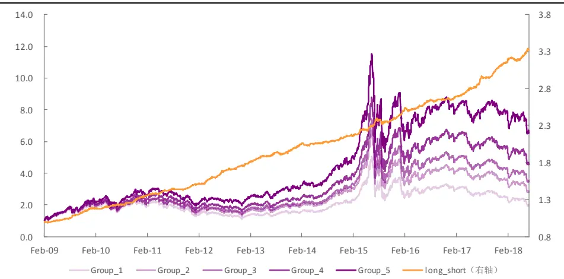
资料来源：光大证券研究所，Wind

中性化后的多空组合每年表现都极其稳定。从夏普比率来看，除了2014、2015 这两年在 2.5 与 3 之间以外，其余年份夏普比皆在 3 以上。最大回撤方面仅在2015年相对稍高，其余年内最大回撤未超过2%。最近两年（2017、2018）组合表现颇为亮眼，夏普比皆在 4 以上，年化收益也超 10%，最大回撤控制在1.5%以内。

表19：中性化后的LPNP因子多空组合分年度统计数据

| 年份 | 年化收益率 | 年化波动率 | 夏普比率 | 最大回撤 |
| --- | --- | --- | --- | --- |
| 2009 | 17.49% | 4.17% | 4.19 | 1.33% |
| 2010 | 12.38% | 3.56% | 3.48 | 1.39% |
| 2011 | 11.64% | 2.86% | 4.07 | 1.19% |
| 2012 | 16.99% | 3.39% | 5.02 | 1.17% |
| 2013 | 12.59% | 3.16% | 3.98 | 2.00% |
| 2014 | 6.35% | 2.44% | 2.60 | 1.68% |
| 2015 | 12.50% | 4.32% | 2.89 | 3.20% |
| 2016 | 8.28% | 2.69% | 3.07 | 1.74% |
| 2017 | 16.22% | 2.75% | 5.89 | 0.84% |
| 2018 | 12.58% | 2.96% | 4.25 | 1.49% |
| 全样本 | 14.15% | 3.38% | 3.94 | 3.20% |

资料来源：光大证券研究所，Wind

综上，LPNP 因子剔除其它类型因子的效应后仍有大量的独有信息，且因子预测能力与稳定性进一步增强，以其构建多空组合的整体表现大幅提升。

## 5、风险提示

本报告中的测试结果均基于模型和历史数据，历史数据存在不被重复验证的可能，模型存在失效的风险。

## 行业及公司评级体系

| 评级 说明 |  |
| --- | --- |
| 行 买入 | 未来6-12个月的投资收益率领先市场基准指数15%以上； |
| 增持 | 未来6-12个月的投资收益率领先市场基准指数5%至15%； |
|  | 中性 未来6-12个月的投资收益率与市场基准指数的变动幅度相差-5%至5%； |
| 减持 | 未来6-12个月的投资收益率落后市场基准指数5%至15%； |
| 卖出 | 未来6-12个月的投资收益率落后市场基准指数15%以上； |
| 业及公司评级 无评级 | 因无法获取必要的资料，或者公司面临无法预见结果的重大不确定性事件，或者其他原因，致使无法给出明确的 |
| 投资评级。 基准指数说明：A股主板基准为沪深300指数；中小盘基准为中小板指；创业板基准为创业板指；新三板基准为新三板指数；港 股基准指数为恒生指数。 |  |

## 分析、估值方法的局限性说明

本报告所包含的分析基于各种假设，不同假设可能导致分析结果出现重大不同。本报告采用的各种估值方法及模型均有其局限性，估值结果不保证所涉及证券能够在该价格交易。

## 分析师声明

本报告署名分析师具有中国证券业协会授予的证券投资咨询执业资格并注册为证券分析师，以勤勉的职业态度、专业审慎的研究方法，使用合法合规的信息，独立、客观地出具本报告，并对本报告的内容和观点负责。负责准备本报告以及撰写本报告的所有研究分析师或工作人员在此保证，本研究报告中关于任何发行商或证券所发表的观点均如实反映分析人员的个人观点。负责准备本报告的分析师获取报酬的评判因素包括研究的质量和准确性、客户的反馈、竞争性因素以及光大证券股份有限公司的整体收益。所有研究分析师或工作人员保证他们报酬的任何一部分不曾与，不与，也将不会与本报告中具体的推荐意见或观点有直接或间接的联系。

## 特别声明

光大证券股份有限公司（以下简称“本公司”）创建于 1996 年，系由中国光大（集团）总公司投资控股的全国性综合类股份制证券公司，是中国证监会批准的首批三家创新试点公司之一。根据中国证监会核发的经营证券期货业务许可，光大证券股份有限公司的经营范围包括证券投资咨询业务。

本公司经营范围：证券经纪；证券投资咨询；与证券交易、证券投资活动有关的财务顾问；证券承销与保荐；证券自营；为期货公司提供中间介绍业务；证券投资基金代销；融资融券业务；中国证监会批准的其他业务。此外，公司还通过全资或控股子公司开展资产管理、直接投资、期货、基金管理以及香港证券业务。

本证券研究报告由光大证券股份有限公司研究所（以下简称“光大证券研究所”）编写，以合法获得的我们相信为可靠、准确、完整的信息为基础，但不保证我们所获得的原始信息以及报告所载信息之准确性和完整性。光大证券研究所可能将不时补充、修订或更新有关信息，但不保证及时发布该等更新。

本报告中的资料、意见、预测均反映报告初次发布时光大证券研究所的判断，可能需随时进行调整且不予通知。报告中的信息或所表达的意见不构成任何投资、法律、会计或税务方面的最终操作建议，本公司不就任何人依据报告中的内容而最终操作建议做出任何形式的保证和承诺。在任何情况下，本报告中的信息或所表述的意见并不构成对任何人的投资建议。客户应自主作出投资决策并自行承担投资风险。本报告中的信息或所表述的意见并未考虑到个别投资者的具体投资目的、财务状况以及特定需求。投资者应当充分考虑自身特定状况，并完整理解和使用本报告内容，不应视本报告为做出投资决策的唯一因素。对依据或者使用本报告所造成的一切后果，本公司及作者均不承担任何法律责任。

不同时期，本公司可能会撰写并发布与本报告所载信息、建议及预测不一致的报告。本公司的销售人员、交易人员和其他专业人员可能会向客户提供与本报告中观点不同的口头或书面评论或交易策略。本公司的资产管理部、自营部门以及其他投资业务部门可能会独立做出与本报告的意见或建议不相一致的投资决策。本公司提醒投资者注意并理解投资证券及投资产品存在的风险，在做出投资决策前，建议投资者务必向专业人士咨询并谨慎抉择。

在法律允许的情况下，本公司及其附属机构可能持有报告中提及的公司所发行证券的头寸并进行交易，也可能为这些公司提供或正在争取提供投资银行、财务顾问或金融产品等相关服务。投资者应当充分考虑本公司及本公司附属机构就报告内容可能存在的利益冲突，勿将本报告作为投资决策的唯一信赖依据。

本报告根据中华人民共和国法律在中华人民共和国境内分发，仅供本公司的客户使用。本公司不会因接收人收到本报告而视其为客户。本报告仅向特定客户传送，未经本公司书面授权，本研究报告的任何部分均不得以任何方式制作任何形式的拷贝、复印件或复制品，或再次分发给任何其他人，或以任何侵犯本公司版权的其他方式使用。所有本报告中使用的商标、服务标记及标记均为本公司的商标、服务标记及标记。如欲引用或转载本文内容，务必联络本公司并获得许可，并需注明出处为光大证券研究所，且不得对本文进行有悖原意的引用和删改。

## 光大证券股份有限公司

上海市新闸路 1508 号静安国际广场 3 楼 邮编 200040

总机：021-22169999 传真：021-22169114、22169134

| 机构业务总部 | 姓名 | 办公电话 | 手机 | 电子邮件 |
| --- | --- | --- | --- | --- |
| 上海 | 徐硕 |  | 13817283600 | shuoxu@ebscn.com |
|  | 李文渊 |  | 18217788607 | liwenyuan@ebscn.com |
|  | 李强 | 021-22169131 | 18621590998 | liqiang88@ebscn.com |
|  | 罗德锦 | 021-22169146 | 13661875949/13609618940 | luodj@ebscn.com |
|  | 张弓 | 021-22169083 | 13918550549 | zhanggong@ebscn.com |
|  | 黄素青 | 021-22169130 | 13162521110 | huangsuqing@ebscn.com |
|  | 邢可 | 021-22167108 | 15618296961 | xingk@ebscn.com |
|  | 李晓琳 | 021-22169087 | 13918461216 | lixiaolin@ebscn.com |
|  | 丁点 | 021-22169458 | 18221129383 | dingdian@ebscn.com |
|  | 郎珈艺 |  | 18801762801 | dingdian@ebscn.com |
|  | 郭永佳 |  | 13190020865 | guoyongjia@ebscn.com |
|  | 余鹏 | 021-22167110 | 17702167366 | yupeng88@ebscn.com |
| 北京 | 郝辉 | 010-58452028 | 13511017986 | haohui@ebscn.com |
|  | 梁晨 | 010-58452025 | 13901184256 | liangchen@ebscn.com |
|  | 吕凌 | 010-58452035 | 15811398181 | Ivling@ebscn.com |
|  | 郭晓远 | 010-58452029 | 15120072716 | guoxiaoyuan@ebscn.com |
|  | 张彦斌 | 010-58452026 | 15135130865 | zhangyanbin@ebscn.com |
|  | 庞舒然 | 010-58452040 | 18810659385 | pangsr@ebscn.com |
| 深圳 | 黎晓宇 | 0755-83553559 | 13823771340 | lixy1@ebscn.com |
|  | 李潇 | 0755-83559378 | 13631517757 | lixiao1@ebscn.com |
|  | 张亦潇 | 0755-23996409 | 13725559855 | zhangyx@ebscn.com |
|  | 王渊锋 | 0755-83551458 | 18576778603 | wangyuanfeng@ebscn.com |
|  | 张靖雯 | 0755-83553249 | 18589058561 | zhangjingwen@ebscn.com |
|  | 牟俊宇 | 0755-83552459 | 13827421872 | moujy@ebscn.com |
|  | 苏一耘 |  | 13828709460 | suyy@ebscn.com |
| 国际业务 | 陶奕 | 021-22169091 | 18018609199 | taoyi@ebscn.com |
|  | 梁超 | 021-22167068 | 15158266108 | liangc@ebscn.com |
|  | 金英光 | 021-22169085 | 13311088991 | jinyg@ebscn.com |
|  | 王佳 | 021-22169095 | 13761696184 | wangjia1@ebscn.com |
|  | 郑锐 | 021-22169080 | 18616663030 | zhrui@ebscn.com |
|  | 凌贺鹏 | 021-22169093 | 13003155285 | linghp@ebscn.com |
|  | 周梦颖 | 021-22169087 | 15618752262 | zhoumengying@ebscn.com |
| 金融同业与战略客户 | 黄怡 | 010-58452027 | 13699271001 | huangyi@ebscn.com |
|  | 徐又丰 | 021-22169082 | 13917191862 | xuyf@ebscn.com |
|  | 王通 | 021-22169501 | 15821042881 | wangtong@ebscn.com |
|  | 赵纪青 | 021-22167052 | 18818210886 | zhaojq@ebscn.com |
|  | 马明周 | 021-22167343 | 18516159056 | mamingzhou@ebscn.com |
| 私募业务部 | 谭锦 | 021-22169259 | 15601695005 | tanjin@ebscn.com |
|  | 曲奇瑶 | 021-22167073 | 18516529958 | quqy@ebscn.com |
|  | 王舒 | 021-22169134 | 15869111599 | wangshu@ebscn.com |
|  | 安羚娴 | 021-22169479 | 15821276905 | anlx@ebscn.com |
|  | 戚德文 | 021-22167111 | 18101889111 | qidw@ebscn.com |
|  | 吴冕 |  | 18682306302 | wumian@ebscn.com |
|  | 吕程 | 021-22169482 | 18616981623 | Ivch@ebscn.com |
|  | 李经夏 | 021-22167371 | 15221010698 | lijxia@ebscn.com |
|  | 高霆 | 021-22169148 | 15821648575 | gaoting@ebscn.com |
|  | 左贺元 | 021-22169345 | 18616732618 | zuohy@ebscn.com |
|  | 任 | 021-22167470 | 15955114285 | renzhen@ebscn.com |
|  | 俞灵杰 | 021-22169373 | 18717705991 | yulingjie@ebscn.com |