## 创新基本面因子：捕捉产能利用率中的讯号——多因子系列报告之十六

2017 年来，以往效果卓越的市值因子、量价类因子等都出现了有效性下滑的情况，价值投资的呼声也越来越高。愈来愈多的投资经理开始关注基本面因子。然而过于简单直白的基本面因子其效果又差强人意。基于这样的现象与需求，我们开始研究并推出了创新基本面因子系列报告。尝试通过一些更深入的研究，在保留直观逻辑意义的同时，更好地提取出蕴含在基本面数据中的有效预测信息。

- 产能利用率反映企业营运效率。产能利用率刻画了公司将生产设备用于生产工作的利用程度到底有多高。生产设备作为一种固定成本，在业务期间无论是否使用，都不会改变减少；与其相对的变动成本，购买原材料、员工工资、营销费用等，是会随着产量变化而改变的。因此对于设备等固定设施的利用率的高低一定程度上决定了最终实际平均成本的高低，利用率越高，摊销到单位产品上的平均实际成本就越低，企业的营运效率就越高。

产能利用率有预测效果但效果不强。通过将营业总成本与固定资产进行求比，以及进行滚动回归取斜率的方式，分别构造了产能利用率因子。两种方式下，产能利用率因子的 IC 均值皆在 1%左右，而 ICIR 则在 0.25上下，有一定预测效果但整体效果偏弱。相比之下利用滚动回归取斜率的方式得到的产能利用率因子效果会稍好一些。

OCFA 因子预测能力突出。通过将营业总成本对固定资产进行滚动回归取残差的方式构造了产能利用率提升（OCFA）因子。该因子预测能力突出，月度 IC 均值 1.73%，月度 IR 值 0.52。基于该因子构造的多空组合在 2009 年至 2018 年 6 月期间年化收益 7.1%，夏普比率 2.18，最大回撤 4.7%。

中性化后OCFA因子效果稳定。将 OCFA 因子与现有的主流风格因子作相关性测试，其与 ROE、净利润增速正相关，相关系数 0.3 上下；而与BP估值、流动性呈现负相关，相关系数-0.3上下。在经过横截面回归取残差的方式剔除上述因子对 OCFA 因子的影响后，因子效果仍稳定，月度IC均值为1.49%，月度IR值 0.53，中性化处理起到了一定信息提纯的作用。以中性化后 OCFA 因子构建的多空组合，年化收益 5.6%，夏普比率 1.93，最大回撤仅2.6%。

- 风险提示：测试结果均基于模型和历史数据，模型存在失效的风险。

## 金融工程深度

## 分析师

刘均伟 (执业证书编号：S0930517040001)

021-52523679

liujunwei@ebscn.com

## 联系人

胡骥聪

021-52523683

hujicong@ebscn.com

## 相关研究

《因子测试框架

——多因子系列报告之一》《因子测试全集

——多因子系列报告之二》《多因子组合“光大 Alpha 1.0”

多因子系列报告之三》《别开生面：公司治理因子详解《别开生面：公司治理因子详解

——多因子系列报告之四》

《见微知著：成交量占比高频因子解析——多因子系列报告之五》

《行为金融因子：噪音交易者行为偏差——多因子系列报告之六》

《基于 K 线最短路径构造的非流动性因子——多因子系列报告之七》

《高频因子：日内分时成交量蕴藏玄机——多因子系列报告之八》

《一致交易：挖掘集体行为背后的收益——多因子系列报告之九》

《因子正交与择时：基于分类模型的动态权重配置 ——多因子系列报告之十》《爬罗剔抉：一致预期因子分类与精选——多因子系列报告之十一》

《成长因子重构与优化：稳健加速为王——多因子系列报告之十二》

《组合优化算法探析及指数增强实证——多因子系列报告之十三》《创新基本面因子：财务数据间线性关系初窥——多因子系列报告之十四 》《创新基本面因子：提纯净利数据中的选股信息 ——多因子系列报告之十五 》

## 1、产能利用率反映企业营运效率

在之前的创新基本面因子系列报告中，我们着重研究了上市企业在盈利与成长属性上的基本面数据。在该篇报告中，我们将视角转到公司营运效率上，尝试通过刻画类似产能利用率的概念与指标来构造能有效预测公司未来股价相对收益的基本面因子。

## 1.1、传统产能利用率的定义

一般而言，产能利用率并不是一个所有行业都看重的指标。它反映的是一个公司对其生产设备——厂房、生产器械等等的有效利用率，因此往往是涉及到用设备生产产品来产生盈利的制造业更加看重产能利用率这个指标；而对服务业、科技类等并非资本密集型产业而言，产能利用率从逻辑上并不能成为预测其公司未来表现的有效指标。

按照传统上的定义，产能利用率的定义为：实际产能/设计产能。然而财务报表中并没有实际产能与设计产能的数据，我们很难直接从其传统定义构造相应的营运效率指标。那么是否可以通过构造其它的代理指标来一定程度上刻画出与产能利用率所想表达相同的涵义？

## 1.2、延伸产能利用率的思路

产能利用率所希望表达的核心思想在于公司将设备用于生产工作的利用程度到底有多高。因为设备作为一种固定成本，在业务期间无论是否使用，都并不会改变减少；与其相对的是变动成本，指的是在生产过程中需要支付给各种变动生产要素的费用，比如购买原材料、员工工资、营销费用等等，这些成本是随着产量变化而变化的。因此对于设备等固定设施的利用率的高低一定程度上决定了最终实际平均成本的高低，利用率越高，摊销到单位产品上的平均实际成本就越低，企业的营运效率就越高。

那么按照这个思路，我们也能更清晰地理解产能利用率对不同行业影响不一的原因。不同行业的成本结构不同，成本结构中固定成本比重越大的产业，固定资产的使用效率对单位制造成本的影响就越大。而那些固定成本比重较低的产业，如科技公司、金融公司等，固定资产的使用效率对其商业盈利的影响则相对较小。

通过以上逻辑，我们实际上是从成本的角度解释产能利用率。那么我们自然而然地可以从成本的角度延伸拓展产能利用率的定义。比如说，可以考虑使用固定成本占比倒数：全部成本/固定成本，来延伸代理产能利用率这一概念。或者使用其它类似的指标构造。

## 2、线性回归研究框架实现产能利用率相关指标

在创新基本面因子系列的第一篇报告《财务数据之间线性关系初窥》中介绍了财务数据间线性关系研究框架。这里我们作简单回顾。

通过构造不同财务数据间的滚动线性回归模型：

$$
\begin{aligned}Funda_{Y}=\beta_{\alpha}+\beta_{A}*Funda_{A}+\beta_{B}*Funda_{B}+\beta_{C}*Funda_{C}+\cdots+\\\beta_{X}*Funda_{X}+\varepsilon\#(1)\end{aligned}
$$

或者，更常用的简化形式，仅考虑两个不同财务数据间的简单线性回归：

$$
Funda_{Y}=\beta_{\alpha}+\beta_{X}*Funda_{X}+\varepsilon\#(2)
$$

在拟合好回归模型后，根据逻辑需要，找到可以反映或代理该逻辑的量化数据。

需要注意的是：

1. 在该研究框架中，为了避免不同股票在回归时财务数据量级不同导致最终因子也受该量级的影响，所有的财务数据在滚动回归窗口里都先进行标准化操作。

2. 由于不少财务数据并不是所有公司都会公布，有些财务指标仅相应行业的公司才有。因此我们的研究框架中是有因子覆盖度检查的，即检查历史上有该财务数据的上市企业占全部上市公司数目的比例。在全市场的因子开发中，只有通过覆盖度检查该因子才会被我们采纳。

## 2.1、构造产能利用率相关的指标

在第一章我们提出利用固定成本占比倒数：全部成本/固定成本，来表征泛化的产能利用率。而财务报表中，营业总成本与固定资产正好可以分别代理全部成本与固定成本。使用营业总成本与固定资产的好处有两点：一是代理逻辑直观，二是行业覆盖度高。在我们线性框架中，相关指标的构造并不会直接采用求比的方式，而是将两个财务数据套用在如下模型：

$$
Total\_Operation\_Cost=\beta_{\alpha}+\beta_{X}*Fized\_Assets+\varepsilon\#(3)
$$

这里我们关心两个数据：一个是 $\beta_{X}$ ，表征产能利用率；另一个是ε，表征产能利用率的提升。我们想知道这两个指标是否能成为有效的基本面因子。覆盖率方面从下图可以看出，该线性模型下的数据在各一级行业的覆盖度基本上都较高，仅在轻工制造与汽车这两个行业上覆盖度稍低。

图1：线性回归数据（ $(\beta_{X}\&\varepsilon)$ 在各行业（中信一级）缺失值占比及有值率
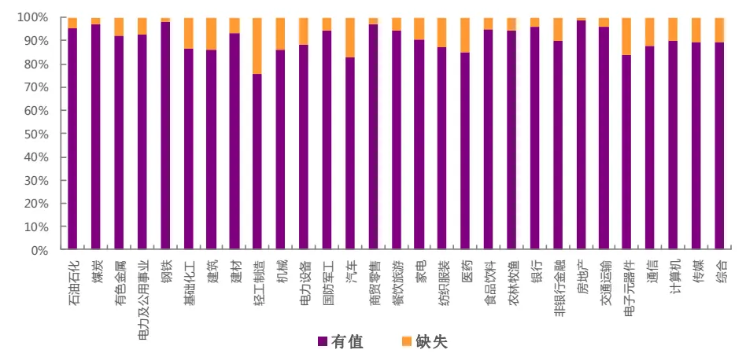
资料来源：光大证券研究所，Wind 注：计算区间为 2009 年 1 月至 2018 年 6 月

## 2.2、产能利用率因子效果不强

我们首先研究产能利用率 $\beta_{X}$ 对股票未来相对收益有预示效果。我们简单地测试了将 $\beta_{X}$ 作为产能利用率因子时的 ICIR 数据以及选股效果，为了方便比较，我们同时也测试了营业总成本/固定资产作为产能利用率因子的效果。从测试结果来看，产能利用率本身具有一定的预测能力，但效果不强，作为因子其IC 均值在1%左右，ICIR 在 0.25左右。同时由下表可以看出用线性框架构造的产能利用率因子在IC均值与IR上都较直接求比的方式效果更佳。

表1：不同构造下产能利用率因子的预测能力

| 因子构造 | IC 均值 | IC 标准差 | IC>0 比例 | IC>0.02 比例 | IR 值 |
| --- | --- | --- | --- | --- | --- |
| 回归斜率 | 1.02% | 3.90% | 59.65% | 39.47% | 0.26 |
| 直接求比 | 0.90% | 3.75% | 60.53% | 31.58% | 0.24 |

资料来源：光大证券研究所，Wind 注：统计区间为 2009 年 1 月至 2018 年 6 月

上述测试结果表明，产能利用率更高的企业其股价表现的确大概率会更好一些；但其预测能力较为有限的原因，可能在于产能利用率作为常量信息其大部分信号更容易被投资者预期所捕捉。在下一章节，我们着重测试产能利用率的提升能否更为有效地预测未来股价的相对收益。

## 3、产能利用率提升（OCFA）因子

继上一章讨论利用 $\beta_{X}$ 刻画产能利用率，这一章则利用ε刻画产能利用率的提升，并以此构造产能利用率提升因子，为了方便起见，我们命名其为OCFA（Operation Cost on Fixed Assets 的首字母缩写）因子。

## 3.1、因子预测效果测试

在测试因子有效性及构建多空组合之前，我们会先对因子数据进行一定程度的清洗。对于因子数据的清洗和有效性检验在此前的多因子系列报告中已有详细阐述，这里仅作简单回顾。

- 绝对中位数法去极值：在因子测试阶段，由于因子本身的分布是否为正态分布无法确定，我们采用稳健的 MAD（绝对中位数法）去除极值更加合适。

- 截面标准化处理：通过横截面 z-score方法，以每个时间截面 t上的所有股票的为样本，分别计算其均值和标准差得到如下所示 stand(factor)。此标准化方式属于因子的线性变换，并不会改变原始因子的分布特征。

$$
\mathrm{standard}(factor)_{jt}=\frac{factor_{jt}-\overline{factor_{t}}}{std(factor)_{t}}\#(4)
$$

- 有效性及预测能力检验：我们计算行业中性与市值中性处理后的RankIC（因子值与股票次月收益率的秩相关系数），通过以下几个与IC 值相关的指标来判断因子的有效性和预测能力：IC 值的均值、IC值的标准差、IC 大于0 的比例、IC 绝对值大于0.02 的比例、ICIR。

OCFA 因子的 IC 均值为 1.73%，IC 标准差为 3.33%，IR 值为 0.52。单从该因子的月度 IC 均值来看，预测效果较为一般，但明显好于产能利用率因子，超过 0.5 的 ICIR 的数值显示因子预测能力也比较稳定。IC>0 的比例超过70%，IC>0.02 的比例也有五成以上。

图 2：OCFA 因子 IC 序列
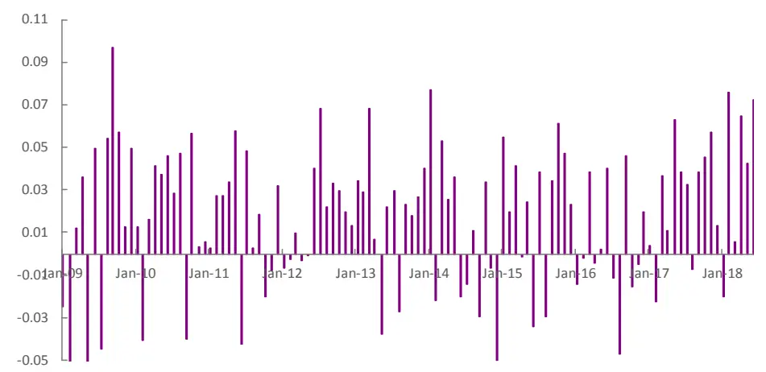
资料来源：光大证券研究所，Wind 注：统计区间为 2009 年 1 月至 2018 年 6 月

OCFA因子在不同行业内的预测能力差异较大，我们按中信一级行业统计了各行业下的因子预测能力。预测能力较好的行业有家电、轻工制造、建材等。其它一些制造类行业的预测能力也皆位前列；而计算机、传媒、通信等 TMT 板块行业预测能力都很弱。而餐饮旅游与建筑的 IC 均值与 IR 则是负数。

表 2：OCFA 因子在各中信一级行业下预测能力有所差异

| 一级行业 | IC 均值 | IR | 有因子值公司数 | 缺失值占比 |
| --- | --- | --- | --- | --- |
| 石油石化 | 2.82% | 0.15 | 44 | 4.3% |
| 煤炭 | 0.22% | 0.01 | 36 | 2.7% |
| 有色金属 | 1.08% | 0.08 | 96 | 7.7% |
| 电力及公用事业 | 2.33% | 0.19 | 141 | 7.2% |
| 钢铁 | 2.32% | 0.13 | 51 | 1.9% |
| 基础化工 | 2.08% | 0.23 | 249 | 13.5% |
| 建筑 | -0.79% | -0.05 | 103 | 14.2% |
| 建材 | 3.54% | 0.24 | 83 | 6.7% |
| 轻工制造 | 4.01% | 0.24 | 78 | 24.3% |
| 机械 | 1.61% | 0.14 | 291 | 13.9% |
| 电力设备 | 2.97% | 0.23 | 135 | 11.8% |
| 国防军工 | 0.56% | 0.03 | 48 | 5.9% |
| 汽车 | 2.40% | 0.21 | 140 | 17.2% |
| 商贸零售 | 2.67% | 0.17 | 93 | 3.1% |
| 餐饮旅游 | -0.19% | -0.01 | 32 | 5.9% |
| 家电 | 5.97% | 0.31 | 67 | 9.5% |
| 纺织服装 | 1.41% | 0.11 | 76 | 12.6% |
| 医药 | 0.48% | 0.05 | 234 | 15.2% |
| 食品饮料 | 3.25% | 0.20 | 90 | 5.3% |
| 农林牧渔 | 1.60% | 0.10 | 86 | 5.5% |
| 银行 | 1.72% | 0.07 | 24 | 4.0% |
| 非银行金融 | 2.79% | 0.10 | 46 | 9.8% |
| 房地产 | 0.64% | 0.07 | 149 | 1.3% |
| 交通运输 | 3.31% | 0.26 | 100 | 3.8% |
| 电子元器件 | 1.70% | 0.14 | 175 | 15.9% |
| 通信 | 1.40% | 0.08 | 105 | 12.5% |
| 计算机 | 0.17% | 0.01 | 167 | 10.2% |
| 传媒 | 0.74% | 0.04 | 116 | 10.8% |
| 综合 | 2.96% | 0.16 | 34 | 10.5% |

资料来源：光大证券研究所，Wind 注：统计区间为 2009 年 1 月至 2018 年 6 月

图 3：OCFA 在各中信一级行业上预测能力
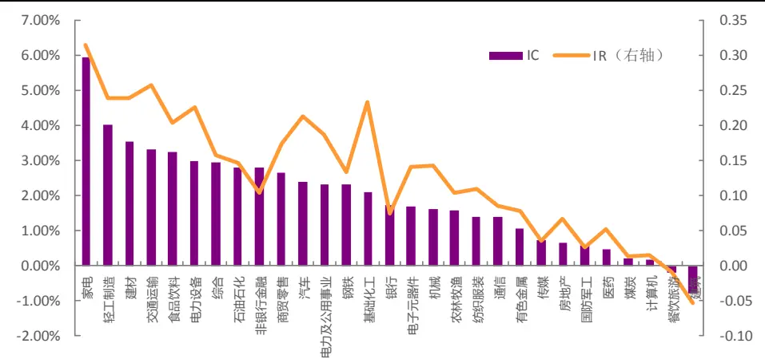
资料来源：光大证券研究所，Wind 注：统计区间为 2009 年 1 月至 2018 年 6 月

除了有效性指标，因子的单调性和稳定性也是衡量因子选股效果的重要指标。我们建立如下表的分组回测框架，从分组选股效果角度来看因子的单调性，若单调性良好，则说明用该因子选股长期的效果具备较高的稳定性的。下表为因子分组回测阶段的框架说明。

表 3：因子分组回测框架

|  | 因子分组回测框架 |
| --- | --- |
| 时间区间 | 2009年2月1日至2018年6月30日 |
| 股票池 | 全部 A 股(剔除选股日ST/PT股票；剔除上市不满一年的股票；剔除选股日由于停牌等因素无法买入的股票) |
| 调仓频率 | 月度调仓 |
| 分组调仓方式 | 每月最后一个交易日收盘后，根据本月所有未被剔除的股票数据计算因子值，根据因子值从小到大排序将股票等分为5（或10）组，分别计算每组股票的历史回测收益及多空组合收益。 |
| 交易费率 | 因子测试阶段暂不考虑交易费用 |

资料来源：光大证券研究所

在等分5组的情况下，分组单调性十分优秀，因子越大的组合收益越大，区分程度在收尾两端极为突出，但在中间几组区分度较小。以第五组对冲第一组的方式构建多空组合，年化收益7.1%，年化波动仅3.2%，最大回撤4.7%，夏普比率2.18。

表 4：OCFA 因子等分 5 组下分组统计数据

|  | 第一组 | 第二组 | 第三组 | 第四组 | 第五组 | 多空组合 |
| --- | --- | --- | --- | --- | --- | --- |
| 年化收益 | 11.8% | 14.8% | 15.6% | 16.9% | 19.8% | 7.1% |
| 累计收益 | 174.8% | 252.0% | 272.6% | 313.1% | 419.0% | 87.3% |
| 年化波动率 | 30.3% | 30.3% | 30.2% | 30.3% | 30.1% | 3.2% |
| 夏普比率 | 0.52 | 0.61 | 0.63 | 0.67 | 0.75 | 2.18 |
| 最大回撤 | 58.8% | 54.2% | 55.3% | 53.9% | 55.0% | 4.7% |

资料来源：光大证券研究所，Wind 注：统计区间为 2009 年 1 月至 2018 年 6 月

图4：OCFA因子分5组单调性优秀
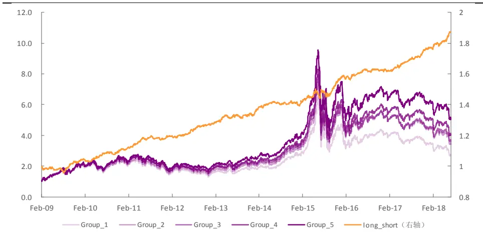
资料来源：光大证券研究所，Wind

对于多空组合，通过分年度统计的方式，可以看出组合在各个年份都有较为稳定的表现，仅2009年与 2015 年有一定回撤，但幅度也控制在 4%左右。夏普比率在大部分年份都能在2 以上。最近几年组合表现极为优秀，从2016 年到 2018 年组合夏普不断上升，回撤控制在2%以内，年化波动不到3%；2018年上半年组合夏普比率已逾 4。

表5：多空组合分年度统计数据

| 年份 | 年化收益率 | 年化波动率 | 夏普比率 | 最大回撤 |
| --- | --- | --- | --- | --- |
| 2009 | 4.2% | 4.2% | 0.99 | 4.3% |
| 2010 | 6.4% | 3.1% | 2.09 | 1.9% |
| 2011 | 7.4% | 2.6% | 2.82 | 2.4% |
| 2012 | 6.6% | 2.5% | 2.60 | 1.0% |
| 2013 | 6.0% | 3.1% | 1.96 | 1.8% |
| 2014 | 3.1% | 2.7% | 1.16 | 1.9% |
| 2015 | 12.5% | 4.7% | 2.65 | 3.9% |
| 2016 | 2.6% | 2.4% | 1.10 | 1.8% |
| 2017 | 8.4% | 2.2% | 3.89 | 1.2% |
| 2018 | 11.3% | 2.6% | 4.25 | 1.2% |
| 全样本 | 7.1% | 3.2% | 2.18 | 4.7% |

资料来源：光大证券研究所，Wind 注：统计区间为 2009 年 1 月至 2018 年 6 月

## 3.2、OCFA 因子选股能力优秀

通过对因子的有效性与稳定性检验，可以观察到 OCFA因子存在正的因子收益且与股票未来收益存在较强的正相关性，下面将以此为依据建立选股回测体系。后文的策略回测分析均基于此框架。

表6：因子选股策略回测框架

|  | 因子选股回测框架 |
| --- | --- |
| 回测时间区间 | 2009年2月1日至2018年6月30日 |
| 回测股票池 | 全部 A股或相应宽基指数成分股(剔除选股日ST/PT股票；剔除上市不满一年的股票；剔除选股日由于停牌等因素无法买入的股票) |
| 配置股票数量 | 100 只或50 只 |
| 调仓频率 | 月度调仓 |
| 调仓方式 | 每月最后一个交易日收盘后，根据本月所有未被剔除的股票数据计算因子值，选择因子值最大的100只或50只股票等权配置 |
| 交易费率 | 双边 0.6% |

资料来源：光大证券研究所

通过挑选 OCFA 因子值最大的 100只股票构建的选股组合，在 2009 年至2018年间，年化收益18.7%，年化波动率30.3%，夏普比率 0.72，最大回撤55.8%。相对中证500指数年化收益9.0%， 相对波动率 6.1%，信息比率 1.44，相对最大回撤 15.1%。

从分年度的数据来看，OCFA因子组合在大部分年份的表现都较为优秀。但在2017 年大幅跑输中证 500 指数；在2018年上半年小幅跑输中证 500指数。在 2015 年与 2017年则有较大相对回撤。

图 5：OCFA 因子组合相对中证 500 基准表现
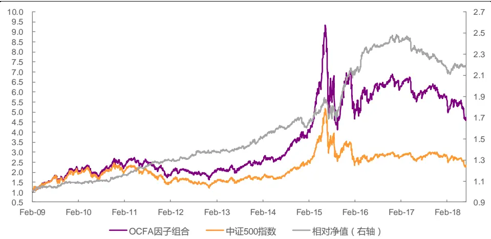
资料来源：光大证券研究所，Wind 注：交易成本按双边 0.6%计算

表7：OCFA选股组合分年度表现

| 年份 | 年化收益率 | 年化波动率 | 夏普比率 | 最大回撤 | 相对收益率 | 相对波动率 | 信息比率 | 相对最大回撤 |
| --- | --- | --- | --- | --- | --- | --- | --- | --- |
| 2009 | 85.3% | 34.4% | 2.48 | 19.4% | 9.1% | 4.7% | 1.93 | 2.0% |
| 2010 | 18.5% | 27.7% | 0.67 | 27.8% | 5.0% | 3.8% | 1.30 | 2.0% |
| 2011 | -25.7% | 23.6% | -1.09 | 33.3% | 12.0% | 3.9% | 3.09 | 1.8% |
| 2012 | 9.6% | 24.1% | 0.40 | 25.2% | 6.5% | 4.0% | 1.64 | 1.8% |
| 2013 | 26.1% | 22.8% | 1.14 | 15.9% | 7.8% | 4.4% | 1.75 | 3.1% |
| 2014 | 42.3% | 20.7% | 2.04 | 10.9% | 8.2% | 4.8% | 1.70 | 5.4% |
| 2015 | 74.4% | 51.5% | 1.45 | 55.8% | 29.5% | 12.0% | 2.45 | 11.9% |
| 2016 | -1.4% | 33.2% | -0.04 | 26.5% | 13.4% | 6.0% | 2.24 | 3.2% |
| 2017 | -10.4% | 15.8% | -0.66 | 18.3% | -10.9% | 5.1% | -2.20 | 10.9% |
| 2018 | -35.8% | 22.9% | -1.57 | 21.8% | -2.0% | 5.3% | -0.37 | 4.2% |
| 全样本 | 18.7% | 30.3% | 0.72 | 55.8% | 9.0% | 6.1% | 1.44 | 15.1% |

资料来源：光大证券研究所，Wind 注：交易成本按双边 0.6%计算，统计区间为 2009年 1 月至 2018年 6 月

该组合换手率平均月度双边换手在 68%，也就是说平均每个月大约换1/3 的股票，该换手虽低于大部分量价因子，但要高于单纯的财务数据因子。交易成本对组合年化收益有一定影响，但敏感程度不是很大。组合在双边千六的交易成本下，年化收益相比与无交易成本时稍低3.4个百分点。

图 6：不同交易成本下 OCFA 因子组合净值表现
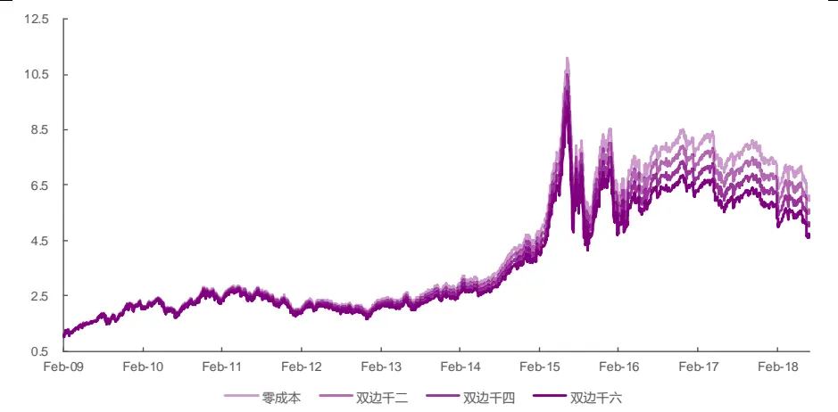
资料来源：光大证券研究所，Wind

表8：不同交易成本下 OCFA因子组合统计数据

|  | 零成本 | 双边千二 | 双边千四 | 双边千六 |
| --- | --- | --- | --- | --- |
| 年化收益率 | 22.1% | 20.9% | 19.8% | 18.7% |
| 累计收益率 | 513.7% | 463.9% | 418.0% | 375.9% |
| 年化波动率 | 30.3% | 30.3% | 30.3% | 30.3% |
| 夏普比率 | 0.81 | 0.78 | 0.75 | 0.72 |
| 最大回撤 | 55.4% | 55.5% | 55.7% | 55.8% |

资料来源：光大证券研究所，Wind 注：统计区间为 2009 年 1 月至 2018 年 6 月

除了在全市场选股，我们也分别测试了 OCFA 因子在沪深 300 以及中证500 内因子预测能力与选股的情况。简单从下表的IC与 IR数据中，容易看出该因子在沪深 300 内预测能力较差，在中证 500 内虽然预测能力较高，但稳定性较为不足。

表9：在不同股票池内OCFA因子的预测能力

| 股票池 | IC 均值 | IC 标准差 | IC>0 比例 | IC>0.02 比例 | IR 值 |
| --- | --- | --- | --- | --- | --- |
| 全市场 | 1.73% | 3.33% | 70.18% | 50.88% | 0.52 |
| 中证500 | 1.97% | 5.66% | 67.29% | 56.07% | 0.35 |
| 沪深300 | 0.88% | 6.81% | 62.62% | 45.79% | 0.13 |

资料来源：光大证券研究所，Wind 注：统计区间为 2009 年 1 月至 2018 年 6 月

在沪深 300 中，分组单调性与区分程度效果不像在全市场内那么显著，以第五组对冲第一组的方式构建多空组合，年化收益仅4.3%，年化波动6.2%，最大回撤9.9%，夏普比率 0.71。可见在沪深 300 样本内，该因子虽然仍然有效，但预测能力已经大幅减弱。我们选取OCFA 因子值最大的 50 只股票构成选股组合。在 2009 年至 2018 年间，组合年化收益 8.3%，年化波动率26.7%，夏普比率0.43，最大回撤47.5%。相对沪深300指数年化收益仅2.3%，相对波动率8.3%，信息比率 0.32，相对最大回撤18.3%。

图 7：OCFA 因子沪深 300 内分组及多空表现
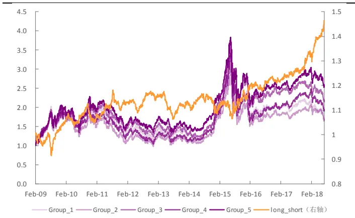
资料来源：光大证券研究所，Wind

图 8：OCFA 因子沪深 300 内选股组合表现
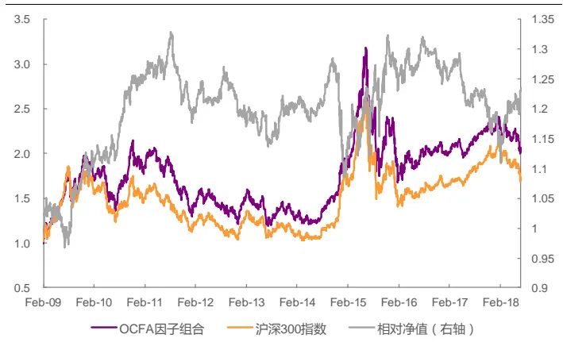
资料来源：光大证券研究所，Wind 注：双边 0.6%交易成本

从分年度数据中可以看出，该因子在沪深300股票池内的选股能力偏弱，稳定程度较低。有一半年份跑输沪深300 指数本身。今年组合表现尚可，超额年化收益7.5%。

表10：OCFA因子沪深 300内选股组合分年度表现

| 年份 | 年化收益率 | 年化波动率 | 夏普比率 | 最大回撤 | 相对收益率 | 相对波动率 | 信息比率 | 相对最大回撤 |
| --- | --- | --- | --- | --- | --- | --- | --- | --- |
| 2009 | 73.2% | 32.5% | 2.26 | 19.3% | 9.8% | 8.9% | 1.10 | 7.8% |
| 2010 | 2.8% | 26.7% | 0.11 | 29.2% | 13.0% | 6.7% | 1.96 | 3.6% |
| 2011 | -30.2% | 21.2% | -1.42 | 35.2% | -3.9% | 5.8% | -0.68 | 10.2% |
| 2012 | 8.7% | 22.1% | 0.39 | 24.7% | -0.4% | 5.4% | -0.08 | 6.6% |
| 2013 | -3.8% | 22.1% | -0.17 | 25.7% | 1.8% | 6.6% | 0.28 | 5.7% |
| 2014 | 32.8% | 17.8% | 1.84 | 10.5% | -9.8% | 8.1% | -1.21 | 15.4% |
| 2015 | 30.2% | 44.1% | 0.68 | 45.0% | 17.4% | 14.2% | 1.22 | 9.5% |
| 2016 | -10.3% | 25.9% | -0.40 | 22.9% | -1.0% | 6.9% | -0.14 | 6.0% |
| 2017 | 13.9% | 11.4% | 1.22 | 9.5% | -6.0% | 6.0% | -0.99 | 10.3% |
| 2018 | -18.8% | 19.7% | -0.95 | 17.1% | 7.5% | 8.8% | 0.85 | 7.0% |
| 全样本 | 8.3% | 26.7% | 0.43 | 47.5% | 2.3% | 8.3% | 0.32 | 18.3% |

资料来源：光大证券研究所，Wind 注：交易成本按双边 0.6%计算，统计区间为 2009年 1 月至 2018年 6 月

在中证 500 中，因子分组单调性与区分程度比在沪深 300 中优秀不少。以第五组对冲第一组的方式构建多空组合，年化收益7.3%，年化波动5.3%，最大回撤6.3%，夏普比率1.35。我们选取OCFA 因子值最大的 100 只股票构成选股组合。在2009 年至2018年间，组合年化收益 14.5%，年化波动率30.3%，夏普比率0.60，最大回撤 55.1%。相对中证500指数年化收益 5.2%，相对波动率仅4.7%，信息比率 1.10，相对最大回撤8.6%。

图 9：OCFA 因子中证 500 内分组及多空表现
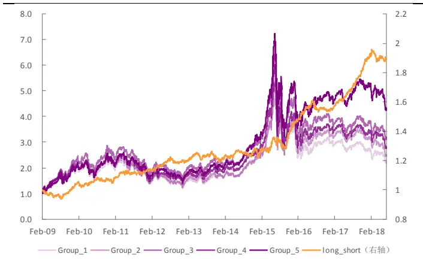
资料来源：光大证券研究所，Wind

图10：OCFA因子中证500内选股组合表现
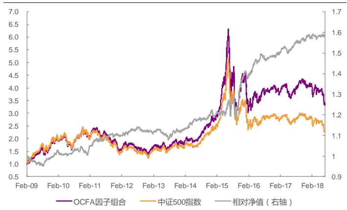
资料来源：光大证券研究所，Wind 注：双边 0.6%交易成本

通过分年度数据可以发现OCFA选股组合大部分年份表现都较优秀，仅2010年与2018年上半年小幅跑输中证 500基准，跑输幅度不超过1 个百分点。同时近几年相对回撤也都控制在3%以内。

表11：OCFA因子中证 500内选股组合分年度表现

| 年份 | 年化收益率 | 年化波动率 | 夏普比率 | 最大回撤 | 相对收益率 | 相对波动率 | 信息比率 | 相对最大回撤 |
| --- | --- | --- | --- | --- | --- | --- | --- | --- |
| 2009 | 77.2% | 35.3% | 2.19 | 19.6% | 0.9% | 4.1% | 0.23 | 5.0% |
| 2010 | 13.2% | 28.5% | 0.46 | 28.4% | -0.2% | 3.6% | -0.07 | 3.9% |
| 2011 | -28.8% | 24.3% | -1.18 | 37.5% | 9.0% | 3.3% | 2.74 | 1.5% |
| 2012 | 5.0% | 24.5% | 0.20 | 29.1% | 1.9% | 3.0% | 0.63 | 2.2% |
| 2013 | 19.1% | 22.7% | 0.84 | 16.7% | 0.8% | 3.6% | 0.23 | 4.5% |
| 2014 | 39.8% | 19.7% | 2.02 | 10.1% | 5.7% | 3.3% | 1.74 | 2.7% |
| 2015 | 61.9% | 51.5% | 1.20 | 55.1% | 17.0% | 9.9% | 1.72 | 8.6% |
| 2016 | -9.2% | 32.3% | -0.28 | 27.0% | 5.6% | 3.9% | 1.44 | 2.3% |
| 2017 | 6.8% | 15.2% | 0.44 | 14.2% | 5.9% | 3.0% | 1.96 | 2.2% |
| 2018 | -34.5% | 22.4% | -1.54 | 21.0% | -0.6% | 2.8% | -0.22 | 1.6% |
| 全样本 | 14.5% | 30.3% | 0.60 | 55.1% | 5.2% | 4.7% | 1.10 | 8.6% |

资料来源：光大证券研究所，Wind 注：交易成本按双边 0.6%计算，统计区间为 2009年 1 月至 2018年 6 月

## 4、OCFA 因子相关性研究与中性化效果

上一章节已经对因子进行了有效性、稳定性及单调性测试，证明其具备良好的选股能力。在最后一个章节，我们将研究OCFA因子与其它主流因子的相关性；并探析在剔除了其它例如市值或其它因子带入的效用后，OCFA因子是否依然具备良好的选股能力。

## 4.1、OCFA 因子与大部分因子相关性不大

为了了解有哪些已有因子与 OCFA 因子有较高的相关性，我们分别计算了规模因子、动量因子、技术因子、波动因子及流动性因子中单因子测试显著性较高的几个因子与OCFA因子之间历史IC 序列的相关系数。

从下图可以看出与 OCFA 因子有较强相关性的因子有 ROE，净利润增速（NP_YOY）、BP 估值因子与流动性（VSTD）因子。其中相关性最高的两个为净利润增速与流动性因子，相关系数分别为 0.35 与-0.32。可见线性框架取残差作为因子的构造方式还是引入了不少成长因子相关的信息。

图11：因子与其他大类因子历史IC值相关性检验
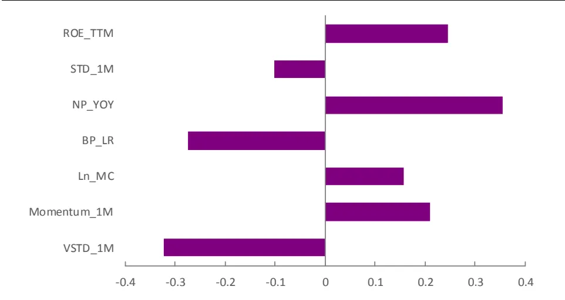
资料来源：光大证券研究所 注：统计区间为 2009 年 1 月至 2018 年 6 月

## 4.2、剔除相关因子后预测效果更为稳定

我们将通过横截面回归取残差的方式，同时剔除上述因子对 OCFA 因子的影响，对所有的因子均做截面标准化和极值处理：

$$
\begin{array}{c}OCFA_{i}=\beta_{1}*MC_{i}+\beta_{2}*Industry_{i}+\\\beta_{3}*ROE_{i}+\cdots+\varepsilon_{i}\;\#(5)\end{array}
$$

对 OCFA 因子中性化处理后因子的有效性检验等结果仍然较显著，IC均值小幅下降至 1.49%，但同时 IC标准差也下降不少，从而 IR反而有小幅提升，微升至0.53。说明中性化处理起到了一定信息提纯的作用，使得因子的预测稳定性都得到进一步提升。

表 12：中性化前后 OCFA 因子的预测能力

| 因子处理 | IC 均值 | IC 标准差 | IC>0 比例 | IC>0.02 比例 | IR 值 |
| --- | --- | --- | --- | --- | --- |
| 中性化前 | 1.73% | 3.33% | 70.18% | 50.88% | 0.52 |
| 中性化后 | 1.49% | 2.79% | 71.43% | 47.32% | 0.53 |

资料来源：光大证券研究所，Wind 注：统计区间为 2009 年 1 月至 2018 年 6 月

图 12：中性化后 OCFA 因子 IC 序列
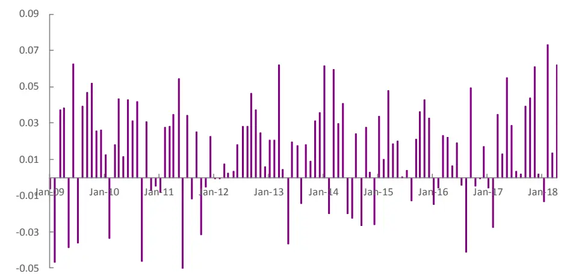
资料来源：光大证券研究所，Wind 注：统计区间为 2009 年 1 月至 2018 年 6 月

按中性化后的OCFA因子值大小等分 5组，分组单调性仍十分优秀，因子越大的组合收益越大，区分程度显著。以第五组对冲第一组的方式构建多空组合，年化收益 5.6%，年化波动仅 2.9%，最大回撤仅 2.6%，夏普比率1.93。相比于中性化之前，多空年化收益与夏普比率都有小幅下降，但波动与最大回撤更小，多空组合的稳定性更佳。

表 13：中性化后 OCFA 因子等分 5 组下分组统计数据

|  | 第一组 | 第二组 | 第三组 | 第四组 | 第五组 | 多空组合 |
| --- | --- | --- | --- | --- | --- | --- |
| 年化收益 | 12.4% | 14.5% | 16.2% | 16.5% | 18.8% | 5.6% |
| 累计收益 | 189.4% | 242.2% | 291.5% | 300.2% | 378.8% | 64.8% |
| 年化波动率 | 30.3% | 30.4% | 30.3% | 30.4% | 30.3% | 2.9% |
| 夏普比率 | 0.54 | 0.60 | 0.65 | 0.66 | 0.72 | 1.93 |
| 最大回撤 | 57.9% | 53.5% | 54.2% | 54.4% | 55.0% | 2.6% |

资料来源：光大证券研究所，Wind 注：统计区间为 2009 年 1 月至 2018 年 6 月

图 13：中性化后 OCFA 因子分 5 组单调性
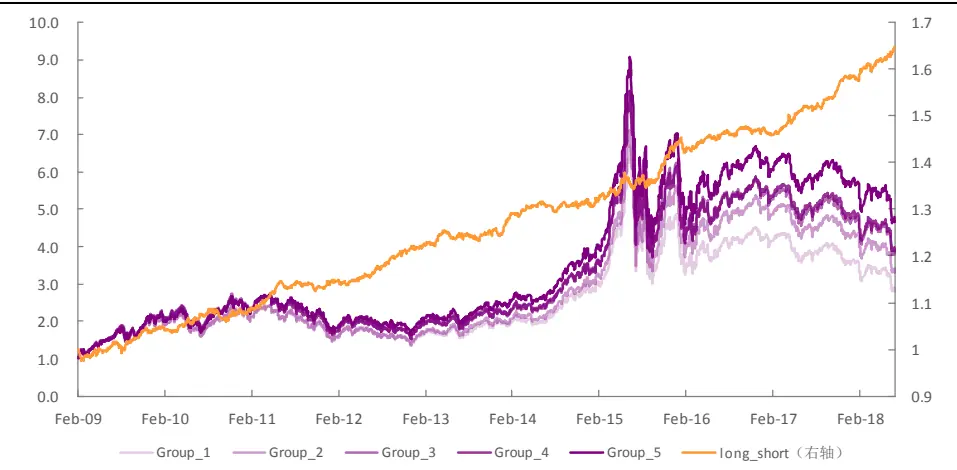
资料来源：光大证券研究所，Wind

中性化后的多空组合每年表现都极其稳定，年度胜率 100%。从夏普比率来看，仅 2016 年表现稍差不足 1，其余年份夏普比皆在 1 以上。最大回撤方面整体控制在3%以下，分年看也仅在2009、2010、2015、2016这四年超过 2%。2017 年与 2018 年组合表现更为亮眼，夏普比率皆在 3 以上，最大回撤仅 1%出头。

表 14：中性化后的 OCFA 因子多空组合分年度统计数据

| 年份 | 年化收益率 | 年化波动率 | 夏普比率 | 最大回撤 |
| --- | --- | --- | --- | --- |
| 2009 | 4.5% | 3.8% | 1.18 | 2.4% |
| 2010 | 3.6% | 3.2% | 1.11 | 2.5% |
| 2011 | 5.8% | 2.6% | 2.28 | 1.9% |
| 2012 | 6.2% | 2.4% | 2.60 | 1.1% |
| 2013 | 3.9% | 2.7% | 1.42 | 1.8% |
| 2014 | 3.1% | 2.4% | 1.31 | 1.7% |
| 2015 | 9.8% | 3.7% | 2.67 | 2.6% |
| 2016 | 1.8% | 2.2% | 0.83 | 2.3% |
| 2017 | 7.5% | 2.0% | 3.79 | 1.2% |
| 2018 | 7.6% | 2.3% | 3.23 | 1.1% |
| 全样本 | 5.6% | 2.9% | 1.93 | 2.6% |

资料来源：光大证券研究所，Wind 注：统计区间为 2009 年 1 月至 2018 年 6 月

综上，OCFA 因子剔除其它类型因子的效应后效果仍然稳定，表明有一定的独有信息，且因子预测稳定性进一步增强，以其构建多空组合的整体表现仍很优秀。

## 5、风险提示

本报告中的测试结果均基于模型和历史数据，历史数据存在不被重复验证的可能，模型存在失效的风险。

## 行业及公司评级体系

| 评级 说明 |  |  |
| --- | --- | --- |
| 行 | 买入 | 未来6-12个月的投资收益率领先市场基准指数15%以上； |
|  | 增持 | 未来6-12个月的投资收益率领先市场基准指数5%至15%； |
|  | 中性 | 未来6-12个月的投资收益率与市场基准指数的变动幅度相差-5%至5%； |
|  | 减持 | 未来6-12个月的投资收益率落后市场基准指数5%至15%； |
|  | 卖出 | 未来6-12个月的投资收益率落后市场基准指数15%以上； |
| 业及公司评级 | 无评级 | 因无法获取必要的资料，或者公司面临无法预见结果的重大不确定性事件，或者其他原因，致使无法给出明确的 投资评级。 |
| 基准指数说明：A股主板基准为沪深300指数；中小盘基准为中小板指；创业板基准为创业板指；新三板基准为新三板指数；港 股基准指数为恒生指数。 |  |  |

## 分析、估值方法的局限性说明

本报告所包含的分析基于各种假设，不同假设可能导致分析结果出现重大不同。本报告采用的各种估值方法及模型均有其局限性，估值结果不保证所涉及证券能够在该价格交易。

## 分析师声明

本报告署名分析师具有中国证券业协会授予的证券投资咨询执业资格并注册为证券分析师，以勤勉的职业态度、专业审慎的研究方法，使用合法合规的信息，独立、客观地出具本报告，并对本报告的内容和观点负责。负责准备本报告以及撰写本报告的所有研究分析师或工作人员在此保证，本研究报告中关于任何发行商或证券所发表的观点均如实反映分析人员的个人观点。负责准备本报告的分析师获取报酬的评判因素包括研究的质量和准确性、客户的反馈、竞争性因素以及光大证券股份有限公司的整体收益。所有研究分析师或工作人员保证他们报酬的任何一部分不曾与，不与，也将不会与本报告中具体的推荐意见或观点有直接或间接的联系。

## 特别声明

光大证券股份有限公司（以下简称“本公司”）创建于 1996 年，系由中国光大（集团）总公司投资控股的全国性综合类股份制证券公司，是中国证监会批准的首批三家创新试点公司之一。根据中国证监会核发的经营证券期货业务许可，光大证券股份有限公司的经营范围包括证券投资咨询业务。

本公司经营范围：证券经纪；证券投资咨询；与证券交易、证券投资活动有关的财务顾问；证券承销与保荐；证券自营；为期货公司提供中间介绍业务；证券投资基金代销；融资融券业务；中国证监会批准的其他业务。此外，公司还通过全资或控股子公司开展资产管理、直接投资、期货、基金管理以及香港证券业务。

本证券研究报告由光大证券股份有限公司研究所（以下简称“光大证券研究所”）编写，以合法获得的我们相信为可靠、准确、完整的信息为基础，但不保证我们所获得的原始信息以及报告所载信息之准确性和完整性。光大证券研究所可能将不时补充、修订或更新有关信息，但不保证及时发布该等更新。

本报告中的资料、意见、预测均反映报告初次发布时光大证券研究所的判断，可能需随时进行调整且不予通知。报告中的信息或所表达的意见不构成任何投资、法律、会计或税务方面的最终操作建议，本公司不就任何人依据报告中的内容而最终操作建议做出任何形式的保证和承诺。在任何情况下，本报告中的信息或所表述的意见并不构成对任何人的投资建议。客户应自主作出投资决策并自行承担投资风险。本报告中的信息或所表述的意见并未考虑到个别投资者的具体投资目的、财务状况以及特定需求。投资者应当充分考虑自身特定状况，并完整理解和使用本报告内容，不应视本报告为做出投资决策的唯一因素。对依据或者使用本报告所造成的一切后果，本公司及作者均不承担任何法律责任。

不同时期，本公司可能会撰写并发布与本报告所载信息、建议及预测不一致的报告。本公司的销售人员、交易人员和其他专业人员可能会向客户提供与本报告中观点不同的口头或书面评论或交易策略。本公司的资产管理部、自营部门以及其他投资业务部门可能会独立做出与本报告的意见或建议不相一致的投资决策。本公司提醒投资者注意并理解投资证券及投资产品存在的风险，在做出投资决策前，建议投资者务必向专业人士咨询并谨慎抉择。

在法律允许的情况下，本公司及其附属机构可能持有报告中提及的公司所发行证券的头寸并进行交易，也可能为这些公司提供或正在争取提供投资银行、财务顾问或金融产品等相关服务。投资者应当充分考虑本公司及本公司附属机构就报告内容可能存在的利益冲突，勿将本报告作为投资决策的唯一信赖依据。

本报告根据中华人民共和国法律在中华人民共和国境内分发，仅供本公司的客户使用。本公司不会因接收人收到本报告而视其为客户。本报告仅向特定客户传送，未经本公司书面授权，本研究报告的任何部分均不得以任何方式制作任何形式的拷贝、复印件或复制品，或再次分发给任何其他人，或以任何侵犯本公司版权的其他方式使用。所有本报告中使用的商标、服务标记及标记均为本公司的商标、服务标记及标记。如欲引用或转载本文内容，务必联络本公司并获得许可，并需注明出处为光大证券研究所，且不得对本文进行有悖原意的引用和删改。

## 光大证券股份有限公司

上海市新闸路 1508 号静安国际广场 3 楼 邮编 200040

总机：021-22169999 传真：021-22169114、22169134

| 机构业务总部 | 姓名 | 办公电话 | 手机 | 电子邮件 |
| --- | --- | --- | --- | --- |
| 上海 | 徐硕 | 021-52523543 | 13817283600 | shuoxu@ebscn.com |
|  | 李文渊 |  | 18217788607 | liwenyuan@ebscn.com |
|  | 李强 | 021-52523547 | 18621590998 | liqiang88@ebscn.com |
|  | 罗德锦 | 021-52523578 | 13661875949/13609618940 | luodj@ebscn.com |
|  | 张弓 | 021-52523558 | 13918550549 | zhanggong@ebscn.com |
|  | 黄素青 | 021-22169130 | 13162521110 | huangsuqing@ebscn.com |
|  | 邢可 | 021-22167108 | 15618296961 | xingk@ebscn.com |
|  | 李晓琳 | 021-52523559 | 13918461216 | lixiaolin@ebscn.com |
|  | 郎珈艺 | 021-52523557 | 18801762801 | dingdian@ebscn.com |
|  | 余鹏 | 021-52523565 | 17702167366 | yupeng88@ebscn.com |
|  | 丁点 | 021-52523577 | 18221129383 | dingdian@ebscn.com |
|  | 郭永佳 |  | 13190020865 | guoyongjia@ebscn.com |
| 北京 | 郝辉 | 010-58452028 | 13511017986 | haohui@ebscn.com |
|  | 梁晨 | 010-58452025 | 13901184256 | liangchen@ebscn.com |
|  | 吕凌 | 010-58452035 | 15811398181 | Ivling@ebscn.com |
|  | 郭晓远 | 010-58452029 | 15120072716 | guoxiaoyuan@ebscn.com |
|  | 张彦斌 | 010-58452026 | 15135130865 | zhangyanbin@ebscn.com |
|  | 庞舒然 | 010-58452040 | 18810659385 | pangsr@ebscn.com |
| 深圳 | 黎晓宇 | 0755-83553559 | 13823771340 | lixy1@ebscn.com |
|  | 张亦潇 | 0755-23996409 | 13725559855 | zhangyx@ebscn.com |
|  | 王渊锋 | 0755-83551458 | 18576778603 | wangyuanfeng@ebscn.com |
|  | 张靖雯 | 0755-83553249 | 18589058561 | zhangjingwen@ebscn.com |
|  | 苏一耘 |  | 13828709460 | suyy@ebscn.com |
|  | 常密密 |  | 15626455220 | changmm@ebscn.com |
| 国际业务 | 陶奕 | 021-52523546 | 18018609199 | taoyi@ebscn.com |
|  | 梁超 | 021-52523562 | 15158266108 | liangc@ebscn.com |
|  | 金英光 |  | 13311088991 | jinyg@ebscn.com |
|  | 王佳 | 021-22169095 | 13761696184 | wangjia1@ebscn.com |
|  | 郑锐 | 021-22169080 | 18616663030 | zhrui@ebscn.com |
|  | 凌贺鹏 | 021-22169093 | 13003155285 | linghp@ebscn.com |
|  | 周梦颖 | 021-52523550 | 15618752262 | zhoumengying@ebscn.com |
| 私募业务部 | 戚德文 | 021-52523708 | 18101889111 | qidw@ebscn.com |
|  | 安羚娴 | 021-52523708 | 15821276905 | anlx@ebscn.com |
|  | 张浩东 | 021-52523709 | 18516161380 | zhanghd@ebscn.com |
|  | 吴冕 | 0755-23617467 | 18682306302 | wumian@ebscn.com |
|  | 吴琦 | 021-52523706 | 13761057445 | wuqi@ebscn.com |
|  | 王舒 | 021-22169419 | 15869111599 | wangshu@ebscn.com |
|  | 傅裕 | 021-52523702 | 13564655558 | fuyu@ebscn.com |
|  | 王婧 | 021-22169359 | 18217302895 | wangjing@ebscn.com |
|  | 陈潞 | 021-22169146 | 18701777950 | chenlu@ebscn.com |
|  | 王涵洲 |  | 18601076781 | wanghanzhou@ebscn.com |