## 以质取胜：EBQC 综合质量因子详解——多因子系列报告之十七

质量因子是量化多因子体系中的一个很重要的基本面大类因子，是衡量公司优劣的重要指标。因此无论是从主动投资的逻辑出发，还是从量化因子的效果出发，我们都希望可以寻找到一个长期稳定有效的综合质量因子。本文就是从这个角度出发，全面测试了质量因子的各个细分类别因子表现，并尝试构造了具有较强预测能力和稳定多头选股收益EBQC综合质量因子（本文的样本测试期默认为 2009-01-01 至 2018-10-31）。

- 公司质量的定义与分类：一个高质量的公司或者优质公司，是假设其他条件类似的情况下，投资者会去愿意付出更高价格来买入的公司。我们可以从定性的角度来描述一个优质的公司：盈利能力强且具有稳定的盈利能力；成长能力强且具有稳定的成长能力；财务情况稳定，流动性好，资本结构合理；运营效率高，周转能力强；公司治理情况优良等等。根据我们对于质量因子的理解，将常用的质量因子梳理为盈利能力、成长能力、盈余质量、营运效率、安全性、公司治理这6个大类。

六大类质量因子中成长因子预测能力较强：6 类质量指标的整体预测能力和收益稳定性仍存在较大的差异，其中成长能力指标的IC和IC_IR均显著高于其他 5 类指标，而盈利能力指标的表现则相对较弱。6 大类质量因子之前的相关性均处在相对较低的水平，其中，公司治理因子与其他大类的质量因子直接相关性均较低，而营运效率与成长能力之间的相关性为0.6，相对较高。

- 构造综合质量因子EBQC：比较等权、IC加权、IC_IR加权方式下得到的综合质量因子，IC_IR 加权方式下的 IRW_EBQC 因子表现最优，但多空组合的夏普比率 1.50 却略低于其他两种组合方式。等权加权方式下的EBQC 因子在 IC 或者 IC_IR 的表现上与另外两种加权方式下的因子差异并不明显，并且等权相加的方式逻辑更为直观，省去了参数优化过程，一定程度上避免了样本内的过拟概率。因此，我们定义等权加权方式下的EW_EBQC因子为综合质量因子，命名为EBQC；EBQC在全市场的IC_IR高达 0.89；在中证 500 样本内的表现也较为出色，因子 IC 高达 5.67%，多空组合的夏普比率达到2.18。

- 质量结合估值，显著提高因子预测能力：质量因子与估值因子在大部分时间内均呈现较为显著的负相关，也就说明市场给予高质量的公司的估值水平也会偏高。质量因子结合估值因子之后，高质低估因子（EBQC_BP）的IC显著得到了提升，因子收益也由0.39%提高到了0.55%。

- 劣质公司中小市值溢价更为显著：对于公司质量（Quality）与股票的规模效应（Size effect）之间的相关性分析后可见，A股的规模效应在质量较差的公司中更为明显，而优质公司分组中的规模效应则相对较弱。

- 风险提示：测试结果均基于模型，模型存在失效的风险。

## 金融工程深度

## 分析师

周萧潇 (执业证书编号：S0930518010005)

021-52523680

zhouxiaoxiao@ebscn.com

刘均伟 (执业证书编号：S0930517040001)

021-52523679

liujunwei@ebscn.com

## 相关研究

《别开生面：公司治理因子详解——多因子系列报告之四》

《见微知著：成交量占比高频因子解析——多因子系列报告之五》

《行为金融因子：噪音交易者行为偏差——多因子系列报告之六》

《基于 K 线最短路径构造的非流动性因子——多因子系列报告之七》

《高频因子：日内分时成交量蕴藏玄机——多因子系列报告之八》

《一致交易：挖掘集体行为背后的收益——多因子系列报告之九》

《因子正交与择时：基于分类模型的动态权重配置——多因子系列报告之十》《爬罗剔抉：一致预期因子分类与精选——多因子系列报告之十一》《成长因子重构与优化：稳健加速为王——多因子系列报告之十二》

《组合优化算法探析及指数增强实证——多因子系列报告之十三》《创新基本面因子：财务数据间线性关系初窥——多因子系列报告之十四 》《创新基本面因子：提纯净利数据中的选股信息 ——多因子系列报告之十五 》《创新基本面因子：捕捉产能利用率中的讯号——多因子系列报告之十六》质量因子是量化多因子体系中的一个很重要的基本面大类因子，是衡量公司优劣的重要指标。因此无论是从主动投资的逻辑出发，还是从量化因子的效果出发，我们都希望可以寻找到一个长期稳定有效的综合质量因子。本文就是从这个角度出发，全面测试了质量因子的各个细分类别因子表现，并尝试构造了具有较强预测能力和稳定选股效果的EBQC综合质量因子（本文的样本测试期默认为 2009-01-01 至 2018-10-31）。

## 1、质量因子（Quality Factor）定义及细分类别

一个高质量的公司或者优质公司，是假设其他条件类似的情况下，投资者会去愿意付出更高价格来买入的公司。在定义质量因子之前，我们可以从定性的角度来描述一个优质的公司：

1) 盈利能力强且具有稳定的盈利能力；

2) 成长能力强且具有稳定的成长能力；

3) 财务情况稳定，流动性好，资本结构合理；

4) 运营效率高，周转能力强；

5) 公司治理情况优良，等等。

在上述条件满足的情况下，可以认为这个公司的整体质量较高，在此基础上再通过PB、PE等估值指标来进一步筛选估值较低的股票，选股的成功率会得到较明显的提高。尽管PB、PE这类估值因子在全市场已经具有较高的预测能力和选股效果，但不可避免的是，如果直接采用此类估值因子选股，会容易选到那些本身质地就很差导致估值便宜的股票。因此，公司质量的评估是不可或缺的一个步骤，后文中我们也将比较估值因子在不同质量因子分组内的表现差异。

学术界在研究中也有很多中对于质量指标定义方式的探讨和实践。例如，Asness（2017）通过对Gordon成长模型的分解，来定义质量（quality）因子：

原始的Gordon成长模型为：

$$
\mathrm{Price}={\frac{dividend}{requiredreturn-growth}}\tag{1}
$$

利用净资产 B（Book Value）来缩放价格, 使其在一段时间内和横截面上更加稳定。等式两边同时除以净资产 B：

$$
{\frac{\mathrm{P}}{\mathrm{B}}}={\frac{{\frac{profit}{B}}*{\frac{dividend}{profit}}}{requiredreturn-growth}}\tag{2}
$$

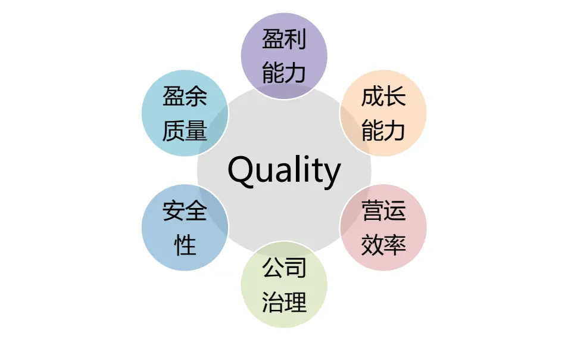
图 1：质量因子细分类别（6 大类）
资料来源：光大证券研究所

等式（2）则可以理解为：

$$
{\frac{\mathrm{P}}{\mathrm{B}}}={\frac{profitability*payout\_ratio}{requiredreturn-growth}}\tag{3}
$$

等式右侧的四个部分就是对于公司质量定义的四个基础组成部分，其中，Profitability 为盈利能力，可以由 ROE、ROA、毛利率在内的多个盈利能力指标表示；payout_ratio表示股东所得红利在总利润中的占比，主要用来衡量公司管理层对于股东的友好程度；growth为成长能力，可以由不同的成长因子来评价；required return 则可以用来反映公司的稳定性或者安全性，因为要求回报率越高的公司，自然风险越大。

结合上述结论，并根据我们对于质量因子的理解，将常用的质量因子梳理为盈利能力、成长能力、盈余质量、营运效率、安全性、公司治理这 6 个大类，如下图所示：

本文将主要从这 6 大角度的质量指标出发，首先分别深入测试各大类因子中的常用细分因子的预测能力、收益和稳定性方面的表现，并根据测试结果以及我们对于公司质量方面的理解，构造一个较为全面且有稳定预测能力和收益能力的综合质量因子EBQC。

同时，我们也进一步分析了质量因子与其他大类因子，尤其是估值和规模因子之间存在的一些联系。质量因子与估值因子在大部分时间内均呈现较为显著的负相关，也就说明高质量的公司的估值水平也会偏高。而同时我们也可以观察到，在全体 A 股样本中，质量因子 EBQC 和估值因子 BP 两者之间的相关系数从 2010 年至今整体呈现略微上升的趋势，尤其是 2017 年下半年以来，两者之间的相关系数首次出现持续较长时间的正值。

## 2、常用质量因子单因子表现

首先我们分别对盈利能力、成长能力、盈余质量、营运效率、安全性、公司治理这 6 个大类质量指标中的单因子进行全面的测试，并在每个大类中挑选满足一定筛选条件（IC 大于 2%，IR 大于 0.3，tstats 大于 3）的因子来构成大类复合因子（注：若某一大类的因子表现均不满足上述条件，则挑选 IC_IR 表现较好的具有代表性的此类因子作为基础因子）。

## 2.1、盈利能力（Profitability）

盈利能力可以说是质量因子中最重要也最受关注的一类指标，不同的人对于盈利能力的衡量标准也会略有不同。例如上文提到的Asness（2017）在定义QmJ（QualityminusJunk）因子时对于盈利能力方面的指标采用了6个指标等权相加的方式来打分，6 个指标分别为：总资产毛利率（GPOA）、ROE、ROA、经营现金流/总资产（CFOA）、毛利率（GMAR）、净利润现金占比（ACC）。

公司利润表中直接反映公司赚钱能力的项目包括毛利润、营业利润、净利润，这三项中使用最广泛的净利润一般被认为可以比较全面的反映该公司在剔除费用项之后的盈利情况。不过，在光大金工前期的行业基本面系列研究中我们就已经发现，在一些行业中（例如消费类行业）毛利润具有超越净利润的选股能力；在《成长因子重构与优化：稳健加速为王——多因子系列报告之十二》报告中，也得到了营业利润稳健加速度预测能力优于净利润类增速因子的结论。学术界和业界也对毛利润和营业利润的优势有不少的分析，因此这三个利润类的指标可以说是各有千秋，我们在盈利能力类因子中会较为全面的对涉及这三类利润指标的因子做测试。

在筛选盈利能力因子时，我们将首先对盈利能力方面的因子做全面的测试，测试的盈利能力因子明细及其构造方式说明如下表所示。

表 1：盈利能力因子明细表

| 指标名称 | 指标简称 | 计算方式 |
| --- | --- | --- |
| 毛利率 | GPM | 毛利 / 营业收入 |
| 净利率 | NPM | 净利润 / 营业收入 |
| 净资产收益率 | ROE | 净利润/净资产 |
| 总资产收益率 | ROA | 净利润/总资产 |
| 投入资本收益率 | ROIC | 净利润/投入资本 |
| 经营收益占比 | OltoEBT | 经营活动净收益/利润总额 |
| 营业利润率 | OPM | 营业利润/营业总收入 |
| 总资产毛利率 | GPOA | 毛利/总资产 |
| 经营现金流/总资产 | CFOA | 经营现金流净额/总资产 |

资料来源：光大证券研究所

表 2：盈利能力因子单因子测试结果

| IC positive LongShortr |  |  |  |  |  |  |  |  |  |  |
| --- | --- | --- | --- | --- | --- | --- | --- | --- | --- | --- |
|  | IC mean | IC std | IR | per | eturn | Turnover | Mono score | LongShort sharpe | Factor Return | Return tstat |
| CFOA | 1.93% | 4.32% | 0.45 | 62% | 3.40% | 10% | 2.30 | 0.76 | 0.18% | 4.74 |
| ROE | 1.88% | 8.38% | 0.22 | 56% | -0.90% | 7% | 0.00 | -0.09 | 0.17% | 2.51 |
| ROIC | 1.76% | 7.93% | 0.22 | 55% | -1.50% | 7% | -0.32 | -0.19 | 0.16% | 2.41 |
| GPOA | 1.47% | 7.51% | 0.20 | 56% | 1.30% | 6% | 0.91 | 0.25 | 0.17% | 2.36 |
| ROA | 1.47% | 9.45% | 0.16 | 54% | -0.30% | 7% | -1.00 | -0.01 | 0.14% | 1.89 |
| OltoEBT_TTM | 0.71% | 5.44% | 0.13 | 53% | 0.90% | 8% | 1.40 | 0.23 | 0.06% | 1.34 |
| GPM | 0.88% | 7.08% | 0.12 | 52% | 0.70% | 5% | 1.18 | 0.16 | 0.08% | 1.26 |
| NPM | 0.91% | 8.03% | 0.11 | 56% | -1.20% | 6% | 3.21 | -0.15 | 0.08% | 1.19 |
| OPM | 0.60% | 7.14% | 0.08 | 55% | 0.20% | 4% | 0.60 | 0.06 | 0.07% | 0.90 |

资料来源：光大证券研究所，注：测试期为 2009-01-01 至 2018-10-31

经营现金流/总资产（CFOA）具有相对较高的预测能力，其因子IC_IR高达0.45同时，ROE和ROIC的IC_IR也超过0.2。结合上述测试结果，并考虑到ROE和 ROIC 指标是使用率极高的盈利能力类指标，我们将 CFOA、ROE、ROIC作为盈利能力类因子的子指标，并等权加权后得到盈利能力类因子的复合因子。

## 2.2、成长能力（Growth）

成长因子是量化多因子体系中的一类很重要的风格因子，其同时也是投资者较为关注的挑选公司的角度。因为从投资的最根本目的出发，具有成长潜力或者发展潜力较大的公司才会更有可能给投资者带来更多回报，投资者也会更愿意为高成长的公司支付较高的股价。

在我们的报告《成长因子重构与优化：稳健加速为王——多因子系列报告之十二》中，我们较为系统的对成长类因子做了全面的测试。首先，在成长因子的构造方式上，我们提出对每一个增速类（同比增速、环比增速）因子均使用与分母值回归取残差的处理方式，来减小前期值对增速因子分布上的影响。同时，我们也引入了三个较为创新的成长因子构造方式（以净利润 NP为例）：加速度指标：NP_Acc；稳健增速指标：NP_Stable；稳健加速度指标：NP_SD（具体的指标构建方式请参考《成长因子重构与优化：稳健加速为王——多因子系列报告之十二》报告正文）

结合上述新增成长类因子，和盈利能力指标的变动类因子，我们将成长能力的大类因子梳理如下：

表 3：成长能力因子明细表

| 指标名称 | 指标简称 |
| --- | --- |
| 经营现金流/总资产变动 | CFOAD |
| 毛利率变动 | GPMD |
| 总资产毛利率变动 | GPOAD |
| 净利润加速度 | NP_Acc |
| 净利润增速（单季度同比） | NP_Q_YOY |
| 净利润增速（单季度环比） | NP_QOQ |
| 净利润稳健加速度 | NP_SD |
| 净利润稳健增速 | NP_Stable |
| 净利润增速（TTM 同比） | NP_YOY |
| 净利率变动 | NPMD |
| 经营性现金流净额增速（TTM 同比） | OCF_YOY |
| 营业利润增速（单季度同比） | OP_Q_YOY |
| 营业利润增速（单季度环比） | OP_QOQ |
| 营业利润稳健加速度 | OP_SD |
| 营业利润稳健增速 | OP_Stable |
| 营业利润增速（TTM 同比） | OP_YOY |
| 营业收入稳健加速度 | OR_SD |
| 营业收入稳健增速 | OR_Stable |
| 营业收入增速(TTM 同比） | OR_YOY |
| ROA 变动 | ROAD |
| ROE变动 | ROED |
| 投入资本收益率变动 | ROICD |

资料来源：光大证券研究所

与我们前期报告中的结论相类似的，综合考虑收入成长能力和收入增速稳定性的因子营业收入稳健加速度因子（OP_SD）具有较高的预测能力，其因子IC_IR高达0.73，多空组合的Sharpe 比率高达2.95，单调性得分也超过2。同时，成长能力因子中 IC 均值最高的因子分别为：营业利润增速（单季度同比）OP_Q_YOY、净利润增速（单季度同比）NP_Q_YOY、营业利润增速（TTM同比）OP_YOY、和净利润增速（TTM同比）NP_YOY。

表 4：成长能力因子单因子测试结果

|  | IC mean | IC std | IR | positive per | Long_Short return | Turn over | Mono score | Long_Short sharpe | Factor Return | Return tstat |
| --- | --- | --- | --- | --- | --- | --- | --- | --- | --- | --- |
| OP_SD | 2.55% | 3.19% | 0.73 | 75% | 9.60% | 18% | 2.06 | 2.95 | 0.19% | 7.81 |
| NP_Acc | 2.77% | 3.90% | 0.71 | 78% | 9.80% | 18% | 1.84 | 2.62 | 0.25% | 7.83 |
| OP_Q_YOY | 3.51% | 5.14% | 0.68 | 78% | 10.50% | 16% | 1.39 | 2.47 | 0.26% | 6.01 |
| NP_SD | 2.38% | 3.50% | 0.68 | 73% | 9.10% | 18% | 2.10 | 2.82 | 0.19% | 6.64 |
| OCF_YOY | 1.62% | 2.39% | 0.68 | 76% | 3.60% | 15% | 1.42 | 1.23 | 0.11% | 5.20 |
| NP_Q_YOY | 3.55% | 5.61% | 0.63 | 74% | 10.30% | 15% | 1.54 | 2.41 | 0.25% | 5.18 |
| OP_YOY | 3.01% | 5.67% | 0.53 | 70% | 7.80% | 12% | 1.35 | 1.78 | 0.21% | 4.36 |
| OP_QOQ | 1.60% | 3.15% | 0.51 | 71% | 4.80% | 21% | 2.28 | 1.56 | 0.11% | 4.63 |
| NP_QOQ | 1.80% | 3.56% | 0.51 | 68% | 5.70% | 21% | 1.89 | 1.81 | 0.14% | 5.24 |
| NP_YOY | 3.01% | 6.16% | 0.49 | 69% | 7.90% | 12% | 1.66 | 1.76 | 0.20% | 3.80 |
| OR_SD | 1.54% | 3.48% | 0.44 | 69% | 5.60% | 17% | 1.47 | 1.80 | 0.12% | 4.94 |
| CFOAD | 1.17% | 2.66% | 0.44 | 66% | 3.30% | 15% | 1.73 | 1.16 | 0.10% | 4.54 |
| OR_YOY | 2.42% | 6.50% | 0.37 | 63% | 6.60% | 11% | 2.05 | 1.38 | 0.18% | 3.42 |
| GPMD | 1.14% | 3.16% | 0.36 | 62% | 3.00% | 12% | 2.57 | 0.97 | 0.08% | 2.89 |
| ROICD | 1.45% | 4.05% | 0.36 | 61% | 3.80% | 13% | 1.55 | 1.07 | 0.09% | 2.75 |
| GPOAD | 1.43% | 4.27% | 0.34 | 66% | 4.80% | 12% | 2.00 | 1.37 | 0.11% | 3.26 |
| ROED | 1.47% | 4.74% | 0.31 | 62% | 5.30% | 12% | 2.95 | 1.34 | 0.11% | 2.88 |
| NPMD | 1.19% | 4.01% | 0.30 | 63% | 2.40% | 12% | 3.33 | 0.67 | 0.07% | 2.17 |
| ROAD | 1.17% | 4.43% | 0.26 | 63% | 3.80% | 12% | 3.21 | 1.01 | 0.09% | 2.36 |
| OR_Stable | 1.51% | 6.83% | 0.22 | 59% | 1.90% | 7% | 2.90 | 0.38 | 0.18% | 2.88 |
| NP_Stable | 1.61% | 7.36% | 0.22 | 58% | 2.00% | 9% | -2.58 | 0.39 | 0.19% | 2.87 |
| OP_Stable | 1.42% | 6.98% | 0.20 | 57% | 1.00% | 9% | 9.50 | 0.21 | 0.17% | 2.70 |

资料来源：光大证券研究所，注：测试期为 2009-01-01 至 2018-10-31

结合上述测试结果，并考虑到同一类财务数据构造的不同成长因子（例如OP_SD 和 OP_YOY）之间相关性较高，因子间的强共线性不利于复合因子的表现，因此我们将OP_SD、NP_Q_YOY作为成长类因子的子指标，并等权加权后得到成长类因子的复合因子。

## 2.3、营运效率（Operation）

营运效率是指公司运用资产的效率或者有效程度，可以反映公司资金的周转状况。营运效率的高低取决于企业营运状况的好坏及管理水平的高低。例如，存货周转率、总资产周转率都是很常用的用来衡量公司营运效率的指标，在此基础上我们也将上述指标的变动指标作为因子进行了测试，尝试从营运效率改善的角度寻找具有更好预测能力的营运效率因子。

产能利用率提升因子（OCFA）的因子是光大金工创新基本面因子挖掘框架中挖掘出来的具有较强预测能力的营运效率类因子，其具体的构造方式在报告《创新基本面因子：捕捉产能利用率中的讯号——多因子系列报告之十六》中进行了详细的阐述。

表 5：营运效率因子明细表

| 指标名称 | 指标简称 | 计算方式 |
| --- | --- | --- |
| 存货周转率 | INVT | 营业成本 / 平均存货余额 |
| 存货周转率变动 | INVTD | 当期存货周转率 - 上期存货周转率 |
| 应收周转率 | RAT | 营业收入 / (应收账款 + 应收票据) |
| 应收周转率变动 | RATD | 当期应收周转率 - 上期应收周转率 |
| 总资产周转率 | AT | 营业收入/总资产 |
| 总资产周转率变动 | ATD | 当期总资产周转率 - 上期总资产周转率 |
| 产能利用率提升 | OCFA | 营业总成本在固定资产上滚动回归取最近一期残差 |

资料来源：光大证券研究所

总资产周转率变动指标ATD 的各项表现均由于其他营运效率因子，IC_IR 达到0.55，多空年化收益7.20%，多空组合的Sharpe比率也达到 2.07，该因子的预测能力和稳定性均较好。

表 6：营运效率因子单因子测试结果

| IC positive LongShortr |  |  |  |  |  |  |  |  |  |  |
| --- | --- | --- | --- | --- | --- | --- | --- | --- | --- | --- |
|  | IC mean | IC std | IR | per | eturn | Turnover | Mono score | LongShort sharpe | Factor Return | Return tstat |
| ATD | 2.15% | 3.90% | 0.55 | 71% | 7.20% | 13% | 1.62 | 2.07 | 0.16% | 4.73 |
| OCFA | 1.73% | 3.33% | 0.52 | 72% | 7.10% | 23% | 4.23 | 2.18 | 0.14% | 5.07 |
| RATD | 1.22% | 3.00% | 0.41 | 65% | 4.10% | 12% | 1.00 | 1.41 | 0.06% | 3.34 |
| INVTD | 0.97% | 2.73% | 0.36 | 62% | 3.40% | 13% | 1.43 | 1.19 | 0.06% | 3.12 |
| AT | 1.26% | 4.59% | 0.27 | 61% | 2.30% | 7% | 2.07 | 0.58 | 0.14% | 3.18 |

2018-11-03 金融工程

| RAT | 0.59% | 5.00% | 0.12 | 57% | -1.30% | 6% | 1.17 | -0.22 | 0.06% | 1.10 |
| --- | --- | --- | --- | --- | --- | --- | --- | --- | --- | --- |
| INVT | 0.23% | 4.39% | 0.05 | 51% | -0.80% | 6% | -0.44 | -0.21 | 0.03% | 0.86 |

资料来源：光大证券研究所，注：测试期为 2009-01-01 至 2018-10-31

OCFA因子IC_IR 表现较好，在《创新基本面因子：捕捉产能利用率中的讯号——多因子系列报告之十六》报告中我们也给出了 OCFA 因子与其他常用因子相关性较低的结论，该因子可以带来较为稳定的增量信息，因此，我们将满足入选条件（IC 大于 2%，IR 大于 0.3，tstats 大于 3）的因子 ATD 和创新基本面因子 OCFA 作为营运效率类因子的子指标。

## 2.4、盈余质量（Acc）

盈余质量类指标能够为投资者提供关于上市公司的盈余信息，如果上市公司进行了盈余操纵或管理，那么其财报盈余向投资者传递的信息质量往往较差；较差的盈余信息不利于我们合理地对公司的未来业绩做出预测，因此对上市公司盈余质量好坏的评价具有重要的意义。

首先需要对应计利润的定义做出说明：

$$
\begin{array}{r}{\frac{\sqrt{3}}{2}\dot{\tau}+\dot{\phi}(1)\dot{\gamma}\vert\dot{\varepsilon}\vert=\frac{\mu\pm}{5}\vert\vert\dot{\varepsilon}\vert\vert\dot{\varepsilon}\vert\vert\dot{\varepsilon}\vert-\frac{2}{2}\vert\vert\dot{\varepsilon}\vert\vert\pm\vert\vert\pm\vert\vert\vert\int_{1}\dot{\varepsilon}\vert\mu\pm\frac{\mu}{\mu\lambda}\vert\frac{\mu}{\mu}\vert\dot{\phi}(\dot{\varepsilon})\vert\vert\dot{\varepsilon}\vert\vert}\end{array}
$$

同时，为了使得不同规模的公司的该项指标能够进行横向比较，我们采用将应计利润除以营业利润作为应计利润占比指标，来作为盈余质量指标的一种构建方式，明显的，该指标数值越大，标的盈余质量越差。因为现金利润来源于当期经营净现金流的增加；而应计利润则更多反映对未来现金流的确认，应计利润中存在较大的利润操纵空间，从而导致应计利润持续性较差，拥有较高应计利润的公司未来盈余往往会出现下滑。所以基于以上的逻辑，应计利润占比越大的公司，盈余质量越差。

表7：盈余质量因子明细表

| 指标名称 | 指标简称 | 计算方式 |
| --- | --- | --- |
| 应计利润占比 | APR | 应计利润 / 营业利润 |
| 应计利润占比变动 | APRD | 当期应计利润占比 - 上期应计利润占比 |
| 收现比 | CSR | 销售商品提供劳务收到的现金 /营业收入 |
| 收现比变动 | CSRD | 当期收现比 - 上期收现比 |

资料来源：光大证券研究所

我们同时构造了收现比因子（CSR）来衡量公司主营业务收入背后现金流量的支持程度。该指标越高，说明公司收入的变现能力越强。反之，说明公司当前账面收入高，而实际现金收入低，有很大一部分形成了应收账款，这时可以认为公司的整体盈余质量较低。

表 8：盈余质量因子单因子测试结果

|  | IC mean | IC std | IR | per | IC positive LongShortr eturn | Turnover | Mono score | LongShort sharpe | Factor Return | Return tstat |
| --- | --- | --- | --- | --- | --- | --- | --- | --- | --- | --- |
| CSR | 0.69% | 2.90% | 0.24 | 66% | 0.80% | 8% | 1.33 | 0.30 | 0.07% | 2.69 |
| CSRD | 0.07% | 2.48% | 0.03 | 48% | -0.10% | 15% | -1.00 | -0.03 | 0.03% | 1.75 |
| APRD | -0.33% | 2.37% | -0.14 | 45% | -0.60% | 15% | 0.40 | -0.20 | -0.02% | -0.90 |
| APR | -1.03% | 2.91% | -0.35 | 39% | -1.50% | 11% | 0.90 | -0.49 | -0.06% | -2.62 |

资料来源：光大证券研究所，注：测试期为 2009-01-01 至 2018-10-31

上述测试的盈余质量因子整体预测能力相对较弱，其中，应计利润占比（APR）因子的负向预测能力相对较强，IC均值为-1.03%，IC_IR达到-0.35。因此在盈余质量方面的因子中，选择APR作为基础因子。

## 2.5、安全性（Safety）

Asness（2017）在定义QmJ因子时对于安全性方面的指标给予了较高的权重，文章认为前文公式（3）中的必要报酬率（required return）是比较难以定义的或者说学术界对其定义方式的争议仍然较大。因此文章采用了一种更为通俗的方式来定义安全性（safety），其主要关注的指标包括：低 beta，低波动，杠杆率，信用风险等等。

由于beta和股价波动这些指标更多的反映来自市场内的投资者行为对股价所产生的影响，其与公司本身的质量的相关性是否较高我们认为有待验证。同时，考虑到A股与海外成熟市场的参与者结构差异，散户占比较大的A股市场上个股的价格波动更容易受到公司本身质地意外的因素影响，因此我们暂未将beta和波动率因子纳入安全性因子中测试。这里我们讨论的安全性将主要从公司的经营杠杆等方面考虑：

表 9：安全性因子明细表

| 指标名称 | 指标简称 | 计算方式 |
| --- | --- | --- |
| 现金流动负债比率 | CCR | 经营净现金流 / 流动负债 |
| 现金流动负债比率变动 | CCRD | 当期现金流动负债比率 - 现金流动负债比率 |
| 现金比率 | CR | (现金 + 交易性金融资产) / 流动负债 |
| 现金比率变动 | CRD | 当期现金比率 - 上期现金比率 |
| 流动比率 | CUR | 流动资产 /流动负债 |
| 流动比率变动 | CURD | 当期流动比率 - 上期流动比率 |
| 资产负债率变动 | DAD | 当期资产负债率 - 上期资产负债率 |
| 资产负债率 | Debt_Asset | 总负债 /总资产 |
| 产权比率 | DTE | 总负债/归母股东权益 |
| 产权比率变动 | DTED | 档期产权比率-上期产权比率 |
| 速动比率 | QR | (流动资产 - 存货 - 1 年内到期的非流动资产-待摊费用-预付款)/流动负债 |
| 速动比率变动 | QRD | 当期速动比率 - 上期速动比率 |

资料来源：光大证券研究所

表 10：安全性因子单因子测试结果

|  | IC mean | IC std | IR | IC positive LongShortr per | eturn | Turnover | Mono score | LongShort sharpe | Factor Return | Return tstat |
| --- | --- | --- | --- | --- | --- | --- | --- | --- | --- | --- |
| CCRD | 1.03% | 2.47% | 0.42 | 65% | 3.10% | 16% | 1.29 | 1.11 | 0.08% | 3.83 |
| CCR | 1.50% | 3.95% | 0.38 | 68% | 1.80% | 13% | 2.45 | 0.47 | 0.13% | 3.73 |
| DAD | 1.02% | 3.31% | 0.31 | 62% | 4.30% | 14% | 3.77 | 1.25 | 0.10% | 3.35 |
| DTED | 0.60% | 2.86% | 0.21 | 56% | 3.10% | 12% | 2.33 | 0.98 | 0.04% | 1.90 |
| DTE | 0.30% | 6.01% | 0.05 | 53% | -0.50% | 6% | -0.23 | -0.04 | -0.01% | -0.10 |
| Debt_Asset | 0.24% | 7.89% | 0.03 | 53% | -0.50% | 6% | -0.18 | -0.05 | 0.01% | 0.15 |
| QR | -0.62% | 7.00% | -0.09 | 50% | 1.10% | 6% | 9.00 | 0.20 | -0.02% | -0.23 |
| CUR | -0.69% | 6.94% | -0.10 | 48% | 0.60% | 6% | 0.57 | 0.13 | -0.03% | -0.38 |
| CR | -0.73% | 6.99% | -0.10 | 50% | 0.40% | 6% | 0.12 | 0.09 | -0.02% | -0.34 |
| QRD | -0.78% | 4.23% | -0.18 | 45% | -4.70% | 13% | 3.06 | -1.25 | -0.07% | -2.07 |
| CRD | -0.79% | 4.15% | -0.19 | 48% | -5.10% | 13% | 3.35 | -1.37 | -0.09% | -2.30 |
| CURD | -1.03% | 4.27% | -0.24 | 45% | -5.30% | 13% | 2.77 | -1.44 | -0.09% | -2.48 |

资料来源：光大证券研究所，注：测试期为 2009-01-01 至 2018-10-31

上述测试的安全性因子整体预测能力不高，其中，现金流动负债比率（CCR）因子具有较好的预测能力，IC均值为1.50%，IC_IR达到0.38，因子收益均值为 0.13%，月度胜率 68%。因此我们在安全性方面的因子中，选择 CCR 作为基础因子。

## 2.6、公司治理（Governance）

我们认为公司治理也是一个较为重要的评判上市公司经营质量的指标，通俗理解只有公司治理能够影响公司股票价格和股票收益，从而产生治理溢价，投资者才能通过比较上市公司的治理水平选择配置在未来可能获得更高溢价的股票。

我们在前期的报告《别开生面：公司治理因子详解》中，已经对公司治理的综合因子构造进行的尝试，采用股权结构与股东权利、董事会构成、管理层激励、信息披露与合规、激励约束机制等多维度衡量公司的治理水平。具体的指标筛选和构造细节请参考《别开生面：公司治理因子详解——多因子系列报告之四》报告正文。

表 11：公司治理细分因子明细及权重

| 大类因子 | 细分类别 | 指标代码 | 因子描述 | 指标方向 | 权重 |
| --- | --- | --- | --- | --- | --- |
| 公司治理因子 | 股权结构与股东 | First_Percent | 第一大股东持股比例 | + | 1 |
|  |  | Two_Ten_Percent | 第二至十大股东持股比例 | - | -1 |
|  |  | Mc_percent | 流通股占比 | + | 2 |
|  |  | Shareholder_Number | 上市公司股东数量 | - | -1 |
|  | 董事与董事会 | Ind_director_num | 独立董事占比 | + | 1 |
|  |  | Director_num | 董事会委员数量 | + | 1 |
|  | 管理层薪酬及持股 | Mana_income | 管理层薪酬（前十） | 十 | 2 |
|  |  | Mana_share_num | 管理层持股数量 | + | 2 |
|  | 信息披露与合规 | Deal_Method | 受证监会、交易所等处罚情况 | - - | -5 |
|  | 激励机制 | Stock_Incentive | 是否实施股权激励 | ++ | 5 |

资料来源：光大证券研究所

我们最终在简单加权的方法下，将第一大股东持股比例、第二至十大股东持股比例、流通股占比、公司股东数量、独立董事占比、董事会委员数量、管理层薪酬、管理层持股数量、受证监会、交易所等处罚情况、是否实施股权激励这10大指标结合成为公司治理因子。

表 12：公司治理因子测试结果

| Comp_Opt（公司治理因子） |  |
| --- | --- |
| IC mean | 2.79% |
| IC std | 5.66% |
| IR | 0.49 |
| IC positive per | 70% |
| Long_Short_return | 2.30% |
| Turnover | 9% |
| Mono_score | 0.31 |
| Long_Short_sharpe 0.14 |  |
| Factor Return 0.23% |  |
| Factor Return tstat 4.92 |  |

资料来源：光大证券研究所

公司治理因子的整体表现尚可，IC 均值为2.79%，IC_IR 达到0.49，因子收益均值为0.23%，而多空收益表现一般，单调性得分较低，因子的收益稳定性相对较弱。

## 3、EBQC 综合质量因子

为了构造一个全面且综合的质量因子，我们首先将上文整理的 6 大类指标按照大类内因子等权加权的方式构造 6 个大类因子，并比较他们的因子表现以及相关性。可以看到上面整理的这 6 类质量指标的整体预测能力和收益稳定性仍存在较大的差异，其中成长能力指标的IC和IC_IR均显著高于其他5类指标，而盈利能力指标的表现则相对较弱：

表 13：六大类质量因子测试结果

| IC positive LongShortr |  |  |  |  |  |  |  |  |  |  |
| --- | --- | --- | --- | --- | --- | --- | --- | --- | --- | --- |
|  | IC mean | IC std | IR | per | eturn | Turnover | Mono score | LongShort sharpe | Factor Return | Return tstat |
| 盈利能力 | 1.67% | 6.20% | 0.27 | 56% | 5.10% | 13% | 1.80 | 0.81 | 0.15% | 3.11 |
| 成长能力 | 3.39% | 4.61% | 0.74 | 76% | 11.60% | 18% | 2.02 | 2.88 | 0.28% | 7.46 |
| 营运效率 | 2.21% | 3.80% | 0.58 | 73% | 8.00% | 22% | 2.90 | 2.31 | 0.18% | 5.62 |
| 盈余质量 | 1.02% | 2.92% | 0.35 | 59% | 3.11% | 12% | 0.95 | 0.52 | 0.07% | 2.68 |
| 安全性 | 1.51% | 4.01% | 0.38 | 68% | 4.98% | 13% | 2.17 | 0.69 | 0.13% | 3.85 |
| 公司治理 | 2.79% | 5.66% | 0.49 | 70% | 2.30% | 9% | 0.31 | 0.14 | 0.23% | 4.92 |

资料来源：光大证券研究所，注：测试期为 2009-01-01 至 2018-10-31

从IC序列的相关性矩阵来看，6大类质量因子之前的相关性均处在相对较低的水平，其中，公司治理因子与其他大类的质量因子直接相关性均较低，而营运效率与成长能力之间的相关性为0.6，相对较高。

表14：六大类质量因子 IC序列相关性矩阵

| 盈利能力 成长能力 |  |  | 营运效率 盈余质量 |  |  |  |
| --- | --- | --- | --- | --- | --- | --- |
| 盈利能力 | 1 | 0.29 | 0.44 | 0.03 | 安全性 0.48 | 公司治理 0.15 |
| 成长能力 | 0.29 | 1 | 0.60 | 0.12 | 0.36 | 0.19 |
| 营运效率 | 0.44 | 0.60 | 1 | 0.09 | 0.27 | 0.07 |
| 盈余质量 | 0.03 | 0.12 | 0.09 | 1 | 0.46 | 0.27 |
| 安全性 | 0.48 | 0.36 | 0.27 | 0.46 | 1 | 0.04 |
| 公司治理 | 0.15 | 0.19 | 0.07 | 0.27 | 0.04 | 1 |

资料来源：光大证券研究所

因此，在将上文梳理完成的盈利能力、成长能力、盈余质量、营运效率、安全性、公司治理这6个大类质量指标综合为一个综合的质量因子时，可以考虑的加权方式主要包括：等权加权，IC加权，IC_IR加权等等

## 3.1、不同综合质量因子构造方式效果对比

等权加权是最为直观的加权方式，其优点在于逻辑直观，减少参数优化过程，从而减小过拟的概率。但 IC 加权和 IC_IR 加权也是较为常用的因子合成方法，这两种加权方式下可以比较有效的提高预测能力较高的因子的权重占比，从而提高合成因子的预测能力。因此我们主要比较了下述三种因子加权方式：

表 15：综合质量因子的不同加权方式

| 定义 |  | 参数说明 |
| --- | --- | --- |
| EW_EBQC | 等权质量因子 | 6 大类因子等权相加 |
| ICW_EBQC | IC 加权质量因子 | 滚动历史 12 个月 IC 加权 |
| IRW_EBQC | IC_IR 加权质量因子 | 滚动历史 12 个月 IC_IR 加权 |

资料来源：光大证券研究所

下表给出了不同加权方式下的综合质量因子表现统计，由于 IC 加权或者IC_IR加权均需要滚动历史12 个月的IC 数据，因此因子测试的起始时间统一为了 2010-01-01.

表 16：不同加权方式下质量因子测试结果

|  | IC mean | IC std | IR | IC positive LongShort per | return | Turnover | Mono score | LongShort sharpe | Factor Return | Return tstat |
| --- | --- | --- | --- | --- | --- | --- | --- | --- | --- | --- |
| EW_EBQC | 4.40% | 4.97% | 0.89 | 83% | 11.10% | 16% | 2.73 | 1.78 | 0.39% | 8.27 |
| ICW_EBQC | 4.29% | 4.99% | 0.86 | 81% | 12.30% | 18% | 2.34 | 1.59 | 0.37% | 7.50 |
| IRW_EBQC | 4.64% | 5.00% | 0.93 | 81% | 12.80% | 16% | 2.59 | 1.50 | 0.41% | 8.41 |

资料来源：光大证券研究所，注：测试期为 2010-01-01 至 2018-10-31

IC_IR 加权方式下得到的综合质量因子 IRW_EBQC 的 IC_IR 表现最优，但多空组合的夏普比率1.50却略低于其他两种组合方式。同时，考虑到 IC_IR加权方法下，成长能力因子的权重会显著高于其余因子，因此综合质量因子会更多的暴露在成长风格上，一旦成长风格出现回撤时，整体质量因子也会遭遇较大回撤。

而等权加权方式下的EBQC 因子在 IC 或者 IC_IR 的表现上与另外两种加权方式下的因子差异并不明显，并且等权相加的方式逻辑更为直观，省去了滚动计算 IC 或者 IC_IR 的时间区间长度的参数优化过程，一定程度上避免了样本内的过拟概率。

## 3.2、EBQC 因子预测能力较强，收益稳定

## 3.2.1、EBQC因子各样本空间内 IC表现均较为出色

基于以上的分析，我们定义等权加权方式下的 EW_EBQC 因子为综合质量因子，命名为 EBQC。

该因子在中证全指、中证500、沪深300不同样本空间内，均具有较强的预测能力，因子的 IC 均高于 3%，IC_IR 均大于 0.5。其中，EBQC 在全市场的 IC_IR 高达 0.89；在中证 500 样本内的表现也较为出色，因子 IC 高达5.67%，因子平均收益也达到 0.48%，多空组合的夏普比率达到 2.18。

表 17：EBQC 因在在不同样本内的测试结果

|  | IC mean | IC std | IR | IC positive LongShort |  |  | Mono Turnover score | LongShort sharpe | Factor Return | Return tstat |
| --- | --- | --- | --- | --- | --- | --- | --- | --- | --- | --- |
|  |  |  |  | per | return |  |  |  |  |  |
| 全市场 | 4.40% | 4.97% | 0.89 | 83% | 11.10% | 16% | 2.73 | 1.78 | 0.39% | 8.27 |
| 中证 500 | 5.67% | 7.09% | 0.80 | 77% | 15.80% | 16% | 2.13 | 2.18 | 0.48% | 7.33 |
| 沪深 300 | 3.84% | 6.76% | 0.57 | 71% | 14.70% | 17% | 3.89 | 1.62 | 0.34% | 6.37 |

资料来源：光大证券研究所，注：测试期为 2010-01-01 至 2018-10-31

图 2：EBQC 在全市场的 IC 序列
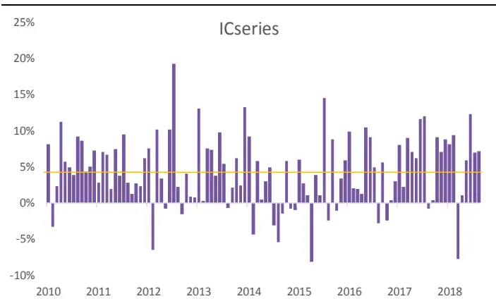
资料来源：光大证券研究所

图 3：EBQC 在全市场的分组&多空收益
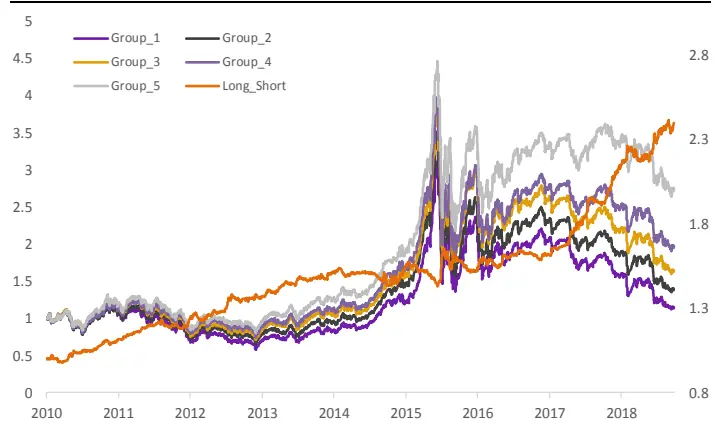
资料来源：光大证券研究所

图 4：EBQC 中证 500 成分股内 IC 序列
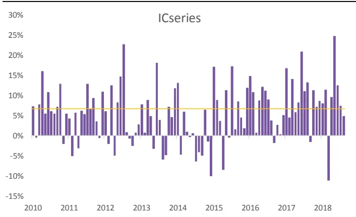
资料来源：光大证券研究所

图 5：EBQC 中证 500 成分股内分组&多空收益
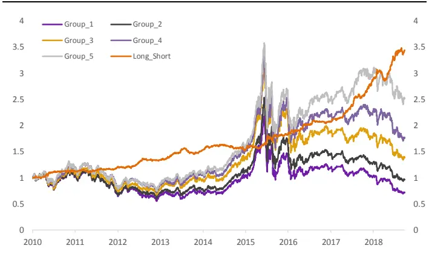
资料来源：光大证券研究所

图 6：EBQC 沪深 300 成分股内 IC 序列
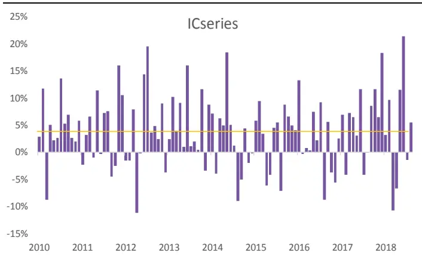
资料来源：光大证券研究所

图7：EBQC沪深 300成分股内分组&多空收益
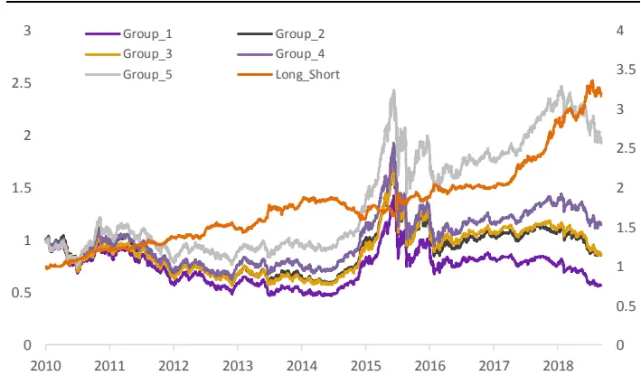
资料来源：光大证券研究所

## 3.2.2、EBQC 因子各样本空间内多头收益表现抢眼

EBQC 综合质量因子的多头选股能力也较为出色，我们在中证全指、中证500、沪深 300 不同样本空间内，分别测试了 EBQC 因子排序前 50 只股票的持仓收益和相对收益情况：

## 1) 全市场选股 EBQC 因子 top50 组合表现：

在全市场内，测试期内EBQC 因子的多头top50 组合收益相当出色，年化收益高达25%，信息比高达2.56。且2017年与 2018年的超额收益都十分稳定。

图 8：全市场选股 EBQC 因子 top50 组合表现
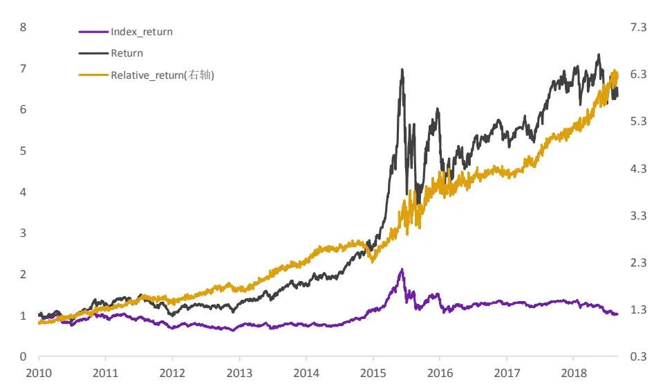
资料来源：光大证券研究所，注：基准为全 A 等权指数，测试期为 2010-01-01 至2018-10-31

表18：全市场选股EBQC因子 top50组合分年度表现统计

|  | 月度胜率 | 年化收益 | 年化波动 | 年化超额收益相对收益波动 |  | 信息比率 | 最大回撤 | 相对最大回撤 |
| --- | --- | --- | --- | --- | --- | --- | --- | --- |
| 2010 | 92% | 27% | 29% | 33% | 9% | 3.78 | -23% | -6% |
| 2011 | 75% | -21% | 25% | 14% | 7% | 1.85 | -33% | -7% |
| 2012 | 75% | 28% | 24% | 20% | 7% | 2.89 | -16% | -7% |
| 2013 | 92% | 43% | 24% | 35% | 10% | 3.63 | -15% | -5% |
| 2014 | 75% | 49% | 21% | 1% | 9% | 0.13 | -9% | -15% |
| 2015 | 92% | 122% | 52% | 77% | 18% | 4.25 | -49% | -12% |
| 2016 | 75% | 1% | 31% | 11% | 8% | 1.35 | -25% | -4% |
| 2017 | 83% | 25% | 17% | 24% | 9% | 2.78 | -11% | -4% |
| 2018 | 88% | -11% | 25% | 33% | 8% | 4.22 | -16% | -3% |
| Summary | 84% | 25% | 30% | 26% | 10% | 2.56 | -49% | -15% |

资料来源：光大证券研究所，注：基准为全 A 等权指数，测试期为 2010-01-01 至 2018-10-31

## 2) 中证 500 成分股内 EBQC 因子 top50 组合表现：

在中证 500 成分股内，测试期内 EBQC 因子的多头 top50 组合收益表现也相当不错，年化收益为 16%，信息比高达2.40。且2017 年与 2018 年的年化超额收益都接近30%。

图 9：中证 500 成分股内 EBQC 因子 top50 组合表现
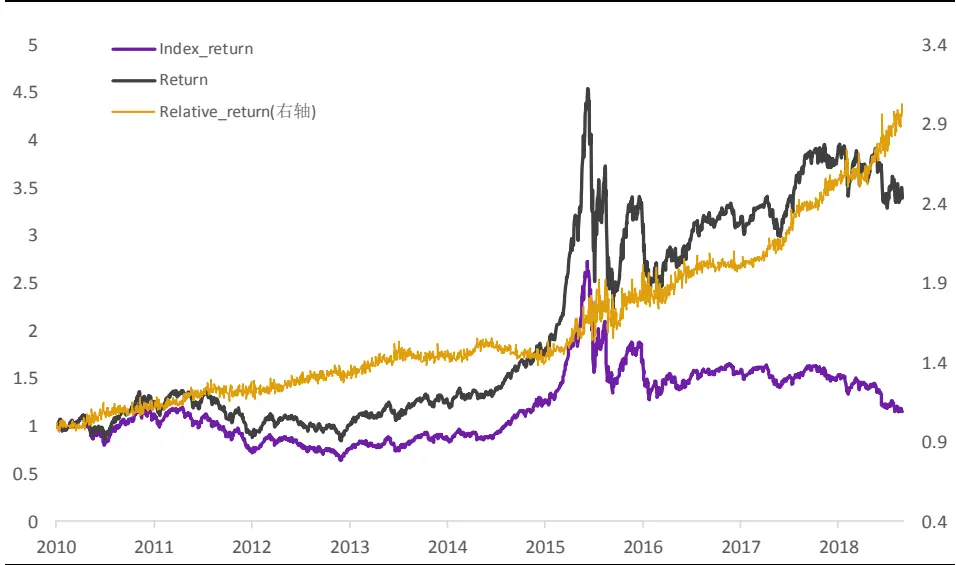
资料来源：光大证券研究所，注：基准为中证 500 等权指数，测试期为 2010-01-01 至2018-10-31

表19：中证500成分股内EBQC因子 top50组合分年度表现统计

|  | 月度胜率 | 年化收益 | 年化波动 | 年化超额收益相对收益波动 |  | 信息比率 | 最大回撤 | 相对最大回撤 |
| --- | --- | --- | --- | --- | --- | --- | --- | --- |
| 2010 | 75% | 24% | 30% | 12% | 6% | 2.24 | -23% | -3% |
| 2011 | 83% | -26% | 26% | 11% | 5% | 2.29 | -34% | -3% |
| 2012 | 83% | 11% | 26% | 9% | 4% | 2.08 | -25% | -1% |
| 2013 | 75% | 29% | 23% | 9% | 5% | 1.76 | -15% | -4% |
| 2014 | 50% | 38% | 20% | -2% | 5% | -0.42 | -9% | -8% |
| 2015 | 67% | 87% | 52% | 32% | 10% | 3.02 | -51% | -6% |
| 2016 | 67% | 3% | 31% | 12% | 5% | 2.48 | -26% | -2% |
| 2017 | 83% | 21% | 17% | 27% | 6% | 4.82 | -12% | -2% |
| 2018 | 88% | -19% | 25% | 26% | 6% | 4.60 | -17% | -2% |
| Summary | 73% | 16% | 30% | 14% | 6% | 2.40 | -51% | -8% |

资料来源：光大证券研究所，注：基准为中证 500 等权指数，测试期为 2010-01-01 至 2018-10-31

## 3) 沪深 300 成分股内 EBQC 因子 top50 组合表现：

在沪深 300 成分股内，测试期内 EBQC 因子的多头 top50 组合年化收益为10%，信息比2.16。且2017年与2018年的年化超额收益分别为30%和20%。

图 10：沪深 300 成分股内 EBQC 因子 top50 组合表现
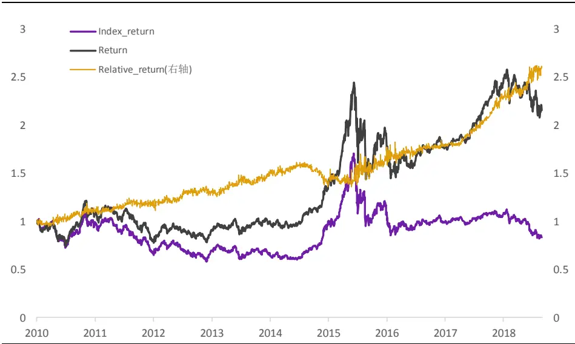
资料来源：光大证券研究所，注：基准为沪深 300 等权指数，测试期为 2010-01-01 至2018-10-31

表20：沪深300成分股内EBQC因子 top50组合分年度表现统计

|  | 月度胜率 | 年化收益 | 年化波动 | 年化超额收益相对收益波动 |  | 信息比率 | 最大回撤 | 相对最大回撤 |
| --- | --- | --- | --- | --- | --- | --- | --- | --- |
| 2010 | 67% | 10% | 29% | 13% | 5% | 2.90 | -27% | -3% |
| 2011 | 75% | -28% | 22% | 6% | 5% | 1.31 | -32% | -3% |
| 2012 | 67% | 16% | 22% | 11% | 5% | 2.32 | -20% | -3% |
| 2013 | 67% | 12% | 20% | 14% | 6% | 2.27 | -16% | -5% |
| 2014 | 50% | 37% | 18% | -6% | 5% | -1.14 | -9% | -13% |
| 2015 | 67% | 35% | 45% | 17% | 8% | 2.19 | -41% | -4% |
| 2016 | 75% | 2% | 25% | 11% | 4% | 3.01 | -19% | -2% |
| 2017 | 92% | 38% | 13% | 30% | 6% | 5.26 | -7% | -2% |
| 2018 | 88% | -18% | 23% | 20% | 7% | 2.82 | -19% | -3% |
| Summary | 71% | 10% | 26% | 12% | 6% | 2.16 | -41% | -13% |

资料来源：光大证券研究所，注：基准为沪深 300 等权指数，测试期为 2010-01-01 至 2018-10-31

## 4、质量结合估值：显著提高因子预测能力

估值因子（例如BP、EP等）反映的是公司在A股市场上长期是具有显著且稳定的预测能力和收益的，如果单纯关注单个因子的历史表现，会容易产生过于依赖估值因子的倾向，但仅仅基于估值因子本身来挑选便宜的股票是存在较大的风险的，因为股票的估值低也有可能是由于公司本身质地的确很差而导致的。因此在优质公司的基础上挑选相对估值便宜的公司才是更加复合基本面选股逻辑的方式，下文的测试结果也表明，EBQC综合质量因子与估值因子做结合后，可以有效地提高选股能力和预测能力。

首先关注EBQC因子与估值因子之间的相关性及其趋势，以历史回测表现最好的估值因子BP为例，其与EBQC因子的历史IC 序列相关系数为-0.23，下图展示了两个因子IC序列及滚动 12 个月的相关系数走势：

图 11：EBQC、BP_LR 因子 IC 序列及滚动 12 个月 IC 相关系数
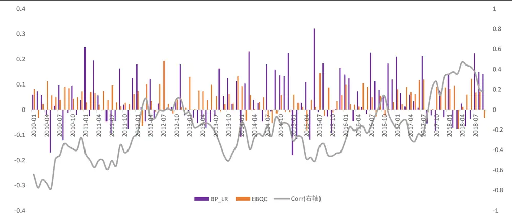
资料来源：光大证券研究所

由此可见，质量因子与估值因子在大部分时间内均呈现较为显著的负相关，也就说明高质量的公司的估值水平也会偏高。而同时我们也可以观察到，在全体 A 股样本中，质量因子 EBQC 和估值因子 BP 两者之间的相关系数从2010年至今整体呈现略微上升的趋势，尤其是2017年下半年以来，两者之间的相关系数首次出现持续较长时间的正值。

## 4.1、高质低估因子组合 IC 提高明显

那么将 EBQC 与估值因子结合后，是否真的可以提高预测能力和选股收益呢？我们尝试将EBQC与估值因子BP等权加权后，作为新的高质低估因子，并于原来的EBQC 因子表现作为对比：

表21：高质低估因子预测能力显著提高

| EBQC EQBC_BP |  |
| --- | --- |
| IC mean | 4.40% 6.15% |
| IC std | 4.97% 7.26% |
| IR | 0.89 0.85 |
| IC positive per | 83% 79% |
| LongShort Return | 11.10% 12% |
| Turnover | 16% 17% |
| Mono Score | 2.73 1.98 |
| LongShort Sharpe | 1.78 1.53 |
| Factor Return | 0.39% 0.55% |
| Return tstat | 8.27 7.52 |

资料来源：光大证券研究所

由上表可见，质量因子结合估值因子之后，高质低估因子（EBQC_BP）的IC 显著得到了提升，因子收益也由 0.39%提高到了 0.55。不过由于 BP 估值因子近两年的波动较大，导致复合因子的波动加大，IC_IR 并未得到显著的提高。

总的来看，综合质量因子 EBQC 与估值因子的结合的确会在原本 EBQC 因子的基础上带来一定的预测能力的提升。公司质量对于估值的提升作用也是较为明显的。

## 5、质量因子与规模效应

学术界对于公司质量（Quality）与股票的规模效应（size effect）之间的相关性也存在一些讨论。一些理论认为，小市值股票的溢价现象主要来自于市场对弱流动性股票的风险补偿，也有理论认为小市值股票的溢价现象来自于散户的投机行为，与公司的基本面因素尤其是公司质量并不存在直接相关性。对于规模效应的存在是否收到公司质量因素的影响，我们简单的做了以下分析。结果表明，A 股的规模效应在质量较差的公司中更为明显，而优质公司分组中的规模效应则相对较弱。

我们测试了按照EBQC 质量因子分两组后的市值因子表现，即每期截面上按照EBQC 因子分为高质量组（HQ）和低质量组（LQ），在两个组内分别测试Ln_MC 因子的IC、IC_IR 等各项指标。由下表可见，低质量组（LQ）中的市值因子表现更好，其 IC、IC_IR、多空收益等指标均显著高于高质量组（HQ）。

表22：EBQC分两组后Ln_MC因子表现对比

|  | Ln_MC_HQ | Ln_MC_LQ |
| --- | --- | --- |
| Factor Mean Return | -0.48% | -0.71% |
| IC mean | -5.58% | -7.96% |
| IC positive per | 41% | 30% |
| IC std | 19% | 16% |
| IR | -0.30 | -0.48 |
| Long_Short_return | 23.10% | 33.30% |
| Long_Short_Sharpe | 1.49 | 2.40 |
| Mono Score | 3.21 | 3.12 |

资料来源：光大证券研究所

图12：EBQC分两组后Ln_MC因子多空收益对比
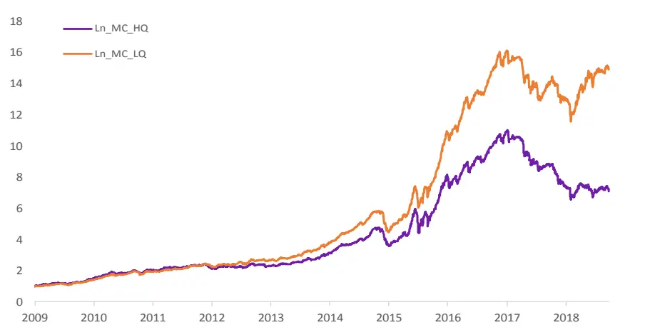
资料来源：光大证券研究所

从上述多空收益的净值曲线也可以看出，低质公司中的规模效应（小市值因子的多空收益）明显高于另外一个分组。可见A 股的规模效应在质量较差的公司中更为明显，而优质公司分组中的规模效应则相对较弱。

## 6、风险提示

本篇报告测试结果均基于量化模型，模型存在失效的风险。

## 行业及公司评级体系

| 评级 说明 |
| --- |
| 行 买入 未来6-12个月的投资收益率领先市场基准指数15%以上； |
| 增持 未来 6-12个月的投资收益率领先市场基准指数5%至15%； |
| 中性 未来6-12个月的投资收益率与市场基准指数的变动幅度相差-5%至5%； |
| 减持 未来6-12个月的投资收益率落后市场基准指数5%至15%； |
| 卖出 未来6-12个月的投资收益率落后市场基准指数15%以上； |
| 因无法获取必要的资料，或者公司面临无法预见结果的重大不确定性事件，或者其他原因，致使无法给出明确的无评级投资评级。 |
| 基准指数说明：A股主板基准为沪深300指数；中小盘基准为中小板指；创业板基准为创业板指；新三板基准为新三板指数；港股基准指数为恒生指数。 |

## 分析、估值方法的局限性说明

本报告所包含的分析基于各种假设，不同假设可能导致分析结果出现重大不同。本报告采用的各种估值方法及模型均有其局限性，估值结果不保证所涉及证券能够在该价格交易。

## 分析师声明

本报告署名分析师具有中国证券业协会授予的证券投资咨询执业资格并注册为证券分析师，以勤勉的职业态度、专业审慎的研究方法，使用合法合规的信息，独立、客观地出具本报告，并对本报告的内容和观点负责。负责准备本报告以及撰写本报告的所有研究分析师或工作人员在此保证，本研究报告中关于任何发行商或证券所发表的观点均如实反映分析人员的个人观点。负责准备本报告的分析师获取报酬的评判因素包括研究的质量和准确性、客户的反馈、竞争性因素以及光大证券股份有限公司的整体收益。所有研究分析师或工作人员保证他们报酬的任何一部分不曾与，不与，也将不会与本报告中具体的推荐意见或观点有直接或间接的联系。

## 特别声明

光大证券股份有限公司（以下简称“本公司”）创建于 1996 年，系由中国光大（集团）总公司投资控股的全国性综合类股份制证券公司，是中国证监会批准的首批三家创新试点公司之一。根据中国证监会核发的经营证券期货业务许可，光大证券股份有限公司的经营范围包括证券投资咨询业务。

本公司经营范围：证券经纪；证券投资咨询；与证券交易、证券投资活动有关的财务顾问；证券承销与保荐；证券自营；为期货公司提供中间介绍业务；证券投资基金代销；融资融券业务；中国证监会批准的其他业务。此外，公司还通过全资或控股子公司开展资产管理、直接投资、期货、基金管理以及香港证券业务。

本证券研究报告由光大证券股份有限公司研究所（以下简称“光大证券研究所”）编写，以合法获得的我们相信为可靠、准确、完整的信息为基础，但不保证我们所获得的原始信息以及报告所载信息之准确性和完整性。光大证券研究所可能将不时补充、修订或更新有关信息，但不保证及时发布该等更新。

本报告中的资料、意见、预测均反映报告初次发布时光大证券研究所的判断，可能需随时进行调整且不予通知。报告中的信息或所表达的意见不构成任何投资、法律、会计或税务方面的最终操作建议，本公司不就任何人依据报告中的内容而最终操作建议做出任何形式的保证和承诺。在任何情况下，本报告中的信息或所表述的意见并不构成对任何人的投资建议。客户应自主作出投资决策并自行承担投资风险。本报告中的信息或所表述的意见并未考虑到个别投资者的具体投资目的、财务状况以及特定需求。投资者应当充分考虑自身特定状况，并完整理解和使用本报告内容，不应视本报告为做出投资决策的唯一因素。对依据或者使用本报告所造成的一切后果，本公司及作者均不承担任何法律责任。

不同时期，本公司可能会撰写并发布与本报告所载信息、建议及预测不一致的报告。本公司的销售人员、交易人员和其他专业人员可能会向客户提供与本报告中观点不同的口头或书面评论或交易策略。本公司的资产管理部、自营部门以及其他投资业务部门可能会独立做出与本报告的意见或建议不相一致的投资决策。本公司提醒投资者注意并理解投资证券及投资产品存在的风险，在做出投资决策前，建议投资者务必向专业人士咨询并谨慎抉择。

在法律允许的情况下，本公司及其附属机构可能持有报告中提及的公司所发行证券的头寸并进行交易，也可能为这些公司提供或正在争取提供投资银行、财务顾问或金融产品等相关服务。投资者应当充分考虑本公司及本公司附属机构就报告内容可能存在的利益冲突，勿将本报告作为投资决策的唯一信赖依据。

本报告根据中华人民共和国法律在中华人民共和国境内分发，仅供本公司的客户使用。本公司不会因接收人收到本报告而视其为客户。本报告仅向特定客户传送，未经本公司书面授权，本研究报告的任何部分均不得以任何方式制作任何形式的拷贝、复印件或复制品，或再次分发给任何其他人，或以任何侵犯本公司版权的其他方式使用。所有本报告中使用的商标、服务标记及标记均为本公司的商标、服务标记及标记。如欲引用或转载本文内容，务必联络本公司并获得许可，并需注明出处为光大证券研究所，且不得对本文进行有悖原意的引用和删改。

## 光大证券股份有限公司

上海市新闸路1508 号静安国际广场 3楼邮编 200040

总机：021-22169999 传真：021-22169114、22169134

| 机构业务总部 | 姓名 | 办公电话 | 手机 | 电子邮件 |
| --- | --- | --- | --- | --- |
| 上海 | 徐硕 | 021-52523543 | 13817283600 | shuoxu@ebscn.com |
|  | 李文渊 |  | 18217788607 | liwenyuan@ebscn.com |
|  | 李强 | 021-52523547 | 18621590998 | liqiang88@ebscn.com |
|  | 罗德锦 | 021-52523578 | 13661875949/13609618940 | luodj@ebscn.com |
|  | 张弓 | 021-52523558 | 13918550549 | zhanggong@ebscn.com |
|  | 黄素青 | 021-22169130 | 13162521110 | huangsuqing@ebscn.com |
|  | 邢可 | 021-22167108 | 15618296961 | xingk@ebscn.com |
|  | 李晓琳 | 021-52523559 | 13918461216 | lixiaolin@ebscn.com |
|  | 郎珈艺 | 021-52523557 | 18801762801 | dingdian@ebscn.com |
|  | 余鹏 | 021-52523565 | 17702167366 | yupeng88@ebscn.com |
|  | 丁点 | 021-52523577 | 18221129383 | dingdian@ebscn.com |
|  | 郭永佳 |  | 13190020865 | guoyongjia@ebscn.com |
| 北京 | 郝辉 | 010-58452028 | 13511017986 | haohui@ebscn.com |
|  | 梁晨 | 010-58452025 | 13901184256 | liangchen@ebscn.com |
|  | 吕凌 | 010-58452035 | 15811398181 | Ivling@ebscn.com |
|  | 郭晓远 | 010-58452029 | 15120072716 | guoxiaoyuan@ebscn.com |
|  | 张彦斌 | 010-58452026 | 15135130865 | zhangyanbin@ebscn.com |
|  | 庞舒然 | 010-58452040 | 18810659385 | pangsr@ebscn.com |
| 深圳 | 黎晓宇 | 0755-83553559 | 13823771340 | lixy1@ebscn.com |
|  | 张亦潇 | 0755-23996409 | 13725559855 | zhangyx@ebscn.com |
|  | 王渊锋 | 0755-83551458 | 18576778603 | wangyuanfeng@ebscn.com |
|  | 张靖雯 | 0755-83553249 | 18589058561 | zhangjingwen@ebscn.com |
|  | 苏一耘 |  | 13828709460 | suyy@ebscn.com |
|  | 常密密 |  | 15626455220 | changmm@ebscn.com |
| 国际业务 | 陶奕 | 021-52523546 | 18018609199 | taoyi@ebscn.com |
|  | 梁超 | 021-52523562 | 15158266108 | liangc@ebscn.com |
|  | 金英光 |  | 13311088991 | jinyg@ebscn.com |
|  | 王佳 | 021-22169095 | 13761696184 | wangjia1@ebscn.com |
|  | 郑锐 | 021-22169080 | 18616663030 | zhrui@ebscn.com |
|  | 凌贺鹏 | 021-22169093 | 13003155285 | linghp@ebscn.com |
|  | 周梦颖 | 021-52523550 | 15618752262 | zhoumengying@ebscn.com |
| 私募业务部 | 戚德文 | 021-52523708 | 18101889111 | qidw@ebscn.com |
|  | 安羚娴 | 021-52523708 | 15821276905 | anlx@ebscn.com |
|  | 张浩东 | 021-52523709 | 18516161380 | zhanghd@ebscn.com |
|  | 吴冕 | 0755-23617467 | 18682306302 | wumian@ebscn.com |
|  | 吴琦 | 021-52523706 | 13761057445 | wuqi@ebscn.com |
|  | 王舒 | 021-22169419 | 15869111599 | wangshu@ebscn.com |
|  | 傅裕 | 021-52523702 | 13564655558 | fuyu@ebscn.com |
|  | 王婧 | 021-22169359 | 18217302895 | wangjing@ebscn.com |
|  | 陈潞 | 021-22169146 | 18701777950 | chenlu@ebscn.com |
|  | 王涵洲 |  | 18601076781 | wanghanzhou@ebscn.com |