## 因子择时的“是”与“非”——多因子系列报告之十八

2017年传统的多因子组合大多出现了不同程度的回撤，其原因则是模型中权重配置较高的市值、反转等因子皆出现了较长时间的失效。2018年许多大类因子也表现出了高波动的特征。在这样一种大背景下，投资者对于因子择时研究的需求也在逐渐上升。

本报告主要分为四个部分。第一部分回顾了各大类因子在近期的表现；第二部分讨论了因子择时模型的可行性；第三部分梳理了因子择时的主要外部变量及其与不同大类因子收益之间的相关性；第四部分给出了更新预测变量后的 SVM模型和OLS模型的因子择时实证结果。

## 因子择时的“是”与“非”

我们从因子收益来源和因子投资逻辑中挖掘因子择时模型的可行性。从风险补偿的角度、投资者行为的角度、以及因子的稀缺性等角度出发，可以寻找有效变量对因子收益做预测。同时因子择时也常受到质疑，例如外部变量与因子收益的关系不稳定，因子择时模型会明显提高换手率，增加交易成本等等。

## 因子择时的基础变量选择

关注两个因子自身收益衍生的预测指标：因子估值差（ValueSpread）和因子拥挤度（FactorCrowding）。估值差指标可以作为“因子的因子”来度量一个因子是不是太贵了；拥挤度指标可以提示投资者躲避可能失效的因子。

同时全面测试了其他外部变量（经济环境、货币政策、市场状态等）对不同期限的因子收益的预测能力。其中，市场状态变量对价量类因子具有较高的预测能力，因子估值差标准分指标同样有一定的预测能力。

## 因子择时模型实证：更新变量后 SVM 模型近期表现有提升

加入因子估值差、拥挤度等指标，更新变量后的 SVM 组合信息比为3.37（测试时间区间为 2009-01-01 至 2018-12-31），略高于原始 SVM 模型的信息比 3.25，且新SVM模型在2017 年的表现显著优于未择时模型，2017 年更新 SVM 择时模型信息比为-0.92，高于原始 SVM 模型的-1.47。证明因子估值差、因子拥挤度等指标的确具有一定的因子择时能力，可以在2017和2018年因子波动较大的市场环境中有效提高组合表现。

我们同时也尝试了基于多层外部变量筛选后的OLS线性回归因子收益预测模型，对于每一类大类因子均可以得出影响因子收益的常用有效变量名单（例如影响市值因子收益的重要变量包括小盘股波动、大盘股收益等），同时与预期相符的是OLS线性回归的预测胜率显著弱于SVM模型。

- 风险提示：结果均基于模型和历史数据，模型存在失效的风险。

## 金融工程深度

## 分析师

周萧潇 （执业证书编号：S0930518010005）

021-52523680

zhouxiaoxiao@ebscn.com

刘均伟 (执业证书编号：S0930517040001)

021-52523679

liujunwei@ebscn.com

## 相关研究

《别开生面：公司治理因子详解——多因子系列报告之四》

《见微知著：成交量占比高频因子解析——多因子系列报告之五》

《行为金融因子：噪音交易者行为偏差——多因子系列报告之六》

《基于 K 线最短路径构造的非流动性因子——多因子系列报告之七》

《高频因子：日内分时成交量蕴藏玄机——多因子系列报告之八》

《一致交易：挖掘集体行为背后的收益多因子系列报告之九》

《因子正交与择时：基于分类模型的动态权重配置——多因子系列报告之十》《爬罗剔抉：一致预期因子分类与精选——多因子系列报告之十一》

《成长因子重构与优化：稳健加速为王——多因子系列报告之十二》

《组合优化算法探析及指数增强实证——多因子系列报告之十三 》多因子系列报告之十三》《创新基本面因子：财务数据间线性关系初窥——多因子系列报告之十四 》《创新基本面因子：提纯净利数据中的选股信息 ——多因子系列报告之十五 》《创新基本面因子：捕捉产能利用率中的讯号——多因子系列报告之十六》《以质取胜：EBQC 综合质量因子详解

——多因子系列报告之十七》

2017 年传统的多因子组合大多出现了不同程度的回撤，其原因则是模型中权重配置较高的市值、反转等因子皆出现了较长时间的失效。2018 年许多大类因子也表现出了高波动的特征。在这样一种大背景下，投资者对于因子择时研究的需求也在逐渐上升。

本报告主要分为四个部分。第一部分回顾了各大类因子在近期的表现；第二部分讨论了因子择时模型的可行性；第三部分梳理了因子择时的主要外部变量及其与不同大类因子收益之间的相关性；第四部分给出了更新预测变量后的SVM模型和 OLS模型的因子择时实证结果。（本文默认测试时间区间为2006-01-01 至2018-12-31，个别因子由于计算时长需要，测试时间为2009-01-01 至 2018-12-31）

## 1、近期大类因子表现回顾

在 2018 年我们可以观察到一些大类因子（例如估值因子、市值因子）的表现延续了 2017 年的高波动特征。我们首先对几个常用的大类因子的近期表现做一下总结，大类因子的具体划分方式如下（其中EBQC综合质量因子的详细构造方式可参考前期的报告《以质取胜：EBQC综合质量因子详解——多因子系列报告之十七》）：

表1：常见大类因子及因子明细

| 大类因子 | 因子明细 |
| --- | --- |
| 质量因子（Quality） | EBQC 综合质量因子 |
| 估值因子（Value） | EP、BP、OCFP |
| 市值因子（Size） | Ln_MC |
| 反转因子（Momentum） | Momentum_1M |
| 换手因子（Turnover） | Turnover_1M |
| 波动因子（Volatility） | STD_3M |

资料来源：光大证券研究所

不仅仅在 2018 年，近年来很多因子尤其是价量因子在收益表现上均出现了较大的波动。尤其是 2017 年小市值因子和反转因子的长时间回撤，令很多投资者措手不及。从下图可以看出，2017 的全年度，小市值因子和反转因子的多头收益回撤均十分显著（多头收益计算方式为多头 20%股票收益，因子值均经过市值和行业中性化处理）。

图 1：2014.01.01 至今大类因子多头收益走势
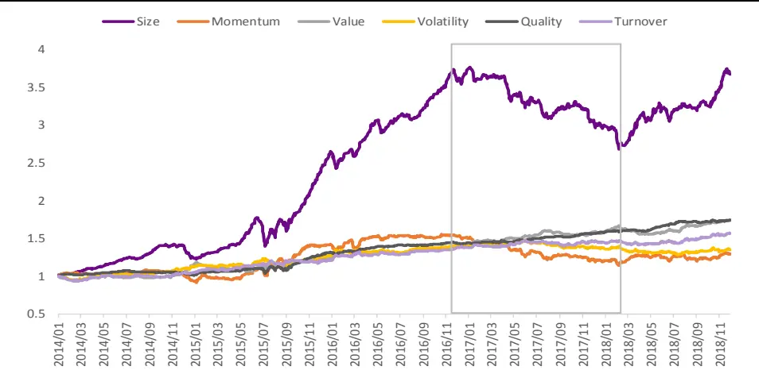
资料来源：光大证券研究所

小市值因子和反转因子在17 年的回撤导致一些多因子组合损失较大。因此因子择时模型的研究被提上了日程。但是否存在有效的因子择时模型，或者因子择时模型是否真的能有效的提高多因子组合表现，是大家首先关心的也是广泛讨论的问题。我们也会首先对因子择时模型的可行性做简单的探讨。

## 2、因子择时的“是”与“非”

通常我们在评价一个因子的时候，会从预测能力和收益稳定性的指标入手，计算因子的 IC、IC_IR、多空收益、多空夏普、收益显著性、单调性等等指标。当这些指标达到某一个阈值时（例如IC均值大于 2%、IC_IR 超过0.3），我们认为因子在长期来看是有效的。当我们观察到某个因子近期 IC或者多空收益出现了连续的长时间回撤，就认为该因子近期处于失效的状态。

因此，是否可以通过外部变量与因子收益之间的相关性来构建因子收益的择时模型来达到规避因子回撤的目的，就是目前投资者比较关心的问题。无论是海外还是国内，对于因子的择时是否可行这一命题都有着比较广泛的讨论。

## 2.1、因子的收益来自哪里？

既然因子的收益表现出较明显的波动性从而我们希望对其收益情况做出预判，那么首先需要回答，因子收益来自哪里？

图 2：因子的收益来源分类
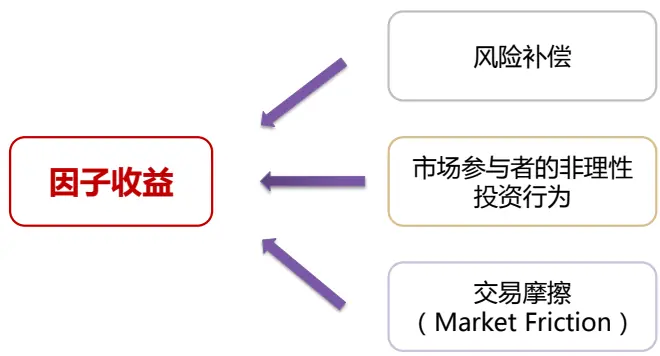
资料来源：光大证券研究所绘制

对于因子的收益来源，我们认为可以将其分为三类：

第一类是风险补偿效应，例如非流动性因子（ILLIQ）在海内外均具有较好的收益，而其背后的逻辑基本源自于弱流动性风险的补偿。

第二类是市场参与者的非理性投资行为，从行为金融学上可以比较好的解释这一现象，例如反转因子的长期有效证明投资者往往存在追涨杀跌的心理。

第三类是市场的有效性，当市场有效性越弱，市场的合理价格发现的速度越慢，这其中就包含越多的收益机会。

## 2.2、因子择时的可能性来自哪里？

那么因子的收益是否可以被预测呢？我们认为，可以从因子收益来源和因子投资逻辑寻找因子择时的可能性：

图3：从因子收益来源和因子投资逻辑寻找因子择时的可能
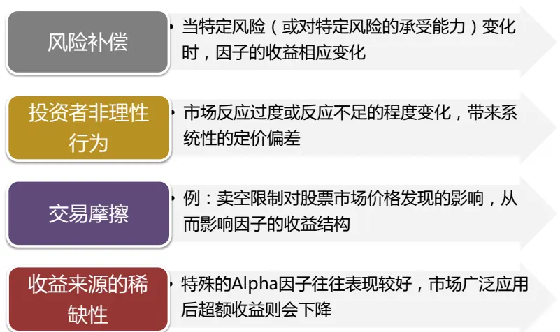
资料来源：光大证券研究所绘制

首先，从风险补偿的角度来考虑，仍然以非流动性因子为例，假设市场环境或者外部经济环境的变化导致投资者对于流动性风险的承受能力降低，那么就很有可能影响到非流动性因子的表现。

其次，从投资者行为或者交易摩擦的角度出发，当市场的参与者非理性行为出现变化或者市场的信息传递效率加快导致价格发现速度加快，那么就很有可能影响因子的收益或者收益结构。

最后较为重要的一点是，当一个alpha 因子被越来越多的投资者知晓并且使用的时候，就往往会出现收益下降，甚至失效的情况。因此 alpha 因子的收益来源的稀缺性，是影响因子收益表现的非常重要的因素。

从上述几个角度出发，我们认为因子择时是有意义的或者说是具有逻辑的支撑的，可以通过上述几个方向分别寻找可靠的代理变量，尝试对因子的收益变化方向做出预测。如果能在因子有效性上进行把控，或者阶段性的择时，这对最终的因子组合的收益理论上会有一定的帮助。

## 2.3、因子择时所遭受的质疑

与此同时，业界和学术界对于因子择时或者因子轮动模型是否真正能够提高多因子组合的表现是存在一些质疑的声音的。

反方的观点主要包括：

1) 在预测因子收益时使用的外部变量（宏观变量、市场变量等）与因子收益的关系复杂并且不稳定。

2) 加入因子择时模型对原始因子组合的边际贡献有限，还不如通过挖掘新因子的方式来提高组合表现。

3) 加入因子择时模型后，会明显提高组合的换手率，增加交易成本。从而对于因子组合的表现提升带来负面影响。

图 4：因子择时遭到的质疑
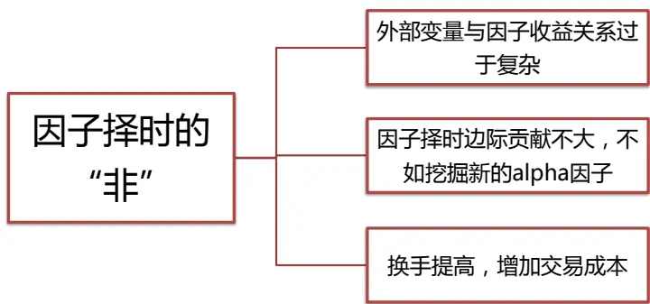
资料来源：光大证券研究所绘制

海外业界和学术界对于因子择时模型的讨论同样非常激烈。不过我们观察到目前的大部分讨论都是围绕着因子估值差（Value Spread）这个指标在因子择时上的有效性展开的。对于因子估值差用于因子择时是否有效，AQR的 Asness1的观点是比较谨慎的，我们将在下文中具体讨论 Value Spread的择时效果。

同时，我们认为因子的择时模型的关键点或者出发点并不完全在于寻找有效的外部变量来预测因子的未来收益率绝对值，而更多的在于识别未来收益可能出现变化的因子，规避可能出现回撤或者因子收益方向可能出现改变的因子。

也就是说，因子择时的关键在于规避因子回撤而不是预测因子收益。因此，寻找有效的外部变量并采用合适的预测模型才是通过因子择时来提高组合表现的关键所在。

## 3、因子择时的基础变量选择

在报告《因子正交与择时：基于分类模型的动态权重配置——多因子系列报告之十》中，我们简单尝试了采用部分外部变量和非线性分类模型SVM对因子收益的方向做预测的因子择时策略。由《因子正交与择时》报告中的结论可见，宏观指标、经济环境等外部变量对于大部分因子的解释能力都不强，因此我们在本文中将首先重点的对基于因子本身的衍生指标做更为深入的挖掘，尝试弥补外部经济环境变量对因子解释能力有限的缺陷。

## 3.1、因子估值差（Value Spread）：买便宜的因子

和股票的估值指标逻辑类似，我们可以构造因子的估值指标，来衡量因子的估值水平，从中挖掘因子收益与因子估值之间的相关性。

## 3.1.1、因子估值差（Value Spread）计算方法与构造逻辑

Asness (2000) 2首次提出了因子估值差的概念，借鉴他的研究，一般将因子估值差定义为：

## 因子估值差 = 因子 top组合和bottom组合的估值差额

其中，top 组和 bottom 组的估值取估值指标（BP、EP）的中位数

估值差逻辑：可以作为“因子的因子”来度量一个因子是不是太贵了，Value Spread 高的因子和高估值的股票一样，长期应该有回复均值的趋势。现有文献几乎都发现，因子估值（PE、PB等）和因子未来收益存在负相关。当 value spread 变宽时，因子估值降低，未来收益可能增加；当 value spread收窄时，因子估值变高，未来收益可能减少。

## 3.1.2、因子估值差（Value Spread）预测能力：以质量因子为例

首先，我们以质量因子 EBQC 为例，观察 EBQC 因子的估值差（ValueSpread）与因子收益之间是否存在相关性。

图 5：质量因子 EBQC 的 Value Spread 与其因子 top 组超额收益序列
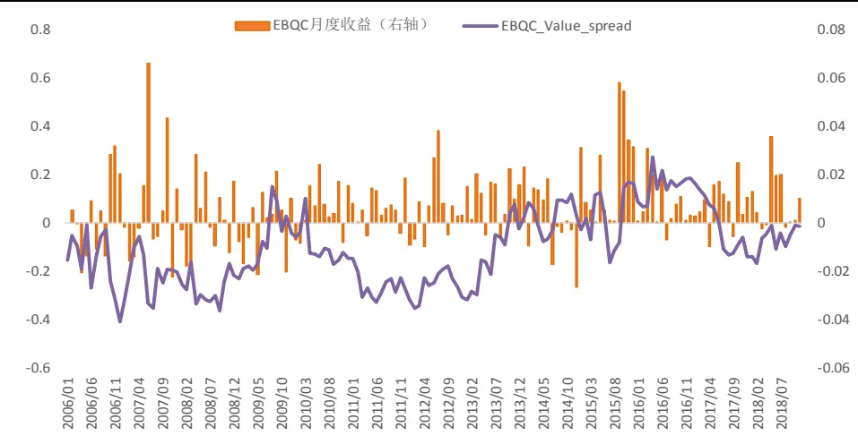
资料来源：光大证券研究所

从上图的两个序列的走势来看，质量因子的估值差指标的绝对值与因子的收益同步相关性并不明显。同时可以观察到，估值差指标处于上升过程中和上升之后，因子收益的表现相对较好。

因此，我们以质量因子与换手因子为例，展示了因子 Value_Spread 与不同期限因子未来收益的时间序列相关性。从下图可见，质量因子的Value_Spread与因子未来收益基本呈正相关，相关系数在 0.20左右。而换手率因子的 Value_Spread 与未来收益之间的相关性并不稳定，与未来长期收益的相关性为负，相关系数在-0.2 左右。

图 6：质量因子 EBQC 因子 Value_Spread 与未来收益相关性
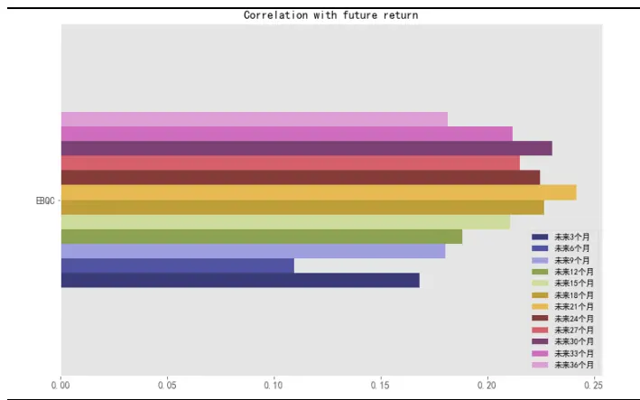
资料来源：光大证券研究所

图 7：换手因子 TURNOVER_1M 因子 Value_Spread与未来收益相关性
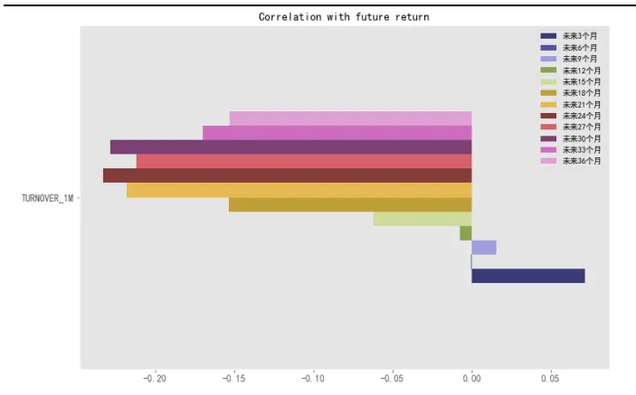
资料来源：光大证券研究所

## 3.1.3、因子估值差（Value Spread）的衍生预测指标

从上文的结论可知，因子估值差指标的绝对值与因子收益之间的相关性并非十分显著，或者说从因子估值差的绝对值上来看，其预测效果并不稳定。因此，我们尝试从其时间序列上的相对位置或者类似的思路出发，来构造因子估值差的衍生指标。

## 估值差时序标准分（VS_zscore）：

通过计算估值差指标的时序标准分，判断指标在时间序列上的相对位置。例如，计算滚动 60 个交易日的 Value_Spread 的标准分 Zscore，来观察当前因子估值差在历史 60 个交易日内处于怎样的位置。由下图可见该指标与EBQC质量因子的历史超额收益之间的确存在一定的相关性。

图8：质量因子EBQC的VS_zscore与其因子top组超额收益序列
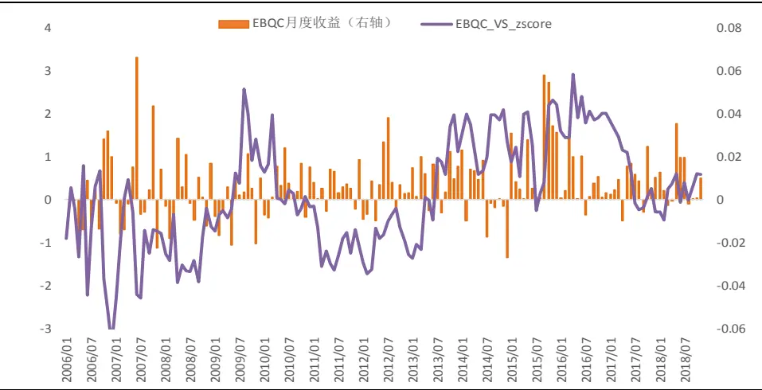
资料来源：光大证券研究所

类似的，以质量因子与换手因子为例，展示了因子 VS_zscore 与不同期限因子未来收益的时间序列相关性。从下图可见，质量因子的VS_zscore与因子未来收益相关性有所提高，相关系数在 0.25 左右。而换手率因子的VS_zscore 与未来收益之间的相关性仍然不稳定。

由结果可见，质量因子的VS_zscore指标与未来收益率之间呈现比较明显的正相关性，且相关系数较为稳定。而换手率因子的VS_zscore则表现一般，与因子不同期限的收益率之间没有非常稳定的相关性。

图 9：质量因子 EBQC 因子 VS_zscore 与未来收益相关性
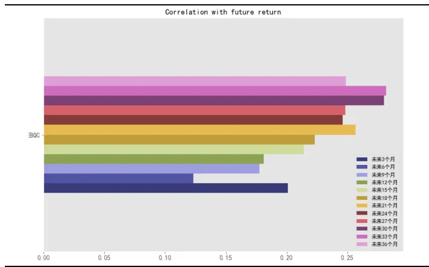
资料来源：光大证券研究所

图 10：换手因子 TURNOVER_1M 因子 VS_zscore 与未来收益相关性
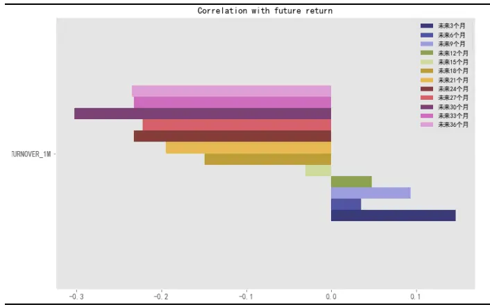
资料来源：光大证券研究所

## 3.2、因子拥挤度（Factor Crowding）：躲避可能失效的因子

因子一旦被广泛地研究和应用，其效果会大打折扣，甚至失效。因此我们希望可以构建一个指标来衡量因子是否已经被广泛的使用，或者因子的使用目前是否拥挤。并尝试使用因子拥挤度指标对因子的收益做择时，当拥挤度较高时，躲避此类可能失效的因子。

## 3.2.1、多维度衡量因子拥挤度（ Factor Crowding ）

包括 MSCI3在内的一些机构对因子拥挤度都给出了各自的定义方式，结合他们的定义方式和 A 股现状，我们认为因子拥挤度可以由以下四个维度来构成：

表 2：因子拥挤度（Factor Crowding）细分指标

| 指标名称 | 指标含义 |
| --- | --- |
| 因子离散度 | top 组合与bottom 组合中股票收益率的离散度 |
| 因子组内相关性 | top 组合与 bottom 组合的组内股票收益相关系数 |
| 因子收益动量 | top 组合收益 |
| 因子收益波动 | top 组合收益的波动率 |

资料来源：光大证券研究所

1. 因子离散度：

因子离散度的计算方式为：因子 top 组合中股票收益率的离散度，收益均与市场收益做了中性化处理。

其主要用来反映因子 top 组合内的股票的收益表现是否类似，如果一个因子的离散度显著上升，则很有可能表示因子组合内部结构发生的较大的变化，这也往往是由于突然的买入或者卖出行为导致的。所以拥挤的因子相比不拥挤的因子的离散度往往更高。

## 2. 因子组内相关性：

因子组内相关性的计算方法：因子top 组合内股票的相关系数。

组内相关系数的计算方法：对 top 组内（假设共n只股票）的每一只股票，分别计算其中性化后的收益率与 top 组内剔除这只股票的其他股票收益率之间的相关系数（均取过去60 个交易日的收益率），n个相关系数求均值得到因子组内相关性。

组内相关系数越高，说明因子越拥挤。我们以市值因子为例，从下图可见，2017 年3 月左右，市值因子组内相关性的zscore 突然大幅上升，而后市值因子的多头组合收益出现了连续的大幅回撤。因此因子组内相关性这一指标在市值因子的收益预测上具有较为明显的效果。

图11：市值因子组内相关性历史时间序列与因子多头收益走势
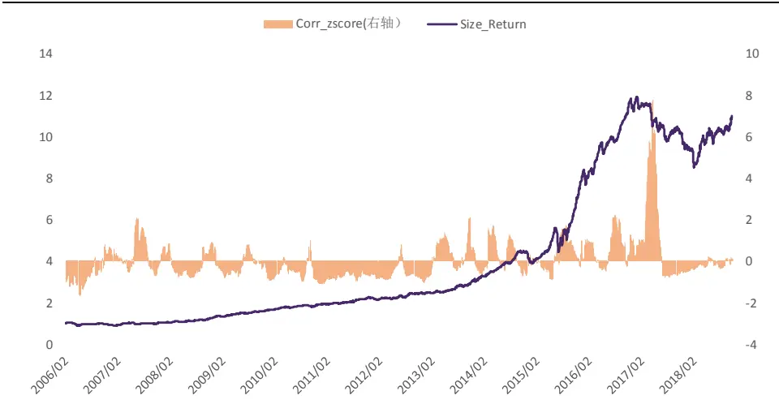
资料来源：光大证券研究所

## 3. 因子收益波动：

因子收益波动的计算方法：top 组合内股票收益的波动率。收益均与市场收益做了中性化处理。

与离散度的逻辑类似，因子 top 组合内股票收益波动越大，往往说明因子越拥挤。而与离散度不同的是，波动率的计算是时间序列上的，而离散度的计算是横截面上的。

## 4. 因子收益动量：

因子收益动量的计算方法：因子 top 组合最近 12 个月的累计超额收益，基准为全A 等权。

历史收益越好的因子，关注的投资者越多，就越有可能变得拥挤。因此因子收益动量越高，代表因子拥挤的可能性越高。

将上述四个维度的因子拥挤度评价指标标准化后等权相加，得到综合的因子拥挤度指标（Factor Crowding）。我们仍然以市值因子（Size）为例，统计因子拥挤度指标等分三组下，因子未来出现大于等于 15%回撤的概率。由下图可见，因子拥挤度较高时，其未来出现大幅回撤的概率也明显较高。

图12：因子拥挤度分类下，市值因子出现大于等于15%回撤的概率
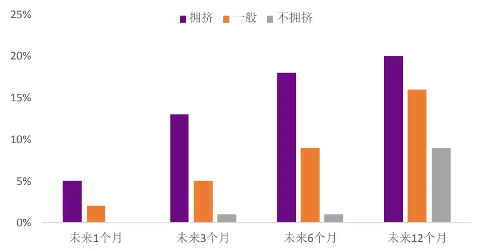
资料来源：光大证券研究所

## 3.3、其他因子择时外部变量

我们从宏观变量、经济变量、市场变量、市场情绪指标等方面入手，汇总了以下用于因子择时的外部变量：

考虑到宏观经济变量的发布滞后性，具体操作时我们对于 CPI同比增长率，规模以上工业增加值同比增长率，M1 同比增长率等等宏观变量做滞后一期处理：

## （1） 货币政策变量

货币政策变量主要有三个衡量指标，国家的货币政策立场（宽松或紧缩），短期利率，货币供应量。我们选择 3 个月国债到期收益率，M1 货币供应量同比增长率、M2 货币供应量同比增长率及其衍生指标M2、M1 增速差等指标作为货币政策变量。

## （2） 经济环境变量

经济环境变量直接衡量了经济是否健康或是否具有通货膨胀风险。我们选择 GDP 同比增长率、CPI 同比增长率，PPI 同比增长率，规模以上工业增加值同比增长率，消费者信心指数、投资者信心指数、PMI、社消总额、社会融资规模增速等指标。

## （3） 市场状态变量

这个类别中的变量衡量股票或债券市场的状态。Fama 和French（1989）使用期限利差，信用利差和股息收益率解释了股票和债券收益的可预测性。Kao和Shumaker（1999）同时应用了期限利差和信用利差两个因素来预测股票市场的价值-成长风格收益。

我们选择信用利差，期限利差，沪深 300、中证 1000 月度收益及收益差值，沪深 300、中证 1000 月度波动率及波动率差值作为市场状态变量，其中信用利差定义为1年中债中短期票据到期收益率减去1年国债到期收益率，期限利差定义为10年国债到期收益率减去 1年国债到期收益率。

表 3：因子择时的外部变量汇总

|  | 指标代码 | 指标名称 | 备注 |
| --- | --- | --- | --- |
| 因子衍生变量 | Value_Spread | 因子估值差（Value_Spread） |  |
|  | VS_zscore | 因子估值差标准分 |  |
|  | Crowding_Score | 因子拥挤度得分 | - |
| 货币政策变量 | Tbill_3M | 3个月国债收益率 |  |
|  | M1 | M1 货币供应量同比增长率 | - |
|  | M1_D | M1 同比增速一阶差分 | - |
|  | M2 | M2 货币供应量同比增长率 | 一 |
|  | M2_D | M2 同比增速一阶差分 | - |
|  | M2-M1 | M2、M1 增速差 | 一 |
| 经济环境变量 | CPI | CPI 同比增长率 | 一 |
|  | PPI | PPI 同比增长率 | 一 |
|  | GDP | GDP 同比增长率 | - |
|  | IND | 规模以上工业增加值同比增长率 | 滞后2个月 |
|  | C_Confidence | 消费者信心指数（月） |  |
|  | PMI | 采购经理人指数(PMI) | - |
|  | PMI_N | PMI:新订单 | 1 |
|  | PMI_V | PMI:采购量 | - |
|  | Retail_Sale | 社消总额：实际当月同比 | - |
| 市场状态变量 | Econ_Fin | 社会融资规模：当月值 | - |
|  | TS | 期限利差 | 10 年国债到期收益率 -1 年国债 到期收益率 |
|  | CS | 信用利差 | 1年中债中短期票据到期收益率- 1年国债到期收益率 |
|  | 300_RET | 沪深 300 收益率 | 月度 |
|  | 1000_RET | 中证 1000 收益率 | 月度 |
|  | 300_STD | 沪深 300 波动率 | 月度 |
|  | 1000_STD | 中证 1000 波动率 | 月度 |
|  | RET_Spread | 大小盘收益差值 | 300_RET - 1000_RET |
|  | STD_Spread | 大小盘波动差值 | 300_STD - 1000_STD |

资料来源：光大证券研究所

## 3.4、各类变量对因子收益的预测能力

我们关注各变量对不同期限的因子收益的预测能力，首先，计算外部变量与不同期限因子收益之间的滚动相关系数：

由表 4、表 5、表 6 中的结论可见，不同类型的外部变量中，市场状态指标（例如大盘股收益率、大盘股波动率、小盘股收益率、小盘股波动率）对动量因子、规模因子和质量因子都有较强的预测能力。因子估值差（Value_Spread）指标对估值因子、质量因子、波动因子均具有较强的预测能力。市场收益率指标（300_RET、1000_RET）对换手率因子有较强的预测能力。

整体上看，外部变量对不同期限因子收益的预测能力随着期限长度的变大而变强，也可以理解为预测的稳定性变好。

表 4：择时变量与不同期限因子收益相关性（质量因子&估值因子）

| 质量因子 估值因子 |  |  |  |  |  |  |  |  |  |  |  |  |
| --- | --- | --- | --- | --- | --- | --- | --- | --- | --- | --- | --- | --- |
|  | 1个月 | 3个月 | 6个月 | 12个月 24 个月 36 个月 |  |  | 1个月 | 3个月 | 6个月 | 12个月24个月36个月 |  |  |
| CPI | 6% | 1% | -17% | -41% | -38% | -27% | -3% | -7% | -6% | 4% | -10% | -12% |
| PPI | 8% | 10% | 0% | -11% | -19% | -5% | -2% | -5% | -7% | -6% | -25% | -31% |
| Bond_yield_3M | 1% | -4% | -16% | -50% | -63% | -57% | -6% | -12% | -27% | -15% | -3% | 26% |
| GDP | 6% | 10% | 5% | -7% | -27% | 2% | 1% | -1% | -4% | -5% | -7% | -14% |
| PMI | 19% | 33% | 40% | 17% | -8% | 15% | -3% | 1% | -9% | -16% | -5% | -9% |
| PMI_N | 17% | 31% | 39% | 16% | -11% | 13% | -1% | 4% | -4% | -10% | 2% | -2% |
| PMI_V | 19% | 34% | 41% | 19% | -4% | 14% | -3% | 1% | -8% | -12% | -5% | -11% |
| Retail_Sale | -9% | -10% | -12% | -1% | 24% | 43% | -2% | 0% | -1% | -10% | -28% | -36% |
| Econ_Fin | 2% | 9% | 25% | 26% | 23% | 8% | -19% | -20% | -9% | -8% | -9% | -14% |
| Ind_G | 3% | 8% | 10% | 0% | -12% | 4% | -5% | -9% | -19% | -23% | -26% | -30% |
| C_Confidence | 9% | 14% | 11% | 2% | -30% | 0% | -1% | 1% | 4% | 11% | 34% | 27% |
| M1 | 14% | 28% | 40% | 43% | 33% | 46% | 9% | 17% | 23% | 24% | 4% | -27% |
| M2 | 2% | 7% | 14% | 18% | 28% | 52% | 0% | -1% | -4% | -13% | -26% | -33% |
| Bond_yield_10Y | 0% | -5% | -19% | -54% | -66% | -37% | -4% | -15% | -34% | -36% | -16% | 23% |
| Bond_yield_1Y | 1% | -3% | -18% | -50% | -65% | -58% | -7% | -11% | -26% | -17% | -6% | 24% |
| TIPS_1Y | 3% | -1% | -16% | -48% | -62% | -61% | -10% | -18% | -35% | -30% | -19% | 17% |
| STD_1000 | -11% | -12% | -22% | -23% | 4% | 24% | 4% | 8% | 25% | 38% | 39% | 22% |
| STD_300 | -14% | -19% | -27% | -30% | -8% | 22% | 0% | 0% | 19% | 32% | 38% | 27% |
| RET_1000 | 1% | -5% | 1% | 13% | -1% | 6% | 15% | 16% | 9% | 9% | 18% | 23% |
| RET_300 | 2% | -6% | 8% | 19% | -1% | 5% | 7% | 9% | 4% | 0% | 10% | 15% |
| TS | -1% | 0% | 8% | 23% | 34% | 54% | 6% | 3% | 7% | -7% | -6% | -17% |
| CS | 5% | 2% | -7% | -28% | -37% | -49% | -13% | -26% | -39% | -45% | -38% | -2% |
| STD_Spread | 6% | 14% | 6% | 11% | 27% | 10% | 10% | 22% | 18% | 23% | 12% | -8% |
| RET_Spread | 0% | -1% | -11% | -5% | -1% | 2% | 17% | 15% | 10% | 16% | 16% | 16% |
| M2-M1 | -17% | -30% | -39% | -40% | -25% | -29% | -12% | -22% | -32% | -39% | -25% | 15% |
| M1_D | -11% | -12% | 4% | 11% | 12% | 9% | 8% | 0% | 8% | 11% | 11% | 10% |
| M2_D | -18% | -16% | -6% | -1% | 3% | 1% | 3% | 4% | 13% | 6% | 9% | 12% |
| VS_zscore | 10% | 12% | 4% | 13% | 24% | 22% | 14% | 20% | 14% | 25% | 40% | 48% |
| VS | 13% | 13% | 9% | 19% | 27% | 28% | 14% | 14% | 12% | 24% | 41% | 46% |
| Crowding_Score | -5% | 3% | 3% | 1% | -2% | -3% | -11% | -10% | -5% | -1% | 9% | 4% |

资料来源：光大证券研究所

表 5：择时变量与不同期限因子收益相关性（市值因子&动量因子）

| 市值因子 动量因子 |  |  |  |  |  |  |  |  |  |  |  |  |
| --- | --- | --- | --- | --- | --- | --- | --- | --- | --- | --- | --- | --- |
|  | 1个月 | 3个月 | 6个月 12个月24个月36个月 |  |  |  | 1个月 3个月 |  | 6个月 | 12个月 | 24个月 | 36个月 |
| CPI | 10% | 12% | 12% | 13% | 16% | -8% | 1% | 1% | -5% | -19% | -21% | -1% |
| PPI | 21% | 33% | 46% | 49% | 30% | 22% | 15% | 19% | 13% | 2% | -10% | 20% |
| Bond_yield_3M | 11% | 16% | 18% | 5% | -29% | -54% | 3% | 3% | -7% | -33% | -60% | -58% |
| GDP | 3% | 5% | 3% | 0% | 11% | 13% | 1% | -1% | -4% | -8% | -16% | 23% |
| PMI | 6% | 12% | 15% | 14% | 12% | 16% | 14% | 25% | 27% | 14% | -1% | 17% |
| PMI_N | 6% | 12% | 14% | 12% | 8% | 12% | 14% | 25% | 28% | 14% | -4% | 13% |
| PMI_V | 4% | 10% | 14% | 14% | 14% | 16% | 14% | 26% | 30% | 19% | 3% | 18% |
| Retail_Sale | -10% | -14% | -20% | -24% | -3% | 34% | -7% | -11% | -8% | 4% | 27% | 52% |
| Econ_Fin | 8% | 8% | 14% | 18% | 14% | 12% | 9% | 11% | 15% | 24% | 23% | -7% |
| Ind_G | -1% | 7% | 6% | 9% | 20% | 22% | 7% | 13% | 9% | 4% | -6% | 29% |
| C_Confidence | 15% | 25% | 30% | 26% | -10% | -2% | 8% | 10% | 1% | -14% | -28% | 4% |
| M1 | -4% | -4% | -2% | 13% | 41% | 39% | 12% | 21% | 35% | 51% | 47% | 48% |
| M2 | -10% | -16% | -23% | -24% | 6% | 35% | 2% | 6% | 13% | 22% | 35% | 54% |
| Bond_yield_10Y | 9% | 9% | 0% | -9% | -39% | -43% | 4% | 5% | -7% | -28% | -62% | -27% |
| Bond_yield_1Y | 10% | 18% | 20% | 11% | -26% | -52% | 6% | 6% | -4% | -30% | -61% | -54% |
| TIPS_1Y | 14% | 20% | 21% | 12% | -26% | -51% | 5% | 4% | -7% | -31% | -62% | -55% |
| STD_1000 | -15% | -20% | -36% | -43% | -10% | 6% | -13% | -23% | -34% | -24% | 13% | 38% |
| STD_300 | -14% | -21% | -37% | -49% | -25% | 1% | -10% | -23% | -39% | -36% | 1% | 30% |
| RET_1000 | 10% | 5% | -1% | -5% | -7% | 4% | -2% | -14% | -6% | -8% | -13% | -10% |
| RET_300 | 14% | 10% | 11% | 7% | -5% | 5% | 2% | -7% | -1% | -5% | -11% | -8% |
| TS | -7% | -18% | -28% | -22% | 2% | 41% | -5% | -4% | 0% | 17% | 32% | 56% |
| CS | 15% | 16% | 14% | 10% | -18% | -33% | 3% | -2% | -9% | -22% | -45% | -39% |
| STD_Spread | -5% | -2% | -6% | 6% | 31% | 15% | -8% | -6% | 4% | 21% | 30% | 30% |
| RET_Spread | -2% | -6% | -17% | -20% | -5% | 0% | -6% | -14% | -9% | -7% | -6% | -6% |
| M2-M1 | -2% | -7% | -15% | -34% | -52% | -33% | -14% | -22% | -35% | -47% | -38% | -31% |
| M1_D | -8% | -14% | -15% | -15% | -4% | -3% | -11% | -5% | -3% | 4% | 14% | 5% |
| M2_D | -9% | -7% | -9% | -12% | -16% | -11% | -8% | -8% | -8% | 0% | 7% | 2% |
| VS_zscore | -2% | -2% | -1% | 10% | 25% | 37% | 5% | 15% | 17% | 10% | -1% | 0% |
| VS | 5% | 7% | 13% | 25% | 26% | 28% | -1% | 7% | 9% | 5% | -5% | 0% |
| Crowding_Score | -3% | -10% | -21% | -23% | 1% | -2% | -1% | -7% | -9% | -5% | 5% | 7% |

资料来源：光大证券研究所

表 6：择时变量与不同期限因子收益相关性（波动因子&换手率因子）

| 波动因子 |  |  |  |  |  |  |  | 换手率因子 |  |  |  |  |  |
| --- | --- | --- | --- | --- | --- | --- | --- | --- | --- | --- | --- | --- | --- |
|  | 1个月 | 3个月 | 6个月 |  |  | 12个月 24 个月36个月 |  | 1个月 | 3个月 | 6个月 | 12个月 | 24 个月36个月 |  |
| CPI | -3% | -4% | -2% | 9% | 46% | 42% | -2% | -5% | -5% | -12% |  | 11% | -3% |
| PPI | 0% | 7% | 21% | 33% | 64% | 56% | 4% |  | 10% | 18% | 24% | 24% | 10% |

| Bond_yield_3M | -12% | -20% | -7% | -9% | -6% | -35% | -3% | 4% | 17% | 14% | 7% | -22% |
| --- | --- | --- | --- | --- | --- | --- | --- | --- | --- | --- | --- | --- |
| GDP | 6% | 11% | 18% | 25% | 63% | 73% | 0% | -7% | -9% | -13% | -11% | -11% |
| PMI | -11% | -22% | -18% | 7% | 13% | 26% | -7% | -14% | -17% | 0% | -20% | -11% |
| PMI_N | -11% | -23% | -22% | 3% | 12% | 26% | -6% | -14% | -21% | -3% | -25% | -19% |
| PMI_V | -10% | -23% | -21% | 5% | 14% | 28% | -6% | -15% | -20% | -2% | -19% | -13% |
| Retail_Sale | 17% | 23% | 32% | 39% | 50% | 51% | 2% | -10% | -13% | -15% | -10% | 4% |
| Econ_Fin | 1% | -6% | -21% | -23% | -47% | -43% | 6% | 7% | 9% | 15% | 13% | 24% |
| Ind_G | 2% | 0% | 15% | 28% | 48% | 50% | -1% | -6% | -6% | 3% | 4% | 4% |
| C_Confidence | 4% | 9% | 21% | 25% | 39% | 52% | 7% | 16% | 30% | 20% | -27% | -18% |
| M1 | -5% | -10% | -13% | -11% | 17% | 52% | -7% | -15% | -19% | -18% | -4% | -2% |
| M2 | 6% | 9% | 12% | 20% | 36% | 43% | -4% | -12% | -18% | -23% | -13% | -2% |
| Bond_yield_10Y | -5% | -7% | 6% | 19% | 36% | -3% | -3% | -1% | 7% | 10% | -2% | -31% |
| Bond_yield_1Y | -12% | -20% | -6% | -3% | 4% | -27% | -2% | 4% | 18% | 19% | 10% | -21% |
| TIPS_1Y | -9% | -14% | -2% | 3% | 6% | -35% | 1% | 8% | 20% | 24% | 19% | -16% |
| STD_1000 | 9% | 17% | 14% | 10% | 19% | 38% | 0% | -10% | -28% | -45% | -37% | -18% |
| STD_300 | 16% | 27% | 24% | 21% | 28% | 44% | 8% | 0% | -19% | -41% | -42% | -21% |
| RET_1000 | 5% | 4% | 1% | -7% | -11% | -7% | 7% | 5% | 2% | -3% | -16% | -11% |
| RET_300 | 5% | 7% | 2% | -2% | -5% | -5% | 7% | 7% | 6% | 8% | -10% | -8% |
| TS | 12% | 21% | 13% | 21% | 26% | 36% | 0% | -6% | -18% | -17% | -16% | 7% |
| CS | -2% | 0% | 5% | 14% | 9% | -39% | 6% | 14% | 18% | 26% | 29% | -1% |
| STD_Spread | -15% | -22% | -20% | -25% | -15% | -2% | -19% | -26% | -28% | -19% | -1% | 2% |
| RET_Spread | 0% | -3% | -1% | -9% | -10% | -5% | 3% | -2% | -6% | -18% | -13% | -6% |
| M2-M1 | 11% | 19% | 26% | 29% | 3% | -48% | 6% | 10% | 11% | 7% | -3% | 2% |
| M1_D | -8% | -4% | -10% | -14% | -17% | -8% | -5% | -8% | -14% | -18% | -15% | -12% |
| M2_D | 3% | 5% | 1% | -6% | -1% | -1% | -3% | -4% | -4% | -18% | -15% | -15% |
| VS_zscore | 24% | 33% | 38% | 55% | 56% | 56% | 11% | 9% | 4% | 9% | -30% | -21% |
| VS | 24% | 36% | 42% | 60% | 68% | 70% | 8% | 3% | -2% | -2% | -28% | -17% |
| Crowding_Score | 13% | 7% | 6% | 6% | 0% 0% |  | 13% 13% |  | 5% | 10% | 8% | 12% |

资料来源：光大证券研究所

因子收益衍生变量中，因子估值差标准分（VS_zscore）与质量因子、估值因子、波动因子的相关性较强，而因子拥挤度（Crowding_Score）与波动因子和换手率因子的短期收益相关性较强。

从上面的3 个表中，可以很容易观察到一个现象，即因子收益的计算滚动时间越长，外部变量与因子收益的相关性往往越高。产生这一现象的原因我们认为主要有两点：1、计算因子收益的时间区间越长（例如24个月或者36 个月的收益），样本区间越短相关系数的显著性越低，从而可靠性越低；2、在计算相关系数时我们采用的是滚动计算方法，例如在计算 24个月收益相关性时，计算 t 期相关系数时的因子收益与 t+1 期相关系数时的因子收益之间有 23 个月的重叠，因此相关系数的自相关性极高，其显著性和可靠性并不高。因此，预测长期收益比预测短期收益的有效性并非更强。

## 4、因子择时模型：回归模型 v.s.分类模型

在全面测试了外部变量的有效性后，我们就可以进一步探索上述有效变量在因子择时模型上应用的实际效果。当然，模型的选择也是至关重要的一个部分。

## 4.1、OLS 线性回归可能存在的问题

因子择时的问题本质上就是选取一些外部变量来尝试预测因子的收益，外部变量的选取就类似于挑选因子的因子，而由于因子的数量限制我们较难以沿用测试股票收益时的横截面测试框架，从而需要更多的从时间序列检验的角度来入手。时间序列测试时 OLS 最小二乘法线性回归是最为常用的模型，但由于其假设较为难以满足，OLS 的缺陷也是比较明显的：

## 1. 外部变量时间序列非平稳序列

OLS 的一个重要假设是自变量 X 是平稳时间序列，方差不能趋于无穷大。但这一条件在涉及到金融时间序列时，往往是难以满足的。

我们利用 Dickey–FullerTest（DF 检验）来测试外部变量的时间序列平稳性。DF 检验可以测试一个自回归模型是否存在单位根（unit root），在离散时间序列模型中，如自回归移动平均（AR-MA）过程，模型的自回归部分的“单位根“表明序列是不平稳的，即随时间的推进，它并没有回到给定值的趋势（长期均值）。4

以EBQC 质量因子为例，结合前一节中的未来一个月收益率相关系数测试的结果，和平稳性检验的结果，我们可以看到同时满足平稳性检验和相关系数绝对值大于 10%的外部变量仅有 PMI、M1_D、M2_D、STD_1000、VS_zscore。

表 7：外部变量时间序列平稳性检验（质量因子）

| 1M_Return_Corr adf |  | p_value if stationary |
| --- | --- | --- |
| CPI | 6% -3.20 | 0.02 1 |
| PPI | 8% -3.64 | 0.01 1 |
| GDP | 6% -2.94 | 0.04 1 |
| PMI | 19% -3.90 | 0.00 1 |
| PMI_N | 17% -4.22 | 0.00 1 |
| PMI_V | 19% -4.00 | 0.00 1 |
| Retail_Sale | -9% -0.45 | 0.90 0 |
| Econ_Fin | 2% -1.97 | 0.30 0 |
| Ind_G | 3% -2.43 | 0.13 0 |
| C_Confidence | 9% -1.79 | 0.39 0 |
| M1 | 14% -2.87 | 0.05 0 |
| M2 | 2% -1.89 | 0.34 0 |
| M2-M1 | -17% -2.81 | 0.06 0 |

| M1_D | -11% -4.44 0.00 1 |
| --- | --- |
| M2_D | -18% -4.60 0.00 1 |
| Bond_yield_3M | 1% -2.88 0.05 0 |
| Bond_yield_10Y | 0% -3.25 0.02 1 |
| Bond_yield_1Y | 1% -2.89 0.05 1 |
| TIPS_1Y | 3% -2.63 0.09 0 |
| TS | -1% -3.01 0.03 1 |
| CS | 5% -3.02 0.03 1 |
| STD_1000 | -11% -3.18 0.02 1 |
| STD_300 | -14% -2.03 0.27 0 |
| RET_1000 | 1% -7.05 0.00 1 |
| RET_300 | 2% -6.09 0.00 1 |
| STD_Spread | 6% -3.36 0.01 1 |
| RET_Spread | 0% -11.07 0.00 1 |
| VS | 13% -2.88 0.05 0 |
| VS_zscore | 10% -2.94 0.04 1 |
| Crowding_Score | -5% -3.71 0.00 1 |

资料来源：光大证券研究所

## 2. 自变量和因变量之间存在内生性问题

OLS的另一个重要假设自变量X的外生性（Exogeneity），即 E(ϵ | X)=0，也就是自变量 X 的变动和误差项 ϵ 不相关。但往往金融时间序列并不满足外生性的假设，而是存在内生性（Endogeneity）的问题。

当我们用估值指标 BP 来预测股票未来收益时，这里 BP 就包含了价格数据，而价格在时间序列上的变动就是股票收益率，因此和因变量 Y（股票收益）之间会产生一定程度的关系。

为了解决 OLS 线性回归存在的上述问题，可以尝试采用计量经济学中的一些改进模型，例如使用工具变量的 IV 回归等。不过 IV 回归中工具变量的选取也是较为关键的部分，针对不同的应用场景或者不同的因子，工具变量的选择也存在较大的探讨空间。

## 4.2、分类模型的优缺点

相比于 OLS 线性回归用来预测因子收益时可能存在的内生性问题和时间序列非平稳问题，分类模型尤其是非线性分类模型的优势是比较明显的。其优势就在于分类模型往往没有严格的假设条件，同时，很多分类模型也可以较好的处理自变量之间的共线性，对输入变量的预处理要求较低。分类模型的缺点则在于其输出结果一般为分类类别，而不是连续的数值。

不过基于我们在第二章中的讨论，对于因子收益的预判的作用更多的在于对因子的长时间大幅度回撤做预判，从而规避可能出现大幅回撤的因子。而因子未来的具体收益率是非常难以预测的，从而通过分类的方式来预测因为未来收益的方向，从而对未来可能出现大幅回撤的因子做规避，是我们认为比较合适的因子择时思路。

我们在之前的报告《因子正交与择时：基于分类模型的动态权重配置——多因子系列报告之十》中，已经讨论了几种常见分类模型的优缺点，这里只做简单的回顾：

表8：三种常见分类模型的优缺点

| 优点 |  | 缺点 |  |
| --- | --- | --- | --- |
| 逻辑回归 | 可输出预测概率 |  | 特征变量较多时表现不佳； 对于非线性分类问题的处 理较困难(依赖于线性变换 模型） |
| 决策树 | 关系 | 决策过程很直观易理解； 可以解决非线性分类问题； 可以处理特征变量之间的相互 | 容易过拟合(可使用随机森 林降低过拟概率）； |
| 支持向量机 | 问题； C 性相关性； | 可以处理特征空间较大的分类 可以处理特征变量之间的非线 可以用于训练集较小的情形 | 预测变量过多时运行效率 较低； 核函数的选择没有统一标 准 |

资料来源：光大证券研究所

三种分类模型的优缺点较为显著，逻辑回归模型本质上是线性回归，因此逻辑回归对于外部变量的要求较为严格，。因此单从模型的适用范围来看，决策树（或随机森林等基于决策树的模型）和支持向量机模型对于外部变量的要求较低，是更加适合应用于因子收益预测的分类模型。

## 5、因子择时模型实证

在进行了外部变量的整体梳理和测试后，我们就可以进一步探索上述测试中较为有效的变量在因子择时策略中的实际应用效果。因子择时的实证主要分为2个部分：

首先，测试加入新构造的变量（因子估值差、拥挤度等）后的 SVM 择时模型与原报告中 SVM 择时模型的效果对比，用来验证新挖掘的变量是否可以有效的提高Alpha2.0因子组合的表现；

其次，仅采用通过平稳性检验、相关性检验和共线性检验的外部变量来构造单个大类因子的线性收益预测模型，并尝试组合后的效果。

## 5.1、更新变量后SVM 模型效果略有提升

首先，测试使用新筛选变量后的基于《因子正交与择时：基于分类模型的动态权重配置——多因子系列报告之十》中给出的SVM择时模型的效果。加入因子估值差、拥挤度等指标后，比较更新变量后的 SVM 因子择时模型与未择时因子模型之间的表现。为了更直观的比较模型表现，我们直接使用前文中的大类因子作为基础因子。

表9：择时模型使用因子明细

| 因子 | 因子明细 |
| --- | --- |
| 质量因子（Quality） | EBQC 综合质量因子 |
| 估值因子（Value） | EP、BP、OCFP |
| 市值因子（Size） | Ln_MC |
| 反转因子（Momentum） | Momentum_1M |
| 低换手因子（Turnover） | Turnover_1M |
| 低波动因子（Volatility） | STD_3M |

资料来源：光大证券研究所

考虑到 SVM 模型对于特征变量（外部变量）的共线性要求较低，我们直接采用表3中的所有变量作为新的 SVM预测模型的外部变量。SVM择时模型的具体构造方式和参数设置均与《因子正交与择时：基于分类模型的动态权重配置——多因子系列报告之十》报告中保持一致，此处不再赘述。

## 更新变量后 SVM 模型预测准确度略有提升

从预测的准确度来看，更新后 SVM 模型的预测准确度略有提高，其中估值因子、反转因子和低波动因子的整体准确率提高较为明显。

考虑到使用 SVM 分类模型预测因子收益方向时更为重要的结论在于模型是否可以准确的预测因子收益出现反向的时间，因此我们在统计胜率时同时统计了模型的反向预测胜率（即因子收益方向与历史5 年平均收益方向相反时，模型的预测胜率）。从下表可见，整体上看更新变量后的反向预测能力有所提高，但各个大类因子上的反向预测胜率均未超过 50%，也再次印证了因子择时的难度。

表10：更新变量前后SVM预测模型准确率

|  | 更新后 SVM | 更新后 SVM 反向预测胜率 | 更新前 SVM | 更新前 SVM 反向预测胜率 |
| --- | --- | --- | --- | --- |
| 质量因子（Quality） | 57% | 23% | 57% | 21% |
| 估值因子（Value） | 55% | 43% | 51% | 35% |
| 反转因子（Momentum） | 72% | 36% | 70% | 38% |
| 市值因子（Size） | 73% | 48% | 72% | 47% |
| 低换手因子（Turnover） | 72% | 28% | 71% | 23% |
| 低波动因子（Volatility） | 62% | 45% | 56% | 46% |

资料来源：光大证券研究所

图 13：更新变量前后 SVM 预测模型准确率
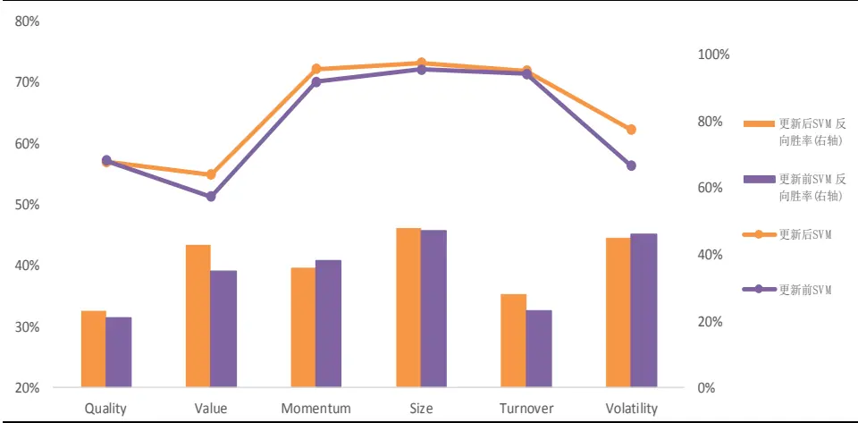
资料来源：光大证券研究所

更新变量后的 SVM 组合信息比为 3.37，略高于原始 SVM 模型的信息比3.25，且新SVM模型在 2017年的表现显著优于未择时模型。2017年更新SVM择时模型小幅跑输基准指数，信息比为-0.92。

证明因子估值差、因子拥挤度等指标的确具有一定的因子择时能力，可以在2017 和2018 的因子波动较大的市场环境中有效提高组合表现。

表11：更新变量前后SVM预测模型收益表现分年度统计

|  | 年度 | 月度 胜率 | 年化 收益 | 年化超额收益 | 相对收益波动 | 信息比 | 相对最大回撤 |  |
| --- | --- | --- | --- | --- | --- | --- | --- | --- |
| 更新后 SVM |  |  |  |  |  |  |  |  |
|  | 2009 2010 | 100% 92% | 219% 35% | 32% 22% | 6% 6% |  | 5.86 3.81 | -2% -3% |
|  | 2011 | 75% | -22% | 17% |  | 5% | 3.43 | -3% |
|  | 2012 | 92% | 22% |  | 20% | 5% | 4.11 | -2% |
|  | 2013 | 100% | 59% | 34% |  | 6% | 5.65 | -3% |
|  | 2014 | 92% | 83% | 30% |  | 7% | 4.53 | -10% |
|  | 2015 | 92% | 176% | 96% | 16% |  | 6.00 | -18% |
|  | 2016 | 75% | 17% | 29% | 9% |  | 3.18 | -5% |
|  | 2017 | 42% | -10% | -6% | 7% |  | -0.92 | -9% |
|  | 2018 | 55% | -24% | 13% | 6% | 2.22 |  | -4% |
|  | Summary | 81% | 39% | 27% | 8% |  | 3.37 | -18% |

|  | 年度 | 月度 胜率 | 年化 收益 | 年化超额收益 | 相对收益波动 | 信息比 | 相对最大回撤 |
| --- | --- | --- | --- | --- | --- | --- | --- |
| 更新前 SVM | 2009 | 100% | 215% | 31% | 6% | 5.40 | -2% |
|  | 2010 | 92% | 39% | 25% | 6% | 4.45 | -3% |
|  | 2011 | 75% | -22% | 16% | 5% | 3.33 | -3% |
|  | 2012 | 75% | 21% | 18% | 5% | 3.68 | -3% |
|  | 2013 | 100% | 57% | 33% | 6% | 5.50 | -3% |
|  | 2014 | 92% | 78% | 27% | 7% | 3.99 | -10% |
|  | 2015 | 92% | 180% | 98% | 16% | 6.16 | -18% |
|  | 2016 | 75% | 17% | 28% | 9% | 3.24 | -5% |
|  | 2017 2018 | 25% 55% | -14% -24% | -10% 13% | 7% | -1.47 | -11% |
|  |  |  |  |  | 6% | 2.14 | -5% |
|  | Summary | 78% | 38% | 26% | 8% | 3.25 | -18% |

资料来源：光大证券研究所

图14：2016.01.01以来SVM 择时模型与未择时模型净值走势
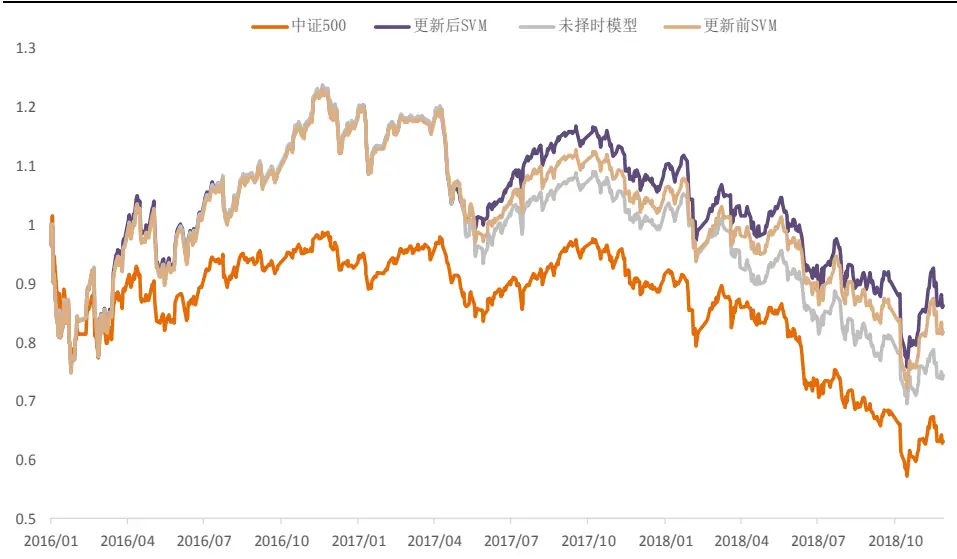
资料来源：光大证券研究所

由上图可见，更新变量后的模型在2017 年的表现显著优于原始 SVM模型。2016 年择时模型与未择时模型（未择时模型沿用Alpha1.0 模型的最优化 24 个月因子 IC_IR 的方式赋予因子权重，具体细节请参考报告《多因子组合“光大 Alpha 1.0”——多因子系列报告之三》）之间差异极小，而2018年择时模型可以比较显著的跑赢未择时模型，同时两个 SVM 择时模型在2018 年的表现差异也较小。综合前面给出的模型在胜率上的表现，我们可以发现，尽管更新变量后的 SVM 择时模型胜率整体略有提升，但超额收益并未得到显著的提升，其背后的原因则可以分为两个方面：

首先是新增的外部变量的边际效用有限，尽管我们从一些新的角度（例如因子估值差、因子拥挤度）构造了一些预测指标，但这些指标较难再从边际上对我们前期优化后的 SVM 模型进行改善。其次，加入新变量后，组合的月均换手率由原来的 45%提高到了 49%，换手率上升会导致损失一部分超额收益。

## 5.2、OLS 线性预测模型：胜率下降

前文的分析中我们已经指出，OLS线性回归的模型在因子择时这个场景中的适用性不强或者说受到的限制较多。但考虑到我们使用的 SVM 模型是个相对而言比较黑箱的模型，各个外部变量在模型中的使用情况或者权重是很难直观观察到的，因此在这里我们将尝试 OLS 线性回归的方法，希望达到以下两个目的：

1、寻找单个大类因子的有效外部择时变量；

2、验证OLS回归模型在因子收益预测上的准确性。

首先，OLS模型在预测因子收益的时候与SVM一样是滚动预测，但由于OLS 模型对于加入的变量的要求较为严格，我们需要在每一期（每个月）根据当时的情况确定使用哪些外部变量来加入到 OLS 回归模型。在确定单个因子的有效外部变量时，需要考虑的因素比较多，每一期预测前都需要对外部变量进行的筛选步骤如下所示：

## i. 平稳性检验：

采用第四章中提到的 DF 单位根检验方法，对每个因子的外部变量进行平稳性检验（滚动 60个月），选择通过5%显著性测试的外部变量作为备选。

## ii. 相关性检验：

在通过平稳性检验的外部变量中，测试单变量与因子收益之间影响的显著性，选择滚动 60 个月相关系数绝对值大于等于 10%的指标作为备选。

## iii. 共线性检验：

使用方差膨胀因子，测试备选变量的 VIF 指标，取 VIF 小于 10 的变量作为最终入选变量。

图 15：用于 OLS 线性回归的外部变量筛选步骤
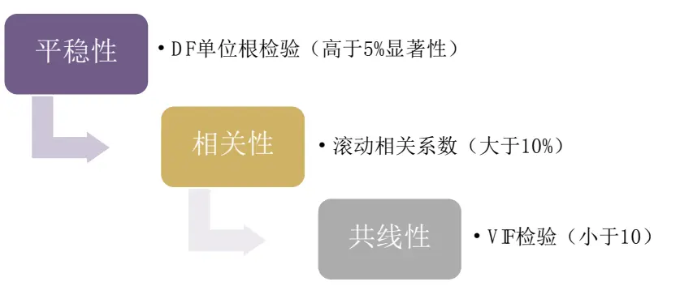
资料来源：光大证券研究所绘制

单个大类因子历史各期经过上述步骤筛选后的外部变量中，使用次数最多的外部变量如下表所示，由此可见对于不同的大类因子，有效的外部预测变量的差异性相对比较显著。

表12：大类因子收益预测有效外部变量排名

|  | No.1 | No.2 | No.3 | No.4 |
| --- | --- | --- | --- | --- |
| 质量因子（Quality） | M2_D | PMI_N | PPI | VS_zscore |
| 估值因子（Value） | M1_D | RET_Spread | CS | VS_zscore |
| 反转因子（Momentum） | PMI_N | STD_1000 | M1_D | PPI |
| 市值因子（Size） | STD_1000 | RET_300 | PPI | CS |
| 低换手因子（Turnover） | STD_Spread | Crowding | VS_zscore | PMI |
| 低波动因子（Volatility） | Crowding | STD_Spread | PMI_N | TS |

资料来源：光大证券研究所

市值因子受小市值股票波动的影响最为显著，而后依次是大盘股收益率、PPI和信用利差。而PMI指标对除了市值因子、估值因子以外的因子都具有较强的预测能力。

## OLS线性回归模型预测准确度一般，近两年收益较稳定

为了比较OLS线性模型与SVM分类模型的预测效果，我们比较了OLS线性回归给出的因子收益预测值的方向胜率，并比较其与 SVM 模型的胜率的高低。从预测方向的准确度来看，OLS 线性回归模型的预测准确度的确较为一般，其中估值因子、换手率因子的整体准确率不足 50%。

表 13：OLS 线性回归模型预测准确度

| OLS 胜率 更新后 SVM 胜率 |  |
| --- | --- |
| 质量因子（Quality） | 51% 57% |
| 估值因子（Value） | 43% 55% |
| 反转因子（Momentum） | 62% 72% |
| 市值因子（Size） | 63% 73% |
| 低换手因子（Turnover） | 49% 72% |
| 低波动因子（Volatility） | 53% 62% |

资料来源：光大证券研究所

从最终组合的收益表现上看，OLS模型的收益表现的确弱于SVM模型，由于 OLS 的变量筛选需要使用较长时间历史数据做滚动测试，其回测起始时间晚于SVM模型，且总体收益低于SVM模型。

表14：OLS预测模型收益表现分年度统计

| 年度 | 月度 胜率 | 年化 收益 | 年化超额 收益 | 相对收益 波动 | 信息比 | 相对最大 回撤 |
| --- | --- | --- | --- | --- | --- | --- |
| 2011 | 50% | -25% | 9% | 5% | 1.65 | -5% |
| 2012 | 75% | 15% | 13% | 6% | 2.16 | -2% |
| 2013 | 67% | 38% | 16% | 7% | 2.27 | -4% |
| 2014 | 83% | 64% | 17% | 7% | 2.31 | -12% |
| 2015 | 83% | 112% | 49% | 15% | 3.30 | -11% |
| 2016 | 58% | 1% | 10% | 8% | 1.14 | -5% |
| 2017 | 67% | 8% | 13% | 6% | 2.28 | -4% |
| 2018 | 73% | -26% | 12% | 6% | 2.10 | -4% |
| Summary | 75% | 30% | 21% | 8% | 2.68 | -15% |

资料来源：光大证券研究所

分年度来看，OLS 模型在 2017 年和 2018 年度取得了比较稳定的超额收益，尤其是 2017 年的表现明显优于 SVM 模型。但其余年份均未能跑赢SVM择时模型，且差距较为明显。这也印证了我们之前的分析，即在因子择时的场景中，OLS 线性回归在预测能力上的确弱于SVM模型。

图16：OLS模型与 SVM模型分年度信息比对比
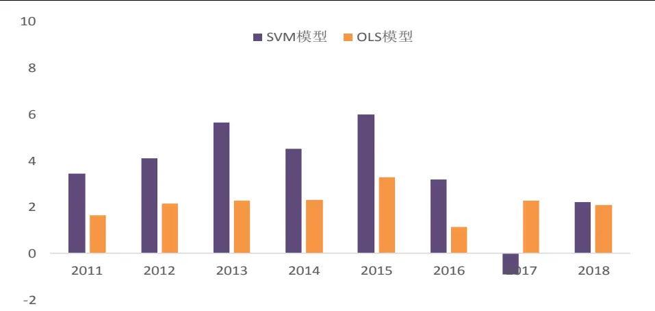
资料来源：光大证券研究所

综合上述SVM模型和 OLS 模型的结果，可以得出下述结论：

## 1、因子估值差、拥挤度等新加入指标具有一定预测能力。

更新变量后的 SVM 组合信息比为 3.37，略高于原始 SVM 模型的信息比3.25，且新SVM模型在 2017年的表现显著优于未择时模型，2017年更新 SVM择时模型信息比为-0.92，高于原始SVM 模型的-1.47。证明因子估值差、因子拥挤度等指标的确具有一定的因子择时能力，可以在2017和2018的因子波动较大的市场环境中有效提高组合表现。

## 2、影响不同大类因子收益的外部变量差异较大，OLS线性模型预测能力一般

尝试了基于多层外部变量筛选后的OLS线性回归因子收益预测模型后，对于每一类大类因子均可以得出影响因子收益的常用有效外部变量名单（例如影响市值因子收益的重要变量包括小盘股波动、大盘股收益等），同时与预期相符的是 OLS 线性回归胜率显著弱于 SVM 模型，择时组合收益仅在2017 年显著优于 SVM 模型。

## 6、风险提示

本报告中的结果均基于模型和历史数据，历史数据存在不被重复验证的可能，模型存在失效的风险。

行业及公司评级体系

| 评级 说明 |
| --- |
| 买入 未来6-12个月的投资收益率领先市场基准指数15%以上； |
| 增持 未来6-12个月的投资收益率领先市场基准指数5%至15%； |
| 中性 未来6-12个月的投资收益率与市场基准指数的变动幅度相差-5%至5%； |
| 减持 未来6-12个月的投资收益率落后市场基准指数5%至15%； |
| 卖出 未来6-12个月的投资收益率落后市场基准指数15%以上； |
| 因无法获取必要的资料，或者公司面临无法预见结果的重大不确定性事件，或者其他原因，致使无法给出明确的无评级投资评级。 |

基准指数说明：A 股主板基准为沪深 300 指数；中小盘基准为中小板指；创业板基准为创业板指；新三板基准为新三板指数；港股基准指数为恒生指数。

## 分析、估值方法的局限性说明

本报告所包含的分析基于各种假设，不同假设可能导致分析结果出现重大不同。本报告采用的各种估值方法及模型均有其局限性，估值结果不保证所涉及证券能够在该价格交易。

## 分析师声明

本报告署名分析师具有中国证券业协会授予的证券投资咨询执业资格并注册为证券分析师，以勤勉的职业态度、专业审慎的研究方法，使用合法合规的信息，独立、客观地出具本报告，并对本报告的内容和观点负责。负责准备本报告以及撰写本报告的所有研究分析师或工作人员在此保证，本研究报告中关于任何发行商或证券所发表的观点均如实反映分析人员的个人观点。负责准备本报告的分析师获取报酬的评判因素包括研究的质量和准确性、客户的反馈、竞争性因素以及光大证券股份有限公司的整体收益。所有研究分析师或工作人员保证他们报酬的任何一部分不曾与，不与，也将不会与本报告中具体的推荐意见或观点有直接或间接的联系。

## 特别声明

光大证券股份有限公司（以下简称“本公司”）创建于 1996 年，系由中国光大（集团）总公司投资控股的全国性综合类股份制证券公司，是中国证监会批准的首批三家创新试点公司之一。根据中国证监会核发的经营证券期货业务许可，光大证券股份有限公司的经营范围包括证券投资咨询业务。

本公司经营范围：证券经纪；证券投资咨询；与证券交易、证券投资活动有关的财务顾问；证券承销与保荐；证券自营；为期货公司提供中间介绍业务；证券投资基金代销；融资融券业务；中国证监会批准的其他业务。此外，公司还通过全资或控股子公司开展资产管理、直接投资、期货、基金管理以及香港证券业务。

本证券研究报告由光大证券股份有限公司研究所（以下简称“光大证券研究所”）编写，以合法获得的我们相信为可靠、准确、完整的信息为基础，但不保证我们所获得的原始信息以及报告所载信息之准确性和完整性。光大证券研究所可能将不时补充、修订或更新有关信息，但不保证及时发布该等更新。

本报告中的资料、意见、预测均反映报告初次发布时光大证券研究所的判断，可能需随时进行调整且不予通知。报告中的信息或所表达的意见不构成任何投资、法律、会计或税务方面的最终操作建议，本公司不就任何人依据报告中的内容而最终操作建议做出任何形式的保证和承诺。在任何情况下，本报告中的信息或所表述的意见并不构成对任何人的投资建议。客户应自主作出投资决策并自行承担投资风险。本报告中的信息或所表述的意见并未考虑到个别投资者的具体投资目的、财务状况以及特定需求。投资者应当充分考虑自身特定状况，并完整理解和使用本报告内容，不应视本报告为做出投资决策的唯一因素。对依据或者使用本报告所造成的一切后果，本公司及作者均不承担任何法律责任。

不同时期，本公司可能会撰写并发布与本报告所载信息、建议及预测不一致的报告。本公司的销售人员、交易人员和其他专业人员可能会向客户提供与本报告中观点不同的口头或书面评论或交易策略。本公司的资产管理部、自营部门以及其他投资业务部门可能会独立做出与本报告的意见或建议不相一致的投资决策。本公司提醒投资者注意并理解投资证券及投资产品存在的风险，在做出投资决策前，建议投资者务必向专业人士咨询并谨慎抉择。

在法律允许的情况下，本公司及其附属机构可能持有报告中提及的公司所发行证券的头寸并进行交易，也可能为这些公司提供或正在争取提供投资银行、财务顾问或金融产品等相关服务。投资者应当充分考虑本公司及本公司附属机构就报告内容可能存在的利益冲突，勿将本报告作为投资决策的唯一信赖依据。

本报告根据中华人民共和国法律在中华人民共和国境内分发，仅供本公司的客户使用。本公司不会因接收人收到本报告而视其为客户。本报告仅向特定客户传送，未经本公司书面授权，本研究报告的任何部分均不得以任何方式制作任何形式的拷贝、复印件或复制品，或再次分发给任何其他人，或以任何侵犯本公司版权的其他方式使用。所有本报告中使用的商标、服务标记及标记均为本公司的商标、服务标记及标记。如欲引用或转载本文内容，务必联络本公司并获得许可，并需注明出处为光大证券研究所，且不得对本文进行有悖原意的引用和删改。

## 光大证券股份有限公司

上海市新闸路 1508 号静安国际广场 3 楼 邮编 200040

总机：021-22169999 传真：021-22169114、22169134

| 机构业务总部 | 姓名 | 办公电话 | 手机 | 电子邮件 |
| --- | --- | --- | --- | --- |
| 上海 | 徐硕 | 021-52523543 | 13817283600 | shuoxu@ebscn.com |
|  | 李文渊 |  | 18217788607 | liwenyuan@ebscn.com |
|  | 李强 | 021-52523547 | 18621590998 | liqiang88@ebscn.com |
|  | 罗德锦 | 021-52523578 | 13661875949/13609618940 | luodj@ebscn.com |
|  | 张弓 | 021-52523558 | 13918550549 | zhanggong@ebscn.com |
|  | 黄素青 | 021-22169130 | 13162521110 | huangsuqing@ebscn.com |
|  | 邢可 | 021-22167108 | 15618296961 | xingk@ebscn.com |
|  | 李晓琳 | 021-52523559 | 13918461216 | lixiaolin@ebscn.com |
|  | 郎珈艺 | 021-52523557 | 18801762801 | dingdian@ebscn.com |
|  | 余鹏 | 021-52523565 | 17702167366 | yupeng88@ebscn.com |
|  | 丁点 | 021-52523577 | 18221129383 | dingdian@ebscn.com |
|  | 郭永佳 |  | 13190020865 | guoyongjia@ebscn.com |
| 北京 | 郝辉 | 010-58452028 | 13511017986 | haohui@ebscn.com |
|  | 梁晨 | 010-58452025 | 13901184256 | liangchen@ebscn.com |
|  | 吕凌 | 010-58452035 | 15811398181 | Ivling@ebscn.com |
|  | 郭晓远 | 010-58452029 | 15120072716 | guoxiaoyuan@ebscn.com |
|  | 张彦斌 | 010-58452026 | 15135130865 | zhangyanbin@ebscn.com |
|  | 庞舒然 | 010-58452040 | 18810659385 | pangsr@ebscn.com |
| 深圳 | 黎晓宇 | 0755-83553559 | 13823771340 | lixy1@ebscn.com |
|  | 张亦潇 | 0755-23996409 | 13725559855 | zhangyx@ebscn.com |
|  | 王渊锋 | 0755-83551458 | 18576778603 | wangyuanfeng@ebscn.com |
|  | 张靖雯 | 0755-83553249 | 18589058561 | zhangjingwen@ebscn.com |
|  | 苏一耘 |  | 13828709460 | suyy@ebscn.com |
|  | 常密密 |  | 15626455220 | changmm@ebscn.com |
| 国际业务 | 陶奕 | 021-52523546 | 18018609199 | taoyi@ebscn.com |
|  | 梁超 | 021-52523562 | 15158266108 | liangc@ebscn.com |
|  | 金英光 |  | 13311088991 | jinyg@ebscn.com |
|  | 王佳 | 021-22169095 | 13761696184 | wangjia1@ebscn.com |
|  | 郑锐 | 021-22169080 | 18616663030 | zhrui@ebscn.com |
|  | 凌贺鹏 | 021-22169093 | 13003155285 | linghp@ebscn.com |
|  | 周梦颖 | 021-52523550 | 15618752262 | zhoumengying@ebscn.com |
| 私募业务部 | 戚德文 | 021-52523708 | 18101889111 | qidw@ebscn.com |
|  | 安羚娴 | 021-52523708 | 15821276905 | anlx@ebscn.com |
|  | 张浩东 | 021-52523709 | 18516161380 | zhanghd@ebscn.com |
|  | 吴冕 | 0755-23617467 | 18682306302 | wumian@ebscn.com |
|  | 吴琦 | 021-52523706 | 13761057445 | wuqi@ebscn.com |
|  | 王舒 | 021-22169419 | 15869111599 | wangshu@ebscn.com |
|  | 傅裕 | 021-52523702 | 13564655558 | fuyu@ebscn.com |
|  | 王婧 | 021-22169359 | 18217302895 | wangjing@ebscn.com |
|  | 陈潞 | 021-22169146 | 18701777950 | chenlu@ebscn.com |
|  | 王涵洲 |  | 18601076781 | wanghanzhou@ebscn.com |