## 光大 Alpha3.0：基本面优选多因子组合——多因子系列报告之十九

本篇报告将量化行业基本面选股系列的研究成果与多因子体系相结合，尝试构造了基于行业优选股票池的多因子组合，包括全市场组合、中证500 增强组合、沪深300 增强组合。

## 光大金工量化行业基本面选股策略

行业基本面选股是主动逻辑与量化方法的结合，因此它与传统的因子选股是有一定差异的。我们在行业基本面系列的基础研究思路和逻辑可以总结为：在大类行业板块划分的基础上，全面测试，精选指标，并采用逐层选股的方法，将有效指标进行分层筛选，确定最终组合。

## 行业基本面股票池表现优于EBQC

行业基本面股票池的表现整体略微优于 EBQC（综合质量因子）股票池的选股表现。两种方法给出的股票池收益走势相关度较高，行业基本面的选股池整体信息比更高，回撤更小。

## 基本面优选多因子组合：整体稳定性有显著提升

2011 年 1 月 1 日至 2019 年 3 月 29 日，Alpha3.0 组合年化超额收益为 14.63%，信息比 2.45，组合在 2017 和 2018 年的表现显著得到改善，显著优于全市场选股的 Alpha1.0 组合。

500增强组合年化超额20.42%，信息比3.34，最大相对回撤7.61%；

300增强组合年化超额6.98%，信息比为1.75，最大相对回撤3.17%；

## 基本面优选多因子策略研究心得

根据行业的基本面逻辑优选后的策略，的确可以起到提高组合稳定性，一定程度上避免选到劣质公司从而影响组合表现的作用。此类策略的优势在于：

- 根据行业特征制定行业内股票池优选的方法可以稳定跑赢市场；

- 基本面优选股票池结合多因子构造组合可以有效提高组合收益稳定性，控制回撤；

在市场风格偏向蓝筹的17、18年可以有效提高收益，同时在其他年份保持相对不错的超额。

此类策略可能存在的问题：

- 行业内基本面指标的筛选存在样本内过拟合的问题，且过拟的程度较难以估计；

- 基本面指标存在未来失效的可能性。

- 风险提示：结果均基于模型和历史数据，模型存在失效的风险。

## 金融工程深度

## 分析师

周萧潇 （执业证书编号：S0930518010005）

021-52523680

zhouxiaoxiao@ebscn.com

刘均伟 （执业证书编号：S0930517040001）

021-52523679

liujunwei@ebscn.com

## 相关研究

《因子正交与择时：基于分类模型的动态权重配置——多因子系列报告之十》《成长因子重构与优化：稳健加速为王——多因子系列报告之十二》

《组合优化算法探析及指数增强实证——多因子系列报告之十三 》

《以质取胜：EBQC 综合质量因子详解

——多因子系列报告之十七》《银行、非银：资产质量是关键

——行业基本面选股系列报告之三》《可选消费：流水不腐，户枢不蠹

——行业基本面选股系列报告之四》《环保行业：如月之恒，如日之升

——行业基本面选股系列报告之五》《装备制造：规模为基，持筹握算

——行业基本面选股系列报告之六》《钢铁&建材：供需驱动，顺势而为

——行业基本面选股系列报告之七》《轻工&化工：因时而变，强者恒强

——行业基本面选股系列报告之八》《资源型行业：周期轮动，存者为王——行业基本面选股系列报告之九》《房地产：借境观形，蹊径淘金——行业基本面选股系列报告之十》《公用&交运：以静制动，以守为攻行业基本面选股系列报告之十一》本篇报告将量化行业基本面选股系列的研究成果与多因子体系相结合，尝试构造了基于行业优选股票池的多因子组合，包括全市场组合、中证 500增强组合、沪深300 增强组合。

## 1、光大金工行业基本面选股策略

在前期的量化行业基本面选股系列 12 篇报告中，我们分别深入的剖析了各个大类行业的基本面逻辑，并构建了各自行业的基于基本面逻辑的量化指标选股体系。

进行量化基本面选股系列研究的出发点来自两个方面，既来自于主动投资者，也来自于量化投资者。一方面，从主动投资来说，随着 A股上市公司的数量大幅上升，且近年黑天鹅事件的频繁曝出，投资者希望通过使用一些量化指标，对选股的样本池进行初筛，并过滤掉一些可能出现风险的个股。另一方面，从量化投资来说，2017 年以来市值、反转等价量类因子的收益特征变化，让大家越发重视对基本面因子的研究，而基本面因子在不同行业的表现也成为量化投资者关心的话题。

图1：行业基本面选股策略：主动逻辑与量化方法结合

资料来源：光大证券研究所

行业基本面选股是主动逻辑与量化方法的结合，因此它与传统的因子选股是有一定差异的。我们在行业基本面系列的研究的基础研究思路和逻辑可以总结如下：

## 大类行业板块划分：搭建基本面量化策略构建的基础

1) 按公司类型并结合行业特征进行分类，将具有相似的经营模式、选股逻辑存在共同特征的公司分为一类

2) 在划分时同时参考基本面指标的收益表现，也就是说，尽量保证同一个大类行业内的指标表现较为一致

3) 行业划分均基于中信行业划分体系，采用中信的行业分类确定公司所属行业。

下表中我们汇总了这篇报告中将采用的光大金工行业基本面板块划分方法，共分为必需消费、可选消费、装备制造、其他制造、钢铁建材、资源型行业、信息技术、传媒、银行、证券、保险、房地产、公用交运、其他行业 14 个大类行业。

表1：光大金工基本面增强策略行业板块划分标准

| 板块 | 中信一级行业 | 包含细分行业类别 | 板块 | 中信一级行业 | 包含细分行业类别 |  |  |
| --- | --- | --- | --- | --- | --- | --- | --- |
| 必需消费 | 食品饮料 | 除白酒外的其他饮料、食品 |  |  |  | 装备制造业 | 工程机械、其他专用设备、通用 设备、运输设备、仪器仪表、金 |
|  | 商贸零售 | 超市 | 机械 |  |  |  |  |
|  | 纺织服装 | 品牌服饰（除高端奢侈品外） | 电力设备 | 属制品 电站设备、输变电设备、 |  |  |  |
|  | 医药 | 医药 |  |  |  |  |  |
| 可选消费 | 汽车 | 乘用车、商用车、汽车零部件、 | 其他制造 | 轻工制造 | 新能源设备 造纸、其他轻工 |  |  |
|  | 家电 | 汽车销售及服务、摩托车及其他 白色家电、黑色家电、 |  | 基础化工 | 农用化工、合成纤维及树脂、 化学原料、化学制品 |  |  |
|  |  | 小家电、照明设备及其他 | 资源型行业 | 煤炭 | 煤炭开采洗选、煤化工 |  |  |
|  | 商贸零售 | 百货、连锁 |  | 有色金属 | 贵金属、工业金属、稀有金属 |  |  |
|  | 餐饮旅游 食品饮料 | 景区和旅行社、酒店及餐饮 |  | 石油石化 | 石油开采、石油化工、油田 |  |  |
|  |  | 白酒 | 钢铁&建材 | 钢铁 | 普钢、其他钢铁 |  |  |
|  | 纺织服装 公用事业 | 高端奢侈品 |  | 建材 | 水泥、玻璃、其他建材 |  |  |
|  | 公用运营 |  | 发电及电网、燃气、供热或其他 公路铁路、航运港口、 | 银行 银行 证券 | 银行 |  |  |
| 交通运输 |  |  | 证券 | 证券 |  |  |  |
| 房地产 |  | 航空机场、公交物流 房地产开发管理、房地产服务 | 保险 其他行业 | 保险 国防军工 | 保险 航空航天、兵器兵装、其他军工 |  |  |
| 传媒 | 房地产 传媒 | 传媒 |  | 农林牧渔 | 农业、牧业、林业、渔业 |  |  |
| 信息技术 | 电子元器件 |  |  |  | 环保、水务 |  |  |
|  | 通信 | 半导体、电子设备、其他元器件 |  | 电力及公用事业 |  |  |  |
|  | 计算机 | 电信运营、通信设备、增值服务 计算机硬件、软件、IT服务 |  | 综合 建筑 | 综合 建筑施工、建筑装修 |  |  |

资料来源：光大证券研究所

图 2：行业基本面策略行业板块划分
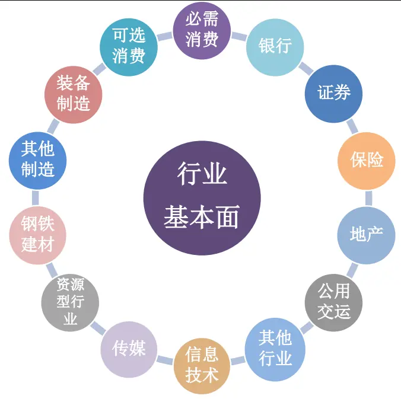
资料来源：光大证券研究所

## 行业内选股策略构建：全面测试，精选指标

1) 全面构建各类基本面指标：包括成长能力、盈利能力、运营效率、偿债能力、资本结构、盈余质量和估值指标这 7大类指标，100多个细分指标；

2) 统一测试指标有效性：通过指标的多空收益、单调性、多空夏普比等测试结果，进行指标的初步筛选；

3) 寻找有效指标逻辑依据，剔除无逻辑支撑的指标；

4) 根据逻辑顺序分层筛选股票，形成最终股票池。

表2：7大类行业基本面指标明细

| 具体指标营收增速、营收加速度、营收稳健增速、营收稳健加速度毛利增速、毛利加速度、毛利稳健增速、毛利稳健加速度净利增速、净利加速度、净利稳健增速、净利稳健加速度 |  |  |
| --- | --- | --- |
|  |  | 成长能力 |
| 盈利能力 | 毛利率、净利率、ROE、ROA、ROIC以及它们的一阶差分项 |  |
| 运营效率 | 存货周转率、应收账款周转率、总资产周转率、现金循环周期、周转资金占比以及它们的一阶差分项 |  |
| 偿债能力 | 流动比率、速动比率、现金比率、现金流动负债比、营业收入对短期借款比率以及它们的一阶差分项 |  |
| 资本结构 | 资产负债率、短期借款率、有息负债率、经营负债率、股东权益对固定资产变动以及它们的一阶差分项 |  |
| 估值指标 | EP、一致预期EP、EPG、一致预期EPG、BP、SP、DP、OCFP、NCFP |  |
| 盈余质量 | 应计利润占比、收现比以及它们的一阶差分项 |  |

资料来源：光大证券研究所

## 逐层选股 VS 因子选股

值得一提的是，在我们的行业基本面系列策略中，大部分行业均采用逐层选股的方法，将有效指标进行分层筛选，确定最终持股组合。

采用这样的逐层筛选方法是主要考虑到以下两个因素：

## 1) 指标逻辑有先后：

例如，在钢铁&建材行业中，我们首先使用毛利率变动指标筛选出具有价差优势的公司，然后根据短期借款率指标筛选出生产活跃度较高的公司，这样的筛选顺序保证的最终组合的有效性。如果简单的直接使用短期借款率指标，其效果较为一般，原因在于如果公司仅仅是短期借款占比高，有可能是因为其本身经营导致的负债端流动性问题，而并不是由于公司运营生产需要而导致的短期借款占比提升。

## 2) 样本相对较小，影响因子显著性：

由于每个行业的成分股数量不定，均显著小于全市场的股票数量，因此行业内选股因子或选股指标的统计显著性显著较弱。在此前提

下，如果依然按照类似全市场的因子测试框架进行选股，其策略的有效性必然大打折扣。

在无法保证策略宽度（或者策略有效性）的情况下，基本面的筛选逻辑就显得更为重要。

## 1.1、各行业基本面选股指标明细

根据我们前期的研究成果，梳理得到的各个行业板块内基本面指标整理如下（指标的具体计算方法在文末附录中可以查看）：

表3：各行业板块内基本面指标明细

| 板块 | 指标 | 板块 | 指标 |
| --- | --- | --- | --- |
| 必须消费 | 毛利稳健加速度 收入存货比变动 市净率 | 装备制造业 | ROE 变动 总资产周转率变动 现金流动负债比变动 |
| 可选消费 | ROE 变动 周转资金占比变动 一致预期 EP ROE 变动 |  | BP ROA 变动 净利润加速度 其他制造 短期借款率 |
| 公用运营 | 总资产周转率变动 BP 现金资产周转率 | 资源型行业 | 一致预期 EPG ROIC 变动 |
| 房地产 | EP |  | 总资产周转率变动 EP |
| 传媒 | 稳健存货周转率变动 商誉收入比 创新毛利润增速标准分+净利润增速标准分 | 钢铁&建材 银行 | 毛利率变动 短期借款率 |
| 信息技术 | 商誉收入比变动 ROE 变动 | 证券 | 营收增速+成本收入比变动+市盈率 BP |
| 其他行业 BP | 总资产周转率变动 | 保险 | 总投资收益率+保险业估值 |

资料来源：光大证券研究所

由于我们使用指标筛选的方式为逐层筛选，而同时我们希望可以控制优选股票池的个股数量为全市场股票总数的某个百分比（比如50%），因此在使用上述指标进行基本面优选股票池筛选时，需要确定不同个数指标下的各个指标筛选阈值。

以50%股票池为例，不同指标个数的筛选方式统一如下：

表4：不同指标个数下行业内优选股票池筛选方式

| 指标个数 | 筛选方式 |
| --- | --- |
| 1 | 取前 50% |
| 2 | 第一个指标 80%，第二个指标 62.5% |
| 3 | 第一个指标 80%，第二个指标 80%，第三个指标 78% |
| 4 | 第一个指标 85%，第二个指标 85%，第三个指标 85%，第四个指标 81.4% |

资料来源：光大证券研究所

## 1.2、行业基本面策略表现回顾

行业基本面逻辑下筛选得到的指标是否具有显著的效果呢，我们首先简单回顾下各个行业的选股组合 18 年与 19 年至今的跟踪表现。大部分的行业在2018年以来均可以取得一定的超额收益。

图3：行业基本面原始策略选股组合表现（2018年和2019年前 3个月）
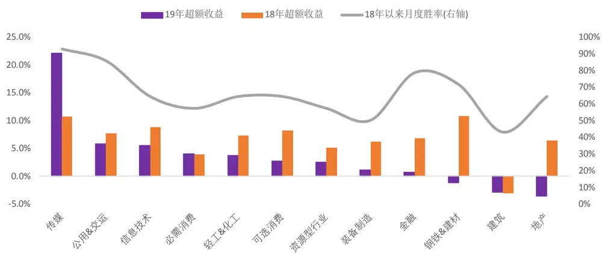
资料来源：光大证券研究所

表 5：行业基本面原始策略选股组合表现（2018 年至今）
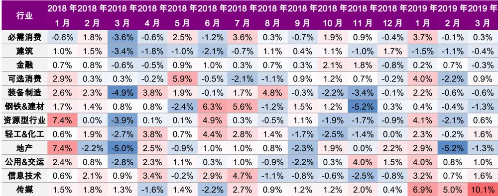
资料来源：光大证券研究所

由上面的统计结果可见，各个行业的选股组合整体上表现较好，2018和 2019 年前 3 个月，大部分行业都能够跑赢各自行业基准。其中，传媒行业的选股组合 2019 年表现相当抢眼，2019 年前 3 个月跑赢基准指数超过20 个百分点。

## 1.3、行业基本面策略收益稳定，略优于EBQC

我们在报告《以质取胜：EBQC 综合质量因子详解——多因子系列报告之十七》中给出了一个表现较为稳定的纯财报数据构建的综合质量因子 EBQC。如果行业基本面策略的选股效果可以有效的超越EBQC选股效果，我们才认为行业基本面应用在全市场因子组合的增强中是有意义的。

行业基本面策略中，除了估值指标以外的大部分的选股指标均为财报类数据，不涉及股票的价格和成交量信息。为了使之与EBQC因子的数据源保持一致，本节测试中我们将不会使用估值因子。

测试股票池筛选标准：

1) EBQC 因子股票池：使用行业中性化后的 EBQC 因子，选取全市场50%的股票作为持仓

2) 行业基本面股票池：使用表4中的筛选标准，选取全市场50%的股票作为持仓

由下图可见，行业基本面股票池的表现整体略微优于EBQC股票池的选股表现。两种方法给出的股票池收益走势相关度较高，行业基本面的选股池整体信息比略高，回撤略小。

图 4：行业基本面&EBQC 股票池净值走势（50%）
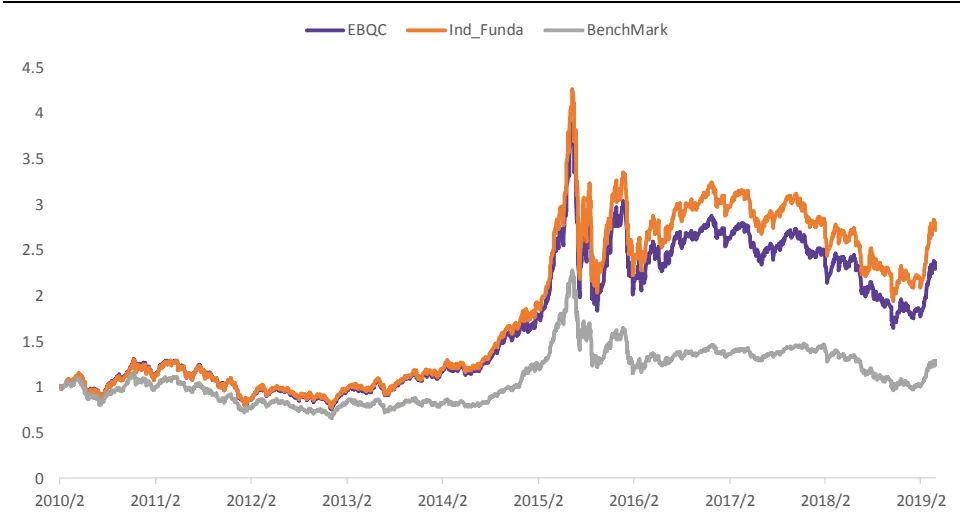
资料来源：光大证券研究所，基准为全市场等权指数，，时间段：2010-01-01 至 2019-03-29

表6：行业基本面&EBQC股票池收益统计

|  | 月度胜率 | 季度胜率 | 年化收益 年化波动 | 年化超额收 相对收益波 |  |  | 信息比 | 最大回撤 | 相对最大回 撒 |
| --- | --- | --- | --- | --- | --- | --- | --- | --- | --- |
|  |  |  |  |  | 益 | 动 |  |  |  |
| EBQC | 67.9% | 73.0% | 9.2% | 29.1% | 6.8% | 4.4% | 1.52 | -57.9% | -10.9% |
| Ind_Funda | 68.7% | 81.1% | 10.6% | 29.3% | 8.2% | 4.4% | 1.87 | -56.1% | -10.1% |

资料来源：光大证券研究所，基准为全市场等权指数，时间段：2010-01-01 至 2019-03-29

其中，行业基本面股票池的换手率为月均12.4%，EBQC 股票池的换手率为月均 10.9%。

## 2、基本面优选多因子策略

量化基本面研究是量化投资与主动投资理念的有机结合，与传统的多因子选股相比，量化基本面研究更加注重公司经营的本质。然而，不同行业之间的上市公司运营特征、竞争环境均存在显著差异，从基本面角度难以找到一个对全市场所有上市公司都有效的选股逻辑。因此，量化基本面的研究应该更加注重针对具有共同经营特征的上市公司的筛选，即构造行业内的选股策略。

考虑到行业基本面策略在各自行业内的选股效果均较为出色，我们很自然的希望可以将行业内的选股方法与全市场多因子体系相结合，构造基本面增强的多因子策略。

## 2.1、行业基本面策略筛选优质股票池

怎样将行业基本面策略与多因子结合比较合适呢？这里我们比较推荐的是行业基本面策略筛选优质股票池，对基本面较差的股票进行剔除，然后在新的股票池内，应用多因子选股方法进行选股。

采用这样的行业优选股票池方法，主要有以下几点考虑：

1) 我们的行业内选股体系为逐层选股体系，较难以因子的形式控制各个行业内的选股指标权重。因为逐层选股的体系下，优先筛选的指标往往重要性较高逻辑性较强，但其具体权重则较为难以量化。

2) 单纯依靠基本面指标很难获得稳定的显著的超额收益，因此与多因子体系结合时，价量因子对组合的贡献依然是较为重要的。因而筛选一个较大的股票池，有利于保证价量类技术因子在股票池内的有效性。

## 2.1.1、估值指标是否纳入：各有利弊

在采用优质股票池筛选的方法时，值得考虑的一点是，是否需要在行业内筛选时纳入估值类指标？

1) 纳入估值指标的优势在于:

## 纳入估值指标可以提高行业基本面股票池的整体收益表现

由于并不是所有的行业都采用了估值指标，也就是说，估值指标并不适用于所有的行业内选股。那么如果我们在股票池筛选阶段有选择性的使用了估值指标，的确是可以有效的提高股票池的收益表现。

- 使用估值指标后的股票池内估值类因子仍然具有显著的预测能力

2) 纳入估值指标也可能存在一些逻辑上的问题：

股票池确定后进行因子组合构建时还会使用到估值类因子，因此估值因子被重复使用，但是无法很好的控制因子的权重和暴露。

不过，对于上文提到的重复使用估值因子的逻辑上的问题，我们认为其实际应用中也并不会造成很大的影响。首先，股票池初筛的范围是比较大的（例如选取全市场50%的股票），在筛选股票池的这个步骤中使用了的估值因子其目的更多的在于剔除那些估值过高的股票，起到的是尾部剔除的作用；而第二步结合因子体系时使用的估值因子则是为了能选出初筛股票池中相对估值更有竞争力的股票，提升组合的收益能力。

当然，我们也从数据出发，验证了不用股票池内估值因子的预测能力以及显著性的差异，其结果如下表所示：

表7：不同股票池内估值类因子表现

|  |  | T值绝对值 多空收益 |  | IC 均值 | IC_IR |
| --- | --- | --- | --- | --- | --- |
| 优选股票池 (包含估值) | EP_TTM | 2.33 | 2.20% | 4.99% | 0.65 |
|  | BP_LR | 3.01 | 5.93% | 3.90% | 0.40 |
|  | SP_LYR | 2.60 | 3.40% | 2.45% | 0.29 |
| 优选股票池 （不包含估 值） |  | T值绝对值 | 多空收益 | IC 均值 | IC_IR |
|  | EP_TTM | 2.98 | 3.02% | 5.22% | 0.69 |
|  | BP_LR SP_LYR | 3.41 | 7.90% | 4.54% | 0.43 |
| 全市场 |  | 2.70 T值绝对值 | 4.40% 多空收益 | 2.85% | 0.32 |
|  | EP_TTM | 2.88 | 5.01% | IC 均值 | IC_IR |
|  | BP_LR | 3.89 | 9.02% | 5.01% 4.89% | 0.65 |
|  | SP_LYR |  |  |  | 0.59 |
|  |  | 3.00 | 5.32% | 3.21% | 0.32 |

资料来源：光大证券研究所，时间段：2010-01-01 至 2019-03-29

由此可见，无论是在包含估值指标的基本面优选股票池、不包含估值指标的基本面优选股票池，还是全市场中，估值类因子的预测能力和有效性均十分显著。

表8：行业基本面（含估值指标）&行业基本面（不含估值指标）股票池表现对比

|  | 月度胜率 | 季度胜率 | 年化收益 | 年化超额收 相对收益波 年化波动 |  |  | 信息比 | 最大回撤 | 相对最大回 撒 |
| --- | --- | --- | --- | --- | --- | --- | --- | --- | --- |
|  |  |  |  |  | 益 | 动 |  |  |  |
| EBQC | 68.7% | 81.1% | 10.6% | 29.3% | 8.2% | 4.4% | 1.87 | -56.1% | -10.1% |
| Ind_Funda | 67.3% | 78.4% | 10.8% | 29.2% | 7.2% | 4.7% | 1.53 | -59.3% | -11.8% |

资料来源：光大证券研究所，基准为全市场等权指数，时间段：2010-01-01 至 2019-03-29

## 加入估值指标的基本面优选股票池收益更高。

上表中展示了两种基本面股票池筛选方法下的股票池历史表现，整体上看，加入估值指标的优选股票池表现更好。这一结论其实也是比较合理的，因为不同行业基本面逻辑本身就存在较为显著的差异，一些行业本身并不关注估值水平的高低或者说公司估值水平与公司基本面情况并没有直接的联系（例如 TMT 行业），因此，加入估值指标的基本面优选池表现更好是比较合理的结果。

我们在后面的测试中会沿用包含估值指标的基本面优选股票池构建方法。

## 2.1.2、股票池筛选标准：以因子收益显著性为参考指标

股票池筛选时选取多少只股票往往也是影响策略效果的关键因素，在确定股票池的筛选范围时，我们采用因子库内的150个常用因子在股票池内的因子IC 均值和有效性t-value，作为主要参考的指标。

统计不同大小股票池内的因子表现，关注 IC 均值大于等于 2 的因子个数占比，和有效性t值大于等于 2的因子个数占比：

表9：不同大小股票池对应因子表现和股票池收益表现

| 30% 40% 60% |  |  | 50% |  |  |
| --- | --- | --- | --- | --- | --- |
| IC 均值绝对值大于等于 2 | 37.42% | 41.32% | 44.67% | 46.32% | 70% 46.72% |
| T 值绝对值大于等于2 | 30.21% | 30.43% | 35.67% | 37.34% | 37.34% |
| 股票池年化收益 | 10.02% | 9.38% | 8.23% | 6.74% | 5.64% |
| 股票池信息比 | 1.92 | 1.99 | 1.87 | 1.67 | 1.62 |

资料来源：光大证券研究所，测试时间 2010-01-01 到 2019-03-29，基准为全A 等权

图5：不同大小股票池对应因子表现和股票池收益表现
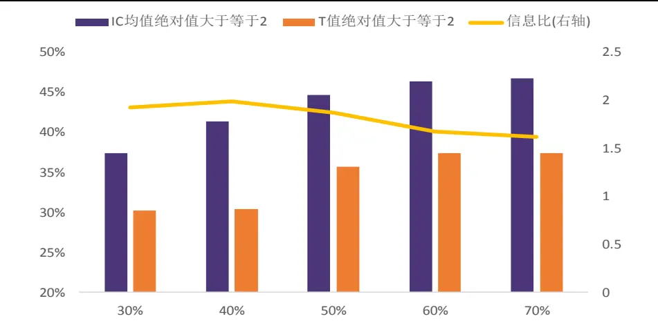
资料来源：光大证券研究所，测试时间 2010-01-01 到 2019-03-29，基准为全A 等权

当然因子有效性与最终的组合表现并不一定完全正相关，考虑到不同股票池内的组合采用的因子也可能不同，因此不是完全可比的。

我们认为可以依据自身的偏好对于股票池的大小进行选择。例如假设投资者对于因子预测能力的显著性要求较高，而对股票池的收益能力要求相对较低，则可以选择适当放大股票池的比例。

## 2.2、优质股票池内因子表现：略有变化

根据上一小节中不同大小股票池内因子的有效性和显著性指标的结论，我们认为50%的股票池范围是较为合适的。因此后文的基本面优选股票池均默认为筛选 50%股票作为股票池。

表10中展示了50%股票池内的常用因子中IC均值最大和最小的40个因子，由于因子数量较多，正文中我们不做过多的列举。

由结果可见，优选股票池内一致预期类估值因子（EEP、EBP、Targetreturn）表现出色，可见分析师在我们的优选股票池内的覆盖情况和跟踪情况较好。同时，低换手、低波动因子和表现出较强的选股能力，而小市值因子（Ln_MC）的收益能力有所下降。

表 10：基本面优选股票池内单因子表现

|  | 因子名称 | T值绝对值 | 多空收益 | IC 均值 | IC_IR |
| --- | --- | --- | --- | --- | --- |
| EEP | 一致预期 EP | 2.25 | 3.70% | 5.05% | 0.68 |
| EP_TTM | EP_TTM | 2.33 | 1.20% | 4.72% | 0.62 |
| EBP | 一致预期 BP | 2.97 | 3.30% | 4.27% | 0.43 |
| BP_LR | 最近报告期 BP | 3.01 | 3.80% | 3.89% | 0.38 |
| TargetReturn | 目标收益率 | 1.91 | 11.50% | 3.76% | 0.60 |
| EP_LYR | 最近报告期 EP | 2.07 | -1.00% | 3.72% | 0.53 |
| BP_TTM | BP_TTM | 2.95 | 4.10% | 3.71% | 0.36 |
| DP | DP | 1.97 | 1.50% | 3.46% | 0.55 |
| EBQC | 综合质量因子 | 1.70 | 6.40% | 3.44% | 0.66 |
| FORE_EPS | 预期 EPS | 2.43 | 1.10% | 2.87% | 0.32 |
| EEChange_3M | 预期净利润调整 | 1.27 | 15.40% | 2.76% | 0.55 |
| NP_Q_YOY | 净利润单季同比 营业利润单季同 | 1.34 | 11.50% | 2.59% | 0.49 |
| OP_Q_YOY | 比 | 1.35 | 11.00% | 2.59% | 0.51 |
| FORE_Earning | 预期净利润 | 1.95 | -12.50% | 2.55% | 0.34 |
| EPS_TTM | EPS_TTM | 2.40 | -5.00% | 2.48% | 0.28 |
| EEPSChange_3M | 预期 EPS 调整 营业收如单季同 | 1.29 | 11.70% | 2.42% | 0.50 |
| OGR_Q_YOY | 比 | 1.58 | 8.90% | 2.37% | 0.38 |
| NP_Acc | 净利润加速度 | 1.22 | 11.30% | 2.34% | 0.55 |
| SP_LYR | 最近报告期 SP | 2.60 | 2.40% | 2.25% | 0.25 |
| ROE_YOY | ROE 同比 | 1.48 | 8.70% | 2.22% | 0.41 |
| … |  | … |  |  | … |
| Ln_MC | 市值对数 | 2.04 | -21.30% | -3.32% | -0.50 |
| Momentum_24M | 24 个月动量 | 3.25 | -7.80% | -3.64% | -0.33 |
| EV2EBITDA | EV/EBITDA | 2.05 | -2.10% | -3.64% | -0.46 |
| Momentum_12M | 12个月动量 | 3.43 | -8.80% | -3.92% | -0.35 |
| VSTD_6M | 6个月流动性 | 2.05 | -22.40% | -3.97% | -0.54 |
| BETA | BETA | 2.22 | -6.40% | -4.15% | -0.61 |
| HighLow_1M | High/Low | 3.61 | -1.20% | -4.27% | -0.39 |
| RSI | 能量潮 | 2.95 | -5.50% | -4.36% | -0.46 |
| VSTD_3M | 3个月流动性 | 2.21 | -22.00% | -4.44% | -0.61 |
| STD_6M | 收益率波动 | 3.91 | -2.60% | -4.68% | -0.38 |
| Momentum_6M | 6个月动量 | 3.45 | -9.60% | -4.71% | -0.44 |
| STD_3M | 3个月波动 | 4.00 | -2.30% | -5.11% | -0.41 |
| TURNOVER_6M | 6个月换手 | 3.29 | -4.50% | -5.28% | -0.62 |
| VSTD_1M | 流动性 | 2.44 | -24.30% | -5.64% | -0.78 |
| STD_1M | 1个月波动 | 3.73 | -1.50% | -5.67% | -0.51 |
| Momentum_1M_Max | 1个月最高收益 | 2.92 | -4.60% | -6.15% | -0.80 |
| Momentum_3M | 3个月动量 | 3.48 | -13.30% | -6.18% | -0.60 |
| TURNOVER_3M | 3个月换手 | 3.56 | -6.00% | -6.29% | -0.70 |
| Momentum_1M | 1个月动量 | 3.46 | -15.70% | -6.53% | -0.71 |

TURNOVER_1M 1 个月换手 3.82 -8.40% -7.96% -0.90

资料来源：光大证券研究所，，时间段：2010-01-01 至 2019-03-29

## 2.3、行业基本面优选多因子组合：利于回撤控制，信息比有所提升

我们分别构建了基于行业基本面优选股票池的全市场组合 Alpha3.0，中证500 增强组合，沪深300 增强组合：

## 2.3.1、Alpha3.0 全市场组合：17 年以来优势较明显

按照 Alpha1.0 的组合构造方式，构造行业基本面优选股票池内的多因子组合。在筛选基本面增强组合的因子时，采用 2009 到 2016 年的数据作为样本内测试区间，

通过上一节的因子测试结果可见，当股票池控制在50%时，仍可保证大部分价量类因子具有较高的显著性和预测能力，其整体收益表现与全市场的各类因子的收益表现排序相关性较高。

这里我们将行业基本面优选 50%股票池内的多因子选股组合命名为Alpha3.0 组合，组合使用的因子明细如下表所示：

表 11：Alpha3.0 组合因子明细

| 因子代码 | 因子名称 |
| --- | --- |
| BP_LR | 最新一期 BP |
| HighLow_1M | 近一个月最高价/最低价 |
| Ln_MC | 市值对数 |
| Momentum_24M | 24个月收益率 |
| STD_3M | 3个月收益率波动 |
| TURNOVER_1M | 1个月换手率 |
| VSTD_1M | 1个月流动性 |
| DP | 股息率 |
| EEP | 一致预期EP |
| Momentum_1M | 1个月收益率 |
| EEChange_3M | 3个月一致预期净利润调整 |
| OP_Q_YOY | 营业利润单季度同比 |
| NP_SD | 净利润稳健加速度 |
| CCR | 经营现金流/流动负债 |
| ROED | ROE 变动 |

资料来源：光大证券研究所

与Alpha1.0组合构建方法类似，Alpha3.0组合构建流程如下：

2) 在优选股票池内将上述所选因子进行截面正交化处理（采用对称正交方法，具体方法可参考报告《因子正交与择时：基于分类模型的动态权重配置》）；

3) 滚动 24 个月最优化复合因子 IC_IR确定因子权重；

4) 选取复合得分排名靠前的150只股票，并等权持有。

由结果可见，经过基本面优选后的组合 Alpha3.0 在收益和稳定性的表现上都要略胜一筹。Alpha3.0 组合年化超额收益为14.63%，信息比2.45，组合在 2017 和 2018 年的表现显著得到改善，显著优于全市场选股的Alpha1.0 组合。

图 6：Alpha1.0 与 Alpha3.0 组合收益及相对收益走势
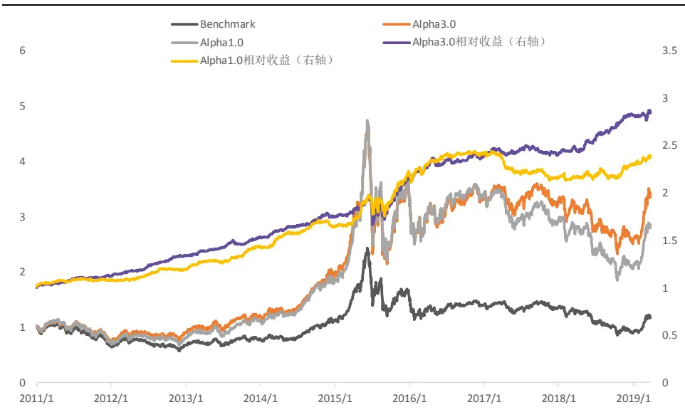
资料来源：光大证券研究所，时间段：2011-01-01 至 2019-03-29

表 12：Alpha3.0 行业基本面增强因子组合分年度表现

|  | 月度胜率 | 年化收益 | 年化波动 |  | 年化超额收益相对收益波动 | 信息比 | 最大回撤 | 相对最大回撤 |
| --- | --- | --- | --- | --- | --- | --- | --- | --- |
| 2011 | 81.82% | -25.74% | 24.53% | 6.81% | 3.84% | 1.77 | -34.53% | -2.01% |
| 2012 | 91.67% | 23.45% | 24.62% | 20.38% | 3.83% | 5.33 | -19.69% | -1.02% |
| 2013 | 75.00% | 37.17% | 23.42% | 15.85% | 4.57% | 3.47 | -15.72% | -3.51% |
| 2014 | 91.67% | 62.33% | 21.12% | 15.47% | 4.43% | 3.49 | -8.84% | -2.95% |
| 2015 | 83.33% | 89.08% | 54.81% | 34.18% | 11.03% | 2.47 | -54.72% | -10.79% |
| 2016 | 75.00% | 2.79% | 32.47% | 11.92% | 5.95% | 2.00 | -23.34% | -3.44% |
| 2017 | 50.00% | -6.28% | 16.92% | -1.72% | 4.03% | -0.43 | -15.41% | -5.17% |
| 2018 | 83.33% | -22.95% | 25.21% | 18.16% | 4.62% | 3.93 | -30.65% | -1.93% |
| 2019 | 66.67% | 293.44% | 28.22% | 7.52% | 6.15% | 1.22 | -5.10% | -2.31% |
| Summary | 78.57% | 17.60% | 30.17% | 14.63% | 5.98% | 2.45 | -54.72% | -10.79% |

资料来源：光大证券研究所，基准为全 A 等权指数，回测期间：2011-01-01 至2019-03-29

表13：Alpha1.0组合全市场选股组合分年度表现

|  | 月度胜率 | 年化收益 | 年化波动 | 年化超额收益相对收益波动 |  | 信息比 | 最大回撤 | 相对最大回撤 |
| --- | --- | --- | --- | --- | --- | --- | --- | --- |
| 2011 | 58.33% | -28.75% | 25.22% | 6.76% | 4.21% | 1.60 | -37.12% | -2.58% |
| 2012 | 66.67% | 12.67% | 25.59% | 10.14% | 3.89% | 2.60 | -24.17% | -1.78% |
| 2013 | 83.33% | 44.09% | 22.69% | 21.50% | 4.40% | 4.89 | -17.92% | -2.51% |
| 2014 | 83.33% | 61.01% | 20.10% | 14.29% | 4.49% | 3.18 | -7.66% | -4.28% |
| 2015 | 75.00% | 100.14% | 53.19% | 40.91% | 12.99% | 3.15 | -53.63% | -9.87% |
| 2016 | 75.00% | 1.59% | 33.33% | 10.92% | 6.22% | 1.75 | -24.58% | -3.82% |
| 2017 | 25.00% | -15.29% | 17.55% | -11.12% | 5.15% | -2.16 | -20.69% | -12.45% |
| 2018 | 66.67% | -30.37% | 26.57% | 7.13% | 5.63% | 1.27 | -38.39% | -4.85% |
| 2019 | 100.00% | 320.98% | 26.77% | 14.64% | 6.04% | 2.42 | -5.71% | -1.71% |
| Summary | 67.68% | 13.87% | 30.09% | 11.94% | 6.53% | 1.83 | -61.08% | -12.45% |

资料来源：光大证券研究所，基准为全 A 等权指数，回测期间：2011-01-01 至2019-03-29

图 7：Alpha1.0 与 Alpha3.0 组合各年度信息比
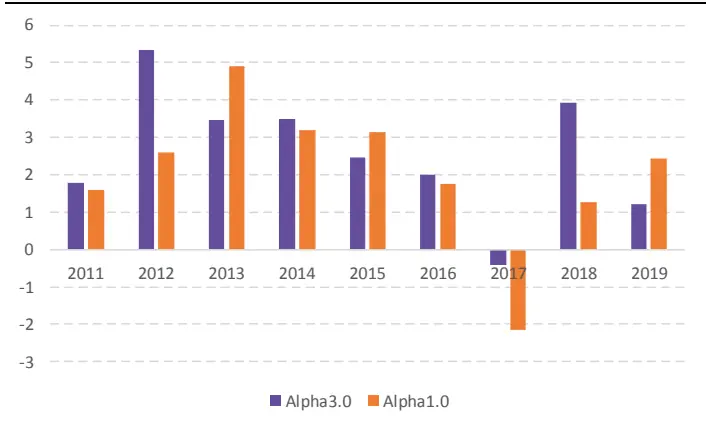
资料来源：光大证券研究所

图 8：Alpha1.0 与 Alpha3.0 组合各年度超额收益
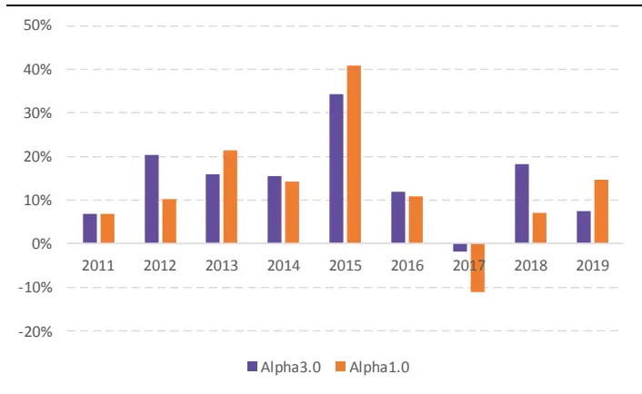
资料来源：光大证券研究所

经过基本面筛选后的组合具有更好的稳定性，和抗跌能力。Alpha3.0 组合在 2017 和 2018 年的收益分别为-1.72%和 18.16%，优于 Alpha1.0 组合的-11.12%和 7.13%

## 2.3.2、500 增强组合：17-18 年收益提升显著

考虑到如果在基本面优选股票池的基础上再将500增强组合的选股范围限制在中证 500 成分股内，那么每期的可选股票池数量平均只能达到250-300 只，数量过少从而会影响优化器的优化效果。因此，这里我们在构建基本面优选的中证500增强组合时并没有将选股范围限制在中证500成分股内。

基本面优选的中证 500 增强组合构建流程如下：

2) 在优选股票池内将上述所选因子进行截面正交化处理（采用对称正交方法，具体方法可参考报告《因子正交与择时：基于分类模型的动态权重配置》）；

3) 滚动 24 个月最优化复合因子 IC_IR 确定因子权重；

4) 使用优化器优化组合：

a) 控制行业权重偏离度小于等于 5%（以中信一级行业为标准）

b) 控制市值因子暴露度小于等于 5% c) 个股权重不超过 2%

表14：行业基本面中证 500增强组合分年度表现

|  | 月度胜率 | 年化收益 | 年化波动 | 年化超额收益相对收益波动 |  | 信息比 | 最大回撤 | 相对最大回撤 |
| --- | --- | --- | --- | --- | --- | --- | --- | --- |
| 2011 | 83.33% | -27.84% | 24.10% | 12.06% | 4.82% | 2.50 | -34.27% | -2.53% |
| 2012 | 91.67% | 23.78% | 25.09% | 20.54% | 4.89% | 4.20 | -21.39% | -1.54% |
| 2013 | 91.67% | 44.72% | 23.94% | 22.03% | 5.90% | 3.73 | -15.62% | -2.77% |
| 2014 | 75.00% | 58.91% | 21.47% | 14.07% | 5.76% | 2.44 | -12.04% | -2.58% |
| 2015 | 75.00% | 83.82% | 53.52% | 33.69% | 10.79% | 3.12 | -50.19% | -7.61% |
| 2016 | 75.00% | 10.30% | 32.86% | 24.43% | 6.58% | 3.71 | -22.33% | -3.06% |
| 2017 | 66.67% | 9.87% | 16.73% | 11.29% | 5.72% | 1.97 | -13.39% | -4.64% |
| 2018 | 83.33% | -18.28% | 25.66% | 26.27% | 6.33% | 4.15 | -27.20% | -2.83% |
| 2019 | 100.00% | 307.11% | 27.62% | 13.01% | 6.59% | 1.97 | -4.86% | -1.58% |
| Summary | 80.81% | 21.28% | 29.99% | 20.42% | 6.12% | 3.34 | -50.19% | -7.61% |

资料来源：光大证券研究所，基准为全 A 等权指数，回测期间：2011-01-01 至2019-03-29

图9：行业基本面中证500增强组合收益及相对收益表现
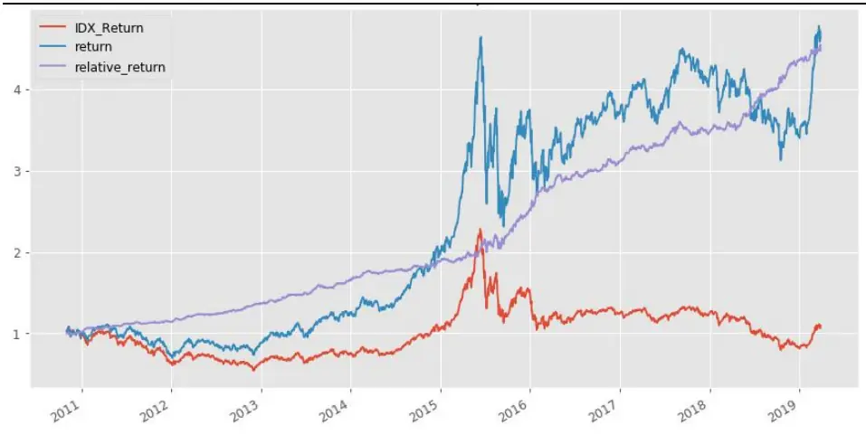
资料来源：光大证券研究所，时间段：2010-01-01 至 2019-03-29

图10：行业基本面中证500增强组合相对收益及相对回撤
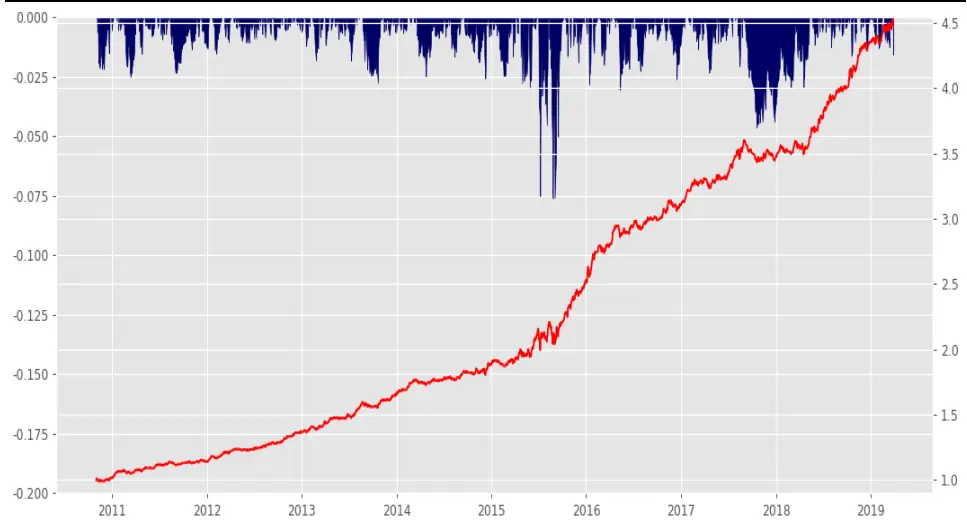
资料来源：光大证券研究所，时间段：2010-01-01 至 2019-03-29

图11：行业基本面中证500增强组合相对收益及回撤区间
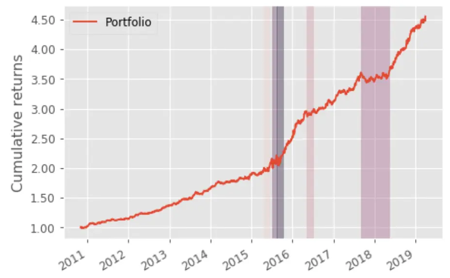
资料来源：光大证券研究所，时间段：2010-01-01 至 2019-03-29

基本面优选股票池内的中证 500 增强策略具有较好的收益能力和稳定性。

与 Alpha3.0 类似，基本面优选中证 500 增强组合在 2017 和 2018 年的表现尤为出色，2017 年的超额收益为 11.29%，信息比 1.97，2018 年的超额收益为26.27%，信息比 4.15，表现出色。

由图 11 可见，基本面优选股票池内构造的中证 500 增强组合的最长回撤窗口发生在 2017 年下半年至 2018 年初，其他时间内相对回撤均持续不超过 3 个月。

## 2.3.3、300增强组合：稳定性有所提升

构造沪深300增强组合时需要格外关注银行非银板块的股票，由于该板块的股票市值普遍较大，会很大程度上影响指数的走势，因此我们在沪深300的组合构建时，建议将银行非银板块的股票做权重的标配处理（即完全不暴露银行非银行业的权重）。

本文的行业基本面优选股票池内的沪深300增强组合构建方法如下：

2) 在优选股票池内将表 15 中所选因子进行截面正交化处理（采用对称正交方法，具体方法可参考报告《因子正交与择时：基于分类模型的动态权重配置》）；

3) 滚动 24 个月最优化复合因子 IC_IR 确定因子权重；

4) 使用优化器优化组合：

a) 银行非银行业持仓股票为基本面优选持仓股票，行业权重标配

b) 控制其余行业权重偏离度小于等于 3%（以中信一级行业为标准）

c) 控制市值因子暴露度小于等于 3%

d) 个股权重不超过 5%

表15：基本面优选多因子沪深 300增强组合因子明细

| 因子代码 | 因子名称 |
| --- | --- |
| BP_LR | 最新一期 BP |
| Momentum_24M | 24个月收益率 |
| STD_3M | 3个月收益率波动 |
| DP | 股息率 |
| EEP | 一致预期EP |
| ROE_TTM | ROE_TTM |
| EEChange_3M | 3个月一致预期净利润调整 |
| OP_Q_YOY | 营业利润单季度同比 |
| NP_SD | 净利润稳健加速度 |
| CCR | 经营现金流/流动负债 |
| ROED | ROE变动 |

资料来源：光大证券研究所

由于沪深300内的因子有效性与全市场因子有效性差异十分显著，我们在沪深 300 内重新对因子的表现进行统计，并选择上述 11 个因子作为沪深300增强组合所使用因子。

表 16：行业基本面沪深 300 增强组合分年度表现

|  | 月度胜率 | 年化收益 | 年化波动 | 年化超额收益相对收益波动 |  | 信息比 | 最大回撤 | 相对最大回撤 |
| --- | --- | --- | --- | --- | --- | --- | --- | --- |
| 2011 | 66.67% | -24.56% | 21.09% | 3.66% | 3.29% | 1.11 | -31.56% | -2.95% |
| 2012 | 66.67% | 13.87% | 21.33% | 3.55% | 3.06% | 1.16 | -20.51% | -2.45% |
| 2013 | 50.00% | -8.13% | 22.93% | 2.09% | 3.72% | 0.56 | -21.33% | -2.65% |
| 2014 | 83.33% | 65.07% | 20.21% | 7.31% | 3.62% | 2.02 | -9.47% | -1.54% |
| 2015 | 100.00% | 16.51% | 42.55% | 14.86% | 6.75% | 2.20 | -43.09% | -3.17% |
| 2016 | 75.00% | 4.01% | 23.00% | 9.55% | 4.06% | 2.35 | -20.70% | -2.45% |
| 2017 | 75.00% | 31.60% | 11.08% | 8.50% | 3.36% | 2.53 | -6.39% | -1.65% |
| 2018 | 50.00% | -23.92% | 22.05% | 4.51% | 4.26% | 1.06 | -27.58% | -2.58% |
| 2019 | 100.00% | 364.31% | 23.61% | 9.98% | 3.85% | 2.59 | -1.87% | -0.78% |
| Summary | 71.43% | 8.24% | 24.64% | 6.98% | 3.98% | 1.75 | -44.16% | -3.17% |

资料来源：光大证券研究所，基准为全 A 等权指数，回测期间：2011-01-01 至2019-03-29

图12：行业基本面沪深 300增强组合收益及相对收益表现
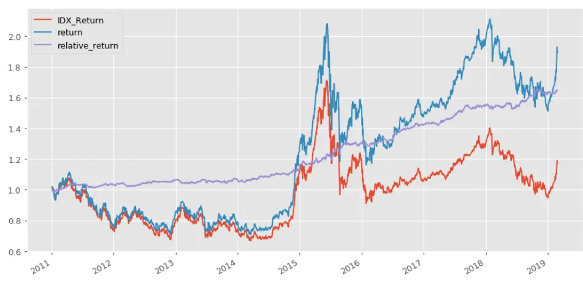
资料来源：光大证券研究所，时间段：2010-01-01 至 2019-03-29

图13：行业基本面沪深 300增强组合相对收益及相对回撤
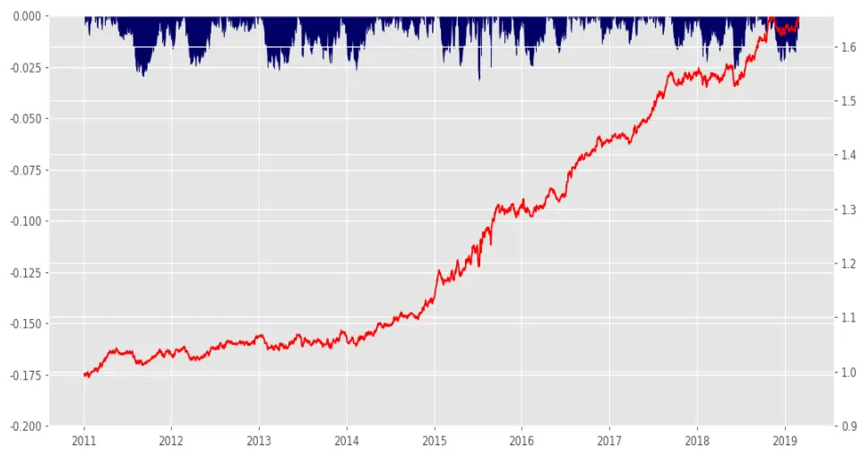
资料来源：光大证券研究所，时间段：2010-01-01 至 2019-03-29

图 14：行业基本面沪深 300 增强组合相对收益及回撤区间
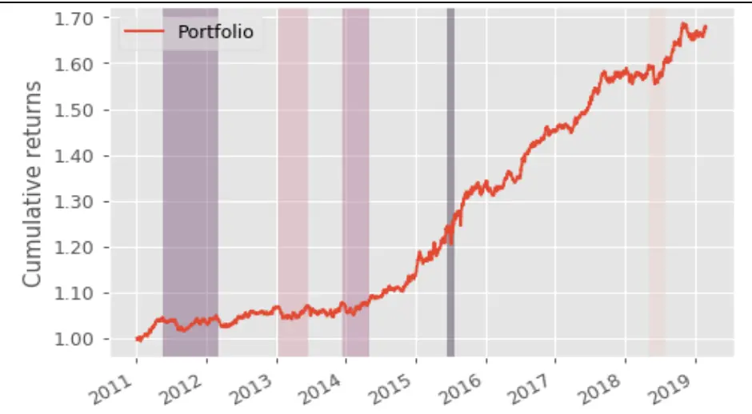
资料来源：光大证券研究所，时间段：2010-01-01 至 2019-03-29

基本面优选的沪深 300 增强组合稳定性较好，跟踪误差小于 4%，年化超额收益为 6.98%，信息比 1.75，最大相对回撤控制在 3.5%以内，具有稳定的超额收益能力。

## 3、基本面优选多因子策略研究心得

行业基本面优选股票池内的选股组合整体上表现出更好的稳定性，在超额收益未得到显著提升的基础上，信息比都可以有所提高。因此根据行业的基本面逻辑优选后的策略，的确可以起到提高组合稳定性，一定程度上避免选到劣质公司从而影响组合表现的作用。

当然，基本面优选的组合也并非十全十美，我们在上述组合研究过程中总结出基本面筛选的优势和劣势可以总结为以下几点：

其优势主要在于：

1) 根据不同行业的各自特征制定行业内股票池优选的方法可以稳定跑赢市场；

2) 基本面优选股票池结合多因子构造组合可以提高组合稳定性，控制回撤；

3) 在市场风格偏向蓝筹的 17、18 年可以有效提高收益，同时在其他年份保持相对不错的超额。

当然，在上述组合构造过程中，我们也总结出此类策略可能存在的问题：

1) 行业内基本面指标的筛选存在样本内过拟合的问题，且过拟的程度较难以估计；

2) 基本面指标存在未来失效的可能性；

3) 基本面优选股票池如果较小，则构造增强策略时较难控制组合的风格暴露。

## 4、风险提示

本报告中的结果均基于模型和历史数据，历史数据存在不被重复验证的可能，模型存在失效的风险。

## 5、附录

## 1. 成长指标计算方式

成长能力是上市公司市场竞争力的集中体现，成长指标是上市公司市场竞争力的集中体现，我们从营业收入、毛利润、净利润等角度构造若干成长性指标，其中，加速度指标的计算方法为：利用连续 N 个季度的单季利润，对期数的二次方程进行回归，取二次项系数作为业绩增长加速度的代理变量，回归公式如下：

$$
\mathrm{Profit}_{\mathrm{t}}=\alpha\times\mathrm{t}^{2}+\beta\times\mathrm{t}+\mathrm{c}\tag{1}
$$

其中，Profit 为单季度利润，t 为季度数， 为上市公司业绩增长加速度的代理变量， 越高，表示业绩增长的加速度越高。该指标的计算涉及到一个参数N，依据上一篇报告对这一参数敏感性的测试结果，在后续的测试中均取相对稳健的N=8。

稳健增速指标刻画的是过去一段时间内业绩增速的稳定性，当指标值比较高的时候，表示过去一段时间内上市公司的业绩保持了稳定增长的态势。它的计算方式是用过去N 期的利润增速均值除以利润增速标准差。在后续的测试中，我们取N=8这一参数，即用过去两年的利润增速数据计算该指标。而稳健加速度指标则是稳健增速指标的一阶差分。

## 2. 基本面指标明细表

表17：基本面指标明细表

| 类别 | 指标名称 | 指标简称 | 计算方式 |
| --- | --- | --- | --- |
| 成长指标 | 创新毛利增速 | NGP_QoQ | (当期创新毛利润 - 上期创新毛利润)/abs(上期创新毛利润) |
|  | 创新毛利加速度 | NGP_A | 详见附录1 |
|  | 创新毛利稳健增速 | NGP_S | 创新毛利润增速均值/创新毛利润增速标准差 |
|  | 创新毛利稳健加速度 | NGP_SD | 当期创新毛利润稳健增速- 上期创新毛利润稳健增速 |
|  | 创新毛利润增速标准分 | NGP_Z | (当期创新毛利润增速-过去8期创新毛利润增速均值)/过去8期创新毛利润增速标准差 |
|  | 毛利增速 | GP_QoQ | (当期毛利润 - 上期毛利润)/abs(上期毛利润) |
|  | 毛利加速度 | GP_A | 详见附录1 |
|  | 毛利稳健增速 | GP_S | 毛利润增速均值/毛利润增速标准差 |
|  | 毛利稳健加速度 | GP_SD | 当期毛利润稳健增速- 上期毛利润稳健增速 |
|  | 毛利润增速标准分 | GP_Z | (当期毛利润增速-过去 8 期毛利润增速均值)/过去 8 期毛利润增速标准差 |
|  | 净利增速 | NP_QoQ | (当期净利润 - 上期净利润) / abs(上期净利润) |
|  | 净利加速度 | NP_A | 详见附录1 |
|  | 净利稳健增速 | NP_S | 净利润增速均值/净利润增速标准差 |
|  | 净利稳健加速度 | NP_SD | 当期净利润稳健增速- 上期净利润稳健增速 |
|  | 净利润增速标准分 | NP_Z | (当期净利润增速-过去8 期净利润增速均值)/过去8期净利润增速标准差 |
| 营运效率 | 存货周转率 | IT | 营业成本 /平均存货余额 |
|  | 存货周转率变动 | IT_D | 当期存货周转率 - 上期存货周转率 |
|  | 稳健存货周转率 | IT_S | 连续八季度IT 均值 / 标准差 |
|  | 稳健存货周转率变动 | IT_SD | 当季IT_S-上季IT_S |
|  | 应收周转率 | RT | 营业收入 / (应收账款 + 应收票据) |
|  | 应收周转率变动 | RT_D | 当期应收周转率 - 上期应收周转率 |
|  | 总资产周转率 | AT | 营业收入/总资产 |
|  | 总资产周转率变动 | AT_D | 当期总资产周转率- 上期总资产周转率 |
|  | 现金循环周期 | CCC | 存货周转天数 + 应收账款周转天数 - 应付账款周转天数 |
|  | 现金循环周期变动 | CCC_D | 当期现金循环周期 - 上期现金循环周期 |
|  | 周转资金占比 | CT | (存货 + 各项应收 + 预付 - 各项应付 - 预收)/营业收入 |

敬请参阅最后一页特别声明

|  | 周转资金占比变动 | CT_D | 当期周转资金占比- 上期周转资金占比 |
| --- | --- | --- | --- |
| 盈利能力 | 毛利率 | GPR | (营业收入 - 营业成本) / 营业收入 |
|  | 毛利率变动 | GPR_D | 当期毛利率 - 上期毛利率 |
|  | 净利率 | NPR | 净利润 / 营业收入 |
|  | 净利率变动 | NPR_D | 当期净利率 - 上期净利率 |
|  | 净资产收益率 | ROE | 净利润/净资产 |
|  | 净资产收益率变动 | ROE_D | 当期净资产收益率 - 上期净资产收益率 |
|  | 投入资本回报率 | ROIC | 净利润 / (权益合计+有息负债) |
|  | 投入资本回报率变动 | ROIC D | 当期投入资本回报率-上期投入资本回报率 |
|  | 总资产收益率 | ROA | 净利润/总资产 |
|  | 总资产收益率变动 | ROA_D | 当期总资产收益率 - 上期总资产收益率 |
| 偿债能力 | 流动比率 | CUR | 流动资产/流动负债 |
|  | 流动比率变动 | CUR_D | 当期流动比率 - 上期流动比率 |
|  | 稳健流动比率 | CUR_S | 连续八季度 CUR 均值 / 标准差 |
|  | 稳健流动比率变动 | CUR_SD | 当季 CUR_S- 上季 CUR_S |
|  | 速动比率 | QR | (流动资产 - 存货 - 1年内到期的非流动资产-待摊费用-预付款)/ 流动负债 |
|  | 速动比率变动 | QR_D | 当期速动比率 - 上期速动比率 |
|  | 稳健速动比率 | QR_S | 连续 8 季度 QR 均值 / 标准差 |
|  | 稳健速动比率变动 | QR_SD | 当季 QR_S- 上季 QR_S |
|  | 现金比率 | CR | (现金 + 交易性金融资产) / 流动负债 |
|  | 现金比率变动 | CR_D | 当期现金比率 - 上期现金比率 |
|  | 稳健现金比率 | CR_S | 连续 8 季度 CR 均值 / 标准差 |
|  | 稳健现金比率变动 | CR_SD | 当季 CR_S- 上季 CR_S |
|  | 现金流动负债比率 | CCR | 经营净现金流 / 流动负债 |
|  | 现金流动负债比率变动 | CCR_D | 当期现金流动负债比率 - 现金流动负债比率 |
|  | 稳健现金流动负债比率 | CCR_S | 连续 8 季度 CCR 均值 / 标准差 |
|  | 稳健现金流动负债比率变动 | CCR_SD | 当季 CCR_S - 上季 CCR_S |
| 资本结构 | 资产负债率 | DTA | 总负债 / 总资产 |
|  | 资产负债率变动 | DTA_D | 当期资产负债率 - 上期资产负债率 |
|  | 长期负债率 | LDTA | 长期负债 /总资产 |
|  | 长期负债率变动 | LDTA_D | 当期长期负债率 - 上期长期负债率 |
|  | 短期借款率 | SDR | 短期借款 /有息负债 |
|  | 短期借款率变动 | SDR_D | 当期短期借款率 － 上期短期借款率 |
|  | 有息负债率 | ILR | 有息债务 / 总负债 |
|  | 有息负债率变动 | ILR_D | 当期有息负债率 - 上期有息负债率 |
|  | 股东权益对固定资产比率 | EFA | 股东权益 /固定资产 |
|  | 股东权益对固定资产比率变动 | EFA_D | 当期 EFA - 上期 EFA |
| 估值 | 1/市盈率 | EP | 每股收益 / 每股股价 |
|  | 1/市盈率相对盈利增长率 | EPG | 每股收益*每股收益增速 /每股股价 |
|  | 1/市净率 | BP | 每股净资产 / 每股股价 |
|  | 1/市销率 | SP | 每股营业收入/每股股价 |
|  | 1/股息率 | DP | 每股股息 / 每股股价 |
|  | 1/市现率（经营净现金流） | OCFP | 每股经营性现金流量净额/每股股价 |
|  | 1 /市现率（净现金流） | NCFP | 每股现金流量净额 / 每股股价 |
| 盈余质量 | 应计利润占比 | APR | 经营性净现金流 / 营业利润 |
|  | 应计利润占比变动 | APR_D | 当期应计利润占比- 上期应计利润占比 |
|  | 应计利润占比2 | APR2 | (应收 + 预付 - 预收 - 应付) /营业利润 |
|  | 应计利润占比变动2 | APR2_D | 当期应计利润占比2- 上期应计利润占比2 |
|  | 收现比 | CSR | 销售商品提供劳务收到的现金/营业收入 |
|  | 收现比变动 | CSR_D | 当期收现比 - 上期收现比 |
| 研发费用 | 研发收入比 | RDOR | 研发费用/营业收入 |
|  | 研发毛利比 | RDGP | 研发费用 / 毛利润 |
|  | 研发净资产比 | RDE | 研发费用 / 净资产 |
|  | 研发总资产比 | RDA | 研发费用 / 总资产 |
| 商誉 | 商誉收入比 | BROR | 商誉/营业收入 |
|  | 商誉收入比变动 | BROR_D | 当期商誉收入比 - 上期商誉收入比 |

资料来源：光大证券研究所

## 行业及公司评级体系

| 评级 说明 |
| --- |
| 行 买入 未来6-12个月的投资收益率领先市场基准指数15%以上； |
| 增持 未来6-12个月的投资收益率领先市场基准指数5%至15%; |
| 中性 未来6-12个月的投资收益率与市场基准指数的变动幅度相差-5%至5%； |
| 减持 未来6-12个月的投资收益率落后市场基准指数5%至15%； |
| 卖出 未来6-12个月的投资收益率落后市场基准指数15%以上； |
| 因无法获取必要的资料，或者公司面临无法预见结果的重大不确定性事件，或者其他原因，致使无法给出明确的无评级投资评级。 |
| 基准指数说明：A股主板基准为沪深300指数；中小盘基准为中小板指；创业板基准为创业板指；新三板基准为新三板指数；港股基准指数为恒生指数。 |

## 分析、估值方法的局限性说明

本报告所包含的分析基于各种假设，不同假设可能导致分析结果出现重大不同。本报告采用的各种估值方法及模型均有其局限性，估值结果不保证所涉及证券能够在该价格交易。

## 分析师声明

本报告署名分析师具有中国证券业协会授予的证券投资咨询执业资格并注册为证券分析师，以勤勉的职业态度、专业审慎的研究方法，使用合法合规的信息，独立、客观地出具本报告，并对本报告的内容和观点负责。负责准备以及撰写本报告的所有研究人员在此保证，本研究报告中任何关于发行商或证券所发表的观点均如实反映研究人员的个人观点。研究人员获取报酬的评判因素包括研究的质量和准确性、客户反馈、竞争性因素以及光大证券股份有限公司的整体收益。所有研究人员保证他们报酬的任何一部分不曾与，不与，也将不会与本报告中具体的推荐意见或观点有直接或间接的联系。

## 特别声明

光大证券股份有限公司（以下简称“本公司”）创建于 1996 年，系由中国光大（集团）总公司投资控股的全国性综合类股份制证券公司，是中国证监会批准的首批三家创新试点公司之一。根据中国证监会核发的经营证券期货业务许可，本公司的经营范围包括证券投资咨询业务。

本公司经营范围：证券经纪；证券投资咨询；与证券交易、证券投资活动有关的财务顾问；证券承销与保荐；证券自营；为期货公司提供中间介绍业务；证券投资基金代销；融资融券业务；中国证监会批准的其他业务。此外，本公司还通过全资或控股子公司开展资产管理、直接投资、期货、基金管理以及香港证券业务。

本报告由光大证券股份有限公司研究所（以下简称“光大证券研究所”）编写，以合法获得的我们相信为可靠、准确、完整的信息为基础，但不保证我们所获得的原始信息以及报告所载信息之准确性和完整性。光大证券研究所可能将不时补充、修订或更新有关信息，但不保证及时发布该等更新。

本报告中的资料、意见、预测均反映报告初次发布时光大证券研究所的判断，可能需随时进行调整且不予通知。在任何情况下，本报告中的信息或所表述的意见并不构成对任何人的投资建议。客户应自主作出投资决策并自行承担投资风险。本报告中的信息或所表述的意见并未考虑到个别投资者的具体投资目的、财务状况以及特定需求。投资者应当充分考虑自身特定状况，并完整理解和使用本报告内容，不应视本报告为做出投资决策的唯一因素。对依据或者使用本报告所造成的一切后果，本公司及作者均不承担任何法律责任。

不同时期，本公司可能会撰写并发布与本报告所载信息、建议及预测不一致的报告。本公司的销售人员、交易人员和其他专业人员可能会向客户提供与本报告中观点不同的口头或书面评论或交易策略。本公司的资产管理子公司、自营部门以及其他投资业务板块可能会独立做出与本报告的意见或建议不相一致的投资决策。本公司提醒投资者注意并理解投资证券及投资产品存在的风险，在做出投资决策前，建议投资者务必向专业人士咨询并谨慎抉择。

在法律允许的情况下，本公司及其附属机构可能持有报告中提及的公司所发行证券的头寸并进行交易，也可能为这些公司提供或正在争取提供投资银行、财务顾问或金融产品等相关服务。投资者应当充分考虑本公司及本公司附属机构就报告内容可能存在的利益冲突，勿将本报告作为投资决策的唯一信赖依据。

本报告根据中华人民共和国法律在中华人民共和国境内分发，仅向特定客户传送。本报告的版权仅归本公司所有，未经书面许可，任何机构和个人不得以任何形式、任何目的进行翻版、复制、转载、刊登、发表、篡改或引用。如因侵权行为给本公司造成任何直接或间接的损失，本公司保留追究一切法律责任的权利。所有本报告中使用的商标、服务标记及标记均为本公司的商标、服务标记及标记。

光大证券股份有限公司 2019 版权所有。

## 联系我们

| 上海 | 北京 | 深圳 |
| --- | --- | --- |
| 静安区南京西路1266号恒隆广场1号 写字楼48层 | 西城区月坛北街2号月坛大厦东配楼2层 复兴门外大街6号光大大厦17层 | 福田区深南大道 6011 号 NEO 绿景纪元大 厦 A 座 17 楼 |