## 红利因子、低波因子的新构造——多因子系列报告之二十

本篇报告将针对 smart beta 策略中常用的红利与低波动因子进行改造，从股息率预测的角度和 K 线改造波动率因子的角度，重新定义红利因子与低波因子，以期获取预测能力更强，更为稳定的新因子。

- 红利因子：预测股息率因子预测能力和单调性均优于原始 DP_TTM股息率因子

通过将股息率分拆为净利润和股息支付率两部分的方法，并分别对净利润和股息支付率进行估计。同时，考虑分红预告时间点至除权除息日之间的股息预期，将股息率的计算进行较为细节的拆分计算。

预测股息率因子较原始股息率因子的最大优势在于稳定性的提高和单调性的提高。

预测股息率因子的IC 胜率和分组单调性都相对原始股息率因子有一定程度的提升。其IC由3.00%提高到了3.29%，因子IC的波动有所下降，IC_IR由0.49提高到了0.56，有一定的改善效果。

低波因子：成交额等分 K 线下的波动率因子稳定性和多空收益显著优于时间 K 线下的常用波动率因子

我们采用改造后的 K 线（成交额等分 K 线，成交量等分 K 线，ticK 等分K线）来构造基于新K线的波动率因子。

从 IC_IR 上看，成交额等分K线在各个样本内均优于时间等分K线。IC 的均值上，时间等分K线高于成交额等分K 线，但时间等分K线波动率因子的 IC序列波动率显著高于成交额等分K线。

因此成交额等分 K 线下的波动率因子稳定性显著优于时间等分 K 线构造的波动率因子。

从全市场多空收益来看，Value_D_STD_60 因子的多空表现显著优于Time_D_STD_60 。 Value_D_STD_60 因 子 的 累 计 多 空 年 化 收 益 为28.23%，显著高于 Time_D_STD_60 的多空年化收益 12.3%。

- 风险提示：结果均基于模型和历史数据，模型存在失效的风险。

## 金融工程深度

## 分析师

周萧潇 （执业证书编号：S0930518010005）

021-52523680

zhouxiaoxiao@ebscn.com

刘均伟 （执业证书编号：S0930517040001）

021-52523679

liujunwei@ebscn.com

## 相关研究

《因子正交与择时：基于分类模型的动态权重配置——多因子系列报告之十》《成长因子重构与优化：稳健加速为王——多因子系列报告之十二》

《组合优化算法探析及指数增强实证——多因子系列报告之十三 》

《以质取胜：EBQC 综合质量因子详解——多因子系列报告之十七》

《数据纵横：探秘 K 线结构新维度——机器学习系列报告之二》

本篇报告将针对 smart beta 策略中常用的红利与低波动因子进行改造，从股息率预测的角度和K线改造波动率因子的角度，重新定义红利因子与低波因子，以期获取预测能力更强，更为稳定的新因子。

## 1、红利（股息率）因子

通常定义的股息率是股息与股票市值的比值。股票市值取当前市值，而股息通常选取过去 12 个月内的现金分红。

## 1.1、常用红利因子构造方式及因子表现

通常情况下我们对股息率因子（DP_TTM）定义如下：

DP_TTM = 近 12 个月现金股利（税前）/股票市值

不过，在考虑股息率因子的有效性时，不难发现其上述定义在某些情况下可能会出现失效。

因为公司的历史分红不一定能反应上市公司未来分红的情况，仅仅依靠过去12 个月的分红情况，外推未来的分红情况，其有效性是比较弱的。

当上市公司长期的业绩稳定时，它的分红也较为稳定，这个时候使用历史分红作为对未来分红的估计偏差不会很大。但是当公司业绩波动剧烈时，尤其是对于周期类行业的公司，它的分红往往会波动较大，这就使得前后两期分红的相关性明显降低，历史分红对未来的预测能力减弱。

以中国神华为例，下图可以看到中国神华在 2016 年度的股息支付率极高，为 260%，显著高于历史各个年度的 40%。那如果以 12 个月滚动计算股息的方式，2017年的该公司DP_TTM因子值会产生极大值，导致其得分极高。

图 1：中国神华（601088.SH）各年度分红总额及利润总额
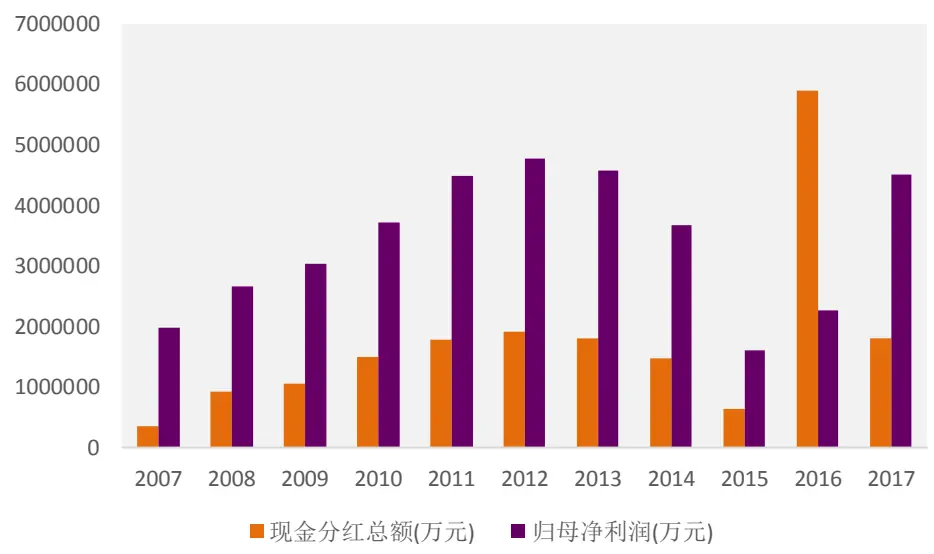
资料来源：wind,光大证券研究所

但这个特殊的分红比例，是不可持续的，或者可以说是一个异常值，会影响DP_TTM因子的有效性，或者同时也会影响采用 DP_TTM 因子计算的红利指数的成分股及其权重的合理性。

当然，我们首先还是从数据出发，测试一下 DP_TTM 这个常用因子的因子表现。

表1：因子测试设置

| 设定项 | 设定值 |
| --- | --- |
| 测试区间 | 2006/01/01 - 2019/03/31 |
| 股票池 | 全部 A 股(剔除选股日 ST/PT 股票；剔除上市不满一年的股票；剔除选股日由于停牌等因素无法买入的股票) |
| 因子预处理 | 截面标准化处理 |
| 因子中性化 | 市值、中信一级行业 |
| 统计频率 | 月频 |

资料来源：光大证券研究所

在全市场范围内，DP_TTM 因子的 IC 均值为 3.00%，IC_IR 为 0.49，胜率为74.68%。从图3 可以看出，DP_TTM的单调性并不出色，除了 9组和10组有较为显著的收益外，其他组的收益差异较小，单调性一般。

图 2：股息率因子（DP_TTM）月度 IC
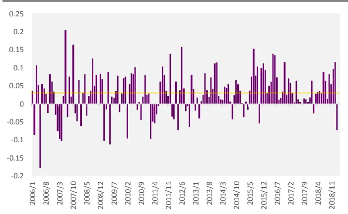
资料来源：光大证券研究所

图 3：股息率因子（DP_TTM）分组超额收益
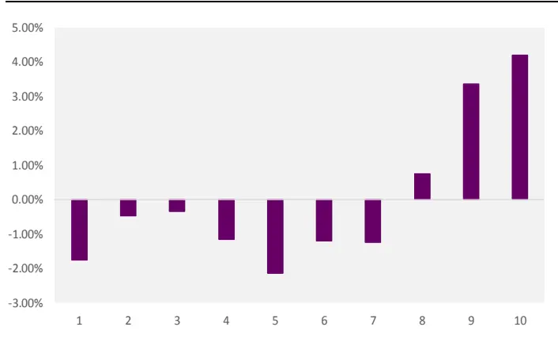
资料来源：光大证券研究所

表 2：股息率因子（DP_TTM）表现统计

| 指标名 | DP_TTM |
| --- | --- |
| IC mean IC 均值 | 3.00% |
| IC std | IC 波动 6.13% |
| IC_IR | IC_IR 0.49 |
| Turnover 换手率 | 5.02% |
| IC positive per | 胜率 74.68% |

资料来源：光大证券研究所

## 1.2、如果可以预测：红利因子收益能力十分出色

红利因子之所以可以受到被动投资者的欢迎，一个重要的原因在于高分红股票在持有过程中可以给投资者带来稳定的收益，因此如果我们可以预测股息率因子，是否也可以更好的捕捉其中蕴含的超额收益呢。

这个我们做了一个很简单的测试，即假设我们可以提前预知公司在未来一年中能够发放的现金分红。因此预期股息率因子的具体构造方式如下：

1）分红除息实施前，以上年度分红计算股息；

2）分红除息实施后，以本年度分红计算股息。

表3：预期股息率因子表现统计

| 预期DP | DP_TTM |
| --- | --- |
| IC mean 3.69% | 3.00% |
| IC std | 6.01% 6.13% |
| IC_IR | 0.61 0.49 |
| Turnover | 6.43% 5.02% |
| IC positive per | 79.12% 74.68% |

资料来源：光大证券研究所

通过测试可见，在提前预知上市公司分红的情况下，预期股息率因子的 IC和IC_IR 均显著高于DP_TTM 因子。

## 1.3、红利因子的新构造：预期股息率因子

根据上面的测试结果，我们发现如果可以对股息率做出有效的预测，那么理应可以提高常用股息率因子的表现。因此，我们通过将股息率拆分为净利润*股息支付率两部分，分别预测公司的净利润和股息支付率，来构造预测的股息率因子。

考虑到公司净利润存在亏损的可能性，并且净利润为负的年度继续进行分红的概率较小，这里我们简单的假设公司在净利润为负时不进行分红，股息率为0。

因此，对于股息率的预测就可以分为下述两个部分：

## 1） 净利润的预测：

净利润的预测方法主要分为，采用分析师一致预期的净利润数据，或者通过公司历史净利润数据做线性外推。

这里我们采用的方法是直接使用分析师的一致预期数据，其原因主要包括：

a、简单的线性外推净利润数据容易受公司盈利的季节性影响，例如周期类的公司，其盈利情况波动较大，较难估计净利润的分布情况。

b、分析师对于上市公司的跟踪情况较为紧密，且目前全市场的分析师一致预期覆盖度可以达到80%左右，沪深300内成分股的覆盖度高达95%。

## 2） 股息支付率的预测：

当预期净利润为正时，预测的股息支付率（分红比例）按照公司近三年内的平均股息支付率确定。

## 预测股息率因子构造中的关键时间点：

预测股息率因子在计算时，需要考虑调整时间点的问题，例如在分红预案发布后，到除权除息前的这段时间里，投资者对于公司的近期分红情况是有非常大的把握的，因此这段时间内我们可以认为是已知公司预期分红，并不需要再做预测。

1）对于上年年报预案分红大于 0 的公司，在 1 月至预案日之前，使用上年年报的预期分红；在预案日至分红除息日期间，使用上年年报的预案分红金额；在分红除息之后，使用本年年报的预期分红金额，作为该股票持有一年所能够获得的预期分红。

图4：预测股息率因子计算流程
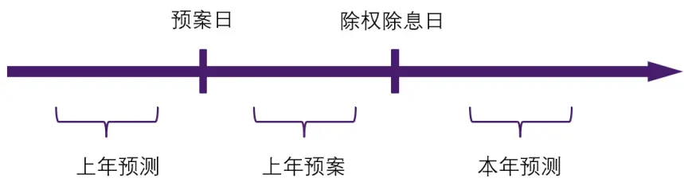
资料来源：光大证券研究所

2）对于上年年报预案分红为 0 的公司，在 1 月至预案日之前，使用上年年报的预期分红；在预案日至 8月末，使用上年年报的预案分红金额，即分红为 0；在 9 月之后，使用本年年报的预期分红金额，作为该股票持有一年所能够获得的预期分红。

## 1.4、预测股息率因子：因子预测能力有所提升

由下述结论可见，预测股息率因子的IC胜率和分组单调性都有了一定程度的提升。其IC 由3.00%提高到了3.29%，因子IC 的波动有所下降，IC_IR 由0.49 提高到了 0.56，提升比较显著。

图5：预测股息率因子月度 IC
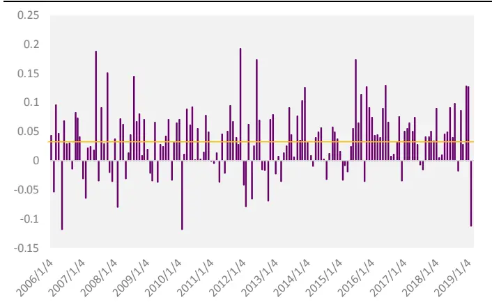
资料来源：光大证券研究所

图6：预测股息率因子分组超额收益
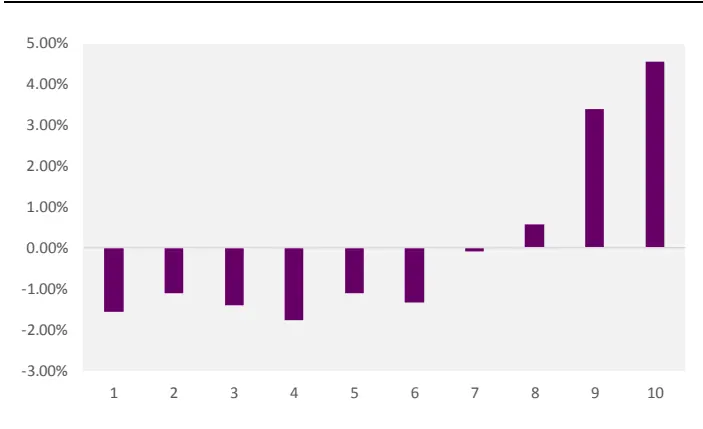
资料来源：光大证券研究所

表 4：预测股息率因子表现统计

|  | 预测 DP | 预期DP（已知） DP_TTM |
| --- | --- | --- |
| IC mean | 3.29% | 3.69% 3.00% |
| IC std | 5.78% | 6.01% 6.13% |
| IC_IR | 0.56 | 0.61 0.49 |
| Turnover | 6.99% | 6.43% 5.02% |
| IC positive per | 75.72% | 79.12% 74.68% |

资料来源：光大证券研究所

从不同样本内的因子表现来看，预测股息率因子在全市场的IC和IC_IR均略微高于沪深300和中证500成分股内的表现，但整体差异较小。可以认为该因子在不同样本空间内的预测能力基本上是较为一致的。

表5：预测股息率因子不同样本内表现统计

|  | 全市场 | 中证500 | 沪深300 |
| --- | --- | --- | --- |
| IC mean | 3.29% | 3.23% | 3.22% |
| IC std | 5.78% | 7.20% | 7.13% |
| IC_IR | 0.56 | 0.44 | 0.47 |
| Turnover | 6.99% | 4.43% | 6.70% |
| IC positive per | 75.72% | 67.32% | 65.22% |

资料来源：光大证券研究所

图7：预测股息率因子不同样本内表现统计
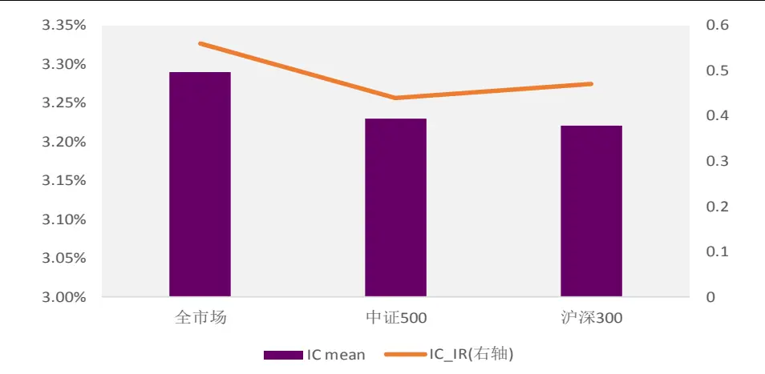
资料来源：光大证券研究所

同时，我们测试了预测股息率因子（预测DP）与常用 DP_TTM以及其他常用风格类因子的相关性，由下图可见，预测 DP 因子与常用股息率因子（DP_TTM）的相关性为 0.83，同时与 ROE 因子也具有正向的 0.63 的相关性。

图8：预测股息率因子与其他常用因子的相关性测试
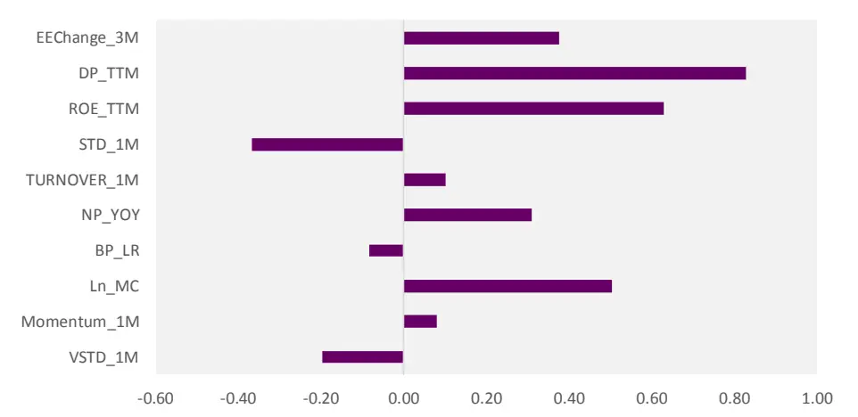
资料来源：光大证券研究所

上文中给出的预测股息率因子可以较为有效的提高常用股息率因子（DP_TTM）的预测能力的选股效果，因子的胜率和单调性的改善较为明显。可见上述改造的思路具有比较可靠的逻辑和增强的效果。

## 2、低波因子

低波动因子是一类长期具有稳定预测能力因子，同时也是较为常用的smartbeta策略因子。本章中我们也将针对波动率因子的定义，尝试利用改造后的K线改进原有波动率因子。

## 2.1、低波因子的常用构造方式及因子表现

首先我们简单的对几个常用的日度数据构造的波动率因子进行测试：1个月波动率 STD_1M（一个月内所有交易日的收益率序列标准差）、3个月波动率、6 个月波动率。

表 6：因子测试设置

| 设定项 | 设定值 |
| --- | --- |
| 测试区间 | 2010/01/01 -2019/03/31 |
| 股票池 | 全部 A 股(剔除选股日 ST/PT 股票；剔除上市不满一年的股票；剔除选股日由于停牌等因素无法买入的股票) |
| 因子预处理 | 截面标准化处理 |
| 因子中性化 | 市值、中信一级行业 |
| 统计频率 | 月频 |

资料来源：光大证券研究所

测试结果如下：对常用的低波动因子测试后会发现计算波动率的窗口越短，因子的 IC_IR 越高，但是换手率会显著的提高。例如 STD_1M 因子的IC_IR高达-0.55，单换手率也达到了接近60%的高换手。

表 7：常用波动率因子表现

| STD_1M | STD_3M | STD_6M |
| --- | --- | --- |
| IC mean -6.42% | -6.19% | -5.63% |
| IC std | 11.52% 12.00% | 12.26% |
| IC_IR | -0.55 -0.52 | -0.46 |
| Turnover | 59.32% 32.11% | 20.32% |
| IC positive per | 29.11% 29.11% | 31.23% |

资料来源：光大证券研究所

同时也可以观察到，常用波动率类因子的 IC 序列的波动率均较高（IC_std）可见因子的稳定性较为一般，具有提升空间。

因此下文中我们采用改造后的K 线来构造新的低波动因子，主要的目的就在于提升原始常用低波动因子的有效性或者稳定性。

## 2.2、波动率计算方法的改进：基于改造后的 K线

在前期的报告《数据纵横：探秘 K线结构新维度——机器学习系列报告之二》中我们提到：

时间切片 K 线是目前最常用的 K 线构造方式：量价数据是金融投资领域数据量最大的数据源，其精度与频率理论上可高至逐笔交易频率。在高频维度下，正是充裕的数据量使得量价数据成为机器学习算法应用的目标数据之一。目前，将这些量价数据结构化的方式大多是按时间等分切片取样，也就是我们大家日常在各个量价图表上看到的K 线构造。比如我们说日线，就是按每个交易日切分数据，每个K线里都是一个完整交易日（4 小时）的交易信息；或者我们说5 分钟线，就是按每个5分钟切分数据，每个 K线里是5 分钟的交易信息。

传统时间切片 K 线的弊端：不少算法要求输入数据尽量满足独立同分布，或者满足同方差性等条件。而时间等分采样切片明显不太符合这样的性质，很大可能每个样本点所蕴含的信息多少是不均的，有些时刻大家更有交易意愿，波动放大；有些时候却交易情绪低迷，成交量萎靡，波动很小。总结而言，时间等分切片会面临样本点信息不均，序列自相关性，样本非同方差，收益率非正态分布等问题。

图9：传统时间 K线的优势和劣势
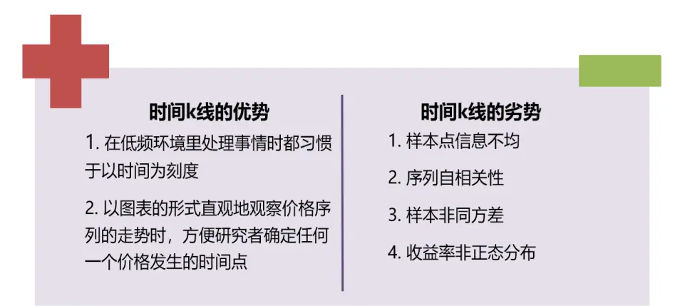
资料来源：光大证券研究所

基于高频数据的K线构造新方法：目前基于高频数据可以构造很多不同的采样切片方式，目前比较主流的方式包括：ticK等分K 线，成交量等分K线，成交额等分 K 线，信息量等分 K 线。其中 ticK 等分 K 线，成交量等分K 线，成交额等分K线的构造方式顾名思义都非常直观。

表 8：多种 K 线切片采样方式

| K线切片方式 | 切片方式解释与目的 |
| --- | --- |
| 时间等分切片 | 每根K线有相同的时间跨度 |
| TicK 等分切片 | 每根K线有相同的交易笔数 |
| 成交量等分切片 | 每根 K线有相同的成交量 |
| 成交额等分切片 | 每根K线有相同的成交额 |

资料来源：光大证券研究所

同时为了使不同K线构造的特征更容易进行比较，在不作特殊说明的情况下，报告后续的非时间 K 线则是按照测试区间内时间 K 线个数为基准进行相应的参数设置，以求不同 K 线构造有着相同的等价频率（即 K 线总体数量在测试区间内大致相似）

## i. 正态性

股票收益率是我们最常使用也最关心的数据之一，在很多研究与模型中（不限于计量经济学、机器学习等）研究者在假定收益率服从正态的基础上作出了许多推导与测试。但简单的测试就能发现传统意义上的股票收益率（时间等分取样下）并不符合正态分布，其密度函数有非常明显的尖峰厚尾的特性。

表9：平安银行2017年量价数据在不同 K线构造方式下收益率的统计特征

| K线切片方式 | 均值 | 方差 | 偏度 | 峰度 |
| --- | --- | --- | --- | --- |
| 时间等分切片 | 0.021% | 0.560% | 1.640 | 16.367 |
| TicK 等分切片 | 0.023% | 0.578% | 0.307 | 2.439 |
| 成交量等分切片 | 0.018% | 0.522% | 0.162 | 3.549 |
| 成交额等分切片 | 0.016% | 0.480% | 0.159 | 2.142 |

资料来源：光大证券研究所

表10：不同 K线构造下收益率数据正态程度检验

| 检验统计量 检验方式 |  |
| --- | --- |
| 偏度（SKew） | 值域（-∞，+∞)，越靠近0越接近正态分布 |
| 峰度（Kurt） | 值域[0,+∞)，越靠近3 越接近正态分布 |

资料来源：光大证券研究所整理

首先通过K-S检验可以看出无论哪种 K线构造，其股票收益率与正态分布的相差甚远，其累计分布函数与正态累计分布函数的最大差值都接近 0.5。但比较偏度、峰度与J-B检验的值，可以看出大部分的股票在非时间切片K线上的收益序列要比时间K 线上的收益序列更接近正态分布的统计特征。

图10：股票收益率在不同K线构造下的偏度

图11：股票收益率在不同K线构造下的峰度

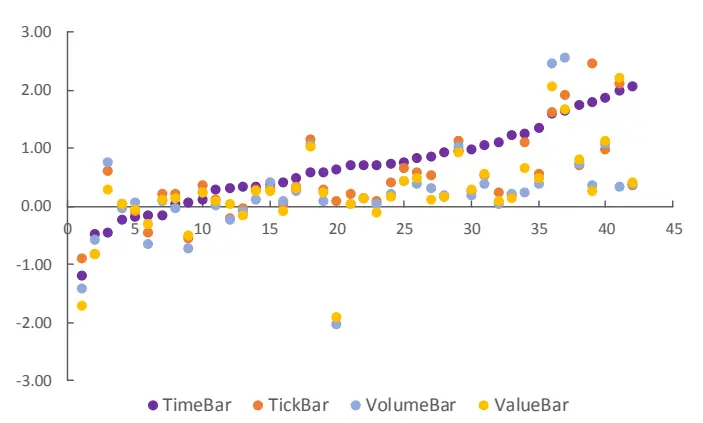
资料来源：光大证券研究所， 注：横坐标为不同股票，按时间 K线对应的统计值大小排序

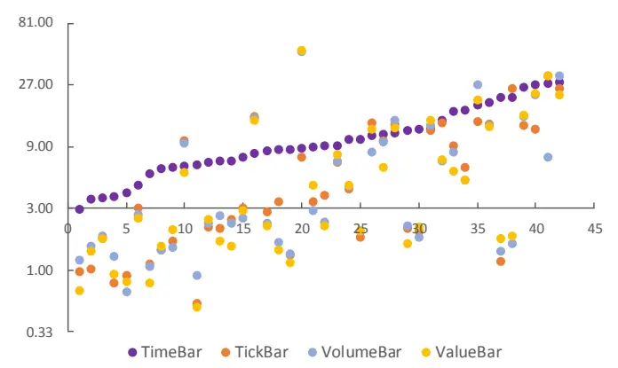
资料来源：光大证券研究所， 注：横坐标为不同股票，按时间 K线对应的统计值大小排序

结论上：在所有这4 种等价频率下，接近正态分布的构造皆为：成交额等分 > 成交量等分 > TicK 等分 > 时间等分；而对于所有 K 线构造，等价频率越低，K 线收益率数据就越接近正态分布。对具体数据感兴趣的读者可在附录A查看数据表。

## ii.自相关性

除了正态分布假设，还有一些要求偏低的假设也是交易数据很难符合的。其中一个就是非自相关假设。通过下图可以明显看出，不同K 线构造下的收益率自相关性的确有显著的差异，时间K 线收益率序列有更为显著的自相关性，时间 K 线的收益率序列自相关性在滞后 1 期、7 期、8 期、9 期、10 期时基本上都大大高于其它 K 线构造下的收益率序列。而除了时间 K 线外的所有其它 K 线的自相关性也都会随着滞后期增加而快速收敛至零值附近。同时还可以观察到的现象是无论是哪种K 线构造方式，即使幅度不同，滞后1期到滞后6期的自相关系数皆为负数，这也一定程度上验证了整体上，股票在短期内（半小时到3 小时）有明显的反转效应。

图12：各K线构造收益率序列在不同滞后期下的自相关系数

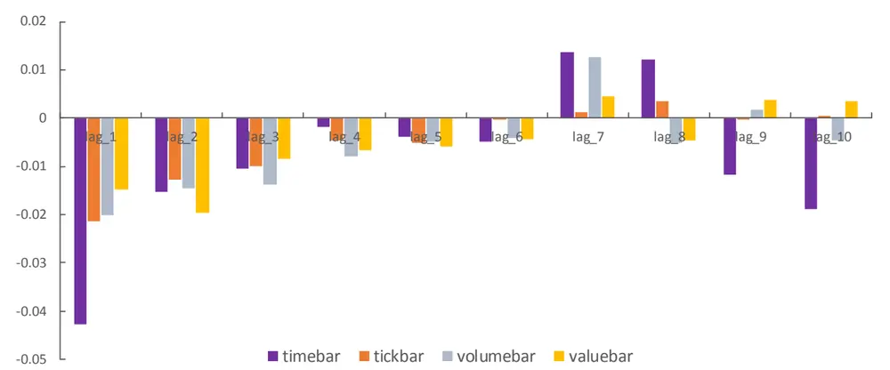
资料来源：光大证券研究所

## iii.异方差性

无论是样本同分布假设，还是平稳性假设，都要求样本点符合同方差的要求。我们可以通过周内波动序列来体现股票收益在不同时期的波动变化。每一周的周内波动是以当周内所有K 线的收益率为样本计算方差得到的。在下图中，我们展示了平安银行（000001.SZ）在2017 年内共 50 周左右的周内波动序列。比较不同K线构造下的周内波动序列曲线，可以看出在接近年末时，时间K线的收益波动远远高于年初的水平，最高时超过年初平均周内波动10 倍有余；而其它K线构造下的周内波动序列虽在年末也有明显上升，但整体更为平稳。

图13：平安银行（000001）2017年不同 K线构造下的周内波动序列

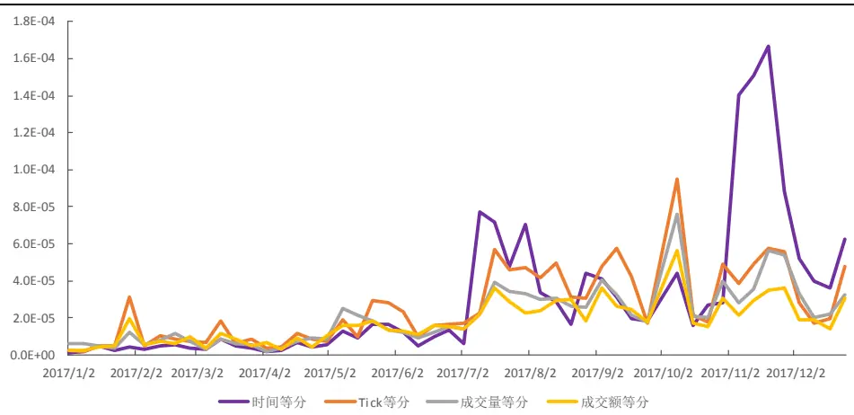
资料来源：光大证券研究所

## 2.3、固定 K 线窗口 or 固定时间窗口

在以时间K 线定义波动率因子时，我们自然的是以时间长度来区分不同波动率因子的计算方法的（例如前文测试的常用波动率因子：STD_1M、STD_3M、STD_6M），但是在采用改造后的 K线来进行波动率因子的构造时，可以有两种不同的定义方式：

1）等 K线个数波动率因子：以K线窗口定义波动率，即规定K线个数，并计算滚动过去 n 个 K 线的收益率标准差，得到波动率因子；

2）等交易日波动率因子：以时间窗口定义波动率，即规定时间长度，并计算滚动过去该时间长度内所有 K 线的收益率标准差，得到波动率因子。

上述两种因子的构造方式，从逻辑上来理解的话，我们认为第一种方式更加符合我们改造K 线的初衷，即通过改造 K线来一定程度上避免时间维度信息对于数据本身的干扰。

当然第二种构造方式更加符合我们的直观逻辑，即它反映的仍然是一段时间内的股价波动情况，只是在这个时间段内采用了另外一种方式定义K线。

考虑到本章最初的测试中的结论，STD_1M尽管 IC_IR 最高，单换手率也显著高于其他偏中长期的波动率因子，因此我们在本文后述的测试中，均选择了STD_3M作为比较和优化的基准。

图 14：等交易日（60 个）波动率因子表现

图 15：等 K 线个数（60 个）波动率因子表现

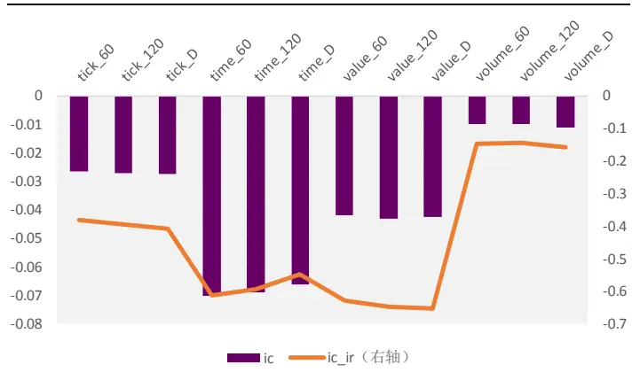
资料来源：光大证券研究所

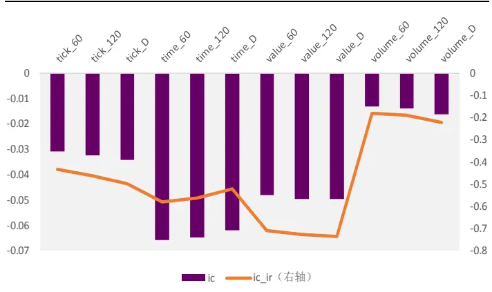
资料来源：光大证券研究所

表 11：等 K 线个数（60 个）波动率因子表现

|  | IC IC_IR | TURNOVER |
| --- | --- | --- |
| TicK_60 | -3.09% -0.43 | 27% |
| TicK_120 | -3.26% -0.46 | 29% |
| TicK_D | -3.44% -0.50 | 30% |
| Time_60 | -6.58% -0.58 | 31% |
| Time_120 | -6.48% -0.56 | 32% |
| Time_D | -6.19% -0.52 | 32% |
| Value_60 | -4.81% -0.71 | 27% |
| Value_120 | -4.96% -0.73 | 28% |
| Value_D | -4.96% -0.74 | 30% |
| Volume_60 | -1.33% -0.18 | 27% |
| Volume_120 | -1.39% -0.19 | 28% |
| Volume_D | -1.63% -0.22 | 30% |

资料来源：光大证券研究所

我们首先以全市场为样本，测试了成交额等分 K线、成交量等分K 线、ticK 等分 K 线以及时间等分 K 线在从上面的测试结果中可见，等 K 线个数下的波动率因子整体优于等交易日的波动率因子。

并且等 K 线个数（60 个）的 Value_D 波动率因子具有最高的 IC_IR，稳定性较好，换手率也低于时间 K 线的波动率因子。

Value_D的K 线构造方式具体是，以等价日度时间K 线的成交额等分K线为基础，计算过去 60个 K线的收益率标准差。

## 2.4、不同样本空间内改善效果有所差异

通过上面的测试我们可以发现，成交额等分 K 线在构造波动率因子时优势较为明显，其因子预测能力显著优于成交量等分K 线和ticK等分K 线。

并且针对 STD_3M 因子，我们发现成交额等分 K 线在固定 K 线的构造方式下具有较高的 IC_IR 表现，稳定性显著优于原始波动率因子。

这里我们将主要测试等 K 线个数下 Value_D 波动率因子在不同样本空间内的表现，并比较其与等价的日频时间 K线在不同样本内的表现：

表 12：等 K 线个数下 Value_D 波动率因子不同样本内表现统计

| Value_D_STD_60 |  |  |  | Time_D_STD_60 |  |  |
| --- | --- | --- | --- | --- | --- | --- |
|  | 全市场 | 中证 500 | 沪深300 | 全市场 | 中证 500 | 沪深 300 |
| IC mean | -4.96% | -4.64% | -3.43% | -6.19% | -5.20% | -3.62% |
| IC std | 6.70% | 6.98% | 7.93% | 11.90% | 11.97% | 13.64% |
| IC_IR | -0.74 | -0.66 | -0.43 | -0.52 | -0.43 | -0.27 |
| Turnover | 30% | 28% | 25% | 32% | 30% | 27% |
| IC positive per | 25.74% | 27.53% | 29.00% | 28.33% | 29.32% | 34.32% |

资料来源：光大证券研究所

图16：等 K线个数下Value_D波动率因子不同样本内 IC_IR绝对值
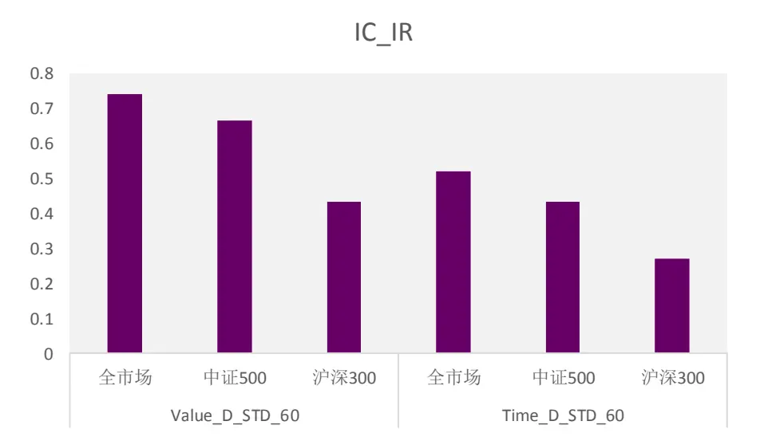
资料来源：光大证券研究所

从IC_IR上看，成交额等分 K线在各个样本内均优于时间等分 K线。IC的均值上，时间等分 K 线高于成交额等分 K 线，但时间等分 K 线波动率因子的 IC 序列波动率显著高于成交额等分 K 线。可见成交额等分 K 线下的波动率因子稳定性显著的优于时间等分的K 线。

并且沪深 300成分股内的改善效果更加明显：原始时间 K线因子在沪深300内表现较为一般，且波动较大，而成交额等分K 线在沪深 300 内的优势更为明显，IC 均值为-3.43%，IC_IR 为-0.43，显著高于时间 K 线因子的-0.27。

下图中展示了等 K 线个数 60 根成交额等分 K 线波动率因子（ Value_D_STD_60 ） 与 等 价 的 时 间 等 分 K 线 波 动 率 因 子（Time_D_STD_60）的多空收益曲线走势对比：

图 17： Value_D_STD_60 与 Time_D_STD_60 多空收益曲线走势
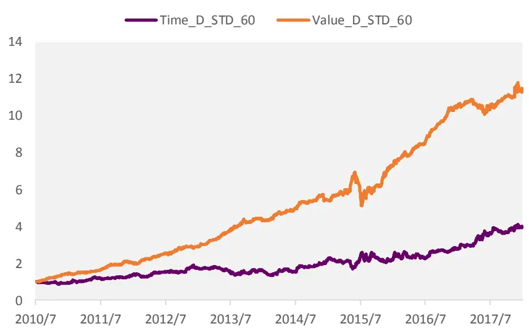
资料来源：光大证券研究所

从上面的全市场多空收益走势可以看出，Value_D_STD_60 因子的多空表现显著优于 Time_D_STD_60。Value_D_STD_60 因子的累计多空年化收益为 28.23%，显著高于 Time_D_STD_60 的多空年化收益 12.3%。

## 3、红利因子&低波因子均有改进空间

综合上面两章的结论，我们认为红利因子（股息率因子）和低波因子均存在改进的空间。

## 1）预测股息率因子预测能力和单调性均优于原始 DP_TTM 股息率因子的：

通过将股息率分拆为净利润和股息支付率两部分的方法，并分别对净利润和股息支付率进行估计。同时，考虑分红预告时间点至除权除息日之间的股息预期，将股息率的计算进行较为细节的拆分计算。

预测股息率因子较原始股息率因子的最大优势在于稳定性的提高和单调性的提高。预测股息率因子的IC胜率和分组单调性都相对原始股息率因子有一定程度的提升。其 IC 由 3.00%提高到了 3.29%，因子 IC 的波动有所下降，IC_IR由0.49提高到了0.56，有一定的改善效果。

## 2）成交额等分 K 线下的波动率因子稳定性和多空收益显著优于时间 K线下的常用波动率因子：

我们采用改造后的K 线（成交额等分 K线，成交量等分K 线，ticK等分K 线）来构造基于新K 线的波动率因子。

从IC_IR上看，成交额等分 K线在各个样本内均优于时间等分 K线。IC的均值上，时间等分 K 线高于成交额等分 K 线，但时间等分 K 线波动率因子的 IC 序列波动率显著高于成交额等分 K 线。可见成交额等分 K 线下的波动率因子稳定性显著的优于时间等分的K 线。

从上面的全市场多空收益走势可以看出，Value_D_STD_60因子的多空表现显著优于 Time_D_STD_60。Value_D_STD_60 因子的累计多空年化收益为 28.23%，显著高于 Time_D_STD_60 的多空年化收益 12.3%。

## 4、风险提示

报告结论均基于模型，模型存在失效的可能。

## 行业及公司评级体系

| 评级 说明 |  |  |
| --- | --- | --- |
| 行 | 买入 | 未来6-12个月的投资收益率领先市场基准指数15%以上； |
|  | 增持 | 未来6-12个月的投资收益率领先市场基准指数5%至15%； |
|  | 中性 | 未来6-12个月的投资收益率与市场基准指数的变动幅度相差-5%至5%； |
|  | 减持 | 未来6-12个月的投资收益率落后市场基准指数5%至15%； |
|  | 卖出 | 未来6-12个月的投资收益率落后市场基准指数15%以上； |
| 业及公司评级 | 无评级 投资评级。 | 因无法获取必要的资料，或者公司面临无法预见结果的重大不确定性事件，或者其他原因，致使无法给出明确的 |
| 基准指数说明：A股主板基准为沪深300指数；中小盘基准为中小板指；创业板基准为创业板指；新三板基准为新三板指数；港 股基准指数为恒生指数。 |  |  |

## 分析、估值方法的局限性说明

本报告所包含的分析基于各种假设，不同假设可能导致分析结果出现重大不同。本报告采用的各种估值方法及模型均有其局限性，估值结果不保证所涉及证券能够在该价格交易。

## 分析师声明

本报告署名分析师具有中国证券业协会授予的证券投资咨询执业资格并注册为证券分析师，以勤勉的职业态度、专业审慎的研究方法，使用合法合规的信息，独立、客观地出具本报告，并对本报告的内容和观点负责。负责准备以及撰写本报告的所有研究人员在此保证，本研究报告中任何关于发行商或证券所发表的观点均如实反映研究人员的个人观点。研究人员获取报酬的评判因素包括研究的质量和准确性、客户反馈、竞争性因素以及光大证券股份有限公司的整体收益。所有研究人员保证他们报酬的任何一部分不曾与，不与，也将不会与本报告中具体的推荐意见或观点有直接或间接的联系。

## 特别声明

光大证券股份有限公司（以下简称“本公司”）创建于 1996 年，系由中国光大（集团）总公司投资控股的全国性综合类股份制证券公司，是中国证监会批准的首批三家创新试点公司之一。根据中国证监会核发的经营证券期货业务许可，本公司的经营范围包括证券投资咨询业务。

本公司经营范围：证券经纪；证券投资咨询；与证券交易、证券投资活动有关的财务顾问；证券承销与保荐；证券自营；为期货公司提供中间介绍业务；证券投资基金代销；融资融券业务；中国证监会批准的其他业务。此外，本公司还通过全资或控股子公司开展资产管理、直接投资、期货、基金管理以及香港证券业务。

本报告由光大证券股份有限公司研究所（以下简称“光大证券研究所”）编写，以合法获得的我们相信为可靠、准确、完整的信息为基础，但不保证我们所获得的原始信息以及报告所载信息之准确性和完整性。光大证券研究所可能将不时补充、修订或更新有关信息，但不保证及时发布该等更新。

本报告中的资料、意见、预测均反映报告初次发布时光大证券研究所的判断，可能需随时进行调整且不予通知。在任何情况下，本报告中的信息或所表述的意见并不构成对任何人的投资建议。客户应自主作出投资决策并自行承担投资风险。本报告中的信息或所表述的意见并未考虑到个别投资者的具体投资目的、财务状况以及特定需求。投资者应当充分考虑自身特定状况，并完整理解和使用本报告内容，不应视本报告为做出投资决策的唯一因素。对依据或者使用本报告所造成的一切后果，本公司及作者均不承担任何法律责任。

不同时期，本公司可能会撰写并发布与本报告所载信息、建议及预测不一致的报告。本公司的销售人员、交易人员和其他专业人员可能会向客户提供与本报告中观点不同的口头或书面评论或交易策略。本公司的资产管理子公司、自营部门以及其他投资业务板块可能会独立做出与本报告的意见或建议不相一致的投资决策。本公司提醒投资者注意并理解投资证券及投资产品存在的风险，在做出投资决策前，建议投资者务必向专业人士咨询并谨慎抉择。

在法律允许的情况下，本公司及其附属机构可能持有报告中提及的公司所发行证券的头寸并进行交易，也可能为这些公司提供或正在争取提供投资银行、财务顾问或金融产品等相关服务。投资者应当充分考虑本公司及本公司附属机构就报告内容可能存在的利益冲突，勿将本报告作为投资决策的唯一信赖依据。

本报告根据中华人民共和国法律在中华人民共和国境内分发，仅向特定客户传送。本报告的版权仅归本公司所有，未经书面许可，任何机构和个人不得以任何形式、任何目的进行翻版、复制、转载、刊登、发表、篡改或引用。如因侵权行为给本公司造成任何直接或间接的损失，本公司保留追究一切法律责任的权利。所有本报告中使用的商标、服务标记及标记均为本公司的商标、服务标记及标记。

光大证券股份有限公司 2019 版权所有。

## 联系我们

| 上海 | 北京 | 深圳 |
| --- | --- | --- |
| 静安区南京西路1266号恒隆广场1号 写字楼48层 | 西城区月坛北街2号月坛大厦东配楼2层 复兴门外大街6号光大大厦17层 | 福田区深南大道 6011号NEO 绿景纪元大 厦 A 座 17 楼 |