## 业绩趋势因子：捕捉业绩加速增长的超额收益——多因子系列报告之二十一

2017 年底，我们在《多维度寻找高增长公司——业绩链选股策略报告》中首次提出构建业绩趋势模型，通过业绩增长速度、加速度两个维度挑选业绩加速成长的公司，从业绩动量角度捕捉业绩成长带来的超额收益。但该模型受限于分层筛选的选股方式以及业绩预告数据的覆盖度问题，在多因子选股模型中难以直接应用。本篇报告尝试将业绩趋势模型进行因子化，构造业绩趋势因子，便于引入多因子选股体系，供投资者参考。

- 业绩趋势模型：历年超额收益稳定，年化超额收益达12.3%。业绩趋势模型可筛选出市场上业绩处于加速增长状态的1/9 上市公司，其下期业绩增速仍处于全市场前30%的概率达 58.2%，说明业绩成长具有较强的动量效应。同时，运用业绩预告数据替代最新一期的公告数据，可降低业绩公告的滞后性，2009 年以来，该模型历年均有正超额收益，信息比率达 1.77，月度胜率达68%（截止2019 年3月31日）。

- 整合业绩预告、快报、定期报告的信息，运用分层打分的方式将模型因子化。综合考虑不同业绩数据的准确性和及时性，我们每月对业绩数据进行更新，取可获取的最新业绩数据构建增速、加速度指标；当同时存在不同类型的业绩报告时，优先级次序依据其准确性确定，即：定期报告>业绩快报>业绩预告。

- 业绩趋势因子（EBPT）预测能力较为优秀。EBPT 因子在全市场内的预测能力较强，且稳定性较好，行业和市值中性化后，IC 均值达3.88%，IC 标准差为 4.80%，IR 值达 0.81，IC>0 的比例超过 80%，IC>0.02的比例也达 67%。不同宽基指数内，EBPT因子均具有一定预测能力，偏小盘的指数内稳定性更佳。

- 剥离传统成长因子之后，EBPT因子仍具有稳定的选股能力。与其他成长因子相比，EBPT因子对未来收益的预测能力更优，剥离传统成长因子后，EBPT 因子的有效性依然十分显著，IC均值为2.40%，IC大于零的比例为 78.86%；虽然IR为 0.65，相比中性化处理之前的 0.81 有所下滑，但仍然具有相对稳定的选股能力，这也说明EBPT 因子可提供独有的增量信息。

- 风险提示：本文测试结果均基于通过历史数据建立的模型，随着市场环境发生变化，可能存在如下风险：1、业绩趋势因子捕捉业绩成长动量带来的超额收益，存在业绩变脸的风险；2、当市场投资者结构发生变化时，市场投资风格随之变化，模型存在失效风险。

## 金融工程深度

## 分析师

刘均伟(执业证书编号：S0930517040001)

021-52523679

liujunwei@ebscn.com

周萧潇 （执业证书编号：S0930518010005）

021-52523680

zhouxiaoxiao@ebscn.com

## 联系人

古翔

021-52523686

guxiang@ebscn.com

2017 年底，我们在《多维度寻找高增长公司——业绩链选股策略报告》中首次提出构建业绩趋势模型，通过业绩增长速度、加速度两个维度挑选业绩加速成长的公司，从业绩动量角度捕捉业绩成长带来的超额收益。该模型历史表现较好，今年以来模型超额全市场等权指数 7%（截止于 2019 年 3 月31 日）。

但该模型受限于分层筛选的选股方式以及业绩预告数据的覆盖度问题，在多因子选股模型中难以直接应用。本篇报告尝试将业绩趋势模型进行因子化，构造业绩趋势因子，便于引入多因子选股体系，供投资者参考。

## 1、业绩趋势模型：速度、加速度双重刻画

业绩的成长对股票长期走势具有重要支撑，挖掘未来业绩高成长的股票，是众多投资者长期追逐的目标。我们在《多维度寻找高增长公司——业绩链选股策略报告》中，提出构建业绩趋势模型，筛选未来业绩大概率高增长的公司，涉及到的指标如下：

- 业绩增速：TTM 归母净利润相对于上一季度TTM归母净利润增长率，即：TTM归母净利润环比增速。

业绩增长加速度：利用连续N 个季度的单季度归母净利润，对期数的二次方程进行回归，取二次项系数作为业绩增长加速度的代理变量。回归公式如下：

$$
{\mathrm{NetProfit}}_{t}=\alpha\times t^{2}+\beta\times t+c\tag{1}
$$

其中，NetProfit 为单季度归母净利润，t 为季度数， 为上市公司业绩增长加速度的代理变量， 越高，表示业绩增长的加速度越高。

具体构建方式为：先利用业绩增长速度指标将上市公司分成 3 组，再依据业绩增长加速度指标在各子集合中各均分3 组，共计9 组。其中，第1 组为业绩增长速度低、业绩增长的加速度也低的股票，预期未来业绩表现短期内难有起色；而第9组为业绩增长速度高、业绩增长加速度也较高的股票，表明这部分上市公司业绩具有加速增长的趋势，也是业绩趋势模型最终筛选的股票组合。

表1：业绩趋势模型分组示意

|  |  | 业绩增长加速度 |  |  |
| --- | --- | --- | --- | --- |
|  |  | 低 | 中 | 高 |
| 业绩增速 | 低 | 1 | 2 | 3 |
|  | 中 | 4 | 5 | 6 |
|  | 高 | 7 | 8 | 9 |

资料来源：Wind，光大证券研究所

为了检验业绩趋势模型所筛选的公司未来业绩增速分布情况，我们依据下期业绩增速（TTM净利润环比增速），将全市场的股票均分成十组，观察业绩趋势模型筛选的股票落入各组的概率。作为参考系，我们依据线性外推思路筛选出当期业绩增速最高的九分之一的公司，同样观察其落入各组的概率。

业绩成长具有动量效应。业绩加速增长的 1/9 公司（业绩趋势模型筛选），下期业绩增速处于全市场前30%的概率达58.2%，即使仅用季度业绩增速筛选的1/9 公司，其下期业绩增速处于全市场前 30%的概率也有 54.9%。说明业绩增长的确是具有动量效应的，当期业绩高增长的公司，下期业绩仍大概率实现较高的增长。

业绩趋势模型最大的优点实际上是剔除了大部分业绩变脸的公司。线性外推思路的弊端在于容易筛选出业绩变脸的公司。图 1 显示：当期业绩高增长的公司中，有约24.6%的公司下期业绩增速处于全市场后30%。但业绩趋势模型筛选的公司，其下期业绩增速处于全市场后30%的概率仅13.4%，显著降低了业绩变脸对组合业绩的伤害。

图1：业绩高增长的公司下期业绩增速分布
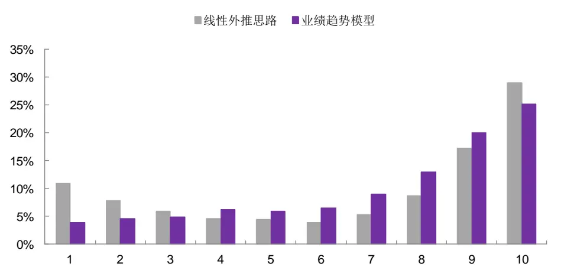
资料来源：Wind，光大证券研究所（统计期：2009 年一季度至 2018 年二季度）

降低公告数据的滞后性：由于财报正式公告的时间相对滞后，对于捕捉业绩成长的选股模型表现有较大影响。因此，我们考虑用预告数据替代最新一期的公告数据，可将策略的换仓时间提前至业绩预告截止日的次一交易日（其中，一季报指标计算需用到上年年报数据，换仓日延至年报截止日的次一交易日）。具体换仓时间如下：

- 一季报：4 月 30 日后第一个交易日

- 半年报：7 月 15 日后第一个交易日

- 三季报：10 月 15 日后第一个交易日

- 年报：次年 1 月 31 日后第一个交易日

策略效果：历年超额收益稳定，年化超额收益达 12.3%。我们假设换仓手续费率为单边 0.3%，以全市场等权指数为基准。2009 年以来，该策略每年均有正超额收益，年化收益31.6%，年化超额12.3%，信息比率达1.77，月度胜率达68%。截止2019 年3 月31日，2019年以来策略收益率达39.4%，超额全市场等权基准7.3%。

图2：业绩趋势选股策略历史收益净值走势
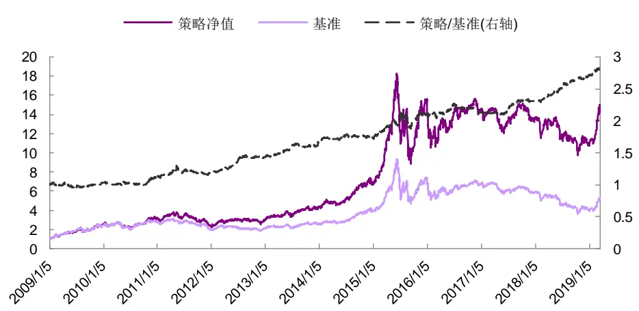
资料来源：Wind，光大证券研究所（截止于 2019 年 3月 31日）

表2：业绩趋势选股策略历年收益表现统计（等权）

|  | 2009 | 2010 | 2011 | 2012 | 2013 | 2014 | 2015 | 2016 | 2017 | 2018 | 2019 | 总体 |
| --- | --- | --- | --- | --- | --- | --- | --- | --- | --- | --- | --- | --- |
| 收益率 | 159.9% | 28.0% | -25.0% | 26.7% | 47.2% | 57.6% | 132.7% | -7.5% | -6.2% | -20.0% | 39.4% | 31.6% |
| 波动率 | 36.1% | 30.4% | 27.9% | 25.0% | 24.4% | 21.9% | 50.5% | 34.2% | 17.1% | 26.0% | 27.7% | 30.7% |
| 超额收益率 | 7.2% | 11.7% | 8.6% | 21.8% | 15.2% | 3.7% | 24.8% | 2.5% | 9.5% | 16.8% | 7.3% | 12.3% |
| 相对波动率 | 8.6% | 7.3% | 8.8% | 5.5% | 5.7% | 4.9% | 10.8% | 5.9% | 4.2% | 4.6% | 5.5% | 6.9% |
| 信息比率 | 0.85 | 1.61 | 0.97 | 3.97 | 2.69 | 0.75 | 2.29 | 0.42 | 2.24 | 3.64 | 4.73 | 1.77 |
| 相对最大回撤 | -7.4% | -6.2% | -13.2% | -2.8% | -3.7% | -3.9% | -9.6% | -5.7% | -3.0% | -1.9% | -1.3% | -13.2% |
| 月度胜率 | 66.7% | 58.3% | 58.3% | 75.0% | 83.3% | 41.7% | 83.3% | 50.0% | 75.0% | 91.7% | 66.7% | 68.3% |

资料来源：Wind，光大证券研究所（注：2019 年收益截止于 2019 年 3 月 31 日，非年化；基准为全市场等权指数）

## 2、模型因子化：整合业绩预告、快报、公告信息

本章我们尝试将业绩趋势模型因子化，构造业绩趋势因子，同时综合考虑不同业绩报告数据的及时性、准确性和覆盖度，对业绩数据进行相应处理，在保证数据及时性的前提下提高因子覆盖度。

## 2.1、因子化方法：分层打分

如前文所述，业绩趋势模型采用分层筛选的方式实现，首先依据业绩增速指标筛选增速较高的三分之一的股票作为基础股票池；再依据业绩增长加速度指标在基础股票池中筛选三分之一的股票作为最终持仓。我们将该模型进行因子化同样考虑分层打分的方式：

- 首先，依据业绩增速指标将全市场股票均分成三组，给每组股票打分，增速最高一组得分为3，增速最低一组得分为1，中间一组得分为2；

- 其次，每一组内依据业绩增长加速度指标进行打分（排序法和标准分法），加速度越高得分也越高；

- 最后，将两步骤的得分相加为每只股票的最终得分。

其中，依据加速度指标打分时，考虑用两种方式，排序法即将股票按加速度指标从小到大排序，并进行归一化处理，所有股票得分均在 0-1 范围内；标准分法即在（第一步骤划分的）组内将加速度指标进行标准化处理（Zscore），作为每只股票在加速度上的得分。

因此，排序法计算的业绩趋势因子为1-4范围内的均匀分布；标准分法计算的业绩趋势因子范围则受每期加速度指标计算的标准分范围的影响。

## 2.2、综合考虑业绩数据的及时性和准确性

上市公司的业绩情况主要通过业绩预告、业绩快报、定期财务报告等方式进行披露，我们从准确性、全面性、及时性、覆盖率四个维度分析这三类业绩数据的特点。

- 准确性：定期报告为经审计的财务报告，准确性较高；而业绩预告和业绩快报均为未经注册会计师审计的报告，准确性相对较低。

全面性：定期报告披露内容较多，信息披露全面（参考《上市公司信息披露管理规定》）；业绩快报披露内容包括主营收入、利润总额、净利润、总资产、净资产等财务指标；业绩预告仅披露归母净利润相关信息。

及时性：上市公司业绩出现大幅波动时，依据交易所的规定，须提前进行业绩预告；业绩快报同样也是提前于定期报告披露；因而从及时性角度来说，应为业绩预告>业绩快报>定期报告。

覆盖率：依据交易所的规定，上市公司仅在业绩出现大幅波动时，须披露业绩预告；业绩快报也非强制披露，因此覆盖度相对较低；定期公告为上市公司强制披露的信息，数据覆盖度高。

在《多维度寻找高增长公司——业绩链选股策略报告》中，我们发现运用业绩预告数据（净利润下限）降低财务公告数据的滞后性后，组合表现有明显提升。但是，预告数据同样存在覆盖度、准确性相对较低的问题，在构造月频的业绩趋势因子时，需每月对业绩数据进行更新，取可获取的最新业绩数据构建增速、加速度指标；当同时存在不同类型的业绩报告时，优先级次序依据其准确性确定，即：定期报告>业绩快报>业绩预告。

表3：不同类型业绩报告的截止时间

| 报告期 业绩预告 | 业绩快报 定期报告 |
| --- | --- |
| 一季度 4月15日前 | 同期定期报告前 4月30日前 |
| 半年度 7 月 15 日前 | 同期定期报告前 8月31日前 |
| 三季度 10月15日前 | 同期定期报告前 10月31日前 |
| 年度 次年1月31日前 | 同期定期报告前 次年4月30日前 |

资料来源：光大证券研究所（注：上海交易所仅对年报的业绩预告有强制披露要求、深圳交易所对各报告期的业绩预告均有强制披露要求）

综合考虑业绩数据的覆盖率和及时性，我们在构建月频的业绩趋势因子时，不同报告期的数据开始引用的时间如下：

- 一季度：4 月末开始引用；

- 半年度：7 月末开始引用；

- 三季度：10 月末开始引用；

- 年度：次年 1 月末开始引用。

## 2.3、缺失数据填充：提升因子覆盖度

依据上节定义的规则计算业绩趋势因子，各期因子覆盖率如下图所示。

1、2、3、7 月末的因子数据覆盖率较低。主要是由于业绩快报、业绩预告均未对全市场的上市公司提出强制性披露要求，而年报的披露时间又截止于4 月 30 日，部分上市公司 3 月份及以前未披露年报的业绩信息；中报的披露时间截止于8 月31 日，部分上市公司在7月份未披露半年报的业绩信息。

图 3：业绩趋势因子各期覆盖率（未填充）
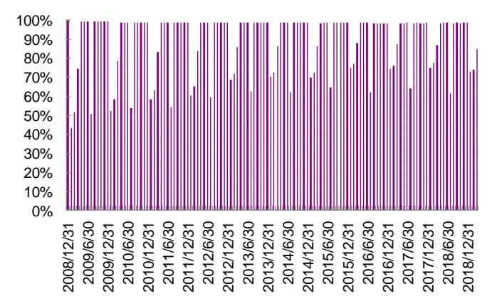
资料来源：Wind，光大证券研究所（截止于 2019 年3 月 31日）

图 4：业绩趋势因子在不同月份的平均覆盖率（未填充）
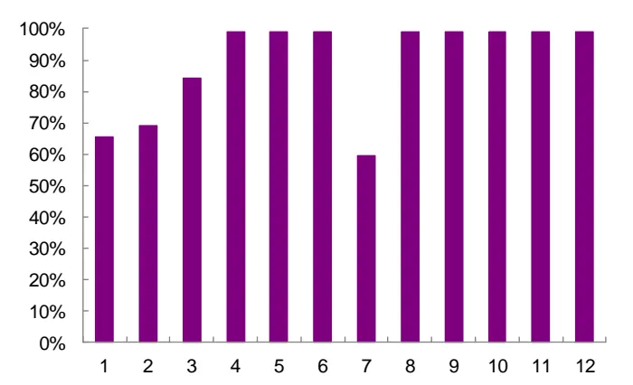
资料来源：Wind，光大证券研究所（统计期为 2008 年 12 月31日至 2019 年 3 月 31 日）

为提高因子的覆盖率，我们尝试对 1、2、3、7 月未披露最新报告期业绩数据的情况进行填充处理，主要考虑两种缺失值填充方式：

- 业绩增速和业绩增长加速度均沿用上期数据：依据传统线性外推的思路考虑，在未披露最新一期的业绩数据时，参考上期的指标表现；

业绩增速填充 0，业绩增长加速度沿用上期数据：依据交易所的相关规定，业绩发生大幅波动的上市公司须在限定时间内进行业绩预告的披露。因此，在 1、2、3、7 月末存在业绩数据缺失的公司，业绩增速应未达披露业绩预告的标准，我们可近似填充 0。此时，依据上述方式构建业绩趋势因子时，若业绩数据覆盖度过低，直接依据业绩增速均分为3组可能存在部分增速指标填充为0的公司进入第3 组，部分进入第1组的情况，我们在处理时，将把所有增速指标填充为0的公司，业绩增速方面的得分设为2分。

经测试，业绩增速指标缺失值填充为 0的方式下，标准分法构建的业绩趋势因子，因子预测能力的稳定性最佳。比较了不同构建方式下，业绩趋势因子（行业、市值中性化后）的 IC、IR 表现，业绩增速指标缺失值填充 0 的处理方式优于填充前值的方式。并且，从预测能力稳定性来看，标准分法的 IR可达0.81，优于排序法。利用标准分法计算的业绩趋势因子数据分布如图 5所示，近似于正态分布。

表4：不同构建方式下，因子预测能力对比（行业、市值中性化后）

| 因子构建 | 排序法 标准分法 |  |  |
| --- | --- | --- | --- |
| 增速指标填充方式 | 填充0 | 填充前值 | 填充0 填充前值 |
| IC 均值 | 4.38% | 4.19% | 3.88% 3.88% |
| IC 标准差 | 5.83% | 6.01% 4.80% | 4.88% |
| IR | 0.75 | 0.70 | 0.81 0.79 |
| IC>0 比例 | 77.05% | 76.23% | 81.30% 80.33% |
| IC>0.02 比例 | 68.85% | 68.03% | 67.48% 67.21% |

资料来源：Wind，光大证券研究所（统计期为 2009 年 1月1 日至 2019 年3 月 31 日）

图 5：业绩趋势因子值分布情况
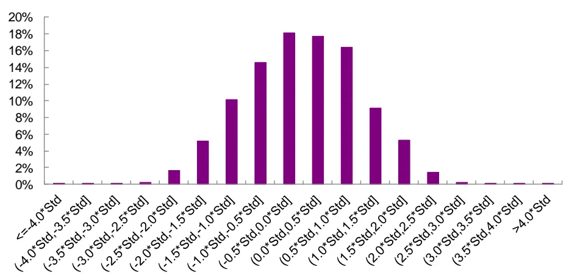
资料来源：Wind，光大证券研究所（统计期为 2009 年 1 月 1 日至 2019 年 3 月 31 日）

## 3、业绩趋势因子(EBPT)收益预测能力较强

如前文所述，业绩增速指标缺失值填充为0的方式下，标准分法构建的业绩趋势因子（EBPT：EB Profit Trend），预测能力的稳定性最佳，本部分重点讨论该因子在不同范围内的选股效果。

## 3.1、EBPT因子：全市场内预测能力稳定

在测试因子有效性及构建多空组合之前，我们会先对因子数据进行一定程度的清洗。对于因子数据的清洗和有效性检验在此前的多因子系列报告中已有详细阐述，这里仅作简单回顾。

绝对中位数法去极值：在因子测试阶段，由于因子本身的分布是否为正态分布无法确定，我们采用稳健的 MAD（绝对中位数法）去除极值更加合适。

截面标准化处理：通过横截面 z-score方法，以每个时间截面 t上的所有股票的为样本，分别计算其均值和标准差得到，如下式所示。此标准化方式属于因子的线性变换，并不会改变原始因子的分布特征。

$$
{\mathrm{stand}}(factor)_{jt}={\frac{factor_{jt}-{\overline{{factor_{t}}}}}{std(factor)_{t}}}\tag{2}
$$

有效性及预测能力检验：我们计算行业中性与市值中性处理后的RankIC（因子值与股票次月收益率的秩相关系数），通过以下几个与IC 值相关的指标来判断因子的有效性和预测能力：IC 值的均值、IC值的标准差、IC 大于0 的比例、IC 绝对值大于0.02 的比例、IR。

EBPT因子在全市场内的预测能力较强，且稳定性较好。如表5 所示，全市场内 IC 均值为 3.44%，IC 标准差为 6.02%，IR 值为 0.57，IC>0 的比例超过70%，IC>0.02的比例也达 62%。说明EBPT因子对下期收益的预测能力较强，且稳定性较好。

不同宽基指数内，EBPT因子均具有一定预测能力，偏小盘的指数内稳定性更佳。如表5 所示，不同宽基指数内 IC 均值都可达3.8%以上，但中证500、沪深300内 IC标准差相对较高，IR分别为0.40、0.49，稳定性相对较弱；而中证1000指数内，IR可达 0.77，预测能力的稳定性较好。

图 6：EBPT 因子 IC 序列
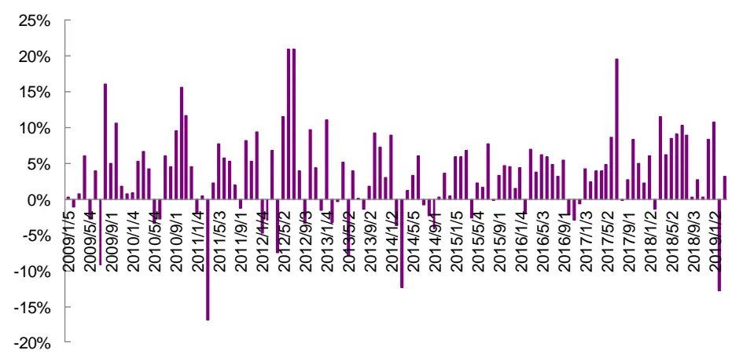
资料来源：Wind，光大证券研究所（注：统计期为 2009 年 1 月至 2019 年 3 月）

表 5：EBPT 因子预测能力统计

| 全市场 | 沪深300 | 中证500 | 中证1000 |
| --- | --- | --- | --- |
| IC 均值 3.44% | 4.16% | 3.88% | 4.29% |
| IC 标准差 6.02% | 10.38% | 7.88% | 5.57% |
| IR 0.57 | 0.40 | 0.49 | 0.77 |
| IC>0 比例 74.80% | 64.23% | 70.73% | 83.02% |
| IC>0.02 比例 62.60% | 60.16% | 54.47% | 67.92% |

资料来源：Wind，光大证券研究所（统计期为 2009 年 1月1 日至 2019 年3 月 31 日）

EBPT 因子在不同行业内的预测能力差异较大，我们按中信一级行业统计了各行业下的因子预测能力。其中，钢铁、电力设备、建材、基础化工等周期性行业 IC 均值较高，说明 EBPT 因子可捕捉周期向好时，周期性行业高弹性带来的收益；电子元器件、医药等成长性行业 IR 相对较高，说明 EBPT因子在成长性行业中的预测稳定性较好；传媒、餐饮旅游、房地产等行业内EBPT 因子的有效性较低。

图 7：EBPT 因子分行业 IC 表现统计
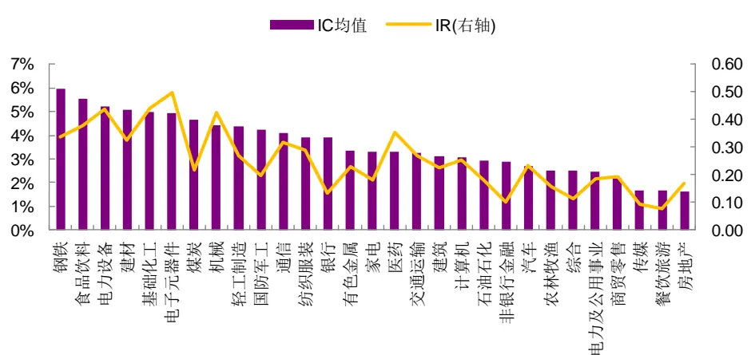
资料来源：Wind，光大证券研究所（注：统计期为 2009 年1 月至 2019 年3 月）

除了有效性指标，因子的单调性和稳定性也是衡量因子选股效果的重要指标。我们建立如下表的分组回测框架，从分组选股效果角度来看因子的单调性，若单调性良好，则说明用该因子选股长期的效果具备较高的稳定性的。下表为因子分组回测的框架说明。

表6：因子分组回测框架

|  | 因子分组回测框架 |
| --- | --- |
| 时间区间 | 2009年2月1日至2019年4月11日 |
| 股票池 | 全部 A 股(剔除选股日ST/PT股票；剔除上市不满一年的股票；剔除选股日由于停牌等因素无法买入的股票) |
| 调仓频率 | 月度调仓 |
| 分组调仓方式 | 每月初第一个交易日调仓，根据本月所有未被剔除的股票数据计算因子值，根据因子值从小到大排序将股票等分为9组，其中，Group9为因子值最大一组，Group1为因子值最小一组 |
| 交易费率 | 因子测试阶段暂不考虑交易费用 |

资料来源：光大证券研究所

在等分 9 组的情况下，分组单调性十分优秀，因子越大的组合收益越大，区分程度也很显著。以第 9 组对冲第 1 组的方式构建多空组合，年化收益13.8%，年化波动仅5.5%，最大回撤5.8%，夏普比率达 2.52。

图 8：EBPT 因子分组收益表现
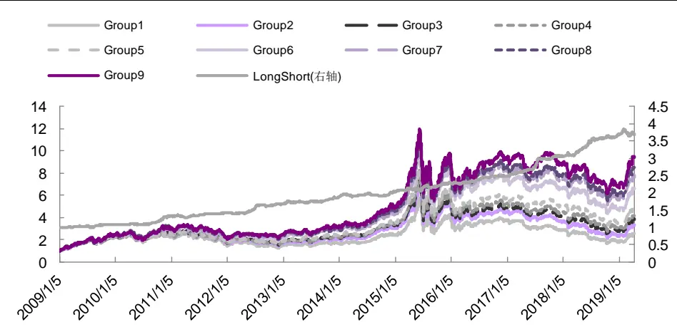
资料来源：Wind，光大证券研究所（注：统计期为 2009 年1 月 1 日至 2019 年4 月 11日）

表7：EBPT因子分组收益表现统计

|  | Group1 | Group2 | Group3 | Group4 | Group5 | Group6 | Group7 | Group8 | Group9 | LongShort |
| --- | --- | --- | --- | --- | --- | --- | --- | --- | --- | --- |
| 年化收益率 | 9.8% | 12.9% | 14.5% | 15.4% | 17.1% | 20.9% | 22.8% | 23.9% | 25.4% | 13.8% |
| 波动率 | 30.8% | 30.5% | 30.1% | 30.0% | 30.0% | 29.9% | 29.8% | 30.3% | 30.3% | 5.5% |
| 夏普比率 | 0.32 | 0.42 | 0.48 | 0.51 | 0.57 | 0.70 | 0.76 | 0.79 | 0.84 | 2.52 |
| 月度胜率 | 54.8% | 55.6% | 55.6% | 55.6% | 54.0% | 56.5% | 61.3% | 59.7% | 59.7% | 71.8% |
| 最大回撤率 | -71.1% | -70.4% | -67.8% | -66.2% | -64.1% | -59.3% | -52.6% | -53.0% | -53.1% | -5.8% |

资料来源：Wind，光大证券研究所（注：统计期为 2009 年1 月 1 日至 2019 年4 月 11 日）

EBPT因子分组流通市值分布呈现“反微笑曲线”。如下图所示，统计了依据EBPT因子等分成9组中，各组股票流通市值的平均数和中位数情况，不难看出，因子值最高和最低的几组，市值相对较低，而中间几组股票的市值较高。主要是因为EBPT因子描述公司业绩变化的趋势，因子值最高和最低的股票，业绩波动相对较大，通常规模较小的公司容易出现这样的情况。

图 9：EBPT 因子分组流通市值分布（单位：亿元）
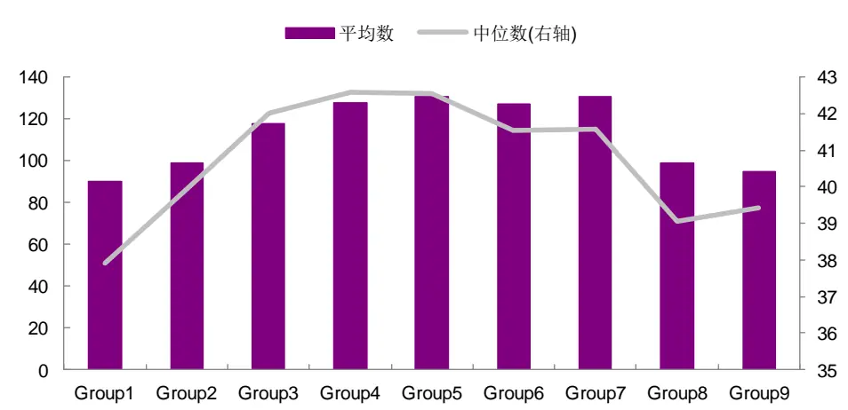
资料来源：Wind，光大证券研究所（统计期为 2009 年 1月1 日至 2019 年4 月 11 日）

不同市值分组下，EBPT因子均有一定的预测能力；中市值范围内，因子有效性最强。如图 10 所示，我们依据流通市值将全市场的股票均分为五组（Group1 为市值最小一组，Group5 为市值最大一组），分别统计了各组内EBPT 因子的 IC、IR 表现。其中，Group3 内，EBPT 因子 IC、IR 表现最优，IR 达0.55，说明中市值的股票池中，EBPT 因子有效性最强；而大市值的股票池中，EBPT 因子的有效性明显下滑，但 IR 仍有 0.42，说明 EBPT 因子在大市值范围内也具有一定的预测能力。

图 10：不同市值分组下，EBPT 因子 IC、IR 表现
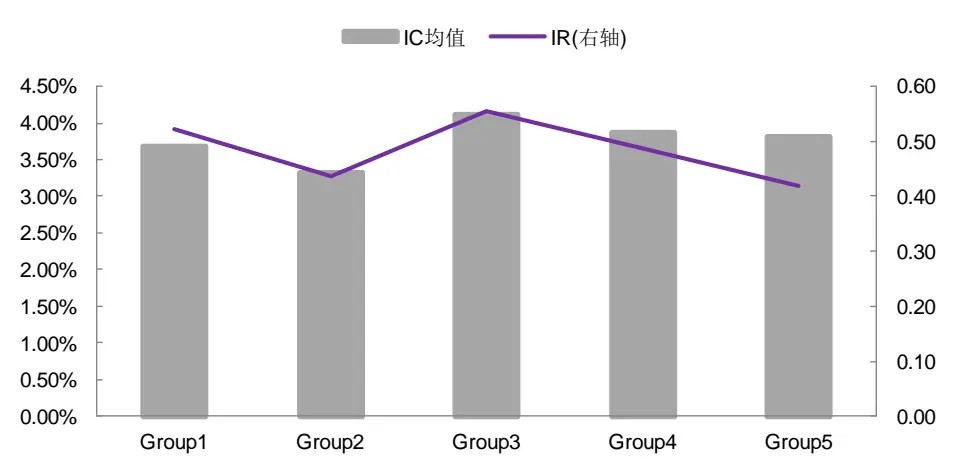
资料来源：Wind，光大证券研究所

表8：不同市值分组下，EBPT因子预测能力统计

|  | Group1 | Group2 | Group3 | Group4 | Group5 |
| --- | --- | --- | --- | --- | --- |
| IC 均值 | 3.68% | 3.32% | 4.11% | 3.86% | 3.82% |
| IC 标准差 | 7.07% | 7.62% | 7.41% | 7.94% | 9.11% |
| IR | 0.52 | 0.44 | 0.55 | 0.49 | 0.42 |
| IC>0 比例 | 70.73% | 69.92% | 72.36% | 74.80% | 65.85% |
| IC>0.02 比例 | 63.41% | 56.91% | 65.85% | 56.91% | 58.54% |

资料来源：Wind，光大证券研究所（统计期为 2009 年 1月1 日至 2019 年3 月 31 日）

## 3.2、行业、市值中性化处理：稳定性进一步提升

为考察EBPT因子自身的预测能力，我们运用回归法进行行业和市值的中性化处理，进一步中性化后EBPT 因子的有效性。如表9 所示，中性化后 EBPT因子的稳定性明显提升，全市场的因子 IR从0.57提升至 0.81；沪深300内从 0.40 提升至 0.50；中证 500 内从 0.49 提升至 0.55。

图 11：EBPT 因子 IC 序列（行业、市值中性化）
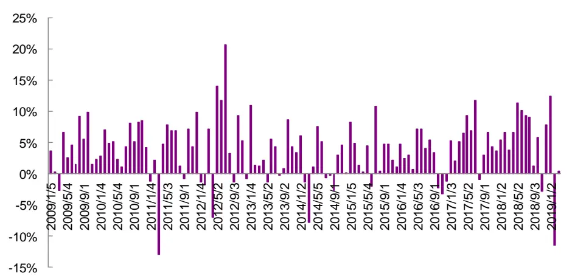
资料来源：Wind，光大证券研究所

表9：EBPT因子预测能力统计（行业、市值中性化）

| 全市场 | 沪深300 | 中证500 | 中证1000 |
| --- | --- | --- | --- |
| IC 均值 3.88% | 4.18% | 3.79% | 4.09% |
| IC 标准差 4.80% | 8.31% | 6.84% | 5.45% |
| IR 0.81 | 0.50 | 0.55 | 0.75 |
| IC>0 比例 81.30% | 70.73% | 73.17% | 79.25% |
| IC>0.02 比例 67.48% | 65.85% | 60.16% | 69.81% |

资料来源：Wind，光大证券研究所（统计期为 2009 年 1 月 1 日至 2019 年 3 月 31 日）

## 3.3、宽基指数 EBPT 因子多头组合收益波动较大

除了因子的分组单调性表现外，投资者往往也比较关心因子多头组合的收益。我们建立如下表的多头组合回测框架，每期筛选因子值最高一组作为持仓，观察因子多头组合的收益表现。下表为因子多头组合回测框架的说明。

表10：因子多头组合回测框架

|  | 因子选股回测框架 |
| --- | --- |
| 回测时间区间 | 2009 年1月1日至2019 年 4月11日 |
| 回测股票池 | 宽基指数成分股(剔除选股日ST/PT股票；剔除上市不满一年的股票；剔除选股日由于停牌等因素无法买入的股票) |
| 配置股票数量 | 成分股数的五分之一 |
| 调仓频率 | 月度调仓 |
| 调仓方式 | 每月初第一个交易日调仓，根据所有未被剔除的股票数据计算因子值，根据因子值从小到大排序将股票等分为5组，其中，Group5为因子值最大一组，作为多头组合。 |
| 交易费率 | 双边 0.6% |

资料来源：光大证券研究所

沪深 300、中证 500 内，EBPT 因子(中性化)多空收益稳定性相对较好，但多头组合相对等权基准的超额收益波动较大。如图 12、14 所示，主要宽基指数（沪深 300、中证 500）内，EBPT 因子（中性化）分组的单调性表现较好；多空收益方面相对稳定，月度胜率均可达69%左右。

如图 13、15 所示，主要宽基指数的多头组合相对等权基准的超额收益波动较大，沪深300内的多头组合年化超额仅 2.2%，信息比率也仅 0.44，2014年出现较大回撤；中证500内的多头组合年化超额仅3.0%，信息比率仅0.69。

图12：沪深 300内EBPT因子（中性化）分组表现
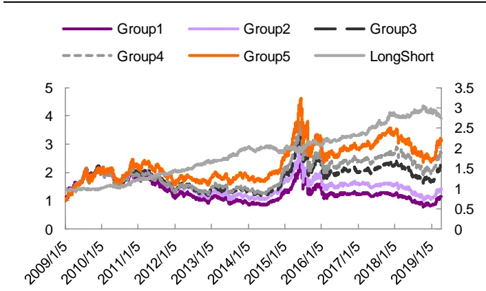
资料来源：Wind，光大证券研究所（截止于 2019 年4 月 11日）

图13：沪深 300内EBPT（中性化）多头组合收益表现
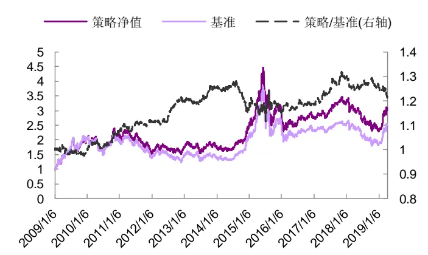
资料来源：Wind，光大证券研究所（截止于 2019 年 4 月 11 日）

表11：沪深 300内EBPT因子（中性化）多头组合历年收益表现统计（等权）

|  | 2009 | 2010 | 2011 | 2012 | 2013 | 2014 | 2015 | 2016 | 2017 | 2018 | 2019 | 总体 | 多空 |
| --- | --- | --- | --- | --- | --- | --- | --- | --- | --- | --- | --- | --- | --- |
| 收益率 | 111.6% | 5.3% | -27.3% | 12.1% | 1.7% | 38.4% | 24.8% | -10.5% | 19.8% | -29.1% | 27.7% | 11.7% | 10.3% |
| 波动率 | 33.9% | 28.0% | 22.6% | 23.0% | 22.2% | 19.7% | 48.0% | 27.3% | 13.1% | 22.0% | 26.9% | 27.5% | 7.4% |
| 超额收益率 | -0.5% | 9.1% | 3.5% | 7.6% | 4.9% | -7.5% | 1.5% | 3.0% | 9.9% | -2.1% | -6.5% | 2.2% |  |
| 相对波动率 | 5.0% | 4.5% | 3.9% | 3.9% | 4.3% | 5.2% | 9.1% | 3.8% | 4.6% | 4.1% | 5.7% | 5.1% |  |
| 信息比率 | -0.10 | 2.02 | 0.91 | 1.94 | 1.15 | -1.44 | 0.17 | 0.80 | 2.15 | -0.51 | -3.00 | 0.44 | 1.40 |
| 相对最大回撤 | -4.6% | -3.6% | -2.7% | -2.0% | -2.6% | -10.3% | -7.5% | -2.7% | -2.2% | -4.4% | -4.8% | -12.6% | -10.9% |
| 月度胜率 | 58.3% | 75.0% | 58.3% | 66.7% | 41.7% | 33.3% | 50.0% | 58.3% | 58.3% | 41.7% | 0.0% | 52.4% | 69.4% |

资料来源：Wind，光大证券研究所（注：2019 年收益截止于 2019 年 4月 11 日，非年化；基准为沪深 300 等权指数）

图 14：中证 500 内 EBPT 因子（中性化）分组表现
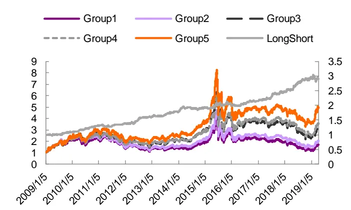
资料来源：Wind，光大证券研究所（截止于 2019 年4 月 11日）

图 15：中证 500 内 EBPT（中性化）多头组合收益表现
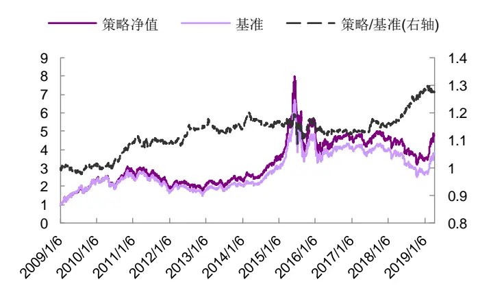
资料来源：Wind，光大证券研究所（截止于 2019 年4 月 11日）

表 12：中证 500 内 EBPT 因子（中性化）多头组合历年收益表现统计（等权）

|  | 2009 | 2010 | 2011 | 2012 | 2013 | 2014 | 2015 | 2016 | 2017 | 2018 | 2019 | 总体 | 多空 |
| --- | --- | --- | --- | --- | --- | --- | --- | --- | --- | --- | --- | --- | --- |
| 收益率 | 139.9% | 21.0% | -31.9% | 8.4% | 16.8% | 47.0% | 60.1% | -17.5% | 0.2% | -26.3% | 38.5% | 17.0% | 11.1% |
| 波动率 | 36.4% | 29.6% | 25.3% | 25.1% | 23.6% | 20.5% | 53.2% | 32.9% | 16.4% | 24.8% | 27.8% | 30.4% | 6.0% |
| 超额收益率 | 1.1% | 8.6% | 0.0% | 6.6% | -1.5% | 2.5% | 3.2% | -3.3% | 3.7% | 11.2% | -1.1% | 3.0% |  |
| 相对波动率 | 3.8% | 3.8% | 3.8% | 3.2% | 3.6% | 3.2% | 8.0% | 3.7% | 3.6% | 3.7% | 4.8% | 4.3% |  |
| 信息比率 | 0.29 | 2.26 | -0.01 | 2.04 | -0.41 | 0.76 | 0.40 | -0.89 | 1.03 | 3.06 | -0.65 | 0.69 | 1.87 |
| 相对最大回撤 | -3.4% | -1.9% | -3.6% | -2.6% | -4.6% | -4.7% | -8.5% | -3.7% | -2.7% | -1.3% | -2.1% | -8.6% | -8.4% |
| 月度胜率 | 50.0% | 75.0% | 50.0% | 66.7% | 41.7% | 50.0% | 41.7% | 33.3% | 50.0% | 75.0% | 25.0% | 52.4% | 68.5% |

资料来源：Wind，光大证券研究所（注：2019 年收益截止于 2019 年 4月 11 日，非年化；基准为中证 500 等权指数）

业绩数据披露较多的月份均存在较高的换手，总体平均月度换手 38%左右。如下图所示， 1 至 4 月、7 至 8 月、10 月均为披露业绩数据的上市公司数量较多的月份，故而影响下一月第一个交易日的换手率，业绩数据披露较多月份的次月平均换手率达55%，其余月份平均换手率仅 13%。

图 16：沪深 300 内 EBPT（中性化）多头组合不同月份平均换手率
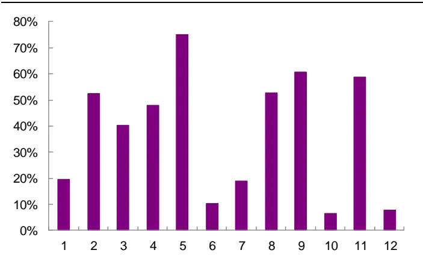
资料来源：Wind，光大证券研究所（截止于 2019 年4 月 11日）

图 17：中证 500 内 EBPT（中性化）多头组合不同月份平均换手率
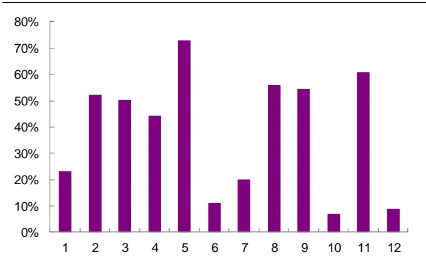
资料来源：Wind，光大证券研究所（截止于 2019 年 4 月 11 日）

## 4、因子相关性分析：与质量、估值、一致预期因子相关性较高

最后，我们比较了EBPT因子与其它优秀的成长因子的收益表现，并在剔除了其中相关性较高的成长因子后，观察EBPT因子是否依然具备良好的选股能力。

## 4.1、与其他成长因子比较：EBPT 因子预测能力更优

EBPT 因子为一种成长类的因子，在光大证券多因子系列此前的研究报告中，我们已梳理过预测能力较为强的成长类因子，包括传统的 NP_Q_YOY（单季度净利润同比增速）、创新性的 ${\mathsf{OP}}{\mathsf{\underline{{S}}D}}^{1}$ ${\mathsf{LPNP}}^{2}$ 等。本节我们主要比较EBPT 因子与其他成长因子的表现，并分析其与主流因子的相关性。

EBPT因子预测能力较强，IR表现优于其他成长因子。如下表所示，我们将EBPT 因子与这些比较优秀的成长因子进行对比，不难发现，EBPT 因子 IC均值优于其他成长因子，虽然其 IC 标准差略高于 OP_SD 和 LPNP 因子，但综合的IR 表现依然存在优势。并且，IC大于0、IC 大于 0.02 的比例方面也是EBPT 因子表现更优。

表13：不同成长因子预测能力比较（行业、市值中性化）

| EBPT | OP_SD | NP_Q_YoY | LPNP |
| --- | --- | --- | --- |
| IC 均值 | 3.88% 2.46% | 3.49% | 3.08% |
| IC 标准差 | 4.80% 3.22% | 5.97% | 3.91% |
| IR 0.81 | 0.76 | 0.58 | 0.79 |
| IC>0 比例 | 81.30% 75.41% | 73.17% | 78.69% |
| IC>0.02 比例 | 67.48% | 58.20% 59.35% | 63.93% |

资料来源：Wind，光大证券研究所（统计期为 2009 年 1月1 日至 2019 年3 月 31 日）

为考察 EBPT 因子与主流因子之间的相关性，我们分别计算了规模因子（Ln_Mc）、动量因子（Momemtum_1M）、流动性因子（VA_FC_1M、VSTD_1M）、波动因子（STD_1M）、盈利因子（ROE_TTM）、质量因子（EBQC）、一致预期因子（EEChange_3M）以及前述的 3 个成长因子与EBPT 因子之间历史IC序列的相关系数。

如下图所示，EBPT因子与成长因子相关性较高，其中以 NP_Q_YOY为最，相关系数达 0.76；与 ROE、规模因子、质量因子、一致预期因子均有较强正相关，相关系数达 0.45 左右；而与 BP 估值因子呈现-0.36 左右的负相关性。

说明EBPT因子所筛选的股票为成长动量较强的股票（高成长、高估值、一致预期提升），其中，EBPT 因子与 NP_Q_YOY 相关性最高，主要是因为EBPT因子构造中，运用到TTM净利润环比增速，而这一指标与NP_Q_YOY异曲同工。

图 18：EBPT 因子（行业、市值中性化）与其他大类因子历史 IC 值相关性检验
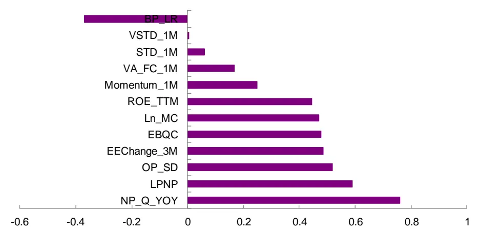
资料来源：Wind，光大证券研究所（统计期为 2009 年 1月1 日至 2019 年3 月 31 日）

## 4.2、剥离传统成长因子后，EBPT 预测能力依然稳定

讨论因子的有效性时，投资者往往关注因子是否提供增量信息，本节我们通过横截面回归取残差的方式，剥离传统成长因子（NP_Q_YOY）的影响，并考察剥离成长因子后EBPT 因子的预测能力。

剥离传统成长因子后，EBPT 因子的有效性依然十分显著，IC均值为2.40%，IC 大于零的比例为 78.86%；虽然 IR 为 0.65，相比中性化处理之前的 0.81有所下滑，但仍然具有相对稳定的选股能力。

表 14：剥离传统成长因子前后的 EBPT 预测能力对比（行业、市值中性化后）

| 因子处理 | IC 均值 | IC 标准差 | IC>0 比例 | IC>0.02 比例 |
| --- | --- | --- | --- | --- |
| 中性化前 | 3.88% | 4.80% | 81.30% | 67.48% 0.81 |
| 中性化后 | 2.40% | 3.69% | 78.86% 57.72% | 0.65 |

资料来源：光大证券研究所，Wind

图19：剥离传统成长因子后，EBPT因子 IC序列（行业、市值中性化）
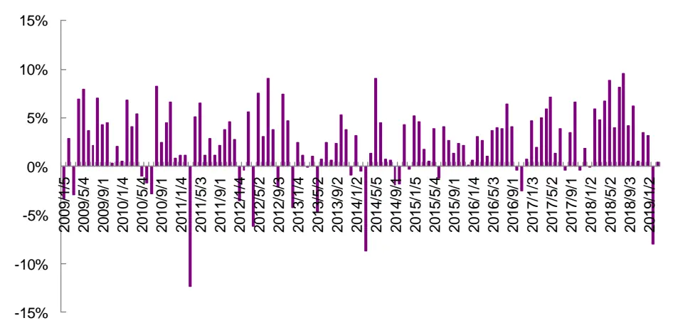
资料来源：Wind，光大证券研究所（统计期为 2009 年 1 月至 2019 年 3 月）

剥离传统成长因子后，EBPT 因子与 NP_Q_YOY 的相关系数明显下降，相关系数为0.31；同时，EBPT因子与ROE、质量因子的相关性也明显下滑，相关系数仅 0.15 左右；而与 BP 估值因子仍呈现-0.29 左右的负相关性。说明已比较有效地剥离传统成长因子的影响。

图 20：剥离传统成长因子后，EBPT（行业、市值中性化）与其他大类因子历史IC值相关性检验
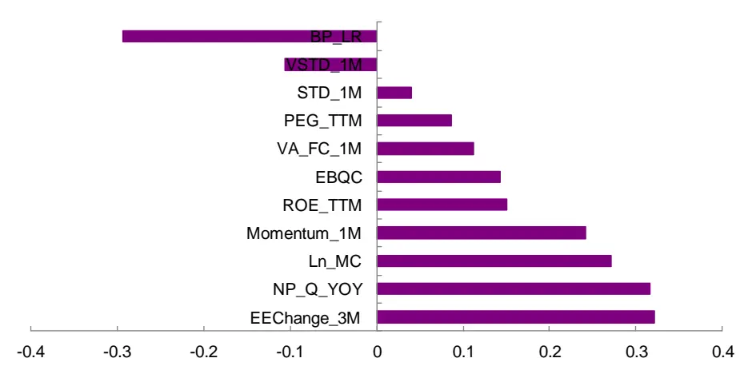
资料来源：Wind，光大证券研究所（统计期为 2009 年 1 月 1 日至 2019 年 3 月 31 日）

在表6所示的分组回测框架下，剥离传统成长因子后的 EBPT因子分组单调性依然优秀，因子越大的组合收益越大，区分程度也很显著（Group1 为因子值最低一组，Group9 为因子值最高一组）。以第 9 组对冲第 1 组的方式构建多空组合，年化收益13.8%，年化波动仅 4.6%，最大回撤 6.3%，夏普比率达3.0。说明剥离成长因子后，EBPT 因子仍可贡献一些增量信息。

图21：剥离传统成长因子后，EBPT因子分组收益表现（行业、市值中性化）
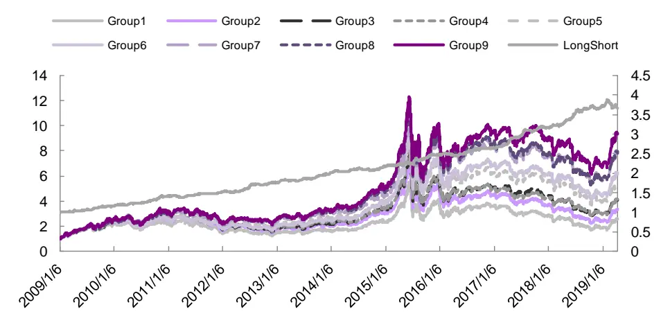
资料来源：Wind，光大证券研究所（注：统计期为 2009 年1 月 1 日至 2019 年4 月 11日）

表 15：剥离成长因子后，EBPT 因子分组收益表现统计

|  | Group1 | Group2 | Group3 | Group4 | Group5 | Group6 | Group7 | Group8 | Group9 | LongShort |
| --- | --- | --- | --- | --- | --- | --- | --- | --- | --- | --- |
| 年化收益率 | 9.4% | 12.3% | 14.8% | 14.8% | 18.0% | 19.7% | 22.7% | 22.7% | 24.8% | 13.8% |
| 波动率 | 30.8% | 30.4% | 29.8% | 29.9% | 29.7% | 29.9% | 30.0% | 30.3% | 30.5% | 4.6% |
| 夏普比率 | 0.31 | 0.40 | 0.50 | 0.49 | 0.61 | 0.66 | 0.76 | 0.75 | 0.81 | 3.00 |
| 月度胜率 | 55.6% | 54.8% | 54.0% | 55.6% | 56.5% | 55.6% | 58.1% | 58.9% | 58.9% | 70.2% |
| 最大回撤率 | -69.9% | -69.6% | -66.4% | -66.9% | -61.7% | -57.6% | -52.8% | -55.6% | -53.5% | -6.3% |

资料来源：Wind，光大证券研究所（注：统计期为 2009 年1 月 1 日至 2019 年4 月 11 日）

## 5、风险提示

本文测试结果均基于通过历史数据建立的模型，随着市场环境发生变化，可能存在如下风险：1、业绩趋势因子捕捉业绩成长动量带来的超额收益，存在业绩变脸的风险；2、当市场投资者结构发生变化时，市场投资风格随之变化，模型存在失效风险。

## 行业及公司评级体系

| 评级 说明 |  |
| --- | --- |
| 行 买入 | 未来6-12个月的投资收益率领先市场基准指数15%以上； |
| 增持 | 未来6-12个月的投资收益率领先市场基准指数5%至15%； |
|  | 中性 未来6-12个月的投资收益率与市场基准指数的变动幅度相差-5%至5%； |
|  | 减持 未来6-12个月的投资收益率落后市场基准指数5%至15%； |
| 卖出 | 未来6-12个月的投资收益率落后市场基准指数15%以上； |
| 业及公司评级 无评级 | 因无法获取必要的资料，或者公司面临无法预见结果的重大不确定性事件，或者其他原因，致使无法给出明确的 |
| 投资评级。 基准指数说明：A股主板基准为沪深300指数；中小盘基准为中小板指；创业板基准为创业板指；新三板基准为新三板指数；港 股基准指数为恒生指数。 |  |

## 分析、估值方法的局限性说明

本报告所包含的分析基于各种假设，不同假设可能导致分析结果出现重大不同。本报告采用的各种估值方法及模型均有其局限性，估值结果不保证所涉及证券能够在该价格交易。

## 分析师声明

本报告署名分析师具有中国证券业协会授予的证券投资咨询执业资格并注册为证券分析师，以勤勉的职业态度、专业审慎的研究方法，使用合法合规的信息，独立、客观地出具本报告，并对本报告的内容和观点负责。负责准备以及撰写本报告的所有研究人员在此保证，本研究报告中任何关于发行商或证券所发表的观点均如实反映研究人员的个人观点。研究人员获取报酬的评判因素包括研究的质量和准确性、客户反馈、竞争性因素以及光大证券股份有限公司的整体收益。所有研究人员保证他们报酬的任何一部分不曾与，不与，也将不会与本报告中具体的推荐意见或观点有直接或间接的联系。

## 特别声明

光大证券股份有限公司（以下简称“本公司”）创建于 1996 年，系由中国光大（集团）总公司投资控股的全国性综合类股份制证券公司，是中国证监会批准的首批三家创新试点公司之一。根据中国证监会核发的经营证券期货业务许可，本公司的经营范围包括证券投资咨询业务。

本公司经营范围：证券经纪；证券投资咨询；与证券交易、证券投资活动有关的财务顾问；证券承销与保荐；证券自营；为期货公司提供中间介绍业务；证券投资基金代销；融资融券业务；中国证监会批准的其他业务。此外，本公司还通过全资或控股子公司开展资产管理、直接投资、期货、基金管理以及香港证券业务。

本报告由光大证券股份有限公司研究所（以下简称“光大证券研究所”）编写，以合法获得的我们相信为可靠、准确、完整的信息为基础，但不保证我们所获得的原始信息以及报告所载信息之准确性和完整性。光大证券研究所可能将不时补充、修订或更新有关信息，但不保证及时发布该等更新。

本报告中的资料、意见、预测均反映报告初次发布时光大证券研究所的判断，可能需随时进行调整且不予通知。在任何情况下，本报告中的信息或所表述的意见并不构成对任何人的投资建议。客户应自主作出投资决策并自行承担投资风险。本报告中的信息或所表述的意见并未考虑到个别投资者的具体投资目的、财务状况以及特定需求。投资者应当充分考虑自身特定状况，并完整理解和使用本报告内容，不应视本报告为做出投资决策的唯一因素。对依据或者使用本报告所造成的一切后果，本公司及作者均不承担任何法律责任。

不同时期，本公司可能会撰写并发布与本报告所载信息、建议及预测不一致的报告。本公司的销售人员、交易人员和其他专业人员可能会向客户提供与本报告中观点不同的口头或书面评论或交易策略。本公司的资产管理子公司、自营部门以及其他投资业务板块可能会独立做出与本报告的意见或建议不相一致的投资决策。本公司提醒投资者注意并理解投资证券及投资产品存在的风险，在做出投资决策前，建议投资者务必向专业人士咨询并谨慎抉择。

在法律允许的情况下，本公司及其附属机构可能持有报告中提及的公司所发行证券的头寸并进行交易，也可能为这些公司提供或正在争取提供投资银行、财务顾问或金融产品等相关服务。投资者应当充分考虑本公司及本公司附属机构就报告内容可能存在的利益冲突，勿将本报告作为投资决策的唯一信赖依据。

本报告根据中华人民共和国法律在中华人民共和国境内分发，仅向特定客户传送。本报告的版权仅归本公司所有，未经书面许可，任何机构和个人不得以任何形式、任何目的进行翻版、复制、转载、刊登、发表、篡改或引用。如因侵权行为给本公司造成任何直接或间接的损失，本公司保留追究一切法律责任的权利。所有本报告中使用的商标、服务标记及标记均为本公司的商标、服务标记及标记。

## 光大证券股份有限公司 2019 版权所有。

## 联系我们

| 上海 | 北京 | 深圳 |
| --- | --- | --- |
| 静安区南京西路1266号恒隆广场1号 写字楼48层 | 西城区月坛北街2号月坛大厦东配楼2层 复兴门外大街6号光大大厦17层 | 福田区深南大道 6011 号 NEO 绿景纪元大 厦A座 17楼 |