## 再论动量因子——多因子系列报告之二十二

股票价格的动量（Momentum），顾名思义代表的是股价在一定时间内延续前期走势的现象。不过与海外长期的研究和经验相悖的是，在 A 股市场，我们发现股价的反转（Reverse）效应要远强于动量效应，且短期反转因子的历史收益非常出色。

但常用动量因子也存在单调性不佳，多头收益不稳定的问题，因此我们尝试从不同角度出发对动量因子进行改造，寻找提升常用动量因子选股效果和稳定性的方法（本文测试时间区间为 2006/01/01 – 2019/05/31）。

## 结合均线的趋势动量因子

动量因子构造时所使用的数据仅为起始节点和末尾节点的股价数据，对于期间的股价信息并未充分反应，因此我们尝试采用均线的思路，构造更好的反应股价趋势的趋势动量因子。趋势动量因子均具有很高的单调性，单调性得分均可以超过 3 分，MA_240 的多空夏普也达到 1.23，但趋势动量因子的预测能力上（IC、IC_IR）整体弱于原始的动量因子。

## 剥离流动性因素后的提纯动量因子

散户集中程度或者说流动性因素是影响动量因子效果的一个重要变量。因此，我们采用截面中性化的方法，将衡量散户集中程度的流动性因素从原始动量因子中剥离。提纯后的动量因子单调性改善显著，且多空收益从年化 23.9%提高到了年化28.8%，提升4.97个百分点，多空收益改善显著。

## 风格中性后的残差动量因子

Blitz D 构建了一个基于残差的动量策略(residual momentum)，并指出残差动量模型在诸多方面的表现都显著优于传统的价格动量。我们从短期动量入手，采用当期残差变量作为剔除市场风格影响后的特质收益动量因子。风格中性后的残差动量因子 IC 均值略低于原始动量因子，但 IC 波动率得到有效降低，从原始的10%下降到8%左右，因子的稳定性提升较为明显。

## 改造 K 线下的动量因子

在前期的报告中我们针对传统时间 K 线的弊端，提出了几种 K 线构造的新方法。测试发现成交额等分 K 线动量因子表现较好，多头收益较高，且因子多空收益贡献大部分来自多头组合，具有与常用动量因子较大差异的收益结构特征。

风险提示：结果均基于模型和历史数据，模型存在失效的风险。

## 金融工程深度

## 分析师

周萧潇 （执业证书编号：S0930518010005）

021-52523680

zhouxiaoxiao@ebscn.com

刘均伟 （执业证书编号：S0930517040001）

021-52523679

liujunwei@ebscn.com

## 相关研究

《因子正交与择时：基于分类模型的动

态权重配置——多因子系列报告之十》《爬罗剔抉：一致预期因子分类与精选多因子系列报告之十一》

《成长因子重构与优化：稳健加速为王——多因子系列报告之十二》

《组合优化算法探析及指数增强实证

——多因子系列报告之十三 》

《以质取胜：EBQC 综合质量因子详解——多因子系列报告之十七》

《数据纵横：探秘 K 线结构新维度——机器学习系列报告之二》

股票价格的动量（Momentum），顾名思义代表的是股价在一定时间内延续前期走势的现象。不过与海外长期的研究和经验相悖的是，在A 股市场，我们发现股价的反转（Reverse）效应要远强于动量效应。因此，这篇报告将首先讨论动量因子的表现及其背后的逻辑，并且尝试对动量因子进行改造，寻找提升常用动量因子选股效果和稳定性的方法。

## 1、动量 or 反转？A 股常用动量因子表现

动量因子在海外（美国、欧洲）市场上均是比较受认可的一个具有不错正向收益的风格因子，在学术界和业界都有较为广泛的研究和应用。例如在美股市场，长期收益表现较好的股票（过去 24 个月收益率排名较高）在未来的一段时间内（1个月）仍将具有较高的收益表现。

而 A 股市场的动量因子表现则与其他成熟市场的动量因子表现截然不同，我们首先来对常用动量因子在A 股的表现做一个全面的分析：

## 1.1、A 股反转效应显著

我们仍将从量化因子的角度入手来研究动量或者反转因子的表现，在我们的多因子系列报告《因子测试全集——多因子系列报告之二》中，曾给出过动量类因子的因子测试结论，报告中测试的几个常用动量因子的明细如下：

表 1：常用动量因子明细

| 因子名称 因子代码 |  |
| --- | --- |
| 1个月动量 | Momentum_1M |
| 3个月动量 | Momentum_3M |
| 6个月动量 | Momentum_6M |
| 12个月动量 Momentum_12M |  |
| 24个月动量 | Momentum_24M |
| 1个月最高收益率 | Momentum_1M_Max |

资料来源：光大证券研究所

基于我们原始的因子测试框架，这篇报告将仍然着眼于较为低频的月度因子，下文的测试结论均为月度因子的测试结果。因子测试的各项参数设置如下表所示，同时下文中的因子单调性得分 Mono_Score 的计算方式为（10组年化收益-1 组年化收益）/（8组年化收益-3 组年化收益）。

表2：因子测试设置

| 设定项 设定值 |  |
| --- | --- |
| 测试区间 | 2006/01/01 - 2019/05/31 |
| 股票池 | 全部 A 股(剔除选股日 ST/PT 股票；剔除上市不满一年的股票；剔除选股日由于停牌等因素无法买入的股票) |
| 因子预处理 | 截面标准化处理 |
| 因子中性化 | 市值、中信一级行业 |
| 因子分组 | 降序分10 组 |
| 统计频率 | 月频 |

资料来源：光大证券研究所

图 1：常用动量因子 IC 及 IC_IR 表现
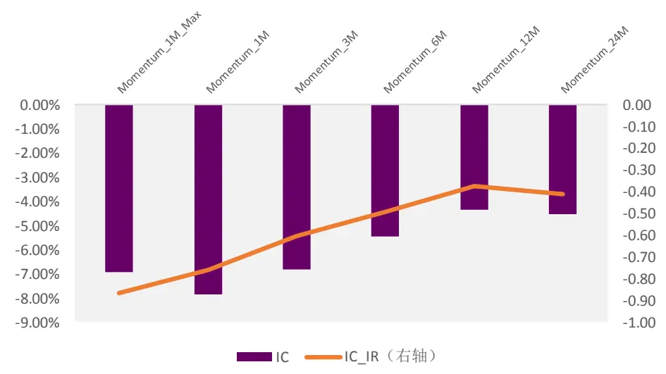
资料来源：光大证券研究所，测试时间：2006/01/01 –2019/05/31

由上图可见，整体上看，动量因子在 A 股均具有显著的反向收益，即前期涨幅越高的股票，未来一个月的收益表现越差。且无论是短期涨幅（Momentum_1M）还是长期涨幅（Momentum_24M）都具有显著的负向预测能力，因子的 IC 均值均小于-4%。

A股市场反转效应占主导，前期强势的股票未来一个月收益表现往往不佳。这一现象与海外的经验存在较大的差异，但无论市场呈现动量效应还是反转效应，都说明有效市场假说是不成立的，那么又该怎么解释A 股市场中存在的这种反转效应呢？

图 2：A 股反转效应的行为金融学解释
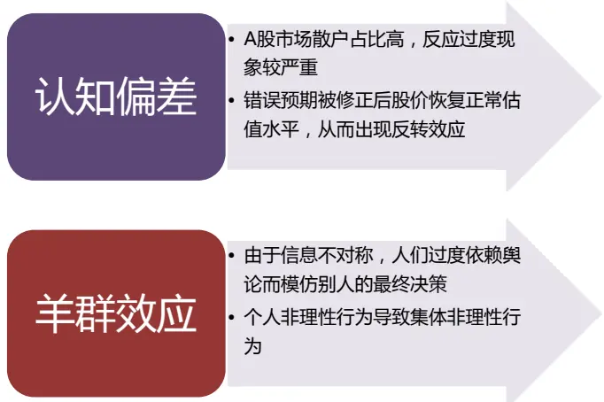
资料来源：光大证券研究所

从行为金融学的角度来看，反转效应往往来自于投资者的过度反应。在A 股的历史数据中可见，中国股市是一个散户占比较高的比较不成熟的市场，绝大多数投资者的投资行为存在各种认知偏差，它们造成了投资者的过度反应。这种过度反应导致人们的追涨杀跌行为，使得股价无论是上涨还是下跌都很容易严重偏离其基本面。那么一旦之前的错误预期被修正或者有新的消息出现，股价恢复其正常的估值水平，之前上涨过多的股票就会下跌，而超跌的股票会反弹，从而形成反转效应。

除此之外，很多人认为羊群效应（herd behavior）也可以导致过度反应。羊群效应也称为从众效应，表现为在由于信息不对称等原因时，人们通过观察大多数人的行为来推测别人的私有信息，或者也可能是过度依赖舆论而模仿别人的最终决策。影响决定的最重要因素不是意见本身的正确与否而是认同此意见人数的多寡。这样也就会出现个人非理性行为导致了集体非理性行为的现象。

## 1.2、常用动量因子：单调性不佳，多头收益不稳定

在我们的多因子系列报告《因子测试全集——多因子系列报告之二》中，曾给出过动量类因子的因子测试结果，这里我们将测试的时间范围更新为2006 年 1 月至 2019 年 5 月：

表 3：常用动量因子测试结果汇总（全市场）

|  | IC | IC_IR | LongShort_Sharpe | Mono_Score | Turnover |
| --- | --- | --- | --- | --- | --- |
| Momentum_1M_Max | -6.94% | -0.87 | 0.63 | 1.46 | 67.28% |
| Momentum_1M | -7.85% | -0.76 | 1.44 | 2.55 | 82.40% |
| Momentum_3M | -6.81% | -0.6 | 1.22 | 2.97 | 46.41% |
| Momentum_6M | -5.46% | -0.49 | 0.96 | 2.31 | 37.38% |
| Momentum_12M | -4.33% | -0.37 | 0.75 | 1.8 | 26.82% |
| Momentum_24M | -4.53% | -0.41 | 0.77 | 1.72 | 20.09% |

资料来源：光大证券研究所，测试时间：2006/01/01 –2019/05/31

短期反转因子（例如Momentum_1M）收益高，但多空收益稳定性较差，单调性不稳定，且换手率极高。通过进一步的分析可以发现，Momentum_1M一个月动量因子的多空收益表现不稳定的原因是来自于其收益的单调性较差。

图 3：原始动量因子多空夏普、单调性、换手率情况
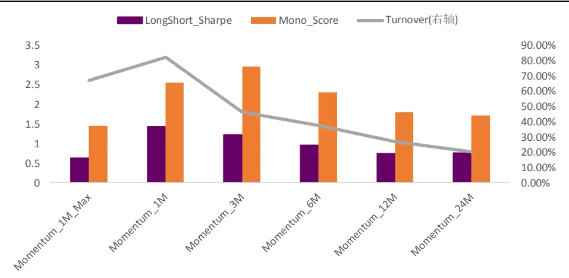
资料来源：光大证券研究所，测试时间：2006/01/01 –2019/05/31

下图中展示了 Momentum_1M 因子的分十组多空收益净值曲线，除了Momentum_1M因子值最大的组1、组2和组3长期表现较差以外，其余组别之间收益差距较小。因而该因子的高IC和高多空收益很大一部分来自空头的贡献，多头收益本身较为一般。

图 4：Momentum_1M 分组收益（降序分 10 组）
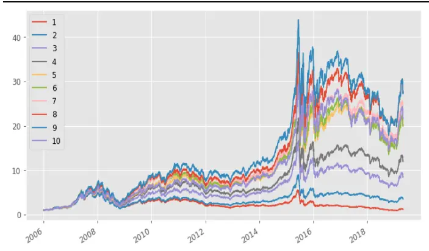
资料来源：光大证券研究所，测试时间：2006/01/01 – 2019/05/31

图 5：Momentum_1M 分组年化收益（降序分 10 组）
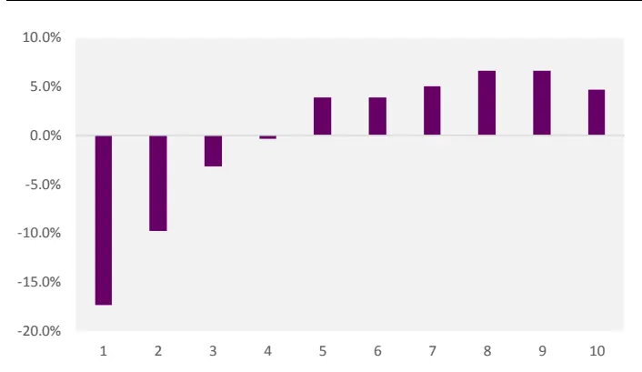
资料来源：光大证券研究所，测试时间：2006/01/01 –2019/05/31

从分组年化收益可以看到，一个月动量因子的多头5至10组的年化收益单调性较差，唯有空头1-4组的收益区分度较为明显。

图6：Momentum_1M与其他常用大类因子 IC序列相关性
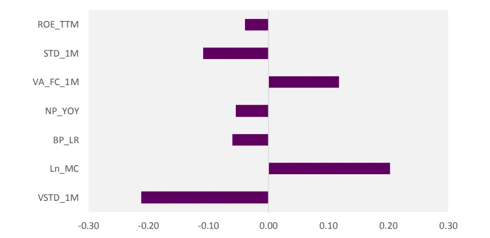
资料来源：光大证券研究所，测试时间：2006/01/01 –2019/05/31

## 1.3、动量因子改进思路

上文对常见的动量因子做了比较深入的分析，也可以发现动量因子的确具有很高的 IC 绝对值和 IC_IR 绝对值，空头组的负向收益显著，但也存在单调性不稳定、多头超额不显著的缺点。

下文中我们将从四个不同的角度入手，尝试对动量因子进行改造，已求寻找到更为稳健的动量因子：

（1） 动量因子构造时所使用的数据仅为起始节点和末尾节点的股价数据，对于期间的股价信息并未充分反应，因此我们尝试采用均线的思路，构造更好的反应股价趋势的趋势动量因子。

（2） 综合考虑股票的流动性，将流动性方面的影响因素剥离后，构造新的动量因子。

（3） 残差动量，在剔除传统风格因子影响之后，根据个股的特质收益计算得到的特质动量因子。

（4） 无论是长期动量还是短期动量因子，我们常用的动量因子均基于时间K线构造，其反应的信息都是一定时间维度上的股票收益率信息。我们将尝试切换 K 线构造方法，采用成交量或者成交额维度的 K 线信息，来进一步检验动量因子的效果；

## 2、结合均线的趋势动量因子

动量因子的计算采用的是股票过去一段时间的收益率数据，反应了股票在过去一段时间的价格变化情况。同时，技术分析中常用的均线，反应的是股票在过去一段时间的价格信息，其从本质上与动量因子类似，都是尝试从股价变动趋势的角度来做分析。动量因子构造时所使用的数据仅为起始节点和末尾节点的股价数据，对于期间的股价信息并未充分反应，因此我们尝试采用均线的思路，构造更好的反应股价趋势的趋势动量因子

因此，我们参考 Zhou， Zhu（2016）的分析，首先尝试从股价变化趋势强弱的角度来构造新的动量因子。

以月度趋势强弱指标为例，计算趋势信号时， L期的移动平均价格由以下公式定义：

$$
MA_{jt,L}=\frac{P_{j,d-L+1}^{t}+\:P_{j,d-L+2}^{t}+\cdots+P_{j,d-1}^{t}+\:P_{j,d}^{t}}{L}
$$

$P_{j,d}^{t}$ 是指股票j在第t月的每个交易日的收盘价，L是移动平均的窗口宽度。

为了使得我们得到的信号是一个平稳序列，同时截面上横向可比，将移动平均价格序列除以 d 日的收盘价，做标准化处理。

$$
\widetilde{MA_{jt,L}}\;=\frac{\widetilde{MA_{jt,L}}}{P_{jd}^{t}}
$$

移动平均 MA 这个指标来用来识别股票未来一段时间的价格趋势，为了更好地利用移动平均数，我们可以使用价格来将移动平均数标准化，这样就能够将均线转化为一个截面可比的用来反应股价变化趋势的指标。

## 2.1、趋势动量因子：单调性较好

在参数的设置上，我们参照常用动量因子的时长参数，选取20、60、120、240日移动平均趋势动量因子做测试：

表4：趋势动量因子测试结果
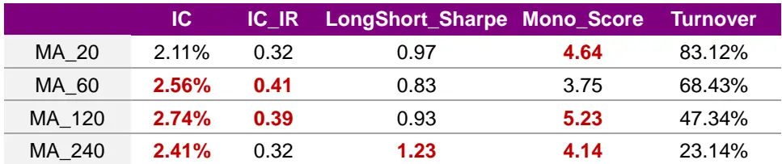
资料来源：光大证券研究所，测试时间：2006/01/01 –2019/05/31

由结果可见趋势动量因子均具有很高的单调性，单调性得分均可以超过3 分，MA_240 的多空夏普也达到 1.23，表现较好，但趋势动量因子整体的预测能力上（IC、IC_IR）整体弱于原始的动量因子。

我们以 MA_60趋势动量因子的表现举例，下边展示了该因子的 IC时间序列，和分组超额收益表现。

图7：趋势动量因子MA_60月度 IC序列
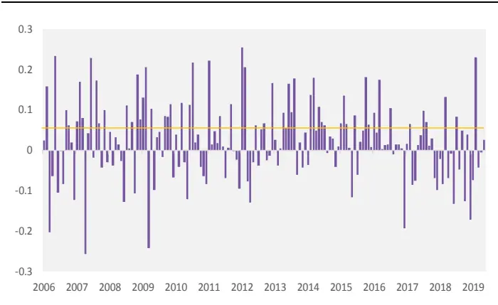
资料来源：光大证券研究所，测试时间：2006/01/01 –2019/05/31

图 8：趋势动量因子 MA_60 分组超额收益
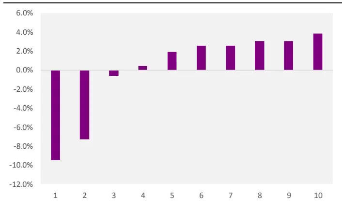
资料来源：光大证券研究所，测试时间：2006/01/01 –2019/05/31

从 因 子 相 关 性 上 可 见 ， 趋 势 动 量 因 子 MA_60 与 常 规 动 量Momentum_1M 之间的相关性较弱，仅为-0.28，与其他大类因子直接的相关性绝对值也未能超过 0.3，相关性较弱。

图9：趋势动量因子MA_60与其他常用大类因子 IC序列相关性
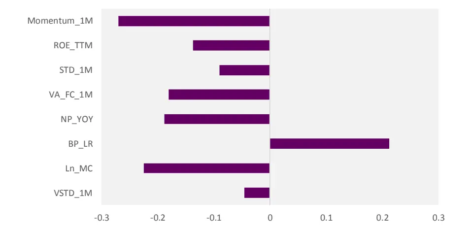
资料来源：光大证券研究所，测试时间：2006/01/01 –2019/05/31

## 3、剥离流动性因素后的提纯动量因子

根据第一章中的分析，我们总结出动量（反转）效应的成因是投资者认识出现偏差，对信息的解读不够及时充分。也可以认为动量（反转）效应是来自于投资者认知偏差或者说噪音交易行为。

由此可以推测，散户集中程度或者说流动性因素是影响动量因子效果的一个重要变量。因此，我们会自然的联想到采用截面中性化的方法，将衡量散户集中程度的流动性因素从原始动量因子中剥离。

如下图所示，短期动量因子（Momentum_1M）与流动性因子（VSTD_1M）的IC序列相关性为-0.16，和流通股占比因子（FC_MC）的相关性为-0.13，相对其他因子来讲存在较高的相关性。（注：由于因子测试时默认会对市值因子做中性化处理，此处不再强调）

表 5：Momentum_1M 与其他常见因子IC相关性

| 因子代码 | 因子名称 | IC 相关性 |
| --- | --- | --- |
| VSTD_1M | 1个月流动性 | -0.16 |
| Ln_MC | 市值对数 | 0.20 |
| BP_LR | 最新报告期 BP | -0.09 |
| FC_MC | 自由流通市值/总市值 | -0.13 |
| VA_FC_1M | 1个月换手率 | 0.12 |
| STD_1M | 1个月波动率 | -0.11 |
| ROE_TTM | ROE_TTM | -0.05 |

资料来源：光大证券研究所，测试时间：2006/01/01 –2019/05/31

## 3.1、提纯动量因子单调性提升明显，多空年化收益提高5%

我们主要针对Momentum_1M因子进行改造，采用横截面回归取残差的方法，将 Momentum_1M 因子与 FC_MC、VSTD_1M 因子做中性化处理，剥离流动性对动量因子的影响。中性化前后的因子表现对比如下所示：

表 6：提纯动量因子测试结果

| IC IC_IR |  |  | LongShort_Sharpe Mono_Score |  |  |
| --- | --- | --- | --- | --- | --- |
| Momentum_1M | -7.85% | -0.76 | 1.44 | 2.55 | 82.40% |
| Momentum_1M_Neu | -7.59% | -0.79 | 2.29 | 2.44 | 84.34% |

资料来源：光大证券研究所，测试时间：2006/01/01 –2019/05/31

图 10：原始 Momentum_1M 因子分组收益表现
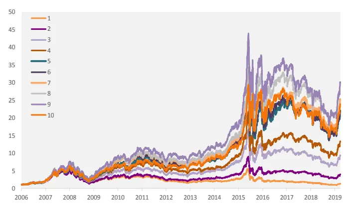
资料来源：光大证券研究所，测试时间：2006/01/01 –2019/05/31

图 11：提纯 Momentum_1M_Neu 因子分组收益表现
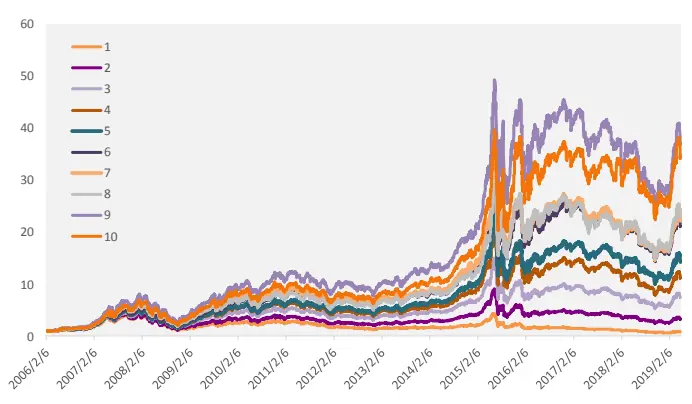
资料来源：光大证券研究所，测试时间：2006/01/01 –2019/05/31

提纯后的动量因子 Momentum_1M_Neu 单调性改善显著，且多空收益从年化23.9%提高到了年化28.8%，提升4.97个百分点，多空收益改善显著。

图 12：提纯动量因子与原始动量因子多空收益对比
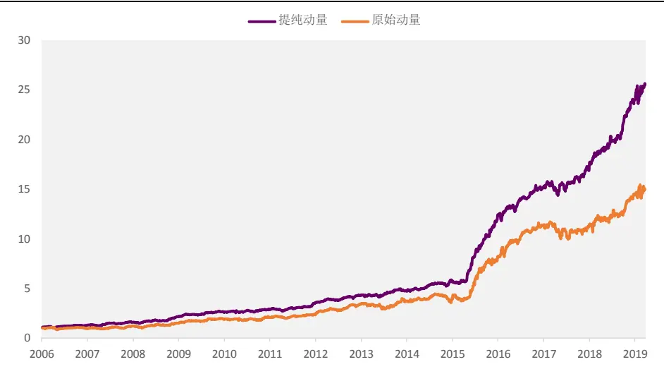
资料来源：光大证券研究所，测试时间：2006/01/01 –2019/05/31

流动性提纯后的动量因子与其他常用大类因子之间的相关性变化如下图所示，可见流动性提纯后，动量因子与流动性因子直接的相关性显著下降，与换手率因子（VA_FC）之间的相关性也下降较为明显。

综上，剥离流动性后的提纯动量因子多空收益改善显著，且多头的稳定性有比较明显的提升，是比较值得关注的动量因子改造和应用方式。

图13：提纯动量因子和原始动量因子与其他大类因子的相关性变化
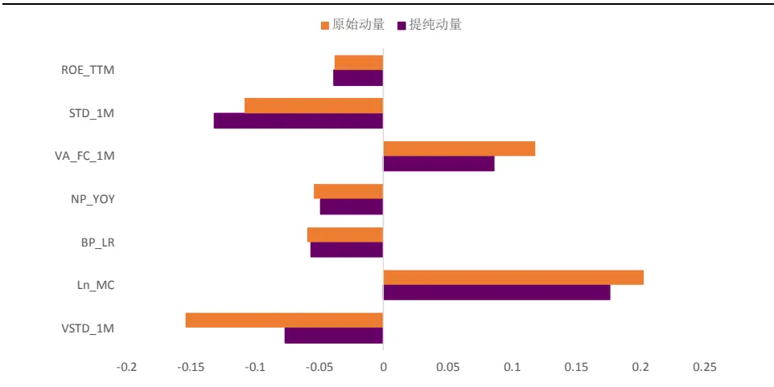
资料来源：光大证券研究所，测试时间：2006/01/01 –2019/05/31

## 4、风格中性后的残差动量因子

Blitz D.,et al. (2011) 构 建 了 一 个 基 于 残 差 的 动 量 策 略 (residualmomentum)，并指出 residual momentum 模型在诸多方面的表现，都显著优于传统的价格动量。

传统的价格动量效应，其实包含了对经典Fama-French 三因子的较高暴露。反之，基于残差的动量组合，由于排序标准是剔除了承担系统性风险所获补偿的超额收益，因此，据此构造的组合，将不会对风险因子有系统性的暴露，恰恰相反，该组合是纯粹基于股票的异质性表现来构造的。异质性收益与总收益类似，也表现出一定的动量（反转）特征。

下面我们就将基于这一理论，测试基于股票异质性收益的残差动量因子在A股的表现。

## 4.1、残差动量因子：稳定性略有提升

使用Fama & French的三因子模型为每个股票来估算残差回报。采用相对简单的直接回归取残差的方法。假设当前时刻为 t 月月末的最后一个交易日，对于单只股票而言，我们将其 t-35 月到 t 月（共 36 个月）个股月度收益率对Fama-French 三因子进行时间序列回归：

$$
r_{i,t}=\alpha_{i}+m_{i}MKT_{t}+s_{i}SMB_{t}+h_{i}HML_{t}+\varepsilon_{i,t}
$$

其中：SMB 为小盘股组合和大盘股组合的收益率之差，组合日收益率的计算采用流通市值加权。HML 为高BP组合和低BP组合的收益率之差，组合日收益率的计算采用流通市值加权。

根据上述回归得到的残差变量即可认为是该股票在剔除了已知风格因子影响后的特质收益。

Blitz D.,et al. (2011)的原文中对于计算得到的残差进行了再一步的处理，取过去12期残差均值除以其标准差。这样处理的目的主要是为了与其研究的原始

12个月动量因子做对标。而由于A股市场动量因子表现的特殊性，即短期反转效应显著强于动量效应且选股能力突出。因此我们这里将依然从短期动量入手，尝试直接采用当期残差变量作为剔除风格影响后的特质收益动量因子，我们命名为 Momentum_1M_Resid。

该因子的单因子测试结果如下：

表 7：残差动量因子测试结果

| IC IC_IR LongShort_Sharpe Mono_Score |  |  |  |  |
| --- | --- | --- | --- | --- |
| Momentum_1M | -7.85% | -0.76 | 1.44 | Turnover 2.55 82.40% |
| Momentum_1M_Resid | -7.04% | -0.80 | 1.96 | 3.03 84.02% |

资料来源：光大证券研究所，测试时间：2006/01/01 –2019/05/31

风格中性后的残差动量因子 IC均值略低于原始动量因子，但 IC波动率得到有效降低，从原始的 10%下降到 8%左右，因此 IC_IR 有所提升，因子的稳定性提升较为明显。

图 14：残差动量因子月度 IC 序列
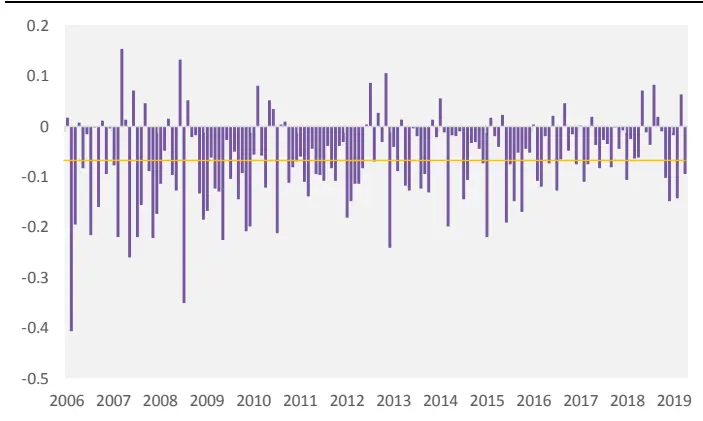
资料来源：光大证券研究所，测试时间：2006/01/01 –2019/05/31

图15：残差动量因子分组超额收益
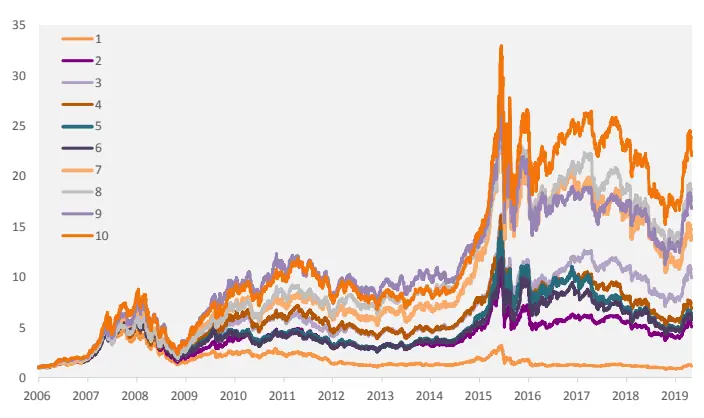
资料来源：光大证券研究所，测试时间：2006/01/01 –2019/05/31

从因子相关性上可见，残差动量因子与常规动量 Momentum_1M 之间的相关性较强，为 0.67，与其他大类因子之间的相关性绝对值均未能超过0.25，相关性较弱。

图16：残差动量因子与其他常用大类因子IC序列相关性
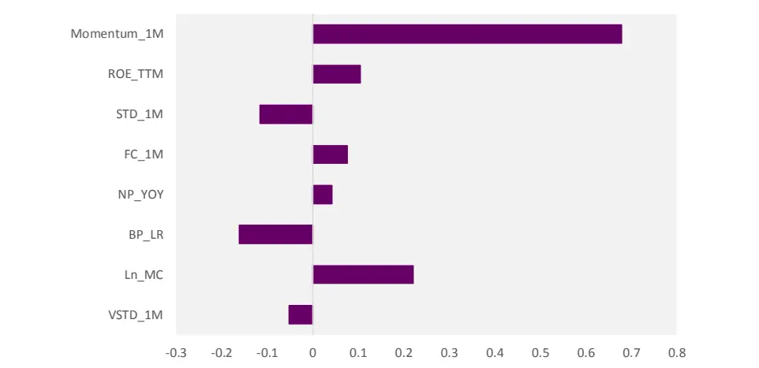
资料来源：光大证券研究所，测试时间：2006/01/01 –2019/05/31

综上，基于股票异质收益（残差收益）构造的短期动量因子，的确可以有效降低波动，减小市场风格变化对因子收益的一部分影响。

## 5、改造 K 线下的动量因子

在前期的报告《数据纵横：探秘 K线结构新维度——机器学习系列报告之二》中我们针对传统时间 K线的弊端，提出了几种K线构造的新方法。

图 17：传统时间 K 线的优势和劣势
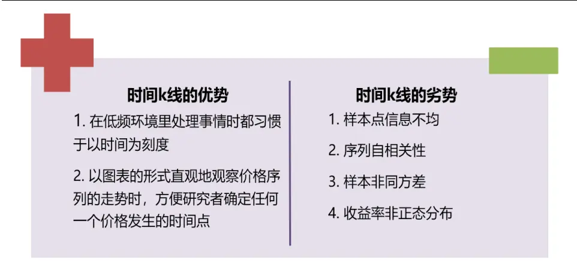
资料来源：光大证券研究所

基于高频数据的K线构造新方法：目前基于高频数据可以构造很多不同的采样切片方式，目前比较主流的方式包括：ticK等分K 线，成交量等分K线，成交额等分 K 线，信息量等分 K 线。其中 ticK 等分 K 线，成交量等分K 线，成交额等分K线的构造方式顾名思义都非常直观。

表 8：多种 K 线切片采样方式

| K线切片方式 | 切片方式解释与目的 |
| --- | --- |
| 时间等分切片 | 每根K线有相同的时间跨度 |
| TicK 等分切片 | 每根K线有相同的交易笔数 |
| 成交量等分切片 | 每根K线有相同的成交量 |
| 成交额等分切片 | 每根K线有相同的成交额 |

资料来源：光大证券研究所

同时为了使不同K线构造的特征更容易进行比较，在不作特殊说明的情况下，报告后续的非时间K 线则是按照测试区间内时间K 线个数为基准进行相应的参数设置，以求不同 K线构造有着相同的等价频率（即K 线总体数量在测试区间内大致相似）

改造后的 K 线所包含的信息与传统时间 K 线所包含的信息是不太一样的，或者说，改造后的K线从结构上与传统K 线差异较为明显。

我们自然的想到是否可以采用改造后的K线，对动量因子进行新的构造，当然我们其实很难从直观逻辑上推断出改造后的K线信息是否会有助于提升动量因子的表现。因为动量因子的计算所使用到的信息其实只包含起始时点股价和截止时点股价，K 线的结构特征并不能很好的反应在其中，因此其改善效果有待通过测试来确认。

当然，改造后的 K线（例如成交额K 线）构造的动量因子与原始时间K线的动量因子会有比较大的差异：

图18：传统时间 K线动量与成交额等分K线动量
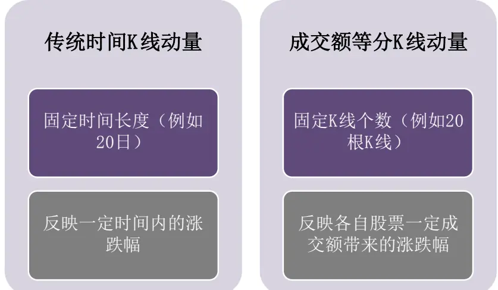
资料来源：光大证券研究所

## 5.1、成交额等分 K线动量因子多头收益较高

根据我们对于不同K 线构造下动量因子的主要差异的分析，改造 K线下的动量因子只有在使用等K线构造方式时才会与原始动量因子有比较大的差异，因此这里我们将主要测试等 K 线个数下不同 K 线（成交额等分 K 线、成交量等分 K线、Tick等分 K线）构造的动量因子的表现（注：由于高频历史数据的样本时间为 2009 至 2017，这一章中的因子测试时间区间均一致的设置为 2009-01-01 至 2017-12-31）：

表 9：改造 K 线后的等 K 线个数（20 根）动量因子表现

|  | IC | IC_IR | Turnover | Longshort_sharpe | Long_Relative |
| --- | --- | --- | --- | --- | --- |
| tick_60 | -3.79% | -0.47 | 76.80% | 0.74 | 11.70% |
| tick_120 | -3.61% | -0.45 | 77.01% | 0.74 | 11.80% |
| tick_D | -3.47% | -0.44 | 77.25% | 0.68 | 11.70% |
| time_60 | -7.17% | -0.73 | 77.43% | 1.24 | 8.60% |
| time_120 | -7.07% | -0.72 | 78.00% | 1.21 | 8.30% |
| time_D | -6.97% | -0.70 | 78.60% | 1.15 | 7.80% |
| value_60 | -5.32% | -0.58 | 78.07% | 0.75 | 13.53% |
| value_120 | -5.19% | -0.57 | 78.18% | 0.74 | 13.09% |
| value_D | -4.99% | -0.55 | 78.67% | 0.71 | 12.87% |
| volume_60 | -4.81% | -0.52 | 75.57% | 0.70 | 9.70% |
| volume_120 | -4.73% | -0.51 | 75.84% | 0.81 | 10.40% |
| volume_D | -4.43% | -0.48 | 76.21% | 0.73 | 9.20% |

资料来源：光大证券研究所，测试时间：2009/01/01 –2017/12/31

从结果上看，成交额等分 K 线动量因子 Value_60、Value_120、Value_D均具有较高的多头超额收益表现，多头超额显著高于传统时间 K线的等价因子。

我们以 Value_60 为例，展示该因子的 IC 序列和分组表现：

图 19：Value_60 动量因子 IC 序列
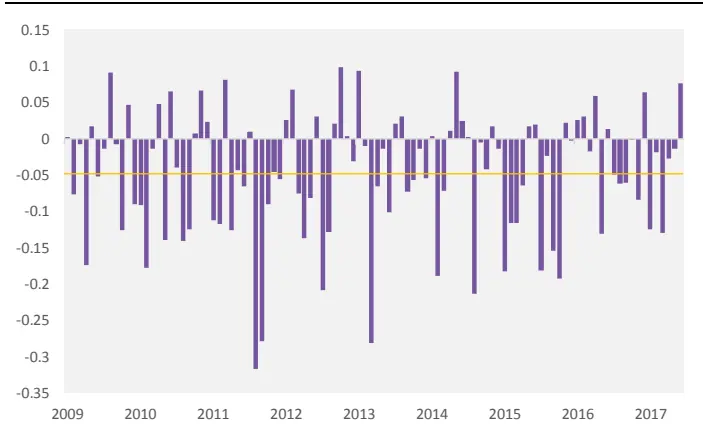
资料来源：光大证券研究所，测试时间：2009/01/01 –2017/12/31

图 20：Value_60 动量因子分组收益
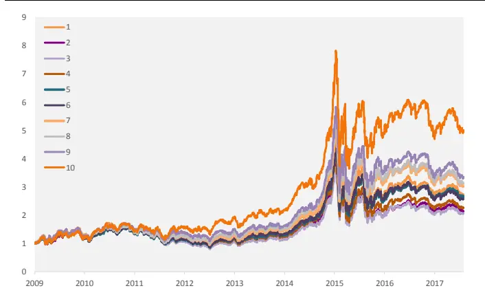
资料来源：光大证券研究所，测试时间：2009/01/01 –2017/12/31

可见成交额等分 K 线下的动量因子 Value_60 多空收益的贡献绝大部分来自多头，且多头第 10 组的超额收益表现较好。这一特点与原始动量因子的收益特征差异十分明显。

图21：Value_60动量因子与其他常用大类因子 IC序列相关性
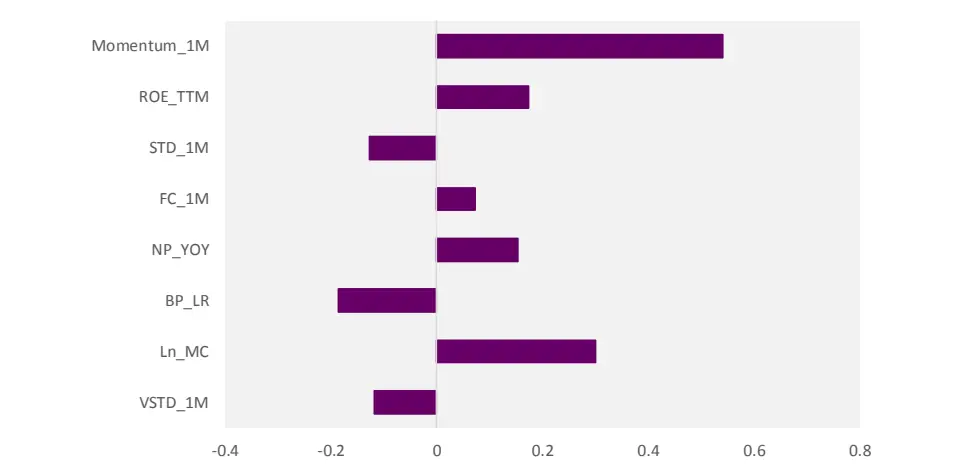
资料来源：光大证券研究所，测试时间：2009/01/01 –2017/12/31

进行上述测试和分析后，我们很自然的想到，成交额等分 K线下的动量因子其实一定程度上包含有更多的流动性信息：由于我们的计算方式是滚动历史 20 根 K 线的涨跌幅，则其本身衡量的是一定成交额下的股价变动，与常用的流动性因子的内在逻辑有类似的地方。

结合前面的结论，即动量因子剥离流动性因素后可以有效提高多空稳定性和多空收益，我们进一步尝试将这里的 Value_60 进行截面的中性化处理，测试剔除流动性因素后的 Value_60 因子选股能力。从测试结果上看，截面回归取残差后的提纯 Value_60除了多头收益年化提高 1.5%以外，其他方面未有显著改善，其原因很可能是由于因子使用的数据结构上不一致，导致简单的截面回归效果较为一般。由于剥离后效果较为一般，这里我们不在深入讨论。

## 6、总结

本文首先梳理了常用动量因子在A 股的因子预测能力和收益特征，发现动量因子的确具有很高的IC绝对值和IC_IR绝对值，空头组的负向收益显著，但也存在单调性不稳定、多头超额不显著的缺点。

因此，我们从四个不同的角度入手，尝试对动量因子进行改造，以求寻找到更为稳健的动量因子：

## 1) 结合均线的趋势动量因子

动量因子构造时所使用的数据仅为起始节点和末尾节点的股价数据，对于期间的股价信息并未充分反应，因此我们尝试采用均线的思路，构造更好的反应股价趋势的趋势动量因子。

趋势动量因子均具有很高的单调性，单调性得分均可以超过3分，MA_240的多空夏普也达到 1.23，但趋势动量因子的预测能力上（IC、IC_IR）整体弱于原始的动量因子。

## 2) 剥离流动性因素后的提纯动量因子

散户集中程度或者说流动性因素是影响动量因子效果的一个重要变量。因此，我们采用截面中性化的方法，将衡量散户集中程度的流动性因素从原始动量因子中剥离。

提纯后的动量因子单调性改善显著，且多空收益从年化 23.9%提高到了年化28.8%，提升4.97个百分点，多空收益改善显著。

## 3) 风格中性后的残差动量因子

BlitzD 构建了一个基于残差的动量策略(residual momentum)，并指出残差动量模型在诸多方面的表现都显著优于传统的价格动量。我们从短期动量入手，采用当期残差变量作为剔除市场风格影响后的特质收益动量因子。

风格中性后的残差动量因子IC 均值略低于原始动量因子，但 IC 波动率得到有效降低，从原始的10%下降到8%左右，因子的稳定性提升较为明显。

## 4) 改造 K 线下的动量因子

在前期的报告中我们针对传统时间K线的弊端，提出了几种K线构造的新方法。

测试发现成交额等分K 线动量因子表现较好，多头收益较高，且因子多空收益贡献大部分来自多头组合，具有与常用动量因子较大差异的收益结构特征。

## 7、风险提示

报告结论均基于模型，模型存在失效的可能。

## 行业及公司评级体系

| 评级 说明 |  |  |
| --- | --- | --- |
| 行 | 买入 | 未来6-12个月的投资收益率领先市场基准指数15%以上； |
|  | 增持 | 未来6-12个月的投资收益率领先市场基准指数5%至15%； |
|  | 中性 | 未来6-12个月的投资收益率与市场基准指数的变动幅度相差-5%至5%； |
|  | 减持 | 未来6-12个月的投资收益率落后市场基准指数5%至15%； |
|  | 卖出 | 未来6-12个月的投资收益率落后市场基准指数15%以上； |
| 业及公司评级 | 无评级 投资评级。 | 因无法获取必要的资料，或者公司面临无法预见结果的重大不确定性事件，或者其他原因，致使无法给出明确的 |
| 基准指数说明：A股主板基准为沪深300指数；中小盘基准为中小板指；创业板基准为创业板指；新三板基准为新三板指数；港 股基准指数为恒生指数。 |  |  |

## 分析、估值方法的局限性说明

本报告所包含的分析基于各种假设，不同假设可能导致分析结果出现重大不同。本报告采用的各种估值方法及模型均有其局限性，估值结果不保证所涉及证券能够在该价格交易。

## 分析师声明

本报告署名分析师具有中国证券业协会授予的证券投资咨询执业资格并注册为证券分析师，以勤勉的职业态度、专业审慎的研究方法，使用合法合规的信息，独立、客观地出具本报告，并对本报告的内容和观点负责。负责准备以及撰写本报告的所有研究人员在此保证，本研究报告中任何关于发行商或证券所发表的观点均如实反映研究人员的个人观点。研究人员获取报酬的评判因素包括研究的质量和准确性、客户反馈、竞争性因素以及光大证券股份有限公司的整体收益。所有研究人员保证他们报酬的任何一部分不曾与，不与，也将不会与本报告中具体的推荐意见或观点有直接或间接的联系。

## 特别声明

光大证券股份有限公司（以下简称“本公司”）创建于 1996 年，系由中国光大（集团）总公司投资控股的全国性综合类股份制证券公司，是中国证监会批准的首批三家创新试点公司之一。根据中国证监会核发的经营证券期货业务许可，本公司的经营范围包括证券投资咨询业务。

本公司经营范围：证券经纪；证券投资咨询；与证券交易、证券投资活动有关的财务顾问；证券承销与保荐；证券自营；为期货公司提供中间介绍业务；证券投资基金代销；融资融券业务；中国证监会批准的其他业务。此外，本公司还通过全资或控股子公司开展资产管理、直接投资、期货、基金管理以及香港证券业务。

本报告由光大证券股份有限公司研究所（以下简称“光大证券研究所”）编写，以合法获得的我们相信为可靠、准确、完整的信息为基础，但不保证我们所获得的原始信息以及报告所载信息之准确性和完整性。光大证券研究所可能将不时补充、修订或更新有关信息，但不保证及时发布该等更新。

本报告中的资料、意见、预测均反映报告初次发布时光大证券研究所的判断，可能需随时进行调整且不予通知。在任何情况下，本报告中的信息或所表述的意见并不构成对任何人的投资建议。客户应自主作出投资决策并自行承担投资风险。本报告中的信息或所表述的意见并未考虑到个别投资者的具体投资目的、财务状况以及特定需求。投资者应当充分考虑自身特定状况，并完整理解和使用本报告内容，不应视本报告为做出投资决策的唯一因素。对依据或者使用本报告所造成的一切后果，本公司及作者均不承担任何法律责任。

不同时期，本公司可能会撰写并发布与本报告所载信息、建议及预测不一致的报告。本公司的销售人员、交易人员和其他专业人员可能会向客户提供与本报告中观点不同的口头或书面评论或交易策略。本公司的资产管理子公司、自营部门以及其他投资业务板块可能会独立做出与本报告的意见或建议不相一致的投资决策。本公司提醒投资者注意并理解投资证券及投资产品存在的风险，在做出投资决策前，建议投资者务必向专业人士咨询并谨慎抉择。

在法律允许的情况下，本公司及其附属机构可能持有报告中提及的公司所发行证券的头寸并进行交易，也可能为这些公司提供或正在争取提供投资银行、财务顾问或金融产品等相关服务。投资者应当充分考虑本公司及本公司附属机构就报告内容可能存在的利益冲突，勿将本报告作为投资决策的唯一信赖依据。

本报告根据中华人民共和国法律在中华人民共和国境内分发，仅向特定客户传送。本报告的版权仅归本公司所有，未经书面许可，任何机构和个人不得以任何形式、任何目的进行翻版、复制、转载、刊登、发表、篡改或引用。如因侵权行为给本公司造成任何直接或间接的损失，本公司保留追究一切法律责任的权利。所有本报告中使用的商标、服务标记及标记均为本公司的商标、服务标记及标记。

## 光大证券股份有限公司 2019版权所有。

## 联系我们

| 上海 | 北京 | 深圳 |
| --- | --- | --- |
| 静安区南京西路1266号恒隆广场1号 西城区月坛北街2号月坛大厦东配楼2层 写字楼48层 | 复兴门外大街6号光大大厦17层 | 福田区深南大道 6011 号 NEO 绿景纪元大 厦 A 座 17 楼 |