## 沪深 300 指数增强模型构建与测试——多因子系列报告之二十三

在各类宽基指数的指数增强模型中，沪深 300 指数增强模型是关注度较高但同时难度也较高的模型。本篇报告将主要着眼于沪深 300指数增强，从模型构建的难点入手，尝试并深入分析不同的增强方案，并最终给出沪深 300 指数增强的模型建议。（本文测试时间区间为 2010/01/01 –2019/07/31）。

## 沪深 300 指数增强难点所在：行业分布不均衡，个股权重差异大，有效因子数量少

沪深 300 指数成分股内，银行和非银行业权重之和高达 35%。将权重占比大于1%的股票作为权重股，可以发现沪深300的权重股中，银行非银行业股票的个数刚刚过半。而包括贵州茅台、格力电器、美的集团在内的非金融类高权重个股，也占有很大的权重。

以IC绝对值大于3%，IC_IR绝对值大于0.3为标准，沪深300成分股内，光大因子库的 200 个因子中满足上述标准的具有一定选股能力的因子个数仅有20个，有效因子占比只有10%。

## 沪深 300 基本面增强模型：EBQC 结合权重优化，超额收益稳定

为了减少权重股收益波动对模型的表现的影响并提高超额收益的稳定性，在 EBQC 因子打分的基础上，结合优化器对最终持仓组合的行业暴露、市值暴露和个股权重偏离度进行约束。

基于 EBQC 综合质量因子的沪深 300 增强组合具有稳定的超额收益，2010 年至今每年度均跑赢沪深 300 指数。年化超额收益为 5.6%，信息比为1.75。且 2019 年至今（截止 2019-07-31）累计收益 35.4%，跑赢沪深 300指数8.0个百分点。

## 权重股模型结合多因子增强：整体收益较高，不同年度收益存在差异

将沪深300成分股内个股权重大于1%的个股作为权重股，并采用综合质量因子EBQC结合估值因子BP_LR、EP_TTM，构造沪深300权重股的优化模型。对于沪深300内的非权重股（个股权重小于等于1%），采用多因子框架的优化模型，并对组合的行业暴露、市值暴露和个股权重偏离度进行约束。

权重股模型结合多因子增强的沪深 300 指数增强组合，年化超额收益提高至 8.1%，信息比 2.41，最大相对回撤仅为 3.6%；但分年度来看，年度之间表现有所差异。组合在2011、2012、2014、2016、2018 年均有较强的收益表现，而个别年份如2013、2015、和2019 年，只能勉强战胜基准。

风险提示：结果均基于模型和历史数据，模型存在失效的风险。

## 金融工程深度

## 分析师

周萧潇 （执业证书编号：S0930518010005）

021-52523680

zhouxiaoxiao@ebscn.com

刘均伟 （执业证书编号：S0930517040001）

021-52523679

liujunwei@ebscn.com

## 相关研究

《因子正交与择时：基于分类模型的动

态权重配置——多因子系列报告之十》《爬罗剔抉：一致预期因子分类与精选多因子系列报告之十一》

《成长因子重构与优化：稳健加速为王——多因子系列报告之十二》

《组合优化算法探析及指数增强实证

——多因子系列报告之十三 》

《以质取胜：EBQC 综合质量因子详解——多因子系列报告之十七》

《光大 Alpha3.0：基本面优选多因子组合——多因子系列报告之十九》

指数增强模型是量化选股研究领域中的一个重要研究方向，指数增强模型是在对标的指数进行有效跟踪基础上，以追求超越基准指数回报为目的。而在各类宽基指数的指数增强模型中，沪深300指数增强模型是关注度较高但同时难度也较高的模型。

本篇报告将主要着眼于沪深 300 指数增强模型的构建，从模型构建的难点入手，尝试并深入分析不同的增强方案，并最终给出沪深 300指数增强的模型建议。

## 1、沪深 300 指数增强的难点所在

近期沪深 300指数增强策略的关注度提升，我们认为主要有以下几个原因：

首先，从 A 股市场各大宽基指数近年的走势来看，上证 50 和沪深 300自2017年以来表现相当抢眼，显著跑赢了其他主要宽基指数。尤其是2017年市场风格切换到蓝筹白马股之后，大盘指数表现显著提升。

图 1：各大宽基指数表现对比（2009 年以来）
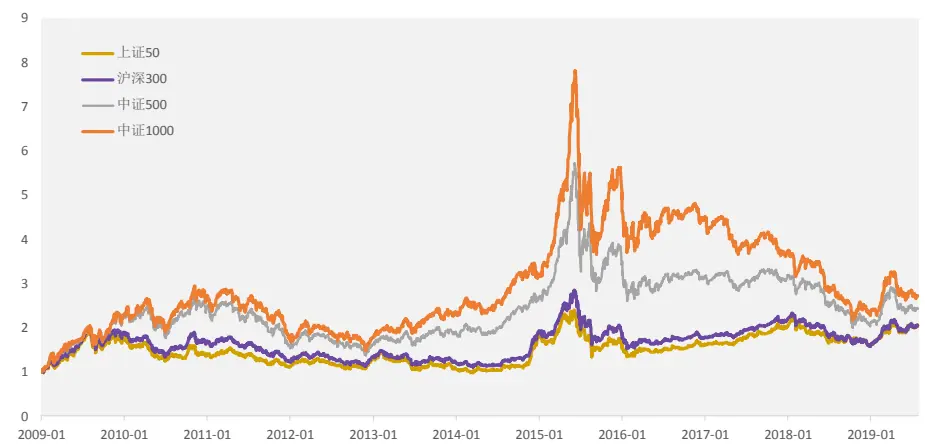
资料来源：Wind，光大证券研究所

再加上沪深 300 股指期货（IF）相对中证 500股指期货（IC）在贴水程度上具有较大优势，因此沪深 300指数增强模型应用于对冲策略时优势也较为明显。

由下图可见，IF 近月合约在 2018 年 9 月至 2019 年 4 月之间基差几乎为 0，且一度出现升水的情况。2019 年 4 月之后基差有所扩大，但贴水情况仍然显著小于 IC 近月合约。

图 2：IC 与 IF 近月合约基差率（2018 年以来）
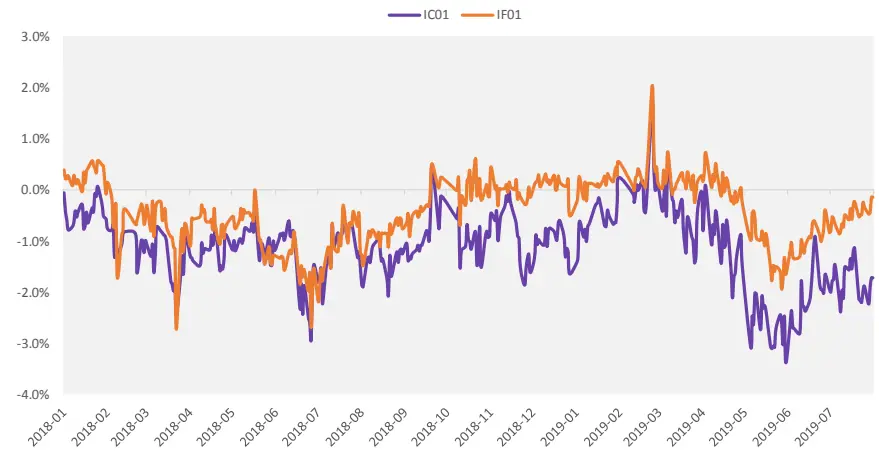
资料来源：Wind，光大证券研究所

结合上面的分析，沪深 300 指数在近年表现抢眼，同时期指的贴水情况也较为缓和，因此沪深300 指数增强策略在近年来依然持续地受到投资者关注。当然，关注度较高的另外一层原因也很明显，那就是要做出优秀的沪深300指数增强模型具有很高的难度。

这里我们将首先对沪深 300 增强的难点所在，做简单的分析。

## 1.1、行业分布不均衡

沪深300指数增强的第一个难点在于：指数内成分股的行业分布不均衡。

我们首先将沪深300与中证500这两个指数的成分股行业分布做一个统计，可以发现沪深 300 内的 300 只股票行业分布十分的不均衡，其中银行行业与非银金融行业的权重占比极高：

表 1：沪深 300 与中证 500 指数成分股行业权重前五

| 沪深300 中证500 |  |  |  |
| --- | --- | --- | --- |
| 非银行金融 | 18.10% | 医药 | 8.62% |
| 银行 | 17.00% | 电子元器件 | 7.25% |
| 医药 | 6.23% | 计算机 | 7.13% |
| 食品饮料 | 5.85% | 基础化工 | 5.24% |
| 家电 | 5.20% | 房地产 | 5.17% |

资料来源：光大证券研究所，样本时间：2019/07/31

图3：沪深300成分股行业权重分布情况
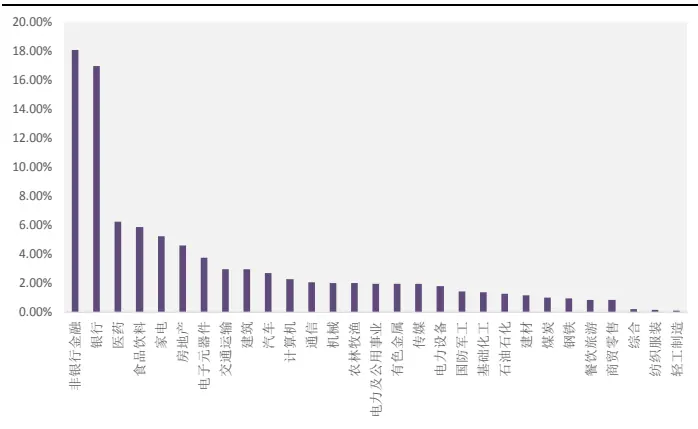
资料来源：Wind，光大证券研究所，样本时间：2019/07/31

图4：中证 500成分股行业权重分布情况
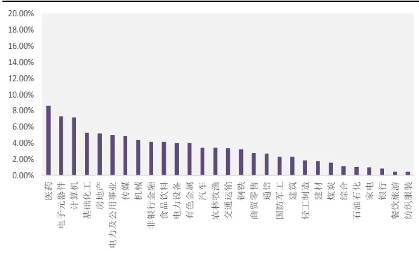
资料来源：Wind，光大证券研究所，样本时间：2019/07/31

沪深 300 成分股的行业分布不均衡的表现主要有下面几点：

（1） 沪深 300 指数成分股内，权重小于 2%的行业个数达到 17 个，而中证 500 内权重小于2%的行业个数仅为 9个；

（2） 沪深 300 指数成分股内，银行和非银行业权重之和高达 35%，这两个行业的走势将极大程度影响指数的走势；

## 1.2、个股权重差异大

通常在分析沪深 300 指数成分股时，前面提到的行业分布偏离度高的问题是比较容易关注到的信息。因此，包括我们之前构造的沪深 300 指数增强模型中，也对于银行和非银行业给与了特殊关注和特殊的处理（具体的，我们将银行非银行业的选股模型与其余行业股票的选股模型区别开，分别在两个样本池内选股，再结合起来作为增强组合的持仓），而从效果上看，年化超额6.9%的结果并不是十分令人满意（具体内容参考报告《光大 Alpha3.0：基本面优选多因子组合——光大金工多因子系列报告之十九》）。

通过分析沪深300 指数成分中的个股权重，我们发现仅仅关注银行非银行业的处理方法可能依然不够全面。

将权重占比大于 1%的股票作为权重股，可以发现沪深 300 的权重股中，银行非银行业股票的个数刚刚过半。而包括贵州茅台、格力电器、美的集团在内的非金融类高权重个股，也占有很大的权重。

图5：沪深300成分股权重股明细
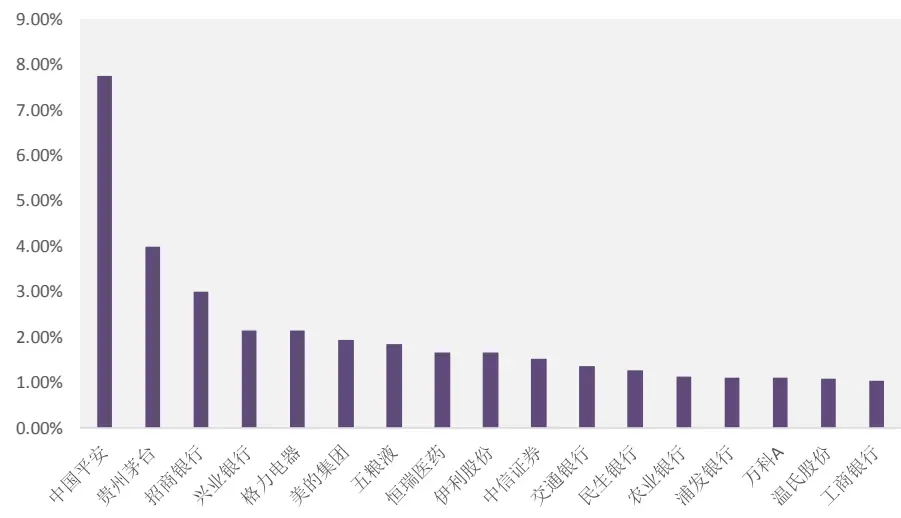
资料来源：光大证券研究所，样本时间：2019/07/31

表2：沪深300权重股及所属行业

| 名称 权重 | 所属中信一级行业 |
| --- | --- |
| 中国平安 7.75% | 非银行金融 |
| 贵州茅台 3.99% | 食品饮料 |
| 招商银行 3.00% | 银行 |
| 兴业银行 2.15% | 银行 |
| 格力电器 2.14% | 家电 |
| 美的集团 1.94% | 家电 |
| 五粮液 1.85% | 食品饮料 |
| 恒瑞医药 1.65% | 医药 |
| 伊利股份 1.64% | 食品饮料 |
| 中信证券 1.51% | 非银行金融 |
| 交通银行 1.36% | 银行 |
| 民生银行 1.27% | 银行 |
| 农业银行 1.11% | 银行 |
| 浦发银行 1.11% | 银行 |
| 万科A 1.09% | 房地产 |
| 温氏股份 1.08% | 农林牧渔 |
| 工商银行 1.03% | 银行 |

资料来源：光大证券研究所，样本时间 2019/07/31

如果我们将沪深 300 内权重大于 1%的个股作为权重股，并观察权重股历史上的表现则可以发现：权重股在 2016 年以前与沪深 300 的表现基本持平，而2017年开始，权重股的收益表现相当强势，2017年初至今，权重股的表现持续稳定的跑赢了沪深 300 指数。

图6：沪深300权重股权重之和变化情况
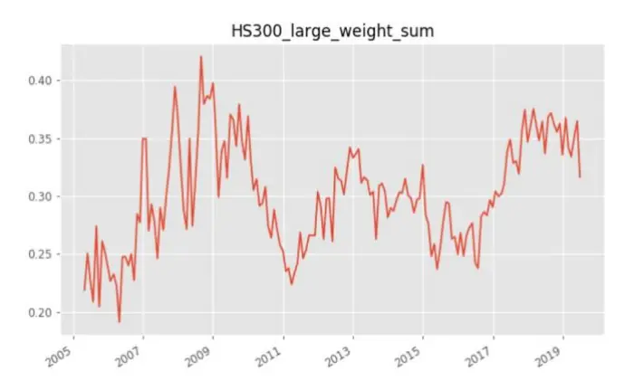
资料来源：光大证券研究所，测试时间：2010/01/01 –2019/07/31

图7：沪深 300权重股与沪深300指数走势对比
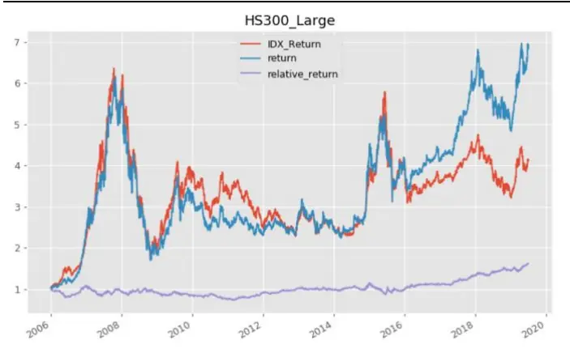
资料来源：光大证券研究所，测试时间：2006/01/01 –2019/07/31

因此，在构建沪深300 指数增强模型时，权重股的处理方法就显得尤为重要。后面的模型测试过程中，我们也将重点考虑沪深300 权重股的选股方法和权重优化方法。

## 1.3、沪深 300 成分股内有效因子较少

沪深300 指数增强模型的难点中，除了上面提到的行业分布不均衡和个股权重差异大这两大特征，另外一个很重要的原因就在于：沪深300 内的有效因子数量较少。

我们以光大多因子库中，包括估值因子，规模因子，成长因子，质量因子，杠杆因子，动量因子，波动因子，技术因子，流动性因子，情绪类因子等共10 大类 200个细分因子为例，测试这些因子在沪深300成分股内的预测能力和选股能力（具体因子测试流程见报告《多因子系列报告之一：因子测试框架》）。

以IC绝对值大于3%，IC_IR绝对值大于0.3为标准，沪深300成分股内，满足上述标准的具有一定选股能力的因子个数仅有 20 个，有效因子占比只有10%，如下表所示：

表 3：沪深 300 内有效因子名单

| 因子代码 | 因子名称 | IC IC_IR |  |
| --- | --- | --- | --- |
| EP_TTM | 市盈率倒数 | 5.82% 0.58 |  |
| EEP | 一致预期EP | 6.45% 0.57 |  |
| NP_Q_YOY | 净利润单季同比 | 3.89% 0.54 |  |
| DP_TTM | 股息率 | 3.47% 0.48 |  |
| TargetReturn | 一致预期目标价 | 3.74% 0.46 |  |
| EBQC | 光大综合质量因子 | 3.27% 0.46 |  |
| OP_Q_YOY | 营业利润单季同比 | 3.45% 0.46 |  |
| EPS_YOY | EPS 同比 | 3.50% 0.45 |  |
| EP_LYR | 最近报告期 EP | 4.22% 0.44 |  |
| EPS_Diluted_YOY | 稀释 EPS 同比 | 3.21% 0.41 |  |
| FORE_Earning | 一致预期净利润同比 | 3.34% 0.36 |  |
| SCORE_AVRG | 一致预期平均得分 | 3.02% 0.32 |  |
| BP_LR | 最近报告期 BP | 3.77% 0.32 |  |
| BP_TTM | BP_TTM | 3.68% 0.31 |  |
| STD_1M | 1个月波动率 | -4.32% -0.33 |  |
| VA_FC_3M | 3个月成交额换手 | -3.07% | -0.34 |
| TURNOVER_3M | 3个月换手率 | -3.25% -0.35 |  |
| Momentum_1M_Max | 1个月最高价 | -4.00% -0.38 |  |
| TURNOVER_1M | 1个月换手率 | -4.02% -0.42 |  |
| Momentum_1M | 1个月动量 | -4.85% -0.49 |  |

资料来源：光大证券研究所，测试期：2007-01-01 至 2019-07-31

由上表可见，沪深300 内的有效因子中以基本面类型的因子为主，基本面因子的占比超过65%。而这一特征与全市场多因子或者中证500内因子的表现是截然相反的。

如果我们以相同的因子有效性判断标准（IC 绝对值大于 3%，IC_IR 绝对值大于 0.3），来看中证 500 和中证 1000 成分股内的有效因子数量和占比，可以发现沪深300内的有效因子占比最低，且基本面因子占比较高。

图8：沪深300、中证 500、中证 1000成份股内有效因子占比情况
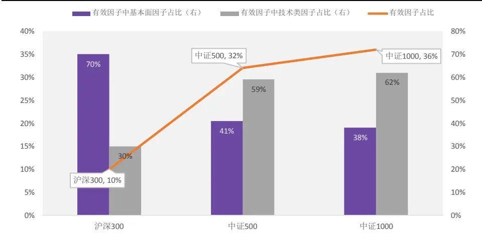
资料来源：光大证券研究所，测试期：2007-01-01 至 2019-07-31

## 2、基本面沪深 300 指数增强

结合上面的结论，我们发现沪深300 内有效性较强的大部分都属于基本面因子，因此基本面方面的因素在沪深300 内选股时的重要性是不容忽视的。我们也将首先尝试从基本面的角度出发，运用不同的基本面模型，对沪深300 内的增强策略进行测试。

## 2.1、行业基本面模型增强：近年收益下降

在前期的光大金工量化行业基本面选股系列 12 篇报告中，我们分别深入的剖析了各个大类行业的基本面逻辑，并构建了各自行业的基于基本面逻辑的量化指标选股体系。

表4：光大金工基本面增强策略行业板块划分标准

| 板块 | 中信一级行业 | 包含细分行业类别 | 板块 | 中信一级行业 | 包含细分行业类别 |
| --- | --- | --- | --- | --- | --- |
| 必需消费 | 食品饮料 | 除白酒外的其他饮料、食品 | 装备制造业 | 机械 | 工程机械、其他专用设备、通用设备、 运输设备、仪器仪表、金属制品 |
|  | 商贸零售 | 超市 |  |  |  |
|  | 纺织服装 | 品牌服饰（除高端奢侈品外） |  | 电力设备 |  |
|  |  | 医药 |  |  |  |
| 可选消费 | 医药 | 乘用车、商用车、汽车零部件、 | 其他制造 | 轻工制造 | 新能源设备 造纸、其他轻工 |
|  | 汽车 | 汽车销售及服务、摩托车及其他 白色家电、黑色家电、 |  | 基础化工 | 农用化工、合成纤维及树脂、 |
|  | 家电 | 小家电、照明设备及其他 | 资源型行业 | 煤炭 | 化学原料、化学制品 煤炭开采洗选、煤化工 |
|  | 商贸零售 | 百货、连锁 |  | 有色金属 | 贵金属、工业金属、稀有金属 |
|  | 餐饮旅游 | 景区和旅行社、酒店及餐饮 | 钢铁&建材 | 石油石化 | 石油开采、石油化工、油田 |
|  | 食品饮料 | 白酒 |  | 钢铁 | 普钢、其他钢铁 |
|  |  | 纺织服装 | 高端奢侈品 | 建材 | 水泥、玻璃、其他建材 |
| 公用运营 | 公用事业 | 发电及电网、燃气、供热或其他 | 银行 | 银行 | 银行 |
|  | 交通运输 | 公路铁路、航运港口、 | 证券 | 证券 | 证券 |
|  |  | 航空机场、公交物流 | 保险 | 保险 | 保险 |
| 房地产 传媒 | 房地产 | 房地产开发管理、房地产服务 | 其他行业 | 国防军工 | 航空航天、兵器兵装、其他军工 |
|  | 传媒 | 传媒 |  | 农林牧渔 | 农业、牧业、林业、渔业 |
| 信息技术 | 电子元器件 | 半导体、电子设备、其他元器件 |  | 电力及公用事业 | 环保、水务 |
|  | 通信 | 电信运营、通信设备、增值服务 |  | 综合 | 综合 |
|  | 计算机 | 计算机硬件、软件、IT 服务 |  | 建筑 | 建筑施工、建筑装修 |

资料来源：光大证券研究所

由于沪深 300内的基本面因素影响能力较大，因此我们尝试将上述量化行业基本面的模型运用到沪深 300成分股内：

表5：各行业板块内基本面指标明细

| 板块 | 指标 | 板块 | 指标 |
| --- | --- | --- | --- |
| 必需消费 | 毛利稳健加速度 | 装备制造业 | ROE 变动 |
|  | 收入存货比变动 市净率 |  | 总资产周转率变动 |
|  | ROE 变动 |  | 现金流动负债比变动 BP |
| 可选消费 | 周转资金占比变动 | 其他制造 | ROA 变动 |
|  | 一致预期 EP |  | 净利润加速度 |
|  | ROE 变动 |  | 短期借款率 |
| 公用运营 | 总资产周转率变动 |  | 一致预期 EPG |
|  | BP |  | ROIC 变动 |
| 房地产 | 现金资产周转率 EP | 资源型行业 | 总资产周转率变动 |
|  | 稳健存货周转率变动 |  | EP 毛利率变动 |
| 传媒 | 商誉收入比 | 钢铁&建材 | 短期借款率 |
|  | 标准分 |  | 营收增速+成本收入比变动+市盈率 |
| 信息技术 | 创新毛利润增速标准分+净利润增速 | 银行 |  |

敬请参阅最后一页特别声明

| 商誉收入比变动 |  | 证券 | BP |
| --- | --- | --- | --- |
| ROE 变动 |  |  |  |
| 其他行业 | 总资产周转率变动 | 保险 | 总投资收益率+保险业估值 |
|  | BP |  |  |

资料来源：光大证券研究所

具体的量化行业基本面模型选股策略如下：

（1） 在沪深 300 成分股内，将成分股按照上述表 4 中的行业分类分为 14 个板块；

（2） 每个月底，按照各个板块中按照所选基本面指标筛选出 30%的股票作为持仓（各板块所选指标数量不同，因此每个指标的筛选阈值会略有调整）；

（3） 持仓汇总作为次月持仓，按照流通市值加权计算组合收益。

由下图可见，结合行业基本面选股模型构造的沪深300增强的表现尚可，年化超额收益为 5.7%，但组合近年来（2017年以来）超额收益显著下滑，2017与2019 年前7个月均未能跑赢基准。

图9：量化行业基本面模型沪深 300增强表现
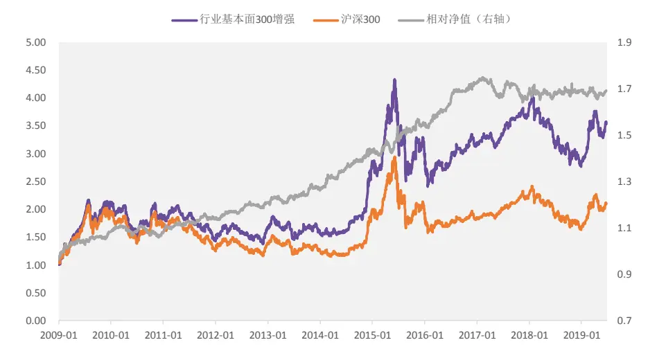
资料来源：Wind，光大证券研究所，测试时间：2009/01/01 –2019/07/31

表6：量化行业基本面模型沪深 300增强表现

|  | 月度胜率 | 年化收益 | 年化波动 |  | 年化超额收益相对收益波动 | 信息比 | 最大回撤 | 相对最大回撤 |
| --- | --- | --- | --- | --- | --- | --- | --- | --- |
| 2009 | 58.3% | 113.0% | 32.6% | 16.3% | 5.0% | 3.24 | 2.3% | 24.1% |
| 2010 | 58.3% | -13.0% | 25.8% | -0.5% | 4.1% | -0.11 | 4.6% | 29.5% |
| 2011 | 58.3% | -20.8% | 20.4% | 4.2% | 3.4% | 1.23 | 2.4% | 30.2% |
| 2012 | 66.7% | 14.3% | 20.2% | 6.8% | 3.2% | 2.11 | 2.3% | 21.3% |
| 2013 | 58.3% | -2.7% | 22.4% | 5.0% | 4.2% | 1.19 | 2.7% | 22.5% |
| 2014 | 75.0% | 70.1% | 19.8% | 18.4% | 4.7% | 3.92 | 2.2% | 8.1% |
| 2015 | 41.7% | 14.2% | 40.8% | 8.6% | 6.0% | 1.43 | 4.0% | 42.3% |
| 2016 | 66.7% | -1.1% | 23.8% | 10.1% | 3.6% | 2.78 | 1.4% | 20.1% |
| 2017 | 41.7% | 18.6% | 10.0% | -3.1% | 3.8% | -0.83 | 6.1% | 7.9% |
| 2018 | 58.3% | -24.7% | 20.1% | 0.6% | 5.1% | 0.12 | 3.7% | 31.4% |
| 2019 | 33.0% | 55.9% | 12.6% | -2.6% | 2.1% | -1.20 | 2.7% | 4.8% |
| Summary | 57.3% | 14.3% | 25.0% | 5.7% | 4.4% | 1.30 | 6.1% | 44.5% |

资料来源：光大证券研究所，基准为沪深 300 指数，回测期间：2009-01-01 至 2019-07-31

由此可见，2017 年以来，行业基本面选股模型直接运用于沪深 300 增强的表现相对一般。而其中原因很大一部分是来自沪深 300 权重股在最近几年的强势表现。

## 2.2、EBQC综合质量因子增强模型：超额收益稳定

行业基本面选股模型直接运用于沪深300 增强的效果在近几年表现不佳，我们认为其原因很大一部分是来自于沪深 300 内权重股在 2017 年以来的突出表现，而行业基本面选股的模型很难保证其始终选到沪深300 的权重股，从而导致模型在最近3年的表现很难超越基准。

因此，我们认为从基本面角度来增强沪深 300，可以换一种角度，通过基本面因子打分，并且结合权重优化的方式来进行。

在前期报告《以质取胜：EBQC 综合质量因子详解——多因子系列报告之十七》中，我们将质量因子整理为盈利能力、成长能力、盈余质量、营运效率、安全性、公司治理6 个大类，并分别对这6 个大类质量指标中的单因子进行全面的测试，并在每个大类中挑选满足一定筛选条件（IC 大于 2%，IR 大于 0.3，tstats大于 3）的因子来构成大类复合因子。

综合质量因子 EBQC 在中证全指、中证 500、沪深 300 不同样本空间内，均具有较强的预测能力，因子的 IC 均高于 3%，IC_IR 均大于 0.5。在沪深300 样本内的表现也较为出色，因子 IC 为 3.84%，IC_IR 为 0.57。

表 7：EBQC 因子在不同样本内的测试结果

|  | IC mean | IC std | IR | IC positive LongShort per | return | Turnover | Mono score | LongShort sharpe | Factor Return | Return tstat |
| --- | --- | --- | --- | --- | --- | --- | --- | --- | --- | --- |
| 全市场 | 4.40% | 4.97% | 0.89 | 83% | 11.10% | 16% | 2.73 | 1.78 | 0.39% | 8.27 |
| 中证 500 | 5.67% | 7.09% | 0.80 | 77% | 15.80% | 16% | 2.13 | 2.18 | 0.48% | 7.33 |
| 沪深 300 | 3.84% | 6.76% | 0.57 | 71% | 14.70% | 17% | 3.89 | 1.62 | 0.34% | 6.37 |

资料来源：光大证券研究所，注：测试期为 2010-01-01 至 2019-07-31

同时，为了减少权重股收益波动对模型的表现的影响并提高超额收益的稳定性，我们在EBQC因子打分的基础上，结合优化器对最终持仓组合的行业暴露、市值暴露和个股权重偏离度进行约束。

模型具体设置和主要假设如下：

（1） 采用综合质量因子 EBQC 对沪深 300 成分股打分；

（2） 约束行业偏离度不超过 10%；

（3） 约束市值因子暴露度不超过 5%；

（4） 约束个股权重相对沪深 300 成分股原始权重的偏离度不超过 1个百分点；

（5） 月度调仓，费率假设为单边 0.3%

（6） 样本内 2010-01-01 至 2016-12-31，样本外为 2017-01-01 至今

图10：EBQC因子结合权重优化沪深 300增强净值表 现
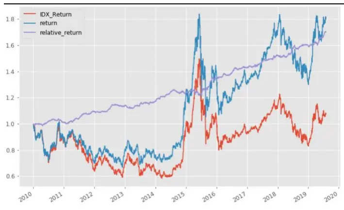
资料来源：光大证券研究所，测试时间：2010/01/01 –2019/07/31

图11：EBQC因子结合权重优化沪深 300增强相对净值及回撤情况
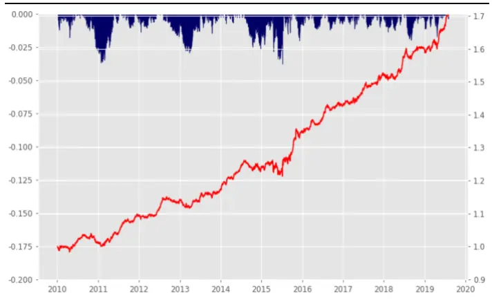
资料来源：光大证券研究所，测试时间：2010/01/01 –2019/07/31

表8：EBQC因子结合权重优化沪深 300增强分年度表现统计

|  | 月度胜率 | 年化收益 | 年化波动 | 年化超额收益相对收益波动 |  | 信息比 | 最大回撤 | 相对最大回撤 |
| --- | --- | --- | --- | --- | --- | --- | --- | --- |
| 2010 | 50.0% | -10.4% | 25.3% | 1.3% | 3.0% | 0.45 | -28.1% | -2.8% |
| 2011 | 66.7% | -20.1% | 20.2% | 8.1% | 2.8% | 2.86 | -26.4% | -1.2% |
| 2012 | 50.0% | 14.5% | 19.7% | 4.4% | 2.3% | 1.89 | -19.7% | -1.7% |
| 2013 | 66.7% | -5.2% | 22.2% | 2.9% | 2.9% | 0.98 | -21.3% | -2.3% |
| 2014 | 75.0% | 59.8% | 18.9% | 5.9% | 2.9% | 2.04 | -8.3% | -2.7% |
| 2015 | 75.0% | 9.9% | 41.3% | 8.4% | 5.7% | 1.46 | -42.8% | -3.8% |
| 2016 | 66.7% | 1.3% | 21.1% | 6.1% | 2.4% | 2.54 | -19.0% | -1.2% |
| 2017 | 75.0% | 27.7% | 10.9% | 6.3% | 2.7% | 2.31 | -6.4% | -1.1% |
| 2018 | 58.3% | -22.4% | 21.5% | 5.1% | 2.9% | 1.72 | -28.0% | -2.0% |
| 2019 | 71.4% | 72.2% | 23.1% | 11.4% | 3.1% | 3.67 | -10.7% | -1.7% |
| Summary | 66.1% | 6.4% | 23.7% | 5.6% | 3.2% | 1.75 | -42.8% | -3.8% |

资料来源：光大证券研究所，基准为沪深 300 指数，回测期间：2010-01-01 至 2019-07-31

可见，基于EBQC综合质量因子的沪深300增强组合具有稳定的超额收益，2010 年至今每年度均跑赢沪深 300 指数。年化超额收益为 5.6%，信息比为1.75。且 2019 年至今（截止 2019-07-31）累计收益 35.4%，跑赢沪深 300 指数8.0个百分点。

## 3、权重股模型结合多因子增强

前文图7中可见，沪深300内的权重股在2017年以后收益表现与沪深300指数出现了很大的偏离，并且权重股的权重之和接近沪深300指数的35%，其对指数的走势影响程度极大。

单独采用基本面因子的沪深300 增强组合可以获取较为稳健的超额收益，但超额收益的空间也是较为有限的，如何在保持模型稳定性的同时进一步的提高收益，是我们本章重点探讨的内容。

由于权重股的收益波动较大，且个股数量少，个股表现受基本面或者情绪面方面的影响显著大于技术面的影响。因此，在构建沪深300 增强的多因子模型时，可以考虑权重股单独建模，其余个股使用多因子框架的选股模型。

## 3.1、权重股模型：EBQC结合估值

与第一章中的定义方式相同，我们将沪深 300 成分股内个股权重大于 1%的个股作为权重股，并采用综合质量因子 EBQC 结合估值因子 BP_LR、EP_TTM，构造沪深300权重股的优化模型。

表9：沪深300权重股模型因子明细

| 因子类别 | 因子名称 | 权重 |
| --- | --- | --- |
| 估值因子 | EP_TTM | 0.25 |
|  | BP_LR | 0.25 |
| 质量因子 | EBQC | 0.5 |

资料来源：光大证券研究所

考虑到沪深300 权重股的本身个股权重较大，因此在个股权重的约束上采用的是绝对百分点的约束方式，防止个股权重与基准权重产生过大的偏离。

沪深 300权重股优化模型具体设置和主要假设如下：

（1） 采用综合复合因子对沪深 300 权重股；

（2） 约束个股权重相对沪深 300 成分股原始权重的偏离度不超过 1个百分点；

（3） 月度调仓，费率假设为单边 0.3%

（4） 样本内 2011-01-01 至 2016-12-31，样本外为 2017-01-01 至今

图 12：沪深 300 权重股优化组合表现
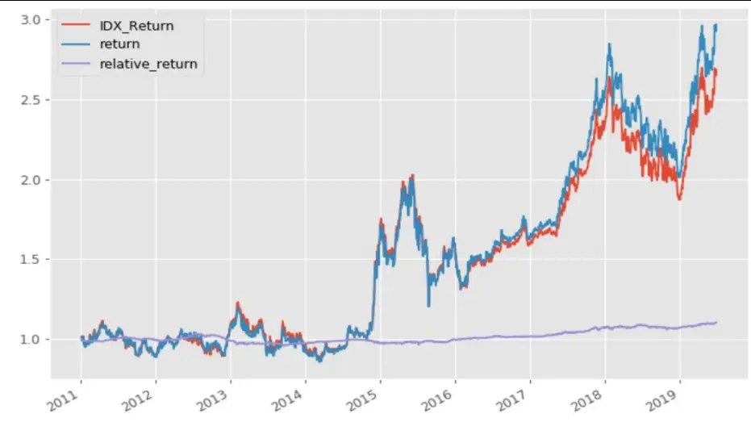
资料来源：光大证券研究所

表10：沪深300权重股增强分年度表现统计

|  | 月度胜率 | 年化收益 | 年化波动 | 年化超额收益相对收益波动 |  | 信息比 | 最大回撤 | 相对最大回撤 |
| --- | --- | --- | --- | --- | --- | --- | --- | --- |
| 2011 | 50.0% | -10.7% | 20.4% | 0.0% | 1.8% | -0.02 | -19.2% | -2.0% |
| 2012 | 50.0% | 22.0% | 19.2% | -0.6% | 2.4% | -0.23 | -15.6% | -4.3% |
| 2013 | 41.7% | -13.1% | 25.6% | -1.4% | 2.8% | -0.49 | -25.0% | -3.2% |
| 2014 | 66.7% | 76.3% | 23.9% | -0.1% | 1.9% | -0.06 | -8.9% | -2.8% |
| 2015 | 66.7% | -7.3% | 38.2% | 2.3% | 2.6% | 0.90 | -39.8% | -2.1% |
| 2016 | 75.0% | 8.9% | 16.6% | 2.1% | 1.5% | 1.41 | -13.8% | -0.8% |
| 2017 | 66.7% | 50.9% | 14.3% | 5.4% | 2.3% | 2.36 | -8.8% | -1.6% |
| 2018 | 50.0% | -20.1% | 25.0% | -0.1% | 2.7% | -0.05 | -29.3% | -2.8% |
| 2019 | 85.7% | 97.3% | 24.6% | 5.1% | 2.0% | 2.50 | -10.8% | -0.6% |
| Summary | 57.4% | 9.4% | 24.1% | 1.2% | 2.3% | 0.52 | -39.8% | -7.2% |

资料来源：光大证券研究所，基准沪深 300 指数，回测期间：2010-01-01 至 2019-07-31

这里我们采用了较为保守的方式，对沪深300 权重股通过基本面因子结合权重优化，可以做到年化1.2%的超额收益，超额虽不显著但样本内外的稳定性较好。

## 3.2、非权重股多因子增强：多因子模型结合优化

对于沪深 300 内的非权重股（个股权重小于等于 1%），由于该样本内的个股权重差异相对较小，行业权重的分布也较为均衡，技术类因子在沪深 300非权重股内样本内也具有一定的选股能力。因此，对于沪深300 的非权重股来说，采用多因子框架的优化模型是比较合适的选择。

对于沪深300的非权重股，我们采用下述因子构造多因子模型：

表11：沪深300非权重股模型因子明细

| Code Name |  |
| --- | --- |
| BP_LR | 最新报告期 BP |
| Momentum_24M | 24个月动量 |
| VA_FC_1M | 1个月换手率 |
| DP | DP |
| EEP | 一致预期 EP |
| EEChange_3M | 一致预期净利润3个月调整 |
| CFOA | 经营现金流/总资产 |
| ROE_TTM | ROE |
| OP_Q_YOY | 营业利润单季同比 |
| NP_Z | 净利润 Zscore |
| ATD | 总资产周转率变动 |
| CCR | 现金周转率 |

资料来源：光大证券研究所

考虑到沪深 300 非权重股的本身个股权重较小（小于 1%），因此在个股权重的约束上采用的是相对偏离度的约束方式。

模型具体设置和主要假设如下：

（1） 因子权重采用滚动 24 个月最优化 IC_IR（此处 IC 均为沪深 300内的 IC）；

（2） 约束行业偏离度不超过 5%；

（3） 约束市值因子暴露度不超过 5%；

（4） 约束个股权重相对于沪深 300 成分股原始权重的偏离度不超过50%；

（5） 月度调仓，费率假设为单边 0.3%

（6） 样本内 2011-01-01 至 2016-12-31，样本外为 2017-01-01 至今

## 3.3、模型表现：整体收益较高，不同年度收益存在差异

将沪深300权重股模型与非权重股模型结合后，构造的沪深300增强组合 表现如下所示。

组合年化超额收益为 8.1%，跟踪误差 3.4%，信息比 2.41。组合自 2011年至今每年度均跑赢沪深 300 指数，月度胜率超过 80%，相对基准的最大回撤仅为3.6%。

图13：沪深300增强组合净值表现
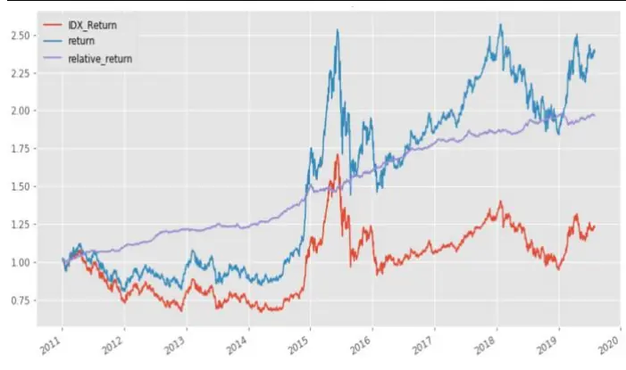
资料来源：光大证券研究所，测试时间：2011/01/01 –2019/07/31

图14：沪深 300增强组合相对净值与回撤情况
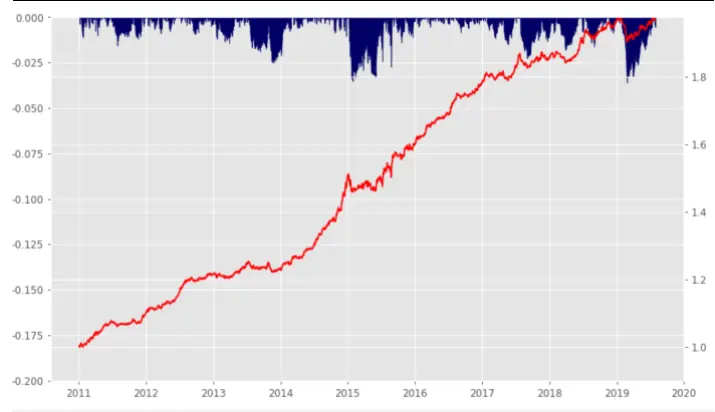
资料来源：光大证券研究所，测试时间：2011/01/01 –2019/07/31

表 12：沪深 300 增强组合分年度表现

|  | 月度胜率 | 年化收益 | 年化波动 | 年化超额收益相对收益波动 |  | 信息比 | 最大回撤 | 相对最大回撤 |
| --- | --- | --- | --- | --- | --- | --- | --- | --- |
| 2011 | 83.3% | -19.0% | 20.8% | 9.6% | 3.0% | 3.16 | -27.9% | -1.6% |
| 2012 | 83.3% | 20.6% | 19.7% | 9.9% | 2.6% | 3.74 | -16.5% | -0.9% |
| 2013 | 50.0% | -6.7% | 22.4% | 1.2% | 3.0% | 0.42 | -20.4% | -2.5% |
| 2014 | 100.0% | 83.7% | 20.5% | 22.1% | 3.8% | 5.90 | -8.3% | -1.0% |
| 2015 | 75.0% | 7.1% | 41.4% | 5.6% | 5.8% | 0.97 | -43.0% | -3.5% |
| 2016 | 100.0% | 6.0% | 20.6% | 11.0% | 2.5% | 4.47 | -18.5% | -0.8% |
| 2017 | 58.3% | 24.3% | 10.3% | 3.4% | 2.7% | 1.26 | -6.5% | -2.3% |
| 2018 | 83.3% | -22.1% | 21.2% | 5.4% | 2.5% | 2.19 | -28.0% | -1.8% |
| 2019 | 71.4% | 55.0% | 22.2% | 0.1% | 2.9% | 0.02 | -12.7% | -3.6% |
| Summary | 80.6% | 10.2% | 23.6% | 8.1% | 3.4% | 2.41 | -43.0% | -3.6% |

资料来源：光大证券研究所，基准为沪深 300 指数，回测期间：2011-01-01 至 2019-07-31

权重股模型结合多因子增强的沪深300指数增强组合，年化收益有较为显著的提高，但分年度来看，年度之间表现有所差异。组合在2011、2012、

2014、2016、2018 年均有较强的收益表现，而个别年份如 2013、2015、和2019年，只能勉强战胜基准。

与之相比，前文测试的 EBQC 结合优化模型的沪深300 指数基本面增强模型的超额收益相对较低，但在不同年度之间的超额收益表现更为稳定。

## 4、总结

结合测试的结论，本文重点推荐的是EBQC结合优化模型的沪深300指数基本面增强模型，与权重股模型结合多因子增强的沪深300 指数增强模型。具体结论如下：

## 沪深300指数增强难点所在：行业分布不均衡，个股权重差异大，有效因子数量少

沪深 300指数成分股内，银行和非银行业权重之和高达35%。将权重占比大于 1%的股票作为权重股，可以发现沪深 300 的权重股中，银行非银行业股票的个数刚刚过半。而包括贵州茅台、格力电器、美的集团在内的非金融类高权重个股，也占有很大的权重。

以IC绝对值大于3%，IC_IR绝对值大于0.3为标准，沪深300成分股内，满足上述标准的具有一定选股能力的因子个数仅有 20 个，有效因子占比只有10%。

## 沪深 300 基本面增强模型：EBQC 结合权重优化，超额收益稳定

为了减少权重股收益波动对模型的表现的影响并提高超额收益的稳定性，在EBQC因子打分的基础上，结合优化器对最终持仓组合的行业暴露、市值暴露和个股权重偏离度进行约束。

基于EBQC综合质量因子的沪深300增强组合具有稳定的超额收益，2010年至今每年度均跑赢沪深 300 指数。年化超额收益为 5.6%，信息比为 1.75。且 2019 年至今（截止 2019-07-31）累计收益 35.4%，跑赢沪深 300 指数 8.0个百分点。。

## 权重股模型结合多因子增强：整体收益较高，不同年度收益存在差异

将沪深 300 成分股内个股权重大于 1%的个股作为权重股，并采用综合质量因子EBQC 结合估值因子 BP_LR、EP_TTM，构造沪深 300 权重股的优化模型。对于沪深 300 内的非权重股（个股权重小于等于 1%），采用多因子框架的优化模型。

权重股模型结合多因子增强的沪深300指数增强组合，年化收益有较为显著的提高，但分年度来看，年度之间表现有所差异。组合在2011、2012、2014、2016、2018 年均有较强的收益表现，而个别年份如 2013、2015、和2019年，只能勉强战胜基准。

## 5、风险提示

报告结论均基于历史数据与模型，模型存在失效的可能，历史数据存在不被重复验证的可能。

## 行业及公司评级体系

| 评级 说明 |
| --- |
| 行 买入 未来6-12个月的投资收益率领先市场基准指数15%以上； |
| 增持 未来6-12个月的投资收益率领先市场基准指数5%至15%； |
| 中性 未来6-12个月的投资收益率与市场基准指数的变动幅度相差-5%至5%； |
| 减持 未来6-12个月的投资收益率落后市场基准指数5%至15%； |
| 卖出 未来6-12个月的投资收益率落后市场基准指数15%以上； |
| 因无法获取必要的资料，或者公司面临无法预见结果的重大不确定性事件，或者其他原因，致使无法给出明确的无评级投资评级。 |
| 基准指数说明：A股主板基准为沪深300指数；中小盘基准为中小板指；创业板基准为创业板指；新三板基准为新三板指数；港股基准指数为恒生指数。 |

## 分析、估值方法的局限性说明

本报告所包含的分析基于各种假设，不同假设可能导致分析结果出现重大不同。本报告采用的各种估值方法及模型均有其局限性，估值结果不保证所涉及证券能够在该价格交易。

## 分析师声明

本报告署名分析师具有中国证券业协会授予的证券投资咨询执业资格并注册为证券分析师，以勤勉的职业态度、专业审慎的研究方法，使用合法合规的信息，独立、客观地出具本报告，并对本报告的内容和观点负责。负责准备以及撰写本报告的所有研究人员在此保证，本研究报告中任何关于发行商或证券所发表的观点均如实反映研究人员的个人观点。研究人员获取报酬的评判因素包括研究的质量和准确性、客户反馈、竞争性因素以及光大证券股份有限公司的整体收益。所有研究人员保证他们报酬的任何一部分不曾与，不与，也将不会与本报告中具体的推荐意见或观点有直接或间接的联系。

## 特别声明

光大证券股份有限公司（以下简称“本公司”）创建于 1996 年，系由中国光大（集团）总公司投资控股的全国性综合类股份制证券公司，是中国证监会批准的首批三家创新试点公司之一。根据中国证监会核发的经营证券期货业务许可，本公司的经营范围包括证券投资咨询业务。

本公司经营范围：证券经纪；证券投资咨询；与证券交易、证券投资活动有关的财务顾问；证券承销与保荐；证券自营；为期货公司提供中间介绍业务；证券投资基金代销；融资融券业务；中国证监会批准的其他业务。此外，本公司还通过全资或控股子公司开展资产管理、直接投资、期货、基金管理以及香港证券业务。

本报告由光大证券股份有限公司研究所（以下简称“光大证券研究所”）编写，以合法获得的我们相信为可靠、准确、完整的信息为基础，但不保证我们所获得的原始信息以及报告所载信息之准确性和完整性。光大证券研究所可能将不时补充、修订或更新有关信息，但不保证及时发布该等更新。

本报告中的资料、意见、预测均反映报告初次发布时光大证券研究所的判断，可能需随时进行调整且不予通知。在任何情况下，本报告中的信息或所表述的意见并不构成对任何人的投资建议。客户应自主作出投资决策并自行承担投资风险。本报告中的信息或所表述的意见并未考虑到个别投资者的具体投资目的、财务状况以及特定需求。投资者应当充分考虑自身特定状况，并完整理解和使用本报告内容，不应视本报告为做出投资决策的唯一因素。对依据或者使用本报告所造成的一切后果，本公司及作者均不承担任何法律责任。

不同时期，本公司可能会撰写并发布与本报告所载信息、建议及预测不一致的报告。本公司的销售人员、交易人员和其他专业人员可能会向客户提供与本报告中观点不同的口头或书面评论或交易策略。本公司的资产管理子公司、自营部门以及其他投资业务板块可能会独立做出与本报告的意见或建议不相一致的投资决策。本公司提醒投资者注意并理解投资证券及投资产品存在的风险，在做出投资决策前，建议投资者务必向专业人士咨询并谨慎抉择。

在法律允许的情况下，本公司及其附属机构可能持有报告中提及的公司所发行证券的头寸并进行交易，也可能为这些公司提供或正在争取提供投资银行、财务顾问或金融产品等相关服务。投资者应当充分考虑本公司及本公司附属机构就报告内容可能存在的利益冲突，勿将本报告作为投资决策的唯一信赖依据。

本报告根据中华人民共和国法律在中华人民共和国境内分发，仅向特定客户传送。本报告的版权仅归本公司所有，未经书面许可，任何机构和个人不得以任何形式、任何目的进行翻版、复制、转载、刊登、发表、篡改或引用。如因侵权行为给本公司造成任何直接或间接的损失，本公司保留追究一切法律责任的权利。所有本报告中使用的商标、服务标记及标记均为本公司的商标、服务标记及标记。

光大证券股份有限公司 2019版权所有。

## 联系我们

| 上海 | 北京 | 深圳 |
| --- | --- | --- |
| 静安区南京西路1266号恒隆广场1号 写字楼48层 | 西城区月坛北街2号月坛大厦东配楼2层 复兴门外大街6号光大大厦17层 | 福田区深南大道 6011号 NEO 绿景纪元大 厦 A 座 17 楼 |