## 短周期因子的挖掘与组合构建——多因子系列报告之二十四

不同因子类型的逻辑与特性有很大差异，适合的调仓周期也未必一致。本文运用数据挖掘的方式从量价类数据中挖掘短周期因子，并测试不同交易成本与调仓周期对短周期因子收益能力的影响。最终构建短周期因子选股组合。

- 多维数据特征下，利用遗传规划原理批量生成因子。底层数据上除了基本的量价数据特征以外，运用高频数据构造了买卖交易标值、买卖成交量比值等更多数据特征。并利用遗传规划原理挖掘有效日频量价技术因子。

- 通过相关性检验筛选因子池并进行单因子测试。通过相关性测试剔除相关性过高的因子，将最终通过相关性测试的 17 个因子定为短周期因子池，简称短周期Alpha17。短周期Alpha17因子池内因子平均日度IC绝对值均值为6.0%，平均日度IR 为0.8，平均多空夏普8.22。

- 交易成本与调仓周期对组合效果影响大。短周期Alpha17 因子池中因子信息衰减速度较快。绝大部分因子的半衰期集中在第 5天左右。我们测试交易成本与调仓周期对组合的影响，在构建每个调仓频率组合时，因子池会剔除掉在此调仓频率下信息衰减到一定程度以下的因子。基于测试结果，如果交易成本可以控制在双边0.2%以下，每日调仓效果最好；如果交易成本在双边0.2%到0.3%，调仓频率为每 2日调仓效果较优；若交易成本在双边0.4%及以上时，短周期组合效果不理想，更推荐低频调仓组合。

短周期Alpha17量价组合表现优秀。基于短周期Alpha17因子池构建短周期 Alpha17 量价复合因子，并以此构建短周期Alpha17量价组合。在双边千三交易成本、2日调仓周期下，2010 年至2019年中样本期间，组合年化收益31.1%，年化波动率 30.8%，夏普比率1.04，最大回撤 45.1%。相对中证500 指数年化超额收益 30.8%，相对波动率9.1%，信息比率3.01，相对最大回撤 18.7%。该组合换手率较高，双边换手率平均每年 182倍。受益于更多短周期因子信息与更短调仓周期的优势，组合表现相比月频量价组合更为突出，从2015年开始在收益及回撤上显著优于月频量价组合。

- 风险提示：测试结果均基于模型和历史数据，模型存在数据挖掘及失效的风险。

## 金融工程深度

## 分析师

刘均伟 (执业证书编号：S0930517040001)

021-52523679

liujunwei@ebscn.com

胡骥聪 (执业证书编号：S0930519060002)

021-52523683

hujICong@ebscn.com

## 相关研报

《多因子组合“光大 Alpha 1.0”——多因子系列报告之三》2017.05

《因子测试全集——多因子系列报告之二》2017.05

《数据纵横：探秘 K 线结构新维度——机器学习系列报告之二》2019.02

## 1、因子计算与调仓频率影响因子预测效果

在各个市场，Alpha因子已经被交易者们广泛用于寻找股票间相对收益。不同的因子类型有着迥然不同的逻辑与特性，基本面因子逻辑直观，从公司经营效果层面获取超额收益，该类因子值改变频率低，信息衰减慢，市场容量大。而量价类因子，则是侧重于捕捉市场交易行为中产生的套利空间，由于市场本身随时在快速纳入新的交易与信息，该类因子值往往变化频率高，信息衰减较快，市场容量相对较小。

既然因子逻辑与特性不同，那最适合的计算频率与调仓周期是否也应有所区别？在不同频率上是否因子的构造方式可以得到进一步扩充？本篇报告研究量价类因子在高于月频的频率上的构造扩充与表现效果。

## 1.1、量价类因子：效果强、时效短

当我们在构建组合时，由于要考虑到市场冲击等交易成本，普遍采用的是月频的调仓周期。对于量价类因子而言，月频调仓虽然大大降低了换手率与交易成本；但随之而来的问题就是因子效果对市场风格切换的暴露大大增加。例如在今年（2019 年）二月，大量月频调仓的量价因子表现糟糕，但如果我们将因子周期缩得更短一些，会发现不少因子表现会稳定许多。

例如在下图我们比较了最近两年（2018 年、2019年）波动因子在不同周期下的表现。月频波动因子以一个月日收益率标准差计算，与次月收益率数据计算 IC；短周期波动因子以最近 20 个小时收益率标准差计算，与次日收益率计算 IC。分别统计它们的累计 IC 净值，明显可以看出短周期波动因子的表现更为稳定，在 2018 年上半年并未如月频波动因子那般出现长期回撤，在2019年 2月的回撤也更小。

图 1：月频波动因子累计 IC 表现
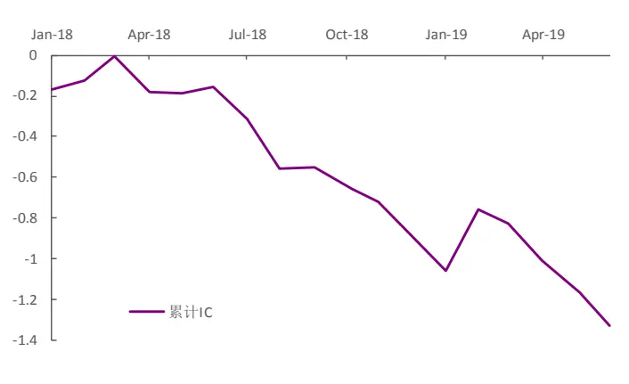
资料来源：光大证券研究所

图2：短周期波动因子累计 IC表现
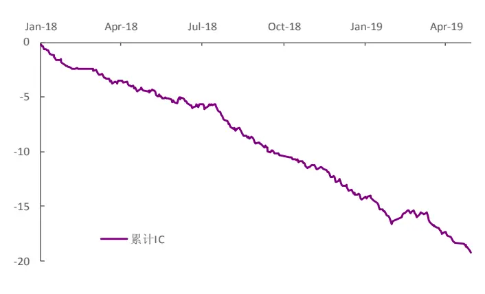
资料来源：光大证券研究所

这样的现象启发我们思考：对于量价类因子而言，低频计算、月频调仓是否就是最佳的因子计算方式与调仓频率，在一些条件下，是否更短的调仓周期会更好？

## 1.2、进一步扩充技术因子库

除了月度组合中常用的主流量价因子，当视角转为短周期时，我们也尝试是否能更进一步拓充技术类有效因子的数量，期望以之构造的组合捕捉利用到更多交易中蕴含的信息，展现出更亮眼的表现。相比于完全依靠逻辑推导构建新因子，本篇报告尝试以机器学习算法挖掘更多量价因子。

## 2、短周期技术因子生成

目前主流的运用机器学习来进行因子生成的方式是利用遗传算法（GenetIC Algorithm）或遗传规划（GenetIC Programming）。通过给定目标适应度指导（多为IC、ICIR、收益率、或其它因子综合表现指标；本篇报告研究中以 ICIR 的绝对值作为适应度指标），由算法基于已有因子群体随机产生更大概率有效的新因子。

## 2.1、遗传规划框架与设置

遗传规划的原理基于三个重要的部件：公式（programs）、适应度（fitness）、进化操作（genetIC operation）。

其中公式是整个程序作用的对象；适应度是表示公式与目标的符合程度的量化指标，用以指导挑选公式进行进化操作；进化操作是通过已有公式产生新公式的操作方式，一般分为交叉与变异两种。遗传规划的逻辑与流程简而言之，就是：

1. 随机生成大量公式样本；

2. 计算每个公式的适应度；

3. 基于适应度来挑选公式进行进化操作，产生新公式；

4. 不断循环第2步与第 3步，直到触发自定义的终止循环条件。

若对遗传算法的各种细节有兴趣，推荐《A Field Guide to GenetICProgramming》March 2008。

我们利用遗传规划的目的是生成因子，因此在这样的场景下，公式就是因子算式，适应度就是描述因子有效性的指标。在研究中，为了更多体现出交易信息在短期内产生的信息，除了基本的量价数据特征以外，对于所使用的特征数据还做了一些增加与调整：

- 使用的数据频率为 1 小时；

- 构造了一些基于逐笔成交数据的特征，名称与构造方式如下：

a) 买卖交易次数比：主买交易笔数 / 主卖交易笔数

b) 买卖成交量比：主买成交量总数 / 主卖成交量总数

c) 单笔买卖成交量标准差比：主买成交量标准差 / 主卖成交量标准差 d) 单位标准差下买卖成交量均值差值：平均每笔主买成交量/主买成交量标准差 - 均每笔主卖成交量/主卖成交量标准差。

而最终具体使用到的数据、函数等设置可见以下两张表。

表1：量价数据设置

| 设定项 | 设定值 |
| --- | --- |
| 股票池 | 全体 A 股：剔除 ST/PT 股票；剔除上市不满一年的股票；剔除由于停牌等原因无法交易的股票。 |
| 数据区间 | 2010/01/01 -2018/12/31 |
| 数据频率 | 1 小时 |
| 数据特征(无需高频信息构建) | 开盘价；最高价；最低价；收盘价；成交量；成交额；均价。 |
| 数据特征(需高频信息构建) | 买卖交易次数比值；买卖成交量比值；单笔买卖成交量标准差比值；单位标准差下买卖成交量均值差值。 |

资料来源：光大证券研究所

表 2：函数设置

| 函数名 函数意义 |  |
| --- | --- |
| neg (X) | 取负 |
| abs (X) | 取绝对值 |
| log (X) | 取对数 |
| sqrt (X) | 取开方 |
| add (X, Y) | 逐一相加 |
| sub (X, Y) | 逐一相减 |
| mul (X, Y) | 逐一相乘 |
| div (X, Y) | 逐一相除 |
| bigger (X, Y) | 逐一取较大值 |
| smaller (X, Y) | 逐一取较小值 |
| ts_rank (X, d) | 取在最近d期中的排序 |
| ts_mean (X, d) | 取最近d期数据的均值 |
| ts_median (X, d) | 取最近d期数据的中位数 |
| ts_std (X, d) | 取最近d期数据的标准差 |
| ts_skew (X, d) | 取最近d期数据的偏度 |
| ts_kurt (X, d) | 取最近d期数据的峰度 |
| ts_count (X, d) | 取最近d期数据不同值个数 |
| ts_max (X, d) | 取最近d期数据的最大值 |
| ts_min (X, d) | 取最近d期数据的最小值 |
| ts_argmax (X, d) | 取最近d期数据的最大值所在位置编号 |
| ts_argmin (X, d) | 取最近d期数据的最小值所在位置编号 |
| ts_delay (X, I) | 滞后期 |
| ts_pct (X, 1) | 当期相对滞后期的变化比例 |

敬请参阅最后一页特别声明

| ts_autocorr (X, d, I) | 最近d期数据与滞后期的自相关系数 |
| --- | --- |
| ts_corr (X, Y, d) | 最近d期的逐一相关系数 |

资料来源：光大证券研究所， 注：函数名中 X、Y皆为矩阵，d 为样本长度参数，l 为滞后期数参数。

## 2.2、因子生成结果

按照算法规则，最终生成 5000 个左右有效因子。其中大量因子之间有非常高相关性，实际真正有区分度的因子远少于当前值。同时光凭 ICIR 也不能了解因子的收益分布、单调性特征等方面的信息。因此在后面一个章节中，我们将逐步对因子池做筛选，并进行单因子测试。

## 3、因子筛选与组合构建

利用机器学习的算法生成大量新的技术因子，并不能直接将这些因子全部用在组合构建上。本章节将阐述如何从大量生成因子中挑选合适的因子并构建短周期因子组合。

## 3.1、因子检验与挑选

## 3.1.1、相关性检验

由于我们构建的模型仅以 ICIR 作为适应度，生成的因子中必定有大量结构相似、预测能力相关性很高的因子。我们首先需要将所有有效因子进行相关性检验，并剔除掉相关性过高的因子，使得留存下来的因子之间两两相关性不超过一定阈值。

图 3：有效因子相关系数热力图
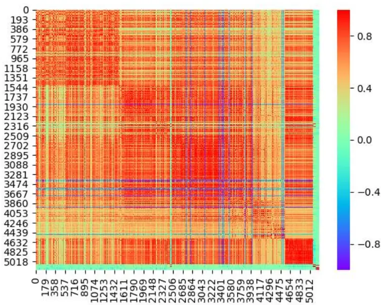
资料来源：光大证券研究所

上图展示了所有5000多个因子之间ICIR 相关性矩阵的热力图，可以看到整体呈现为大块红色矩阵，显示出大量因子传递的是几乎完全一样的信息。

通过剔除过高相关性因子后，留存下来的有效因子仅 17 只，远远少于最初的 5000+。下图展示了这 17 只股票相关性矩阵的热力图，可见此时因子池内因子间相关性整体已有了明显降低。为方便起见，我们对于这组因子池统称“短周期 Alpha17”。

图4：因子相关性筛选后因子相关系数热力图
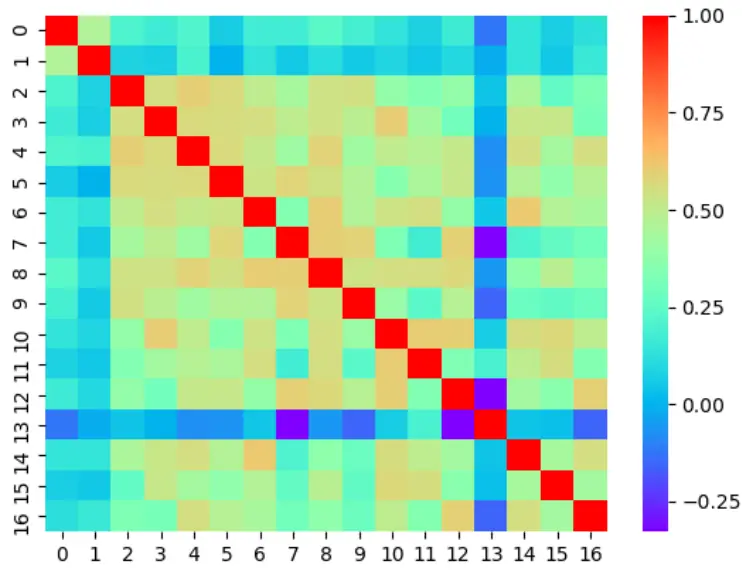
资料来源：光大证券研究所

## 3.1.2、单因子有效性测试

经过相关性检验筛选后，接下来需要对每个因子进行更全面的单因子测试。在测试前会先对因子数据进行一定程度的清洗：

- 绝对中位数法去极值：在因子测试阶段，由于因子本身的分布是否为正态分布无法确定，我们采用稳健的 MAD（绝对中位数法）去除极值更加合适。

- 截面标准化处理：通过横截面 z-score方法，以每个时间截面 t上的所有股票的为样本，分别计算其均值和标准差得到如下所示的stand(factor)。此标准化方式属于因子的线性变换，并不会改变原始因子的分布特征。

$$
{\mathrm{stand}}(factor)_{jt}={\frac{factor_{jt}-{\overline{{factor_{t}}}}}{std(factor)_{t}}}
$$

清洗后的测试分为两个部分：

- 有效性测试；

- 分组测试。

测试框架如下表：

表 3：单因子测试设置

| 设定项 | 设定值 |
| --- | --- |
| 股票池 | 全体 A 股：剔除 ST/PT 股票；剔除上市不满一年的股票；剔除由于停牌等原因无法交易的股票。 |
| 数据区间 | 2010/01/01 -2018/12/31 |
| 有效性测试指标 | IC 均值；ICIR;IC>0 比例；行业中性后IC均值；行业中性后ICIR；行业中性后IC>0 比例。 |
| 分组测试指标 | 多头超额年化收益；空头超额年化收益；分组收益率单调性；多空年化收益；多空夏普比率；多空最大回撤。 |
| 调仓频率 | 日度调仓 |
| 分组调仓方式 | 每个交易日收盘后，根据本日所有未被剔除的股票数据计算因子值，根据因子值从小到大排序将股票等分为10组，分别计算每组股票的历史回测收益及多空组合收益。 |
| 交易费率 | 因子测试阶段暂不考虑交易费用 |

资料来源：光大证券研究所

## 3.1.3、因子结果

我们将短周期Alpha17所有因子的有效性测试数据表格与分组测试数据表格贴在文末附录部分。

整体来看，大部分因子都有较强有效性，在非行业中性下 17 个因子平均IC绝对值均值 6.0%，IR 平均 0.80；而在行业中性下平均IC 绝对值均值5.5%，IR平均0.89。所有因子在不做行业中性下都有更显著的 IC均值，而IR 则均在行业中性下更为突出。分组测试的结果均基于行业中性下的因子值。

表4：短周期 Alpha17单因子测试整体表现

|  | 日度IC 绝对值均值 | 日度ICIR | 日度IC 绝对值均值 (行业中性) | 日度ICIR (行业中性) | 多空夏普 |
| --- | --- | --- | --- | --- | --- |
| 平均值 | 6.0% | 0.80 | 5.5% | 0.89 | 8.22 |
| 最大值 | 9.8% | 0.97 | 8.4% | 1.11 | 11.62 |

资料来源：光大证券研究所

## 3.2、构建短周期因子组合

以上单因子测试都是基于日频因子的角度进行，找出信号至少在1 日内显著的因子。然而构建组合时，考虑到冲击成本等交易费用，日频调仓组合未必效果最好，因此在探索基于这些因子构建的组合调仓周期时需要考虑交易成本与信号衰减的交换。

组合构建测试时采用的基础设定如下：

表5：组合构建测试设置

| 设定项 | 设定值 |
| --- | --- |
| 股票池 | 全体 A股：剔除ST/PT股票；剔除上市不满一年的股票；剔除由于停牌等原因无法交易的股票。 |
| 因子池 | 短周期 Alpha17 内因子 |
| 回测区间 | 2010/01/01-2018/12/31 |
| 持仓股票个数 | 150只 |
| 股票权重 | 等权 |

资料来源：光大证券研究所

## 3.2.1、信号衰减速度与交易成本共同影响调仓周期

随着持仓时间的拉长，绝大部分因子信号的收益会呈现单调递减的现象。这个现象在量价因子上往往极为显著，因此在调仓周期被拉长时需要首先考虑因子此时的预测能力是否大幅削减。

我们首先分别计算了每个因子在不同IC计算频率下的年化IC均值与年化 IR 值，用以刻画该因子的信息衰减速率。如下图所示，短周期 Alpha17中的因子信息都有着较大的衰减速率，在前 5 天大部分 IC 或 IR 衰减曲线都呈现较陡的下滑态势。

同时统计这些因子 IR 的半衰期，可以发现短周期 Alpha17 中几乎所有因子的半衰期都集中在第5 天左右，衰减最慢的因子也在第 9日损失一半以上信息。

图 5：因子年化 IC（调整符号后）衰减示意图
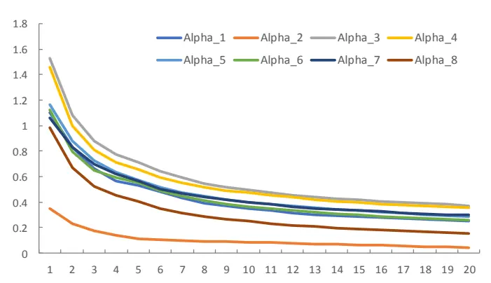
资料来源：光大证券研究所， 注：仅展示前 8 个因子的信息衰减，横坐标为计算 IC 时收益率计算周期，纵坐标为调整过符号的年化 IC。

图 6：因子年化 IR（调整符号后）衰减示意图
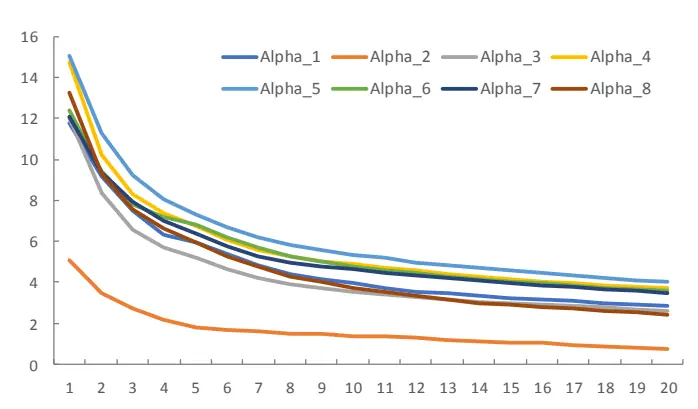
资料来源：光大证券研究所， 注：仅展示前 8 个因子的信息衰减，横坐标为计算 IC 时收益率计算周期，纵坐标为调整过符号的年化 IR。

图7：短周期 Alpha17中不同半衰期的因子个数统计
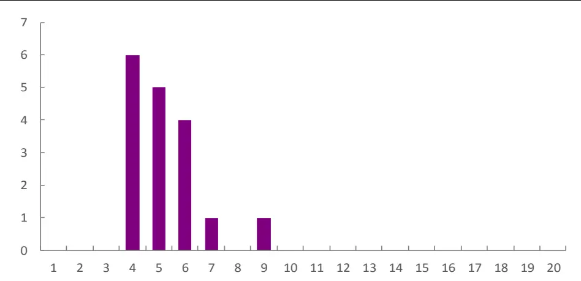
资料来源：光大证券研究所， 注：横坐标为半衰期，纵坐标为因子个数。

接着我们测试了不同调仓周期下，组合在不同交易成本时的表现。由于在不同调仓频率下不同因子信息衰减程度不一，在构建每个调仓频率组合时，因子池会剔除掉在此调仓频率下信息衰减到一定程度以下的因子。因此因子池会随调仓周期拉长而变小。当调仓周期超过 12 日时，短周期 Alpha17 中仍显著有效的因子开始迅速减少。但即使在一个月调仓周期下，依然有 7个因子有效。

图 8：不同调仓周期下有效使用因子个数
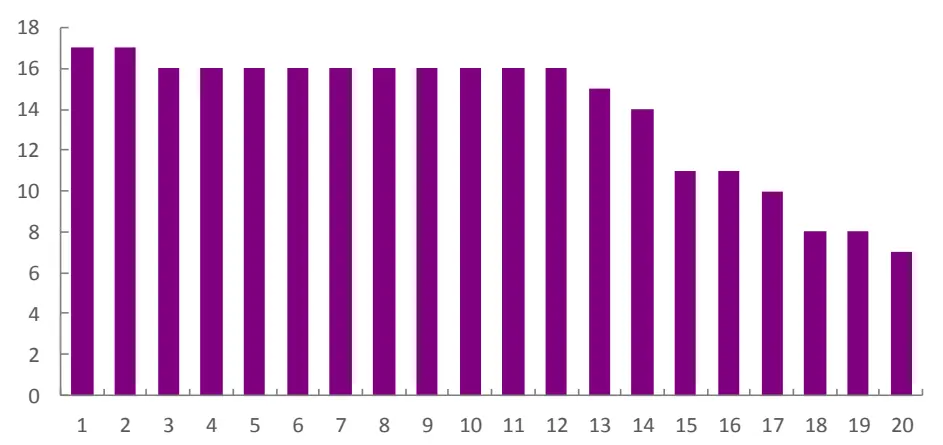
资料来源：光大证券研究所， 注：横坐标为调仓周期（日），纵坐标为因子个数。

从测试结果来看，日频调仓组合对于交易成本极为敏感，在无交易成本下年化收益 89.7%，而当交易成本提高到单边 0.2%或以上时，组合收益则降至零下。对于不同的交易成本，基于短周期Alpha17 因子的组合最优调仓频率有所不同。交易成本在单边0.05%及以下时，每日调仓效果最好；交易成本在单边0.1%到单边0.15%时，2 日调仓频率效果最好；交易成本在单边0.2%及以上时，短周期调仓的效果已经不明显甚至弱于中低频调仓，此场景下不推荐短周期因子组合。

图9：不同交易成本下不同调仓组合的年化收益率表现
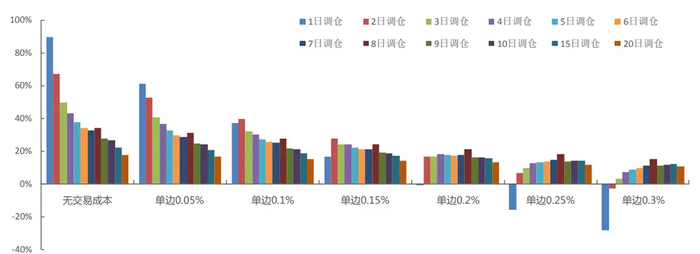
资料来源：光大证券研究所

图10：不同交易成本下不同调仓组合的夏普比率表现
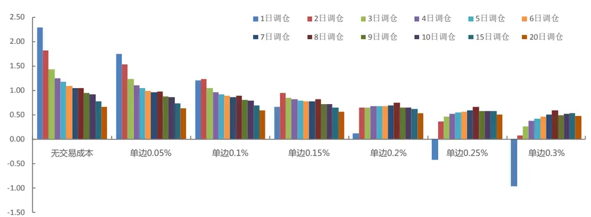
资料来源：光大证券研究所

最后假定交易成本可以控制在单边0.15%，以2 日调仓周期进行调仓作为示例，测试该情形下组合的表现。

## 3.2.2、组合表现

在2日调仓周期下，短周期 Alpha17 因子池中所有17 个因子都参与了组合的构建，为方便起见我们对这17 个因子等权相加得到的复合因子称为短周期Alpha17 复合因子，选取该复合因子值最大的 150 只股票构建的选股组合，在2010 年至 2019年中，年化收益31.1%，年化波动率 30.8%，夏普比率1.04，最大回撤45.1%。相对中证500 指数年化收益 30.8%，相对波动率9.1%，信息比率3.01，相对最大回撤18.7%。

该组合换手率高。双边换手率平均每年182倍，平均每次调仓大约换3/4 的仓位。

图 11：短周期 Alpha17 量价组合每年双边换手 182 倍左右
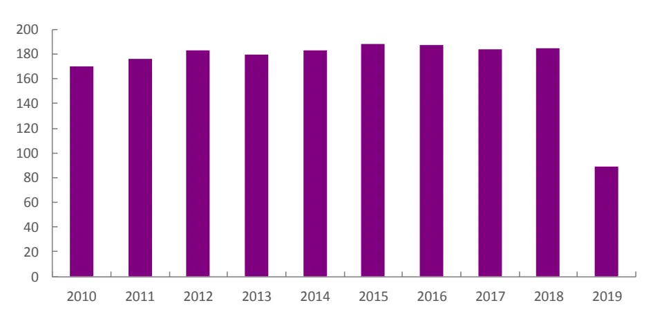
资料来源：光大证券研究所， 注：纵坐标为换手率，2019 年仅统计至 6 月 30 日

图 12：短周期 Alpha17 量价组合净值表现
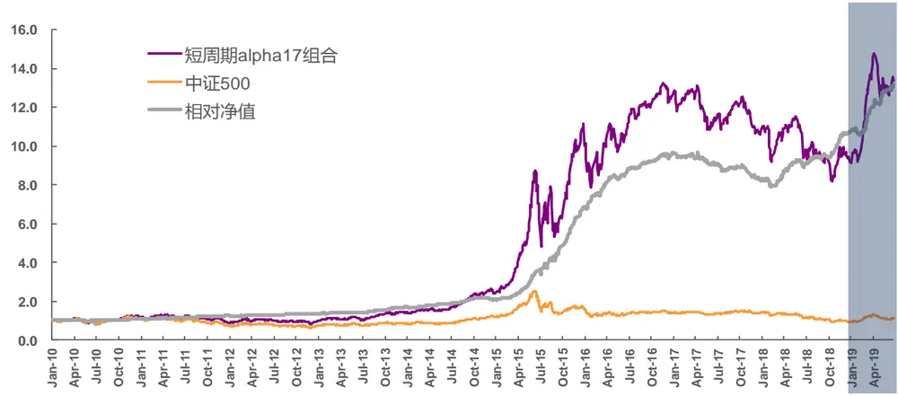
资料来源：光大证券研究所，Wind 注：交易成本按双边 0.3%计算，深色背景区域为样本外表现

表6：短周期 Alpha17量价组合分年度表现

| 年份 | 年化收益率 | 年化波动率 | 夏普比率 | 最大回撤 | 相对收益率 相对波动率 | 信息比率 | 相对最大回撤 |
| --- | --- | --- | --- | --- | --- | --- | --- |
| 2010 | 17.7% | 28.0% | 0.63 | 31.1% | 7.2% 5.1% | 1.40 | 4.0% |
| 2011 | -22.4% | 24.4% | -0.92 | 31.0% | 14.8% 4.4% | 3.35 | 1.4% |
| 2012 | 11.4% | 26.8% | 0.43 | 25.6% | 6.1% 4.9% | 1.25 | 2.5% |
| 2013 | 43.3% | 23.4% | 1.85 | 17.2% | 24.9% 5.6% | 4.48 | 2.7% |
| 2014 | 53.4% | 20.5% | 2.61 | 8.6% | 20.1% 6.2% | 3.24 | 6.7% |
| 2015 | 168.7% | 58.4% | 2.89 | 45.1% | 120.2% 18.0% | 6.67 | 7.1% |
| 2016 | 16.3% | 30.6% | 0.53 | 22.6% | 33.6% 7.1% | 4.72 | 2.6% |

敬请参阅最后一页特别声明

| 2017 | -14.6% | 17.0% | -0.86 | 19.4% | -14.7% | 7.1% | -2.08 | 15.1% |
| --- | --- | --- | --- | --- | --- | --- | --- | --- |
| 2018 | -11.1% | 26.5% | -0.42 | 28.9% | 25.6% | 8.9% | 2.87 | 5.4% |
| 2019 | 84.8% | 28.6% | 2.97 | 15.6% | 44.0% | 9.1% | 4.82 | 3.5% |
| 全样本 | 31.1% | 30.8% | 1.04 | 45.1% | 30.8% | 9.1% | 3.01 | 18.7% |

资料来源：光大证券研究所，Wind 注：交易成本按双边 0.3%计算，统计区间为 2010年 1 月 14 日至 2019年 6 月30 日

短周期Alpha17量价组合的分年度数据比较符合量价类因子在历史上的表现。在大部分的时间段尤其是近2 年（2018、2019）表现优异，但2017年选股表现仍较糟糕。我们也简单构建了月频量价组合，用以观察短周期Alpha17 组合与低频量价组合表现的差异。

表 7：月频量价组合因子池

| 函数名 函数意义 |  |
| --- | --- |
| HighLow_1M | 近一个月最高价/最低价 |
| Ln_MC | 市值对数 |
| Momentum_1M | 1个月收益率 |
| Momentum_24M | 24个月收益率 |
| STD_3M | 3个月收益率波动 |
| VA_FC_1M | 近一个月成交额/流通市值 |
| VSTD_1M | 1个月流动性 |

资料来源：光大证券研究所

从结果上看，短周期Alpha17 量价组合受益于更多短周期因子信息与更短调仓周期的优势，在组合表现上更突出。在 2010 年至 2019 年中测试区间，相比于月频量价组合，年化收益增加9个百分点，最大回撤减少7 个百分点，相对中证 500 指数信息比率增加 0.6。尤其在 2015 年以来，短周期Alpha17 组合的收益与回撤皆明显优于月频量价组合。

图13：量价组合绝对净值比较
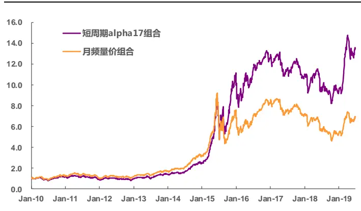
资料来源：光大证券研究所

图14：量价组合相对中证500超额净值比较
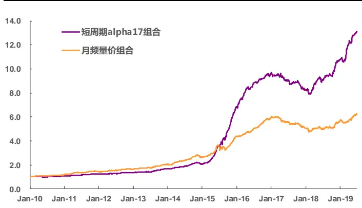
资料来源：光大证券研究所

表8：短周期 Alpha17量价组合与月频量价组合分年度比较

| 年份 | 年化收益率 |  | 年化波动率 | 最大回撤 |  | 信息比率（相对中证500） |
| --- | --- | --- | --- | --- | --- | --- |
|  | 短周期组合 | 月频组合 | 短周期组合 | 月频组合 | 短周期组合 月频组合 | 短周期组合 月频组合 |

敬请参阅最后一页特别声明

| 2010 | 17.7% | 25.1% | 28.0% | 26.3% | 31.1% | 27.6% | 1.40 | 2.29 |
| --- | --- | --- | --- | --- | --- | --- | --- | --- |
| 2011 | -22.4% | -15.8% | 24.4% | 23.9% | 31.0% | 32.7% | 3.35 | 3.72 |
| 2012 | 11.4% | 17.6% | 26.8% | 26.5% | 25.6% | 21.8% | 1.25 | 2.30 |
| 2013 | 43.3% | 39.6% | 23.4% | 21.6% | 17.2% | 15.5% | 4.48 | 3.42 |
| 2014 | 53.4% | 59.5% | 20.5% | 19.5% | 8.6% | 8.0% | 3.24 | 3.56 |
| 2015 | 168.7% | 104.8% | 58.4% | 55.2% | 45.1% | 52.5% | 6.67 | 3.60 |
| 2016 | 16.3% | 12.2% | 30.6% | 29.0% | 22.6% | 25.2% | 4.72 | 6.06 |
| 2017 | -14.6% | -14.5% | 17.0% | 17.0% | 19.4% | 19.6% | -2.08 | -2.08 |
| 2018 | -11.1% | -27.6% | 26.5% | 24.8% | 28.9% | 36.1% | 2.87 | 1.01 |
| 2019 | 84.8% | 64.1% | 28.6% | 27.4% | 15.6% | 14.2% | 4.82 | 2.57 |
| 全样本 | 31.1% | 22.2% | 30.8% | 29.1% | 45.1% | 52.5% | 2.39 | 3.01 |

资料来源：光大证券研究所，Wind 注：交易成本按双边 0.3%计算，统计区间为 2010年 1 月 14 日至 2019年 6 月30 日

综合以上研究，我们总结以下几点结论及建议：

1. 大部分量价交易型因子信息衰减很快，信息半衰期一般在 5 天左右，因此更适合作为短周期组合因子；

2. 量价因子往往有非常高的换手率，因此交易成本成为短周期因子组合表现的重要制约因素，能否压低交易成本决定了是否适合进行短周期组合交易。

3. 从我们测试结果来看，如果成本不能控制在双边千 4 以下，则不太适合做短周期因子组合投资。

4. 如能以较低成本进行交易，短周期因子组合在收益与稳定性上皆显著优于月频量价组合。

## 4、风险提示

本报告中的测试结果均基于模型和历史数据，历史数据存在不被重复验证的可能，模型存在数据挖掘、过拟合及失效的风险。

## 5、附录

## 5.1、因子编号及其对应因子计算公式

表9：因子编号对应计算公式

| 因子编号 | 计算公式 |
| --- | --- |
| Alpha001 | add(multiply(log(value),multiply(bs_sum_rate,add(smaller(low,add(log(ts_std(sqrt(sqrt(value)),20)),bs_sum_rate)),smaller(sqrt(ts_skew(avg,4)),bs_sum_rate)))),ts_skew(volume,20)) |
| Alpha002 | add(ts_skew(bs_count_rate,20),ts_skew(avg,4)) |
| Alpha003 | divide(divide(multiply(bs_sum_rate,subtract(ts_std(value,4),ts_rank(ts_kurt(ts_median(ts_set_count(high,4),4),20),80))),divide(avg,low)),divide(avg,low)) |
| Alpha004 | multiply(ts_std(log(high),4),ts_std(sqrt(value),4)) |
| Alpha005 | add(log(sqrt(value)),add(add(ts_skew(volume,20),smaller(sqrt(value),add(log(ts_std(log(value),20)),bs_sum_rate))),ts_skew(avg,4))) |
| Alpha006 | ts_max(ts_std(add(bs_sum_rate,sqrt(sqrt(sqrt(add(bs_std_ratio,value))),4),4) |
| Alpha007 | ts_correlation(ts_set_count(add(divide(ts_std(ts_correlation(ts_set_count(add(ts_std(ts_max(ts_mean(delay(low,4),4),80),4),multiply(volume,multiply(low,bs_sum_rate))),1),volume,4),4),delay(low,4)),multiply(volume,multiply(low,bs_sum_rate))),1),volume,4) |
| Alpha008 | smaller(ts_std(log(multiply(high,value)),4),multiply(bs_sum_rate,open)) |
| Alpha009 | multiply(absolute(multiply(bs_sum_rate,ts_max(ts_std(sqrt(ts_std(log(high),4)),4),4))),ts_skew(value,20)) |
| Alpha010 | divide(multiply(bs_sum_rate,ts_std(sqrt(value),4)),bigger(high,ts_argmax(high,80))) |
| Alpha011 | divide(multiply(ts_std(high,4),ts_kurt(volume,40)),ts_mean(absolute(ts_std(smaller(ts_std(volume,40),multiply(close,bs_sum_rate)),80)),4)) |
| Alpha012 | multiply(ts_mean(ts_std(log(high),4),1),ts_skew(sqrt(sqrt(value)),20)) |
| Alpha013 | divide(divide(multiply(bs_sum_rate,ts_std(multiply(ts_kurt(add(avg,volume),40),value),4)),ts_skew(value,1)),ts_median(bs_sum_rate,20)) |
| Alpha014 | add(add(ts_skew(volume,20),smaller(sqrt(value),smaller(close,bs_sum_rate))),ts_skew(open,4)) |
| Alpha015 | add(ts_skew(volume,40),smaller(low,add(log(absolute(ts_std(sqrt(absolute(value)),20))),smaller(sqrt(value),ts_skew(bs_count_rate,4)))) |
| Alpha016 | multiply(ts_skew(ts_std(log(high),4),1),ts_skew(ts_std(negative(sqrt(value)),4),20)) |
| Alpha017 | add(log(smaller(close,bs_sum_rate)),smaller(close,smaller(sqrt(value),add(ts_std(ts_max(multiply(log(value),smaller(ts_skew(volume,20),open)),4),20),ts_skew(avg,4))))) |

资料来源：光大证券研究所

5.2、单因子有效性测试详细数据
表10：单因子有效性测试统计数据

| 因子编号 | 日度IC均值 | 日度ICIR | IC>0 比例 | 日度IC均值 (行业中性) | 日度ICIR (行业中性) | IC>0 比例 (行业中性) |
| --- | --- | --- | --- | --- | --- | --- |
| Alpha001 | -7.1% | 0.76 | 20.1% | -7.0% | 0.85 | 18.5% |
| Alpha002 | -2.2% | 0.33 | 36.3% | -2.2% | 0.40 | 33.7% |
| Alpha003 | -9.8% | 0.78 | 21.2% | -8.4% | 0.81 | 18.6% |
| Alpha004 | -9.4% | 0.95 | 16.3% | -8.3% | 1.07 | 13.1% |
| Alpha005 | -7.5% | 0.97 | 14.4% | -7.0% | 1.11 | 12.1% |
| Alpha006 | -7.2% | 0.80 | 20.6% | -6.7% | 0.85 | 18.7% |
| Alpha007 | -6.9% | 0.78 | 20.7% | -6.2% | 0.83 | 18.6% |
| Alpha008 | -6.3% | 0.86 | 16.7% | -6.1% | 0.95 | 14.5% |
| Alpha009 | -6.0% | 0.86 | 18.7% | -5.7% | 0.97 | 16.1% |
| Alpha010 | -5.8% | 0.75 | 21.0% | -5.4% | 0.91 | 16.7% |
| Alpha011 | -5.7% | 0.94 | 16.3% | -5.1% | 1.03 | 14.6% |

敬请参阅最后一页特别声明

| Alpha012 | -5.3% | 0.84 | 17.1% | -4.7% | 0.92 | 14.6% |
| --- | --- | --- | --- | --- | --- | --- |
| Alpha013 | -5.3% | 0.86 | 17.7% | -4.6% | 0.94 | 16.5% |
| Alpha014 | -4.6% | 0.76 | 19.0% | -4.1% | 0.87 | 16.7% |
| Alpha015 | -4.4% | 0.75 | 20.3% | -4.1% | 0.82 | 18.8% |
| Alpha016 | -4.2% | 0.88 | 16.9% | -3.8% | 0.91 | 16.6% |
| Alpha017 | -3.7% | 0.76 | 20.2% | -3.5% | 0.83 | 18.8% |

资料来源：光大证券研究所

## 5.3、单因子分组测试详细数据

分组测试中的分组单调性试计算方式为：先按由空头到多头的分组排列顺序得到分组年化收益序列，再计算该年化收益序列与等长自然序列的相关系数作为分组单调性得分。因此该指标区间为[-1, 1]。

表11：单因子分组测试统计数据

| 因子编号 | 多头超额年 化收益 | 空头超额年 化收益 | 分组单调性 | 多空年化收益 | 多空年化波动 | 多空夏普比率 | 多空最大回撤 |
| --- | --- | --- | --- | --- | --- | --- | --- |
| Alpha001 | 82.2% | -40.8% | 0.53 | 204.6% | 11.2% | 10.03 | 5.5% |
| Alpha002 | 40.7% | -24.9% | 0.60 | 86.6% | 8.5% | 7.35 | 3.3% |
| Alpha003 | 43.8% | -38.2% | 0.79 | 133.0% | 12.8% | 6.68 | 11.5% |
| Alpha004 | 66.3% | -45.9% | 0.61 | 203.6% | 11.6% | 9.64 | 2.9% |
| Alpha005 | 55.9% | -42.5% | 0.62 | 169.0% | 9.3% | 10.76 | 2.9% |
| Alpha006 | 22.0% | -28.1% | 0.92 | 68.7% | 9.3% | 5.68 | 9.9% |
| Alpha007 | 28.9% | -27.5% | 0.84 | 76.6% | 8.8% | 6.46 | 10.6% |
| Alpha008 | 107.4% | -47.0% | 0.53 | 286.9% | 11.7% | 11.62 | 2.5% |
| Alpha009 | 55.4% | -36.6% | 0.57 | 143.8% | 8.2% | 10.95 | 3.1% |
| Alpha010 | 50.4% | -37.2% | 0.59 | 137.7% | 8.8% | 9.85 | 2.6% |
| Alpha011 | 18.5% | -33.1% | 0.96 | 76.5% | 6.9% | 8.32 | 3.8% |
| Alpha012 | 1.6% | -32.4% | 0.72 | 49.8% | 7.1% | 5.72 | 25.3% |
| Alpha013 | 30.7% | -36.5% | 0.81 | 104.6% | 7.7% | 9.37 | 3.3% |
| Alpha014 | 38.0% | -31.4% | 0.69 | 100.6% | 6.8% | 10.29 | 2.4% |
| Alpha015 | 19.6% | -15.7% | 0.89 | 41.5% | 7.1% | 4.95 | 13.6% |
| Alpha016 | -2.8% | -30.8% | 0.63 | 40.0% | 6.0% | 5.61 | 5.9% |
| Alpha017 | 15.7% | -21.1% | 0.92 | 46.2% | 5.8% | 6.53 | 4.9% |

资料来源：光大证券研究所，注：基准为全市场（去除新股、ST、当日停牌等原因不可交易股票）等权指数，不计交易成本

## 行业及公司评级体系

| 评级 说明 |
| --- |
| 行 买入 未来6-12个月的投资收益率领先市场基准指数15%以上； |
| 增持 未来6-12个月的投资收益率领先市场基准指数5%至15%； |
| 中性 未来6-12个月的投资收益率与市场基准指数的变动幅度相差-5%至5%； |
| 减持 未来6-12个月的投资收益率落后市场基准指数5%至15%； |
| 卖出 未来6-12个月的投资收益率落后市场基准指数15%以上； |
| 因无法获取必要的资料，或者公司面临无法预见结果的重大不确定性事件，或者其他原因，致使无法给出明确的无评级投资评级。 |
| 基准指数说明：A股主板基准为沪深300指数；中小盘基准为中小板指；创业板基准为创业板指；新三板基准为新三板指数；港股基准指数为恒生指数。 |

## 分析、估值方法的局限性说明

本报告所包含的分析基于各种假设，不同假设可能导致分析结果出现重大不同。本报告采用的各种估值方法及模型均有其局限性，估值结果不保证所涉及证券能够在该价格交易。

## 分析师声明

本报告署名分析师具有中国证券业协会授予的证券投资咨询执业资格并注册为证券分析师，以勤勉的职业态度、专业审慎的研究方法，使用合法合规的信息，独立、客观地出具本报告，并对本报告的内容和观点负责。负责准备以及撰写本报告的所有研究人员在此保证，本研究报告中任何关于发行商或证券所发表的观点均如实反映研究人员的个人观点。研究人员获取报酬的评判因素包括研究的质量和准确性、客户反馈、竞争性因素以及光大证券股份有限公司的整体收益。所有研究人员保证他们报酬的任何一部分不曾与，不与，也将不会与本报告中具体的推荐意见或观点有直接或间接的联系。

## 特别声明

光大证券股份有限公司（以下简称“本公司”）创建于 1996 年，系由中国光大（集团）总公司投资控股的全国性综合类股份制证券公司，是中国证监会批准的首批三家创新试点公司之一。根据中国证监会核发的经营证券期货业务许可，本公司的经营范围包括证券投资咨询业务。

本公司经营范围：证券经纪；证券投资咨询；与证券交易、证券投资活动有关的财务顾问；证券承销与保荐；证券自营；为期货公司提供中间介绍业务；证券投资基金代销；融资融券业务；中国证监会批准的其他业务。此外，本公司还通过全资或控股子公司开展资产管理、直接投资、期货、基金管理以及香港证券业务。

本报告由光大证券股份有限公司研究所（以下简称“光大证券研究所”）编写，以合法获得的我们相信为可靠、准确、完整的信息为基础，但不保证我们所获得的原始信息以及报告所载信息之准确性和完整性。光大证券研究所可能将不时补充、修订或更新有关信息，但不保证及时发布该等更新。

本报告中的资料、意见、预测均反映报告初次发布时光大证券研究所的判断，可能需随时进行调整且不予通知。在任何情况下，本报告中的信息或所表述的意见并不构成对任何人的投资建议。客户应自主作出投资决策并自行承担投资风险。本报告中的信息或所表述的意见并未考虑到个别投资者的具体投资目的、财务状况以及特定需求。投资者应当充分考虑自身特定状况，并完整理解和使用本报告内容，不应视本报告为做出投资决策的唯一因素。对依据或者使用本报告所造成的一切后果，本公司及作者均不承担任何法律责任。

不同时期，本公司可能会撰写并发布与本报告所载信息、建议及预测不一致的报告。本公司的销售人员、交易人员和其他专业人员可能会向客户提供与本报告中观点不同的口头或书面评论或交易策略。本公司的资产管理子公司、自营部门以及其他投资业务板块可能会独立做出与本报告的意见或建议不相一致的投资决策。本公司提醒投资者注意并理解投资证券及投资产品存在的风险，在做出投资决策前，建议投资者务必向专业人士咨询并谨慎抉择。

在法律允许的情况下，本公司及其附属机构可能持有报告中提及的公司所发行证券的头寸并进行交易，也可能为这些公司提供或正在争取提供投资银行、财务顾问或金融产品等相关服务。投资者应当充分考虑本公司及本公司附属机构就报告内容可能存在的利益冲突，勿将本报告作为投资决策的唯一信赖依据。

本报告根据中华人民共和国法律在中华人民共和国境内分发，仅向特定客户传送。本报告的版权仅归本公司所有，未经书面许可，任何机构和个人不得以任何形式、任何目的进行翻版、复制、转载、刊登、发表、篡改或引用。如因侵权行为给本公司造成任何直接或间接的损失，本公司保留追究一切法律责任的权利。所有本报告中使用的商标、服务标记及标记均为本公司的商标、服务标记及标记。

## 光大证券股份有限公司 2019 版权所有。

## 联系我们

| 上海 | 北京 | 深圳 |
| --- | --- | --- |
| 静安区南京西路1266号恒隆广场1号 写字楼48层 | 西城区月坛北街2号月坛大厦东配楼2层 复兴门外大街6号光大大厦17层 | 福田区深南大道 6011号NEO 绿景纪元大 厦 A 座 17 楼 |