## 结合短周期因子的指数增强实证——多因子系列报告之二十五

前期的报告中，我们通过遗传规划的方法构建了短周期因子的挖掘框架，并通过算法挖掘出了具有显著预测能力的短周期价量因子。本篇报告我们将探讨如何将短周期价量因子与常用的低频基本面模型结合，在综合考虑调仓成本前提下，提高指数增强模型的收益表现。

## 短周期价量类因子特征：预测能力强，与低频价量有较高相关性

以次日开盘价计算收益率挖掘得到的 20个短周期因子中，年化 IC_IR平均可达 1.15，其中 Alpha_1 因子的 IC_IR 为 1.77，胜率达到 80%，多空夏普也高达 6.42。

在日频的维度上，短周期因子在沪深 300 成分内的有效性显著较低，而在中证 500 内仍具有不错的预测能力。同时，短周期 alpha 因子与低频价量因子中的反转因子、换手率因子均具有较高的相关性。

## 短周期因子增强 v.s.基本面因子增强：各有利弊

1）短周期因子增强：基于短周期 alpha20 因子，在较为严格的换手率惩罚和风格行业暴露度控制的条件下，模型的超额收益达 23%，信息比达到3.56，但2017 年组合跑输基准3 个百分点，表现较为一般。

2）基本面因子增强：经过优化的纯基本面因子的中证500增强模型，整体超额收益能力相对较弱，年化超额基准 13%，信息比 2.29。但近两年表现出色，2018和2019年的年化超额收益分别为16%和22%，均战胜了纯短周期因子的增强模型。

## 基本面结合短周期因子的增强策略

1）基本面因子高频化：将基本面因子做高频化处理（填充为日度因子），再将短周期因子与之结合。该方式下，组合信息比可以达到4.29，年化超额收益 27%，相对最大回撤 9%。优化过程中的换手率约束起到了较为显著的作用，通过在目标函数中加入换手率惩罚项后，整体的平均换手为单边15%，年度平均双边换手36 倍。

2）基本面股票池+短周期因子调整：将基本面模型作为基础池，月频调整；同时在月中采用短周期因子，对组合的持仓进行微调。该方式下组合超额收益率略有降低，年化超额基准 18%，信息比 3.03，但组合在 2017 年的表现则显著优于基本面因子高频化的组合，超额更加稳定。

- 风险提示：结果均基于模型和历史数据，模型存在失效的风险。

## 金融工程深度

## 分析师

刘均伟 （执业证书编号：S0930517040001）

021-52523679

liujunwei@ebscn.com

周萧潇 （执业证书编号：S0930518010005）

021-52523680

zhouxiaoxiao@ebscn.com

胡骥聪 (执业证书编号：S0930519060002)

021-52523683

hujicong@ebscn.com

## 相关研究

《因子正交与择时：基于分类模型的动态权重配置——多因子系列报告之十》《爬罗剔抉：一致预期因子分类与精选——多因子系列报告之十一》

《成长因子重构与优化：稳健加速为王——多因子系列报告之十二》

《组合优化算法探析及指数增强实证——多因子系列报告之十三 》

《以质取胜：EBQC 综合质量因子详解——多因子系列报告之十七》

《光大 Alpha3.0：基本面优选多因子组合——多因子系列报告之十九》

《沪深 300 指数增强模型构建与测试——多因子系列报告之二十三》

《短周期因子的挖掘与组合构建——多因子系列报告之二十四》

在报告《短周期因子的挖掘与组合构建——多因子系列报告之二十四》中，我们通过遗传规划的方法构建了短周期因子的挖掘框架，并通过算法挖掘出了 17 个具有显著预测能力的短周期价量因子。本篇报告我们将探讨如何将短周期价量因子与常用的低频基本面模型结合，在综合考虑调仓成本前提下，提高指数增强模型的收益表现。

## 1、短周期量价类因子特征：效果强、时效短

首先，我们后续使用的短周期alpha因子与《短周期因子的挖掘与组合构建——多因子系列报告之二十四》中所挖掘的短周期因子会有一定差异。由于前篇报告中采用遗传规划挖掘的均为日频因子，在遗传规划的适应度指标设置时，采用的是次日收盘价相对当日收盘价计算的收益率。

考虑到实际交易的可操作性等因素，收盘时计算因子值且收盘价成交的可操作性较低，因此我们本篇报告中所使用的短周期因子，是采用次日开盘价所计算的收益率重新生成的短周期因子（关于模型的具体构建方法和参数设置，请参考报告《短周期因子的挖掘与组合构建——多因子系列报告之二十四》）。

将因子两两相关性限制在 0.3 以下，我们共得到 20 个预测能力较强的日频短周期因子，后文中的所有测试结论均基于这 20 个重新开发的短周期价量因子（因子明细详见附录）。

## 1.1、不同样本内短周期量价类因子表现：沪深 300内表现一般

从短周期因子的收益来源上分析，我们一般认为其收益来源是市场参与者的交易行为带来的短期获利机会。一般情况下，流动性越高，投资者参与程度越高的股票，短周期因子在其中的收益能力越强。我们首先将测试通过遗传规划挖掘出来的短周期 alpha 因子在不同样本空间内的预测能力，观察其是否存在显著差异。

下图展示了Alpha_1 因子在全市场的 IC历史时间序列，其 IC 均值接近8%，胜率也高达80%，在全市场的样本中，具有极强的预测能力。

图 1：Alpha_1 因子 IC 序列（全市场）
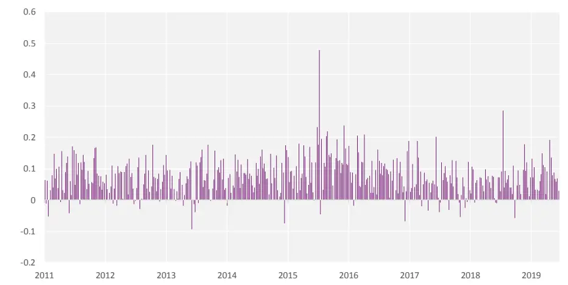
资料来源：光大证券研究所，测试时间：2011/01/01 –2019/06/30

同时我们也统计了新构造下的 20 个短周期因子的胜率、多空夏普、多空收益、最大回撤等指标：

表1：短周期 Alpha因子测试（全市场）

|  | IC mean | IC std | IR | IC >0 per | Longshort_ Sharpe | Max_DD |
| --- | --- | --- | --- | --- | --- | --- |
| Alpha_1 | 7.73% | 30% | 1.77 | 80% | 6.42 | 5.50% |
| Alpha_2 | 6.29% | 30% | 1.45 | 65% | 5.44 | 13.30% |
| Alpha_3 | 5.58% | 23% | 1.72 | 63% | 7.94 | 6.50% |
| Alpha_4 | 6.79% | 31% | 1.52 | 67% | 6.13 | 2.90% |
| Alpha_5 | 5.18% | 30% | 1.19 | 64% | 6.96 | 2.90% |
| Alpha_6 | 6.04% | 31% | 1.36 | 64% | 5.2 | 9.90% |
| Alpha_7 | 5.62% | 31% | 1.27 | 73% | 5.78 | 10.60% |
| Alpha_8 | 5.49% | 30% | 1.26 | 68% | 8.6 | 2.50% |
| Alpha_9 | 4.55% | 31% | 1.03 | 28% | 8.1 | 3.10% |
| Alpha_10 | 4.45% | 31% | 1.00 | 60% | 7.29 | 2.60% |
| Alpha_11 | 6.82% | 30% | 1.56 | 71% | 6.16 | 3.80% |
| Alpha_12 | 3.42% | 31% | 0.77 | 60% | 4.23 | 25.30% |
| Alpha_13 | 4.73% | 30% | 1.09 | 72% | 6.93 | 3.30% |
| Alpha_14 | 4.17% | 31% | 0.93 | 65% | 7.61 | 2.40% |
| Alpha_15 | 3.16% | 25% | 0.87 | 64% | 3.66 | 13.60% |
| Alpha_16 | 3.84% | 29% | 0.91 | 69% | 4.15 | 5.90% |
| Alpha_17 | 2.59% | 30% | 0.59 | 55% | 5.32 | 7.35% |
| Alpha_18 | 2.87% | 31% | 0.65 | 59% | 6.22 | 14.32% |
| Alpha_19 | 2.85% | 31% | 0.64 | 59% | 3.74 | 7.42% |
| Alpha_20 | 3.21% | 30% | 0.74 | 67% | 4.83 | 4.90% |

资料来源：光大证券研究所，测试时间：2011/01/01 –2019/06/30

以次日开盘价计算收益率挖掘得到的 20 个短周期因子中，年化 IC_IR平均可达 1.15，其中 Alpha_1 因子的 IC_IR 为 1.77，胜率达到 80%，多空夏普也高达6.42。

其次，我们测试并比较上述 20 个短周期因子在不同样本空间内的预测能力：

图2：短周期因子在不同样本空间内 IC均值
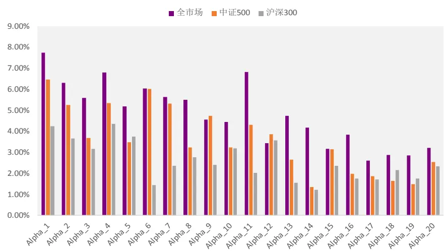
资料来源：光大证券研究所，测试时间：2011/01/01 –2019/06/30

表2：短周期因子在不同样本空间内 IC均值

|  | 全市场 | 中证500 | 沪深300 |
| --- | --- | --- | --- |
| Alpha_1 | 7.73% | 6.45% | 4.23% |
| Alpha_2 | 6.29% | 5.24% | 3.66% |
| Alpha_3 | 5.58% | 3.68% | 3.15% |
| Alpha_4Alpha_5 | 6.79% | 5.34% | 4.34% |
|  | 5.18% | 3.46% | 3.75% |
| Alpha_6 | 6.04% | 6.00% | 1.43% |
| Alpha_7 | 5.62% | 5.32% | 2.34% |
| Alpha_8 | 5.49% | 3.22% | 2.76% |
| Alpha_9 | 4.55% | 4.73% | 2.40% |
| Alpha_10Alpha_11Alpha_12Alpha_13Alpha_14Alpha_15Alpha_16Alpha_17Alpha_18Alpha_19Alpha_20 | 4.45% | 3.23% | 3.18% |
|  | 6.82% | 4.31% | 2.00% |
|  | 3.42% | 3.86% | 3.56% |
|  | 4.73% | 2.65% | 1.55% |
|  | 4.17% | 1.34% | 1.21% |
|  | 3.16% | 3.14% | 2.34% |
|  | 3.84% | 1.97% | 1.74% |
|  | 2.59% | 1.86% | 1.69% |
|  | 2.87% | 1.64% | 2.14% |
|  | 2.85% | 1.47% | 1.75% |
|  | 3.21% | 2.53% | 2.31% |

资料来源：光大证券研究所，测试时间：2011/01/01 –2019/06/30

在日频的维度上，短周期因子在沪深 300 成分内的有效性显著较低，而在中证500 内仍具有不错的预测能力。这一结论也与我们的理解相符，即短周期的价量因子主要去捕捉的是市场参与者的交易行为带来的短期获利机会，而沪深300 成分股的持有人结构更加偏向机构化，较难以捕捉频繁交易所带来的超额收益。

## 1.2、因子相关性测试：短周期因子与换手率、反转因子相关性较高

由于短周期因子都是基于价量信息（最高价、最低价、开盘价、收盘价、成交量、成交额等）构建的，而我们通常的低频多因子模型中，也往往包含由价量信息构造的技术类因子（如下表所示）。

我们很自然的关心短周期因子与低频价量因子是否存在较强的共线性或相关性，不过由于因子的构造方式不同，在计算相关性时我们将低频价量因子的计算频率提高至日频。

表 3：常用月频量价因子列表

| 因子名 因子含义 |  |
| --- | --- |
| Ln_MC | 市值对数 |
| Momentum_1M | 1个月收益率 |
| Momentum_24M | 24个月收益率 |
| STD_3M | 3个月收益率波动 |
| TURNOVER_1M | 1个月换手率 |
| VSTD_1M | 1个月流动性（成交金额/收益率波动） |

资料来源：光大证券研究所

下表展示了20个短周期alpha因子，与上述因子的日度IC 序列的相关系数：

图3：短周期alpha因子与低频价量因子相关系数
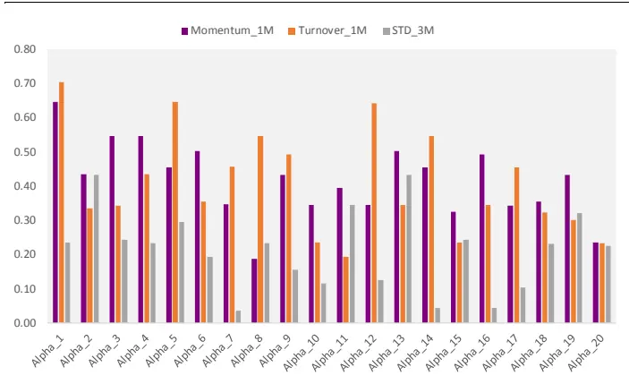
资料来源：光大证券研究所，测试时间：2011/01/01 –2019/06/30

图4：短周期alpha因子与低频价量因子相关系数
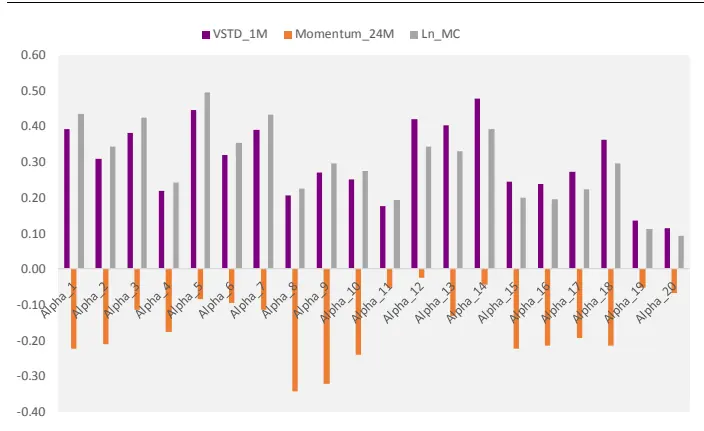
资料来源：光大证券研究所，测试时间：2011/01/01 –2019/06/30

总体上看，短周期alpha因子与低频价量因子中的反转因子、换手率因子均具有较高的相关性。因此，在尝试将短周期因子与低频多因子模型结合时，需要考虑到短周期因子与低频价量因子之前的相关性的处理方法。

表4：短周期 Alpha因子测试与低频因子IC相关性
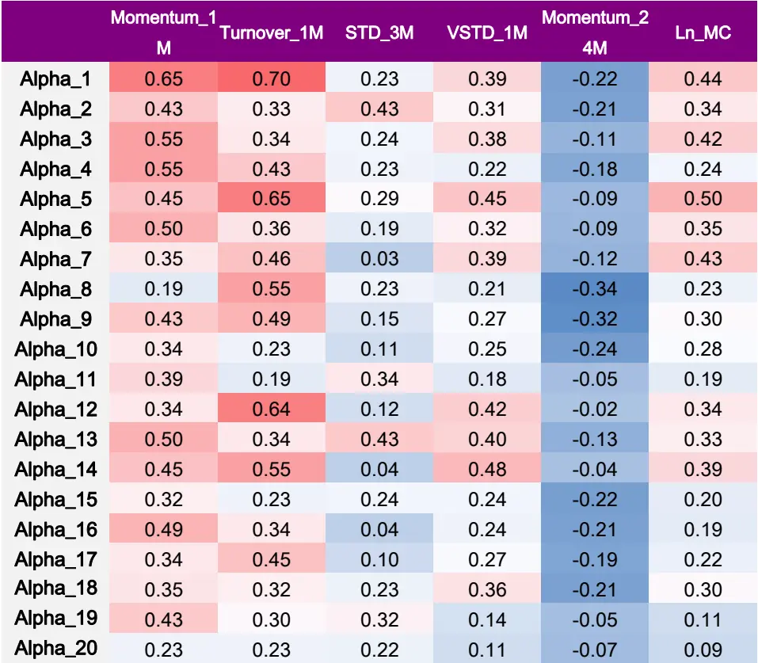
资料来源：光大证券研究所，测试时间：2011/01/01 –2019/06/30

## 2、短周期因子增强 v.s.基本面因子增强：各有利弊

在前面的报告中，我们曾经尝试过短周期因子全市场选股组合的构建，但简单的多头组合等权持有的方式，会产生较大的风格暴露，造成组合阶段性回撤较大的问题。

本文我们主要探讨的是短周期因子在指数增强策略中的应用方法，因此本章中我们将首先比较2种不同的指数增强方案：基本面因子增强和短周期因子增强。这里我们均以中证 500指数增强作为测试模型。

## 2.1、指数增强组合优化框架设置

组合优化模型的设置是增强模型成功的关键，如果仅选用得分最高的一篮子股票构建组合，在一些风格极端的市场环境下可能会产生较大的回撤风险，尤其是在短周期持仓组合中，组合可能短期内集中持有统一风格的股票并因此造成大幅回撤。所以组合的优化和风格暴露控制，是十分必要的。

常见的组合优化控制条件主要包括：风格暴露约束、行业暴露约束、个股权重约束等，这些约束条件都能有效控制组合相对基准指数的偏离，使组合能稳定地战胜基准指数。

由于涉及到高换手的短周期因子，组合的换手率优化是十分重要的一个部分，因此我们在优化的目标函数中，加入了换手率的惩罚项。

组合优化模型及参数设置：

$$
\operatorname{Max}F(w)=w^{T}\mu-p*\sum|w-w_{pre}|
$$

s.t.

$$
0\leq w\leq l
$$

$$
\sum w=1
$$

$$
x_{lower}\le X(w-w_{bench})\le x_{upper}
$$

$$
i_{lower}\le I(w-w_{bench})\le i_{upper}
$$

$$
D_{bench}w\ge b
$$

其中：

μ为个股复合因子得分向量；

p为换手率惩罚系数；

$w_{pre}$ 为上一期持仓权重向量；

l为个股权重上限；

X为风格因子暴露矩阵， $x_{lower}\#\alpha_{upper}$ 分别为上下限；

I为行业哑变量矩阵， $i_{lower}\mathcal{\bar{\mathsf{F}}}^{\mathsf{\Pi}}i_{upper}$ 分别为上下限；

$D_{bench}$ 为成分股哑变量，属于成分股则为 1；

b为成分股权重占比下限。

上述优化模型的设置主要考虑的因素包括：

1. 由于短周期量价因子往往有非常高的换手率，因此交易成本成为短周期因子组合表现的重要制约因素，因此我们通过在目标函数中加入换手率的惩罚项，来做到降低换手的目的。

2. 考虑到公募基金在指数增强产品中的成分股占比限制，这里的参数 b 默认为 80%。

3. 行业采用中信一级行业。

4. 如未作特殊说明，风格暴露的控制默认为对市值因子的暴露度控制。

## 2.2、短周期因子增强

采用等权的方法复合短周期因子：短周期因子具有高换手的特征，同时因子衰减速度也较快，采用类似滚动 IC 加权或者 IC_IR 加权的方式并不合理，因此在合成复合因子时，我们这里均初步采用等权合成的方式处理。

短周期因子模型参数：

1、调仓周期：2 个交易日

表5：短周期因子增强模型优化参数设置

| 参数名 | 参数含义 | 参数值 |
| --- | --- | --- |
| p | 换手率惩罚系数 | 5 |
| l | 个股权重上限 | 1% |
| b | 成分股权重占比下限 | 0.8 |
| i_upper | 行业暴露度下限 | 0.9 |
| i_lower | 行业暴露度上限 | 1.1 |
| x_upper | 风格因子暴露度下限 | 0.95 |
| x_upper | 风格因子暴露度上限 | 1.05 |

资料来源：光大证券研究所

图5：短周期因子中证500指数增强表现
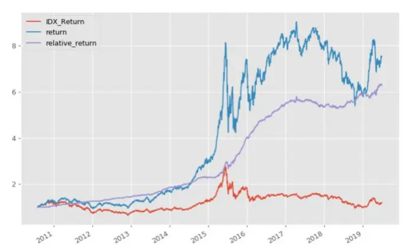
资料来源：光大证券研究所，测试时间：2010/07/01 –2019/08/31

图6：短周期因子中证500指数增强相对收益和回撤
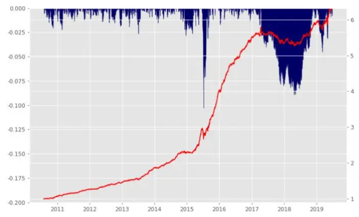
资料来源：光大证券研究所，测试时间：2010/07/01 –2019/08/31

表6：短周期因子中证500增强分年度表现

|  | 月度胜率 | 年化收益 | 年化波动 | 年化超额收益 相对收益波动 |  | 信息比 | 最大回撤 | 相对最大回撤 |
| --- | --- | --- | --- | --- | --- | --- | --- | --- |
| 2010 | 80% | 72% | 25% | 16% | 6% | 2.76 | -10% | -2% |
| 2011 | 100% | -22% | 22% | 19% | 4% | 4.22 | -30% | -2% |
| 2012 | 67% | 18% | 23% | 14% | 4% | 3.21 | -20% | -2% |
| 2013 | 83% | 51% | 21% | 28% | 5% | 5.22 | -16% | -3% |
| 2014 | 83% | 68% | 19% | 22% | 5% | 4.27 | -9% | -3% |
| 2015 | 83% | 138% | 50% | 74% | 11% | 6.57 | -48% | -10% |
| 2016 | 100% | 22% | 30% | 36% | 5% | 6.89 | -24% | -2% |
| 2017 | 33% | -4% | 14% | -3% | 5% | -0.60 | -17% | -8% |
| 2018 | 58% | -27% | 22% | 10% | 5% | 2.04 | -34% | -4% |
| 2019 | 50% | 69% | 27% | 13% | 8% | 1.59 | -17% | -5% |
| Summary | 77% | 25% | 27% | 23% | 6% | 3.56 | -48% | -10% |

资料来源：光大证券研究所，基准为沪深 300 指数，测试时间：2010/07/01 –2019/08/31

基于短周期alpha20因子，在较为严格的换手率惩罚和风格行业暴露度控制的条件下，通过组合优化得到的结果来看，短周期因子模型的超额收益高达23%，信息比达到3.56，但2017 年组合跑输基准3 个百分点，表现较为一般。

## 2.3、基本面因子增强

在前期报告《以质取胜：EBQC 综合质量因子详解——多因子系列报告之十七》中，我们将质量因子整理为盈利能力、成长能力、盈余质量、营运效率、安全性、公司治理6 个大类，并分别对这6 个大类质量指标中的单因子进行全面的测试，并在每个大类中挑选满足一定筛选条件（IC 大于 2%，IR 大于 0.3，tstats大于 3）的因子来构成大类复合因子。

综合质量因子EBQC在中证全指、中证500、沪深300不同样本空间内，均具有较强的预测能力，因子的 IC 均高于 3%，IC_IR 均大于 0.5。在沪深300 样本内的表现也较为出色，因子 IC 为 3.84%，IC_IR 为 0.57。

表 7：EBQC 因子在不同样本内的测试结果

|  | IC mean | IC std | IR | IC positive LongShort per | return | Turnover | Mono score | LongShort sharpe | Factor Return | Return tstat |
| --- | --- | --- | --- | --- | --- | --- | --- | --- | --- | --- |
| 全市场 | 4.40% | 4.97% | 0.89 | 83% | 11.10% | 16% | 2.73 | 1.78 | 0.39% | 8.27 |
| 中证 500 | 5.67% | 7.09% | 0.80 | 77% | 15.80% | 16% | 2.13 | 2.18 | 0.48% | 7.33 |
| 沪深 300 | 3.84% | 6.76% | 0.57 | 71% | 14.70% | 17% | 3.89 | 1.62 | 0.34% | 6.37 |

资料来源：光大证券研究所，注：测试期为 2010-01-01 至 2019-08-31

同时，在综合考虑公司的基本面时，估值因子也是具有较高预测能力的重要基本面指标。我们将质量因子与估值因子相结合，构造较为综合的基本面复合因子。

表 8：基本面因子复合权重设置

| 因子类别 | 因子名称 | 权重 |
| --- | --- | --- |
| 估值因子 | EP_TTM | 0.25 |
|  | BP_LR | 0.25 |
| 质量因子 | EBQC | 0.5 |

资料来源：光大证券研究所

为了减少权重股收益波动对模型的表现的影响并提高超额收益的稳定性，我们在复合基本面因子打分的基础上，结合优化器对最终持仓组合的行业暴露、市值暴露和个股权重偏离度进行约束。

由于基本面因子的变化频率低，模型换手率天然较低，因此这里的测试采用常见的月频调仓，且不对换手率加以控制。具体的约束条件和参数如下：

1、调仓周期：月频

表9：基本面因子增强模型优化参数设置

| 参数名 参数含义 参数值 |  |
| --- | --- |
| p | 换手率惩罚系数 0 |
| l | 个股权重上限 2% |
| b | 成分股权重占比下限 0.8 |
| i_upper | 行业暴露度下限 0.9 |
| i_lower | 行业暴露度上限 1.1 |
| x_upper | 风格因子暴露度下限 0.95 |
| x_upper | 风格因子暴露度上限 1.05 |

资料来源：光大证券研究所

图 7：基本面因子中证 500 指数增强表现
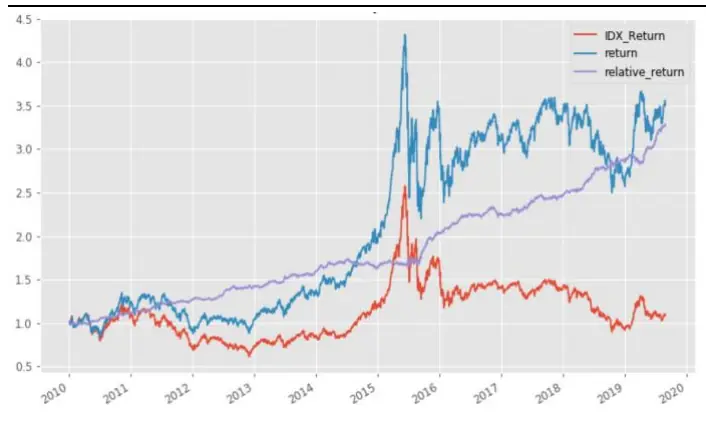
资料来源：光大证券研究所，测试时间：2010/07/01 –2019/08/31

图8：基本面因子中证 500指数增强相对收益和回撤
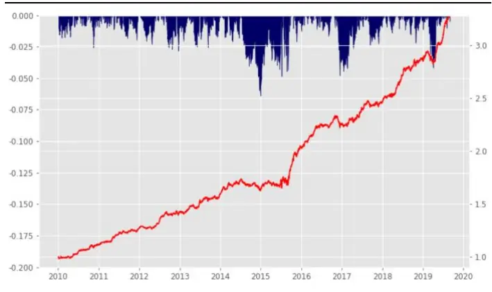
资料来源：光大证券研究所，测试时间：2010/07/01 –2019/08/31

表10：基本面因子中证500增强分年度表现

|  | 月度胜率 | 年化收益 | 年化波动 | 年化超额收益相对收益波动 |  | 信息比 | 最大回撤 | 相对最大回撤 |
| --- | --- | --- | --- | --- | --- | --- | --- | --- |
| 2010 | 75% | 22% | 28% | 12% | 5% | 2.28 | -24% | -3% |
| 2011 | 92% | -25% | 24% | 14% | 5% | 3.00 | -32% | -2% |
| 2012 | 67% | 15% | 23% | 12% | 5% | 2.56 | -21% | -3% |
| 2013 | 67% | 32% | 23% | 12% | 6% | 2.17 | -15% | -3% |
| 2014 | 42% | 41% | 20% | 2% | 5% | 0.44 | -10% | -6% |
| 2015 | 75% | 69% | 48% | 23% | 9% | 2.46 | -49% | -5% |
| 2016 | 67% | 0% | 30% | 11% | 5% | 2.35 | -25% | -5% |
| 2017 | 75% | 8% | 17% | 9% | 5% | 1.85 | -13% | -2% |
| 2018 | 92% | -23% | 24% | 16% | 5% | 3.29 | -29% | -2% |
| 2019 | 75% | 56% | 25% | 22% | 6% | 3.84 | -15% | -4% |
| Summary | 72% | 14% | 28% | 13% | 6% | 2.29 | -49% | -6% |

资料来源：光大证券研究所，基准为沪深 300 指数，测试时间：2010/07/01 –2019/08/31

由此可见，经过优化的纯基本面因子的中证500 增强模型，整体超额收益能力相对较弱，年化超额基准 13%，信息比 2.29。但近两年表现出色，2018和2019年的年化超额收益分别为16%和22%，均战胜了纯短周期因子的增强模型。

## 3、基本面结合短周期因子的增强策略

结合上面的结论，我们发现短周期价量和基本面因子的中证500 增强模型表现呈现出较大的差异：

1、短周期因子模型的超额收益高达 23%，信息比达到 3.56，但 2017 年组合跑输基准3个百分点，表现较为一般。

2、基本面因子模型的超额收益相对较弱，但近年表现出色，17、18、19年的超额收益均显著由于短周期因子模型。

因此，怎样将上面两种思路结合到一起，做到取长补短，是我们本章主要探讨的问题。

## 3.1、结合思路之一：基本面因子高频化

我们尝试的第一种思路是，将基本面因子也做高频化的处理（填充为日度因子），再将短周期因子与之结合。

在第二章中我们测试了短周期因子与低频价量因子的相关性，并且发现类似换手率、反转因子都与短周期因子具有很高的相关性。因此为了避免因子共线性的影响，在这里结合短周期因子与基本面因子时，我们未将低频价量因子纳入，而是直接采用第二章中的基本面因子及其复合方式，来构造基本面复合因子。

具体的约束条件和参数如下：

1、调仓周期：2 个交易日

表11：基本面因子高频化增强模型优化参数设置

| 参数名 | 参数含义 | 参数值 |
| --- | --- | --- |
| p | 换手率惩罚系数 | 5 |
| l | 个股权重上限 | 1% |
| b | 成分股权重占比下限 | 0.8 |
| i_upper | 行业暴露度下限 | 0.9 |
| i_lower | 行业暴露度上限 | 1.1 |
| x_upper | 风格因子暴露度下限 | 0.95 |
| x_upper | 风格因子暴露度上限 | 1.05 |

资料来源：光大证券研究所

在将基本面因子高频化后，与短周期因子结合时，我们未做过多的参数调整，直接采取等权的方式结合（等权相加前因子均进行了标准化处理）。

图9：基本面因子高频化中证500指数增强表现
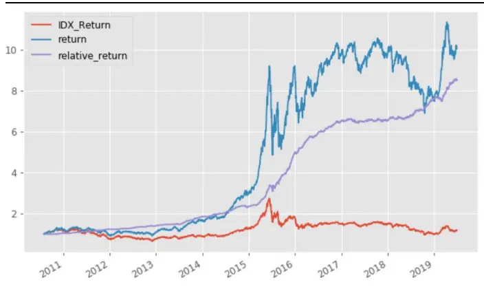
资料来源：光大证券研究所，测试时间：2010/07/01 –2019/08/31

图10：基本面因子高频化中证 500指数增强相对收益和回撤
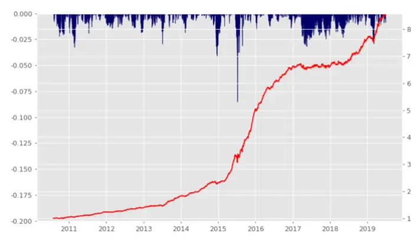
资料来源：光大证券研究所，测试时间：2010/07/01 –2019/08/31

表12：基本面因子高频化中证 500增强分年度表现

|  | 月度胜率 | 年化收益 | 年化波动 | 年化超额收益相对收益波动 |  | 信息比 | 最大回撤 | 相对最大回撤 |
| --- | --- | --- | --- | --- | --- | --- | --- | --- |
| 2010 | 80% | 63% | 25% | 10% | 6% | 1.74 | -9% | -2% |
| 2011 | 92% | -22% | 22% | 18% | 5% | 3.92 | -30% | -3% |
| 2012 | 67% | 16% | 23% | 13% | 4% | 3.11 | -20% | -2% |
| 2013 | 92% | 55% | 21% | 31% | 5% | 5.81 | -16% | -3% |
| 2014 | 83% | 73% | 19% | 26% | 5% | 5.13 | -8% | -4% |
| 2015 | 100% | 192% | 51% | 115% | 12% | 9.63 | -47% | -9% |
| 2016 | 92% | 18% | 29% | 31% | 4% | 7.07 | -24% | -1% |
| 2017 | 50% | -1% | 15% | 0% | 5% | -0.03 | -15% | -3% |
| 2018 | 75% | -23% | 22% | 15% | 5% | 3.12 | -32% | -2% |
| 2019 | 83% | 82% | 25% | 25% | 6% | 3.79 | -16% | -3% |
| Summary | 82% | 29% | 27% | 27% | 6% | 4.29 | -47% | -9% |

资料来源：光大证券研究所，基准为沪深 300 指数，测试时间：2010/07/01 –2019/08/31

由此可见，基本面因子高频化再结合短周期因子的方式下，组合信息比可以达到 4.29，年化超额收益 27%，相对最大回撤 9%。

这其中，优化过程中的换手率约束起到了较为显著的作用，通过在目标函数中加入换手率惩罚项后，整体的平均换手为单边15%，年度平均双边换手36倍。

通过下面的换手率分布直方图，也可以对组合的换手情况有所了解，组合大部分调仓的换手都低于 10%。

图11：基本面因子高频化组合换手率分布情况
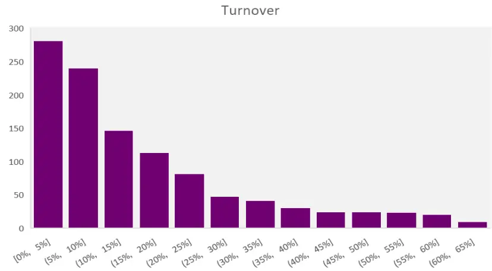
资料来源：光大证券研究所

## 3.2、结合思路之二：基本面股票池+短周期因子调整

基本面因子高频化再结合短周期因子的模型表现来看，2017年仍然是模型表现相对较弱的时间，尽管我们已经在换手率上做了较为严格的控制，但是组合依然难免在价量风格的因子上有较高的暴露度。

同时，从第二章中基本面因子增强模型的效果来看，基本面因子模型在2017年以来都具有较为稳定的超额表现。因此，我们的第二种结合思路是：将基本面模型作为基础池，月频调整；同时在月中采用短周期因子，对组合的持仓进行微调。

## 具体的约束条件和参数如下：

1、调仓方式：基本面因子月频调仓，月中每 2 个交易日根据短周期因子得分，调出得分最低的股票（不超过组合 10%权重），买入剩余股票中等量的得分靠前的股票

表13：基本面因子高频化增强模型优化参数设置

| 参数名 | 参数含义 参数值 |  |
| --- | --- | --- |
| p | 换手率惩罚系数 | 5 |
| l | 个股权重上限 | 1% |
| b | 成分股权重占比下限 | 0.8 |
| i_upper | 行业暴露度下限 | 0.9 |
| i_lower | 行业暴露度上限 | 1.1 |
| x_upper | 风格因子暴露度下限 | 0.95 |
| x_upper | 风格因子暴露度上限 | 1.05 |

资料来源：光大证券研究所

图12：基本面股票池+短周期因子调整增强净值表现
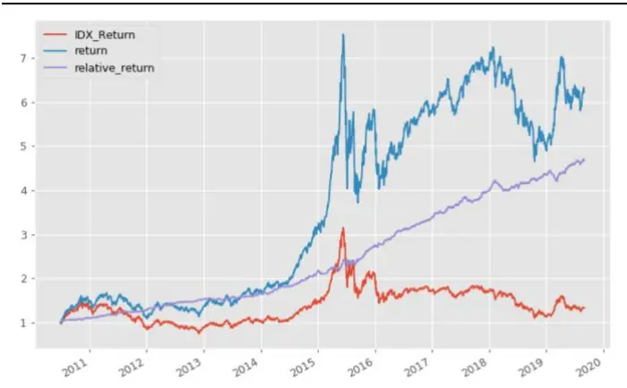
资料来源：光大证券研究所，测试时间：2010/07/01 –2019/08/31

图13：基本面股票池+短周期因子调整增强相对净值及回撤情况
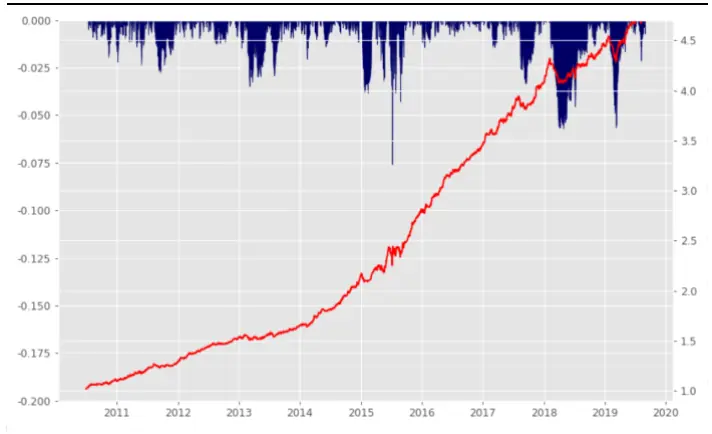
资料来源：光大证券研究所，测试时间：2010/07/01 –2019/08/31

表 14：基本面股票池+短周期因子调整中证 500 增强分年度表现

|  | 月度胜率 | 年化收益 | 年化波动 | 年化超额收益 相对收益波动 |  | 信息比 | 最大回撤 | 相对最大回撤 |
| --- | --- | --- | --- | --- | --- | --- | --- | --- |
| 2010 | 83% | 113% | 29% | 15% | 5% | 2.92 | -12% | -2% |
| 2011 | 92% | -24% | 25% | 17% | 5% | 3.28 | -33% | -3% |
| 2012 | 92% | 22% | 23% | 19% | 4% | 4.61 | -22% | -1% |
| 2013 | 67% | 27% | 22% | 8% | 5% | 1.47 | -15% | -3% |
| 2014 | 100% | 77% | 19% | 29% | 5% | 5.50 | -7% | -2% |
| 2015 | 75% | 75% | 50% | 29% | 11% | 2.55 | -51% | -8% |
| 2016 | 100% | 11% | 29% | 24% | 5% | 5.06 | -24% | -1% |
| 2017 | 92% | 16% | 13% | 17% | 5% | 3.57 | -13% | -3% |
| 2018 | 67% | -28% | 24% | 9% | 5% | 1.97 | -36% | -6% |
| 2019 | 88% | 42% | 26% | 11% | 6% | 1.98 | -17% | -6% |
| Summary | 85% | 22% | 28% | 18% | 6% | 3.03 | -51% | -8% |

资料来源：光大证券研究所，基准为沪深 300 指数，测试时间：2010/07/01 –2019/08/31

基本面股票池+短周期因子调整的方式下，组合超额收益率略有降低，年化超额基准18%，信息比 3.03，但组合在2017年的表现则显著优于上一节中的基本面因子高频化的组合。

由于在每次调仓时都会对成分股占比、市值暴露和行业暴露做约束，组合在原有的基本面模型上有较为稳定的增强效果，年化超额由 13%提高至了18%。但同时由于基本面股票池本身收益能力相对较低，短周期因子调整后的收益较为依赖于基础股票池的收益。

优化过程中的换手率约束起到了较为显著的作用，通过在目标函数中加入换手率惩罚项后，整体的平均换手为单边13%，年度平均双边换手 33倍。

通过下面的换手率分布直方图，也可以对组合的换手情况有所了解，组合大部分调仓的换手都低于 9%。

图14：基本面股票池+短周期因子调整组合换手率分布情况
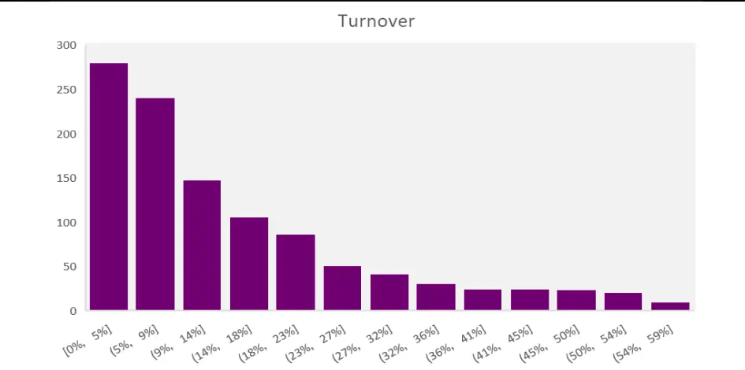
资料来源：光大证券研究所

## 4、小结

本篇报告我们探讨了如何将短周期价量因子与常用的低频基本面模型结合，在综合考虑调仓成本前提下，提高指数增强模型的收益表现。

## 短周期价量类因子特征：预测能力强，与低频价量有较高相关性

以次日开盘价计算收益率挖掘得到的 20 个短周期因子中，年化 IC_IR平均可达 1.15，其中 Alpha_1 因子的 IC_IR 为 1.77，胜率达到 80%，多空夏普也高达 6.42。

在日频的维度上，短周期因子在沪深300 成分内的有效性显著较低，而在中证500 内仍具有不错的预测能力。同时，短周期alpha 因子与低频价量因子中的反转因子、换手率因子均具有较高的相关性。

## 短周期因子增强 v.s.基本面因子增强：各有利弊

1）短周期因子增强：基于短周期 alpha20因子，在较为严格的换手率惩罚和风格行业暴露度控制的条件下，模型的超额收益达 23%，信息比达到3.56，但2017年组合跑输基准3 个百分点，表现较为一般。

2）基本面因子增强：经过优化的纯基本面因子的中证 500 增强模型，整体超额收益能力相对较弱，年化超额基准13%，信息比2.29。但近两年表现出色，2018 和 2019 年的年化超额收益分别为 16%和 22%，均战胜了纯短周期因子的增强模型。

## 基本面结合短周期因子的增强策略

1）基本面因子高频化：将基本面因子也做高频化的处理（填充为日度因子），再将短周期因子与之结合。该方式下，组合信息比可以达到 4.29，年化超额收益27%，相对最大回撤9%。优化过程中的换手率约束起到了较为显著的作用，通过在目标函数中加入换手率惩罚项后，整体的平均换手为单边15%，年度平均双边换手36 倍。

2）基本面股票池+短周期因子调整：将基本面模型作为基础池，月频调整；同时在月中采用短周期因子，对组合的持仓进行微调。该方式下组合超额收益率略有降低，年化超额基准 18%，信息比3.03，但组合在2017 年的表现则显著优于基本面因子高频化的组合，超额更加稳定。

## 5、风险提示

报告结论均基于历史数据与模型，模型存在失效的可能，历史数据存在不被重复验证的可能。

## 6、附录

短周期因子Alpha20 因子构造方式明细表：

表15：短周期因子 Alpha20因子构造方式明细表

| 因子构造明细 |  |
| --- | --- |
| Alpha_1 | multiply(add(ts_correlation(pct_chg(volume,1),pct_chg(avg,1),20),ts_correlation(add(log(value),ts_rank(bs_count_rate ,4)),multiply(low,divide(value,bs_count_rate)),20)),ts_std(multiply(ts_skew(volume,40),sqrt(value)),20)) |
| Alpha_2 | absolute(multiply(pct_chg(close,20),multiply(log(avg),ts_skew(volume,80)))) |
| Alpha_3 | add(bigger(ts_median(volume,4),divide(avg,close)),ts_autocorrelation(bs_sum_rate,1,1)) |
| Alpha_4 | divide(close,open) |
| Alpha_5 | log(multiply(ts_argmin(open,80),ts_std(sqrt(value),4))) |
| Alpha_6 | ts_max(ts_correlation(negative(low),sqrt(avg),1),4) |
| Alpha_7 | multiply(multiply(ts_rank(bs_count_rate,4),ts_std(sqrt(value),20)),ts_kurt(pct_chg(value,1),1)) |
| Alpha_8 | multiply(ts_skew(volume,40),ts_std(ts_kurt(open,40),20)) |
| Alpha_9 | ts_rank(ts_argmin(add(high,low),20),4) |
| Alpha_10 | ts_std(add(pct_chg(volume,1),bs_std_ratio),20) |
| Alpha_11 | ts_mean(ts_skew(open,40),20) |
| Alpha_12 | ts_std(absolute(add(high,ts_max(subtract(sqrt(value),divide(low,bs_std_ratio)),4))),4) |
| Alpha_13 | multiply(ts_kurt(sqrt(value),80),sqrt(open)) |
| Alpha_14 | ts_std(add(log(value),ts_rank(bs_count_rate,4)),4) |
| Alpha_15 | absolute(ts_correlation(avg,bs_count_rate,4)) |
| Alpha_16 | ts_median(smaller(delay(open,80),ts_skew(high,4)),80) |
| Alpha_17 | multiply(log(log(ts_min(multiply(sqrt(avg),ts_skew(avg,20)),1))),ts_max(ts_kurt(volume,40),20) |
| Alpha_18 | smaller(ts_median(ts_skew(close,4),4),pct_chg(ts_max(pct_chg(volume,1),4),20)) |
| Alpha_19 | multiply(ts_skew(add(high,bs_ir_diff),4),add(ts_std(sqrt(sqrt(value)),20),bs_sum_rate)) |
| Alpha_20 | multiply(subtract(avg,multiply(ts_skew(volume,80),sqrt(value))),ts_kurt(ts_skew(ts_std(add(pct_chg(volume,1),ts_rank (bs_count_rate,4)),20),40),1)) |

资料来源：光大证券研究所

## 行业及公司评级体系

| 评级 说明 |
| --- |
| 行 买入 未来6-12个月的投资收益率领先市场基准指数15%以上； |
| 增持 未来6-12个月的投资收益率领先市场基准指数5%至15%； |
| 中性 未来6-12个月的投资收益率与市场基准指数的变动幅度相差-5%至5%； |
| 减持 未来6-12个月的投资收益率落后市场基准指数5%至15%； |
| 卖出 未来6-12个月的投资收益率落后市场基准指数15%以上； |
| 因无法获取必要的资料，或者公司面临无法预见结果的重大不确定性事件，或者其他原因，致使无法给出明确的无评级投资评级。 |
| 基准指数说明：A股主板基准为沪深300指数；中小盘基准为中小板指；创业板基准为创业板指；新三板基准为新三板指数；港股基准指数为恒生指数。 |

## 分析、估值方法的局限性说明

本报告所包含的分析基于各种假设，不同假设可能导致分析结果出现重大不同。本报告采用的各种估值方法及模型均有其局限性，估值结果不保证所涉及证券能够在该价格交易。

## 分析师声明

本报告署名分析师具有中国证券业协会授予的证券投资咨询执业资格并注册为证券分析师，以勤勉的职业态度、专业审慎的研究方法，使用合法合规的信息，独立、客观地出具本报告，并对本报告的内容和观点负责。负责准备以及撰写本报告的所有研究人员在此保证，本研究报告中任何关于发行商或证券所发表的观点均如实反映研究人员的个人观点。研究人员获取报酬的评判因素包括研究的质量和准确性、客户反馈、竞争性因素以及光大证券股份有限公司的整体收益。所有研究人员保证他们报酬的任何一部分不曾与，不与，也将不会与本报告中具体的推荐意见或观点有直接或间接的联系。

## 特别声明

光大证券股份有限公司（以下简称“本公司”）创建于 1996 年，系由中国光大（集团）总公司投资控股的全国性综合类股份制证券公司，是中国证监会批准的首批三家创新试点公司之一。根据中国证监会核发的经营证券期货业务许可，本公司的经营范围包括证券投资咨询业务。

本公司经营范围：证券经纪；证券投资咨询；与证券交易、证券投资活动有关的财务顾问；证券承销与保荐；证券自营；为期货公司提供中间介绍业务；证券投资基金代销；融资融券业务；中国证监会批准的其他业务。此外，本公司还通过全资或控股子公司开展资产管理、直接投资、期货、基金管理以及香港证券业务。

本报告由光大证券股份有限公司研究所（以下简称“光大证券研究所”）编写，以合法获得的我们相信为可靠、准确、完整的信息为基础，但不保证我们所获得的原始信息以及报告所载信息之准确性和完整性。光大证券研究所可能将不时补充、修订或更新有关信息，但不保证及时发布该等更新。

本报告中的资料、意见、预测均反映报告初次发布时光大证券研究所的判断，可能需随时进行调整且不予通知。在任何情况下，本报告中的信息或所表述的意见并不构成对任何人的投资建议。客户应自主作出投资决策并自行承担投资风险。本报告中的信息或所表述的意见并未考虑到个别投资者的具体投资目的、财务状况以及特定需求。投资者应当充分考虑自身特定状况，并完整理解和使用本报告内容，不应视本报告为做出投资决策的唯一因素。对依据或者使用本报告所造成的一切后果，本公司及作者均不承担任何法律责任。

不同时期，本公司可能会撰写并发布与本报告所载信息、建议及预测不一致的报告。本公司的销售人员、交易人员和其他专业人员可能会向客户提供与本报告中观点不同的口头或书面评论或交易策略。本公司的资产管理子公司、自营部门以及其他投资业务板块可能会独立做出与本报告的意见或建议不相一致的投资决策。本公司提醒投资者注意并理解投资证券及投资产品存在的风险，在做出投资决策前，建议投资者务必向专业人士咨询并谨慎抉择。

在法律允许的情况下，本公司及其附属机构可能持有报告中提及的公司所发行证券的头寸并进行交易，也可能为这些公司提供或正在争取提供投资银行、财务顾问或金融产品等相关服务。投资者应当充分考虑本公司及本公司附属机构就报告内容可能存在的利益冲突，勿将本报告作为投资决策的唯一信赖依据。

本报告根据中华人民共和国法律在中华人民共和国境内分发，仅向特定客户传送。本报告的版权仅归本公司所有，未经书面许可，任何机构和个人不得以任何形式、任何目的进行翻版、复制、转载、刊登、发表、篡改或引用。如因侵权行为给本公司造成任何直接或间接的损失，本公司保留追究一切法律责任的权利。所有本报告中使用的商标、服务标记及标记均为本公司的商标、服务标记及标记。

## 光大证券股份有限公司 2019版权所有。

## 联系我们

| 上海 | 北京 | 深圳 |
| --- | --- | --- |
| 静安区南京西路1266号恒隆广场1号 西城区月坛北街2号月坛大厦东配楼2层 写字楼48层 | 复兴门外大街6号光大大厦17层 | 福田区深南大道 6011 号 NEO 绿景纪元大 厦 A 座 17 楼 |