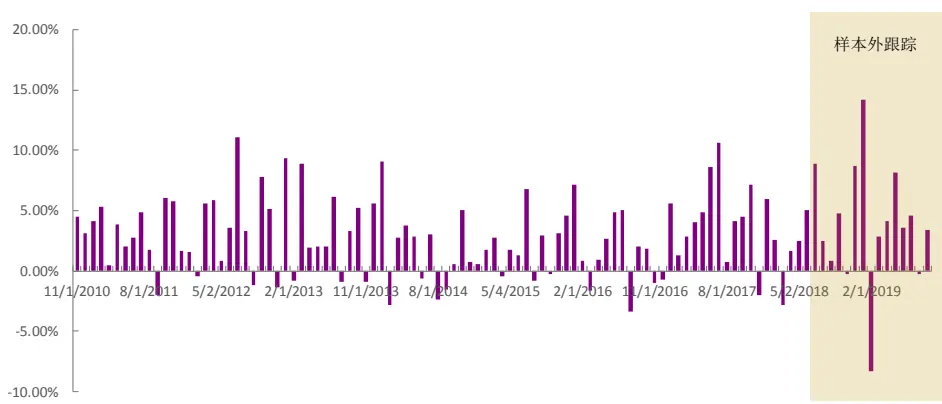
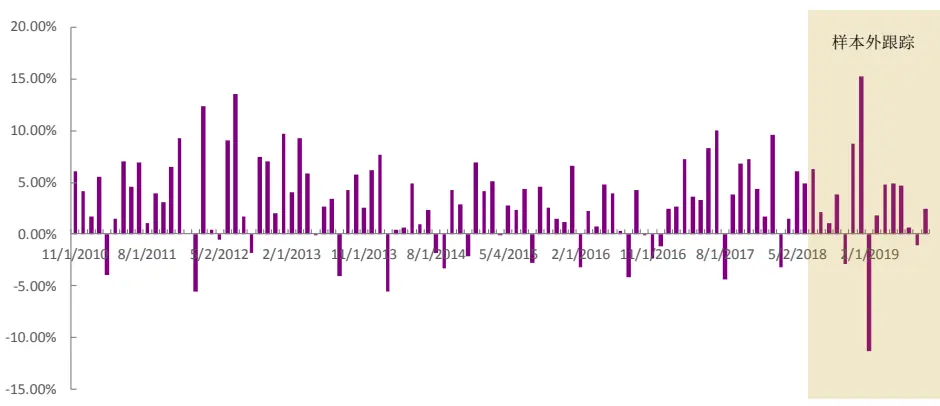
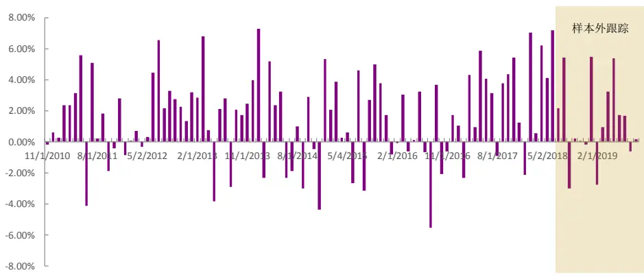

## 创新基本面因子：财务数据全扫描——多因子系列报告之二十六

2017 年来，以往效果卓越的市值因子、量价类因子等都出现了有效性下滑的情况，价值投资的呼声也越来越高。愈来愈多的投资经理开始关注基本面因子。然而过于简单直白的基本面因子其效果又差强人意。基于这样的现象与需求，我们从 2018 年开始推出创新基本面因子系列报告。尝试通过一些更深入的研究，在保留直观逻辑意义的同时，更好地提取出蕴含在基本面数据中的有效预测信息。在前3 篇系列报告中我们分别构建3 个不同创新基本面因子。该篇报告在回顾它们在随后样本外的跟踪表现同时，也尝试基于数据挖掘的方式对财务数据进行一次全面扫描，挖掘可能有效的财务因子。

基本面因子特色鲜明。以财务数据为基础构造选股因子，相比于量价类因子，往往在以下几个方面更占优势：更加直接的信息源、更加直观的逻辑意义、更低的换手率、更慢的信息衰减速度。但相应的，财务数据样本数量较少也很令量化研究者烦恼。尤其是A 股大部分公司财报数量不超过 100个，意味着任何一个可用的财务指标在时间序列上仅不足 100 个样本。这使得人们在原有指标本身基础上再构建新因子或提高原有因子效果的操作空间，远远小于量价数据。

- 基于逻辑开发的创新基本面因子样本外跟踪效果好。基于逻辑与实证构建的3 个创新基本面因子：营业能力改善（RROC）因子、线性提纯净利润（LPNP）因子、产能利用率提升（OCFA）因子从2018年6月份开始样本外跟踪的1年多时间里效果都较为优秀。其中RROC因子样本外跟踪的月度IC均值3.85%，IR 高达 0.75。

- 数据挖掘下因子多有亮眼表现。通过暴力遍历的方式对大量财务指标进行两两之间的时序线性回归 $Funda_{Y}=\beta_{X}*Funda_{X}+\varepsilon$ ，取其最后一期ε作为因子值，测试其因子效果。并按照因变量所使用的财务指标类型，将因子分为成长、盈利、营运效率、现金流、资本结构、安全性、成本相关、非经常性项目，同时分别展示该类别中相对较为有效的因子。整体上成长类型应变量因子效果更强，效果最佳的组合为营业利润作为因变量在息税前利润（EBIT）上滚动回归取残差得到的因子，其月度IR可达0.89。

- 风险提示：测试结果均基于模型和历史数据，模型存在数据挖掘及失效的风险。

## 金融工程深度

## 分析师

刘均伟 (执业证书编号：S0930517040001)

021-52523679

liujunwei@ebscn.com

周萧潇 (执业证书编号：S0930518010005)

021-52523680

zhouxiaoxiaoi@ebscn.com

胡骥聪 (执业证书编号：S0930519060002)

021-52523683

hujICong@ebscn.com

## 相关研报

《创新基本面因子：财务数据间线性关系初窥——多因子系列报告之十四》2018.08《创新基本面因子：提纯净利数据中的选股信息——多因子系列报告之十五》2018.09

《创新基本面因子：捕捉产能利用率中的讯号——多因子系列报告之十六》2018.11

## 1、逻辑挖掘的创新基本面因子效果佳

以财务数据为基础构造选股因子，相比于量价类因子，往往在以下几个方面更占优势：更加直接的信息源、更加直观的逻辑意义、更低的换手率、更慢的信息衰减速度。

但相应的，财务数据样本数量较少也很令量化研究者烦恼。尤其是A 股大部分公司财报数量不超过 100 个，意味着任何一个可用的财务指标在时间序列上仅不足100个样本。这使得人们在原有指标本身基础上再构建新因子或提高原有因子效果的操作空间，远远小于量价数据。

为了更深入地挖掘潜藏在财务数据间的选股信息，我们在去年提出了基于财务数据间线性关系的创新基本面研究框架并相应构建了3个不同的创新基本面新因子。该章节将简单回顾创新基本面因子研究框架与开发的新因子在样本外跟踪下来的表现。

## 1.1、财务数据间线性关系研究框架

## 框架逻辑：

财务报表中披露的财务数据总共有300个以上，这其中有许多财务数据之间是有着（或者说应该有着）鲜明的线性关系的。比如利润跟销量、收入跟成本、资产与负债等等。因此在逻辑上，利用这种不同财务数据间明显的线性关系构造的因子有较为直观的解释意义。

## 框架步骤：

首先，确定一个蕴含在财务数据间线性关系的经济逻辑，或者经营逻辑。

接着，当我们要研究两个或多个变量之间的线性关系时，最简单自然的想法便是使用OLS线性回归模型。在我们的框架里，如果我们认为基本面数据 Y与基本面数据 A、B、C...在逻辑上有线性关系，或者 Y 的数值应当能被 A、B、C...解释，那就可以构造时间序列线性回归模型：

$$
\begin{array}{r}{Funda_{Y}=\beta_{A}*Funda_{A}+\beta_{B}*Funda_{B}+\beta_{C}*Funda_{C}+\cdots+}\\{\beta_{X}*Funda_{X}+\varepsilon\#(1)\qquad}\end{array}
$$

或者，更常用的简化形式，仅考虑两个不同财务数据间的简单线性回归：

$$
Funda_{Y}=\beta_{X}*Funda_{X}+{\varepsilon}\#(2)
$$

在拟合好回归模型 $\scriptstyle{\mathcal{E}}$ ，根据逻辑需要，找到可以反映或代理该逻辑的量化数据，比如是需要 $\beta_{X}$ ，还是需要拟合后的最后一期的残差 $\varepsilon_{T}$ ，还是需要变量解释程度 $R^{2}$ 等等，甚至更进一步，这些描述线性关系的统计数据在时间序列上的性质等等。

## 最后，要说明的有以下几点：

1. 该回归模型是在滚动时间序列， $\bar{\kappa}$ 非在股票横截面上做回归。每个股票的因子仅由其自己各个不同财务数据时间序列回归得出。滚动窗口本身可以设置为参数，一般默认为 8 期，即使用过去 2 年的数据。同时默认做市值与行业中性。

2. 该框架中，为了避免不同股票在回归时财务数据量级不同导致最终因子也受该量级的影响，所有的财务数据在滚动回归窗口里都会先进行标准化操作（z_score 标准化）。

3. 最后值得一提的是，由于不少财务数据并不是所有公司都会公布，有些财务指标仅相应行业的公司才有。因此我们的研究框架中会设置简单的因子覆盖度检查。在全市场的因子开发中，只有通过覆盖度检查该因子才会被我们采纳。也正是因为不少行业有其独有的财务数据，我们的研究框架也除了全市场，也可以进行单行业基本面因子的开发。

## 1.2、创新基本面因子效果

运用以上研究框架，基于逻辑与实证，我们分别构建了3 个新因子：营业能力改善（RROC）因子、线性提纯净利润（LPNP）因子、产能利用率提升（OCFA）因子。

表1：创新基本面因子构造方式

| 因子名称 | 构造方式营业收入在营业成本上时序归回取最后一期残差 |
| --- | --- |
| RROC |  |
| LPNP | 净利润在营业外收入与支付给员工现金上多元回归取最后一期残差 |
| OCFA | 营业成本在固定资产上时序回归取最后一期残差 |

资料来源：光大证券研究所

从最近 1 年多的样本外跟踪表现看，这些创新基本面因子仍然很有效。在 2018 年 7 月到 2019 年 9 月这 15 个月里，RROC、LPNP、OCFA 的月度 IC 均值分别为 3.85%、2.73%、1.33%。

表2：创新基本面因子样本外跟踪表现

| RROC | LPNP OCFA |
| --- | --- |
| IC 均值 3.85% | 2.73% 1.33% |
| IC>0 比例 80% | 80% 73% |
| ICIR 0.75 | 0.47 0.5 |

资料来源：光大证券研究所，Wind

图 1：RROC 因子 IC 序列

资料来源：光大证券研究所，Wind

图 2：LPNP 因子 IC 序列

资料来源：光大证券研究所，Wind

图 3：OCFA 因子 IC 序列

资料来源：光大证券研究所，Wind

## 2、数据挖掘的创新基本面因子梳理

观察我们新开发的3 个因子的构造方式，全部都是时序回归取残差。这令我们不由怀疑在这一类构造方式下，是否还有其它我们意想不到的有效因子，又或者仅仅是由于我们本身的知识盲区而遗漏的有效因子。因此为了更有效率地对该类因子进行挖掘，我们采用暴力遍历的方式对大量财务指标进行两两之间的时序线性回归 $Funda_{Y}=\beta_{X}*Funda_{X}+\varepsilon$ ，取其最后一期ε作为因子值，测试其因子效果。

但值得注意的是，虽然通过暴力遍历的方式，可能得出一些数据漂亮的因子。然而财务数据数据样本过小的确会令过拟合出现的概率大大增加。因此在运用的过程中我们认为两点依然十分重要，一是尝试理解因子背后是否有合理的逻辑解释；二是要观察更多样本外的效果检验。

## 2.1、成长类财务数据整体因子效果最佳

在经过简单的因子覆盖度筛选后，我们总共留下209 个财务数据或指标进行暴力测试，最终得到 43472（209∗208）个因子结果。由于数据量过大我们不在此一一展示，仅挑出每个财务数据作为因变量时表现最好的因子列在附录中，详细数据可参见文末附录4.1。

从整体结果上看，成长类财务指标作为因变量的有效因子，其效果显著高于其它类型财务数据构造的因子。效果最佳的组合为营业利润作为因变量在息税前利润（EBIT）上滚动回归取残差得到的因子，其月度IR可达0.89。

## 2.2、各类型财务数据有效因子

为了方便读者区分不同财务数据数据构造的因子，我们按照因变量所使用的财务指标类型，将因子分为成长、盈利、营运效率、现金流、资本结构、安全性、成本相关、非经常性项目，并分别展示该类别中相对较为有效的因子。

## 2.2.1、成长类型因变量因子

成长类型因变量因子是整体表现最强的一类，其因子方向也都符合因变量的逻辑，全为正向。其中营业利润有着最高的信息量，以之在另一些利润数据滚动回归后得到的因子往往有着超过 3.5%的 IC 与 0.85 的 IR。不同有效因子的自变量各不相同，表明因子信息主要由因变量自身带来，自变量起辅助增强的效果。

表3：成长类型因变量因子效果示例节选

| 因变量 | 自变量 | IC 均值 | IR |
| --- | --- | --- | --- |
| 营业利润 | 息税前利润 | 3.54% | 0.89 |
| 营业利润 | 毛利 | 3.98% | 0.88 |
| 营业利润 | 销售商品提供劳务收到的现金/营业收入 | 3.69% | 0.87 |
| 同比增长率-稀释每股收益(%) | 归属于母公司的股东权益/全部投入资本 | 3.44% | 0.86 |
| 净利润(不含少数股东损益) | 销售商品提供劳务收到的现金/营业收入 | 3.72% | 0.85 |
| 净利润(含少数股东损益) | 销售商品提供劳务收到的现金/营业收入 | 3.72% | 0.85 |
| 净利润(不含少数股东损益) | 息税前利润 | 3.51% | 0.84 |
| 利润总额 | 销售商品提供劳务收到的现金/营业收入 | 3.74% | 0.83 |
| 同比增长率-营业利润(%) | 权益乘数(用于杜邦分析) | 2.47% | 0.83 |
| 净利润(不含少数股东损益) | 毛利 | 3.85% | 0.83 |
| 同比增长率-利润总额(%) | 所得税/利润总额 | 3.19% | 0.83 |
| 利润总额 | 息税前利润 | 3.56% | 0.83 |
| 利润总额 | 总资产报酬率 | 3.99% | 0.82 |
| 同比增长率-营业利润(%) | 每股盈余公积 | 2.90% | 0.82 |

| 净利润(含少数股东损益) | 应付票据 | 3.64% | 0.82 |
| --- | --- | --- | --- |
| 同比增长率-归属母公司股东的净利润-扣除非经常损益(%) | 归属于母公司的股东权益负债合计 | 2.71% | 0.82 |
| 净利润(含少数股东损益) | 毛利 | 3.86% | 0.82 |
| 同比增长率-营业利润(%) | 归属于母公司的股东权益负债合计 | 2.68% | 0.82 |
| 所得税 | 每股股东自由现金流量 | 3.38% | 0.82 |
| 所得税 | 股权自由现金流量(FCFE) | 3.31% | 0.82 |
| 同比增长率-利润总额(%) | 权益乘数(用于杜邦分析) | 2.47% | 0.81 |
| 同比增长率-利润总额(%) | 负债及股东权益总计 | 2.58% | 0.81 |
| 同比增长率-归属母公司股东的净利润(%) | 权益乘数(用于杜邦分析) | 2.59% | 0.81 |
| 同比增长率-归属母公司股东的净利润-扣除非经常损流益(%) | 动比率 | 2.74% | 0.81 |
| 同比增长率-稀释每股收益(%) | 应收账款周转率 | 3.27% | 0.81 |
| 同比增长率-稀释每股收益(%) | 非经常性损益 | 3.16% | 0.81 |
| 同比增长率-归属母公司股东的净利润(%) | 资产总计 | 2.67% | 0.81 |
| 同比增长率-归属母公司股东的净利润(%) | 负债及股东权益总计 | 2.67% | 0.81 |
| 同比增长率-归属母公司股东的净利润-扣除非经常损益(%) | 有形资产/负债合计 | 2.64% | 0.80 |
| 所得税 | 每股企业自由现金流量 | 3.31% | 0.80 |

资料来源：光大证券研究所，Wind 注：样本计算区间为 2009 年2 月至 2018 年9 月

## 2.2.2、盈利类型因变量因子

盈利类型因变量因子的效果也普遍较强。与收入相关的因变量因子方向皆为正，与成本相关的因变量因子皆为负向因子，符合预期。表现较好的因子其自变量大多为盈余公积金或每股盈余公积，说明盈余公积金相关信息能大幅提升盈利类因子的选股效果。

表 4：盈利类型因变量因子效果示例节选

| 因变量 | 自变量 | IC 均值 | IR |
| --- | --- | --- | --- |
| 营业总成本/营业总收入 | 盈余公积金 | -3.10% | -0.79 |
| 营业利润/营业总收入 | 盈余公积金 | 3.28% | 0.78 |
| 年化净资产收益率 | 盈余公积金 | 3.74% | 0.77 |
| 年化净资产收益率 | 每股盈余公积 | 3.64% | 0.77 |
| 营业利润/营业总收入 | 每股盈余公积 | 3.21% | 0.77 |
| 年化净资产收益率 | 相对年初增长率-归属母公司的股东权益(%) | 3.06% | 0.77 |
| 营业总成本/营业总收入 | 每股盈余公积 | -3.08% | -0.76 |
| 营业利润/营业总收入 | 权益乘数(用于杜邦分析) | 2.74% | 0.76 |
| 销售成本率 | 每股盈余公积 | -2.62% | -0.75 |

| 销售毛利率 | 每股盈余公积 | 2.62% | 0.75 |
| --- | --- | --- | --- |
| 销售净利率 | 每股盈余公积 | 3.16% | 0.75 |
| 净利润/营业总收入 | 每股盈余公积 | 3.16% | 0.75 |
| 利润总额/营业收入 | 每股盈余公积 | 3.18% | 0.75 |
| 利润总额/营业收入 | 盈余公积金 | 3.28% | 0.74 |
| 息税前利润/营业总收入 | 盈余公积金 | 3.16% | 0.74 |
| 营业总成本/营业总收入 | 资产负债率 | -2.67% | -0.73 |
| 年化总资产报酬率 | 盈余公积金 | 3.52% | 0.73 |
| 销售净利率 | 盈余公积金 | 3.22% | 0.73 |
| 息税前利润/营业总收入 | 每股盈余公积 | 3.05% | 0.73 |
| 利润总额/营业收入 | 股东权益合计(不含少数股东权益) | 2.56% | 0.73 |
| 净利润/营业总收入 | 盈余公积金 | 3.22% | 0.73 |
| 年化总资产报酬率 | 每股盈余公积 | 3.36% | 0.72 |
| 年化总资产净利率 | 经营活动产生的现金流量净额/营业利润 | 2.83% | 0.71 |
| 销售成本率 | 盈余公积金 | -2.57% | -0.71 |
| 销售毛利率 | 盈余公积金 | 2.57% | 0.71 |
| 息税前利润/营业总收入 | 股东权益合计(不含少数股东权益) | 2.39% | 0.71 |
| 净利润/营业总收入 | 有形资产 | 2.60% | 0.70 |
| 销售净利率 | 有形资产 | 2.60% | 0.70 |
| 年化总资产报酬率 | 股东权益合计(含少数股东权益) | 2.88% | 0.70 |
| 年化总资产净利率 | 经营活动产生的现金流量净额/经营活动净收益 | 2.86% | 0.69 |

资料来源：光大证券研究所，Wind 注：样本计算区间为 2009 年2 月至 2018 年9 月

## 2.2.3、营运效率类型因变量因子

不同营运效率类型因变量因子效果差异较大。作为因变量信息含量最高的财务数据是预收款项，表现最高的因子是预收款项在存货周转天数回归取残差，逻辑上我们认为该因子反应了上市公司营运效率的提升。因子方向上，与周期、周转天数相关的因变量因子方向皆为负向。

表 5：营运效率类型因变量因子效果示例节选

| 因变量 | 自变量 | IC均值 | IR |
| --- | --- | --- | --- |
| 预收款项 | 存货周转天数 | 1.93% | 0.63 |
| 预收款项 | 营业周期 | 1.78% | 0.59 |
| 预收款项 | 总资产周转率 | 1.90% | 0.57 |
| 应收账款周转天数 | 应收账款 | -1.78% | -0.56 |
| 应收账款周转天数 | 应付票据 | -1.71% | -0.52 |
| 营业周期 | 有形资产/总资产 | -1.48% | -0.51 |
| 营业周期 | 权益乘数(用于杜邦分析) | -1.51% | -0.51 |
| 营业周期 | 期末现金及现金等价物余额 | -1.65% | -0.51 |
| 其他应付款 | 非营业利润/利润总额 | 1.53% | 0.49 |
| 其他应付款 | 营业利润/利润总额 | 1.53% | 0.49 |

| 应收账款周转天数 | 每股盈余公积 | -1.52% | -0.49 |
| --- | --- | --- | --- |
| 应收账款周转率 | 毛利 | -1.91% | -0.49 |
| 其他应付款 | 经营活动净收益/利润总额 | 1.47% | 0.48 |
| 应收账款周转率 | 扣除财务费用前营业利润 | -1.67% | -0.47 |
| 应收账款周转率 | 息税前利润 | -1.67% | -0.46 |
| 总资产周转率 | 毛利 | -2.35% | -0.45 |
| 应付账款 | 归属于母公司的股东权益/全部投入资本 | 1.63% | 0.45 |
| 存货 | 存货周转天数 | 1.77% | 0.45 |
| 应付账款 | 营业周期 | 1.41% | 0.44 |
| 流动资产周转率 | 毛利 | -2.05% | -0.44 |
| 存货周转天数 | 存货 | -1.46% | -0.44 |
| 应付账款 | 存货周转率 | 1.56% | 0.44 |
| 存货周转率 | 毛利 | -1.94% | -0.44 |
| 总资产周转率 | 息税前利润 | -1.95% | -0.43 |
| 总资产周转率 | 扣除财务费用前营业利润 | -1.96% | -0.43 |
| 应收账款 | 应收账款周转天数 | 1.93% | 0.43 |
| 存货 | 营业周期 | 1.65% | 0.43 |
| 预付款项 | 短期借款 | 1.17% | 0.42 |
| 存货周转率 | 扣除财务费用前营业利润 | -1.72% | -0.42 |
| 存货周转率 | 息税前利润 | -1.71% | -0.42 |

资料来源：光大证券研究所，Wind 注：样本计算区间为 2009 年 2 月至 2018 年 9 月

## 2.2.4、现金流类型因变量因子

较为有效的现金流类型因变量因子，其因变量大多与经营活动相关的现金有关，变相偏向营运效率的逻辑，因此因子信息大多会与营运效率类因子有重合。

表6：现金流类型因变量因子效果示例节选

| 因变量 | 自变量 | IC 均值 | IR |
| --- | --- | --- | --- |
| 销售商品、提供劳务收到的现金 | 存货周转率 | 2.67% | 0.62 |
| 销售商品、提供劳务收到的现金 | 流动负债/负债合计 | 1.97% | 0.62 |
| 销售商品、提供劳务收到的现金 | 保守速动比率 | 2.02% | 0.62 |
| 经营活动现金流入小计 | 存货周转率 | 2.58% | 0.61 |
| 经营活动现金流入小计 | 总资产周转率 | 2.49% | 0.59 |
| 经营活动现金流入小计 | 销售毛利率 | 1.74% | 0.59 |
| 经营活动现金流出小计 | 财务费用/营业总收入 | 1.75% | 0.52 |
| 经营活动现金流出小计 | 营运资金 | 1.61% | 0.51 |
| 经营活动现金流出小计 | 经营活动产生的现金流量净额/负债合计 | 2.23% | 0.51 |
| 支付其他与经营活动有关的现金 | 投入资本回报率 | 1.23% | 0.47 |
| 支付其他与经营活动有关的现金 | 总资产报酬率 | 1.23% | 0.46 |

敬请参阅最后一页特别声明

| 支付其他与经营活动有关的现金 | 销售期间费用率 | 1.12% | 0.46 |
| --- | --- | --- | --- |
| 经营活动产生的现金流量净额 | 年化投入资本回报率 | 1.15% | 0.44 |
| 经营活动产生的现金流量净额 | 年化总资产净利率 | 1.15% | 0.44 |
| 经营活动产生的现金流量净额 | 经营活动现金流出小计 | 1.16% | 0.44 |
| 同比增长率-经营活动产生的现金流量净额(%) | 筹资活动产生的现金流量净额 | 1.11% | 0.43 |
| 投资活动现金流出小计 | 资产负债率 | 0.99% | 0.43 |
| 投资活动现金流出小计 | 权益乘数 | 0.99% | 0.43 |
| 投资活动现金流出小计 | 产权比率 | 0.97% | 0.42 |
| 同比增长率-经营活动产生的现金流量净额(%) | 购买商品、接受劳务支付的现金 | 1.05% | 0.41 |
| 同比增长率-经营活动产生的现金流量净额(%) | 加：营业外收入 | 1.08% | 0.40 |
| 购建固定资产、无形资产和其他长期资产支付的现金 | 应收票据 | 1.19% | 0.40 |
| 每股经营活动产生的现金流量净额 | 年化总资产净利率 | 1.03% | 0.35 |
| 每股经营活动产生的现金流量净额 | 经营活动现金流出小计 | 1.01% | 0.35 |
| 每股经营活动产生的现金流量净额 | 年化投入资本回报率 | 1.01% | 0.34 |
| 支付给职工以及为职工支付的现金 | 总资产报酬率 | 1.41% | 0.34 |
| 支付给职工以及为职工支付的现金 | 投入资本回报率 | 1.42% | 0.34 |
| 投资活动产生的现金流量净经额 | 营活动产生的现金流量净额/流动负债 | -0.78% | -0.32 |
| 支付给职工以及为职工支付的现金 | 总资产净利润 | 1.33% | 0.32 |

资料来源：光大证券研究所，Wind 注：样本计算区间为 2009 年2 月至 2018 年9 月

## 2.2.5、资本结构类型因变量因子

较为有效的资本结构类型因变量因子，其因变量多为无息流动负债或负债合计。且负债因变量因子方向为正向，我们认为该类因子体现了上市公司的融资能力或者与上下游的议价能力。

表7：资本结构类型因变量因子效果示例节选

| 因变量 | 自变量 | IC 均值 | IR |
| --- | --- | --- | --- |
| 无息流动负债 | 存货周转率 | 2.27% | 0.60 |
| 无息流动负债 | 财务费用/营业总收入 | 1.94% | 0.59 |
| 无息流动负债 | 少数股东权益 | 1.60% | 0.59 |
| 负债合计 | 相对年初增长率-归属母公司的股东权益(%) | 1.89% | 0.57 |
| 负债合计 | 财务费用/营业总收入 | 1.78% | 0.57 |
| 负债合计 | 营业利润/负债合计 | 1.90% | 0.56 |

| 流动负债合计 | 财务费用/营业总收入 | 1.81% | 0.55 |
| --- | --- | --- | --- |
| 留存收益 | 盈余公积金 | 2.70% | 0.54 |
| 每股未分配利润 | 盈余公积金 | 2.27% | 0.54 |
| 流动资产合计 | 财务费用/营业总收入 | 1.74% | 0.53 |
| 流动负债合计 | 销售期间费用率 | 1.78% | 0.52 |
| 流动负债合计 | 短期借款 | 1.70% | 0.52 |
| 留存收益 | 应收账款周转率 | 3.19% | 0.52 |
| 流动资产合计 | 资产减值损失/营业总收入 | 2.20% | 0.51 |
| 每股未分配利润 | 资本公积金 | 2.13% | 0.51 |
| 流动资产合计 | 应收账款周转天数 | 1.74% | 0.51 |
| 每股未分配利润 | 股本 | 2.56% | 0.50 |
| 留存收益 | 总资产周转率 | 3.04% | 0.50 |
| 盈余公积金 | 留存收益 | -2.13% | -0.47 |
| 有形资产 | 有形资产/总资产 | 1.96% | 0.46 |
| 有形资产 | 归属于母公司的股东权益/负债合计 | 1.99% | 0.46 |
| 有形资产 | 有形资产/负债合计 | 2.01% | 0.46 |
| 产权比率 | 带息债务/全部投入资本 | 1.17% | 0.46 |
| 流动资产/总资产 | 非流动资产合计 | 1.33% | 0.46 |
| 非流动资产/总资产 | 非流动资产合计 | -1.32% | -0.45 |
| 权益乘数 | 带息债务/全部投入资本 | 1.16% | 0.45 |
| 资产负债率 | 带息债务/全部投入资本 | 1.19% | 0.45 |
| 非流动负债合计 | 非流动负债/负债合计 | 1.32% | 0.45 |
| 非流动负债合计 | 流动负债/负债合计 | 1.34% | 0.45 |

资料来源：光大证券研究所，Wind 注：样本计算区间为 2009 年 2 月至 2018 年 9 月

## 2.2.6、安全性类型因变量因子

安全性类型因变量因子整体表现差异不是很大，从因变量与自变量指标来看，或多或少反映了盈余质量的信息。

表8：安全性类型因变量因子效果示例节选

| 因变量 | 自变量 | IC 均值 | IR |
| --- | --- | --- | --- |
| 已获利息倍数(EBIT/利息费用) | 权益乘数(用于杜邦分析) | 2.35% | 0.57 |
| 经营活动产生的现金流量净额/营业收入 | 经营活动现金流出小计 | 1.42% | 0.56 |
| 已获利息倍数(EBIT/利息费用) | 每股盈余公积 | 2.55% | 0.56 |
| 期末现金及现金等价物余额 | 息税前利润 | 1.84% | 0.55 |
| 已获利息倍数(EBIT/利息费用) | 盈余公积金 | 2.52% | 0.55 |
| 经营活动产生的现金流量净筹额/营业收入 | 资活动产生的现金流量净额 | 1.28% | 0.54 |
| 期末现金及现金等价物余额 | 毛利 | 1.99% | 0.54 |
| 经营活动产生的现金流量净额/营业收入 | 购买商品、接受劳务支付的现金 | 1.28% | 0.52 |
| 期末现金及现金等价物余额 | 扣除非经常性损益后净利润 | 1.66% | 0.51 |

敬请参阅最后一页特别声明

| 非营业利润/利润总额 | 应收账款周转率 | -1.43% | -0.48 |
| --- | --- | --- | --- |
| 营业利润/利润总额 | 应收账款周转率 | 1.43% | 0.48 |
| 营业利润/利润总额 | 支付给职工以及为职工支付的现金 | 1.27% | 0.47 |
| 非营业利润/利润总额 | 支付给职工以及为职工支付的现金 | -1.27% | -0.47 |
| 非营业利润/利润总额 | 固定资产周转率 | -1.37% | -0.47 |
| 营业利润/利润总额 | 固定资产周转率 | 1.37% | 0.47 |
| 扣除非经常损益后的净利润收/净利润 | 到其他与经营活动有关的现金 | 1.33% | 0.46 |
| 经营活动净收益/利润总额 | 收到其他与经营活动有关的现金 | 1.50% | 0.46 |
| 营业利润/流动负债 | 流动负债合计 | 2.00% | 0.46 |
| 营业利润/流动负债 | 存货周转率 | 1.92% | 0.46 |
| 扣除非经常损益后的净利润投/净利润 | 资活动产生的现金流量净额 | 1.26% | 0.45 |
| 营业利润/流动负债 | 归属于母公司的股东权益/负债合计 | 1.87% | 0.45 |
| 扣除非经常损益后的净利润/净利润 | 期末现金及现金等价物余额 | 1.31% | 0.45 |
| 营业外收支净额/利润总额 | 支付给职工以及为职工支付的现金 | -1.21% | -0.45 |
| 营业外收支净额/利润总额 | 加：营业外收入 | -1.53% | -0.44 |
| 经营活动净收益/利润总额 | 减：财务费用 | 1.43% | 0.44 |
| 期初现金及现金等价物余额 | 扣除财务费用前营业利润 | 2.14% | 0.44 |
| 经营活动净收益/利润总额 | 收到的税费返还 | 1.87% | 0.43 |
| 营业外收支净额/利润总额 | 收到其他与经营活动有关的现金 | -1.27% | -0.43 |
| 期初现金及现金等价物余额 | 毛利 | 2.29% | 0.42 |
| 期初现金及现金等价物余额 | 息税前利润 | 2.04% | 0.42 |

资料来源：光大证券研究所，Wind 注：样本计算区间为 2009 年2 月至 2018 年9 月

## 2.2.7、成本相关类型因变量因子

成本相关类型因变量因子的方向大多取决于其自变量。如果自变量是收入相关的财务数据，则该因子实质上仅仅是负成长因子而已。而如果自变量是周转类财务数据，则因子的方向大多为正向，实质上更偏向营运效率类因子。

表9：成本相关类型因变量因子效果示例节选

| 因变量 | 自变量 | IC 均值 | IR |
| --- | --- | --- | --- |
| 减：营业成本 | 营业总收入 | -2.13% | -0.70 |
| 减：营业成本 | 营业收入 | -2.13% | -0.70 |
| 营业总成本 | 营业总收入 | -1.99% | -0.64 |
| 营业总成本 | 营业收入 | -1.98% | -0.62 |
| 购买商品、接受劳务支付的现金 | 减：财务费用 | 1.87% | 0.56 |
| 减：营业成本 | 存货周转率 | 2.61% | 0.55 |

| 营业总成本 | 存货周转率 | 2.79% | 0.54 |
| --- | --- | --- | --- |
| 减:销售费用 | 货币资金/流动负债 | 1.95% | 0.54 |
| 减：营业税金及附加 | 归属于母公司的股东权益/全部投入资本 | 2.10% | 0.54 |
| 减:销售费用 | 归属于母公司的股东权益/全部投入资本 | 1.94% | 0.54 |
| 购买商品、接受劳务支付的现金 | 经营活动产生的现金流量净额 | 2.10% | 0.54 |
| 购买商品、接受劳务支付的现金 | 经营活动产生的现金流量净额/营业收入 | 2.02% | 0.53 |
| 减:销售费用 | 每股现金流量净额 | 1.80% | 0.52 |
| 减:营业税金及附加 | 存货周转率 | 2.03% | 0.52 |
| 减:营业税金及附加 | 流动资产周转率 | 1.92% | 0.52 |
| 减:管理费用 | 预付款项 | 1.50% | 0.37 |
| 减：管理费用 | 所得税/利润总额 | 1.56% | 0.37 |
| 减:管理费用 | 非营业利润 | 1.55% | 0.36 |
| 减:财务费用 | 已获利息倍数(EBIT/利息费用) | 0.84% | 0.23 |
| 减：财务费用 | 基本每股收益 | 1.67% | 0.17 |
| 减：财务费用 | 取得投资收益收到的现金 | -0.95% | -0.16 |

资料来源：光大证券研究所，Wind 注：样本计算区间为 2009 年2 月至 2018 年9 月

## 2.2.8、非经常性项目类型因变量因子

非经常性项目类型因变量因子数量较少，有效性也偏弱，最好的因子IR也不到0.4。信息量相对较高的因变量是营业外收入，同时容易注意到的是，营业外收入与营业外支出提供的都是正向信息，而非营业利润与非经常性损益大多都是负向信息。

表 10：非经常性项目类型因变量因子效果示例节选

| 因变量 | 自变量 | IC 均值 | IR |
| --- | --- | --- | --- |
| 加：营业外收入 | 营业外收支净额/利润总额 | 1.15% | 0.37 |
| 加：营业外收入 | 营业利润/利润总额 | 1.11% | 0.35 |
| 加：营业外收入 | 非营业利润/利润总额 | 1.11% | 0.35 |
| 减：营业外支出 | 年化投入资本回报率 | 1.07% | 0.34 |
| 非经常性损益 | 息税前利润 | -0.95% | -0.33 |
| 非营业利润 | 息税前利润 | -0.88% | -0.32 |
| 减：营业外支出 | 年化总资产净利率 | 0.96% | 0.31 |
| 非经常性损益 | 每股息税前利润 | -0.79% | -0.28 |
| 递延所得税资产 | 价值变动净收益 | 1.79% | 0.28 |
| 非经常性损益 | 期末摊薄每股收益 | -0.77% | -0.28 |
| 非营业利润 | 毛利 | -0.75% | -0.27 |
| 收到的税费返还 | 非经常性损益 | 1.02% | 0.26 |
| 收到的税费返还 | 企业自由现金流量(FCFF) | 1.01% | 0.26 |
| 收到的税费返还 | 每股盈余公积 | 0.98% | 0.25 |
| 递延所得税资产 | 同比增长率-基本每股收益(%) | 5.42% | 0.25 |

| 减：营业外支出 | 企业自由现金流量(FCFF) | 0.69% | 0.24 |
| --- | --- | --- | --- |
| 非营业利润 | 每股息税前利润 | -0.66% | -0.24 |
| 递延所得税资产 | 企业自由现金流量(FCFF) | 1.80% | 0.20 |

资料来源：光大证券研究所，Wind 注：样本计算区间为 2009 年2 月至 2018 年9 月

## 2.3、小结

限于篇幅，本文无法展示所有因子的表现。本章内容更多是从展示的角度给读者呈现有可能成为有效因子的候选构造方式。遍历测试下：

- 成长类型的财务数据明显有更高的信息量。

- 一些本身没有明显预测能力的财务数据在经过回归处理后则呈现出更为有效的选股能力。

## 3、风险提示

本报告中的测试结果均基于模型和历史数据，历史数据存在不被重复验证的可能，模型存在数据挖掘、过拟合及失效的风险。

## 4、附录

## 4.1、不同基本面指标作为因变量的最佳结果

下表列举了各不同基本面指标作为因变量，在时间序列下剥离不同财务数据后因子ICIR 绝对值最高的组合方式。

表11：遍历测试下各因变量财务指标最优回归方案

| 因变量 | 自变量 | IC 均值 | IR |
| --- | --- | --- | --- |
| 营业利润 | 息税前利润 | 3.54% | 0.885 |
| 同比增长率-稀释每股收益(%) | 归属于母公司的股东权益全部投入资本 | 3.44% | 0.862 |
| 净利润(不含少数股东损益) | 销售商品提供劳务收到的现金/营业收入 | 3.72% | 0.848 |
| 净利润(含少数股东损益) | 销售商品提供劳务收到的现金/营业收入 | 3.72% | 0.848 |
| 利润总额 | 销售商品提供劳务收到的现金/营业收入 | 3.74% | 0.833 |
| 同比增长率-营业利润(%) | 权益乘数(用于杜邦分析) | 2.47% | 0.832 |
| 同比增长率-利润总额(%) | 所得税/利润总额 | 3.19% | 0.827 |
| 同比增长率-归属母公司股东的净利润-扣除非经常损益(%) | 归属于母公司的股东权益/负债合计 | 2.71% | 0.821 |
| 所得税 | 每股股东自由现金流量 | 3.38% | 0.817 |
| 同比增长率-归属母公司股东的净利润(%) | 权益乘数(用于杜邦分析) | 2.59% | 0.812 |
| 营业总成本/营业总收入 | 盈余公积金 | -3.10% | -0.789 |
| 营业总收入 | 减：营业成本 | 2.72% | 0.78 |
| 营业利润/营业总收入 | 盈余公积金 | 3.28% | 0.777 |
| 营业收入 | 减：营业成本 | 2.71% | 0.775 |
| 年化净资产收益率 | 盈余公积金 | 3.74% | 0.773 |
| 销售成本率 | 每股盈余公积 | -2.62% | -0.753 |
| 销售毛利率 | 每股盈余公积 | 2.62% | 0.753 |
| 销售净利率 | 每股盈余公积 | 3.16% | 0.748 |
| 净利润/营业总收入 | 每股盈余公积 | 3.16% | 0.747 |
| 利润总额/营业收入 | 每股盈余公积 | 3.18% | 0.747 |
| 息税前利润/营业总收入 | 盈余公积金 | 3.16% | 0.74 |
| 营业总收入同比增长率(%) | 股东权益合计(含少数股东权益) | 1.96% | 0.735 |
| 营业收入同比增长率(%) | 股东权益合计(含少数股东权益) | 1.95% | 0.73 |
| 年化总资产报酬率 | 盈余公积金 | 3.52% | 0.728 |
| 年化总资产净利率 | 经营活动产生的现金流量净额/营业利润 | 2.83% | 0.715 |
| 减：营业成本 | 营业总收入 | -2.13% | -0.701 |
| 年化投入资本回报率 | 经营活动产生的现金流量净额/营业利润 | 2.76% | 0.688 |
| 同比增长率-净资产收益率(摊薄)(%) | 经营活动净收益/利润总额 | 2.29% | 0.682 |
| 扣除非经常性损益后净利润 | 固定资产合计周转率 | 2.94% | 0.663 |

| 经营活动净收益 | 总资产周转率 | 3.20% | 0.663 |
| --- | --- | --- | --- |
| 营业总成本 | 营业总收入 | -1.99% | -0.638 |
| 扣除财务费用前营业利润 | 存货周转率 | 3.26% | 0.636 |
| 净资产收益率(扣除非经常损益) | 总资产周转率 | 2.57% | 0.636 |
| 预收款项 | 存货周转天数 | 1.93% | 0.627 |
| 销售商品、提供劳务收到的现金 | 存货周转率 | 2.67% | 0.623 |
| 经营活动现金流入小计 | 存货周转率 | 2.58% | 0.607 |
| 期末摊薄每股收益 | 存货周转率 | 2.83% | 0.601 |
| 无息流动负债 | 存货周转率 | 2.27% | 0.598 |
| 息税前利润 | 存货周转率 | 3.19% | 0.589 |
| 每股息税前利润 | 存货周转率 | 2.76% | 0.589 |
| 负债合计 | 相对年初增长率-归属母公司的股东权益(%) | 1.89% | 0.575 |
| 已获利息倍数(EBIT/利息费用) | 权益乘数(用于杜邦分析) | 2.35% | 0.574 |
| 净资产收益率 | 总资产周转率 | 2.56% | 0.57 |
| 应收账款周转天数 | 应收账款 | -1.78% | -0.564 |
| 经营活动产生的现金流量净额/营业收入 | 经营活动现金流出小计 | 1.42% | 0.561 |
| 稀释每股收益 | 存货周转率 | 2.69% | 0.561 |
| 购买商品、接受劳务支付的现金 | 减：财务费用 | 1.87% | 0.561 |
| 应交税费 | 固定资产合计 | 1.41% | 0.556 |
| 毛利 | 归属于母公司的股东权益全部投入资本 | 3.46% | 0.556 |
| 未分配利润 | 盈余公积金 | 2.76% | 0.553 |
| 资产总计 | 应收账款周转天数 | 2.17% | 0.55 |
| 负债及股东权益总计 | 应收账款周转天数 | 2.17% | 0.55 |
| 期末现金及现金等价物余额 | 息税前利润 | 1.84% | 0.548 |
| 流动负债合计 | 财务费用/营业总收入 | 1.81% | 0.548 |
| 同比增长率-基本每股收益(%) | 收回投资收到的现金 | 3.46% | 0.546 |
| 少数股东损益 | 减：财务费用 | 1.39% | 0.541 |
| 减：销售费用 | 货币资金/流动负债 | 1.95% | 0.539 |
| 减：营业税金及附加 | 归属于母公司的股东权益全部投入资本 | 2.10% | 0.538 |
| 留存收益 | 盈余公积金 | 2.70% | 0.537 |
| 每股未分配利润 | 盈余公积金 | 2.27% | 0.536 |
| 总资产净利率(杜邦分析) | 总资产周转率 | 2.32% | 0.536 |
| 流动资产合计 | 财务费用/营业总收入 | 1.74% | 0.531 |
| 投入资本回报率 | 总资产周转率 | 2.32% | 0.525 |
| 总资产净利润 | 存货周转率 | 2.37% | 0.519 |
| 经营活动现金流出小计 | 财务费用/营业总收入 | 1.75% | 0.516 |
| 净资产收益率-加权(%) | 归属于母公司的股东权益/全部投入资本 | 2.63% | 0.514 |
| 总资产报酬率 | 存货周转率 | 2.32% | 0.511 |
| 每股留存收益 | 盈余公积金 | 2.15% | 0.509 |
| 营业周期 | 有形资产/总资产 | -1.48% | -0.508 |

| 股东权益合计(含少数股东权益) | 资本公积金 | 2.04% | 0.505 |
| --- | --- | --- | --- |
| 其他应付款 | 非营业利润/利润总额 | 1.53% | 0.492 |
| 股东权益合计(不含少数股东权益) | 资本公积金 | 1.98% | 0.489 |
| 应收账款周转率 | 毛利 | -1.91% | -0.487 |
| 营业利润/负债合计 | 存货周转率 | 2.02% | 0.478 |
| 每股净资产 | 股本 | 2.18% | 0.477 |
| 每股营业收入 | 归属于母公司的股东权益全部投入资本 | 1.95% | 0.477 |
| 每股营业总收入 | 归属于母公司的股东权益全部投入资本 | 1.95% | 0.477 |
| 非营业利润/利润总额 | 应收账款周转率 | -1.43% | -0.476 |
| 营业利润/利润总额 | 应收账款周转率 | 1.43% | 0.476 |
| 管理费用/营业总收入 | 销售毛利率 | -1.41% | -0.476 |
| 销售期间费用率 | 销售成本率 | -1.50% | -0.474 |
| 相对年初增长率-每股净资产(%) | 相对年初增长率-资产总计(%) | 1.56% | 0.474 |
| 盈余公积金 | 留存收益 | -2.13% | -0.47 |
| 支付其他与经营活动有关的现金 | 投入资本回报率 | 1.23% | 0.469 |
| 资本支出/折旧和摊销 | 应付票据 | -20.32% | -0.467 |
| 有形资产 | 有形资产/总资产 | 1.96% | 0.465 |
| 扣除非经常损益后的净利润/净利润 | 收到其他与经营活动有关的现金 | 1.33% | 0.464 |
| 净资产(同比增长率) | 归属于母公司的股东权益/负债合计 | 1.56% | 0.463 |
| 经营活动净收益/利润总额 | 收到其他与经营活动有关的现金 | 1.50% | 0.463 |
| 产权比率 | 带息债务/全部投入资本 | 1.17% | 0.461 |
| 基本每股收益 | 期初现金及现金等价物余额 | 2.38% | 0.46 |
| 营业利润/流动负债 | 流动负债合计 | 2.00% | 0.46 |
| 流动资产/总资产 | 非流动资产合计 | 1.33% | 0.456 |
| 非流动资产/总资产 | 非流动资产合计 | -1.32% | -0.454 |
| 权益乘数 | 带息债务/全部投入资本 | 1.16% | 0.453 |
| 总资产周转率 | 毛利 | -2.35% | -0.452 |
| 资产负债率 | 带息债务/全部投入资本 | 1.19% | 0.449 |
| 应付账款 | 归属于母公司的股东权益全部投入资本 | 1.63% | 0.449 |
| 非流动负债合计 | 非流动负债/负债合计 | 1.32% | 0.448 |

资料来源：光大证券研究所，Wind 注：样本计算区间为 2009 年2 月至 2018 年9 月

行业及公司评级体系

| 评级 说明 |
| --- |
| 行 买入 未来6-12个月的投资收益率领先市场基准指数15%以上； |
| 增持 未来6-12个月的投资收益率领先市场基准指数5%至15%； |
| 中性 未来6-12个月的投资收益率与市场基准指数的变动幅度相差-5%至5%； |
| 减持 未来6-12个月的投资收益率落后市场基准指数5%至15%； |
| 卖出 未来6-12个月的投资收益率落后市场基准指数15%以上； |
| 因无法获取必要的资料，或者公司面临无法预见结果的重大不确定性事件，或者其他原因，致使无法给出明确的无评级投资评级。 |
| 基准指数说明：A股主板基准为沪深300指数；中小盘基准为中小板指；创业板基准为创业板指；新三板基准为新三板指数；港股基准指数为恒生指数。 |

## 分析、估值方法的局限性说明

本报告所包含的分析基于各种假设，不同假设可能导致分析结果出现重大不同。本报告采用的各种估值方法及模型均有其局限性，估值结果不保证所涉及证券能够在该价格交易。

## 分析师声明

本报告署名分析师具有中国证券业协会授予的证券投资咨询执业资格并注册为证券分析师，以勤勉的职业态度、专业审慎的研究方法，使用合法合规的信息，独立、客观地出具本报告，并对本报告的内容和观点负责。负责准备以及撰写本报告的所有研究人员在此保证，本研究报告中任何关于发行商或证券所发表的观点均如实反映研究人员的个人观点。研究人员获取报酬的评判因素包括研究的质量和准确性、客户反馈、竞争性因素以及光大证券股份有限公司的整体收益。所有研究人员保证他们报酬的任何一部分不曾与，不与，也将不会与本报告中具体的推荐意见或观点有直接或间接的联系。

## 特别声明

光大证券股份有限公司（以下简称“本公司”）创建于 1996 年，系由中国光大（集团）总公司投资控股的全国性综合类股份制证券公司，是中国证监会批准的首批三家创新试点公司之一。根据中国证监会核发的经营证券期货业务许可，本公司的经营范围包括证券投资咨询业务。

本公司经营范围：证券经纪；证券投资咨询；与证券交易、证券投资活动有关的财务顾问；证券承销与保荐；证券自营；为期货公司提供中间介绍业务；证券投资基金代销；融资融券业务；中国证监会批准的其他业务。此外，本公司还通过全资或控股子公司开展资产管理、直接投资、期货、基金管理以及香港证券业务。

本报告由光大证券股份有限公司研究所（以下简称“光大证券研究所”）编写，以合法获得的我们相信为可靠、准确、完整的信息为基础，但不保证我们所获得的原始信息以及报告所载信息之准确性和完整性。光大证券研究所可能将不时补充、修订或更新有关信息，但不保证及时发布该等更新。

本报告中的资料、意见、预测均反映报告初次发布时光大证券研究所的判断，可能需随时进行调整且不予通知。在任何情况下，本报告中的信息或所表述的意见并不构成对任何人的投资建议。客户应自主作出投资决策并自行承担投资风险。本报告中的信息或所表述的意见并未考虑到个别投资者的具体投资目的、财务状况以及特定需求。投资者应当充分考虑自身特定状况，并完整理解和使用本报告内容，不应视本报告为做出投资决策的唯一因素。对依据或者使用本报告所造成的一切后果，本公司及作者均不承担任何法律责任。

不同时期，本公司可能会撰写并发布与本报告所载信息、建议及预测不一致的报告。本公司的销售人员、交易人员和其他专业人员可能会向客户提供与本报告中观点不同的口头或书面评论或交易策略。本公司的资产管理子公司、自营部门以及其他投资业务板块可能会独立做出与本报告的意见或建议不相一致的投资决策。本公司提醒投资者注意并理解投资证券及投资产品存在的风险，在做出投资决策前，建议投资者务必向专业人士咨询并谨慎抉择。

在法律允许的情况下，本公司及其附属机构可能持有报告中提及的公司所发行证券的头寸并进行交易，也可能为这些公司提供或正在争取提供投资银行、财务顾问或金融产品等相关服务。投资者应当充分考虑本公司及本公司附属机构就报告内容可能存在的利益冲突，勿将本报告作为投资决策的唯一信赖依据。

本报告根据中华人民共和国法律在中华人民共和国境内分发，仅向特定客户传送。本报告的版权仅归本公司所有，未经书面许可，任何机构和个人不得以任何形式、任何目的进行翻版、复制、转载、刊登、发表、篡改或引用。如因侵权行为给本公司造成任何直接或间接的损失，本公司保留追究一切法律责任的权利。所有本报告中使用的商标、服务标记及标记均为本公司的商标、服务标记及标记。

光大证券股份有限公司 2019 版权所有。

## 联系我们

| 上海 | 北京 | 深圳 |
| --- | --- | --- |
| 静安区南京西路1266号恒隆广场1号 写字楼48层 | 西城区月坛北街2号月坛大厦东配楼2层 复兴门外大街6号光大大厦17层 | 福田区深南大道 6011 号 NEO 绿景纪元大 厦 A 座 17 楼 |